THE  
TROPICAL  
AGRICULTURIST.

1------------------------------------------------

ES 2,016

A circular purple ink stamp. The outer ring contains the text "BRITISH MUSEUM (NAT. HIST.)" at the top and "ENTOMOLOGY" at the bottom, separated by small stars. In the center, there is a royal coat of arms with the motto "DIEU ET MON DROIT" below it. Below the coat of arms, the words "DEPARTMENT OF" are printed.

2------------------------------------------------

3------------------------------------------------

4------------------------------------------------

ADVERTISEMENTS.

# BROWN, RAE & CO.,

ENGINEERS AND MILLWRIGHTS, HATTON.

Engines  
and  
Boilers

for  
Tea  
Factories.

## WATERWHEELS.

WE have a very complete stock of WATERWHEELS, ranging from 16 to 25 feet in diameter and developing from 4 to 15 HP. We shall be glad to furnish estimates on application including, if required, cost of erection on Estate. We guarantee all Waterwheels supplied by us to be of the most approved construction, and of maximum efficiency.

## TURBINES.

WE are BOOKING ORDERS for TURBINES manufactured by one of the first houses in the trade in America, where this style of motor is more used and understood than perhaps in any other country in the world. Quotations on application.

## SIROCCOS.

WE wire for SIROCCOS free of charge, and supply same at the makers' advertised rates. As it is only with difficulty that Messrs. DAVIDSON & Co. can keep up with the demand, executing orders according to priority, we would recommend orders being booked as early as possible to avoid disappointment.

## TEA MACHINERY.

WE SUPPLY TEA MACHINERY OF EVERY DESCRIPTION AT THE MAKERS' ADVERTISED PRICES.

ESTIMATES FURNISHED ON APPLICATION, FREE OF CHARGE.

BROWN, RAE & Co.

HATTON WORKS.

mt 807—00—1 m 52—

5------------------------------------------------

iiADVERTISEMENT.

BY HER MAJESTY'S ROYAL LETTERS  
PATENT.

# THE "SIROCCO" TEA DRIER.

Over 1,500 in use, drying more  
than half the yearly outturn of  
Tea from India and Ceylon.

## THE PURE AIR "SIROCCO."

For drying Tea with a self-acting current of pure hot air, neither fan nor air chimney being required to create the draft, which is produced altogether by our patent Sirocco Stove, wherein any description of fuel may be used—Wood, coal, patent compressed coal, bamboo, ekur grass, etc.

All sizes of the "Sirocco" are now made with four rows of trays (unless when specially ordered otherwise), and with by-passes for conveying a portion of the fresh hot air, at its initial temperature, from below the bottom row of trays, direct up to the top row, without its having to pass through any of the intermediate trays.

By this means the top trays receive a sufficiently sharp heat to arrest fermentation in the rolled leaf almost immediately it is put into the Apparatus, and the tea on the bottom row of trays, by being thus relieved of surplus heat, is less liable to over-firing during its last stages of drying.

The employment of four rows of trays gives a largely increased out-turn of dried tea per hour, with a greater economy of fuel than when only two rows are used, and also ensures for the leaf two more turnings in its passage through the Apparatus, which consequently further reduces risk of the tea being over-fired.

To economise time and fuel in getting up heat in the stove when starting work, each Apparatus is fitted with air valves to shut in the hot air on the stove, and prevent its wasteful escape up through the empty drying chamber.

With the exception of the trays the "Sirocco" is entirely constructed of steel and iron, and can be readily put together even by an inexperienced person.

The moist hot air, which escapes from the drying chamber when in work, is useful for withering green leaf if the tea-house be suitably arranged for the purpose.

6------------------------------------------------

ADVERTISEMENTS.

iii

All the castings in the stove are now made with a special description of metal having a very high melting point, and possess, therefore, the best fire-resisting qualities attainable in cast-iron.

The Pure Air T "Sirocco" is made in four sizes, price and capacity of each as under:—

<table border="1">
<thead>
<tr>
<th>SIZE.</th>
<th>OUT-TURN.</th>
<th>PRICE.</th>
</tr>
</thead>
<tbody>
<tr>
<td>4-Tray "Sirocco"</td>
<td>About 40lbs. made Tea or hour</td>
<td>£50</td>
</tr>
<tr>
<td>8-Tray "Sirocco"</td>
<td>" 60lbs. "</td>
<td>£70</td>
</tr>
<tr>
<td>12-Tray "Sirocco"</td>
<td>" 80lbs. "</td>
<td>£85</td>
</tr>
<tr>
<td>20-Tray "Sirocco"</td>
<td>" 120lbs. "</td>
<td>£110</td>
</tr>
</tbody>
</table>

Each complete, with Trays, Thermometer, Smoke Chimney, Fire Bars, Fire Irons, etc., and price includes packing and delivery free on board the outward steamer at Liverpool or Glasgow. Terms: Cash against documents.

In Tea Houses where it is found undesirable to have the Smoke Chimney carried direct from the stove up through the roof, the chimney can be placed entirely outside of the tea house.

For this purpose, an albowd flue-pipe is necessary to convey the smoke from the stove to the chimney, and a smoke box for the base of the latter to rest on. These parts are only supplied when specially ordered, and at an extra cost of £2 10s. for the 20-Tray "Sirocco," and £2 5s. for the smaller sizes.

GRASS-FEEDING ATTACHMENT, to facilitate the use of bamboo or eku grass as fuel in "Siroccos," may be had at 35s. each extra, f. o. b.

**THE COKE OR GASEOUS AIR T "SIROCCO"**

For drying tea with a self-acting current of air, mixed with the hot gases from a coke or charcoal fire. The upper or drying chamber portion of this Apparatus is identically the same in every particular for each of the three sizes as that of the Pure Air T "Sirocco," as illustrated above, including all the latest improvements which have been applied to same.

The difference between the Pure Air and the "Coke "Sirocco" is altogether in the Stove, which for the latter, is of brickwork, with the requisite iron fittings for the fire-place and air-ports built in.

No Smoke Chimney is required with the Coke "Sirocco" as the hot gases from the fire, after admixture with air in the upper part of the Stove pass direct into and through the drying chamber.

It is generally considered that pure hot air produces a finer flavour in tea than air impregnated with fumes from coke or charcoal, and in this respect the Coke "Sirocco" is relatively less perfect for drying tea than the Pure Air "Sirocco," but this is the only disadvantage which has to be set against its cheaper cost price.

THE COKE T "SIROCCO" IS NOW MADE IN FOUR SIZES, PRICE AND CAPACITY OF EACH AS UNDER:—

<table border="1">
<thead>
<tr>
<th>SIZE.</th>
<th>OUT-TURN.</th>
<th>PRICE.</th>
</tr>
</thead>
<tbody>
<tr>
<td>4-Tray Coke "Sirocco"</td>
<td>About 40lb. made Tea per hour</td>
<td>£30</td>
</tr>
<tr>
<td>8-Tray Coke "Sirocco"</td>
<td>" 60lb. "</td>
<td>£40</td>
</tr>
<tr>
<td>12-Tray Coke "Sirocco"</td>
<td>" 80lb. "</td>
<td>£50</td>
</tr>
<tr>
<td>20-Tray Coke "Sirocco"</td>
<td>" 120lb. "</td>
<td>£65</td>
</tr>
</tbody>
</table>

Plans for the construction and building of the Stove are supplied with the Apparatus, and the price includes Trays, Thermometer, Fire Irons, Fire Bars, and all the necessary ironwork for the Stove, packed and delivered free on board the outward steamer at Liverpool or Glasgow. Terms: Cash against documents.

**DAVIDSON & Co., Patentees and Makers,**  
**"SIROCCO" WORKS, BELFAST.**  
 Telegraphic Address—"SIROCCO, BELFAST."

**AGENTS:**

<table border="1">
<thead>
<tr>
<th>THE PLANTERS' STORES AND AGENCY COMPANY, Limited.</th>
<th>MESSRS. MACKWOOD AND CO</th>
<th>MATHESON AND GRANT</th>
<th>J. PEET AND CO.</th>
<th>OAKES AND CO.</th>
</tr>
</thead>
<tbody>
<tr>
<td>..</td>
<td>..</td>
<td>..</td>
<td>..</td>
<td>..</td>
</tr>
<tr>
<td>..</td>
<td>..</td>
<td>..</td>
<td>..</td>
<td>..</td>
</tr>
<tr>
<td>..</td>
<td>..</td>
<td>..</td>
<td>..</td>
<td>..</td>
</tr>
<tr>
<td>..</td>
<td>..</td>
<td>..</td>
<td>..</td>
<td>..</td>
</tr>
<tr>
<td>..</td>
<td>..</td>
<td>..</td>
<td>..</td>
<td>..</td>
</tr>
</tbody>
</table>

- CALCUTTA, INDIA.
- COLOMBO, CEYLON.
- SHANGHAI, CHINA.
- BATAVIA, JAVA
- MADRAS & OOTACAMUND.

7------------------------------------------------

ivADVERTISEMENT.

# ADVANTAGES OF ASSURING WITH THE ORIENTAL LIFE OFFICE.

All that Experience has proved Practicable and Prudent in the Modern System of Life Assurance can be obtained with perfect safety, combined with the following:—

## FIVE NEW AND IMPORTANT FEATURES

Not granted by any other Company whatever:—

1. 1—Policy-holders can Vote at Meetings.
2. 2—Amalgamations Impossible.
3. 3—Funds in Government Securities only, and remain in India.
4. 4—Native Lives assured at European Rates.
5. 5—Premiums reduced to English Rates from date of leaving any port in India, Ceylon, or China

## LAST 12 MONTHS' NEW BUSINESS:

996 Proposals for Rs34,86,275.

## ANNUAL PREMIUM FOR ASSURANCE OF Rs1,000 UNDER NEW SYSTEM.

<table border="0">
<tr>
<td>Age</td>
<td>...</td>
<td>30</td>
<td>...</td>
<td>35</td>
<td>...</td>
<td>40</td>
<td>...</td>
<td>45</td>
</tr>
<tr>
<td>Premium</td>
<td>...</td>
<td>Rs21-5 4</td>
<td>...</td>
<td>Rs24-8-8</td>
<td>...</td>
<td>Rs28-10-0</td>
<td>...</td>
<td>Rs33-14-8.</td>
</tr>
</table>

Lower Safe Rates than any other Office.

80 per cent of Premium invested in Trust for Policy-holders with the Official Trustee of Bombay.

"The 'Oriental,' by its careful and equitable management, is rapidly gaining the confidence of the Native Community."

Intending Assurers or Investors—Native or European—are invited to compare the Rates and Condition to the "Oriental" with those of any other Company.

Full particulars and forms on application to the Head Office of the Company, BOMBAY

OR,

W. M. Smith & Co., Colombo,

Agents for Ceylon.

9-88

# WRITE FOR PRICE LIST.

ESTABLISHED 1794.

9-88

THE NEW EDITION OF OUR VOL. No. 29.

ASIA, AFRICA & AUSTRALIA,

IS NOW COMPILING,

All Names Inserted Free of Charge.

PRICE 30s. Subscribers 20s. Advertisements  $\frac{1}{4}$  page £1;  $\frac{1}{2}$  page £1 10s; 1 page £2 10s.

Vol. No. 27, England, and Vol. No. 27a, Scotland, Ireland and Wales, now in the press. Price 45s. Subscribers 30s. for the two vols.

C. LEUCHS & Co.,

BRANCH OFFICE,

17, BARRETT'S GROVE,  
LONDON N.

8------------------------------------------------

ADVERTISEMENTS.

V

# JENSEN'S COD LIVER OIL.

## CHILDREN LIKE IT!

JENSEN'S OIL is recognised as THE BEST for its TASTELESSNESS, PURITY and DIGESTIBILITY. We cannot better explain its superiority than by giving here an extract from *Scientific News*:-

"The oil, as it exists in the cells of the liver, whilst perfectly fresh, is clear and colourless as water, and is capable of being extracted in this state if taken in hand at once; but if the livers are allowed to lie and enter into decomposition, the oil first becomes of a light brown and then of a dark brown colour, and at the same time it acquires an acrid, rancid taste. Jensen's Iceberg Brand is the only oil made from guaranteed fresh livers, the Company having fitted up as a factory a steamer which moves after the fleet of fishing boats so as to secure the livers from the fishermen as fast as the fish can be caught."

JENSEN'S COD LIVER OIL is as digestible as fresh butter, and as palatable. Absolutely without after-taste and can be taken in hot climates by the most delicate children with ~~at~~ repugnance, whilst its recuperative and nutritious powers are far greater than those of the Brown Oils.

In bottles each bearing the Trade Mark an Iceberg at 1s., 2s., 3s. 6d., and 6s. 6d., or "Planters" 1 gallon tins 12s. 6d. each.

MAITLAND & Co., Limited, Wholesale Agents, Colombo. or Direct of  
HERTZ & COLLINGWOOD, 101, Leadenhall St., London.

See Advertisement Jensen's Guano.

9------------------------------------------------

viADVERTISEMENTS.

# The BLACKMAN

FOURTEEN HIGHEST AWARDS.

## AIR PROPELLER

has proved itself to be the most efficient, convenient, and economical appliance, ever introduced for the movement of air in volume, under the conditions which belong to good practice. Thousands are in most successful use, **removing heated and foul air, steam and moisture, fumes and floating dust**; also for drying wool, yarns, cloth, glue, &c., &c., at low temperatures, and with unprecedented economy.

---

THE BLACKMAN IS MOST SUCCESSFULLY USED  
FOR WITHERING TEA LEAF.

---

A LEADING PLANTER writes:—"There can be no doubt that in a properly built house, with the help of the 'BLACKMAN,' leaf withering has become an easy matter in the very worst kind of weather."

---

WRITE FOR PRINTED MATTER.

---

BLACKMAN VENTILATING Co., Ltd.,  
LONDON: 63, FORE STREET, E.C.

ALSO

AT MANCHESTER,  
BRADFORD, AND GLASGOW.

10------------------------------------------------

ADVERTISEMENT.vii

# John Walker and Company, Ceylon,

## TEA MACHINERY, ENGINES, BOILERS, &C.

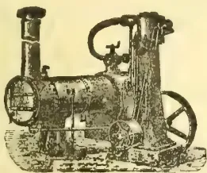
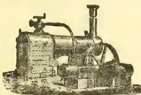
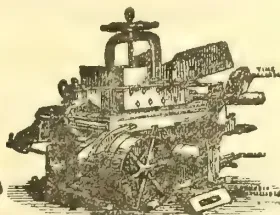
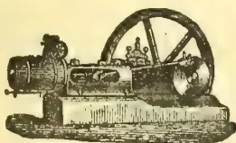
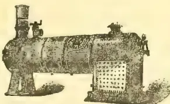
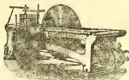

**WE** have pleasure in intimating to Tea Planters and others that we have made arrangements with our Agents,

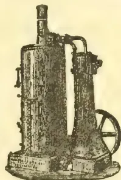

MESSRS.  
**JOHN WALKER**  
& Co.  
*Colombo, Ceylon,*

to hold a stock of our Machines, so as to ensure  
**PROMPT DELIVERY.**

ORDERS PLACED WITH OUR AGENTS WILL THEREFORE BE PROMPTLY EXECUTED  
AND ON FAVOURABLE TERMS.

**MARSHALL, SONS & Co., LT.,**

**W. & J. JACKSON,**

w-74 88

**GAINSBOROUGH, ENGLAND.**

**CEYLON IN 1837-46 AND  
1847-60.**

**TWO LECTURES**

DELIVERED AT THE

Cinnamon Gardens Baptist Church,

BY

A. M. FERGUSON, ESQ., C.M.G.

of the "Ceylon Observer," &c.

[Delivered in aid of the effort made to clear off the debt on the building, to the improvement of which the proceeds sale of this pamphlet will be devoted.]

Price:—R1; postage 2s. each.

**MESSRS. G. STREET & CO.**

**H**AVE the pleasure to announce that they are now preparing a new Edition of their  
**ILLUSTRATED PRICE LIST**

OF

**MACHINERY, PRINTING PAPERS, INK, &c.,**  
which will contain drawings and prices of the latest and most improved Machinery and best quotations for paper, ink and other requirements of the printing office.

Messrs. G. STREET & Co. hope to forward a Copy of this list by an early mail, and meantime assure their clients that any indents entrusted to their hands will receive careful attention, guided by long experience in the selection of the abovenamed articles.

Agents for the **TROPICAL AGRICULTURIST.**

11------------------------------------------------

viiiADVERTISEMENTS.

---

## BROWN'S DESICCATOR.

---

(SECURED UNDER HER MAJESTY'S ROYAL LETTERS PATENT IN ENGLAND,  
INDIA AND CEYLON.)

---

The above Tea Drier has been thoroughly tested and its capabilities ascertained from practical working on Tea Estates in Ceylon, extending over a period of more than twelve months.

The method of drying may be briefly explained as follows :—

Hot air from the furnace is drawn by an exhaust fan through the drying chamber in such a manner that the Tea Leaf, in undergoing the process of drying, is repeatedly subjected to a through current of heated air from alternate sides.

By this means the leaf is exposed to the hot air current as effectively as if hand or mechanical turning were employed.

The principles involved, both as to the heating of the air and the desiccating of the material, are highly economical, while there are no complications or troublesome mechanical movements employed.

The Drier will be found to be fully equal to maintaining an output of 80 lb. made Tea per *hour* on a consumption of from 60 to 70 lb. of wood fuel.

Many of the most practical Tea Planters in Ceylon express themselves to be highly pleased with it, and the machine is being freely adopted, upwards of seventy being now in use.

Further particulars may be ascertained from the undersigned, Agents for the Patentee,

COLOMBO COMMERCIAL Co., LIMITED,

COLOMBO.

MESSRS. GILLANDERS, ARBUTHNOT & Co.,

CALCUTTA.

12------------------------------------------------

[Vol. VII. containing Numbers I. to XII: July 1887 to June 1888.]

"Step after step the ladder is ascended."—GEORGE HERBERT, *Jacula Prudentum*.

THE  
TROPICAL AGRICULTURIST:  
A  
MONTHLY RECORD OF INFORMATION  
FOR  
PLANTERS  
OF  
Tea, Coffee, Cacao, Cinchona, Sugar, Rubber, Tobacco, Palms, Spices, Rice,  
AND OTHER PRODUCTS,  
SUITED FOR CULTIVATION IN THE TROPICS,  
[ISSUED ON OR ABOUT THE 1ST OF EACH MONTH.]

COMPILED BY

A. M. & J. FERGUSON,

of the "Ceylon Observer," &c.

"It is both the duty and interest of every owner and cultivator of the soil to study the best means of rendering that soil subservient to his own and the general wants of the community; and he who introduces, beneficially, a new and useful Seed, Plant, or Shrub into his district, is a blessing and an honour to his country."—SIR J. SINCLAIRE.

A. M. & J. FERGUSON: COLOMBO, CEYLON.

The "TROPICAL AGRICULTURIST" can be obtained from, or advertisements for it sent to, the following agents:—

*London:* Messrs. TRÜBNER & Co., 57 & 59, Ludgate Hill; JOHN HADDON & Co., 3, Bouverie St., Fleet St.; GEO. STREET & Co., 30, Coruhill; F. ALGAR, 11 and 12, Clement's Lane, Lombard St.; BATES, HENDY & Co., 37, Walbrook; COWIE & Co., 17, Gresham St.; GORDON & GOTCH, St. Bride St., Ludgate Circus; CLARK, SON & PLATT, 85, Gracechurch St.; W. H. SMITH & Co., Strand; S. DEACON & Co., 150, Leadenhall St.; T. CHRISTY & Co., 155, Fenchurch St. *Manchester:* PICKLES & BROWNE, 25, Cathedral Yard.—*Liverpool:* CHAS. BIRCHALL, 32, Castle Street.—*Glasgow:* W. & R. MACPHUN.—*Edinburgh:* W. & A. K. JOHNSTON.—*Dundee:* SINCLAIR & DAWSON, "The Corner."—*Aberdeen:* W. WESTLAND, 53, Nicholas Street.—*Paris:* AGENCE HAVAS.—*Madras:* ADDISON & Co.—*Nilgiri and Wynad Districts:* A. PRIMROSE, Mercara, Coorg.—*Calcutta:* THACKER, SPINK & Co.—*Bombay:* THACKER & Co., LTD.—*Rangoon:* WATSON & SKEEN.—*Pinang:* BLAZE, REIDEI & Co.—*Singapore:* J. LITTLE & Co. and the SINGAPORE AND STRAITS PRINTING OFFICE.—*Batavia:* JOHN PRYCE & Co. and G. KOLFF & Co.—*Surabaya:* THOS. O. WILSON & Co.—*Samarang:* MANUAL & Co.—*Saiyon:* FLEITH & LAPLACE.—*Hongkong:* KELLY & Co.—*Shanghai:* CHINA AND JAPAN TRADING COMPANY.—*Natal:* ROBINSON & VAUSE, Durban.—*Mauritius:* C. W. HALL, Port Louis.—*Melbourne, Sydney and Brisbane:* GORDON & GOTCH.—*Sydney:* WM. MADDOCK.—*Adelaide:* CAWTHORN & Co.—*Northern Queensland:* W. HOPKINS, Rockhampton.—*Perth, W. Australia:* STIRLING & SONS.—*New South Wales and Queensland:* JAMES INGLIS & Co.—*New Zealand:* COLONIAL NEWS AGENCY, Napier.—*Fiji:* ARTHUR STEPHENS.—*West Indies:* W. SABONADIERE, Blue Mountains, Jamaica and C. H. CALDERON, St. Thomas.—*British Guiana:* "ROYAL GAZETTE" OFFICE.—*Brazil, Rio de Janeiro:* LOMBAERTS & Co., 7, Rua dos Ourives; A. J. LAMOURFUX, "Rio News" Office.—*Central America:* JAMES BOYD, Panama.—*United States:* S. M. PETTINGILL & Co., 263, Broadway, New York.

MDCCCLXXXVIII.

13------------------------------------------------

<!-- stage4: FAINT old-images-only -->

[Faint page: no legible print of its own could be verified; text withheld (stage 4 review list)]

14------------------------------------------------

## TO OUR READERS.

---

In closing the Seventh Volume of the "**Tropical Agriculturist**," we have but to repeat what we have said on similar previous occasions, in directing attention to the large amount of useful information afforded, and to the great variety of topics treated in our pages. From month to month, we have endeavoured to lay before our readers the latest results of practical experience and scientific teaching in all that concerns tropical agriculture; and our ambition has been to make this periodical not only indispensable to the planter, but of service to business men and capitalists, never forgetting that agriculture trenches upon every department of human knowledge, besides being the basis of personal and communal wealth.

While directing our attention chiefly to the products prominently mentioned on our title-page, we have never omitted to notice minor industries likely to fit in with sub-tropical conditions; and our readers have an ample guarantee in the pages before them, that, in the future, no pains will be spared to bring together all available information both from the West and East, the same being examined in the light of the teachings of commonsense as well as of prolonged tropical experience in this, the leading Crown and Planting Colony of the British Empire.

The official Reports on the Royal Botanic and Economic Gardens in Ceylon are republished in full in the present volume, and throughout our pages will be found reviews of, and extracts from, the Reports of other Botanic Gardens situated in or near the tropics. We are ready to give copious extracts from, if not to reprint *in extenso*, the Reports of all other sub-tropical Public Botanic Gardens which may reach us. Most of these Reports we already receive and utilize as abovementioned for the benefit of our planting readers.

A full and accurate Index affords the means of ready reference to every subject treated in this, the seventh volume, which we now place in our subscribers' hands, in full confidence that it will be received with an amount of approval, at least equal to that which has been so kindly extended to its predecessors.

We are convinced that no more suitable or useful gift can be made to the tropical planter or agriculturist, whether he be about to enter on his career, or with many years of experience behind him, than the half-dozen volumes of our periodical which we have now made available. They are full of information bearing on every department and relating to nearly every product within the scope of sub-tropical industry.

In conclusion, we have to tender our thanks to readers and contributors, and our wish that all friends may continue to write instructively and to read with approval; for then, indeed, must the "**Tropical Agriculturist**" continue to do well.

A. M. & J. FERGUSON.

COLOMBO, CEYLON: 18th June 1888.

15------------------------------------------------

<!-- stage4: SHOWTHROUGH tess-mirror:81/5/rot2 -->

16------------------------------------------------

# INDEX.

<table style="width: 100%; border-collapse: collapse;">
<thead>
<tr>
<th style="text-align: left; width: 80%;"></th>
<th style="text-align: right; width: 20%;">PAGE</th>
</tr>
</thead>
<tbody>
<tr>
<td><b>A</b></td>
<td></td>
</tr>
<tr>
<td>Abyssinian Economic Plants</td>
<td style="text-align: right;">431</td>
</tr>
<tr>
<td>Acacias</td>
<td style="text-align: right;">352, 649, 676,</td>
</tr>
<tr>
<td>Adiantum Fergusonii</td>
<td style="text-align: right;">383, 411, 592, 824</td>
</tr>
<tr>
<td>Adulteration of Coffee...</td>
<td style="text-align: right;">[See Coffee]</td>
</tr>
<tr>
<td>    — of Tea</td>
<td style="text-align: right;">[See Tea]</td>
</tr>
<tr>
<td>Africa, Central, Planting in</td>
<td style="text-align: right;">157</td>
</tr>
<tr>
<td>    —, Coffee Cultivation in</td>
<td style="text-align: right;">[See Coffee]</td>
</tr>
<tr>
<td>    —, Fruits in</td>
<td style="text-align: right;">140, 479</td>
</tr>
<tr>
<td>Agricultural and Horticultural Societies</td>
<td style="text-align: right;">65, 271, 417, 481, 636, 854</td>
</tr>
<tr>
<td>    — Chemistry</td>
<td style="text-align: right;">[See Chemistry]</td>
</tr>
<tr>
<td>    — Companies</td>
<td style="text-align: right;">60, 691</td>
</tr>
<tr>
<td>    — School, Ceylon</td>
<td style="text-align: right;">139, 190, 192, 197, 198, 490, 505, 583</td>
</tr>
<tr>
<td>    — Students, Ceylonese</td>
<td style="text-align: right;">139, 190, 192, 197, 198, 490, 505, 583</td>
</tr>
<tr>
<td><b>Agriculture</b></td>
<td style="text-align: right;">177, 403, 516, 573, 680, 748</td>
</tr>
<tr>
<td>    — and Insects</td>
<td style="text-align: right;">109, 371</td>
</tr>
<tr>
<td>    —, Experiments in</td>
<td style="text-align: right;">401</td>
</tr>
<tr>
<td>    — for Natives...</td>
<td style="text-align: right;">18</td>
</tr>
<tr>
<td>    — in America</td>
<td style="text-align: right;">112, 161, 162, 546, 672, 744</td>
</tr>
<tr>
<td>    — in Australia</td>
<td style="text-align: right;">751</td>
</tr>
<tr>
<td>    — in Borneo</td>
<td style="text-align: right;">225, 367, 608, 610, 661, 741, 832</td>
</tr>
<tr>
<td>    — in Burma</td>
<td style="text-align: right;">331, 689, 856</td>
</tr>
<tr>
<td>    — in Ceylon</td>
<td style="text-align: right;">425, 759</td>
</tr>
<tr>
<td>    — in Coorg</td>
<td style="text-align: right;">[See Coorg]</td>
</tr>
<tr>
<td>    — in Europe</td>
<td style="text-align: right;">14, 107, 157, 204, 299, 350, 402, 423, 483, 516, 634, 731, 850</td>
</tr>
<tr>
<td>    — in India</td>
<td style="text-align: right;">353, 850, 852</td>
</tr>
<tr>
<td>    — in Japan</td>
<td style="text-align: right;">647</td>
</tr>
<tr>
<td>    — in Java</td>
<td style="text-align: right;">[See Java]</td>
</tr>
<tr>
<td>    — in Johore</td>
<td style="text-align: right;">105, 587</td>
</tr>
<tr>
<td>    — in Mauritius</td>
<td style="text-align: right;">2 3, 487, 656, 752</td>
</tr>
<tr>
<td>    — in Netherlands India</td>
<td style="text-align: right;">[See Netherlands India]</td>
</tr>
<tr>
<td>    — in Straits Settlements</td>
<td style="text-align: right;">[See Straits Settlements, Planting in]</td>
</tr>
<tr>
<td><i>Agriculturist, Tropical</i></td>
<td style="text-align: right;">[See <i>Tropical Agriculturist</i>]</td>
</tr>
<tr>
<td>Agri-Horticultural Society of India</td>
<td style="text-align: right;">65</td>
</tr>
<tr>
<td>Alluvial Soils</td>
<td style="text-align: right;">[See Soils]</td>
</tr>
<tr>
<td>Aloe Cultivation</td>
<td style="text-align: right;">664</td>
</tr>
<tr>
<td>Aloes, Market Rates for</td>
<td style="text-align: right;">72, 144, 216, 288, 360, 432, 504, 648, 720, 792, 864</td>
</tr>
<tr>
<td>America, Agriculture in</td>
<td style="text-align: right;">[See Agriculture]</td>
</tr>
<tr>
<td>    —, Cinchona Cultivation in</td>
<td style="text-align: right;">[See Cinchona]</td>
</tr>
<tr>
<td>    —, Coca Cultivation in</td>
<td style="text-align: right;">[See Coca]</td>
</tr>
<tr>
<td>    —, Coffee in</td>
<td style="text-align: right;">[See Coffee]</td>
</tr>
<tr>
<td>    —, Fruit Cultivation in</td>
<td style="text-align: right;">94, 315</td>
</tr>
<tr>
<td>    —, Indiarubber in</td>
<td style="text-align: right;">[See Indiarubber]</td>
</tr>
<tr>
<td>    —, Quinine in</td>
<td style="text-align: right;">825</td>
</tr>
<tr>
<td>Ammoniacum, Gum, Market Rates for</td>
<td style="text-align: right;">72, 144, 216, 288, 360, 432, 504, 648, 720, 792, 864</td>
</tr>
<tr>
<td>Amsterdam Quinine Works</td>
<td style="text-align: right;">87, 368</td>
</tr>
<tr>
<td>Analysis of Produce</td>
<td style="text-align: right;">497</td>
</tr>
<tr>
<td>Anatto</td>
<td style="text-align: right;">177, 259, 342, 456, 531, 611, 686, 712, 750, 861, 863</td>
</tr>
<tr>
<td>Andropogon Schcananthus</td>
<td style="text-align: right;">203, 223</td>
</tr>
<tr>
<td>Auimi, Gum, Market Rates for</td>
<td style="text-align: right;">72, 144, 216, 288, 360, 432, 504, 648, 720, 792, 864</td>
</tr>
<tr>
<td>Auiseed Cultivation</td>
<td style="text-align: right;">223</td>
</tr>
</tbody>
</table>

<table style="width: 100%; border-collapse: collapse;">
<thead>
<tr>
<th style="text-align: left; width: 80%;"></th>
<th style="text-align: right; width: 20%;">PAGE</th>
</tr>
</thead>
<tbody>
<tr>
<td>Anise Oil</td>
<td style="text-align: right;">391</td>
</tr>
<tr>
<td>Antigua</td>
<td style="text-align: right;">161</td>
</tr>
<tr>
<td>Ants on Trees</td>
<td style="text-align: right;">719, 765</td>
</tr>
<tr>
<td>    —, Remedies for</td>
<td style="text-align: right;">450, 478</td>
</tr>
<tr>
<td>    —, White</td>
<td style="text-align: right;">[See White Ants]</td>
</tr>
<tr>
<td>Anuradhapura Gardens, Ceylon</td>
<td style="text-align: right;">[Sup.]</td>
</tr>
<tr>
<td>Apples, Properties of</td>
<td style="text-align: right;">279</td>
</tr>
<tr>
<td>Arabic, Gum, Market Rates for</td>
<td style="text-align: right;">72, 144, 216, 288, 360, 432, 504, 648, 720, 792, 864</td>
</tr>
<tr>
<td>Arabian Coffee</td>
<td style="text-align: right;">34, 293, 672</td>
</tr>
<tr>
<td>Araucaria Cookii</td>
<td style="text-align: right;">65</td>
</tr>
<tr>
<td>Areca-nut Cultivation</td>
<td style="text-align: right;">270, 343, 406</td>
</tr>
<tr>
<td>    — Market</td>
<td style="text-align: right;">686, 712, 861</td>
</tr>
<tr>
<td>Arekane</td>
<td style="text-align: right;">235</td>
</tr>
<tr>
<td>Arracacha Cultivation</td>
<td style="text-align: right;">255</td>
</tr>
<tr>
<td>Arrowroot, Growth of</td>
<td style="text-align: right;">450, 526, 622, 832, 833</td>
</tr>
<tr>
<td>    —, Market Rates for</td>
<td style="text-align: right;">72, 144, 216, 222, 288, 360, 432, 504, 648, 720, 792, 864</td>
</tr>
<tr>
<td>Arsenic in Agriculture and Destroying Insects</td>
<td style="text-align: right;">353</td>
</tr>
<tr>
<td>Artesian Wells</td>
<td style="text-align: right;">68</td>
</tr>
<tr>
<td>Artificial Manures</td>
<td style="text-align: right;">[See Manures]</td>
</tr>
<tr>
<td>Ashes as a Fertilizer</td>
<td style="text-align: right;">[See Manures]</td>
</tr>
<tr>
<td>Asparagus, New</td>
<td style="text-align: right;">39</td>
</tr>
<tr>
<td>Asphalt Pavements</td>
<td style="text-align: right;">388</td>
</tr>
<tr>
<td>Assafcetida, Market Rates for</td>
<td style="text-align: right;">72, 144, 216, 288, 360, 432, 504, 648, 720, 792, 864</td>
</tr>
<tr>
<td>Assam, Planting in</td>
<td style="text-align: right;">624</td>
</tr>
<tr>
<td>    —, Tea Company</td>
<td style="text-align: right;">115</td>
</tr>
<tr>
<td>    —, Tea Cultivation in</td>
<td style="text-align: right;">[See Tea]</td>
</tr>
<tr>
<td>Australia, Agriculture in</td>
<td style="text-align: right;">[See Agriculture]</td>
</tr>
<tr>
<td>    —, Coffee Cultivation in</td>
<td style="text-align: right;">[See Coffee]</td>
</tr>
<tr>
<td>    —, Eucalyptus in</td>
<td style="text-align: right;">730</td>
</tr>
<tr>
<td>    —, Geology of</td>
<td style="text-align: right;">806</td>
</tr>
<tr>
<td>    —, Northern Territory of</td>
<td style="text-align: right;">119</td>
</tr>
<tr>
<td>    —, Pearl Fishing in</td>
<td style="text-align: right;">703</td>
</tr>
<tr>
<td>    —, Planting in</td>
<td style="text-align: right;">751</td>
</tr>
<tr>
<td>    —, Sugar Cultivation in</td>
<td style="text-align: right;">[See Sugar]</td>
</tr>
<tr>
<td>    —, Western</td>
<td style="text-align: right;">26</td>
</tr>
<tr>
<td>Australian Blue Gums...</td>
<td style="text-align: right;">730</td>
</tr>
<tr>
<td>    — Timber</td>
<td style="text-align: right;">[See Timber]</td>
</tr>
<tr>
<td>Avenue Trees</td>
<td style="text-align: right;">855</td>
</tr>
<tr>
<td><b>B</b></td>
<td></td>
</tr>
<tr>
<td>Badulla Botanic Gardens, Ceylon</td>
<td style="text-align: right;">[Sup.]</td>
</tr>
<tr>
<td>Bael Fruit</td>
<td style="text-align: right;">143, 176, 271, 531, 611</td>
</tr>
<tr>
<td>Bahamas at the Colind Exhibition</td>
<td style="text-align: right;">[See Exhibition]</td>
</tr>
<tr>
<td>Balata Gum Industry</td>
<td style="text-align: right;">443</td>
</tr>
<tr>
<td>Ballad of the Tea Picker</td>
<td style="text-align: right;">836</td>
</tr>
<tr>
<td>Bananas</td>
<td style="text-align: right;">56, 373, 544, 669</td>
</tr>
<tr>
<td>Barbados</td>
<td style="text-align: right;">162</td>
</tr>
<tr>
<td>    — at the Colund Exhibition</td>
<td style="text-align: right;">[See Exhibition]</td>
</tr>
<tr>
<td>Barilla from Soda Plants</td>
<td style="text-align: right;">787</td>
</tr>
<tr>
<td>Barks as Dyes</td>
<td style="text-align: right;">551</td>
</tr>
<tr>
<td>Bark</td>
<td style="text-align: right;">[See Cinchona]</td>
</tr>
<tr>
<td>Barley</td>
<td style="text-align: right;">56, 75, 149, 701, Sup.</td>
</tr>
<tr>
<td>Bats' Dung...</td>
<td style="text-align: right;">[See Manure]</td>
</tr>
<tr>
<td>Bauhinia Variegata</td>
<td style="text-align: right;">406</td>
</tr>
<tr>
<td>Bean, Cedron</td>
<td style="text-align: right;">228</td>
</tr>
<tr>
<td>    —, Tuberculous-Rooted</td>
<td style="text-align: right;">[Sup.]</td>
</tr>
</tbody>
</table>

17------------------------------------------------

# INDEX.

<table border="0" style="width: 100%; border-collapse: collapse;">
<thead>
<tr>
<th style="text-align: left;"></th>
<th style="text-align: right;">PAGE</th>
<th style="text-align: left;"></th>
<th style="text-align: right;">PAGE.</th>
</tr>
</thead>
<tbody>
<tr>
<td>Beans, Tonquin</td>
<td style="text-align: right;">134</td>
<td>Cananga Oil</td>
<td style="text-align: right;">391</td>
</tr>
<tr>
<td>Beche-de-Mer</td>
<td style="text-align: right;">665</td>
<td>    Tree</td>
<td style="text-align: right;">406</td>
</tr>
<tr>
<td>Beeswax, Market Rates for</td>
<td style="text-align: right;">72, 144, 216, 288, 360, 432, 456, 504, 648, 720, 792, 864</td>
<td>Canary Islands Cochineal</td>
<td style="text-align: right;">200</td>
</tr>
<tr>
<td>Beetles as Enemies of Coconuts</td>
<td style="text-align: right;">[See Coconuts]</td>
<td>    Industrial Plants in</td>
<td style="text-align: right;">352</td>
</tr>
<tr>
<td>    Yellow-Eyed</td>
<td style="text-align: right;">182</td>
<td>Cankering of Fruit Trees</td>
<td style="text-align: right;">292, 351, 445</td>
</tr>
<tr>
<td>Betel Leaves</td>
<td style="text-align: right;">270, 659</td>
<td>Caoutchouc</td>
<td style="text-align: right;">[See Indiarubber]</td>
</tr>
<tr>
<td>    Oil</td>
<td style="text-align: right;">349, 392, 524</td>
<td>    Yielding Plants, Cultivation of</td>
<td style="text-align: right;">106, 130, 155</td>
</tr>
<tr>
<td>    Vine</td>
<td style="text-align: right;">417</td>
<td>Carbolic Soap as an Insecticide</td>
<td style="text-align: right;">215</td>
</tr>
<tr>
<td>Birdsnests, Edible</td>
<td style="text-align: right;">773</td>
<td>Cardamom Cultivation</td>
<td style="text-align: right;">55, 343, 580, 627</td>
</tr>
<tr>
<td>Blackberry Culture</td>
<td style="text-align: right;">816, Sup.</td>
<td>    in India</td>
<td style="text-align: right;">244</td>
</tr>
<tr>
<td>Blanc Mange, Rice</td>
<td style="text-align: right;">224</td>
<td>Cardamom Exports</td>
<td style="text-align: right;">183</td>
</tr>
<tr>
<td>Blue Gum</td>
<td style="text-align: right;">[See Eucalyptus]</td>
<td>    Market</td>
<td style="text-align: right;">608, 611</td>
</tr>
<tr>
<td>Boilers, Care of</td>
<td style="text-align: right;">49</td>
<td>    Oil</td>
<td style="text-align: right;">391</td>
</tr>
<tr>
<td>Bombax Malabaricum</td>
<td style="text-align: right;">142</td>
<td>    Pruning</td>
<td style="text-align: right;">217</td>
</tr>
<tr>
<td>Bonedust as Manure</td>
<td style="text-align: right;">[See Manures]</td>
<td>Cardamoms, Market Rates for</td>
<td style="text-align: right;">72, 144, 216, 288, 360, 432, 504, 648, 720, 792, 864</td>
</tr>
<tr>
<td>Bones, Analysis of</td>
<td style="text-align: right;">809</td>
<td>Carludovica Palmata</td>
<td style="text-align: right;">354</td>
</tr>
<tr>
<td>Borax</td>
<td style="text-align: right;">515</td>
<td>Cassia Fistula</td>
<td style="text-align: right;">65, 406</td>
</tr>
<tr>
<td>Borers, a Remedy for</td>
<td style="text-align: right;">521</td>
<td>    Lignea</td>
<td style="text-align: right;">204, 271</td>
</tr>
<tr>
<td>Borneo, British, Company</td>
<td style="text-align: right;">610</td>
<td>Castor Cake</td>
<td style="text-align: right;">871</td>
</tr>
<tr>
<td>    Camphor in</td>
<td style="text-align: right;">344</td>
<td>    Oil, Market Rates for</td>
<td style="text-align: right;">72, 144, 216, 288, 360, 432, 504, 648, 720, 792, 864</td>
</tr>
<tr>
<td>    North</td>
<td style="text-align: right;">61, 268, 344, 367, 766, 794, 808, 847</td>
<td>    Plant</td>
<td style="text-align: right;">16, 315</td>
</tr>
<tr>
<td>    Planting in</td>
<td style="text-align: right;">225, 367, 608, 610, 661, 741, 832</td>
<td>Cast Iron, How to Tin</td>
<td style="text-align: right;">110</td>
</tr>
<tr>
<td>Botanic Gardens, Bangalore</td>
<td style="text-align: right;">615</td>
<td>Casuarina</td>
<td style="text-align: right;">406, 556</td>
</tr>
<tr>
<td>    Calcutta</td>
<td style="text-align: right;">150, 274, 691, 762</td>
<td>Caterpillars</td>
<td style="text-align: right;">339</td>
</tr>
<tr>
<td>    Cape Town</td>
<td style="text-align: right;">134</td>
<td>Catha Edulis</td>
<td style="text-align: right;">317</td>
</tr>
<tr>
<td>    Ceylon</td>
<td style="text-align: right;">520, Sup.</td>
<td>Cattle Food</td>
<td style="text-align: right;">430</td>
</tr>
<tr>
<td>    Jamaica</td>
<td style="text-align: right;">349, 620, 744, 833</td>
<td>Caryocar Nuciferum</td>
<td style="text-align: right;">406</td>
</tr>
<tr>
<td>    Kew</td>
<td style="text-align: right;">49</td>
<td>Cedarwood Oil</td>
<td style="text-align: right;">391</td>
</tr>
<tr>
<td>    Nilgiris</td>
<td style="text-align: right;">463</td>
<td>Cedrela Sinensis</td>
<td style="text-align: right;">96</td>
</tr>
<tr>
<td>    Saharanpur</td>
<td style="text-align: right;">729</td>
<td>Celtic Nard Oil</td>
<td style="text-align: right;">392</td>
</tr>
<tr>
<td>Botany, Economic: Training for Intending</td>
<td style="text-align: right;">7</td>
<td>Cement</td>
<td style="text-align: right;">179, 187, 718</td>
</tr>
<tr>
<td>    Planters</td>
<td style="text-align: right;">7</td>
<td>Central Africa, Planting in</td>
<td style="text-align: right;">[See Africa]</td>
</tr>
<tr>
<td>Bouquets</td>
<td style="text-align: right;">715</td>
<td>Ceropogia Pusilla</td>
<td style="text-align: right;">407</td>
</tr>
<tr>
<td>Boxwood, Substitute for</td>
<td style="text-align: right;">636</td>
<td>Ceylon, Agriculture in</td>
<td style="text-align: right;">[See Agriculture]</td>
</tr>
<tr>
<td>Brazil, Cacao Cultivation in</td>
<td style="text-align: right;">[See Cacao]</td>
<td>    Agricultural School</td>
<td style="text-align: right;">139, 190, 192, 197, 198, 490, 505, 583</td>
</tr>
<tr>
<td>    Cinchona Cultivation in</td>
<td style="text-align: right;">[See Cinchona]</td>
<td>    at the Colonial and Indian Exhibition</td>
<td style="text-align: right;">28</td>
</tr>
<tr>
<td>    Coffee Cultivation in</td>
<td style="text-align: right;">[See Coffee]</td>
<td>    at the Glasgow Exhibition</td>
<td style="text-align: right;">493</td>
</tr>
<tr>
<td>    Financial Crisis in</td>
<td style="text-align: right;">301</td>
<td>    Botanic Gardens</td>
<td style="text-align: right;">[See Botanic Gardens]</td>
</tr>
<tr>
<td>    Huge Coffee Tree in</td>
<td style="text-align: right;">187</td>
<td>    Cacao Cultivation in</td>
<td style="text-align: right;">[See Cacao]</td>
</tr>
<tr>
<td>    Labor in</td>
<td style="text-align: right;">253, 266, 617</td>
<td>    Central Province of</td>
<td style="text-align: right;">34</td>
</tr>
<tr>
<td>    Nuts</td>
<td style="text-align: right;">134, 250, 782, Sup.</td>
<td>    Cinchona Cultivation in</td>
<td style="text-align: right;">[See Cinchona]</td>
</tr>
<tr>
<td>    Planting in</td>
<td style="text-align: right;">263</td>
<td>    Cocoa</td>
<td style="text-align: right;">34, 55</td>
</tr>
<tr>
<td>    Railways in</td>
<td style="text-align: right;">301</td>
<td>    Milk Butter and Poultry in</td>
<td style="text-align: right;">111</td>
</tr>
<tr>
<td>    Rubber in</td>
<td style="text-align: right;">[See Indiarubber]</td>
<td>    Estate Companies for</td>
<td style="text-align: right;">527</td>
</tr>
<tr>
<td>    Slavery in</td>
<td style="text-align: right;">253, 266, 301, 579, 567, 617, 652, 681, 717</td>
<td>    Exports, Distribution of</td>
<td style="text-align: right;">215, 287, 359, 431, 503, 576, 647, 719, 791</td>
</tr>
<tr>
<td>    Sugar Cultivation in</td>
<td style="text-align: right;">301, 652, 681</td>
<td>    Fish in</td>
<td style="text-align: right;">[See Fish]</td>
</tr>
<tr>
<td>Breadfruit</td>
<td style="text-align: right;">441, 854</td>
<td>    Gems in</td>
<td style="text-align: right;">606</td>
</tr>
<tr>
<td>British Guiana, Minor Industries for</td>
<td style="text-align: right;">730</td>
<td>    Gold in</td>
<td style="text-align: right;">606, 748, 778, 794, 795, 800, 802, 804, 827, 831, 842, 847, 857, 862</td>
</tr>
<tr>
<td>Bug</td>
<td style="text-align: right;">[See Coffee Bug]</td>
<td>    Government Gardens</td>
<td style="text-align: right;">785</td>
</tr>
<tr>
<td>Burma, Planting in</td>
<td style="text-align: right;">331, 689, 856</td>
<td>    Irrigation in</td>
<td style="text-align: right;">[See Irrigation]</td>
</tr>
<tr>
<td>    Rice Cultivation in</td>
<td style="text-align: right;">[See Rice]</td>
<td>    Land and Produce Company</td>
<td style="text-align: right;">581</td>
</tr>
<tr>
<td>Butter Making</td>
<td style="text-align: right;">517</td>
<td>    Metals in</td>
<td style="text-align: right;">[See Minerals]</td>
</tr>
<tr>
<td></td>
<td></td>
<td>Ceylon, Minerals in</td>
<td style="text-align: right;">111</td>
</tr>
<tr>
<td style="text-align: center;"><b>C.</b></td>
<td></td>
<td>    Native Industry in</td>
<td style="text-align: right;">4</td>
</tr>
<tr>
<td>Cacao Cultivation in Brazil</td>
<td style="text-align: right;">7</td>
<td>    Orchids</td>
<td style="text-align: right;">22, 39, 55, 74, 103, 117, 137, 15, 170, 211, 217, 235, 280, 308, 336, 385, 425, 459, 465, 477, 489, 490, 505, 529, 532, 565, 566, 583, 606, 607, 619, 627, 633, 723, 738, 759, 767, 801, 846</td>
</tr>
<tr>
<td>    in Ceylon</td>
<td style="text-align: right;">34, 56, 137, 293, 425, 529, 627, 639, 640, 717, 723, 767, 801, Sup.</td>
<td>    Rainfall in</td>
<td style="text-align: right;">759, 767</td>
</tr>
<tr>
<td>    in West Indies</td>
<td style="text-align: right;">89</td>
<td>    Spinning and Weaving Company</td>
<td style="text-align: right;">721, 769</td>
</tr>
<tr>
<td>Cacao, Dadap as Shade for</td>
<td style="text-align: right;">137</td>
<td>    Tea Seasons</td>
<td style="text-align: right;">[See Tea]</td>
</tr>
<tr>
<td>    Enemies of</td>
<td style="text-align: right;">88, 137, 639</td>
<td>    Visit to the Hills of</td>
<td style="text-align: right;">625</td>
</tr>
<tr>
<td>    Husks</td>
<td style="text-align: right;">104</td>
<td>Chaulmoogra</td>
<td style="text-align: right;">269</td>
</tr>
<tr>
<td>    Leaves</td>
<td style="text-align: right;">240, 296</td>
<td>Charcoal</td>
<td style="text-align: right;">660</td>
</tr>
<tr>
<td>    Preparation of</td>
<td style="text-align: right;">384</td>
<td>Chemical Discovery, Important</td>
<td style="text-align: right;">185</td>
</tr>
<tr>
<td>    Prospects</td>
<td style="text-align: right;">217</td>
<td>Chemistry, Agricultural</td>
<td style="text-align: right;">18, 516, 587</td>
</tr>
<tr>
<td>    Trade</td>
<td style="text-align: right;">[See Cocoa]</td>
<td>    of Tea</td>
<td style="text-align: right;">500</td>
</tr>
<tr>
<td>Cacti</td>
<td style="text-align: right;">854</td>
<td>Cherimoyer</td>
<td style="text-align: right;">257, Sup.</td>
</tr>
<tr>
<td>Cactus Hedges</td>
<td style="text-align: right;">232</td>
<td>Cherry in Ceylon</td>
<td style="text-align: right;">607</td>
</tr>
<tr>
<td>Caffeine</td>
<td style="text-align: right;">64, 365</td>
<td>Chicory Replacing Coffee</td>
<td style="text-align: right;">139</td>
</tr>
<tr>
<td>Cajuput</td>
<td style="text-align: right;">203, 269, 689</td>
<td>Chillies, Market Rates for</td>
<td style="text-align: right;">72, 144, 216, 288, 360, 432, 504, 648, 720, 792, 864</td>
</tr>
<tr>
<td>Caladium Esculentum</td>
<td style="text-align: right;">224</td>
<td>China Grass</td>
<td style="text-align: right;">[See Rhea]</td>
</tr>
<tr>
<td>Calcutta Botanic Gardens</td>
<td style="text-align: right;">150, 274, 691, 762</td>
<td>China, Tea Cultivation in</td>
<td style="text-align: right;">[See Tea]</td>
</tr>
<tr>
<td>California</td>
<td style="text-align: right;">573</td>
<td>China, Tea Exports</td>
<td style="text-align: right;">11, 239, 263, 457, 480, 739, 843</td>
</tr>
<tr>
<td>Calumba Root, Market Rates for</td>
<td style="text-align: right;">72, 144, 216, 288, 360, 432, 504, 648, 686, 712, 720, 792, 864</td>
<td>Chocho</td>
<td style="text-align: right;">254, 544, 630, 639, Sup.</td>
</tr>
<tr>
<td>Camphor in Borneo</td>
<td style="text-align: right;">344</td>
<td></td>
<td></td>
</tr>
<tr>
<td>    in China</td>
<td style="text-align: right;">208</td>
<td></td>
<td></td>
</tr>
<tr>
<td>    Oil</td>
<td style="text-align: right;">391</td>
<td></td>
<td></td>
</tr>
<tr>
<td>    Trade in Formosa</td>
<td style="text-align: right;">32, 71, 260</td>
<td></td>
<td></td>
</tr>
<tr>
<td>Canada at the Colind Exhibition</td>
<td style="text-align: right;">[See Exhibitio]</td>
<td></td>
<td></td>
</tr>
</tbody>
</table>

18------------------------------------------------

# INDEX.

<table border="0" style="width: 100%; border-collapse: collapse;">
<thead>
<tr>
<th style="text-align: left;"></th>
<th style="text-align: right;">PAGE.</th>
<th style="text-align: left;"></th>
<th style="text-align: right;">PAGE.</th>
</tr>
</thead>
<tbody>
<tr>
<td>Chocolate ...</td>
<td style="text-align: right;">56, 854</td>
<td>Coconut Cultivation in New Guinea ...</td>
<td style="text-align: right;">88</td>
</tr>
<tr>
<td>    Manufacture in Germany ...</td>
<td style="text-align: right;">387</td>
<td>    Enemies of ...</td>
<td style="text-align: right;">247, 548, 620</td>
</tr>
<tr>
<td>Chrysanthemums ...</td>
<td style="text-align: right;">133</td>
<td>    Oil... ..</td>
<td style="text-align: right;">312, 387</td>
</tr>
<tr>
<td>Cigars ...</td>
<td style="text-align: right;">509</td>
<td>    Pearls ...</td>
<td style="text-align: right;">102, 312</td>
</tr>
<tr>
<td>Cinchona Alkaloids ...</td>
<td style="text-align: right;">407, 448, 781</td>
<td>    Poonac ...</td>
<td style="text-align: right;">817</td>
</tr>
<tr>
<td>    Bark and Bark Analyses 97, 279, 287, 289,</td>
<td style="text-align: right;">577, 813, 860</td>
<td>    Seeds ...</td>
<td style="text-align: right;">9</td>
</tr>
<tr>
<td>        as Fuel ...</td>
<td style="text-align: right;">323</td>
<td>Cocos Islands, Planting History of ...</td>
<td style="text-align: right;">579</td>
</tr>
<tr>
<td>    Canker in ...</td>
<td style="text-align: right;">74</td>
<td>Coccus Indicus, Market Rates for 72, 144, 216, 288, 360,</td>
<td style="text-align: right;">432, 504, 648, 720, 792, 864</td>
</tr>
<tr>
<td>    Crispa ...</td>
<td style="text-align: right;">204</td>
<td>Coccus Lacca ...</td>
<td style="text-align: right;">203, 221</td>
</tr>
<tr>
<td>    Cultivation in Brazil ...</td>
<td style="text-align: right;">364</td>
<td>Cod Liver Oil as Cattle Food ...</td>
<td style="text-align: right;">535</td>
</tr>
<tr>
<td>        in Ceylon 84, 339, 490, 518, 568,</td>
<td style="text-align: right;">591, 627, 639, 666, 673, 703, 717, 801, 860</td>
<td>Coffee, Adulteration of ...</td>
<td style="text-align: right;">85, 162, 330, 358, 706</td>
</tr>
<tr>
<td>        in Ecuador... ..</td>
<td style="text-align: right;">87</td>
<td>    Bug 38, 55, 56, 74, 152, 156, 217, 248, 264, 305,</td>
<td style="text-align: right;">312, 423, 506, 544, 639, <i>sup.</i></td>
</tr>
<tr>
<td>        in India ...</td>
<td style="text-align: right;">244, 544, 691</td>
<td>    Companies ...</td>
<td style="text-align: right;">236, 237, 804</td>
</tr>
<tr>
<td>        in Jamaica... ..</td>
<td style="text-align: right;">710</td>
<td>    Consumption ...</td>
<td style="text-align: right;">214, 224, 229, 413, 557</td>
</tr>
<tr>
<td>        in Java 45, 68, 86, 214, 430, 450,</td>
<td style="text-align: right;">513, 519, 543, 666, 673, 674, 679,</td>
<td>    Crops 85, 194, 235, 264, 428, 681, 686, 832, 857</td>
<td style="text-align: right;">57, 161, 545, 552, 824</td>
</tr>
<tr>
<td>        in Netherlands India ...</td>
<td style="text-align: right;">21, 384</td>
<td>    Cultivation in Africa ...</td>
<td style="text-align: right;">112, 161, 162</td>
</tr>
<tr>
<td>        in Réunion ...</td>
<td style="text-align: right;">240, 335</td>
<td>        in America ...</td>
<td style="text-align: right;">161</td>
</tr>
<tr>
<td>        in Russia ...</td>
<td style="text-align: right;">40</td>
<td>        in Australia ...</td>
<td style="text-align: right;">7, 20, 39, 85, 184, 187, 189,</td>
</tr>
<tr>
<td>        in South America ...</td>
<td style="text-align: right;">672, 774</td>
<td>        in Brazil 194, 460, 488, 529, 567, 617, 652, 681, 708, 816,</td>
<td style="text-align: right;">85, 160, 465, 627, 638, 639,</td>
</tr>
<tr>
<td>        in Victoria ...</td>
<td style="text-align: right;">238</td>
<td>        in Ceylon 723, 768, 801, 824, <i>sup.</i></td>
<td style="text-align: right;">56</td>
</tr>
<tr>
<td>    Enterprize ...</td>
<td style="text-align: right;">332, 672, 790</td>
<td>        in Costa Rica ...</td>
<td style="text-align: right;">161, 665</td>
</tr>
<tr>
<td>    Exhibits ...</td>
<td style="text-align: right;">344</td>
<td>        in Fiji ...</td>
<td style="text-align: right;">39, 40, 60, 85, 159, 460, 530,</td>
</tr>
<tr>
<td>    Exports 183, 537, 578, 582, 666, 669, 703, <i>sup.</i></td>
<td style="text-align: right;">659</td>
<td>        in India 548, 607, 640, 716, 840,</td>
<td style="text-align: right;">85, 161, 710</td>
</tr>
<tr>
<td>    Extracts of ...</td>
<td style="text-align: right;">434, 487, 827</td>
<td>        in Jamaica ...</td>
<td style="text-align: right;">21, 90, 101</td>
</tr>
<tr>
<td>    Febrifuge ...</td>
<td style="text-align: right;">42</td>
<td>        in Netherlands India ...</td>
<td style="text-align: right;">36</td>
</tr>
<tr>
<td>    Growing and the Madras Govt. ...</td>
<td style="text-align: right;">506, 514, 657, 703, 740</td>
<td>        in Santos ...</td>
<td style="text-align: right;">101, 137, 160,</td>
</tr>
<tr>
<td>    Harvesting of ...</td>
<td style="text-align: right;">657, 703, 740</td>
<td>        in Straits Settlements 173, 212, 430, 508</td>
<td style="text-align: right;">90, 161</td>
</tr>
<tr>
<td>    in Medicine... ..</td>
<td style="text-align: right;">332</td>
<td>    Drinking ...</td>
<td style="text-align: right;">251, 694</td>
</tr>
<tr>
<td>    Literature ...</td>
<td style="text-align: right;">422</td>
<td>    Enemies of ...</td>
<td style="text-align: right;">114, 193</td>
</tr>
<tr>
<td>    Market 88, 152, 183, 332, 368, 411, 503, 504,</td>
<td style="text-align: right;">520, 530, 543, 608, 618, 712, 724, 743,</td>
<td>    Exports ...</td>
<td style="text-align: right;">183, 557, 607</td>
</tr>
<tr>
<td>        765, 768, 774, 832, 861, 863</td>
<td style="text-align: right;">407, 486, 545, 578, 611,</td>
<td>    Farewell to ...</td>
<td style="text-align: right;">193</td>
</tr>
<tr>
<td>    Market Rates for 72, 144, 216, 288, 360, 432,</td>
<td style="text-align: right;">748, 765, 768, 825</td>
<td>    Grafting ...</td>
<td style="text-align: right;">613</td>
</tr>
<tr>
<td>        504, 648, 720, 792, 864</td>
<td style="text-align: right;">156</td>
<td>    Ground ...</td>
<td style="text-align: right;">439</td>
</tr>
<tr>
<td>    Oil, Market Rates for ...</td>
<td style="text-align: right;">110, 818, 391</td>
<td>    Grub ...</td>
<td style="text-align: right;">[See Grub]</td>
</tr>
<tr>
<td>Citron Cultivation ...</td>
<td style="text-align: right;">336</td>
<td>    Husks ...</td>
<td style="text-align: right;">490</td>
</tr>
<tr>
<td>Citrus ...</td>
<td style="text-align: right;">[See Orange]</td>
<td>    in America ...</td>
<td style="text-align: right;">112, 161, 162</td>
</tr>
<tr>
<td>Clay Soil ...</td>
<td style="text-align: right;">[See Soils]</td>
<td>    Indian ...</td>
<td style="text-align: right;">60, 85, 159, 548, 607, 640, 716, 840</td>
</tr>
<tr>
<td>Climate, Influence of Forests on ...</td>
<td style="text-align: right;">[See Rainfall]</td>
<td>    Industry ...</td>
<td style="text-align: right;">103</td>
</tr>
<tr>
<td>Clove Oil ...</td>
<td style="text-align: right;">818</td>
<td>    Introduction of, into Ceylon and India ...</td>
<td style="text-align: right;">146</td>
</tr>
<tr>
<td>    Tree ...</td>
<td style="text-align: right;">215</td>
<td>    in Rio de Janeiro ...</td>
<td style="text-align: right;">53, 407</td>
</tr>
<tr>
<td>Clover ...</td>
<td style="text-align: right;">648, 856</td>
<td>    in Rotterdam ...</td>
<td style="text-align: right;">331</td>
</tr>
<tr>
<td>Cloves, Market Rates for 72, 144, 216, 288, 360, 432, 504,</td>
<td style="text-align: right;">612, 648, 720, 792, 864</td>
<td>    Java ...</td>
<td style="text-align: right;">11, 45, 264, 496, 519, 558, 672</td>
</tr>
<tr>
<td>    68, 4893</td>
<td style="text-align: right;">432, 504, 557, 648, 720, 792, 804, 864</td>
<td>    Jeremiads ...</td>
<td style="text-align: right;">691</td>
</tr>
<tr>
<td>    68, 4893</td>
<td style="text-align: right;">432, 504, 557, 648, 720, 792, 804, 864</td>
<td>    Lands, New ...</td>
<td style="text-align: right;">287</td>
</tr>
<tr>
<td>    418</td>
<td style="text-align: right;">566, 639, 681, 712, 718, 747, 814, 828</td>
<td>    Leaf-Disease 194, 199, 212, 286, 331, 375, 423, 442</td>
<td style="text-align: right;">[See Liberian Coffee]</td>
</tr>
<tr>
<td>    647</td>
<td style="text-align: right;">618</td>
<td>    Liberian ...</td>
<td style="text-align: right;">37, 77, 88, 250, 428, 460, 558, 560</td>
</tr>
<tr>
<td>Coca ...</td>
<td style="text-align: right;">53, 211, 374, 453, 546, 831, <i>sup.</i></td>
<td>    Literature ...</td>
<td style="text-align: right;">39, 48, 72, 144, 216, 288, 360,</td>
</tr>
<tr>
<td>    Leaves ...</td>
<td style="text-align: right;">32, 365, 612, 712, 768, 861</td>
<td>    Market ...</td>
<td style="text-align: right;">432, 504, 557, 648, 720, 792, 804, 864</td>
</tr>
<tr>
<td>    Cultivation in Assam ...</td>
<td style="text-align: right;">240</td>
<td>    Planting at Low Elevations ...</td>
<td style="text-align: right;">179</td>
</tr>
<tr>
<td>    in America ...</td>
<td style="text-align: right;">546</td>
<td>    Plantation and Native ...</td>
<td style="text-align: right;">545, 553, 566, 630</td>
</tr>
<tr>
<td>Cocaine ...</td>
<td style="text-align: right;">176, 189, 354, 524</td>
<td>    Parchment ...</td>
<td style="text-align: right;">78</td>
</tr>
<tr>
<td>Cochineal Dyes ...</td>
<td style="text-align: right;">550</td>
<td>    Preparation of ...</td>
<td style="text-align: right;">350, 686</td>
</tr>
<tr>
<td>    in the Canary Islands ...</td>
<td style="text-align: right;">200</td>
<td>    Production ...</td>
<td style="text-align: right;">159, 566</td>
</tr>
<tr>
<td>Cocoa ...</td>
<td style="text-align: right;">[See Cacao]</td>
<td>    Prospects ...</td>
<td style="text-align: right;">170, 250, 753, 849</td>
</tr>
<tr>
<td>    Adulteration ...</td>
<td style="text-align: right;">480, 515</td>
<td>    Rings ...</td>
<td style="text-align: right;">82, 86</td>
</tr>
<tr>
<td>    Butter ...</td>
<td style="text-align: right;">520, 612</td>
<td>    Stealing ...</td>
<td style="text-align: right;">217</td>
</tr>
<tr>
<td>    Exports ...</td>
<td style="text-align: right;">183</td>
<td>    Substitutes for ...</td>
<td style="text-align: right;">480, 548</td>
</tr>
<tr>
<td>    Market ...</td>
<td style="text-align: right;">497</td>
<td>    Trade ...</td>
<td style="text-align: right;">40, 493, 684, 776</td>
</tr>
<tr>
<td>    Market Rates for 72, 144, 216, 288, 360, 432,</td>
<td style="text-align: right;">504, 648, 720, 792, 864</td>
<td>Coir, Market Rates for ...</td>
<td style="text-align: right;">72, 144, 216, 288, 360, 432, 504,</td>
</tr>
<tr>
<td>Coconut Butter ...</td>
<td style="text-align: right;">133</td>
<td>    648, 720, 792, 864,</td>
<td style="text-align: right;">648, 720, 792, 864,</td>
</tr>
<tr>
<td>    Cultivation 115, 138, 253, 260 311, 332, 348, 409,</td>
<td style="text-align: right;">449, 505, 532, 540, 619, 628, 663, 687, 696,</td>
<td>Coke as Fuel ...</td>
<td style="text-align: right;">[See Tea, Fuel for]</td>
</tr>
<tr>
<td>        742, 743, 745, 750, 757, 769, 771, 775, 779</td>
<td style="text-align: right;">742, 743, 745, 750, 757, 769, 771, 775, 779</td>
<td>Cola Nut... ..</td>
<td style="text-align: right;">[See Cola Nut]</td>
</tr>
<tr>
<td>    in Fiji ...</td>
<td style="text-align: right;">496</td>
<td>Colombo Commercial Co., Ltd. ...</td>
<td style="text-align: right;">655</td>
</tr>
<tr>
<td>    in Florida ...</td>
<td style="text-align: right;">388</td>
<td>    Root ...</td>
<td style="text-align: right;">[See Calumba]</td>
</tr>
<tr>
<td>    in Jamaica ...</td>
<td style="text-align: right;">16</td>
<td>Colonial and Indian Exhibition ...</td>
<td style="text-align: right;">25, 31, 39, 694</td>
</tr>
<tr>
<td></td>
<td></td>
<td>    Fruits ...</td>
<td style="text-align: right;">750, <i>sup.</i></td>
</tr>
<tr>
<td></td>
<td></td>
<td>    Industries ...</td>
<td style="text-align: right;">116</td>
</tr>
<tr>
<td></td>
<td></td>
<td>Companies, Estate, for Ceylon ...</td>
<td style="text-align: right;">57</td>
</tr>
<tr>
<td></td>
<td></td>
<td>Coueters at Hakgala ...</td>
<td style="text-align: right;">57</td>
</tr>
<tr>
<td></td>
<td></td>
<td>Concrete as Affected by Sea-Water ...</td>
<td style="text-align: right;"><i>sup.</i></td>
</tr>
<tr>
<td></td>
<td></td>
<td>Consular Trade Reports 77, 215, 369, 462, 497, 511, 750</td>
<td style="text-align: right;">185</td>
</tr>
<tr>
<td></td>
<td></td>
<td>Cooking Recipes ...</td>
<td style="text-align: right;">242</td>
</tr>
</tbody>
</table>

19------------------------------------------------

INDEX.

<table border="0">
<thead>
<tr>
<th></th>
<th style="text-align: right;">PAGE.</th>
</tr>
</thead>
<tbody>
<tr>
<td>Cooly Emigration ...</td>
<td style="text-align: right;">650, 662</td>
</tr>
<tr>
<td>Coonor, Fruit at ...</td>
<td style="text-align: right;">313</td>
</tr>
<tr>
<td>Coorg, Coffee Crops in... —, Planting in ...</td>
<td style="text-align: right;">540, 623 623, 857</td>
</tr>
<tr>
<td>Coowaree Seeds ...</td>
<td style="text-align: right;">439</td>
</tr>
<tr>
<td>Copal, Commercial ...</td>
<td style="text-align: right;">215</td>
</tr>
<tr>
<td>Copra Trade ...</td>
<td style="text-align: right;">88, 343, 665</td>
</tr>
<tr>
<td>Coral Fishing ...</td>
<td style="text-align: right;">285, 805</td>
</tr>
<tr>
<td>Corks ...</td>
<td style="text-align: right;">340</td>
</tr>
<tr>
<td>Corn Growths in United Kingdom ...</td>
<td style="text-align: right;">272</td>
</tr>
<tr>
<td>Corners in Food ...</td>
<td style="text-align: right;">224</td>
</tr>
<tr>
<td>Cotton Cultivation ... 93, 129, 759, 787, 829, 860 —, Factories ...</td>
<td style="text-align: right;">207, 769</td>
</tr>
<tr>
<td>—, Oils of Assam ...</td>
<td style="text-align: right;">657</td>
</tr>
<tr>
<td>—, Seed, Uses of ...</td>
<td style="text-align: right;">163</td>
</tr>
<tr>
<td>—, Silk ...</td>
<td style="text-align: right;">[See Kapok]</td>
</tr>
<tr>
<td>—, Spinning in India ...</td>
<td style="text-align: right;">791</td>
</tr>
<tr>
<td>Coumarin ...</td>
<td style="text-align: right;">393</td>
</tr>
<tr>
<td>Croton Oil Cultivation... —, Plants, Enemies of ...</td>
<td style="text-align: right;">204, 270 211, 339, 490, 716</td>
</tr>
<tr>
<td>—, Seed, Market Rates for ...</td>
<td style="text-align: right;">456, 612</td>
</tr>
<tr>
<td>Cryptomeria Japonica... Cubeb 449, 456, 486, 524, 612, 628, 686, 712, 781,</td>
<td style="text-align: right;">Sup. 861, Sup. [See Coca]</td>
</tr>
<tr>
<td>Cuca ...</td>
<td style="text-align: right;">16, Sup.</td>
</tr>
<tr>
<td>Cupressus Macrocarpa ...</td>
<td style="text-align: right;">[See Kuskus]</td>
</tr>
<tr>
<td>Cuscus ...</td>
<td style="text-align: right;">686</td>
</tr>
<tr>
<td>Cuttlefish Bone Market ...</td>
<td style="text-align: right;">31</td>
</tr>
<tr>
<td>Cyprus at the Colind Exhibition ...</td>
<td style="text-align: right;">407</td>
</tr>
<tr>
<td>Cyrtostachys Rendah ...</td>
<td style="text-align: right;"></td>
</tr>
</tbody>
</table>

D.

<table border="0">
<tbody>
<tr>
<td>Dacrydium Colensoi ...</td>
<td style="text-align: right;">47</td>
</tr>
<tr>
<td>Dacrydium Cupressinum ...</td>
<td style="text-align: right;">46</td>
</tr>
<tr>
<td>Dammara Australis ...</td>
<td style="text-align: right;">46</td>
</tr>
<tr>
<td>Darjiling, Planting in... Darvel Bay ...</td>
<td style="text-align: right;">48 268</td>
</tr>
<tr>
<td>Date Palm ...</td>
<td style="text-align: right;">213, 588</td>
</tr>
<tr>
<td>Decorations, Floral ...</td>
<td style="text-align: right;">96, 127</td>
</tr>
<tr>
<td>Dell, Planting in ...</td>
<td style="text-align: right;">20, 76, 722, 726</td>
</tr>
<tr>
<td>Deterioration of Tea ...</td>
<td style="text-align: right;">[See Tea]</td>
</tr>
<tr>
<td>Dhal Plant ...</td>
<td style="text-align: right;">247</td>
</tr>
<tr>
<td>Diabetes, New Remedy for ...</td>
<td style="text-align: right;">760</td>
</tr>
<tr>
<td>Dinde Tree... Diplonema Sebifera ...</td>
<td style="text-align: right;">855 68</td>
</tr>
<tr>
<td>Dipterocarpus Trees ...</td>
<td style="text-align: right;">204, 269</td>
</tr>
<tr>
<td>Dividivi Tree ...</td>
<td style="text-align: right;">515</td>
</tr>
<tr>
<td>Dogs and Porcupines ...</td>
<td style="text-align: right;">716</td>
</tr>
<tr>
<td>Dominica ...</td>
<td style="text-align: right;">91, 162</td>
</tr>
<tr>
<td>"Don'ts" on Tea ...</td>
<td style="text-align: right;">133</td>
</tr>
<tr>
<td>Doud-ka-putta Trees ...</td>
<td style="text-align: right;">271</td>
</tr>
<tr>
<td>Dragon's Blood ...</td>
<td style="text-align: right;">542</td>
</tr>
<tr>
<td>Drainage ...</td>
<td style="text-align: right;">516, 544, 843</td>
</tr>
<tr>
<td>Drought 170, 401, 583, 607, 638, 723, 761, 767 Drugs, and Quinine ...</td>
<td style="text-align: right;">531</td>
</tr>
<tr>
<td>—, at the Colind Exhibition ...</td>
<td style="text-align: right;">471</td>
</tr>
<tr>
<td>—, Cape ...</td>
<td style="text-align: right;">95</td>
</tr>
<tr>
<td>—, Commercial ...</td>
<td style="text-align: right;">484, 520, 861, 863</td>
</tr>
<tr>
<td>—, in Assam, Cultivation of ...</td>
<td style="text-align: right;">202</td>
</tr>
<tr>
<td>Dung, Bats' ...</td>
<td style="text-align: right;">[See Guano]</td>
</tr>
<tr>
<td>Dutch East Indies 45, 120, 148, 225, 367, 608, 610, 661, 726, 741, 799, 132,</td>
<td style="text-align: right;"></td>
</tr>
<tr>
<td>Dytech Market ...</td>
<td style="text-align: right;">612, 628, 685, 861, 863</td>
</tr>
<tr>
<td>Dues and Colouring Material ...</td>
<td style="text-align: right;">550</td>
</tr>
</tbody>
</table>

E.

<table border="0">
<tbody>
<tr>
<td>East India Association ...</td>
<td style="text-align: right;">221, 269</td>
</tr>
<tr>
<td>Ebony, Cultivation of ...</td>
<td style="text-align: right;">Sup.</td>
</tr>
<tr>
<td>Economic Botany ...</td>
<td style="text-align: right;">7</td>
</tr>
<tr>
<td>—, Plants ...</td>
<td style="text-align: right;">854</td>
</tr>
<tr>
<td>Edible Birds' Nests ...</td>
<td style="text-align: right;">773</td>
</tr>
<tr>
<td>Education, Agricultural [See Agricultural Education]</td>
<td style="text-align: right;"></td>
</tr>
<tr>
<td>Egg-hatching, Artificial ...</td>
<td style="text-align: right;">835</td>
</tr>
<tr>
<td>Eggs, Export of ...</td>
<td style="text-align: right;">21</td>
</tr>
<tr>
<td>England, Agriculture in [See Agriculture]</td>
<td style="text-align: right;"></td>
</tr>
<tr>
<td>Ensilage ...</td>
<td style="text-align: right;">430, 456, 852</td>
</tr>
<tr>
<td>Eriodictyon Glutinorum ...</td>
<td style="text-align: right;">351</td>
</tr>
<tr>
<td>Eragrostis Abyssinica ...</td>
<td style="text-align: right;">65, 690, Sup.</td>
</tr>
</tbody>
</table>

<table border="0">
<thead>
<tr>
<th></th>
<th style="text-align: right;">PAGE.</th>
</tr>
</thead>
<tbody>
<tr>
<td>Erythroxylon Coca ...</td>
<td style="text-align: right;">134, 485, 775</td>
</tr>
<tr>
<td>Estate Companies for Ceylon ...</td>
<td style="text-align: right;">527</td>
</tr>
<tr>
<td>Essential Oils ...</td>
<td style="text-align: right;">[See Oils]</td>
</tr>
<tr>
<td>Eulyptol ...</td>
<td style="text-align: right;">391</td>
</tr>
<tr>
<td>Eucalyptus and Ma'aria ...</td>
<td style="text-align: right;">434</td>
</tr>
<tr>
<td>—, Coccifera ...</td>
<td style="text-align: right;">832</td>
</tr>
<tr>
<td>—, Cultivation ...</td>
<td style="text-align: right;">664</td>
</tr>
<tr>
<td>—, in Australia ...</td>
<td style="text-align: right;">730</td>
</tr>
<tr>
<td>—, in C ylon ...</td>
<td style="text-align: right;">Sup.</td>
</tr>
<tr>
<td>—, for Boiler Cleaning ...</td>
<td style="text-align: right;">383</td>
</tr>
<tr>
<td>—, Oil from ...</td>
<td style="text-align: right;">391</td>
</tr>
<tr>
<td>—, Uses and Value of, as Timber Trees ...</td>
<td style="text-align: right;">405</td>
</tr>
<tr>
<td>—, Varieties of ...</td>
<td style="text-align: right;">749</td>
</tr>
<tr>
<td>Eurasian and Anglo-Indian Settlements ...</td>
<td style="text-align: right;">143</td>
</tr>
<tr>
<td>Europe, Agriculture in [See Agriculture]</td>
<td style="text-align: right;"></td>
</tr>
<tr>
<td>Excise in India ...</td>
<td style="text-align: right;">134</td>
</tr>
<tr>
<td>Exhibition, Colind [See Colonial and Indian Exhibition]</td>
<td style="text-align: right;"></td>
</tr>
<tr>
<td>—, Antigua at the ...</td>
<td style="text-align: right;">31</td>
</tr>
<tr>
<td>—, Bahamas at the ...</td>
<td style="text-align: right;">30</td>
</tr>
<tr>
<td>—, Barbados at the ...</td>
<td style="text-align: right;">81, 90, 91</td>
</tr>
<tr>
<td>—, British Guiana at the ...</td>
<td style="text-align: right;">29</td>
</tr>
<tr>
<td>—, Canada at the ...</td>
<td style="text-align: right;">25</td>
</tr>
<tr>
<td>—, Cape of Good Hope at the ...</td>
<td style="text-align: right;">27</td>
</tr>
<tr>
<td>—, Ceylon at the ...</td>
<td style="text-align: right;">28</td>
</tr>
<tr>
<td>—, Cyprus at the ...</td>
<td style="text-align: right;">31</td>
</tr>
<tr>
<td>—, Dominica at the ...</td>
<td style="text-align: right;">31</td>
</tr>
<tr>
<td>—, Drugs at the ...</td>
<td style="text-align: right;">471</td>
</tr>
<tr>
<td>—, Fiji at the ...</td>
<td style="text-align: right;">27</td>
</tr>
<tr>
<td>—, Grenada at the ...</td>
<td style="text-align: right;">30, 91</td>
</tr>
<tr>
<td>—, Honduras at the ...</td>
<td style="text-align: right;">30</td>
</tr>
<tr>
<td>—, Jamaica at the ...</td>
<td style="text-align: right;">29</td>
</tr>
<tr>
<td>—, Mauritius at the ...</td>
<td style="text-align: right;">28</td>
</tr>
<tr>
<td>—, Montserrat at the ...</td>
<td style="text-align: right;">31</td>
</tr>
<tr>
<td>—, Natal at the ...</td>
<td style="text-align: right;">27</td>
</tr>
<tr>
<td>—, New South Wales at the ...</td>
<td style="text-align: right;">25</td>
</tr>
<tr>
<td>—, New Zealand at the ...</td>
<td style="text-align: right;">26</td>
</tr>
<tr>
<td>—, Products at the ...</td>
<td style="text-align: right;">471</td>
</tr>
<tr>
<td>—, Queensland at the ...</td>
<td style="text-align: right;">26</td>
</tr>
<tr>
<td>—, South Australia at the ...</td>
<td style="text-align: right;">26</td>
</tr>
<tr>
<td>—, St. Lucia at the ...</td>
<td style="text-align: right;">30</td>
</tr>
<tr>
<td>—, Straits Settlements at the ...</td>
<td style="text-align: right;">28</td>
</tr>
<tr>
<td>—, Tobago at the ...</td>
<td style="text-align: right;">30, 91</td>
</tr>
<tr>
<td>—, Trinidad at the ...</td>
<td style="text-align: right;">30, 91</td>
</tr>
<tr>
<td>—, Victoria at the ...</td>
<td style="text-align: right;">25</td>
</tr>
<tr>
<td>—, Western Australia at the ...</td>
<td style="text-align: right;">26</td>
</tr>
<tr>
<td>—, West Indies at the ...</td>
<td style="text-align: right;">89</td>
</tr>
<tr>
<td>Exhibition at Conegliano ...</td>
<td style="text-align: right;">24</td>
</tr>
<tr>
<td>—, Brussels ...</td>
<td style="text-align: right;">640</td>
</tr>
<tr>
<td>—, Liverpool ...</td>
<td style="text-align: right;">170, 229</td>
</tr>
<tr>
<td>—, Melbourne ...</td>
<td style="text-align: right;">289, 486, 585</td>
</tr>
<tr>
<td>Experiments in Agriculture ...</td>
<td style="text-align: right;">401</td>
</tr>
<tr>
<td>Exports, Ceylon ...</td>
<td style="text-align: right;">669</td>
</tr>
<tr>
<td>—, Java ...</td>
<td style="text-align: right;">830</td>
</tr>
<tr>
<td>—, Madura ...</td>
<td style="text-align: right;">830</td>
</tr>
</tbody>
</table>

F.

<table border="0">
<tbody>
<tr>
<td>Fabrics, Starched ...</td>
<td style="text-align: right;">94</td>
</tr>
<tr>
<td>Fan Palms ...</td>
<td style="text-align: right;">314, 320</td>
</tr>
<tr>
<td>Farming ...</td>
<td style="text-align: right;">[See Agriculture]</td>
</tr>
<tr>
<td>Fats from Plants ...</td>
<td style="text-align: right;">67</td>
</tr>
<tr>
<td>Fecula Industry ...</td>
<td style="text-align: right;">336</td>
</tr>
<tr>
<td>Felspar as a Potash Manure ...</td>
<td style="text-align: right;">150</td>
</tr>
<tr>
<td>Fertilizers ...</td>
<td style="text-align: right;">[See Manures]</td>
</tr>
<tr>
<td>Fibre Industry, Indian... —, Machinery ...</td>
<td style="text-align: right;">92 143, 696, 748</td>
</tr>
<tr>
<td>—, Pineapple ...</td>
<td style="text-align: right;">14</td>
</tr>
<tr>
<td>—, Plantain and Banana ...</td>
<td style="text-align: right;">13</td>
</tr>
<tr>
<td>—, Preparation ...</td>
<td style="text-align: right;">49</td>
</tr>
<tr>
<td>Fibres ...</td>
<td style="text-align: right;">49, 220, 320, 344, 680, 692</td>
</tr>
<tr>
<td>Ficus, Species of ...</td>
<td style="text-align: right;">406</td>
</tr>
<tr>
<td>Fig Cultivation ...</td>
<td style="text-align: right;">68, 134, 661</td>
</tr>
<tr>
<td>Fiji and its Industries ...</td>
<td style="text-align: right;">533</td>
</tr>
<tr>
<td>—, at the Colind Exhibition ...</td>
<td style="text-align: right;">92</td>
</tr>
<tr>
<td>—, Coconut Cultivation in ...</td>
<td style="text-align: right;">496, 717</td>
</tr>
<tr>
<td>—, Coffee Cultivation in ...</td>
<td style="text-align: right;">[See Coffee]</td>
</tr>
<tr>
<td>—, Fruits in ...</td>
<td style="text-align: right;">635</td>
</tr>
<tr>
<td>—, Planting in ...</td>
<td style="text-align: right;">40, 533, 665, 833</td>
</tr>
<tr>
<td>Filters, How to Clean ...</td>
<td style="text-align: right;">570</td>
</tr>
<tr>
<td>Financial Crisis in Brazil ...</td>
<td style="text-align: right;">301</td>
</tr>
<tr>
<td>Fish ...</td>
<td style="text-align: right;">677, 678, 716, 717</td>
</tr>
<tr>
<td>—, Rearing ...</td>
<td style="text-align: right;">364, 419, 641</td>
</tr>
</tbody>
</table>

20------------------------------------------------

# INDEX.

<table border="0">
<thead>
<tr>
<th></th>
<th style="text-align: right;">PAGE.</th>
</tr>
</thead>
<tbody>
<tr><td>Flamboyant Tree</td><td style="text-align: right;">406</td></tr>
<tr><td>Flax Experiments</td><td style="text-align: right;">614</td></tr>
<tr><td>Flies, Stickfast for</td><td style="text-align: right;">484</td></tr>
<tr><td>Floors, How to Keep Dry</td><td style="text-align: right;">387</td></tr>
<tr><td>Floral Decorations</td><td style="text-align: right;">96, 127</td></tr>
<tr><td>Florentine Straw Industry</td><td style="text-align: right;">47</td></tr>
<tr><td>Florida, Coconuts in</td><td style="text-align: right;">83</td></tr>
<tr><td>    , Orange Cultivation in [See Orange Cultivation]</td><td></td></tr>
<tr><td>Flower Shows</td><td style="text-align: right;">715</td></tr>
<tr><td>Flowers, as Dyes</td><td style="text-align: right;">551</td></tr>
<tr><td>    Drying</td><td style="text-align: right;">729</td></tr>
<tr><td>    in Paris</td><td style="text-align: right;">68</td></tr>
<tr><td>    Ozone from</td><td style="text-align: right;">320</td></tr>
<tr><td>    Patana</td><td style="text-align: right;">790</td></tr>
<tr><td>    , Preservation of</td><td style="text-align: right;">637</td></tr>
<tr><td>Fodder</td><td style="text-align: right;">635</td></tr>
<tr><td>Foochow Tea Trade</td><td style="text-align: right;">45, 581, 718, 816</td></tr>
<tr><td>Food for Cattle</td><td style="text-align: right;">430</td></tr>
<tr><td>Forest Trees</td><td style="text-align: right;">272, 760, 831</td></tr>
<tr><td>    Produce</td><td style="text-align: right;">404, 453</td></tr>
<tr><td>Forests and Rainfall</td><td style="text-align: right;">96</td></tr>
<tr><td>    in India</td><td style="text-align: right;">744, 784</td></tr>
<tr><td>Forestry</td><td style="text-align: right;">70, 225, 331, 671</td></tr>
<tr><td>    of W. Africa</td><td style="text-align: right;">266</td></tr>
<tr><td>Formosa, Trade of</td><td style="text-align: right;">385</td></tr>
<tr><td>Fossil Wood</td><td style="text-align: right;">320</td></tr>
<tr><td>Fowls, Raising of</td><td style="text-align: right;">111, 179</td></tr>
<tr><td>    , Treatment of</td><td style="text-align: right;">421</td></tr>
<tr><td>Fowlyard</td><td style="text-align: right;">421</td></tr>
<tr><td>France, Ceylon Tea in</td><td style="text-align: right;">357</td></tr>
<tr><td>Fruit as Dyes</td><td style="text-align: right;">551</td></tr>
<tr><td>    , Australian</td><td style="text-align: right;">751</td></tr>
<tr><td>    , Cankering of</td><td style="text-align: right;">292, 351, 445</td></tr>
<tr><td>    , Colonial</td><td style="text-align: right;">750, Sup.</td></tr>
<tr><td>    , Cultivation 94, 307, 313, 508, 573, 635, 730, 751, 752</td><td></td></tr>
<tr><td>        in Africa</td><td style="text-align: right;">[See Africa]</td></tr>
<tr><td>        in America</td><td style="text-align: right;">94, 313</td></tr>
<tr><td>        in Ceylon</td><td style="text-align: right;">307, 485</td></tr>
<tr><td>        in Fiji</td><td style="text-align: right;">635</td></tr>
<tr><td>    Eating</td><td style="text-align: right;">319</td></tr>
<tr><td>    , Nomenclature of</td><td style="text-align: right;">377</td></tr>
<tr><td>    , Preserved</td><td style="text-align: right;">477, Sup.</td></tr>
<tr><td>    , Trade</td><td style="text-align: right;">466</td></tr>
<tr><td>    , Trees</td><td style="text-align: right;">434, 613, 748, 855</td></tr>
<tr><td>    , Tropical</td><td style="text-align: right;">635</td></tr>
<tr><td>Fuel for Tea</td><td style="text-align: right;">[See Tea]</td></tr>
<tr><td>Fuel, Liquid</td><td style="text-align: right;">213</td></tr>
<tr><td>Fungi</td><td style="text-align: right;">65, 156, 220, 376</td></tr>
<tr><td>Fungoid Diseases</td><td style="text-align: right;">407</td></tr>
<tr><td>Furniture &amp;c., Wood Pulp for Making</td><td style="text-align: right;">352</td></tr>
</tbody>
</table>

## G.

<table border="0">
<tbody>
<tr><td>Galls, Market Rates for</td><td style="text-align: right;">72, 144, 216, 288, 360, 432, 504, 648, 720, 792, 864</td></tr>
<tr><td>Gambier, Cultivation</td><td style="text-align: right;">542, 549, 608, Sup.</td></tr>
<tr><td>    , Market Rates for</td><td style="text-align: right;">72, 144, 216, 288, 360, 432, 504, 648, 720, 792, 864</td></tr>
<tr><td>Garden Labels</td><td style="text-align: right;">[See Labels]</td></tr>
<tr><td>    Pests</td><td style="text-align: right;">[See Insect Pests]</td></tr>
<tr><td>Gardening, Tropical</td><td style="text-align: right;">320</td></tr>
<tr><td>Garcia da Orta, Count Ficalho's History of</td><td style="text-align: right;">166</td></tr>
<tr><td>Gems</td><td style="text-align: right;">508, 606</td></tr>
<tr><td>Geological Discoveries</td><td style="text-align: right;">281, 806</td></tr>
<tr><td>Geranium Oil</td><td style="text-align: right;">391, 819</td></tr>
<tr><td>Germination of Seeds</td><td style="text-align: right;">70, 696, 855</td></tr>
<tr><td>Geology of Australia</td><td style="text-align: right;">[See Australia]</td></tr>
<tr><td>Ginep Tree</td><td style="text-align: right;">406</td></tr>
<tr><td>Ginger Cultivation</td><td style="text-align: right;">222, 336</td></tr>
<tr><td>    , Market Rates for</td><td style="text-align: right;">72, 144, 216, 222, 288, 360, 432, 504, 648, 720, 792, 864</td></tr>
<tr><td>    Oil</td><td style="text-align: right;">391, 819</td></tr>
<tr><td>Glasgow, Tea for</td><td style="text-align: right;">57, 492, 640</td></tr>
<tr><td>Glue, Moisture-proof</td><td style="text-align: right;">616</td></tr>
<tr><td>Gold, Gems and Pearls</td><td style="text-align: right;">640</td></tr>
<tr><td>    in Ceylon</td><td style="text-align: right;">[See Ceylon]</td></tr>
<tr><td>    Mine Returns, Indian</td><td style="text-align: right;">56, 265</td></tr>
<tr><td>Gram</td><td style="text-align: right;">56</td></tr>
<tr><td>Granada</td><td style="text-align: right;">162</td></tr>
<tr><td>Grape Cultivation</td><td style="text-align: right;">[See Vine]</td></tr>
<tr><td>Graphite</td><td style="text-align: right;">[See Plumbago]</td></tr>
</tbody>
</table>

<table border="0">
<thead>
<tr>
<th></th>
<th style="text-align: right;">PAGE.</th>
</tr>
</thead>
<tbody>
<tr><td>Grass Cultivation</td><td style="text-align: right;">8, 418</td></tr>
<tr><td>    Cutters</td><td style="text-align: right;">140</td></tr>
<tr><td>    , Marram</td><td style="text-align: right;">32</td></tr>
<tr><td>Grasse, Flower Perfume Industry of</td><td style="text-align: right;">834</td></tr>
<tr><td>Green Bug on Coffee</td><td style="text-align: right;">[See Coffee Bug]</td></tr>
<tr><td>    , Manuring</td><td style="text-align: right;">[See Manures]</td></tr>
<tr><td>Grevillea Robusta</td><td style="text-align: right;">787</td></tr>
<tr><td>Groundnut Trade</td><td style="text-align: right;">481, 592</td></tr>
<tr><td>Guango Tree</td><td style="text-align: right;">406</td></tr>
<tr><td>Guano, Bats'</td><td style="text-align: right;">[See Manure]</td></tr>
<tr><td>Guarana Cultivation</td><td style="text-align: right;">365, 374</td></tr>
<tr><td>Guatemala, Coffee and Cinchona Cultivation in</td><td style="text-align: right;">813</td></tr>
<tr><td>Guiana, British, at the Colind Exhibition</td><td style="text-align: right;">476, 815</td></tr>
<tr><td>Gum Benjamin</td><td style="text-align: right;">541</td></tr>
<tr><td>    , Blue</td><td style="text-align: right;">[See Eucalyptus]</td></tr>
<tr><td>Gum Copal</td><td style="text-align: right;">541</td></tr>
<tr><td>Gums</td><td style="text-align: right;">525, 647, 750</td></tr>
<tr><td>    , Balata</td><td style="text-align: right;">443</td></tr>
<tr><td>    , Market Rates for</td><td style="text-align: right;">72, 144, 216, 248, 360, 432, 504, 648, 720, 792, 864</td></tr>
<tr><td>Guttapercha</td><td style="text-align: right;">Sup.</td></tr>
<tr><td>    , Market Rates for</td><td style="text-align: right;">72, 144, 216, 288, 360, 432, 504, 648, 720, 792, 864</td></tr>
<tr><td>Gynocardia Odorata</td><td style="text-align: right;">203</td></tr>
</tbody>
</table>

## H.

<table border="0">
<tbody>
<tr><td>Hakgala Botanic Gardens</td><td style="text-align: right;">Sup.</td></tr>
<tr><td>Harvesting Machine</td><td style="text-align: right;">845</td></tr>
<tr><td>Hawaii, Cinchona and Coffee Cultivation in</td><td style="text-align: right;">812</td></tr>
<tr><td>Hedges, Cactus</td><td style="text-align: right;">223</td></tr>
<tr><td>Helotropin or Piperonal</td><td style="text-align: right;">393</td></tr>
<tr><td><i>Helopeltis Antonii</i></td><td style="text-align: right;">[See Cacao Blight and Tea Bug]</td></tr>
<tr><td>Hemileia Vastatrix</td><td style="text-align: right;">[See Coffee Leaf Disease]</td></tr>
<tr><td>Hemp, Bowstring</td><td style="text-align: right;">22, 49</td></tr>
<tr><td>    , Indian</td><td style="text-align: right;">314</td></tr>
<tr><td>    , Manila</td><td style="text-align: right;">12</td></tr>
<tr><td>    , Sisal</td><td style="text-align: right;">621</td></tr>
<tr><td>Henarategoda Botanic Gardens</td><td style="text-align: right;">Sup.</td></tr>
<tr><td>Hessian Fly, The</td><td style="text-align: right;">447</td></tr>
<tr><td>Holland and Java, Trade between</td><td style="text-align: right;">799</td></tr>
<tr><td>Hop Oil</td><td style="text-align: right;">391</td></tr>
<tr><td>Horticultural and Agricultural Societies</td><td style="text-align: right;">65, 271, 417, 481, 636, 854</td></tr>
<tr><td>    Gardens at Lucknow</td><td style="text-align: right;">729</td></tr>
<tr><td>    Society, Netherlands India</td><td style="text-align: right;">7</td></tr>
<tr><td>Horticulture, in India</td><td style="text-align: right;">227</td></tr>
<tr><td>    , Mr. Gladstone on</td><td style="text-align: right;">236</td></tr>
<tr><td>Hortus Zeylanicus</td><td style="text-align: right;">579</td></tr>
<tr><td>Hybrids</td><td style="text-align: right;">526</td></tr>
<tr><td>Hypnum Vulgaris</td><td style="text-align: right;">157</td></tr>
</tbody>
</table>

## I.

<table border="0">
<tbody>
<tr><td>Immigration, Deli Tamil</td><td style="text-align: right;">308</td></tr>
<tr><td>India, Agriculture in</td><td style="text-align: right;">[See Agriculture]</td></tr>
<tr><td>    , Agri Horticultural Society in</td><td style="text-align: right;">65</td></tr>
<tr><td>    , Cardamoms in</td><td style="text-align: right;">[See Cardamoms]</td></tr>
<tr><td>    , Cinchona Cultivation in</td><td style="text-align: right;">[See Cinchona]</td></tr>
<tr><td>    , Coal in</td><td style="text-align: right;">[See Coal]</td></tr>
<tr><td>    , Coffee Cultivation in</td><td style="text-align: right;">[See Coffee]</td></tr>
<tr><td>    , Forests in</td><td style="text-align: right;">[See Forests]</td></tr>
<tr><td>    , Horticulture in</td><td style="text-align: right;">227</td></tr>
<tr><td>    , Labour in</td><td style="text-align: right;">744</td></tr>
<tr><td>    , Minerals and Industries in</td><td style="text-align: right;">422</td></tr>
<tr><td>    , Orange Cultivation in</td><td style="text-align: right;">365, 384, 718</td></tr>
<tr><td>    , Planting in</td><td style="text-align: right;">258, 297, 334, 346, 389, 561, 568, 639</td></tr>
<tr><td>    , Tea Cultivation in</td><td style="text-align: right;">[See Tea]</td></tr>
<tr><td>Indian Fibres</td><td style="text-align: right;">92</td></tr>
<tr><td>Grasses</td><td style="text-align: right;">8</td></tr>
<tr><td>Hemp</td><td style="text-align: right;">314</td></tr>
<tr><td>Textile Industries</td><td style="text-align: right;">[See Fibre Industry]</td></tr>
<tr><td>Indiarubber Cultivation</td><td style="text-align: right;">110, 151, 215, 246, 523, 747, 783, Sup., 854</td></tr>
<tr><td>    , Market Rates for</td><td style="text-align: right;">72, 144, 216, 288, 360, 430, 432, 435, 504, 648, 720, 792, 864</td></tr>
<tr><td>Indigo Cultivation</td><td style="text-align: right;">222, 551, 564</td></tr>
<tr><td>    Trade</td><td style="text-align: right;">480, 497</td></tr>
<tr><td>Inga Dulcis</td><td style="text-align: right;">443, 855</td></tr>
<tr><td>Insecticides</td><td style="text-align: right;">176, 214, 292, 377, 616, 636, 647, 816</td></tr>
<tr><td>Insect Bites, Cure for</td><td style="text-align: right;">511</td></tr>
<tr><td>    Pests</td><td style="text-align: right;">57, 308, 371, 510, 732, 832</td></tr>
</tbody>
</table>

21------------------------------------------------

INDEX.

<table border="0">
<thead>
<tr>
<th></th>
<th style="text-align: right;">PAGE.</th>
</tr>
</thead>
<tbody>
<tr>
<td>Insects and Agriculture ..</td>
<td style="text-align: right;">371</td>
</tr>
<tr>
<td>Ipecacuanha Cultivation ..</td>
<td style="text-align: right;">131, 467, <i>Sup.</i></td>
</tr>
<tr>
<td>Ipomoea Noctiflora ..</td>
<td style="text-align: right;">365</td>
</tr>
<tr>
<td>Irrigation and Coconut Cultivation ..</td>
<td style="text-align: right;">687</td>
</tr>
<tr>
<td>    and Coffee Cultivation..</td>
<td style="text-align: right;">192</td>
</tr>
<tr>
<td>    in Australia ..</td>
<td style="text-align: right;">367, 562</td>
</tr>
<tr>
<td>    in Ceylon ..</td>
<td style="text-align: right;">481, 717</td>
</tr>
<tr>
<td>    in India ..</td>
<td style="text-align: right;">397, 421, 717</td>
</tr>
<tr>
<td>Iron Bark Trees ..</td>
<td style="text-align: right;">405</td>
</tr>
<tr>
<td>    Citrate ..</td>
<td style="text-align: right;">863</td>
</tr>
<tr>
<td>Ironwood Cultivation ..</td>
<td style="text-align: right;">344</td>
</tr>
<tr>
<td>Ivory Trade of Africa ..</td>
<td style="text-align: right;">427</td>
</tr>
</tbody>
</table>

J.

<table border="0">
<tbody>
<tr>
<td>Jaffna, Fruit Cultivation in ..</td>
<td style="text-align: right;">307</td>
</tr>
<tr>
<td>Jalap Cultivation ..</td>
<td style="text-align: right;">217, 230</td>
</tr>
<tr>
<td>Jamaica at the Colind Exhibition ..</td>
<td style="text-align: right;">29</td>
</tr>
<tr>
<td>    Cinchona Cultivation in ..</td>
<td style="text-align: right;">[See Cinchona]</td>
</tr>
<tr>
<td>    Coffee Cultivation in ..</td>
<td style="text-align: right;">[See Coffee]</td>
</tr>
<tr>
<td>    Life Generally in ..</td>
<td style="text-align: right;">16</td>
</tr>
<tr>
<td>    Planting in ..</td>
<td style="text-align: right;">423, 686, 710</td>
</tr>
<tr>
<td>    Prospects for Investors in ..</td>
<td style="text-align: right;">85</td>
</tr>
<tr>
<td>Japan Clover ..</td>
<td style="text-align: right;">647, 856</td>
</tr>
<tr>
<td>    Soy, Manufacture of ..</td>
<td style="text-align: right;">488</td>
</tr>
<tr>
<td>    Tea ..</td>
<td style="text-align: right;">[See Tea]</td>
</tr>
<tr>
<td>Japanese Tea Boxes ..</td>
<td style="text-align: right;">[See Tea Boxes]</td>
</tr>
<tr>
<td>Jarrah and White Ants ..</td>
<td style="text-align: right;">164</td>
</tr>
<tr>
<td>Jasminum Sambac, Pearls of ..</td>
<td style="text-align: right;">423</td>
</tr>
<tr>
<td>Jât ..</td>
<td style="text-align: right;">[See Tea]</td>
</tr>
<tr>
<td>Java, Cinchona Cultivation in ..</td>
<td style="text-align: right;">[See Cinchona]</td>
</tr>
<tr>
<td>    Coffee Cultivation in ..</td>
<td style="text-align: right;">[See Coffee]</td>
</tr>
<tr>
<td>    Companies and Societies in ..</td>
<td style="text-align: right;">60, 77</td>
</tr>
<tr>
<td>    Planting in ..</td>
<td style="text-align: right;">19, 45, 118</td>
</tr>
<tr>
<td>    Tea Cultivation in ..</td>
<td style="text-align: right;">[See Tea]</td>
</tr>
<tr>
<td>    Tobacco Cultivation in ..</td>
<td style="text-align: right;">519</td>
</tr>
<tr>
<td>    Trade and Commerce of ..</td>
<td style="text-align: right;">45, 148, 799</td>
</tr>
<tr>
<td>John Bull's Vineyard... ..</td>
<td style="text-align: right;">541</td>
</tr>
<tr>
<td>Johore, Planting in ..</td>
<td style="text-align: right;">105, 587</td>
</tr>
<tr>
<td>Jute Cultivation ..</td>
<td style="text-align: right;">440</td>
</tr>
</tbody>
</table>

K.

<table border="0">
<tbody>
<tr>
<td>Kainit ..</td>
<td style="text-align: right;">615</td>
</tr>
<tr>
<td>Kapok ..</td>
<td style="text-align: right;">101, 220, 435</td>
</tr>
<tr>
<td>Kekuna Poonac ..</td>
<td style="text-align: right;">137</td>
</tr>
<tr>
<td>Kerosine ..</td>
<td style="text-align: right;">816</td>
</tr>
<tr>
<td>Kew Gardens 12, 49, 62, 177, 254, 342, 375, 750, 781</td>
<td></td>
</tr>
<tr>
<td>Kino Gum, Market Rates for 72, 144, 216, 288, 360, 432, 504, 648, 720 792, 864</td>
<td></td>
</tr>
<tr>
<td>Knightia Excelsa ..</td>
<td style="text-align: right;">47</td>
</tr>
<tr>
<td>Kola Nut .. 93, 105, 106, 157, 374, 380, 456, 612, 656, 712</td>
<td></td>
</tr>
<tr>
<td>Koorchi ..</td>
<td style="text-align: right;">224</td>
</tr>
<tr>
<td>Kurakkan ..</td>
<td style="text-align: right;">247</td>
</tr>
<tr>
<td>Kuskus Oil ..</td>
<td style="text-align: right;">110</td>
</tr>
<tr>
<td>    Tatties ..</td>
<td style="text-align: right;">94</td>
</tr>
</tbody>
</table>

L.

<table border="0">
<tbody>
<tr>
<td>Labor in Brazil ..</td>
<td style="text-align: right;">253, 266, 617</td>
</tr>
<tr>
<td>    in Ceylon ..</td>
<td style="text-align: right;">103, 339, 505, 625, 681, 846</td>
</tr>
<tr>
<td>    in India ..</td>
<td style="text-align: right;">744</td>
</tr>
<tr>
<td>    in Natal ..</td>
<td style="text-align: right;">771</td>
</tr>
<tr>
<td>Lagerstroemia Flos-Reginae ..</td>
<td style="text-align: right;">406</td>
</tr>
<tr>
<td>Leaf Disease, Coffee ..</td>
<td style="text-align: right;">[See Coffee]</td>
</tr>
<tr>
<td>Leather, Cleansing of Chamois ..</td>
<td style="text-align: right;">450</td>
</tr>
<tr>
<td>Ledum Oil ..</td>
<td style="text-align: right;">392</td>
</tr>
<tr>
<td>Leaves as Dyes ..</td>
<td style="text-align: right;">551</td>
</tr>
<tr>
<td>Lemon Cultivation ..</td>
<td style="text-align: right;">849</td>
</tr>
<tr>
<td>    in Medicine ..</td>
<td style="text-align: right;">616</td>
</tr>
<tr>
<td>    Oil ..</td>
<td style="text-align: right;">392, 819</td>
</tr>
<tr>
<td>Lemons ..</td>
<td style="text-align: right;">133, 321, 401</td>
</tr>
<tr>
<td>Liberian Coffee Cultivation ..</td>
<td style="text-align: right;">34, 515, 628</td>
</tr>
<tr>
<td>Libocedrus Doniana, Kawaka ..</td>
<td style="text-align: right;">47</td>
</tr>
<tr>
<td>Life of Tea Tree.. ..</td>
<td style="text-align: right;">22</td>
</tr>
<tr>
<td>Lignaloes Oil ..</td>
<td style="text-align: right;">819</td>
</tr>
<tr>
<td>Lime as a Manure ..</td>
<td style="text-align: right;">635</td>
</tr>
<tr>
<td>Lime Cultivation ..</td>
<td style="text-align: right;">858</td>
</tr>
<tr>
<td>    Little China ..</td>
<td style="text-align: right;">10</td>
</tr>
<tr>
<td>Lime, Superphosphate of ..</td>
<td style="text-align: right;">104, 615</td>
</tr>
<tr>
<td>Liunean Society ..</td>
<td style="text-align: right;">11</td>
</tr>
</tbody>
</table>

<table border="0">
<thead>
<tr>
<th></th>
<th style="text-align: right;">PAGE.</th>
</tr>
</thead>
<tbody>
<tr>
<td>Liquid Fuel ..</td>
<td style="text-align: right;">213</td>
</tr>
<tr>
<td>Logwood Trade ..</td>
<td style="text-align: right;">497</td>
</tr>
<tr>
<td>Lucknow, Horticultural Gardens at ..</td>
<td style="text-align: right;">729</td>
</tr>
</tbody>
</table>

M.

<table border="0">
<tbody>
<tr>
<td>Mace, Market Rates for 72, 144, 216, 288, 360, 432, 504, 648, 720, 792, 864</td>
<td></td>
</tr>
<tr>
<td>Machinery, Tea ..</td>
<td style="text-align: right;">[See Tea]</td>
</tr>
<tr>
<td>    Fibre ..</td>
<td style="text-align: right;">[See Fibre]</td>
</tr>
<tr>
<td>Machine, a New ..</td>
<td style="text-align: right;">69</td>
</tr>
<tr>
<td>Madras Botanical Department ..</td>
<td style="text-align: right;">574</td>
</tr>
<tr>
<td>    Cinchona Bark in ..</td>
<td style="text-align: right;">40</td>
</tr>
<tr>
<td>    Planting in ..</td>
<td style="text-align: right;">141, 201</td>
</tr>
<tr>
<td>Malacca, Planting in ..</td>
<td style="text-align: right;">149</td>
</tr>
<tr>
<td>Malaria and Eucalyptus ..</td>
<td style="text-align: right;">434</td>
</tr>
<tr>
<td>Malay Archipelago, Labor in ..</td>
<td style="text-align: right;">131, 307, 393 587</td>
</tr>
<tr>
<td>Mango Cultivation ..</td>
<td style="text-align: right;">424</td>
</tr>
<tr>
<td>Mangoes, Grafting ..</td>
<td style="text-align: right;">Sup.</td>
</tr>
<tr>
<td>Mangosteens ..</td>
<td style="text-align: right;">12, 612</td>
</tr>
<tr>
<td>Manila Hemp ..</td>
<td style="text-align: right;">267, 291, 357, 456, 495, 560, 806</td>
</tr>
<tr>
<td>Manipur, Climate of ..</td>
<td style="text-align: right;">633</td>
</tr>
<tr>
<td>Manures and Manuring 58, 70, 156, 173, 233, 319, 348, 375, 393, 416, 423, 428, 433, 453, 479, 481, 482, 490, 521, 526, 532, 637, 660, 690, 700, 745, 817, 825, 850</td>
<td></td>
</tr>
<tr>
<td>Marjoram Oil ..</td>
<td style="text-align: right;">392</td>
</tr>
<tr>
<td>Market Rates for Old and New Products .. 72, 144, 177, 216, 288, 360, 432, 504, 648, 720, 792, 864</td>
<td></td>
</tr>
<tr>
<td>Markets, New, for Tea ..</td>
<td style="text-align: right;">[See Tea Markets]</td>
</tr>
<tr>
<td>Masterwort Oil ..</td>
<td style="text-align: right;">392</td>
</tr>
<tr>
<td>Matsu Oil ..</td>
<td style="text-align: right;">819</td>
</tr>
<tr>
<td>Mauritius, Agriculture in ..</td>
<td style="text-align: right;">[See Agriculture]</td>
</tr>
<tr>
<td>    at the Colind Exhibition ..</td>
<td style="text-align: right;">28</td>
</tr>
<tr>
<td>    Fruit Cultivation in ..</td>
<td style="text-align: right;">752</td>
</tr>
<tr>
<td>    Planting in ..</td>
<td style="text-align: right;">263, 487, 656, 752</td>
</tr>
<tr>
<td>    Sugar Cultivation in ..</td>
<td style="text-align: right;">23, 453</td>
</tr>
<tr>
<td>Meat, Home and Foreign Sources of ..</td>
<td style="text-align: right;">431</td>
</tr>
<tr>
<td>Medicinal Plants ..</td>
<td style="text-align: right;">93</td>
</tr>
<tr>
<td>Merchandise Marks Act ..</td>
<td style="text-align: right;">454, 650</td>
</tr>
<tr>
<td>Metals in Ceylon ..</td>
<td style="text-align: right;">[See Ceylon]</td>
</tr>
<tr>
<td>Michelia Nilagirica ..</td>
<td style="text-align: right;">392</td>
</tr>
<tr>
<td>Mildew ..</td>
<td style="text-align: right;">134</td>
</tr>
<tr>
<td>Milk, Cow ..</td>
<td style="text-align: right;">111, 356</td>
</tr>
<tr>
<td>Minerals ..</td>
<td style="text-align: right;">502</td>
</tr>
<tr>
<td>Mining ..</td>
<td style="text-align: right;">507, 661, 709</td>
</tr>
<tr>
<td>Montserrat ..</td>
<td style="text-align: right;">161</td>
</tr>
<tr>
<td>Moringa ..</td>
<td style="text-align: right;">855</td>
</tr>
<tr>
<td>Mortar, Sugared ..</td>
<td style="text-align: right;">540</td>
</tr>
<tr>
<td>Mosquito Blight ..</td>
<td style="text-align: right;">[See Tea Bng]</td>
</tr>
<tr>
<td>Mosquitoes ..</td>
<td style="text-align: right;">224</td>
</tr>
<tr>
<td>Moss Growth ..</td>
<td style="text-align: right;">352</td>
</tr>
<tr>
<td>Mother-of-Pearl Fisheries in the Red Sea ..</td>
<td style="text-align: right;">219</td>
</tr>
<tr>
<td>Motors, Electric, for Tea Machinery ..</td>
<td style="text-align: right;">[See Tea]</td>
</tr>
<tr>
<td>Mountain Mahoe ..</td>
<td style="text-align: right;">406</td>
</tr>
<tr>
<td>Mulberries ..</td>
<td style="text-align: right;">521</td>
</tr>
<tr>
<td>Mulching ..</td>
<td style="text-align: right;">224</td>
</tr>
<tr>
<td>Murree Brewery Co. ..</td>
<td style="text-align: right;">576</td>
</tr>
<tr>
<td>Mushrooms ..</td>
<td style="text-align: right;">234</td>
</tr>
<tr>
<td>Musk Seed Oil ..</td>
<td style="text-align: right;">392</td>
</tr>
<tr>
<td>Myrrh, Market Rates for 72, 144, 216, 288, 360, 432, 504, 648, 720, 792, 864</td>
<td></td>
</tr>
<tr>
<td>Myrobolans as Medicine ..</td>
<td style="text-align: right;">760</td>
</tr>
<tr>
<td>Myrobolans, Market Rates for ..</td>
<td style="text-align: right;">72, 144, 216, 288, 360, 432, 504, 648, 720, 792, 864</td>
</tr>
<tr>
<td>Mysore, Planting in ..</td>
<td style="text-align: right;">241, 493</td>
</tr>
</tbody>
</table>

N.

<table border="0">
<tbody>
<tr>
<td>Natal, Labor in ..</td>
<td style="text-align: right;">771</td>
</tr>
<tr>
<td>    Planting in ..</td>
<td style="text-align: right;">116, 771, 856</td>
</tr>
<tr>
<td>Native Industry in Ceylon ..</td>
<td style="text-align: right;">[See Ceylon]</td>
</tr>
<tr>
<td>Natives, Cultures for ..</td>
<td style="text-align: right;">[See Agriculture]</td>
</tr>
<tr>
<td>Neem Trees ..</td>
<td style="text-align: right;">271</td>
</tr>
<tr>
<td>Neroli Oil ..</td>
<td style="text-align: right;">819</td>
</tr>
<tr>
<td>Netherlands India, Planting in 75, 84, 138, 169, 188, 236, 249, 263, 280, 307, 838, 357, 427, 460, 487, 495, 540, 610, 612, 685, 718, 724, 766, 861, 862</td>
<td></td>
</tr>
<tr>
<td>New Guinea, Cultivation in ..</td>
<td style="text-align: right;">608</td>
</tr>
<tr>
<td>New Products, Market Rates for 72, 144, 216, 288, 360, 432, 504, 648, 720, 792, 864</td>
<td></td>
</tr>
</tbody>
</table>

22------------------------------------------------

# INDEX.

<table border="0" style="width: 100%; border-collapse: collapse;">
<thead>
<tr>
<th style="text-align: left;"></th>
<th style="text-align: right;">PAGE.</th>
<th style="text-align: left;"></th>
<th style="text-align: right;">PAGE.</th>
</tr>
</thead>
<tbody>
<tr>
<td>New Zealand, Fruit Cultivation in</td>
<td style="text-align: right;">752</td>
<td>Pearls of Australia</td>
<td style="text-align: right;">337</td>
</tr>
<tr>
<td>    Life in</td>
<td style="text-align: right;">297</td>
<td>    of Ceylon</td>
<td style="text-align: right;">668</td>
</tr>
<tr>
<td>    Sub-tropical</td>
<td style="text-align: right;">573</td>
<td>Peat Moss Litters</td>
<td style="text-align: right;">660</td>
</tr>
<tr>
<td>Nilgiris Botanic Garden [See Botanic Gardens]</td>
<td></td>
<td>Pepper, Adulteration of</td>
<td style="text-align: right;">311, 657, 765</td>
</tr>
<tr>
<td>    Government Cinchona Plantations in</td>
<td style="text-align: right;">615, 640</td>
<td>    Cultivation</td>
<td style="text-align: right;">61, 201, 417, 553, 750, <i>Sup.</i></td>
</tr>
<tr>
<td>    Planting on</td>
<td style="text-align: right;">276, 631, 840</td>
<td>    Market Rates for</td>
<td style="text-align: right;">72, 144, 216, 288, 360, 432, 504, 648, 720, 792, 864</td>
</tr>
<tr>
<td>Nitric Acid Test for Gold</td>
<td style="text-align: right;">664</td>
<td>    Oil</td>
<td style="text-align: right;">392</td>
</tr>
<tr>
<td>Northern Territory of Australia [See Australia]</td>
<td></td>
<td>    Trade</td>
<td style="text-align: right;">497</td>
</tr>
<tr>
<td>Nutmegs</td>
<td style="text-align: right;">845</td>
<td>Peradeniya Gardens</td>
<td style="text-align: right;">764, <i>Sup.</i></td>
</tr>
<tr>
<td>    Manuring</td>
<td style="text-align: right;">211</td>
<td>Perak, Planting in</td>
<td style="text-align: right;">508</td>
</tr>
<tr>
<td>    Market Rates for</td>
<td style="text-align: right;">72, 144, 216, 288, 360, 432, 504, 648, 720, 792, 864</td>
<td>Perfume Industry in Grasse</td>
<td style="text-align: right;">834</td>
</tr>
<tr>
<td>    Poisoning by</td>
<td style="text-align: right;">104</td>
<td>Perfumes</td>
<td style="text-align: right;">69, 384, 659, 834</td>
</tr>
<tr>
<td>Nux Vomica in Assam</td>
<td style="text-align: right;">204, 271</td>
<td>Pests, Insect</td>
<td style="text-align: right;">[See Insect Pests]</td>
</tr>
<tr>
<td>    Market Rates for</td>
<td style="text-align: right;">72, 144, 216, 288, 360, 432, 504, 648, 720, 792, 864</td>
<td>Petitgrain Oil</td>
<td style="text-align: right;">819</td>
</tr>
<tr>
<td></td>
<td></td>
<td>Petroleum and its Products</td>
<td style="text-align: right;">23</td>
</tr>
<tr>
<td></td>
<td></td>
<td>    as Fuel</td>
<td style="text-align: right;">368</td>
</tr>
<tr>
<td></td>
<td></td>
<td>    Boring in Java</td>
<td style="text-align: right;">387</td>
</tr>
<tr>
<td></td>
<td></td>
<td>    Trade</td>
<td style="text-align: right;">743</td>
</tr>
<tr>
<td></td>
<td></td>
<td>Phosphates, Action of Insoluble</td>
<td style="text-align: right;">378</td>
</tr>
<tr>
<td></td>
<td></td>
<td>Phosphate Island, A</td>
<td style="text-align: right;">431</td>
</tr>
<tr>
<td></td>
<td></td>
<td>Phylloxera</td>
<td style="text-align: right;">[See Vine Disease]</td>
</tr>
<tr>
<td></td>
<td></td>
<td>Pimento Oil</td>
<td style="text-align: right;">392</td>
</tr>
<tr>
<td></td>
<td></td>
<td>Pineapple Cultivation</td>
<td style="text-align: right;">83, 508, 831</td>
</tr>
<tr>
<td></td>
<td></td>
<td>Pinus Excelsa</td>
<td style="text-align: right;">96</td>
</tr>
<tr>
<td></td>
<td></td>
<td>Pisciculture</td>
<td style="text-align: right;">364, 419, 641, 708</td>
</tr>
<tr>
<td></td>
<td></td>
<td>Pitchblende</td>
<td style="text-align: right;">640</td>
</tr>
<tr>
<td></td>
<td></td>
<td>Plantains</td>
<td style="text-align: right;">831</td>
</tr>
<tr>
<td></td>
<td></td>
<td>Planting Companies</td>
<td style="text-align: right;">863</td>
</tr>
<tr>
<td></td>
<td></td>
<td>    Enterprise</td>
<td style="text-align: right;">[See Agriculture]</td>
</tr>
<tr>
<td></td>
<td></td>
<td>    Experiments</td>
<td style="text-align: right;">752</td>
</tr>
<tr>
<td></td>
<td></td>
<td>    Weather</td>
<td style="text-align: right;">74</td>
</tr>
<tr>
<td></td>
<td></td>
<td>Planters' Association of Ceylon</td>
<td style="text-align: right;">104, 639</td>
</tr>
<tr>
<td></td>
<td></td>
<td>Planters, Coffee Market and</td>
<td style="text-align: right;">37</td>
</tr>
<tr>
<td></td>
<td></td>
<td>Plants, Action of Sulphurous Acid on</td>
<td style="text-align: right;">548</td>
</tr>
<tr>
<td></td>
<td></td>
<td>    and Grubs</td>
<td style="text-align: right;">38, 744</td>
</tr>
<tr>
<td></td>
<td></td>
<td>    as Dyes</td>
<td style="text-align: right;">551</td>
</tr>
<tr>
<td></td>
<td></td>
<td>    Culture in Pots</td>
<td style="text-align: right;">184</td>
</tr>
<tr>
<td></td>
<td></td>
<td>    Diseases of</td>
<td style="text-align: right;">68, 380</td>
</tr>
<tr>
<td></td>
<td></td>
<td>    Economic</td>
<td style="text-align: right;">431, 854, <i>Sup.</i></td>
</tr>
<tr>
<td></td>
<td></td>
<td>    in Pots</td>
<td style="text-align: right;">184, 715</td>
</tr>
<tr>
<td></td>
<td></td>
<td>    Composts for</td>
<td style="text-align: right;">184</td>
</tr>
<tr>
<td></td>
<td></td>
<td>    Life of</td>
<td style="text-align: right;">634</td>
</tr>
<tr>
<td></td>
<td></td>
<td>    Living, Method of Transmitting Abroad</td>
<td style="text-align: right;">690</td>
</tr>
<tr>
<td></td>
<td></td>
<td>    Medicinal</td>
<td style="text-align: right;">93</td>
</tr>
<tr>
<td></td>
<td></td>
<td>    Starch in</td>
<td style="text-align: right;">544</td>
</tr>
<tr>
<td></td>
<td></td>
<td>    Useful</td>
<td style="text-align: right;">94, 105</td>
</tr>
<tr>
<td></td>
<td></td>
<td>    Uses of</td>
<td style="text-align: right;">544</td>
</tr>
<tr>
<td></td>
<td></td>
<td>    Wonderful</td>
<td style="text-align: right;">32</td>
</tr>
<tr>
<td></td>
<td></td>
<td>Ploughing</td>
<td style="text-align: right;">139, 190, 192, 197, 198, 490, 505, 583</td>
</tr>
<tr>
<td></td>
<td></td>
<td>Plumbago, Market Rates for</td>
<td style="text-align: right;">72, 144, 216, 288, 360, 432, 504, 648, 720, 792, 864</td>
</tr>
<tr>
<td></td>
<td></td>
<td>Podocarpus Dacrydioides</td>
<td style="text-align: right;">46</td>
</tr>
<tr>
<td></td>
<td></td>
<td>    Spicata</td>
<td style="text-align: right;">47</td>
</tr>
<tr>
<td></td>
<td></td>
<td>    Totara</td>
<td style="text-align: right;">47</td>
</tr>
<tr>
<td></td>
<td></td>
<td>Poetry</td>
<td style="text-align: right;">836</td>
</tr>
<tr>
<td></td>
<td></td>
<td>Pogostemon Heyneanus</td>
<td style="text-align: right;">401</td>
</tr>
<tr>
<td></td>
<td></td>
<td>Porto Rico, Botany and Vegetable Materia Medica of</td>
<td style="text-align: right;">749</td>
</tr>
<tr>
<td></td>
<td></td>
<td>Potash, Carbonate of</td>
<td style="text-align: right;">352</td>
</tr>
<tr>
<td></td>
<td></td>
<td>Potato Cultivation</td>
<td style="text-align: right;">133, 272, 573</td>
</tr>
<tr>
<td></td>
<td></td>
<td>    Fungus</td>
<td style="text-align: right;">375</td>
</tr>
<tr>
<td></td>
<td></td>
<td>Porcupines</td>
<td style="text-align: right;">678, 687, 714, 716</td>
</tr>
<tr>
<td></td>
<td></td>
<td>Poultry</td>
<td style="text-align: right;">[See Fowls]</td>
</tr>
<tr>
<td></td>
<td></td>
<td>Prickly-pear</td>
<td style="text-align: right;">854</td>
</tr>
<tr>
<td></td>
<td></td>
<td>Produce, Analysis of</td>
<td style="text-align: right;">497</td>
</tr>
<tr>
<td></td>
<td></td>
<td>    Markets</td>
<td style="text-align: right;">700, 703, 744</td>
</tr>
<tr>
<td></td>
<td></td>
<td>    Notes on</td>
<td style="text-align: right;">54, 246, 326, 337, 382, 391, 420, 456, 495, 503, 507, 712, 718, 774, 830, 846, <i>sup.</i></td>
</tr>
<tr>
<td></td>
<td></td>
<td>Products at the Colind Exhibition</td>
<td style="text-align: right;">89, 471</td>
</tr>
<tr>
<td></td>
<td></td>
<td>    Consular Report on Ceylon</td>
<td style="text-align: right;">1</td>
</tr>
<tr>
<td></td>
<td></td>
<td>    Market Rates for Old and New</td>
<td style="text-align: right;">72, 144, 216, 288, 360, 432, 504, 648, 720, 792, 864</td>
</tr>
<tr>
<td></td>
<td></td>
<td>Pruning</td>
<td style="text-align: right;">512</td>
</tr>
<tr>
<td></td>
<td></td>
<td>Public Gardens of B. India</td>
<td style="text-align: right;">762</td>
</tr>
<tr>
<td></td>
<td></td>
<td>Pudding, Orange</td>
<td style="text-align: right;">765</td>
</tr>
<tr>
<td></td>
<td></td>
<td>Pulses as Food</td>
<td style="text-align: right;">657</td>
</tr>
<tr>
<td></td>
<td></td>
<td>Pumico</td>
<td style="text-align: right;">195</td>
</tr>
<tr>
<td></td>
<td></td>
<td style="text-align: center;"><b>Q.</b></td>
<td></td>
</tr>
<tr>
<td></td>
<td></td>
<td>Quails</td>
<td style="text-align: right;">842</td>
</tr>
<tr>
<td></td>
<td></td>
<td>Queensland at the Colind Exhibition</td>
<td style="text-align: right;">26</td>
</tr>
<tr>
<td></td>
<td></td>
<td>    Planting in</td>
<td style="text-align: right;">613</td>
</tr>
</tbody>
</table>

23------------------------------------------------

# INDEX.

<table style="width: 100%; border-collapse: collapse;">
<thead>
<tr>
<th></th>
<th style="text-align: right;">PAGE.</th>
</tr>
</thead>
<tbody>
<tr>
<td>Quinine and Drugs .. .. .</td>
<td style="text-align: right;">531</td>
</tr>
<tr>
<td>    —, Artificial .. .. .</td>
<td style="text-align: right;">180, 349, 658</td>
</tr>
<tr>
<td>    —, Bounty, Italian .. .. .</td>
<td style="text-align: right;">616</td>
</tr>
<tr>
<td>    —, Cheap .. .. .</td>
<td style="text-align: right;">9, 10, 20 113, 152, 381</td>
</tr>
<tr>
<td>    —, Doses .. .. .</td>
<td style="text-align: right;">547, 703, 727, 745, 799</td>
</tr>
<tr>
<td>    —, History of .. .. .</td>
<td style="text-align: right;">522</td>
</tr>
<tr>
<td>    —, Industry .. .. .</td>
<td style="text-align: right;">64</td>
</tr>
<tr>
<td>    —, in England .. .. .</td>
<td style="text-align: right;">36, 486, 492, 512</td>
</tr>
<tr>
<td>    —, Market 411, 435, 502, 520, 536, 538, 545, 546, 577, 578, 584, 825, 863</td>
<td style="text-align: right;"></td>
</tr>
<tr>
<td>    —, Phosphate of .. .. .</td>
<td style="text-align: right;">55</td>
</tr>
<tr>
<td>    —, Pills .. .. .</td>
<td style="text-align: right;">799</td>
</tr>
<tr>
<td>    —, Sulphate of .. .. .</td>
<td style="text-align: right;">339, 775, 779</td>
</tr>
<tr>
<td>Quince, Chinese .. .. .</td>
<td style="text-align: right;">526</td>
</tr>
<tr>
<td>Quinetum, Expenses of Making, in Ceylon .. .. .</td>
<td style="text-align: right;">152, 448</td>
</tr>
<tr>
<td>    —, in London, Price of .. .. .</td>
<td style="text-align: right;">152</td>
</tr>
<tr>
<td>Quinological Works .. .. .</td>
<td style="text-align: right;">313</td>
</tr>
</tbody>
</table>

## R.

<table style="width: 100%; border-collapse: collapse;">
<tbody>
<tr>
<td>Rabbits .. .. .</td>
<td style="text-align: right;">58, 59</td>
</tr>
<tr>
<td>Rab, Experiments with... ..</td>
<td style="text-align: right;">394, 622</td>
</tr>
<tr>
<td>Railway in Jamaica, Proposed .. .. .</td>
<td style="text-align: right;">423</td>
</tr>
<tr>
<td>Railways in Brazil .. .. .</td>
<td style="text-align: right;">301</td>
</tr>
<tr>
<td>    —, in India .. .. .</td>
<td style="text-align: right;">719, 768</td>
</tr>
<tr>
<td>Rainfall .. .. .</td>
<td style="text-align: right;">465, 489</td>
</tr>
<tr>
<td>    —, and Forests .. .. .</td>
<td style="text-align: right;">96</td>
</tr>
<tr>
<td>    —, in America .. .. .</td>
<td style="text-align: right;">815</td>
</tr>
<tr>
<td>    —, in Ceylon .. .. .</td>
<td style="text-align: right;">[See Ceylon]</td>
</tr>
<tr>
<td>Rainwater, Collecting and Conservation of .. .. .</td>
<td style="text-align: right;">354</td>
</tr>
<tr>
<td>Ramie .. .. .</td>
<td style="text-align: right;">[See Rhea]</td>
</tr>
<tr>
<td>Rats, Remedies for .. .. .</td>
<td style="text-align: right;">40</td>
</tr>
<tr>
<td>Reafforestation .. .. .</td>
<td style="text-align: right;">[See Forests]</td>
</tr>
<tr>
<td>Red Bead Tree .. .. .</td>
<td style="text-align: right;">406</td>
</tr>
<tr>
<td>Red Gum .. .. .</td>
<td style="text-align: right;">[See Eucalyptus]</td>
</tr>
<tr>
<td>    —, Sea, Mother of Pearl Fisheries in the .. .. .</td>
<td style="text-align: right;">219</td>
</tr>
<tr>
<td>    —, Spider .. .. .</td>
<td style="text-align: right;">32, 313</td>
</tr>
<tr>
<td>    —, Wood, Market Rates for 72, 144, 216, 288, 360, 432, 504, 648, 720, 792, 864</td>
<td style="text-align: right;"></td>
</tr>
<tr>
<td>Rhea Cultivation and Preparation .. .. .</td>
<td style="text-align: right;">65, 95, 320, 354, 368, 831</td>
</tr>
<tr>
<td>Rhododendron Leaves .. .. .</td>
<td style="text-align: right;">510</td>
</tr>
<tr>
<td>Rhubarb, A Money Lesson from... ..</td>
<td style="text-align: right;">133</td>
</tr>
<tr>
<td>Rice Blancmange .. .. .</td>
<td style="text-align: right;">224</td>
</tr>
<tr>
<td>    —, Cultivation 61, 182, 190, 192, 209, 210, 214, 385, 40 423, 478, 482, 490, 568, 569, 583, 615, 663, 690, 716, 733, 817</td>
<td style="text-align: right;"></td>
</tr>
<tr>
<td>    —, Indian Duty on .. .. .</td>
<td style="text-align: right;">22</td>
</tr>
<tr>
<td>    —, Insects in Ceylon... ..</td>
<td style="text-align: right;">75, 506</td>
</tr>
<tr>
<td>Rose Attacked by Flies .. .. .</td>
<td style="text-align: right;">9</td>
</tr>
<tr>
<td>    —, Culture .. .. .</td>
<td style="text-align: right;">353</td>
</tr>
<tr>
<td>    —, Oil .. .. .</td>
<td style="text-align: right;">392, 819</td>
</tr>
<tr>
<td>Rosewood Oil .. .. .</td>
<td style="text-align: right;">392</td>
</tr>
<tr>
<td>Roots .. .. .</td>
<td style="text-align: right;">551, 637, 761, 765, 843</td>
</tr>
<tr>
<td>Rubber .. .. .</td>
<td style="text-align: right;">[See Indiarubber]</td>
</tr>
<tr>
<td>Rubies, Artificial .. .. .</td>
<td style="text-align: right;">712</td>
</tr>
<tr>
<td>Ruby Mines of Burma .. .. .</td>
<td style="text-align: right;">737</td>
</tr>
<tr>
<td>Rushes, New Use for... ..</td>
<td style="text-align: right;">434</td>
</tr>
<tr>
<td>Russia as a Market for Ceylon Tea .. .. .</td>
<td style="text-align: right;">357</td>
</tr>
<tr>
<td>    —, Tea in .. .. .</td>
<td style="text-align: right;">512, 672</td>
</tr>
<tr>
<td>Rust Mite .. .. .</td>
<td style="text-align: right;">368</td>
</tr>
<tr>
<td>Rust Preventive .. .. .</td>
<td style="text-align: right;">515</td>
</tr>
</tbody>
</table>

## S.

<table style="width: 100%; border-collapse: collapse;">
<tbody>
<tr>
<td>Saccharine .. .. .</td>
<td style="text-align: right;">752</td>
</tr>
<tr>
<td>Safflower, Market Rates for 72, 144, 216, 288, 360, 432, 504, 648, 720, 792, 864</td>
<td style="text-align: right;"></td>
</tr>
<tr>
<td>Saffron Crop .. .. .</td>
<td style="text-align: right;">440</td>
</tr>
<tr>
<td>Sago .. .. .</td>
<td style="text-align: right;">222</td>
</tr>
<tr>
<td>    —, Market Rates for 72, 144, 216, 222 288, 360, 432, 504, 64 720, 792, 864</td>
<td style="text-align: right;"></td>
</tr>
<tr>
<td>St. Lucia .. .. .</td>
<td style="text-align: right;">91, 162</td>
</tr>
<tr>
<td>Salt as a Fertilizer .. .. .</td>
<td style="text-align: right;">[See Manure]</td>
</tr>
<tr>
<td>Samoa, Everlasting Summer in .. .. .</td>
<td style="text-align: right;">560</td>
</tr>
<tr>
<td>Sandalwood Carving .. .. .</td>
<td style="text-align: right;">345</td>
</tr>
<tr>
<td>    —, Market Rates for 72, 144, 216, 288, 360, 432, 504, 648, 720, 792, 864</td>
<td style="text-align: right;"></td>
</tr>
<tr>
<td>    —, Oil .. .. .</td>
<td style="text-align: right;">392</td>
</tr>
</tbody>
</table>

<table style="width: 100%; border-collapse: collapse;">
<thead>
<tr>
<th></th>
<th style="text-align: right;">PAGE.</th>
</tr>
</thead>
<tbody>
<tr>
<td>Sapanwood, Market Rates for 72, 144, 216, 288, 360, 432, 504, 648, 720, 792, 864</td>
<td style="text-align: right;"></td>
</tr>
<tr>
<td>Sarawak .. .. .</td>
<td style="text-align: right;">722</td>
</tr>
<tr>
<td>Scale Insects .. .. .</td>
<td style="text-align: right;">280</td>
</tr>
<tr>
<td>Science in Agriculture... ..</td>
<td style="text-align: right;">[See Chemistry]</td>
</tr>
<tr>
<td>    —, Popular .. .. .</td>
<td style="text-align: right;">60</td>
</tr>
<tr>
<td>Seawater, Concrete as affected by... ..</td>
<td style="text-align: right;">185</td>
</tr>
<tr>
<td>Seed Stock .. .. .</td>
<td style="text-align: right;">70</td>
</tr>
<tr>
<td>Seeds, Germination of ... ..</td>
<td style="text-align: right;">70, 696, 855</td>
</tr>
<tr>
<td>    —, Prolonged Vitality of .. .. .</td>
<td style="text-align: right;">181, 619</td>
</tr>
<tr>
<td>    —, Watering Fine ... ..</td>
<td style="text-align: right;">224</td>
</tr>
<tr>
<td>Senna, Cultivation of .. .. .</td>
<td style="text-align: right;">105</td>
</tr>
<tr>
<td>    —, Market Rates for 72, 144, 216, 288, 360, 432, 504, 648, 720, 792, 864</td>
<td style="text-align: right;"></td>
</tr>
<tr>
<td>Sericulture .. .. .</td>
<td style="text-align: right;">[See Silk Culture]</td>
</tr>
<tr>
<td>Seychelles Islands, Notes from the .. .. .</td>
<td style="text-align: right;">165, 175</td>
</tr>
<tr>
<td>Shade Trees .. .. .</td>
<td style="text-align: right;">[See Trees]</td>
</tr>
<tr>
<td>Siam, Commercial Products of .. .. .</td>
<td style="text-align: right;">221</td>
</tr>
<tr>
<td>Silk Cotton .. .. .</td>
<td style="text-align: right;">[See Kapok]</td>
</tr>
<tr>
<td>    —, Culture .. .. .</td>
<td style="text-align: right;">366, 510</td>
</tr>
<tr>
<td>    —, Industry .. .. .</td>
<td style="text-align: right;">509</td>
</tr>
<tr>
<td>Science Notes, Popular .. .. .</td>
<td style="text-align: right;">60</td>
</tr>
<tr>
<td>Silkworm Cocoons, Oil from .. .. .</td>
<td style="text-align: right;">584</td>
</tr>
<tr>
<td>    —, Disease .. .. .</td>
<td style="text-align: right;">748</td>
</tr>
<tr>
<td>Silo Principle for Ceylon .. .. .</td>
<td style="text-align: right;">145</td>
</tr>
<tr>
<td>Singapore and the French Planter, M. Chasseriau 172</td>
<td style="text-align: right;"></td>
</tr>
<tr>
<td>Sisal Hemp .. .. .</td>
<td style="text-align: right;">621</td>
</tr>
<tr>
<td>Sisu Tree, Indian .. .. .</td>
<td style="text-align: right;">718</td>
</tr>
<tr>
<td>Slavery in Brazil .. .. .</td>
<td style="text-align: right;">[See Brazil]</td>
</tr>
<tr>
<td>Snake Poison Antidote for .. .. .</td>
<td style="text-align: right;">607</td>
</tr>
<tr>
<td>Soap .. .. .</td>
<td style="text-align: right;">521</td>
</tr>
<tr>
<td>Socotra, Capabilities of .. .. .</td>
<td style="text-align: right;">253</td>
</tr>
<tr>
<td>Socotrine Aloe Leaves .. .. .</td>
<td style="text-align: right;">184</td>
</tr>
<tr>
<td>Soda, Properties of .. .. .</td>
<td style="text-align: right;">353</td>
</tr>
<tr>
<td>Soils 182, 280, 380, 423, 433, 451, 569, 583, 634, 719, 817</td>
<td style="text-align: right;"></td>
</tr>
<tr>
<td>South America, Notes of a Naturalist in .. .. .</td>
<td style="text-align: right;">70</td>
</tr>
<tr>
<td>South American States .. .. .</td>
<td style="text-align: right;">68</td>
</tr>
<tr>
<td>Spathodea Campanulata .. .. .</td>
<td style="text-align: right;">406</td>
</tr>
<tr>
<td>Spices, Adulteration of .. .. .</td>
<td style="text-align: right;">279</td>
</tr>
<tr>
<td>    —, Spider, Red .. .. .</td>
<td style="text-align: right;">32, 813</td>
</tr>
<tr>
<td>Spinning and Weaving Co., Ceylon .. .. .</td>
<td style="text-align: right;">721</td>
</tr>
<tr>
<td>Sponges .. .. .</td>
<td style="text-align: right;">92, 542, 609, 692, 705, 708</td>
</tr>
<tr>
<td>Stable Manure .. .. .</td>
<td style="text-align: right;">[See Manures]</td>
</tr>
<tr>
<td>Starched Fabrics .. .. .</td>
<td style="text-align: right;">94</td>
</tr>
<tr>
<td>Starch in Plants .. .. .</td>
<td style="text-align: right;">544</td>
</tr>
<tr>
<td>Sterculia Carthaginensis .. .. .</td>
<td style="text-align: right;">406</td>
</tr>
<tr>
<td>Stick Insect, Rare .. .. .</td>
<td style="text-align: right;">767, 790</td>
</tr>
<tr>
<td>Strophanthus Hispidus .. .. .</td>
<td style="text-align: right;">469</td>
</tr>
<tr>
<td>Straits Settlements, Account of .. .. .</td>
<td style="text-align: right;">172</td>
</tr>
<tr>
<td>    —, at the Colonial and India Exhibition... ..</td>
<td style="text-align: right;">28</td>
</tr>
<tr>
<td>    —, Coffee Cultivation in [See Coffee]</td>
<td style="text-align: right;"></td>
</tr>
<tr>
<td>    —, Planting in 206, 267, 309, 356, 362 427, 455, 577, 685, 726</td>
<td style="text-align: right;"></td>
</tr>
<tr>
<td>    —, Vegetable Products at the .. .. .</td>
<td style="text-align: right;">135</td>
</tr>
<tr>
<td>    —, Value of Tin at the .. .. .</td>
<td style="text-align: right;">135, 136</td>
</tr>
<tr>
<td>Strawberry Cultivation .. .. .</td>
<td style="text-align: right;">99</td>
</tr>
<tr>
<td>Students, Oeylonese Agricultural [See Agricultural]</td>
<td style="text-align: right;"></td>
</tr>
<tr>
<td>Stumps, Getting Rid of .. .. .</td>
<td style="text-align: right;">61, 184</td>
</tr>
<tr>
<td>Sugarcane Disease .. .. .</td>
<td style="text-align: right;">273</td>
</tr>
<tr>
<td>Sub-Tropical New Zealand .. .. .</td>
<td style="text-align: right;">573</td>
</tr>
<tr>
<td>Sugar Bounties .. .. .</td>
<td style="text-align: right;">408, 686</td>
</tr>
<tr>
<td>Sugarcane .. .. .</td>
<td style="text-align: right;">273, 533</td>
</tr>
<tr>
<td>Sugar Companies, German .. .. .</td>
<td style="text-align: right;">193</td>
</tr>
<tr>
<td>    —, Consumption of .. .. .</td>
<td style="text-align: right;">292, 372</td>
</tr>
<tr>
<td>    —, Cultivation in Australia .. .. .</td>
<td style="text-align: right;">379</td>
</tr>
<tr>
<td>    —, in Barbados .. .. .</td>
<td style="text-align: right;">453</td>
</tr>
<tr>
<td>    —, in Brazil .. .. .</td>
<td style="text-align: right;">617, 652</td>
</tr>
<tr>
<td>    —, in Ceylon .. .. .</td>
<td style="text-align: right;">240</td>
</tr>
<tr>
<td>    —, in India .. .. .</td>
<td style="text-align: right;">731</td>
</tr>
<tr>
<td>    —, in Manila .. .. .</td>
<td style="text-align: right;">22, 456</td>
</tr>
<tr>
<td>    —, in Mauritius .. .. .</td>
<td style="text-align: right;">23, 453</td>
</tr>
<tr>
<td>    —, in Netherlands India .. .. .</td>
<td style="text-align: right;">530</td>
</tr>
<tr>
<td>    —, in Queensland .. .. .</td>
<td style="text-align: right;">379</td>
</tr>
<tr>
<td>    —, in West Indies... ..</td>
<td style="text-align: right;">89, 373</td>
</tr>
<tr>
<td>    —, Enemies of .. .. .</td>
<td style="text-align: right;">832</td>
</tr>
<tr>
<td>    —, from Beetroot .. .. .</td>
<td style="text-align: right;">373, 408, 533 731</td>
</tr>
<tr>
<td>    —, Manufacture .. .. .</td>
<td style="text-align: right;">372, 647</td>
</tr>
<tr>
<td>    —, Manures for .. .. .</td>
<td style="text-align: right;">[See Manures]</td>
</tr>
<tr>
<td>    —, Market, Rio Janeiro .. .. .</td>
<td style="text-align: right;">683</td>
</tr>
<tr>
<td>    —, Palm .. .. .</td>
<td style="text-align: right;">479</td>
</tr>
</tbody>
</table>

24------------------------------------------------

# INDEX.

<table style="width: 100%; border-collapse: collapse;">
<thead>
<tr>
<th></th>
<th style="text-align: right;">PAGE.</th>
</tr>
</thead>
<tbody>
<tr>
<td>Sugar Plant in Jamaica</td>
<td style="text-align: right;">16</td>
</tr>
<tr>
<td>    Sales</td>
<td style="text-align: right;">224</td>
</tr>
<tr>
<td>Sumach, Trade in</td>
<td style="text-align: right;">749</td>
</tr>
<tr>
<td>Summer Drinks from Honey</td>
<td style="text-align: right;">32</td>
</tr>
<tr>
<td>Sumatra, Planting in</td>
<td style="text-align: right;">120, 608, 726</td>
</tr>
<tr>
<td>    Tobacco Cultivation in</td>
<td style="text-align: right;">763</td>
</tr>
<tr>
<td>Sunflower and Malaria</td>
<td style="text-align: right;">765</td>
</tr>
<tr>
<td>    as Fuel</td>
<td style="text-align: right;">184</td>
</tr>
<tr>
<td>    Oil</td>
<td style="text-align: right;">163</td>
</tr>
<tr>
<td>    Seed</td>
<td style="text-align: right;">112, 608</td>
</tr>
<tr>
<td>    Uses of</td>
<td style="text-align: right;">75, 277, 461</td>
</tr>
<tr>
<td>Swamp Mahogany</td>
<td style="text-align: right;">405</td>
</tr>
<tr>
<td>Syndicate, Calcutta Tea</td>
<td style="text-align: right;">196</td>
</tr>
</tbody>
</table>

## T.

<table style="width: 100%; border-collapse: collapse;">
<tbody>
<tr>
<td>Tabasheer</td>
<td style="text-align: right;">624</td>
</tr>
<tr>
<td>Tallow Tree</td>
<td style="text-align: right;">507</td>
</tr>
<tr>
<td>Talipot Palm</td>
<td style="text-align: right;">406</td>
</tr>
<tr>
<td>Tamarind, Market Rates for</td>
<td style="text-align: right;">72, 144, 216, 288, 360, 432, 504, 648, 720, 792, 825, 864</td>
</tr>
<tr>
<td>Tamarind Trees</td>
<td style="text-align: right;">405</td>
</tr>
<tr>
<td>Tannin, Plants Rich in</td>
<td style="text-align: right;">513</td>
</tr>
<tr>
<td>Tanning</td>
<td style="text-align: right;">238, 509, 672</td>
</tr>
<tr>
<td>Tansy Oil</td>
<td style="text-align: right;">392</td>
</tr>
<tr>
<td>Tapioca Cultivation</td>
<td style="text-align: right;">173, 222, 336, 561</td>
</tr>
<tr>
<td>    Market Rates for</td>
<td style="text-align: right;">72, 144, 216, 222, 288, 360, 432, 504, 648, 720, 792, 864</td>
</tr>
<tr>
<td>Tasmania</td>
<td style="text-align: right;">752</td>
</tr>
<tr>
<td>Tavoy, Planting in</td>
<td style="text-align: right;">[See Burma]</td>
</tr>
<tr>
<td>Tea, A dulteration of</td>
<td style="text-align: right;">312, 330, 386, 706</td>
</tr>
<tr>
<td>    Analyses</td>
<td style="text-align: right;">304, 586</td>
</tr>
<tr>
<td>    and Reduced Taxation</td>
<td style="text-align: right;">6</td>
</tr>
<tr>
<td>    Averages</td>
<td style="text-align: right;">264, 362</td>
</tr>
<tr>
<td>    Boxes</td>
<td style="text-align: right;">46, 151, 273, 365, 422, 470, 626</td>
</tr>
<tr>
<td>    Breaks</td>
<td style="text-align: right;">11, 118, 248, 291, 293, 554, 555, 757</td>
</tr>
<tr>
<td>    Brick</td>
<td style="text-align: right;">88, 112</td>
</tr>
<tr>
<td>    Bug</td>
<td style="text-align: right;">88, 198, 671, 699, 832</td>
</tr>
<tr>
<td>    Bulking of</td>
<td style="text-align: right;">555, 629, 757</td>
</tr>
<tr>
<td>    Bush</td>
<td style="text-align: right;">794</td>
</tr>
<tr>
<td>    Bushes, Cropping and Life of</td>
<td style="text-align: right;">37</td>
</tr>
<tr>
<td>    Ceylon</td>
<td style="text-align: right;">2, 39, 40, 41, 48, 55, 56, 112, 277, 293, 296, 305, 320, 327, 339, 357, 399, 410, 412, 435, 448, 454, 484, 506, 554, 606, 608, 639, 640, 672, 713, 717, 747, 755, 756, 759, 768, 791, 802, 811, 832</td>
</tr>
<tr>
<td>    in America</td>
<td style="text-align: right;">41, 48, 400, 449, 484, 629, 740, 778, 790, 793, 801, 808, 809, 844</td>
</tr>
<tr>
<td>    in Australia</td>
<td style="text-align: right;">56, 289, 295, 486, 580, 585</td>
</tr>
<tr>
<td>    Russia as a Market for</td>
<td style="text-align: right;">357, 359</td>
</tr>
<tr>
<td>    versus China</td>
<td style="text-align: right;">187</td>
</tr>
<tr>
<td>    Chemical Composition of</td>
<td style="text-align: right;">500</td>
</tr>
<tr>
<td>    Chests</td>
<td style="text-align: right;">37, 365, 555</td>
</tr>
<tr>
<td>    China</td>
<td style="text-align: right;">11, 21, 40, 41, 77, 265, 369, 414, 415, 425, 442, 539, 557, 672, 701, 705, 706, 722, 860, 863</td>
</tr>
<tr>
<td>    Colouring</td>
<td style="text-align: right;">132</td>
</tr>
<tr>
<td>    Companies</td>
<td style="text-align: right;">17, 54, 101, 116, 124, 148, 174, 208, 251, 356, 430, 493, 614, 638, 699, 714, 741, 754, 795, 797, 827, 838</td>
</tr>
<tr>
<td>    Commercial Samples of</td>
<td style="text-align: right;">294</td>
</tr>
<tr>
<td>    Consumption of</td>
<td style="text-align: right;">3, 68, 87, 260, 292, 555, 558, 592, 598, 672, 738, 744</td>
</tr>
<tr>
<td>    Crops</td>
<td style="text-align: right;">44, 235, 312, 756, 801</td>
</tr>
<tr>
<td>    Cultivation in Assam</td>
<td style="text-align: right;">88, 208, 245, 267, 554, 573, 758, 775, 826, 860</td>
</tr>
<tr>
<td>        in Australia</td>
<td style="text-align: right;">580</td>
</tr>
<tr>
<td>        in Burma</td>
<td style="text-align: right;">554, 756, 758</td>
</tr>
<tr>
<td>        in Ceylon</td>
<td style="text-align: right;">58, 68, 112, 129, 217, 236, 264, 286, 369, 436, 465, 570, 586, 591, 594, 627, 645, 687, 698, 736, 748, 829, 846, Sup.</td>
</tr>
<tr>
<td>        in Fiji</td>
<td style="text-align: right;">128, 296, 480, 665</td>
</tr>
<tr>
<td>        in India</td>
<td style="text-align: right;">391, 554, 735, 747, 754, 758</td>
</tr>
<tr>
<td>        in Jamaica</td>
<td style="text-align: right;">741</td>
</tr>
<tr>
<td>        in Japan</td>
<td style="text-align: right;">128, 225, 363, 431, 450, 694, 784</td>
</tr>
<tr>
<td>        in Java</td>
<td style="text-align: right;">45, 554, 759</td>
</tr>
<tr>
<td>        in Johore</td>
<td style="text-align: right;">580</td>
</tr>
<tr>
<td>        in Korea</td>
<td style="text-align: right;">219</td>
</tr>
<tr>
<td>        in Natal</td>
<td style="text-align: right;">16, 343, 428, 671, 730, 736, 748, 771, 822</td>
</tr>
<tr>
<td>    Culture and the Natives of Uva</td>
<td style="text-align: right;">18</td>
</tr>
<tr>
<td>    Districts, Through the</td>
<td style="text-align: right;">73</td>
</tr>
</tbody>
</table>

<table style="width: 100%; border-collapse: collapse;">
<thead>
<tr>
<th></th>
<th style="text-align: right;">PAGE.</th>
</tr>
</thead>
<tbody>
<tr>
<td>Tea Driers</td>
<td style="text-align: right;">320, 361, 401, 426, 466, 626, 775, 810, 811, 860</td>
</tr>
<tr>
<td>    Drinking</td>
<td style="text-align: right;">149, 251, 320, 383, 447, 454, 611, 689</td>
</tr>
<tr>
<td>    Demand and Supply</td>
<td style="text-align: right;">83</td>
</tr>
<tr>
<td>    Duty</td>
<td style="text-align: right;">555, 572, 857</td>
</tr>
<tr>
<td>    Enemies of</td>
<td style="text-align: right;">448</td>
</tr>
<tr>
<td>    Enterprize</td>
<td style="text-align: right;">34, 628, 791, 797</td>
</tr>
<tr>
<td>    Estates, Opening</td>
<td style="text-align: right;">183, 728, 753, 772</td>
</tr>
<tr>
<td>    Exhibitions</td>
<td style="text-align: right;">294, 694</td>
</tr>
<tr>
<td>    Exports</td>
<td style="text-align: right;">11, 137, 185, 239, 263, 386, 457, 480, 514, 669, 739, 808, 843</td>
</tr>
<tr>
<td>    Factories</td>
<td style="text-align: right;">22, 626, 629, 783, 810</td>
</tr>
<tr>
<td>    Firing</td>
<td style="text-align: right;">133</td>
</tr>
<tr>
<td>        for Canada</td>
<td style="text-align: right;">88</td>
</tr>
<tr>
<td>        for Glasgow</td>
<td style="text-align: right;">57, 492, 672</td>
</tr>
<tr>
<td>    Fuel for</td>
<td style="text-align: right;">248, 577, 586, 638, 649, 676, 793, 797, 803, 809, 838, 841</td>
</tr>
<tr>
<td>    Green</td>
<td style="text-align: right;">187, 304, 572</td>
</tr>
<tr>
<td>    in America</td>
<td style="text-align: right;">712</td>
</tr>
<tr>
<td>    in England 40 Years Ago</td>
<td style="text-align: right;">96</td>
</tr>
<tr>
<td>    Indian</td>
<td style="text-align: right;">2, 39, 40, 41, 69, 78, 125, 195, 253, 265, 296, 305, 328, 355, 362, 382, 488, 554, 618, 630, 672, 707, 741, 756, 765, 791, 860, 863</td>
</tr>
<tr>
<td>    in France</td>
<td style="text-align: right;">464</td>
</tr>
<tr>
<td>    Industry</td>
<td style="text-align: right;">66, 110, 370, 586, 592, 598, 604, 734, 823</td>
</tr>
<tr>
<td>    Indian Government Encouraging the Use of</td>
<td style="text-align: right;">140</td>
</tr>
<tr>
<td>    in the Lowcountry</td>
<td style="text-align: right;">55</td>
</tr>
<tr>
<td>    in Travancore</td>
<td style="text-align: right;">98, 791</td>
</tr>
<tr>
<td>    Japan</td>
<td style="text-align: right;">118, 128, 137, 263, 572</td>
</tr>
<tr>
<td>    Java</td>
<td style="text-align: right;">756, 791</td>
</tr>
<tr>
<td>    Leaves</td>
<td style="text-align: right;">149, 197, 278, 279</td>
</tr>
<tr>
<td>    Life of Cultivated</td>
<td style="text-align: right;">36</td>
</tr>
<tr>
<td>    Literature</td>
<td style="text-align: right;">450, 851</td>
</tr>
<tr>
<td>    Machinery</td>
<td style="text-align: right;">1, 24, 56, 70, 279, 292, 327, 496, 626, 699, 744, 810, 845, 860, 862</td>
</tr>
<tr>
<td>        Waterpower for</td>
<td style="text-align: right;">46, 626</td>
</tr>
<tr>
<td>    Makers</td>
<td style="text-align: right;">460, 566</td>
</tr>
<tr>
<td>    Markets</td>
<td style="text-align: right;">36, 69, 128, 305, 332, 467, 529, 556, 558, 559, 756</td>
</tr>
<tr>
<td>    Natal</td>
<td style="text-align: right;">[See Tea Cultivation]</td>
</tr>
<tr>
<td>    Notes on</td>
<td style="text-align: right;">33, 44, 775, 808, 861</td>
</tr>
<tr>
<td>    Overproduction of</td>
<td style="text-align: right;">235</td>
</tr>
<tr>
<td>    Packing</td>
<td style="text-align: right;">113, 248</td>
</tr>
<tr>
<td>    Picker, Ballad of the</td>
<td style="text-align: right;">836</td>
</tr>
<tr>
<td>    Plantation, Life on a</td>
<td style="text-align: right;">462</td>
</tr>
<tr>
<td>    Plantation, Visit to a Ceylon</td>
<td style="text-align: right;">98</td>
</tr>
<tr>
<td>    Plants</td>
<td style="text-align: right;">22, 817, 846</td>
</tr>
<tr>
<td>    Plants, Rats Destroying</td>
<td style="text-align: right;">39</td>
</tr>
<tr>
<td>    Plucking</td>
<td style="text-align: right;">436, 460, 628, 836</td>
</tr>
<tr>
<td>    Preparation</td>
<td style="text-align: right;">70, 132, 197, 261, 592, 705, 758</td>
</tr>
<tr>
<td>    Planters' Associations</td>
<td style="text-align: right;">785</td>
</tr>
<tr>
<td>    Prices for</td>
<td style="text-align: right;">104, 185, 211, 554, 592, 630, 788</td>
</tr>
<tr>
<td>    Production of</td>
<td style="text-align: right;">208, 570</td>
</tr>
<tr>
<td>    Prospects</td>
<td style="text-align: right;">76, 425, 630, 670, 734, 753, 757</td>
</tr>
<tr>
<td>    Pruning</td>
<td style="text-align: right;">113, 436, 480</td>
</tr>
<tr>
<td>    Rollers</td>
<td style="text-align: right;">10, 11, 22, 132, 487, 606, 724</td>
</tr>
<tr>
<td>    Sales</td>
<td style="text-align: right;">844, 845</td>
</tr>
<tr>
<td>    Serkys</td>
<td style="text-align: right;">129</td>
</tr>
<tr>
<td>    Seasons</td>
<td style="text-align: right;">743, 774</td>
</tr>
<tr>
<td>    Seed</td>
<td style="text-align: right;">22, 339, 497</td>
</tr>
<tr>
<td>    Shipments from Calcutta to Glasgow Direct</td>
<td style="text-align: right;">33</td>
</tr>
<tr>
<td>    Statistics</td>
<td style="text-align: right;">5, 556, 619, 796</td>
</tr>
<tr>
<td>    Syndicate, Calcutta</td>
<td style="text-align: right;">196</td>
</tr>
<tr>
<td>    Substitutes</td>
<td style="text-align: right;">329</td>
</tr>
<tr>
<td>    Tasting, Effects of</td>
<td style="text-align: right;">139, 261, 591</td>
</tr>
<tr>
<td>    Trade</td>
<td style="text-align: right;">4, 44, 96, 100, 124, 139, 175, 384, 429, 457, 570, 571, 656, 672, 701, 717, 737, 756, 774</td>
</tr>
<tr>
<td>    Transport of</td>
<td style="text-align: right;">485</td>
</tr>
<tr>
<td>    Unassorted</td>
<td style="text-align: right;">113</td>
</tr>
<tr>
<td>    Weighing of</td>
<td style="text-align: right;">226, 555</td>
</tr>
<tr>
<td>    Withering</td>
<td style="text-align: right;">132, 248, 466, 529, 626, 860</td>
</tr>
<tr>
<td>Teak</td>
<td style="text-align: right;">431, 849</td>
</tr>
<tr>
<td>Teas, British-Grown</td>
<td style="text-align: right;">272</td>
</tr>
<tr>
<td>Terminalia Bellerica</td>
<td style="text-align: right;">142</td>
</tr>
<tr>
<td>Texas, Climate and Cultivation in</td>
<td style="text-align: right;">53</td>
</tr>
<tr>
<td>Teff or Thaf</td>
<td style="text-align: right;">340, 856, Sup.</td>
</tr>
<tr>
<td>Textile Industry, Indian</td>
<td style="text-align: right;">[See Fibre Industry]</td>
</tr>
<tr>
<td>Theine</td>
<td style="text-align: right;">64, 369, 513, 536, 537</td>
</tr>
<tr>
<td>Thymol</td>
<td style="text-align: right;">393</td>
</tr>
<tr>
<td>Timber Imports</td>
<td style="text-align: right;">626</td>
</tr>
<tr>
<td>    Preserving</td>
<td style="text-align: right;">71, 422</td>
</tr>
</tbody>
</table>

25------------------------------------------------

# INDEX.

<table border="0">
<thead>
<tr>
<th></th>
<th style="text-align: right;">PAGE.</th>
</tr>
</thead>
<tbody>
<tr>
<td>Timber Trees</td>
<td style="text-align: right;">477, 688, 833</td>
</tr>
<tr>
<td>Timbers, Ceylon</td>
<td style="text-align: right;">626, 802</td>
</tr>
<tr>
<td>Colonial</td>
<td style="text-align: right;">509, 628</td>
</tr>
<tr>
<td>Tin at the Straits</td>
<td style="text-align: right;">135, 136</td>
</tr>
<tr>
<td>Tinctura Eucalypti</td>
<td style="text-align: right;">730</td>
</tr>
<tr>
<td>Tobacco Cultivation</td>
<td style="text-align: right;">65, 260, 336, 439, 451, 509, 568, 628, 630, 660, 717, 775, 811</td>
</tr>
<tr>
<td>    in Africa</td>
<td style="text-align: right;">730</td>
</tr>
<tr>
<td>    in Borneo</td>
<td style="text-align: right;">661</td>
</tr>
<tr>
<td>    in Ceylon</td>
<td style="text-align: right;">605, 629, 759, 767, 829, 832, <i>Sup.</i></td>
</tr>
<tr>
<td>    in Deli</td>
<td style="text-align: right;">101, 120</td>
</tr>
<tr>
<td>    in Java</td>
<td style="text-align: right;">519</td>
</tr>
<tr>
<td>    in Manila</td>
<td style="text-align: right;">22</td>
</tr>
<tr>
<td>    in Netherlands India</td>
<td style="text-align: right;">21, 101, 530</td>
</tr>
<tr>
<td>    in Sumatra</td>
<td style="text-align: right;">763</td>
</tr>
<tr>
<td>    in United Kingdom</td>
<td style="text-align: right;">66 451</td>
</tr>
<tr>
<td>    Curing of</td>
<td style="text-align: right;">439</td>
</tr>
<tr>
<td>    English</td>
<td style="text-align: right;">306, 344</td>
</tr>
<tr>
<td>Tomato Cultivation</td>
<td style="text-align: right;">96</td>
</tr>
<tr>
<td>    Fruit or Vegetable</td>
<td style="text-align: right;">254, 854</td>
</tr>
<tr>
<td>    Tree</td>
<td style="text-align: right;">7, 693</td>
</tr>
<tr>
<td>Training for Intending Planters</td>
<td style="text-align: right;">671</td>
</tr>
<tr>
<td>Transplanting, Sanitary Effects of</td>
<td style="text-align: right;">114, 583, 651, 689</td>
</tr>
<tr>
<td>Travancore, Planting in</td>
<td style="text-align: right;">95</td>
</tr>
<tr>
<td>Tree, Measuring a Growing</td>
<td style="text-align: right;">405, 843</td>
</tr>
<tr>
<td>    Planting</td>
<td style="text-align: right;">204, 350, 612, 689, 828, 833, 843</td>
</tr>
<tr>
<td>Trees</td>
<td style="text-align: right;">104</td>
</tr>
<tr>
<td>    against Walls, Watering</td>
<td style="text-align: right;">36</td>
</tr>
<tr>
<td>    and Caste</td>
<td style="text-align: right;">[See Ants]</td>
</tr>
<tr>
<td>    Ants on</td>
<td style="text-align: right;">855</td>
</tr>
<tr>
<td>    Avenue, in India</td>
<td style="text-align: right;">272, 760, 831</td>
</tr>
<tr>
<td>    Forest</td>
<td style="text-align: right;">99</td>
</tr>
<tr>
<td>    Hawthorn</td>
<td style="text-align: right;">833</td>
</tr>
<tr>
<td>    Ornamental</td>
<td style="text-align: right;">96</td>
</tr>
<tr>
<td>    Swamp</td>
<td style="text-align: right;">[See Exhibition]</td>
</tr>
<tr>
<td>Trinidad at the Colind Exhibition</td>
<td style="text-align: right;">162, 533</td>
</tr>
<tr>
<td>    Planting in</td>
<td style="text-align: right;">139, 211</td>
</tr>
<tr>
<td><i>Tropical Agriculturist</i></td>
<td style="text-align: right;">61, 374, 530, 726, 788</td>
</tr>
<tr>
<td>Tropical Cultivation</td>
<td style="text-align: right;">635</td>
</tr>
<tr>
<td>    Fruits</td>
<td style="text-align: right;">320</td>
</tr>
<tr>
<td>    Gardening</td>
<td style="text-align: right;">709</td>
</tr>
<tr>
<td>Trout, African</td>
<td style="text-align: right;">705</td>
</tr>
<tr>
<td>    for Madras Hill Waters</td>
<td style="text-align: right;">34, 789</td>
</tr>
<tr>
<td>    in Ceylon</td>
<td style="text-align: right;">39</td>
</tr>
<tr>
<td>Tunis, Cultivation in</td>
<td style="text-align: right;">[See Water Power]</td>
</tr>
<tr>
<td>Turbines</td>
<td style="text-align: right;">72, 144, 216, 222, 288,</td>
</tr>
<tr>
<td>Turmeric, Market Rates for</td>
<td style="text-align: right;">360, 432, 504, 648, 720, 792, 864</td>
</tr>
<tr>
<td>Turnip Fly, To Destroy</td>
<td style="text-align: right;">479</td>
</tr>
<tr>
<td>Turtles...</td>
<td style="text-align: right;">17, 788</td>
</tr>
</tbody>
</table>

<table border="0">
<thead>
<tr>
<th></th>
<th style="text-align: right;">PAGE.</th>
</tr>
</thead>
<tbody>
<tr>
<td>Ullucus Tuberosus</td>
<td style="text-align: right;">Sup.</td>
</tr>
<tr>
<td>Useful Plants</td>
<td style="text-align: right;">94, 105</td>
</tr>
<tr>
<td colspan="2" style="text-align: center;">V.</td>
</tr>
<tr>
<td>Vanilla Cultivation</td>
<td style="text-align: right;">201, 271, 343</td>
</tr>
<tr>
<td>    Market Rates for</td>
<td style="text-align: right;">11, 201, 336, 487, 712, 861</td>
</tr>
<tr>
<td>Vegetable Cultivation</td>
<td style="text-align: right;">542</td>
</tr>
<tr>
<td>    Dyes</td>
<td style="text-align: right;">550</td>
</tr>
<tr>
<td>    Leather</td>
<td style="text-align: right;">547</td>
</tr>
<tr>
<td>    Physiology</td>
<td style="text-align: right;">516, 616</td>
</tr>
<tr>
<td>    Products</td>
<td style="text-align: right;">335, 343, 344</td>
</tr>
<tr>
<td>    of the Straits Settlements</td>
<td style="text-align: right;">135</td>
</tr>
<tr>
<td>Vegetables as Food</td>
<td style="text-align: right;">155</td>
</tr>
<tr>
<td>    in Australia</td>
<td style="text-align: right;">230</td>
</tr>
<tr>
<td>Venezuela, Coffee Cultivation in</td>
<td style="text-align: right;">187</td>
</tr>
<tr>
<td>    Exports from</td>
<td style="text-align: right;">276</td>
</tr>
<tr>
<td>Veterinary Education</td>
<td style="text-align: right;">399</td>
</tr>
<tr>
<td>Victoria at the Colind Exhibition</td>
<td style="text-align: right;">[See Exhibition]</td>
</tr>
<tr>
<td>    Fruit Cultivation in</td>
<td style="text-align: right;">751</td>
</tr>
<tr>
<td>Vine Cultivation</td>
<td style="text-align: right;">129, 232, 233, 622, 736, 752, <i>Sup.</i></td>
</tr>
<tr>
<td>    Disease</td>
<td style="text-align: right;">702</td>
</tr>
<tr>
<td>    Seeds, Germination of</td>
<td style="text-align: right;">70, 696, 855</td>
</tr>
<tr>
<td>Vineyards, French</td>
<td style="text-align: right;">791</td>
</tr>
<tr>
<td colspan="2" style="text-align: center;">W.</td>
</tr>
<tr>
<td>Walnut Trees</td>
<td style="text-align: right;">365, 406</td>
</tr>
<tr>
<td>    Wood</td>
<td style="text-align: right;">238, 336</td>
</tr>
<tr>
<td>Waras</td>
<td style="text-align: right;">298</td>
</tr>
<tr>
<td>Water Pipes</td>
<td style="text-align: right;">7</td>
</tr>
<tr>
<td>    Power</td>
<td style="text-align: right;">46, 586, 626</td>
</tr>
<tr>
<td>    Purification of</td>
<td style="text-align: right;">68</td>
</tr>
<tr>
<td>Wattle Cultivation</td>
<td style="text-align: right;">633, 664, 803</td>
</tr>
<tr>
<td>Weather, Scientific View of the</td>
<td style="text-align: right;">134</td>
</tr>
<tr>
<td>Wells, Artesian</td>
<td style="text-align: right;">[See Artesian Wells]</td>
</tr>
<tr>
<td>West Indies, at the Colind Exhibition</td>
<td style="text-align: right;">89</td>
</tr>
<tr>
<td>    Cacao Cultivation in</td>
<td style="text-align: right;">89</td>
</tr>
<tr>
<td>    Coffee Cultivation in the</td>
<td style="text-align: right;">[See Coffee]</td>
</tr>
<tr>
<td>Wheat</td>
<td style="text-align: right;">56, 203, 214</td>
</tr>
<tr>
<td>White Ants...</td>
<td style="text-align: right;">247, 336</td>
</tr>
<tr>
<td>Wintergreen Oil</td>
<td style="text-align: right;">819</td>
</tr>
<tr>
<td>Wood Ashes and their Uses</td>
<td style="text-align: right;">344, 435, 551</td>
</tr>
<tr>
<td>    Preservation of</td>
<td style="text-align: right;">[See Timber]</td>
</tr>
<tr>
<td>    Pulp for Making Furniture &amp;c.</td>
<td style="text-align: right;">352</td>
</tr>
<tr>
<td>Woods</td>
<td style="text-align: right;">[See Timber]</td>
</tr>
<tr>
<td>Wynaad, Planting in</td>
<td style="text-align: right;">118, 188, 349, 495, 512, 553</td>
</tr>
<tr>
<td colspan="2" style="text-align: center;">Y.</td>
</tr>
<tr>
<td>Yams</td>
<td style="text-align: right;">485</td>
</tr>
<tr>
<td>Yate Tree</td>
<td style="text-align: right;">405</td>
</tr>
<tr>
<td>Yerba</td>
<td style="text-align: right;">374</td>
</tr>
</tbody>
</table>

26------------------------------------------------

# INDEX TO ADVERTISEMENTS.

[The Advertisers included here, are those whose advertisements appeared all the year through, in the Nos. of Vol.

VII.—COMPILERS.]

<table border="0" style="width: 100%; border-collapse: collapse;">
<thead>
<tr>
<th style="width: 45%;"></th>
<th style="width: 10%; text-align: right;">PAGE.</th>
<th style="width: 45%;"></th>
<th style="width: 10%; text-align: right;">PAGE.</th>
</tr>
</thead>
<tbody>
<tr>
<td>Air Propeller, Blackman Ventilating Co., Ltd.</td>
<td style="text-align: right;">vi</td>
<td>Jordan &amp; Co., Ceylon</td>
<td style="text-align: right;">xv</td>
</tr>
<tr>
<td>Advertising Agency, Ceylon</td>
<td style="text-align: right;">xi</td>
<td>“Jubilee Year, Ceylon in the”</td>
<td style="text-align: right;">xvi</td>
</tr>
<tr>
<td>Aperient, Effervescent Magnesian, Ohlorodyne, Burgoyne, Burbidges &amp; Co.</td>
<td style="text-align: right;">xviii</td>
<td style="text-align: center;"><b>K.</b></td>
<td></td>
</tr>
<tr>
<td style="text-align: center;"><b>B.</b></td>
<td></td>
<td>Kandy Medical Hall, d'Esterre &amp; Co.</td>
<td style="text-align: right;">xviii</td>
</tr>
<tr>
<td>Brown, Rae &amp; Co., Hatton</td>
<td style="text-align: right;">i</td>
<td style="text-align: center;"><b>L.</b></td>
<td></td>
</tr>
<tr>
<td>Blackman Ventilating Co., Limited</td>
<td style="text-align: right;">vi</td>
<td>Leuchs, C., &amp; Co., London</td>
<td style="text-align: right;">iv</td>
</tr>
<tr>
<td>Brown's Desiccator</td>
<td style="text-align: right;">viii</td>
<td>Landaus, Offord &amp; Sons</td>
<td style="text-align: right;">xi</td>
</tr>
<tr>
<td>Books for Sale, A. M. &amp; J. Ferguson</td>
<td style="text-align: right;">x</td>
<td>Lavender Salts</td>
<td style="text-align: right;">xv</td>
</tr>
<tr>
<td>Broughams, Offord &amp; Sons</td>
<td style="text-align: right;">xi</td>
<td>Liquors, Jordan &amp; Co.</td>
<td style="text-align: right;">xvi</td>
</tr>
<tr>
<td>Burgoyne, Burbidges, Oyrax &amp; Farries</td>
<td style="text-align: right;">xviii</td>
<td style="text-align: center;"><b>M.</b></td>
<td></td>
</tr>
<tr>
<td>Bank, Chartered Mercantile</td>
<td style="text-align: right;">xx</td>
<td>Medical Hall, Kandy...</td>
<td style="text-align: right;">xviii</td>
</tr>
<tr>
<td>Bank of Madras</td>
<td style="text-align: right;">xx</td>
<td>Michoacan Silver Spoons and Forks</td>
<td style="text-align: right;">xii</td>
</tr>
<tr>
<td style="text-align: center;"><b>C.</b></td>
<td></td>
<td>Moxon's Effervescent Magnesian Aperient</td>
<td style="text-align: right;">xviii</td>
</tr>
<tr>
<td>Carriages, Offord &amp; Sons</td>
<td style="text-align: right;">xi</td>
<td>Morton, Francis &amp; Co., Iron Works</td>
<td style="text-align: right;">xix</td>
</tr>
<tr>
<td>Ceylon Advertising Agency</td>
<td style="text-align: right;">xi</td>
<td style="text-align: center;"><b>O.</b></td>
<td></td>
</tr>
<tr>
<td>“Ceylon in the Jubilee Year”</td>
<td style="text-align: right;">xvii</td>
<td>Oriental Life Insurance Office</td>
<td style="text-align: right;">iv</td>
</tr>
<tr>
<td>Chartered Mercantile Bank</td>
<td style="text-align: right;">xx</td>
<td>Offord &amp; Sons, Coach-builders, London</td>
<td style="text-align: right;">xi</td>
</tr>
<tr>
<td>Chlorodyne, Burgoyne, Burbidges &amp; Co.</td>
<td style="text-align: right;">xviii</td>
<td>Oilmans tores, Colombo Apothecaries Co.</td>
<td style="text-align: right;">xiv</td>
</tr>
<tr>
<td>Christy, Thomas, &amp; Co., London</td>
<td style="text-align: right;">x</td>
<td style="text-align: center;"><b>P.</b></td>
<td></td>
</tr>
<tr>
<td>Cinchona, Thomas Christy &amp; Co.</td>
<td style="text-align: right;">x</td>
<td>Patent Liquid Fire-Proof Cyanite Co., Ltd., London</td>
<td style="text-align: right;">xix</td>
</tr>
<tr>
<td>Coach-builders, Offord &amp; Sons</td>
<td style="text-align: right;">xi</td>
<td>Portable Railway, Howard's</td>
<td style="text-align: right;">xx</td>
</tr>
<tr>
<td>Cod Liver Oil, Jenson's</td>
<td style="text-align: right;">v</td>
<td style="text-align: center;"><b>R.</b></td>
<td></td>
</tr>
<tr>
<td>Coffee Machinery, John Walker &amp; Co.</td>
<td style="text-align: right;">xiv</td>
<td>Rubber Brake Skids, Offord &amp; Sons</td>
<td style="text-align: right;">xi</td>
</tr>
<tr>
<td>Colombo Apothecaries' Company</td>
<td style="text-align: right;">xiv</td>
<td>“Tyres, do”</td>
<td style="text-align: right;">xi</td>
</tr>
<tr>
<td>Crown Perfumery Company</td>
<td style="text-align: right;">xv</td>
<td style="text-align: center;"><b>S.</b></td>
<td></td>
</tr>
<tr>
<td>Cyanite, Patent Fire-proof Cyanite Co.</td>
<td style="text-align: right;">xix</td>
<td>Silver Spoons &amp; Forks, Michoacan Silver Co.</td>
<td style="text-align: right;">xii</td>
</tr>
<tr>
<td style="text-align: center;"><b>D.</b></td>
<td></td>
<td>“Sirocco” Tea Drier, Davidson &amp; Co.</td>
<td style="text-align: right;">ii, iii</td>
</tr>
<tr>
<td>Davidson &amp; Co., Sirocco Tea Drier</td>
<td style="text-align: right;">ii, iii</td>
<td>Smith, W. M. &amp; Co., Oriental Life Insurance Office</td>
<td style="text-align: right;">iv</td>
</tr>
<tr>
<td>Davenport, J. T., Sole Manufacturer, Dr. J.</td>
<td style="text-align: right;">xx</td>
<td>“Sport in Ceylon”</td>
<td style="text-align: right;">xix</td>
</tr>
<tr>
<td>Collis Browne's Chlorodyne</td>
<td style="text-align: right;">xx</td>
<td>Steam Engines, E. R. &amp; R. Turner</td>
<td style="text-align: right;">ix</td>
</tr>
<tr>
<td>d'Esterre &amp; Co., Ceylon</td>
<td style="text-align: right;">xviii</td>
<td>Stephens, John, Tea Land for Sale</td>
<td style="text-align: right;">xviii</td>
</tr>
<tr>
<td>Desiccator, Brown's</td>
<td style="text-align: right;">viii</td>
<td>Street, G. &amp; Co., Machinery, Stationery, &amp;c...</td>
<td style="text-align: right;">vii</td>
</tr>
<tr>
<td>De Vos's New Exchange &amp; Freight Calculator</td>
<td style="text-align: right;">x</td>
<td style="text-align: center;"><b>T.</b></td>
<td></td>
</tr>
<tr>
<td style="text-align: center;"><b>E.</b></td>
<td></td>
<td>Turbines, Brown, Rae &amp; Co.</td>
<td style="text-align: right;">ii</td>
</tr>
<tr>
<td>Engines, Steam, E. R. &amp; F. Turner</td>
<td style="text-align: right;">ix</td>
<td>Tea Land for Sale</td>
<td style="text-align: right;">xviii</td>
</tr>
<tr>
<td style="text-align: center;"><b>G.</b></td>
<td></td>
<td>Tea Machinery, i, ii, iii, vi, vii, viii, xiv</td>
<td style="text-align: right;">xix</td>
</tr>
<tr>
<td>Grand Oriental Hotel</td>
<td style="text-align: right;">xx</td>
<td>“Tea Planter's Manual”</td>
<td style="text-align: right;">xviii</td>
</tr>
<tr>
<td>Guanos, Jensen's</td>
<td style="text-align: right;">xiii</td>
<td>Tools, A. W. Wills &amp; Son</td>
<td style="text-align: right;">ix</td>
</tr>
<tr>
<td style="text-align: center;"><b>H.</b></td>
<td></td>
<td>Turner, E. R. &amp; F., England</td>
<td style="text-align: right;">ix</td>
</tr>
<tr>
<td>Harmens, A., London</td>
<td style="text-align: right;">xv</td>
<td style="text-align: center;"><b>W.</b></td>
<td></td>
</tr>
<tr>
<td>Hotel, Jordan &amp; Co.</td>
<td style="text-align: right;">xvi</td>
<td>Walker John, &amp; Co. Tea Machinery</td>
<td style="text-align: right;">vii, xiv</td>
</tr>
<tr>
<td>Hotel, Grand Oriental</td>
<td style="text-align: right;">xx</td>
<td>Washing Machine, A. Harmans, London</td>
<td style="text-align: right;">xv</td>
</tr>
<tr>
<td>Howard, J. &amp; F., England</td>
<td style="text-align: right;">xx</td>
<td>Waterwheels, Brown, Rae &amp; Co.</td>
<td style="text-align: right;">i</td>
</tr>
<tr>
<td>Howard's Portable Railway</td>
<td style="text-align: right;">xx</td>
<td>Wills, A. W., &amp; Son, England</td>
<td style="text-align: right;">xviii</td>
</tr>
<tr>
<td style="text-align: center;"><b>I.</b></td>
<td></td>
<td></td>
<td></td>
</tr>
<tr>
<td>Inghis, James, &amp; Co., Sydney</td>
<td style="text-align: right;">xviii</td>
<td></td>
<td></td>
</tr>
<tr>
<td>Iron Roofs and Buildings, Francis Morton &amp; Co</td>
<td style="text-align: right;">xix</td>
<td></td>
<td></td>
</tr>
<tr>
<td style="text-align: center;"><b>J.</b></td>
<td></td>
<td></td>
<td></td>
</tr>
<tr>
<td>Jenson's Cod Liver Oil</td>
<td style="text-align: right;">v</td>
<td></td>
<td></td>
</tr>
<tr>
<td>Guanos</td>
<td style="text-align: right;">xiii</td>
<td></td>
<td></td>
</tr>
</tbody>
</table>

27------------------------------------------------

This image is a scan of a blank page. The background is a uniform light beige or off-white color. There are several small, dark specks scattered across the surface, which appear to be dust or scanning artifacts. No text, lines, or other graphical elements are present.

28------------------------------------------------

JULY 1, 1887.]THE TROPICAL AGRICULTURIST.7A CONSULAR REPORT ON CEYLON (PRODUCTS, &c.) FOR THE DUTCH GOVERNMENT.

"To see ourselves as others see us" has, since the days of Robert Burns, been fully recognised as a desirable thing by all reasonable men, and it is interesting to us all to see in what form this Colony is represented to the old masters of the island, the Dutch. We have had the opportunity of perusing the annual report from the Netherlands Consulate at Colombo for 1885, a report which doubtless has been seen and read by a large number of the Hollanders who are interested in the progress of the country. Although figures for exports, &c., are embodied in this report, we are pleased to find that instead of its being a dry document bristling with figures and statistics, the greater part of it takes the form of an agricultural report embracing all the principal products of the island under their respective headings and arguing a more extended acquaintance with its resources than might perhaps be expected under the circumstances. Under Coffee we find a short resume of its history and of the leaf-disease, and some allusion to the possible prospective destruction of coffee altogether threatened by the green bug which is now a subject of discussion in the local papers.

Under Tea a handsome compliment is paid to the spirit and energy with which Ceylon planters have been converting their old coffee estates into plantations of tea, and the statement is made that to rectify the difficulty arising from their own inexperience of tea manufacture, the services of experienced men were engaged—both for field and factory, as well as offices. The wonderful adaptation of the tea plant to all elevations and soils in the island is alluded to, and that time alone can show what will constitute paying concerns in the end.

Under Cinchona it is shown that the trees planted years ago, which have not been rooted out have assumed the proportions of forest trees, and produce individually pounds weight of bark, where ounces were hardly expected a few years ago, and this is supposed to account for the marvellous way in which exports have maintained their enormous amounts, and will probably do for some time in the future. Under Cocoa there is a short sketch of the curing operations and a reference to Blackman's air propeller as the American fruit drier.

Cardamoms, products of the cocoa palm, kittul and areca palms, rubber, rice, tobacco, cotton, sugarcane &c., have each a separate paragraph with remarks. The restoration of irrigation works by the Government is just touched upon with the suggestion that advantage might be taken of times of scarcity in India to introduce a sufficiency of population for the at present almost deserted country where the ancient tanks are situated. Ceylon is not credited with much in the way of manufacture, a fact which cannot be denied and which we should like to see amended.

The condition of the inhabitants of Ceylon is considered, and for this purpose they are divided into three classes: Europeans, natives and immigrants. In the condition of the first-named class, improvement was observable to some degree, more especially planters and land-owners, whilst the decay of the mercantile houses is rather forcibly pointed out, and we fear the remarks contain more of truth than we care to think of, though with the new tea industry fully established and more capital in circulation, it may be hoped that the merchants will get their share of its benefits. The "natives"

included all who are neither European nor immigrants, and their condition in 1885 was decidedly worse than it had been previously and shewed no sign of improvement, and the distress and poverty consequent on the collapse of coffee was deplorable. The immigrant class on the other hand shewed more improvement than either of the abovementioned classes, and the demand for labour exceeded the supplies—with every prospect of this state of affairs continuing in the future.

Commerce between Ceylon and the Netherlands Possessions in India is of unimportant dimensions and since the export of machinery to Java has been discontinued, is restricted to seeds and plants on a very small scale. Even imports from Holland: beer, cheese, butter and cotton goods, have come by way of London.

The resuscitation of the Oriental Bank is mentioned and under Navigation we quote:—"Most of the steamers flying the Netherlands flag, which call here on their way outwards have done so for the purpose of coaling and on their way home for the same purpose and to fill up with cargo generally for the Mediterranean ports.

The lines of mail Steamers:—  
 The Stoomvaart Maatschappij Insulinde,  
 do do do Java,  
 do do do Nederland,  
 do do do Rotterdam,

have made Colombo almost a regular port of call on their way from Java to Marseilles and thence to Rotterdam, but no great efforts appear to be made to procure cargo and passengers."

One sailing vessel under this flag had filled up for New York.

Allusion to the completion of the Breakwater and proposed Fortifications closes the Report from which the good folk of Holland may learn that Ceylon has not gone to sleep over its misfortunes and they may possibly take a hint or two to help them to get over a similar deplorable state of affairs obtaining in Java to that which bade fair at one time to drive our planters from the hills of Ceylon.

GOW'S PATENT WITHERING AND FERMENTING MACHINE.

It will be remembered that after the trail of "Gow's Witherer" on Mariawatta, Mr. Jameson wound up his report to the *Observer* as follows:—

The great test that remains to complete the success of the machine is the London Market, and if teas made on this system pass muster favourably there, I think Mr. Gow may well be congratulated, and will deserve the thanks of tea planters for having conferred such a boon on them.

We and the planting public have been waiting for this London test not so much to see whether the machine turned out a tea superior to that ordinarily manufactured, but one fairly approaching the standard. For, it will be at once acknowledged that the advantage of the "Witherer" is to enable planters—especially at high elevations—to get through work which otherwise could not probably be overtaken at all in certain weather, and also to save them in a great measure the necessity for night-work—a very important matter in Tea Factories as overworked planters well know. We are now favoured with the test of the teas in London—sent there under special private marks—and we think it will be owned that the result is extremely satisfactory, so that we are not surprised to learn that the

29------------------------------------------------

2THE TROPICAL AGRICULTURIST.[JULY 1, 1887.]

proprietors of Mariawatte have decided to keep the experimental machine erected in their Factory. This is in fact the best practical testimonial which could be paid to the machine. The London report is as follows :—

RESULTS OF THE WORKING OF THE MACHINE ON  
MARIAWATTE ESTATE.

Prices realised for Mariawatte Estate Teas. 12,320 lb. One-half made by Gow's "Monarch Witherer," one-half by the usual method of manufacture. The Teas were made with alternate days leaf pluckings.

<table border="1">
<thead>
<tr>
<th></th>
<th>Gow's Witherer.</th>
<th>Mariawatte Method.</th>
</tr>
</thead>
<tbody>
<tr>
<td>990 lb. Bro. Pek.</td>
<td>1s 4½d</td>
<td>1s 5¼d</td>
</tr>
<tr>
<td>600 ,, Or. Pek.</td>
<td>1s 7d</td>
<td>1s 7d</td>
</tr>
<tr>
<td>3040 ,, Pekoe</td>
<td>1s 1¼d</td>
<td>1s 1¼d</td>
</tr>
<tr>
<td>1530 ,, Pek. Souc.</td>
<td>0s 11¼d</td>
<td>0s 11¼d</td>
</tr>
<tr>
<td>Average</td>
<td>1s 2d</td>
<td>1s 2½d</td>
</tr>
</tbody>
</table>

Regarding the above the Secretary of the Ceylon Plantations Company writing to Mr. Rutherford says :—

"Messrs. Gow, Wilson and Stanton expressed their obligations to us not only for risking the experiment, but also for shipping the tea under another mark as it might have made a difference in the returns had not there been a strong demand for Ceylons at the time. Buyers prefer to follow up a well-known mark rather than buy stray ones like these. I think Mr. Gow was also pleased that we should have taken such precautions to avoid even the possibility of any one saying that he had anything to do with running the tea manufactured by the Witherer above its value."

We shall now await with great interest, a report on the "Witherer" erected in Carolina Factory to which (in respect of the accessories to the withering portion,) further improvements have been successfully applied.

INDIAN AND CEYLON TEA.

Our London Letter by this mail contains several references of much interest with regard to our new staple product, both in respect to the position it has now acquired with the home trade, as also as to the view taken by Indian tea-growers of the effect of the competition to which they are subjected by our own production of the article. The cause assigned by the *Economist*, the journal largely quoted by our correspondent, for the recent sudden leap into popularity that has been taken by Ceylon tea, may be, to some extent, a correct one, although it is to us comparatively novel. We are told that importers from China of the finer teas, have been so long used to a superior position in the home market, that, feeling secure in it, they held out for prices, for which those who dealt in Indian and Ceylon teas did not feel inclined to reserve their stocks. As a consequence, during that period of suspended sale of China teas, the retailers bought extensively of our own and Indian varieties. The wide distribution of these among their customers, to the comparatively total exclusion of China teas, gradually educated the public taste. The relative strength and resulting economy of the British grown varieties soon became acknowledged, and China lost—probably never to regain—the commanding position she may be said to have always hitherto occupied. To the cause quoted may, however, undoubtedly, be added the wide dispersion of Indian and Ceylon teas at the Indian and Colonial Exhibition, besides the very strenuous efforts made by special agents—ex-Ceylon planters especially—to bring their claims on the public

taste well forward. We may, we think, conclude that as the joint imports from India and Ceylon must soon be on a parity as to quantity with those from China and Java, there is little prospect of the teas from the two latter countries ever again competing on the advantageous terms they had formerly enjoyed. There further appears to be every reason for concluding, according to the *Economist*, that China at all events will not be able to profitably compete with British growths at the scale of prices now ruling. If these could be forced up again, doubtless the produce of the Celestial Empire could be imported with profit to the merchants; but with the large annually increasing export to be expected from Ceylon and India such a rise is hardly to be counted upon. In fact, in the opinion of experts, there is little chance of any increase on present prices of an appreciable character.

We are therefore reduced, it may be said, to regard the chances of competition in the future to be divided mainly, between India and Ceylon. The gardens of the former are already beginning to feel the competition of those of the latter; and, as our exports must continue to increase, while at rates ruling there can be but scant inducement for any considerable extension of the cultivation in India there can be little doubt that the pinch is likely in every succeeding year, to be more and more severely felt by our neighbours. As to this point our London correspondent tells us of a conversation he has had with a gentleman of experience who but lately returned from a long residence among the tea estates of Darjiling. Even in that district, and on estates the most favourably situated both for profitable cultivation and for the production of the highest class teas, the effect of the competition of Ceylon is beginning to be felt. As we have seen by the report of the Darjiling Tea Company, it is but barely able to show a decent profit, although its teas have realised very considerably higher prices on the average than the bulk of those sent home from India generally. The gentleman referred to asserted, however, that the Indian tea-planters put a bold face upon the matter, and declared their capacity to outlive the competition of Ceylon, a competition to which they assign but a comparatively short life. Well, those that live longest will see most, and let those laugh that win!

Something like a boom in Indian and Ceylon tea and tea shares may be expected. Investors are at length beginning to realise the importance of the industry, and are looking very favourably upon investments in tea shares. The wonder is that they have been so slow to perceive the advantages which shares of this kind offer by comparison with many purely speculative undertakings in which they foolishly embark. We reproduce an article from the *Economist* which has an important bearing on the financial position of tea companies. The *Economist* is a paper of the highest class, and carries much weight. Its comments are therefore very valuable :—

The season now drawing to a close has been an eventful one for importers and producers of tea, as it has witnessed what is possibly the climax of the struggle between China and India, now, supplemented by Ceylon, for supremacy of the home market.

Early in the autumn, when it became known that the receipts from all sources would be little short of 230,000,000 lb., whereas the highest estimate of requirements was about 240,000,000 lb., it was evident that whenever the pressure to sell became heavy prices would give way, and the dealers consequently adopted a most cautious policy, endeavouring as far as possible to throw the onus of carrying stocks upon importers. The China shippers, encouraged by the prevailing opinion that their teas were of good average quality and

30------------------------------------------------

JULY 1, 1887.]THE TROPICAL AGRICULTURIST.3

cheaply bought, were not disposed to meet the situation, but held out for their prices with more than usual tenacity. The Indians and Ceylon importers, on the other hand, followed their customary policy of selling rapidly on arrival, whereby early in the season a scale of price was established for all, but the finest descriptions much below the usual currencies, and sufficiently low to attract universal attention from the home trade—and even from exporters, who had hitherto been unable to push Indian tea in other markets on account of its price—with the result that an unprecedented increase in consumption followed at the expense of China tea. The change in the relative positions of the competitors for the favour of the trade is best illustrated by the following figures, showing the home consumption for the six months October-March during the past six years:—

<table border="1">
<thead>
<tr>
<th rowspan="2">Home Consumption.</th>
<th colspan="2">Percentage of</th>
</tr>
<tr>
<th>Indian and Ceylon.</th>
<th>China and Java.</th>
</tr>
<tr>
<th>Oct.—Mar.</th>
<th>lb.</th>
<th>lb.</th>
</tr>
</thead>
<tbody>
<tr>
<td>1886-7</td>
<td>43,500,000</td>
<td>48,500,000</td>
</tr>
<tr>
<td>1885-6</td>
<td>34,500,000</td>
<td>55,000,000</td>
</tr>
<tr>
<td>1884-5</td>
<td>36,500,000</td>
<td>59,000,000</td>
</tr>
<tr>
<td>1883-4</td>
<td>30,500,000</td>
<td>57,000,000</td>
</tr>
<tr>
<td>1882-3</td>
<td>29,500,000</td>
<td>59,000,000</td>
</tr>
<tr>
<td>1881-2</td>
<td>23,000,000</td>
<td>59,000,000</td>
</tr>
</tbody>
</table>

The natural result of this marked advance in the consumption of Indian and decline in that of China has been to effect a gradual readjustment of their respective values, Indian having risen while China has fallen; but the movement in either direction has been slow, and not yet sufficient to turn the scale in favour of China, as the percentage of Indian and Ceylon delivered during March reached the highest point yet attained. The reasons are that the retailers have become impressed with the superior value of Indian tea, and importers have continued to realise freely, notwithstanding the probability of higher prices resulting from depletion of stocks in the summer whereas the China merchants have been slow to face the position, and have not forced the market.

Importers have now to consider what action to take during the coming season, in view of a possible supply of 85,000,000 lb. from India and 15,000,000 lb. from Ceylon. Allowing for 5,000,000 lb. from Java, the total required from China, to meet a total requirement of 225,000,000 lb., will be 120,000,000 lb., and what this shrinkage of the China trade implies will be seen from the following figures showing the import from China during the past six months:—

<table border="1">
<thead>
<tr>
<th colspan="2">TOTAL CHINA IMPORT.</th>
</tr>
<tr>
<th>Season</th>
<th>Lb.</th>
</tr>
</thead>
<tbody>
<tr>
<td>1886-7</td>
<td>140,000,000</td>
</tr>
<tr>
<td>1885-6</td>
<td>143,000,000</td>
</tr>
<tr>
<td>1884-5</td>
<td>139,250,000</td>
</tr>
<tr>
<td>1883-4</td>
<td>148,750,000</td>
</tr>
<tr>
<td>1882-3</td>
<td>146,000,000</td>
</tr>
<tr>
<td>1881-2</td>
<td>159,500,000</td>
</tr>
</tbody>
</table>

The questions which follow, and which will ultimately decide the matter, are—(1) Can Indian and Ceylon tea be produced to sell at the prices of the past season, or at even lower rates? (2) Can China tea be shipped at such a low cost as will enable it to recover its position, leaving comparisons of quality and relative value out of view? From all we can learn, there is still a fair profit upon the growth of Indian tea, even at present prices, and it will probably require many seasons less profitable than this one to restrict production. For some years past planters have been preparing for a crisis, and in the interval have found means for reducing expenditure in many ways, until it is now found practicable to lay down crops in London at a cost which was deemed to be impossible a few years ago. In many cases this has been effected by a system of cultivation which enables from 600 lb. to 800 lb. of tea to be harvested from each acre of plant, and although the system gives a crop not worth more than 9½d or 10d per lb. on the present basis of price, the cost being thereby reduced to 8d per lb., or less, it is clear that the point has not yet been reached which will check production. The alternative method pursued by planters whose estates are favourably situated with regard to soil, climate, and plant—of making a smaller

quantity of much finer tea—has been so successful owing to the good prices still commanded by fine Indian tea, that some reaction in the direction of smaller crops and higher quality may be seen, but the risk attaching to such a policy will deter the majority from pursuing it. Few results of the past season's working have yet been published—and it is unnecessary to anticipate them—but it is pretty well known that those estates, which represent the system of making fine tea, such as the Jorehaut, Jhanzie, Borokai, Luckimpore, Scottish Assam, Tiphook, and many Darjeeling gardens, also some of those who adopt the opposite policy of making very heavy crops, have had a profitable year. The result of this will be to attract fresh capital to the industry, and to stimulate the energy of growers rather than to check it. Ceylon tea is another important factor of the future, for its merits have gained it so much favour from the trade, that, notwithstanding the supply has doubled, its average value for the season holds at about 1s. 2d. per lb., a price which leaves a considerable margin of profit, the cost of production being even less than that of Indian. China has, therefore, to face the certainty of increased supplies from Ceylon and India, and the probability of growers being able to hold their ground with still lower prices—for the means of reducing cost have not yet been exhausted. Those who know the Chinaman expect that they will not retire from the contest without making a great effort to recover their trade; and their anxiety to keep it has been proved by their consigning tea on their own account to the States and London through the Commission houses when buyers in China refuse to operate. Their experience, however, of this sort of business has not been encouraging, and they are probably astute enough to see that it will pay them better to reduce and regulate supplies instead of glutting the foreign markets. And when it is considered what an insignificant fraction of the total trade in China the quantity exported forms, 20,000,000 or 30,000,000 lb. more or less of foreign trade is not a great matter after all. Two courses seem open to them—the one, to find means of lowering their prices to the point at which they can sell Congou at 4d or 4½d per pound) which, so far, has not been practicable; the other, to improve the make and quality of their tea, and bring smaller supplies to the ports. There is no doubt that the average British consumer still appreciates good China tea, and that the trade would pay a fair price for it; but for a long series of years the character of China tea has been steadily deteriorating, until the bulk of the crop is now so far inferior to Indian and Ceylon that when prices come to about the same level, there is no question as to which the trade will give the preference. There is a third alternative—viz., such a growth of consumption as would enable us to absorb the increased crops while taking the same quantity of China as hitherto; but the figures of the past six years hardly justify such a hope. They are as follows:—

<table border="1">
<thead>
<tr>
<th colspan="2">Home consumption United Kingdom,</th>
</tr>
<tr>
<th>1886-7 (about)</th>
<th>183,500,000</th>
</tr>
</thead>
<tbody>
<tr>
<td>" " 1885-6</td>
<td>160,000,000</td>
</tr>
<tr>
<td>" " 1884-5</td>
<td>*202,500,000</td>
</tr>
<tr>
<td>" " 1883-4</td>
<td>171,000,000</td>
</tr>
<tr>
<td>" " 1882-3</td>
<td>170,000,000</td>
</tr>
<tr>
<td>" " 1881-2</td>
<td>159,500,000</td>
</tr>
</tbody>
</table>

Allowing for growth of population, consumption seems to be increasing very slowly, but we believe that Mr. Goschen's opinion that this is not really the case is correct, and that the explanation is as he stated, that the 82,000,000 or 83,000,000 lb of Indian and Ceylon tea now consumed being stronger and therefore more economical, represent a much greater weight of China tea such as formed the bulk of the deliveries prior to 1881.

Notwithstanding that consumption makes only slow forward movement, the position of tea, from a market point of view, is much sounder than was a few years ago; the speculative element has almost disappeared; the custom of "hand to mou

\* Owing to heavy clearances when an increase in the duty was feared.

31------------------------------------------------

4THE TROPICAL AGRICULTURIST.[JULY 1, 1887.

buying, now so general, has largely reduced the "invisible supplies" held out of bond by retailers; while, owing to the determination of importers and dealers not to carry heavy stocks over from one season to another, the stock in the bonded warehouse is now 20,000,000 lb. less than it was six years ago, to meet the wants of a trade 2,000,000 lb. per month heavier. The effect of this is felt in the sensitivity of prices whenever, from any reason, a general demand sets in.

A broad review of the position, then, is distinctly favourable to the Indian and Ceylon interest—in which, as a purely British industry, we are most concerned—and for the reasons above mentioned, especially the fact that cost of production has been so much lowered, and popularity with the home trade firmly established, the outlook is encouraging to those whose capital and energies are employed in these great industries of India and Ceylon.—*H. & C. Mail*, May 6th.

#### THE TEA TRADE AND PLANTING IN INDIA.

The *Economist* of last week published a very interesting review of the present position of the tea trade. It was especially so from the fullness of the comparison it drew between the relative trades of this country with China and with India and Ceylon. The two latter countries have been grouped in this comparison, so that it is difficult to extract from the article anything having sole and special relation to your island. It is stated by the writer of the article in question that, early in last autumn the receipts from all sources were not estimated to exceed 230 million lb., whereas the highest estimate of requirement was 240 million lb. Dealers feared a fall in prices, and threw the onus of keeping stocks upon the importers. The China shippers held back from selling, whereas the India and Ceylon teas were sold rapidly on arrival. This latter course established for all but the finest description a low scale of prices, and the Indian and Ceylon met a quick market, while China teas, when subsequently brought forward, had already suffered much from the competition then established, and whereas from October to March 1881-2 of the consumption of China and Java teas was 59 million lb. or against only 23 million lb. of India and Ceylon, in 1886-7 the figures were so received that the sale of the latter reached 43½ million lb. against 48½ million lb. of China and Java. The effect of this the writer states to have been a complete readjustment of prices, Indian having risen while China has fallen. But this has not yet brought a return of prosperity to the China growths, for the percentage of India and Ceylon deliveries during last week were the highest yet recorded, and this is assigned to the fact that the retailers have become impressed with the superior value of Indian teas. It is estimated that for the requirements of the coming season 225 million lb. will be wanted, and that of this there will be wanted 120 million lb. from China and Java. It is believed to be doubtful if at the low prices now obtainable the China tea can recover its position so as to make it worth the while of the importers to bring in this quantity. Space forbids my pursuing further extracting from the article referred to, but its full perusal may well be recommended to all your planters and others interested in the progress of the tea trade. The closing paragraph of the article may, however, well be quoted *in extenso*. "A broad review of the position then, is distinctly favourable to the Indian and Ceylon interest—in which, as a purely British industry, we are most concerned—and for the reason abovementioned, especially the fact that cost of production has been so much lowered and popularity with the home trade firmly es-

tablished, the outlook is encouraging to those whose capital and energies are employed in these great industries of India and Ceylon."

A conversation had by me this week with an officer who has long resided in the tea districts of India enabled me to ascertain from him the views held by Indian tea planters as to the effect the competition of Ceylon is likely to produce upon them. He tells me that the planters of India say that they will contrive to live down all your island efforts. They argue, he says, that Ceylon has a very thin deposit of soil, and that tea being a very exhausting crop this will soon become worked out and the tea bushes will lose all vitality while they also contend that Ceylon does not possess the facilities for the large application of the manure which could alone stay the gradual extinction of the proper qualities in the soil needed for tea. I am quite unable to judge whether there can be any justification to be found for such a line of argument. If there be, all the stronger reason is then why all your planters should receive the greatest degree of aid possible in the means for transporting manure to their estates. My friend said the soil in the terai of India was that best suited for tea, that it was of great depth and almost virgin, while by degrees the fearful unhealthiness of the district has been overcome, and many Europeans and their families are now leading healthy lives there.—*London Cor.*

#### CEYLON ORCHIDS.

Not long back you published some remarks upon the orchids of Ceylon and the probability that if they were well searched for, the labour of doing so might be made to pay well. An enthusiast on the subject of orchids whom I met this week told me that he had just been to Bull's Show of those plants at Chelsea, and that there was not a specimen lower priced than five pounds. Another authority told me that a Mr. Lowe, a younger brother of Sir Hugh Lowe of Perak, had realized a fortune of £250,000 sterling by dealing in orchids alone. Of course he has a travelling staff of highly trained and correspondingly paid agents, who search all new countries such as Upper Burma, Borneo &c. It was told me that it was Mr. Lowe's own discoveries in the latter country which laid the foundation of his great fortune. In illustration of the procedure of these agents, my friend told me that one of these chanced to visit a Colonel—then resident somewhere in Burma. He saw an orchid perfectly new to him, and of magnificent form and colour. He eagerly asked where it was obtained and the Colonel told him he had come across it in some valley in Northern India and brought it with him to Burma. The energetic agent lost no time, but was off by the next steamer to Calcutta, and proceeding upcountry to the foot of the Himalayas searched the whole district till he came across the Valley described. It abounded in specimens of the orchid of which the adventurer had seen a single one in the house of his friend in Burmah. He collected a thousand of them, and shipped himself with them direct to Mr. Lowe in England. The plants sold for thirty guineas a piece! Their collector again returned to India and brought home another thousand plants, which he also sold well for Mr. Lowe in England; but after this second consignment was made the locality of the orchids got wind, and being very numerous there they were sent home in such numbers that the price soon dropped. This story seems to show that your contention that further searching in Ceylon might be remunerative was not at all far-fetched.—*London Cor.*

32------------------------------------------------

JULY 1, 1887.]

THE TROPICAL AGRICULTURIST.

5

CEYLON TEA STATISTICS: PRICES AND GROUPING OF DISTRICTS.

To Messrs. Geo. White & Co., we are indebted for the very instructive statistics which we publish below and which cannot fail to reassure those amongst us who are liable to become faint-hearted and indulge in dismal prophecies of the immediate future of Ceylon tea. The increase in deliveries keeps pace with that of supply and the mere fact of the deliveries of Indian and Ceylon teas being within a trifle of the amount of China Congous and Souchongs shows the enormous hold the former have obtained on the home markets:—

London, 9th May.

A large percentage of the teas sold during the past month was thin and pointless and had the appearance of having been affected by the dry weather which has been so generally prevalent; still there was a very marked improvement in some invoices, and they met with spirited competition. The advance in prices of nearly all kinds of Indian growths, especially in good medium and fine grades, has favourably influenced Ceylons, and the most recent sales show an advance of  $\frac{1}{4}$  to 1d per lb. on fair to good, while fine and finest are 2d to 3d per lb. dearer. The imports for April were slightly under those for the corresponding period of 1886, being 679,000 lb. against 705,000 lb. The deliveries were very satisfactory, being 657,000 lb. against 316,000 lb. last year. Taken together with Indian they amounted to 7,423,000 lb., while the deliveries of China Congou and Souchong for last month were 7,873,000 lb. In addition to the figures given at foot, the following will show the movements of Ceylon tea for the past ten months:—

<table border="1">
<thead>
<tr>
<th colspan="2">For the ten months from 1st July to 30th April:—</th>
</tr>
<tr>
<th>1886-7</th>
<th>1885-6</th>
</tr>
<tr>
<th>lb.</th>
<th>lb.</th>
</tr>
</thead>
<tbody>
<tr>
<td>Imports ... 6,549,000</td>
<td>4,044,000</td>
</tr>
<tr>
<td>Deliveries ... 6,395,000</td>
<td>3,263,000</td>
</tr>
<tr>
<td>Stock on 30th April 2,076,000</td>
<td>1,602,000</td>
</tr>
</tbody>
</table>

The total number of packages brought to auction during April was 13,108, against 5,024 for the same month in 1886.

The following quotations (which are only given where complete invoices have been sold) comprise 7,914 packages, with a general average of 1s 1 $\frac{1}{2}$ d per lb., against 1s 1d realized for 2,779 packages in April, 1886. They are arranged in thirteen groups of districts, as under:—

<table border="1">
<thead>
<tr>
<th>Index No.</th>
<th>Outlet.</th>
<th>Grouping.</th>
</tr>
</thead>
<tbody>
<tr>
<td>1</td>
<td>Nanoo Oya and Talawaakkelle</td>
<td>Uda Pussilawa, Newera Eliya, Dimbula, Lindoola, and New Galway.</td>
</tr>
<tr>
<td>2</td>
<td>Hatton</td>
<td>Maskeliya, Dikoya and Bogawan-talawa.</td>
</tr>
<tr>
<td>3</td>
<td>Wattewela</td>
<td>Ambegamua and Kotmale.</td>
</tr>
<tr>
<td>4</td>
<td>Navellapitiya</td>
<td>Yakkessa and Dolasbagie.</td>
</tr>
<tr>
<td>5</td>
<td>Gampola and Kadu-ganawa</td>
<td>Kaduganawa, Pussilawa, Rambolde and Pundaioya.</td>
</tr>
<tr>
<td>6</td>
<td>Kandy</td>
<td>Hantane, Nilanibe, Lower Hewahetta Upper Hewahetta, Maturatta, Dumbara, Rangala, Nitre Cave and Medamahanuwara.</td>
</tr>
<tr>
<td>7</td>
<td>Wattigama</td>
<td>Kalebokka, Kunklies, Hunasgeria and Panwila.</td>
</tr>
<tr>
<td>8</td>
<td>Matale</td>
<td>Matale, East and West.</td>
</tr>
<tr>
<td>9</td>
<td>Polgawela</td>
<td>Kurunegala and Polgawela.</td>
</tr>
<tr>
<td>10</td>
<td>Colombo, via Kelany Valley</td>
<td>Kelany Valley, Aviswella, Yattiantota, Lower Dolosbagie and Kitool-galle.</td>
</tr>
<tr>
<td>11</td>
<td>Colombo, via Kalu-ganga and Ratna-puru Road</td>
<td>Kuruwitta, Ratnapura, Rakwana and Balangoda.</td>
</tr>
<tr>
<td>12</td>
<td>Colombo, via the Const Railway</td>
<td>Kalutara and Bentota Districts.</td>
</tr>
<tr>
<td>13</td>
<td>Galle</td>
<td>Morowak Korle and Udagama.</td>
</tr>
</tbody>
</table>

<table border="1">
<thead>
<tr>
<th rowspan="2">Estates &amp; Marks</th>
<th rowspan="2">Pkgs.</th>
<th rowspan="2">Gardes</th>
<th colspan="2">Range of Prices.</th>
<th colspan="2">Average</th>
</tr>
<tr>
<th>s.</th>
<th>d.</th>
<th>s.</th>
<th>d.</th>
</tr>
</thead>
<tbody>
<tr>
<td>Agrakande</td>
<td>22</td>
<td>ace</td>
<td>0</td>
<td>6 to 1</td>
<td>5<math>\frac{1}{2}</math></td>
<td>1 3</td>
</tr>
<tr>
<td>Elbedde</td>
<td>97</td>
<td>bce</td>
<td>0</td>
<td>9<math>\frac{1}{2}</math> to 2</td>
<td>3<math>\frac{1}{2}</math></td>
<td>1 6<math>\frac{1}{2}</math></td>
</tr>
<tr>
<td>Gallebodde</td>
<td>95</td>
<td>aedf</td>
<td>0</td>
<td>9<math>\frac{1}{2}</math> to 1</td>
<td>8<math>\frac{1}{2}</math></td>
<td>1 2</td>
</tr>
<tr>
<td>Glassugh</td>
<td>35</td>
<td>abc</td>
<td>1</td>
<td>1<math>\frac{1}{2}</math> to 1</td>
<td>9</td>
<td>1 4<math>\frac{1}{2}</math></td>
</tr>
<tr>
<td>Gontfell</td>
<td>43</td>
<td>abde</td>
<td>0</td>
<td>5 to 1</td>
<td>4</td>
<td>1 2</td>
</tr>
<tr>
<td>Great Western</td>
<td>91</td>
<td>bc</td>
<td>0</td>
<td>11<math>\frac{1}{2}</math> to 1</td>
<td>5</td>
<td>1 1<math>\frac{1}{2}</math></td>
</tr>
<tr>
<td>Mattakelly</td>
<td>35</td>
<td>abce</td>
<td>0</td>
<td>6<math>\frac{1}{2}</math> to 1</td>
<td>6<math>\frac{1}{2}</math></td>
<td>1 3<math>\frac{1}{2}</math></td>
</tr>
<tr>
<td>Mayfield</td>
<td>9</td>
<td>f</td>
<td>0</td>
<td>...</td>
<td>...</td>
<td>0 8</td>
</tr>
<tr>
<td>Olliphant</td>
<td>46</td>
<td>abede</td>
<td>0</td>
<td>5<math>\frac{1}{2}</math> to 1</td>
<td>3</td>
<td>1 1</td>
</tr>
<tr>
<td>Wallaha</td>
<td>105</td>
<td>abed</td>
<td>0</td>
<td>8<math>\frac{1}{2}</math> to 1</td>
<td>5<math>\frac{1}{2}</math></td>
<td>1 1<math>\frac{1}{2}</math></td>
</tr>
<tr>
<td>Warwick</td>
<td>31</td>
<td>a</td>
<td>...</td>
<td>...</td>
<td>...</td>
<td>0 11</td>
</tr>
<tr>
<td>Waverley</td>
<td>42</td>
<td>ab</td>
<td>1</td>
<td>1<math>\frac{1}{2}</math> &amp; 1</td>
<td>4</td>
<td>1 2<math>\frac{1}{2}</math></td>
</tr>
<tr>
<td>Ythanside</td>
<td>43</td>
<td>bce</td>
<td>0</td>
<td>7<math>\frac{1}{2}</math> to 1</td>
<td>3</td>
<td>1 1</td>
</tr>
</tbody>
</table>

<table border="1">
<thead>
<tr>
<th colspan="7">2.</th>
</tr>
</thead>
<tbody>
<tr>
<td>Abbotsleigh</td>
<td>42</td>
<td>bd</td>
<td>0</td>
<td>10<math>\frac{1}{2}</math> &amp; 1</td>
<td>4<math>\frac{1}{2}</math></td>
<td>1 0<math>\frac{1}{2}</math></td>
</tr>
<tr>
<td>Aberdeen</td>
<td>200</td>
<td>abce</td>
<td>0</td>
<td>5<math>\frac{1}{2}</math> to 1</td>
<td>6<math>\frac{1}{2}</math></td>
<td>1 2<math>\frac{1}{2}</math></td>
</tr>
<tr>
<td>Adam's Peak</td>
<td>97</td>
<td>abcd</td>
<td>0</td>
<td>6 to 1</td>
<td>6<math>\frac{1}{2}</math></td>
<td>1 0<math>\frac{1}{2}</math></td>
</tr>
<tr>
<td>Castlereagh</td>
<td>48</td>
<td>abc</td>
<td>1</td>
<td>0<math>\frac{1}{2}</math> to 1</td>
<td>5<math>\frac{1}{2}</math></td>
<td>1 3</td>
</tr>
<tr>
<td>Elfindale</td>
<td>132</td>
<td>abede</td>
<td>0</td>
<td>5<math>\frac{1}{2}</math> to 1</td>
<td>1</td>
<td>0 10<math>\frac{1}{2}</math></td>
</tr>
<tr>
<td>Emelina</td>
<td>121</td>
<td>abde</td>
<td>0</td>
<td>4<math>\frac{1}{2}</math> to 1</td>
<td>8<math>\frac{1}{2}</math></td>
<td>1 1<math>\frac{1}{2}</math></td>
</tr>
<tr>
<td>Glenariffe</td>
<td>153</td>
<td>ace</td>
<td>0</td>
<td>5<math>\frac{1}{2}</math> to 1</td>
<td>5</td>
<td>1 0<math>\frac{1}{2}</math></td>
</tr>
<tr>
<td>Glencairn</td>
<td>84</td>
<td>abc</td>
<td>0</td>
<td>11<math>\frac{1}{2}</math> to 1</td>
<td>8</td>
<td>1 1<math>\frac{1}{2}</math></td>
</tr>
<tr>
<td>Glentaaffe</td>
<td>36</td>
<td>ac</td>
<td>0</td>
<td>9<math>\frac{1}{2}</math> to 1</td>
<td>3<math>\frac{1}{2}</math></td>
<td>1 1</td>
</tr>
<tr>
<td>Glentilt</td>
<td>86</td>
<td>f</td>
<td>0</td>
<td>...</td>
<td>...</td>
<td>1 0<math>\frac{1}{2}</math></td>
</tr>
<tr>
<td>Gorthie</td>
<td>59</td>
<td>abe</td>
<td>0</td>
<td>5<math>\frac{1}{2}</math> to 1</td>
<td>9</td>
<td>1 1<math>\frac{1}{2}</math></td>
</tr>
<tr>
<td>Hardenhuish and Lammermoor</td>
<td>65</td>
<td>abcd</td>
<td>0</td>
<td>9<math>\frac{1}{2}</math> to 1</td>
<td>4<math>\frac{1}{2}</math></td>
<td>1 3</td>
</tr>
<tr>
<td>Kintyre</td>
<td>159</td>
<td>abde</td>
<td>0</td>
<td>6<math>\frac{1}{2}</math> to 1</td>
<td>3<math>\frac{1}{2}</math></td>
<td>1 0<math>\frac{1}{2}</math></td>
</tr>
<tr>
<td>Kotiyagalla</td>
<td>114</td>
<td>ab</td>
<td>1</td>
<td>0<math>\frac{1}{2}</math> to 1</td>
<td>8<math>\frac{1}{2}</math></td>
<td>1 1<math>\frac{1}{2}</math></td>
</tr>
<tr>
<td>Laxapangalla</td>
<td>72</td>
<td>ab</td>
<td>0</td>
<td>8<math>\frac{1}{2}</math> to 1</td>
<td>2<math>\frac{1}{2}</math></td>
<td>0 11<math>\frac{1}{2}</math></td>
</tr>
<tr>
<td>Osborne</td>
<td>25</td>
<td>c</td>
<td>...</td>
<td>...</td>
<td>...</td>
<td>0 8</td>
</tr>
<tr>
<td>Ovoca</td>
<td>71</td>
<td>abd</td>
<td>0</td>
<td>10 to 1</td>
<td>11<math>\frac{1}{2}</math></td>
<td>1 4<math>\frac{1}{2}</math></td>
</tr>
<tr>
<td>Scarborough</td>
<td>135</td>
<td>ac</td>
<td>0</td>
<td>11<math>\frac{1}{2}</math> to 1</td>
<td>10</td>
<td>1 2<math>\frac{1}{2}</math></td>
</tr>
<tr>
<td>St. Ley's</td>
<td>57</td>
<td>nbce</td>
<td>0</td>
<td>7 to 1</td>
<td>6<math>\frac{1}{2}</math></td>
<td>1 1</td>
</tr>
<tr>
<td>St Vigeans</td>
<td>38</td>
<td>abe</td>
<td>0</td>
<td>3 to 1</td>
<td>6<math>\frac{1}{2}</math></td>
<td>1 1</td>
</tr>
<tr>
<td>Summerville</td>
<td>168</td>
<td>abede</td>
<td>0</td>
<td>5 to 1</td>
<td>3<math>\frac{1}{2}</math></td>
<td>1 0<math>\frac{1}{2}</math></td>
</tr>
<tr>
<td>Vellaioya</td>
<td>313</td>
<td>abce</td>
<td>0</td>
<td>7 to 1</td>
<td>6</td>
<td>1 4<math>\frac{1}{2}</math></td>
</tr>
<tr>
<td>Venture</td>
<td>37</td>
<td>abc</td>
<td>1</td>
<td>0<math>\frac{1}{2}</math> to 1</td>
<td>11<math>\frac{1}{2}</math></td>
<td>1 3<math>\frac{1}{2}</math></td>
</tr>
<tr>
<td>Woodstock</td>
<td>44</td>
<td>bced</td>
<td>0</td>
<td>5<math>\frac{1}{2}</math> to 1</td>
<td>1<math>\frac{1}{2}</math></td>
<td>0 10<math>\frac{1}{2}</math></td>
</tr>
</tbody>
</table>

<table border="1">
<thead>
<tr>
<th colspan="7">3.</th>
</tr>
</thead>
<tbody>
<tr>
<td>Goorookoya</td>
<td>30</td>
<td>abec</td>
<td>1</td>
<td>0<math>\frac{1}{2}</math> to 1</td>
<td>9<math>\frac{1}{2}</math></td>
<td>1 2<math>\frac{1}{2}</math></td>
</tr>
<tr>
<td>Imboolpittia</td>
<td>126</td>
<td>abc</td>
<td>0</td>
<td>11<math>\frac{1}{2}</math> to 1</td>
<td>5<math>\frac{1}{2}</math></td>
<td>1 2<math>\frac{1}{2}</math></td>
</tr>
<tr>
<td>KAW</td>
<td>396</td>
<td>abde</td>
<td>0</td>
<td>7 to 1</td>
<td>5<math>\frac{1}{2}</math></td>
<td>1 2</td>
</tr>
<tr>
<td>Koladenia</td>
<td>40</td>
<td>bc</td>
<td>0</td>
<td>9<math>\frac{1}{2}</math> &amp; 1</td>
<td>3</td>
<td>0 11</td>
</tr>
<tr>
<td>Penrhos</td>
<td>15</td>
<td>abc</td>
<td>0</td>
<td>9<math>\frac{1}{2}</math> to 1</td>
<td>2<math>\frac{1}{2}</math></td>
<td>0 10<math>\frac{1}{2}</math></td>
</tr>
<tr>
<td>Queensbury</td>
<td>37</td>
<td>bc</td>
<td>0</td>
<td>10<math>\frac{1}{2}</math> &amp; 1</td>
<td>2<math>\frac{1}{2}</math></td>
<td>0 11</td>
</tr>
<tr>
<td>Ravenscraig</td>
<td>24</td>
<td>af</td>
<td>0</td>
<td>9<math>\frac{1}{2}</math> to 0</td>
<td>10</td>
<td>0 10</td>
</tr>
<tr>
<td>Wayveltelawa</td>
<td>91</td>
<td>ade</td>
<td>0</td>
<td>6 to 1</td>
<td>4<math>\frac{1}{2}</math></td>
<td>1 0<math>\frac{1}{2}</math></td>
</tr>
<tr>
<td>Westhall</td>
<td>131</td>
<td>ace</td>
<td>0</td>
<td>6<math>\frac{1}{2}</math> to 1</td>
<td>5<math>\frac{1}{2}</math></td>
<td>0 11<math>\frac{1}{2}</math></td>
</tr>
</tbody>
</table>

<table border="1">
<thead>
<tr>
<th colspan="7">4.</th>
</tr>
</thead>
<tbody>
<tr>
<td>Barnagalla</td>
<td>72</td>
<td>abcf</td>
<td>0</td>
<td>11 to 1</td>
<td>11</td>
<td>1 1<math>\frac{1}{2}</math></td>
</tr>
<tr>
<td>Coobawn</td>
<td>62</td>
<td>acd</td>
<td>0</td>
<td>5<math>\frac{1}{2}</math> to 1</td>
<td>2</td>
<td>0 10<math>\frac{1}{2}</math></td>
</tr>
<tr>
<td>Doteloya</td>
<td>96</td>
<td>abecf</td>
<td>0</td>
<td>5 to 1</td>
<td>1<math>\frac{1}{2}</math></td>
<td>1 0<math>\frac{1}{2}</math></td>
</tr>
<tr>
<td>Epplewatte</td>
<td>34</td>
<td>ac</td>
<td>0</td>
<td>9<math>\frac{1}{2}</math> &amp; 1</td>
<td>2<math>\frac{1}{2}</math></td>
<td>0 11<math>\frac{1}{2}</math></td>
</tr>
<tr>
<td>Gallamudena</td>
<td>61</td>
<td>abd</td>
<td>0</td>
<td>11<math>\frac{1}{2}</math> to 1</td>
<td>8</td>
<td>1 4<math>\frac{1}{2}</math></td>
</tr>
<tr>
<td>Gangwariley</td>
<td>20</td>
<td>ae</td>
<td>0</td>
<td>5 &amp; 1</td>
<td>0<math>\frac{1}{2}</math></td>
<td>1 0</td>
</tr>
<tr>
<td>Gneiss Rock</td>
<td>49</td>
<td>abcd</td>
<td>0</td>
<td>8<math>\frac{1}{2}</math> to 1</td>
<td>3<math>\frac{1}{2}</math></td>
<td>0 11<math>\frac{1}{2}</math></td>
</tr>
<tr>
<td>Haviland</td>
<td>107</td>
<td>bcdde</td>
<td>0</td>
<td>4<math>\frac{1}{2}</math> to 1</td>
<td>0<math>\frac{1}{2}</math></td>
<td>0 11<math>\frac{1}{2}</math></td>
</tr>
<tr>
<td>Meenagalla</td>
<td>71</td>
<td>ad</td>
<td>0</td>
<td>11 to 1</td>
<td>7</td>
<td>1 3</td>
</tr>
<tr>
<td>Peu-y-lan</td>
<td>98</td>
<td>abde</td>
<td>0</td>
<td>5 to 0</td>
<td>10</td>
<td>0 9<math>\frac{1}{2}</math></td>
</tr>
<tr>
<td>St. Catherines</td>
<td>16</td>
<td>ade</td>
<td>0</td>
<td>5<math>\frac{1}{2}</math> to 1</td>
<td>9<math>\frac{1}{2}</math></td>
<td>0 11</td>
</tr>
<tr>
<td>Strathellie</td>
<td>88</td>
<td>abcd</td>
<td>0</td>
<td>5<math>\frac{1}{2}</math> to 1</td>
<td>7<math>\frac{1}{2}</math></td>
<td>1 0<math>\frac{1}{2}</math></td>
</tr>
<tr>
<td>Windsor Forest</td>
<td>108</td>
<td>ade</td>
<td>0</td>
<td>5<math>\frac{1}{2}</math> to 1</td>
<td>7<math>\frac{1}{2}</math></td>
<td>1 2</td>
</tr>
</tbody>
</table>

<table border="1">
<thead>
<tr>
<th colspan="7">5.</th>
</tr>
</thead>
<tbody>
<tr>
<td>Delta</td>
<td>31</td>
<td>ace</td>
<td>0</td>
<td>5<math>\frac{1}{2}</math> to 1</td>
<td>5<math>\frac{1}{2}</math></td>
<td>1 0<math>\frac{1}{2}</math></td>
</tr>
<tr>
<td>Dussinane</td>
<td>84</td>
<td>abce</td>
<td>0</td>
<td>4 to 1</td>
<td>7</td>
<td>1 1<math>\frac{1}{2}</math></td>
</tr>
<tr>
<td>Labookellie</td>
<td>40</td>
<td>bc</td>
<td>0</td>
<td>10<math>\frac{1}{2}</math> &amp; 1</td>
<td>2<math>\frac{1}{2}</math></td>
<td>1 0<math>\frac{1}{2}</math></td>
</tr>
<tr>
<td>Sinnapittia</td>
<td>66</td>
<td>abede</td>
<td>0</td>
<td>6 to 1</td>
<td>2<math>\frac{1}{2}</math></td>
<td>1 0<math>\frac{1}{2}</math></td>
</tr>
<tr>
<td>Sogama</td>
<td>60</td>
<td>abc</td>
<td>1</td>
<td>1<math>\frac{1}{2}</math> to 2</td>
<td>0</td>
<td>1 5<math>\frac{1}{2}</math></td>
</tr>
</tbody>
</table>

<table border="1">
<thead>
<tr>
<th colspan="7">6.</th>
</tr>
</thead>
<tbody>
<tr>
<td>Castlemilk</td>
<td>38</td>
<td>ad</td>
<td>0</td>
<td>11 &amp; 1</td>
<td>4<math>\frac{1}{2}</math></td>
<td>1 0<math>\frac{1}{2}</math></td>
</tr>
<tr>
<td>Hope</td>
<td>130</td>
<td>abd</td>
<td>0</td>
<td>10<math>\frac{1}{2}</math> to 1</td>
<td>6<math>\frac{1}{2}</math></td>
<td>1 1<math>\frac{1}{2}</math></td>
</tr>
<tr>
<td>Kabragalla</td>
<td>40</td>
<td>abc</td>
<td>1</td>
<td>0<math>\frac{1}{2}</math> to 1</td>
<td>3</td>
<td>1 1<math>\frac{1}{2}</math></td>
</tr>
<tr>
<td>Leaugapella</td>
<td>27</td>
<td>ac</td>
<td>1</td>
<td>2<math>\frac{1}{2}</math> &amp; 1</td>
<td>10<math>\frac{1}{2}</math></td>
<td>1 4<math>\frac{1}{2}</math></td>
</tr>
<tr>
<td>Loocondura</td>
<td>43</td>
<td>abc</td>
<td>1</td>
<td>9<math>\frac{1}{2}</math> to 1</td>
<td>11<math>\frac{1}{2}</math></td>
<td>1 10<math>\frac{1}{2}</math></td>
</tr>
<tr>
<td>Loonagalla</td>
<td>17</td>
<td>bced</td>
<td>0</td>
<td>5 to 1</td>
<td>3<math>\frac{1}{2}</math></td>
<td>1 0</td>
</tr>
<tr>
<td>Oodewelle</td>
<td>43</td>
<td>ade</td>
<td>0</td>
<td>6<math>\frac{1}{2}</math> to 1</td>
<td>9<math>\frac{1}{2}</math></td>
<td>1 3<math>\frac{1}{2}</math></td>
</tr>
<tr>
<td>Rangwelle</td>
<td>26</td>
<td>ac</td>
<td>0</td>
<td>8<math>\frac{1}{2}</math> to 1</td>
<td>3<math>\frac{1}{2}</math></td>
<td>1 1<math>\frac{1}{2}</math></td>
</tr>
<tr>
<td>Rookwood</td>
<td>162</td>
<td>abce</td>
<td>0</td>
<td>8<math>\frac{1}{2}</math> to 2</td>
<td>6</td>
<td>1 6<math>\frac{1}{2}</math></td>
</tr>
</tbody>
</table>

<table border="1">
<thead>
<tr>
<th colspan="7">7.</th>
</tr>
</thead>
<tbody>
<tr>
<td>Elkadua</td>
<td>65</td>
<td>abe</td>
<td>0</td>
<td>10<math>\frac{1}{2}</math> to 1</td>
<td>0</td>
<td>1 11</td>
</tr>
<tr>
<td>Hatale</td>
<td>22</td>
<td>bc</td>
<td>0</td>
<td>11<math>\frac{1}{2}</math> &amp; 1</td>
<td>6<math>\frac{1}{2}</math></td>
<td>1 1<math>\frac{1}{2}</math></td>
</tr>
<tr>
<td>Hunasgeria</td>
<td>20</td>
<td>c</td>
<td>...</td>
<td>...</td>
<td>...</td>
<td>0 10</td>
</tr>
<tr>
<td>Kallebokka</td>
<td>21</td>
<td>ac</td>
<td>0</td>
<td>5<math>\frac{1}{2}</math> &amp; 1</td>
<td>5<math>\frac{1}{2}</math></td>
<td>1 5<math>\frac{1}{2}</math></td>
</tr>
<tr>
<td>Lebanon</td>
<td>56</td>
<td>abc</td>
<td>0</td>
<td>8<math>\frac{1}{2}</math> to 1</td>
<td>2<math>\frac{1}{2}</math></td>
<td>0 11<math>\frac{1}{2}</math></td>
</tr>
</tbody>
</table>

<table border="1">
<thead>
<tr>
<th colspan="7">Lebanon, Middleton and Langolla</th>
</tr>
</thead>
<tbody>
<tr>
<td>Mahattenne</td>
<td>38</td>
<td>abc</td>
<td>0</td>
<td>11 to 1</td>
<td>2<math>\frac{1}{2}</math></td>
<td>1 0<math>\frac{1}{2}</math></td>
</tr>
<tr>
<td>Nilloomally</td>
<td>22</td>
<td>c</td>
<td>...</td>
<td>...</td>
<td>...</td>
<td>0 10</td>
</tr>
<tr>
<td>Oonoonagalla</td>
<td>30</td>
<td>abe</td>
<td>1</td>
<td>1<math>\frac{1}{2}</math> to 1</td>
<td>9<math>\frac{1}{2}</math></td>
<td>1 1</td>
</tr>
<tr>
<td>Tunissgalla</td>
<td>55</td>
<td>abc</td>
<td>0</td>
<td>11<math>\frac{1}{2}</math> to 1</td>
<td>5<math>\frac{1}{2}</math></td>
<td>1 2</td>
</tr>
<tr>
<td>Wattakelly</td>
<td>43</td>
<td>ac</td>
<td>0</td>
<td>10<math>\frac{1}{2}</math> to 1</td>
<td>8</td>
<td>1 3<math>\frac{1}{2}</math></td>
</tr>
<tr>
<td></td>
<td>36</td>
<td>abd</td>
<td>0</td>
<td>5 to 1</td>
<td>6<math>\frac{1}{2}</math></td>
<td>1 2<math>\frac{1}{2}</math></td>
</tr>
</tbody>
</table>

<table border="1">
<thead>
<tr>
<th colspan="7">8.</th>
</tr>
</thead>
<tbody>
<tr>
<td>Brae</td>
<td>40</td>
<td>abc</td>
<td>0</td>
<td>9<math>\frac{1}{2}</math> to 1</td>
<td>3<math>\frac{1}{2}</math></td>
<td>1 0</td>
</tr>
<tr>
<td>Poengalla</td>
<td>33</td>
<td>ac</td>
<td>0</td>
<td>10<math>\frac{1}{2}</math> &amp; 1</td>
<td>4<math>\frac{1}{2}</math></td>
<td>1 0<math>\frac{1}{2}</math></td>
</tr>
</tbody>
</table>

<table border="1">
<thead>
<tr>
<th colspan="7">10.</th>
</tr>
</thead>
<tbody>
<tr>
<td>Atherfield</td>
<td>27</td>
<td>b</td>
<td>...</td>
<td>...</td>
<td>...</td>
<td>1</td>
</tr>
<tr>
<td>Dewalakanda</td>
<td>55</td>
<td>abc</td>
<td>0</td>
<td>9<math>\frac{1}{2}</math> to 1</td>
<td>4<math>\frac{1}{2}</math></td>
<td>1 1</td>
</tr>
<tr>
<td>Dunedin</td>
<td>333</td>
<td>abcf</td>
<td>0</td>
<td>10<math>\frac{1}{2}</math> &amp; 1</td>
<td>5<math>\frac{1}{2}</math></td>
<td>1 1<math>\frac{1}{2}</math></td>
</tr>
<tr>
<td>Elston</td>
<td>85</td>
<td>abcd</td>
<td>0</td>
<td>5<math>\frac{1}{2}</math> to 1</td>
<td>9<math>\frac{1}{2}</math></td>
<td>1 2</td>
</tr>
<tr>
<td>Ernan</td>
<td>80</td>
<td>abe</td>
<td>0</td>
<td>11<math>\frac{1}{2}</math> to 2</td>
<td>11</td>
<td>1 2<math>\frac{1}{2}</math></td>
</tr>
<tr>
<td>Glenalla</td>
<td>44</td>
<td>abcd</td>
<td>0</td>
<td>0<math>\frac{1}{2}</math> to 1</td>
<td>8</td>
<td>1 1</td>
</tr>
<tr>
<td>Indurama</td>
<td>35</td>
<td>abce</td>
<td>0</td>
<td>5<math>\frac{1}{2}</math> to 1</td>
<td>...</td>
<td>1 0</td>
</tr>
<tr>
<td>Levant</td>
<td>111</td>
<td>abc</td>
<td>0</td>
<td>11<math>\frac{1}{2}</math> &amp; 1</td>
<td>...</td>
<td>1 1<math>\frac{1}{2}</math></td>
</tr>
<tr>
<td>Mahalla</td>
<td>17</td>
<td>abc</td>
<td>0</td>
<td>9<math>\frac{1}{2}</math> to 1</td>
<td>11</td>
<td>0 11</td>
</tr>
<tr>
<td>Morton</td>
<td>66</td>
<td>abe</td>
<td>0</td>
<td>6 to 1</td>
<td>10<math>\frac{1}{2}</math></td>
<td>1 3</td>
</tr>
<tr>
<td>Parusella</td>
<td>53</td>
<td>abe</td>
<td>0</td>
<td>4 to 1</td>
<td>...</td>
<td>1 0<math>\frac{1}{2}</math></td>
</tr>
<tr>
<td>Udabage</td>
<td>35</td>
<td>abe</td>
<td>0</td>
<td>4<math>\frac{1}{2}</math> to 1</td>
<td>1</td>
<td>0 11<math>\frac{1}{2}</math></td>
</tr>
</tbody>
</table>

33------------------------------------------------

6THE TROPICAL AGRICULTURIST.[JULY 1, 1887]

<table border="1">
<thead>
<tr>
<th colspan="4"></th>
<th colspan="4">11.</th>
</tr>
</thead>
<tbody>
<tr>
<td>Aberfoyle</td>
<td>60</td>
<td>f</td>
<td>1...</td>
<td>0<math>\frac{1}{2}</math> to</td>
<td>2</td>
<td>7<math>\frac{1}{2}</math></td>
<td>1 0</td>
</tr>
<tr>
<td>Agarsland</td>
<td>77</td>
<td>abcd</td>
<td>0</td>
<td>4<math>\frac{1}{2}</math> to</td>
<td>0</td>
<td>9<math>\frac{1}{2}</math></td>
<td>0 1<math>\frac{1}{2}</math></td>
</tr>
<tr>
<td>Hatherleigh</td>
<td>51</td>
<td>ace</td>
<td>0</td>
<td>9<math>\frac{1}{2}</math> to</td>
<td>1</td>
<td>3</td>
<td>0 11<math>\frac{1}{2}</math></td>
</tr>
<tr>
<td>Springwood</td>
<td>81</td>
<td>ac</td>
<td>0</td>
<td>9<math>\frac{1}{2}</math> to</td>
<td>1</td>
<td>3</td>
<td>0 11<math>\frac{1}{2}</math></td>
</tr>
<tr>
<th colspan="4"></th>
<th colspan="4">12.</th>
</tr>
<tr>
<td>Arapolakanda</td>
<td>89</td>
<td>abc</td>
<td>0</td>
<td>9<math>\frac{1}{2}</math> to</td>
<td>1</td>
<td>3<math>\frac{1}{2}</math></td>
<td>1 0<math>\frac{1}{2}</math></td>
</tr>
<tr>
<td>Crurie</td>
<td>35</td>
<td>ab</td>
<td>1</td>
<td>0<math>\frac{1}{2}</math> &amp;</td>
<td>1</td>
<td>6<math>\frac{1}{2}</math></td>
<td>1 1<math>\frac{1}{2}</math></td>
</tr>
<tr>
<td>Culloden</td>
<td>115</td>
<td>abde</td>
<td>0</td>
<td>6<math>\frac{1}{2}</math> to</td>
<td>1</td>
<td>7</td>
<td>1 1<math>\frac{1}{2}</math></td>
</tr>
<tr>
<td>Glendon</td>
<td>34</td>
<td>abce</td>
<td>0</td>
<td>6<math>\frac{1}{2}</math> to</td>
<td>1</td>
<td>5<math>\frac{1}{2}</math></td>
<td>1 0<math>\frac{1}{2}</math></td>
</tr>
<tr>
<td>Putupaula</td>
<td>42</td>
<td>ac</td>
<td>0</td>
<td>10 to</td>
<td>1</td>
<td>7<math>\frac{1}{2}</math></td>
<td>1 2<math>\frac{1}{2}</math></td>
</tr>
<tr>
<td>Torwood</td>
<td>36</td>
<td>ab</td>
<td>0</td>
<td>10<math>\frac{1}{2}</math> &amp;</td>
<td>1</td>
<td>4<math>\frac{1}{2}</math></td>
<td>1 0<math>\frac{1}{2}</math></td>
</tr>
<tr>
<th colspan="4"></th>
<th colspan="4">13.</th>
</tr>
<tr>
<td>Camden Hill</td>
<td>9</td>
<td>a</td>
<td>0</td>
<td>5<math>\frac{1}{2}</math> to</td>
<td>1</td>
<td>8</td>
<td>1 1</td>
</tr>
<tr>
<td>Hayes</td>
<td>265</td>
<td>abce</td>
<td>0</td>
<td>5<math>\frac{1}{2}</math> to</td>
<td>1</td>
<td>8</td>
<td>1 0</td>
</tr>
</tbody>
</table>

The letters given refer to the different grades as follows:—"a" = Pekoe; "b" = Broken Pekoe; "c" = Pekoe Souchong; "d" = Broken Tea; "e" = Dust and "f" = Unassorted.

These figures, confined as they are to sales for the month of April only, though interesting to everyone connected with our tea industry, do not possess the absolute value they would have done had they related to the sales of a longer period, say six months or a year. One feature of the returns, however, is remarkable, that with a distinctly inferior market, and with more than double the number of packages on offer, the sales in April of this year shew an average increase in value of a half-penny a pound over that of the same month in 1886.

Taking the figures as they stand, Group No. 6 exhibits the highest average, viz. 1s 4d, and this may very easily be explained by its including the two favourite marks, Loolcondura and Rookwood realizing respectively 1s 10 $\frac{1}{2}$ d and 1s 6 $\frac{1}{2}$ d. To those who feel anxious about the stability of the superiority of our teas—it must be reassuring to find the oldest estate in the island holding out in quality as it does, and though giving no very large yield per acre maintaining its quality so well. Leangapella does well for the average of this group at 1s 4 $\frac{1}{2}$ d and Oodewella 1s 3 $\frac{1}{2}$ d. The second place on this list is No. 11, Ratnapura and Kaluganga including Balangoda, and consequently Agarsland with a sale of 77 packages at 2s 1 $\frac{1}{2}$ d. There are sales from only four estates in this group, and with such a leader as this we should have expected the average would have been something over what it is, namely 1s 3 $\frac{1}{2}$ d. Group No. 1 Nanuoya and Talawakelle including Nuwara Eliya comes next with an average of 1s 2 $\frac{1}{2}$ d, Elbedde helps these figures considerably with the fine average of 1s 6 $\frac{1}{2}$ d and Glassaugh makes a good second with 1s 4 $\frac{1}{2}$ d, Mattakelly (the great centre of cinchona) is 3 $\frac{1}{2}$ d. Fourth on the list is No. 10 Kelani stretching as it does into Dolosbage. The average of 940 packages from this group is 1s 1 $\frac{1}{2}$ d, Ernán leading with 1s 3 $\frac{1}{2}$ d, a rocky steep face with fine soil apparently doing as well for tea in the lowcountry as for coffee in the hills, Glenalla 1s 3d and Morton the same. Dunedin contributes 333 packages, and Levant 111 to the 940 from which the averages are calculated. Group No. 5, stands also the same figure in rate of average—1s 2d. This takes in Punduloya, Pussellawa and Gampola. Sogama leads with 1s 5 $\frac{1}{2}$ d—most of it, we believe, is patana soil, but containing a good deal of limestone; Dunsinane far up at the end of Punduloya follows at 1s 1 $\frac{1}{2}$ d. We then find three groups averaging the same, namely, 1s 1 $\frac{1}{2}$ d, Nos. 2, 3 and 7, Hatton, Wattewala, Wattegama. In the first of them Ovoca averages 1s 4 $\frac{1}{2}$ d, Venture 1s 3 $\frac{1}{2}$ d, Castlereagh and Hardenhuish (with Lammermoor) is 3d; in No. 3, Goorookoya and Imbulpitiya each give 1s 2 $\frac{1}{2}$ d and K A W sent 366 packages (out of a total of 860) at 1s 2d, and in No. 7, Kallebokka gives 1s 5d, Nilloomally 1s 4 $\frac{1}{2}$ d and Tunisgalla 1s 3 $\frac{1}{2}$ d. So that, some of the ancient well-known coffee estates seem to prosper as tea properties and assert themselves as no whit behind more modern plantations. Group No. 12, Kalutara

comes next with only 351 packages averaging 1s 1d, of these Putupaula does best at 1s 2 $\frac{1}{2}$ d. Of No. 8 group, there are sales but from two properties Brao and Poengalla and they average the same 1s 0 $\frac{1}{2}$ d with 40 and 33 packages, respectively. There will soon be an improvement in this quarter, both in quantity and quality of tea, the Ratotte district is going to do well. Group No. 4, Nawalapitiya is but a farthing below this average. Gallamudune averages 1s 4 $\frac{1}{2}$ d and Meanagalla 1s 3d, whilst Windsor Forest with 108 packages stands at 1s 2d. The last, with an average of the round shilling is Galle with sale of two marks only. Hayes 265 packages at 1s and Camden Hill 9 packages 1s 1d—the latter little lot being lost in the average of the larger sales of the former. There are no figures for group No. 9—Polgahawela and Kurunegala.

## TEA AND THE EFFECT OF REDUCED TAXATION.

TO THE EDITOR OF THE "SPECTATOR."

SIR,—In your criticism of Mr. Goschen's Budget, in the *Spectator* of April 23rd, there is a sentence in relation to the consumption of tea which I think is a little misleading Will you allow me to point out in what way? You say:—"The consumption of tea, on the other hand, is nearly double in the thirty years since 1857; but though the consumption has doubled, the tea revenue has not doubled. Indian tea is so much stronger, and so much larger a proportion of the tea now imported is Indian than it was formerly, that, reckoned in relation to the increase of the population, the tea revenue shows signs of falling off."

Now, what are the facts? In the year 1852, the total consumption was 55,092,000 lb. The duty then stood at 2s 2 $\frac{1}{2}$ d a pound, and the total product to the revenue was £6,025,687. In the early part of 1853, the then Chancellor of the Exchequer, Mr. Gladstone, in his ever-memorable Budget, began his great onslaught on the tariffs. He reduced the duty on tea at once to 1s 10d and provided for its further gradual reduction to 1s a pound. This reduction was interrupted in 1856 by Sir George Cornewall Lewis in consequence of the Russian war. The reduction to 1s was not reached till 1864; but in 1865 it was further reduced to 6d, where it now stands. I will not trouble you with all the figures, but in 1864, the gradual increase in the consumption of tea had reached a total of 91,296,000 lb, and in 1886 it had reached the enormous total of 181,488,122 lb., producing a revenue of £4,537,203, a sum very nearly equal to that produced when the duty stood at 2s 2 $\frac{1}{2}$ d. Think of what that means to the producer, to the distributor, and chiefly to the consumer! Think what it means in the homes of the poor, where the great consumption of tea takes place! It can now be bought at a fourth of its former cost, and all this with very little loss to the revenue.

The export deliveries amounted to rather over 40,000,000 lb.

It may be interesting to note that the distribution of this great total among the different growths of tea is as follows:—China tea, 146,823,504 lb.; Indian, 68,419,878 lb.; Ceylon, 6,244,740 lb. It was not until the year 1860 that Indian tea was known in this country, and the total product for that year was only 1,200,000 lb.

In regard to Mr. Gladstone's beneficent legislation in the reduction of duties on other articles, it would take pages of your space even to mention them. Sugar, for instance, now costs the consumer only the amount per pound paid as duty in 1864. The duty on soap, which at one time contributed over a million to the revenue, and the newspaper stamp duties also producing a million, have been swept away.

34------------------------------------------------

JULY 1, 1887.]THE TROPICAL AGRICULTURIST.7

Now, one short sentence as to the effect of all this on the national prosperity, which can easily be tested. In 1853, an Income-tax of 7d. produced a total of £5,845,000, a penny in the pound producing less than a million. The Income-tax last year of 8d. produced a total or just £16,000,000 or £2,000,000 for every penny.

We are now celebrating the Jubilee year of her Majesty's prosperous reign; and as there can be no doubt that the legislation during that period has been beneficial, so there certainly can be no manner of doubt that there is one man above all others who, with clear vision and unerring instinct, has left his mark most deeply on that legislation, It is as well to recall this fact in these days, when we are constantly told by croakers that he has ruined the country.—I am, Sir, &c.,

HENRY BARTER.

16 Airlie Gardens, Campden Hill, W., April, 26th.

[We never heard any sensible man express anything but profound gratitude for Mr. Gladstone's economical and financial reforms. It is not in that direction that Mr. Gladstone has been underrated. As regards the Sugar-duty, however, the last great reduction of it should be ascribed to Sir Stafford Northcote.—*Ed. Spectator.*]

#### NETHERLANDS AND INDIA HORTICULTURAL SOCIETY.

AMSTERDAM, May 4th.—A circular has been issued in which the establishment is announced of a Netherlands and Indian Horticultural Society at Zeist (Holland), with a capital of 150,000 guilders, of which 45,000 guilders have been taken up. The purpose of this society is to promote agricultural interests in Holland and Java by a mutual interchange of plants, &c., and this plan has met with much support. The Minister of Finance has published the terms of the new charter of the Netherlands Bank, and accompanies it with a statement of the probable profits to be expected. Under the existing charter the profit of the bank was about three million guilders per annum, or about 19 per cent. on the capital of sixteen million guilders. But in consequence of the depression generally prevailing in commerce, and the low rate of interest ruling of late, the profit was in 1884-85 500,000 guilders less, and in 1885-86 one million guilders less than the average of former years. Therefore, the total profit under the new charter cannot be estimated at more than about 4,400,000 guilders, the distribution of which will take place as follows: 5 per cent. to be paid to the bank as a dividend on the capital, which will be increased to twenty million guilders. Of the remaining profit 10 per cent. will be placed to the reserve fund. The balance of 2,160,000 guilders will be divided between the State and the bank, each receiving 2 per cent. of the capital, or 400,000 guilders, and of the remaining 1,360,000 guilders the State will receive two-thirds and the bank one-third. The total amount of profit to be earned by the State will be 1,306,667 guilders, whereas the bank receives 1,853,333 guilders and 240,000 guilders for its reserve fund. In the event of the reserve fund reaching the amount of 5,000,000 guilders the State is to receive 160,000 guilders and the bank 80,000 guilders more. There are some other stipulations in the new charter regarding the reserve fund and the increase of the capital. It is expected that the dividends will amount to about 7 per cent. It is also agreed between the State and the bank that the annual payment to the State of 100,000 guilders will be abolished, and that the bank will be authorised to invest half of the capital in public funds and to negotiate foreign bills of exchange. After the announcement of the terms of the new charter some transactions have taken place at the Stock Exchange in shares of the bank at a reduction of 12 per cent., and the closing quotation is 214 per cent.—*L. & G. C. Express.*

COFFEE, COCOA AND TEA.—In our mail intelligence it will be seen that the Brazil coffee crop was estimated as low as  $3\frac{1}{2}$  million bags—no wonder, though speculation then set in, and with an anticipated deficiency of this kind, there is some good basis for speculation to work on. At the same time, the cocoa market notwithstanding full stocks, is reported very strong: cocoa is, in fact, bound to profit by the scarcity of coffee, and to some extent this must also tend to the benefit of tea, for coffee-drinkers on the Continent of Europe as well as of America are already beginning to take to tea and will increasingly do so, when they find their old drink become so scarce and dear. In France, as in England, "five o'clock afternoon teas" have become all the fashion, and as one Ceylon authority remarks, when the French learn to drink tea of an evening, they will soon find it desirable to try it of a morning too.

WATER PIPES.—The reason for the opposition to the use of galvanized iron pipes for water conductors arises from the fact, "J" will find, that zinc dissolves in water, and that soft water, such as rain water, dissolves it more easily than hard, while that containing carbonic acid is specially able to dissolve it. This being the case, and the use of galvanized iron for pipes and tanks being so much on the increase, medical writers have recently called special attention to the importance of the subject, it being desirable to ascertain, as far as possible, to what extent solution of zinc coating takes place, and how far water contaminated by zinc is injurious to health. Investigations as to this point present evidence which is to some extent conflicting, but give a very decided balance on the side of the view that such water is considerably injurious, so much so. Indeed, that the French Government, some time ago, prohibited the use of galvanised iron tanks on board its men-of-war. Some analyses in this direction show, for example, that spring water, after it had travelled through half-a-mile of galvanized iron pipe, took up 6.41 grains of zinc carbonate per gallon. In another instance, spring water that passed through 200 yards of galvanized iron pipes to a house, took up 429 grains of zinc carbonate per gallon.—*American Cultivator.* [Boiling the water and afterwards filtering and cooling would, however, remove any risks.—*Ed.*]

ECONOMIC BOTANY: THE NEED OF A TRAINING FOR INTENDING PLANTERS.—The following note appears in the *Gardeners' Chronicle*:—"In connection with economic botany from a visit I paid to Ceylon, and from a long residence in India, I have found that intending planters go to India and the colonies without any training whatever regarding the nature of the business they go out to manage and direct. They have no knowledge of the nature of the plants they will have to deal with; they know nothing about their physiology or mode of training them with a particular object, or of the probable result of denuding miles of country of their indigenous forest, the action of manures, the value of wind and storm screens, and a dozen other topics which would be of everyday advantage to the planter. If a training college for planters is not already a national institution, it is high time that one were set up in connection with agricultural colleges or schools of forestry. The planter's learning should be a combination of science and art, with the object of getting the best value out of his plants, with the least disadvantage to them, and of utilising all his surroundings to the best advantage for the same purpose. It is not impossible that the ruin of the Ceylon Coffee industry may have been hastened, not only by the planter's hurry to make a fortune, but also by ignorant mistakes, which by a sufficient training might have been avoided. In India it is thought a sufficient equipment for a planter's career for him to take out a battery of guns for sport. The result is disappointment, ennui, loss of money, debt, &c., and finally loafing about in search of some small Government appointment for one's bread and butter.—*E. B., n. 2.*

35------------------------------------------------

6THE TROPICAL AGRICULTURIST.[JULY 1, 1887.]INDIAN GRASSES.

All who have read Mr. Symonds' articles on the grasses of the Madras Presidency, and on Army Animal Management, which appeared in the *Quarterly Journal of Veterinary Science in India*, will be glad to have them in the more complete and convenient form in which they are now published. In the present work the most important grasses of the whole Indian Peninsula are described, and figured with special reference to their use for fodder, and though, of course, a complete list of the Indian grasses cannot be expected, it will, we think, be found that all those known to be of value are included. Of course such a work must be in the main a compilation from other writers, but it needs a wide knowledge of the subject to make the compilation satisfactory, and we can congratulate Mr. Symonds on his success in this respect.

It appears that the most important of the fodder grasses of India is the *Cynodon Dactylon*, known in this part of India as hariali grass, and in the north as dhoob. It is the same as the couch grass of Australia and America, and grows well in all parts of India. This grass is treated of at considerable length, and many useful details are given regarding its cultivation. Perhaps the most interesting part is a quotation from a report made by Major-General Ottley upon some experiments which he made at Vellore on its cultivation on a fairly large scale. The soil was first very carefully prepared and manured, care being taken to remove all the roots of the corra (*Cyperus Rotundus*), a most troublesome weed, which is often found growing along with the hariali, and which can hardly be eradicated after the latter grass has been planted. In the ground thus prepared the hariali roots were planted in furrows, and the whole was then laid out in beds, so as to allow of irrigation from wells in the compound. At the end of about a month the first crop was ready for cutting, and by the judicious use of irrigation—once or twice a month—it was found that eight crops could be obtained in a year. Each crop yielded on an average two tons to the acre, so that it is well within the limits to say that 50 tons per annum can be obtained from 5 acres of ground properly attended to, and this yield is sufficient to render the crop a profitable one, even when we take into account the very heavy first cost of preparing the ground. On the produce of his five acres, General Ottley was able to keep eight or nine horses and sheep, and to supply hay for the racing studs and livery stables at Madras; while during the last Burmese war, at a time when there was not a blade of grass in the country, he supplied all the hay needed for the Horse Artillery sent to Rangoon. Experiments made at the Sydapet Farm on a plot of 3 acres in 1868, showed that a fair crop could be obtained even without irrigation, for from this plot 8 tons 13 cwt. of hay was obtained during the year. This hay sold for R360, while the cost of curing it was only R105. The hay made from hariali grass is of an excellent quality if care is taken to carry on the drying properly. The grass ought to be cut immediately after the flower appears and, according to Mr. Cameron of Bangalore, the cutting should be done in the cool hours of the day, so that the newly mown grass may not be exposed to the intense heat of the midday sun, and the drying should take place very slowly. But this is evidently a point on which "doctors differ," for Mr. Robertson, of Sydapet, gives advice which is very nearly the opposite of this, as he advises that the grass should be cut in the morning after the dew is off it, that it should then be left lying for an hour or two, and finally be turned and tossed about till sunset, for "it cannot," he adds, "be tossed too much during a hot sun." In dry weather two days of this treatment should fit the hay for being stacked. Our author does not attempt to decide between these diverse opinions, and neither will we, though we must admit Mr. Robertson's advice seems to agree with the best practice at home. A point which is not generally known with regard to hay is that it is decidedly advantageous that it should heat slightly after it is stacked, the fermentation that takes place in that case improving the quality of the hay as fodder, just as coarse grass is improved by

fermentation in a silo. But of course care must be taken that this heating does not go too far. Mr. Robertson suggests the use of a single row of six inch drain pipes placed about the middle of the stack, and leading from the centre to the outside. But drain pipes are not things that are usually to be found in this country, and they can be replaced by hollow bamboos or split palmyra stems, or the stacks may be built round a "centre," as is so often done at home. Hay which has been well made, attains its maximum value from eight to twelve months, and after fifteen months begins to deteriorate, and by three years it is useless for fodder.

Another very valuable grass is the guinea grass (*Panicum Jumentorum*), a native of Guinea, but thoroughly acclimatized in this country. Not only does this grass yield a very large crop of a quality admirably suited for feeding horses and cattle, but it has the power of resisting the longest severest droughts. This was well shown on the Sydapet Farm during the last famine. A field of two acres was planted in September 1877, and in May 1878 it was perfect brown, and to all appearance lifeless, when the heavy rain which fell during the cyclone in that month led to its immediate revival. Before the third day of the rain was over, green shoots appeared all over the field, and in two months it yielded a crop weighing 5,566 lb., followed two months afterwards by a second cutting weighing about 12,000 lb. The popular idea that this grass requires to be irrigated, and that it should be taken up and replanted in fresh ground at the end of every two years or so, is situated to be quite erroneous. Of course irrigation will increase the yield, and any grass which grows so quickly requires an abundance of manure. The plants, too, soon become too large, and ought to be divided into four with a spade by two cuts at right angles through the centre, three of the parts may then be removed and the fourth left where it is. A subject on which Mr. Symonds has a very decided opinion is the present most unsatisfactory state of the system of obtaining grass for horses by means of grass-cutters. In Bengal the grass-cutters are men who are regularly enlisted and serve for a pension, but in Madras and Bombay in the army as well as in private stables, the grass-cutters are women who are generally the horsekeepers' wives. All who keep horses know how difficult it is to have any real control over these women, and how badly they usually do their work, and that there is much need for an improved system. In connection with this we are glad to see that Mr. Symonds call prominent attention to very common error that the roots of grass are best for horses. If the roots are young and small they certainly possess a considerable amount of nourishment, but old roots are always mixed with the young, and these are not only nutritious, but are actually hurtful. The following directions regarding grass seem worth quoting for the benefit of private horse owners. "The grass should be brought in dry, laid on a trellis frame, beaten to remove dust and dirt, and it is then fit for use. Perfectly dry grass is not always possible, of course in the rains it is impossible, then they should bring in 20 lb. extra, take every advantage of getting it dry keep it two or three days, then beat it and use it. In very wet weather, when there is continuous rain, to keep it would only induce fermentation, but as soon as there is a break in the weather, the drying should be assiduously attended to, and it cannot be laid out too thin." The practice of grubbing up the grass with a mamoty is strongly condemned not only on account of the number of roots which are thus mixed with the grass, but also on account of the destruction of the grass; but this latter objection can hardly be maintained in view of the experiments recently made at Lucknow, where it was found that by scraping the surface, as practised by the natives, an advantage of 10,320 lb. per acre per annum was obtained over the plan of allowing it to grow, and then cutting it with a sickle. These experiments were made on hariali grass. In conclusion we may call attention to the sixty-two admirably executed lithographic plates of the various grasses described, which, taken along with the text, facilitate the identification of each grass, and greatly add to the value of the book.—*Madras Mail*.

36------------------------------------------------

JULY 1, 1887.]THE TROPICAL AGRICULTURIST.9Correspondence.

To the Editor of the "Ceylon Observer,"

[ROSES ATTACKED BY FLIES.

Colombo, 17th May.

SIR,—I happen to be the happy possessor of a pretty good collection of choice rose plants. Since of late the plants are actually covered every evening with a swarm of our ordinary flies; and this causes the plants to put in a sickly growth. I have tried sulphur and ashes to drive them away, but, without any success. I should feel greatly obliged if you or your numerous readers can tell me how I am to be rid of them. Thanking you in anticipation.

D. J. C.

[A practical horticulturist answers:—"I have never heard of the ordinary flies (which I take to be the common house fly) doing any damage to plant life before I have no doubt they can be easily got rid of by syringing the plants occasionally with tobacco water in the evenings and with pare water the following mornings:—three or four ounces of tobacco to a gallon of water make a good wash and will kill or drive away any fly I have met with. To economise the mixture the leaves could be sponged or the shoots dipped in it. Newly slaked lime, mixed with a little snuff and dusted over the plants would, no doubt, also drive them away. The fumes of turpentine is another thing that all insects detest, but great care must be taken that it does not come in contact with the plants. It could easily be applied by placing a little in saucers or tins at the foot of the rose bushes."—Ed.]

COCONUT SEEDS.

21st May 1887.

DEAR SIR,—The current number of the *Tropical Agriculturist* contains a very sensible communication on seed nuts. It is to be deplored that very little, if any attention is paid to this important subject by coconut planters. Considering that a coconut tree has not a limited lease of life, and that the financial success of a coconut plantation is greatly dependent on the bearing quality of its trees, it is to the manifest interest of planters to be extra careful in the selection of seed nuts. What do we actually find? Villages scoured for plants that have germinated in the coconut heaps, or nurseries made of nuts indiscriminately bought from bad and good trees.

In my neighbourhood is an estate planted from selected seed, which during the recent drought presented a striking contrast to the neighbouring estates. The former had very few trees with drooping branches, and displaced branches, while to the latter the lucid and poetical description of your ex-cinnamon and coconut-planter correspondent "S." of the trees in Veyangoda, Mirigama and Ambepusse applied:—"The trees shed their branches and get them at the top, and at the age of 30 years the trees will hardly give any crop." I wonder where coconut trees in other districts get their branches?

I have before now recommended placing coconuts on their sides in the nursery, my principal reason for this being that the germs are continually kept moist by the "milk in the coconut," and the chances of successful growth are greater than if the nuts are placed in an upright position and the germs deprived of the moisture nature intended for them. Your correspondent inclines to an opposite view and in support of it makes the startling assertion that "the first event in germination is the conversion of the water into a light spongy substance that fills the whole cavity." Of what? Now this is in direct opposition to fact. In the process of germination all seeds make an upward and downward growth. The latter supports the former. Coconut is no exception to the rule. A sprout is thrown outside and a spongy mass grows from the germ inside the coconut. This absorbs the water inside the coconut which in its turn supports the sprout till such time as it develops roots. The roots occupy the space between the outer husk of the coconut and the shell inside, and feed on the husk till

they reach "mother earth." It is surprising that a man of the evident experience of your correspondent has not observed that this spongy mass, which he so unhesitatingly asserts is formed by the water in the nut, is from its earliest growth attached to the germ, and cannot be detached from it without the application of some force. This ought to have taught him that it was the germ that gave birth to the spongy mass. While if his assertions were true, this substance will make its first appearance where the water is: if the coconut were placed in an upright position, at the bottom of the nut and it will also be a detached mass, which it is not.

I have heard it stated by natives that owing to the depredation done to a new coconut plantation by boys who wantonly root up and destroy the plants to feast on this toothsome spongy mass inside the coconut, it is scooped out before planting and the place it occupied filled with ashes or paddy husks, and that this treatment in no way affected the plants. This then supports my contention that this spongy substance supports the sprout only for a limited period.

A neighbour of mine recently had many of his coconut plants in his new plantation destroyed by boys for this spongy substance, while another gentleman finding a splendid nursery of his gradually die out, was curious to discover the cause. Taking up the sprouts he discovered that the nuts to which they were attached were missing. A watch was set and some coolie boys caught in the act of sticking the sprouts where they were and removing the nuts. I need hardly say that they gave up their little game after this discovery. It is curious that "W. B. L." who wrote a clear and elaborate essay for you on Coconut Planting did not include naughty boys amongst the enemies of the tree.—Truly yours, B.

CHEAP QUININE.

DEAR SIR,—According to arrangement with the Government, the planters who are taxed in an unmerciful fashion under the Medical Ordinance, were to have quinine, &c., sold to them at cost price. Now Messrs. Mackwood & Co. have for a long time past been selling Howard's (white label, and black letters) pure Sulphate of Quinine at R2.40 per oz., and they will sell a single ounce at that rate—and no doubt they reap some small profit on the transaction. The Government charge is R2.50 or more per ounce—so I think it is sufficiently clear that the planters are not getting their quinine at cost price!

Colombo Chemists are advertising Howard's quinine at R2.50 per oz., but then will you be surprised to know this is Howard's second quality! It bears a black label and gold letters. The two labels are the only means taken by Messrs. Howard to denote the two qualities. If the black label quality is worth R2.50 per oz.—the advertised price—then the white label is worth about fifty per cent more—so all honour to the Hon. F. M. Mackwood who stands alone apparently in giving to Ceylon

CHEAP AND PURE QUININE.CHEAP AND PURE QUININE: A CORRECTION.

Colombo, 24th May 1887.

DEAR SIR,—"Cheap and Pure Quinine" asserts in his letter appearing in your yesterday's issue that "Colombo Chemists" are advertising Howard's Quinine at R2.50 per oz., but that "this is Howard's second quality" indicated by black label and gold letters; while the first quality is indicated by white label and black letters. Your correspondent proceeds to say, in authoritative tones, that "the two labels are the means taken by Messrs. Howard to denote the two qualities," and that "the white label is worth about 50 per cent more" than the black.

2

37------------------------------------------------

10THE TROPICAL AGRICULTURIST.[JULY 1, 1887.]

Permit us to quote Messrs. Howards & Sons' reply, under date of 24th April 1885, to an enquiry from us as to the exact significance of the two labels in question:—

“Replying to your enquiry anent labelling of this article, the black and white label and red seal is the usual form for the home trade and the colonies, and the black and gold label and capsule is used, almost exclusively for the Indian market. *The quality of the quinine is in both cases identical.*”

We trust that we are incapable of trying to palm off on our customers and the public, an inferior for a superior quality of any article.

We leave you to reckon with your correspondent for his abuse of your columns by misrepresenting the leading quinquologists of the world; by insulting by false and fulsome mention, the name of a respected merchant; and by his attempt to injure our humbleselves, who, we believe, are the only chemists in Ceylon who advertise “Howard’s Quinine” at R2.50 per oz.—Yours obediently,

COLOMBO APOTHECARIES CO.,

FRANK E. BALLARD, Manager.

[From what we know of him, our correspondent is incapable of the conduct ascribed to him; he has simply been misinformed and made a blunder for which we have no doubt he will readily apologise. We are very pleased to give insertion to the information in respect of Howard’s quinine packages.—Ed.]

No. II.

Colombo, 24th May 1887.

SIR,—Your correspondent “Cheap and Pure Quinine” has evidently been misinformed. Allow me, as one who can speak with authority, to say that Messrs. Howards & Sons manufacture only one quality of quinine, viz. “Sulphate of Quinine pure.”

That in bottles bearing a “black and gold” label, is identical with that in bottles bearing a “white and black” label, and Messrs. Howards & Sons’ price is the same for both.

The “black and gold” label and metallic capsule is simply their style of putting up for India and the East.—I am, sir, yours &c.,

CHARLES W. WHITE,

Representing Messrs. Burgoyne, Burbidges, Cyriax & Farries, and Messrs. Burroughs, Wellcome & Co., of London.

CHEAP QUININE:—PURITY! THY NAME IS HOWARD.

DEAR SIR,—The very convincing letters published by you last evening prove that, like Caesar’s wife, Howard’s quinine is above suspicion, no matter if bearing labels with white and black, or black and gold lettering, *the quality is uniformly the same and pure.* I therefore beg freely and unhesitatingly to apologise to all sellers of the black label in general, and to Messrs. Howard’s in particular, for having made your columns the channel for circulating “an error” which certainly up till now was very prevalent, that the difference in label meant a decided difference in quality. All these doubts are now, however, set at rest, so I hope more good than harm has been done by my letter. Colombo chemists selling the white label ask for it today not R2.50 but R3, and R3.50 per ounce! So buyers will now know where is their cheapest market. That a special letter had to be written to Messrs. Howard on this very question and by one of the sellers of the black label, (their reply ought to be advertized occasionally) proves that some explanation was given by them, considered necessary. Now that we have all got that explanation, Messrs. Howard may decide upon adopting one uniform label.

In conclusion, I am still of opinion that but for the action of a certain estate firm, previously referred to by me, we should not today be enjoying the benefits of CHEAP AND PURE QUININE.

P.S.—The information, upon which unfortunately I trusted too implicitly and upon which my statements were based in all good faith, was of the very highest in my opinion, hence my writing so unreservedly C. AND P. Q.

[We think it a pity that Messrs. Howard & Sons should adopt the plan of having a different label for quinine for India from that for the rest of the world: it is sure to excite suspicion and lead to misconception.—Ed.]

KINMOND AND RICHARDSON’S TEA ROLLERS.

SIR,—I have noticed several references lately to these rollers and having recently been engaged in erecting one of them on a well-known estate in the island, I am able to add my testimony to their efficiency. There are many who assert that Jackson’s machines cannot be beaten as regards the quality of the work they turn out, but I believe all are agreed that his machines have one very serious draw-back, viz., the need for considerable driving-power, and when we consider what 2 or 3 H.-P., extra means in a factory where water is not available as a motor, it is easy to see what a serious drawback this really is. Now in the Kinmond roller, although the capacity of the machine equals if not exceeds, that of the “Excelsior,” yet the action is so much simpler, that the driving power required for the former is reduced by 30 to 40 per cent, and motors which are useless for the one do all the necessary work for the other. Here at once is a very palpable advantage which cannot be overlooked where *fuel* is one of the burning questions of the day. In the Kinmond & Richardson machine the lower table, instead of having a lateral sliding motion as opposed to the upper, is simply a turn-table, operated by an adjustable ratchet, which moves at each stroke, in a circular direction opposite to that of the upper or “hopper” casing, in which the tea leaf is contained. The makers appear to have provided for considerably less weight on the upper rolling surface than the tea leaf actually requires for its proper manipulation, but fortunately the form of the machine is such that extra weights may be added without materially affecting the working or adding dangerously to the friction of the moving parts, and this is a great desideratum. I believe we shall hear more of these rollers, for their workmanship is perfect and the price for a machine taking a charge of 300 lb. of withered leaf at a fill, *cheap* when compared with some others.

CORRESPONDENT.

[This is from a gentleman in no way connected with the roller’s makers, agents or advertisers. It is for the latter to keep the price and other favourable particulars well before the public in advertisements after recent repeated compliments.—Ed.]

THE LITTLE CHINA LIME.

Colombo, 25th May 1887.

DEAR SIR,—I send you herewith a small branch from a fruit tree with a few fruits commonly known here as “Mekauchi.” It is said that jam or marmalade prepared from the fruit is very nutritious and that the effect is the same as Calfs’-foot jelly. Will you be so good as to tell me the botanical name of the plant, and if the fruits are really nutritious. Children are anxious to eat the ripe fruit.—Yours very faithfully, B.

[The fruit is from a shrub popularly called “China Lime” here, and is quite safe when ripe to suck, though of rather peculiar a taste, the botanical name is *Triphasia trifoliata*, a native of China but naturalized in Ceylon and India, and most tropical countries.

38------------------------------------------------

JULY 1, 1887.]THE TROPICAL AGRICULTURIST.11

It is called China Limboo at Bombay. The fruit is pleasant when ripe or preserved, but is often covered with white scale in Colombo.—Ed.]

#### WHAT IS A "BREAK OF TEA"?—AND AUTHORITATIVE ANSWER.

SIR.—So much misconception seems to prevail in Ceylon as to the meaning of the term "Break of Tea" that I send you a few lines which I trust may throw a little light upon the subject.

The following example will best serve the purpose of demonstration:—

Per S. S. "Clan Scot," Jubilee estate:—

<table>
<tr>
<td>1-18 ..</td>
<td>18</td>
<td>Boxes of orange pekoe</td>
</tr>
<tr>
<td>19-25 ..</td>
<td>7½</td>
<td>Chests broken pekoe</td>
</tr>
<tr>
<td>26-37 ..</td>
<td>12</td>
<td>Chests pekoe</td>
</tr>
<tr>
<td>38-67 ..</td>
<td>30½</td>
<td>Chests pekoe souchong</td>
</tr>
<tr>
<td>68-72 ..</td>
<td>5</td>
<td>Chests dust</td>
</tr>
<tr>
<td>73-97 ..</td>
<td>25</td>
<td>Boxes broken mixed</td>
</tr>
</table>

97 packages tea.

Many men in Ceylon having sent off this quantity would state that they had just shipped off a "break" of 97 packages, a complete misnomer and one likely to confuse the home consignee very greatly.

These 97 packages can be referred to as "an invoice," a "shipment," a "consignment," but never correctly as a "break" except in the single instance of the whole having been packed as "unassorted" or all of one kind. The invoice will be seen to comprise six "breaks." These I have designedly arranged so as to exemplify the difference between sampling and non-sampling breaks 26-37, 38-67 and 73-97 are sampling breaks, because they exceed the limit fixed by the trade for such, namely 8 chests, 8½ chests and 20 boxes. 1-18, 19-25 and 68-72 are non-sampling breaks for the reason that all are below the limit fixed. Non-sampling breaks are never put on show at the docks or warehouses, and suffer as well from being in all cases sold at the termination of the regular auctions.—I am sir, yours, &c. A. H.

WHAT IS A BREAK OF TEA?—Our correspondent "A. H." whose signature above, will be widely recognised, has conferred an obligation on many Ceylon tea planters, by his clear exposition and illustration in our correspondence column, of what constitutes a "break of tea" and the difference between sampling and non-sampling breaks. There will be no excuse henceforward for falling into any mistake on these points.

A NEW TEA ROLLER is likely very soon to attract a good deal of attention, we hear. It is the invention of an old Uva planter on quite a novel principle; but in the opinion of an experienced tea-maker, it will not only do good work but with very moderate power, and the price will also probably be moderate. As "protection" has been secured, it may be mentioned that the principle is of one cylinder working inside another with the leaf between.

LINNEAN.—April 21st.—Mr. W. Carruthers, President, in the chair.—Mr. W. I. Spencer was elected a Fellow.—Mr. E. M. Holmes exhibited specimens of various species of *Shorea* from Borneo and Sumatra. Several species of *Dichopsis*, affording gutta-percha from the bark and fat from the seeds, were also shown. Mr. Holmes pointed out the importance of the cultivation of the more valuable of these trees, among others *D. oblongifolia* and *Ceratophorus leerii*, since they are being rapidly destroyed by

the natives. Their cultivation has already been commenced by the Dutch.—*Athenæum*.

COFFEE.—No one can fail to be struck with the very material rise which has recently taken place in Java coffee. Since the close of last summer the quotations have very steadily advanced, and are now higher than they have touched for a very long time. The real reason is the scarcity of South American yield, though, of course, the decreased quantity of Java has likewise helped. It is cause for much regret that with all the signs of a good market to arrive at the quantity of Java seems to get reported shorter and shorter by each succeeding telegram.—*L. & C. Express*, April 29th.

CHINA TEA EXPORTS.—The following table, which has been kindly furnished to the *N.-C. D. News*, will be of interest to tea-shippers:—

EXPORT OF TEA FROM HANKOW AND SHANGHAI TO ENGLAND.—SEASON 1886-87.

<table>
<thead>
<tr>
<th></th>
<th>Black—lb.</th>
<th>Green—lb.</th>
<th>Total—lb.</th>
</tr>
</thead>
<tbody>
<tr>
<td>Glens ..</td>
<td>13,088,581</td>
<td>1,055,872</td>
<td>14,144,453</td>
</tr>
<tr>
<td>Holts ..</td>
<td>11,137,654</td>
<td>2,340,356</td>
<td>13,478,010</td>
</tr>
<tr>
<td>P. &amp; O. S. ..</td>
<td>10,600,405</td>
<td>2,632,264</td>
<td>13,232,669</td>
</tr>
<tr>
<td>Mutuals ..</td>
<td>7,892,477</td>
<td>604,101</td>
<td>8,496,578</td>
</tr>
<tr>
<td>Bens ..</td>
<td>7,627,642</td>
<td>298,715</td>
<td>7,926,357</td>
</tr>
<tr>
<td>Shires ..</td>
<td>7,107,940</td>
<td>231,963</td>
<td>7,339,903</td>
</tr>
<tr>
<td>Castes ..</td>
<td>3,888,885</td>
<td>38,123</td>
<td>3,927,008</td>
</tr>
<tr>
<td>'Aberdeen' ..</td>
<td>3,160,342</td>
<td>10,687</td>
<td>3,171,029</td>
</tr>
<tr>
<td>Messageries ..</td>
<td>1,049,586</td>
<td>198,022</td>
<td>1,247,608</td>
</tr>
</tbody>
</table>

65,553,512 7,410,103 72,963,615  
—*China Mail*, May 27th.

VANILLA.—The large crop of 1885—when about 135,000lb. were gathered in Bourbon, and about 58,000lb. in Mauritius—caused the price to rule low until August last, when large American orders suddenly caused an advance in the price of 20 per cent. It was said that the 1886 crop had been greatly damaged, and the decreased shipments from Bourbon (which thus far show a falling-off of 27,000lb.) have further influenced the market. But the increased value seems to be maintainable with difficulty, and it seems also scarcely probable that the whole of the old stock should have been disposed of before the arrival of the new crop. It must, however, be kept in view that very small quantities only will be received from Mexico this year, the Mexican crop having been cleared by firms in the United States, at an advance of 75 per cent. over last year's prices. The Seychelles islands now also produce vanilla, and last year small consignments from Tahiti were received at Hamburg; but the latter variety is probably of little importance.—*Chemist and Druggist*, May 7th.

A PUFF FOR CHINA TEA.—The opinion seems to gain ground amongst medical men that China tea is less injurious to the system than the more pungent Indian, which, though apparently given more value to the consumer, as it brews stronger, and a smaller quantity is required, is attained at the expense of the partial destruction of the gastronomic organs. There is no doubt that many minor diseases are now met with—especially amongst women—which the doctors attribute to the fact that so much more tea is drunk than formerly, and the results of inquiries show that the Indian classes are more injurious than the China ones. Whether this is due to climatic causes in the countries where they are respectively grown, or to methods of preparation, we are not prepared to state. If this fact becomes generally disseminated, and gets a hold on the ordinary consumer—who as a rule only looks to see how strong the liquor will turn out—the boom that is so much desired in the China trade will soon be brought about, and we shall hear no more of the gloomy prognostications which have been so rife of late.—*L. & C. Express*, April 29th.

39------------------------------------------------

14THE TROPICAL AGRICULTURIST.[JULY 1, 1887.]ROYAL GARDENS, KEW.

(From the Bulletin of Miscellaneous Information.)

VII.—Manila Hemp (*Musa textilis*, Nees.)—This is one of the most important of cordage fibres, and the whole supply comes from the Philippine Islands. The imports of Manila hemp to Great Britain amount to about 170,000 bales, and to the United States about 160,000 bales, equal to about 50,000 tons per annum. The fibre is yielded by a member of the banana or plantain family known locally as Abaca (*Musa textilis*), the apparent stem of which is made up of sheathing leaf stalks. The habit of growth and treatment of the plant under cultivation are identical with those so well known in the case of the common banana. The fruit of *Musa textilis* is green and hard and useless as food.

From a report by Consul Honey, dated Manila, 10th April 1879, we gather that this plant thrives best in soils largely composed of decayed vegetable matter. Hence, freshly cleared forest land is essential. Hilly land, about 200 feet to 500 feet elevation, is considered more suitable than low-lying land, probably on account of drainage. The Manila hemp plantations are situated where there is a rich volcanic soil,\* and where the climate is hot and humid with a heavy rainfall. The plants suffer severely during drought. Although seed is produced plantations are usually established by means of suckers put out when about 3 feet high, and about 8 to 9 feet apart. These form a root-stock, from which numerous stems are successively produced. The land is cleaned of weeds about twice a year. The first crop is reaped at the end of the second year after planting; a full crop is not obtained until the fourth year. The yield is then continued for 15 to 20 years, after which the plantation is exhausted. The stems are fit to be treated for fibre just before they begin to flower. In stems that have been allowed to flower the fibre is said to be weaker and of less value. They are cut about a foot from the ground and the leaves removed. Each stem is then stripped or resolved into its component layers, and these are again divided into strips or ribbons about 3 inches wide. Usually each layer or leaf-sheath is divided into three strips. The outer layers contain a coarser and stronger fibre than the inner, while fibre from near the middle is of a fine silky texture, and capable of being utilised without spinning or weaving and made into articles of dress and ornament.

The method of preparing the fibre is very simple but effective. Each strip, in a fresh succulent condition, is taken up by hand and drawn deftly "between a blunt knife and a hard smooth board," which are attached to a light portable frame. This process, repeated several times if necessary, removes all the watery particles and pulp, and there remains in the hand of the operator a beautifully white and lustrous fibre. The fibre is thoroughly dried in the sun and afterwards packed in bales for shipment. Hemp not properly dried or exposed to rain becomes discoloured and loses strength. On the other hand, hemp from the outer layer of the stem is of a reddish colour, but is quite sound. It is a characteristic of Manila hemp that it readily absorbs moisture, and in an ordinary dry condition it contains 12 per cent. of water. In a damp climate it has been known to contain not less than 40 per cent. of water.

Cordage, ropes, and indeed everything made from Manila hemp can be easily converted into paper of excellent quality.

The cost of establishing a Manila hemp plantation in the Philippines, including cutting down forest, cleaning and planting, is about 5*l.* to 8*l.* per acre. This does not include the cost of the land. After this the yearly expense of weeding and maintaining the plantation in full bearing is at the rate of 30*s.* to 35*s.* per acre. The yield during the fourth and subsequent years is at the rate of 400 to 700 pounds of dry hemp per acre. "A labourer working under pressure can clean nearly 20 pounds of hemp per diem; but as a rule the quantity cleaned by one man

"working steadily, day by day, averages about 12 pounds." Usually two men work together, one cutting down the stems and splitting them while the other cleans the fibre. "At the current value of hemp in 1879 one labourer's earnings were 7*½d.* to 8*d.* per diem." Several attempts have been made to introduce machinery, but so far nothing has been so successful as the primitive method above described.\* It is essential that any machinery introduced should be of a light and portable character, and that it should clean the fibre at a cheap rate, without breaking it.

From these particulars it will be seen that the Manila hemp industry is, to a large extent, supported by special circumstances which happen to be favourably combined in the Philippines, and hence there is produced an exceptional article in large demand at a comparatively cheap rate. The conditions of soil and climate may possibly be found elsewhere, but, as a necessary adjunct to these, there must be an abundant and cheap supply of labour adapted to a rural industry.

A plant of Manila hemp (*Musa textilis*) may be seen in the Palm House at Kew. For the purpose of illustrating the industry there are very complete sets of exhibits in the Kew Museum, No. 2. These include the raw fibre, cables, ropes, twine, fine muslin fabrics, "half stuff," and paper of all kinds, the latter being made from old Manila ropes.

The valuable character of the fibre yielded by *Musa textilis* has naturally drawn attention to it as a valuable industrial plant, and during the last 60 years it has been introduced to India and elsewhere for experimental culture. Plants of *Musa textilis* were cultivated at Calcutta in 1822; specimens were introduced to the Madras Presidency direct from the Philippines in 1858; while at the Andaman Islands this fibre plant has been thoroughly established.

Experiments in India so far have shown that plants of *Musa textilis* can be successfully grown in many districts; but it is not yet clearly shown that the fibre can be cleaned so expeditiously and so cheaply as to compete successfully with fibre from the Philippines.

After a systematic series of trials made by the Glenrock Company at Madras in 1885, it is stated that plants put out in 1864 grew well and yielded numerous shoots. 179 stems, weighing about 60 pounds each were cut down for experimental purposes and passed through Death & Ellwood machines. These produce 159 pounds of clean fibre, or 1.49 per cent. of the green stem. The cost of cleaning the fibre was at the rate of 6*l.* per ton, while the fibre itself, described as "poor, weak, and flaggy, with some clean fibre of good colour," was valued in London at 10*l.* per ton; the best alone was valued at 25*l.* per ton. The minute upon this of the Government of Madras is that "unless much improvement both in the method and cost of production of this fibre can be made, the cultivation cannot be made remunerative."

Manila hemp plants have been introduced from Kew, to Jamaica, and to other portions of the West Indies. In favourable situations they grow well; but not so readily as the ordinary bananas and plantains. As the fruit is valueless they can only be grown for the sake of the fibre and this alone does not appear to offer sufficient inducement to plant up large areas. Usually the return from a fruiting stem of the common banana or plantain would be from 6*d.* to 2*s.*, depending upon the size of the bunch. The return from the Manila hemp plant would according to experience in the Philippines be about one pound of fibre, the local value of which would be only 2*d.* to 3*d.*

NOTE ADDED.—In the Kew Bulletin, No. 3, pp. 5 and 6, the prices there given for Sisal hemp, as indicated in the context, are not the present prices. The price current in the London market in December 1886 is given on p. 8 of the Bulletin quoted. As

\* For which, we suspect, labour is too expensive in Ceylon.—ED.

\* Which does not exist in Ceylon.—ED.

40------------------------------------------------

JULY 1, 1887.]THE TROPICAL AGRICULTURIST.13

showing the average price per ton of Sisal hemp in London for the years 1879-1886 inclusive, we are enabled, by the courtesy of Messrs. Ide and Christie, to give the following—1879, 24*l.*; 1880, 27*l.*; 1881, 28*l.*; 1882, 28*l.*; 1883, 27*l.*; 1884, 21*l.*; 1885, 19*l.*; 1886, 21*l.* The average price for the three months ending March 31st 1887, is 28*l.* per ton.

#### VIII.—PLANTAIN AND BANANA FIBRE. (*Musa Sapientum*, R. Br.)

In connection with Manila hemp some reference may be made to fibres produced by other species of the genus *Musa*. The late Director of the Botanical Department, Jamaica, discusses the subject as follows:—“It would appear that the fibre of the ordinary plantain and of the banana is valued at about 12*l.* or 15*l.* per ton. This it will be noticed is only one-third the value of the best qualities of Manila hemp. There are in both the East Indies and West Indies numerous wild species of *Musa* which might yield good fibre, but so far none appears to have been found equal to the plant-yielding Manila hemp. The following facts have been elicited by recent experiments. A banana stem just after fruiting, cut as is usual with the country people, about 2 feet above ground, and denuded of its foliage weighed 108 pounds; this being divided into three lengths of 2½ feet each and split longitudinally into several pieces was prepared by beating and washing by hand, and yielded 25 ounces of clean marketable fibre, which is at the rate of 1.44 per cent. of the gross weight. The fibre of the lower portion of the stem, as also the fibre in the petioles of the leaves was not extracted.

“A smaller banana, cut under similar circumstances, that is, 2 feet from the ground, and denuded of its foliage, weighed 41 pounds. This was divided into two lengths of 2½ feet each, and after being split longitudinally into several pieces was prepared by hand, and yielded 6¾ ounces of good clean fibre or at the rate of 1.02 per cent. on the gross weight.

“At the Hope Plantation similar experiments were conducted with banana stems which yielded very much the same results. Two banana stems cut after fruiting, at two feet from the ground, and denuded of their leaves, weighed 147 pounds. These yielded 33 ounces of clean fibre, or at the rate of 1.44 per cent. on the gross weight.

“From ordinary stems of banana, cut after fruiting at about 1½ to 2 feet above ground, a settler might easily prepare about 1½ pounds of clear fibre, but if the stems are large, and if the whole length is used as well as the petioles of the leaves the amount of fibre might be increased to 2½ pounds if not 3 pounds per stem.

“With plantain stems\* the results are more satisfactory than with the banana, both as regards the yield and the quality of the fibre.

“At the Castleton Gardens, a plantain stem weighing, when cut and dressed, 25 pounds, was prepared in exactly the same manner as the banana stems above described and yielded 7¾ ounces of clean fibre or at the rate of 1.81 per cent. on the gross weight. At the Hope Plantation a plantain stem weighing exactly the same, viz., 25 pounds, yielded 9 ounces of clean fibre or at the rate of 2.25 per cent. on the gross weight. The plantain fibre is whiter and finer than the banana fibre, and it approaches more nearly to the fine glossy character of the fibre of the Manila plantain.

“For purposes of comparison I had the fibre of a small stem of the Manila plantain, which, cut at 6 inches above ground and trimmed, weighed 10 pounds, prepared in the same manner as the banana and plantain fibre, and the result was 3 ounces of a beautifully fine and glossy fibre. This is at the rate of 1.87 per cent. on the gross weight.

\* It is to be understood that in these notes the plantain is what is used as a vegetable, while the banana is the soft sweet fruit seen on tables for dessert. In India the name plantain appears to be applied indifferently to both of these. [So in Ceylon.—Ed.]

“In Jamaica another plantain known as the Abyssinian plantain, *Musa ensata*, which is the largest species of this genus. It was discovered by the traveller Bruce in Abyssinia, and is remarkable as being represented on ancient Egyptian sculptures. Specimens of this plantain growing at the Government Cinchona Plantations at 5,000 feet have often leaves 20 feet long, the stem is about 8 feet in circumference at the base, rises to a height of 25 feet and weighs probably about a quarter of a ton.\* “Specimens of fibre prepared from this plantain are of excellent quality. Taking a portion of the central stem about 4 feet long and weighing 73 pounds, clean fibre, weighing 13 ounces, was obtained by beating and washing by hand. This is at the rate of 1.16 per cent. on the gross weight.

“This plant might be grown extensively for its fibre, and it should prove valuable, but of course not equal to *M. textilis*, which is unapproachable as a fibre plant.”

It may be mentioned that samples of all the banana and plantain fibres noticed above are to be seen in the Kew Museum, No. 2.

From the same source we find that about 2,000,000 banana stems, after the fruit is gathered, are cut down every year in Jamaica, which are allowed to rot on the land without any attempt being made to utilise the fibre they contain. It is suggested that the merchants who purchase the fruit from the negroes should offer a small sum for clean and well-dried fibre, and take it in small lots as it comes to hand. The merchant might afterwards sort and pack the fibre and put it up in tightly compressed bales for shipment. Some such plan as this, suited to local circumstances, evidently offers the best means of starting a banana-fibre industry in the West Indies.

In the course of the energetic efforts made by Governor Sir William Robinson, K.C.M.G., to develop what are called “minor industries” at Trinidad, attention has naturally been directed to the utilisation of fibre from both the cultivated and wild species of *Musa*.

A “red banana,” very commonly cultivated as a shade and fruit plant, and the supply of which is said to be almost inexhaustible, has been brought forward as a possible source of commercial fibre.

A sample of fibre prepared from this red banana was recently sent to Kew, and the opinion of Messrs. Ide and Christie obtained upon it. Their report, dated 29th October 1886, is as follows:—

“We think highly of this fibre, for which we consider there might be a considerable demand, provided it could be produced of a better colour. We are inclined to think its dull hue is probably the result of inexperience in its treatment, either by allowing it to steep too long in rather foul water or from the leaves being too old and discoloured before treatment. The attention of preparers should be directed to the production of a fibre of the bright natural colour of the enclosed specimen of Manila hemp, and were quantities of the new fibre produced of this appearance we think they would command 24*l.* or 25*l.* per ton to-day in the London market. Colour is of great consequence when fibres are used for the production of ‘white hemp’ ropes. Of course, in the manufacture of tarred rope colour is of no moment, but the white ‘hemp,’ Manila, Sisal, and New Zealand are seldom tarred.”

It is quite possible that, in spite of many years of experimental trial, the fibres of the banana and plantain may not assume great commercial importance. In that case attention might be turned in another direction, and they might be partly prepared on the spot and utilised for paper-making. But to compete successfully with esparto and wood-pulp the fibre or “half-stuff” of banana and plantain should be delivered in Europe at a cost not exceeding 4*l.* to 6*l.* per ton, depending on condition. For paper-making it might be sufficient to cut the stems into short pieces, and then divide them longitudinally

\* There are a few specimens of this gigantic plant at Hakgala.—Ed.

41------------------------------------------------

14THE TROPICAL AGRICULTURIST.[JULY 1, 1887.]

into numerous narrow strips. These, after being passed between rollers to get rid of the water and mucilage, might be dried in the sun, and afterwards put up in compressed bales for shipment.

The whole subject resolves itself into a question of cost, and it can only be practically solved in countries like Demerara, Trinidad, and Jamaica, where several thousand acres are occupied by banana plantations, and where sufficient material lies close at hand to maintain a moderately large industry.

For some years considerable interest has been taken by the Government of Bengal in the subject of the utilisation of plantain stems for the manufacture of paper. In a Report presented by Dr. King, Superintendent of the Royal Botanical Gardens at Calcutta, he mentions:—"Since receiving these papers "I have gone into the whole matter with some care, "and I now give you the results. Before proceeding "further, I wish to explain that in the following "remarks the term *plantain fibre* is used to design- "ate the fibres of the various kinds of plantain found "wild and cultivated within the Indian Empire, but "does not include the fibre of the Manila plantain "(*Musa textilis*), which is a fibre of an altogether "exceptional kind. The fibre of the Manila plantain, "usually known as Manila hemp, is one of the most "valuable fibres known, and is worth in London "from 30*l.* to 40*l.* a ton, a price that takes it quite "out of the range of raw materials for paper.

"I have ascertained by reference to a large English "paper-maker, that if it can be delivered cheap "enough, plantain fibre would be readily bought in "England for paper-making. Quotations as to the "exact value of the fibre can hardly be given until "a trial shipment has been put on the home market. "Esparto is the fibre against which plantain fibre "would be pitted as a raw material for the paper- "maker, and the price of the best Spanish esparto "now (1883) stands in London at about 10*l.* per "ton. It is not likely that plantain fibre would be "so valuable as esparto, but it might bring as much "as 7*l.* to 8*l.* per ton."\*

It appears that the Bally Mills Company, near Calcutta, has for some time utilised the stem of the cultivated plantain for paper-making, and the results are said to be satisfactory. The company purchase the roughly dried stems from contractors who collect them from villages in the neighbourhood. The price paid by the mill is 3*s.* 6*d.* to 4*s.* per cwt., according to quality. In this instance the preparation of the fibre is very simple. The plantain stem is cut down after fruiting, and the outer sheathing portions are cut into strips and thoroughly dried in the sun. The leaves and central core being useless only about two pounds of rough fibre are obtained from each stem. By this rough mode of preparation the fibre is not freed from the cellular tissue, and although it can be utilised on the spot it is doubtful whether it could be exported in this state.

An attempt was made in the latter part of 1883 to utilise the thousands of acres of wild plantains growing in the Chittagong Hill tracts which it was thought might yield large quantities of fibre at cheap rates. It was found, however, that any attempt at crushing the stems in a fresh state entailed heavier machinery than could be easily moved from place to place, and the idea was ultimately abandoned without any practical results being achieved. In spite of this, however, Dr. King is of opinion that plantain stems in India will eventually become available as paper material, and considering the immense number grown for shelter, shade, and food purposes, the subject is of considerable importance both to the people of India and to paper-makers.

\* Spanish and Algerian espartos are quoted in London (Dec. 1886) at 70*s.* to 110*s.* per ton. The estimated value of plantain fibre must therefore be reduced to one half of the above. [At which price it cannot possibly pay to prepare it, and the stems had better be left to rot on the land.—Ed.]

#### IX.—PINE-APPLE FIBRE.

(*Ananas sativa.*)

A note may be added here on the fibre yielded by the leaves of the pine-apple plant. Although not at present in commercial use, this fibre has a future of considerable importance before it. It is finer and stronger than that yielded by any other plant and in the Philippines, where the West Indian Ananas has become thoroughly naturalized, a beautiful fabric known as "pina cloth" is made from it. A rope of pine-apple fibre  $3\frac{1}{2}$  inches in circumference bore a strain, at Calcutta, of 57 cwt.

There are several samples of fibre of a wild pine-apple (*Bromelia sylvestris*, Willd.) from the West Indies and Central America at Kew, but there is no record of their commercial value. A sample supposed to be from this plant was lately sent from Trinidad, upon which the brokers reported as follows:—"Not "yet in commercial use, but destined, we think, to "a successful future; fine, soft, supple fibre, strong "and good colour, ample length; say 30*l.* per ton "and upwards."

The fibre of the Jamaica pinguin (*Bromelia Pinguin* L.) would appear not to be of high value. The plant covers hundreds of acres in the plains and lowlands of Jamaica, and an effort was made some time ago to prepare the fibre for commercial purposes. The report of brokers upon a sample of 90 pounds was as follows:—"A long towelled weak fibre, of "bad colour, coarse, no strength, and only fit for break- "ing up. Similar to St. Helena hemp tow, but not "so good. We should think 12*l.* to 10*l.* per ton the "utmost value." Several samples of this pinguin fibre from Jamaica and elsewhere, cleaned both by hand and by machine, are to be seen in the Kew Museum, No. 2.

If the leaves of this plant were cut up, roughly dried, and placed in compressed bales, they might prove of value for paper-making. To establish this point it would be necessary to forward to England about half a ton of dried leaves in compressed bales, in order that paper-makers might be able to test them on a sufficiently large scale.

D. M.

[We have frequently expressed the opinion, that, of all the fibre plants in Ceylon, pineapples grown native fashion in shade and producing very long leaves offer the best chances of success.—Ed.]

#### AGRICULTURE ON THE CONTINENT OF EUROPE.

(Special Letter.)

DAIRY STOCK EXPERIMENTS IN BELGIUM: DUTCH VERSUS DURHAM COWS—ANIMAL DIET—MANURE AND MANURING.

PARIS, May 14.

In Belgium, the attention of the Agricultural community is kept fixed by the Government on two points: improving the national race of horses, so as to compete directly with the Percherons; and, secondly, in the case of dairy stock, selecting races best suited to the resources of each region and the ends in view whether the production of meat or of milk.

Since twenty years the controversy exists respecting the comparative merits of the Durham and the Dutch cows for dairy purposes. The conclusions arrived at in 1869 by Drs. Lehmann and Petermann, at the experimental farm station of Pommitz, in Saxony, are as true and as applicable today as then. In dairy industries two interests are in play, the production of butter and cheese, and the selling of the milk fresh. These necessarily involve the question of the composition of milk. The latter is now accurately known.

The Pommitz experiment was made upon nine Dutch and nine Durham cows selected out of a herd of sixty head of cattle. The animals were respectively aged 6 to 8 years, and which had calves at different periods. The eighteen experimented upon cows were lodged in the same shed, and fed on identically the same conditions. The winter dietary

42------------------------------------------------

JULY 1, 1887.]THE TROPICAL AGRICULTURIST.15

extended over 227 days, and consisted of 44 lb. of mangolds, 2½ lb. of oil cake, the same quantity of bran, 5½ lb. of hay, and 10 lb. of chaffed straw. In summer, cut clover and 3½ lb. of bran. As in German cow sheds, the supply of salt and water was unlimited.

Pending the 365 days, the average total yield of milk per Durham was 657 gallons, per Dutch 778. In other words, the proportion was 110 to 118. Respecting the composition of the milk, one litre (1¾ pint) of that of the Durham contained 40 grammes (1½ oz.) of fatty matter, 36 gr. of caseine, and 51 gr. of sugar, whilst the proportions of these matters in the same quantity of the milk of the Dutch cows was 33, 34 and 48 grammes respectively. Conclusion: when the object is to sell the milk fresh, the Dutch cow is incontestably to be preferred—that which practice confirms. The difference may not be so pecuniarily great when the plan spreads of purchasing milk by analysis.

The Durham yields a higher quality and the Dutch a superior quantity of milk. Now the difference would be only apparent, when in both cases the milk was to be converted into butter and cheese. Estimating, according to the relative analytical richness of the milks of both races, and keeping in mind the superior quantity of milk produced by the Dutch cow, the latter will be found in the course of the twelvemonth to be in round numbers absolutely the same as the Durham. In the butter and cheese point of view, the relative richness of the milk should occupy less attention than those other factors which affect the value of stock-preciosity and aptitude for fattening.

Some confusion apparently exists respecting the rôle of water in nutrition. The animal tissues could not fulfil their functions were they not imbibed with a certain quantity of water, which is the necessary dissolvent as well as vehicle of all the matters which penetrate into the economy. Water thus permits the absorption of the aliments and prepares them for assimilation. M. Boussingault who was amongst the earliest to point out that weighing an animal before and after a certain dietary was the test to determine the nutritive value of a forage, &c., by revealing if the animal thrived or fell away, developed muscle or fat, &c. It is at the same time not a little strange, that in the researches of Liebig, Boussingault, Payen, Dumas, &c., on fattening, they have never taken into account the water drunk by animals.

In all Boussingault's writings there is not a single trace of any direct experiment where the connection between the water absorbed and the process of fattening is dealt with.

The body of an adult man consists of 60 to 70 per cent of water. By secretion, respiration and cutaneous transpiration—varying of course following age, exercise, temperature, humidity of the air, &c.—a man loses in twenty-four hours from 5½ to 6½ lb. of water. The loss by the lungs is more uniform, about 15 ounces daily. Now in man, as in animals, this loss must be repaired, and is so not directly by water, but by the food forming during the combustion of the aliments in the animal economy, water, as well as carbonic acid and urea. Dr. Callamand, one of the best authorities on the rôle of water in animal life, concludes it is only the medium for the acts of nutrition, that water promotes neither obesity nor leanness, and does not modify the equilibrium of the functions.

Complaints still continue of the prevalence of abortion among cows, even where the sheds fulfil all sanitary conditions. In such cases the cause must be sought for in the food and the quantity given. The total mean capacity of the stomachs of a cow is 55 gals.; and by the way, the volume of the stomach of a horse is 12 to 15 quarts; of a pig, 6 to 7; a dog, 2 to 3 quarts, and a rabbit, ¼ to ¾ of a pint. Food, if given too warm, will produce abortion in cows by irritating the uterus; so will frozen roots, or fodder, beet leaves, cabbage, rape &c., covered with rime or hoar-frost. Cold drink is also a promoting cause; trough-water should not have a lower temperature than 50 degrees Fahr. An excess of chaffed straw imbibed with water

in rations can also act injuriously by producing pressure against the matrix, especially if the animal lie on the right side—that which often kills the fetus. The same remark applies to other swelling rations.

When rape cake contains mustard seeds, and is blended with water, it engenders a pungent essence which acts detrimentally on the abdominal organs. Pure rape cake should not be given in larger morsels than the size of a pea. Of course ergoted fodder will be eschewed, ergot being a specific for provoking abortion; happily, the parasite generally selects rye for its home. But ergot is also found on many weeds peculiar to meadows, and notoriously on foxglove. As many as 110 ergots have been counted on that dangerous pest. Ergot is more common on the first cut of a meadow, than in afterwards. Maize is liable to charbon, or smut-rust, another parasite nearly as dangerous for cows in calf as ergot. The fungus which frequently white-spots the under part of the leaf of tares and peas makes the haulm often a dangerous fodder.

One ton of hay is estimated to produce two tons of farmyard manure. A French proverb says, "The meadow is the mother of the fields." If the hay be inferior by the predominance of rushes, weeds &c., sc will be the manure, and the soil receiving the latter must suffer in its fertility. Now the soil is not so insensible as many cursory observers might be inclined to conclude, to the maintenance of the conditions of its richness, though scientists are still somewhat at sea, respecting the nature of these conditions. Unlike the raw material in other industries, we do not know "all about the soil." It presents perplexities which baffle science. We are aware at present, what plants require, thanks to the analysis of their ashes. Some dozen of simple bodies—potash, soda, lime, iron &c. borrowed from the soil and oxygen, carbon and perhaps nitrogen taken from the atmosphere are the building materials of plants. And we can estimate in advance like a contractor how much of each material a crop will demand from the soil and the air.

The composition of the atmosphere is the same in every part of the world. But soils vary in composition; we know their ingredients, but are not at all fixed as to the processes by which the plant draws up its sustenance from the soil. For example, here are two fields equally well cultivated; they are sown with the same seed, situated alike as to climate and position; the ploughings, harrowings, and other mechanical operations, have been carefully made, and at suitable epochs. Yet when harvest arrives, one field will yield double the produce of the other. Why this great difference? Due to inequality in the natural richness of the soils? No; for when both soils are analysed they will reveal not only the presence in sufficient quantity of phosphoric acid, lime, potash &c., but absolutely in like proportions.

Plants resemble animals in their manner—chemically and physically—of grouping the simple bodies, which, in their assemblage, form the elements of their mutual nutrition. But they differ in their mode of obtaining their food, that is of seizing it. An animal is endowed with locomotion, can go in search of what will supply its hunger-wants. A plant on the other hand is fixed and must be content in the matter of food-getting with what its rootlets can octopus-like grasp and draw up. The comparison will explain the dissimilarity in the fertility of the two fields, containing equal quantities of phosphorus, lime, nitrogen, &c. Take the latter raw material, it is indispensable for the development of all living beings. The animal can only assimilate the nitrogen which it requires by specially grouping with the other raw materials—carbon, oxygen, and hydrogen—so as to produce those nitrogenous compounds, albumen, fibrin and caseine, which are the bases of eggs, flesh, and milk. But if an animal was supplied with nitrogen in the form of gelatine for instance, and in the absence of other elements it would succumb from hunger.

43------------------------------------------------

16THE TROPICAL AGRICULTURIST.[JULY 1, 1887]

It is precisely the same with the plant which can only nourish itself on nitrogen in the form of nitric acid and ammonia. Nitrogen in any other state however rich would no more keep it alive than could gelatine the animal. The plant lives on phosphorus, potash, &c., but it depends not on the absolute quantity of these matters contained in the soil, so much as on the chemical condition or assimilable state in which the soil presents them to the roots. In a word, plants and animals alike must be allowed to prepare their own pap, and according to their own culinary and mysterious processes. It is in the manner the ingredients of that pap are presented to the roots that the primary condition of soil-fertility depends, and which explains the unequal harvests from two seemingly identical fields.

Flowing from these principles is the important necessity for securing the minute, the physical dissemination of plant-food in the soil, so that it can be conveniently within reach of the rootlets, those unlocomotive stationary mouths always open like the bills of nesting birds. It is not the mass of mineral food in the soil which influences the yield, but in its fineness and its appropriate dissemination. All food not within seizure of the root is of no use to that root; all food not within reach of the mouth of an animal is of no use to that animal. Hence, in case of soils these cannot be made too friable nor the fertilizing agents, natural or artificial, cannot be rendered too assimilable or ready for being worked up. Then the cupboard of feeding property of the soil will be utilized. Make the mineral food assimilable: next ensure its judicious physical distribution in the soil. So far analysis has not yet been able to group and measure these two conditions on which soil-fertility and plant-development depend. Science, however, is on the track of the solution and patience is the forerunner of success.

In a few of the co-operative dairy farms in Switzerland some dissensions have arisen. Complaints were made by consumers that neither the milk, nor the butter, nor the cheese had the flavor desired. The cause was laid to the charge of the farmers employing commercial fertilizers and feeding the cattle too much on cake. The charges have not been borne out by test-experiment. Only more care has been recommended to be observed in the storing of the cake to keep away fungus, and to secure absolute cleanliness in the feeding troughs.

Dr. Petersen has concluded his experiments on the comparative richness of meat from cattle fattened on grass land and in shed. He attests that all fat stock as a rule have the lean uniformly impregnated with fatty matter. The more lean meat is relatively rich in fat, the less water it will contain, and *vice versa*. Finally, the flesh of pasture fatted oxen is richer in nitrogen, that is, albuminous matters than those fattened under cover, and consequently more nutritious.

Dr. Grasmann, as the result of his trials with the germination of beet seeds, recommends that between one-half and under one inch, is sufficient covering depth for sowings.

Professor Welstein continues his crusade in favor of keeping cows clean. Those so cared enjoy better health, fatten quickest, and yield more milk. After a winter of shed-residence, the professor laments that the animals very often have more filth on their hides than flesh on their bones. This neglect, he adds, is one of the chief causes of cattle-plagues.

Hennerbeg recommends that every stable and cow-shed ought to be provided with a thermometer and the normal temperature of the buildings maintained at 60 to 64 degrees Fah. Too high a temperature will irritate and weaken the animals, while too low a heat 50 degrees will exact more good without a corresponding benefit. Thus cold like fire consumes.

AT San Francisco the *Cupressus macrocarpa* is most successfully used for converting seaside sand dunes into forests.—*Queenlander*.

COCONUT-PLANTING, SUGAR, CASTOR-OIL PLANT AND LIFE GENERALLY IN JAMAICA.—From a bright letter in the *Christian World* by Samuel James Capper who is on a visit to his brother, who is Inspector of Schools

in Jamaica, we take the following paragraphs of special local interest:—

With us in the carriage was a young man, who was a fairly good representative of the modern Jamaica planter, in contradistinction to the typical West Indian proprietor of fifty years ago. He has the management of two or three estates belonging to his father or family, and also superintends a store in Mandeville, which was the original source of the family prosperity. I said he must have his hands pretty full. He replied, "They ought to be," but seemed rather glad of our two hours' delay at the railway station, as it helped in the war constantly being waged, even more unremittingly in Jamaica than at home in England, against the arch enemy—time. This fortunate young man had only taken to his Jamaica life after three years at school at Stuttgart, two at Neuchatel, and three at the University of Cambridge. As coconuts are fast becoming, in the decadence of the sugar industry, one of the staple products of the island, it may be interesting to notice how differently their value may be estimated. Our host at Spring Garden considered that when in full bearing you might calculate upon a net return from each tree of 4s per annum, and he considered the capital value of the tree, the land being thrown in, at £3. Our present friend said he had an estate with 12,000 coconut palms upon it, of which it would be safe to reckon that 8,000 are in full bearing; that about 2s each is all he ventures to calculate the annual yield at, and that if any one were to offer him £3,000 for the estate, with the 12,000 trees upon it, he would jump at the offer.\* As a matter of fact, as a result of the general depression, large estates, if sold at all, seem to go for nominal prices. Within the past week three large sugar estates, comprising more than 3,000 acres, much of which acreage is in cane, were sold, with all buildings, machinery, and stock upon them, for £13,000. The fortunate purchaser, it is estimated, has received as part of his bargain oxen and cattle to the value of £3,000. It is, indeed, not an uncommon thing to hear of estates being sold for less than the value of the stock upon them, the land, houses, and machinery thus going for absolutely nothing. \* \* \*

At last our train got under way, taking us first through swampy ground covered by dense tropical bush mangrove, and other trees. This swamp, which covers many square miles, was fertile and cultivated land until a great hurricane in 1,726 which reduced it to its present condition. Leaving this dismal swamp we pass through what looks like a noble park on the grass of which graze many cattle, who are protected from the sun's too ardent rays by magnificent umbrageous trees. Beyond the park we come upon the bright green of the sugar cane, and among the canes is working a gang of negroes, whose black skins and brilliant handkerchiefs and other clothing look very picturesque against the bright verdure. The park, as well as the sugar estate, is the property of Mr. Verley, a gentleman of colour now credibly reputed to be worth a quarter of a million sterling, who began his career as a working mechanic earning 1s 6d. a day. This huge fortune he owes to his own industry and perseverance in establishing steam-mills and a bakery in Kingston, which shows that enterprise, when wisely directed, does not go without its reward even in Jamaica. \* \* \*

A weed which is much encouraged on the cuttings and embankments of the railway, as its roots bind the earth together, is the castor-oil plant; yet I believe there is no export whatever of the oil from Jamaica, and the bulk of what is used in the island is imported from England.

\* We certainly agree that 2s per tree per annum is a very good return: at 80 trees that would be £8 to the acre, a result above anything got save from the very best estates in Ceylon. R50 per acre is considered a good average return in Ceylon although in rich soil with careful cultivation and manure, this may be doubled (*vide* "Planting Molesworth"). Jamaica has a good market for its nuts in America, but there is little done in expressing oil or making copperah as yet.—*Ed.*

44------------------------------------------------

JULY 1, 1887.]THE TROPICAL AGRICULTURIST.17TURTLE: A NEW MINOR INDUSTRY.

It seems to us to be most desirable that in the midst of larger questions for discussion we should never wholly lose sight of those many minor industries, the successful prosecution of which goes so far towards increasing the sense of the happiness and prosperity of the native races among whom, we Europeans, are dwellers. While it must be admitted that, primarily, the Ceylonese are, to a very great extent, dependent for both the qualities referred to, upon the successful results to European enterprize, there is no doubt that they may be largely added to by the endeavour to point out new fields for the exercise of such industries as are particularly fitted for the labour of individual natives. We have on many occasions endeavoured to fulfil this—as we deem it to be—important obligation. The result to our having done so has sometimes no doubt been failure; but that fact need not, and should not, restrain us from further endeavour.

That the commencement of new undertakings among the natives of Ceylon is always attended with many difficulties must be fully recognized by all those acquainted with their character and with their conservatism. By the latter term we characterize that indisposition to move out of settled grooves which is, of course, but the outcome of centuries of habit and in many cases of prejudice. Still, in spite of the many failures that must certainly appear on the record, we believe that we can in many directions recognize the result of that leavening which the infusion of European energy and of improved education has introduced. There seems to have been no want of desire and no absence of enterprize in respect of the recent failure to establish Fish-curing on a wider scale and on a sounder basis than the desultory methods which have been customary among our seaside population for ages almost immemorial. Circumstances have been adverse, and some years must probably yet pass before they can become so changed as to admit of success where hitherto there has been nothing but non-success. We should not, however, suffer such present results to altogether discourage us. If we fail of achievement of our purpose and desire in one direction, it still behoves us to draw attention to other sources whence it appears to us that our native population may yet draw contributions towards that improvement in their industrial condition which we are sure every European co-nist desires to see established.

A correspondent who from long experience with such a subject is well qualified to inform us on the matter, expresses his regret that so little harvest is reaped by what he terms the "turtle crop" of this island. He points out to us that, whereas the islets which fringe the Jaffna Peninsula absolutely team with these savoury reptilia while the market of the chief town of that peninsula is at all times almost glutted with fine specimens of them, it is extremely rare to see one in the markets or bazaars of Colombo or of our southern towns generally. He is inclined to attribute much of the physical superiority of the Tamil race over that possessed by the southern Sinhalese to the stimulating and nourishing diet thus freely, and at an extraordinarily cheap rate, placed at their command, and he holds that were a system established and well carried out—probably under some Government supervision—by which the turtle during their

breeding season were protected from disturbance, they would soon so increase in numbers as to be compelled to seek feeding ground farther to the south, and so bring to the doors, as it were, of our North-western, Western and Southern Provinces, a food supply of a most valuable character which is now, comparatively, wanting to their people.

Why it is that up to the present time the turtle have not migrated to the southward it is rather difficult to say. Perhaps on our western coast the barrier of Adam's Bridge greatly hampers that migration; while the eastern coast of the island presents first the disability of very rough seas, and, secondly, it possesses but few of those islets which afford the quiet breeding-grounds in which the turtle delights. But both at Kalpitiya and Negombo, as well as at the entrance to the Mutwal river, there are, we should say, many spots which if carefully watched and protected might furnish the quiet and security for which the female turtle seeks when about to incubate. The oyster has been made to accustom itself to *habitats* which it is not naturally inclined to, and with most profitable results. Why should not the turtle be made to be equally docile? We must recollect that for its flesh there is not only a wide local market, but that it might be possible for us to become successful competitors with the West Indies in the supply to European markets of that dried material which furnishes the basis of the nourishing soups so dear to *gourmets* and so restoring to invalids. Much we think might be accomplished by a Society established for the express purpose of forwarding minor Native Industries. To its members might be read papers embodying the experience of those whose residence in certain localities might have made it of value over a wider field. In the direction we have named, as in many others, we feel sure there is much that might be usefully done.

LONDON TEA COMPANIES.

Darjeeling Company, Limited; paid up capital, £135,420, in 6,771 shares of £20 each; area under cultivation 1,735 acres. Directors—Messrs. Henry Smith (chairman), William Sangster, James Percy Leith, and Sir George Macleay, K.C.M.G. The twenty-second annual general meeting of the shareholders of this Company was held on the 4th inst., when the following interesting report was presented to them by the directors:—

The crop of tea gathered in 1886 amounted to 517,316 lb., being an increase of 6,279 lb. over the previous season, but the average price obtained for it was only 1s. 3-18d per lb. showing a decrease of 2-54d per lb. as compared with the average price of the 1885 crop. The proceeds of the sales amounted to £33,411 19s 5d., or £4,835 12s 2d. below those realised in 1885. On the other hand, the rates of exchange between Calcutta and London were lower in 1886 than in the previous year, so that the required amount in rupees was provided in India at a saving of £5,465 19s 6d. against £4,330 0s 10d in 1885, although the amount of drafts issued on the Company in London was only £15,500 against £17,000 in 1885.

The items to the credit of the profit and loss statement are as follows:—

<table>
<tbody>
<tr>
<td>By Tea Account</td>
<td>£32,411</td>
<td>19</td>
<td>5</td>
</tr>
<tr>
<td>" Exchange Account</td>
<td>5,465</td>
<td>19</td>
<td>6</td>
</tr>
<tr>
<td>" Sales of Tea, 1885</td>
<td>18</td>
<td>19</td>
<td>0</td>
</tr>
<tr>
<td>" Interest Account</td>
<td>20</td>
<td>2</td>
<td>2</td>
</tr>
<tr>
<td>Total</td>
<td>£37,917</td>
<td>0</td>
<td>1</td>
</tr>
</tbody>
</table>

The expenditure in Darjeeling amounted to £17,338 15s 7d, showing a considerable saving of £1,469 10s 4d, over that in 1885, and Mr. Harcourt, the manager, deserves great praise for having succeeded in reducing

3

45------------------------------------------------

18THE TROPICAL AGRICULTURIST.[JULY 1, 1887.

in the outlay, particularly at a time when there was a large crop of tea to be manufactured, and when an additional acreage of young tea plantations had to be cultivated.

The general expenditure, including insurance and charges on tea amounted to £7,968 12s 4d, being £572 1s 4d below that in 1885.

Thus the several charges to the debit of the profit and loss statement are:—

<table>
<tr>
<td>Expenditure in Darjeeling</td>
<td>£17,338</td>
<td>15</td>
<td>7</td>
</tr>
<tr>
<td>General expenditure</td>
<td>3,145</td>
<td>2</td>
<td>11</td>
</tr>
<tr>
<td>Insurance and charges on tea</td>
<td>4,823</td>
<td>9</td>
<td>5</td>
</tr>
<tr>
<td>Total</td>
<td>£25,307</td>
<td>7</td>
<td>11</td>
</tr>
<tr>
<td>Leaving a gross profit of</td>
<td>12,609</td>
<td>12</td>
<td>2</td>
</tr>
<tr>
<td></td>
<td>£37,917</td>
<td>0</td>
<td>1</td>
</tr>
</table>

The gross profit in 1885 was £14,293 5s 3d, so that the profit in 1886 shows a falling off of £1,683 12s 1d. But under the circumstances this may be considered a satisfactory result, particularly when it is remembered that the prices for Indian teas in 1886 were the lowest on record, and that unfavourable weather at the plantations during the season proved detrimental to the production of teas of the finest quality.

It is proposed to distribute the profit as follows:—

<table>
<tr>
<td>Commissions to staff</td>
<td>£1,518</td>
<td>4</td>
<td>0</td>
</tr>
<tr>
<td>Directors' extra fees</td>
<td>75</td>
<td>0</td>
<td>0</td>
</tr>
<tr>
<td>Income-tax</td>
<td>380</td>
<td>16</td>
<td>8</td>
</tr>
<tr>
<td>Dividend at 7½ per cent</td>
<td>10,155</td>
<td>10</td>
<td>0</td>
</tr>
<tr>
<td>Reserve fund</td>
<td>484</td>
<td>1</td>
<td>6</td>
</tr>
<tr>
<td></td>
<td>£12,609</td>
<td>12</td>
<td>2</td>
</tr>
</table>

The following comparative statements show the operations of the Company during the past three years:—

TOTAL OUTPUT OF TEA AND COST AT PLANTATIONS.

<table>
<thead>
<tr>
<th></th>
<th>Acre</th>
<th>lb.</th>
<th>lb.</th>
<th>R.</th>
</tr>
</thead>
<tbody>
<tr>
<td>In 1884,</td>
<td>1,586</td>
<td>473,206</td>
<td>at 298 per acre,</td>
<td>174,932</td>
</tr>
<tr>
<td>„ 1885,</td>
<td>1,661</td>
<td>511,037</td>
<td>at 307 „ „</td>
<td>183,082</td>
</tr>
<tr>
<td>„ 1886,</td>
<td>1,735</td>
<td>517,316</td>
<td>at 297 „ „</td>
<td>173,387</td>
</tr>
</tbody>
</table>

GROSS EXPENDITURE AND COST PER LB. OF TEA, AFTER DEDUCTING THE DIFFERENCE IN THE RATES OF EXCHANGE.

<table>
<tr>
<td>In 1884,</td>
<td>£23,856</td>
<td>... cost per lb.</td>
<td>1s.</td>
<td>0.18d.</td>
</tr>
<tr>
<td>„ 1885,</td>
<td>£25,022</td>
<td>... „</td>
<td>0s.</td>
<td>11.90d.</td>
</tr>
<tr>
<td>„ 1886,</td>
<td>£21,811</td>
<td>... „</td>
<td>0s.</td>
<td>10.11d.</td>
</tr>
</table>

ACCOUNT SALES WEIGHT OF TEA, AVERAGE PRICES, AND PROCEEDS.

<table>
<tr>
<td>In 1884,</td>
<td>468,239lb.</td>
<td>at 1s.</td>
<td>5.41d.,</td>
<td>£33,975</td>
</tr>
<tr>
<td>„ 1885,</td>
<td>504,311 „</td>
<td>at 1s.</td>
<td>5.72d.,</td>
<td>£37,247</td>
</tr>
<tr>
<td>„ 1886,</td>
<td>512,173 „</td>
<td>at 1s.</td>
<td>3.18d.,</td>
<td>£32,411</td>
</tr>
</table>

DIVIDEND.

The directors recommend the declaration of a dividend at the rate of 7½ per cent., clear of income-tax, to be made payable on and after May 4th and the members will be asked to sanction this by resolution. From 1884 crop of tea, the dividend was 7 per cent.

<table>
<tr>
<td>„ 1885</td>
<td>„</td>
<td>„</td>
<td>8</td>
<td>„</td>
</tr>
<tr>
<td>„ 1886</td>
<td>„</td>
<td>„</td>
<td>7½</td>
<td>„</td>
</tr>
</table>

RESERVED PROFITS.

On the 31st December, 1885, the amount to the credit of this fund was £8,968 8s 8d. From profit and loss account, 1885 1,456 5s 4d.

<table>
<tr>
<td></td>
<td>£5,424</td>
<td>14</td>
<td>0</td>
</tr>
<tr>
<td>From profit and loss account, 1886</td>
<td>484</td>
<td>1</td>
<td>6</td>
</tr>
<tr>
<td>Total undivided profits</td>
<td>£5,908</td>
<td>15</td>
<td>6</td>
</tr>
</table>

A portion of this amount has been invested in the purchase of £5,000 in New South Wales at 3½ per cent., inscribed stock, at a cost of £4,850.

TEA SEASON, 1887.

The usual estimates have been prepared by the manager at Darjeeling, giving in detail the probable expenditure at the plantations and amount of tea likely to be manufactured, should fair, ordinary weather be experienced, of which the following is an abstract:—

ESTIMATED EXPENDITURE AND CROP OF TEA.

<table>
<thead>
<tr>
<th></th>
<th>R.</th>
<th>Lb.</th>
</tr>
</thead>
<tbody>
<tr>
<td>Sudder charges</td>
<td>11,498</td>
<td>.....</td>
</tr>
<tr>
<td>Ambotia Plantation</td>
<td>53,309</td>
<td>200,000</td>
</tr>
<tr>
<td>Ging do</td>
<td>47,827</td>
<td>142,000</td>
</tr>
<tr>
<td>Tukdah do</td>
<td>41,828</td>
<td>124,000</td>
</tr>
<tr>
<td>Phoobsering do</td>
<td>23,632</td>
<td>72,000</td>
</tr>
<tr>
<td></td>
<td>178,094</td>
<td>538,000</td>
</tr>
</tbody>
</table>

These estimates exhibit a probable increase in the outlay of R4,714, and an increase in the crop of 20,684lb. of tea, as compared with 1886.

Moderate extensions have been made in the tea plantations during the past cold season. These new tea-drying machines have been supplied, and the maintenance of the plantations in a high state of efficiency has been provided for.—*H. & C. Mail.*

TEA CULTURE AND THE NATIVES OF UVA.

(From a Correspondent.)

31st May 1887.

I have been a long time answering your queries about the villagers. Much of my time has been spent in travelling lately, leaving little for correspondence. They (the villagers) have not taken yet to tea-cultivation, but many of them, especially from Paranagama, have gone to work on estates where tea is grown—compelled to work by their poverty, and I have no doubt that one result of this departure will, by and bye, be village tea-gardens, superseding the abandoned coffee. There are 80 or 90 Kandians working on Warwick estate, I believe. I saw about 40 gathered at muster on an Uva estate some few weeks ago. The poor things were a painful contrast, in regard to condition, to the Tamils mustered on the same barbecue.

In some places, when I ask the people why they do not take to tea, the reply is, "We have not got the money needed to begin, and we have not the strength for the work." There is no doubt that large numbers of them are in a very sorry physical condition and are perhaps not strong enough for such work as tea cultivation requires, and there is no doubt also that with many there is very little inclination for work.

It would be well worth while on the part of the Government to try the experiment and distribute tea seed. Great poverty prevails in the villages and much sickness resulting from poverty.

AGRICULTURAL CHEMISTRY.

BY DR. J. E. TAYLOR, F. L. S., F. G. S., &C.,  
EDITOR OF "SCIENCE GOSSIP."

Recent experiments demonstrate that copperas or green vitriol (sulphate of iron) is a capital dressing for a variety of crops. A plot of ground measuring one-eighth of an acre, treated with 14lb. of the above salt, yielded 5,287lb. of potatoes, showing an increase of 400lb. against the same size of a plot which was purposely left untreated. In another experiment the sulphate was applied to a field of turnips, and the yield was as good as a similar-sized field on which guano and dissolved bones had been used. In an experiment on two fields of hay, one was manured with the salt and the other not; the yield of hay by the former was nearly double that of the latter. Other crops were equally benefited by it.

Mr. R. Warrington has just published the results of the experiments he carried on at Rothamstead last autumn on the distribution of the nitrifying organism in the soil. He shows that the conditions which favour nitrification in the subsoil are such as enable the air to penetrate it. Artificial drainage, a dry season, or the growth of a luxuriant crop causing much evaporation of the water of the soil—all, by removing the water from the soil, cause air to penetrate more or less deeply, and thus render nitrification possible. Mr. Warrington concludes that the

46------------------------------------------------

JULY 1, 1887.]THE TROPICAL AGRICULTURIST.19

nitrogenous matter of a clay subsoil is nitrifiable. The quantity of nitrates produced in the subsoil is smaller in every case than in the surface soils, but the proportion of the original nitrogen of the soil which was nitrified is on the whole quite as large in the case of the subsoils as in that of the surface soils.

Another new "food for cattle" has been discovered, as if the world were not just now suffering from an excess of food materials. But such a food. It consists of sawdust mixed with certain chemicals by way of spice, and "other matter." The composition is said to form a very wholesome and nourishing food for pigs, horses, and cattle.—*Australasian*, April 9th.

## PLANTING COMPANIES IN JAVA.

### THE DELI-BATAVIA COMPANY.

*De Indische Mercur* learns that on a meeting of shareholders of the Deli-Batavia Company, held at Batavia on April 18th, it was agreed to fix, according to a proposal of the Dutch shareholders, a sum amounting to f.1,000,000, and to discuss later on the emission of bonds. Likely there will be afforded to the shareholders in the run of the year another share of f.250 for any share of 1,000 guilders, at 125 per cent.

### THE WEST JAVA CINCHONA AGRICULTURAL COMPANY.

We (*Indische Mercur*) are enabled to record respecting this company the following particulars. The company intend to bring about three very effective raising plantations, viz., Panjaran, large, 638 bous; Tijseurenh, large, 741 bous; and Bajabaug, large, 579 bous; respectively situated in the Assistant Residence and Tjandjoer of the Preanger Districts. We are informed that all the above plantations are producing both coffee and cinchona, and the crops of 1887 are, moreover, estimated yet at 92,970 kilo. cinchona-barks and 200 piculs of coffee; of 1888 at 114,500 kilo. cinchona-barks and 300 piculs of coffee; and of 1889 at 107,000 cinchona barks and 250 piculs of coffee. Estimation of the next year's was considered to be not advisable. The cultivation of the plantations was, at January 1st, viz., 2,624,525 cinchona trees and 330,000 coffee trees, with a view to increase the number of cinchona trees with another 1,300,000 trees by extending the cultivation, seeds and cuttings being in store. The social capital of the company is fixed at f.1,000,000. The plantations are bought at f.850,000. From the capital a sum of f.725,000 has been negotiated, and the remainder will be offered in sale *a pari* in a few days. The directors will be composed, viz., Director, M. T. Boissevain, Esq.; Commissioners, E. Bunge, Esq., manager of the firm Bunge and Co., H. M. van Eghen, Esq., manager of the firm Crommelin and Co., and Mr. T. Krol, late chief director of the Deli Company at Deli; Agents in India are Messrs. W. Rudolph and H. Gyselman; the Committee of Superintendence in India, the Jhr. J. W. E. de Sturler, Esq., and Messrs. S. T. Dunlop and J. Dizgertoz.

### A LONDON BOTANICAL COLLECTOR IN JAVA.

As recorded by Mr. P. J. Wigman in the April issue of the Dutch *Agricultural Horticultural and Forest Culture Journal* in Netherlands India, Mr. Curnon was lauding at Buitenzorg in March, intending to get a collection of orchidees. He has in view to collect 10,000 *phaloupopsis grandiflora* in the South Preanger Districts, at the same time another 5,000 orchidees, viz., *vanda tricolor*, *renanthera coccinea*, &c., will be received with pleasure. He told Mr. W. that the former way f. i. packing and despatching to London at once, after having collected a certain quantity of orchidees, was not more of use. Now a certain quantity is collected and transferred by the collector himself. By this way he is enabled to unpack and examine the plants, and there is a good chance more to have same alive at home. The *Orchidees* says Mr. W. f. i. a large deal of *deudrobium vanda*'s and *renantheras* may be despatched very well, but the *phaloupopsis grandiflora*, known in India under the name of *Augrek Boelan*, are suffering very much on the passage. There are already ten years that Mr. Curnon has been travelling for Messrs.

Hugh Low and Co. During that time he was working in South and Central America, Madagascar, British India and Burmah.

### THE PAGOTTAN AGRICULTURAL COMPANY.

According to the *Indische Mercur* the Pagottan Agricultural Company is established at Batavia, having in view to purchase the sugar manufactury Oetran, situated in the Residence of Madioen. When the acquisition does not succeed the company will be considered as never having existed. The capital of the company is fixed at f.200,000.—*L. & C. Express*.

(Translated from the Netherlands-Indian papers.)

We learn from the *Bataviaasch Nieuwsblad* that the Soekabo-mi Association has petitioned the Netherlands-Indian Government to protect insect-eating birds, to introduce a tax on firearms and *soempitans* (blow-pipes) and to prohibit the disturbance of nests and destruction of eggs. The Government, however, has replied that it does not see the use of such protection as suggested. This reminds us of our Ordinance for the Protection of Wild Birds, which, from what we see, seems to be a dead letter.

Several prosecutions have recently been instituted by the Netherlands-Indian Government against European Managers of estates in East Sumatra for the treatment of coolies, the last one being against Mr. E. W. F. Kearns, Manager of Ludwigsburg estate, Langkat. It is gratifying to see the Netherlands Indian Government using its utmost endeavours to secure the good treatment of coolies on the tobacco estates in East Sumatra, and we would direct the attention of those who are only too ready to spread false reports regarding the condition of labourers there to this fact.—*Singapore Free Press*, May 21st.

(Translated for the Straits Times, May 25th.)

In the district of Natal on the West Coast of Sumatra the Controller has discovered coal fields stretching over wide areas. The coal has been found by experiment to be of superior quality.

At Samarang, so says the *Locomotief*, a soap factory is now in full swing, every preparation has been made, and all the raw materials for the purpose are at hand. It is well-known that of all animal and vegetable fats, coconut oil is the best for manufacturing certain kinds of soap in great demand in Europe. Mr. Steenberg who has started this particular enterprise is confident that he can turn out soaps equal in every way to the imported article, at moderate but remunerative rates. It is indeed absurd that coconut oil must first travel to Europe to return to Java in the form of soap.

Telegrams intimating improved sugar quotations in Europe have given a much needed impetus to transactions in that article at Sourabaya, prices at one time reaching 9 guilders a picul. Coffee too has been dealt in at very high rates indeed. Offers for whole crops of parchment coffee at forty-five guilders a picul have been rejected. Planters in Java are confident of still brighter prospects. No wonder need be felt at this. News has come of short crops and disease among coffee especially in Brazil. In Java, however, leaf disease is prevalent which in the end must lead to lessened yields and a further rise of prices. The island has one advantage over Ceylon in this respect. Leaf disease has so far not wrought such havoc as in the latter country.

It is intended to hold at Batavia in September next, in the Botanical and Zoological Garden there, an exhibition of articles manufactured in Netherlands India from wood, rattan, horn, fibres, leaves, and feathers.

Sugar growing in Java which proved so prosperous in bygone years, that, in 1884, the yield totalled nearly six-and-a-half million of piculs offers no prospect of extension within the next few years, now that quotations rule so low. Growers there are in a bad way indeed.

There seems to be some prospect of a railway being constructed on the West Coast of Sumatra, to tap extensive coalfields in the valley of the Omilian river. A Bill has been brought into the Netherlands State

47------------------------------------------------

20THE TROPICAL AGRICULTURIST.[JULY 1, 1887.

General authorising its construction by Government. In Sumatra so far, the only railway in operation is a private line in Deli. The Ombilien fields have long been famed for the quantity and good quality of the coals found there. For years, private enterprise has vainly sought to move the Government to take some action for the development of that productive region.

#### DELI NEWS.

(Translated for the *Straits Times*, May 25th.)

In Deli, several planters have taken to growing paddy on fields too exhausted for tobacco cultivation, through coolies on the estates. Natives too have been carrying on paddy growing on similar land. But, for all this, the yield of rice there so falls far below requirements that, in 1885, no less than 240,000 piculs of that article had to be imported. Pepper growing is steadily extending, save in the district of Assahan. There the cultivation of that product has considerably decreased in consequence of the exactions and squeezes of the holders of the plantations. In a neighbouring district, many new pepper estates have been started. In the island of Bengkalis, experiments in growing that article have been made without satisfactory results worth mentioning.

Planters in Deli have become keenly alive to the disadvantage of trusting to only one product. Tobacco, at present their mainstay, may at any time fail them. Other kinds of cultivation have been tried energetically without encouraging success. On Mariendal estate, coffee trees have been planted by the hundred thousand in all. At bearing time, wet weather interfered with the ripening of the berries. Drying operations, too, were attended by difficulties partly overcome by improved driers. The output shipped off to Europe as parchment coffee, realised low prices. The cultivation of Liberian coffee on this estate had to be abandoned from the results proving bad indeed. This variety seems to take more kindly to the environment of the Tanah-Abang estate in Serdang, where the yield, 150 piculs in 1885, was almost doubled last year. Coffee has also been planted on two other estates in Deli. Cocoa growing has so far failed to answer expectations. Indiarubber and Gutta-percha planting, do not offer a more promising outlook. Near Medan, rambet growing yielded a fair crop. Trials with newly invented machinery for preparing the fibre, resulted unsatisfactorily. At Sungei Agul, indigo cultivation with seeds from Guatemala has been tried with some success. The experiment fully came up to expectations. The quality of the article turned out, though prepared in a primitive way, proved very good. Gold prospecting in Bila only led to disappointment.

#### COFFEE IN BRAZIL.

The *Rio News* of April 6th states:—

The recent spurt in our coffee market is but another proof of what we have sustained, that Rio must prepare to hold much larger stocks than has heretofore been the practice, and that consuming markets will be more and more disinclined to pile up large quantities of coffee when their necessities can be so rapidly and readily supplied from this. The recent movement here undoubtedly arose because our market was the cheapest at the moment, and as prices here have been advanced sharply, the demand may become less urgent and is, we think, likely to be more moderate pending another accumulation of stock and a consequent modification in prices. While advices from abroad are undoubtedly stimulating, we incline to believe that the movement in consuming markets has been purely speculative. There is no absolute explanation of the small average receipts in March. Opinions vary as interests are concerned and unfavourable weather, or the absolute scarcity of the bean, are in turn ascribed as reasons for our small supply. We incline to believe that a third hypothesis might be added, viz, that factors here have advised planters to restrict their ship-

ments, pending the movement that has occurred in our market. Absolute scarcity as yet we do not credit, and either, or both, of the remaining reasons must be considered temporary. Unfavourable weather cannot always continue, and the advance in prices here will modify the counsels of factors relative to shipments from the interior. Therefore we look to not more than a moderate business, until prices again reach such a range as will again attract the attention of consuming markets. There is very little said at present about the 1886-87 crop. A significant remark is made by a writer in our principal journal, in which he disclaims a belief in no crop, and estimates for 1886-87 one-half a crop, to be supplemented by the produce of new plantations in Minas, S. Paulo and Espírito Santo. Here is the very factor that leads to miscalculation in coffee crop estimates, and subsequent disappointment and loss. It matters very little to the consumer whether coffee be produced in the Parahyba valley, or in the provinces above mentioned, provided it be exposed for sale in the Rio market, and it would almost seem that some modification of the earliest crop estimates is possible. There is one feature in the trade that at no distant date is likely to be of importance. We allude to the increasing coffee shipments from the port of Victoria, Espírito Santo, to direct consuming markets. This coffee was formerly a part of the Rio crop, and its shipment direct will ultimately tell on our export figures. Whether an increase in the production of Minas and in such parts of S. Paulo as are tributary to Rio will suffice to meet the reduction in the supply of our market from Espírito Santo is a question that only time can solve. We may close our remarks by confessing that we see little probability of our supply for the six months, January-June, of this year, reaching 2,000,000 bags as we estimated it would in January 1st. We do not doubt that the coffee could be produced, but for this purpose so high a range of prices in our market would be requisite, upon which it seems to us injudicious to calculate, that we consider a modification in our estimate of the supply for the last half of the present crop necessary.

#### CHEAP QUININE.

(*Straits Times*, May 30th.)

The Planters' Association at Bandong in Java has appointed a permanent committee to start a movement which should command every support and aid in this part of the world. Its object is to cheapen the retail price of quinine, and bring it within the reach of almost every one. That remedy, so indispensable in tropical countries, has of late risen considerably in retail value, notwithstanding the circumstance that its wholesale price within the last few years has fallen sixty per cent. The association in question has taken steps to remedy the evil by strenuous efforts to supply the article not only in Netherlands India, but also in adjacent foreign colonies at rates which would admit of the poorest people laying in adequate stocks of it. This class of society forming the bulk of the population, suffers most from the high rates ruling. Only well-to-do persons can freely supply themselves with the article. As may be expected, this untoward state of things has taken effect detrimentally upon the sale of quinine, and upon cinchona cultivation as well, especially in Java. To bring about a change for the better in this respect, the permanent committee of the abovementioned association took counsel with some of the leading quinine manufacturers in Europe. Their object in view

48------------------------------------------------

JULY 1, 1887.]THE TROPICAL AGRICULTURIST.21

was not only to bring the price of quinine as low as was consistent with fair profits, but also to secure it in the handiest and readiest form admitting of meeting adequately the demands of consumers. The managers of a quinine manufactory in Brunswick came to terms with the committee. They made arrangements for supplying Java consumers first of all with quinine in bottles containing 80 gelatine capsuled pills, at rates 70 per cent cheaper than those generally charged by apothecaries. Powdered quinine they undertake to supply at one-third the prevailing quotations. When once business enterprise on these lines has fairly come into play, prices may be expected to fall still more, to the material advantage of all classes especially the poorer ones. As mentioned above, the committee when a fair start has been given to the undertaking, intend to extend the sphere of their operations to neighbouring countries and colonies. It has already made enquiries on the subject, with the result of showing that matters there in this respect are as bad as in Java. In British India, for instance, the Government has long been fully alive to the fact, that in the interest both of the common people and of cinchona cultivation, there was urgent need of lessening as much as possible the retail price of quinine. For establishing branches of the committee in neighbouring colonies, there is every encouragement. Facilities may be counted upon and taken advantage of. The measures to be taken are said to admit of the wants of consumers being satisfactorily met. When other quinine manufacturers take the hint and do likewise, competition will arise. The committee have not overlooked this contingency. Arrangements have been made to test new brands of quinine coming into the market. The late Dr. Moens, an eminent quino-logist, certified favourably as to the quinine of the Brunswick manufactory aforesaid, after testing it at the request of the committee. The latter have secured capital sufficient for present requirements by means of donations and subscriptions. The managers are however fully aware that efficient working and abiding advantage demand more systematised organisation on a permanent footing. To extend its sphere of operations and to further the good work of cheapening quinine in Java as well as in the adjoining European colonial possessions, they have set to work floating a company in shares to conduct a trade in that article. The profit aimed at, will be moderate but sufficient to ensure the shareholders a good investment for their capital. The committee set no store by large profits, but intend merely to act as intermediary between the manufacturers and consumers of quinine. The primary object in fact is to further the consumption of quinine, and thereby to give as great an impetus as possible to the cultivation of cinchona. They will be quite content with a 5 per cent return on the capital required for the purpose. The committee certainly are entitled to the countenance and assistance of all philanthropic and right-thinking persons. Strenuous effort to generalise and push on the use of quinine in tropical lands by lowering its price, deserves every success.

TRA.—The *Hupao* says that since the 23rd ult., nearly 100 piculs of tea have arrived at Foochow from Pei-ling, and the price, per picul, averaged from 16,000-17,000 cash to 22,000-23,000 cash, being cheaper than last year, by five or six thousand cash per picul. The value of copper cash is, however, higher than last year, and the prices vary accordingly. On account of frequent rain during the picking of the leaves, the taste and colour of the teas are not good; experienced tea dealers predict that the tea business this year is not likely to be profitable.

## TOBACCO, CINCHONA AND COFFEE IN NETHERLANDS INDIA.

(Translated for the *Straits Times*.)

Attention continues to be drawn in Java to British North Borneo, as a field for tobacco planting. Dealers at Rotterdam have not failed to sound a note of alarm in this respect. They have the acuteness to perceive that the competition arising in North Borneo, bids fair to prove dangerous to planters in Java and Deli. One Netherlands trade journal admits that the good quality of the article grown in that land of promise, shows that experienced planters will find there a profitable field for the exercise of energy and industry. It deems, however, that planters in the neighbouring Dutch Colonies need not make themselves uneasy at present, owing to the planting community in North Borneo being sparse, and from uncertainty as to the actual extent of suitable land. It advises them, should the country be really fertile, to lose no time in taking advantage of the new opening, and settling down themselves there.

During the first quarter of the present year, the Government cinchona plantations in Java have suffered severely from hurricanes which wrought great havoc in many localities. On one estate, no less than 1,500 cinchona trees were uprooted. The bark crop last year reached 525,698 half kilograms, a heavy increase over 1885. There is every prospect of this year's crop far exceeding expectation.

The *Surabaya Cowrant*, on the authority of a correspondent in Mid Java, says that coffee leaf-disease, prevalent enough there in certain places, does not seem to spread apace. The signs of its presence are manifest enough, readily to catch the eye. Few of the diseased trees ever ripen the berries they happen to bear. The crop looks dismally small as it is. Blossoms, however promising at bearing time, very seldom come to anything. Leaf disease sometimes relaxes its hold for a while, only to return with fatal results to trees over wide areas. It has made such destructive progress in that part of the island, that coffee cultivation seems ruined past recovery. Even with high prices it has no chance of becoming sufficiently remunerative to admit of adequate business enterprise in that particular line. Continuous short crops and the death of whilom productive and vigorous trees, prove a sore discouragement. Hopes arising from disease apparently losing ground, have also invariably come to nought, by its recurrence with increased virulence and strength. Meanwhile, at Surabaya, the price of coffee has been rising rather wildly. At one time it shot up amazingly high only to fall shortly to 50 guilder cents per catty. A further rise to 60 cents was confidently expected. The available quantity of coffee in the market happens, unfortunately, to be small there. Sugar on the contrary continues to decline in price after a fitful rise. At present, a waiting policy suits Java growers best. By last advices, crushing operations had not yet set in. The canes are deficient in juice of the required strength, owing to rainy weather. The sun must reassert itself before matters mend. In that part of Java, the cane in the fields looks splendid and unusually tall with no signs of disease. In East Cheribon and Tegal, disease among cane has done much mischief. Plant cane from other districts cannot stand against it. During the rainy season the disease in question in spite of every safeguard, has made considerable progress. It has gained in virulence, and has spread over still wider areas. The roots of the plant are first attacked. The cane soon withers, and the juice wholly dries up or becomes deteriorated.

49------------------------------------------------

22THE TROPICAL AGRICULTURIST.[JULY 1, 1887.

The *Batavia Nieuwsblad* draws attention to the circumstance that, with capital supplied by Deli planters, one of the Penang hills has been secured for the purpose of starting a Netherlands British sanitarium called the "Crag" chiefly for Europeans from the East Coast of Sumatra. It stands at a height of 2,300 feet above sea level in a cool climate, and is said to be especially suitable for the diseases arising from malarious surroundings. The establishment is said to be under the business management of a Netherlander, and to be under the superintendence of the Consul-General for the Netherlands.

#### THE INDIAN DUTY ON RICE.

English rice millers and merchants have a grievance which is very strongly felt. Discussing the matter from a free-trade point of view, they urged that rice, far from enjoying any such boon has to struggle against a repressive impost that is of ruinous effect. There was up to 1873 an export duty upon wheat sent out of India, but in that year it was repealed, and since then the Indian wheat trade has multiplied tenfold. But the export duty of 6d per cwt. on rice sent out of India and Burmah has been maintained, and since 1873 the rice trade of the United Kingdom has decreased 27 per cent. These two matters have a direct bearing upon each other. The uncleaned rice that is brought to this country is manufactured into white rice, rice flour, and rice meal, and there is direct competition between the two latter products and similar wheat products. Hence the 6d per cwt. export tax upon rice places the English rice merchants and millers at a direct disadvantage in competing with wheat millers and corn merchants. Nor is this all. The export duty is the same upon both cleaned and rough rice, and this practically gives the miller in Burmah an advantage of about 5s per ton in shipping cleaned rice to the Continent. Then, when the rice from Burmah reaches France it is admitted duty free, whereas if it be sent to France from England, an import duty is levied of 30s 6½d per ton, and this differential treatment has simply ruined the English rice trade with the Continent. When to these grievances is added the fact that in some Crown colonies a duty is levied upon rice that renders business impossible, it is not surprising that the rice trade is endeavoring to bring their troubles under the notice of Parliament. They have enlisted the services of Mr. Baden Powell in the matter, and when opportunity offers, the Honorable Member will have little difficulty in showing that the policy that has been pursued has had a disastrous effect both upon invested capital and the employment of labour in rice mills.—*Grocer*. [The Indian Government offers no defence for the one export duty retained in their tariff except that in present circumstances the revenue derived from the sixpence (it does not seem much) on each cwt. cannot be sacrificed.—ED.]

THE MAY ISSUE of the *Kew Bulletin* contains a useful summary of facts, now for the first time brought together, respecting Bowstring hemp. This valuable fibre, which is valued in London at 30*l.* per ton, it yielded by some ten or twelve species of *Sansevieria*, a liliaceous genus of plants, very abundant on both the east and west coasts of tropical Africa, but extending also to Ceylon and India. They are described as essentially tropical plants, with mottled leaves; they prefer a rich moist soil, and a comparatively humid climate. The fibre is very firm and elastic, hair-like, and silky; it takes dye very readily, and the refuse material, or tow, can be converted into excellent paper. One species, described as *Sansevieria longiflora*, sent by Sir John Kirk from Zanzibar, has leaves 9 feet long, and the fibre is described by experts as "very bright, clean, strong fibre, and in every way a most desirable commercial article." The opinion is expressed that this will doubtless prove a new fibre-plant of great value. We would mention that these *Bulletins* are published by Messrs. Eyre & Spottiswoode, London, and can be obtained either directly or through any bookseller.

#### TOBACCO AND SUGAR IN MANILA.

(Translated for the *Straits Times*)

A correspondent assures the *Comercio* that the current tobacco crop in the island of Luzon looks flourishing, but that there is every prospect of the crop proving short of last year's. This falling off is ascribable to many cultivators having given up growing it. They grudge the toil and trouble attending the cultivation of an article requiring so much care and attention, and fetching now-a-days such unremunerative prices. This is especially the case in the province of Isabela. There, growers display such indifference and heedlessness in bringing tobacco of inferior quality to market, that the article in question has steadily fallen into discredit. Many cultivators instead of remedying the evil by paying more attention to securing a product of superior quality become discouraged, and make hardly an effort to carry on an industry, formerly so profitable but now fast declining.

The sugar growing interest in the islands has been favoured by Government, which bids fair to help them materially in facing the sea of troubles menacing them. The Home authorities have sanctioned the reduction of the export duty on sugar in Philippine ports by twenty per cent. The sugar planters in sore straits indeed in the islands, welcome this slight relief with joy. Little as the reduction looks, it is something to be thankful for.

#### CEYLON UPCOUNTRY PLANTING REPORT.

THE MONSOON—DEMAND FOR TEA PLANTS—INDIAN TEA SEED A FAILURE—THE LIFE OF THE TEA TREE—INCREASE IN NUMBER OF TEA FACTORIES—THE MACINNES TEA ROLLER—COOLIES AND HARDROLLING.

6th June 1887.

The monsoon so far has been mild, without much high wind, and there has been splendid planting weather. There is a considerable demand for tea plants, and although a little while ago those who had gone in for nurseries as a spec did not see their way out of them very profitably, still this is pretty much changed now. Orders are coming in somewhat freely, and several with plants for sale are booked up to their full extent, and deliveries are large.

There is a considerable amount of discontent at the results of Indian seed. It is, if true, a fraud and a failure than ought else, and those who have dealt most largely in it, have least faith in it, and incline to have their wants for seed supplied for the future from local gardens of approved jats.

In regard to the longevity of the tea tree, one has to go pretty far afield to settle this. How long it will last in Ceylon may perhaps be known by some future generation, but not likely to be a burning question for a considerable time to anyone else than Indian tea planters. But as a contribution to what it can do in Japan, there was a visitor in this district lately from that part of the world, and he spoke of tea gardens which he had seen, the leaf from which was reserved for the Mikado and had been so all along. There were in those gardens vigorous trees, which were said to be three hundred years old. A good deal less than that would satisfy the present Ceylon planter.

Factories keep going up, on all sides, and what before would have had a newspaper notice, is now allowed to pass unchronicled. It is not everyone, however, who goes in for a three-storied iron store from home, such as is at present being erected on New Peradeniya estate. The work is being done by an engineer imported from home, who will see to its erection, and the removal of the machinery already in the place.

Although the Badulla side of the country is not yet very forward with its tea, still they have their own roller, that designed by Mr. John McInnes. I saw

50------------------------------------------------

JULY 1, 1887.]THE TROPICAL AGRICULTURIST.23

some samples of leaf rolled by this hand-machine, and it was all that could be desired, wiry and with a fine twist. One who has been using the roller for some time speaks very favourably of it. He says: "One great advantage it has is its simplicity, and coolies soon understand it. If hard-rolling is wanted, any amount of pressure can be put on without any trouble—with power it ought to be perfection." As long as the coolie has to be depended on for tea rolling there is always a difficulty and will always be, whatever may be the machine. To depend on Ramasami in this kind of thing is a constant worry: he does not like hard-rolling, and so you always find a sigh for power, to get rid of the constant driving which is wanted to keep him up to the mark. I fancy he finds it especially when the weights are put on to be "a horrid grind."

PEPPERCORN.

PETROLEUM AND ITS PRODUCTS.

BY BOVERTON REDWOOD, F.I.C., F.C.S.

From a Cantor Lecture so entitled, we take a few interesting extracts:—

Probably the earliest descriptive mention of petroleum was made by Herodotus who about, 450 B.C. gave an account of the pitch lakes of the Island of Zante, and referred to the use of bitumen which had been brought down by the waters of the Is into those of the Euphrates, in the building of the walls of Babylon. This writer describes a well at Arderrika, thirty-five miles from Susa, which produced asphalt, salt, and oil, the mixture being drawn from the well in half a wine skin, and poured into a receptacle, when the asphalt and salt became solid, and the oil, which was black and emitted a strong odour, separated. A distinct reference to the use of petroleum occurs in the account of the building of the tower of Babel in the Book of Genesis, for the word "slime" in the English version is *asphaltos* in the Septuagint and *bitumen* in the Vulgate. Sir Lyon Playfair is of opinion that some form of petroleum is more than once referred to in the Old Testament, under the generic name of salt, and he hazards the conjecture that Lot's wife was converted into a pillar of asphalt, as this would constitute an enduring monument which might have been seen by Josephus, and his contemporary, Clement of Rome, both of whom declared that they saw it, while a pillar of common salt would have been washed away by the first shower of rain. Travellers to Persia and India, before the discovery of the Cape of Good Hope route, speak of the pitch fountain of Oyun Hit, on the Euphrates, and the people of the locality have a tradition that the bitumen for the building of the tower of Babel was collected there. The use by the Egyptians, for embalming, of the bitumen found in the valley of the Indus, is mentioned by Strabe and Diodorus of Sicily, and the former also relates how this substance rose to the surface of the Dead Sea during or after earthquakes. The existence of the petroleum deposits of the Apsheron Peninsula has probably been known for at least 2,500 years, for it is believed that the Persian fire-worshippers frequented Surakhani from the time of Zoroaster, who lived not later than 600 B.C. The so-called "eternal fires" at Surakhani result from the burning of the natural gas which issues from the ground in considerable quantity, and a temple still exists which, until recently, was frequented by fire-worshippers.

There are at present about 20,000 more or less productive wells in the oil-fields of the United States.

Then follow figures showing that the production rose from 5,000 barrels in 1859 to 31,000,000 in 1882, the culminating year. In 1885 it went down to 21,600,000.

In 1885 the production of Russian crude petroleum at Baku was no less than 1,370,000 tons.

When I visited Baku in the autumn of 1884, there were about 400 drilled wells in the neighbourhood, but I was informed that only about 100 of these

were, at the time of my visit, producing. Of the 100 wells only some 20 were flowing wells. The producing territory on which all the wells supplying the requirements of the Baku refiners are situated is not more than three and a half miles square. Some of the wells are, however, enormously productive. I saw one throwing up a stream of oil at the rate of more than one million gallons per twenty-four hours, and others have yielded at the rate of more than double that quantity.\* We shall presently see that this small tract of land bears a very small proportion to the total area of the petroleum lands of Southern Russia, and when we came to consider the geographical aspect of our subject, we shall have to deal with other regions in this country, in which more or less oil has been obtained.—*Journal of the Society of Arts.*

THE SUGAR CANE AND SUGAR INDUSTRY AT MAURITIUS.

(Translated from the "Revue Agricole," Port-Louis, February 1887, for the "Tropical Agriculturist.")  
(Continued from page 791.)

CHAPTER III.

During a considerable time, the sugar industry of Mauritius had only to compete with other inter-tropical colonies, and found its if placed in such conditions of equality as permitted it to maintain this competition without disadvantage. In all cases, the climates in the competing countries were similar, the soil was of equal fertility and the processes of cultivation and manufacture were the same. The development which has taken place in Europe during the last fifteen years in the cultivation of beet root, and in the manufacture of sugar therefrom, has changed this state of things. The price of sugar has fallen to such an extent that the colonial sugar industry, taken in the aggregate, has ceased to be remunerative, and the planters in the Colonies see themselves under the necessity of finding some means of producing the article at a cheaper rate.

For the solution of this problem there are two conditions to be fulfilled: reduce the expenditure which has already been done, and increase the produce which remains to be accomplished.

The augmentation of production raises two problems of different orders. On one part the increase in the agricultural produce, which is a question of agronomy. On the other hand, the increase in quantity obtained in the manufacture, which divides itself again into two distinct sections, the extraction of the juice contained in the cane, which is a question in mechanics and physics, and the extraction of sugar from the juice which comes under the domain of chemistry.

As to what concerns the agricultural production, we have before us this fact, that whilst the mean produce on well cultivated land does not exceed 4,000 lb. an acre, it has frequently been established that in particular instances the production has been as much as 12,000 and even 15,000 lb. an acre; from which it is evident that the average production hardly reaches to one-third of what it might be. In the face of such disproportion, it seems reasonable to assume that the mean production might be considerably increased by more judicious methods of cultivation and a more suitable use of fertilizing agents. In localities sufficiently watered by the rainfall, it is not difficult to increase production by a more liberal application of manure and by more minute care in the cultivation, but such a mode of operation of necessity involves increase of expenditure which goes directly against the object in view. The question is thus evaded, and to prevent useless outlay on manure which increases the cost of production without any corresponding advantage, we have still to find out a certain soil being given, the relative

\* The Armstrong No. 2 well, in Butler County, Pennsylvania, one of the most prolific known in the United States, yielded only 260,000 gallons per twenty-four hours.

51------------------------------------------------

24THE TROPICAL AGRICULTURIST.[JULY 1, 1887.]

proportions of the different fertilizers to be employed, so as to produce the greatest quantity of sugar at the lowest possible cost.

This is a problem, for the solution of which, the primary data are almost entirely wanting. We know as a general rule, that we have to supply the plants with azote, phosphoric acid, lime and potash, but we are still ignorant of the nature of the action of these different elements on vegetation, or what the effect is, which each of them exercises on the sugar contained in the cane. Nor are we any better informed as to the form in which each is most advantageously presented to the plant, nor are opinions fixed even as to the best method of application. Is it better to place them on the surface leaving the rain to cause them to penetrate into the soil? Or is it preferable to incorporate them with the soil by a systematic digging, or ought we rather to concentrate them at the foot of each plant?

Again, what are we to think as regards renovating the soil by means of cultivation more or less unproductive, such as peas, the embrevatte, &c., which cultivation improves the soil in a certain measure, but which has the disadvantage of leaving capital idle for a longer or shorter period on which interest has to be paid? May it be possible by the employment of manure to do without the rotation of unproductive crops?

Such are the principal questions raised by the problem for increased production, questions which can only be solved by numerous and minute experiments, carried on methodically on establishments especially devoted to such researches. If we turn from cultivation to manufacture, we find before us questions fully as important and equally complex.

The first point is the separation of the cane juice from the woody fibre of the plant. Hitherto this operation has been effected by the crushing power of cylinders turned by machinery.

But, although we seem to have attained the maximum crushing power which is mechanically possible, this separation is accomplished in a very imperfect way, the best mills still leaving in the "bagasse" or cane refuse from 20 to 25 per cent of the total juice contained in the cane, which represents 25 to 33 per 100 of the juice obtained. Amongst the numerous methods which have been proposed for the purpose of reducing this loss to the minimum that which seems to present the best chances of success is "la diffusion," or extraction of the succharine matter by boiling the cane. But the application of this method to the sugar cane presents difficulties which do not appear to have been as yet overcome.

Besides the modifications of the apparatus used in the case of beet root, in order to adapt it to the manipulation of sugar cane, which modifications in some respects are at the present time subjects of experimental investigation, there are other difficulties of a grave nature which must be kept in mind. First, the increased quantity of fluid to be evaporated, increasing the quantity more or less considerable of coal which is rendered necessary.

Secondly, the difficulty of drying the husk of the cane when removed from the boilers (diffuseurs) or digesters, so as to render it fit for fuel, as is now done with the "bagasse" (cane trash or "ampas" as it is called in Java).

The idea has been suggested of abandoning the use of the refuse of the cane as fuel, and the opinion has been put forward that by digging it into the fields as manure, it would represent a value equivalent to the cost of replacing it as fuel by coal, but this is an opinion that has not yet been confirmed by experience.

The loss of sugar consequent on the incomplete extraction of juice from the cane is not the only result of the imperfection in our processes of manufacture; we must also bear in mind the quantity of sugar retained in the molasses and which may be estimated as a tenth of the quantity of sugar contained in the cane juice. This is caused by the presence in the juice of glucose, mucilage and differ-

ent salts, all of which substances have the effect of opposing the crystallisation of the sugar.

And this loss of quantity is not the only result of the presence of such molasses forming matter, we must remember that the loss in quality in the 2nd, 3rd and 4th boilings caused by the discoloring produced by these same matters may be calculated at from 3 to 10 per cent of the value of the whole crop.

Let us now add the sugar which remains in the skimmings that which is dispersed in evaporation in the triple effects, and lastly the unavoidable waste which takes place in some proportion, and we shall arrive at the conclusion that the loss incurred in manipulation of the juice is equal to that arising from its imperfect extraction from the cane, and that each of these losses represents fully 20 per cent of the sugar produced. There is thus a total loss of 43 per cent resulting from imperfect manufacture.

Thus it will be seen that there is a wide field open to the researches of scientific men, and it is greatly to be desired that agreeably to the request addressed to Government by the Chamber of Agriculture, substantial rewards should be offered for the discovery of the means of reducing this loss to a minimum.

To sum up the result of the imperfection of our process of manipulation as well as of our system of cultivation is, that our soil produces hardly the half of what it ought to yield, and that there is room for the hope that important improvements might be effected in these matters, if a plan of serious studies could be organized, systematically conducted and pursued with that perseverance which can alone lead to success. C. B.

EXHIBITION AT CONEGLIANO.—An important exhibition of apparatus and implements for the prevention of the diseases of the vine, and for destroying insects that infest it, was held last month at Conegliano. The exhibitors, who were not limited to Italians, were 197 in number, and of the 524 different machines, apparatus, and implements shown, 450 were connected with application of milk of lime, the most effectual remedy for the disease called *peronospora*, the proportion being from 8 to 10 of slaked lime to 100 of water. The experiments, made before a jury composed of the most eminent viticulturists and scientific men, which lasted five days, will be described in a report to the Minister of Agriculture, and will contain a variety of useful information and plates. Three gold medals, three silver with money prize of 150 francs, seven silver ones, and four bronze ones were awarded, and besides these, three special premiums were given by the local agricultural committee.—*Journal of the Society of Arts.*

MR. GOW'S TEA WITHERER AND ITS WORK.—I have this morning seen and tasted samples of tea made by Mr. Gow's witherer, sold at the same time and by the same broker as a break of tea from the same estate, but made by the ordinary process during the same week and in similar weather: the one tea was finished off in two hours, the other in twenty-four hours. The broker who sold them knew nothing of these conditions, and it is worthy of note that the two parcels sold for the same price within a farthing, a difference not worth considering. So far as I was able to judge, there was really nothing to choose between the two lots, a fact which proved beyond doubt that the new withering process is absolutely successful, although these teas were made in favourable weather, and, therefore, did not show as might otherwise have been done, the advantages of Mr. Gow's system in unfavourable weather. For special reasons this tea from the Mariwatte estate was sold under a different mark—a plain "M."—and there is an opinion that had it gone forward under its proper mark, more money might have been obtained for it, as buyers as a rule pay little attention to teas with unknown marks.—Home Cor., Local "Times."

52------------------------------------------------

JULY 1, 1887.]THE TROPICAL AGRICULTURIST,25

COLONIAL AND INDIAN EXHIBITION:  
LONDON, 1886;  
REPORT ON FRUITS.

BY D. MORRIS, M.A., F.L.S.

Amongst the objects of productive industry displayed at the Colonial and Indian Exhibition, there are few that have awakened so much interest as the array of fruits brought together in a fresh and preserved state from all parts of Her Majesty's Dominions. Fresh tropical and sub-tropical fruits were exhibited and regularly sold during the course of the Exhibition in the Colonial Market, and hundreds of thousands of stay-at-home English people realised for the first time what boundless stores of delicious fruits were capable of being supplied by our Colonies.

The limits prescribed for this Report entirely prevent anything like a detailed account of the exhibits. Wherever practicable, a brief statement of the general capabilities of each Colony in the way of fruits is given, and the more promising fruits for commercial export purposes are noted. More than this could not be attempted.

CANADA.

The best fruit produced in Canada is no doubt the apple. The magnificent trophy in the Canadian Court, wherein not only apples, but numerous other fruits of the several provinces were shown, was a striking proof of the vast capabilities of the Dominion. The Canadian summer is a short but marvellous developing period, which is succeeded by a long and severe winter. In spite of this, however, the Canadian fruit-growers have made wonderful progress in the number and character of their productions, and have developed fruit-growing on a scientific basis with the best results. In the trophy above mentioned, fruits of all kinds grown in Canada and preserved in fluid were shown from the Provinces of Ontario, Quebec, and Prince Edward Island. These fruits were collected and arranged by Mr. William Saunders, to whom great credit is due for the complete and representative character of the exhibits. Among these fruits were apples, pears, plums, cranberries, quinces, the quaint but useless Osage orange, gooseberries, grapes, strawberries, currants, thorn-apples, raspberries, barberries, egg-fruit, crab-apples, blue-berries, native grapes, buffalo-berries (*Shepherdia argentea*). Apples were arranged altogether in eighty named varieties. Late keeping apples were shown at the beginning of the Exhibition, and up to the month of June, while early varieties of the season of 1886 were shipped from Canada, and on view at the end of August. Besides these, there were shown plums, peaches, and pears of exceptional quality.

During the month of October an Exhibition of Canadian apples was held in the Conservatory of the Royal Horticultural Society, which attracted considerable attention. The Canadian apple best known in England is the Newtown Pippin, which as a dessert fruit is in season from January to March. The tree of this variety is invariably grafted, and is an uncertain producer. Hence its cultivation is not largely extended, and indeed is restricted to a few localities. The Canadians themselves do not appear to prize the Newtown Pippin as highly as Europeans do; the latter either from fancy, or from its attractive character in late winter, have placed its fruit first in the market. Of early apples, there are the Gravenstein, Alexander, Duchess of Oldenburg and St. Lawrence, in season from September to December; while of late apples there are Golden Russet, Gloria Mundi, Noupareil, and many others, which are in season as late as May or June. The Gloria Mundi, in exceptional specimens, has been known to reach 18 ounces in weight. During the course of the Exhibition various plants were adopted to pack and ship Canadian fruits, and some of the experiments were of an interesting and suggestive character. The experiment made with a packing of infusorial earth between the double boarding of cases were found not to yield such satisfactory results as

were at first anticipated. In fact, nothing was on the whole so satisfactory as a careful wrapping of fruit in tissue paper to prevent bruising, and giving them as much air as possible in a cool storage. Soft fruit, such as plums, peaches and grapes, when packed in compartments, arrived in fair order; but during such an abundant fruit harvest as the last in England, foreign fruit of this character could not pay expenses. Now that the merits of late keeping Canadian apples are better known, there is no doubt that the demand for them will steadily increase. At present, owing to the round-about way of reaching the consumer, a barrel (three bushels) of apples, which in Canada is worth about 5s. or 6s., is sold in England at something like 26s. or 28s. per barrel. Hence the greater part of the profit at present goes to the middle men.

As indicating the enormous proportions which the Canadian apple-trade has assumed, it is stated that the Province of Ontario alone has exported this year half a million barrels. All these do not come to England, a considerable quantity going direct to Norway and Denmark. British Columbia, as might be expected, is destined to become the competitor of California in choice fruits, especially in pears, which are magnificent both in size and quality.

In preserved, canned, and evaporated fruits, a large display was made by the Aylmer Canning Company of Ontario, and of those examined the pears, blackberries, peaches, cherries, plums, and apricots were excellent.

NEW SOUTH WALES.

As the apple is the fruit of Canada, the pineapple, the fruit of the Bahamas, and the banana, the fruit of Jamaica, so the orange is destined, I believe, to be the commercial fruit of New South Wales.\* The samples of Sydney oranges shown in the Colonial Market, although evidently not selected and graded according to the experienced style characteristic of Mediterranean oranges, sufficiently indicated the inherent good quality of the fruit. New South Wales oranges are expected to arrive in England in June, July and August, a time when no oranges can be produced in northern countries. This will naturally cause a change in the characteristics of the English fruit trade; but there is a manifest opening for good Colonial fruit during the early summer months, and Australian (and for the matter of that, Cape of Good Hope and Natal) fruit-growers would do well to follow up their experimental shipments of the present year, and establish a market for their produce. So far, reference has been chiefly made to oranges from New South Wales. It is not to be supposed, however, that this is the only fruit that can be grown there. Excellent lemons, quinces, guavas, apples, apricots, peaches, nectarines, plums, figs, loquits and melons are also produced, and these in a preserved state formed a special feature in the New South Wales Court.

VICTORIA.

This, the richest and most prosperous of England's Colonies in the southern hemisphere, possesses wealth in her vegetable productions no less than in her mines and gold-fields. While importing a large quantity of fresh fruit, and what is called "fruit-pulp" from Tasmania, which latter is the orchard of Australasia, Victoria is able to produce, at certain seasons, large quantities of fruit, some of which, shown in London, has been of excellent quality. The canned or tinned fruits of Victoria indicate a near approach to the best fruit of California, which hitherto have monopolized European markets. In a special Report on fruits exhibited by the Red Cross Preserving Company, it is stated that "the quality is equal to many of the Californian fruits in the trade, and as soon as the prejudice is dispelled, arising from the introduction of Australian picks in English markets (it being quite a recent step), there will doubtless be a large trade done between the mother country and the dependency of Victoria."

\* The trees suffer considerably from blights.—ED.

53------------------------------------------------

20THE TROPICAL AGRICULTURIST.[JULY 1, 1887.]

The apple is the most esteemed of Victorian fruits, and thrives in all parts of the Colony.\* The apricot prefers the warmer districts, where its produce is both large and fine. Cherries are largely grown, and appear to thrive in the strong volcanic loams that exist in various parts of the Colony.

The fig grows exceptionally well in the warm northern districts, and fig-drying is being taken up as a local industry. The grape, both for wine-making and for a dessert fruit, flourishes in all but the coldest climates. In suitable localities the bunches and berries are described as of enormous size, fine colour, and excellent flavour. Melons are in great demand in local markets, and "a cross-bred variety of sugar melon" is much used for jam. The peach, often grafted on almond stocks, is one of the most delicious fruits grown in the Colony. The persimmon (Kaki) is becoming popular on account of its rich flavour and fine colour. Plums are abundant, and are obtained in the markets at a low rate. The raspberry, grown in the rich valleys of the Yarra, is sent to Melbourne to the value of £150,000 annually; while of the strawberry, two, and even three, crops are not unusually borne in the year.

#### SOUTH AUSTRALIA.

This Colony, next to New South Wales, made a very successful show of fresh fruits. Its grapes, apples, and pears were of special interest, not so much for what they were in themselves, as for the possibilities which they foreshadowed, and the promise which they held out of an extensive and prosperous fruit trade between the Australian Colonies and the mother country. The resources of civilization in this instance are evidently being directed to a comparatively unworked field; and there is no reason why this trade in fruit should not grow into permanent benefit alike to producer and consumer. The special points wherein some shipments failed have already been pointed out by Mr. D. Tallerman, who had charge of the Colonial Market, and it is unnecessary to repeat them here. The knowledge, so far gained, will be of great benefit in arranging for future consignments. In packing fruit, it is suggested that "the cases for fruits should be of the ordinary flat shape, with one or two partitions." "I find," says Mr. Tallerman, "that the fruit from Adelaide, in the old-fashioned cheap Tasmanian cases, with the apples papered, has arrived in good condition. Some South Australian shippers simply line the cases with paper, and pack their apples loose, and they have arrived equally well; but I recommend that all large and choice fruits be papered."

The dessert raisins, Zante currants, and Sultana raisins, shown in the South Australian Court, were of a most interesting character, and compared very favourably with the best qualities usually imported into England. It is evident that South Australia, no less than the Cape of Good Hope, can supply both the European and American markets to a large extent with these dried fruits, and they have done well to display in so enterprising a manner their special capabilities.

#### QUEENSLAND.

At least one-half of the vast territory of Queensland lies within the tropics; hence, in a classification of its fruits, they may very conveniently be divided into tropical and sub-tropical. Belonging to the latter class, there are the fruits of the orange family, Chinese and Japanese fruits, and the more delicate of English-grown fruits, such as apricot, almond and peach. Of tropical fruits grown in, or suitable for, the climate of Northern Queensland, there are the banana, pine-apple, and mango, for which there is a very large local and Colonial demand;† and it is said that "growers have for years past been accumulating wealth by growing and marketing them." An export fruit-trade exists

between Queensland and Sydney, and having regard to the vast extent of rich lands suitable for fruit culture, there is scope for almost unlimited development.

Queensland scarcely did herself justice at the Colonial and Indian Exhibition in the matter of fruits; and indeed, judging by the specimens shown under Class 67 (fruits, fresh and preserved), it would be impossible to express an opinion respecting them. It is evident that it is not sufficient to grow good and choice fruits; but for external trade, the most approved and skilful methods must be studied for selecting, packing and shipping such fruits expressly for long voyages.

#### WESTERN AUSTRALIA.

The representation of fruits in the Western Australian Court comprised one magnificent pear weighing 3 lb. and 3 oz., some dried apricots and figs, dried peaches, several boxes of raisins, and a selection of preserves of Cape gooseberry, melons and gooseberry, and melon and limes.

There were exhibits of candied fruits, and one lot of preserved olives.

Judging by the specimens here shown, it is evident that both raisins and currants can be grown in Western Australia, equal to any in the English market. The stalk, or dessert raisins, prepared by C. W. Ferguson and C. C. Fauntleroy, were in excellent condition, and deserve special mention. Practically an undeveloped country, Western Australia cannot be expected to show advance in cultural operations equal to her sister-colonies. What she has done already, is good earnest of what she is capable of doing; and it is evident that choice and delicious fruits are to be numbered amongst the stores of her prosperous future.

#### NEW ZEALAND.

The best and most successful fruits for export purposes in New Zealand appear to be the apple, pear and quince. Excellent apples of a most attractive colour and size were shown in the New Zealand Court for three weeks after arrival, proving that they possess excellent keeping qualities.

Besides apples, there were received from New Zealand, during the course of the Exhibition, such fruits as pears, lemons, limes, walnuts, all of which arrived in fairly good condition. As the success of sending fruit such a long distance, assuming it was first carefully selected and graded, depended on the mode of packing, it may be useful to place on record the method which appears to have given the best results. In a Report kindly placed at my disposal by the Executive Commissioner, Sir Julius von Haast, K.C.M.G., it is stated that of New Zealand fresh fruit:—

"In all, about thirty consignments were received. The first that came to hand, was in a case brought by Mr. John Bowman of Green Lanes, Auckland, in the "Sutlej" *via* the Suez Canal: his mode of packing seems to have resulted satisfactorily. Mr. Bowman's apples were packed in a close case of Kauri pine, with no holes for ventilation. Each apple was wrapped in tissue paper, and completely surrounded with chaff, so tightly packed that the fruit could not shake about. The apples were from one-and-a-half to two inches apart at the nearest point. Each layer of apples was separated by a wooden shelf. The chaff was not dried artificially before packing. On opening the case, from 10 to 13 per cent. only were found unfit for use, the rest of them being in perfect condition, and still retaining their bloom. The apples had not sweated at all, nor had the dampness from the bad fruit affected the good ones near them. The fruit being large and fine attracted great attention from visitors, and when placed in a glass case in a prominent part of the Court, was generally taken for models similar to those shown by the Australian Colonies.

"Although packed in the Colony three weeks before subsequent arrivals, some of these apples were still good in the case after three weeks' exposure here. Mr. Bowman's apples are stated to have been packed in the last week in March, or more than three week

\* Th' "codlin moth" is a great enemy to apples and pears; so are sparrows to cherries, while the peach has been almost killed out in some districts by disease. Victoria has a wonderful variety of climates, however.—Ed.

† Especially in Melbourne.—Ed.

54------------------------------------------------

JULY 1, 1887.]THE TROPICAL AGRICULTURIST,27

before those of other exhibitors. A small barrel had been packed nearly twelve weeks when it was opened, and from the apples being wrapped in tissue paper and closely packed in chaff, only 14 per cent. of the contents were damaged."

After describing in detail the condition of fruit received, variously packed in twenty-nine other consignments, but not in such good order as the above, the Report concludes with the following remarks:—

"Judging from the result of this experimental venture, and from the high prices, fine specimens of apples realised, viz., 6*d.* to 1*s.* each; there appears to be a good prospect of a paying business resulting from shipments made to arrive during the few months before European fruit comes to maturity.

"Fancy prices cannot of course be expected, as at a great International Exhibition, where novelty and curiosity lead to purchase, but remunerative returns from shipments arriving in good condition may be depended on."

Of fruits preserved in syrup, the only successful exhibit was that shown by Mrs. H. D. Knight, of New Plymouth, which consisted of an assortment of thirty-six New Zealand fruits in excellent order.

Of jams, the best exhibits were those of Messrs. Holland Brothers, Wellington; and Messrs. Kirkpatrick & Co., Nelson. All these were put up in attractive well-made tins, and consisted of strawberry, cherry, plum, black-currant, peach, raspberry, gooseberry, nectarine, tomato, green-gage, apple, Orlean plum, apricot and damson:

#### FIJI.

This Colony consists of a group of islands, variously stated at from 200 to 300 in number, situated in the Pacific Ocean, between Lat. 15° and 22° S. It is distant about 1,900 miles from Sidney in New South Wales, and 1,200 miles from Auckland in New Zealand. As giving an idea of the extent of this comparatively new British Colony it may be mentioned that "Viti Levu, one only of the eighty inhabited islands, is about as large as Jamaica, and considerably larger than Cyprus; that a second (Vanua Levu) would contain Mauritius three times over, and Barbados ten times; and that the aggregate area of the whole is greater than all the British West India Islands including Trinidad."

The fruit trade of Fiji, as might naturally be expected, has been developed by its geographical position in relation to the Australasian Colonies. It was started in the year 1877, on the occasion of a monthly line of steamers being subsidized to run between Levuka, the capital of the group, and Sydney. The progress made since then is shown by the following summary:—

<table>
<thead>
<tr>
<th></th>
<th>£</th>
<th>s.</th>
<th>d.</th>
</tr>
</thead>
<tbody>
<tr>
<td>Value of fruit exported in 1877...</td>
<td>507</td>
<td>10</td>
<td>0</td>
</tr>
<tr>
<td>" " " 1885...</td>
<td>23,994</td>
<td>17</td>
<td>6</td>
</tr>
</tbody>
</table>

The green fruit exported consists chiefly of pine-apples and bananas, but hopes are expressed that oranges, limes, citrons, lemons, guavas, and mangoes will soon be added to the list, and the trade considerably increased. At present, fruit ranks third on the list of exports. The samples of fruits in the Fiji Court consist wholly of preserved fruits prepared by J. H. Marrinon and the Fiji Fruit Preserving Company. The latter were in neat attractive-looking tins, and both lots indicate the resources of the Colony in this particular branch of industry in a favourable manner. They also lead to the conclusion that Fiji is fully capable of becoming the tropical fruit garden of the Australasian Colonies.

#### CAPE OF GOOD HOPE.

The excitement incidental to diamond-fields and other speculative undertakings no doubt tends to the neglect of purely agricultural and horticultural pursuits, and hence it is not a matter of surprise that the capabilities of the Cape of Good Hope in the matter of fruit should be practically an unworked field of commercial enterprise. The export of dried fruits in some years (1885) has reached a value of £11,000, while in other years (1881) it has fallen so low as

£761. It is possible that the recent action of the Legislature, in granting a rebate of duty on sugar used wholesale for the manufacture of jams and preserves, may encourage the establishment of factories. The chief fruits preserved are Cape gooseberry, orange, lime, guava, quince, melon, citron, peach, fig, apricot; and Cape of Good Hope preserves are claimed "to surpass any of the English manufactured fruits." Raisins are made from the Haanepot grape, and a small thin-skinned raisin (currants) from what is known as the currant grape. Artificial drying is recommended for both. Fresh grapes have been successfully shipped to Europe, and as they arrive in the early summer when the price of grapes is highest, there is an undisputed market ready, which the viticulturists of the Cape should duly utilize.

Returning to raisins, it is stated that about 200,000 pounds are produced annually, and if sufficient demand arose fully 500,000 pounds "could easily be produced." The fine samples of raisins exhibited in the Cape of Good Hope Court were of excellent quality. But it would appear that not much has been done yet, as compared with the possibilities of the Colony, to supply European markets. Strenuous efforts are being made, and this Exhibition will doubtless enable the producer of Cape raisins to have a larger trial than he has yet received. There are two kinds of raisins produced—stalk raisins for dessert, which are in demand all the year round, except during the short English fruit season; and loose raisins, which are used chiefly during the three winter months when British house-wives are concerned with plum-puddings.

The Cape of Good Hope, in the production of fresh fruit, especially grapes; in the manufacture on a large scale of preserves, jams, and jellies; and in the preparation of raisins and currants, has an extensive field for developing its fruit industries; and as it can place these in the European markets just at a time when they realise the highest prices, its future in this respect cannot be over-estimated.

#### NATAL.

This Colony contributed oranges in a fresh state to the Colonial Market which, although small, were of bright colour and fine flavour. The dried and preserved fruits in the Natal Court were throughout of a high class of excellence, and proved one of the most interesting in the Exhibition. Messrs. Jameson and Co., Durban, had a large assortment of preserves consisting of Granadilla (West Indian Sweet-cup) *Passiflora edulis*, loquat, quince, guava, peach, papaw, Cape gooseberry, pine-apple, green limes, and the native Amatungulu. Messrs. Baker and Catherly, Esteourt, had an attractive exhibit of dried fruits, such as apple, pear, quince, yellow peach, and pine-apple. Mr. Thos. Proctor, Pietermaritzburg, illustrated the fruits of Natal by a collection consisting of seventeen large jars of whole fruits in syrup, which deserved special notice. Among these the most striking and interesting were the Amatungulu or Natal plum (*Cari-sa grandiflora*), of the natural order Apocynaceæ, which ripens with a white milky juice and has a pleasant refreshing flavour; and the Cape gooseberry (*Physalis pubescens*), of the natural order Solanaceæ. It is somewhat remarkable that both these wholesome and refreshing fruits belong to natural orders which usually produce fruits of a more or less poisonous character. The yellow peach of Natal, or St. Helena peach, as it is sometimes called, is a cling-stone peach, which is so abundant in the Colony that it is often used for feeding pigs; and the ground under the trees of deserted Dutch orchards is almost paved with the stones of the fallen fruit. Sun-dried peaches and apples were exhibited by Mr. William Judson, Lady-smith, which might be supplied to the English market in large quantities and at cheap rates.

It is evident from the above brief review of the capabilities of Natal as regards tropical and subtropical fruits, that after supplying all local demands, as well as those of the neighbouring Cape Colony, it should be able to supply European markets in large quantities. In some of the preserves there was evidence of the sugar used being of too low a quality.

55------------------------------------------------

28THE TROPICAL AGRICULTURIST.[JULY 1, 1887.]

giving a slight molassed flavour; while again the syrup in which whole fruits were preserved was too thick, and of a cloying sweetness. If these defects were removed there is no doubt that Natal preserves would possess special advantages, and their general use in European countries would be assured.

CEYLON.

Among the Ceylon Exhibits no fresh fruits were shown, neither were there any specimens in spirits or solutions, to illustrate the productions of the island in this particular section. Owing probably to the general dampness of the climate, the best fruits of Ceylon are certainly wanting in flavour as compared with the choice fruits of the West Indies; but having said this much it is to be noted that Ceylon is by no means so deficient as India of fruits either in quality or quantity. If the coconut were used and regarded simply as a fruit, Ceylon would rank as the largest fruit-growing Colony in the Empire. The luscious mangosteen has been successfully grown in special localities for some years; the durian is also grown but very sparingly; pine-apples attain large size and do well, though they are somewhat insipid as compared with the pine-apples of the Bahamas, Pernambuco, and Jamaica. Oranges are fairly plentiful and easily grown, although, on account either of the special variety established in the island or of circumstances of climate, probably the former, they remain green even when ripe, and are wanting in the rich colour, juice, and aroma of the fruits as generally seen in England. Limes and citrons are cultivated to a small extent. The Pummelo or Shaddock is a choice fruit in the best varieties, and is capable, in as much it requires damp moist heat, of being grown more largely in Ceylon than any other of the Citron fruits. Excellent preserve is capable of being made from the Pummelo, which in the West Indies is highly esteemed. It also makes "candied peel" scarcely inferior to citron.

Mangoes are plentiful, and are generally of the Bombay sorts. The Rambutan (*Nephelium lappaceum*) allied to the Litchi is a refreshing fruit, which, if produced in large quantities, might be dried and exported. The Mora (*V. Longanum*) is sometimes produced in large quantities, but is seldom seen on the tables of Europeans\*. What are known as Bananas in the West Indies are called in Ceylon Plantains. They are evidently identical, and are used in exactly the same manner, viz., as a dessert fruit. In the rich alluvial soil of the plains of Ceylon "plantains" might be grown on a large scale, but unfortunately there is no external market for the fruit, and only enough is grown to meet local demands or supply mail steamers at Colombo.

Having thus indicated very briefly the general character of the fruits of Ceylon as known in the island, it only remains to refer to the preserves, fruits and pickles shown in the Ceylon Court, which were exhibited by the Government. These consisted of pickles made of lemon, papaw, coconut, cabbage and nutmeg, and of preserves made from mango, arecanut, Lovi-lovi (*Flacourtia inermis*), Kamaranga (*Averrhoa carambola*), and nutmeg. In the excellent Official Handbook and Catalogue of the Ceylon Court, there is given, what is wanting in every other Court in the Exhibition, exact particulars as regards the origin and mode of preparation of the exhibits. As likely to be of general interest to persons residing in the tropics, the following description under preserves and pickles is given in full:—

*Grape Jam* is made from Jaffna-grown grapes boiled in syrup, the seeds being removed during the boiling; two pounds of grapes to one pound of sugar in a pint of pure water in the proportion in which it is prepared. The jam keeps a long time if preserved in air-tight bottles. The average price of a pound of grapes is thirty cents.

\* The jungles towards the north-central portions of the island are full of the trees which give names, such as Mora-gala, to many places.—Ed.

*Mango Jam* is prepared by boiling the mango in syrup after removing the skins and stones, and the sour juice squeezed out by the use of forks, and soaking in fresh water; two pounds of mango to one pound of sugar is the proportion in which it is prepared. The average price of a pound of mango is three cents.

*Bilimbi Jam*.—This jam is made by removing nearly three-fourths of the juice of the fruits of *Averrhoa Bilimbi*, by the use of forks, and soaking in fresh water, squeezing the fruit, and boiling them in syrup. The cost of 100 fruits is about three cents, and the proportion of sugar used is similar to that used with mangoes.

*Nelli Jam*.—This jam is prepared by soaking the fruit of *Phyllanthus Emblica* in pure water, and boiling the juice in syrup; the proportion of sugar and fruit is the same as that with mangoes. The cost of 100 fruits is about six cents.

*Citron and Lime Pickles*.—Citrons and limes in both the Northern and Western Provinces are first cut into four parts, with one end kept to hold them together, and salt inserted, and dried for some time. The Brahmins use curry stuffs and the sediment of the lime-juice for preserving it, whilst others use vinegar.

*Mango Pickle*.—Well-matured, but not ripe mangoes are cut lengthwise in halves, and the kernel of the seed is removed. The pieces being washed and salted for a day or two, the space occupied by the kernel is filled up with a preparation of well-chopped papaw fruit, garlic, onion, chilli mixed with ground mustard and vinegar, and the two halves are brought together, and tied up and put into a large-mouthed bottle or jar filled with vinegar; after remaining so for a week the pickle is fit for use.

MAURITIUS.

With the exception of one or two samples of preserves, Mauritius made no display of its fruits, although it is well-known that the island in lat. 19° S. produces most tropical fruits, such as pine-apples, bananas, litchis, and guavas, in considerable quantities. The natural outlet for fresh fruit from the Mauritius, especially in the winter months, is evidently the Cape, and possibly South Australia, and with suitable and regular shipping facilities, a business in fruit should assume some importance. The island produces first-class sugars suitable for preserving and canning fruits, and the depression in sugar should lead to attention being directed to the cultivation of fruit and to its export in quantities to any market offering remunerative results. Oranges appear to be comparatively scarce, but pine-apples and bananas alone should prove of sufficient importance to be placed among the exports of this fertile island.

The peach grows and bears good crops in most parts, and its fruit is an article in local commerce. The demand for the Alligator or Avocado pear is greater than the supply. Strange to say, the bread-fruit is not, according to Mr. Horne, so highly esteemed in Mauritius as the Indian jack fruit. The strawberry grows well in the high lands, and the "Colonial" raspberry (*Rubus rosaeifolius*) yields an abundance of fruit in a wild state. The Cythere (*Spondias dulcis*) is one of the choice fruits of Mauritius, and its cultivation deserves attention. Jams and jellies are made, for local consumption, from the cherry-tomato, which is evidently suited to the climate. The impression which a careful consideration of the circumstances of Mauritius, as regards fruit, leaves on the mind is, that its capabilities in this respect are not fully realised, and the people lose large sums of money which might do something to alleviate its present depressed condition.

STRAITS SETTLEMENTS.

In the notes on Perak it is stated that tropical fruits are supposed by the great majority of English people to be far finer, richer and better in every way than those grown in colder climates; but

56------------------------------------------------

JULY 1, 1887.]THE TROPICAL AGRICULTURIST.29

according to the writer of the notes, such is not really the case. Malayan fruits are admitted to exceed English fruits in size and often in strength of flavour and odour, but it is claimed that the English strawberry, pear or peach (or a green-house pine) is quite unequalled by anything grown in tropical countries. This after all is purely a matter of opinion; and the fact cited that Europeans in the tropics ignore local fruits and fall back on tinned and bottled English fruits, is merely another way of saying that Europeans have certain set habits and tastes, and a love of "home" things, which they will not or cannot give up. It must be remembered, however, that tropical fruits have not, as a rule, received that careful and scientific culture which has been expended on European fruits: in fact that they are practically wild fruits, more or less indigenous to the country, and suited to be used only under the special circumstances in which they are found. A pine-apple grown in a tropical country and costing only a few pence may not be equal in size and flavour to a pine-apple grown in an English hot-house, and costing twice as many shillings. But what English fruit is so refreshing and so suitable for the composition of a really well-cooked dish in the tropics as the lime? \*

Opinions may differ as regards the special merits of the mangosteen, "fig" banana, mango, cherimoya, freshly-gathered date, the litchi, a really good orange, or a dozen other tropical fruits that may be named; but if we take each one on its merits, and use it according to the circumstances and habits of the country in which it is found, there are few, if any, English fruits that are so well adapted to refresh and revive flagging physical energies, as those we meet in the tropics.

Having said this much by way of defence of tropical fruits, I turned to the varied and interesting collections shown in the Court of the Straits Settlements.

The chief place is taken by the pine-apples of Singapore, which, preserved whole in syrup, have entered into commerce, and are now regularly supplied by London stores. The pine-apple is canned and shipped in a similar manner from the Bahamas, Fiji, and Natal; but owing probably to the greater enterprise shown by Singapore firms such as Bastiani, Tye Seng Bee, and Nethersole & Co., each of whom have London agents, the Singapore pine-apple has established itself as one of the best in the market. There were stalls with a tasting-bar maintained at the Exhibition, which no doubt greatly contributed to make the Singapore fruit widely known. The Singapore Preserving Company, the Chasserian Land Planting Company, C. Favre & Co., J. Graham, and others, exhibited an excellent series of tropical fruits, which attracted considerable attention. Many of these fruits, unfortunately, had only the native names both on samples and in the Catalogue, and hence were difficult to recognise. But the mangosteen, durian, mango, papaw, guava, pumelow, rambutan, banana, lemon and bread-fruit were easily recognised,

#### BRITISH GUIANA.

Owing to the enterprise of Messrs. Scruton & Sons in fitting up one of their steamers with a cool-chamber, fresh tropical fruits from British Guiana were among the most interesting features of the Colonial Market. It is now clearly demonstrated that by careful and judicious treatment and storage in a cool-chamber, numerous tropical fruits from the West Indies can be brought to England in a perfectly sound condition. Bananas arrived from British Guiana on several occasions which were sold for the first time in the London market, while such perishable fruits as papaw, sapodilla or naseberry, bread-fruit, mango, and the Avocado pear were received from the West

\* Lime juice is refreshing and is used in Ceylon cookery to give tenderness to newly killed fowls. Lime pickle is also nice, but we do not understand what is meant by the fruit entering into the composition of a well-cooked dish.—ED.

Indies in excellent condition, and utilized as dessert fruit at English dinner tables. As an experiment the enterprise has been thoroughly successful. There remain, however, many details to be arranged before a regular trade in tropical fruits is established, but of ultimate success there would appear to be little doubt.

In the rich alluvial soils of British Guiana, all tropical fruits are capable of being cultivated; and the dried and preserved articles shown in the British Guiana Court, no less than the models of fruits produced in the Colony, would indicate that a large and undeveloped field of industry is connected with them.

#### JAMAICA.

The fruit industry at Jamaica is one of the most important of any tropical Colony. The value of fruit exported from this island, chiefly to the United States, is nearly £200,000 annually. The principal fruit so exported is the banana, which, in 1885, reached a total value of £129,917. Next comes the orange, of the value, in 1885, of £31,660. The development of the fruit trade in Jamaica has been very rapid, and, as in British Honduras, was chiefly due to the establishment of subsidized steamer communication, whereby regular and rapid sailings were secured and loss of fruit in transit reduced as much as possible. In 1867 the value of the fruit exported from Jamaica was only £728. Two years later an agency was established at Port Antonio (which was then a decaying port) for certain fruit houses in the United States, and seven schooners were loaded with bananas. In the following year coconuts and oranges were added, and since then the trade has gone on progressively, and has extended itself throughout the island. Several steamers are now engaged in this profitable business, the greater part of the fruit being conveyed to New York, Philadelphia, Baltimore and New Orleans.

The Jamaica fruit consisting chiefly, as noted above, of bananas and oranges, is packed in the hold of ordinary steamers, with no special appliances or cold storage. Every effort is made to give the fruit as much air as possible; but there is much room yet for improvement both in the selection and packing of the fruit, as well as in the arrangements for carefully stowing it on board ship.

Jamaica produces numerous choice and luscious fruits, which are, however, too delicate to bear a long sea-voyage, and hence are comparatively unknown in Northern latitudes. Amongst the samples of fruits preserved in spirit, and shown at the Jamaica Court of the Colonial and Indian Exhibition, there were Cherimoya (*Anona cherimoyer*), Sweet Sop (*Anona squamosa*), Alligator Pear (*Persea gratissima*), Ginep (*Meliococca bijuga*), Tamarind (*Tamarindus officinalis*), Jew Plum (*Spondias dulcis*), Mango (*Mangifera indica*), Papaw (*Carica papaya*), Guava (*Psidium guaiava*), Chinese Guava (*Psidium cattleianum*), Blimbing (*Averrhoa bilimbi*), Coco Plum (*Chrysobalanus icaco*), Akee (*Bliighia sapida*), Sweet Oup (*Passiflora edulis*), Pomegranate (*Punica granatum*), Naseberry or Sapodilla Plum (*Achras sapota*), Tree Tomato (*Cyphomandra betacea*).

This, although a fairly representative list of West Indian fruits well known and largely produced at various elevations in Jamaica, is by no means an exhaustive one. With cool storage and refrigerating chambers fitted up in rapid-going steamers, a large number of other fruits might be utilized and exported. Of fruits not mentioned above, there are the Sour Sop (*Anona muricata*), Custard or Sugar-apple (*Anona reticulata*), Granadilla (*Passiflora quadrangularis*), Pomme d'Or or Water Lemon (*Passiflora laurifolia*), Calabash Sweet-cup (*Passiflora maliformis*), Caramba (*Averrhoa carambola*), Bread-fruit (*Artocarpus incisa*), Anchovy Pear (*Grias cauliflora*), Locuat (*Eriobotrya japonica*), Rose-apple (*Jambosa vulgaris*), Mammee apple (*Mammea americana*).

The particular variety of banana exported from Jamaica is the large yellow kind, sometimes known as the Martinique banana, but now generally known in the United States as the Jamaica banana, to distinguish it from the large red banana formerly ex-

57------------------------------------------------

30THE TROPICAL AGRICULTURIST.[JULY 1, 1887.

ported from Cuba. The Cuba banana has now been almost entirely replaced by the brighter and more attractive as well as the more luscious fruit from Jamaica. The banana generally seen in England is the Chinese banana (*Musa Cavendishii*), which has a smaller fruit than the variety of *Musa sapientum* above described. The choice and small bananas known in the West Indies as Fig bananas are seldom exported: the attention of traders being evidently directed to the larger and more bulky, though less delicate varieties, which make a greater show in the market.

The oranges exported from Jamaica are a sweet well-flavoured kind, with a fairly thick rind and a bright colour when ripe. They approach very nearly to the once noted St. Michael's oranges, from which they were, no doubt, once derived. The trees yielding the bulk of the present oranges in Jamaica are self-sown seedlings growing in cattle pastures—although several well-kept plantations in the neighbourhood of railways and shipping ports are springing up.

Limes are abundantly produced, and while some (809 barrels) are exported in the green state, or pickled in brine (to suit the special taste of the people in the States), the larger quantity is utilized in the preparation of lime-juice, which is exported to be converted into citric acid, to the extent of 55,000 gals. annually. Sicily lemons and the true citron are being cultivated on a small scale, while a choice pink-fleshed pumelow is also planted.

Pine-apples are exported in the green state only. The choicer sorts, like the Ripley pine, which have been known for the last hundred years as the most acceptable of Jamaica fruits, are seldom able to bear the rough treatment at present accorded to them. The Madeira and Canary pines, which reach England in such excellent order, are packed in light boxes with a separate compartment for each fruit. The Jamaica fruit, on the other hand, is badly selected in the first place; and is generally packed in bulk two or three dozen together, in an ordinary flour barrel.

The mango is completely naturalized in the island, and thousands of tons of this fruit are produced, of which probably only one-fourth is at present utilized. The crop comes in from May to September, when, unfortunately, there is little demand for tropical fruits in the northern markets. The best varieties might be canned or preserved: and, in my Report on the Botanical Gardens of Jamaica for the year 1884, p. 45, I have there suggested that the commoner sorts might be utilized in the production of a useful spirit, or for the manufacture of glucose.

#### BAHAMAS.

These islands, from their proximity to the United States, and the rapid means of communication, were the first to establish an export trade in tropical fruit, which, in the one item of pine-apples is possibly the largest of any in the world. The particulars of fruit exported in 1885 are as follows:—

<table border="1">
<thead>
<tr>
<th></th>
<th>Quantity.</th>
<th>Value.</th>
</tr>
</thead>
<tbody>
<tr>
<td>Pine-apples ... ..</td>
<td>455,965 doz.</td>
<td>£50,847</td>
</tr>
<tr>
<td>Shaddock ... ..</td>
<td>34,000 No.</td>
<td>64</td>
</tr>
<tr>
<td>Avocado Pears ... ..</td>
<td>2,950 "</td>
<td>8</td>
</tr>
<tr>
<td>Bananas ... ..</td>
<td>15,358 "</td>
<td>618</td>
</tr>
<tr>
<td>Coconuts ... ..</td>
<td>26,170 "</td>
<td>193</td>
</tr>
<tr>
<td>Oranges ... ..</td>
<td>1,900,000 "</td>
<td>1,753</td>
</tr>
<tr>
<td>Sapodillas ... ..</td>
<td>102,550 "</td>
<td>26</td>
</tr>
<tr>
<td>Total value ... ..</td>
<td>53,509</td>
<td></td>
</tr>
</tbody>
</table>

The tinned pine-apples of the Bahamas, as also the bulk of the fresh fruit, form a large trade; but, under a more careful and enterprising system of cultivation, it is possible to extend and improve this industry, which in many respects is the best suited of any to the circumstances of these islands. The pines generally cultivated are the Cuban and Scarlet varieties, which evidently thrive well in hot shallow soils. The Bahamas Factory exhibited a series of preserved fruits, as also pine-apples preserved whole in a similar manner to the Singapore fruit. The guava jelly from the Bahamas was excellent. Models

of tropical fruits were well shown. The general character of Bahamas plants was illustrated by water-colour drawings made by Mrs. Blake, wife of the Governor, and among these were accurate and life-like delineations of many West Indian fruits.

#### BRITISH HONDURAS.

Since British Honduras was connected with New Orleans, the great commercial port of the Southern United States, by a regular mail service, the fruit industry has assumed some importance. The exports for the year 1884 consisted of: bananas, 83,538 bunches, of the value of £7869; coconuts, to the United Kingdom, 796,172, of the value of £2688, and to the United States, 757,977, of the value of £2,833; limes, 6½ barrels, of the value of £3; mangoes, 47 barrels, of the value of £24; oranges, 12 barrels, of the value of £6; Avocado pears, 6 barrels, of the value of £4; pine-apples, 8,496 barrels, of the value of £1,017; and tamarinds, 6 barrels, of the value of £3. The total value of fruit exported in 1884 was £14,464. The coconuts of Central America and British Honduras are of large size, very heavy, and generally command the highest prices. The whole seaboard of British Honduras should in time be covered, as in Ceylon, by extensive groves of this valuable palm. Bananas are being extended in the alluvial soils of the Southern districts, and find a ready market. Oranges, limes and lemons are hardly yet established, although in the drier and more rocky portions of the colony they would do well. Pine-apples are grown in light loamy soils; and although the exports at present are small, they are gradually increasing.

There is in this Colony an unlimited field for fruit-growing; but it is right to mention that only those who have had previous experience in the tropics and possess some capital are suitable for pioneering work in a comparatively unopened country. British Honduras was too remote to exhibit fresh fruit at the Exhibition; the dry coconuts were, however, a conspicuous feature in the decorations. The preserved fruits consisted of preserved citron, preserved papaw and a wild fruit known as "Craboo," preserved in rum, very much resembling cherries. Tamarinds preserved in sugar were shown by two exhibitors.

#### TRINIDAD.

This island so far exports only coconuts under the category of fruits, but it is capable of growing and exporting immense quantities of all kinds of tropical fruits if a suitable market were available. In the Trinidad Court were numerous samples of preserved fruits of an attractive character.

#### GRENADE.

The fruits of Grenada were excellently shown in large glass jars by Colonel Duncan, to whose enterprise the island owes much in the introduction of new objects of culture. Amongst the fruits exhibited were granadilla, pine-apple, nutmeg, tamarind, shaddock, custard apple, *pois doux*, lime, sapodilla, mammee sopote, sour sop, mammee apple, papaw, bread-fruit, forbidden fruit, jack fruit. Preserved oranges, nutmeg jelly, guava jelly and shaddock peel were also shown. The exports of fruit from Grenada at present consist of coconuts of the value of £49, pine-apples, &c., £52, and plantains, £285.

#### TOBAGO.

This island made an excellent show of preserved fruits and jellies too numerous to mention. A canning establishment would appear to have a good field for starting operations here: and as land is cheap and labour abundant, "capital and well-directed energy" are the only requisites to success. In quality and general representative character the preserved fruits of Tobago, consisting of above 200 exhibits, were the most complete of any in the tropical section.

#### ST. LUCIA.

The Agricultural Society of St. Lucia exhibited the fruits of this island in a preserved state, consisting of about twenty specimens, such as shaddock, orange,

58------------------------------------------------

JULY 1, 1887.]THE TROPICAL AGRICULTURIST.31

tamarind, pine-apple, lime, mango, papaw, pinguin, granadilla, tomato, guava. A small trade in fruit exists between St. Lucia and Barbados of the value of £400, but this fertile island is capable of great development in almost every department of tropical culture.

DOMINICA.

This island resembles Jamaica in its physical conformation as also in its productions. Limes are cultivated for the sake of the expressed juice: but oranges, bananas, coconuts, and indeed all choice tropical fruits are capable of being produced, and an industry in fruit, which at present is of the value of £3,444, is gradually increasing.

ANTIGUA.

The pine-apples of Antigua in a fresh state were on sale at the Colonial market throughout the Exhibition. They are smaller and not so delicate in flavour as the fruits which come to England from the Azores, but there is a large demand for pine-apples in the early summer months which Antigua is well able to supply.

MONTSERRAT.

This small island has become the head-quarters of the lime industry in the West Indies, and there were exported in 1884:—Lime-juice of the value of £10,300, green limes of the value of £325, tamarinds of the value of £254, and general fruit of the value of £93.

BARBADOS.

As a large sugar-producing Colony, Barbados draws supplies in fruit from the neighbouring islands: but it exports preserved tamarinds to the value of £1,305.

CYPRUS.

This island is not only noted for its abundance of oranges and lemons, melons, apricots, cherries, almonds, and fine pomegranates, but also for grapes of exceptional good quality. Such being the case, it is a matter of regret that a large collection of the characteristic fruits of the Eastern Mediterranean region was not shown. The exhibits consisted only of hazel-nuts, almonds, walnuts, caroubs, and two jars of raisins. The walnuts were large and bright looking; the raisins were of exceptional size and quality. Figs are most abundant in Cyprus, but it is said that they are inferior to those of Smyrna.

The chief trade in fresh fruit, after satisfying local demands, is with Egypt. Pomegranates appear to be the chief article of export, and these are in great demand at Port Said, 250 miles distant, and Alexandria, 300 miles distant. Although not a fruit in the general acceptance of the term, the Caroub, or Algaroba bean, the produce of a large tree, *Ceratonia siliqua*, is an important article of export from Cyprus. This bean contains much saccharine matter, and is very nutritious. Although sometimes eaten, its chief use is in the manufacture of food for cattle. A "black honey made from Caroubs" was not honey in the general acceptance of the term, but evidently a pulpy saccharine matter extracted from the Caroub beans.

Royal Gardens, Kew, 22nd April, 1887.

REPORTS ON THE COLONIAL SECTIONS  
OF THE COLONIAL AND INDIAN  
EXHIBITION, 1886.

Issued under the Supervision of the Council of the Society of Arts, and edited by H. Trueman Wood, M.A., Secretary to the Society. (London: William Clowes & Sons, 1887.)

These long-looked-for reports, which form a volume of some 500 pages, are, we presume, the final official records of last year's Exhibition. The contents of the Exhibition have been treated of in twenty-three separate reports, each by a different writer, the names of some having been scarcely heard of before. Though the book will be useful as a record, in one handy volume, of the raw products of the British

colonies, it is nevertheless disappointing, consisting as it does for a great part of extracts from the catalogues of each colony. After the issue of such descriptive catalogues and handbooks as most of the colonies prepared during the period of the Exhibition, the necessity for a repetition of much of the matter, though stamped with the names of certain gentlemen whom the Prince of Wales was "pleased to nominate," is not apparent. What would have been a useful permanent record of the show would have been the writer's own opinions upon the value or utility of the products based upon his own experience or upon that of experts who might have been associated with him, or upon practical experiments or examination, such, for instance, as that of Mr. Cross on "Miscellaneous Fibres," or the second report on "Timbers," by Mr. Allen Ransome.

Several of the reports are remarkably weak, notably those on "Drugs, Chemical and Pharmaceutical Products," "Gums, Resins, and Analogous Substances." Here is a paragraph from the former report:—"Myrica cordifolia yields an excellent wax, which is used for candles;" this occurs on p. 255, while twenty pages further on, in the report on oils and fats, and under the head of "Myrtle Wax," this substance is stated to be "yielded by several species of Myrica (*Cerifera*, *serrata*, *quercifolia*, &c.). The reputed source of this product is said to be North America, but in this instance the exhibitors were Messrs. Hall & Zinn, of the Cape of Good Hope." Why Myrica wax should be included in a report on drugs it is difficult to understand, and the reporter on oils and fats seems to be unaware that these plants are found both in America and South Africa. A better joke, however, is to follow. Here is an extract from the same report on oils and fats, p. 265:—"A fat closely allied to Palm oil is Shea butter, also known as Galam or Bambouk butter, the produce of several varieties of Palms in the Niger districts, chiefly the Bassia Parkii." This is evidently a new discovery, the classifying of a Sapotaceous plant in the order Palmææ.

Leaving "oils and fats," with its other blunders, and the misspelling of botanical names, we find a good start on the first page of the report on "Gums, resin &c.," for we are there told, under the head of New South Wales, that "the hard brittle resin of the Xanthorrhœa hastilis, a Tree Fern of the colony, is known ordinarily as grass-tree gum or green macroides." It is needless to say that the italics are our own. Referring to the Xanthorrhœa resins further on, however, under Western Australia, the writer alludes to the interesting nature of these resins, and hopes that they may be more thoroughly investigated.

Timbers are treated of in two separate reports, but as they are arranged alphabetically, each under its own country, it follows that the same wood, where the tree is widely distributed, is described in each colony. In the consideration of Queensland woods the following paragraph occurs:—"Cedrela australis, F. Muell., the Red Cedar or Toon tree, native name Mamin and Woota. A very large tree, yielding a beautifully grained, red-coloured wood, easy to work, and said to be very durable. This will be found a valuable wood for cabinet purposes, and would be useful in many ways. It is in general use in the colony."

This individual paragraph would have been much more valuable had the information been attached to it that the tree, known now as the Cedrela Toona of Roxburgh is the same species that yields the Toon wood of India, where the tree is found, as well as in Burmah. But why the same woods should be treated of separately in the two timber reports it is difficult to understand. This is what the writer of report No. 2 says:—"Red Cedar (*Cedrela Toona*). This resembles the wood last-mentioned (*Dysoxylon Fraserianum*), but it is somewhat inferior. It is softer and lighter, and considerably coarser in grain. It planes and works very well, however, and would do for common cabinet-work. It is already known in the English market as Moulmein Cedar."

59------------------------------------------------

32THE TROPICAL AGRICULTURIST.[JULY 1, 1887]

If the two reporters on timber had worked together and combined their matter, such information would have been more easily available. We are bound, however, to say that the second report, being the result of actual practical experiments, will be found very useful.—*Gardeners' Chronicle*.

THE CAMPHOR TRADE IN FORMOSA, which had almost become extinct, has recently been taken under the protection of the Chinese authorities as a government monopoly. Mr. Consul Giles states that for some years the collection has been so scattered that it has been impossible to obtain camphor in Formosa in remunerative quantities; the Government has therefore now undertaken to establish fixed depôts for receiving the scattered supplies, which will be paid for at a certain rate and resold at a fair profit for export.—*Pharmaceutical Journal*.

COCA LEAVES.—With respect to coca leaves Professor Schrenk remarks that the lines on the under surface of the leaf are formed by a narrow band of tissue consisting of several rows of elongated oblong cells, which contrast very much with the polygonal cells of the epidermis bordering these lines. A cross section through one of these lines shows that it is a ridge consisting of a subepidermal strand of collenchymatous cells. There is no connection, as has been stated, between the lines and the veins of the leaf. He believes that the lines serve as an elastic stiffening of the blade of the leaf.—*Pharmaceutical Journal*.

WONDERFUL PLANTS.—I recently came across the mention of two of these in an Arabic book (with an English version of the text as well as the original), printed in 1801, in which the following occurs:—I. A singular work by Ebu Tophail says:—Our pious forefathers (may God reward them!) relate that there is an island among the islands of India which is under the equinoctial line; and this is an island in which there are born men without father and mother, and in which a tree bears women as fruit! 2. The fourth magician made a tree having branches of iron with hooks; and when a bad man approached it, these hooks seized him, and would not dismiss him till he confessed his crime.—I give you the English translation; the original is at your service for perusal.—N. E. D.—*Gardeners' Chronicle*.

MARRAM GRASS.—In our issue of last week allusion was made to what is termed the Marram Grass which our Government Botanist introduced to Australia, and sent seeds to Belfast and elsewhere for use in binding the drift sands of the sea coast. The grass has several synonyms both English and scientific, being popularly known as Morrem, Marrem or Bent Grass, and to scientists as *Psamma arenaria* (Roemer and Schultes) *P. littoralis* (Beauvois), *Calamagrostis arenaria* (Roth), and *Arundo arenarius* (Linnaeus). It is found wild on the coasts of Europe, North Africa and middle North America. It is one of the most important, says Baron von Mueller, of reedy grasses, with long descending roots, for binding moving drift sands, for the consolidation of which, in Europe chiefly, this tall grass and *Elymus arenarius* are employed. It delights in the worst of drift sands, and for its full development gradual accumulation of fresh sand around it becomes necessary (Wesselcy), hence it never gets suffocated. The plant will by gradual upgrowth finally form stems and roots sanded into a depth of fully a 100 feet. It can be also used as a paper material, for tying and for mats, but cattle will not touch it. It collects the sand drifts at the top of the ridges, while the *Elymus* fastens their sides.—*Leader*.

SUMMER DRINKS FROM HONEY.—There seems to be very little doubt that in the near future honey will be used for many things, as in primitive times, and nothing is more wholesome. The rustic, when he spoke of the clergyman and his bees, said "he have edecated them," meaning he had great power over them, so I suppose the public taste must be a little more "educated" before it can appreciate the various articles made from honey. I have before me a very exhaustive list emanating from the honey depôt at Reading, which I believe owes its existence to the Rev. V. H. Moyle. Commencing with the

healing art not only were there medicines for the human race, but honey drinks for horses and calves, dog soap, &c. Then there were drinks innumerable; and, valuable as honey is as an article of food, it is still more so in drinks. It is needless to mention all the drinks sold at the honey depôt. Some people make a specialty of them. I mention these things to cheer the beekeeper, and to show him (or her) that there will no doubt shortly be a revival of business in the honey trade, and a sale for all the honey which can be gathered. While on this subject, I do not consider it a good thing to mix honey and lime-juice; at any rate, it would not suit some stomachs. The musty taste of most kinds of lime-juice mixed with honey does not seem the right thing. It may not be generally known, however, that there is a lime-juice which is not musty at all, the name of the manufacturer of which, as well as that of the fabricator of the varied honey drinks mentioned above, I would supply to any person desirous of having either. He has various kinds, which are not only very pleasant to drink, mixed with aerated or common water, but also medicinal, antiscorbutic, &c.—WALTER CHITTY, Pewsey, Wilts.—*Gardeners' Chronicle*.

RED-SPIDER ON VINES.—Mr. Douglas inquires if any correspondent can suggest a safe plan to destroy red-spider. In my opinion the sponging of the leaves with soft-soap and water is the most effectual and the safest way. The sponging should be carefully and thoroughly done, sponging the upper and lower surfaces of every Vine leaf in the vinery. All Beans and Strawberry plants should be removed from the vineries when such are grown there, as the dry atmosphere maintained whilst the Vines are flowering is almost certain to lead to the spread of spider from these to the Vines. The sponging process is somewhat tedious, but the result amply repays the labour thereby incurred. With regard to the practice of sulphuring the hot-water pipes Mr. Douglas says:—"It should be done when the temperature has been raised in the afternoon to 90°, and that the house ought to be shut up with this temperature, and that the pipes must be sufficiently heated to cause a slight mist in the house from the fumes." Is not afternoon a misprint for evening? I notice this because I fear that disastrous results would follow the action of the sun on the leaves and Grapes while in such an atmospheric temperature as that indicated above. Sulphur should be supplied to the hot-water pipes in the evening only. No moisture should be distributed in the house that afternoon. The fire should be started early, so as to get the pipes well heated by the time the sun had gone completely off the houses leaving air on till then, when the flowers of sulphur, at the thickness of paint, should be put on the heated pipes with a brush, keeping the temperature at between 85° and 90° for about three hours, at which time a little top air should be given, and the fire banked up. The house should be ventilated more freely than usual for two or three days afterwards. However I have a great objection to the red-spider "remedy" of painting the highly-heated hot-water pipes with flowers of sulphur, inasmuch as the fumes arising therefrom, in my opinion, destroys the freshness of both leaves and Grapes, and also leaves a musty, ungenial smell in the house for several weeks afterwards.—H. W. WARD.

—Your correspondent, Mr. Douglas, asks for remedies found serviceable in preventing the ravages of red-spider infesting Vines. I have found passing a soft dusting brush on the under side of the leaves with a little flower of sulphur and water to be efficacious—syringing the under sides of the leaves with clean, cold, soft water, taking care not to wet the Grapes, which can be easily done by a practised person using a syringe with a nozzle. The operation should be done about 6 o'clock in the evening, when it will act as a cold bath to the red-spider for the remainder of the night—a treatment which they dislike. When red-spider infest Vines badly it is the result of a dry ungenial atmosphere in the vinery.

—R. MAHER, Tattendon Court.—*Gardeners' Chronicle*.

60------------------------------------------------

JULY 1, 1887.]THE TROPICAL AGRICULTURIST.33NOTES ON TEAS.

(Home & Colonial Mail, May 20th.)

Commending on the prospects of the Canadian tea trade this season, the Montreal *Trade Bulletin* observes:—"It was expected that the market for new-crop Japan teas would open today (April 29), and consequently news was anxiously looked for to know the result of the first sales. Large orders have gone out from Canada, against which credits have already been placed at Yokohama; but it will depend a great deal upon prices as to whether they will be filled or not. If the market opens at reasonable rates a large business will be done; but if prices rule high, very few Montreal orders will be executed. A leading feature in the trade, and one to which we have recently referred, is the increasing demand for black teas. These goods have grown in such favour with Canadian Consumers that it is estimated that more than double the quantity is now sold than was the case three years ago."

The *Grocer* of last Saturday (14th May) takes up the theme of some of its correspondents, who lament that the tea trade is degenerating. The *Grocer* thinks that the decay of the taste for fine teas has had much to do with this, and it therefore enlarges unnecessarily upon the roughness of Indian and Ceylon teas, as compared with those from China. It says:—"With this indifference to and neglect of, the choicer qualities, side by side has been the increasing competition of Indian teas, the bulk of which have abounded in strength rather than in delicacy of flavour; and as the populace have fancied that teas, because they are strong must be the best, the greater run of the demand upon these has left China and other fine teas more and more in the background, chiefly on account of the greater number of 'brewings' which could be obtained from one pound of Assam growth as compared with a similar quantity of China tea at the same figure; or, as Mr. Goschen tersely explained the matter in his recent Budget speech—'Indian teas are stronger than the Chinese teas, and therefore go somewhat further in making the same number of cups.' This, we believe, is the real secret of the whole question, 'Why should the great socialising beverage be made the target for catch-price adventurers?' Indian and Ceylon teas of late years have been more constantly paraded before the eyes of the public than China solely because of their roughness and 'point,' and while nothing virtually has been done to keep the finer grades of China teas well to the front in general estimation, every device that could be hit upon has been zealously tried to 'educate' the palates of consumers in favour of the rougher kinds of tea, and stimulate their use in this country as much as possible."

The *Grocer* goes on to admit that after all, the public have some choice in the matter. It continues:—"It has also happened that, at the same time the 'palates' of the millions of tea-drinkers have been trained and accustomed to prefer teas giving strength and colour, their pockets have been appealed to in a practical way, by proving that a much stronger quality of Indian tea at a lower price can be had than is always to be found in China descriptions for more money; and with thousands of consumers in all ranks of the population, the love of economy when it saves the 'pocket' is as powerful an element in calculating the object of their choice as the gratification of the palate. The people, after all that may be said and done, are the final judges of what tea really suits them, and the more they are dictated to as to the qualities which they should choose, the less likely are they to be free users of the sorts recommended."

It concludes:—"Individual tastes, everyone is aware, differ very much, and we do not think it advisable, even if it were possible, to lay down a hard and fast rule, and declare that one description of tea is more desirable than another, beyond the broad fact that good tea is always preferable to bad. When Indian tea first came to be noticed it was because it had an entirely distinctive quality, such as was rarely met with in China growths, and it supplied a want which had long been felt for the peculiar

raspiness which many old-fashioned tea-drinkers liked in the cup, and before then could only be furnished by an admixture of so-called "green" tea of Chinese manufacture—a class of tea that is going out of consumption more and more every year. It may be said that the "Sale of Food and Drugs Act," passed years ago, nearly killed the trade in green teas, as they were supposed to be heavily adulterated with turmeric, plumbago, &c.; and to take their place, as well as to satisfy the ever-expanding requirements of eager buyers, the astringent and highly flavoured teas of India were drawn upon to an unheard-of extent. Popular instinct, more than special education on this point, has helped to make the trade what it is at present, and we see no reason for believing that it will deviate much from the course already marked out by long experience in the customs and habits of the average tea-drinkers. Wishy-wishy stuff no one likes, and the greatest consumers of tea are those who buy the roughest kinds. This is how Indian teas have been so rushed after since their wonderful qualities became known." Precisely, Indian and Ceylon teas have materially helped to popularise tea drinking in this country.

DIRECT TEA SHIPMENTS FROM CALCUTTA TO GLASGOW.

As the following paragraph has been going the rounds of the provincial press, we insert it as an evidence of the manner in which Indian tea is rapidly gaining the attention of the trade:—

THE DIRECT IMPORTATION OF TEA TO GLASGOW.—"An attempt is being made by certain tea dealers in Glasgow to break down the monopoly of the Indian tea trade at present held by the London brokers. Several shipments on a small scale have been brought direct to Glasgow, and the experiment has proved that this method is practicable. When it is stated that the freight alone from London to Glasgow is greater than that paid from Calcutta to Glasgow, and that the Glasgow importers can buy on equal terms with London in the Calcutta market, it seems evident that the new enterprise ought to succeed. We understand that the importers are so well satisfied with the results achieved that they are now making arrangements to develop the business, their idea being to give the city a tea market, and to make it independent of London for Indian tea. With this view they are approaching the tea growers in India, and hope to arrange that lots of tea will be sent to Glasgow direct from the garden."

On the face of it there is something attractive in the idea of breaking down monopolies, but in our judgment there is no monopoly in the case whatever. There is now nothing to hinder anyone in London setting up in business as a tea broker; the only trouble is to find clients to operate for, and we have not the slightest doubt but that any buyer of tea in Glasgow or elsewhere who can buy an entire break of any kind of tea, and pay cash before delivery as all the London dealers have to do, will have no difficulty in finding scores of London tea brokers only too willing to operate for him.

It is a well understood fact in Mincing Lane that the qualities of Indian tea suitable for one part of the United Kingdom are not readily salable in another.

Hence one of the greatest difficulties of a tea blender is to find the quality that suits the peculiar tastes of the district in which it is to be consumed. Some descriptions draw a dark infusion in one town, but are pale and undesirable in another. It will naturally follow, therefore, that an invoice of tea from any particular garden of peculiar or distinctive quality, shipped to a small market, would suffer considerably in value if it did not exactly suit the fancy. Besides, it is not very likely that English buyers would take the trouble to compete in the Glasgow market, whilst in London the whole kingdom competes. Such experiments have been tried in the past, and been found impracticable. It is quite within the recollection of the present generation of Mincing Lane tea brokers, that the import of tea

5

61------------------------------------------------

34THE TROPICAL AGRICULTURIST.[JULY 1, 1887.]

into Liverpool was once as great as the import into London. Steadily it gravitated to the Metropolis, one or another of the Liverpool dealers removed to London till at present the annual import of tea to Liverpool is of the most trifling quantity. We are always pleased to see new markets opened for Indian tea, but we do not regard this as at all a new market, for the Glasgow buyers buy now in London; and if they buy in future at their own doors it practically amounts to this, that whatever the planters may gain in the provinces they will lose in London. The carriage from London to Glasgow by rail, which is made so much of, is of course equal to a farthing a pound, and we can believe that Glasgow buyers would be prepared to give the extra farthing for such lots as suited their tastes, but one or two breaks of unsuitable quality which might have to be cleared up twopence per lb. under London rates would probably equalise the net results.

#### BROOK TROUT IN CEYLON.

Early in the present year, Mr. Le Mesurier, of the Ceylon Civil Service, undertook to import the ova of the brook trout, *salmo fario*, into Ceylon, with a view of stocking some of the mountain streams. The rivers of Ceylon seem peculiarly adapted to the requirements of brook trout, on account of their perennial streams, and there is every probability of the experiment proving successful. The ova were imported in two batches of 15,000, and out of one lot only 500 fry were obtained, whilst the other was more fortunate, and produced as many as 7,000 of the young fish. Under the most favourable circumstances a large percentage of the ova of fish fail to hatch, Mr. Le Mesurier may therefore be congratulated upon having secured so many fish under the circumstances. The cost of the importation was £150, half of which sum Mr. Le Mesurier provided himself. The other half was subscribed by Ceylon gentlemen who are interested in the experiment. The ova, which resemble delicate pink peas, were packed with the greatest care, in alternate layers, between moss, and were protected with a covering of musliu which prevented the eggs from escaping or being crushed. They were then placed on zinc trays, which were enclosed in a box. This box was put inside a larger box, and was surrounded by charcoal. Ice was kept constantly on the package, and the temperature was never allowed to rise above 40°. The hatching progress was thus retarded, or suspended, during the journey. As soon as the ova arrived at Nuwara Eliya they were placed in hatching tanks, and immediately the little fish began to appear, all eyes and tail, and none the worse for their travels in the embryo state. When about two months old they were considered capable of beginning life on their own account, and little colonies have been turned down at Nuwara Eliya, and in the surrounding neighbourhood. Two hundred of the little fish were intended for Madras, but Mr. H. S. Thomas has already described the death of the fry on the journey down to Colombo. The failure is much to be regretted, as all experiments in pisciculture take time, trouble, and money.

The last batch of Mr. Le Mesurier's fry was turned down a few days ago in a beautiful stream running through Bopatalawa, commonly called the Bopatanas—a lovely mountain district near Dimbula. The little fish were carried from their nursery in Nuwara Eliya in old kerosene tins, slung on a pole, and borne by two coolies. Every twenty minutes the water was aerated by means of a syringe, a process which the fry enjoyed immensely, if one may judge by the way in which they clustered under the jet of air. Fresh water was not necessary very often, and when it was given, the greatest care was observed in the choice of a stream. Any water showing traces of iron was avoided, and, if possible, a spring was chosen from which drinking water was usually taken. Progress was naturally very slow, and, in spite of an early start the first half of the day only brought the fry as far as Dimbula, a journey of fifteen miles. The afternoon saw the little fish on the Agra patanas, which

adjoin the Bopatanas. The hills stretch away in grassy undulations, crowned with jungle, and through the meadow-like patanas a clear stream winds its way now tumbling over rocks and now stretching out into glassy reaches of quiet water. The first place selected for a colony was one of these still spots, a few yards up a tributary of the main stream. The bottom of the creek was well furnished with healthy-looking weeds which, in their capacity for harbouring poochees, gave promise of good feeding ground for the young strangers, and excellent cover and protection in the rush of freshets and floods. As the fry were transferred one by one from their tin to the stream, they showed every sign of taking willingly and happily to their new home. They struck off into the weeds in good style, without a moment's hesitation or misgiving, and disappeared in a minute or so amongst the weeds. About twenty-five were put down here, and the rest were carried higher up towards a gorge. The next place chosen was another tributary stream, that drew its source from the heights of one of Ceylon's loftiest hills, a stream which is probably the actual fountain head of the beautiful Mahaweliganga, the largest river in Ceylon. This spot was selected on account of the low temperature of the water which, coming from such a height and flowing through forest, would probably be especially suitable for fish of a temperate climate. The bottom of the stream was clear and gravelly, and the current of the water slow, so that the fish would have two or three hundred yards of cold still water if they desired it. The third colony was turned off just below the gorge where the river winds through high banks, overgrown with jungle, a cool shady place suggestive of flies and caterpillars. The last two score were started on life's journey in a weedy little stream above the rapids of the gorge.

Brook trout are active fish, and in their native streams they run to about 4 lb. in weight, though in the south of England they sometimes attain 7 lb. or 8 lb. Like most other creatures they have their enemies to contend with, and the little fish will not find themselves exempt from danger in the streams of the Bopatanas. The otter will prove one of the trout's most formidable foes, whilst in the water itself a carnivorous looking fish, something like the stone loach of our English streams, will probably be anything but neighbourly in its conduct. The young fry will be fortunate if they escape the water scorpion, a pest which infests the streams of some of our Indian hills. The greatest enemy of fish is however man and if the trout escape the fangs of the otter they will yet have to run the gauntlet of the piscatorial Singhaless.—*Madras Mail*, June 6th.

#### COFFEE (ARABIAN AND LIBERIAN), CACAO, AND TEA ENTERPRISE: OFFICIAL REPORT FOR THE CENTRAL PROVINCE OF CEYLON.

(From Administration Report for 1886, by Hon. W. E. T. Sharpe, Government Agent, Central Province.)

The rapid conversion of abandoned coffee estates into tea gardens is a notable fact in every part of the hill country. Vast expanses of tea now meet the eye in every direction. The crop was last year, perhaps, less than was expected, owing to an exceptionally wet and prolonged south-west monsoon. Factories are being rapidly erected everywhere, giving remunerative employment to large numbers of sawyers, carpenters, and masons. New bazaars are springing up along the lines of roads, and there is every appearance of returning prosperity. The yield of tea throughout the province, and the high prices realised in the London market, have been most encouraging.

A gentleman in Madulkele writes:—"In three years' time the number of tons of produce sent from these districts will probably equal that of coffee in former times. Of cinchona, there is probably 600,000 lb. of bark, which will be harvested during the next three years."

A gentleman in Maturata writes:—"It may be anticipated that a year or two hence will see all the opened acreage under tea."

62------------------------------------------------

JULY 1, 1887.]THE TROPICAL AGRICULTURIST.39

Of Maskeliya, a well-known resident writes:—"Of the total uncultivated acreage of this district about four-fifths is now under tea, which has everywhere so far done well."

A planter of Pussellawa writes:—"With regard to tea cultivation, on which the future prosperity of this district must depend (*i.e.*, from a planting point of view). In the immediate neighbourhood of the Peacock, including Hellebodde estate on the one side to Saquatar on the other, there will probably be, by the middle of this year, upwards of 4,000 acres planted land. This is not inclusive of the Nilambe district and estate. Two large factories—viz., Helbodde and Sogamma—have for some time past been manufacturing tea, but the bulk of the land above mentioned will not yield any appreciable quantity of tea for another year at least. When all is bearing, the exports from these estates might be estimated at one million pounds yearly."

Of Matale, a resident superintendent writes:—"Coffee. —There is now little coffee left in this district, and on only one or two estates does it receive systematic cultivation; in these instances it has responded to the care bestowed upon it, and a good paying crop has been gathered."

"As a rule, coffee is merely tolerated where it does not interfere with other products, and cannot be said to be cultivated; it receives no pruning worthy of the name, and suckers are often allowed to grow. Even under these circumstances it has borne fairly well, and wherever it is at all in heart there have been fair blossoms for the current year. This general abandonment of coffee is due to the attacks of black bug, which in places has quite wiped out hundreds of acres. It appears now, however, to have done its worst, and leaf-disease is also less virulent."

"Liberian Coffee hardly receives that attention it deserves. Plants from carefully-selected seed grow vigorously, and when in bearing yield four to five hundredweight an acre. This variety of coffee has recently sold in London for sixty shillings, and is sought for by Moor traders for use in the northern provinces. The growth on poor soils is generally good, but the possibility of black bug and leaf-disease proving too much for even Liberian partially prevents its cultivation being seriously undertaken."

"TEA.—The acreage under cultivation has been greatly increased; there are now few estates in the district that have not a portion of their acreages in tea."

"Matale East may be said to be entirely given over to tea (although there is a good deal of cinchona still growing there). In Matale West and the centre of the valley, tea has been planted where elevation and soil are unsuitable for cacao. Speaking generally, the growth is favourable; and when the soil has not been exhausted by previous cultivation, there is a fair prospect of success. The low-lying estates, such as Wariyapola and Hapugahalauda, perhaps make the best show for their age."

"The Vicarton group of estates in Matale West have recently changed hands, with a view to cultivation in this product. Land has been purchased from natives, and Crownland applied for with, I believe, the same object."

"Cinchona does not receive much attention, owing to the low prices ruling at present. Succirubra grows extremely well in almost all parts of Matale East, but there will be no extension to speak of while prices remain as they are."

"Cardamoms do well wherever they have been carefully planted all over the district, and even at present prices pay moderately well. A rise in prices would probably cause an extension in the acreage under this product."

"CACAO.—The cultivation of this product has not been much extended, but confidence, which was shaken by the drought of 1884, and attacks of *Helopeltis*, has entirely revived. Crops as a rule, have exceeded estimates, and there is now no doubt as to the success of cacao in the rich soil in the centre and north of Matale."

"It ought always to be borne in mind, however, that no crop to speak of can be looked for before the fifth year, and nothing large enough to give a profit before the seventh. Attention ought, therefore, to be devoted to produce suitable for cultivation with the cacao, which gives an earlier return."

"If Sinhalese could only be brought to give care to the cultivation of cacao, it would more than supply the place of coffee with them; but I fear that the natural apathy of the Sinhalese villagers will always be an insuperable objection to the introduction of this product as a plant to be grown round their houses. Cacao to be successful must be protected from cattle and kept from suckers and weeds, and this amount of attention is more than the villagers will bestow."

"It is worth notice that villagers now offer their services on estates, and in one case that I know of a gang of Sinhalese are now resident in lines, and are treated in every way as Tamil coolies are. At some works they are quite able to compete with the Tamil; but they are not to be relied on in bad weather, and lack the power of adapting themselves to circumstances which a cooly has. In time, however, they may prove a valuable addition to the labour force of the district, an event much to be desired for all parties."

A visiting agent of great experience in the Kandy district writes:—

"COFFEE.—Planters have rightly turned their chief attention away from the cultivation of the old staple of the Colony. Years of continued disappointment in resisting leaf-disease have been followed by the attacks of green bug, so well described by Mr. Green, of Pundalu-oya, in his able pamphlet, added to which they have had to contend with low prices. Now there are rifts in the cloud of depression that has assailed the old favourite. The harvesting of a fairly good crop in Dumbara in 1886, followed now by one of the best blossoms that have been seen in the district for many years, and the likelihood of good prices for coffee for some time to come, have influenced planters to stay their hands in eradicating coffee, and they will probably carefully cultivate what bushes are now left. In this connection I may instance what was done by the late Mr. R. B. Tytler, the well-known pioneer of planting in Ceylon. In 1856, he bought the Deegalle and Pallekelle estates, which were then abandoned, and cleared out a hundred acres of what he knew had been previously fine coffee. He cultivated the suckers growing on the stems, as there were no primaries, and as they yielded crop cut them off, allowing fresh suckers to take their place. He, in fact, secured good, continuous crops from suckers instead of primaries. This, I believe, is now being done in the higher districts where primaries have been cut off, to allow the growth of tea, and where planters are now induced to let both products grow together for a little longer."

"CACAO.—Dumbara, one of the leading Kandy districts, is the home of this product. No estate has come up to Pallekelle for extensive and productive cultivation. I must leave the Matale and Kurunegala planters to deal with cacao in their respective districts. It is also profitably cultivated in Wattegama and Peradeniya."

"The first attack of *Helopeltis*, accompanied by an unusually dry hot season for two years, threw cold water, if I may so express it, on the cacao enterprise. Wise men shook their heads, and prophesied failure; 1886 has, I am glad to report, dissipated this pessimist view, and the success of cacao, materially assisted by the growth of shade and shelter belts, may now be looked on as a well-established fact."

"On one estate I know 700 acres of bearing cacao will give 3,500 cwt. (1886-87); and as that cultivation is one that requires but a very moderate annual outlay (say, R50 or R60 per acre), the capitalist may thus reckon what return he may expect from a well-chosen cacao property. At first starting other products should be continued, say, coffee raised from Mysore seed, tobacco, Liberian coffee, and (as a shade) rubber, which in many instances has served the purpose and will be subsequently a source of revenue."

"TOBACCO.—This product is now receiving the close attention of careful and skilled planters in the Dumbara district. The exports of tobacco in 1887 will, I hope, effectively prove that this is one of the rising industries in the Island. The year 1886 has to these gentlemen been one of education, but they are now, I believe, reap-

63------------------------------------------------

36THE TROPICAL AGRICULTURIST.[JULY 1, 1887.]

ing the benefit of their attention. If the annual exports of Dumbara tobacco can be raised to 100,000 lb. in the course of two or three years, that means no small addition to the prosperity of the districts near Kandy.

"TEA.—It is quite cheering to see the way the fine old estates of Udewella, Hantana, Hunasgeriya, Peradeniya, Mount Pleasant, Hopewell, &c., are being turned into productive tea gardens. The rainfall is sufficient and the climate forcing. On Sundays the bazaars of Kandy are again well frequented by the coolies, spending their money freely. I firmly believe we shall see the trade of Kandy in a year or two fairly prosperous, and, what is of so much importance, a good deal of the money required in the cultivation of estates will be earned by Kandyans instead of Malabar coolies, who take the bulk of their savings out of the Island.

"Kadugannawa, Galagedara, &c., all share in the revival of prosperity created by the cultivation of tea, and what must be gratifying to the Government of Ceylon is the determination of planters not to have all their eggs in one basket, but also to cultivate other products that will bring grist to the mill in seasons prejudicial to the successful flushing of tea.

"CHINCHONA.—These districts have not been much benefited by this cultivation. It has no doubt helped to pay for the transition of coffee into tea properties.

"Liberian coffee, cardamoms, vanilla, and kapok, have all helped the planters in Kandy to tide over the years of scarcity. In Rangalla, I understand, cardamoms have done exceedingly well."

QUININE IN ENGLAND.—A resident in Hertfordshire writes in reference to enquiries in the *Observer*:—"In enquiring at my druggist's I found that the retail price of quinine is now about 4s 6d an ounce. He is a considerable holder, and probably bought some time ago anticipating a rise, which may result, if your planters—finding the market price will not pay them—cease to grow the bark!"

COFFEE.—The *Diario de Santos* gives the receipts of coffee at Santos in March as 192,445 bags, making a total of 2,071,424 bags since the beginning of the crop-year against 1,479,311 in 1885-86. The March clearances were 235,763 bags (including 81 coastwise), making a total of 1,943,620 bags since 1st July, against 1,347,645 bags in the same period of the preceding year.—*Rio News*. [Coffee in Santos, therefore, shows not a decrease but a considerable increase.—Ed.]

TREES AND CASTES.—At a meeting of the Anthropological Society of Bombay recently, Dr. W. Dymock read a paper on the "Anthropogenic trees of the Hindoo castes." He began by mentioning that it was a general custom among the Hindoos to bring into the house, the branch of a tree, as an object of worship in the marriage ceremony. The same tree is not used by all castes, the Udumbara (*Ficus glomerata*) being used among the Brahmins, Asupala or Ashoka (*Saraca Indica*), among the Vaishas, Dhataki or Agnivala (*Woodfordia floribunda*) among the Shenvis, and so on. The author also pointed out that some of the ancient customs in European countries were very like the Indian, and briefly summed up, that in every Aryan country at least owing to the analogy between trees and men, popular superstition supposes the first men to have sprung from trees.—*Indian Agriculturist*.

TEA.—The *Produce Markets' Review* says of last week's tea sales:—"The market for Indian tea continues active, and nearly the whole of the heavy supplies brought forward at the public sales were sold. Prices remain very firm for all good descriptions, and in some cases a further advance of  $\frac{1}{2}$  d., 1d per lb. has been established. The most active enquiry has been for good souchongs and pekoe souchongs, and as the quantity of these grades is gradually becoming more restricted, values have risen about  $\frac{1}{2}$  d. per lb. as compared with the price paid a week ago. For medium whole and broke

pekoes there has also been a brisk demand, especially for broken pekoes with a good appearance and infusion, which show an advance of from  $\frac{1}{2}$  d. to 1d on previous rates; the finest sorts have also been in steady request, at slightly improved values. Common broken teas and the less desirable whole leaf sorts show no important alteration in value, the poor quality of most of the parcels checking any upward movement. The general quality of Ceylon teas has not improved, but smaller supplies, coupled with the firmer prices paid for Indian teas, have lent them steadiness, and rather higher prices were realised at the sales. Java growths met with a moderately good enquiry, and are also rather firmer in value."

TEA.—The *Grocer*, discussing the tea sales, says:—"There has been a quiet but steady business doing throughout the week at previous rates, with a shade firmer tendency here and there. The remaining supply in importers' hands is small, but dealers are able to supply most of their moderate wants at auction. There is absolutely no export demand for Russia (and has not been all this year), consequently our home market has had to take those extra millions that generally go to Russia. If Russia had only taken our extra supply of fine Moning this spring, as she did last year, prices would now be on a very different basis. Two or three of our large London firms have bought the bulk of the fine Monings that have been slaughtered of late, and we hear from them that it has proved a great success, as the value they have been able to offer to the retailers has been so remarkable, that they are now taken freely in the place of Indian Pekoes. A small proportion of good Indian or Ceylon tea, used as a blend to make up the deficiency in strength and flavour of the China tea, is very necessary; but it is generally used half-and-half, and often pure and simple. Do not let us have this refreshing beverage blown upon by the Faculty because the public ask for strength and colour; but let us rather train them to understand and appreciate what a cup of pure and good tea really is." This exhortation to the trade to educate the public taste in tea is a new departure.

LIFE OF CULTIVATED TEA.—It is rather strange how little this subject has been touched on by successive writers on tea. The majority ignore it, no doubt from want of the necessary data; but, writers on Assam at least, ought with very little difficulty to have acquired useful information on the subject. In Balfour's "*Cyclopædia*" we find the following reference which is rather inconclusive in its deduction:—

The tea plant does not yield leaves fit for the manufacture of tea until the third year; it increases yearly its produce until the eighth or tenth year, at which time it attains its maximum. It has been found indigenous in Assam and Cachar, aged, it is averred, sixty and seventy years, and still producing leaves of an excellent quality. A tea plantation may be compared to an English orchard,—a property producing an income during the life-time of the planter and passing to his descendants.

Simmonds quoting some old writer on China tea has an equally unsatisfactory, not to say enigmatical, piece of information:—

The plants live from twenty to thirty years, and when old, are frequently cut down, and a young shrub grafted into the old stock. Quicker returns are thus obtained, but the plant does not last so long. One would like to know how long the tree would last if not cut down and a young graft applied, and also how much the latter increases the crop and for how many years. We are reminded by a critic that in pruning of tea, "stripping off the leaves is condemned by all good planters. The cinnamon bush is coppiced, tea pruned, result much the same and much of tea in colder climate. I have no doubt bushes 50 years old are in existence. Ours being many stemmed in Ceylon are likely to last longer. Even if original stems die, others succeed."

64------------------------------------------------

JULY 1, 1887.]THE TROPICAL AGRICULTURIST.37Correspondence.

To the Editor of the "Ceylon Observer,"  
THE CROPPING AND LIFE OF TEA BUSHES.  
26th May.

DEAR SIR,—As an answer to Mr. Anstruther's enquiry, to quote the age of tea bushes in India, is to answer the question generally. Much more to our particular purpose is it to be informed of the oldest bushes under cultivation here. The cultivation of the bushes in India and in Ceylon is not analagous. The natural conditions are not identical. In India the bushes are said to have a natural rest of nearly 6 months' duration. In Ceylon the bushes are cropped all the year through, and if during the dry weather the bushes cease to flush for 6 weeks, long and loud are the cries of the planters. I was the first in the island to denounce the barbarous treatment bushes receive annually and euphoniously termed pruning. I said that continous picking and annual hacking are not likely to favour longevity. Mr. Armstrong in his last essay is evidently of the same opinion, for he says that annual topping and pruning once in 2 years, I believe, is the best treatment for tea bushes. But the mischief has already been done. The constitution of the bushes has been undermined by early topping, early picking and annual hacking. Careful and considerate treatment is necessary to overcome the evil already done. The "wonderfully recuperative" character of our climate cannot lessen the evil that has been done to young and immature tea bushes.

The treatment cinnamon bushes receive is in no one particular similar to that tea bushes receive. Tea bushes are topped and their growth stunted in direct violation of natural laws. Cinnamon is not similarly treated. Tea bushes are stimulated to continuously throw out new flushes, which are as continuously picked. This is very exhausting to the bushes, for scientists have told us during the enquiry into leaf disease in coffee, that a crop of leaves was as exhausting as a crop of berries. Cinnamon receives no such treatment. Tea bushes are annually cut down and deprived of all foliage\* in the responsive action between leaves and roots temporarily checked. Cinnamon receives no such barbarous and unnatural treatment. In cropping cinnamon no natural law is violated. The bushes are simply thinned out by the removal of mature sticks. And see the cultivation cinnamon receives. All the weeds, leaves and pruning from shade trees are buried twice a year, and on a carefully cultivated estate, the holes of the previous year are not disturbed in the year following. Of course the soil is minus the constituents which the cut sticks represent, for a cinnamon property is never manured, but these constituents have not been determined by analysis and cannot be very much; for properties nearly a hundred years old are still cropping famously. No sir, the age of cinnamon bushes can by no means determine the age of tea bushes, for the treatment each receives is widely dissimilar,—Yours truly, B.

[There is no topping of the cinnamon and no constant removal of the leaves, but there is a continual removal of coppiced stems and a continual renewal. So that there is some, indeed considerable, analogy. Tea must no doubt, sooner or later be manured, and if abundance of manure can be afforded the longevity of the plants can doubtless

\* There are some cases where as a part of the process of pruning, the bushes are deprived of all foliage, every leaf being carefully stripped off. But we have never heard other than condemnation of such a proceeding.—Ed.

be largely extended. At the same time, unlike berries and bark, the material for leaves comes to a large extent, from the atmosphere and Mr. Hughes bears testimony to the fact that our rains in Ceylon are specially rich in ammonia.—Ed.]

CHINESE TEA CHESTS.

SIR,—Do the Chinese tea exporters invariably line their cases with lead, or sometimes only with glazed paper inside? The Moormen here, are now purchasing freely the inferior teas of our factories for exportation to the Coast. They make their own boxes, and line them with paper only. I should fancy a good proportion of the tea gets musty before it could reach the consumer. But the Chinese themselves, as well as the European merchants in China, do things more thoroughly. I remember, when at home, having got hold of an old China tea chest, and, then as it was, I found it almost impossible to break it up. Could we not import some veritable China tea chests? They are covered externally with glazed paper, but is the trade at home already accustomed to paper linings made water-tight?

ENQUIRER.

[For several years back we have expressed our conviction that tea might be safely packed and carried in papier mâché boxes, properly made (subjected to the greatest pressure) and well glazed with some substance capable of resisting damp. We are surprised that the invention has been so long delayed, while everything else, including barrels and even bottles, are made of paper.—Ed.]

Colombo, 3rd June 1887.

DEAR SIR,—In reply to "Enquirer," China tea packages are *always* lined with lead, the outer wood cases and edges being papered and glazed. "Enquirer" is quite correct in supposing tea would get musty\* being packed without lead.

The Home trade would be very chary of buying tea packed in wood without lead and no one conversant with tea and the requirements of the trade would think of shipping tea without a lead lining to the packages.—Yours faithfully, FRANCIS F. STREET.

THE COFFEE MARKET AND PLANTERS.

DEAR SIR,—An advance—again corroborated by Reuter—in Fair Rio at New York of no less than 33½ per cent, in as many consecutive days, landing the price at 22 cents on 3rd June as compared with 16½ cents on 30th April last, has now to be chronicled. Considering that the prices wired by Reuter in May 1885 and May 1886 were 7½ and 9 cents, respectively, this rapid and truly astonishing change of front, after so many years of deep depression, is, I suppose, unprecedented in the annals of the fragrant berry. Some are of opinion that the advance cannot be maintained let alone continued. On this view of the question Messrs. Rucker & Bencraft in their circular of the 18th Nov. last, after hinting at unheard of prices as likely to be seen later on, wrote as follows:—

"The 'Bears' have had happy experiences during the past four or five years, and don't seem to take to their new quarters. From an argumentative point of view they seem to have little to advance beyond the statement that all estimates are nonsense, most especially, moderate or small ones, and that every man will now drink hot soup and water, instead of coffee at current ruinous prices."

The above remarks are premised in the same circular:—"Indeed, it is no exaggeration to say, that if the information current prove fairly correct, we are practically jumping from an epoch of over-production to one of under-production."

Has not the time now arrived for Ceylon coffee proprietors to bestir themselves and attempt

\* Or very flat and out of condition.—T.P.O.

65------------------------------------------------

38THE TROPICAL AGRICULTURIST.[JULY 1, 1887.]

to save their remaining trees, if possible, from the ravages of the green bug. An effort should be made to tempt some leading European scientist to visit our island with this object. A guarantee fund should be at once started and an offer made to pay the scientist's travelling expenses and *in addition* the further sum of two thousand pounds if he could show us how to conquer our latest and deadliest enemy without injuring our trees. If a cure could not be found, the proportion to be paid by each proprietor would be so small as not to be worth consideration. Even if five thousand pounds were offered for a cure it would be a good investment. A pound an acre would, I suppose, cover even this seemingly large sum. On these lines I am prepared to guarantee.

TWO HUNDRED POUNDS.

P.S.—The price of Ceylon coffee must surely shortly further advance and very considerably. The latest quotation wired from London is reported to be 104/, against in May 1885 61/; against in May 1886 63/. This is simply ridiculous! Even Java coffee has, in the past twelve months, risen from 25 cents to 57 cents, and *during the past two years Rio coffee has about trebled itself in value*. After writing the above I hear that Rio coffee has made a still further advance at New York.

Further extract from R. & B.'s Circular 18th November 1886.

"Coffee (the circular commenced thus):—"It has been truly remarked that during the past ten to fifteen years, three different epochs in the history of coffee, stand out far from the other in an exceptionally plain manner

"1st. The epoch of underproduction, when good average Santos ranged from 100 to 143 francs.

"2nd. The epoch of balanced production and consumption, when good average Santos ranged from 70 to 100 francs."

"3rd. The epoch of overproduction, when good average Santos ranged from 40 to 60 francs.

Well, as regards the above, we are a long way yet from 148 francs.

COFFEE: ABOUT GREEN BUG: PRACTICAL SUGGESTIONS.

Upcountry.

DEAR SIR,—Green bug is a familiar name in the ears of most of us planters now, but I am afraid that few of us can speak of this pest with that amount of authority we should like.

Discussion generally gives some of us new ideas, and I feel sure that your columns will be open to me that I may set the ball rolling with a few observations:—

1. In Harris's "Insects Injurious to Vegetation" we get a few remarks on the life history of the family Coccidae, to which I believe our green bug belongs:—

"Early in the spring the barklice are found apparently torpid.....sticking by their flattened inferior surface closely to the bark.....A little later on the body is more swelled, and on carefully raising it with a knife, numerous oblong eggs will be discovered beneath it and the insect appears dried up and dead, and only its outer skin remains, which forms a convex cover to its future progeny. Under this protecting shield the young are hatched and on the approach of warm weather, make their escape at the lower end of the shield which is either slightly elevated or notched at this part. They then move with considerable activity and disperse themselves over the young shoots or leaves."

I will not take up your space further with quotations from Dr. Harris than to say that according to him the female having once taken up her position remains stationary, that these pests sometime

breed two or three times a year, and that it is probable that the insects of the last brood pair in the autumn after which the males die but the females survive and lay their eggs in the following spring.

Now I consider these remarks of the very greatest interest to us, for I consider that they apply very closely to our green bug.

For the last 15 months I have been watching green bug, and I would like to give you my experiences. Green bug first made its appearance here, or at least was first seen here, last March, a year ago. It spread a little but did not do much harm till July and August when it showed itself all over the place.

In September and October it decreased and did not make its appearance in an active form till this February-March: it has gone on steadily since.

Now from these premises I would draw the following conclusions, that it was brought here last March either by wind, coolies' clothes, or perhaps even on transport sacks. That it bred slightly for 3 months afterwards until in July when the second brood came out and nothing having been done to check it, it had increased and multiplied. Our cold weather begins in October, so that this last brood of August did not breed till February and March this year, and as the cold weather kills off numbers of them, we are not having it so badly as we shall have it in July when the second brood commence work.

Now for a few suggestions in the way of fighting the enemy:

Firstly.—The more coolies work in affected parts, and go to the unaffected parts afterwards, the more the disease will spread, as I have no doubt it can be easily carried from one tree to another.

Secondly.—I have very little faith in applying remedies now, as the insects swarm all over the tree, and it is impossible to apply any remedy so as to kill every insect. Of course you can check them but you cannot exterminate them.

Thirdly.—There is no doubt that the right time to attack them is when there are fewest of them. This is in winter. If we prune all affected trees heavily during the wet weather, there is no doubt that numbers of females would be killed and so vast numbers of future generations destroyed.

If this were first done and a careful inspection held at the beginning of the fine weather and remedies applied, I have little doubt that green bug could be very largely kept under.

Lime and kerosine do undoubtedly kill off the pest. The only piece of coffee I have alright this year which was badly affected last year, is a field under our "Gap." The monsoon mist was constantly going over the gap and I have no doubt that it was too much for Mrs. Green-bug. Trusting you will think this worthy of an insertion in your paper, I am, dear sir, yours truly,

A. K. U.

PLANTS AND GRUBS.

Watagama, 28th May 1887.

DEAR SIR,—Under separate cover I am sending you portions of the root and stem of a tea plant, and shall be obliged if you will find out whether the grub that has hollowed out the root and stem so neatly is something new or something already well-known to you, though now turning its attention to tea. I could not find any outlet or hole by which the grub had got into the plant.

—Yours very truly, N.  
[Dr. Trimen, to whom we referred, writes:—"Peradeniya, 4th June.—Without examining the borer, and your correspondent sends no specimen, it is of course quite impossible to say if it be new or old. But the tunnel in the wood is quite like the work of the larva of the moth (*Zeuera*) which attacks coffee and many other shrubs."—Ed.]

66------------------------------------------------

JULY 1, 1887.]THE TROPICAL AGRICULTURIST.39RATS DESTROYING TEA PLANTS.

DEAR SIR,—Can you, or any of your correspondents, tell me how to get rid of Bandicoot rats, which are doing much damage to my two and three years old tea?

They cut right through half inch thick roots, and in many cases pull the plants right out of the ground.

They stick pretty well to one patch in a rocky field, and I can find no trace of them in the daytime, neither do my dogs scent them, and there are no holes. I have tried poisoning, tom-toms, reward for tails, but all to no effect and the damage is serious. Any advice will be gratefully received by—Yours faithfully, PROPRIETOR.

[On an estate in the Nanuoya district, about a score of the very finest plants were destroyed about six months ago, by bandicoots, in the manner described. This was in a corner quite close to a belt of jungle. Nothing that we are aware of was done, except to put the coolies on the scent of this game. The damage soon ceased. We scarcely understand the failure of good dogs to trace the bandicoots by sight or scent.—Ed.]

COFFEE AND TEA IN OOTACAMUND.—The retail price of coffee in Ootacamund is just now 30 rupees a maund. The sudden rise has affected consumption among the poorer classes of natives to such an extent that its use is almost abandoned by hundreds who regularly drank coffee before. This is the opportunity for those who believe in the introduction of a cheap tea into the bazaar. Put up in convenient little packets or sold by the ounce, a large demand for cheap tea cannot fail to spring up, of which local dealers should not be slow to take advantage.—*Nilgiri Express*, 1st June.

PLANTING IN CEYLON.—A correspondent in one of the Ceylon planting districts writes:—"Tea has advanced much since I was here three or four years ago. There are tea factories in all directions, any men who have not factories, and cannot afford to build, are selling their leaf, contracting to supply a certain amount regularly for a certain time. The tea factories are furnished with better machinery than formerly, and the rolling is no longer done by hand. Coffee has done better this last season than it has done for years, but there is much less coffee than formerly, as it has given place to tea. Labour is scarce."—*Madras Standard*, May 18th.

BRAZIL COFFEE.—The following are the objections to the export of coffee in the hull, as presented by a correspondent of the *Jornal* on the 31st. The shipping of coffee in the hull will lead to adulteration, for the Germans mix roasted hull with the roasted bean; it will render useless the considerable expense incurred by planters in mounting cleaning machines; it will cause loss to the country through reduced freights on the railways, and the reduction on export duties; it will attract rats on board ship, and the hulls being an excellent manure, the export will tend to the depauperizing of the plantations.—*Rio News*, April 5th.

A NEW ASPARAGUS.—Some little interest has been excited by the announcement of the discovery of a new and remarkable variety of asparagus on the steppes of Akhal-Tekiz. It has not been botanically identified, but it is represented as growing perfectly wild, the stalks being nearly as thick as a man's arm and attaining a height of five or six feet, so that one of them is said to suffice ten Russian soldiers for a meal. If the preference of experts for wild asparagus finds justification in this variety, and its flavour is described as equal to that of the best European kinds, asparagus lovers may have a good time before them.—*Pharmaceutical Journal*.

INDIAN TEA.—The latest reports from the tea districts are that the weather in Assam has been, on the whole, very favourable, but in the Kachar and Terai districts blight has become prevalent, and in Darjeeling complaints were made of the coldness of the weather which stopped rapid flushing.—*Pioneer*.

COFFEE.—A correspondent at Calcutt writing to the *Madras Times* says:—"The price of Coffee, which is daily going up, has risen to R1,500 per ton owing to the very deficient crop. As an instance, it may be mentioned that one estate in the Wynaad, of over 600 acres under plants, has only turned out this season 64 bushels, the worst result known for some years. The owners, preferring to dispose of it locally to sending so small a quantity to England, have sold the crop outright to Messrs. Hinde & Co. in its uncured state—a proceeding which has been followed by many others. Coffee, which was sold in the local bazaars a month ago at 14-0 per viss, is now securing R2-0-0 and promises to go much higher. This state of things is attributed to a deficient rainfall, and to an absence of rain at the time it was wanted.

CULTIVATION IN TUNIS.—A recent report by Sir R. L. Playfair of a tour along the coast of Tunis gives the following notes on the cultivation of desert land. At Gabes, he says, a great improvement has taken place in one year. Only two stone houses existed twelve months since, and now there is quite a small town. Oued el Melah, 8 miles from Gabes, is where Colonel Rondaire proposed to make a cutting which should inundate the Sahara. Artesian wells have been sunk, and Consul Playfair says:—"It is not more than six months since any attempt was made to bring the land around under cultivation, and already the most surprising results are apparent. The ground is perfectly flat and sandy; it was covered more or less with sparse scrub, which by decomposition during centuries had added a certain amount of vegetable matter to the soil; indeed, in years of unusual rain the Arabs had been in the habit of cultivating small patches here and there; but for all practical purposes the land was desert and absolutely valueless. Now 150 hectares (375 acres) have been cleared, arranged for irrigation, and sown with cereals and Lucerne; a vegetable garden has been made, and a nursery of young trees planted. Everything is looking flourishing and hopeful. Wide roads have been laid out in all directions, and marked out by rows of Date Palms; even the commencement of a village has been made. Two other artesian wells are being sunk, one on either side, and when all are completed it will be possible to irrigate 3000 hectares (7500 acres) of land."—*Gardeners' Chronicle*.

INDIAN AND CEYLON TEAS.—The supply of Indian Tea placed upon the market has been much smaller, and as the demand continues active, prices on the whole remain very firm. The medium descriptions, owing chiefly to the limited selection obtainable, have been largely competed for, and as the recent arrivals appear to have brought but a comparatively small proportion of these grades, it is not improbable that a strong market will continue for the present. Values for the commoner teas have also shown a hardening tendency, while the Whole Leaf descriptions, especially good-class souchongs, are from  $\frac{1}{4}$ d to  $\frac{3}{4}$ d. dearer. Common low-priced broken teas have shared in the increased firmness, but the finest sorts have been in less request, and show no change of importance. Judging from the continuous expansion in the consumption of Indian teas, there appears for the present every probability of a strong market, as, at the present rate of deliveries, the stock bids fair to be considerably reduced before there is any material addition to the supplies by the arrival of the new crop. The Ceylon teas brought forward this week have shown some improvement in quality, and as there has been a good general demand, they have on the whole fetched firmer prices. The small quantity of Java tea sold steadily at about late rates. At the public sales 14,779 packages were offered, including 12,063 Indian, 2,528 Ceylon, and 189 Java teas. The inquiries generally were active, and nearly the whole sold at firm to advanced rates.—*Produce Markets' Review*, May 14th.

67------------------------------------------------

40THE TROPICAL AGRICULTURIST.[JULY 1, 1887]

### THE MADRAS GOVERNMENT CINCHONA PLANTATIONS.

Correspondence is published in the *Madras Mail* in which the Madras Chamber of Commerce complain that contrary to a pledge given the Government cinchona plantations were being extended while, in view of the profit they had yielded they ought to be sold. It was also made ground of complaint that the Government Analyst was not instructed to make analyses at cost price of specially interesting specimens of bark submitted by planters. The reply was that the gardens were not and would not be extended, that they were only being filled up where they had fallen into decay; that the bark sent into the market from them was about 100,000lb., against some 30,000,000lb. produced in the world, and that the gardens would be retained until the results of experiments with various manures were ascertained, as also of experiments to obtain preparations of the bark of the cheapest possible nature, so as to place febrifuges within reach of the poor, and finally of experiments in the interest of planters, for obtaining cheaply in this country the crude alkaloids, so as to save the cost of carriage of the bark. As regards analyses it was pointed out that Mr. Hooper by his agreement with the Secretary of State was allowed to charge for private analyses.

It seems that as yet cow dung, horse dung and poudrette seem only to increase the quantity of bark but not the proportion of alkaloids, a result different to that formerly obtained.

**CHINA TEA.**—I have seen myself in the London Warehouses, China Teas in small packages with *paper lining only*, but whether this was only common sorts or an exception. I could not say.—*Cor.*

**COF. EE.**—In Brazil kinds a very large business has been done, influenced mainly by the American and French markets, where the advance has been more marked than in London. The loss of the "Ville de Rio de Janeiro" on Monday, with 23,000 bags from the Brazils, stimulated the excitement, and helped the upward movement.—*Produce Markets' Review*, May 14th.

**How to Poison RATS.**—Our planter correspondent who wrote about bandicoots may find "something to his advantage" in the following extract from the *Indian Agriculturist*:—

Captain Fred. Pogson, of Kotegurh, recommends the following speedy and effectual methods for the destruction of rats:—"To exterminate rats is by no means a difficult operation, and may be most successfully done by—1st, a simple substance which is a deadly poison only to rats, who partake of it; and 2nd, by introducing "sulphuretted hydrogen gas," into their holes. Cats, as we all know, are attracted by "Valerian," and rats by the oil of "rhodium." By means of a few drops of this oil, numbers of rats can be drawn to any particular locality, where the tasty poison being placed, they eat and die on the spot. To make this Rat Poison, take of squill, in powder, 2 ounces; of cheese of any sort, powdered, 8 ounces; mix the two intimately together, and the result is the Rat poison, and is said to kill rats instanter. The "Squilla Maritima," is the variety recommended, though perhaps Indian squill might answer as well. The cheese can be made by curdling fresh milk, with or without rennet. As regards the sulphuretted hydrogen gas, its preparation is given in all chemical works, and it can be filled into bottles or bladders, and the gas on being poured into a rat hole will instantly pervade space, and kill every rat in the hole. The cost of preparation is a mere trifle. This plan will kill rabbits as well, and has been placed before the Governments of Australia for trial, as likely to be more effectual than wire fencing one hundred miles long, to keep the rabbits of one State from migrating into another. See map of Australia for such boundaries."

**COFFEE.**—An Ootacamund correspondent writes that coffee is becoming rather scarce in Ooty markets. At present it cannot be had for less than R16 per maund of 25 lb. It was sold at the rate of 15 annas per viss about two months ago, but suddenly there was a rise in the price which has been increasing week after week.—*Madras Mail*, June 7th.

**TEA.**—There are now (says the *Shunpao* of the 14th May) on the Hankow market 165 chops of Hu-Kwang teas, amounting to about 133,000 chests, including last year's and new season's teas; 395 chops of Ningchow and Keemen teas, amounting to about 161,000 chests. Nearly one-half of Ningchow and Keemen, and one quarter of Hu-Kwang new season's teas have already arrived at Hankow.

**CINCHONA-PLANTING IN RUSSIA.**—We hear from a Continental source that the Russian Ministry of the Imperial Domains is about to try cinchona-planting on an extensive scale in the neighbourhood of Tiflis (Caucasus). Experiments are said to have demonstrated that the soil and climate of that part of the Caucasus are very suitable for cinchona-growing, and it is claimed that cinchonas have actually been grown in the Caucasus, and yielded a bark suitable for quinine manufacture. We are not in a position to judge of the accuracy of the report, which, it should be said, emanates from the same journal which announced the impending appointment of "Dr." Ritchie as British "Minister of Public Health."—*Chemist & Druggist*, May 7th.

**CEYLON TEA AND INDIAN TEA.**—Altohugh the Indian tea planters have again and again asserted that tea will not last long in Ceylon, they are evidently fully alive to the fact of the progress we are making. We read in the *Madras Times* of the 6th:—

A meeting of gentlemen interested in the tea trade was held at Calcutta on Thursday, to consider the best means of popularising tea with the native community throughout India. Mr. Lyall, of the firm of Messrs. Lyall and Marshall, who was in the chair, pointed out, in view of the largely increasing production of tea in Ceylon, that the Indian producers must look to every possible outlet for their production. The market at their very doors had been hitherto neglected. After some discussion the meeting appointed a committee to work out the details of a scheme which they promised heartily to support. It was proposed to raise the required capital in shares of ten rupees, no shareholder to hold more than 100. The experiment is to be first tried in Bengal and Upper India. The smallest village where shops exist will be made the seat of an agency. The tea will be sold in one, two and four ounce packets, at three, six and twelve pice respectively.

**DECLINE OF PLANTING IN FIJI.**—The following, from the *Fiji Times* of April 23rd, gives a gloomy picture of the planting industry in Taviuni:—"One of the oldest of the Taviuni planters has furnished the following:—"It will no doubt be surprising to the early pioneers of Fiji who reside abroad, to learn that there are now only sixteen plantations occupied and even in partial work on the whole island. Some few other holdings are occupied, but all cultivation has been abandoned. Of the original cultivation on others which have been totally abandoned no sign remains, and the lands which were cleared at such an immense expenditure of money and labour have relapsed into the old state of scrub and forest. The European population has dwindled to about 80 people all told, and the island from being the garden of Fiji, has except in a few spots, degenerated into a wilderness. Of the few plantations occupied seven are *vakatawa'd*, the owners being absentees, and other departures will follow almost immediately, still further reducing the population.

68------------------------------------------------

JULY 1, 1887.]THE TROPICAL AGRICULTURIST.41

### INDIAN, CEYLON AND CHINA TEAS: PRACTICAL SUGGESTIONS.

A gentleman engaged in the wholesale tea trade at home has sent us some interesting notes suggested by an article that recently appeared in our columns on the subject of Indian tea. He points out the distinctive properties of China, Indian and Ceylon teas, and gives his opinion, as an expert in tea-tasting, that under favourable conditions for infusion no tea has yet been grown out of China that equals in elegance of flavour and refreshing properties the really good Chinese article. He adds, however, that the water in which China tea is infused must be soft and pure. In hard or limy or irony water its properties are not drawn out, and the liquor is pale and tasteless. This throws an important light on the somewhat remarkable circumstance drawn attention to in our leader that English tea dealers recognize and cater for local tastes, one class of tea finding a ready sale in one district that would fail to meet with favour in another. Our correspondent points out that this is not merely due to special tastes acquired by habit, but is more to be accounted for by the different waters in which the tea is infused, which vary in every locality and have an important effect on the infusion, the precise chemical nature of which is not yet understood but which is quite apparent to the senses of the tea taster. Hence in localities where the water is hard or impregnated with lime or iron, under which circumstances China tea becomes insipid, Indian tea has a distinct advantage, giving by its superior strength and barky, grippy taste a full and rich liquor which, however, has to be modified with cream and sugar before it becomes agreeable to the palate. This beverage, in our correspondent's opinion, is never so finely flavoured or so refreshing as fine China tea under favourable infusion. But as the supremely favourable conditions under which China tea is to be had in perfection are comparatively rare, there is a large field in England peculiarly favourable as a new market for Indian tea. The tea, however, must be supplied of the best possible qualities. The great desideratum to be aimed at is to combine as far as possible the strength of the Indian tea with the fragrance of the China leaf. In our former leader we quoted a statement made by Captain Temple that a native tea grower in the Kangra district has made his estate pay large profits by supplying a quality of tea for which the natives of the Punjab have shown a liking. This preference, our correspondent says, is solely due to the fact that in the Darjeeling and Kangra districts the tea plant most closely resembles the China variety, being a hybrid, not the native indigenous Indian plant of Assam. So, in England, the increased consumption of Indian tea has been largely brought about by the extended cultivation of the more delicately flavoured kinds, and especially those which combine depth of liquor and flavour. It is a matter of great nicety in the manufacture to secure this combination, as flavour alone and sharp liquor means under-fermentation, and great depth of liquor means over-fermentation with want of flavour or deadness of taste. The exact point between the two requires to be taken, and will vary according to the condition of the leaves and local circumstances, which only an experienced and observant manager will be able by close assiduity and intelligence to cope with.

Our correspondent says that much of the Indian tea that reached the English market during the past season was beautifully made, better than ever before, but withal of lower quality of liquor than in any previous year. This may have been partly due to unfavourable climatic conditions, but our correspondent gives it as his opinion that another factor has to be taken into account, namely that as the gardens grow older the tendency is for the tea to deteriorate, becoming less fresh flavoury and with less point and character. Thus, the bulk of the Indian tea sold last year in England was of dry, woody medium and low qualities, and, in our correspondent's opinion, it had deservedly low prices. Its cheapness, however, led to a greatly increased consumption, as

the retail price was two shillings and under, a figure at which the home consumption of tea now largely runs. But it is at the same time important to note that parcels with any pretensions to point (fresh flavour) or distinctive qualities fetched relatively very high prices, in many instances bringing 2s to 2s 4d per lb. wholesale on the London market though only just a little better than the kinds fetching 6d or 8d per lb. Last year, writes our correspondent, the Indian growers seem to have gone in for quantity more than for quality. The above figures show that the reverse policy will be far and away the better paying. The increased consumption last year was more marked in the case of Ceylon tea than of Indian tea, the extra  $4\frac{1}{2}$  millions of the former that reached the London market being very quickly taken off in preference to the Indian growths. This is accounted for by our correspondent simply on the ground that Ceylon tea combines the thickness of Indian with a sweet flavour almost approaching to China tea. The Ceylon teas, when true in character, give a soft, luscious, sweet liquoring, suitable for drinking alone. When burat, or peculiar in flavour, it is against their use for mixing. "As long," adds our correspondent, "as Ceylon can produce as thick fresh teas as the new gardens do now, they will be popular. What effect time will have on the gardens remains to be seen."

One great and undoubted advantage, our authority points out, that the Indian tea trade has over China is the fact that growers here are in close and intelligent touch with the consumers at home, and are quick to ascertain exactly what is wanted. In China the actual growers of the tea are in absolute ignorance of its fate, and they go on year after year turning out the article in a haphazard and unintelligent way. They go in for cheapness instead of quality, and now grow comparatively little of the superior article they sent over twenty years ago, and which fetched from 2s to 3s per lb. on the London market. Hence the China tea of today is for the most part thin and watery, and if flavoury at the beginning of the season loses its freshness month by month, and is therefore considered by the trade in England dangerous to hold in large quantities. If the Chinese were thoroughly abreast of the times they would at once procure Indian seed and hybridise. Our correspondent points out the danger that Indian tea will come to this state also if the tendency continues of growing for quantity rather than for quality. He concludes by giving the Indian planter a brush up: "A peculiarity of Indian planters," he writes, "is that each thinks the produce of his own garden the best, and that he should get the highest price going. If he does not obtain this, he considers himself robbed by the dealers here. It is a mistake. Tea from all parts of the world is in one focus in the London market, and its true value is compared and ascertained to a nicety according to its deserts by keen and intelligent competition." To sum up, the more important points brought out by this interesting communication are (1) that Indian tea has an advantage in competing with China tea in localities where the water is hard or impregnated with lime or iron; (2) that it has a further advantage from the fact that the Indian tea grower is more in touch with the home market than his Chinese rival; (3) that the continued advancement in the consumption of Indian tea will depend mainly on good kinds being placed on the market; and (4) that, as a really fine tea possessed of distinctive properties commands a price from three to four times greater than that given for the ordinary article, it will pay the Indian grower to go in for quality rather than for quantity.—*Times of India*, June 3rd.

### CEYLON TEA IN AMERICA.

Open Secrets About the People We Meet and What They Are Doing.

For twenty years prior to yesterday I had not tasted tea. At the beginning of that period I had suddenly tired of the adulterated stuff that so many people find pleasure in sipping, and I never expected to touch it again. I was yesterday induced to forego this

6

69------------------------------------------------

42THE TROPICAL AGRICULTURIST.[JULY 1, 1887.

determination, however, by the persuasive eloquence of R. E. Pineo and J. McCombie Murray, two leading tea-growers of Ceylon, who have recently located themselves in this city with a view of educating young folks in the matter of tea, concerning which you are in a lamentable state of ignorance. They drew such an alluring picture of the delights of the beverage made from the Ceylon shrub that I reluctantly consented to drink, and now I can truthfully say that never before had I known what tea tasted like and had never before, as you never have, touched the pure, unadulterated article. The story of the introduction of Ceylon tea which these gentlemen have told me is most interesting. \* \* \*

Did the people of America thoroughly understand the difference between the tea of Ceylon and that of China or Japan, it is certain that those who could get the pure, clean, machine-prepared leaf which is turned out from the planters' factory would never touch the far from pure articles prepared by the hands and feet of the unwashed Mongolian. In China and Japan tea is mostly cultivated in small patches by the peasantry, who gather the leaves and prepare the tea in their huts in a very unfashionable manner. The tea, either in a half manufactured or finished state, is sold to petty dealers, who in turn sell to larger dealers. The large dealer mixes and manipulates the teas, packs and sells them to the European merchants for shipment to England, Australia or America. The manipulation of tea is an art in which the Chinaman excels, and in many of the inferior kinds the quality is infinitely deteriorated: thus, the dust of the tea is mixed with clay and manipulated into the form of the ordinary leaf. This is with appropriate philological coincidence termed "lie" tea. Tea leaves which have already been used are again manipulated and rolled into shape and sold as genuine tea. The teas of Japan, which are almost entirely consumed by Americans, are frequently and admittedly "faced" with a mixture of Prussian blue and soapstone.

It occurred to me while in the office of the two Ceylon gentlemen at 9, North Thirteenth street, that I would obtain for my lady listeners a tea grower's method of making "the cups that cheer but not inebriate." This is what they said to me:

Some people swear by their old opinions and customs; the older, the more they swear. To such people we would say, you have never before seen or tasted Kootee or Ceylon tea, and you are not acquainted with its peculiar properties. It is not the same as other teas, and there is only one proper way to make it. The method which ought to be used in making other tea is absolutely necessary in making Kootee tea.

FIRST.—Boil your water. Steaming water is not necessarily boiling. When water boils, the kettle is alive, and you are made aware of the fact that it is boiling by the noise and commotion. Second. Warm the teapot just before measuring in the tea. Third. Calculate one teaspoonful of tea for three to four strong cups of tea. The tea will turn out a rich amber colour, not black, as is the case with tea faced with black lead and indigo to make them appear strong. Fourth. Don't put your tea put on the stove at all, but on your dining table, where you can allow it to rest for seven minutes to infuse. Stir up the tea a little before pouring off, as the strength remains at the bottom. Use a cozy if you have one.

It appears to me that if you have listened to me today you have learned something worth knowing.

BYSTANDER.

Philadelphia *Daily News*, April 30th.

#### CINCHONA GROWING AND THE MADRAS GOVERNMENT.

The following letters in connection with the Government Cinchona Plantations have been published:—

Letter from the Hon. S. R. Turnbull, Chairman, Chamber of Commerce, Madras, to the Secretary to Government, Revenue Department:—

The report of the Director of Government Cinchona Plantations for 1885-86 and the order of Government thereon, 15th November 1886, No. 988, Revenue, are of particular interest to the Chamber in connection with

the correspondence between the Chamber and the Government which was recorded on the 15th June 1886 (No. 486, Revenue). In the order of the latter date the Government was pleased to inform the Chamber that the increase in the number of trees in the Government Cinchona Plantations was more apparent than real, and that no new land had been planted in recent years. The Chamber had noticed, with regret, that in the year 1884-85 the number of trees had advanced from 1,122,766 to 1,620,744, and it now gathers from the report before it that at the end of 1885-86, the number was 1,950,345. It was remarked by the Chamber in its letter of the 4th Feb. last that the surplus of revenue over expenditure up to 1884-85 was Rs. 5,1743, and that the Government possessed an estate that would realize a large sum of money were it offered for sale. From the appendix to the report of 1885-86 it now appears that the surplus is set down at Rs. 4,95,539 after allowance had been made for 4½ per cent simple interest on outlay to the end of that period. The Chamber begs to be permitted to say once again that it is unable to see the necessity for further extension. The investment has proved a conspicuous financial success, and the Government, it seems to the Chamber, can now safely relieve itself of the trouble, expense and possible loss connected with extensions, and confine its attention to securing the bark already grown or in growth, and to the conduct of experiment and investigations in the cultivations of cinchona. The Chamber is informed that in November of 1885 the Wynaad Planters' Association addressed the Director of the Government Cinchona Plantations requesting that the Government would allow the Association to have analyses of cinchona bark made at cost price if they were likely to prove of practical utility. The Association pointed out that experiments might be made with different kinds of manure, and that Government might give the results of experience in matters connected with the harvesting of Ledgerina bark in which the Wynaad is largely interested. The Director, in reply, declared his inability to help the Association in the matter. The Chamber agrees with the Association in thinking that the conduct of investigations is essentially what the Government declares to be its *raison d'être* as a cinchona planter, and that its refusal to help the outside planting community in the matter is a contradiction of its apology for continuing its connection with the industry.

This letter having been referred to the Director of Government Cinchona Plantations for such remarks as he may have to offer, Mr. M. A. Lawson, Government Botanist and Director of Cinchona Plantations, Nilgiris, wrote to the Secretary to Government, Revenue Department:—

With reference to letter (undated) from Mr. S. R. Turnbull, Chairman of the Chamber of Commerce which has been forwarded to me for remarks under your endorsement No. 551, of the 26th January 1887, I have the honor to inform you that I have little new to add to what I wrote in my former letter No. 1, dated the 2nd April 1886, upon the subject, as the comments of the present Chairman of the Chamber of Commerce on my report are precisely the same as those which were made by his predecessor Mr. MacFadyen on my report of the year before. The so-called extensions of the Government Cinchona Estates are restorations of portion of the plantations, which in past years had been allowed to go to decay, and if these restorations were not made, the Chairman's aspirations that Government whenever they sell the estates "would realise a large sum of money" would not be accomplished. Experiments upon the value of different kinds of manure are being carried on, and, when completed, the result will be communicated to you. Such experiments as these, however, must be spread over a long period, if they are to be of any real value. The question of fees to be paid to Mr. Hooper for private work done by him was settled by Government in their G. O. No. 186, of 12th March 1886, Revenue, and it seems to me that it would be unfair by this gentleman if the Chairman's

70------------------------------------------------

JULY 1, 1887.]THE TROPICAL AGRICULTURIST.43

proposal should be adopted, and Mr. Hooper be compelled to perform analyses for private persons without his receiving any remuneration. Indeed, I believe it will be found that such a proceeding would be in direct opposition to the terms of his agreement with the Secretary of State, who evidently intended that he should be allowed to add to his official income by means of private practice, so long as this did not interfere with the interests of his employers. The total output of bark in the world per annum is not, I believe, accurately known; but I suppose that about 30,000,000 lb. per annum will not be far from the mark. Of this amount, the Government estates will furnish this year from 90,000 to 100,000 lb., a proportion so small that it cannot have any perceptible bad effect upon the planting interest. The Government are just acquiring a disintegrator and other apparatus for determining if some very cheap method cannot be discovered of producing a large amount of a good febrifuge from bark grown in this country for the use of the poorer classes of the natives in this Presidency who, it is known, die annually of fever alone by hundreds of thousands. Another object of Government in getting out this apparatus is to endeavour to discover some means by which the crude alkaloids of the bark may be extracted in this country so as to avoid the great expense which all planters have to incur in sending their bark in bulk to the European markets, and Government may reasonably hope that both of these objects will be achieved seeing that they possess in Mr. Hooper, one of the most skilled quinquologists of the day.

The Director of Cinchona Plantations was then requested to submit, for the information of Government, copies of the correspondence that took place between himself and the Wynaad Planters' Association on the subject of analysis of cinchona bark referred to in the letter from the Chairman, Chamber of Commerce, dated 4th February 1887.

The following are the letters referred to:—

From G. Romilly, Esq., Honorary Secretary, Wynaad Planters' Association, to the Director of Revenue Settlement and Agriculture, dated Vayitri, 9th November 1885.

Under instructions from this Association, I have the honour to request that we may be favoured with a copy of Mr. Lawson's annual report on the Government Cinchona Plantations. I am further instructed to petition Government to allow their analyst, Mr. Hooper, to report at cost price on samples of cinchona barks if such samples are forwarded by this Association, and recommended as likely to show by their analyses results of practical utility. This concession on the part of Government would be a great boon to the general community of planters, inasmuch as it would keep them informed of the progress that can be made in the matter of cultivating cinchonas and of harvesting their bark.

Forwarded to M. A. Lawson, Esq., Director of Government Cinchona Plantations, &c., for disposal.

From M. A. Lawson, Esq., Director of Government Cinchona Plantations, &c., to the Honorary Secretary, Wynaad Planters' Association, Vayitri, dated Ootacamund, 20th November 1885, No. 1882.

With reference to your letter, dated the 9th November 1885, to the address of the Director of Revenue Settlement and Agriculture, Madras, transferred to me by him for disposal, I have the honour to inform you that I have addressed Government to furnish me with 25 spare copies of my annual reports of which I will send you one, when received. Mr. Hooper, the Government Quinologist at Ootacamund, is already authorized to analyse private barks. I enclose a table of his charges for such, and am sure that you can arrange to have any barks you wish analysed by him by placing yourself in communication with him. It will afford me much pleasure to give you any information which you may at any time desire.

From G. Romilly, Esq., Honorary Secretary, Wynaad Planters' Association, to the Director of Government

Cinchona Plantations, dated Neppadi, 28th November 1885.

I have the honour to acknowledge the receipt of your letter of 20th November and its enclosure, giving the Government Quinologist's charges for private analyses. If you will refer to our letter of the 9th November, you will read that we petition Government to allow analyses to be made at cost price of samples forwarded and recommend by this Association as likely to show results of practical utility. By this we mean samples from trees treated experimentally in different ways. In your interesting report on Government Cinchona Plantations you do not mention what manures have been tried, and in a letter communicated by you to the Collector of Malabar (of which I have been favoured with a copy) you say that manure increases the yield of bark per tree, but not the yield of alkaloids per lb. of bark. Perhaps if different manures were applied different results might be arrived at. It is for the sake of making useful experiments of this sort that we have requested the assistance of Government in letting us have analyses from their quinologist at cheaper rates. You are good enough to offer to give us any information we may at any time desire, and I hope after our next meeting to send you a few questions on matters connected with cinchona.

From M. A. Lawson, Esq., Director of Government Cinchona Plantations, &c., Nilgiris, to the Secretary, Planters' Association, Wynaad, dated Ootacamund, 4th December, 1885, No. 955.

I had not overlooked the remarks in your letter of 9th November relating to analyses being made by the Government Quinologist at cost price, but it seems I did make it sufficiently clear to you that Government have no voice in the matter. Mr. Hooper is paid so much for analysing such things only as Government may require for their own purposes, while in the matter of analysing products for private persons, he is, by his agreement with the Secretary of State, allowed to do this for his own profit. Any arrangement, therefore, which the Association may wish to make regarding the analysis of their barks or other commodities must be made direct with Mr. Hooper himself. With respect to the effect of manures on cinchona, I have as yet tried only horse dung, cow dung and poudrette, and from these I get similar results. No doubt it is very desirable to try other kinds as well, and this I hope to do during the present season. I shall be very glad to have any question put to me by your Association, as it is only by accumulation of different experience that accurate information can be arrived at.

Government has passed the following Order on the correspondence:—"The increase in the number of trees in the Government Cinchona Plantations, during the years 1885-86, to which the Chamber of Commerce takes exception, was entirely due to renewals and there were no extensions, as the Chambers suppose. His Excellency the Governor in Council considers that, so long as the plantations remain the property of the State, they should be worked and cultivated according to the most approved methods. In G. O., No. 486, Revenue Department, dated 15th June 1886, the Government stated the grounds upon which it was determined to retain and work their cinchona plantations. These grounds have not ceased to exist. Since the date of the Order, mentioned, trials of the febrifuge, manufactured by Mr. Hooper, have been extended, and preparations for turning it out, on a large scale, are in an advanced stage. An interesting and valuable report on experiments with regard to subjects of the nature of those alluded to in paragraph 4 of the G. O. quoted above, has also been laid before the public, and experiments, the results of which will be published in due course, are being continued. It is anticipated that on the establishment of the cheap febrifuge, which it is one of the chief objects of Government to produce, the whole of the bark realized from the Government plantations will be required for its manufacture. The Chamber need, therefore, be under no apprehension of an increase in the very small percent-

71------------------------------------------------

44THE TROPICAL AGRICULTURIST.[JULY 1, 1887.

age of bark, as compared with the total exports of this product from the Madras Presidency, which has hitherto been placed in the market by Government. It would, however, be premature to engage that none shall be sold. Until the experiment of producing a febrifuge, which will be effective as well as so cheap as to be within the means of the poor, has had a full trial, the question of selling or reducing the Government Cinchona Plantations, cannot be entertained. The only assurance that Government can give is that they will not be extended. As regards the complaint made on behalf of the Wynaad Planters' Association, a perusal of the correspondence forwarded by the Director, Government Cinchona Plantations, will probably convince the Chamber that it was based on very insufficient grounds."—*Madras Mail*, May 20th.

### THE TEA TRADE IN INDIA.

CALCUTTA, 2nd June.—A meeting of gentlemen interested in the tea-trade was held this afternoon to consider measures for developing the taste of tea amongst the Indian population. Mr. R. Lyall, of Messrs. Marshall, Lyall and Co., was in the chair, and the meeting was largely attended.

It is proposed to form a company to raise the required capital in shares of £10 each, no shareholder being authorized to hold more than 100 shares. Experiments are first to be tried in Bengal and Upper India, and within that limit it is proposed to establish agencies in every village where a shop exists, and where tea is to be sold in packets of one, two and four ounces at three, six and twelve pice respectively. The shopkeepers will be paid by a commission on the number of packets sold, so as to give no inducement to sell large packets. The prices of the packets will be printed on them in English, Urdu, Nagri and Bengali. Tea of the required quality can be bought at eight annas a pound, and, if the selling price be computed at twelve annas a pound, the margin of four annas will, it is thought, cover working expenses and a liberal commission to agents.

Mr. Lyall said that the meeting had been called to learn if the tea traders approved of the scheme, and if they were prepared to support it; and, further, to obtain the views and suggestions of those interested in the matter. He thought they must find a new outlet for their tea, and that they had hitherto neglected the large market at their very doors. He had received a letter from the Tea Association asking him to push on the scheme, and stating that they were prepared to support it. Mr. Lyall quoted a Ceylon paper showing the progress of tea in that island, which in another five years will probably export eighty millions of pounds, and said that competition in the future was likely to be severe.

The meeting passed a vote heartily approving and supporting the scheme, and subsequently appointed a Committee to work out the details and draw up a prospectus. A number of shares were taken up before the meeting separated.—*Pioneer*.

### THE CHINA TEA CROP

is said to be "a woeful one—the worst ever known,"—see *China Mail* news. Since writing this, we have come on the *North-China Herald's* correspondence on the subject, which is so important that we give it in full:—

#### TEA AT HANKOW.

(From our own Correspondent.)

The market was opened on the 9th by Russians. The crop both of Hankow and Kiukiang teas is the worst ever known, there being absolutely no fine tea. Business is almost entirely confined to the Russians, only 17 chops of Hankow tea having been bought for London, purchases for that market being mainly confined to Ningchows and Keemens; but the total business thus far is quite insignificant and not enough to fill one ship.

Prices paid by buyers for Russia are fully five taels above the limits generally sent from London. It has naturally happened that settlements have been small

and, taking the intrinsic quality of the leaf into account, the prices are little less than those paid last season. Arrivals are very heavy, the estimated unsold stock being 350,000 half-chests. The "Moyune" began to take in a little tea today and is the only vessel that has so far commenced to load,—so that she will probably be the first to sail.

The crisis that has been so long impending in the China tea trade seems at last to have arrived, and the native tea packers who have been living on upon the prestige acquired before India and Ceylon had shewn how tea should be picked and packed, will at last have to succumb or be compelled to reform their ways. Against the bright uniform infusions of Indian teas, the China teas exhibit a mixture of dark decayed leaves throughout. The natives attribute this to want of rain previous to the picking time and to excessive rains after the picking had begun. Be this as it may, the fact remains that worthless leaf has been fired and packed *en masse*, upon which heavy charges and duties have to be paid which the buyers, for London at least, decline so far to make good. For Russia and America, whither Indian teas have not yet made their way, shippers take what they can get, and in doing so are paying prices which, judged by intrinsic quality, are often positively higher than last season's. The only teas with any flavour at all are the Keemens and these have been taken to some extent for London at 2d. to 3d. per lb. over present values in that market.

Chinamen acknowledge that the first crop will be 10 per cent larger than last year's, but assert that they are now entering into a binding combination to pack no second crop tea. They also talk of storing their present stock under advance and withholding it from the market until the proposed combination has had its effect. It remains to be seen in how far the credulous Western will be influenced by the report of these crucial measures. Thus far London buyers are practically holding aloof, it being the unanimous opinion that a further decline here of at least 2d per lb. must be patiently awaited.

#### STATISTICS TO DATE ARE, IN HALF-CHESTS.

<table border="1">
<thead>
<tr>
<th></th>
<th>Arrivals.</th>
<th>Settlements.</th>
<th>Stock.</th>
</tr>
</thead>
<tbody>
<tr>
<td>Hankow Teas ...</td>
<td>273,039</td>
<td>97,053</td>
<td>175,986</td>
</tr>
<tr>
<td>Kiukiang "</td>
<td>252,448</td>
<td>116,771</td>
<td>135,677</td>
</tr>
<tr>
<td>Total ...</td>
<td>525,487</td>
<td>213,824</td>
<td>311,663</td>
</tr>
</tbody>
</table>

Of the above about 40,000 half-chests only are estimated to have been bought for London, chiefly Keemens at Tls. 24 to 33, and Lylings at Tls. 11½ to 13½—(at £4 freight) 1s 1½d to 1s 7½d, and 8d to 9d, laid down with all charges respectively.

16th May.

### NOTES UPON THE NEW TEAS AT HANKOW.

The situation in Hankow has, as regards Teas, at all times been curious in the eyes of the spectator. Today (17th) it is simply unique.

Last written advices from the great river port per *Kiang-yung* today are to the effect:

*a* That the crop is a woful one, the exceptions being Kiangsi Teas; Keemens which are decidedly better and Hohows which are doubtfully better than last year.

*b* That Hankow Teas are on the average worth perhaps 10d for the very best grades, and that teamen are under the fond delusion of expecting to obtain Tls. 22 for "not the very best."

*c* That the losses to natives, though a "kind of cruel," are much deserved.

*d* That the Shansi bankers are beginning to look bluer as their chits in the hands of the foreign banks approach maturity.

*e* That foreign banks will only part with their sycee against Bills of Lading and not against Godown Orders. Rough this upon the "dear Chinese."

*f* That the rate of mortality amongst the native "teaman" element promises to be abnormally high.

Telegrams to hand this morning confirm, in a measure, these anticipations. The Tea Guild, in response to the tearful and fearful solicitations of its weary and heavy laden members has issued an ukase "withdrawing all samples from the market until a little light breaks the present darkness."

72------------------------------------------------

JULY 1, 1887.]THE TROPICAL AGRICULTURIST.45

Here is an opportunity for the bold foreigner to play his trump card : and apart altogether from inclination, he must *entre nous* play "brag," for it is a fact, alas ! but too well known, that he is suffering from very "limited orders" and materially shortened credit.

The "Moyune" was to be the first steamer away, with a solid freight list running close on £20,000 sterling, and likely to clear on the 18th instant.

The Tea settlements were only 70,000 half-chests for England and 90,000 half-chests for Russia. Total arrivals 600,000 half-chests.—*N.-C. Herald*, May 20th.

## THE FOOCOW TEA TRADE.

(Consular Trade Reports.)

Acting-Consul Ford writes on the trade of Foochow for 1886 to the Marquis of Salisbury as follows:—Twenty-six steamers, all British, loaded tea for the Australian colonies against 18 in 1885. Seventy-three British steamers and six sailing ships, of which four were British, took tea to London during the year as compared with fifty-two steamers, of which one was German, and five sailing ships, of which three were British, in the previous year. One sailing vessel, under the German flag, loaded for the Cape of Good Hope. The employment of sailing vessels for the London trade, noticed by Mr. Sinclair as the special feature of the shipping trade of the port in 1885, continued, and even slightly increased, as will be seen from the figures given above. The competition evidently began to tell upon steam shipping, seeing that "the Conference" offered, towards the end of the year, to allow such returns on all freight given to their steamers at such times as there might be a sailing vessel in port loading for London as would reduce the rate to about forty shillings a ton, and to warehouse in London teas shipped under these circumstances for two months after arrival free of cost to the shipper. The object of this offer was, of course, to discourage shipments by sailing ship, by placing it at the shipper's option to obtain the chief advantage derived therefrom—delay in putting the tea on the London market. All the steamers that loaded for London belonged to one or other of the "Conference" lines, the raising of the return on freights from 5 per cent. to 10 per cent. having effectually prevented any outsiders being placed on the berth. The import trade remains unchanged in its character, being, with the exception of the two articles of opium and lead, almost entirely in the hands of Chinese traders. The total export of tea for 1886 (including re-exports) amounted, according to the Customs return, to 775,216.47 piculs (equal to 103,362,196 lb.), valued at H. T. 9,317,367, being an increase of 40,031 piculs (5,337,466 lb.) in quantity, and H. T. 840,214 in value on the export of 1885. Of this total—

<table border="1">
<thead>
<tr>
<th></th>
<th>Piculs.</th>
<th>Lb.</th>
</tr>
</thead>
<tbody>
<tr>
<td>To Great Britain and Continent</td>
<td>411,833 (equal to 54,911,000)</td>
<td></td>
</tr>
<tr>
<td>To Australia and New Zealand</td>
<td>149,671 ( " 19,956,000)</td>
<td></td>
</tr>
<tr>
<td>To America</td>
<td>44,753 ( " 5,967,000)</td>
<td></td>
</tr>
<tr>
<td>To South America</td>
<td>4,316 ( " 575,500)</td>
<td></td>
</tr>
</tbody>
</table>

The following remarks are taken from a brief review of the tea season of 1886-87, which one of the resident British merchants, largely interested in the trade, has been kind enough to draw up for me for the purposes of this report:—"Owing to a favourable season in 1885-86, in which both native teamen and Europeans made money, cash was plentiful and cheap at the beginning of the year, money was lent at a low rate of interest by the foreign and Chinese banks, and, as credit was good, a large amount was sent up-country for the purchase of the new crop.

"The great drawback to Foochow teas has always been the large amount of 'dust' in them. It is hoped that this year the climax may have been reached in this respect, as the lowest grades had as much as 20 per cent. to 26 per cent. of dust in them. An attempt made by the Chamber of Commerce to reduce the proportion of dust had no effect, but the loss that the Chinese have suffered may cause them to look into the matter

in their own interests. On the other hand, Foochow teas have never been much adulterated with spurious leaf, and this season they have been particularly free from the admixture of old and useless leaf; this has been most noticeable in the Foochow packs and scented orange Pekoes. This result may be attributed to the prompt action of the customs in London last year in stopping the sale of spurious teas.

It is worthy of notice, as bearing on my friend's remarks regarding the adulteration of Foochow teas, that at the beginning of the season a large quantity of what is known here as "lie tea" was offered for sale. The fraud was clumsily carried out and soon discovered in consequence, and a considerable portion of the spurious leaf was seized by the authorities and afterwards burned. Proclamations were also issued by the lekin authorities here, warning the people of the consequences of continuing to make counterfeit tea and to place it on the market.

Attention has again to be drawn to the great development in the manufacture of brick tea from dust and broken leaf by the Russian merchants. The export increased from 71,912 piculs (9,588,300 lb.) in 1885 to 105,850, piculs (14,113,300 lb.) in 1886, that is, that brick tea has to be credited with more than four-fifths of the total increase in the export of tea of all kinds during the year.

## COFFEE, TEA AND CINCHONA PLANTING AND TRADE IN JAVA.

Consul McNeill reports to the Marquis of Salisbury on the trade, commerce, &c., relating to the island of Java for the year 1886 as follows:—

The past year has neither been an eventful nor a prosperous one for the island. The crops were on the whole satisfactory, both as regards quantity and quality, the rice harvest especially having been a very plentiful one; but except in the case of coffee, where an improvement took place towards the end of the year, prices for the staple products have remained on a most unremunerative level.

As regards Java produce, the export duty on tea has been abolished, whilst that on sugar was reduced in July from 18 to 9c. per picul. At the close of the year this diminished duty was abolished for a term of five years, while considerable modifications of the taxes payable on estates working in contract with Government, to the benefit of the planters, were voted. The prosperity of the island greatly depending on sugar, the great fall which has of late years taken place in the value of this article has been severely felt in nearly all circles of the community. The question as to the price at which sugar can be produced here is a very vexed one, in view of the varying circumstances under which mills work in the different districts of the island. Mr. Vanden Berg, the President of the Java Bank, who has a wide reputation for the interest he takes in the welfare of this and other industries in the colony, lately collected statistics bearing on this point from all the districts of the island, and came to the conclusion that the crop of 1885 cost on an average 8d. per picul of 136 English lb., or about the equivalent of 11s 6d per cwt. f.o.b. for No. 14. The present crop will, it is said, cost less owing to further economies having been introduced in the manufacture of the sugar. Turning from the average cost of production over the whole island to that of some individual mills, I may mention that in several well-authenticated instances this does not exceed 6d. per picul, or about 8s 9d per cwt. f.o.b., while a cost of 7d. per picul=10s 6d per cwt. f.o.b., is by no means rare. A marked development in the export of sugar to China has to be noticed, over 1,000,000 piculs out of the 1886 crop having gone to that quarter. The serah-sickness in the canes, to which allusion has been made in my last reports has not entirely disappeared, but the damage done during the year under review was trifling.

Leaf disease has again been prevalent in some parts of the island, especially in Middle Java, and some coffee estates have entirely succumbed to it, and have been abandoned. The yield has nevertheless been a very good one, compare it with the preceding year, the production of the Government gardens having reached 516,932 piculs against 449,907 piculs, while the private

73------------------------------------------------

46THE TROPICAL AGRICULTURIST.[JULY 1, 1887.]

estates have also shown in many instances an important increase.

Exports of tea for the year, show a fair increase, the figures being 3,247,319 kilos, against 2,568,675 in 1885, but the industry generally remains very stationary. The importation of seeds from Assam has continued.

The area of land planted with cinchona on private account is estimated at 21,000 acres, and the number of trees at 30,000,000, of which about 14,000,000 are of the *C. Succirubra* species. The crop for 1887 is estimated at 1,433,250 lb. The average proportion of sulphate extracted from the bark is estimated to be about 3 per cent.

The export of Banca (Government) tin in 1886 was 3,235 tons.

IMPORTS.—Emigration of coolies engaged to work on the tobacco estates in Deli, Sumatra, has continued regularly throughout the year. For the first time gangs of labourers also left for Queensland, engaged under contract for the sugar plantations there. It looked at one time as if this traffic might assume considerable dimensions, but both the Governments of Queensland and of Netherlands-India appear to have regarded it with disfavour, and the latter have finally put a stop to it by publishing a decree in Jan'y. 1887, rendering criminal the engagement of natives for labour purposes outside Netherlands-India. I am not aware whether the labourers imported into Queensland from here have given satisfaction, but I should be inclined to doubt it. The resident peasantry who work on sugar estates here are still too well off to think of emigrating, and I fancy the coolies shipped to Queensland were not of a class to take kindly to the work.—*L. & C. Express*, May 27th.

#### WAVES UTILISED TO PUMP WATER.

S. B. Palmer writes to the *Scientific American*:—"I send herewith a description of a wave-operated force pump I constructed last summer, to supply my cottage with water, at Thousand Island Park, St. Lawrence River, N.Y. The water was delivered through a three-quarter-inch pipe, 200 feet, with 40 feet elevation to tank. The power was obtained from the momentum of the waves, which proved ample. The first method by which I endeavoured to obtain the power was by a float upon the water, which operated beautifully when detached, but when required to work very little power was developed. I then hung a shaft about six feet long, from supports anchored in cribwork as shown in the sketch, and from shaft suspended three arms, three feet long. Suspended from the end arms was a plank trough, six inches wide. Practically, the apparatus represented a six-foot wheel, like the paddle wheel of a steamer, with barely one bucket, and that having a trough-like section. A cross arm at right angles projected from the central arm, to which was attached the pump. The incoming wave would impart its force or momentum to the swinging pendulum, carrying it much or little, according to the size. It was a surprise to see how small waves could do work; that is, little swells, which would swing the bucket but a few inches, would deliver a corresponding amount of water, frequently in drops, rather than in a stream. Another lesson was learned by constructing the bucket 11 inches wide. At first, when a stream came sufficient to fill the bucket, there was not only a large waste of power, but great danger of destruction of the machine. Six inches proved to be the best width. For increase of power, increase in length is preferable. I am well aware that such apparatus might not be as practical as a wind-mill where heavy seas are liable to occur, as the construction of the piece to stand the shocks would be expensive. In this experiment the cost was not one-quarter that of a windmill, while the apparatus was out of sight."—*Sydney Mail*.

#### NEW ZEALAND WOODS FOR TEA BOXES.

Planters' Association of Ceylon,  
Kandy, 16th June 1887.

To the Editor "*Ceylon Observer*."

SIR,—I beg to enclose for publication copy of a letter received from Mr. Haldane on the subject of New Zealand woods suitable for tea chests.—I am, sir, yours faithfully,  
A. PHILIP,

Secretary.

P.S.—With regard to the date of Mr. Haldane's letter I should explain that it only reached my hand a few days before the Committee meeting on the 10th instant, having been forwarded through a third party.  
A. P.

24, 25 and 27, Rood Lane London E. C., Feb. 1887.

To the Ceylon Planters' Association. Gentlemen,—I believe you experience considerable difficulty in obtaining suitable wood for tea chests. Since I left Ceylon I spent about two years in New Zealand and paid considerable attention to the timbers of that colony, many of which are very valuable, and some of them are well fitted for tea chests. To enable you to judge of the suitability of these woods, I send you a few small samples of some of the common timbers used in New Zealand.

The colonists are cutting down the fine native forests with a recklessness which is to be regretted, as in about twenty years more Kauri will be a tree of the past. The country has steam saw-mills wherever there is sufficient "bush" to keep one going, competition is keen and prices low. Most of the saw-mills are near the coast. I fancy Ceylon planters would get timber as cheaply from New Zealand as from any other part of the world, as the mills are large and powerful and will cut up logs seven feet in diameter; freight is the chief obstacle that I foresee.

There are two ways in which you could obtain timber from New Zealand. To charter one of the numerous Auckland schooners to run to Brisbane and discharge her cargo into the British India steamers—or from the South Island to Melbourne, and ship by the P. and O. steamers.

The following timbers are worthy of your attention:—

DAMMARA AUSTRALIS.—Kauri—the finest general timber in the Southern hemisphere. The wood is free from knots, straight, and works as easily as deal. The trees grow to an immense size, planks 12 feet in diameter being procurable. The present value of first-class boards and scantlings at the mills f. o. b. is 9s to 10s per 100 feet, and second-class boards 6s per 100 feet. Now the last are more sap wood than the former, and I think quite good enough for your purpose, and for 1 sper 100 feet extra, the mills would rip them up into lengths to the size of your boxes which would reduce the cost of freight. I send a sample of an ordinary kauri plank, cut out of a packing case. Kauri only grows north of latitude 38°s; weight 35 to 40 lb. a cubic foot.

DACRYDIUM CUPRESSINUM.—Rimu or red pine—grows to a height of 130 feet and 6 feet in diameter. The timber is clear, grained and solid. A handsome wood, of much value, and exceedingly valuable for many many purposes,—very plentiful in New Zealand. Grows in both the North and South Islands. Perhaps the best is obtainable about Wellington, where Mr. John Duncan could make shipments. I enclose a sample, if not too resinous this would be an excellent timber for your purpose. Good planks could be got for about 7s to 8s per 100 feet f. o. b.; weight 40 lb. per cubic foot.

PODOCARPUS DACRYDIORDES.—Kahikatea or white pine—very plentiful in both islands, grows to 150 ft. high with a diameter of 4 ft. or more. Timber white, tough and soft. It does not last well when exposed to wet, but is a good in door timber, well adapted for tea-chests; value of planks at the mills 5s 6d per 100 ft. f. o. b. Colonists use this wood for packing cases for their cheeses, &c. It warps little—is soft to work and weighs 30 lb. a cubic foot.—It grows abundantly on the Waikato River, where there are mills belonging to a Mr. Gibbon.

74------------------------------------------------

JULY 1, 1887.]THE TROPICAL AGRICULTURIST.47

**KNIGHTIA EXCELSA:** REWAREWA (pronounced Rivirivi).—Grows to 100 ft., wood handsome and curiously flowered, splits easily and is used for shingles. Common about Auckland, would make good boxes or chests—weight of timber about the same as Rimu—a sample is sent.

**PODOCARPUS TOTABA.**—Totara—grows to 120 feet, with a diameter of 4 to 10 feet, wood durable with a clean grain, red in colour, resembling cedar and works very freely. Grows in both islands and is fairly abundant about Auckland, weight 40 lb. a cubic foot, value about 8s per 100 feet. I regret I cannot send a sample, but it is well suited for your chests as it is less thought of than Kauri.

**LIBOCEDRUS DONIANA, KAWAKA.**—Libocedrus Bidwillii Pahanted, known as "N. Zealand cedar." I send a sample, but am not sure of which variety. It is a free working wood of fine grain, the second variety being more brittle than the first. This is well-adapted for your chests, but I cannot quote the price.

**DACRYDIUM COLENSOL.**—Manva, yellow pine—very durable, used for furniture. Grows in both islands.

**PODOCARPUS SPICATA.**—Black pine—common in the South Island, wood yellow, of close grain, weight 40 lb. a cubic foot. Is not so common in the North Island.

I think I have given the names of the most common woods, easily procurable which are suited for tea chests. Should you think of ordering a trial shipment I would advise you to have them all cut in lengths of one size for chests and half-chests. Your native carpenters would then only have to nail them together. This is such a simple matter, when French nails of drawn wire are used, that there would be no difficulty. If you want the sides and bottoms to be extra strong drive the nails diagonally. This increases the holding power of the nails very much. It is a good plan to do what I have noticed in Indian chests and have a triangular slip of wood nailed into the corners of each chest: this preserves the lead.

Mr. A. T. Anderson, late of Ceylon, is now a commission agent in Melbourne (his address is care of Gibbs, Bright & Co.). He could find out the cost of shipments *via* Melbourne both of New Zealand and Tasmanian timbers. Mr. Arthur Horsburgh Parnell, Auckland, New Zealand, would be able to help you about shipments from Auckland *via* Brisbane.

Should any order be sent for planks, I would advise the exact sizes being given, so that the sides and ends of the chests would be made of one piece of board. I do think this would increase the cost and it would facilitate putting them together on the estate and make a stronger chest, more waterproof than when two boards are used, and less likely to oxidize the lead by damp.

Of the New Zealand timbers I have mentioned, I think the following most likely to suit your purpose:

1. 1. Kauri—Dummara Australis,
2. 2. Kahikatea—Podocarpus dacrydioides,
3. 3. Rimu—Dacrydium cupressinum,
4. 4. Totara—Podocarpus Totara,

all of which could be got at Auckland and shipped from there to Brisbane.—I am, gentlemen, your obedient servant,  
(Signed) R. C. HALDANE.

### THE FLORENTINE STRAW INDUSTRY.

An account is given in the report just issued by Consul-General Colnaghi, of the Florentine straw industry. It is stated that this industry was originally confined to the *Contado* of Florence, where it existed in the 16th century. From this district it gradually spread into other parts of Tuscany and of Italy. The industry appears, however, to have become of importance only at the beginning of the 18th century, when Domenico Michelacci introduced or perfected the culture of spring wheat (*grano marzuolo*), sown thickly, from which an excellent straw is obtained. The first experiments were made on the hills round Signa, and their success caused this culture to be quickly extended to the neighbouring districts. The industry now is so generally extended throughout the Florentine district, that there is scarcely a family in which some of the members are not engaged in this work. Children

begin to plait at five and six years of age, while the mothers of families, in addition to their domestic occupations, and females of all ages and almost of all conditions, who do not follow the business as a means of livelihood, employ their leisure time in it. Formerly when the production was carried on by persons connected with agricultural labour only, the work was not constant, but now it goes on all the year round. In the cultivation and preparation of the straw, the seed used is carefully selected with regard to the nature of the soil in which it is to be sown. The quality employed is always a variety of spring wheat (*Triticum aestivum*). As the object of the cultivator is to produce a fine long straw, and not a full crop of wheat, all the usual conditions are reversed. Thus a spring wheat is sown in winter, a mountain variety on low lands; the seed is thickly instead of thinly sown &c. The thicker the seed is sown the finer the straw comes out. Straw is largely grown about Campi, Sesto, and Prato, in the plain between Florence and Pistoia, diminishing in quantity in the neighbourhood of the latter city. The cultivation is important between Florence and Empoli, principally on the south-west side of the Arno, on the plain, and on the hills commencing in the vicinity of Signa. In the principal centres of cultivation straw is grown on nearly every farm. Plots of land are also hired at a money rent for this culture. The seed is sown very thickly towards the end of November, or the beginning of December. The ground is dug up and manured in May, and generally sown with spring beans and the like, which are often dug in. About October the ground is ploughed for sowing, and at the end of May, or the beginning of June following, when the ear is beginning to swell, the straw is pulled up by hand, a sunny day being chosen for the operation. The straw is then made up into bundles containing as much straw as can be easily held in the hand, and these bundles are tied up with broom. The gross produce of a hectare of land, the hectare being equivalent to about 2.47 acres, is calculated, approximately, at from 19,000 to 20,000 manate or bundles. The next operation which the straw undergoes is that of being bleached, which is effected by exposure to the sun by day and to the dews by night. The bundles are spread in fan shape on a bare river bank of other open space, which must be entirely devoid of vegetation. After four or five days' exposure the straw will have acquired a light yellow colour. The bundles are then turned over, and the under part exposed in its turn for three or four days more, when the straw, after being well dried, is gathered in. When the dews are light, the process is slower but more perfect. In case of rain, the straw is at once heaped together and covered over to prevent it becoming spotted. The straw is now ready for manufacture, the first operation of which is the *spilatura* or unshoeing the ends, leaving only the inner portion to be worked up, this is generally done by children. When unshoeated, the straw is carried to the factories, and after having been slightly wetted it is first exposed to the fumes of sulphur in a tightly-closed room. The straw has next to be sorted according to its different thicknesses. This is done by means of an apparatus which consists of a series of vertical metal cones placed on a stand in a double row, and provided with movable copper plates perforated at their lower ends. The holes in each succeeding plate are a size larger than those in the preceding one. The numbers generally range from 0 to 13, but sometimes they run up to 20, 0 represents the finest stems. A bundle of straw being placed in the first tube of the series, a saltatory movement is given to the machine by means of a combination of cog-wheels, generally worked by hand. The finest straws pass through the holes of the plate, where they are suspended by the ear. The larger straws are then put into the next tube, and so on until the whole is assorted, a constant supply being maintained. The sorted straws which have passed into the holes up to the ends, by which they are suspended and prevented from falling through, are then drawn out by the ears and placed in separate receptacles. The first thing after assorting the straw is to cut off the ears, an operation termed *spigatura*, which is done

75------------------------------------------------

48THE TROPICAL AGRICULTURIST.[JULY 1, 1887]

by a special machine. Then follows the *spilatura*, or assortment into lengths, which is effected by placing on a table a small cylindrical tin case, open at both ends, and about eight inches in height, and eight inches in diameter, into which a loose bundle of the prepared straw is placed vertically. The operator sweeps his hand over the bundle, and draws up from it the longest straws which project above the rest. These he deposits in the first compartment of a table furnished with different divisions. He then draws from the bundle the next longest straws, and so on until he comes to the shortest. The straw is usually divided into five or six lengths for the finer kinds. The straw is of a better colour, more consistent and finer as it approaches the ear, the lower part, which is protected by an outer covering, being whiter and softer. Formerly this end was not used, but now it is employed for making all the articles that go under the name of pedal hats or pedal plaits. The sorted straw is next made up into small bundles, which are bound together in a large packet, the point or upper ends being placed upwards in two bundles, and downwards in the other two. The united packet is now laid under a cutter, and being divided through the centre yields four smaller packets, two of point and two of pedal straw, which are ready for the plaiter. The straw is given out to the plaiters either directly from the factory or through a factor, in bundles either sufficient to make a length of fifty yards of plait, or a hat as the case may be. Before being plaited, the straw is slightly wetted to render it more flexible. The hats are sewn either with waxed thread or with the fibre of a rush which grows on the marsh lands near Signa, and which is prepared for the purpose. On the plaits being returned to the factory, they are measured. The length being found correct, they are washed in potash water in order to whiten them, and occasionally they are cylindered to give them a polish. They are next wound upon a circular toothed frame of one yard in circumference, the teeth being to keep the strands of the plait evenly one over the other. They are then made up into packets of six or twelve pieces, or sometimes of twenty-four pieces, after which they are packed in cases for export. On the hats being brought to the factory, the loose straws are first cut from the brims, and any defects in the plaiting are made good by insertion, after which they are piled up on one another, and placed in large troughs full of potash water, in which they are pressed down by planks. They are then dried in the sun when the weather is fine, or in hot rooms when it is wet. The hats are then ready to be moulded into shape, which is effected by their being placed in heavy zinc moulds, and forced into shape by hydraulic pressure. They are next powdered with sulphur and polished with a small wooden instrument, and packed in cardboard boxes in dozens, and subsequently in wooden cases ready for export. According to the official trade returns, 1,000 cwt. of plaits and 3,399,000 straw hats were exported from Italy during the year 1885, chiefly to the United Kingdom, Switzerland, Germany, Austria, France, and North and South America.—*Journal of the Society of Arts.*

#### CEYLON TEA IN AMERICA.

(From a Correspondent.)

I send you a part of McCombie Murray's letter which he asks me to send on to you, and a specimen of his poetic advertisement. I also send you a paper with the letter regarding Ceylon Pure Tea and Coffee Company's teas &c. Pineo and Murray seem to be doing their level best and deserve encouragement:—

Philadelphia, 11th May 1887.

We are going ahead with Ceylon teas here as best we can with such a limited capital. The fine teas are much appreciated by some, but the souchongs are considered fit only to be thrown out. No one will drink them and we have to cater to the class of people that are willing to pay a good price for a really fine tea. We sent President Cleveland some tea the other day and had a very nice note of acknowledgmen

from him in which he says, "We have tasted the tea and coffee, and we think the flavour of both very good." I send you by this mail the first evening paper of Philadelphia, which contains a letter regarding our teas. This letter has done much to further the sale of our goods, and people are getting interested slowly, but we hope *surely*. We have taken an office, and pack and sell in packets of 1 lb. and  $\frac{1}{2}$  lb. from the office. We have also some agents three in the city, one special agent in Tarrytown and one in Whitehall.

The trade generally will not handle Ceylon tea at all. It doesn't pay them to do so in any way whatever, and if Ceylon tea is ever introduced into America it must be through such an agency as ourselves, who are fighting for the one interest with the hopes of getting a monopoly until the tea becomes well enough known to *force* the general dealer to handle it. People who talk in Ceylon papers about introducing it through the regular trade talk *absolute nonsense*. If it had paid any New York firm to handle it, the Yankees are quite wide awake enough to grasp the great idea of introducing our teas through the regular trade. Strange that when Ceylon or Indian teas are put up in New York there is scarcely a bid for them, and that they are invariably sold at miserable prices. We have tried all the big houses of Philadelphia and they will scarcely give us a hearing. I wish some enterprising correspondent would write to some American house on the subject, or better still, show how the thing can be done, by sending his tea here to some disinterested house on consignment! Let it be a man who is not very careful about seeing his money again and doesn't mind seeing his tea. [It is in Chicago and the West, where tea firms are not so wedded to the China trade, that a trial should be made.—Ed.]

THE PRICE OF COFFEE.—The price of coffee has risen very considerably of late in Madras. About a fortnight ago, excellent coffee could be purchased in the bazaars at the rate of one rupee and eight annas a viss, but the price has risen so rapidly that a viss of coffee cannot be purchased at the present time for less than two rupees and ten annas. The bazaar men declare that the price will continue to rise till it reaches one pagoda (R3 $\frac{1}{2}$ ) per viss, or R100 per maund! This rise in the price is said to be due to the large exportation of coffee to Burma.—*Madras Mail*, 9th June.

CEYLON TEA AT HOME.—Having to stop an hour at Luton, yesterday afternoon, I strolled through the town and found a shop devoted solely to the sale of Ceylon tea, coffee and cocoa. I wondered whether your friends had any interest in the agency, otherwise than in the encouragement of Ceylon products, so I brought away some of their advertisements. I also bought quarter lb. of the tea which we have tried and found delicious, but I am not sufficient of a judge to say whether it is superior to China tea at the same price. I thought you might be interested to hear of the affair.—*Home Cor.*

DARJEELING.—This season has been rather one for flushes. We have had no lack of moisture, but so far there has been little heat. The winter was moist and cold, favourable for nurseries, young plants in extensions, and ought to be for checking the Red Spider (were that pest not indestructible), but unfavourable for burning of charcoal and brick-making; and at one time was so wet and cold as to delay the pruning. So far, the Spider shows less than in recent years but this is simply because we have had little of the weather needed to develop it,—bright hot sun, with showers. When the pest comes on late in the season, it is worse than coming early. Hail has been very severe, and has done much damage on several Gardens widely apart throughout the district, many between and near having entirely escaped, or almost so.—*Indian Tea Gazette*.

76------------------------------------------------

JULY 1, 1887.]THE TROPICAL AGRICULTURIST.49

### PRODUCTION OF PITA FIBRE IN HONDURAS.

Consul Burchard, of Ruatan, says that the pita plant called "silk grass," belongs to the same order as the pine-apple. It has never been cultivated, but is found growing spontaneously in the vicinity of the sea coast, on the margins of rivers and lagoons, and also on the highlands, below an altitude of 2,000 feet. It is very abundant and prolific, and it grows in patches of various dimensions, some of which contain not less than a hundred acres. When it takes possession of the soil it spreads rapidly, and kills all other vegetables except large trees. Each plant or sucker has from thirty to fifty stalks, which measure from five to twelve feet each in height, and from two to three inches in breadth. The fibre is contained in the centre of the stalk, in filaments running through its entire length. The outside bark covering the fibre is very hard and tenacious. The following is the method employed in extracting the fibre. The Indians place each stalk upon an oval slab, and scrape off the bark which covers the filaments with the sharp edge of a split bamboo. This is a slow and laborious process, which yields on an average not more than one pound of clean fibre a day to each man or woman. The Caribs keep the stalks in water until the bark becomes partially decomposed, when it can be rubbed off quite easily, but the process is said to injure the strength of the fibre. In recent years many attempts have been made by foreigners to extract the pita fibre mechanically, variety of machines having been invented for that purpose. Grants of territory and exclusive privileges have been obtained from the Government of Honduras to work the pita fields, and large sums have been expended in erecting machinery and other preparatory works. In every instance such attempts have failed, owing entirely to the fact that no machine or process has yet been invented that will extract the fibre from the pita plant on a scale sufficiently large to make it profitable. In Honduras the pita fibre is in general use for thread, especially for sewing boots and shoes, for nets, fish-lines, halters, and the best quality of cordage. Samples of this fibre, Consul Burchard says, have been sent to the United States and to Europe, which have been manufactured into a variety of articles such as handkerchiefs, laces, ribbons, wigs, false hair, &c. It is claimed that it can be successfully employed as a substitute for either silk or linen. The fibre is sold by the Indians in the backwoods, prepared in rolls or skeins of about twelve inches each, at a cost of about one shilling the roll. In the cities and towns of the interior it is sold in small quantities to shoemakers and others for about four shillings per pound. Consul Burchard, in conclusion, says:—"The cost of preparing pita fibre for market by the native system is too great, and the quantity prepared too small for it to become an article of export. With suitable machinery thousands of tons could be extracted from the wild pita fields of Honduras, and when these are exhausted, it could be cultivated with the greatest facility. There can be no doubt that this valuable fibre is destined to become a very important element in the future commerce and industry of this country."—*Journal of the Society of Arts.*

### CARE OF BOILERS.

[Compiled from Rules issued by various Boiler Companies.]

1. SAFETY VALVES.—See these are ample in size, and in working order. Overloading or neglect may lead to disastrous results. Examine every day to see that they act freely.

2. PRESSURE GAUGE.—Should be at zero when pressure is off, and should show same pressure as the safety valve when that is blowing off. If not, then gauge should be tested by one known to be correct.

3. WATER LEVEL.—See that water is at proper height. Do not rely on gauge glasses, floats or water alarms, but try the cocks. If they do not agree with water gauge, learn cause, and correct it.

4. GAUGE CORES AND WATER GAUGES.—Keep clean. Blow off water gague frequently; glasses and passages to gauge should be kept clean. There are more accidents attributable to inattention to water gauges than all other causes put together.

5. FEED PUMP OR INJECTOR.—Keep in perfect order; no pump is continuously reliable without regular and careful attention. Safe to have two means of feeding boiler. Check valves, self-acting feed valves, examine and clean frequently. See frequently that the valve is acting when feed pump is at work.

6. LOW WATER.—Immediately cover fire with ashes (wet if possible) or earth. Draw fires as soon as can be done without increasing heat. Neither turn on the feed, start, or stop the engine, or lift safety valve until fires are out, and the boiler cooled down.

7. BLISTERS AND CRACKS.—When first indication appears, there must be no delay in having boiler examined.

8. FUSIBLE PLUGS must be examined when boiler is cleaned, carefully scraped clean on both water and fire sides, or they are liable not to act.

9. FIRING.—Fire evenly and regularly, little at a time. Moderately thick fires are most economical; this firing must be used where draught is poor. Do not "clean" fires oftener than necessary.

10. CLEANING.—All heating surfaces must be kept clean outside and in, or there will be waste of fuel. Hand holes should be frequently removed and surfaces examined.

11. HOT FEED WATER.—Cold water should never be fed into any boiler if it can be avoided. When necessary mix it with the heated water before coming in contact with any portion of boiler.

12. FOAMING.—Check outflow of steam. If caused by dirty water blowing down and pumping up will generally cure it. In cases of violent foaming, check draught and cover the fire.

13. AIR LEAKS.—All these to boilers or flues, except through the fire, should be carefully stopped.

14. BLOWING OFF.—If water be muddy or salt, blow off a portion frequently; empty boiler every week or two, and refill. When surface blow cocks are used, often open for a few minutes. Make sure no water is escaping from blow-off cock when it is supposed to be closed. Examine cocks whenever boiler is cleaned. Never empty the boiler when brickwork is hot.

15. LEAKS.—When discovered, repair at once.

16. RAPID FIRING.—In boilers with thick plates or seams exposed to the fire, steam should be raised slowly, rapid and intense firing avoided.

17. STANDING UNUSED.—Empty and dry thoroughly, or fill quite full of water and put in quantity of common washing soda.

18. GENERAL CLEANLINESS.—Everything about boiler room should be kept thoroughly clean and in good order.—*Indian Tea Gazette.*

### FIBRES:—ROYAL GARDENS, KEW.

(From the *Bulletin of Miscellaneous Information*)

BOWSTRING HEMP.—This at present is not an article in commercial use; but attention may well be directed to the capabilities of numerous species of *Sansevieria* for producing fibre of great value. Plants of *Sansevieria*, of which there are 10 or 12 species, are very abundant on both the east and west coasts of tropical Africa, which, indeed, may be looked upon as the head-quarters, of the genus. One well-known species (*S. zeylanica*) is indigenous to Ceylon; and this and others are found along the Bay of Bengal, extending thence to Java and to the coasts of China. The leaves of these plants are more or less succulent and abound in a very valuable fibre, remarkable alike for fineness, elasticity, and for strength.

Usually the leaves are not more than 1½ to 2 feet long; in some species, such as *S. guineensis* and *S. cylindrica* the leaves attain a length of 3 or 4 feet; while in one species, native of tropical Africa, leaves under favourable circumstances attain a length of 9 feet. In this species, for particulars of which and for samples of its fibre, we are indebted to Sir John Kirk, G.C.M.G., Consul-General at

77------------------------------------------------

50THE TROPICAL AGRICULTURIST.[JULY 1, 1887]

the quality of the fibre is exceptionally good. We have doubtless here a new fibre plant of great value.\*

In the treatment of the leaves of *Sansevieria* by machinery, the great drawback hitherto experienced has been their comparatively small size, and the difficulty of cleaning the fibre contained in them in an expeditious and remunerative manner. These circumstances would not obtain in the case of the plant brought into notice by Sir John Kirk. Indeed, for moist tropical climates, as opposed to the dry, hot, and arid districts of Yucatan where the Sisal Hemp is grown, this and *S. longiflora* if they are really distinct would be likely to prove of exceptional value as fibre plants.

It may be mentioned that all species of *Sansevieria* prefer a rich moist soil and a comparatively humid climate. They are essentially tropical plants and do not thrive in a temperature less than 60° Fahr. Under such conditions they grow rapidly and establish themselves permanently by means of large spreading fleshy rhizomes or underground stems. It is true they will grow in comparatively dry districts, and even in soils strongly impregnated with salt; but their growth under such circumstances is very slow and the leaves are seldom large enough to produce marketable fibre.

Dr. Roxburgh proposed that the fibres of *Sansevieria* might be called *Bowstring hemp*, because the natives of the Circars make their best bowstrings of them. On the other hand, small samples of fibre from *S. guineensis*, which have appeared in the London market, have been called African bowstring hemp. These fibres are very firm, hair-like and silky, and closely resemble those of the pine-apple; they are said to take dyes very readily; and the tow is mentioned by Royle to have been converted into good paper at Trichinopoly.

Plants of *Sansevieria* are already abundant in a wild or semi-cultivated state in most tropical countries. They are capable of being propagated very readily. Usually the underground stem or rhizome is divided and planted; but plants may also be raised from seed, or from the leaves, which latter, planted whole or cut into small pieces, readily take root in moist situations.

A full botanical description of the several species of *Sansevieria* may be found in a monograph of the ASPARAGACEÆ, in the fourteenth volume of the *Journal of the Linnean Society*, pp. 546-550, by Mr. J. G. Baker, F. R. S. The description given in the following notes are contributed by Mr. Baker. The species are restricted to those which are now under cultivation at Kew, and of which specimens of fibre have been prepared and examined. The plants may be seen in the West Transept of the Palm House at Kew, while the specimens of fibres are in Kew Museum, No. 2.

The species or well-marked sub-species, of *Sansevieria*, † of which we have living plants at Kew are seven in number, and they may be readily classified according to their leaves in three groups, as follows:—

I.—Leaves comparatively thin and flat:—

1. *S. guineensis*.      2. *S. longiflora*.  
3. *S. Kirkii*.      4. *S. thyrstiflora*.

II.—Leaves semi circular in transverse section at the middle, deeply hollowed down the face:—

5. *S. zeylanica*.

\* As to the identification of this plant Mr. Baker remarks as follows:—

"We have a specimen in flower from Buchanan, 'Shire Highlands, Zambesia. Yields a most excellent fibre.' So far as can be judged by a rough sketch Sir John Kirk's is the same plant; and there seems no reason why it should not be identical with *S. longiflora*, Sims, in Bot. Mag. t. 2634, of which we have specimens from Guinea, Angola, &c."

† As regards the spelling, following the Genara Plantarum, we have adopted *Sansevieria*, instead of *Sansevieria* as being the oldest name. Thunberg had it *Sansevieria*; Willdenow altered it to *Sansevieria*, and Kunth followed. Bentham in Genara Plantarum reverted to *Sansevieria*.

III.—Leaves club-shaped, more like stems than proper leaves:—

6. *S. cylindrica*.

7. *S. sulcata*.

1. *Sansevieria guineensis*, Willd., is one of the two oldest and best known species. It was first figured and described, long before the days of Linnæus, in the year 1701, by Commelinus in his "*Horti Medici Amstelodamensis Rariorum Plantarum Descriptio*" (tab. 20), under the name of "*Aloe guineensis radice geniculata foliis ex viridi et atro undulatum variegatis*." Linnæus classified it under the genus *Aletris* and so did Jacquin, who figured and carefully described it in 1770 in his *Hortus Vindobonensis*, vol. 1, p. 67, t. 84. It has horns, erect, lanceolate leaves, 3 or 4 feet long, 3 inches broad at the middle, narrowed gradually to an acute apex, not distinctly bordered with red, copiously mottled on both surfaces with broad irregular bands of white. The flowers are in a lax, simple spike, which rises to the same height as the leaves, in clusters of three to six, with a whitish perianth about 2 inches long, of which the six segments are about as long as the cylindrical tube. It is a native of Guinea, from which we have wild specimens gathered by Barter and others. We have it also from Central Africa, collected by Schweinfurth and Grant, and Abyssinia by Beccari, and what is most likely the same from the Zambesi country, gathered by Sir John Kirk in 1860; the latter accompanied by a sketch made on the spot, when he was botanist to the Livingstone Expedition.

On the Zambesi *S. guineensis* appears to be called "Konje," and Sir John Kirk speaks of it as "yielding a valuable fibre similar to Manila hemp." It is described as "growing in great abundance in many places keeping to the shade of woods."

Mr. Horne, Director of the Royal Botanic Garden, Pamplemousses, mentions that—

"This plant thrives well in Mauritius in damp marshy places in the lowlands. I have no doubt that it would thrive well in the wet up-lands."

It is widely distributed in the West Indies, and has been grown experimentally for the sake of its fibre at St. Thomas, Jamaica, and Trinidad.

As regards cultural treatment, the following information is taken from notes prepared by the late Director of the Botanical Department, Jamaica, on this and *S. zeylanica*:—

"In the first instance plants may be put out at 3 feet by 3 feet, which, allowing for roads and paths, would give about 3,000 to the acre. If the soil is kept well broken and moist, these plants, by the extension of root suckers, will spread in all directions, so that ultimately the whole ground, with the exception of certain paths, which should be kept permanently open, will be covered with plants. As regards the time which must elapse between planting out and the first yield of leaves suitable for fibre, there would appear to be a great difference of opinion. Plants which I saw at St. Thomas at three years old were only just ready to be cut; and Baron Eggers, who had planted them and kept them under close observation during the whole of that time, was of opinion that *Sansevieria* plants could not be depended upon to yield a crop before three or three and a half years.

"My own experience coincides with this, but necessarily much must depend upon the nature of the plants when first put out, the character of the soil, the amount of moisture received, as well as on the system of cultivation pursued.

"From actual trial tests in India, where one-third of an acre was cultivated with *Sansevieria zeylanica*, it appears that full grown leaves of three to three and a half feet long (their actual age is not mentioned) yielded about 1 lb. of clean fibre for every 40 lb. of fresh leaves. That is, the weight of clean dry fibre was at the rate of 2½ per cent. of the fresh leaves. Dr. Roxburgh calculated that one acre would yield 1,613 pounds of clean fibre at a gathering, two of which may

78------------------------------------------------

JULY 1, 1887.]THE TROPICAL AGRICULTURIST.51

"be reckoned on yearly, 'in a good soil and a favourable season, after the plants are of a proper age.'"

"This would be at the rate of 1½ tons of fibre per acre per annum at the end of three or three and a half years, of the gross value (at the rate of 30*l.* per ton) of 45*l.* Whether this return can be depended upon for the West Indies on an extensive area I am unable to say."

In an experimental trial carried on at Jamaica, 1,185 pounds of green leaves of *S. guineensis* yielded 29 pounds, 10 ounces of dry fibre. This was cleaned by machine. The reports of brokers were as follows:—(a) "Value, 18*l.* per ton, mixed fibre partly uncleaned;" (b.) "Poorly cleaned a good deal of mixture in it, not so strong, value about 25*l.* per ton;" (c.) "No good in the state sent; it has a lot of bark in it, and requires more dressing; both ends are clean, but the centre is dirty. Price if dressed properly, would be as good as *S. zeylanica*, viz., 30*l.* per ton."

In September last, His Excellency Sir William Robinson, Governor of Trinidad, forwarded to Kew samples of fibre of this species, which he stated had been prepared "at the convict depot at Chaguanas without the aid of machinery of any kind." The report of Messrs. Ide and Christie on the Trinidad sample was as follows:—

"In point of cleanliness and softness of fibre it seems well prepared; but to compete successfully with Mauila hemp it would require to be of a better colour and of equal if not superior strength. We value it for rope-making purposes at 20*l.* per ton in London. The small piece of Manila fibre which we enclose has a value to-day (Sept. 24, 1886), of 31*l.* per ton."

A few leaves taken from plants grown at Kew were recently passed through Death's fibre machine, but the result, owing to the smallness of the quantity and the necessity of adjusting the machine to the size of each leaf, was not satisfactory, but it is not devoid of interest. The report of Messrs. Ide and Christie on the sample of fibre submitted to them was as follows:—"Short and only moderate strength. Value 23*l.* per ton. We reported on fibre from this plant from Trinidad in September last, when we valued the sample at 20*l.* per ton. The difference now is due solely to the advance in the price of Sisal hemp."

Of samples of fibre of *S. guineensis*, the Kew Museums contain one specimen machine-cleaned from Jamaica, sent by Mr. D. Morris, 1884 with the following note:—"Leaves 3½ to 4 feet long, broader than *S. zeylanica*, mottled, unarmed, common and easily propagated." A specimen from Trinidad, cleaned by hand, forwarded by Governor Sir William Robinson, and valued by Messrs. Ide and Christie at 20*l.* per ton. Also a leaf, rope, and fibre from S. E. Africa, sent by Mr. T. Baines. A specimen of leaf and fibre from Sir. John Kirk appears under the following label, "Maculated *Sansevieria*, called 'Konje,' near Lupata, 1860." This is probably identical with *S. guineensis*.

2. *Sansevieria longiflora*, Sims, a native of equatorial Africa, was first figured and described by Dr. Sims in 1826 at tab. 2,634 of the Botanical Magazine. The leaves are very like those of *S. guineensis*, but as grown with us, they are larger, flatter, not so firm in texture, and not invariably blotched with green. The best character by which it may be known from *S. guineensis* is the flower, which is 3½ or 4 inches long, instead of 2 inches. We have specimens in the Herbarium with flowers as large as this from Guinea gathered by Barter and Mann; from the Congo by Prof. C. Smith; from the Zambesi country by Mr. Buchanan; from Angola by the late Mr. Monteiro; from Niam-niam land by Dr. Schweinfurth. Whether all these are the same species it is impossible to say at present. There is also a large flowered species, called *Sansevieria bracteata*, which was gathered by Dr. Welwitsch in Angola.

In 1879 Sir John Kirk forwarded through the Foreign Office a specimen of fibre from the leaf of a species of *Sansevieria* found growing on the mainland opposite

the island of Zanzibar. The specimen sent was the produce of a single leaf, the length of which was 9 feet. The report of Messrs. Noble on this specimen was as follows:—"We have carefully examined the fire from East Africa; it is worth as a hemp 22*l.* per ton at the present time" (1879).

Recently Sir John Kirk has been good enough to furnish more detailed information as regards the plant yielding this fibre, which leads us to conclude that it is probably *S. longiflora*, Sims. [See footnote, p. 50.] In a letter dated 2nd Dec. 1886 he mentions:—

"It grows abundantly near Pangane on the mainland opposite the island of Zanzibar and in the district between that and Mombasa, and is used by the natives to yield a long and useful fibre of which I sent specimens to Kew some years ago."

"The plant has flowered with me at Mbweni in the island of Zanzibar, but the soil being too dry and sandy it did not succeed very well."

"The flowers are on a stalk crowded in a head, not racemose, or in a spike, as in another species common in the island. Unfortunately my flowering specimens rotted in drying, so that I have never been able to send home the inflorescence for identification. The leaves which yield the fibre are at first flat and clouded, but after a time the lower part becomes much elongated, round and grooved on the upper side, the end only remaining flattened and not so mottled."

"It is a plant worth being introduced to our tropical colonies."

Several plants of this species are growing in the Palm House at Kew, from which it would appear that it is a very free growing and robust species. Some leaves from these plants were lately tested for fibre by means of Death's fibre machine, which yielded at the rate of 1.69 per cent. of clean dry fibre. The report of Messrs. Ide and Christie on specimens thus prepared was as follows:—"A very bright, clean, strong fibre and in every way a most desirable commercial article. It would compete with the best Sisal hemp for rope-making purposes. Value 30*l.* per ton."

There is little doubt that from the robust habit and size which this species is capable of attaining, that it is a most valuable fibre plant. As reported by Sir John Kirk, a single leaf of what we take to be the same species under favourable circumstances attains a height of 9 feet; and from one such leaf excellent fibre weighing ¾ oz. has been produced. This and other examples of fibre are in the Kew Museum, No. 2.

3. Of *Sansevieria Kirkii*, Baker MS., we know the leaves only, but it is evidently a distinct species. It was sent to Kew by Sir John Kirk in October 1881 as a native of the east coast of Africa. We have had it in cultivation at Kew since that time, but so far it has not flowered. The leaf is oblongolate in shape, and very horny in texture. We have only grown it to a length of 2 feet, with a breadth in the middle of 3 inches. The leaf is dull green, with a distinct brown edge, and is much mottled on both sides. The base is much thicker, and its edges are more incurved than in either of the three other comparatively flat-leaved kinds, and down the back of the lower part of a leaf run about five distinct grooves, a character which distinguishes it readily from *S. guineensis* and *S. longiflora*.

Specimens of fibre prepared from *S. Kirkii*, yielded at the rate of 1.69 per cent. by weight of the green leaf. They were described by Messrs. Ide and Christie as follows:—"Rather stout, but very clean and good colour: the strength fair. Value 27*l.* per ton."

4. *Sansevieria thyrsoiflora*, Thunb., is the species on which the genus *Sansevieria* was first constituted by Thunberg, in the year 1794. The leaf is nearly flat and does not reach above a foot or a foot and a half in length, and is an inch and a half or two inches broad at the middle, with abundant mottling and a distinct red edge. The flower does not differ from that of *S. guineensis*. It is a native of the eastern parts of Cape Colony, Zeyher

79------------------------------------------------

52THE TROPICAL AGRICULTURIST.[JULY 1, 1887.]

gives the place of growth as "Uitenhage, in woods  
"of Zwartkops and many other places in the east  
"of the colony; *Kel* of the Hottentots; a decoction  
"of the root used for dysentery."

The leaves of this species, growing at Kew, were  
too small to be tested for fibre.

5. *Sansevieria zeylanica*, Willd., is a very well  
known and well-marked plant. It is a native of  
Ceylon, and, long before Linnaeus, was figured and  
described by Royen, Commelinus, and Pluknet.  
There are 8 or 10 leaves in a tuft and they are semi-  
circular in transverse section, 1 or 2 feet long, rounded  
on the back, deeply channelled down the face,  $\frac{1}{2}$  or  
 $\frac{1}{3}$  inch thick in the middle, in colour dull-green,  
copiously banded with white, with a distinct red  
margin. The peduncle and flower spike are each about  
a foot long, the flowers being rather smaller than in *S.*  
*guineensis*, but quite similar in structure. It is well  
figured in Rédoüte's *Liliaceæ* tab. 290, and in the  
Botanical Register, tab. 160, in the year 1816.

In Ceylon this species is known under the Sinhalese name of *Neyanda*. It is indigenous to the  
hotter parts of the island, and the fibre yielded by  
it is used in numerous ways, such as strings, ropes,  
mats, and of coarse kind of cloth. In India the  
plant is known as *Moorva*, *Moorga*, or *Marool*. Sir  
William Jones, in the Asiatic Researches, Vol. IV.,  
p. 271, mentions *S. zeylanica* under its ancient Sanscrit  
name of *Moorva*, and he says that: "From the leaves  
"of this plant the ancient Hindoos obtained a very  
"tough elastic thread called *Maurvi*, of which they  
"made bowstrings; and which, for that reason, was  
"ordained by Menu to form the sacrificial zone of  
"the military class." Dr. Roxburgh describes the plant  
as common on the jungly salt soils along the coasts,  
growing under the bushes, and easily propagated on  
almost every soil, from the slips which issue in great  
abundance from the roots, requiring little or no care,  
and not requiring to be renewed often, if at all, as  
the plant is perennial. The leaves, when thus culti-  
vated, are from 3 to 4 feet long.

Mr. Horne makes the following note on this plant  
at Mauritius:—

"Several species of *Sansevieria* are common here in  
"waste lands, near the sites of old gardens, and by  
"the road sides. They are not so readily nor so  
"cheaply established on land as the *aloes vert.*  
"But they yield a good fibre, which is used for  
"cordage &c. It has the reputation of being one of  
"the strongest of fibres. It is known by the name of  
"*Bowstring hemp* and *Moorva*."

Generally in Ceylon and India the natives prepare  
fibre from this plant by retting or by simple beat-  
ing and scraping. Full grown leaves yield at the  
rate of 7·87 per cent. by weight of the green leaves.  
Owing to the smallness of the individual leaves they  
are difficult to clean by machinery, but if it were  
possible to separate the fibre by a chemical process,  
this plant would become of great commercial value.

Of samples of *S. zeylanica* fibre the Kew Museums  
contain one specimen from Ceylon, sent by Dr. G.  
H. K. Thwaites, under the name of *Neyanda* fibre;  
one labelled *Moorga* or *Bowstring hemp*, from Jamaica,  
from Mr. D. Morris, 1884, with the following note  
attached:—"Longest leaves 3½ to 4 feet long, narrow,  
"mottled, unarmed, very common, and very easily  
"propagated either by root, suckers, portions of the  
"leaf, or seed." There are also samples from the  
Botanic Garden, Mauritius, sent by Mr. Duncan; from  
Mysore, obtained from the India Museum, besides rope  
and twine from Balasore and twine from Outtack,  
likewise from the India Museum; a Sinhalese whip  
and nose strings for harnessed bullocks from Kandy,  
sent by Mr. J. A. Ferdinandus; a sample of paper  
half stuff from the India Museum; and some fibre,  
dyed in two colours (red and blue), from Madras  
by Dr. Hunter.

Samples of fibre of *S. zeylanica* prepared at Jamaica  
by machinery in 1884, were described as follows by  
London brokers:—(a) "Beautiful fibre, rather heavy  
"and hard, might be whiter, value very uncertain,  
"20*l.* to 3*l.* per ton;" (b) "Rather dull in colour  
"and short in growth, fairly well cleaned, Value

"about 30*l.* per ton;" (c) "Might be whiter. It is  
"almost too good for roping purposes. Worth about  
"30*l.* per ton."

6. Of *Sansevieria cylindrica*, Bojer, an excellent  
figure and a full account by Sir William Hooker will  
be found at tab. 5,093 of the Botanical Magazine.  
It is a most distinct and curious looking plant. The  
leaves are cylindrical, round in horizontal section,  
faintly sulcate all round, especially in the young  
state, obtuse at the end, arching, reaching when fully  
developed a length of 3 or 4 feet and a thickness of  
about an inch. The peduncle is about a foot long;  
the raceme much longer, with clustered cylindrical  
flowers just like those of *guineensis* in structure, but  
only about an inch long. It is spread across South  
Africa from Zanzibar to Angola. Our Kew plants  
were received by the Foreign Office from Angola in  
1859 under the name of Ifé, and an abundant  
supply of its fibre and ship's cables and other ropes  
manufactured from it were shown in the Portuguese  
Department of the Paris Exhibition in 1858.

In the description attached to the figure of the  
plant in the Botanical Magazine mentioned above,  
Sir William Hooker adds the following particulars:—

"About three years ago (that is in 1857) there  
"were received at the Foreign Office, and transferred  
"to the Admiralty, samples of a peculiar fibre and  
"cordage under the name of Ifé, said to be derived  
"from a new plant at the Portuguese Settlement,  
"Angola, west coast of Africa. These were accom-  
"panied by some apparently living plants, which  
"were placed in the cellars of the Foreign Office,  
"and by the kindness of our valued friend, G.  
"Lenox-Coningham, Esq., forwarded to Kew, where  
"they soon recovered, and have since flowered. The  
"habit of the plant was that of *Sansevieria*, but the  
"leaves very dark-coloured, and quite terete and solid  
"in the interior, very unlike any known species of  
"that genus. My duties at the Paris Exhibition of  
"1855 led me to the careful investigation of the  
"vegetable products, and I was there agreeably sur-  
"prised to find most extensive samples, in the Portu-  
"guese Department, of the raw material fibre, and  
"manufactured articles, ship-cables, rope, beautiful  
"cordage, &c., of the same material, and amongst  
"The Products of Angola, it is thus stated in my  
"Report:—'Fibre marked, from *Sansevieria anga-*  
"*lensis*, this latter being a MS. name of Dr. Wel-  
"witsch for a remarkable species of *Sansevieria*,  
"with long, stout, terete leaves, which is in cult-  
"ivation at Kew. The cordage and rope made of  
"this plant appear to the eye of excellent quality,  
"whatever experience may prove them to be.' Ex-  
"periments recently made with this cordage have  
"shown it to be the strongest and best fitted for  
"deep-sea sounding of any fibre known; indeed this  
"is the less surprising, seeing that other species of  
"*Sansevieria* (the well-known *S. zeylanica* and *guineensis*,  
"for example) are cultivated in almost all tropical  
"countries on account of the strength and durability  
"of the fibre, under the name of *Bowstring Hemp*."

Of samples of *S. cylindrica* fibre in the Kew  
Museums there is one specimen from Mauritius, sent  
by Mr. Duncan; fibre of the Probo and rope and  
cordage made from it, probably *S. cylindrica*, Sierra  
Leone, Commodore A. Eardley Wilmot, H.M.S.  
"Rattlesnake." The following note accompanies this  
specimen:—"Grows abundantly, can be easily pro-  
"pagated." There is also a specimen labelled *Mokhosi*  
fibre and leaf, probably *S. cylindrica*, used for  
making cordage, &c., marked S. E. Africa, T. Baines,  
Esq.

Specimens of fibre prepared from plants growing  
at Kew, by Death's fibre machine, were described by  
Messrs. Ide and Christie as follows:—"This is the  
"second best fibre amongst the samples sent, and except  
"that it does not appear as strong, it is almost equal  
"to *S. longiflora*. Value 2*l.* per ton."

7. We have at Kew a dried specimen, as well as  
living plants, of *S. sulcata*, which appears to be an  
unpublished name of Boger's. The plants, probably  
from East Africa, have never flowered, but in leaf  
character they are very similar to *S. cylindrica*,

80------------------------------------------------

JULY 1, 1887.]THE TROPICAL AGRICULTURIST.53

Under cultivation they are shorter and more slender, with rather deeper vertical grooves, but no bands or markings. A small sample of the fibre of *S. sulcata* was prepared, and the broker's report upon it was as follows:—"Similar to fibre of *Eurcnea cubensis*" and of about equal strength. It is, however, cleaner, "and would also compare with Mauritius hemp. Value "20/. per ton."

It is quite possible that other species of *Sansevieria* may be found in tropical Africa, whilst some more or less distinct may be under cultivation in colonial gardens. The illustrations given on page 3 of this Bulletin will assist in the determination of the species mentioned here. Specimens of any others will be gladly accepted for the Kew collections.

In his synopsis of succulent plants, Haworth described briefly a number of additional species of *Sansevieria*, which are now lost to cultivation, so far as we are aware, and of which no figures or dried specimens are known. It is not improbable that there are many more types in existence than we possess materials for individualising or recognising at present. Of plants once in cultivation which Haworth briefly notices, we should be glad of information or specimens of the following: *S. latevirens*, *S. ensifolia*, *S. glauca*, *S. polyphylla*, *S. grandicuspis*, *S. pumila*, and *S. fulvocincta*.

As regards machinery for the extraction of fibre from these plants, the subject is one which lies outside the scope of the *Bulletin*. Machinery is in use in Yucatan and Mauritius for the extraction of fibre from *Agave* and *Eurcnea* leaves, and machines are said to be made suitable for the treatment of leaves, of *Sansevieria* and others. We cannot do better, however, than refer to the literature given on this subject in Spon's *Encyclopædia*, Div. iii., pp. 923-930.

In the chemical extraction of fibres from plants there are several methods under experimental trial, some of which may prove ultimately successful.

#### CLIMATE AND CULTIVATION IN TEXAS.

In a report on the trade and commerce of Texas during the year 1886, the British Consul refers to the present state of the trade in cotton seed as follows:—"Cotton-seed oil is a great export staple of Texas and other cotton-growing States, from which it is sent to Europe, chiefly to Italy, where it is refined, bottled, and sold all over the world as olive-oil, for which it really forms a wholesome substitute. Cotton seed was, therefore, not long ago a profitable article to the cotton farmers, but a syndicate has recently been formed under the name of the American Oil Mill Company, which has bought up nearly every oil mill in the Southern States. They have, in consequence, already run down the price of seed from 7 dols. 50 cents, the normal figure, to 5 dols. per ton, while they have run up the price of oil from 2½ cents (1s. 2½d.) to 40 cents, or 1s. 7½d. Having purchased the mills, they close down such of them as are not convenient for their operations, and thereby lessen the rates of labour and expenditure, while they contrive to break down such opposition mills as hold out for a time by paying high prices for oil-seed."

In a description of the climate and soil of Texas the following interesting notes occur:—"Northern and Central Texas contain the best farming and orchard land in the State, with a good rainfall, in consequence of the proximity of the hills and forests of the Indian territory; there are also numerous creeks and rivers. Eastern Texas is in great part covered with Pine forests; there is a fair rainfall, and the soil though sandy, is fertile, the drawback to farming more or less throughout the State, but especially in South-western Texas is the prevalence of long spells of dry weather, which, since the felling and clearing of large tracts of forest in the interior, are undoubtedly on the increase. Texas is in the same degree of latitude as Algeria, Syria, Southern Persia, &c., and the climate will, no doubt, eventually become, at any rate in the South and west, much what it at present is in the above countries—afflicted with dry, hot summers, little

or no rainfall, and agriculture entirely dependent on artificial irrigation. Irrigation has hardly been attempted as yet in Texas, though at least half its area is practically unfit for cultivation without it. Another climatic defect is the "northers"—cold piercing winds of the nature of the *mistral*, which suddenly descend during the cold months from the Rocky Mountains, often causing serious destruction both to vegetation and to live-stock. These "northers" will kill off all but the very hardest subtropical vegetation, so that although the mean temperature of the climate for the year round is very much higher than that of European and Asiatic countries where the Orange, Lemon, Date, Pomegranate, Fig, Citron, &c., perennially flourish, these fruits can hardly be grown in Texas, the trees being continuously killed off by frosts. On the other hand the heat is too great for the fruits of temperate climates (except far to the north) such as the Vine, Apple, Pear, &c.

In January, 1886, a "norther" set in which in a few hours sank the temperature 45°. Galveston bay long before morning was a sheet of solid ice for many miles. Fishermen were frostbitten in their boats, and in two or three instances actually frozen to death. This frost killed every subtropical tree or shrub, Orange, Lemon, Oleander, Date, &c., in and around Galveston, and temporarily ruined the entire Orange industry in Florida for 4° or 5° to the southward. Cattle died of cold in thousands all over the country. Southern and Eastern Texas have this year (February, 1887) suffered from a prolonged drought, no rain to speak of having fallen for nearly two months; and were it not for heavy dews, fogs, and mists which have set in occasionally, every blade of grass would have been burnt up. The climate of Texas is perpetually in extremes either of heat or cold, damp and dryness.—J. R. JACKSON.—*Gardeners' Chronicle*.

COCA.—It is reported that Coca leaves (*Erythroxylon Coca*) are becoming a recognised article of export from Peru, a demand having "sprung up for them for the manufacture of Cocaine, now so much used in surgical operations for killing pain." The quantity exported from Mollindo during the year amounted to 795 quintals, valued at 17,625 dollars.—*Gardeners' Chronicle*.

COFFEE CULTURE IN RIO JANEIRO.—Reporting on the general state of the province of Rio Janeiro, the British Consul thus speaks of the Coffee crops. The tree, he says, is found growing in almost every part of the province—in the plains as well as in the highlands. The principal plantations are situated in the Cantagallo range, in the lands in the vicinity of the Parahyba River, the bed of which is from about 900 to 1,050 feet above the level of the sea, at Commercio, Uba, Vassouras, and other places. The trees are there planted on the sides of steep hills. The Coffee blossoms from August to October according to locality, and is picked in March and April. A hectare of land is supposed to contain some 918 Coffee trees, which yield from 675 to 2,000 kilos, according to the fertility of the soil. In the districts of Cantagallo, S. Fidelis, and other parts, for some years past, the Coffee trees have been subject to a disease manifested firstly in the yellowness of the upper leaves, and afterwards in the shoots, the trees soon drying up. In this way about one-tenth part of the trees in the above-named districts have perished. This disease is supposed to be propagated by an insect which lives in, and feeds on the, roots. It deposits its eggs in the knots of the roots causing the fibres of the same to rot. On this the eggs are seen, having the shape of Mushrooms. This generally takes place in the heaps of weeds or grass which rot at the foot of the trees, forming a fine soil for the new root fibres. As a remedy against this evil it is recommended by Dr. Glazio that the weeds and grass should never be heaped up to rot near the roots, but should be left to be dried by the sun and afterwards brought together and burned. The Orange trees are also subject to be attacked by the same plague. Dr. Glazio is convinced if this rule be attended to that in two years' time the Coffee estates will return to what they were formerly.—*Gardeners' Chronicle*.

81------------------------------------------------

54THE TROPICAL AGRICULTURIST.[JULY 1, 1887.]LONDON TEA COMPANIES.

Wilton Tea Company of Assam, Limited; capital (paid up), £28,000; area under cultivation, 735 acres. The crop of tea was 3,499 maunds 10 seers, or 279,940 lb., and was made at a cost of 9½d per lb., and sold at an average of 1s 0¼d per lb., giving a profit of 2½d per lb. Seeing that the average price of tea was in 1886 fully 2d per lb. lower than in 1885, the result of the year's working may be considered satisfactory, and reflects credit on the management of the superintendent, Mr. Hannay. The estimated out-turn for the present year is 3,757 maunds or 300,560 lb. of tea, at a garden cost of 4 annas 6 pies per lb., or slightly under that of last year. The following figures are interesting, as showing the gradual improvement in the working of the company's property:—

<table border="1">
<thead>
<tr>
<th rowspan="2">Season</th>
<th colspan="2">Cost of Manufacturing</th>
<th colspan="2">Price realised</th>
<th colspan="2">Loss</th>
<th colspan="2">Profit</th>
</tr>
<tr>
<th>Per lb.</th>
<th>s. d.</th>
<th>Per lb.</th>
<th>s. d.</th>
<th>Per lb.</th>
<th>s. d.</th>
<th>Per lb.</th>
<th>s. d.</th>
</tr>
</thead>
<tbody>
<tr>
<td>1883</td>
<td>1 1½</td>
<td>...</td>
<td>1 0½</td>
<td>...</td>
<td>1½</td>
<td>...</td>
<td>—</td>
<td>—</td>
</tr>
<tr>
<td>1884</td>
<td>0 11½</td>
<td>...</td>
<td>1 0 11-16th</td>
<td>...</td>
<td>—</td>
<td>...</td>
<td>1 3-16</td>
<td>—</td>
</tr>
<tr>
<td>1885</td>
<td>0 10 2-5</td>
<td>...</td>
<td>1 1-3</td>
<td>...</td>
<td>—</td>
<td>...</td>
<td>2 14-15</td>
<td>—</td>
</tr>
<tr>
<td>1886</td>
<td>0 9½</td>
<td>...</td>
<td>1 0½</td>
<td>...</td>
<td>—</td>
<td>...</td>
<td>2½</td>
<td>—</td>
</tr>
<tr>
<td>Total Loss, Season 1883</td>
<td></td>
<td></td>
<td></td>
<td></td>
<td>£1,119</td>
<td>8 0</td>
<td></td>
<td></td>
</tr>
<tr>
<td>" Profit, "</td>
<td></td>
<td></td>
<td></td>
<td></td>
<td>1,159</td>
<td>1 0</td>
<td></td>
<td></td>
</tr>
<tr>
<td>" " "</td>
<td></td>
<td></td>
<td></td>
<td></td>
<td>3,162</td>
<td>12 8</td>
<td></td>
<td></td>
</tr>
<tr>
<td>" " "</td>
<td></td>
<td></td>
<td></td>
<td></td>
<td>3,082</td>
<td>16 8</td>
<td></td>
<td></td>
</tr>
</tbody>
</table>

During the past two years the drainage of the gardens has been undertaken on an extensive scale, the old gardens at Wilton needing it most. The drains are connected with the neighbouring river, and the work is being carefully carried out, and the superintendent states that when the whole of the drainage is completed he hopes to reach an average yield of six maunds per acre from the plants in full bearing, and if this is realised it will still further reduce the cost of manufacture. The number of coolies now on the gardens is 428 men, 334 women, and 95 children, equivalent to 809 statute adults.—The Jokai (Assam) Tea Company, Limited; capital, £120,000, in 12,000 shares of £10 each. Out-turn.—The crop estimates and actuals for the past season were:—

<table border="1">
<thead>
<tr>
<th></th>
<th>Estimated lb.</th>
<th>Actual Out-turn. lb.</th>
</tr>
</thead>
<tbody>
<tr>
<td>Bokel Division</td>
<td>264,000</td>
<td>269,065</td>
</tr>
<tr>
<td>Jokai "</td>
<td>100,000</td>
<td>80,327</td>
</tr>
<tr>
<td>Muttuck "</td>
<td>144,000</td>
<td>165,208</td>
</tr>
<tr>
<td>Jamira "</td>
<td>172,000</td>
<td>193,380</td>
</tr>
<tr>
<td>Total...</td>
<td>680,000</td>
<td>707,980</td>
</tr>
</tbody>
</table>

Being an increase of 27,980 lb. over the estimate, and of 57,662 lb. over the yield of the previous year. The entire crop, less 520 lb. lost in taring, &c., being 707,460 lb. was sold in London, reazing, with the sale of seed, a gross sum of £35,044 12s 6d. or an average per lb. of 11-89d, showing a decrease on last year's average of a penny per lb.

The gross average price per lb. with cost of production and the profit realized in each division is shown in the subjoined tabular statement:—

<table border="1">
<thead>
<tr>
<th></th>
<th>1886.</th>
<th>1885.</th>
<th>1884.</th>
<th>1883.</th>
<th>1882.</th>
</tr>
<tr>
<th></th>
<th>s. d.</th>
<th>s. d.</th>
<th>s. d.</th>
<th>s. d.</th>
<th>s. d.</th>
</tr>
</thead>
<tbody>
<tr>
<td>* Bokel Division</td>
<td>1 0 06</td>
<td>1 0 27</td>
<td>0 11 55</td>
<td>1 0 58</td>
<td>1 0 58</td>
</tr>
<tr>
<td>Jokai "</td>
<td>0 10 87</td>
<td></td>
<td></td>
<td></td>
<td></td>
</tr>
<tr>
<td>Muttuck "</td>
<td>0 11 23</td>
<td>1 0 81</td>
<td>1 0 80</td>
<td colspan="2">No returns, teas being sold at Calcutta.</td>
</tr>
<tr>
<td>Jamira "</td>
<td>0 11 27</td>
<td>1 1 90</td>
<td>1 2 73</td>
<td>1 1 04</td>
<td>1 0 04</td>
</tr>
<tr>
<td>Average of the whole</td>
<td>0 11 89</td>
<td>1 0 91</td>
<td>1 0 76</td>
<td>1 1 02</td>
<td>1 0 20</td>
</tr>
<tr>
<td>Cost of production</td>
<td>0 9 23</td>
<td>0 10 56</td>
<td>0 10 53</td>
<td>0 11 95</td>
<td>0 11 00</td>
</tr>
<tr>
<td>Profit per lb.</td>
<td>0 2 66</td>
<td>0 2 35</td>
<td>0 2 23</td>
<td>0 1 07</td>
<td>0 1 20</td>
</tr>
</tbody>
</table>

The large sum of £5,975 0s 11d was expended during the year in importing labourers and in the supply of additional or improved machinery. The board believes that there are no other estates in Assam better found with labour, machinery, buildings and appliances of every kind, than the properties of this company.

\* This division, it should be borne in mind, was formerly known as the Jokai, but was divided last year, the smaller portion retaining the original name.

Estimates.—The abstract of the detailed revenue estimates for the current year indicate a crop 720,000 lb of tea, for an expenditure of R252,625 in India, or £18,947, at 1s 6d rate of exchange, and of £7,358 for English charges, making together a total of £26,300, or an average cost of 8-76d per lb. for laying down the tea in London, including administration, sale charges, &c. Market.—As anticipated by the Board in last year's report, a considerable fall took place in the general value of Indian tea. The consumption having, however, lately outgrown even the enormously increased production, the fall has been checked, and the value of the article during the ensuing season is not likely to be materially less than in 1886-7.

Doocars Tea Company, Limited; capital, paid up, £106,000; area under cultivation, 3,080 acres.

There were in 1886, 690 acres of tea in full bearing, and 2,190 acres of younger plant; and, as the permanent value of the company's shares must depend mainly upon the young tea, every effort has been made, with success, to maintain and develop this cultivation. The capacity of the company's gardens to yield eight to ten maunds an acre, and to deliver tea in Calcutta at less than 6d. per lb. has been proved. These results guarantee future prosperity. Cholera appearing with terrible severity at the main garden, in the height of the manufacturing season, reduced and disorganised labour, so as to greatly diminish the out-turn, and spoil the quality of much of the tea. Fortunately, such outbreaks are rare. Further, the tea market was unusually depressed, and the season of excessive rain and deficient sunshine was unfavourable for manufacture. Thus through exceptional circumstances, the company has had to meet a short out-turn, combined with low prices. But though the out-turn was shorter than anticipated it was 140,253lb, more than in 1885. The expenditure of 1886, has been well within the sanctioned estimate. Turning to 1887, the general superintendent's estimate contemplates an expenditure on revenue account of R253,080 for an out-turn of 760,000 lb., or more than 200,000lb. increase for the year.

From these figures it is further apparent that 2,880 acres now under plant, will be five years old and upwards in 1891, and taking an average of only seven maunds, will yield 1,612,800 lb of tea. The latest report for the current season are reassuring. The weather and other conditions have proved propitious, and the out-turn of tea is well in excess of that for the corresponding period of 1886.—*H. & C. Mail*, May 27th.

NOTES ON PRODUCE.

The position of the Indian tea industry, at least those concerns which are judiciously managed, has never been brighter than now, and shareholders as well as directors and managers of gardens have reason to congratulate themselves. With but few exceptions good dividends are anticipated, and it is surprising that in view of the handsome returns made by economically managed concerns, the shares of some companies are not quoted higher. When the investing public begin to realise the prospect, something like a rush for tea shares will take place.

As an illustration of the wild theories which respecting the manufacture of tea, possess the minds of some grocers, the following letter, which was printed in the *Grocer* of last week, is some indication. The correspondent asks, why does Ceylon tea deteriorate, and he then embarks on the following: "In the interests of our trade I wish to call attention to this question. Now, I hold that it is not so much the production or growth of tea but in the method of curing that the fault lies. The method most generally used in Ceylon is most diametrically opposed to those in other parts of India and China, where they almost universally adopt the method of firing tea by means of atmospheric air passing through glowing charcoal, thus forming what is called 'carbon dioxide,' and we never hear of tea cured in this way losing strength and flavour after the packages have been opened as we

82------------------------------------------------

JULY 1, 1887.]THE TROPICAL AGRICULTURIST.55

do in the case of Ceylon teas. Now, it is admitted that Ceylon tea does deteriorate when opened. And why? Because I believe the method of curing is wrong. They cure principally by pure (not atmospheric) air in machines made for the purpose. Another way, I believe is largely adopted that is, by passing atmospheric air through machines and cast-iron pipes heated to redness in a furnace, thereby impregnating the tea with fumes of sulphur, phosphorus, and other impurities which are to be met with in red-hot cast-iron, producing an inferior quality of tea, dangerous to the public health. Now, sir, if these statements are worth anything I feel sure that some of our connoisseurs of tea will not hesitate to express their opinions on this matter, and I invite their criticisms upon the different methods of tea-curing. I contend that the charcoal system is the right way, and if it can be made clear that such is the case, I believe we should very soon have as good quality teas imported from Ceylon as from China and Assam."

Now that China teas at the movement are beginning to claim attention, says the *Grocer*, it may be worth while to point out that, the time was when nothing but feverish excitement marked the commencement of the new crop season in China, and almost fabulous prices were paid to make sure of getting the earliest "settlements" away by the first ship for London, but when the teas arrived here the result of the sales in Mincing Lane was more or less disappointing; and the depression experienced on this side, it also, at last, felt in China. Teas from that quarter are now exceedingly cheap—in fact, some authorities say that they never were so low in prices as they are at present, for, although there was a material rise in January last, it has since disappeared, and existing rates are down again to the extremely reduced point at which they stood in December last. In the ensuing season, China teas will be less able to compete with Indian makes than before, and instead of occupying their old position as the premier teas of the world, they will probably have to make room, more clearly than hitherto for the attractive productions of India and Ceylon.—*H. and C. Mail* May 27th.

## ON THE PREPARATION OF "PHOSPHATE OF QUININE,"

(From Mr. John Hughes.)

It must be most disheartening to planters to notice the continued fall in the value of Cinchona Bark in the home market which has been going on steadily for some time, and with but small hope of any substantial rise.

The only possible way in which a remunerative return for the lower qualities of Bark can be hoped for, is by setting up a local factory in Ceylon for the extraction of the valuable alkaloids on the spot by a simple and economical process.

From some experiments that have been made on a small scale under my own personal inspection, I believe it could be done without any great expense. Hitherto it has always been considered necessary to employ either Sulphuric or Muriatic Acid for the extraction, but according to my experiments concentrated Superphosphate made by dissolving pure Mineral Phosphate of Lime with Sulphuric Acid, will answer equally well and, moreover would yield a much more valuable material than the ordinary Sulphate of Quinine.

Phosphates are extremely recommended by the medical profession as specially useful in many cases of nervous weakness and debility, and is, consequently, frequently used in conjunction with Quinine Sulphate, so that if we had the two important constituents combined in one preparation, it would not only be a great advantage but would really furnish a new medicinal preparation for which there would be a special demand.

The process of extraction would consist in treating the finely ground Bark with hot water in which a small quantity of the concentrated Super. had already been dissolved. The whole mass which would become quite a paste upon concentration, must then be pressed in bags (as Linseed and Cotton seed are treated) and the liquid extract refined, as may be considered necessary and further experience might suggest. The Indian Government are making a medicinal preparation with the ordinary acid which is of course a dangerous material to transport from place to place, and the freight of it is as a consequence very high.

But concentrated Super., could be sent in double bags at a low freight by sailing vessel and without any risk of damage to other goods.

The matter is well worth the consideration of local merchants and planters who will really understand that the first advance in the direction of a local factory for Quinine preparation, must come from themselves as the interests at home are naturally quite opposed to such a development of Colonial enterprise. I am not aware that Superphosphate has ever been recommended for the extraction of Quinine and have much pleasure in bringing every proposal before your readers. —*JOHN HUGHES, F.C.S., Analytical Laboratory, 79, Mark Lane, London E. C., May 13th, 1887.*

[We commend this suggestion to the serious consideration of the several Planters' Associations in the island.—*Ed.*]

## CFYLON UPCOUNTRY PLANTING REPORT.

TEA IN THE LOWCOUNTRY—A NEW TEA COMPANY—A PROOF OF THE STABILITY OF TEA IN CFYLON—MALABAR AND MYSORE CARDAMOMS—BLACK BUG DESTROYING COFFEE.

26th June, 1887.

The Southern Province is evidently determined not to be behind any of the other districts in regard to tea growing. Whatever wiseacres may say relative to the possible want of lasting qualities in lowcountry tea, or however dilate on the poverty of the soil, there are always to be found other wiseacres who dispute the conclusions. "Why should n't it last?" is their reply; "the thing grows in the air, and is bound to grow with all that heat and moisture. Did you ever see good soil in the lowcountry? I never, and yet we know what it has already done." The question is, who is to decide? The man who does not believe in tea in the lowcountry won't plant it, the man who does will. As to whether the tea will last, or how long the soil will support a regularly cropped tea bush, are matters which will in time settle themselves. A man may look wise and give his opinion, but what is it worth? When I hear of unfavourable forecasts regarding an untried or partially completed tea experiment, my mind will revert to one who had to do with the opening of "Mariawatte" as a tea garden, and who declared that the owners were simply burying their money in a sandhole!

There is a block of land some 3,000 or 4,000 acres in extent in the Udagama district near Galle, owned by Messrs. S. Agar and Baker & Hall, and of this 500 acres are about to be opened at once in tea and the proprietors propose starting a new Company in connection with it. I understand the concern is to be called "The Tea Company of Ceylon, Limited," and the shares are to be R100 each. The proprietors are prepared to part with their whole property at R25 an acre, and as usual take part payment in shares. There is said to be lots of good timber about,

83------------------------------------------------

56THE TROPICAL AGRICULTURIST.[JULY 1, 1887.]

and plentiful water carriage. It is not quite decided as to whether the Company will be floated here, or in London, but as there are already several applicants for shares on the ground, and more may be expected when the prospectuses are issued, very likely there will be sufficient local capital found, without going further afield.

By the way, as an indication of how other tropical planters regard tea as an investment, I hear that a wealthy tobacco-grower who paid a visit to Ceylon the other day and saw what was being done was so favourably impressed, that he purposes investing largely in tea property.

Cardamoms of the Malabar variety have proved so uncertain, that acres of them are being dug out in the northern districts to be replaced by the upstanding Mysore. Over the Malabars in many places there has come a blight, and as the other variety seems hardier and less liable to insect attacks it is fast driving out the weaker kind, and the growers are more sure of a steadier return. What coffee has come to in Ceylon is manifest from the fact that one family I heard of who has connections in Southern India found the procuring of coffee in Ceylon for bungalow use so difficult that it has taken to import it from the Indian estates.

Black bug still lies in wait, and depresses and destroys. Men who were hopeful a little while ago of doing well with their coffee speak less hopefully today. It is surprising how quickly and quietly black bug causes a crop to disappear. The bug seems to be decreasing, and if you have not been observant you may fancy that what was set at the beginning of the attack is there still. But alas: a large portion of the promise is gone, and what is left is much deteriorated. I see every now and again in your columns a cry, "Can't something be done?" This has gone up from every district through which the pest has past, and there is something pathetic to find it still echoing on. Those who have been smitten have succumbed or recovered; they are now busy with the newer products, but they feel how hopeless all help is to combat this plague, and that to fold the hands and wait seems about all that can be done.

#### PEPPERCORN.

CEYLON TEA IN AUSTRALIA.—Mr. D. W. Campbell, formerly of Ceylon, writes to us from Sydney, N. S. W., under date 31st May:—"Ceylon Tea pure and unmixed with China stuff is beginning to be appreciated here, and in time, I believe, a good trade will be established here, as once they get a liking for it people will drink *no other tea*. New South Wales is having a very hard time of it just now, but with the fine seasons we are having, no doubt, trade will revive again. I would very much like to see the country going in for agriculture more than they do as I thoroughly believe it to be the backbone of success in all countries and N. S. W. will not be an exception."

COFFEE AND GREEN BUG: THE NEED FOR UNITED EFFORT.—A planter writes:—"I am glad to see such constant references to green bug in your paper. It must do some good and rouse planters from their callous state at last. If you could only urge on them the importance of forking up and so burying the leaves, combined with a good dressing of caustic lime, they might perhaps combine and do something. Specifications are put down as too costly, but digging and liming is not expensive and the benefits are certain, the soil is sure to be improved. Those who are experimenting here are losing heart because their neighbours are doing nothing; and they say, not without reason, what is the use of exterminating bug here when so-and-so is encouraging its growth over the boundary?"

INDIAN GOLD MINE RETURNS.—The following are the returns of crushing on the Mysore and Nundydroog Mines:—Mysore Mine for May:—526 tons crushed produced 6083 oz. of gold. Nundydroog, during April and May 63 tons of quartz crushed produced 543 oz of gold,—*Madras Mail*, 10th June.

COFFEE AND BANANA CULTURE IN COSTA RICA.—Coffee and Bananas are said to be the two chief articles that are now attracting attention in Costa Rica—the former for the better prices ruling in Europe, and the probable failure or short Brazilian crop for the next year or two, and the latter for the quick and ready returns the cultivation of Bananas gives. For instance forest land, say of 200 acres can be cleared, sown, and be yielding a fair crop in eighteen months, whilst Coffee, Cocoa, and Rubber require four to five years before any return can be made.—*Gardeners' Chronicle*.

WHEAT, BARLEY AND GRAM.—Experiments made with the object of ascertaining whether flour made from wheat, barley or gram is the most nutritious, have shown that parched gram is highly nutritious, being rich in starches, nitrogen and fat. Cakes made from the flour of parched gram are very nourishing and also palatable, and promise to be a useful and economical ration for native troops in the field. Great care in preparation of the flour is, however, necessary as unless the husk is carefully separated from the grain before the flour is made, dysenteric symptoms are induced in some constabulations.—*Madras Mail*, 8th June.

DOLOSBAGE, 11th June.—Beautiful planting weather which is being taken advantage of. We want a little more sun to make the bushes flush more freely. The last tea sales show how foolish it is not to be prepared with the necessary appliances to make good tea during the dry season. Fancy only having a Jackson and a No. 3 Sirocco and small supply of water to take in something like 100,000 lb. tea. Why, such a place ought to have at least 2 Jackson's, 2 or 3 T Siroccos and if short of water a steam-engine, then things would show different results. However, pennywise and pound-foolish appears to be seen on lots of gardens. We all learn by experience.

TEA IN CEYLON.—I see it stated that such and such Ceylon estate placed all its tea on board-ship last year for 30 cents, but this is not the case. Proprietors of estates deceive themselves. They look at the accounts and say, "Let us omit the cost of new clearings, let us take a little off superintendence on that account, a little off contingencies. Then there is the new machinery—not absolutely necessary—let us omit that, and the result is 30 cents a lb." That is all very fine, but year follows year and there is always expenditure of this sort, and if matters were fairly treated it would be found that the cost of producing 1 lb. of tea here is about 45 cents a lb., that is about 7½ annas. Even this leaves a fine margin of profit.—*Cor., Indian Planters' Gazette*.

CEYLON CHOCOLATE AND COCOA.—Messrs. Shand, Haldane & Co. write to us under date London, 25th May, as follows:—

"We have the pleasure of sending you a new Ceylon industry which we have recently started:—I.—Pure Ceylon chocolate, retailed in England (in 3 lb. card-board boxes) at 2s per lb. II.—Pure Ceylon cocoa which we find competes successfully against Van Houten's or Tulloch's: price retail in England 2s 10d per lb.; packed in ½ lb. tins three dozen in a wooden case. We have great pleasure in bringing the above to your notice, as they will show you to what perfection Ceylon cocoa is capable of being brought, and we hope to improve upon it still." The design adopted for the wrappers is a view of Adam's Peak with a border of coconut palms. We have tried the chocolate and the cocoa and find them both excellent. We wish Messrs. Shand, Haldane & Co. every success in this new industry.

84------------------------------------------------

JULY 1, 1887.]THE TROPICAL AGRICULTURIST.57Correspondence.

To the Editor of the "Ceylon Observer."  
COFFEE-PLANTING IN CENTRAL AFRICA:  
A CHANCE FOR PIONEERS WITH THE  
OLD STAPLE.

Edinburgh, 18th May 1887.

DEAR SIR,—I enclose you a newspaper cutting on coffee planting in Central Africa, from which it would seem that the world is not used up yet at pessimists affirm it to be. From all we have heard and read of the interior of the dark continent, land to any extent with suitable climate is there in perfection for the cultivation of all tropical products; labour also must be plentiful, the only question being: Are life and property safe? I suspect not, until some civilized nation occupies a supreme position. All this will doubtless come in time, probably not in our days.

In the meantime, however, it is well worth consideration by our young, strong, and healthy planters with some capital at command, whether it would not be better to proceed to Central Africa than to struggle on where they are with exhausted soil worn out, and, in many cases, diseased coffee trees.

It will be there, as it was in Ceylon, the first at it will get the best land in the best localities, with this difference in their favour, that they will have experience and so avoid the errors by which so many were originally ruined in Ceylon.—Yours truly,  
P. D. MILLIE.

COFFEE PLANTING IN CENTRAL AFRICA.

The *New York Sun* says:—"For several years two little stunted coffee-plants led a wretched existence in the Botanic Gardens, Edinburgh. They would not thrive in spite of all that the gardener could do. One day a happy thought struck the curator. He heard that the African Lakes Company had put three steamboats on Lake Nyassa and the river Shiré, and was about to start some coffee plantations in Africa. The curator asked the Company to give his poor little plants a chance to live in the highlands of the Shiré. So they were taken away, and transplanted to the deep rich soil of Mount Zomba. Too much happiness or something or other killed one of the little plants. The other took on a new lease of life. It struck its roots deep into the red earth. Its leaves drank in the congenial air of the African highlands, and at last it burst into berries. The fruit was fine, and it was all carefully saved for seed. A while ago photographs were exhibited in Edinburgh of plantations filled with heavy-laden coffee trees. They were the gardens of the Buchanan Brothers, of Mount Zomba, and samples of their coffee have been priced at a high figure in the London markets. Every coffee tree on this plantation is directly traceable to the puny little plant that could hardly keep life in Edinburgh. It is said that 100,000 trees claim direct descent from this little shrub." It appears that there are some grains of fact in the foregoing statement of the Yankee journalist. About seven years ago Mr. Lindsay, curator of the Edinburgh Botanic Gardens, gave a case of different kinds of plants, including one or two coffee plants, all thriving and healthy, to Mr. John Duncan, who was connected with the Church of Scotland Mission to Central Africa. It was found that the coffee plant thrived in the mission in an extraordinary fashion, and there was not the slightest appearance of the disease which in the shape of a fungus attacked the coffee plant in Ceylon, and practically stopped its cultivation there. Ultimately the coffee planting in Central Africa passed into the hands of the African Lakes Company, who have repeatedly brought quantities of coffee, said to be of very high quality, into the British market. From the case of plants given to these missionaries by the curator of

Edinburgh Botanic Gardens there may yet spring important results, and the "Dark Continent" may become a great coffee-producing field.

TEA FOR GLASGOW.

Glasgow, June 2nd, 1887.

DEAR SIR,—I enclose you some papers and marked paragraph of a scheme which I am the organizer. Perhaps, as it interests your port and island, you will re-insert the paragraph.—Yours truly,

A. E. MUIRHEAD.

The Importation of Tea to Glasgow. A New Shipping Industry.—The general public will no doubt be surprised to learn that hitherto there has been no direct importation of tea to Glasgow from tea-growing countries. It seems that the three lines of steamers which are owned and loaded at Glasgow, and which run to Calcutta, mostly load in Calcutta for London, almost nothing coming direct to Glasgow. The London monopoly in tea at least is, we believe, likely to be soon a thing of the past, a new venture in the shape of the shipment of tea direct from Calcutta to Glasgow having just been made on a small scale. The success of the venture was at once assured, but the chief difficulty in the way is the formation of a large market. A practical effort has been made by the importers to overcome this difficulty, for a firm of merchants have opened a warehouse in Charlotte Lane, whereby tea can be brought at once into the consumers' hands from the Customs' bonds. The saving this will effect is of course, apparent. At the present moment the rates of freight between London and Glasgow are almost as great as between Glasgow and Calcutta, so that by the direct importation of tea from Calcutta the additional freighting rate from the Metropolis will be saved. Under the present system the tea trade is done through London, where all the tea is landed, warehoused in bond, &c., and then sold in lots to Glasgow where it is forwarded from bond. Under the new system, not only will freighting from London to Glasgow be saved, but also the charges of middlemen, such as London merchants, brokers, and so on. The undertaking deserves the full support of the public.—*Glasgow Evening News*, 4th May 1887.

COMMERCIAL NEWS ON CHANGE.—We understand that arrangements have been made under which Indian Tea is now being shipped from Calcutta to Glasgow on through Bill of Lading. Several lots have already arrived in the "Asia," "Britannia," "Nubia," and "Hesperia," and others are *en route*. Hitherto, as is well known, Tea for Glasgow has been first landed in London and filtered through the hands of the London brokers. By the new arrangement Tea is landed in Glasgow at 50s per ton over the Calcutta price, which is about  $\frac{3}{4}$ d per lb.—*Glasgow Herald*, 22nd April 1887.

AN ENEMY IN THE GARDEN.

Kattiaratan, Pallai, 5th June 1887.

DEAR SIR,—In the accompanying match-box you will find a curious-looking little insect which has lately been proving very destructive to some of the ornamental crotons belonging to one of my neighbours.

His *modus operandi* is to make a clean, deep incision round the stem, causing it to break off in the course of a day or two, when it has almost the appearance of having been cut with a knife.

Oleanders, bullock's-heart and custard-apple plants are also subject to similar visitations from this ruthless little destroyer, and I have put into the box containing the insect a small portion of the stem of a bullock's-heart plant on which he has been at work.

Can your entomological referee kindly tell me the name of the little "varmint," and suggest some means whereby his ravages in the flower-garden might be checked?—Yours faithfully,

H. G. MADDOCK.

8

85------------------------------------------------

58THE TROPICAL AGRICULTURIST.[JULY 1, 1887]

[Mr. A. P. Green has favoured us with the following report on the insect:—" *Oncideres*, a species of beetle belonging to the family of Longicorns, *Cerambycidae*, and known in the United States as the Girdler. The habits of the American insect, *Oncideres cingulatus*, are described by Packard: "The female makes perforations in the branches of the tree upon which she lives (which are from half-an-inch to less than a quarter-of-an-inch thick), in which she deposits her eggs; she then proceeds to gnaw a groove of about a tenth of an inch wide and deep around the branch, and below the place where the eggs are deposited, so that the exterior portion dies, and the larva feeds upon the dead wood and food which is essential to many insects, although but few have the means of providing it for themselves or their progeny by an instinct so remarkable. The effect of girdling is unknown to the insect, whose life is too short to foresee the necessities of its progeny during the succeeding season." ]

CINNAMON AND TEA CULTURE.—No. I.  
7th June 1887.

DEAR SIR,—In a foot-note to my last letter insisting that there is no analogy between the treatment a cinnamon and tea bush receives in cultivation, and that it is unsafe to draw conclusions as to the age a tea bush will attain from the known age of cinnamon bushes, you say that though "there is no topping of the cinnamon bush, and no constant renewal of the leaves, yet there is a continual removal of coppiced stems and a continual renewal." This is not so: cinnamon crops are harvested twice a year, therefore the coppiced stems are not continually removed but only twice a year. I again repeat that there is no analogy whatever between the two in cultivation, because nature's laws are not violated by cinnamon being topped and made to assume an artificial existence, by an unnatural growth being induced and checked very frequently, and by an annual hacking.

The majority of the estates I passed through on my way to Nuwara Eliya last September had no leaves on the pruned bushes. Even if not wilfully stripped, no leaves that will serve their purpose are left on a tea bush in the process of pruning. Only old attenuated leaves remain. It is only the climate of the hills that saves tea from total extermination if pruned during dry weather. So great is the shock to the bush from this unscientific treatment, that a whole field of pruned tea was nearly killed out in the lowcountry during a dry season.

I lay no claim to an intimate knowledge of agricultural chemistry, but I have an idea you are mistaken when you say that "the material for leaves comes to a great extent from the atmosphere." I believe you are confusing one of the functions of leaves, to draw supplies of food from the atmosphere for the building up of the tree as a whole, to that function being of use only for the growth of leaves. The authority you quote says, no doubt, that there is much ammonia in rain and water, but rain-water is absorbed mostly by the roots. As regards coffee, Mr. Hughes has proved by analysis that leaves are a more exhausting crop than the beans, and has recently suggesting that white castor cake and bones be applied to tea suggests the possibility that tea leaves are as exhausting a crop as coffee leaves, for the manure he recommends is composed principally of phosphorus, potash and nitrogen.—Yours truly, B.

No. II.

10th June 1887.

DEAR SIR,—In my opinion there is very little in common between tea and cinnamon; cinnamon

is known to have yielded its special product for a century year by year on soil where tea would not even take root. In the one case the crop is wood and bark, in the other leaf alone; the one crop leaves the leaves on the land and with no other aid from manure maintains its rate of average crops from generation to generation, the other may possibly do the same on suitable soil and climate, but no such fact has yet been proved in Ceylon. My private opinion is that on the deep clay loams of the mountain zone tea will be as enduring as cinnamon on the sands of the lowcountry; I am more doubtful about the poor gravels either high or low. The crop of cinnamon probably makes much lighter demands on the soil than that of tea; indeed, it must needs be so else the soil of the old fields must have been exhausted long ago, but it looks as if the natural rate of decomposition in the material of the soil was quite equal to the necessary supply of soluble bases for the annual crops. It is generally held that leaves contain a larger proportion of the soluble bases than any other part of the plant and the newly developed and immature leaf more than the older and harder growth. It is also said to be the same case in respect to nitric acid, and if this be true, tea must be a very exhausting crop. As to thwarting the natural law, cinnamon and tea are on all fours: nature in both cases rears a forest tree which the cultivator reduces to a bush and keeps it so.

I believe the theory is pretty firmly established that plants derive their carbon and oxygen from the atmosphere through their leaves; that they derive any part of their nitrogen from the same source is a disputed point, but the evidence so far favours the negative. I therefore conclude that with the exception of carbon and oxygen all the elements that are found in the parts of plants are derived from the soil either as mineral bases or as acids that each plant requires in definite proportions according to its species and the deficiency of any one of which gives unsatisfactory results to the cultivator.—Yours truly, HERMIT.

BATS' GUANO.

June 11th, 1887.

DEAR SIR,—I should be glad if you could inform me whether the above is suitable for manure and whether it is ever used; as I am sure a large supply could be taken from various caves about where there is a large deposit. Any information would greatly oblige, Yours &c., INQUIRER.

[Most certainly, bats' guano, which abounds in caves in several districts of Ceylon, is a very valuable fertilizer. The natives have long used it in certain parts of the lowcountry for their paddy fields, and only the other day we heard of an Uva estate which was regularly manured with cave guano.—Ed.]

A PROTEST FROM AN ANGLO-CEYLON PROPRIETOR IN ENGLAND AGAINST INTRODUCING RABBITS INTO CEYLON.

DEAR SIR,—Your valuable journal reaching us regularly in England, we are concerned to find in the last number (April 19th) some correspondents seriously advocating the introduction of rabbits into Ceylon.

Having given the subject a place in your columns and reserving judgment until arguments on both sides have been submitted, we have a strong hope that you may see fit to use your influence in urging recourse to that "discretion which is the better part of value" in a matter where issues so momentous are involved.

Some considerations at once present themselves of an opposite character to those of "Uva Zoo-zoo," whose observations, interesting as they are

86------------------------------------------------

JULY 1, 1887.]THE TROPICAL AGRICULTURIST,59

from a naturalist's point of view, create a most lively apprehension from a planter's.

Sending for our headkeeper, a most intelligent man, we gave him the *Observer* to read, and asked his experience of the habits of the rabbit tribe, desiring him to put it down in writing, and cannot do better than enclose the result.

The same peculiarity as to growth of teeth mentioned by the keeper in rabbits applies to rats, lock-jaw having been known to supervene with them when debarred by confinement or other causes from filing down their teeth by gnawing.

On many estates at present hares are a serious pest, yet they possess no powers of multiplying, nor habits of gnawing, to compare with rabbits. As to nursing the latter into existence, once established, no human power can limit them to a special district, and the theory of your correspondent is that they will find so much jungle food as to leave estates alone. But does he not overlook the leech question? Compared with many countries, Ceylon is singularly devoid of ground vermin, most things take to living in the trees; perhaps this is a clue. Leeches may or may not be plentiful in Uva, but elsewhere we have scarcely heard of a jungle or "patana" in which they do not swarm. May it not safely be concluded that such haunts would be rendered as unbearable to rabbits, as they now are to cattle trying to graze; and where else would the maddened rabbit run, but to the peaceful shelter of a cultivated estate? Follow them to this estate: imagine the existing trouble of "wash" trebled by burrows all over the place, perhaps under the roots of the trees; their young shoots nipped; their stems probably barked; and let us enquire do we not already suffer enough from squirrels, hares, "borers," helopeltis, &c., &c., to risk to add the last straw?

And for what compensating equivalent? Ramasamy might like his curry strengthened; but if he had previously found his paddy-field devastated as English wheat and oats are by this interesting animal, his blessings might be read backwards.

It may be that the satyr in the fields might frighten the rabbit from depredations; it may be that snakes &c., would keep down his numbers (thereby adding to their own); it may be that he might not take to the climate—but duplicating almost as it does in places both that of England and Australia, this is hardly to be relied on; it may be that he would prove a blessing in disguise; but the chances are so slender, that, knowing his ravages too well at home, we cannot too earnestly and emphatically implore the planters to leave a problem of natural history blank, rather than their own coffers. ENGLAND.

#### RABBITS FOR UVA.

The letter of "Uva Zoo-zoo" in your issue of April 19th re the importation of rabbits into Uva (or indeed any part of Ceylon) is a subject that should have careful thought and attention before being acted upon. Rabbits being rodents must have some exercise for their front or cutting teeth besides that caused by mere mastication, or they will soon grow to an abnormal length even to the extraordinary one of one-and-a-half inches, and curved backwards after the manner of the tushes of the wild boar which I have frequently seen when through accident or otherwise the grinding action provided by a beneficent nature has been interfered with, consequently no matter how good or how rich their pasture may be they will, if young trees are within their reach, nip off the young shoots for mischief if not for food. I do not say they would ring or bark the stem in Ceylon the same as they would do in a hard winter in England, but I fancy the loss to a young tree, of its leader, would nearly be if not equally as bad. Then again let them once get firmly established and from

their well-known fecundity, that would only be the question of a few years, you have a repetition of the New Zealand pest carrying devastation in its course and spreading year by year until it has acquired such magnitude that their destruction would be regarded as a blessing. Having been from childhood familiar with rabbits and their habits, prompts me to reply in this strain to "Uva Zoo-zoo," to whom great credit must be given for his praiseworthy endeavour to introduce an animal that would be an acquisition to the food-producing animals of the island, if its acclimatization could be carried out without a risk of its being a curse instead of a blessing. I think that of late years the planters have had sufficient drawbacks to contend with, without introducing another that might in all probability prove worse than any of its predecessors. TRO. HARROD, *Head Keeper*.

[Anyone who has visited Australia and witnessed the incalculable damage and widespread ruin effected by burrowing rabbits would certainly not readily think of trying the experiment of introducing the burrowing creatures into Ceylon. Even in the case of the pet domestic variety there is danger. A few days ago, on an estate near Nanuoya, the renewal of the floor of a rabbit shed had to be stopped, because it was found that the rabbits had burrowed into the earth and had families of young in the holes.—But the idea of the observant naturalist who started the discussion was that as there is no valuable cultivation on the wide stretch of Uva patanas, while, unlike Australia, our native population is very numerous, there would be no risk of rabbits getting the upper hand. Still, after reading the above, we daresay "Zoo-zoo" and other planters will agree it is wisest not to make the attempt at introduction, though we heard the other day that application had already been made about the matter to the P. & O. Agent.—ED.]

CINNAMON CULTURE.—Veyangoda, 14th June—Cinnamon peeling operations are in full swing, but there seems to be a general paucity of peelers. Some account for it as the outcome of the sickly season; others say that there has been a general migration to the small Native Gardens, where the lines of the peelers are more pleasant, owing to their being able to get through more work, as quality in make is not insisted on (and this means more pay), and where Coconuts, Jak, and vegetables are allowed gratis. Neither the one nor the other cause can operate for long, and we hope in time to have sufficient peelers for our wants. In the meantime, the sticks that could not be harvested last year owing to the failure of the N. E. monsoon, are, with the weather we are now having, growing apace—not much to be regretted though in the face of the result of the last sales, when there was a rise in the price of the coarse qualities and a corresponding decline in the price of the fine qualities. If such a thing as unanimity is attainable amongst Cinnamon Planters, a reversion may be possible to the old style of quilling Cinnamon to suit the present requirements of the trade, and the making of fine Cinnamon, which had reached ridiculous lengths, abandoned. As formerly, only coarse sticks can be cut and the Cinnamon quilled to the size of the present 3rds and 4ths—payment accordingly. This will benefit the peeler, as he will be able to get through more work; and the Planter, as he can harvest his crop during the season, and not as now all through the year, giving the bush no time for development. If the trade has had a surfeit of dainty dishes of superfine Cinnamon, and wants a corrective plain, coarse Cinnamon, suit their healthy tastes, I say, with plenty of coarse Cinnamon and—I say it with fear—chips.\*—Local "Examiner."

\*This would mean a larger outturn, and as spice is not an article the demand for which grows up, there would be a further fall in price, growers not being strong bidders.—ED. "Ex."

87------------------------------------------------

60THE TROPICAL AGRICULTURIST.[JULY 1, 1887.COFFEE IN MYSORE.

By "Aberdonensis."

Ah! But there 's more, my dears, than Volunteering to rouse us and cheer us. Grand prices in retrospect and grand crops in prospect is cheering:

Oh! let them go on, those men in Ceylon

They'll choke all the markets and countries with Tea.

With hope and with trust, we'll keep to our crust, Or rather our coffee; and joy to be free!

It is very cheering to have good prices and good crops. It puts the past, the present and the future in a good light and makes a man enjoy his work. You have all left your old love. I have followed her to a far country; and there her soft whispering caresses as I pass along the estate paths; her ropes of green swelling pearls; her sweet breath untainted by blight or deadly spores of *Hemileia*; her willing response to care and trouble; these all as in the laughing days of my youth, now console my more sedate spirit. "Coffee, when it pays, is the best thing going for any man." How often has that been said? Is it not true? Your tea does n't pay so well and gives you a lot of bother. The trim tidy bushes of coffee—contrast them with the hideous pruned tea field. I saw some when I was last in Ceylon. I compared a pruned tea bush and a pruned coffee bush. The latter is a maid with her tresses trimmed and braided, her dress arranged tidy and neat. The former a ghastly corpse half devoured by some unholy creature, its bones pointing to the sky.

The sweet smell of the cherries as they merrily drop through the machinery, the scent of the dry parchment: how does that compare to the sickly heat and trying sour atmosphere of crushed and fermented and fired leaves mingled with the dust and the noise? Then instead of the clean gunny you have the solder, the lead, the stencil plates, &c.

NOTES ON POPULAR SCIENCE.

BY DR. J. E. TAYLOR, F. L. S., F. G. S., &c.,

EDITOR OF "SCIENCE GOSSIP."

There are few subjects which possess a greater fascination for agricultural chemists than the immense stores of nitrogen in the atmosphere around us. If they could only tap them! The dream of doing so is to them what the possibility of converting the base metals into gold was to the mediæval alchemist. And to none has the possibility of somehow being able to make use of this atmospheric store appeared more sanguine than to the French chemists. The Emperor Napoleon took intense interest in scientific agriculture, and one of the best chemists of the day, Professor Ville, superintended his experimental farm at Vincennes. Professor Ville was very sanguine about chemists being able to cheaply use the nitrogen of the atmosphere. Certain kinds of plants, such as the order Leguminosæ, had learned to do so, he said, and why should not men. He wanted the French Academy to offer a prize of £10,000, and throw it open to the world, for the lucky person who discovered an easy method of utilising the nitrogen of the air.

M. Berthelot, a distinguished French chemist, is the apostolic successor of the late Professor Ville in this matter. He is constantly experimenting in the direction that Ville suggested. Last week he read a paper before the Academy of Sciences on "The Direct Fixation of the Gaseous Nitrogen of the Atmosphere by Vegetable Soils with the Aid of Vegetation." If agriculturists could only manage to grow crops which would enrich their soils instead of panpering them, it is manifest that there would be some hope for agriculture. M. Berthelot evidently thinks he has partly succeeded on argillaceous, or clayey soils, in fixing atmospheric nitrogen—but not with the aid of vegetation. His experiments have been carried on at Meudon, one patch with vegetation on it and the other without. He found that the amount of nitrogen fixed by the former was 12.7, and as much as 28.15, whilst that fixed by the aid of vegetation was only 4.67, and the utmost 7.58 grammes.

The Colonial College and Training Farms at Hellesley Bay, in Suffolk, have started, the principal being the Rev. Dr. Ross, who had 16 years' experience at Graham's Town, South Africa. It is intended to train youths who have left school, and who intend being colonists, in such practical yet scientific details as will make them all the better colonists. The farms include nearly 1,400 acres of all sorts. This is a tolerably large farm in England. There are flocks and herds on it, and the lads are not only being taught husbandry, but something of veterinary surgery, practical chemistry, geology, and botany as well as sheep shearing and slaughtering, a little of blacksmithing and carpentry, and indeed everything likely to make a young fellow handy in every way. So our young "new chums" may be able to give you a few wrinkles by and by. They are not instructed in the art of tea making, but they will soon learn that when they get over to your side, and find how bad the water is.

In a paper on the subject just read before the Paris Academy of Sciences, by M. Andouard, the writer shows that it is a great mistake to mix nitrates and superphosphates together as artificial manures.—*Australasian*.

COMPANIES AND SOCIETIES IN JAVA: THE AMSTERDAM QUININE FACTORY.

Our readers (says the *Indische Mercur*) know perhaps that for various reasons it was decided to liquidate the Amsterdam Quinine Factory. An endeavour is to be made to reorganise the establishment. With a view to this the factory has been purchased by one of the former directors, Mr. W. Sieger, who wishes to form a company with a capital amounting to 250,000 guilders, of which already 150,000 guilders have been taken by the following gentlemen, viz., A. L. Fransen van de Putte, J. J. van Santem, B. R. G. Bourcius, Dr. A. S. Wanstart, G. M. Boissvain, W. Dull, W. A. van Dorp, A. Koch, Paul van Rath, J. T. Cremer, J. E. Tegelberg, F. A. Vriese, the Netherlands Trade Company, W. H. Bloaun, J. R. Wuste, S. B. Leveryn, T. C. Brandt, junr., G. T. de Clercq, and T. Pryce. Mr. W. Sieger has also succeeded in securing the co-operation of the well-known quinine manufacturers, C. F. Boehringer and Sohne, of Mannheim (Germany), and the technical management and superintendence will be carried on by that firm. The factory and accessions have been purchased for the low sum of 101,285.75 guilders, for which amount the factory has also been admitted to the Company. The usual expenses of sale and the intended extensions, which increase the power of production from 3,600 kilos. to 8,000 kilos. sulfas quinine, bring the costs of the factory to about 135,000 guilders. Considering that the factory will be obtained by the Company for a very small sum, and that numerous well-known commercial men are among the directors we may safely predict the success of the undertaking.

THE "NGOE PIT" AGRICULTURAL COMPANY.

The Agricultural Company "Ngoepit" (says the *Indische Mercur*), which will be erected at Amsterdam, has in view to continue the cultivation of that plantation, situated in the District Soerakarta, large 1,911 Government "bouws" (one bouw is equal 1,7537 acres) with about 1,300 working hands, and planted with indigo, tobacco, coffee, and cocoa. The capital has been fixed at 430,000 guilders, divided into 430 shares at 1,000 guilders each, and has been wholly furnished. As a complete payment of the 330 shares, in association with the proprietors, will be admitted the plantation, including the inventory. The Company is erected for 40 years. From the net profits fitted by the

88------------------------------------------------

JULY 1, 1887.]THE TROPICAL AGRICULTURIST.61

general meeting will be disbursed to the shareholders 6 per cent of the amount of their shares, and 29 per cent to the reserve fund. The remainder will be distributed as follows:—10 per cent to the managers and clerks; 5 per cent to the directors; 10 per cent to the commissioners; and 75 per cent to the shareholders. Mr. H. G. Th. Crone has been appointed director, and Messrs. G. L. Bosch, of Arnhens, C. P. Lohr, the late chief manager of the factory of the Netherland Trade Company, and F. C. A. Hauschild, partner in the firm of Firsch and Hauschild, of this city, are engaged as commissioners.—*L. & C. Epress.*

#### PEPPER AND PADDY IN NETHERLANDS INDIA.

(Translated for the *Straits Times*, 15th June.)

The Batavia *Nieuwsblad* states that the pepper plantation in the Lampong districts in the Sumatra, have suffered so much from disease that experts, consulted as to the best course to follow under the circumstances, have advised the rooting out of all the diseased plants. The result is the more regrettable, from the officials in that quarter having made strenuous exertions to push on this branch of cultivation in the interest of the people.

Black coloured paddy is becoming extensively grown in the province of Malang in Java. It is said to differ widely in taste and smell from the ordinary kind.

Some important experiments have been set on foot by a gentleman in Java with a view to testing the capabilities of native silkworms. He has got permission from the Government to continue experimenting with them in a practical fashion in the Botanical Gardens at Buitenzorg. To facilitate matters, a Government grant-in-aid has been placed at his disposal. In his opinion the silkworm industry will never pay Europeans to take in hand. It will prove only remunerative among those natives who can utilise the services of women and children for the purpose. Inquiries made in France have shown that the silk produced by the Javanese worm which, by the bye, is suffered to run wild, answers manufacturing requirements. This branch of industry, even if it yields only one guilders profit yearly for each family carrying on silkworm rearing, would diffuse prosperity and well-being far and wide in Java. The Javanese only require judicious leading to benefit by these experiments.

#### TROPICAL PRODUCTS IN THE SOUDAN.

The task of opening up the Soudan to trade should be undertaken by a company, and that a sufficient number of ports or factories should be established on the coast of the Red Sea, both north and south of Suakin, to allow the inhabitants of different regions to resort each to the one which may be most convenient to them, and, at the same time, to avoid the collisions between tribes at feud with one another which would be almost inevitable if the transactions were confined to any single centre of operations. The power of the Soudanese to avail themselves of the opportunities offered by the projected company would depend, of course, upon the possible productiveness of the country; and on this point the statements of Mr. Fox are exceedingly encouraging. Prior to the late rebellion, the united export and import trade of the Soudan amounted to a total of two and a half millions sterling; and it is probable that this was practically limited to the most accessible fringe of the population. The larger proportion of the land is described as being "most fertile, offering great

capabilities of development, abounding in agricultural resources, and, it is believed, in mineral wealth." Even the desert portions yield an abundance of gum, ostrich feathers, and raw hides; and the quantities of these would no doubt be much increased by a proper organization of the industry supplying them. Emin Bey asserts that in the equatorial provinces he has cultivated cotton, indigo, sugar cane, and rice, and that ostrich farms have been started; while the Sennaar is described as being of almost unlimited corn-growing capacity, and fit also for the production of coffee and tobacco. With these natural advantages there is every reason to believe that the inhabitants, when in constant contact with the products and resources of civilization, would speedily develop a taste for things which at present are unknown to them, or are known only as almost inaccessible luxuries; and so the old sequence of events would once more be set on foot. Wants would create industry, before which tribal feuds and foreign wars would of necessity die out, and industry would soon produce a demand for education. The dismal trade of slave-hunting, with the precarious profits and heavy risks attending its prosecution, would be replaced by pursuits calculated to offer a shorter and more easy road to wealth; and thus man's natural love of comfort and luxury would once more become a powerful agency in the elevation alike of his material and of his moral condition.—*The Times.*

BRITISH NORTH BORNEO.—I have good news: a Tobacco Company has been started in Darvel Bay and a Trading and Planting Company in Sandakan—both of which promise well. Province Dent doing well and is becoming an important exporter of pepper by its own people. Governor Weld is now there, engaged in a special Commission to examine into and settle matters connected with Brunei, Sarawak and British North Borneo.—*Cor.*

THE EFFECTS OF WHAT WE DOUBT NOT ARE *symplocos* STUMPS is thus stated:—

"A destructive kind of blight, or fungus, has been attacking the tea plant in the Dooars with fatal results. Messrs. Jardine, Skinner & Co. have forwarded to the local Agri-Horticultural Society some roots of tea bushes thus attacked, with the accompanying letter:—'We send herewith roots of tea bushes that have died of on forest land in the Dooars. The bushes thrive well for a time, then suddenly wither, and it is noticeable that in every, or nearly every instance, the bushes that die are adjacent to decaying stumps of trees, felled when the land was cleared of forest. The bushes are from 2 to 3 years old, and as a rule, do well in the soil of the garden. Perhaps Dr. King, or Mr. Wood-Mason, would kindly favour us with their views as to the probable cause of the bushes dying. Can it be fungus from the decaying stumps and roots of the forest trees?' The roots were sent to Dr. King who reports upon them as follows:—'I have carefully examined the diseased tea bushes sent to me, and I have submitted them to Dr. D. D. Cunningham, who makes vegetable blights a special study. The result of Dr. Cunningham's examination of the specimens is, that the root bark has in them all been completely destroyed by a minute fungus. It is extremely likely that this fungus originated in the dead and decaying stumps, which your correspondents say abound in the garden from where the bushes come. But whatever may have been the origin of the blight, it is infectious; and all tea bushes affected by it should be rooted up and carefully burnt. Beyond this precaution I can suggest no remedy.' Tea planters in the Dooars will thus have a new pest to contend against."

89------------------------------------------------

62THE TROPICAL AGRICULTURIST.[JULY 1, 1887.]A VISIT TO KEW GARDENS.

A visit to these world-renowned gardens cannot fail, at any season of the year, of being a source of the deepest pleasure and gratification to all lovers of plants and those interested in their cultivation; but it is more particularly so in the spring time, I think, when not only can the tens of thousands of exotics, from all corners of the earth, be viewed with comfort under the shelter of the numerous glass structures, but when the enjoyment is enhanced by a ramble in the extensive and beautifully kept grounds, which at this season assume a most attractive and captivating appearance. The deciduous trees and shrubs collected from many lands and arranged with due scientific care and order are now budding into leaf and flower; the noble evergreens are secretly dropping their seed and yellow leaves, under cover of the new ones which the present warm weather is rapidly developing, the lawns have already put out their carpets of richest green, thrushes, black birds and other birds may be seen hopping about amongst the grass and under the trees, and singing in the branches above; the mysterious voice of the cuckoo comes floating on the still and balmy air, and when bird and plant life alike seem to have settled down to a time of deep enjoyment, at least so it appeared to me on my recent visit to the gardens. It was a day perhaps the more to be enjoyed as being among the very few really warm spring days we have yet enjoyed, since the termination of the miserable north easters we have been experiencing ever since the month of February. It was one of nature's holidays in fact, which had the effect of keeping me on my legs in the gardens for eight consecutive hours in rare enjoyment of its treasures both indoors and out.

In years gone by, when the weather of the earlier months of the year in England was not quite so fickle as it is now-a-days, what is called amongst horticulturists "bedding out," that is, replanting the beds of the flower garden with their summer and autumn flowering occupants was usually commenced not later than the 1st of May, but in these latter days, when spring time is so delayed, and when east winds and frosts are so loath to bid us farewell, no one dreams of filling up the beds of the flower garden with plants which produce such glorious annual displays, till the month of May has quite ended, so that the period of leave, as it were, has been extended to the spring flowers proper for displaying their fresh and delicate beauty, by one month.

At the date of my visit numerous spring flowers and alpiners were in the hey-day of their beauty in the flower beds, borders, lawns, and rockeries. On entering by the Cumberland gate, the first thing that caught the attention of the visitor was a charming group of various coloured polyanthus, springing from the lawn on the left of the walk and backed by a row of *primula denticulata*; in front the grass was dotted with plants, in full flower, of a pink tinged variety of the wood anemone (*anemone nemerosa*), the beautiful blue squill (*scilla liberica*), and one or two other dwarf spring flowers, which had a most pleasing effect. The flowers of the polyanthus were large and of the most varied and beautiful colours, and with the setting of the velvety lawn, where not a suspicion of soil was to be seen and the other flowers made a group which at once arrested the attention on entering the garden and made it hard to believe that its arrangement was merely the result of accident and not the outcome of careful study on the part of some student of nature. Be that as it may, I think a useful hint might be taken with reference to the grouping of many flowers on lawns instead of on beds and borders as a better means of exhibiting their beauties. Not far from this group might be seen in all their freshness and rare beauty, such spring flowers as *Caltha pulustris*, or the March marigold, *Primula rosea*, a most lovely Indian species producing quantities of deep rose coloured flowers from a stem 4 inches high. *Muscaria*, or the grape hyacinth in great variety, some of the flowers of the most intense violet. *Anemone appentha*, with its

delicate pale-blue flowers. *Anemone fulgens*, that glaring and brilliant flower from South Europe. Christmas rose, in great variety and many curious forms, many kinds of *Symphytum caucasicum*, or comfrey with its different shades of blue, *Gentian verna*, Crown Imperial lily, *Primula Japonica*.

Hyacinths and tulips too were in the height of their beauty, both in beds of separate colours and mixed, but after seeing the entrance group on the lawn one could not help thinking that both hyacinths and tulips might be similarly treated in their cultivation with a very happy effect. Beds and borders of brown earth be they kept ever so tidy and clear of weeds detract from the beauty of flowers generally. Flowers in a purely natural state of growth are rarely to be seen without the assistance of other plants to hide from view mother earth "and give a setting to their floral companions," and I suppose after all we cannot do better than imitate nature in the arrangement and cultivation of the flower garden. I am tempted to give the names of a few hyacinths as seen at Kew in beds of the ordinary kind which were very beautiful indeed, but what they would have appeared like if similarly treated on lawns I leave to the imagination of your readers. There were several beds of Charles Dickens' single blue with a noble spike and wonderfully regular in size and shape. Grand Silas,—pale blue, also a grand spike. Baron Von Thuyl, dark blue, a fine flower, Madam Hodson, single red beautiful spike, Grand vanquier, single white, beautifully pure, and noble flower, and gigantea another grand white. There were other mixed beds of the abovenamed kinds, and the sight of these beds was one of rare beauty and the rich scent of the thousands of blooms filling the air. For the benefit of the cultivators of this flower on the Nilgiris, I would mention that the bulbs are cultivated in Holland, from which country they are yearly imported into England in a soil composed mostly of pure sand, mixed with a large proportion of completely decayed cow manure, and I should think that success in their cultivation, after the bulbs leave Holland, will depend greatly upon as near as possible an approach to a similar mode of treatment and cultivation.

Amongst other plants in flower of which I made a note at the time as likely to be suitable for cultivation in the climate of the Nilgherry Hills, I would take leave to make particular mention of one which I came upon in the large conservatory or old Palm house, near the Chinese Pagoda, and one which if not already introduced would be likely to do well, and I venture to think would be a great acquisition if included amongst the garden plants of Ooty. It is named *viburnum plicatum*, and is a native of Japan, it is an evergreen shrub with handsome bronze-coloured leaves and flowers of the purest white, the shoots are long and slender and assume a pendent or drooping habit of growth, the clusters or globes of flowers are produced at short intervals in regular pairs along these shoots, forming long wreaths, giving the whole plant a most charming and striking appearance. The old Guelder rose—*viburnum opulus*—is a hardy plant in England, and is well known for its white balls of flower so profusely produced in the spring, but the *viburnum* under notice is much superior in gracefulness of habit and purity of colour as well as size, and has few equals I think as a flowering shrub. A writer in describing the Queen's Drawing room a few days ago says "Cherry blossom and white Rhododendron appear to be the newest floral garniture for white millinery. Guelder roses are always pretty, but when carried straight down each side of a skirt and then brought upwards to a point in the centre they are particularly charming," and if this be so with regard to the common guelder rose, how much more so would it be if flowers of the plant under notice were used. Japanese plants do well in the climate of Ooty, as instance the Camellia, hydrangia, and many others. Amongst Rhododendrons in flower in the same house I noticed that grand

\* And consequently in Nuwara Eliya and the surrounding hills.—Ed.

90------------------------------------------------

JULY 1, 1887.]THE TROPICAL AGRICULTURIST.63

and magnificent species from the Himalayas *Rhododendron Auklandi*, the flowers were of huge size and of the purest white, a truly noble flower which with its clear pale brown stem and branches and long leaves give the tree a very beautiful appearance. This would also be a grand plant for the hills. Growing beside it was a large tree of the Neilgherry *Rhododendron*, large and well shaped and crowded with trusses of its bright scarlet flowers. Another Himalayan species was also in flower *Rhododendron Nuttallii*, flowers very large trumpet-shaped white, yellow inside, a striking and splendid flower but not so pure in colour as *Rhododendron Auklandi*. Also in the same house I noticed several plants of a creeper *Hibbertia dentata* from south-east Australia, with very dark shining leaves and single yellow flowers, it struck me as a particularly handsome climbing plant for walls or bowers, and no doubt would thrive well in the climate of Ooty as most Australian plants do. The three species of Araucaria from the same quarter of the globe, viz., *A. excelsa*, *A. Bidwilli*, and *A. Cunninghami* were all represented by tall and superbly graceful specimens; these are all easily raised from seed and should be extensively grown on the hills as ornamental plants for lawns, &c., than which there are none finer. In one of the hotter houses I saw a cluster of *Impatiens Sultani*, fine plants in pots drowned in scarlet blooms. This plant is familiar enough at Ooty with you, I have no doubt, but I saw another new species of *Impatiens* also in flower, which perhaps may not be so well known, *Impatiens Hookeri* from the South Sea Isles a stronger and stiffer plant with black polished stem and side shoots and large scarlet flowers a most striking and lovely plant. For hanging baskets let me recommend *Begonia glaucophylla splendens* as a veritable gem. It is plentifully seen at Kew and also in all the London nurseries, and everywhere it is a beautiful object, when well grown and in full leaf. Covering the sides and top of the wire baskets it might, I think, be grown to advantage mixed with a few roots of a devalia fern of which you have such an abundance growing on the trees in any shola. Another fine plant for covering a pillar is *Begonia lucida*; and for growing in pots or out of doors as a companion to *Begonia fuchsoides*, which used to grow so plentifully in the Government gardens—its scarlet flowers making a grand display—is *B. odorata*, flowers white and exquisitely scented, the plant grows to about the same size as *B. fuchsoides*. Another evergreen green house shrub which in all likelihood would thrive in the climate of the Neilgherries is *Euchium calythyrsum*, it is rather a tall growing shrub with light green leaves and long spikes of splendid blue flowers. In the houses devoted to Orchids I saw many fine examples in flower, and was very much struck with the freshness and clean appearance of the structures, every plant looking the picture of health and vigour. A amongst those Orchids not in bloom I may mention *Calogyne corrugata*, a dwarf growing plant common on the Neilgherries, flowers white with yellow lip striped with orange and forming huge masses growing on sheet rocks on many parts of the hills; the plant at Kew is grown in a large pot and looks healthy, but with leaves much longer than those produced in its native habitat. I was told by the person in charge that the plant had not flowered during the three years he had been employed at Kew, the result, I would venture to suggest (and I do it with all due deference to the Kew authorities) of wrong treatment, the plant being subjected to stronger heat than is necessary and being kept too far removed from the glass. A thorough knowledge of the true position in which these plants are found in a wild state and the nature of the climate to which they are exposed would, I imagine, be often of considerable advantage to English cultivators.

At the entrance to the orchid house for species from hot climates was conspicuously placed a splendid plant of *Dendrobium albutetum* from India, with four long spikes of rich yellow flowers, each spike composed of from 50 to 60 individual flowers, it was truly a splendid plant. Many well flowered plants of

*Dendrobium Nobile* from Assam, helped to augment the fine display in this house, whilst in the cooler house, a number of plants growing on blocks suspended from the roof added not only beauty to the general group but exquisite and powerful scent besides. These consisted of plants of an orchid from South America, *Cattleya citrina*, bearing golden yellow flowers of large size singly on a stem scenting the whole house, numerous plants and varieties of *Odontoglossum Alexandræ*, also from South America were also in full flower in this house adding greatly to the show, with their splendid spikes of delicate white pink and creamy flowers, and which are such great favourites in the making up of choice and expensive bouquets. Cyripediums or our lady's slipper in numerous and curious species were also in bloom, many of these plants are natives of India and are very curious and interesting. One species, *C. caudatum*, a species from Panama being amongst the most curious of orchids, the long tail-like petals are the most extraordinary part of the plant often reaching, when fully developed to the length of thirty inches, giving the plant a most wonderful appearance. Many other species were also in bloom but too numerous to mention. These plants are becoming more and more popular every day in England, and as many species come from cool climates and in large quantities, orchid growing is getting to be quite common even amongst people with limited means, as plants can frequently be picked up at sales at a remarkably cheap rate, and with regard to orchids from temperate or cool climates there is as little trouble required for their proper cultivation as there is for an ordinary geranium or fuchsia, so that the cultivation of this truly aristocratic tribe of plants is likely, ere long, to be developed to a yet greater extent in England. Firms exist in London and its suburbs that employ a regular army of collectors all over the world, whose duty it is to rob the jungles of their natural treasures, establish them in glass cases, or pack them in dry moss, and transmit them to England for the decoration of the glasshouses and drawing rooms of the wealthy. The climate of Ooty and other parts of the Hills would admirably suit such kinds as *Odontoglossoms*, *Oncidium*s, and many others from temperate regions, and others from hotter parts could be grown and flowered with success under the shelter of glass structures, I imagine, with only a tithe of the trouble required for the cultivation of such plants in England. There are many grand species to be found in the Wynaad and other districts surrounding the Neilgherries, such as *Succolabium guttatum*, *Dendrobium album*, and others which could be collected with but little trouble and would amply repay any time spent on their cultivation. The two abovenamed kinds could be transported with the branches of the trees they are found clinging to, thus obviating the ill-effects produced by detachment from the trees and re-establishment on blocks of wood or baskets afterwards.

The palm house at Kew on the day of my visit was patronised as usual by crowds of admiring visitors, and certainly the bringing together of such a vast collection of palms, cyclads, tree ferns and other splendid tropical plants from all parts of the world has produced a wonder exciting spectacle, and one not easily effaced from the memory. The Indian palms—and no doubt those from other countries also—look every bit as healthy and as much at home as in their native clime, and the house is so splendidly arranged and furnished and kept, in such beautiful condition withal, that a visit to it is a treat of no mean order. I saw the two tall coffee trees near one of the entrances to the building as usual in excellent health, and carrying some withered "Cherries" and many clusters of recently withered flowers. The leaves and general appearance of the plants differed very little from those to be seen on the Neilgherries or in the Wynaad, setting the mind to work in wondering if coffee cultivation in England under glass would be likely to "pay!"

Although the arrangement of the plants in the palm house, the general appearance of the building, and the splendid growth and health of the various

91------------------------------------------------

64THE TROPICAL AGRICULTURIST.[JULY 1, 1887.]

orders of plants left little to be desired, such can hardly be said of the collection of plants representing the flora of Australia, New Zealand, and Tasmania. But the fault does not lie with the officials of Kew, but rather with the nature of the English climate and the almost insuperable difficulty of growing so many specimens of plants and trees, many of which grow to an immense size in pots, with any hope of maintaining or developing their true character. Take the Eucalyptus family for instance: true, we have the various species represented but few are in true character, and give but a very faint idea of what the trees are in their native country. It is quite different with most of the palms and other plants to be found in the palm house; these thrive and grow to their full natural size in comparatively confined and cramped root spaces; but to exhibit, the family of Eucalyptus in anything approaching their natural conditions would, of course, be a hopeless task in England, and while looking over the collection at Kew I could not help thinking how differently examples of nearly all the Australian flora could be grown and exhibited at Ootacamund, and what a splendid Botanical Garden could be established and upheld at a comparatively small cost in such a climate. Thousands of plants from such countries as China, Japan, Australia, New Zealand, &c., which in England require the protection of glass could be brought to their fullest development in such a climate as Ooty, without any such protection, and thousands of others from warmer climes could be equally well grown with simply glass protection without the addition of fire heat which is such a heavy item of expenditure in England.

Kew gardens are not open to the public till twelve noon on week days and 1 o'clock on Sundays; and no bag or parcel of any kind is allowed to be taken beyond the lodge gates, so that there is not the slightest chance of any one desirous of taking an early summer morning walk in the extensive grounds or enjoying anything resembling a picnic having his or her wishes gratified. These restrictions, to my mind, are very absurd. I would not of course have cricket nor such like games played on the velvety lawns of Kew gardens, but as matters stand now visitors are allowed to walk on these lawns and to rest under the grateful shade of the many wide spreading trees to be found all over the grounds, and what harm could possibly result from the public, if they chose partaking of tiffin while so resting, it is difficult to conceive; true, there might be a few bare bones and pieces of paper left behind at first, but this difficulty might be overcome by adopting certain rules and rigidly enforcing them, and the comfort and pleasure to the tens of thousands of people who annually visit the grounds would be very greatly enhanced by some such concession. As matters stand now, no one can have any refreshment within the grounds, save and except what he can smuggle it in his pockets, and it is quite impossible for anyone to inspect the gardens to any purpose under a good many hours, so that the rules of the garden as they at present stand are undoubtedly productive of much discomfort to the public. Another rule is that no one shall enter the gardens unless "decently dressed." I wonder who are our judges in such matters, and on what grounds their decisions are based? Dear old Ooty, "with all thy faults I love thee still!" Well do I remember thy charming gardens free to every one, from earliest dawn till dark night; where one could enter either in the garb of a West-End exquisite or dressed in shikaree garb of rubicund jail cloth and bettered helmet or mushroom hat and be welcome all the same, and where no fault was found if a following of coolies accompanied his steps to thy picnic ground on the hillside, laden with heavy baskets of various requisites for the inner man. But in Rome, I suppose we must do as Rome does and put up with these discomforts at Kew, of carefully dressing before entering the gates and refraining from ringing with us anything in the shape of refreshments till such time as an agitator or two with equal mity and energy to Messrs. Parnell and Co., bring

about the repeal of these rules in the House of Commons.

The institution was started in the first place, and subsequently maintained by large Government grants mainly for the purpose, as I imagine, of instructing the public, and that being so, every inducement should be held out for the largest number of people visiting and inspecting the gardens, instead of such rigid restrictions as at present obtain. Visitors from a distance anxious to make the most of their time cannot be expected to leave the gardens in the midst of their ramble, and just perhaps when their interest in all they see is becoming greater and greater, for the sake of adjourning to a refreshment house for a dinner or a much needed cup of tea. Kew gardens are of great extent, and it takes a long time to see everything, so that is absolutely necessary that these restrictions should be reversed if anything like a comfortable holiday is to be spent there. The Londoners too, who do so much to make up the annual total of visitors feel the effect of these rules perhaps more than anybody else, for a Londoner bent on holiday making is nothing without his tiffin basket, and one effect of these rules is undoubtedly to keep away many thousands that would be otherwise glad to spend a day at Kew gardens occasionally very greatly to their benefit.

Kew is doubtless a glorious place, a garden of beauty and of wonders, but many months in the year one can only find enjoyment under the shelter of the glass roofs owing to this fickle climate of ours. Imagination can picture what kind of garden could be brought into existence in a climate like Ootacamund if equal encouragement and support were accorded it as at Kew.

India with all its wealth and great advantages can boast of nothing like Kew, her so-called Botanical gardens are many of them, unworthy of the name and of a great and mighty—empire. Let us hope that the Madras Presidency will soon take the initiative in striving to transform by every means in its power, the Government Botanical Gardens at Ooty, from their present embryo state to a condition worthy of their name and the magnificent district in which they are situated.—*HORTUS.—Nilgiri Express.*

QUININE.—We learn from the *Indische Mercur* that the quinine factory in Amsterdam, which stopped working some months ago, has been purchased by one of the late Board of Directors with a view to reorganization of the business, in the carrying out of which Messrs. Böhringer and Son, of Mannheim, will take an active part.—*Pharmaceutical Journal.*

CAFFEINE AND THEINE.—Considered chemically, the base obtained from coffee and from tea has hitherto been regarded as one and the same substance, though the names of caffeine and theine have been applied to it according to the source from which it is obtained. It is, moreover, probable that as a commercial article it is chiefly, if not entirely, produced from tea. There have been statements that the base obtained from coffee has a physiological action different from that of the base obtained from tea, but they have not met with much acceptance, though it is a common opinion that there is a decided difference between the effects of tea and coffee when used as beverages. This question has recently been studied by Dr. Lauder Brunton and Dr. Cash, and in a paper read before the Royal Society they have described a difference in the action of caffeine and theine upon the voluntary muscles which is sometimes exceedingly well marked, though variable. According to these authorities theine seems to be more powerful in its action than caffeine, and there is a qualitative difference between them, inasmuch as theine tends to produce rhythmical contractions in the muscle. The study of such differences in the physiological action of substances differing in composition has already given a number of interesting facts, and it appears likely to be a means of throwing still further light upon the constitution of substances which appear to be chemically identical.—*Pharmaceutical Journal.*

92------------------------------------------------

JULY 1, 1887.]THE TROPICAL AGRICULTURIST.63CULTIVATION OF RAMIE, OR CHINA GRASS IN SPAIN.

In a recently issued Consular report on the trade and industry of the district of Barcelona during the year 1886, it is stated that agriculturists in the Gerona district have lately been turning their attention seriously to the cultivation of the Ramie, or China grass plant (*Boehmeria nivea*, H. and A.). For some years past, in consequence of the destructive inroads of the *Phylloxera* and other pests among the vineyards, and of the increasing importations of cereals from America and elsewhere, the cultivation of the Vine and cereals has ceased to be as profitable as formerly in that part of Gerona, and finding that the climate and soil are in every way suited to the cultivation of this plant, and that the few essays that have been made have resulted in success, a factory for decorticating has been erected near the plantation, its inauguration, although created and carried out under foreign (French) auspices, having been attended by the notables of Cataluna. Hitherto the roads from the above district have been dry beds of torrents, which prevented conveyance of produce to any distant market; now it appears the roads are to be levelled and made passable. It is said that this plant is destined to replace, not only the Hemp and Flax which are imported from France for the manufacture of textiles in Barcelona, but even that of Cotton. The plant grows to a height of 60 to 90 inches. It is essentially a textile plant, and two cuttings may be made in the year, and cultivated under good conditions a hectare would grow from 3,000 to 10,000 kilos. of stalks. At present there are few or no reaping machines in that part of Spain, but as labour is cheap, the loading and pulling of the crop is done without much expense. The plantations at Torroella de Montgui, the district of Gerona in question, have an extent of 130 hectares, but there is land disposable for the culture extending over 3,000 hectares. The present price of Ramie is 10 pesetas (8s.) the 100 kilos. There are three decorticating machines at work, moved by a steam-engine of 15-horse power. They decorticate 215 kilos. of stems in twelve hours, from which are obtained 43 kilos. of thread, requiring but two workmen to manage each machine—one to introduce the stalks and the other to receive the fibre; and the expense is 12 pesetas 50 c. per 150 kilos. of thread per diem. The society to whom the plantations and factories belong is the Société de la Ramie C. Française, founded in 1882, with a capital of 3,360,000 francs.

The advantage of the Ramie over other textiles rests in its great resistance to wear, three times greater than that of Hemp, and from its greater length is more flexible, and has the property of colour, assimilating itself to silk.

The thread produce can be manufactured into blinds, white cloth, mixed cloths for curtains and hangings, the *punto* cloth, the finest blankets and flannels equal to those manufactured from Sariss wool.—J. R. J.—*Gardeners' Chronicle*.

PROCEEDINGS OF THE AGRICULTURAL AND HORTICULTURAL SOCIETY OF INDIA.  
FOR MAY 1887.COMMUNICATIONS.

*Cassia fistula*.—From G. F. Checcacci, Esq., Calcutta, making some enquiries regarding *Cassia fistula* seeds for an experiment which a correspondent of his in Italy wishes to make. At present only the pulp in the seed-pod is commercially utilized, the seed itself being thrown away, Mr. Checcacci's correspondent wishes to utilize this waste seed by extracting the same product from them. The information required was supplied.

*Teff*; *Eragrostis abyssinica*.—Some of the seed of this Abyssinian cereal, received from Kew, and noticed in the last proceedings, was sent to Dera Ghezi Khan for trial at Fort Munro; this has been received by Mr. Lewis in the absence of Dr. Jukes and sent on to Fort Munro for trial.

Some of the seed was also sent to Mr. C. C. Stevens, Commissioner of Ranchi, who has sent it on to the Raja of Jushpore for a careful trial. A third portion was sent to Mr. Flamsteed of Syook Tea Estate, Darjeeling, who will sow in June at the season the millets are sown there. In reference to this grain the following remarks of Dr. Schomburgk, Director of the Adelaide Botanic Garden, in a letter addressed to the National Agricultural Society of Victoria, will be read with interest:—"I do not believe that Teff flour would be used in South Australia, but the grass may turn out excellent hay. The plant is only an annual." Even should Teff not produce grain to compete with the different millets cultivated in India or with wheat, should it make a really good hay it would probably find a place in Indian Farming, particularly if it can be cultivated at a season to follow tobacco or precede paddy.

*Araucaria Cookii*.—Babu Pratapa Chandra Ghosha presented a small section of the stem, taken at 25 feet from the ground, of an *Araucaria Cookii* 59 feet high, which grew in his garden at Belgharria, and which was blown down in a storm during the early part of May. He says:—"On examining its trunk I observed that about four feet of it had been severely attacked by white ants which had almost perforated it. It is remarkable that a tree, with resin resembling turpentine should, while alive and in a healthy condition, be so seriously attacked by these insects." It seems probable the stem had been injured before the white ants attacked the dying wood.

FUNGI ON TEA ROOTS.

The following letter from Mr. Grant, Manager New Cinnatollah Tea Co., Limited, North Lakhimpore, Assam, in reference to a notice which appeared in the Proceedings of the Society for March, will be read with interest by Tea planters:—"I have noted in the Proceedings of the Agri. and Horticultural Society of 23rd March last, some remarks about fungi on roots of tea-bushes. Finding no allusion to certain kinds of tree roots killing the tea-bushes round them, I take the liberty to inform you for the benefit of others that the roots of the *Soom* (on the leaves of which the Assam Mooga Silk-worm is fed) and *Bookain*, a kind of pariah Neem unless removed when a clearance is made for planting tea, always destroys the tea planted round the stumps, and unless the root is entirely (including laterals) removed, it will be difficult to get tea to grow near it for years. I myself have seen numbers of instances; in some places the tea-bushes were destroyed within a radius of 15 feet from the stump. Though there are other tree roots that have the same effect, the above two hardly ever fail when the tree is cut and the root left in the ground to decay, otherwise if left growing, they do not seem to effect the tea-bushes. The only way is to remove the stump entirely and replant the spot, sacrificing even a few bushes, as they will invariably die in time if the roots are not entirely dug out.

The subject being of some importance to Tea planters, Dr. King was consulted, and the following is his reply:—"An analysis of the two trees you mention would not, in my opinion, be of any use. If experience shows that the wood of these is especially affected by this dangerous fungus, all stumps of these species should be up-rooted. But I do not think that by an analysis of their wood, we should learn the cause why the fungus prefers them. If the dead stump cannot be actually dug out from gardens where they have been left, they might be isolated by digging a trench round them, so as to prevent the spread of the fungus from them to the surrounding tea-bushes.

TOBACCO.

A paper was submitted from Mr. Reinhold, together with his correspondence with Government on the subject.

In his paper Mr. Reinhold advocates the fostering by Government of the cultivation and manufacture of a superior class of Tobacco in India, as a means of restoring the balance, and largely increasing the export trade of India. Mr. Reinhold thinks that the present depression in the rates of exchange give an

93------------------------------------------------

66THE TROPICAL AGRICULTURIST.[JULY 1, 1887]

exceptional opportunity of developing a trade which would compete on advantageous terms against other exporting countries, having mainly gold currencies. As an inducement to capitalists Mr. Reinhold shows that Government might advantageously move in the matter, and by associating itself with a Syndicate of Merchants and Zemindars, and making exhaustive\* demonstrative experiments on a commercial scale, prove the adaptability of the Indian soil and climate for producing a first rate tobacco equal to competing with the best in the markets of the world. Mr. Reinhold gives statistics to show how the price of tobacco has been maintained in the face of the shrinkage in value of Coffee, Sugar, Tea, Wheat, Cotton, Silk, Flax, Wool, and Indigo: and bases on this some portion of his argument on the commercial advantages which would follow the development of a trade in this product.

In an appendix a carefully compiled estimate is given, taken principally from the reports of District Officers written when Government was making inquiries on the subject of Tobacco cultivation. The estimate shows the expenditure which would be incurred in cultivating and curing the tobacco off 2,000 acres of land, under European supervision. The paper will be discussed at the next meeting.

#### THE INDIAN TEA INDUSTRY.

There are probably few British Industries of equal magnitude to that of which this article treats which attract so little attention from the public, and the reasons are not far to seek. Its operations have been conducted at a distance, and mainly by private enterprise. Few large concerns have come to the public for capital, and of these some have had a career which has not favorably impressed the public with tea companies: while, owing to the small number of shares floating in the market, and the wide margin made for them in the Stock Exchange quotations, buyers and sellers have been hindered from operating. The time is possibly at hand when this class of investment will receive more general attention (1) on account of the present prosperity of the industry, and the growing popularity of Indian and Ceylon tea with the home trade; (2) from the recuperative power shown by estates whose future at one time seemed doubtful; through the high return upon the capital yielded, which will be shown by many companies whose reports will shortly be published, and this, too, in a year when the price of tea in the London market has fallen to a lower level than has hitherto been touched.

A few figures illustrate the growth of the industry: In 1876 the import was 29,500,000 lbs., in 1881 it was 45,750,000 lbs., and in 1886 it reached 76,500,000 lbs. The consumption for the corresponding years was 26,750,000 lbs., 48,750,000 lbs., and 68,500,000 lbs., while during the current season ending May 31 the import will reach 78,000,000 lbs., and the consumption from 75,000,000 lbs. to 76,000,000 lbs. The feature, however, which arrests attention is the proportion of Indian and Ceylon tea taken from home consumption which during the past four months has risen to 50 per cent. of the whole as against 30 per cent. in 1881 and 17 per cent. in 1876. Indian tea, as a matter of fact, is slowly but surely ousting its rival and obtaining command of the market. This has not been achieved without a lowering of price to compete with the cheaper rates at which China tea sells; but the reduction has been slow, the average value of Indian tea in London being about 1s. 1½d. per lb. This, however, has been anticipated, and has been met by a considerable reduction of the cost of production effected (1) by consolidation of estates; (2) increased use of machinery; (3) by more scientific methods of cultivation and manufacture, through which finer and larger yields are secured. India, indeed, having

\* That the experiments would be exhaustive—(of the soil)—there can be no doubt. Immense areas which would grow grain and roots for human food are ruined by tobacco culture.—Ed.

always beaten China in quality, now competes in price, most estates laying down their crops well under 1s. per lb. in London, and some under 8d. per lb., while it is admitted that a further reduction in cost is practicable.

Among the companies known to the London market the largest is the Assam Company, which has 7,710 acres under plant, an annual yield of 2,500,000 lbs. to 2,750,000 lbs., and which has paid dividends averaging over 16 per cent. during the last 10 years of its working. The next in extent is the Land Mortgage Bank of India, owning about 7,600 acres of bearing plant, with an annual production of about 2,000,000 lbs., upon which a profit of £28,000 was made last season ending May 1886, and which will be a valuable property to the shareholders. The Jorehaut Company follows with 4,360 acres, known as producing some of the finest tea grown in Assam, and with a dividend record of 12½ per cent. in 1884, 15 per cent. in 1885, and 15 per cent. in 1886, while for the current season a very satisfactory financial statement will shortly be issued. Among other successful companies accessible to the investor are the Darjeeling, the Borelli, the Lebong, the Jhanzie Association, and the Scottish Assam Company; while as a specimen of the recuperative power alluded to we may mention the Luckimpore Company, respecting which a good report is shortly expected, and the Upper Assam Company, now, through careful management, earning large annual profits on its crop.

It is difficult to estimate the average return upon the 40,000,000 or 50,000,000 sterling invested, owing to the large proportion of estates in private hands, but the best proof that it is a substantial one is that of late years only one company of any size has come for capital to the London market. The following table, prepared from the latest published accounts, gives a fair index to the general position of the industry. The figures selected, as affording the best guide to investors, are the capital per acre, yield per acre, average of prices obtained for the tea during the past three or four seasons, and the cost of production during the last year (1885-6) for which accounts have been issued:—

<table border="1">
<thead>
<tr>
<th>Company.</th>
<th>Capital per acre.</th>
<th>Yield per acre lbs.</th>
<th>Price realized average of past Seasons.</th>
<th>Cost of production per lb.</th>
</tr>
</thead>
<tbody>
<tr>
<td>Assam Co. ... £</td>
<td>24</td>
<td>340</td>
<td>1 0 9/16</td>
<td>0 10</td>
</tr>
<tr>
<td>Land Mortgage Bk. ...</td>
<td>43</td>
<td>262</td>
<td>1 2 11/16</td>
<td>0 10½</td>
</tr>
<tr>
<td>Jorehaut Co. ...</td>
<td>23</td>
<td>291</td>
<td>1 2 7/8</td>
<td>1 0</td>
</tr>
<tr>
<td>Brahmapootra Co. ...</td>
<td>49</td>
<td>463</td>
<td>1 2½</td>
<td>0 9½</td>
</tr>
<tr>
<td>British Indian Co. ...</td>
<td>116</td>
<td>286</td>
<td>1 0 1/12</td>
<td>0 9½</td>
</tr>
<tr>
<td>Doom Dooma Co. ...</td>
<td>69</td>
<td>700</td>
<td>1 0</td>
<td>0 8½</td>
</tr>
<tr>
<td>Darjeeling Co. ...</td>
<td>81</td>
<td>307</td>
<td>1 5½</td>
<td>0 11 9/16</td>
</tr>
<tr>
<td>Jhanzie Assn. ...</td>
<td>37</td>
<td>312</td>
<td>1 2½</td>
<td>1 0½</td>
</tr>
<tr>
<td>Lebong Co. ...</td>
<td>65</td>
<td>345</td>
<td>1 4</td>
<td>0 11</td>
</tr>
<tr>
<td>Borelli Co. ...</td>
<td>80</td>
<td>417</td>
<td>1 2½</td>
<td>0 11½</td>
</tr>
<tr>
<td>Luckimpore Co. ...</td>
<td>79</td>
<td>265</td>
<td>1 3 7/16</td>
<td>1 2½</td>
</tr>
<tr>
<td>Borokai Co. ...</td>
<td>46</td>
<td>273</td>
<td>1 7½</td>
<td>0 10½</td>
</tr>
<tr>
<td>Tiphook Co. ...</td>
<td>32</td>
<td>318</td>
<td>1 0 15/16</td>
<td>0 10 1/10</td>
</tr>
<tr>
<td>Scottish Assam Co. ...</td>
<td>111</td>
<td>281</td>
<td>1 4 1/16</td>
<td>0 11½</td>
</tr>
</tbody>
</table>

From these figures it appears that those companies with a low capital per acre of plant, or those noted for the high character of their produce, are in a strong position, and should prosper even if the competition with other producing countries should still further reduce the price of tea. In the annual reports, due in June, some will show a higher price obtained, many of them a lower cost of production, and the majority of them a return of from 6 per cent. to 9 per cent. to the investor at present share values. We have spoken of a possible lowering of the price of tea by competition of producing countries, of which Ceylon and China are the chief. As regards Ceylon its increased consumption is probably effected at the

94------------------------------------------------

JULY 1, 1887.]THE TROPICAL AGRICULTURIST.67

expense of China tea, which it easily displaces, owing to its superiority; while as regards China tea it can now only injure Indian by being imported at such a low cost as to undersell its rival, and this we understand, is not admitted by the China merchants to be possible.—*Indian Planters' Gazette*.

#### FATS DERIVED FROM SAPOTACEOUS PLANTS IN SUMATRA AND THE NEIGHBOURING ISLANDS.

Among the specimens recently presented to the Museum of the Society are a series of the Sapotaceous plants yielding vegetable fats in Sumatra and Borneo, etc. Although the produce of several of these trees is well known in the East, and finds a ready market at Singapore, they are still almost unknown in this country. Several of the trees also yield guttapercha. Dr. Burck has given descriptions of the plants in his 'Mededeelingen uit 'slands Plantentuin' (No. III., pp. 36-43), from which the following account is taken. The majority of them are species new to science. They are as follows:—

1. *Palaquium Pisang*, Burck.—"Foliis obovatis ellipticis, subtus auro-nitentibus, costulis 12-14; petiolis 1-5 to 2 per cent. aureo-pubescentibus."

This tree grows to a height of 60 to 80 feet, and yields an inferior guttapercha which was formerly used to mix with gutta-soentei, but is not now collected. The seed is sub-globose, 1½ centimetres long, with a polished testa. It yields the fat called "Balam."

2. *Palaquium oleosum*, Burck.—"Foliis obovato-ellipticis vel elliptico-lanceolatis subtus aureo-pubescentibus; costulis 20-22 teneris promiulis."

The fat is distinguished by the name of Soentei fat.

It is a somewhat smaller tree than the last, attaining a height of only 50 to 60 feet, but it yields a valuable timber of a reddish colour, that of *P. Pisang* being white and not durable. The seed is 3 centimetres long, and two broad, with a large hilum covering the greater part of the seed. Both the trees grow in Sumatra in damp bushy places near the coast, at an elevation very little above the level of the sea.

The seeds of both species are sometimes eaten in times of scarcity, but the greatest part is exported to Singapore, the collection forming no inconsiderable source of income to the natives, as may be gathered from the fact that between November 1884, and March 1885, no less than 600 kojangs\* of Balam and Soentei kernels were exported from Sumatra, the former being valued at 80 to 100 dollars per kojang, and the latter 60 to 73 dollars, the price sometimes rising to 120 and 100 dollars respectively. The Balam fat is of a yellowish colour, and has a slightly bitter taste; it is as pliable as wax. It is used in sugar refining, artificial flower making and in the preparation of tapioca, being employed to grease the pans (heated to 300°) in which the tapioca is dried. By far the greatest quantity, however, is exported to Europe via Singapore.

The Soentei fat is of a pure white-colour, has a sweetish taste, and is used by the natives for cooking purposes. By the rough process of extraction used a good deal of the fat is left behind, so that 34 to 36 per cent. only of Balam, and 28 to 30 of Soentei fat is obtained. By the European method employed at Singapore, probably 45 per cent. could be obtained from the balam, and 37 from the soentei fruits. The price varies from 7 to 15 dollars per picul in the European market. The industry is probably capable of considerable extension, since the trees will most likely be found in districts where the value of the fat is not known at present. Both the Balam and Soentei fats are known at Singapore as the vegetable tallow of Siak.

3. *Palaquium oblongifolium*, Burck † (*Dichopsis oblongi-*

*folia*, Burck, 'Rapport Gutta Percha,' 1884, p. 21).—"Folia petiolata oblonga v. lanceolata oblonga, longe acuminata, nervis lateralibus 20-30 utrinque in foliis substantiam immersis."

The tree is found in Borneo, Sumatra, Riouw and Malacca. According to Mynheer Toorop the fat is prized in the Sambas province more than any other fat for cooking purposes, and is even used as butter. It is prepared almost exclusively for home use, and consequently is not quoted in the Singapore trade reports.

This tree is considered by Dr. Burck to be distinct in the form of the leaves and the size and form of the flowers from *P. Gutta*, the species from which guttapercha was originally obtained, and which, with the exception of a tree cultivated at Singapore, and those cultivated in Java, is believed by Dr. Burck to be now extinct, at least in a wild state (*Annales*, l. c., p. 69).

According to Dr. D. de Loos,\* it is a hard white fat consisting principally of stearin and olein, and should be very valuable for the preparation of stearin candles. This tree in Borneo, Sumatra and Riouw is the source of the best gutta-percha, and is now planted by the Dutch Government on this account in the Tjitjoeroeg district. It should receive attention at the hands of the British Government, since not only does it yield the best known guttapercha and a valuable fat from the seeds, but also useful timber.

4. *Payena lanceifolia*, Burck.—"Foliis longiter pitio-latis e basi acuto-lanceolatis acuminatis, 1-1½ pedaliis, supra glabris, subtus aureo-nitentibus."

The tree grows in marshy land, especially on the banks of the smaller rivers, and the fat is used in the Sintang province of N. Borneo in the same manner as that of *P. oblongifolium* in the Sambas district. The fat at the ordinary temperature of the tropics is a clear fluid, and for kitchen purposes it is not so much esteemed as the Tangkawang fat. It is called by the natives "Kelakki" fat; it is not as yet exported. The wood of the tree is used for making oars.

5. *Payena (?) multilinea*, Burck.—"Foliis lanceolatis longiter-acuminatis glabris, subtus pallidis costulis subtilibus densissimis plusquam 60."

This tree grows in the same district as the last, and yields an inferior fat, which is only used for lighting purposes. Neither flowers nor fruit have yet been seen, and the tree is therefore referred doubtfully to the genus *Payena*. The native name for the tree is "Belaban" or "Melaban."

6. *Payena Bankensis*, Burck.—"Folia e basi acuta v. subacuta lanceolata, acuta acuminata vel apice rotundata glabra, subtus pallida fuscescentia, nervis secundariis circiter 30 utrinque prope marginem arcuatum unitis pertensa ('Ann. du Jardin Bot. de Buitenzorg,' vol. v., p. 54).

The fat of this tree is at the usual temperature in Java a thick fluid; according to Dr. D. de Loos (*loc. cit.*, p. 9) it agrees in colour and purity with almond oil, and is usually soft, and light green in colour. In Sambas province the fat is known as "Tengkawang saugai," but in Banka as "Ketiauw" oil. It does not appear to be exported. The tree affords a guttapercha of inferior quality, known as gutta katijau or ketiauw.

7. *Payena latifolia*, Burck (*l.c.*, p. 58, t. ix).—"Folia e basi acuta ovalia acuminata, nervis secundariis prominulis circiter 20 utrinque. Florum fasciculi axillares multiflori."

This tree is a native of Billiton and Riouw; it yields an oil called *Minjak Bengkoe*. The oil, according to Dr. D. de Loos, is clear, of a yellow colour and a pleasant taste. It has an odour of bitter almonds, and at 4° is perfectly solid. It is insoluble in alcohol, but miscible with fats; is soluble in benzol, and is not a drying oil. In Riouw Archipelago it is used in the preparation of pastry (*Natuurkundig Tijdschrift v. Nederlandisch Indie*, 1862, pt. xxiv., p. 481).

\* At Singapore a kojang consists of 40 piculs (of 133½ lbs.), and in various parts of the Dutch East Indies from 27 to 30 piculs.

† See "Sapotacées des Indes Néerlandaises," in *Ann. du Jard. Bot. de Buitenzorg*, vol. v., p. 25, tab. 5.

\* "Beschrijvende Catalogus van het Kolonial Museum te Haarlem," vol. ii., pt. i., p. 10, 1884

95------------------------------------------------

68THE TROPICAL AGRICULTURIST.[JULY 1, 1887.

8. *Payena macrophylla*, Burck (*Kakosmanthus macrophyllus*, Hassk).—"Folia breviter petiolata e basi rotundata vel subcordata oblongo-obovata apice rotundato-obtusa vel breviter acuminata,  $\frac{1}{2}$  pedalia supra labra lucida, subtus argenteo-sericea. Stipulae triangulares acuminatae pubescentes 5 mill. longae deciduae."

This tree is a native of the province of Bantam; the oil of the seeds is used for various purposes, W. H. de Viere, 'Tuinbouwflora' (iii., p. 229, and l. c., p. 51).

9. *Diploknama sebifera*, Pierre (*Archives Néerlandaises*, tom xix., p. 104, pl. iv.).—"Ramuli crassi folia ad apices ramulorum conferta, alterna. Flores polygamodioici numerosi ad axillas defoliatas vetustioresque umbellati pedunculi breves ferruginei tomentosi."

The tree was collected at Barabay in Borneo. The fat is obtained by boiling the seeds. It forms the Minjak Tangkawang of Bandjermassing. Dr. Pierre thinks the tree worth cultivating. The genus *Diploknama* was erected by Dr. Pierre on account of certain differences in the structures of the flowers of the present species, by which it is separated both from *Bassia* and *Payena*. From the former it differs in the short corolla tube, in the stamens being in an distinct series or scattered, in the hypogynous pulvinate disk, and in the style not being elongated, and from *Payena* in the venation of the leaves, inflorescence, style, and ovary; and from both in the number of sepals and the polygamous flowers, which are of rare occurrence in the Sapotaceae.

Of all the above Sapotaceae the Balam and Soentei trees of the east coast of Sumatra seem the most worthy of attention as objects of culture, more especially as the fats have already found uses in European industries. While it is possible some of the other Sapotaceous fats may possess equally valuable properties, there is always great difficulty in introducing unknown and untried products. Thus the Bengkoe oil of Riouw and Billiton, and the Minjak Tangkallah\* (*Cylicodaphne sebifera*) of West Java and Banka, have as yet found no entrance into commerce, in spite of strong recommendations.—*Pharmaceutical Journal*.

FLOWERS IN PARIS.—On January 1 there were sold in Paris, between 4 and 5 A.M., 150,000 dozens of cut Roses from Nice; 15,000 trusses (*bottes*) of Roses, 10,000 dozens of Camellias, 15,000 trusses of Lilacs. We take the figures from the *Bulletin d' Arboriculture*.—*Gardeners' Chronicle*.

PLANT DISEASES.—The United States Government allots a sum of 9,400 dols annually to the Department of Agriculture at Washington for investigations into the nature and treatment of plant diseases. Other 6,000 dols are appropriated to other departments of botany.—*Gardeners' Chronicle*.

A METHOD OF CLARIFYING WATER has been devised by Professor Dobroslavine of St. Petersburg. He uses first a solution of perchloride of iron, and follows that with a solution of carbonate of soda. The quantities are said to be three grains of the perchloride of iron, and four grains of the soda crystals per gallon of water.—*Nilgiri Express*.

TEA AT HIGH ELEVATIONS.—A gentleman who has been through our chief tea districts in the Central Province says he has seen nothing (in tea) finer than the top of Hethersett, Udapussellawa, at over 7,000 feet elevation! How tea responds to good planting and careful work is well seen in the fields here running up to 7,200 feet. One advantage possessed however is that the estate faces the Uva lowcountry giving it more heat than is usual at the elevation.

THE FIGS OF ASIA.—Fig trees form such a prominent feature in tropical vegetation generally, and in the vegetation of tropical Asia more especially, that a fully illustrated monograph of the Asiatic species of so difficult a genus will be hailed with delight by botanists, and prove useful to horticulturists. We have seen the first part of Dr. G. King's monograph,

\* See *Pharm. Journ.*, [3], xiv., p. 481.

on which he has been engaged for some years, and a cursory glance at it is sufficient to convince us that it embodies much honest labour. This part contains nearly one hundred plates, and we hope to give a fuller notice of it very shortly.—*Gardeners' Chronicle*.

TEA: INDIAN AND CEYLON.—Although the public sales of Indian tea have been rather smaller, the tendency of values has been towards greater cheapness, as compared with the firmness observable last week. Many of the teas brought forward, however, were of poor quality, especially some of old import, which appear to have considerably deteriorated since their arrival. The buoyant tone of the market during the last few weeks was hardly likely to increase on the near approach of the Whitsun holidays, and the slackening of the demand for the descriptions that have shown such a considerable rise in values from the lowest point seems chiefly due to that cause.—*Produce Markets' Review*, May 28th.

TEA FOR INDIAN CONSUMERS.—The meeting on the 2nd June at Fairlie Place to discuss a scheme for the wider consumption of Indian tea among the Indian people was fairly well attended by representatives of the tea trade. A committee has been appointed. A correspondent says:—"I confess that I am not very sanguine as to the results. Our Aryan brothers and their female relatives will drink tea if it can be had for nothing; but when it comes to be a case of parting with pice to obtain it, that is a different matter. Tea is a luxury which the bulk of the population of India are not yet prepared to indulge in to any large extent.—*M. Mail*, 15th June.

CINCHONA NEWS FROM JAVA is rather "mixed" (see our extracts); great damage has been sustained in some of the plantations from hurricanes, but yet the outturn of bark this year was likely far to exceed expectations; on the other hand, the crop of last year which was reported large is only given at about 600,000 lb. I have received a telegram reporting "London Tea market very firm for common qualities, and firm for the finest qualities."—In fact, a good market all round, no doubt owing to the bad accounts of the China teas, and also that the sales in Calcutta so far have been of poor teas. As regards the stock in London, it also principally consists of poor quality teas, we understand.

SOUTH AMERICAN STATES.—Mr. Lames, of the *Paris Revue Sud Americaine*, has published a most instructive book on the financial and economic status of Central and Southern America, from which many valuable statistics are taken. It appears that the Argentine Republic and Chili are exceptional from other South American countries in the character of their population, as shown by the following table:—

POPULATION OF SOUTH AMERICAN STATES.

<table border="1">
<thead>
<tr>
<th>Countries.</th>
<th>Caucasian.</th>
<th>Indian.</th>
<th>Hf-breeds.</th>
</tr>
</thead>
<tbody>
<tr>
<td>Brazil</td>
<td>3,500,000</td>
<td>3,500,000</td>
<td>4,500,000</td>
</tr>
<tr>
<td>Mexico</td>
<td>1,200,000</td>
<td>4,086,000</td>
<td>4,400,000</td>
</tr>
<tr>
<td>Argentine Republic</td>
<td>3,200,000</td>
<td>100,000</td>
<td>200,000</td>
</tr>
<tr>
<td>Chili</td>
<td>2,000,000</td>
<td>50,000</td>
<td>300,000</td>
</tr>
<tr>
<td>Venezuela</td>
<td>300,000</td>
<td>800,000</td>
<td>1,000,000</td>
</tr>
</tbody>
</table>

—*American Grocer*.

ARTESIAN WELLS have been utilised with great success for fertilising the African desert. Sir R. Lambert Playfair, in the course of a consular tour in Tunis, has visited the ground where the first well was sunk, and reports most favourably as to the success of the project. A space of 375 acres has been cleared, and sown with cereals and lucerne, a vegetable garden been made, and a nursery of young trees planted. Two other wells are being sunk, which on completion will irrigate 7,500 acres of land. The Bay of Tunis has conceded to the Artesian Wells Company 25,000 acres of land, which they can select themselves from districts which are at present of no value.—*Indian Agriculturist*, June 4th.

96------------------------------------------------

JULY 1, 1887.]

THE TROPICAL AGRICULTURIST.

69

**THE GLASGOW TEA MARKET.**—This market has been instituted with the special object of bringing Indian and Ceylon teas more prominently before the Glasgow public, and for enabling buyers to obtain their supplies directly from the importer's stores. During 1886 the consumption of Indian tea in Glasgow and the neighbourhood exceeded 10,000,000 pounds and there seems to be every prospect of an increased demand. Moreover, seeing that Glasgow has cheap and regular communication with the North of England and Ireland, it may be confidently assumed that there are openings in those quarters for considerable further development of the trade. For 20 lb. to 40 lb. boxes, direct from the gardens, it seems certain that there will be a large and regular demand. Through Bills of Lading from Calcutta and Colombo to Glasgow can now be obtained at about the same rates of freight as to London, by steamers of the highest class. Charges are as follows:—

<table border="0">
<tr>
<td>Clyde Dues, ..</td>
<td>.. 2s per ton weight</td>
</tr>
<tr>
<td>Cartage to Warehouse</td>
<td>.. 2s 6d "</td>
</tr>
<tr>
<td>Storage per chest of 1 Maund</td>
<td>.. 3d per week</td>
</tr>
<tr>
<td>Receiving each chest</td>
<td>.. 3d</td>
</tr>
<tr>
<td>Weighing "</td>
<td>.. 1d</td>
</tr>
<tr>
<td>Delivery "</td>
<td>.. 3d</td>
</tr>
<tr>
<td>Fire Insurance</td>
<td>.. Nominal</td>
</tr>
</table>

**PERFUMES.**—The following table will afford some idea of the value of the agricultural productions from which perfumes are manufactured:—

<table border="0">
<tr>
<td>One acre of</td>
<td>Will produce</td>
<td>£</td>
</tr>
<tr>
<td>Jasmin plants, 50,000</td>
<td>500 lb. of flowers @ 1s. = 250</td>
<td></td>
</tr>
<tr>
<td>Rose trees 10,000</td>
<td>2,000 " " " 9d. = 75</td>
<td></td>
</tr>
<tr>
<td>Orange trees (at 100, ten years old)</td>
<td>2,000 " " " 6d. = 50</td>
<td></td>
</tr>
<tr>
<td>Violets</td>
<td>1,600 " " " 2s. = 160</td>
<td></td>
</tr>
<tr>
<td>Cassia trees</td>
<td>900 " " " 2s. = 90</td>
<td></td>
</tr>
<tr>
<td><i>acacia farnesiana</i> } 302, (at three years old)</td>
<td></td>
<td></td>
</tr>
<tr>
<td>Geranium plants 13,000</td>
<td>40,000 " " leaves producing 2 oz of distilled otto per cwt.</td>
<td>5s. = 200</td>
</tr>
<tr>
<td>Lavender</td>
<td>3,547 giving flowers for distillation, value</td>
<td>= 30</td>
</tr>
</table>

The Rosemary, per cwt., will yield 24 ounces of otto oil; ani-seed, 35 ounces; carraway, from 3 to 4 lb., 12 ounces; fennel seed, 2 lb.; patchouli, 28 ounces. The other plants which yield perfumes are mignonette, verbena, heliotrope, peppermint, wall-flowers, laurel; Australian wattler, and myall wood, &c. The perfume stills for the finer qualities are best with a capacity of about 8 to 10 gallons.—*Indian Agriculturist.*

**A NEW MACHINE.**—The *Financial and Mining Record* of New York describes a new machine for pulverising, or grinding, of the hardest substances by the action of air set in motion, resembling that of a cyclone. The air is confined in an iron chamber not larger than an ordinary house furnace. At a test given in the paint factory of McDougall, Logie & Co., where the machine has been in operation for six months past, nails, iron, slag, and flint rock were reduced to an impalpable powder, while the operation was equally effective with phosphates, mica, asbestos, rice hulls, and other pulpy and soft substances. The device is very inexpensive, and so far as the investigation showed, accomplishes results so important, as to point to a revolution in pulverising and grinding operations in numerous

departments of trade. [What "a numerous department of trade" may be, we need not stop to enquire, but if the machine in question can cheaply effect the grinding of rocks, such as our felspathic gneiss, it will confer an immense benefit on agriculture, by rendering the fertile matter in rocks easily soluble, and assimilable by the feeding rootlets of plants.—Ed.]

**TEA.**—At the last meeting of the Indian Section of the Society of Arts, under the presidency of Sir Roper Lethbridge, M.P., Mr. J. Berry White, late of the Bengal Medical Service, read a paper on "Indian Tea." The lecturer said: The suitability of the soil and climate of some parts of India for the culture of the tea-plant was a frequent subject for discussion and report as early as the latter part of last century, but until 1834 these investigations and reports never got beyond a scientific or academic character. In that year the honourable court in Leadenhall-street losing the monopoly of the China tea trade which they had hitherto enjoyed, sanctioned the appointment of a committee to consider and submit plans for the introduction of tea culture in India, and for the superintendence of such plans if approved. Mr. White then described the circumstances which attended the discovery of the plant in Assam, which ultimately resulted in the importation of the China tea-plant into the province, which he said was, in its way, as disastrous to Assam as the potato fungus had been in Ireland, or the black bug to Ceylon. The tea-plant of China was a shrub with small leaves, in size and appearance somewhat resembling the finest of our hedge-rows. That of Assam was a tree growing from 25ft. to 35ft. high, with leaves six times larger than the China variety. Under like conditions the yield of leaf from an acre of Assam tea would be not less than double that of the China plant. Mr. White having referred to the progress in tea cultivation in some parts of Bengal, the North-West Provinces, the Punjab, and Madras, said that it was, however, in Assam alone that it possessed any real commercial importance. During the four years following 1858 cultivation extended rapidly in every district of the province excepting Goalpara. Many companies were formed, and the inevitable reaction and collapse followed rapidly, the climax of the panic being reached in 1866, when most of the companies formed during the mania disappeared. Since this time the tea industry in India had made steady and generally healthy progress. It had had, of course like all other enterprises, its periods of depression and moderate inflation, due to the fluctuations in the market value of the staple; but there had been no undue excitement upon the one hand or panic on the other. This great industry employed over 500,000 of our Indian fellow-subjects, over twelve lakhs of rupees being paid to them in monthly wages. About 275,000 acres were under cultivation at the close of last year, a considerable portion of this area being immature plants; the whole when in full bearing, it was estimated, would yield 120,000,000lb. of tea. About £19,000,000 sterling was invested in the enterprise. The market value of the current year's crops might be roughly estimated at £4,500,000. The consumption of tea of all sorts in the United Kingdom since 1870 had been an advance from 117,000,000lb. in that year to 187,000,000lb. in 1878, showing an average annual increase of four and two-third millions. The command of the tea supply not only of the United Kingdom but of the world finally rested with whatever country could produce it at least cost, and this country, taking every factor into consideration, was undoubtedly India. (Cheers.) A brief discussion having taken place, the proceedings closed in the customary manner.—*L. & C. Express.*

97------------------------------------------------

76THE TROPICAL AGRICULTURIST.[JULY 1, 1887.]

**MIXING MANURES.**—In the "Science Gossip" at the Melbourne Leader it is stated:—"M. Audouard has thrown some light on the proper use of manures. It is a common practice to mix nitrates and superphosphates, but this he shows to be a mistake, reactions being set up which destroy the very qualities for which the respective manures are valued and recommended. Used separately they react upon the constituents of the soil, which is what is wanted. The toper's maxim—'never mix'—is applicable in this case, although with most other manures, especially the organic, mixtures are found to be beneficial."

**TO HASTEN THE GERMINATION OF HARDSHELLED SEEDS.**—A correspondent of the "Indian Agriculturist" writes:—

Some years ago I undertook the raising of many varieties of the beautiful Australian acacias, the seeds of which I had imported. My object was to ascertain whether these could be naturalised in this country. Knowing full well that to get a crop of seedlings at an early date, the outer shell of the seeds must be softened, I steeped the entire lot in a mixture of fresh cow-dung and water—previously heated—for 24 hours. Having prepared my beds, I sowed the seeds (in the beginning of July) and fully 90 per cent germinated within three weeks. I have since raised hundreds of acacia seedlings—the common *babool* among them,—and never found any difficulty about the matter. This is the native method of sowing the seed, and is as good as any that I know of.

**GOW'S WITHERER AND ITS WORK.**—The following memorandum from Mr. Jameson should we think settle the question as to the enormous advantages to be gained by using this machine:—

**MEMORANDUM, GOW'S SYSTEM OF TEA MANUFACTURE.**—Wet leaf put on the Withering Tats at 12 noon and 5 p. m., will be ready for commencing manufacture on the following morning at 6 o'clock, when a charge of 450 lb. to 600 lb. leaf may be put into the "Monarch" (2nd size) and, after being worked in the machine at about 170° for  $\frac{1}{2}$  hour to an hour (according to the state of the wither) will be ready for rolling, the leaf being then in a gummy state, of a darkish colour, and fermentation being well advanced. The fermentation goes on during the heavy rolling, and at the end of an hour the roll will be ready for firing, though I think the colour is improved in the time occupied in breaking up and sifting the roll, previous to firing. When the leaf is very much underwithered, the large leaf of the roll is much improved in twist, and somewhat in colour, by a second rolling of half an hour or so.

<table>
<thead>
<tr>
<th></th>
<th>hours</th>
</tr>
</thead>
<tbody>
<tr>
<td>Time of leaf on Tats ...</td>
<td>18</td>
</tr>
<tr>
<td>" of charge in "Monarch" ...</td>
<td>1</td>
</tr>
<tr>
<td>" Rolling ...</td>
<td>1</td>
</tr>
<tr>
<td>" Breaking up and sifting ...</td>
<td>0<math>\frac{1}{2}</math></td>
</tr>
<tr>
<td>" 2nd Rolling ...</td>
<td>0<math>\frac{1}{2}</math></td>
</tr>
<tr>
<td>" Firing in "Victoria" ...</td>
<td>1<math>\frac{1}{2}</math></td>
</tr>
<tr>
<td>" lost moving leaf to and from machines ...</td>
<td>0<math>\frac{1}{2}</math></td>
</tr>
<tr>
<td>" from arrival of leaf in factory till made into Tea ...</td>
<td>23<math>\frac{1}{2}</math></td>
</tr>
</tbody>
</table>

4,000 lb. wet leaf put on Tats at 12 noon and 5 p. m. can be made into tea by 4-30 p. m., the following afternoon.

**ORDINARY SYSTEM OF TEA MANUFACTURE.**—The same kind of leaf would not be sufficiently withered for rolling till the evening after it was put on the tats (possibly not then). Manufacture therefore would begin about the time the tea was finished by Gow's system.

<table>
<thead>
<tr>
<th></th>
<th>hours</th>
</tr>
</thead>
<tbody>
<tr>
<td>Time of leaf on Tats ...</td>
<td>29</td>
</tr>
<tr>
<td>" of Rolling ...</td>
<td>1</td>
</tr>
<tr>
<td>" Breaking up, re-rolling, fermenting ...</td>
<td>3</td>
</tr>
<tr>
<td>" Firing ...</td>
<td>1<math>\frac{1}{2}</math></td>
</tr>
<tr>
<td>" lost moving leaf from and to machines ...</td>
<td>0<math>\frac{1}{2}</math></td>
</tr>
<tr>
<td>" from arrival of leaf in factory till made into tea... ..</td>
<td>35</td>
</tr>
</tbody>
</table>

4,000 lb. leaf put on tats at 12 noon and 5 p. m. can be made into tea by 4 a. m. on the second morning after.

(Signed) GEO. D. JAMESON.

Mariawatte, May 24th, 1887.

**STOCK SEED.**—The bed in which plants are grown for stock seed is the soul of the garden; it may not attract strangers, but its owner sees in it some promise of reward, in the splendor which his garden shall possess in future years; and, as a business matter, there is no good return surer than from the introduction of a flower which presents new and unusual beauties. But there is in true floriculture a nobler object than mere money-making; the question is not only what can one make of the flower, but what can the flower make of us. In elevating its character, the cultivator's character is ennobled; improvement does not go singlehanded; what man does for the plant, in making it more beautiful or useful, the plant returns him ten-fold—not alone commercially, but in dividends of beauty and worth, and in the satisfaction with which success crowns a well-directed effort.—*Nilgiri Express*.

**NOTES OF A NATURALIST IN SOUTH AMERICA.**—Several ports on the rainless coast were touched, and Mr. Ball landed at Tocopilla, situated about 17° south of Payta, and about 22° south of the equator. "Here," says the writer, "I found what I had often heard of, but in whose existence I had almost ceased to believe—a land absolutely without a trace of vegetable life. . . . Not only was there no green thing; not even a speck of a lichen could I detect, though I looked at the rock through a lens. Even more than by the absence of life, I was impressed by the appearance of the surface, which showed no token that water had ever flowed over it. . . . I saw no insect and no lizard, no living thing, with the strange exception that on the rocks nearest the houses there were several small birds, which appeared to be rather shy and which I was not able to approach. I was afterwards told that these birds live on the grain which they are able to steal or pick out from the manure in the stables where a few horses and mules are kept for the needs of the place." Most of the water required at these desolate ports is obtained by distillation from sea-water, but some is conveyed to them by steamers.—*Gardeners' Chronicle*.

A LARGE "PEARL BLISTER" is thus noticed in the *Singapore Free Press*:—"There is just now on view at Sayle & Co.'s store, an interesting natural curiosity, which has just been brought by Mr. Neil Galbraith from Western Australia. It consists of a pearl oyster shell with a remarkable growth of nacre adherent to its internal surface, being what we are told is generally termed a "blister." It is about 2 $\frac{1}{2}$  inches long, by 1 inch broad, and stands up in relief to a height of nearly five-eighths of an inch. It is of the exact appearance of pearl and is the very largest example of the kind that has ever been met with in the experience of the pearlers of West Australia. Mr. Galbraith intends to send it home by the next mail. We have heard that a high value has been put upon it, but it is doubtful whether it will fetch the price named."

**FORESTRY IN CEYLON** is thus noticed in a review of a work on the Edinburgh Forestry exhibition by M. Reuss, which appears in *Indian Forestry*. As our readers are aware most of the land "denuded for the now useless cultivation of coffee" will be devoted not to forest trees but to tea bushes. There is plenty land for forest operations, however:—

"CEYLON.—Returning to Asia, our author notices the state of the Ceylon forests, which he says cover 39 per cent, of the total territory of the island. Here also the services of the Indian Forest Department were called into requisition, and a forest administration has been established on the report of Mr. F. Vincent, sent on a special mission in 1883. The principal object of this new department will be to re-afforest the tracts denuded for the now useless cultivation of coffee, and to introduce, where possible, plantations of teak, which has been grown from seed imported from India, with considerable success." We believe Mr. Alexander wrote a report on the Edinburgh Exhibition for a home periodical,

98------------------------------------------------

JULY 1, 1887.]THE TROPICAL AGRICULTURIST.73CAMPHOR.

The mountains in the interior of Formosa, especially in the Northern part of the island, are still covered with camphor trees, but these are ruthlessly destroyed as the Chinese invasion progresses, and their place is taken by other cultures, such as tea and indigo, which yield a much quicker return. The total extinction of the camphor-lauels in Formosa is therefore, to all appearances, a question of, perhaps, not more than twelve or fifteen years, at the end of which period the Chinese camphor of our markets may have become a thing of the past.

Statistical information concerning the exportation of camphor from Formosa is published occasionally, but the figures given in different reports seldom agree. The average yearly shipments from the island may, however, be set down at about 11,300 piculs. In 1882 and 1883 the exports fell to one-half of the usual quantity, and in 1884 and 1885, partly on account of the political differences between France and China, and partly because of the increased restlessness of the aborigines, they ceased almost entirely. Last year the shipments again assumed normal proportions.

The probable future of the camphor industry in Japan is to some extent a matter of conjecture, as it is difficult to obtain entirely reliable data; but a careful comparison of the information vouchsafed by the most trustworthy sources favours the assumption that in this country also the destruction of camphor lauels has, for some time at least, been proceeding at a much faster pace than the raising of new trees.

Japanese camphor, the variety most esteemed of those known to European commerce, has a peculiar sassafras odour, is larger grained and of a paler or more pinkish tint than Formosa camphor, and it now occupies the leading position on our markets. It arrives here in wooden tubs weighing about 1 cwt., and is principally imported *via* Hiogo, smaller quantities reaching us *via* Osaka, Yokohama, and Nagasaki. The same discrepancy in the export figures occurs in the different Japanese statistics as is the case with Formosa.

The following figures (expressing number of piculs) are derived from a source generally considered reliable, but we are inclined to believe that in some cases the Hiogo exports alone are made to do duty for those from all the Japanese ports together:—

<table border="0">
<tr>
<td>1879</td>
<td>1880</td>
<td>1881</td>
<td>1882</td>
<td>1883</td>
<td>1884</td>
<td>1885</td>
<td>1886</td>
</tr>
<tr>
<td>25,044</td>
<td>18,861</td>
<td>23,714</td>
<td>33,994</td>
<td>33,241</td>
<td>30,365</td>
<td>21,199</td>
<td>36,632</td>
</tr>
</table>

It will thus be seen that Japan now yields about three or four times as much camphor as Formosa. The Japanese provinces of Tosa and Satsuma are the centres of the camphor industry. The product distilled there is taken to the capital of Tosa and shipped to Osaka, where it passes into the hands of European dealers, who export it *via* Hiogo. Large quantities are also obtained in Kin Sin, the southernmost island of Japan, and brought into commerce partly *via* Nagasaki, the only port on that island, and partly *via* Shanghai and Hong Kong, to which ports the camphor is conveyed by native craft.

The process of distilling camphor as carried on in Japan is of an extremely simple character. The collectors choose the oldest trees, which are generally the richest, and having cut one down, proceed to lop off the branches. The whole is then cut into chips and put in a wooden tub with a false bottom, placed over an iron pan filled with water and heated by means of a stove. The vapour of the boiling water passes through the tub, carrying with it the camphor from the chips through a bamboo tube to the cooling apparatus, where, upon being passed in a zig-zag direction through vertical layers of rice straw, it condenses, along with its by-product, the camphor oil. This oil is generally put through a further process of distillation, whereby more camphor is obtained and exported to Europe, but large quantities of it are also consumed in the country, principally in the preparation of varnishes.

In Japan the camphor trees are mostly owned by the Government, who, employ the wood in shipbuilding. Formerly there were also extensive plantations in the hands of private owners, but at present

these plantations are almost extinct. It is said that at one time the Japanese law required a new camphor tree to be planted wherever an old one was destroyed, but that this practice has now become obsolete. Reports have obtained currency lately that large tracts of trees owned by the Japanese Government had been cut down, and perhaps the anxiety to strengthen the maritime resources of the country may account for the largely increased production of camphor during the last five or six years. Speculative movements apart, there is, perhaps, no reason to expect any important advance in the price of camphor for some years to come; in fact, it seems quite within the range of possibility that the over-production of the crude product at present existing, is destined to assume still larger proportions in the near future; but it is not unreasonable to suppose that this period of abundant supply will be followed by one of extreme and continued scarcity, unless steps are taken to propagate the camphor trees on an extensive scale in countries other than those which now supply our requirements.

The camphor laurel thrives best in certain tropical and semi-tropical districts, possessing a dry soil and a moist atmosphere, such as is found on many mountain-slopes. In Japan the tree is able to bear the hardest winters, during which occasionally as many as eighty or ninety frost-nights occur, the temperature sometimes falling to 90° Cent. below zero. The propagation of the tree is very easy. The seeds can be planted in garden soil after the manner of peas, and by next season will have attained a height of about 2 feet. They may then be permanently transplanted with the care required by evergreen trees. In California and the Southern States of America camphor trees flourish very well, but they have not hitherto been cultivated there for commercial purposes. In Europe the tree flourishes in certain parts of Italy.

The position of camphor at the present moment may be summed up as follows:—A comparatively favourable statistical position, coupled with an absence of demand on the part of the refiners, who appear well supplied. A firm tone rules for the refined product, which is comparatively cheap, but there is less demand on the part of consumers that might have been expected at the present time of the year. There are prospects of considerable shipments from the producing countries for some time to come, but of a dearth in the exports at no very distant date.

There seems very little chance that the consumption of camphor, either for medicinal purposes or as a preservative of clothes, will at all diminish, no efficient substitutes for the drug having hitherto been discovered. Naphthalin has indeed been named as a probable competitor of camphor in some departments, but it does not seem likely ever to become a dangerous rival.—*Chemist and Druggist*.

**PRESERVING WOOD.**—A very simple method of preserving wood effectively is as follows, which is applied in Norway to telegraphic poles:—After the poles are set in place a man goes from one to another with an auger, with which he bores a hole in each post, beginning at a point about two feet above the ground and boring obliquely downward at as small an angle as possible with the axis of the post, until the point of the auger reaches the centre of the stick. The auger hole should be an inch in diameter, and in telegraph poles of the ordinary size will hold easily four or five ounces of sulphate of copper, which is put into it in the form of coarsely powdered crystals, and the opening then stopped with a plug, the end of which is left projecting as a handle, so that it can be pulled out and replaced. Just what action goes on in the interior of the stick no one pretends to say, but it is found that the crystals of copper sulphate disappear slowly, so that every three or four months the charge must be renewed, while the wood both above and below the auger hole, even to the very top of the pole, gradually assumes the greenish tint due to the presence of copper in the pores.—*American Cultivator*.

99------------------------------------------------

THE TROPICAL AGRICULTURIST.

[JULY 1, 1887.]

MARKET RATES FOR OLD AND NEW PRODUCTS.

(From Lewis & Peat's London Price Current, June 9th, 1887.)

<table border="1">
<thead>
<tr>
<th>FROM MALABAR COAST, COCHIN, CEYLON, MADRAS, &amp;c.</th>
<th>QUALITY.</th>
<th>QUOTATIONS</th>
<th>FROM BOMBAY AND ZANZIBAR.</th>
<th>QUALITY</th>
<th>QUOTATION</th>
</tr>
</thead>
<tbody>
<tr>
<td>BEES' WAX, White</td>
<td>Slightly softish to good hard bright</td>
<td>£6 a £7 5s</td>
<td>CLOVES, Zanzibar and Pemba, per lb.</td>
<td>Good and fine bright</td>
<td>11 1/2d a 11 1/2d</td>
</tr>
<tr>
<td>Yellow</td>
<td>Do. drossy &amp; dark ditto...</td>
<td>£4 10s a £6</td>
<td>"</td>
<td>Common dull to fair</td>
<td>10d a 11 1/2d</td>
</tr>
<tr>
<td>CINCHONA BARK—Crown</td>
<td>Renewed ...</td>
<td>1s a 2s 6d</td>
<td>"</td>
<td>" fresh</td>
<td>2 1/2d a 2 1/2d</td>
</tr>
<tr>
<td>"</td>
<td>Medium to fine Quill</td>
<td>1s 4d a 2s</td>
<td>COCULUS INDIUS</td>
<td>Fair</td>
<td>9s</td>
</tr>
<tr>
<td>" Red</td>
<td>Spoke shavings ...</td>
<td>6d a 1s 2d</td>
<td>GALLS, Bussorah &amp; Turkey</td>
<td>Fair to fine dark blue</td>
<td>57s a 62s</td>
</tr>
<tr>
<td>"</td>
<td>Branch ...</td>
<td>2d a 6d</td>
<td>"</td>
<td>Good white and green</td>
<td>45s a 55s</td>
</tr>
<tr>
<td>"</td>
<td>Renewed ...</td>
<td>8d a 2s</td>
<td>"</td>
<td>Blocky to fine clean</td>
<td>15s a 35s</td>
</tr>
<tr>
<td>"</td>
<td>Medium to good Quill</td>
<td>6d a 2s</td>
<td>GUM AMMONIACUM</td>
<td>Picked fine pale in sorts, part yellow and mixed</td>
<td>£13 10/ a £14 10</td>
</tr>
<tr>
<td>"</td>
<td>Spoke shavings ...</td>
<td>3d a 7d</td>
<td>ANIMI, washed, &amp; cwt.</td>
<td>Bean &amp; Pea size ditto</td>
<td>£4 10s a £7</td>
</tr>
<tr>
<td>"</td>
<td>Branch ...</td>
<td>2d a 4d</td>
<td>"</td>
<td>amber and dark bold</td>
<td>£7 10s</td>
</tr>
<tr>
<td>"</td>
<td>Twig ...</td>
<td>1d</td>
<td>"</td>
<td>Medium &amp; bold sorts</td>
<td>£5 a 2s</td>
</tr>
<tr>
<td>CARDAMOMS Malabar and Ceylon</td>
<td>Clipped, bold, bright, fine</td>
<td>2s a 3s</td>
<td>ABABIC, E.I. &amp; Aden per cwt.</td>
<td>scrapped... Sorts ...</td>
<td>90s a 11s</td>
</tr>
<tr>
<td>Alleppe</td>
<td>Middling, stalky &amp; lean</td>
<td>3d a 1s 11d</td>
<td>"</td>
<td>Ghatti ...</td>
<td>38s a 80s</td>
</tr>
<tr>
<td>Tellicherry</td>
<td>Fair to fine plump clipped</td>
<td>1s 3d a 2s 3d</td>
<td>"</td>
<td>Amrad cha</td>
<td>90s a £6 10s</td>
</tr>
<tr>
<td>"</td>
<td>Good to fine</td>
<td>1s 6d a 2s 2d</td>
<td>"</td>
<td>"</td>
<td>34s a 68s</td>
</tr>
<tr>
<td>"</td>
<td>Brownish</td>
<td>6d a 1s 3d</td>
<td>ASSAFETIDA, per cwt.</td>
<td>Reddish clean</td>
<td>35s a 40s</td>
</tr>
<tr>
<td>Mangalore Long Ceylon</td>
<td>Good &amp; fine, washed, bgt.</td>
<td>1s 4d a 3s 6d</td>
<td>"</td>
<td>Clean fair to fine</td>
<td>25s a 30s</td>
</tr>
<tr>
<td>CINNAMON</td>
<td>Middling to good...</td>
<td>8d a 1s 4d</td>
<td>KINO, per cwt.</td>
<td>Slightly stony and foul</td>
<td>40s a 44s</td>
</tr>
<tr>
<td>1sts</td>
<td>Ord. to fine pale quill</td>
<td>8d a 1s 5d</td>
<td>"</td>
<td>Fair to fine bright</td>
<td>£3 a £7 10s</td>
</tr>
<tr>
<td>2nds</td>
<td>" " " "</td>
<td>7 1/2d a 1s 2d</td>
<td>MYRRH, picked, Aden sorts</td>
<td>Fair to fine pale</td>
<td>25s a 2s 4d</td>
</tr>
<tr>
<td>3rds</td>
<td>" " " "</td>
<td>7d a 1s</td>
<td>"</td>
<td>Middling to good</td>
<td>45s a 55s</td>
</tr>
<tr>
<td>4ths</td>
<td>Woody and hard...</td>
<td>6 1/2d a 10 1/2d</td>
<td>OLIBANUM, per cwt.</td>
<td>Fair to fine white</td>
<td>32s a 44s</td>
</tr>
<tr>
<td>Chips</td>
<td>Fair to fine plant...</td>
<td>2 1/2d a 7d</td>
<td>"</td>
<td>Reddish to middling</td>
<td>15s a 20s</td>
</tr>
<tr>
<td>COCOA, Ceylon</td>
<td>Bold to good bold</td>
<td>85s a 95s</td>
<td>"</td>
<td>Middling to good pale</td>
<td>13s a 16s</td>
</tr>
<tr>
<td>"</td>
<td>Medium ...</td>
<td>72s a 78s</td>
<td>"</td>
<td>Slightly foul to fine</td>
<td>2s 6d a 2s 7d</td>
</tr>
<tr>
<td>"</td>
<td>Triage to ordinary</td>
<td>60s a 70s</td>
<td>INDIARUBBER Mozambique</td>
<td>red hard</td>
<td>2s a 2s 4d</td>
</tr>
<tr>
<td>COFFEE Ceylon Plantation</td>
<td>Bold to fine bold colory</td>
<td>105s a 112s</td>
<td>per lb. Ball &amp; sausage</td>
<td>white softish</td>
<td>8d a 1s 6d</td>
</tr>
<tr>
<td>"</td>
<td>Middling to fine mid.</td>
<td>105s a 108s</td>
<td>"</td>
<td>unripe root</td>
<td>18 8d a 2s</td>
</tr>
<tr>
<td>"</td>
<td>Low mid. and Low grown</td>
<td>99s a 105s</td>
<td>"</td>
<td>liver</td>
<td>"</td>
</tr>
<tr>
<td>"</td>
<td>Smalls ...</td>
<td>97s a 101s</td>
<td>FROM CALCUTTA AND CAPE OF GOOD HOPE.</td>
<td></td>
<td></td>
</tr>
<tr>
<td>"</td>
<td>Good ordinary ...</td>
<td>95s a 100s</td>
<td>CASTOR OIL, 1sts per oz</td>
<td>Nearly water white</td>
<td>3 1/2d a 4 1/2d</td>
</tr>
<tr>
<td>Liberian</td>
<td>Small to bold ...</td>
<td>37s a 95s</td>
<td>2nds " " "</td>
<td>Fair and good pale</td>
<td>2 1/2d a 3d</td>
</tr>
<tr>
<td>East Indian</td>
<td>Bold to fine bold...</td>
<td>110s a 130s</td>
<td>3rds " " "</td>
<td>Brown and brownish</td>
<td>2 1/2d a 2 1/2d</td>
</tr>
<tr>
<td>"</td>
<td>Medium to fine ...</td>
<td>106s a 112s</td>
<td>INDIARUBBER Assam, per lb.</td>
<td>Good to fine</td>
<td>2s a 2s 7d</td>
</tr>
<tr>
<td>"</td>
<td>Small ...</td>
<td>97s a 104s</td>
<td>"</td>
<td>Common foul and mixed</td>
<td>8d a 1s 10d</td>
</tr>
<tr>
<td>"</td>
<td>Good to fine ordinary</td>
<td>95s a 100s</td>
<td>"</td>
<td>Fair to good clean</td>
<td>1s 6d a 2s 6d</td>
</tr>
<tr>
<td>COIR ROPE, Ceylon &amp; Cochin</td>
<td>Mid. coarse to fine straight</td>
<td>£5 a £15</td>
<td>"</td>
<td>Good to fine pinky &amp; white</td>
<td>2s 4d a 2s 6d</td>
</tr>
<tr>
<td>FIBRE, Brush</td>
<td>Ord. to fine long straight</td>
<td>£10 a £35</td>
<td>"</td>
<td>Fair to good black</td>
<td>1s 11d a 2s 2d</td>
</tr>
<tr>
<td>"</td>
<td>Stuffing ...</td>
<td>£8 a £17</td>
<td>"</td>
<td>"</td>
<td>£4 10s a £5 10s</td>
</tr>
<tr>
<td>COIR YARN, Ceylon</td>
<td>Ordinary to superior</td>
<td>£12 a £30</td>
<td>SAFFLOWER</td>
<td>Middling to fair</td>
<td>£3 5s a £4 2s 6d</td>
</tr>
<tr>
<td>Cochin</td>
<td>Ordinary to fine ...</td>
<td>£11 a £32</td>
<td>"</td>
<td>Inferior and pickings</td>
<td>£1 a £1 10s</td>
</tr>
<tr>
<td>Do</td>
<td>Roping fair to good</td>
<td>£10 a £13</td>
<td>TAMARINDS</td>
<td>Mid. to fine black not stony</td>
<td>10s a 14s</td>
</tr>
<tr>
<td>COLOMBO ROOT, sifted ...</td>
<td>Middling wormy to fine...</td>
<td>10s a 22s</td>
<td>"</td>
<td>Stony and inferior</td>
<td>3s a 6s</td>
</tr>
<tr>
<td>CROTON SEEDS, sifted ...</td>
<td>Fair to fine fresh...</td>
<td>10s a 20s</td>
<td>FROM CAPE OF GOOD HOPE.</td>
<td></td>
<td></td>
</tr>
<tr>
<td>GINGER, Cochin, Cut</td>
<td>Good to fine bold...</td>
<td>75s a £5 10s</td>
<td>ALOES, Cape, per cwt.</td>
<td>Fair dry to fine bright</td>
<td>27s a 30s</td>
</tr>
<tr>
<td>"</td>
<td>Small and medium</td>
<td>33s a 55s</td>
<td>"</td>
<td>Common &amp; middling soft</td>
<td>5s a 26s</td>
</tr>
<tr>
<td>"</td>
<td>Fair to fine bold ...</td>
<td>30s a 55s</td>
<td>Natal</td>
<td>Fair to fine</td>
<td>26s a 30s</td>
</tr>
<tr>
<td>"</td>
<td>Small ...</td>
<td>20s a 28s</td>
<td>ARROWROOT Natal per lb.</td>
<td>Middling to fine</td>
<td>3d a 4 1/2d</td>
</tr>
<tr>
<td>GUM ARABIC, Madras...</td>
<td>Dark to fine pale</td>
<td>25s a 110s</td>
<td>FROM CHINA, JAPAN &amp; THE EASTERN ISLANDS.</td>
<td></td>
<td></td>
</tr>
<tr>
<td>NUX VOMICA</td>
<td>Fair to fine bold fresh</td>
<td>7s a 11s</td>
<td>CAMPHOR, China, &amp; Japan</td>
<td>Good, pure, &amp; dry white</td>
<td>62s a 65s</td>
</tr>
<tr>
<td>"</td>
<td>Small ordinary and fair...</td>
<td>3s a 6s</td>
<td>GAMBIER, Cubes, cwt.</td>
<td>Ordinary to fine free</td>
<td>32s a 33s</td>
</tr>
<tr>
<td>MYRABOLANES Pale</td>
<td>Good to fine picked</td>
<td>6s a 8s 6d</td>
<td>"</td>
<td>Pressed</td>
<td>29s a 30s</td>
</tr>
<tr>
<td>"</td>
<td>Common to middling</td>
<td>5s a 6s 3d</td>
<td>"</td>
<td>Block [per lb.]</td>
<td>21s 9d a 22s</td>
</tr>
<tr>
<td>"</td>
<td>Fair Coast...</td>
<td>5s 6d a 5s 9d</td>
<td>GUTTA PERCHA, genuine</td>
<td>fine clean Banj &amp; Macas-</td>
<td>2s 4d a 3s 3d</td>
</tr>
<tr>
<td>"</td>
<td>Pickings</td>
<td>4s a 4s 6d</td>
<td>"</td>
<td>Barky to fair [sar]</td>
<td>6d a 2s 3d</td>
</tr>
<tr>
<td>OIL, CINNAMON</td>
<td>Good to fine heavy</td>
<td>1s a 3s</td>
<td>"</td>
<td>Reboiled...</td>
<td>1d a 1s 4d</td>
</tr>
<tr>
<td>CITRONELLE</td>
<td>Bright &amp; good flavour</td>
<td>4 1/2 a 1d</td>
<td>"</td>
<td>White Borneo ...</td>
<td>11d a 1s 3d</td>
</tr>
<tr>
<td>LEMON GRASS</td>
<td>" " "</td>
<td>1 1/2d a 2d</td>
<td>"</td>
<td>Inferior and barky</td>
<td>1d a 8d</td>
</tr>
<tr>
<td>ORCHELLA WEED</td>
<td>Mid. to fine, not woody...</td>
<td>40s a 50s</td>
<td>"</td>
<td>61's a 80's, garbled</td>
<td>3s 4d a 4s 3d</td>
</tr>
<tr>
<td>PEPPER, Malabar blk. sifted</td>
<td>Fair to bold heavy</td>
<td>7 1/2d a 7 3/4d</td>
<td>"</td>
<td>83's a 95's</td>
<td>2s 11d a 3s 3d</td>
</tr>
<tr>
<td>Alleppe &amp; Cochin</td>
<td>" good "</td>
<td>"</td>
<td>"</td>
<td>Small</td>
<td>1s 9d a 2s 10d</td>
</tr>
<tr>
<td>Tellicherry, White</td>
<td>" " "</td>
<td>10d a 2s 6d</td>
<td>"</td>
<td>100's a 160's</td>
<td>2s 8d a 3s 3d</td>
</tr>
<tr>
<td>PLUMBAGO Lump</td>
<td>Fair to fine bright bold...</td>
<td>9s a 14s 6d</td>
<td>MACE, per lb.</td>
<td>Pale reddish to pale</td>
<td>2s 2d a 2s 7d</td>
</tr>
<tr>
<td>"</td>
<td>Middling to good small...</td>
<td>7s a 10s</td>
<td>"</td>
<td>Ordinary to red</td>
<td>1s 6d a 1s 8d</td>
</tr>
<tr>
<td>"</td>
<td>Slight foul to fine bright</td>
<td>3s 9d a 10s</td>
<td>"</td>
<td>Chips</td>
<td>1s 6d a 3s 9d</td>
</tr>
<tr>
<td>"</td>
<td>Ordinary to fine bright</td>
<td>3s a 9s</td>
<td>RHUBARB, Sun dried, per lb.</td>
<td>Good to fine sound</td>
<td>8d a 1s 4d</td>
</tr>
<tr>
<td>"</td>
<td>Fair and fine bold</td>
<td>£1 5s a £4 10s</td>
<td>"</td>
<td>Lack ordinary &amp; middling</td>
<td>9d a 11d</td>
</tr>
<tr>
<td>RED WOOD dust</td>
<td>Ordinary to fine bright</td>
<td>3s a 9s</td>
<td>"</td>
<td>High dried ...</td>
<td>3d a 8d</td>
</tr>
<tr>
<td>"</td>
<td>Middling coated to good</td>
<td>£6 a £7</td>
<td>"</td>
<td>Dark, rough &amp; middling</td>
<td>11s a 14s</td>
</tr>
<tr>
<td>SAPAN WOOD</td>
<td>Fair to good flavor</td>
<td>£20 a £44</td>
<td>"</td>
<td>Fair to fine</td>
<td>13s a 12s</td>
</tr>
<tr>
<td>SANDAL WOOD, logs</td>
<td>Inferior to fine</td>
<td>£5 10s a £22</td>
<td>SAGO, Pearl, large, &amp; medium</td>
<td>" " "</td>
<td>9s 6d a 11s</td>
</tr>
<tr>
<td>Do. chips</td>
<td>Good to fine bold green...</td>
<td>8d a 1s</td>
<td>"</td>
<td>" " "</td>
<td>8s a 9s</td>
</tr>
<tr>
<td>SENNA, Tinneveli</td>
<td>Fair middling medium...</td>
<td>5d a 7d</td>
<td>"</td>
<td>" " "</td>
<td>2 1/2d a 2 1/2d</td>
</tr>
<tr>
<td>"</td>
<td>Common dark and small</td>
<td>2 1/2d a 4 1/2d</td>
<td>Flour [per lb.]</td>
<td>Good pinky to white</td>
<td>2 1/2d a 2 1/2d</td>
</tr>
<tr>
<td>TURMERIC, Madras</td>
<td>Finger fair to fine bold</td>
<td>9s 6d a 10s 6d</td>
<td>TAPIOCA, Penang Flake</td>
<td>Fair to fine</td>
<td>2 1/2d a 2 1/2d</td>
</tr>
<tr>
<td>Do.</td>
<td>Mixed middling [bright]</td>
<td>8s 9d a 9s 6d</td>
<td>"</td>
<td>" " "</td>
<td>15s a 18s 6d</td>
</tr>
<tr>
<td>Do.</td>
<td>Bulbs whole ...</td>
<td>7s a 8s</td>
<td>Flour</td>
<td>" " "</td>
<td>25s a 27s</td>
</tr>
<tr>
<td>Cochin</td>
<td>Do split ...</td>
<td>6s 9d a 7s</td>
<td>"</td>
<td>" " "</td>
<td>18s a 19s 6d</td>
</tr>
<tr>
<td>VANILLOES, Mauritius &amp; Bourbon, 1sts</td>
<td>Fine crystallised 6 a 9 inch</td>
<td>17s a 29s</td>
<td>Pearl</td>
<td>Bullets, per cwt.</td>
<td>10s a 10s 6d</td>
</tr>
<tr>
<td>2nds</td>
<td>Foxy &amp; reddish 5 a 8</td>
<td>18s a 23s</td>
<td>"</td>
<td>Medium</td>
<td>"</td>
</tr>
<tr>
<td>3rds</td>
<td>Lean &amp; dry to middling</td>
<td>"</td>
<td>"</td>
<td>Seed</td>
<td>"</td>
</tr>
<tr>
<td>4th</td>
<td>under 6 inches ...</td>
<td>10s a 16s</td>
<td>"</td>
<td>"</td>
<td>"</td>
</tr>
<tr>
<td>"</td>
<td>Low, foxy, inferior and [pickings]</td>
<td>4s a 8s</td>
<td>"</td>
<td>"</td>
<td>"</td>
</tr>
<tr>
<td>FROM BOMBAY AND ZANZIBAR.</td>
<td></td>
<td></td>
<td>"</td>
<td>"</td>
<td>"</td>
</tr>
<tr>
<td>ALOES, Socotrine and Hepatic...</td>
<td>Good and fine dry</td>
<td>£8 10s a £3 10s</td>
<td>"</td>
<td>"</td>
<td>"</td>
</tr>
<tr>
<td>"</td>
<td>Common and good</td>
<td>75s a £7 10s</td>
<td>"</td>
<td>"</td>
<td>"</td>
</tr>
<tr>
<td>CHILLIPEP, Zanzibar</td>
<td>Good to fine bright</td>
<td>32s a 33s 6d</td>
<td>"</td>
<td>"</td>
<td>"</td>
</tr>
<tr>
<td>"</td>
<td>Ordinary and middling...</td>
<td>25s a 81s</td>
<td>"</td>
<td>"</td>
<td>"</td>
</tr>
</tbody>
</table>

100------------------------------------------------

AUGUST 1, 1887.]THE TROPICAL AGRICULTURIST.73THROUGH THE TEA DISTRICTS.

FROM NUWARA ELIYA *via* WATAWALA AND GINIGATHENA GAP TO YATYANTOTA, AND BACK *via* AMBEPUSSA AND KANDY.

[The following account of a trip through Tea districts has been lying in type for some time, waiting a fitting opportunity to appear, which seemed as if it would never come.]

It has been remarked in connection with the interesting analysis of Ceylon tea sales in Mincing Lane for 1886, presented by Messrs. Wilson, Smithett & Co., that the average price realised for Kelani Valley and Nuwara Eliya teas was the same. Considering that the altitude of the two districts differs by from 5,000 to over 6,000 feet, this result is doubtless rather surprising. But it is in reality far too early in the history of our tea districts to make comparisons which can be of any practical value. In both the districts named, for instance, there are so many clearings which last year gave their first crops of tea, and tea prepared after a primitive fashion, or at least without the aid of machinery, that it would be premature to rank the average quality of the teas by last year's prices. Flavour and delicacy in teas are associated with high elevation, but so many other contingencies operate, that we may often find low elevation compensated for even in these respects by countervailing advantages. The character of the "jât" of the tea grown has always been deemed an important factor; but it is now generally believed that too much may be made of "jât," especially in the case of high districts where a hardy Assam hybrid and in some cases a good China seem to prosper best all the year round. From these, of course, may come teas of delicate flavour, and, I believe, Mr. A. H. Thompson, of the well-known firm of London Tea Brokers, on his visit to Ceylon some time ago, congratulated Mr. Rossiter on the quality of his Fairyland and Hazelwood (Nuwara Eliya) garden teas approaching closely to that of Darjiling teas. Perhaps such ought to be marked "Darjiling-Ceylon," in order to be classed separately and receive due attention. Practically, the factor which most planters at present deem of importance to secure due preparation and due quality in their teas, is "plenty of power" to secure thoroughly adequate not to say hard "rolling." Mr. Gow used to dwell much on the "fermentation" or rather the chemical change in the leaf, as the most important process with reference to the quality and price of Ceylon and Indian teas; but I suspect most of our planters would say:—"Give me power and good machinery for a thoroughly satisfactory roll and I'm not afraid in any of the other processes,—with due means and attention, of course,—of failing to do full justice to my tea."

These reflections would, however, perhaps better follow, rather than precede, a short account of the trip described in my heading. To begin with the Nuwara Eliya district, there can be no doubt of the successful growth of tea at these, the highest elevations in Ceylon. Apart from Mr. Rossiter's older fields, there can be seen on Portwood and Pedro—both Mr. Grinlinton and Capt. Bayley having taken special pains—as promising tea as could be desired. The only risk may be found, as I said before, in the very goodness of the jât of tea planted; but the soil is exceptionally fine and the plantations well sheltered. Further on in Udapussellawa there is tea flushing and bearing satisfactorily at as high an elevation as any in Nuwara Eliya, except it be Oliphant. I refer to a portion of St. Margaret's and Goatfell-estates.

The top fields of Abbotsford too—reaching as they do to 6,000 feet—may be taken as encouragement, the appearance and yield of tea there surprising even Assam visitors. It would be interesting to know how the yield of leaf from Mr. Rossiter's field of 'China' compares, acre for acre, with that from his 'Assam hybrid' garden, and also how both compare in resisting frost. Several flushes have been lost on fields in the neighbourhood of Nuwara Eliya, during the recent season, but this visitation, for February, is declared by old residents to be quite exceptional. In connection with "Baker's Farm" Margastotte, there are some very fine tea clearings, and one or two little gardens on the wayside to Hakgala are but the precursors of many such which we may anticipate in this neighbourhood and on the Wilson's Bungalow as well as throughout Upper Uva—tea gardens probably taking the place of the once famous coffee 'watties' and even, higher up, of the no longer successful potato planting. It is strange how, of recent years, neither change of seed, nor site, nor the utmost attention in manuring and tillage, can secure a successful potato field in the neighbourhood of Nuwara Eliya.

The first, or last, tea appertaining to the Nuwara Eliya district on the way to the railway, is that of "The Scrubs" on the side of "One Tree Hill," and very promising is the growth and appearance. The new tea store is a prominent object not far from the roadside, while on the opposite and farther side of the lake, the smaller Naseby store for a little tea totum running up and over the hill sides may be noticed. Here tea has prospered in the open as well as under cinchona, though on flat pieces frost has touched up the bushes this year, especially those of the finer jât. In one rather marshy corner, after the sharp attack of one night (February 5th), the display of colour—from bright yellow to the deepest bronze—over a cluster of tea bushes was as varied and attractive as on the tops of the adjacent jungle! There is only a short period of the year when such liability is incurred up here, and that period may, we suppose, be usually regarded as the time for resting—wintering—the tea bushes. Seeing that the fine basin of forestland from the boundary of "The Scrubs" nearly to Messrs. Cross and Pallardie's property at Nanuoya station is claimed by the representatives of Sir Edward Barnes, we may any day see it cleared and planted for tea and cinchona—a great loss to the "amenities" of the drive between the Sanatorium and the railway Station to which this forest so largely contributes. There will always, however, be a considerable fringe, we should suppose, of the forest too high or too important for shelter to be felled, and that will be of interest to the visitors by way of contrast to the cultivated vegetation below, while the Nanuoya itself in its rapid descent over rocky cascades, by fernclad glade and anon through deep, black pools, will always be "a thing of beauty and a joy for ever." And yet, this stream in its upper reaches may be shorn of some of its proportions; for, with the consent of the Government, the proprietors and manager of Abbotsford are even now endeavouring to secure a share of the water from a point below the "Lady's Waterfall." The levels are being tested, and it shows the importance attached to plenty of motive power (especially water) for driving tea-preparing machinery when it should be proposed to incur the very considerable expense of cutting a channel for six miles between the estate and the point named along, at some points, rocky and precipitous mountain sides. The fear is however that the levels will not permit of the diversion of the water. The condition attached by Government is that the water, after

10

101------------------------------------------------

74THE TROPICAL AGRICULTURIST.[AUGUST 1, 1887.

doing duty at Abbotsford factory, should be returned to the same stream lower down.

As already mentioned, I made the journey of over 5 miles from Nuwara Eliya to Nannuoya station in 40 minutes, more comfortably than in any coach. Nothing could be better or more uniform than the *jat* of tea in this neighbourhood so far as I had an opportunity of observing: on Edinburgh and Inverness particularly so; on Clarendon and Loxa tea is doing well, while it is refreshing to see good coffee well kept up both on the first-mentioned estates and on Dessford and Lorne, where, however, preparations are being made by extensive nurseries for planting of tea on a big scale. Higher up tea prevails on Maha Eliya and especially on Calsay with its turbine-worked factory, while farther round it is very promising on Lippakelle and on other places in the neighbourhood. The Agrapatana division of Dimbula together with the middle and lower Bogawantalawa sections of Dikoya are regarded as among the few remaining strongholds of coffee on this side of the country, and very opportunely have the good prices and brighter prospects come to encourage continued attention to the old staple. Nevertheless, we may be sure that neither here nor in Uva will efforts be wanting to prepare against the necessity of a change, especially if "green bug" continues. This pest I hear is still prevalent on the other side and does not confine its attention to coffee, being freely seen in the jungle. "Down the line" from Nannuoya, coffee on each side is slowly but steadily giving way to its more vigorous leafy successor. But as yet there are not many fully-equipped factories at work in this region. What a large demand on our tea-machine makers, and on iron-work in great variety, must be made before all Dimbula even is equipped with the rollers, driers, sifters, cutters, &c., &c., requisite in the present day to a well and economically arranged factory. If cool labour continues scarce, we may be sure of all the greater rush after labour-saving appliances, and in all departments of the tea-planter's work, both in field and factory, there is ample scope for the application of ingenuity.

Erroll estate, above Hatton, where I made a short halt, is in the midst of a tea district pure and simple. Coffee is nowhere to be seen, save far up the valley; but there are very fine covers of tea visible, notably on plantations which never took high rank, even in the palmy days, for their yield of the old staple. Erroll is a model little tea estate, and there are many very fine shows of tea on the hillsides and flats visible from it in the lower division of Dikoya district, as well as in Lower Dikoya proper. Farther away, towards Norwood and Bogawantalawa, a good deal of coffee is still carefully looked after, although tea is getting a fair share of attention. Maskeliya, on the other hand, is to be a tea district *par excellence* almost immediately. Coffee on Kintyre, Avoca and Brownlow, and one or two other places, is still to the fore, yielding well this season; but the one hope of the future in this favoured region as regards rainfall is in tea. The large extent of forest still visible from any eminence in both Bogawantalawa and Maskeliya is reassuring, when we recall the large demand which must be made on the wood-fuel of the country, where all the tea now growing is in bearing, unless some cheaper or equally accessible fuel is provided. Even with its splendid water-power for driving machinery, the Carolina or K A W Factory for drying alone requires the produce of several acres of timber for its annual outturn. Where a steam-engine as well as driers have to be fed, the demand will be larger, and when we

think of the many plantations in the middle of the young districts without a stick on them, or in reserve, unless it be the old coffee, the question of firewood is indeed likely to be a troublesome one. K A W factory does at present the largest amount of work in the country, buying leaf far and near, as many as a couple of tons a day of freshly-gathered leaf coming down the line in basket to be delivered at Watawala station at times. This is a great convenience to young estates, but factories are more rapidly multiplying. That of Darawella is now going ahead and leaf being bought for it in mid Dimbula; but few sites have the natural advantage of K A W with the water from the river to drive its turbine up to 30, 40 or more horsepower if required. There need be no hesitation here to make the "roll" heavy or fully-charged.

(To be continued.)

#### CEYLON UPCOUNTRY PLANTING REPORT.

PLANTING WEATHER—WHERE THE PLANTS GO TO—GREEN BUG STILL GOING ON—BRAVE EFFORTS TO COMBAT THE ENEMY—CANKER IN CINCHONA.

5th July 1887.

Since the Jubilee festivities the rain has been on in proper style, and with it there has been a good deal of wind. This of course is what is to be expected at this season of the year, and when one gets up to one's expectations there is not much room to grumble. All the same, we could do with less wind. Plants are very much in demand, and the prices keep pretty steady. I understand that those who put out extensive nurseries on 'spec' have had fair orders, and where the *jat* is really good, many of them are sold out, and could have disposed of considerable quantities more if they had had them. And yet before the planting season began, there was a kind of idea abroad that nurseries for the season were rather overdone, and that to sell, some sacrifices would have to be made. But it is pretty much always this way. The sellers have a harder time of it with the buyer who buys in advance than the man who comes in when the rains are on. He does not ask many questions as to price, if at all like the thing, and an extra rupee a thousand is not thought so much of when times are propitious, and plants must be got.

Where all the plants go to is the mystery, and yet those who have had experience of bad bits, and have seen how the hope of yesterday which looked so promising when planted out has come in a short time to resemble those Arabs, which folded their tents "and silently stole away," can at least account for some of them albeit not in a very satisfactory way. Nothing tickles a man up so much as these sore bits that *won't* grow, and the capacity they have for putting away plants is harrowing. Round after round of supplying still find them wanting, and the unhappy possessor is at last driven to his wits' end to give a reason for the failure. He only attains unto the wisdom of the wise when he ceases his speculations, and keeps "pegging on."

Is it the case that tea planted on old estates is proving somewhat of a disappointment? I have heard this said. Of course there is a wonderful difference between one district and another, new land and old, and those who have planted old places must necessarily exercise more patience, and wait longer for results. The London Director who explained the cause of the tardiness of the returns of his Company from the fact that the taproot of the tea had not yet penetrated into

102------------------------------------------------

AUGUST 1, 1887.]THE TROPICAL AGRICULTURIST.73

the virgin sub-soil is evidently the man to give comfort to those who are induced to regard the future of old properties with distrust. That there will be disappointments are what are to be expected, and that the thing is being talked of now in a quiet way is indicative of some anxiety present, by those who are watching the results. But that tea grown on old places should in the majority of cases be unremunerative and disappointing has yet to be proved. No doubt we hear of the successes much more readily than of the failures, but for all that the other way of it will force itself into public notice, although perhaps not with such celerity.

The bug still goes on. I heard of an estimated crop of coffee—10 cwt. an acre—which has already been reduced by half. The rest has disappeared. Even if the 5 cwt be got it would be good in these degenerate days, but if the promise of ten has already been reduced to five and the bug still there “what will the harvest be”?

Brave souls still go on battling the plague. I have been told of kerosine and water being tried successfully; but when you begin to enquire as to the extent of area experimented on, or how any considerable number of trees can be practically subjected to the cure, the thing breaks down. In fact these abortive efforts are simply expressions of that energy possessed by our race. To see a fine field of coffee attacked with bug and do nothing for it, is too much to expect. “Something must be done, you can’t stand by and do nothing to try and save it” is how they put it, and so every now and again a rush is made, and a bold effort to stop the enemy’s advance—with the usual unsatisfactory results. I supposed there is a kind of satisfaction in having spent some money and made some effort, but it must be after all a satisfaction of a melancholy kind, like following the remains of a friend to their last resting place.

Since the rains have come cinchona seems to be going in for dying out. Canker is the plague, and when one would rather not harvest, to have to do it, is somewhat trying. And then the price you get for the stuff! To continue such a subject is surely too much to expect.

PEPPERCORN.

#### SUN FLOWER; BARLEY CULTURE IN CEYLON.

C. J. R. Le Mesurier, Esq., Assistant Government Agent, Nuwara Eliya, Central Province.

NEW AREAS OF CULTIVATION OPENED.—There has, of course, been a great extension of the area under tea during the year in every part of the district. I notice that the sun-flower plant is being cultivated to some extent on De Sozza’s places at Hanguranketa, and by natives in the vicinity. I have not been able to discover that it has any particular commercial value, though I wrote home for information on the subject to some London brokers. The oil appears to be used for mixing purposes, and the oil-cake as a cattle food; but there is little demand for it in the London markets, and it would not appear so far to be a remunerative product. It would grow very well, I believe, throughout Walapane and Uda Hewaheta, and as its cultivation is very simple and it gives a quick return, it is eminently suitable for natives; and if a local use and market could be found for it, its cultivation would soon be largely extended.

INTRODUCTION OF BARLEY.—There was a fairly successful attempt made by the Ratemahatmaya of Uda Hewaheta to cultivate barley during the year. Mr. Howard, the manager of the Nuwara Eliya brewery, provided the seed; the Ratemahatmaya grew it on some land at Hanguranketa, and obtained a crop of 100 bushels, the seed yielding about twelve fold. There is a large demand by the Murree Brewery Com-

pany here for the product, and the manager has agreed to supply seed free of cost and to take any quantity at R2 a bushel up to 10,000 bushels per annum. There is thus the making of a considerable industry in this if villagers can only be persuaded to take it up.

FLIES IN PADDY.—Some experiments were tried in various parts of the district with kerosine oil mixed with ashes as a remedy for flies, and where these experiments were carefully conducted the insects disappeared.

#### PLANTING IN NETHERLANDS INDIA.

(Translated from the *Straits Times*, June 22nd.)

In Java, too, bright points begin to appear on the horizon so sombre and lowering of late. The price of coffee has been rising so amazingly high, that its continuance, of which there is every prospect, bids fair to make good the losses in sugar. So encouraging has the outlook become, that, in different parts of Java, waste land never hitherto turned to account from dread of loss has been largely put under cultivation. This revival of plantation enterprise will not benefit one whit the twelve sugar estates there, which have suspended operations, or the one hundred and seventy one whose outturn, estimated at six millions of piculs, can only find customers at ruinously low rates. The depression of trade has limited the circulation of money among the native cultivating class, and diminished their purchasing power. It will be long yet before import merchants can profit by the improvement in the financial position of the natives brought about by the high quotations ruling for coffee. The Javanese of late have not invested heavily in imported articles. The tax gatherers of late have bled them too freely.

Java tea is steadily coming into favour in the London market. The quotations for the article stood higher than those for Indian kinds last season, with but slight fluctuations. Owing to manifest improvement in quality, Java tea may be expected to stand high in the estimation of dealers in that city. They generally do not anticipate that prices will go on rising for an indefinite period. The public has got so accustomed to tea of ordinary kinds, that the only way to raise quotations must be sought in bettering the quality. In sorting, it has been found desirable to limit as much as possible the number of sorts. Tea planters in Java evidently have every reason for contemplating the future with greater confidence than ever.

The planters in the district of Sukabumie have found to their cost that insect eating birds need protection. To gain this end, they have petitioned the Government to tax the possessors of fire arms to forbid the use of sumpitans or blowing tubes, and to prohibit birds nesting. The Government declined, in reply, to legislate in that direction, on the plea of the needlessness of the protection sought. In Europe, legislation of the kind suggested by these planters has been enforced with decidedly beneficial results.

Kapok or silk cotton is at present attracting attention in Java as a source of wealth likely to be of highly profitable account in the near future. In Europe, it is steadily coming into prominence for manufacturing purposes. The kapok has in its favour the advantage of rapid and ready growth. It is not particular as to soil, and thrives luxuriantly on hill sides at altitudes up to even 5,000 feet above sea level. It begins to bear in the third year of growth. A full grown tree yields from 1,000 to 1,500 fruit. Evidently the kapok has a promising future before it.

The Batavia *Nieuwsblad* points out that coal tar seems to yield no end of useful articles. Already it has produced several serviceable dyes, a very good disinfectant, a couple of glorious perfumes, and prussic acid. Saccharine too has been extracted from it. This is not all. A Dr. Fischer has also succeeded in adding to the number of these useful products from coal tar, a substance which possesses all the qualities of the best quinine. Should this discovery prove paying, the Java cinchona growers will find their difficulties thickening around them.

The Batavia *Nieuwsblad*, on the authority of a correspondent on the spot, states that a gentleman

103------------------------------------------------

96THE TROPICAL AGRICULTURIST.[August 1, 1887.]

named Harrison has started a tobacco estate in Palembang at a place called Tanjong Buah. He relies on Chinese coolies imported from Singapore, who come under engagement to work in the plantation at a wage of 20 guilders a month each. Within the last two months or so, twenty of these coolies have absconded. Most of them, thinking better of it, returned, and underwent punishment for their perverseness. The remainder tried their luck in marauding. They turned to and started in business as robbers by forming themselves into a regular band. These fellows have made the whole neighbourhood unsafe. Quite recently, they murdered a native forest ranger. After the murder, the whole gang seems to have become panic stricken, and hastily took to flight, leaving sundry articles behind them, including a portrait found near the corpse. This discovery is expected to facilitate their detection.

To alleviate the poverty and distress now rife among European descendants in Java, an agricultural company has been started there for the purpose of affording them facilities for earning a livelihood by planting or cultivation. Planting prospects are now so looking up in that Island, that a newspaper has just been started in the interest of plantation enterprise. The practical nature of the views predominant among the planting class of the community, comes out from the readiness with which tobacco growing is taken up in Java now, owing to the high price it fetches. By last advices from Batavia to the 11th June, unseasonable rains have fallen. However beneficial they may be to the public health, the standing crops are the worse for them. Tobacco suffers therefrom. On several sugar estates in East Java, crushing operations have had to be stopped in consequence. The ripe cane in the fields will not be the better for remaining longer uncut. These estates are in no condition to stand further blows from adverse fate. The Cinchona planters are at a loss how to meet Ceylon competition which they foresee will affect their ventures detrimentally, but a heavy output of bark which threatens ere long to make the price of that product unremunerative, unless the consumption of quinine increases.

#### DELI NEWS.

(Translated for the Straits Times.)

It is said that by consigning tobacco to Europe by the North German Lloyd steamers, instead of by those of Holt's line, the Deli planters have benefitted by the difference in freight charges to the extent of an additional 2% in dividends.

#### TEA AND ITS PROSPECTS.

"A. B.," writing to the *Indian Financial Review*, says:—The estimated crop for 1887 is not yet authentically issued by the Indian Tea Association, but sufficient has leaked out to show that the crop will probably exceed 1886 in even a greater ratio than that year did the previous. This of necessity points to an enormous supply of common broken teas, and, as prices in London are as low as 5d per lb. for that quality, it is not a matter of much difficulty to decide what can be expended in the cost of manufacture to produce tea that can sell at such a figure, and show a profit. It stands to reason the entire crop is not low class tea, but it may safely be estimated that 50 per cent. of this year's crop will be; and taking the other half of the crop at an all round price of 8d, which is certainly a handsome allowance, this gives an average of 6½d, which, turned into rupees, about equals 6½ annas. Carrying the calculation still further, to work at a profit, tea on the garden must be made for 4 annas per lb., and allowing one anna per lb. for Calcutta charges, including brokerage, &c., this would still allow of a return of 1½ annas per lb. or R7.8 per maund.

The annual statement of a private concern situated in the Dooms supplies the following facts:—

350 acres under plant gave 2,900 maunds of tea, the average price realised at auction was very nearly 7 annas per lb.; granting it was worked on the basis given above, this shows R20 per maund, or a profit of R58,000. Now to make this garden, including machinery, and interest whilst coming into bearing, the actual cost was R120,000—therefore in what was considered an indifferent year, 1886, a return of nearly 50 per cent. was realised. This is not a solitary instance. It is the result of economical working, and the result of a large outturn reducing the cost of production. There is, however, a large margin between working at a profit or a loss on the basis of such figures, and surely admits of some method being found of so reducing the cost of production in gardens that can only turn out their five maunds per acre, that a profit will ensue. An expert will tell you, and with some force, that the same labour is required for both gardens, whether growing eight or five maunds per acre. Allowing for the sake of argument this contention, yet it seems monstrous if eight maunds can give at seven annas such a large return, a garden that only yields five maunds cannot be worked to a small profit. The investor fixes the value of the five maunds garden, if a limited company, and all the late auction shares were sold at one quarter of their actual value, companies paying three per cent yielding at that figure twelve per cent on the price paid. Allowing that your native establishment cannot be much less on the five maund garden than on the eight maund garden, surely the work of the European establishment cannot be compared on the one to the other, and there arises again the question of amalgamation of small estates and the cost of European supervision. The annual reports are conclusive on this point. Without giving names, one lately issued shows that the Company's establishment, and bonus to Manager and Commission to agents on a garden in Assam, amounted to within 30 per cent of the sum paid in daily wages to the coolies, the average just over 300 and the outturn 1,900 maunds. Within less than a mile of this same estate is a garden of 400 acres, with a European establishment, equally large for a similar outturn; added together they return 4 per cent on the present capital, and both at the time of being converted into limited Companies were swathed to the extent of 200 per cent. Will any one contend if these gardens had remained private property, and been worked for the benefit of the original proprietors, such an enormous sum would have been spent on the European establishment of either? How often have efforts been made to amalgamate tea properties for the very purpose of making a saving in this respect, and utilizing the labour in a more general way, and invariably failed what with petty jealousy in the district, as to the planter likely to be sacrificed by the amalgamation, and the same unfortunately in Calcutta with regard to agents supposing as is often the case, they are under different agents in Calcutta. Are these obstacles to stand in the way because they exist and continue until perforce the gardens are abandoned?

The apathy shewn by shareholders in the present state of affairs generally has much to answer for. If they would only rouse themselves and insist on both ends being made to meet, and not accept estimates based on prices being realized for tea that are fallacious, there would now be less of the terrible future, that can only end in lakhs of rupees being sunk and lost for ever. Too much is taken for granted by the complacent shareholders, as long as a return for his money comes in annually, but, even with the more fortunate concerns, any care.

104------------------------------------------------

AUGUST 1, 1887.]THE TROPICAL AGRICULTURIST.77

ful shareholder has only to look back old files, and he will find gardens now producing tea at 6 annas that formerly spent 10 annas, and the same old excuse against any reduction. "The Manager advises us the reduction proposed would simply not only endanger future prospects, but very likely your entire property," and yet the same intelligent individual is now turning out the same or larger quantities at half the cost. Why? Because if he will not some one else will very soon be found willing and able to do so. If this is the case and it is too easily proved as regards the past, why do shareholders again listen to the same argument now? So far my strictures have been confined to the European establishment, but not in any way with a view to under-estimate the value of a good Manager. My object has been, and will continue to be, to show not only the possibility, but the absolute necessity of amalgamation with a good head and subordinates—Natives if they can be found fit for the work in preference to Europeans—solely on the score of expenses; but when, as at the present moment it is becoming in many instances a question of actual existence, one saving clause points to amalgamation, and my next will be written to further this contention, on the basis of the old motto which in addition to the great economy, says "union is strength."

#### CONSULAR TRADE REPORTS.

##### TEA IN AMOY.

The report of Mr. C. W. R. Allen on the trade of Amoy of 1886 is as follows:—

Residents of Amoy inform me that they expect shortly a crisis in the affairs of the port. Amoy as a place of business, is rather curiously circumstanced. Its prosperity is due to two causes, one to its being the port of supply to the neighbourhood, the other to its being the port of transhipment to Formosa. Now so far as exports are concerned—and foreign merchants are more interested in these than in imports, which are mainly in Chinese hands the Formosa trade is more valuable than the local. Tea is largely sent from Northern and sugar from Southern, Formosa, and shipped hence in ocean-going steamers to Europe and America, because Amoy not only possesses a splendid harbour, but is in telegraphic communication with the rest of the world. North Formosa boasts of two ports, Tamsui and Kelung. The former has for a harbour only the *embouchure* of a small river, across the mouth of which a bar runs, closing it to all but vessels of light draught. Kelung, on the contrary, has a fair harbour, with accommodation for perhaps three large steamers at once. Unfortunately tea has to be brought a longer distance, and with greater difficulty, to be shipped at Kelung than it has to be shipped at Tamsui. Hitherto it has been found that the cheapest method of dealing with it is to ship it at Tamsui for Amoy, and to tranship thence. Now however the Chinese purpose constructing a railway from the tea districts to Kelung and to lay a submarine cable from the mainland to Formosa. When these two are completed the tea will be shipped in ocean-going steamers calling at Kelung. At this moment all the business in Formosa is done by branches of Amoy firms, but it is said by some that when the projected improvements are carried out the firms themselves will be at Tamsui, and only the branches here. How this will be remains to be seen, but at present the work is not even begun. A British merchant in Amoy points out to me the disadvantages of the projected scheme as follows:—The tea districts in Formosa are situated on the hills at the top of the water system of the Tamsui River. From these hills

the tea is brought down the main branch, or one of its affluents, to Twa to Sia or Banka, towns at the junction of these affluents with the main river. Here the tea is packed and sent down for shipment. Freight from Tamsui to Amoy is only 10c. per half-chest. Suppose that the railway does bring the tea from the tea districts to Kelung it can scarcely charge less than 10c. a package. Kelung harbour, though a good one, cannot for a moment compare with Amoy harbour, either for convenience or ease of access (it has a bar at the mouth), and is moreover out of the direct line taken by steamers from Shanghai to Hongkong and Europe, which Amoy is not. If we also consider the expense of removing establishments across the Formosan Channel we must, I think, conclude that our fears of the increase of Tamsui at the expense of Amoy are perfectly groundless.

##### NINGPO.

The report of Consul Cooper on the trade of Ningpo for 1886 says:—

The return from green teas of 1885 proved so satisfactory that twenty-three establishments in place of 19 of the previous year were started for its preparation. Settlements of accounts are not yet complete, but there is little expectation of large profits forthcoming. The market opened late. But a few hundred pounds of black tea left the port. The delicate flavoured teas of this Consular district find a ready sale among Chinese themselves in their natural dried state, as prepared by the growers.—*L. & C. Express.*

#### PLANTING COMPANIES AND SOCIETIES IN JAVA.

##### THE COFFEE MARKET.

Nearly a twelvemonth ago the coffee market began to give signs of recovery from the prolonged torpor and depression which had marked it for so many years. Since May, 1886, the advance has been so rapid that prices for good ordinary are now more than twice as high as at that period. Speculators are masters of the article, and having awaited their day so long and patiently, they now make the most of it, leaving it to the trade and exporters to extricate themselves as best they can. In fact, the position of the article is greatly changed, and instead of purchases being restricted to the wants for consumption, large transactions take place between speculators, agents and others, whose sole idea it is to make money faster than is possible by the slower but surer way of ordinary business.

We (*Indische Mercuur*) have before us a number of reports which prove that in London and Havre, as well as in New York and Rio, an intense speculation fever is raging, and that serious commercial men fear the inevitable reaction, though quotations for the article will at all events remain high.

The one compares the coffee market with Monaco, the other with an overheated engine; all are of opinion that moderation is advisable. From Havre we have the intelligence that the deposit, at first frcs. 3 and later on frcs. 6, has now been fixed at frcs. 12, and that a certain number of commercial houses look on the matter as so dangerous that they refuse for the moment to do any transactions on futures. As an example of what is going on in Havre, we may quote that some few days ago the rise in a couple of hours was not less than frcs. 8! The following day, on account of less favourable news from New York prices went down from frcs. 3 to frcs. 4. In London the state of affairs is not better. An invoice of old Yellow Santos fetched 91s 6d!

The latest news about the crops in the different lands of production are not very favourable. The

105------------------------------------------------

78THE TROPICAL AGRICULTURIST.[AUGUST 1, 1887.]

Rio crop is estimated at about 2 to  $2\frac{1}{2}$  millions of bags, and the figures of the Java crop are becoming smaller every day.—*L. & C. Exvress*, June 10th.

#### PARCHMENT COFFEE.

##### SHEVAROY PLANTERS' ASSOCIATION.

COFFEE:—Read letter from Messrs. Patry and Pasteur, dated 15th April, giving equivalents in cwts. of the various packages of coffee as follows:—Casks average 8 cwt. tierces and barrels together 4 cwt., bags and piculs  $1\frac{1}{4}$  cwt. Read the following letter from Mr. H. Pasteur, dated London, 4th April, re curing of coffee in London. Dear Sir.—I have duly received your letter of Feb. 25th and am extremely obliged to you for the kind manner in which you allude to what I may have been able to do for the planting community in India whose interests have and will always command my warmest sympathy. The question of preparing parchment coffee in London is a very difficult one, as we have to fight here against great drawbacks, not to speak of vested interests abroad, which certainly will not facilitate matters when it is a question of the possibility of their losing business. As regards Ceylon and to some extent India, I have always expressed the opinion that the coffee was so well and carefully prepared under existing arrangements, that preparation in London was not likely to show such promising results as in the case of central America, for example, where local preparation was more primitive, and where coffee once peeled was liable, from length of journey and other causes, to lose so much colour before it could reach our market. To mention some of the drawbacks and difficulties thrown in the way of the London curing I may mention that the freight charged for parchment by the "Klyde" at Malabar coast is at the rate of 10 cwt. for a ton instead of 18 cwt. for a ton of cleaned coffee! We have also had some shipments this season of which the parchment appeared to have been overdried, being much broken. Two marks of E. I. coffee, peeled in London, were sold by us at auction last week and realised 85-9 and 85-1; whilst the same marks at the same sale cured in India realised 86-9 and 86-9: whilst a third mark was sold at 2-6 per cwt. more for the London peeled than for the Indian cured portion. The cost of peeling, sizing and preparing for sale parchment coffee in London is 2-6 per cwt. as against 10d per cwt. for landing and preparing for sale clean coffee. The weight of a parcel of 129 bags parchment was cwt. 119-3-24 nett, and the nett weight after husking and sizing was cwt. 100-3-2 nett, showing a loss in the operation of cwt. 19-0-22 or 16 per cent. In the case of Costa Rica, Guatemala and other Central American coffees, shipmen's of parchment to London continue to give splendid results. A parcel of Costa Rica last week sold at auction at 92-6 per cwt. a price unheard of for Costa Rica, the coffee came out here *fine bright deep blue*; the highest price realised so far for Costa Rica cured abroad was 85 per cwt. This shows conclusively that London peeling does not spoil coffee, on the contrary, and that my contention that parchment preserves the colour of the coffee is correct. But for this, parchment must be dried properly, neither too much nor too little, and that is a point which planters or experts on your side can alone decide. I may say that the colour of the Shevaroy coffee is better this season than I have seen it yet, and as a consequence it sells as well as Coorg. I am much at your service for any further information you may wish to have.—*M. Mail*.

#### INDIAN TEA.

38, MINCING LANE, June, 1887.

ANNUAL REVIEW.—The events which have marked the course of the season now concluded will make it a memorable one in the history of the Industry.

The features which attract attention are—(1), the great increase in production; (2), the still larger increase in consumption; (3), a range of price for much of the crop unprecedentedly low; (4), the ability which

producers have shown to cope with conditions which at first sight seemed most discouraging.

In many respects the features of 1884-5 have been reproduced. In that season there was a large supply of low grade tea, cheap prices for these leading to a great advance in consumption; while fine teas maintained high values. This was followed by the finer crop of 1885; higher prices for the low grades; a marked reduction in the value of fine; and an apparent check to consumption. The narrow range between the price of fine and common which marked that year, undoubtedly led a number of producers to aim at large rather than fine crops, which resulted in the total production of 1886 exceeding by four or five million lb. the estimate of the Calcutta authorities. In view of such a policy being adopted we wrote a year ago, with reference to the comparatively low rates which had been ruling for fine tea "to what extent conditions so unfavourable to high prices may be modified in the future it is difficult to foresee—but in any case we cannot recommend producers to pursue any policy but that of making the finest quality possible consistent with a fair yield;" the result has justified the opinion then expressed.

References to the past, however, are only useful to the extent of the guidance which they afford to the future, and from all we hear the effect of the past season's experience will be to check the tendency to make a large yield irrespective of quality: the result will be a finer crop, showing little more than the natural increase due to higher cultivation, or derivable from fresh acreage bearing; which view is consistent with the Calcutta estimate of 82 million lb. as the probable total of this year's supply. Assuming this to be the case, the values of fine and common may again come nearer together; and the increasing supplies from Ceylon will operate in this direction, as the policy mainly pursued in the Island—wisely, as we think—is to make tea of such quality that it is valued by the Trade above the level of common, and up to that of medium and fine Indian, although no tea has yet been produced which has the special characteristics of the finest Assam and Darjeeling tea. We doubt whether the increased quantity of fine tea which we shall probably receive will have so marked an effect upon prices as would have been the case a few years ago: as the reported inferiority of the new China crop will lessen the supply of tea over 1s. per lb. and enable the Trade to absorb a larger quantity of Indian and Ceylon. Consumers also are becoming more alive to the merits of "good" as opposed to "cheap" tea—whether China or Indian and their appreciation of the superior value from an economical point of view of Indian—to which Mr. Goschen alluded in his Budget speech—largely accounts for its increased consumption.

Another year's operations being entered upon, a close analysis of the past crop is unnecessary, the judgment of the Trade having been shown here by the prices paid. Assam gardens generally speaking, have maintained their reputation; but other districts, especially Ochar, Sylhet and Dooars, have not been so successful, and the very unsatisfactory prices which have ruled for most of their tea is attributable to the large proportion made of tea not actually of common quality but wanting distinctive character in cup, and of low grade in leaf. The large consumption may be attributed not only to the increased supply of tea selling at very cheap prices, but to the fact that this tea, comparatively inferior as it was to the finer crop of 1885, was sufficiently superior in cup to the China Teas obtainable at the same quotations to displace them. Whether this turning of the scale in favour of Indian would have occurred if prices for China had been materially lowered earlier in the season is an open question; and it is necessary to consider what may be the effect upon inferior kinds of Indian should China send us during the coming season heavy supplies laid down at a low cost, as some anticipate.

Taking the general average of the Tea of the present day, and comparing it as well as memory permits with the crops of ten years ago, a marked and general change in character is noticeable in the direction of lighter fermentation combined with more flavour and aroma; and this we take to be due to

106------------------------------------------------

AUGUST 1 1887.]THE TROPICAL AGRICULTURIST.79

the fact that the machinery now in use is best fitted for producing tea of this type, and also that the rapidity with which all the operations of manufacture are now of necessity carried out is not favourable to the processes by which the ripe and mellow teas of past times were produced. The present type is undoubtedly popular, but it has one attendant disadvantage: viz., that tea has less keeping quality. As tea is grown not to keep but to sell, it may be thought that this is immaterial, but it is not so to buyers; and the fear of loss through depreciation partly accounts for the "hand to mouth" system of buying, and fully explains the unwillingness of all but the boldest dealers to operate with confidence, and so lend support to weak markets when perhaps they all agree that prices are unduly depressed.

One of the difficulties of the future which must be faced and thought out is the problem of how to decrease the number of breaks. The difficulty is augmented by the growth of Ceylon, and the large number of samples which so many small and separate estates send to swell the total. Some dealers have different tasters for Ceylon and Indian, but it is doubtful if this will be found practicable when the two sorts come more closely into competition, and are eventually regarded as much parts of a whole as the produce of the different districts of India now are. It has been suggested to lessen the number of samples by making "unassorted" tea, but we feel this would be most unwise to attempt upon any large scale, for it would overstock the market with tea of a uniform grade, which would probably fall to the level of souchong or common pekoe. The wide variety in the type, make, and grade of Indian tea has from the beginning been of the highest value in assisting its progress; and the same feature of variety is now helping Ceylon to push its way. There is nothing which dealers seek for and appreciate more keenly than "individuality" in tea, and this is generally the secret of the prices paid for certain marks—which it would be invidious to specify—month after month however flat or irregular the general market may be. To no description does this apply so much as to Darjeeling, for in no other growth is there such a wide difference between the value of special flavour or quality and the value of plain or pointless tea. The solution which at present seems most practicable is to raise the size of breaks by putting together parcels of similar grade and value, either at the factory or in London. This may involve some expense in providing accommodation where it is inadequate, or in bulking charges, but such may prove a lesser disadvantage than the risk of tea passing the Auction without being properly valued by the Trade. The objection which might once have been raised that only a few buyers could take large breaks, and that small buyers would be debarred from bidding, has not the same force now that prices are so much lower, and quotations for many kinds adjusted to fractions of a penny: while, as a matter of fact for twenty years and more the buyers have been used to deal in China tea in lines ranging from 100 to 1,000 packages. We recommend factory bulking, if it can be done so well as to preclude the disputes which arise when variations, which cannot always be detected on inspection, are afterwards found: experience shows that many buyers give a decided preference to it, and in the case of fine descriptions the advantage of being able, through good factory bulking, to sell without turning the tea out, is often represented by pence per lb.

These, however, are matters of detail, which must be worked out by managers as varying circumstances permit: the readiness shown to act upon suggestions from this side, and to study the wants of the Trade, encourages the hope that difficulties will be met and surmounted as they arise.

It is of more importance to consider how to enlarge the area of Consumption without further reducing prices. We look with hope to a development of the Export trade, both to the Continent and to the States, but especially to Canada, where we learn there is a growing demand for black tea in place of the Japan, and China Green, now mainly used; and we think that the prices now reached will open to Indian tea the door which real

merit has not been able to force. A considerable quantity between 8d. and 1s. has this season been exported—tea with small even leaf, and flavour or plain liquor; broken leaf, or finer teas at a higher price being declined; and if such can be sold at prices which make them cheaper than China Congou or Java tea—as during the past season—the business should grow. The total Home Consumption during the next 12 months should be about 187 million lb., allowing for the average annual increase of the past six years. Towards this India and Ceylon will probably contribute a supply of 100 million lb., equal to 53 per cent of the required quantity: the proportion now reached is about 50 per cent., so a further increase is necessary, and a monthly delivery of 7 million lb. of Indian and  $1\frac{1}{2}$  million lb. of Ceylon is required to keep the statistical position sound. Is this possible? We think so, and at prices which will leave a fair profit to producers; but it is evident that while economy is not forgotten no pains must be spared to keep quality up to the point which will ensure Indian tea maintaining its popularity with consumers.

The following are the statistics for the past three seasons, dating from 1st June to 31st May:—

<table border="1">
<thead>
<tr>
<th rowspan="2"></th>
<th colspan="3">Total Import.</th>
</tr>
<tr>
<th>1886-87.</th>
<th>1885-86.</th>
<th>1884-85.</th>
</tr>
</thead>
<tbody>
<tr>
<td>Indian ..</td>
<td>78,200,000</td>
<td>67,210,000</td>
<td>61,472,000</td>
</tr>
<tr>
<td>Ceylon ..</td>
<td>8,060,000</td>
<td>5,060,000</td>
<td>2,482,000</td>
</tr>
<tr>
<td>China ..</td>
<td>138,900,000</td>
<td>143,050,000</td>
<td>139,220,000</td>
</tr>
<tr>
<td>Java ..</td>
<td>3,494,000</td>
<td>3,849,000</td>
<td>3,256,000</td>
</tr>
</tbody>
</table>

<table border="1">
<thead>
<tr>
<th rowspan="2"></th>
<th colspan="3">Total Delivery, Home Consumption and Export.</th>
</tr>
<tr>
<th>1886-87.</th>
<th>1885-86.</th>
<th>1884-85.</th>
</tr>
</thead>
<tbody>
<tr>
<td>Indian ..</td>
<td>75,425,000</td>
<td>60,735,000</td>
<td>69,109,000</td>
</tr>
<tr>
<td>Ceylon ..</td>
<td>7,744,000</td>
<td>3,933,000</td>
<td>2,047,000</td>
</tr>
<tr>
<td>China ..</td>
<td>134,300,000</td>
<td>139,610,000</td>
<td>157,370,000</td>
</tr>
<tr>
<td>Java ..</td>
<td>3,671,000</td>
<td>3,565,000</td>
<td>3,545,000</td>
</tr>
</tbody>
</table>

<table border="1">
<thead>
<tr>
<th rowspan="2"></th>
<th colspan="3">Stock 1st June.</th>
</tr>
<tr>
<th>1886-87.</th>
<th>1885-86.</th>
<th>1884-85.</th>
</tr>
</thead>
<tbody>
<tr>
<td>Indian ..</td>
<td>23,517,000</td>
<td>20,747,000</td>
<td>13,548,000</td>
</tr>
<tr>
<td>Ceylon ..</td>
<td>2,184,000</td>
<td>1,865,000</td>
<td>738,000</td>
</tr>
<tr>
<td>China ..</td>
<td>43,100,000</td>
<td>39,693,000</td>
<td>35,320,000</td>
</tr>
<tr>
<td>Java ..</td>
<td>1,054,000</td>
<td>1,231,000</td>
<td>959,000</td>
</tr>
</tbody>
</table>

\* Raised above the average by heavy clearances in March—April, 1885, when an increased duty was expected.

† Lowered below the average by heavy clearances in March—April, 1885, when an increased duty was expected.

The following table of results for 1886 comprises the produce of 56,300 acres, amounting to  $21\frac{1}{2}$  million lb. sold in London for, which the average price works out at 1s 6d. per lb.

<table border="1">
<thead>
<tr>
<th rowspan="2">ESTATE.</th>
<th rowspan="2">ACRE. BEAR- ING.</th>
<th rowspan="2">AMOUNT.</th>
<th colspan="2">YIELD</th>
</tr>
<tr>
<th>PER ACRE.</th>
<th>AVERAGE PRICE.</th>
</tr>
</thead>
<tbody>
<tr>
<td colspan="5" style="text-align: center;">ASSAM.</td>
</tr>
<tr>
<td></td>
<td></td>
<td>LB.</td>
<td>LB.</td>
<td>s. d.</td>
</tr>
<tr>
<td>Assam Co.</td>
<td>7,693</td>
<td>2,339,006</td>
<td>304</td>
<td>0 11<math>\frac{1}{2}</math></td>
</tr>
<tr>
<td>Jorehaut Co.</td>
<td>3,765</td>
<td>1,165,635</td>
<td>309</td>
<td>1 3<math>\frac{1}{2}</math></td>
</tr>
<tr>
<td colspan="5" style="text-align: center;">BRAHMA-POOTRA Co.</td>
</tr>
<tr>
<td>Brahma-pootra Co.</td>
<td>2,556</td>
<td>1,080,511</td>
<td>422</td>
<td>0 11<math>\frac{1}{2}</math></td>
</tr>
<tr>
<td colspan="5" style="text-align: center;">NOAKACH-AREE Co.</td>
</tr>
<tr>
<td>Noakach-aree Co.</td>
<td>1,797</td>
<td>603,126</td>
<td>335</td>
<td>1 0<math>\frac{1}{2}</math></td>
</tr>
<tr>
<td>Bishnauth Co.</td>
<td>1,556</td>
<td>492,575</td>
<td>316</td>
<td>0 11<math>\frac{1}{2}</math></td>
</tr>
<tr>
<td>Jokai Co.</td>
<td>1,722</td>
<td>707,980</td>
<td>411</td>
<td>1 0</td>
</tr>
<tr>
<td colspan="5" style="text-align: center;">DOOM DOOMA Co.</td>
</tr>
<tr>
<td>Doom Dooma Co.</td>
<td>1,568</td>
<td>1,169,775</td>
<td>746</td>
<td>0 8<math>\frac{1}{2}</math></td>
</tr>
<tr>
<td>Mungledye Co.</td>
<td>1,355</td>
<td>301,622</td>
<td>222</td>
<td>0 10 7-16th</td>
</tr>
<tr>
<td colspan="5" style="text-align: center;">LAND MORTGAGE</td>
</tr>
<tr>
<td>Bank</td>
<td>1,474</td>
<td>632,742</td>
<td>429</td>
<td>0 9 2-5th</td>
</tr>
<tr>
<td>RGS</td>
<td>—</td>
<td>—</td>
<td>820</td>
<td>0 10 4-11th</td>
</tr>
<tr>
<td>viz. Talup</td>
<td>1,030</td>
<td>865,256</td>
<td>840</td>
<td>0 10<math>\frac{1}{2}</math></td>
</tr>
<tr>
<td>Hilika</td>
<td>1,000</td>
<td>888,092</td>
<td>888</td>
<td>0 10 1-6th</td>
</tr>
<tr>
<td>Hokungoorie</td>
<td>530</td>
<td>348,219</td>
<td>657</td>
<td>0 10 1-7th</td>
</tr>
<tr>
<td colspan="5" style="text-align: center;">JHANZIE ASSOCIATION</td>
</tr>
<tr>
<td>Jhanzie Association</td>
<td>1,243</td>
<td>380,843</td>
<td>306</td>
<td>1 7</td>
</tr>
<tr>
<td>Panitola Co.</td>
<td>1,013</td>
<td>643,541</td>
<td>635</td>
<td>1 0</td>
</tr>
<tr>
<td>Luckimpore Co.</td>
<td>929</td>
<td>343,828</td>
<td>370</td>
<td>1 2<math>\frac{1}{2}</math></td>
</tr>
<tr>
<td>Meleng</td>
<td>950</td>
<td>389,760</td>
<td>410</td>
<td>1 2</td>
</tr>
<tr>
<td colspan="5" style="text-align: center;">EASTERN ASSAM Co.</td>
</tr>
<tr>
<td>Eastern Assam Co.</td>
<td>860</td>
<td>332,080</td>
<td>375</td>
<td>0 9</td>
</tr>
<tr>
<td>Borelli Co.</td>
<td>855</td>
<td>386,000</td>
<td>451</td>
<td>1 1<math>\frac{1}{2}</math></td>
</tr>
<tr>
<td>Tiphook Co.</td>
<td>740</td>
<td>158,410</td>
<td>214</td>
<td>1 5 4-5th</td>
</tr>
</tbody>
</table>

107------------------------------------------------

80THE TROPICAL AGRICULTURIST.[AUGUST 1, 1887.]

<table border="1">
<thead>
<tr>
<th rowspan="2">ESTATE.</th>
<th rowspan="2">ACRE. BEAR- ING.</th>
<th colspan="2">AMOUNT.</th>
<th>YIELD</th>
<th rowspan="2">AVERAGE PRICE.</th>
</tr>
<tr>
<th>LB.</th>
<th>PER ACRE.</th>
<th>PER ACRE.</th>
</tr>
</thead>
<tbody>
<tr>
<td>Wilton Co.</td>
<td>705</td>
<td>279,940</td>
<td>397</td>
<td>1 0 <math>\frac{1}{2}</math></td>
<td></td>
</tr>
<tr>
<td>Scottish Assam Co.</td>
<td>680</td>
<td>202,584</td>
<td>300</td>
<td>1 4 <math>\frac{1}{2}</math></td>
<td></td>
</tr>
<tr>
<td>Tezpore Old Concern</td>
<td>574</td>
<td>210,604</td>
<td>367</td>
<td>0 9 11-16th</td>
<td></td>
</tr>
<tr>
<td>Sonapore</td>
<td>640</td>
<td>169,256</td>
<td>264</td>
<td>0 10 <math>\frac{1}{2}</math></td>
<td></td>
</tr>
<tr>
<td>Chooosali</td>
<td>250</td>
<td>95,970</td>
<td>274</td>
<td>1 1 <math>\frac{1}{2}</math></td>
<td></td>
</tr>
<tr>
<td>Cooliekoosie</td>
<td>445</td>
<td>141,254</td>
<td>317</td>
<td>0 10 <math>\frac{1}{2}</math></td>
<td></td>
</tr>
<tr>
<td>Dejoo Co.</td>
<td>584</td>
<td>296,754</td>
<td>508</td>
<td>0 10</td>
<td></td>
</tr>
<tr>
<td>Moabund Co.</td>
<td>534</td>
<td>205,750</td>
<td>386</td>
<td>1 1 <math>\frac{1}{4}</math></td>
<td></td>
</tr>
<tr>
<td>Lower Assam Co.</td>
<td>475</td>
<td>145,110</td>
<td>305</td>
<td>0 8 <math>\frac{1}{2}</math></td>
<td></td>
</tr>
<tr>
<td>LM &amp; Co. Attarree Khat</td>
<td>445</td>
<td>188,585</td>
<td>424</td>
<td>1 1 <math>\frac{1}{2}</math></td>
<td></td>
</tr>
<tr>
<td>" Paneery</td>
<td>213</td>
<td>86,558</td>
<td>406</td>
<td>1 0 13-16th</td>
<td></td>
</tr>
<tr>
<td>Badulipar *</td>
<td>440</td>
<td>200,740</td>
<td>456</td>
<td>1 2</td>
<td></td>
</tr>
<tr>
<td>Mahmara</td>
<td>430</td>
<td>182,801</td>
<td>425</td>
<td>0 10 <math>\frac{1}{2}</math></td>
<td></td>
</tr>
<tr>
<td>Borjulie</td>
<td>395</td>
<td>140,036</td>
<td>354</td>
<td>1 1 15-16th</td>
<td></td>
</tr>
<tr>
<td>Majulighur</td>
<td>366</td>
<td>93,330</td>
<td>255</td>
<td>1 1</td>
<td></td>
</tr>
<tr>
<td>Kolapani</td>
<td>375</td>
<td>95,305</td>
<td>257</td>
<td>1 3</td>
<td></td>
</tr>
<tr>
<td>Chardwar</td>
<td>253</td>
<td>91,715</td>
<td>361</td>
<td>1 2 <math>\frac{1}{2}</math></td>
<td></td>
</tr>
<tr>
<td>Nahor Rani</td>
<td>254</td>
<td>90,000</td>
<td>354</td>
<td>1 2 <math>\frac{1}{2}</math></td>
<td></td>
</tr>
<tr>
<td>Chiladaree</td>
<td>269</td>
<td>63,462</td>
<td>236</td>
<td>1 2 <math>\frac{1}{2}</math></td>
<td></td>
</tr>
<tr>
<td>Namgaon</td>
<td>210</td>
<td>66,870</td>
<td>318</td>
<td>1 0 3-16th</td>
<td></td>
</tr>
<tr>
<td>Seconee</td>
<td>235</td>
<td>82,430</td>
<td>350</td>
<td>1 2 <math>\frac{1}{2}</math></td>
<td></td>
</tr>
<tr>
<td>Bamgaon</td>
<td>230</td>
<td>122,613</td>
<td>533</td>
<td>1 0 7-16th</td>
<td></td>
</tr>
<tr>
<td>Koliabur</td>
<td>225</td>
<td>77,325</td>
<td>343</td>
<td>1 0 <math>\frac{1}{2}</math></td>
<td></td>
</tr>
<tr>
<td>Samdang Co.</td>
<td>200</td>
<td>76,820</td>
<td>384</td>
<td>1 4</td>
<td></td>
</tr>
<tr>
<td>Dooria</td>
<td>200</td>
<td>60,000</td>
<td>300</td>
<td>1 3 <math>\frac{1}{4}</math></td>
<td></td>
</tr>
<tr>
<td>Kamar Koochee</td>
<td>150</td>
<td>31,935</td>
<td>213</td>
<td>0 10</td>
<td></td>
</tr>
</tbody>
</table>

ASSAM & CACHAR.

<table border="1">
<tbody>
<tr>
<td>British Indian Co.</td>
<td>1,730</td>
<td>632,234</td>
<td>365</td>
<td>0 9 <math>\frac{1}{2}</math></td>
</tr>
<tr>
<td colspan="5" style="text-align: center;">CACHAR.</td>
</tr>
<tr>
<td>Land Mortgage Bank</td>
<td>1,285</td>
<td>387,132</td>
<td>301</td>
<td>0 9 <math>\frac{1}{2}</math></td>
</tr>
<tr>
<td>Borokai Co.</td>
<td>938</td>
<td>260,320</td>
<td>273</td>
<td>1 4 1-5th</td>
</tr>
<tr>
<td>Indian Tea Co. of Cachar</td>
<td>777</td>
<td>284,160</td>
<td>365</td>
<td>1 1 <math>\frac{1}{2}</math></td>
</tr>
<tr>
<td>Abongcherra</td>
<td>212</td>
<td>66,000</td>
<td>311</td>
<td>0 10 <math>\frac{1}{2}</math></td>
</tr>
<tr>
<td>Heroncherra</td>
<td>322</td>
<td>164,000</td>
<td>509</td>
<td>0 9 <math>\frac{1}{4}</math></td>
</tr>
</tbody>
</table>

SYLHET.

<table border="1">
<tbody>
<tr>
<td>Land Mortgage Bank</td>
<td>794</td>
<td>163,975</td>
<td>207</td>
<td>0 9 9-10th</td>
</tr>
<tr>
<td>Chandpore</td>
<td>350</td>
<td>182,000</td>
<td>520</td>
<td>0 10</td>
</tr>
</tbody>
</table>

DARJEELING.

<table border="1">
<tbody>
<tr>
<td>Land Mortgage Bank</td>
<td>2,652</td>
<td>803,974</td>
<td>303</td>
<td>1 1 2-5th</td>
</tr>
<tr>
<td>Darjeeling Co.</td>
<td>1,735</td>
<td>517,816</td>
<td>297</td>
<td>1 3 1-5th</td>
</tr>
<tr>
<td>Lebong Co.</td>
<td>970</td>
<td>333,311</td>
<td>344</td>
<td>1 1 <math>\frac{1}{2}</math></td>
</tr>
<tr>
<td>Pashok Co.</td>
<td>511</td>
<td>114,660</td>
<td>224</td>
<td>0 10</td>
</tr>
<tr>
<td>Turzum</td>
<td>182</td>
<td>45,450</td>
<td>250</td>
<td>1 4</td>
</tr>
</tbody>
</table>

DOOARS.

<table border="1">
<tbody>
<tr>
<td>Land Mortgage Bank</td>
<td>350</td>
<td>88,945</td>
<td>254</td>
<td>0 8 1-5th</td>
</tr>
<tr>
<td>Dooars Co.</td>
<td>1,137</td>
<td>527,292</td>
<td>464</td>
<td>0 9 <math>\frac{1}{2}</math></td>
</tr>
</tbody>
</table>

CHITTAGONG.

<table border="1">
<tbody>
<tr>
<td>Futtickcherra</td>
<td>340</td>
<td>106,669</td>
<td>314</td>
<td>1 2 <math>\frac{1}{4}</math></td>
</tr>
</tbody>
</table>

\* Partly sold in Calcutta.

† About.

<table border="1">
<thead>
<tr>
<th>Table for</th>
<th>returns from</th>
<th>produc- ing lb.</th>
<th>average price.</th>
</tr>
</thead>
<tbody>
<tr>
<td>1885-86</td>
<td>53,137 acres,</td>
<td>19,000,000</td>
<td>1s 2d per lb.</td>
</tr>
<tr>
<td>1884-85</td>
<td>49,283</td>
<td>17,000,000</td>
<td>1s 1 4-7d "</td>
</tr>
<tr>
<td>1883-84</td>
<td>48,663</td>
<td>17,000,000</td>
<td>1s 2d "</td>
</tr>
<tr>
<td>1882-83</td>
<td>43,815</td>
<td>15,000,000</td>
<td>1s 1 <math>\frac{1}{2}</math>d "</td>
</tr>
</tbody>
</table>

DETAILS OF CEYLON TEA SOLD AT AUCTION.

<table border="1">
<thead>
<tr>
<th></th>
<th>amount- ing to lb.</th>
<th>average price.</th>
</tr>
</thead>
<tbody>
<tr>
<td>1886-87</td>
<td>124,000 pkgs. 7,500,000</td>
<td>1s 1 <math>\frac{1}{2}</math>d per lb.</td>
</tr>
<tr>
<td>1885-86</td>
<td>73,500 4,800,000</td>
<td>1s 2 <math>\frac{1}{2}</math>d "</td>
</tr>
<tr>
<td>1884-85</td>
<td>37,400 2,500,000</td>
<td>1s 3d "</td>
</tr>
<tr>
<td>1883-84</td>
<td>22,800 1,500,000</td>
<td>1s 4 1-10thd "</td>
</tr>
</tbody>
</table>

WM. JAS. & HY. THOMPSON.

THE CEYLON ESTATES INVESTMENT ASSOCIATION (LIMITED).

Report by the Directors to the Third Ordinary General Meeting of the Company, to be held on Wednesday, the 8th day of June, 1887, at Twelve o'clock noon, within the Accountant's Hall, West Nile Street, Glasgow.

The Directors beg to submit herewith the Accounts for the year to 31st March, 1887, and they are pleased to state that the results have been fairly satisfactory.

The returns from the estates, which are rather better than last year, would have exhibited better results, had it not been for the occurrence of a very severe attack of leaf disease, which reduced the coffee crop to nearly sixty per cent. below the estimate. The price realised, however, was good, being about 83s 3d per cwt. as against 68s in the previous year. The outlook for the current year is good, both as regards crop and price.

The price of cinchona has been unprecedentedly low. The shipments from Ceylon continuing to be very heavy. Latest advices point to a very material falling-off in these, but it is impossible to speak with certainty on this point.

The result of Tea-planting operations has so far proved satisfactory, and the Directors anticipate largely increasing returns from this product.

The mortgages on estates in Ceylon have been reduced during the year by £1,565 0s 3d, and a farther reduction will take place at 30th June, to the extent of £1,500 on Cranley, the mortgage on which will then stand at £6,000.

In addition it is expected that the Bond on Hallowella, amounting to £3,679 13s 11d, will be paid off at the beginning of July.

The balance at the credit of Profit and Loss Account, including £245 16s 6d brought forward from last year is .. .. £1,700 11 1 from which the Directors recommend that a Dividend of 4  $\frac{1}{2}$  per cent be paid, which will require.. .. £1,350 0 0

<table border="0" style="width: 100%;">
<tr>
<td style="width: 80%;">Leaving</td>
<td style="width: 20%; text-align: right;">£350 11 1</td>
</tr>
</table>

to be carried forward to next year.

The Directors who retire at this time, in conformity to the Articles of the Association, are Mr. Wright and Mr. MacBrayne, and they are eligible and offer themselves for re-election.

The Auditor Mr. Moore, C. A., also retires, and he is eligible to be re-appointed.

J. BROOKS WRIGHT, *Chairman.*  
BROWN AND FLEMING, C.A., *Joint Secretaries.*

THE CEYLON ESTATES INVESTMENT ASSOCIATION, LIMITED.BALANCE SHEET AS AT 31ST MARCH, 1887.LIABILITIES.

<table border="1">
<tbody>
<tr>
<td>Capital Account—</td>
<td></td>
<td></td>
</tr>
<tr>
<td>15,000 shares of £4 each, £60,000 of which paid up £2 per share</td>
<td>.. ..</td>
<td>£30,000 0 0</td>
</tr>
<tr>
<td>Debenture Account</td>
<td>.. ..</td>
<td>14,930 0 0</td>
</tr>
<tr>
<td>Interest on Debentures accrued but not due</td>
<td>.. ..</td>
<td>286 6 7</td>
</tr>
<tr>
<td>Sundry Creditors</td>
<td>.. ..</td>
<td>4,089 13 5</td>
</tr>
<tr>
<td>Profit and Loss Account</td>
<td>.. ..</td>
<td>1,700 11 1</td>
</tr>
<tr>
<td></td>
<td></td>
<td style="border-top: 1px solid black;">£51,006 11 1</td>
</tr>
</tbody>
</table>

EXPENDITURE.

<table border="1">
<tbody>
<tr>
<td>To interest on Debentures paid and accrued</td>
<td>.. ..</td>
<td>£746 10 0</td>
</tr>
<tr>
<td>Salary of Foreign Agents</td>
<td>.. .. £200 0 0</td>
<td></td>
</tr>
<tr>
<td>Secretaries</td>
<td>.. .. 130 0 0</td>
<td></td>
</tr>
<tr>
<td></td>
<td></td>
<td style="border-top: 1px solid black;">330 0 0</td>
</tr>
<tr>
<td>Law and Audit Charges</td>
<td>.. ..</td>
<td>90 9 10</td>
</tr>
<tr>
<td>Books, Stationary, &amp;c</td>
<td>.. ..</td>
<td>8 17 2</td>
</tr>
<tr>
<td>Charges</td>
<td>.. ..</td>
<td>23 1 6</td>
</tr>
<tr>
<td>Telegrams</td>
<td>.. ..</td>
<td>33 3 10</td>
</tr>
<tr>
<td>Income Tax</td>
<td>.. ..</td>
<td>30 2 6</td>
</tr>
<tr>
<td>Postages and Petties</td>
<td>.. ..</td>
<td>9 3 1</td>
</tr>
<tr>
<td>Directors' Remuneration</td>
<td>.. ..</td>
<td>150 0 0</td>
</tr>
<tr>
<td>Directors' Travelling Expenses</td>
<td>.. ..</td>
<td>16 16 0</td>
</tr>
<tr>
<td>Exchange</td>
<td>.. ..</td>
<td>61 10 4</td>
</tr>
<tr>
<td>Balance, being profit on year</td>
<td>.. ..</td>
<td>1,700 11 1</td>
</tr>
<tr>
<td></td>
<td></td>
<td style="border-top: 1px solid black;">£3,200 5 4</td>
</tr>
</tbody>
</table>

108------------------------------------------------

AUGUST 1, 1887.]THE TROPICAL AGRICULTURIST.81PROFIT AND LOSS ACCOUNT FOR THE YEAR TO 31st MARCH, 1887.ASSETS.

<table border="0">
<tr>
<td>Glencairn and Macduff estates owned by the Association taken at cost price ...</td>
<td>£25,078 2 6</td>
</tr>
<tr>
<td>Amount at debit of Property Improvement Account at 31st March 1886 ...</td>
<td>£221 17 6</td>
</tr>
<tr>
<td>Amount expended during current year ...</td>
<td>390 0 3</td>
</tr>
<tr>
<td></td>
<td>611 17 9</td>
</tr>
<tr>
<td></td>
<td>25,690 0 3</td>
</tr>
<tr>
<td>Loans over Landed Property in Ceylon ...</td>
<td>12,917 5 6</td>
</tr>
<tr>
<td>Tea Machinery ...</td>
<td>65 10 6</td>
</tr>
<tr>
<td>Hallowella Tea Seed ...</td>
<td>70 2 6</td>
</tr>
<tr>
<td>Interest accrued but not due ...</td>
<td>368 13 3</td>
</tr>
<tr>
<td>Sundry debtors including outstanding account sale of produce ...</td>
<td>869 16 5</td>
</tr>
<tr>
<td>Produce on hand—</td>
<td></td>
</tr>
<tr>
<td>    Belonging to the Association £2,344 11 9</td>
<td></td>
</tr>
<tr>
<td>    Belonging to Cranley ... 1,776 4 8</td>
<td></td>
</tr>
<tr>
<td></td>
<td>4,120 16 5</td>
</tr>
<tr>
<td>Cash with Bankers at Home and Abroad ...</td>
<td>6,914 10 2</td>
</tr>
<tr>
<td>Less; Due to Secretaries...</td>
<td>10 3 11</td>
</tr>
<tr>
<td></td>
<td>6,904 6 3</td>
</tr>
<tr>
<td></td>
<td>£51,006 11</td>
</tr>
</table>

REVENUE.

<table border="0">
<tr>
<td>By Balance from last year ...</td>
<td>£245 16 6</td>
</tr>
<tr>
<td>„ Profit on year's working of estates—</td>
<td></td>
</tr>
<tr>
<td>    Produce sold and on hand £4,498 11 3</td>
<td></td>
</tr>
<tr>
<td>    Less : Expenditure ... 2,527 9 9</td>
<td></td>
</tr>
<tr>
<td></td>
<td>£1,971 1 6</td>
</tr>
<tr>
<td>Deduct loss on realisation of 1885-6 produce ...</td>
<td>42 18 4</td>
</tr>
<tr>
<td></td>
<td>£1,928 3 2</td>
</tr>
<tr>
<td>By Interest on Investments ...</td>
<td>986 19 1</td>
</tr>
<tr>
<td>„ Commission ...</td>
<td>29 0 8</td>
</tr>
<tr>
<td>„ Registration and other fees ...</td>
<td>10 5 11</td>
</tr>
<tr>
<td></td>
<td>2,954 8 10</td>
</tr>
<tr>
<td></td>
<td>£3,200 5 4</td>
</tr>
</table>

BROWN & FLEMING, C.A.,  
Joint Secretaries.

REPORT OF THE PROCEEDINGS AT THE ANNUAL ORDINARY GENERAL MEETING OF THE MEMBERS OF THE COMPANY, 8TH JUNE 1887.

The Third Ordinary General Meeting of the Ceylon Estates Investment Association, Limited, was held in the Accountants' Hall, West Nile Street, Glasgow, on 8th June, 1887, for the purpose of receiving the Directors' Report and Statement of Accounts for the year ending 31st March 1887, and electing Directors and Auditor.

The Vice-Chairman, Mr. Nathaniel Spens, C.A., presided in the unavoidable absence of the Chairman, Mr. Wright; and there were present: Rev. Peter Grant, D.D. and Messrs. J. B. MacBrayne, Robert Davidson, William Bottomley, Jun.; James M'Kinnon, George Duthie, Henry Knox Dick, Wm. Towers-Clark, and others.

Mr. BROWN, of Brown & Fleming, C.A., Secretaries, read the notice calling the meeting.

The CHAIRMAN said—I suppose we may hold the report as read. I don't think we need trouble you with it. I regret very much that owing to illness, our Chairman, Mr. Brooks Wright, is unable to be with us today. I am glad to say that he is recovering, and I hope that, on another occasion, he will be able to take his place in the chair. (Applause.) It therefore devolves upon me, gentlemen, to move the adoption of this, our second report. It is a great satisfaction to my colleagues and myself that we should be able to meet the Shareholders with another statement showing another dividend, more particularly because this year we had to contend, as the report shows, with a very short coffee crop. As we have not yet reached the stage of development of our tea, which makes us more independent of coffee, we

were very glad indeed when we found that, by a rise in the price of coffee, and by our being able to harvest a considerable amount of cinchona, notwithstanding the very low prices we got for that product, we were able to maintain the results of last year. I think, in this Company, we have now come to the stage when we may look forward to the estates bearing a large quantity of tea, and that, therefore, in the future we will probably be able to rely, from our three sources of profit—coffee, tea, and cinchona—on the results of our income being steadier, and, I believe, also considerably increased, as compared with anything we have experienced hitherto. There is one point about the Company to which I desire to refer, but which has, perhaps, more reference to the past—to the days before we were turned into this Company. It is, as you will observe from the accounts, that our loans are being gradually, but surely and steadily, repaid; and, I am glad to think, being repaid without any loss to the Association. (Applause.) The amount of the loans in the balance sheet stands at £12,917, and we expect that, within the next few months, they will be reduced, as you will see from the report, by somewhat over £5,000. The result will be that we will have a little over £7,000 upon loans over two estates, and both of those are, in my opinion, about as safe investments as any company or society could have. With the reduction and the repayment of the two loans, mentioned in the report, your business will then become very much limited to working our two estates. In regard to these estates, it will probably be of interest to you to know that on the larger estate of Glencairn, the extent of which is about 592 acres, we have now got 363 acres planted up with tea. We had last year a crop of tea of nearly 30,000 lb. The coming year we expect to have about 50,000 lb., and ultimately we hope we shall have, from that estate, nearer 100,000 lb. The advantage of the tea crop is—and it is one of considerable importance, we think—that it is expected to prove a much steadier crop than coffee has been. That has been the experience of other companies, and we believe that there will be, for some time, a steady progressive increase in our income from it. I myself do not hope to see any much further extension of tea on this estate, as coffee is at present giving us fair crops, and, with the advancing prices, I think it will pay as well as tea. We cannot cultivate them together, but we have to choose between the one or the other. On the estate of Macduff, which extends to 221 acres, we have planted with tea nearly 100 acres, and it gave a yield last year of about 7,000 lb. green leaf. This year we expect to have about 40,000 lb. green leaf. There is one point of interest to the shareholders, which is, that our Glencairn tea is being sold under the name of "Glencairn Tea." We make it ourselves, and in the reports of produce brokers the high quality of Glencairn tea has several times been remarked. I may mention that these brokers are not our produce brokers, so that it is independent testimony of the good tea produced. (Applause.) In regard to Macduff tea, we have not yet sold it under the name of "Macduff Tea," not because we do not think quite as highly of it, but because a smaller quantity is being produced, and we have not yet got the requisite machinery for manufacturing it. At present it is being sold on the estate as green leaf. I have no doubt it will be sold in London under its own name by-and-bye, and prove satisfactory.

I think the shareholders will see from all these statements that we have reason to be satisfied with our property. There is no doubt that the repayment of our loans will deprive us of the income which we have had in the past from borrowing upon debentures and lending at a little higher rate in Ceylon. On the other hand, the shareholders will be relieved shortly of any liability upon debentures, and a considerable first charge on the income will be cancelled. Your returns will depend upon what the two estates yield to you. These cost you some £5,000 less than your paid-up capital. If we thought it unlikely that we should get a good return, we would have to consider whether we should

11

109------------------------------------------------

82THE TROPICAL AGRICULTURIST.[AUGUST 1, 1887.

not realise our estates. I believe we would be able to do so, at any rate, at the prices at which they stand in our books. When we lent upon them they were valued at over £50,000, and we hold them at about £25,000. I believe that in a very short time you could easily realise your £25,000. (Applause.) Your Secretaries have, however, submitted to the Directors a statement showing what they think might, when the tea is in full bearing, be the return from these estates. It will be some time yet before your estates are up to their full productive power; but certainly, from what has been shown to us, we think that there is a fair prospect of our getting so considerable a return as to make it undesirable to wind up the Company. In point of fact, we should rest content with our success, and continue to work these two estates, which will now have three classes of products, and which, we believe, will continue to yield to the shareholders satisfactory and increasing returns. (Applause.)

If there are any questions to be asked, I shall be glad to answer them. Meantime, I beg to move the adoption of the report. (Applause.)

Rev. Dr. GRANT said:—I have much pleasure in seconding the motion that has been made by the Chairman. He has stated so well, and so fully, the present position of the Company that it would be altogether superfluous in me to add any remark. I may simply state that I am satisfied that, having regard to the nature of the properties we hold, and also the loans, there is every reason to believe that this Company will enjoy a much larger measure of prosperity than it has done for many years past.

The report was unanimously adopted.

Mr. ROBERT DAVIDSON:—I have great pleasure in proposing the re-election of Mr. J. Brooks Wright and Mr. J. B. MacBrayne as Directors of the Company. I think we cannot do better than leave it in their hands. They know the Company from the very commencement, have taken a great interest in it, and have brought it to the present satisfactory state that it is in.

Mr. Wm. Bottomley, Junr.—I have much pleasure in seconding the re-election of the Directors that now retire. We all feel that we are indebted to them for their great attention to the Company.

The motion was unanimously agreed to.

Mr. James M'Kinnon.—I rise to move the re-appointment of Mr. Alex. Moore, C.A., as Auditor, and that his remuneration be ten guineas.

Mr. George Duthie.—I beg to second Mr. Moore's appointment.

The motion was unanimously agreed to.

A vote of thanks to the Chairman terminated the proceedings.

### A COFFEE RING.

(Daily Telegraph, June 16th.)

It might be imagined, from the existence of a coffee-room in every hotel, inn, or tavern of any Pretensions in the British Isles, that the use of coffee is much more extended among us than is really the case. In France the consumption of coffee is ten times, and in the United States five times, greater than that of tea, while in the United Kingdom the annual consumption of tea is very nearly five pounds per head of the entire population, while that of coffee is less than one pound per head. Three explanations have been suggested by experts for this seeming anomaly. The first is a belief that coffee is heating, and more suited to a dry than to a moist climate; the second, the heavy taxation to which coffee was subjected by Mr. Pitt, and remained in force, with slight modifications, until, in 1872, Mr. Lowe, then Chancellor of the Exchequer, reduced the duty to fourteen shillings per hundredweight and to twopence per pound for the kiln-dried, roasted or ground article; and the third, the unconquerable indisposition of the consuming population to put themselves to the smallest extra trouble and inconvenience in preparing coffee

for their immediate use, instead of resorting to the cheaper and more popular beverage, tea. Few are aware that the use of tea and coffee in Western Europe is, comparatively speaking, a modern innovation. In that instructive and interesting work, "The Dawn of British Trade to the East Indies, as Recorded in the Court Minutes of the East India Company between 1599 and 1603"—for which we are indebted to the industry and research of that indefatigable antiquary, the late Mr. Henry Stevens, of Vermont, who supplied American books to the British Museum for many years—no mention of either tea or coffee occurs. We learn, indeed, from Mr. Stevens that in 1603 pepper was so valuable a commodity as to necessitate "the providing of six sewtes of canvas dublett and hose without pockets for six porters to wear while imploied in the fillinge of bagges with pepper brought home by the goode shippe Assention from the East Indies." It is obvious from this entry that when a pound of pepper was worth about twenty-five shillings the porters engaged in unloading it could not be trusted with pockets in their canvas suits. Not a pound of tea or coffee seems, however to have been imported to this country from the East down to 1603, in which year Queen Elizabeth died; and we know from Mr. Froude's "History of England" that the Virgin Queen and her maids of honour breakfasted upon shins of beef and tankards of small beer, and washed their hands—of which, by the way, the vain Queen was excessively proud—with "Castle," or Castil, "soape," worth about ten shillings a bar. The first mention of tea—or, as it was then called, tay—as an article of British commerce occurs in a letter written by a Mr. Wickham, on the 27th of June, 1615, which appears in the records of the East India Company. Shortly after that date, small parcels of tea, valued at ten pounds sterling per pound, were imported from China to the East Indies, whence they made their way to London as presents to some of its wealthy citizens. The first large consignment of tea was received in 1657 by Mr. Thomas Garway, a London merchant, and with it he opened "a stand," known in our times as "Garraway's Coffee House," for the sale, not of coffee, but of tea.

The first coffee-house really deserving to bear that name which was opened in the Metropolis for the sale of the decoction from the Arabian berry was established in 1652 by Pasqua, in Newman's-court, Cornhill. Pasqua, a Greek, was servant to Mr. Edwards, a Turkey merchant, and the taste for the new beverage increased so rapidly that coffee-houses became common in London at the date of the Restoration of Charles II. It is recorded in "Evelyn's Diary," on May 10th, 1637, that "there came in that year to the college of Balliol, in Oxford, one Nathaniel Conopios, out of Greece, who was the first that ever I saw drink coffee, which custom came not into England until about thirty years later." D'Israeli mentions, in his "Curiosities of Literature," that a great prejudice against the use of coffee existed among the women of France and England, on the ground that it was supposed to be the cause of sterility among them. When, therefore, the London coffee-houses were burnt down in the Great Fire of 1665, a "Women's Petition against Coffee" was extensively signed, praying that the shops and taverns where the pernicious beverage was prepared and sold might not be rebuilt. A more reasonable antipathy to coffee-houses sprang up in 1675, when they were temporarily closed by Danby, one of Charles II.'s Ministers, because of their Puritan origin. They were reopened, however, next year, at the earnest solicitation of the traders, and for a while

110------------------------------------------------

AUGUST 1, 1887.]THE TROPICAL AGRICULTURIST.83

coffee was more popular than tea. Alexander Pope resembled Voltaire in his inordinate liking for the former, and a well-known passage in "The Rape of the Lock" tells us that "coffee, which makes the politician wise, And see through all things with his half-shut eyes, Sent up new vapours to the Baron's brain, New stratagems the radiant lock to gain." The demand for the berry soon became so great that Arabia was unable to supply enough. It began, therefore, to be cultivated in Batavia and Java by the Dutch, by the inhabitants of the West Indies, and by the planters of Brazil. In England the best coffee is supposed to be a mixture of Mocha and Plantation, while in the United States there is an immense importation of the Rio berry.

#### PINEAPPLE AND COCONUT CULTIVATION IN FLORIDA.

Coconut raising is a growing industry in Southern Florida. Pineapple and coconuts pay very well. Ten thousand pineapples can be raised, it is said, to an acre, and the same amount of space will support fifty coconut trees. The latter require very little cultivation. They begin to bear at from nine to twelve years of age, and produce from 80 to 150 nuts to the tree. They bring about five cents apiece to the grower. Many groves have been planted within a few years. One new Jersey gentleman has 330,000 trees.—*P.M. Budget*, June 6th.

#### DEMAND AND SUPPLY: TEA.

The development of tea-planting in India furnishes one of the most extraordinary chapters in the economic history of this country. It is about 30 years ago, that a practical beginning was made with it, and one of the first concerns, the Assam Company, had to pass through a severe trial as some people in Calcutta may still remember; but fortunately it stood the test, and has become the largest and one of the most successful concerns in this industry. In the early days of tea-planting there were many contingencies opposing its progress, but apparently nothing could arrest it, neither the unhealthiness of the climate to the early settlers, nor the vexations of the land laws and labour enactments. The absence of roads, and the difficulty of navigation in rivers unsurveyed and full of snags, proved but temporary barriers to an enterprise, which, in its rapid development, has no comparison in other countries.

Only relatively it may be compared with the activity which prevailed in the newly discovered gold-fields of California and Australia, or with the development of sheep-farming and horse-breeding in the colonies, but the comparison is imperfect in many ways. For tea cultivation the land was secured in unhealthy outlying hilly districts, labour had to be imported to clear the land, there was the difficulty of getting good seed; of rearing seedlings, and of keeping the ground clear, and then they had to wait three or four years before getting the first crop, provided in the meantime the cultivation was not interfered with by red spider, blight or any other contingency. It was sinking money with interest upon interest, in expectation that the result would in the end prove beneficial and lasting. This chapter is not yet closed, but with a nucleus garden in full bearing, the extension of cultivation is comparatively safer than opening out new ones in this way; every year more area is added to the cultivation, which explains the annual increase of manufactured tea. It is almost certain that in a few years hence 100 millions of pounds will be available for export and local consumption.

Besides this increase from India proper there is a rapid development of the same industry in Ceylon, which attracts the attention of all who have invested money in this undertaking.

In view of such stupendous strides by which the supply is being augmented, we look with some anxiety to discover the sources of demand which has stimulated this feverish activity.

It is a generally asserted and accepted belief that, when there is a demand for an article, the supply will be forthcoming to meet it; but in this case it looks very much, as if an enormous supply is being manufactured for which by forced measures a demand has to be created. According to the principles of National economy, this is really a most artificial and unnatural proceeding, upsetting all the preconceived notions of free-traders.

But this is not all—Indian tea had to force itself upon the attention of the trade, in competition with a well developed and established business of old standing; the tea trade from China. In spite of its inherent good qualities of strength in liquor and appearance in leaf, it had to conquer a market and overcome a prejudice of taste with consumers accustomed to the China beverage.

Last but not least it must be borne in mind, that the countries accustomed to drink tea are limited to England, America, Russia, Australia and Scandinavia; besides what is consumed in China and the neighbouring countries of Central Asia. Most of these countries have a rapidly increasing population, but beyond this little new ground has been opened out for consumption, though the Calcutta Tea Syndicate has made praiseworthy efforts to introduce it elsewhere.

If this is then a correct exhibition of the tea industry in India and of the prospects abroad, we fail to discover any prompt resources to improve prices. Apparently there is nothing to look to but a saving in cost of production, to improve the remunerative returns from tea-planting. A preferential duty in favour of Indian tea over China produce in the English and Colonial market, may cause a reaction, but this contingency is at present out of reckoning, and will require years of active agitation to influence home circles.

It has required a great deal of pushing and touting from India, to interest the home trade, and it has required a great deal of manipulating and mixing to assimilate Indian tea with China brands in order to suit the taste of the consumer. The quantity now annually sold shows, that this work has been well done and effectively performed. We have shown a dark side of the picture, still we are far from taking a pessimistic view of the general situation for tea in this country. An enterprise, that has shown so much vitality, that has overcome so many obstacles, must have the elements in it to triumph over present difficulties. However, it is desirable to shorten the trial, and to do so, courage and prudence must prevail. Courage that will abandon unremunerative parts of cultivation and prudence in the extension of paying properties; economy in working expenses, coupled with reduction in ordinary charges, whilst it passes from the producer to the consumer. We are aware, that most of these items have had the careful attention of the Calcutta Agency Houses, representing the proprietary capital invested in tea, and we sympathise with the efforts, made by shippers, to break through the combination of shipowners, who try to impose upon them rates of freight by artificial means. Let them but persevere and success is certain, because every year larger and faster steamers are built, which with improvements in machinery can supply speed with economy. Finally we could suggest that more efforts be made to make tea a cheap and favourite beverage for the native population of this country. For common tea the price is now very low and practically within reach of the great mass of the people. There is no prejudice against it either of caste or religion; it is often solicited by native servants of European households during the rainy season and cold weather months, which shows that the natives are sensible of its healthy effect upon the system.

It is well-known that in all Central Asia, in the countries bordering upon India, the people are addicted to tea drinking, and it forms with them a favorite beverage; practically the people of Asia with the exception of India, Burmah and the Islands of the Malay Archipelago are ardent consumers of tea. Efforts have repeatedly been made to increase the trade in "brick tea" across the border, but very little has yet been done to introduce it, and make it popular amongst the inhabitants of this country.

111------------------------------------------------

64

THE TROPICAL AGRICULTURIST.

[AUGUST 1, 1887.

Of late we hear constantly of the cry of increasing drunkenness, the extension in the sale of obnoxious, intoxicating liquors and protests against the spread of the outstill system; why not combat this evil, by offering a cheap health-preserving beverage to the people as a substitute; instead of inveighing against the inroads of drunken habits and calling for repressive measures to check the sale of intoxicating liquors. We see in this direction a great future for the Indian tea trade which while benefiting the industry would exercise a great influence for good on the people. Doctors and Missionaries without detriment to their calling could do much to make tea-drinking popular with the people of this country and the more enlightened section of the Native community might co-operate and combine in their efforts to encourage it. We recommend this suggestion to the Calcutta Tea Association, but must leave them to concert practical measures for carrying it into effect.

Tea at four annas a pound or a 4 oz. packet for an anna, packed and made up at the factory in staniel, labelled and marked, should be saleable in every bazaar; retail dealers being allowed a liberal discount for introducing it. The Tea Syndicate should prepare a standard quality to insure uniformity, as much as possible, besides providing a label with a registered trade-mark.

The disposal of cheap common tea in India, upon which all intermediate charges weigh comparatively heavily, would not only curtail the amount for export to other quarters, where it merely helps to depress the market, but would gradually open a large local market and restore the tea industry to a healthy and prosperous condition. If it once becomes a habit with the population of this country to consume tea, we shall see a growing demand for an article which is now forced by over-supply in excessive quantity in the home market.

(The writer of this article, was not at the time aware that his suggestion about selling the low class teas in this country had already been taken up and was being practically dealt with.)—*Indian Financial Review*.

PLANTING IN NETHERLANDS INDIA.

(Translated for the Straits Times)

The cinchona planters in Java hope to make head against the low prices likely to rule in the near future by devoting their energies to the production of bark containing a high percentage of quinine. In their opinion, this new departure will improve their prospects considerably, provided care be taken to keep cinchona planting within moderate bounds. Those interested in the movement intended to send out an expert to Ceylon, to see how matters stand there with his own eyes, with instructions to judge for himself and not rely on hear say. He will be commissioned to make diligent enquiries on the spot, and make an approximate estimate of how long it would take for the output of bark in Ceylon to be checked for good. These planters also purpose, by means of joint action, to aid one another in passing through the expected period of low quotations accompanied by production of inferior barks.

The advantage of having more than one string to a bow has signally become prominent in the case of Java tea. For instance when the London Market proved slack, that article oftentimes found ready sale on the continent. Hence it is that, last season, Java tea did not show any great decline in operations, and sometimes realised higher prices than Indian tea of like quality. This mainly arises from improvements in the article arising from the more general use of seeds from India and Ceylon.

Among the country people in Palembang, the Government has been making strenuous efforts to push on coconut growing. Each family has been directed to plant at least ten coconuts. The people did not fail to follow the injunction. This result has proved encouraging enough to induce the Government to go a step further in the same direction. The alarming diminution in the number of India rubber trees in consequence of the reckless felling to which they had been subjected, has aroused the local authorities to take active measures to stay the mischief. The natives have

hence been enjoined to set to work planting these trees so far as lies in their power, more than they have hitherto done, but without neglecting the planting of rattans and other useful articles.

In Palembang, plantation enterprise has made a start under circumstances of considerable difficulty in keeping together coolies recruited at heavy expense. These fellows notwithstanding contracts and agreements, take every opportunity of shirking the work they had stipulated to do. The planters finding themselves quite at the mercy of their labourers, have applied to the Netherlands Indian Government for protection in the shape of a drastic coolie ordinance. The planters there confidently hope for something of the kind being conceded to them ere long, from the powerful influences at their command in official circles at Batavia.

On the East coast of Sumatra, planting enterprise is in a sufficiently forward state to admit of a railway in Langkat being taken in hand. The success hitherto of the Deli railway is a stimulus to further ventures in the same direction. From political point of view, the more railways there the better. More rapid means of communication will form the surest mean to curb disorder and check turbulent elements.

THE FUTURE OF CINCHONA BARK CROPS FROM CEYLON.

We have been favoured with the following extracts from the letter of a well-known proprietor of estates in Southern India now in England, and who is very anxious—like so many more—to get reliable information in reference to the Ceylon cinchona enterprise and the future prospects of crop-harvestings. The information he seeks is much more easily put in the form of questions than it is to supply the answer thereto. Here is the letter in all its suggestiveness:—

We all in England are most puzzled about cinchona in Ceylon: the reports we get are entirely contradictory. — who lately returned from a tour through Ceylon speaks of the "uprooting" as enormous, yet the root bark sold in London last year was only 1,029,000 lb. which at the rate of 1 lb to a tree would give only 1,029,000 as trees uprooted out of the estimated 50,000,000. The following figures published by Woodhouse & Co. are both instructive and puzzling, but you may take them as correct, as Woodhouse & Co. are most careful:—

Analysis of Ceylon bark offered at public sales for the last four years:—

<table border="1">
<thead>
<tr>
<th></th>
<th>Renewed.</th>
<th>Natural stem.</th>
<th>Root.</th>
<th>Branch:</th>
</tr>
<tr>
<th></th>
<th>per cent.</th>
<th>per cent.</th>
<th>per cent.</th>
<th>per cent.</th>
</tr>
</thead>
<tbody>
<tr>
<td>1883...</td>
<td>16</td>
<td>30</td>
<td>3½</td>
<td>41</td>
</tr>
<tr>
<td>1884 ..</td>
<td>36</td>
<td>17</td>
<td>4</td>
<td>43</td>
</tr>
<tr>
<td>1885...</td>
<td>38</td>
<td>9</td>
<td>5</td>
<td>51</td>
</tr>
<tr>
<td>1886...</td>
<td>26</td>
<td>*43</td>
<td>6½</td>
<td>22</td>
</tr>
<tr>
<td>4 months.</td>
<td></td>
<td></td>
<td></td>
<td></td>
</tr>
<tr>
<td>1887...</td>
<td>35</td>
<td>*50</td>
<td>9</td>
<td>6</td>
</tr>
</tbody>
</table>

\* This seems to point to much coppicing being done, but then why does the branch fall off so much. When a tree is coppiced, it gives its proportion of branch as well as stem.

Then again the relative proportions of renewed and branch in the years 1884 and 1885 seem strange as when much shaving and stripping go on, but few branches are cut.

I shall be exceedingly obliged if you will give me your opinion as to the prospect of Ceylon bark shipments for the future and answers to the following questions. As I have a copy of this, the number to the answer will do. It is I know impossible to answer these questions with any accuracy but please make guesses for my private information:—

1. 1. What is the probable total yield of bark (dry) per tree uprooted in Ceylon taking the average of all trees uprooted large and small, dead and dying?
2. 2. Of the total yield of dry bark per tree uprooted what would be the proportion of root?

112------------------------------------------------

AUGUST 1, 1887.]THE TROPICAL AGRICULTURIST.85

3. Probable yield of harvest bark (bark from uprooted trees not included) per tree per annum old and young, barked or not barked, taking average for all the trees growing in Ceylon.

People talk about decreased shipments in future, but if much coppicing and uprooting is done during the next two years, are not the shipments likely to be large? I shall be very much obliged if you will give me your opinion. I have a good deal of cinchona now and must be guided in cropping by the prospects of Ceylon shipments.

4. People again talk of the great mortality among cinchona trees after they reach five years old; what do you imagine to be the percentage of mortality among trees over five years on estates where cinchonas do not grow very well?

5. What might it be on estates where they do grow well?

6. Supposing the acreage planted with cinchona in Ceylon to be 50,000 acres, what would be the proportions where cinchona grows well, and where badly?

Question 3. The average yield of bark (dry) per tree (*succirubra* and *officinalis*) uprooted on all the Nilgiri Government estates in 1885 was 3.80.

*Increasing Consumption of Bark.*—Dr. Cornish of Madras says the consumption might be largely increased in India.

In Burma, fever must be the prevalent disease owing to the extent of swamps and rice cultivation also of jungle. Quinetum made from branch bark which is now flooding and depressing the market in Europe and put up in small bottles might be distributed throughout India and Burma by the Government servants. In China the consumption might be enormous. Small bottles of quinetum might be distributed there through the Missionaries; also in Africa. It would have to be given gratis at first until the people appreciated it.

If any scheme could be formed for this I would join it. Of the bark sold in London in March  $\frac{1}{4}$  yielded under  $1\frac{1}{2}$  percent of quinine. All the buyers say that if  $\frac{1}{4}$  of the bark could be taken off the market prices would rise at once. In December the market was rising. I sold then at 4d the unit. I attended the sale, the competition was brisk and prices would have gone on rising, but for the enormous imports from Ceylon during the first 4 months of this year. For your own information make a little calculation of the profit you would make if you *threw away* all your bark under  $1\frac{1}{2}$  percent and sold the remainder at  $4\frac{1}{2}$ d the unit.

The unit at present through the enormous receipts from Ceylon has been knocked down to 2 $\frac{1}{2}$  to 3d.

We and other Ceylon residents would be as much pleased as this Indian Cinchona proprietor to have reliable answers to the very practical questions he puts; but we fear it is impossible to look for them. The area of the cinchona region in Ceylon is so wide and the circumstances of cinchona fields and of soil and climate are so varied that it is impossible to say from the experience gained in one locality what the average for outturn or mortality throughout the country may be. All that we can do is to show some of the good results gained in the cultivation of cinchona and leave inferences to be drawn as to what the averages may be. Coppiced *succirubra* trees in Ceylon at a medium elevation have given 8 lb. per tree of dry bark (quill, branch, and shavings). *Officinalis* trees, 6 years old, rooted up in Dimbula, averaged  $4\frac{1}{2}$  lb. dry bark. Seven years old trees are considered to be equal each to one lb. of dry bark per tree per annum; indeed if only planted 300 trees to the acre, some planters count on this quantity twice a year. Now the great fact shewn by Messrs. Woodhouse's figures is that the uprooting process has not been going on to the extent some people imagine. On the contrary in a large number of districts, cinchona seems to be established if not as a perennial tree, at least with a certain lease of life, even although

liable to be shaved annually or biennially. Of course there has been a considerable proportion of uprooting and dying out; and 50,000 acres is now far too high an estimate for the extent under cinchona. But a great deal remains; and under the influence of the fear that Java is going to fill the market ere long, we suspect Ceylon planters are bound to keep up heavy cinchona exports until that evil day for them, set in.

#### LETTERS FROM JAMAICA:—NO XVIII.

WEATHER AND CROPS—BLUE MOUNTAIN COFFEE—ADULTERATION—COFFEE IN CEYLON, INDIA AND BRAZIL—PROSPECTS FOR INVESTORS IN JAMAICA.

Blue Mountain District, Jamaica, 14th May, 1887.

The weather for some weeks has been cool and pleasant, and lately a forecast of the "May seasons," equivalent to our Ceylon "little monsoon," was heralded in very nice showers, just the weather for planting. Truly April and May would seem, from my present experiences, to be the best months for planting in Jamaica. Indeed there are not many months in the High Blue Mountain District during which good stumps might not be safely put in, as the soil is always moist and cool, and mist and light showers frequent. As regards crops the promises for 1887-88 are so far above the average, especially in the lower districts which have now blossomed, I scarcely remember to have seen a finer or more perfect blossom; and the weather has since been suitable to set it, if we but have an average season, and fine weather for the *bona fide* Blue Mountain estates at a high elevation, crops will be as large as they are small this year; most estates will not yield half as much as they did last crop. I have heard that one property, which gave 10 tiersces last year, is not expected to give more than two or three, and another which gave 25 tiersces is only to yield some 8 or 10 this season, so very dreadfully did most of the high properties suffer from the awful cyclones of June and August 1886. As but about 10,000 cwt. of genuine Blue Mountain coffee are calculated to be shipped during a good average year, the supply is likely to be very short in the Liverpool market, and prices should consequently rise though they have not yet done so in proportion to the medium qualities in London, because of the short supplies from Brazil. It would be very satisfactory to planters on this side of the water, to get some really authenticated information as to the cause of the smallness of the Brazil crop, and to learn if it is true, that that immense coffee-producing country is never likely again to ship such enormous crops as six million bags, as has been on some occasions accomplished. I suppose the *Tropical Agriculturist* is sure to give its readers the most valuable information, to all interested in coffee whether as growers, buyers, or sellers. If our Home Government would but do coffee planters justice, and stop rogery by preventing coffee being sold in an adulterated state, and let people mix their own chicory or what other abomination which they seem to deem palatable for themselves, it would help much to sustain British coffee planters in these days of leaf disease and small crops, to compete more successfully against those more favoured countries yielding heavier crops; for no doubt in the long run, "quantity pays better than quality."

I have read in the local *Gleaner* an extract from a report of Mr. Pasteur, the well-known and experienced Mincing Lane broker, on the coffees exhibited at the "Colinderies" who gives his opinion that India now stands first and foremost among British possessions both for the quantity and quality of its production, but I doubt

113------------------------------------------------

86THE TROPICAL AGRICULTURIST.[AUGUST 1, 1887.

whether even "Cannon's celebrated Mysore" coffee fetches as high prices as some of our favoured Jamaica brands which sell at between 130s and 140s a cwt., but of course Mysore, Coorg, and the Nilgiris have the pull in heavier crops, cheaper and more abundant labour, easier means of transport, and getting the coffee cured off the estate. Mr. Pasteur regrets that the fine samples which were exhibited in the Ceylon Court were but the last vanishing remains of what even nine or ten years ago was the most extensive and most flourishing of the coffee crops raised on British soil, by British enterprise and capital. But we will hope it may prove *not* the last vanishing remains "for latest Ceylon advices seem to point, as if 'King Coffee' were in a measure to become 'redivivus.'" It may probably be the growth of tea, cinchona and other new products are supplying the need that coffee experienced from being too much left to its own sweet surroundings, *all* the jungle and bush being ruthlessly cut away helping no doubt to introduce, foster and spread leaf disease: which may now be becoming less virulent in its attacks. What Mr. Pasteur says of the *fine samples* of Ceylon coffee after years of leaf disease convinces me I am right in supposing that, if the Ceylon plan of curing factories had been adopted in Jamaica, Blue Mountain coffee need not have sold any lower than it does now, or been in any way deteriorated by being cured for shipment at the sea level; for surely it is not the *curing* in the hills that gives Blue Mountain coffee its well-earned and established reputation; but the soil, the climate, the elevation and the extraordinary suitability of Jamaica for the growth and cultivation of the coffee tree that produces such results. I note that Mr. Pasteur thinks Jamaica the most hopeful of our colonies for the investment of capital in coffee plantations, but I would caution any capitalists or experienced coffee planters not to act hurriedly, but come out to see for themselves: true there is plenty of virgin land left, thousands of acres, as stated by Mr. D. Morris now sub-Director of the Royal Gardens, Kew, but it is mostly inaccessible, very steep and exposed to hurricanes and Northers. Moreover, any extensive addition to the present area under cultivation would add to the already existing scarcity and dearth of labour, and unless Government opened up the country by good cart roads, the expenses of transport would be very considerable, and as crops to the acre not so heavy in Jamaica as in India, Ceylon, Brazil and Central America, the cost of placing it on boardship would be largely enhanced. To those who like myself have been so fortunate as to secure an old coffee plantation with some available forest left, and works and buildings erected and within a reasonable distance of Kingston, it is a different matter, and they may be able after patient toil to work out an independence, for coffee seems to take longer to come into full bearing than it does in Ceylon, but of its *lasting* qualities there can be no doubt as evinced by many fine patches of coffee, which must have been in its prime during the old slavery days, and are still in existence, and looking and bearing well. There are but few chances now of meeting with an old coffee property; most of them are too far gone, or have no "back sands," but if one such would be met with, and capital judiciously expended by an experienced planter, the results would by God's blessing be certain to turn out a successful and paying investment. W. S.

#### CINCHONA IN JAVA.

The Netherlands Indian news contained in the *Straits Times* received by the M. M. steamer contained

the information that the Java cinchona planters had resolved to send one of their number to Ceylon to see and report to them what were the actual facts as regards this product in our island and to gather statistics as to our probable future export of bark. In the paper received by the P. & O. steamer last night we learn that the Java planters are seriously alarmed at the enormous outturn which continues from Ceylon, thus keeping prices down; but that it is firmly believed that the superior quality of Java bark will gain for it the ultimate victory. The most startling piece of news, however, is that the Government have resolved to retire from competition with private growers and are to sell their plantations. The reason of this is said to be that the upkeep of the gardens is being conducted at a dead loss; but it is added, that from the outset the Government never intended to grow cinchona for the sake of gain; and now that its example has been followed so largely by private individuals it can retire from its position of "nursing mother." As many of the trees on these plantations are the finest in the world as regards richness of the bark in quinine sulphate, there is likely to be brisk competition among buyers. The following are the paragraphs referred to:—

Now that cinchona growing no longer proves so profitable as of yore, the Government is said to intend to sell its plantations where the cultivation of bark has been carried on for years. Planters in spite of the low prices ruling for bark, do manage to realise a little profit. The Government, notwithstanding the extensive area under cinchona always kept up to the mark, cannot see its way to secure a remunerative return. At the outset it was never intended by the Government to grow cinchona for the sake of gain, but to get a good example in cultivating that useful tree. The Government in fact wishes to get rid of valuable property which will yield handsomely under good management, because somehow or other, it cannot ensure the securing of the latter. For deriving the income of the State party from the produce of the soil, a good case can be made out. In Europe the idea of the State turning planter or miner is decried on the ground of its never securing good work, but, even there, this long received doctrine does not now command unqualified acceptance. In colonies, this principle does not suit all cases, especially when Government management comes up to the standard aimed at in private enterprise. If the sale be carried out, the cinchona plantations will readily find buyers.

The cinchona planters in Java look forward with alarm and apprehension to the struggle for existence between them and their fellows in Ceylon, from whence an enormous output of bark keeps down prices to a ruinous extent, without any prospect of the outturn lessening for the present. Java bark will undoubtedly gain the mastery from superior quality. Meanwhile planters there handicapped as they are by fiscal burdens and hindrances unknown in Ceylon, will be hard put to it. For them the outlook at present is dark enough. Few of them expect better times to set in immediately after the anticipated victory.

#### COMMERCIAL "RINGS": COFFEE.

Both the coffee ring in New York and the corn ring in Chicago have broken down. The leading "bull" house in each "corner" has been ruined. Certain firms had deliberately set themselves to buy up all the available corn and coffee with the view of reselling it at an enormously increased price; but the supply proved to be greater than they had anticipated, their purchasing power became exhausted, and, dreading the consequence of having on their hands vast stores of corn and coffee which nobody wanted, they began to sell. The immediate result was a panic. Prices declined with terrible

114------------------------------------------------

AUGUST 1, 1887.]THE TROPICAL AGRICULTURIST.87

suddenness; the "bulls" could not obtain even cost price for their wares; and so the whole fabric so carefully built up came tumbling about their ears, overwhelming them with swift and utter ruin. One firm lost half-a-million dollars in a day. There are sixteen million bushels of wheat held by the collapsed ring to be sold under the hammer for whatever it will fetch. The coffee ring forced the price of that commodity from 6½ to 22 cents per pound. These are some of the facts of this stupendous "operation." The failure of the firms engaged in it is the least evil result. Not only have the consumers, the legitimate buyers, had to pay an artificially increased price, but the whole market has been demoralised. The enormous auction of the Chicago "ring" drew into the city about half a million bushels of wheat every day. Everybody who had wheat to sell sent it to Chicago, and there it is now, drugging the market. For weeks corn and coffee have been kept up to famine prices. The supply has consequently been unduly stimulated. The reaction will so convulse the whole productive and commercial system, from the grower to the consumer, that many an honest man will today find ruin knocking at his door. And all for what? That a dozen men in Chicago and a dozen men in New York may by one gigantic "gamble" make colossal fortunes. There is no term in the vocabulary of legitimate commerce to describe this proceeding. It is an infamous conspiracy, entered into for private gain and with an utter disregard of the public interest. If not technically a crime, it is so morally. People who engage in "corners" are enemies of society.

These disgraceful enterprises are peculiarly American. They are intimately associated with two leading American traits—the haste to become rich and the worship of "big" things. The haste to become rich is stimulated by the universal admiration the American people have for the man with a "big pile." A ten-million-dollar man is a popular deity; and whatever it is—a prairie, a mountain, a river, a city, a benefaction, or a crime—the admiration it excites is measured by its "bigness." But there are signs that the Socialistic democracy of America is beginning to resent the special form of the tyranny of capital which is exhibited in these "corners." Here are men who, by sheer force of the command of capital, propose to lock up and monopolize the possession of the first article of food, with the view of compelling people, under fear of starvation if need be, to buy from them at whatever price they may choose to demand. It is true the American people have not hitherto seen the matter quite in that light; but they have been dazzled by the "bigness" of the thing, and we believe the flashy brilliancy which has blinded them is beginning to wear off. There can be in the breasts of thousands of Americans today nothing but feelings of resentment and disgust towards the defeated and ruined confederacy. And we may hope that similar feelings on the part of the English commercial classes will prevent the idea from ever taking root here. We had a cotton corner in Manchester some few years ago, and there have been attempts at a pig-iron ring in Glasgow. But in no case that we are aware of has the scheme succeeded; and we may hope that, beyond the natural shrinking from the risks that must be run, there is in the English mercantile mind a repugnance to these disgraceful plots against legitimate trade and against society in general. Why, society would become impossible if it was always to be placed at the mercy of some great combination formed for the purpose of creating a monopoly of a necessary of existence. What if all our ship-owners, our railway companies, our corn-factors, and cattle-breeder

were to combine in order to exact for their services or their commodities some unheard-of price which would enrich them while impoverishing everybody else? These considerations are beginning to be understood in America; they are already, we hope understood in England.

If we insist with special earnestness on the iniquity of the system, it is because we are conscious that public opinion is more powerful to check it than legislation. "Cornering" is even more difficult than boycotting to define as a legal offence. When a man goes into the market, buys wheat and pays for it, how are we to limit his purchases? Having bought, he declines to sell, and why should he sell if he has a mind to hold? At what point does legitimate trading suddenly become transformed into mad speculation, involving the public in the greatest inconvenience and entailing loss or ruin upon thousands of innocent people? All this is extremely difficult to define in terms which would give society a legal hold upon the offender. But public opinion soon perceives where legitimate trading ends and "cornering" begins; and public opinion has its own way of hanging Haman on the gallows prepared for Mordecai.—*St. James's Budget*.

TEA FOR THE MASSES.—With regard to the recent movement in Calcutta to cultivate a taste for tea among the inhabitants of India, the *Englishman* of the 25th instant says:—"Today we have the pleasure of publishing the prospectus of the 'Indian Tea Supply Company, Limited,' the shares in which we expect will be quickly taken up. The scheme has commended itself widely, so that not only is there enthusiasm about it in Calcutta, but already, before the appearance of an advertisement, the Managing Agents are receiving letters about it from all parts of India."—*Pioneer*.

THE AMSTERDAM QUININE WORKS.—In the *India Mercury* some additional particulars are given concerning the future of this concern, which was sold the other day by public auction at about 8,400l. It is proposed to furnish the works with improved machinery for the extraction of alkaloids from cinchona bark, and thus to increase the producing capacity from 8,000 lb., the former standard, to 18,000 lb. per annum. This will entail an outlay of about 2,800l. The works will resume operations with a capital of 21,000l., of which the public will be invited to contribute 8,500l., in shares of 500 florins, or about 42l. each. The purchaser of the concern, Mr. W. Sieger, together with a few well-known Amsterdam firms, among which are the Dutch Trading Company, S. B. Zeveryn, A. d'Ailly & Sons, and C. F. Boehringer & Sons, of Mannheim. The latter firm will take over technical management of the new company, and a chemist trained at their Mannheim works has been appointed technical manager of the Amsterdam manufactory.—*Chemist and Druggist*.

ECUADOR CINCHONA.—The falling-off in the Cinchona Bark Trade of South American States is very noticeable:—Of Peruvian bark, 2,987 quintals (value 8,961l.) were exported in 1885, and only 613 quintals (value 2,452l.) in 1886. This is the only article showing a decrease during the past year, and it may be noted that the collection of cinchona has now been almost abandoned, owing to the difficulty of its transport through the forests of the interior, and the fact that its value has so declined as to render the product insufficient to cover expenses and freight. The abolition of export dues and reduction in freight, have not been found sufficient to overcome this drawback.

115------------------------------------------------

88THE TROPICAL AGRICULTURIST.[AUGUST 1, 1887]

**BRICK TEAS.**—On the various sorts of brick teas imported through Kiachta the Irkutsk Customs authorities are ordered from St. Petersburg to levy duties of two, six, and eleven roubles per pound respectively.—*L. & C. Express*.

**COCONUTS AND COPRA IN NEW GUINEA.**—We have had an application from the Colonial Secretary's Office for a copy of our work "All about the Coconut Palm," to be sent to the Special Commissioner, New Guinea, who has applied for information respecting the industry of copra-making &c.

**HELOPELTIS.**—A planter writes:—"A short account of the life of this insect would be of interest to myself and others. Are they indigenous? At what rate are they supposed to increase? Where are the eggs and young to be found? &c. Have any other means besides catching been suggested for destroying them?"—This enquiry just shows the importance of every well-ordered Estate having a small Library of books of reference including a set of the volumes of the *Tropical Agriculturist* in which nearly every possible enquiry as to our chief products and their enemies will find an answer. In vol. IV, page 327-9 our correspondent will find the particulars of *Helopeltis*, which he requires, in a Report by Dr. Trimen.

**THE LIFE OF TEA IN ASSAM.**—"But it is from Northern India and Assam mainly that we must gain the information calculated to relieve the suspicion that the tea-bush under pruning is short-lived. One authority writing on tea either in Assam or China, speaks of 100 years as the life of a tea-bush; but we cannot recall where we read that statement whether in Fortune's or Colquhoun's book? Of more intimate bearing is the fact that the original Assam Company began operations in the "forties," their first shipment of tea being made in 1847. It will be of special interest to learn whether the clearing from which this was gathered is still in operation and if not, what is the age of the oldest garden in regular and full cultivation in Assam? This is a question which we hope to have answered in due course by one or other of the Ceylon men now in Northern India, who get the *Overland Observer* or by an Assam planter who will read of this discussion in his *Tropical Agriculturist*."—*Overland Observer*, May 23rd. On the above, a former resident in Ceylon writes:—"The first opened gardens of the Company are still bearing. Ordinary pruning does not seem to tell on the tea tree; but double pruning where the stems are cut down to and under the surface of the soil and till the field looks like a piece of ground hoed up and ready for planting, such pruning is often followed by a slight percentage of mortality."—Assam, June, 1887."

**TEA FOR CANADA.**—It is reported that the direct orders for tea for the Canadian market sent out from Montreal to China and Japan up to the beginning of the current month show a decrease of 25 per cent. against the corresponding period last year. The fall off is, it is suggested, partly accounted for by the changes in the trade, which enable importers ordering direct to obtain supplies so much more rapidly than formerly that they do not need to hold one-fourth the stocks they held in former years, hence they order more frequently as the need arises. Another explanation is said to be the fact that any army of tea merchants from England has lately invaded Canada, and is offering black teas at very low prices throughout the Dominion. Montreal dealers are said to be to some extent alarmed by the scarcity of business in new season's China and Japan teas.—*L. & C. Express*, June 17th.

**COFFEE.**—A collapse of the coffee and wheat speculations has unsettled the New York Stock market. All prices have declined, the selling being general in speculative shares. Several "operators" in Wall-street have suspended payment. The panic in the coffee market caused the price to drop on the 14th instant. 3 cents per pound,

with sales of 400,000 bags, breaking the leading "bull" house and several minor dealers. Messrs. B. G. Arnold and Co., of New York, coffee merchants, have suspended payment. Their liabilities are reported to exceed \$1,000,000. Messrs. Mackey and Small, coffee-brokers, have also suspended, their liabilities amounting to \$150,000. Messrs. Kershaw and Co., the firm which took the leading part in managing the Chicago wheat "corner," have suspended payment. Many smaller houses have also failed, the collective losses of these operators amounting to \$8,000,000. General gratification is expressed throughout the country that the speculators who "engineered" the coffee and wheat corners have succumbed.—*L. & C. Express*, June 17th.

**CINCHONA MARKET PROSPECTS.**—A planter writes:—"My London friends send me enclosed cutting from the *Public Ledger* of 24th June:—

CINCHONA has been quiet and no auctions have been held, owing to the Jubilee celebrations. The public auctions held on the 2nd instant at Amsterdam resulted as follows: 1,065 bales and 160 cases Java, for account of the N. T. Co., the Succirubra sold at 25c to 99c, C. Schuhkraft 15c to 76c, Ledgeriana 7c to 102c, C. Anglica 27c to 79c, C. Offinalis 58c to 61c; and for private account, The C. Succirubra sold at 17c to 108c, C. Ledgeriana 10c to 85c, C. Offinalis 27c to 55c.

Statement of the movements of "Peruvian Bark" in the United Kingdom, according to the Board of Trade Returns, for the first 5 months of the years—

<table border="1">
<thead>
<tr>
<th></th>
<th>1887.</th>
<th>1886.</th>
<th>1885.</th>
</tr>
<tr>
<th></th>
<th>cwt.</th>
<th>cwt.</th>
<th>cwt.</th>
</tr>
</thead>
<tbody>
<tr>
<td>Imports ... ..</td>
<td>71,415</td>
<td>58,691</td>
<td>47,995</td>
</tr>
<tr>
<td>Exports ... ..</td>
<td>68,833</td>
<td>47,431</td>
<td>40,438</td>
</tr>
<tr>
<td>Left for Home Use ... ..</td>
<td>2,582</td>
<td>11,260</td>
<td>7,557</td>
</tr>
</tbody>
</table>

Declared value, imports £346,205 349,466 354,417  
Statement of the movements of all sorts of Medicinal.

Bark in London in packages during the past two years:—

<table border="1">
<thead>
<tr>
<th>12 months June-May.</th>
<th>12 months June-May.</th>
<th>12 months June-May.</th>
<th>12 months June-May.</th>
</tr>
<tr>
<th>1886.</th>
<th>1885.</th>
<th>1886.</th>
<th>1885.</th>
</tr>
</thead>
</table>

Total 12 mths. 75,494 62,753 78,678 75,309  
Statement of the Landings, Deliveries and Stocks, of "Medicinal Bark" in London for the first 5 months of the year—

<table border="1">
<thead>
<tr>
<th></th>
<th>1887.</th>
<th>1886.</th>
<th>1885.</th>
</tr>
</thead>
<tbody>
<tr>
<td>Landed ... .. pkgs</td>
<td>34,037</td>
<td>28,748</td>
<td>21,347</td>
</tr>
<tr>
<td>Delivered ... ..</td>
<td>36,152</td>
<td>26,460</td>
<td>25,243</td>
</tr>
<tr>
<td>Stock, May 31 ... ..</td>
<td>60,224</td>
<td>64,005</td>
<td>76,573</td>
</tr>
</tbody>
</table>

The following statement exhibits the total quantities exported from Ceylon to all parts from 1st October (commencement of season) to 19th May:—

<table border="1">
<thead>
<tr>
<th>Season</th>
<th>1886-87</th>
<th>1885-86</th>
<th>1884-85</th>
<th>1883-84</th>
</tr>
</thead>
<tbody>
<tr>
<td></td>
<td>.....lb.</td>
<td>9,512,402</td>
<td>9,794,456</td>
<td>6,766,195</td>
</tr>
<tr>
<td></td>
<td></td>
<td></td>
<td></td>
<td>4,878,341</td>
</tr>
</tbody>
</table>

The following is a statement of the exports from Java to all parts from 1st July (commencement of season) to March 31:—

<table border="1">
<thead>
<tr>
<th></th>
<th>Private.</th>
<th>Govt.</th>
<th>Total.</th>
</tr>
</thead>
<tbody>
<tr>
<td>Season 1886-87 Amst. lb</td>
<td>1,357,576</td>
<td>571,320</td>
<td>1,928,896</td>
</tr>
<tr>
<td>1885-86 ... ..</td>
<td>866,672</td>
<td>349,209</td>
<td>1,215,881</td>
</tr>
<tr>
<td>1884-85 ... ..</td>
<td>653,745</td>
<td>345,978</td>
<td>999,723</td>
</tr>
<tr>
<td>1883-84 ... ..</td>
<td>616,202</td>
<td>410,275</td>
<td>1,026,477</td>
</tr>
</tbody>
</table>

"The total shipments from Ceylon 1886-87 during the past 30 weeks only seemed a decrease of 260,000 lb, 1885-86 but the telegraphic communications from Ceylon since that date ought to show our London friends a decrease of nearly 1,500,000 lb. in Ceylon bark. The worst feature is the increase in Java bark of 700,000 lb. which doubtless contains a larger percentage of sulphate." The weekly shipments of bark hence are of course telegraphed to several London firms, so that dealers generally must be well acquainted with the information.

116------------------------------------------------

August 1, 1887.]THE TROPICAL AGRICULTURIST.89

## THE WEST INDIES AT THE COLONIAL AND INDIAN EXHIBITION 1886: NEW TROPICAL PRODUCTS PORTION.

By SIR AUGUSTUS ADDERLEY, R.C.M.G.

(From address delivered before the Society of Arts.)

**SUGAR.**—Sugar, as the main staple, has become so much reduced in value that it is a serious question whether cultivation by the same proprietors can be continued for long unless some remedy can be found to counterbalance the effect of the European bounty system upon our unsubsidised cane-sugar production. The extension to the British West Indies of the most favoured nation clause in existing treaties with the United States, is also of much importance. The bounty system is gradually forcing the production of sugar out of its natural channel. This is evident by the fact that 2,500,000 tons of beet sugar are now produced, all under the bounty system, while the production of the unsubsidised sugar is reduced to 2,000,000 of tons, all the product of the sugarcane. This is free trade with a vengeance, and the serious part of it is that we are ruining our own industries to create a monopoly for foreign countries. A great responsibility rests on England for all these troubles—troubles which, fortunately perhaps for the West Indies, are extending to the home industries. A serious effort should be made to stop the storm of discontent which is slowly and surely spreading throughout England and in the West India Colonies. "A stitch in time saves nine;" unfair trading ought no longer to be tolerated by our rulers or people.

The sugar supply of the world is mostly derived from the sugar-cane, from beet-root, and to a small extent from the sugar-maple and other vegetable sources.

The two largest consuming countries are England and the United States, the latter country slightly in excess of the former—say 1,300,000 tons for United States, as against 1,200,000 tons for England.

All the sugars at the exhibition from the West Indies were produced from the sugarcane, and the approximate annual production is about 280,000 tons, if we include British Guiana.

Mr. Lubbock thus reports on these:—

"The sugars exhibited by these Colonies are various, and include the brown Muscovado, so much liked by our refiners and those of the United States; fine yellow Muscovado, suited for grocery purposes, which chiefly come from Barbadoes; the well-known bright yellow crystallised, mostly from Demerara, but now also largely produced in Trinidad, Barbadoes, and some of the other islands; and finally, white crystals. These sugars are all eminently suitable for the English market, except the white crystals, which cannot compete with those of our refiners, not on account of any real inferiority, but from the impossibility of producing, at a cost which would be profitable, that sparkling appearance which our refiners, working on a large scale, can produce at a merely trifling expense."

Raw cane-sugars are most agreeable to the taste, whilst a similar kind of beet-sugar is most disagreeable in taste and smell, which adjuncts are only to be eliminated by a refining process. Consumers should note this. Kidney diseases are also said to be developed where beet-root sugar is consumed.

**COCOA.**—Cocoa, or cacao, is the prepared seed of a tree originally discovered in the tropical parts of America. Its botanical name is *Theobroma cacao*. The seed is enclosed in a long pod, varying from 7 to 10 inches. The plants with pods on were exhibited in the Trinidad Court. Its value depends a good deal upon the treatment of the seed.

Mr. Henry Pasteur gives the following particulars of cocoa:—

Cocoa, unlike coffee, requires no expensive machinery for its preparation; wooden boxes for the fermentation, and wooden platforms for the drying, covered with a moveable shed, are all that is wanted; and it is strange that such a large proportion of our West India Colonies should ship their produce without using these simple means of curing properly. There are several modes used in our Colonies for

curing cocoa, to render it fit for shipment to the consuming countries. The simplest method is to take the pod, and strip it from the seed, wash the seed, and then dry it in the sun. The better plan is to place a quantity of seed—still enveloped in its copious, sweetish pulp—in boxes closely covered, and to allow it to ferment for some days; it is then washed free of the mucilage that is still left on the surface, and after that picked and dried. A further improvement has been made upon this treatment by refraining from the washing away of the mucilage after the fermentation has taken place, and allowing it to dry upon the shell which encloses the seed. This process is coming more generally into use, both in Trinidad and Grenada. Cocoa requires a rich, deep, moist soil, and seems to flourish best at a low elevation. The rainfall in Trinidad averages 66 inches annually, and the finest cocoa is grown at an elevation of from 60 to 200 feet above the sea level; the difficulty is in finding land and climate approaching to these conditions. The planter, finding the position and soil suitable for the enterprise, and willing to be patient until his cocoa tree has arrived at maturity, will find in the fourth year results sufficient to pay him. The world's production of cocoa has been variously estimated at 100,000,000 lb. to 120,000,000, of which our English Colonies furnish quite 25,000,000 lb. which mostly find their way to London. In Trinidad only, there is a competition on the part of the United States of America and France for the inferior qualities, which are sold at the shipping port, all the finer estate cocoa being sent here. The home consumption of Great Britain shows a steady increase of about 750,000 lb. yearly, the consumption, in 1885, being 14,500,000 lb. The English Government has taken Trinidad and Grenada cocoa for the Navy during the last seven or eight years, in preference to other sorts.

The largest growing country is Ecuador, of which the produce is known in the market under the name of Guayaquil cocoa, and the extent of its crop, as well as that of the Brazilian province of Para, have a marked influence on the prices realised for all kinds of cocoa. Those crops vary considerably from year to year in extent, Guayaquil more especially. In our own Colonies, Trinidad shows an increase, the crop of 1885 amounting to 14,000,000 lb.; but in Grenada, St. Lucia, Dominica, and Jamaica, the quantity produced the last year or two does not seem to have varied. In seeking for a reason for the want of the extension of planting and cultivation to meet the increase of consumption, it may perhaps be found in the initial expense in the forming of new plantations. The trees do not yield tribute sufficiently remunerative until the fourth year. This waiting for results has no doubt prevented enterprise. The following is from my special report:—In making a report upon the value and quality of West India cocoa, I have, in the first place, to take into consideration the ultimate destination to which the varieties of cocoa go. In the manufacture in Great Britain during the last fifteen years, an important alteration has taken place in the mode in which it is distributed for consumption. A few large manufacturers have taken the trade out of the hands of the general wholesale dealer, who used to have, each his own way, a preparation of cocoa, such as what is called "nibs," "flake," "sublube," &c. This individual treatment has been mostly superseded by large manufacturers, who, by a specific and scientific treatment of the article, have introduced preparations superior to those made by the efforts of the dealers. In a measure this partial monopoly has been brought about by their taking care to make known to the public their several productions; the public, when wanting cocoa or chocolate, asking for the "advertised article."

As regards Trinidad cocoa, in the curing of it for the English manufacturer, I should hardly like to propose any alteration, but in view of the increasing production, which I should hope, judging from the very permanent value established for it, will induce planters still to go on freely cultivating it. Consideration must be given to the value of cocoa in the opinion

12

117------------------------------------------------

69THE TROPICAL AGRICULTURIST.[AUGUST 1, 1887.]

of German and French buyers. The Continental buyers always seek after colour (the same thing rules them in their purchases of coffee). The English buyer, as a rule, goes for the intrinsic quality and proved flavour. The Continental buyer likes large size, the shell to be red, inside kernel to be evenly fermented, and a light reddish-brown or chocolate colour. It may be that these things constitute a certain indication of quality. The individual samples shown in the Trinidad Court were all well-known marks, and produce of estates to which the buyers in the London market have established a relative value according to their merit. The higher priced ones are lifted out of the reach of the Continental buyer by the English manufacturers' determination to keep them for their own use. With regard to the extraordinary and peculiar level to which a number of these estates and marks have been kept in price, I may mention that the greater proportion is bought by one firm, and the only disturbance of these prices is the competition for a portion of these from the other English manufacturers. This competition has been mostly for fine qualities, avoiding the too highly fermented samples. Of the 48 specimens exhibited, prices realised show the buyers' estimation, viz., 94s. to 96s. per cwt. On the first 15 samples there was to be observed a bloom (like the bloom on the plum) on most of them; this I have always considered an indication of fine quality. It may arise from a slight secondary fermentation, and the superior character of the pulp, dried upon the shell, imparting to the cocoa a finer flavour. I believe the qualities possessed by the pulp influence the flavour of all unwashed cocoa. From Granada we had ten samples, from eight small estates, of the best character. Considering that their production is the next largest to Trinidad of our Colonial growth, it is a pity that it was not better represented. Dominica sent us a number of very attractive samples, sound in condition, mostly washed, and presented a bright pale red and red shell. This cocoa is larger and more even in size than Granada, but the flavour of the part fermented and unfermented is slightly bitter; but it is evidently worth trying to improve the curing. The remaining sample, representing the crop of 1884, mixed, fermented, present value about 60s. Jamaica cocoa is a very thin bean of poor growth and quality; no care seems to have been taken in its preparation. Unless better seed can be planted, there seems no hope of any great improvement taking place in its production, as the taste and flavour of the nut is now very "bitter and acrid." It is apparently the most "inferior" of the cocoa trees. Values from 70s. to 54s. per cwt.

*Barbadoes.*—One, red, part fermented, value 68s. The exhibits from Jamaica, Dominica, and St. Vincent, nearly all cocoa that had been washed and dried, unfermented, partly fermented, and out of the whole number perhaps only three fully fermented, did not represent the cocoa as delivered in London. I have come to the conclusion that the washing process—the contact of water, notwithstanding the attempted drying—seems to leave a moisture, which is thrown out on the surface of the shell, entirely altering its appearance from the bright pale red and red samples exhibited. When offered in the market here, they present a grey and greyish-red appearance, the fruit often being mouldy, the result probably of packing in bulk and transport.

The exhibit of cocoa butter or fat had a significance and interest on account of its representing a new process of manufacturing cocoa, the admixture of farina and other substances not being followed, and the fat extracted, so that it is likely to largely increase the quantity of cocoa used in the manufacture of the prepared article as used by the public. It is also valuable for medicinal purposes for making ointments, &c., in consequence of its not turning rancid. The deliveries of cocoa for consumption—say, the 14,000,000 lbs. of 1885—would probably be present in weight over 20,000,000 lbs. of cocoa when manufactured. I may mention that, at a cocoa stall, we sold pure unadulterated cocoa, the idea being that for the working man it is an important beverage,

more nutritious and cheaper than the adulterated article.

#### COFFEE.

The following is from a memorandum given me by Mr. H. Pasteur:—The total production of coffee in the world is roughly estimated at about 600,000 to 650,000 tons, of which Brazil alone produces between 340,000 and 380,000 tons, and Java 60,000 to 90,000 tons, the proportion of British-grown coffee being only about 35,000 tons, of which India contributes 15,000 to 18,000 tons, Ceylon 10,000 to 12,000 tons, and Jamaica 4,000 to 5,000 tons. Although numerically very small, the productions of our Colonies and of India occupy the front rank owing to their excellence. Nowhere is finer coffee grown than in India and Jamaica, and its value, as well as that of Ceylon, is firmly established above that of all other kinds, even of Mocha, which at one time stood above all others.

*Jamaica.*—Coffee is grown in almost every one of the West India Islands, but Jamaica is the only one where the cultivation is carried out on an extensive scale, the quantity exported in 1885 amounting to 80,600 cwt., and occupying the third rank in value of the products exported from the island. From 8,000 to 10,000 cwt. are produced annually on plantations situated on the high lands of the Blue Mountains, which have long been known as one of the finest coffee-growing districts in the world, thanks to a fine rich soil and a favourable climate, combined with all the care and intelligence which the means of European planters can command. The coffee from those favoured localities is all consumed in this country, and realises almost the highest prices in the market—say, from 90s. to 140s. per cwt. The remaining 60,000 to 70,000 cwt. are grown in various parts of the island; some in the Manchester district is of medium quality and well prepared, but the greater portion is cultivated in small patches or gardens, by settlers and small proprietors who do not possess the knowledge or the means of preparing their crops properly; or in the low country, where an inferior quality is raised; hence the great difference in prices between "fine mountain" and the ordinary Jamaica. The want of proper curing establishments, is much felt in many parts; it is probable, too, that the plants are not raised from good seed, and that better cultivation and manuring are needed. But even this will not suffice to ensure the good quality of the crop, unless due attention is paid to picking at the right moment, and to immediate pulping and thorough drying of the parchment. This should ensure the proper colour, but, in the absence of the necessary appliances, the planter would best consult his interest by sending his parchment to be peeled, &c., at the nearest works, or better still, by shipping in to London for treatment. Ordinary Jamaica coffee is now selling here at from 50s. to 53s. per cwt. and there is every reason to believe that, with better care in picking and curing, and with quick despatch of the parchment to London, the grower might obtain from 10s. to 12s. per cwt. more than he does at present. There does not seem to be any good reason why, in a country where the highest priced coffee is grown, the bulk of the production should rank on a par with common Brazil, or the lowest known qualities. The extensive planting of the Liberian variety, which appears to be going on in Jamaica and other places, will most probably lead to disappointment; the quality is so poor, so deficient in strength and aroma, and so little appreciated in the home markets, that any material increase in the supply must inevitable lead to a lower range of prices, which will fail to repay the outlay. The Jamaica plantations appear to have been so far quite free from leaf-disease, flies, or other enemies of the coffee tree, and there is an abundance of forest lands of proper elevation in the St. Ann and Clarendon districts, and the northern slopes of the Blue Mountains, suitable for extending the cultivation of the finer classes, which ought to give handsome returns for the capital so invested.

Of the sixty-nine samples exhibited in the Jamaica Court, sixteen are parchment and cherry; nine from

118------------------------------------------------

AUGUST 1, 1887.]THE TROPICAL AGRICULTURIST.91

the finest estates are worth from 110s. to 140s. per cwt., averaging 120s. to 125s.; eight average 90s. per cwt., eight more 75s. per cwt.; eight are worth from 54s. to 65s.; and two about 47s. There are also twelve samples of Peaberry from 70s. for the lowest to 105s. for the best; and two samples of Liberian worth 56s. and 50s. per cwt. St. Kitts, Antigua, and Montserrat sent coffee, good quality to ordinary, value 60s. to 50s. per cwt.

*Dominica.*—Coffee was, at the beginning of the present century, the leading article of export from this island, and it was then considered one of the best kinds produced in the West Indies. The trees, however, were attacked, some forty years ago, by an insect blight, which spread devastation among the plantations, and destroyed the greater portion of them, so reducing the production that at the present time it is hardly equal to the consumption of the island. Cultivation is now reviving to some extent, and it appears that the blight, although still in existence, is comparatively harmless at high elevations. The Liberian variety has also been introduced. There is an abundance of fine forest land and rich soil on the slopes of the bold mountains which cover the country, with plenty of moisture, conditions which are eminently favourable to the growth of coffee. Of the ten samples exhibited, two are of very small, hard, heavy, greenish bean, worth about 70s. per cwt., one pale native kind 50s., one Liberian 52s.; the remainder are of a good size, greenish to rather good green colour, and if properly picked and prepared would be worth from 63s. to 76s. per cwt.

*Barbadoes.*—One sample, ordinary pale uneven native sort, 52s., and one sample of very well prepared good bluish plantation, of even size, though a little rough, 80s. per cwt.

*Grenada.*—One sample, large pale greenish, useful quality, 54s.

*Tobago.*—Two samples of dull greenish and brownish Creole coffee, not sized, but good of its kind, 56s. to 58s. per cwt.

*Trinidad.*—Ten samples are exhibited. Two of them consist of very common dull brown and red badly prepared coffee, worth 47s.; four are Creole, or pale native kind, of a useful quality, ranging in value from 52s. to 54s.; the others are better, and, with more care in their preparation, might be turned into good coffee, worth probably 60s. or 70s.; but being imperfectly picked, and of a brownish colour, their value is reduced to 55s. to 60s. per cwt. There appears to be a good deal of land suitable for opening into coffee gardens or plantations, and planting has been carried on lately on a larger scale. It is to be hoped that the botanic gardens which supply plants from their nurseries will endeavour to provide none but those grown from the best seed of *Coffea arabica*, which can easily be procured from Jamaica or from New Grenada. In an island where the cultivation and preparation of cocoa has been brought to such a degree of perfection, there ought to be no lack of skilled labour to prepare coffee much better than is apparent from the samples exhibited. The shape and size of the berries show that the soil and climate are favourable, and that it is only labour, care, and skill which are required to give the coffee its proper value.

In concluding this report, it is difficult to avoid alluding to the extraordinary treatment to which coffee is subjected at the hands of the British Government. Were the same amount of fair play and protection against fraud extended to it as is accorded to tea, it is probable that the greater portion of the 35,000 tons of British-grown coffee would be retained for home consumption, instead of a paltry 14,000 tons, or at the rate of about 15 ozs. per head of population per annum, against 2½ lb. per head in France, 5 lb. in Germany, 7½ lb. in the United States, &c. It would almost seem as if the Treasury, which is directly responsible for the legislation on the subject, was bent upon discouraging, by every means in its power, the use of one of the most delicious and beneficent of the non-alcoholic drinks, by the sanction which it gives to its adulteration with any vegetable

matter; it is impossible to recognise coffee in the wretched mixtures which are sold in every shop and store, or in the thick, dark liquid which is served under that name in many of the coffee palaces and temperance houses throughout the kingdom. No wonder that consumption decreases year by year, not of coffee alone, but even of chicory and mixtures. The Local Government Board and the Board of H.M.'s Customs join, in their annual reports, in ascribing the diminishing revenue from coffee and chicory to adulteration, and in condemning the present legislation on the subject. Surely those who are engaged in the cultivation, importation, and trading in coffee, ought to combine to make an effort to obtain redress for what is acknowledged almost on all hands to be a crying injustice.

#### TOBACCO.

*St. Lucia Tobacco.*—From the size and development of the leaf, it would seem that the soil might be made suitable to the growth of tobacco, provided great care and attention were paid to the choice of the seed and the selection of the site. The sample exhibited indicates that, with careful cultivation, very saleable tobacco might be produced.

*Trinidad Tobacco* is too thin for English use. The sample grown by J. J. St. Hill wants body to produce more elasticity in the leaf. The sample grown by C. Fabian and Son has more body, but from the size of its leaf would only be suitable for fillers. The tobacco used in the manufacture of segars from Barbadoes and Antigua, is hardly (in comparison with segar tobaccos of other growths) suitable for anything but very common descriptions, and limited to local consumption only. The specimens from Jamaica and Trinidad exhibit better material and workmanship, and may be classed as good medium sorts, but, as such, their production can only have a local interest. The segar manufacturers in England, and in Europe generally, have at their command a great variety of the best growths which the world supplies, and of the best skilled labour. A genuine import trade in anything but certain specialties, such as finest Havana and Manilla segars, cannot be looked for as possible in England or the Continent, and, apart from the disadvantage of differential duties which some imports would have to encounter, even the best specimens from these islands could not compete in quality or economy with ordinary medium goods manufactured here and elsewhere. I may mention, however, in spite of this report, that Trinidad segars sold well at the Exhibition, as did those of the Bahamas, made, however, in the latter case, from Cuba leaf. In referring to these Bahamas manufactured segars, which are equal to the finest Havana, I may here give an illustration of the shrewdness of our American cousins in all matters connected with the introduction of new industries into any portion of their possessions. Their tariff puts a very heavy duty on segars from Cuba, whilst the leaf tobacco is admitted at a much lower duty. As a result, Key West, an island off the Florida coast, belonging to the United States, has monopolised all the segar trade of the Cubans with the United States. A large number of Cubans have settled and established factories there; the population has increased twenty times during the last ten years, land has been bought up, and more enhanced in value, and a most thriving community now exists. Cubans are ready to do the same work for Nassau, if some concession on the duty could be made by the Home Government, on British Colonial manufactured segars imported into England. I fear it is hopeless to expect this, but with the bounty system in foreign countries continued for long, the time will come when we shall have to win back our prosperity by such a process, and up-hill work will it be. There are good grounds for the conclusion that many of our West Indian Colonies possess the capabilities necessary for the successful cultivation of marketable tobaccos, and even, in some instances, of the higher and more costly classes, suitable for the manufacture of segars. The tobacco leaf, when grown in countries far apart from each other, varies greatly

119------------------------------------------------

62THE TROPICAL AGRICULTURIST.[AUGUST 1, 1887.]

in character and appearance, and at least in as great a degree as any other vegetable production. This variety and divergence may be partly owing to the selective agency of the cultivators, but the sole effect of soil and climate seems, more than any other cause, to impress a certain definite character on the respective growth of each country. For example, certain southern parts of the United States, in which tobacco is so largely and successfully cultivated, can only produce the heavy sorts suitable for smoking in the pipe; and the States, notwithstanding the variety of soil and climate, and the extent of territory at their command, have to draw their supply of the finer sorts from distant and foreign sources. I venture to point to the obvious conclusion that the acquisition of a true knowledge of the special class of tobacco naturally produced in their various localities is the first of all necessary. It would be a waste of effort to attempt the growth of any other variety, or to prepare it for a purpose to which it is not adapted, whether for segars, the pipe, or for cigarettes. It may also be mentioned that, though tobacco of a sort will grow almost anywhere, it is only in special limited localities, even in the countries which have proved well adapted for its cultivation, that the superior and paying classes of each sort can alone be produced. This points to the necessity of a careful and experimental selection of site, and of due observation of results, guided, if possible, by a knowledge of the article itself, a knowledge of the constituents of soils, and of the requirements of the world's markets.

#### SPONGES

The exhibits of this useful article were chiefly from the Bahamas. There are many varieties; the principal in order of their value are the sheepwool, white reef, Abaco velvet, dark reef, boat, hardhead, grass, yellow, and glove, principally used for mechanical, surgical, and bathing purposes. The best description of Bahamas is inferior to those of the Mediterranean, although the sheepwool, for bathing purposes, is stronger in texture and more durable than the Mediterranean kind, but not so good-looking. The exports amount to £60,000 annually. The bulk of the Bahamas sponge is taken by the United States and part by France. Sponges were first discovered in the Bahamas by Sir John Lees, the father of the present Governor of Barbadoes. A question in my mind is whether the existing sponge beds, if continually fished, as at present, are not likely to be exhausted, and whether, to guard against this, it would not be possible to institute a periodical close time for the protection during the reproductive season, or, at all events, a close time in certain areas which have been fished for years, to act as nurseries, and allow the germs or embryos to be distributed to the other waters.

The importation of the germs of the finer kinds of the Mediterranean sponge is well worth the effort. Success, which is more than probable, would enormously increase the value of the fisheries. I understand sponges have been successfully cultivated by cuttings, both in Florida and by Professor Schmidt and Mr. Gregor Buccich in the Adriatic Sea. I believe these experiments were only stopped by the hostility of the fishermen.

#### FIBRES.

Of these raw materials, the West Indies have, until the present time contributed little—that there is scope for a large trade few can doubt. In the Indian Section, where the flora is so similar to the West Indies, the extensive collection of raw materials have been submitted to an exhaustive examination by Mr. O. F. Cross and others. Their report contains full accounts of the scientific methods pursued, and should be studied by all who are interested in this subject.

Mr. Cross has kindly made the following report for me:—

**Monocotyledonous Fibre.**—In this are included all the lower grades of textile fibre, used for ropes and coarser twines, obtained from plants of the aloe and plantain orders. Not only is the climate of the West Indies especially adapted to the production of these in full luxuriance, but many of them grow under conditions the least favourable to other forms of veget-

ation—i.e., on barren or rocky soils. Such considerations, or a collateral purpose of cultivation, for fruit or seed, as in the case of the bananas, may determine an advantageous cultivation, by outweighing the disadvantages of low yield of fibre and difficulty of isolation. Taking this latter case, by reason of its importance, first: what prospect is there of working up the refuse banana stalks into a paper material, to sell in European markets at a remunerative price? Mr. Morris has dealt with the question of preliminary treatment of the stems in his paper read before the Institute of Jamaica, February 1884, and I can, from my point of view, fully endorse what he says. But in my opinion, the treatment he recommends, though perfectly good as far as it goes, must be supplemented; the material must be so prepared as to yield to the paper maker here not 30 per cent., but 50 to 60 per cent., and to sell at about £8 a ton. So to concentrate the substance, a process of boiling is necessary, with the addition of a cheap base, such as lime or even chalk to neutralise the acids of the plant, and allow of boiling in iron vessels. Having thus got rid of soluble matters, the material must be crushed or stamped, and washed, to remove cellular matter, and lastly, dried and presspacked. The chief point to consider is the probable yield of such a product. Mr. C. M. King, who has been associated with me in this Exhibition work, during his residence in Jamaica, investigated the yield obtained by treatment with the Ekman process, which he found  $\frac{1}{2}$  per cent. on the green stems. Such a product was, of course, much more highly "cleaned" than the one we have been considering. Estimating for the difference, the yield of paper-making material on the above treatment may be taken at, say, 2 per cent. On 100 tons of green stems, therefore, £16 represents the trading basis, i.e., the sum out of which all charges and the profits are to be met. There is as far as I can see, nothing further to be said on this vexed question: it should be solved by a definitive trial, and it should be borne in mind that such an enterprise, established on the basis of a satisfactory issue of the trial, could only be successfully carried on by a co-operative union of those interested. Coming now the higher group, i.e., the textile fibres obtainable from Monocotyledons, the most expedient course would be to select two fibres, one coarse and one fine—say, for instance *Fourcroya gignata* and *Acrocomia* (the *Gru-gru* fibre exhibited in the St. Vincent Court). These fibres have proved themselves, on the results of investigation of the prepared specimens, to be the most valuable. All that is wanted for a commercial estimate is the cost of preparation in a satisfactory condition. This will very much depend upon the yield on the green substance, and the process adopted for obtaining the fibre; upon the selection of a machine for the purpose I am not prepared to advise. I should recommend a preliminary steeping of the green substance, and with the addition of an anti-ferment, such as sulphite of soda, or preferably, sulphite of lime, in virtue of its relative cheapness. I base this recommendation upon the recognised advantages of the steep, together with the common experience of the dangers attending a fermentation which is difficult to control.

**Dicotyledonous Fibres.**—Of these we may also distinguish two grades, the lower available for paper-making, the higher for textiles. Of the former I selected for investigation from amongst those exhibited the sugar-bark fibre, *Malva viscosa*, *Malva sylvestris* and *Daphnopsis*, all in the Jamaica Court. These give from 58 to 63 per cent. cellulose, and are easily treated. I should advise the preparation of further and larger specimens, so as to determine the cost of production on the one hand, and selling value on the other; for the latter a paper-making trial is necessary. Of the above three I should prefer to give the preference to the *Malva*, on account of the superior length of its ultimate fibre.

(b) **Textiles.**—Of the jute class, the *Mahoe* is worthy of special notice; I have given in my official report the results of the analysis of the specimens exhibited. I am of opinion that this fibre is capable of con-

120------------------------------------------------

AUGUST 7, 1887.]THE TROPICAL AGRICULTURIST.93

siderable improvement in quality upon that exhibited. It would be well to look into this matter from the botanical point of view. By modifying the conditions of growth, introducing such artificial restrictions as are known to contribute to the development and improvement of fibre, doubtless a much superior product can be obtained. Secondly, I would call attention to plants of the species *Sida*, mentioned in Mr. Morris's report above mentioned. In the Indian and Queensland Sections there are excellent specimens exhibited of the best fibre of this plant. It is of the jute class, but in all respects superior. The probable future of this fibre is fully discussed in my official report. Without going over this discussion again, I may call attention to the general conclusion that it is a fibre destined to displace jute in many of its applications. The separation of the fibre is a simple process, requiring only a preliminary retting treatment; and although no specimens were exhibited in the West Indian Section, I think it, nevertheless, a matter of interest to the authorities as a probable item in future commerce in fibrous raw materials.

In the higher grade textiles, *Rhea*, or *Ramie*, is the only fibre which appears to adapt itself to the particular conditions, agricultural and otherwise, of West Indian planting. Upon this fibre there is nothing that I can say beyond expressing my opinion that the estimates which have been formed of its capabilities are, in many cases, inflated, and the line of treatment at present adopted for isolating the fibre (Fremy-Urbain process) is not altogether sound. The treatment I should recommend is to strip the stems, and boil the bark strips in a solution of sulphite of soda, then wash, to thoroughly free from all non-fibrous matter. This chemical is now prepared in a highly concentrated form by Messrs. Gaskell, Deacon, and Co., at so low a rate (£7 a ton) as to be well within the range of a number of applications, formerly prohibited by excessive cost. Its employment upon vegetable fibrous materials, in preference to all other alkaline reagents, for the purposes of purification, is justified, not only on theoretical grounds but by the results of processes now working on the large scale.

In conclusion, I would point out that there are now generally recognised methods of investigating fibres and fibrous materials which effectually solve all problems both of treatment and application, without recourse to the uncertain process of what is termed practical experience. At least, therefore, in the early stages of development, the co-operation of scientific investigation will be found the most effectual aid to progress. Should any of the Government chemists in the several islands require special information as to these methods, I shall be glad to afford whatever it is in my power to do.

**COTTON.**—Of this product the West Indies at one time supplied the largest quantity. The samples from the Bahamas ran most regularly, and were quite up to American growths of the same grades. Attention might be turned to it again. The bug, of course, is a great enemy, and labour is another difficult. The association, however, of cotton with slavery is now a thing of the past, and on the principle of not putting too many eggs in one basket, this useful product should be more grown.

**RED OR NANKEEN COTTON.**—Great attention has been given to this, and large quantities could be sold at from 5½d. to 6d. per lb., and if, as has been stated, the bug does not attack this kind of cotton, it ought to well repay the growers. Not only would there be a great demand for hosiery, but also for clothing for the troops in India. Some of the samples sent have been worked up into cloth, and have been submitted to the India-office and War-office for use as Kharki clothing for the troops. The report is favourable, and the colour stands well. The hosiery is excellent, soft, warm, and a nice natural colour. Large tracts should be at once planted out, and, as uniformity of colour is of very great importance, care should be taken to avoid mixture and any other treatment that would be likely to cause a variation of colour.

#### MEDICINAL PLANTS

I may mention medicinal plants, but it would be obviously impossible to review the enormous mass of

exhibits under this head in a paper like this. They are amply detailed in my report on products, Dr. B. H. Paul's report to the Royal Commission is well worth perusal. Of cinchona from Jamaica he says:—Some very fine samples of cultivated cinchona bark were also shown in the Jamaica Court. The growth of cinchona in the island was introduced experimentally by Government in 1866, and upwards of 150 acres are now under cultivation. Some of the bark grown in Jamaica is of very good quality.

The samples of Jamaica-grown cinchona bark received from the Jamaica Court give the following results, on analysis by Dr. B. H. Paul:—

<table border="1">
<thead>
<tr>
<th></th>
<th>Officialis quill. per cent.</th>
<th>Hybrid quill. per cent.</th>
<th>Succirubra renewed. per cent.</th>
</tr>
</thead>
<tbody>
<tr>
<td>Quinine</td>
<td>3.86</td>
<td>3.17</td>
<td>2.97</td>
</tr>
<tr>
<td>Quinidine</td>
<td>Trace</td>
<td>Trace</td>
<td>0.51</td>
</tr>
<tr>
<td>Cinchonidine</td>
<td>0.67</td>
<td>1.95</td>
<td>1.50</td>
</tr>
<tr>
<td>Cinchonine</td>
<td>0.05</td>
<td>0.47</td>
<td>2.30</td>
</tr>
<tr>
<td>Amorphous alkaloid</td>
<td>0.26</td>
<td>0.85</td>
<td>1.06</td>
</tr>
<tr>
<td>Total alkaloid</td>
<td>4.84</td>
<td>6.44</td>
<td>8.34</td>
</tr>
</tbody>
</table>

#### KOLA-NUT.

The nut of the *Cola acuminata* (also called *Sterculia acuminata*, Gourou Ombéné, Nangoué, Kokkorokou, Female Kola, Bissy-Bissy, and Coorooh), is destined to play an important part, both in commerce and medicine. In an exhaustive paper by Professors Heckel and Schlagdenhauffen, the eminent French chemists, kola is ranked equal to tea, coffee, maté and cocoa. They found the nut to contain over 2 per cent. of caffeine, as much, and, in good parcels, rather more than is contained in coffee, besides about 36 per cent. of sugar and starch, and other important constituents which determine the use of the nut as a food and medicine.

The properties claimed for the nut are: for checking dysentery and diarrhoea, more especially when contracted in the tropics, many cases of Cochin-China diarrhoea having been entirely cured; for restoring impaired digestion; for nervous debility arising from the group of symptoms known professionally as neurasthenia, which consists of chronic excruciating headaches, loss of appetite, costiveness, exhaustion, &c.; for restoring the system when under influence of alcohol, and to prevent a return to the habit of drinking. The latter property is claimed for it in "New Commercial Plants and Drugs," where it is related that a Jamaica planter treated the negroes with the fresh nut when in a state of drunkenness; the good effect is probably due to the caffeine in the nut combined with the tonic action of the other constituents upon the nervous system; the statement that after the use of the kola nut the patient does not return to drink is, no doubt, explained by its stimulating property inducing so healthy an action upon the system that the want or craving for spirit is not felt.

The nut is ground and mixed with coffee, much to the gain of the latter in so far as stimulating effects are concerned, and for this purpose the price at which the nuts are obtainable make a very advantageous pecuniary difference to the dealer. When the nut contains over 2 per cent. of caffeine, and can be had at 5d. or 6d. per lb. it pays to extract caffeine from them instead of from coffee. They form, also, the basis of a patented aerated drink and beer. Ground and made into a paste, the Kola nut is now coming to the front as a beverage. The nut has the singular property of clarifying beer and spirits, and rendering the foulest water healthful; this action is due to the gum it contains. The tree, which stands from thirty to sixty feet high, resembling in general aspect the chestnut, frequents the moist hot woods of Western Africa, and has been successfully introduced into the East and West Indies, Seychelles, Ceylon, Mauritius, Zanzibar, Guadeloupe, Cayenne, Cochin China, and the Gaboon. It likes low, moist lands, at the level of the sea, or a little above, but it does not do well above 800 to 900 feet. It yields its first crop at the age of five years, and is in full bearing at ten years; a single tree then yields an average of 120 lbs. of seed annually, the flowering being continuous after maturity. There are two crops—in October or November, and in May

121------------------------------------------------

94THE TROPICAL AGRICULTURIST.[AUGUST 1, 1887]

or June. The seeds are gathered when the dehiscence of the capsule takes place. They should be carefully freed from the husk and episperm (all damaged and worm-eaten ones being removed), and if it is desired to ship them in a fresh state, it should be done in baskets lined with some large thick leaves. Fresh nuts are generally sold at the rate of 40s. to 50s. per cwt., but the market for fresh seed is very limited.

To dry the seed, so as to lose as little weight and properties as possible, they should be placed in layers on trays in the shade, where there is plenty of air, and left till perfectly brown and dry. So treated, they will have a fine appearance, being neither blackened or shrivelled, which is the case when allowed to dry in the sun, when they lose much in weight by a too rapid exhaustion of the moisture.

For many purposes, slow drying is not absolutely necessary, for instance, in cases where the nuts are consumed in a powdered state; but every care must be taken to prevent their becoming mouldy or worm-eaten; a parcel of nuts with the faintest odour of mustiness would be discarded by manufacturers. The prices vary a good deal according to supplies and quality. A nut with a good appearance may fetch as much as 70s. to 90s. per cwt., whereas small shrivelled-up nuts have sold for 20s. to 35s.

This tree is certainly worthy of a more extensive cultivation, and would yield a handsome return to those having low-lying lands unfit for other products. The demand would greatly increase if manufacturers were assured of a continuous supply, enabling them to introduce permanent articles, which they are now precluded from doing for want of reliance upon the present shippers. A very useful little pamphlet on the medicinal and other drugs has been published by Mr. E. M. Holmes, curator of the museum of the pharmaceutical Society.

#### STARCHES.

Many of these on examination have proved suitable for sizing and finishing of textile fabrics.

#### FRUIT.

I need not discuss. West Indians are alive to its importance. The rapidly increasing population of the American continent will absorb as much as can be grown. The difficulty is safe transportation. Growers of pines, bananas, and oranges, should avoid being shippers.

The orange tree disease in the Bahamas has almost ruined that branch of trade. It is to be hoped that it will not extend to Jamaica.

#### KUS-KUS.

The Kus-Kus grass, which is abundant in the West Indies, is barely utilised at all; whereas in India it is a well-known article of commerce, and advantageously employed in the manufacture of fans, window blinds, and screens. Being delicately scented, when damp, it produces a cool and refreshing odour. We had fine samples in the Exhibition, but none manufactured.

#### DAGGER OR YUCCA PLANT.

The various articles exhibited made from this plant attracted very great attention, and elicited many inquiries from dealers as well as visitors.

While the fancy manufactured articles must not be neglected, a good deal of the ribbon of a more rigid character might be sent to England. This would enable manufacturers and purchasers not only to make independent experiments with the substance, but to work it up into various articles in accordance with the prevailing taste and fashion.

It is well worth attention, but the slow growth of the plant is rather against large exports. It grows in poor land.

#### PALMETTO PLANTS.

We made many inquiries with respect to these. There is, no doubt, a market for them; if a factory could be established, and a sufficient quantity sent on to create a demand for them, very large quantities, indeed, could be sold. The Jamaica and Bahama exhibits were excellent. The sale is only a question of price.

#### DISCUSSION.

Mr. MORRIS did not quite know what the reader of the paper meant by saying that coffee should be sent home in the parchment. Coffee was never ex-

ported in this state, and, if it were, he believed it would not find a market. With regard to kola nuts, his opinion was that there was no real commercial demand for them in this country at present. The only people who consumed these nuts to any extent were those on the West Coast of Africa. He had heard that a kind of chocolate or cocoa had been prepared from kola nuts, but he believed this was only an experiment. He considered that if the nuts were grown in the West Indies it would be at a loss, owing to there being no market for them. The reader of the paper stated that each pod contained fifteen seeds, but if so, this must be a new variety, for he had never seen one containing more than three to six seeds, which of course are different from the "nuts" composed of the divided cotyledons. Of these there might be and number up to thirty.

Mr. LASCELLES-SCOTT said with regard to the sugar industry, he had good reason for believing that a remedy, other than by fiscal arrangements, was not far distant, for Professor Robert Galloway, of Dublin, had lately devised a process whereby the enormous waste which at present occurred in the extraction of crystallised sugar from juice would be considerably reduced. With regard to kola nuts, he believed that when their composition was known that there would be a great demand for them. A friend of his had just received an order for twenty tons of these nuts, and a further supply had been asked for them. The manufacture of kola paste and chocolate was continually increasing, and it had been favourably reported upon by the engineers who were laying some railway lines in the Soudan. In the catalogue of the Colonial Exhibition reference was made to the plant *Siegesbeckia Orientalis*, and this plant he found had obtained a large reputation in the Mauritius, so much so that he believed in the future it would be found to be of great value in *materia medica*. In the Mauritius the plant was known as the divine herb, and in this country it had been tried by one or two medical gentlemen, who had reported most favourably upon it. Dealing with the subject of fibres, he produced a specimen which he said belonged to the silk or cotton orders, and as the fibre had a peculiar absorbing quality, he thought it was particularly well adapted for the manufacture of surgical dressings. He strongly recommended the cultivation of this plant, believing that in the future it would find a ready market.

SIR AUGUSTUS ADDERLEY said he concurred to some extent in the opening remarks of Sir Rawson Rawson, that as the sugar industry was not prospering they should look to other products for improving the condition of the West Indian Colonies. As to the competition to develop in the future, from Queensland and India, in growing sugar cane, West Indian planters only wanted fair play; they were quite ready to fight the world, and give in if they could not make sugar as cheap. The sugar bounties should be abolished for their unfairness, and as adverse to the principles of free trade. Planters should watch the markets in order to see what was wanted, and not go on planting products which were evidently being over-produced. As to there being no market for kola nuts, he might say that he had lately sent out a large order to Trinidad, but had not been able to get the order filled. His remarks as to the parchment on coffee were based on the suggestions of M. Pasteur, and a considerable quantity was now denuded of the parchment in London. With regard to not having touched on products of British Honduras, he felt that it was impossible in a paper dealing with the West Indies to properly deal with this colony, considering that it would require a paper to itself. British Honduras merely required capital and cheap labour in order to develop its resources. As to the silk cotton referred to by Mr. Lascelles Scott, he believed it was being taken up in Germany for bedding, though he thought the fibre was not sufficiently long for the manufacture of surgical bandages. There was some similar cotton in the Exhibition which came from Jamaica, which had a very long fibre, and this, he believed, might be worked up for surgical bandages.

122------------------------------------------------

AUGUST 1, 1887.]THE TROPICAL AGRICULTURIST.95

The following letter and enclosure have been received from Mr. D. Morris, assistant director, Kew-gardens, since the meeting:—

24th May, 1887.

DEAR SIR,—In the discussion which followed the reading of Sir Augustus Adderley's paper on the "West Indies at the Colonial and Indian Exhibition," the question was raised whether there is at present such a demand for kola nuts as to justify its being recommended to be grown by small growers in the West Indies. I made a statement on the subject which was contradicted by Mr. Lascelles Scott. In order to obtain an authoritative statement on the subject, Messrs. Burgoyne, Burbidge, Cyriax, and Farries—possibly the largest wholesale druggists and manufacturers of pharmaceutical preparations—were asked the present price of kola, and whether there was any demand for it. Their reply I enclose herewith.

16, Coleman-street, London, E.C., May 21st, 1887.

DEAR SIR,—Replying to your esteemed favour of 18th inst., in re kola nuts, we beg to say that there is but little demand here for these nuts. Occasionally small parcels are disposed of at from 3d. to 4d. per lb., but if a large parcel were put on the market we doubt if they would find a ready sale, and possibly would not fetch more than 21. per lb.—We remain, dear Sir, yours faithfully, BURGoyNE, BURRIDGES, CYRIAX, AND FARRIES, per H. ARNOLD.—*Journal of the Society of Arts.*

#### CAPE DRUGS.

Very little indeed is known of the medicinal agents employed by the natives of South Africa. The bulb of the *jeukhol* (*Drimia ciliaris*), much resembling the officinal squill, is used as an emetic, expectorant, and diuretic; its juice is highly irritating in contact with the skin, hence the local name, meaning "itch-bulb." A curious animal product, termed *hyraceum* by pharmacists, is said to be employed with the same effect as *castoreum*.

The prominent native narcotic is tobacco, which is extensively planted. The manner of preparing it, however, must in a great measure destroy its flavour; it is mashed together in a hollow piece of wood, by means of a heavy pole, into little round balls of the size of an orange, which, when dry, are broken into smaller pieces. The leaves of a composite plant, *Parchonanthus camphoratus*, when dried, are smoked by the Hottentots and Bushmen instead of tobacco exhibiting slight narcotic effects; in the form of infusion they promote perspiration, and are said to be useful in spasmodic asthma. The beautiful-flowered labiate plant, *Leonotus leonurus*, is abundant at the Cape, and is also smoked by the Hottentots instead of tobacco, with similar narcotic symptoms to the preceding. Near Delagoa Bay the natives have a curious custom of drawing snuff up their nostrils through a long, hollow bone from a bird's wing.

The stem of a shrub, *Derris uliginosa*, is beaten and placed in still waters as a fish poison in Zambezi-land. The fruit of *Randia kraussii* is similarly employed.—*Journal of the Society of Arts.*

#### CULTIVATION OF RAMIE IN SPAIN.

Consul Wooldridge, of Barcelona, says that agriculturists in the Gerona district have lately been turning their attention seriously to the cultivation of the ramie plant. For some years past, in consequence of the ravages of the phylloxera and other vine pests, and of the increasing importation of cereals from America and elsewhere, the cultivation of the vine and of cereals has ceased to be as profitable as formerly in Gerona. It having been found that the climate and soil are in every way suited to the cultivation of ramie, and that the few trials that have been made have resulted in success, a factory for decorticating has lately been erected, its inauguration having been attended by the notables of Catalonia. It is said that the ramie plant is destined to replace not only the hemp and flax which is imported from France for

the manufacture of textiles in Barcelona, but even that of cotton. The plant at present grown belongs to the family of the *Urticaceas*, and grows to a height of from sixty to ninety inches. It is essentially a textile plant and two cuttings may be made in one year, and cultivated under good conditions, a hectare would grow from 3,000 to 10,000 kilogrammes of stalks. At present there are few reaping machines, but as labour is cheap, the weeding and pulling of the crop is effected without much expense. The plantations at Torroella de Montgri, the district of Gerona in question have an extent of 130 hectares, but there is land disposable for the culture extending over 3,000 hectares. The price of ramie in Spain is about 8s. per 100 kilogrammes. There are three decorticating machines at work, moved by a steam-engine of 15 horse-power. Each machine decorticates 215 kilogrammes of stem in twelve hours, from which are obtained 43 kilogrammes of thread, requiring but two workmen to manage each machine—one to introduce the stalks the other to receive the fibre—and the expense is about 10s. 5d. per 150 kilogrammes of thread per day.—*Journal of the Society of Arts.*

MEASURING TREES.—There is a great amount of ingenuity exercised to invent instruments that will readily measure the heights of trees or other objects of similar character. But the traveller need take nothing along with him but a tape line and a jack-knife. First cut a stick thick enough to drive in the earth. Let it be four or five feet long, and drive it into the earth at any spot convenient, only being careful to have it on a part of the ground evidently level to the base of the tree. This will be the stick at 2. Drive another of about the same or any length at any indefinite distance from 2. This will be 1. Then with the eye and a temporary guide find on 1 exact spot on its surface that will be in exact line with 2, and the top of the tree at 3. We have then a straight line from 3 to 2 and 1. Then, by the eye at 2, striking the spot at 1, we find where the line will strike the earth at 4. We have then a right angle triangle 2, 4, 5. Now

![A geometric diagram illustrating the 'ROUGH & READY METHOD OF MEASURING TREES.' It shows a right-angled triangle with vertices labeled 2, 4, and 5. Vertex 2 is at the top, 4 is at the bottom left, and 5 is at the bottom right. A vertical line segment labeled 'TREE.' extends upwards from vertex 2. A horizontal line segment labeled '1' extends from vertex 2 to the left. A diagonal line segment labeled '3' extends from vertex 2 to the top right. A vertical line segment labeled '6' extends downwards from vertex 5. A horizontal line segment labeled '4' extends from vertex 4 to the right. The text 'ROUGH & READY METHOD OF MEASURING TREES.' is written inside the triangle.](f91ca6bc3e867a9734bcf04609e4bf68_17_img.webp)

we call into our aid the well-known geometrical theorem that the proportions of right angle triangles are always the same. With our tape line we find the base line 4 to 5, say 10 feet, and the perpendicular 5 feet. Then we measure on the ground from 4 to 6 and find it, say 100 feet. The whole question then resolves itself into one which the well-known arithmetical rule of proportion readily solves: If a base line of 10 feet gives a perpendicular of 5 feet, a base line of 100 gives a perpendicular of 50 feet which is the height of the tree. This may not come within an inch or two of absolute accuracy as a regular instrument would, but it serves all practical purposes.

—*Gardeners' Monthly.*

123------------------------------------------------

90THE TROPICAL AGRICULTURIST.[AUGUST 1, 1887.]

From Editorial Notes in the *Gardeners' Monthly*, an American periodical, we quote as follows:—

**CEDRELA SINENSIS.**—This tree, as rapid growing and with foliage and habit much like an *Alanthus*, stands our climate as well, and will probably become popular.

**PINUS EXCELSA.**—The Bhotan Pine seems as hardly as the common white Pine, and is very beautiful. There are a number of mature trees in the vicinity. They are still regarded as among rare trees in nurseries.

**SWAMP TREES IN DRY GROUND.**—The Sweet Gum, Red Maple, Deciduous Cypress and other trees usually found in swamps, grow better on dry garden ground than in their native localities, but do not produce perfect seed as readily.

**HAWTHORN TREES.**—Wherever the different species of *Crataegus* will thrive, there are few things more beautiful. One of the grandest sights to our mind, on the grounds of Ellwanger & Barry at Rochester, is a fine tree of the scarlet fruited Hawthorn. It bears fruits as large as cherries, which are very good to eat.—[Has the Hawthorn ever succeeded in Ceylon?—ED.]

**HOW FORESTS FOLLOW RAINFALL.**—A contemporary says:—"It is significantly said of the great Texas drought, which extends across that State for several hundred miles, that it decreases in severity as it approaches the pineries. That is a point for "Arbor Day." Which is, that people should not plant trees for profit where dry climates exist. The pineries only establish themselves where there is a fair annual rainfall with some certainty.

**FRUIT OR VEGETABLE.**—A New York correspondent says:—"Will you kindly inform me whether a tomato is classed as a fruit or a vegetable?" The horticultural answer is, that it is a vegetable. If the question were put to a botanist he would answer that it was a fruit. He would say the same of a pine cone with its seeds, or of a spike with its hay seed. On the other hand he would say that a pear was a vegetable, if the question were one that bore on the distinction between plants and animals. We see that the answer depends on the view of the questioner. In the household, a fruit which is generally eaten cooked would be a vegetable; that which is generally eaten uncooked would be fruit. We use the word "generally," because the lines sometimes overlap. A squash and a water-melon are both fruits botanically, but the squash is classed conventionally as a vegetable, and the water-melon as a fruit! the cooking idea, evidently deciding the case. Much depends on the class in which the subject under discussion was originally introduced under. The tomato was first introduced to gastronomy by the cook; in subsequent years it has been found good to eat raw. But the law of priority gives the class to the cook; it is a vegetable. It is the general or original uses of the article that decide its class when we come to arbitrary classification, outside of science.

**A CALIFORNIAN FLORAL FETE.**—California must indeed be a land of flowers, judging by the festival that, extending over two weeks, has excited the famous old town of Los Angeles. Hundreds of contributors of cut flowers, poured them in from all parts of the country. Designs, as they are called, of cut flowers, furnished fresh novelties every day. The "unveiling of a floral ship" was the great work of the first day. The sum, of \$969.60, taken in that day, shows how popular the floral ship must have been, though the prayer of Reverend Joseph Pendleton, or the address of his Honor the Mayor, may have divided the attractions of the day with the ship. On the second day, a great attraction was the American flag—the red being of *Zonale Pelargoniums*, the white of *Pyrethrum*, and the blue of *Heliotrope*. A grand cross which had been used the day before in Episcopal services, was exhibited. The golden colors, made of yellow *Marigolds*. A huge shield made of *Marigolds*, *Roses*, *Geraniums* and stock *Gillies*, was sent by Mrs. Crocker as a contribution from the Citrus Valley. A huge fan, the rays fifteen feet long, was a "design" highly applauded. A huge shoe, made of White *Pyrethrum* and *Geraniums*, divided the applause with it, bringing cooling memories into a warm day. The floral ship was 13 feet

long, and bore a cargo of oranges. The grand design, however, was the famous shoe of Mother Goose, in which her huge family of children were all represented—as large as life. *Geraniums* made the shoe, except *Marigolds* were at the heel, and a binding of *Smilax* fringed the orifice. Cut flowers were sold, ice cream, lemonade and everything useful in such a gathering, everything having a booth to itself, and the materials sold with the attendants being almost smothered in flowers. These attendants—young ladies—are described as being truly lovely, though when a reporter suggested this to one of the young ladies, she replied to him "now don't be soft." She was after his cash just then instead of his compliments. It was an example of misplaced confidence at that time. *Roses* seem to be the favourite flower as well as elsewhere. A branch of the Washington *Noisette*, had 13 flowers full blown and 57 unexpanded buds. Mrs. Heaver exhibited 100 named varieties in cut flowers. Mrs. Fox sent a flower of *Pau Neyron* that measured 18 inches round. The "shoe design" was 6 feet long and 3 feet high. The public school children sent a huge painter's easel, with geometrical ferns arranged in flowers. The triangle was made of *Lilies*. The Public School Booth however gave diversions for the designs, in literary exercises in the form of criticisms on poetry. The illustrations were however given in floral designs. Some connected with the Merchant of Venice were quite taking. The door money taken in during the first four days was \$3053.80. The proceeds all go to charitable purposes.

**WHAT ONE WOMAN DID.**—A Massachusetts woman, having an hour or two each day to spare from housework, decided to try raising Strawberries for market on a piece of land about 57 feet square. The plants were well taken care of through the season, and the last of October the bed received a final hoeing, and a little later the plants were mulched about 2 inches deep with Pine needles. Before the picking season commenced, she bargained with a market-man, a mile and a half distant, to take all her berries, by allowing him, as his share, four cents a basket for all berries sold for 20 cents and over, and three cents for those bringing less. In picking she was careful to put in only sound fruit, to have as large berries at the bottom of the basket as on top, and to have them heaped as high as the crate would allow. It being a poor year for Strawberries, owing to drought, which did not affect her low ground, she received good prices. None were sold for less than 15 cents a basket. The entire crop sold was 350 baskets, for which she received 52.80 dols. Expenses were 21.55 dols., leaving a net profit of 31.25 dols.—*American Agriculturist*.

**TEA IN ENGLAND 40 YEARS AGO.**—A planting friend has copied the following and sent it to us to publish:—

**THE TEA TRADE.**—The hedges about London seem to be in a very healthy state. We have heard it stated by a gentleman whose news is relied upon by all persons in the trade that there will be a capital crop of Souchong in the fields off Primrose Hill. We have tasted a leaf or two near Greenwich, and can safely predict the English market will be unusually glutted this year with a quantity of full flavoured Bohea. The Hyson is partly spoilt by the caterpillars, and the blight has taken the bloom off the Twankay, in the plantations about Enfield, though it is expected they will be passed off in the provincial towns as good for mixing when seasoned with a little Gunpowder that is now being grown in pots at the large market-gardener's at Woolwich. There will be a good supply of green tea at 4s. a lb. if the sloe-bushes at Bayswater only keep their present appearance. There is no truth whatever in the report that the interior of Leicester Square is to be cultivated for this article of commerce by a Hongkong merchant. There is no necessity for it as long as there are so many fields yet unexplored in the vicinity of the metropolis, besides, the nettles that abound there have been found to be unfavourable to the growth of the celestial plant.—*Punch*, July-Decr. 1845.

124------------------------------------------------

AUGUST 1, 1887.]

THE TROPICAL AGRICULTURIST.

97

CINCHONA BARK.

We should like to know from Messrs. Arbuthnot, Latham & Co. to what "figures" they refer, when in a circular letter intended for wide publicity they make so unqualified a statement as "the figures given by the *Ceylon Observer* were "found on investigation to be absolutely unreliable." We have been most cautious year after year not to give in to the general anticipation that the Ceylon exports of cinchona barks were to drop suddenly by 40 to 50 per cent. We have uniformly warned our home readers that it was absolutely impossible to give a reliable estimate beforehand—early in October last we said, the shipments for 1886-7 might be anything between 11 and 14 million lb., and finally in that month we adopted 12 million lb. as a working hypothesis, going higher in doing so than most other estimators. Already we are up to 11½ millions, and with 2½ months of the season yet to pass, it is probable the 14 millions of exports may be made up.

The following letter has been circulated by Messrs. Stanes & Co. of Coimbatore.

London, 27th May, 1887.

Dear Sirs,—As you have a good deal of cinchona growing in the Neilgherry and Wynad district, and you may be asked as to its future prospects the following information may be interesting to you.

The moderate supplies brought forward at auction this week met with a steady competition. The quantity offered was less than at any previous sale this year, but proved quite sufficient for the demand and prices remained unchanged.

It is very difficult to forecast the future, for it appears to depend mainly on the supplies from Ceylon and what these are likely to be, it is almost impossible to ascertain, the figures given in the *Ceylon Observer* and the estimates sent by Ceylon Firms being found on investigation to be absolutely unreliable. The general opinion seems to be that supplies from Ceylon will not fall off materially for the next 2 or 3 years. Up to the end of April this year shipments have only been the same as in the first 4 months of last year, but the low price ruling on this side has probably tended to check shipments, and although our stock of bark is not large, the stocks of quinine stored on the continent and in the United States are very large indeed, and the market for quinine is very weak. The imports of quinine into America for the first 4 months of the year are 850,000 oz. against 400,000 last year, and they have also bought bark very freely.

India and Java will no doubt send more bark during the next 2 years than hitherto, and the Java bark is said to be exceedingly rich; but we do not anticipate that the imports will be so excessive as to overwhelm us, especially if shipments from Ceylon should fall off.

We send you some interesting figures, shewing first, the proportion of root bark out of the total shipments, which has some indication of what has been cut down, but we look upon the estimate given in Messrs. Ferguson's Directory as to the quantity of trees cut down, and rooted up to make way for tea as untrustworthy. You will notice also that the Board of Trade returns are totally at variance with figures given in Smith's list.

On the whole we should recommend your shipping any bark suitable for Druggists, say show bark and quills, as quickly as possible while the demand lasts for this class of bark; but for ordinary manufacturing bark we think prices will certainly be as high, if not higher, next year than they are now, and when a big war does take place, (and we certainly believe it will come within the next year or two) the demand for quinine will be very large indeed.—We are, Dear Sir,

ARBUTHNOT, LATHAM & CO.

The estimate 1,500 trees to the acre.

This would work out as follows:—16,000 acres + 500 trees=24,000,000 trees. If each tree gave only

1 lb. bark it would be equivalent to half entire shipments of bark from Ceylon from 1883 to date.

<table border="1">
<thead>
<tr>
<th>Imports of Bark into London during 1886.</th>
<th>Jan.-March.</th>
<th>April.-June.</th>
<th>July.-Sept.</th>
<th>Oct.-Dec.</th>
<th>Total.</th>
</tr>
</thead>
<tbody>
<tr>
<td></td>
<td>6,878</td>
<td>7,786</td>
<td>10,803</td>
<td>3,935</td>
<td>29,402</td>
</tr>
<tr>
<td></td>
<td>10,792</td>
<td>10,047</td>
<td>13,866</td>
<td>6,088</td>
<td>40,793</td>
</tr>
<tr>
<td></td>
<td>17,670</td>
<td>17,833</td>
<td>24,669</td>
<td>10,923</td>
<td>70,195</td>
</tr>
<tr>
<td>lb.</td>
<td>3,223,920</td>
<td>5,172,940</td>
<td>8,821,890</td>
<td>4,079,380</td>
<td>16,298,130</td>
</tr>
</tbody>
</table>

<table border="1">
<thead>
<tr>
<th>Pkgs. Smith's List</th>
<th>72,100 Cases, &amp;c. ...</th>
<th>60,700 Bales, &amp;c. ...</th>
<th>57,800 Board of Trade</th>
<th>85,100</th>
</tr>
</thead>
<tbody>
<tr>
<td></td>
<td></td>
<td></td>
<td></td>
<td></td>
</tr>
</tbody>
</table>

<table border="1">
<thead>
<tr>
<th>Estimated Analysis of Imports.</th>
<th>Ceylon.</th>
<th>Darjeeling.</th>
<th>Madras, &amp;c.</th>
<th>Java.</th>
<th>Total.</th>
</tr>
</thead>
<tbody>
<tr>
<td>Pkgs.</td>
<td>51,750</td>
<td>300</td>
<td>6,500</td>
<td>3,000</td>
<td>61,550</td>
</tr>
<tr>
<td>Pkgs.</td>
<td>47,650</td>
<td>250</td>
<td>5,500</td>
<td>2,000</td>
<td>55,400</td>
</tr>
<tr>
<td></td>
<td></td>
<td></td>
<td>39,900</td>
<td></td>
<td>39,900</td>
</tr>
<tr>
<td></td>
<td></td>
<td></td>
<td>31,300</td>
<td></td>
<td>31,300</td>
</tr>
</tbody>
</table>

Proportion of Root Bark Imported from Ceylon :

If each tree cut down gives says 4 lb. Stem Bark.

<table border="1">
<thead>
<tr>
<th>Root.</th>
<th>Pkgs.</th>
<th>928 equal to</th>
<th>lb.</th>
<th>Trees.</th>
<th>lb.</th>
</tr>
</thead>
<tbody>
<tr>
<td></td>
<td>1,326</td>
<td>"</td>
<td>331,500</td>
<td>309,333</td>
<td>1,237,392</td>
</tr>
<tr>
<td></td>
<td>2,111</td>
<td>"</td>
<td>527,750</td>
<td>442,000</td>
<td>1,768,000</td>
</tr>
<tr>
<td></td>
<td>3,431</td>
<td>"</td>
<td>857,750</td>
<td>703,666</td>
<td>2,814,664</td>
</tr>
<tr>
<td></td>
<td>1,772</td>
<td>"</td>
<td>443,000</td>
<td>1,141,333</td>
<td>4,565,332</td>
</tr>
<tr>
<td></td>
<td>9,568</td>
<td>"</td>
<td>2,392,000</td>
<td>590,666</td>
<td>2,362,664</td>
</tr>
<tr>
<td></td>
<td></td>
<td></td>
<td></td>
<td>3,186,998</td>
<td>12,747,992</td>
</tr>
</tbody>
</table>

<table border="1">
<thead>
<tr>
<th>TOTAL SHIPMENTS FROM CEYLON, 1st October to 30th September.</th>
<th>lb.</th>
</tr>
</thead>
<tbody>
<tr>
<td>1882-3</td>
<td>6,925,595</td>
</tr>
<tr>
<td>1883-4</td>
<td>11,492,947</td>
</tr>
<tr>
<td>1884-5</td>
<td>11,678,860</td>
</tr>
<tr>
<td>1885-6</td>
<td>15,364,912</td>
</tr>
<tr>
<td>1886-7 to 6th April</td>
<td>8,002,947</td>
</tr>
<tr>
<td></td>
<td>53,164,761</td>
</tr>
</tbody>
</table>

13

125------------------------------------------------

98THE TROPICAL AGRICULTURIST.[AUGUST 1, 1887]

Fergusons' Ceylon Handbook-Directory for 1885-86 estimated area under Cinchona cultivation in Ceylon at

<table border="1">
<thead>
<tr>
<th>1881</th>
<th>1882</th>
<th>1883</th>
<th>1885</th>
</tr>
</thead>
<tbody>
<tr>
<td>45,000</td>
<td>55,000</td>
<td>64,000</td>
<td>43,000</td>
</tr>
</tbody>
</table>

\* Showing that in the interval between 1883 and 1885, 16,000 acres of cinchona have been cleared and planted with tea.—*Madras Times*.

#### TEA IN TRAVANCORE.

A short time ago we had the pleasure to place on record the shipment of the first break of Ashambo tea. We have now equal pleasure in recording the following in reference to the same shipment which we extract from the Mincing Lane jottings of our contemporary, the *Indian Tea Gazette*. "A small shipment of unassorted Travancore tea from Seafeld Estate offered this week showed most excellent quality and strength and realized the full price of 1s 7d per lb. The teas from this district will undoubtedly become popular if due regard is paid to manufacture. They possess a flavour very similar to that of Ceylon tea which is often combined with the strength of Assams." We have no doubt that this account will be most gratifying and encouraging to all who are interested in the development and success of useful industry in our country; and we most cordially congratulate Mr. James Fraser, Proprietor of the Seafeld Estate, on the excellent testimony which his tea has obtained in the London market. To him belongs the sole credit of having introduced this industry on our hills since the failure of the coffee enterprise and practically proving to our countrymen the truth that patient toil which is undaunted by difficulties is rewarded with success. Travancore owes a debt of gratitude to the presence within its limits of such noble-minded gentlemen and hence our Government ought to try to encourage their residence here in every reasonable way. But for some reason or other, the contrary is the case. The fall of the revenue from the coffee districts seems to have been the signal for the partial or total abandonment of the Hill roads, which, we hear, are now so far neglected as to be overgrown with jungle to the serious disadvantage and danger of the hill-faring population. But we trust greater patience will be exercised in this direction, and every help and encouragement held out of these European gentlemen, who are the true pioneers of the development of the material resources of our country. We respectfully call the attention of our excellent Dewan to the needs of the old coffee districts, and issue orders, that they may be fully supplied.—*Travancore Times*, July 1st.

#### DESCRIPTION BY LADY EGERTON OF A VISIT TO A CEYLON TEA PLANTATION.

The number (June 11th) of the *Field*, which contains a letter written by the Hon. Lady Grey Egerton, who recently visited this island, cannot fail to be interesting to Ceylon readers, tea planters especially and more particularly the first paragraph and two concluding ones. The estate visited was "Portwood" near Nuwara Eliya, as Ceylon readers would readily be able to trace, and what has surprised the owner and manager most is that Lady Egerton, who did not make a note on the estate so far as was seen, carried away such an accurate account of all she saw in tea-making, &c. The concluding remarks are pointed and deserving of particular note, and the opening paragraphs cannot be otherwise than gratifying to all in Ceylon who met the accomplished lady-writer. Sir Philip B. Grey Egerton with Lady Egerton, his brother Col. Egerton and his son and daughter travelled through India and visited Ceylon twice in the early part of the present year. The impressions formed of our little island are pleasantly given by Lady Egerton in the letter published in the *Field*, which we take over in full:—

The old story—a winter out of England, complete change, was all that was required to make me perfectly well and strong again. But the change must be not merely to the Riviera, or to any of the usual winter

resorts, where I should most likely meet again the same friends I knew in England, and live again much the same life as before. But it must be a complete and entire change from anything I had seen or done previously. And that is how I found myself in Ceylon and am able to give this account of a visit to a tea plantation, and to write with a certain amount of authority upon tea, cinchona, coffee, and all the new and strange things in this "Enchanted Island"—certainly with its beautiful climate, tropical vegetation and pure atmosphere, the most radical change conceivable from poor old England.

Directly on landing at Colombo we were recommended to go up to Nuwara Eliya, to refresh ourselves after the heat we had undergone in our Indian wanderings. This must be pronounced Newralia, and having once written it with its full number of letters, I shall for the future give its abbreviation. It is the hill station of Ceylon, far away up among the highest mountains of the island, 6,200ft. above the sea. Here we found fresh air indeed; sometimes perhaps almost too much. But it was delightful to us after the heat of the low country, as while the sun was hot and bright in the middle of the day, the nights were cool, and occasionally quite frosty towards the morning. From the verandah of our little hotel, which rejoiced in the name of Oriterion, you can sit and stare at the highest peak in Ceylon, Pidurutalgala, to ascend which a matter of 2,000ft before ten o'clock breakfast is what everyone staying at N. Eliya feels him or herself called upon to do before leaving the place.

Naturally by the time of our arrival at N. Eliya, we already knew a good deal about the important subject (to Ceylon) of tea, since everyone we had met at Colombo and elsewhere talked of nothing else, tea tea; its past, present, and future. So we gladly accepted an invitation from the owner of some large plantations near to have tiffin at his bungalow, visit his plantations of tea and cinchona, and be shown the whole process of preparing the leaves of the former for use.

Carriages for hire in N. Eliya are very scarce, and as the French say, "leave much to be desired;" so we felt ourselves lucky in securing for the drive a fairly good sample of one of the back-to-back carriages, with roof to keep off the sun, very generally used in Ceylon; it was provided with two wretched looking horses—a big one and a little one—but I must allow they went very well, although it was the last thing that could have been expected from them. Two bare-legged natives came with the carriage, one to drive and the other to run along and shout, if necessary, at the passing bullock carts, and at other times to perch himself on the step or anywhere else at our feet. Both men were entirely ignorant of English, so that conversation with them was impossible, for I need hardly add that we were equally ignorant of Sinhalese or Tamil, one or both of which languages they presumably spoke. It was a lovely drive; the road wound round the steep sides of the hills, following the course of the ravines, with dense jungle on both sides. Every now and then came a tea or cinchona plantation and then sometimes a fresh clearance preparing for plantations, with the paths already made, and deep trenches dug for draining off the heavy rains, while the stems of the old jungle trees were left still standing in the ground, three or four feet high with their felled trunks bare of boughs, lying at full length beside them. These clearances looked desolate in the extreme, but still they held a promise of better things to come.

After a drive of about six miles we turned off the main road to our friend's bungalow, a large low one-storied building, with verandah running round it, covered with creepers, and a garden in front full of roses, geraniums, and mignonette, and passion flowers hanging from the trees round. Being so high up, European flowers do well; and, after seeing so much tropical vegetation, it was delightful to meet old friends again.

Our host, Mr. G., met us on the steps, and the son of the house, with his hair, beard, and eyebrows much singed. There had been a great burning of

126------------------------------------------------

AUGUST 1, 1887.]THE TROPICAL AGRICULTURIST.99

coarse grass that morning when, the wind suddenly undertook to change and the fire to burn in the direction of the bungalow, making it most necessary it should be put out. He had rather suffered from his exertions, and considered the coolies had not backed him up well or shown much eagerness to face the fire. One man against a biggish fire must feel rather over-matched; still, as I thought of the coolies with their bare feet and legs, and with no clothes to speak of, I felt as if I could quite understand their hesitation.

We at once started to see the plantations. The tea is planted in rows up the sides of the hills, the plants being quite small, kept pruned back to about 3 ft. high. They look rather like young orange trees, and are, on the whole very hardy; though the frost sometimes nips the young shoots, they quickly recover. They stand the changes of climate much better than coffee, having a long tap root, while the roots of the coffee plant are nearer the surface. Bands of women were busy picking off the leaves.

Many planters (our host among the number) consider women to be better pickers than men; they pick more delicately and carefully, and without injuring the shoot for the next picking. The three different kinds of tea—flowery orange Pekoe, Pekoe and Souchong—all grow at the end of the same shoot, orange Pekoe being the bud at the end, which is as yet scarcely a leaf, Pekoe the next, and Souchong the third; these the women nip neatly off at one pinch of the finger and thumb. Flowery orange Pekoe is the best and highest priced tea; it is bought up for the Russian market. Pekoe fetches the next price, and then Souchong. The best teas only were made at the plantation, or, indeed, anywhere in Ceylon. Coarser leaves are thrown away, or sold as Congu.

For leaf-picking good workwomen get about 7d a day. Our host was very proud of his pickers, and pointed out how clean and tidy they were. As to cleanliness, being all of a deep brown colour, they would perhaps, scarcely show dirt; but the effect of their bare dark limbs against their rose-coloured kombhoys was most picturesque. It was always a constant marvel to me how the women, not only in Ceylon but all over India, managed to keep themselves so tidily covered up with these kombhoys—merely very long bright-coloured cloths—wound round them, first as a skirt, and then down across the body in front and thrown over one shoulder. It certainly seems to give them occupation, as at spare moments they are always arranging themselves; but that appears to be only because it amuses them, and not because the thing really requires it.

From tea we went on to cinchona plantations. There trees grow to the height of young saplings, and have a large and handsome leaf. It is, of course, the bark of this plant that is valuable. Strange to say, they cannot prepare quinine in the island, but when the bark is dried it is sent in bulk to England to be eventually returned to the East as quinine. The cinchona plantations round N. Eliya have suffered much this year: there was a harder frost in March than has been known for some years, which killed many cinchona trees in exposed places or damp ground. Our host had prepared himself for such an emergency by planting tea between the rows of cinchona. As long as the cinchona trees were there, the tea plants remained small, being overshadowed; but they will quickly now make good plants being by this time well rooted. It is difficult to realise how fast everything grows in this country. The cinchona renews its bark and can be re-peeled every eight months. Great care has naturally to be taken to peel only the very outer bark, and not to injure the inner ones, or the tree would die, killing the golden goose with a vengeance. The instant a man has removed the bark, a woman wraps that part of the stem up with grass. She does this at the rate of eight trees for three quarters of a penny, the cutting and bringing the grass being included; so that labour is not dear in Ceylon. A man earns about 8d to 9d per diem on the plantations. But their wants are so small in this climate—a little rice and a few bananas; let them be sure of that and they are quite happy spending anything that is to the good in adorning themselves with massive silver jewellery. The English market has been overstocked with cin-

chona bark lately and prices have gone down immensely. Our host said he had thousands of pounds of it in England which he was holding back to sell when prices ruled higher. All these plantations are given such a desolate, untidy look by the charred stems of the old jungle trees being left standing, and their trunks lying about in all directions, that I ventured to ask my host why he did not have it all cleared away and the place made tidy; but it appeared that the roots kept the earth from being washed away, and the decaying logs acted as manure. Doubtless he was right, as the same thing is done all over the country, but from an æsthetic point of view it looks dreary and untidy in the extreme.

The walk was delightful; a great deal of the jungle on this estate is not cleared away, so the path wound along the hillside, now through a plantation, now skirting thick jungle. Here we saw the iron tree with its bright red foliage, and old rhododendrons, grown into regular forest trees; here were orchids innumerable, but, alas, not in flower, and tree ferns, and nilloo the favourite food, one is told, of the elephant—which no longer wanders at its own sweet will over the estate, as it did fifteen years ago, before the jungle had been interfered with, and when these plantations were not. Pleasant for the proprietor and inhabitants of the place, still, I should have liked to have seen one of the huge beasts come crashing through, though very likely merely hearing it would have been enough to send us all flying. To make up for the want of elephants, we saw where a cheetah had been seen the night before, and where it was to be waited for on this coming night; and we were also shown the tree on which a couple of years ago another cheetah had been seen by the son of the house and a friend. The friend had been in such a hurry, that in pulling out his revolver it went off and shot him through the leg instead of the cheetah through the heart.

After tiffin we were taken to see the process of tea-making. Given the best quality of tea plants to work with—which I understood to be a hybrid between the Assam tea plant and an indigenous one—we learnt that any difference in the quality of the tea made was sometimes owing to carelessness or remissness in the making; therefore, if the price of your tea, as compared with that of other people's goes down, you have only yourself or your superintendent to blame. Great care, nicety, and attention are required; the exact amount of fermentation and of firing appear to be the critical points. We saw the green leaves brought in by the pickers and placed in layers to wither, which they do in about twenty-four to thirty hours. They are then put into the rolling machine, which twists and turns about, until it has rolled the leaves tightly up. I must be excused describing machinery, for I fear I should give no very clear idea of it if I attempted to do so. After rolling the tea is put into large flat baskets to ferment. This is a critical stage of the tea-making, as it should be neither over nor under fermented. As soon as it shows itself of the proper colour (poor leaf which was once green, and that only the day before yesterday!), it is put on trays and fired over charcoal. Again a delicate process, to judge when it is sufficiently fired. Now they begin to separate the three sizes by putting the tea through sieves. Orange pekoe, being the smallest, drops through, and the remainder is fired again; and once more put in a sieve, this time a coarser one, when the pekoe drops through, and so on. This ends the process, but before packing the tea is always given a final firing, and then at once, while still warm, put down in lead, to keep the aroma strong and fresh. As I saw the care taken to do this, I could not help thinking of the way that everywhere in England you see the tea left open and messed about, entirely regardless of the escape of this famous aroma. Everything at the factory was beautifully clean, machinery used wherever possible, and the worker's hands always being washed. The machinery and plant for tea-making is, of course, a very heavy outlay, as firing as well as rolling is now done by it. So from small plantations the leaf is sold in its green state to the large factories and prepared by them.

127------------------------------------------------

100THE TROPICAL AGRICULTURIST.[AUGUST 1, 1887.

But, seeing all this had taken time, and we had a longish drive home before us, by a very pretty road certainly, but also by what we thought rather a dangerous one; so we were taken back to the bungalow, given an excellent cup of Ceylon tea, and started off home again. Soon the moon came out and flooded us with her white light—such a different moon to our English one, no longer with the accustomed man's face upon it, but with something quite different, rather like Britannia and her shield. The Great Bear was low in the sky, and standing on his tail. We looked for the Southern Cross, but it had not risen. Every now and then we had to pass a bullock wagon, when both our running syce and the driver shouted wildly, and poured out floods of strange language, with the result of the bull-ocks being leisurely, very leisurely, and apparently with great effort, pulled a hair's breadth to one side, by way of allowing us to pass. Then we saw the lights of the Criterion; and so ended my first visit to a tea plantation.

We returned with the conviction increased, which had been growing on us ever since we landed on the island, that Ceylon has a prosperous future before her. She has now apparently pulled through the terrible reverse of the coffee disease, which nearly ruined her. At that time the island was largely planted with coffee trees, and coffee was by far its most paying product. Large sums of money were invested in these plantations, which were most successful, till this disease appeared in 1869. It is a kind of fungus which grows on the plant. The disease rapidly spread, though, owing to various reasons (a rise in the price of coffee being one), the effects on the general prosperity were not at first apparent. But by 1879 the disease had penetrated everywhere, and the coffee planters saw themselves ruined. The moral of the failure seems to be, "Don't put all your eggs into one basket." With so many and such varied plants as flourish in Ceylon, it should be almost impossible to go far wrong in judging what will pay for cultivation, and, as roads and railways open up the country, produce will be more and more easily disposed of. The railway is now open to Nanuoya; and all along it, soon after leaving Kandy, the whole country is either being laid out in tea and other plantations, but principally in tea, or else the plantations are already in full work. Before the railway was begun to be made, most of that part of the country was dense jungle. It is now being cleared so fast that the Government has lately made a rule to sell no more land above 4,000 ft. from the sea level. Clearing the hill-top has been found to be injurious to this country, as the heavy rains then wash away the soil, which is prevented when the hill tops are covered with this dense jungle.

The very air of Ceylon just now seems full of prosperity. You see prosperity in everyone's face; you hear it in their talk; everybody you meet is overflowing with energy and hope. There is a kind of revelling in present good things and hope of still better things to come, that is most exhilarating even to the outsider. After the long season of agricultural depression in England where it almost seems as if agriculture were played out—where at once the wildest schemes and the most radical changes are discussed as possible remedies for it on all sides, from jam-making and chicken-rearing to the nationalization of the land, and yet where all the schemes mooted seem to end in giving, after all only temporary relief, to be all more or less uncomfortable makeshifts—it is delightful to come to a country of which agricultural depression is not supposed to be the normal state, but which, having pulled through one reverse, seems able, with good reason, to look forward to another time of success and plenty.

But it is not as yet all clear sailing and *couleur de rose* with the planters and settlers in Ceylon. They have just received rather a blow from the Home Government, and feel themselves desperately aggrieved in consequence. It can be imagined how roads, and especially railroads, open up a country; but till one has seen the thing, one can hardly realize how hopeless it is to bring down produce without a railway to compete with that part of the country happy enough to possess one. The railway is now open to Nanuoya and even while it was being constructed, it was always

considered that in order to make it pay, it would be essential to continue it some twenty-five miles farther and so open out the rich Province of Uva. To do this however, a public loan was necessary and the Home Government must be consulted. Many papers were written last year on this subject on the advantage of this railway and sent in to the Colonial Office. They were backed by a strong letter from the Governor. The colonists felt themselves sure of their railway—felt that it was as good as made—when the reply to their petitions arrived, and the Colonial Office refused consent. "The present railroad does not pay," they said, "let it pay first." "Yes," reply the colonists "but the present railway does not go far enough, leaves untapped the finest and most fruitful part of the island; give us twenty-five miles more railroad and a narrow gauge afterwards as a feeder and see if it does not pay." A cry of rage and indignation has gone up from the disappointed Colony. Loud talk goes on, stormy meetings are held; but which will perhaps eventually prove of the most use, they have also got Mr. — to come over and give his opinions on the subject, Mr. —, who did the Darjeeling 2ft. 6in. railway, and is considered the great authority on Indian lines. Backed by his independent opinion, which they make no doubt will be in their favour, they still hope to persuade the Colonial Office to consider this fatal refusal. Energetic and sanguine people I wish them and their railway all the success they deserve.

HENRIETTA GREY EGERTON.

#### THE CHINA TEA TRADE AND THIS SEASON'S SHIPMENTS.

The *N.-C. Daily News* says the "Moyune," with the first teas from Hankow, arrived in the Thames on the 25th June, making the voyage in thirty-seven days from Hankow, or thirty-five from Shanghai, or at an average speed of thirteen knots an hour. The "Glengle" passed the Canal some time before the 24th June, and was apparently about keeping her distance from the "Moyune." The advices received in Hongkong give the 26th as the date of the "Moyune's" arrival.

The same paper says:—News has been received by wire of the sale of about half the cargo of the "Moyune" on the 27th June. Prices were the lowest ever known for the first new teas, and about 2d a pound, or nearly 25 per cent under last year's opening rates for Shantams, which, costing by the book 7½d, were sold at 6½d. Medium teas are scraping out in some cases, or giving small losses, while the few fine teas sold are said to be covering cost. This is a very melancholy result when it is remembered that there was no more new tea to arrive for at least a week, that the crop generally is going forward much more slowly than usual, and that it must be known at home that second-crop tea has not yet made its appearance at Hankow to any extent. The China tea trade, say the pessimists, is finished; the warnings that have been reiterated year after year have been justified at last.

In a subsequent issue the *Daily News* says:—The tea news from home is not really so bad as it seemed at first. Only common teas are losing money, and the market seems to be strengthening for good teas. Meanwhile, there are only common teas on the market here, which buyers generally do not care to touch, and this restricts shipments, and must react favourably on the home market.

The foregoing paragraph elicited the following letter signed "C.C.J.":—In these days of overproduction and keen competition we have to be contended with very little, but it was with some surprise that I gathered from your leaderette this morning that "the tea news from home is not really so bad as it seemed at first," and that the restriction of shipments "must react favourably on the home markets." In speaking of the results of the shipments per "Moyune," we must bear in mind the exceptionally favourable circumstances under which her cargo was placed on the London market, that is to say, she is a week ahead of any other steamer and the export to London to date is

128------------------------------------------------

AUGUST 1, 1887.]THE TROPICAL AGRICULTURIST.101

by far the smallest that has been known for many years. The quality of the crop is not so good as last season, but in the opinion of many of our best experts it was a crop suited to the London trade, in that it possessed greater strength than last season's teas. In spite of all this the London sales show the lowest range of prices ever witnessed for first arrivals. With the extraordinarily small supply of finest teas the prices paid are not equal to what might have been expected, and if we look at the quotations for common teas, of which the crop chiefly consists, we shall not find much ground for hope or consolation. The opening prices for the past five years have been:

<table border="1">
<tr>
<td>1887</td>
<td>1885</td>
<td>1885</td>
<td>1884</td>
<td>1883</td>
</tr>
</table>

<table border="1">
<tr>
<td>6<math>\frac{1}{2}</math>d.</td>
<td>8<math>\frac{1}{2}</math>d. a 10d.</td>
<td>8<math>\frac{1}{2}</math>d. a 8<math>\frac{1}{2}</math>d.</td>
<td>8<math>\frac{1}{2}</math>d.</td>
<td>11<math>\frac{1}{2}</math>d. per lb.</td>
</tr>
</table>

In 1884 the home brokers remarked that opening prices were 2d. a 3d. under the usual price for first teas. We now see a further fall of 2d. per lb. and say "it is not really so bad." Private advices today report the market weak and prices likely to decline.

We will now look at prospects and to understand these it will be necessary first to look at home requirements. The deliveries of China, Congou and Souchong for the four months from February to May this year amount 31 millions against 36 millions for the same four months last year, and we may safely take this to indicate that deliveries for the next twelve months will show an equal falling off or say 15 millions less than last year. Thus we arrive at probable consumption, say:—

<table border="1">
<tr>
<td>Deliveries from 1st June, 1886</td>
<td>lb.</td>
</tr>
<tr>
<td>to 31st May, 1887</td>
<td>... 112,000,000</td>
</tr>
<tr>
<td>Less probable falling off</td>
<td>... 15,000,000</td>
</tr>
</table>

<table border="1">
<tr>
<td>Probable consumption 1887-88</td>
<td>... 97,000,000</td>
</tr>
</table>

Our shipments last year from all China to London were as nearly as possible 117,000,000 lb. or 20 millions over probable requirements. With the largest first crop on record from the North of China and a full first crop from the Southern Ports it is most improbable that we can bring our export this year down to a proper level; especially as we must not ignore the heavy stock of good consumable Congou and Souchong already in the London warehouses.

If the present crop had been as fine as last season's the decrease in consumption might have been arrested, but as the quality has already been condemned by home buyers, I do not think I am taking a pessimist view of things when I anticipate the smallest consumption for many years, and the lowest range of prices ever known in the annals of the China Tea Trade.—*Hongkong Daily Press*, July 7th.

### TOBACCO, KAPOK AND COFFEE IN NETHERLANDS INDIA.

(Translated for the Straits Times.)

The planting community in Java recently memorialised the Netherlands India Government to help them under present adverse circumstances by pecuniarily aiding the starting of experimental stations there, for the cultivation of produce articles. To their bitter disappointment, it has curtly declined to meet their wishes at all without deigning to assign the reason why.

A Java planter who has been over to British North Borneo to see for himself how matters really stand in that land of promise assures the Samarang *Locomotief* that, though tobacco does thrive there so far, that branch of cultivation has not made much progress from the difficulties in the way. At present, so he says, Deli planters need not dread North Borneo competition. Tobacco growing is no easy matter. Even in Deli, it took a good deal of hard work and toil at the outset, before the pioneer settlers could make their ventures pay. But now business enterprise there is in experienced hands. Chinese coolies are so dear nowadays that it will be no easy matter to secure suitable ones for work in North Borneo. The latter country has one advantage in the Government being helpful indeed. This circumstance undoubtedly gives a decided push to planting enterprise. Official assistance

was afforded to the visitors from Java even in the smallest matters. The gentleman in question and his associates were highly pleased with their reception by the Governor of British North Borneo.

A silk cotton or Kapok factory, so says the *Surabaya Courant*, has been started in Kodirie in Java under European management, with every prospect of financial success. Within the last two years, Kapok has been coming into greater prominence in the commercial world. Formerly it was deemed useful only for filling mattresses and for other unimportant purposes. Now means have been devised to spin Kapok with the result of establishing an almost unlimited demand for it in different parts of the world. The wasteful method of cleaning it by manual labour has long been superseded by steam machinery being availed of for the purpose, thereby lessening working expenses considerably. From the seeds an oil has been extracted which answers admirably for lubricating purposes, as proven by actual experiment. The resulting oilcake has turned out to be highly suitable for manure owing to its containing a heavy percentage of nitrogen. The husk of the fruit also proves serviceable as fuel.

The Government coffee crop in Java this year is estimated at hardly half a million of piculs, nearly fifty per cent below the average. The private crop is equally short. This dismal outlook, arises from the spread of leaf disease. No wonder that prices steadily rise, and keep at figures gladdening indeed to growers who have battled long enough with adverse fate.

### TOBACCO AND COFFEE IN DELI.

(Translated for the Straits Times.)

A correspondent of the *Courant* has been touring in the Madras presidency especially in the tobacco districts, of which Trichinopoly enjoys a high reputation for cigars both in India and Ceylon. He says that the Tamils of Trichinopoly are preeminently tobacco growers. The article is planted and harvested in the native fashion.

Among them European landownership does not exist. The letting of land on lease is also unknown. Europeans have no influence whatever on the method of cultivation, and have been unable to introduce the least improvement. All that European dealers can do is to buy up the tobacco. The leaf produced is fairly large and somewhat rough looking, but answers requirements in colour, and yields white ashes. Of it, native workmen make cigars which are forwarded all over India from Madras. Amateurs praise highly the aroma of these cigars. Owing however to the inferior leaf used as cover they do not look well. The consequence is that certain firms at Madras have struck out a new line for themselves, and have set to work turning out local cigars with coverings of Deli leaf. The Deli cigars of Oakes & Co., have already acquired a high reputation. There is hence, every prospect of Madras becoming an outlet for Deli tobacco on a small scale.

The Deli *Courant* quotes from a French newspaper a paragraph drawing attention to the fact that coffee leaf disease only appears in countries where the Arabian variety is grown, and that the Liberian kind is proof against this disease. This immunity is ascribed to the roots of Liberian coffee going deeper into the soil than those of the Arabian one. On this ground, he recommends parties desirous of embarking in coffee growing to go in heartily for Liberian, and start extensive plantations of it in the Malayan Peninsula, where they will be sure to prove remunerative, when Ceylon, Java and Brazil will all be handicapped by disease on coffee estates.

### THE PANITOLA TEA COMPANY, LIMITED

Capital paid up, £65,820. Area under cultivation, 1,184 acres.

Out-turn.—The crop estimate was for 608,000 lb. of tea, to cost £24,856, total expenditure. The actual out-turn was 613,541 lb., costing £23,104 1s 2d, but with

129------------------------------------------------

102THE TROPICAL AGRICULTURIST.[AUGUST 1, 1887]

commission to managers, &c., added, £24,095 8s 10d, being an increase of 5,541 lb. over the estimate, and of 135,248 lb. over last year's crop.

The produce has been all disposed of as follows:—

<table>
<tr>
<td>Sold in London</td>
<td>...</td>
<td>619,299 lb.</td>
</tr>
<tr>
<td>" India</td>
<td>...</td>
<td>865 "</td>
</tr>
<tr>
<td>" New Zealand</td>
<td>...</td>
<td>15,916 "</td>
</tr>
<tr>
<td>Account Sales, Net Weight</td>
<td>...</td>
<td>636,080 "</td>
</tr>
<tr>
<td>Loss in Taring, Trade Allowance, &amp;c.</td>
<td>...</td>
<td>7,461 "</td>
</tr>
<tr>
<td>Invoiced Weight</td>
<td>...</td>
<td>643,541 "</td>
</tr>
</table>

The whole thus accounted for realised, with £514 10s 7d proceeds of tea seed, the gross sum of £31,636 4s 11d, being slightly under an average of 1s per lb., shewing a drop of 2-16d. per lb. from the average price realised for last year's crop. The general fall in value of Indian tea was, however, rather more than this, the average of all sales in Miucing Lane being 1s. in 1886 against 1s 2½d in 1885. The net profit of the season's working, after deducting commissions to managers and agents, amounted to £7,540 16s 1d, and the Board paid on account from this an *ad interim* dividend, in December last, at the rate of 4 per cent, which absorbed £2,633 4s, thus leaving a balance of £4,907 12s 1d. This sum, with the balance brought forward from last account, gives an available total at the credit of profit and loss, of £5,269 12s 10d, which the board recommends shall be dealt with as follows:—

To the payment of a final dividend at the rate of 6 per cent, bringing up the total dividend of the year to 10 per cent. £3,949 16 0

To be transferred to form a reserve fund .. .. 1,000 0 0

To carry forward to next account a balance of .. .. 319 16 10

£5,269 12 10

The results of working since the first formation of the company three years ago are shown in the subjoined tabular form.

<table>
<thead>
<tr>
<th>Area Under</th>
<th>1884.</th>
<th>1885.</th>
<th>1886.</th>
</tr>
</thead>
<tbody>
<tr>
<td>Cultivation.</td>
<td>Acres.</td>
<td>Acres.</td>
<td>Acres.</td>
</tr>
<tr>
<td>Mature Plant ..</td>
<td>425</td>
<td>982</td>
<td>1,013</td>
</tr>
<tr>
<td>Young Plant ..</td>
<td>171</td>
<td>180</td>
<td>171</td>
</tr>
<tr>
<td>Total cultivation ..</td>
<td>596</td>
<td>1,162</td>
<td>1,184</td>
</tr>
<tr>
<td>Total Crops—Account</td>
<td>lb.</td>
<td>lb.</td>
<td>lb.</td>
</tr>
<tr>
<td>sales weight ..</td>
<td>254,200</td>
<td>501,774</td>
<td>636,080</td>
</tr>
<tr>
<td>Yield per acre of</td>
<td>lb.</td>
<td>lb.</td>
<td>lb.</td>
</tr>
<tr>
<td>Mature Plant ..</td>
<td>620</td>
<td>511</td>
<td>628</td>
</tr>
<tr>
<td></td>
<td>s. d.</td>
<td>s. d.</td>
<td>s. d.</td>
</tr>
<tr>
<td>Realized Price, per lb..</td>
<td>1 0-62</td>
<td>1 2-09</td>
<td>0 11-93</td>
</tr>
<tr>
<td>Total cost per lb. ..</td>
<td>0 9-94</td>
<td>0 10-92</td>
<td>0 9-09</td>
</tr>
<tr>
<td>Net Profit per lb..</td>
<td>0 2-68</td>
<td>0 3-17</td>
<td>0 2-84</td>
</tr>
</tbody>
</table>

Dividends paid .. 10 per ct. 10 per ct. 10 per ct.

This record the board considered extremely satisfactory, and reflects much credit on the local management in Assam. The most noticeable feature being the large and steadily increasing yield per acre, an increment, which may be expected to go on for some years to come, as the managing director estimates that the entire cultivated area will yield not less than 720 lb. of similar tea, per acre, when in full bearing of, say, eight years old.

Estimates.—These are given in detail for both Indian and English expenditure; they point to an out-turn of 673,600 lb. of tea, to cost a gross sum of £26,437, or an average of 9.42d. per lb. in London, sale charges inclusive. As the estimates have been framed with great caution, there is very little doubt that the quantity estimated for will be at least obtained, while the expenditure on the other hand will probably be less.

Extensions.—About 12 acres have been planted at Eriabari and nurseries sufficient to plant out 70 ad-

ditional acres were put down during the last cold weather at Panitola.

The saw mills at Hukanpukri have worked satisfactorily throughout the year.

The managing director in Assam, Mr. A. W. Madden, is at present in England on leave. He reports that he left the several properties in the high state of cultivation which has been the characteristic of this company's estates; that the machinery is in admirable order—there being a reserve of steam power and machinery at each factory—and he speaks in high terms of all the managers employed under him.—*H. & C. Mail.*

### COCONUT PEARLS.

Our readers may remember a recent notice in our columns of pearl-like concretions found in coconuts, so rare that we have never seen one or even heard of its being found in Ceylon. The case appears to be different in the Eastern Archipelago, however; probably in consequence of a greater abundance of carbonate of lime in the oil in which coconuts are grown. We confess to a good deal of surprise to learn that formations in juice apparently entirely saccharine should consist of pure carbonate of lime. Specimens of the coconut pearls ought to be obtained for our Museum. The "tabasheer" to which Mr. Thiselton Dyer alludes is a silicious concretion found in bamboos. We quote from *Nature*:

The following letter has been sent to us by Dr. Sydney J. Hickson:—

"During my recent travels in North Celebes I was frequently asked by the Dutch planters, and others, if I had ever seen a 'coconut stone.' These stones are said to be very rarely found (1 in 2,000 or more) in the perisperm of the coconut, and when found are kept by the natives as a charm against disease and evil spirits. This story of the coconut stone was so constantly told me, and in every case without any variation in its details, that I made every effort before leaving to obtain some specimens, and eventually succeeded in obtaining two.

"One of these is nearly a perfect sphere, 14 mm. in diameter, and the other, rather smaller in size, is irregularly pear-shaped. In both specimens the surface is worn nearly smooth by friction. The spherical one I have had cut into two halves, but I can find no concentric or other markings on the polished cut surfaces.

"Dr. Kimmins has kindly submitted one-half to a careful chemical analysis, and finds that it consists of pure carbonate of lime without any trace of other salts or vegetable tissue.

"I should be very glad if any of your readers could inform me if there are any of these stones in any of the Museums, or if there is any evidence beyond mere hearsay for their existence in the perisperm of the coconut."

On this letter Mr. Thiselton Dyer, to whom we sent it, has been good enough to make the following remarks:—

Dr. Hickson's account of the calcareous concretions occasionally found in the central hollow (filled with fluid—the so-called "milk") of the endosperm of the seed of the coconut is extremely interesting. It appears to me a phenomenon of the same order as tabasheer, to which I recently drew attention in this journal.

The circumstances of the occurrence of these stones or "pearls" are in many respects parallel to those which attend the formation of tabasheer. In both cases, mineral matter in palpable masses is withdrawn from solution in considerable volumes of fluid contained in tolerably large cavities in living plants—and in both instances they are Monocotyledons.

In the case of the coconut pearls the material in calcium carbonate, and this is well known to concrete is a peculiar manner from solutions in which organic matter is also present.

130------------------------------------------------

AUGUST 1, 1887.]THE TROPICAL AGRICULTURIST.103

In my note on tabasheer I referred to the reported occurrence of mineral concretions in the wood of various tropical Dicotyledonous trees. Tabasheer is too well known to be pooh-poohed; but some of my scientific friends expressed a polite incredulity as to the other cases. I learn, however, from Prof. Judd, F.R.S., that he has obtained a specimen of apatite found in cutting up a mass of teak-wood. The occurrence of this mineral under these circumstances has long been recorded; but I have never had the good fortune to see a specimen.

Returning to coconut pearls, I send you a note which the *Tropical Agriculturist* for April last quotes from the *Straits Times*:-

"A trade journal appearing in Java gives the following particulars regarding a peculiar kind of pearl found in this part of the world:-It is well known that pearls have been met with within oysters and mussels. Sometimes even trees yield pearls. In the proceedings of the Boston Society of Natural History, there is a paper by Mr. J. Bacon regarding the kind of pearls often found within coconuts. The specimens shown have been bought at Singapore. They are said to be so rare in the East Indies as to be highly prized by the native rajahs, and worn by them as precious stones. Mr. Bacon himself possessed a small pearl of this sort. It is said that when allowed to grow, they will reach the size of cherries. This pearl resembles the common variety in smoothness, whiteness, and scant lustre of surface. It is harder than it, and almost as hard as feldspar or opal. The common pearl varies in hardness, but is never harder than feldspar. The coconut pearl consists of carbonate of lime, with very few organic substances remaining after treatment with acid solutions. This organic matter is insoluble, shows no trace of vegetable substances after microscopic examination, and seems to be akin to albumen in structure. In the common pearl there is also found an albuminous substance, but the latter remains unchanged in appearance and lustre even after the calcareous constituent parts have been dissolved away. In other respects microscopic research has brought out the fact that the coconut pearl is formed of concentric layers without any nucleus. The whole mass is made up of layers of fine crystalline fibres. Prof. Bleekrode, in commenting on the former in a Dutch scientific periodical, says that Rumphius, the famous botanist, had in his 'Herbarium Amboinense,' given full particulars of this petrification in the coconut. Rumphius has even illustrated his account of it by accompanying drawings of the two forms in which this kind of pearl is met with—pear-shaped and round, either of uniform appearance or with red edges. Hardly one in a thousand coconuts on the average displays this strange peculiarity. The formation of the latter is always a remarkable phenomenon, hard to account for, from the water in the nuts generally lacking the chemical substances favouring abnormal growth of the kind. Rumphius states for a fact that coconuts from Macassar yield more pearls than those from other places. This scientist, in 1682, sent, as a present to the Grand Duke of Tuscany, a ring in which a coconut pearl had been set. Similar pearl-like formations are met with in other East Indian fruits, such as the waringin, the pomegranate, and the kechubong." To this may be conveniently added two brief extracts from the long and admirable account given by Rumphius:-"*Calappites* Belgis *Calappus*-*Steen*, Malaicensibus *Mestica Calappa*, albus est lapillus instar marmoris seu silicis albi, durus, planus, ac glaber, cujus putaveram alio loco inter lapides ac mineras descriptionem dedisse, quum vero in *Calappa nuce* inveniat, ac sollicitus sim, opus illud a me forte non absolutum iri, animo induxi hic loci ejus exhibere descriptionem. Est itaque albus ac politus seu glaber lapillus in interiori *Calappa nucis* parte concrescens, nunc putamini fixus, nunc vero media in lymphia natans, diverso ac duplici potissimum formæ" (Rumphius, "*Herbarium Amboinense*," vol. i. pp. 21, 22.)

"Incolie plurimam omnes *Mesticas* amant, quarum quasdam tanti estimant, ut optimis etiam preferant gemmis; plurimas enim ipsis tribuunt immo sine dubio supersticiosas etiam virtutes, geant enim has ad nudum corpus, in annulis, et armis, ad prosperum conatum

successum obtinendum. Elegantissimos ac rotundissimos hujus *Calappi* lapillos, seu *Calappites* imponunt annulis suis, vel etiam tellis adpendent, non auro, sed argento circumdatos, dicentes melius hoc cum natura *Calappites* convenire" (p. 22.)

If Dr. Hickson would present one of his pearls to the Kew Museum, it would, I am sure, interest a great many persons who would be glad to see an authentic specimen of so interesting a curiosity.

#### CEYLON UPCOUNTRY PLANTING REPORT.

IS THE COFFEE INDUSTRY GOING TO REVIVE?—KIND OF LABOR WANTED—AN AFFECTING SCENE—THE COLOMBO TEA SALES—RAIN WANTED.

18th July, 1887.

Arabian COFFEE is being planted, although not to any appreciable extent. Yet the natives, Sinhalese and Moors, are at it, and with the prospect of high prices ruling it will likely extend. One of those now in the field is quite enthusiastic over the growth. It is the old days back again, he said, and "the earth sickness" as he called it, which blighted and stunted even young coffee on virgin land, is all gone now. "Just plant a bit and see" was his answer to my incredulous reply. We all know that during the decadence of coffee, and especially toward the end, the vitality of the plant, or the fertility of the soil, or something was at fault, for in those latter days young coffee would not come on. If it be that the conditions are changed, so that, where formerly there was a sickly struggle, there is now in its place a vigorous growth, the fact is worth noting, and the consequences may be widespread. The native patches may again reappear, and that sea of poverty whose tide has overwhelmed so many of our native fellow-subjects may have marked its highest level and begun to recede.

THE COOLY still keeps coming in from the Coast, but not in very big gangs. The men too predominate as far as I have been able to observe, which is not exactly what we want, but when in former years the Coast was tapped for coolies, the male labourer was then more highly valued, and very likely it is the obtaining of the old traditions which produces the present proportions. By and bye it will filter through the masses that for good pluckers there is an abundant silver harvest to be reaped, and that the hand of a woman or a child is unmatched in that light work, and then the wives and little ones will join the exodus.

We are not in the habit of ascribing to RAMASAMI much sentiment or affection, and a touching little scene which I saw a day or two ago was almost a revelation. It disclosed a breadth of affecting tenderness I was hardly prepared for. There was an arrival from the Coast, two kanganies who were partners met, the one who had been home had brought in eleven new coolies, and the fellow who had been looking after the joint interest in the absence of the other was so much affected, as to fall upon the neck of his chum and weep. What caused the tears was the question. Another planter who was standing by was as much taken aback at the display as I was, and he solved the problem by fancying that the man who had just come in was the man with the coin, and that hearing of this increase to the joint gang there was opened such a vista of future prosperity in the way of head-money and cooly chislings that the stay-on-the-estate partner found his joy deep enough for tears. Although I should have liked to have been otherwise able to explain the cause of this sudden blooming of affection, yet I rather fear that the solution of the cynical on-looker had much truth in it, and that the sniffing, sobbing and

131------------------------------------------------

104THE TROPICAL AGRICULTURIST.[AUGUST 1, 1887]

"the purling tears" had their source in the worship of the prosaic rupees.

The late Colombo TEA SALES are not giving satisfaction to several who send their produce thereto. The low bids and the better prices secured in private are regarded as somewhat of a hole-and-corner kind of style of doing things which ought to be avoided. When you find a lot where the bidding closes at 88 cents, and the same evening Rs.15 offered and which was afterwards further improved, there is then clearly some food for thought. I saw a broker's letter on the subject with an explanation, but even with that the difficulties did not all disappear. A few more instances of this kind and our local market will fall into disrepute.

The Weather is hot and dry, and as for the tea plants lately put out, they are having a rough time of it, and must be getting up no end of a thirst. I would, however, we had a shower. PEPPERCORN.

#### AN INDIAN GOVERNMENT (THAT OF THE N. W. PROVINCES) ENCOURAGING THE USE OF TEA.

The following curious and interesting information is furnished by the *Pioneer*:-

The Excise Report for these Provinces for the year 1886 is remarkable in two or three respects. It contains a novel and interesting suggestion regarding tea, which we reserve on account of its importance for fuller treatment. Briefly the Government explains that in as humble way, and with the good help of various wealthy Municipalities, it has for some time past been endeavouring to increase the sale of tea, both in the dry and in the prepared state, among the native population; and that it regards the spread of a taste for tea-drinking as the most effectual way of counteracting the craving for alcohol which the excise laws seem in vain to strive against. This position is a novel one to persons who, when they have nothing better to do, are ready to run a tilt against Government for encouraging dram-drinking among the population by means of its distilleries and excise shops. The local Government's contention is that it does all it can by its excise laws to make drinking difficult and costly, and yet the people will drink, and will add to the revenue. Our inquiries regarding the experiments alluded to by the Government lead us to the belief that they would have succeeded better had their main direction been somewhat different. The Aligarh attempts, for example, have been mainly restricted to selling ready-made cups of tea, and subsidising persons to keep a tea-house. There are many obstacles to such a scheme. The people are not sufficiently "clubable" to enjoy a coffee-shop: milk and sugar add to the price of the article: the sale stops in the hot weather months, for our native friends do not see the force of increasing during that season the natural temperature of the body. Anyhow, no tea-shop seems to properly pay its way. A more hopeful policy would be to do as the recently formed Calcutta Association appears to contemplate, namely, to sell dry tea as cheap as possible in small quantities in all our large cities, and leave to domestic enterprise the task of finding out how to make it. Why should the Government suggest to its subjects that the only way to drink tea is with milk and sugar? These accessories are the greatest bar to the spread of tea-drinking in India, for sugar costs something, and milk is an impossible luxury among the poor, to whom tea by itself would be a real stimulant and an efficient medicine in feverish times. The Chinese do not want milk and sugar, and our aim should be to educate

a people, as poor and as parsimonious at the Chinese, to take to tea as the cheapest and the best of all possible stimulants. It is pure insularity on our part to try to make them regard it as inseparably connected with articles which have no necessary connection with it.

**POISONING BY NUTMEG.**—A case of poisoning by nutmeg is recorded in the *British Medical Journal* (p. 1085), in which one nutmeg had been eaten by a patient as a cure for diarrhoea. It caused him to become giddy, stupid and very drowsy all next day. The narcotic properties of these seeds, and of others of the same natural order, do not appear to be generally known, and seem worthy of investigation.—*Pharmaceutical Journal*.

**PLANTERS' ASSOCIATION OF CEYLON.**—We have received copy of report for year ending February 1887 which contains among other matters, a good deal about the following subjects of interest, generally to planters:—Admixture and Adulteration of Coffee, Mr. A. E. Scovell on the Tea Market, Ceylon Tea Syndicate, Analyses of Ceylon Soils, Cinchona Statistics, Report on Cinchona Cultivation in Java, Pædial Products Ordinance.

**CACAO HUSKS.**—The husks or shells of cacao seed are sometimes utilized for making a cheap beverage, and are also said to be employed in adulterating ground spices. Mr. P. S. Clarkson reports (*Amer. Journ. Pharm.*, June, p. 277) that he has found them to yield 9.07 per cent. of ash, which besides the usual constituents, contained aluminium, also found by Wanklyn in the ash of cacao. In addition there were obtained 0.9 per cent. of an alkaloid that gave the usual reactions for theobromine; 5.32 per cent. of a fat corresponding with cacao butter; 0.93 per cent. of an odorous resin soluble in ether and alcohol, as well as albuminoids and colouring matter.—*Pharmaceutical Journal*.

**WATERING TREES AGAINST WALLS.**—After the cold and dry spring came to an end, and in spite of the heavy snowfalls, which should have moistened the soil but did not, the latter was very dry about the roots of wall trees on south and east aspects at Longford. The borders therefore were thoroughly watered then, most of the trees being soon afterwards in flower. Since the formation of the fruits the borders have received several waterings, to preserve the borders in health and to prevent fruit dropping. There is at all times more absorption of moisture at the roots of wall trees than is the case with trees growing in the open, by reason of the closeness of both soil and roots to bricks and mortar, and the warmth imparted thereto by the sun, as well as the extra drainage afforded to the soil in which the trees are growing by the foundation of the wall.—H. W. WARD.—*Gardeners' Chronicle*.

**SUPERPHOSPHATE OF LIME.**—Mr. Samuel Barlow, Stakehill House, Castleton, Manchester, has contributed an interesting article to the *Agricultural Gazette*. He states that, having a field of Turnips badly infested with fly, he tried the experiment of dusting a few of the plants with superphosphate of lime, and found that it destroyed the fly entirely. He then had the whole field done with the superphosphate, and the result was the entire annihilation of the fly. He also had some large plants of Pansies that were badly infested with slugs—hundreds sheltered themselves under the tufts of foliage, and had to be picked off. A dressing of superphosphate was placed on the soil below the tufts, with the result that the slugs were quite destroyed; it also kills wood-lice. Mr. Barlow recommends a dressing of superphosphate of lime on all garden crops, and plants attacked by slugs, snails, &c. "This application is sure to be much more effective than dusting with powdered quicklime, which changes to carbonate of lime on exposure to the atmosphere for a few minutes, and is then harmless to slugs. I found by experiments that after superphosphate of lime had been rained upon for ten hours, it was still powerful to destroy slugs. The superphosphate employed is the ordinary 25 to 23 soluble."—R. D.—*Gardeners' Chronicle*.

132------------------------------------------------

AUGUST 1, 1887.]THE TROPICAL AGRICULTURIST.105USEFUL PLANTS OF MAURITIUS.

Fibre-yielding plants flourish uncommonly well in Mauritius, as proved by the experimental culture at the Botanic Garden. Cotton is grown in very small quantity. The American aloe (*Agave Americana*) has been tried with success, and machinery adapted to the separation of the fibre. A local speciality in fibrous plants is the *vaca* or *vacois* (*Pandanus odoratissimus*), whose long tough leaves are thrashed out, and manufactured into bags for shipping sugar in.

The woods of the island show greater variety, but the supplies have been terribly curtailed by the destruction of the forests, to make room for sugar plantations. The principal timber trees are as follows:—Ebony (*Diospyros reticulata*) grows to a considerable size; olive wood (*Olea lancea*) is elastic and good for shafts, tool handles, &c.; *colophane* (*Colophonia mauritiana*), a large tree often attaining a diameter of 6 feet, gives a resinous heavy wood much used for cart-frames, wheels, shipbuilding, railway brakes, carriages, and wagons; ironwood (*Stadtmannia sideroxylon*), almost indestructable in house building; several kinds of *bois de natte* from *Labourdonnisia* spp., useful in all kinds of construction, and the barks good for dyeing and tanning; also the woods of *Jossinia lucida*, *Memeylon trinerve*, *Syzygium* sp., *Mangifera indica*, *Heritiera littoralis* and *Acacia alta*.—*Journal of the Society of Arts*.

SENNA.

Agricultural School, Minuwangoda, 12th July 1887.

SIR,—I believe the senna plant (*Cassia obtusifolia*), will thrive in many districts of Ceylon and will form a good industry for natives, &c., who will take to its growing. The leaves can be exported and fetch a good price in England as I see from your *T. A.* also. It is generally exported from Tinnevelly, and through the courtesy of Mr. Ewart of Vinidupatti I have obtained some seeds which I hope to try and send you the results. Until then I hope the instructions given by Mr. Ewart will be useful and interesting.—Faithfully yours,

W. ARTHUR DE SILVA,  
Agricultural Instructor.

(Extract from Mr. Ewart's Letter.)

VINIDUPATTI, 4th July 1887.

This plant grows wild over a large portion of this district and the leaves are collected and shipped to England. The cultivation is chiefly carried on near the town of Tinnevelly on lands which are able to be irrigated by the Jampapurui river, the river comes in flood with the burst of the S. West monsoon, but the rains seldom get over the Travancore hills into Tinnevelly. The seed is sown in June or July, according to the burst of the monsoon, and a shower is generally taken advantage of to sow. If no rain water is turned on to the land and the seed sown after 3 weeks or so, when the plants are well above ground they are irrigated once in 3 days or when occasion requires according to what rain falls after two months picking commences and is carried on for two to four months. Second pickings are secured by plucking off the flowers. The plants are pulled up at the end of the picking, and fresh seeds planted every year. The leaves must be dried in the shade. This senna is called 'Nanga Senna,' and is valued in London at about 1/ per lb. according to colour and size of leaf.

(Signed) E. M. EWART.

[The narrow and broad leaved medicinal sennas have been several times introduced into and experimented on in Ceylon, and as far as I recollect without any favourable result. The fact is that Ceylon cannot in any way compete with Tinnevelly in raising such a cheap drug as senna, and unless he easter, in connection with the irrigation scheme of Kalawewa it can be raised by irrigation. I do not see that any object will be gained by the cultivation of senna in Ceylon.—W. F.]

14KOLA NUTS.

Before replying to the letter of Mr. Lascelles-Scott, there are one or two points to be noticed in reference to the letter from Mr. Thos. Christy, which appeared in your last *Journal*. That gentleman states that my valuation of 3d. to 4d. per pound for kola nuts was written to the best of my knowledge in regard to the fortnightly auction sales; such was not entirely the case, my valuation was based upon what I knew had been, and probably would again be realised for this article both in public and private sales; but even supposing that the price of 4d. per pound had only been obtained in the public drug sales, what further criterion of the market value of the article does Mr. Christy look for? With regard to that gentleman's statement that "kola nuts came to Liverpool, and are sold there," one would infer that a regular market was established there for this produce. The following report, from a well-known firm of brokers in that city, tends to show that the market there is even in a more precarious condition than here:—"Your note to hand *re* kola nuts; none here, and there is no inquiry at present: they only come in small lots, and at very irregular times, no record has been left of imports; demand is very uncertain, and value has varied accordingly; when there has been no chance of selling, lots have, at different times, had to be thrown away, as they do not keep, soon becoming rotten." This statement is also confirmed by another Liverpool broker. These facts seem to me to entirely disprove what Mr. Christy says, viz., "that the demand for sound kola nuts is far beyond the supplies."

The letter of Mr. Lascelles-Scott does not throw any light upon the present market value of kola nuts. It is quite true that I asked Mr. Lascelles-Scott 8d. per pound for half a hundredweight of kola nuts, but in discussing the value of this article one does not expect retail quantities to be placed upon the same basis as market quantities, and I would here remind that gentleman that my original valuation was based upon the question. "Would an importer find a ready sale, and if so, at what price for a quantity of kola?"

HENRY R. ARNOLD.

16, Coleman-street, London, E. C.,

June 9th, 1887.

Mr. Christy's letter in the *Journal* for June 3 fully confirms the views expressed by me respecting kola nuts. There is no regular quotation for them; the demand is uncertain and spasmodic, and, therefore, the planters in the West Indies, tempted by Sir Augustus Adderley's recommendation to invest in the cultivation, are liable to find both their time and money thrown away. This is all I wished to say, and, so far, nothing has been gained by Mr. Christy, except indicating the source of the information contained in Sir Augustus Adderley's paper.

The merits of kola nuts, *per se*, I do not touch. They may have, or they may not have a future. At present it is purely conjectural. Under these circumstances was it wise to recommend without qualification a purely speculative cultivation to small growers in the West Indies, when plenty of others, with certain returns, were within their reach?

It may be not out of place also to point out, in reply to both Mr. Christy and Mr. Lascelles-Scott, that the idea of making chocolate from kola nuts was first suggested in my "Annual Report on the Public Gardens of Jamaica," in 1882. This was nearly two years before it was taken up by Mr. Christy.

Coffee in parchment, and also in cherry, has been exported on trial from the West Indies, but the prices offered by the merchants were too low to be remunerative. Hence the growers prefer to pulp and clean their coffee themselves, and so place it in the market at first hand. They are evidently the sole judges of what pays them best.—D. MORRIS.—9th June, 1887.—*Journal of the Society of Arts*.

JOHORE AS A TEA-PRODUCING COUNTRY

SIR,—Having received samples of Johore teas, I sent them to be reported on in Colombo, and thinking that it might interest some of your readers to know what

133------------------------------------------------

106THE TROPICAL AGRICULTURIST.[AUGUST 1, 1887.

those teas are like, I send you the report for publication along with these notes. Tea is only in its experimental stage in Johore. The great drawback to planting there has been the want of proper labor. Chinese are plentiful and do contract work, such as roading, draining, &c. very well, but as a day laborer, John is a failure. Tamils have gone over in small gangs, but the Indian Government would not allow the planters to recruit labor on the Coast and take them to Johore, because there was no British Resident in the Sultan's territory. This has now been overcome by the Sultan allowing a protector of Immigrants to be stationed there; so the British Government have now no objection to coolies going over. They are paid much about what we pay in Ceylon. The Sultan offers every attraction to Europeans to open up land. There are thousands of acres of virgin forest to choose from, and roads are being constructed to open up those parts that are inaccessible by river. The rainfall is very evenly distributed over the year, and exceeds 100 inches. Now that the labor question is solved, I have no doubt that Johore will be able to compete favorably with India and Ceylon in the tea markets of the world.—I am, &c.,

EASTWARD HO.

Colombo, 23rd June 1887.

The following is the report alluded to above:—

Having examined and tasted the following teas, we now beg to hand our report and valuations, as under, viz.:

<table border="1">
<thead>
<tr>
<th rowspan="3">Mark.</th>
<th rowspan="3">Descrip- tion.</th>
<th colspan="2">Johore Estate.</th>
<th rowspan="3">Remarks.</th>
</tr>
<tr>
<th colspan="2">Colombo</th>
</tr>
<tr>
<th>London value.</th>
<th>equiva- lent @ Exch.</th>
</tr>
</thead>
<tbody>
<tr>
<td></td>
<td></td>
<td></td>
<td>1/5/1-16.</td>
<td></td>
</tr>
<tr>
<td>Johore</td>
<td>Bro, Pekoe 1/3, 1/4, 80 cts.</td>
<td></td>
<td></td>
<td>Blackish, even semi- broken Pekoe and Fannings, leaf mixed, with ends soft flavor liquor, want- ing strength, little flat.</td>
</tr>
<tr>
<td>Do.</td>
<td>Pekoe 1/0½, 1/1 63 „</td>
<td></td>
<td></td>
<td>Blackish, greyish, fairly made Pekoe Souchong leaf, few ends, plain dark li- quor, fair strength.</td>
</tr>
<tr>
<td>Do.</td>
<td>Souchong/ 10½, 1/1 51 „</td>
<td></td>
<td></td>
<td>Blackish well made Pekoe Souchong leaf, dark malty liquor, very flat.</td>
</tr>
</tbody>
</table>

A. H. THOMPSON,  
p. p. Somerville & Co.

These teas have gone off; otherwise they liquor fairly well and the appearance is good. The liquors are more on Indian than Ceylon style.—A. H. T.—Local "Times."

#### KOLA NUTS.

Sir Augustus Adderley very much understated the following items of information, viz., the value of kola nuts, and the preparation of coffee in London; and Mr. D. Morris, the Assistant-Director of the Government Gardens, Kew, made matters worse by getting a letter from a well-known firm of druggists to support his criticism on the paper. Mr. Lascelles-Scott tried to set Mr. Morris right at the meeting, as he was working at this important article, and knew the facts of the case. In regard to the letter signed by Mr. H. Arnold (on behalf of Messrs. Burgoyne and Co.), he wrote to the best of his knowledge in regard to the fortnightly auction sales; but the fact is that kola nuts come to Liverpool, and are sold there; and when they come to London the brokers offer them direct to us, as they know we are the buyers. Besides these, quantities come to us and other consumers direct from the West Coast, and therefore do not appear on the market reports. This explanation is only due to Sir Augustus Adderley, who had evidently taken much pains to master the facts he placed before the Society.

The demand for *sound* kola is far beyond the supplies, and lately 1s. per lb. has been paid here for sound nuts for the whole parcel received. We have orders, which we are trying to execute, for 30 tons, and 100 tons would be taken if we could only get supplies of *sound* nuts, dried in the shade, at 5d. or 6d. per lb.

Kola chocolate is selling at 4s. per lb., and since it has been found of so much service in the hospitals, its regular use is ensured. We suffer in this country owing to the Government having no one to advise on such a food as this for the troops, and if I could have been present at the meeting, I should have said much more than you can afford me space for. Three of the Governments of Europe have ordered the preparation of the kola paste in quantity for army food. The experiments show that men can subsist on one ounce of kola for twenty-four hours, without the gnawing feeling of hunger and thirst, and when they can get food, they do not suffer from any inconvenience. This is thought to be due to the caffeine combined with the other constituents of the nuts, when mixed with a vegetable fat.

Wherever coffee has been found indigenous, it has been observed that the natives pick it and dry it in the cherry, or outer skin, and it is well known that this improves the quality, and the flavour is better retained, even for years. In many places merchants can command supplies of coffee in the form of "dry cherry," or in the "parchment," and some parcels in the cherry I sold to houses who roasted it with the outside jacket on, but as this required experienced roasting, the proprietors of the coffee warehouses saw the necessity, and ordered sets of the most approved coffee-dressing machinery, and erected them in London, and large quantities of coffee are treated here which command the full market price. During the last two months I have been seeking for some means of turning the large stock of coffee husks to some account, with the professional assistance of Mr. R. H. Harland, F. C. S., and of Messrs. Cross and Bevan; coffee dressers can find no use for these husks. The great advantage of this established enterprise is that the large companies opening up Africa can purchase the dried coffee in small quantities, and have it home in bags, and as soon as it arrives it can be sent at once to the warehouses to be decorticated, and placed on the market. Messrs. Major and Field, of Red Lion Wharf, allow me to state that in 1886 they decorticated 10,000 bags of coffee, and that in one vessel they received over 3,000 bags of coffee in parchment to be decorticated. They further state that they have 100 tons of the husk which they would be glad to find a use for at a very low price. I hope that the readers of the Society of Arts *Journal* will be able to turn to account this information, and feel disposed to circulate it among their friends, as coffee has risen so enormously in price during the last few months.

In conclusion, I would like to put on record another fact, viz., that kola is being mixed with some of the preparations of coffee which enables the vendors to state that their mixture contains "no chicory," which is of great importance now that it is proved that the addition of chicory conduces to the growth of haemorrhoids.—THOS. CHRISTY.—*Journal of the Society of Arts*.

#### CAOUTCHOU-YIELDING PLANTS.

The remarks which appeared in the issue of the *Journal* for June 3, on "The Useful Plants of Mauritius" are important to those who take an interest in the flora of Mauritius, and more especially to those who would like to see our Colonies producing those vegetable products which we are obliged to seek elsewhere.

I wish, however, to point out an important omission which deserves attention. Of course, in a botanic garden, it is impossible to find room for everything, and I would venture to say that our Colonial friends in this respect are too exclusive; a great deal is left outside for want of space, attractiveness apparent absence of utility, and difficulty of adapting

134------------------------------------------------

AUGUST 1, 1887.]THE TROPICAL AGRICULTURIST.107

a "place" suitable for the *locale* of a botanical "ragamuffin." Instead of concentrating attention to making a garden neat and prim, and cultivating what, *a priori*, is known to do well, it would be better to turn some attention to the cultivation of those plants which are not indigenous, but from which important products are obtained. This need not interfere with the present arrangement of making a botanic garden pleasant to the eye and enjoyable as a promenade, &c.

A few years ago I met with a gentleman who had spent some time in this island. He informed me that on some elevated rocky parts, which were almost destitute of vegetation, a creeping plant grew in luxuriance, the juice of which contained a large quantity of caoutchouc. From his description, I concluded that this plant was probably a creeping or trailing *Apocyn*.

It seems to me that it is very desirable to clear this matter up, for if caoutchouc-yielding plant can be so easily grown on such a spot, we have a very simple way of utilising land which is not likely to be productive as it is, and which is beyond the reach of any ordinary agricultural process of being reclaimed.

The *Mangifera indica* (see "Useful Plants of Mauritius") is also said to grow on this island. It would be interesting to know if this plant is botanically allied to the *Mangabiera* (*Hancornia speciosa*), which yields Pernambuco and Ceara rubber. The geographical and climatological condition of Mauritius seem favourable for the cultivation of this plant, provided it is grown on land with an ordinary good subsoil. It stands long drought fairly well at Ceara.

We must bear in mind that West African rubber is principally obtained from varieties of *Apocyn*, which are natives of Madagascar. Some varieties of this class of rubber are fairly good; this fact makes it more difficult to understand why an article of higher commercial importance cannot be produced generally.

I am surprised to find that some writers on botany say that the *Vinc* and *Neria* do not produce lactescent juice, and hence are devoid of caoutchouc. Our common garden periwinkle contains it, and when I was in Demarara, a few years ago, I was struck with the amount of caoutchouc contained in the *Oleander*.

It would be interesting to know whether any of our own herbaceous or sub-shrubby plants, which are known to contain caoutchouc, could be profitably cultivated in warmer latitudes.

There are instances of plants, which are herbaceous in this country, having arborescent representatives in warm climates. The *Euphorbiacee* is a familiar illustration, one species of which yields the Para rubber; our common representative is a weed called the "Caper Plant." I remember planting out a number of these seedlings some years ago at Mitcham, and was surprised at the amount of lactescent juice which the mature plant yielded. The juice contained caoutchouc in rather large quantity.

I prepared in 1861 a quantity of caoutchouc obtained from the flower stem of the common dandelion, and it was exhibited at Guy's Hospital *soirée*. I was led to extract this from the report of an analysis of the juice of this plant contained in Dr. Pereira's "Materia Medica."

The best way of preserving these specimens is to place the caoutchouc in ether containing a small quantity of alcohol. In this mixture caoutchouc remains white and unaltered for a long time; exposed to the air, even in well-stoppered bottles, it rapidly turns brown.

I may note here that the *Chicoracee*, although lactescent, are said by some writers not to contain caoutchouc; these remarks respecting taraxacum are in contradiction to this. The common sow-thistle also contains this principle, although in smaller quantity. The *Sapotacee*, although lactescent, do not yield caoutchouc, at least I have not met with a single case in proof of its being otherwise. The concrete juices of these plants are called in commerce "butters," and consist mainly of fatty or oleaginous prin-

ciples. Galam butter is obtained from a plant belonging to this order, *Bassia Parksii* (being first mentioned by Mungo Park).—THOMAS T. P. BRUCE WARREN.—*Journal of the Society of Arts*.

## AGRICULTURE ON THE CONTINENT OF EUROPE.

(Special Letter.)

PARIS, June 11.

It is ever a critical period for stock when they quit their winter rations for the young and succulent fodder of spring. In no case ought the transition to be made hastily. The German farmers are in this respect very prudent; they always arrange to have a reserve of dry fodder to mix with the first grass and clover of the new season. Decorticated cotton cake is also a corrective—when hay is not forthcoming—for the laxity, immature green soilings produce. Indeed bean meal or refuse grain will also prove binding against scour. It is not alone distention of the stomach or hove, that is to be feared with live stock, from greediness over unripe herbage, but the permanent injury the intestinal organs may sustain.

In the east of France, Germany and Italy, the young and succulent fodder is mown in the evening, left in the swath all night, and carted in the morning for the day's consumption. This arrangement does not wither the soilings, as in the case when mown and exposed to the sun, while depriving it of its immediate power of active fermentation. Also faded green forage has the tendency to ball or lump in an animal's stomach and produces much intestinal derangement.

As the green fodder is very aqueous, it is furthermore prudent not to allow the animals to drink till they have completely terminated their feed. In the mixed, dry and green rations after the third day, the dry stuff should be gradually diminished till the tenth day. It is not a bad plan to augment the supply of salt during this graduating period which will thereby stimulate digestion. Many farmers with good dairy cows, give them a little cake all through the grass season and superior cattle will ever repay generous feeding. There are farmers who before turning the cattle out on spring pasture, give them a feed of hay every morning for a week. This blunts the edge of glutony.

The great importance given to oil-cake as an auxiliary food raises the pertinent question in what form smashed, steeped, or in meal can it be most profitably employed? Concentrated rations are most useful when given under a form which permits them to be readily digested. The experiments of Professor Kühn of Möckern show that if anything concentrated food is less assimilable in the liquid than in the pulverous or mealy, dry state softened by steeping, such food is swallowed, not masticated by the animal; and in the case of ruminants passes directly into the third stomach and so escapes cudding. Now rumination plays an important part in digestion. Dry and mealy rations should then be moistened, but not wet or sprinkled over other food. In the case of rape-cake the steeping produces a penetrating odor which communicates a taste to the milk and butter, and occasionally affects the animal's health. It is considered that more deleterious foreign matters find their way into oleaginous food when in the state of cake than if in the sifted meal form. True, the latter can be on the other hand adulterated; but against this there is the usual protection of purchasing from respectable houses and co-operatively.

As well-water in villages can be poisoned with typhoid-fever germs due to infiltration of water-closet matters, there is nothing extraordinary in findings the oozing of manure heaps into cattle ponds, producing an equally detrimental effect on stock. Cattle prefer to spring, flowing and soft water, even though the latter be stagnant or muddy. In this state no serious results may ensue. Abortion in cows is often produced from drink-water impurities and the scour which so frequently afflicts calves may

135------------------------------------------------

108THE TROPICAL AGRICULTURIST.[AUGUST 1, 1887.

date its origin from the same cause. In those cases where butter prepared with the most extreme care, unobjectionable in the very fresh state, but becoming rancid and offensive two days later may not that puzzle be solved by the organic poisons in putrefied drinking-water?

Cider-making is on the increase in France since the destruction of about one-third of the total of the vineyards. In any case the beverage has been peculiar since the 11th century to Normandy, Picardy, and Brittany, as wine has been to other regions. Where climate and soil suit the growth of apple trees, cider can be prepared and if it be well made the beverage is healthy, stimulating and nourishing. From the time of Columella the secret of cider making has remained unchanged. Select three classes of apples, sweet, bitter and acid in equal proportions. However, in the valley of the Auge where the best French cider comes from no acid apples are employed. Care should be taken to select the fruit arriving at a common period of maturity. The sweet apples produce an agreeable drink, but weak in color and not keeping long; the bitter impart strength, but tend to thicken the beverage, while the acid apples yield a weak cider, thin and apt to brown when in cask. As the artist when painting Venus borrowed a grace wherever he could find it, so perhaps the principle may be applied to cider-making in selecting the apples.

Bitter apples yield the least juice; but against this, the juice has strength and keeping quality. Sweet apples give more and acid apples most juice. Over-ripe apples weaken the cider and injure its flavor, while those from old trees yield a cider very strong. Not much error will be committed if well-matured large apples and of different varieties be chosen. It is when the apples commence to turn yellow exhale their well-known odor, and especially when plenty of sound fruit has fallen on the ground that the moment has arrived for the harvest, selecting dry weather if possible, as apples when wet and put in heaps "must" rapidly. The apples are allowed to remain under a dry and aerated shed, but not exposed to frosts for one to three weeks. The old pulping mill is now discarded, wherein a deep circular trough in wood or flags twenty yards in circumference, the apples were ground under a running mill-stone weighing a ton and worked by a horse. The pulp or "cheese" is allowed to rest for a night to ferment. It is an error to suppose the seeds of the apple injure the quality of the cider; the contrary is the case, as they impart an aroma to the juice and assist its keeping. Of the modern cider mill, the models are legion.

If the cider be destined for long keeping no water is added; if otherwise, one quart of water per thirty-four pounds of fruit is mixed during the grinding. The best water is that from a pond and the worst from a well. The pulp is placed in haircloth bags inside a strong box and pressed; the aim should be to have the juice clear, rich by 10 per cent. in sugar, and registering a specific gravity of 1.07. Next, the juice is drawn off to a vat or into wine-hogsheads, and successively racking it in different casks as the scum rises, and which should be skimmed off and the lee subsides. If the fermentation has been uniform, 7 to 10 days will be sufficient for the clarification. Then the fermentation should be checked by excluding connection with the air.

In March it will be ready for bottling; if it does not require fining to remove thickness and ropiness, and which isinglass or stewed pears and apples will correct. To check fermentation a bit of sulphur is burned on the end of a stick inside a half-field cask, the cider is then shaken to absorb the fumes. This doctoring generally tells its own tale. To color cider, cochineal, burnt sugar, &c., are employed; and cloves, cinnamon, &c., to give it aroma. Effervescing or champagne cider is made by abruptly checking the incipient fermentation with a little burning sulphur or some blazing brandy, and drawing off into earthen bottles with tied down and sealed corks. First class bottled cider has kept good for eight years.

In France, care is taken never to alter the quality of the soil which produces good apples. All animal manures are studiously avoided; only a compost of the residue of the cider press and a little lime strewn at the foot of the trees is all the manuring required. On an average one tone of apples yield 120 gallons of good cider and 12 gallons of brandy. With the extension of apple culture is developing the distillation of apple brandy.

A good deal of discussion is still taking place respecting the Goetz method for laying down land to permanent pasture. His experiments commenced in 1873-4, and he maintains he can by careful top-dressing fertilizers indefinitely obtain a return of 4 to 5 tons of hay per acre. Practical men are not so enthusiastic. M. Goetz makes a selection of thirteen or seventeen choice grasses suited to the locality. The mixture he sows at the rate of 60 to 70 lb. per acre, that which represents a cost of 50 to 60 fr. He excludes clover lucerne, sainfoin &c., which tap the subsoil for mineral food. Thus, the surface soil is his working area. And for success even here the application of fertilizers must be liberal. Hence the plan would suit poor, thin soils or those exhausted or tired from clover cropping. In reality, four grasses form the bases of the sowing. Fromental (*avena elatior*), dactyle (*Dactylis glomerata*), ray grass (*Solium perenne*) and the woolly houque (*Holcus lanatus*) in the proportion of one-half, one-fifth, and one-seventh, respectively; the other varieties are generally selected for their odoriferous qualities.

It is a good plan for the farmer to raise each variety of grass seed himself. In spring, if the soil has been well prepared and the sowing period favorable, two months will suffice for producing an excellent green carpet. The following spring the fertilizers—nitrate of soda or sulphate of ammonia &c., as may best suit the land, are applied at the rate of one to three cwts. per acre. When the crop is intended to be cut for hay, the grass should be mown when coming into flower; if later, the principal grasses will become hard and woody. Purchases of Goetz-raised hay assert, it lacks the fineness and aroma of that from natural meadow, so never brings so high a price; but the yield is heavier, the latter whenever laid is thus difficult to mow by the machine. The Goetz system has certainly succeeded in the case of poor, almost of worthless lands, in producing an abundant supply of fodder for the support of six cows per five acres.

Horse breeders in Normandy and Limousin before turning yearlings into meadows in spring, prepare them for the change by augmenting the ration of carrots; the latter are cooling and aqueous and suit admirably the transition. The feet of the foals are carefully pared flat before quitting the sheds. It is during this period that foals ought to be studiously well fed; hence, select appropriate pasturages. In Normandy, there are meadows having a special repute for the rearing of foals. If the latter be of pure blood and destined for the saddle, it would not be right to place them in an over rich pasture; that would be rather to fatten them at the expense of their development. On the contrary foals which promise to become large and heavy in build, ought not to be brought up on meagre pastures; such would tend to make them flat-sided and spindle-legged. Many breeders supplement the poverty of the herbage by auxiliary rations of crushed oats or barley; but nothing can replace good meadow feeding in May and June united to continual exercise.

When several foals of different ages have to be reared together, the youngest are allowed to enter the meadow some time in advance. This plan enables them to nip the delicate ends of the grass, for the older stock will be ever able to find sufficient for themselves. When the foals are not the product of native, that is of acclimatized races, it is better to enclose them under shed during night. A foal in robust health will eat nearly all the night. In July when the supply of grass in warm climates diminishes, it will be necessary to augment the auxiliary grain rations. If the season be very dry the foals are brought into

136------------------------------------------------

AUGUST 1, 1887.]THE TROPICAL AGRICULTURIST,109

the stables from eleven to five and given a supplement of hay, &c.

Artificial butter, no matter under what name it may be called, is not in favor with the French hygienic commissioners. In this attitude of suspicion they are surpassed by the police authorities of Berlin.

In Paris extreme rigor is exercised towards the vendors of Simili-butter. Its name must be specially labelled on the shop ensign and stamped into the stuff itself. It is not that the material if carefully prepared be not good for cooking and pastry purposes; but unfortunately the belief is general, that all kinds of grease are employed to make the artificial butter that from horses &c., as well as oxen, not even excluding the fat of diseased animals. If the fats were subjected to a high temperature, contagious disease-germs would be destroyed; but this is not so, as that would eliminate the power of the grease to take the butter, the "meadow" aroma and which no chemical doctoring can communicate. It is curious nearly all the fat of the abattoirs of this city is sent to Holland to be made into Simili-butter which is then exported to Paris.

### THE AGRICULTURAL PESTS OF INDIA.

*The Agricultural Pests of India and of Eastern and Southern Asia: Vegetable and Animal, injurious to Man and his Products.* By Surgeon-General Edward Balfour, author of "The Cyclopædia of India," &c. (London: Bernard Quaritch, 1887.)

Considerable attention has been directed lately to agricultural pests of all kinds, and especially to insect pests, in various countries, because the injuries occasioned to crops by their agency have greatly increased, and in some instances altogether new disorders and diseases attributable to them have appeared. The universal international exchange of agricultural produce and other commodities has tended and must tend to distribute insects, fungi, and other sources of evil to mankind, animals, and plants, throughout the world. Thus the terrible scourge of the vine, the *Phylloxera vastatrix*, was first introduced into the French vineyards with plants, or cuttings, of vines imported from the United States. Very many insects most noxious to agricultural, fruit, and garden crops, in the United States were brought there with plants, cuttings, fruits, and seeds. The elm-leaf beetle, *Galeruca xanthomelana*, which is now seriously damaging elm-trees, was not known in the United States until 1837, and came probably from France, or Germany, where it had been a troublesome pest long before that date. The hop fly, *Aphis humuli*, called the "barometer of poverty" by a Kentish historian of hop culture, has only recently visited the hop plantations of America; yet it caused almost a fatal blight last year in those of the Eastern States, upon an area of nearly 40,000 acres. Without any doubt this insect was conveyed from England in "hop-sets." The Hessian fly has been conveyed to Great Britain by some means or other not yet discovered during the last year, and bids fair to be a dangerous and permanent scourge to the wheat and oat crops of this country.

It is the same with moulds, or mildews, or "blights," occasioned by fungi. The vine mildew, *Oidium tuckeri*, was not dreamed of in France until 1845. The potato mould, *Peronospora infestans*, had shown no important sign in Great Britain until 1844. The coffee mildew, *Hemileia vastatrix*, did no serious harm in the coffee plantations of Ceylon until after 1870; but during the last ten years it has enormously decreased their yield.

Diseases of animals have also been greatly intensified during the past thirty years in Great Britain and in other countries. In India, as we gather from this little book of Surgeon-General Balfour, anthrax, pleuropneumonia, rinderpest, foot-and-mouth disease, are so rampant that the Madras Government has recently appointed an inspector of cattle diseases with a sufficient staff under him.

There is no doubt that the attacks of certain insects and parasitic fungi are more frequent and more fatal than formerly. Hop blights from aphides

and mildew, *Sperotheca castagnei*, are far more common and destructive in England than they were fifty years back; and the orange-growers of Florida, California, and other places where oranges are cultivated, are at their wits' end to combat the ravages of scale insects, Coccidae, which have greatly increased since 1870.

It is a moot point as to whether this is due, or not, to modern and more artificial systems of cultivation, which may be more favourable to the spread of insects and parasitic fungi. Or it may be that these new systems interfere with the balance of Nature by decreasing parasitic and other insects, and birds and other animals, which are the natural foes of injurious insects. It has been discovered by Prof. Forbes of Illinois, that several species of the Carabidae and Coccinellidae eat the spores of fungi; therefore an unusual increase in the number of birds, or other foes of these insects, might occasion a serious spread of mildews.

The importance of the subject of agricultural pests cannot be overrated. It is now fully recognized by the Government of the United States, who have a distinguished entomologist upon the staff of the National Agricultural Department. Besides this, many of the States have their own entomologists, who furnish frequent and valuable reports and advice as to methods of treatment. In England the Agricultural Department of the Privy Council have lately issued a series of reports upon insects injurious to crops, written by Mr. Charles Whitehead; and Miss Ormerod, the entomologist of the Royal Agricultural Society, has published annual reports for upwards of ten years, which have been of the utmost value and practical benefit to agriculturists. And in India, as Surgeon-General Balfour tells us in this work, the serious injuries caused by insects and other animals, fungi, and bacilli, to mankind, animals, and plants, have at last attracted the attention of the Government of India, and it is proposed to invite communication from those engaged in agriculture, forestry, and horticulture in that country, to furnish matter for periodical reports like those issued from time to time by Miss Ormerod. These would of course be published in the vernacular, and should be illustrated by woodcuts, as Miss Ormerod suggests in her comprehensive letter in the preface of "Agricultural Pests of India." It is much to be hoped that a competent entomologist may be appointed in India to direct this work.

Surgeon-General Balfour, so far back as 1880, recommended the Secretary of State for India to obtain reports on the diseases of cattle and plants, and on creatures noxious to mankind and vegetation. In his admirable "Cyclopædia of India and of Eastern and Southern Asia," published in 1885, he gave a general view of the entomology of these regions, and described the losses sustained by agriculturists from these and similar causes. He has followed this up with the work now under review.

Though a small book, the "Agricultural Pests of India" is very ambitious in design, as it treats not only of insects and fungi and animals injurious to mankind and agricultural crops, but of all manner of birds, beasts, and fishes. Several of these cannot, even by the greatest stretch of the imagination, be classified as pests to agriculture, and seem to be altogether out of place in this category. Under the heading "Fish," sharks and siluroids are described, though it is not by any means clear in what way they are agricultural pests, except, perhaps, that they might bite off limbs of unwary agriculturists disporting in the sea. The book should have been styled the "Natural History of India," or "A Manual of the Natural History of India," rather than the "Agricultural Pests of India." But the fact that rather too many subjects are dealt with cannot be held to be a very serious fault in a compilation containing an immense amount of serviceable information arranged alphabetically, together with a good index, so that any head can be quickly found. The author had great opportunities of acquiring knowledge of the branches of natural history he has here dis-

137------------------------------------------------

110THE TROPICAL AGRICULTURIST.[AUGUST 1, 1887]

cussed while he was engaged in forming the Government central Museum at Madras, and other museums in various parts of India, as well as in the preparation of "The Cyclopædia of India" and his work on "The Timber Trees of India." He was therefore very well qualified to prepare this manual or dictionary of natural history, which will serve to show Indian agriculturists what are the principal foes of their crops and herds. No remedies or methods of prevention are given in detail. Some general instructions appear in the introductory chapters, such as to farm cleanly, and to use certain washes and powders in case of the attack of some insects. These, however, have evidently been taken from lists of remedies prescribed by American and English practical entomologists, and have not been actually tried in India. Now that Surgeon-General Balfour has demonstrated the dangers, and indicated general remedies which have been found advantageous in other climes, the farmers, the foresters, and fruit-growers of India should at once make experiments, and prove for themselves whether these are as efficacious in the fiery heat of the East as in the temperate climates of Great Britain and America.

This notice cannot be concluded without an allusion to some of the errors which have been carelessly allowed to remain in the book, having evidently escaped the notice of the eminent scientific man who "revised nearly the whole in manuscript, and the proofs as they passed through the press." It is not to be expected that Surgeon-General Balfour should be a skilled entomologist, but it is very unfortunate for him that those on whom he relied for assistance should have so signally failed him. He says that the *Cecidomyia tritici* is the Hessian fly of Europe and America. In reality the Hessian fly of Europe and America is *Cecidomyia destructor*, named so by Say long ago, and is completely and specifically distinct from *Cecidomyia tritici*, which is the true wheat midge of Great Britain. This is a mistake which appears unpardonable in a scientific reviser. On p. 45 it is stated that "the species of Necrophorus and Silpha are useful; they feed on carrion, and by scratching the ground from under dead animals they partially bury them." As a fact the *Silpha opaca*, and another species, the *Silpha atrata*, eat and seriously injure plants of beet and mangelwurzel, as has been shown by Curtis and Miss Ormrod in England, by Guérin Méneville in France, and Taschenberg in Germany. It need hardly be said that correct information as to the habits of insects is as necessary as accurate nomenclature—at least to agriculturists.

Again, under the heading Buprestidæ and Elateridæ (click beetles) it is remarked that the larvæ feed on living wood, and are more or less injurious. The wire-worm, the larva of *Elater lineatus*, is fearfully destructive to the roots of crops of all kinds. In the description of Elateridæ, further on, this kind of mischief is attributed to their larvæ; so that there are two utterly conflicting accounts of the habits of these insects, calculated to puzzle the inquiring Indian farmers.

A sweeping statement that "all the weevil family insert their eggs in the stigma of the flower" cannot be supported, and is utterly opposed to the experience of observers. A few species do this, but others deposit their eggs in a variety of places. Of weevils it is also said that they "attack principally in their larval stage every part of vegetable tissues." As a fact, many weevils do incredible harm to vegetation in their perfect or weevil form, and it would be difficult for the larvæ—mere maggots—to hold on to leaves.

Sitonas, described as attacking stored grain and seed, have been evidently mistaken for species of Bruchi. These and other mistakes ought to be corrected before the work is put into the hands of the agriculturists of India as a text-book for their guidance.—*Nature*.

Small cast-iron pieces can be tinned by first thoroughly cleaning the articles to be tinned, and immersed in a bath of one ounce cream of tartar, one

ounce protochloride of tin and ten quarts of water. The bath should be kept at a temperature of 190° in a stone vessel. Pieces of zinc should be thrown into the bath.—*American Cultivator*.

THE ESSENTIAL OIL TRADE.—The following particulars are taken from Messrs. Schimmel & Co.'s semi-annual report on the essential oil trade:—

CINNAMON OIL.—The prices of cinnamon chips have advanced by about 15 per cent. since last November, and may not improbably rise further still, as the shipments fell off last year. As regards the oil itself, the Ceylon statistics, which give a total export of 139,094 oz. for 1886, doubtless include the oil distilled from the leaves and roots, for there is no question that the production of true oil of cinnamon bark in Ceylon is as yet so small as not to exceed 10 per cent. of the total exports quoted under the heading "cinnamon oil."

OCUSUS OIL.—Judging from the quantities offered by him, it appears, that the manufacturer of this oil on the island of Réunion, whose product has only recently been placed on the market, considers that there is an unlimited demand for this oil. Such is not the case, however, for the use of so expensive an article must necessarily be a very restricted one.—*Chemist and Druggist*.

RUBBER.—Dr. William Roxburgh, Superintendent of the Botanic Garden at Calcutta, sent, in 1811, a sample of India-rubber from Bengal, and also a paper on the teak tree of the East Indies, then used for shipbuilding. He also communicated suggestions on the means of supplying food to the natives of India when the rice crop proves deficient. The thirty-third volume of the *Transactions* contains a portrait of Dr. Roxburgh, who died in 1815, and an account of his labours. Subsequently, Dr. Wallich, Superintendent of the Botanic Garden at Calcutta, communicated to the Society a full catalogue of Indian woods (*Transactions*, vol. 48, p. 439). In connection with the introduction of an india-rubber from Bengal, mention may be made of the first introduction of guttapercha from Singapore. Dr. Montgomery sent a specimen to the Society in 1843, and in 1845 a gold medal was awarded to him for the introduction of this substance into England. In 1815, the gold Isis medal was awarded to Mr. Thomas Hobson, for preparing rice in the island of Ceylon by means of improved machinery.—*Journal of the Society of Arts*.

TEA.—Great interest was felt in England about 1820 in the spread of tea culture in our Colonies, and the Society of Arts took the matter up. A gold medal was offered to the person who should communicate, from information obtained in China, the best and most authentic account of the culture of the plant or plants, the leaves of which furnish the different kinds of tea, together with the method of gathering, drying, and otherwise preparing the leaves. The gold medal, or fifty guineas, was offered to the person who should grow and prepare the greatest quantity of China tea, of good quality, not being less than twenty pounds weight, in the island of Jamaica, or in any other British West Indian Colony, and should import the same into Great Britain. The same premium was offered for the Colonies of the Cape of Good Hope, the Mauritius, and New South Wales. In 1788, Sir Joseph Banks suggested to the Court of Directors of the East India Company the practicability of cultivating the tea plant in British India; but it was not until 1834 that the subject was submitted to his Council by Lord W. Bentinck, Governor-General. In 1835, information arrived in Calcutta that the tea plant was found indigenous in some districts in Upper Assam, and in 1838, the Chairman of the East India Company sent a sample of this wild tea to the Society, which was referred to the Committee of Colonies and Trade. Subsequently, the Society awarded the gold medal to Mr. C. A. Bruce, "for his meritorious services in discovering the indigenous tea tracts, and cultivating and preparing tea in Assam." It will be remembered by readers of the *Journal* that Mr. Berry White, in his paper on the "Indian Tea Industry," denies to Mr. Bruce the honour of being the first discoverer of the tea plant in Assam (see ante p. 735).—*Journal of the Society of Arts*.

138------------------------------------------------

AUGUST 1, 1887.]THE TROPICAL AGRICULTURIST.111

NATIVE INDUSTRIES;  
AND THE COMPARATIVE SCARCITY AND  
DEARNESS OF MILK, BUTTER AND  
POULTRY IN CEYLON.

It is often said that success does not always attend the attempts of those officials, more zealous than the general course of their brethren, who take a real abiding interest in everything appertaining to the welfare of the people under their care, because their experiments are often at variance with native traditions, customs and general experience. Of this type may be considered the various endeavours by Assistant Agents and others to get introduced into our agricultural districts farm implements from the West even of the most primitive, simple construction, according to English notions. Time and money, eloquence direct and interpreted, influence and example, an infinity of patience:—all have been thrown away in the case of threshing and winnowing machines, of improved reapers and even ploughs. True, under the latter head, there are experiments still being made under the auspices of the Public Instruction Department, and we wish them all success. But certainly there is no more uphill work than to get an oriental agricultural people—conservative beyond the wildest dreams of old Tories—to try anything novel in respect of the industries which they consider peculiarly their own as having descended to them from time immemorial. But while we may be able to realize to some extent why new-fangled notions and especially machines are an abhorrence to the rural Sinhalese, it is beyond most Colonists to understand how if is that the people do not extend those industries which are peculiarly their own, in their own way, with the abundance of resources at their command, so that they may become adequate in some measure to the growing wants of the community around them. Why in fact are the everyday necessities of the household and table in Ceylon so comparatively scarce, and why as markets are brought within reach of the people far and near, away in the interior as on the coast, do the supplies in place of improving and increasing seem to fall off both in quantity and quality? No one wishes to introduce new “machines” to better the people in respect of increasing the supply of milk, butter and poultry, and yet a people who are described as far from well off, and who are most advantageously situated,—say over a wide extent of the revenue districts of Uva, Kotmale, Matale not to speak of the lowcountry,—leave the towns within their reach unsupplied in respect of articles of daily consumption, in regard to which only inertness, downright laziness or the crassest ignorance can account for their failing to supply. A vast deal might be written about the immense room for improvement in the type of the larger stock appertaining to a rural population in Ceylon: in the breed of cattle, sheep, goats and pigs. But it may be urged that a native must be a man of some substance and capital to possess many of such animals, much less to secure the means of improving his stock. No such apology we take it can be offered in respect of poultry: the poorest of villagers at one time or other has the means, if he has only the inclination and industry, of improving and multiplying his stock; and yet how true the picture in reference to this feature and other features of rural life among the farmers and peasantry of the Central and Uva Provinces is afforded by the old resident who writes to us as follows:—

“The question of milk, butter and poultry, I think you ought to take up again, as I recollect you did years ago. Within the last 23 years of my experience, I think I can honestly say that I have not seen

one bit of improvement in the breed of cattle, horses, sheep, pigs, fowls, turkeys, guinea-fowls, pigeons, ducks &c., &c., so far as the native has to do with this industry, nor has—as I think your own experience will tell you—the supply ever over reached the demand: and this too notwithstanding that the finest breeds of these useful creatures have been and are being daily introduced by Europeans at great expense.

Exactly the same thing applies to Vegetables—the only exceptions, so far as I know, being the *cush-cush* yam introduced by Mr. A. Whyte, now largely cultivated in the Central Province and low country; and the *cho-cho* and *tree tomato* introduced by Mr. Nock and Dr. Trimen. Then what conclusions can we draw? What is the benefit of all this high-class education to the native, if no practical results follow? If the young inheritor of ancestral lands is too mighty a man to cultivate his own ground, surely it is his duty to instruct, and in a measure insist on his less enlightened countrymen under him, to do so. The subject is a *big one*, and I am glad to see that the Agents are doing their best throughout the Province to instil into the native a *desire to increase his resources of revenue*, which in most cases Appuhamy does not appreciate.”

The Agents and their Assistants could not fail of a considerable measure of success if they really made their headmen understand that they attached importance to the villagers improving and adding to their stock of poultry and of supplying the towns within reach with larger supplies of vegetables, milk, butter, &c. Many years ago when detachments of the Ceylon Rifles were dotted at various stations over the island, we remember how a worthy Irish lieutenant secured the goodwill of the natives around his station by the practical interest which he—a farmer’s son brought up very much on potatoes, pork and milk—took in improving the vegetable gardens, the poultry yards, piggeries and cattle of the neighbourhood. Never should Swift’s words be forgotten by practical administrators in Ceylon:—“Whoever could make two ears of corn, or two blades of grass, to grow upon a spot of ground where only one grew before, would deserve better of mankind, and do more essential service to his country, than the whole race of politicians put together.” Golden words to be remembered not simply by the revenue officer, but by every public servant, every colonist, every man in a position to influence his neighbours, native cultivators especially, in the island.

To illustrate more particularly the present condition of affairs, we quote again from a competent upcountry critic:—

“To come to more practical matters, how are you off for fresh butter in Colombo? I can tell you this luxury is at a premium here; contracts for the supply for a year are going a begging at a trifle over R1.50 per lb., and the retail price is R1.75 and even more. This ought to pay producers well, but the fact is that in and around Nuwara Eliya the fodder is so poor, and the climate so detrimental to the health of cattle, that dairy produce can be brought into the market at a much lower rate, at low elevations, where the pastures are more nutritious and the climate for stock better.

“Another bazaar commodity we pay very high for here is poultry. I know your appus charge you pretty stiff prices in Colombo, but what would you say to

<table>
<tbody>
<tr>
<td>A curry fowl</td>
<td>.. R09.75 to 1.00</td>
</tr>
<tr>
<td>Roasting ,,</td>
<td>.. 1.50</td>
</tr>
<tr>
<td>Duck</td>
<td>.. 1.75</td>
</tr>
<tr>
<td>Turkey</td>
<td>.. 8.00 to 10.00</td>
</tr>
<tr>
<td>Goose</td>
<td>.. 6.00 to 7.00</td>
</tr>
</tbody>
</table>

139------------------------------------------------

112THE TROPICAL AGRICULTURIST.[AUGUST 1, 1887]

"These prices, I should think, would be apt to make the mouths of some of our lowcountry thrifty housewives water.

"But another view of the question is, why on earth do not the natives, who are being educated to such an extent, and who ought now to be wide-awake to their own interests, go in for poultry-farming; the outlay for a good cross-breed of fowls is small and the paddy is reared on their little farms. Not one single specimen of fowl, duck, turkey or even a goose, was exhibited by a native at the late Kandy Show!

"This industry alone would be an enormous source of wealth to the native; but the subject wants an abler pen than mine to work it out, and I think it is well worth your own attention, as an expounder of the public weal. Poultry in India, I see by bazaar prices, average about one-fifth the rate paid here!"

As regards fresh butter, it was very striking when depression through the failure of coffee was at its lowest, to find so many good housewives, and for that matter practical bachelors on up-country estates ready to supply the Colombo market or households! Butter could be got from nearly every planting district within reach of the railway. But with the rise and progress of tea, a change has come: time, attention and labour are required in another and more profitable direction. Were it so with the native also, of course there could be no good ground for complaint. But it is not the case that New Products—save to the most limited extent—can be said to interfere with native industry in the direction we refer to. Our very great dependence on India for supplies of not only cattle, sheep and goats; but of poultry and vegetables—and our large and increasing importation of tinned milk and butter—constitute a grave reflection on the rural Sinhalese and Tamils in Ceylon, and to some extent this must be said to reflect on the headmen and European public servants placed over them. Nowhere in this island, outside the towns, has the "earth hunger" grown to an extent to interfere with the means of each householder having a vegetable garden or poultry range. For the latter, the roadside and the field are freely open, and for eggs and fowls there is ever a ready profitable market. Why should Uva villagers be hard up with Nuwara Eliya and the Nanuoya station within reach for all the poultry, cabbages, &c., they can produce. Nothing but active travelling Agents and the establishment of rural Agricultural Shows with prize-lists can waken the people in these distant valleys from their torpidity and ignorance. The Kandy Show carries its own lessons on the very face of the list of exhibits. We need scarcely apply them. But one thing is evident, namely, that to improve and increase native exhibits at the "head centre," special efforts must be made in and around the villages. Each town or division ought to have its own Agri-Horticultural Show, and pleased we are to see that already Mr. Burrows is up and doing in Matale. As we have often said, at least every revenue station in the island ought to have its "Show," and there is room for Mr. Sharpe's and Mr. King's assistants to devise native gathering and displays at such stations as Gampola, Nawalapitiya, Haldummulla, Passara, Wilson's Bungalow, &c., apart from the big Agri-Horticultural Show at the provincial capitals.

BRICK TEA.—A tea estate proprietor asks if anyone in Ceylon has got a sample of "brick-tea"?

If not, surely some of our brokers can readily get a few samples for the enlightenment of their customers who want to see how the Russian tea market is served

COFFEE.—Finley Acker, of Philadelphia, in his admirable little magazine, *Table Talk*, referring to the coffee speculation, says: "Perhaps, in a later generation, one of our eminent statesmen may have sufficient moral courage and intellectual ability to solve the problem of how gambling in food products may be prevented, and yet our legitimate freedom in merchandising be maintained. The statesman who accomplishes this task will be more deserving of our thanks than if he discovered the North Pole, or completed the Nicaraguan Canal."—*American Grocer*, June 8th.

TEA IN HAPUTALE.—Until quite recently Haputale had always been regarded as perhaps less generally suited for the successful cultivation of tea than any other whilom coffee districts in the island, if we except Dumbera. But there does not seem to be any limit to the ubiquity of tea throughout the coffee districts, for we have just seen a few extracts from a report of Mr. C. S. Armstrong on the Gonamatawa estate, in which he spoke very favorably of its prospects as a producer of tea. He says:—"Tea here is an undoubted success; both at the very top and at the bottom of the estate it is doing equally well." The Haputale estates with their fine soil ought certainly to grow tea luxuriantly, and from enquiries we have made there seems to be no ill effect from the long drought generally experienced in June and July; and the growth of the young tea is not apparently checked in the slightest by it. We never entertained any doubt as to the success of tea in the Haldummulla, Koslande, and Kandapolla divisions of this district, seeing that the rainfall is abundant and fairly well distributed, whilst the soil is good. But the same may now be said of the whole district, and in this firm conviction tea is being rapidly extended, though planters do not care to substitute it for their fine coffee, so long as there is any prospect of good prices ruling for the latter. It will interest Uva men to know that a sample of Gonamatawa tea was within the last fortnight valued at 1/8 to 1/9 for Broken Pekoe, and 11d. for Pekoe Souchong—very fair prices as things go now-a-days.—Local "Times."

SUNFLOWER SEED.—We have been kindly furnished with the following particulars regarding the results of the experiment at Hanguranketa, to which Mr. Le Mesurier refers in his Administration Reports, from which it will be seen that the cultivation of the Sunflower, however ornamental, is not sufficiently profitably useful to tempt capitalists:—"A shipment of 14 bags was forwarded in July of last year—the first time I believe that this seed was ever sent from Ceylon to London—and our agents wrote back that the seed was not at all well known, though some of it was from time to time offered from Bombay and Calcutta. This parcel was sold at £6 per ton; and this rate was obtained through there having been another lot of 644 bags from Calcutta in the same broker's hands, who got the buyer to take the 14 bags at the same rate. The Ceylon Sunflower seed was inferior in quality to Calcutta. The latter was of a better colour and more free from husk than ours. The freight per steamer was 40s. per ton of 16 cwts., and the net proceeds amounted to £1. 1s. 11d. for a parcel of cwt. 13. 1. 22. showing a result of £0. 1s. 6½d. per cwt. A second parcel of 33 bags was sent in December last and this sold at £5 per ton. Freight was at 30s., and the net proceeds amounted to £3. 11s. 0d. or £0. 2s. 2½d. per cwt. The value in London may be taken at £5 per ton. The seed must be nearly white, round and oleaginous. The dried flower is thrown away after the seed is removed. This accounts for the flower and the seed; the stem is allowed to remain in the earth and it blossoms again. In my opinion, it is not worth cultivating for export. There is a good deal of trouble, and all for about 2s per cwt. result!"—Local "Examiner."

140------------------------------------------------

AUGUST 1, 1887.]THE TROPICAL AGRICULTURIST.113Correspondence.

To the Editor of the "Ceylon Observer."

THE RIGHT SEASON TO PRUNE TEA ?  
Matale, 21st March 1887.

DEAR SIR,—Have any of the Ceylon planters yet tried pruning during the hot months. In India, it is done during the cool weather when tea has ceased flushing. Why not try it here at that time? My idea is that tea should be pruned during March, when there are likely to be a few showers. In April more rain falls when the shoots can be plucked, so that we can pluck during our best flushing months.

As is done now, tea is pruned either in June, July, or September-October, when we usually have good heavy flushes, while during the dry non-flushing months we lose nothing by pruning. I finished pruning on the 10th of February, and last week I plucked those portions. Although as you all know we have had a very dry season, the growth is strong and succulent. I do not recommend pruning in January and February as a long drought then follows and the shoots are stunted, but what I recommend is pruning about three or four weeks before the rains set in. This might be tried on a few acres at different elevations.

B. E.

[We greatly regret that this letter should have got mislaid. The subject is one of much interest, and experiments over all the months of the year ought ere long to give decisive results. It stands to reason that, as a rule, pruning should take place at seasons when, though rain may not be actually falling, gentle showers may be speedily expected.—Ed.]

HOWARD'S QUININE.

Stratford, near London, E., 15th June 1887.

GENTLEMEN,—Your issue of 23rd May contains a letter signed "Cheap and Pure Quinine." The statements in the above letter, with regard to ourselves, are absolutely false as we have never made, put up, or sold, any second quality quinine. To please our customers in different markets, we have several labels, some, for instance, not in English at all, but, whatever variation in colour, or language, the label shows there is none in the quinine inside the bottle.

The black and gold label was requisitioned from the East because the white and black in the rainy season sometimes develops stains.—Yours truly,

HOWARD & SONS.

[We are very much surprised that Messrs. Howard & Sons, in sending this letter, take not the slightest notice of the full and absolute correction offered of the mistake made by a correspondent, in the very next issue of our daily journal. Messrs. Howard & Sons receive our *Overland Observer*: on page 476, the letter they refer to appears, and on p. 478 the reply and correction by Mr. Ballard with our remarks—all in the same issue of our *Overland* paper! We repeat our opinion that Messrs. Howard & Sons should have only one label and one colour for their one quality of quinine to save any chance of misapprehension—especially in the East.—Ed.]

PACKING TEA.

DEAR SIR—The following observations by one of the leading merchants in London, sent for my own guidance, are so valuable, that I think they should be made generally known. R. W. J.

"The Size of Packages most desirable for tea must depend on many circumstances and much

on the quantity dispatched. But as some general guide, it is as well to bear in mind the practice and wants of the trade; but do not consider yourself too much fettered.

"Lots under 8 chests, or 8 half-chests, or 20 boxes, are technically 'small lots,' are excluded from the general sales and taken afterwards separately, when as a rule most of the trade have left the sale-rooms, and therefore, as a rule, cannot receive full justice; but even that has its exceptions.

"The bigger the lots are the more useful they are to, and therefore more liked by, large dealers, who would sooner have large lots of chests, but where they cannot would rather have half-chests than a few chests—the *many* are useful: if several of their travellers sell the same tea, several of their customers can get some of it. Large dealers are our most important, but not our only customers.

"A draft allowance to the buyer is made of 1 lb. per package on all packages weighing gross over 28 lb., *i.e.*, you receive a short payment to this extent. It is not much on large, but is a heavy charge on very small packages.

"It is well to sort tea if quantity be such that it can be sorted without making the breaks 'small lots.' It is well not to oversort—say, excluding dust, two sorts or at outside three sorts.

Let your *packages* of any sort of tea run even in both nett and gross weight—say for pekoe sou: chests 90 lb., half-chests 45 lb.; broken tea may run heavier, but let them be as uniform as possible, see that scales are right and give  $\frac{1}{4}$  lb. over in each package. We have this week a lot landing 13 per cent over and above invoice weights—a mistake in scales we suppose."

CEYLON TEA PACKETS FOR FOREIGN MARKETS.

Under this heading the Ceylon Tea and Coffee Company, Ltd., combine useful information and an advertisement, thus:—

29th June 1887.

SIR,—I am directed to forward you the annexed copy of letter received from the Chief Secretary H. M. Customs (London), regarding the above as being of direct interest to Ceylon tea growers. This privilege now acceded permits the repacking of Ceylon teas in any sized packets—whether in kilo, or kilogramme, Spanish pound or otherwise—suitable for foreign and Continental markets in English Bond (*i.e.* duty free). The Directors cannot but congratulate themselves upon having secured this privilege, which has hitherto been religiously refused to all applicants, and believe that a resulting foreign demand will arise for your teas. The Company has its own bonded premises and will be pleased to pack planters' teas duty free for any market, colonial or Continental, in any size case or package.—Yours, &c., J. C. P. AYRES,

Secretary.

(Copy.)

Custom House, London, 3rd May 1887.

The Managing Director Ceylon Tea and Coffee Company, 10, Golden Lane, E.C.

Sir,—With reference to your letters of the 18th and 26th ultimo, requesting that tea may be packed in French weights in bond, I am desired by the Board to state that, upon a reconsideration of the subject, they will not object to the parcels of tea being made up according to foreign weights, the officers being satisfied that the weight mentioned on the label attached to the package corresponds with the actual weight of the tea in the package, and on the distinct understanding that the accounts, as far as they relate to this department, are in all respects, to be kept according to the British Standard weights, and that the regulations in other respects are complied with.—I am, sir, your obedient servant,  
(Signed) H. MURRAY.

15

141------------------------------------------------

114THE TROPICAL AGRICULTURIST.[AUGUST 1 1887.]AN ENEMY OF COFFEE.

Coonoor, July 9th, 1887.

DEAR SIR,—By this mail I send you a small tin box containing what is to us a new insect, adhering to coffee and fig leaves.

Could you kindly name them; and inform me if they are themselves injurious to coffee, or are allied to injurious insects?—Yours truly, W. R. J.

[A mealy bug belonging to the family Coccidae (scale insect).—S. G.]

TRAVANCORE,—STILL TO THE FORE!

Pisgah, Trevandum, 13th July 1887.

DEAR SIR,—I appear before you, and (if you please) through you, before the world, to ask for a little attention to the interests of the planters in Travancore. Though few in number, and located in a place which looks small at one extremity of the map of India, they are of too great importance to allow the busy affairs of this world to pass on without asserting their share of influence in them. True it is that for some years past they have not done themselves justice in keeping their doings before the public; and thus they have deprived the reading world in general, and yourself, Mr. Editor, in particular, of all the benefits which might have been received by the report of things here.

I therefore feel bound to assure all concerned, that the planting enterprise in Travancore has not dropped out of the world. It is admitted that there has been depression here as elsewhere: but it can also be asserted that there is much worth knowing, and that the planters in Travancore are making up to the determination of showing that they can well hold up their heads among the larger numbers of their brethren, wherever and whatever they may be.

I hope soon to be able to present to you for publication a good statistical account of the estates in Travancore, and the work on them: and I write this letter as merely introductory.

In this country, as in Ceylon, tea is taking the place of coffee; and I have an extract before me which gives good reason to hope that success awaits the cultivation of tea in Travancore.

In Messrs. Wilson, Smithett & Co.'s circular, May 1887, they say: "A small shipment of unassorted Travancore from Seafield estate offered this week showed most excellent quality and strength; and realized the full price of 1s. 7d. per lb. The teas from this district will undoubtedly become popular, if due regard is paid to manufacture; they possess a flavour very similar to that of Ceylon tea, which is often combined with the strength of Assam." I may add that tea from Comnudi estate realized about 1s. 4d. in the London market. *Au revoir*.—Yours faithfully, JOHN COX, Chairman,

Travancore Planters' Association.

[We shall be very glad to publish the promised information about a district in which Ceylon planters have ever taken a deep interest (since the days when the Grants and the Frasers sought fresh fields in Southern India. Has our correspondent noticed that Mr. Berry White in his Jubilee Lecture on tea declared the Travancore soil to be superior to that of Ceylon.—Ed.)]

COFFEE IN JAVA.—It will be seen from the Netherlands Indian news quoted from the *Straits Times* in another column that the Government coffee crop in Java is estimated at only half a million piculs for this year, the cause of this decrease being leaf disease. We hope that the

Dutch planters will not be misled by the statement of a French journal quoted by the *Deli Courant* as to the immunity of Liberian coffee from *hemileta*: experience in Ceylon has not borne this out.

PROSPECTS OF THE JUTE CROP IN BENGAL.—The report to the end of June 1887 is as follows:—"On the whole, so far as can be judged of at present, it may be said that the area sown this year is about ten per cent. above that of last year; and taking into consideration the facts that the area sown is above the normal and that the deficient outturn caused by floods in some districts will be counterbalanced by the bumper yield in others, it may be expected that the total outturn will be a full average. Much will, however, depend on the distribution of rainfall in the latter half of July and be gaining of August."

COCA AND CINCHONA.—Recently Dr. H. H. Rusby gave an interesting account before the Academy of Sciences of a trip across the Continent of South America. He was sent out by a prominent drug firm to make a special study of coca and cinchona. He landed on the west coast at Arica in Chili, crossed the Andes on foot to La Paz reaching the head waters of the Madeira River, down which he floated until he met the Amazon, which carried him to the coast. He was absent two years, during one of which he was supposed to have been lost, as no word was heard from him. He had a tough time of it with the natives. The scientific world, however, has been the gainer. Dr. Rusby brought back 60,000 specimens of plants, a large number of which are new to science; several thousands specimens of birds and larger animals. Among his discoveries was a new specimen of fish which has regular teeth, set in sockets, is carnivorous in its habits and regularly masticates its food. Another species kills its prey by a blow or stab of its pectoral fin, which is connected with a poison sack. Columbia College has given Prof. Rusby a room for the preparation and classification of his collection which work will require several years.—*American Grocer*, June 8th.

"THE YOUNG TEA PLANTER'S COMPANION."—The literature of tea planting and manufacture is becoming abundant. The latest addition to the Bibliography of Tea is "The Young Tea Planter's Companion, a Practical Treatise on the Management of a Tea Garden in Assam." The author is Mr. F. T. R. Deas, nephew of the Lord of Session of the same name, to whom the work is dedicated. Although prepared for the latitude and local circumstances of Assam and laying down the rule that all pruning should be finished in January, if possible, there is much in the little book which is of general interest and usefulness. It is published for the benefit of "supernumerary assistants" suddenly raised to the charge of a garden and who have had little chance of working out estimates, &c. Amongst the matter are full instructions regarding buildings, illustrated by drawings. We notice that there is a special appendix devoted to praise of Greig's "XL all" tea machinery, which has long been to us as puzzling a problem as the Sphinx. Prose passes into poetry in the engineer's own description of his machines,

"\_\_\_\_\_ With his hair on end,  
At his own wonders wondering,"  
and now Mr. Deas says they work sweetly, but where? We have never seen one at work or heard of it in Ceylon, except in a mysterious reference to Messrs. Brown & Co. The machines are exceedingly cheap, and if they are equal to the descriptions given of them, why did Messrs. Davies & Co., Messrs. Brown & Co., and the maker never succeed in introducing them to Ceylon factories? We may notice Mr. Deas' book further when we have had time to go over the varied contents.

142------------------------------------------------

AUGUST 1, 1887.]THE TROPICAL AGRICULTURIST.115COCONUTS IN THE NORTH-WESTERN PROVINCE.

(Written for the "Tropical Agriculturist.")

Repudiating any intention of crying down the main agricultural staple of our beautiful and fertile island—TEA—it would seem to the writer a vast pity that Europeans have not, since devastation overwhelmed their coffee fields, turned their eyes in search of an investment more safe, more profitable and more permanent. There is and there will be success—immense success—in tea cultivation, that the question has already been raised "How long will it last?" That *all* cannot succeed is a certainty, that some being able to pay working expenses for a time will ultimately succumb to a glutted market, and be ruined, is more than a possibility. Why then not seek out a product which is indigenous\* to Ceylon, the fruit of which is, in part, consumed by inhabitants of Ceylon, the fibre of which is ubiquitous in Ceylon—the very leaves of which (besides other parts of the tree) may be turned into rupees, viz:—the coconut, which may be said to yield returns up to the age of 100 years—a permanency for the next two or three generations. The answer to all this is trite, and time-worn as it is fallacious:—"Oh, I cannot wait 12 or 15 years for a return, the coconut is essentially a native-grown product and only suited for natives, with whom an Englishman cannot possibly compete successfully—give me something that makes money quicker than that"—and so, without further troubling the mind, the subject is dismissed and the idea scouted as preposterous. Let us see. In the first place the coconut tree properly treated and on fair ground may be expected to yield *profitable* returns in the 6th or 7th year, irrespective of any profit made by growing minor products (*e.g.* plantains) on the same land, at a comparatively small outlay; secondly, the very fact of its being so extensively cultivated by natives, who know the real value of money far better than many Englishmen, ought to prove its desirability as an investment; thirdly, it is hardly a case of 'competition.' The native, as a rule, leaves the trees very much alone, though he is now becoming more enlightened in his views of cultivation and manuring, which the European would be able to carry out scientifically and, with capital to back it up, far outstrip the efforts of his native neighbour; and so, though spending more on his trees, he will get larger returns and learn that there are few trees which repay so well any trouble or money expended upon them as the coconut. The very permanency of the plantation, with enhanced value of land year by year, is a point not to be forgotten; and though it will not yield enough profit to send its owner home—a millionaire—in a short time, it will always form a competency for him and his children, ay, and their children perhaps. The activity of the natives in the North-Western Province above Madampe is most marked, especially during this and last year—old gardens have been cleaned up and replanted, new gardens have been formed, and from Chilaw to Puttalam, formerly a vast stretch of jungle, the road is now fringed with well-kept and thriving gardens, some small, some large, and each monsoon sees farther extension. Transport is handy, land is cheap, and there is a ready market for all one can grow in the way of

\* Not so! Though the coconut has been so long established as to have found a permanent and congenial home here; yet it is clearly proved to have come to Ceylon, most likely from the Indian Archipelago, where de Candolle thinks this palm had its riga.—Ed.

ground crops. The one want of the district is English capital and English enterprize—given this, and in a few years this district will be the finest and most famous in the island.

GEORGE D. MILLER.

Rajakadaluwa, Chilaw, July 1887.

OBSERVATIONS ON COCONUT PLANTING.

(By a Native.)

The natives, especially in the southern districts, grow coconuts better than any planter here in the Western Province. They are generally small land-owners, and all the lands excepting of course paddy fields are planted with coconut trees. The cultivation is continuous; when the 1st batch of trees gets taller, they plant another batch, &c. It is not uncommon to see coconut trees of three distinct ages on the same land. I mentioned that the native cultivator of the Southern Province does better than the planter who gets his estate manured and digged with considerable expense. The fact is that the soil and the climate of the Southern Province agree better. The coconut may be called a very hardy tree. It thrives in sandy soils as well as in the most hard cabooky hills, but in the former class of soils it produces much better. I have seen in the Southern Province some trees in sandy soil yielding above 50 nuts each in a single season. But another observation made by me is, that commencing from Galle, the coconut tree produces very well on the sea coast, but as we get nearer to Colombo we see a falling-off in the produce, and at last from Kalutara upwards, we see a lot of trees near the coast, but with almost bare tops. But how can we account for this falling-off in the fertility when it reaches Colombo. The same kind of soils at Galle produces five times better. My opinion is that this is owing to the change of climate.—W. A. D. S., Minuwangoda.

ASSAM COMPANY.

At the meeting of the above company, held on Monday, the following report was presented:—"Your directors present to you their report of the operations of the company for the year, which ended Dec. 31st, 1886. The quantity of tea packed and despatched from the gardens during the past season amounted to 2,339,006 lb., which is 551,194 lb., less than the superintendent's estimate, and 249,769 lb. less than was packed in the previous year. This short outturn has been accounted for by Mr. Philips in the following terms:—1. Deficient rainfall during the early part of the year, and the prevalence of cold weather throughout July, August, and September. 2. The efforts made to gather finer leaves than in 1885 in the early part of the season caused a diminution of quantity. 3. The necessity of easy treatment of the trees in the gardens in all divisions, to enable them to recover lost vigour, and to maintain them in future good yielding condition. These causes specially accounted for short crops in the gardens of the Satsooeah and Gelakey divisions, and the easy treatment of 1886 will undoubtedly produce good results in 1887 both in quantity and quality. Your directors are not satisfied of the sufficiency of these causes to account for the disappointing results of this year. They have come to the conclusion that considerable changes are necessary in the working of the company, and they have under their consideration a scheme for its re-organisation and management, under which packing of the tea of each large garden will be done on the spot, instead of being dealt with at the central factory in Nazerah. This, and a more direct responsibility on the part of the managers of the divisions, will, the board hope, meet some of the difficulties under which our administration has been labouring, and produce better results in future. Owing to the large quantity of Indian and Ceylon tea imported, prices were lower last year than they have ever been before; and although the first shipments of our crop were of excellent quality and sold well, the general average price fell as the sales advanced to 11s. per lb. or 1s. per lb less than was obtained for the crop of

143------------------------------------------------

116THE TROPICAL AGRICULTURIST.[AUGUST 1, 1887]

the previous year. The expenditure in India during the year was £101,068 17s 8d taking the Rupee at par, or £80,642 2s 7d., after deducting the difference in the rate of exchange, being £1,371 5s 8d more than the expenditure of last year, and £7,150 0s 4d. less than the Superintendent's estimate. The results for the year stand thus:—Tea sales, gross proceeds, £114,810 15s 2d; tea seed sold in India, £2,739 5s d; sundry receipts in India, £1,673 7s; sundries, £350 14s; total, £119,574 1s 9d. Expenditure in India at par, £101,068 17s 8d; less Exchange £20,426 15s 1d; total, £80,642 2s 7d. Expenditure in England, £21,653 13s 4d; total expenditure, £102,295 15s 11d. Net profit, £17,278 5s 10d. The profit of the year, therefore, amount to £17,278 5s 10d to which is to be added the balance brought from 1885 of £2,074 10s 1d, making a total of £19,352 15s 11d, out of which we propose to pay a dividend at the rate of 10 per cent. for the year, and to carry forward £636 15s 11d. In January last an interim dividend was paid at the rate of 5 per cent., or £1 per share, and the balance of 5 per cent., or £1 per share, will be payable on July 1st. Mr. Phillips estimates the crop of manufactured tea for the current season at 2,629,100 lb. and the expenditure in India at R10,95,684.—*H. & C. Mail.*

[Of course the Directors of the Assam Company know their own affairs better than outsiders, but certainly outsiders will feel that the "management" has been wrongly blamed for what it could not help—deficient produce and low prices.—Ed.]

#### THE SCOTTISH ASSAM TEA COMPANY, LIMITED.

The meeting of the above company was held on Wednesday. The following is an extract from the report submitted to the meeting:—"Calculated on the usual basis of 4 lb. green leaf to 1 lb. manufactured tea, the total produce during season 1886 amounted to 202,584 lb. of tea, as against 187,805 lb. in 1885, being an increase of 14,779 lb. Deducting loss by weighing, samples, and usual buyers' allowance of 1 lb. per chest the total quantity of tea available for sale amounted to 199,822 lb. as against 185,611 lb. in 1885, being an increase of 14,211 lb. This has all been realised, producing a gross sum of £13,812 1s. 11d., being an average of fully 1s 4½d. per lb. as against an average price for 1885 of nearly 1s 4½d. per lb. From the profit and loss account, it will be observed that the total revenue for the year 1886 amounted to £14,892 4s 3d., and that the total expenditure was £9,591 4s 1d, showing a surplus on the year's transactions of £5,301 0s 2d; to which there falls to be added the balance brought forward from last year, £439 6s 4d, making a sum at credit of profit and loss account as at December 31st, 1886, £5,740 6s 6d. Until the resources of the company are more fully developed, and its dividend-earning capabilities placed upon a more solid basis, your directors are of opinion that, with the view of obviating fluctuation of the dividend, any surplus profit beyond what is necessary to pay a dividend of 5 per cent. should be carried to credit of a reserve fund account, to be applied should occasion arise, towards the equalization up to 5 per cent. of the dividends of subsequent years. They recommend this course the more strongly on the present occasion, because, as will be seen on comparing the accounts of the two last years, the surplus to be so carried to reserve fund account arises entirely from the exceptionally favourable rates of exchange which prevailed during 1886, and not from extra profit derived from the ordinary operations of the company. They accordingly propose that out of the above sum of £5,740 6s 6d, £1,000 should first be carried to said reserve fund account; that a dividend of 5 per cent. free of income-tax, requiring £3,979 10s, should next be paid to the share-holders; and that the balance of £760 16s 6d should be carried forward to next account, subject to deduction for directors' fees, income-tax, and commission payable to the manager all for year 1886. This is now the fourth consecutive occasion on which your directors have had the

satisfaction of proposing a 5 per cent dividend, and they are hopeful that under the arrangement, before referred to this rate of dividend may at least be maintained. The number of coolies on the gardens at Dec. 31st, 1886, stood as follows:—342 men, 279 women, 88 children—total, 709. The average monthly number of labourers on the gardens during 1886 was 721, and the percentage of time-expirees who renewed their agreements was 72.2. Owing to the gradual increase of the cultivated area, the gardens had become somewhat undermanned as at December 31st last and that with an increased labour force, and consequent higher state of cultivation, it is thought that improved results might fairly be anticipated. Accordingly since December 31st the coolie staff has been considerably reinforced, and the number of coolies on the gardens at March 31st, 1887, was 861. It is hoped that the expense necessarily entailed by the importation and maintenance of this large additional number of coolies will be fully recouped by the results of the greater facilities thereby placed at the managers' disposal for cultivation, plucking, and manufacture."—*H. & C. Mail.*

#### COLONIAL INDUSTRIES.

NATAL:—TEA-GROWING ON THE NORTHERN COAST.  
SUCCESSFUL RESULTS.

Mr. Morton Green has just returned from a visit to the tea gardens of Victoria County, where he has been the guest of Mr. J. L. Hullett, M.L.C. of Kearsney Estate, Nonoti, and is quite surprised at the progress the industry has made in that part of the colony. He says Mr. Hullett has 170 acres at present under cultivation on his farm, and besides this has 2,000 acres in hand which is in every way suitable for tea growing. In the immediate neighbourhood of Kearsney Messrs. Lyle & Reynolds have 100 acres under cultivation with the manufacture of the tea going on at the same time. Adjoining Hullett's place, Clayton and Ashwell have 30 acres under cultivation. Hindson 25 acres Peachy 20 acres, Thring 10 acres, and Balcomb 10 acres. Mr. Hullett informed Mr. Green that he planted his total the first five acres as an experiment in 1880, and crop this season will be about 55,000 lb. of manufactured tea. Mr. Hullett estimates that the total weight of tea made in the colony this year will exceed 80,000 lb. and he has already sold his crop at a very encouraging figure. Having the foresight to plant timber-bearing trees ahead of his tea culture the result is that Mr. Hullett is now sawing up his own wood for the purpose of packing the tea. He has now sufficient material in hand to supply himself with packing cases for many years to come. On this estate Mr. Green also saw Davidson's "Sirocco" or tea-firing machine, in full work, and giving the most satisfactory results. Mr. Hullett, we understand, also uses Greig's "Drier," and Jackson's "Excelsior Roller," the whole being driven by an excellent engine, which also drives a circular saw for cutting the planks, mealie mills, &c. In fact the impression left on Mr. Green's mind, combined with his recent home knowledge, was the ensured success of the Natal tea-growing industry. The plantations, he says, were in excellent order throughout; and as an answer to those who carp and cavil at the tea industry being interfered with by failure in the tea trees, Mr. Green was shown a hybrid tea plant planted twenty-four years ago, which measures across the top ten feet in diameter, being a sort of grandfather to the surrounding plantation. As a further illustration of the hardness of the tea culture, Mr. Green was told that Mr. Brickhill has two similar trees on his estate; and these places of culture being widely apart, viz., the Umbilo and Nonoti, it is only fair to assume that nearly the whole of the intermediate country would be suitable for tea growing, which view was endorsed by Mr. Hullett during a conversation with his guest Mr. Green. We understood that within a three-mile radius of Kearsney there are 370 acres of land under tea cultivation and doing exceedingly well. Mr. Green further reminds us that in consequence of the increased work entailed on him by the tea industry, Mr. Hullett has been unable to avail himself of the enormous yield from his orchard,

144------------------------------------------------

AUGUST 1, 1887.]THE TROPICAL AGRICULTURIST.117

where we are assured fruit in bushels of all descriptions lies rotting on the ground for want of transport and a market. As a proof of Mr. Hulett's thorough earnestness it may be stated that his homestead has been considerably neglected in order that all his energies and capital might be devoted to erecting necessary buildings and machinery used in the manufacture of tea. In his labours Mr. Hulett is ably assisted by a grown-up family of five sons. One of them takes charge of the machinery and saw benches, another soldiers up the tea chests, another works as a carpenter, while the others look after the labourers in the plantation. Mr. Green showed us some excellent views of the Kearnsy estate, comprising the different fields under cultivation, the tea-house, &c., which all tend to prove what can be done by perseverance to remove the stigma on the colony that Natal is a land of samples.—*Natal Mercury*, May 4th.

[We were going to say that the labour difficulty would tell against Natal, but when the father and sons of a family work, as here described, the difficulty disappears.—Ed.]

#### GENERAL PLANTING REPORT FROM THE CEYLON LOWCOUNTRY.

##### Hapitigam Kōrale.

So far July has been as wet as any former part of the monsoon season; a wet July is not common in this part of the country but it occasionally occurs. For the last three months we have had rain ample for all our purposes and now we are getting rather more than we want. It is the scanty rainfall between the middle of December and the middle of April that tries us: our best, that is our richest soils do not stand dry weather well, and coconuts—our sole dependence—suffer accordingly. A tree that carries from six to ten gallons of water at its top needs a constant supply from the soil. The stiff, compact, impervious soil absorbs little water, however abundant that may be on the surface, and it very quickly yields that little to sun and wind when the supply ceases. The bankrupt soil ceasing to pay its debts to the tree and it in turn becomes insolvent, the leaves break down prematurely and hang about the stem; as fresh flowers open they speedily drop all their germs, then the half-grown nuts drop and those that weather the season do not finally attain half their natural size. When on this deep, rich, heavy loam a coconut tree has succeeded in getting its roots down into a region, to which ordinary droughts do not reach, its fertility exceeds that of any other description of soil. I am not aware that any experiments have been instituted with the view of rendering this kind of soil more absorbent, but it seems probable that deep ploughing or digging, a moderate dressing of quicklime and a heavy one of river sand where available, would bring it more creditably through the dry seasons and very much to the profit of its owners. For my own part I have arrived at the opinion that a light loamy sand though very inferior in the elements of fertility is infinitely to be preferred. It is easier and cheaper to supply the necessary fertilizers to a comparatively poor soil that is mechanically perfect than to put and keep a stiff and impermeable one of very much higher fertility in the necessary mechanical condition.

Thirteen years ago I planted a piece of this rich clayey loam, but the jungle grew up so rapidly that in six months it was a close cover ten feet high and when in the following season I again cleared it I found that the wild pigs had destroyed every plant. In replanting it in 1875, I rooted out all the jungle. The failures of the second year were fully 50 per cent from the action of pigs and other causes, and for seven years I kept planting failures annually with the result that fully ten per cent of vacancies then existed and still remain

as it was found impracticable to get up young plants. The original plants were very promising and many of them began to bear in the sixth and seventh years, but from that time there was a falling-off in cultivation and during the tenth and eleventh years nothing was done to it. Now in the twelfth year only 43 per cent of the existing plants are bearing or show an intention of bearing, and not one of the supplies either have done so or show any sign. Some of the larger trees bear very heavily above 100 nuts in the year and stand the dry seasons without much signs of distress, but it is to me very evident that the soil is year by year becoming more compact and impermeable. I have cleared it of undergrowth and have set a herd of cattle to keep down the grass and I propose during the N.-E. rains to dig it all over to the depth of 8 inches and keep it in fallow for twelve months, operations: that will absorb all its proceeds for two years.

On another place I put out 300 plants in 1879 on light and rather poor soil. Nothing was done for it except keeping down the jungle. One-half perished in the first dry season, and as the cattle had the full run of the ground for seven years, a large percentage were regularly eaten down and dwarfed. In May 1886, there were 100 that had formed a more or less length of stem and of these six had fruit and another six had produced barren flowers, in one case not less than 14. In July last year I dug the land mammoth deep, giving three quarts of fine ground bones to each tree that had a foot of stem and nothing but the benefit of the digging to those not so furnished. During the twelve months I have gathered 120 nuts from the six trees first in bearing, 29 others have produced fertile flowers and 30 have either produced barren flowers or have shown their first flower sheaths and I estimate that forty more will come in within the next twelve months. Then as to the rate of bearing: the six trees that began to bear early in their seventh year will in this their ninth year yield 400 nuts to which the 29 that have come in during the eighth year will add 600, so that the average yield will be about 25 nuts, several of the best trees doing their part with over 100 each. Many of the trees have made ten feet of stem during the year and the younger trees are equally rapid in their growth, the length of leaf having in many cases doubled. The land was exceedingly foul when I took it in hand, saturated with the seeds of annuals and the roots of perennials. I fenced in a couple of acres and have kept it fallow weeding and digging out roots of the perennials, which I have pretty well mastered, but the annuals seem inexhaustible, every shower of rain bringing out a fresh crop hardly less than its predecessor. I have given this two acres about 20 tons of cattle shed manure and expect great results if not from the secondary cultivation I am attempting, from the earlier bearing of my trees. I allowed the pasture grass to grow on the remainder of the land and trusted to hand weeding. I have got it into pretty good order now, but when I have foul land to deal with again I will keep it in fallow till the work is done for weeding. The grass has cost more than all the other work.

I have planted 20 acres last year and a like extent this year, so that I have now about 90 acres of coconuts, quite enough for me to manage. I have wrought on the goyiya system which gives the neighbouring villagers a part of the fertility of the land for clearing it. I get about R10 per acre for my share of the crops and R7 for the firewood; in all R17 per acre. Plants, holing, &c., cost R7 per acre, so that a profit of R10 remains. I fancy that the R10 saved on felling and clearing, R10

145------------------------------------------------

118THE TROPICAL AGRICULTURIST.[AUGUST 1, 1887.]

gained by the land share of the crops and R10 saved in keeping the jungle for the first eighteen months will be the full value of the fertility taken out of the land especially as years must elapse before the coconuts can fully occupy the land and the land will grow something that will cause work.

### THE SIZE OF THE BREAKS OF INDIAN AND CEYLON TEA.

We understand that the following notice has been posted in the Commercial Sale Rooms, and that it has received the assent of several of the largest operators in the market:—"That on and after September 1st next, all breaks of Indian, Ceylon, or Java tea of smaller quantity than twelve chests, twenty half-chests, or thirty boxes shall be considered small breaks, and sold at the conclusion of the sale." Several buyers would have raised the limit even higher, but thought it better that changes should be made gradually, so as to disturb existing arrangements as little as possible. The fixing of September 1st as the date on which the new rule shall take effect is because of the general opinion that during July and August the number of breaks of all kinds will not unduly tax the powers of the trade. But it is anticipated that a deadlock will inevitably arise in September unless some such change as is now proposed takes place, as supplies during the autumnal months are heavier than at any other time of the year. Importers and planters will have ample time to communicate with their Calcutta agents before the change takes place. But in any case they cannot be much surprised at the decision of the buyers, if they have followed the discussion that has been going on in our columns at intervals during the last year or two. If Indian tea is to take the lead, the opinion in the Lane is that we must soon see breaks of 50 or 100 chests the rule instead of the exception.—*H. & C. Mail*, July 1st.

### JAVA AGRICULTURAL COMPANIES.

AMSTERDAM, June 29th.

Several banking institutions in this city connected with the Java trade have issued their annual reports during the past week, and all show more or less unfavourable results. From the profit and loss account of the Netherlands Trading Company for last year it appears that the commission earned by the factory at Batavia amounted to fl. 632,999, while the interest account shows a profit of fl. 937,165, the insurance account a profit of fl. 10,051 and an account of fl. 290,205, was earned on drafts, there being thus a total profit at Batavia of fl. 1,920,421. From this amount the following items have to be deducted:—Charges, fl. 409,997; writing off on agricultural undertakings in Netherlands India, fl. 1,847,494; bad and doubtful debts, fl. 90,942, and the profit and loss account of the Batavia agency, showing thus a total deficit of fl. 428,012. As regards the general profit and loss account the following items are published:—Writing off on agricultural undertakings in the West Indies and on factories there, fl. 438,689 ditto on bonds in said undertakings fl. 197,818; loss on goods consigned to China, fl. 575, and general charges, fl. 246,897. The following profits are booked:—Commission, fl. 834,396; interest, fl. 1,330,237; total with other revenue, fl. 2,218,025. The net profit is only fl. 906,031, out of which a dividend of only fl. 25 will be paid to shareholders. The shareholders of the Netherlands Agricultural Company held their annual meeting on the 18th instant, at which the directors presented their report. The result of the operations of the company has been unsatisfactory during the past year, which is chiefly to be ascribed to the low prices ruling for sugar. As many sugar manufacturers, working under contracts with the company, were unable to meet their engagements, the directors are obliged to afford considerable assistance and to close the profit and loss

account with a deficit. During 1886 the company was concerned in thirty-one sugar manufactories, producing 959,616 piculs, which realised an average price of fl. 76 $\frac{1}{2}$  per picul, against 986,615 piculs at fl. 106 $\frac{1}{2}$  in 1885, which is fl. 3 less. The company has continued relations with nine undertakings in coffee, one in coffee and cinchona, two in tea and cinchona, and one in cinchona, which have shown satisfactory results. According to the profit and loss account the commission earned at Batavia amounts to fl. 109,664 and the interest to fl. 1,144,938, while an amount of fl. 447,823 was expended in interest and redemption of the existing bonded loan and fl. 838,000 for reserves on doubtful debts, the deficit being thus fl. 58,031. The balance-sheet of the head office shows an amount of fl. 14,165 for commission obtained for the sale of produce, and fl. 31,118 for general charges and closes with a deficit of fl. 75,192. An amount of fl. 3,009,615 has been invested in stocks, while fl. 2,000,090 are deposited with the Netherlands Bank in Netherlands Stocks, against which the Java Bank has opened a credit in favour of the representative of the company in Java to avail of in case a profitable business could be done in loans or investment of money.

From the report of the Amsterdam Trading Company it appears that the profits earned on goods amounted to fl. 184,843; on commission, fl. 151,607; on interest, fl. 57,217 leaving a balanced profit of fl. 155,966, to which is added a commission of fl. 42,247, and the interest obtained by the head office of fl. 75,557; the total profit is fl. 296,093. After writing off fl. 43,805 for charges, fl. 15,557 loss on goods, and fl. 3,750 for the redemption of bonds, there remains a net profit of fl. 232,919, or more than 9 per cent. of the paid up capital of the company. The directors propose to use the profit for the promotion of a special reserve of fl. 199,667, and for covering a loss on debtors in Java during 1887 of fl. 32,000 while a balance of fl. 1,251 will be carried to new account. In consequence of the unfavourable condition of the Java sugar industry, and a probable loss of more than fl. 300,000 to be sustained from one of the sugar factories, in which the company is concerned the directors do not distribute among the shareholders the amount of interest earned during 1886, but they intend to establish an extraordinary reserved fund to the amount of fl. 400,000, to cover the loss named above.

In order to assist the Java sugar industry in its depressed condition, the tariff for the 1837 crop has been reduced, and with several undertakings contracts have been closed.

It may be said that there is much discontent about the working of almost all limited companies. Losses upon losses and "writing off" of enormous sums are every year laid before the shareholders, and the opinion is gaining ground that the managers are not acting with the prudence which should be expected from them.—*L. & C. Express*.

THE DIRECT TEA-EXPORTING COMPANY of Osaka made their fourth shipment of tea to America this season on the 14th inst., which consisted of 385 chests valued at from \$20 to \$35 per percul.—*Japan Weekly Mail*.

WYNAAD PLANTERS' ASSOCIATION.—From the proceedings of a general meeting, held on 6th July 1887, we quote the following:—

Cinchona.—The Honorary Secretary stated that the figures were fairly complete, and that the number of trees growing in Wynaad from the Ouchterlony Valley to North Wynaad, excluding Nellacotta and Neddittum and Districts North and East of those boundaries, is given at:

<table>
<thead>
<tr>
<th>Succicubra.</th>
<th>Ledgers.</th>
<th>Hybrids.</th>
</tr>
</thead>
<tbody>
<tr>
<td>7<math>\frac{1}{2}</math> millions.</td>
<td>2<math>\frac{1}{2}</math> millions.</td>
<td><math>\frac{2}{3}</math> of a million.</td>
</tr>
</tbody>
</table>

and that the outturn of bark in the next three years was estimated at 5 million lb. This includes very little larger bark, most of which would not be harvested before 1890. The Honorary Secretary was requested to communicate these figures to Government, as many members objected to giving details of their separate estates.

146------------------------------------------------

AUGUST 1, 1887.]THE TROPICAL AGRICULTURIST.119

## THE FUTURE OF THE NORTHERN TERRITORY OF AUSTRALIA.

LECTURE BY THE HON. J. L. PARSONS.

At the Adelaide Town Hall on Thursday evening, May 19, the Hon. J. L. Parsons (Government Resident in the Northern Territory) delivered a lecture entitled "The Northern Territory, with a Glance at Eastern Asia."

In the course of his lecture Mr. Parsons said he wondered how many in the audience could give him approximately the number of square miles and acres the Territory contains. The area is 531,402 square miles, and the acreage is 340,097,200 acres—a sufficiently extensive country, one would suppose, to inspire confidence and courage. At 5s. per acre it is worth more than £85,000,000 sterling. He found this fact received everywhere in the East with open-eyed astonishment, and frequently with thinly veiled incredulity. In this vast expanse of country there are, it is true, stony wastes, and so far as haphazard exploration has gone there are waterless areas and rocky and sterile ranges. But then there are vast rolling downs, wide well-grassed plains, rich alluvial flats, large navigable rivers, and metalliferous areas exceptionally rich in gold, tin copper, and silver. Port Darwin is the one great harbour of the north coast of Australia, with no competing second for situation, size, or safety. The rivers of the Territory—the Macarthur, Roper, Limmen, Hodgson, Robinson, Glyde's Inlet, the three Alligator rivers, the Adelaide, Daly, and Victoria—are so many waterways made by nature to settle and stock the lands. He could not say that squatting has been, even generally, up to the present a paying investment. But where in the wide world have pioneer operations been immediately successful? He would like to say that through good report and evil report, in the face of great difficulties and losses Mr. O. B. Fisher has acclimatized shorthorn cattle stocked various stations, and has for years supplied the whole population with good beef. As to mining, it was the construction of the overland telegraph which led to the discovery of gold. It would be tedious to trace the history of successive gold discoveries or to enter upon descriptions of the Margaret, the Twelve-mile, Pine and Bridge Creeks &c. From the Stapleton to the Stow, a distance of 100 miles, gold has been found. Quartz reefs have yielded up to 60, 70, and 80 ounces to the ton of stone. Pickets of the precious metal have been lighted upon of wonderful richness, and alluvial deposits have been unearthed which have made the miners' eyes gleam with a satisfied joy. Over 5 tons of gold are known to have been exported from Port Darwin, and year after year from 20,000 to 30,000 ounces pass through the Custom-house. A cake of 1,000 ounces of retorted gold from the Eleanor and Telegraph Claims will be seen at the Exhibition. Other valuable metals—tin, copper, and silver—are spread over a wide region, and the Rev. Tenison Woods confidently asserted that the country was exceptionally rich in minerals, only a small portion of which has been made known to the public. Of agriculture there is up to the present much less satisfactory accounts to give. It happens unfortunately in connection with the cultivation of land that no new country appears to profit by the dear bought experience of planters in other places. For the failure of agricultural experiments in the Territory, preventable blunders, such as the selection of unsuitable land, wasteful expenditure, and bad management, will in part account. He could not admit that it was owing either to unsuitability of climate, deficiency of rainfall, or poverty of soil. With the exception of a small area nature emphatically indicated by the ironstone rock which crops up that she never meant sugar-cane to be grown at certain places. At the Daly River the soil is magnificent, but the promoters who held the conditional grant of 20,000 acres lost heart owing to the repeated failures at Delissaville and the disastrous decline in the price of sugar. The present representative of agriculture on a large scale is Mr. Brandt, whose sugar plantation and mill are at Shoal Bay; but he had not plucked the fruits of success. The Chinese have gathered harvests of rice and sugar-cane from limited

fields. It is to the banks of the rivers we must look for cultivation. There we have the soil which through innumerable ages, with an annual rainfall of over 60 inches, has been washed down from the hillside and upland. There water is stored by nature at the bottom of the hills for irrigation, and there are tidal rivers for waterways. The picked spots on these rivers are suited for coffee and a variety of products; the inferior areas for rice. The general character of land and scenery on the rivers is wonderfully similar to the vast rice regions of Saigon, only our soil has the advantage as to quality, and is virgin. In the new Government Garden sugar-cane, rice, tapioca, jute, ground nuts, indigo, ginger, and sesame are growing luxuriantly. There is a finer small crop of sugar-cane there than any he saw during his pilgrimage through the East, and much credit is due to Mr. Holtze, the Curator of the garden, for the intelligence and knowledge he manifests in his work. He was sad and sorry about agriculture, but he did not despair. People must not make any mistake about the climate. It was distinctly tropical on the north coast, and that fact must lie at the base of all action there. The mean temperature all the year round is 78°, and the thermometer has never been seen lower than 58°. The atmosphere is dank, steamy, and heavy, with moisture during the wet season, and dry parching, and malarial during the dry season. He was in good health there, but though they never have yellow fever or cholera or smallpox, most of them get smothered with prickly heat, they melt almost with moisture, and they have to beware of malaria with its fever and ague. The question of whether life not only is worth the living, but whether it can be lived at all, depends upon the liver; that important organ becomes a source of constant anxiety. For the labouring white man it must be said that he who puts forth his strength in the sun for eight hours a day during the whole year through finds out where he is. So long as the great existing meteorological laws last the climate will be tropical, and all that can be done is to minimize the evils that result by care, by change, and by rest. Then there is a great medley of races. It is estimated that all told the fixed and floating white population is about 2,000. There are between 4,000 and 5,000 Chinese, a sprinkling of Malays, Cingalese, and large tribes of aborigines, who claim and hold the country according to their tribal boundaries, and who are treacherous, cunning, powerful, and murderous. The facts mentioned must be kept distinctly in mind if the right answers are to be found to the next question—"What ought South Australia to do for the Northern Territory?" He thought it would save him from a great deal of rather perilous walking between naked swords if he were to turn to the Minister who had the control of the Territory and say, "Ask him." He would listen very closely, and probably should feel impelled to ask leave to amend a little and add a few things to the replies. For himself he had all the courage of his convictions, and the Minister had frankly told him to say what he liked. One thing cannot be done. We cannot sell the Northern Territory to pay off our debts—at any rate, without the consent of the Imperial Government. South Australia does not possess the fee-simple of the country. She holds the Territory during Her Majesty's pleasure. Before the railway was undertaken the Bray Government brought the subject of the relation of the Territory to South Australia under the notice of the Imperial Government, and received from the Earl of Derby, the Colonial Secretary, the gratifying assurance that the Queen's Government recognised the public spirit and enterprise shown by South Australia and the declaration that there was no prospect of the terms of union being disturbed. But everyone should understand that while South Australia has a good holding title she does not possess a selling title. He advised the South Australians must get to know more about the Territory and understand it better. Ignorance is fatal and has been the parent of all procrastination and of all the blunders. We must not look to level balance sheets of expendi-

147------------------------------------------------

120THE TROPICAL AGRICULTURIST.[AUGUST 1, 1887.]

ture and income, and immediate return for investment made and work begun. The Government must show that it has faith in the country, and that no mere paltry question of a few thousand pounds shall stand in the way of opening the country, of giving mail communication, and inducing capital to come in and to continue in the country. Those who shrug their shoulders and smile with a touch of incredulous pity for those whose confidence is based upon experience and ascertained information should seriously set to the task of grasping the situation; and if, after due examination, they come to the conclusion that the Northern Territory is a white elephant, let it be distinctly proposed to the Imperial Government to take it back on payment of all its just debts and liabilities. He had not the slightest doubt that the Imperial Government would consent if the Legislature petitioned for resumption, and he was morally certain Victoria would take it over bag and baggage, public debt, and railway tomorrow. He did not imagine for a moment that South Australia would fling away such a magnificent heritage. He urged that the Parliament of South Australia must find time to consider and pass good and adapted laws. Legislation is now neglected. The land laws, mining laws, and the law relating to health are sadly in arrear. The people in the Territory have been knocking importunately at the door for years, but they get jammed on to the end of the session and nothing can be done. Then look at the so called-Justice Act. They have had to let loose two murderers caught red-handed with the blood of their victims, because of a defect in the Act, because having been tried by an incompetent Court they could not be tried by a competent Court. The Northern Territory wants a careful revision and amendment of the laws and Customs duties, so as to secure an industrial, cultivating, delving, prosperous population. The racial question must be dealt with. Whatever may be our views with regard to the best class of labour, the principles must be laid down and procedure must be regulated by legislation. Among the great many things to be done were (1) the Transcontinental Railway, (2) the lighting of the entrances to the harbour, (3) proper quarantine provisions, (4) protection for the cable and telegraph line, and (5) the premier position of Port Darwin to be steadily kept before the Imperial Government. All these press for attention. The Minister is willing to give them all attention, though they may not all be approved as they are represented or possible of immediate settlement.—*South Australian Register*.  
[The northern portion of South Australia and Queensland ought to be governed as Crown Colonies, so that Indian labour might be introduced for the cultivation of the soil.—Ed.]

### EXPERIENCE OF COOLIE LIFE IN SUMATRA.

#### A DELI TOBACCO PLANTATION.

We have just found in our archives an unsigned article on "Coolie life on a Sumatra Tobacco Estate." The tone of the article is manly and straightforward and it is evidently written by an impartial observer. There are so many points in it which cannot fail to be of interest to Tobacco Planters coming to this country that we are constrained to publish it for their benefit, although it loses somewhat of the force and value from our ignorance of its author.

Most of your readers are probably aware of the existence of a small spot in Sumatra called Deli. It is situated on the north-west coast, at about 3.37 N. and 98.27 E. As this place is one of the great destinations of Chinese emigrants, and as much has been written about the immorality of the means by which coolies are obtained, the bondage in which they are held, and the cruel manner in which they are treated, it is my intention, as far as lies in my power, to lay before your readers a plain, impartial statement of what I have seen of the Chinese coolies' life in Deli during a period of five years' residence in that place. It will be necessary, in

order to make plain the position of the Chinese coolies in Deli, to give a short sketch of Deli itself, and of the cultivation and manufacture of the tobacco plant there. Deli is accessible by steamer in two days and nights from Singapore, and in a night and a day from Penang. Messrs. Holt have a commodious steamer the "Gany-medee" running from Singapore, and a Chinese firm have one from Penang. Upon reaching the mouth of the Deli river, a sampan conveys the visitor in about one hour up to the town of Laboean the port of Deli. There is little to charm the eye here, it is simply one street along the river bank, crowded on each side with a curious mixture of Chinese business houses and Malay attap-roofed tenements, dotted here and there with a somewhat cleaner and more imposing specimen of building inhabited by the few Dutch officials who, much to their disgust, are stationed here. The town is frequently under water to the extent of a foot to a foot and a half in depth from the overflow of the Deli river, which for pollution nearly rivals our much-abused Thames. Naturally, under such circumstances Laboean is not considered a healthy town; no planter stays longer in it than he can help, and during that time avoids drinking water. Yet I must say that those who are employed in the two European firms and Government Offices in the town do not complain of ill-health; however, a speaking fact is that the bulk of Government officials have, within the last few years, shifted further up the country to a town called Medan, of which more hereafter. There is one hotel at Laboean of which the less said the better. A two hours' drive over a road which would be a disgrace in any civilised country, and which, by comparison, make the splendid roads of Hongkong appear to be an extravagant waste of money, brings one to the town of Medan, after passing through on each side, plantations of that shapely tree, the nutmeg, the gardens containing which are mostly let out to the Chinese who seem to make money where Europeans fail. Medan is just the opposite of Laboean. Clean, fairly built, and rapidly improving, with a club, a theatre, a large hotel (for so small a place) the head-quarters of the Dutch Government, the offices of the Great Deli Maatschappy, the residences of the Assistant Resident and the Commandant of the troops; the civil and military hospitals; Europeans, Chinese and Indian stores, all indicate prosperity in this rising spot. From here branch out roads to every part of the tobacco growing districts, and when the railway, so much talked about comes, there is not the slightest doubt that Medan will be the head-quarters of all business in the country. The staff of officials consists of a Resident, or Assistant Resident, a Controleur, a Dutch interpreter, a Bailiff, and the usual number of under officials, also a prison and policemen, but such a prison and such policemen it would be difficult to find elsewhere. The military force is under a Commandant, generally in rank a major, whose position makes him a popular personage. The tobacco-growing districts are three at present: Deli, Lanket, and Serdang, but as the working of tobacco is pretty much the same in each, it will be necessary to describe one estate to give a fair sample to all. I shall do this in what appears to me the most practical way of dividing the subject into:—1st. The land. 2nd. The Coolie. 3rd. An outline of the work, from the opening of the division to the packing of the tobacco. 4th. The European staff. 5th. General remarks.

#### THE LAND.

To procure the right to cultivate a maiden piece much worry and more bribery has to be got through. The intending planter has first to seek his land amidst all the discomforts of hard living walks through dense forests teeming with leeches, mosquitoes and ferocious ants, weary hours of plodding through swamps and rivers not to mention encounters with plants prickly and tenacious. Woe to the prospector who does not keep a sharp look out ahead. Nature has a hundred sly traps to arrest the intruder on her virgin domain, ropes of graceful, trailing plants, pit falls of rotten trees, nets of tangled creepers teeming with garrisons of stinging ants, and last, but not least, cunning fishing lines of rattan sly swinging up against one,

148------------------------------------------------

AUGUST 1, 1887.]THE TROPICAL AGRICULTURIST.121

catching and holding fast until forfeit has been paid by either clothes or flesh. Having discovered and selected the spot desired, you mark your boundaries, travel back to civilization, begin the slow and uphill work of getting at the Sultan, and before the consent of this individual is obtained, many minor dignitaries of various grades have to be appeased with the customary palm oil. You have now to agree about the price of the land, for, I believe, 99 years. When all is settled so far the contract requires the seal of the Resident or Assistant Resident, for the Sultan cannot dispose of his land without the signature of this official. The soil of Deli and Lankat is strictly a rich vegetable deposit on a volcanic base, in some places lying a foot and a half to two feet in depth. In low, swampy land, a stiff, white clay in some parts, and in the higher plantations, a light reddish soil, with here and there patches of bare rock are found. I mention these facts as they are the guides to treating the tobacco plant at a certain stage of its growth. At other places are encountered large stretches of clear ground, covered with long stiff grass called *lalang*. There are two kinds of this grass, one a broad bladed kind, and another thin and spiral. Where the broad bladed grass grows, and given a sufficiency of rain, the tobacco plant grows well, but upon the land where the spiral blade is found the tobacco crop is patchy, thin yellow-looking, and meagre. Where the soil is stiff, white clay so hard at times that the hoe can scarcely penetrate it, the tobacco is generally large, oily and heavy, and after working seems to give the most even colour, a great desideratum. The rich soil has naturally the preference, and the tobacco grows in it to the greatest perfection, the best land of all being where the largest and heaviest jungles have previously stood, and in seeking land experienced planters give the preference to the latter kind above all others.

#### THE COOLIE.

Without the Chinese coolie, no tobacco could be grown in Deli, I know of no race who could, or would face the difficulties of clearing and preparing the land for that purpose, the pluck and perseverance of good Chinese workmen are astonishing. No European could do the work, and the natives are too idle to ever be of use in planting, and it is therefore a necessity that Chinese labour be obtained. There are three ways in which the coolies are engaged:—1st. The planter goes to Penang and places himself in communication with the coolie broker, and the planter and broker go together to the houses where the new immigrants are staying, and there see and pick out those suitable to the work. There are a variety of opinions as to which district supplies the best workmen, but men from the neighbourhood of Macao are universally condemned as incapable of field work, and but few are found in Deli working as coolies. Heilochong, Kheh men, and Teochew men (Swatows) are usually preferred, and these are mostly employed, although the latter are a hot-tempered tribe. They are fine, powerful men, and mostly accustomed to field work. Managers who can speak Chinese ask the men if they would like to go to Deli to plant tobacco, and the desire to be chosen for the plantation seems to be universal. The planter having selected his coolies and agreed upon the advance to be made to them (I use the word "advance," because it is a sum outside the commission paid the broker and cannot be called purchase money,) coolies, broker, and planter, proceed to the Protector of Coolies, and a contract is entered into as follows:—The coolie agrees to plant, cut and sort tobacco during one season; to pay back all advances he may receive; to plant two feet by three; to cut ripe tobacco; to accept the following standard of valuation of tobacco; \$8 per thousand trees for ripe, unbroken No. 1. \$7, No. 2. \$6, for No. 3. and so on, till \$1, (the lowest valuation) is reached. That he will obey the manager and those whom the manager shall appoint to direct and carry out the work. That he will accept a certain price for other work, such as road and ditch making, and so forth necessary work coolies have to do out of growing seasons. There is

a clause also that unripe tobacco shall not be received. There are some other stipulations as to holidays (which are given, one day out of every fourteen,) housing, &c., not at all necessary to repeat. This contract is read over (in Chinese) to the coolies, and upon these agreeing to the conditions (which they always do) they sign the contract. The Protector of Coolies in Penang is present to see that no advantage is taken of them, and it is entirely of their own free will that they engage. All these contracts are afterwards produced upon the arrival of the coolies in Deli, and are inspected by the Dutch authorities, who take care that the men are free labourers in every sense of the word, officials being specially appointed to that duty. The coolie is now supplied, at a fixed price, with the necessary implements for the cultivation of tobacco, and is drafted off to the division in which he is to work. Thus far as to the coolie engaged in Penang. The second way of obtaining hands is to send an old and trustworthy coolie or headman to China, who brings back with him a batch of his own clansmen, and similar contracts are entered into. The coolies obtained in this way are, as a rule, good, steady men. The third method is a most distinct refutation of the charge of inveigling the coolies. When all the tobacco is sorted off, in the way I shall presently describe, those men who have worked that crop can re-engage themselves for another season; and should they do so they receive \$10 at once and \$5 more on the Chinese New Year as an advance. It is by this method that the best men are obtained, as their experience enables them to do better for themselves and for their employers, by raising a more valuable and more carefully cultivated leaf. Many men do go away with their earnings, and after visiting their native country return and re-engage with their previous employers, and it is an undeniable fact that the old hands are in a majority on most estates, new men only being required to fill up, say, from five to twenty per cent. of the total number employed. The old coolies who re-engage have also the privilege of electing in what division they will work. On arriving at their destination they go to the coolie houses; not miserable hovels but houses, placed most conveniently near to their work; roomy, well drained and ventilated with beds on each side and a clear space in the centre. Two wells are dug outside the coolie houses, one for the men to bathe in, the other for drinking water, and in close proximity to the house stands a covered space where each coolie makes his cooking place. These houses are kept clean; the ditches are cleared out every morning before the holiday, and the interior is swept, as the *tandils* are liable to be fined should the houses under their care be found to be in a dirty condition. I do not pretend to say that from one holiday to another the houses are like new pins; but I do state that the Chinese in their own home of the coolie class in Hongkong are nothing like so well off as they are in a Deli coolie *kongsee*. At 5 a.m., a horn is blown by the headman of the division, when the coolies get up, bathe, and have their breakfast, which they cook themselves; at 6 a.m., the horn again sounds, and the men leave the houses for the field. Should a man be ill, he goes to the European who superintends the division, where he receives what medicine will suit his case, or should the assistant consider it beyond his knowledge, the coolie will receive a letter of admission to the hospital, where a qualified doctor will attend him. In the company with which I am best acquainted, to prevent mistakes, each assistant is provided with a brief but simple description of the diseases to which coolies are liable, with the necessary instructions how to treat the case, and strict rules were laid down as to what cases were at once to be sent to the doctors. The work goes on from 6 a.m., to 11 a.m., and when the heat is excessive, coolies are allowed to return to their houses a quarter of an hour sooner; time is now allowed them to bathe, cook, and sleep, and at 1 p.m., the horn is blown and the men are usually at work again a quarter of an hour later; at 6 a.m. work is finished for the day.

16

149------------------------------------------------

122THE TROPICAL AGRICULTURIST.[AUGUST 1 1887.

There are two classes of coolies, the bad and the good. The good coolie works hard, is attentive to the directions given him, plants fairly well, cleans his plants well, cuts ripe, and, in the majority of cases, makes a fair amount of profit. Such men are given more latitude as to working, as this kind of man requires but little looking after. He has come to make money and will make it, and any one who knows the Chinese character is well aware how plodding and persevering such a man will be. The other class will work only when the assistant or *tandil* is by, is generally dirty in his habits, slovenly in his work, and invariably comes out at the end of the crop on the wrong side of the balance. Such men as these (happy in the minority) require regular driving from their houses instead of going cheerfully to work as the others always do, and often this is not done without a liberal supply of stick and it is this class of men which is held up as the examples of the ill-treatment coolies receive. What is to be done with a man who owes money, is every day making a large debt, and sets himself deliberately to do no work? It is true that a coolie who refuses to work will be punished by the authorities if brought before them, but there are two reasons against sending men to prison; the first is, it never does them any good, as they get less work to do in prison than on the estate; secondly, the man has taken a field to cultivate, and every day he is absent from his work entails a serious loss to the estate; there is no cure for such men; he takes no notice of talking, and you can only appeal to their feelings by aid of a rattan, a few strokes of which, by the bye, is not to be compared to what was legally for years dealt out to soldiers and sailors. In Her Majesty's service this used to be called punishment, in the planter's case it is called ill-treatment. These men are such rascals that even if they make a good crop they sell it to some good coolies for a small sum, of course without the knowledge of the European, the reason for this is that they reckon, if they deliver the tobacco the money it is taxed it will never come to their hands, as it will be written off their debt; they are also in the habit of taking as many implements as they can get upon credit and sell them for cash to well-to-do coolies. Such men are the bane of the estate, ready for any row and invariably discontented; and yet if these men are sick they are as well treated as the best coolie, and the estate sees that they get a sufficiency of good food. Weak or sickly coolies are never put to field work, but are used for labour only fit for women.

#### THE WORK.

The portion of forest to be planted having been selected, a road is made straight through it, in the first place, the timber is felled, and a rough road made by the natives of the country, the Chinese coolies, being put on the road to make a ditch on each side and the earth thrown out of these ditches makes the foundation of the road, all the stumps of trees being rooted up, and a road ultimately made fit for our wheeled vehicles to travel over. The land to be planted is given out in sections to the natives, who fell the timber, and the monarchs of the forest lie piled up one on the other in all directions, just as they fall, a dense impenetrable mass of timber; and seen for the first time, it is almost incredible to the uninitiated that this colossal wood pile in three or four months will be a waving sea of green plants. Now the fields are given out to the planters, each coolie's field generally measuring 900 feet by 60 feet English measure. The coolies draw lots for the divisions, as scarcely two fields are alike, some having heavier timber to be disposed of than others; and some better ground than others. John Chinaman then sets to work not at all disheartened with the Herculean task before him, first he cuts away the underwood which has grown up since the felling of the trees, then he cuts away the branches, piling the smaller wood around the great trunks, and day after day, in a scorching heat, he keeps steadily chop, chop, chop, and on the whole length of the road the ring of the axe is heard. It is a pleasure to see a good coolie at work, how cleverly he picks out

the right place to cut the wood, that may fall in a position most suitable for piling up, and to watch how doggedly he perseveres in a work that to most men the bare sight of would dishearten. Later on, when the wood is considered dry enough, it is fired, and dense columns of smoke and flame are seen the whole length of the division.

At night this scene is wild and grand, the thick, dark bush, brought out in strong relief, forming a black back-ground to a thousand blazing piles; and now and then, some dead trees catching fire, the tongues of flame leap high up as if attempting to reach the star-lit sky; the same large log, rolling into a blazing furnace of smaller branches, sends a glittering fountain of brilliant sparks to sport in the breeze. My pen could never describe so grand a pyrotechnical display, cascades of flame, fountains of sparks, palaces of fire, all are here. Truly the fire king holds high revels in Deli on the burning off the land for cultivation.—*Shakespeare*.

Day after day burning goes on; as the wood gets consumed and the fire dies out, the remnants are gathered and are repiled, until none is left but the incombustible trunks of a red wood that no ordinary fire will consume. Now the planter hoes the land, no more scrape, but each stroke cutting down half a foot to nine inches in the ground, and when the hoeing is half finished the seed beds or nurseries for the tobacco plant are made. A good piece of land is chosen for this, and the ground hoed deep and afterwards well thrown up, about 20 feet long by two feet broad, but the dimensions are a matter of taste. These beds are well raked and cleaned and made beautifully fine, and then beaten smooth with pieces of wood. The seed is then mixed with wood ashes and sown, and a covering is made over the bed to keep rain and sun out, for the young seedling is as delicate as a new-born babe, and in about six or seven days the young plants appear, and trouble at once begins. Morning and evening the seedlings are watered, and in another week the great enemy to the tobacco plant appears, and each coolie armed with a small straw has all he can do to pick off the worms which infest the beds in myriads: in some cases so great is this plague that the beds have to be cleaned twice a day. In thirty days from the sowing of the seed, the plant is ready for transplanting, and all this time the coolie has been burning his wood, hoeing his ground, and collecting the incombustible roots and unburnt debris. The portion he intends planting first is now prepared, and after being inspected and found in order, the next morning he takes out a number of plants required, and towards sun-down the planting begins. Taking a line with the distances marked on it, he measures where the holes are to be made, first digging up the soil in spots two feet from each other, until he has completed a line; he then moves three feet further and makes another line of holes, and so on, and this operation is the meaning of the clause in his agreement referring to his undertaking to plant "three feet by two." His friend, a good coolie, generally has a friend to help him plant, now pours water into each hole and when all the necessary holes are made, with his hand he works the ground fine and then carefully beds the young plant. I may state, to be more clearly understood, that the hole-making consists of a deep stroke of the hoe and then shaking the earth back into the cut of the hoe. This is very important, as should the coolie simply make a hole, the root of the young plant soon comes on hard ground and often perishes. The next morning all the plants are carefully protected from the sun by small planks about half a foot long and a few inches broad, but on some estates they use a cover made of long grass twisted in a triangle, the centre of which is crossed by bars of grass. In a few days the plant begins to spring up, and if the weather is favourable is soon strong enough to admit of the covers being removed. Every evening, for some days, these transplanted seedlings must be watered. Upon the removal of the protecting planks the seedling must be assisted by heaping up with the hand the loose earth around, and as the plant now grows the earth must be banked up until each row is

150------------------------------------------------

AUGUST 1, 1887.]THE TROPICAL AGRICULTURIST.123

about one foot and a half high; the higher the earth is heaped, the stronger the earth is heaped, the stronger the plant and the better the quality of the leaf, and the deeper the earth has been hoed, the higher will be the banking. Every morning each plant has to be carefully inspected, and all worms taken off. Upon the plant reaching a certain height the topping operation begins, which process consists of nipping off the head of the plant.

The height for topping is one of most important parts of tobacco culture, and I will therefore say a few words about it. It is the duty of the European overseer to decide at what number of leaves the coole shall top; the usual way of judging is by the soil and the appearance of the plant. On a light poor soil, fourteen to sixteen leaves is the most a plant, however healthy looking, will stand, and even with only that number I have seen the bottom leaves dropping before the tops were ripe. Upon the white, stiff clayey soil, an average of eighteen leaves produces the best crop, on red soil very often, no matter how low you top, the plants do not ripen properly, and should there be a scarcity of rain nothing will save the crop; on rich, deep coloured land, twenty-two and twenty-four leaves are retained. It is usual in the trees first planted to top a few leaves higher than in later tobacco, the reason for this is that towards the end of the crop a great risk is run of being overtaken by the rainy season, and therefore it is advantageous to get the tobacco in as rapidly as possible. In about eighty or ninety days from transplanting the seedlings, the tobacco will be ripe. Tobacco in this condition can never be mistaken; the first sign of ripeness is a slight yellow at the tip of the leaf, and in a few days after the leaves have a thick appearance and stand well down from the plant, and shortly after this the leaf assumes a frosted appearance, and the tree is then ready for cutting. The coolie cuts the tree close to the ground and places it with great care in a long basket, avoiding over-packing as the weight of the upper trees will crush and quite spoil the lower ones, causing the leaf to be bruised, and all bruises in the green leaf make nasty black lines in the cured leaf. The tobacco is now hung upon sticks by means of small ties of Manila hemp, ten trees being put upon each stick. The next morning, after the European has examined the tobacco and taxed it, the plants are hoisted to the highest part of the drying-shed, tier after tier, there to remain about fourteen days, the plants being then taken down and stripped off their leaves, which are made up into bundles; broken tobacco and ground leaves in one bundle, good tobacco by itself. These bundles are taken down in bullock carts to the fermenting shed, and placed in large or small heaps according to the amount of oil and the thickness of the leaf, these heaps are turned over until it is considered that the leaf will stand a greater heat when two or three heaps are made into one, a bamboo being placed in the centre of the heap in which sticks are placed; by these sticks the heat of the heap is ascertained from time to time, and for this purpose on some estates thermometers are used. In course of time these heaps are again made larger, while the tobacco has acquired what is considered will be fixed colour of the leaf. As soon as the tobacco is at this stage, the sorting commences. Each coolie has before him many partitions made by small sticks being placed in the mats which cover the whole of the floor of the shed and the following is the usual order of sorting. Java leaf, dark leaf brown with oil, brown, fallow, light coloured and yellowish-red, dark and brown with spots very spotted, all colours uneven, coloured dark and brown slightly hard or dry, broken dark and brown, broken and light, spoiled tobacco, broken spotted, very much broken spotted, rotten tobacco. All the European assistants have to know these names in Chinese, so as to be able at any time to assist unpractised hands. Opposite the sorters sit the bullers, who have to sort the different classes into heaps, and tie the leaves neatly into bundles, thirty-five leaves being placed in one bundle. These bundles are again put into heaps, and the heaps increased gradually in

size until scarcely any heat is left in the largest heaps. The tobacco is then ready for shipment. It is baled under a press; in some places hydraulic power is used, in others a screw press worked by relays of coolies. During the time the coolies are in the shade they are paid extra for their work; and their food is supplied under the supervision of a European.

#### THE EUROPEAN STAFF.

According to the number of coolies employed, so is the staff of whites, in the portion of about 100 to 150 coolies to every European. Nice roomy houses are supplied to the Europeans, and they are provided with a pony and have medical advice free. The salaries vary from \$60 to \$175 per month, and on some estates commission is given to experienced men. These are not large amounts, when the cost of living in Deli, which is miserable and perfectly dear is considered. The duties of an assistant are to see that the coolies do their work properly, to look after the sick, to direct and overlook the field work, to superintend the making of roads and ditches, and the erection of necessary buildings in his division, to contract for work with the coolies or natives, and to tax and receive tobacco, in fact the whole working of a division is in the hands of the assistants. An assistant who looks well after his work will find his hands full for at least nine hours a day; and hard work it is, sometimes working in water with the fierce race of the sun pouring down almost burning one's life out, at other times toiling through acre after acre of land like ploughed fields. After the planting has commenced, his work is never finished until the sun goes down, then comes the taxing of the tobacco, no easy task, opening stick after stick of tobacco, judging not only the quality so as to fix the price, but also bearing in mind the work the coolie has done, in order to do justice, constantly on the watch for attempts of cheating, for the best coolie thinks it no sin to hang trees (already received and entered in the books), amongst new tobacco. The assistant is always liable to the coolie objecting to his valuation on the one hand, and to the manager's grumbling on the other. The poor assistant; his life would be worse than a convict's were it not for the festive gatherings held from time to time at a friend's house, which come like red-letter days in his dreary calendar. At the end of the crop the accounts are made up, the coolie having been debited with advances, implements, and expenses incurred including the tax paid for him by the estate to the Dutch Government and the price of his field; and he is credited with the amount of tobacco he has cut, and, if he has not been paid before, any contract work he may have done. During the season, which lasts from January until the first half of October the coolie has every fourteen days received an advance of \$2 or \$2.50 as subsistence money, and if he has required assistance in his work this has been given him, for which he has also to pay. Thus we find the Chinese coolie has willingly entered into an agreement with a European such agreement having been explained to him in his vernacular; he has entered into this contract beneath the eyes of the Government officials, he has been allowed to borrow money, he has been advanced the necessary amounts for food and clothing and implements, the seed has been supplied to him free of cost, his land has been drained for him his timber felled, for which a very moderate charge is made, he has been provided with a healthy and comfortable house, and if he has worked properly has been fairly dealt with and well treated. During his sickness he has been cared for, and in return he has sold his tobacco to the manager at a price he has stipulated for by contract. At the end of his crop he has made a profit and finds himself at perfect liberty to go or re-engage, and yet we are constantly hearing the cry that coolie labour is unmitigated slavery. What is freedom, then? Where commence, where end? With regard to ill-use, the cases are few and far between, and for the best of all reasons, that the majority of the coolies are good men, with the foresight to observe that their own interests are bound up in those of their employers, and the useless, lazy, or vagabond coolie soon clears out,

151------------------------------------------------

124THE TROPICAL AGRICULTURIST.[AUGUST 1, 1887.]

and is therefore, very much in the minority. That there have been cases of cruelty and ill-treatment I admit, but the victims are always idle, vicious or mutinous, and it is only in rare instances that cases of ill-treatment have occurred, and the perpetrators of the cruelties have always been severely punished by the Government. Then again, the punishment has been exaggerated, as it has seldom exceeded a simple thrashing, and is often only a single stroke of a cane, certainly on no more than almost every public schoolboy has experienced. The class of men who are assistants in the plantations are not to be compared to Negroes; they are certainly not a class who would be guilty of wanton cruelty to say nothing that they are themselves hard worked, and often enter into the coolies' troubles and difficulties with his crop, and by their superior knowledge are enabled to give the coolie valuable advice and assistance at critical times, and are often thus the means of increasing the man's average when the valuation takes place. It is astonishing the amount of virtuous indignation some people give vent to on the coolie question; but it generally happens that the outcry is greatest amongst persons possessing the least knowledge of the subject considered. Since leaving Sumatra, I have heard the coolie labour there referred to in the most prosperous terms, and stories related which it simply would be impossible could have occurred. I have learned, however, that the Magistrates who sit at the Hongkong Police Court are occasionally occupied with assaults by Europeans or natives, these mostly taking the forms of masters beating their servants, and I understand there are many European employers of native labour who, though they would raise their hands in pious horror at the relation of ridiculous stories of so-called cruelties on coolies in the countries where the latter flock for the sake of profitable labour, do not hesitate to cut their servant's small wages for the mishap of breaking a glass or a plate, or some similar petty offence against the pocket or pride of the magnanimous white malgré that this may mean so many bowls of rice less to the cook or the chair coolies' children, as the case may be, during the month. In a walk through the town, one day I came upon a public institution still standing in this city, as a monument of the majesty of the law and the humanitarian principles of British rule over subject races. From its appearance, it did not seem to have been very long out of use, and I wondered as I looked upon it how many poor wretches had had the blood drawn upon it from their quivering and blackened back for far less than a Deli plantation coolie has had a couple of stripes from a small rattan? It is a cheerful sign of the times that a Governor can come down from his high pedestal, as Her Britannic Majesty's representative, and succour a subject race (for such the Chinese must ever be considered in Hongkong so long as it remains a British colony) who had previously been subject to the barbarous punishments of flogging and branding. When I first heard of the latter punishment, and the offences for which it had been inflicted, I felt rather ashamed of my country, in fact I protested to my informant that there must or I would not believe that an English Government official would consent in these enlightened days that a man should be branded under the circumstances that may have been in this colony. There have been crimes committed by coolies on the Deli plantations, equal to anything that ever took place in this island, I believe, but no such fiendish punishment as the pressing of a red-hot iron, spluttering and hissing, into a man's living flesh, was ever adopted to punish wrongdoers or to deter others. However the branding-iron and the whipping-post are implements of the past, and those who favor their use may resign themselves to the new order of things.

There is a strong party in England, in fact the strongest party in England, inasmuch as it includes all the foremost men of the country, who will have more of that sort of thing in any of Her Majesty's dominions, and it is a pity that a Governor, a follower of that faith, did not many years ago find his way to this colony to put a stop to the barbarities that have only in recent years ceased to obtain. In con-

clusion, I must not omit to give what is due to the officials of the Dutch Government in Deli, and that is that under no circumstances whatever do they gloss over or fail to sift to the bottom any cases of alleged cruelty to which their attention is drawn; and further, that they do not wait for the cases to creep up under the official nose, but given that a planter ill-uses a hired servant, contract coolie, or whatever other position the victim may be in, justice overtakes the wrong-doer and with swiftness and surety.

### THE CHINA TEA TRADE.

A consular report on the commercial condition of Foochow contains a review of the Chinese tea season, 1886-87, from the pen of a resident British merchant largely interested in the trade. We glean a few interesting particulars. The favourable season of 1885-86 made cash plentiful and cheap at the beginning of the year under review, money was sent upcountry in large amount for the purchase of the new crop, and the keenness of competition thus brought about caused prices in the tea districts to rise from 5 to 10 per cent. The final result was, however, somewhat disastrous, for, though the crop was a fair average one, it proved not to be liked at home except as regards the leaf from a few districts, and moreover, some of the teas had been picked too young, making the liquor very thin. The sales in London thus proved unprofitable, and some tea showed from 20 to 30 per cent loss. One further feature of interest has been the great difficulty in selling in London the finest qualities, many of the crack crops being still unsold, entailing heavy loss to the importers. The demand has been for teas costing under 1s per lb., the result of cheap Indian teas. It is also worth noting, as showing how at last the eyes of the Chinese are beginning to open to the evils of adulteration, that at the beginning of the season a large quantity of the article expressly designated "lie tea" was offered for sale at Foochow, but was promptly seized and burned by the authorities. Proclamations were also issued warning the people of the consequences of continuing to make counterfeit tea and to place it on the market. One other point of interest is the great development in the manufacture of brick tea from aust and broken leaf by Russian merchants in China. Some of these firms at Hankow and Foochow are now employing steam machinery, and are putting forth every endeavour to make the bricks smaller in size and more attractive in appearance. The trade in this article with Central Asia is said to be increasing most rapidly. Cannot our Indian tea-growers extract a "tip" from these facts? — *Times of India*.

### JOREHAUT TEA COMPANY, LIMITED.

Capital £100,000. Area under cultivation 4,425 acres. Directors, Messrs. W. C. Fairley (chairman), H. Burkinyoung, E. M. Stone, W. Sangster and W. Roberts, managing director.

The following report was submitted to the members at the twenty-eighth ordinary general meeting, held on Monday last.

The directors have the pleasure to inform the members of the Jorehaut Tea Company, Limited, that the gross profits realised by the crop of tea of 1886 have amounted to £26,528 5s 8d, being an increase of £1,203 16s 10d, over that of 1885; and they propose that the same shall be distributed as follows, viz. —

<table>
<tbody>
<tr>
<td>Commission to staff</td>
<td>...</td>
<td>...</td>
<td>£3,316</td>
<td>0</td>
<td>0</td>
</tr>
<tr>
<td>Directors' extra fees</td>
<td>...</td>
<td>...</td>
<td>460</td>
<td>0</td>
<td>0</td>
</tr>
<tr>
<td>Income Tax</td>
<td>...</td>
<td>...</td>
<td>497</td>
<td>15</td>
<td>9</td>
</tr>
<tr>
<td>Dividend at 18 per cent</td>
<td>...</td>
<td>...</td>
<td>18,000</td>
<td>0</td>
<td>0</td>
</tr>
<tr>
<td>Reserve Fund</td>
<td>...</td>
<td>...</td>
<td>4,314</td>
<td>9</td>
<td>11</td>
</tr>
</tbody>
</table>

£26,528 5 8

The quantity of tea manufactured amounted to 1,165,630 lb. being an increase of 51,744 lb. over the crop of 1885, and the average price was 1s 3-71d per lb. or about  $\frac{1}{2}$ d per lb. below the average price of the previous year's crop. The proceeds amounted to £75,657 19s 8d being an increase over 1885 of £2,03 16s 5d. Very low prices have prevailed for teas o

152------------------------------------------------

AUGUST 1, 1887.]THE TROPICAL AGRICULTURIST,125

ordinary description, but the superior quality of our teas was fully maintained, and there was scarcely any falling off in the prices obtained for them.

The following statement shows the quantity of tea sold from each of our plantations in 1886, the proceeds of the sales, and the average prices:—

<table border="1">
<thead>
<tr>
<th></th>
<th>lb.</th>
<th>£</th>
<th>s.</th>
<th>d.</th>
<th>at s. d.</th>
</tr>
</thead>
<tbody>
<tr>
<td>Cinnamara</td>
<td>...182,405</td>
<td>...13,299</td>
<td>19</td>
<td>1</td>
<td>5.49</td>
</tr>
<tr>
<td>Dekhia Juliee</td>
<td>...109,271</td>
<td>...7,447</td>
<td>7</td>
<td>9</td>
<td>1 4.35</td>
</tr>
<tr>
<td>Koreekuttea</td>
<td>...111,301</td>
<td>...7,378</td>
<td>3</td>
<td>0</td>
<td>1 3.90</td>
</tr>
<tr>
<td>Bokahoola</td>
<td>...123,908</td>
<td>...8,169</td>
<td>3</td>
<td>0</td>
<td>1 3.82</td>
</tr>
<tr>
<td>Rungagora</td>
<td>...84,512</td>
<td>...5,470</td>
<td>18</td>
<td>6</td>
<td>1 3.53</td>
</tr>
<tr>
<td>Rungajaua</td>
<td>...104,071</td>
<td>...6,723</td>
<td>3</td>
<td>4</td>
<td>1 3.50</td>
</tr>
<tr>
<td>Goreahabee</td>
<td>...47,983</td>
<td>...3,092</td>
<td>12</td>
<td>3</td>
<td>1 3.46</td>
</tr>
<tr>
<td>Hatteecanungie</td>
<td>...87,275</td>
<td>...5,534</td>
<td>2</td>
<td>4</td>
<td>1 3.21</td>
</tr>
<tr>
<td>Sycatty</td>
<td>...149,993</td>
<td>...9,489</td>
<td>19</td>
<td>4</td>
<td>1 3.18</td>
</tr>
<tr>
<td>Numalighur</td>
<td>...114,814</td>
<td>...6,760</td>
<td>17</td>
<td>4</td>
<td>1 2.13</td>
</tr>
<tr>
<td>Oating</td>
<td>...40,111</td>
<td>...2,291</td>
<td>13</td>
<td>9</td>
<td>1 1.71</td>
</tr>
</tbody>
</table>

1,155,645lb. £75,657 19 8 at 1 3.71

The rates of Exchange between Calcutta and London were considerably lower in 1886 than in 1885, and although the drafts issued in Calcutta in 1886 amounted to £33,000 against £36,000 in 1885, yet the difference in the rates below 2s. per rupee was £11,537 4s. 2d. against £9,350 3s. 3d. in 1885, showing an increase of £2,187 0s. 11d.

Tea seed produced £106, unclaimed wages £150, and profit on sales of rice £5 13s. 1d., making the total amount to the credit of the profit and loss statement £87,456 16s. 11d., or an increase of £4,423 10s. 11d. over 1885.

The expenditure on the plantations in 1886 amounted to £34,778 3s. 2d., or £90 6s. 4d. below that in 1885, although the quantity of tea made and the area of land cultivated were larger than in 1885. A larger number of labourers would have been of much advantage, and hence the outlay may be considered to be below the average.

The general expenditure was £17,202 17s. 6d., being an increase of £38 16s. 10d. over that in 1885; further large sums were expended upon permanent buildings and barracks for labourers, and upon machinery, whereas the cost of importing labourers was less than in 1885, as there were fewer procurable.

It may be mentioned that the charge under the heading of interest account is made up as follows:—

<table border="1">
<tbody>
<tr>
<td>Discount to buyers of tea</td>
<td>... ..</td>
<td>£533</td>
<td>0</td>
<td>6</td>
</tr>
<tr>
<td>Less: Interest on N.S. Wales stock</td>
<td>£135</td>
<td>6</td>
<td>8</td>
<td></td>
</tr>
<tr>
<td>Interest on deposit at Bank</td>
<td>... ..</td>
<td>178</td>
<td>16</td>
<td>4</td>
</tr>
<tr>
<td>Interest on credit balances in Calcutta</td>
<td>... ..</td>
<td>26</td>
<td>11</td>
<td>4</td>
</tr>
<tr>
<td></td>
<td></td>
<td>£340</td>
<td>14</td>
<td>4</td>
</tr>
<tr>
<td></td>
<td></td>
<td>£192</td>
<td>6</td>
<td>2</td>
</tr>
</tbody>
</table>

The charges on tea and insurance were £3,747 10s. 7d., being £271 3s. 7d. in excess of 1885, but the charges on an increased number of 542 chests of tea are included in the above.

The usual annual contribution of £200 has been credited to the fire insurance on buildings, and as this fund now amounts to £300 it is deemed unnecessary to increase it, and it has been accordingly invested in the purchase of £863 13s. 9d. in 2½ per cent consols, redeemable in 1905.

Thus the total expenditure connected with the crop of 1886 was £60,928 11s. 3d., or £219 14s. 1d. above that of 1885.

<table border="1">
<tbody>
<tr>
<td>The total receipts were</td>
<td>... ..</td>
<td>£87,456</td>
<td>16</td>
<td>11</td>
</tr>
<tr>
<td>The total expenditure was</td>
<td>... ..</td>
<td>60,928</td>
<td>11</td>
<td>3</td>
</tr>
</tbody>
</table>

Leaving a gross profit of ... £26,528 5 8

Great praise is due to Mr. J. F. Lawrence (who was acting superintendent in Assam during Mr. Huttman's absence on leave) and to the members of our staff for the realization of this satisfactory result.

The following comparative statements show the operations of the company during the past three years:—

CHROPS OF TEA AND OUTLAY ON PLANTATIONS.

<table border="1">
<tbody>
<tr>
<td>In 1884</td>
<td>3,816 acres</td>
<td>1,206,677lb</td>
<td>at 316 per acre</td>
<td>R367,152</td>
</tr>
<tr>
<td>In 1885</td>
<td>3,822 "</td>
<td>1,113,891 "</td>
<td>at 291 "</td>
<td>348,684</td>
</tr>
<tr>
<td>In 1886</td>
<td>3,765 "</td>
<td>1,165,035 "</td>
<td>at 309 "</td>
<td>347,781</td>
</tr>
</tbody>
</table>

GROSS EXPENDITURE AND COST PER POUND OF TEA SOLD, after deducting the difference in the rates of exchange:—

<table border="1">
<tbody>
<tr>
<td>In 1884</td>
<td>£57,977, cost per lb.</td>
<td>0s 11.58d</td>
</tr>
<tr>
<td>In 1885</td>
<td>55,129, "</td>
<td>1 0</td>
</tr>
<tr>
<td>In 1886</td>
<td>53,605, "</td>
<td>0 11.13</td>
</tr>
</tbody>
</table>

ACCOUNT SALES WEIGHT OF TEA, AVERAGE PRICES AND PROCEEDS.

<table border="1">
<tbody>
<tr>
<td>In 1884</td>
<td>1,200,538 lb.</td>
<td>at 1s 2.89d</td>
<td>£74,525</td>
</tr>
<tr>
<td>In 1885</td>
<td>1,102,196 "</td>
<td>at 1s 4.01</td>
<td>73,568</td>
</tr>
<tr>
<td>In 1886</td>
<td>1,155,645 "</td>
<td>at 1s 3.71</td>
<td>75,657</td>
</tr>
</tbody>
</table>

DIVIDEND.

The directors recommend the declaration of a dividend at the rate of 18 per cent, clear of income tax, payable on and after the 4th July, 1887, and the members will be asked to confirm this by resolution.

On crop 1884, a Dividend of 15 per cent. was paid.

<table border="1">
<tbody>
<tr>
<td>" 1885,</td>
<td>" 15</td>
<td>" "</td>
</tr>
<tr>
<td>" 1886,</td>
<td>" 18</td>
<td>" is proposed</td>
</tr>
</tbody>
</table>

RESERVE FUND.

On 31st December, 1885, the amount to the credit of this account was ... .. £7,211 18 6

Transferred from profit and loss account, 1885 ... .. 3,554 1 1

As per balance sheet 31st Dec. 1886...£10,765 19 7

To be transferred from profit and loss account, 1886 ... .. 4,314 9 11

Total undivided profits ..£15,080 9 6

have been invested in £8,000 of New South Wales 3½ per cent. Stock, and 4,360 in £4,707 3s of 2½ per cent Consols.

£21,000

SEASON 1887.

The usual estimates for 1887 have been carefully prepared showing an expenditure on the plantations of rupees 377,486, and a crop of tea estimated to produce 1,245,200 lb.

The area under tea cultivation is as follows:—

<table border="1">
<tbody>
<tr>
<td>Over three years of age..</td>
<td>.. acres</td>
<td>3,905</td>
</tr>
<tr>
<td>Under three years of age</td>
<td>.. "</td>
<td>298</td>
</tr>
<tr>
<td>Extensions made 1886-7 ..</td>
<td>.. "</td>
<td>203</td>
</tr>
<tr>
<td>Nurseries .. ..</td>
<td>.. "</td>
<td>19</td>
</tr>
</tbody>
</table>

Total acres .. .. 4,425

Every attention is being given to increasing the number of labourers, extending the erection of permanent barracks for them, improving the water supply enlarging the tea-house accommodation, and providing new steam machinery.

The quantity of tea made to the 15th June amounted to 228,000 lb., being an increase of 49,360 lb. over the previous season to the same date.

Mr. Henry Burkinyoung, who retired by rotation from the direction, was re-elected, and the proposed dividend of 18 per cent was declared.

The chairman in justification of the policy of adding to the reserve fund, mentioned that in 1879 the company with difficulty paid a dividend of 5 per cent, and in 1880 gave no dividend at all. Since that time they had paid in dividends 81 per cent. The company has been formed 27 years, and the average dividend during that time has been £14 3s 3d per cent, a very creditable record.—*Home and Colonial Mail.*

INDIAN EXCISE AND TEA.

[In taking over the following article from the *Pioneer*, we would remark that while fever is prevalent in Ceylon and quinine powders are being distributed, good might be done, now and for the future, by distributing also small packets of tea. Acting on the weakly frame of Asiatics, tea alone is a cure for fever, and the creating a taste for this wholesome stimulant would be a good work on the part of Government and individuals. We call the special attention of the Governor to the matter. If a ruler in India finds it consistent with his functions to encourage tea versus spirit drinking, the example can be followed in Ceylon.—Ed.]

153------------------------------------------------

126THE TROPICAL AGRICULTURIST.[AUGUST 1, 1837.

Sir John Gorst's reply to a question about Bengal Excise to the effect that regulating drink is not the same as stimulating it, is the text on which Sir Alfred Lyall enlarges in his orders on the Excise Report of these Provinces for the past year. The year in point of income proved one of the best on record, and the Government is at some pains to show that the increase in revenue is not the result of additional encouragement or facilities for drinking given to the people. "The year was one of agricultural prosperity: it was held to be auspicious for Hindu marriages." These circumstances made it probable that there would be a considerably increased consumption of liquor, and the rise in the excise revenue simply indicated that "licit liquor was in the main consumed." This expression draws attention to a fact that is overlooked by the good people in England who choose to make the excise arrangements of India a subject for May meetings and other popular gatherings. In spite of the vigilance of excisemen, there can be no doubt that a very considerable amount of illicit manufacture of liquor is still carried on, and that the gallonage recorded in the official reports does not represent all that is drunk by the people. The popular drink in rural tracts can be made so simply that a lynx-eyed police need not know that anything was going on. The flowers of the *mhowa* tree are steeped for a week or ten days in a *gharra* of water until they ferment. The *gharra* then has only to be boiled over a fire of sticks, and the resultant spirit conveyed by means of a bamboo tube into another receptacle, and the poor man has his drink. It is weak and ill-flavoured to our notions, but it has been the drink of the lower orders in Hindustan since the *mhowa* tree first threw its protecting shade over the sultry land, and blossomed into graceful clusters of flowers. The theory of the Exeter Hall busybodies is that drink was unknown in India until British rule, and that drunkenness is the product of our excise laws. The modicum of truth that underlies these assertions is lost in their general absurdity. Certain classes have undoubtedly acquired under British influences a taste for strong drink. The Bengali Babu is said to be often addicted to rum and bad brandy, and native princes fall victims to more seductive stimulants. It is very deplorable that this should be so, and we may well be ashamed that intemperance so often accompanies English literature and the English language on their civilising mission in the East. But this unfortunate result is certainly unpremeditated on the part of the Government, and has in no way been fostered by its excise arrangements. To associate the habit of drink which the Bengali has acquired along with his acquisition of the English tongue and English dress, with the laws by which country-liquor and opium are placed under heavy restrictions, is to confound two things which have no connection with each other. The clamour against the outstills of Bengal has this justification, that the outstill system made liquor cheaper than it was under the distillery system. But under the outstill system drink was still dearer than it would be were there no excise law at all. To say, therefore, that the Bengal Government by means of outstills was ruining the morals of a naturally temperate race, was an absurd exaggeration of facts. The outstills led to more drinking than the alter native system because they made liquor cheaper than it was before. But the instinct for drink was already in the people, and our excise arrangements have simply repressed it. To use a familiar metaphor, the Government had long pressed the spring down. It partially removed the pressure; the spring flew up; and good folks were amazed to find how large a section of the community had been involuntarily kept sober by the repressive laws of the past.

This point is strongly brought out in Sir Alfred Lyall's orders, to which we have already referred. After citing some figures indicative of the general sobriety of the people and commenting on the alleged inaccuracy of the census statistics, he expresses his belief that "the demoralisation sometimes alleged to have been occasioned in British India by the excise laws of recent years is not to be found in any appreci-

able degree in these Provinces." The general effect of the excise laws, it is added, has been to diminish the facilities for obtaining such stimulants, and "to place frequent indulgence in them beyond the reach of the poor man's pocket." Sir Alfred Lyall considers that the flourishing state of the excise revenue, despite these repressive measures, argues the existence of a strong innate craving for some stimulant among the poorer classes. The solution of the problem, he philosophically suggests, possibly lies in the spread of tea drinking. This, if not an absolutely novel idea, is at least unfamiliar to Indian excise moralists. Sir Alfred Lyall is entitled to the credit of having first put it forward prominently as an administrative question. He first states the present effect of the excise law with uncompromising directness and plainness of language. "Were there no excise law, the villager of the central and eastern districts of the Province would certainly be able to buy the weak *mahua* liquor—which he prefers, and which in his opinion is the best specific against fever and ague in malarious tracts—for less than two annas the bottle. Under the present excise law he cannot buy this quantity for less than eight annas, and often has to walk long distances to obtain it. Nevertheless, among certain classes of the population, the craving for some sort of stimulant is too strong for excise regulations." The taste for alcoholic liquors and intoxicating drugs seems "ingrained among certain large sections of the labouring community." If these words could be read to an Exeter Hall audience, some of the listeners might carry home a grain of common sense. Sir Alfred Lyall then states the reasons which induce him to regard the problem capable of solution by means of tea. "In other Eastern countries these classes are large consumers of tea and coffee, and it may be conjectured that had these products been indigenous, to, or long cultivated in, the Indian peninsula, they would by this time have assumed as important a place in the domestic economy of Indian households as they occupy in China, Tibet, or Turkistan. It is upon these considerations that the North-Western Provinces Government have endeavoured to promote, by special measures, both the sale of dry tea in small packets in the larger towns and cities of the North-Western Provinces and Oudh, and the establishment of tea-shops on the model of European coffee-houses. Some of the larger municipalities have interested themselves in the experiment, and the Department of Agriculture and Commerce has been utilised to procure good tea at wholesale rates for the retail vendors. Sir Alfred Lyall observes with much interest the recent formation of an Association in Calcutta, which proposes to take the question up seriously and systematically in Bengal and in Upper India, and he is prepared to co-operate heartily with it should the Association see its way to extend its operations to any districts in these Provinces. The subject at first sight seems remote from the administration of Indian excise; but the experience of European countries has shown that it has in reality an essential connection with it."

If there be anything in the suggestion, it would do good in more ways than one. Not only would it improve the habits of the lower classes and add to their pleasures, but it would open up a vast future to the Indian tea grower. This aspect is too obvious to need discussion. We prefer to dwell on the more imaginative bearings of the suggestion. The introduction of tea into Europe has unquestionably been one of the influences which have refined society and given woman a higher place in it. Without tea Dr. Johnson's talk would have been clipped and stunted, and his friendships with wise and good women less assured. The poet's lines describe the change in modern manners with inimitable grace—

Now stir the fire, and close the shutters fast,  
Let fall the curtains, wheel the sofa round,  
And, while the bubbling and loud-hissing urn  
Throws up a steamy column; and the cups,  
That cheer but not inebriate, wait on each,  
So let us welcome peaceful evening in.

154------------------------------------------------

AUGUST 1, 1887.]THE TROPICAL AGRICULTURIST.127

But when Cowper wrote, not one household in a thousand had practical experience of the social pleasure he commemorated. With tea at ten shillings the pound, the artisan and the ploughman naturally stuck to the ale-house and left his wife at home. Now-a-days Cowper's picture may be seen repeated in millions of humble homes in Europe, America and Australia. Tea may not have made history, but it has profoundly influenced communities. Is general acceptance in India within the next thirty years would be no more marvellous than has been its spread in Europe. And that this would be unaccompanied by any change in social habits and manners is an incredible supposition. The great flaw in native life is its want of sociability. There are signs that the barriers which pen womenkind within zenanas and shut up the men in their own households are beginning to break down. The introduction of the "social cup," which cheers and not inebriates, which is acceptable to the Hindu and runs against no damnable clause in the Koran, would act as a powerful solvent on the churlish instincts of primitive manners. The theme is seductive, but space prevents us from pursuing it. We wish all success to the new Association in Calcutta, and congratulate it in having found a cordially in the Government of these Provinces.

#### FLORAL.

The London correspondent of the *Nilgiri Express* writes:—A striking feature of the markets and shops at the present season, is the huge quantities of roses offered for sale, both cut blooms, and plants in pots in full flower the large size, variety, and richness of coloring of the flowers being very remarkable. Amongst Noisettes, or indeed amongst the whole tribe of roses, and their name is legion, Maréchal Neil holds its own as first favourite, and obtains the highest price of any notwithstanding the free blooming nature of the plant and the vast quantities of its blossoms exposed for sale from all parts of England and sent to London by rail, road and Parcels Post. As an instance of the number of blooms of this rose that can be obtained from a given space, I visited a garden near London, a day or two ago, and saw a plant of the Maréchal Neil variety planted inside an ordinary greenhouse and the shoots trained along the roof, on wires about 9 inches from the glass, these were confined to a space measuring 37 feet by 9 feet, and from this plant had been cut this season, *i. e.*, from the 21st April to the 21st May 1,500 blooms, these were all sent to market realizing the sum of £22 or over 3/6d per dozen and the plant, at the time of my visit, was still blooming. Amongst tea roses Gloire Dijon with regard to yield of blooms gives even a better result than the Maréchal, flowering in fact, as no other rose knows how to, but the blooms are not quite so valuable. Both these roses, in fact, the teas and Noisettes generally are very impatient of pruning and are best left to themselves to grow as they like, the branches only being tied on the wires to keep them within bounds. Many a fine plants has been weakened and killed by the use of the knife on its shoots, in fact it is beginning to be recognized that pruning even the hybrid perpetual varieties is oftener carried to excess than otherwise, weak and diseased plants and small flowers being the invariable result. It has taken a long time however to make the public believe this. I can remember the pity and ridicule alternately extended to the late Mr. W. G. McIvor for the non pruning system adopted by him on some of his Neilgherry coffee estates. But at such an elevation which has proved the most successful, the non pruning system, or the heavy annual "handling" and knife pruning

I saw a very neat style of flower vase the other day in a shop in Covent Garden, it was made of colored willow ribs and rim interwoven, with platted rushes in basket work fashion with wicker bottom and the whole varnished. The rushes were as green as when they left their cozy beds, the varnish not only producing this result, but assisting in their preservation as well. They can be had to fit any size

of flower pot, and have the advantage of being very pretty and novel. The London florists are well up in the manipulation of coloured leaves and shoots in the making up of bouquets, wreaths, &c. The autumn tinted leaves of the Virginian creeper, ivy, and many of the commoner kinds of leaves from our woods are extensively used as the season comes round, and at this time of year the young and delicate shoots of such trees as the plum in which state they are of a beautiful bronze tint, are sold in bunches in large quantities to the people of London. If your Neilgherry Sholas were within easy reach of modern Babylon and as free to the public as they are to the residents of Ootacamund, a "nice thing" could be made out of them each succeeding spring. No one who has once seen displayed the glorious beauty of the mantle of young leaves by these woods, during the month of May, can ever forget the sight. It can, I imagine, be seen in no other country. Let all who have never visited the Koondah Sholas do so at once and see for themselves what nature can do in the way of leaf colouring and then tell me whether their time has been wasted. Spring is very beautiful in England and so are the tints of autumn, but nothing approaching the indescribable variety and beauty of the Neilgherry woods, when arrayed in their spring covering of new leaves, can be seen here.

All through the spring months in London, delicate stove and greenhouse plants are hawked about the streets in immense quantities by costermongers and others on barrows and in donkey and pony cart loads. These plants are procured at Covent Garden market and are invariably well grown and splendidly flowered. And it is a strange sight indeed to see them being conveyed from street to street, without protection of any kind, exposed to every cold wind that blows and shower of rain and hail that falls. It is no uncommon thing for instance to see such plants as poinsettias,—that glory of Indian Gardens—Colens and many others equally tender being carried about and sold at wonderfully low prices. These are bought for the most part to adorn, for a brief space the drawing rooms of the purchasers and soon perish from the combined effects of change of temperature and gas. Millions of plants are reared annually by the London and suburban florists only to perish in this way, and thus the great trade in plants is kept up. One thing in connection with this curious trade is that the plants are invariably so well developed with regard to size, strength of stems and leaves, and number and splendour of their flowers. It is not unusual to see hundreds of plants of exquisite and newest varieties of pelargoniums, with heads 18 inches in diameter furnished with large healthy foliage down to the rim of the small pot in which they are grown, and carrying from 18 to 24 large trusses of fully blown flowers and being sold for 1s to 1/6d each. These plants have no other root room than that contained in a 6 inch pot, and the wonder is oftentimes expressed how and where the plants obtain food for such high development. This art would appear to be thoroughly understood by the London florists of to-day, and to have reached the utmost limit of its development from the apparent impossibility of obtaining higher results under such stringent conditions. The secret lies in potting the plants, in the first instance, in well prepared and nutritive soil and ramming the same as tightly into the pots as it is possible almost to make it, and subsequent feeding with some kind of liquid manure or fertilizer in the shape of powder. Many of the fertilizers sold at the present day are of wonderful power and produce marvellous results one of the best, I believe, being "Clay's Fertilizer."

As a general rule the roots of plants loosely potted quickly find their way through the porous soil to the walls of the pots leaving the greater part of the ball of earth unworked upon, but when firm potting is adopted the roots proceed slowly towards the outside absorbing every nutritive particle in their progress, thus giving the plant a more certain chance of luxuriant development, and preventing the soil contained in the pot from becoming sour by the frequent application of liquids. Let those who are doubtful on this point

155------------------------------------------------

128THE TROPICAL AGRICULTURIST.[AUGUST 1, 1887]

try the experiment of both systems under equal conditions and they will soon be convinced. Another very important advantage the firm potting and feeding system has over any other, is that it enables the grower of plants to make use of a much smaller sized pot, and it also economizes soil and space, besides a plant looks very much better in a small pot with the foliage covering the rim than when grown in one of a larger size with the foliage all within the rim and with the whole of the pot fully displayed.

Amongst the fruits now on sale at Covent Garden may be named the Jaffa orange, a most delicious fruit without seeds and with a thick rind, it is a very large orange of an oblong shape and is much prized. It is now selling at from 1s to 1/6 per dozen. Australian apples too are on sale in abundance and of excellent quality. These are brought to England, I believe, via the Canal by the help of refrigerators, and the trade received a great impetus from the Indian and Colonial Exhibition of last year.

It has just been stated that two brothers named Chaffey have taken a holding of 250,000 acres along the Murray River for fruit growing purposes. Let us hope their efforts may be crowned with greater success than usually falls to the lot of such large land "holders." It has been estimated that the value of American apples sent to England last year amounted to 3,500,000 dollars or about £700,000. Of this Canada contributed 451,000 dollars, worth. Lychees, a fruit not unknown on the Neighberries, are always to be had in London in a dried state; they are imported direct from China packed in small boxes, and are now selling for 2s per lb. Loquats too from Madeira of good size and well ripened may be had six for 6d, or smaller size 12 for 6d. Pineapples and bananas in abundance from the West Indies, English grown strawberries at 2/6 and 3s per lb. and many other kinds of fruits both home grown and from abroad. But one looks in vain for any fruit from India. That trade as to be founded yet. When will the day arrive when we shall be able to obtain mangoes from Mysore, Bombay or Jaffa at the Covent Garden market in as good condition as we can now obtain Australian apples? Would it be impossible to utilize the refrigerator on board P. and O. steamers for the transmission of Indian fruit to English markets?

Be it known to all ye dwellers on the Blue Mountains, that at the present moment we people of England cannot buy a head of good lettuce under 6d, or a lb. of ripe tomatoes under 2/6.—*HORTUS*.

#### THE POSITION OF THE TEA MARKET.

The price of tea all round is at the present time lower than it has ever before been. There has probably never been so little interest shown in the arrival of a first ship's cargo of new season's produce, as has been this week evinced over the newly-arrived "Moyune" with the first cargo of new season's black teas; and there certainly never before has been so low a price as 7d per lb. accepted for good, sound, whole leaf new season's tea immediately after arrival. But 7d to 8d per lb. is all that can be obtained at public sale for a large quantity of very good new season's tea, while common grades have sold at even lower rates, and it is admitted that old first-crop teas are so good and so low in price that relatively the new teas cannot be described as being particularly cheap, even at the unprecedentedly low rates they are fetching. They can only be said to be relatively very low in price, as compared with the opening values given for new season's tea in former years.

The general position of the tea trade is of an exceptional character, and statistics alone are in some instances rather misleading unless taken in conjunction with known facts. For instance, taking the deliveries of the United Kingdom from the commencement of the present year up to the end of May, they will be found to be as follows in comparison with previous years

<table border="1">
<thead>
<tr>
<th>Five Months' Deliveries.</th>
<th>Five Months' Deliveries.</th>
</tr>
</thead>
<tbody>
<tr>
<td>1877 ... 63,300,000</td>
<td>1883 ... 71,400,000</td>
</tr>
<tr>
<td>1878 ... 75,300,000</td>
<td>1884 ... 71,800,000</td>
</tr>
<tr>
<td>1879 ... 79,500,000</td>
<td>1885 ... 99,700,000</td>
</tr>
<tr>
<td>1880 ... 65,900,000</td>
<td>1886 ... 72,600,000</td>
</tr>
<tr>
<td>1881 ... 67,300,000</td>
<td>1887 ... 76,100,000</td>
</tr>
<tr>
<td>1882 ... 66,500,000</td>
<td></td>
</tr>
</tbody>
</table>

From the above it would appear as though the consumption of tea was by no means in a very progressive condition, inasmuch as eight years ago. viz. in 1879, the five months' figures were in excess of those of the past five months, whilst in 1885 the figures were 23,000,000 lb. more. Inasmuch, however, as this period of five months includes the Budget month of April, the differences in the clearances will be found on examination to be almost entirely due to the presence or absence of great excitement in the market about that time. Both in 1878 and in 1879 there existed a great Budget scare, as also in 1885, and in the early spring of each of these years apprehensions as to the probability of an increase in the duties led to unusually heavy clearances, especially in 1885, when they were so enormously in excess of actual consumption requirements as to have anticipated them by some months. Nevertheless, although this goes far to prove that the mere figures are unreliable, it is by no means certain whether the consumption of Tea in the kingdom is in a progressive state. It can only be said that such may be the case at the present time, although the deliveries for the twelve calendar months of 1886 were 3,500,000 lb. less than in 1885. It certainly appears, on looking at the deliveries for the last twenty years, that the rate of progress year by year has been smaller during the last decade than in the previous one. In 1866 the clearances were 102,000,000 lb., and in ten years' time, viz., for the year 1875, they had crept up to 145,000,000 lb. But after the passage of a further ten years the deliveries for last year, 1886, only stood at 178,000,000 lb. In other words, the increase in deliveries during the first decade referred to was 42 per cent, and only 22 per cent during the latter one, and this is the more remarkable when taken in conjunction with a steady continuous drop in prices, besides the additional stimulus to demand given in the year 1865 by a reduction of the duty from 1s to 6d per lb. In 1866 the average bonded price of tea bought by Grocers was 1s 8d per lb., and it is now only 11d. This is a very considerable difference, and it might have been supposed that the rate of increase in consumption in face of such facts would have increased rather than have diminished, as has been shown to have been the case over the term of years dealt with.

Buyers in China appear to have been acting with some firmness in refusing to give any but very moderate prices for the new teas, and they will, no doubt, be taking careful note of the telegraphic advices that have been sent them from London this week, pointing out the complete absence of any rush after the new tea here.

The new tea is particularly low in price, but it is not especially cheap, and, taking everything into consideration, facts seem to point towards lower rather than higher prices as the season advances, in spite of the low rates already established.—*Produce Markets' Review*, July 2nd.

THE YAMASHIRO TEA-FIRING COMPANY at Fushimi has in course of erection an additional godown containing 500 pans.—*Japan Weekly Mail*.

TEA IN JAPAN.—The picking of the first tea crop has been finished in Shizuoka, and the picking of the second crop has been commenced.—*Japan Weekly Mail*.

EXPORT OF TEA FROM FIJI.—The *Fiji Times* of May 14th reports as follows:—By the "Arawatta" which left on Thursday the New Zealand Loan and Mercantile Agency shipped to Auckland the first large parcel of Fijian tea which has yet been exported. It consisted of 5,000 lbs. from the Alpha estate, in splendid order and condition. All the reports from experts as to the quality of this tea have been so favourable that it is reasonably expected to find a ready market at fair rates, and in the very probable event of this anticipation being realized it will represent the rift in the dark cloud which has for so long loomed over the colony. This shipment will be followed by others in quantity each month, and success in the New Zealand and other markets cannot fail to attract attention to the colony as a tea growing country.—*27-07*

156------------------------------------------------

AUGUST 1, 1887.] THE TROPICAL AGRICULTURIST.129TEA IN BOGAWANTALAWA.

We are indebted to an occasional correspondent for the following particulars in connection with tea in Bogawantalawa:—"The ground planted up was a bit of Patana soil at the riverside in Bogawantalawa. Elevation would be about 4,300. Owing to the long-continued monsoon of 1886 and the very exceptional drought which followed upon it, this year has not been very good for tea up to date (16th May). However through Bogawantalawa the tea continues to look well and some of the finest of it is on the extreme high estates such as Loinorn and North Cove."

$\frac{3}{4}$  Acres of Tea planted  $3' \times 3'$  in May 1883.  
1884. Green leaf.

<table>
<thead>
<tr>
<th>Yield from 1st July to December 31st</th>
<th>1885</th>
<th>1427 lb.</th>
</tr>
</thead>
<tbody>
<tr>
<td>" in January</td>
<td>297 "</td>
<td></td>
</tr>
<tr>
<td>" February</td>
<td>693 "</td>
<td></td>
</tr>
<tr>
<td>" March</td>
<td>384 "</td>
<td></td>
</tr>
<tr>
<td>" April</td>
<td>996 "</td>
<td></td>
</tr>
<tr>
<td>" May</td>
<td>992 "</td>
<td></td>
</tr>
<tr>
<td>" June</td>
<td>1169 "</td>
<td></td>
</tr>
<tr>
<td>" July</td>
<td>505 "</td>
<td></td>
</tr>
<tr>
<td>" August (Pruned)</td>
<td>222 "</td>
<td></td>
</tr>
<tr>
<td>" September</td>
<td>40 "</td>
<td></td>
</tr>
<tr>
<td>" October</td>
<td>487 "</td>
<td></td>
</tr>
<tr>
<td>" November</td>
<td>407 "</td>
<td></td>
</tr>
<tr>
<td>" December</td>
<td>1095 "</td>
<td></td>
</tr>
</tbody>
</table>

8714 lb.

<table>
<tbody>
<tr>
<td>" January</td>
<td>1886</td>
<td>711 "</td>
</tr>
<tr>
<td>" February</td>
<td></td>
<td>1224 "</td>
</tr>
<tr>
<td>" March</td>
<td></td>
<td>1448 "</td>
</tr>
<tr>
<td>" April</td>
<td></td>
<td>1585 "</td>
</tr>
<tr>
<td>" May</td>
<td></td>
<td>1446 "</td>
</tr>
<tr>
<td>" June</td>
<td></td>
<td>1631 "</td>
</tr>
<tr>
<td>" July</td>
<td></td>
<td>916 "</td>
</tr>
<tr>
<td>" August (Pruned)</td>
<td></td>
<td>578 "</td>
</tr>
<tr>
<td>" September</td>
<td></td>
<td>Nil "</td>
</tr>
<tr>
<td>" October</td>
<td></td>
<td>487 "</td>
</tr>
<tr>
<td>" November</td>
<td></td>
<td>407 "</td>
</tr>
<tr>
<td>" December</td>
<td></td>
<td>1095 "</td>
</tr>
</tbody>
</table>

11528 lb.

<table>
<tbody>
<tr>
<td>" January</td>
<td>1887</td>
<td>555 "</td>
</tr>
<tr>
<td>" February</td>
<td></td>
<td>823 "</td>
</tr>
<tr>
<td>" March</td>
<td></td>
<td>588 "</td>
</tr>
<tr>
<td>" April</td>
<td></td>
<td>1716 "</td>
</tr>
<tr>
<td>" to 16th May</td>
<td></td>
<td>1022 "</td>
</tr>
</tbody>
</table>

4704 lb.

On wet days deductions were made for wet leaf of from 10 to 15 per cent.

Average outturn of tea (Manufactured) equals 25 per cent. of green leaf.—"Ceylon Advertiser."

PAULONIA IMPERIALIS.

BY CASPAR HILLER.

This tree has not received the attention that its fast growing and value as timber deserves. Its growth exceeds any other tree in this locality,—has been grown of a circumference of 72 inches in twenty-five years. Its growth in comparison with chestnut is fully 2 to 1. Its durability as posts, in a trial of twelve years, shows it to be equal to chestnut.

It is quite hardy here, where our coldest winter days are from  $12^{\circ}$  to  $15^{\circ}$  below zero; but from the fact that its blossom buds freeze in the wood at about  $12^{\circ}$ , it is doubtful, if it could be relied on much further north. On account of its spreading habit and dense foliage, it is not a good tree to plant along fence rows, or along highways. It should be planted forest like, 5 to 10 feet apart, and after growing several years should be cut off at the ground, and then it will make sprouts 10 or more feet high in one season.

The trees from time to time should be thinned out, so that by the end of ten or more years, the remaining trees should be 15 or more feet apart, according to thriftiness. The thick planting at first, is for the purpose of inducing upright growth, instead of the extended side branches. Plantings made on such rough

parts of the farm that hardly pay for general farm crops, would no doubt in time become the most valuable part of the farm.

The thinnings on such plantings will be no small item in paying tax bills and interest on land.

*Conestoga, Lancaster Co., Pa.*

[The Paulonia is very highly esteemed for its timber in Japan.—Ed. G. M.]—*Gardeners' Monthly*.

[There are some seedlings of the tree at Hikyaka, but they do not seem to flourish.—Ed.]

COTTON AND VINE CULTIVATION IN BUSHIRE.

Consul Malcolm, in his last report, says that the cultivation of cotton in the environs of Bushire is somewhat peculiar as compared with the system existing in the interior, where the plants are annuals, and grown by irrigation, whereas in Bushire it is grown without any irrigation, and the plant lives up to twenty-five and thirty years without diminishing in yield. A plot of ground is ploughed up about three times during the rainy season, with the object of rendering the soil as soft as possible, then, just after the last rains, seeds first cleaned from every particle of the cotton, are soaked in water for two or three days, and then sown in furrows of about eight to ten inches deep, in rows of five or six feet apart. The seeds are thickly sown and covered over with earth; they begin to sprout in about ten days, and the plants are entirely left to the mercy of the elements, the only precaution taken being to prevent their being destroyed by cattle. With a heavy fall of rain after the sowing, the seeds, as a rule, die, or come up very sparsely, and fresh seeds have to be put down immediately. If the soil is rich and soft, the plants grow thickly, forming a sort of hedge, but as a rule only two or three plants survive in the space of a yard. The plants, if in good soil, begin to bear in the first or second year, and continue increasing in yield up to their fifth or sixth year, when they may be said to have arrived at maturity. During the successive rainy seasons the space between the rows is carefully ploughed up, and grain is sown, with double advantage, the ploughing being considered highly beneficial to the cotton, and its dead leaves in time serving as manure for the grain. Cattle are allowed to enter the cotton fields towards the end of autumn, as it is considered that they perform the work of pruning. A healthy plant is estimated to yield cotton to the value of eightpence, but the average yield may be taken at one shilling for every six plants. The plants blossom first in May, and the cotton is collected in July, when they blossom immediately a second time, reopening in September. The rearing of the vine is also, according to Consul Malcolm, peculiar in Bushire. On a declivity, a well about four feet in diameter is dug to a depth of sixteen feet, and a space of five feet is filled in with fresh soil well manured; then a healthy layer of the vine is put down early in March. For the first month it is watered four times, and then less frequently, about twice a month until the autumn. The reason of planting the vine in wells and on slopes is to prevent the scorching heat of the sun striking at the roots, and also to permit of rain water to collect therein during the winter months, which is the only means of watering the plant. The vine begins to bear from the first year, but the buoches are plucked off for the first three years. The plant attains its maturity in six years, when its yield varies, according to the soil and the attention it receives, from one hundred and thirty to seven hundred pounds of grapes.—*Journal of the Society of Arts*.

SERKYS TEA.

Under the above name, a medicinal tea has attracted some attention of late—though if we are to believe all that is said of it, its use is of great antiquity. It is advertised as "Dr. de Gardarien's Serkys of Asia, or Sultana's Imperial Tea, Preserver of Health, Youth, and Beauty," and in the printed description which accompanies each packet, the following statement is given:—"This great treasure until now enveloped in mystery, was discovered by the dervish who first brought to light the qualities of Moka, and by him presented

17

157------------------------------------------------

130THE TROPICAL AGRICULTURIST.[AUGUST 1, 1887.

to the Sultan Osman I. It is a tea made from some of the most refreshing and balsamic plants which grow at the feet of the mountains of Mecca and Lebanon. It has all the beneficent qualities of the herbs of these countries, and the Sultanas, jealous of their youth and beauty, kept the secret for themselves alone.

"The tea is very refreshing. It facilitates the digestion, hardens the flesh, clears the complexion, and gives it the transparency and freshness of the Rose. The assiduous use of this tea, night and morning, will be followed with success in every case even when used by ladies of advanced age. It has the advantage of possessing a most agreeable taste, which has rendered it the favourite beverage of the Sultanas."

The following extract is then given from the works of Paul Lucas, who, in the history of his third journey to the East, made by order of Louis XIV., thus writes:—"In my last travels in the East I discovered the plants from which the Serkys is made. I was ignorant then that these plants were known in the seraglio, and that the Sultanas used them extensively. The Serkys is taken like ordinary tea with rum, cream, &c. After a slight infusion the water becomes amber-coloured. The tea has so many different tastes that it would be difficult to define them; it is very delicious, and unlike anything we have in Europe. I am assured that the Sultanas who use it very frequently long remain young and rosy. I was enabled to convince myself of the truth of this assertion. My quality of physician to the King of France gained me the favour of an introduction to the widow of Hassan Pacha, who was dangerously ill. Knowing that it was the custom for the two oldest ladies of the seraglio to wait upon the Sultana, what was my surprise to see with her two young persons of twenty-five or thirty years. I expressed my surprise to the people near me, and to the doctor of her Highness, who was one of my friends; they laughed, and assured me that the two ladies I believed to be so young were more than sixty years old, and that it was the continual drinking of the Serkys which had produced such an effect. When I had cured the Sultana by means of a plant which grows on Mount Argeis, I asked her through my friend the doctor for some of this marvellous tea, and she gave me a certain quantity, to show her gratitude.

"I do not intend to publish here the miracles to be wrought by means of Serkys, but after having carefully examined it I am able to state that it is a most excellent drink for the health; that it renews and purifies the blood, thus preventing all skin diseases; that its constant use preserves the skin in all its primitive vigour, and keeps off the germs of all diseases, thus maintaining the purity and freshness of youth, and constituting a real beauty, and so making all persons who use it frequently appear young and beautiful."

The tea, or rather the infusion, is prepared in the same way as Chinese tea. It is recommended to allow it to steep or draw not more than three or four minutes, and sweeten according to taste. It is sold in packets at a high price, the chief depot being in Paris, with agencies in London. Probably for the purpose of preventing the identification of the plants used, the leaves are broken up into very small particles. Upon infusing a sample a strong smell of sage is given off, and the flavour of the infusion confirms the presence of this plant, though the leaves are so much broken that only occasional particles are found. Upon microscopical examination Professor Oliver detected the seeds of a Chenopodium probably *C. ambrosioides*, the leaf of which also seems to be present, mixed, however, with various other leaves apparently to increase its bulk.—JOHN R. JACKSON, Museum, Royal Gardens, Kew.—*Gardeners' Chronicle*.

#### CAOUTCHOU-YIELDING PLANTS.

I gather from Mr. Jackson's remarks in page 772 of this *Journal*, under the above heading, that the authorities at Kew Gardens are taking an interest in this and similar matters. I was not aware of this when my notes were put together, so that I hope this explanation will dispel any idea (if such has arisen) of disrespectful feeling towards Kew.

With reference to Mr. Jackson's remarks on the *Mangifera indica* and the *Mangabeira* (*Hancornia spe-*

*ciosa*) which latter yields Pernambuco rubber, I may mention that when I was in Pernambuco a few years ago, I pointed out to a gentleman that the Mangabeira was an important rubber tree, and he remarked that "even if it were found to yield indiarubber, the tree was too valuable for its fruit to work on it for indiarubber."

The *Mangifera indica* (Anacardiaceæ), Mr. Jackson says, is the mango tree of India. The Mangabeira (*Hancornia speciosa*) is the mango tree of Pernambuco. In suggesting that there might be a similarity in these plants, I was guided by the etymology of the names. We know that the action of the muscles concerned in utterance varies, especially in languages belonging to the Latin family; labial sounds are frequently transferred or blended into dentals, gutturals into palatals, and *vice versa*, so that a modest stretch of the imagination might have led any one to call these plants mango-bearing trees. In languages belonging to the Indo-European group this interchange is perceptible, but not so distinct.

It is a fact that Ceara rubber comes to hand in the form of masses made up of "tears," which would lead one to believe that the tree is punctured; when the sap exudes and dries up, probably closing the puncture; on removal of the tear a fresh exudation takes place.

I have not witnessed the collection of rubber at Ceara, but I mention this merely to show that it is a very different product from what we know as Pernambuco rubber. Since reading Mr. Jackson's notes, I have referred to a work on Brazil by Agassiz and his companions, in which an extract appears from Gardner's "Geological Notes." Gardner says "that a species of Caryoca called pike, a small tree belonging to the natural order Apocynaceæ, which produces a delicious fruit called *Mangaba*, is cultivated at Ceara."

It was this which led me to say this plant was the same as the rubber-producing tree of Pernambuco, but it was clearly a mistake to give it as the source of Ceara rubber, although, in fact, Pernambuco rubber is met with in commerce under the name of this place or province, and Mangabeira rubber is met with in commerce under this distinctive name.

There is a singular confusion in Gardner's notes, which perhaps Mr. Jackson will kindly explain. As far as I can see, the Caryoca does not belong to the Apocynaceæ, but to the Esculaceæ. It seems to me that this is an important matter, and deserves clearing up, for if it turns out to belong to the Apocynaceæ, it is probably a rubber-producing tree. There is a strong probability of its being identical with the Pernambuco tree.

Mr. Jackson's remark as to the Chicoraceæ would lead one to believe that because the dried juice of the dandelion and allied plants is inelastic, it does not contain caoutchouc.

I give here a translation from the *Moniteur Officiel* (Feb., 1887), respecting the extraction of caoutchouc from the *Sonchus oleraceus*. The process here given is pretty much the same which I have employed for the examination of milky juices for the last twenty-five years, and I can therefore add my testimony to its value. The main difference is that I have worked on the expressed juices of the fresh plant, whereas in this treatment the plant itself is used.

"To extract caoutchouc from this plant (*Sonchus oleraceus*), the plant is exhausted with bisulphide carbon, and the residue left on evaporation of the bisulphide is treated with boiling alcohol. The insoluble matter, which is crude caoutchouc, is warmed with an alcoholic solution of potash, and washed repeatedly with warm, weak alcohol.

"By this treatment fatty matters and wax, as well as chlorophyll, are removed. The residue is elastic, and strongly coloured, it presents all the properties of caoutchouc, dissolving entirely in chloroform, and bisulphide carbon, and partly in ether. We obtain 4.13 per cent. extractive matter, 41 crude caoutchouc, which gives .16 when purified.

"The plant may be exhausted with benzine after previous treatment with alcohol; the residue, on evaporation of the benzine, gives .92 per cent. of the weight of the plant; which by treatment with alcohol gives .27 per cent. caoutchouc nearly pure."

158------------------------------------------------

AUGUST 1, 1887.]THE TROPICAL AGRICULTURIST.131

Of course in a warm climate these volatile solvents could not be used, but if we wish to know whether a plant contains caoutchouc, this process may be simplified. There is evidently a very erroneous method in use for precipitating these juices by alcohol, the result being that we get all the gum, mucilage, more or less extractive matter, hydrated resins, &c., all mixed with the caoutchouc if present. On a future occasion I hope to deal with the chemical treatment of these juices.—**THOMAS T. P. BRUCE WARREN.**—*Journal of the Society of Arts.*

#### MANDALAY MANGOES.

I noticed in your last issue (June 25th) an article on mangoes from Mandalay. My name is mentioned as an authority, but in this instance, not having seen the fruit it is impossible to say what it is. I take very little notice of what is told me about the fine flavour of this or that mango. A great deal depends upon where, and under what circumstances, you eat mangoes. I well remember the first I ever ate, and I thought it delicious; it was at a friend's house in Hong-kong. The fruit had been brought from Manila. I was fresh from board-a-ship and had not tasted fruit for some time, and that was the reason I liked the "tea-and-turpentine," or better, the carrot-tasted mango from Manila. I made careful notes about this fruit, and was able to compare it with good Indian mangoes. The gentleman writing from Mandalay was per haps placed under somewhat similar circumstances; for he says:—"Nothing is more pleasant after having ridden from daybreak till noon." I quite agree with him and if he happened at noon to rest under one of our good *beju* trees, or seedlings, and satisfied himself with a good meal of really nice sweet, juicy mangoes, it would make, I think, a lasting impression on him, and he would always say they were the best mangoes he had ever eaten. There are also *jungli* mangoes, or really wild fruit, the original species; and jungle mangoes, the deteriorated stock of cultivated fruits, grown from good fruits that have been eaten on the roadside and the seeds thrown away. It is, I should say, the latter the Mandalay gentleman has eaten, for I doubt if he would care to eat more than one of the real jungle mango, at least such as grow at the foot of the Himalayas; and I imagine it is the same species all through Burmah. Burmah being an "old" country, they must have carried on a systematic selection of this fine fruit by accident, the same as has been done in India.

About the so-called best mango—the *Bombay*—or, as it should be called the *Afooz* or *Alponzo*, as there are so many *Bombay* mangoes, it is no better than many in Tirhoot and Malda, or Madras. The much vaunted Malda *Tuslee* is really not to compare with some of the other Malda sorts. The real *Bombay*, is not a *Bombay* mango at all! It came originally from Salem in Madras, and does so still. One of the great secrets about good mangoes is, that they should never be eaten fresh-gathered from the tree. This is the reason the *Bombay Afooz* is so good. It is gathered rather unripe, goes a journey of perhaps a week, and arrives in prime condition, no "string," no rank flavour, but something too delicious to describe in words. If this same mango had been eaten fresh-gathered, probably it would be pronounced inferior.

I will refer to Firminger's description of a fruit called cherimoyer or cherimola (*Anona cherimolia*). One man says that no fruit in the world is like it, being the "masterpiece of nature." Dr. Lindley says: "One English pear or plum is worth all the cherimoyers in Peru." I should be inclined to say the same, in comparing mangoes of India to other mangoes of the world. The Indian mango is the result of cultivation of centuries. Very few people living in India know where the fine mangoes are, but I can say I have had opportunities of eating and seeing mangoes to which even the much-talked-of *Bombay* is a little inferior; even the fine English pear does not beat it in flavour. I hope shortly to give you a list of some really good mangoes from a catalogue of some 500 varieties of this fine fruit.—**C. M.**—*Indian Agriculturist.*

#### IPECACUANHA CULTIVATION IN INDIA.

The following correspondence has been published by the Madras Government:—

Letter from G. Bidie, Esq., M.B., C.I.E., Surgeon-General with the Government of Madras, to the Secretary to Government, Revenue Department, dated Ootacamund, 20th May 1887, No. 150-O:—

I have the honor to suggest to the Right Honorable the Governor in Council that the cultivation of the ipecacuanha plant be pushed forward as energetically as possible, as it seems quite within the range of possibility that the supplies of the drug from South America may at any time cease. According to the *Chemist and Druggist* of the 29th January last, the stock in first hand in London, the chief emporium for the drug, was unprecedently low; and it is further stated, "the bulk of this stock, however, will be taken out of the market before the week is over, and, so far as we can ascertain, no further supplies of the drug are on their way."

2. I need hardly remind Government of the very great importance of ipecacuanha as a remedy for tropical dysentery and other diseases, and that the cessation of supplies would be nothing short of a calamity in India, as it would infallibly increase enormously the mortality and invaliding from dysentery amongst the servants of Government generally, and especially in the army both European and native. Of course the civil population of the country would also suffer, if deprived of the drug.

3. It appears to me therefore that the time has arrived for India to cultivate her own supplies of the precious root as in the case of cinchona, so as to be no longer dependent on Brazil, from which "unforeseen circumstances, such as war or epidemic, may at any time interrupt the supply."

4. From past experience, which has now extended over several years, the plant although not difficult to propagate is apparently by no means easy of culture, and requires climatic conditions which can only be secured within a limited area. It is to be feared, therefore, that for some time at any rate the culture of ipecacuanha as a mercantile product is not likely to be taken up by private individuals, although the price, which has never been below 4 shillings per pound, is such as is likely to render the industry remunerative. I trust therefore, that the Right Honorable the Governor in Council will see fit to adopt early measures for the culture of ipecacuanha on a practical scale at Nilambur or any other site which may be deemed the most suitable by the Director of the Botanical Department.

*Order*—dated 30th May 1887, *Mis.* No. 3082, Revenue. Forwarded to the Conservator of Forests, Southern Circle, and the Government Botanist for the favor of remarks, which should be submitted at a very early date. In order to avoid delay Colonel Campbell Walker's reply should be sent to Government—direct a copy being sent to the Board for information.

Read—the following letter from M. A. Lawson, Esq., Government Botanist and Director of Cinchona Plantations, Nilgiris, to the Secretary to Government, Revenue Department, dated Ootacamund, 8th June 1887, No. 102:

I have the honor to acknowledge the receipt of G.O., No. 3082, dated the 30th May 1887, Revenue, with an accompanying letter from Surgeon-General G. Bidie on the subject of the cultivation of the ipecacuanha in Southern India, and to state that I have been pushing forward the propagation of this medicinal plant, as fast as possible, for the last eighteen months, in the nurseries attached to the Government Gardens, and that I have now a great many plants ready to put down.

2. I have tried growing the ipecacuanha in the Government Gardens at Barliyar, but they do not thrive there, neither the climate nor soil agreeing with them. The only place where I have seen them doing well is in the Government Teak Plantations at Nilambur; and I advise Government to allow me to take up a quarter of an acre in that forest to put out more plants.

159------------------------------------------------

132THE TROPICAL AGRICULTURIST.[AUGUST 1, 1887]

3. The forests are under the jurisdiction of Colonel Campbell Walker, Conservator of Forests, Southern Circle. I have not mentioned the subject of taking up a plot of ground in these forests to him, but I am sure, if there is no forestry objection to be raised to doing so, he will willingly assist me in growing the ipocacuanha there.

4. The Deputy Conservator of Forests stationed at Nilambur is Mr. Hadfield, who, I am quite sure, would also render every assistance in the matter.

5. Dr. Bidie has not at all exaggerated the necessity of the case, if the reports from England of the scarcity of the drug are well founded, and I have no reason to believe that they are not.

Read—the following letter from Lieutenant-Colonel I. Campbell Walker, Conservator of Forests, Southern Circle, to the Secretary to Government, Revenue Department, dated Ootacamund, 15th June 1887, No. 54:—

Referring to G.O., of 30th ultimo, No. 3082, I have the honour to report that the only place where we have found the ipocacuanha thrive is Nilambur, which is in my opinion due, not only to suitable condition of climate and soil, but to the presence of a competent resident agency which we have not got elsewhere.

I refer to the matter in paragraph 54 of my Administration Report for 1885-86, and in his report for 1885-86, the District Forest-officer (Mr. Hadfield) states that "there are twenty plants doing very well. The one reported last year as dead has shot up again from the roots."

2. Mr. Lawson has favored me with copy of his letter No. 102, of 14th instant, and I need scarcely say that there will not be the slightest objection to placing one-fourth of an acre at his disposal at Nilambur or a larger area if required, and giving the cultivation every attention in accordance with his instructions.

3. I think this will be far the best course to adopt in view to extending the propagation of the plant; when Government are prepared to supply plants in large numbers free or at cost price, private enterprise will doubtless step in and take up the cultivation.

I would deprecate any attempt at planting on any scale by this department as being outside the legitimate sphere of its operations.

I forward copy of this letter to the Board as directed.

Order—dated 24th June, 1887, No. 613, Revenue. The Government Botanist should arrange to plant cut at Nilambur all the ipocacuanha plants which are ready for removal. The Forest-officer stationed at Nilambur will give Mr. Lawson every assistance and will have charge of the cultural operations.

2. His Excellency the Governor in Council hopes that private enterprise will render it unnecessary for the Government to undertake the cultivation of this valuable plant on any large scale. These papers will be laid upon the Editors' table and will also be communicated to the Chamber of Commerce and the Wynaad Planters' Association. The Government Botanist will furnish information regarding cultivation to any gentleman who may apply to him.

### HOW TO MAKE TEA PAY.

(By one who has done it.)

MANUFACTURING.

This is the most important, most onerous and most worrying part of a planter's work. It was with a full appreciation of this that the author of the clever parody on the "Policeman's Song" made his chorus run:—

When the manufacturing season has begun

A planter's life is not a happy one.

Contrary to most of the divisions of operating on a tea garden manufacturing does not leave much scope for divergence of working, well withered leaf is well withered leaf whether Assam, China and whether for Lyle, Jackson or Kiamond's machine; the same with firing, there is only one way for well fired tea,

it is in colouring of fermenting only that, as in pruning and plucking, a planter is a law unto himself and in many cases a terror to his Directors and Agents. To begin however, at the beginning.

*Withering.*—For this, ample accommodation must be provided. It is the most important stage of manufacturing. If leaf is not properly withered, really good tea cannot possibly be made. It is a matter of opinion whether to use *changs* or trays, the former are cheaper and I think equally good, but whichever you have have enough of them. Don't grudge expense in providing sufficient room for leaf. Don't boast that you do all your withering in one small house, as I have heard a planter do. Go and build another one twice as large and say nothing about it. You will get your reward when you draw your commission. Leaf is properly withered when it has lost all crispness and becomes sticky, if you take a handful up. Be careful not to overwith, better to be a little underdone. In the latter case you lose a few tips and get some broken tea, but you save the liquor, while in the former case all the strength has gone and you get a hard dry brassy liquor hardly better than toast and water, it will not inebriate certainly, but neither will it cheer either the drinker or the maker. Do not let leaf be handled more than is absolutely necessary, do not let it get dirtied, and above all never let it heat, coolness is the one great desideratum for leaf while being withered, rolled and coloured.\*

*Rolling.*—Any machine will roll soft leaf well withered. No machine will roll badly withered leaf, nor leaf that would make leather take a back seat for hardness. As soon as leaf is withered it should be rolled off—rolling should be done as quickly as possible to prevent leaf heating on the table. It is best to roll twice, sieving out the fine leaf after first roll and then rolling the coarse leaf again, better to roll too hard than too light. Do not let leaf be accumulated in great heaps near the rolling table waiting to be rolled, nor should leaf be gathered on the *changs* till it is actually wanted. The withering men are very fond of collecting it beforehand in little heaps to put into baskets as soon as wanted, but this should not be allowed as it heats the leaf and turns it red.

*Colouring.*—For this light trays, say 7' x 3', are required, a loose wet cloth should be spread on the tray and then the rolled leaf spread on it to about an inch depth and then another wet cloth be put on top, perfect coolness is a *sine qua non*. The leaf must not get the slightest suspicion of heating. A dark room, with thatch roof, attached to the tea-house is the best for this purpose. There should be a good draught through the rooms; the cloth should be washed daily and steamed once a week, to prevent any sour smell, &c. And now as to the colouring itself. It should be done between the first and second rolling. There are only two kinds of tea which should be gone in for, the raw, under-fermented rasping light liquor, and the deep red, fully fermented, thick, dark liquor—these are the two kinds that are wanted on the market, the medium teas between these two kinds are not wanted. It is a great mistake to think that by sometimes making one kind and sometimes another they will mix well together, and that you'll get both flavour and strength and consequently a good price. If the tea were bought by consumers direct it might be so, but it is not, the people who buy our teas prefer to do their blending themselves, this should never be lost sight of. You are going out of your way when you attempt to blend teas. It is not your business; your aim should be each to establish some special character for your teas, let it be either the light rasping liquor or the full thick flavour liquor, so that the buyers of your tea can always depend upon getting one particular kind from you. By having some special characteristic you obtain some standing for your tea, while without it there is nothing to save you from the ruck of common useful teas which are at such a discount in the market. It is a matter for

\*So all experts told us, at one time, but recently withering has been done largely by warm and even hot air.—Ed.

160------------------------------------------------

AUGUST 1, 1887.]THE TROPICAL AGRICULTURIST.133

you individually to decide which kind of tea will suit your garden best, but having made up your mind once stick to it. The under-fermented rasping kind is the easier to make, as you have not to wait long for colour, 30 to 50 minutes being sufficient. The tea must, however, be fired off very briskly; for a dark thick liquor, three to four hours colouring is required, each table of leaf must be examined separately and not rolled for the second time till the desired colour has been obtained. Great care is necessary here, as leaf colours so much quicker on a hot day than a cold, and during the middle of the day, than it does in the morning; the leaf should be a bright deep red with hardly any green and the liquors should cream thickly when cold.

*Firing.*—There is not much to say about this, except that in this as in every stage of tea manufacture great care must be displayed. Do not fire off at too great a heat, let the tea be thoroughly crisp, do not take tea off the fires 15-annas done,\* with the idea it will take on the rest, because it won't. It appears to do so, but it only dries outside. Let all your firing be done over the fires till quite completed. If it is necessary to keep one-half fired tea for any time keep it very thin and turn over frequently as it is apt to steam, in which event all briskness is lost. I refrain from entering on the vexed question as to which are the best drying machines, as beyond the scope of these articles, but if a coke machine is used the tea should, if possible, be finished over charcoal. I wish again to bring to the notice of every proprietor and manager the importance, I had almost said, necessity of having the tea-house under constant European supervision, so much care is required at every stage of the process of manufacture, and so much discretion is necessary in adapting the system adopted to the different kinds of circumstances, which, owing to weather, and other causes differ almost daily, that no native can be trusted entirely to work a tea-house to advantage alone. A manager's time is taken up so much with accounts, correspondence, &c., that he cannot possibly do justice to the tea-house as well. Only really good teas sell now well and such can only be had by the utmost care being taken of every little detail of the process, the neglect of any one of which being most disastrous.

DON'T.

Most of my readers have probably read the small book called "Don't" regarding good manners, &c., and I will conclude this article with some "Dou't's" neat tea manufacture.

Don't put leaf in the tea-house or out in the sun to hasten withering. If you must warm it, put it in your dryer.

Don't imagine that collecting leaf in great heaps near the rolling machines, or that letting everyone walk to and fro over it, or that little coolie children playing with it improves it. These ideas are now exploded.

Don't squeeze all the juice out of the leaf in rolling and let it run all over the tea-house, it is now found best to keep it in the leaf.

Don't put the rolled leaf into boxes or in heaps a foot high to ferment. Sour tea does not sell so well now as it used to.

Don't keep your drying machines or *chulas* at a low temperature to save fuel; the tea will often come out quite dull enough without this.

Don't try and make one *batti-wallah* do the work of four, better have four men to do the work of one.

Don't put too much faith in the instructions and suggestions frequently appended to brokers' valuations. It's a case of the blind leading those who can see.

Don't trust to your sirdar to give fair samples of his previous day's manufacture. A good sirdar always tries to please his master.

Don't try and work your machinery without oil to save expense; accidents will happen even in the best regulated families.

Don't fix your rolling machines so loosely that when you start working they look as if they were off for a tour round the tea-house.

Don't boast when you get a broker's report describing your tea as brassy, wait till you get the brass from the buyer and then talk about it.

Don't at the beginning of a season, tell all your neighbours how much tea you will make and what you are going to get for it. Estimates made at the end of a season are most reliable.

Don't when calculating outturns per acre count your ten-year-old tea as not yet in full bearing, the correct figures are now published in the Directories.—*Indian Planters' Gazette*.

SWEET LEMONS.—Sweet lemons are a favourite Mexican dainty. They are the shape, color and size of the lemons of commerce, but are sweeter than bananas.—*Gardeners' Monthly*.

POTATO CULTURE.—Some carefully conducted experiments have been made in England at Chiswick, which Dr. Masters summarises as follows:—1, earthing up produces a crop of more uniform and of superior quality, even if less in quantity; 2, that bending the haulms occasions a diminished yield; 3, that a larger aggregate produce is derived from planting whole tubers than from the employment of cut sets.—*Gardeners' Monthly*.

MUM IS THE WORD FOR CHRYSANTHEMUM.—The *Journal of Horticulture* says:—"An American writer wishes that 'the name Chrysanthemum could be shortened, as it causes some trouble to those who are not familiar with botanical names. We hear them called Cassanthiums, Chrysanthems, as well as Chrysantumbous, Chrysants and Chryschianthems.' To these might be added a daring abbreviation in common use amongst English growers—namely, 'the Mums.'" As they are jovial flowers about Christmas time, some American ladies call them Christmas Anthems.—*Gardeners' Monthly*.

A MONEY LESSON FROM RHUBARB.—Faith is said to be the evidence of things unseen, and it is this faith that sees money where ordinary eyes cannot, that makes the fortune of many a nurseryman and market gardener. Everybody has heard of Myatt's Victoria, Myatt's Linnæus, Myatt's Prince Albert, and possibly other varieties of rhubarb. The Myatts live at Deptford in England. Over, seventy years ago, old Joseph Myatt had faith there was money in rhubarb. He sent five bunches to Deptford market, but two were brought back as unsaleable. Instead of getting out of heart he sent ten bunches at the next market, and all were sold. He persevered, and finally acres on acres were produced, and the immense fortune which faith saw was realized.—*Gardeners' Monthly*, [Rhubarb grows very well in the hill country, and if only someone would take up the cultivation on a large scale, we are sure it would pay handsomely. Cwts could be sold every week.—Ed.]

COCONUT BUTTER.—Liebig devoted a great deal of time to experiments to discover a process of making a pure fat free from acids or other foreign matter, and asserted that the discovery of such a process was a certain fortune for the inventor. A German professor, Dr. Schlink, is said to have successfully solved the problem, producing from the common grades of coconut oil a brilliant white substance somewhat harder than butter, odourless, tasteless, and containing neither acids, water, nor mineral matter. In fact, it is a pure vegetable fat, and it is claimed that it will prove for culinary and edible purposes much superior to butter, lard or tallow, all of which contain acids that through heat separate from the fat and cause the fermentation and unpleasant odours and tastes that are so well known. It is said that dyspeptics will find this new substance perfectly digestible, and that it will take the place in medicine of cod-liver oil in the treatment of consumption. A factory has been established in Germany for its manufacture and another is in course of erection, and there is thus a prospect that within a few years "vegetable butter" will be as well and more favourably known than butterine, butter, and oleomargarine.—*Invention*.

\* Meaning 1-16th less than complete.—Ed.

161------------------------------------------------

134THE TROPICAL AGRICULTURIST.[AUGUST 1, 1887.]

If we are to believe a contemporary, a very important use has been discovered for the *Erythroxylon Coca*. It is nothing less than a remedy for cholera. It appears that cholera of a very bad type broke out in Buenos Ayres, and the chewing of the leaves of the Coca is said to have cured many cases. The truth of this statement is worthy of investigation.—*Indian Agriculturist*.

WE note that part I of Dr. George King's monograph on the species of *Ficus* of the Indo-Malayan and Chinese countries has recently been issued. It deals with *Palceomorpha* and *Urostigma*. Fig trees form such a prominent feature in tropical vegetation generally, that we have no doubt this work will prove useful to botanists. This part is illustrated with nearly one hundred plates.—*Indian Agriculturist*.

A FRENCH DISCOVERY OF A CURE FOR GRAPE MILDEW.—Lime and sulphate of copper has been found, when sprayed over grapes, as a perfect cure for mildew. The solution is thus prepared: From 30 pounds to 50 pounds of lime and sulphate; each is dissolved in a barrel containing about 100 gallons of water. The operator dips a small heath broom in the liquid, and walking backwards sprinkles the vines. About 14 quarts to 1000 vines, the expense being a little over five dollars an acre.—*Gardeners' Monthly*. [We should think the application would be good for any kind of blight, insect or fungus.—Ed.]

CAPE TOWN BOTANIC GARDENS.—This garden has a Government subvention of £500, increased by voluntary subscription to £554. To make both ends meet the garden has to carry on a commercial speculation fatal to the true interests of the establishment, and one not calculated to ensure the goodwill of the legitimate traders. The Director continues to afford information on plants likely to be useful in the colonies for sheep-feeding and other purposes. The herbarium is in good condition.—*Gardeners' Chronicle*.

GERMINATION OF BRAZIL NUTS (*Bertholletia excelsa*).—With a view to introducing into Queensland this valuable tree a large quantity of freshly imported seeds was purchased for Kew from a London wholesale house, and at once packed in cases with moist soil, and forwarded to the Botanical Gardens at Brisbane. To test the seeds a sowing was made at Kew at the same time. Several of these germinated a few weeks after they were sown, whilst others have remained in the soil without showing any signs of growth till the beginning of this month. We have in this a proof that under certain favourable conditions the seeds of the Brazil Nut will keep fresh, and retain the power to germinate, for at least two years. As these seeds are generally considered among those which soonest lose their germinating power, owing to the large quantity of oil they contain, it is worth recording that they may be kept fresh for a period of two years at least.—*Gardeners' Chronicle*.

WEATHER.—A Belgian scientist, we are told, has been at the pains of calculating that the weather on our globe repeats itself in cycles of sixty-two years. He shows that the barometric and thermometric readings in London for 1855, 1856 and 1887 are practically the same as those for 1823, 1824, and 1825, and he asks men with more means than he possesses to continue the comparison through the complete cycle of sixty-two years. Then he argues that "if we can refer to a year which had practically the same weather as that which we are experiencing this year, it is of a greatest importance that the astronomical authorities of each country should utilize that knowledge to the advantage of the commercial and agricultural industries of the community generally." He also proposes to show, by an examination of the moon's phases at an interval of sixty-two years, that not only has the moon an influence on the weather, but that the moon is the cause of the weather.—*Indian Agriculturist*. [Against which conclusion the majority of scientists protest as many do against the influence of sun-spots on our meteorology. But even the most advanced scientists have much to learn.—Ed.]

TONQUIN BEANS.—The Tonquin, or, as it is sometimes called, the Tonga Bean, the seed of *Dipteryx odorata*, Willd., is well known for its fragrance, resembling that of newly-mown hay, and hence it was much valued, at one time, for scenting snuff and at the present time for sachets and handkerchief perfumes. The tree is a native of Guiana, and grows to a height of from 60 to 70 feet, with a diameter of from 1 to 2 feet. The wood is very hard and durable, and is said to bear a greater strain than any other wood in the colony. It is chiefly used for shafts, mill wheels, cogs, &c. The principal value of the tree, however, is for the seeds, the best qualities of which always fetch a high price in the English market, the finest Angostura Beans realising at the present time 8s. 6d. per pound wholesale, the second and third qualities fetching 4s. and 2s. respectively. In a report on the trade of the State of Bolivar for the year 1886 it is stated that the crop of Beans was unusually large and far exceeded the crops of the previous five years. The quantity of Beans collected in the great forests of the territory of Caura and prepared for exportation exceeded 350,000 lb. weight. The total quantity exported from Ciudad Bolivar, according to the returns of the agents of the parties who hold the exclusive privilege of collecting and exporting the vegetable products of the above-named territory, was 298,000 lb. nett weight. Previous to the year 1883, before the collecting and exporting this valuable fruit became a monopoly, the merchants of Ciudad Bolivar paid the Government an export duty of 35 cents per pound—three and a half times as much as that now paid by the parties holding the exclusive privilege of exporting this seed. The quantities exported fluctuate considerably, as will be seen from the following statement:—1882, 89,965 lb.; 1883, 153,138 lb.; 1884, 150,681 lb.; 1885, 35,325 lb.; 1886, 298,000 lb.—*Gardeners' Chronicle*.

THE Excise report of the North-Western Provinces and Oudh for 1887 has one remarkable feature about it. After reviewing the measures adopted to restrict the consumption of liquor by the poorer classes of the people, Sir Alfred Lyall says:—"In other Eastern countries these classes are large consumers of tea and coffee, and it may be conjectured that had these products been indigenous to, or long cultivated in the Indian peninsula, they would by this time have assumed as important a place in the domestic economy of Indian households as they occupy in China, Thibet, or Turkistan. It is upon these considerations that the North-Western Provinces Government have endeavoured to promote, by special measure, both the sale of dry tea in small packets, in the larger towns and cities of the North-Western Provinces and Oudh, and the establishment of tea-shops on the model of European coffee-houses. Some of the larger municipalities have interested themselves in the experiment and the Department of Agriculture and Commerce was utilised to procure good tea at wholesale rates for the retail vendors. Sir Alfred Lyall observes with much interest the recent formation of an Association in Culcutta, which proposes to take the question up seriously and systematically in Bengal and in Upper India, and he is prepared to co-operate heartily with it should the Association see its way to extend operations to any districts in these Provinces. The subject at first sight seems remote from the administration of Indian excise; but the experience of European countries has shown that it has in reality an essential connection with it." This is the first instance of the kind we know of, where an administration has laid itself out to counteract the evils of drunkenness by promoting and encouraging the consumption of tea. We have already stated the causes which, in our opinion, have prevented the people of India becoming a nation of tea drinkers; but a change has come over the spirits of the Indian tea-dealers, which cannot fail to have very wide reaching effects. We heartily wish Sir Alfred Lyall success in his endeavours to promote a liking for tea among the people under his care, and hope that other administrations will not be slow to follow in his footsteps.—*Indian Agriculturist*.

162------------------------------------------------

AUGUST 1, 1887.]THE TROPICAL AGRICULTURIST.135

### THE PRESENT VALUES OF STRAITS PRODUCE.—I.

(*Straits Times*, July 13th.)

The values of Straits Produce so materially affect the welfare of our Colony, that it is rather surprising that more general attention is not devoted to a subject which is so full of interest in itself and which has such an immediate bearing on our present and future prospects. To any one who has felt the charms and experienced the woes of a speculative business in the Far East, the list of market quotations which we publish daily at the top of one of our columns is more stirring than the most exciting romance and more pregnant with human interest than anything written since the days of Shakespeare. The dull and prosaic list of market quotations means Profit and Loss, and Profit and Loss are probably the most powerful influences of modern society. There has been quite a revolution of late years in the prices of Straits Produce which has largely contributed to the prosperity of the Colony, in which many a man has participated without greatly troubling himself as to whether gambier is firm, pepper weak, or tin dull and heavy. There are, of course, a number of gentlemen whose sole study and care are concentrated on produce freights and exchange; we need hardly say that we do not write for the benefit of these specialists, but with a view of demonstrating to the general public, to whom gambier is an unknown quantity, and pepper a pungent powder kept in a cruet, that high prices for Straits Produce are for the benefit of all concerned. Prices of Straits Produce are at present running high with, it would appear, but a small prospect of any immediate and disastrous reaction. We quote by way of text the following extracts from our prices current of yesterday:—

<table>
<tbody>
<tr>
<td>Gambier..</td>
<td>..</td>
<td>..</td>
<td>$ 6.65</td>
</tr>
<tr>
<td>Black Pepper</td>
<td>..</td>
<td>..</td>
<td>23.50</td>
</tr>
<tr>
<td>Bali Coffee</td>
<td>..</td>
<td>..</td>
<td>27.00</td>
</tr>
<tr>
<td>Tapioca Small Flake</td>
<td>..</td>
<td>..</td>
<td>6.00</td>
</tr>
<tr>
<td>Cloves, Amboina...</td>
<td>..</td>
<td>..</td>
<td>42.00</td>
</tr>
<tr>
<td>Tin</td>
<td>..</td>
<td>..</td>
<td>38.25</td>
</tr>
<tr>
<td>Sago Flour, Sarawak</td>
<td>..</td>
<td>..</td>
<td>1.97½</td>
</tr>
</tbody>
</table>

With the solitary exception of Sago Flour, all of these quotations shew a very high range of prices which must of necessity be very remunerative to producers and leave a good margin of profit to Singapore and Penang merchants. Take, for instance, tapioca, which now realises \$6 per picul against from \$3 to \$3.50 for cost of production. It will be seen at a glance that the fortunate owners of tapioca estates in full swing must clear close upon 100 per cent on every picul which they sell.\* Yet we all know what a deal of sheer nonsense has been said and printed concerning the alleged iniquity of levying a most moderate land tax on estates which yield fabulous profits to their owners. It is a far cry to the day when gambier, which is now worth between \$6 and \$7 per picul, was exchangeable for a picul of rice, but within the last ten years still more marvellous changes have taken place in the values of produce. Ten years ago Black Pepper was worth about \$7 per picul, and Cubebs sold for say \$5 per picul. Cubebs are but a variety of the pepper vine, and the berries of the cubeb vine are in the first place distinguished from ordinary black pepper by means of a short stalk, so that if we may use a familiar illustration, a cubeb in appearance is to a pepper berry as a comma is to a full stop. Of course there are certain other properties peculiar to the cubeb which are known to all and sundry who can distinguish between a cubeb and a cow. In the halcyon days of 1877-1879 when cubebs sold for \$5 per picul, it used to be a practice of our Chinese friends to rub off the stalks of the cubeb berries and mix them in with the ordinary pepper. Many a man has administered a considerable dose of cubeb to himself when he thought he was going in for nothing more pungent than pepper. This is an accident not likely to happen

\* Things have greatly changed since we visited Singapore in 1881, when the chief grower of tapioca, Mr. Unasserieu, told us he had some hundreds of tons unsaleable in the London market.—Ed.

now-a-days, for, although black pepper is now quoted at \$23.50, cubebs are wanted at \$50 per picul, and really pure cubebs, free from stalks, sand, jungle berries, and foreign matter generally, would fetch a good deal more. Nobody mixes cubebs with pepper now, and the progress of adulteration in this particular direction has been most successfully checked.

Another very striking feature of our commerce is the manner in which we profit by the disasters and misfortunes which befall our fellow men in other parts of the world. Take Coffee as an example. Coffee plantations have been started pretty well all over Singapore, Johore, and certain districts of the Protected Native States. Since coffee planting became a feature of Singapore enterprise we have seen the ruin of Ceylon as a coffee growing country, leaf disease has wasted the splendid estates of Java, and finally the vast production of Brazil has been cut off to a very large extent by the same causes which have wrought such havoc in Ceylon and Java. The natural result has been that coffee of all descriptions has risen enormously in value, considerably over 100 per cent and a healthy coffee estate in full bearing has become the first cousin to a "bonanza" gold mine. We doubt, however, if the poor and exhausted land of Singapore will do for coffee, but plantations on the virgin soil of the peninsula have brilliant prospects before them, and to go yet a little further afield, there appears to be no doubt but that some of the finest coffee land in the world is to be found in the newly opened districts of British North Borneo. The wasted fields of Ceylon have never recovered themselves, the same thing is now being experienced in Java, and if the information at present to hand about Brazil is anywhere near the mark, prices of coffee must rule high for years to come. It needs no prophet to tell us how beneficial the disasters of other countries will be to us in this instance, however much we may deplore them.\*

### II.

(*S. T.*, July 14th.)

We have already instanced the causes of the enhanced prices of coffee as an illustration of the fact that our prosperity is sometimes built up from the ruins of less favoured countries; it may be of interest to work out this idea yet a little further, and perhaps nothing more extraordinary can be found in the whole history of Straits Produce than the fluctuation in values of Amboina cloves. About the period when our Unofficial Members of Council were lads at school, Amboina cloves were worth \$7 per picul; they are now quoted at \$42, and even this latter quotation is as nothing to the price which they used to fetch at one time. For there is a historical interest attaching to Amboina cloves with which few of our products are gifted. Sir Francis Drake drove a fine trade in cloves when he cruised about the Molucca Islands in the glorious days of Queen Elizabeth. Drake is reported to have sold his "Amboinas" for their weight in gold, for which he had paid with powder and shot. Thus Sir Francis thoroughly understood the quintessential principle of buying cheap and selling dear, and it is not surprising to find that our gallant free-trader on returning to London after one of these cruises paid £47 for every £1 invested by the shareholders in his produce venture. We may now follow the course of the clove market in a less remote and less picturesque period. A few years ago the prices of Amboina cloves after many fluctuations remained dull and dragging at about \$17. They got to be quite a drug in the Amboina market, but nevertheless a few hundred piculs were bought at that price by the branch house of a Singapore firm; further quantities were offered at low prices, but the firm in question refused either to buy more cloves or take them on consignment against advances. When the cloves finally reached Singapore, the news was telegraphed of the total loss of the Zanzibar crop; it was said at the time that whole plantations were destroyed in Zanzibar by bush fires, and the entire lot of "Amboinas," bought at \$17, was sold on ar-

\* Yes, but, with least disease on coffee bushes in the Straits, he must be a bold man who risks large capital in the pursuit.—Ed.

163------------------------------------------------

136THE TROPICAL AGRICULTURIST.[AUGUST 1, 1887.

rival at \$43 $\frac{1}{2}$  per picul. With a view of pointing a moral, it may as well be said that the sellers could never forgive themselves for not having bought up the entire crop. Since then, Amboina cloves have again dropped to \$17, and are now quoted at \$42. From which it would appear that the fragrant clove offers a wide scope for a series of plunging speculations.

The market price of tin is a matter of political importance to our Government, and until agriculture has a firmer hold in the Native States, it is essential, for the prosperity of the peninsula, that rates should rule high. The price we quoted yesterday was \$38.25, and when it is considered that within the last ten years it has been sold as low as \$18, it is evident that present rates must be extremely satisfactory, and that tin-mining, conducted with ordinary good management, cannot fail to be very remunerative.

We have now taken up the various staples of our trade of which we quoted the current rates in our article of yesterday, with the exception of sago flour, which, in vivid contrast to all other descriptions of produce, has fallen to the extraordinary low price of \$1.97 $\frac{1}{2}$  for "Sarawak." It is characteristic of the good fortune of this colony that the very marked decline in prices of sago flour has in no way affected the volume of its production. There is as much sago flour made at \$1.97 $\frac{1}{2}$  as when Singapore washings, said to be equal to Sarawak, fetched \$4. Here we have a fall of 50 per cent without diminishing the supplies of the product, which are as abundant as ever. In 1880 prices of this staple were forced up to between £16 and £17 per ton whereas Powell's latest telegram quotes it at £17 9/.

Sago is well worthy of the study of an economist; Nature has stored up such vast and well nigh illimitable stores of food in the shape of sago forests, as to excite the wonder of all who have studied the subject and the sago palm is a reproductive plant, so that no amount of felling and cutting can subdue its wonderful fertility. The world at present draws its supplies of sago from Borneo and Sumatra, but the true home of the flour giving palm is to be found in the Moluccas and New Guinea. The voyager in these regions may steam past miles and miles of apparently never-ending sago forest, the trees of which will yield about double the quantity of Bornean and Sumatran palms, and the produce of which will work up into a much finer description of flour, owing to the fact that they are grown in very rich soil, and that with such inexhaustible supplies to go upon, there is never any need to cut down young and immature trees, which necessarily yield but very poor stuff. These superb territories, however, are under Dutch rule, and although there is much in the Dutch system of Government which is admirable, yet it is an undeniable fact that from a commercial point of view it is a distinct failure, and that our friends from Holland cannot develop their territories in the same way as we open up our new countries. An effort has been made by Englishmen to tap the sago forests of the Moluccas and New Guinea. The enterprise was overwhelmed in ruin and disaster, but there were some features connected with it which are worth recording, and which may possibly be of some value to such of our readers as are interested in such matters. We shall therefore devote a considerable portion of our next article to a brief sketch of the working of this product.

### III.

(S. T., July 15th.)

We have now to deal with the effort made by English enterprise to develop the sago trade of the Dutch possessions in the Moluccas and New Guinea. The manufacture of sago flour presents but one difficulty, and that is the peculiar manner in which the weight of the mass of pith constituting the value of the tree is supported. The bark of the tree is a mere shell, and just serves as a sort of wrapper enclosing the sago pith, the weight of this pith being carried by closely interwoven fibres of extraordinary rigidity whose tough and wire-like properties are the despair of the manufacturer. The gentle natives who have to deal with this difficulty, solve a problem which has puzzled many a wiser head, in their own

aboriginal way. These children of the sun simply drive a few nails into a board, and with this primitive implement they manage to rasp thousands upon thousands of tons of merchantable sago flour out of their forests. It is marvellous how the trade of the world is built up by the spasmodic efforts of myriads of naked savages. It is precisely in the same manner that our gum copal trade is kept going. The trader in New Guinea who finally succeeds in shipping gum by thousands of piculs, has to commence his career by confronting the leisurely Papuan, who with all imaginable solemnity will bring along, say, two cattles of milky copal into which he has popped a few stones and a liberal percentage of common or garden sand, in order to guard against any undue loss in weight. For this commodity the New Guinea seller will ask a choice assortment of plates, knives, cloth, and powder. He is finally dismissed with a couple of beads or a yard of cloth which he will never wear. It is simply incomprehensible what the natives of Netherlands New Guinea do with the square miles of *koin papua* which are manufactured for their especial benefit. They certainly do not wear it, for they eschew clothing in any shape or form, and nothing in the world will induce their ladies to wear anything warmer than a string of beads or a brass wire bracelet. It is said that the bales of cloth which they buy in exchange for their produce are buried in the ground as a propitiatory offering to their gods, and this appears to be as reasonable an explanation as any other. It is precisely in this peddling way that quantities of, New Guinea gum representing large sums of money are collected, and, to revert once more to sago flour, we find that thousands of tons of this staple are turned out by natives who work up the raw material with a rasp made of a board with a few nails driven through it. The cost of production would be greatly reduced, however, if machinery could be brought to bear on the rebellious fibre which could deal with it successfully. A trial was made at Messrs. Riley Hargreaves' works some years ago with a disintegrator, a piece of machinery originally intended, we believe, for a sugar mill. The principle of this machine is that a number of hammers are fixed on a circular plate which is made to revolve at a high speed in an iron box. These hammers simply smash up and disintegrate everything which gets in the way, and there is scarcely any material which can resist the action of such a machine. When an experimental trial of the disintegrator was made in Singapore, it was found that the sago pith which had run through it came out like saw dust, or if a stream of water was kept going at the same time the sago came out in the form of a pulpy paste which only wanted washing and drying to convert it into first class sago flour. It was evident that some modifications which only experience could suggest would be required to make the machine a perfect success, but it answered expectations so well that the plant was bought and shipped at Amboina where a large factory was built for the purpose of turning out sago flour in great quantities. The machinery in Amboina was used for washing purposes, which could have been done as well if not better by hand, but through some inconceivable mismanagement, the disintegrator, which was to be the feature of the entire factory as a labour saving machine, was never put into motion, although, there were fine big sago palms growing at the very doors of the building. The Singapore experiment seems to show, however, that a disintegrator is the machine required for the treatment of sago fibres and which will permit of the flour being turned out at an extraordinarily low price. The Amboina factory finally collapsed, the buildings and machinery were sold for a price which hardly covered the freight on the materials sent down for their construction, and a small steamer which had been bought for the purpose of feeding the mill with raw sago from the surrounding islands and New Guinea, was found to be half full of water while lying at anchor in a Dutch port, put up for sale by auction in that condition, and thus disposed of for the sum of 700 guilders. We have no doubt that Singapore ventures

164------------------------------------------------

AUGUST 1, 1887.]THE TROPICAL AGRICULTURIST137

in sago will result very differently, and it is to be hoped that profitable results will be enhanced by the recovery of prices from their present low level.\* It is for the interests of every one in the Colony that produce should maintain high values; the more the Chinese and natives get for their merchandise, the more money they will have to spend on English manufactures, opium and alcohol, and the colony is to be congratulated on the very satisfactory range of prices now ruling.

#### CHINA AND JAPAN TEA EXPORTS: 1887-88.

It will be seen by the subjoined returns, taken as usual from the Hongkong Chamber of Commerce price current, that the large comparative decrease in the shipments this year of 28 millions of pounds remains unaltered, and, however the figures may ebb and flow during the remainder of the season, there appears to be every probability that this season's exports from China to the United Kingdom will show a large short-fall, unless prices of low classed teas advance considerably.

The Chinese dealers are so satisfied this will be the case, that, in the face of unfavourable results of the first shipments of the new season's teas, they have refused to sell, except at higher prices, and strange to say they have succeeded in obtaining them. The Chinese dealers at all the treaty ports assert that the second crop will be at least fifty per cent short of last year's, and that the quality of what comes forward will not be fit for the English market. When we consider all the disadvantages which teas selling in England at 4½d to 6d per pound (which forms so large a portion of the China supply) have to encounter, we are not surprised, that those interested in the China tea trade take rather a doleful view of its prospects.

At one time, we thought it would be a very good thing for Indian and Ceylon tea, if the home duty was reduced to threepence per pound by cheapening the commodity, but we now see that it would be just the reverse. Until quite recently the home duty on Indian and Ceylon teas amounted to 50 per cent of their value; on a large portion of the China supply, it is at least 100 per cent. Good teas, therefore, have an advantage of 3d per pound, as regards duty, over low classed China teas.

Then again, the advantage of 40 per cent at present gained in exchange is equal on good teas to about 4½d per pound, which leaves more than 100 per cent over the English charges. On low classed China teas, the 40 per cent barely covers them. We are at present paying thirty shillings per ton freight, the Chinese pay more than double our rate. When we reckon up the lekin and export duties in China, the cost of manufacture and manipulation to obtain the various qualities which constitute the China supply; the cost of packages, transport, and middlemen's profit, it will be admitted that the Chinese grower does not get much out of the 4½d to 6d per pound, which his second crop realizes at Hankow and Foochow. We need not therefore be surprised if the general opinion amongst the Chinese of a short export this season ultimately proves to be the case. John Chinaman is not likely to go to the trouble of plucking his second and third crop leaves and carrying them to market for little or nothing for a very long time.

To Ceylon planters who pluck all the year round every eight or ten days it must be a puzzle to understand what is meant by the Chinese first, second and third crops, and we confess our inability to throw much light on the Chinese system.

\* The enormous numbers of the palms said to exist renders a rise in price improbable. Sago is used sometimes to feed calves.—Ed.

tem of cropping. We certainly require more information on the subject.

It will be noticed by the figures below that the shipments direct to the Continent are double what they were last year; this is owing to the "Glen-eagles" and the "Moskwa" taking full cargoes direct to Odessa. Although the Foochow market has been open for a fortnight, the returns show no exports to Australia, but since the returns to the 8th inst. were made up, four steamers have cleared for the colonies:—

Export of tea from China and Japan to

<table border="1">
<thead>
<tr>
<th colspan="2"></th>
<th>United Kingdom.</th>
<th>1887-8</th>
<th>38,658,472</th>
</tr>
</thead>
<tbody>
<tr>
<td>"</td>
<td>"</td>
<td>"</td>
<td>..1886-7</td>
<td>67,106,716</td>
</tr>
<tr>
<td>"</td>
<td>"</td>
<td>"</td>
<td>..1885-6</td>
<td>54,258,688</td>
</tr>
<tr>
<td>"</td>
<td>"</td>
<td>" America</td>
<td>..1887-8</td>
<td>15,077,269</td>
</tr>
<tr>
<td>"</td>
<td>"</td>
<td>"</td>
<td>..1886-7</td>
<td>14,461,820</td>
</tr>
<tr>
<td>"</td>
<td>"</td>
<td>"</td>
<td>..1885-6</td>
<td>10,759,275</td>
</tr>
<tr>
<td>"</td>
<td>"</td>
<td>" Continent of Europe</td>
<td>..1887-8</td>
<td>11,323,194</td>
</tr>
<tr>
<td>"</td>
<td>"</td>
<td>"</td>
<td>..1886-7</td>
<td>5,936,191</td>
</tr>
<tr>
<td>"</td>
<td>"</td>
<td>"</td>
<td>..1885-6</td>
<td>7,798,919</td>
</tr>
<tr>
<td>"</td>
<td>"</td>
<td>" Australian Colonies</td>
<td>..1887-8</td>
<td>—</td>
</tr>
<tr>
<td>"</td>
<td>"</td>
<td>"</td>
<td>..1886-7</td>
<td>9,785,000</td>
</tr>
<tr>
<td>"</td>
<td>"</td>
<td>"</td>
<td>..1885-6</td>
<td>—</td>
</tr>
</tbody>
</table>

#### PERAK GOVERNMENT COFFEE.

A supplement to the *Government Gazette* published on Thursday contains the following letter from Messrs. Sandilands Buttery & Co. to Jno. F. M. Cock, Esq., Superintendent of Government Plantations, Perak.

21st June, 1887.

Dear Sir,—By the mail just arrived, we have received advice of the sale of Perak Government Coffee. On 6th instant, we sent you copies of report and valuation of the same, and from which you would note that, after being husked, it was re-packed into 41 bags.

The sale prices are as under:—

<table border="1">
<tbody>
<tr>
<td>10 bags</td>
<td>Bold,</td>
<td>... at 106/</td>
<td>per cwt.</td>
</tr>
<tr>
<td>15 "</td>
<td>Medium,</td>
<td>... at 103/</td>
<td>"</td>
</tr>
<tr>
<td>11 "</td>
<td>Smaller,</td>
<td>... at 98 6</td>
<td>"</td>
</tr>
<tr>
<td>2 "</td>
<td>Friaga,</td>
<td>... at 83/6</td>
<td>"</td>
</tr>
<tr>
<td>3 "</td>
<td>Peaberry</td>
<td>... at 105/</td>
<td>"</td>
</tr>
<tr>
<td>1 packet</td>
<td>Elephants,</td>
<td>... at 91/</td>
<td>"</td>
</tr>
</tbody>
</table>

Our London firm writes thus:—

"We offered the whole for public sale on 18th May, and sold the whole with good competition at very high prices, and we have no doubt the result will be considered very satisfactory by the Perak Government.

On landing the shipment weighed...69 cwt. 2 qr. 20 lb. After husking the weight was.....57 " 3 " 2 "

"At our request Mr. Swettenham inspected the quality, which is a kind in high estimation with the trade, and if planters could be induced to open plantations in the district where this quality was grown, planting from the same seed, the enterprise would probably be a very successful one."—We are, &c.

SANDILANDS BUTTERY & CO.

—*Straits Times*.

[The coffee seems to have been well dried in the parchment, and the soil and climate are doubtless good, but planters in Ceylon will smile at "planting from the same seed."—Ed.]

#### CEYLON UPCOUNTRY PLANTING REPORT.

EXTRAORDINARY WEATHER—CACAO—DABAP AS A SHADE FOR CACAO—BUG COMING TO AN END—KERUNA POONAC.

1st August 1887.

We are all agreed that as far as weather is concerned this is an extraordinary season. As for planting, unless you were fortunate enough to have put your plants out very early, the work is still to be done, and here we are, past the middle of the monsoon, with the worst half to come. It is the bold man who has scored this season, where he has suffered

12

165------------------------------------------------

138THE TROPICAL AGRICULTURIST.[AUGUST 1, 1887.

is where he planted latest, and when he had a right to feel that he was safe. The very early plantings as a rule have been successful.

Cacao is showing that this dry season is not to its liking, although it is still on the whole doing fairly well. There is a gauntness however about and evidently spreading, which a good soaking would do more to remove than aught else I know. The crop being gathered at present is scanty, but good blossoms are out and have been out.

The dadap as a shade for cacao commends itself to many. It has perhaps one objection, that it grows so fast, and when you thin it out, it is hard to know what to do with the loppings as the coolies have an objection to the thorns. Still this evil is not without its accompanying good, for it allows you to regulate the shade according to the season. Even a mistake of cutting away too much is very soon righted, by the rapidity of the tree's growth. I know of one very bad piece of cacao, which had disappointed, and promised to do nought else than disappoint, being quite brought round by the help of dadap. Where before there were leafless branches, shrivelled and blackened pods, indeed, trees which had become the home of every enemy of their species, and were sick unto death, there are now umbrageous, sturdy specimens of cacao, full of beauty and promise—a pleasure for any planter to look at. Cacao is a product that wants a deal of attention, there is always some enemy about to be circumvented, watched, captured and slain, and on small acreages this can be most effectually done.

From what I see of bug it seems to be disappearing, getting that white colour which indicate that for the time being its race has been run. In its place there is now, however, leaf disease, but that as compared with the other is a small matter. Still it is hard on the coffee tree, and especially on its owner. There are fine coffee crops in Dumbara, but the want of rain endangers them now, and should it continue much longer most of the crop will be light.

The tree which the Sinhalese call "kekuna," and from the nut of which they extract an oil is finding a new value from the fact that the "kekuna" poonac is a fine manure. Its fertilizing qualities are well enough known to the Sinhalese cultivator, who from time to time has applied it to his paddy fields, but the knowledge of its worth is spreading beyond the Sinhalese village, and experiments are being made with it on tea and cacao. Those who have tried it on cacao take all they can get, which is a satisfactory testimonial. Should the results of the application of this new local manure be satisfactory in regard to tea, there will be a wider field opened out, than any possible supply can overtake. In these days when there is so much poverty among the natives if this hitherto unmarketable stuff could find a sale, it would be a help of a small kind.\*

PEPPERCORN.

#### OBSERVATIONS ON COCONUT PLANTING.

Minuwangoda.

Like all other plants the coconut also requires manuring where they are not favoured with good climatic influences and fertile soil. In many estates, cattle-folding is adopted as one of the chief forms of manuring. The soil is dug round the trees and two pairs of cattle

\* The difficulty will be the same as that which beset a German genius once connected with the railway. He was going to light Colombo with gas from the nuts, if only he could procure a sufficiency of them which he did not.—ED.

are generally tied for five nights. So far this practice is good as both the droppings and urine are utilized; but a large proportion of the valuable fertilizing matters especially ammonia is lost to the tree. As the droppings are exposed for five days, they begin to putrefy and free ammonia begins to evaporate. To check this wasteful system, there is only one trifling thing to be done, which most planters overlook.

As the trees are manured each day, the droppings should be covered with some refuse—fibre dust will do very well if it can be procured easily; this dust has the property of absorbing ammonia and other gases. If refuse is unobtainable the droppings should be covered over with soil. Thus a vast amount of ammonia could be utilized by a simple method. In several estates heaps of fibre dust are allowed to be useless: and will not this be a good system to utilize the same?

W. A. D. S.

#### NETHERLANDS INDIA NEWS.

(Translated for the Straits Times)

Sugar growers in Java so long labouring under apparently hopeless depression, are eagerly scanning a bright spot in the horizon giving fair promises of a turn for the better from a wholly unexpected quarter. These gladdening tidings come from East Java where an enterprising sugar planter has under cultivation cane from Borneo, which bids fair to yield 250 piculs of sugar per bouw, twice as much as has been hitherto the case in Java, even under most favourable circumstances. Should it turn out that this result is realisable on a grand scale without too heavy an expense, sugar growing in Java has a splendid future before it.

The *Locomotive* draws attention to the advantages of the sunflower as a means to ward off fever. The sunflower, owing to its strongly absorbent powers, draws to itself the miasmatic vapours arising out of the soil. In Samarang especially it is likely to prove advantageous from the prevalence of fever there.

A German tobacco planter in Deli describes in a newspaper appearing in Germany the difficulties attending the clearing away of trunks of trees there. He says that he has made trials with dynamite in this respect but always failed. He enquires what he must do to turn to the fullest account the opportunity afforded by this explosive to remove from his fields, the trunks and roots of trees most of which are centuries old.

By last advices from Bali, the picking of coffee was in full swing. In consequence of the high prices ruling for that article, the pickers, proceed recklessly to work and gather all they can no matter how inferior the quality so long as they can find purchasers. Beans both ripe and unripe were freely offered for sale in the market. In the independent native states there, the production of this article is falling off owing to most of the coffee trees having recently died out. Fresh plantations have not been laid out in time.

It is a well known fact that certain plants feed on insects which they entrap by means of special appliances. So far as the available facts admit of drawing a conclusion, fishes are the highest grade of the Animal Kingdom which fall a prey to flesh-eating plants. The latter flourish in brooks and rivers. Recently, Dr. Van Noote made known in a scientific periodical additional facts which far surpass anything known hitherto regarding flesh-eating plants. In the jungle in the neighbourhood of Unarang near Samarang in Java there are said to be trees which catch birds. The truth of this lies beyond any doubt. Observation has established the fact that birds do get entangled among the flowers which grow in clusters on these trees and secrete a sticky substance. Birds when once they get caught in this substance cannot come away. They die and are decomposed till at length the bones alone remain. It is certain that in this instance we have to do with a bird-catching tree, but the question arises; does the tree feed itself with the flesh of the bird? On these trees, observers have found birds just caught still alive, dead birds, and skeletons in various stages of decomposition

166------------------------------------------------

AUGUST 1, 1887.]THE TROPICAL AGRICULTURIST.139

Living birds released from the grip of the tree, always die within a couple of days. The importance of this information is manifest. The Batavia *Nieuwsblad* from which the forgoing particulars are taken, urges people who may happen to frequent the jungle in question to take strict note of the phenomenon, and secure for examination a branch with flowers of the bird-catching tree. Such a botanical rarity calls for close investigation.

It is reported that the beer brewed at Batavia is of such a nature, as to fully establish the fact, that a brewery in Java is not only practicable but also remunerative. The quality of the brew has proved incontestably excellent, and compares favourably with that of beer imported from Holland.

The Surabaya sugar planters' association has just published statistical returns regarding that branch of plantation enterprise there. The times are so hard in that quarter that out of 183 estates which grew sugar there last year, no less than 12 have suspended operations this year. The Java sugar yield in 1887 is estimated at nearly five and a quarter millions of piculs against a total of over six millions in 1886.

In parts of Java where tobacco growing used to flourish, that branch of industry is now in decadence. Several estates have proved so unremunerative as to be abandoned.

**EFFECTS OF TEA-TASTING.**—The abuse of alcohol, tobacco, opium and quinine seriously affects the sight, but tea has not been considered liable to have such influence. The greatest of Russian tea merchants, M. Molchanoff, has, however, been seeking treatment in Paris for weakness of vision induced by the prolonged practice of tea-tasting. —*American Cultivator*.

"THE TROPICAL AGRICULTURIST" is attracting the attention, we are glad to find, of enlightened administrators in the Southern Colonies. Last mail brought us an order sent by direction of the Minister of Public Instruction in New South Wales, for three complete sets of our six volumes of the T. A. for use in his Department. A large portion of New South Wales, it will be remembered, is sub-tropical, and some ex-Ceylon planters like Messrs. Bluett and John Gray are we believe among the cultivators of sugar and other tropical products on the Clarence river and other districts of that colony bordering on Queensland.

**PLOUGHING MATCHES, EXHIBITIONS, &c.**—The Madras Director of Agriculture reports:—In this connection I must refer to a fact of great promise. A student of the School of Agriculture, by name Sami Aiyangar, the son of a well-to-do Brahman landholder in the Tinnevelly district, undertook to spend his school recess in the months of July and August 1885, in holding, in his native district, a series of ploughing demonstrations wherein he showed the advantages of using improved ploughs practically. A large number of ryots witnessed his demonstrations and showed much interest in them. A demand for the improved ploughs arose, which, it is understood, a local agricultural association has taken steps to meet by local manufacture. Government expressed their satisfaction with Sami Aiyangar's efforts and directed his report to be printed and laid on the Editors' table. His travelling expenses were paid and a further sum of Rs. 200 was placed at his disposal to enable him to conduct similar demonstrations during his recess in July and August last. A sort of travelling ploughing show was then held by him, under the supervision of the Assistant Director, Mr. Benson, in the South Arcot, Tanjore, Trichinopoly, Madura and Tinnevelly districts. The leading firms engaged in the manufacture and sale of agricultural implements furnished patterns for exhibition and made arrangements for carrying with the party a stock of implements in order that ryots might be supplied with such patterns as met with their approval.

**THE CHINA TEA TRADE.**—A correspondent writes from Shanghai, under date 8th July: —"It may interest you to know that nearly all the

chazees (tea tasters) from home this year for the Hankow market brought out samples of Ceylon and Indian teas, showing that they now realise the necessity of something being done to improve the manufacture of China teas. This I fear will be a difficult matter as far as the Hankow and Kuikiang market are concerned, as so long as the teamen (native) find buyers for their teas they won't improve the manufacture of them. The teamen in Canton are more alive to the fact that it will be more to their advantage to follow the advice which has been for some years brought before them by foreign buyers, namely that unless they look to the manufacture of their teas and improve it they will be at no distant time left out in the cold by Indian and Ceylon teas."

**COFFEE DONE FOR—BETTER TRY CHICORY!**—Such is the heading put to the following extract from the Norwich *Argus* by the correspondent who sends it to us, and who adds:—"Another rare opportunity for the sanguine to make a fortune—or experience: another prickly-comfrey failure!"

Chicory is a perennial plant seldom grown in England, but there is no reason why it should not be cultivated, the soil and climate being suitable. It has a root similar to a carrot, but smaller, growing one to two feet in the ground. The plant is in the form of a lettuce, bearing after the first year blue flowers upon a rough leafy stem, which shoots up from one to six feet high. It has long been grown on the Continent as a herbage and pasturage plant, while the roots, as is well known, are largely used as a substitute for coffee. It was introduced into this country by Arthur Young in 1780, and was grown principally for sheep-feed; it was at that time found very profitable, as it did well on almost any kind of land, and was considered to keep more sheep per acre during the early summer months than any other kind of herbage plant. Lucerne will not succeed on any soil not of the best quality, but chicory has been found profitable on poor sandy soils which are weak and require rest, as well as on richer soils. It will last for seven or eight years, and yield several cuttings each year, though a full crop is not obtained the first year. The mode of culture for a fodder of herbage crop in this country has been as follows:—Prepare the soil by thorough cleansing and pulverisation as early in the spring as the weather will permit; apply a good coat of partially-decayed farm-yard dung, and drill in the seed during March, about four lb. per acre, with about nine inches between the rows. When the plants are about five inches high they should be carefully singled out, leaving them about six inches apart. Of course the land should be kept well clean, especially in the first season, and afterwards ordinary attention will suffice. The crop will continue luxuriant for five years at least, and frequently for eight or ten years; when the plants begin to show signs of failure, the land should be cleared of the roots, and another course of cropping pursued for a few years. The crop is more useful to consume in hovel or yard than to graze. Although it will fatten a considerable number of sheep, they nip off the radical leaves shooting up close to the ground, and the stalks do not afford them sufficient nutriment. When allowed to attain its full growth, but not permitting the flower to appear, its full perfection is reached, and, being then cut off close to the ground, is relished by all kinds of stock. It is a plant of speedy growth and whether the season is wet or dry, can be depended upon. The plant has also been grown in England as a root-crop, being used when dried as a substitute for coffee, but the profit attending this mode of growing it would seem to be uncertain, the crop varying from eight to sixteen tons an acre, and the expenses being heavy. There seems, however, no reason why it should not be grown as herbage plant for the use of cattle and sheep, especially by small occupiers. At the present time it is scarcely heard of in England, but probably it might again be grown with advantage to all concerned.

167------------------------------------------------

140THE TROPICAL AGRICULTURIST.[AUGUST 1, 1887.FRUITS OF SIERRA LEONE.

The following is from a report by the honorary secretary of the Sierra Leone Botanical Society on the fruits of that settlement, printed in the *Board of Trade Journal* :—

"The chief fruits grown in Sierra Leone, together with prices locally obtained, are as follows :—The pine-apple, sold at 10d. per dozen; the banana, sold at 8d. a bunch; the cashew; coconuts, sold at 6d. per dozen; the cucumber; the red guava, sold at about 2s. per bushel; the white guava; the lime, sold at 6d. to 8d. per hundred; the locust;\* the mango, sold at 3d. per dozen; the orange; the papaw; the pear,† sold at 6d. to 9d. per dozen; the plantain, sold at 3d. to 8d. per bunch, and the black or velvet tamarind.

The chief fruits exported in a green state are pine-apples, bananas, plantains, pears, mangoes, limes, and oranges, of which pine-apples constitute the bulk of the export to Great Britain and France. It would appear from the Custom-house returns that during the year 1883 as many as 68,792 pines were exported to the United Kingdom and France. This quantity could be annually maintained and considerably exceeded if the trade were remunerative, and the large quantities which are produced in the Timneh country induced to flow abroad through the settlement. But the loss sustained by the fruits arriving at their destination in bad condition has checked the continuity of the supply and growth of exports.

"Almost the whole of the bananas, plantains, pears, mangoes, limes, and oranges grown in Sierra Leone go to the Gambia, Goree, and Senegal, whilst some pines also are exported to those places.

"There is no export of preserved fruits, and coconut is the only fruit of the settlement exported in a dry state, and in that state, in which it takes the name of coprah, it is not used as fruit.

"But the waste of economic matter in the shape of shell, husk, and fibre thrown away after separation of the kernel for coprah, and perhaps the reduction in the price of coprah during the past four or five years, have stimulated the growth since last year of an export of coconuts in husk, chiefly to Europe, where the now neglected materials may be used in the manufacture of ropes and matting, and the kernel in its free state used as fruit.

"Besides the suggestion just made relative to coconuts, it is not unworthy of record regarding mango, that its abundance and cheapness here, and the capacity which Sierra Leone has for its increased production, are conditions which point to the necessity for studying how and where it may be turned to account as an article of export, either green to be used in the manufacture of spirits, which it is said may be profitably produced from it, or for composition as fruit, or in a dried or preserved state. When in a fresh state, and before it is fully ripe, it is employed locally as, and is found to be good substitute for English apple sauce.

"Like pine-apples, the other exportable fruits above referred to may be produced in larger quantities than the present yield, but the drawbacks to their more extensive production, and to a greater investment in the fruit trade, are mainly for the Gambia, Goree, and Senegal countries almost destitute of fruits, the want of regular steam communication with them, and of precision in the dates of arrival and departure of the steam vessels now taking freight from Sierra Leone; and for Europe, the absence of quick transit, as well as vessels specially adapted for receiving and conveying fruit.

"The export trade in two of the fruits of the settlement is likely to gain a new impetus, viz., cashew and velvet tamarind, for the stone of the cashew is in great demand in Germany, where it is used in confectionery, and is sold there at 9s. a cwt., though

it is only thrown into the dust heap here.\* Velvet tamarind is being somewhat extensively used in pharmacy in France. The knowledge of the demand for these fruits in Europe is all that is necessary to infuse activity in their cultivation, and in their export hence."

—*Journal of the Society of Arts.*

OF GRASS-CUTTERS.

Excepting down in Lower Bengal, Assam and Bombay, where grass grows luxuriantly and where the sickle is required to cut it, the *koorpa* is the implement used by the grass-cutter throughout India generally. For the luxuriant growth of preserved grasslands in cantonments and rukk lands and on railway embankments, the sickle is also requisitioned, but for cutting grass of which the roots form the bulk, the *koorpa* is essential. We are all familiar with the sickle, but the *koorpa* may require a little description here, not because it is an unfamiliar object—nothing of the sort—but its associations with so humble an individual as the grass-cutter may have left it overlooked. It can be briefly described as a piece of iron about 8 inches long,  $4\frac{1}{2}$  broad and about  $\frac{3}{8}$  to  $\frac{1}{2}$  an inch thick; one end of which is broadened and made sharp for cutting up the grass roots; the other end being spiked and fitted into a wooden handle. *Koorpas* are made out of old wheel-tyres axles or indeed any piece of iron capable of being wrought and are of various sizes; the dimensions given being the average. The young grass-cutter has a diminutive weapon made for him which as he advances in years, is replaced by a heavier one, until he is able with increasing strength, to handle the "regulation" *koorpa*. Economic reasons often weigh with the grass-cutter in selecting his *koorpa*. For instance, I asked Shaddan one day why he used such an unwieldy *koorpa*—his particular *koorpa* weighing at least seven pounds. His answer given readily enough was that it would last all the longer, and as he happened to have secured a good piece of iron, he got Boor Singh the Sudder *lohari*, to make him the *koorpa* in question, and as it was getting less in size every day with constant use and sharpening, it would in a few years, be of comfortable dimensions. Shaddan showed me a *koorpa* once his grandfather's, now a small stump a few inches long. This Shaddan had rehandled for his son Thiria, who, he said, was learning to use it pretty well, and for whom some fine day he would have to get another one, when it would be handed over to a still younger son. Thus, you see that the *koorpa* is made in the first instance, by the grass-cutter, of serviceable but unwieldy size. After a few years it gets gradually smaller when he hands over the now short stump to his son to practise grass-cutting on. When the *koorpa* is no longer serviceable for cutting up grass-roots, the handle is taken out and the spiked end driven into the wall of the grass-cutter's hut, where it serves as a peg for hanging the grass net on. There is some ingenuity displayed in the making of *koorpa* handles. The main object seems to be to have a slight bend in the middle, this bend gives the needful fulcrum, enabling the grass-cutter to root up his grass more readily. The grass-cutter's *koorpa* is as essential to him as the curry stone is to a *bowarchi*, or a stick to a *chowkedari*; and it is always carried ready to chop up any tuft that may offer. *Koorpas* seem to vary little in appearance throughout India. Another article comprised in the stock-in-trade of the grass-cutter is the *kanta*, a forked branch of the *babul* or *peepul* tree—an article about one yard long, fork and all. This is used by him for beating out the soil from the roots of the grass.

The *jholi* or net completes the three articles required by the grass-cutter, and is an ordinary twine-made net, capable of holding a maund or so of grass.

To the grass-cutter, the monsoons are a godsend indeed; for then the grass sprouts up and he can with little difficulty cut from two to three maunds a day. It is after a long drought that the grass-cutter finds

\* Query—loquat?—Ed.

† Pears plentiful in the markets of Sierra Leone? If the true pear is meant and not the avocado, it would be interesting to know what variety?—Ed.

\* Beyond measure strange, for in Ceylon the kernel of the cashew constitutes not merely a confection but a food.—Ed.

168------------------------------------------------

AUGUST 1, 1887.]THE TROPICAL AGRICULTURIST.141

his work arduous. He not only finds it difficult to collect his maund or two daily, owing to the scarcity of grass; but has often to go long distances—in some stations 14 or 15 miles—to rivers, the moisture from which preserves a little succour for the grass on its bank. Where rivers are out of the question, the grass-cutters are sorely tried. One may see them on the parched and arid plains trying to get a few tufts of grass on the shady side of *nullas* and mounds, or furtively stealing round villages where the moisture from irrigation permits old tufts to spring up on the borders of tobacco, pumpkin or other vegetable plots. The grass-cutter, often in his incursions into these preserved lands, is laid hands on by the villagers, and it is only owing to his speed of foot that many fatalities are averted. The grass-cutter, knowing well he is on forbidden ground, soon “makes tracks” when he sees any one coming. The commotion caused by the event of a grass-cutter being pounced on by the villagers is ludicrous in the extreme—men, women and children, with the usual accompaniment of pariah dogs, all howling and yelling after the unfortunate runaway as he makes off with his pound or two of grass slung over his shoulder, and his pigtail flying behind him. The grass-cutter is not always so lucky as to escape unscathed, and many a man can show you marks of these encounters. He will also smilingly refer to his sharp *koorpa* as accounting for many a vicious cut made at his would-be capturers. Thus passing through many vicissitudes, the unfortunate grass-cutter, after a long day's work, lasting often from 8 a.m. to midnight, tired, worn out and hungry, has earned the miserable sum of four to six annas, out of which he has to keep his tat and family too, if he has got one. No wonder, under these circumstances, the grass-cutter has recourse to the reprehensible practice of damping his grass. On his return from his day's work the grass-cutter, who has to be careful of his hardly accumulated gathering takes it into his hut with him to keep it secure; previously giving it a dash of water. Naturally, grass so subjected gets fusty through being kept in a closed hut all night and is scarcely calculated to keep animals in good condition. In the early morning the grass-cutter is up betimes, and gives his grass an extra dash of water to “live it up.”

He will tell you, of course that its dampness is due to the moist nature of the soil on the river-bank where he cut it yesterday. Now from this practice, as well as the fact that grass-cutters are in the habit of grubbing up grass from delectable spots, where dead animals have been thrown out to rot, it may be assumed that the grass-cutter's only care is to get his quantum of grass as best he can. He considers not that the animal may have died from anthrax, fever or other malignant and infectious diseases; or that some millions of the bacteria spore or germ of the disease may be carried in by him in his bundle of grass. But you who employ him find your horses die from anthrax, or pleuro-pneumonia. If you command a regiment of cavalry, your horses are reduced by a troop or two, if you don't lose half your regiment in the event of Mr. Grass-cutter cutting up those luxuriant tufts over the last resting place of zemindar Mahomdu's favourite mare, who, it seems, one day refused her usual feed of *goor* and *chutna*, swelled up about the head, ran from eyes and nose for a day or two, and died. *Wah! Wah!*

The wretched brutes one sees at the end of cavalry troop lines, or outside grass-cutter's huts, feeding on the modicum of grain which Government have ordained the grass-cutter must feed his tat on are, to say the least of them, a disgrace to humanity. They are weak, attenuated, sore-backed brutes, cow-hocked, with their four kness knocking together in such a fashion as to impress one with the idea that they are about to double up altogether. Notice these brutes, as they start off on their day's work about 8 a.m. bestidden by the lanky grass-cutter, with his *hubble-bubble* alight; or as they come home late at night laden with grass, and with the lanky grass-cutter still on the top labouring along, stumbling every other step from sheer debility, and judge for yourself if such a system is

creditable to us. But it may be asked where is the remedy? The answer is to have carefully selected grass lands well irrigated, whence you can ensure a plentiful supply of grass all the year round. With these and a few fields of lucerne you can make up a comparatively laxative fodder which will counteract the foul and flatulent, though nutritious *chutna* on which you feed your horses as a rule. Surely, wherever Government have cavalry or cattle of any sort, they can enclose a piece of land for grass production as well. They can do this for parade grounds and cantonments; and, the civil portion of the community, having regard for sound wholesome grass crops, can manage to do likewise. It remains in this nineteenth century to be recorded that a powerful Government with an unlimited exchequer, allow their cavalry horses to die from contagious and infectious diseases; their men from diseases brought on from drinking impure milk and eating unsound and diseased meat: and all because no one will take the trouble to select good grass lands.

The grass-cutter is about the most miserable and hard-worked mortal, employed under the benificent *Sarkar*, and his state requires looking into, not only on his account alone, but with a view to lessening those outbreaks of anthrax, &c., that are, in the main, caused through horses being fed on infected grass, an annual loss that would more than cover the most elaborate and secure grass-scheme that could be devised.

It is feared that there is less known than there should be about the grass-cutter and his works generally.—J. J. in *C. and M. Gazette*.

#### THE MAHOGANY TREE IN THE MADRAS PRESIDENCY.

In a paper sent to us by the Madras Government, Mr. Gamble, the Conservator of Forests for the Northern Circle, reported on Mahogany seed and some plants which he had distributed.

3. The Collector of Kistna reports as follows:—

“The mahogany trees, about 1,500 in number, were planted out 36×36 in the Weld plantation at Masulipatam. They were underplanted 9×9 with other indigenous and exotic species, list of which is enclosed.

“The plantation has not been surveyed, but is probably between 60 and 80 acres. The soil is sandy containing a varying proportion of clay and shows in places slight traces of salt.

“The mahogany are thriving well and are from 2 to 4 feet high. Very few of them have died up to date, although they, in common with many other species, have lost many leaves and their terminal shoots through the attacks of a caterpillar; of the other trees *Terminalia Arjuna* and *Cebrula Toona* seem to be thriving best. But it is impossible to pronounce a decided opinion regarding either them or the mahoganies till they have passed through the ordeal of the approaching hot weather.

“There are about 3,780 plants in pots in the nursery which will be ready to plant out next July.”

The District Forest-officer gave me good accounts of this plantation on the occasion of my recent visit to the district, and it is to be hoped that it will be a success. But the other trees must not be allowed to overtop and kill the mahogany.

4. From Nellore a full report has been received which is as follows:—

“1. The first lot of seed supplied by you in 1885 gave 300 plants, of which 105 died and 195 were put out into the jungle in January 1886, viz.:-

In the 2nd Khandam near Khasba 140 plants

2nd ” ” Penubakam 55 ”

“Of the former four have died since and three of the latter. They have not grown very well, but they are still healthy and strong.

“2. Seven hundred plants were sent by you from Madras in August 1886. Of these, 650 were allotted for planting on some good land near Penubakam village, which was cleared of all jungle, a few large trees only being left.

169------------------------------------------------

142THE TROPICAL AGRICULTURIST.[AUGUST 1, 1887.]

"Out of the 650, 96 plants died before the land was ready so that only 554 were planted out at thirty feet; eighty-six have died since, *leaving* 468 as *alive* on 25th January 1887. They are looking well and seem likely to make some good growth in the hot weather. They did not suffer much from the cyclone. I am now having them shaded with alli branches and a chatti will be buried near each plant to ensure proper watering and to induce the roots to grow downwards.

"The remaining fifty plants (out of the 700) were sent to Khasba, where thirty-one were planted at about thirty feet distance on the high land near the Forest-office and twelve near on the low land near the Kuppam where the soil is good; the remaining seven plants died on the way up.

"Out of the forty-three plants put out, there are only thirty-five now alive and growing well, eight plants having been killed by the storm of November 9th.

"3. 10 lb. of seed were received from you in September and October 1886. The whole was sown at once at Sriharikót in small palmyra baskets (one seed to each) and orders given that the directions for sowing, which accompanied the seed, should be carefully attended to.

"The sowings only gave—

<table>
<thead>
<tr>
<th></th>
<th>Of which died on 25th January.</th>
</tr>
</thead>
<tbody>
<tr>
<td>240 plants at Khasba</td>
<td>11</td>
</tr>
<tr>
<td>322 do. at Penubakam</td>
<td>14</td>
</tr>
<tr>
<td colspan="2">"So that there are only available—</td>
</tr>
<tr>
<td></td>
<td>229 at Khasba.</td>
</tr>
<tr>
<td></td>
<td>308 ,, Penubakam.</td>
</tr>
<tr>
<td>Total ...</td>
<td>537</td>
</tr>
</tbody>
</table>

"There are mostly well-grown seedlings 6—12 inches high, firmly established and ought to be planted out immediately. Instead of transplanting from the small basket where it rotted, the basket was slipped inside a larger one, the intervening space being filled with earth. With this plan there is much less risk in transplanting and one is quite sure of the roots being neither injured nor doubled up.

"*Conclusions.*—The results of the last sowing are disappointing, but as the forester appears to have done the work with great care, the only mistake being that he sowed the seed at Khasba in sand instead of in good soil, I conclude that the seed was not so good as that sent before. The seed was also received too late in the season, being sown just before the rains, a large number of the seeds probably rotten before they could germinate.

"In future no mahogany ought to be sown after August 1st. Although the plants received from Madras looked well, it is improbable that they will grow to any size, as most of them had been pot-bound before being put into the baskets and had long roots, which in some cases, I found have been doubled up on transplanting in Madras."

The Conservator is in hopes that the cultivation of mahogany on a large scale at Sriharikót will succeed.

5. The Collector of Uddapah forwards a full detailed account of the progress of mahogany planting drawn up by Mr. O. L. Toussaint, Sub-Assistant Conservator of Forests, which is given as enclosure to this letter.

The Conservator lately visited the Pallegundalamadugu plantation and was pleased with the way it had been made. The plants grown by the department had done well, those received from the Agri-Horticultural Society, through the Director of Revenue Settlement and Agriculture, had been badly basketted and were eaten by white-ants, the experience thus coinciding with that recorded from Nellore.

6. The following report illustrated by a map (enclosed) has been received from the Collector of Nilgiris:—

"The mahogany plants reared from the two first consignment of seeds sent in August and October 1885 were 7,300, of which 6,000 were basketted between April and June last. After they had been well established in the baskets, they were put at an average distance of 22×23 feet apart, between June and

November 1886, in compartments Nos. 5, 4, 3, 2 and part of one in block No. IV of Kullar reserve, with 1,200 unbasketted and big plants; 700 Berriya Ammonilla have also been planted here and there between the mahogany plants in compartments Nos. 5 and 4.

"The ranger could not plant all of them at once in consequence of the weather having been very unfavorable, and he had to wait for wet days for several months. There were only sixty-three casualties and the rest are in flourishing condition, especially those on the bed of the stream.

"The height of those planted on the bank of the stream is from 1½ to 4½ feet and of those on the higher ground is 12 to 18 inches in some places and in others of similar height as those on the wet ground.

"The accompanying plan, prepared by the Coonoor ranger, shows the area stocked with mahogany.

"The 10 lb. of the seeds with the Conservator's No. 1318 A. dated 3rd September 1886, were sown on the 30th of the same month in Kullar nursery beds. The number of seeds were 11,145, of which 4,098 germinated after the 6th day and the rest of the seeds did not sprout. The present height of the plants is from 5 to 6 inches, and they are healthy. The moist locality appears to suit the plants better than dry places. All these plants are being basketted and looked after carefully."

The Conservator has several times visited this plantation and been quite satisfied with the work done. He considers that so far we may consider the plantation a decided success. The area is about 100 acres. It will be further noticed in an Inspection Note now under preparation.

7. The experimental cultivation of mahogany had better perhaps in the future be confined to Sriharikót and the lower forests of the Nilgiris. It is of no use to make small plantations in a case like this; the only way to really prove that mahogany can be properly grown, and to produce some result commensurate with the expenditure, is to work on a sufficiently large area.

#### ENCLOSURE NO. 1.

Report on the Mahogany Plantations, Kodur Range, Cuddapah District.

There are two plantations in this range under the management of the Forest Department, one on the Seshachellam hills and the other on low ground at the foot of the Velligondas. The former is called the Aremanibanda plantation and the latter is known by the name of Pallegundalamadugu.

2. *Aremanibanda plantation—Situation.*—The plantation lies in the Seshachellam reserved forest about four miles west of the village of Settigunta within the wall of the old Balapalle west reserve, and is approached from Settigunta by a rough bridle-path and from Balapalle by the Mogalipenta forest road, which runs within half-a-mile of the plantation. It is situated on a level bit of ground in an elevated valley between the outer and second ridges of the Seshachellam range at the head of a gorge, which runs south-east and opens out in the low country at Balapalle. The altitude is about 1,000 feet above the sea. There are two plots here containing mahogany, one on either side of a small stream.

3. The first plot is a clearing in a bamboo brake, about 3 acres in area. A few standards of *Terminalia bellerea* and *Bombax Malabaricum* have been left, but afford no cover. The soil is a dark, clayey loam, overlying a bed of rocks which crop up at the eastern edge of the plantation and form the bed of the stream above mentioned. The soil appears to be deep, and, judging from the appearance of the *Bombax* and from the fact that it is found here, it may be inferred is moist all the year round. It was planted with young mahogany partly in 1883-84 and partly in 1884-85, the plants being put out in baskets when about 3 inches and 4 inches high. There were altogether in this plot 139 plants in pits, which are in lines. The distance between the lines and plants in the lines is the same, viz., 30 feet. Eighty-six plants now survive. The undergrowth now consists of dense grass and

170------------------------------------------------

AUGUST 1, 1887.]THE TROPICAL AGRICULTURIST.143

many herbs. The lines are kept clear. The plantation is sheltered on all sides except the east. It is open to the north-east monsoon, but somewhat sheltered from the south-west. The same remarks apply to insolation; it gets the morning sun full, but the forest shelters it during the hottest part of the day. The majority of those plants which survive are looking very healthy and on the whole growth has been rapid. The average height now is about 3½ feet, some plants are between 4 feet and 5 feet, while one is 6 feet and has a girth of about 6 inches. The crowns look healthy, and the leaves are of a good green. In most cases the plants have a bush of leading shoots instead of one healthy one, and in some instances the stem has forked from the ground. This is due to browsing by sambhur and jungle-sheep. The plants must have great recuperative power, judging from the quantity of new shoots. The plantation is fenced round with a bamboo fence except on the eastern edge, where, as before mentioned, the rocks crop up and it is impossible to drive in stakes.

4. The second plot lies about a furlong from the first on the other side of the stream. It is also a clearing in the bamboo brake, about 1¼ acres in extent, and protected on all sides. The plants here were planted in 1884-85. Out of seventy-one plants put down, some fifty survive. The soil is not so free as in the first plot. The average height of the plants is about 2½ feet. The stems in all are very thin, and they do not seem to be doing very well, and are not so healthy-looking as the trees in the other plot. This plot is also subject to the attacks of deer.

In other respects what was said of the first plot also applies to this one.

5. *Cost.*—A special watchman is employed on R6 per mensem. His duty is to free the plants of weeds, keep the fence in order, hunt off wild animals, and in the hot weather to water the plants. There is water in the stream all the year round. The plants are hand-watered. The whole cost to the end of 1886 has been about R600.

6. *Pallegundalamadugu plantation.*—This plot is situated at the foot of the Velligonda hills in the Settigunta reserved forest, within and near the northern boundary of the old Balapalle east reserve. It covers an area of 30 acres and lies on fairly level ground with a gentle slope away from the hills. The soil is a clayey loam, dark and moist, and in some places nearly akin to humus. On the top of the slope it is not quite so good as in other places, for it is stiffer, lighter in color and there are more stones. No regular clearing has been made here as in Armanibanda. The mahogonies are planted in suitable spots in a bamboo brake not pure, some of the companion trees being *Terminalias*, *Anogeissus*, *Eugenia*, *Vitex*, *Pterospermum suberifolium*, and species of *Ficus*. The undergrowth consists of *Murraya* *Konigii*, *Indigofera*, and dense grass in places. In some spots there is no undergrowth at all, the soil being covered with a good layer of dead and decaying leaves. The plantation is open to the south-west monsoon and partly sheltered by the hills from the north-east monsoon. It does not suffer from excessive insolation at any time of the day, as the brake is pretty dense and there is a good deal of shade.

7. In this plantation 1,650 plants were put out in baskets in 2-cube pits; 500 of them came from the Agri-Horticultural Society's garden at Madras, the rest were raised and basketted in the neighbouring Balapalle nursery. They were planted in the beginning of July 1886, when the average height of the plants was about 9 inches. Their average height now is about 2 feet, some individuals being over 3 feet. There are a good many failures, due partly to bad basketting. White-ants abound, but their depredations seem to be confined to a small area. For the first two months or so the plantation got little or no rain, and probably a good many plants suffered in consequence. Those that survive are looking healthy, and a great many are putting forth new leaves. The crowns are full and the leaves of a rich green color. One or two plants have been dug up by bears. Mr. Toussaint noticed one plant that

had been bitten clean off from the root collum, and the stem had marks on it of very sharp teeth, as though the animal wanted to get the epidermis off. The marks looked like those left by the teeth of rodents.

9. *Cost of upkeep—Maintenance operations.*—No special watchman is employed here. The plants are not watered. Maintenance operations are confined to clearing cover above the plants and thinning the brake generally, which is done by the watchmen of the adjoining forest. The cost up to the end of 1886 may be put down at R150.

10. *Means of communication.*—A bandy track runs from the village of Settigunta to the plantation and another from Balapalle nursery. By the latter track carts can bring plants to fill up blanks, which are to be filled up with more mahogonies, *Xylia dolabiformis*, red sanders, and *Acrocarpus fasminifolius*.

11. On the 20th and 21st September 5 lb. of mahogany seed were sown in the Balapalle nursery. By the middle of October nearly all had germinated, and are now about 4 inches or 5 inches high and are looking very well. The failures are not many, and probably about 1,000 or 1,500 plants will be reared.

(Signed) A. W. B. HIGGINS,  
District Forest-officer.

*Resolution*—dated 20th May 1887.—The results of the experiment appear on the whole to be fairly satisfactory, though it seems likely that better results would have been obtained in the Cuddapah district and elsewhere if more attention had been paid to the protection of the young plants from the attacks of deer and insects. The Board support the Conservator's proposal in paragraph 7 of the foregoing letter, but consider that as the results in the Kistna district seem to promise well, the experiment should be continued there also. It is obvious, however, that much closer and more careful supervision of the young plantations than they seem to have received in the Northern Circle is essential if the plants are to be successfully reared.

THE BELIGEDI OR BABEL FRUIT.—According to a London market report in the *Chemist and Druggist*, this fruit was without demand. At auction 450 whole fruits, with soft pale pulp, were offered and bought in at 3d. each.

THE EURASIAN AND ANGLO-INDIAN SETTLEMENTS are thus referred to in the Madras Report of the Agricultural Dept. for 1885-86:—Mr. Glenny, when acting as Director, visited the settlements in the Mysore territory formed by the Eurasian and Anglo-Indian Association of South India and found them in a prosperous condition. The settlers are men of moderate means and have taken to cultivation the ordinary cereals of the country, fruit and vegetable growing, preserving, poultry-farming, pork and bacon curing, &c. Mr. Glenny obtained the permission of Government to lend, for the common use of the settlers, an Aden bull and a donkey stallion.

FIBRE MACHINES.—With reference to plantain stems the Madras Agricultural Report states:—It was found in these experiments that the cost of extracting the fibre ran up to about 36 as per lb.—a price quite prohibiting the extraction of the fibre commercially. As has been noted in previous reports, what is required is a simple machine to squeeze the stems and extract the fibre; such a one has, it is believed, been devised by Major Johnston of Mettupilaiyam, but has not been yet introduced to the public. Inquiries in Mauritius resulted during the year in a decision of Government that, looking at the dangerous character of the machines, it was not advisable to take any steps to introduce the "Cassitèti" and "Gratteuse" for the purpose of extracting fibre from the aloe and other plants. It appears also that the extraction of fibre from the aloe is still in its experimental stage in Mauritius.

171------------------------------------------------

<!-- stage4: ACCEPT_TABLE vsplitV/V_001:163+164+165+166+167 -->

144THE TROPICAL AGRICULTURIST.[AUGUST 1, 1887]MARKET RATES FOR OLD AND NEW PRODUCTS.*(From Lewis & Peat's London Price Current, July 21st, 1887.)*FROM MALABAR  
COAST, COCHIN,

QUALITY.

QUOTATIONS

FROM BOMBAY

QUALITY

QUOTATION

**CEYLON, MADRAS, &c.**

<table border="1">
<tbody>
<tr>
<td rowspan="2"><b>BEES' WAX, White</b> ...</td>
<td rowspan="2">} Slightly softish to good hard bright ...</td>
<td rowspan="2">£6 a £7 5</td>
</tr>
<tr>
<td>Do. drossy &amp; dark ditto... £4 10s a £</td>
</tr>
<tr>
<td>Yellow ...</td>
<td></td>
<td></td>
</tr>
<tr>
<td rowspan="2"><b>CINCHONA BARK—Crown</b></td>
<td>Renewed ... ..</td>
<td>1s a 2s 6d</td>
</tr>
<tr>
<td>Medium to fine Quill ...</td>
<td>1s 4d a 2s</td>
</tr>
<tr>
<td></td>
<td>Spoke shavings ... ..</td>
<td>6d a 1s 2d</td>
</tr>
<tr>
<td></td>
<td>Branch ... ..</td>
<td>2d a 6d</td>
</tr>
<tr>
<td rowspan="2">" Red</td>
<td>Renewed ... ..</td>
<td>8d a 2s</td>
</tr>
<tr>
<td>Medium to good Quill ...</td>
<td>6d a 2s</td>
</tr>
<tr>
<td></td>
<td>Spoke shavings ... ..</td>
<td>3d a 7d</td>
</tr>
<tr>
<td></td>
<td>Branch ... ..</td>
<td>2d a 4d</td>
</tr>
<tr>
<td></td>
<td>Twig ... ..</td>
<td>1d</td>
</tr>
<tr>
<td rowspan="2"><b>CARDAMOMS Malabar</b></td>
<td>Clipped, bold, bright, fine</td>
<td>2s a 2s 6d</td>
</tr>
<tr>
<td>Middling, stalky &amp; lean</td>
<td>3d a 1s 11d</td>
</tr>
<tr>
<td>and Ceylon</td>
<td>Fair to fine plump clipped</td>
<td>1s 3d a 2s</td>
</tr>
<tr>
<td>Aleppe</td>
<td>Good to fine ... ..</td>
<td>1s 6d a 2s</td>
</tr>
<tr>
<td>Tellicherry</td>
<td>Brownish ... ..</td>
<td>6d a 1s 3d</td>
</tr>
<tr>
<td>Mangalore</td>
<td>Good &amp; fine, washed, bgt.</td>
<td>1s 4d a 3s</td>
</tr>
<tr>
<td>Long Ceylon</td>
<td>Middling to good... ..</td>
<td>8d a 1s 4d</td>
</tr>
<tr>
<td rowspan="4"><b>CINNAMON</b></td>
<td>1sts Ord. to fine pale quill ...</td>
<td>8d a 1s 5d</td>
</tr>
<tr>
<td>2nds " " " " ...</td>
<td>7½d a 1s 2s</td>
</tr>
<tr>
<td>3rds " " " " ...</td>
<td>7d a 1s</td>
</tr>
<tr>
<td>4ths Woody and hard ... ..</td>
<td>6½d a 10½d</td>
</tr>
<tr>
<td>Chips ...</td>
<td>Fair to fine plant... ..</td>
<td>2¼d a 7d</td>
</tr>
<tr>
<td rowspan="2"><b>COCOA, Ceylon</b> ...</td>
<td>Bold to good bold ...</td>
<td>35s a 90s</td>
</tr>
<tr>
<td>Medium ... ..</td>
<td>72s a 77s</td>
</tr>
<tr>
<td></td>
<td>Triage to ordinary ...</td>
<td>60s a 70s</td>
</tr>
<tr>
<td rowspan="2"><b>COFFEE Ceylon Plantation</b></td>
<td>Bold to fine bold colory ...</td>
<td>100s a 110s</td>
</tr>
<tr>
<td>Middling to fine mid. ...</td>
<td>100s a 105s</td>
</tr>
<tr>
<td></td>
<td>Low mid. and Low grown</td>
<td>95s a 100s</td>
</tr>
<tr>
<td></td>
<td>Smalls ... ..</td>
<td>37s a 94s</td>
</tr>
<tr>
<td>Native</td>
<td>Good ordinary ... ..</td>
<td>80s a 90s</td>
</tr>
<tr>
<td>Liberian ...</td>
<td>Small to bold ... ..</td>
<td>30s a 85s</td>
</tr>
<tr>
<td>East Indian ...</td>
<td>Bold to fine bold... ..</td>
<td>100s a 120s</td>
</tr>
</tbody>
</table>

<table border="1">
<tbody>
<tr>
<td></td>
<td>Native</td>
<td>Medium to fine ...</td>
<td>95s a 105s</td>
</tr>
<tr>
<td></td>
<td></td>
<td>Small ...</td>
<td>35s a 95s</td>
</tr>
<tr>
<td></td>
<td></td>
<td>Good to fine ordinary ...</td>
<td>80s a 90s</td>
</tr>
<tr>
<td>COIR ROPE, Ceylon &amp; Cochin</td>
<td></td>
<td>Mid. coarse to fine straight</td>
<td>£5 a £15</td>
</tr>
<tr>
<td></td>
<td>FIBRE, Brush ...</td>
<td>Ord. to fine long straight</td>
<td>£10 a £35</td>
</tr>
<tr>
<td></td>
<td>Stuffing ...</td>
<td>Coarse to fine ...</td>
<td>£8 a £17</td>
</tr>
<tr>
<td>COIR YARN, Ceylon</td>
<td></td>
<td>Ordinary to superior ...</td>
<td>£12 a £30</td>
</tr>
<tr>
<td></td>
<td>Cochin ...</td>
<td>Ordinary to fine ...</td>
<td>£11 a £32</td>
</tr>
<tr>
<td></td>
<td>Do ...</td>
<td>Roping fair to good ...</td>
<td>£10 a £13</td>
</tr>
<tr>
<td>COLOMBO ROOT, sifted ...</td>
<td></td>
<td>Middling wormy to fine...</td>
<td>10s a 22s</td>
</tr>
<tr>
<td>CROTON SEEDS, sifted ...</td>
<td></td>
<td>Fair to fine fresh...</td>
<td>3s 6d a 19s</td>
</tr>
<tr>
<td>GINGER, Cochin, Cut</td>
<td></td>
<td>Good to fine bold...</td>
<td>75s a £5</td>
</tr>
<tr>
<td></td>
<td>„</td>
<td>Small and medium</td>
<td>32s a 52s</td>
</tr>
<tr>
<td></td>
<td>Rough</td>
<td>Fair to fine bold ...</td>
<td>30s a 50s</td>
</tr>
<tr>
<td></td>
<td>...</td>
<td>Small ...</td>
<td>20s a 27s</td>
</tr>
<tr>
<td>GUM ARABIC, Madras...</td>
<td></td>
<td>Dark to fine pale ...</td>
<td>25s a 105s</td>
</tr>
<tr>
<td>NUX VOMICA</td>
<td></td>
<td>Fair to fine bold fresh ...</td>
<td>10s a 15s</td>
</tr>
<tr>
<td></td>
<td></td>
<td>Small ordinary and fair...</td>
<td>5s a 8s</td>
</tr>
<tr>
<td>MYRABOLANES Pale ...</td>
<td></td>
<td>Good to fine picked ...</td>
<td>5s a 8s</td>
</tr>
<tr>
<td></td>
<td></td>
<td>Common to middling ...</td>
<td>5s a 5s 9d</td>
</tr>
<tr>
<td></td>
<td></td>
<td>Fair Coast...</td>
<td>5s 6d</td>
</tr>
<tr>
<td></td>
<td>Pickings</td>
<td>Burnt and defective ...</td>
<td>4s a 4s 6d</td>
</tr>
<tr>
<td>OIL, CINNAMON</td>
<td></td>
<td>Good to fine heavy ...</td>
<td>1s a 3s</td>
</tr>
<tr>
<td>CITRONELLE</td>
<td></td>
<td>Bright &amp; good flavour ...</td>
<td>7½ a 1d</td>
</tr>
<tr>
<td>LEMON GRASS</td>
<td></td>
<td>„ „ „ „ ...</td>
<td>1¼d a 2d</td>
</tr>
<tr>
<td>ORCHELLA WEED</td>
<td></td>
<td>Mid. to fine, not woody...</td>
<td>40s a 50s</td>
</tr>
<tr>
<td>PEPPER, Malabar blk. sifted</td>
<td></td>
<td>Fair to bold heavy {</td>
<td>7½d a 8d</td>
</tr>
<tr>
<td></td>
<td>Alleppe &amp; Cochin „</td>
<td>„ good „ {</td>
<td></td>
</tr>
<tr>
<td></td>
<td>Tellicherry, White ...</td>
<td>„ „ „ ...</td>
<td>10d a 2s 6d</td>
</tr>
<tr>
<td>PLUMBAGO Lump ...</td>
<td></td>
<td>Fair to fine bright bold...</td>
<td>9s a 15s</td>
</tr>
<tr>
<td></td>
<td></td>
<td>Middling to good small...</td>
<td>7s a 10s</td>
</tr>
<tr>
<td></td>
<td>Chips ...</td>
<td>Slight foul to fine bright</td>
<td>4s a 10s</td>
</tr>
<tr>
<td></td>
<td>dust ...</td>
<td>Ordinary to fine bright ...</td>
<td>3s 6d a 9s</td>
</tr>
<tr>
<td>RED WOOD ...</td>
<td></td>
<td>Fair and fine bold ...</td>
<td>£1 10s a £4</td>
</tr>
<tr>
<td>SAPAN WOOD ...</td>
<td></td>
<td>Middling coated to good</td>
<td>£6 a £7</td>
</tr>
<tr>
<td>SANDAL WOOD, logs ...</td>
<td></td>
<td>Fair to good flavor ...</td>
<td>£20 a £44</td>
</tr>
<tr>
<td></td>
<td>Do. chips ...</td>
<td>Inferior to fine ...</td>
<td>£5 10s a £2</td>
</tr>
<tr>
<td>SENNA, Tinneveli ...</td>
<td></td>
<td>Good to fine bold green...</td>
<td>8d a 1s</td>
</tr>
<tr>
<td></td>
<td></td>
<td>Fair middling medium...</td>
<td>5d a 7d</td>
</tr>
<tr>
<td></td>
<td></td>
<td>Common dark and small</td>
<td>2¼d a 4½d</td>
</tr>
<tr>
<td>TURMERIC, Madras ...</td>
<td></td>
<td>Finger fair to fine bold</td>
<td>9s 6d a 10s</td>
</tr>
<tr>
<td></td>
<td>Do. ...</td>
<td>Mixed middling [bright</td>
<td>8s 9d a 9s 6d</td>
</tr>
<tr>
<td></td>
<td>Do. ...</td>
<td>Bulbs whole ...</td>
<td>7s a 8s</td>
</tr>
<tr>
<td></td>
<td>Cochin ...</td>
<td>Do split ...</td>
<td>6s 9d a 7s</td>
</tr>
<tr>
<td>VANILLOES, Mauritius &amp;</td>
<td></td>
<td></td>
<td></td>
</tr>
<tr>
<td></td>
<td>Bourbon, 1sts</td>
<td>Fine crystallised 6 a 9 inch</td>
<td>17s a 27s</td>
</tr>
<tr>
<td></td>
<td>2nds</td>
<td>Foxy &amp; reddish 5 a 8 „</td>
<td>16s a 20s</td>
</tr>
<tr>
<td></td>
<td>3rds</td>
<td>{ Lean &amp; dry to middling</td>
<td></td>
</tr>
<tr>
<td></td>
<td></td>
<td>{ under 6 inches ...</td>
<td>10s a 16s</td>
</tr>
<tr>
<td></td>
<td>4th</td>
<td>Low, foxy, inferior and [pickings</td>
<td>4s a 8s</td>
</tr>
<tr>
<td colspan="4">
</td>
</tr>
<tr>
<td colspan="4" style="text-align: center;"><b>FROM BOMBAY AND ZANZIBAR.</b></td>
</tr>
<tr>
<td colspan="4">
</td>
</tr>
<tr>
<td>ALOES, Socotrine and</td>
<td></td>
<td>Good and fine dry ...</td>
<td>£8 10s a £8</td>
</tr>
<tr>
<td></td>
<td>Hepatic...</td>
<td>Common and good ...</td>
<td>75s a £7 10s</td>
</tr>
<tr>
<td>CHILLIES, Zanzibar ...</td>
<td></td>
<td>Good to fine bright ...</td>
<td>30s a 32s</td>
</tr>
<tr>
<td></td>
<td></td>
<td>Ordinary and middling...</td>
<td>21s a 29s</td>
</tr>
</tbody>
</table>

AND ZANZIBAR.

<table border="1">
<tbody>
<tr>
<td>CLOVES, Zanzibar</td>
<td rowspan="2">} Good and fine bright</td>
<td>... 11½d a 1s</td>
</tr>
<tr>
<td>and Pemba, per lb.</td>
<td>} Common dull to fair ... 10d a 11d</td>
</tr>
<tr>
<td>" Stems...</td>
<td>" fresh</td>
<td>... 2½d a 2¾d</td>
</tr>
<tr>
<td>COCULUS INDICUS</td>
<td>Fair</td>
<td>... 9s a 9s 3d</td>
</tr>
<tr>
<td>GALLS, Bussorah</td>
<td rowspan="2">} blue</td>
<td rowspan="2">... 57s a 60s</td>
</tr>
<tr>
<td>&amp; Turkey</td>
<td>} cwt.</td>
</tr>
<tr>
<td>GUM AMMONIACUM</td>
<td>Good white and green...</td>
<td>45s a 53s</td>
</tr>
<tr>
<td>per</td>
<td>Blocky to fine clean</td>
<td>15s a 35s</td>
</tr>
<tr>
<td>ANIMI, washed, ¾ cwt.</td>
<td>Picked fine pale in sorts,</td>
<td>£12 10s a £14</td>
</tr>
<tr>
<td></td>
<td>part yellow and mixed</td>
<td>£10 a £11 10s</td>
</tr>
<tr>
<td></td>
<td>Bean &amp; Pea size ditto</td>
<td>£4 10s a £8</td>
</tr>
<tr>
<td></td>
<td>amber and dark bold</td>
<td>£7 a £9</td>
</tr>
<tr>
<td></td>
<td>scraped... Medium &amp; bold sorts</td>
<td>£5 a £7</td>
</tr>
<tr>
<td>ARABIC, E.I. &amp; Aden ..</td>
<td>Sorts ... ..</td>
<td>90s a 115s</td>
</tr>
<tr>
<td>per cwt. Ghatti ...</td>
<td>Fair to fine pale</td>
<td>38s a 90s</td>
</tr>
<tr>
<td>Amrad cha</td>
<td>Good and fine pale</td>
<td>90s a £6 10s</td>
</tr>
<tr>
<td></td>
<td>Reddish clean</td>
<td>34s a 68s</td>
</tr>
<tr>
<td>ASSAFETIDA, per</td>
<td>Clean fair to fine</td>
<td>35s a 40s</td>
</tr>
<tr>
<td>cwt.</td>
<td>Slightly stony and foul</td>
<td>25s a 30s</td>
</tr>
<tr>
<td>KINO, per cwt.</td>
<td>Fair to fine bright</td>
<td>42s a 46s</td>
</tr>
<tr>
<td>MYRRH, picked ,,</td>
<td>Fair to fine pale</td>
<td>£6 a £7 10s</td>
</tr>
<tr>
<td>Aden sorts</td>
<td>Middling to good</td>
<td>70s a 100s</td>
</tr>
<tr>
<td>OLIBANUM, drop</td>
<td>Fair to fine white</td>
<td>48s a 55s</td>
</tr>
<tr>
<td>per cwt. ,,</td>
<td>Reddish to middling</td>
<td>32s a 44s</td>
</tr>
<tr>
<td>pickings...</td>
<td>Middling to good pale</td>
<td>15s a 18s</td>
</tr>
<tr>
<td>siftings ...</td>
<td>Slightly foul to fine</td>
<td>13s a 14s</td>
</tr>
<tr>
<td>INDIARUBBER Mozambi</td>
<td rowspan="2">} red hard</td>
<td>2s 3d a 2s 6d</td>
</tr>
<tr>
<td>per lb. Ball &amp; saus</td>
<td>} white softish</td>
<td>1s 10d a 2s 2d</td>
</tr>
<tr>
<td></td>
<td>unripe root</td>
<td>9d a 1s 4d</td>
</tr>
<tr>
<td></td>
<td>liver</td>
<td>1s 6d a 2s</td>
</tr>
</tbody>
</table>

FROM CALCUTTA AND CAPE OF GOOD HOPE.

<table border="1">
<tbody>
<tr>
<td>CASTOR OIL, 1sts per oz</td>
<td>Nearly water white</td>
<td>... 3½d a 4½d</td>
</tr>
<tr>
<td>2nds ,, ...</td>
<td>Fair and good pale</td>
<td>... 2½d a 3d</td>
</tr>
<tr>
<td>3rds ,, ...</td>
<td>Brown and brownish</td>
<td>... 2½d a 2¾d</td>
</tr>
<tr>
<td>INDIARUBBER Assam, per</td>
<td>Good to fine</td>
<td>2s a 2s 6d</td>
</tr>
<tr>
<td>lb.</td>
<td>Common foul and mixed</td>
<td>8d a 1s 10d</td>
</tr>
<tr>
<td>Rangoon ...</td>
<td>Fair to good clean</td>
<td>1s 6d a 2s 6d</td>
</tr>
<tr>
<td>Madagascar</td>
<td>Good to fine pinky &amp; white</td>
<td>2s 4d a 2s 6d</td>
</tr>
<tr>
<td></td>
<td>Fair to good black</td>
<td>1s 10½d a 2s 2d</td>
</tr>
<tr>
<td>SAFFLOWER</td>
<td>Good to fine pinky</td>
<td>£4 10s a £5 10s</td>
</tr>
<tr>
<td></td>
<td>Middling to fair</td>
<td>£3 5s a £4 2s 6d</td>
</tr>
<tr>
<td></td>
<td>Inferior and pickings</td>
<td>£1 a £1 10s</td>
</tr>
<tr>
<td>TAMARINDS</td>
<td>Mid. to fine black not stony</td>
<td>10s a 14s</td>
</tr>
<tr>
<td></td>
<td>Stony and inferior</td>
<td>3s a 6s</td>
</tr>
</tbody>
</table>

FROM  
CAPE OF GOOD HOPE.

<table border="0">
<tr>
<td>ALOES, Cape, per cwt. ...</td>
<td>Fair dry to fine bright ...</td>
<td>25s a 28s</td>
</tr>
<tr>
<td>" ...</td>
<td>Common &amp; middling soft</td>
<td>8s a 24s 6d</td>
</tr>
<tr>
<td>" Natal ...</td>
<td>Fair to fine ...</td>
<td>25s a 30s</td>
</tr>
<tr>
<td>ARROWROOT Natal per lb</td>
<td>Middling to fine ...</td>
<td>3d a 4½d</td>
</tr>
</table>

FROM CHINA, JAPAN &  
THE EASTERN ISLANDS.

<table border="0">
<tr>
<td>CAMPHOR, China, ½ cwt</td>
<td>Good, pure, &amp; dry white</td>
<td rowspan="2">} 62s a 65s</td>
</tr>
<tr>
<td>Japan ...</td>
<td>" " pink</td>
</tr>
<tr>
<td>GAMBIER, Cubes, cwt. ...</td>
<td>Ordinary to fine free ...</td>
<td>34s 6d a 35s</td>
</tr>
<tr>
<td>Block [per lb. ...</td>
<td>Pressed</td>
<td>none here</td>
</tr>
<tr>
<td>GUTTA PERCHA, genuin- Sumatra... Reboiled...</td>
<td>Good ...</td>
<td>22s 6d a 22s 9d</td>
</tr>
<tr>
<td>White Borneo ...</td>
<td>fine clean Banj &amp; Macas- barky to fair [sar</td>
<td>2s 4d a 3s 3d</td>
</tr>
<tr>
<td></td>
<td>Common to fine clean ...</td>
<td>6d a 2s 3d</td>
</tr>
<tr>
<td></td>
<td>Good to fine clean ...</td>
<td>1d a 1s 4d</td>
</tr>
<tr>
<td></td>
<td>Inferior and barky ...</td>
<td>11d a 1s 3d</td>
</tr>
<tr>
<td>NUTMEGS, large, per lb...</td>
<td>31's a 80's, garbled ...</td>
<td>1d a 8d</td>
</tr>
<tr>
<td>Medium ...</td>
<td>33's a 95's ...</td>
<td>3s 4d a 4s 3d</td>
</tr>
<tr>
<td>Small ...</td>
<td>100's a 160's ...</td>
<td>2s 11d a 3s 3d</td>
</tr>
<tr>
<td>MACE, per lb. ...</td>
<td>Pale reddish to pale ...</td>
<td>1s 9d a 2s 10d</td>
</tr>
<tr>
<td></td>
<td>Ordinary to red ...</td>
<td>3s a 3s 6d</td>
</tr>
<tr>
<td></td>
<td>Chips ...</td>
<td>2s 6d a 2s 10d</td>
</tr>
<tr>
<td>RHUBARB, Sun dried, per lb. ...</td>
<td>Good to fine sound ...</td>
<td>1s 9d a 2s</td>
</tr>
<tr>
<td>High dried ...</td>
<td>Dark ordinary &amp; middling</td>
<td>1s 6d a 3s 9d</td>
</tr>
<tr>
<td></td>
<td>Good to fine ...</td>
<td>3d a 1s 4d</td>
</tr>
<tr>
<td></td>
<td>Dark, rough &amp; middling</td>
<td>9d a 11d</td>
</tr>
<tr>
<td>SAGO, Pearl, large, ½ cwt.</td>
<td>Fair to fine ...</td>
<td>3d a 8d</td>
</tr>
<tr>
<td>medium ...</td>
<td>" " " ...</td>
<td>9s 6d a 13s</td>
</tr>
<tr>
<td>small ...</td>
<td>" " " ...</td>
<td>10s a 12s</td>
</tr>
<tr>
<td>Flour [per lb. ...</td>
<td>" " " ...</td>
<td>9s a 10s 6d</td>
</tr>
<tr>
<td>TAPIOCA, Penang Flake</td>
<td>Good pinky to white ...</td>
<td>8s a 9s</td>
</tr>
<tr>
<td>Singapore ...</td>
<td>Fair to fine ...</td>
<td>2½d a 2¾d</td>
</tr>
<tr>
<td>Flour ...</td>
<td>" " ...</td>
<td>2½d a 2¾d</td>
</tr>
<tr>
<td>Pearl ...</td>
<td>" " ...</td>
<td>15s a 18s 6d</td>
</tr>
<tr>
<td></td>
<td>Bullets, per cwt. ...</td>
<td>25s a 27s</td>
</tr>
<tr>
<td></td>
<td>Medium " ...</td>
<td>18s a 19s</td>
</tr>
<tr>
<td></td>
<td>Seed " ...</td>
<td>17s a 18s 6d</td>
</tr>
</table>

15s

2

3d  
1

10s

172------------------------------------------------

SEPTEMBER 1, 1887.] THE TROPICAL AGRICULTURIST.145THE SILO PRINCIPLE FOR CEYLON.

A correspondent asks how far in our opinion the use of silo pits (for preserving fodder in a green state) might be adopted in some of our island districts which are more especially liable to long-continued drought, such as has for more than half a year now dried up the tanks, diminished the rivers and streams, and destroyed the crops and pasturage in vast regions of the eastern, north-central and northern districts of the island. Our correspondent tells us how often it has come within his experience to see the sheep in such districts forced from want of growing grass to kneel down and scrape with one foot until the roots of the herbage were exposed sufficiently for them to tear them up and eat them: and he believes that if the use of silos became common the animals need not be driven to such an extremity. We have always ourselves understood, however, that during the season at which this practice is common, the sheep, when slaughtered, yield sweeter meat than at any other time. Still we know that an enormous number of the grazing stock die off from sheer want of food when the rainfall has been long suspended, as is at present the case, and we believe that this mortality might be avoided were judicious attention paid to the preservation of fodder during the time of the rains, when herbage springs up luxuriantly, or at any rate of artificial grasses grown by irrigation under tanks or by the sides of streams. In the districts of Australia which are particularly liable to long-continued drought, it is said that the use of the silo system has proved in many cases very efficacious. The chief difficulty experienced by the Australian sheep farmers is the employment of that system on a sufficiently large scale to provide for the wants of the enormous number of sheep which are fed upon the runs of the austral continent. No such difficulty need be anticipated with regard to the relatively small flocks of sheep or herds of cattle which are fed on the arid lands about Jaffna, Mannar, Anuradhapura, Hambantota, Batticaloa and other districts, which, for some eight consecutive months of the year, may be said to be almost entirely without rainfall. The farms in those districts are divided into small holdings, and we doubt much if there be a single owner possessed of more than a few hundred sheep, and perhaps a dozen or a score of cattle. Such men could, it may be believed, guard against the mortality we have referred to as being of constant recurrence by the judicious employment of the system which has proved so valuable an adjunct to pastoral pursuits in other countries?

As it is—owing to the fact that the preservation of grass by converting it into hay is almost entirely unknown in Ceylon—a very large proportion of the fodder which nature provides is annually lost to us. We are unaware how far the grasses grow in such districts as we have referred to are suitable for preservation in silos. So much advance has however been made in effectively dealing with a wide variety of grasses, that we should think that it would require but a short period of trial to overcome any difficulties which may at first present themselves in the use of the silo system with almost any variety of fodder plants legumes as well as grasses. We cannot ourselves answer the query of our correspondent as to how far experiment has proceeded in this direction in the districts to which he more especially refers. We only know that Mr. Twynam, Government

Agent of the Northern Province, did not share the sanguine views of his Assistant, Mr. Boake, on this subject. European energy has been more applied towards this subject in Ceylon among the higher elevations of the island, wherein the rainfall is tolerably constant; and necessity has not therefore compelled any very wide attention being given to the subject. Still, we have understood that the system has been tried, and with a certain measure of success, upon estates which do not possess within their boundaries any considerable amount of pasture land. The late Dr. Thwaites of the Peradeniya Gardens drew attention to the fact that the poor patana grasses were greatly improved by being converted into hay, and we should think they would be still more sweetened by the silo process. Starting upon the basis of such experience as may have been acquired as the result of experiment in up-country localities, there could be no hindrance to extending its results to at all events some tentative trials in the drier districts of the island. The subject is one to which the attention of the agents of Government in localities so circumstanced might well be directed. Trials made at home have taken the procedure far beyond the crude stage, and every agricultural exhibition shows numerous forms of appliances designed for more efficiently applying it. In any endeavour to spread the use of silos among our agricultural population in the north and east of the island, it would, we hold, be desirable to start from the point nearest to perfection already attained in Europe in the application of mechanical knowledge to the efficient construction of silo pits. It is wellknown to those who have studied the application of the system that a gradual but constant pressure on the green fodder is desirable to be maintained. All sorts of devices are in use for the effecting of this purpose, and it seems to us that Government might wisely obtain from England (or perhaps from India, where the system has been largely tried), under the best advice obtainable, one or two sets of such appliances and place them in the hands of the Government Agents, say of our Northern, North-Central and Eastern Province. The experience of a single season with the aid of high class machines (both native and foreign grasses being grown by irrigation in seasons of drought,) would doubtless do much to decide the question as to whether it would be advisable to pursue the course of experiment further. Should a certain amount of success attend a first endeavour, there can be no doubt that it would be justifiable to incur some outlay—which is certain in such a case of some degree of ultimate recompense—in the endeavour to persuade the wealthier farmers in certain parts of Ceylon to pursue the trials of the system on a wider scale. We do not advocate the trial being made on any rough and ready method. The efficient and economical working of a silo would be best attained, as we have said, by the use of the most approved methods known. Until these were adopted, failure was constantly the result of attempts to work the silo system in England. If trial is to be made let it therefore start from the point at which European practice has attained the largest measure of success.

Sheep are valuable for manuring purposes as well as feeding for the market, while good strong cattle are as necessary as a plentiful supply of water to the cultivation of grain crops. But neither sheep nor cattle can flourish unless plenty of good food for them is available. We should think, therefore, that while rice as the food of human beings is mainly grown on lands provid-

19

173------------------------------------------------

146THE TROPICAL AGRICULTURIST. [SEPTEMBER 1, 1887]

ed with means of irrigation, it would pay to devote a few fields in localities where flocks and herds are kept to the growth of fodder plants to be cut at the proper stage and preserved green against seasons of drought such as that which is now producing such lamentable effects in the tank regions in the eastern and northern portions of the island.

#### THE INTRODUCTION OF COFFEE INTO CEYLON AND INDIA.

We take so much for granted in this world, that it is scarcely wonderful if we followed an authority like Tennent in asserting that coffee had been introduced into Ceylon by the Arab voyagers. We have been asked to point to any reliable authority and at the same time reminded that even into Yemen (Arabia Felix) the plant was introduced from Abyssinia at a date so recent that the stream of Muhammadan voyaging to Ceylon and India had then ceased. On going thoroughly into the question we are reluctantly compelled to arrive at the conclusion that there is no evidence of the appearance of the coffee plant in Ceylon and India until early in the 18th century. So far as historical mention goes there is not only no proof that the plant was here in ante-European times, but no proof that Portuguese writers on Ceylon and India ever mentioned the plant. Knox, who was a captive in Ceylon in the Dutch period, was a very keen observer, but he says nothing of the existence of the plant in the Kandyan territories. Had it existed and had it been utilized only for the sake of its flowers to be laid on the Buddhist altars, it is scarcely conceivable that Knox should have missed noticing and describing it. Our chief English authorities on coffee in Ceylon are Austin, Bailey and though last not least Tennent. We quote what they wrote:—

Mr. Austin, in his paper "On the Commencement and Progress of Coffee Planting in Ceylon," in the appendix to Lee's translation of Ribeiro, wrote:—

The coffee tree was probably first introduced into Ceylon by the Arab traders, as it was found when the Portuguese gained possession of the island; but it seems to have been reared by the Ceylonese rather on account of the flower than the fruit, and it is a question whether they knew the use of coffee as a beverage.

When the British took possession of the Kandian country, they found, at a place called Hanguran-ketti, a considerable tract of land planted with coffee, under forest trees; this went by the name of the King's Garden, and the flowers alone were used for floral offerings in their temples.

The coffee tree was also found near all villages in the Kandian Province and trees of very great age may now be seen.

The British finally took possession of the Kandyan country only in 1815, and by that time a century had elapsed since the plant had been introduced by the Dutch, a period sufficient to allow of the culture spreading into the Kandyan country and for the production of large trees. Mr. John Bailey of the Civil Service, in a note to his elaborate paper on irrigation, wrote:—

Yemen, a province of Arabia, bordering on the Red Sea, whose principal seaport is Mokha. Arabia is generally supposed to have been the native region of the Coffee tree. There is, however, reason to believe, that it passed into that country from Persia, whose inhabitants had themselves received it from Ethiopia, where the people had made use of its fruits, from time immemorial." (Vide Porter's Tropical Agriculturist, p. 51.) Coffee was only introduced into

Java, in 1690, by Van Hoorn, the Governor of Batavia who sent a plant to Amsterdam, whence it reached the West Indies.—Stated on the authority of Boerhaave, p. 53. The Coffee tree appears to have been long known to the Kandyan, but not the use of the berry. The leaves were cut up and chewed as an anti-narcotic, and the flowers offered at temples. We have seen that Ceylon was in constant communication with the Persians, Ethiopians, and Arabians. Is it impossible that the tree was thus introduced, though the use of the berry was forgotten? It is scarcely possible that had the tree been introduced into the Kandyan country by the Portuguese or Dutch, that the berry should have been unknown to the Kandyan, till comparatively a recent date. It will be observed that Mr. Bailey dealt only with "probabilities" and "possibilities," which cannot settle the question. Coffee was introduced into Batavia about 1690, and it seems to be as certain as anything can be, that the Dutch did not grow it in Ceylon until twenty years subsequently. Austin wrote about 1849 and Bailey in 1856. Sir Emerson Tennent in his work on Ceylon published in 1859, (the papers by Austin and Bailey having been seen by him,) wrote still more positively, thus:—

Although the coffee plant, the *kawah* of the Arabs which is a native of Africa, was known in Yemen at an early period, it is doubtful whether there, or in any other country in the world, its use as a stimulant had been discovered before the beginning of the fifteenth century. The Arabs introduced it early into India, and before the arrival of the Portuguese or Dutch, the tree had been grown in Ceylon; but the preparation of a beverage from its berries was totally unknown to the Sinhalese, who only employed its tender leaves for their curries, and its delicate jasmine-like flowers for ornamenting their temples and shrines.

The Dutch carried the coffee tree to Batavia in 1690, and about the same time they began its cultivation in Ceylon. But as their operations were confined to the low lands around Negombo and Galle, the locality proved unsuitable, both in temperature and soil. The natives, too, were unfavourably disposed to the innovation; and although the quality of the coffee is said to have been excellent, it was found that it could not be raised to advantage in comparison with that of Java, where the experiment proved eminently successful. At length, in 1739, the effort was suspended; but the systematic culture, although neglected by the Government, was not abandoned by the Sinhalese; for having learned the commercial value of the article, they continued to grow it in small quantities, and after the British obtained possession of Ceylon, the Moors, who collected it in the villages, brought it into Colombo and Galle, to be bartered for cutlery, cotton and trinkets.

On the occupation of Kandy, after its cession in 1815, the English found the coffee tree growing in the vicinity of the temples; and gardens had been formed of it by the King on the banks of the Mahawelli-ganga, and close to his palace at Hanguran-ketti.

As to coffee, although the plant had existed from time immemorial on the island (having probably been introduced from Mocha by the Arabs), the natives were ignorant of the value of its berries, and only used its leaves to flavour their curries, and its flowers to decorate their temples. It was not till nearly a century after the arrival of the Dutch that one of their Governors attempted to cultivate it as a commercial speculation.

If mere tradition could be trusted, we might trace the introduction of coffee into British India to so distant a date as the middle of the 15th century. The tradition is thus stated:—

A writer to a Madras paper on coffee in Mysore refers to a tradition carrying back the introduction of coffee into India to 1400 A. D., as follows:—"Coffee is largely grown on the slopes of the Baba Buden Hills which derive their name from a Mohammedan hermit

174------------------------------------------------

SEPTEMBER 1, 1887.] THE TROPICAL AGRICULTURIST.117

to whom, it is stated, the origin of coffee in South India is due. Baba Buden proceeded on a pilgrimage to Mecca about 480 years ago, and on his return brought a few coffee berries in his calabash, and settling down on these hills, planted the seeds around his cave! but local tradition associates the introduction of coffee with one Rid Jamal Alla Magarabi, who was one of the successors of Baba Buden. These trees are, I believe, yet in existence." But here, as is true of the extracts from Austin, Bailey and Tennent, we are referred to no authentic authority.

The truth seems to be, judging by the statements in Valentijn, that the coffee plant was not introduced into India until the eighteenth century was some years old. Curiously enough he says nothing about coffee in Ceylon in his time, although his book was published in 1726. The statement that a trial was made in 1690 and the growth of the plant then prohibited is not authenticated. Valentijn, in his description of the Coromandel Coast (pp. 189-98), gives a description of the coffee tree and a history of the use of the drink. He says nothing of the cultivation of the tree in Ceylon, but he tells us:—

In 1707 I took 6 plants with me from Batavia to Amboina, of which I kept 2 and gave the rest to this and that friend. From these, and a few that in the previous year Governor van der Stel had brought, in a very short time all the gardens of Amboina were so stocked, that in the third year (for I had brought them when a year old) I obtained from these trees more berries than I and many others had need of, and had 60 coffee trees in my garden alone. I also found the fruit very palatable, and moreover not so watery as the Batavian, of which after this time many plantations were begun both there and in Amboina by the natives.

He also states that he kept most of the trees low by topping, as he found that when allowed to grow to their natural height the stems were spindly. The following statement regarding the attempted cultivation of coffee by the British at Madras is new to us:—

As the Hollanders made an experiment with planting these trees at Batavia, so also did the English at Madraspatam, but with as little and even less success, wherefore they also abandoned it. The French also made an experiment with it on the island of Mascarenhas, and reported in 1722 that it had succeeded well, and that they had brought 26 lb of it by the "Triton" for the Duke Regent. An experiment was made in Holland in the Medical Garden of Amsterdam whether this tree could be propagated there, and one was obtained which the Right Honorable the Magistrate deemed worthy to be presented to Louis XIV, King of France, 1714, as something uncommon in these countries, and more have since been raised in that garden.

With respect to coffee as a beverage he says:—

This drink, now so generally used in our land, that the servant girls and seamstresses must have their coffee of a morning, or the thread will not go through the eye of the needle, was, I remember very well, 40 years ago, in this town, as little known as the tea-drink (there being very few, except Indian men, who drank it, to wit, Messrs Van den Brouke and D. De Leonardis). Now however the tea and coffee trades are each a trade of great importance. I remember very well, that in 1681 for the first time in my life I drank tea at the house of an Indian clergyman, and could not understand how men of sense could have a taste for a drink that tasted no better than hay-water; and I wondered still more, when in 1684 I drank green tea at the house of a gentleman in Rotterdam, which had cost 80 guilders the pound; but I had not then seen or drunk coffee, which however also came here afterwards, and was used by the English.

Heydt, in his "Allerneuester Geographisch- und Topographischer Schau-Platz von Africa und Ost-Indien," 1744 (p. 155), in describing "a view of Hillsdorf" (sic), in which is shown a garden

containing various fruit trees, says that it included "a fine patch of coffee, from which we obtained every year a good supply of coffee beans." The "Beknopte Historie van de Voornaamste Gebeurtenissen op Ceilon," compiled in 1760 at the office of the Political Secretary in Colombo, in describing an outbreak among the Chaliyas in 1735, mentions that a large body of them "came over the river to Pass Naklegam and the village *Pelle-gore* [Peliyagoda], where after plundering this and that garden they forcibly attacked the coffee plantation *Het Hof altijdzomer* [the garden of eternal summer], broke down the hedge, treated the Company's servants there in a most impertinent fashion, drove off the cattle and killed two calves, brought out the liquors stored in the Company's distillery and emptied them out, broke the barrels into pieces, carried off the iron hooping thereof and finally took away with them the Lascarins who were on guard there." What became of the coffee trees is not stated; and this is the only reference to the product that we can find in this book. Baldeus, whose book was published in 1672, seems to have had a very different opinion of the respective merits of coffee and tea to that held by Valentijn, for he denounces the former as bilious, while he extols the latter highly.

Col. Yule, with his marvellous erudition, would certainly have quoted in his Vocabulary some passages, had any existed, showing the cultivation of coffee in Ceylon and India before the beginning of the 18th century. He gives passages from Terry 1616, and Fryer 1673, showing that a beverage made from the coffee berries (received from Aden and Mocha, no doubt) was used in India early in the 17th century and onwards. But there is not a word as to the plant being grown in India or Ceylon. The negative evidence is, therefore, very strong against the theory of the existence of coffee eastward of Yemen as a cultivated plant before the Dutch and British introduced it early in the 17th century. But why talk of evidence, positive or negative, in the face of the assertion of the learned M. Paschius that the parched corn which Abigail presented to David was COFFEE! The learned man of Leipzig must have had a presentiment of the practice which has been common in modern days, that of passing off parched corn for coffee!

We quote from Yule as follows:—

Coffee, s. Arab. *Kahwa*, a word which appears to have been originally a term for wine.\* It is probable, therefore, that a somewhat similar word was twisted into this form by the usual propensity to strive after meaning. Indeed, the derivation of the name has been plausibly traced to *Kaffa*, one of those districts of the S. Abyssinian highlands (Buarea and Kaffa) which appear to have been the original habitat of the coffee plant (*Coffea arabica*, L); and if this is correct, then *Coffee* is nearer the original name than *Kahwa*. On the other hand, *Kahwa*, or some form thereof, is in the earliest mentions, appropriated to the drink, whilst some form of the word *Bunn* is that given to the plant, and *Bun* is the existing name of the plant in Shoa. This name is also that applied in Yemen to the coffee-berry. There is very fair evidence in Arabic literature that the use of coffee was introduced into Aden by a certain Sheikh Shihabuddin Dhabhani, who had made acquaintance with it on the African coast, and who died in the year H. 875 i.e. A.D. 1470, so that the introduction may be put about the middle of the 15th century, a time consistent with the other negative and positive data.† From Yemen it

\* It is curious that Ducange has a L. Latin word *cahua*, "vinum album et debile."

† See the extract in De Sacy's *Chrestomathie Arab* cited below. Playfair, in his history of Yemen, says coffee was first introduced from Abyssinia by Jamaluddin Ibu Abdalla, Kadi of Aden, in the middle of the 15th century: the person differs, but the time coincides.

175------------------------------------------------

148THE TROPICAL AGRICULTURIST. [SEPTEMBER 1, 1887.

spread to Mecca (where there arose after some years, in 1511, a crusade against its use as unlawful), to Cairo, to Damascus and Aleppo, and to Constantinople where the first coffee-house was established in 1554. The first European mention of coffee seems to be by Rauwolf who knew it at Aleppo in 1573. It is singular that in the *Observations* of Pierre Belon, who was in Egypt, 1546-1549, full of intelligence and curious matter as they are, there is no indication of a knowledge of coffee.

1598. In a note on the use of tea in Japan, Dr. Paludan says: "The Turkes holde almost the same maner of drinking of their *Chaona* (read Chaoua), which they make of a cetaine fruit, which is like unto the *Bakelast*,\* and by the Egyptians called *Bon* or *Ban*: they take of this fruite one pound and a halfe, and roast them a little in the fire, and then sieth them in twentie pounds of water, till the halfe be consumed away; this drinke they take everie morning fasting in their chambers, out of an earthen pot, being verie hote, as we doe here drinke *aqua composita* in the morning; and they say that it strengtheneth them and maketh them warme, breaketh wind, and openeth any stopping." In *Linschoten*, 46.

1616. "Many of the people there (in India), who are strict in their Religion, drink no Wine at all; but they use a Liquor more wholesome than pleasant, they call Coffee; made by a black Seed boyled in water, which turns it almost into the same colour, but doth very little alter the taste of the water (!): notwithstanding it is very good to help Digestion, to quicken the Spirits, and to cleanse the Blood."—*Terry*, ed. of 1665, p. 365.

c. 1628. "They drink (in Persia) . . . above all the rest, Coho or Oopha: by Turk and Arab called Caphe and Cahua: a drink imitating that in the Stigian lake, black, thick, and bitter: destrain'd from Bunchy, Bunu, or Bay berries; wholesome they say, if hot, for it expels melancholy . . . but not so much regarded for those good properties, as from a Romance, that it was invented and brew'd by Gabriel . . . to restore the decayed radical Moisture of kind hearted *Mahomet*."—*Sir T. Herbert, Travels*, ed. 1638, p. 241.

c. 1637. "There came in my time to the Coll: (Balliol) one Nathaniel Conopios out of Greece, from Cyril the Patriarch of Constantinople . . . He was the first I ever saw drink coffee, which custom came not into England till 30 years after."—*Evelyn's Diary*.

1673. "Every one pays him their congratulations, and after a Dish of Coho or Tea, mounting, accompany him to the Palace."—*Fryer*, 225.

1726. "A certain gentleman, M. Paschius, maintains in his Latin work published at Leipzig in 1700, that the parched corn (1 Sam. xxv. 18) which Abigail presented with other things to David, to appease his wrath, was nought else but Coffi-beans."—*Valentijn*, v. 192.

#### TIPUOOK TEA COMPANY LIMITED.

Capital, £26,000; area, 830 acres. The nineteenth ordinary annual meeting of this company was held yesterday, when the following report was presented:—

Herewith is presented to the members the eighteenth annual report of the directors, together with balance-sheet of the company on Dec. 31st, 1886, and profit and loss account for the year 1886.

The company's out-turn of tea in 1886 amounted to 158,410 lb. only, or 64,794 lb. below the previous year's out-turn.

This large decrease was owing, in some measure to the system of plucking fine leaf, to the season itself commencing late, and more particularly, and above all other causes, to deficiency of rain-fall.

From the middle of April to middle of September the manager's complaints on this last head were continuous.

Although the quantity has thus proved below expectation, the quality has been very excellent, the average price of 1s 5/8d per lb. obtained for the whole crop, being exceptionally high as compared with 1s 1/78d per lb. obtained for the 1885 crop.

This high price on the reduced out-turn gives a net profit of £3,126 7s 7d, which is equivalent to £12 0s 5d

per cent, on the company's paid-up capital of £26,000, as follows:—

<table>
<tr>
<td>Proceeds of tea</td>
<td>...</td>
<td>...</td>
<td>...</td>
<td>£11,639</td>
<td>19</td>
<td>2</td>
</tr>
<tr>
<td>Proceeds of tea seed</td>
<td>...</td>
<td>...</td>
<td>...</td>
<td>30</td>
<td>0</td>
<td>0</td>
</tr>
</table>

£11,669 19 2

<table>
<tr>
<td colspan="7">Less:</td>
</tr>
<tr>
<td>General expenditure</td>
<td>£6,253</td>
<td>4</td>
<td>4</td>
<td></td>
<td></td>
<td></td>
</tr>
<tr>
<td>Charges on tea</td>
<td>1,270</td>
<td>12</td>
<td>0</td>
<td></td>
<td></td>
<td></td>
</tr>
<tr>
<td>Insurance</td>
<td>152</td>
<td>8</td>
<td>5</td>
<td></td>
<td></td>
<td></td>
</tr>
<tr>
<td>Manager's and assistants' commission</td>
<td>798</td>
<td>14</td>
<td>10</td>
<td></td>
<td></td>
<td></td>
</tr>
<tr>
<td>Income tax</td>
<td>68</td>
<td>12</td>
<td>0</td>
<td>8,543</td>
<td>11</td>
<td>7</td>
</tr>
</table>

£3,126 7 7

At an extraordinary general meeting of the members, held on the 24th February last, it was resolved to pay an interim dividend of 5 per cent, which was accordingly done, and the directors now recommend the payment of a final dividend of 5 per cent, this making 10 per cent. for the year 1886, and the carrying over of the balance, viz., £526 7s. 7d., to the reserve fund of undivided profits.

This fund will then amount to £2,699 11s. 8d., equivalent to £10 7s. 7d. per cent. on the capital.

#### SEASON 1887.

For this season an out-turn of 2,500 maunds, or 200,000 lb. is looked for; continued attention being given to fine plucking, with the view of maintaining a high standard of quality.

The quantity plucked to middle of June is only 180 maunds, but it was not expected that leaf in any quantity would be gathered before this month, owing to the system of pruning carried out at the close of last year.

#### EXTENSIONS.

Following out the plan of gradually extending the garden, as noted in the directors' last annual report, the area under tea now reaches to 830 acres.

Of these, 740 acres are bearing and 90 non-bearing. A dividend as proposed was unanimously agreed to.—*H. & C. Mail*, July 15th.

#### THE JAVA IMPORT TRADE.

The report of the directors and the statement of accounts of the Handelsvereniging "Amsterdam," or Amsterdam Trading Company for last year show that the state of the Java import Trade continued unsatisfactory last year. Mainly in consequence of the large quantity of goods offered in the market, with a diminished buying power on the part of the population, the prices obtained were generally unremunerative, and the number of buyers who were unable to meet their engagements did not fall below the similar deficiencies of 1885. Taking these general experiences into account, however, the directors state that they have no reason to complain of the results of the year's operations, and though they have decided that prudence demands that they should not distribute any dividend, they intimate that the position at the end of the year was such as to cause a difference of opinion even on this point. After mature consideration, they have decided to retain the whole of the ascertained profits as a security against still possible losses. But they add that in so doing the company may consider that all losses of which there is any danger on the items included in the balance-sheets are fully provided for, and that unless some extraordinary and totally unforeseen circumstances should intervene, a regular distribution of profits may be henceforth expected. The directors make the encouraging statement that although the Java import trade must undergo some improvement all round before it can be spoken of as favourable, yet so far as the company's operations go this branch has continued, and still continues, to progress. Since the company began to restrict imports on its own account, it has received continually increasing consignments for sale on account not only of Dutch but of foreign manufacturers; and the directors hope for a further extension of this class of business. The com-

\* i. e. *Bacca Lauri*; laurel berry.

176------------------------------------------------

SEPTEMBER 1, 1887.] THE TROPICAL AGRICULTURIST.149

pany's operations in Java produce have been moderate, and, considering the advance of prices, some regret is expressed that more extensive engagements were not entered upon. The directors, however, make no contracts for the consignment of produce without stipulating that the produce shall be delivered in the same year in which the advances are made, and they reserve the right of cancelling any arrangement of this nature from year to year. Desiring to participate in the favourable results which are constantly being attained by the cultivation of tobacco in Sumatra, the directors have combined, with other mercantile establishments, in opening an establishment at Siak, by way of experiment, and on such terms that in case of total failure the company's loss cannot be serious, while, should the experiment be successful, the undertaking may prove a fruitful source of revenue. The reports concerning this attempt have so far been satisfactory; but everything depends on the quality of the produce, and it will be some months before there can be any certainty on this point. During the current year the unsubscribed balance of the original issue 1,500,000fl. (say £125,000) debenture stock, amounting to 474,000fl. (say £39,500), has been disposed of at a price equivalent to a trifle over 74 per cent of the par price. From the details it appears that the directors are chiefly anxious respecting an amount owing by one of the sugar factories in Java. If the prices of sugar do not permanently improve the company runs the risk of losing 300,000fl. (£25,000), and it is mainly on this account that the directors have not proposed any division of profits. Petroleum has lately yielded little profit, in consequence of severe competition and continually low prices. Last year, it is stated, the company only exceptionally discounted in Java, and the rate of exchange was on the whole not unfavourable for remitting to Europe. As regards goods sent out, prices have lately improved somewhat in Java; the stock has been very considerably lessened, and the prospect altogether is said to have become more encouraging. The news respecting the current year's transactions up to June 1 may be considered satisfactory.—*H. & C. Mail*, July 15th.

#### MALACCA.

Mr. R. V. Boswell, Acting Superintendent of Works and Surveys, some time ago succeeded in extracting spirit from tapioca refuse, and recently he has been making experiments with the Glam tree. He has been successful in making a perfume and a medicinal decoction, useful as a diarrhoea mixture, from the leaves and a lifebelt from the bark. The specimens have been forwarded to Singapore for the information of His Excellency the Governor, with a paper from which the following information has been taken.

The Gelam tree is of the *Myrtaceae* family, and attains a height of about 45 feet and a girth of 5 to 6 feet at the base. It has a few upright and contorted branches, innumerable twigs with a liberal diffusion of dark green almond shaped leaves, the latter when bruised in the hand emit a strong aromatic odour not unlike cajeput oil. The tree is indigenous to Malacca and as far as can be ascertained it cannot be found in the other settlements, but a few hundred young plants were introduced into Singapore from Malacca last year for roadside planting, for which purpose they are very suitable. They make splendid avenues when planted alongside roads crossing freshwater swamps or paddy-fields. The water becomes discoloured by tannin from the fallen leaves. The natives make a decoction from the leaves which is very astringent and assumes the colour of strong tea. It is said to be a specific administered in cases of diarrhoea and dysentery. The bark is extremely light, buoyant, soft and pithlike, about 3/8th of an inch thick, overlying the wood in thin white and light brown layers of the thickness of tissue paper interlarded

with woody fibre and white powder. Like the *Quercus Suber* or cork tree it regularly sheds its bark and acquires a fresh coat. The natives use it instead of oakum for caulking the seams of their boats. The wood is used as poles and putlogs for scaffolding, the construction of fishing stakes and for fuel. The tree thrives and abounds in Malacca in the inland marshes and outlying lands, and as fast as they are felled seedlings spring up to take their place.

We congratulate Mr. Boswell upon the result of his researches, and we hope further success may attend his efforts.—*Singapore Free Press*, July 26th.

[If we have not got this tree in Ceylon already, we should think Dr. Trimen will lose no time in supplying the deficiency.—Ed.]

A LARGE TEA LEAF.—We have received a very fine tea leaf gathered on Kirkoswald estate, Bogawantalawa. It is exactly 11 inches long and rather more than 3½ inches wide. The bush from which the leaf was taken is rising 3 years old, the elevation of the estate being 4,300 feet. The tea leaf is not supposed to be from indigenous seed.—It is the largest we have seen, except a leaf of indigenous, grown on Somerset estate, Dolesbridge, which was exactly 1 foot in length. Good hybrid bushes, when young, yield leaves which can scarcely be distinguished from indigenous.

HOW MANY CUPS OF AVERAGE TEA CAN BE OBTAINED FROM A POUND OF THE LEAF?—The answer to this statement can be deduced from the figures given for the number of cups drunk at the great Exhibition and the number of pounds of leaf from which they were brewed. The figures are 730,780 cups from 12,183 pounds. It follows, therefore, that a pound of good Indian or Ceylon tea leaf will yield as closely as possible 60 cups of the beverage,—average-sized cups, of course. At this rate an ounce would yield 3½ cups. How does this accord with results obtained in household use? Of the quantity of tea sold in packages at the Exhibition, the proportions for India (23,606 lb.) and Ceylon (23,086 lb.) were nearly equal, the figures for Natal being 547 lb. But in the quantities infused Ceylon took the lead with 6,055 lb. yielding 363,300 cups, Indian tea being given at 5,784 lb. and 347,040 cups; while 344 lb. of Natal tea yielded 20,640 cups. Tea was exhibited from a larger number of Ceylon than of Indian gardens,—167 Ceylon to 150 Indian, but the samples from India were somewhat in excess, 684 against 624 from Ceylon. As yet India and Ceylon are the only British possessions which produce appreciable quantities of tea. But others, not so favoured in regard to labour supplies, are following in our wake and it looks as if Natal and Fiji would come rather respectably to the front. The one would find a fair market in South Africa, while the other is near at hand to supply Australia and New Zealand. Now that Indian labour is allowed to be imported to the Straits, other portions of the Malay Peninsula besides Johore will grow tea. The labour difficulty will, we suspect, keep Jamaica back. When Upper Burma is pacified and commences the process of receiving population from Madras, such as has advanced lower Burmah so rapidly, we may have another very formidable competitor. The danger looming in the future is over-production and a low level of prices. Meantime, the addition to Indian and Ceylon tea at the Exhibition were Natal with 37 samples from 6 estates; Fiji 16 from 2; Johore 9 from 1, and Jamaica 4 from 1. In all 1,374 samples of tea from 327 gardens. The numbers who had a chance of seeing or tasting those teas was 5,550,745.

177------------------------------------------------

150THE TROPICAL AGRICULTURIST. [SEPTEMBER 1, 1887.]FELSPAR AS A POTASH MANURE.

Sir,—I observe in your issue of the 20th instant that Dr. Aitken has made some successful experiments on the manurial properties of ground felspar. Ordinary pink felspar, known mineralogically as *orthoclase*, forms one of the constituents of granite and consists chiefly of silica alumina, and about 12 per cent. of potash. As felspar is generally regarded as an insoluble mineral, it may be of interest to draw attention to a series of experiments on the solubility of various minerals, described by Mr. A. Johnstone in the lately published *Transactions* of the Edinburgh Geological Society. At page 232, vol. 5, Mr. Johnstone states that he took three pieces of orthoclase, and after carefully weighing them put them into separate vessels containing distilled water saturated with carbonic acid gas, and allowed them to remain immersed for three months.

The first specimen was placed in a flask, which was then corked and put away on a shelf, where it remained motionless during that period. The second was suspended in a beaker, the water in which it was immersed being agitated for about ten minutes every day for the three months. The third was placed in a shallow dish and barely covered with the carbonic acidulated water so that the upper surface of the crystal was nearly in close contact with the air. The water was gently shaken for about ten minutes every day during the three months.

When the specimens were examined at the end of that period, the first had become slightly softer on the surface than before, but had scarcely decreased in weight and the liquid surrounding it, when evaporated down scarcely left any residue. The second specimen was decidedly softer, and the solution left a residue containing potash and carbonic acid, with traces of lime and soda. The upper surface of the specimen which had been in almost close contact with the air was found to have altered its appearance and to have changed its bright translucent aspect and become covered with an opaque dust-like crust of kaolin. The solution left a larger residue consisting of potash, soda and carbonic acid, with traces of lime and silica.

In these and other experiments on various felpathic minerals, it was always found that decomposition takes place fastest when the water is in ready contact with air. The more air, in fact along with water, the more rapidly desintegration proceeds. These results are agriculturally of interest as they show the comparative ease and rapidity with which felspar can be decomposed and its alkaline ingredients dissolved out. The experiments were made on single crystals of felspar, with the smallest possible surface on which the atmospheric disintegrating elements could work. By grinding the mineral, and so enormously increasing the surface, the alkalies might be practically all extracted in a season, if the powder were used as a light manure.

The felspar used in Dr. Aitken's experiments was obtained from Norway; but there is no need of going so far a field as this mineral exists in abundance in the remote parts of our own Highlands, and in some of the very poorest districts where the crofters are most in need of employment. The western coasts of Sutherland and Ross, with the whole of the outer Hebrides, consist of barren tracts of gneiss, traversed by multitudes of veins of pegmatite,—a coarse variety of granite, chiefly made up of orthoclase felspar. Water power is often abundant in these poverty-stricken parts of Britain, and the mineral might there be quarried and ground, and shipped to the south at a cheap rate.—H. M. CADELL, in *North British Agriculturist*.

THE ROYAL BOTANIC GARDEN, CALCUTTA.

*Annals of the Royal Botanic Garden, Calcutta*. Vol. 1. The Species of *Ficus* of the Indo-Malayan and Chinese Countries; Part 1. *Paleomorpha* and *Urostigma*. By George King, M. B., F. L. S., &c., Superintendent of the Royal Botanic Garden, Calcutta. (London; Reeve and Co., 1887.)

Dr. King deserves well of botanists for his protracted, though evidently profitable, labours on so varied and difficult a genus as *Ficus*. From obvious causes a large proportion of the large arboreous tropical genera of plants are still very imperfectly known, and, prominent among them, *Ficus*; therefore Dr. King could hardly have extended his researches in a more useful direction. The present publication, which, from its general title, we may assume will not be limited, to a monograph of the Asiatic species of *Ficus*; is a tall quarto of sufficient size to illustrate adequately almost all the species of the genus in question. Indeed, this monograph possesses a quite special value, inasmuch as every species is carefully figured in natural size, with enlarged analyses of the floral structure.

Most persons interested in such matters will be familiar with Fritz Müller and Solms Laubach's investigations of the sexual conditions in the flowers of various species of *Ficus*, and the singular phenomena attendant on the fertilization of the ovules. Nevertheless, it may be convenient to give here a brief account of the process.\* The edible fig, which may be given as an example of the fruit of the genus generally, consists of a thick hollow receptacle, the inner surface of which is thickly studded with flowers; and, in the edible fig, exclusively with female flowers. Male flowers of this species of fig are borne on different plants, called the caprifig; and associated with these male flowers, in the same receptacles are numerous female flowers, occupying the greater part of the space. Invariably these female flowers are infested by gall-producing insects, hence they are termed gall-flowers, and very rarely indeed is a single ripe seed found in a receptacle of the caprifig. The insects hatched and nourished in the gall-flowers leave the receptacles of the caprifig at a period when the pollen of the male flowers is being shed, and in making their exit bear some of it with them to the receptacles of the edible fig, which they next visit; but they are unable to deposit their eggs in the perfect females, and only serve to convey pollen to them. On similar mutual adaptations the fertilization of all the species of *Ficus* seems to depend.

In an introduction to the descriptive part of his work, Dr. King details the results of his own examination of several hundred species, extending over some nine years: and he states that Solms-Laubach anticipated him only in his explanation of the true nature of the "gall-flowers," for he had found them in every species of the genus that had come under his notice. He also enters into some further particulars concerning the insects acting in the process of fertilization, though he adds nothing more conclusive. While admitting, and even assuming, that the pollen of the males must be conveyed by the insects developed in the gall-flowers "to the perfect female imprisoned in the neighbouring receptacles," he is still puzzled as to the way in which it is done. We are under the impression that Solms-Laubach indicates, if he does not actually state in so many words, that he had not frequently seen the winged female insect issuing from the receptacles of the caprifig, but that he had likewise occasionally observed them enter the receptacles of the cultivated fig, which is the female of the same species.

This, the first part of King's monograph, contains descriptions and figures of seventy-six species of *Ficus*, whereof ten belong to his section *Paleomorpha*, and the rest to *Urostigma*, which was originally proposed as an independent genus by Gasparini, and provisionally retained as such by Miquel. King found five different kinds of flower, variously associated or removed, in the Asiatic species of fig; and upon characters derived from the differentiation and arrangement of the sexual organs he classifies the species in two primary groups and seven sections. The species of the relatively small group *Paleomorpha* are distinguishable from all the others by having spuriously bisexual flowers associated with gall-flowers, while the fertile females occupy separate receptacles. In the definitions of the sections, the pistil in the functionally male

\* Further details will be found in *Nature*, vol. xxvii, p. 584.

178------------------------------------------------

SEPTEMBER 1, 1887.] THE TROPICAL AGRICULTURIST.151

flowers is described as rudimentary, though perhaps sterile would be a better term to use, because, as figured, and designated in the explanations of the figures, it is a fully-developed gall-pistil. This condition is regarded as the nearest approach to assumed original complete hermaphroditism.

In all six sections of the larger group the sexes are strictly separated, as to the individual flowers; and in the section *Urostigma*, male, gall, and perfect female flowers are intermingled in the same receptacles. We have overlooked it if there is any explanation of the advantage derivable from the presence of gall-flowers where both sexes are also found in the same receptacle; but it may, perhaps, be found in the fact that the inflorescence is proterogynous or proterandrous, hence insect agency is as necessary as in those species where the sexes are in different receptacles.

In the remaining five sections the male and gall-flowers are invariably borne in one set of receptacles, and the fertile female flowers in another set; and the presence of neuter flowers in the female receptacles characterizes the section *Synecia*. The neuter flowers contain rudiments of neither sex, which condition King explains by saying the neuter flowers are asexual.

Neuter flowers are wanting in the sections *Sycidium*, *Cavellia*, *Eusyce*, and *Neomorphe*; but the arrangement of the flowers is otherwise the same as in *Synecia*. The two first of these sections have monandrous male flowers, and the two last have diandrous or triandrous male flowers: while the receptacles of the first and third are mostly axillary, those of the second and fourth are usually borne in fascicles on the stem and branches. Thus it will be perceived that the distinctive characters of these four sections are somewhat artificial. However, it is only fair to say that the author himself points out this fact.

We have very little to say except in favour of this work, which is certainly one of the most important of recent contributions to systematic botany; but we should have liked to see a closer adherence to established usage in the application of certain botanical terms. To use the terms monocious and dioecious in relation to the individual receptacles as well as the whole tree is perplexing, and also unnecessary, because suitable terms for expressing these distinctions are current, and even employed by the author himself in some passages.—W. B. H.—*Nature*.

#### THE CULTIVATION OF A WOOD FOR TEA BOXES.

Dr. H. Meyer, Lecturer in Forest Botany at the University of Munich, has recently published the results of his inquiries as to Forest Cultivation, in a tour of some months which he made through the northern part of India. Being informed of the scarcity of indigenous wood suitable for Tea Boxes, he directed his particular attention to this subject, and he has come to the conclusion, taking soil, climate, and other contingent matters into full consideration, that the quickest, cheapest, surest means of providing for a future suitable supply of wood for Tea-boxes, in this country, would be to cultivate the *Cryptomeria* (Japanese *suji*), or, as Dr. Meyer calls it, *Sequoia Japonica*, for the Hills round Darjeeling, and the *Paulownia imperialis* (or the Japanese *Kiri*) for the plains, Terai, and lower hills of the N. W. P. and the Punjab. It may be argued that the proper persons to give attention to and advice on this subject are the Forest Department, and no doubt the matter will be taken up by them, but it is within the ability of any planter to create for himself timber reserves, and the doing so will be found by no means unprofitable.

In Japan the *Suji* (Japanese cedar) is largely cultivated all over the whole empire, and it is also found in a wild state. It forms a splendid mass of forest in many districts, and grows to the height of 150 feet, with a girth of 6 feet and more. The tree is said to be a native of China. At any rate from that country the first seed was brought to Darjeeling by Mr. Fortune. A few trees only were at the time planted, but the kindly way in which they have

taken to the hill soil and climate shows the adaptability of the place to their cultivation, and it is to be hoped now that the value and suitability of the wood for tea boxes is established, it will induce a considerable extension of cultivation.

In Japan itself the wood is highly prized, and very extensively used. It grows in all situations and soils,—in damp villages as well as on high mountain slopes, and is one of the commonest and also one of the most useful of Japanese timber-trees. The sapwood is whitish yellow, from 2 to 3 inches broad, and is, when beams or boards are wanted, generally not removed from the dark-reddish sometimes black-blish, striped heart-wood. The wood is very light and soft, and easily manipulated; and may be used for all kinds of carpentry besides tea-boxes. For propagation of the *Suji*, the terminal piece of every branch is used,  $1\frac{1}{2}$  to 2 feet long. The plantation in the ground must be made before or at the beginning of the rainy season, the cuttings being put 3 to 5 inches deep in the soil. This method is much preferred to sowing, the young seedling being tender, and easily killed by frost. Although, of course, the tree takes many years to arrive at maturity, its commercial value is none the less ascertainable at any stage, and a tea estate possessing a reserve of the timber, in almost any stage of growth, would possess a marketable commodity of ascertainable value.

In planting, scarcely 4 feet should be left apart, for only in a dense growth does the *Suji* soon lose its branches, and produce a clean, straight, and valuable bole.

There is another timber-yielding tree, the wood of which is suitable for tea boxes,—the *Paulownia imperialis* (called *kiri* in Japanese), but it does not grow well in the wet climate of the Eastern Himalayas. The wood of *Paulownia* is largely used in Japan, not only for tea boxes, but for boxes and furniture of every kind. One peculiarity in the cultivation of this tree is, that when the seedlings are two years old, they are cut off close to the ground, and the new shoots grow straight up to a height of 10 feet or more without a branch, in a single year.

When the tree attains a girth of from 3 to 4 feet, the timber is available for use for tea boxes. In Japan the tree is sawn off, every 8 or 10 years, very close to the ground, and the new shoots grow straight up to a height of 10 feet or more, without a branch, in a single year.

Dr. Meyer, who supplies us with all this information, offers to provide the Forest Department with seeds from Japan, and we trust that his offer will be availed of, and the seeds distributed to such as are willing to experiment with them.

It would be no small thing gained if we could grow in the Terai and hill districts of India a wood more suitable for tea boxes than that we now possess, and although, perhaps, it may seem a long time to look forward to for the realization of any personal advantage from such cultivation, yet the land thus planted with wood of an unaltering value, would always be by so much enhanced in saleable merit.

We commend the subject to the attention of owners of tea properties, who may find thus, in time, their timber land even more valuable than the land under the tea itself.—*Indian Tea Gazette*.

RUBBER.—The belt of land around the globe, 500 miles south of the equator, abounds in trees producing the gum of India rubber. They can be tapped for twenty successive seasons without injury, and the trees stand so close that one man can gather the sap of eighty in a day, each tree yielding on an average three table-spoonfuls a day. Forty-three thousand of these trees have been counted in a tract of country a mile long by eight wide. There are in America and Europe more than 150 manufactures of Indian rubber articles, employing some 500 operatives, and consuming more than 10,000,000 pounds of gum a year, and the business is considered to be still in its infancy.—*South of India Observer*.

179------------------------------------------------

152THE TROPICAL AGRICULTURIST. [SEPTEMBER 1, 1887.Correspondence.

To the Editor of the "Ceylon Observer."

THE CINCHONA BARK MARKET AND CHEAP QUININE.

30th June 1887.

DEAR SIR,—The quantity of Ceylon cinchona bark sold in London in 1886 was 15,210,000 lb.

In December 1886 the price of bark was higher than since the beginning of the year. At a sale in December, 3 per cent bark of mine fetched 4d the unit, there was keen competition at the sale and prices would probably have continued to rise but for the enormous imports from Ceylon, which for the first 4 months of 1887 reached 6,200,000 lb. The price then fell to 2½d to 3d, being a fall of 31 per cent in 4 months.

The imports from Ceylon in 1885 were much larger than in 1884. People then said the imports for the next year would be smaller.

The imports from Ceylon in 1886 were much larger than in 1885. People again said the imports for the next year (1887) would be smaller.

For the first 4 months of 1887 the imports were 6,200,000 lb., thus promising a total for the year of more than for the year 1886.

In Ceylon there are, say, 50 millions of cinchona trees growing, the majority being succirubra. The average annual yield per tree from a large number of trees, some young, some old, some barked annually, some not, some coppiced, would be less than 4 ounces per tree of dry bark.

The average yield from a number of trees uprooted would be, say, 4 lb. of dry bark per tree, or 16 times as much as from trees barked as above.

Uprooting in Ceylon is going on largely and is likely to increase, so that for some years to come the shipments are likely to be increasingly larger.

The number of cinchona trees growing in India is about 25 millions, the majority being succirubra.

It is known that the number of cinchona trees growing in Java is large, that the trees are now young, and that in three or four years the shipments of bark from Java will be large.

The shipments of bark from cultivated cinchona in South America are increasing.

The bulk, however, of the bark now imported comes from Ceylon and India, is the produce of the cinchona succirubra and, therefore, of a poor kind.

Judging by prices realized, one-fourth of the imports from Ceylon is composed of bark yielding less than 1½ per cent.

It is generally allowed by the bark brokers in London who are the best judges, that could we relieve the European market of one-fourth of the quantity of bark at present imported prices would rise.

The value of the unit may go lower than it is at present, but taking it at 2½d to 3d, the low quality bark would be worth, say, per lb. 2½d.

Deduct curing, shipping, and sale charges 1 d.

Value to producer .. .. 1½d.

Comparison of results to planters supposing that none of the low quality (below 1½ per cent) came into the European market:

<table>
<thead>
<tr>
<th colspan="3">Proceeds from 20 tons of Bark.</th>
</tr>
<tr>
<th colspan="3">Prices have risen 1½d per unit owing to low quality bark having been taken off the market.</th>
</tr>
</thead>
<tbody>
<tr>
<td>*15 tons at 4d per lb.</td>
<td>.. ..</td>
<td>£ 1100</td>
</tr>
<tr>
<td>Deduct curing, shipping and sale charges at 1d per lb.</td>
<td>.. ..</td>
<td>135</td>
</tr>
<tr>
<td></td>
<td></td>
<td>£965</td>
</tr>
<tr>
<td></td>
<td></td>
<td>619</td>
</tr>
<tr>
<td>Gain to the planter .. ..</td>
<td>.. ..</td>
<td>£346</td>
</tr>
</tbody>
</table>

\* 5 tons out of the 20 tons not being even valued.

Proceeds from 20 tons of bark.

Price as before owing to the large quantity on the European market.

<table>
<tbody>
<tr>
<td>20 tons at 2½d per lb.</td>
<td>.. ..</td>
<td>£ 802</td>
</tr>
<tr>
<td>Deduct curing, shipping and sale charges at 1d per lb.</td>
<td>.. ..</td>
<td>183</td>
</tr>
<tr>
<td></td>
<td></td>
<td>£619</td>
</tr>
</tbody>
</table>

With such results is it worth the planter's while to swamp the market with his low quality stuff?

I have been a cinchona planter for the last 20 years, for the last 6 years of which period I have lived in England and sold my bark so that I have had some experience of the London market. I, for one, should be only too glad not to sell either in Europe or in the East (for if sold in the East it would ultimately reach Europe) any bark analysing less than 1½ per cent.

This is a vital question with all cinchona planters and is one which can be solved if they will work together.

I have my opinions with regard to a solution and intend to give them, meantime I hope Ceylon planters may be induced to take up the subject in earnest. They constitute the great majority of cinchona planters and it is chiefly their bark which is swamping the market.

May I suggest the following facts for consideration. The enormous scope for increased consumption of cinchona bark alkaloids

IN CHINA.—The population of China proper alone is 360,000,000, a great part of the country being more or less feverish. Colquhoun in "Across Chryse" writes: "Quinine is the best present any traveller in Yunnan can carry." "For gifts quinine &c. may be recommended." "A crowd of people came beseeching us for medicines. We could only give them a few small doses of quinine." "The magistrate had sent to ask us for some medicine for destroying the passion for the black smoke, viz., opium."

The value of the opium consumed in China is 14 or 15 million pounds sterling. This shows that the Chinese are willing to pay for what they want. Might not the introduction of the cinchona alkaloid be made to supersede some of this opium?

BURMA is another large country, a large portion of which is feverish.

SOUTHERN INDIA.—Dr. Cornish, an officer who has lately held high appointments in South India, says the use of the cinchona alkaloids may be largely extended.

IN TROPICAL AFRICA AND SOUTHERN EUROPE fevers are prevalent. The existing generation of planters is hardly likely to see the consumption of the cinchona alkaloids much increased if it waits for the course of supply and demand in the countries (mostly uncivilized) I have named.

THE PRICE OF QUINETUM in London now is 1s 9d per ounce, of sulphate of quinine 2s 10d per ounce.

THE EXPENSES OF MAKING QUINETUM in Ceylon from low quality bark would probably be not more than 4d per ounce, including cost of bark at market value.

W. T. HODY COX.

GREEN BUG IN UVA.—Uva, 31st July.—We unfortunately have this last scourge of the coffee and I may say of the coffee planter, but I do not think my friends should take the very serious view of the question which some do. I have seen green bug literally kill coffee trees "in Uva" but it was invariably on places where coffee would hardly grow. I have not in Uva seen green bug do "serious" damage to coffee where the trees were healthy and in good cultivation at 3,000 feet or over.

180------------------------------------------------

SEPTEMBER 1, 1887.] THE TROPICAL AGRICULTURIST.153PLANTING IN CEYLON IN 1847-1860.

FROM A LECTURE BY A. M. FERGUSON, C.M.G.

In a previous lecture delivered in this place\* a year ago, I gave a brief glance at events occurring and persons prominent in the annals of Ceylon during the score of years between 1837 and the end of 1846. The retrospect, indeed, extended to the close, in April 1847, of the administration of Lieut.-General Sir Colin Campbell, a peninsular veteran, the last of the regularly appointed rulers of Ceylon, in whose person civil functions and military command were combined. In the period of this Governor's rule, during the five years commencing with April 1841, the Coffee planting enterprise, assisted with British capital and conducted by British energy and enterprise, (supplies of Tamil labour from Southern India becoming gradually available, made steady progress); the revenue of the Island, as has ever been the case, rising in proportion to the capital spent in planting operations, whether those engaged in such operations profited or the reverse. Judged merely by the revenue test, so prosperous did the Colony seem, that the Colonial and Home authorities felt justified in adding considerably to the numbers and emoluments of the civil establishments; so leaving, as has repeatedly happened, a legacy of embarrassment and enforced reduction to their successors. While all appeared prosperous, a terrible storm of financial trouble in Europe, with its reflex action on Ceylon, was impending, which burst between 1845 and 1847, and the depressing and discouraging effects of which continued to be felt all along the years extending to 1850. Small comparatively as was the export of Coffee from Ceylon (the figures for 1846 being only 174,000 cwt.), yet consumption of the fragrant berry was then so limited, that, added to the stoppage of supplies of capital from Europe, came the fall in prices in the consuming markets, which ever follows in the wake of overproduction at the sources of supply. To say that crops, even with returns of 5 to 10 cwt. and more per acre, did not pay the cost of cultivation, would be to give but a faint idea of the disastrous crisis of 1845 to 1849. Suffice it to state that parchement coffee, which we have seen readily selling in the local market at R12 per bushel, was then parted with at R3, while at Kandy a bushel of rice and a cwt. of coffee were selling for an equal sum of money. As if to put the finishing stroke to the fate of the once promising Ceylon coffee enterprise, the scale-insect or coccus, known popularly as black bug, which years previously, had spread to portions of the coffee plantations from the indigenous jungle, now became rapidly and virulently prevalent, the black fungus, which ever accompanies the really brown insect, giving a funereal aspect to the once glossy-green vegetation, and whole plantations, on which blossom and fruit were no longer able to show themselves, seemed to the depressed onlooker in mourning for a dead industry. The death of the enterprise was indeed confidently anticipated in 1847, from the combined attacks of black bug and black grub, and there can be no doubt that the mode in which the coffee plant then resisted the pestiferous influences of such formidable enemies, finally triumphing over them, emerging into a new life of vigour, umbrageousness, bright blossom and profitable fruit crops tended greatly to lull even the most experienced and sagacious planters into security, when a generation afterwards, with far less warning and with far more fatal effect, *hemilecia vastatrix* escaped from the gloomy recesses of its jungle home to perplex scientists and spread ruin amongst thousands dependent on the enterprise so mysteriously and so destructively affected. With white grubs, the offspring of cockchafer beetles, at the roots of the trees which were simultaneously divested of their foliage by the fungus foe, it might well be said of the coffee plant from 1869 onwards, that its candle of life was being consumed at both ends; and yet it was while whole fields of coffee in Ceylon were tinted orange by the spores of the fatal fungus, that estates

changed hands at fabulous prices, and that merchants, brokers and bankers competed with each other in pressing accommodation on planters, deemed lucky and to be envied as the possessors of coffee property and who pooh-poohed the new enemy as an evanescent evil, seeing that it had not yet materially lessened crops which were selling in London at prices up to 120s. per cwt. Scientists tell us, and we are probably bound to accept their dicta, that such visitations as bug and grub and fungus in coffee, with *helopeltis* and red spider on tea, are retributive and corrective in their nature, sent as warnings against disturbing a so-called "balance of nature," whereby many and varied species of vegetation grow over the same area, instead of vast expanses of a single product being presented, as is so frequently the case when the clearing and cultivating agency of man appears on the scene. The fate of coffee growers in the Eastern world, following on the misfortunes of the cultivators of vines, wheat and potatoes in Europe and other parts of the world, seems to establish the principle alluded to, although doubtless other more or less obscure laws of soil and atmosphere may have been unconsciously violated. Then again it may be amongst the beneficent designs of the Ruler of nature, and "natural laws" so-called, that the misfortunes of the few should conduce the greatest good of the greatest number, an end which certainly has been largely attained by the impetus which the failure of coffee in Ceylon gave to the cultivation of the plants which yield the most effective relief to suffering humanity, when afflicted by malarious fevers (the most common and most formidable diseases of the world, probably) or when depressed by debility, the consequence of other affections. Ceylon planters, who when their Old King became moribund and got into "the sere and yellow leaf" showed so much enterprise, energy and I may add, success, in the cultivation of the febrifuge-yielding cinchonas in a scene so far away from the Andean home of those interesting plants, may, in the absence, during late years, of appreciable profits from this source, derive what consolation they can from the reflection that the benefits they have conferred on the world, by cheapening and so rendering generally and easily accessible a medicine the most valuable in its properties and the most certain in its effects of all the substances included in the pharmacopœia, are co-extensive with humanity itself. As I have been led to anticipate so far, I may be permitted to advert to another new product which had not been seriously and decisively considered as a probable staple product of the island in the period I am reviewing, but which is as intimately connected with the decadence of coffee as effect is with cause. I refer, of course, to our new staple TEA, which as a medicine is only inferior to quinine. I have proof of this in the fact stated to me by a lady doctor from India, that, failing supplies of cheap quinine, she in her own practice substituted, and with perfect success, cheap tea as a remedy for the severe malarious fevers, which annually decimate the poor natives in the North-west of India. But tea has the grand advantage over quinine of being not merely a medicine, but a nutritious and innocently stimulative article of food, popular already with a considerable portion of the human race and likely, ultimately, very largely to supplant alcoholic stimulants and narcotics. Good tea has prophylactic as well as medicinal and nutritious virtues, and when the time comes, as come it probably will, when the vast majority of the human race will regularly use tea as an article of diet, the cases in which quinine and other febrifuges or tonics may be "indicated," will become few and far between. Without disparaging coffee or chocolate, it is certain that tea is one of the most easily prepared and one of the most grateful of the non-alcoholic stimulants, and the most likely therefore ere long from its universality of use to deserve the epithet "sublime," which Byron applied to a narcotic weed the use of which would, in the opinion of some of us, be "more honored in the breach than the observance." Reflections such as those may help to reassure and cheer Ceylon tea planters, as the phantom of "over-

\* Baptist Church, Cinnamon Gardens, Colombo.20

181------------------------------------------------

154THE TROPICAL AGRICULTURIST. [SEPTEMBER 1, 1887.

production" rises up or is conjured to strike terror to their souls. Comfort, too, is to be derived from the fact of the superior quality of our insular product and its as yet wonderful immunity from enemies of the nature of those which between 1847 and 1886 have proved so destructive, so largely fatal indeed, to the once flourishing staple of our export commerce. May all that was prosperous and nothing of what was adverse in the history of OLD KING COFFEE, distinguish the rule, perpetual let us hope, of the NEW SOVEREIGN of the "new products" of Ceylon. Before passing from the subject of tea, I feel bound to observe that little doubt can be entertained of the fact that trials of this cosmopolitan plant on an extended scale by Ceylon planters in the period with which I am dealing, were hindered by the information conveyed to Sir Emerson Tennent by the Bros. Worms and by Tennent embodied in his great work on Ceylon, that the result of the Rothschild experiment of introducing first tea and then tea-makers from China, was that each pound of manufactured leaf cost them £5 sterling. In view of that statement we were all long in the habit of saying—"Tea can be grown in Ceylon but not to pay." Thus, apart from the fact that while coffee prospered its profits (and at certain periods and in certain cases these profits were very large) were so much in excess of what could possibly be expected from tea, there seemed to be no inducement to engage in the cultivation of the latter. Mr. Maurice Worms having spent some time in China, it was only natural that the seed with which he and his elder brother tried their experiment should have been imported from the country which had long been deemed the original home of the tea plant. So in most of the experiments the species or variety of tea available was China. To Mr. Llewellyn, a Calcutta gentleman, who owned land in Dolosbage, I believe, belongs the credit of having first introduced indigenous Assam tea, descendants of his bushes or rather trees, if not some of the originals being still in existence. Before their value as seed-bearers was appreciated, many of the big trees were cut down and converted into rafters for buildings. To Mr. Harrison, of Messrs. Keir, Dundas & Co., probably belongs the merit of the first introduction, on an appreciable scale, of seed of the Assam Hybrid, the value of which as both prolific and hardy had been so fully recognized, before tea planting was extensively taken up, in Ceylon that, fortunately, our planters had in this matter, as in others, the benefit of Indian experience, so that with the fewest exceptions possible, the Ceylon tea plantations possess the best jât of plants from Assam: either indigenous or high quality hybrid. Without disputing the proposition, that, in order fully to enjoy the delicate and delicious flavor of tea, the infusion ought to be drunk without sugar or milk, it must be affirmed that as an article of human diet the value of tea is immensely increased by the fact that by the majority of those who use it, it is employed as a medium to convey into the system such nutritious substances as milk and sugar. Of milk I need not speak, except to say that Ceylon milk is generally watery in an abnormal sense, so that the milk vendors of our capital city have least cause to complain of a delayed water supply. But sugar, especially in its refined form, is not only difficult to adulterate (apart from the absence of temptation owing to its now extreme cheapness), but those who have studied the subject of nutrition are agreed, that if a human being were condemned to the use of only a single article of food, life could be longer sustained on sugar than on any other one substance, milk forming no exception. It is not for us, in Ceylon, therefore, to join our friends of the West Indian colonies, British Guiana and Mauritius, in denouncing the policy of certain European nations who by means of bounties out of their general taxation help their sugar growers and refiners to give British subjects, at home and in the colonies, cheap sugar, at a cost of many millions to such nations themselves. For, in the period of my review, experiments were tried in such widely separated portions of the island, as Dumbara, Negombo, Matara

and Kalutara, on a scale large enough and for a sufficiently protracted number of years, to prove conclusively in the estimation of those concerned and intelligent lookers on, that while the sugarcane can be grown (and it grows luxuriantly in many localities in Ceylon) it cannot be grown for sugar-making on a large scale, so as to yield a commercial profit. As that is what we long and, as the event has proved, erroneously thought and said regarding tea, of course I feel that even in the face of all I know of capital and labour wasted and hearts broken in the attempts to grow the sweet cane and manufacture sugar from it in Ceylon, I would hesitate to say that the prospect of a successful experiment in the future, is hopeless. Circumstances may arise, which will justify the expenditure of capital on guano and other fertilizing substances, calculated to correct comparative poverty of soil and excess of moisture in our atmosphere, such as rendered success in the past impossible, in consequence of the canes yielding a maximum of water and a minimum of saccharine matter. But in view of the subsidized competition mentioned, I do not suppose any person, who has a regard to remunerative returns, will act on the belief that the time for a revival of experiments which forty years ago ended so disastrously has yet arrived. My first introduction to sugar manufacture was in Dumbara in May 1841 (45½ years ago), and I still vividly remember the anxious warning of my old and valued friend Mr. Robert Tytler (then a young and blooming lad, now, alas, gone from scenes of enterprise in which he took so active a part) not to touch the film of sugar which was forming over the top of a mass of boiling liquid. Half a dozen years subsequently, I saw the superintendent of an estate in the Negombo district watching a caldron of boiling and bubbling molasses, which he complained, he could by no means induce to crystallize. That seemed the great difficulty in Ceylon, although Mr. Macgregor, Lord Elphinstone's Superintendent on Paraduva estate succeeded in producing white loaves, one of which he brought to the *Observer* Office, as a proof of what could be done; yet the enterprise paid Lord Elphinstone no better than others, and his lands which once grew sugar now grow tea. For the present, at least, we must consent to a division of labour, in supplying the ingredients of the cup which, with no intoxicating property, cheers and strengthens the wearied frame and replaces wasted tissue. We in Ceylon must be contented to supply the world with the best possible tea, leaving it to our friends of the cane fields of other tropical lands to compete with the beet farmers of continental Europe, in providing the best and cheapest sugar. To show what mistakes the most careful and intelligent man can make, I may mention that my late friend Dr. Elliott with all his local knowledge and his great sagacity deliberately preferred a trial of sugar cultivation near Negombo to going into coffee even when he knew of the splendid returns yielded by such early estates as Hantane and Oodo-wella. Happily for him and his family, the estate on which he had spent, all his savings was purchased on behalf of Messrs. Arbuthnot & Co., of Madras, by an old west Indian sugar planter, Mr. Fraser, who also owned "Charlie's Hope" near Kalutara. All Mr. Fraser's experience and skill could not make sugar a success and the Negombo lands only became really valuable in the hands of Dr. Elliott and others when planted with coconut palms, the expansion of which form of cultivation, I may say, received an immense impetus in the period I am dealing with. So did cinnamon, which has now for many years suffered like so much else from overproduction. Unlike cinnamon, coconut cultivation must always have a steady and moderately profitable value from the enormous extent to which its chief product is used as a staple food of the fast increasing indigenous population. Cinnamon, apart from any value it may have as a drug, is mainly a luxury for the rich: while the fruits and other numerous and varied products of the coconut palms supply the necessities of the multitude who must be classed as poor or just above the reach of want. Before passing away from the subject of sugar cultivation in Ceylon, I ought to

182------------------------------------------------

SEPTEMBER 1, 1887.] THE TROPICAL AGRICULTURIST.155

have noticed the death during the period under review of the pioneer in the British rule of this enterprise and other enterprizes in Ceylon, Mr. George Winter. He and his descendants managed to make sugar cultivation pay on a small scale on the banks of the Gindura river, at Baddegama near Galle. So long as the great mail companies made the latter port their headquarters, there was always a steady and fairly profitable demand for raw sugar for the supply of the ships which brought coal for the steamers. In the course of a discussion a few years ago on the question of reviving sugar culture in Ceylon, on a large scale, Mr. Curtis, who, as the husband of a grand-daughter of Mr. Winter, is in charge of the Baddegama estate, confirmed the correctness of my estimate that against as much as 11 per cent saccharine matter which I had seen tested in Northern Queensland, Ceylon canes could not be expected to give more at the utmost than 8 per cent. Unlike Mr. Winter, another old friend, Mr. Robert Craig, lost his money and I may add his life, from embarking in sugar culture. He worked up a coffee estate in the Kadugannawa district in the early days of 10 cwt. an acre until he was able to sell out for £12,000. To him and to his family this was comparative wealth, but he was unfortunately induced to spend the price received for his coffee estate in opening a sugar plantation near Matara. The enterprise was a failure, poor Craig had lost his all and he died like so many others from heart disease, the result, doubtless, of anxiety and depression. In all worldly pursuits, there must be vicissitudes such as I have noticed, and the natural mistake we all make is to concentrate our attention too exclusively on our own success or the reverse as individuals, as if the universe revolved around us, to the exclusion of wider views of the gradual progress, after frequent temporary retrogression it may be, of the body politic of which we are merely component parts.—Of Ceylon we can still say what Galileo said of our globe: "It moves, nevertheless," and the movement is after all, and in the face of all retarding influences, onwards.

It may be well while thus noticing enterprizes in agricultural products on an extensive scale by Europeans in Ceylon, to state that cotton, in the period referred to, equally with sugar, received extensive trials and with equal want of success: in the Jaffna peninsula by the brothers Whitehouse and Messrs. Clarke and Hardy, and in the neighbourhood of Negombo, by the agents of Baron Delmar, to whom, by the way the once well-known planter, Mr. Cruwell, had acted as Private Secretary. One of the great difficulties about the culture of cotton in this island is that the boles or pods in which the wool which encircles the seed is contained, ripen and burst when our monsoon rains are heaviest. The produce is thus damaged if not destroyed.

#### CAOUTCHOU-YIELDING PLANTS.

I should like to say a few words on Mr. Bruce Warren's letter on "Caoutchouc yielding plants," on page 760 of the *Journal* for June 17th,\* because some of the statements contained therein require explanation. In the first place, Mr. Warren does not seem to be aware that for many years past a considerable amount of attention has been given to the cultivation and acclimatisation of useful plants in the botanical gardens of our Colonies and in India. The whole thing has been taken up so thoroughly, especially of late years, and fostered at Kew, with which all the botanic gardens are in communication, that it has been reduced to a system. These are facts so well known that I need not dwell upon them; indeed it is for the purpose of answering some of Mr. Bruce Warren's questions, and setting some of his statements in a clearer light, that I now write.

Mr. Warren asks if the *Mangifera indica* "is botanically allied to the Mangabeira (*Hancornia speciosa*), which yields Pernambuco and Ceara rubber." In answer to this, allow me to say that the *Mangifera in-*

*dica* is the mango tree of India, chiefly valued for its fruit, and belonging to the natural order Anacardiaceæ, while the *Hancornia speciosa*, the common name of which is Mangabeira, is a native of Pernambuco, and though the fruits are edible, the chief value of the tree is for the rubber which it yields, known as Pernambuco, and not Ceara rubber, which is furnished by a totally different plant, namely, *Manihot glaziovii*, a euphorbiaceous tree. *Hancornia speciosa* belongs to the Apocynaceæ, an order well known for the elastic juice found in the stems of many of its species, which fact Mr. Warren seems to be aware of when he says that West African rubber is principally obtained from plants of this order. These plants are, however, natives of the East and West Coasts of Africa, as *Landolphia florida*, *L. Owaricensis*, *L. Kirkin*, *L. Petersiana*, &c., and not of Madagascar, as stated by Mr. Warren.

In confirmation of Mr. Warren's statement that "there are instances of plants which are herbaceous, having arborescent representatives in warm climates," I need but mention the common castor-oil plant (*Ricinus communis*), which is an annual 4 ft. to 5 ft. high in this country, while in Spain and Sicily it is a bush or small tree, and in tropical countries it becomes a tree 40 ft. high. This plant belongs to the Euphorbiaceæ, and shows the great variation we sometimes find in the same species, without the necessity of comparing two such totally distinct plants as the Para-rubber (*Hevea brasiliensis*), which is naturally a large tree, and the "caper plant," or caper spurge (*Euphorbia Lathyris*). It is one of the characteristic properties of the Euphorbiaceæ to yield milk or elastic juices. Mr. Warren refers to the lactescent character of plants belonging to the tribe Cichoraceæ of the natural order Compositæ. This milky juice, which is found in the dandelion and allied plants, dries and becomes hard on exposure to the air, and is not elastic. In its closeness, the lettuce, it is narcotic, and is known as lettuce opium.

Regarding the Sapotaceæ, though they do not yield caoutchouc pure and simple, they yield an analogous substance, namely gutta percha, the principal source of this being a sapotaceous tree (*Dichopsis gutta*). Many of the species, principally belonging to the genus *Bassia*, as *B. latifolia*, *B. longifolia*, *B. butyracea*, all Indian trees, and *Bassia Parkii* of Western Africa, yield a quantity of fat from their seeds, generally known as vegetable butter. The character, therefore, of the Sapotaceæ is to give a solid fat from their seeds and an elastic juice or gutta from the stems.—JOHN R. JACKSON, Museum, Royal-gardens, Kew, June 21, 1887.—*Journal of the Society of Arts.*

#### VEGETABLES.

(BY A FAMILY DOCTOR.)

The tomato should be a greater favourite with us. It contains a cooling acid, a volatile oil, some mineral matter and salts, as well as fragrant resinous matter. It is used in soups, ketchups, sauces, and pickles. But inasmuch as the volatile oil—which words I purposely italicise in the last sentence—is dissipated by heat, the ripe tomato should, in my opinion, be consumed raw if it is considered palatable—i. e., if it suits the individual taste. N. B.—No attempt should be made by anyone to acquire particular tastes, whether for tobacco, strange vegetables, olives, or caviare; to do so is simply to turn one's idiosyncrasy "tapsalteeie," to use a most expressive Scotch word. Let, therefore, whosoever is fond of any particular vegetable eat freely thereof; it is a food natural to him, a food that suits his system and cannot injure him; what he does not like he ought to avoid; there is no craving in the system for it, no want in his organism which it can supply. I have often observed that people of the nervous or nervo-sanguineous temperament are more partial to Solanaceous vegetables—potatoes, for instance—than those of the lymphatic are. As an article of diet, potatoes suit such people, for in addition to their nutrient qualities, they contain a certain amount of a property that is singularly soothing to the nerves.

Mustard is a good stomachic; the ground seeds are used, or the tender leaves, in salads. Bearing

\* See p. 106 T. 4.—Ed.

183------------------------------------------------

156THE TROPICAL AGRICULTURIST. [SEPTEMBER 1, 1887.

in mind how much mustard suffers at the hands of the unprincipled dealer, I think it is a pity mustard is not more often grown for table consumption in our kitchen gardens. The seeds of home-cultivated mustard, pounded in a mortar with cream and a little salt added, make a sauce fit for an epicure.

*Cress*, generally called American Cress, is a mild stomachic; it forms a valuable adjunct to a salad. *Water-Cress* is a still more important vegetable, possessing, as I believe it does, tonic properties. It is usually eaten with cheese, but ought to be used with beef and mutton.

*Spinach*, it should be remembered by those fond of it, is laxative in its properties and also highly diuretic. It makes an excellent breakfast vegetable for hot weather, although few people in this country think of cooking vegetables for morning consumption.

The *turnip*, one of the *Crucifera*, is far more valuable as an article of diet or adjunct to other food than most people think. It is also more nutrient than is generally supposed, and is valuable as a demulcent. Swedish turnips are usually ignored by the cook; this is a pity; they are better in every way than any other kind. Turnips ought to be well chosen, not too big nor too small; they ought to be gathered fresh, well boiled and well mashed. The green tops of the young turnips are also very healthful and in some degree tonic.

*Parsnips* and *carrots* belong to the *Umbellifera* family, and probably possess in some slight degree the medicinal properties of that family. In addition therefore to being highly nutritious, owing to the large quantity of starch they contain, they are, we may presume, alterative and resolvent. They make, at all events, an excellent change in our vegetable scale of diet.

*Parsley* is another of the umbelliferous vegetables used at table, chiefly for garnishing or stuffing. It is an excellent blood-purifying herb, and deserves to be used far more than it is. It ought to be put in soups and in sauces, eaten raw and eaten cooked. It is well known that parsley chewed sweetens the breath.

*Beetroot*—natural family *Chenopodiaceæ*—is one of the most nutrient vegetables we have. It is likewise cooling and slightly laxative; it should not, however, be partaken too freely of, even in summer, or it may produce painful flatulence and diarrhoea.

*Beans* of all kinds are nutritious; but people whose digestive organs are not strong should take care how they indulge in them. French beans require to be very tender indeed, and very well cooked, to be safe.

*Celery* is another vegetable which, though wholesome enough when cooked and mixed in soups, &c., should be partaken of with caution in the raw state, especially by delicate people or those who lead a sedentary life.

*Rhubarb* is most wholesome; it helps to purify and cool the blood, and to a great extent aids digestion, while at the same time it is healthfully laxative.

*Garden-lettuces*.—These vegetables are well-known to possess anodyne and narcotic properties. Hence they are best for supper. They should, however, be eaten sparingly, and the younger and fresher they are the better. The older leaves should be rejected as apt to irritate instead of cooling the system.

*Asparagus* belongs to the *Liliaceæ*, which gives the medicinal squill. It is a delicious and very wholesome vegetable, and contains cooling diuretic properties; indeed, it seems to soothe the mucous membranes of both lungs and kidneys, while it acts sedatively at the same time.

*Onions*, *shalots*, *chives*, and *leeks* are all members of the family *Liliaceæ*, and are not only highly nutritious when properly cooked, but are possessed in a greater or less degree of cooling and diuretic properties. They are also valuable stomachics and demulcents, but are apt to disagree, and should therefore be partaken of but sparingly. They have an effect for good on common colds and slight congestions of the air-passages.

From the natural family *Cucurbitaceæ* we get many valuable vegetables, some of which, as the *cucumber*, are eaten raw. This latter is, if eaten with pepper and vinegar, a stomachic stimulant, and it also purifies the blood by acting on the secreting organs. It

should never be partaken of too freely, even by those whose digestive organs are strong, and by dyspeptics not at all.—*South of India Observer*.

## BUG AND FUNGUS.

A merchant writes:—

"Herewith copy of extract from letter about green bug:—

"I do not fear the effects of green bug on this season's crop, and I am of opinion that if the land is manured and well forked, the bug will disappear, as I think that bug and such like pests originate from sourness of soil. I also notice a fungus is growing over the bug cells which I have examined under a microscope and find the young bugs contained inside the cells dead, this fungus is spreading on all coffee affected with bug. I send a few coffee leaves with the fungus on them by this post for your inspection."

Another merchant adds:—

"Touching the fungus growing over the bug, a superintendent writes to us:—'Green bug is beginning to "damp off" as is usual during the monsoon, but the weather has not been sufficiently wet to check it entirely. Early in July he informed us that a large part of the coffee is black with bug, but the pest does not seem to be spreading much during this wet weather.'"

Let us hope that bug, both black and green, will speedily disappear, while coffee, what remains of it, takes a new lease of life.

## THE EFFECT OF MANURE ON CINCHONA OFFICINALIS

is thus described by the Madras Quinologist, in a paper supplied to us by Government:—

Plot XI., Dodabetta, was in April of last year divided, as near as possible, into five equal portions. Four portions were respectively treated with cattle, stable, lime and stable, and bone manures; the fifth portion in the centre was left in its natural state. In April of this year the entire plot was harvested by means of the stripping process, and the green bark from each portion was collected and dried separately, and its weight ascertained. The trees in each portion were counted, so that the average amount of bark from a number of trees could be calculated, and compared with the weight of others differently manured. The result of the harvest proved that the amount of bark per tree was highest in the portion containing cattle manure, and the next, that from prepared bones, but the quantities of bark from the stable, and lime and stable manured portions did not materially exceed the amount of natural bark from the unmanured trees. Turning now to the effect of manuring trees in order to increase the alkaloidal yield of the bark, the following analysis of the five samples will show how that object has been attained. It will be seen that all the manures have raised the value of the barks, but in different degrees; the analyses are therefore arranged according to the following order, the best being placed first:—

<table border="1">
<thead>
<tr>
<th></th>
<th>Quinine.</th>
<th>Cinchonidine.</th>
<th>Quinidine.</th>
<th>Chinacine.</th>
<th>Amorphous Alkaloids.</th>
<th>Total.</th>
</tr>
</thead>
<tbody>
<tr>
<td>Bone manure</td>
<td>..3.30</td>
<td>1.59</td>
<td>.10</td>
<td>.38</td>
<td>.43</td>
<td>5.80</td>
</tr>
<tr>
<td>Cattle do.</td>
<td>..3.25</td>
<td>1.50</td>
<td>.13</td>
<td>.35</td>
<td>.41</td>
<td>5.64</td>
</tr>
<tr>
<td>Lime and stable manure</td>
<td>..3.18</td>
<td>1.40</td>
<td>.08</td>
<td>.21</td>
<td>.48</td>
<td>5.35</td>
</tr>
<tr>
<td>Stable manure</td>
<td>..3.05</td>
<td>1.41</td>
<td>.12</td>
<td>.32</td>
<td>.38</td>
<td>5.28</td>
</tr>
<tr>
<td>Unmanured manure*</td>
<td>..2.88</td>
<td>1.45</td>
<td>.11</td>
<td>.24</td>
<td>.25</td>
<td>4.93</td>
</tr>
</tbody>
</table>

The increase in each instance is not very great; if the unmanured be compared with the highest in the table, the quinine will be found to have an addition of only 14.58 per cent., and the rest smaller in proportion. In last year's report, it was shown that a *Succirubra* and a *Hybrid* gave a much superior yield of quinine under the influence of cattle com-

\* Trees meant, of course.—ED.

184------------------------------------------------

SEPTEMBER 1, 1887.] THE TROPICAL AGRICULTURIST.157

post than these did, and the manure applied to them had been down only six months before the samples were taken for analyses. It is well-known that *Officialis* is one of the slowest growing of all the cinchonas; so that it is very probable that manure requires a long period to stimulate the yield of alkaloids in this, than it would in other species. The experiments at Dodabetta point to cattle manure and bones as the best agents of the series tried for manuring cinchonas; the one increased the bark per tree more than the rest, and the other increased the alkaloids in the bark, and, as both these objects are sought for by all scientific cultivators, it is very likely that the application of a mixture of the two would have still more favourable results than if they were used separately. Cattle manure is organic, and contains ammonia compounds; bones are phosphatic and consist principally of phosphate of lime, a combination of these typical manures is found in "Guano," the excrement of sea-fowl; it might in consequence be inferred that the use of this substance in cinchona plantations would be attended with an excellent overturn. The prepared bones were made by breaking up the bones to a coarse powder, and treating them with 10 per cent of the weight of sulphuric acid; this would cause the insoluble phosphate to become soluble, and therefore more readily absorbed by the plants when put in the soil. In the absence of the more expensive artificial manures, it is satisfactory to find such good bark resulting from the use of cattle manure, one that is more available on these Hills than any other. This is of course interesting, and much of our Ceylon cinchona must have profited by manures applied to the coffee amidst which so much of it was cultivated. At present prices of the bark, we suppose no one would think of going to the expense of bones or guano, unless in the case of superior *Ledgeriana*. But even the bark of that kind, yielding 10 per cent of quinine realized only 2s 2d per lb. recently. Some of the early Java specimens sold for 18s per lb.

It is stated that M. Mouvault, a French weaver, is manufacturing carpets from the moss known as *Hypnum vulgaris*.—*Indian Agriculturist*.

KOLA NUTS.—I notice in your last number that Mr. Morris, of Kew, says that Mr. Thomas Christy supplied me with the information in my paper about the kola nut. It is right that I should say Mr. Christy never saw my paper until it was published, and that I consulted him in no way about it. About six months ago I sent an order for twenty tons for him to Trinidad; the order could not be filled.—A. J. ADDERLEY, June 22, 1887.—*Journal of the Society of Arts*.

RUBBER AND COPAL IN CENTRAL AFRICA.—On the road between Dar es Salaam and the Nyassa country, rubber vines abound, and, apparently, are but little affected, except in the immediate neighbourhood of the villages, by the reckless mode of tapping employed. In many parts a native can still gather 3lbs. of rubber daily. Another great staple of the district is copal, which is found in many parts. It seems that this fossil resin exists, even in the richest diggings, only in patches, as though it had been produced by isolated trees. The natives appear nowhere to work the country systematically, but to sink test holes, and, on finding traces of the resin in any part, to work that thoroughly. The resin now found underground, usually in red, sandy soil is undoubtedly the produce of the same species of tree as still exists in these jungles, which now yields an inferior sort of resin; the difference between the two being the consequence of age, and a chemical or molecular change effected by time. The copal tree grows throughout the Uzamaro country, and is by no means confined to the sea coast, but is even more abundant inland, beyond the first coast ridge not however after the limestone formations appear.—*Journal of the Society of Arts*.

## AGRICULTURE ON THE CONTINENT OF EUROPE.

(Special Letter.)

PARIS, JULY 9.

Of late there has been a good deal of indefinite conversation on the subject of dried blood or powdered meat as a supplemental or adjunct food for horses. It is difficult to obtain precise particulars of an innovation, which it is asserted has many supporters. M. de Lunothe, a breeder of Anglo-Arab horses in the department of the Corrèze, draws attention to the powdered dry meat of the Liebig Co. It contains 74 per cent of azotized and carbonaceous matters, of which 11 per cent represent nitrogen alone, and 17 per cent of fatty matters. Dried blood is almost similar in composition, only white meat powder costs 21 fr. per 224 lb. at Hamburg, the price of dried blood is 120 fr. or six times dearer. The blood desired is dried in a store, and 5 or 6 quarts of fresh make 2 lb. of dried blood. The latter contains all the fixed principles of fresh blood. When given to calves it is boiled in advance in order to avoid diarrhoea.

Two different bloods are contained in animals and the blood varies during its passage through the system. Arterial differs much from venous blood. When freshly extracted blood coagulates rapidly, and as the clot contracts it expels from its pores a liquid rich in albumen called serum. The odor of blood and its taste vary with each animal; the cause of the odor is not exactly known, but supposed to be connected with acetic and butyric acids. Its taste is strongly alkaline due to soda salts. The density of the blood with man, sheep and the ox is almost identical save in the case of young animals and females. Examined under the microscope, blood consists of a multitude of tiny globules, red and white floating in a colorless fluid; 1,000 grains of the blood of man and a horse contain 604 to 630 and 674 to 646 red globules respectively; the globules are not all of the same shape in animals; and the fatty matters in the blood are next to identical with those of the brain. The blood of birds is richest in globules, the pigeon ranking first, and next poultry. The diameter of the blood-globule—strictly speaking it is a concave sphere—is about 1-350th of an inch in size and the thickness about 1-438th of an inch. Vierordt and Welcker assert there are five million globules in a cubic millimeters of healthy human blood. There is one white to every 335 red blood globules.

M. de Raily would only give blood to animals not younger than six months. The dose is 1 to 1½ oz. per day per 2 cwt. of the animals live weight. If well dried the blood will keep for a long time and especially if mixed with flour and meal. The same gentleman has also employed phosphate of lime in the rearing of not only calves but foals. Dried blood for the latter produced most beneficial results in point of growth the hams especially. Broodmares have also derived marked benefit from the aliment. Another novelty that is being experimented with, is arseniate of strychnine: this is intended as a homeopathic stimulant to farm horses.

The plan is extending of utilising meadow forage according to ensilage principles. But the process is applied rather to artificial than to natural grass. Not that the latter is in any way difficult to conserve or inferior for consumption. The ensilage augments the assimilation of all substances by rendering the cellulose or woody-matter digestible. The ensilaged fodder can be prepared either with a mild or an acid taste. It will be acid if the trench or stack be made up rapidly and at once weight-covered; it will be mild if several days are devoted to the filling in or stacking up; after a layer has been deposited, it is left to heat till the temperature rises to 131 degrees Fahr., that which is sufficient according to Pasteur to destroy the fermentation bacteria or animalcules. Next proceed with a second layer. It is not exactly settled whether the acid or the sweet preserve is the more nutritive practically, their value would seem to be the

185------------------------------------------------

158THE TROPICAL AGRICULTURIST. [SEPTEMBER 1, 1887.

same. The mild seems to be best suited for dairy stock. The acid fodder will require an addition of some fatty rations.

It cannot be too often reiterated that the secret of all ensilage lies in the pressing the mass. Those apostles of stacking the green soilings, Messrs. Houles and Rouviere continue to receive proof of the extension of their views and confirmation of the success of their system in their own practices. The heaping of the mass should proceed regularly so as to bind the stack-rectangular shape preferred in one solid mass. The covering weight ought to be 16 to 28 cwt. per square yard. Eleven feet wide and thirteen high length as desired are good stack dimensions. The forage should be cut when it is in full flower. It will be seen that no outlay is required for stack ensilage, and the fodder will conserve for a year; it can be given alone, but it is better to mix it with other aliments. Some meadow farmers manage to sell off their fat stock in June and July; the aftermath is cut in September and ensilaged; no stock is purchased till January following when prices are low; the animals bought are fed on the silo food for a few months, and next supplied with green stuff when they are fattened rapidly and are fit for the butcher by June or July.

M. Nordlinger of Urach, Germany, has recorded a series of readings of the thermometer to test the comparative temperature between forest and plain. His experiments were made in a forest of fir trees 50 years old, and a plain half a mile distant. During the night the air of the forest is two degrees in summer and one degree at other epochs warmer than the air of the fields at the height of a man. The branches act as a screen against the radiation of heat. This will explain why the air over the summit of trees is during the morning in winter of a more elevated temperature than the surrounding plain. At two o'clock, the warmest part of the day, there is no perceptible temperature—difference between the air over the summit of trees and the plain. The interior of the woods is, as a rule, slightly warmer than the air of the open at the height of six feet.

It is a well-known fact that in spring potatoes suffer in their qualities alike for table as for seed. This depreciation tells equally when the tubers are required for distillation, or the preparation of fecula. The richness of fecula can descend from 89 to 51 per cent following the mode of preservation. A clear dry and cool place is the best for storing the tuber.

M. Tessier has informed the Academy of Sciences that diphtheria is transmissible from barn-door fowl to man and *vice versa*. It is through the disease—germs floating in the air—and the offspring of manure emanations &c. entering the respiratory organs that infectious maladies are contracted; pigeons, and next hens are the most active agents in the propagation of diphtheria.

Veterinary Professor Sauson has analysed and reported upon the cakes or biscuits having sawdust for base intended as food for cattle and horses in particular. It is an aliment not new to Germany. This prepared aliment has for chief ingredient very fine red sawdust acted upon by muriatic acid a powerful digesting agent. The cakes are thin, 8 to 10 inches in diameter and weight about one pound. In two samples the biscuit was mixed with bran and oats. No one of course expects that sawdust alone could be utilized as food; it is too poor in protein, but it can act by "ballasting" the digestive apparatus giving it the required volume for working.

As a stomach-ballast sawdust could then enter into competition with inferior straws. Chemically the biscuits were not nutritively richer than hay, while in point of digestibility they were inferior. In case of cavalry when campaigning, where economical rations are desirable, there would be required 41 lb. of the oat-sawdust cake—more if of bran to equal 10 lb. of hay and the same weight of oats. Now horses when on the war path must be laden with as few heavy weights as possible. The weight of the cakes could be reduced by dessication and volume by the introduction of some highly concentrat-

ed aliment. The biscuits should be estimated at the same value as that of medium hay. Sawdust can be eaten without danger by horses. The Omnibus Company, when they employed that substance for litter, never prevented the horses from eating it, that which did them no harm. In Sweden, very fine larch sawdust is employed with advantage instead of chopped straw, and mixed with sliced mangolds for bullocks and dairy stock.

That sheep are the "most profitable cattle" a farmer can have is an axiom as old as the hills. French agriculturists continue to be divided as to the maintenance of pure local or perhaps native races in preference to cross breeds. Does it always pay to rely on fleece alone? or to unite wool and precocity in flesh? The French farmer will in all probability stick to the breed suitable to his locality. He is a worshipper of the Merino; it comes more up as a general rule to his conditions of climate pasturage and selection—the latter not in the sense of crossing, but from the best specimens of the Merino type. It is mooted that a special show of Merinos should be organized where animals from Spain and Germany could be compared with those of Naz and Rambouillet along with fleeces from Australia and those from long-woolled sheep in general. Such an exhibition would be interesting, but in all probability would have little effect on the decision of French wool growers.

The Merino breed appears to have a fascination for them. Its fine wool preserves its characteristics, remains so constant that no deterioration—ordinary hygienic conditions being observed—is to be feared. And this explains why when crossings are undertaken with local breeds the Merino is chosen. If precocity cannot be achieved at least a paying fleece can be secured. The Merino has exercised a profound influence on sheep in every part of the world. Now it is this cosmopolitan faculty that the breed has inherited from the mode of life of the foundation-stock, which makes it so much a favorite because so often a necessity. And the type remains the same every where, while its aptitudes have been developed, following economic necessities. It was in Saxony that the Merino first made a sensation outside Spain; the Elector in 1765 imported over 100 choice rams and ewes and by maintaining the purity of the race upheld the fineness of the fleece. Only the French Merino—the race Naz could match the Saxon wool in fineness of staple, and this was the more singular as in Saxony parsimonious feeding was resorted to as an aid to the production of such a quality, while in France no such plan was ever adopted.

It is an error to suppose then that the introduction of the Merino in France dates only from 1786. Colbert had introduced Merino rams from Spain for breeding in the province of Roussillon. But it is to Daubenton reverts the honor of having seriously occupied himself with fine wool raising at Montbard in 1766. Louis XVI in 1786 executed a treaty with the King of Spain to introduce Merinos into France. The first flock, 42 rams and 342 ewes left Spain (Segovia) in the middle of June 1786 and arrived—less a few deaths—at Rambouillet in the environs of Paris in October following. Later another flock set out. By the treaty of Bâle in 1796, Spain bound herself to send 100 rams and 100 ewes annually during five years to France. It was by these divers importations, that the Merino spread over France. In time it assumed two distinct varieties distinguished by volume of body and fineness of wool. But the parent-type has remained unchanged.

Naz in the department of the Ain is the head centre of the Merino with large body, while retaining the conformation of the true Spanish type. In point of fleece it owes its amelioration to selection. The staple is homogenous fine, not in lumps and light. It approaches a good deal the Saxon Merino by the softness and fineness of its wool. But it has the small body, large belly, big head, and voluminous horns, besides being agile, hardy, and everywhere at home. The sheep receive only in winter a necessary

186------------------------------------------------

SEPTEMBER 1, 1887.] THE TROPICAL AGRICULTURIST.159

ration of turnips and hay; in summer they feed on the scanty pasturages of the mountains.

It is estimated that the annual cost of keeping a sheep in France is 8 fr., often the fleece does not realize this sum. The Rambouillet breed of sheep is the most numerous variety of Merino in France; its wool though long is not so fine as that from the Naz race; it is a more generous feeder, hence puts up more flesh. Indeed there are not a few who aim to give a Southdown form to the Rambouillet. Lambs of the latter have a mean live-weight, varying from 55 to 77 lb. An adult ram will weigh 209 lb. and the unwashed fleece 11 lb. The fleece of a Rambouillet—owing to greater weight—will fetch one-third more money than the Naz. Combing wool is the staple sought to be attained. The Rambouillets do not suffer more from fluke and foot rot than other breeds.

### COFFEE.

By HENRY PASTEUR.

The total production of coffee in the world is roughly estimated at about 600,000 tons, to 650,000 tons, of which Brazil alone produces between 340,000 and 380,000 tons, and Java 60,000 tons to 90,000 tons, the proportion of British-grown coffee being only about 35,000 tons, of which India contributes 15,000 to 18,000 tons, Ceylon 10,000 to 12,000 tons, and Jamaica 4000 to 5000. Although numerically very small, the productions of our Colonies and of India occupy the front rank, owing to their excellence. Nowhere is finer coffee grown than in India and Jamaica, and its value, as well as that of Ceylon, is firmly established above that of all other kinds, even of Mocha, which at one time stood above all others.

A considerable amount of work and preparation has to be expended on coffee, from the moment it is picked from the trees until it is in a fit state to be sent to market. The berries, as may be seen from the numerous samples exhibited at South Kensington, are enveloped in an outer, coarse, thick, fleshy substance, the cherry, and an inner, loose envelope of thin, hard skin, called parchment, from its resemblance to that substance. When allowed to grow to complete maturity on the trees, as in the case of Mocha, the cherry withers and dries, and is then easily removed by crushing or pounding, the berry inside having by that time become of a pale greenish or yellowish colour. The usual course, however is to pick the cherry before complete maturity when it is of a deep red or cherry colour, the berry inside being then found to be of a fine dark-green or bluish-green, which it is the endeavour of the planter to preserve as carefully as possible, the value of his coffee depending chiefly on the depth and brightness of the colour. On gardens and plantations cultivated by Europeans, the cherry is removed as quickly as possible after being picked, being put through pulpers, and undergoing a very careful and delicate process of mashing and washing, until the berries are left with their parchment envelope perfectly clean. In many cases, however, there are neither appliances, nor time or labour, to put the fresh-gathered fruit through this process, and under a tropical sun the cherry dries quickly, and has then to be pounded, to the great detriment of the colour, as well as the quality of the bean; hence the difference between *unwashed* or ordinary pale, and *washed* or coloured or plantation coffee, the taste of the *washed* coffee being, as a rule, much more delicate, and free from the earthiness and common rough flavour of the *unwashed*. A large portion of the crops from Brazil, Java, St. Domingo, to a less extent Central America and Guatemala, in fact fully three-fourths of the world's production, are prepared as *unwashed* or pale coffee; whilst nearly the whole of the Ceylon crop, three-fourths of the Indian, and one-fourth to one-third of the Java, are prepared as *washed* or green coffee. The clean parchment has to be dried with the utmost care, and taken to the curing mills on or near the estate, or more generally at the port of shipment; it is then put through the peelers, which break the parch-

ment, and remove as much as possible off the thin silver-skin adherent to the bean itself; then through sizers, which divide the berries into the various sizes, and after being hand-picked by a number of women and children, who remove the defective, broken, black, or light beans, the coffee is ready for packing in bags or casks for shipment. All those various operations require to be carried out with the utmost care and nicety, the slightest neglect or mistake in any one of them being liable to injure the quality to the extent of 5, 10, or even 20 per cent.

The above remarks, to some extent, explain the reasons for the superiority of British-grown coffee over that of most other countries, and also the great variety existing in the appearance, quality, and value of the samples exhibited by our various colonies and dependencies.

INDIA.—India now stands first and foremost amongst British possessions, both for the quantity and quality of its production. The samples prepared by the Indian Coffee Planters' Committee have been carefully selected in London from the earlier arrivals of the crop of 1885-6, and represent the produce of British plantations in the four chief districts of Mysore, Coorg, Neilgherry and Wynaad, as well as the less important one of Travancore. The exhibits from the three first-named districts are remarkable for their high average excellence, and for the presence of many of the points which, in the eyes of connoisseurs, constitute the nearest approach to perfection, viz., size, colour, smoothness, plumpness, and weight of the berries. These coffees have always been, and are likely to continue, in high favour with the buyers for home consumption. Next to them come the Wynaad exhibits, which, if they lack some of the weight and fine shape of the others, are nearly equal in size, colour, and smoothness, and find favour with home as well as export buyers. Travancore is a comparatively new district where plantations are generally at a lower elevation; it has suffered much of late years from repeated attacks of leaf-disease which has destroyed many estates and weakened the trees on most others, and the result is seen in a small crop, deficient in colour, size and quality. Leaf-disease has likewise been raging in the other districts of India, to the serious detriment of crops, both in extent and quality; fortunately, the severity of its attacks has greatly diminished during the past few years, and it has almost disappeared in many parts of the country. It has, however, in many places affected the vitality and shaken the strength of the trees, so that they have been less able to resist periods of drought or of heavy monsoon weather, and small and irregular crops have been the consequence. It would seem, however, as if plantations were gradually recovering their former strength, and with good cultivation and manuring and fair seasons India may hope to maintain its position as our largest and best field for the production of fine coffee. A hopeful sign for the future may be gathered from the superior average quality of the crop of 1885-6 over that of the two or three previous ones.

Among the samples of Wynaad coffee, those from the Eva Estate deserve special attention, one-half of that crop having been dispatched in parchment, to be peeled and sized in London. The experiment has proved quite successful, the coffee represented by the sizes 1st, 2nd and Peaberry, being fully equal in colour and appearance to the corresponding sizes prepared in India. The whole was sold at the same public auction, the London *cured* realising a rather better price than the other half. Similar and more recent experiments, made with some shipments from Costa Rica, Guatemala, and New Grenada, have shown startling results, the portion prepared in London having realised from 10s. to 14s. per cwt. more than that cured in Central America. These experiments would tend to show that the parchment preserves in a remarkable degree the colour and the quality of the berry against the incidents or accidents of a land and sea transport. In the case of the Costa Rica and New Grenada shipments cured in London, the berries seemed fuller and of better shape and weight than the others, as if (which is by no means improbable) the parchment, left for

187------------------------------------------------

160THE TROPICAL AGRICULTURIST. [SEPTEMBER 1, 1887.

two or three months longer than usual around the berries, had acted as a kind of natural preserver, inside of which the berry had time, as it were, to mature more completely than when deprived of its outer and inner coating almost immediately after being picked. The curing requires machinery, motive power, drying grounds, delicate manipulation, and constant supervision; where any of these requisites fail, the coffee suffers in appearance, and consequently in value. Suitable machinery for treating parchment has been erected at two of the London wharves; and there is every reason to hope that this is only the beginning of a new and profitable home industry. Growers will not be slow to perceive that the small increase of freight which they have to pay on parchment, is more than compensated by the enhanced price which the improvement in the quality of their coffee will enable them to obtain.

In addition to the produce of British Plantations, India grows native coffee, chiefly in the districts of Coorg, Mysore, and Wynaad. Of late years the greater part has found its way to the French markets, where it is much appreciated, and latterly also to Trieste. It is a matter for regret that shippers from the Malabar coast have not sent any specimens of those kinds to the Exhibition; they are quite suitable for our home consumption, and form an important item of the Indian production.

Mysore is represented by 105 samples from twenty-seven estates; four samples—viz., *large size*, *bulk*, *small size*, and *Peaberry*—being in most cases shown from each estate. Rather less than one-half appears to be of the true, rounded, heavy silvered-skin Mysore berry, the remainder partaking more of the character of the large, flat, deep-coloured Coorg type. This is the result of the extensive planting of Coorg seed, the old chick or Mysore having become weak and unable to bear fruit or to be propagated as easily as formerly; the harder Coorg plants grow more quickly and yield larger crops, although not of such fine quality as the real Mysore plant. It would seem, however, as if the produce of the Coorg trees, on getting better acclimatised, showed some tendency to assimilate to the old Mysore, the finest and most esteemed of the Indian types. Of Neilgherry there are twenty-four samples from seven estates; of Coorg, forty-five samples from thirteen estates; of Wynaad, nineteen samples from five estates; and from Travancore, eight samples from three estates; a total of 201 samples from fifty-five estates, besides twenty-eight samples in parchment or cherry.

Taking 90s. per cwt. as the average value of the bulk from the estates of true Mysore type, the Coorg, Mysore estates would be worth 80s., for bulk, the Neilgherry 83s., the Coorg 82s., Wynaad 78s., and Travancore 70s. per cwt.; while native Mysore of average quality would be worth 63s., and native Coorg or Wynaad 60s. per cwt. The finest qualities of Mysore range in value from 100s. to 135s. per cwt. The export of coffee from India in 1885 amounted to 328,317 cwt.

CEYLON.—When looking at the fine samples which were exhibited in the Ceylon Court in the neat barrels prepared under the direction of the Planters' Association, one could not avoid a feeling of sadness and regret at the thought that they represented only the fast vanishing remains of what was but nine years ago the most extensive and flourishing of the coffee crops raised on British soil by British enterprise and capital. The production which in 1873 amounted to nearly 1,000,000 cwt., declined to 665,000 cwt. in 1876, 312,000 cwt. in 1884, and 230,000 cwt. in 1885. The scourge of leaf-disease, a fungus (the *Hemileia vastatrix*) which first made its appearance in 1869, has gradually swept over the whole island, weakening the trees, undermining the crop capabilities, and leading to the gradual extinction of the plantations over many of the best districts. Coffee, however, has been able to maintain its ground in some parts, notably in Haputale, Badulla, &c., which are more favourably situated as regards soil and rainfall, and crops of from 150,000 to 200,000 cwt. may fairly be looked for for a few years to come, though it is not probable that cultivation

can again extend in the island, as there is but little suitable forest land remaining unopened.

The variety known as Liberian coffee, which was planted extensively in the low country some years ago, under the belief that it would resist leaf-disease, has succumbed to it; besides which the quality is not appreciated in the home markets, on account of its coarseness, oily taste, and want of strength and aroma; and the prices realised for this sort are not likely to give a fair return to the growers.

Twenty-seven barrels exhibited by the Planters' Association of Ceylon, the produce of eight different estates, showed to what degree of excellence the preparation of coffee has attained in the curing establishments of Colombo. Three specimens from each mark—large size, bulk and Peaberry, were shown, the former ranging in value from 90s. to 105s., and the latter from 87 to 95s. The samples of bulk range from 75s. to 85s., averaging 80s., per cwt., according to the depth and brightness of the colour, smoothness and size, and weight and hardness of the berries; these latter characteristics vary according to the soil and height of the estates, high-grown coffee being the most esteemed in the English market. Four barrels were shown of low grown, the produce of native gardens, cured and prepared like estate coffee, a very good and useful quality, though inferior in appearance and value to the produce of European plantations. Five samples were shown of pale or native coffee, extremely well sized and picked, and of an average value of 58s. per cwt. There were, further, five samples from two European plantations, and one of Liberian sort, of very large bean, smooth and well picked, worth 60s. per cwt., or about 8s. to 10s. per cwt. more than the average Liberian quality.

STRAITS SETTLEMENTS.—Coffee does not appear to grow in the British Settlements of Singapore, Penang, and Malacca, except in gardens and on a very small scale; but in the three Native States of Perak, Sungei-Ujong, and Selangor, taken under our protection in 1874, its cultivation has been introduced, and some interesting exhibits from Perak testify to the adaptability of the soil and climate for its production.

In Perak, where mountain ranges, reaching to 7000 feet, occupy a large portion of a well-watered country, a considerable acreage, above 1000 feet elevation, is reported to be suitable for coffee cultivation, whilst the Liberian sort thrives on the lower slopes and the plains. In Selangor, planting has only been introduced during the last few years, whilst in Sungei-Ujong estates have been established on the slopes of the Berumbun range, which rises to a height of 3000 to 4000 feet, and the cultivation of Liberian has been introduced on the lowlands. Of the fourteen exhibits from Perak, five are from the experimental hill gardens opened by Government; the sample marked Hill garden is strong and full flavoured, and worth 90s.; those marked Waterloo and Hermitage have probably suffered somewhat in drying, being coarse and musty in the cup, and worth 70s. and 76s. Such kinds, if purposely prepared on the spot, or in London, should the necessary appliances not exist at the plantations, and if perfectly sweet and clean, would supply an extremely good quality, suitable for home consumption as well as export, the coffee being, for size, colour, and general appearance, on a par with good Ceylon plantation. The climate, soil, and rainfall are all that can be wished on the Perak hills, but the great drawback hitherto has been the cost of labour, which, however, has now been arranged satisfactorily, and the difficulty of transport. One sample of large pale berries, very smooth, but out of condition and mildewed, would be worth 60s. if sound; two of Liberian, viz., Liudum Estate, in Sungei-Ujong, and Waterloo were very large, and worth 53s. to 55s.; and three of ordinary Liberian quality, 48s. to 52s. per cwt.; the remainder consisted of parchment and cherry.

The growth of Liberian is not to be encouraged, for the reasons stated above under the head of Ceylon.

Samples of Bâli, Bonthyne, and Philippine coffee, exhibited in the division of Straits Settlements, were probably not British-grown, but the produce of some of the Dutch islands in the neighbourhood of the Straits

188------------------------------------------------

SEPTEMBER 1, 1887.] THE TROPICAL AGRICULTURIST.161

**QUEENSLAND.**—The climate and soil of this Colony appear to be well suited to the growth of coffee, which is found growing in various parts without any special care other than weeding. It is cultivated on some farms, but only as an adjunct to other crops, and the eight specimens shown in the Exhibition are such as should encourage its extension. A sample from Stanmore, Yatala, although not properly picked, showed a fair greenish quality, worth, as it is, 63s. per cwt., and which might probably be improved by cultivation and careful preparation. A sample from Tudrum Mountain Mooloolah, was still better in quality.

**FIJI.**—A considerable portion of the interior of the islands of Viti Levu, Vanua Levu, and Taviuni appears to be well adapted for the cultivation of coffee. There is an abundance of rich soil, and favourable conditions of climate, moisture, &c.; the plant grows quickly and yields good crops. The pest of leaf-disease, which visited the islands four or five years ago, led to the destruction or abandonment of several estates, but now that it has disappeared,\* growers anticipate a prosperous future and increasing production.

Of fourteen samples exhibited, one showed a good quality of washed or plantation coffee, well grown and of large bean, but deficient in colour, and worth about 68s. per cwt.; one Peaberry, worth 75s.; one sound though rather rough and discoloured, 63s. per cwt.; they were all three of strong, clean, good roasting quality. The remainder in parchment were somewhat similar, though mostly of a dark blackish colour, owing probably to insufficient drying.

**NATAL.**—Judging from the exhibits of Natal coffee, eleven in number, it would appear that the soil and climate of some portions of the Colony are eminently suited to its growth. The samples from Umzinto and Umzimkulu, to the south and extreme south of Durban, were of excellent quality, well prepared, heavy, round berries of good size and colour, and not unlike Coorg in appearance; such qualities would find a ready sale here for home consumption and export, and are worth from 73s. to 83s. per cwt. The samples from Tongaat and Riet Valley, in Victoria county, north of Durban, were also of useful quality, hard, greyish, roasting and tasting well, though not so well picked and prepared as the others, and rather deficient in colour; their value was from 60s. to 65s. per cwt.

The Natal plantations are mostly in the valleys, and on the hill slopes along the sea-coast. The cultivation began some thirty years ago, had assumed rather large proportions in 1870 (there were then upwards of 4,000 acres planted, and the annual production amounted to 12,000 cwt.); but disease of the trees and failure of crops have since led to the gradual abandonment of the plantations, and the produce now is not estimated at much more than 2,000 cwt. annually.

In a country which can produce such fine coffee as that exhibited from Natal, there ought to be a promising field for future success open to the planter who devotes care and intelligence to the choice of the land, the quality of the seed, the growth and cultivation of his fields, and the preparation of his crop.

**WEST AFRICA SETTLEMENTS—MAURITIUS.**—The exhibits from Sierra Leone, the Gold Coast and Gambia were few in number and of poor quality, consisting chiefly of Liberian and of the small brown Casanga kind; the former worth 48s. to 50s. and the latter 42s. to 45s. per cwt. One sample from the Gold Coast raised at the Bih Mission at Akropong, showed rather better quality of pale brownish native kind, worth 53s. per cwt. From the appearance of the samples, coffee seems to be cultivated in a very primitive way, and on a small scale only, and the varieties grown are those of lowest commercial value in the European markets.

From Mauritius, one sample of good yellow Liberian was shown, and from the Andaman Islands also one sample of Liberian of large size, both worth about 54s. per cwt.

**WEST INDIES—JAMAICA.**—Coffee is grown in almost every one of the West India Islands, but Jamaica is the only one where the cultivation is carried out on

an extensive scale, the quantity exported in 1855 mounting to 80,600 cwt., and occupying the third rank in value of the products exported from this island. From 8000 to 10,000 cwt. are produced annually on plantations situated on the high lands of the Blue Mountains, which have long been known as one of the finest coffee-growing districts in the world, thanks to a fine rich soil and a favourable climate, combined with all the care and intelligence which the means of European planters can command. The coffee from those favoured localities is all consumed in this country, and realises almost the highest prices in the market—say from 90s. to 140s. per cwt. The remaining 60,000 to 70,000 cwt. are grown in various parts of the island; some in the Manchester district is of medium quality and well prepared, but the portion is cultivated in small patches or gardens by settlers and small proprietors who do not possess the knowledge or the means of preparing their crops properly, or in the low country, where an inferior quality is raised; hence the great difference in prices between fine mountain and the ordinary Jamaica. The want of proper curing establishments is much felt in many parts; it is probable, too, that the plants are not raised from good seed, and that better cultivation and manuring are needed. But even this will not suffice to ensure the good quality of the crop, unless due attention is paid to picking at the right moment, and to immediate pulping and thorough drying of the parchment. This should ensure the proper colour, but, in the absence of the necessary appliances, the planter would best consult his interest by sending his parchment to be peeled, &c., at the nearest works, or better still by shipping it to London for treatment. Ordinary Jamaica coffee is now selling here at 50s. to 53s. per cwt., and there is every reason to believe that with better care in picking and curing, and with quick dispatch of the parchment to London, the grower might obtain from 10s. to 12s. per cwt. more than he does at present. There does not seem to be any good reason why, in a country where the highest priced coffee is grown, the bulk of the production should rank on a par with common Brazil or the lowest known qualities.

The extensive planting of the Liberian variety, which appears to be going on in Jamaica and other places, will most probably lead to disappointment; the quality is so poor, so deficient in strength and aroma, and so little appreciated in the home markets, that any material increase in the supply must inevitably lead to a lower range of prices, which will fail to repay the outlay.

The Jamaica plantations appear to have been so far quite free from leaf disease, bug, or other enemies of the coffee-tree, and there is an abundance of forest lands of proper elevation in the St. Ann and Clarendon districts and the northern slopes of the Blue Mountains, suitable for extending the cultivation of the finer classes, which ought to give handsome returns for the capital so invested.

Of the sixty-nine samples exhibited in the Jamaica Court, sixteen were parchment and cherry, nine from the finest estates were worth from 110s. to 140s. per cwt. averaging 120s. to 125s.; eight averaged 90s. per cwt.; eight more 75s. per cwt.; eight were worth from 54s. to 65s.; and two about 47s. There were also twelve samples of Peaberry from 70s. for the lowest to 105s. for the best; and two samples of Liberian worth 56s. and 50s. per cwt.

In addition to the above, ten samples were shown in the Indian Court, mostly duplicates of some of the finest estates, and twenty-seven jars of average samples, also from the finer marks of extremely good quality, and of a value not less than 120s. per cwt.

Proceeding from Jamaica in a south-easterly direction towards the continent of South America, I found amongst the British West India Islands which have sent specimens of Coffee to the Exhibition:—

ST. KITTS AND NEVIS with two samples of nice palish-green, soft quality, worth 60s.

ANTIGUA.—Two samples of pale greyish, somewhat uneven, worth 54s.

MONTSERRAT.—One sample ordinary native kind, 50s., and one greenish, of good size, 58s.

\* Which we exceedingly doubt.—Ed.

21

189------------------------------------------------

162THE TROPICAL AGRICULTURIST. [SEPTEMBER 1, 1887.

**DOMINICA.**—Coffee was at the beginning of this century the leading article of export from this island, and it was then considered one of the best kinds produced in the West Indies. The trees, however, were attacked some forty years ago by an insect blight which spread devastation among the plantations, and destroyed the greater portion of them, so reducing the production that at the present time it is hardly equal to the consumption of the island. Cultivation is now reviving to some extent, and it appears that the blight, although still in existence, is comparatively harmless at high elevations. The Liberian variety has also been introduced. There is an abundance of fine forest land and rich soil on the slopes of the bold mountains which cover the country, with plenty of moisture, conditions which are eminently favourable to the growth of coffee.

Of the ten samples exhibited, two were of a very small, hard, heavy, greenish bean worth about 70s. per cwt., one pale native kind 50s., one Liberian 52s.; the remainder were of good size, greenish to rather good green colour, and if properly picked and prepared, would be worth from 63s. to 76s. per cwt. As it is, they were of a very indifferent quality in the cup, and not worth more than from 56s. to 68s.

**ST. LUCIA.**—One sample, small close brownish, native kind, 52s.

**BARBADOS.**—One sample, ordinary pale uneven native sort, 52s., and one small of very well prepared good bluish plantation, of even size, though a little rough, worth 80s. per cwt.

**GRENADE.**—One sample, large pale greenish, useful quality, 54s.

**TOBAGO.**—Two samples of dull greenish and brownish Creole coffee, not sized, but good of its kind, worth 56s. to 58s. per cwt.

**TRINIDAD.**—Ten samples were exhibited: two of them consisted of very common dull brown and red badly prepared coffee, worth 47s.; four were Creole or pale native kind, of a useful quality, ranging in value from 52s. to 54s.; the others were better, and with more care in their preparation might be turned into good coffee, worth probably 60s. or 70s.; but being imperfectly picked and of a brownish colour, their value was reduced to 58s. to 60s. per cwt.

There appears to be a good deal of land suitable for opening into coffee gardens or plantations, and planting has been carried on lately on a larger scale. It is to be hoped that the Botanic Gardens, which supply plants from their nurseries, will endeavour to provide none but those grown from the best seed of *Coffea arabica*, which can easily be procured from Jamaica or from New Grenada. In an island where the cultivation and preparation of cocoa has been brought to such a degree of perfection, there ought to be no lack of skilled labour to prepare coffee much better than is apparent from the samples exhibited. The shape and size of the berries show that the soil and climate are favourable, and that it is only labour, care, and skill which are required to give the coffee its proper value.

**BRITISH GUIANA.**—British Guiana situated on the north-east coast of South America, comprises the Colonies of Essequibo, Demerara, and Berbice, the two latter well known some forty or fifty years ago as producing coffee of esteemed quality. The cultivation, however, diminished steadily, until in recent years of Demerara or Berbice coffee the name alone remained. The decrease is ascribed more to cost and want of labour than to climate or soil, which are both favourable; and the few samples shown, from plantations which have again been started in the last few years, tend to prove that excellent coffee can be grown in the Colony. The cultivated part of the country is a flat alluvial plain of forty miles extent, between the sea and the rising ground, at and even below the sea-level, and traversed by large rivers; cultivation is restricted to the river banks and the coast.

Of the six samples exhibited, three of extremely useful pale bean, very well prepared, would be worth 58s. to 63s. per cwt., if perfectly clean and sweet and unaffected by sugar, which is not the case with the samples shown; one was Peaberry and two Liberian, of average sort, valued at about 45s. to 52s. per cwt.

**BRITISH HONDURAS.**—Coffee cultivation does not appear to have begun until within the last four or five years, when one or two plantations were established. Probably not more than a few hundred acres are planted; but coffee arabica grows wild in some parts. Two bags were exhibited of very good pale greenish native kind, strong and roasting well, worth 63s. per cwt., and one sample of parchment. The adjoining State of Guatemala is gradually becoming one of the leading coffee-growing countries, and British Honduras should be a very suitable place for a more extended cultivation.

In concluding this report it is difficult to avoid alluding to the extraordinary treatment to which coffee is subjected at the hands of the British Government. Had it had extended to it the same amount of fair play and protection against fraud as is accorded to Tea, it is probable that the greater portion of the 35,000 tons of British-grown coffee would be retained for home consumption, instead of a paltry 14,000 tons, or at the rate of about 15 oz. per head of the population per annum, against 2½ lbs. per head in France, 5 lbs. in Germany, 7½ lbs. in the United States, &c. It would almost seem as if the Treasury, which is directly responsible for the legislation on the subject, was bent upon discouraging by every means in its power the use of one of the most delicious and beneficent of the non-alcoholic drinks, by the sanction which it gives to its adulteration with any vegetable matter; it is impossible to recognise coffee in the wretched mixtures which are sold in every shop or store, or in the thick dark liquid which is served under that name in many of the coffee palaces and temperance houses throughout the kingdom. No wonder that consumption decreases year by year, not of coffee alone, but even of chicory and mixtures. The Local Government Board and the Board of H. M.'s Customs join in their annual reports in ascribing the diminishing revenue from coffee and chicory to adulteration, and in condemning the present state of legislation on the subject. Surely those who are engaged in the cultivation, importation, and trade in coffee, ought to make an effort to obtain redress for what is acknowledged almost on all hands to be a crying injustice.—*Planters' Gazette*.

#### COFFEE ADULTERATION.

The following letter, from Mr. Shirley Hibberd, appeared recently in *The Times* with reference to coffee adulteration:—

“SIR,—Coffee deserves the importance it has acquired as a subject of public discussion, and the more so because it is but little understood. At good tables poor coffee is too often seen, and it may be said that on the world's table (in these parts) it is never at all, but in its place appear various nauseous and injurious imitations.

“Valuing coffee as a great aid in hard work, I made a resolve to have the real thing on my table daily, or ‘perish in the attempt.’ Thereupon, I entered upon a series of experiments that were at least amusing if not particularly profitable. I bought every kind of coffee I could see or hear of, and tried every possible (and some impossible) way of making it having the assistance therein of a diligent and clever cook. One striking result was the discovery that ready-ground coffees sold in canisters, packets, and other convenient parcels are bad, some very bad, a few infamously bad. After trying innumerable samples without noting one that was worth trying again, I concluded that canister coffee is an unmitigated cheat, consisting usually of a mere shadow of the real thing, with a great bulk of chicory, and more or less of what is termed ‘colour,’ this being simply burnt sugar to give a fictitious strength. What may be termed ‘chandler’s coffee’ is so bad that I strongly recommend a trial of it to respectable people who love good living, for they ought to know by a taste of real agony how the poor are robbed, and poisoned, and have, as it appears, no protection from law, gospel, or the customs of society.

“It is not good policy to purchase coffee ready ground, but if it must be done the supplies should be small and frequent. Anyone may test the purity of ground coffee by shaking a little over a tumbler of

190------------------------------------------------

SEPTEMBER 1, 1887.] THE TROPICAL AGRICULTURIST.163

clear, bright, cold water, and leaving it for an hour or so. Pure coffee communicates its colour to cold water slowly, and when the colour has been imparted the infusion is still bright and clear, and the colour is never deep. But chicory and other adulterants quickly produce an opaque and dark infusion. The difference is so striking that for ordinary purposes a better test is not required.

"To place good coffee on the table daily is a simple and inexpensive business, but it cannot be done at a penny a cup, as some folks are in haste to aver. At from 1s. to 1s. 8d. per pound, a good coffee in berry is always obtainable, and 1s. 4d. may at the present time be considered a fair family price. It is best to roast and grind as wanted, but the grinding is the one important point, because ground coffee quickly parts with its aroma, and there is a great charm in having it made immediately from the mill. In some houses the trouble of grinding is thought much of, but as a matter of fact, it is almost nothing, and a mill costing only a few shillings will last a lifetime.

"Coffee should never be boiled; it should be made with soft boiling water at boiling heat, but if hard water must be used, it should not be made to boil until wanted, for boiling augments its hardness. A common tall coffee-pot will make as good coffee as any patented invention, but a cafetière is a convenient thing, as it produces bright coffee in a few minutes, and thus enables us to secure a maximum of the aroma and dispenses with the use of any rubbish called 'finings.' Everyone to his taste, we will say, but as careless people make the coffee too strong one day and too weak the next, the ground coffee and the boiling water should be both measured, and it will always take as much as four cups of water to make three cups of coffee. For the breakfast table the addition of about one-eighth of chicory is an improvement, but for the dinner table coffee should be made without chicory, because it dulls the piquant flavour of the genuine article.

"Two points in coffee-making deter people from using it—the trouble of grinding and the boiling of the milk. The grinding, however, must be done, and it is really nothing, but the boiling of the milk may be advantageously evaded by using Swiss milk, which harmonises perfectly, and by many well-trained palates is preferred to fresh milk heated.

"Good coffee is such a grand help to men who work hard, that I shall hope to be pardoned if I have said a word too many on the subject."

#### SUNFLOWER OIL.

Mr. Charles Halleck has furnished an exchange with some interesting information touching the results of a series of experiments conducted by him looking to the extraction of oil from sunflower seeds. Having to fill a contract for a certain line of canned goods into which cotton seed oil enters as an ingredient, and knowing of the success which had attended sunflower culture in Russia, India and China, Mr. Halleck was induced to enter upon his experimental investigations. The first difficulty he encountered was in procuring reliable information relative to the conduct of the industry in countries where sunflower seed oil has become a recognized article of commerce. The plant is cultivated here only by a few country housewives, either for fattening poultry or on account of its supposed value in warding off malaria. An application to the Commissioner of Agriculture elicited nothing of value; the inquirer was informed that the department had but little information and few seeds, and was referred to the private florists and seedmen. Inquiries among these tradesmen proved as fruitless as had those addressed to the Commissioner, and Mr. Halleck had recourse to Dr. W. F. De Niedman, a native of Russia, at present connected with the Botanical Gardens at Washington, D. C. From the latter gentleman he received some valuable information regarding sunflower culture in Russia, which is here with given.

The variety of the plant grown in Russia is the grandiflora. It grows in one slender stalk, five feet high, producing one monstrous head. A good, warm summer is required to bring the flower to perfection; the climate of Minnesota closely resembles that of

south-western Russia, where the cultivation of the plant is extensively conducted. The sunflower is exceedingly exhaustive to the soil, and after two crops the land is allowed to rest. Time has been found to be the best manure. The seeds constitute, of course, the most valuable portion of the crop, whose yield is about fifty bushels to the acre, but every portion of the plant is utilized. The leaves are used for fodder, and when steeped in strong tobacco water so closely resemble in color, texture and smell those of the tobacco plant, that they have been known to be used to adulterate the tobacco of commerce. The stalks are prized as fuel, and their ashes are readily sold to soap makers on account of their richness in soda. On small plantations the heads of the plants when full ripe, are cut with knives, the stalks being left standing that they may become more thoroughly dried; but where the cultivation is carried on an extensive scale sickles are used, the stalks are cut close to the ground, and both stalk and flowers left on the ground for about a week. In the former case, the heads are in small piles and, according to the weather, dried either in the sun or in sheds. The seeds are thrashed out, usually by flails. After the separation of the seeds has been accomplished, and they are thoroughly dried, they are hulled. To accomplish this, specially constructed mills or grindstones are used; a fan is commonly attached, and the motive power is a pair of horses. That the manufacture in Russia is found to be a source of profit is shown by the fact that sunflower cultivation is constantly increasing. The amount of needed seed for planting is about the same in measure as of corn.

Cold pressure has been found to extract the first and best oil. The crude oil is refined, but seldom (if ever) boiled. Latterly, the process employed in this country in the refinement of cotton seed oil has been adopted to some extent. The product is largely used in Russia as a substitute for olive oil, both for culinary and other purposes, and is pronounced excellent, although its taste is peculiar. It is said that it has never been known to become rancid. Mr. Halleck expresses himself as well satisfied with the result of his own experiments. He is of the opinion that he would have obtained still better results had not some of the seed used by him been of the variety known as the ordinary American multiflora, which had been, without his knowledge, mixed with the Russian grandiflora seed which he had ordered. He says that the oil which he obtained was "bright, transparent, limpid, of a pale straw colour and pleasant to the taste." It showed no rancidity after an exposure for more than a year to an atmosphere varying from 50 to 150 deg. Fahrenheit. It is also worthy of note that oil of this description is said to equal linseed as a drying oil.—*Oil, Paint and Drug Reporter*.

[An experiment tried by Mr. C. H. de Soysa in Ceylon was very decisively unfavourable. Apart from the exhaustion of the soil, the seed did not realize a paying price.—*Ed.*]

#### COTTON SEED OIL AND ITS USES.

Quite a stir has been made of late about the enormous consumption of cotton seed oil in the United States and the uses to which it is put, and the *New York Times*, which among other prominent dailies has taken the subject up, recently published a lengthy article on the adulteration of various articles of food with this product. The extent of its employment can only be surmised after the publication in the above paper of a statement said to emanate from one of the leading lard refiners on the continent, who acknowledged the use by his firm of millions of gallons annually in the manufacture of lard. That which is used in the making of lard is but the indication of that which goes into other food products. The cotton seed oil people themselves endorse the declaration of *The Times* that of the manufacturers of food use this oil, they should be willing to acknowledge it publicly. According to the oil makers there is only purity in their product. Being simply vegetable, it is free from the suspicion of disease and bad qualities that other adulterants might have. It has no tinge of putrid refuse in it, they say: it is wholly healthy

191------------------------------------------------

164THE TROPICAL AGRICULTURIST. [SEPTEMBER 1, 1887]

And upon this account they insist that it would be a good rather than a bad thing for them, as well as for the public, if the law require a specific labeling of the products into which it enters, and, going further, they aver that it would be even a wise and beneficial thing for manufacturers like Armour & Co. to be open in the matter in dealing with the public, inasmuch as the public would recognize on investigation that the use of the oil as an ingredient would be healthful while cheapening cost.

A ton of cotton seed yields from 35 to 40 gallons of oil. It has recently been stated by persons familiar with the business that 500,000 tons of seed were crushed in the mills last year. The oil product was therefore from 17,500,000 to 20,000,000 gallons. Mr. Armour admits that he used in his lard factory one-fifth of this, or from 3,500,000 to 4,000,000 gallons. Three or four years ago the president of the then existing Crushers' Association declared that one pound of cotton seed oil would "go as far as one and one-quarter pounds of lard."

It is very much cheaper than lard. In the calendar year 1886 there were exported from this country 6,574,000 gallons of this oil, valued at a little less than 40 cents a gallon. A large part of the oil exported is said to come back to us in the form of olive oil, so-called. It appears that exporters and Armour & Co. take about one-half of the entire product. A large quantity must be used by other manufacturers of lard who compete with Armour & Co.

There seems no longer to be the ardent desire that once was supposed to exist for keeping in utter secrecy the business corporation having the monopoly of this cotton seed oil production. A gentleman largely interested in the Cotton Seed Oil Trust, as the corporation is called, gave some interesting facts regarding that business recently. The 6,500,000 bales of cotton that makes the crop of the country, he says, turns out 3,250,000 tons of cotton seed, most of which falls to the ground and is unharvested. About 700,000 tons are used now, and that sends something like \$7,000,000 into the South as an absolutely new income to planters there. The oil mills in the trust comprise 90 out of the 95 mills that have been established in the country, all of the large mills in fact. The trust also controls 27 refineries, and the refineries and mills alike are controlled by nine trustees, who have issued certificates to the various companies representing their value; this whole capitalization is somewhat less than \$40,000,000. Such a monopoly of course has vast profits in it, it being estimated that at least \$4.50 is net profit on each ton they use annually.

With what amounts to a centralization management of the 90 mills in the trust extensive economies of course are possible, and thus, even allowing for large profits, it is that it is found possible by such food producers as Armour & Co. to buy quantities of it at prices that enable them to put it into lard to cheapen that article. It is an open secret that much more than a half of the olive oil that is consumed in this country is in fact merely this same oil of the American cotton seed. It is sent also in large quantities to England and Germany, where it enters into lardine, butterine, and olive oil the same as on this side of the water. Holland imports great cargoes of it to make Dutch cheese. The oil refinery at Providence sold 4,000 barrels last year to preserve sardines in. Soap is made by the thousand boxes in Chicago with the same base. And along with all this is the assertion that the industry as yet is in its infancy. There is no telling into how many food products it will enter speedily, nor how largely.

It is stated that in addition to making \$4.50 on each ton of seed used in making oil, the trust obtains 750 pounds of "cake" from the crushed seed, which is marketable at a good price for food for cattle in this country and in Europe.—*Australasian and South American.*

#### JARRAH WOOD.

Jarrah wood (*Eucalyptus marginata*) is a product of Western Australia, where it is found in considerable abundance. Mr. Thomas Laslett, Timber Inspector to

the Admiralty, in his valuable work, "Timber and Timber Trees, Native and Foreign," says of it:—"It is of straight growth and very large dimensions, but, unfortunately, is liable to early decay in the centre. The sound trees, however yield solid and useful timber of from 20 feet to 40 feet in length by 11 inches to 24 inches square, while those with faulty centres furnish only indifferent squares of smaller sizes or pieces unequally sided, called flitches. The wood is red in color, hard, heavy, close in texture, slightly wavy in grain, and with occasionally enough figure to give it value for ornamental purposes; it works up quite smoothly, and takes a good polish. Cabinet makers may, therefore, readily employ it for furniture; but for architectural and other works, where great strength is needed, it should be used with caution, as the experiments prove it to be somewhat brittle in character. Some few years since a small supply of this wood was sent to the Woolwich Dockyard, with the view to test its quality and fitness for employment in shipbuilding; but the sample did not turn out well owing to the want of proper care in the selection of the wood in the colony."

The clerk of works at Freemantle, in reporting upon the opinions expressed by shipbuilders and others says:—"The sound timber resists the attack of the *Teredo navalis* and white ant. On analysis by Professor Abel, it was found to contain a pungent acid that was destructive to life. The principle, however, was not found to be present in the unsound portions. Great care is therefore necessary in preparing the wood for use by flitching the log so as to cut all the defective portions of the heart out, and using only the perfectly sound timber."

Very much has been said about jarrah being subject to split when exported to England in logs. It must be borne in mind that its density renders seasoning very slow, and that the inner portions of the larger trees are often in a state of decay, even while the outer portions are in full vigor. A tree under these conditions, the inner portions comparatively dry, and the outer full of sap, shipped at once to such a variable climate as that of England, very naturally bursts from unequal shrinkage, being also exposed to very great changes of temperature. To obviate this peculiarity and apparent defect, let the jarrah be felled when the sap is at the lowest ebb, and carefully flitched, as previously suggested.

The methods adopted in seasoning jarrah are as follows:—The logs are thrown into the sea and left there for a few weeks: they are then drawn up through the sand, and after being covered with seaweed a few inches deep, are left to lie on the beach, care being taken to prevent the sun getting at their ends. The logs are then left many months to season. When taken up they are cut into boards seven inches wide, and stacked so as to admit of a free circulation of air round them for five or six months before using them.

In a communication forwarded to India by H. E. Victor, Esq., C. E., of Perth, in reply to inquiries made by some gentlemen engaged in the carrying out of several large contracts for public works in India, he says:—"Undoubted authority is unanimous in declaring that the timber of the jarrah, under certain conditions, is indestructible."

Professor Vou Mueller, Government Botanical Director of Victoria, says:—"Its wood is indestructible; is attacked neither by chelura, teredo, nor termites, and is therefore much sought after for jetties and other structures exposed to sea-water. Vessels built with this timber have been enabled to do away with all copper-plating. It is very strong, of a close grain, slightly oily and resinous in its nature, works well, takes a fine finish, and is, by shipbuilders in Melbourne, considered superior to oak, teak, or any other wood for their purpose."

The committee of Lloyd's, after the representations of His Excellency Governor Weld, determined to rank this timber with those in line 3, Table A, of the Society's rules; thus ranking it with *Cuba sabina*, pencil cedar, etc., for the construction and classifica-

192------------------------------------------------

SEPTEMBER 1, 1887.] THE TROPICAL AGRICULTURIST.165

ation of ships. The purposes to which jarrah may be applied are innumerable; it fills the place where saul and teak could not be admitted, as well as where they are used; and as the material can be supplied at a price considerably less than the timbers named, in the log, and at half their price in scantling, it should be employed where hitherto timber has been considered undesirable—for instance, in sea-facing, dock-lining, landing-stages, break-waters and beacons; curbs, road-paving, block-flooring, weatherboarding, and wainscot partitions, wallings, ceilings and roof coverings.

A Western Australian almanac says:—"None of the neighbouring colonies possess timber of a similar character to the jarrah, or endowed with equally valuable properties. If cut at the proper season, when the sap has expended itself and the tree is at rest, it will be found the most enduring of all woods. On this condition it defies decay; time, weather, water, the white ant, and the sea worm have no effect upon it. Specimens have been exhibited of portions of wood which had been nearly thirty years partly under water and partly out. Others had been used as posts, and for the same period buried in sand, where the white ant destroys in a few weeks every other kind of wood. For this peculiar property the jarrah is now much sought after for railway sleepers and telegraph posts in India and the colonies. It is admirably adapted for dock gates, piles, and other purposes, and for keel pieces, keelsons, and other heavy timber in shipbuilding. Vessels of considerable burden are built entirely of this wood, the peculiar properties of which render copper-sheathing entirely unnecessary, although the sea worm is most abundant in these waters."

Though in the foregoing there are a diversity of opinions, yet the general tendency is to testify to the usefulness in an extraordinary degree, under stated conditions, of jarrah wood, and the practical mind will quickly see many opportunities for taking advantage of a wood possessing so many valuable qualities as this wood has been found to contain; and it is not saying too much to express a hope that the shipments now in the London docks will be but the prelude to many other, and more important, consignments to this country, where intrinsic merit is the only passport necessary to gain public favor and support when commercial interests are concerned.

—*Quoted by the Nilgiri Express.*

## TRADE NOTES FROM THE SEYCHELLES ISLANDS.

OPENINGS FOR BRITISH MERCHANTS.

Mahé, Seychelles, September 4.

There is every probability that before many months are over, little out-of-the-world and hardly-known Seychelles will suddenly obtain an unexpected importance. For some months back it has been rumoured that the Messageries Maritimes meant to radically alter their steamship service in these seas. At present their Marseilles-Australia line calls at Bourbon and Mauritius, where connection is made with a smaller line running between those ports to Tamatave and Mosambique. However, it has dawned upon the French company that unless they greatly shorten the journey to and from Australia they are likely soon to be ousted from their Australian traffic. Consequently it has been decided that their steamers should coal here at Seychelles, and then proceed directly to Adelaide and the other Australian ports. It is stated that this new arrangement will commence on January 1 next. Mahé will also be the connecting station for the Mauritius-Bourbon and Tamatave-Mozambique lines. Thus there is every probability that in a few years Seychelles will become a second St. Thomas in these seas. Of course this new arrangement will do a great deal of good to Seychelles—it could not be otherwise. Still it cannot be denied that it is felt to be a pity that the monopoly should still be left in French hands, and particularly in the hands of a company that has always treated Seychelles in such a high-handed manner. Before the alteration above alluded to was definitely

announced, there was a good deal of talk amongst the planters about starting a small English steamer to trade between the islands and Mauritius, and to convey their produce to that port, where low freights can always be obtained for England. As matters now are, it is very probable that no move will be made in this direction until it is seen how the new service works. To give an instance of the freights at present charged by the Messageries Maritimes, I have only to quote one of our principal exports, namely, vanilla. Freight at the rate of 3*d.* per lb. on the gross weight is demanded. As it is customary to pack vanilla first in tin boxes, and then in stout wooden cases, this rate, high as it may appear at first sight, is, in reality, higher still. All this is bad enough, but the worst thing we have to put up with is the uncertainty as to whether the steamers will carry our goods or not. I wonder how many times during the last year or two our valuable goods have been shipped on board more or less rotten lighters, and taken outside to the mail steamer in the outer harbour only to be brought back and unloaded again (at our expense, of course), because, for some reason or other—or, perhaps, none at all—the captain thinks his ship would be better without them. Now that the Messageries are making all these alterations, I hope the authorities at St. Martin's-le-Grand will see their way to improving the letter service with this colony. To be brief. It now takes five weeks to obtain an answer to a letter from Paris, but nine for one from London. We have on very rare occasions received answers from England at the shorter period, but this has only happened twice during the last year. It is in this that French houses doing business with Seychelles have such an immense pull over their English competitors.

Our vanilla crops last year were fairly good. This year a larger area ought to come into bearing. From the number of "buttons" to be seen on the vines, there is every probability of a good crop. Several of the more enterprising planters have lately commenced to dry their vanilla by artificial means, so far with great success. As others are likely to follow suit a good demand for heating-stoves is likely to spring up. A small stove capable of burning wood is the thing required.

Vanilla is grown by a number of persons on a very small scale, and it is doubtful whether they will ever adopt the new method; it is thus likely that the old-fashioned sun-drying has still a long life before it. Vanilla to be dried properly in the sun must be covered by a blanket. These blankets are at present in great request, and, consequently, very dear. The creoles have an idea that the darker the blanket the better the vanilla is cured. This may be erroneous for all I know, but exporters at home should notice the fact. Blankets of the very commonest quality are the things required. I believe there is a quality at home known as the "charity blanket," which would, I think, just suit the requirements of this market. Nearly all the vanilla blankets at present in use are of French manufacture. I may add that a planter, a gentleman from Bradford, sent a sample back to his native town, but was informed that nothing so bad was manufactured in that district. Now that I am discussing blankets, I may add that I have noticed that all kinds of woolen goods are both dear and very hard to get in Mahé. In proof I may state that I recently obtained a large quantity of green baize for my house. I have since been deluged with offers, which, had I wished to sell, would have left me a very fair profit.

The principal industry of the place is the manufacture of coconut oil. A very large proportion of the oil quoted at home as "Mauritius" comes from Seychelles. Nearly all the mills in the colony are of the most primitive description—a hollowed tree-trunk, a spar, an ox, and a boy with a stick, and the apparatus is complete. There is a good opening for improved mills. It is true one or two such were introduced here some years ago, but they failed for two reasons—they easily got out of order; and "they did their work too well." In these parts

193------------------------------------------------

166THE TROPICAL AGRICULTURIST. [SEPTEMBER 1, 1887.

the poonac is nearly as valuable as the oil itself. If, however, all the oil is extracted, it becomes of hardly any value for feeding cattle, pigs, &c. And it was, I hear (for I never saw the mills) in this respect that our English machinery so utterly failed. That there is an opening for improved machinery cannot be denied, when there are without exaggeration several hundreds of the old-fashioned kind at present at work. Visitors at the Colonial Exhibition must certainly have noticed the fine specimens of *cocos de mer* exhibited in the Seychelles section of the Mauritius court. Seychelles is the only place where the double coconut is to be met with. In fact, even here, there is only one island, that of Peaslin, where it grows in profusion. The nut when cut in two and properly polished makes a first-rate and very ornamental bread-dish or flower-stand. I therefore recommend it to the notice of British *bric-à-brac* manufacturers. It is much to be regretted that samples of the straw, straw-plait and hats made from the leaves of the *coco de mer* were not also forwarded for exhibition. The straw hats are very similar in colour, &c., to those manufactured at home. I have never heard of any *coco de mer* straw having been exported, though there are tons and tons of leaves left rotting at Peaslin every year. Perhaps some use might be found for it at home. Luto manufacturers had therefore better try a sample. I, if applied to, would of course be only too pleased to assist in any way in my power.

A thing that militates much against the trade direct between this place and England is the entire absence of banks. Nothing of the kind is to be found in the colony. Merchants usually make their remittances in vanilla or other produce, which they purchase from the many small growers that abound here—persons who usually are unable to wait till their produce is sold in Europe, and who, consequently, are forced to accept any prices the merchants choose to fix. The rupee is now quoted at about 45 per cent. discount in Mauritius, but vanilla can be purchased in small quantities at figures so low that when remittances are made to Europe this heavy discount is hardly felt at all. The principal traders are usually Indians from Madras, they are very pushing, and have almost the whole trade of the place in their own hands.—*British Trade Journal*.

#### COUNT FICALHO'S HISTORY OF GARCIA DA ORTA AND HIS TIME.

BY PROFESSOR FLÜCKIGER.

Among the publications of the "Sociedade de Geographia de Lisboa," there is to be noticed a very valuable catalogue of the useful plants of the Portuguese possessions in Africa, by the Professor of Botany in the Polytechnic School of Lisbon, Count de Ficalho: "*Plantas uteis da Africa Portugueza*," published in Lisbon, 1884, i. e., the first part of the volume, 279 pages, in 8vo, which contains the Dicotyledons and the Gymnosperms. I am sorry the second part, which will be devoted to the Monocotyledons, has not yet made its appearance.

In the first part of the '*Plantas uteis*,' the author gives a very careful history of the discovery and the exploration of the countries which he terms "*Africa Portugueza*." From this preface it is evident that Count Ficalho is not only thoroughly acquainted with the geographic literature of his own people, but also with that of England, France and Germany, and his catalogue is far from being a mere enumeration. He gives a very full and interesting account of every one of the plants he deals with, and here again I am pleased to see that the author furnishes in a very correct and exhaustive way all the botanical, practical and historical references which may be desirable in order to illustrate each of his "*Useful Plants*." I have read with particular interest, especially the chapters on *Xylopia ethiopica*, *Jateorhiza Columba*, *Adansonia digitata*, *Cola*

*acuminata*, *Arachis hypogaea*, *Tamarindus*, the several Copal plants, *Carica Papaya*, *Coffea*, *Lindolphia*, *Sesamum*, *Manihot utilisima* and many others.

Count Ficalho with good reason restricted his work to the African settlements of Portugal, those in the Indian Peninsula being too insignificant. They were important in the sixteenth century; Goa was then a great centre of commercial activity, but is now entirely superseded by Bombay. In Goa there was living, apparently for about thirty years, an intelligent surgeon, Garcia da Orta, physician to the Portuguese Viceroy and to a hospital of Goa. This city was the place where most of the drugs occurring in the various regions of Asia were to be met with in the bazaars as they are now-a-days chiefly in Bombay. Garcia da Orta zealously availed himself of the exquisite opportunity of examining these drugs, at least the more interesting among them. He compiled his observations in the volume which bears the following title: "*Coloquios dos Simples e drogas he cousas medicinais da India e assi de algumas frutas achadas nella onde se tratam algumas cousas tocantes amedician, pratica, e outras cousas boas, pera saber copostos pelo Doutor Garcia dorta; fisico del Rey nosso senhor. . . . Impresso em Goa, por Joannes de endem as x dias de Abril de 1563 annos.*"

A colloquy is not precisely the form which would answer to the taste of readers in our days, surely not in questions of materia medica. But Garcia's '*Coloquios*' are nevertheless one of the most remarkable documents of the kind. The original edition is at the same time a book of utmost importance to bibliophiles or bibliomanes, for it is thought to exist only in a few copies still, say a dozen; Count Ficalho states that he knows of one in India, three in Portugal, one in the Paris library, and one at Leiden. I have consulted that of the British Museum.\* But the knowledge of Garcia's notes or *Coloquios* was very soon widely spread by the Latin translation by Clusius, first published in 1567.

Garcia da Orta being one of the most interesting Portuguese authors of his time, it is or was a pity that but very little was known as to his person. It was a good plan, therefore, proposed by the Royal Academy of Lisbon, to cause a new edition of Garcia's work to be elaborated, and to have it accompanied and elucidated by critical notes concerning of course also a biographic investigation. The Academy had the excellent fortune to possess among its own fellows the only man to whose care that task could be safely entrusted; Count Ficalho had largely proved by his '*Plantas uteis da Africa Portugueza*' that he was the right man to appreciate and illustrate Garcia de Orta.†

I have been most obligingly presented, by the author, with the first part of his investigation, which appeared under the title: "*Garcia da Orta e seu tempo pelo Conde de Ficalho, Lente de Botanica na escola polytechnica, Socio effective da Academia real das Sciencias de Lisboa.*" Lisboa, Imprensa nacional, 1886, 4to, 392 pp. 8vo. In the preface the author states that he felt obliged to seek first for information about Garcia's person before elaborating the new edition of the *Coloquios*. In doing so Count Ficalho considered at the same time the period of Garcia's stay in India from a general standpoint, and at last secured such an amount

\* See '*Pharmacographia*,' second edition, 1879, 760. —There is also a copy in the imperial library of Rio de Janeiro, according to Varnhagen.

† I may also quote his '*Investigations on the Botanical Influence of the Discoveries of the Portuguese*,' 1878, which I have also before me.

194------------------------------------------------

SEPTEMBER 1, 1887.] THE TROPICAL AGRICULTURIST.167

of new and interesting information that he justly resolved to publish in the first line a book *about* Garcia, that under notice, being a very acceptable introduction to the *Coloquios* which are to follow.

Count Ficalho has not succeeded in discovering any information about the family of Garcia, nor of the date of his birth, but he shows that Garcia was a native of Elvas, in the upper (or eastern) part of the Portuguese province of Alemtejo (not far from the Spanish place of Badajoz), where he was born, in all probability, towards the end of the fifteenth century.

It is proved that Garcia devoted himself to the study of medicine in the Spanish universities of Salamanca and Alcalá de Henares, near Madrid. Particulars on Garcia's personal work in those high schools are wanting; the author, as he expressly states in the very title of his book: "*Garcia da Orta and his century*," or time, attempts, on the other hand, to afford an attractive picture of the way in which the Spanish "*Estudante*" of the sixteenth century satisfied his thirst of science. In Salamanca, where the number of students frequently exceeded 6,000 or even nearly reached 14,000, the study of medicine was based as well on the old Greek and Latin classical books as on their Arabic followers, some of which were translated in Salamanca. In the old Roman town of *Complutum*, now Alcalá de Henares, Hippocrates would appear to have been prevailing; this university had been established in 1498, nearly two centuries later than that of Salamanca, in a period when the splendour of Arabic science and rule was on the decline. Garcia himself states in one of his *Coloquios* that in Salamanca he was acquainted with a Dominican friar, Domingo de Baltanas, and in Alcalá with Tordelaguna, originally a pharmacist, but subsequently a student of medicine. As this man is stated by Garcia to have possessed some knowledge of Arabic, as well as of botany, he may perhaps have encouraged Garcia in extending his studies in those directions too. That is absolutely all we know about the few years spent by Garcia in the two Spanish universities, no other trace of his stay there has been discovered, not even in the records of either Salamanca or Alcalá.

In the second chapter: "Castello de Vide and Lisbon," the author is happy enough to introduce two documents of the 5th and 10th of April 1526, one of which had not been printed before. In these charters the *lecenceado Gracia dorta* or *Guarcia dorta*, then an inhabitant of the town of Castello de Vide, a small place south of the region where the Tejo enters into the Portuguese territory, is stated to have passed his examination, and acknowledged to be "*soficiente e ydonyo na teorica como na pratica*" as a "*fisiquo*." King Johan III. consequently authorizes Garcia to cure throughout the realm of Portugal, and even to travel, for that purpose, on horse or mule's back. At Castello de Vide the young medico de provincia, *Gaicia da Orta*, spent six years. By what means he succeeded in making his name known to the scientific body of the metropolis cannot be traced, suffice it to say that Garcia was called, in 1532, to a professorship in the University of Lisbon. But strange enough, yet quite in accordance with the views of that time which ruled all the universities of the Peninsula, Garcia's lectures were devoted not to medicine, but to the "*Summule logicales*," an abstract of scholastic logics. Count Ficalho explains that the medieval sentence: "*Dialectica est ars artium, scientia scientiarum*," was not yet overthrown by the evolution of those sciences which now are holding the prominent place in human exertion throughout the civilized world.

Garcia happily occupied his philosophical chair in Lisbon only from January, 1532, to February or March, 1534; nothing more is recorded as to his other occupations there, neither by himself nor by any contemporary writer. It was a brilliant period of Portuguese story, that of the admirable discovery of and success in India, when Garcia lived in Lisbon.

He appears to have been early acquainted with the great and noble family de Souza, who partly resided in Alemtejo, the native province of Garcia. Dom Martim Affonso de Souza, one of the distinguished navigators of Portugal, being appointed chief admiral, "*capitão mór do mar*," for India, chose Garcia his physician. He had, in all probability, been honoured for a long time already by Dom Martim Affonso's friendship, so at least Count Ficalho shows it to be probable. In the *Coloquios*, Garcia mentioned the admiral in high terms of real affection, and dedicated the book to Dom Martim.

When the admiral's squadron arrived in Goa, in the fall of the year 1534, the Portuguese possessions were governed by Nuno da Cunha, a worthy successor to the great men who had established in India the power of their nation. Great things remained still to be done in order to settle ultimately the Portuguese dominion, and the admiral, Dom Martim Affonso, had to perform several expeditions and surveys in the interest of his country. Doctor Garcia, who accompanied him, no doubt took great interest in these explorations along the coasts of India, and availed himself diligently of the excellent occasions for procuring exact information on several drugs; he also visited the famous temple of Elephanta; the chapter iv., "*Baçaim e Diu*" gives the interesting narrative of those campaigns to the north-western coasts.

In the year 1536, the governor or viceroy, Nuno da Cunha, ordered Dom Martim Affonso de Souza to the coast of Malabar, where a struggle was engaged between the Rajahs of Calicut and Cochin. This expedition, which Garcia accompanied as a military surgeon, also afforded him the invaluable opportunity of examining *in loco* the most important medicinal plants and drugs; he spent the end of the year 1537 in the port of Cochin, then a very great emporium of spices and drugs. In 1538, a similar expedition of the Portuguese fleet under command of Dom Martim Affonso being directed to Ceylon, Doctor Garcia da Orta probably paid a short visit to that island, but we are not sure of the fact. In his *Coloquios* he speaks of the productions of Ceylon so exactly as to suggest that he made a stay there; thus, for instance, Garcia displays a good knowledge of the precious stones for which the island has always been famous. Very likely he had acquired some mineralogic notions during his university studies in Spain.

In 1538, Dom Martim Affonso was called back to Portugal, but Garcia appears to have been settled at Goa quite satisfactorily, so that he continued there and was again rejoined by Martim Affonso, when this nobleman returned to Goa, and occupied, from 1542 to 1545, the high post of governor-general of the Portuguese possessions. Count Ficalho skilfully collected every kind of information relating to the way of living, to the commercial and intellectual resources of that Portuguese colony in which Garcia da Orta spent his life in useful work, both as a medical practitioner and an investigator of the natural productions of the East; the splendid metropolis of Goa no doubt was an excellent place to a man like Garcia. He was also appreciated in Portugal, for in one of the *Coloquios*, in speaking of another governor of

195------------------------------------------------

168THE TROPICAL AGRICULTURIST. [SEPTEMBER 1, 1887.

viceroy, evidently after the time of Martim Affonso, Garcia mentions that the king of Portugal, Joao III., had pointed out to the new governor (D. Pedro Mascarenhas), that, with regard to Garcia da Orta, it was not necessary to take with him a physician from Portugal to Goa. By perusing critically the Coloquios, Count Ficalho was led to the view that Garcia in all his doings and living was guided by very sound principles; he appears to have avoided the temptations of the opulent high life of the vice-regal court and its tricks, as well as the exaggerated exertions and ceremonies of an idolatrous church, although, on the other hand, Garcia evidently was honoured by the governors and the Portuguese colony, as well as by the indigenous princes and wealthy people, who were indebted to his medical services. Garcia also was always a devoted son of the church, and a friend of the Franciscan and Dominican orders settled in Goa. The famous poet, Luiz de Camoes, one of the illustrious of Portuguese literature, was on very good terms with Garcia, whose Coloquios the poet favoured with an ode in verses, which, however, appear to have been printed very incorrectly. Without knowing exactly the place of Garcia's residence at Goa, it may be inferred from incidental quotations in the Coloquios that his cottage and garden were in a commanding situation; here the physician and naturalist enjoyed, apparently as a bachelor, his leisure hours. He delighted in the cultivation of useful plants, and especially of the various edible fruits of India. Sometimes the doctor also sent exquisite fruits to the palace of the viceroy. Garcia's gardens were attended by numerous servants, as shown in the Coloquios, where mention is made of a native doctor who devoted his services to at least the female part of Garcia's slaves; the doctor of Salamanca or Alcála kindly, and, perhaps, prudently allowed the people to resort to his Indian medical colleague Malupa. Garcia also possessed an estate at Bombaim, now Bombay; Simão Toscano was the name of Garcia's farmer there. The doctor quotes a lot of books in his Coloquios; certainly he had them at hand in his own library, which, therefore, may be supposed to have been the richest in India, at least in books on materia medica or botany and medicine: it also is evident that Garcia had a collection of drugs and curious things of natural history in his rooms.

The vivid picture of Garcia's life at Goa would not be complete without expressly dwelling also on his affectionate friend the Prince Nizamaluco or Buhran, to whom Garcia paid several visits in that ruler's magnificent metropolis Ahmednagar. Here the Portuguese doctor met with the learned Musulman physicians (Hakims), to whom he was no doubt indebted for a good deal of his intimate knowledge of Indian materia medica. Ficalho gives at length the interesting story of Buhran Nizam Shah, an intelligent and learned prince, who was in constant good relations to the Portuguese Government of Goa.

Garcia da Orta was already mentioned to have had a farmer at Bombaim, or Bombaym, the island now occupied by the city of Bombay. The learned author of the book under notice is of the opinion that Doctor Garcia had taken in lease the whole of the said island, certainly a most interesting fact. We refrain from following here Count Ficalho's convincing arguments (p. 261), but they seem to be absolutely in favour of his suggestion. He treats that question skilfully in the best historical way, affording or quoting a full set of documents, both published and unpublished notes from the Portuguese archives. Certainly, a most unexpected and most curious result of Count Ficalho's excellent investigation, viz., Garcia da Orta's chief receiver or

farmer ("rendeiro," p. 217) collected the rents of his employer probably on the very same grounds which are now occupied by one of the grand emporia of the British Empire in the east.

Two chapters of Ficalho's book are devoted to a short, but highly interesting review of the Coloquios, which are duly appreciated as well as their author, whom the Count (p. 350) shows clearly to have been "the right man in the right place." But Ficalho at the same time (p. 381) is fully aware that Garcia's work was very badly written, that there is no order in it, that its style is utterly wanting of anything like consequence, method or elegance, notwithstanding the unusually large amount of excellent observations it affords. Ficalho gives a list of about fifty books which Garcia quotes repeatedly in his Coloquios, and also points out some of the most remarkable plants or drugs met with in the Coloquios. They had, we may say, the good chance to be translated, as early as in 1567, by the most competent man of the time, viz., Charles Clusius, but we fully understand that the Latin translation, which was thoroughly modified by Clusius, is but moderately esteemed by the Portuguese. The new edition by F. A. Varnhagen, Visconde de Porto Seguro (Lisboa, 1872,) is but a reprint of the original work which had been carelessly printed at Goa, and Varnhagen seems to have even increased the number of mistakes. So it will be an honour due to the memory of that eminent Portuguese naturalist to prepare a good edition of the Coloquios and to illustrate it by critical notes. This will be a rather difficult task; the editor ought to be thoroughly acquainted with botany, geography, history, and should also be conversant with the leading idioms both of Europe and India; certainly an amount of knowledge not frequently to be found in one person. The book before us happily proves that Count Ficalho is the right man; to all those scientific qualifications he joins a good deal of noble and enlightened patriotism, desirous of illustrating Dr. Garcia da Orta as a distinguished "representante do espirito portuguez," one of the "robustos e originaes homens do XVI secolo." A thoroughly competent man, Joaquim Heliodoro da Cunha Rivera, who lived for some time at Goa, stated in a letter to the author, that he was not able to trace at Goa any reminiscence of Garcia. Rivera's investigations even proved not a single copy of the Coloquios to exist there, in the very place where they had originated. Even the date of Garcia's death is unknown, nor are we informed whether it occurred in Goa.

Count Ficalho's book gives an attracting sketch of the most interesting and important periods of Portuguese story, and on this animated and rich background some of the outlines, as exactly as they could be traced by the endeavours of that well-informed and zealous investigator, become apparent of Garcia's remarkable life devoted to materia medica and medicine itself.

Two things only remain to be regretted. In the first line, the large stock of information embodied in the book 'Garcia da Orta e o seu tempo,' ought to have been made more completely accessible by a good alphabetical index. The "Summario" of the fourteen chapters of the book is very carefully elaborated indeed, yet not quite sufficient for easy reference. And secondly, it is highly desirable to have the excellent book, or at least the essential matter of its contents, translated into English; the short notice of Count Ficalho's book which is afforded by my lines giving only a very imperfect idea of the author's work. I hope some Portuguese scholar in England or the United States will be found who may be able and willing to undertake the translation. And I hope that Count

196------------------------------------------------

SEPTEMBER 1, 1887.] THE TROPICAL AGRICULTURIST.169

Ficalho also will be pleased to secure an English or French edition of the *Coloquios*,\* when he is about to publish the new critical edition of them which we are expecting with great satisfaction.

#### PLANTING IN NETHERLANDS INDIA.

(Translated for the *Straits Times*.)

The steady rise in the price of coffee with every prospect of its continuance at a high figure for many a year to come, has brought about a revival of plantation enterprise in Java, so says the *Sourabaya Courant*. The Government has in consequence been overwhelmed, as it were, with applications for waste land. Coffee planting has now become the rage among people dazzled by the excessively high prices ruling of late for that article. Owners of extensive estates have applied to Government for large areas of land to be tacked on to their plantations. People who have hitherto fought shy of coffee, can now be easily persuaded to invest their money in growing the article. In the province of Kedirie, Europeans have been going about the villages and mountains in quest of land suitable for coffee cultivation.

Tea growing in Java stands far behind enterprise in the same direction in Ceylon. This branch of industry in Java is in private hands, and as such cannot be expected to find favour from Government Officials who set store by discouraging private enterprise in every way. For many years, tea growing in the Preanger Regencies was systematically counteracted, lest it should interfere with the compulsory Government coffee cultivation. Planters in Java far from being aided and backed by the State, find themselves hampered and interfered with by it at every turn. The pressure of taxation on them is heavy indeed. They have to pay assessment, quit rent, coolies' poll tax, license tax, horse tax, also high freight rates on Government railways and export duties. The fiscal screw is turned pretty tight in Netherlands India, and effectually checks the steady growth of planting enterprise. Had the Government favoured the development of the productive resources of Java and Sumatra in the past, these islands would have outstripped Ceylon in prosperity.

In Java, a planter has been experimenting with grafting Arabian coffee on the Liberian variety. At the outset, the experiments proved successful save in one respect. The gentleman in question hoped to secure plants proof against leaf disease, but found himself disappointed. The grafts grew very well on the Liberian stocks. But leaf disease did not spare them. Soon, they were as severely stricken as the ordinary coffee trees.

In many parts of Java, the population reaches the same density as in Belgium. Some districts are actually over-populated. No wonder that the people under such circumstances readily take to emigrating to Deli to work as coolies on the tobacco estates there. The Government does not favour this kind of emigration in the least, from apprehension lest the illusions of the immigrants should prove greater than the reality offers. Yet the poorer Javanese would be undoubtedly better off there, than in living in starvation in their homes. Many portions of the Archipelago now neglected would be materially advantaged by a regular supply of labour from Java.

The Java Government coffee crop this year is estimated at under half a million of piculs. The

\* An English translation has, we are glad to say, already been undertaken by a lady in London under the direction of Col. Yale, which is to be annotated by Prof. Ball. We reprint Flückiger's article, some of the idioms in which are peculiar, as affording a curious glimpse of life in Portuguese India, when Portugal was in its glory.—Ed.

yield is expected to fall below four hundred thousand piculs. Private estates too show the same shortcoming. All over the island the coffee crop has proved short on private estates as well. On the west coast of Sumatra the amount of available coffee has turned out so miserably small that it is intended to make up for the deficiency by eking out the stock in hand with Preanger coffee, which has beans large enough to admit of passing muster for Sumatra coffee. These signs of the times betoken evidently that Government coffee cultivation has seen its best days in Java and Sumatra.

The *Batavia Nieuwsblad* has been inviting information for publication in its columns on the subject of coconut pearls. A correspondent in reply states that he had often seen these concretions in Banda and Amboyna. An officer at one of these places has a pearl of this kind of large size. The wife of a native headman at Amboyna wears one set in a ring. It is said that similar concretions are found in other kinds of fruit. They are often found in the maws of fishes. The natives at these places call the pearls by the name of Mastieka. They are reputed to bring their possessor luck in gambling.

In the district of Berabei in S. E. Borneo, a planter named Salomonsen has set about tobacco growing. His success seems assured. Large capital, that mighty factor, is at his command. Land in that district suits this kind of cultivation admirably; and long stretches of it are now lying waste. Abundance of labour on the spot is another advantage. Indigo and pepper cultivation is said to suit the local environment. But in Holland there is no inclination to turn these extensive tracts of fertile land to any profitable account, though the country only needs capital and industrial enterprise to become a second Deli.

In Java, strange to say, nothing is done in the cultivation and preparation of gambier. The custom house returns shew that the imports of this article there reach a considerable figure. For mixing with sirih leaves alone, the Javanese require large quantities of gambier.

The *Deli Courant* of the 30th July asserts that, of late, the price demanded on engaging coolies for that Settlement in the Straits, has been steadily rising. Seventy dollars and even more per head have to be paid. The brokers having gained the upper hand owing to division among the planters, carry all before them. Nothing more is heard of direct importation of labour from China. Every hope of anything of the kind being set on foot must now be given up. Direct shipments of coolies from China to Banka too does not answer. At least an agreement entered into by the Netherlands Indian Government with the firm of Pasedag and Co., for the enlistment of Hokien coolies for the behoof of the tin mines in Banka, have not led to any satisfactory results. The consequence is that a European Netherlands Indian Chinese interpreter now staying in China, on a special mission has been charged to enlist 600 Hokien Chinese for Banka. Several leading Deli planters, a year and a half ago, commissioned him to do likewise for them, but not a single Chinaman engaged by that official has yet arrived in Deli. In Banka, too, the coolie supply threatens to run short. It seems that the Straits brokers do wield greater influence than ever in Chinese ports, by a free distribution of money as a matter of course. So long as the planters cannot command a like influence there, direct coolie immigration from China will remain impracticable. The brokers evidently have the Deli planters completely in their power.

197------------------------------------------------

170THE TROPICAL AGRICULTURIST. [SEPTEMBER 1, 1887.]

The subsidy granted by the German Government to the North German Lloyd Company, has enabled Deli planters to save two hundred thousand guilders in freight charges between that colony and Amsterdam. A German trade journal cannot see the expediency of subsidising German steamers to supply the Amsterdam market with cheap tobacco, that port being a rival of Bremen.

The importation of Sumatra tobacco into America has increased from 8,277 bales in 1881 to 23,932 in 1886.

In England an association has been started for carrying on plantation enterprise in the State of Asshan. It is styled the Qualla Asshan Company, and intends to grow tobacco. Mr Verwaaien will be manager and Messrs. Wilson and Meredith, commissioners.

#### CEYLON UPCOUNTRY PLANTING REPORT.

THE DROUGHT AND ITS EFFECTS ON CROPS—COOLIES OUT OF EMPLOY—PROSPECTS OF COFFEE.

15th August 1887.

You hear nothing but wails about this dry season, the worst for ever so long, is the general opinion. Will there be a wet N.E. to make up for it? is an anxious question. We hear from India that the signs there are all pointing to drought: for the meteorologists watching the snow line on the Himalayas report the shrinkage which is ominous. The snow does not lie, they say, falling evidently as sleet, and disappearing immediately. Fortunately with us there is another factor in the calculation—the sea, which is pretty constant.

Meanwhile the cardamom crop has suffered much, and estimated returns from that source will be a long way behind.

As to the young tea plants, even in wet districts like Maskeliya they have had a rough time of it, while in drier places they have had a rougher. "Will you have much supplying to do in your new clearing?" asked one planter of another the other day, and got for a reply "Well no, it will be replanting 150 acres rather"! "I put out 20,000 plants when we had last rain, and there has been ten days' sun on the top of them, not a drop since," is another man's tale. He was not looking for much good from that effect. But all over it is pretty much the same.

Gangs of coolies are going about seeking employment: "no work," on the estates they say, and are being paid off in consequence, the precious "tundus" they produce revealing their all but hopeless indebtedness. The smaller the gang the bigger the debt is the rule which seems most generally to obtain. The bearer of this tale of pecuniary bondage is always very hopeful, he can easily increase his gang if the "master" wants, has a good connection at the Coast, but everything is in the future. Too often the amount of advances tells of "funk" at some time on the part of the superintendent fearing a short labour supply. In some of the recruiting districts of India, the want of rain there is turning the minds of the labourers Ceylonwards, and there is reasonable hope that the stream of immigrants, which is trickling now, will ere long swell to the proportion of our wants. Just at present it seems as if we had more than we needed.

Coffee in the lower districts is beginning to ripen a little. But there is so little of it, that although the trees are bearing well, where the bug has been slight, and better where they have been altogether free of the pest, still, when all will be told, it will be but a poor show.

PEPPERCORN.

#### CINCHONA IN JAVA.

The following is a translation of Mr. Van Romunde's report on the Government cinchona enterprise in Java for the 3rd quarter 1887:—

The weather continued very rainy during the past quarter also, with the exception of the second half of July. The continuous damp weather was good for the nurseries and the young plants, but interfered greatly with the regular gathering of bark. The crop of 1887 amounts to about 270,000 half-kilograms, which was obtained almost without exception by the needful thinning out of dense *ledgeriana* and *succirubra* plantations. In 1886 the crop for a similar period amounted to about 120,000 pounds. The plantations on the Southern Mountains are specially those that are increasing largely in productiveness and productive power, so much so, that at the gardens on Goenoeng Malabar the crop of *ledgeriana* for the first half of 1887 already exceeds that of the whole year 1886. Of the harvested bark by the end of the second quarter 221,227 half-kilograms had been despatched to Britain. The whole crop of 1887 is estimated at about 700,000 half-kilograms, that is, if the weather does not interfere greatly with the operations connected with the gathering and drying of the bark. On 10th March and 21st April sales of Government cinchona bark of the crop of 1886 were held at Amsterdam. The average prices obtained at these sales were 57-42 and 66-72 cents per half-kilogram. Experiments with the grafting of *C. ledgeriana* on *C. succirubra* in the open were renewed, after a cessation of some years on account of the unfavourable results, and, as far as can be judged from the initial results, with very marked success. The propagation of *ledgeriana* and *succirubra* seedlings was, thanks to the continuous moist weather, carried on vigorously and incessantly, so that in the course of this year, more than ever before, the rooting out of inferior varieties of cinchona and the replanting of the uprooted ground with *C. ledgeriana* and *C. succirubra* can be carried out. At Tirtasats a commencement was made with the clearing of jungle for the formation of *ledgeriana* graft plantations. In consequence of the mild east monsoon of 1886 the harvest of *ledgeriana* and *succirubra* seed is so small, that hitherto it has been impossible to have any sales of cinchona seed.

#### MR. J. L. SHAND ON THE LIVERPOOL EXHIBITION.

Planters' Association of Ceylon,  
Kandy, 19th August 1887.

To the Editor, *Ceylon Observer*.

SIR,—I beg to enclose copy of a letter received from Mr. J. L. Shand on the subject of the Liverpool Exhibition.—Yours faithfully,

A. PHILIP, Secretary.

(Copy.)

London, 28th July 1887.

The Secretary, Planters' Association of Ceylon,  
Kandy.

Dear Sir,—I duly received and thank you for your letter of 17th June. I note the wish of the Association that I should receive offers for the show cases and submit such offers to Ceylon, but as I mentioned before, nobody will make an offer worth entertaining upon these terms. I hope, however, Mr. Christie may be able to arrange for the cases being used next year at Glasgow. I have been in correspondence with him on the subject. The Glasgow exhibition will be decidedly the exhibition of next year and it will be important that Ceylon should be well represented there.

There is I think rather a growing feeling in Ceylon against exhibitions and the idea that we have had enough of them is not unnatural, because in spite of the money spent on exhibitions Ceylon tea has

198------------------------------------------------

SEPTEMBER 1, 1887.] THE TROPICAL AGRICULTURIST.171

fallen in price, but planters in Ceylon must remember that though Ceylon tea has fallen, Indian and China teas have fallen far more and any tea dealer or tea broker in London knows that the price now obtained for the lower grades of Ceylon tea in London is disproportionate to their value in comparison to Indian teas and is attributive to the taste which has been created by advertising. Now as long as tea is not only shown in an exhibition but can be tasted, there cannot be a better advertising medium provided the sale is honestly carried out.

In Liverpool, as at South Kensington, we use in cup the tea we retail at 2s 6d per lb., and though our sales have been so far small, the general demand is for a "packet of the same tea we have been drinking" so much so that we sell far more of that than of all other kinds put together.

I tried hard to get into the Manchester exhibition this year, but there is no use letting people look at tea; they must taste it and I could not make satisfactory arrangements for selling in cup or packet.

Through no fault of the exhibition itself because it is an interesting show in a splendid building, the Liverpool exhibition has so far failed to attract the number of visitors expected. Newcastle and Saltaire, but specially Manchester, are drawing people from it, and it is now plain that London is the only place that can run consecutive exhibitions.

We are selling three cups of Ceylon tea for every cup of Indian tea that is sold in the exhibition, and many people who had never heard of Ceylon tea before are loud in its praises. I received safely all the goods sent by the P. A. and its members all in order except a box of arecanuts and indiarubber which had got wet and the contents of which had to be thrown away, and I now send you a slight sketch of what the Court contains.

It is approached from the main avenue under two arches, to the main support of which is attached Mr. Ferguson's Summary of Ceylon Statistics prepared last year and under each archway are hung large models of canoes and catamarans.

The P. A. satinwoods cases are the chief objects which attract attention on entering the Court, and they are filled with tea, cardamoms, cocoa, and spices as per annexed list.

The walls are covered with Miss Gordon Cumming's pictures, a large picture of Kandy, photographs of Mr. Skeen, a collection of masks, horns, mats, &c., and the sides of the Court are taken up chiefly with specimens of natural history, leopards, stuffed birds, snake skins, heads and horns, tusks, elephants' pads, flying-foxes, squirrels, &c., and with models of boats of many sorts, carts, elephant kraals, pearl diving, ploughing, oil mills, toddy drawing, arrack distilling, &c., &c.

A case in the centre of the Court shows mats, baskets, brass and pottery work and many other objects of interest exhibited by Sir Charles Layard. One case contains silk, cotton and fibres of many kinds and another resins, dyes and medicines, and a third coconuts and their produce, cinnamon, cigars, tobacco &c., and other cases show precious stones in the rough and set, and plumbago is also well shown; another case shows mats, baskets, porcupine quill work, ivory, tortoise-shell &c., and we have a small literary corner showing Sinhalese bibles and books sent by C. M. Society and several publications sent by Messrs. Ferguson. It would not be becoming in me to say much about the arrangement of the Court, but this I can say that there is no agricultural or commercial enterprise of any moment in Ceylon which is not represented, and which any who desire to obtain information upon have not the means of doing so.

I have omitted to mention the collection of cabinet woods which are much noticed. Liverpool is the great centre of the mahogany and other cabinet woods trade, and I am constantly asked questions which I cannot answer: such as what I could put satinwood down at per ton in Liverpool.

Fibres, oils, tree cotton etc., etc., have all met with more practical attention here than they did at South Kensington, and there is a general feeling that freight being the same from Colombo to Liverpool, as to London, and wharf and warehousing

charges being lower, shippers should consign direct to Liverpool. There is also a desire to regain the tea market, for Liverpool was not long ago the great centre of the tea trade and as it is a great centre of population charges are less, and railway transport from London to Liverpool 37s per ton would be saved. A good deal of the North England and Irish trade might be done in Liverpool.

A great drawback we had at first at Liverpool was having hardly anyone interested in Ceylon to support us and back us up and the rivalry of local dealers who supply Indian tea.

At South Kensington last year those who were connected with Ceylon often went far towards filling our tea room, but in Liverpool hardly anybody ever heard of Ceylon before, and we have no zealous contingent to rally round us. We have now got over this, and in great measure owing to our native servants, our tea room has become a very popular resort. I now send list which is I think very nearly correct of what I have received through the instrumentality of the P. A., and I take the opportunity of thanking those gentlemen who kindly sent me exhibits and enabled me to bring forward a collection, which, though the attendance at the exhibition has been to some extent disappointing, has already done much to draw attention to the industries of Ceylon and especially to its main industry—tea.

Samples of tea from Broadoak, Walaha, Uva, Scrubs, Castlereagh, Chapelton, Lethenty, Theberton, Peradeniya, Arslena, Balgownie, Barnagalla, Kohinoor, Tillyrie, Torwood, Waltrim, Mayfield, Elbedde, St. John Del Rey, Lindula, Ouvakelle, Ferndale, Loocondura, Blackstone, Strathellie, Mahacoodagalla, Amunamulla, Great Valley, Darrawelle, Kandepolle, Great Western, St. Andrews, Pausalattenne, Diagama, Kanangama, Glenugie, Rookwood, Hatale, Dalhousie, Kintyre, Blair Athol, Glenalpine, New Peradeniya, Scarborough, Deanstone, Newton, Dewalakanda, Vellaioya, Frotoft, Dunedin.

These fill our show cases and in addition we have a special exhibit from Kintyre, Attabage, Riverside and Hattanwella and fancy teas from Kanangama, Semba-watte and Mariawatte and the unclaimed fancy teas from New Brunswick and Galbodde which I had at hand from S. Kensington, are also shown.

COFFEE.—The Ceylon Land and Produce Company helped me out of a difficulty, for I had but little to show until I received their exhibits of Liberian and Arabian in husk and cleaned from Alloowihari, New Peradeniya and North Matale and what is a very interesting exhibit bottles of Liberian and Arabian cherries.

CINCHONA.—We have some of the fine Glenlyon specimens of last year shown by Messrs. Patry & Pasteur and good and varied collections from Alloowihari, Rickarton, Blair Athol and Newton.

CARDAMOMS are well shown, Messrs. Mackwood & Co. size them commercially, and Castlereagh, St. Martins, Alloowihari, North Matale, Ferndale, Katooloya, Barnagalla, Dryburgh and Kobonella exhibit some splendid specimens.

IN COCOA, North Matale, and Alloowihari have come forward with several exhibits and I had some good specimens left over from last year and

PEPPER.—Very fine specimens are shown by Arduthie, Alloowihari and North Matale. These estates also send cinnamon sticks and coconuts, tobacco and cigars, castor oil and seed, croton seed and pod, tree cotton clean and in pod, anatto husked and clean, some vanilla orchids which arrived alive but suffering and I have handed to the botanic gardens for treatment, and a dried tea tree which is an object of great interest. Messrs. Mackwood & Co. also send fine samples of oils and plumbago. I think this completes the list of exhibits received through you. I feel sure the gentlemen who have been good enough to send exhibits of tea across the water will find a manifold return, and I trust the Association will look to next year's exhibition in Glasgow as an advertising medium which may stand in good stead when the great struggle of over-production of tea which is already looming has to be entered upon.—Faithfully yours,

(Signed) J. L. SHAND

199------------------------------------------------

172THE TROPICAL AGRICULTURIST. [SEPTEMBER 1, 1887.SINGAPORE AND THE FRENCH PLANTER,  
M. CHASSERIAU.

From the *Singapore Free Press* we take a lively and quite characteristic narrative by a Frenchman of his visit to the Straits, in which there is some information regarding the enterprising sugar, manioc and Liberian coffee-planter, M. Chasseriau. He added coconut planting to his other enterprises, but the palms did not flourish in the clayey soil of his estate, and when we visited his interesting plantation in 1881, he was cutting down his fourteen-year-old palms, because all these many years he had come seeking fruit and finding none. But, in reality, even in the most favourable circumstances of soil and climate in Ceylon, coconut trees yield very little up to the fourteenth year, although there are, of course, exceptional trees which commence to bear at half that age. We doubt, however, if a whole plantation is ever in full bearing before its twentieth year. How long the trees will live and bear, those which escape beetles in youth and lightning in mature years, is an unsettled point. Sixty years has been mentioned, but we know trees still vigorous and bearing well which must have attained the full century. It did not seem to us, however, that the soil of Singapore was favourable for the cultivation of the coconut palm. On the other hand, that delicious fruit, the Mangosteen, flourishes there in low, swampy ground. At the time of our visit, M. Chasseriau's manioc cultivation and his factory for the conversion of the tubers into tapioca were, without doubt, the most extensive in the world, and the system of manuring by means of the ashes and *débris* of turf, cut from the broad carriage tracks which intersected the estate and subjected to a smouldering process was in full force. Varieties of manioc from Brazil and many parts of the world were successfully cultivated and the finest possible tapioca was turned out by means of very ingenious appliances, which we were permitted to see only when our worthy host and guide was satisfied we were not a Dutchman: only a newspaper editor seeing what he could see. We have a grateful remembrance of his kindness in driving us about and showing and explaining everything. But, as we remarked recently, tapioca was overdone and had ceased to be profitable. Now, M. Chasseriau has turned his attention to Liberian coffee, and we trust he may be more successful with that once source of sanguine hopes, than we in Ceylon have been. The effects of *Hemileia vastatrix* (which was not imported from Brazil) are with us most serious, while Liberian coffee did not sell well in the London market. In the Straits, the experience may be different. The story about *slips* of the Liberian coffee plant seems as apocryphal as that of a boy of 16 who could not read, and yet was, in three months, an accountant. M. Chasseriau is, however, a very remarkable man, and we shall be sincerely glad to learn that in the evening of his days his fortunes have been retrieved.

THE STRAITS SETTLEMENTS.

(From *Deux Mois Autour du Monde*, by GEORGES LIEUSOU.)

The town of Singapore is situated upon the south coast of the island of that name, about  $1^{\circ} 6'$  north latitude and  $103^{\circ} 35'$  longitude east from the meridian of Paris, at 120 kilometres from the equator.

The island is 43 kilometres long and 22 broad. It is separated from the Malay peninsula (territory of the Sultan of Johore) by an arm of the sea about two or three kilometres wide. There is here a curious mixture of races and religions. Singapore, which has existed only for fifty years, has attained a considerable expansion because it forms a necessary stopping place on the great line to the Far East. There may be found the products of India as well as those of China and Japan. Trade is in the hands of the Chinese. Colonisation, favoured by rich soil and a fine climate, has itself reached a brilliant development. The island shares in two monsoons, one of which comes to it from the China Sea for six months, the other from the Indian ocean during the remaining six months. That explains why the temperature, in spite of the latitude, is relatively mild. Nevertheless one's body is always moist, with a mean temperature of  $28^{\circ}$  Cent. We have bad news. For Batavia there are only Chinese boats up to February 3rd, the date of the sailing of the Messageries steamer, which makes ten days delay. The exchange of money is very heavy. The American dollar current here is not used in Java. A letter of credit upon the Dutch Banks in that island is necessary. The sycee asks a dollar; this being the monetary unit is a very much worse affair than the rupee. The horse being a rare and costly animal here, makes carriage hire a very expensive matter. In addition the jinricksha (*pousse-pousse japonais*) propelled by Chinese is in constant use. There is not much of interest about the town. There are only Chinese there, and offices. The Europeans live in the suburbs, often a good distance out, which makes driving about an endless affair. Some splendid new buildings are occupied by the public offices. We notice the Town Hall before which, upon a pedestal, stands a big elephant, a present from the King of Siam. The esplanade is a pretty promenade on which a lawn-tennis club is installed. It runs along the margin of the sea for a considerable distance. People take the air also upon the pier from which you can get a comprehensive view of the harbour. The evenings are generally cool enough to permit one to walk about, a fact which we naturally appreciate.

Sunday, 25th January.—We arrive at the only promenade of Singapore, situated three miles from town, by fine avenues passing through the midst of European dwellings scattered about in verdant parks. Government House, which we leave on our right upon an eminence is a fine building surrounded with a park. The Botanic Garden is environed by charming villas, but scarcely merits its name save as a matter of etiquette. There is little shade there. An aviary contains some beautiful specimens of the birds of this region.

The garden is enlarged almost every year at the expense of the neighbouring forest, a forest which in several respects is yet still virgin. In one of the paths recently made in it, we watch with curiosity the gambols of a band of large monkeys which leap from branch to branch. After a long detour in the country we return to a pretty lake where swans are gliding about.

In the evening we visit the pretty residence of the Director of the Messageries charmingly situated upon an eminence from which one can see the bay. For a period of twenty years M. Brasier de Thuys has gathered an interesting collection of *objets d'art*.

Monday, 26th January.—The Chinese boat, which after several stoppages will arrive at Batavia as soon as it can, leaves Singapore this evening. It is not a comforting prospect. Before coming to a decision we take a sampan rowed by a single Chinaman, and go on board. The sea is a little lively, and

200------------------------------------------------

SEPTEMBER 1, 1887.] THE TROPICAL AGRICULTURIST.173

the sampan, a mere nut-shell, is knocked about a good deal. We find the steamer surrounded by trading craft. We have to achieve a gymnastic feat, perilous in proportion to the roughness of the waves in order to pass over these boats and reach the side-ladder. The filth and discomfort of the ship is unspeakable. The cabins are habitable. The meal served on deck for the English officers would have at once destroyed the most voracious appetite. This visit takes away from us all desire of departure, and causes us to find charms in a stay in Singapore, to which we hasten back, executing the same gymnastic feats as before, only in the opposite direction.

Tuesday, 27th January.—We leave at six o'clock, and the coachman conveys us to the Chasseriau estate in forty-five minutes. The journey is delightful through a beautiful green country. The property of M. Chasseriau, a Frenchman, is in process of transformation. The cultivation of manioc for tapioca, which from 6 piastres has fallen to 3.50 per picul, not being any longer profitable, he is substituting for it the cultivation of coffee. The life of the proprietor is very interesting.

Having landed at Bourbon at the age of sixteen years, unable to read and write, in three months he becomes an accountant. He leaves for Mauritius, then for Penang where he enters a sugar plantation as an assistant. Soon afterwards he takes up on his own account in Province Wellesley an abandoned estate, infested by pirates, whose former proprietor had even been assassinated. There he made his fortune: but desirous of revisiting France, he purchased a vine-crop near Bordeaux and married there. The phylloxera destroyed his property: he returned to Penang where his partner had brought the estate to grief. He was ruined, but he obtained a concession at Singapore for ninety-nine years and to it added other adjacent portions of land, the whole containing about 3,108 acres. M. Chasseriau has lived in Singapore for eighteen years. He is sixty years of age and is yet very robust.

*Tapioca.*—Manioc is a small shrub propagated by slips, which are uprooted after the manner of potatoes. The elongated root is of a whitish substance and tastes exactly like chestnut. Its cultivation has become very expensive, on account of the manure, which has to be imported. The preparation of the root is proceeded with on the spot in the factory, like the manufacture of potato-starch. A washer is made use of to cleanse and remove the bark. A second machine, the rasp, forms the *fecula*.

This latter passes through two sieves from which it issues with water. This water is collected into large reservoirs where the pulp is deposited at the end of several hours. Thence it is removed in big hard and solid lumps which are laid out to bake upon hot plates after the style of tea, where it is kept in constant motion. There the tapioca is formed. It is permitted to cool on large copper dryers, and it is then sent away in large bags. Before being sent out for consumption tapioca undergoes a final process intended to reduce the residue into yet finer powder.

*Coffee.*—It is well-known that at this moment the cultivation of coffee is undergoing a crisis, almost everywhere, in Ceylon, in Java, in the Nilgheris. This crisis is due to the malady which has suddenly fallen upon the plantations somewhat like the phylloxera in France, without any one being able to put a stop to it. Imported from Brazil,\* this pest, which bears the name of *Hemileia Vastatrix* and which attacks the variety of Arabian coffee universally cultivated, consists of a sort of mouldiness falling upon the leaves.

A planter from the Republic of Liberia, in Africa, who came to establish himself in Singapore brought with him some seeds of Liberian coffee, which were unproductive. He had made a present to M. Chasseriau of some slips which on the contrary produced splendid results, even when planted in soil that was unprepared. The Liberian coffee shrub is a real tree which in a few years, in its original habitat, attains a height of from thirty to forty feet, and is enormously productive. This coffee has an excellent flavour.\* From a careful study of this plant, M. Chasseriau has concluded that it presented several characteristics of a nature to render its cultivation more profitable than that of the Arabian variety.

(1) Whilst the Arabian kind is only worth planting at a height of at least three thousand feet, which limits coffee cultivation to mountains, the Liberian can live near the sea-side and up to a height of 1,800 feet.

(2) Becoming a tree rapidly, the Liberian is productive in truly marvellous proportions.

(3) These coffee plants undergo the malady without being any the worse.† The leaves that are attacked soon fall and are easily replaced. The only remedy employed is manure.

(4) The revenue from twenty or thirty acres planted under Liberian is more considerable than that from two or three hundred acres planted with Arabian.

M. Chasseriau, has made an exact calculation of the minimum expenditure and income per acre planted under Liberian. This calculation is based upon a period of six years beginning from the time of planting. It is the period of the smallest yield.

*Mode of preparation.*—M. Chasseriau realises an economy besides in the preparation of manure, in causing the turf to be raised, which is disposed in heaps of eight feet broad and three feet high. While the turf is slowly burning the grass which has sprung is lifted in its turn and arranged in smaller heaps, which are set on fire, care being taken to cover them with earth so that the smoke does not escape. At the end of six hours a black mould is thus obtained with which the holes made at the roots of the coffee shrubs are filled up. The labourer who does this is paid at the rate of 17 cents a day, and in one day he can arrange thirty plants. The seed-plots are sheltered by matting in special nurseries. M. Chasseriau possesses at present a hundred-thousand young plants. His workmen engaged in transplanting make use of a long and narrow hollow cylinder, which they plunge into the soil around the slip, after having moistened the earth, which thus adheres to the instrument. The cylinders containing the young plants are brought to the plantation. The slip is extracted after the cylinder has been pushed into the soil, and it is covered up with dry moss. The plantation occupies at this time from four to five hundred Chinese or Malay labourers under the supervision of two European overseers. The intelligent and continual activity of the proprietor has made this plantation one of the finest that can be seen. We observe there for the first time an experiment in cultivation upon level soil, which may, on account of the lack of drainage, bring about the inconvenience of the rotting of the roots. Upon the slopes the system of drainage is excellent. The rows of shrubs are disposed in successive terraces communicating by canalisations. The water is directed along the hollows. It is enough besides to water only once, after planting

\* Unfortunately the public do not like it.—Ed.

† So we hoped in Ceylon, but in reality the virulence of the disease was in proportion to the increased surface of the leaves.—Ed.

\* Incorrect: see our remarks.—Ed.

201------------------------------------------------

174THE TROPICAL AGRICULTURIST. [SEPTEMBER 1, 1887.

unless a great drought requires the soil to be moistened before that operation. The neighbourhood of still uncleared forests is perceptibly injurious to the cultivation of coffee. The monkeys are excessively fond of the coffee berries; three hunters are specially told off to kill all those that trespass on the estate. These forests contain also numerous deer, tigers, and reptiles. A watchman this morning recognised the tracks of a tiger. In order to rid themselves of these unpleasant neighbours, the Chinese frequently set fire to the woods. A conflagration had recently occurred.

We take delicious coconuts whose milk is drunk, and whose kernel, of hazel-nut flavour, is eaten with relish. Besides the fruits of the country, among which are the pineapple and the banana, we find the pamplemousse.

The country is very undulating and the two promenades we take through the plantation, sometimes in our carriage, sometimes on foot, are very pleasant. The property contains twenty-seven miles of roads perfectly kept in order for the passage of wheeled vehicles. The mill for the manufacture of tapioca can without too much expenditure be converted into a factory for coffee.

#### BRITISH INDIA TEA COMPANY, LIMITED.

The annual general meeting of the above company was held on the 21st inst., under the presidency of Mr. Arthur Capel. The following report was adopted and a vote of thanks to the chairman passed:—

The directors beg to submit to the shareholders the annual statements of accounts, duly audited, as follows:—

1. 1.—Revenue statement for the past season 1885-86.
2. 2.—Statement showing the working of the gardens for past season 1885-86.
3. 3.—General balance sheet to June 30th, 1887.
4. 4.—Profit and loss account.

From the accounts it will be seen that the amount of £3,794 15s 1d. stands at the credit of the revenue statement, and after deducting from this £1,188 12s for debenture interest, £1,033 16s 6d for extension, and £119 19s 10d for income tax, &c., there remains a balance at profit and loss account of £1,101 18s 9d. As there is a very fair presumption that this poor result on last year's working is exceptional, and considering the prospects of the present season are more encouraging, the directors recommend adding to the above balance of profit and loss account the sum of £418 13s 9d, out of the £1,000 reserved last year for equalising dividends, to allow of the payment now of 2s 6d. per share, leaving £581 0s 3d still at reserve.

**PRODUCE OF 1885-86.**—The crop for this season was estimated at 588,000 lb. of tea; the actual quantity made and shipped, however, was 632,234 lb., being an increase of 44,234 lb. on the estimate, and of 35,779 lb. on the actual of 1885. It was disposed of as follows:—

<table>
<tr>
<td>Shipped to London and sold there</td>
<td>617,172 lb.</td>
</tr>
<tr>
<td>Lost in transit—value recovered</td>
<td>4,670 „</td>
</tr>
<tr>
<td>Trade allowance for taring, &amp;c.</td>
<td>10,392 „</td>
</tr>
<tr>
<td><b>Total crop</b></td>
<td><b>632,234 lb.</b></td>
</tr>
</table>

The sales show the following results:—

<table>
<thead>
<tr>
<th>Invoice weight.</th>
<th>Account Sales weight.</th>
<th>Nett proceeds.</th>
</tr>
</thead>
<tbody>
<tr>
<td>Chests. lb.</td>
<td>lb.</td>
<td>£ s. d.</td>
</tr>
<tr>
<td>6,997 632,234</td>
<td>621,842</td>
<td>20,041 12 2</td>
</tr>
<tr>
<td colspan="2">Average per lb., gross 9.53d.; nett 7.73d.</td>
<td></td>
</tr>
</tbody>
</table>

In the half-yearly report issued last January, the directors referred to the very serious falling off in the yield at Urrunabund owing to the hailstorms which had taken place at that garden in April and May last year, the out-turn being 29,918 lb. less than was estimated; but for this unfortunate visitation there would have been about £1,000 more at the credit of profit and loss account.

This is the more to be regretted as the prices of Indian tea during the past year were the lowest on record, and showed an average fall of nearly 3d per lb., as compared with the previous year, the drop in the prices of this company's tea being exactly 2½d per lb.

It will be seen from the accounts of nearly all the Cachar concerns, that the crop throughout that province was an exceptionally poor one, owing mainly to climatic causes, and unfortunately this company suffered with the rest in this respect.

The following abstract of the 1885-86 revenue statement, gives the results per lb. worked out on the account sales weight, viz., 621,842 lb.

<table>
<thead>
<tr>
<th></th>
<th>£</th>
<th>s.</th>
<th>d.</th>
<th>per lb.</th>
</tr>
</thead>
<tbody>
<tr>
<td>Gross proceeds of tea sold &amp;c. ...</td>
<td>24,965</td>
<td>4</td>
<td>4</td>
<td>9.53</td>
</tr>
<tr>
<td>Less expenditure—</td>
<td></td>
<td></td>
<td></td>
<td></td>
</tr>
<tr>
<td>Total Indian</td>
<td>21,233</td>
<td>3</td>
<td>0</td>
<td>8.19</td>
</tr>
<tr>
<td>Less equation of exchange</td>
<td>5,579</td>
<td>0</td>
<td>6</td>
<td>2.15</td>
</tr>
<tr>
<td></td>
<td>15,654</td>
<td>2</td>
<td>6</td>
<td>6.04</td>
</tr>
<tr>
<td>London charges ..</td>
<td>432</td>
<td>14</td>
<td>4</td>
<td>0.16</td>
</tr>
<tr>
<td>Freight, dock dues, insurance agency, &amp;c. ...</td>
<td>4,653</td>
<td>11</td>
<td>2</td>
<td>1.80</td>
</tr>
<tr>
<td><b>Total..</b></td>
<td><b>£20,740</b></td>
<td><b>8</b></td>
<td><b>0</b></td>
<td><b>8.00</b></td>
</tr>
<tr>
<td>Commission to garden managers ...</td>
<td>160</td>
<td>1</td>
<td>3</td>
<td>0.06</td>
</tr>
<tr>
<td><b>Total expenditure under all heads</b></td>
<td><b>£20,900</b></td>
<td><b>9</b></td>
<td><b>3</b></td>
<td><b>8.06</b></td>
</tr>
<tr>
<td><b>Profit...</b></td>
<td><b>£3,794</b></td>
<td><b>15</b></td>
<td><b>1</b></td>
<td><b>1.47</b></td>
</tr>
</tbody>
</table>

By the above figures it will be seen that the cost of working, including all expenses, was 8d per lb., and the estimates for 1886-87 show that it is to be kept within that figure this year, but the special attention of all the managers has been called to the consideration of the best means of effecting still greater reductions in expenditure, and again to the very important question of improving the quality of the tea, in order that a possible further decline in market prices may be met by a saving on the total estimated cost.

The usual profit and loss statements of each garden are shown, giving the results of each for the past season as compared with those of 1884-85.

**ESTIMATES.**—The out-turn has been put at 7,950 maunds, or 636,000 lb. for a total Indian outlay of R222,854, which at an exchange of 1s 5d per rupee, would be £15,785, or 5.96d. f.o.b. Calcutta; to this has to be added £5,425 for stores, machinery, freight, dock dues, sale charges, and London expenses, making a total expenditure under all heads of £21,210, or 8d per lb.

The directors are glad to be able to state that no serious hailstorms have occurred this year, and that the out-turn received by telegram, showed an excess to July 9th of 62,900 lb. as compared with the figures to the same date last year. It therefore seems very probable that the estimated yield will be obtained, if not exceeded.

**MARKET STATISTICS.**—The following figures will be interesting to the shareholders:—

<table>
<thead>
<tr>
<th></th>
<th>lb.</th>
<th>lb.</th>
</tr>
</thead>
<tbody>
<tr>
<td>Total imports from India in 1886-87 ..</td>
<td>78,200,000</td>
<td></td>
</tr>
<tr>
<td>Total imports from Ceylon in 1886-87 ..</td>
<td>3,060,000</td>
<td></td>
</tr>
<tr>
<td></td>
<td></td>
<td>86,260,000</td>
</tr>
<tr>
<td>Total deliveries—India, in 1886-87 ..</td>
<td>75,425,000</td>
<td></td>
</tr>
<tr>
<td>Total deliveries—Ceylon in 1886-87 ..</td>
<td>7,744,000</td>
<td></td>
</tr>
<tr>
<td></td>
<td></td>
<td>83,169,000</td>
</tr>
<tr>
<td>Estimated imports—India in 1887-88 ..</td>
<td>86,000,000</td>
<td></td>
</tr>
<tr>
<td>Estimated imports—Ceylon in 1887-88 ..</td>
<td>16,000,000</td>
<td></td>
</tr>
<tr>
<td></td>
<td></td>
<td>102,000,000</td>
</tr>
</tbody>
</table>

The above heavy increase of year's imports would point to a further drop in prices; but the consumption of Indian and Ceylon

202------------------------------------------------

SEPTEMBER 1, 1887.] THE TROPICAL AGRICULTURIST175

teas has, so far, kept pace with the imports, and if this continues—which it is expected by many will be the case—prices may be maintained.

The directors who retire by rotation are Mr. Alfred Wilson, and Mr. Alex. Lawrie, both of whom, being eligible, offer themselves for re-election.—*H. & C. Mail.*

#### THE TEA TRADE OF CHINA IN 1886.

From the report of Consul General Hughes to the Marquis of Salisbury on the trade of Shanghai for 1886 we quote the following:—

In the total export of black tea for 1886, the returns show a considerable increase, amounting to 3,324,933 lb. more than the export of 1885. This is accounted for by the increase of the export to America and Russia. In the export to England there was a decrease of 938,400 lb. Tea had never been bought in China so cheaply as in 1886, and the low rates of exchange were in favour of buyers: but it was sold in London at lower prices still, and the result was disastrous to shippers. The ill reception which China tea now meets with is ascribed to various causes. For example, the leaf is said to be hastily prepared, and to be consequently wanting in keeping power; the competition of Indian tea is also an important factor in the question, but, perhaps, the manner in which the London market is flooded with China tea is the chief cause of its depreciation in value. Defective preparation of the leaf is a matter which the Chinese can be induced to avoid if they find it their interest to do so; and to make them feel that it is their interest is the business of the foreign buyer. Competition of Indian tea may, of course, be taken into calculation by the ordinary buyer. The overstocking of the London market would seem, at first sight, easily prevented; but, owing to the conditions under which the trade is conducted, this is really a question of considerable difficulty, which has not yet received a satisfactory solution. The result is that in no business are losses of such frequent occurrence, if we may judge from the complaints which are heard every year. Profits are apparently rare; and, indeed, under existing circumstances it is hard to see how they can be expected. Many millions of pounds of tea are hastily shipped and despatched by steamers to London. This apparent hurry is for various reasons unavoidable. On its arrival—and the vessels' arrival at intervals of a few days—the tea is often got rid of at auction sales without reserve, even faster than it was shipped in China. Comment on a system so well known and often discussed may seem unnecessary; but the subject is of so much importance that one may be excused for briefly alluding to it, in the hope that qualified persons may be able to suggest a remedy for a state of things which seems to those concerned in shipping tea from this country a perennial source of unavailing grief. It may be objected that these remarks are more applicable to the ports from which the bulk of the first crop of tea is shipped than to Shanghai. This is no doubt the case, but the subject is one in which the merchants of Shanghai are deeply interested. The hopeful sign in the black tea trade is its great power of expansion, and the prospect that in a few years the use of tea will become much more general than it is at present on the continent of Europe, as well as in America. There was, as usual, a considerable decline in the export of green tea to England, a decline which was not compensated by the proportionately small increase in the export to America; so that, on the total export of green tea, there was a falling off amounting to more than 3,000,000 lb. on the export of the previous year.

America is still the great consumer of green tea. The losses in 1885 induced caution among foreign buyers, and several of the shipments were made on Chinese account. The results are said to have been satisfactory.—*L. & C. Express.*

#### MR. E. H. EDWARDS ON SEYCHELLES.

[We quote the following article for two reasons: Mahé is an important place of call for steamers, and the Mr. Edwards mentioned was formerly well known in Ceylon.—Ed.]

We print in another column a copy of a letter that has been handed to us for the purpose by Mr. E. H. Edwards of Seychelles. As will be seen, it was addressed to Mr. E. Didier St. Amand, and it is highly instructive from beginning to end. The first item alluded to is the old cry for roads and bridges. It really seems as if Mahé was destined to remain without roads for ever. Mr. Franklyn gave the first push to road-making, and perhaps accomplished more in that direction, out of the same amount of revenue, than any man who has followed him. There does not appear to have been any great activity, in 1886, in pushing on new lines of communication. The sum put down in the estimates for that year is simply absurd;—R1,500 for extensions and maintenance of roads and bridges, is a simple financial farce, and no more. It is presumed that some equally munificent amount would be provided under the head of construction and maintenance of public buildings. It is evident, however, that there could not be either any extension of roads nor erection of new buildings; and the office of Superintendent of Public Works must in the circumstances have become a mere sinecure. A salary of R3,000 a year for superintending the expenditure of about an equal sum is manifestly absurd. The holder of the office is not to blame for this state of things. It is those upon whom the duty devolves of distributing the revenue amongst the objects for which it is raised. The local rate is levied for the express object of road-making. In fact, it used to be called the road-tax. What becomes of that money—about R15,000 a year? Surely there is a screw loose somewhere. What are the sapient Board of Civil Commissioners about, that they pass such estimates? But we had forgotten. The independent element was eliminated from the Board some years ago. As Mr. Edwards pertinently observes, the Board requires to be re-constructed.

Mr. Edwards has put his finger upon a sore place when he speaks of "The Moitié System" as being "one of the principal sources of vagabondism." But, whilst some persons may admit the existence of the evil complained of—that is, vagabondism—few people in Seychelles would care to assist in the suppression of the "moitié-system." The parents of the system are idleness and poverty, and vagabondism is the true representative of both. A man has a piece of land which he either cannot, or will not, sell. He, and his sons, are too proud to work it; for who ever heard of a Seychelles landed proprietor tilling his own ground—that is, with his own hands? He has no money with which to pay for labourers. So he has recourse to the moitié-system. He induces people to squat on his ground, to each of whom he assigns a portion of it to be planted with something—manioc, pumpkins, maize, sweet-potatoes. If the squatter really means work and intends to stay he may raise a few bananas and plantains; but he will never rise to the dignity of coconuts. When harvest-time comes they—he and his landlord—divide the fruits of the earth between them. So far, the system has no radical defect. The arrangement

203------------------------------------------------

176THE TROPICAL AGRICULTURIST. [SEPTEMBER 1, 1887.

appears at first sight to have been mutually beneficial to both parties, and when both parties loyally fulfil their respective contracts there is no doubt that it is so. But that is seldom the case on either side. In the first place the squatter is not bound as to the quantity of produce he shall raise. He may be, and often is, an arrant vagabond who has no desire to be kept close at work at fixed wages. His primary object is to obtain a fixed domicile and an ostensible occupation. He is then out of reach of the police. He works by fits and starts, does a little in the way of petty larceny, and otherwise amuses himself. The consequence is that the produce of the soil that falls to the share of the landlord is not very much. He may rub on, however, if he can get a dozen of these gentry upon his property, especially if he has a few score coconut trees as a stand-by.

But it may be easily inferred that the evil is only yet in the bud. It will next blossom. Then follows the ripe fruit. They are now gathering the fruit at Seychelles, just as we are gathering the same product in Mauritius. The ripening process may not have been the same in both places, but the result is the same always. We have seen how the Seychelles squatter obtained his domicile. It is admitted that, occasionally, he may have been honest and industrious, but as a rule, he was neither one nor the other—at least, not in an eminent degree. Having land and a hut, he was free to “engage,” as his labourers, other people to help him. The landlord would make no objection to “numbers,” if the amount of “produce” was increased; so the one hut become two, three, or four, upon each “allotment.” These “labourers” may, or may not, have been *bona fide* workers. As a rule, they were *bona fide* idlers by day, occasionally displaying a little more activity at night. And so the thing went on until the evil of vagabondism assumed its present ugly proportions. The “Moitié-Moitié-system,” as it is termed, has called into existence numerous centres in which idleness revels unchecked, in which vagabondage and vagrancy find homes, and in which crime too often lies securely hidden.—*Commercial Gazette*.

**BELIGEDI OR BABEL FRUIT.**—In your paper of the 5th August the following para is quoted—“According to a London market report in the *Chemist and Druggist* this fruit was without demand. At auction 450 whole fruits, with soft pale pulp, were offered and bought in at 3d each.” The equivalent of 3d English money in Ceylon currency, I believe, is 16 cents. According to my experience of the price fetched for a beli-fruit at the market is one cent, and it struck me forcibly that 16 cents for it was more than could be desired,—a price that no Sinhalese would in his wildest dream have expected. Is the bael-fruit imported to England from Ceylon, and is it also the fruit that is commonly called slime-apple? If it is so, it is largely used by the natives in cases of chronic diarrhoea and dysentery. The infusion of the fruit thinly sliced, or the whole fruit boiled, or roasted under hot ashes, is prescribed generally in such cases. Will you enlighten me on the subject?—*Cor.*

The quantity of tea that arrived at Kobe from the various tea districts, during last month, was 3,694,925 lb.; of leaf sold to foreign firms, 3,789,450 lb., the quantity in stock being 841,148 lb. The average price was \$29 $\frac{1}{4}$  per picul for superior quantity, \$19 6-10ths for medium, and \$12 8-10ths for inferior.—*Japan Weekly Mail*, July 16th.

**A NEW INSECTICIDE.**—The Horticultural and Agricultural Chemical Company, Tonbridge, Kent, of which Mr. G. Freeland is manager, were present with a new insecticide, which will be of interest to the owners of tea-plantations and to fruit-growers abroad generally. The preparation is described as essentially a complete and permanent emulsion, in which has been incorporated a large quantity of oily liquids (including certain kinds of paraffin oil) as destroy the insect pests of plants. Hitherto the rough methods in use for preparing such emulsions have failed to effect the perfect distribution of the oily matter in the wash, and in consequence oily drops of sensible size have spotted and injured the leaves and tender shoots of the plant. By a long series of experiments, however, the inventor of the new insecticide has discovered a method of incorporating these materials in the preparation under notice, which has received the patronage of many leading growers of fruit and flowers, and, among other authorities, of Professor A. H. Church. The preparation is sold in bottles of 8 and 20 oz. for gardeners use, and in casks and drums for use on a larger scale. A single gallon is sufficient to make from 150 to 200 gallons of efficient wash. The invention is of great importance in its application to the tea-plant, which suffers from blight in the dry season; and it has been pointed out by Professor Church that the paraffin in the insecticide would not affect the tea, as it has been used in greenhouse on scouted plants; and, though the smell is perceptible for forty-eight hours, it was not permanent. The company introducing the new discovery should therefore before long find the preparation in demand among tea-growers, to say nothing of the numerous cultivators of fruit at the Antipodes.—*British Trades Journal*.

**HYDROCHLORATE OF COCAINE IN VETERINARY PRACTICE.**—The Inspector of Cattle Diseases, Madras Presidency, writes in his report for 1885-86:—“Having heard a great deal regarding the advantages of the use of Hydrochlorate of Cocaine in operations on the human eye, I decided, on the first opportunity, to give it a trial. Fortunately, a case of “worm in the eye” (*Filaria oculi*) was admitted into the Veterinary Hospital on the 2nd of June 1885. The patient was a large water mare, extremely troublesome and nervous; in fact, it was with the utmost difficulty that anything like a good view of the eye could be obtained. I therefore cast her, when the parasite was clearly seen wriggling about in the aqueous humour. There was slight inflammation, with partial opacity in the lower portion of the cornea, involving nearly one-half of its surface, which was undoubtedly brought about by the case having been allowed to go too far before surgical aid was sought for, as the worm had been noticed in the eye fifteen days before the mare was brought to me. I procured a solution containing one grain of cocaine in twenty-five minims of water, of a strength of 4 per cent.; the Membrana Nictitans was held back and the solution painted over the surface of the cornea, conjunctiva and eyelids with a camel’s hair-brush. In about ten minutes complete anaesthesia had taken place, with considerable dilatation of the pupil. I then made a small puncture with the point of a Macnamara cataract knife, well guarded with lint at the upper portion of the cornea, through which the *Filaria* escaped. In a little less than twenty minutes sensation returned to the eye. No inflammation followed the operation, and the case did well from the first. The opacity gradually disappeared and the patient was discharged cured in fourteen days. This new local anaesthetic cannot but prove of the utmost value in veterinary practice, more especially in operations on the eye. It has only one drawback, and that is its high price. Previously, in operations of this kind, I always used to administer chloroform with the best results, but, of course, although I have never had any accidents with chloroform on the horse, still the danger attending its use, compared with the use of cocaine, is great indeed. Therefore, the latter must, for the future, act as a valuable and safe substitute for chloroform, for the production of local anaesthesia.

204------------------------------------------------

SEPTEMBER 1, 1887.] THE TROPICAL AGRICULTURIST.177THE TRADE IN DOUBLE MANURE SALT.

The manufacture of "double manure salt" has become an important industry within the past few years, the centre of production being at Stassfurt, in Germany. The import of the article into this country, where, as its name implies, it enters into the production of chemical fertilizers, has been on a steadily increasing scale since its first introduction, about ten years ago. At first the quantity made was not of enough consequence to entitle it to a prominent place among merchantable commodities, but of late years the Stassfurt manufacturers have paid more attention to its production, and it is now brought over here and is consumed extensively by the manufacturers of phosphates. Double manure salt is a sulphate of potash and sulphate of magnesia, being a concentrated form of kainit and kieserite. The manufacturers, finding it a good substitute for the pure sulphate of potash, have gradually given it preference over the latter, until it has practically superseded the sulphate. With the manure salt the manufacturers are able to use the moist ammoniates in the production of superphosphate, as according to their testimony the sulphate of magnesia, which constitutes forty to forty-five per cent. of the salt, absorbs the moisture and produces a "drillable" fertilizer. For most purposes, however, the pure sulphate of potash would no doubt be given the preference, but for the great difference in cost. Sulphate of potash pays a duty of 20 per cent.,\* while manure salt is admitted free; hence while the former is quoted in this market at two and a quarter to two and a half cents per hundred pounds for 95 to 98 per cent. sulphate of potash, the latter is obtainable at 1.05 cents per hundred pounds for 48 to 50 per cent. sulphate. Other competing products have been affected adversely by the introduction of manure salt, principal among which is muriate of potash, which, although imported on a larger scale than before the manure salt was introduced, does not enter as extensively into the composition of superphosphates as formerly. The growth of the chemical fertilizer industry in this country has been very great during the past few years and a comparison of the imports of double manure salt with those of competing chemicals would therefore be valueless as showing to what extent the former has supplanted the latter in the estimation of superphosphate manufacturers. The receipts of kainit and kieserite as would naturally be inferred, show a falling off in consequence of this competition, the superphosphate manufacturers preferring the double manure salt which although composed of kieserite and kainit contains a much smaller percentage of chlorine, and element injurious to plant life. On the other hand the receipts of muriate of potash have increased which is to be accounted for by the fact that agriculturists in many cases prefer to use this chemical by itself as a fertilizer.—*Oil, Paint and Drug Reporter.*

A BURDEN UPON AGRICULTURE.

The following article from a publication sent to us from the United States Department of Agriculture, shows that mortgages are not lighter in America than in Ceylon:—

A mortgage is a blessing when it enables a poor but industrious young man to secure a home and a profitable business and to pay for it in sure and easy installments; it is a withering curse when it makes production dear and difficult, consumes a crop before it is made, and renders indebtedness hopeless. The system of advances by merchants or brokers upon growing crops is especially dangerous and disastrous. It is not usually a prevalent practice, except in districts where a single crop dominates rural industry and brings ready money at any time, rendering borrowing easy and encouraging the habit of spending before earning. It has been prevalent from time immemorial—at least for forty years, from personal knowledge of the writer—in the cotton States. No product of agriculture is more surely a money crop in any part of the world than cotton, and none more promptly traverses the

ways of commerce. It has the *chance* become with perhaps one principal associate—*the* almost the sole product of large districts of country, rendering necessary the purchase abroad of supplies of all kinds, agricultural and industrial, and their original cost, long-distance transportation and wholesale and retail profits, render them exceedingly expensive. It is selling the cheapest cotton in the world and buying all supplies at enormous prices—a practice with which only fertile lands, abundant crops, and persistent industry can save from bankruptcy. In the Northwest, where wheat is a specialty and the predominant crop, the mortgage appears to be one of the essential equipments of the farm. The extent of indebtedness there deserves future investigation. Our correspondents have so frequently referred to this burden upon agriculture, advances secured upon the growing crops and permanent indebtedness resulting mainly from this practice, that the State agents of the cotton States have been asked to state the facts and make some estimates of the extent of the evil. As a result the following answers are given: [Then follow replies thus summed up]

This record makes a burden of interest that is unendurable. The estimate of North Carolina is 25 per cent., including the advanced prices of supplies furnished; of South Carolina, 15 per cent.; of Georgia, 50 per cent. in the prices of advances, and 10 per cent. interest on pastive indebtedness; of Florida, 16 per cent.; of Alabama, 50 per cent. increase in price of goods and 20 per cent. on mortgages; of Mississippi, 15 per cent. on advances, without reference to increase of prices, and 10 per cent. on general indebtedness; of Louisiana, 15 per cent., besides higher prices of goods and more for advances by country merchants; of Texas, 12 per cent. nominal interest for supplies charged at excess of 25 to 50 per cent.; of Arkansas, 10 per cent. by contract, on supplies charged an extra profit of 40 per cent. These are the averages assumed by our State agents as the cost of interest on advances secured by crop liens. It appears that a large proportion of cotton planters are in debt for current supplies, and that the loss resulting amounts to five million dollars per annum in some States, and absorbs nearly or quite all the profits of production, while the soil is wearing away, with the lives of the cultivators, for the benefit of the commercial class.

ROYAL GARDENS, KEW.

(From the Bulletin of Miscellaneous Information.)

ANNATTO.

(*Bixa Orellana, L.*)

From the seeds of *Bixa Orellana* is obtained a colouring substance which is known under various names. It is called Annatto, Arnatto, or Annotto in Jamaica; in the French islands it is known as Roucou, Uruco, Rocoir; while on the Spanish Main the Indians call it Achioul. This colouring substance has long been known and used for various purposes. It is, however, liable to so many fluctuations, and the prices generally are so low, that it has never received serious attention in British Colonies, and hence few, if any, plantations have been exclusively devoted in such colonies to the Annatto plant. The Annatto of commerce is practically, therefore, a forest product obtained from wild or semi-wild plants, and the supply has only kept pace with the demand. Of late years a slight revival has taken place in the use of Annatto, especially in America, and inquiries have in consequence been made for information as regards culture and preparation, which it is proposed to supply as briefly as possible in the following notes.

The Annatto plant is a native of tropical America, but is now widely distributed throughout most tropical countries, where it is often found in a naturalized state, and growing freely in waste places and around native villages. It seldom attains a greater height than 8 to 12 feet, but is of stout bushy habit, and well furnished with bright heart-shaped pinnate leaves. These are about 4 inches long and 2 broad, with a long petiole, and dotted. The showy flowers are produced in loose panicles at the ends of the branches,

\* In the United States.—Ed.

25

205------------------------------------------------

178THE TROPICAL AGRICULTURIST. [SEPTEMBER 1, 1887.

with five petals of a rosy and sometimes of a white colour. The stamens are very numerous, yellow, tipped with purple. The fruit consists of a dry ovate or mitre-shaped capsule covered with soft spinules, brown or green when ripe, splitting into two valves, on the inside of which are attached numerous (30 to 40) seeds. These seeds are about the size and shape of grape seeds, and covered with a waxy substance (the testa), which readily stains the fingers a red colour. This waxy substance covering the seeds yields the Annatto of commerce, and gives the plant its chief industrial value.

Annatto plants are readily raised from seed, and are of a hardy character. They prefer cool, moist situations, such as the banks of streams, and luxuriant in shaded places in and around dwellings. They are, however, readily established on comparatively poor soils, and although the growth under such circumstances is necessarily less robust, the yield in seeds is fairly large. If a plantation of Annatto is proposed to be established, plants may first be raised in seed beds in nurseries, and transplanted during the rainy season when about 6 or 8 inches high. The distance apart of permanent plants may vary from 10 to 15 or 20 feet, according to the character of the soil and the nature of any subsidiary cultivation that may be carried on. In many cases seeds may be sown at once in the places where the permanent plants are desired, and of the seedlings grown, the strongest only is ultimately retained. As cattle, horses, and goats do not eat the leaves of Annatto, planters in the West Indies often utilize hilly pasture lands by planting Annatto upon them. In this way very little expense is incurred for maintenance; and should the price of the produce prove of an unremunerative character, no steps are taken to gather the crop.

The range of cultivation for Annatto is a wide one. In the West Indies it grows readily from sea-level up to an altitude of 2,000 feet. In Ceylon it is known to grow up to 3,000 feet, but it is particularly flourishing in the lowlands. It appears to be well adapted for moist warm situations, with a mean annual temperature of 75° to 80° Fahr. It requires an abundant rainfall, and hence is not suitable for arid situations, or those subject to prolonged droughts. Under favourable circumstances Annatto plants begin to yield seed in about two years, and remain fruitful for a long period.

The plant is supposed to be wild at Jamaica and St Lucia, in the British West India Islands, and in the former island it has been extended by partial cultivation. The export of Annatto seeds from Jamaica in 1886 consisted of 369,284 pounds, of the value of 7,693*l.* At Guadaloupe, one of the principal French islands, Roucou, as it is there called, forms an important article of export, and the returns show the existence of 48 Roucou plantations, employing 1,044 labourers. The export in 1883 consisted of 700,500 kilos of prepared Roucou. [Flag Annatto.]

As regards British Guiana, the Superintendent of the Botanic Garden, writing in 1881, remarks as follows.—“Though the Annatto plant is a native of British Guiana, and abounds on the banks of some of the rivers, it does not appear to be cultivated at all, nor is the fruit of the wild plant turned to any commercial account. All the Annatto that is exported from British Guiana is first imported, and the source from which it comes, so far as I have been able to gather, is French Guiana. A portion may occasionally come from Surinam.” As may naturally be expected, a plant of so hardy a character, and the seed of which is so easily carried from place to place, has long been established throughout the Tropics. At Ceylon the plant is supposed to have been introduced by the Dutch, and long ago as 1829 it was used as a dye plant by basket makers at Kalutara.

In the Report of the Director of the Botanic Gardens, Ceylon, for 1881, it is mentioned: “Several gentlemen have made inquiries as to the mode in which Annatto is prepared for the market; and, as I could find no very definite published account, I applied to the authorities at the Royal Gardens, Kew, for information, and have received several

“communications from them, the most important being from Mr. Vilmorin’s report on ‘Produits Agricoles non Alimentaires’ (Paris Exhibition, ‘Rapports du Jury International’). The following is a summary:—*Bixa Orellana* is native to Tropical America, but fairly naturalized in other hot countries, as in India and Ceylon. Annatto (Roucou is the French name), however, is prepared almost wholly in the French colonies, chiefly Cayenne (French Guiana) and Guadaloupe (which each produce about 400-500,000 kilos), but lately taken up also in Réunion and the Indian Possessions of France. The Guadaloupe samples were the best at the Paris Exhibition.”

In India the two forms of the species, one with pink flowers and brown capsule and the other with white flowers and greenish capsule are well represented. Dr. Buchanan, writing in 1833, mentions the Annatto plant as follows:—“The *Bixa*, an American plant, is now rapidly spreading over Bengal, the inhabitants having found it a useful yellow dye, which they employ to give their cloths a temporary colour in *Dolyatra*, or festival of Krishna. With this also they colour the water, which, on the same occasion, they throw at each other with squirts. For these purposes it is well qualified, as the colour easily washes out, and the infusion has a pleasant smell. By them it is called *Lotkan*, and they say that before it grew commonly in the country, the dry fruit was brought from Patna. Probably some other fruit was then brought, and its use has been superseded by that of the *Bixa*, to which the natives have given the old name, as there can be no doubt of its being an American plant, and its fruit could scarcely have been brought here from the West Indies. In many parts it is called European Turmeric.”

As regards the preparation of Annatto, it would appear that various methods are used, with the result that an article is produced with a wide range of merit and a corresponding variation in market value. At the request of this establishment, inquiry was made respecting the method adopted in French Guiana, and the Superintendent of the Botanic Gardens at British Guiana obtained the following from the French Consul at the place. The manufacture of Roucou is as follows:

“Pick the small red seeds from the husk, put them in fresh and clear water to soak for not less than two days, then pass them through a mill or crusher. When crushed let them remain 24 hours in fresh water; after this pass them through a sieve; the residue is again passed through the mill until nothing remains of the seeds.

“The produce of the seeds so prepared is put in water until it has precipitated; the surface water is then made to run out. After the surface water has become perfectly clear, the paste is boiled during four or five hours time. After this process has been gone through, the paste is placed in cases with curing holes, with a weight placed on it, and a cloth at the bottom to prevent the finely crushed powder from passing through. When the above process has been gone through, the paste should be in a fit state for shipment. It is then packed in layers with plantain leaves between each layer to retain the necessary amount of moisture and to check acidity.”

A method for preparing Annatto, at one time prevalent in the West India Islands, is well described by Dr. Macfadyen in the *Flora of Jamaica*, p. 42, in the following words:—

“It is from the pulp which covers the seeds of this tree that the substance known by the names of *Arnotta* or *Annotta* in England, and *Roucou* in France, is procured. It is collected by pouring boiling water on the seeds in any convenient vessel; after stirring the whole, the water, with the farina suspended in it, is poured off; and this is repeated till the naked seeds are left. The water, after allowing it to stand for some time, is then to be poured off clear leaving the *Arnotta* which has settled at the bottom. The addition of an acid is said to hasten the process. The sediment is afterwards to be placed in shallow vessels and dried by evaporation in the shade. When

206------------------------------------------------

SEPTEMBER 1, 1887.] THE TROPICAL AGRICULTURIST.179

"it has acquired a proper consistence, it is to be made into cakes or balls; after which it is so to be thoroughly dried till hard, when it is in a fit state to be sent to market."

To this Dr. Macfadyen adds some general remarks as regards Annatto and its local uses in the West Indies, which, as they occur in a book now comparatively scarce, may be usefully included in these notes:—

"Annatto is of a resinous nature, and dissolves more completely in alcohol than in water. When prepared for market it is moderately hard, of a brown colour externally, and dull red within. It is occasionally imported in cakes of two or three pounds weight, of the consistence of paste, wrapped up in large flag [banana] leaves, and packed in casks. The roll Annatto is much harder, and of a very superior quality, containing a larger proportion of the colouring matter. It was formerly employed in dyeing silk, to produce the colour called *Aurora*. As the addition of an alkali increases its solubility, it is the practice, when used in dyeing, to mix it with at least its own weight of potash. It is now, however, but seldom employed as a dye in Great Britain. The Indians mix it with oil, or with lime-juice and a gum, to make the crimson paint with which they anoint their bodies, not so much for the purpose of ornament as to protect them from the attacks of insects. It is said to be esteemed by painters as a colour. In Gloucestershire it is employed under the name of *cheese colouring*, to give a yellowish-orange tint to cheese, and in Holland to butter. It has never had any great character as a medicine. It is a gentle purgative, and a light stomachic; it has been employed in dysentery, and as an antidote for the bitter Cassada. The Spaniards use it in their chocolate and soups to heighten the flavour and to give a rich agreeable colour. In Jamaica, a liquid preparation is usually kept for culinary purposes, made by boiling the pulp, diffused in water, with sugar and salt to the consistence of cream, which, if put into well-corked bottles, will keep for several years."

A method recommended by the Director of the Botanic Gardens at Ceylon for preparing Annatto, and which, no doubt, has been followed in the manufacture of some fine samples of Annatto lately exported from that island, is as follows:—"The best method of preparation appears to be (there are some discrepancies in different accounts) the following:—The seeds, with their pulpy envelopes, are pounded in a wooden mortar, and, after adding hot water, the mixture is left in the mortar for several days, after which it is passed through a sieve. The liquid is then left to ferment for eight days, when the water is decanted off, and the deposited pulp left to become concentrated by evaporation in the shade. When it has acquired the consistency of firm putty, it is made up into cakes of 1½-2 kilos weight. These are packed with plantain leaves, and have a lively orange-yellow colour; the value is about 4 fr. the kilo. In Cayenne it would appear that the pulp is sometimes boiled for four or five hours, and afterwards put under weights to squeeze out the water. It is also sometimes made into rolls instead of cakes, in which state it appears to fetch an inferior price."

"The trade in Annatto is a limited one. It is used as a dye occasionally, but its principal employment is for colouring cheese and butter."

#### POULTRY NOTES.

Now is the time to apply plenty of whitewash, as the warm weather is here and the chances for being overrun with vermin are increased.

There is nothing connected with poultry raising, either for exhibition or for market, which an average woman cannot do better than the average man.

The droppings of the hens should be occasionally removed; they should not be allowed to accumulate. The floors should be covered with loam or sand.

Poultry require salt as well as other animals. A pinch of salt in the soft food will make the

food more relished, as well as assisting digestion, and keeping the hens in condition.

In the case of eggs while waiting for the hatching, a place is preferred that is neither hot nor cold, damp, nor dry. If the eggs are to be kept but a little while, turning them every day will answer, a box or basket being sufficient.

The hen-house and other outbuildings, if unpainted, will be all the better for a coat of whitewash. A very little glue dissolved in hot water before the lime is put in will make the lime adhere. This whitewash combined with glue should never be used on fruit trees. It is often so applied, but does more harm than good.

Small chickens should never be kept or fed with old ones. They are apt to be injured. Have two or three yards, and separate them according to size and strength.

When a hen becomes broody and you do not want her to sit, the sooner she is broken up the better, as the longer she sits the longer it will take her to recuperate and commence laying again. To do this, shut her up twenty-four hours without food, then let her hunt her own feed. If she takes to the nest, try it again; the third time seldom fails with the most persistent old hens.—*Rural Californian*.

#### CEMENTS FOR SPECIAL PURPOSES.

The value of a cement is, first, that it should become a strongly cohering medium between the substances joined; and, second, that it should withstand the action of heat, or any solvent action of water or acids. Cement often fails in regard to the last consideration. For waterproof uses several mixtures are recommended, and the following may be mentioned:—

One is, to mix white lead, red lead, and boiled oil, together with good size, to the consistency of putty. Another is, powdered resin, 1 oz., dissolved in 10 oz. of strong ammonia; gelatine, 5 parts; solution of acid chromate of lime, 1 part. Exposing the article to sunlight is useful for some purposes. A waterproof paste cement is said to be made by adding to hot starch paste half its weight of turpentine and a small piece of alum. As a cement lining for cisterns, powdered brick 2, quicklime 2, wood ashes 2, made into a paste, with boiled oil, is recommended.

The following are cements for steam and water joints:—Ground litharge, 10 pounds; plaster of Paris, 4 pounds; yellow ochre, one-half pound; red lead, 2 pounds; hemp, cut into one-half inch lengths, one-half ounce; mixed with boiled linseed oil to the consistency of putty. White lead, 10 parts; black oxide of manganese, 3; litharge, 1; mixed with boiled linseed oil.

A cement for joints to resist great heat is made thus:—Asbestos powder, made into a thick paste, with liquid silicate of soda.

For coating acid troughs, a mixture of 1 part pitch 1 part resin, and 1 part plaster of Paris is melted and is said to be a good cement coating.

Correspondents frequently ask for a good cement for fixing iron bars into stone in lieu of lead, and nothing better is known than a compound of equal parts of sulphur and pitch. A good cement for stoves and ranges is made of fireclay with a solution of silicate of soda. A glue to resist damp can be prepared with boiled linseed oil and ordinary glue or by melting 1 pound of glue in 2 quarts of skimmed milk; shellac, 4 ounces; borax, 1 ounce, boiled in a little water and concentrated by heat to paste. A cement to resist white heat may be usefully mentioned here: Pulverised clay, 4 parts; plumbago, 2; iron filings, free from oxide, 2; peroxide of manganese, 1; borax, one-half; sea salt, one-half; mix with water to thick paste, use immediately, and heat gradually to a nearly white heat.

Many of the cements used which are exposed to great heat fail from the expansion of one or more ingredients in them, and an equal stress is produced; or the two substances united have unequal rates of expansibility or contractility; the chemical or galvanic action is important. The whole subject of cements has not received the attention it deserves from

207------------------------------------------------

180THE TROPICAL AGRICULTURIST. [SEPTEMBER 1, 1887.

practical men. Only Portland cement has received anything like scientific notice, and a few experiments upon waterproof, heat-resisting, and other cements would show which cements are the best to use under certain circumstances.—*Van Nostrand's Magazine*.

#### ARTIFICIAL QUININE.

The startling announcement that a medical man had succeeded in producing quinine artificially has naturally given rise to much uneasiness in the drug market. Such a discovery would several years ago have been hailed with enthusiasm, but just at present the merchants are desirous that chemists who work at the synthesis of quinine should take a very long holiday. At the London docks there lies an overwhelming stock of cinchona bark; in our colonies immense sums of money have been invested in cinchona plantations, and quinine is fast becoming a byword in Mincing Lane for whatsoever is uncertain and unprofitable. We have cried long for cheap quinine; now we have it, and many wish it to be dearer, and watch week after week for the smallest sign of an advance, as though the present low prices were a calamity. We take it that no one who has watched the great advance in our knowledge of the composition of some alkaloids, and of bodies closely allied to alkaloids generally, will dispute for a moment that artificial quinine will yet be produced. The manufacture of salicylic acid from carbolic acid by Kolbe is a most noteworthy achievement of science; and the synthetical preparation of indigo is of itself a proof that chemists are competent to bridge the gap between inorganic and organic bodies. It is little more than four years ago since M. Maumené, a French chemist, announced that by the discovery of  $H_2N$ , or amidogen, he had succeeded in building up quinine, and actually deposited a packet of the supposed alkaloid with the president of the Institute of France, while he had the physiological effects investigated. But nothing came of that, although the discoverer had determined the physical and chemical characters of the synthetic body to be the same as those of the natural one. Occasionally there have been scares similar to that of this week. When chinoline was introduced a few years ago as an antipyretic, and the attention of pharmacists was thus forcibly drawn to the relation between chinoline and quinine, it was for a short time considered that we were on the eve of the important discovery. Closely following chinoline were several new bodies, such as kairine, which have served to keep alive the feeling that the days of natural quinine are numbered. But these circumstances, from a chemical point of view, are trivial in comparison to the great advance which has been made in our knowledge of the decomposition products of alkaloids. It is in this direction that it is hoped to arrive at workable synthetical methods. Although it is perfectly well known that alkaloids are derivatives of ammonia, there is no known law which will enable us to represent such a complex formula as that of quinine ( $C_{20}H_{24}N_4O_2$ ) in typical and constitutional order. Possibly in the molecule containing so many atoms of carbon, hydrogen, and the rest, these are associated in groups along with a nucleus, and the tendency of recent research is to show that it is so. That research has also shown that all alkaloids, with a few exceptions, are associated with one of two groups of organic bodies—viz., the pyridine and chinoline bases, which are now conveniently ranked amongst alkaloids. These bases can be synthetically prepared; many of them are found in coal tar, and they can be made cheaply on a manufacturing scale. It is assumed by chemists that they represent the rational starting-points for the artificial manufacture of alkaloids. It is here that the value of decomposition experiments becomes apparent. Obviously, if the products of decomposition be known, the putting together of these products in proper proportion will result in the original body. For example, Ladenberg succeeded in making atropine artificially by combining tropine and tropic acid, the two decomposition products of atropine; and since then tropic acid has been synthetically prepared

The object of the investigator is to start with the lowest or the intermediate derivatives of the alkaloid which he desires to prepare, and already we have several bodies which have been formed on this basis. The formation of codeine from morphine referred to in our last issue is a good example of a very simple process. The formation of caffeine from guanine is more complex. Guanine is obtained from guano, and has the formula  $C_5H_6N_5O$ ; by treating it with nitrous acid xanthine ( $C_5H_4N_4O$ ) is obtained, and this again, by proper treatment, yields theobromine ( $C_7H_8N_4O_2$ ). Caffeine is methyl-theobromine (just as codeine is methyl-morphine), and by acting upon theobromine with methyl iodide, the methyl radical takes the place of a hydrogen atom, and caffeine,  $C_8H_7(CH_3)N_4O_2$  is formed. In this case a naturally formed body is started with, so that even this excellent example of synthesis is not perfect synthesis; but we have the desired illustration in Ladenburg's process for the preparation of piperidine, in which trimethylenecyanide is started with. This body can be built up from its elements, and is readily converted into pentamethylene diamine, the hydrochloride of which splits up into ammonia and piperidine hydrochloride on heating. By the union of piperidine and piperic acid piperine, the active principle of *Piper nigrum*, is formed. The last stage of this synthesis is synonymous with the formation of atropine from tropine and tropic acid, for piperidine and piperic acid are the products which are formed by decomposing piperine with alcoholic potash. It will be noticed that in the case of atropine it is the acidulous product which has been formed artificially, whereas with piperine it is the basic product. Coniine and some other alkaloids have also been synthetically prepared, but as yet only on the experimental scale, and not from the ultimate organic bases, pyridine and chinoline, or their homologues. Since Perkins's endeavours to prepare artificial quinine by the oxidation of allyltoluidine, many chemists have followed in his track; as yet they have been baffled, but success seems more possible now than it was ten years ago. The suggestion has been put forth that amorphous quinine may be converted into the crystalline variety. If this were done, the effect upon the price of quinine would not be serious, for any unusual demand for the large stocks of this by-product which manufacturers hold would naturally make them suspicious, and they would find it to their interest not to sell.—*Chemist and Druggist*.

#### THE CULTIVATION OF THE CITRON:

##### HOW TO MAKE CANDIED LEMONS.

The cultivation of citron as an article of commerce forms an important industry, which is extensively carried on in Southern Europe, and it may be interesting to many of our readers to know something about the growth of this useful produce, and the process by which citrus fruits are preserved by the natives for export to the various countries of the world. Under favourable conditions great profit is made in the culture of the citron, and some hints, therefore, as to the planting and rearing of citron-trees, and the best methods of preserving the fruit, may prove useful to those already engaged in the industry, and suggest a channel for profitable investment to traders who are on the look-out for an opportunity of employing capital in the development of any industry which promises a fair return for their money.

The citron was the first of the citrus family introduced into Europe. It is closely allied to the orange and the lemon, but in its bearing and general appearance it is the most strongly characterised of the genus. The citron tree, or shrub, as might naturally be expected, will grow wherever lemon or orange trees grow. It flourishes, however, only in a sandy soil, and in the immediate neighbourhood of the sea. It is most successful in sheltered situations on the shores of bays. As might naturally be expected, it is largely grown on the Ligurian coast, which is sheltered by mountains from the north wind, and also in the Southern Mediterranean provinces of Italy and in Sicily. The French island of Corsica is probably the most prolific

208------------------------------------------------

SEPTEMBER 1, 1887.] THE TROPICAL AGRICULTURIST.181

citron-producing district of the Mediterranean basin. The cultivation of the citron plant, however, requires the greatest care, it being much more tender and delicate than either the lemon or the orange. It begins with the sowing of the seed of the bitter orange, being the same seed from the fruit of which marmalade is made. After four or five years, when the seed has produced plants or small trees, they are transplanted at the time of blossoming in regular rows, at a distance which depends much upon the location and nature of the soil. It varies from 3 to 4 yards in different localities. When the locality is warm, and the soil is naturally rich, mellow, and of easy culture, the distance between the trees must be greater than when the soil is hard and the climate colder, because the trees will grow more luxuriantly and form larger tops. But the judgment of the horticulturist must determine this matter. When the plants have a diameter of about 2 or 3 inches they are grafted with small citron branches. The grafting is indispensable to give long life to the trees and hasten the production of the fruit. Three years after the grafting the trees are again transplanted to the orchard into a ditch about 40 inches wide and about the same depth, at a distance of between 4 and 5 yards from one another.

In planting the trees in the ditch particular care should be taken not to injure any part of the roots. The leaves are taken from the trees, and the branches cut back to the length of 8 inches. The ditch is filled with earth to a depth not exceeding 10 inches, and left sufficiently loose to allow the roots to spread with ease and prevent smothering the plants. If the plants do not sprout at once the earth round the roots is loosened and moistened. For fertilizing old manure should be applied. No fresh manure ought to be used, because it would be injurious, and have a tendency to kill the plants. Manure should be used only in the winter (that is, in Southern Europe, between October and March), and be placed at a distance of from 4 to 6 inches from the roots. Around the tree a deepening in the shape of a basin should be formed, and, unless the ground be moist or damp the plants require frequent applications of water during the summer. As a general guide, it may be taken that the rest of the cultivation is the same as for the orange and lemon. The tree requires great protection against severe cold or very warm winds, as well as against hail-storms. The amount and kind of artificial protection needed must, of course, be determined by the climate; but in Naples, where the citron is largely cultivated, in order to give it as much protection as possible, hedges are planted, and coverings of straw matting or something similar provided, having regard, of course, to the situation of the tree and the means within reach of the cultivators.

The tree blossoms in Southern Europe between March and May, and up to the mouths of September and October, at which time the fruit is ripe. In about two or three years' time the grafts will begin to bear fruit. The average crop per acre of citron can hardly be ascertained, as the size of a crop depends upon so many conditions, such as the climate and soil. If we assume that each shrub or tree is planted three yards from every other which by many growers is regarded as the best arrangement, there would be about 450 shrubs to the acre. If the average product of each shrub be assumed to be 14 citrons, we should have a total product of 6,300 citrons to the acre. In some parts, however, the citron-tree bears a much larger quantity of fruit than this estimate. In Messina, for instance, a citron-tree bears from 35 to 50 citrons. Much depends upon the climate and method of cultivation. To propagate by cuttings, young healthy shoots that are straight are selected. They should be about 1 foot in length, and must be planted on the ground to the depth of 4 or 5 inches in a soil similar to that used for seed. Care should be taken to plant the cutting upright, as it grows upon the tree. When the cutting becomes well rooted, and has had a healthy growth of a year or two, it may be removed for final planting to the orchard.

As to the cost of production, it varies so greatly in different localities and at different times that no trustworthy and generally useful answer to the question

of cost can be given. The greatest part of the expense in the cultivation is caused by covering the tree to protect it against the winds; but in mild climates this expense is not incurred, and the only outlay is for manuring and hoeing. These expenses vary according to the price of labour in the different localities. We may, however, say, as a general indication, that the cost for manure and cultivation in the best orchards per hectare (about  $2\frac{1}{2}$  acres), as estimated by a practical grower at Oatania, is on the average, 26%. The exact amount of profit cannot be given, as it varies according to the price obtained for the fruit, which is subject to great fluctuations. In Corsica, for instance, where the citron is cultivated to a very large extent, when the crops were large the fruit sold for 12s. a quintal (229 lbs.); while at other times, when the crop was small, 4s. a quintal was paid. Great care is taken in preparing the fruit for the market. In Sicily and other places, where the citron is exported in its natural state, each individual fruit is carefully cleaned of all the insects or injurious matter with a sponge and cold water, and is wiped perfectly dry before boxing. The boxes for the fruit are so constructed that they will hold from 250 to 360 of the fruit.

The citrons which are subsequently converted into the candied citron of commerce are grown chiefly in Greece, Calabria, and the islands of Sicily and Corsica. The citron is chiefly prepared for the market at Leghorn which is the most important citron port in the Mediterranean. The fruit is shipped to the factories for candying sometimes in sacks, but usually in large hogsheads filled with brine. On being unpacked they are placed in tubs containing fresh brine, and left for about a month. The brine is then renewed, and the fruit may remain in it until required for use, even for a period of four or five months. When the citrons are to be candied they are taken out of these tubs and boiled in fresh water until sufficiently soft, which is ascertained by testing them with a fork. This usually takes about one hour and a quarter. They are then cut into pieces, and, after the seeds have been carefully removed, they are immersed in cold water and left for twenty-four hours, during which they become a green colour. After this they are placed in large earthen jars with hot syrup, which should entirely cover them. There they remain about three weeks. During this time the proportion of sugar in the syrup is gradually increased. They are then put into boilers, with crystallised sugar dissolved in a little water, and cooked; then allowed to cool for twenty-four hours, and boiled again until they can absorb no more sugar. Then they are taken out of the boilers and placed on a wire netting to dry. They are now ready for picking, and are placed in small wooden boxes, containing about 25 lbs. each. These, in their turn, are packed in cases which contain usually ten of them.

The proportion of sugar used in candying is about 80 lbs. of sugar to 100 lbs. of citron, and the kind used at Leghorn is generally Egyptian crystallised sugar. The citrons, both fresh and in brine, are exported in immense quantities from Messina, Palermo, and other places to foreign countries, but chiefly to the English markets.—*British Trade Journal*.

#### VITALITY OF SEEDS.

A change of residence from Jamaica to Trinidad has prevented my seeing until to-day Mr. Watson's comments on my note relating to "Transmission of Seeds from the Tropics." On referring to my note, however, I can find nothing to justify Mr. Watson in making the assertion that I condemned paper bags for the transmission of seeds to the Tropics. I did not do so; what I intended to convey, and, now reiterate as an incontrovertible fact, is, that the quality of European seeds is depreciated by being kept in canvas or paper bags "after they arrive in the Tropics." In hermetically sealed tin cases, provided the seeds are put up when the humidity of the atmosphere is in a proper condition, it will be found that the seeds retain vitality for a much longer period; but the cases should be small, one for each variety, and should only be opened when required. I may say here that I am writing with

209------------------------------------------------

182THE TROPICAL AGRICULTURIST. [SEPTEMBER 8]

special reference to supplies of vegetable seeds required by European residents in the Tropics. Seeds of Kidney Beans in Jamaica I have found useless on numerous occasions after being kept for a period equal to that mentioned in Mr. Watson's note in italics; and Peas especially are well-known, by all who have grown them in the Tropics, to be of very uncertain growth after a few months only. These facts are no mere theory, but have been ascertained by personal observation during a series of years. Even the negro cultivator hesitates to purchase from a seed-store until he knows that some friend has purchased, and that the seed was fresh from actual trial. To make certain of seeds growing, residents in the Tropics should make it a practice to order at intervals, and always keep a fresh supply on hand for use, but they can order at longer intervals if the seeds are in sealed cases, and only opened as required.

The cause of the failure of so many seeds is undoubtedly the humidity and high temperature which we experience. If we could find in the tropics such a convenient drawer as Mr. Watson describes, it would not have been necessary to write upon the subject, but when we have a state of humidity represented by 77, taking saturation at 100, and a mean annual temperature of over 77° Fahr., the conditions are somewhat difficult to estimate and understand by residents in a temperate clime. To enable Mr. Watson to estimate the value of such conditions, I would recommend him to place a series of seeds in a tropical-house at Kew, where a relative humidity and temperature to that mentioned could be conveniently maintained, and correctly registered by the hygrometer. I think the result would enable him to discuss the subject on rather different lines, and with much greater force.

When writing my note supporting Mr. Thierry's assertion, that seeds "lose their vitality much sooner in the Tropics than in Europe," I was not in any way depreciating the easy and generally successful method adopted at Kew, and many other places for the transmission of seeds, but was pointing out how Nature showed us the way to preserve the vitality of seeds by giving to some such a hardened exterior coat that they have been known to survive immersion in sea-water for months, perform a long voyage, and then germinate. Perhaps we could not seal as effectually as Nature does, but we cannot dispute the fact that the sealing preserves the seeds, for after cutting one of a similar character through its exterior it will germinate immediately, but as long as it remains intact and undecayed the vital germ is kept in a state of preservation.—J. H. HART, Superintendent of Botanic Gardens, Trinidad.—*Gardeners' Chronicle*.

#### ORANGE AND OLIVE GROWING IN NEW ZEALAND.—

In the province of Auckland the cultivation of the Orange is making rapid headway, and it is believed that in the course of a few years the industry will be one of some importance. For a number of years Orange trees, chiefly seedlings, have been grown here and there, and in not a few instances have yielded excellent crops; but only very recently has the regular planting of Orange groves been carried on. In one particular district, where both soil and situation are favourable to their growth, there are already some thousands of Orange trees set out, the greater portion of which have been grafted or budded, as worked trees bear so much earlier than seedlings. It is calculated that in this district during the present season there will be crops of fruit, on comparatively young trees, amounting to 30,000 Oranges. There are quite a number of trees, not yet six years old, that have 100 to 200 Oranges each. During the next decade, no doubt, the planting of the Orange will go on vigorously, so that there should be plentiful supply of fruit, if not for export, at all events for the people living in the colony, the supplies hitherto having come from Fiji and other islands, and some from Australia. Some orchardists are of opinion that the culture of Oranges will be more profitable

than that of Apples or Pears. It may be mentioned that Lemons of good marketable quality have been raised for a number of years. Limes, too, have been grown, which on being analysed, would compare favourably with those grown in other countries, and showing that these fruits might be profitably cultivated for the manufacture of citric acid. In regard to Olive growing, for a number of years experiments have been carried on just outside Auckland city by Dr. Campbell, on a portion of his valuable estate, suitable, for the culture of the Olive. The experiment is a somewhat extensive one, inasmuch as upwards of 20 acres have been planted with trees, according to the quincunx system, 20 feet apart every way. As a start for this Olive plantation 5,000 seedling trees were obtained from Adelaide some years ago. These were afterwards grafted at different times, though the grafts did not all succeed. Transplanting took place in due course, and there are now some 2,500 trees thriving vigorously, and this season bearing abundance of fruit. Arrangements have been made with the Auckland oil and Candle Co., for treating the Olives when perfectly ripe. Dr. Campbell having decided that the oil shall be placed on the market in a form and with a quality equal to the imported article. So far as climate is concerned, the experiment may be said to have settled the point whether the Olive would do in New Zealand.—WILLIAM MORGAN, Purekoho, East Auckland.—*Gardeners' Chronicle*.

THE "YELLOW-EYED BEETLE" is still doing good work in the way of devouring scale-bugs. The lady-bugs are also very plentiful, and it is hoped are doing good work. It may be well to protect, as much as possible, these enemies to the scale-bugs.—*Orange Tribune*.

SOILS are formed by the disintegration of rock and the decomposition of vegetable matter. The rock furnishes the mineral part and the vegetable the organic part. Hence the character of the soil will vary with the kind of rock from which it was produced, the extent of the decomposition it has undergone, and the kind and amount of organic matter that is mixed with the decomposed rock.—*Rural Californian*.

RICE GROWING.—Before our civil war, rice culture was an important industry in several of the Southern States. Cheap slave labor enables Southern planters to compete with the coolie labor of India, and the rice from this country, being of better quality than that furnished elsewhere, had the monopoly of our own market and was to some extent exported. It is one of the signs that labor has about got down to bed rock, that the rice-growing industry in this country is picking up. Last year one hundred and fifty million pounds were grown, and about one hundred millions more imported. This year our production is estimated at one hundred and seventy-five million pounds and perhaps more. Rice is being substituted for sugar on plantations in Louisiana, where the latter has been found unprofitable. It is also grown to some extent in Minnesota, though this is mainly wild rice, and the chief expense of the crop is in harvesting and cleaning it. To grow rice under the best conditions, the land must be alternately flooded and drained. The crop requires promptitude in harvesting as when fully ripe it soon shells and wastes. An average crop is thirty bushels of rice, besides some waste, broken rice and meal that is used for feeding stock. The wholesale price now is 4¾ to five cents per pound, and a bushel weighs about twenty-eight pounds. In many retail groceries, broken rice is mixed with the whole grain, and as this can be bought for one cent per pound, the mixed product can be sold low and yet realize a good profit. There are many risks in rice growing and the price often fluctuates largely. In those countries where rice is a staple food famines are more frequent than in those where dependence is hard on a greater variety of grain. It is hardly probable that at present price rice growing will prove profitable in the Northern States. If tried it should be either on some lakes or ponds on the borders of which rice formerly grew, or the upland rice should be sown, which may be cultivated and harvested the same as other grain.—*American Cultivator*.

210------------------------------------------------

SEPTEMBER 1, 1887.] THE TROPICAL AGRICULTURIST.

183

Correspondence.

To the Editor of the "Ceylon Observer."

COMPARATIVE COST OF OPENING TEA ESTATES.

DEAR MR. EDITOR,—I am one, and, no doubt, there are others who wish to invest in a block of land in the lowcountry, but are in the same dilemma as myself regarding cheap districts. Udagama, I have often observed in print, is considered one of the cheapest for opening an estate, so that should this meet the eyes of Messrs. Dobree, Kershaw, or any other gentlemen, then a reply to my few questions I should take as a favour.

Cost of felling and clearing per acre of ordinary jungle not being virgin forest.

Holing per hundred holes 9" + 15".

Planting per acre and shading if necessary with fern.

Drains per chain 15" × 12".

Roads 3 feet on solid with 9" side drain,—Yours truly,  
IGNORAMUS.

THE CINCHONA MARKET.

65 Cornhill, London, 27th July 1887.

DEAR SIR,—I beg to thank you for some cuttings from *Ceylon Observer* received this morning. I go to London tomorrow and will circulate them among those interested in cinchona.

In my letter of the beginning of July I sent you some figures under the head of results to planters which must have been quite unintelligible. I now give these figures in an intelligible form:—

Result to planters supposing that none of the low quality (below  $1\frac{1}{2}$  per cent) bark came into the European market.

Increase in price owing to low quality bark ( $\frac{1}{2}$  of the whole) not coming into the European market.

15 tons (average 2 per cent) at 4d per unit = 8d £

Less curing, shipping and sale charges at 1d per lb. ... £1,100

... £965  
... £619

Gain to planter ... £346

All bark being sent to Europe for sale as at present. 15 tons (average 2 per cent) at 2 $\frac{1}{2}$ d per unit = 5d £

5 tons (1 per cent) at 2 $\frac{1}{2}$ d per unit = 2 $\frac{1}{2}$ d per lb. ... 688

... £802

Less curing, shipping and sale charges at 1d ... £183  
... £619

I said I would write again on the subject of utilizing abroad the low quality bark analyzing under  $1\frac{1}{2}$  per cent quinine of which one-fourth of the shipments from Ceylon is composed, and so keeping it off the European market.

My proposal is that all those interested in the cultivation of cinchona should form an Association or Company to manufacture in the East, say at Colombo, the low quality bark in the form of "quinetum."

2. That members take shares of say £1 each as follows:—10 shares for every 100,000 cinchona trees or under. This is a very small proportion, but the object is to get as many as possible to join the Association. Any members wishing to take a larger number of shares can do so.

3. That members agree to sell all their branch bark to the Association after it has commenced work and can take the bark.

4. That the bark be paid for by the Association at the rate of 1 $\frac{1}{2}$ d per lb., the price to be lowered if the value of the unit should go lower than it is at present.

5. That the manufactured quinetum be packed in small bottles containing  $\frac{1}{2}$  ounce marked with the trade mark of the Association and distributed at first *gratis* with the object of creating a demand.

In India through the Government and its officers.

" China " the missionaries and "medicine men."

" Africa " " "

I have merely sketched the outlines of a scheme which I believe to be perfectly practicable if the planters will only exert themselves to carry it out.

I am already working in England in the matter among those interested, but men here, naturally, say it is useless for them to consider such a scheme unless it is organized by the planters in Ceylon and India who are the persons chiefly interested and who have it in their power to make it a success or the reverse.

Judging by the prices which parcels of bark realize at every sale, 1d, 2d, 3d per lb., many planters must have already realized that they are actually losers by shipping.

The preparation of quinetum is a most simple and inexpensive process. The manufacture might be commenced at once and carried on for some time at least in a hired building.

CONSUMPTION.—In answer to the proposal that the great London drug houses should make known the present cheapness and the virtues of the febrifuges, I can state that the London manufacturers charge 1s 9d per ounce for quinetum. That quinetum can be prepared in India or Ceylon at less than 6d per ounce including cost of bark.

When a demand for quinetum arises, it might be sold at an absurdly low price, yet at a price which would pay the Association handsomely.

I believe that it is in the power of the producers of bark to increase the consumption of the alkaloids enormously.—Yours faithfully,

W. T. HODY COX.

EXPORTS OF CINCHONA FROM CEYLON.—In the face of the wretched—and we should think in many cases unremunerative—prices obtained, and although many large growers of cinchona have either ceased to harvest, or have merely stored their bark to wait for better times, the export of bark from Ceylon for 1886-87 is likely to closely approach the highest figures yet attained. Up to date the quantity sent forward approaches 13 $\frac{1}{2}$  millions of pounds, so that there can be little doubt that by 30th Sept. the round 15 millions will either be made up or closely approached. No signs of exhaustion yet, and European cinchona planters seem as perversely determined to swamp the market with twig bark as the Burgher and native growers of cinnamon have been in regard to chips.

EXPORTS OF COFFEE, CACAO AND CARDAMOMS.—Having devoted special paragraphs to tea and cinchona, we must not forget poor old coffee, although he is "in the sear and yellow leaf of decadence." The figures to date are below 170,000 cwt., so that we suspect the total to 30th September will not much exceed, if even it reaches, 200,000 cwt. Ah what a falling off is here! compared with more than a million cwts. in 1869, the year in which the fatal fungus suddenly and mysteriously appeared. But even now we are asked to wait for "next year." Cacao, like tea and cinchona, however, has advanced, and the total for the season is likely to reach 18,000 cwt., while cardamoms already exceed 300,000 lb. so that the total will probably reach or exceed 320,000 pounds.

211------------------------------------------------

184THE TROPICAL AGRICULTURIST. [SEPTEMBER 1, 1887.]SPECULATION IN COFFEE IN BRAZIL.  
*Gazeta de Noticias*, June 15th.

The Rio de Janeiro market is under the pressure of yet another disaster caused by coffee speculations; and the consequences of which may bring about losses as great as, or greater than those caused by the celebrated syndicate.

The fabulous results obtained from recent operations in coffee, and the upward tendency shown in American markets carried away various persons, who made, through two commercial houses in our city, heavy purchases in New York. These purchases reached 60,000 bags, at 22c per lb.

Saturday, in the morning, coffee fell to 19c and further margins were asked for from the United States to meet this decline. This demand was met the day-before-yesterday in the morning, but when the margins reached New York, at the morning Board, coffee had dropped to 17c.

The representatives of the Rio houses were "cornered," and as it was not possible to put up further margins in the space of two hours, 60,000 bags of coffee were announced for sale, for want of this payment at auction. To increase the depreciation of the article, the American speculators offered at auction 40,000 bags in addition. This abundant supply of coffee caused a decline to 14.90c, at which price only the 60,000 bags belonging to Brazilian merchants were sold.

After the liquidation of this operation the same speculators advanced prices to 17c, on the afternoon of the day-before-yesterday, and yesterday morning were selling at 17.80—17.95c. This trap (*guet-apens*) will cause a real crisis in our market.

*Journal de Commercio*, June 16th.

It was thoroughly known that many persons of this city, interested or not in the coffee business, have sent or were sending daily, through houses established here, orders to purchase lots of coffee in New York, principally counting upon reselling them with a considerable profit, or even in some cases upon making the differences only.

It was a serious error, considered as a commercial operation; as a speculation, or rather as gambling [for we do not absolutely condemn commercial speculation] it was most risky. Better informed than we are, perhaps even as to our own business, the New York speculators, more intrepid, possessing more ready capital and at lower rates, watched for the opportunity, and availed of it to bring about successive declines, and demanded from the gamblers (*jogadores*) here, or their representatives there, constant margins in proportion to the decline made.

The agents who disposed of resources and had discretionary orders met in time these demands and frustrated in part the plans (of the speculators?); others less strong, or less authorized, ask for remittances, and we hear that about 2,000,000\$ was drawn in favor of the New York market during the past days.

Notwithstanding this assistance, which arrived too late or was considered to have done so, the speculative coffee not duly "margined" was sold at low prices with great loss to the holders.  
—*Rio News*.

THE TROUBLES of the Florida orange growers are now being increased by a drought of nearly two months' duration, from the effects of which the trees are suffering badly. Our irrigating ditches are very handy in dry weather.—*Rural Californian*.

ORANGES.—We frequently print reports in these columns of large profits made by orange growers and Muscat vineyardists, sometimes ranging as high as \$400 to \$500 an acre, but our Eastern friends coming here to make homes must not expect that all our orchards do so well. That would be beyond a reasonable profit. A

good average for an orchard or vineyard is \$125 an acre above all expense of handling the fruit and cultivating the lands. Such profits are very common and are large enough to satisfy any man of moderate ambition.—*Rural Californian*.

GETTING RID OF STUMPS.—I see in *Dispatch* of 27th inst. (June) page 548, "Getting Rid of Stumps," taken from the *Scientific American*. I tried it on 15 stumps, let them stand six months after putting in saltpetre, water and plug; then put in kerosine and tried to fire them but they would not burn. I found it impossible to burn kerosine or keep it burning in a hole with no draught. It is no good.—R. E. McMAHAN.—*Florida Dispatch*.

SOCOTRINE ALOE LEAVES have been suggested for burns. One of the thick aloe leaves is split in half, and the fresh inside portion is applied to the burn. The pain disappears instantly. The green juice of the plant turns violet, and all traces of the burn often disappear by the next day, except a violet tinge, which may remain for ten or twelve days.—*Chemist and Druggist*.

TO GROW PLANTS FROM CUTTINGS.—The old way of rooting cuttings in a small glass bottle filled with water is a good method when a hot-bed cannot be used; but the bottle should not be put so close to the window as to become hot, and thus scald the rootlets. A little cotton or wool within the rim of the bottle will prevent evaporation. In two or three weeks the roots will be plentiful, and then the cuttings may be transferred to thumb-posts, or, if the season suits, into beds. As each cutting is taken from the bottle, dip the roots into a little warm sand until each fibre is coated; this will keep them apart and prevent wilting. If pots are used, nearly fill them with a rich sandy compost, and press it to the sides, so as to leave room in the centre. Put the roots in gently, and give the plant a little twist to spread the roots, or separate them with a hairpin. Then put in more soil, and press it about roots. Tight pressing is one of the secrets of success in raising plants from cuttings. Water the young plants well, and shade them at first from the sun. Cuttings can also be started in pots of sandy compost, with a glass tumbler over them to confine the moisture, and keep them from the sun two or three days; then place the pots in the warmest window, exposed to the southeast. Wet sand is also good for growing cuttings, and they will start quicker than in compost. A shallow pan is preferable; fill it up with sand (not sea sand) sopping wet, then press in the cuttings tightly, and keep them wet. When new leaves show themselves, in two or three days, transplant into pots filled with light sandy loam. After standing a day or two, they may have ample sunshine and sufficient water to keep them moist.—*Southern Planter*.

SUNFLOWERS AS FUEL.—In some of the treeless districts of the West the difficulty of obtaining fuel is very great, and many substitutes for wood and coal have been used during the long and severe winters. A correspondent of a Wyoming paper gives his experience with sunflowers for this purpose as follows: "I grow one acre of them every year, and have plenty of fuel for one stove the whole year round, and use some in the other stove besides. I plant them in hills the same as corn (only three seeds to the hill) and cultivate the same as corn. I cut them when the leader or top flower is ripe, letting them lie on the ground two or three days. In that time I cut off all the seed heads, which are put into an open shed with a floor in it, the same as a corn crib. The stalks are then hauled home and packed in a common shed with a good roof on it. When cut in the right time the stalks, when dry, are hard as oak, and make a good, hot fire, while the seed heads with the seed in, make a better fire, than the best hard coal. The seed being very rich in oil, will burn better and longer, bushel for bushel, than hard coal. The sunflower is very hard on land. The piece of ground selected to plant on should be highly enriched with manures. In the greater steppes (prairie) region in the interior of Russia and in Tartary, where the winters are more severe than in Dakota the sunflowers are, and have been for centuries past, the only kind of fuel used.—*Oil, Paint and Drug Reporter*.

212------------------------------------------------

SEPTEMBER 1, 1887.] THE TROPICAL AGRICULTURIST.185EXPORTS AND ESTIMATES OF TEA.

A leading member of the planting community writes:—

"My last London news reproduce is:—*Plantation* is selling readily at 96s to 98s for middling to good middling. All kinds of tea of distinctive character, whether China, India or Ceylon, are in good demand at firm to higher prices, but the ordinary colourless Ceylon are slow of sale and irregular.

"Don't you think Rutherford's estimate in Forbes & Walker's report of 1887-88 crop (tea) too high? It will not be much more than 12,000,000 lb. in 1886-87. From 12,000,000 to 22,550,000 is rather a jump, especially as men will try to make *better tea*, which means finer plucking."

Our correspondent's question represents the feeling with which we read the estimate referred to. Mr. Rutherford has so carefully examined the statistics of tea and is generally so cautious, that we feel diffident in questioning his figures, but certainly the jump from 12 millions of pounds in 1886-87 to very nearly double that quantity in 1887-88 does seem somewhat to approach the "prodigious." The estimated increase partakes more of geometrical progression than of ordinary arithmetical advance. The figures may, nevertheless, be reached, if there is now a reaction to weather favourable to flushing from the very unseasonable meteorological conditions which tea planters have had to contend with for months past. Notwithstanding such adverse influences, we have exported to date about 10½ millions of pounds, so that by 30th September it seems probable the round figure of 12 millions will be quite made up. Then will come in October to January, what are reckoned the best flushing months, over a large number of the districts in which mature tea is largely grown, and unless we are visited by a third visitation of drought and cold, the tea harvest ought to be good. On the whole, looking at the fact that the reality this season will be about one million of pounds below the estimate, we should think 20 millions a safer figure for the year which will commence on 1st Oct. than 22½ millions. But there are too many elements of doubt in the question to render prophesying safe until after the event. A general resort to finer plucking, which has been pressed on the planters would doubtless restrict the quantity manufactured, but having stated these possibly qualifying conditions we must leave our readers to form their own judgment.

IMPORTANT CHEMICAL DISCOVERY:CONCRETE AS AFFECTED BY SEA-WATER.

Some time ago the *Scotsman* drew attention to an interesting discovery that had been made in connection with the Aberdeen harbour sea-works, and the experiments that have since been carried on will have a very important bearing in the building of similar structures throughout the country, and, indeed, in every part of the world. Engineers and architects have hitherto regarded Portland cement concrete, which has been almost exclusively employed in the construction of harbour, dock, and other works, as almost infallible. After the lapse of a certain period, however, from the completion of their work, engineers are now being frequently discouraged to find that their best efforts to secure good material and workmanship have been seriously operated against by indications of failure where this valuable cementing material is depended upon to perform one of the chief functions in the execution of extensive and costly undertakings of the kind alluded to. Although its effect was suspected, the nature of the chemical action of sea water on cement has never been thoroughly investigated, and this is therefore the first experiment that has really resulted in what promises to be a successful explanation of the deleterious substances that have up till the present

moment baffled the skill of the analyst. The destruction of enormous concrete blocks and concrete walls at Aberdeen has usually been ascribed to the force of the sea and other mechanical influences. The "decayed concrete, however, is first swept away, and chemical action did not become so noticeable at the pier as it was in the graving dock in still water. Where the quay-walls have stood in still water without pressure, this process has been comparatively slow and insignificant. It is the action of the sea-water under pressure, in still water, that has rendered the nature of the damage in the present instance so conspicuous. Similar effects have recently been observed at the entrance to other graving docks—for instance, at Maryport, the Walter Scott Dock, Newcastle-on-Tyne, and elsewhere. The decay of the concrete of sea-works may now, however, be accounted for, in view of the light thrown upon the subject by Professor Brazier, of Aberdeen University, in conjunction with Mr. William Smith, the harbour engineer.

Since its construction some fifteen years ago, one of the destructive influences bearing on the south break-water has evidently been the disintegration of the surface of the concrete by the chemical action of the salt water on the Portland cement. A similar effect, but on a larger scale, has also been manifesting itself on the graving dock, which was completed two years ago. The entrance walls are built of Portland cement concrete, composed of one measure of cement, two measures of sand, and three measures of stones, with large rubble stones incorporated in the walls. The surface of the walls, from the foundation up to a level of three feet of low water, is plastered with Portland cement mortar, made up of one measure of Portland cement and one measure of sand. The upper part of the wall is faced with granite ashlar stones, surmounted by a massive granite cope. Portland cement plaster was supposed to be sufficiently watertight to form a sound, hard skin on the concrete walls. It appears, however, that the process of emptying the water from the graving dock, when it is occupied by ships, places a hydraulic pressure, varying with the tides, of from 5 lb to 11 lb. on the square inch on this concrete skin. The sea water, forcing its way freely through the small pores in the skin, has saturated the quay wall. The presence of sea water has occasioned a swelling due to the chemical change produced by the water, which in its turn opened up the skin in a series of larger cracks, allowing access to a greater volume, so that the chemical action proceeded more quickly the longer it lasted. The pressure of water being relieved from the surface of the entrance wall, which is within the caisson gate, flows through the pores of the upper part and out into the dock through the cracks in the skin of the inner part, the whole of the entrance walls in the neighbourhood of the caisson having expanded about 2½ inches on the height of the walls. The chemical change is hastened the longer the exposure continues; it is increased by the perpetual passage of the current of sea water through the body of the concrete. To this must be ascribed the rapidity of the chemical action in this case beyond what is generally observed in concrete works under sea water. The injury to the dock-gate entrance walls was first observed from the opening of the joints of the ashlar facing at the south-east corner. It was found that the surface of the concrete at this point immediately beneath the ashlar had loosened, allowing the ashlar to drop slightly. The concrete behind the ashlar under high-water mark had also loosened thus breaking the bond of the stones with the concrete. The damage so far to the walls is found to be superficial in extent, and it is believed that a new facing of granite built in Portland cement mortar will be effectual in preventing the extension of the chemical action. On the discovery of the softening of the Portland cement concrete, the engineer consulted Professor Brazier as to the composition of the decayed concretes. Test briquettes were submitted for analysis. Some of the briquettes were broken during the course of the work, and found to be fully up to the mechanical standard. The chemical analysis was made with the view of discovering the proportion of magnesia these contained, the presence of magnesia being supposed to

24

213------------------------------------------------

186THE TROPICAL AGRICULTURIST. [SEPTEMBER 1, 1887.

be the cause of the damage. It was found that the Portland cement had not contained more than one-half per cent of magnesia, but the analysis of the decayed concretes showed an increase in the quantity of hydrate of magnesia of  $13\frac{1}{2}$ , 15, 22, and in one case as much as 40 per cent. There is no other possible source from which the hydrate of magnesia could be derived than the sea water. Another deleterious substance was discovered by Professor Brazier in the course of the investigation—namely, carbonate of lime. Whereas in the Portland cement there were only traces of carbonic acid found, in the decayed concretes the proportion of carbonate of lime in the various specimens amounted to 6.6, 15.8, 45.7, 37.4, and 38.4. It should be observed that all the concrete which has decayed was made with the best Portland cement, the tests of which were fully up to, if not indeed above, the standard, the chemical analysis also proving it to be of the best quality. The sand and stones were perfectly clean and sea washed, and the concrete was mixed by the contractor in the Messent's patent mixers. The latter were also used continuously at the south breakwater and north pier. The whole of the work was executed under careful inspection, and the walls, which are perfectly hard, stood for fully six months within the temporary dam before being immersed in sea water. Since the discovery of the chemical change of the Portland cement at the graving dock, Professor Brazier has analysed a sample of the decayed concrete from the south breakwater, which is found to have undergone a similar process to that already described. The outer quay walls surrounding the side of the graving dock were built of what is called plastic concrete—that is, Portland cement concrete, mixed in the usual way with a measured quantity of water, and allowed to set from two to four hours is then broken up and deposited within frames under water in skips with opening bottoms, which are lowered and then drawn up, leaving the concrete in the frame. The concrete deposited in this manner under water is fluxed by the water, and consolidates in a dense non-porous mass, practically impervious to water. In this way the immersed concrete of Provost Jamieson's quay and the graving deck walls was deposited, and these walls do not show the same indications of chemical action or decay. The south-east corner of the dock, which is the most decayed, is at present under repair. The stones and decayed concrete have been removed, the walls having been rebuilt with Roman cement concrete under water, and ashlar stones built in Roman cement above water. So far as has yet been observed, the Roman cement has not been acted upon by the sea water. The only practical preventative for the chemical action appears to be the complete protection of the Portland cement concrete from the sea water by lining it with stones or other facing and making it non-porous.

Two years ago the Institution of Civil Engineers discussed the subject of concrete work under water, and Mr. Harrison Hayter, the vice-president, indicated that failures had been met with in the last year or two in the use of Portland cement concrete. The cement in every case had stood the ordinary mechanical tests, the sand and shingle had been good, and the concrete had set as hard as usual. But after a time expansion set in. In one case a vertical wall about 35 feet high had lifted about  $2\frac{1}{2}$  inches, and in another case a mass of concrete 16 feet thick lifted from  $\frac{1}{2}$  inch to  $1\frac{1}{2}$  inch. In a wall the first appearance of expansion is indicated by cracking followed by pieces flaking off the face. In every case a white substance of the consistency of cream is seen in the concrete. M. Lechartier alludes to many failures in works of all kinds in which Portland cement had been used, and in which every care seemed to have been taken. Mr. Hayter had an analysis made of this "cream-like substance," and it was found to contain 80 per cent of magnesian hydrate, consisting of about two-thirds magnesian oxide (magnesia) and about one-third water. He also had concrete analysed that had failed, and in every case magnesia was present. Indeed, in one specimen of concrete there was so much of this substance that the

chemist thought the cement had been made from dolomite, not from chalk as an ingredient; but this was not the case. It is evident that both M. Lechartier and Mr. Hayter took for granted that magnesia existed in the Portland cement, their theory being that the magnesia had an affinity for water; every 2 lb of magnesia in becoming hydrated took up and solidified 1 lb or 27.7 cubic inches of water, and in bulk every ton of magnesia would have to find room for about 18 cubic feet of water. It was in finding room for this water that the concrete became disintegrated. The action went on whether the concrete was in air or in water, but as might be expected, more rapidly in water; in the former case it became hydrated by the slow absorption of moisture from the atmosphere. Another substance in Portland cement which Mr. Hayter considers injurious but in a less degree than magnesia, is carbonate of lime. In adding water to the cement a crystallised double silicate of lime and alumina was formed. But if there was too much lime in the cement it was not taken up by the silica. It did not prevent the setting, but after a while the free lime absorbed carbonic acid from the atmosphere, and was converted into the carbonate of lime, which remained inert in the cement and weakened it. The engineering authority just quoted understood that the carbonate acid was taken up from the atmosphere, and that the magnesia existed in the Portland cement, which in consequence was defective to that extent. Professor Brazier's discovery, however, proves that all Portland cements are liable to decomposition in sea water, the magnesia and carbonate of lime being derived from the sea water.

Professor Brazier holds the opinion that the magnesia in these white deposits, or "decomposed cements," comes from the sea water, and is the result of the action of sea water upon the cement. He has digested some of the cement blocks, after being powdered with some of the sea water, and finds that very soon there occurs a decomposition; evidently some of the lime of the cement becomes dissolved, but as instantly causes a precipitation of magnesia, as contained in the sea water. The lime, further, becomes more or less carbonated, and hence the formation of the white deposit in the dock so frequently noticed as a "creamy-like substance." It might be objected that the process he has been using for testing the action of sea water upon the cement is a severe one—namely, by accelerating it both by powdering the cement and raising the temperature of the sea water; on the other hand, the analyst imagines the slower or natural process, where the salt water acts upon the solid block, and cement must be of a similar character, but of far longer duration. The results obtained by digesting some of the Portland cement in sea water may be mentioned here. 200 grains of a sample were digested in an imperial pint of sea water for four (days 96) hours continuously, and during this time heat was applied at intervals for about fourteen hours in all. The amount of lime and magnesia contained in the sea water in its original state was found to be, per imperial pint—lime 3.04, magnesia 12.98. The pint of sea water in which the cement had been digested, after being separated from the cement was found to contain—lime 31.70, magnesia 0.46. There is therefore a gain of 28.16 grains of lime and a loss of 12.52 grains of magnesia amounting to nearly all the magnesia contained in the original sea water. By watching the experiment it was easily seen that magnesia was forming a deposit, and by mixing with the cement was producing a material very similar in appearance to the samples of the decomposed cement and concrete. On making a qualitative examination of the insoluble matter, after being washed and dried, abundance of magnesia was easily found. Portions of the same sample of cement were exposed to the action of plain water, when evidently free hydrate of lime was dissolved. There was not sufficient time at the analyst's disposal for making any estimation of the proportion of lime dissolved in this case, nor was it so absolutely necessary when it is known that a pint of water under the most favourable circumstances can only dissolve

214------------------------------------------------

SEPTEMBER 1, 1887.] THE TROPICAL AGRICULTURIST.187

about 12½ grains of lime, whereas this quantity is more than doubled when sea water takes the place of plain water. The analyst is of opinion that the action of plain water, should it be a hard water, and when the hardness is due to the presence of chalk (carbonate of lime) held in solution by excess of carbonic acid, would be gradually lessened. In this case the free lime of the cement would seize upon the carbonic acid holding the chalk in solution, and a crust of carbonate of lime would be produced, acting more or less as a protecting surface to the interior portion of the cement. With regard to the character of Portland cement, Professor Brazier considers that it has not sufficient power to resist the action of sea water. It is usually understood that the chemical process concerned in the solidification of hydraulic lime is due to the presence and mutual action of the silica and caustic lime contained in it; and the more silica, therefore, that can be introduced into the composition of the material within certain limits, the better it must be for the purpose. The whole question of the damage to the concrete is meantime under the consideration of a committee of the Harbour Board.—*Scotsman*.

COFFEE IN VENEZUELA.—From the *St. James's Budget* of August 6th we learn, that in the *American Magazine*, Dr. W. F. Hutchinson recounts his experiences of Venezuela, where “everybody raises coffee, deals in coffee, or owns coffee,” but nobody can make a cup fit to drink—as Americans like it. Large quantities of “Java” and “Mocha” are imported into the United States, and haply other States, from Venezuela.

A HUGE COFFEE TREE IN BRAZIL is thus described in the *Rio News*—

A recent offer to the Club of Engineers is the trunk of a coffee tree from the neighbourhood of Campinas, S. Paulo, measuring 8.20 metres in length, and 48 years old at which ripe age 6½ *alqueires* of cherries were gathered from it. The party offering this proof of Brazilian fecundity desires that it be presented to the National Museum, where, possibly, Sr. Sant'Anna Nery may be enabled to triumphantly vindicate his theory that in Brazil it is necessary to climb the trees to gather the coffee crop.

COFFEE PRODUCTION IN BRAZIL.—While the production of coffee has largely increased in the comparatively new field in the Province of Santos, there has been a corresponding diminution in the old scenes of culture in Rio de Janeiro. The deficiency in 1886-87 as compared with 1880-81 is represented by no less than a million bags of 60 kilos each, the figures being for 1880-81, 4,519,874 bags; for 1886-87, 3,500,059 bags. The figures for seven years are as follows:—

<table>
<tbody>
<tr>
<td>1880-81</td>
<td>..</td>
<td>4,519,874</td>
<td>bags.</td>
</tr>
<tr>
<td>1881-82</td>
<td>..</td>
<td>3,839,053</td>
<td>”</td>
</tr>
<tr>
<td>1882-83</td>
<td>..</td>
<td>4,736,678</td>
<td>”</td>
</tr>
<tr>
<td>1883-84</td>
<td>..</td>
<td>3,188,426</td>
<td>”</td>
</tr>
<tr>
<td>1884-85</td>
<td>..</td>
<td>4,114,903</td>
<td>”</td>
</tr>
<tr>
<td>1885-86</td>
<td>..</td>
<td>3,888,378</td>
<td>”</td>
</tr>
<tr>
<td>1886-87</td>
<td>..</td>
<td>3,500,059</td>
<td>”</td>
</tr>
</tbody>
</table>

CEYLON vs. CHINA TEAS.—MESSRS. I. A. Rucker & Bencraft, in their weekly tea circular of August 4th make the following remarks:—We suppose pretty nearly every individual on this side who has the smallest interest in Ceylon, has at some time or other impressed upon his correspondents the absolute necessity of keeping up quality and thus limiting quantity. The importance of this to the Colony cannot be over stated. In our last Circular we pointed out that China Teas under 8d are far cheaper and better than low Ceylons, and it will not be long before the trade finds that out. We have had to tackle over 6,000 packages of Ceylon Tea in the auction room this week, and

by this time our urgent warnings must be coming home to shippers. Those who have stuck to fine Tea have done remarkably well, but those who have laid themselves out for quantity, and get account sales of large parcels down to 8½ average, will understand us when we say there is no security the average will not touch 6d for inferior Tea.

IS IT CHEMICAL ACTION SOLELY OR IS THE FAULT IN THE CEMENT?—Such is the pertinent question propounded by a correspondent of an Aberdeen paper regarding the case of the Portland cement concrete which has recently engaged so much attention and the details of which are so fully given in an article quoted on page 185 from the *Scotsman*. The paragraph is as follows:—“What about this new story of the ‘chemical action’ of sea water on the Aberdeen Graving Dock?” asks a correspondent. “The whole thing looks to me very queer. How happens it that the action in question, and what the Harbour Engineer learnedly styles ‘the unbalanced pressure’ upon a certain part of the works, was neither discovered nor foreseen till now? Is the simple explanation of it all—bad concrete? I am aware that, when the Aberdeen South Breakwater was built, the proportions of cement, &c., were radically wrong, and that consequently the concrete was bad, as is well seen by the holes that have been and still are continuously breaking out in the structure. But in other localities the composition of concrete for sea works has got to be fully understood, and, as a consequence, nothing is heard of ‘chemical action’ playing such unexpected tricks. My own opinion is that if the Harbour Trustees don’t insist upon having a thorough inquiry by some competent person with practical experience, and that person instructed to report the whole truth and nothing but the truth, they will commit a very grave mistake.”—*Aberdeen Herald*.

MR. McCOMBIE MURRAY ON GREEN TEA FOR THE UNITED STATES.—Mr. McCombie Murray writes:—

Philadelphia, 22nd July 1887.

Has green tea been manufactured in Ceylon? I am asked at times if there is such a thing as green tea in Ceylon, and I am not at all sure, but that it might be well for Ceylon that such an article should be manufactured. A *pure* green tea would go down well here. It is hard to get a green tea drinker to change to a black, but I do believe that a green tea guaranteed free from *all* colouring matter would meet a ready demand in this country. If any enterprising proprietor will fix up a case of 100 lb. or so of pure Ceylon green tea, I will take pleasure in disposing of it for him without charge and will return the proceeds in full after deducting the expenses incurred. Mr. Gow’s opinion on the matter would be valuable, and, if he has not already expressed any opinion on the subject, I doubt not but he would interest himself in the matter. There is a decided ‘cry out’ for a *pure* article in America. The bakers are getting it hot at present for using chrome yellow in their buns, a custom which has been carried too far in one conspicuous case and has caused the death of several people. Green tea is powdered thickly over to give it ‘the colour’ wanted. It is now the colour *not* wanted, or fast becoming so. I believe a blend of Ceylon green and black tea would take well here, and am anxious to try it if anyone on your side will risk a little on the experiment. Weather very hot. Over 100 degrees in the shade for several days in succession. Mr. Pineo is in Nova Scotia at present. I don’t know what he has decided on doing. Business dull, and everyone who has a dollar to spend goes out of town to spend it. The Japan Oolong tea, which is so great a favourite in the United States, is a highly roasted tea with a good deal of the flavour of green tea.

215------------------------------------------------

188THE TROPICAL AGRICULTURIST. [SEPTEMBER 1, 1887.]PLANTING IN NETHERLANDS INDIA.

(Translated for the Straits Times.)

In Palembang the tracing of absconding coolies is greatly facilitated by setting a price on their head. Recently, the police there met with so many difficulties in catching sundry Chinese coolies who had deserted from a tobacco estate there, that a reward of five guilders was promised for the delivery of each absconder to the estate manager or to the controller. This offer of reward worked so well that out of 21 coolies who had absconded on a certain night, no less than 8 were delivered to the authorities within 3 days by the country people. The Batavia *Nieuwsblad* hopes that the system of offering rewards in such cases will be continued, and that the rewards themselves will be increased as the only way to prevent Chinese robber bands from infesting the jungles of Palembang. Runaway coolies are for the most part conspirators, bandits, and murderers who had fled from China, and will readily take to crime when driven to the uttermost by want and misery.

The Java Government looks with disfavour upon Javanese emigrating to Deli. Headmen in Java have been instructed to tell intending emigrants to demand at least ten guilders a month as minimum rate of pay on arrival in Sumatra. The steady enhancement of wages as has been the case with Chinese coolies there, will prove detrimental to plantation enterprise in that quarter. Villagers from the overpeopled portions of Java should be encouraged by the authorities to seek their fortune in Deli, where they have every prospect of earning 40 guilder cents a day as minimum wage, with free house, and good treatment, without anything to fear from land tax collectors and exactions from headmen. Now that the Government has set its face against emigration to Deli, the local authorities will assuredly do their best to discourage the movement.

The sugar crop in Java, now that the dry season has set in, promises to be abundant.

The Sultan of Sambas in West Borneo has become desirous of Europeans settling in his dominions. He is willing to grant waste land there to intending settlers on 75 years leases at a quit rent of one guilder per bouw of 1½ acre.

The new variety of sugar cane from Borneo now under cultivation in Java, where it yields some 140 piculs of sugar per acre, bears among the natives the name of *tebu keong*. So far as it has been tried the cane has yielded splendid results. The hard times now befalling sugar growers have spurred them on to seek new and better canes, to replace the degenerate ones now cultivated in Java. The newly introduced cane surpasses all others for the present. Should it take kindly to new surroundings and be proof against degeneration, this kind of cane has a glorious future before it, and will save sugar cultivation in Java from otherwise certain ruin. As might be expected a heavy demand has set in for it. The firm of Fraser Eaton & Co. of Surabaya, so says the local *Courant* is so deeply interested in the sugar trade that it can run great risks in experiments and trial ventures. The encouraging results attending the cultivation of the novel cane, has led it to despatch an agricultural expert in its service to Borneo, to trace out the native land of that productive plant, and bring down a large supply of specimens should circumstances allow. Should this mission prove successful of which there is no doubt, Java, within a year will become possessed of a kind of cane highly superior to all other varieties. The question however rises whether his cane drawing so much sugar out of the soil,

will flourish on more than a few select spots, and will not lose its good qualities by transplantation.

Advises from Hamburg recently received at Surabaya, show that the price of coffee has every prospect of rising higher still in consequence of the labour crisis in Brazil. There, the emancipation of the slaves, which is said to be going on apace, has exercised a very detrimental effect on the coffee crop. In this respect, matters will go from bad to worse in the near future. The present crop suffers terribly from lack of labour. The emancipated slaves leave the plantations as soon as they can. There are thousands of hands short for picking and preparing the berries for market. Endeavours to prevail upon the slaves to stay five years longer for wages on the estates, have proved fruitless. The Brazilian Government seldom interferes with the matter. These tidings had the effect of making the coffee market firmer.

WYNAAD PLANTERS' ASSOCIATION.

August 3rd, 1887.

PRESENT:—Messrs. Abbott, Achard, Atzenwiler, Gooding, Lamb, D. Mackenzie, Mackinlay, Malcolm, Puenzieux, Trollope, Walker, Winterbotham, Van Reesema and Hockin, Hon. Secy.

CINCHONA.—The Honorary Secretary laid on the table G. O. Revenue No. 634 dated 4th July 1887 on manuring Cinchonas forwarded by Messrs. Arbuthnot & Co. and correspondence about the same, and was instructed to write and thank that firm for their exertions to obtain an early issue of reports on experiments carried out on Government Plantations and to assure them of the hearty support of the Association in their endeavours.

CINCHONA.—The Honorary Secretary stated he had received from the Secretary the report of the Ceylon Planters' Association for the year ending February 1887 containing the following interesting figures on the cultivation of cinchona in Java compiled by the Planters' Association of Sakabami and the British Consul at Batavia.

a The following are the only kinds recommended for cultivation.

1.—O. LEDGERIANA.—Of extremely slow growth ripe barks giving 6 to 12 per cent quinine and cultivated at 3,500 to 4,000 Rhynland feet above sea level.

2.—O. SUCCIRUBRA.—Stripping is said to be injurious and bark is left till 15 or 20 years of age to be sold as Chemist's bark by the look.

3.—HYBRID OF O. LEDGERIANA AND C. SUCCIRUBRA.—Some give 10 per cent of quinine with a growth nearly equal to Succirubra.

b The cultivation is not likely to be extended but existing plantations will be cultivated to the utmost and by high culture may double their present yield.

Government Plantations covered in 1883, 1778 Acres and will yield 544,000 lb. for 1887.

<table border="0">
<tr>
<td rowspan="3">They contained in</td>
<td>Plants in Nursery.—</td>
<td>1,249,000 Ledger.</td>
</tr>
<tr>
<td></td>
<td>560,000 Succirubra</td>
</tr>
<tr>
<td></td>
<td>755,700 Ledger.</td>
</tr>
<tr>
<td rowspan="2">Sept. 1886.</td>
<td>Plants in the field.—</td>
<td>234,000 Officialis.</td>
</tr>
<tr>
<td></td>
<td>74,000 Calisaya &amp; Haskarliana. 8,000 Lancifolia, 556,000 Succirubra &amp; Calapta.</td>
</tr>
<tr>
<td colspan="3">Private Plantations in 1886 covered 21,000 Acres and contained Succirubra 14,000,000 trees.</td>
</tr>
<tr>
<td colspan="2">Other (Ledger?)</td>
<td>16,000,000 "</td>
</tr>
</table>

30,000,000

The Crop for 1887 is estimated at 1,433,520 lb.

C. MODE OF CULTIVATION.—Stripping is condemned and all plantations are worked as plantations of fir in Europe by planting closely (4×4 Rhynland feet) and thinning and lopping yearly to promote robust growth. The yield is 180 lb. per Acre for Ledger for the 3rd year increasing yearly till it reaches 600 lb. per Acre in the 10th year or 3,000 lb. in all in the 8 years. After the 10th year none but fully developed trees will be left when uprooting must be

216------------------------------------------------

SEPTEMBER 1, 1887.] THE TROPICAL AGRICULTURIST.

189

resorted to and 2,400 lb. per acre may be expected. The loppings of the 3rd year contain only  $\frac{1}{2}$  per cent of quinine increasing  $\frac{1}{2}$  per cent each year till after 10 years 5 per cent is expected. The collection of  $\frac{1}{2}$  and 1 per cent barks in the 3rd and 4th year will depend entirely on the market. 1 per cent is now considered just sufficient to cover the expenses of collection.

The Succiiruba loppings give 180 lb. in the 5th year (those of the 3rd and 4th not being saleable now) increasing yearly to 480 lb. in the 10th and yield 2,000 lb per acre in the six years after which none but robust trees will remain. To obtain fine quill bark the plantations must be left to 15 to 20 years of age when 3,000 lb per acre may be expected.

The exports from Uva Ceylon are likely to increase. C. Robusta is recommended by Dr. Paul for Ceylon, and both he and Messrs. Howard say prices cannot rise till Ceylon shipments fall off but would do so if they would cease to export twig and inferior barks.

The Honorary Secretary was requested to thank the Secretary of the Ceylon Association for this very interesting report and to ask if Ceylon cannot give Cinchona statistics in return for those from Java and Wynnad.

IV. CATTLE TRESPASS.—Read letters from Messrs. Hinde & Co. and the Collector of Malabar.

Resolved that as the matter is receiving the attention of Government, the Association will await their decision before agitating further, but the Honorary Secretary was requested to find out what measures Government found necessary for the protection of Forest Reserves that similar measures might be asked for in aid of Plantations.

The Honorary Secretary was further instructed to ask the Collector of Malabar to erect a pound at Meppadi.

V. ROADS.—It was stated that the Battery road is in a very bad state; that in consequence the price of grain in Vythery has been raised; that the Coffee crop is expected to be very early this year especially on the Battery side, and that the present allowance of 5 coolies a mile is totally inadequate to prevent the road becoming impassable much less to improve it.

The Honorary Secretary was requested to write the President District Board and point out that though ample funds were voted, none seem to be applied with any effect, and that the road connecting Wynaad with Mysore, the chief source of grain; and the best cropping district of Wynaad with the coast, is consequently the worst in the Taluq.

VI. JUBILEE HALL.—Resolved that Messrs. Winterbotham, Jowitt, and Hockin be requested to form a Committee to select a site for the proposed Hall. The site to be as near Ohundale as possible.

VII. PAPERS ON TABLE.—G. O. Revenue No. 613, 614, 24th June 1887, on cultivation of Ipecacuanha, stating there is a possibility of the supplies from S. America ceasing, and Government hope private enterprise will take up the cultivation. It grows best at Nilambur.

G. O. Revenue No. 631 on manuring Cinchonas. Report of the Ceylon Planters' Association for year ending February 1887.

Report on Coffee and Cocoa written by order of the Royal Commissioners for the Colonial and Indian Exhibition 1886 by Mr. Pasteur. The Honorary Secretary was requested to write and thank the author.

Report of the N. Mysore Planters' Association. Proceedings of Wynaad Taluk Board.

VIII. PLACE OF MEETING.—The next meeting will be held at the Volunteer Reading Room, Vayitri, by kind permission of Capt. Walker.

(Signed) J. R. MALCOLM, Chairman.

J. WILLIAMS HOCKIN, Hon. Secy.

HYDROCHLORATE OF COCAINE IN VETERINARY PRACTICE.—The Inspector of Cattle Diseases, Madras Presidency, writes in his report for 1885-86:—Having heard a great deal regarding the advantages of the use of Hydrochlorate of Cocaine in operations on the human eye, I decided, on the first opportunity, to give it a trial. Fortunately, a case of "worm in the eye" (*Filaria oculi*) was admitted into the Veterinary Hospital on the 2nd of June 1885. The patient was

a large waler mare, extremely troublesome and nervous in fact, it was with the utmost difficulty that anything like a good view of the eye could be obtained. I therefore cast her, when the parasite was clearly seen wriggling about in the aqueous humour. There was slight inflammation, with partial opacity in the lower portion of the cornea, involving nearly one-half of its surface, which was undoubtedly brought about by the case having been allowed to go too far before surgical aid was sought for, as the worm had been noticed in the eye fifteen days before the mare was brought to me. I procured a solution containing one grain of cocaine in twenty-five minims of water, of a strength of 4 per cent.; the Membrana Nictitans was held back and the solution painted over the surface of the cornea, conjunctiva and eyelids with a camel's hairbrush. In about ten minutes complete anaesthesia had taken place, with considerable dilatation of the pupil. I then made a small puncture with the point of a Macnamara cataract knife, well guarded with lint at the upper portion of the cornea, through which the *Filaria* escaped. In a little less than twenty minutes sensation returned to the eye. No inflammation followed the operation, and the case did well from the first. The opacity gradually disappeared and the patient was discharged cured in fourteen days. This new local anaesthetic cannot but prove of the utmost value in veterinary practice, more especially in operations on the eye. It has only one drawback, and that is its high price. Previously, in operations of this kind, I always used to administer chloroform with the best results, but, of course, although I have never had any accidents with chloroform on the horse, still the danger attending its use, compared with the use of cocaine, is great indeed. Therefore, the latter must, for the future, act as a valuable and safe substitute for chloroform, for the production of local anaesthesia.

### THE ALTITUDE IN WHICH COFFEE IS GROWN IN BRAZIL.

In our note to the query of our correspondent who wrote about trying coffee at 500 feet elevation in India, and whose letter signed "S." appears on page 197, we omitted to answer his query about the altitude of coffee lands in Brazil. We refer him and all others interested to Van Delden Laërne's great work, an English translation of which has been published by Messrs. W. H. Allen & Co. It is a mine of the most varied and valuable information. Premising that the coffee region of Brazil is in the latitude of Australia, (between 10° and 40° south) Mr. Laërne deals with altitude for coffee in the passage we quote, and with reference to which we need merely remind our readers that a meter is very nearly equivalent to 3' 38":—

The actual coffee-producing district, however; that is to say, the great Parahyba valley, — is enclosed between the Serra da Mantiquera and the Serra do Mar, or sea-board mountains, which following the coast from Santos near the small sea-port town of Angra dos Reis, curve farther landwards until at length after having split the province of Rio de Janeiro from south-west to north-east into two almost equal parts, they lose themselves in the billy districts of Espírito Santo.

These two above-mentioned chains of mountains which change their names very often, are frequently connected with each other various points by their at numerous branches, ridges, and spurs, so that the intervening country, such as the Parahyba plateau, has a good right to its name of Serra Acima, in contradistinction to the coast lands to the east of the Serra do Mar, which form the Sera Abaixo, or low mountain lands.

That this Serra Acima or mountain plain consists of a series of different valleys, requires, after what I have said above, no further demonstration. It is however, just those valleys that give such a peculiar character to the coffee-producing districts in this zone.

217------------------------------------------------

190THE TROPICAL AGRICULTURIST. [SEPTEMBER 1, 1887.

In order to conceive of them as they really are, one must picture to oneself a number of sloping valleys, studded with a chain, more or less perfect, of up-headed hills or morros from 50 to 80 meters high, and shaped like a half orange. Then one may obtain a distinct notion of the coffee-grounds of the Rio Zone, the favourite *terras de meia laranjas*. And when one then pictures those chains of hills planted with coffee-trees, or, to speak more correctly, with coffee-shrubs without trees yielding shade, it will be obvious that the aspect presented by those coffee-producing districts is very peculiar and bare indeed.

The Serra Acima, the actual plateau of the Parahyba is usually subdivided into three strips or zones.

a. Terra abaixo or low lands, from 100 to 200 meters high, which are comparatively little sought after.

b. Terra medio, or lands between 200 and 550 meters above sea level.

c. Terra frio, or cold, lands situated more than 550 meters above the level of the sea.

Of course one cannot always adhere strictly to this division, seeing that the slope of the valleys and their situation in regard to the sun, exercise a great influence on the success of coffee-growing on lands higher or lower than the *terra medio*. For there are valleys, for instance those of the Rio Negro and the Rio Granda in the district of Cantagallo, where coffee is successfully cultivated at a height of 130 or 150 meters thus in the *terra abaixo* itself; while *cafesaes* there at a height of more than 450 meters yield little fruit, although they look more flourishing than the lower-lying ones.

On the whole, however, we may say that in the Rio zone the *terra frio*, or lands situated more than 550 meters above the level of the sea, are unsuitable for coffee-planting; seeing that the trees there, although they thrive very well, yield little fruit, while many of the beans are empty shells or *chôchôs*. Moreover these high-lying *cafesaes* ripen their fruit very late, while the season of full blossom generally falls in the end of January and beginning of February. But the crop of these *cafesaes* does not mature till the beginning of the rainy season; that is to say, in November and December, frequently even in January.

It is this coffee which, peculiarly oblong in shape, and often imperfectly formed (*rosca*), is known in commerce as *Café das aguas* or rain-coffee. But it is very little thought of.

This is why the coffee-grounds in the mountainous Rio zone are designated according to their exposure to the sun, *soalheiro* and *norwega* lands.

By *soalheiros* are meant the lands longest exposed to the sun — that is to say from about eleven in the forenoon till sunset. These are thus situated to the north, north-west, west and south-west of the morros or hills; while the *norwega* lands, which only get the morning sun till eleven o'clock, form the opposite slopes of the morros.

In several districts, especially in the Cantagallo, one may ride for hours through coffee plantations, where the one side consists exclusively of *soalheiros*, the other of *norwegas*.

As to which of those exposures is preferable, that of course depends on the altitude as well as the general slope of the valley. In the province of Rio, for instance, at an average height of from 450 to 500 meters, the warm *soalheiro* lands are preferred, while at from 150 to 300 meters more profit is often expected from the clearing and tilling of the shaded *norwegas*. It will thus be seen that generally the best zone of altitude in Brazil is from 600 feet to 1,800. In the San Paulo district, however, conditions of climate render coffee cultivation profitable at considerably higher elevations. But what our correspondent wanted to know was how low he could go at 17° north in India. In Brazil the favourite elevation is above 600 feet, although in some cases coffee grows well at 450 feet, and in Jamaica, which is in 17° south, the best coffee grown is the "Blue Mountains" product. What we feel is that provided leaf-disease is absent, our correspondent might reckon on half-a-dozen large crops and then on collapse.

## NATIVE AND FOREIGN PLOUGHS AND RETURNS OF RICE CULTURE.

"Some thirty-fold, some sixty-fold, some a hundred-fold," constituted the illustrations of one of the matchless parables of Him "who spake as never man spake," and one hundred-fold was evidently used to indicate the highest increase which could be expected under the most favourable circumstances from a grain far more prolific than rice,—viz. wheat. No wonder, therefore, if our breath was taken away when we read Mr. Green's statement made at the anniversary meeting of the Prince of Wales's College, that, as the result of improved culture here in Ceylon by the use of an improved plough, the yield of rice had been raised from the wretched figure of 8-fold, not to 18-fold, not to 28-fold, or even 80-fold, but 108-fold at one jump! Professor Wallace of the Agricultural Chair in Edinburgh University came to our office immediately after we had seen this statement, and on our mentioning it to him, he at once said:—"That is the way harm is done and reform arrested: by exaggerated statements founded on isolated and extreme cases." But our readers will observe that Mr. Green now deliberately repeats the statement in an official letter, contenting himself with the calm remark that such a result as the gathering of a one-hundred-and-eight-fold crop is "fairly good." In our opinion it is so much more than fairly good, that we should like to have full details of all the circumstances, of seed grain, soil, depth turned up, subsequent treatment of soil, quantity of water used, mode of germinating, system of planting out, &c. Above all, was manure applied? If so of what nature and in what quantity? We have heard of seventy-fold, under favourable circumstances, in Ceylon, but we should like to be assured that the statement was made on ascertained and undoubted data. Sure we are that 18-fold is a very fair average in our island, while too frequently the yield does not get beyond the 8-fold of Mr. Green's experiment. Mr. Elliott, who takes a sanguine view of the possibilities of rice culture in Ceylon, thus wrote in his paper on the subject contributed to the Journal of the Ceylon Asiatic Society:—

I will now pass to consider the quantity of paddy that can be grown on an acre of land. But I must first point out that the yield in Ceylon is generally spoken of by "fold," and, ordinarily, without reference to the amount of seed sown, or the mode of sowing adopted. In India the seed is, I believe, invariably sown in small beds, and the plants transferred when about a month old to the prepared land in which they are to be matured. Under this system 50 to 60 pounds weight of paddy, or about an English bushel by measurement suffices to sow an acre of land.

In Ceylon (except, perhaps in Jaffna on a small scale) this system is not followed. The seed is sown broadcast, and in the Batticaloa District for the munmari without being previously germinated, as usual in the Sinhalese districts. This leads, I believe, to great waste, as much as  $\frac{3}{4}$  bushels to the acre being, it is alleged, sown in some lands in Batticaloa, and nowhere less than two; while in the Sinhalese districts it takes six bushels to sow an amunam's extent, or about  $2\frac{1}{2}$  bushels to the acre. A return, therefore, which might be termed one of 30-fold in India, would be equivalent to one of 12 in most parts of Ceylon, and in some parts to only  $7\frac{1}{2}$ -fold. In examining the figures for Ceylon, therefore, it will be well for purposes of comparison to reduce the returns secured to the number of bushels of paddy per acre.

In Mannar, Baldæus speaks of a return of a 100-fold, and Mr. De Hoedt, late Head Clerk of the District Kachcheri, and a landowner and practical cultivator, assures me that in a favourable season (in the absence of proper irrigation) he has ordinarily

218------------------------------------------------

SEPTEMBER 1, 1887.] THE TROPICAL AGRICULTURIST.191

obtained a return of 30-fold on a sowing of  $3\frac{1}{2}$  bushels, or over 100 bushels an acre; and that 25-fold or 87 bushels is the usual return cultivating in the ordinary native way.

In Matara, before irrigation was introduced, in favourable localities a return of 30-fold or 75 bushels an acre was admittedly obtained; and Mr. Dawson, in his reports as Grain Commissioner, speaks of a similar return being secured in two villages near Hikkaduwa. These returns are exceptional, it is admitted, under existing circumstances; but they are mentioned to show what can be, and is being, secured in Ceylon without the stimulus of improved cultivation or regular irrigation.

A result equal to 25 or 30 fold is recognized as exceptionally good in Ceylon rice culture, so that it is of much importance we should be informed of all the circumstances leading to a return of 108-fold, in order that we may be able to judge if similar results can be obtained on a large scale and over widely separated areas of rice land in Ceylon. Mr. Elliott deems a full supply of irrigating water of great importance. But we have long held that the great fault of rice culture in Ceylon is the waste of water which converts the soil into soft mud and the cereal into a purely aquatic plant. If only good cattle were available, we believe an enormous improvement might be effected by substituting dry ploughing and harrowing for the present wretched system of merely stirring the saturated mud. But while we thus advocate dry ploughing and even pretty deep ploughing where there is a certainty that a fertile soil rests on a sweet subsoil, yet we vividly recognize the danger and damage which might result from recklessly turning up to the surface a sour subsoil earth. There is a logical connection between the weakly animals and men, the soil converted into mud and the implements by which the mud is stirred, and we fear we cannot hope for improved ploughs and ploughing amongst the natives and yields in proportion, at least to any great extent, until the careful cultivation of good native or introduced grasses and a better knowledge of cattle breeding and treatment, render superior draft animals available. In our columns today, will be found a letter from a correspondent who has paid a good deal of attention to the subject of native ploughs, and he quotes the opinion of Professor Wallace that as matters stand at present, the breed of cattle being so inferior, more is to be expected from improvements of the simple native plough than from its succession by iron ploughs after European patterns. But neither Professor Wallace, correspondent nor editor professes to be infallible, and by this time Mr. Green must have obtained experience which ought to give his matured opinions great value. We are simply startled and led to stand in doubt by the bare, unexplained (certainly imperfectly explained) results of an experiment which raised the yield of rice from 8-fold to 108-fold and we and our readers should like to have fuller details and explanations of processes which, if they can be continued with the same results, will revolutionize rice culture in Ceylon.

#### COFFEE GROWN BY MEANS OF IRRIGATION.

The following interesting communication has reached us from Southern India:—

Ootacamund, 17th Aug.

SIR,—I have just read your *T. A.* for June, and find on page 836 a para with reference to coffee grown at "Seegoor and Musnagoody." I don't know who is responsible for the information given to the *Nilgiri Express* that we had lost 20 per cent of our lossom, but I can assure you this is not the fact.

There are only four estates down here (3,000 feet) two of which I am in charge of, and we all have good crops especially the ones I am managing and which are under heavy "irrigation" and have been for the last 20 years!!

You say you "doubt the success of coffee when it has to be irrigated;" well, sir, all I can say is that those two estates have given an average crop of 10 cwt per acre for 17 years. And the crops of 1884-85-86-87 reached 17 cwt per acre!!

For the last 5 years the crop has been 12 cwt per acre, so this does not look as if coffee would not do under irrigation. This system of cultivation requires heavy manuring or otherwise it would be "fatal." I, like my brother planters, get my share of "leaf disease" (this year rather bad) but the trees seem to shake it off and go on bearing in a wonderful way. "Leaf" affects my young coffee most, but I doubt not that when this gets its "manure" it will go ahead at

#### 10 CWT PER ACRE.

We are not, of course, responsible for the statement which appeared in the *Nilgiri Express*. Our scepticism as to coffee flourishing in a climate where it required artificial irrigation was, founded on, we admit, limited experience in Ceylon. Here the only important experiment of the kind was made in the hot, dry valley of Dumbara, by the late Mr. R. B. Tytler. In the palmy days of coffee the difference in value of crop to him and his partner, Mr. Elliott, was calculated at £10,000. Mr. Tytler, therefore, felt himself justified in spending £20,000 in excavating a long canal from the Mahaweliganga, to work a turbine and raise the surplus water by means of a very powerful set of pumps, to the top of a knoll over 400 feet above the level of the water works. The water sent up to this elevation was to be distributed by a system of pipes. But wash took place from the tremendous pressure, the irrigation water was found to be but a poor substitute for rain showers, and in short the expensive experiment was largely a failure. We suppose that the estates managed by our correspondents are situated on comparatively flat, or gently sloping country, "under a tank" or a series of tanks, as is the case with irrigated rice fields? The experiment has been so successful, manure added to irrigation water enabling the coffee bushes to combat leaf-disease and yield exceptionally large crops, that we should be very glad and our readers would be much interested, were full details furnished of the history of those estates. The climate must, of course, be dry for at least a large portion of the year. But we should like to know about "the lay of the land" and the sources of the irrigation water? Is it taken from a river, direct to the land, by means of an anicut, a larger canal and a series of smaller distributing channels? Or is there a natural lake? or an artificial tank supplied from captured or diverted streams? Can the whole surface of the estates receive a supply of water at once, or are fields irrigated in succession? Is the irrigating water supplied exclusively to the roots of the trees, or is attempt made to produce a spray in imitation of rain, so as to wet the leaves? We are led to suppose that the estates are well situated for supplies of cattle manure? But we assume the use also of artificial fertilizers, bones, broken or ground or in the form of super-phosphate, castor poonac, &c.?

Here in Ceylon, leaf-disease has been so virulent, often so absolutely fatal, that after a time the struggle to fight leaf-disease with manure was abandoned. But in some of the drier parts of such districts as Matale and Uva, a combination of irrigation water and manure might at least be tried and might lead to important results. But before we can recommend any experiment in Ceylon,

219------------------------------------------------

192THE TROPICAL AGRICULTURIST. [SEPTEMBER 1, 1887.]

we desiderate full details of the history and conditions of the wonderfully successful experiment made on the sub-ranges of the Nilgiris, and we hope our correspondent will gratify by a more lengthened communication the curiosity which his short but interesting note has excited.

#### IMPROVED PLOUGHS AND REFORM IN RICE CULTIVATION.

We take over from the "Examiner" a letter in which Mr. Green, the Director of Public Instruction, explains his position in regard to ploughs and ploughing. It will be seen that Mr. Green does not recommend iron ploughs for operating on mud, but only for turning over dry soil.

We have no further information of an official character respecting the Toppur experiment, but the brother of the Agricultural Instructor who had charge of the experiment has handed us a number of letters in which the Instructor mentions the progress of his work and the manifold hindrances experienced from drought, from wild pigs and worms, from the unwillingness of schoolboys to work, and from sceptical villagers. In the case where 108-fold was obtained, the process of improved cultivation and the planting out of the rice seedlings instead of the usual broadcast sowing are described, but we find no mention of manure, which the gentleman who handed us the letter said *he thought* was used. This is the one important point on which full information is desiderated; and we trust it will be forthcoming. With the liberal use of good fertilizing substances, added to careful culture, the result of 108-fold may not be so astonishing as it now seems. We are struck as we read with the evident good faith of the Agricultural Instructor, whose system was favourably reported on by the Mudaliyar and others. But the attitude of the villagers, as described by the Mudaliyar, is very characteristic:—

"I questioned the villagers about this. They say that it is a good system. When I asked them whether they will adopt it for their next cultivation, they began to pull a long yarn and say we cannot afford to pay for such ploughs and pay coolies for transplanting.

"I then pointed out the small quantity of seed required for the plantation and the larger produce they may expect to get which alone was enough to pay for the expenses and have a good saving. The reply was 'Yes, sir,' but I observed that the 'yes, sir,' was not a sincere one. However, perseverance of this system may ultimately open their eyes when they see repeated good results."

From a letter dated 3rd August we quote full details of the result of the experiment, as stated by the Agricultural Instructor, Mr. B. W. Chinivasagam:—

We were busily engaged in thrashing our paddy up to the present date. The whole amount of our paddy is nearly 8 avunams, *i.e.*, 112 bushels. I expected to have some more paddy, but unfortunately pigs damaged a great deal. It is not a custom here to thrash immediately after reaping. So I was unable to send you the number of bushels. After thrashing, I got it measured separately in the presence of the schoolmaster, the police headman and the Watte-vidana as requested by the Director of P. I. and distributed as follows:—

<table border="0">
<thead>
<tr>
<th></th>
<th style="text-align: right;">Avunams.</th>
</tr>
</thead>
<tbody>
<tr>
<td>1 Rent of the land ...</td>
<td style="text-align: right;">2</td>
</tr>
<tr>
<td>2 Government share ...</td>
<td style="text-align: right;">0½</td>
</tr>
<tr>
<td>3 Seed paddy borrowed, returned with interest ...</td>
<td style="text-align: right;">1¼</td>
</tr>
<tr>
<td>4 Cooly hire for reaping, heaping and thrashing ...</td>
<td style="text-align: right;">1¼</td>
</tr>
<tr>
<td>5 Miscellaneous, <i>i.e.</i>, cart hire, paupers, &amp;c. ...</td>
<td style="text-align: right;">0½</td>
</tr>
</tbody>
</table>

<table border="0">
<tbody>
<tr>
<td>6 Remainder ...</td>
<td style="text-align: right;">1½</td>
</tr>
<tr>
<td>7 Seed paddy for next year ...</td>
<td style="text-align: right;">1</td>
</tr>
<tr>
<td style="text-align: right;">Total ...</td>
<td style="text-align: right;">8</td>
</tr>
</tbody>
</table>

Out of the whole, my share is about six bushels. Anyhow our yield is much better than the villagers'. I put in nursery, had only five measures for transplanting which yielded 18 bushels, that is to say 108-fold. We ploughed and sowed five bushels which yielded 78 bushels, that is to say 15 3-5th-fold. We sowed two bushels in the native way and their yield was 16 bushels, that is to say 8-fold. Some of the heaps of the adjoining fields are not yet thrashed, but those that are thrashed is only seven and eight. The yield we have to compare is also 8-fold. Seed-paddy is in charge of the police headman and the Government share is in my charge. I distributed the remainder to the ten boys according to their work. All the boys received their shares excepting one boy, who is willing to cut away from the school. Many of the other fellows are also not willing to come to the garden work. This is because our Vanniah asked the boys to put up a fence around the garden land. It is very difficult to manage with these small boys. As they were unable to watch properly, pigs damaged so much. If the Government try to check the pigs coming into the plain, we can have better crops with advantage. Another disadvantage we had this year is [a scarcity of] water. One feels that as far as the Agricultural Instructor is concerned there is no attempt to exaggerate. The crop was obtained and divided. The only defect in the information afforded is that nothing is said about manure, that is, if any fertilizing substance was really used. We should like to know if manure was used by the natives and in all the experiments of the Agricultural Instructor? and specially if manure in more than ordinary quantity or of better than ordinary quality was used on the field which returned 108-fold?

Since writing the above we have received the following most interesting and important letter from Mr. Green, showing the wonderful results which improved cultivation of rice has given, not merely 108-fold but 360-fold! The head of rice which accompanied the letter is very fine, reminding us of the short sheaves with robust grain we saw ready for feeding horses at every stopping place in Java, rather than anything we have seen in Ceylon. Mr. Green writes:—

27th August 1887.

Dear Sir,—Referring to the desire expressed in your editorial of last night for more information regarding the Toppur yield of 108-fold from paddy planted out on land previously ploughed with Howard's Cingalee plough, I have to state that nothing (except the ploughing) was altered from the ordinary native methods of germinating the seed paddy and sowing it in seed bed, and then planting it out.

I am telegraphing to the Asst. Agent, Trincomalee, to confirm me in my understanding that no manure was used. But I am sure that no manure was used. If it had been, the result would have been much larger, witness the inclosed ear of paddy with more than 300 grains from one seed where manure was used. In the present case five seers of paddy thus planted out over rather less than two roods of the three acres cut gave eighteen bushels—strictly speaking over 108-fold, indeed 115-fold.

But I have had 360-fold from planting out when manure was used.

The share of the plough is simply to increase by usually from 1-6th to over  $\frac{1}{2}$  (in different and numerous experiments made) the yield which an ordinary native gets. But it is the planting out which gives the enormous yield.

Take the Toppur case. In the land sown broadcast our plough just about doubled the yield—similarly in the planted out land; an ordinary native would expect 40 or 50 or 60-fold, because each seed planted out

220------------------------------------------------

SEPTEMBER 1, 1887.] THE TROPICAL AGRICULTURIST.193

throws up 5, 6, or 7 shoots, with 5, 6 or 7 ears of corn—all our plough did was to make the ears of corn nearly twice as big, thus turning a 50 or 60-fold crop into 108 or 115-fold.

The great thing to remember is the enormous multiplication of shoots thrown up *by one grain or seed* when it is planted out, whereas when it is sown broadcast, one seed produces usually one, and at most two shoots and ears.

Every native knows this—but they say “we can” plant out large tracts of land because of the labour,” too many of them, however, neglect planting out their little plots for the same reason.

Take the case of the ordinary cottager with his  $\frac{1}{4}$  acre lot, or  $\frac{1}{2}$  acre lot from which he gets a few bushels only because he sows it broadcast, and thus lives in semi-starvation. With a little bit of trouble, without any “new fangled apparatus,” and without any manure, he could get from this plot of land at least five or six times what he now gets, while if he would use his house sweepings etc. as manure, and cultivate on improved principles, I can hardly say where the yield would stop.

The more I see of planting out paddy the more I am astonished at the possibilities of yield. As I said before, I have had it up to 360-fold. But with broadcast sowing I call 25-fold good, even when my ploughs are properly used.—I am, sir, yours very faithfully,  
H. W. GREEN.

### FAREWELL TO COFFEE.

#### THE DEMON DISEASE KILLING IT.

AN OLD AND EXPERIENCED COFFEE PLANTER FROM CEYLON TELLS THE REASON FOR THE HIGH PRICE AND SCARCITY OF YOUR BREAKFAST DRINK.

Seldom has the price of a product in use for general consumption advanced with greater rapidity than has that of coffee within the last twelve months, and the bean is now selling about 135 per cent higher than it did this time last year. It is the general opinion among the uninitiated that this is owing to a “corner” in the coffee market and that the high price is only temporary, to fall again when those who are running the corner have made all they can out of the deal. But this is far from being the real state of the case. True, there may be a corner, but at the same time it is very unlikely that the price of coffee will ever again be as low as it has been.

The real facts are that the high price now ruling are not due to a corner, but to the fact that the supply of coffee throughout the coffee-growing countries has been getting shorter and shorter every year, and the present outlook is that it will continue to decrease until coffee becomes a luxury only within the reach of the wealthy. The cause of the shortness of the crop is not, as stated in an article the other day, the effects of rust and flies on the plantations, but it is owing to the ravages of the hemileia-vastatrix, or coffee-leaf disease, a disease that is now absolutely rampant over every coffee-producing country in the world.

Dealers and speculators in Europe and America appear to be only now waking up to the fact that this disease is universal,\* and that it has come to stay. The “boom” in coffee some years ago was so great that numbers of new plantations were opened and the additional supply obtained from this source, when they began to yield, nominally kept up the crops, but they soon died out, and nearly all the old plantations have for years not yielded one-fifth, and in some cases not one-tenth, of their original average. Then dealers hugged themselves with the belief that the hemileia would depart and the coffee tree recover from the disease in the same way as it had done when attacked with “black-bug” and “rust,” but this is a very different matter and shows not the slightest signs of abatement.

The writer was a practical coffee planter in Ceylon when this dread disease first made its appearance no one knew from where. At that time coffee was

\* We have no distinct evidence that *hemileia vastatrix* has reached the Western Hemisphere.—Ed.

“booming,” and would net \$25 per 100 pounds in London, sometimes more. A fair average crop on a second-rate plantation would run about 500 pounds on an acre, the estates or plantations varying from 150 acres up to 800 and 1,000 acres. Sometimes as much as 1,000 pounds per acre would be obtained from an estate. This, too, without the aid of fertilizers; in fact, the soil in Ceylon was so rich that until this disease appeared, no fertilizers were required.\* But one day a planter noticed on the leaves of his coffee trees a small black spot surrounded with a yellowish fungus that came off like dust. On some leaves it was unnoticeable until they were held up against the sun, and then the black spot was distinctly visible. He at first took no notice of it until he found that all his trees were similarly affected and that the leaves were beginning to turn yellow and drop off. The coolies, when they went into the coffee, would come out with their black, naked bodies stained as if with yellow ochre. The attention of his brother planters was called to this phenomenon, and it was then found that nearly every plantation in the island was similarly affected.

At Peradeniya, near Kandy, the Government has a botanical garden, perhaps the finest and most complete in the world, and the superintendent, the late Dr. Thwaites, a botanist of world-wide renown, gave his whole attention to this new disease, bestowing on it the name of *hemileia-vastatrix*. In his opinion the disease would die out in the same way as previous plagues had† but as month after month passed and the trees began to look sicklier and sicklier the planters were alarmed. Crops began to drop from 500 pounds an acre to 200, and then to as low even as 100, and in some estates to nothing at all. Once flourishing estates were completely snuffed out and abandoned. This, too, in spite of the greatest care and a high expenditure in artificial manures. Some planters would spend as high as \$75 an acre in fertilizers and get a crop that did not bring them a return of \$25 an acre.

At this time, also, Brazil was comparatively untouched by the disease and was pouring coffee by the ton into the European markets. The Ceylon planters tried everything, but matters got worse every day. Every known agricultural chemist in Europe was communicated with and experts brought from Europe at an expense of thousands of dollars, but the money might just as well have been thrown in the ditch.

There was not a fertilizer in the market, no matter how high-priced it might be, but was tried, and the only one that had any effect, and that was but slight, was sulphur blown upon the leaves. The disease was a peculiar one. Wood would grow plentifully upon the tree and it would be covered with leaves that to all appearance were perfectly healthy. Then the blossom would come and “set” beautifully, the branches being well laden with berries sufficient to yield a crop of from five to six hundred pounds. But a change would soon come over the spirit of the planter's dream of wealth. Before the berries were half-formed the fatal spot on the leaves would appear, then the leaves and the half-formed berries would drop off, and what had been a splendidly wooded estate became in a month or two a lot of bare sticks, with scarcely sufficient crop on them to pay the superintendent's salary.

The drop in values of estates was enormous. As an instance, the writer was interested in an estate for which, just after the leaf disease appeared and before it began to frighten people, \$250,000 cash was paid. The estate rose in value, and about six months after the purchase was mortgaged to a Scotch land company for \$150,000. Eighteen months afterward the estate was valued at \$100,000, or \$50,000 less than it was mortgaged for. It would have taken the purse of Fortunatus to stand such losses as that and at the same time keep up the heavy working expenses of the plantation, so the consequence was that every planter with anything to lose lost it. An attempt was made to stem

\* Most incorrect. Manure was very largely used.—Ed.

† Incorrect. Thwaites took at once the gravest view, and he was pooh-poohed by the most experienced planters.—Ed.

25

221------------------------------------------------

194THE TROPICAL AGRICULTURIST. [SEPTEMBER 1, 1887.

the flood by introducing new varieties of coffee, and what was known as L b r i a n coffee was planted. The Liberian variety has a much larger bean than the Arabica, but it has a bitter taste. The experiment was a failure, as the Liberian trees showed the disease just as badly as the Arabica.

When the disease was at its height in Ceylon the Java people and the Brazilians denied that they were afflicted at all, and they induced the dealers in Europe and this country to believe them. They either did not know the symptoms of the disease they had, or they had some ulterior motive in denying it. They have continued to strenuously deny the existence of the disease on their plantations up to a very recent date, and they have been supported by many of the dealers; but their game, for whatever purpose they played it, is played out, and it is now a universally acknowledged fact that the disease is everywhere, and that it shows no signs whatever of abating its virulence, and that, moreover, it is as bad in Brazil and Java as it is and has been for years in Ceylon.

A few years ago a syndicate was formed among some New York men, prominent among whom were Jay Gould and ex-Senator Dorsey, for the purpose of acquiring a large tract of land in New Mexico and opening it up with coffee, which will no doubt grow there. The writer was consulted as a practical planter as to the feasibility of the project, and he gave it as his opinion, and he is of the same opinion still, that as a speculation it would never grow to pay. In the first place, as long as the hemileia lasts, and it will probably last for ever, you could never obtain healthy plants, and in the next place to grow coffee profitably you must have an abundant supply of cheap labour. This was what favoured Ceylon, as she had an inexhaustible supply of cheap labour to draw from the neighbouring continent of India, and planters could hire all the men they required at an average of 15 cents per man per diem and 12 cents for women.

In New Mexico all the labour would have to be imported at great cost. Then there is not sufficient work to keep all hands employed during the entire year. It is only in crop time that you can work a full force. The coffee berry may ripen up in a single night and acres become "blood red." If it is not at once picked it becomes "dead-ripe" and drops to the ground, where it is lost. What will be the end of all this is hard to tell. The writer's opinion, and, as has been said, he has had experience of the disease from the outset, is that in course of time it will eventually kill coffee entirely.—*Chicago Morning News*, June 7th.

[Coffee diseases are numerous and virulent in Brazil, but we have no evidence that *hemileia vastatrix* has as yet reached the Western Continent.—Ed.]

#### HEMILEIA VASTATRIX.

Dr. A. G. Bourne, Professor of Biology in the Pre-idency College, sends us the following interesting communication on the subject of *Hemileia vastatrix*—

Sir,—"Novice," in your issues of the 26th ultimo, and 9th instant, has dealt with a subject which is not only of immeasurable importance to the coffee planter, but is one which possesses great interest for the biologist. It is a subject upon which it is as important to have the opinion—based upon a series of careful experiments of a trained biologist—as it is to have that of a chemist upon the operations carried on by bleachers or dyers. The Ceylon Government recognised this, and Mr. Morris, and subsequently Mr. Marshall Ward, were appointed to investigate the matter. This they did and after a prolonged and very careful enquiry communicated certain results, which are all embodied in Mr. Marshall Ward's final report to the Ceylon Government [Colombo, Sessional Paper XVII., 1881]. I think it is hardly possible that your correspondent has not seen this report but his letters shew a startling disregard of its contents.

I would not for a moment lose sight of the fact that it is one thing to try certain experiments in a

laboratory and quite another to repeat the same on a plantation. But Mr. Ward did more than record his laboratory experiments, he pointed out the possible application of the facts he had ascertained, and until all the planters of any one district have united together and given his suggestions a fair trial, I maintain that they have not used the advantages offered to them. Your correspondent does not distinguish between the disease and the organism which causes it. The organism is a fungus. *Hemileia vastatrix*, the spores of this fungus, fall upon the leaf and the filaments growing from them pass through the stomata on the under surface and ramify in the substance of the leaf, and until this occurs there is no "disorganised appearance," there is, in short no disease. A healthy leaf on a healthy plant is just as liable to be attacked as any other. The leaf, after being badly attacked falls off, and when many leaves are thus lost the plant, with its limited leaf area, cannot meet the demand of the fruit or seed. A bush which has been attacked cannot therefore bear as much fruit as a healthy plant, and so long as there are not enough leaves no amount of manure, as your correspondent says, will do any good unless it is assimilated, but it will help to form new leaves, and so enable the bush to assimilate more of it. If the leaves are attacked by the fungus they will fall off whether the bush grows in the shade or in the sun. It may be advantageous to grow coffee under shade for other reasons, but there is nothing to shew that shade, by virtue of its retarding the metabolic functions of the leaf, has any effect upon the parasitic fungus. What is wanted is to prevent the spores of the *Hemileia vastatrix* from getting at the leaf at all. The spores are blown on to the leaves by the wind either from other infected estates or from some other plant (at present we are in the dark as to what plant this is) which serves as a host for the fungus in a wild state. All shelter belts from wind then are likely to prevent the disease spreading. Cinchona grown among the coffee is probably useful in this respect. Further, where the disease is actually prevalent the diseased leaves (on which new spores are being rapidly formed) must be gathered as soon as they fall and carried in carefully closed (so that the wind may not scatter the spores) vessels to some place where they can be buried, together with the weeds growing among the infected coffee and the prunings, caustic lime being thrown over them and all left undisturbed for several months, until the spores shall have perished. Manure is no cure when the bushes are attacked, the fungus uses the manure, and thrives upon it just as much as the plant; it does, however, enable the tree to put forth new leaves and so to better afford the sacrifice of the attacked leaves. The fungus seems most easily to penetrate the young leaves, and Mr. Ward has made suggestions which might prove valuable as to the possibility of manuring and pruning so as to arrange that large masses of young foliage are not present when either monsoon bursts, as it is then that the spores seem to be specially carried long distances. If "Another Novice," whose letter appeared in your issue of the 9th instant, has not read Mr. Ward's report I would strongly advise him to do so.—*Madras Mail*.

[Dr. Bourne's article is a favourable contrast to the pedantic array of learned verbiage in the letters he notices. But the Professor errs in supposing that the planters in Ceylon did not, individually and in combination, do all that men could do. But all was in vain and apparently all will be in vain, until the fungus and coffee disappear together.—Ed.]

#### THE BRAZIL COFFEE CROP

for the year ended June 1887 is thus noticed by the *Rio News*—

The coffee-crop year just finished must have been extremely favourable to the planter, and the speculative movement, so largely participated in by parties here, must have left a handsome sum to the credit of Rio, even after deducting the considerable losses made in June. July opened with prices of Ordinary 1st at 5\$750 per arroba and exchange 20 15s 16d

222------------------------------------------------

SEPTEMBER 1, 1887.] THE TROPICAL AGRICULTURIST.195

A fair amount of business was done during the month (the reported sales reaching 317,000 bags) and prices at the end were 5\$950 per arroba with exchange unchanged. Early in July the estimates of the 1886-87 crop were somewhat reduced and the probable outturn fixed at 3,500,000 to 3,750,000 bags. The month of August opened with Ordinary 1st quoted at 5\$900 and exchange 21d. During the latter half of this month European buyers showed great animation, and the sales for the month were 445,600 bags, the price of Ordinary 1st advancing to 6\$200 per arroba while exchange was quoted at 21½d. September opened with the quality we are quoting at 6\$400 per arroba, and the market seemed rather quieter. In the middle of the month prices were suddenly sharply advanced, under a large business kept private at the time, which advance was followed by a slight reaction. The sales for the month were 330,800 bags and on the 30th the quotation was 7\$150 per arroba for Ordinary 1st with exchange quoted at 22 1/16d. October opened with quotations reduced about 300 rs. per arroba and the market seemed quiet, but holders became very firm about the middle of the month and prices which had declined to 6\$550, were advanced to 7\$050, exchange also advancing to 22 3/16. Towards the end of October it became evident that a great "bull" operation was commenced and since then the course of our market has been steadily towards higher prices with only an occasional slight reaction. The reported sales in October were 318,300 bags, and prices had advanced to 7\$550, while exchange was quoted at 22. The early part of November was rather quiet, but the "bull" movement in consuming markets, or, we should say, on foreign coffee exchanges, became more developed towards the end of the month, and the sales reported for the month were 438,500 bags, with Ordinary 1st advanced to 7\$800 and exchange quoted at 22 3/16. During the first half of December great animation was shown; receipts fell off, advices from abroad were stimulating and our market advanced rapidly, although exchange was steadily advancing. Towards the end of the month the market was quieter, but rains in the interior kept receipts very moderate, and holders were firm. The proposed "bull" movement had further developed. In December the sales reported were 347,600 bags, prices of Ordinary 1st had advanced to 8\$500 per arroba and exchange was quoted at 22½. Early in January we called attention to the disparity between the reported sales and the shipments. This was later on corrected by the brokers, who have also adopted the very sensible plan of following shipments by sales, where purchasers are not in the trade. This action will possibly prevent such differences as we have thought it our duty to call attention to. Early in January there were torrential rains in both the coffee zones of Rio and Santos; receipts were much reduced, prices advanced and the "bulls" were jubilant. About this time estimates for the 1887-88 crop appeared and the figures given for Rio were from 2,000,000 to 2,750,000 bags. Ordinary 1st reached 9\$300 per arroba, but there was a slight reaction on the 21st, and the market closed at 9\$100, with exchange quoted at 22 3/16. The reported sales in January were 187,300 bags. Prices declined again slightly at the commencement of February, and towards the end of the month the smartly increased receipts and less favourable advices from abroad produced great quietness in the market. For the month only 140,000 bags were reported sold, and brokers had reduced quotations to 8\$600, while exchange was quoted at 22½. Holders showed little inclination to sell at the decline, and the quotations were considered somewhat nominal. Up to the middle of March very little was doing and the quotations for both coffee and exchange showed no variations. Towards the end of the month, however, great activity was shown and buyers seemed crowding each other in their eagerness. The reported sales in March were 373,500 bags and the closing quotations were 9\$100 per arroba for Ordinary 1st and 21 11/16d for commercial bills on London. During the early part of April the market was excited; prices rapidly ad-

vanced and the "bull" attack again became enthusiastic. In April the sales reported were 279,900 bags—although a much larger quantity was known to have changed hands—and quotations had been advanced to 10\$700, with exchange quoted at 21 15/16. May opened very firm; there was not so much doing during the early part of the month, but quotations steadily advanced and all sorts of prophecies were made as to where prices were to go. A large speculative interest was created in Rio and market was "booming." During the latter part of the month the market seemed to have gone wild; quotations were almost daily advanced and the speculative purchases abroad increased; the more experienced operators are said, however, to have quietly relieved themselves of their purchases, and those speculators not directly interested in the trade had to support the burden of the subsequent losses. The sales, reported in May were 355,800 bags, Ordinary 1st was quoted at 13\$000 per arroba and exchange at 22½. Between the 1st and 3rd June prices were advanced 1\$000 per arroba, and as the reported sales to exporters had somewhat exceeded receipts, our brokers declared that 50,000 bags reported sold had been resold to dealers, and added this quantity to stock. Early in the month the first mutterings of the coming storm were heard, and this broke in all its fury about the middle of the month; foreign exchanges gave way, increased margins were called for, and when not met the purchases were sold out, and prices abroad were quoted at ruinous figures. Rio has kept firm, however, and June closes with nothing doing and prices nominal. Our usual tables furnish details of the year.

#### PUMICE.

Sir,—In reply to your correspondent, J. K. Gosain, I beg to say—(1) That Pumice is found in any quantity and of various qualities in Upper Burmah, the Central Provinces, and Aden.

(2) That it is largely used in the preparation of cement for fortifications, harbour defences, and reclamation works. Also by shoemakers and builders.

(3) Because, in consequence of its peculiar hydraulic qualities, and containing gypsum or natural sulphate of lime.

(4) The essential constituents of every good hydraulic mortar are caustic lime and silica.

HEM CHUNDA DUTTA.

Calcutta, July 19th, 1887.  
—*Indian Agriculturist*.

The fragments which floated to Colombo from Krakatau were gathered and sold to carriage builders, we understood for polishing purposes, in lieu of the cattle fish bones, which are generally employed for the purpose. Recent experiments have shown that "volcanic glass" when burnt, resolves itself into pumice.—*Ed.*]

#### DIRECT IMPORTATION OF INDIAN TEA.

Some nine months ago a movement was set on foot for bringing Indian and Ceylon tea direct to Glasgow, and the measure of success which has been achieved in the tentative efforts already made has induced its promoters to believe that it has in it all the elements of success. Today the first consignment of the new season's tea arrives in Glasgow by the "City of Bombay," and the occasion is therefore appropriate for calling public attention to the subject.

The primary idea of the movement is to bring trade to the Clyde, between which river and the Ganges three first-class lines of steamers regularly ply, and in the matters of transit, warehousing, and so on, the facilities of Glasgow are unrivalled. On the other hand, the charges for such accommodation in London have hitherto been excessive, and the economies which might thus be effected would, it is contended, be a sufficient inducement to planters to market their tea here. The following table shows the difference between the London and Glasgow charges at a recent date on a chest weighing from 160 to 190 lb. :—

223------------------------------------------------

196THE TROPICAL AGRICULTURIST. [SEPTEMBER 1, 1887]LONDON CHARGES.

<table border="1">
<thead>
<tr>
<th></th>
<th colspan="2">Private.</th>
<th colspan="2">Public.</th>
</tr>
<tr>
<th></th>
<th>s.</th>
<th>d.</th>
<th>s.</th>
<th>d.</th>
</tr>
</thead>
<tbody>
<tr>
<td>Landing housing .....</td>
<td>2</td>
<td>3</td>
<td>or</td>
<td>2</td>
</tr>
<tr>
<td>Taring .....</td>
<td>1</td>
<td>6</td>
<td>or</td>
<td>1</td>
</tr>
<tr>
<td>Bulking .....</td>
<td>1</td>
<td>6</td>
<td>or</td>
<td>1</td>
</tr>
<tr>
<td>Rent per week.....</td>
<td>0</td>
<td>1</td>
<td>or</td>
<td>0</td>
</tr>
<tr>
<td></td>
<td>5</td>
<td>4</td>
<td></td>
<td>5</td>
</tr>
<tr>
<td></td>
<td></td>
<td></td>
<td></td>
<td>10</td>
</tr>
</tbody>
</table>

GLASGOW CHARGES.

<table border="1">
<thead>
<tr>
<th></th>
<th>s.</th>
<th>d.</th>
</tr>
</thead>
<tbody>
<tr>
<td>Clyde dues.....</td>
<td>0</td>
<td>2½</td>
</tr>
<tr>
<td>Cartage to warehouse.....</td>
<td>0</td>
<td>2½</td>
</tr>
<tr>
<td>Receiving .....</td>
<td>0</td>
<td>1</td>
</tr>
<tr>
<td>Taring .....</td>
<td>0</td>
<td>3</td>
</tr>
<tr>
<td>Bulking .....</td>
<td>0</td>
<td>3</td>
</tr>
<tr>
<td>Rent per week.....</td>
<td>0</td>
<td>0½</td>
</tr>
<tr>
<td></td>
<td>1</td>
<td>0½</td>
</tr>
</tbody>
</table>

The London charges have now been reduced by 40 per cent. Before the reduction took place, the dues on tea imported into London were not infrequently equal to the freight paid for bringing this commodity all the way from Calcutta. Such a surprising state of matters was no doubt partly due to the low rate of freights which have recently been ruling, but in any case it seems absurd that the warehouse dues should be at least two-thirds of a reasonable freight from India.

The reduction already mentioned large though it is, but slightly affects the relative proportion of the Glasgow and London dues. We do not propose to enter too curiously into the probable cause of this reduction. Competition among the various docks in London may have something to do with the modification, but it is not unlikely that the fear of Scottish competition has had some influence in bringing about this result. If the competition from Scotland should become severe, doubtless the London charges will be further reduced, but in point of cheapness it is impossible for London to compete with Glasgow.

The saving effected will naturally go to the planters, and a gain of, say, two shillings per chest would amount to something very considerable on the total produce of a tea garden, and might make all the difference between failure and moderate success. This feature will naturally commend Glasgow as a market to the tea-planters of India and Ceylon.

Even those who deride, the idea of attempting to establish a tea market in Glasgow admit that warehouse dues would be much more moderate in that city, but they contend that there is some special fitness in London as a tea-distributing centre, not only for the United Kingdom, but for other parts of the world. Anyone may see from the Board of Trade returns that London does a large tea trade with Germany, and a considerable trade with Russia, British North America, and other countries not enumerated. In the matter of teas different countries have doubtless different tastes, and all have in the meantime a chance of suiting themselves, in the London market. This, however is no reason why teas suitable for the district of country which can be most conveniently supplied from Glasgow should not be brought direct to the Clyde. Indian teas are already regarded with great favour in Scotland. In proof of this, we may mention that the *Indian Planters Gazette* of the 14th June, commenting on the quietness of the London tea market, assigned the occurrence of a bank holiday in Scotland as the reason for the "quiet week so far as Darjeeling and the flavoury kinds of tea were concerned." In London there are trained tea-tasters, who give independent reports, and purchasers who are doubtful of their own judgment can make their selections in accordance with skilled neutral opinions. This is urged as a reason for retaining the headquarters of the tea trade in London, but the same thing could easily be done in Glasgow, if necessary, when the trade develops. The strong point in the London argument is that there only is the mystery of blending correctly

understood. The promoters of the Glasgow scheme admit this. Their contention, however, is that teas from India and Ceylon require no blending, and in this they have the support of skilled opinion in India, as shown in a letter recently sent to Messrs. Hastings & Co., of Bothwell Street, Glasgow, by Messrs. Moran & Co., of Calcutta. The public must be the ultimate judge of this, and they will have suitable opportunities for making up their mind, as part of the tea brought to Glasgow will be sold from the garden-packed chests.

Glasgow in itself affords a market in which a large quantity of strong Indian and Ceylon teas might easily be placed, and there is no reason why it should not be sent direct. That city has also great facilities as a distributing centre for other parts of Scotland, and for the North of England and the North of Ireland. Mr. A. Erskine Muirhead, who is the organiser of the import scheme, is sparing no efforts to make it a success. We have no doubt that, from the advantages which it seems to promise both to the Indian and Ceylon tea-planters and to the Scottish public, it will have a fair trial; and in the commercial interests of Scotland it is to be hoped that it will achieve a large measure of success.—*Scotsman*, July 25th.

GERMAN SUGAR COMPANIES.—We give the results of the working of sixteen German Companies for the year 1886-87, which we have tabulated from the particulars published in the *Deutsche Zucker-industrie*. About one half show losses, in three others the profits have gone to reduce or wipe off the losses of previous years. Only two declare dividends, although a third Company (Gandersheim) shows a net profit equal to 25 per cent upon the returns, which is certainly a remarkable showing when we consider the low price of sugar during this period.—*Sugar Cane*.

THE CALCUTTA SYNDICATE AND INDIAN TEA.—The success which appears to have attended the efforts of the Calcutta syndicate formed four or five years ago to promote a trade in Indian tea in Australia has induced the Calcutta merchants to turn their attention now to the United States and Canada, markets which have hitherto been mainly supplied with tea from Japan. A scheme has lately been proposed for stimulating the sale of Indian tea on the other side of the Atlantic by enabling consumers to buy direct from the producers, and it is said that there is already a prospect of practical results. Meanwhile it has been pointed out that as India imports for its own consumption about 4,000,000lb of tea per annum from China, something might well be done to promote the consumption of Indian tea in India itself. It is admitted that the natives of India enjoy tea as a beverage, and it is urged that it might easily be made the national drink. A correspondent of a Calcutta paper suggests that an association should be formed, with a capital to begin with of say R300,000 and that all tea shareholders, proprietors, companies, agents, managers, and garden assistants should be invited to take shares. These would be made as small as R10 each, and should be allotted among as many persons interested in the trade as possible, so that the earning of a large dividend would become an object of secondary importance to the fostering of the Indian tea industry itself. It is then proposed that the commercial association thus formed should buy up common and broken teas at the weekly auctions in Calcutta, and should make them up in 1oz, 2oz, and 4oz. lead packets, with the weight and prices printed on neat labels on each side of the packet in English, Urdu, and the different vernaculars, so that purchasers could read for themselves what they were buying. Agents for the sale of these packets would then be appointed in every town and bazaar of importance throughout the country. These various movements and the remarkable success of the tea industry in Ceylon give good promise that tea will before long be one of the most extensive branches of Indian trade.

—*Manchester Courier*.

224------------------------------------------------

SEPTEMBER 1, 1887.] THE TROPICAL AGRICULTURIST.197Correspondence.

To the Editor of the "Ceylon Observer."

QUERIES ABOUT THE PREPARATION OF TEA.

Matale, 20th August 1887.

DEAR SIR,—Can one of your numerous correspondents answer the following questions?—

(1.) Up to what percentage is it best to wither, highest and lowest?

(2.) How ought leaf to be covered to ferment?

I find that when withering from 60 to 63 per cent the roll blackens and the outturn is dull.

Some cover up their leaf to ferment in the jute hessian, some with cloth, and some in the blanket. Some, again, damp the cloth that covers the roll, others do not. There is another question I wish to have answered. Leaf, after it has been rolled is sifted for dhoolie, while some put the large leaf again into the roller, others allow it to ferment, and then roll hard. What is it better to do, roll at once after sifting "dhoolie" or allow it to ferment and then roll. In some notes that I have taken from the *Indian Tea Planters' Gazette* the following occurs:—"Leaf opens out during colouring and requires re-rolling. Heavy re-rolling before firing softens the tea, a light pressure to excite a little moisture gives the twist and polish required." Again, with regard to flavour, I have notes that contradict each other. One says: Care given to withering ensures a good colour, care given to roll ensures strength, but care will not ensure flavour. The other says: Flavour could be obtained from very even plucking, light rolling, etc. E. B.

ENGLISH VS. NATIVE PLOUGHS.

21st August 1887.

DEAR SIR,—In your impression of the 16th inst. I notice a very extraordinary letter signed "W. A. D. S." It professes to contradict certain statements of mine, concerning the relative merits of ploughs, and to correct "misrepresentations" made by me. A charge of misrepresentation is a very grave charge to make against anyone, and should never be made unless it can be proved. "W. A. D. S." does not attempt to do so. It is very difficult for me to meet this writer and to controvert his reckless and vague assertions, as his letter is not "understandable" to ordinary intellects, due, I believe, to the fact that a high educational test is not required for entrance to our Agricultural School. It will be well for this writer, before he attempts to criticize anything, to be sure that he has carefully read and understood what he criticizes. His opening sentence affords conclusive proof that he has not done this, or is a misrepresentation. I have nowhere said that natives do not require improved implements. His laboured attempts in involved sentences to prove the contrary is a beautiful example of industriously raising up a man in buckram for the pleasure it affords to knock him down.

It is kind of this writer to point out to the natives how they may acquire an improved plough—"they can club together and buy one." In his experience have they done so? "When richer land-owners buy it, others poorer will very readily hire it for a reasonable sum." Is this too within his experience? I will give you mine. I have an iron plough and I know that its owner will very readily give it gratis for use amongst the villagers if only to overcome their prejudices and to popularize it. Not only is no application for it made, but once when I wanted buffaloes to work it, and offered to hire them, I was told that if it was to work the iron plough no buffaloes were available, but if for the native plough I could have buffaloes without any payment. Though I have had the plough in use for about 3 years it has never yet been worked with village cattle.

Your correspondent "W. A. D. S." must excuse me, though he writes with the high sanction of an Agri-

cultural Instructor, if I refuse to surrender my opinion to his, that Mr. Green did not take sufficient account of the difference in the conditions of agriculture when he introduced ploughs worked with horses in European Agriculture, for the cultivation of our rice fields. Their unsuitability lies not in the work they do, which is eminently satisfactory, but in their weight and consequent unsuitability for our small breed of cattle, and for our muddy fields. Given a not too muddy field and a couple pair of good buffaloes, I would much rather use an iron plough than two native ploughs, both for economy and efficiency of work. My opinion, which is the result of observation and experience, as to the unsuitability of the heavy iron plough for wet cultivation, is endorsed by so high an authority on agriculture as Professor Wallace of the Edinburgh University, who is now in our midst and with whom I had the privilege of discussing ploughs and their work. He agrees with me that the native plough does the work expected of it, and that the only objection to it is its narrow furrow. Widen it and natives want no expensive, heavy iron ploughs. The ploughs at present in use necessitate or at least cause the waste of an immense amount of human and animal power. Widen them and the only objection to them vanishes.

I remember Mr. Walker's Report mentioning that the yield of the field the Agricultural students worked would have been higher but for the floods. Was not the field the natives worked, so that the yield of both may be compared, subject to the same amount of damage from floods? If it was not, no comparison could be drawn between the two for the conditions vary.

I am much obliged to "W. A. D. S." for recommending me to read so advanced a book on Agriculture as Green's Primer. I leave such literature to Agricultural Instructors and their ignorant village pupils. Sorry to disappoint "W. A. D. S." But his letter has failed to "enlighten" me. It has sorely puzzled me as to what he meant to say. Let him not attempt the task again. I will not reply.—Truly yours, B.

A BIG TEA LEAF FROM A HIGH ALTITUDE.

Agra Patanas, August 23rd, 1887.

DEAR SIR,—Enclosed tea leaf does not quite come up to Dolostage but it's not a bad specimen I think grown at over 5,000 ft. elevation—from seed put into nurseries in April and planted out September or October 1885.

When pulled this morning, it measured 10½ in. by 4 in.—FULL both ways.—Yours faithfully, G.

[A beautiful leaf, the proportion of breadth to length showing high jât.—ED.]

COFFEE PLANTING AT LOW ELEVATIONS.

SIR,—Can you or any of your readers kindly give me any information regarding the cultivation of coffee in valleys at the foot of mountain ranges? So far as my knowledge goes, coffee is in Ceylon and India successfully cultivated by Europeans only at certain elevations above the plains—and I believe that the same circumstances are found requisite in all regions in the eastern hemisphere. I should be glad to hear what the obstacles are to cultivation in valleys at the foot of hills in India. What is the elevation of the plantations in Brazil? Is it necessary to grow coffee on the slopes of hills in that country?

I am thinking of experimenting with coffee in a valley in the Eastern Ghauts of India, facing the east with a backbone of mountains on the west—the soil deep loamy stuff, the lie of the ground the ordinary rolling slopes found in such localities; elevation above the sea, 500 feet.

Rains commence with showers in April and May, followed by monsoon weather in June, July, August and September, with a further monsoon in November and part of December. I wish to know whether there is anything in the elevation or lie of land that puts success out of the question. I would add

225------------------------------------------------

198THE TROPICAL AGRICULTURIST. [SEPTEMBER 1, 1887.

that an experimental garden at 1,000 to 1,500 and above again at 2,500 feet promise well—the soil is so much more promising looking at the 500 feet that crops ought to be far heavier, but as all the plantations I have ever seen are situated at higher elevations than this, I am in doubt whether there may not be some wellknown objection against low-country planting that I am unacquainted with and which may wreck the enterprise.

The latitude of the proposed site of experiment is about 17° North Latitude. S.

[Here in Ceylon, native coffee, unpruned, well-manured bushes around native huts grow and yield, pretty well at a little over sea level. But regular plantations have seldom given good results under 2,000 feet, the favourite zone being 2,500 to 4,500 feet. The locality in which our correspondent wishes to try his experiment is nearly ten degrees further north than Ceylon, which must make a considerable difference, and the soil is described as exceptionally rich. We should therefore feel inclined to recommend a tentative experiment were it not for the fearful fungus pest, of which nothing is said.—ED.]

#### BUG ON TEA LEAVES.

August 25th.

MY DEAR SIR,—I don't know if "bug" has been noticed on tea leaves before, but I send you two leaves plucked from plants growing under coffee. The orange, mango, lime and guava leaves were equally affected.—Yours, L.

[The leaves are black with the fungus which ever accompanies the brown coccus. Yes: bug in a bad form has often been seen on tea grown under coffee, and the fact has been urged as an argument for the immediate removal of coffee under which tea has been planted. When this has been done bug has disappeared from the tea, and in no case that we are aware of has bug done special harm to tea.—ED.]

#### IMPROVED PLOUGHING AND CULTIVATION AND THE RESULTS.

No. 557.

Office of the Director P. I.,  
Colombo, 25th August 1887.

SIR,—I have the honor to annex for your information copy of a letter No. 289 of the 13th instant addressed by me to the Hon. the Colonial Secretary concerning work done at one of the new branch Agricultural Schools.

As the subject is interesting to many I should be glad if it could find a place in your columns.—I am, sir, your obedient servant.

H. W. GREEN, Director.

No. 289.

Copy of letter referred to.

From the Director of Public Instruction to the Hon. the Colonial Secretary, Colombo. 13th August 1887.

Sir,—I have the honour to report that the Agricultural Instructor at Toppur in the Trincomalee district has reaped his first crop of paddy cultivated by the boys of the Toppur vernacular school under his directions.

2. Ordinary paddy land in the middle of a tract of fields cultivated by natives was selected and the results were:—

(a.) For land cultivated in the ordinary native style, 8 fold, the neighbours also getting 8 fold and 7 fold.

(b.) For land cultivated with the imported ploughs, but otherwise exactly in the native style, and without manure, 15 3-5ths fold, or as nearly as possible double that obtained by his neighbours with the native plough.

(c.) For land where the paddy was planted out instead of sown broadcast, as well as being ploughed with the imported ploughs, 108 fold.

3. These results are I think fairly satisfactory, and they are guaranteed by the Vatte Vidana and Police Headman who checked the measuring.

4. The results would have been better but for severe drought and a plague of insects. But of course this equally affected the neighbours, so the comparison of the work under the improved methods is not affected.

5. The extent of ground cultivated for these experiments was approximately 3 acres.—I am, sir, your obedient servant, (Signed) H. W. GREEN, Director.

MR. GREEN AND PROFESSOR WALLACE.

Colombo, 25th August 1887.

To the Editor of the Examiner.

Dear Sir,—May I ask you to reprint the following passage from your Veyangoda correspondent's letter in last night's issue, together with my remarks upon it? The passage runs thus:—

"Professor Wallace of the Edinburgh University, who came to Ceylon after a prolonged tour through India, visited Franklands Estate in this district last Friday. I had the advantage of meeting him, and conferring with him on agricultural subjects. His condemnation of iron ploughs, as unsuitable for our wet rice cultivation, is unqualified. I do not go as far as the learned Professor in condemning them, for I have one in use for some time and have every reason to be pleased with its work. All I say against them is that they are too heavy for our paddy fields, and that Mr. Green when introducing them did not take sufficient account of the difference between agriculture in the West and East, and forgot that ploughs that are considered light on dry ground and for horses, will be beyond the powers of our small breed of cattle in muddy land, to walk on which alone is a severe task."

I would remark,

1. That I have never advised an iron plough for wet rice cultivation. There is, therefore, no contradiction between the opinion attributed to Professor Wallace and my own theory and practice.

2. As regards your correspondent's statement that the iron ploughs are too heavy for "muddy land, to walk on which alone is a severe task," may I reiterate that ploughing in mud with an iron plough is useless.

Let me repeat the directions so often given—(a) Plough with the iron plough about 2 months or 6 weeks before the rain comes (or before you turn on the water from your irrigation system if you have have one), (b) when the rain has come or when you have turned on your water, cross plough with the native plough in the mud, and follow the natives' custom of cultivation prevailing in your district, which has generally been selected for some good reason.

The one sole use of the iron plough is when used in dry land before the mud work begins. It is an addition to the work done by the native cultivator, not an alteration of his work.

As regards weight, I fancy your correspondent must have one of the Swedish Ploughs which require buffaloes. The "Cingalee" Plough which Messrs. Howard Brothers of Bedford have made for us, weighs only 39½ pounds, and can be carried about anywhere on the shoulder.

3. To return to Professor Wallace. I had three interviews with him, and he was unsparing of his fault finding of the Indian iron ploughs, except one which he had seen at Cawnpore. This he said would do until he had devised a plough which he thought could easily be made, and the principle of which he was good enough to explain to me. I asked him for the name of this Cawnpore plough. He could not for the moment remember it, but on seeing a photograph of our "Cingalee" plough he exclaimed, "That is almost the same; it will do just as well."

4. In the space of this letter it is not necessary for me to deal in detail with Professor Wallace's Indian objections, beyond saying that (granted the use of the "Cingalee" plough) they do not apply to the Sinhalese Provinces of Ceylon, being mainly climatic.—I am, yours faithfully, H. W. GREEN, D.P.I.

226------------------------------------------------

SEPTEMBER 1, 1887.]THE TROPICAL AGRICULTURIST. 199INDIAN EXPERIENCES :THE COFFEE LEAF DISEASE.

As stated in my last paper, I returned in 1871 to the Wynad from the Neilgherries, after an absence of some five years, to find matters relative to coffee planting greatly altered. As a crowning blow to the hopes and prospects of the planter, leaf disease had taken firm hold of the plantations that had struggled through all the other ills that the Coffee plant is heir to, and was making such rapid and destructive progress as seemed to have paralysed the planter and well nigh caused him to give up in despair. The disease appeared first in Ceylon a year or two previous to the above date, then amongst the Coffee estate of Travancore, the most southern limit of Coffee cultivation in India. From Travancore the malady gradually travelled northwards till it reached Wynad, Coorg, Mysore, and the most northern limits of the industry. With regard to Ceylon, I believe that at the earlier stages of the leaf disease Dr. Thwaites unhesitatingly recorded his opinion, after close and careful examination of the subject, that the disease would only finish its march of destruction with the death of the last Coffee tree in the island; and although he subsequently modified this opinion, I, for one, am inclined to believe that Dr. Thwaites' first impression was a correct one. It is at least quite certain that no more formidable enemy, or one more difficult to attack and subdue, has ever appeared on the earth to test the powers of scientists and the patience of any community of cultivators. To accurately describe the ravages of this mysterious fungoid growth on the leaves of the Coffee trees, and the consternation it caused throughout the Coffee districts of Southern India, is no easy task. I had seen the Potato blight in its worst form, as well as other kinds of plant diseases and injury by insects in England, and of course I had come face to face with the wide-spread injury caused to Coffee plantations by bug, borer, drought, &c., but such an affliction as this leaf disease, at once so rapid, devastating, and ruinous in its nature, I had never before seen, nor even dreamt of. It took a stout heart on the part of any planter to boldly face the difficulty, and after the first shock had passed over to begin courageously to battle with the disease and endeavour to eradicate it by a higher system of cultivation than he had previously resorted to. This was done in numerous instances, and large sums of money were again spent in artificial and other manures in order to sustain the vigour of the plant and, as it was supposed, to render it less liable to the attacks of the fungus; but up to the time I left the country in 1877, all this expenditure of energy and money had resulted only in a partial and limited degree of success.

The fungus could be seen more or less on the leaves of the Coffee bushes throughout the whole year, but the time of its greatest appearance was between the ending of the south-west rains—about the middle of September—and the end of crop-gathering—the end of December. At the latter date it was no unusual sight to see plantations denuded of leaves and with quantities of fruit of a greenish yellow colour, which refused to ripen, and which had to be gathered in that state, dried in the cherry, and afterwards pounded out in mortars, yielding Coffee of a very inferior quality. The fungus, or rust as it was sometimes called, first appeared on the leaves in the form of spots of a bright orange-red colour, which gradually merged into each other till the whole of the back of the leaf became covered with a thick coating of the fungus, resembling a red powder, staining the fingers freely when touched. On the first appearance of the fungus in the form of spots alluded to above, each spot contained a small worm about 3-16th of an inch in length, which could be easily seen by the naked eye; but whether this little worm or maggot was the outcome of the growth of the fungus on which it fed or whether it was the attack of the insect on the leaf which caused the growth of the fungus,

no one seemed to be able to say, but the presence of the insect was an undoubted as well as a curious and interesting fact. As the fungoid growth spread on the under side of the leaf, the upper surface gradually became yellow, owing no doubt to the tissues of the leaf being destroyed and ending in the leaf falling. The disease was not confined to Coffee under any particular condition as regards culture, but appeared everywhere, on highly cultivated estates, on estates receiving cultivation only in name, on the trees remaining on abandoned plantations, and on trees that had sprung up from stray seeds in the jungle, so that it would appear that the disease was propagated by the spores floating in the atmosphere, detecting a congenial lodging place on the leaves of the Coffee plant, wherever or in whatever condition found.

An idea sprung up in the minds of a number of planters—after it was found that the highest cultivation it was possible to adopt had but a limited effect in checking the disease—that such a deterioration had taken place in the constitution of the ordinary Coffee grown in Southern India from some cause unknown, that it was absolutely necessary to procure "fresh blood" in the form of a distinct species of Coffee, possessing, if possible, a more robust constitution. Just at that time the Liberian Coffee was much spoken of, and an English firm of nurserymen was raising plants from seed procured direct from the West Coast of Africa for export to India or elsewhere to any one wishing to try the experiment. I was induced amongst others to order a Wardian case of plants to be sent out, which was done very promptly by the firm alluded to. The case contained seventy plants in thumb pots, and so admirably were they packed that every plant reached me in perfect health after a voyage and journey covering some forty days. The case reached me in December. I opened it at once and shifted the plants, which were then only about 3 inches high, into larger pots; they at once started into growth, and by planting-out time had grown into strong, healthy plants of an average height of 1 foot. These I planted out very carefully on a piece of good land on a new plantation I was then engaged in forming. The plants did not make much progress in the open ground during the continuance of the heavy monsoon rains; but as soon as these began to moderate, the plants began to grow rapidly, and by the time the dry weather had fairly set in had produced shoots of a very satisfactory growth, and leaves of an enormous size in comparison with the ordinary Coffee of the district. As time went on I found traces of the leaf disease on the young Coffee trees of the ordinary type, of which I had planted some 150,000 at the same time as the Liberian species; but no appearance of disease of any kind on the plants from England.

Matters grew gradually worse with the common species of Coffee on the estate till at last they were utterly divested of every leaf and left to weather the ensuing hot season under bare poles as best they could. The Liberian plants resisted the disease for such a length of time that I thought they were going to be proof against it; but in this I was mistaken, they caught the contagion at last and perished more rapidly than the plants of the old species of the same age. This was a very disappointing and disheartening experiment to me. It cost the respectable sum of 500r., or £50, which was, of course, thrown to the winds. I may also add that this particular plantation, although formed under the most favourable circumstances with regard to richness of soil, abundance of water, favourable aspect, &c., had to be abandoned long before the period at which it ought, under ordinary circumstances, to have yielded its first crop, and this solely in consequence of the leaf disease. It would appear from the above experiment that the disease was propagated by atmospheric influences alone, and was not the result of any inherent weakness in the ordinary Coffee of the district produced by raising plants from the same seed for a number

227------------------------------------------------

300THE TROPICAL AGRICULTURIST. [ SEPTEMBER 1, 1887

of years, as was supposed at one time by many planters.

Estates at high elevations escaped the scourge of leaf disease for a considerable time after it had wrought such havoc on estates at an average elevation of 3000 feet, but eventually it reached them, but hardly with such disastrous results, the colder nature of the climate at these higher elevations helping the plants through their season of privation. When an estate suffered to such an extent (I mean on the lower elevations) as to leave it without a single healthy leaf by the end of December—which was often the case—it was usual to prune the trees back severely, the primary shoots coming under this operation, which, under more favourable circumstances, were never touched. Manuré was then given to the roots to the greatest extent possible, and with the first rain the trees at once started into growth, and were quickly re clothed in verdure, but of course no hope could be entertained of a crop for the next season, the tree only producing fruit on the one-year-old wood. All would go well up to the bursting of the monsoon, and throughout all the rainy months. When the rains ceased the trees presented generally a very beautiful appearance, covered with long freshly made shoots and glossy leaves, but only, alas! to succumb to the attacks of the fatal fungus as soon as the dry weather again set in, and thus the battle went on till the year I left India; in some instances the planter continuing the unequal contest season after season, while others, not believing that any ultimate good would result from such an expenditure of money, abandoned their properties to the indigenous growths of the country, which quickly obliterated every trace of the coffee shrub and former cultivation. Many planters are, I am given to understand, even up to the present date, continuing the fight, but with what result I am unable to say; but I know, that notwithstanding all the efforts to counteract this disease, they have not succeeded in driving it from the land.

With one exception I never found the fungus attack any other plant, even in the near neighbourhood of plantations suffering from the disease. This exception was in the case of a large timber tree—*Lagerstroemia microcarpa*. The leaves of this solitary tree were to all appearance affected by the same kind of fungus, but it did not seem to spread to other trees, and the disease may be said to belong essentially to the Coffee plant, but its origin and gradual dispersion over Ceylon and the Coffee districts of Southern India is enshrouded in mystery.

To make matters still worse for the Coffee planter of the Wynaad, if that could possibly be, the great Madras famine took place during the last two years of my sojourn in India—viz. 1876-77. This dire calamity resulting by some computations in the death of nearly six millions of human beings in the Madras Presidency, affected the Coffee planter in several ways. Labourers came in from the Mysore to the estates in such a wretched condition from a long-continued scarcity of food, that they were wholly unfit for work, and in hundreds of instances only arrived on the plantations to die, and their bodies in too many cases to go without burial. Hundreds perished by the waysides, their unburied bodies becoming the prey to wild animals of various kinds, the planters and even the representatives of Government itself in this wild district being quite unable to meet the emergency. The sights seen all over the district were appalling and revolting to the last degree, and can never be effaced from my memory. Every effort was made on the part of the planters to mitigate the distress, but under the circumstances they could do but little. Each and every hut on the estates was transformed into an hospital, full of men, women, and children, perishing from hunger and disease, and receiving no response to their piteous cries for help. In the district of Wynaad itself there was no actual failure of crops, as the total failure of the south-west monsoon in that region was never

known, but in the Mysore country it was different, and as sufficient grain could not be produced in the Wynaad for the consumption of the imported coolies, and as the famine extended all over the Mysore territory, it followed that when the bands of labourers arrived on the Coffee estates, if in some cases able to work, could find little or no grain to purchase with the wages received. Grain was imported at the instance of proprietors of estates from Bombay, and even Burmah, but only in insufficient quantity to supply the working portion of the estate coolies, and as the district was far from the centres of Government relief arrangements, little could be done for those who were unable to work, and great mortality followed in consequence. It was very remarkable the quiet behaviour of the labourers under these fearful circumstances. No attempt was ever made to loot the small stores of grain on the different estates although any step in that direction could not have been successfully met by the planters. Seemingly, the natives preferred quietly to suffer starvation and death rather than break the law, and this was characteristic of their conduct, not alone in the Wynaad, but all over the Madras Presidency, during those two dreadful years. Previous to this famine it was the general belief that the roots of Mysore had enough Raggy and other grain stored in the underground granaries to last out the longest period of any famine, but the fallacy of this belief was soon revealed after the first six months of 1876 had passed. The English nation responded nobly to the urgent call for help, and if I rightly remember, something like £600,000 was sent out for the relief of the perishing thousands. This sum together with that voted by the Indian Government doubtless saved innumerable lives, but relief could only reach certain centres, such as the town of Madras and other large towns along the lines of railways; the districts and towns remote from these means of communication suffering beyond the belief of all except those resident in the particular districts at the time. Could the terrible evils and consequences of an Indian famine be fully realised by all those engaged in the legislation of the Empire, they would, I imagine, throw fewer obstacles in the way of any scheme of irrigation or other work having for its object the prevention of any such disaster as overtook a large portion of Southern India during 1876-77, resulting in the death of some six millions of the native population.

This closes my remarks on the district of Wynaad. The little I have to add in my concluding papers will be devoted to subjects in connection with the Neigherry Hills.—PLANTER.—*Journal of Horticulture*.

VEGETABLE PRODUCTS OF THE CANARY ISLANDS.—According to a recent report from Teneriffe the Cochineal cultivation still continues to decline, notwithstanding which it remains the staple article of export from the islands, the total quantity exported amounting to 1,449,698 lb., valued at £78,525. The average price during the year was calculated at about 1s. 1d. per lb., being 3d. lower in the pound than in 1885. Oranges and Bananas were shipped in great quantities for London and Liverpool. The exportation of the latter had considerably increased over the year before, and would doubtless have been still greater had it not been for quarantine impediments on arrivals from the River Plate; nevertheless, some 50,000 clusters of this fruit were exported at the average price of 3s. per cluster, equal in value to about £4,400. Tobacco as an article of export is becoming of great importance in Teneriffe and Grand Canary, where several factories have been established, which turn out considerable quantities of good cigars, much approved of in Germany, Spain, and South America. Large consignments were made last year to Spain under contract with the Government.—*Gardeners' Chronicle*.

228------------------------------------------------

SEPTEMBER 1, 1887.] THE TROPICAL AGRICULTURIST.

201

PEPPER GROWING.

The cultivation of pepper though simple is an interesting one and affords ample scope for the application on intelligence of a higher order than we are generally ready to accord to the coolies employed in the work. The lines are laid out seven feet apart and the holes dug two feet square by over one foot deep, the centre of the holes being seven feet apart in line. At one corner of the hole a split post six or eight inches square is put in having about ten feet out of ground. The post should be of such wood as will not be readily eaten by white ants and tarred to prevent decay, for this post performs a very important part in the cultivation. It is usual to put three cuttings eighteen inches long into each hole in the opposite corner to the post, burying the cutting about six inches deep and for over a foot in length; it then throws out lateral roots from all the joints that are under ground which gives it ample strength to procure nourishment from the soil it is placed in. The cuttings are taken from the tops of the vine and are usually put in the ground to root before being planted out. The vines come into bearing in 2½ to 3 years and average half a catty to the vine for the first crop, increasing to three catties in the fifth year. A vine is in full bearing when 6 to 7 years old, but continues to increase year by year if manured and not allowed to over-run or overbear itself in any one year. A fair average crop I am told is 20 piculs to the acre and a good crop 28 piculs to the acre. Of this product there are two crops a year. Black pepper is simply the berries dried. The white come from the ripest berries which are let lie in a heap for some days to ferment, when the skins are removed by the coolies trampling amongst them; they are then washed and dried upon an improvised drying apparatus on which they are spread with a slow fire beneath. In order to make the vine throw out laterals and spread, it is topped when about two feet high. Such briefly is a sketch of the pepper culture, barring manuring, weeding, and cost of laying out a garden, which I believe all included for the first three years does not exceed \$100 per acre. The gambier is grown simultaneously with the pepper in order that the refuse may be used as manure for the latter. Like the areca palm and coconut of Muar, pepper and gambier are the staple products of this part of Johore, but are not confined to this part of the territory, being grown I believe at Sedili on the East and Batu Pahat on the west. But as showing the large quantity now raised I find that nearly two-thirds of the exports of these articles from Singapore are produced in Johore.—*Straits Times.*

NEW VARIETIES OF VANILLA.

A small trial shipment of vanilla pods of a kind not hitherto seen on our market, arrived in London a few days ago, and was placed in the showroom of a firm of Mincing Lane drug-brokers for inspection. The pods are from four to eight inches in length and from one to two inches in width, deep brown in colour and of a rather disagreeable rancid odour, possibly caused by the oil in which they have been steeped. The vanilla does not belong to the *planifolia* species, which is the sort generally met with on this market, but may be the fruit of the *Vanilla palmarum* or *V. aromatica* varieties which are known to flourish in Brazil, from which country the shipment in question is said to have been imported. The pods are entirely devoid of "frost," and it is very unlikely that, in the condition in which they are offered at present, they will at all secure a favourable reception. But it is by no means impossible that the growers may improve their product by paying greater attention to its cultivation and preparation for the European market, and in that case the ungainly-looking sample now offered to our buyers may prove to be the predecessor of regular and marketable supplies. The pods somewhat resemble a specimen described some years ago by Mr. Charbonnier, in the *Répartoire de Pharmacie* as the product of

Guadeloupe, in which island it had been cultivated for several years, and whence consignments varying from 150 to 2,000 kilos. per annum have been shipped to French ports, where it sold at about one-half the price of Bourbon vanilla. Shipments of Brazilian vanilla have also been received in France from time to time, but the quality gave no satisfaction, and the supplies have also been of a spasmodic character. Most of the so-called vanillon sold on the French markets is also said to be a Brazilian product. Its use is almost confined to perfumery purposes.

It would certainly seem that there is room for an extension of the sources of supply of vanilla, provided the cultivation of the plant be conducted with care, and the fruit prepared in a manner suitable to the taste of the European market. The planters of Réunion and Mauritius have contrived to do this, with the result that a thriving vanilla industry has been created in these islands, the former of which now produces perhaps 100,000 lbs. vanilla per annum, and the latter more than half that quantity. Mexican vanilla, the best variety known, is mostly consumed in the United States, which country imports nearly 100,000 lbs. of vanilla yearly. In Java, Ceylon, and several of the Polynesian Islands, vanilla is to some extent successfully cultivated; but it will probably be a long time before the yield of these islands becomes an appreciable factor in the trade. The eastern coast of Madagascar appears to possess a soil eminently suitable for vanilla cultivation, but capital and skilled labour are required to develop the industry. As yet no particular effort has been made to create a trade in the product, but it is said that in some parts of the island the cultivation of the plant is increasing rapidly.

The extension of vanilla cultivation in various foreign countries should be beneficial to the London market. Hitherto trial shipments of new vanillas have generally been directed to Bordeaux, but the French Government, in the protective mood which at present distinguishes them, have just laid before the Chamber of Deputies a Bill imposing an additional duty of 416f. per 100 kilos. (about 1s. 6d. per lb.) on all foreign vanilla, irrespective of the duty of 416f. per 100 kilos. which is already levied upon all vanillas alike. Of course the doubling of the import duty on the foreign article is intended to secure to the vanilla-growers in Réunion (or Bourbon), which is a French colony, the monopoly of the market in the mother country. The result of the new impost will probably be to direct to London such consignments of Mauritius and, perhaps, Mexican vanilla as have hitherto found their way to Bordeaux. And if the vanilla cultivation in Madagascar should increase the produce from that island, which has not as yet been incorporated in the territories of the French Republic, it will probably also be shipped to London, and to this port also shipments from Brazil and the Australasian islands will eventually find their way. So far as we are concerned there is, therefore, no cause for grumbling. It should be added that the French Government, to do the thing thoroughly, propose to place a duty of 104f. per kilo. (about 36s. per lb.) on vanillin or artificial vanilla made in France, and 208f. per kilo. on foreign vanillin. The present market value of vanillin, which is mostly imported from Germany, is about 900f. per kilo. (10s. per oz.)—*Chemist and Druggist.*

ABOUT MAHOGANY AND OTHER PLANTS

we find the following information in the proceedings of the Madras Agri-Horticultural Society:—

Read the following letter from D. Morris, Esq., Assistant Director, Royal Gardens, Kew, dated 5th May, 1887:—

"Mr. Thistlethwaite Dyer has received your letter of the 9th ultimo, and has carefully noted its contents. As he is now very busy with general administration work consequent upon the beginning of the new fiscal year, he has asked me to acknowledge your kindness and to say that we are very pleased to hear good accounts of the mahogany seed last sent. It would be, as you say, a very desirable arrangement to get

28

229------------------------------------------------

202THE TROPICAL AGRICULTURIST. [SEPTEMBER 1, 1887.

the seed over so as to sow it in the hot weather, but unfortunately the pods only ripen in the West Indies about March to May, and hence the seed cannot possibly reach you much before August or September. I secured the last lot while I was travelling through the islands, and we shall get a small lot this year, not nearly so much as previously. It is strange that at Barbados, where the mahogany has been introduced within the last hundred years or so, it has established itself freely everywhere and forms thickets of self-sown saplings. The large trees seed most abundantly in this island, and it is much easier and more convenient to get mahogany seed from Barbados than either Jamaica or British Honduras: although in the latter places the tree is indigenous and the timber exported as an article of commerce. The difference is that the Barbados trees grow in the open and with a smooth surface underneath them, when the seed can be readily gathered. In the forests of British Honduras, the mahogany trees are of such large size and their surroundings so dense and over-grown that it is almost impossible to gather seed or get at the pods before they burst.

"We shall be sending you some more seeds shortly from a supply now on its way from Barbados.

"I am glad to find that the tree Tomato is becoming established in Southern India; the chief points about it are, if it is to be eaten raw, it should be dead ripe, if to be cooked all the seeds should be carefully removed.

"Dr. Shortt sent here some preserve made from fruits raised by him, and it was very good. I dare say for curries and chutneys it might be very useful."

"You appear to be rather badly off in India for good fruits, and there was little or nothing shown in this way at the Colonial and Indian Exhibition. Dr. Bonavia has prepared a paper on Indian fruits which will probably be read before the Society of Arts. This is a useful summary of the subject which will do good.

"Our Bulletin is becoming more widely known, and we look forward to a useful career for it. I enclose a circular respecting it, which will show that it can be ordered through any booksellers in case members of your Society wish to see it.

"There is a variety of *Moringa pterygosperma* known as *M. concanensis*. Do you think this is your plant? We should be glad of specimens. We have no seed of *M. aptera*, but we may be able to spare you a plant later.

"As Gamble is likely to be home soon, we shall discuss the *Memecylon* with him. It quite possible specimens may have been selected by him already. We have a single plant of *Rhamnus Purshiana* and we shall try and establish a few cuttings from it."

Read also the following letter from Mr. Morris, dated 9th May, 1887:—

"Since writing to you on the.....I find that we have one or two plants of *Moringa aptera* that are now in the resting stage, and we are happy to forward them in a small tin box, by post, in the hope that they will reach you safely. You will notice that the young plants have a very distinct bulb, which no doubt enables them to survive the prolonged drought of the Sinai desert. Dr. Schweinfurth, when at Kew last summer, mentioned that the Bedouins use the bulbs of this plant regularly as an article of food; and, indeed, on trying them here they were very similar to a succulent turnip or radish and if once the plant were naturalized in Southern India you would have a very agreeable salad, well adapted to the driest parts of India, while, at the same time, you would have an oil plant of great value."

Recorded with many thanks.

VII.—Read the following letter from the Rev. G. Bichter, dated Mercara, 17th June, 1887:—

"By to-day's post, I send you a specimen of the *Eragrostis abyssinica*, the seed of which I got from you at the end of February, and which I put down on the 1st March in two beds of different soil, the one being dryer and less rich than the other. The seed germinated very freely on the third day and

soon presented the appearance of a rich verdant cornfield, the moister bed excelling in luxuriance. In the beginning of May the plants, then 18 inches to 2 feet high flowered, and towards the end of the month turned yellow, and, as the monsoon set in on the 3rd June, I cut the crop, which, however, proved useless for grain, but was most eagerly eaten as dainty food by my cattle. I kept a little seed to make another trial after the monsoon, so as to give it the full benefit of the dry weather at harvest time.

"At the end of May I had the pleasure of watching the development of the extraordinary and curious flower of an *Amorphophallus* sp. (?) in my garden, whither I had transplanted the root with its four feet high snake like marked stem, with culminating, large, palmate leaves, three years ago from a jungle in South-Coorg. The herbaceous stem having died down after the rains for two successive seasons, this year no stem appeared, but the flower unfolded direct from the root, the purply top of the spadix appearing first and then the leathery spathe surrounding it. The spadix with its peculiar conical top, reached a height of 15 inches, and the diameter of the spathe expanding like an inverted hat, 11 inches. When the unisexual flowers arranged in two distinct belts around the fleshy spike, the female flowers being below, were fully matured, the plant emitted for one whole day a most fetid smell, like rotten meat, and on examining the flower, I found a number of blue-bottle flies attracted to it and crawling over the spike, no doubt assisting in the process of fertilization. The offensive smell completely ceased the following day, but then also the whole flower rapidly decayed. The development of the flower from its first appearance above ground till its maturity took just four weeks, and with the setting in of the rains the flower rotted away."

#### THE CULTIVATION OF DRUGS IN ASSAM.

Mr. Oswin Weynton, a gentleman who has been a resident in Assam for about twenty years, recently delivered a lecture on the commercial products of that province to the members of the East India Association, and pointed out that the country is capable of almost unlimited development. Mr. Weynton considers that an intelligent, energetic young man of sound physique, and possessed of a minimum capital of 4,000/ (a condition which, we fear, will considerably reduce the number of eligible emigrants), could not look for a more certain competence than by starting as a planter in Assam. That country, which covers an extensive area in the north-eastern corner of British India, and is at present mainly known in Europe as a tea-producing district, might, if cultivated on scientific and modern principles, become a source of supply of a large number of articles which are at present derived from other parts of the British dominions or from foreign countries.

The obstacles to the development of Assam are in the first place, want of capital; secondly, the absence of railway communication with the outer world; and thirdly, the scarcity of labour, and consequent high rates of wages. The latter difficulty might be obviated by the immigration of labourers from Bengal or Burmah, or of Chinese; and the subject of railway construction throughout Assam is receiving the "serious attention of Government," whatever that may be worth. Among the products of the country in which Mr. Weynton thinks that profitable business might be created are many of pharmaceutical interest, besides tea, indiarubber (for which the soil seems especially suitable in many parts), silk, and tobacco.

The cultivation of arrowroot, tapioca, sago, and sugar is not considered likely to become profitable at present, but indigo planting would doubtless prove a satisfactory source of revenue. The drainable swamps possess a soil admirably adapted for the growth of the plant, while the heavy dew falling up to the end of February would bring it to maturity by the middle of May; and the manufacture, by the aid of artificial irrigation, might be finished before the regular rains set in in mid-June.

230------------------------------------------------

SEPTEMBER 14, 1887.] THE TROPICAL AGRICULTURIST.203

Lac products might yield another source of revenue though the depreciation of shellac renders it doubtful, we think, whether it would pay Englishmen to invest money in this industry at the present time.

The lac insect (*Coccus lacca*) abounds in the jungle, being of the best quality in the neighbourhood of the Khaasia Hills. It is also found on the north side of the Assam Valley proper, encrusting the branches of a variety of shrubs about four feet from the ground, and in the densest underwood, so that, for successful propagation, dampness and shade are requisite. The insects with which to stock a plantation should be collected in November in their lac-cells, about 40 lbs. of the latter per acre being required. This lac is affixed to the trees of the plantation, and the insects left to propagate. The increase of cell-formation soon becomes apparent. At first a streak of crimson draws out from the pieces of lac, which, if inspected with a magnifying-glass will be found to be a column of insects; then the colour deepens and the size increases each insect forms a separate cell and begins to exude the tough substance, until by the end of the rains it becomes necessary, in many cases, to support the branches weighed down by the incrustation. A year after the introduction of the insect, each tree yields an average of 8 lbs. of lac, or 6 lbs. of clean seed lac, the present price of which, in the London market, at 40s. per cwt., gives a gross return of 144l. per acre. The lac is pounded small, washed in water with a little unslaked lime, dried under shade, packed in chests of 56 or 112 lbs., and sent direct to London; and as there is a growing preference among dealers and manufacturers for seed lac in lieu of shellac, the expense of converting the former into the latter need not be attempted.

Ginger and turmeric, if well cultivated and prepared for the market with care, can be grown in Assam at a considerable profit. At present they are reared in a desultory manner in almost every village, but so little care is bestowed upon the culture and drying that only a very low price is obtained in the local bazaars. Generally the roots receive a superficial washing, are then smeared with fresh cow-dung, and hung in baskets or spread on trays among the rafters of the native huts, the ascending smoke doing the rest. The dried root consequently is dirty, shrivelled, and, despite the constant smoke invariably riddled with the bamboo-borer insect. It was proved, however, by experiments on one of the Sylhet plantations about twenty years ago, that if properly cured Assam ginger will command a price nearly equalling that paid for the best Jamaica ginger, and Mr. Weynton says it might be worth, perhaps, to extract the essential oil on the spot and only ship the latter.

Anise and star anise are found in abundance in Assam, the one under the name of Mahori, the latter under that of Badian. Among the low hills round Gowhatti, and in the forests of the Khaasia and Naga Hills, sufficient seedlings of anise for stocking can be easily procured, but considerable care is required in transporting them, and this should be done during the cold weather, the plants lifted with as much earth round the roots as can conveniently be carried. As the object with anise is to obtain as luxuriant a foliage as possible, high cultivation and copious manuring should be restored to; the plant may be put in 4 feet by 4 feet—the same distance as tea, but if the district in which the plantation is situated is more than ordinarily subject to visitations of blight and red spider, it will be prudent to plant somewhat wider—say 5 feet by 5 feet; for the quality of the oil will be adversely affected by the presence of deceased leaves. Anise leaves should be gathered like tea, and pluckings take place in dry weather only. The leaves may be subjected to a light rolling, so as to break the cells, and the oil pressed out or extracted by distillation. The oil may be shipped in small casks or bottles, the latter being always easily procurable in the growing districts.

For the cultivation of star anise or badian, a manure containing a high percentage of phosphates, such as limestone, bones, or animal offal, answers best. The

seed, or rather fruit, is of course the principal product, but the bark of the badian is almost equally rich in aromatic constituents. Both seed and bark may be lightly crushed and infused in alcohol or distilled in the usual manner. The flavour of anise preparations is so pungent that the house set apart for their manipulation should be kept distinct from all buildings devoted to other manufactures, and the people employed in the anise business should be retained for that special purpose. Natives are proverbially careless, so that strict vigilance to prevent interchange of the tea and aniseed baskets must be specially guarded against. Scented tea is all very well in its way, but impregnated with the powerful odour of anise it would find scant favour either with dealers or the general consumer.

*Andropogon Schananthus*, or Ghundho bina, as the Bengalis term it, is a small stunted-looking shrub that is found under the hills on the south side of the two valleys now forming Assam. It is well-known in Ceylon and Southern India, and from its fresh-gathered leaves is distilled the lemon-grass oil of commerce; in its native state Ghundho is rather barren, but well manured and cultivated it responds to generous treatment, and repays those who raise it. The pruning is much the same as that demanded for other leaf-producing crops; even the coarse, older leaves are impregnated with the essence, but care must be exercised to avoid over-plucking. The plant should be allowed to attain six feet in height before plucking, and as soon as signs of exhaustion, such as drooping of the lower leaves, become apparent, an interval of rest should be accorded. It should not be touched from October to April, and only on bright, warm days. If fire is used the heat must be low, but a brighter and clearer oil is obtained if a glass retort is employed, so arranged as to revolve slowly in the full beams of the sun, otherwise the product is streaked with films of dark muddy limes that will detract considerably from its market value. The plant may be propagated from layers, cuttings, or separation of the roots, but is sufficiently abundant to provide independent saplings for stock without recourse being had to the above somewhat tedious methods of multiplication. Either bottles or half-maund tins may be used for the first exportations. The refuse, after all oil has been extracted, is liable to ferment and become offensive, and should therefore be burnt without delay.

Cajuput (*Melaleuca cajuputi Roxb.*), a small tree somewhat resembling the weeping willow, is found mostly at the entrance of ravines, but it might be procured from the Tipperah Hills, or from any other locality in which ruined temples are found, for in such places it was formerly carefully propagated by the priests, who had a knowledge of its medicinal virtues, though they seldom extracted the oil, but applied the hot, bruised leaves for sprains, bruises, and rheumatism. The tree reaches maturity in its fourth year, but the young shoots may be constantly cropped, and in this manner returns may be had eighteen months after planting. The leaves should be collected in fine hot weather, from April to September, lightly rolled, chopped, macerated in water for twelve hours, strained, and placed in a glass or enamelled still. The product is a light green or bluish tinged, limpid oil, which, as it is apt to discolour if exposed to light, should be packed as soon as possible. There is a large local demand for cajuput oil, not only in Assam, but also in the neighbouring state of Munnipoor and in Burmah, and probably the whole production could be sold to supply local wants. The cost of cultivating the plants is very small, the preparation inexpensive, and the returns handsome. The plant may be grown on almost any soil above swamp mark, scattered about in unused plots, and should be placed in groups large enough to afford leaves for one day's systematic plucking.

Another plant which might be profitably cultivated is the *Gynocardia odorata*, or Ta-fung-yu of China, which yields the so-called Chaulmoogra oil of commerce. The oil was previously expressed by the inmates of the gaols in the Sylhet district, but trees are found wherever there is an intact primeval forest.

231------------------------------------------------

204THE TROPICAL AGRICULTURIST. [SEPTEMBER 1, 1887.]

Chaulmoogra oil, under the name of Ta-fung-yu, is a very large article of trade with China, where for ages it has been regarded as a specific in syphilitic diseases, and all over the East, where cutaneous maladies are so prevalent, unbounded faith in its virtues exists, and so esteemed is in Persia and the countries adjacent, that at Shiraz and Bushire one rupee per oz. is readily paid for it. Ringworm, from which new-commerce from Europe to Assam almost universally suffer, rapidly yields to the mixture of chaulmoogra and cinnabar. The *Gynocardia odorata* blossoms in April and May, and the fruit, which takes the form of an oblong nut—not much dissimilar in shape to a Brazil nut—ripens towards the end of the rains, is smooth, and of a greyish colour, yielding, on cold pressure, 10 per cent of rather thick resinous oil. Although it bears in the fifth or sixth year the tree attains the size of a full-grown mango, so that wide planting is necessary, but beneath its shade other plants may be raised. The residual cake is unfit for cattle feeding because of its nauseating qualities; although pigs readily consume it without any apparent deleterious effect.

The *Dipterocarpus* trees, which yield the oily gurjun resin have now become very scarce in the accessible parts of Assam, but are still extant in the outlying jungles, which will have to be explored by intending settlers. It will be well to resort to the raising of the trees from seed, although they are slow of growth, and those which are fit for tapping are presumably some forty to fifty years old. Of late years the gatherers have not only tapped the trees to death, but in many cases actually felled them, but even now gurjun is still found in the deep valleys of the Looshai Hills, and reported by the inhabitants to abound far in the interior, the crude resin finding its way to the markets on the Chittagong side of those hills. A considerable number of untouched trees may also be noticed in the valley of the Kopoli and also in the forest about the Brahmaghoond. The seeds ripen in October, and should be sown as fresh as they can be procured, for they rapidly lose their germinating power. From mature trees the resin may be abstracted any time from November to May in the following manner:—One or more oblong perpendicular holes are made at a convenient distance from the ground—2 feet long by 6 inches broad—cutting well into the body of the tree through the bark; at the lower end a cup-like cavity must be scooped out of sufficient capacity to hold a fluid quart; fire is then introduced and kept up with charcoal for from two to three hours until the cavity is thoroughly well charred; on cooling the gurjun commences to trickle out needing baling night and morning. The yield per annum from a fully matured tree—maturity being approximately indicated by a height of 70 feet, and girth 4 feet from the base, of 18 feet—was 546 lbs. Gurjun oil is the best varnish for all woods known throughout the East, and mixed with ground sulphate or copper and boiled to the consistency of a syrup, is an excellent preservative against dampness and insects. It is also used as a cosmetic, and mixed with neem-tree leaves as a poultice. Castor-oil may be easily obtained as a by-product in silk culture being yielded by the seeds of the plants on which the silkworms feed. So-called “cold drawn” castor-oil which fetches the highest price is now largely used in soap-making and even in confectionery, and these employments, added to its use in medicine, will in all probability keep up the demand. The residual cake, dried in the sun, finds a market in Calcutta.

*Croton Tiglum*, the “Jummul ghuti” of the natives, is very plentiful in Assam, abounding in the drier districts to such an extent as to require frequent weeding out. Linseed and mustard also abound, but their cultivation, except in a few instances should be left to natives. The same may be said as regards the cultivation of cotton, which, under existing circumstances, offers but little inducement to Europeans, but as immigration rendered feasible by rail communication, sets eastward, matters may, and no doubt will alter. Careful calculation based on experiments con-

ducted over three years in the Jaintia Hills show that the fibre may be expected to return a profit of 1d. per lb. on that purchased from the hillmen, but an additional profit might be looked for from the oil and cake. If the seed can be obtained fresh, about 8 per cent of oil may be pressed from it, and the returns will be found highly profitable, especially as the demand for cotton-seed oil is rapidly growing. The residual cake also finds a good demand in the country and for export.

As the development of Assam proceeds many drugs will no doubt be discovered in the country which may form profitable articles of export to Europe. It is well-known now, for instance, that *Cinchona crispa* grows wild on the summit of the forest-clad cliffs overlooking the plains of Sylhet and Cachar at an elevation of some 1,500 feet, while *Ipecacuanha* is found in abundance in the Larnai Valley, within a dozen miles of Shillong, though neither of the latter plants are likely to be successfully cultivated below the elevations indicated as their true habitat.

The terrestrial orchid that yields the aromatic pods of vanilla, though better grown at 1,000 feet or 2,000 feet above sea-level, may, with care and attention to keeping the young roots clear of ants and other insects, be successfully raised in the Assam plains and trained on the stems of the areca. *Bael* fruit may be introduced from native gardens, but as the best is grown about Dacca, seed should be imported thence. *Bael* will yield in the seventh year, and the pulp, contained in a hard calabash, which, beaten up with sugar and strained through coarse muslin, has a regulating effect upon the bowels is specially valuable in choleraic complaints. Anglo-Indian chemists manufacture a dried preparation of this fruit called dietetic bael; but much of the virtue of the pulp is lost during the process, and for export the form of preserve should invariably be adhered to.

*Nuxvomica*, under the name of Koochela, is found growing wild in many parts of Assam, especially in Cachar, and as the natives all know the tree, the fruit may be obtained in any quantity without trouble. The seeds need simply be dried in the sun and packed in tea-chests for export.

*Cassia lignea* is also indigenous on the Assam hills, and the true cinnamon was introduced successfully, though only for experimental purposes about 1867. The products of the neem tree, which are in high repute among native medical practitioners, may also possibly in future find a sale in Europe. One of the most promising branches to which a European settler in Assam could devote his attention is apiculture, the remunerative character of which has been fully demonstrated in all semi-tropical countries where it has been carried out intelligently. Systematic apiculture is at present confined to one Assamese village only, the insects being so numerous throughout the country that native collectors have hitherto been content to simply search the jungles for combs. If properly constructed hives were established in the shade of the *Ficus elastica*, the cultivation of that tree could be carried on side by side with apiculture. Orange groves are also excellent plantations in which to keep bees. The hives must be double the size employed in England, as swarms measuring five feet in length are by no means uncommon. At the end of the year little difficulty will be experienced in any part of the province in finding a swarm, but the removal to the hive must be undertaken by Europeans conversant with the process, as both nerve and patience are needed.—*Chemist and Druggist*.

## AGRICULTURE ON THE CONTINENT OF EUROPE.

(Special Letter.)

PARIS, August 6.

The population of France is close on 38 millions; of this total 21 millions are engaged in agriculture, a profession in which 100 milliards of francs are invested. France is a country of small cultures, the general size of farms is a mean average; large hold-

232------------------------------------------------

SEPTEMBER 1, 1887.] THE TROPICAL AGRICULTURIST.205

ings are rare. What measures are taken to instruct these millions in their calling and how do such work? It was only about 1790 that legislators gave a serious thought to agriculture. It was then proposed to nominate a special minister to take charge of that important branch of national wealth. Later, other projects were mooted, as the founding of farmers' societies, prize meetings and practical instructors to make known the advantages of sowing wheat in autumn.

Prussia was earlier in the field, as Frederick II. between 1763 and 1788, expended 160 million francs on agricultural schools and yet Prussia both in climate, soil and resources was much inferior to France. Indeed, after the battle of Iena in 1803, Prussia although defeated and numbering but 7 millions of population, immediately founded the famous agricultural school at Moeglin with Thaër for director. Tallyrand presented to the Constituent Assembly a project for agricultural education, and Lavoisier applied his chemical discoveries on his Vendomois estate. But it is to F. de Neufchateau, which reverts the honor of suggesting the Agronomical Institute or university in 1800 and which was realized half a century later.

The Revolution and the Napoleonic wars left France no time for the arts of peace. The restored Bourbons did nothing for agricultural education. The only effort in that sense during their reign was by Mathieu de Dombasle, whose name is a household word with French farmers. In 1818, he established at Roville near Nancy, a kind of experimental and model farm of 260 acres and with difficulty obtained by subscription a sum of 45,000 fr. to work his plans. He translated the works of Thaër and Sir John Sinclair. The institution disappeared in 1842, but Dombasle had left his mark; he succeeded in popularizing the three-course rotation and of substituting a root crop for the idle fallow. He implanted also numerous other good points of husbandry, and above all, he formed pupils to propagate his ideas, the most eminent of whom was M. Reiffel, the founder of the Regional School of Agriculture at Grand Jouan in the department of the Loire-Inférieure, and, which is at present flourishing.

In 1792, it was suggested that the elements of agriculture be taught once a week in the primary or national schools. Both the teachers and the populations petitioned for that advantage, but nothing came from this excellent intention. And strange, in 1833 when Guigot propounded his vast scheme of national education, he completely overlooked the paramount claims of agriculture. It was only in 1838 the idea was boldly taken in hand, when Parliament was asked to attach chairs of agriculture to the normal or training schools for teachers. It was but logical to demand that to teach agriculture the teacher should himself be taught. This plan was sanctioned by a decree in 1839 and a few Departmental Training Schools had their professor of agriculture and school-farm. At best it was only an experiment.

Five days after the successful revolution of 1848, a decree was published to enforce that of 1839 relative to agricultural professorships being attached to the normal colleges; it was also urged to teach the principles of rural economy in the national schools. The authorities were still handicapped by the political situation of the country. Louis Philippe's government had granted subsidies to three agricultural colleges created by private enterprise—Grignon, Grand Jouan and La Saulsac, helped school-farms and nominated inspectors of agriculture. But it was M. Tourret, Minister of Agriculture, who, in 1848, brought forward a vast scheme for agronomical education. It was to embrace three degrees like the general instruction of the country—primary, secondary and superior. In other words model-farm schools, regional or departmental colleges and a Central University or Agronomical Institute. The base of this plan exists.

The farm-schools were to bring home, and on the spot practical improvements to the cultivators; they were directed by competent teachers and managed at their own risks and perils; conducted in accordance with and subject to official programmes and

inspection; pupils were to remain three or four years; were admitted by local jury who granted them certificates on leaving, the State's aid was limited to an annual donation of 250 fr. per pupil.

Above the farm-school was the regional or departments' Agricultural College, of which that at Grand Jouan founded in 1840 was the type. These colleges were to represent a well-defined and ameliorated type of culture, harmonizing with a group of departments or a region; science was to march here hand in hand with practice; the state worked them at its own expense; conducted experiments, and the pupil boarders paid 750 fr. a year; there were a few sizarships reserved for the prize pupils of the farm-schools, all pupils had to give a certain time to the labors of the farm.

The third degree or superior was the Agricultural University or Agronomical—the more generic and milder term—Institute. It was to effect for agriculture what the other high schools did for the army, engineers and manufacturers. The graduates were somewhat like architects, who are not compelled to be masons or carpenters; or as the engineer, not required to work at the avil. The institute was to turn out men capable of grasping the whole range of theoretic and scientific farming economy and the best professors in the land were to be engaged. Students were to remain two years at the institute; on the expiration of which, diplomas were accorded by a jury of examiners, and three of the most successful were employed by the Government to report on the farming of a foreign country or on a home mission. In December 1848, the Government allocated crown lands at Versailles for this institute, and named 9 professors it had in 1851 upwards of 51 pupils and 150 free auditors. It was suppressed in 1852, being not only considered expensive, but its range of studies too high and not suited for the small properties of France. On this point Boussingault pertinently observed progress is propagated from high to low—even to the utmost limits, but it never remounts.

In 1850, only two regional colleges were in existence, Grignon near Paris founded by Auguste Bella and a joint stock company in 1830, and that of Grand Jouan in Brittany also a private speculation. The college of Saint-Angean in the centre of France, in a mountainous and pastoral region closed, and that of Saulsac was transferred and recast into the present institution of Montpellier. For a time the farm schools were very popular, but they became enveloped in the net-work of abuses which prevailed during the sinking days of the second Empire. In July 1875, the first reform of agricultural education after an inquiry took place in 1875: the aim was the suppression of the farm-schools—at one time they numbered 59—now only 19—and the organisation of "Practica Schools of Agriculture" as now existing. These are to be established by three or four departments clubbing together and to be worked at the risks and perils of the director. The State only pays the educational staff; if very poor, however, it will aid a little in the material organization. The minister of agriculture selects the farm, fixes the price of boarding; programmes and type of culture to be followed. A local council superintends the working, and certificates of competency are granted to the pupils, and which, as in the case of after colleges, accord the conscript to serve one instead of five years under the flag. There are 16 of these practical schools, and the average number of professors to each varies from 6 to 12—Chemistry, Zootechny, Botany, Physics, Book-keeping, Horticulture &c. are some of the branches taught.

In 1876, the legislature revived the Agronomical Institute, but fixed it in Paris instead of Versailles. It has an experimental farm at Vincennes close to the Alfort Veterinary College of 250 acres—not destined, however to turn out either agricultural laborers or even working farmers, but rather Master Agriculturists. The professors in each of their walks are the most eminent, and the educational staff numbers 51 individuals. It must not be forgotten that the elements of agriculture are now taught in every primary school and as obligatory, as reading, writing and arithmetic.

233------------------------------------------------

206THE TROPICAL AGRICULTURIST. [SEPTEMBER 1, 1887.

Working in with all this is the system of departmental professors, one for each of the 89 departments and established in 1880. The professors are selected by public competition; they are a kind of ambulatory organizing teachers or practical instructors; they reside near the departmental Training Schools for the national teachers and there deliver lectures; they hold two conferences for the benefit of farmers at fixed places in their districts; visit holdings, look up the agricultural lessons given in the national school, keep themselves in a word in touch with their agricultural community; but above all to remain well-pasted up in all scientific and practical operations in the farming industries special to their locality. The département pays the professor's travelling expenses and the State his salary.

There now remains the Regional Colleges still imperfectly organized, or rather insufficiently represented considering the several different zones of culture special to France. The Grignon College started in 1830 with a capital of 300,000 fr. aimed at high farming or *intensive* culture. It has an educational staff of 32 persons; it studies cereals, industrial plants, forages, the improvement in the breeds of animals and all that relates to the agriculture of northern France. Grand-Jouan College has for speciality the reclamation of land, mixed culture of pasture and tillage, the *metayage* system of owner and farmer sharing profits, and field fruit raising. Montpellier College is situated in the region of the Mediterranean and takes cognizance of sheep grazing or runs; the replanting of forests or treeing of districts, the reclamation of waste lands, and all that relates to the culture of the vine, the orange, olive and mulberry.

There is no type-college of this class for the vast district of the south-west of France and its claret vineyards; it will be necessary also to resuscitate the Regional College of Saint-Angean in the interests of pasturage and dairy industries.

In addition to all this agricultural educational machinery proper, France has a school for shepherds and sheep management at Rambouillet; one for dairy stock at Corbon. I say nothing of the studs for stallions and mares nor the Horticultural School of Veisailles and its staff of 17 professors, nor of the local chambers of agriculture to keep the Government couched on all administrative or legislative needs of the farmer, nor of the 39 agronomic stations, nor of the local farming societies, nor the regional agricultural shows organized by the Government.

The Minister of Agriculture's Budget is 24 million francs; all the data is the latest that for 1886. The details are not clearly set forth, but roughly speaking about 2½ millions of the total sum are devoted to agricultural education proper. There are four inspectors for the scholastic supervision.

In this survey of French agricultural education, some facts very prominently crop out. First, the sowing of the seed for a taste for the profession of agriculture, by making instruction in its elements compulsory in the ordinary national schools; second, in the case of the practical schools, leaving the actual farming expenses at the risks of the director, and so placing him *ex equo* in the matter of profit and loss with the surrounding farmers he invites to model after him; third, coping the two degrees of study by the highest system of education in scientific specialities and theoretic experiments; fourth, keeping up by the regional colleges efficient type-centres of practical progress; fifth, binding these efforts by departmental professors; and sixth, the Government while leaving the management to local self-government keeps in its hands all the threads for imparting unity of effort, community of ideas, and singleness of aim to the collective organization.

The most important of current topics is the general harvest. The season has been exceptionally dry and has naturally told on vegetation. The hay of course has been well-saved, but the yield is very light. Root crops are a souvenir, and the aim now is to sow everything in the way of a help to early winter and spring feeding. Wheat will be of good quality and the yield somewhat superior to last year. Oats

and barley leave much to be desired and the latter wants color. Eye has not filled well; indeed in the case of all cereals the ears in this respect have but too much in common. The vintage will be excellent and the quality being irrepachable, higher prices will be obtained. However, the dominant thought of the moment is how to provide for stock during the coming winter. Straw cut up and mixed with everything digestible, cake, seeds, meals, &c. and the mess steamed or macerated is the only solution.

#### PLANTING IN DELI.

(Translated for the "Straits Times.")

According to the *Deli Courant* of the 3rd August, the pepper crop in Acheen promises to be heavier than ever. One consequence is that the Rajah of Edi, who deals considerably in pepper and can afford to spend money freely, now that a bumper yield of that article is in prospect, has laid out no less than sixty thousand dollars at Penang to the great joy of purveyors and contractors there.

The *Deli Courant* of the 13th August asserts on good authority that the tobacco crop in that colony this year will not be a large one by any means. There is every prospect of the yield proving very moderate in quantity. It appears that this untoward result is ascribed to the months of June and July being too dry for the young tobacco plants. From want of Chinese coolies on many estates, planting operations could not be set about until late in the season, so that the young tobacco suffered greatly from drought. Matters are not much better on upcountry estates. Generally speaking an outturn of 6 or 7 piculs per unit of area will be looked upon as satisfactory this year. Nothing definite can yet be stated as to quality. In the coast districts the situation is as bad as in the upland ones. There, too, the planters had to cope with a severe drought. Rumour says that many of them find ruin imminent.

The *Deli Courant* holds that the reason why ill success has always attended the endeavours made to bring about coolie emigration from India to that colony lies in the ignorance of how matters really stand there in Government circles at Calcutta. That journal urges the despatch of a commission of experts to India. The Planters' Association recommended this course to the Governor-General as far back as 1884. His Excellency promised to do everything in his power to carry out their wishes. The Governor-General who happened to be then in Deli soon left for Java. Three years have since passed away, but nothing whatever has been done to further Tamil emigration from India to Deli. The Netherlands India Government seem now inclined to take the matter up once more. But success can only be secured by fully enlightening the Indian Government how matters stand economically in Deli, and as to the securities for the due administration of justice to its subjects there. In that respect the situation has vastly improved since 1884. When once the crass ignorance as to Deli affairs has been removed, it needs only tact and sound judgment to negotiate a coolie convention.

At the prompting of the Government in Holland, the Netherlands India authorities have once more taken up the subject of coolie emigration from British India to the East Coast of Sumatra, a matter of the highest importance to Deli. It has been repeatedly brought under the notice of the Dutch Government by the planters concerned. The question has been under discussion for the last ten years. But, in spite of petitions, conferences, and correspondence, it is no nearer a solution than

234------------------------------------------------

SEPTEMBER 1, 1887.] THE TROPICAL AGRICULTURIST.207

heretofore, owing to the subject being taken up at the wrong end. It appears that the negotiations carried on by the Netherlands Indian Government with the British Indian one have never been deemed to be of any great significance in the official world in Madras. From time to time, a despatch bearing upon the matter, came *via* Calcutta, or another came from the Straits inquiring into the likelihood of concluding a coolie convention, but under the administration of Sir Grant Duff, the affair got no further. That official was, from principle, against emigration of this kind on the ground that the Government instead of entering upon such agreements, would answer requirements better by doing everything in its power to keep natives in the country by developing the resources of the latter for their benefit. The Straits Settlements had to struggle against this fixed idea, and could only secure the free emigration of coolies for the benefit of Penang and Province Wellesley under burdensome conditions. A sickly philanthropy was then dominant in India. Emigration was looked upon as a sign of impoverishment and retrogression alienating the native from the land of his birth. Last but not least, information gained from the Straits regarding Deli was far from favourable. It may be that trade jealousy coloured the information forwarded. At all events, the administration of justice in Deli was reported against. On the Dutch side little or nothing was done to remove these unfavourable impressions, and represent matters in their true light.

#### INDIAN, AS COMPARED WITH ENGLISH COTTON FACTORIES.

By LORD BRASSEY.

Bombay is the Manchester of India. Its factories give employment to sixty thousand operatives. A large proportion of the capital invested has been provided from native sources. I had the privilege of accompanying Lady Reay on the occasion of her visit to a mill, established by a Parsi association organised by Mr. Petit, a leading member of the Parsi community. As an indication of the scale of the factory, I may mention that the steam engine is of the latest construction, and indicates no less than 4,000 horsepower. Four thousand operatives are employed. In the other mills belonging to the same association the aggregate number of operatives is twelve thousand. It is satisfactory to know that an industry on this vast scale has been established by the enterprise of a native association, without any assistance from capital in England.

In connection with this subject, some observations may be appropriately introduced, bearing on the efficiency of the native labour in India as compared with that of the workers in the factories in Lancashire. This object has recently been investigated by a Commission appointed by the Government of Bombay to consider the working of factories in that presidency. As a general result, it was shown that a mill in India employs about three times the number of hands that a similar mill in England would require, for the same out-put and quality of work. The cost of labour, whether at the comparatively liberal scale of wages obtained in England, or at the low rates of India, shows a remarkable identity of result. It is another illustration of the practical working of that great law of compensation, under which, with widest difference of nominal amount, the cost of work is approximately the same over the world.

The superiority in point of efficiency of English labour is most conspicuous in the case of the young hands. It was stated by an English manager ex-

amined by the Commission, that, while in Bombay a boy attends from 120 to 140 spindles, in England a girl of eighteen, who had been employed by the witness, had attended 512 spindles.

Turning to elements in the cost of production other than labour. Coal here is about the same as at home as regards efficiency, but the price averages 17 rupees—£1 5s 6d—per ton, delivered at the mill, as against 7s 6d to 11s in England. Cotton, owing to shipping charges, freight, commission, &c., costs 3d per lb. less to the Bombay mills than to English spinners, but as a rule the Bombay manufacturer uses a slightly better cotton than the European to produce the same result.

Although the general conditions under which the cotton industry of India is conducted show no material advantage in favour of the Indian producer, the development in Bombay and elsewhere presents a steady, indeed, a considerable growth.

On the whole, this careful enquiry points to the conclusion that, while the introduction of the manufacture of cotton into India must to a certain extent affect importation, it is not probable that we shall lose ground. We are superior in quality. We are well informed as to the demands of our Indian customers. In the cost of labour we have nothing to fear.

Turning to the comparative condition of the workers. In England the operatives work 260 days a year of ten hours each, and 52 days of six hours. In India they work 339 days of twelve and a half hours each. In the Indian Factory Act no maximum limits are prescribed within which regulated labour is to be taken. Women can be worked as long as men. The Indian factories are run from sunrise to sunset throughout the year. This gives 11½ hours a day of work in the cold weather, and 14 hours a day in the hot weather. If the hours of labour are longer in India, attendance is irregular—operatives often absent themselves for several days—and the employment of women is much less considerable than with us. In Lancashire of 433,000 workers employed in the cotton factories 253,000 are females. In Bombay, of 49,928 operatives in textile factories 10,794 are females. The earnings of the women in the mills are higher than they could obtain elsewhere, and the work demands less physical strength. In going over the mills, under the guidance of Mr. Petit, we were struck by the lavish display of gold ornaments among the female operatives.

While it is said that employment in the factories is eagerly sought for, witnesses, appearing for the workmen, informed the Commission that the mill hands in Bombay complain of the long hours of labour, of the want of periodical days of rest, and of the delay in the settlement of wages. One witness stated that he and his fellow workmen received their pay for September at the end of October.

The Commission recommended that women and children should not be allowed to work before 6 a.m. or after 6 p.m., and that in that period they should have an hour's interval for food and rest. The readiness with which the workers have accepted the longer hours hitherto in force, points the more clearly to the necessity for some intervention, on the part of the Government, to give protection to people who, without its fostering care, seem helpless to resist the pressure caused by competition for employment in an overcrowded labour market.—*Planter's Gazette*. [A bi-metalist has published a statement to the effect that the Indian mills are able to compete with those of Manchester, even in regard to coarse fabrics, only because of the condition of exchange due to a silver standard in the East.—Ed.]

235------------------------------------------------

208THE TROPICAL AGRICULTURIST. [SEPTEMBER 1, 1887.]THE WHEAT CROP OF THE WORLD.

The Department of Agriculture at Washington has gathered from all available sources statistics of the wheat crop of the world for 1886. China and Japan are not included, but their wheat crop is insignificant. The total crop is placed at 2,031,322,285 bushels, or in round numbers rather over two hundred thousand millions. The United States heads the list of wheat producing countries:—

<table border="1">
<thead>
<tr>
<th></th>
<th>Bushels.</th>
</tr>
</thead>
<tbody>
<tr>
<td>United States ... ..</td>
<td>457,000,000</td>
</tr>
<tr>
<td>France ... ..</td>
<td>299,000,000</td>
</tr>
<tr>
<td>India ... ..</td>
<td>214,000,000</td>
</tr>
<tr>
<td>Russia ... ..</td>
<td>214,000,000</td>
</tr>
<tr>
<td>Austria-Hungary ... ..</td>
<td>143,000,000</td>
</tr>
<tr>
<td>Spain ... ..</td>
<td>132,000,000</td>
</tr>
<tr>
<td>Italy ... ..</td>
<td>130,000,000</td>
</tr>
<tr>
<td>Germany ... ..</td>
<td>82,000,000</td>
</tr>
<tr>
<td>Great Britain ... ..</td>
<td>65,000,000</td>
</tr>
<tr>
<td>Turkey ... ..</td>
<td>41,000,000</td>
</tr>
<tr>
<td>Canada ... ..</td>
<td>37,000,000</td>
</tr>
<tr>
<td>Algiers ... ..</td>
<td>33,000,000</td>
</tr>
<tr>
<td>Argentine Republic and Chili... ..</td>
<td>29,000,000</td>
</tr>
<tr>
<td>Roumania ... ..</td>
<td>23,000,000</td>
</tr>
<tr>
<td>Australia ... ..</td>
<td>22,000,000</td>
</tr>
<tr>
<td>Belgium ... ..</td>
<td>19,000,000</td>
</tr>
<tr>
<td>Egypt ... ..</td>
<td>16,600,000</td>
</tr>
<tr>
<td>Sweden and Norway ... ..</td>
<td>2,500,000</td>
</tr>
<tr>
<td>Switzerland ... ..</td>
<td>1,600,000</td>
</tr>
</tbody>
</table>

India, Russia and Germany, unlike France and the United States, do not grow wheat as their staple. Great Britain is the largest wheat buying country in the world. All the surplus wheat of Australia and India, and a goodly share of that of the United States, is sold in British markets, and we probably consume more wheat per head than any other country in the world except France, where wheat is the common food of the entire people. Although the United States leads the way in the gross yield, the amount per acre is about 12 bushels, while in Great Britain it was about 27.  
—*Planter and Farmer*.

THE INDIAN TEA COMPANIES.

Although there has been some deterioration in the quality produced, in common with nearly all tea-growing countries this year, the rapid increase in the outturn of the crop of Assam and other Indian teas, is confirmed by later accounts, and it is expected that the crop for 1887-88, will be unprecedentedly heavy; but what are claiming a deal of attention at the moment are the magnificent results of the past year's working as disclosed by the publication of the "averages" obtained by several of the tea companies, whose dividends have ranged from 5 per cent up to as high as 18 per cent, as the annexed statement clearly shows:—

<table border="1">
<thead>
<tr>
<th rowspan="2"></th>
<th>Yield</th>
<th>Average</th>
<th>Gross</th>
<th></th>
</tr>
<tr>
<th>per acre.</th>
<th>Price.</th>
<th>Profit.</th>
<th>Dividend.</th>
</tr>
<tr>
<th></th>
<th>lb.</th>
<th>per lb.</th>
<th>£</th>
<th>per cent.</th>
</tr>
</thead>
<tbody>
<tr>
<td>Assam Company</td>
<td>304</td>
<td>11<math>\frac{3}{4}</math>d</td>
<td>17,300</td>
<td>10</td>
</tr>
<tr>
<td>Bramaputra do.</td>
<td>422</td>
<td>11<math>\frac{3}{4}</math>d</td>
<td>17,300</td>
<td>15</td>
</tr>
<tr>
<td>Darjeeling do.</td>
<td>297</td>
<td>1s <math>\frac{3}{4}</math>d</td>
<td>10,000</td>
<td>7<math>\frac{1}{2}</math></td>
</tr>
<tr>
<td>Dooars do.</td>
<td>464</td>
<td>9<math>\frac{3}{4}</math>d</td>
<td>8,000</td>
<td>6</td>
</tr>
<tr>
<td>Doom Dooma do.</td>
<td>746</td>
<td>8<math>\frac{3}{4}</math>d</td>
<td>7,400</td>
<td>6<math>\frac{1}{2}</math></td>
</tr>
<tr>
<td>Jhanzie Association</td>
<td>306</td>
<td>1s 7<math>\frac{1}{2}</math>d</td>
<td>13,000</td>
<td>10</td>
</tr>
<tr>
<td>Jokai Company</td>
<td>411</td>
<td>1s</td>
<td>9,500</td>
<td>10</td>
</tr>
<tr>
<td>Jorehaut do.</td>
<td>309</td>
<td>1s <math>\frac{3}{4}</math>d</td>
<td>26,500</td>
<td>18</td>
</tr>
<tr>
<td>Lebong do.</td>
<td>344</td>
<td>1s 1<math>\frac{1}{2}</math>d</td>
<td>7,000</td>
<td>8</td>
</tr>
<tr>
<td>Luckimpore do.</td>
<td>370</td>
<td>1s 2<math>\frac{3}{4}</math>d</td>
<td>8,500</td>
<td>6</td>
</tr>
<tr>
<td>Panitola do.</td>
<td>635</td>
<td>1s</td>
<td>8,000</td>
<td>10</td>
</tr>
<tr>
<td>Scottish Assam do.</td>
<td>300</td>
<td>1s 4<math>\frac{1}{2}</math>d</td>
<td>5,000</td>
<td>5</td>
</tr>
</tbody>
</table>

From the liberal dividends declared by the larger companies, it may be inferred there is a good margin for profit in the growth and cultivation of the tea plant in British India, which may be classed amongst the most flourishing industries of that country. According to these calculations, importers can well afford to lose 2d per lb. on their teas, as they sometimes do, when hastily disposing of them in Mincing Lane, and this is as often due to the undesirable nature of the supply itself as to the unpreventable flatness of the market when the wholesale dealers are overstocked. All the tea companies do not produce equally fine tea, and those who do can easily add in extra 3 to 5 per cent to their net profits. This may be taken a

a further proof of the general superiority of India teas, and the great preference that is shown for them by consumers who make it a *sine qua non* that the tea they drink must be strong and flavoury. While the Indian tea-planters work up to a high standard of excellence, the competition of other growers will not injure them, but rather act as a healthy stimulus to still higher attainments and more favourable results; for it must not be forgotten that the value of the different tea companies' shares, from one cause and another, is not always at a satisfactory level for investors, and during the past twelve months or so the quotations of a few of the leading shares on the London Stock Exchange early in the month have been as under:—

<table border="1">
<thead>
<tr>
<th></th>
<th>Assam.</th>
<th>Darjeeling.</th>
<th>Jorehaut.</th>
<th>Luckimpore.</th>
<th>Lebong.</th>
<th>Scottish Assam.</th>
</tr>
</thead>
<tbody>
<tr>
<td>July 1886 ...</td>
<td>46<math>\frac{3}{4}</math></td>
<td>24<math>\frac{1}{2}</math></td>
<td>45<math>\frac{1}{2}</math></td>
<td>4<math>\frac{3}{4}</math></td>
<td>13<math>\frac{1}{2}</math></td>
<td>5<math>\frac{3}{4}</math></td>
</tr>
<tr>
<td>January, 1887 ...</td>
<td>47<math>\frac{1}{2}</math></td>
<td>24<math>\frac{3}{4}</math></td>
<td>41<math>\frac{1}{2}</math></td>
<td>...</td>
<td>13 3-16</td>
<td>5<math>\frac{1}{2}</math></td>
</tr>
<tr>
<td>July, 1887 ...</td>
<td>40</td>
<td>24<math>\frac{1}{2}</math></td>
<td>47</td>
<td>6<math>\frac{3}{4}</math></td>
<td>13<math>\frac{1}{2}</math></td>
<td>6<math>\frac{3}{4}</math></td>
</tr>
</tbody>
</table>

TEA ESTATES AND PRODUCTION IN ASSAM AND CACHAR are thus noticed in the *Pioneer* of Aug. 22nd:—Some Tea Items.—There were 838 tea-gardens in Assam at the close of last year. The number had been reduced by about sixty, owing to the amalgamation of small gardens with the estates to which they were attached. Most of the gardens are in the four districts of Kachar, Sylhet, Sibsagar, and Lakimpur. The total area under cultivation has increased, and amounts to 203,993 acres. But that is only about a fourth of the land held by planters. In the Kachar district there is a tendency to extend the planting of tea on lowlying lands which formerly grew rice, and to abandon hilly lands, on which tea is found to be less profitable. The yield of tea last year is given by the District Officers as 61,719,678 lb., but the Committee of the Indian Tea Association makes the outturn about two and a-third millions less. Either figure is considerably above the amount of 1885, which was a good average year.

THE PRODUCTION OF CAMPHOR IN TAIWAI.—In a report from Taiwai, China, it is stated that there was formerly a fair trade done in camphor at that place; but of late years the export has almost entirely ceased, in consequence of the risky nature of the trade. The camphor is so badly prepared, and is adulterated to such an extent, that the loss in weight is excessive, and unless the cost price is extremely low, there is little temptation to engage in the business. The possible supply is practically unlimited, but the inferior quality as compared with Japan camphor prevents any great demand for it in Hong-Kong, the only market, at present for Formosa camphor. In 1885, a foreign firm at Taiwai made an attempt to revive the trade. Contracts were entered into at a price that, in view of the then state of the Hong-Kong market, promised to show a handsome profit. In May 1886, however, a proclamation was issued by the Governor of the island announcing that the Government monopoly in camphor, which was abolished in 1868, had been revived, in order to defray the expenses consequent on the attempts made to subdue and civilise the aborigines. The camphor already produced and stored in the interior, awaiting a favourable opportunity for sending it down to the port for shipment, was seized by the Chinese authorities, notwithstanding its being covered by a transit pass, and since the date of the issue of the proclamation not a single tub of camphor has found its way to the port. In the meantime the monopoly has not proved so profitable to the Government as was anticipated. The fixed rate offered is much below that which foreign merchants are prepared to pay, and the result of the Governor's action has, so far, been simply to nip the reviving trade in the bud, without improving his revenues in the slightest degree.—*Gardeners' Chronicle*.

236------------------------------------------------

SEPTEMBER 1, 1887.]THE TROPICAL AGRICULTURIST.209IMPROVED RICE CULTURE IN CEYLON.

The Director of Public Instruction has received a telegram from the Assistant Government Agent of Trincomalee, indicating that no manure was used in the Toppur experiment, so that the excellent result is to be traced mainly to the system adopted of planting out seedlings in the prepared soil instead of sowing the seed broadcast. This system is not new. It has long been applied and with great success to the culture of wheat in Europe, maize in America and even to rice in Java and elsewhere, and always with the result of improving the yield in quantity and quality. Experiments in Ceylon so far seem to show that the result of the supersession of the slovenly native mode of cultivation by a system of improved tillage and culture is that (with a great saving of seed grain) the yield is increased from 8-fold to 115-fold, without the stimulus of manure. With fertilizing materials (will Mr. Green kindly particularize?) added to improved tillage and scientific culture, returns have been raised in quantity to over 300-fold, with an immense improvement in the quality of the grain. It would be well if in respect to both sets of experiments the effects on straw were stated, as this product has an important bearing on what is at the very root of improved culture, the rearing of a breed of healthy and strong draft cattle. After all is said, what Mr. Green has communicated, although highly interesting and so far satisfactory, amounts, as Mr. Green will readily admit, but to the results of special and isolated experiments. To judge fully of what may reasonably be hoped for from operations on a large scale, we must imitate Oliver Twist and ask for "more." Was the site of the experiment at Toppur virgin soil? or was it previously aswedumized and cultivated land? In the latter case, of course, the effects of previous manuring might more or less enter into the result. If, as we presume, a piece of virgin soil was chosen, then experiments ought to be continued, the land being cultivated once or twice a year, so that data may be available to show how soon, under the improved method of cultivation and exceptionally heavy cropping, the soil will become exhausted, so as to necessitate a resort to fallowing or manuring. It seems to stand to reason that the soil would be more speedily exhausted under a system which compels it to yield over 100-fold, than under the native custom of thick-sowing broadcast whereby a return of only 8-fold is harvested. Then we must, to aid sound conclusions, have full details of the comparative cost (as far as it can be possibly ascertained) of the two modes of culture. We quoted as characteristic of the poor "fusionless" natives what they said to the Mudaliyar. They could not, forsooth, afford to pay for the necessary cooly labour to carry out the system of planting seedlings, with the other operations of improved culture. These people require to be taught the very alphabet of political economy. They must be told that capital in money is but the accumulation of the wages or earnings of labour,—told so in the simplest vernacular of course. The owners of small holdings of land, with no money savings (the condition, we suppose, of nine-tenths of the rice cultivators of Ceylon), must, instead of absurd talk about employing cooly labour (for which they ought to get at least a good shaking), apply their own labour and that of members of their families to improved culture which yielding them not only rice enough for their wants but a surplus for sale, will in time convert them from labourers into capitalists and enable them to hire coolies to supplement or supersede their own toil. But the idea of employing coolies, except in the case of

owners of large tracts of land, seems absurd. Surely the co-operative principle, already, we believe, not unknown in ploughing and reaping, and on which the very existence of irrigation works depends, could be extended to the operations of improved tillage and culture. If the results of improved tillage and culture should be the more rapid exhaustion of soil, then the question will arise, which is the better process to pursue: to give the land rest as fallow or to enable it to go on yielding crops by supplying it with manure? The subsidiary questions connected with manure are the kinds of fertilizers to be used and their respective costs and results. Of course cattle manure, in more or less quantity and of varying quality, must be always available where cattle are employed to plough the rice lands. Many of the rice growers, also, use the slightly phosphatic and highly ammoniacal deposits in bat and swallow caves, while in some cases a good deal of bone dust is used. The Director of Public Instruction will be able to supply information as to which of these, or what other substances he employed when he obtained the enormous return of 306-fold from manured land. The quantity and cost per acre and the increased quantity and improved quality directly traceable to the use of manure (or different manures) are points on which information would be interesting and valuable. In the arid regions of Ceylon rice cannot be grown at all without means of artificial irrigation. But having at great cost provided the people with water, they must be taught that to use the fluid in excess is not only slothful on their part, but positively adverse to the best returns of crop in quantity and quality. The lesson which has to be learnt in most cases is that half the quantity of water generally used would give better results, if the land were ploughed and pulverized when dry and broadcast sowing superseded by the planting out of seedlings. A little coercion by civil servants and the higher native headmen might well be applied to the cultivators for their good. That, however, is not in Mr. Green's line, although the success of the experiments now being carried out by his department depends largely on the aid rendered by Civilians, Mudaliyars, Arachchiees and influential inhabitants. One argument ought to have great weight with the people who grumble about heavy commutation. They have but to adopt improved culture to secure crops which will render the assessment of their fields a mere bagatelle, viewed as a percentage. If men like Messrs. De Soysa, De Alwis and Fonseka would teach their humbler fellow natives lessons in the direction we have indicated, they would effect much more good than by giving voice to protests (very often unreasoning protests) against rates of taxation which are only heavy because of short crops, the result generally of lazy and unscientific culture. The Agricultural Instructors, backed by the other servants of Government, are teaching lessons which may yet effect wonderful changes in the condition of Ceylon, which at present does not grow more than two-thirds of the grain she consumes, being dependent on other countries mainly on continental India, for not only grain but live stock, dry fish and other staple articles of food to a degree which, making all allowances, is most unsatisfactory. The day may come when the surplus grain of the now desolate tank regions of Ceylon may justify the extension of the railway to the ancient capital of the island. But meantime much remains to be done in order largely to increase returns of cereal crops in centres of population and established scenes of a culture which appears to be susceptible of enormous improvement, by the adop-

27

237------------------------------------------------

210THE TROPICAL AGRICULTURIST. [SEPTEMBER 1, 1887]

tion of a few simple scientific methods and of steady well-directed labour.

Since writing the above, we have re-perused Mr. Elliott's paper on rice culture contributed to the transactions of the local Asiatic Society, in which he shows that where, in districts well supplied with irrigation water, like Matara and Batticaloa, men apply their own labour and capital (without borrowing, as so many do, at the extortionate rate of 50 per cent) rice cultivation, even with very moderate comparative yields is thoroughly remunerative. He mentions the co-operative principle as in force in Matara, while there and in Batticaloa those who assist in culture and reaping are paid by shares of crop. Of course, without a good supply of water rice cannot be profitably grown, but the experiments reported by Mr. Green show that Mr. Elliott erred in under-valuing improved implements and modes of culture, just as we under-estimated their effects. We quote what is said of Matara, a district with which Mr. Elliott is specially familiar, having helped to an important degree in supplying it with irrigation water:—

In *Matara*, one or more cultivators jointly undertake the tillage of a field. One at least of these men has generally a proprietary interest in the land. There is no hiring of coolies or money payments for any additional requirements. The work is done on the co-operative or bee system, neighbours mutually assisting each other without any special remuneration beyond a good meal provided by the individual whose land is being tilled.

The cultivation of paddy has been so extended in the *Matara* District, and the available land is so incessantly under crop (two harvests being almost invariably taken from the same land in the irrigated villages), that there is little or no grazing ground left for cattle, and the buffaloes especially have to be driven long distances\*—some beyond Tangalla, 15 miles away—for pasturage.

In consequence of this difficulty and the abundant supply of manual labour, cattle are very little used, and the fields are almost entirely tilled with the mamotie. The soil is dug up and turned three times and then sown, and this occupies a man about 40 days for an area of an amunam, or 2½ acres.

As the cattle are folded or driven away, there is no fencing to be done, and watching too has been nearly given up, as all the people live in gardens bordering the fields, and there are no wild animals, such as pigs or elephants, to be guarded against.

Reaping an amunam's extent occupies a man 16 days and threshing and winnowing about 30 days for an average good crop. Allowing a margin for contingencies, the cultivation and harvesting of an amunam of land in the irrigated villages of the *Matara* District require 90 days of a man's labour, or 36 days per acre, besides an outlay of about four bushels of paddy for seed and tools.

I may here mention that Mr. Weeracoddy, in the report of his experiment in Kegalla, gives 34 days per acre as his outlay in labour, inclusive of certain permanent improvements he had to undertake. Similar but more lengthy details are given regarding the rice district of Ceylon, Batticaloa, which sends a surplus for sale to Jaffna, and the summing up is as follows:—

The only point which is really open to discussion is the rate of yield. This I have purposely kept low, I believe below the truth, and I appeal to the gentlemen who have experience in such matters if I have not been

\* In *Matara* District in 1882 the number of buffaloes was only 10,162, and in the chief irrigated Pattu, the *Gangaboda*, only 1,800, or one to every 8 acres. In Batticaloa the number was 6,630 in 1882, or about 1 to every 2 acres cultivated with paddy.

† I find Ludovici in his "Rice Cultivation" estimates the labour for cultivating an acre at very nearly the same number of days.

most moderate in basing my calculations upon a yield in irrigated lands which would, in the Sinhalese districts, be spoken of as varying from 10 to 15-fold, and of 7 to 10-fold in the localities where 3¾ bushels to the acre are sown.

I have selected for the investigation of this question two districts in which the construction of irrigation works has introduced a considerable element of certainty in the cultivation of paddy, and it is practicable to judge results by pecuniary tests in accordance with European ideas. When a reliable water-supply is absent, and paddy-growing depends on the rainfall, it is probably liable to more vicissitudes than any other branch of agriculture in the island, perhaps in the world. It would be a waste of time to consider its pecuniary capabilities under such conditions.

But, fortunately, the rainfall in some parts of the island, and in the more populous districts, is well distributed, and paddy cultivation is carried on with results only second to those ensured by irrigation. Where such favourable circumstances are wanting, there is really only one remedy, and that may be summed up in the single word "irrigation."

I know no other of equal efficacy. Improved modes of cultivation, new implements, and fresh seed, are all of secondary importance. Where necessary, make the water-supply tolerably secure, and we may and can rival India, if we do not do so already, in the economical production of paddy, though it may be a long day before we can entirely overtake the local demand. Still, the fact remains that while paddy cannot apparently be imported into Ceylon for much under R1.50 per bushel, we can produce it in the island for one-third this sum at the very outside.

The rate of yield, it is evident, is capable of increase by means of improved implements and culture to a degree of which even this sanguine writer never dreamed.

#### PRODUCTION OF PADDY AND MR. GREEN'S RESULTS.

A correspondent who has paid some attention to the question writes:—

The information given by Mr. Green of his experiments, is, no doubt, most useful and encouraging and confirmatory of the views I hold of paddy cultivation. But I now would beg him to abstain from using the term *fold*, which is most misleading. What we want to know is what is the crop that can be got out of an acre of land by improved modes of cultivation. This is not clearly set out in the published accounts; indeed these notes don't supply data for a full comparison. For instance, it is not stated over what acreage the two bushels sown in the native way was scattered. Probably in about ¾ of an acre, as they sow 3 bushels to the acre in that part of the country, I am credibly informed, so the yield was at the rate stated (8-fold) equal to 24 bushels an acre.

Coming to the transplanting, 5 seeds were planted out in about half-an-acre of land and the yield was 18 bushels, or 36 bushels an acre.

The difference in return between the native crop and the transplanting system was accordingly equal to 12 bushels of paddy per acre. *Per contra* will Mr. Green state what was the difference in the cost of cultivation between the two modes; is it sufficient to cover the additional outlay on labour for transplanting? I was lately told it cost R10 an acre to transplant by one who practically tried it in a district where labour is cheaper than at Trincomalee. In the Eastern Province, labour is scarce and land is plenty, and there is undoubtedly what is generally termed slovenly, but what is rather rough and ready cultivation, and paddy is grown at a very moderate rate probably as low as 4½ currency a bushel. There is a good deal of communication with the coast, and the people are perfectly well aware of the

238------------------------------------------------

SEPTEMBER 1, 1887.] THE TROPICAL AGRICULTURIST.211

modes of transplanting and manuring followed there, as well as in the Jaffna Peninsula, where the conditions of land and labour are reversed. But the argument used is that in the Eastern Province the additional outlay (labour being worth about four times what it is in Southern India) required for the more careful cultivation *does not pay*. In fact the matter goes back to the question on which the opinion of agriculturists at home is, I believe, divided: *does high farming pay?*

So far, it seems to me, the only point established by these experiments is that far too much seed paddy is sown, as a rule, in accordance with English views; but, on the other hand, it must be remembered that for each field almost it is fixed by experience, and that it varies from one bushel an acre to nearly four in places. This is to provide for all contingencies and it is known it will not all germinate.

All honour to Mr. Green for his efforts to improve cultivation, and I trust he will accept this criticism in the spirit it is offered, viz., to keep clearly before us the real results obtained, so that in pressing any particular improvement on practical native agriculturists we are not relying on theoretical results, which may end in disappointment when put to the test on a large scale.

As mentioned in the paragraph extracted by you in Friday's issue, over 80 bushels per acre is not an unusual crop in Mannar district without any transplanting or deep ploughing; and over a large portion of the irrigated lands in the Eastern Province, I have heard it asserted by competent authority, the average crop per acre is quite equal to Mr. Green's "108-fold crop" of 18 bushels from the half acre.

The above reflects to a good extent what we wrote yesterday. As we understand the matter,—given land of equal quality and equal in general circumstances of liability to pests, &c.; given also seed of equal quality, the ordinary native will till in the old fashion and use four bushels of seed grain getting an 8-fold return. Under the scientific system, three bushels of seed paddy are saved to begin with, while from one bushel of seed properly planted out in thoroughly tilled land a return of over 100-fold is obtained. Deducting the value of the three bushels of paddy saved, let the expenditure be compared to see if the increased yield has been obtained at a paying outlay. Of course, the liability of the soil to exhaustion if greater under the new system, ought to be taken into account.

#### CEYLON UPCOUNTRY PLANTING REPORT.

THE CAUSE OF CEYLON TEA AVERAGE PRICES BEING SO MUCH ALIKE ALL ROUND—CEYLON PLANTERS AND THEIR INDIAN BRETHREN—A COMPLIMENT TO THE "T.A."—CROTON—COCA—MANURING NUTMEGS—COFFEE IN DUMBARA—A CREAMY TEA—THE WEATHER AND TEA FLUSHING.

29th August 1887.

The free exchange of views which is so characteristic of Ceylon planters, is doubtless one of the reasons, if not the chief reason, why in the race of tea prices there is so close a heat. When you look down a London Tea Circular the range of values is not very wide. The great majority of estates keep pretty close together, even from the first start, when all allowances are made for fine or coarse plucking and the various natural elements which favour one over the other. It is to get away from the ruck where the difficulty comes in, and those who do this are, as a rule, willing enough to put you in the way of following, if you have a mind to. If from the first we all had had to find our own way, and there had been that same exclusiveness here, which characterises the tea

planters of India, where to enter a neighbour's factory, without his permission, is a serious breach of planting etiquette, and information is often refused without the sanction of the Calcutta agents, the place of Ceylon teas in the markets of the world would not be so proud a one as it is today. This "shoulder to shoulder", policy has stood us all in good stead in the past' and will doubtless continue to do so in time to come. I heard the other day rather a high compliment paid to the worth of your *Tropical Agriculturist*, in that it was thought that you did Ceylon some injustice in giving to the planters of the tropics, through the columns of your monthly, so much valuable information, and thus placing them abreast of the times here. If there be secrets in connection with any of our agricultural pursuits, they are not close ones. That frank readiness to assist with counsel and advice, which so distinguishes the planter of Ceylon, and to which he owes so much, is but reflected in the wealth of accurate information which gives the *Tropical Agriculturist* a high place among journals of its kind. To condemn such a policy, is to condemn ourselves, for the only secret which is known amongst us is the open secret.

Croton is in the shade at present. Last year the pest of caterpillars which reduced the bush to bare poles was regarded with dread, but this season, so far as I know, the caterpillar is not. But if the croton tree is vigorous, and the crop more than usually plentiful, the price has declined, as I learned from a man who sold last season at R27 a cwt. and has parted with what he now has at R8! This, however, is cheerful to one who shipped some months ago, and was called upon for a cheque to make good the loss the shipment involved. The proceeds did not cover the freight and charges!

The cultivation of coca goes on in a quiet way. Some people seem to believe in it, and there is a demand more or less for plants and seeds, which are to be had at the Royal Botanic Gardens, Peradeniya. If half the things you read of in connection with coca are true, it is a treasure. It is valued by the oculist and the vet, it assuages hunger, and arrests waste, and lately it has been discovered that even man can get drunk on it—note it is a superior kind of intoxication they say. If with all it produces, if such a thing can be, this adaptability to meet the wants and weaknesses of beast and man, coca does not turn up trump in the near future, it will be because those who have its interests in hand don't know how to push and advertise them, and not because Ceylon men have forgotten to plant it.

In the culture of nutmegs there is little else to be done than keeping the trees free from parasites, a pest to which they are very liable. To manure nutmegs has been considered as the next thing to killing them. "That is how they died out in the Straits," has for many years been the closer to all further enquiry in the matter. A final word on the subject. We live however and learn; and I have to record a successful experiment in nutmeg manuring, with the result of a very much increased yield. The Chinese who killed the trees in the Straits had for a system of manuring digging a trench round the tree, just outside the furthest reach of the branches, and although not many roots were destroyed, still such damage was done as to lead to the disastrous results we have all heard of. The new style, which I am assured is a success, means a surface manuring underneath the boughs, and close up to the tree. The ground is slightly pricked all over not to disturb or injure the close network of roots, and the manure is scattered over it, and allowed to find its way in through the action of the rains, and other natural means.

239------------------------------------------------

212THE TROPICAL AGRICULTURIST. [SEPTEMBER 1, 1887.

The gathering of the coffee crop in Dumbara has begun and goes on in fine style. Spite of the dry season we have just come through, the percentage of light is nothing like what might have been expected, and although the bean is small it is a full one. To hear that on one well-known property there, as much as 5,000 bushels of parchment is confidently looked for, and that on a single morning 300 bushels have been washed, is like a gleam of a happy past. So encouraging has the revival of coffee culture in Dumbara become, that extensions have been made of considerable size. The seed is imported from Coorg, and the trees are said to be in fine health, with little or no leaf-disease and just a suspicion of bug.

A friend of mine is anxious to know how to make a creamy tea. Sometimes he has done it and often not, and he is quite at sea as to why this should be. If the tea were very young it could be better understood, but at three and a half years, it is somewhat of a puzzle.

During this month tea has been flushing well, and many of the estates above Kandy have nearly doubled what was plucked in July. The weather is all in our favour still, although most of us would prefer to see just a little more rain.

PEPPERCORN.

### COFFEE.

(From the *Straits Times*, Aug. 13th.)

Coffee quoted at \$19.50 last January now stands at \$28.50 for the Bali kind, after reaching fluctuating quotations in the interval. These high prices, however they may increase the quantity brought to market, have brought on deterioration in quality. In Bali, by last advices, the heavy rise in price has so stimulated the greed of the natives, that in picking they gather ripe and immature berries alike, confident as they were of finding customers no matter how inferior the quality may prove. The crop there has turned out short. In Java, the high quotations now ruling have revived plantation enterprise in the fragrant berry long depressed under low prices and leaf disease. Prospecting parties have gone out there far and wide in quest of land suitable for coffee. Applications for extensive stretches of waste land for the purpose keep pouring in upon Government. It will take years before estates started under the stimulus of improved prices can yield sufficiently to materially affect the market. The total production of coffee throughout the world is estimated at 650,000 tons, of which Brazil alone contributes 380,000, and Java 90,000. Coffee grown in British Colonies totals 35,000 of which India yields 18,000 Ceylon, 12,000, and Jamaica 5,000. Coffee growers in this part of the world have every reason to look forward to the future with confidence. The action of Brazil, the main determining factor in the coffee market, tends inevitably to keep prices higher than ever. The emancipation of the slaves in that vast empire, expected to be carried through within twelve years or before 1899 cannot fail to work unfavourably on coffee cultivation there. Experienced persons assert that the emancipated slaves will fight shy of plantation work, and take to easier ways of earning a livelihood. How coffee growing can be carried on there under these circumstances is a problem, not easy of solution. The Brazilian Government try to meet the difficulty by offering inducements to European immigrants settling down as estate labourers, but hitherto without success. The class of labour sought to be attracted gives Brazil a wide berth, owing to the disadvantages of settlement there proving a powerful deterrent. Hence there is every likelihood of the cultivation of coffee in the South American Empire decreasing greatly within the next few years. Coffee growers in the East will hail this result with satisfaction. It will make the cultivation of the berry in the East Indies as remunerative as it was in bye-gone years. The Residential reports on the different Malay Protected States show that planters there have not been slow to take advantage

of such a favourable concatenation of circumstances by starting coffee estates. It is to be hoped that before investing heavily in this form of plantation enterprise, hope of gain will not lead them to overlook climatic considerations. Arabian coffee is a plant requiring a climate with regular wet and dry seasons to ensure success. It will only flourish under certain conditions always to be taken into account, such as a warm and moist atmosphere from 64 to 85 deg. in countries with heavy but not excessive rainfall periodically, and a soil continually moist. Plantations yield the heaviest where a moist atmosphere and warm temperature go together. In Johore, climatic peculiarities arising from the irregularity of the seasons proved fatal to Arabian coffee growing. In these Settlements, Liberian coffee seems most suitable with proper methods of cultivation. In Java it has been found to withstand leaf-disease far better than the Arabian kind. It takes so kindly to low elevations that its cultivation here will assuredly make rapid progress, should the local environment and careful tillage be systematically attended to.

### HEMILEIA VASTATRIX.

SIR,—The letters in the *Madras Mail* regarding leaf disease lead me to ask for a little space in your paper. Here (Travancore) the disease appeared in 1872, and has in the south swept away many once flourishing estates. In Peermaud the destruction has not been so severe, but except under shade it appears likely to be only a matter of time before the district is either converted into tea or abandoned to the sambur. That shade is a great protection is, as “Novice” remarks, a recognised fact, and I have seen leaf disease stop abruptly at a piece of shaded coffee while all the fields around were wrecked by the disease. I have seen coffee in pieces of original forest and under jack and, other shads trees, and in every instance the coffee has escaped and yielded fairly good crops. The best shade I have seen tried is the *Grevillia Robusta* which for rapid growth beats everything else at this elevation (3,500 feet). In three years it grows into a good, shady tree, and besides forming a good protection soon begins to enrich the soil with its leaves, which form good mould. “Novice” appears to think that carefully selected seed may secure healthy plants, but in connection with this I will mention the following fact. A few years ago, I had some well-selected seed from coffee under shade that had never shown any taint of the disease. One-half was treated to a soaking of weak carbolic acid and water; and the other half put into the nursery in the usual way. The latter showed signs of the disease soon after germination, but the medicated seed germinated well and continued healthy till planted out (in freshly opened forest) but soon afterwards became as diseased as any old coffee. In my opinion carefully selected seed if treated to a solution of carbolic acid and planted in partly shaded land, may be made to bear fairly remunerative crops, and even coffee not too far injured by leaf disease may be pulled round by being planted up with fast growing shade trees either in belts or at distances through the estate.

Peermaud, 17th Aug.

M.

### II.

SIR,—We planters are indebted to Dr. Bourne for sending such a concise and clear epitome of Mr. Ward’s report on leaf disease. In the first volume of the Tropical Agriculturist there are recorded three or four reports by Mr. Ward as well as interesting correspondence on *Hemileia Vastatrix*. Perhaps Dr. Bourne will permit me to take up the matter from a planter’s point of view. Mr. Ward made the same mistake which Dr. Bourne follows. The life history of the fungus; the necessary conditions favourable for development of the spores; the damage to the plant in devastating the food cells by the spores entering the stomata; the terrible drain on the plant by such a severe call on it for fresh leaves to enable it to resist the fungus—all these were clearly shown but who has found a remedy? Shade does undoubtedly good in the case of all pests, but it is not necessarily

240------------------------------------------------

SEPTEMBER 1, 1887.] THE TROPICAL AGRICULTURIST.213

in itself a cure for *Hemileia Vastatrix*. Where Indian planters score over their Ceylon brethren is in the climate. Hear Marshall Ward. "But another series of events suggested an equally important connection with atmospheric moisture. Of two series of plants in the same exposed verandah, I found that those placed on the edges of the verandah and kept wetter on the whole (from drip, driving rain, &c.) appear to become worse "diseased" than more sheltered ones (what about shade Dr. Bourne?). "Experiments then proved that plants strewn with spores and placed in wardian cases became diseased in a fortnight to three weeks, if the interior of the cases was kept wet and the atmosphere surcharged with moisture; whereas in very dry cases no such infection took place." I am responsible for the italics. In India we have long unbroken droughts. These check the progress of the pest. To return:—"These and other experiments now before you led to the establishment of the connection between rain, dew, &c., and the outbreak of disease, and is in agreement with the known facts *Hemileia* flourishes especially in damp steamy districts and breaks out suddenly and badly in close hot weather after rain." So with black rot, so with a mushroom bed. But we planters asked for a cure and we got a life-history. The life-history may be interesting to science but to a planter's pocket it has hitherto brought anything but profit. Another idea which Indian planters have been shrewd enough in largely, nay universally, availing themselves of is *fresh seed*. The more vigorous coffee from the south, the Coorg variety, has nearly altogether displaced the old Mysore tree. Then Indian men score enormously over Ceylon in having a good soil which responds to cultivation. Since leaving Ceylon for five years I cannot say I have seen leaf disease in Mysore. The fungus is here at times, but with lots of manure and liberal treatment a planter, with the new variety of coffee, should average five hundred-weight an acre, which, with present prices, should make him happy. To conclude, I repeat that the long droughts are the salvation of Indian estates.

Mysore, 18th August. W. A. TYTLER.

[Mr. Tytler ought to have added that "a perfect cure" was found in lime and sulphur. The resulting sulphurous gas was fatal to all the spores it reached. But, as all the spores in the island could not be reached, the remedy proved ineffectual.—ED.]

#### LIQUID FUEL.

Mr. Isaac M. Sowers, ex-Mayor of Oil City, is at home for a few days from a cruise in the West. Mr. Sowers is one of the Standard Oil Company's petroleum fuel brigade and a gentleman whose long experience has made him thoroughly conversant with the oil business in all its branches. He has for several months been working in the interest of fuel oil, with headquarters at Chicago. The subject of utilizing Lima crude for fuel is one that is receiving a great deal of attention from business men and manufacturers. It is a subject of special interest to the producers of Ohio, who have 2,500,000 barrels of crude above ground and no market for it. A representative of the *Derrick* called upon Mr. Sowers and was given some points in regard to the progress that is being made in introducing Lima oil as fuel. "Like every innovation," said Mr. Sowers, "the public take to it slowly; but we are working on solid ground and are making our way gradually and satisfactorily. All our recent experiments have been successful, and I hear of good results being met with by other gentlemen in the field. I have been much encouraged by the results obtained in Chicago. Our tests obtained at the Calumet Iron and Steel Works have been very gratifying."

In reply to a question if the proprietors of the Calumet works were satisfied with the result of their tests, Mr. Sowers said they were entirely satisfied, as they are now supplanting their coal with Lima crude. Our tests there were made in a Siemens' open hearth furnace for melting steel in which we did all the work they had been doing with coal, at 50 per

cent less cost and eliminated over 50 per cent of the sulphur and phosphorus. These results could not but be gratifying to the iron manufacturers as well as to ourselves. These extraordinary tests mean, in my judgment, that coal will have to go, except in such places as it can be laid down for consumption at a mere nominal cost. Ordinarily coal cannot compete in price with liquid fuel, to say nothing of the superior product that may be turned out from the oil. On Monday we go into the Union Steel Works, Chicago, where they have 63 large boilers. If we succeed in demonstrating that we can fire their boilers successfully—and I have no doubt on this point—the owner will be ready to contract for liquid fuel, not only for his boilers, but for his heating furnaces as well. On Monday we also begin operations in St. Paul and Minneapolis, in the Brush and Edison electric light establishments there. They want an economical power for driving their large dynamos, and I am sure we can give it to them. I have been negotiating with the managers of the Minneapolis Industrial exposition to fire their battery of boilers during the coming exposition. They are also figuring with coal men, but I have reason to believe the latter will not be able to compete successfully with us. This is oil furnished in Chicago at 63 cents per barrel.

Mr. Sowers stated that his tests so far indicated that for the purposes of making steam or manufacturing iron, from three to three and one-fourth barrels of oil were equivalent to a ton of good coal.

"Do you believe oil fuel will ever be generally used for domestic purposes?"

"Yes, I think it will be. It is now being used in residences in Aurora and other towns in Illinois for cooking purposes, and I am told with the best possible results. It is furnished there at 4 cents a gallon, which is cheaper than coal, and then it is much cleaner, more convenient, and absolutely safe. The device used for burning it is cheap and simple, so that it becomes a matter of practical utility for any household."—*Derrick*.

#### THE DATE PALM AT LAL BAGH.

In the last Report on the Lal Bagh, we find the following notice of this valuable palm. The Report is written by Mr. Cameron, the Superintendent of the Gardens:—Acting on the suggestion of Dr. Bonavia, Civil Surgeon at Etawah, who is an authority on the subject, I applied to Government and obtained sanction for the expenditure of Rs. 200 on introducing the Arabian date palm (*Phoenix dactylifera*) direct from the Persian Gulf. This work has been promptly and so far successfully carried out, thanks to Mr. Girdlestone, the Acting British Resident, who kindly gave me a letter of introduction to Colonel Ross, the British Resident at the Persian Gulf. In October we received 116 offsets of the finest varieties of date, and excepting 6 which I believe are dead, the offsets are doing fairly well. Being unrooted, the present dry season is much against them, but when the rains set in, I hope to see a decided improvement in their condition. Last January we received from the Persian Gulf 41 lbs. of seed in pulp, and these have been distributed. The offsets and seeds arrived in capital order, and I am indebted to Mr. A. R. Hakim Khan Bahadur, Assistant to the Political Resident, for much valuable information which accompanied them. But prior to receiving the above consignments, I had obtained some seeds from Mr. Ridley, Superintendent of the Horticultural Gardens, Lucknow, where the date palm is already domesticated through the efforts of Dr. Bonavia and Mr. Ridley. This seed produced 63 healthy seedlings, which are now growing vigorously. An attempt was made to introduce the date palm in 1872-73, which resulted in failure; but Dr. Bonavia is sanguine of success, and I shall do everything in my power to support such a worthy object. Writing to me a few days ago, the doctor urges the importance of sowing and planting periodically in the following words:—"I am very glad to hear you have made so good a start with the date palm. If you go on sowing and planting every year, when they begin to fruit you will have the satisfaction of knowing that every year

241------------------------------------------------

214THE TROPICAL AGRICULTURIST. [SEPTEMBER 1, 1887.

more and more will fruit. But if you plant one lot and then stop to watch the result you will be sorry when you see the result, that you did not make an annual sowing." I quite concur in the above opinion. To make the experiment felt, we must obtain and sow large quantities of seeds at various centres every year. The importation of seeds is not an expensive measure, and judging from the courtesy already experienced, I believe we have only to make our requirement known to be well served by the authorities at the Persian Gulf.—B. S.—*Madras Mail*.

**EUROPEAN CONSUMPTION OF COFFEE.**—The consumption of coffee seems to be steadily increasing in Europe. The *Economiste Français* has some interesting statistics on this subject. Holland seems to show the greatest consumption per capita. The amount used is 9.18 kilogrammes (about twenty pounds.) The smallest consumption is in Russia, where only .09 of a kilogramme is consumed per annum. In the United Kingdom only .41 of a kilogramme is used per head. Singularly enough the consumption in the last-mentioned countries shows decreases when compared with previous years. All others mentioned show increases. Belgium ranks next to Holland in coffee consumption, with an average per head of 4.48 kilogrammes. Germany consumes 2.31 kilogrammes per head of population. France 1.73 kilogrammes.—*Bradstreet's*.

[In the United Kingdom and Russia tea is increasing more in proportion than coffee is decreasing in consumption. When Ceylon was a great coffee country we used to mourn the neglect of coffee in favour of tea in the United Kingdom. In the past decade there has been quite a revolution of feeling following on essentially changed conditions.—*Ed.*]

**INDIAN AND AMERICAN WHEAT.**—Mr. Smeaton, Director of Agriculture for the North-West Provinces of India, has issued an interesting note on the competition between Indian and American wheat. The conclusion to which he comes is that it is not in prime cost that India is at a disadvantage. For the same outlay she can raise nearly 20 per cent. more grain than America, and of not much inferior quality; while she has resources enough in area and labour to raise sufficient wheat to supply the entire demand of the British market. India, Mr. Smeaton thinks, possesses means to compel America to withdraw her hostile tariffs and to open her markets to the products of British industry, but she is burdened in the struggle with America by, first, a primary railway freight about 25 per cent. higher; secondly, an extra railway freight of 5 per cent. on ballast; thirdly, a further extra freight on bags; fourthly, excessive handling; and fifthly, she brings into the English market an article inferior in appearance, though on the whole not much inferior in quality, to the rival one. He urges the London merchants to take the matter up and use their influence with the Indian railway companies and merchants.

**CINCHONAS IN JAVA.**—Consul McNeill, reporting on the trade and commerce of the island of Java, says that the area of land planted with Cinchona on private account is estimated at 21,000 acres, and the number of trees at 30,000,000, of which about, 14,000,000 are of *C. succirubra*. The crop for the present year was estimated at the time of writing at 1,433,250 lb. The average proportion of sulphate extracted from the bark is estimated at about 3 per cent. In 1883, the last year for which returns are available of this area of land planted by the Government, it was 1778 acres. At the end of 1886 the statistics of the Government estates were as follows:—

<table>
<thead>
<tr>
<th>Plants in the nurseries:—</th>
<th>Number.</th>
</tr>
</thead>
<tbody>
<tr>
<td>Ledgeriana ... ..</td>
<td>1,443,000</td>
</tr>
<tr>
<td>Succirubra ... ..</td>
<td>675,000</td>
</tr>
<tr>
<th>Plants in the open ground:—</th>
<th></th>
</tr>
<tr>
<td>Ledgeriana ... ..</td>
<td>826,700</td>
</tr>
<tr>
<td>Culisaya and Hasakariana ... ..</td>
<td>56,000</td>
</tr>
</tbody>
</table>

<table>
<tbody>
<tr>
<td>Succirubra and caloptera ... ..</td>
<td>573,000</td>
</tr>
<tr>
<td>Officinalis ... ..</td>
<td>225,000</td>
</tr>
<tr>
<td>Lancifolia ... ..</td>
<td>8,000</td>
</tr>
</tbody>
</table>

—*Gardeners' Chronicle*.

**TESTS WITH VARIOUS INSECTICIDES.**—Professor Riley, Entomologist of the United States Department of Agriculture, has been experimenting upon the relative values of insecticides. His results show that ice water is not reliable as a remedy against the cabbage worm, while salt and water and saltpetre and water also failed. One part carbolic acid to 100 parts of water injured the leaves and did not kill the worms under the leaves, Pyrethrum, 1 part; and flour, 3 parts, dusted on the plants killed three-fourths of worms. Kerosene emulsion destroyed 80 per cent. of all worms exposed to it, but buckwheat flour, ammonia, powdered alum, copperas water, carbolised lime, black pepper, tar water, and tomato water were failures. Copperas, 4 oz, to a quart of water, killed all the worms. Tar water and Wolf's soap drove the margined blister beetles from beets, but they returned. One part carbolic acid and 64 parts water drove ants away permanently. Kerosene emulsion destroyed yellow-necked caterpillars. Two applications of a saturated solution of salt killed lice on lettuce. The woolly aphid on apple trees was destroyed by kerosene emulsion, which, as the results show, is about the best insecticide, but has the drawbacks of imparting its odour to cabbage leaves.—*Chemist and Druggist*.

**SCIENTIFIC RICE CULTIVATION.**—The "Examiner" thus concludes an article on the recent experiments:—

It is a mistake to suppose that transplanting is practically unknown in Ceylon. It is appreciated and largely practised in the Kandyan country, and may be seen very generally adopted on the low lying fields bordering the Railway line between Gampola and Peradeniya which are, probably, as fertile low lands as any in the country. The Trincomalie experiment, without manure, proves what splendid results could be obtained by transplanting; and, where labour is available, we think it should invariably be adopted, unless careful calculations show the cost to be prohibitory. This objection should not, of course, stand in the way of the *goiya*, whose labour is his own, and who, when he does not work in his field, generally idles, or is engaged in some harmful pursuit proverbially attractive to idle hands. Results such as have been recorded at Toppur, if widely published, and obtained in other parts of the country over a wider area, will lead to more willing converts to transplanting, which costs no money, than to the iron plough which does. The experiment at Toppur, though valuable in itself, and as exhibiting one benefit of the Agricultural School in teaching its pupils not only to be observant, but accurately to note results, an accomplishment very far from common, affords no information as to cost, and from its nature could not be expected to. We should be glad if any of our friends who pay for labour, and do not practise transplanting, would try an experiment noting the cost, and also the enhanced yield, as compared with the average out-turn of the field on which the experiment is carried out. If headmen generally adopt transplanting, and obtain results approaching that recorded from Toppur, the *goiya* will not long retain his objections to the uncomfortable position in which transplantation has to be performed; but whether the *goiya* turn convert or not to iron ploughs and transplanting, we are very clear as to the duty of more intelligent agriculturists.

As regards the controversy on ploughs and ploughing, no doubt the difficulty is to replace the native implement by anything approaching it in lightness and cheapness. If it be really true, as stated by the Veyangoda correspondent of the "Examiner," that the rice plant feeds only down to two inches (1), the necessity for any deeper ploughing than at present is not apparent. But we should think four inches nearer the mark and the limit for upturning soil six to eight inches. The number of ploughs in India is calculated at 20 millions. We suppose the number in Ceylon is under 200,000?

242------------------------------------------------

SEPTEMBER 1, 1887.] THE TROPICAL AGRICULTURIST.

215

CONSULS' REPORTS.

MADAGASCAR.

*Copal.*—The copal produced in the northern shores of Madagascar is of a quality inferior by over 10 per cent to that of Zanzibar; as Zanzibar copal is found both in its fossil, and also in its recent gum state, and Madagascar copal only in its recent gum state. There is, however, a considerable trade in this article.

*Orchilla.*—Orchilla is largely collected on the west coast of the island, for yielding the well-known valuable dye. St. Augustine's Bay is the chief emporium of this trade.

*Indiarubber.*—There is abundance of indiarubber vines in all the forests; but owing to the rude method of collecting the sap, many are destroyed. The vines could be cultivated with success, and it is much to be regretted that the Malagasy Government have not only protected this valuable plant, but have also not organised a system of re-planting in the forest. The indiarubber is of good quality, and trade in this article is capable of much further development.

*Spices.*—Cloves and cinnamon can also be cultivated with success, but as they are of very slow growth, their cultivation is discouraging to foreign planters, and the natives have not the means to plant extensively.—*Chemist and Druggist.*

CARBOLIC SOAP AS AN INSECTICIDE.

No doubt there are many of your readers who are pestered with earwigs, caterpillars, blight, &c., on their plants and trees, and to all of whom an efficacious remedy would be a boon; permit me, therefore, to state my experience with substances that seem to me to be a sovereign remedy against all such destructive garden pests. The plants are singularly free from blight and insects in my garden, excepting earwigs and caterpillars, both of which abound, but a friend of mine has had his wall fruit trees annually attacked by the American blight, and his Currant bushes with the aphides that cause the leaves to curl and cockle up. As a remedy for the blight I tried last year petroleum in water, but it was tedious work, and moreover, this year some of the trees attacked have completely decayed; therefore this year I determined to try the effect of carbolic soap, knowing full well that that body is a powerful antiseptic and destroyer of all germs and insect life. I therefore dissolved a quarter of a pound of carbolic soap in a gallon of water, and then with a common paint brush washed all the stems, branches, and exils wherever the American blight appeared. It was very thick I rubbed the brush on a piece of the soap held in my other hand. I was surprised to see with what readiness the blight was brushed off the trees. All the white woolly portion and the gummy red bodies were washed off completely. I next tried the effect of the soap solution on the Currant bushes, brushing the liquid into the axils and under the leaves wherever they were curled up with the insects. The fluid acted marvellously, and since I washed them, a week ago, the shoots have started fresh growth, whereas before the growth was checked by the presence of these aphides.

I next tried the effect of the soap in my own garden, for the earwigs and caterpillars have made a wretched appearance of the Sunflowers and Dahlias I have in bloom. I first tried the effect of painting several inches of the flower stems with the soapy water, but I found that had no effect, for both earwigs and caterpillars crawled over it. This was not encouraging, but finding that the fluid did destroy them I placed a few caterpillars and insects in a saucer with a little of the soap solution, and in ten seconds the caterpillars were dead, and in twenty seconds the earwigs were dead. I tried the effect of dropping some of the liquid into the flowers round the base of the petals where the earwigs seem to secrete themselves most. The effects of this was to preserve the flowers, for neither yesterday nor to-day do the flowers show any signs of having been gnawed, and moreover,

today I picked out a few dead earwigs from the base of the petals, plainly showing that the soap solution I had placed there had killed them. From these facts I shall try the effect of the soapy liquid on more delicate flower buds, using a toy squirt to deposit the fluid in the flower buds. The flowers themselves seem apparently not affected by the liquid. Perhaps some of your numerous readers will try this carbolic fluid—of course a solution of carbolic crystals would be stronger than one made from the soap—and report their experience. From the few facts I have gathered it seems to me to be a most effectual eradicator of garden pests.—H. O. STANDAGE.—*Journal of Horticulture.*

A GREAT EXPORT OF EGGS FROM INDIA TO BURMA is thus noticed by the *Pioneer*:—The partiality of Burmans and the Burma Chinese for eggs has of recent years developed a large and increasing export trade from Chittagong to Rangoon. Most of the eggs exported from Chittagong to Burma are ducks' eggs, large numbers of ducks as well as fowls being kept by natives in the neighbourhood of Chittagong. The eggs are packed in large jars, each containing about 1,500 eggs, and are thus shipped by the weekly British India steamers proceeding from Chittagong along the Arakan coast to Rangoon. It occasionally happens that one of these steamers, with a number of these jars on board, encounters bad weather, and then the smash up of the eggs therein involves considerable loss to the exporters; whilst the mixture of broken eggs and lime soon develops an odour which could hold its own with that of the dreaded "dorian" fruit, equally appreciated by Burmans. A proportion of about 50 per cent, perhaps out of the 75,000 to 100,000 eggs sent from Chittagong to Rangoon weekly, reach the palates of their consumers fresh; but a large number of the remainder degenerate into what grocers at home sell as "pudding" eggs. Burmans prefer fresh eggs, but Chinamen are not particular in this respect, and, if anything, have aliking for a full flavoured article. Chinamen, however, as is tolerably well known, are specially gifted by nature in the matter of palates and digestions. Besides Chittagong, Vizagapatam (known by many natives as Moorghipatam) and Bimlipatam on the north Coromandel coast export hundreds of fowls' eggs to Burma annually.

DISTRIBUTION OF CEYLON EXPORTS.

(From 1st Oct. 1886 to 1st Sept. 1887.)

<table border="1">
<thead>
<tr>
<th rowspan="2">COUNTRIES.</th>
<th colspan="2">C'chona Branch &amp; Trunk</th>
<th colspan="2">Cardamoms.</th>
</tr>
<tr>
<th>Coffee cwt.</th>
<th>Tea lb.</th>
<th>C'con cwt.</th>
<th>Cardamoms. lb.</th>
</tr>
</thead>
<tbody>
<tr>
<td>To United Kingdom</td>
<td>127810</td>
<td>12113026</td>
<td>10480821</td>
<td>14390</td>
<td>218503</td>
</tr>
<tr>
<td>„ Marseilles</td>
<td>1056</td>
<td>...</td>
<td>4607</td>
<td>571</td>
<td>...</td>
</tr>
<tr>
<td>„ Genoa</td>
<td>131</td>
<td>75799</td>
<td>116</td>
<td>50</td>
<td>...</td>
</tr>
<tr>
<td>„ Venice</td>
<td>3225</td>
<td>213243</td>
<td>820</td>
<td>...</td>
<td>...</td>
</tr>
<tr>
<td>„ Trieste</td>
<td>17067</td>
<td>...</td>
<td>472</td>
<td>...</td>
<td>...</td>
</tr>
<tr>
<td>„ Hamburg</td>
<td>1111</td>
<td>...</td>
<td>38688</td>
<td>481</td>
<td>4275</td>
</tr>
<tr>
<td>„ Antwerp</td>
<td>...</td>
<td>193319</td>
<td>...</td>
<td>...</td>
<td>...</td>
</tr>
<tr>
<td>„ Bremen</td>
<td>107</td>
<td>21650</td>
<td>1020</td>
<td>62</td>
<td>1789</td>
</tr>
<tr>
<td>„ Havre</td>
<td>4013</td>
<td>15502</td>
<td>...</td>
<td>151</td>
<td>...</td>
</tr>
<tr>
<td>„ Rotterdam</td>
<td>358</td>
<td>338514</td>
<td>304</td>
<td>...</td>
<td>...</td>
</tr>
<tr>
<td>„ Africa</td>
<td>...</td>
<td>...</td>
<td>2939</td>
<td>...</td>
<td>...</td>
</tr>
<tr>
<td>„ Mauritius</td>
<td>215</td>
<td>...</td>
<td>7529</td>
<td>...</td>
<td>...</td>
</tr>
<tr>
<td>„ India &amp; Eastward</td>
<td>5720</td>
<td>...</td>
<td>99213</td>
<td>128</td>
<td>7937</td>
</tr>
<tr>
<td>„ Australia</td>
<td>9924</td>
<td>...</td>
<td>205792</td>
<td>57</td>
<td>...</td>
</tr>
<tr>
<td>„ America</td>
<td>1581</td>
<td>581903</td>
<td>15727</td>
<td>534</td>
<td>1751</td>
</tr>
<tr>
<td>Total Exports from Oct. 1, 1886 to Sept. 1, 1887</td>
<td>172351</td>
<td>13547056</td>
<td>10857737</td>
<td>16427</td>
<td>306848</td>
</tr>
<tr>
<td>Do 1885</td>
<td>do</td>
<td>1886 213249 14577804</td>
<td>6628908 13946</td>
<td>22457</td>
<td>...</td>
</tr>
<tr>
<td>Do 1884</td>
<td>do</td>
<td>1885 251091 10368309</td>
<td>3310120 6588</td>
<td>138323</td>
<td>...</td>
</tr>
<tr>
<td>Do 1883</td>
<td>do</td>
<td>1884 304511 10278035</td>
<td>1926212 9692</td>
<td>63749</td>
<td>...</td>
</tr>
</tbody>
</table>

243------------------------------------------------

216

THE TROPICAL AGRICULTURIST.

[SEPTEMBER 1, 1887]

MARKET RATES FOR OLD AND NEW PRODUCTS.

(From Lewis & Peat's London Price Current, 18th August, 1887.)

<table border="1">
<thead>
<tr>
<th colspan="2">FROM MALABAR COAST, COCHIN, CEYLON, MADRAS, &amp;c.</th>
<th>QUALITY.</th>
<th>QUOTATIONS</th>
<th colspan="2">FROM BOMBAY AND ZANZIBAR.</th>
<th>QUALITY</th>
<th>QUOTATION</th>
</tr>
</thead>
<tbody>
<tr>
<td colspan="2">BEE'S WAX, White</td>
<td>Slightly softish to good hard bright</td>
<td>£6 a £7 5s</td>
<td colspan="2">CLOVES, Zanzibar</td>
<td>Good and fine bright</td>
<td>11d a 11 3d</td>
</tr>
<tr>
<td colspan="2">Yellow</td>
<td>Do. drossy &amp; dark ditto...</td>
<td>£4 10s a £6</td>
<td colspan="2">a 1d Panha, per lb</td>
<td>Common dull to fair</td>
<td>10d a 10 1/2d</td>
</tr>
<tr>
<td colspan="2">CINCHONA BARK—Crown</td>
<td>Renewed ...</td>
<td>1s a 2s 6d</td>
<td colspan="2">" Stem...</td>
<td>" fresh</td>
<td>2 1/2d a 2 1/2d</td>
</tr>
<tr>
<td colspan="2">" Red</td>
<td>Medium to fine Quill</td>
<td>1s 4d a 2s</td>
<td colspan="2">COCULUS INDIGUS</td>
<td>Fair</td>
<td>9s a 9s 6d</td>
</tr>
<tr>
<td colspan="2">" "</td>
<td>Spoke shavings ...</td>
<td>6d a 1s 2d</td>
<td colspan="2">GALLS, Bussorah</td>
<td>Fair to fine dark blue</td>
<td>57s a 60s</td>
</tr>
<tr>
<td colspan="2">" "</td>
<td>Branch ...</td>
<td>2d a 6d</td>
<td colspan="2">&amp; Turkey</td>
<td>Good white and green...</td>
<td>45s a 53s</td>
</tr>
<tr>
<td colspan="2">" "</td>
<td>Renewed ...</td>
<td>3d a 2s</td>
<td colspan="2">GUM AMMONIACUM</td>
<td>Blocky to fine clean</td>
<td>15s a 35s</td>
</tr>
<tr>
<td colspan="2">" "</td>
<td>Medium to good Quill</td>
<td>6d a 2s</td>
<td colspan="2">ANIMI, washed, per cwt.</td>
<td>Picked fine pale in sorts.</td>
<td>£12 10s a £14</td>
</tr>
<tr>
<td colspan="2">" "</td>
<td>Spoke shavings ...</td>
<td>3d a 7d</td>
<td colspan="2"></td>
<td>part yellow and mixed</td>
<td>£10 a £11 10s</td>
</tr>
<tr>
<td colspan="2">" "</td>
<td>Branch ...</td>
<td>2d a 4 1/2</td>
<td colspan="2"></td>
<td>Bean &amp; Pea size ditto</td>
<td>£1 10s a £3</td>
</tr>
<tr>
<td colspan="2">" "</td>
<td>Twig ...</td>
<td>1d</td>
<td colspan="2"></td>
<td>amber and dark bold</td>
<td>£7 a £9</td>
</tr>
<tr>
<td colspan="2">CARDAMOMS Malabar and Ceylon</td>
<td>Clipped, bold, bright, fine</td>
<td>2s a 2s 6d</td>
<td colspan="2">scraped...</td>
<td>Medium &amp; bold sorts</td>
<td>£5 a £7</td>
</tr>
<tr>
<td colspan="2">Alleppe</td>
<td>Middling, stalky &amp; lean</td>
<td>8d a 1s 11d</td>
<td colspan="2">ARABIC, E.I. &amp; Aden</td>
<td>Sorts ...</td>
<td>90s a 115s</td>
</tr>
<tr>
<td colspan="2">Tellicherry</td>
<td>Fair to fine plump clipped</td>
<td>1s 3d a 2s</td>
<td colspan="2">per cwt.</td>
<td>Ghatti ...</td>
<td>38s a 90s</td>
</tr>
<tr>
<td colspan="2">" "</td>
<td>Good to fine</td>
<td>1s 6d a 2s</td>
<td colspan="2"></td>
<td>Amrad cha</td>
<td>Good and fine pale</td>
</tr>
<tr>
<td colspan="2">Mangalore</td>
<td>Brownish</td>
<td>6d a 1s 3d</td>
<td colspan="2"></td>
<td></td>
<td>Reddish clean</td>
</tr>
<tr>
<td colspan="2">Long Ceylon</td>
<td>Good &amp; fine, washed, bgt.</td>
<td>1s 4d a 3s</td>
<td colspan="2">ASSAFETIDA, per cwt.</td>
<td>Clean fair to fine</td>
<td>35s a 40s</td>
</tr>
<tr>
<td colspan="2">CINNAMON</td>
<td>Middling to good...</td>
<td>8d a 1s 4d</td>
<td colspan="2">KINO, per cwt.</td>
<td>Slightly stony and foul...</td>
<td>25s a 30s</td>
</tr>
<tr>
<td colspan="2">1sts</td>
<td>Ord. to fine pale quill</td>
<td>10 1/2d a 1s 7d</td>
<td colspan="2">MYRRH, picked</td>
<td>Fair to fine bright</td>
<td>42s a 49s</td>
</tr>
<tr>
<td colspan="2">2nds</td>
<td>" " " "</td>
<td>10d a 1s 3d</td>
<td colspan="2">Aden sorts</td>
<td>Fair to fine pale</td>
<td>£6 a £7 10s</td>
</tr>
<tr>
<td colspan="2">3rds</td>
<td>" " " "</td>
<td>9d a 1s 1d</td>
<td colspan="2">Middling to good</td>
<td>Middling to middling</td>
<td>70s a 100s</td>
</tr>
<tr>
<td colspan="2">4ths</td>
<td>Woody and hard ...</td>
<td>8d a 11d</td>
<td colspan="2">Fair to fine white</td>
<td>Fair to fine white</td>
<td>43s a 55s</td>
</tr>
<tr>
<td colspan="2">Chips</td>
<td>Fair to fine plant...</td>
<td>2 1/2d a 7d</td>
<td colspan="2">Reddish to middling</td>
<td>Reddish to middling</td>
<td>32s a 44s</td>
</tr>
<tr>
<td colspan="2">COCOA, Ceylon</td>
<td>Bold to good bold</td>
<td>8s a 10s 6d</td>
<td colspan="2">Middling to good pale</td>
<td>Middling to good pale</td>
<td>15s a 18s</td>
</tr>
<tr>
<td colspan="2">" "</td>
<td>Medium ...</td>
<td>72s a 80s</td>
<td colspan="2">Sifttings ...</td>
<td>Slightly foul to fine</td>
<td>13s a 14s</td>
</tr>
<tr>
<td colspan="2">" "</td>
<td>Triage to ordinary</td>
<td>60s a 70s</td>
<td colspan="2">que, red hard</td>
<td>que, red hard</td>
<td>2s 2d a 2s 4d</td>
</tr>
<tr>
<td colspan="2">COFFEE Ceylon Plantation</td>
<td>Bold to fine bold colory</td>
<td>9s a 10s</td>
<td colspan="2">per lb.</td>
<td>age white softish</td>
<td>1s 6d a 2s</td>
</tr>
<tr>
<td colspan="2">" "</td>
<td>Middling to fine mid.</td>
<td>94s a 97s 6d</td>
<td colspan="2">Ball &amp; saus</td>
<td>uripe root</td>
<td>8d a 1s 2d</td>
</tr>
<tr>
<td colspan="2">" "</td>
<td>Low mid. and Low grown</td>
<td>91s a 94s</td>
<td colspan="2"></td>
<td>liver</td>
<td>1s 6d a 1s 9d</td>
</tr>
<tr>
<td colspan="2">Native</td>
<td>Smalls ...</td>
<td>90s a 93s</td>
<td colspan="2">FROM CALCUTTA AND CAPE OF GOOD HOPE.</td>
<td></td>
<td></td>
</tr>
<tr>
<td colspan="2">Liberian</td>
<td>Good ordinary ...</td>
<td>80s a 90s</td>
<td colspan="2">CASTOR OIL, 1sts per oz</td>
<td>Nearly water white</td>
<td>3 1/2d a 4 1/2d</td>
</tr>
<tr>
<td colspan="2">East Indian</td>
<td>Small to bold ...</td>
<td>75s a 85s</td>
<td colspan="2">2nds " ...</td>
<td>Fair and good pale</td>
<td>2 1/2d a 3d</td>
</tr>
<tr>
<td colspan="2">" "</td>
<td>Bold to fine bold...</td>
<td>98s a 110s</td>
<td colspan="2">3rds " ...</td>
<td>Brown and brownish</td>
<td>2 1/2d a 2 1/2d</td>
</tr>
<tr>
<td colspan="2">" "</td>
<td>Medium to fine ...</td>
<td>94s a 97s</td>
<td colspan="2">INDIARUBBER Assam, per lb.</td>
<td>Good to fine</td>
<td>2s a 2s 4d</td>
</tr>
<tr>
<td colspan="2">" "</td>
<td>Small ...</td>
<td>89s a 93s</td>
<td colspan="2">Rangoon ...</td>
<td>Common foul and mixed</td>
<td>6d a 1s 8d</td>
</tr>
<tr>
<td colspan="2">Native</td>
<td>Good to fine ordinary</td>
<td>80s a 90s</td>
<td colspan="2">Madagascar</td>
<td>Fair to good clean</td>
<td>1s 6d a 2s 4d</td>
</tr>
<tr>
<td colspan="2">COIROPE, Ceylon &amp; Cochin</td>
<td>Mid. coarse to fine straight</td>
<td>£5 a £15</td>
<td colspan="2"></td>
<td>Good to fine pinky &amp; white</td>
<td>2s 2d a 2s 3d</td>
</tr>
<tr>
<td colspan="2">FIBRE, Brush</td>
<td>Ord. to fine long straight</td>
<td>£10 a £26</td>
<td colspan="2"></td>
<td>Fair to good black</td>
<td>1s 7d a 1s 10d</td>
</tr>
<tr>
<td colspan="2">Stuffing</td>
<td>Coarse to fine ...</td>
<td>£8 a £17</td>
<td colspan="2">SAFFLOWER</td>
<td>Good to fine pinky</td>
<td>£4 10s a £5 10s</td>
</tr>
<tr>
<td colspan="2">COIR YARN, Ceylon</td>
<td>Ordinary to superior ...</td>
<td>£12 a £30</td>
<td colspan="2"></td>
<td>Middling to fair</td>
<td>£3 5s a £4 2s 6d</td>
</tr>
<tr>
<td colspan="2">Cochin</td>
<td>Ordinary to fine ...</td>
<td>£11 a £32</td>
<td colspan="2">TAMARINDS</td>
<td>Inferior and pickings</td>
<td>£1 a £1 10s</td>
</tr>
<tr>
<td colspan="2">Do</td>
<td>Roping fair to good ...</td>
<td>£10 a £13</td>
<td colspan="2"></td>
<td>Mid. to fine black not stony</td>
<td>10s a 14s</td>
</tr>
<tr>
<td colspan="2">COLOMBO ROOT, sifted</td>
<td>Middling wormy to fine...</td>
<td>10s a 22s</td>
<td colspan="2"></td>
<td>Stony and inferior</td>
<td>3s a 6s</td>
</tr>
<tr>
<td colspan="2">CROTON SEEDS, sifted</td>
<td>Fair to fine fresh...</td>
<td>8s 6d a 19s</td>
<td colspan="2">FROM CAPE OF GOOD HOPE.</td>
<td></td>
<td></td>
</tr>
<tr>
<td colspan="2">GINGER, Cochin, Cut</td>
<td>Good to fine bold...</td>
<td>72s 6d a £5 5s</td>
<td colspan="2">ALOES, Cape, per cwt.</td>
<td>Fair dry to fine bright</td>
<td>24s a 27s</td>
</tr>
<tr>
<td colspan="2">" Rough</td>
<td>Small and medium</td>
<td>32s a 57s</td>
<td colspan="2">" Natal</td>
<td>Common &amp; middling soft</td>
<td>7s a 33s</td>
</tr>
<tr>
<td colspan="2">" "</td>
<td>Fair to fine bold ...</td>
<td>28s a 50s</td>
<td colspan="2">ARROWROOT Natal per lb</td>
<td>Fair to fine</td>
<td>25s a 30s</td>
</tr>
<tr>
<td colspan="2">" "</td>
<td>Small ...</td>
<td>19s a 26s</td>
<td colspan="2"></td>
<td>Middling to fine</td>
<td>2 1/2d a 4d</td>
</tr>
<tr>
<td colspan="2">GUM ARABIC, Madras</td>
<td>Dark to fine pale</td>
<td>25s a 105s</td>
<td colspan="2">CAMPHOR, China, per cwt.</td>
<td>Good, pure, &amp; dry white</td>
<td>62s a 65s</td>
</tr>
<tr>
<td colspan="2">NUX VOMICA</td>
<td>Fair to fine bold fresh</td>
<td>10s a 15s</td>
<td colspan="2">Japan</td>
<td>pink</td>
<td></td>
</tr>
<tr>
<td colspan="2">" "</td>
<td>Small ordinary and fair...</td>
<td>5s a 8s</td>
<td colspan="2">GAMBIER, Cubes, cwt.</td>
<td>Ordinary to fine free</td>
<td>35s 6d a 36s</td>
</tr>
<tr>
<td colspan="2">MYRABOLANES Pale</td>
<td>Good to fine picked</td>
<td>6s a 8s 6d</td>
<td colspan="2"></td>
<td>Pressed</td>
<td>none here</td>
</tr>
<tr>
<td colspan="2">" "</td>
<td>Common to middling</td>
<td>5s a 5s 9d</td>
<td colspan="2">Block [per lb.</td>
<td>Good</td>
<td>23s 3d a 23s 6d</td>
</tr>
<tr>
<td colspan="2">" "</td>
<td>Fair Coast...</td>
<td>5s 6d</td>
<td colspan="2">GUTTA PERCHA, genuine</td>
<td>Fine clean Banj &amp; Macas.</td>
<td>2s 4d a 3s 3d</td>
</tr>
<tr>
<td colspan="2">Pickings</td>
<td>Burnt and defective</td>
<td>4s 3d a 4s 9d</td>
<td colspan="2">Sumatra...</td>
<td>Barky to fair</td>
<td>6d a 2s 3d</td>
</tr>
<tr>
<td colspan="2">OIL, CINNAMON</td>
<td>Good to fine heavy</td>
<td>1s a 3s</td>
<td colspan="2">Reboiled...</td>
<td>Common to fine clean</td>
<td>1d a 1s 4d</td>
</tr>
<tr>
<td colspan="2">CITRONELLE</td>
<td>Bright &amp; good flavour</td>
<td>1/4 a 1d</td>
<td colspan="2">White Borneo</td>
<td>Good to fine clean</td>
<td>11d a 1s 3d</td>
</tr>
<tr>
<td colspan="2">LEMON GRASS</td>
<td>1 1/2d a 2d</td>
<td>40s a 50s</td>
<td colspan="2"></td>
<td>Good to fine clean</td>
<td>1d a 8d</td>
</tr>
<tr>
<td colspan="2">ORCHELLA WEED</td>
<td>Mid. to fine, not woody...</td>
<td></td>
<td colspan="2">NUTMEGS, large, per lb...</td>
<td>Inferior and barky</td>
<td>3s 2d a 4s 1d</td>
</tr>
<tr>
<td colspan="2">PEPPER, Malabar blk. sifted</td>
<td>Fair to bold heavy</td>
<td>7 1/2d a 8 1/2d</td>
<td colspan="2">Medium</td>
<td>61's a 80's, garbled</td>
<td>2s 9d a 3s 1d</td>
</tr>
<tr>
<td colspan="2">Alleppe &amp; Cochin</td>
<td>" good "</td>
<td></td>
<td colspan="2">Small</td>
<td>83's a 95's</td>
<td>1s 6d a 2s 8d</td>
</tr>
<tr>
<td colspan="2">Tellicherry, White</td>
<td>" " "</td>
<td></td>
<td colspan="2"></td>
<td>100's a 160's</td>
<td>3s a 3s 6d</td>
</tr>
<tr>
<td colspan="2">PLUMBAGO Lump</td>
<td>Fair to fine bright bold...</td>
<td>9s a 15s</td>
<td colspan="2">MACE, per lb.</td>
<td>Pale reddish to pale</td>
<td>2s 6d a 2s 10d</td>
</tr>
<tr>
<td colspan="2">" "</td>
<td>Middling to good small...</td>
<td>7s a 10s</td>
<td colspan="2"></td>
<td>Ordinary to red</td>
<td>1s 9d a 2s</td>
</tr>
<tr>
<td colspan="2">Chips</td>
<td>Slight foul to fine bright</td>
<td>4s a 10s</td>
<td colspan="2">RHUBARB, Sun dried, per lb.</td>
<td>Good to fine sound</td>
<td>1s 4d a 3s</td>
</tr>
<tr>
<td colspan="2">dust</td>
<td>Ordinary to fine bright...</td>
<td>4s a 9s</td>
<td colspan="2"></td>
<td>Dark ordinary &amp; middling</td>
<td>8d a 1s 3d</td>
</tr>
<tr>
<td colspan="2">RED WOOD</td>
<td>Fair and fine bold</td>
<td>£4 15s</td>
<td colspan="2">High dried ...</td>
<td>Good to fine</td>
<td>9d a 11d</td>
</tr>
<tr>
<td colspan="2">SAPAN WOOD</td>
<td>Middling coated to good</td>
<td>6s a £7</td>
<td colspan="2"></td>
<td>Dark, rough &amp; middling</td>
<td>3d a 8d</td>
</tr>
<tr>
<td colspan="2">SANDAL WOOD, logs</td>
<td>Fair to good flavor</td>
<td>£20 a £44</td>
<td colspan="2"></td>
<td>Fair to fine</td>
<td>9s 6d a 13s</td>
</tr>
<tr>
<td colspan="2">Do. chips</td>
<td>Inferior to fine ...</td>
<td>£5 10s a £22</td>
<td colspan="2"></td>
<td>" " "</td>
<td>10s a 13s</td>
</tr>
<tr>
<td colspan="2">SENNA, Tinneveli</td>
<td>Good to fine bold green...</td>
<td>8d a 1s</td>
<td colspan="2"></td>
<td>small</td>
<td>8s 6d a 10s 6d</td>
</tr>
<tr>
<td colspan="2">" "</td>
<td>Fair middling medium...</td>
<td>5d a 7d</td>
<td colspan="2">Flour [per lb.</td>
<td>Good pinky to white</td>
<td>8s a 9s</td>
</tr>
<tr>
<td colspan="2">" "</td>
<td>Common dark and small</td>
<td>2 1/2d a 4 1/2d</td>
<td colspan="2">TAPIOCA, Penang Flake</td>
<td>Fair to fine</td>
<td>2 1/2d a 2 1/2d</td>
</tr>
<tr>
<td colspan="2">TURMERIC, Madras</td>
<td>Finger fair to fine bold</td>
<td>9s a 10s</td>
<td colspan="2">Singapore</td>
<td>" " "</td>
<td>2 1/2d a 2 1/2d</td>
</tr>
<tr>
<td colspan="2">Do.</td>
<td>Mixed middling [bright</td>
<td>8s 9d a 9s</td>
<td colspan="2">Flour</td>
<td>" " "</td>
<td>15s a 18s 6d</td>
</tr>
<tr>
<td colspan="2">Do.</td>
<td>Bulbs whole ...</td>
<td>7s a 8s</td>
<td colspan="2">Pearl</td>
<td>Bullets, per cwt.</td>
<td>25s a 27s</td>
</tr>
<tr>
<td colspan="2">Cochin</td>
<td>Do split ...</td>
<td>6s 9d a 7s</td>
<td colspan="2"></td>
<td>Medium</td>
<td>18s 6d a 20s</td>
</tr>
<tr>
<td colspan="2">VANILLOES, Mauritius &amp; Bourbon, 1sts</td>
<td>Fine crystallised 6 a 9 inch</td>
<td>17s a 27s</td>
<td colspan="2"></td>
<td>Seed</td>
<td>17s 6d a 18s 6d</td>
</tr>
<tr>
<td colspan="2">" 2nds</td>
<td>Foxy &amp; reddish 5 a 8 "</td>
<td>16s a 20s</td>
<td colspan="2"></td>
<td></td>
<td></td>
</tr>
<tr>
<td colspan="2">" 3rds</td>
<td>Lean &amp; dry to middling</td>
<td></td>
<td colspan="2"></td>
<td></td>
<td></td>
</tr>
<tr>
<td colspan="2">" 4th</td>
<td>under 6 inches ...</td>
<td>10s a 16s</td>
<td colspan="2"></td>
<td></td>
<td></td>
</tr>
<tr>
<td colspan="2">" "</td>
<td>Low, foxy, inferior and pickings</td>
<td>4s a 8s</td>
<td colspan="2"></td>
<td></td>
<td></td>
</tr>
<tr>
<th colspan="2">FROM BOMBAY AND ZANZIBAR.</th>
<th></th>
<th></th>
<th colspan="2"></th>
<th></th>
<th></th>
</tr>
<tr>
<td colspan="2">ALOES, Socotrine and Hepatic...</td>
<td>Good and fine dry</td>
<td>£6 10s a £8 10s</td>
<td colspan="2"></td>
<td></td>
<td></td>
</tr>
<tr>
<td colspan="2">" "</td>
<td>Common and good</td>
<td>75s a £7 10s</td>
<td colspan="2"></td>
<td></td>
<td></td>
</tr>
<tr>
<td colspan="2">CHILLIES, Zanzibar</td>
<td>Good to fine bright</td>
<td>30s a 32s</td>
<td colspan="2"></td>
<td></td>
<td></td>
</tr>
<tr>
<td colspan="2">" "</td>
<td>Ordinary and middling...</td>
<td>21s a 29s</td>
<td colspan="2"></td>
<td></td>
<td></td>
</tr>
</tbody>
</table>

244------------------------------------------------

OCTOBER 1, 1887.]THE TROPICAL AGRICULTURIST.217CEYLON UPCOUNTRY PLANTING REPORT.

REASONS FOR GOING IN FOR TEA CULTIVATION—COFFEE STEALING—BUG ON COFFEE—CARDAMOM PRUNING—THE S.-W. MONSOON—CACAO PROSPECTS—JALAP.

12th Sept. 1887.

If all the tea planters in Ceylon were to give the reasons why they have gone in for that cultivation, I fancy some of them would be amusing enough. It would however take a very funny one to beat the following, which I quote from the letter of a Burgher youth:—"Mr. — of — intends taking me into his factory about the 15th of this month, and I am very anxious of doing this work because my father died in such occupation!"

Coffee stealing has begun, now that the crop is ripening, and green strippings, are worth the risk. This style of open plunder is not the worst type we have to deal with, a good look-out and active watchmen can keep that sort of thing within bounds; but the rogue who is hardest to combat is the man who sells toddy, and who encourages your own coolies to bring a little coffee now and a little again, in exchange for his beverage. When 75 cents can be got for a measure of coffee, the temptation to take a handful from time to time is very great, and if a taste has been acquired for either toddy or arrack it strengthens that temptation very considerably. Although on heavy bearing trees there has been a good deal of blackening of the tips of the branches, yet the coffee got therefrom is not so empty as that of former years. I heard one place which sold what was first gathered—generally worthless stuff—and R4 a cut Government bushel was the price paid. Old trees that are bearing well are rather bare of leaves, but the rain we have been having for more than a week now will do a lot of good, and help very considerably to carry the crop through. I fancy by the end of October most of the coffee on the Kandy side will be gathered; as it is, half-bushel pickings and more are common.

Bug is still about, and its presence quite paralyzes all kind of enterprise in regard to high cultivation. You fear to spend money on anything except picking, for then you can tell at once whether it will pay or not, but to prune or manure and then run the risks of several months, is in these days, spite of the high prices, a flight too long sustained for any but the venturesome. If we could insure ourselves against attacks of bug, leaf disease in its present mitigated form could, I think, be successfully combated by a return to high cultivation.

Cardamom pruning, in the sense of cutting them all down where they have ceased to bear and allowing new shoots to come up again, is, I am told, a success, and brings about a renewal of fruitfulness. I heard of two men who had fields of cardamoms to clear out. They met and compared notes:—"What did the work cost you," asked the one of the other, "did n't you find it shockingly dear?" "Well no," was the reply, "about R3 an acre." "Three rupees! You mean thirty?" "Not a bit of it." Then he explained how he did it: cut off the tops, and made the weeders break off every shoot that appeared, and ere long the bulbs rotted. The R30-an-acre man had dug them up and carried them away.

The S.-W. monsoon is bent on making up its lost time and redeeming its character for boisterousness. For some days the wind has been very high, with more or less rain, and the thermometer has fallen considerably. As to tea flushing it has ceased and what leaf was in, it was impossible to wither well or get a good fermentation. Planting and supplying go on where they have yet

to be done, and for these more favourable weather could hardly be, except perhaps in regard to the wind.

Cacao is full of blossom, and the prospects of a spring crop are good. The good results of shade are manifest everywhere, and cacao property should rise in value, and be a much more easily saleable article than it has ever been before. It is becoming very clear that with shade regular crops may be expected, and the various enemies which threatened at one time to all but extinguish cacao culture in Ceylon may be successfully kept at bay. Cacao under shade will not however bear so well as in the open, but then the risks are reduced to a minimum. The hardier varieties, which the Royal Botanic Gardens imported, seem to do perhaps better without shade at all, and those that have attained to six or eight years are noble specimens of trees.

Jalap (*Exogonium purga*) I hear is being tried in some places and is growing well. Whether this cultivation will result in having a commercial value remains to be seen. Some years ago it was cultivated in Ootacamund, with much success, indeed too much, for the tubers were so big, and so unlike the article known in the home market, that buyers fought shy of the Indian variety, and it failed to obtain a place.

In the Mexican Andes it grows from an elevation of 5,000 to 8,000 feet above sea-level. In Jamaica it was grown among the cinchona, but this had to be given up, as it exhausted the soil very quickly. It is said to want shade and a deep rich soil. An article of this kind would be very easily overdone, as the average imports into Great Britain are only 180,000 lb. PEPPERCORN.

THE CEYLON TEA PLANTING ENTERPRISE.

In offering to our readers the following reliable *précis* and figures connected with embarking upon the tea-planting enterprise in Ceylon, it will be as well to say, at the outset, that it is done with no object of foisting an estate upon them. We are in no way connected or interested directly or indirectly, with any property in that island. Knowing how many of the investing public have not only a few thousand pounds, but also a pair of willing hands lying idle, it may be as well to put before them the draft of a plan by which they may not only find a remunerative use for their modest capital, but also a healthy life and pleasant work. Many tired-out city men would give a great deal to be able to change their present unhealthy or unsuitable mode of life for one at once hard, outdoor and bracing. England is not always the best climate in which to live, especially for dyspeptics, or those suffering from chronic pulmonary complaints. Ceylon has been brought to a very low financial ebb, as the failure after failure of good firms attests, culminating perhaps, in the suspension of payment by the Old Oriental Bank Corporation, in May, 1884. Foreclosure after foreclosure of mortgages—at one time deemed as safe as colonial loans—followed, or rather in many cases was found useless, in that an estate which had borrowed £10,000 could not readily find a buyer at £2,000. Tea at this time was rapidly establishing itself as the staple product of the island, and the banks were regaining sufficient confidence to make advances to promising young tea gardens. Still, the acreage in coffee, ten years ago, was immense, and all or nearly all that acreage will grow tea if the land be suitably treated. More than this, an immense tract of land in the low country, never before made use of by Europeans has of late years been found to give profitable tea crops and has been in demand. The valuable estates in the Kalutarn district can speak for themselves as to the low elevation at which fine leaf crops can be gathered. The forest and "chena" land around Aweisawella is rapidly becoming a fine

28

245------------------------------------------------

218

THE TROPICAL AGRICULTURIST.

[OCTOBER 1, 1887.

tea producing district, and one likely to command good prices in the Laue. Rapid as the progress of the tea enterprise has been, there are in England, and especially in Scotland, too many people smarting from their coffee losses to feel anything but shy at again putting capital in Ceylon. In a year or two more, when this shyness will be overcome by facts and figures, the price of tea estates and available land will increase greatly, and another cycle of prosperity visit the planting community. The railway will then be extended to Haputale, and the yearly festivities which have been so much upon the wane of late may again assume prosperous proportions. Then will be the time to sell; to sell while the demand is brisk and buyers eager. Tea may not last for ever, but if it enjoys a reign of forty years as coffee has done, it should satisfy the present generation. The public may be interested to know that the following estimate is given in its entirety, although of course, numerous small corrections of actual expenditure up to date could have been made. It has not been deemed worth while to alter any item, so little have they differed from the money estimated for their cost. What difference there has been, has been a saving effected under various heads. Exchange, having fallen so much during these past two years, makes a difference which is more apparent than real in that it affects both expenditure and crop sold alike. We will not commit ourselves by recommending any particular district or elevation for choosing a property. It will be obvious that should an abandoned coffee estate be selected with the usual stores and buildings upon it, a substantial reduction in the following estimate can be made under the head of buildings, bungalow, and so on. Many of the finest tea properties now realising yearly profits, were, in the years 1880 to 1884, abandoned as useless coffee estates.

Estimate for opening 100 acres in 1884, and 200 acres in 1885. The block containing 470 acres, and costing 5,500rs. New land in the low country.

EXPENDITURE.

<table border="0">
<tr>
<td>First year, 1884 :</td>
<td>R</td>
<td></td>
</tr>
<tr>
<td>Cost of land .. .. .</td>
<td>5,500</td>
<td>R</td>
</tr>
<tr>
<td>Salary and allowances .. .. .</td>
<td>2,070</td>
<td></td>
</tr>
<tr>
<td>Survey fees .. .. .</td>
<td>200</td>
<td></td>
</tr>
<tr>
<td>Felling and clearing .. .. .</td>
<td>1,200</td>
<td></td>
</tr>
<tr>
<td>Lining, holing, &amp;c. .. .. .</td>
<td>2,100</td>
<td></td>
</tr>
<tr>
<td>Cost of seed and nurseries .. .. .</td>
<td>4,000</td>
<td></td>
</tr>
<tr>
<td>Planting and supplying .. .. .</td>
<td>600</td>
<td></td>
</tr>
<tr>
<td>Weeding .. .. .</td>
<td>1,000</td>
<td></td>
</tr>
<tr>
<td>Roads .. .. .</td>
<td>360</td>
<td></td>
</tr>
<tr>
<td>Drains .. .. .</td>
<td>1,000</td>
<td></td>
</tr>
<tr>
<td>Bungalow .. .. .</td>
<td>700</td>
<td></td>
</tr>
<tr>
<td>Cooly lines .. .. .</td>
<td>1,000</td>
<td></td>
</tr>
<tr>
<td>Tools .. .. .</td>
<td>680</td>
<td></td>
</tr>
<tr>
<td>Contingencies .. .. .</td>
<td>300</td>
<td></td>
</tr>
<tr>
<td>Outlet road.. .. .</td>
<td>800</td>
<td></td>
</tr>
<tr>
<td></td>
<td>
</td>
<td>21,510</td>
</tr>
<tr>
<td>Second year, 1885 (200 acres):</td>
<td></td>
<td></td>
</tr>
<tr>
<td>Felling and clearing .. .. .</td>
<td>2,200</td>
<td></td>
</tr>
<tr>
<td>Survey fees .. .. .</td>
<td>400</td>
<td></td>
</tr>
<tr>
<td>Nursery, and cost of 80 maunds of seeds .. .. .</td>
<td>6,300</td>
<td></td>
</tr>
<tr>
<td>Roads .. .. .</td>
<td>700</td>
<td></td>
</tr>
<tr>
<td>Drains .. .. .</td>
<td>2,000</td>
<td></td>
</tr>
<tr>
<td>Lining, holing and planting .. .. .</td>
<td>5,600</td>
<td></td>
</tr>
<tr>
<td>Weeding .. .. .</td>
<td>2,400</td>
<td></td>
</tr>
<tr>
<td>Tools and contingencies .. .. .</td>
<td>1,200</td>
<td></td>
</tr>
<tr>
<td></td>
<td>
</td>
<td>20,800</td>
</tr>
<tr>
<td>Salaries .. .. .</td>
<td>4,500</td>
<td></td>
</tr>
<tr>
<td></td>
<td>
</td>
<td>4,500</td>
</tr>
<tr>
<td>1885 or 1886 :</td>
<td></td>
<td></td>
</tr>
<tr>
<td>Buildings, lines .. .. .</td>
<td>300</td>
<td></td>
</tr>
<tr>
<td>Permanent factory .. .. .</td>
<td>3,000</td>
<td></td>
</tr>
<tr>
<td>Roller .. .. .</td>
<td>1,000</td>
<td></td>
</tr>
<tr>
<td>Dryer .. .. .</td>
<td>1,500</td>
<td></td>
</tr>
<tr>
<td>Engine .. .. .</td>
<td>1,500</td>
<td></td>
</tr>
<tr>
<td>Erecting and transport .. .. .</td>
<td>600</td>
<td></td>
</tr>
<tr>
<td></td>
<td>
</td>
<td>7,800</td>
</tr>
<tr>
<td>Upkeep of 1884 clearing:</td>
<td></td>
<td></td>
</tr>
<tr>
<td>Weeding .. .. .</td>
<td>1,200</td>
<td></td>
</tr>
<tr>
<td>Supplying .. .. .</td>
<td>150</td>
<td></td>
</tr>
</table>

<table border="0">
<tr>
<td>Seed and nurseries .. .. .</td>
<td>475</td>
<td></td>
</tr>
<tr>
<td>Upkeep roads and drains .. .. .</td>
<td>275</td>
<td></td>
</tr>
<tr>
<td></td>
<td>
</td>
<td>2,100</td>
</tr>
<tr>
<td>Total expenditure to end of 1885 .. .. .</td>
<td></td>
<td>56,710</td>
</tr>
<tr>
<td>1886—Upkeep, 200 acres, of 1885 :</td>
<td></td>
<td></td>
</tr>
<tr>
<td>Weeding .. .. .</td>
<td>2,400</td>
<td></td>
</tr>
<tr>
<td>Seed supplying, &amp;c. .. .. .</td>
<td>1,050</td>
<td></td>
</tr>
<tr>
<td>Roads and drains .. .. .</td>
<td>200</td>
<td></td>
</tr>
<tr>
<td>Contingencies .. .. .</td>
<td>150</td>
<td></td>
</tr>
<tr>
<td>Salary .. .. .</td>
<td>2,000</td>
<td></td>
</tr>
<tr>
<td></td>
<td>
</td>
<td>5,800</td>
</tr>
<tr>
<td>100 acres clearing of 1884:</td>
<td></td>
<td></td>
</tr>
<tr>
<td>Weeding, pruning, supervision, &amp;c., included in cost of manufacture, at 45 cents per lb., also London charges. Yield of tea <math>1\frac{1}{2}</math> to <math>2\frac{1}{2}</math> years old from 100 acres, at 200 lb. per acre .. .. .</td>
<td></td>
<td>9,000</td>
</tr>
<tr>
<td></td>
<td>
</td>
<td>71,510</td>
</tr>
<tr>
<td>Less value of 20,000 lb. tea, at 75 cents per lb. .. .. .</td>
<td></td>
<td>15,000</td>
</tr>
<tr>
<td></td>
<td>
</td>
<td>56,510</td>
</tr>
<tr>
<td>Total outlay .. .. .</td>
<td></td>
<td></td>
</tr>
<tr>
<td>1887.—300 acres tea open, viz., No. 1 field, <math>2\frac{1}{2}</math> to <math>3\frac{1}{2}</math> years old : 100 acres, at 350 lb. per acre 35,000 lb. 200 acres, at 200 lb. per acre 40,000 "</td>
<td></td>
<td>75,000 "</td>
</tr>
<tr>
<td>75,000 lb. tea to cost 45 cents per lb., including 10 cents. for London charges .. .. .</td>
<td>33,750</td>
<td></td>
</tr>
<tr>
<td>Making an outlet road into cart road .. .. .</td>
<td>2,500</td>
<td></td>
</tr>
<tr>
<td></td>
<td>
</td>
<td>36,250</td>
</tr>
<tr>
<td>Less 75,000 lb. tea at 75 cents. per lb. .. .. .</td>
<td></td>
<td>92,760</td>
</tr>
<tr>
<td></td>
<td>
</td>
<td>56,250</td>
</tr>
<tr>
<td>Outlay .. .. .</td>
<td></td>
<td>36,510</td>
</tr>
<tr>
<td></td>
<td>
</td>
<td>36,510</td>
</tr>
<tr>
<td>1888.—No. 1 field, <math>3\frac{1}{2}</math> to <math>4\frac{1}{2}</math> years old, at 550 lb. per acre .. .. .</td>
<td>5,000 lb.</td>
<td></td>
</tr>
<tr>
<td>No. 2, at 350 lb. .. .. .</td>
<td>7,000 "</td>
<td></td>
</tr>
<tr>
<td></td>
<td>
</td>
<td>125,000 "</td>
</tr>
<tr>
<td>125,000 lb. at 45 cents. ....</td>
<td></td>
<td>56,250</td>
</tr>
<tr>
<td>Additions to tea factory, Barbacue, and machinery .. .. .</td>
<td>4,000</td>
<td></td>
</tr>
<tr>
<td>Outlet road .. .. .</td>
<td>1,000</td>
<td></td>
</tr>
<tr>
<td>Permanent bungalow .. .. .</td>
<td>3,000</td>
<td></td>
</tr>
<tr>
<td></td>
<td>
</td>
<td>64,250</td>
</tr>
<tr>
<td>Less 125,000 lb. tea at 75 cents. ....</td>
<td></td>
<td>100,760</td>
</tr>
<tr>
<td>Outstanding outlay .. .. .</td>
<td></td>
<td>93,750</td>
</tr>
<tr>
<td></td>
<td>
</td>
<td>7,010</td>
</tr>
<tr>
<td>1889.—No. 1 field, <math>4\frac{1}{2}</math> to <math>5\frac{1}{2}</math> years old, at 600 lb. per acre .. .. .</td>
<td>60,000 lb.</td>
<td></td>
</tr>
<tr>
<td>No. 2 field, at 550 lb. .. .. .</td>
<td>110,000 "</td>
<td></td>
</tr>
<tr>
<td></td>
<td>
</td>
<td>170,000 "</td>
</tr>
<tr>
<td>170,000 lb. at 45 cents. ....</td>
<td></td>
<td>76,5</td>
</tr>
<tr>
<td>Sale of 170,000 lb. tea at 75 cents per lb .. .. .</td>
<td></td>
<td>83,500</td>
</tr>
<tr>
<td></td>
<td>
</td>
<td>127,500</td>
</tr>
<tr>
<td>Profit .. .. .</td>
<td></td>
<td>4,500</td>
</tr>
<tr>
<td>1890.—300 acres of tea, yielding 600 per acre, at 75 cents. ....</td>
<td>135,000</td>
<td></td>
</tr>
<tr>
<td>Cost of 180,000 lb. tea at 40 cents.. .. .</td>
<td>72,000</td>
<td></td>
</tr>
<tr>
<td></td>
<td>
</td>
<td>63,000</td>
</tr>
<tr>
<td>Total profit .. .. .</td>
<td></td>
<td>107,000</td>
</tr>
<tr>
<td>Explanation of expenditure at 40 cents. per lb. :</td>
<td></td>
<td></td>
</tr>
<tr>
<td>Supervision per acre .. .. .</td>
<td>20 00</td>
<td></td>
</tr>
<tr>
<td>Pruning .. .. .</td>
<td>6 00</td>
<td></td>
</tr>
<tr>
<td>Weeding .. .. .</td>
<td>10 00</td>
<td></td>
</tr>
<tr>
<td>Drains and roads... ..</td>
<td>2 00</td>
<td></td>
</tr>
<tr>
<td>Upkeep buildings and machinery .. .. .</td>
<td>2 50</td>
<td></td>
</tr>
<tr>
<td>Contingencies .. .. .</td>
<td>1 50</td>
<td></td>
</tr>
<tr>
<td></td>
<td>
</td>
<td>42 00</td>
</tr>
</table>

246------------------------------------------------

OCTOBER 1, 1887.]THE TROPICAL AGRICULTURIST.219

<table border="1">
<thead>
<tr>
<th>ANALYSIS.</th>
<th>Ots. per lb.</th>
</tr>
</thead>
<tbody>
<tr>
<td>42 rs. on 600 lb. per acre.....</td>
<td>.07</td>
</tr>
<tr>
<td>Plucking.....</td>
<td>.10</td>
</tr>
<tr>
<td>Gathering, rolling, and drying.....</td>
<td>.01<math>\frac{1}{2}</math></td>
</tr>
<tr>
<td>Sorting and packing.....</td>
<td>.05</td>
</tr>
<tr>
<td>Transport.....</td>
<td>.02</td>
</tr>
<tr>
<td>Tea-makers' pay.....</td>
<td>.01</td>
</tr>
<tr>
<td>London charges.....</td>
<td>.10</td>
</tr>
<tr>
<td>Contingencies.....</td>
<td>.03<math>\frac{1}{2}</math></td>
</tr>
</tbody>
</table>

.40 cts per  
lb. of tea.

Remarks.—The maximum yield of tea is taken at 600 lbs. per acre; but the estate from the books of which the items are taken gave an average of 730 lb. per acre at six years old. Weeding and supervision are set down at the highest rates; 3 $\frac{1}{2}$  cents are allowed for contingencies—an exorbitant rate; 75 cents is taken as London price of the tea—a much higher rate was obtained by many estates last year. Yield on Galbodde, from tea planted in 1878: From 1st July, 1880, to 30th June, 1881 (bushes being two to three years old), yield 4 $\frac{1}{2}$  maunds=330 lb. per acre. [Authenticated by J. Roydon Hughes in Ceylon, September, 1881, and by Herbert H. Corfe, visiting agent to Messrs. Sabonadière and Co., of Colombo.]

Estimates of yield have been avoided, but reference can be made to the published returns from Mariawatte Estate, near Gampola, the property of Mr. David Reid, which has yielded over 1,100 lb. of tea per acre.\* Anyone having an idea of residing in the tropics, and at the same time engaging in pleasant, although somewhat hard, outdoor work, may find it worth while to gather facts concerning the tea planting enterprise, as one likely to give him a steady and handsome return for his capital and work. It must always be borne in mind that tea, unlike coffee, is not merely an annual crop, dependent upon a favourable blossoming season, but is steadily plucked all the year round at intervals of about three weeks, except just after the pruning season. With coffee, as with English wall-fruit, one heavy thunder-shower may cause the same failure of crop as a May frost. Thousands of bushes of blossom can be knocked off in a single night before it has set, and, when a bushel of coffee may be roughly estimated at 10 rupees, the serious loss and risk can be easily appreciated. Many coffee estates in Ceylon have given one year £5,000 profit, and the next £4,000 loss. The expenditure upon a fine coffee estate yielding 15,000 bushels of parchement would be about £7,000, allowing for manuring. The next year's yield might be 2,000 bushels, and the expenditure would be hardly under £6,000. Hundreds of fine estates in Dimbula and Dikoya—and probably a dozen other districts—oscillated between handsome profits and grievous losses in the above proportion. And when, added to this, the fluctuation of price obtained for coffee in Mincing-lane is taken into consideration the risk of a planter's financial position becomes painfully apparent. Now in Ceylon *nous avons changé tout cela*. The yield of tea may one year be far better than another, according to the rainfall or other climatic influences, and also, of course, may vary with the amount of cultivation and manure expended on the estate, but this is all. Coffee cultivation is, in many instances, a lottery, whose prize is often at the caprice of the weather during a critical week or so. Crop estimates of coffee have frequently varied by four or five thousand bushels, and have then turned out utterly misleading. The yield of tea leaf, from a given estate, can be very fairly estimated, and a corresponding amount of expenditure allowed. The price of tea will fall is almost certain to, but still a good margin remains for the producers, who with a relative or partially relative reduction of necessary expenses, may manage to secure a return of twelve to fifteen per cent upon capital invested.—*The Citizen*.

TEA IN KOREA.—Owing to drought this year in Korea the tea plants have almost withered, and a small yield of poor quality is the result. Silk-

\* Well manured.—Ed.

worms are dying daily on account of the lateness of the mulberry leaf, mainly owing to drought.—*Japan Weekly Mail*.

The quantity of tea that arrived at Kobe from the opening of the season up to the 10th instant was 8,390,485 lb., of which 7,602,400 lb. were sold to foreign firms up to that date, showing a decrease of 617,674 lb., and 285,020 lb., respectively as compared with the same date last year.—*Japan Weekly Mail*.

THE RED SEA MOTHER OF PEARL FISHERIES.—The Vienna commercial journal *Das Handels Museum* says that mother-of-pearl fishing is carried on all over the Red Sea, from the north down to the Gulf of Aden, but the best fishing-grounds are in the neighbourhood of Suakin, Massowah, and the Farsan Islands. The fishing fleet consists of about 300 boats, mostly belonging to the Zobeid Bedouins, a tribe inhabiting the coast between Jeddah and Yambo. About 50 belong to Jeddah, and others to other localities. They are open boats, of from eight to 20 tons burden, with one lateen sail. The crew varies from eight to 12 men. There are two different fishing seasons, one of four and the other of eight months, and during these the boats remain almost constantly at sea, except for a few weeks. The crew, consisting in great part of black slaves, receives two-thirds of the catch, deductions being made for their food; the owners of the boat keep the other third. Accidents are seldom heard of, and the divers are remarkable for their physical vigour and robust health. They range in age between 10 and 40, and the work seems to do them no harm. The fishing-grounds are in the neighbourhood of coral reefs, where the boats are anchored; the divers then go out in small canoes, specially imported from the Malabar coast for the purpose, and begin their work all round. It is necessary that the sea should be calm, otherwise the shells cannot be seen. For some years past the negroes have been in the habit of using old tin canisters, with glass in the bottom, to enable them to see better. In the course of the past ten years the catch has fallen 10 to 20 per cent., but by reason of the increased price good and bad shells have met with a ready sale. The annual production varies from \$120,000 to \$170,000. During the last season of four months it reached only \$25,000, against \$40,000 to \$50,000 in the corresponding periods of other years. Jeddah was formerly the sole market, but on account of the corruption of the Customs officials there the port only receives about a quarter of the catch now, the rest going to Suakin and Massowah. Pearls to the value of \$4,000 or \$5,000 are found annually; but this estimate is uncertain, as the larger and more valuable ones are sold secretly. The mother-of-pearl shells are sold at public action in Jeddah in lots of about fifty pounds. Ten years ago all that came on the market at Jeddah was shipped off in Arab vessels to Suez, whence, it was sent to Cairo, where it was sold. At present the greater part is sent to Trieste, the rest going to Havre and London. The largest and most perfect and beautiful shells are purchased by traders from Bethlehem, who take them home, and cut and sell them to pilgrims. Jeddah shells are less valued in Europe than those of Suakin and Massowah because of their yellow tinge. In an ordinary lot of shells, as sold in the market, 9 per cent. will be large, 20 per cent. medium-sized, 25 per cent. small medium, 10 per cent. small, 22 per cent. dead or cracked, and 6 per cent. will consist of impurities and coralloid marble. Some years since a German attempted pearl-fishing with a fleet manned by Greeks but as the experiment was never renewed, it is to be presumed that it was a failure.—*The Times*.

247------------------------------------------------

220THE TROPICAL AGRICULTURIST.[OCTOBER 1, 1887.]LANTANA FIBRE.

A correspondent of the *Madras Times* says:—"I have often wondered why an enterprising company has never been raised to do something lucrative with Lantana. It stretches away by the mile over some districts. The stems are of a tough fibrous consistency, and would, I should imagine, be well adapted for many purposes. At present it is merely regarded as the grave of by-gone glories and the renovator of worn-out lands."

Whatever value the Lantana fibre may have, could easily be ascertained as we have now a fibre-cleaning machine here in working order. But the last sentence of the above suggests a few remarks bearing upon this country, where the Lantana has for some years past been regarded as a curse. Granting that the country would probably be better off without this plant, it receives more blame than it deserves. It is certainly a handsome shrub, makes fine hedges and gives food for chickens, pigeons, doves, and many other birds necessary for our comfort and wellbeing.

Now as regards the overrunning valuable lands, the Lantana is certainly not as obnoxious as many other weeds (if it must be called such). Let anyone gather some seeds and sow them, and it will be seen that it is not so very easy to make them germinate and become plants. Young Lantana are easily pulled out of the ground the same as weeds, but old ones are hard to kill.

The question hinges simply upon this, if the lands overrun with Lantana had been receiving the care their value demands, there would be none now and the lands not deserving such care cannot be harmed by the Lantana, because it must add to certain climatical influences like any other plant, and thereby benefit the adjoining lands. After all, the Lantana may not be as black as it is painted, and if its fibre could be made use of, the much abused Lantana might prove to be a blessing in disguise.—*Honolulu Planters' Monthly*.

BLIGHT, SMUT, BUNT, APHIS, SCALE BUG, AND OTHER PARASITIC OR FUNGOID DISEASES OF PLANTS.

The information which has hitherto been gained in connection with this subject is yet far from perfect, but private individuals could do much towards this cause by recording and making known the results of their experiments.

In many cases the spore or germ of these pests is already attached to the seed before being sown, and the young plant is simply the means of propagating it, unless precautions are taken to cleanse the seed beforehand.

By dipping suspected seeds in a solution of 2 oz. of blue vitriol sulphate of copper, powdered, and dissolved in a pint of water, this difficulty may be overcome.

There are many kinds of parasites, the attacks of which become more or less active according to the resisting power of the object attacked, and that power is increased or diminished in proportion to its healthy or unhealthy condition.

"Healthy trees, as a rule, will take care of themselves," but it is well known that immature fruit trees especially, roses and other plants, growing in soil properly prepared, manured, irrigated and everything done to insure thrift, will still get the blight.

Large mature trees are not easily infested, but should they be, a good manuring about the roots is perhaps the only remedy. Younger trees and smaller plants are greatly benefitted by having their branches and leaves cleaned from these pests. Various insecticides and washes known, and in general use, are answering the purpose to a certain degree, but are all somewhat laborious to apply.

The question to solve is, what remedy is the most effective, cheapest, and requiring the least amount of labor.

The following mixture is the best remedy against plant parasites among the many which have been tried, and until something better is found, we strongly recommend its use. Sprinkle or wash the leaves and branches of the infected trees, as it will kill the pests without injuring the plants.

Dissolve 2 oz. soft soap in half-pint rain water, make an infusion of 1½ oz. tobacco in half-pint water, mix together; add 2½ oz. fusel-oil and half-pint of methylated spirit, and make up the mixture to a quart.

The druggists of Honolulu keep the article on hand ready prepared for use. It is suggested not to apply the mixture from the bottle direct, but rather pour into a small container, the quantity needed for immediate purposes. A common nail-brush is the simplest tool to use.

An athemizer may be useful where large numbers of plants require cleaning.

Our readers should remember that the simple application of the wash to branch, twig or leaf is sufficient—no rubbing is necessary, if the troublesome insects don't disappear at once you will find them drop off in a day or two.—*Honolulu Planters' Monthly*.

SILK COTTON.

Kapok or silk cotton, a tree which grows readily here and yields a product of high economic value, has of late come into greater prominence than ever. In Java, where it is met with abundantly, kapok has attracted considerable attention from the promising prospects of carrying on a lucrative trade in it. With in the last two years, this article has vigorously pushed its way to the fore. Until recently, Java exporters had to rely almost exclusively on Holland as market for the product. But now circumstances have wholly changed. The demand for the article is growing in other countries also, as its good qualities become better known. So far as appearances go, there is every prospect, before long, that the supply, however much it may increase in Java, will hardly meet present requirements, and will certainly fall short of the future demand. At present, in that island, the cleaning and preparation of kapok have been carried on in an extremely primitive manner. These operations were performed exclusively by manual labour. The results were often disappointing as regards the cleanliness of the kapok turned out, and the mode of packing it. Experiments have been made lately in executing, cleaning, and packing operations by machinery. The product secured proved to be of first rate quality, with a considerable reduction of working expenses. The reports from foreign consumers of kapok so prepared for the market, are all of them favourable to the substitution of machinery for hand labour, as carried on by natives and Chinese. The seeds which are separated from the kapok during cleaning operations yield on pressure a very pure and clear oil. Trials made with it in sugar mills in Java have proved that it answers admirably for lubricating purposes. As machine oil, it promises to find ready sale at remunerative rates. In the neighbouring Dutch Colony as we have seen, kapok has come into notice as an article that will certainly yield high profits in the near future. In Europe it is coming into greater demand for manufacturing purposes, machinery to suit it having been brought into play. People who take to kapok cultivation will find that in quickness and rapidity of growth, it has a decided advantage. Ordinary soil suits it. On hills it grows luxuriantly at any altitude up to 5000 feet above sea level in this part of the world. It begins to yield fibre in the third year of its growth. With ordinary care the outturn is abundant. Notwithstanding its suitability to the soil and climate of the Straits Settlements, it does not take a prominent place among the export articles of the Colony. It was first imported into Europe in 1851, but, as above mentioned, its value was appreciated in Holland alone. A few years ago an increasing demand sprung up for it in the Australian Colonies, from its proven suitability for bedding and upholstery purposes. Hitherto Java stands at the head of kapok-exporting countries, British India standing next. The Indian kapok lies under the disadvantage of bad quality from intermixture with inferior fibre, and adulteration with sand and other heavy articles to increase the weight.

248------------------------------------------------

OCTOBER 1, 1887.]THE TROPICAL AGRICULTURIST.221

With Java kapok it is quite the contrary. Kapok evidently has a brilliant future before it. Plantation enterprise directed to its cultivation has every chance of proving remunerative.—*Straits Times*.

#### THE EAST INDIA ASSOCIATION: THE COMMERCIAL PRODUCTS OF SIAM.

BY O. WEYNTON.

In a paper on "The Commercial Products of Siam," read before the East India Association on the 7th of April, the following information was given respecting articles of more or less interest to pharmacists:—

To most people the province of Assam is an utter *terra incognita*. Those tolerably well up in Indian geography may possibly be able to point out its position on the map, describing it, generally, as the north-eastern frontier district of India, separated from our most recent acquisition of Upper Burmah by the semi-independent state of Manipur and the wild hill-tracts lying north and south of that country. Of course the general public have heard of Assam tea, but beyond that commodity, few have the faintest idea of the vast and varied indigenous wealth lying undeveloped within Assam's political boundaries.

*India-rubber (Ficus elastica).*—For this plant such portions of an estate should be selected where the soil or nature of the ground indicates to be unfitted for bringing under cultivation with prospect of immediate return, cutting small paths thirty feet apart, intersecting one another at right angles; the lower such portion lies without partaking of a swampy character the better, and dense shade is desirable though not actually necessary; the nature of the soil is a small matter. The portion should be carefully mapped, the paths cut quite straight, and where they intersect one another, slips of this vine (*Ficus elastica*) should be planted. The vine is abundant in the ravines, and although the main stems will be found to have been *blazed* most unmercifully, the new shoots are always vigorous, strong, and strike easily; each should be some three to four feet long, placed upright, if possible against a jungle-tree, and about one foot inserted in the ground; a notch cut some four inches from the inserted end will facilitate striking, and although the slips may be planted at any time during the year, the most suitable season is March, just after the usual hail-storms have moistened the ground. The slips may be left to nature, but as time goes on, pretty constant supervision will be requisite during the cold weather, especially if the land is near the hills or in the vicinity of the villages in the plains, for in either case poaching may be expected, and the jungle-roaming nomads, both Aryan and non-Aryan, will most certainly tap the shoots if they get the chance; but as the gum exudes only in the cold weather, and cannot be removed under twelve hours after incision, it is not an arduous undertaking to capture pilferers. In five or six years the vine will have attained sufficient size to be independent of shade other than that afforded by its own foliage, and the surrounding forest may be utilized, if need be, for other plants or purposes. In twenty-five years it may be tapped in moderation not by mercilessly *blazing* the branches, but by scooping the earth from beneath the stoutest lateral roots—the parts subjected to incision being washed entirely free from soil, and a common earthen *gurrah* placed beneath to receive the gum, care being taken that sufficient space is left between the incision and mouth of the receptacle to admit of the free circulation of air, but at the same time, so as to prevent the admixture of sand, twigs and leaves. These details may seem over elaborate; but the purer the gum the higher the price. Vines of the age mentioned may safely be tapped to the amount of one maund the first year; that is 82 pounds avoirdupois of clear gum during the three months of December, January and February. Each successive year an additional ten pounds may be taken, but they will require watching, and should signs of exhaustion become apparent, such as sluggish exudation and drooping leaves, the incision should be closed and the roots earthed up; but these matters must be left to the judgment of the cultivator,

and unless incising the trunk and branches is resorted to, there need be little fear of having to stop collecting during the season. The yield given is only approximate. I once took eight maunds from a vine that had escaped the attentions of the Meekers, in a remote ravine near the Kopoli river, which I estimated as near as I could to be about sixty years old, and as a plantation of *Ficus* would enjoy all the advantages that this plant had, being allowed to attain full vigour and maturity, there is no reason to doubt that similar results, in proportion to age would be obtained. Roughly estimated, an acre would contain forty-seven trees; hence, if the reader cares to work out the calculation, at the present price per pound 2s., he will find, allowing a wide enough margin for freight, collecting, etc., that an acre, only thus partially occupied, would return something over £300 per annum in the twenty-fifth year. A quarter of a century seems a long time to look forward to, but presuming that a hundred acres had been put under *Ficus* when the rush to Assam for tea investment took place, just twenty-five years back, many private proprietors would be in a vastly different position from that they now occupy. The Italians have a proverb that "He who would grow rich should plant an olive." The Assam settler may substitute for the olive—*Ficus* slips.

*The Luc Insect; Coccus Lacca.*—The curious little insect that produces the lac and lac dye of commerce abounds in all the terai jungle, being more abundant and of the best quality in the neighbourhood of the Khassia Hills, and that mountain chain. It is also found on the north side of the Assam Valley proper, as likewise under the Tipperah Hill south of Sylhet and Cachar, but from the last-named locality is inferior in size, being also in other respects less desirable. In its native state it is found encrusting the branches of a variety of shrubs about four feet from the ground, and in the densest underwood, so that, for successful propagation dampness and shade are requisite; these conditions may easily be had, and the profits of the cultivation, if such a term is permissible, are so handsome, fully to warrant sufficient outlay to attain them. I shall confine myself to one acre in dealing with each item, but of course the operator can suit himself as to area, though it is as well to caution enthusiasts as to the proverb of "putting all the eggs into one basket." Though the insect seems to have no predilection for any particular bush, the Meekers, who have, so to speak, domesticated it, have ascertained that the urhur dhal shrub rears it in the best manner, and though experiments may hereafter demonstrate that other trees are as suitable, we may take the urhur as our propagating means. It is quite unnecessary to enter upon a description of this shrub as it is known, and the pulse it produces eaten all over India. In fact the plant will grow almost anywhere, and could the lac insect accommodate itself to every clime in which the dhal thrives the enormous amount produced would soon overstock the market, but it cannot exist in dry arid parts, hence the advantage Assam, and similar humid countries, has and is likely to maintain. Seedlings of the urhur, though abundant, are difficult to collect, each *vustee* or homestead raising just sufficient for its own necessities, so it must be raised in your vegetable garden for the purpose, and as to attain the biggest tree in the shortest possible time is your object, high cultivation must be resorted to. If sown and well watered in November the young plants will be fit to plant out at the close of the following rains—the end of October, and should then be good stout saplings, averaging four feet in height. When planted in rows four feet by eight apart, about 1,300 will go to the acre, and if well cultivated will be found quite ready to receive the insect exactly two years from the date of first sowing. To cover an acre of ground with wire netting may seem a costly proceeding, so those who do not care to incur that expense may substitute bamboo trellis-work, but I recommend starting with wire at the outset. Birds, especially the *bulbul*, are particularly destructive, so some protection is absolutely necessary. There is another enemy to be guarded against, the ant, the big red and black ones, as also the smaller species; hence the stem of each tree a little way from the ground should be furnished

249------------------------------------------------

222THE TROPICAL AGRICULTURIST.[OCTOBER 1, 1887.]

With a grummet of jute, which it will be necessary to keep moist with petroleum. November is the time to get your stock lac, but arrangements should have been made earlier in the season; say August. The lac must be soft and pliable, otherwise the insect will be dried up in the cells and useless. About half a maund, or forty pounds, will be found sufficient for one acre, and though the cost for fresh material may amount to a rupee a seer (2 lb.), it is well worth the expense, for once stocked you are independent. The best method of conveying the lac to the factory is in baskets well lined with fresh plantain leaves, and as very little motion causes the insect to leave the cells, the packing should be torn in strips and wound in and about the branches of the dhal, while if any appear on the baskets the latter should be broken up and secured to the limbs of the tree, into the forks of which lumps of lac must be stuck until a uniform distribution over the whole plantation has been accomplished. Almost daily the increase of the cell formation can be noted; first a streak of crimson draws out from the pieces of lac, which, if inspected with a magnifying glass, will be found to be a column of insects; they gradually deepen in colour and increase in size, each forms a cell and rapidly begins to exude the tough horny substance, until by the end of the rains it becomes necessary in many cases to support the branches weighed down by the incrustation. If the insect has been left undisturbed and the shade properly attended to, three years from the commencement of operations and one from the introduction of the insect, each tree will yield an average of eight pounds of lac, which when freed from extraneous matters, such as twigs and leaves, and the dye washed out, will give six pounds per bush of clean seed lac, the present price of which in the London market at 40s. per cwt. gives £144 per acre, less charges such as initial cost upkeep, freight, etc.; but if care is taken to leave sufficient nucleous on the branches this sum may be looked for annually without the expense of re-stocking. In preparing lac for the market it is pounded up small and then washed in plastered wooden tanks, about the size of two tea-chests thrown into one; while rubbing and macerating the lac a few pinches of unslacked lime thrown into the water will greatly help the precipitation of the dye. After it has been washed thoroughly clean, it should be dried under shade, packed in chests of 56 or 112 pounds and sent direct to London; and as there is a growing preference among dealers and manufacturers for seed lac in lieu of shell lac, the expense of converting the former into the latter need not be attempted. Unfortunately lac dye is now a drug in the home market, having been ousted by the cheap aniline preparations, but in these whirligig days of constant commercial revolution, as there is no telling but what a demand for it may again spring up, I mention the method of preparation:—When the seed lac has been removed from the tank all scum should be carefully taken off and the dye allowed to settle for twenty-four hours; the water may then be drawn off and the sediment put into trays of about two inches deep, two feet long and eighteen inches in breadth, the sides and ends having slots cut down to the bottom every three inches. As the dye dries it must be lightly pressed down and divided by strings drawn through the slots, thus portioning the dye into cakes of three inches square by one deep. Under no account must metal come in contact with lac during the process of manufacture. Under present circumstances the dye may be sent to Calcutta and put up without reserve, as native dyers still make use of it; also a trade may be opened in it with Munnpoor and the hills, and eventually Burmah, but these details must be left to the consideration of the inventor.

*Indigo.*—The neglect of this plant by Assam planters can only be accounted for the blind devotion to the one object with which they came to the province, the higher wheel land and drainable swamps between the teelabs possessing, as they do, a soil admirably adapted for the growth of the plant, while

the heavy dew that falls up to the end of February would bring it to maturity by the middle of May. The abundant water supply available from the numerous springs and streams, moreover, would supply artificial irrigation—should such be deemed advisable—so that the plant might be cut and manufacture finished ere the regular rains set in about mid-June.

*Arrowroot, Topioca and Sago.*—Although these three are indigenous, their commercial value is so small that, though a patch of the two former may be kept for household consumption, and seedlings of the latter may be scattered about the unused portions of the grant, unless they can be placed in a manufactured state, free on board, at about a penny per pound, it would not pay to devote any further attention to their preparation. Under present circumstances they can be had cheaper as importations from London, and undertaking the preparation of them to supply any local demand, inexpensive as such preparation is, must be determined by close calculation as to whether “the game is worth the candle.” For exportation they must be turned out by the ton, small quantities will not pay, any more than would match-making by the box.

*Ginger and Turmeric.*—Both of these tubers, if well cultivated, highly manured and treated with care in the preparation for market, can be grown at considerable profit. Each is reared in a desultory manner in almost every village, but so little care is bestowed upon the culture and drying that the minimum price is obtained in the local bazaars, and wholesale dealers would hardly take notice of them. Generally speaking, the roots when taken up receive but a superficial washing, are then smeared with fresh cowdung and hung in baskets or spread on trays among the rafters of the native huts, the ever-ascending smoke doing the rest. The result is that the out-turn presents a most uninviting aspect, dirty, shrivelled, and, despite the almost constant smoke, the dried tubers are invariably riddled with the bambo-orer insect. If on being dug out the tubers of ginger are thoroughly well scrubbed in water with a hard brush until every earthy particle is removed and then steeped for a night in a pretty strong solution of lime water (one ounce of unslacked lime to the gallon), then well rinsed in clean water and dried slowly in a brick oven at a temperature of 140° to 160°, it will command a price closely approximating the best Jamaica ginger; this was ascertained some twenty years ago in the case of some samples so treated on one of the Sylhet plantations. Though ginger may be had, as stock, from almost any village, the best is procurable from the bazaars frequented by the hill tribes under the foot of the hills. As ginger is a bulky article it might be worth while to consider the advisability of extracting the essence and confining dealings in it to that.

Turmeric may be treated in the same manner, omitting the bleaching by lime water, and sent to the best market ruling prices indicate. There is another tuber that might be cultivated with great advantage and profit, but having regard to the climate in which it is found I doubt very much whether it could be raised in the plains of Assam. I allude to the *Salep misree* brought round by the Afghan fruit pedlars every cold weather. Dried to an almost adamantine consistency in its journey from Balk, that retailed by the traders may be presumed to have lost its vitality and the extreme difficulty of procuring anything direct from Afghanistan precludes all hope of getting it thence; but, under the name of “little men’s bread,” it is known to the Badaghurs of the Neilgherries and may be procured either from the Botanical Gardens at Ootacamund or from planters on that plateau. It is best germinated in damp flannel until the eyes begin to protrude, when it may be planted in well earthed ridges, kept moderately moist, and shaded until the leaves appear; it is fit for lifting in a twelvemonth. Though unknown in Europe and almost entirely so to any of the medical profession who have not served in the East, it possesses most wonderful vivifying properties, and has been famous throughout Persia for ages as a stimulative

250------------------------------------------------

OCTOBER 1, 1887.]THE TROPICAL AGRICULTURIST.223

in cases of extreme prostration. Once introduced, its value would become apparent and a highly remunerative price commanded. It reproduces about eight tubers from one, maturity being indicated, as with arrowroot, by the drying up of the leaves. Should it not be found suitable to the plains it would, I am convinced, succeed at Shillong or any other station at an elevation of our 2000 feet outside the rain-belt; my own observations in the Neilgherries leading to the conclusion that any rainfall in excess of 100 inches would induce rot.

Though many economic plants will doubtless suggest themselves to the intending establisher of what may be called an *omnium* plantation, and nothing need be said to deter one from introducing them, it would be better to defer their planting until the place is well stocked with indigenous ones of ascertained commercial value ere experimenting with exotics, the successful rearing of which must be at least speculative.

*Aniseed and anise star* are both to be found in abundance in Assam, the one under the name of Mahori, the latter under that of Badian. Among the low hills round about Gowhatti, on the old road to Cherraponjee, and in the terai forest of both sides of the Khassia and Naga hills, sufficient seedlings of aniseed for stocking an acre can be easily procured, but considerable care is required in transporting them, and this should be done during the cold weather, the plants lifted with as much earth round the roots as can conveniently be carried. As the object with the former plant is to obtain as luxuriant a foliage as possible, high cultivation and copious manuring should be resorted to; the plant may be put in 4 feet by 4—the same distance as tea is planted; but if that part of the district in which the grant is situated is more than ordinarily subject to visitations of blight and red spider, it will be prudent to plant somewhat wider—say 5 by 5; for though tea leaves afflicted with the two pests mentioned make but little perceptible difference in the turn-out (not out-turn), the quality of the oil of aniseed will be very sensibly affected by the presence of unhealthy leaves, hence the aniseed plantation must be kept clean and in good order. To get the largest yield from the plant, pruning with that view may be carried out as experience dictates, and the best treatment followed with tea will probably be found to answer. The plant readily responds to the use of the knife, and will yield, weight for weight, about 50 per cent above tea, so that the usual task for plucking may be increased in proportion. The leaves should be gathered precisely as with tea, but removed from the plucking baskets *more often*, for no heating must be permitted, and plucking should only take place in dry weather. The leaf may be subjected with advantage to a light rolling in the mass just sufficient to break the cells and the oil then pressed out, or may be extracted by distillation; but whichever method is pursued, both press and still should be enamelled or of polished iron and kept scrupulously clean, as on the clearness of the oil and freshness of the leaves depends its price. It may then be sent to market either in small casks or bottles, and as numbers of the latter can be always purchased for an almost nominal value in the districts, for the first consignment or two their use would, perhaps, be preferable; but of course all these matters need careful calculation as to cost.

*Anise star* or *Badian*, the object with which is to procure the largest amount of fruit (or seed)—which latter is not quite the correct term—will require that class of manure that contains the greatest amount of phosphates. Hence pulverized limestones, bones, and animal or fish offal will be best for it, and as all these can be had at small cost, large crops may be secured; although the chief dependence should be placed on the fruit, the bark of *Badian* is almost equally rich in properties peculiar to the shrub. Both seeds and bark may be lightly crushed and then infused in spirits of wine or distilled in the usual manner. The large demand all over Europe and America for anisette for flavouring pur-

poses would tend to make this particular industry a considerably remunerative one. Packing, for export, must depend upon circumstances; but, as this is a choice article, well corked and sealed bottles are to be recommended. It is as well to mention that the flavour of the preparations from both these plants is so pungent and penetrating, that the house set apart for their manipulation should be kept distinct from all buildings devoted to other manufactures, and that the few people it will be necessary to employ in the aniseed business should be retained for that special purpose. Natives are proverbially careless in these matters, so that strict vigilance to prevent interchange of the tea and aniseed baskets must be specially guarded against. Scented tea is all very well in its way, but, impregnated with the powerful odour of anisette, would find scant favour either with dealers or the general consumers.

*Andropogon Schwanthus*, or *Ghundo bina*, as the Bengalis term it, is a small stunted-looking shrub that is found under the hills on the south side of the two valleys that now form Assam. It is well-known in Ceylon and Southern India, and from its fresh-gathered leaves is distilled the lemon-grass oil of commerce. In its native state the Ghundo appears an unpromising plant from which to expect any large yield of leaf, but when well manured and cultivated it responds to generous treatment, and will well repay those who care to raise it. The pruning is much the same as that demanded for other leaf-producing crops, and, though even the coarse, tough, older leaves are impregnated with the essence and yield largely, care must be exercised to avoid over-plucking, as the plant needs considerable lung power, and if unmercifully taxed will soon die out and have to be replaced. It is better allowed to attain 6 feet in height ere plucking, when it will be sufficiently robust to withstand close cropping, but as soon as signs of exhaustion, such as drooping of the lower leaves, become apparent an interval of rest should be accorded. It should not be touched from October to April, and only on bright warm days. If fire is used the heat must be low, but a brighter and clearer oil is obtained if a glass retort is made use of, so arranged as to revolve slowly in the full beams of the sun that the mass of leaf may be kept constantly turning over, otherwise a disposition to "cake" is induced, and the outturn is streaked with unsightly films of dark muddy line that will detract considerably from its market value. The plant may be propagated from layers, cuttings, or separation of the roots, but is sufficiently abundant to provide independent saplings for stock without recourse being had to the above somewhat tedious methods of multiplication. As this is an essential oil, and the produce of your experimental acre will not amount to any large quantity, either bottles or half-maund tins may be used for the first exportations. The refuse, after all oil has been extracted, being liable to ferment and become offensive, should be burnt and consigned to the general ash-pit, the sifted lye from which will be found the best thing to use for cleaning all oil presses, retorts, etc.—*Pharmaceutical Journal*.

IN MAURITIUS there is a cactus, closely resembling the ordinary prickly pear, except that it has not a single thorn or hair on it. It is used on that island as a forage plant. We should like further information from one of our Mauritian confreres, for it would be of considerable benefit to some parts of these Islands, which at present are useless during dry seasons, for cattle feeding. The plant has been introduced at the Cape of Good Hope with excellent results. [On this paragraph, from the *Honolulu Planters' Monthly*, we would remark that we shall believe in a perfectly thornless cactus when we see it. But the thorns of the ordinary prickly pear can be got rid of by means of fire, after which the branches can be crushed for forage. Ed.]

251------------------------------------------------

224THE TROPICAL AGRICULTURIST.[OCTOBER 1, 1887]

**DISEASE IN CALADIUMS.**—A fungus closely allied to the one that causes so much trouble to the potato, has attacked the Caladium. It is very bad on the *C. esculentum* which is much used for food in the West Indies and elsewhere.—*Journal of Horticulture*.

**MOSQUITOES.**—It is said that nitre paper burned in a room will drive out mosquitoes. We have not tried this, but a mixture of equal parts of essential oils of eucalyptus and lavender applied freely to the skin will repel their attacks. And we can assert from experience that essential oil of lavender applied to a bite without delay will at once relieve all irritation and prevent swelling.—*Chemist and Druggist*.

**RICE BLANC MANGE.**—One cupful raw rice (washed), three pints water (cold), one cupful sugar, one lemon (grated rind only), a little salt, a little cinnamon, half a cupful cream, half a cupful preserve-juice or jelly (may be omitted). Boil the rice in the water till every grain is dissolved and the water displaced by a thick paste of rice. Stir into it the sugar and lemon rind, salt and cinnamon. Beat the cream to a stiff froth and stir into the rice. Then mix in the preserve-juice or jelly, which should be of a bright color. Pack the blanc mange in wet moulds. When stiff, turn out and serve with custard or cream.—*How to Cook Well*.

**SUGAR SALE EXTRAORDINARY.**—We have had sent to us the particulars of an Account Sales of a shipment of sugar from the West Indies to this country, which we should hope is without a parallel. The shipment was made in the autumn of 1883, when the price of fair to good refining was 20s., it was held in the hope of obtaining a better price, and after keeping it a year and quarter it was sold, in December last, at 10s., or rather this was the figure at which the sale was reported. The expenses were just over £6 the ton, that is for commission, discount, loss in weight, freight and sundries; leaving for the unfortunate planter not quite £4 per ton. The charge made for freight was 2s. 6d. per cwt.—*Sugar Cane*.

**WATERING FINE SREDS!**—Mr. J. T. Saltau, Little Efford, Plymouth, has forwarded us an ingenious, inexpensive, and useful contrivance which he employs for lessening the stream of water flowing from a watering-pot, as is often necessary when watering small plants, cuttings, &c. The usual way of securing the end in view is by partly blocking the orifice by the finger. Mr. Saltau procures a cork, and burns a hole through its centre by means of a hot iron, and then inserts a portion of a goose-quill which is slightly longer than the cork itself. The cork tapers, so that it will suit almost any can. We think our readers may find the contrivance of use, and one that anybody can easily manufacture for himself.—*Gardeners' Chronicle*.

**KILLING BY MULCHING.**—Where there is a small patch of thistles they may be destroyed most effectually by mulching. Do not cut off the tops, but bury them under the straw, pressing it down so that they cannot rise up. If new sprouts rise through the mulch, bend them down under the straw or add more. This mulching process should not be tried under trees that it is desired to save. It will destroy them as well as the weeds. Wherever dirt from excavations is piled around trees in Summer while in full leaf it is pretty sure to kill them. The leaves turn yellow because the extra covering over the roots excludes the air. In Fall or Winter there is less liability to injury, as the soil is loosened by freezing and the tree will start new roots higher up if not covered too deeply. If a straw stack is built around a large tree it is almost sure to kill it.—*American Cultivator*.

**THE FALLING-OFF** in the consumption of coffee in this country is attracting some attention. In 1860 the consumption, with a population of 29,000,000 was 35,674,381 lb., or 1.23 lb. per head. In 1884, with a population of 36,000,000, the consumption was only 33,016,256 lb.,

or 0.91 lb. per head, or a diminution of 25 per cent. On the other hand, the consumption of cocoa during the same period has increased from 0.12 lb. per head to 0.38 lb. per head. The increase in the consumption of tea shows an important increase. In 1860, 2.66 lb. per head were consumed, in 1884 it was 4.82 lb. per head. This decrease in the consumption of coffee is the more remarkable, since during the past few years a very large number of coffee houses have been established throughout Great Britain and Ireland. In some papers we see that the figures given are 69,000 tons in 1861, against 41,000 in 1884, a diminution of 28,000 tons since 1861, which is evidently an error.—*Sugar Cane*.

**CORNERS IN FOOD.**—High prices invariably bring out hidden supplies. Speculators, or those who engineer corners in food, are unmindful of this fact, and they also forget that extreme figures for any commodity places a premium upon the use of substitutes. The Chicago wheat clique underestimated the quantity of wheat in farmers' hands, and failed because of the enormous lots of cash wheat which came pouring into market from all directions to get the advantage of the clique's artificial prices. Several years ago a speculation in sugar failed, because high prices drew supplies from countries that previously had neglected the United States as a market. The coffee speculation which culminated in 1880 failed, because the high prices maintained by the clique for years so stimulated production that finally supplies swamped the leading operators. During the recently-exploded coffee speculation there was a difference of nearly  $1\frac{1}{2}$  @  $1\frac{1}{2}$  cents per pound between spot coffee and that sold for delivery in November and later months, speculators being shy of the real bean. It is for the reasons named above that most all attempts to corner supplies of food have failed, and probably will always fail.—*American Grocer*.

**KOORCHI OR KOORCHEE.**—Manufacturing pharmacists whose trade extends to India often meet with unusual names for drugs in the orders received, a tincture, extract, or other preparation being required. Amongst the number the above is occasionally quoted, and hence reference to books has to be made. Our English authors of works on materia medica do not indulge too freely, if at all, in vernacular names of foreign drugs, so that it is of little use to seek for this kind of information from them. The Indian Pharmacopeia does not allude to this drug-name under the account of this particular remedy which is contained therein. The omission, perhaps, can be explained if we conclude that koorchi is a new name, because the Indian Pharmacopeia is now somewhat antiquated. The bark of *wrightia* or *holarrhena* anti-dysenterica (*Nerium anti-dysentericum*) is known as koorchi, koorchee, or indrajab. The plant yielding it is a small shrub belonging to the natural order Apocynaceae (Dogbane order), and grows wild in the hilly districts of the Concan, Ghauts, and other parts of India. This bark, which is the Conessi or Teli-cherry bark of *materia medica*, is also called *codaga pala*, or *corte de pala*, and is of a spongy texture, a dull rusty-brown colour, and possesses a bitter taste and has astringent properties. It is much used in India as a febrifuge and tonic bitter, and in case of dysentery and other troubles of the bowels, whether chronic or acute, it is much prized by the native doctors; hence also the specific name of the plant. Dr. Stenhouse examined the seeds of this plant, and found that they contained a bitter alkaloid which received the name of *nerine* or *wrightine*, and more recently *conessine*. Its formula is stated to be  $C_{11}H_{18}N$ . The reputation of koorchee has on several occasions suffered because of the use of an allied bark, viz., that of *Wrightia tinctoria*, which if it is not absolutely inert, certainly does not yield the good results expected from the administration of the preparations of the genuine bark.—F. H. ALCOCK.—*Chemist and Druggist*.

252------------------------------------------------

OCTOBER 1, 1887.]THE TROPICAL AGRICULTURIST.225TEA IN JAPAN.

From the British Consular Report for 1886 we quote as follows:—

The export of tea from Japan during the last seven years has been.—

<table>
<thead>
<tr>
<th></th>
<th>Lb.</th>
</tr>
</thead>
<tbody>
<tr>
<td>In 1880 ...</td>
<td>40,436,877</td>
</tr>
<tr>
<td>1881 ...</td>
<td>38,483,854</td>
</tr>
<tr>
<td>1882 ...</td>
<td>37,734,845</td>
</tr>
<tr>
<td>1883 ...</td>
<td>37,146,914</td>
</tr>
<tr>
<td>1884 ...</td>
<td>35,766,600</td>
</tr>
<tr>
<td>1885 ...</td>
<td>41,244,718</td>
</tr>
<tr>
<td>1886 ...</td>
<td>47,595,651</td>
</tr>
</tbody>
</table>

These figures show that the export for 1886 exceeded that of any previous year in the current decade by over 6,000,000 lb. and the average export during the period of 1880-85 by over 9,000,000 lb. The only market for Japanese teas is found in the United States and Canada, and practically the whole export of 1886 was to those two countries. In the United States, the rate of consumption of tea is calculated to be about 1½ lb. per head of the population. Taking the same low rate for Canada, the total annual consumption by the two countries amounts to nearly 70,00,000 lb., two-thirds of which may be said to consist of green teas, and large, therefore, as was the export from Japan during 1886, there is no reason why it should not be maintained or even extended in the future, if the Japanese producers are careful to consult the American taste for quality and flavour, not, as has been done in the past, ruthlessly sacrificing both in the expectation of profitably rushing excessive quantities upon the markets. At present the tea trade of Japan directly interests Great Britain only in so far as it affords employment for British capital and British shipping. An extension of the trade will bring about a proportionate increase in both these cases, and, in another point, it may afford an opening for British trade in supplying machinery that might profitably be used in the operations that are now done by hand. The export of rice in 1886 showed an increase of 63,732 tons in quantity, and of £416,142 in value over that of 1885; and, with the exception of 1878, it was the largest export that has ever hitherto taken place in any one year from Japan. Silk, tea, and rice are the most valuable and extensive productions of Japan, but an increase has taken place in the export of coal, copper, dried fish, and sea-weed. For copper there is a large demand in China, and a practically limitless one for the two latter staples. In these, it may be hoped that the demand will, to a considerable extent, be met from Japan, as the Hokkaido, the principal seat of the fisheries, has lately been freed from the crushing burden of taxation formerly imposed upon it, to which reference was made in the report on the trade of 1884.—*L. & C. Express*, Aug. 12th

PLANTING IN NORTH BORNEO.

(*British North Borneo Herald*, Aug. 21st.)

The British Borneo Trading and Planting Co.'s manager Mr. A. Walker burnt off a clearing of 60 acres on the 22nd July at Boccara in Sandakan Bay. This clearing is the proposed commencement of a fibre plantation and arrangements have been made for the delivery of over 100,000 pine-apple plants. One of Death's fibre cleaning machines has been erected and some pine-apple leaves put through with very favourable results.

Mr. Walker's pepper clearing on the Segaliud is ready for planting and vines from Singapore are expected in a few days.

Mr. A. Walker finds that he can get all the labour he requires at \$8 per month.

Mr. José Hayman one of Baron Stein's representatives in British North Borneo left Sandakan on the 21st July in the S. S. "Paknam" with 22 coolies from Labuan for Lahad Dato, where Mr. Voorwyk the manager is pushing on his preparations for next year's crop. The S. S. "Royalist" which left Sandakan on the 18th July took down 33 Javanese coolies and an assistant manager Mr. Brown for the

same estate. We are glad to think that Mr. Voorwyk's preparations are made in such good time as may enable him to plant his tobacco fields in May or perhaps before. Hitherto although the quality of the tobacco grown in British North Borneo has been generally praised the quantity has not been satisfactory and this has been due to late planting, for it is in our knowledge that a good deal of the tobacco planting in the last two years has been done in July and August. If three crops are to be expected the planting must not be later than May.

A correspondent who has lately visited Marudu Bay writes very hopefully of the prospects of planting in that neighbourhood. At the German Borneo Co.'s Estate, Banguay, 500,000 tobacco plants were already in the ground, growing as regularly as a regiment of soldiers; and 500,000 more were to be planted out in a week or two, making in all 100 fields, from which Mr. Lind hopes to obtain at least 600 piculs prepared tobacco by the end of the year.

The estate belonging to the Borneo Tabac Maatschappy is situated about an hour's pull up the small river Ranow at the southern end of Marudu Bay. The land on either side of the bay is composed chiefly of low rolling hills, but there is a considerable amount of flat land in the bottom of the bay just between high water mark between the nipah and where the hills commence, which rise range after range culminating in Mount Tamboyukong 9,000 feet high. This land is considered by experts to be admirably adapted for tobacco growing. We hear 34,000 acres have already been selected for that purpose, and we must congratulate Count Geloes on his foresight in securing such a valuable concession as 26,000 acres in such a favourable situation.

At Ranow the manager Mr. Persyn is doing his work economically and well, a good road 30 feet wide with four feet ditches on either side has been constructed from the landing place to the estate, about one mile distant. Mr. Persyn has had the usual pioneer difficulties to contend with which has thrown his work back somewhat but he is pushing on, and hopes to have 65 fields planted out in a few weeks.

Messrs. Persyn and Lind have had considerable experience in tobacco the latter three years in Banguay and therefore it is satisfactory to hear that both these gentlemen are convinced that Borneo must become a tobacco producing country.

Mr. Christian's Liberian Coffee estate which is situated about two miles from Kudat, was also visited and was found to be looking very promising. The young plants on a 36 acre block appeared dark, glossy, and healthy. In view of the late rise in the price of coffee, and of the possible abolition of slavery in Brazil in the near future Mr. Christian is sanguine of success, and we believe after the satisfactory results from Silam coffee estate this year, that Liberian coffee can now be added to the list of products which will pay to plant in British North Borneo.† Mr. Christian is a strong advocate for Indian immigration and we hope the Government will secure this as it will be of immense advantage both to planters and the country.

FORESTRY.

In May of the present year a Select Committee of the House of Commons was appointed to consider whether, by the establishment of a Forest School or otherwise, our woodlands could be rendered more remunerative. Eighteen members were appointed of the Committee, with the usual powers, and at the first meeting, on June 8th, Sir E. Lechmere was called to the chair. In all eight meetings were held, the last on August 3rd; and twelve persons, representing various professions, occupations, and interests connected with woodlands and forest management in England, Scotland and Ireland were examined as witnesses.

The report, which was agreed to unanimously, was published yesterday, and is, with very slight amendments, the draft report of the chairman. It should be mentioned that the Committee was

29

253------------------------------------------------

226THE TROPICAL AGRICULTURIST.[OCTOBER 1, 1889.]

originally appointed in 1885, and was reappointed in 1886, when, in consequence of the general election, it had not time to consider the report.

The Committee directed its attention to the following points:—(1) How far there is need of some means of giving instruction to those engaged in the cultivation and management of woodlands; (2) how far the establishment of schools of forestry would meet that need; (3) whether a board of persons representing various interests and associations connected with agriculture, arboriculture and silviculture should be formed with the assistance of Parliament for the purpose of examination, granting certificates, and generally promoting the improvement of our woodlands; (4) whether by either or both of such means the cultivation could be made more remunerative.

In the course of the report it is pointed out that the woodlands in private hands amount to 1,466,000 acres in England, 163,000 in Wales, 829,000 in Scotland, and 330,000 in Ireland; and there is no doubt that the management of these 2,788,000 acres might be materially improved. Attention is particularly called to the New Forest, where over 40,000 acres of waste land are lying idle and worthless. It is also stated that there would be considerable advantage in an extensive system of planting in many parts of the kingdom, especially in the West of Ireland and in the Highlands of Scotland. It is to be noted that nearly every other civilized State possesses one or more forest schools, while in this country no organized system of forestry instruction is in existence excepting in connexion with the Indian service. The general conclusions to which the Committee came may be gathered from the words of the report:—

Your Committee recommend the establishment of a forest board. They are also satisfied by the evidence that the establishment of forest schools, or at any rate, of a course of instruction and examination in forestry, would be desirable, and they think that the consideration of the best mode of carrying this into effect might be one of the functions intrusted to such a forest board.

As regards the Board of Forestry, the Committee submit the following suggestions:—

1. That the Board should be presided over by a responsible official (an expert by preference) appointed by the Government, and reporting annually to some department of the Government.

2. That the Board should be so constituted as to comprise the principal agencies interested in the promotion of a sounder knowledge of forestry, especially the various teaching and examining bodies, as well as the professional societies.

3. That the following bodies should be invited to send delegates to the Board:—

The Royal Agricultural Society of England, the Highland and Agricultural Society of Scotland, the Royal Dublin Society, the Office of Woods and Forests, the Linnean Society, the Surveyors' Institution, the English Arboricultural Society, the Scottish Arboricultural Society, and that the director of Kew Gardens should be a member *ex officio*.

That the Board should also comprise three members of each House of Parliament, and a certain number of owners or managers of large woodlands, a preference in the latter case being given to those who are in a position to afford facilities for study in their woods.

4. That the functions of the Board should be:—(a) To organize forest schools, or, at any rate, a course of instruction in forestry; (b) to make provision for examinations; (c) to prepare an official syllabus and text-book.

5. That the examiners should be required to examine in the following subjects—namely:—(a) Practical forestry; (b) botany; (c) vegetable physiology and entomology, especially in connexion with diseases and insects affecting the growth of trees; (d) geology, with special reference to soils; (e) subjects connected with land agency, such as land drainage, surveying, timber measuring, &c.

The expense of secretarial staff and examiners need not, in the opinion of the Committee, exceed £500 a year, and the cost might be considerably reduced by fees for diplomas.

The fact that the Indian Government already incurred some expense in promoting the education of forestry students for the Indian Service suggests the adoption of the Royal Indian Engineering College at Cooper's-hill as a nucleus for the proposed forestry instruction.

Inducements might be offered to the agricultural colleges and the Surveyors' Institution to send their students for examination, by a system of exemption from examination in certain preliminary subjects, in respect of which the candidates could produce a certificate of proficiency.—*London Times*.

## THE WEIGHING AND SAMPLING OF INDIAN TEA.

At the annual meeting of the London Wholesale Tea Dealers' Association, held on Thursday week, Mr. Francis Peek (Peek, Winch & Co.) presiding, some proposals for reforming the present system of weighing, docking, and sampling Indian tea were discussed, and the secretary read the report in which the following reference to these subjects was made:—

Your committee, in accordance with their usual custom, have now the pleasure of submitting their annual report and statement of accounts. Amongst the various subjects which have occupied the attention of your committee, the following are of special interest to the members, viz.:—The opinion was invited of the trade last year upon the weighing of Indian teas upon the average net principle, and some cases of irregularity in weights were reported, when notice was given to the Customs' authorities and the Indian tea importers that the trade would cease to buy upon average net weights unless greater care was exercised in correctly packing the tea. Your committee would now be glad to receive a further expression of opinion as to the desirability of continuing the average net weight system or otherwise. Your committee hoped last year to obtain a further reduction in the warehouse charges for sampling teas, and they are glad to report that, after much opposition, the proprietors agreed to reduce the rates to 3d a chest, 2d a half-chest, and 2d a box from June 1st last. This, the members will notice, is a reduction of 50 per cent on chests and half-chests upon the charges made two years ago. The subject of a change in the mode of sampling teas is now being favourably considered by the leading dock companies, and your committee venture to think a reasonable scheme will be proposed, and, if sanctioned by her Majesty's Customs, your committee hope will work satisfactorily to the benefit of the trade and purchasers of tea generally. It is with great satisfaction that your committee mention the fact that, after many interviews and lengthy correspondence, the London and St. Katharine's Dock Company have met the reasonable wishes of buyers in covering them against loss by fire for all teas lying in their warehouses, and there is reason to believe the East and West India Docks will follow their example. The proprietors of Chamberlain's and Butler's Wharves have agreed to make an allowance to dealers to compensate them for the cost of insurance, whilst the proprietors of the City Warehouse and Oliver's Wharf have arranged to cover and insure the teas in their keeping. The subject now rests with the trade to consider the saving effected by purchasing teas lying where these allowances are made, and the following resolution will be submitted to the meeting, to which your particular attention is requested, viz.:—"That, as the London and St. Katharine's Dock Company, Butler's Wharf, Chamberlain's Wharf, Oliver's Wharf and the proprietors of the City Warehouse, either, cover and insure the buyers of tea, or make an allowance in respect thereof, it is obviously to the interests of the trade to give a preference to teas stored in these warehouses, and that notice be given to all importers and brokers that this meeting pledges itself to give such a preference in purchasing teas, and to

254------------------------------------------------

OCTOBER 1, 1887.]THE TROPICAL AGRICULTURIST.227

exhibit notices to this effect in their sale rooms." The condition of sale by which brokers are allowed seven days to furnish weigh-notes has frequently been taken advantage of to the full extent, so that partial deliveries in some instances cannot be obtained under the full limit of time; this your committee feel is straining the original intention of the condition of sale, and they consider a fair portion of the tea should be ready for delivery at the time of sale, and the balance of the weight-notes ready before or not later than seven days. A little firmness on the part of buyers would, it is confidently thought, remove the inconvenience and annoyance of any unreasonable delay.

The chairman after speaking of other matters said: As to the weighing of Indian teas there had been great loss sustained by the old system, and many complaints had been received from customers. He believed there had not been so many complaints lately. Whether that was owing to the more complete adoption of the net weight system he could not say. There were advantages in both systems, and the committee left it to the members of the meeting to express their opinions in the matter. The question of sampling was one of the greatest importance—the present system was radically bad. He believed there was no trade in the country in which buyers were allowed to draw samples and return inferior qualities to replace them. But this was what generally occurred in the tea trade.\* This, therefore, needed to be remedied, and though the loss fell principally upon their customers, yet it was a most important matter for them to take up. The next question referred to in the report was one of great importance to the wholesale trade, and which required to be dealt with immediately; it was the question of insurance. He did not know whether they all appreciated fully the extent to which this question affected them, and therefore, he would venture to put it somewhat fully. There were certain warehouses where the insurance could be effected at comparatively low rates. For example, at the St. Katharine's Docks, they could insure teas at 3s 6d. per cent. But if they went outside the docks to some of the inconvenient outlying warehouses it costs them 7s. per cent. But as teas in these warehouses were often being moved about, in order to have any security for them it was necessary to take out floating policies, which cost them 15s. per cent., or  $\frac{3}{4}$  per cent. more than on teas lying in the docks. He felt they ought not to bear that  $\frac{3}{4}$  per cent. because merchants or importers chose to store their teas in outside warehouses where some small extra advantages were offered them. Their committee, therefore urged upon the warehouse proprietors that allowances in the rent should be made to cover the cost of such policies, and to this Butler's and Chamberlain's wharves had agreed; Oliver's had arranged to cover it by insurance on the teas themselves, as had also St. Katharine's Docks. As an illustration of the importance of this matter to every dealer, he pointed out that if any one of them bought £100 worth of tea lying in the St. Katharine's Docks warehouse, they would save fifteen shillings per cent as against teas in outside warehouses where the allowances he had mentioned were not made, and this amount represented a very appreciable difference in these hard times. The committee therefore, wished to pass the resolution mentioned in the report so that they might strengthen the hands of these warehouse proprietors who had promised to make the allowances the committee had urged. And he hoped that they would not only pass that resolution but that the trade would be united in their action in the matter, because if the trade took no notice of the resolution and bought teas lying in warehouses where the allowance was not granted it was very certain that the docks would soon cease to insure.

Mr. Lowcock seconded this, and, there being no question raised, the resolution was put and carried unanimously.

Mr. Absolom next moved the following resolution:—

"That, as the London and St. Katharine's Dock Company, Butler's Wharf, Chamberlain's Wharf, Oliver's Wharf, and the proprietors of the City Ware-

\* Here is a nice revelation!—Ed.

house, either cover and insure the buyers of tea, or make an allowance in respect thereof, it is obviously to the interests of the trade to give a preference to teas stored in these warehouses, and that notice be given to all importers and brokers, that this meeting pledges itself to give such a preference in purchasing teas, and to exhibit notices to this effect in their sale rooms."

Mr. Game seconded this resolution, which was carried *unm. con.*

Mr. Holborn moved that—"That this meeting deems the subject of improvement as to the mode of sampling tea, referred to in the fifth paragraph of the report, to be worthy of the continued consideration of the committee, and will hail with satisfaction any arrangements sanctioned by her Majesty's Customs by which the grievance complained of may be relieved without unreasonable loss to the wholesale dealers."

This was seconded by Mr. Burbidge.

Mr. Salmon pointed out that in considering the resolution there were some difficult points, such as ullage packages and the samples taken for public sale purposes, and he wished to remind them that though the trade suffered by having inferior tea as returns, and by the undue disturbance of the tea in sampling, yet they had a set off in the pound draft which they got, and which had only been obtained after a strong fight.

There being no further discussion, the resolution as above was put and carried.

Mr. Mennell referring to the weighing of Indian teas asked whether the lessening of the number of complaints on this matter was not due to the fact that the system of net weights, had been more completely carried out than previously. The one great ground of complaint was the sending in of irregular net weights. As far as he knew the trade was against the system of net weights. Had the system of sending in irregular net weights been discontinued?

The Hon. Secretary explained that though there had been no written agreement on the subject, he had seen Mr. Tye, the secretary of the Indian Tea Growers' Association, who had given him to understand that no further parcels with irregular net weights would be sent in. The Committee had given the growers notice that they were not keeping their part of the agreement which had been made between them and the importers, and he thought the notice which had been sent out to India had had an influence upon planters since.

## HORTICULTURE ON THE SHEVAROY HILLS.

The following occurs in the proceedings of the Madras Agri-Horticultural Society:—

Read the following interesting Report for 1886, from Deputy Surgeon-General John Shortt, Yercaud, Shevaroy Hills, received on the 7th July, 1887:—

"I have the pleasure to send you the following notes of these hills, and regret exceedingly the unavoidable delay that has occurred in submitting them.

"The rainfall at Yercaud during the year on the whole was favourable for conducting Agricultural operations, being 71 inches 4 $\frac{1}{2}$  cents, registered in 10 months, distributed over 114 days of the year, showing an excess of 1 inch and 13 $\frac{1}{2}$  cents over that of 1885. We had no rain in the months of February and April, 26 cents fell in January, and the maximum being 18 inches and 23 $\frac{1}{2}$  cents in August. The greatest fall on any day of the year occurred on the 3rd of August, when 3 inches and 70 cents were registered in the 24 hours. Coffee has again proved disappointing. A few of the estates on the Western side of these hills produced what may be called fair crops, whilst on others there were no crops at all owing to the failure of rain at the proper time, but the rise in the price of Coffee in the English market has compensated a few Planters to some small extent.

"Of the seeds received from the Society of 'Cupressus sempervirens' and 'Torulosa,' only 2 plants of each variety, germinated. The 'Thuja orientalis' and the 'Berberis' species germinated, but died off, after attaining about 2 inches in height, ex-

255------------------------------------------------

228THE TROPICAL AGRICULTURIST.[OCTOBER 1, 1887.]

cept the 'Berberis nepalensis,' which is thriving, and which is now nearly a foot in height. Of the 'Pinus longifolia' and 'excelsa' also, the first supply germinated, but died off leaving 2 plants of the former, and one of the latter now thriving. The second supply of 'Pinus longifolia' seeds, received from the Society has succeeded well, and I have now some 15 or 20 thriving plants. Neither the 'Cedrus deodara,' nor the 'Araucaria excelsa' seeds have germinated, nor have my own seeds of the latter, the produce of these hills, as yet. Colonel Beddome kindly sent me out some seeds of tuberous Begonias and 'Begonia Frœbelii' and 'Streptocarpus prolifera,' but none of them germinated. I purchased a pound each of Walnuts, Barcelona, Brazilian and Cobnuts, from one of the shops in Madras and put them down, only 8 Walnut and 4 Barcelona nuts have germinated and are thriving. The Society sent me 6 Chesnuts and 6 Walnuts, 4 out of the 6 Walnuts germinated, and are thriving, whereas the Chesnuts failed. The 'Araucaria excelsa' ripened its seed, and I had the pleasure of distributing seeds to Bangalore, Mercara and Madras. I have also put down some seeds here, but they have not germinated as yet. The Olive seeds I distributed largely have succeeded everywhere,\* but the Spanish Chesnuts were a complete failure. Owing to its hard shell the Olive takes from 3 to 6 months to germinate. I have 9 plants of 'Erythroxylon coca,' they are thriving, but slowly. I have been trying the Persian Date up here for some years and have a few plants, they do not grow but remain stationary. I have succeeded in growing the seeds from the Date fruits procurable in Madras Bazaars, as well as those procurable on the Western coast. This is a good way of securing good plants, as the fruits can be selected and the pulp eaten to make certain of their quality, and the seeds planted; or the entire fruit may be planted at once, the pulp furnishing manure to the future seedling. I hoped the Date would succeed well here from the examples seen of the 'Phoenix pedunculata,' which grows wild and fruits freely. Though there is little pulp on the seed, the coolies eat not only the ripe fruits, but the green also, which they use as a substitute for the arecanut. The next time I raise a crop of Date plants from Bazaar fruits, I mean to try and graft them on to the 'Phoenix pedunculata' and watch the result.

"**CACTACEÆ**":—Of the six Cactus cuttings I received from the Director of Revenue Settlement and Agriculture, 2 rotted away, and the other 4 are thriving and are about three feet in height and breadth. Of the Maltese Cactus received through the Society, several are alive, and have only thrown out one or two small shoots each as yet; they seem to grow very slowly. Of my own Cactus plants, one plant produced a small crop of fruits, but these much to my disappointment were destroyed by rats just as they were ripening, not a single fruit escaping their ravages.

"Of low country trees, the 'Cicca disticha,' or country Star Gooseberry, and the 'Averrhoa carambola' fruited for the first time on these hills.

"The tree Tomato has been doing well and I have been distributing seeds and plants to all who cared to have them. Unfortunately they are very liable to attacks from white ants, which concealed under ground, destroy the base of the root stem and kill the plants. To guard against these attacks it is necessary that the soil around the roots be frequently loosened, and the parts examined carefully to prevent destruction.

"**Aurantiacææ**":—The Orange family grows freely here, producing a large number of varieties. Of these, we have the 'Burra' 'Cheen,' called in the Northern District 'Batavia,' and in Madras, 'Chernie,' it is also popularly known as the 'Saut-ghur Orange taking its name from a village at the foot of the ghauts, some 40 miles from Vellore, where it used to be grown in large numbers and imported into Madras and elsewhere. We have also the sweet and bitter Seville Oranges, the seeds of which were originally imported from abroad. The country Orange termed

\* Those tried in these gardens unfortunately failed.  
—J. S.

'Koline' and 'Dihlee' in Tamil and 'Koda' in Hindustanee is also found here, but is not much appreciated. The juice of this fruit abounds in mucilage, and the Native Confectioners prefer the half ripe fruits to candy or preserve entire in sugar. We have some 3 varieties of the Pumele, distinguished chiefly by the size of the fruit and colouring of the flesh into pink and white; but as a whole owing either to the soil or elevated climate, the fruits produced on these hills are worthless as a fruit.

"Of the loose skin varieties, popularly termed 'Kumla,' in two sizes, amongst which are some of the finest Orange fruits; these chiefly come from the Hill Districts of the Northern Division, Wynad and Coorg, and are much appreciated as fruits.

"We have also the 'Citrus japonica or Kumquat' of China, the fruit of which is small, acid and oval. The chief difference between the Orange varieties and the Lemon, Citron, &c., consists in the adherence of the rind to the fruit which is not separable like that of the Orange itself. I regret to observe that most of the old Orange trees planted some 60 years ago, soon after these hills were opened out and occupied, are now dying out fast from natural decay. The citron also does well here, and fruits freely, a good fruit often weighing 5lb. We have only one variety of the citron here.

"We have also several varieties of Lime, of which, the chief are the sweet and sour Lemon, and the common round Lime known in Hindustanee as Nemboo, and 'Elemitchum pullum' in Tamil; besides we have two varieties, one nearly as large as a medium sized Pumelo, and the other that of a large Orange and the fruit umbilicated."

## A WONDERFUL BEAN.

From the proceedings of the Madras Agri-Horticultural Society we quote as follows, but with much scepticism as to the alleged power of cedron bean to cure snake bite:—

Read letter from Rev. G. Ritcher, dated Mercara, 22nd July, 1887, thanking for the Onion and 'Eragrostis' seed and ferns sent, and adding:—

"I read lately in a German Publication "Das Neue Universum" (The new universe) a very interesting article on the Cedron bean, 'Simaruba ferruginea or Simaba cedron,' which deserves your notice, and Mr. Stephenson may perhaps be able to obtain the bean for an experiment in India.

"During my journey in Panama," writes Mr. John Penn Curry, "I observed in front of my tent a rattle-snake about 15 paces distant. It bit a bird, sitting upon a branch about 3 feet from the ground, and before I could kill the snake, it bit the bird again. I counted 14 rattles on the tail of the snake. The bird a kind of Bustard, recovered so far that it flew a distance of about 25 paces, where it pecked at a shrub which resembled the American quince, and then rose into high air as if nothing had happened. I drew the attention of one of my native servants to the occurrence, but looking at me with astonishment, he laughed at my ignorance of this well-known remedy against the bite from poisonous snakes and insects. 'We care as little for the bite of a rattle, Moccasin, Copper-snake, or Tarantula, as we do for that of a mosquito,' he said; 'the Cedron-bean kills the poison in 5 minutes.' We all doubted his assertion, but on the following night he caught a large rattle-snake, and next morning in front of the whole camp he allowed himself to be bitten several times on the left hand and then killed the snake. The punctures of the bite were as large as a pin's head and soon assumed a purple inflammation which spread over the whole hand. We offered the wounded man our help, but he declined and pulled from his pocket a Cedron-bean of the size of a chesnut, gnawed at it, and spread the saliva over the wound. He then prepared with the scrapings of the bean and hot water, a decoction which he swallowed, and after half an hour all the external symptoms of the inflammation had disappeared. "Tony" only felt a little nausea, but after two hours he was quite well again. Other experiments

256------------------------------------------------

OCTOBER 1, 1887.]THE TROPICAL AGRICULTURIST.229

confirmed this experience. I took some beans with me at San Francisco, where Prof. Langwert, at my request, made several experiments with the best success.'

"In the 'Alta California' and 'London Lancet' reports have been published on the medical virtues of the Cedron-bean. A Cedron-tincture of a quarter bean and two ounces of alcohol in doses of 15 to 20 drops twice a day is very effective in cases of obstinate gout.

"The natives of Central America also affirm that in no case of hydrophobia a fatal termination occurs, the remedy being an infusion of the Cedron-bean. Even dogs have been observed gnawing occasionally at the bean. The matter deserves serious investigation. 'Zeitschrift des deutschen Apotheker-Vereins.'

Read also note on "Simaba Cedron," published at p. 52 of Christy's New Commercial Plants and Drugs, No. 9.

## IS COFFEE CONSUMPTION DECREASING?

RACINE, O., June 6th, 1886.

Editor, *American Grocer*.

In these days, when the boom in coffee is rapidly enriching every importer and speculator, and when almost every wholesale grocer has become a bull in the coffee market, it is high time the retailer was looking well to the future of coffee.

According to the statement of B. G. Arnold, the consumption of coffee had, owing to low prices, advanced from 4½ lb. to 9½ lb. per capita in this country, and this, together with a shortage of one-fourth in the crop, has caused the unprecedented advance in greens from 8 to 22c for Fair cargoes.

Now, if cheap coffee caused an increase in the consumption of 100 per cent, does it not stand to reason that very dear coffee will cause a corresponding decrease in consumption?

Does not every retailer notice a marked falling off in his sales of coffee?

Our experience is that we are not selling more that one-half as much coffee as three months ago, but the ales of tea have largely increased.

It is therefore our belief that we, as retailers should buy coffee from hand to mouth, but should keep well stocked in teas.

We should like to ask, through your columns, whether the experience of other retail dealers throughout the country, regarding the decrease in the sales of coffee, correspond with ours.

It seems to us that a clear view of the effect on consumption of the present high prices of coffees can be best and most quickly obtained by an exchange of retail dealers' views on this subject, and we know full well that if the consumption of coffee falls off 40 or 50 per cent the present price of coffee cannot be maintained.—Yours truly, W. A. ELLIS & Co.

Undoubtedly periods of low prices have stimulated the consumption of coffee. Other causes operate, as when the civil war reduced consumption 200,000 lb. causing the per capita consumption in this country to drop to 2.2 lb. in 1863, in 1864 to 3.7 lb. and in 1865 to 2.4 lb. In 1866 and 1867 it rose to 5 lb., then the next three years to a little over 6 lb.; in 1871 to 7.9 lb., averaging a little over 7 lb. for the next nine years—a period of high prices—after which, under the stimulus of lower prices, it rose to 8.8 lb. in 1880 and remained between 8 and 9 lb. until 1884, when it advanced to a fraction over 9 lb. reaching 9½ lb. in 1885, when Fair to prime cargoes of Brazil coffee averaged 9 cents for the year, the lowest price made since 1852. In 1869 the average yearly price of Fair to prime coffee was from 9½ to 11½ cents. In 1873 and 1874 prices were 19.40 to 21.02 cents. and 19.71 and 21.98 cents respectively.

On general principles cheap coffee tends to increase consumption, while high-priced coffee reduces the demand, as it causes the poorer classes to give up coffee and use tea, and because it put a premium on the pushing by the retailer of the sale of coffee mixtures, which afford a much better profit. There has been, thus far in 1887, an average monthly decline of nearly 3,000 tons in the consumption, the details of which were given in the last

issue of the *American Grocer*, Undoubtedly the policy which you suggest of buying for actual requirements only is the safest for all dealers. We have in course of preparation an article showing the position of coffee throughout the world for several years past. Undoubtedly a point has been reached where consumption is in excess of last year's production, the deficiency being met in the accumulations of former years. We believe that for the next few years a higher range of prices will prevail than from 1882 to 1886, inclusive. Present extreme figures are wholly the result of speculative manipulation, and in our opinion are unwarranted by the facts. We must recognize, however that speculators are rarely governed in their operations by the actual situation. It is largely a question of manipulation and who has the longest purse.

We will be very glad if our readers will act upon your suggestion and give us their experiences as to the effect of high prices upon consumption, and also whether they have advanced retail prices as fast and to the same extent as they have risen in the wholesale market.

Postscript—Since the above was written the bulls have been routed, and coffee forced down several cents per pound.

## THE CEYLON COURT AT LIVERPOOL

### EXHIBITION.

Despite the statement of an enthusiastic writer on Ceylon, that "there is no island in the world, Great Britain itself not excepted, that has attracted the attention of authors in so many distant ages and so many different countries as Ceylon," we are afraid that the general public of this home-country, which owns it as a colony, have but little idea of what a magnificent possession it is. They may connect it in their minds with extensive jungles in which the colossal elephant reigns monarch of all it surveys, and, possibly, they may have read that in its encircling seas "pearls lie deep;" but much further their information has not reached.

To those, therefore, who desire to extend knowledge of an island of singular fascination, and of great commercial interest at the present moment, we would recommend a visit to the Ceylon Court of the Liverpool Exhibition, where there is to be seen a representative collection of the most notable products of the island, together with many exhibits illustrative of its manners and customs.

Tea—that article of universal necessity and enjoyment with us—is the main exhibit, and the story of its introduction into and cultivation in Ceylon is one of the romances of resourceful perseverance. Up to about a dozen years ago, coffee was the main article of export from the island; but, then, an ineradicable fungus attacked the plant, and eventually rendered it all but fruitless. At first the blight mainly presented itself in alternate years, but rapidly bad crops became the rule to such an extent that an export of 1,000,000 hundredweights in 1876-7 fell off to one-fifth a few years later, and the colonists had to face the fact that if they were not utterly to succumb to dire calamity, they must find a substitute for the article of agricultural production which had for long years been their staple dependence. They set about this with commendable energy, perseverance, and determination. The West Indies was visited, the American cinchona forests were explored, the tea districts of India were laid under contribution for knowledge, and the result was a variety of experiments which proved more or less successful. The main things relied on were cardamums, cinchona, and tea.

257------------------------------------------------

230THE TROPICAL AGRICULTURIST.[OCTOBER 1, 1887]

First, with regard to cocoa. It was grown with great success in certain districts of Ceylon, but the fact that it requires perfect shelter and good soil, conditions which do not always go together in the island, limited the possible area of its production; and, therefore, it must remain a secondary article of cultivation. The fact, however, that 15,000 cwt. will be shipped this year is indicative that it must be no mean help towards recuperation of the island's partially-lost prosperity. That in the various forms of manufacture of the article the Ceylonese have attained great perfection is made evident by the exhibits in the court.

Cinchona has found the island so congenial to its growth that the Ceylonese producer has been able to supply the markets of the world, and thus a great benefaction has undoubtedly been conferred on humanity; but the result has been so to reduce the price so that cultivation scarcely pays. Cardamums, which, it may be necessary to explain, is a spice used both in medicine and confectionery for flavouring purposes has also proved so successful in cultivation that its prime cost has been reduced from 6s. to 2s. a pound.

Now we come to tea, and in relation to it a few statistics will prove interesting. In 1880 the export of tea was 114,000 lb. in round figures; 1881, 311,000; 1882 621,000; 1883 1,599,000; 1884, 2,285,000; 1885, 4,352,000; 1886, 7,790,000; 1887, 15,000,000; and it is anticipated that in 1890 Ceylon will be able to export the enormous quantity of 40,000,000 lb. The Ceylonese tea-grower does not wish to enter into unfriendly competition with the Indian grower, but with genuine, unsophisticated teas he seeks to oust the spurious teas of China, which can be purchased, less duty, in London for fourpence to sixpence a pound. Ceylon teas are somewhat higher in price, but they can be relied on for purity; and in use a given quantity goes further than a similar quantity of the teas of China. For flavour they are incomparable. Cleanliness, too, which we prize so highly as a virtue in this country, is strictly regarded in the manufacture of tea in Ceylon. Whereas in China all operations are carried out by hand, hand labour on a Ceylonese tea estate ceases almost entirely with the plucking of the leaves. Every after operation is carried out automatically, and thus security from all possible taint is secured. Under these circumstances the hope of the Ceylonese that the full tea production of their island will be taken by the tea-drinkers of Great Britain and the United States ought to be realised. The only check which they fear for their production is the want of markets, but they have already proved that they can place tea in the markets of the world cheaper than India can, whilst the wholesale price in Mincing-lane during the past three years has been higher than that of India. It is worth remembering in connection with the possibilities of this trade that, during the past six months, over £200,000 worth of machinery has gone out of this country to Ceylon. This introduces the element of reciprocity, which we are so desirous of cultivating with our colonies, and which in relation to our iron manufactures we stand so much in need of.

Among miscellaneous exhibits, all of which are of interest, are specimens of tree-cotton of a short fibre, for which, however, it is hoped that a market will be found for some purposes; and of aloe fibre, which is of great length and strength and apparent usefulness. Plumbago, more familiarly known as black lead, is an important production of the island, and it is shown in huge natural blocks and also in various manufactured states. Many other features of the exhibits of this court are sure to interest the visitor, but need not be enumerated here.

—The Porcupine,

## NOTES ON JALAP TUBERS GROWN AT MUSSOORIE, N. W. P., INDIA.

BY C. J. H. WARDEN,

*Chemical Examiner to Government.*

The jalap tubers referred to in this note were received from Mr. Duthie, Superintendent of the Government Botanical Gardens, Saharanpur, N. W. P. and were grown at the Mussoorie branch garden at an elevation of 5,000 feet. Mr. Gillan, the head gardener, kindly furnished the following particulars regarding the cultivation of the *Ipomœa purga*. He states:—

"We began in 1884 with 300 small tubers weighing 16 pounds, obtained from the Ootacamund gardens. In 1885, when the crop was lifted, the tubers numbered 2150 and weighed 100 pounds. I am somewhat doubtful, though, if the weight given was correct. They were weighed by the native overseer, who was there in charge of the gardens, and I think he purposely exaggerated the weight of produce. In 1886 the tubers were again lifted and weighed in my presence. The crop was a much larger one and equally as healthy as in the previous year, but I only found an increase of 74 pounds in weight on the crop of 1885. I did not count the tubers last year, so cannot compare numbers produced in 1886 with those of 1885. This year the plot has not been disturbed. I noticed when digging up the tubers last year that the roots were in active growth and many small tubers were destroyed. The vines had died down some time previously, and naturally one would not have expected active growth in the roots. As jalap will always have to be dug up at the same season, viz., during the month of February, a certain proportion of young tubers will always be destroyed during the process of lifting; but this will not matter so much after our stock is increased, for one or two plots can be lifted one year whilst others would be left undisturbed until the following year, and so on. The method of cultivation is as follows:—The ground is prepared by digging trenches two feet wide, and of the same depth, at intervals of six feet. The trenches are refilled with open surface soil finely intermixed with decayed cowdung. After all the required trenches have been prepared in this way a single row of tubers is planted in each trench at one foot apart, and the tubers inserted about six inches deep in the ground. When the vines begin to shoot the rows are staked out with branches in the same manner as for garden peas. The vines climb on these, and no further care is necessary beyond watering during dry weather, and frequent weeding during the rains. The season for lifting or transplanting the tubers is in the month of February. Porcupines are fond of the fresh tubers, and where these animals exist the fields must be protected by efficient fencing."—*Pharmaceutical Journal*.

## AUSTRALIAN VEGETATION.

Mr. Joseph Bosisto delivered a lecture on the "Indigenous Vegetation of Australia" in the Conference Hall of the Exhibition. The Eucalyptus, exists and reigns almost supreme over the greater portion of Australia and Tasmania, although entirely absent in the other islands of the South, with the exception of a few species in New Guinea. There can scarcely be a doubt but that at some period of the world's history, Tasmania and New Guinea formed a part of Australia; hence the eucalyptus may be considered as a vegetation purely Australian. Strong evidences exist proving that the eucalyptus is an ancient Australian vegetation. River beds of great antiquity have been met with, at depths varying from 100 to 200 feet, and even deeper, in various alluvial gold-mining districts of Victoria, revealing occasionally massive timber trees without any sign of decay, belonging to the family of the Eucalyptus, chiefly those of the red gum (*Rostrata*) and the iron bark (*Leucosylon*) species. Some species growing at the present day on the alluvial flats, mountainous ranges, and in the valleys, attain a prodigious size, both as to girth and height, bespeaking their longevity.

258------------------------------------------------

OCTOBER 1, 1887.]THE TROPICAL AGRICULTURIST.231

possibly contemporaneous with the cedars of Lebanon. The word "eucalyptus"—from *eu*, "well," and *kalypto*, "to cover"—is aptly chosen to distinguish this splendid family of plants from all others. This characteristic is observable in the limb of the calyx, completely covering the flower before expansion; and during its gradual development, the operculum, or lid, is uplifted in shape like an extinguisher, which falls off immediately the flower becomes matured. The chief characters of all eucalypts are in the firmness of the calyx, the absence of petals, the numerous rows of stamens inserted close to the edge of the calyx tube, the stamens being nearly always fertile, and also the many form-variations of the anthers in the different species. It is upon these variations of form that the division of the genus is arranged. This systematic arrangement was made by the late venerable Bentham, and acquiesced in by our Government botanist, Baron von Mueller, as being the wisest to adopt. The eucalyptus is an evergreen; it casts its bark annually, but this does not take place, like the falling leaf of England, at one given period of the year, hence there is always a rough and ragged appearance on the trunk of the tree. In the vegetable kingdom the Eucalypti belong to the myrtle family, so placed on account of its bearing certain botanical outlines to that of the garden myrtle of England; but the physical characters, as well as some peculiar botanical features of the eucalypts, place them as a distinct genus in the myrtle family of plants. Considering the vast area of the Australian continent—consisting of something over three millions of square miles, and measuring 2,500 miles from west to east, and 2,000 miles from north to south—it is surprising to find one tribe of trees forming at the present day four-fifths of the whole of the indigenous vegetation. An Australian traveller frequently feels the monotony of the scenery, but this is greatly dispelled by noticing the interesting variations in the leaf formation, in the colour both of leaf and flower, in the appearances of the tree-bark, and in shape and varied stature of the trees. Of the 150 kinds or species found existing over Australia, it can easily be understood that the variations must be very great indeed. On the mountains and in the valleys, and on the alluvial flats where the woodman's axe is but seldom heard, stand gigantic eucalyptus timber trees, in girth varying from 16 feet to 80 feet, and in height from 200 to 420 feet, and that often without a branch, the top being capped with radiating branches (like the ribs of an umbrella) full of foliage. In the scant rain tracts of Australia there are many millions of acres on which grow a scrub of dwarf eucalypti, averaging in height not more than eight feet; this scrub is so dense that it almost shuts out the sight of sun and sky. Although the leading forest timbers of Australia consist of the eucalyptus,\* yet there are a variety of other kinds. In the eucalyptus the wood varies in character quite as much as do other kinds obtainable from other timber trees; for instance, the well-known blue gum (*E. Globulus*) is a hard light-coloured timber of great strength and tenacity, as well as durability extensively used for beams and joists in buildings and for railway sleepers, also piers and bridges—for which purposes a test has been made between some blue gum, English oak, and Indian teak. The

blue gum carried 14 lb. weight more than the oak, and 17½ lb. more than the teak per square inch. The red gum tree (*E. rostrata*) is a very hard compact wood, possessing a handsome curled but short grain, red in colour, well adapted for many purposes in ship-building, such as heavy framing, beams, and knees; it is also used in the construction of culverts, bridges, and wharfs, and by wheel-wrights for the felloes of heavy wheels, and is employed in Australia for railway sleepers and engine buffers; and owing to an acid it contains, termed "Eucalyptic acid," it resists the attack of the *Teredo navalis*, or sea-worm. The iron bark gum-tree is one of the hardest and heaviest of our native woods. The stringy bark tree (*E. obliqua*) is an easy-splitting wood, and is usually employed for palings, shingles, and posts; in like manner do all the varieties change. Many varieties of tree acacias are met with in all the forests of Australia, such as the myall and the wattles, also pines, banksias, casuarinas, pittosporums, eugenias, melaleucas, and others too numerous to mention.

There is a factor at work throughout Australia which makes the climate so acceptable to human life, and that is the eucalyptus vegetation, belonging, as I have before intimated, to the myrtle family of plants. It is full of aromatising odours; the sense of smell when in our forests, or even travelling in the country, bears ample testimony to the presence of its volatile bodies in the air, for there is no mistaking the odour, as it is different from all others. There is not a single species but what possesses in its leaves a volatile essence. Each kind varies in percentage of yield, but still of the vast number they can be reduced for practical illustration under eight types, or species, namely:—The *viminalis*, or manna-yielding eucalyptus; the *odorata*, or sweet smelling; the *rostrata*, or red gum tree; the *obliqua*, or stringy bark; the *leucocylon*, or iron bark; the *Globulus*, or blue gum; the *dumosa*, or mallee; the *amygdalina*, or peppermint-scented eucalyptus. The eight kinds I have mentioned supply the minimum to the maximum, the minimum yielding 7 fluid oz. of the volatile essence, and the maximum 500 fluid oz., or 25 imperial pints from every 1,000 lbs. weight of fresh leaves. No vegetation occupying so vast a country contains so much volatile bodies in its leaf portion as the eucalyptus; assessing alone the whole colony of Victoria (being that part of Australia in which most of my experiments were made, and I may tell you that I have practical experience extending over thirty years) at the low average of supply of 20 oz., or 1 pint to the acre, we have 9,730,500 gallons of an essential and volatile substance held at one and the same time in the eucalyptus vegetation. So far as I have been able to proceed in this investigation over the continent of Australia, similar conditions exist; so that it may be safely asserted that in the whole of the leaf surface of the eucalypts in Australia there is continually 96,877,440,000 gallons of this volatile material. If, therefore, the whole of the odorous principles were retained in the leaves until set free by the art of man, in that case its effect on climate would fail; but if they are given up freely by the natural forces of the tree under the aid of light, heat, or electricity as existing around, or by some or all of these forces in combination, then we have good reason to value the eucalyptus vegetation beyond all others in being capable of influencing the climate of a country for purposes of health. Leaves of trees necessarily are in close connection with the roots; together they keep up a continuous action of exhalation and replenishment; evergreen trees, especially the eucalyptus, unlike deciduous trees, which sleep during many months of the year, work constantly, but at times less energetically. Deciduous leaves generally perform their functions on one side only, that is, they change the sap juices of the plant on the side turned upward to the sun; but in the case of the eucalyptus it is quite different—these have a double action. There is no difference in the anatomy of the two sides of the leaf, breathing pores abound on each side, and the cells containing the volatile oil run through the leaf. These oil-cells in most cases are visible to the naked eye, and can be counted in hundreds.

\* Most of the furniture in Australia is made of eucalypt timber, and it is found to be admirably suited for all kinds, from exquisite and artistic drawing-room furniture to the rough kinds used in the kitchen. The lecturer exhibited specimens of the timber and pointed out its remarkable density. The wood takes many years to mature, but when it does mature it is almost imperishable. A railway sleeper of *E. rostrata* wood was also shown which had been 22 years under the ground, yet it was almost unaffected by this long exposure. He had seen piles taken up in Sydney which, after 60 years, were in such good condition that, after a fine shaving was removed, it was found that the wood was as fresh as the day it was put down.

259------------------------------------------------

232THE TROPICAL AGRICULTURIST.[OCTOBER 1, 1887.]

Light and warmth operate alike on both sides of the leaf; each being suspended in a line with the axis of the tree, giving facility for the remarkable and interesting movement of the petiole or leaf stalk, which is continuous in its action under the warm currents of the air, or the direct rays of the sun keeping one side or the other of the leaf's surface to face the sun or the warm air current, and so establishing perpetual leaf operation. Now it is by the natural forces of the tree and the leaf action acting in unison that the watery and odorous bodies are continually set free in the air, and in such minute and diffusive atoms that they may be expressed as the fragrant breath of the tree, requiring as it does thousands of its compound particles to form a single drop. Under such circumstances, these odorous bodies speedily change their molecular condition, and supply to the atmosphere an extra amount of active oxygen; it is this unceasing health factor throughout Australia which makes it on the whole the finest climate in the world. At the conclusion of the lecture, Mr. Bosisto intimated that there would be a magic-lantern entertainment, during which Victorian views would be thrown upon the screen.

The Hon. W. Wilson said Mr. Bosisto's modesty had prevented him referring to eucalyptus oil. He therefore took the liberty of telling the audience that to Mr. Bosisto was due the credit of having introduced the most valuable of oils. Eucalyptus oil, he said, was an oil which seemed to cure everything, and was universally used in Victoria. Mr. Bosisto in reply, showed the importance of the eucalyptus oil industry, and stated that his firm operate upon sixty tons of leaves per week, and he considered its introduction into the Pharmacopoeia as the greatest compliment that had been paid to him for his work on the subject.—*Chemist and Druggist*.

#### THE VINE IN JAPAN.

According to accounts furnished by Mr. Fukuwa Yaito, Director of the Vineyards at Harima, and from official Reports of the Minister of Agriculture and Commerce, translated from the Japanese by Mr. J. Dautremer, Interpreter to the French Legation in Japan, the vine is found nearly everywhere in Japan, but it is cultivated more especially in the province, or rather district, of Kôfu in the centre of the country. There is a tradition that 700 years ago, in the reign of the Emperor Gotoba, A.D. 1185, it was noticed by two peasants on the mountains of Kôfu, near the village of Kami-iwasaki. The peasants whose names are preserved, transported this wild vine to their garden at Zio-sei-zi, and after carefully tending it and endeavouring to propagate it, they succeeded so far that in 1193 they became possessed of thirteen plants. They proceeded to develop the culture, and in a few years were able to lay out plantations, the fruits of which became celebrated, and the reputation of the Kôfu grape still stands high, the fruit being greatly esteemed.

There are two species of vine; the *vitis vinifera* and the *vitis labruska*; but the former only is cultivated. Its fruit is much esteemed. The latter, superior to that found in America, is inferior, however, to the *vitis vinifera*. It is found in the mountains, where it shoots out like grass. It abounds in the province of Echiu, Kaga, Noto, Hida, Mutsu, Uzen, Ugo and in Hokkaido. In Echiu and Kaga, as well as in Hokkaido, several varieties of the wild vine are found—as many as twelve; some with stems indicating a growth of a dozen years. On the mountains of Kaga the author of this paper met with a vine the stem of which measured 1m. 80cm. in circumference, and covering a hectare of land, having produced, moreover, 1,200 kilogrammes of fruit.

Such dimensions are not rare; many examples are found in the province of Idzu. Specimens of this size are not found in Europe; but at Oran and at Kasba in Algeria, vines with a diameter 0.24cm. and area 120m. and fruit 1,000 kilogrammes occur. This is looked upon as prodigious. Unfortunately, the Japanese have overlooked the value of this plant, and have left it to run wild, without special care being

bestowed upon it. It is only in quite recent times that they have begun to engage themselves on its cultivation and to take an interest in the fruits.

The *V. vinifera* in Japan produces three sorts of grapes; the red, like the *Chablis*; the black like the *Frankenthal*, and the white, like the *Riesling*. They are all found in Kôfu. The black grape grown near Kôfu is the best in Japan.

Formerly the grape was only cultivated for eating. The plant in its wild state shows great vitality, and the yield is considerable; but latterly the Japanese have grafted and transplanted it and have found that it is capable of furnishing a good quality of wine-grape. In the cultivation of the vine two methods are in vogue, as in Europe, viz: (1) By slips inserted into the ground; (2) by allowing the vine to propagate itself by its branches taking root. This latter is the way in which the vine-dressers of France renew their plantations. The Japanese prefer for the vine sloping lands—stony or sandy. After digging a ditch 1m. 20cm. deep and about 2 metres wide, and having made the channels so that the water may flow freely, they fill the ditch with manure and earth and proceed to plant. This is usually done in autumn, but in Hokkaido, where the climate is cold, the spring is preferred. For manure they use bonedust, rice-husks, the refuse of brewers, the residuum of oil manufacture, and finally closet-manure. But these manures have each their specific properties. The bone-dust, the rice-husks, and the *saké* refuse give to the grape a certain sweetness, and increase its size; the other manures give force to the plants and make the bunches more compact and complete. It is therefore necessary to employ a mixture to obtain good results. The pruning is done in the autumn; the stem is left 1m. 80cm. high, so that below the section two or three branches or shoots may be left for the coming spring.

First attempt at wine-making, the first idea of the Japanese was to cultivate the vine in order to eat the fruit; yet we are told that the people of Kôfu used the grape to make a liqueur, probably a sort of wine; for what purpose we do not know, for they certainly did not drink it. It was not until 1875 that an inhabitant of Kôfu resolved to make wine of the grape. But he neither knew the ancient nor the modern processes; the grapes which he used were not sufficiently ripe, and he did not succeed. In 1876, a certain person named Oto Matsugoro, having returned from California, where he had studied wine making, again made an attempt in Kôfu, and succeeded in producing a wine superior to that of his predecessor. Now the same vineyard produces 200 hect. of white wine, and as much alcohol. I have tasted several kinds of Kôfu wine, and I declare that it was detestable. At the present time in Hokkaido and in the provinces of Harima and Owari, some thousands of hectolitres of wine have been made, and yet the plants are only 5 or 6 years old and the bunches are naturally not large. In two or three years no doubt twenty to thirty thousand hectolitres will be produced, but it is doubtful whether the wine will be drinkable here for a long time. The produce is mixed by Japanese merchants with European wines and sometimes this mixture is sold to the Japanese as pure Bordeaux.

EUROPEAN AND AMERICAN VINES IMPORTED INTO JAPAN.—The first European vine transplanted into Japan was given to the *Shogun* by the Emperor Napoleon III. in 1868; afterwards came the Isabella and the Concord from America. They then imported the Frankenthal from Austria, as well as other vines from France; at last California furnished a considerable number of plants. We may say that there are altogether some 200 sorts in Japan. The attempts to cultivate them had generally been made in Tôkyo, at the Botanic Garden at Mita; but none have succeeded. For the European vine the soil of Tôkyo is too damp; although the vine grows well there it produces no fruit; the American vine only succeeds in Tôkyo; but the bunches although superb, are not of the first quality; they are certainly much inferior to Japanese grapes. Thus at present it is found that the proper way is to introduce vine-stocks from Europe, and those only which produce well.

260------------------------------------------------

OCTOBER 1, 1887.]THE TROPICAL AGRICULTURIST.233

The chief plantations are to be found in Harima and also in Kiushiu. In this latter island the *Muscat Phnot* and the *Chasselas* succeed marvellously; thanks to the geological nature of the soil. The *Chasselas* succeeds very well in the district of Harima, producing large and full bunches.

The Grape of Palestine has only been planted two years and has already given very fine results. Last year Mr. Fukuwa Yaito, Director of the Gardens at Harima, gave a bunch of these to Mr. Sarazin, adviser to the Minister for Foreign Affairs, and he in turn presented it to the French Minister. It weighed 3 kilos.

**VITICULTURE IN JAPAN.**—The Government encourages the culture of the vine by the establishment of schools of viticulture, and by bringing from Europe a considerable number of young plants, and there is little doubt, but, that in a short time Japan will become a vine-growing country. They have introduced into the Harima establishment the *Gamay de Bordeaux* and *pinot Noirien*, and they hope soon to produce wine from them. The Harima grounds are 30 hectares; those of Owari 50 hectares and those of Hokkaido 40 hectares. The vines which succeed best in these places are: The *Gamay de Bordeaux*, *Bordeaux Blanc*, *Ballet Noir*, *Meslier Blanc*, *Meslier Noir*, *Frankenthal*, *Folle Blanche*, *Charbonneau*, *Muscat de Frontignan*, *Zinfindel*, *Riesling*, *Malvoisie*, &c.

**DISEASES OF THE VINE.**—The chief are the *oidium* and the *broussure*. These began in 1867 and since then the stems of the vines have suffered more or less. The ordinary remedy for the *oidium* is sulphur; but no means has been found to get rid of the *broussure*. As the stems of the vines in Japan are larger than those in Europe, the diseases are more difficult to cure. Insects are the great enemies to the vine, but they are comparatively easy to destroy if care is taken, and especially if the *phylloxera vastatrix* be not present. This insect had not yet appeared here until last year, 1885. It has been necessary to scorch the soil occupied by the affected vines. This is a perfect remedy. The Japanese believe that this insect was brought to Japan from America with the vines imported in 1881.

**YIELD.**—Before the appearance of the *oidium*, 17,000 to 20,000 kilogrammes per hectare were harvested in the provinces of Koshiu (Kofu), Kawachi and Yamashiro; but after 1867 the yield fell off suddenly 3,000 to 3,500 kilogrammes. It is, however, expected that with care the disease will disappear and the yield be increased. The most productive vines are the *Zinfindel* and the *Folle Blanche*; the average yield being 18,000 kilogrammes per hectare after five or six years' culture. These plants are superior to the Japanese, and their proneness to take disease is much less. The year 1885 was less favourable and the yield was low; it was only in Koshiu and Hokkaido that the vine succeeded. The heavy rains which fell at the time of blossoming in Kawachi Harima and Owari, and the inundations which followed, destroyed nearly all the blossoms, and the vines suffered very much.—*Japan Weekly Mail*.

## MANURES AND MANURING.

BY PROFESSOR JOHN SCOTT.

The nitrogenous manures now in the market are those previously enumerated. The principal of these are nitrate of soda and sulphate of ammonia. Nitrate of soda is obtained from the crude salt deposit in Peru, after being purified by crystallisation. Good samples contain 95 per cent of pure nitrate of soda, or 19 per cent of ammonia, equal to about 15.6 per cent of nitrogen. The present market price of nitrate of soda is £0 5s. per ton, which is equivalent to 9s. 8d. per unit of ammonia. Sulphate of ammonia is prepared from the ammoniacal products of gas works. It contains about 24 per cent of ammonia worth at the present price of £10 10s. per ton for the sulphate, 8s. 9d. per unit. At current rates, the sulphate of ammonia is therefore the cheaper article of the two.

Peruvian Ichaboe and Frey-Bentos guanos are chiefly valuable for the nitrogen they contain; Bolivian, Saldanha Bay, Kooriamooria, &c., guanos owe their value to their phosphates. Their chief defect is in potash, of which Peruvian guano contains more than the others. The best Peruvian guanos now imported only contain about 5 per cent of ammonia, with from 30 to 50 per cent of phosphates, and 2 to 3 per cent of potash. The phosphatic guanos contain from 50 to 75 per cent of phosphates, and from a mere trace to 1 per cent of ammonia, with little or no potash. All preparations of Peruvian guano add to the cost of the manure, without increasing the yield of the crop, or if they do, the latter have other defects. "This should be borne in mind in connection with the use of strong chemicals to make guano more soluble, which not only destroys its admirable mechanical texture, but breaks up the very numerous and peculiar compounds upon which the progressive action of Peruvian guano depends." At present raw guano is selling at about £7 10s. per ton, while dissolved guano is charged at £10 10s. per ton. The farmer will find it safest to use less of the guano in its raw state, and if more solvent manures are needed, supplement with nitrate of soda and superphosphate. "Prepared" guano is merely raw Peruvian guano to which ammonia salts, phosphates, &c., have been added to bring the sample up to guaranteed analysis. In the cargoes of guano now imported there is very little soluble nitrogenous matter, and therefore no expense should be incurred in fixing ammonia where there is none to fix.

The only cheap source of potash for agricultural purposes is the crude German salt known as kainit. Pure crystallized kainit has the formula  $MgSO_4 \cdot 4KCl + 3H_2O$ ; which represents 1 molecule of magnesian sulphate, 1 of potassic chloride, and 3 of water. 100 lb. of pure kainit contains, therefore, 18.9 lb. of potash, or 21.1 lb. per cwt. Commercial kainit, however, never contains more than 14 per cent of potash, or 15.68 lb. per cwt., and many samples not more than 12 per cent, or 13.44 lb. per cwt. The present price of kainit is £2 5s. to £2 7s. 6d. per ton.

Kainit acts directly by supplying potash to soils in which it is deficient, and indirectly by assisting the decomposition of the mineral matter of the soil and assisting in nitrification. In this way it is easy to explain how a first application of the kainit may be followed by results which do not attend a second or third application: for, as soon as the compounds difficult of decomposition existing in the soil have been broken up by the action of the potash salts, and rendered available for vegetation, there is nothing left for a renewed dose to work upon, and its indirect action for the time being at any rate, is at an end. The crops which benefit most by it directly are potatoes, beans, clover, and turnips, in the order named.

"Bone-dust" is not really what the name implies, but bones ground a little coarser than bone meal and a little finer than the crushed bones of commerce. "Bone ash" is the residue of burnt bones, "Superphosphate" is the name given to phosphates made more soluble by treatment with sulphuric acid; the superphosphate, however, always containing more or less undissolved phosphate, "ground phosphate" mineral phosphate or coprolite ground to a fine powder.

Phosphate of lime—this is, the tricalcic phosphate  $(3Ca,OP_2,O)_3$ —is only slightly soluble in water. But, from this tricalcic phosphate, either one or two parts of the lime can be taken away, and replaced by water, changing the tricalcic into dicalcic or monocalcic phosphate respectively. This is done by treating the phosphate of lime (tricalcic) with sulphuric acid. Two parts of the latter mixed with one of the former takes two equivalents of lime from the phosphate and gives to it water instead; forming  $CaH_2PO_4$  (monocalcic phosphate) and  $2CaO,SO_3$  (sulphate of lime). The monocalcic phosphate is most soluble in water, and is, therefore, known as "soluble phosphate." Monocalcic phosphate multiplied by 1.325, or dicalcic phosphate multiplied by 1.668, gives the corresponding amount of tricalcic phosphate.—*Scottish Agricultural Gazette*.

30

261------------------------------------------------

234THE TROPICAL AGRICULTURIST.[OCTOBER 1, 1887]THE HOME OF THE MUSHROOM.

A VISITOR TO MR. BARTER'S RIDGES, BY LANCEFIELD STREET.

On a vacant plot of building land in the immediate neighbourhood of the Harrow-road and within four miles of Charing-cross, is produced annually what is probably the most valuable crop grown in the open air, and without the aid of glass on any one acre of English soil. The space occupied is, indeed, rather more than an acre, the rent being just £12 a year, but the space devoted to mushrooms and manure is under an acre, and the uninitiated will be astonished to learn that from this small plot has been gathered in the last twelve months about 12,000 pounds weight of mushrooms, all of which have been sold at Covent Garden at a price varying according to the season, but averaging ten pence a pound for the whole year. Now the value of 12,000 lb. at ten pence per pound is just £500 sterling. We have, therefore, the amazing circumstance that an acre of our metropolitan area has produced a richer garden crop than the cosiest corner of Kent or the most favoured nook on Lord Sudeley's jam-farm in Gloucestershire, for instance, a crop of 30 cwt. per acre of hops is so great as to be of rare occurrence. The average price obtained for hops is now about £3 per cwt. It is obvious, therefore, that the sum obtained for the produce of our London acre of mushrooms is more than five times as great as what would be obtained in a particularly good year for a first-rate crop of hops. The following are exceptional prices that, as we are assured on competent authority, have been realised per statute acre for other fruits and vegetables in recent years:—

<table>
<thead>
<tr>
<th></th>
<th>£</th>
</tr>
</thead>
<tbody>
<tr>
<td>Very early potatoes</td>
<td>100</td>
</tr>
<tr>
<td>Onions</td>
<td>192</td>
</tr>
<tr>
<td>Early coslettues</td>
<td>100</td>
</tr>
<tr>
<td>Plums</td>
<td>100</td>
</tr>
<tr>
<td>Gooseberries</td>
<td>100</td>
</tr>
<tr>
<td>Strawberries</td>
<td>150</td>
</tr>
<tr>
<td>Black currants</td>
<td>168</td>
</tr>
<tr>
<td>Filberts</td>
<td>200</td>
</tr>
</tbody>
</table>

It will be observed that onions and filberts head the list, but the produce of an acre of mushrooms is worth more than double that of either onions or filberts. What is still more extraordinary is that the wizard who has performed this miracle makes no secret of his method, and has not only been the means of encouraging many others to follow his example by showing them what he has done, and how he does it, but has published through the *Journal of Horticulture*, and subsequently in the form of a treatise written by Mr. John Wright, the Assistant Editor of that valuable journal, a full account of his method and its results. Of this volume a new edition will shortly be out, and it ought to be in the hands of all who wish to master the mystery of mushroom-growing. How then is it done? As you enter the ground from the Canterbury-road you at once see the source of so much fertility in various large heaps or stacks of stable manure. Of this commodity Mr. Barter's consumption is about twelve loads a week, costing on the spot 3s. 6d. a load. The larger portion of the ground is occupied by ridges three feet across at the base and three feet high, and covered carefully over with straw. This covering straw is the cleaner portion (about one-third) of the stable manure which is kept apart from the richer portion of what Mr. Hawthorn, at Brook Farm, used delicately to call the "gold mine," and is used for protecting the solid ridge beneath. Mr. Barter calculates that it needs two loads of manure, to build up three yards of ridge. Into the surface of this ridge and over all its extent are stuck, like almonds in a cake, fragments of the earth, bricks that contain the spawn of the mushroom. The entire ridge is then coated over with good fresh soil, a couple of inches thick, and the whole is wrapped up warm in a coat or layer of the above-mentioned cleaner straw, which may be thicker or thinner according to the season. It is now at the end of May, 8 or 10 inches thick. The spawn vegetating on the surface of the inner core of rich manure appears in the form

of mushrooms on the surface of the thinner envelope of soil, and from the time of the first gathering—say, five to seven weeks after planting—the ridge continues to bear more or less freely for a period varying from six weeks to three months. When a ridge is exhausted and will bear no more mushrooms, the refuse manure is saleable to the gardeners at about half the price it originally cost, when it came from the stable. Such is, in brief, the economy of one of Mr. Barter's mushroom ridges. Three times a week, soon after dawn, his men may be seen, as I saw them this morning (May 24), passing down one of the ridges, knife in hand and a couple of baskets not far off. They uncover a few feet, the less the better, of the ridge, remove the mushrooms from its surface to the baskets, and covering all up again as rapidly as they can, continue till the whole ridge is cleared, only the tiniest white specks being left, which will be ready when this ridge is next visited four days hence. Several cwt. are soon ready to be stowed away in small chip baskets and sent off to market, to be retailed by the green grocer ultimately at about eighteen pence a pound, according to his conscience and the amount of competition. Since Mr. Barter's experience was made public, the competition has greatly increased. Twenty years ago, when he was a carpenter in Kentish-town, 5,000 bushels of spawn would have sufficed for all the mushroom-growers in England. Now he estimates the consumption at 25,000 bushels, of which one-fourth is produced in his own little laboratory at Lancefield-street. In the last six years the price of mushrooms has fallen about 20 per cent. This is partly owing to increased competition at home, but partly also to importation from France. In some parts of France the existence of caves gives the mushroom-grower an advantage. Through the equability of the cave temperature, these French beds can be cropped all the year round. In the open air here, there are three months, from July to October, during which cropping ceases. Mr. Barter, however, has his compensation. When cropping is over, at the end of next month, all hands turn their attention to the production of spawn. This is a process requiring much skill and experience. Into the little house where operations are conducted, Mr. Barter does not invite visitors to enter. He has given them much information about the growth of the crop. They owe him a debt on that score. If they wish to pay it they can do so by buying from him their supplies of spawn, which he sells to all comers at five shillings per bushel of sixteen bricks.

A strange variety of taste has prevailed in various countries in regard to mushrooms. In Russia I am assured that the peasants are never without them. They are hung up to dry in the roofs of the cottages like oak-cake in Lancashire, and from a greatly esteemed relish to all sorts of dishes. In some parts of Germany also they are largely preserved in brine for cooking purposes. In England, however, it is only lately that they have come at all into general use. When the potato had not yet come into vogue, when Jerusalem artichokes, the potato of Canada, as they were called, were equally unknown to the public, and the vegetable diet of England was restricted to very few dishes, it might have been supposed that mushrooms would have been highly esteemed. Not so, however; the old herbalists have little or nothing to say in their favour. Here is what John Gerarde says, writing in Queen Elizabeth's time from his garden in Holborne: "Some mushrums grow forth on the earth; other upon the bodies of old trees, which differ altogether in kindes. Many wantons that dwell neere the sea, and have fish at will, are very desirous of change of diet to feed upon the birds of the mountains; and such as dwell upon the hills of champion grounds do long after sea fish. Many that have plenty of both do hunger after the earthy excrecences called Mushrums; whereof some are very venomous and full of poysen, others not so noisome; and neither of them very wholesome meate." And again, "Few of them are good to be eaten, and most of them do suffocate and strangle the eater. Therefore I give my advice to those that love such strange and new fangled meates to beware of licking honey among thorns, lest the sweetness of the

262------------------------------------------------

OCTOBER 1, 1887.]THE TROPICAL AGRICULTURIST.235

one do not countervail the sharpness and pricking of the other." Now, Gerarde was the most enlightened gardener of Queen Elizabeth's time, and his hostile opinion is echoed by the still more famous John Parkinson, who followed him. And yet field mushroom must have been as good and wholesome a dish then as they are now.—*Pall Mall Budget*.

#### LOWCOUNTRY PLANTING REPORT.

Hapitigam Korale, 1st Sept. 1887.

Since May our rainfall has been rather scanty till within the past week, during which there has been a daily increasing fall, and for the last two days it has been almost continuous. From the first week in July to the second week in August was rainless, then we had a few days of light partial showers, followed by ten dry days, and the present spell, which, if the fall has maintained the usual proportion in Kadugannawa and Dolosbaga, must bring the river down in flood very soon.

One of the effects of the long drought in the early part of the season now appears not only in the smallness of the nuts lately gathered but in the thinness of the kernels, which tells sadly on the outturn of copra, in taking from 200 to 300 more nuts to the candy than usual, and as this happens when the price of copra is low, it must tell seriously on the income of proprietors. Prices are always at the lowest about this time of the year, on account of the large supply; the June and July gathering being about one-third of the whole crop of the year. It is a pity that coconuts cannot be safely kept in the husk for more than from three to four months, and though copra, if properly dried and carefully stored, will keep for any length of time required, it continues to lose weight, and buyers have not the habit of discriminating quality and paying accordingly, so that it is generally better to sell, while eight or ten per cent of the weight is eliminatable moisture, than to hold on for a rise.

Since the break-up of the drought in April, the trees have been putting on fair average crops for next year, but the recent month of dry weather has caused the fall of showers of germs from the June and July flowers. The present rains will, however, fit those that remain and secure a fair proportion of nuts on the August flowers, so that, with the coming N.-E. monsoon rains, the trees will probably have as large a crop by the end of the year, as they can safely carry through the dry season, which let us hope will be shorter, or more frequently broken, than the last.

There is a growing disposition in this district to spend a larger proportion than formerly, but the disposition to spend is far more apparent than the knowledge of how to do it to most advantage. I have not failed to tell some of my neighbours where they were going wrong, but they all know better than I do, what to do and how to do it. Were I to describe the various operations I see carried on around me, I would thereby point out individuals and get into rows, as nobody that I know likes to have his doings ridiculed. I will therefore for the tenth time explain my own system as succinctly as possible. I reserve for a future occasion the first few years after planting, and take it up at the end of the fifth year, or later if the trees are not then sufficiently advanced.

I require the trees I propose to deal with to have at least two feet of clear stem, and a head of not less than twenty green leaves. On such a field I sow broadcast 4 cwt. of bonedust over the whole surface of an acre, and turn it into the soil mamoty deep. If the land is dirty, I keep it in fallow for twelve months, weeding it once in one or two months, according to the

necessity. If it is already pretty clean, I allow pasture grasses to grow at once. The bonedust costs R13, the digging in from R5 to R8, and extra weeding R6, so that the outside expense is R27 per acre. At the end of three years I repeat the operation, at a cost in no case exceeding R20 per acre.

Bonedust is not a suitable manure for young plants, or weak or dwarfed trees of any age. A tree should be a strong well-grown plant, with a good head of leaf, in which case the phosphate will rapidly bring it into heavy bearing. If the tree has to be made up to the mark, and if the natural soil is not equal to the task in a reasonable time, the use of nitrogenous manure will help them forward to the point, when the phosphate can be used with advantage.

Whatever manure may be applied to coconuts, it should in no case be put within four feet of the stem, in no case be buried in holes or trenches. It should be spread equally over the whole surface, and turned in, none of it deeper than six or seven inches. Though the roots run deep into the earth, it is essentially a surface-feeder, and any food presented to it should be placed where it is most easily available.—W. B. L.

CEYLON COFFEE AND TEA CROPS.—We have had the advantage of a conversation with one of the best informed planters in Uva. He describes the season as perfect and the prospects of the coffee crop excellent. Last season crop came only in patches; this year it will be general. Weighing against this condition of things in Uva the large uprooting processes on the Kandy side of the mountain zone our friend at first inclined to a belief in a quarter of a million of cwt. for season 1887-88, but came down finally to 220,000 cwt. On the other hand, he has seen so many dry years (good for coffee but not for tea) follow each other, that he is not inclined to look for a tea crop beyond Mr. Rutherford's estimate of 22½ million lb.

ARAKENE is the volatile alkaloid of the betel leaf. It is the residue after evaporation of an ethereal solution colorless and of the odour of weak meat-broth possessing a strongly alkaline reaction. It forms varnish-like salts with tartaric, citric, hydrochloric and salicylic acids, the salicylate having a tobacco-like smell. The hydrochlorate gives with plantinic chloride a yellow, with gold chloride a light yellow, with mercuric chloride a white, and with tannin a whitish precipitate. The taste of the alkaloid and the salts is slightly acrid, and increases the secretion of saliva, slackens the pulse, and has a purgative action.—*Indian Agriculturist*.

The new tea route of the Canadian Pacific Railway Company, remarks the *Montreal Trade Bulletin*, has been productive of conditions in the market which were rather unexpected at the commencement of the season, owing to shipments of the new crop of Japan teas overlapping each other so quickly. One cargo has scarcely sufficient time to be worked off before another batch of consignments and purchases will be at hand, with advices of others on the way. The result of this has been to deprive those who ordered on their early teas of their usual profits, as the imports this season have come to hand with such rapidity that stocks have accumulated, and thus occasioned a desperately weak market. Quite a number of sales of new season Japans have been reported, one lot of 500 packages of good common being placed at 14c c.i.f. Montreal and several lots of medium to good medium at 15½c to 18c. An invoice of fine Japans was also reported at an average of 22½c. Choice lines are quoted at 27c to 30c. It is stated that in all probability importers will not go in so heavily for early teas next year.—*Home and Colonial Mail*.

263------------------------------------------------

236THE TROPICAL AGRICULTURIST.[OCTOBER 1, 1887.]PLANTING IN NETHERLANDS INDIA.

The *Locomotief* affirms that the tobacco planted in British North Borneo on land leased to Count de Geloes and Mr. Persyn, brought at Amsterdam, one guilder and eighty cents a picul. A price like this ensures, so to speak, the success of their enterprise. The fact that this estate is worked with 120,000 guilders raised at Batavia, and that at the present moment, half-a-million more is being brought together in Holland for that purpose, shows there is still some enterprising spirit among Netherlanders.

A petition has been presented to the Second Chamber of the Netherlands States General signed by no less than 736 land owners, estate managers, traders, and private individuals in Netherlands India, respectfully and urgently praying the Chamber to bring pressure to bear upon the Minister for the Colonies, for the institution of an inquiry into the condition of the Colony and the reforms which are necessary to improve the same, the inquiry, to be made by a commission consisting half of unofficiacs.

The Netherlands Trading Company has issued a report for the last financial year. It shows that throughout Java, in 1885, the sugar crop proved highly unsatisfactory in most estates owing to the very low prices realised by the article. By way of remedy, an effort was made to economise and cut down expenses in order to produce sugar at a cheaper rate commensurate with the ruling quotations. Several estates succeeded in gaining this end last year, and have gone on working at a slight profit. This result lends some encouragement to a hopeful forecast of the future. But it must be borne in mind that the cost of production on most estates is still too high, the consequent losses being heavy indeed. Other sugar growers put their trust in the Tebu Keong, a newly discovered cane in East Borneo which yields a heavy outturn of sugar per acre. It appears that this desirable result has been attained at a few spots only in Java. Trials with it in other localities have not answered expectations.

MR. GLADSTONE ON HORTICULTURE.

Mr. Gladstone was yesterday afternoon present, with Mrs. Gladstone, at the distribution of prizes to the successful exhibitors at the annual show of the Hawarden and Buckley Horticultural Societies, and after stating that he was suffering from cold and cough, and congratulating them on the progress made since last year, he said that notwithstanding stagnation in trade, notwithstanding distress here and there, the people of the country are acquiring upon the whole an increased command over the necessaries and the necessary comforts, or at all events, the primary comforts of life. Whenever that is the case, it is a matter of moral certainty that a considerable portion of any available increase of means will, and must, go in the direction of food for the masses of mankind. What is called a small culture forms in France a very large share of the means of subsistence and of relative opulence for the small proprietors of that country, who are very important and numerous body; and as the means for this kind of cultivation—the cultivation of vegetables and fruits—are enlarged in this country, partly by awakening public attention partly by the multiplication of gardens and allotments (applause)—which is a matter of the utmost consequence—and by the increasing disposition of farmers here and there to include these important objects in their view, and to add to the variety of their resources by trying something in this direction, we shall have a large increase on the one hand of the means of wealth to producers, and on the other hand of the advantages enjoyed by the consumers of food both in that reasonable satisfaction which the Almighty never intended to be severed from the use of food, and likewise in that most important view in reference to the sanitary condition of the country—to the health of the people.—*Globe*.

SPRING VALLEY COFFEE COMPANY, LIMITED.

DIRECTORS:—John Brown, Esq., Managing Director; Edward Conder, Esq.; Leon Famin, Esq.; Henry Hart Potts, Esq.

Report to be presented to the Twenty-second Ordinary General Meeting of the Company, on Thursday, the 4th day of August, 1887, at 12 o'clock noon.

The usual Annual Accounts are now presented to the Shareholders, viz., Profit and Loss Account for Season 1885-86, balance Sheet made up to the 31st May, 1887.

The crop of coffee secured for season 1885-86 amounted to 1,069 cwt. 1 qr. 27 lb. against an estimate of 1,200 cwt. given in last year's report, while the harvest of Cinchona Bark exceeded the estimate, 80,139 lb. being sold.

It will be seen that the average prices realised for these products were 82s 3d per cwt. for Coffee and 6d per lb. for Bark, the total value of produce sold amounting to £6,481 19s 3d, and this deducted from the total expenditure for the year of £8,889 4s 2d shows a loss of £2,407 4s 11d.

A sum of £3,307 15s 4d was brought forward from last year, and, allowing for the above debit of £2,407 4s 11d, there still remains to the credit of Profit and Loss a balance of £900 10s 5d.

Your Directors now propose that a Dividend of 1 per cent for the year be paid, for which £800 will be required, leaving £100 10s 5d to be carried forward to next Account.

Much valuable work was accomplished during Season 1885-86 for the future advantages of the Company's Estates, the cultivation, weeding, &c., of 414 acres of Tea planted in 1884-85 was efficiently carried on, the Tea being too young to yield any crop, and, in addition to this, 237 acres of Tea were planted; the cost of these works amounted to R27,859 or £2,000; this sum includes all the expenditure on Oolanakanda Estate.

The whole of this £2,000 has been debited to this year's expenditure, and, as the Coffee Crop was practically a failure, only 1,069 cwt. being secured from the reduced Coffee area of 990 acres, the result under the circumstances is considered by the Board to be very satisfactory.

The following figures show the area now under Tea on the Company's properties, all of which is thriving vigorously:—

TEA.

<table>
<tbody>
<tr>
<td>Planted Nov./Dec., 1884...</td>
<td>271 acres, now 2½ years old.</td>
</tr>
<tr>
<td>„ May, 1885...</td>
<td>143 „ „ 2 „</td>
</tr>
<tr>
<td>„ Nov./Dec., 1885...</td>
<td>230 „ „ 1½ „</td>
</tr>
<tr>
<td>„ May, 1886...</td>
<td>7 „ „ 1 year old.</td>
</tr>
</tbody>
</table>

Total area under tea 651 acres.

Leaf is now being plucked from the 2½ and 2 years old tea, and the yield will rapidly increase as the bushes grow older. To date 1,093 lb. of tea have been sold at 1s 0½d per lb.

CROP, 1886-87.

Owing to a favourable Season and the apparent decadence of leaf disease, your Directors are pleased to be able to report that the crop of coffee for season 1886-87 will be about 3,600 cwts., and, as better prices are ruling, that year will show a very satisfactory profit.

CROP, 1887-88.

Reports as to prospects for Crop 1887-88 are also favourable; leaf disease is still on the decline, and hope is entertained that it is gradually passing away. Your Directors, however, see some cause for anxiety in the presence of green bug on the Company's Estates; they trust, however, that the healthy condition in which the Coffee trees on Spring Valley are maintained by liberal cultivation will enable them to resist its attacks, and the spread of the pest is being guarded against in every possible way.

Mr. Brown returned from Ceylon in May, having visited the Company's Estates, and he would take this opportunity to express his satisfaction with the management and condition of the Company's pro-

264------------------------------------------------

OCTOBER 1, 1887.]

THE TROPICAL AGRICULTURIST.

237

perties, and he considers that much credit is due to the Manager and his Staff for their exertions in putting so large an area into Tea in so short a time.

Mr. H. H. Potts, a Member of the Board, retires on this occasion, and, being eligible, offers himself for re-election.

Messrs. Deloitte, Dever, Griffiths & Co., the Auditors, also offer themselves for re-election.

By order, J. ALEC ROBERTS, Sec 26th July 1887. Y.

PROFIT AND LOSS ACCOUNT.

Dr. Crop 1885-86.

To CEYLON EXPENDITURE :-

<table border="0">
<tr><td></td><td>£</td><td>s.</td><td>d.</td><td>£</td><td>s.</td><td>d.</td></tr>
<tr><td>Spring Valley ...</td><td>9,861</td><td>7</td><td>5</td><td></td><td></td><td></td></tr>
<tr><td>Less profit on exchange</td><td>2,711</td><td>4</td><td>10</td><td></td><td></td><td></td></tr>
<tr><td></td><td></td><td></td><td></td><td>7,150</td><td>2</td><td>7</td></tr>
<tr><td>Colankande ...</td><td>697</td><td>3</td><td>1</td><td></td><td></td><td></td></tr>
<tr><td>Less profit on exchange</td><td>174</td><td>7</td><td>10</td><td></td><td></td><td></td></tr>
<tr><td></td><td></td><td></td><td></td><td>522</td><td>15</td><td>3</td></tr>
</table>

To LONDON EXPENDITURE :-

<table border="0">
<tr><td>Directors' Fees ...</td><td>350</td><td>0</td><td>0</td><td></td><td></td><td></td></tr>
<tr><td>Rent, salaries and petty charges</td><td>240</td><td>16</td><td>2</td><td></td><td></td><td></td></tr>
<tr><td>Audit fee ...</td><td>15</td><td>15</td><td>2</td><td></td><td></td><td></td></tr>
<tr><td></td><td></td><td></td><td></td><td>706</td><td>11</td><td>2</td></tr>
<tr><td>Freight, landing charges, &amp;c. ...</td><td></td><td></td><td></td><td>330</td><td>6</td><td>10</td></tr>
<tr><td>Interest ...</td><td></td><td></td><td></td><td>164</td><td>1</td><td>0</td></tr>
<tr><td>Income tax ...</td><td></td><td></td><td></td><td>15</td><td>7</td><td>4</td></tr>
<tr><td></td><td></td><td></td><td></td><td>8,859</td><td>4</td><td>2</td></tr>
</table>

<table border="0">
<tr><td>Balance, loss on crop 1885-86 ...</td><td></td><td></td><td></td><td>2,407</td><td>4</td><td>11</td></tr>
<tr><td>Balance carried to balance sheet</td><td></td><td></td><td></td><td>900</td><td>10</td><td>5</td></tr>
<tr><td></td><td></td><td></td><td></td><td>£3,307</td><td>15</td><td>4</td></tr>
</table>

Cr. By Proceeds of Coffee :- SPRING VALLEY -

<table border="0">
<tr><td>1,069 cwt. 1 qr. 27 lb., average 82s 3d per cwt. ...</td><td></td><td></td><td></td><td>400</td><td>17</td><td>10</td></tr>
<tr><td>Refuse coffee sold in Ceylon ...</td><td></td><td></td><td></td><td>100</td><td>14</td><td>11</td></tr>
<tr><td>Proceeds of cinchona bark, 80,139 lb., average 6d per lb. ...</td><td></td><td></td><td></td><td>1,976</td><td>3</td><td>8</td></tr>
<tr><td>Proceeds of cinchona bark sold in Ceylon ...</td><td></td><td></td><td></td><td>4</td><td>2</td><td>10</td></tr>
<tr><td>Balance carried down ...</td><td></td><td></td><td></td><td>2,407</td><td>4</td><td>11</td></tr>
<tr><td></td><td></td><td></td><td></td><td>£3,889</td><td>4</td><td>2</td></tr>
</table>

<table border="0">
<tr><td>By Balance from last year ...</td><td></td><td></td><td></td><td>£3,307</td><td>15</td><td>4</td></tr>
<tr><td></td><td></td><td></td><td></td><td>£3,307</td><td>15</td><td>4</td></tr>
</table>

OUVAH COFFEE COMPANY, LIMITED.

Capital £100,000, in 10,000 shares of £10 each.

Directors:—John Brown, Esq., (Managing Director.)

H. H. Potts, Esq., L. Famin, Esq., Edward Conder, Esq.

Report to be presented to the twenty-fourth Ordinary General Meeting of the Company, to be held at No. 5, Dowgate Hill, London, on Thursday, the 4th day of August, 1887, at 1 o'clock p.m.

The following accounts are now presented to shareholders:—Profit and loss account for crop 1885-86. Balance sheet made up to 31st May 1887.

In last year's report the crop of coffee for season 1885-86 was estimated at 1,500 cwt. and the actual weight secured was 1,424 cwt. 2 qr. 11 lb. The harvest of cinchona bark amounted to 122,239 lb.

It will be seen that the average gross prices obtained for produce were as follows:—Coffee, 80s 3d per cwt.; Bark, 6½d per lb.; and 9 cwts. of Cocoa sold for 70s 3d per cwt.; the total sum realised from sales of produce amounting to £9,359 14s 1d.

The total outgoings for the year amounted to £11,312 7s 11d, the result being a loss of £1,952 18s 10d, and this deducted from the sum of £2,193 1s 0d, brought forward from last year, leaves a balance of £240 7s 2d to the credit of the Profit and Loss Account.

Compared with the Crop of any former year, the above Crop of 1,424 cwt., which was secured from the reduced area of 1,278 acres of Coffee, can only be regarded as quite insignificant, and, in the face of it, your Directors were anxious as to the outlay they had felt it their duty to incur for the future benefit of the Company.

The actual result, however, is better than could have been anticipated, and your Directors cannot but congratulate the Shareholders on the position in which the Company today stands, the prospects of the Company being greatly improved by the important works carried out during Seasons 1884-85 and 1885-86.

During Season 1885-86 356 acres of Tea were cultivated and weeded, the whole of which was too young to produce any Crop, and, in addition to this, no less than 447 acres of Tea were planted, and the cost of these works, £29,714, or £2,200, has been included in the year's expenditure. Had it not been for this large extra expenditure it will be seen that even the small Crop of 1885-86 would have shewn a profit.

The area of Tea on the Company's properties is as follows:—

<table border="0">
<tr><td></td><td>TEA.</td><td></td><td></td><td></td><td></td></tr>
<tr><td>Planted Nov.-Dec. 1883</td><td>9 acres, now 3½ years old</td><td></td><td></td><td></td><td></td></tr>
<tr><td>" " 1884</td><td>347</td><td>"</td><td>"</td><td>2½</td><td>"</td></tr>
<tr><td>" " 1885</td><td>447</td><td>"</td><td>"</td><td>1½</td><td>"</td></tr>
<tr><td>" " 1886</td><td>27</td><td>"</td><td>"</td><td>6 months old</td><td></td></tr>
</table>

Total area under Tea 830 acres. All the tea is growing well, and the 3½ and 2½ years old tea is now being plucked, the yield steadily in creasing as the tea gains age. To date, 9,778 lb. of tea have been sold at an average price of 1s per lb.

CROP 1886-87. The Directors have much pleasure in reporting that owing to a favourable season and comparative immunity from leaf disease, about 4,000 cwt. of coffee will be secured for Season 1886-87, and as the market is favourable, a very good profit will be shewn.

CROP 1887-88. Owing to the continued abatement of leaf disease, Crop prospects for 1887-88 are also good, but your Directors are caused no little anxiety by the appearance of Green Bug on the properties. Your Directors are however, hopeful that, owing to liberal cultivation the coffee on the Company's properties will be healthy enough to withstand the attacks of this pest, and every means is being taken to check its progress.

Mr. Brown returned from Ceylon in May, having visited the Company's properties. While there a large amount of his time was spent in seeing to the equipment of the necessary machinery and appliances for the manufacture of tea at the least possible outlay, and the Glen Alpin Factory is now in full working order. He here desires to express his thanks the Manager and his Staff for their exertions during a time when personal energy was so essential to the successful planting and bringing forward of so large an area of tea.

Mr. E. Conder, a member of the Board, retires on this occasion, and being eligible offers himself for re-election.

Messrs. Deloitte, Dever, Griffiths & Co., the Auditors, also offer themselves for re-election.

By Order, J. ALEC ROBERTS, Secretary. 26th July, 1887.

Dr. PROFIT AND LOSS ACCOUNT—CROP 1885-86. To Ceylon Expenditure—

<table border="0">
<tr><td></td><td>£</td><td>s.</td><td>d.</td><td>£</td><td>s.</td></tr>
<tr><td>Glen Alpin ...</td><td>4,821</td><td>13</td><td>7</td><td></td><td></td></tr>
<tr><td>Ballagalla ...</td><td>1,863</td><td>2</td><td>7</td><td></td><td></td></tr>
<tr><td>Narangalla ...</td><td>2,237</td><td>19</td><td>0</td><td></td><td></td></tr>
<tr><td>Hindagalla ...</td><td>2,130</td><td>6</td><td>9</td><td></td><td></td></tr>
<tr><td>Graham's Laud...</td><td>1,665</td><td>19</td><td>3</td><td></td><td></td></tr>
<tr><td>Rock Hill ...</td><td>1,011</td><td>3</td><td>0</td><td></td><td></td></tr>
</table>

<table border="0">
<tr><td></td><td>13,530</td><td>4</td><td>2</td><td></td><td></td></tr>
<tr><td>Less Profit on Exchange ...</td><td>3,483</td><td>0</td><td>4</td><td></td><td></td></tr>
<tr><td></td><td></td><td></td><td></td><td>10,046</td><td>14</td><td>10</td></tr>
</table>

<table border="0">
<tr><td>London Expenditure—</td><td></td><td></td><td></td><td></td><td></td></tr>
<tr><td>Directors' Fees ...</td><td>350</td><td>0</td><td>0</td><td></td><td></td></tr>
<tr><td>Rent, Salaries and Petty Charges ...</td><td>343</td><td>10</td><td>5</td><td></td><td></td></tr>
<tr><td>Audit Fee ...</td><td>21</td><td>0</td><td>0</td><td></td><td></td></tr>
</table>

<table border="0">
<tr><td>Freight, landing charges, &amp;c...</td><td></td><td></td><td></td><td>713</td><td>10</td><td>5</td></tr>
<tr><td>Interest ...</td><td></td><td></td><td></td><td>460</td><td>1</td><td>3</td></tr>
<tr><td></td><td></td><td></td><td></td><td>92</td><td>1</td><td>3</td></tr>
<tr><td></td><td></td><td></td><td></td><td>£11,312</td><td>7</td><td>11</td></tr>
</table>

265------------------------------------------------

238THE TROPICAL AGRICULTURIST.[OCTOBER 1, 1887.

<table border="0">
<tr>
<td>To Balance, Loss on Crop 1855-56</td>
<td>1,952 13 10</td>
</tr>
<tr>
<td>Balance Carried to Balance Sheet</td>
<td>240 7 2</td>
</tr>
<tr>
<td></td>
<td>
</td>
</tr>
<tr>
<td></td>
<td>£2,193 1 0</td>
</tr>
<tr>
<td></td>
<td>
</td>
</tr>
<tr>
<td colspan="2"><b>By Proceeds of Coffee—</b></td>
</tr>
<tr>
<td>  cwt. qrs. lbs. s. d.</td>
<td>£ s. d.</td>
</tr>
<tr>
<td>  1,424 2 11 Average 80 3 per cwt...</td>
<td>5,715 9 2</td>
</tr>
<tr>
<td>  Refuse coffee sold in Ceylon...</td>
<td>326 0 3</td>
</tr>
<tr>
<td>  Proceeds of cinchona bark</td>
<td></td>
</tr>
<tr>
<td>    122,239 lb. Average 6½d per lb.</td>
<td>3,275 18 8</td>
</tr>
<tr>
<td>  Proceeds of cinchona bark sold in Ceylon ...</td>
<td>10 0 8</td>
</tr>
<tr>
<td>  Proceeds of cocoa—</td>
<td></td>
</tr>
<tr>
<td>    cwt. qrs. lb. s. d.</td>
<td></td>
</tr>
<tr>
<td>    9 0 11 Average 70 3 per cwt. ...</td>
<td>31 19 4</td>
</tr>
<tr>
<td>  Balance carried down</td>
<td>1,952 13 10</td>
</tr>
<tr>
<td></td>
<td>
</td>
</tr>
<tr>
<td></td>
<td>£11,312 7 11</td>
</tr>
<tr>
<td></td>
<td>
</td>
</tr>
<tr>
<td>By balance from last year</td>
<td>2,193 1 0</td>
</tr>
<tr>
<td></td>
<td>
</td>
</tr>
<tr>
<td></td>
<td>£2,193 1 0</td>
</tr>
</table>

**CINCHONA CULTURE IN VICTORIA.**—Many years ago plants of several species of Cinchona were reared and distributed for test culture in the colony of Victoria by Baron von Mueller. Among these, some were entrusted to Mr. G. W. Robinson, of the Western Port District, who cultivated them, with many other industrial plants, at his estate near Berwick, which is more forestal, and has a milder climate than the immediate vicinity of Melbourne. Some years since Mr. Robinson's plants not only produced flowers, but ripened seeds also, from which seedlings were raised. We learn now, with interest, that an analysis of the bark of these Berwick trees by Mr. W. E. Matthews gave the percentage of alkaloids as 6½. This fact is significant, as it is thereby demonstrated for the first time that Cinchona grown in lowlands will also produce a fair quantity of alkaloids, so that the culture of these valuable plants has also for commercial purposes a far wider scope than was generally anticipated. The village of Berwick belongs quite to the coast region, it being only about 100 feet above the sea-level, while its distance from Melbourne is less than thirty miles.—*Gardeners' Chronicle*.

**THE WALNUT TREE** grows most luxuriantly and fruits freely on the Nilgiris. Some fine specimens are to be found on the Llangollen farm where the trees are about fifteen years old. The late Mr. Frend was most assiduous in his efforts to cultivate this and other useful trees, and succeeded most completely. To the best of our recollection he was the only person who grew the walnut to maturity and sold the fresh nuts in Ootacamund. The following remarks on the walnut taken from the *Gardeners' Chronicle* will be read with interest:—

"If it were generally known that the walnut succeeds far better when sown where it is intended to grow into a timber tree than when planted at however young an age, many persons would be tempted to cultivate the tree who are now debarred from doing so by the cost of young trees. The ground intended to be sown with the nuts must be trenched and manured the winter before sowing, or if it be intended to plant at wide intervals as is sometimes done in orchards and fields, then stations of two yards square only need be so manipulated. In sunnier climes than our own—for instance, in France and Southern Germany—the trees are grown in two lines, say 40 feet apart, and then a space of 30 yards to the next double line and so on over the whole area of the field. Early maturing crops of grain, as oats and barley, potatoes and cabbages are then sown and planted in the open spaces. Sown walnuts have two advantages over planted ones besides that of cheapness, namely, great power to withstand wind by reason of the retention of the

great tap-roots (which are generally lost in transplanted trees) and which go deep into the soil, and by the absence of all check to growth experienced by transplanted trees, which lose one to two years' growth by the operation. The high price (5s. per cubic foot) the wood of the walnut now fetches in the market, owing to its increasing scarcity, should induce landowners to pay attention to its cultivation. Upland sites are preferable for growing the tree, as it is spring tender both here and on the Continent when grown in low-lying localities, the young shoots often getting cut with frost when they have reached 9 inches in length. In warm sheltered sites, and in the south of the country, the tree may be planted on lower lands without disadvantage, although the finest market timber, either pollarded or not, will be found in the colder positions, as these favour a somewhat slow rate of growth. For Military gunstock purposes the straighter grained wood, grown unpollarded and quickly, is, we believe, most liked."

**TANNING IN CHINA.**—Consul Shepard, of Hankow, says that the method of tanning pursued in his consular district is not dissimilar in its earlier stages from that pursued in the United States. A vat is prepared—generally sunk in the ground—capable of holding about thirty hides. These are covered and left to soak in a solution of lime, called by the natives, "milk of lime." They are kept in this bath sixteen days and upwards, according to the season, cold weather requiring more lime than warm. The hair is then loosened, and the hides are taken singly, spread upon a bench, and thoroughly put through a scraping process to remove the hair and offal from the flesh. The tool used for this purpose is of peculiar construction. It is shaped like the capital letter H, one side being a steel or iron blade, and the other the handle, the cross-bar merely connecting them. The blade is about a foot in length, and the handle two or three inches less. The workman places the handle against his breast for greater ease and power, and with this forcible application of the tool to the hide the hair is speedily removed. The hide is then turned with the flesh side up, and by a similar manipulation all offal is removed, and the hide is reduced to a uniform thickness. A thorough washing follows, and the skin is cleansed of all remains of the lime. The refuse hair is saved for agricultural purposes, and the scrapings of the flesh side are boiled down for glue. After the cleansing, the hides are subjected to a vigorous rubbing with a heavy sand-stone, or similar article, until both sides are thoroughly smooth. When this process is completed, a strong decoction of nutgall is sprinkled over the green leather, and then the tanning is commenced. The nutgalls are boiled in water over a slow fire until they become liquefied, and the strained liquor furnishes all the tannin used. Nutgalls are abundant in the districts furnishing exports to Hankow, and considerable quantities are sent to the United States. The next process to which the skins are subjected is as follows. A kind of furnace is built underground with an opening in circular form, from which a dense smoke issues when the fuel is fired. The fuel required is either wheat straw or a species of grass gathered from the mountain side; it is believed that nothing else will answer the required purpose. For the space of seven days the hides are passed backwards and forwards through the smoke issuing from the furnace, and unless it is to be blacked, the tanning of the leather is thus completed. If it is to be blacked, a liquor of vinegar in which iron has been left to corrode, or a solution of nutgalls and copperas, is ordinarily used, but at times simple lamp-black is employed. The yellow-brown colour given to the leather by the smoking process is considered to be of remarkable beauty, and is therefore greatly preferred by manufacturers and wearers. The leather is made soft by sprinkling it with saltpetre during the smoking, accompanied by repeated and violent kneading of it, drying it in the air, instead of by exposure to the sun. The strength of the solution of saltpetre as applied is said to be kept secret, no apprentice being initiated to the knowledge of it until he has served for three years.—*Journal of the Society of Arts*.

266------------------------------------------------

OCTOBER 1, 1887.]THE TROPICAL AGRICULTURIST.239CHINA AND JAPAN TEA EXPORTS: 1887-88.

Judging from the improving tone of the latest London tea telegrams, we think it is evident that the large decrease in the exports from China is at length slightly attracting the attention of those interested in the trade.

Naturally in the early days of the season, the decrease was attributed to differences which frequently occur at the opening of the season, between buyers and sellers, and it was generally thought that the deficiency would soon be made up by increased shipments.

When the bulk of the first crop was cleared off the Chinese dealers declared that owing to the unfavourable weather during cropping time, there would be comparatively very little second and third crop teas for export; and the quantity would be therefore very short.

As the season progresses, and there is no prospect of the decrease being largely reduced, owing to the fact of there being no such increase in the stocks in the shipping ports, from which so large a deficiency could be made good, some credence is being placed in the correctness of the Chinese prognostications.

By the China advices to the 24th ult. we learn that the export to Great Britain, which was 29½ million pounds short, was on that day 32½ millions deficient. This additional decrease is, however, more apparent than real, because the stocks at Hankow were about 1½ million pounds in excess, and at Shanghai about five million pounds. There was no increase at Foochow. At Amoy there was an increase in the stocks of Formosa tea of 3½ million of pounds, but as this tea is shipped to America, it does not affect the export to England.

Deducting the increase of stocks from the decrease of export, there would still be a deficient supply for the season of 25 millions of pounds: but it will probably be considerably more as the season progresses, because the arrivals at Hankow and Foochow are, we gather, not likely to be equal to those of last season—owing to the decrease in the second and third crop teas.

At Hankow the arrivals of the former are only 85,000 half-chests against 220,000 half-chests and of third crop 1,000 half-chests against 16,000. It is said the Chinese are keeping back their crop. They may well do this at the prices being offered for them. The Chinese, however, deny the fact, and are apparently acting upon their belief, as they are large shippers on their own account.

There is no doubt as to the fact of there being a present deficient supply of China tea to England of 32½ millions. This cannot be ignored indefinitely we should think.

As everything connected with the tea trade of our chief competitor must be of great interest to Ceylon planters, especially at the present juncture, we have taken some trouble to enquire into the circumstances which surround it.

We, like many others, have always been under the impression that if prices in England were to advance considerably unlimited supplies could be obtained from China in a very short time. We now find that this opinion is entirely erroneous. We were surprized to discover that the export of tea from China is not regulated by the fluctuations in the English market, and that if the prices of China teas were now to advance three pence per pound, no more tea could be supplied this season, than will be if no advance takes place.

It appears that the consumption of tea in the Chinese Empire is so large, and increasing and is so nearly equal to the production, that there is only left a surplus of about 16 per cent available for export, and this quantity is liable to be diminished

by unfavourable seasons as is now being demonstrated.

It is roughly estimated that the production of tea in China is 2,000 millions of pounds. We see that for several years past the export has not exceeded 10 per cent of this quantity.

Great Britain receives on an average one year with another 150 millions of pounds, the Continent of Europe about 10 millions, the Australian Colonies about 20 millions, and America 20 millions in addition to what she takes from Japan.

In support of our statement that the export is not regulated by English prices, we give the following returns of the export to Great Britain during the past five years:—

<table>
<tbody>
<tr>
<td>Season of 1882-3</td>
<td>..</td>
<td>150,435,668 lb.</td>
</tr>
<tr>
<td>1883-4</td>
<td>..</td>
<td>151,140,186 "</td>
</tr>
<tr>
<td>1884-5</td>
<td>..</td>
<td>144,759,120 "</td>
</tr>
<tr>
<td>1885-6</td>
<td>..</td>
<td>152,649,902 "</td>
</tr>
<tr>
<td>1886-7</td>
<td>..</td>
<td>150,160,271 "</td>
</tr>
</tbody>
</table>

The increase during 1885-6 was caused by two million pounds of the new tea from Canton and Macao being included in that year's export. The season opens much earlier in these ports than at the Northern.

During these five years prices in England have fluctuated largely, and they had declined to a point last year which would certainly have curtailed the export of low classed teas, if the export was effected by low prices, but we see the extraordinary uniformity of the supply year after year and this season, happily for us, is likely to be an exceptional one.

It appears to us probable if the present prices of low-classed tea remain unaltered, the Chinese will consume them themselves and will sell us an equal quantity of the finer descriptions which can better bear the cost of transport, manufacture, packing, octroi and export duties and middlemen's profits.

We have often wondered why the Chinese did not spread their supplies over a longer period and thus place themselves less at the mercy of buyers, but we now see that owing to the shortness of the shipping season, it is, with the exception of Canton and Macao, a case of Hobson's choice.

We have compiled the subjoined returns of the monthly shipments of tea from each of the shipping ports during the last three years, and it will be seen that the shipping season which begins about the 1st June is practically over by the end of December, but in point of fact so large a portion of the season's export has been shipped by the 31st October, that it is quite possible to estimate within three or four million pounds what the season's export will be, and we think by the middle of next month, by comparing this year's stocks in the ports with those of preceding years, we shall be able to form a correct opinion as to the possibility or otherwise of the present deficiency being overtaken by the end of the year.

When we consider the enormous production of tea in China, we can understand how insignificant the export trade is to the native grower. We doubt, if the average value of China tea is 7½d per lb. in London, whether he gets 2d per pound out of it—this is equal to ¼d per pound for his green leaf—we who are accustomed to 2d per pound for green leaf can understand how the Chinese prefer the home trade. The people who benefit mostly the China tea trade are first the Government, then the manufacturers and packers, the middlemen, and lastly the foreign merchants, not the speculators who invest on shipments, because they get the losses on the exports, but the commission merchants who make a very decent thing out of the six

267------------------------------------------------

240THE TROPICAL AGRICULTURIST.[OCTOBER 1, 1887.]

million pounds sterling which is about the value of the trade.

We have much more to say on this subject, but we must not be greedy and consume our reserves at one meal.

Exports from China and Japan to

<table border="1">
<thead>
<tr>
<th colspan="4">Great Britain season...</th>
<th>1887-8</th>
<th>62,501,375</th>
</tr>
</thead>
<tbody>
<tr>
<td>"</td>
<td>"</td>
<td>"</td>
<td>"</td>
<td>1886-7</td>
<td>95,342,899</td>
</tr>
<tr>
<td>"</td>
<td>"</td>
<td>"</td>
<td>"</td>
<td>1885-6</td>
<td>98,962,764</td>
</tr>
<tr>
<td>"</td>
<td>"</td>
<td>"</td>
<td>United States...</td>
<td>1887-8</td>
<td>26,801,116</td>
</tr>
<tr>
<td>"</td>
<td>"</td>
<td>"</td>
<td>"</td>
<td>1886-7</td>
<td>31,863,547</td>
</tr>
<tr>
<td>"</td>
<td>"</td>
<td>"</td>
<td>"</td>
<td>1885-6</td>
<td>24,804,660</td>
</tr>
<tr>
<td>"</td>
<td>"</td>
<td>"</td>
<td>Australian Colonies</td>
<td>1887-8</td>
<td>16,780,318</td>
</tr>
<tr>
<td>"</td>
<td>"</td>
<td>"</td>
<td>"</td>
<td>1886-7</td>
<td>15,407,548</td>
</tr>
<tr>
<td>"</td>
<td>"</td>
<td>"</td>
<td>"</td>
<td>1885-6</td>
<td>13,899,504</td>
</tr>
<tr>
<td>"</td>
<td>"</td>
<td>"</td>
<td>Continent of Europe...</td>
<td>1887-8</td>
<td>12,482,720</td>
</tr>
<tr>
<td>"</td>
<td>"</td>
<td>"</td>
<td>"</td>
<td>1886-7</td>
<td>7,552,019</td>
</tr>
<tr>
<td>"</td>
<td>"</td>
<td>"</td>
<td>"</td>
<td>1885-6</td>
<td>8,143,734</td>
</tr>
</tbody>
</table>

### CINCHONA-GROWING IN RÉUNION.

Some time ago we reported that efforts were being made to propagate the cinchona tree in some of the French colonies, and that it was confidently assumed that these experiments would be so successful as to render French buyers independent of the London market in a few years' time.

Mr. C. L. St. John, British Consul in the French colony of Réunion, gives some interesting details of the cultivation of cinchona in that island. He states that for some years past, the planting of cinchona has absorbed much attention in Réunion; and, although the plantations have hitherto assumed no very extensive development, the results obtained are sufficiently satisfactory.

At Réunion the plantations are made in forests, at a height of about 4,000 feet. At this altitude, where there exist no high trees, but merely brushwood, parallel alleys from five to six feet wide are made, as far as practicable in spots, sheltered from the winds. These alleys are separated by a range of brushwood 10 feet thick on each side, which serve to protect the young cinchona plants against the violent winds so common in Réunion. Holes are then dug at a distance of 15 feet apart, 20 inches in diameter, and the same in depth. They are then filled with the earth that has been dug up, and to which some mould is added. This mixture forms, at the surface of the soil, a convexity, into the middle of which the young cinchona plant is placed; and the alley, after a few showers of rain, is soon brought to a level.

In a soil thus prepared the young plant experiences no difficulty in its growth; but when it has attained a height of 1 foot 6 inches, care must be taken to cut the roots of the adjoining brushwood which may have found their way into the space reserved for the cinchona, in order that the plant may meet with no impediment in the course of its development.

At the end of seven or eight years, the plants have a diameter of 3½ inches, and are ready to be worked.

The following is the manner in which the bark is prepared:—Towards the month of October—that is to say, when the sap resumes its ascensive movement, and the bark is more easily detached—the plants are cut at about 2 inches from the ground. The bark is then taken off and put in the sun to dry. From the stump that remains there soon spring a great number of young shoots, which, when they have in their turn attained a certain size, should be lopped off, only leaving the number of sprigs which the stump is able to feed conveniently. These sprigs have a rapid growth, and, at the end of another period of six or eight years, a new top is ready.

In this way the cultivation of this produce, once planted, can be continued almost indefinitely, and at little expense. The consul thinks that it is evident that the means employed in Réunion for the cultivation of the cinchona are very practical, and far more economical than those in vogue in Java.

Although the Réunion plantations are as yet only on a limited scale, the results are such as to induce their extension. Hitherto, experiments have only been made by the local Government on the Crown lands, and by a few wealthy planters. Lately, the Government sold a certain quantity, which fetched a little more than 2 francs per lb. in the market.

The manager of the Crédit Foncier Company has also expressed great satisfaction at the results he has obtained, and he will shortly sell over 200 lb. of cinchona planted in 1879. This year he expects to have a new crop from trees planted in 1880; and so on.

It may be stated that the stumps of the plants that were cut in October last are already covered with young shoots.—*Chemist and Druggist*.

**COCA-GROWING IN ASSAM.**—Mr. J. Buckingham, of Amgooria, Assam, who is making experiments in coca-growing on his plantations, states that the plants are healthy and have borne berries; he has gathered a small quantity of leaves which he prepared in the same manner as tea. In Darjeeling, where Mr. Flamsteed, of Seeyok, and other planters have tried to raise coca plants, the experiments have resulted in failure, the climate being found too cold.—*Chemist and Druggist*.

**SUGAR IN CEYLON** is thus noticed in a paper on sugars shown at the late Exhibition:—

Approximate annual production: 350 tons.

Ceylon sent but a poor show. A few samples of small-grained dirtyish white sugar, apparently produced by considerable washing, a very extravagant method of improving quality; also a few cakes of concrete. These had been put into small matted baskets, holding about ¼ lb. They must therefore either have been specially made for a sample or for some local demand, as in this form they would not be suitable as an article of commerce. They had the appearance of having been made for sale as sweetmeats.

The qualities of the sugars from Ceylon are thus indicated:—

1. White crystals; 2. White, small-grained; 3. Molasses and syrups; 4. Concrete, brown.—*Sugar Cane*.

**LARGE CACAO LEAVES.**—Mr. Ross Wright, of "Labugama" estate, writes:—

"Noticing in your issue of 5th Sept. 1887 the enclosed slip 'A Large Cacao Leaf' &c., I send you 4 leaves from 'Labugama.' Now compare them with Dolosbage, and what do you think of them? 2 of the leaves measure 19 in. by 7 in."

As the dimensions of the leaf from Dolosbage were 18 inches by 6½, of course it has to yield precedence to the two which are each 19 inches by 7. As all the big leaves lie on our table we are reminded of the school visitor in *Punch* who asked:—"Now can any of you boys spell *tre-men-ji-ous*?"—"Tre-men-ji-ous" indeed! Where is the leaf competition going to stop? We had only just handed the above paragraph to the printer when a truly gigantic vegetable leaf arrived, accompanied by a leaf of paper thus inscribed:—

"Rakwana.—What do you think of this cacao leaf 21 inches by 7½? The Cooroondoowatte leaf is nowhere. I've beaten it by 3 inches in length and ¾ of an inch in breadth. You ought to see some of my cacao pods. I have picked many 11 inches long." As we have had a tea leaf 1 foot long, we suppose the end will be a cacao leaf of twice that length. Only 3 inches more wanted to make up the 2 feet!

268------------------------------------------------

OCTOBER 1, 1887.]THE TROPICAL AGRICULTURIST.241PLANTING IN MYSORE.A REVIEW.\*

By "Aberdonensis."

The second volume deals more with Agriculture. We will quote:—

"It is sufficient for your Anglo-Indian, as he toils along some dusty road, to glance at the Hindoo peasant with his plough on his shoulder, to see the faint furrow that is traced on the hard and uncongenial soil, to observe those greyhound bullocks of puny build and to conclude that, these being unlike English cart horses, plough and steam-engines, further examination is therefore needless; and that as the Hindoo will slumber on as he has done for the last two thousand years it is hopeless to try and improve him. Some, however, being bolder and more energetic, are determined to arouse these slumbering peasants, and the rage for creating a new state of things forthwith commences. No longer is the humble ryot to trace these faint furrows, nor to tread out the corn with his cattle, nor to burn his manure for fuel, nor to pound and grind his corn. The sanguine improver looks forward, and fondly hopes to see the day when the found of the threshing machine will be heard in the land, when ploughing shall result in a furrow broad and deep, when manure shall be carefully stored and utilized instead of being burnt for fuel, and when the hum of the water-mill shall succeed to the drudgery of pounding and grinding that corn which must now be converted into flour by the maidens and women of Hindustan. But the ardent mind rushes on to triumphs far transcending these, till reaping machines and steam-ploughs are talked of as things that those now alive may live to see in daily use."

Our author proves the fallacy of these theories by sneering at English farming in the first place. I do not see that that is good argument, still I agree with him that expensive theories break the bruised reed and quench the smoking flax. If Mysore planters were to attempt to go in for Ceylon expenditure, lavish as it still is, we would "drown the miller" altogether. This applies to native agriculture. A great deal of their operations forms part of their daily life. Then as regards ploughing. The native plough is a capital business. The native plough costs a few annas when new. It suits the bullocks, and the land. Anything English would put everything out of order. Why if you ploughed the paddy fields deeply you would come on a black stratum of what? Ask experts. The yearly and half yearly grubbing about in the liquid mud sends down saline and mineral particles to the depth the annual disturbance of mud reaches. Cut a section of paddy field and there is the black line. To turn this up is to poison your rice plants. Ragie and dry paddy fields have a sour subsoil that should not be disturbed. Remember these are cereals not trees like coffee and tea.

The whole drift of the discussion is "Let well alone." Don't force theories on the native. His surroundings are the same as in the time of Elijah the prophet, let his ways also remain the same. Educate the young and they will think for themselves and see the light, their eyes having been opened.

I must say the native manuring is amusingly crude. In my daily walks I have to cross and re-cross paddy fields in country say like Balangoda, and I see little scatterings of ashes, straw, cattle dung, either bleaching in the noontide sun or floating freely on the flooded fields (alliteration)!

That is really very ludicrous. But they do their best and every little helps.

Now for planting at last! I must not allude to the hints as to making a nursery, or putting out plants to the readers of your journal, who bear the palm of being the finest agriculturists in the tropics. But softly. Have I not often remarked that this skill, this knowledge is sadly warped and twisted by the unreasonable conditions of things, such as V. A.'s, Colombo Agents, rigid estimates, &c., &c.? But still the training is grand and the work good.

It is easy to see our author is not a very practical planter. Beyond very trivial details he does not go, but flies off on the smallest provocation to general and BROAD views. But in these sometimes he is interesting. He comes to *shade*, to clearing forest, and now I begin to sniff sulphur, and snort for the battle! I will quote:—

"The next point that claims our attention is the clearing of the forest; and here it is not too much to say that the experience and example of Ceylon planters have more than half ruined planting in many parts of India, and a great deal more than half ruined it in Mysore and Coorg. In Ceylon the climate is oceanic; in many districts rain falls more or less during eight months out of the twelve; and in some, I believe, there is seldom a month that is certain to be without a shower. But in India we have a climate exactly the reverse of all this. We have, it is true, a rainfall which is in the aggregate, I believe, equal to, or even exceeding, that of Ceylon; but then we have the rain in certain consecutive wet months, which are followed by many months of cloudless skies and parching winds. The south-west monsoon breaks along the western shores of India with terrific force towards the end of May, and from then up to the end of September we have almost continuous rain. In October the weather is showery but towards the end of the month all signs of rain disappear, and it is quite a matter of chance whether a single drop of rain may fall, within the next four months and-a-half, and in one season we had nearly six months without a single shower. But this is not all. The winds from November till early in March are mostly from the north-east; and a glance at the map of India will show the reader that the breeze must sweep over many hundreds of miles before it reaches the Western Ghauts, and I need not waste words in explaining that a landwind which has swept over so many miles of scorching plain must necessarily be of the most arid and withering nature. And yet, in spite of these obvious objections to planting without shade and shelter, planters of the greatest Ceylon experience have been employed by Indian proprietors, and in many instances they have themselves adopted an experience derived from a totally different climate, and an experience which they have obstinately refused to modify until taught, by the bitterest lessons, that a method of cultivation suited to one climate may be entirely unsuited to another. But it frequently happens that errors once committed in the formation of coffee plantations cannot be easily remedied. It is easy to cut down shade and shelter, but it requires years to build it up again; and it is melancholy to behold the uphill efforts of men to replace what, a few years before, they had irretrievably destroyed. Ceylon planters flocked into Coorg, and a sufficient number found their way into Mysore to cause enormous loss to those who were too soon enough to adopt the experience that was earned in Ceylon, the greatest of coffee-planting countries. The fruits of that experience we know too well. Taught by what was an ample and sufficient experience in a moist and oceanic climate, those,

\* The Experience of a Planter in the Jungle of Mysore. By Robert H. Elliot. 2 vols. Chapman & Hall, 1871.

31

269------------------------------------------------

242THE TROPICAL AGRICULTURIST.[OCTOBER 1, 1887.]

who had shade to preserve their coffee in the long dry months, cut it down as fast as possible, and numerous plantations were formed where not a tree was left standing, and where shade was scouted as a thing of the past, and as a relic of barbarous times. The planters cut down the forest and planted their coffee; and then came dry seasons and sickly plants, and an insect called the borer, which aided (ended?) in killing the trees from one end of the plantation almost, and, in many instances, quite, to the other. When I last visited Coorg in 1865 I recollect telling the superintendent of the district that I was then going to England, and that on my return to India I certainly expected that many of those plantations, which were then so promising would probably be used for firewood, and that many an acre in my own district would share the same fate. But though confidently predicting the inevitable result, I confess that when I returned to India in the spring of 1867 the result had far exceeded my expectations. The season of 1865 was dry and hot, and the season of 1866 had been worse; and during the last two months of 1865 and the first four months of 1866 there was not, on our side of the country, I think, a single shower to revive the drooping plants. It was then seen, but in many instances seen too late, that a wall is no stronger than its weakest point; that the weak point in our climate is bound occasionally to appear sooner or later; and that, when it does, it is sure to be accompanied by that enormous increase of insect life which invariably accompanies long droughts and dry seasons in any quarter of the globe. And here it will naturally be asked why it was that shade and shelter had been so universally neglected. One of the reasons I have already given; and the fact that experienced Ceylon planters were looked up to in India as the safest guides, was, of course, one of the principal reasons. But there was another, which had probably as much to do with the matter, for it had been already found on the Neilgherry Hills (on Mr. Ouchterloney's plantations, I think), that the coffee planted in the belts of forest-trees left for shelter was a total failure. The plants grew slowly, the branches were poor and lanky, and the yield was trifling, and there seemed to be some fatal objection to growing coffee in the shade at all. And the same thing was found elsewhere; and many instances of the same sort may be pointed to in other districts. It was therefore held that coffee under shade would not do, because, in many instances, it would not do under the shade of the old forest-trees. But no one seems to have asked whether it would not do under shade of another description; and the idea of cutting down the whole forest, allowing a secondary growth of forest trees to spring up and supplementing that by planting trees which were most suitable for coffee shade, seems to have been an experiment that no one thought of trying in Southern India until it was adopted by myself and a few other planters in Mysore. But the droughts and the borer together have at last opened the eyes of even the most prejudiced planters, and it is now pretty generally admitted that a light shade is no loss in any season; and that in the driest ones it is absolutely necessary, to preserve the plantation from the attacks of insects."

This was published in 1871; since then leaf-disease has come and troubled the planter, and shade has along with climate modified its ravages in Mysore. But there is another stage reached. Leaf-disease played such havoc that planters looked elsewhere and discovered a stronger caste of coffee in Coorg. Strange to say many trees that suited the old chick coffee are prejudicial to the

New Coorg. Yet still the planter toils on and studies what is best. Ceylon men without shade, and in a climate favourable to blights, succumbed and have now taken to tea. This is a much more suitable plant in their climate, than the Arabian coffee tree.

But strange to tell—the cacao planters in Ceylon found themselves exactly in the same plight as that just now described by Mr. Elliot. To continue our author's test:—"When I entered Mysore in 1855 there was no such thing thought of as planting coffee without shade. \* \* \* The general result was, that the plantation could not, at a little distance, be distinguished from virgin forest." This is much the description of an estate at the present time in Mysore. So planters have gone back to the old way. A V. A. on my last visit to Ceylon asked me how many chains apart did we have shade trees. "You mean how many feet or yards, I presume?" was my reply.\*

Mr. Elliot now goes into "aspect as regards sun and heat," but you are all well enough instructed on that point whether with shade or without. I will, however, remark that whereas northern aspects are best for a shade plantation of coffee here, yet in cardamoms it is the very reverse. First, because the Ghauts forests, where the cardamoms spring up, want all the sun they can get from the south; and second, because the cardamom is very susceptible to the cold wind from the north and east.

The reason why the northern is better than the southern aspect is because the latter is twice as hot as the former. This is for coffee because heat dries up coffee.

The reason why the southern is better than the northern for cardamoms is because cardamoms love warmth. Mr. Elliot now enumerates the shade trees. This would not interest you except his remark:—"Of all the trees suitable to coffee, I am inclined to place jak at the head. From coffee planters I admit that I have heard very contradictory accounts of this tree; some asserting it to be indifferent and even injurious, while I have been informed by others that some very fine estates in Ceylon have numerous jak-trees scattered about amongst the coffee."†

Cacao planters in Ceylon have found the Erythrina, or Madre de Cacao, and Rubber (Ceará) to be good shade for cacao. As these trees shed their leaves in the hot weather it is evident that cacao, unlike coffee, wants a good roast, and shelter afterwards. The sycamore‡ sheds its leaves in the wet weather and thus gives light and shade exactly when required. Cacao evidently differs here from coffee. I must quote again our author's final remarks on shade:—"I find it impossible to quit this subject of shade without saying a few words as to the numerous advantages that plantations of coffee have, that can be grown under the shelter of the original forest. In the first place, from the greater part of the land being only cleared at first of the underwood, and from the fact of that being burnt in separate heaps, a large proportion of the soil is entirely uninjured by fire, and the valuable sur-

\* Feet, or yards only, apart is close for mere forest; so that to support both the shade trees and the coffee, the soil must be exceptionally rich. The aridity of the climate, too, must greatly modify the density of leafage on the shade trees?—Ed.

† On tea estates we have seen groves of flourishing jaks which were, close on the timber-yielding stage ruthlessly cut down. The jak draws heavily on the soil and its foliage is specially dense.—Ed.

‡ The "sycamore"? We suppose a species of Indian fig is meant?—Ed.

270------------------------------------------------

OCTOBER 1, 1887.]THE TROPICAL AGRICULTURIST.243

face mould entirely preserved. In the next place, from the preservation of such a portion of this vegetable matter, and from the land being annually recruited by the fallen leaves, the rain water, instead of running off, washing the land and so depriving it of a great deal of its most valuable constituents, soaks gradually into and lodges in the soil, without the loss of a single drop. [The italics are mine.—*Aberdonensis*.] Thirdly, the forest trees afford shelter to innumerable birds, which are not only pleasant to see, and many of them to hear, but which are of incalculable service as insect-eaters. [My italics.] Then the planter with his shade, if he does not altogether laugh at dry seasons, in a great measure neutralizes their influence by preventing the sun and wind from drying up the soil and parching the plant. And, finally, both the planter and his people can work away all day, and seldom feel the fierce rays of the tropical sun, and this consideration alone is of immense money value to an estate." (Hear, hear!—*Aberdonensis*.) I notice Mr. Elliot confuses suckers with gormandizers. A gormandizer is a hybrid between a sucker and a branch as all planters know. It arises from cutting the heavy wood too drastically. Our author has an original idea to prevent the branches or primaries having too much of a curved set, thus bearing on their fellows below. He nips off the primary points. What would a V. A. say to this sacrifice? These holy primaries—sacred to the Sinna Durai! Nipped as to their points! just think.

There is too much knifing young coffee in Mysore. A little "judicious neglect" would help many fields of young coffee, you must have lots of leaves. Some men keep picking away as if they were busy at tea flushes. Control, but do not maim the energies of your tree. Mysore men lay great stress on not leaving more than a certain number of secondaries and tertiary, and never allowing pairs of shoots. They have to be far more careful in selection than in Ceylon. In many districts in Ceylon the pruners have to tear away indiscriminately before they begin serious work so redundant is the wood. Some men like to prune early, others are in no hurry. Some men use men only—others prefer women. Tastes differ. Mr. Elliot rightly is of the idea that as there is a great deal of wood grown to be cast away after selection, that as a large growth and rush of wood is essential to the well-being of the coffee-plant, therefore nitrogenous manures are best. I would go farther. In the tropics heavy weeds are the result of nitrogen in the soil. A heavy growth of weeds promotes nitrification, so that a clean weeded estate has its nitrogen washed out of it like a sieve. Thus *Hemileia* fungus results from an un-nitrogenous area.\*

Mr. Elliot objects to Tytler's *Sombreorum* as containing such a percentage of potash. That, being a result of combustion in the plant, should not necessarily be a food. The carbonic acid gas we breathe is a result of combustion but is deadly if breathed again. *Sombreorum* contains 40 per cent potash. It is a strange but true fact that this manure succeeded only in the immediate neighbourhood of Mr. Tytler's estates. Mr. Hughes recommended it, did he not?

As regards cattle manure, I must be dumb before you, as I remember the very splendid fodder, the palatial sheds, the vast heaps of steaming, reek-

\* A very confident opinion, with no scientific basis to support it. The scientists who reported on the fungus were specially strong in recommending the removal of weeds and all growths likely to form a nidus for the spores.—Ed.

ing muck, applied one basket to a tree in days gone by in Ceylon. It was not all climate, but tremendous manuring that shut up your coffee stores. Such manuring the world has never seen, I truly believe. You had a rotten soil but "lashings" of muck. The Mysore men do not realize what two men to seven head of cattle means. Maana grass and Guinea grass, overflowing poonac tubs or troughs, reepered floor and pigs below revelling in the litter thrown down, the fresh guinea grass, the boiled jak fruit and the bubbling troughs of rich poonac. Alas! alas. All that fine organization, and beautiful results are gone. I saw the empty sheds in Matale not long ago.

In Ceylon they used generally to apply white castor, cake biscuits and steamed bones: the latter brown, the former white. In Mysore they use crushed bones and rich poonac half crushed by native machinery and full of oil: bones white, poonac brown. Castor cake is almost black and is liked by many—but "Hongay" is the favourite, I believe. I agree with Mr. Elliot that farm-yard manure is the king. I don't mean cattle manure but everything—cattle shed, stables (and here more horses are kept as horse-keep is so cheap), bungalow and garden sweepings, ashes, &c. &c., but I do not agree with him in thinking that bones and poonac should be mixed with this. The plan on the estate I am now in charge of is good. Estate divided into three parts A, B and C. First year field A gets farm-yard compost, previously carted out to depots near the field. B gets bones and poonac (one part to two), C gets nothing. Second year B gets compost (bulk), C artificial, A nothing. Third year C gets compost (bulk), A artificial, B nothing.

MANNER OF APPLICATION.—We will say before the first year renovation pits between the lines of coffee missing alternate squares have been closed, and in the missed alternate squares new pits have been dug. Well, in putting bulk to field A—the first cut pits which are now closed are partially reopened. The next set of pits which are now open are filled with leaves, litter and weeds. Half a basket of bulk is put on the top of the leaves, &c., and half a basket is put on the partially reopened old pits. Then men come and cut new pits in the lines in alternate spaces. The next pits will be cut in the remaining spaces in the lines. Do you follow this account, or have I muddled it? Mr. Elliot thinks that £5,000 will start a man here. If you like, I will send you particulars as to acquiring land and cost of opening.

Now come some remarks on enemies of coffee:—"Towards the end of 1866, and throughout the three years following, large numbers of coffee trees in Southern India, and in many instances whole plantations, perished clean off the face of the earth. On cutting open the dead trees, large numbers of an insect called by the planters the coffee-borer were found, and as these insects were almost invariably found in the dead trees, it was concluded that the borer, and the borer alone, was the cause and origin of decay and death. Thereupon there was a tremendous fuss made about this interesting insect. Not even after a man-eating tiger was there ever such a hunt. Pages were written on the insect. The Government was loudly called upon to exert itself, if it did not want all revenue from coffee suddenly to cease. Nor was the Government long in responding to the call, and accordingly Dr. Bidie was commissioned to go after the borer. As for the unfortunate insect it was burnt and killed in all possible ways and towards the end of 1867 even sent to London to have it inquired into. It arrived there by the usual route, safely embedded in two coffee trees, one o

271------------------------------------------------

244THE TROPICAL AGRICULTURIST.[OCTOBER 1, 1887.]

which was 'cautiously sawed through' by Mr. John Keast Lord. By this gentleman it was declared to be a beetle of the second family of the *Coleoptera Cerambycidae*, and to be closely allied to a somewhat common species known as the wasp-beetle (*Clytus avietus*), which usually undergoes its changes in old dry palings? Aided by the head of the Entomological Department of the British Museum, a specimen of the insect was at last found in the collection made by M. Chevrolat somewhere in Southern India. Appended to this specimen was the name of *Xylotrechus quadrupes*. On a further examination of the tree, Mr. Lord very soon came to the conclusion that the insect did not necessarily cause the death of tree at all, as it lived on the dead matter of the inner or heart wood of the stem, and only interfered with the circulation and sap-vessels of the tree when it worked up to the surface of the bark. And he finally was of opinion that 'the female beetle, guided by her instincts, selected trees, on, or in, or underneath of which she deposits her eggs, such trees being at the time, from some cause or other, not explicable, sickly and predisposed to early death.'

The conditions were that starch was turned to sugar by the unfavourable surroundings, and like the *Helopeltis*, like the child with his barley-sugar the borer preferred the sugar. "W." told us it was so with the fungus. Was he right? We must keep our trees juicy; to obtain juiciness we must have lots of leaves and wood; and in this climate *shade*.

No word of "Hemileia Vastatrix." Significant in 1871! A little talk of black bug. What about this latest of Ceylon plague "Green Bug"? Our author steps innocently ignorant of these two last plagues and begins to treat of "Cinchona."

"CINCHONA."—Saviour of Ceylon! Thy buoyant quills floated Ceylon just clear of shipwreck and nothing more. The good ship ground the rocks and damaged her keel, but, thanks to cinchona, she has floated free in the golden waters of Tea. We pass the subject by as we would the body of the warrior who has just saved his country. He is gone, he has won. Let us drop a passing tear.

Cinchona will never do in Mysore as a profitable speculation. Its growth is feeble and the market is dead.

"CARDAMOMS."—I will first describe what it was my fortune to see on my arrival in Mysore. I stepped right into a cardamom plantation or forest and worked there 2½ years. There are about three thousand to four thousand acres of grand virgin forest. Large areas of chena show where the ghastly borer swept away grand sheets of coffee. There the tiger prowls, there the sambur barks to the moon, or answers the far away howl of the jackal on the patana ridge above. The land is positively magnificent—"if it were in Ceylon." But those Ghaut forests like Morawak Korale, though bearing mighty trees do not possess great richness of soil. But still the land is fine. Three or four vast valleys all roaded;—and in that easy lie of land the roading is easy. The swamps have been all planted with cardamoms, the flats partly planted and partly sprung up; the ridges draped and festooned with pepper as well as fairly covered with cardamoms. But you must not imagine even in the richest places that the cardamoms are like your Rangala groves. When I arrived there the old gentleman who was to be my boss took me and another new arrival round. This old gentleman was the monarch of all he surveyed. He took me, the Ceylon chap, round his best fields and then spoke of breakfast much to the delight of the griffin—the new comer, who had still his European stomach with all its cravings. The

Ceylon chap (that's me!) was not satisfied. He made a terrible mistake. He had seen grand cardamoms in Rangala, Medamahanuwar, &c. He had come to the home of cardamoms. He wanted something that would beat those Rangala fellows. He asked the old boy if he could be permitted to see the estate—was it near—would they be passing by. The old one looked at the young one, and his eagle, tiger-slaying eye glittered, his cheeks flushed red against his snow-white whiskers. "This Ceylon fellow is trying his jokes so soon. We will have to sit on the Ceylon fellow." In withering sarcasm which missed its mark he told the Ceylon fellow he had seen the best to be seen, though he was sorry he could not come up to Ceylon standard apparently. I (the Ceylon fellow) was puzzled. Where were the expected columnar stools of noble rhizomes bending their graceful fronds lovingly over their scattered fruit-laden racemes? Why we had come through jungle with occasional small young plants. I spoke: "But these are all young, are are they not?" "A little younger than usual through damage from the heavy monsoon, but if you can find finer in Mysore, you will be clever." I walked behind my boss, and felt I had put my foot in it. The young lad from home was longing to put his knife and fork into something. The forest was naturally divided into three great valleys. The centre one was the chief division. There was the boss's bungalow and the assistant's. The western one was deeper in the Ghauts, and though it had, like that other valley, a bungalow, clerihew, and waterwheel, yet it was not at that time occupied. The superintendents had to provide themselves with horses and got R15 a month allowance to keep them. R6 for horsekeeper, R2 for shoeing, R6 say for horse food. On coffee estates where grass is more scanty and wages higher, one gives R8 for horsekeeper, R4 for female grass-cutter, R2 for shoeing (sometimes R1-8) and say R5 for food. A great deal of riding was done. The boss insisted that his men should have their horses always at hand. Crop time lasted from August to February, and a weary work it was to a man who had been 10 years at coffee. To leave a country where were all one's friends, to take an S. D.'s billet, to learn a new language, to learn new methods, to put up with being classed with 7 youngsters newly out from home—nay put under one with 3 months' experience, to be at the level once again of favourite maistries spying to one's superior, and feel other influences at work as in days that one considered gone for ever;—besides this to be advised by one newly out that it is wrong to give anything to a native with one's left hand or to salaam with one's left hand, to be tied to a gang of wandering coolies; throughout the live-long day in dark dismal jungles following these hordes of coolies where never was a line marked out, where never was an ounce of manure, where all was chaos. Where was there any brain-work, where any room for showing one's worth? Sunk to the level of a "ganger," at the mercy of fortuitous circumstances, it only wanted the clank of the chain and the rattle of the bars to complete the idea of a prison. Monotonously stooping at occasional straggling clumps of cardamoms and pulling each particular capsule to see if any would come off. If one did, what abuse, what a torrent of hard words! The gangs moved on through the dark forest, then came the "joolemen" or searchers to see if any fruit was missed, then the maistries, then the sad Ceylon durai sickly thinking of Dimbula or Namunakulakanda. His unkempt horse (for how could the horsekeeper be out all day, cut grass, groom, boil food for horse and himself?) kicking off the leeches, and

272------------------------------------------------

OCTOBER 1, 1887.]THE TROPICAL AGRICULTURIST.245

munching the coarse grass of the forest. Then he would mount and ride home through monotonous melancholy forest. Though shikar was abundant I cared not to go. I hated cardamom planting, or rather picking and weeding. There was n't much planting. The weeding I managed to improve. That is instead of once a year sickling the grasses and undergrowth, the stuff was pulled up. When cardamoms were at R5 per pound the extravagant plan of setting the coolies to roam abreast and complete the round every twelve days was all right, but the hope of the old gentleman that he could last out these confounded Ceylon fellows I found to be futile in my last visit to Ceylon. It cost on this big place in Mysore in a big crop something over the rupee f.o.b. per pound. It cost Ceylon men something under 8 annas per pound f.o.b., and then the Ceylon style is cheap for other reasons. The fields are supplementary to the other chief work. The cardamoms fruit all the year round, a 40-acre field in the care of a maistry and a few select coolies will give as much as all those weary dark and dismal expanses of forest. The deliverance came at last, and I left with happy heart. I had one little joke the whole time. It was the way I pulled the Ceylon fellows' legs about the thousand acres of cardamoms and the tons of fruit. It was a dismal joke, and W. F. L. and G. P. were angry for a while. Also about the clipping. It was a clipping joke! Ceylon men, as you will see from Mr. Elliot's remarks, are not altogether favourites, but they are appreciated. A Mysore man insists that his brother from Ceylon shall keep the name of that island out of the conversation. A gentleman who used to be near Kelebokka, now in the north of Mysore, is finding this out. "Dry up about Ceylon now." Even at the meet I described to you in a former letter they had a piece recited which had for a refrain at the end of each verse, "That's the way we do in Ceylon." But they laugh on the wrong sides of their faces. I will stick up for Ceylon and wish all there prosperity and success.

ABERDONENBIS.

less than 770 have complied with the request of the Chief Commissioner to supply him with statistics of tea culture. In the majority of cases the information was promptly supplied, but in a few it was delayed. The past was the first year in which the defoliation of a 'mature' plant, as one four years old and upwards was adopted. From a table showing the land actually under tea cultivation for the last six years, we gather that the area under mature plants increased from 133,293 acres in 1881 to 170,138 acres in 1886; while that under immature plants rose from 25,134 in 1881 to 37,634 acres in 1885, but which fell to 33,855 acres in 1886. Thus by taking the figures under mature and immature plants together, a true comparison will be obtained of the area under cultivation in the last two years. The increase under mature will then be balanced by the decrease under immature plants.

A noticeable feature of the past year's record is that in the Cachar district the total area held by planters decreased, while the area under cultivation increased. The tendency in this district is to extend the planting of tea upon low-lying lands formerly grown with rice, and to abandon hilly lands on which tea is found to be less profitable. This is rather an important point, as it has been generally held that tea could not be grown upon rice lands. With regard to the generally accepted policy among managers, viz., to increase the area as much as possible without increasing the labour force, the opinion of a Mr. Milne of Cachar is quoted. This is to the effect that, in order to produce the crops as cheaply as possible, old worn out parts are being gradually abandoned, and the best soils available are being planted out with the class of seedlings which may reasonably be expected to yield better result, with the same expenditure of money and labour. "This," says Mr. Milne, "explains the curious fact that, in spite of low prices, constant large additions are being made to the area." The total area returned as under cultivation is 203,993 acres, against 197,510 acres at the close of 1885. The largest increase occurred in the districts of Cachar, Sibsaur and Lakhimpore. In these three districts the expansion is steady.

The outturn of leaf, as reported by district officers, amounted to 61,719,678 lb., or an increase of over 8 million lb., when compared with the returns of 1885. These figures do not agree with those published by the committee of the Indian Tea Association, which states the outturn to have been 59,320,512 lb. The year 1884 was generally recognised as a bad one for tea: In 1885 the industry barely recovered itself, but last year the reaction was very evident. The rate of outturn of leaf per acre shows it to have been an average of 317 lb. in 1886, against 249 lb. in the previous year. Most Deputy Commissioners concur in stating that the increase in the yield per acre is due to the extensions of former years coming into full bearing. The largest yield per acre, viz., 508 lb, occurred in Lakhimpore; Goalpara comes next, with 403 lb; then come Sylhet, Sibsaur and Darrang. With these figures before us, we are somewhat surprised to find the Deputy Commissioner of Goalpara taking a despairing view of the prospects of tea in that district but the Commissioner of the Assam Valleys districts remarks: "Tea is so successful in the Western Doors, that I am surprised no one has tried the Eastern Doors; they are beautifully drained." Here is a hint that might be taken advantage of by intending tea planters.

The quantity of tea exported during the financial year, ending 31st March 1887, according to the figures furnished by the steamer companies in whose vessels it is carried down to Calcutta, amounted to 53,240,091 lb., against 49,763,816 lb. for the previous year. Hardly any tea is made before April, and some that is made during the last months of the working season is carried down during the first quarter of the next year.

Turning now to the cost of cultivation and manufacture, it may be stated at once, that anything like reliable figures are out of the question. The following averages of the cost per lb. in the Calcutta sale-room,

## TEA CULTURE IN ASSAM IN 1886.

The annual report on tea cultivation in Assam for 1886, is a most interesting document. It shows the great advance this important industry has made, and the changes that have been introduced during the past year.

We find that there were altogether 883 gardens at the close of the year, against 941 in 1885. This large decrease is more apparent than real, and is accounted for by amalgamations of small gardens with the estates to which they are attached. There were actually ten new gardens opened and sixteen old ones closed. The remainder of the decrease in numbers was due to amalgamations. As a matter of fact, there was an increase of 18,288 acres in the area of tea grants, as compared with the previous year. In Sylhet alone, 9,417 acres were added, while in Sibsaur and Darrang 7,607 and 3,970 acres, respectively, are shown as having been added during the year. It is, however, explained that this increase is partly owing to a revision in figures in the case of Sylhet and Sibsaur, and to affiliation of existing waste-land grants, (not previously returned) to tea grants. Cachar has the largest area under tea,\* viz., 258,022 acres; next comes Sibsaur with 202,525; Sylhet with 152,406. Lakhimpore with 133,440, and Darrang with 100,346 acres, the remaining four districts having 87,395 acres between them, making a total of 934,134 acres under tea grants, against 915,846 acres in 1885.

A pleasing feature of the report is that, of the 883 gardens in the province, the managers or agents of no

\* No: not under tea, but total land held.—Ed.

273------------------------------------------------

246THE TROPICAL AGRICULTURIST.[OCTOBER 1, 1887.

for a fair number of gardens in each of the districts named, are quoted:—

<table>
<thead>
<tr>
<th></th>
<th>A.</th>
<th>P.</th>
</tr>
</thead>
<tbody>
<tr>
<td>Cachar</td>
<td>6</td>
<td>10</td>
</tr>
<tr>
<td>Nowgong</td>
<td>6</td>
<td>11</td>
</tr>
<tr>
<td>Lakhimpore</td>
<td>6</td>
<td>0</td>
</tr>
</tbody>
</table>

The following figures have been furnished by Messrs. Barry & Co. for 18 gardens in the Assam Valley and 23 gardens in the Surma Valley, showing the average cost per lb., including sale charges:—

<table>
<thead>
<tr>
<th></th>
<th>A.</th>
<th>P.</th>
</tr>
</thead>
<tbody>
<tr>
<td>Brahmapootra Valley { 1885</td>
<td>8</td>
<td>7</td>
</tr>
<tr>
<td>Brahmapootra Valley { 1886</td>
<td>8</td>
<td>1</td>
</tr>
<tr>
<td>Surma Valley { 1885</td>
<td>7</td>
<td>7</td>
</tr>
<tr>
<td>Surma Valley { 1886</td>
<td>6</td>
<td>10</td>
</tr>
</tbody>
</table>

We are further told that all the Deputy Commissioners, and those managers who have expressed any opinion on the subject, are unanimous in attributing the bad prices of 1886 to the supply being in excess of the demand. The Deputy Commissioners of Sylhet and Cachar add that coarse plucking in some cases, contributed to the fall in prices.

On the subject of brick tea, the Deputy Commissioner of Kamroop, in his report on his annual visit to Divangiri, writes: "A few packages of brick tea are brought by Thibetan traders, who dispose of them in small quantities to Bhootias. From enquiries which I made I am quite satisfied that there is no opening whatever for Indian teas in Bhootan or Thibet, even if made in brick form. In the first place, the method of manufacture is different, and our teas do not suit the Bhootia taste. Secondly, the sale in Thibet is apparently a monopoly; and Indian teas, even if low-priced, would meet with no encouragement. Thirdly, carriage is so difficult and the routes are so steep that no trade in the article of any importance could be established. The carriage of four or five hundred pounds worth of brick tea would absorb all the available carriage of the country."

After such a decided expression of opinion, the attempt to manufacture brick-tea in India, and open up a market for it in Thibet, would appear to be well nigh hopeless.—*Indian Agriculturist*.

#### NOTES ON PRODUCE.

"The supply of Indian tea that has been put on the market since the first of this month has afforded an opportunity of forming a tolerable opinion of the quality of the present crop," says the *Grocer's Chronicle*. "During July, in any year the arrivals are never of sufficiently large quantity to base an opinion upon, as experience has always shown a considerable improvement subsequently. But since the arrival of the S. S. 'Vega,' a very fair selection of useful and desirable tea has been brought to market with satisfactory results to importers and growers. Buyers talk as though they were having to pay an advance on previous values, but the quality has improved so much over early arrivals that it is incorrect to say prices have advanced when the quality has also improved to an equal extent. Up to the present time the palm has undoubtedly been carried off by the teas from the Terai district. Some good teas have also been brought forward from the Doears, but the bulk of the arrivals from Assam, Cachar, and Sylhet are still of only middling quality. Sylhet is decidedly inferior to last year, Cachar barely up to last year, whilst Assam varies somewhat, the produce of one or two gardens showing a marked improvement, whilst that of others is disappointing. No doubt this is due to the climatic conditions under which each lot was picked and prepared, and there is little doubt but the average quality of the present crop will be quite equal to that of any recent year. The firmness of the market is no doubt, partly due to the diminished export of China tea. According to the latest telegrams the total exports from all the Chinese ports amounts to 56 millions, against 85 millions in 1886, and 84 millions in 1885. Evidently the low rates at which China tea has been selling in this market for some time past are now sufficiently remunerative to induce oper-

ations on the same extended scale as formerly. But there need be no apprehension of a tea famine whilst India and Ceylon are likely to furnish over 100,000,000 this season. In view of the short supply of China tea, the position of Indian tea seems a strong one, and as the crop gives every indication of being quite up to the average as regards quality, its continued advancement is assured."

In a Foreign Office report, issued during the month on the trade of Foochow for 1886, by the British Acting Consul, it is remarked, as bearing on the adulteration of Foochow teas, that at the beginning of the season a large quantity of what is known as "lie tea" was offered for sale. The fraud was clumsily carried out, and soon discovered in consequence, and a considerable portion of the spurious leaf was seized by the authorities, and afterwards burned. Proclamations were also issued by the Likin authorities, warning the people of the consequence of continuing to make counterfeit tea, and to place it on the market. Attention has again to be drawn to the great development in the manufacture of brick tea from dust and broken leaf by the Russian merchants. In 1886 brick tea has to be credited with more than four-fifths of the total increase in the export of tea of all kinds during the year, and almost the whole of it goes to Siberia. The export of 1886 is valued by the Russian exporters at close on 900,000 dols. One of the Russian firms has employed steam machinery in the manufacture for some time, and now another of them is introducing it, also intending to make bricks smaller in size and more attractive. It is expected that the export will again show an increase at the end of 1887.

The possibilities as regards the extension of coffee culture in the Brazils with free labour are indicated by the following story of what has been done by a single planter in the province of Sao Paulo. It is quoted from a Sao Paulo paper:—"In 1879 Dr. Martinho Prado purchased land in the then almost unknown district of Ribeirao Preto for a coffee plantation. The land had a few coffee trees, but it was twenty leagues from the railway, and its resources were untried. He at once began clearing the land and procuring free labour for the service. Now, eight years only have lapsed, and with the following results—a railway has reached that locality; the plantation possesses about 500,000 bearing trees and a large number of new trees; and the present coffee crop is estimated at from 60,000 to 70,000 arrobas. This same plantation, called 'Albertina,' has a capacity for about 600,000 trees more, and the same proprietor is now opening up another great plantation on the Mogyguassu, near the station of Martinho Prado, on which it is expected that 2,000,000 trees will be planted in the next two years."—*H. and C. Mail*.

RUBBER IN ASSAM.—An Assam correspondent writes to us:—

Rubber has been my business for many years back. I shall be glad to give you any information in my power about the Assam rubber. The most erroneous ideas prevail about it; for instance, the Forest Department in Assam have made plantations on the ground, whereas the plants should have been put on very high trees—the higher up the better—or on steep hillsides; if they were perpendicular for 100 feet or more the better. Another erroneous idea is that this rubber takes 34 years before it can be tapped. It can be tapped in 12 years. I have known a tree yield five maunds which was sold at 80s. per maund, but that was a very large tree; three maunds is often got from a tree that has never been cut before. I should like to publish a letter at home showing how the rubber is adulterated and spoilt in Assam. Could you give me the address of any paper at home that would put in a letter of this sort?

Our correspondent should write to the *Indiarubber and Gutta-percha and Electrical Trades Journal*, published in London.

274------------------------------------------------

OCTOBER 1, 1887.]THE TROPICAL AGRICULTURIST.247Correspondence.

To the Editor of the "Ceylon Observer."

KURAKKAN AND THE RIPENING PROCESSES  
IN CEREALS: THE MERITS OF DHOLL.

Mullaitivu, 23rd August 1887.

DEAR SIR,—While reading your editorial about the "Ceylon Medical Journal" in the *Weekly Observer* of the 12th instant, I came across the following extract from Dr. Kynsey's leading article of this new periodical:—"Like the maize in Italy there may be something in the mode of cultivation, gathering, storing or preparation of this grain (kurakkan) for food which may render it unwholesome and disease-producing; but in drawing attention to this I believe that Parangi is present among people of the island who never eat kurakkan. However the food they use may be rendered unwholesome by the same treatment that kurakkan is subjected to." I hope the following passage which I quote from Professor Tanner's "Elementary Lessons in the Science of Agricultural Practice," page 262 and 263, may throw some light upon what makes kurakkan so unwholesome a food in the form it is commonly used by natives:—"It is very commonly supposed that the ripening of corn has been completed when it is carried to the stack in good condition; but farmers and their ploughmen know better than this. New oats are looked upon with suspicion, and their use delayed, as long as old oats are within command on the farm. When the corn has been in stack for four or five months and especially when frost has passed through the stack by the cold, piercing wind penetrating it, the farmer knows that he may then use the oats with safety. The change which takes place during this time has yet to be determined by analysts. It is, however, more than probable that much of the nitrogenous (flesh-forming) matter existing in the oat when harvested remains in an imperfectly matured condition. What the farmer understands by this ripening in the stack, is probably the change of this nitrogenous matter into the more perfect form of gluten or some corresponding albuminoid. Some may be disposed to enquire, how it is that farmers and their ploughmen can know anything about such a point of character. The old saying applies here as in another case. 'The proof of the pudding is in the eating,' and here also the use of the oat as food gives the necessary proof. The ploughman finds the use of new oats causes an irritation on the skin of the horse, which soon leads to mischief and disease. The horse, instead of deriving that nourishment from the new oat which shall enable him to do his work, finds the food give more inconvenience than support, and he rapidly loses condition in struggling to accomplish his daily task. In the meantime, the imperfectly ripened nutriment has to be separated and removed from the blood, so that it is not merely in a large degree useless, but it is distinctly injurious. The more usual mode of ripening the oat is by the influence of cold, and the farmer then recognizes the oat as being in good condition; but this could not take place in very large stacks of corn. The thickness of these stacks effectually prevents the air penetrating to any great depth; but even here the oat ripens, but from a different cause. That which cold accomplished, warmth also effects. The larger size of these stacks causes a moderate warmth to be produced, which spreads through the stack, gently and slowly, accomplishing the necessary changes. We find a somewhat corresponding ripening taking place in other kinds of vegetation. The details of these changes have yet to be determined by chemical analyses; but the farmer knows when these changes have taken place, and that they are necessary, and the light of science will in due course give us the fuller information we need."

Again while speaking about wheat Professor Tanner remarks (page 272):—"The complete ripening of wheat is an important and necessary sequel, to the early stage of ripening which precedes the placing in

stack. What are the chemical changes which take place in this final stage of ripening, has not been fully determined. Farmers and millers are both aware of the necessity which demands it; and although some small portion of our wheats are ground before this ripening is completed, yet the injurious effects have to be checked by grinding in with them some old wheat."

Now from these passages, I think it may be fairly inferred that parangi may be in a great measure due to the use of kurakkan while new, i.e., before it sufficiently ripens in the stack. The poor villager being, perhaps, pressed by scarcity of food and consequent hunger, cannot afford to wait till this subsequent ripening of the grain takes place. As is implied in Dr. Kynsey's remarks other native cereals, too, may prove unwholesome when not subjected to the necessary process of ripening in the stack. For instance, food prepared from new paddy is looked upon as heating, and people too often complain of dysentery, diarrhoea or boils after using such food. But, of course, the degree of unwholesomeness would differ in various kinds of new grain; and kurakkan in this imperfectly developed condition, seems to be about the most unwholesome of the ordinary native cereals; and its almost exclusive use predisposes the eater to the attack of the dreaded parangi disease.

But as Dr. Kynsey says there are other predisposing causes, too, such as the use of salted fish with little or no milk, eggs or fresh meat, impure water and air, &c. The consumption of buffalo milk and curd to excess is also said to have something to do with parangi. If this is true the dirty habits of buffaloes, especially their drinking filthy water, may account for the fact.

It is, however, with the greatest diffidence that I express my opinion on such a subject and should only be too glad if I could derive any further information from your columns about this dire disease to which we see several miserable victims in the Wanni. But I may safely say in conclusion that kurakkan whether new or old is in general a comparatively heating food and should not form the sole or even the chief article of food. Natives would do well to take to cultivating dholl for food rather than kurakkan in dry lands. Dholl is in great repute in India as a very wholesome and nutritious article of diet and may do much good to the poor suffering humanity in the feverish and parangi-stricken villages in Ceylon. It is now being extensively cultivated in village agricultural school gardens and the seed is also largely distributed among the villagers at the special order of our Director of Public Instruction. It is being rapidly introduced into the Mullaitivu district and there is scarcely a compound in the Mullaitivu town without at least a few dholl plants growing in it. They are grown with little or no trouble and do not exhaust the soil, as their hardy roots go deep down and absorb nutriment from the subsoil. It will be clearly seen from these facts that the dholl recommends itself from an agricultural as well as from a sanitary point of view and bids fair to supersede the much suspected kurakkan in the chenas and other dry lands of the villager and to form a favourite article of his food.

Hoping you will be pleased to give insertion to this letter in your valuable journal, excusing me for the rather long quotation, yours respectfully,

E. T. HOOLB.

[One of the alleged merits of dholl, in common with the whole of the pea and bean tribe, is, that the bulk of the nitrogen required by such plants is derived from the atmosphere.—Ed.]

WHITE-ANTS AND YOUNG COCONUT PLANTS

Pate Rajah Estate, Ambalangoda, 5th Sept.

DEAR SIR,—Could any of your readers tell me of a certain protective against white-ants destroying coconut plants? I have tried salt, sea-sand, kerosine oil, habaroo, &c., with no satisfactory results.—Yours faithfully,

A. T. B.

[Our publication, "All about the Coconut Palm" (a copy of which "A. T. B." and all coconut planters ought to have) states that arsenic is the only cure.—Ed.]

275------------------------------------------------

248THE TROPICAL AGRICULTURIST.[OCTOBER 1, 1887.]SUGGESTIONS AS TO HOOPING TEA PACKAGES FOR LOCAL SALE.

Colombo, 5th Sept. 1887.

DEAR SIR,—The lids of packages should be in two or more pieces, one piece being unhooped, allowing such portion to be removed for sampling without cutting the hoop iron. If this was attended to, it would save the sampler considerable time and trouble and the packages would appear much neater after nailing up.

I notice some planters hoop the top and bottom corners of their chests only. Packages, unless the side planks are of one piece of wood, require strengthening at the sides, so as to prevent the bottom half of the package coming away from the top. If your planting readers want an illustration of this, I would recommend them to go on board ship and see their packages being stowed away in the hold.—Yours faithfully, FRANCIS F. STREET.

TEA WITHERING.

Matale, Sept. 5th, 1887.

DEAR SIR,—I forgot to mention why I wrote for information about withering. If I am not mistaken the "Planting Molesworth" says "4 lb. green leaf=3 lb. withered," i. e., a 75 per cent wither. Rutherford's Note-book 100 lb. leaf withers down to 67 lb. and I have been told it is safe to wither down to 57 per cent. That means that leaf can safely be withered from 75 per cent to 57 per cent, a difference of 18 per cent. Now I wish to ask practical planters and I hope they will answer me, if withering down to 75 per cent will not break the leaf in rolling?—and if 57 per cent the leaf will not be overwithered?

One of the best tea makers, I might say the best in the island, says overwithering rather than underwithering. While a correspondent to the *Indigo Planter's Gazette*, from which you copy in *T. A.* page 133, August 1887, writes:—"Be careful not to overwithering, better to be a little under done. In the latter case you lose a few tips, and get some broken tea, but you save the liquor, while in the former case all the strength has gone, and you get a hard, dry brassy liquor."

If these questions are answered I should wish to ask a few more, because a beginner reading books on tea manufacture reads portions that seem to contradict each other. E. B.

COFFEE "GREEN BUG" IN COONOOR.

SIR,—Now that this new "pest" has shown itself on some of the estates in the Coonoor district, may I ask those planters, through your valuable paper, to let no false delicacy prevent them from giving publicity to their efforts in trying to stay this new calamity for such it is sure to be. If an effort is not made to stop it in its early stage it will be a bad look out. There must be a cure, so let all those affected try and find it, and then tell others what they did, so that we may be ready with a remedy when our turn comes. All the talking in the world won't stop it, nor will it disappear by saying "I have it, but do not think it will spread." What I say is, if you have it, try to get rid of it.

Coonoor, 24th Aug.

—*M. Mail*, Aug. 27th.

N. HAY.

THE SIZE OF BREAKS OF INDIAN TEA.To the Editor of *The Home and Colonial Mail*.

SIR,—As September 1st draws near, when every one fully expects the new regulations as to the size of sampling breaks to come into operation, there are rumours afloat to the effect that some importers are unwilling to consent to the proposed alteration. I venture, therefore, to ask for space in your column

to make an appeal to them not to put any difficulties in the way. I think the proposed limit of twelve chests, twenty half-chests, and forty boxes, will really be the minimum that it will be possible to entertain, if business is to be carried on in daylight, during the next six months.

I extremely deplore such a thing as a conflict between buyers and sellers. Mutual forbearance and good will ought to rule. The large buyers have shown wonderful forbearance for years past, whilst little lots of eight or ten half-chests have been sold the net weight of which perhaps would barely equal four chests. Even on the proposed scale twenty half-chests will frequently contain but 800 lb.; and as almost any buyer can now deal with thirty or forty chests it seems to be time the planters should aim at bigger things than they did thirty years ago.—I am, &c.,

D. F. SHILLINGTON.

THE FUEL OF THE FUTURE.—This question, which is down for notice at the Dimbula planters' meeting, is becoming a very serious one in regard to tea. Coal is twice the cost of wood, and it seems doubtful if kerosene oil can be obtained for less than twice the cost of coal. Our hope largely centres in oil residuum, *deodorized*, if that is possible, and perhaps mixed with charcoal or coke. There is, of course, the greater danger of the inflammability of oil, but from a long and interesting article in the *American Oil Review*, which we shall quote, its superiority otherwise over coal seems very great. Fewer men are required, there are no cinders or ashes, and the heating power is said to be considerably more than twice that of coal. For use in tea factories the odour is the great objection, but science can no doubt overcome that objection. The question will then be one of price.

THE DECREASE IN PALMYRA PLANTATIONS.—A correspondent justly complains of the decrease in palmyra plantations in the North. We have indeed, more than once, remarked with anxiety the lamentable fact now brought to our notice. As our correspondent says, people go on cutting down trees by hundreds, and never, it seems, at present, dream of supplying the voids so made by fresh plantations. Besides the trees felled for home use, great numbers are yearly exported to India, yet "vadalies," or young palmyra plantations, hardly ever meet the traveller's eye. Formerly, it was a custom among the country landowners, at the birth of a child, to plant a field with palmyras, which would begin to produce when the child came of age. Why has such a profitable custom fallen into disuse? We believe the reason is that the new generation find that palmyras take too long growing. Men are not satisfied now with what was ample for their forefathers. They must have a quick and large return. They do not mind which will be most profitable in the long run, they want to see the result at once. If you plant coconuts, before ten years they begin to produce, and they bear largely. Palmyras will not bear before 20 years, and their produce is not easily convertible into money; therefore, men conclude, palmyras are not worth planting. This is very pericious reasoning. Coconut planting is very good indeed, but palmyra planting presents advantages not a few. Palmyras are slow growing, but they last much longer, at least three times as long as coconuts; palmyra fruit does not sell as coconuts do, but one coconut tree occupies as much ground as at least twenty palmyras; a drought or a storm will destroy a number of coconut trees, though perhaps not a single palmyra will suffer. Besides, and above all, when the coconut tree is too old to bear, it is all over with it, it cannot be turned to any practical account, whilst palmyras by their timber will bring in a large income. Such being the case, we cannot too strongly urge the people of the North to revert to the good old custom of planting palmyras.—"Jaffna C. Guardian."

276------------------------------------------------

OCTOBER 1, 1887.]THE TROPICAL AGRICULTURIST.249PLANTING IN NETHERLANDS INDIA.(Translated for the *Straits Times*.)

In the matter of adulteration, the Chinese are never at a loss for inventiveness. They are fully up to every trick of trade. Take for instance ground coffee. Since, that article has risen in price at Surabaya the Chinese dealers have mixed it with burnt maize so artfully that the falsification is only detected on using the mixture.

At Batavia on the 26th August, the date of the last advices, there was hardly anything doing in the produce market, though sugar and coffee showed tendency to a rise. As to sugar, it has been so often confidently asserted that prices must go up before long, that growers who waited for it had got impatient. They saw nothing of the kind coming. When it at last drew near, the change for the better proved to be too late for the many who had found the contest too much for them. At the outset of the crisis, there was no lack of dark pictures setting forth the evil consequences inevitably following the ruin of the sugar growing interest. Pity was especially expressed for the natives who would be deprived of opportunities to earn wages on sugar estates as coolies, thereby diminishing their power of purchasing imported goods. Yet, after several sugar plantations have been closed with the result of lessening the circulation of money among them, the import trade has been brisk notwithstanding. The Javanese for all this do suffer a great deal from Government compulsory labour and burdensome taxation.

A Netherlands merchant who has spent many years in the Indian Archipelago is, by last advices, doing his best to start a cultivation company in Holland for planting enterprise in East Borneo. His efforts to arouse interest in that country in Holland, have met with sore discouragement. The country itself is almost unknown in the mother country. Yet it abounds with coal and possesses a soil of high fertility. The land is, however, underpopulated. Doubtless the labour difficulty blocks the way.

The coffee crop in Bali this year, has fallen far below the average. A heavy decrease is noticeable in the quantities brought to market.

Tamil coolies have been tried and found wanting in West Sumatra. They had to be discharged owing to their turbulent character. This is however only the first trial with them there. Subsequent experimenting may turn out more successfully. Perseverance may result in the selection of better material. Failure at the outset is to be expected until the right way is hit upon at length. In Deli for instance, pioneering was no easy work at the start.

A correspondent of the *Java Bode* who has paid a visit to Deli, says that life there is not at all pleasant in comparison with Java. Yet capital and labour flow abundantly into the whole coast from the Acheen frontier to the southern boundary of Palembang. So great is the number of Europeans flocking thither from Java where planting prospects are gloomy indeed, that appearances point to their being rats leaving the sinking ship. In Deli itself almost all the available land has been taken up. The pioneers of civilisation have hence betaken themselves to more southerly districts. There the jungle on the seacoast has been cleared away to make room for tobacco fields. In Siak alone, more than thirty leases have been issued to planters. The local sultans and chiefs welcome monied pioneers with open arms as a matter of course. Quit-rent and land assessment bring them in a large revenue. They draw handsome fees from sealing, signing, and delivering the leases. Many of these estates are heavily backed by British or German capital. Some planters have a solid firm to draw upon, but those who try to get on trusting to themselves only find it hard work indeed to keep above water. Desertion and death among their labourers resulting in heavy losses by advances to them and in half cleared fields remaining uncultivated, a strict coolie ordinance, worms and locusts among their growing crops, inferior soil, and vicissitudes of the weather soon bring on the ruin of a young estate. Even when everything

has been squared with the native authorities, the planter encounters difficulties with the European officials on the score of demarcation marks which are not easy to find or rightly fix amid jungle and bush. The settlement of boundary questions leads to lengthy correspondence and grievous trouble before a settlement is arrived at. This circumlocution policy comes with ill grace from a Government which has enriched itself with an overflowing revenue from districts opened out by the planters, in the shape of customs duties, registration fees, and sundry forms of taxation. Very little of all this money is spent for the benefit of the country, the balance going to swell the Java revenue. So disregarded are the requirements of the planters, that applications from them for the importation of firearms for the defence of their estates sometimes lie pigeonholed for a year, before the officials concerned come to a decision. Custom houses are set up at every river mouth for the levy of duties on almost every necessary of life. The planters are harassed by revenue demands, and by the need for filling up lengthy and burdensome official forms regarding their estates. The rattan forbidden to the planters, is freely used by the Government in the prisons. The inmates of the latter are said to be so grossly neglected that the estate coolies are far better off as regards medical attendance and rate of mortality. Remonstrance and protest against such an objectionable policy have alike proved unavailing.

On some of the estates on the East coast of Sumatra, the managers evidently require a tight hand over them on the part of the authorities. In Serdang the Controller has been obliged to take prompt action against the manager of the Timbang Deli estate, owing to his harbouring absconding coolies from other estates. The consequence was that the estate became the resort of all kinds of bad characters. Several Europeans who had gone thither to recover runaway coolies, were received in such a hostile manner that they had to beat a hasty retreat. The Controller thereupon set out for the spot himself, accompanied by policemen and several Europeans to recognise the coolies. On arriving, they found that the manager had made himself scarce. Of 200 coolies known to be on the estate, only 40 put in an appearance. The balance found it to their advantage to hide themselves in the neighbouring jungle. On the estate itself confusion and disorder reigned supreme. By degrees about 70 more coolies turned up who almost all of them proved to be absconders. They were, one and all, duly sent back to the estates to which they belonged. Some 60 remained in hiding in the bushes. The estate itself presented such a scene of bad and neglectful management, that the Europeans present asserted with one accord that it was scarcely possible such a state of things could exist now in Deli. The head tindal who, apparently had played a leading part in employing the absconders has been taken in custody. The owners of the estate will now endeavour to make the best of it with a new manager. This incident affords another instance of the need for prudence in selecting managers, to avoid loss of money and good name.

With the steady growth of planting enterprise on the East Coast of Sumatra and the continual increase in the number of estates, new brands have made their appearance in the tobacco market. Good and bad tobacco from the same estate is forwarded under different brands—the superior kind naturally under the same brand, but the inferior under fancy ones giving no clue to their place of origin. This practice has only come into vogue since last year. Buyers who have paid dearly for tobacco fancying that it was the whole crop of an estate will naturally feel aggrieved on finding out that, under novel brands, tobacco from the same estate has passed into other hands. A continuance of this practice cannot but harm the Deli planting interest.

Planters in Deli not only suffer from lack of Chinese coolies on the estates, but also from turbulence among those whom they have had the luck to secure. The other day, about fifty coolies from the Rinbun estate made their appearance before the Government

32

277------------------------------------------------

250

THE TROPICAL AGRICULTURIST.

[OCTOBER 1, 1887.

Controller in the neighbourhood, and lodged a complaint regarding the valuation of the tobacco delivered by them to their employer. They however did not care to inform him that they had committed deeds of violence on the estate, had threatened to illtreat a European overseer, and had refused to depute three men to see the Controller instead of going to him all in a body. These shortcomings were brought under their notice. They however refused to return to the estate, upon which they were all marched off to prison.

The Battaks, too, have taken to harassing the planters. Those of the Rayah tribe have fallen out with the Sultan of Deli's people, and have proved so defiant that the Controller and a force of armed natives have proceeded to the seat of disturbance. The Rayahs are expected to get the worst of it. These troubles have every prospect to prejudicially influencing the work on estates in the neighbourhood. Other Battaks seek to injure the planters by fire raising. On one estate they laid a bangsal stored with tobacco in ashes, and fired two others which only escaped a like fate by the prompt rendering of assistance. To admit of the fire gaining headier hold, petroleum had been freely used. The incendiaries left behind them several threatening letters, intimating that the action they took had for object to avenge the murder of a tribesman years ago on the estate by other Battaks. The manager of the estate had nothing at all to do with the murder.

THE PRESENT POSITION AND PROSPECTS OF THE COFFEE MARKET.

LONDON, August 25th, 1887.

A year ago we drew the attention of our friends to the strong position of coffee, and the probability that an advance would take place before long. On the 1st September, 1886, the European stocks of coffee had decreased to about 145,000 tons, against an average of 217,000 tons in the previous three years. The rise which we foresaw did take place, and was carried, during the first five months of 1887, to a point which few people anticipated a year ago. Prices are high now, and it is worth while examining whether present rates are justified by circumstances, and by the prospects of the article for the future.

We stand now much as we did in 1886. The stocks in Europe and America on August 1st were estimated as:-

<table border="1">
<thead>
<tr>
<th></th>
<th>1887 Tons</th>
<th>1886 Tons</th>
<th>1885 Tons</th>
</tr>
</thead>
<tbody>
<tr>
<td>Europe.....</td>
<td>154,000</td>
<td>155,000</td>
<td>220,000</td>
</tr>
<tr>
<td>United States .....</td>
<td>41,000</td>
<td>33,000</td>
<td>30,000</td>
</tr>
<tr>
<td><b>Total.....</b></td>
<td><b>195,000</b></td>
<td><b>188,000</b></td>
<td><b>250,000</b></td>
</tr>
<tr>
<th></th>
<th>1884 Tons</th>
<th>1883 Tons</th>
<th>1882 Tons</th>
</tr>
<tr>
<td>Europe.....</td>
<td>226,000</td>
<td>217,000</td>
<td>185,000</td>
</tr>
<tr>
<td>United States .....</td>
<td>31,000</td>
<td>23,000</td>
<td>21,000</td>
</tr>
<tr>
<td><b>Total.....</b></td>
<td><b>257,000</b></td>
<td><b>240,000</b></td>
<td><b>206,000</b></td>
</tr>
</tbody>
</table>

With the exception of the stocks remaining at Rio and Santos on 1st July (estimated at 29,000 tons against 25,000 tons in 1886) and what remained of the old crop in the interior, (probably less than in previous seasons), the 1886-7 Brazil crop may be said to have been all received in Europe and the United States and to be included in the general stocks, whilst scarcely anything has been shipped as yet of the new crop. The exports from Brazil to Europe and the United States for twelve months ending 30th June, amounted to:-

<table border="1">
<thead>
<tr>
<th>1886-7 Tons</th>
<th>1885-6 Tons</th>
<th>1884-5 Tons</th>
<th>1883-4 Tons</th>
<th>1882-3 Tons</th>
<th>1881-2 Tons</th>
</tr>
</thead>
<tbody>
<tr>
<td>348,000</td>
<td>335,000</td>
<td>330,000</td>
<td>313,000</td>
<td>391,000</td>
<td>328,000</td>
</tr>
</tbody>
</table>

on an average of 350,000 tons in the last six years.

<table border="1">
<thead>
<tr>
<th>1886-7 Tons</th>
<th>1885-6 Tons</th>
<th>1884-5 Tons</th>
<th>1883-4 Tons</th>
<th>1882-3 Tons</th>
<th>1881-2 Tons</th>
</tr>
</thead>
<tbody>
<tr>
<td>68,000</td>
<td>43,000</td>
<td>82,000</td>
<td>87,000</td>
<td>80,000</td>
<td>76,000</td>
</tr>
</tbody>
</table>

or an average of 72,000 tons in the last six years.

We have now entered, however, upon a season which is likely to witness an extraordinary falling off in our supplies from the two leading producing countries. Owing to protracted wet and cold at the critical time of blossoming, and subsequent unfavourable weather, the Brazilian crops are turning out extremely small. The Rio and Santos firms have been unanimous in announcing for months past a great reduction in the outturn, which is estimated, at a maximum, at 4,000,000 bags or 240,000 tons for both crops, whilst several firms estimate the yield at not more than 3 to 4 million bags.

The receipts of new crop, which began on July 1st, and amount up to date to 314,000 bags for Rio and Santos

(against 737,000 bags in 1866 and 877,000 bags in 1885) are, so far, a striking confirmation of the Brazilian estimates. The prices of 80s to 85s obtainable in Europe would, in ordinary circumstances, induce the most strenuous efforts on the part of planters to hurry their crops to market, yet Brazilians hold their coffee with the greatest tenacity at prices which are from 5s to 10s per cwt. above those ruling in the consuming markets.

In Java, where leaf disease has been committing great havoc, the weather has also been unfavourable, and the result is the smallest crop known for many years. The Government crop will probably not exceed 300,000 bags, to which may be added 200,000 bags from private plantations, say, 500,000 bags together, or 31,000 tons, against 68,000 in 1886, and an average of 72,000 tons in the last six years.

Brazil and Java are not likely to contribute more than 275,000 tons for the twelve months ending 30th June 1888, against 415,000 tons in the previous season, and an average of 422,000 tons in the last six seasons. From no other quarter are there any indications of an increase in the production, which might to some extent counterbalance the Brazil and Java deficiency of some 140,000 tons. As at the rate of consumption in 1884 and 1885 (about 620,000 tons, exceeding 400,000 in Europe and 200,000 in the States) the production of coffee was just equal to the requirements, whilst the diminished supplies of 1886 led to a reduction of 70,000 tons in the stocks at the end of that year, it follows that the short supplies expected for the present season will be totally inadequate to the world's requirements, and that a considerable shrinkage of consumption must necessarily take place, otherwise the stocks now held, together with the supplies for the next twelve months, would be entirely absorbed, which is inadmissible. This can only be brought about by high prices, under the influence of which the trade have already been restricting their purchases during the last few months, leading to a considerable decrease in the deliveries; but there are strong indications that invisible stocks in consumers' hands are getting everywhere exhausted, and that a more active trade demand will soon set in, and we cannot help thinking that we shall then see prices carried to a higher level than we have seen them yet, as we greatly question whether the real consumption of coffee has been affected much, so far, by the enhanced price of the article.

We have left out of calculation any effect on prices from the movements which may arise in the several markets where large bull and bear speculations are carried on. The apparent supply of coffee may at times appear to be largely increased, whilst at other times the demand for real coffee to cover bear sales may add a powerful stimulus to the trade demand, and thus lead to excessive fluctuations.

European Statistics.—Twelve Months.

<table border="1">
<thead>
<tr>
<th></th>
<th>1886 Tons</th>
<th>1885 Tons</th>
<th>1884 Tons</th>
</tr>
</thead>
<tbody>
<tr>
<td>Import.....</td>
<td>373,000</td>
<td>434,000</td>
<td>400,500</td>
</tr>
<tr>
<td>Delivery.....</td>
<td>440,000</td>
<td>425,000</td>
<td>402,000</td>
</tr>
<tr>
<td>Stock 31st December</td>
<td>124,000</td>
<td>190,500</td>
<td>164,500</td>
</tr>
<tr>
<th></th>
<th>1883 Tons</th>
<th>1882 Tons</th>
<th>1881 Tons</th>
</tr>
<tr>
<td>Import.....</td>
<td>467,000</td>
<td>394,500</td>
<td>406,500</td>
</tr>
<tr>
<td>Delivery.....</td>
<td>432,500</td>
<td>387,500</td>
<td>369,500</td>
</tr>
<tr>
<td>Stock 31st December</td>
<td>186,000</td>
<td>151,500</td>
<td>144,500</td>
</tr>
</tbody>
</table>

European Statistics.—First Seven Months.

<table border="1">
<thead>
<tr>
<th></th>
<th>1887 Tons</th>
<th>1886 Tons</th>
<th>1885 Tons</th>
</tr>
</thead>
<tbody>
<tr>
<td>Import.....</td>
<td>258,000</td>
<td>215,000</td>
<td>288,000</td>
</tr>
<tr>
<td>Delivery.....</td>
<td>228,000</td>
<td>250,000</td>
<td>252,000</td>
</tr>
<tr>
<td>Stocks 1st August.....</td>
<td>154,000</td>
<td>255,000</td>
<td>220,000</td>
</tr>
<tr>
<th></th>
<th>1884 Tons</th>
<th>1883 Tons</th>
<th>1882 Tons</th>
</tr>
<tr>
<td>Imports.....</td>
<td>250,000</td>
<td>310,000</td>
<td>262,000</td>
</tr>
<tr>
<td>Delivery.....</td>
<td>219,000</td>
<td>244,000</td>
<td>221,500</td>
</tr>
<tr>
<td>Stock 1st August.....</td>
<td>226,000</td>
<td>217,000</td>
<td>185,000</td>
</tr>
</tbody>
</table>

PRICES.

<table border="1">
<thead>
<tr>
<th></th>
<th>1887 Jan.</th>
<th>1887 June 1st</th>
<th>1887 Aug. 25th</th>
<th>1886 Jan. 1st</th>
<th>1886 Aug. 25th</th>
</tr>
</thead>
<tbody>
<tr>
<td>Middling Plantation.....</td>
<td>80/</td>
<td>108/</td>
<td>99/</td>
<td>62/</td>
<td>73/</td>
</tr>
<tr>
<td>Good Ordinary Guatemala .....</td>
<td>65/</td>
<td>99/</td>
<td>87/</td>
<td>42/</td>
<td>50/</td>
</tr>
<tr>
<td>Good Ordinary Java (Amsterdam).....</td>
<td>30½c.</td>
<td>58½c.</td>
<td>54½c.</td>
<td>25½c.</td>
<td>31c.</td>
</tr>
<tr>
<td>Good Ordinary Santos (Havre).....</td>
<td>77½</td>
<td>124½</td>
<td>111½</td>
<td>46½</td>
<td>58½</td>
</tr>
<tr>
<td>Fair Rio (New York) .....</td>
<td>$14½</td>
<td>$20½</td>
<td>$20</td>
<td>$9½</td>
<td>$10½</td>
</tr>
<tr>
<th></th>
<th>1885 Jan. 1st</th>
<th>1885 Aug. 25th</th>
<th>1885 Jan. 1st</th>
<th>1884 Jan. 1st</th>
<th>1884 Aug. 25th</th>
</tr>
<tr>
<td>Middling Plantation .....</td>
<td>65/</td>
<td>64/</td>
<td>75/</td>
<td>61/</td>
<td>61/</td>
</tr>
<tr>
<td>Good Ordinary Guatemala.....</td>
<td>47/</td>
<td>43/</td>
<td>53/</td>
<td>48/</td>
<td>48/</td>
</tr>
<tr>
<td>Good Ordinary Java (Amsterdam).....</td>
<td>28c.</td>
<td>24½c.</td>
<td>35c.</td>
<td>27c.</td>
<td>27c.</td>
</tr>
<tr>
<td>Good average Santos (Havre)...</td>
<td>53½</td>
<td>53½</td>
<td>71½</td>
<td>49½</td>
<td>49½</td>
</tr>
<tr>
<td>Fair Rio (New York) .....</td>
<td>$9½</td>
<td>$8½</td>
<td>$12½</td>
<td>$10½</td>
<td>$10½</td>
</tr>
</tbody>
</table>

278------------------------------------------------

OCTOBER 1, 1887.]THE TROPICAL AGRICULTURIST.251

<table border="1">
<thead>
<tr>
<th rowspan="2"></th>
<th colspan="2">1883</th>
<th colspan="2">1882</th>
</tr>
<tr>
<th>Jan. 1st</th>
<th>Aug. 25th</th>
<th>Jan. 1st</th>
<th>Aug. 25th</th>
</tr>
</thead>
<tbody>
<tr>
<td>Middling Plantation .....</td>
<td>60/</td>
<td>77/</td>
<td>75/</td>
<td>70/</td>
</tr>
<tr>
<td>Good Ordinary Guatemala .....</td>
<td>41/</td>
<td>45/</td>
<td>52/</td>
<td>45/</td>
</tr>
<tr>
<td>Good Ordinary Java (Amsterdam) .....</td>
<td>27c.</td>
<td>29c.</td>
<td>31½c.</td>
<td>29c.</td>
</tr>
<tr>
<td>Good average Santos (Havre) ..</td>
<td>41½f.</td>
<td>56f.</td>
<td>61f.</td>
<td>45f.</td>
</tr>
<tr>
<td>Fair Rio (New York).....</td>
<td>$8 1-8</td>
<td>$10</td>
<td>$10½</td>
<td>$9½</td>
</tr>
</tbody>
</table>

PATRY & PASTEUR.

### THE "TEA COMPANY OF CEYLON," UDUGAMA DISTRICT.

We recently made reference to this projected tea Company, and have just received some further particulars, which may be of interest to our readers. The land is described to us as being, without exception, heavy forest on an undulating lay of land. The lake, which we described as being situated in the centre of the land, is quite as large as we stated, and is found on examination to be very deep, having two or three very large streams flowing into it. The bund has a height of some 30 feet to 40 feet, a large stream of water overflowing the spill. At the foot of the bund, and some little distance from it, is the old sugar factory, still standing, with the vats, the crushing machinery, and the water-wheel, all complete. The whilom proprietor of the land has been utilizing the water-wheel, supplied as it is by an enormous stream of water, for the purpose of sawing timber, with which the land is very heavily stocked. There cannot be the slightest doubt that the present proprietors of the land—Messrs. J. F. Baker, Shelton Agar, and Hall—have a very valuable venture to offer to the public, as we believe they will very shortly do. Surveyors are at present at work cutting out the boundaries of this block of land, said to contain 2,178 acres, of which 500 acres in the centre (including 60 acres of lake) are now being felled, and nurseries are shortly to be laid down for future plantings. From the description which we have received of the lay of the land, we should imagine that no finer investment than that shortly to be offered in this Tea Company exists in Ceylon. One great point in favor of the Company will be its extreme accessibility, and the great facility of transport afforded, for we find that it has transport by river both to Galle (by the Gindura-ganga) and to Bentota (by the Bentota river), whichever is deemed preferable, as both streams pass in juxtaposition to the land.

### TEA AND COFFEE AS SANITARY BEVERAGES.

(From the *English Mechanic*, Aug. 12th.)

Nearly every article of human consumption, taken in excess, has a deleterious effect on the system, more or less, according to the climate and constitution of the consumer—notably the above two vegetable products in daily domestic use.

Analytical investigation has long ago discovered two active principles, *theine* and *caffeine*, both of which proved fatal to cats in some laboratory experiments. The fresh leaves of the tea-plant are powerfully emetic, a property only removed by the bruising, squeezing, and rubbing they undergo on coarse bamboo mats in the first stage of manufacture. When the rolling tables are annually cleaned, this poisonous juice is found inspissated, or in dry masses. Some specimens were forwarded to Europe for examination; but I have never heard the result.

The infusion of high-class properly roasted leaf generally diluted with milk, on the moderate scale of a cup or two with a hearty meal, is highly beneficial to the digestive organs, being a very mild stimulant of a soothing character. Its value was recognised during a great epidemic of Asiatic cholera in France, for use of convalescents, who had a particular longing for this liquid food. It is also much praised in that country as a pleasant drink or sufferers from colds and coughs. Only chemists

keep tea in stock there, and no tea-dealers or grocer vendors (or were not at the time I mention), for our Gallic neighbours call it a *medicine*. In my own case of "Insomnia," produced by over-study, very strong green tea, prescribed by an amateur homeopathist, on the usual *similia similibus* formulary, proved very effective. I was reading hard at three Oriental languages (often till midnight) and was brain racked by hard-worded phantoms—this, too, in spite of daily rides and many outdoor recreations. The counter exitant proved the stronger to the nervous system, and I soon slept well and naturally. Of course, there must be no milk in the infusion, and I have eschewed that animal fluid from boyhood, having a dislike to it—like the Chinese with whom I have occasionally enjoyed a cup of pure, aromatic Bohea, tasting only of itself.

Newly manufactured teas are stored in bulk for a year or more, with the object of ridding them of the acrid volatile principle adherent to the fresh leaf, besides adding aroma to the same. The Celestial opium-eater long ago discovered this "pick-me-up" preparation, without which aid he would have succumbed to sleep and sloth; still, he is short-lived.

No doubt the all day long tea-drinking habit of a few individuals in this country induces premature decay by impairing the functions of the stomach, and then the nervous system. I know a town practitioner who has been preaching widely to domestic servants on this addiction to "too much of a good thing;" but how much worse and more general is the abuse of alcohol, the gluttony in fat-producing aliments, and many other self-indulgences of modern life! For many years after I arrived in tropical climates I could not swallow the usual early morn cup of tea without the attendant emetic effect of ipecacuanha; hence I took a disgust to the beverage, and substituted iced water, or the coldest I could obtain, with much benefit to my stomach—a natural tonic of invigorating character, if the element be chemically pure.

The preparation and consumption of tea-leaves doubtless originated in China; hence the traveller in N. E. India comes across what is locally termed "Indigenous tea," scattered in occasional belts and patches over the great wilderness of Upper Assam, and in the forests of the Shan frontiers, where man without written language hunts the abundant fauna. He is fond of the native leaf; having collected a supply of the young shoots and buds, he pounds them between stones, kneads them, and mixes with salt. When dry, he gets a hollow joint of the large bamboo and rams this queer mess into the cavity. He slings this crude tea-caddy by a fibrous string over his shoulders, and when in want of the cheering cup he picks out some of the ugly, dirty compound with the point of his trade knife. I never saw his teapot or kettle, but having used a joint of bamboo as cooking-pot for rice myself in Savageland, I suppose the wild man can boil his tea equally well. In Kashmir and Central Asia "brick tea" is in popular use. This is merely any good sort of tea reduced to dust and kneaded with sheep's blood into small oblong slabs (for the sake of portability, I imagine). A large iron pot is placed on the fire; when the water boils, a large piece of the brick is thrown into it; then soda, bitter aromatic drugs, salt, sugar, butter, &c.—a most awful brew, which for politeness sake I have accepted, and secretly emptied on the ground, while I used to mutter, "Deliver me from such an afternoon tea." The colour of said decoction resembles that of a mountain torrent in first flood, ruddy and turbid! There are many agreeable substitutes to my thinking: fresh mint leaves with a slice of

279------------------------------------------------

252THE TROPICAL AGRICULTURIST.[OCTOBER 1, 1887.]

lemon and a bit of sugar candy, or balm leaves, similarly used, as an infusion; or of lemon grass slightly acidulated with citric acid. All these are sudorifics, if taken hot, and great quenchers of thirst, too; they are of immense value in the febrile disorders of hot climates, where they act as "diuretics." I recommend them all as dog-day drinks in Great Britain; their cost, too, is within the reach of a beggar! As a milk hater, they are doubly valuable to me. Ecs.

[The writer of the above is a pragmatical person who believes himself capable of teaching his grandmother. Tea is bad because extracts of theine and caffeine proved fatal to cats! Then a country doctor warned domestic servants against the evil effects of too much tea. Those who indulge in such excess are like those who are loved by the gods,—they die young,—witness Dr. Johnson. But even the writer benefited by the use of green tea when he had overset his brain by studying three languages at once!—excess with a vengeance. Tea is *not* prepared as he describes, and the best authorities are now agreed that tea is indigenous in India and was introduced thence to China. Curious that tea, which to the writer is so objectionable, should be recognized as an excellent medicine (which it is) in France. The article is a mass of contradictions and will not deter any sensible person from using tea.—ED.]

#### ON OIL AS A FUEL.

[The following is the article we alluded to recently as worthy of the attention of Ceylon tea planters in discussing the question of "the fuel of the future."—ED.]

(C. W. Owston, Cleveland, has issued the following upon the subject of oil as fuel, in the form of a circular:

Inasmuch as the use of oil as a fuel is now engaging the serious attention of many of our principal engineers and manufacturers, we beg leave to submit for your consideration the following advantages which are claimed for oil as against coke, coal or wood as a fuel.

1st. A petroleum fire can be held in perfect control by one man of ordinary intelligence by the mere turning of a valve. He can increase or decrease the fire at will, and can maintain steam or heat at any desired point. When the fire is properly regulated to produce the heat required, it can be kept at that point with but slight attention, so slight, indeed, that one man can fire and care for a battery of from eight to ten 100 horse-power boilers without difficulty. By turning a valve you can instantly extinguish the fire, if occasion does not require its continuous use, and it can be again started with almost the same rapidity with a few shavings or sticks of wood. There is no waste, as with coal, when the work is done.

2nd. The heat generated with petroleum fire is much more uniform than that produced with coal or wood. The fire is not as sensitive to the fluctuation of the weather as other fires. A great advantage is gained in running machinery where regularity of speed is desirable. A constant supply of steam may be furnished, and there is no reduction of steam pressure in consequence of the replenishing of fires.

3rd. Economy of Boiling Capacity.—It has been demonstrated that one pound of oil will evaporate the water of more than two pounds of coal. The heat units of crude petroleum have been erroneously stated to be 27,531. The fact is that the correct figure, 29,240 heat units, has been repeatedly arrived at of late, after many tests with the best instruments to be obtained for that purpose. In comparing the calorific properties of petroleum it must be borne in mind that with coal there is an enormous waste of matter, such as sulphur, slate and earthy substances which are practically incombustible, and which do not add in the generation of heat. While coal theoretically contains about 14,300 heat units, that figure is by reason of these impurities reduced to about 8,000. Pure carbon—charcoal, for instance—contains 14,500 heat units. Considering, therefore, the impercept-

ible waste in the burning of oil, and the excessive waste in the burning of coal, the conclusion is reached that while theoretically the relative proportion of heat evolved in the combustion of oil compared with coal is as 20:2 is to 14:3, the proportion practically considered, is in favour of oil as 19 is to 8, or 8:5 at the furthest. We may quite safely assume, then, that the heating capacity of oil is considerably more than twice that of coal as far as now shown. With a clean boiler, properly attended, and with the best of coal fuel, well stoked, night and day—with every care to insure combustion and to avoid waste, the evaporation obtained in some isolated cases specially recorded has been as high as 9½ pounds. In our every-day experience, however, we find that eighty out of a hundred boilers will not vaporise more than from 7 to 7½ pounds of water per pound of fuel. On the other hand, oil tests which, while sufficiently conclusive for the present have not by any means been carried to the furthest limit, show the vaporization of from 18:24 to 19:5 pounds of water per pound of oil consumed, estimating feed water at from 212 deg. Fahrenheit.

4th. Economy in labour, cleanliness and safety are secured, as in burning oil complete combustion may be obtained. There is no shoveling of ashes, and consequently there is a great saving in labour. The absence of sparks and cinders and the ability to extinguish the fire instantly in case of danger makes it very desirable when considered with a view to safety.

5th. There being no necessity for opening doors for the introduction of fuel, there is no fluctuation of heat, and no sudden chilling of the flues and boiler. The absence of sulphur in the fuel makes its action on the metal of the boiler and the flues much less destructive than coal, and the flues remain cleaner and in better condition to absorb the heat.

6th. Oil or residuum, is without doubt the coming fuel on locomotive and ocean steamers, and by its use a great annoyance to passengers in the emission of cinders and smoke will not only be entirely avoided but less than one-half the room formerly used for coal will be required to store the oil for fuel, and only one-third the weight will be carried, thus saving a great deal of room in storage, which will enable shipowners to carry an additional quantity of freight, or to increase speed to the same amount of power. Besides this, where 70 stokers are now required to unload coal on ocean steamers, at least 60 could be dispensed with and the work be done without the labor of shoveling coal, and the great discomfort from heat and dust.

7th. Regarding the proper construction of furnaces for the consumption of oil it may be said that there is no occasion for having the combustion chamber as large as when burning coal. The latter article, being solid matter, requires more time for decomposition and the elimination of the products and supporters of combustion. Coal fuel requires a large firechamber and the means for the introduction of air beneath the grate-bars to aid combustion. Compared with oil the combustion of coal is tardy and requires some aid by way of a strong draft. Oil having no ash or refuse, when properly burned, requires much less space for combustion for the reason that, being a liquid and the compound of gases that are highly inflammable when united in proper proportions, it gives off heat with the utmost rapidity, and at the point of ignition is all ready for consumption. The changes required to burn oil in a coal furnace may be made at a nominal cost, so that even in this respect no additional expense is necessary for a change for the better.

8th. Three barrels of oil, each of 42 gallons, equal and slightly exceed the heating capacity of one ton of coal. The oil weighs 913½ pounds and may be purchased and delivered in tank cars at any point in the United States at a very low figure. It should be remembered that oil need not be shoveled from the cars to the furnace, it needs no stoking nor poking, it leaves neither cinders nor ashes to be carted away and it makes no smoke. With an oil furnace one man may attend to a dozen boilers without any further assistance.

9th. The fact of being able to produce with oil a perfectly clear white fire, free from ashes, smoke, dust

280------------------------------------------------

OCTOBER 1, 1887.]THE TROPICAL AGRICULTURIST.253

and soot, which can be kept under control and regulated to any degree of heat required, makes its use invaluable in the manufacture of glass, steel, crockery, stoneware, sewer pipe, brick, and in fact almost any business where such a fire is required. This is shown by its having been adopted as fuel by the following manufactures, where it can be seen in operation, and to which we refer.

[A large number mentioned.]

In the glass works at Chicago and Canton and the steel works at Detroit and Cincinnati, a much better quality of glass and steel have been manufactured since the adoption of oil as a fuel than when coal was used. In the paper mills at Lima and Niles from 20 to 25 per cent have been added to their product by its use, and in the burning of lime and in the manufacture of illuminating gas, the very best results have been secured.

The use of oil as a fuel and heat producer is no longer an experiment. Improved forms of burners and methods of applying are being rapidly introduced, and events in the past few months have demonstrated its entire practicability and economy over the ordinary methods. The cost of adapting it to any furnace or boiler is very small, and, owing to its extreme simplicity, it can be applied without serious delay or important alterations, and can be changed from burning coal to oil, or from oil to coal with very little delay or expense. In addition to the manufactures named above the Calumet Iron and Steel Works of Chicago, the Cleveland Rolling Mill Co., the Britton Iron and Steel Works, and many other Cleveland work are using oil as a fuel successfully and a great number of the largest works of various kinds throughout the country are arranging to introduce it as rapidly as possible.—*Oil, Paint & Drug Reporter*.

[The one great difficulty is the cost of freight for a material so bulky and dangerous. Our hopes lie in bricks of the crude material mixed with pounded coke or charcoal, or some like substance.—Ed.]

COCONUT raising is a growing industry in Southern Florida. Pineapple and coconuts pay very well. Ten thousand pineapples can be raised it is said to an acre, and the same amount of space will support coconut trees. The latter require very little cultivation. They begin to bear at from nine to twelve years of age and produce from 80 to 150 nuts to the tree. They bring about five cents apiece to the grower. Many groves have been planted within a few years. One new Jersey gentleman has 330,000 trees.—*Indian Agriculturist*. [Of course the number of coconuts per tree is grossly exaggerated.—Ed.]

A LARGE number of planters in Brazil have just been very neatly hoist with their own petard. Two years ago a law was passed providing for the gradual emancipation of the slaves, of whom the empire still contains a large number. One of the provisions of this law was that every slaveholder should register the number and individual value of his slaves, and the period allowed for this registration expired at the end of March last. On the registers being overhauled it appeared that only a relatively small proportion of the slaves in the country had been "declared." The bulk of them had been omitted in order that their owners might escape the small registration fee to be paid on each slave.\* As many of the planters own large numbers of slaves, the saving to them was considerable. Every slave not registered, however, becomes *ex post facto* free; and now there is gnashing of teeth in Brazil over the 200,000 bondsmen who will, it is feared, be manumitted by reason of this evasion of the law. The planters had counted upon the ignorance of the slaves not

\* Just what happened in Ceylon in regard to pre-dial slavery.—Ed.

to claim their freedom: but the Brazilian Sambo has many friends. It appears, however, that most of the slaves who have so far become entitled to their liberty are voluntarily remaining with their old masters as hired labourers.—*St. James's Budget*.

INDIAN TEA.—In the Returns of Trade at the Treaty Ports in China, published under the Imperial Maritime Customs, there is more than one allusion to the successful competition of the Indian teas with the Chinese leaf. Mr. R. E. Bredon, Commissioner of Customs at Hankow, report that "all the tea buyers say that Indian tea is the tea of the future for people who can afford to pay for a good article"; and that there is now no reliable market for choice China tea except in Russia. He says that cheap kinds of tea can be produced in China and sold to the foreign buyer "to suit any pocket"; and that they can be made quite drinkable "by the addition of a few pennyworths of good full-flavoured Indian." Mr. C. Hannen, the Commissioner at Foochow, makes similar remarks on the neglect in the London market of teas "over a shilling a pound"; and says that last year the native dealers, by injudicious purchases from the growers, suffered severely from the falling prices. On the other hand, the overland tea trade with Russia enormously increased in 1886. This growth the Commissioner of Customs at Tientsin attributes to "the unusual luxuriance" of the Mongolian pastures which supply food to the dromedaries on whose backs the tea is transported. The Russians, however, recognising the fact that the experience of last year was in this respect exceptional, are busy with alternative railway schemes, one of which, involving the construction of a railway from Stretensk to Veringukunsk on the Amoor, seems to offer great advantages.—*Overland Mail*.

CAPABILITIES OF SOCOTRA.—A correspondent writes to the *China Mail*, suggesting several means by which our recent acquisition—the island of Socotra—may be rendered more useful. He says:—The British have just taken over Socotra and hoisted their flag there. There add, however, many things that must be done in order to make the place useful to us. First of all, it wants a light on its N. E. end, which might be seen 20 to 25 miles. If such a light had existed the "Oder" would not have come to grief. But what I think deserves most attention is the admirable manner in which the island is adapted for forming a garden from which we could provision Aden. I remember seeing, some seven years ago, the botanists that went over it. They were delighted with the island and said it would grow anything, tea, sugar, coffee, cotton &c. The best aloes in the world grow there, and dragon's blood trees may be found growing wild all over the island. There is plenty of water, and a warm temperature. It is 70 miles long, by 22 miles broad; there are hills in the centre 4,000 feet high; and it is only about 500 miles from Aden and the entrance of the Red Sea. We have got a grand island if we could only realise it and make good use of it. Now that Aden is to be made a great place and have about 4,000 troops, Socotra would seem as if placed there by Nature to become a store-house for it. And in order to develop the place best, I think China is the place to draw the labour from. The condition of things is exactly suited to the Chinese patient, steady hand labour. If some 300 men were sent there—farmers, men to breed cattle sheep, pigs, poultry, &c., along with carpenters, road-makers, all working men and no fillers, they would soon find a ready market for their produce at Aden.—*Singapore Free Press*.

281------------------------------------------------

254THE TROPICAL AGRICULTURIST.[OCTOBER 1, 1887.]ROYAL GARDENS, KEW.

(From the Bulletin of Miscellaneous Information.)

[Introduction of certain West Indian Food-plants to the East Indies. In the following notes information is given respecting certain food-plants from the West Indies recently introduced to the East Indies, and which are now established in the latter. These are the Tree Tomato (*Cyphomandra batacea*), the Chocho (*Sechium edule*), the Arracacha (*Arracacia esculenta*), and the Cherimoyer (*Anona Cherimolia*).

The introduction of the Arracacha was first attempted, at the instance of the Government of India, in 1879, but, after many failures, was only successfully accomplished in 1883. The Chocho was introduced Ceylon by means of a single plant, which survived the journey direct from Jamaica to Ceylon, in January 1885. The Tree Tomato and Cherimoyer were introduced by seeds, which travel well and are more convenient for distribution than plants. In a few years, no doubt, all these plants will be widely distributed throughout the East, and they will be found useful additions to the vegetable diet of both Europeans and natives. Already the Chocho introduced to Ceylon as recently as 1885 is to be found in the local markets; and the Tree Tomato is mentioned "as a most valuable acquisition to Southern India."

All the four plants here mentioned are likely to thrive at Hill Stations in India and in all districts suitable for coffee and cinchona cultivation. They are sub-tropical rather than tropical in their requirements, and hence no doubt they will be found of service in South Africa, in certain parts of Australia, Northern New Zealand, and in hilly districts generally throughout our tropical possessions. The information here summarized will indicate their usefulness as food-plants and the sources both in the Old and New World from which future supplies of seeds and plants may conveniently be obtained.]

TREE TOMATO.

(Cyphomandra batacea, De Candolle.)

Although called a tomato, this plant, which is a native of the Andean regions of Tropical America, is a large free-growing shrub or small tree often attaining a height of 8 to 12 feet. The fruit in form is more like that of the egg-plant or brinjal, but in colour and flavour it more nearly approaches the tomato. Like these two, however, it belongs to the natural order *Solanaceae*.

\* \* \*

On the mainland of Central America it is known as the Tomato de la Paz, in Jamaica as the "Tree Tomato," and sometimes, on account of its supposed beneficial action on the liver, "Vegetable Mercury." Plants are easily raised from seed, and come into bearing in about two years. They are very prolific bearers, and the fruit is available during the winter months, November to March, when ordinary tomatoes are not so easily obtained.

If the fruit is allowed to fully ripen on the trees it may be eaten raw, and it has somewhat the flavour of gooseberry. If the skin is removed and the fruit (without the seeds) stewed with sugar, it resembles apricot, but with a slight sub-acid flavour, which is very refreshing.

Mr. Miers (Hook. Journ. Botany, 1845, p. 358) describes this plant under the name of *Pionandra batacea*, and mentions that "this is doubtless the same fruit that I saw in the markets of Lima, where it is commonly used for cooking in lieu of the ordinary tomato the flavour of which it resembles."

The Tree Tomato was introduced to Jamaica many years ago, and it is sparingly met with on old coffee plantations in the hills of St. Andrew and Manchester. It does not flourish in the plains. Its range of elevation in Jamaica is from 2,000 feet to 5,000 feet, with a range of temperature from 72° to 63° Fahr. It is found at Madeira and the Azores, and cultivated in the South of Europe. According to Dr. Masters, the fruit is occasionally seen in Covent Garden Market under the erroneous name of "Grenadilla." Plants are grown at Kew in the Temperate House and also in the cool Economic House. They generally bear late in the

autumn, and hence the fruit seldom ripens properly and is not in good order. Through the agency of the Botanical Department at Jamaica, seed of this plant and information respecting it, have been widely distributed throughout British Colonies, and it may now be considered fairly established in most of the regions of a sub-tropical character suited to its growth.

In the Report of the Director of the Botanical Gardens, Ceylon, for the year 1884 it is stated that the *Cyphomandra batacea* "is a close ally of the ordinary Tomato, and a native of Peru and neighbouring countries, but cultivated on the hills in many parts of South America and the West Indies. Its fruit, which is red, and the size of a pigeon's egg may be employed in all ways like the tomato, and resembles it in flavour. Seeds have been received from Jamaica, and there are now many young plants at Hakgala."

In the Report for the year 1885, Dr. Trimen mentions that at Hakgala at 6,000 feet, some of the tree Tomato plants "are now 11 feet high, and the fruits produced are very fine. They are egg-shaped, about 3 inches long and 2 inches in diameter, and when fully ripe are of a bright yellowish-red colour. They make excellent tarts, are very good stewed, and are much relished by most people when quite ripe, and eaten raw like gooseberries. The plant is very robust and easy to grow here, and I believe it will thrive and be very profitable from an elevation of 2,000 to 6,000 feet. Under favourable conditions the plant remains in bearing for many (10 or more) years."

In the last Report to hand, that for the year 1886, it is stated that "the Tree Tomato has spread rapidly through the hill country. This fruit keeps well after being gathered, and as it has a tough skin and travels well, it might be largely cultivated in the villages for sale in the towns."

CHOCHO.

(Sechium edule, Sw.)

This is a cucurbitaceous plant well known in Tropical America, where its wholesome fruit is commonly used by all classes as an article of food. In Brazil it is called *Chuchu*, in Jamaica *Chocho*, in the French islands *Christophine*, in the English colonies *Vegetable pear*, at Madeira *Pipinella*, *Chayota*, or *Chahiota*,

The plant is a climber with three to five-cleft tendrils, and a smooth somewhat stout stem rising from a very large fleshy perennial root having the appearance of a yam. The leaves are heart-shaped, rough to the touch, and five angled. The flowers are green or yellow, with separate male and female flowers on the same plant. The fruit is pear-shaped, about three to five inches long, covered with soft prickles, and either green or cream coloured. The one seed or kernel is like a large thin almond. There are two well-marked varieties, (a) with flower and fruit of a pale green colour, and (b) with flower and fruit rather larger, cream coloured or white.

As a West Indian plant reference is made to the Chocho by Hans Sloane and Patrick Browne, but it was first described and named by Swartz, Fl. Ind. Occ., Vol. II., p. 1150. It was mentioned and figured by Jacquin as *Chayota edulis* (Amer. ed. pict. II. tab. 245). Descurtilz places it under *Cucumis acutangulus* (Fl. des Antilles, v. 94, tab. 328) as common in the Island of St. Christopher, and gives a fairly good drawing of the fruit, which, however, has nothing to do with *C. acutangulus*, Linn., now known as the common Luffa. The plant was recently figured and described by Cogniaux in Flora Brasiliensis. Vol. II., pt. 4, p. III, tab. xxxv. In this the fruit is evidently drawn from dried specimens and is not good. A better illustration of the fruit from a specimen received from Madeira, with a description by the Rev. M. J. Berkeley, is given in *Gardeners' Chronicle*, 1865, p. 51.

De Candolle states that "the plant is probably a native of the South of Mexico and of Central America, and was transported into the West India Islands and to Brazil in the eighteenth century."

282------------------------------------------------

OCTOBER 1, 1887.]THE TROPICAL AGRICULTURIST.255

At present, it is widely distributed in all parts of Tropical America, and it has also been introduced to Madeira and the Atlantic Islands, from whence the fruit is sometimes sent to the English market under the name of Chayote.

The introduction of this useful plant to some of our possessions in the East Indies was effected during the last two or three years, and already very gratifying accounts have been received of it.

In the West Indies the Chocho is cultivated in the hills, and it flourishes at temperatures ranging from 63° Fahr. to 75° Fahr. It apparently fails in the lowlands, and may therefore be looked upon as requiring sub-tropical rather than tropical conditions. It is easily propagated by planting the whole fruit, which after germination of the seed gives rise to a persistent amorphous rhizome of a woody or a fibrous-fleshy character. The stem can easily be trained to grow over fences or arbours; but failing these, it spreads along the ground, and has then much of the habit and appearance of the common vegetable marrow.

The Rev. R. T. Lowe, who met with this fruit at Madeira mentions (Flora of Madeira, p. 292) that boiled it is a favourite vegetable and highly esteemed. It resembles a young pumpkin rather than a cucumber, but when ripe is somewhat firmer, drier, or more mealy in consistence, with a peculiar nutty flavour. "The larger cream-coloured or white-fruited variety is better looking, but it is not considered so good as the green variety."

Macfadyen on the other hand states (Flora of Jamaica, Vol. II., p. 141) that the white variety "is by far the more delicate." He adds, with the addition of lime-juice and sugar, it supplies an ingredient for tarts; the root when dressed is very wholesome and palatable, and can scarcely be distinguished from the yam."

Lunan, in 1814 (Hort. Jamaicaensis, Vol. I., p. 182), states that "the fruit is an agreeable, wholesome vegetable, but is much improved by lime juice, by salt or spicy ingredients. Mixed with lime juice and sugar it is a good substitute for apple sauce. The vine bears all the year round and makes very good arbours. The root of the old vine on being boiled or roasted is farinaceous and wholesome. The seeds (of which each fruit contains only one) are very good if taken out after the fruit is boiled and fried with butter."

The introduction of the Chocho to Ceylon was effected by means of the Botanical Gardens in that island. In the Report of the Director for the year 1884, p. 13, it is stated that a case of plants received from Kew in October were all dead on arrival, but that out of a box of germinating seeds sent direct from Jamaica in the following January one survived, from which afterwards three rooted cuttings were obtained.

In the Report for 1885, p. 11, it is stated that the "Chocho" has been successfully established at Hakgala from the single surviving seed of those sent from Jamaica in January.

Mr. Nock, Superintendent of the Hakgala Gardens, reports:—

"After being nursed up in the propagating house for a few weeks, the plant was put out at the end of February into the nursery. It commenced to bear in May and has continued to do so ever since, affording an excellent crop. The vegetable (fruit) it produces is pear-shaped, and the average weight is 3½ lb. The plant being perennial adds greatly to its value."

"As it is the first that has been grown in this country, it may be useful if I state the best way of cultivating it. It thrives best in a rich deep well-drained soil, but may be made to grow anywhere by preparing the site in the following manner:—Make a hole 4 or 5 feet in diameter and 18 inches to 3 feet deep according to the subsoil. If the subsoil is good and free, you may go to the depth of 3 feet, but if it is clayey or likely to hold water 18 inches will be quite deep enough. Place a layer of rough stones at the bottom of the hole to a depth of 6 to 9 inches for drainage, and over this a few inches deep of small twigs or half rot-

ted leaves to prevent the fine soil from getting between the stones and choking the drainage. The hole may be filled up with the following compost: one-third ordinary garden soil, one-third half-rooted cattle or stable manure (cattle manure preferred for hot sandy soils, and stable manure for cold clayey soil), and the remaining third may be formed of leaf-mould, sand, wood ashes, lime, and the sweepings of the poultry yard, in about equal portions. When the hole has only been taken out about 18 inches deep, it will be necessary to raise the soil 18 inches above the ground; indeed in every case except in very dry districts it is best to raise it. The whole fruit, which is sent out in a germinated state, must be planted about 3 inches deep in the centre of the hole. It begins to grow at once, and in a week or 10 days, it will have made a good start. It is a creeper, and each plant will require a space of about 20 feet square."

"The Chocho also does very well at Peradeniya, but the fruit does not there attain quite so large a size. I think it will be less suitable for the lower elevations. I consider it to be a very valuable introduction, and a real addition to the vegetables of Ceylon. It most resembles the vegetable marrow, but is, in my opinion, superior in flavour to the best varieties of that vegetable."

In the Report for 1886 Dr. Trimen mentions that:—

"The Chocho of the West Indies (*Sechium edule*) has been widely distributed and has rapidly become common in the country. It is liked both by Europeans and by natives, and its easy culture is especially appreciated by the latter, by whom it is much esteemed for curries. I have noticed it for sale in the Kandy market at 1c. to 2c. the fruit."

In a letter addressed to Kew, dated 23rd October 1886, Mr. Nock mentions that:—

"The Tree Tomato and Chocho from Jamaica are a great success here. They are well established in different parts of the island and are much appreciated both by Europeans and natives. I should be much obliged if you will be good enough to use your influence in getting for us from Jamaica the white variety of the Chocho (what we have is the green one), and I am under the impression that the white variety will grow down almost to sea-level, and the green one here begins to feel uncomfortable below 2,000 feet."

#### ARRACACHA.

(*Arracacia esculenta*, De Candolle.)

The Arracacha is a valuable esculent common in the high lands of Venezuela, where it is regularly used as an article of food. The plant belongs to the natural order Umbellifera, and in appearance and habit of growth resembles the common parsnip. It is called in Spanish *Apio*, from its resemblance to the celery, as a substitute for which the blanched shoots can be used. The root is a fleshy tuber of large size, bearing numerous knots or tubers on the outside.

Of these the shoots on the upper surface inclining upwards give off leafy growths, marked about the base with horizontal rings bearing membranous sheaths, which afterwards wither away. These shoots when ripe can be broken away from the parent tuber and form new sets for planting. The other shoots, which are given off below the ground, are generally eight to ten in number; the largest measure about 6 inches long by 1½ to 2 inches in diameter. They are nearly of the same circumference throughout, tapering off suddenly and sending out a few fibres at the extremity. Their surface is nearly smooth, covered with a thin skin, marked across with transverse scars, like the roots of carrots. These underground shoots are called *hijos* (sons), and are the edible portions of the root, being more tender and more delicate in flavour than the main root or *madre* (mother).

The stem is 2 to 4 feet high, often streaked with purple. The leaves, rising directly from the root with long petioles, are deeply and irregularly pinnatifid. They are dark, green and shining above, paler beneath. The flowers borne in umbels are of two kinds; those in the centre are imperfect or bear stamens only, and have a flat disk in the centre.

283------------------------------------------------

256THE TROPICAL AGRICULTURIST.[OCTOBER 1, 1887.]

The origin of this plant is uncertain. It is generally cultivated in Venezuela, New Granada, and Ecuador as a nutritious food plant. De Candolle states that "the species is probably indigenous in the region where it is cultivated, but I do not find in any author a positive assertion of the fact. The existing descriptions are drawn from cultivated specimens."

"The best information about the cultivation of this plant was given by Dr. Bancroft to Sir William Hooker, and may be found in the *Botanical Magazine*, tab. 3,092. A. P. de Candolle published in *La 5e Notice sur les Plantes Rares des Jardin Bot. de Genève* an illustration showing the principal bulb."

From notes supplied to Kew in October 1882 by Mr. D. Morris, who had cultivated the Arracacha at Jamaica, we find that it is propagated either from seed or from "sets," the latter being off shoots from the main stem, which are freely produced, and grow with great facility. The valuable part of the plant is the root. During growth this gives rise to a number of small tubers or "fingers," eight or ten in number. The largest are from 8 to 9 inches in length, and about 2 inches in diameter. They are yellow or white in colour, with a smooth surface, and marked, like the carrot, with transverse scars. At Bogota, the main root is styled the *madre*, while the young edible tubercles or fingers are called *hijos* (or sons). The younger fingers are considered the best, the older ones being fibrous and strongly flavored.

The plant grows in almost any soil; it prefers, however, rich cool hollows, and in such situations is most prolific. It will even grow in stiff clay soils, as well as in those of a light sandy character, but under such circumstances the yield is not so great. At the Government Cinchona Plantation, Jamaica, it is planted in ridges, like potatoes, about a foot or 18 inches apart.

The first crop takes from eight to ten months to mature; but being perennial, fresh shoots are continually thrown out, which give a succession of crops for several years. It would, however, be better to plant fresh "sets" at the beginning of every rainy season, and so secure a constant supply of young fingers.

To prepare Arracacha for the table, the roots are first scraped and then boiled; a little salt should be added; and if the roots are not quite young it is customary to change the water once or twice. After being boiled, they may be grated and employed as an ingredient for thickening soup; or better still, mashed, mixed with pepper, salt, and a little butter, they form a most palatable dish.

Dr. Bancroft describes the following method of cultivating this plant at Bogota:—After separating the upper tubers, or knobs from the root, detach from these the offsets, singly, each with its portion of the substance of the tuber, which is then to be pared smoothly all round at the bottom, the outer leaves being stripped or cut off, so as to leave a sprout from half to two or three inches at the most. If any germs or eyes be seen at the base of the offsets, these must be carefully cut out. Thus prepared, the shoots are planted in loose mould, in a slanting directions at distances of 15 or 18 inches from each other, whether the ground be level or sloping. Afterwards, at intervals of about two months, the soil ought to be weeded; and when the plants have attained the height of 10 or 12 inches, or whenever they show a disposition to blossom, the budding tips should be taken off, as the process of flowering would hinder the root from coming to its greatest size, care being taken not to remove more than the budding extremities, lest the growth of the root should thereby also suffer; with the same view, any luxuriance in the shoots ought to be prevented since it must be at the expense of the root. From time to time, and particularly after weeding the ground, fresh mould should be laid round the foot of each plant, to aid likewise in the enlargement of the root.

From a letter addressed to the British Consul-General at Bogota by Mr. Henry Burchall in 1878, it is gathered that Arracacha requires from 10 to 12 months to reach maturity, but the tubers may be gathered two months earlier if much wanted. In this case the produce is of course smaller, but it is said to be equally

wholesome and agreeable to the taste. Mr. Burchall mentions that old or central portions of the root are never planted a second time, as they produce the *macho*, or a flowering stalk, and not edible roots. If seed is used instead of "sets" it would take two or three seasons before the plants attain their full growth. With ripe "sets," as mentioned above, the mature crop is reaped in 10 to 12 months.

A full account of the Arracacha is given by Diaz in *El Agricultor Venezolano*, from which we take the following notes:—

"The Arracacha is indigenous to Venezuela and New Granada, and belongs to the family of Umbellifera. Botanists have distinguished it by the name of *Arracacha esculenta*, preserving thus its primitive Indian denomination, and it was the first Spanish Colonist who called it Apio, generalising this name in such a fashion that many Venezuelans do not now know what the Arracacha is.

"It is raised generally from division of the crown or root-stock, provided with buds or shoots, and also from the seed, though less advantageously from the latter.

"If it be requisite to raise from seed, a seed-plot must be prepared and care taken that there is no lack of watering; the young plants must also be thinned out where very crowded. When it is time for transplanting the seedlings, no more plants should be taken up than can be planted within the time, and they should be put meanwhile into water so that the roots are kept wet and thus unite better with the soil. The proper temperature is that of the cool zone at a height of 2,000 varas (yards), and the soil requires to be light, containing plenty of leaf-mould (humus) and well worked, as is necessary for all tuberous plants grown for their roots. It can be cultivated down to 500 varas (yards) but to little advantage, results improving gradually with the ascent from that level.

"The proper season in natural non-irrigated lands is in the two springs of May and October, but in irrigated and highly cultivated ones sowing or planting can be done at any time, the plant being kept well weeded, watered, and earthed up like garden plants. If three months after planting they are tied up like endive, the shoots become blanched, and can be employed as salad or be stewed.

"The ordinary use which we make of the Arracacha, which we call also apio, is to boil it or use it for forced meats or fritters. This root yields a large quantity of starch, and is preferred to "sulu" for the sustenance of invalids. It is in season at the fourth month.

"The Arracacha requires a black soil, light and deep, which favours the development of the roots. To propagate it it is cut in pieces, each with an eye or bud, and these are planted separately. After three or four months growth the roots are sufficiently developed for use in the kitchen; if left in the ground for a longer period, they acquire greater volume without depreciation of flavour.

"The colour is white yellow or purple, but these variations do not affect the quality. The Arracacha which is most esteemed is produced in Lipaçon, a small town situated two leagues north of Santa Fé de Bogota.

"The Arracachas, like potatoes, do not thrive in very warm localities, in such places they form much leafage, but the roots are poor and insipid; in the temperate regions the produce is regular, but increases considerably in the cooler parts of Columbia, in which the medium temperature is 58° to 60° Fahr., equal to 12° Réaumur and 15° Centigrade. It is there that the root develops best and acquires the most delicious taste.

"The flavour is agreeable and slightly sweet; the odour is peculiar, to some people very pleasant but very repugnant to others. Amongst animals this repugnance to the smell is not remarked; on the contrary, it appears to be exceedingly agreeable to them and to excite their appetite, since immediately they smell it they show a lively desire to eat, and all devour it with avidity and eagerly seek it. I have observed that animals can consume large quantities of the Arracacha in their daily ration of food without, in a single case, the least repugnance being remarked.

284------------------------------------------------

OCTOBER 1, 1887.]THE TROPICAL AGRICULTURIST.257

"In connection with the importation of foreign cattle, the Arracacha is of all plants the most valuable, since in the transits from Honda to Bogota it is the forage which they accept with the greatest avidity, and that which enables them the soonest to recover from the poor condition in which they arrive. During the first months, whilst they are becoming acclimatized, the Arracacha is almost the only food which will satisfy them, and they prefer it to green grass, hay, or any other forage.

"When the crop is collected, the roots with buds are separated and preserved for some days in order to form with them a new plantation; but before planting them in the ground for development it is necessary to shorten the stem attached to the bud to about an inch, because it is said that if this precaution be not taken, the plants will not yield Arracachas nor acquire the same development as they do when subjected to this mutilation. Furthermore the leaves are suppressed which have already been formed; at the time of planting they are cut off at about two to three inches from the collar.

"Among the cultivated Arracachas we have distinguished three chief varieties; the yellow, to which probably is due its name of xanthorrhiza, which is not applicable to the others; the white, so called because the root is perfectly white, like some radishes and turnips; and the violet or mulberry-coloured (morada), which is also white but has a violet or mulberry-coloured ring around the insertion of the crown, or similarly coloured spots upon the widest parts.

"The yellow is the most common and almost the only sort cultivated in many localities; it yields the largest crops, whether in numbers of roots or in their individual bulk. Of all the varieties the yellow is the most robust and resists best the inclemencies of the weather, but unfortunately it is also the tardiest grower.

"The white is much in demand amongst connoisseurs as it possesses a more agreeable flavour, softer texture, and other culinary advantages; amongst the cultivators it is esteemed for its precocity, although it suffers more than the yellow when the meteorological conditions are not favourable, and its yield is always less as regards weight.

"The violet or mulberry-coloured (morada) appears to possess the same qualities as the white, and to resemble that variety very closely both with respect to its merit as an esculent and as regards its cultivation."

"From Ceylon Dr. Trimen has recently reported that he has raised the Arracacha from seed obtained direct from Jamaica. He appears to have obtained the tubers without difficulty and in abundance. As a matter of taste, he has a less favourable opinion of them than Mr. Morris. But the point to which I wish to draw your attention is that the introduction of the esculent into India is accomplished, and that its further diffusion need present no difficulty."

In the Report of the Director of the Botanical Gardens, Ceylon, for 1884, the Arracacha is mentioned as "an umbelliferous plant, native probably of the Andes of South America, where it is cultivated up to 6,000 feet, was introduced into Jamaica in 1822, and produces large edible starchy roots, with the flavour somewhat of parsnip. Two or three attempts to import the roots in a living state into Ceylon have proved completely unsuccessful; but Mr. Nock has now succeeded in raising some young plants from seeds sent from Jamaica, which it is hoped will in time develop the edible portion."

In the Report for the year 1886 it is stated that—

"The Arracacha is not generally liked by Europeans (though some like it), but much enjoyed by all the natives who taste it. Mr. Nock reports a good stock at Hakgala, and I am prepared to distribute through the Government Agents small quantities to the headmen of villages at 2,000 feet or more elevation, in the hope of its culture being taken up by the villagers. Much interest has been excited in India by the successful introduction of this vegetable in Ceylon, and in answers to applications we have sent boxes of the roots to the Botanic Garden at Saharunpur, the Agri-Horticultural Society of Calcutta, and the Chief Commissioner of British Burma."

33CHERIMOYER.

(Anona Cherimolia, Mill.)

This is a sub-tropical member of the genus Anona, a native of the Andes of Ecuador and Peru. Like the species which yield the sweet-sop, sour-sop, and custard-apple, the Cherimoyer is a tree of about 15 feet to 20 feet high, with loose spreading branches and velvety leaves. In botanical character it appears to hold a place between the sweet-sop (*A. squamosa*) and the custard-apple (*A. reticulata*); the leaves partake of some of the character of both, and the fruit is somewhat scaly like that of the former, and reticulated like that of the latter.

As in most plants which have been a long time under cultivation, there are numerous varieties more or less differing as regards the size and character of the fruit, but it is generally agreed that the Cherimoyer is the most delicious of its kind, the flesh being firm, of a flaky character, and possessing a slightly agreeable acidity mingled with a luscious sweetness. The flowers are pendant and velvety; they are generally closed in the day and open at night, giving out a delicate odour resembling that of *Magnolia fuscata*. On this account they are said to be put into snuff as a substitute for the Tonquin bean. The fruit is usually the size and form of the sour-sop, of a light green colour, with a snowy-white pulp and black seeds.

De Candolle, discussing the origin of this species, states that "the Cherimoyer is mentioned by Lamarck and Dunal as growing in Peru; but Feuillée, who was first to speak of it, says that it is cultivated. Humboldt and Bonpland saw it cultivated in Venezuela and New Granada; Martius in Brazil, where the seeds had been introduced from Peru. The species is cultivated in the Cape Verde Islands and on the coast of Guinea. Its American origin is evident. Claude Gay says that the species have been cultivated in Chili from time immemorial. In conclusion, I consider it most probable that the species is indigenous in Ecuador, and perhaps in the neighbouring part of Peru."

A rough drawing of the fruit is given by Feuillée, Journ. des Obs., Vol. II., p. 24, tab. 17; the leaves and flowers are figured in Bot. Mag., tab. 2011, under the name of *Anona tripetala*, Ait. The only recent figure intended to be given is by Rodigas in *L'Illustration Horticole*, N.S., pl. 563, but in colour and the absence of reticulations and of the subsquamate character inseparable from the Cherimoyer, this figure more nearly resembles that of the custard-apple (*A. reticulata*).

The Cherimoyer is very common in the mountains in Jamaica and it must have been introduced there many years ago. It requires such sub-tropical conditions as are connected with a mean annual temperature, 78° to 63° Fahr., an annual rainfall of about 80 to 100 inches, and a fairly rich soil.

It is fairly abundant at Madeira, whence the fruit arrives in the autumn to the English market. It is also found at St. Helena and on the coast of Guinea, and its introduction to the mountainous districts of Ceylon and India has now been assured.

There is a tall plant under cultivation in the warm Economic House at Kew, but it has not flowered or fruited here. Specimens of Cherimoyer fruits are represented in the Kew Museums from Lima, presented by Sir Spencer St. John; from Botanical Department, Jamaica, Colonial and Indian Exhibition, 1886; and a fruit grown at Wallington, Newcastle, presented by Sir W. Trevelyan.

Seed of the Cherimoyer in large quantities were sent from Jamaica to Ceylon, and in the report of the Director of the Botanical Gardens for the year 1884 it is mentioned—

"There is a good supply of seedling Cherimoyer trees available at Hakgala. The fruit of this tree is considered to be far superior to the other species of the genus Anona (the custard-apple, sweet-sops, &c.), but the tree is adapted only to the hill climate in Ceylon."

Diaz, in *El Agricultor Venezolano*, mentions that the fruit of the Cherimoyer is very much appreciated, and its taste very pleasant, specially in cool districts

285------------------------------------------------

258THE TROPICAL AGRICULTURIST.[OCTOBER 1, 1887.

in the hills where the temperature suits it best. It is used for dessert, like the medlar, peach, &c., &c. The external portion of the husk is said to contain an active acid. The pulp is employed as a medicine for the alleviation of inflamed ulcers and for the maturing of abscesses. The seeds of all the species of this genus when reduced to powder are used for destroying insects.

D. M.

#### INDIAN EXPERIENCES.

Before entering upon my remarks on the Neilgherry Hills proper, I may be permitted to say a few words on a famous valley, which if not forming part of the plateau of the Neilgherry range, is situated at the foot of its north-western slopes and within its jurisdiction. The Coffee tree has been cultivated in this valley since the year 1842, and has always had a wide-spread reputation of being by far the finest Coffee-producing district of southern India. This tract is called the "Ouchterlony" Valley, from the fact that in 1842 the late Mr. James Ouchterlony, then a member of the Madras Civil Service, obtained from the Rajah of Nellumboor (who was at that time in possession of a vast extent of country lying at the base of the west and north-western slopes of the Neilgherries) some forty square miles of this valley, portions of which he subsequently resold for the purpose of Coffee planting, the remainder being cultivated by himself. The history of Coffee planting in this wonderful and delightful valley of South India, from the year 1842 to the present time is, I venture to think, a deeply interesting one, as illustrating the sad fact of how tracts of magnificent and fertile virgin land may be permanently ruined from the combined influences of mismanagement, want of knowledge of the first principles of agriculture, and the thirst for immediate gain.

As stated above, the valley lies at the foot of the north-western slopes of the Neilgherry Mountains, and is surrounded on two sides by precipitous hornblendic gneiss rocks, the detritus of which in the course of ages has formed in the valley below a soil of wonderful depth and richness. The elevation above the sea of this valley ranges from about 3,500 feet to 4,250 feet. The climate is therefore much more cool and agreeable than that of the neighbouring district of Wynnaad. The rainfall, too, is very moderate, not exceeding perhaps an average of 75 inches per annum. With all these advantages therefore it is not surprising to find that the yield of Coffee for some years after the purchase of the tract by Mr. Ouchterlony frequently reached the enormous figure of 20 cwts. per acre, and this without manuring or any cultivation save the keeping of the plantations as clear of weeds as possible, and pruning in a variety of ways according to the caprice of the various superintendents. Some 4000 acres of the valley are at the present time under cultivation of Coffee in the hands of the Ouchterlony family, while other large areas are cultivated by others who had the good fortune to obtain land from the original purchaser. For twenty-five years at least this valley yielded excellent crops of Coffee on an average, notwithstanding the unscientific and wasteful system that was adopted throughout the whole of that period, so deep and fertile was the soil worked upon and so favourable the climate. But a time came at last when the Coffee tree began to show signs of loss of vigour and the want of something more in the way of support than merely the natural food to be found in the soil of the valley. The taking of larger crops of Coffee than the trees could well support the absence of systematic cultivation, and the varied and haphazard style of pruning adopted told their tale at last, and aroused the proprietors of the several properties to a sense of the absolute necessity of employing men trained in the art and practice of horticulture, and the adoption of measures having for their object a more rational system of cultivation, with a view to retrieving their fast-decaying fortunes. But all this was found to be too late; the evil had taken too deep a hold to be eradicated, with the consequence that, notwithstanding the expenditure of vast amounts of money and well-directed energy, the Coffee properties in the once-famous valley have for a number of years been gradually decreasing

in yield of berry and value, till at the present time considerable tracts of land, once covered with a mantle of magnificent Coffee bushes, have been planted with Tea and Cinchona.

It would be difficult to exaggerate the financial benefits that might have accrued to the proprietors of this particular portion of the Coffee districts of South India, if, from the first opening of the plantations, they had procured the services of well trained gardeners from England, say men of a certain age and experience, as superintendents, and younger men to work under them. This common-sense view of the matter, however, does not appear to have occurred to them, and men were engaged to perform the work of planting, and subsequent so-called cultivation, utterly ignorant of the first principles of agriculture or horticulture.\* My first visit to the Valley was about the year 1864, on my way to Ootacamund. I stayed a few days in the neighbourhood with a friend, and had a good opportunity afforded me of visiting the different estates, and of seeing the various modes of pruning and cultivation being carried out at that time. I found that the late Mr. Ouchterlony had then, as general manager of his properties, an ex-captain of a Peninsular and Oriental Steam Company's ship, with his fifth officer as an assistant, whilst the resident superintendents of the different plantations included not a single gardener or person in the slightest degree trained to, or in the possession in the faintest degree, of any kind of knowledge relating to the cultivation of the land. These last individuals were made up of clerks, sailors, carpenters, ex-army officers and sergeants, doctors, and others of various professions. These men seemed to adopt styles of pruning and cultivation according to their various fancies, and not from any general rule set down by the manager. It was no surprise, therefore, to find one plantation so pruned as to appear, from a little distance, very much like a brown grass hill, so ruthlessly were the unfortunate Coffee trees deprived of their branches, whilst on an adjoining estate the wood left on the trees produced a tangled mass to the entire exclusion of light and air. Some had the ground dug between the rows of trees to a depth of 6 or 8 inches during the height of the dry season, destroying innumerable fibrous roots in the process of turning over the huge clods, whilst others disturbed not the soil from one year's end to another. Some buried the weeds in pits dug between the lines of the Coffee plants several times a year as they were hoed up, whilst others never buried them at all, but left them on the surface of the ground to die. Some disbudded, or handled as it was called, heavily during the rains, whilst others handled not at all, but performed the one yearly act of pruning with the knife during the dry season. Some there were who placed bone and other artificial manures at the rate of a half coconut shellful to each plant close around its stem, whilst others placed it further out, or where the feeders of the Coffee tree would be more likely to find it, and thus the work went on with the frequent change of superintendents introducing new systems, if they deserved the name, till, as I have already said the trees began to tire of such treatment, grow sickly, and eventually give up bearing to a considerable extent. In a letter from a friend dated January of this year, I am informed that the crop of Coffee just picked from the 4000 acres in the hands of the Ouchterlony family only amounted to 350 tons, or 1¾ cwt. per acre; so that allowing the moderate sum of 30,000rs. or £3000 on account of working expenses for the year, and 21,000rs., or £2100, for value of crop, this leaves a deficit of 9000rs., or £900 on the year's labour, and there seems to be no probability of the planter in this valley ever being able to reverse this state of things in the future, no matter how high and liberal the cultivation may be that is adopted, seeing that the Hemileia vastatrix, or leaf disease, is now added to the long list of evils to which the unfortunate Coffee shrub has been subjected.—

PLANTER.—*Journal of Horticulture.*

\* The animus of all this is evident. Men with fair education soon acquire all the practical knowledge required.—Ed.

286------------------------------------------------

OCTOBER 1, 1887.]THE TROPICAL AGRICULTURIST.259HINTS ON ANNATTO CULTURE.

The export of dried annatto seeds from Ceylon and the West Indies, principally Jamaica, has lately assumed such proportions that the value has fallen to a level which can scarcely render the gathering of the seed remunerative. But concurrently with the low value and superabundant supply of seed there exists a steady if not a large demand for Brazilian, or so-called Pará roll annatto, which is worth, if good, about 1s. 8d. per lb. in first hand. The supply of the latter variety, as of many articles for which we depend upon the natives of the American tropics, is subject to frequent interruptions, and it sometimes occurs that no Brazilian annatto is obtainable for considerable periods.

Excluding Brazilian annatto there are two important sources from which the article is drawn, viz., the French West Indian settlements and the British East and West Indies. French Indian annatto is usually shipped to Bordeaux and Havre, and distributed thence over Europe, while the British Colonies mostly ship their produce to England and to the United States.

In French Guayana, or Cayenne, as it is commonly called, and the French West Indian island of Guadeloupe, the culture and preparation of annatto forms a recognised branch of industry, to which much attention is paid, and which is an important source of revenue to its promoters. It is stated that on Guadeloupe alone there are no less than forty-eight annatto plantations, covering an area of 528 hectares, and employing 1,044 labourers. The yield is a somewhat uncertain one, but the industry is apparently increasing; for while in 1870—379,400 kilos. were exported, the shipments for 1883 show a total of no less than 700,500 kilos. In Cayenne the annatto plantations are said to number no fewer than 563, covering 1,783 hectares, and yielding about 450,000 kilos prepared annatto annually. Notwithstanding complaints which have often been made about the adulteration to which French annatto is subjected, that variety appears to command a fairly steady sale. A common way of preparing it is said to be as follows:—The seeds, when taken from the pod are covered with hot water and thoroughly stirred, in order to separate the red colouring material—which forms the only really valuable portion—from the white core of the seed. After some days the mixture is passed through a sieve, which retains the now valueless seeds. It is then subjected to fermentation for another week, evaporated to a semi-liquid condition, and moulded in square cakes. These cakes, which are brown externally and reddish or yellowish inside, are dried in the shade and sent to the market, packed in banana leaves. The American Indians have a way of separating the colouring matter from the seeds by rubbing the latter between their oiled hands, and annatto thus obtained is much esteemed by artists as a colouring material, although it is rarely met with on the European markets, the Indians preparing it rather for decorating their own bodies than for commercial purposes. In Guadeloupe, we understand, an improved process of preparing annatto has been found to answer well. It consists simply in soaking the seed in cold instead of in hot water, passing the mixture through a sieve and drying it in the shade, without recourse to artificial heat. When evaporated to dryness, the residue is ground in a spice-mill. The annatto manufactured by this treatment is said to be five times as rich in colouring matter as that made by the hot-water process. The Brazilian annatto, which is chiefly brought into commerce by way of Pará, is mostly prepared by Indians in the Amazon valley; but although the tree, or rather shrub, is very plentiful around the Indian villages, and produces fruit almost all the year round, the indolent habits of the natives render a regular supply almost out of the question. In Jamaica, St. Lucia, and other British possessions in the West Indies the annatto plant flourishes luxuriantly up to an altitude of two thousand feet; but although it has been partly

propagated by cultivation, there do not appear to be in the British Colonies any regular plantations of the shrub, and in order to encourage the industry, a recent *Kew Bulletin* has been devoted to the subject. Annatto is exported from the British possessions mainly in the form of cured seeds, of which Jamaica shipped 369,284 lb. in 1886. Dr. Macfadyen in his work on "The Flora of Jamaica" gives the following account of the method formerly used there:—

"Annatto is collected by pouring boiling water on the seeds in any convenient vessel. After stirring the whole, the water, with the farina suspended in it, is poured off, and this is repeated till only the naked seeds are left. The water, after some time, is finally poured off, leaving the annatto, which has settled at the bottom. The addition of an acid is said to hasten the process. The sediment is afterwards placed in shallow vessels and dried by evaporation in the shade. When it has acquired a proper consistence it is made into cakes or balls, and after being thoroughly dried is in a fit state to be sent to market."

From this description it will be seen that the usual method of preparing annatto has been substantially the same in all parts of the West Indies, and the circumstance that recently the unprepared seeds have been exported from the British Colonies to such a large extent is probably due to the fact that prepared annatto, when imported into the United States, the principal customer for the article, pays a heavy duty, whereas the seeds, being classified as raw material, are free. Considering, however, the enormous difference in price between the seeds and well-prepared roll or paste, there can be little doubt that a practical system of annatto preparation might eventually become a not inconsiderable, though necessarily a minor source of revenue to the colonial planter. The most rational process of extracting and preparing annatto, and the one which it would probably best pay planters to adopt seems to be that of Leblond. It consists of simply washing the seeds until they are entirely deprived of their colouring matter, to precipitate the latter by means of vinegar or lemon-juice, to boil it up in the ordinary manner, and to drain it in bags, as is done with indigo. Dyers who have used annatto prepared by Leblond's process state that its colouring power is at least four times in excess of that of ordinary commercial annatto, that it is required less solvent, gave less trouble in the copper, and furnished superior colour.

In Ceylon annatto is now very largely grown. It is supposed that the plant, which is undoubtedly of American origin, was introduced into the island by the Dutch colonists, who have also acclimatised it in Java whence shipments are now frequently forwarded to Europe. In Ceylon the annatto plant is grown up to an altitude of 3,000 feet, but it flourishes best in low-lying districts. Moist, warm situations, with an average temperature of 75° to 80° F. appear to suit it best, and an abundant rainfall is a *sine qua non* for its success. The plant can be easily propagated from the seed, which should be cleansed from its colouring material by means of tepid water, and dried in the shade. The seed may be placed in beds at distances of about four inches, and covered  $\frac{1}{2}$  inch deep with earth. The sowings may be protected by covering them with banana leaves, and should be kept moist. When the plants have attained a height of about 6 or 8 inches they may be transplanted, during the rainy season, at distances of from 10 to 20 feet apart. The plants usually commence to yield fruit in the third year of their growth. Cattle, horses, or goats do not eat the leaves, so that hilly pasture lands may with advantage be selected for annatto-planting.

In a recent report on annatto by the United States Consul at Pará, it is stated that the plant should be grown in full sunshine, but this view does not tally with that of other authorities, who agree that the plant grows best in shaded places. The cul-

287------------------------------------------------

260THE TROPICAL AGRICULTURIST.[OCTOBER 1, 1887.]

ture requires very little care, and entails scarcely any expense, so that if the price of the seeds or paste should not be remunerative, little is lost by simply leaving the crop ungathered. Messrs. Fulwood & Bland, and S. G. Clements & Co., who are among the principal consumers of annatto, have given it as their opinion that annatto cultivation would be found to pay best if the Ceylon and Jamaica planters did not ship the seeds to this country, but only the prepared article, which should be manufactured with the utmost care, and might, in that case, speedily drive the French Indian annatto from the market. The seeds, if shipped at all, might be sent to the United States, where they can be imported duty free. Messrs. Clements & Co. mention that some time ago they purchased, through a firm of London brokers, some exceptionally fine annatto paste prepared in Ceylon, but subsequent lots received from that quarter showed a falling-off in quality, and upon inquiring for paste of the accustomed high standard, they were informed by their brokers that it was all shipped to America, where as much as 3s. 6d. per lb. was paid for it—a price which probably includes the duty.

The employment of annatto is considerable, although systematic cultivation on too extensive a scale would soon cause a glut in the market. Its chief use is as a colouring material for cheese, and butter, for which purpose it is well adapted (supposing these articles should be coloured at all), by reason of its innocuous character. We have heard it stated that a pound of annatto prepared by the cold-water process mentioned above is sufficient to colour 1,200 lb. of cheese. Probably a large quantity of annatto also finds employment in the American butterine industry. In Spanish-speaking countries, annatto is employed to impart colour and flavour to chocolate, soups, and rice, and the seeds, leaves, and roots of the plant are also used as condiments, dyeing materials, and, medicinally, as a febrifuge. Another use of annatto is as a dyeing material for cotton, silk, calico, and woollen fabrics to which it imparts a beautiful yellow hue, but it is said that the colour does not last. Annatto is mixed with yellow dyes in order to give them an orange shade. The addition of an alkali increases its solubility, and it is therefore generally mixed with at least its own weight of potash.—*Chemist and Druggist*.

A NEW use for the tobacco plant has been discovered in England. Its stems and waste, it is claimed, are equal to linen rags in the manufacture of paper. In that country tobacco waste costs less than \$10 a ton, while linen rags are quoted at \$55. There is no expense in assorting the former, and very little shrinkage, as against a loss of one-third of rags. The yearly tobacco waste is estimated by the census report of England at from 3,000,000 to 4,000,000 pounds. We cannot give the figures for the waste in this country, but compared with the above they must be immense, and the discovery of this new use for the refuse of the tobacco plant is of the greatest importance to us, as we manufacture a very large proportion of the paper supply of the world.—*Indian Agriculturist*.

THE CAMPHOR TRADE OF FORMOSA.—The American Consul at Amoy, in his last report, states that the statistics of the Chinese Customs authorities in Formosa indicate a constant diminution in the production of crude camphor during the past two years, and the early extinction of that industry in the island. Since the termination of the Franco-Chinese war Formosa has been made a separate province and placed under the jurisdiction of a Governor-General, who has instituted many new taxes. Among his other fiscal measures is a Government monopoly of the camphor industry, which seems likely to hasten its extinction. The monopoly, the Consul says, appears to be a revival of

the old "co-hong" system, and a restriction upon the foreign trade of Formosa, so far as the article camphor is concerned. Some intelligent foreigners regard this as but the first step by the native authorities to similar Government monopolies in other and more important articles of industry and trade that might cause irreparable injury to foreign commercial interests connected with the trade of Formosa—such, for instance, as the tea and sugar trade.—*London Times*.

INCREASED CONSUMPTION OF TEA IN BRITAIN.—In a paper read before the British Association, the great writer on statistics, Mr. Giffen, accounted for the fact that the percentage of improvement in the past decade had fallen when compared with the two previous decades, by stating that when a country got near the top, her rate of progress must necessarily become slower. Amongst the articles enumerated as showing a decreased rate of advance in consumption was tea. But as regards this article a turn for the better must have again commenced, for in the Report of the British Customs for 1886, an increase of duties collected out of proportion to the increase in population (the latter at the rate of 1,000 per diem) is accounted for as entirely due to the increased quantities of tea cleared for home consumption. This is an important and encouraging fact to put against the pessimist views we occasionally hear uttered as to the early prospect of tea being overdone and becoming a drug in the market. There should be no relaxation in the study of due economy in production and manufacture, but encouragement is to be derived from the fact that the use of tea is largely increasing and that the process is likely to be continued.

OBSERVATIONS ON COCONUT CULTIVATION.—Some persons heap rubbish &c. at the foot of trees and get good results for a time. By heaping rubbish at the foot of a tree, the stem gives off a number of adventitious roots, which feed on the loose new soil. Then the action of the proper roots gets diminished. This process will be all right while the heap of soil can be preserved round the stem. But it is liable to be washed down by the rain, and by that means the delicate adventitious roots dry up and become useless. A digging up round a tree could be done easily. In digging round a tree we must be careful not to cut off roots very near the stem, as then their functions will be stopped for a long time. I have lately seen a piece of coconut property where some of the trees looked very sickly and the leaves were dropping. On inquiring as to the cause I found that the trees have been dug round recently and the roots cut very near the stem. In digging round trees I think about 1½ foot from the stem should be left without disturbance, and the trench should be dug six to eight feet deep and as wide as possible, the wider the better. Others might have found by practice suitable dimensions for digging round trees; but I can say that this method is very effective. After digging round the trees and the soil being removed, the length of time the trenches are left without covering varies very much among different individuals. Some tie cattle or put manure and cover the trenches, two or three days after their being dug out. But I think if the trenches can be left without replacing the soil for a month or so, it will be very useful, as by that time atmospheric agencies would have turned a great deal of dormant plant-food into an active state. I know of some persons who are ignorant of scientific reasons, dig round their trees and leave them for a month or two and replace the soil without adding any manure and getting good results.—*W. A. D. S.*

288------------------------------------------------

OCTOBER 1, 1887.]THE TROPICAL AGRICULTURIST.261TEA TASTING AND IMPROVED MANUFACTURE.

By MR. A. M. GEPP.

(A Paper read at a Meeting of the Dimbula Planters' Association, 17th Sept. 1887.)

TEA TASTING.

It will, I fear, be somewhat difficult to render my Paper interesting as well as instructive on tea tasting proper, but still I shall try my best.

I may claim for my brother Tea Tasters that ours is not altogether a mushroom creation, though it may not be one of the noble professions. There is no doubt that the Chinese (the pioneers of tea) always taste their teas before submitting them to foreign competition in order to test their value, and they are as good if not better judges than the professional Chaaazze or tea taster (derived from the Chinese word Cha). Shipments of tea in any quantity first commenced about the year 1835 and hence arose the need for the tea taster to be able to decide which were the best kinds of teas for the English market. It is not so absolutely a matter of necessity that the tea taster in China should "taste" his teas. The China teas have an aroma on the dry leaf by which you are in a great many instances able to decide the value. Bearing on this an amusing story is told of a Hankow Chaazze. When the new season's black leaf teas arrive at the shipping port of Hankow there used to be great anxiety displayed by foreign buyers to get the first samples of the new teas. Some of the new teas were brought down from the interior during the course of the night, and in order to "secure the early worm" the buyer arranged to have the samples sent in before daylight, of course lamp or candle light would be most deceptive for the purposes of examination, but the tea taster said: Maskee taste, maskee looksee, if can smell'em, then can buy. (Maskee—never mind.)

Tea tasting may be described as the art of being able to discriminate not only between good and bad tea but after a time to detect which are the kinds most suitable for the London market. I have no doubt of course that several of you gentlemen interchange samples, but say for instance that you have got a set of standard samples to live up to, as it were—then comes the trouble when you have finished your day's make. How can you be sure that your teas are equal to the standards. After the teas are graded it will not be difficult to have some idea as to whether your own teas are up to the samples as far as appearance goes, but unless you are able to taste tea you will still be very much in the dark. Say that your standards are strong, full flavoury teas, how can you know that your day's make is the same. A knowledge of tea tasting will enable you to test this. I honestly do not think that a tea taster can be self taught. He requires someone to point out the different flavours most suitable for the trade. One tea may be malty, another pungent, another thin but of an extremely delicate flavour, another strong and coarse. This latter characteristic does not of course come under the heading of fine teas, but from a buyer's point of view it may be by no means a tea that should be avoided at a certain price. The teas to be avoided are those which are thin, raw or much burnt. A tea taster ought to be able to say without tasting after looking at the infusions and the liquors whether the tea is good or not. A bright, coppery colour and all the leaves of an even colour, together with a bright, red liquor and yellowing towards the sides of the cup is an almost certain indication of good tea, whereas a dull unattractive liquor with black or brown infusions almost invariably indicates a common undesirable tea. Perhaps it may be interesting to describe the entire process of tea tasting for the benefit of those of my hearers who, though they may have tasted teas in a neighbour's factory, have not commenced making tea themselves and see no necessity for starting a Tea Tasting Room. The embryo tea taster having duly furnished himself with perhaps a dozen tasting pots and cups, scales, sandglass and spittoon, places his pots and cups in a row on his tasting table and proceeds to weigh up

the same quantity of tea into each pot. During this time the kettle has been put on, soft not hard water should be used. In order to ensure a good tasting great care should be taken that the kettle boils as this is half the battle. The sandglass should be turned to run 5 to 6 minutes before the teas are turned out into the cups. After letting them drain for a little while the tea taster should go down his rows of pots and taki g off the lids carefully note the aroma, in his own mind, or better still on paper, of each tea. Doubtless he will not be able to describe it, but he may recognize the same aroma on another tea. Then let him reverse the lids showing the infused leaves. He had better then examine each sample of the leaf and write down on a piece of paper the description of the tea, whether broken orange pekoe, broken pekoe, pekoe, pekoe souchong, souchong, congou, pekoe dust, or ordinary dust, with any peculiarity or characteristic he may detect, and in the same way with the liquors, carefully putting down what strikes him, whether the teas are burnt, sour, thin, strong, flavoury or pungent. I do not think it will be out of place to mention that in my system of teaching by correspondence which I am carrying out, I send my pupils a set of samples twice a week and get them to taste the teas themselves and send me their report which, having previously tasted the teas myself, I check by a report of my own and return their own as well for comparison.

IMPROVED MANUFACTURE.

I need hardly, I think, go into the question of manufacture generally. All you gentlemen know it more or less thoroughly, but I may be able perhaps to give a few hints which you may think useful.

Out of the various stages or processes that the green leaf has to go through after arriving at the factory none in my opinion is more important than a good wither and yet how difficult it is to get it in cold, rainy weather such as we have had. After a good wither, the green leaf receives the action of the roller more easily. The question of the length of time for rolling has been much debated, but I think  $\frac{2}{3}$  of an hour for the 1st roll and then sift out the small leaf in the usual way and roll the large leaf for another  $\frac{1}{3}$  hour or so and again sift out, which will slightly increase your percentage of pekoe tips, and then roll again for a third time, about 20 minutes. This will soften any hard, coarse leaves you may meet with. The length of time required for a good ferment must be left to the direction of the tea maker, but I think there is a danger at the present time of underfermenting in order to give pungency; but it must not be forgotten that leaf which has not gone through the full chemical process is not so likely to keep. Proper fermentation, the leaf being a bright coppery colour, gives strength and pungency combined, whereas you sacrifice your strength by under fermenting.

As to the question of firing I would advise most strongly rather go to the extreme of overfiring than underfiring. An imperfectly fired tea will not keep, the liquor tastes thin and dull, but an overfired tea with a slight suspicion of being burnt will not unfrequently lose the fire during the voyage home and the flavour will develop.

It must also not be forgotten that the grocer at home has to keep his teas and he soon spots the kinds which have the best keeping properties and after all we have to study not only the original buyers of our teas in London but the retailer who eventually comes in contact with the consumer.

As regards sorting, the three principal grades of broken pekoe, pekoe and pekoe souchong seem most in favour with the home trade, unassorted having for the time at all events gone out of fashion. In conclusion I would caution you as to using too fine sieves for your grading. The cooly, in order to get as much tea to pass over through the meshes, is apt to smash and bruise the leaf against the wires and in consequence the leaf becomes grey; rather use the next largest to what you ordinarily do and sieve quickly breaking up your rough leaves with a cutter. I need not refer to the marketable sizes of each grade of your break, but the larger you can make each grade the greater the competition you will obtain in London.

289------------------------------------------------

262THE TROPICAL AGRICULTURIST.[OCTOBER 1, 1887.]

If not detaining you too long, I think that the following account of the process of Oolong making may not be uninteresting. Oolongs are, as you are doubtless aware, exported from China to America in considerable quantities. The tea when manufactured is of a brown and yellow colour, and for the finest teas the liquor is a pale, straw colour with an extremely delicate but pungent liquor. The coarser kinds have a reddish liquor, and are strong and rough flavoured.

Early in the year I wrote to a friend of mine in China who is largely engaged in the making of Oolongs and shipping them to America and he gave me the following account of the way the teas were manufactured:—

When the export of Ceylon teas reaches, as it may do in a few years' time, to 50 million lb. an additional outlet for your teas may be found not only useful but a matter of vital necessity. I will now read you what my friend says on the subject of Oolong making.

"I can only hope that you will forgive my negligence in not at least acknowledging your letter. With regard to Oolong making, it is very simple indeed.

"1. Every 10 days when the new flushes make their appearance, leaves are picked say early in the morning and during the day from the tea bushes and are brought down to the factory in baskets.

"2. The baskets of tea leaves are then turned out on to large, round trays, and if the sun is out the trays are often exposed for a short time only, and whilst exposed a man or two (for as many as are required according to the number of trays) place their hands under the leaves and toss them into the air for 10 minutes and more. Sometimes they toss the whole of the tea in the tray up in the air catching the leaves again. This I call the natural absorbing process, or natural but rather hurried mode of withering the leaves. After tossing the leaves in the air for some time the trays and contents are placed on bamboo stands indoors, and during the morning and afternoon the same process of tossing and separating the leaves in the air is frequently repeated. It is not necessary to sun dry at all. Very often in rainy weather the absorbing goes on indoors in the way described, and in the course of the afternoon the leaves are ready to pass through the next process.

"3. When the leaves have had the moisture they contain gradually absorbed, and look drier than in their natural state and of lighter colour, then the pan-frying process must be gone through. The pans are all circular iron pans—regular Chinese cooking pans—about 3 feet in diameter and a foot deep. These pans are fitted into an earthen or brick wall or fireplace and under the convex side of the pan is fitted a fireplace. The pans are heated sufficiently strong to allow of your passing a handful of leaves into the concave pan very rapidly. You must arrange on the right side of the pan to have a basket of leaves partly withered by absorbing process. And on the left hand side of the pan you must have a smooth board, take care the board is scentless. You take a handful of leaves throw them into the pan and instantly give them a roll with the palm of your hand and pass them out on to the board when another man must give them a rapid twist by passing the palm of his hand over the fired leaves. When the green leaves are thrown into the hot pan they fry like anything else would, and whilst going through the instantaneous frying process the hand must give them a roll or twist; if this is not done very rapidly the teas will be overfired and will have a burnt, coarse flavour, and perhaps the quality will be taken out of the tea if they are choice flavoured. Well, after passing the leaves once through the pan and twisting them by a roll of the hand on the board they have once more to be pitched into the pans and passed through as rapidly as before and once more twisted on the board. The make and twist will all depend on the care taken in this process. It is not necessary that the green leaf when thrown into the pan should come out a totally black leaf in oolongs. Part of the leaf after frying might be black and another part yellow or golden coloured, which colours are liked in America, but if you fry for the London market

the darker the leaf the better. The only thing is you must not fry the juices too long in the pan and take care the pan is not too hot, but still hot enough to frizzle the leaves.

"4. After passing through the pan fires and undergoing a twisting process by hand rolling, the teas must then be put through the basket firing process. In a large building, tiled-roofed and enclosed by walls having only doors and ventilators high up on the walls, also a roof ventilator or two so made that the hot air can escape, but no rain can enter, you dig round holes in the floor say 2 feet deep and 2½ feet in diameter, and you put brick sides in the interior of the holes just as if you were building a small brick chimney. Then raise above the ground of the building, each brick-hole about one foot more, and your fires are complete. A row of them will look like this

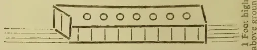

Recollect that the holes bricked all round must be 2 feet deep below and 1 foot above the ground. You can have, as I have, as many as 250 fires in one room, but if you only want to try it on a small scale one or two fires will do. We will suppose the fire holes are made, then the next thing you will require is a cylindrical shaped basket 2½ feet wide, same size as fireholes or a little larger and 3 feet high. Something like this ghost of a basket, which will show you also the sieve which rests midway down: the basket and on which the tea is placed."

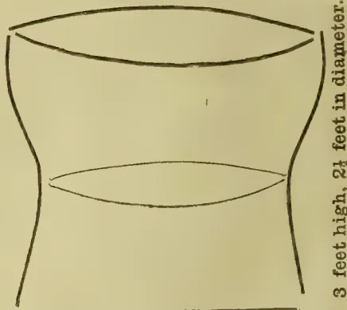

THE CHAIRMAN: Gentlemen, I am sure we all most heartily thank Mr. Gepp for having come here at a sacrifice of considerable time and expense, to deliver a lecture to which we all must have paid the greatest attention. I, therefore, propose that we tender him a cordial vote of thanks.

MR. COTTAM: It is mentioned in that paper that the pans are made of iron. May I say that the pans in Assam and Japan are made of copper? They are generally made of copper: I never saw one of iron.

MR. GEPP: I have seen them myself, the copper ones; but the tea-firing pans in China are always of iron.

MR. COTTAM: That would only raise the question which would be the better—iron or copper pans? I think in a country like this, copper would be the better because it is not liable to rust.

MR. GEPP: The action of the copper gives us green leaf. The iron pans are only used with regard to making Oolong tea.

MR. COTTAM: Then do you think Oolong would be likely to form another kind of tea, if you use copper pans?

290------------------------------------------------

OCTOBER 1, 1887.]THE TROPICAL AGRICULTURIST.263

Mr. GEPP: That I won't undertake to say.  
 Mr. SINCLAIR seconded the vote of thanks to Mr. Gepp, which was carried with applause.

### PLANTING IN MAURITIUS.

(From the *Mercantile Record*, Aug. 26th.)

THE WEATHER AND THE CROP.—Most of the mills which had commenced manipulating, have been obliged to stop working, to begin again in the beginning of September; the canes not having yet arrived at full maturity. There has been received into the Town stores up to 20th instant about the same quantity of sugar as last year up to the same date; but it is probable that the next report will show a less amount as compared with that of last year, on account of the suspension of work to which we have just alluded.

VANILLA.—The market is always in the same situation and entirely bare of vanilla of good to fine quality. A few lots of inferior sorts were sold from R12 to R14 per kilo. The cropping is pushed on with great activity and, should the weather continue to be favourable to the preparation, we may expect the new crop to appear on the market in the latter part of next month. As we mentioned in our last, the outturn of the present crop will be superior in quantity to that of last year.

### CHINA AND JAPAN TEA EXPORTS.

Those of our planting readers who are unacquainted with the exceptional character of the London tea trade, will naturally be surprised, that the prospects of an important decrease in this season's supply of China tea to England is having so little effect on the home market.

The fact is that a prospect which would have led to great excitement in the markets of other commodities of general consumption has no effect on that for tea, owing to the trade being almost exclusively in the hands of the wholesale dealers and exporters.

No speculation in tea can take place with any chance of a profitable result: a speculator can of course buy as much as he likes at the public sales which are open to every one, but he cannot re-sell his purchases in the same way, because each lot he buys is known to the dealers and is "taboed" by them.

He cannot re-sell to the retailers, for they, like the publicans, are under the thumbs of the capitalists from whom they buy on credit.

An outside speculator can only re-sell by private sale to the wholesale dealers or exporters, and they take care that he does not get much benefit from any advance in prices.

Speculators therefore keep clear of the tea market, but if they think well of prospects and wish to have a gamble in it, they can "bull" Indian Tea Companies' shares to their hearts' content.

Owing to the "Sauve qui peut" way in which Indian and China merchants rush their imports on the market the game is left in the hands of the wholesale dealers, and by the end of the year nearly the whole of the undelivered portion of the Indian and China supply for the following six months will be in their possession!

They will then probably begin to draw attention to the statistical position of China tea, and to enable them to work off their bonded stocks in a satisfactory manner will not object to pay higher prices for the dribbles which will be arriving at the tail end of the season.

The number of retailers who have capital or credit enough to be independent of the wholesale dealers is increasing so rapidly that it is just

possible the hands of the wholesale dealers may be forced (if there has been no important recovery in the shipments) when the China exports begin as in ordinary years to indicate that the season is drawing to a close; and we may see a more decided improvement in the market than has been the case since the fact and cause of the decreased shipments were known in London. The co-operative stores and large retailers have got the thin end of the wedge into the preserves of the monopolists, and we hope in time the trade will be left more to its natural course than it now is.

The importers in the interests of the producers should do all they can to facilitate retail buying at auction: but instead of doing so they are allowing without remonstrance the wholesale dealers to make it even more difficult for the retailer to buy at public sales, by increasing the size of the lots or sampling breaks.

The wholesale dealers, during their thirty years' innings, have become wealthy and powerful, they will probably make a splendid coup out of their autumn purchases, because if the stock of China tea at the end of the year is thirty million pounds or more below that at the end of last year, it will not be a matter of so much indifference to the blender, as the prospect of it apparently is.

There is of course just the possibility, though it is now very improbable that the arrivals at the shipping ports, instead of decreasing as usual, will be double what they were last year during September, October and November, and ultimately there may not be any large deficiency in this season's supply of China tea.

A few weeks more will, however, decide the question. In the meantime, the receipts at the shipping ports continue to fall off, and the shipments to the United Kingdom are now 36½ million pounds less than last year up to the 8th instant, as will be seen by the subjoined returns. When we wrote on this subject a fortnight ago the decrease was 32¾ millions of pounds. This continued decrease in the shipments was known in London fourteen days ago and the market is not affected by it, but until the end of the year it will suit the book of the trade to pooh-pooh and make light of the possibility of a decrease of 30 to 40 millions of pounds in the supply of Chinese tea having any effect on prices.

There is an increase in the stock at Foochow of about a million pounds compared with the last returns, but there is no increase at Hankow or Shanghai.

Exports from China and Japan to

<table border="1">
<thead>
<tr>
<th colspan="2"></th>
<th>England</th>
<th>...</th>
<th>...</th>
</tr>
</thead>
<tbody>
<tr>
<td>"</td>
<td>"</td>
<td>"</td>
<td>...</td>
<td>1887-8 68,766,266</td>
</tr>
<tr>
<td>"</td>
<td>"</td>
<td>"</td>
<td>...</td>
<td>1886-7 105,556,994</td>
</tr>
<tr>
<td>"</td>
<td>"</td>
<td>"</td>
<td>...</td>
<td>1885-6 101,914,457</td>
</tr>
<tr>
<td>"</td>
<td>"</td>
<td>"</td>
<td>United States</td>
<td>1887-8 29,151,355</td>
</tr>
<tr>
<td>"</td>
<td>"</td>
<td>"</td>
<td>"</td>
<td>1886-7 35,850,971</td>
</tr>
<tr>
<td>"</td>
<td>"</td>
<td>"</td>
<td>"</td>
<td>1885-6 30,850,701</td>
</tr>
<tr>
<td>"</td>
<td>"</td>
<td>"</td>
<td>Australian Colonies</td>
<td>1887-8 18,625,515</td>
</tr>
<tr>
<td>"</td>
<td>"</td>
<td>"</td>
<td>"</td>
<td>1886-7 16,127,755</td>
</tr>
<tr>
<td>"</td>
<td>"</td>
<td>"</td>
<td>"</td>
<td>1885-6 15,044,803</td>
</tr>
<tr>
<td>"</td>
<td>"</td>
<td>"</td>
<td>Continent of Europe</td>
<td>1887-8 12,631,452</td>
</tr>
<tr>
<td>"</td>
<td>"</td>
<td>"</td>
<td>"</td>
<td>1886-7 7,594,059</td>
</tr>
<tr>
<td>"</td>
<td>"</td>
<td>"</td>
<td>"</td>
<td>1885-6 5,143,734</td>
</tr>
</tbody>
</table>

### PLANTING IN NETHERLANDS INDIA.

(Translated for the *Straits Times*.)

For the present the Government has no intention of giving up the compulsory coffee cultivation in Java. So from this being the case, its con-

291------------------------------------------------

264THE TROPICAL AGRICULTURIST.[OCTOBER 1, 1887.]

tinuance for an indefinite period is taken for granted, by the publication of a regulation, codifying all the rules and enactments bearing upon the subject. Every native cultivator, save priests, headmen, and officials within the coffee districts are bound each to plant and look after fifty coffee trees. They must themselves pick the berries and prepare them for market. The produce must be delivered to the Government at a fixed price. In these districts the produce of coffee trees planted by the people of their own accord, becomes liable to compulsory delivery to Government. In any case, the cultivators get a price far below the market value. With short crops the money they get becomes utterly disproportionate to the work performed on the plantations. The Minister for the Colonies comforts them with the assurance that he will not allow them to die of hunger in case the crop proves short. This is somewhat encouraging to them. A good shepherd shears his sheep but does not flay them.

The Surabaya *Courant* reports the arrival there of a heavy consignment of the Borneo cane now coming into prominence for enormous yields of sugar. The consignments come to the order of Fraser Eaton and Company. They were soon forwarded to the estates in the neighbourhood. The next season will show the result. Large stretches of land have already been planted with these canes of promise. In West Java, disease is prevalent among indigenous cane.

The new enactment regularising the compulsory Government coffee cultivation in Java, is not expected to improve matters much, from the difficulty of finding available land within easy distance of the villages. By law, no cultivator may be compelled to till coffee land beyond four miles from his home. The Government is not likely to get all the coffee the Javanese are forced to grow. The high prices now ruling prove too strong a temptation to pilfering. Government coffee finds its way into the hands of Chinese and others, who pay the cultivators twice the price the State gives them. In any case, the compulsory cultivation of coffee by the natives, however counter it may run to modern ideas is merely a labour tax which the State is as fully entitled to impose as a money one. Among people not flush of cash, taxation in labour proves a financial expedient admitting of revenue being drawn from the population without driving them into the clutches of money lenders, to whom they will infallibly have recourse under a ready money revenue demand.

The Surabaya *Courant* says that this year's Government Java coffee crop, will hardly total 300,000 piculs. In one district the yield has shrunk from 24,000 piculs two years ago to 2,100 this year. These figures augur a further rise in price.

INDIAN AND CEYLON TEA AVERAGE.—Messrs. Walker, Lambe and Co. in their monthly Indian and Ceylon tea report of September 1st, say:—"The good assortment of teas offered this month has stimulated the market and resulted in very satisfactory sales to both growers and importers. The prices realised for the finest parcels have been excessive but latterly a little irregularity in the bidding has been noticeable, and later invoices of favourite marks have hardly kept up their previous quality. Medium teas have been in good demand, and Pekoe Souchongs and Souchongs with good liquor have advanced steadily till within the last few days. Common teas are neglected and sell at low rates. The quality of Dooars and Terai invoices has fallen off, but from Assam good useful parcels are now coming forward. The Sylhet teas are still poor. During the present week the sales have become much heavier, and with the large supplies at hand the market is

likely to be tested. In China tea, however, there is a distinct recovery from the lowest prices established, which may in a measure assist our market. Ceylons have been in full supply this month, and sold readily at hardening rates. The advance has been in good teas, tippy Broken Pekoes and Pekoe Souchongs from 10d to 1s being much sought after. Even at today's quotations, however, they offer excellent value, a fact fully appreciated by the Trade as evidenced by the rapid deliveries. August Public Sales, 1887—68,506 Indian, 26,201 Ceylon.—*H. & C. Mail*.

COFFEE IN JAVA.—It will be seen from the Netherlands Indian news extracted in another column from the *Straits Times* that the Dutch Government, so far from giving up compulsory cultivation of coffee in Java, have published a new regulation which continues the system indefinitely. What the opinions of the Java papers on this subject are will be seen from the translations given. This year's coffee crop, it is now estimated, will hardly reach 300,000 piculs, the yield in one district alone having fallen in the last two years from 24,000 to 2,100 piculs.

WEATHER, CROPS AND PESTS UPCOUNTRY.—From a letter from Upper Dimbula of yesterday's date, we quote as follows:—

I think our weather means to change at last. The sun was struggling out all yesterday and there was very little rain, and this morning has begun without mist or rain. Last week was so awfully wet that some of Friday's leaf was only finished off yesterday. Our pruned tea is coming on very nicely up here: a few days' sun would make it shoot forward rapidly. We shall anyway have good pickings by the beginning of November. Still busy supplying. As I was going down yesterday a boy came to tell me he had killed a big snake near the coffee store; so I made him bring it, and I took it with me round my shoulders to show the ——. It measured 7 feet 6 inches unskinned, so I hope soon to get the 12 feet one that is lurking about somewhere. Last night I skinned my specimen and it was not an easy or an agreeable job. I washed my hands well after it. The green bug is rapidly diminishing and it has practically done no damage. The berries still remain sound and firm on the trees. But the bandicoots are a great nuisance to the tea. In one night they undermined and ate all the large roots of eight tea bushes near our bungalow here.

PLANTING MATTERS.—We fancy the correspondent who wrote us the other day, expressing a doubt if most tea planters would get 80 per cent of their estimates for this season, will turn out to be correct. For months back the weather has been unfavourable for flushing. For that very reason, no doubt, it has been favourable to the full and early maturing of coffee, and we hear of a large and early crop on a place in Lindula, where a slight picking has already been obtained. The long lull in the south-west monsoon has no doubt contributed to these results. On the other hand the violent recommencement of the monsoon wind, accompanied by heavy rain, is telling unfavourably on tea. A letter from Upper Dimbula of yesterday's date states:—

"My calculation for this month is 8,000, but I doubt if we'll get it if this dreadful weather goes on. We have had 4.79 inches in the last seven days against 4.40 for the whole of August. But Mr. — is making the best of it, and is supplying part of the estate with fine tea plants. I was sorry to see the rats had made such ravages with the coffee primaries on the Wire Shoot Hill: but fortunately they nip mostly just beyond the fruit, so that the present crop will not suffer much, I think. There is a good deal of black bug about on the tea, but I do not fear that. We must try and fork the estate this year if we can."

No one seems to attach importance to black bug on tea. Green bug on coffee is very differently regarded. This formidable pest is stated to be identical with the coccus which does most harm to fruit trees in English orchards.

292------------------------------------------------

OCTOBER 1, 1887.]THE TROPICAL AGRICULTURIST.265OUR PALM TREES.

Both the Coconut and Palmyra trees are extensively grown in the Peninsula, but the contemptible remark cast in the teeth of every Jaffna man, who goes abroad that he is a *Panang kotte Chupee* points to the fact that the world is full of the idea that Jaffna is the land of the Palmyra. The produce of the Palmyra palm, is in fact, even now the food, yea, the main stay of the poor and a general failing of the crop is always attended with great hardship. The indiscriminate and wasteful felling of palmyra for export has always been viewed with great alarm, and if we might judge the present state of public feeling on the subject from the remarks made by a local contemporary, we should say that that alarm has by no means decreased. There is however one important fact which might serve to quiet our fears, namely, that the export of Palmyra timber to the Imports, has within the last few years been or but stopped by the exorbitant, nay prohibitive customs duty imposed on foreign palmyra timber by the authorities of the Madras Presidency. Many of those who were engaged in the Palmyra trade have had to give it up owing to the high rate of duty to which we have referred. The timber generally sent to India was of an inferior quality, and largely used there for scaffolding and other similar purposes. Since the increase of custom, duty the local merchants had to raise the price of the article in order to allow them a small margin of profit, but they found that the public demand for it fell off as there was other timber in the market of indigenous growth and of less value. We know of at least half a dozen palmyra timber traders who have been almost ruined in consequence of the excessively high rate of duty, and that the trade with India is greatly on the decline. We may therefore rest assured that the wasteful felling of Palmyra timber will cease in future.

As to the complaint that lands denuded of palmyra trees have been allowed to lie waste or converted into coconut gardens, we would remark that in the former case the inaction of the owners is culpable, and that it is well and good to disabuse them of the erroneous impression that the palmyra plantation would not pay in the long run, or that the labour bestowed upon it is not sufficiently remunerative. But in the latter case, that is to say where the palmyra is replaced or superseded by the coconut, we do not see why the practice should be disapproved of. We are of opinion that coconut is more paying than the palmyra, provided that the soil on which it is reared is good. There are indeed certain soils better suited for the palmyra than for the coconut, and on such soils it would be unwise to throw away money in planting coconuts, and there are those who in their rage for coconut planting have lost their money by laying it out on plantations ill-adapted for the coconut palm. The chief point to be kept in view in the cultivation of the two palms is the adaptability of the soil to each. And so long as this is not overlooked both may well keep their respective grounds with advantage to the people. The palmyra is the palm of the poor as the coconut is the palm of the rich, and while rich people are overrunning available waste and jungle lands in the Peninsula with coconut plantations the poor do not seem to be keeping pace in their cultivation of their favorite palm. But it is worthy of remark that the palmyra is a plant of spontaneous growth which will hold its own in spite of the woodman's axe and such incidental neglect in its cultivation as is noticeable.—"Ceylon Patriot."

THE GOLD REEFS OF MYSORE.

We have received from the Mysore Government a copy of Mr. Foote's report on the gold-bearing region of Mysore. The following notice in the *Pioneer* fairly indicates the leading characteristics of the report:—

Mr. R. B. Foote, Superintendent of the Geological Survey, has completed his survey of the auriferous tracts in Mysore, and the report he has submitted to the Dewan will be read with great interest.

34

The mines of Mysore have not hitherto turned out the El Dorado which was expected six or eight years ago, and capitalists are beginning to have an uneasy feeling that their money might have been better invested where, though the promise was less alluring, the fulfilment was more safe. To such as these Mr. Foote's report will be to a certain extent re-assuring. He says nothing of monster nuggets or "lumps of gold," of which doubtless many imaginative shareholders have dreamed, and he notes several instances where surveyors who went before him have given exaggerated or utterly unfounded accounts of the material wealth of certain districts; but on the other hand, he found many workings were the reefs were fine and of very great promise. Generally his report may be said to bring out two things; first, that prospecting must in most cases be carried to a considerable depth before the value of the mines can be accurately gauged; and secondly, that the whole of the auriferous areas are deserving of close survey, as even the best of them are imperfectly known, and of what was known to the old miners in former generations much has been forgotten. In Mr. Foote's tour, which was for some reason or other very hurried, he chanced on no less than five sets of old working unknown to previous surveyors, and he suspects that many others exist in the wild and jungly tracts which abound in the hilly and mountainous parts of the country. Although the work of gold-prospecting left Mr. Foote little leisure to devote to any non-metallic minerals, he took some interesting notes on such as incidentally came in his way. One very beautiful variety of granite-gneiss eminently fitted for cutting and polishing on a large scale, he found about two miles east of Banavar. The rock he declares to be the handsomest he has seen in Mysore, and monoliths of large size could easily be quarried. Again, the hills above Seringapatam are traversed by a great dyke porphyry of a warm brown colour. The stone in Mr. Foote's opinion is unequalled in Southern India, and, if highly polished, would rival the highly-prized porphyries of olden days. The dyke is fully a mile in length and of great thickness. Beds of marble of good quality were also found near Holgere. Mr. Foote, however, met with nothing to support the opinion to which previous surveyors—Mr. Lavelle in particular—had given currency, that emery, asbestos and kaolin existed of a quality and in quantities such as would warrant the investment of capital for their exploitation.

INDIA AND CHINA TEAS.

SIR,—I have read with much interest the instructive articles on Indian tea which have lately appeared in the columns of your Journal, and although the writer has quoted from reports open to him (which I consider exaggerated) of the capabilities of certain machines for withering and rolling leaf, his remarks in a general way—especially those relating to the history of the staple and its introduction into European markets—are reliable. The question he propounds towards the conclusion of his last article (No. V. in today's issue), viz., whether Indian and Ceylon growths do not possess too much of the active principles of tea and an excess of tannin injurious to the membranes of the stomach—both prejudicial to the nervous system"—is not a stranger to Indian and Ceylon tea planters. Its origin has been traced to those dealers who find it pays them best to introduce blends of cheap and inferior China teas, flavoured with Indians and Ceylons and until quite lately it has been a

293------------------------------------------------

266THE TROPICAL AGRICULTURIST.[OCTOBER 1, 1887.

serious obstacle to the introduction of pure Ceylon tea. The question, however, has little importance when properly considered. If the active principles are found excessive when infused in the usual way, let a little more water be added—or, quite as simple, put less tea! Let people insist on getting the pure article, and blending it for themselves. When they learn to do so there will be little fear of the membranes of their stomachs suffering, and less of their paying for what they do not get.

I must also take exception to the statement that Ceylon tea quickly loses its flavour. It was only the other day that an eminent tea merchant in this town expressed to me a contrary opinion, which he assured me was based on a practical experiment of his own covering some five or six years.

In the interest of Ceylon tea planters, many of whom hail from this town and neighbourhood, and of whose number I am, I trust you will find space for this letter.—Yours, &c.,

R. B. ARTHUR.

104, Hamilton Place, Aug. 30th, 1887.

—*Aberdeen Journal*.

[Libels published by the Brokers interested in China tea, representing Indian tea as poison, long prejudiced the public in England, and this dishonest policy is still pursued in Australia.—Ed.]

### THE FORESTRY OF WEST AFRICA.

*Sketch of the Forestry of West Africa with Particular Reference to its Principal Commercial Products.* By ALFRED MOLONEY C. M. G., of the Government of the Colony of Lagos. (London: Sampson Low, Marston, Searle, and Rivington, 1887.)

This, as its title indicates, is intended to form a handbook to the economic plant-products of Western Africa. Although the author is Governor of a British colony in this region, his remarks are by no means confined to British possessions, but are intended to include all that is at present known of economic interest connected with the plants of Western Tropical Africa.

Following Prof. Oliver, the author deems it expedient to divide Western Tropical Africa into two principal geographical regions. The first, called Upper Guinea, includes the Western coast region from the River Senegal; on the north to Cape Lopez immediately south of the equator; the interior drained by rivers intermediate between these limits, and the small island of the Gulf, Fernando Po, Prince's Island, St. Thomas, and Annabon. The second region, called Lower Guinea, includes West Tropical Africa from Cape Lopez southward to the Tropic of Capricorn, including Congo, Angola, Beuguela, and Mossamedes. Within the limits here indicated we have British possessions represented by "colonies" and "protected territories," and we have numerous possessions claimed by the French, Portuguese, Spanish, and German Governments, some of which have only lately been acquired in the European scramble for African territory. It is only right to mention that the term "possessions," as here applied, is somewhat a misnomer. There is little practically possessed, even by ourselves, except a slender coast-line: the interior is described as having no "territorial definiteness," and it is politically, no less than scientifically and commercially, unexplored. Capt. Moloney has wisely not attempted to treat separately of the economic products of these possessions. He has taken their present economic botanical productions in order of export value, and we find that these consist chiefly of palm oil, ground nuts, india-rubber, coffee, gum, dye-woods, cacao, cotton, fibres, and timbers. Palm oil, the produce of *Elais guineensis*, a plant which covers immense tracts of country in Western Africa, is imported to this country to the value of nearly a million and a quarter annually. The yellow palm oil is obtained from the outside fleshy portion (sarcocarp) of the nut, while a white solid oil is obtained

from the kernel. India-rubber is another West African product obtained chiefly from climbing vines belonging to the genus *Landolphia*. The author was one of the first to draw attention to the value of *Landolphia owariensis* as a rubber-plant, and it must be gratifying to him to find that the exports of "white African rubber," as the produce is called, have during the last four years risen from almost nothing to a value of nearly £36,000. What is known as "Yoruba" indigo derived from a large tree, *Lonchocarpus cyanescens*, has evidently a commercial value, but at present it is used to mix with butter or "shea" to make the negroes' hair a fashionable gray!

Numerous West African plants are cited as yielding either gum tragacanth, copal, frankincense, gum arabie, bdellium, or resin; what is called "ogea" gum, derived from an unknown tree, *Daniellia* sp., is used powdered on the body and as a perfume by women. The true frankincense-tree of Sierra Leone is *Daniellia thurifera*. Camwood, used largely as a dye, is derived from *Baphia nitida*; but although barwood is generally said to be derived from the same source, it fetches only one-sixth the price of the former. The medicinal properties possessed by numerous West African plants is a subject full of interest.

Various species of *Strophanthus*, the active principle of which was formerly used for poisoning arrows and is known to be of incalculable benefit in cardiac diseases, and the merits of the "miraculous berry" (*Sideroxylon dulcicervum*) of the Akkrah and Adampe districts, which is credited with rendering the most sour and acid substances "intensely sweet," and of the "oro" plant of Sierra Leone, said to act as an irritant poison cumulative in its effects (which has been ascertained at Kew to be a species of *Euphorbia*), are among the numerous subjects requiring further investigation.

A most cursory glance at this book cannot fail to suggest the wonderful wealth both of botanical and industrial problems which are yet unsolved in connexion with West Tropical Africa. The "Flora of Tropical Africa," by Prof. Oliver, of which three volumes are published (the last in 1877) has made a beginning in the work of elucidating some of these problems; but in recent times few men have systematically pursued West African botany, and the entire absence of a resident botanist or of a properly-equipped botanical establishment in any of our West African colonies has left the plants of a most important region to be known only by the intermittent collections of travellers who have either perished there before their mission has been completed, or have hastened home to avoid the effects of the deadly climate.

Nearly 200 pages of Capt. Moloney's book are taken up with condensed notes and references to the economic plants of Western Africa arranged in natural orders according to the "Genera Plantarum" of Bentham and Hooker. To many people both in West Africa and at home these notes, brought together by the assistance of an officer connected with the Kew Museums, will prove of great value. In the appendices are given a copy of the instructions for collecting plants, seeds, and useful plant-products issued by the Royal Gardens, Kew; an ornithology of the Gambia, by Capt. Shelley; a list of Coleoptera and of diurnal Lepidoptera of the Gambia, by the same writer; and a list of reptiles, batrachians, and fishes collected at the Gambia by Capt. Moloney in 1884-85.

The book is well got up and clearly printed, but it has the unpardonable defect of being published without a good alphabetical index. This greatly detracts from its value as a book of reference. It, however, is the chief fault we have to find with a work full of interesting matter for the first time brought together, and evidently prepared with great care.—D. M.—*Nature*.

### SLAVERY AND FREE LABOUR IN BRAZIL

are thus noticed in the *Rio News*:—

We understand that the Centro do Commercio Lavoura is studying plans for promoting immigration to the province of Rio de Janeiro and for

294------------------------------------------------

OCTOBER 1, 1887.]THE TROPICAL AGRICULTURIST.267

realizing the transformation of labour. The ultimate objects are certainly good, but like nearly all such efforts in Brazil the means to be employed are altogether ill-timed and visionary. There is abundant labour in Brazil for all immediate requirements, but this is invariably overlooked for the untried assistance of the immigrant. Up to the present moment we have not seen one serious discussion or plan in regard to the future status of the freedmen in Brazil. There will be a million and more of them—all poor, homeless, friendless, and able to work. They will not die from cold and hunger in Brazil, for nature will be an indulgent mother to them all; but they will be vagabonds, idlers, beggars, thieves and assassins. What else can be expected. Without experience and knowledge of the world and with the vague ideas of what liberty and self-support mean, they are to be cast off and left to shift for themselves. No one thinks of providing colonies for them, no one thinks of arranging labour for them at fair wages, no one even dreams of providing them with homes upon the unsettled lands of the nation. They are accustomed to the climate and the methods of labor in vogue, but no one dreams of employing them; they are tractable and trustworthy, but no one cares to befriend them. It does not occur to their masters that the enforced labor of these people has enriched the country, and that there are but few families and fortunes that have not been built up on foundations laid by their humble hands. All this is forgotten. The slave is accused of being ungrateful; but where is the gratitude of his master? And where is the justice—to say nothing of the injustice of slavery itself—of expecting industry, ambition and good conduct from an ignorant, debased race thus treated? We firmly believe that kindness and generous treatment will retain a majority of the freedmen in the country and develop them into trustworthy laborers and orderly subjects. We are confident that Brazil has far more to hope from them than from the majority of the Italians which speculators are now introducing under the aid and protection of the State. If now the Centro wishes to do a really patriotic and beneficial work, let it turn its attention to this one great problem:—the establishment of the freedmen on the soil, in homes of their own, and with all the protection which law and the generous sentiments of the public can accord to them. Let them not be taken from under the lash of the master to be plundered and driven by magistrates and police and society, but let them be encouraged to labor for themselves, to educate their children, and to respect and obey wise and just laws.

#### PLANTING IN DELI.

(Translated for the Straits Times.)

Of late, heavy rains have been continually falling in Deli. The tobacco crop runs every risk at turning out to be a poor one.

The news of the success attending Borneo tobacco in Holland and the favourable opinion entertained of that article by experts there, has opened the eyes of the *Delhi Courant* to the need for planters in the neighbouring Dutch colony doing their utmost to keep up its reputation for turning out excellent cover tobacco for cigar factories. The praise bestowed on the article brought to market by the British North Borneo Company show that dangers threaten from that island. Five years will elapse before North Borneo can turn out tobacco in quantities large enough to render it a formidable rival to Deli. Planters there, however, will do well to take stock of their position and prospects, and inquire how far they can best make head against this inevitable competition. The Netherlands India Government too, should take warning by the direction the

current of planting enterprise is setting in. Hitherto the Government in Deli has been rather working against the planters, in forgetfulness of the fact that the future prosperity of the colony depends on mutual co-operation now more called for than ever owing to North Borneo competition. The only way to meet it is for both the Government and planters to work together in developing to the utmost, the productive resources of Deli. The danger is heightened by the sundry points of resemblance between North Borneo and the East Coast of Sumatra. The most prominent is fertile land which awaits cultivation but with a scattered and indolent population. In both countries, European planting enterprise has to depend on imported labour—Chinese especially. In Deli, the Government has hardly done anything to encourage increase of population during the 20 years tobacco planting has been going on. Private enterprise has to meet requirements in this direction. In North Borneo, the Government has fostered and extended encouragement to immigration of a desirable kind. In Deli, the Government has neglected the duty of laying out the country, by making roads, opening out means of communication, and executing topographical surveys. Quite the contrary distinguishes the North Borneo authorities. They exert themselves to facilitate settlement by road making, &c. An efficient police organisation is still needed in Deli though a great improvement in this respect is manifest. The same branch of administration in North Borneo has more attention paid to it by the local Government. In Deli, official moves in these three directions are required to enable the Colony to attain that stage of advancement which its resources entitle it to reach.

#### PLANTING IN MANILA.

(Translated for the Straits Times.)

The *Comercio* having advised the mercantile community at Manila to take to the copra trade in the Carolines, a correspondent called attention to the difficulties in the way. It is admitted that with proper management the copra trade would yield remunerative returns but not in the Carolines, owing to their remoteness and scanty production.

The Philippine authorities are taking steps to promote the colonisation of the island of Palawan by encouraging emigration from the Philippines proper. An emigrant thither in arrears with taxes will be exempted from payment. Ordinary emigrants will be exempted from any taxes whatever for ten years. They and their families will be entitled to free passages. Land will be given to them on condition of cultivating it on pain of forfeiture. The Government undertakes to supply them with rice and a small allowance of money daily for six months. The charges will be met out of local funds. These terms are liberal enough, but it remains to be seen whether they will attract settlers to that remote island.

#### ASSAM TEA.

The London merchants whose windows for the last six months have exhibited black pyramidal piles bisected by gigantic placards bearing the inscription "Jubilee Tea" have for once in a way committed themselves to an advertisement which is no more than the literal truth so far at least as a large portion of their stock is concerned. Though no one seems to have noticed the fact, Assam tea is one among the many more or less notable persons and things entitled to hold Jubilee synchronously with Her Gracious Majesty. The first experimental plantation, indeed, was made in Assam towards the latter end of 1835; but it was not till 1837 that the attempt met with any success, and it was then also that the first sample reached Mining Lane. In that year 455 lb of Assam tea were sold in London by public auction, the average price realised for it being 19s. per lb. These sales marked the commencement of that struggle with the product of the further East which it will judge from the experience of the last few years, is destined to end in its complete subjection. It was

295------------------------------------------------

268THE TROPICAL AGRICULTURIST.[OCTOBER 1, 1887.]

not, however, without a fierce and sustained fight that the leaf from the Assam Valley gained a footing in the market. The Assam Company, to which Government made over the plantations after the annexation of the Province in 1839, and which held the virtual monopoly for more than a decade, was rich enough, but its agents were utterly ignorant of the proper methods of cultivation. Blundering and waste were the result, and in a few years £200,000 of capital had been dissipated. The deepest darkness, however, was nearest the dawn; and even while the Company was on the verge of bankruptcy, profits began to flow in, and in 1852 the first genuine dividend was paid. From that date the success of the Assam Tea Industry was assured, and the pioneer Company, which forty years ago was practically insolvent, is at this day, after having divided among its shareholders over a million sterling, worth nearly half a million. In a sense, no doubt, the course of the industry has not been altogether untroubled. There was a time, in 1862-63-64, when the tea fever burnt almost as fiercely in India as did the gold fever some years earlier in Australia: when a man rashly threw up settled occupation in the Peninsula in the hope of shaking from the bushy green shrubs rapidly covering the valleys and hill-sides of Assam the riches which the pagoda tree no longer yielded; and when, as a natural consequence, disaster followed, and scores of card-built Companies fell to pieces, but excepting this instance of the commercial mania which comes as certainly to all undertakings with a future before them as the measles do to children, the record is one of steady progress. Unlike the wheat and seed trades the tea trade has not advanced by leaps and bounds; but neither has it like them been subject to backward lapses. Though the development has been slow, its almost unbroken continuity within the last twenty years is one of the best signs of the sureness of the foundation on which it rests.

The tremendous expansion which has taken place in the trade since the first tea seed was dibbled into the ground fifty years ago may best be seen by reference to a statement just submitted by the Assam Secretariat to the Provincial Government. There we find that at the close of 1886 there were in the Brahmaputra and Surma Valleys 883 tea gardens. These gardens comprise over 934,000 acres, but of this, the total tea-grant held by planters, only 204,000 acres are under actual cultivation. The rapid extension of recent years is evidenced by the fact that nearly one-sixth of the area under cultivation must have been added within the last four years, since we find 33,000 acres put down as under immature plants, which, with the Assam planters, means plants not four years old. Last year the total yield of tea from the gardens reached the large figure of 61 million pounds, 57 million pounds coming from the Brahmaputra Valley and 24 million from the Surma. As to the yield per acre, the returns available appear to be only approximately correct. Official statistics for 1886 put the yield in the Brahmaputra Valley at 385 lb. and in the Surma Valley 333 lb.; or an average for the whole of Assam of 363 lb.; but the Indian Tea Association gives the average outturn 141 lb. an acre less, and this is probably nearer the truth. Cichar, Nowgong and Darrang are below the average for the whole Province, while Sibsegar, Sylhet, Goalpura and Lakhimpur are above. The case of the gardens in Kamrup and on the Khasi and Jaintia Hills is exceptional, for there the yield has been decreasing, and was so low last year that it is very doubtful whether some of the gardens will be able to go on. The area under tea in these districts, however, is but a very small fraction of the whole, and their influence is hardly felt in the total production of the Province. The highest yield is found in Lakhimpur, where the average last year was 508 lbs. per acre. Turning to the cost of production we have no certain information for all the gardens; but the average cost per lb., including sale charges, for 18 gardens in the Assam Valley and 23 gardens in the Surma Valley for the past two years, was about 8 annas

for the former and about 7 annas for the latter. Addressing the Society of Arts recently Mr. J. Berry White said he confidently anticipated that the crop of Indian tea in 1890 would be placed on the London market for a fraction under 6d. a lb.; but even if we allow a reduction of a penny a lb. in the cost of production for the next three years it is difficult to reconcile the statement with the above figures. Nevertheless the reduction in the cost of production is one of the most remarkable of the many changes which the fifty years have wrought. Labour is cheaper, the methods of cultivation and picking have improved, and the whole process of manufacture has been transformed by the introduction of machinery. All the most important parts of the manufacture, rolling, drying, sifting are done by machinery, mostly steam-drivers.

It is curious to note from the report above referred to that "all the Deputy Commissioners and those Managers who have expressed any opinion on the subject are unanimous in attributing the bad prices of last year to the supply being in excess of the demand." This theory of over-supply has been the companion of many an afflicted economist besides the tea-planter; but there was never an instance, perhaps, when there was less evidence in its support. The United Kingdom is almost the sole market for tea; but if we take the deliveries of tea there for the ten years between 1876 and 1885, we find they have increased by something less than one per cent annually, which is just about equal to the increase in population, and we find also that the increase in re-exports has been three times as large as the increase in imports. These figures show with sufficient clearness that to whatever the fall in prices is due the explanation does not lie over-production. The fact is, so far as the fall in Calcutta prices is concerned, the decrease must have taken place altogether irrespective of competition in China and Ceylon in obedience to the reduction in the cost of production. There is nothing more common than to hear planters express the fear that the same fate may overtake them as has overtaken the English wheat-growers. As Indian wheat has reduced prices below the cost of production in England, so it is thought the competition of China tea may reduce the price below the cost of production in India. The cases are, however, in no wise parallel. The India wheat-exporter has not felt the reduction in the gold price of wheat because it has in a great measure been counterbalanced by the fall in exchange; but every fall in the price of tea is felt equally by China and India. The conflict is thus reduced to a mere question of cost of production, and in this India must in the long run conquer. The enormous fall in the exports from China during the present year indicates that China growers have already been growing at a loss. All that Chinese competition has done or is likely to do is to prevent diminution in the cost of production being added to the planter's profits.—*Pioneer*.

COFFEE IN NORTH BORNEO is thus noticed in a report of the commerce of the settlement for six months:—The most satisfactory figures in the Return of Exports are perhaps those referring to Coffee and Pepper, proving that these industries have not only made a firm beginning but are already added to the Exports of the country.

DARVEL BAY.—At Silam the autumn Liberian Coffee is ripening fast and the prospect of a large crop is good. No leaf disease has appeared in the Experimental Garden since its commencement. The Coffee has been extended a few acres and the young plants look exceedingly healthy and strong. Pepper is being extended. One and a quarter acres have been felled and will shortly be planted. Cocoa is growing rapidly and is enormous in size for its age, pigs however, consume a deal of its fruit.—*British North Borneo Herald*.

296------------------------------------------------

OCTOBER 1, 1887.]THE TROPICAL AGRICULTURIST.269THE EAST INDIA ASSOCIATION :THE COMMERCIAL PRODUCTS OF ASSAM.

By O. WEYNTON.

*Cajpat*—generally called *caiaputer*—the *Melaleuca cajeputi* of Roxburgh, is a small tree with a twisted, crooked stem scattered branches with a drooping tendency, similar to the weeping willow. It is rather sparsely distributed throughout the province—chiefly at the entrance of ravines, but to avoid an expensive search, may be procured either from Dacca, in Goalpara, under the Tipperah Hills near the station of Comilla, Jaintiapur, and, in fact, almost any locality where ruined temples abound, as in such places, in days gone by, it was carefully looked after, its medicinal properties being well known to the priests and native practitioners though they seldom extracted the oil, but used the hot, bruised leaves as applications in sprains, bruises and rheumatism. The tree takes three years to reach maturity, but slips may be planted close together so as to form a nursery, and until planted out in the permanent situation destined for them, may be constantly cropped (according to judgment) in that condition, so that returns may be had in eighteen months from the time of laying down the slips. The leaves are to be collected on a fine warm day, say from April to September, lightly rolled to break the cells, then chopped up fine, macerated in water for twelve hours; strained and the liquor distilled in a glass or enamelled still. The result will be a pure limpid oil with a light green or bluish tinge and an odour quite distinct—the *caiaputer* oil of chemists. It is apt to discolour if exposed to light, and should therefore be packed as soon as convenient, but, pending which, may be stored in large closely-covered earthen jars kept in a dry, dark place. There is considerable local demand for this oil, not only among the native population of Assam, but in both Munnipoor and Burmah, as also down country, and it is more than probable that the whole of one's out-turn, until it assumes large dimensions, could be profitably disposed of within the country. Once established, the cost of cultivation is but nominal, the preparation inexpensive, and the returns handsome. The plant may be grown on almost any soil above swamp-mark and scattered about in any unused plots of the grounds, placed in topes or groups sufficiently numerous to afford leaf for one day's systematic plucking—not isolated trees stuck about here, there and everywhere, necessitating an extensive roaming on the part of the gatherers.

*Chaulmoogra*—*Gynocardia odorata*, or the Ta-fung-yu of China, is a handsome tree supposed to be peculiar to the northern part of the Sylhet district—merely, I presume, as expressing the oil once formed one of the jail industries there; but it may be found in all ravines in which the primeval forest remains intact, in either of the mountain ranges from Gowhatti to the Brahma Khoond, and from the Laor River to the Khuboo Valley, as also in the deep semi-tropical forest gullies, in the Khassia, Garrow and N. Cachar hills. Were exploration safe, I have little doubt that it would be forthcoming in the northern ranges and Upper Burmah, as the expressed oil forms, under the name mentioned above, a large item of export from Laichung in Western China. Among the Chinese, Ta-fung-yu has for ages been regarded as a specific in syphilitic and kindred diseases, being, when mixed with ground cinnamon, applied externally to the parts affected, the pure oil used for injection; it possessed the property of disinfection, and drying without causing obstruction or any unsightly cicatrice; wounds and ulcers treated with it closing with an evenness that hardly leaves a trace behind—Chinese medical men asserting that treatment with *chaulmoogra* entirely prevents the copper-coloured stain peculiar to the site of wounds caused by the diseases alluded to. Whether the whole of the therapeutic properties claimed for it would stand all tests, experience must decide, but all over the East, where cutaneous maladies, from leprosy down, are so prevalent, unbounded faith in its virtues exists, and so esteemed is it in Persia and the countries adjacent, that either at Shiraz or Bushire one rupee per ounce is readily paid by dealers from the interior for it.

The water toter, or ringworm from which new-comers from Europe to Assam almost universally suffer, rapidly yields to the mixture of *chaulmoogra* and *cinnabar*, and though mercury in any form is specially dangerous to deal with in warm climates, I have never yet heard of the slightest symptom of salivation arising from the use of the combination. In China a 6-grain pill made from the seed is sometimes given, but with what object I am unable to say, as the smallest quantity induces nausea and vomiting. The blossom appears in April and May, and the fruit, which takes the form of an oblong nut—not much dissimilar in shape to a Brazil nut—ripens towards the end of the rains, is smooth and of a greyish colour, yielding on cold pressure 10 per cent of rather thick resinous oil. Although it bears in the fifth or sixth year, the tree attains the size of a full-grown mango, so that wide planting is necessary, but beneath its shade other plants may be raised. The usual method of opening out the roots in March and heavily manuring with ash, stable dirt and pounded limestone will bring out a prodigious amount of blossom, but it is better not to resort to the practice yearly, until, at any rate, the tenth or twelfth season; every alternate year until then being as much forcing as the tree will bear with impunity. The cake, obtained as it is without heat to deprive it of all medicinal properties, may be ground into meal and used for poultices, being from its nauseating qualities unfitted for cattle feeding; although I have given it to pigs, who readily consumed it without any apparent deleterious effect. *Chaulmoogra* needs but an introduction in sufficient quantities to create a considerable demand, and its being a native remedy has, I opine, been the chief cause of its neglect among professional men who are apt to condemn all such without unprejudicially first giving their reputed merits a fair trial.

*Dipterocarpus*, or the tree that furnishes the *Gurjan* oil, or rather oily resin, is now difficult to find in the more accessible parts of Assam, but, as the intending settler of the present day will most likely have to locate himself in the veritable backwoods, it is very probable that some of these highly valuable trees that have escaped the jungle roamer may be found in his concession. Any native can point them out, but raising from seed, it must be borne in mind, must be undertaken in the interests of posterity, for the tree grows to a great altitude, generally shooting up to the height of forty feet ere throwing out branches. Those met with in the forest fit for tapping are presumably some forty to fifty years old, and of late years the gatherers have not only been content to tap the trees to death, but have in many cases actually felled them, trying out the billets in so ruthless a manner that pitiable wholesale destruction has been wrought; still *Gurjan* is found, though one must go further afield for it, searching the hill ravines. It is very plentifully distributed in the deep valleys of the Looshai hills, and reported by the inhabitants to abound far in the interior, the crude resin finding its way to the markets on the Chittagong side of those hills; but a considerable number of untouched trees may be noticed in the valley of the Kopli and also in the forest round about the Brahma-koond. These localities are merely referred to as seed-collecting centres, for to gather the sap from a tract of country so wide as that over which the *dipterocarpus* is distributed would prove not only too expensive, but might lead yourself and collector into dangerous places. The seeds ripen in October, and should be sown as fresh as they can be procured—for they rapidly lose their germinating power. Raised in nurseries until the wood is sufficiently matured to bear transplanting, the young saplings may be placed out in the jungle and left to nature, a record of the date and site of planting pigeon-holed for the benefit of future generations, as the planter of *dipterocarpus* can hardly hope himself to reap the benefit of his own plantings. If one or more mature trees are found on the grant the resin may be abstracted any time from November to May in the following manner:—One or more oblong perpendicular holes are made at a convenient distance from the ground—

297------------------------------------------------

270THE TROPICAL AGRICULTURIST.[OCTOBER 1, 1887.

two feet long by six inches broad—cutting well into the body of the tree through the bark; at the lower end a cup-like cavity must be scooped out of sufficient capacity to hold a fluid quart; fire is then introduced and kept up with charcoal for from two to three hours until the cavity is thoroughly well charred; on cooling the Gurjan commences to trickle out, needing baling night and morning; should there be a falling-off in the exudation, more charring will stimulate it, though the better plan will be to open a fresh hole on the opposite side of the tree, and thus working both alternately. The yield per annum from a fully matured tree—maturity being approximately indicated by a height of seventy feet and girth four feet from the base, of eighteen feet—was 346 pounds. Gurjan oil is the best varnish for all woods known throughout the East, and well rubbed into teak with the husk of coconut, gives a polish to that and other dark timber rivaling that shown by mahogany or walnut, while the surface oil applied in a similar manner to light-grained woods is attended with equally brilliant results. Mixed with lampblack and applied to carved teak, a good many imitations of the celebrated Surat blackwood furniture are palmed off on the globe-trotting curiosity purchasers, but it looks equally well. Perhaps one of the most valuable preservatives of wood work is the combination of Gurjan and ground sulphate of copper, which, boiled to the consistency of the thick syrup, and applied hot to any timber—whether imbedded in the earth or not—effectually prevents the attack of white ants and borer, resisting also the exigencies of a damp climate, and would thus doubtless prove of value in the preservation of railway sleepers. As a cosmetic it imparts a delicate softness to the skin, but has a somewhat medicinal odour that would need eliminating or concealing with some counteracting perfume ere it found favour among such Europeans as indulge in those luxuries. Mixed with *neem* leaves it forms a most powerful poultice, and natives claim for it certain medicinal qualities possessed by matico and copaiba, the details of which it is unnecessary to enter into.

*Croton Oil.*—*Croton Tiglium*, from which the croton oil is obtained, is found in all parts of the province, being more plentifully distributed in the drier districts. Though the family of the crotons is a numerous one, there is no difficulty in distinguishing the tiglium, which has the smallest leaf. The native name is *Jummul ghitti*. There being but a small demand for this oil only a limited area need be devoted to it, and as the plant is apt to spread it will require, occasionally, weeding out or otherwise keeping down. If, however, you elect to manufacture the oil, it will be as well to bear in mind that you are dealing with a most powerful irritant poison, which in any stage of preparation should not come in contact with the hands or other part of the body or even the clothing; the special press retained for its extraction should therefore be kept, and all manufacture conducted in a separate hut. The process of extraction is cold pressure between plates similar to those used in castor oil; when run off croton should stand for fifteen days, then filter through charcoal and pack in small bottles or tins. All refuse had better be burnt, and the plates and other paraphernalia scrubbed with ash lye with a long-handled brush kept especially for the purpose.

Many economic plants that now receive but passing attention ought to be brought either from the jungle or native homesteads and placed under observation, for many, used in their crude state, undoubtedly possess highly valuable properties that, owing to want of chemical knowledge, natives do not utilize to the full extent of such capabilities. Like the despised “old woman’s” remedies in more civilized countries, unexpected valuable results are often obtained therefrom by painstaking chemical research. One’s ears and eyes should be always open in Assam, and, given as natives are to romancing, there is generally some modicum of truth at the bottom of the wildest romance. The wealth of the province has by no means been thoroughly disclosed, for the simple reason that exhaustive explorations, either botanical, geological,

or by naturalists, have never been attempted; but all investigations have been conducted in the most perfunctory manner; when one item was reported some one was sent to the particular locality to report upon that particular item, having done which his duties were considered at an end. Hence, Government incurred great expense in deputing the late Mr. Fortune to China to procure a deteriorated tea seed to plant in the land from which it had originally been taken nigh two thousand years before, though the history of its transport from Assam to the “Flowery Land” by a Buddhist pilgrim has formed a well-worn theme among the story-tellers of the Indian bazaars for ages past. Again, botanists were sent to South America to introduce cinchona and ippecacuanha, yet *Cinchona crispa* grows wild on the summit of the forest-clad cliffs that overlook the plains of Sylhet and Cachar at an elevation of some 1,500 feet, and ippecacuanha is found in abundance in the Larnai Valley within a dozen miles of Shillong. Nothing, therefore, should be considered too trivial for investigation, though neither of the latter plants referred to are likely to be attended with successful cultivation below the elevations indicated as their true habitat.

*Pán*, the well-known leaf of the betul vine masticated by all natives of India, seems never to have attracted that attention which its undoubted valuable qualities should ere this have commanded. When one reflects that men carrying heavy loads travel long distances in the hottest weather exposed to the ful blaze of a tropical sun or get through laborious tasks with no other sustenance than the mastication of this leaf, it is evident that it must contain some wonderfully stimulative properties well worth careful investigation; anyone can test these for himself, and although most natives use some half-dozen ingredients in conjunction with the leaf, a little consideration will show that such may be regarded merely in the same light as sauces with solid joints, and that in the juice of the *pán* leaf lies the stimulant. A leaf, taken when one is suffering slightly from the influence of the sun or fatigue, acts immediately as a restorative, quenching thirst and imparting an agreeable glow to the throat and regions of the face and head generally, without any deleterious sequelæ. Although it would not be possible to introduce the leaves themselves to Europe, and, in fact, their mastication would hardly find favour, an extract or tincture, if the properties noted could be retained therein, would not fail to be appreciated, especially among those with whom a non-intoxicating stimulant is a *desideratum*. *Pán* leaf, bruised, when applied to cuts and wounds arrests bleeding, cleanses from all suppuration, besides promoting granulation in the most ugly hurts; hence it is reasonable to infer that it must possess medicinal qualities that should recommend it to the notice of the faculty. It is needless to enter into details connected with the cultivation, as such may be seen in operation all over Assam, the favourite sites in the plains being the banks of rivers, but the best and most pungent leaves are those from vines planted in the limestone rifts in the hills. Shade is imperatively necessary, and, in the dry weather, systematic irrigation also, but the vine will not thrive under the drippings of dense umbrageous trees, and good drainage is essential to its well-being. The care bestowed upon it by such eminently careless cultivators in most respects, as Bengalis sufficiently indicates its delicate nature, as does the large area devoted to the raising of it, the remunerativeness of its culture.

The *Areca palm*, erroneously and almost universally called the betul-nut tree by Europeans, may be planted in any flat land, but not swamp, in and around the property at distances from 6 feet to 8 feet apart. The large demand for arecanuts all over India and the vast renders the establishment of these plantations highly profitable, but as Europeans hitherto have been but “birds of passage” in Assam, none have cared to plant, hence the cultivation is almost entirely confined to natives. But when once rail communication with Chittagong gives the province its long-needed seaport, the demand for

298------------------------------------------------

OCTOBER 1, 1887.]THE TROPICAL AGRICULTURIST.271

arecanuts will form an important item in its exports, coastwise. The tree is best raised in nurseries, and may be planted out the following season. It attains a height of from 40 feet to sometimes 60 feet in the course of ten years, but bears the fifth, and although that may seem a long period to wait for returns. Once *in situ* no cultivation whatever is required, and the factory's appearance cannot fail to be greatly embellished by the presence of this most graceful of all the palms, which an eminent botanist has likened to "an arrow shot from Heaven."

*Vanilla*.—The terrestrial orchid that yields the aromatic pods of this spice, though better grown at 1000 feet or 2000 feet above sea-level, may, with care and attention to keeping the young roots clear of ants and other insects, be successfully raised in the plains and trained on the stems of the area. When once it obtains a firm hold, little attention is needed, but should inclination to spread laterally be indicated, such should be encouraged and bamboos, hung by loops from palm-stem to palm-stem, will afford quite enough support for the ramifying tendrils. The bamboos must not be firmly lashed to the palm-stems, as the area sways in response to the slightest breeze; thus a certain amount of play must be allowed for. The vanilla will bear well the third year, and the pods must be gathered as soon as they begin to change colour, or they will burst, then dried under an open shed, and are better exported in cases. Each should be wrapped in a piece of clean paper, but those who deem such a proceeding too elaborate may omit it.

*Bael* or *bel* is the fruit of a well-known tree that may with advantage be introduced from native gardens, but as the best is grown about Dacca, seed should be imported thence. Bael will yield in the seventh year, and, though its medicinal properties are little known in Europe, there is no doubt that it would make its way in public favour once brought prominently to notice. Its merits lie in the pulp contained in a hard calabash. The pulp, beaten up with sugar and strained through coarse muslin, has an undeniable regulating effect upon the bowels specially valuable when choleraic complaints manifest themselves. Anglo-Indian chemists manufacture a dried preparation of this fruit called "dietetic bael," but much of the virtue of the pulp is lost during the process, and for export the form of preserve should invariably be adhered to. At the same time the fact should not be lost sight of that as it is a medicine rather than a condiment, sugar or other preservatives used in the preparation should only be resorted to as sparingly as is consistent with the preservation of its therapeutic properties.

*Nux Vomica*, under the name of *Koochela*, from the button-like seeds of which the alkaloid strychnine is obtained, is found growing wild in many parts of Assam, in such abundance in one part of Cachar as to give a name to an isolated block of lava-strewn rise, upon which a tea plantation has since been formed; there is no difficulty in obtaining it in any quantity, as all natives know it. Unless one is an adept in chemistry the extraction of the active principal need not be undertaken, but the pods or seeds dried in the sun and packed in tea chests for export. If chemical action is resorted to, all utensils used must be kept securely locked up, as strychnine, it is almost needless to say, is a highly dangerous drug to leave about.

*Neem*.—The neem tree abounds, and the bruised leaves are much in request where strong drawing poultices are required, being specially useful about the mango season, when troublesome boils are so prevalent. An extract, distilled from the leaves, can be made that is of considerable value in stimulating the action of the milder applications, such as bread and linseed meal applications. Native practitioners make use of the neem for a variety of purposes, and as they are not by any means reticent in affording information, investigation and experiment may possibly result in adding another simple, though efficacious, remedy, to the British Pharma copœia.

*Doud-ka-putta* is a quick-growing tree, allied to the acacias, the bruised leaves of which are applied to the water-rash, which nearly all new-comers to Assam suffer from; but as tamarind leaves have much the same effect, the *doud* may or may not possess any superior qualifications. However, this matter may readily be determined by experiment. A tincture or extract of such sent to an analytical chemist would soon answer the question.

*Cassia*.—*Cassia lignea* is indigenous to the hills, but whether it would flourish in the plains is not so certain, though the true cinnamon—a few plants—was successfully introduced into Sylhet twenty years since. If you are located in a hill ravine, a small experimental patch may be brought under plant at an elevation deemed suitable; for the cassia, though of much coarser flavour and inferior in other respects, bids fair, at no remote date, to outrival cinnamon either as a spice or oil producer, the general public being hardly competent to distinguish one from the other.—*Pharmaceutical Journal*.

#### PROCEEDINGS OF THE AGRICULTURAL AND HORTICULTURAL SOCIETY OF INDIA.

STICK COVERED COCOONS.—Mr. J. Cleghorn, writing from Sarda, Rajshahye, sent some very curious caterpillars, covered with a cocoon or envelope of stalks of the grass on which they had been found feeding; they were examined by Mr. Wood-Mason, who reported on them as follows:—

"The curious bodies forwarded to the Society by Mr. Cleghorn are larva cases containing still living larvae of a species of moth belonging to the family *Psychidae* the *Sackträger* of German entomologists, so-called on account of the sacks which the larvae build for the protection of their bodies, and in which they live, dragging the structures about with them from twig to twig, and from leaf to leaf, while they feed. The portable cases are constructed of silk, fortified on the outside with pieces of the food-plant. The pieces by which the cases before me are defended, are arranged in a succession of imbricated whorls, and they resemble bits of grass. The free ends of the pieces all point away from the mouth of the sack. The first or lowest whorl of pieces is at its hinder end, and the last or uppermost at its oral end. Each end is for a short distance devoid of defending pieces, and is open. The larvae while feeding—and this they do chiefly during the night—keep hold of the case by means of the pair of legs at the hinder end of the body. When they have done feeding, or when they are alarmed, they retire into the case, suspending this by a few threads of silk to a twig, from which they hang suspended till feeding time returns, or the danger is past. They change to pupa in the larva case, previously fastening this by its mouth to a twig much more securely than usual. The caterpillars that are destined to become male moths turn in their cases just before changing, so that their heads point to the opposite end of the case, from which the moths emerge, leaving their empty pupa skins projecting more than half way out of the cases. The males are winged and leave the case in quest of the females. These being devoid of all vestiges of wings, and of all but the nearest rudiments of feet and feelers, remain in the cases, and are there impregnated by the males.

"The transformations of the insect whose cases and larvae are before me not having been observed, I am unable to tell you its specific name, or even to say for certain to what genus it belongs. It probably, however, belongs to the same genus as *Eumeta Crameri*, one of the pests of the tea-plant, the babul, and several other plants. If any moths should emerge, they shall be determined, and their name communicated to you. The species of *Psychidae* often remain in the larval state for many months.

"The allied *Eumeta Crameri*, the larva of which bear the popular name of the faggot caterpillar, attacks the babul tree, the tea plant, a creeper, name unknown to me (of which there is a luxurious growth

299------------------------------------------------

272THE TROPICAL AGRICULTURIST.[OCTOBER 1, 1887.]

near the gate of the Bengal Club), and doubtless many other plants of use and ornament. As the species has an economic importance, perhaps the following account from my note-book, of the manner in which the cases inhabited by the larvae and pupæ are built may prove of interest to the members, and possibly even some day be turnable to account in reducing the members of a pest, which often bares whole patches of tea bushes of the all important leaves before the planter becomes aware of its presence. The eggs are laid inside the 'faggot,' and the young caterpillars, as soon as they have cut out, leave the case and commence to walk about over its outer surface of their naked 'tails' borne erect as they go on their 3 pairs of thoracic legs, but after a short time they are seen to be covered as to their 'tails' by snow-white caps built up in the following manner of tiny particles of the whitish external covering of the dead and weathered babul spines of the parental dwelling. First, a half circle is formed of particles gnawed off for the purpose from the bark of the spines and arranged in a single row; by a turn of the front part of the body, the half circle is jerked on to the back of the tiny animal, which is at first but a mere animated speck, and the circle is completed; then a second circle is added in a similar manner to the first; then a third, and so on, till the whole body is covered. The particles are literally glued on one by one by a sticky secretion from the mouth, no doubt from the openings of the silk-glands, the joints being afterward strengthened by being smeared or spun over with more of the secretion. The case is at first a very loose and open affair, vacuities appearing here and there between the component particles of its walls, and allowing a fine silky matter to be seen; it is, in fact, a loosely and rather irregularly constructed net with minute particles of the bark of the dead babul spines interwoven in it. Having the confection of its case carried, thus far the insect actively turns in it backwards and forwards for some time, for the purpose of consolidating it by drawing the particles closer and giving it a delicate silken lining; finally, it imperfectly closes the hinder end of the case, by tucking the edges in. The babul spines are attached as a defence to the outside at a later stage, and they form a truly efficient fortification."

Mr. Cleghorn mentioned that the natives of the district in cases of fever remove a caterpillar from its sack, and hang it in a muslin-bag round a patient's neck, "profuse perspiration is guaranteed."

#### OSTRICH FARMING IN SOUTH AFRICA.

The following letter has been addressed to the editor of the Melbourne *Argus* :—

Sir,—Seeing a paragraph in your valuable paper of the 10th inst, relating to the ostrich farming industry in the Cape taken from the *Cape Argus*, I should like to enlighten your readers a little more on the subject, if you will give this space in your useful paper. It is erroneous to suppose that good ostriches were sold for 5s. each, as good birds, even now with the depression, realise from £10 to £12 per pair. No doubt, if a competent judge had seen those ten ostriches that were sold in the Western Province for the small sum mentioned at per head, he would have announced them inferior and not worth keeping on a farm, owing to the worthless feathers they gave in return for their keep. There are some ostriches that grow such low-class feathers that the plucking is almost valueless, while on the other hand others grow superior quality, which always commands a high price. The wing feathers from an inferior bird yields say from 4 oz. to 5 oz. in weight, and worth at the rate of £1 per lb.; while a superior bird will give as much as 6 oz. from the wings, and worth from £12 to £14 per lb., at the market rates they are selling now in the Cape. These prices apply to feathers taken from the cock bird, and are called "white primes." The wing feathers of the hen bird are named *feminas*, and are worth about half the value of the "primes" and so on in proportion to the quality. The weight of feathers obtained from a good cock bird would be about 2 lb., divided into five different classes,

as follows:—From the wings are taken three sorts, weighing 6 oz. primes, 2½ oz. fancy and mottled (usually termed byocks), and 2¼ oz. long and medium blacks; in all, 11 oz. The tail generally yields 5 oz., and the short black feathers and floss taken from the breast and under the wings about 1 lb. Ostrich farming remains the most lucrative branch of farming at the present time in the Cape, and transactions in feathers have been large and important. The returns below, taken from the *Port Elizabeth Telegraph* of last mail, give some idea of the magnitude of business done at Algoa Bay alone. The sales at the ordinary auctions last March represented a value of £45,144, as compared with £25,868 for the same month last year, being an increase of £19,276. The total realised at the ordinary market for the first quarter of the current year was £701,858 as compared with £96,800 for the same period last year, the increase being £4,058. Some have an idea that feathers are going out of fashion, but if they were to see the large quantities shipped every week from Cape Town, Port Elizabeth, Mossell Bay, East London, and other ports, their ideas would be altered. The large parcels that are shipped to Paris, America, and other parts of the world show that feathers still hold their own against any ornament that is worn on the hat to make the fair sex look charming. I have had seven years' experience with ostriches and their feathers in Africa, and would like to return immediately. If I only could buy the birds I would choose to go farming with at 5s. each—the price of a goose—I should reckon in a few years to make a fortune, and instead of sleeping on goose feathers would have my pillows stuffed with "white primes." Apologising for taking up so much of your valuable space,—I am, &c.,

MELVILLE EDENBOROUGH.

Gordon-chambers.

THE GROWTHS of Corn and Potatoes of the United Kingdom are worth on an average over one hundred millions sterling per annum.—*Indian Gardener*.

THE NILAMBUR TEAK FOREST IN THE MADRAS PRESIDENCY is likely to be of enormous value, and we hope the planting of teak will be earnestly taken in hand in Ceylon, in view of the facts thus stated in the *Indian Agriculturist* :—

The position of Burman teak in the timber market, will, it is confidently predicted by experts, be greatly changed during the next decade. Already, in fact one may say for a long time past, the superiority of Madras teak over that obtained from the Burman forests has been so fully recognised, that it has been preferred by the Madras gun-carriage factory for the manufacture of their gun-carriages, to the Burman teak, even though the latter could be obtained and delivered at a much cheaper rate. This comparative cheapness is apparently its only recommendation, as the Annamullai teak was found to have a splendid "breaking strain" as it is technically termed, and could resist shocks from discharges of gunpowder against which the Burman teak is powerless. A new rival has now, however come into the field in the shape of the Government teak plantations at Nilambur, and it is calculated that in ten years' time these plantations will be able to undersell Burman timber in the Madras market. The qualification of quality will in no way be below that of its Burman rival, in fact it has been found that there are natural teak trees growing in various parts of these plantations which have not yet come to maturity, although the roots are said to be one hundred and fifty years old. On examining the stumps of felled trees it has been found that in most cases these had been felled once before, and judging from the size of the old stem three feet from the ground, where the marks of felling can be seen, it appears probable that the tree had been eighty or 100 years old when first felled, while in one case where the annular rings of a felled tree were counted, it was found that they were sixty in number, this representing sixty years, this tree and others would be about one hundred and fifty years old. In this case there is a good prospect of the Burman teak being ousted from its position in the market.

300------------------------------------------------

OCTOBER 1, 1887.]THE TROPICAL AGRICULTURIST.273A NEW SUGAR-CANE.

For some years, remarks a well-informed writer, efforts have been made to bring together into one collection all the different varieties of Sugar-canes which are known under cultivation in the Sugar-producing countries of the world. It would appear now that this object has in a great measure been accomplished in the extensive collections of Sugar-canes under experimental cultivation by the Department of Public Gardens and Plantations in Jamaica. The collection, as a whole, embraces about eighty varieties of canes, and it has been pronounced by a competent authority connected with the Department of Agriculture, Washington, "as probably the best collection of Sugar-canes ever gotten together."

As indicating the wide area from whence these canes have been obtained, it may be mentioned that the "Elephant" cane, so called from the size it attains under favourable circumstances, was obtained from Saigon, Cochinchina; the Salangre cane is a native of the Malay Peninsula, where it is highly esteemed. The Tiboo cane is also East Indian, and is a productive cane of great merit. From Mauritius there come the Horne, the Mauritius, and the Barkley canes. From Queensland there are the Brisbane, the Green-Rose Ribbon, the Queensland, and the Hillii; while from the Pacific Islands (probably the home of the Sugar-cane) there are the Lahaina, the Cuban, the Pua-ole, and the Ko-Kea. The Lahaina cane is described in Hawaii (Sandwich Islands) as being the most universally esteemed of all canes, and everywhere, excepting at great elevations, it is planted to the almost total exclusion of other varieties. This cane has yielded as much as an average of 6 tons of Sugar per acre on areas as extensive as 100 acres, and 7½ tons per acre on an average over areas of 20 acres. The Pua-ole cane, another great favourite in Hawaii, is called the flowerless cane, because it never tassels, or throws out a flowering shoot. It is described as a soft, rich cane, yielding juice of high specific gravity, and especially adapted for cultivation at high altitudes. The Cuban, or Ko-Pake, in Hawaii, comes next to the Lahaina. It is rich in juice, rattoons well, grows rapidly and is entirely free from "cane itch." The Samuri cane is the favourite cane with the Sugar-planters of Fiji. It is hardy, grows rapidly and yields sugar freely. Of dark-rind canes, such as violet, purple, and black, there are numerous varieties. Many of these, such as the Egyptian and the Martinique, are admirably adapted for dry, arid regions, and grow luxuriantly where other canes would fail. Others, again, are adapted only as fodder plants, and are often grown for that purpose when grass is scarce. The Mamuri cane, of a dusky brown colour, is certainly a strange-looking cane. It would appear to be covered with a thin, dry bark, which marks it at once as a distinct and specialised variety. This is a hardy, slender cane, which would grow in the driest situations. Of striped canes there are very handsome specimens, such as the Green-Rose Ribbon and the Red Ribbon, which attract attention, and are likely to be great favourites with planters.

In the West Indies generally the favourite canes are the Otahite, the transparent, Mort Blanc, and the Bourbon. These may be said to yield the bulk of Cuban and West Indian Sugars, but several others are being tried, with the view of testing their capabilities for different soils and climate. As the Sugar-cane has lost the power of producing seed from which plants may be raised, it is now entirely propagated by shoots or pieces of the stem, which are furnished with eyes at every joint. These eyes give rise to new plants, which necessarily must be identical with the parent plant, and keep true for an indefinite period. The importance of introducing new canes, and so testing the highest producing powers of the land, in these days of low prices and keen competition, is self-evident. From the supplement to the *Jamaica Gazette* we find that the collection of canes above mentioned sent to the New Orleans Exposition has lately been carefully tested by Dr. Crampton, chemist, attached to the Bureau of Chemistry Department, Washington, D. C. Planters in the West Indies would do well to procure these analyses, and carefully consider whether some of these new canes do not offer

them advantages in a cultural and economic sense superior to the old. We may add that a full description of these canes was given in the last report of the Director of the Botanical Department, Jamaica, and Dr. Crampton's analyses are intended to supplement these descriptions, and give Sugar planters every possible information on the subject.—*Food*.

THE CULTIVATION OF A WOOD FOR TEA BOXES.

Dr. H. Meyer, Lecturer on Forest Botany at the University of Munich, has recently published the results of his inquiries as to Forest Cultivation, in a tour of some months which he made through the northern part of India. Being informed of the scarcity of indigenous wood suitable for Tea boxes, he directed his particular attention to this subject, and he has come to the conclusion, taking soil, climate, and other contingent matters into full consideration, that the quickest, cheapest, surest means of providing for a future suitable supply of wood for Tea-boxes, in this country, would be to cultivate the *Cryptomeria* (Japanese *suji*), or, as Dr. Meyer calls it, *Sequoia Japonica*, for the Hills round Darjeeling, and the *Panfonia imperialis* (or the Japanese *Kiri*) for the plains, Terai, and lower hills of the N. W. P. and the Punjab. It may be argued that the proper persons to give attention to and advice on this subject are the Forest Department, and no doubt the matter will be taken up by them, but it is within the ability of any planter to create for himself timber reserves, and the doing so will be found by no means unprofitable.

In Japan, the *Suji* (Japanese cedar) is largely cultivated all over the whole empire, and it is also found in a wild state. It forms a splendid mass of forest in many districts, and grows to the height of 150 feet, with a girth of 6 feet and more. The tree is said to be a native of China. At any rate from that country the first seed was brought to Darjeeling by Mr. Fortune. A few trees only were at the time planted, but the kindly way in which they have taken to the hill, soil, and climate, shows the adaptability of the place to their cultivation, and it is to be hoped, now that the value and suitability of the wood for tea boxes is established, it will induce a considerable extension of cultivation.

In Japan itself, the wood is highly prized, and very extensively used. It grows in all situations and soils,—in damp villages as well as on high mountain slopes, and is one of the commonest and also one of the most useful of Japanese timber-trees. The sapwood is whitish yellow, from 2 to 3 inches broad, and is, when beams or boards are wanted, generally not removed from the dark-reddish sometimes black-bluish, striped heart-wood. The wood is very light and soft, and easily manipulated; and may be used for all kinds of carpentry besides Tea-boxes. For propagation of the *Suji*, the terminal piece of every branch is used, 1½ to 2 feet long. The plantation in the ground must be made before or at the beginning of the rainy season, the cuttings being put 3 to 5 inches deep in the soil. This method is much preferred to sowing, the young seedling being tender and easily killed by frost. Although, of course, the tree takes many years to arrive at maturity, its commercial value is none the less ascertainable at any stage, and a tea estate possessing a reserve of this timber, in almost any stage of growth, would possess a marketable commodity of ascertainable value.

In planting, scarcely 4 feet should be left apart, for only in a dense growth does the *Suji* soon lose its branches, and produce a clean, straight, and valuable bole.

There is another timber-yielding tree, the wood of which is suitable for Tea-boxes,—the *Paulownia imperialis* (called *kiri* in Japanese), but it does not grow well in the wet climate of the Eastern Himalayas. The wood of *Paulownia* is largely used in Japan, not only for tea boxes, but for boxes and furniture of every kind. One peculiarity in the cultivation of this

35

301------------------------------------------------

274THE TROPICAL AGRICULTURIST,[OCTOBER 1, 1887.

tree is, that when the seedlings are two years old, they are cut off close to the ground, and the new shoots grow straight up to a height of 10 feet or more without a branch, in a single year.

When the tree attains a girth of from 3 to 4 feet, the timber is available for use for Tea-boxes. In Japan, the tree is sawn off, every 8 or 10 years, very close to the ground, and the new shoots grow straight up to a height of 10 feet or more, without a branch in a single year.

Dr. Meyer, who supplies us with all this information, offers to provide the Forest Department with seeds from Japan, and we trust that his offer will be availed of, and the seeds distributed to such as are willing to experiment with them.

It would be no small thing gained if we could grow in the Terai and hill districts of India a wood more suitable for Tea-boxes than that we now possess, and although, perhaps, it may seem a long time to look forward to for the realization of any personal advantage from such cultivation, yet the land thus planted with wood of an unaltering value, would always be by so much enhanced in saleable merit.

We commend the subject to the attention of owners of tea properties, who may find thus, in time, their timber land even more valuable than the land under the tea itself.—*Indian Tea Gazette*.

#### THE ROYAL BOTANIC GARDEN, CALCUTTA.

The annual report on these gardens for the past year opens with the following interesting retrospect of a hundred years' work. Dr. George King, the superintendent, writes:—

"It may not be inappropriate to begin the hundredth annual report of the garden by giving a brief account of its history, which is, to a very great extent, a history of Indian Botany.

"1. The suggestion to form a Botanic Garden here was first made to the Government in Calcutta in June 1786, by Colonel Robert Kyd, then Superintendent of the Hon'ble Company's Dockyard at Kitterpore. The proposal was favourably entertained by the Governor-General, and its adoption was recommended to the Supreme Board in London during the same month, practical effect being given to it during the following year by the selection, as a site, of a large piece of land immediately below Colonel Kyd's private garden at Shalimar. This piece of land, besides the Botanic Garden as it is now limited, included about fifty acres which form part of the grounds of the present Engineering College. Colonel Kyd was himself an ardent horticulturist, and he had brought together in his private garden at Shalimar a large collection of exotic plants, chiefly from the Straits. He was, therefore, very appropriately appointed the first Superintendent of the Botanic Garden which had been founded at his suggestion. Colonel Kyd continued to perform the duties of Superintendent until his death in 1793. On Colonel Kyd's death Government decided to put the garden under the charge of a special officer who should have no other duty. Dr. William Roxburgh, the Company's Botanist in Madras, was therefore transferred from that Presidency, and was installed at Seebapore in November 1793. No better selection than that of Dr. Roxburgh, could have been made. Dr. Roxburgh, for many years prior to his transfer, had been engaged in studying the then little-known Flora of the Northern Circars in the Madras Presidency. He was a most ardent and enthusiastic botanist, and a good gardener. Dr. Roxburgh continued to be Superintendent until 1814, when he was obliged to proceed to the Cape on account of his health. From the Cape he went on to St. Helena, and from thence to England, where he died during the following year. Dr. Roxburgh was the first botanist who attempted to draw up a systematic account of the plants of India. During his busy life in this country he prepared a *Flora Indica*, which contained systematic descriptions of all the indigenous plants known to him, as well as of many exotics then in cultivation in the neighbour-

hood of Calcutta. The manuscript of this work he took with him when he left India, intending to publish it during his residence in England. His death prevented the execution of this plan; and with the exception of the first volume, which was printed with some additions and interpolations by Drs. Wallich and Carey, in 1820, the book remained unpublished until 1832. In the latter year it was printed, exactly as the author had left it, by the piety of his sons, Captains James and Bruce Roxburgh, neither of whom was a botanist. This book is the basis of all subsequent Indian Botanical works. It is an admirable production: the descriptions are accurate and graphic, and its authorship justly entitles Roxburgh to his title of the Father of Indian Botany. Until the year 1872, when the publication of the "*Flora of British India*" was begun by the distinguished botanist, Sir Joseph Hooker, Roxburgh's was the only single book through which a knowledge of Indian plants could be acquired. A second edition of this excellent manual was issued by Mr. C. B. Clarke in 1874 at a merely nominal price, Mr. Clarke's desire being to put the book within the reach of the poorest student. Besides the *Flora Indica*, Roxburgh published, at the expense of the Honourable Company, in three large folio volumes, his *Planta Coromandeliane*, being descriptions with figures of three hundred of the most striking plants of the Coromandel Coast. Dr. Roxburgh was immediately succeeded in the Superintendentship of the Garden by Dr. Francis Buchanan (afterwards Hamilton), who at the time was on special duty in connection with an extended enquiry into the agriculture of India and in the collection of materials for a *Gazetteer*. Dr. Hamilton, who was an accomplished botanist and zoologist, collected a vast mass of material, part of which was published in his own name, but the bulk of which, after many years' suppression, was published under the title of "*Montgomery Martin's History: Topography and Statistics of Eastern India*." Dr. Buchanan-Hamilton held charge of the garden for only a short time, and he was succeeded in 1817 by Dr. Nathaniel Wallich, lately Surgeon to the Danish Settlement at Serampore. Dr. Wallich was an able and most energetic botanist; and, during the earlier part of his term of office, he organised collecting expeditions into the remote and then little known regions of Kumaon, Nepal, Silhet, Tenasserim, Penang and Singapore. Dr. Wallich in fact undertook a botanical survey of a large part of the Indian Empire. The materials (in the shape of dried specimens of plants) thus accumulated were taken by Dr. Wallich to London, and, after being named there by himself and by other botanists, they were distributed in numbered collections to the leading botanical institutions in Europe. In this great distribution, Dr. Wallich included the collections of several other botanists which had been made over to him for the purpose. The liberality with which these specimens were given away was so extreme, that in the garden report for the year 1843, we find Dr. Griffith (who had been appointed to officiate for Dr. Wallich during his absence in England) complaining that the herbarium had been completely denuded of every specimen collected during the first fifty years of the existence of the garden. Besides distributing this enormous collection, Dr. Wallich was enabled through the munificence of the Honourable Company, to publish, under the title *Planta Asiatica Rariores*, three superb volumes illustrated by coloured figures of a high degree of excellence. Dr. Wallich retired in 1846 and died in 1854. During the lengthened absences of Dr. Wallich in Europe, his place at the garden was filled by Dr. W. Griffith, whose premature death deprived Botanical Science of one of its ablest and most industrious votaries. Dr. Griffith's extensive notes and numerous drawings were, after his death, published by Government in nine volumes. Dr. Wallich was succeeded by Dr. Hugh Falconer. Dr. Falconer was a Palæontologist, well known by his researches on the Sivalik Fossil Mammalia. In 1850 he left the country on account of ill-health, and was succeeded as Superintendent by Dr. Thomas Thomson, a traveller and botanist of much ability, the coadjutor of Sir Joseph

302------------------------------------------------

OCTOBER 1, 1887.]THE TROPICAL AGRICULTURIST.275

Hooker in the collection and distribution of an extensive and well known herbarium of East Indian plants, and the joint author of the first volume of a new *Flora Indica*. Dr. Thomson retired in 1861, and was succeeded by Dr. Thomas Anderson, whose untimely death in 1870 was caused by disease contracted during his efforts for the introduction of the quinine-yielding *Cinchonas* into the Sikkim Himalaya. For the two years subsequent to Dr. Anderson's departure from India, Mr. C. E. Clarke acted as Superintendent, and during his incumbency he began the series of botanical publications which has earned for him so high a scientific reputation.

"2. From the first foundation of the garden, it was understood that it was to be made a source of botanical information for the possessions of the Company, and at the same time a centre to which exotic plants of economic interest could be imported for experimental cultivation, and from which, in turn, they could be issued for distribution in the Company's possessions. It was also intended to assist in introducing indigenous Indian products to new markets. It was intended that it should not only be a botanical, but also a horticultural and agricultural garden. The preceding paragraph shows how the botanical work laid out for the garden has been accomplished. But the economic side has by no means been neglected. At first, great hopes were entertained that the spices which rendered the trade of the Company with the Moluccas and other of the Malay-an Islands so valuable, might be cultivated in Bengal. The earliest efforts of Colonel Kyd were therefore directed to the introduction of the trees which yield nutmegs, cloves, and cinnamon, and of the pepper vines. It was, however, speedily proved that the climate of Northern India is quite unsuited to these equatorial species. The equatorial fruits, such as mangosteen, langsat, dukko and bread-fruit, were also tried with a similar result; and so were the temperate fruits of Europe. In fact, no small part of the benefits conferred on the country by the garden in its early days was the demonstration by practical experiment that certain natural products, many of them of a most desirable kind, cannot be grown in Bengal; much money and bootless effort being thus saved to the country. The introduction of exotic timber trees also received early attention; and in the garden there still remain a few of the original mahogany trees introduced in these early years. The introduction of tea was one of the items put down in Colonel Kyd's original programme; and in the final establishment of what has now become one of the most important industries in Northern India, the garden bore a most important part. Potatoe growing was introduced through its agency, and the cultivation of the quinine-yielding *Cinchona* of the Andes, was initiated and carried to a successful issue under the direction of superintendents of the garden. In the improvement of Indian cotton, and in the introduction both of that and of jute to the markets of Europe, the garden authorities worked cordially hand in hand with the Agri-Horticultural Society of India, with what success it is unnecessary to point out. By the introduction of some of the best kinds of sugarcane from the West Indies, and the dissemination of these to all parts of the country, a considerable improvement was effected both in the quality and quantity of the sugar crop of the country. In this matter also the Agri-Horticultural Society worked hand in hand with the garden authorities. Very soon after the establishment of the Society just mentioned, a considerable piece of land in the garden was made over to it rent-free, and on this land the Society conducted the greater part of its operations for forty years. In fact, it was not until the year 1872 that the Society's garden was transferred to its present site in Alipore. It is unnecessary to discuss in detail the numerous experiments in the cultivation of economic plants which have been conducted in the garden since its beginning. A few of the products tried may simply be mentioned. Chief among these are flax, hemp, tobacco, henbane, vanilla, coffee (American and Liberian), cocoa, ipecacuanha, aloes,

sarsaparilla, jalap, Indiarubber, cardamoms, tapioca, and coca. As regards horticulture, it may suffice to say that a large proportion of the kinds of exotic plants now found in private gardens in India has been introduced in to the country through the agency of this garden, and that the improved methods of cultivation which now obtain were to a great extent initiated here.

"3. In 1820 about fifty acres of land belonging to the garden were made over by Government to the Society for the Propagation of Christian Knowledge, and on this land the Society founded the institution so long known as Bishop's College, but since 1880 (owing to its re-transfer to Government) as the Government Engineering College. In the year 1864 the garden was devastated by a cyclonic storm of extraordinary violence, which either uprooted or broke to pieces the majority of the trees in it and by blowing down all the plant-houses, hopelessly crushed their contents. The few trees which escaped on that occasion were sadly reduced in number by a second cyclone which passed over the garden in 1867; and at the present time almost the only trees dating from before 1867 are the great banyan and a smaller tree of the same sort, some peepuls and country almonds, about twenty mahogany trees and some palms. It is almost a pity that the occasion of its destruction by these cyclones was not taken to remove the garden to a site on the Calcutta side of the Hooghly. For although there are certain advantages in the garden being so remote from the town, there can be little doubt that the balance is in favour of a site more easily accessible to the residents of Calcutta. The destruction of all shade which resulted from the removal of the trees, allowed the inveterate weed known popularly as ooloo grass, and botanically as *Imperata cylindrica*, to take possession of the whole of the ground not occupied by roads or flower borders; so that when I took charge of the garden in 1871 it presented rather a sorry appearance. The liberality of the local Government under whose control it soon thereafter passed, has made it possible for me to lay out the garden entirely anew. The whole of its area has since that date been treated for landscape effects, sheets of ornamental water having been formed, and, with the earth so obtained, undulations having been thrown up. New roads and footpaths have also been made; a building for the Herbarium and three handsome conservatories for the more delicate kinds of living plants have been erected; nursery buildings have been put up; and the garden staff have been furnished with comfortable houses.

"4. Botanically the most important feature in the garden is its Herbarium, or collection of dried plants. As has already been explained, all the collections prior to Dr. Wallich's visit to England in 1828 were distributed by him to scientific institutions abroad. The commencement of the present collection dates, therefore, from his return to India in 1832. It consists of plants contributed by almost every worker at Botany in India since that date and of considerable contributions from Botanists in Europe. It is first and foremost an Indian Herbarium, but the plants of South-Eastern Asia, of Japan, of Persia, and of Asia Minor are fairly well represented. Those of Europe are also excellently represented; but in African and American plants the collection is comparatively poor. Constant communication and interchange of specimens have been kept up for the last fifty years with the great national collection at Kew; and to the distinguished Directors of that institution, Sir William Hooker and his son and successor Sir Joseph, the Calcutta Herbarium is indebted for invaluable contributions. Interchanges have also been kept up with other European Botanic Institutions, such as the Herbarium of the British Museum, of the Jardin des Plantes, Paris, the Imperial Gardens at St Petersburg and Berlin, the Royal Botanic Gardens Buitenzorg in Java, at Peradeniya in Ceylon, and at Saharanpore; and with many other institutions. Amongst the private contributors in past times, from

303------------------------------------------------

276THE TROPICAL AGRICULTURIST.[OCTOBER 1, 1887.]

whom the Herbarium has received the most valuable collections, must be mentioned, Vicary, Edge-worth, Griffith, Wight, Simons, Law, Gibson, Stocks, Dulzell, Karz, Miquel, and Maingay. The most important contributions received during recent years have been duly mentioned in my annual reports.

5. The year which ended on 31st March last presented little of novelty. No new works were undertaken in the garden, and the time of the staff was occupied in the ordinary routine of cultivation. The show of orchids was unusually fine, and the general condition of the plants, both in the conservatories and out of doors, was satisfactory.

6. The collection of dried plants received several valuable additions during the year. Chief amongst these was a set of the plants collected by Dr. Aitchison during the Afghan Boundary Commission. Dr. Aitchison's collections were taken by himself direct to Kew, whence after having been also named and numbered, a set was issued to Calcutta. From Kew were also received a named set of plants collected by Dr. Giles during the Gilgit Expedition; and a quantity of plants collected some years ago by Dr. G. Watt while he was on duty with the Commission appointed to settle the boundary between Munipore and Burmah. From Kew were also received a quantity of interesting specimens made by various collectors in the Malayan Peninsula, in Singapore and in Penang. For all these contributions from Kew we are indebted to the good offices of Mr. Thiselton Dyer, its present distinguished Director. Dr. Regel of the Imperial Garden St. Petersburg presented a large number of most interesting plants from the Russian possessions in Central Asia. Three excellent named collections from Natal were presented by Mr. Medley Wood of the Botanic Garden, Durban. From Mexico, Mr. Pringle sent four hundred named species; and from New Guinea Mr. H. O. Forbes forwarded a large box filled with dried plants. Of contributions received from within the limits of India I have to acknowledge—from Sikkim, a quantity of plants from Mr. G. Gammie, as also a collection made by a Bhootea employed by Mr. Pantling in the Lachen valley, from the Khasia Hills, many fine things, chiefly trees from Mr. Gustav Mann; from the Naga Hills a fine collection made during his short residence there by Dr. D. Frain, now Curator of the Herbarium; from the North-Western Himalaya some interesting plants sent by Mr. J. F. Duthie, of Saharpore, and by Colonel H. Collett, C. B.; from Manbhoom a collection made by Reverend J. Campbell, and from Southern India a few most interesting plants from Mr. J. S. Gamble Conservator of Forests.

7. During the month of November last the Herbarium was visited, for the purpose of study, by the Reverend Father Scortechini, the Government Botanist of Perak, who had been deputed by Sir H. Low, the British Administrator of that State, to proceed to Calcutta in order to name and arrange his collections of Pearl plants. It was Father Scortechini's intention to have remained here for three or four months; but unfortunately he died shortly after his arrival. During the year there was issued from the press the first part of a monograph of Indo-Malayan species of Ficus, in which I have been engaged for some time.

8. I have to acknowledge, with thanks, the assistance freely afforded whenever asked, by the Indian Assistant in the Kew Herbarium, Mr. W. Botting Hemsley. Mr. Hemsley, with the permission of the Director, Mr. Thiselton Dyer, is always ready to settle any knotty point in nomenclature, or to check any doubtful identification—a kind of work that can only be done with accuracy in a perfectly equipped Herbarium like that of Kew.

9. The interchange and distribution of plants and seeds has gone on actively during the year. Of plants, 8,064 were received against 46,109 given out. Of seeds, 503 packets were received and 2,534 distributed. The names of all donors and recipients will be found in the appendices to this report.

10. The Lloyd Botanic Garden at Darjeeling has during the year been under the charge of Mr. W. Kennedy. And the Municipality having agreed to

continue the vegetable garden which lies wedged in between the Botanic Garden and the grounds of the Sanitarium, that garden also has been under Mr. Kennedy's care. At one time the Municipality threatened to convert the vegetable garden into a bazaar; at another they resolved to turn it into a washing place for the doxies of the station. Its maintenance as a slightly spot is a matter which concerns not only the Municipality, but the visitors who frequent Darjeeling, and the patients in the Sanitarium. It is well, therefore, that both these proposals have, for a time at least, been shelved. I regret to have to report that the acclimatized English potatoes turned out badly, the product having been tasteless and waxy. This was also the experience of private growers.—*Indian Agriculturist*.

VENEZUELA: EXPORTS FROM CIUDAD BOLIVAR.—Among the exports from Ciudad Bolivar in the year 1886, the following articles occupy a prominent place. Tonquin beans alone forming about four-fifths of the total quantity of drugs shipped.

<table border="1">
<thead>
<tr>
<th></th>
<th>Balsam</th>
<th>Cinchona</th>
<th>India-</th>
<th>Sima-</th>
<th>Tonquin</th>
</tr>
<tr>
<th>To</th>
<th>Copaiba</th>
<th>Bark</th>
<th>rubber</th>
<th>rubba</th>
<th>Beans</th>
</tr>
</thead>
<tbody>
<tr>
<td>Trinidad</td>
<td>2,900</td>
<td>...</td>
<td>10,254</td>
<td>...</td>
<td>111,967</td>
</tr>
<tr>
<td>New York</td>
<td>4,172</td>
<td>4,004</td>
<td>13,824</td>
<td>3,216</td>
<td>63,144</td>
</tr>
<tr>
<td>Hamburg</td>
<td>276</td>
<td>1,302</td>
<td>...</td>
<td>1,290</td>
<td>...</td>
</tr>
<tr>
<td>Total kilos.</td>
<td>7,438</td>
<td>5,306</td>
<td>24,078</td>
<td>4,506</td>
<td>175,111</td>
</tr>
</tbody>
</table>

—*Chemit and Druggist*.

PLANTING ON THE NILGIRIS.—Many healthy signs of improvement are showing themselves in our coffee districts. The long run of good prices for the berry that have ruled and are still ruling in the London market, and the bright prospects for the future, consequent upon the abolition of the import duty in the United States, and the reduction of the same in British ports, are conducing to a prosperous state of things here. It is cheering to learn of several extensions of coffee estates now going on in the Wynaad, for it tells us plainly that the "croakers" who have croaked for years past, are now effectually silenced. It will be useless now for any one to try to depreciate coffee-planting as an investment—the public know better. Confidence is being rapidly restored. Very few of those who have estates are now a-days willing to sell; and in one or two instances where sales have been effected, the prices are such as would a few years back, been termed "very high" but are looked upon as "very fair." Coffee planting in Southern India has seen its worst days. Planters now are *planters* and not merely superintendents. Coffee-trees are now made not only to grow, but to grow well. The soil, the wood, the blossoms, and the berry, are all cared for by experienced men, who act upon a system that combines science with nature. "Bumper" crops also are looked on with less anxiety than formerly, and planters are satisfied when they get a good outturn from their outlay of capital and labour. Another good sign of the times is that the Supreme Government are showing an anxiety to further the planting interests. A circular has been sent to all the tea planters, informing them of the anxiety of the Governor-General to learn what facilities are needed to give fair scope to them, and asking them for full and free statements of the existing obstacles of the same. What may be gained by the tea planter, must to a great extent also benefit the coffee planter, for if concessions in the shape of increased facilities of communication, and easier land tenure, and other advantages are made to the one, they cannot be withheld from the other. If the Government of India at last wakes up to the great importance of encouraging in every possible legitimate way, the possession of land in this country by Europeans and their descendants, and the utilization of such land to its utmost extent, not only will planters be benefitted, but every class in British India. Of British capital there is enough and to spare—waiting for a profitable outlet. Of British enterprise and pluck there is also a redundancy, waiting and looking about for a profitable field of employment. Money, and brains and sinews all await if the Indian Government can turn a portion of the stream on to some of the fertile fields of India.—*Nilgiri Express*.

304------------------------------------------------

OCTOBER 1, 1887.]THE TROPICAL AGRICULTURIST.277Correspondence.

To the Editor of the "Ceylon Observer."

CULTIVATION OF THE SUNFLOWER  
(*HELIANTHUS ANNUUS*).

Farmer's Cottage, Bandaragama, 1st Sept. 1887.

SIR,—The composite family to which this useful plant belongs is the largest in the vegetable kingdom, and at the same time one of the best defined and most easily recognized.

On inquiring into the use made of this plant, we were given to understand that it is raised chiefly for the yield of a useful oil, as does the fruit of *Madia sativa*. But it is also of use for many other purposes. In the market places of the larger towns we often heard the people eating the seeds, which when boiled in water, taste like the boiled Indian corn. In some other districts the seeds are employed with great success in fattening poultry; they are also said to increase the number of eggs more than any other kind of grain. The dried leaves are given to cattle in place of straw; and the withered stalks are said to produce a considerable quantity of alkali.

Jerusalem artichokes are the tubers of a *Helianthus*, allied to the sunflower. These are both American herbs, now common everywhere in our gardens.—Yours faithfully

J. A. GNO. RODRIGO, A. I.

SYSTEMATIC "PUSHING" OF CEYLON TEA  
AND THE RESULTS: MR. RUTHERFORD'S  
RECOMMENDATION TO PERSEVERE AND  
CONTRIBUTE GENERALLY.

Nuwaru Eliya, 23rd September.

DEAR SIR,—At the risk of being considered too importunate in continually urging upon tea planters how advantageous it is to their interests to subscribe to every means of pushing and advertizing Ceylon tea, I would desire, with your permission, to again bring the matter before them. I do so because I have met men who are growing and manufacturing tea and who tell me they cannot afford to be continually subscribing to these Exhibitions.\*

I am afraid those men have never considered the subject sufficiently, or they would see, that although the little we subscribe is the veritable sprat to catch the whale, we fortunately, however, do catch the whale.

It is admitted by nearly every dealer and broker in Ceylon teas in London that there is nothing special in our teas that makes them sell at a higher average price than Indians, but that we maintain a 1d per lb. advantage, solely on account of the way our teas are pushed and brought before the notice of the tea-drinking public. To show what has been done in the county of Kinross, I quote from a letter received by this mail from Mr. David Reid who has been appointed to act on the Glasgow Exhibition Committee for Ceylon teas:—"As to the policy of Ceylon tea planters spending money in bringing their tea to the public notice at such Exhibitions as Liverpool, Glasgow, etc., I am much impressed with the advantages of this way of bringing Ceylon tea to the notice of the British tea drinker. Ceylon tea planters have done fairly well so far in bringing their teas to notice, but they must keep on working vigorously in that way if they are to displace the China tea and drive it out of the British Isles.

\* Unless there are further lists to appear, very few seem to have joined in subscribing tea for Mr. J. L. Shand.—Ed.

Great results sometimes flow from apparently small causes and some of these results are rather puzzling. I will give you an example from my own county. A few years ago Ceylon tea was absolutely unknown, and even in 1885 not a grocer in the place kept it. I was told by the largest grocer here that there was now more Ceylon tea sold in the County of Kinross than all other kinds put together. I cannot vouch for the truth of this, but certainly a great quantity of Ceylon tea is sold. Now I attribute a great deal of this to the action of Messrs. W. G. Inglis and John Tyndall who have sold it here, and yet between them they do not sell one per cent of the Ceylon tea drunk in this country. When the grocers found that good Ceylon tea was being sold here at reasonable prices, they had to get Ceylon tea to keep their customers. The reason I mention this case, which has come under my notice, is that I think the exhibiting and selling of good tea at these Exhibitions will produce much greater results than will show."

This is only the evidence of one man on the subject, but we hear the same story from every quarter, viz. that the good done in the interest of the Ceylon planter by the judicious pushing of Ceylon tea is incalculable. Now, to those planters who are doubtful of the good done by Exhibitions and by other means taken to push our teas, and who hang back from subscribing, and to the Government, who I hold should subscribe penny for penny with the planter, I would point out wherein we so greatly benefit. If this pushing and advertizing of our teas will this year maintain our average at 1d. above their intrinsic value as compared with Indian teas, then on the estimated crop of the year 1887-8 this means an *extra* profit of £90,000 sterling or R1,200,000, all of which money comes back to the colony. When it is put in this light surely everyone interested (both planters and the Government) will subscribe liberally to all means brought forward, under proper auspices, for the representation of our teas. If the planters annually subscribed R20,000 for this object and Government supplemented this amount, it would only be doing what ought to be done by both parties in their own interests.

It is, I think, a great pity that we are not likely to be represented at Melbourne with our teas, as it is an opportunity lost and one which may not occur again for some time. Glasgow was brought forward early in the day, and we have men at home ready to begin work whenever they are advised that the money will be forthcoming. Had the Association funds at their back to take up the work of pushing the representation of Ceylon teas whenever opportunity offered, a great deal more might be done. It is impossible to know even approximately what will be subscribed, and I therefore think (as it is fairly certain we will get sufficient funds for Glasgow) that it would be better to make sure of one Exhibition being done well than two badly. The Glasgow Exhibition was chosen, for the reason that Mr. Thos. North Christie had made certain arrangements in the event of the planters taking it up, and it was considered desirable that having done London and Liverpool we might as well finish our efforts in Great Britain by attacking the northern counties. After this Exhibition our teas should be thoroughly well-known over the length and breadth of the land, and we can then afford to leave the work out of our interests in the hands of the many friends of Ceylon who are pushing the sale of our teas in every town and village in the British Isles.

Next year I would suggest that we begin our colonial or foreign crusade, and year after year

305------------------------------------------------

278

THE TROPICAL AGRICULTURIST.

[OCTOBER 1, 1887.

go on from field to field conquering as we go. However, to enable us to make an "Ever Victorious Tea Fight" against China we must have funds. Up to this time planters have not spent £1,000 on pushing the tea enterprise, but I do not think I am far out in saying that what they have spent, aided by the good offices of many friends, will (if we take the sales of teas season 1884-85 to 1887-88 as having an increased value of 1d per lb.) bring back to the colony no less an extra sum than £180,000. With such a result it surely offers every encouragement to planters to push more than ever and Government to assist them in bringing their teas before the notice of every nation.

There were, at the end of 1886, 900 estates growing tea in Ceylon, and the crop this year 1887-88 will be about 22½ millions of lb., or say an average for each estate of 25,000 lb. Surely in a country like Ceylon a sum of R20,000 might easily be raised annually for our own benefit. No better investment can be made by the tea planter and the Government at the present moment than the advertizing of Ceylon tea. The burden should be as far as possible equally distributed and every grower ought to recognize that what is done in the interest of Ceylon tea generally is done in his particular interest also. No man in Ceylon is true to his fellow labourers, or indeed is justified in growing tea in this island, unless he gives support to that which is for the good of those who cultivate the same product as himself. It is by united effort we will win in the struggle for our existence in the tea world. Our efforts should not be by fits and spasmodic starts, but be a long pull, a strong pull and a pull altogether. Money and energy will do what is required, and if every planter will see the necessity of subscribing not only to the Glasgow Exhibition but to a general fund for future efforts, the thing will be done.

Let it be an axiom among us all, that we subscribe R1 (one rupee) for every 1,000 lb. of tea we turn out of the factory for the next few years, which sum should be paid every 6 months to the Planters' Association, and we would soon have funds enough for our purpose. This would only come to one-tenth of a cent per lb. of tea, and if this returns to you (not 1d per lb. as I believe it does at present) but one farthing per lb. extra, you will have made a very handsome profit on your small outlay, and again I say your little sprat will have caught a very big whale.

The subscription should be looked upon as a voluntary tax if I may be allowed the expression; and I would suggest, and hope it may become a recognized duty of every tea proprietor that he pay into the Association for the purpose I have mentioned R1 for every 1,000 lb. of tea he produces.

It would be well if this subject were prominently brought forward before every District Association to obtain the views of the whole body of planters on the subject, and superintendents or agents might in the meantime lay the matter before absent proprietors. Should general support be given to the creating of such a fund somewhat on the basis proposed and the Parent Association ratified the general desire, we could then approach Government on the subject of obtaining their aid. It could be pointed out that this year from the good effects of the Colonial and Liverpool Exhibitions and other means taken to push our staple there will, in all probability, be fully R1,200,000 returned to the island in the shape of extra profits; and that as tea planters who have saved the island from utter and absolute commercial ruin, we are entitled to receive every possible assistance at the hands of Government. H. K. RUTHERFORD.

ANALYSES OF GREEN TEA LEAF.

Planters' Association of Ceylon,

Kandy, 27th Sept. 1887.

SIR,—I beg to enclose for publication copy of correspondence with reference to green tea leaf analyses laid before the Committee of the Association at a recent meeting.—Yours faithfully,

A. PHILIP, Secretary.

Colombo, 20th July 1887.

H. K. Rutherford, Esq., Nuwara Eliya.

Dear Sir,—I have pleasure in handing you the enclosed list of determinations of certain constituents in four samples of green tea leaf received from Torwood estate. I am sorry I cannot afford the time necessary to prosecute the investigation: indeed, owing to excess of other work, I have not been able to do anything to the last three samples received.

I should state that the samples were not all treated exactly alike. I had not made such analyses before, and therefore altered my methods of working somewhat as experience suggested. Two of the samples were dried first in the sun, and afterwards in an oven, and two, on account of wet weather, were dried in the oven at once without a preliminary drying in the sun.

When these facts are taken into consideration, I think the result of the investigation so far, is to show that the tea on Torwood estate is very rich in the alkaloid theine or caffeine at least as compared with tea after it leaves the factory, and of a pretty uniform composition. In the case of No. 4 the filtration of the aqueous extract was very slow, extending over several days. I think the leaves had got somewhat stewed from not being turned over often enough in the oven. I fancy, if the leaves had been well dried in the sun, I should have, in this case, got a closer approximation to the other results as regards amount of aqueous extract, and matter insoluble in water. I should like to have determined the amount of tannin in the samples, but the necessary chemicals for Löwenthal's process could not be obtained in Colombo. I have been waiting to receive these from England, and may possibly still add this determination to the other results.—I am, yours truly, (Sd.) M. COCHRAN.

Determination of certain constituents in four samples of tea received from Torwood estate from April to June 1887:—

<table border="1">
<thead>
<tr>
<th></th>
<th>Moisture.</th>
<th>Aqueous Extract.</th>
<th>Insoluble in Water.*</th>
<th>Theine.*</th>
<th>Soluble Ash.*</th>
<th>Insoluble Ash.*</th>
<th>Total Ash.*</th>
</tr>
</thead>
<tbody>
<tr>
<td>(1) Recd</td>
<td></td>
<td></td>
<td></td>
<td></td>
<td></td>
<td></td>
<td></td>
</tr>
<tr>
<td>16th April..75'66</td>
<td>49.91</td>
<td>50.09</td>
<td>5.66</td>
<td>3.59</td>
<td>1.66</td>
<td>5.25†</td>
<td></td>
</tr>
<tr>
<td>(2) Recd.</td>
<td></td>
<td></td>
<td></td>
<td></td>
<td></td>
<td></td>
<td></td>
</tr>
<tr>
<td>3rd May ..78.19</td>
<td>47.77</td>
<td>52.23</td>
<td>5.64</td>
<td>3.62</td>
<td>1.83</td>
<td>5.45</td>
<td></td>
</tr>
<tr>
<td>(3) Recd.</td>
<td></td>
<td></td>
<td></td>
<td></td>
<td></td>
<td></td>
<td></td>
</tr>
<tr>
<td>16th May..77.36</td>
<td>47.71</td>
<td>52.29</td>
<td>5.14</td>
<td>3.48</td>
<td>1.78</td>
<td>5.26</td>
<td></td>
</tr>
<tr>
<td>(4) Recd.</td>
<td></td>
<td></td>
<td></td>
<td></td>
<td></td>
<td></td>
<td></td>
</tr>
<tr>
<td>2nd June..76.50</td>
<td>44.89</td>
<td>55.11</td>
<td>5.13</td>
<td>3.70</td>
<td>1.62</td>
<td>5.32</td>
<td></td>
</tr>
<tr>
<td colspan="8" style="text-align: right;">(Signed) M. COCHRAN, F.C.S., Analyst.</td>
</tr>
</tbody>
</table>

\* Percentage of dried leaf.  
 † Expressed in percentage of total ash: potash 41.96, phosphoric acid 16.04, and lime 10.24.

Colombo, 30th July 1887.

H. K. Rutherford, Esq., Nuwara Eliya.

Dear Sir—In reply to yours of 29th inst. I would undertake to give monthly analyses of green tea leaf, and I would do my best to overtake fortnightly analyses without positively binding myself to the latter. I would make the following determinations, which I think would be sufficient for all practical purposes for R30 for each analysis.

Moisture; Extractive matter; Insoluble matter; Théine matter; Tannin; Total ash; Ash soluble in water; Ash insoluble in water; Ash insoluble in acid; Potash; Phosphoric acid; Lime.

If the last 3 items were not determined, the fee would be R20 for each analysis.—Yours truly,

(Signed) M. COCHRAN.

306------------------------------------------------

OCTOBER 1, 1887.]THE TROPICAL AGRICULTURIST.279

APPLES.—It is stated that by a careful analysis it has been found that Apples contain a larger amount of phosphorus or brain food than any other fruit or vegetable, and on this account they are very important to sedentary men who work with their brain rather than muscles. They also contain the acids which are needed every day, especially for sedentary men, the action of whose liver is sluggish, to eliminate effete matters, which, if retained in the system, produce inaction of the brain, and indeed of the whole system, causing jaundice, sleepiness, scurvy, and troublesome disease of the skin.—*Indian Gardener*.

MR. COCHRAN'S ANALYSIS OF GREEN TEA LEAVES is interesting but confessedly tentative and to a certain extent incomplete, so that we must look for full and fully reliable information to the results of the further analyses likely to be made. A question will arise in many minds how far the sun-drying and oven-baking processes described by Mr. Cochran as preliminaries to his chemical examination assimilated the *green* leaves to the condition of the roasted tea of the breakfast table? The large proportions of potash, phosphoric acid and theine obtained are striking. In the case of dried Ceylon tea, results obtained at Melbourne were as follows, being the averages of 26 specimens analyzed:—

<table>
<thead>
<tr>
<th colspan="4">PEKOF.</th>
</tr>
</thead>
<tbody>
<tr>
<td>Mineral ash</td>
<td>..</td>
<td>..</td>
<td>4.71</td>
</tr>
<tr>
<td>Extract ..</td>
<td>..</td>
<td>..</td>
<td>45.60</td>
</tr>
<tr>
<td>Soluble salts</td>
<td>..</td>
<td>..</td>
<td>3.16</td>
</tr>
<tr>
<td>Theine (only)</td>
<td>..</td>
<td>..</td>
<td>1.81</td>
</tr>
</tbody>
</table>

<table>
<thead>
<tr>
<th colspan="4">PEKOF SOUCHONG.</th>
</tr>
</thead>
<tbody>
<tr>
<td>Mineral ash</td>
<td>..</td>
<td>..</td>
<td>4.78</td>
</tr>
<tr>
<td>Extract ..</td>
<td>..</td>
<td>..</td>
<td>45.11</td>
</tr>
<tr>
<td>Soluble salts</td>
<td>..</td>
<td>..</td>
<td>1.06</td>
</tr>
<tr>
<td>Theine (only)</td>
<td>..</td>
<td>..</td>
<td>3.81</td>
</tr>
</tbody>
</table>

<table>
<thead>
<tr>
<th colspan="4">SOUCHONG.</th>
</tr>
</thead>
<tbody>
<tr>
<td>Mineral ash</td>
<td>..</td>
<td>..</td>
<td>4.72</td>
</tr>
<tr>
<td>Extract ..</td>
<td>..</td>
<td>..</td>
<td>43.68</td>
</tr>
<tr>
<td>Soluble salts</td>
<td>..</td>
<td>..</td>
<td>3.10</td>
</tr>
<tr>
<td>Theine (only)</td>
<td>..</td>
<td>..</td>
<td>1.79</td>
</tr>
</tbody>
</table>

It will thus be seen that, if Mr. Cochran's results are fully reliable the proportion of the element of theine, which is the characteristic constituent of tea, is very considerably lessened by the process of manufacture from green leaf to dry. There are other differences, such as the division into soluble and insoluble ash, and the somewhat higher total in the case of the green leaf. The proportion of potash takes us somewhat by surprise. It is equal to the average of that salt in coffee.

ANALYSES OF CINCHONA BARK.—At the annual meeting of the British Pharmaceutical Conference, held in Manchester on Aug. 29th, we learn from the *Pharmaceutical Journal* that, "in a communication on Quinological Work in the Madras Cinchona Plantations, Mr. David Hooper supplied another convenient summary of results obtained in further experiments carried out by him in his capacity of quinologist to the Madras Government. The first series of twelve analyses referred to showed that bark from trees of the same age and growing in the same situation might vary in alkaloidal strength, the figures ranging from 1.75 per cent to 3.90 per cent of quinine, and from none to 0.16 per cent of quinine. It also seems probable that there is no advantage in raising only one stem from a coppiced tree. Bark from the same twelve trees, examined in each consecutive month, showed that in the six months next following the original stripping there was a decrease of alkaloids in the bark left, as if the tree had suffered in this respect from the shock of the operation; but in the seventh month recovery had well set in, and by the twelfth the bark was richer

than it had been a year before. Incidentally it was also observed that March is the month in which cinchona bark appears to be richest in alkaloids. Some further experiments as to the effect of manuring cinchona trees seems to show that bone manure and cattle manure are best suited for the purpose, though the improvement of the bark in quinine was in no case more than 14.58 per cent. Another experiment as to the extent to which renewal of bark can be profitably carried appears to show that the maximum in the case of a hybrid Ledger plant had been reached with the third year's renewal, although the fourth renewal still resulted in a rich bark."

IMPROVED TEA MACHINERY.—About two years ago a lively correspondence took place in these columns upon the manufacture of tea on "scientific" principles. Messrs. A. and J. Main & Co., of Glasgow, it will be remembered, took a prominent part therein. Since that time Messrs. A. and J. Main & Co., in conjunction with their co-patentee Mr. Dick, have been engaged in making elaborate experiments, both at home and at a tea garden in India, with the view of perfecting certain machinery for the realisation of their views. Last year Mr. Dick went to India with a full set of specially constructed machinery; and after making a series of careful experiments and observations upon a tea garden, he returned home feeling sure that only some minor changes in the appliances were necessary to bring success within measurable distance. The necessary mechanical changes were made, and Mr. Dick returned to India to complete his experiments. We are glad to learn that a telegram has this week been received from him, to the effect that his trials this season have proved "satisfactory." This subject is one which cannot of course be exhausted in a telegram, so for fuller particulars we must await the arrival of detailed information by letter. Meantime, we understand that the scope of Messrs. Main and Dick's experiments cover the withering of the green leaf, in any weather, in a brief space of time without injury—if not with advantage—to the quality of the tea, consequently the results of their experiments will be of the greatest interest to all concerned in the production of tea.—*H. and C. Mail*.

ADULTERATION IN SPICES:—WHAT ONE OF THE AGRICULTURAL DEPARTMENT CHEMISTS FOUND OUT.—Washington, D. C., March 30.—The report of the chemists of the Department of Agriculture on food adulteration in this country is being prepared. That portion relating to spices and condiments, prepared by Olifford Richardson is already completed. Mr. Richardson's investigations show that no other kinds of human food are adulterated to such an extent. Of twenty samples of ground cloves examined, only two were pure. The others had suffered the extraction of the essential oils, and had been polluted by the addition of clove-stems, allspice, and husks of various kinds. Of eight samples of Cayenne pepper only one was pure. Of ten samples of mustard, none was pure, though several had only suffered the loss of their fixed oil; the others contained quantities of wheat-flour, the spurious matter being in some cases two-thirds of the compounds. This made it necessary to add tumeric acid (harmless) to restore the mustard color. Of ten samples of allspice only eight were pure. Four samples of cassia were all pure. Of ten samples of ginger, four were pure. Only one out of thirteen samples of black pepper was found to be what it purported to be. A specimen sent from Baltimore to a man who had an army contract was almost entirely spurious. Cayenne pepper, black pepper, husks, and mustard hulls were used to give flavour and pungency, while "body" was supplied by ground beans and rice and color by charcoal. Two samples of white pepper out of five were pure; two samples of mace out of five were pure; and of three samples of nutmeg examined, all were pure. Mr. Richardson believes that the price paid governs the amount of adulteration in spices. Usually when he demanded a pure article of a first-class grocer he got it.

307------------------------------------------------

280THE TROPICAL AGRICULTURIST.[OCTOBER 1, 1887.CEYLON UPCOUNTRY PLANTING REPORT.

THE SOIL FOR TEA—TEA ON MARIAWATTE—SIGNS OF THE N.-E. MONSOON—THE IDEAL COOLY.

26th Sept. 1887.

The question which has been regarded as unanswerable has frequently been asked: Where will tea not grow? And men with peculiar experiences have affirmed that they have known the tap-root penetrate a cement floor, push its way with ease through the hardest cabook and flourish on an old macadamized cart-road, where the plants had simply been dibbled in. Nowadays we are all learning that where the best soil is, is the best home for tea, and that willing as the plant may be even in untoward surroundings, that willingness may be overstrained. There are a goodly number of acres growing our new product—that would have been better fallow. Already in some cases it has become a question, whether it would not be wise to abandon, and I have heard of one place in the Matale district, where, after a three years' trial, this extreme course has actually been recommended. What makes the example more peculiar is that the soil has the appearance of good tea soil, deep chocolate colour and considerable depth. And yet the tea refuses to thrive.

Spite of the general experience of the unsuitability of the past season for tea, I learn that at Mariawatte there is every prospect of the highest record of that fruitful garden being outstripped by this year's returns. Other places in the same locality are doing well, and want only time to make a name for themselves.

The weather is hot and dry and feels like the N.-E., while the wind still blows steadily from the S.-W. The clouds, however, are banking up higher and higher nightly, and many signs of the coming change are daily manifesting themselves.

Work on estates is rather difficult to find, owing to the supply of labour being more than equal to the demand, this especially in regard to men. What to do with them is at times a sore puzzle, especially when the ground is hard and no digging or manuring can be done. The cooly of the future is the man whose personal charms will attract and attach to him two wives at the very least, and who during the slack seasons on estates will scorn to ask his employer for six days' work, or even the half of it, preferring to live upon the labour of his helpmates, than by the sweat of his own face. This may seem an ideal cooly, but he is n't: he can easily be found, and it is the kind we have got to encourage!

PEPPERCORN.

PLANTING IN NETHERLANDS INDIA.

(Translated for the Straits Times.)

Among sugar growers in Java the impression seems to be gaining ground, that matters have reached that point where mending becomes probable. Hopes of coping successfully with falling prices by a cheaper outturn of sugar have been aroused by the satisfactory results attending trials with the so-called diffusion method. That process of sugar making has stood the test of repeated experimenting, triumphantly. Its general adoption is expected to admit of the planters making head against beet root competition. Others pin their hopes of improvement on growing the new Bornean cane, now becoming famous for fabulous yields of rich juice. These new canes and the diffusion process are hailed by the sugar interest as powerful allies in the contest with the bounty-fed article. In Europe also the diffusion process is in high favour with beet sugar makers. The method consists in doing away with crushing altogether. The cane is sliced into small discs. The slices are soaked in water until all the saccharine particles are drawn out.

THE SCALE INSECTS IN NEW ZEALAND.

The New Zealand Departments of State Forests and Agriculture have published a work entitled, "An account of the Insects Noxious to Agriculture and Plants in New Zealand," in which the natural history of the scale insects is described, and the insects in their various stages are delineated. The author of this well-timed publication is Mr. W. M. Maskell, F. B. M. S., registrar of the University of New Zealand. By way of preface, Mr. Maskell leads his readers to infer that New Zealand has rather more than a fair share of insect pests, and especially of those known as scale insects. From time to time papers have been read on these subjects to the New Zealand Institute, and others are to be found in European and American works not accessible to the general reader. "It was thought, therefore that the time had arrived when the information which might be useful to gardeners and tree-growers, as well as to students, might be brought together in a compendious form, and the present volume is an attempt towards this." A second volume will be required to render the work complete, there being many well-known pests other than those coming under the denomination of scale insects whose natural history would certainly fill another volume. "For example, the 'Pine-blight' (Kermaphis), the 'American blight' (Ercosoma), the 'black leech' (Tenthredo), the cabbage caterpillar, the turnip fly, the various aphides on roses, geraniums, &c., the grass-grub (Odontria), the codlin moth, the borers, weevils, wire worms, and a number of others," might be enumerated, and we venture to think that more than one volume will be needed to treat these additional invaders of the orchard and garden in as comprehensive a manner as Mr. Maskell has treated the coccids. These, as he rightly observes, constitute one of the most general as well as the most noxious, families of plant parasites in climates such as those of New Zealand and Australia, excepting certain cold portions. The plates, we are told, have been prepared with a double object; first that gardeners and tree-growers may be able easily to recognise the kind of insect which may happen to be damaging their plants; and secondly that the student who desires to know more of this curious family may have enough details indicated to guide him in his investigation. For the first purpose the figures have been coloured as near to nature as possible; for the second a few anatomical details have been introduced. The plates do great credit to all concerned in their production. There are no less than 23 whole-page plates, and on some of them from a dozen to three dozen diagrams are given; the descriptions appear on the opposite pages. The work which commences with the indispensable "glossary of terms and phrases" consists of six chapters, in which are dealt with the character, life history and metamorphoses of coccidæ, their products (honeydew and black fungus). Next follow chapters on checks to the increase of coccidæ, parasites, &c., remedies against coccidæ; catalogues of insects and diagnosis of species; their division into groups; an index of plants and the coccidæ attacking each, and an index of genera and species. Whilst it is certain that this work will be sought by agricultural and horticultural students, those actually engaged in the business of fruit growing should certainly make themselves familiar with its contents. The New Zealand authorities have shown judicious liberality in announcing that copies can be obtained from the Government printer at the low price of 5s each.—*Australasian*.

THE BRAZILIAN NUT TREE, a native of the country the name of which it bears, grows to an average height of seventy-five feet. The fruit resembles a cocoa-nut, and is about a third larger. Each ball contains from twelve to twenty nuts, three-cornered in shape and nicely packed together. During the season of their falling it is dangerous to enter the forest without a shield, as the force of their descent is sufficient to knock down the strongest man.—*Indian Gardener*.

308------------------------------------------------

OCTOBER 1, 1887.]THE TROPICAL AGRICULTURIST.281GEOLOGY OF CEYLON.

A correspondent, evidently a new arrival, asks us about a work to consult on the geology of the island. He is specially interested in the Jaffna Peninsula, where red soil resting on a coral base has puzzled so many observers. Our correspondent has a theory as to the origin of this soil, which we shall not anticipate him in stating. It differs from received opinions. We must ask our correspondent to accept a reply through the columns of the *Observer*, which may be of some use and interest to others also.

There is no separate publication on the geology of Ceylon, and we can but repeat the hope so frequently expressed by us, that ere long a member of the Indian Geological Survey—one of the most extended and most complete in the world, and the results of which have been embodied in three separate manuals, the latest of which, on the gem minerals has just reached us,—that an officer who has gained experience in the course of this survey may be borrowed to examine and report on the geology of this island.

This first real attempt to describe the geology of Ceylon was made by Dr. John Davy, a brother of the celebrated philosopher, Sir Humphry Davy, and himself an accomplished scientist. He served here on the medical staff in the early part of the century and embodied his observations on our rocks and minerals and mineral waters in a paper contributed to the transactions of the British Geological Society. He subsequently included it, with such improvements and additions as we deemed necessary, in his book on the interior of Ceylon. Of course the science of geology has greatly advanced in the sixty years which have elapsed since Davy wrote, especially in a knowledge of the laws which have produced and are still producing the metamorphic rocks, but although Davy's theories have been improved upon in some respects and a good many additions made to the facts recorded by him, his observations on the rocks and minerals of Ceylon have formed the groundwork of nearly every attempt made since then to give an idea of our geology and mineralogy.

Our correspondent will feel the truth of this statement, if, after reading the chapters on the subject in Davy's book, he subsequently peruses those in Pridham's work (a boiling down of previous works on Ceylon and so of considerable value) and in the book on Ceylon by an officer of the Ceylon Rifles, a book of which it may almost be said that it "fell stillborn from the press." The Rev. Dr. Macvicar, the first Chaplain of the Scotch Church in Ceylon, made some interesting observations on the geology of Ceylon, but the first and only attempt to give, in a separate paper, a comprehensive account of the geology of our island was made by Dr. George Gardner, Superintendent of the Peradeniya Gardens. The paper forms an appendix to the late Mr. George Lee's translation of the French version of Ribbeir's account of Ceylon, published at Colombo.

Sir J. Emerson Tennent, in writing his great work on Ceylon, besides having access to all previous works had the advantage of personal

intercourse with Macvicar, Gardner and other observers in systematizing the results of his explorations. In addition to all this he availed himself of the results of a partial survey and reports made by Dr. Gygax, a Swiss scientist who happened to be in the island and was employed by Lord Torrington's Government. The result of the whole is a very interesting summary of the geology and mineralogy of Ceylon in what is still the great book on Ceylon, although Tennent, over-sanguine about a theory which would have been grand had it been well founded instead of wild and baseless, allowed himself to be misled by Gygax (himself in some inexplicable manner deceived) into asserting the presence, in connection with millions of tons of iron ore, of anthracite in such quantity that it could be laid down in Colombo at 18s per ton! It became the duty of the writer of this article, in preparing for the transactions of the local Asiatic Society the fullest and most complete account of the mineral graphite or plumbago ever yet written, conclusively to show that no trace of anthracite is to be found in Ceylon, while all the probabilities are against coal in any shape existing in our formations. Let our correspondent observe the caution thus given, in reading the latest attempt at summing up the main facts in the geology of this island, contained in the account of Ceylon given by Mr. J. F. Dickson in the new edition of the *Encyclopædia Britannica*. Scattered in various periodicals, especially in the transactions of the local Asiatic Society, are a number of interesting papers by Dr. Kelaart on upcountry laterite, by the late Mr. Oswald Brodie on salt formations, and, of special value a more complete and more correct list of the minerals of Ceylon than that of Gygax, by Mr. Alexander Dixon. This recent and careful observer saw no trace of coal in any shape, although he noticed slight indications of tin and copper. As yet, however, our only economic mineral of consequence is plumbago, of which in its purest carbon form the island has almost a practical monopoly. Dr. Trimen, in a paper on the botany of Ceylon, glances at some interesting theories connected with its old-world geological history.—In a compilation of articles from the *Observer* and other source, "All about Gold and Gems," a new edition of which is about to be published at the *Observer* Office, there is a mass of information about the mineral wealth of Ceylon in the mountains, plains and marine banks of the island.—In this sketch we have not, of course, included all fugitive articles or chance writers on the geology of Ceylon, and we were about to claim that we thought we had omitted no work or writer of importance, when we recollected he "Circular Notes" of that most accomplished but perhaps somewhat imaginative geologist, the late Mr. Campbell of Islay.

Such generally being the information available, we may add that the accepted theory is that the dynamic forces which originally raised Ceylon "from out the azure main" are still at work, and that a slow, very slow process of upheaval is going on. We cannot tell what the rocks are "all the way down," or to the centre of our globe, but our obvious foundation rock is primitive granite. It is not only our lowest but our highest formation, for it has in some places been so projected as to form the rocky domes and pinnacles of nature's temple on our mountain tops. Granite, grey and red, with porphyry and sienite, occasionally occur amongst our most prevalent formation, gneiss

36

309------------------------------------------------

282THE TROPICAL AGRICULTURIST.[OCTOBER 1, 1887.

Which overlies the granite. The igneous rock, according to the received theory, pushed up the stratified rock, gneiss, from the ocean in which it had slowly formed, the gneiss in its turn pushing up beds of crystalline limestone (dolomite), which had formed, also in the ocean, over the surface of the gneiss. These are our three principal and primitive rocks, gneiss being king of all. Indeed, some have held the view that true granite where in contact with its allied rock, has been compelled to enter on the metamorphic processes, which have given gneiss such protean shapes, colours and conditions. While granite is being metamorphosed into gneiss at one end of the scale, gneiss decaying from the action of the atmosphere on superabundant felspar, is, at the other forming new combinations, and giving us the valuable laterite locally known as cabook (sometimes called iron clay); good as blocks for building purposes, as gravel for road material, and as it is further acted on by the atmosphere and man's agency, the foundation of our most fertile soils. The characteristics of this curious product of gneiss will be thoroughly discussed and settled before the discussion on its failure as a foundation for the Maligakanda reservoir closes. We may just notice in passing that while the red colour produced by peroxide of iron distinguishes some of our very richest soils, oxides of iron in other shapes are charged with the strangely contrasted barrenness which distinguishes our upland patanas (mountain prairies or savannahs) from the rich forests from which they are in most cases so sharply divided. The superabundant iron in Ceylon was formerly utilized by the natives, many furnaces and much slag being scattered over the land, but now the imported metal has put an end to all local manufacture. Felspar, besides leading to the decay of gneiss and its transmutation into laterite, is the origin of the beds of kaolin or China clay, pretty common in our hill system, and also of the very pretty but not intrinsically valuable moonstone, with its semipearly lustre. The more kaolin in the rock, the more potash in the soil. When coffee was our great cultivation the quantity of lime contained in our gneiss-derived soils was deemed deficient either for fertilizing purposes or for keeping the clay soils mechanically free. But for tea cultivation the stiffness of our clayey soils and the large proportion of ferruginous constituents in them are not disadvantageous. The strong taproot of the tea plant opens up the stiff clay subsoil, while the presence of iron in quantity not deemed beneficial for coffee, seems to suit tea admirably. The mineral constituents of our soils and the proportions of humus and other organic matter vary considerably, but of late years the tendency of opinion is that the fertility of our Ceylon soils, especially those of the mountain region (about one-sixth of the whole), has been considerably underestimated. Tea, at any rate, seems to grow well in all localities, where the rainfall exceeds 70 inches per annum. The disintegrating and denuding effect of the tropical heat and violent monsoon rains on our mountain gneiss formation is very marked, and the slow rise from below believed to be going on is quite necessary to preserve the equilibrium. Curiously enough the presence of garnets in our gneiss, and much of it is excessively garnetiferous, seems to promote decay as much as excess of felspar does. Large and most beautiful hard specimens of rock sparkling with garnets were obtained from the centre of the great slip which recently took place on the railway. As a gem, the red garnet is not

found so as to be of special value, but "cinnamn stones" are amongst the common precious stones of the island. The fine blue sapphires for which Ceylon is so famous, rubies (the same stones only differently coloured) and most of our gems are derived from decomposed gneiss, being crystallized clay generally, but our second primitive rock, the crystalline limestone, is in some cases as at Matala and in Uva, bright with spinel sapphires. The mountain limestone is generally too largely composed of magnesia to be of good quality for building or agricultural purposes, but in some places it exists as an almost pure carbonate of lime, fit to be usefully polished into marble, and burnt into lime for whitewash and cement or as a soil fertilizer. Our harder forms of gneiss can also be beautifully polished; for instance that quarried at Mahara for the grand Colombo Breakwater. A polished column in the Museum, in which grey, black and green tints are harmoniously combined, is much and deservedly admired. Equally beautiful, when properly polished, are specimens of the red granite or granitic gneiss which is found a few miles distant from this quarry south of Henaragoda. Swallow and bat caves exist in the gneiss formations, as well as in the limestone, but nitre forms chiefly in the limestone caves, we believe. The soils of the regions of outlying hills, standing in small ranges and detached masses, beyond, sometimes far distant from the limits of the mountain zone, differ essentially from very poor in some portions of the south-west to very rich in the north and east. Between the vast boulder of Dambulla for instance and the hill of Mihintale near Anuradhapura, the soil is rich to a degree, wanting only irrigation water to restore it to its ancient fertility. Tennent's theory is that Sigiri, Mihintale and other detached hills were "shot up" as they stand, when our mountain system, with the centre of activity near Adam's Peak, was upheaved. Mr. Campbell, in looking from Dambulla rock over the vast eastern and north-central plain, imagined the action of an ancient ocean striking against the cave rock. But during a recent tour in this region we looked in vain for traces of marine remains, and our inclination is to regard Sigiri, Mihintale and the mysterious range of Ritigala as the surviving remnants of a mountain and hill system which once covered the larger portions of the island, the rich soil of Nuwarakalawiya being the result of the decomposition of the softer gneissic rocks. Our theory must be taken at what it may be deemed worth. Other theories, while questioning any closer junction with the Indian continent than now exists, represent Ceylon as having been part of a region which stretched to the Maldives on the one hand and to Sumatra on the other. Tradition on the other hand points to vast subsidences. Populous places which have left no trace are stated to have been submerged off the west coast of Ceylon, while the Basses Rocks, on the south-east coast of the island, are supposed, apparently with good reason, to be the remains of a greater Lanka then now exists. There is a sudden sinking of the sea bottom to great depths at Trincomalee on the east coast and also in the Gulf of Mannar, supposed to indicate ancient earthquake action and subsidence. There is, apparently, no evidence of recent volcanic action in Ceylon, and the hot wells which exist are said by some to be due to the chemical action of subterranean vegetation, rather than to any volcanic products. But here we are on doubtful ground. Basalt seems certainly to exist in Ceylon, but in a very altered condition. We have already noticed the existence of veins of plumbago. It is

310------------------------------------------------

OCTOBER 1, 1887.]THE TROPICAL AGRICULTURIST.283

found generally in association with quartz, and its great purity is due to the fact that in this island, unlike the conditions in India, it is scarcely ever found in association with and contaminated by lime. Gold in the form of dust is widely distributed. It was gathered in the rivers from far back in antiquity, and Australian diggers, a generation ago, created a "rush" to the Mahaoya. More fever than gold was the result, but it seems pretty certain that deep digging into the quartz reefs near the sources of this river in Dolosbage, as well as in other places (notably Ratnapura, where small nuggets have been gathered), would give profitable results to skilful miners backed by capitalists. Meantime the true wealth of Ceylon is in its soil, under the influence of its genial climate.

The vast mass of Ceylon consists of primary rocks or soil and alluvial matter derived from their decay. Our recent formations consist, we believe, we may say, exclusively of various forms of what geologists term breccia. This formation, or rather re-formation, of existing material and of foreign material driven on our shores by currents (which specially abound off Ceylon, reaching our island in some cases from far off Australia) is confined almost exclusively to the sea coast. The only marked exception is in the case of the recently elevated northern end of the island, where in a sketch map Tennent represents the "Madrepore" region as extending southwards as far as a straight line from Mannar to Mullaitivu would include, while, going well inland from Mannar, it stretches along the north-west shore until it comes to a point opposite the island of Karaitivu and the principal pearl banks. The total area thus shown compares in size with the mountain system, but we cannot help suspecting it is somewhat exaggerated, for during a recent journey nothing struck us more than the absolute disappearance of any trace of marine formations or products at a short distance inland from Mannar. On the bund of the Giant's Tank, for instance, there are some blocks of coral breccia. But they are as markedly of distant as the gneiss is of local origin, the latter rock being abundant in the river close by. One of the most curious and valuable forms of breccia in the island is that which forms on the sea-shore north of the Kelani river, near Colombo, and which, beautifully stratified, as grey, yellow, or black ferruginous sand predominates, forms cliffs rising to twelve feet high in some cases. This rock, which can be absolutely seen in the process of daily formation, and which yet yields a valuable building material (Pamunagama stone), is from its highly arenaceous character, naturally enough, known popularly as sandstone. Its constituents include not only the sea shore-sand and matters carried by and deposited from currents, but detritus brought down by the rivers and driven on the shores by the monsoon waves. Fragments may be found in this formation, not only of all the materials—quartz, mica, hornblende and felspar,—of our primitive rocks, but also of the precious stones which exist in the alluvium through which the rivers, after escaping from the mountains run. We quoted recently, from Mr. Haly's Museum Report, a notice of some curious breccias found by him on the shores of the bay in which our chief pearl banks are situated. This we now requote:—

Opposite Karaitivu the coast is particularly interesting, and I explored it as far as Kudramalai point, and collected specimens of the formations, duplicates of which have been sent to Berlin with a short description of the coast. The specimens I procured were, first, a kind of laterite, of which fragments that had fallen in the sea became hardened, and acquired a

polish, showing the constituents of the rock very clearly. The most remarkable circumstance about the fragments is, that they are full of pieces of shell. I had little time at my disposal for thoroughly examining the formation, but as far as I could see, there was no trace of fossil shells to be found in the cliffs themselves. Whether they really do exist in the cliffs, or whether the fragments are first broken up and then mixed with the broken shells, and reunited by the action of the water, I cannot say, and I trust the Berlin geologists will be able to inform us. Secondly, fragments of the upper part of some lofty limestone cliffs, most peculiarly weathered, these cliffs look like coarse sandstone, but the application of acid reveals their true character. Thirdly, fossil shells, all of one species, from the base of these cliffs. These are undoubtedly true fossils. Fourthly, specimens of the limestone, as it crops up through the beach. Fifthly, specimens of raised beach at few feet above the sea-level—a conglomerate of recent shells and corals. Sixthly, specimens of shells from the forest soil resting on this raised beach; it is in some parts ten ft. or more in thickness, and is full of shells of the same species as are now living on the surface. Seventhly, specimens of the same soil hardened by the action of the sea, and again worn by exposure to the atmosphere. Pottery and recent fresh water shells are sculptured out in the most delicate manner by the gradual wearing away of the hardened earth. Numerous specimens of recent marine shells are found in the lower part of the forest soil, and also immense quantities of pearl-oyster shells mixed with pottery, showing that a pearl-fishery existed here in very ancient times.

We also quote our own remark on Mr. Haly's statement:—

"As to the curious formations and re-formations found by Mr. Haly on the shores opposite the pearl banks, we venture to predict that the *savants* in Berlin will decide that the rocks were first comminuted by attrition and then glued together, with shells intermixed by the large quantities of carbonate of lime in the sea water, the mineral mentioned being that, without abundance of which present, pearl shells in millions of millions during countless generations could not have been formed."

We may also refer our correspondent to our recent article, in which we traced the mud which so bounds near Puttalam and is filling one lagoon after another on the north-western coast, to currents from Southern India, sweeping round and striking on to our coasts. To currents such as these are attributed the shifting sheets and "dunes" of sand and even the red soil which overlies the so-called madrepore formation of the Jaffna Peninsula. That formation in geological parlance is as much a breccia as is the "sandstone" near Colombo. But the Jaffna breccia, blocks of which also make good building material, are composed almost exclusively of carbonate of lime, while the soil which overlies them is largely siliceous. If the geological theory is correct, only the coral foundation is of local origin, the sand and the arable soil being contributions from the coast of Coromandel, borne across the strait between Point Calimere and Point Pedro by bountiful currents. The origin of the limestone breccia seems obvious enough. The sea-water off the northern coast of Ceylon (and the same is true of the southern coast between Galle and Matara) must be permeated with carbonate of lime, and the coral insects (polyparia) are now, as they have been for countless ages, incessantly at work.

• When resident at Point Pedro we were able occasionally to see these curious creatures at work on their stony skeletons or abodes. They were covered with a slime of jelly-like carbonate of lime, which they were depositing on strictly mathematical lines, their up and down motion in the process reminding us of that of a saw, rising out of and sinking into a pit.

311------------------------------------------------

284THE TROPICAL AGRICULTURIST,[OCTOBER 1, 1887]

elaborating this substance into beautiful shapes, from immense masses of brain coral, almost solid, to the most exquisite traceried branch corals, the hues of which in the water are varied and brilliant, including green and gold and loveliest pink shades. From the violence of the waves and by processes of natural decomposition which doubtless accompany certain stages of life in the zoophytes, the corals thus formed have been broken up, comminuted by attrition and finally agglutinated together by the abundant carbonate of lime into breccia, into which dead and broken shells also entered. Gradually the fragments solidified into the form in which the "madrepore" now exists, and the elevating process already alluded to having raised portions of this formation to or a little above the surface of the sea, the theory is that currents carrying sand and soil from the coast of India did the rest. Our correspondent entertains a different opinion regarding the origin of the red soil of Jaffna, and we shall be very glad to publish his views, if he will furnish them for information and discussion. In 1846-47, the late Rev. R. H. Hoisington sent us several analyses of Jaffna soil, amongst the rest that of the hills of white-ants, and if the records of Batticotta Seminary are searched we think it highly probable that copies of the analyses will be found included. There is a natural formation of salt near the marine stream (haunted by crocodiles) at Tondaimannar, about seven miles west from Point Pedro. We do not recollect seeing evidences of the presence of oxide of iron in connection with this formation, but we know that when we sent Mr. Steele, when he was Assistant Agent at Hambantota, a notice of the great Sambur Salt Lake in Rajputana, showing that deep red contrasted with the silvery white crystals of the salt, Mr. Steele stated that the effect of peroxide of iron was also visible in the salt "lewayas" of Hambantota; which by the way are in the neighbourhood of drifting sand "dunes" as formidable as those on the north-east coast of Ceylon. Our correspondent will, of course, direct his attention to the limestone caves at Alvai, a little inland from Point Pedro, in which it is supposed is the source of the fresh water which bubbles up in the sea near Kankesanturai. He will also study Tennent's extraordinary theory (founded on a popular belief), that besides fresh water seeking the sea (as is natural) in the Jaffna "madrepore" formation, the sea water goes inland, against natural laws, the substratum of salt water at bottom of the Puttur well forcing up the fresh! A paper dealing fully with the peculiar physical conditions of the Jaffna coral formations, overlaid by Indian sand (and soil?), could not fail to be very interesting.

Dr. John Davy was himself never able to visit Jaffna, but he analyzed specimens of rock and soil received from his friend Mr. Finlayson, and this is what he wrote:—

This limestone contains numerous shells: it is generally grey or light-brown, very fine-grained and compact, and breaks with a conchoidal fracture. The specimens I have tried, have been very nearly pure carbonate of lime, exhibiting slight traces of the presence of vegetable or animal matter, and containing a little water. It is not confined to the island of Jaffnapatam; it occurs in the district on the mainland, and has been observed by Mr. Finlayson as far as Palwaryenkate, where he found it with coral rock, in a salt-water lake, at a little distance from the sea, with which the lake communicates in the rainy season. Where it occurs, the whole of the country is similar level, without hills or even hillocks and elevated a

very few feet only above the surface of the sea, by which, at no very remote period, there is good reason to suppose, it was once covered. The retiring of the sea from this district does not admit of a doubt. It is evident within the memory of man; many individuals recollect the waves breaking where their spray now seldom reaches: Nor is it less evident, perhaps from the nature of the land as described, and from the circumstance of coral rock being found mixed with the limestone rock several miles from the sea. It is always more easy to observe the phenomena of nature, than to point out their causes, especially in geological changes, such as the present, which are not watched in the act, and are noticed only when completely accomplished. Minute enquiry, on the spot, it is very likely, might afford a clue to an explanation of the formation of this rock, which, in all probability, is still going on in the shallows of the adjoining seas, and along the shores of Jaffnapatam. Its formation, it may be conjectured, may be connected with coral which abounds greatly in the narrow sea, between Ceylon and the continent of India, to such an extent, indeed, that most, if not all the islets in that sea, are composed of it. The difficulty is to find the cause of the solution of calcareous matter in some places, and its precipitation in others adjoining. Perhaps, in the deeper, cooler water it is dissolved, and in the warmer, shallow water it is precipitated. The solution is aided, perhaps, by the presence of a little carbonic acid, and the precipitation is assisted or produced by the escape of the acid gas. This is mere conjecture, but of that kind that it admits of being tried by the test of experiment.

Again, writing of Ceylon soils, he remarked:—

The most striking instance to be adduced, of soil destitute of calcareous matter, and incumbent on a bed of coral, is the common soil of the coral island Delft, off the coast of Jaffnapatam, celebrated for its excellent pasturage. It is a dirty-yellow, very fine sand, slightly cohering which consists, in its dried state, of

<table>
<tr>
<td>95.0</td>
<td>silicious sand coloured by iron, with perhaps a very little alumine</td>
</tr>
<tr>
<td>2.5</td>
<td>vegetable matter</td>
</tr>
<tr>
<td>2.5</td>
<td>water</td>
</tr>
<tr>
<td>100.0</td>
<td></td>
</tr>
</table>

Nor hardly less remarkable are some of the soils of Jaffnapatam, for which as well as those of Delft, I am indebted to my friend, Mr. Finlayson. Two instances may be mentioned,—one of a soil of a tobacco field, which is manured by means of sheep, like turnip-ground in England; the other of rice-ground, which receives no manure, but is carefully irrigated. The tobacco soil, of a reddish-brown colour, collected when perhaps partially exhausted, the crop not having been long taken off the ground, consisted of

<table>
<tr>
<td>95.5</td>
<td>silicious sand, coloured by iron with a few particles of calcareous matter</td>
</tr>
<tr>
<td>2.0</td>
<td>vegetable matter</td>
</tr>
<tr>
<td>2.5</td>
<td>water</td>
</tr>
</table>

100.0

The rice soil, of a light grey colour, containing a good deal of straw in a finely divided state, consisted of

<table>
<tr>
<td>95.5</td>
<td>silicious sand, with traces of iron, carbonate of lime and alumine</td>
</tr>
<tr>
<td>2.5</td>
<td>vegetable matter</td>
</tr>
<tr>
<td>2.0</td>
<td>water</td>
</tr>
</table>

100.0

It seems extraordinary that in slands, the foundations of which are calcareous, there should be so little calcareous matter, and so large a proportion of silicious matter, in the soil. It is a subject deserving of minute inquiry on the spot; perhaps, the fine silicious sand is drifted there by strong winds from a

312------------------------------------------------

OCTOBER 1, 1887.]THE TROPICAL AGRICULTURIST.285

distance\*; and perhaps, as already hinted, the calcareous matter is washed out in process of long time by the action of the heavy periodical rains.

It will be seen that Davy referred the origin of the siliceous soil superimposed on the limestone base, to wind instead of water currents. As there is an interval of only 40 miles between Point Calimere on the Coromandel Coast and Point Pedro in Ceylon, and as the wind currents in the north-east monsoon are exceedingly powerful, aerial currents may certainly have done their part in supplying Jaffna with soil.—Dr. George Gardner was able to personally visit Jaffna; he wrote in 1847, about a third of a century after Davy had recorded the facts and opinions we have quoted, and this is what he said of the geology of the Peninsula:—

Passing over all those series of rocks to which the names of secondary and tertiary have been given, none of which are known to exist in Ceylon, we come to those very modern ones called post-tertiary, which are being formed at the present day, and which either shew themselves in the shape of elevated terraces of shells, or in a more solid form arising from the agglutination of particles of sand and fragments of such corallines and shells as still inhabit the surrounding seas. Such elevated shell banks, and such rocks are to be met with in several places along the coast. Thus the greater part of the Peninsula of Jaffna is formed of them, and I have likewise noticed their existence at Galle and at Belligam. The study of these modern formations is of peculiar interest to the Geologist, as they are fraught with important analogies as to the process of nature in more ancient times. At Jaffna the lower portions of this breccial rock is quarried for building purposes. It is compact in its structure, but abounds in very perfect remains of shells and corals, and in its general structure resembles very much the same kind of rock in which human remains have been found on the north-east coast of the main land of Guadeloupe. Along the shores of the lagoon which separates the main land from the peninsula of Jaffna, and but little elevated above the present sea level, the formation of this rock may be seen in various states of progress towards solidification. Some specimens which I collected there consist of nearly an entire mass of small shells similar to those which are still found abundantly above within the present tidal range, and are beautiful examples of the manner in which those limestone rocks of the secondary strata which are so full of the remains of shells and other marine animals, have been formed.

Finally we quote from the work of Sir Emerson Tennent:—

The land has for ages been slowly rising from the sea, and terraces abounding in marine shells imbedded in agglutinated sand occur in situations far above high-water mark. Immediately inland from Point de Galle, the surface soil rests on a stratum of decomposing coral; and such shells are found at a considerable distance from the shore. Further north at Madampe, between Chilaw and Negombo, the shells of pearl oysters and other bivalves are turned up by the plough more than ten miles from the sea.

These recent formations present themselves in a still more striking form in the north of the island, the greater portion of which may be regarded as the conjoint production of the coral polyp, and the currents, which for the greater portion of the year set impetuously towards the south. Coming laden with alluvial matter collected along the coast of Coromandel, and meeting with obstacles south of Point Calimere, they have deposited their burthens on the coral reefs round Point Pedro; and these gradually raised

\* There are very many instances of sand being carried to a great distance by the wind. On our voyage from India, approaching Table Bay, at the Cape of Good Hope, the S. E. wind blowing strongly off land, was so impregnated with a subtle sand, like that of Delft, that it proved very troublesome, even three and four miles off the shore.

above the sea-level, and covered deeply by sand drifts, have formed the peninsula of Jaffna and the plains that trend westward till they unite with the narrow causeway of Adam's Bridge—itself raised by the same agencies, and annually added to by the influences of the tides and monsoons. (\*)

On the north-west side of the island, where the currents are checked by the obstruction of Adam's Bridge, and still water prevails in the Gulf of Mansar, these deposits have profusely heaped, and the low sandy plains have been proportionally extended; whilst on the south and east, where the current sweeps unimpeded along the coast, the line of the shore is bold and occasionally rocky.

**NORTHERN PROVINCE.—Coral Formation.**—But the principal scene of the most recent formations is the extreme north of the island, with the adjoining peninsula of Jaffna. Here the coral rocks abound far above high-water mark, and extend across the island where the land has been gradually upraised, from the eastern to the western shore. The fortifications of Jaffna were built by the Dutch, from blocks of breccia quarried far from the sea, and still exhibit, in their worn surface, the outline of the shells and corallines of which they mainly consist. The roads, in the absence of more solid substances, are metalled with the same material; as the only other rock which occurs is a description of loose conglomerate, similar to that at Adam's Bridge and Mansar.

The phenomenon of the gradual upheaval of these strata is sufficiently attested by the position in which they appear, and their altitude above high-water mark; but, in close contiguity with them, an equally striking evidence presents itself in the fact that, at various points of the western coast, between the island of Mansar and Karatíveo, the natives, in addition to fishing for chank shells† in the sea, dig them up in large quantities from beneath the soil on the adjacent shores, in which they are deeply imbedded.†

The sand, which covers a vast extent of the peninsula of Jaffna, and in which the coconut and palmyra-palm grow freely, has been carried by the currents from the coast of India, and either flung upon the northern beach in the winter months, or driven into the lake during the south west monsoon, and thence washed on shore by the ripple, and distributed by the wind.

The arable soil of Jaffna is generally of a deep red colour, from admixture of iron, and, being largely composed of lime from the comminuted coral, it is susceptible of the highest cultivation, and produces crops of great luxuriance. This tillage is carried on exclusively by irrigation from innumerable wells, into which the water rises fresh through the madrepore and sand; there being no streams in the districts, unless those percolations can be so called which make their way under-ground, and rise through the sands on the margin of the sea at low water.

Tennent talks of the subterranean water rising fresh through the coral, but we submit that much of the good effect of the numerous irrigation wells by means of which the Jaffna Peninsula is cultivated like a garden, is due to the fertiliz-

\* The barrier known as Adam's Bridge, which obstructs the navigation of the channel between Ceylon and Kannaud, consists of several parallel ledges of conglomerate and sandstone, hard at the surface, and growing coarse and soft as it descends till it rests on a bank of sand, apparently accumulated by the influence of the currents at the change of the monsoons. See an *Essay* by Captain Stewart on the *Paumben Passage*, Colombo, 1837. See Vol. II. p. 554.

† *Turbinella rapa*, formerly known as *Voluta gravis*, used by the people of India to be sawn into baubles and anklets.

‡ In 1846 an antique iron anchor was found under the soil at the north-western point of Jaffna, of such size and weights as to show that it must have belonged to a ship of much greater tonnage than any which the depth of water would permit to navigate the channel at the present day.

313------------------------------------------------

286THE TROPICAL AGRICULTURIST.[OCTOBER 1, 1887.]

ing salts of lime brought up in the old baskets with the irrigation water.—We trust the information we have thus brought together may be useful to our correspondent and others, but a regular scientific survey of and report on our rocks and minerals is a desideratum still to be supplied. For instance, the received opinion is, founded on the fact that there are no lakes amongst the mountains of Ceylon that none ever existed. We hold strongly, contra, that the Plain of Nuwara Eliya is the bed of an ancient lake whence, when the barriers were worn away or broken up, the waters escaped into Uva on the eastern side; into Dimbula on the western. There are other similar localities amidst our mountains, and the valley of Matuata is so narrow and its sides so steep that it resembles the formations called canyons, down which rivers tumble over sheer precipices into the Yosemite valley in California. We cannot help thinking that captured water, long retained but finally breaking the barriers which confined it, has had something to do with this formation and similar ones in our Ceylon mountain system.

While we are writing a specimen of rock is brought to us taken at a depth of 170 feet, from the borings which are going on at Mannar, with the hope of finding a perennial supply of water at that truly penal station, where, what with glare and heat, the paucity of rain and the absence of good water, life must be very difficult to live. The hard rock to which the borings have reached, after passing through much soft breccia, is of course the underlying gneiss, which crops up at Pulaverayenkadu on the Ceylon mainland and in the island of Remesvaram and which is conspicuous in the beds of the Kalaru and other rivers which enter the sea near Mannar. At present the supply of fresh water for the residents of Mannar is obtained from a couple of wells dug in the sand, about two miles distant, the rail water caught in the old Fort reservoir being of very small account. A plentiful supply of good water would make all the difference in the world, and we trust Government will not grudge a substantial vote, say £1,000, instead of first £250, and then £120, which have been allowed. Many a convict in our jails has better prospects of life and ahealth than persons condemned to live at Mannar, and as we are so careful about his health and life of our prisoners, we ought to extend at least equal privileges to honest people condemned to live at a place on which nature has largely laid her ban in the shape of drought and fever.

#### TEA PLANTING IN CEYLON.

(*The Field*, August 27th.)

Noticing an article in the *Citizen* upon the Tea Enterprise in Ceylon, which gives full and detailed estimates both of expenditure and returns from a block of 300 acres, it may interest your readers to lay before them the result of seven years' experience of tea-planting in that island. We say tea-planting, although it must be owned that the experience commenced with coffee. It is often the way with the would-be money-making world to be willing to rush into any investment so long as it be sought after by the crowd. The public always like to back the favorite. People tell one in a superior way that it never answers to be a pioneer, that it is more prudent to wait and see the result of other people's investments before making the plunge oneself, and that they do not like to put their money into a sinking ship. All this is quite true, but they forget that there are such things as ships which cannot sink. They

may be laden with timber and become water logged and even abandoned; these will be tossed about for some days or weeks, but in the end some steamer will find them and take them into the nearest port, where their cargo may fetch its full value after all. So it is with many industries and countries. They may be down in their luck, but, for all that, if they are timber-laden by having a good climate and rainfall, good soil, or diligent inhabitants, it is contrary to experience that they should remain for ever in this hopeless condition. This is exactly the case with the island of Ceylon at the present time.

After forty years of comparative prosperity, and after five years of doubt and uncertainty, coffee has been found a complete failure. Men who have never swerved from the belief that they could pull it round by generous cultivation have been ruined by dozens, and had in many instances to seek the protection of the Bankruptcy Court. Private people at home, tempted by favorable reports and a high rate of interest, advanced thousands of pounds upon mortgage, and received for a longish time ten, and even twelve, per cent, for their money.

Then came the bad crops in succession, endless attacks of leaf disease (*Hemileia vastatrix*) and "bug," followed by the dying-out of the coffee trees themselves at last, causing abandonment of the properties. Proprietors of estates, who had lived for years in England upon the fine profits accruing to them from their Ceylon properties, in many cases came out to the island themselves, imagining that the disasters were owing to the reckless expenditure and gross mismanagement. Others, who had without interruption enjoyed for ten or fifteen years an income derived entirely from coffee, began to find that, instead of a profit, there was a heavy loss year after year, and that the expenditure of the estate exceeded the value of the crop by four or five thousand pounds. In some instances, these proprietors became so disgusted as to write out ordering all expenditure to be stopped, and that the estate be sold at once for whatever it would fetch.

A case, the full particulars of which were known to all residing in the district, occurred in Kottmalie. One of the oldest and finest properties there belonged to a gentleman who had for many years resided comfortably in England. About five years ago the crop failed for the first time to cover the expenditure. No doubt he thought that this had been occasioned by an abnormal season, and that, so far from its occurring again, it would probably give rise to an unusually heavy crop the succeeding year. Judge of his unpleasant surprise when, instead of this, a far heavier loss was announced, followed by reports that the entire aspect of the estate was altering rapidly, that the trees had lost their vigorous, "laurely" colour, and were becoming sickly, or were denuded of leaves by wind and leaf-disease. The year following brought a still greater loss, and worse reports, which even advised the abandonment of certain fields on the estate. This estate, which had been yielding an average profit during ten years of over £5,000 per annum, and could have been sold for £45,000, was one morning advertised for sale, the price being £1,000. For two or three months the property remained abandoned, when one day two planters rode over to look at it. Within a week they purchased it.

A month after that an Indian tea planter, happening to see the estate, examined well its soil, and found out its climate and rainfall from the books. He wanted to buy it, but found it was too late. Going straight to the present proprietors, he offered £1,000 for a half share, and, upon being refused, he paid this money and accepted a third share.

314------------------------------------------------

1 OCTOBER 1, 1887.

THE TROPICAL AGRICULTURIST.

287

They have now opened up most of the land in tea, which will be in bearing in another eighteen months. They have refused £10,000 for the place, which is valued at present at £15,000. Now, this is not a solitary case, or a solitary chance. In every one of the thirty coffee districts are abandoned estates, with a climate and rainfall perfect for the growth of the tea plant, with ruined proprietors, and with a bad name. Yet no one will buy now; they will wait for the rush. When the general public considers the investment good, then they will follow the crowd, and will be eager to buy. But when that time comes the land will be run up to an abnormal value, which they will perhaps hasten to pay, and which may counteract any profits made for a long time. It may be as well to state here that I do not own an acre of land in Ceylon, either directly or indirectly, nor am I a mortgagee. After a residence of seven years, I have left the island for good having business to attend to in England.

Ceylon tea is a proved success, and is being planted by thousands of acres each season. In another two years land will be at its full value. Any one going out now with even a few thousand pounds may very well buy an estate which will yield them by no means a contemptible income after three or four years' work. The island is at present the water-logged ship, and the few investors are the men in boats, who are saving what little they can from the wreck. The news will not take long to travel, and then will come the tug-boat in the shape of the public at large to bid for all the available land. Ceylon has been at its very lowest ebb, and is now improving rapidly. Its climate in the hills is well nigh perfection for Europeans, and its labor supply and rainfall exactly what is required for the successful cultivation of tea. A man, a little ahead of the swarm of investors who will follow him, may now buy land before it is run up to its full value. Month after month the use of Ceylon tea is increasing, and its price already beats both Indian and China, just as Plantation coffee used always to fetch higher prices than either Mocha or Brazil.

It is so much a cry now-a-days to know what young men are to do after leaving school if they have not sufficient brains or application to pass successfully through the ordeal of competitive examination, that any suggestion may be useful. Some young men tell their parents honestly and plainly that they cannot stand the wear and tear of the cramming necessary now even for Woolwich and Sandhurst. Many wish an outdoor life, and in Ceylon they will have one. Work is hard, but in no way derogatory. Up before the sun, one has to muster the cookies and send them off to their respective works of lining, holing, planting, weeding, or pruning, as the case may be. Within half an hour after eating a very light meal, called "early tea," one follows the labor, and for four hours superintends their work or walks round the estate to see that everything is in order, that the night's rain has not choked drains or ravines, and that no small landslide has occurred. Pretty tired and hot after all this exercise, the bath at ten o'clock will be found a luxury which was never equally appreciated in England and after that the appetite one has for a solid breakfast would surprise our quiet-going relations. The rounds of the work must be done again between 2 and 4 p. m., at which time the cookies cease work for the day, and one's time is one's own to spend in shooting snipe or hares, visiting neighbours' bungalows to play tennis, or in some districts even cricket. Dinner at 7 and bed at 9 p. m. is the usual time, for one requires a

good night's rest after the amount of open air exercise taken throughout the day.

As there seems to be some misapprehension about the amount of sport and big game shooting obtaining in Ceylon, it is as well to say that this has to be followed chiefly in the "low-country." In most of the higher districts the largest game are elk (Sambhur deer) and red deer, both of which are hunted most enthusiastically by dogs and men. They are seldom shot for this reason. Wild pig, mouse deer, hares, jungle-fowl, spur-fowl, and snipe complete the list, and most excellent sport can be enjoyed by those whose legs are sturdy.

A. O. W. B.

THE SÃO PAULO *Diario Mercantil* of the 26th ult. contains a letter from the new Paranapanema district, praising its great advantages, especially for coffee cultivation, and giving a partial list of the planters who have recently procured large tracts of land for coffee plantations.—*Rio News*.

CINCHONA BARK is thus noticed in the report of a meeting of the Wynaad Planters' Association held on Sept. 7th:—In answer to Mr. Guard's letter, members stated that their experience agreed that in uprooting cinchona the root bark was one third of the stem. Read Mr. Hooper's analysis of Ledger Bark from Erimacula supplied by Mr. Lamb. The following figures show the result of shading and covering.

<table border="1">
<thead>
<tr>
<th rowspan="2"></th>
<th rowspan="2">Natural. 5 years old.</th>
<th colspan="2">Renewed not covered.</th>
<th colspan="2">Renewed and covered.</th>
</tr>
<tr>
<th>6 mths.</th>
<th>12 mths.</th>
<th>6 mths.</th>
<th>12 mths.</th>
</tr>
</thead>
<tbody>
<tr>
<td>Quinine*</td>
<td>4.02</td>
<td>2.79</td>
<td>3.63</td>
<td>3.97</td>
<td>5.48</td>
</tr>
<tr>
<td>Cinchonidine</td>
<td>.79</td>
<td>.51</td>
<td>.61</td>
<td>.67</td>
<td>.52</td>
</tr>
<tr>
<td>Quinidine</td>
<td>.28</td>
<td>.25</td>
<td>.33</td>
<td>.62</td>
<td>.74</td>
</tr>
<tr>
<td>Cinchouine</td>
<td>.53</td>
<td>.25</td>
<td>.33</td>
<td>.62</td>
<td>.74</td>
</tr>
<tr>
<td>Amorphus</td>
<td></td>
<td></td>
<td></td>
<td></td>
<td></td>
</tr>
<tr>
<td>Alkaloids</td>
<td>1.08</td>
<td>.84</td>
<td>.75</td>
<td>.91</td>
<td>.71</td>
</tr>
<tr>
<td>Total..</td>
<td>6.70</td>
<td>4.39</td>
<td>5.3</td>
<td>6.17</td>
<td>7.45</td>
</tr>
</tbody>
</table>

\*Equal to Crystallized Sulphate of Quinine ... } 5.42%, 3.75%, 4.82%, 5.34%, 7.37%.

Members stated that Ledger trees did not stand shaving well and the Honorary Secretary was requested to write and request Mr. Lamb to give his experience as to the effect of shaving and the number of trees operated on.

DISTRIBUTION OF CEYLON EXPORTS.

(From 1st Oct. 1886 to 29th Sept. 1887.)

<table border="1">
<thead>
<tr>
<th rowspan="2">COUNTRIES.</th>
<th colspan="2">C'chona Branch &amp; Trunk</th>
<th rowspan="2">Tea.</th>
<th colspan="2">Cardamoms.</th>
</tr>
<tr>
<th>coffee</th>
<th>lb.</th>
<th>cwt.</th>
<th>lb.</th>
</tr>
</thead>
<tbody>
<tr>
<td>To United Kingdom</td>
<td>192702</td>
<td>12761961</td>
<td>11397009</td>
<td>14527</td>
<td>221718</td>
</tr>
<tr>
<td>.. Marseilles</td>
<td>1316</td>
<td>...</td>
<td>4607</td>
<td>590</td>
<td>...</td>
</tr>
<tr>
<td>.. Genoa</td>
<td>131</td>
<td>75799</td>
<td>116</td>
<td>50</td>
<td>...</td>
</tr>
<tr>
<td>.. Venice</td>
<td>3225</td>
<td>213243</td>
<td>820</td>
<td>...</td>
<td>...</td>
</tr>
<tr>
<td>.. Trieste</td>
<td>17067</td>
<td>...</td>
<td>172</td>
<td>...</td>
<td>...</td>
</tr>
<tr>
<td>.. Hamburg</td>
<td>1111</td>
<td>...</td>
<td>38688</td>
<td>489</td>
<td>4275</td>
</tr>
<tr>
<td>.. Antwerp</td>
<td>...</td>
<td>193319</td>
<td>...</td>
<td>...</td>
<td>...</td>
</tr>
<tr>
<td>.. Bremen</td>
<td>107</td>
<td>21650</td>
<td>1220</td>
<td>92</td>
<td>1789</td>
</tr>
<tr>
<td>.. Havre</td>
<td>4015</td>
<td>13592</td>
<td>...</td>
<td>151</td>
<td>...</td>
</tr>
<tr>
<td>.. Rotterdam</td>
<td>358</td>
<td>335514</td>
<td>301</td>
<td>...</td>
<td>...</td>
</tr>
<tr>
<td>.. Africa</td>
<td>...</td>
<td>...</td>
<td>2629</td>
<td>...</td>
<td>...</td>
</tr>
<tr>
<td>.. Mauritius</td>
<td>215</td>
<td>...</td>
<td>7529</td>
<td>...</td>
<td>...</td>
</tr>
<tr>
<td>.. India &amp; Eastward</td>
<td>5837</td>
<td>...</td>
<td>165301</td>
<td>128</td>
<td>87000</td>
</tr>
<tr>
<td>.. Australia</td>
<td>10725</td>
<td>...</td>
<td>251259</td>
<td>57</td>
<td>71</td>
</tr>
<tr>
<td>.. America</td>
<td>1730</td>
<td>892987</td>
<td>15727</td>
<td>634</td>
<td>1771</td>
</tr>
<tr>
<td>Total Exports from Oct. 1, 1886 to Sept. 29, 1887</td>
<td>178339</td>
<td>11207075</td>
<td>11826641</td>
<td>1632</td>
<td>317314</td>
</tr>
<tr>
<td>Do 1885</td>
<td>do</td>
<td>1886 230664</td>
<td>16361912</td>
<td>717029</td>
<td>13317</td>
</tr>
<tr>
<td>Do 1884</td>
<td>do</td>
<td>1885 1481116</td>
<td>15884</td>
<td>...</td>
<td>1223</td>
</tr>
<tr>
<td>Do 1883</td>
<td>do</td>
<td>1884 1404114</td>
<td>149047</td>
<td>2752</td>
<td>188</td>
</tr>
</tbody>
</table>

315------------------------------------------------

288

THE TROPICAL AGRICULTURIST.

[OCTOBER 1, 1887]

MARKET RATES FOR OLD AND NEW PRODUCTS.  
(From Lewis & Peat's London Price Current, 15th September, 1887.)

<table border="1">
<thead>
<tr>
<th colspan="2">FROM MALABAR COAST, COCHIN, CEYLON, MADRAS, &amp;c.</th>
<th>QUALITY.</th>
<th>QUOTATIONS</th>
<th colspan="2">FROM BOMBAY AND ZANZIBAR.</th>
<th>QUALITY</th>
<th>QUOTATION</th>
</tr>
</thead>
<tbody>
<tr>
<td colspan="2">BEE'S WAX, White</td>
<td>Slightly softish to good hard bright</td>
<td>25 a £6 10s</td>
<td colspan="2">CLOVE, Zanzibar and Pemba, per lb</td>
<td>Good and fine bright</td>
<td>10 1/2 a 11d</td>
</tr>
<tr>
<td colspan="2">Yellow</td>
<td>lo. drossy &amp; dark ditto...</td>
<td>24 10s a 25</td>
<td colspan="2">Stems...</td>
<td>Common dull to fair</td>
<td>9 1/2 a 10 1/2</td>
</tr>
<tr>
<td colspan="2">CINCHONA BARK—Crown</td>
<td>tenewed ...</td>
<td>1s a 2s 6d</td>
<td colspan="2">COCULUS INDICUS</td>
<td>fresh</td>
<td>3 1/2 a 2 1/2</td>
</tr>
<tr>
<td colspan="2">" Red</td>
<td>Medium to fine Quill</td>
<td>1s 4d a 2s</td>
<td colspan="2">GALLS, Bussorah &amp; Turkey</td>
<td>Fair</td>
<td>9s a 9s 6d</td>
</tr>
<tr>
<td colspan="2">" "</td>
<td>Spoke shavings ...</td>
<td>6d a 1s 2d</td>
<td colspan="2">Fair</td>
<td>Fair to fine dark blue</td>
<td>55s a 60s</td>
</tr>
<tr>
<td colspan="2">" "</td>
<td>Branch ...</td>
<td>4d a 6d</td>
<td colspan="2">GUM AMMONIACUM</td>
<td>Good white and green</td>
<td>45s a 53s</td>
</tr>
<tr>
<td colspan="2">" "</td>
<td>Renewed ...</td>
<td>3d a 2s</td>
<td colspan="2">ANIMI, washed, &amp;c.</td>
<td>Sticky to fine clean</td>
<td>15s a 35s</td>
</tr>
<tr>
<td colspan="2">" "</td>
<td>Medium to good Quill</td>
<td>6d a 2s</td>
<td colspan="2">part yellow and mixed</td>
<td>Picked fine pale in sorts</td>
<td>2 1/2 10s a 2 1/2</td>
</tr>
<tr>
<td colspan="2">" "</td>
<td>Spoke shavings ...</td>
<td>3d a 7d</td>
<td colspan="2">Bean &amp; Pea size ditto</td>
<td>2 10 a 2 11 10s</td>
<td>210 a 211 10s</td>
</tr>
<tr>
<td colspan="2">" "</td>
<td>Branch ...</td>
<td>3d a 4d</td>
<td colspan="2">n over and dark bold</td>
<td>27 a 29</td>
<td>27 a 29</td>
</tr>
<tr>
<td colspan="2">" "</td>
<td>Twig ...</td>
<td>1d</td>
<td colspan="2">Medium &amp; bold sorts</td>
<td>25 a 27</td>
<td>25 a 27</td>
</tr>
<tr>
<td colspan="2">CARDAMOMS Malabar and Ceylon</td>
<td>Clipped, bold, bright, fine</td>
<td>2s a 2s 6d</td>
<td colspan="2">scraped...</td>
<td>Sorts ...</td>
<td>90s a 120s</td>
</tr>
<tr>
<td colspan="2">Aleppée</td>
<td>Middling, stalky &amp; lean</td>
<td>3d a 1s 11d</td>
<td colspan="2">ARABIC, E.I. &amp; Alep...</td>
<td>per cwt. ...</td>
<td>93s a 90s</td>
</tr>
<tr>
<td colspan="2">Tellicherry</td>
<td>Fair to fine plump clipped</td>
<td>1s 3d a 2s</td>
<td colspan="2">Ghatu ...</td>
<td>Fair to fine pale</td>
<td>90s a 2s 10s</td>
</tr>
<tr>
<td colspan="2">Mangalore</td>
<td>Good to fine</td>
<td>1s 6d a 2s</td>
<td colspan="2">Amra l ch...</td>
<td>Good and fine pale</td>
<td>34s a 63s</td>
</tr>
<tr>
<td colspan="2">Long Ceylon</td>
<td>Brownish</td>
<td>6d a 1s 3d</td>
<td colspan="2">ASSAFETIDA, per cwt.</td>
<td>Clean fair to fine</td>
<td>35s a 40s</td>
</tr>
<tr>
<td colspan="2">CINNAMON</td>
<td>Good &amp; fine, washed, bgt.</td>
<td>1s 4d a 3s</td>
<td colspan="2">KINO, per cwt.</td>
<td>Slightly stony and foul</td>
<td>25s a 30s</td>
</tr>
<tr>
<td colspan="2">1sts</td>
<td>Middling to good...</td>
<td>81 a 1s 4d</td>
<td colspan="2">MYRRH, picked ...</td>
<td>Fair to fine bright</td>
<td>42s a 46s</td>
</tr>
<tr>
<td colspan="2">2nds</td>
<td>Ord. to fine pale quill</td>
<td>7 1/2 a 1s 7d</td>
<td colspan="2">Aden sorts</td>
<td>Fair to fine pale</td>
<td>26 a 27 10s</td>
</tr>
<tr>
<td colspan="2">3rds</td>
<td>" "</td>
<td>7 1/2 a 1s 5d</td>
<td colspan="2">per cwt.</td>
<td>Middling to good</td>
<td>70s a 100s</td>
</tr>
<tr>
<td colspan="2">4ths</td>
<td>" "</td>
<td>7d a 1s 1d</td>
<td colspan="2">OLIBANUM, trop per cwt.</td>
<td>Fair to fine white</td>
<td>46s a 55s</td>
</tr>
<tr>
<td colspan="2">Chips</td>
<td>Woody and hard ...</td>
<td>6 1/2 a 11d</td>
<td colspan="2">pickings...</td>
<td>Reddish to middling</td>
<td>32s a 43s</td>
</tr>
<tr>
<td colspan="2">COCOA, Ceylon</td>
<td>Fair to fine plant...</td>
<td>2 1/2 a 3d</td>
<td colspan="2">sifttings...</td>
<td>Middling to good pale</td>
<td>15s a 18s</td>
</tr>
<tr>
<td colspan="2">" "</td>
<td>Bold to good bold</td>
<td>35s a 95s</td>
<td colspan="2">INDIARUBBER M... per lb.</td>
<td>Slightly foul to fine</td>
<td>13s a 14s</td>
</tr>
<tr>
<td colspan="2">" "</td>
<td>Medium ...</td>
<td>76s a 83s</td>
<td colspan="2">Ball &amp; saus</td>
<td>que, red hard</td>
<td>2s 2d a 2s 4d</td>
</tr>
<tr>
<td colspan="2">" "</td>
<td>Triage to ordinary</td>
<td>55s a 75s</td>
<td colspan="2"></td>
<td>age | white softish</td>
<td>1s 6d a 2s</td>
</tr>
<tr>
<td colspan="2">COFFEE Ceylon Plantation</td>
<td>Bold to fine bold colory...</td>
<td>102s a 106s 6d</td>
<td colspan="2"></td>
<td>unripe root</td>
<td>8d a 1s 2d</td>
</tr>
<tr>
<td colspan="2">" "</td>
<td>Middling to fine mid...</td>
<td>100s a 102s</td>
<td colspan="2"></td>
<td>liver</td>
<td>1s 6d a 1s 9d</td>
</tr>
<tr>
<td colspan="2">" "</td>
<td>Low mid. and Low grown</td>
<td>94s a 97s</td>
<td colspan="2">FROM CALCUTTA AND CAPE OF GOOD HOPE.</td>
<td></td>
<td></td>
</tr>
<tr>
<td colspan="2">Native</td>
<td>Smalls ...</td>
<td>96s a 98s</td>
<td colspan="2">CASTOR OIL, 1sts per o.</td>
<td>Nearly water white</td>
<td>3 1/2 a 4 1/2</td>
</tr>
<tr>
<td colspan="2">Liberian</td>
<td>Good ordinary ...</td>
<td>90s a 92s</td>
<td colspan="2">2nds ...</td>
<td>Fair and good pale</td>
<td>2 1/2 a 3d</td>
</tr>
<tr>
<td colspan="2">East Indian</td>
<td>Small to bold ...</td>
<td>80s a 85s 6d</td>
<td colspan="2">3rds ...</td>
<td>Brown and brownish</td>
<td>2 1/2 a 2 1/2</td>
</tr>
<tr>
<td colspan="2">" "</td>
<td>Bold to fine bold...</td>
<td>102s a 110s</td>
<td colspan="2">INDIARUBBER Assam, per lb.</td>
<td>Good to fine</td>
<td>2s a 2s 4d</td>
</tr>
<tr>
<td colspan="2">" "</td>
<td>Medium to fine ...</td>
<td>97s a 101s</td>
<td colspan="2">Rangoon ...</td>
<td>Common foul and mixed</td>
<td>6d a 1s 6d</td>
</tr>
<tr>
<td colspan="2">Native</td>
<td>Small ...</td>
<td>93s a 97s</td>
<td colspan="2">Madagascar ...</td>
<td>Fair to good clean</td>
<td>1s 6d a 2s 4d</td>
</tr>
<tr>
<td colspan="2">COIR ROPE, Ceylon &amp; Cochin</td>
<td>Good to fine ordinary</td>
<td>90s</td>
<td colspan="2">SAFFLOWER</td>
<td>Good to fine pinky &amp; white</td>
<td>2s a 2s 3d</td>
</tr>
<tr>
<td colspan="2">FIBRE, Brush</td>
<td>Mid. coarse to fine straight</td>
<td>25 a 2 1/2</td>
<td colspan="2">" "</td>
<td>Fair to good black</td>
<td>1s 7d a 1s 10</td>
</tr>
<tr>
<td colspan="2">Stuffing ...</td>
<td>Ord. to fine long straight</td>
<td>2 1/2 a 3 3/4</td>
<td colspan="2">" "</td>
<td>Good to fine pinky</td>
<td>2 1/2 10s a 2 1/2</td>
</tr>
<tr>
<td colspan="2">" "</td>
<td>Coarse to fine ...</td>
<td>2s a 2 1/2</td>
<td colspan="2">" "</td>
<td>Middling to fair</td>
<td>2 1/2 5s a 2 1/2</td>
</tr>
<tr>
<td colspan="2">COIR YARN, Ceylon</td>
<td>Ordinary to superior ...</td>
<td>2 1/2 a 3 3/4</td>
<td colspan="2">TAMARINDS</td>
<td>Inferior and pickings</td>
<td>1s a 1s 10s</td>
</tr>
<tr>
<td colspan="2">Cochin</td>
<td>Ordinary to fine ...</td>
<td>2 1/2 a 3 3/4</td>
<td colspan="2">" "</td>
<td>Mid. to fine black not stony</td>
<td>10s a 14s</td>
</tr>
<tr>
<td colspan="2">Do</td>
<td>Roping fair to good ...</td>
<td>2 1/2 a 3 3/4</td>
<td colspan="2">" "</td>
<td>Stony and inferior</td>
<td>3s a 6s</td>
</tr>
<tr>
<td colspan="2">COLOMBO ROOT, sifted ...</td>
<td>Middling wormy to fine...</td>
<td>10s a 22s</td>
<td colspan="2">FROM CAPE OF GOOD HOPE.</td>
<td></td>
<td></td>
</tr>
<tr>
<td colspan="2">CROTON SEEDS, sifted ...</td>
<td>Fair to fine fresh...</td>
<td>9s 6d a 19s</td>
<td colspan="2">ALOES, Cape, per cwt.</td>
<td>Fair dry to fine bright</td>
<td>2 1/2 a 2 3/4</td>
</tr>
<tr>
<td colspan="2">GINGER, Cochin, Cut</td>
<td>Good to fine bold...</td>
<td>80s a 2s 6s</td>
<td colspan="2">" "</td>
<td>Common &amp; middling soft</td>
<td>7s a 23s</td>
</tr>
<tr>
<td colspan="2">" Rough</td>
<td>Small a nd medium</td>
<td>3 1/2 a 5 1/2</td>
<td colspan="2">Natal</td>
<td>Fair to fine</td>
<td>2 1/2 a 30s</td>
</tr>
<tr>
<td colspan="2">" "</td>
<td>Fair to fine bold ...</td>
<td>2 1/2 a 50s</td>
<td colspan="2">ARROWROOT Nata per lb</td>
<td>Middling to fine</td>
<td>2 1/2 a 3d</td>
</tr>
<tr>
<td colspan="2">" "</td>
<td>Small ...</td>
<td>1 1/2 a 2 1/2</td>
<td colspan="2">FROM CHINA, JAPAN &amp; THE EASTERN ISLANDS.</td>
<td></td>
<td></td>
</tr>
<tr>
<td colspan="2">GUM ARABIC, Madras...</td>
<td>Dark to fine pale</td>
<td>2 1/2 a 3 3/4</td>
<td colspan="2">CAMPHOR, China, &amp; Japan</td>
<td>Good, pure, &amp; dry white</td>
<td>63s a 70s</td>
</tr>
<tr>
<td colspan="2">NUX VOMICA</td>
<td>Fair to fine bold fresh</td>
<td>10s a 15s</td>
<td colspan="2">GAMBIER, Cubes, cwt.</td>
<td>Ordinary to fine free</td>
<td>33s a 34s 3s</td>
</tr>
<tr>
<td colspan="2">" "</td>
<td>Small ordinary and fair...</td>
<td>5s a 8s</td>
<td colspan="2">Block [per lb.</td>
<td>Pressed</td>
<td>22s 3d a 22s</td>
</tr>
<tr>
<td colspan="2">MYRABOLANES Pale</td>
<td>Good to fine picked</td>
<td>1s a 8s 6d</td>
<td colspan="2">GUITA PERCHA, genuine</td>
<td>Fine clean Banj &amp; Macas</td>
<td>2s 4d a 3d</td>
</tr>
<tr>
<td colspan="2">" "</td>
<td>Common to middling</td>
<td>5s a 9s 9d</td>
<td colspan="2">Sumatra...</td>
<td>Barky to fair</td>
<td>6d a 2s 3d</td>
</tr>
<tr>
<td colspan="2">Pickings</td>
<td>Fair Coast...</td>
<td>5s 6d</td>
<td colspan="2">Rebilled...</td>
<td>Common to fine clean</td>
<td>1d a 1s 4d</td>
</tr>
<tr>
<td colspan="2">" "</td>
<td>Burnt and defective</td>
<td>4s 3d a 4s 9d</td>
<td colspan="2">White Borneo ...</td>
<td>Good to fine clean</td>
<td>1d a 1s 3d</td>
</tr>
<tr>
<td colspan="2">OIL, CINNAMON</td>
<td>Good to fine heavy</td>
<td>1s a 3s</td>
<td colspan="2">NUTMEGS, large, per lb.</td>
<td>Inferior and barky</td>
<td>1d a 8d</td>
</tr>
<tr>
<td colspan="2">CITRONELLE</td>
<td>Bright &amp; good flavour</td>
<td>4 1/2 a 1d</td>
<td colspan="2">Medium</td>
<td>61's a 80's, garbled</td>
<td>3s a 4s</td>
</tr>
<tr>
<td colspan="2">LEMON GRASS</td>
<td>1 1/2 a 2d</td>
<td>10s a 47s</td>
<td colspan="2">Small</td>
<td>100's a 160's</td>
<td>2s 7d a 2s 1</td>
</tr>
<tr>
<td colspan="2">ORCHELLA WEED</td>
<td>Mid. to fine, not woody...</td>
<td>40s a 47s</td>
<td colspan="2">MACE, per lb.</td>
<td>Pale reddish to pale</td>
<td>1s 10d a 3s</td>
</tr>
<tr>
<td colspan="2">Pepper, Malabar blk. sifted</td>
<td>Fair to bold heavy</td>
<td>8d a 8 1/2</td>
<td colspan="2">Chips</td>
<td>Ordinary to red</td>
<td>2s 4d a 2s 5d</td>
</tr>
<tr>
<td colspan="2">Aleppée &amp; Cochin</td>
<td>" good "</td>
<td>9s a 16s</td>
<td colspan="2">RHUBARB, Sun dried, per lb.</td>
<td>Good to fine sound</td>
<td>1s 9d a 2s</td>
</tr>
<tr>
<td colspan="2">Tellicherry, White</td>
<td>" "</td>
<td>7s a 10s</td>
<td colspan="2">High dried ...</td>
<td>Dark ordinary &amp; middling</td>
<td>6d a 1s 3d</td>
</tr>
<tr>
<td colspan="2">PLUMBAGO Lump</td>
<td>Fair to fine bright bold...</td>
<td>4s a 9s</td>
<td colspan="2">SAGO, Pearl, large, &amp; medium</td>
<td>Good to fine</td>
<td>3d a 7d</td>
</tr>
<tr>
<td colspan="2">Chips</td>
<td>Slight foul to fine bright</td>
<td>4s a 10s</td>
<td colspan="2">Flour [per lb.</td>
<td>Fair to fine</td>
<td>9s 6d a 13s</td>
</tr>
<tr>
<td colspan="2">dust</td>
<td>Ordinary to fine bright...</td>
<td>4s a 9s</td>
<td colspan="2">Flour [per lb.</td>
<td>Good pinky to white</td>
<td>10s a 13s</td>
</tr>
<tr>
<td colspan="2">RED WOOD</td>
<td>Fair and fine bold</td>
<td>4s</td>
<td colspan="2">Singapore</td>
<td>Fair to fine</td>
<td>8s a 9s</td>
</tr>
<tr>
<td colspan="2">SAPAN WOOD</td>
<td>Middling coated to good</td>
<td>5s a 7</td>
<td colspan="2">Flour</td>
<td>2 1/2 a 2 1/2</td>
<td>2 1/2 a 2 1/2</td>
</tr>
<tr>
<td colspan="2">SANDAL WOOD, logs</td>
<td>Fair to good flavor</td>
<td>220 a 244</td>
<td colspan="2">Flour</td>
<td>2 1/2 a 2 1/2</td>
<td>2 1/2 a 2 1/2</td>
</tr>
<tr>
<td colspan="2">Do. chips</td>
<td>Inferior to fine ...</td>
<td>25 10s a 22</td>
<td colspan="2">Pearl</td>
<td>3 1/2 a 2 1/2</td>
<td>15s a 27s</td>
</tr>
<tr>
<td colspan="2">SENNA, Tinneveli</td>
<td>Good to fine bold green...</td>
<td>3d a 1s</td>
<td colspan="2">" "</td>
<td>Medium</td>
<td>20s a 21s</td>
</tr>
<tr>
<td colspan="2">" "</td>
<td>Fair middling medium...</td>
<td>3d a 7d</td>
<td colspan="2">" "</td>
<td>Seed</td>
<td>18s 6d a 19s</td>
</tr>
<tr>
<td colspan="2">" "</td>
<td>Common dark and smal</td>
<td>1d a 3d</td>
<td colspan="2">" "</td>
<td></td>
<td></td>
</tr>
<tr>
<td colspan="2">TURMERIC, Madras</td>
<td>Finger fair to fine bold</td>
<td>8 1/2 a 9s 6d</td>
<td colspan="2">" "</td>
<td></td>
<td></td>
</tr>
<tr>
<td colspan="2">Do.</td>
<td>Mixed middling [bright]</td>
<td>3s a 6d</td>
<td colspan="2">" "</td>
<td></td>
<td></td>
</tr>
<tr>
<td colspan="2">Do.</td>
<td>Bulbs whole ...</td>
<td>6s 6 1/2 a 7s</td>
<td colspan="2">" "</td>
<td></td>
<td></td>
</tr>
<tr>
<td colspan="2">Cochin</td>
<td>Do split ...</td>
<td>6s 6 1/2 a 6s 9d</td>
<td colspan="2">" "</td>
<td></td>
<td></td>
</tr>
<tr>
<td colspan="2">VANILLOES, Mauritius &amp; Bourbon, 1st</td>
<td>Fine crystallised 6 a 9 inch</td>
<td>17s a 27s</td>
<td colspan="2">" "</td>
<td></td>
<td></td>
</tr>
<tr>
<td colspan="2">2nd</td>
<td>Foxy &amp; reddish 5 a 8</td>
<td>16s a 20s</td>
<td colspan="2">" "</td>
<td></td>
<td></td>
</tr>
<tr>
<td colspan="2">3rd</td>
<td>Lean &amp; dry to middling under 6 inches</td>
<td>10s a 16s</td>
<td colspan="2">" "</td>
<td></td>
<td></td>
</tr>
<tr>
<td colspan="2">4th</td>
<td>Low, foxy, inferior and [pickings]</td>
<td>4s a 8s</td>
<td colspan="2">" "</td>
<td></td>
<td></td>
</tr>
<tr>
<td colspan="2">FROM BOMBAY AND ZANZIBAR.</td>
<td></td>
<td></td>
<td colspan="2">" "</td>
<td></td>
<td></td>
</tr>
<tr>
<td colspan="2">ALOES, Socotrine and Hepatic...</td>
<td>Good and fine dry</td>
<td>2s 10s a 2s</td>
<td colspan="2">" "</td>
<td></td>
<td></td>
</tr>
<tr>
<td colspan="2">" "</td>
<td>Common and good</td>
<td>75s a 27 10s</td>
<td colspan="2">" "</td>
<td></td>
<td></td>
</tr>
<tr>
<td colspan="2">CHILLIES, Zanzibar</td>
<td>Good to fine bright</td>
<td>2 1/2 a 30s</td>
<td colspan="2">" "</td>
<td></td>
<td></td>
</tr>
<tr>
<td colspan="2">" "</td>
<td>Ordinary and middling...</td>
<td>2 1/2 a 2 1/2</td>
<td colspan="2">" "</td>
<td></td>
<td></td>
</tr>
</tbody>
</table>

316------------------------------------------------

NOVEMBER 1, 1887.] THE TROPICAL AGRICULTURIST.289CEYLON TEA IN THE MELBOURNE EXHIBITION.

All that was possible at the time (and much of what was accomplished was most useful and important) was done for Ceylon tea at the Exhibition of 1880-81. With the valuable aid of Messrs. Henty & Co., and especially Mr. Oswald Moody, a series of reports and careful analyses were secured and published, which, added to the list of prizes awarded, attracted attention to the new competitor in the tea market, not in Australia alone, but in Britain and over the whole tea-drinking world. Side by side with Mr. James Inglis (now Minister of Public Instruction in New South Wales) the Ceylon Commissioner fought the battle of pure Indian and Ceylon teas against the vested interests which had profited and still wished to profit exorbitantly by dealing in post-and-rails and adulterated stuff from Foochow, the animus and the abuse which had to be encountered were intense beyond conception. Nevertheless, Ceylon tea would have found a market in Australia to a much greater extent than has yet been the case, amongst those who could afford to give a good price for a good article, but for the fact that up till recently and even until now, to a great extent, Britain offered a far better market for all that Ceylon could produce. Taste in Australia has been generally formed on the coarser and cheaper Foochow teas, with a proportion of the finer kinds, and although Indian and Ceylon teas could compete successfully as to quality, they could not at first in price, and it is well-known that many of the earlier invoices were purchased in Melbourne to be shipped to London. It was perhaps a pity that the Ceylon Commissioner was not on that occasion authorized to give "afternoon tea" after the example set by India. But we doubt if the results would have greatly differed from what they have been. It is not quality but price alone which prevents larger quantities of Ceylon as well as Indian teas being used in Australia, where, after all, the consumption in a year is only 20 millions of pounds, if so much, against a total approaching 200,000,000 lb. in Britain. But as our production is augmented, prices are likely to go down, and in view of the importance of cultivating fresh markets, we quite agree with Mr. Wm. Mackenzie in the importance he attaches to the approaching Centenary Exhibition at Melbourne as an occasion for pushing our teas. Although there can be no regular representation of the colony and of our varied productions, there can yet be a Ceylon Tea House, where our pure and fine flavoured product can be sold not only in the chest and in the packet but in the cup. Arrangements for such a purpose ought not to be costly, and if planters generally appreciated the importance of the results which are likely to follow such efforts, we do not see why funds and tea for both Glasgow (on a big scale) and Melbourne on a more moderate standing should not be collected. Mr. Mackenzie feels so strongly on the subject that he wants to fight Mr. Rutherford. But we trust that instead of the Highlander "drawing his skene dhu and sticking it in the

bowels" of the lowlander, to the accompaniment of the orthodox "warlike howls," the two will "rush into each other's arms and swear on eternal friendship," over an agreement founded on the mottoes "Let Glasgow flourish" and "Advance Australia." Mr. Rutherford's partner, Mr. Reid, will represent him at Glasgow, and what better representative could he and other tea planters have in Melbourne than Mackenzie, Laird of Nahalma, himself? Glasgow is good, but "both are best."

CINCHONA BARK:CEYLON, INDIA, AND JAVA.

(From *Lewis & Peat's Circular*, Sept. 9th.)

Our supply from the East during the year has exceeded that of the previous year, and the reports of a great reduction from Ceylon have not been verified in the results.

Quantity (in pounds) offered since 1st January to date:—

<table border="1">
<thead>
<tr>
<th></th>
<th>Ceylon.</th>
<th>East India.</th>
<th>Java.</th>
<th>Total.</th>
</tr>
</thead>
<tbody>
<tr>
<td>1887 ..</td>
<td>8,917,790 ..</td>
<td>1,359,890 ..</td>
<td>359,730 ..</td>
<td>10,637,410</td>
</tr>
<tr>
<td>1886 ..</td>
<td>9,457,762 ..</td>
<td>702,614 ..</td>
<td>301,477 ..</td>
<td>10,461,853</td>
</tr>
<tr>
<td>1885 ..</td>
<td>7,890,702 ..</td>
<td>495,738 ..</td>
<td>95,659 ..</td>
<td>8,482,099</td>
</tr>
<tr>
<td>1884 ..</td>
<td>6,214,686 ..</td>
<td>404,000 ..</td>
<td>86,144 ..</td>
<td>6,704,830</td>
</tr>
</tbody>
</table>

We expect the shipment from Ceylon from September, 1886 to October, 1887 will total million 13½ pounds against 15½ million pounds the previous 12 months, the quality, however, is fully 15 per cent richer this year—average about 2½ per cent of Quinine.

Since 7th June, 1887, the sales of Ceylon show the following results:—

<table border="1">
<tbody>
<tr>
<td>3d per lb. and under ..</td>
<td>..</td>
<td>239,710 lb.</td>
</tr>
<tr>
<td>Over 3d up to 6d per lb.</td>
<td>..</td>
<td>1,206,460 "</td>
</tr>
<tr>
<td>Over 6d up to 1s per lb.</td>
<td>..</td>
<td>763,740 "</td>
</tr>
<tr>
<td>Over 1s per lb..</td>
<td>..</td>
<td>90,585 "</td>
</tr>
<tr>
<td>Total ..</td>
<td>..</td>
<td>2,300,495 "</td>
</tr>
</tbody>
</table>

We intimated a year ago that in our idea the limit of our capacity to absorb Cinchona had been reached, and, that if our supply were increased, we should have as a consequence lower prices. The continued depression and low rates for nearly all produce has contributed to this, and the continued forced sales by speculators of Sulphate of Quinine, has added to it.

Consequently, although the deliveries are so large and the price so unremunerative as not to stimulate production in new plantations to any large extent, prices are today one-third lower than a year ago; the unit averaging about 2d. Manufacturers have had an unprofitable time owing to the great competition, and the stocks of both Bark and Quinine are still far too large, though that of South and Central Americans kind shews a large falling off; a large portion is of inferior quality. Some considerable quantity had been offered in auction during this year.

Imports from Ceylon have been of good average quality and generally well packed. Root has sold readily and well; Spokeshavings also, but quills and young branch and twigs have generally sold very badly.

Reports of probable serious decrease in the supply from Ceylon, owing to the uprooting of Cinchona to make room for Tea, continue to be circulated. A year hence we may speak as to the facts regarding this.

The supply from Java has increased 50 per cent, but we don't think the richness of the Bark is increasing: the average is nearly 3 per cent of Quinine. Shipments in 1886-7 2,426,530 lb. against 1,665,870 lb. in 1885-6, against 1,300,000 lb. in 1884-5.

Central America has forwarded small lots of old cuttings which have been realised at very disastrous prices, and we hear we cannot expect any appreciable quantity thence at anything near the currency of the last few years. Holders have, however, been ready sellers of old import. The stock of these varieties shews a very great reduction.

Bolivia increases her supply from Plantations and of rich cultivated Bark.

37

317------------------------------------------------

290

THE TROPICAL AGRICULTURIST. [NOVEMBER 1, 1887.

India, Darjeeling and the Wynad and Neilgheries have sent nearly double the quantity of the previous year, but low rates may not tempt to stimulate them further; the average percentage of Quinine is about 2½.

From West Indies and Africa (St. Thomas) there have been a few small parcels.

We repeat that the Stocks of the world are in London, and that New York and France have very little Stock.

The consumption of Sulphate of Quinine has been large—we think larger than in any previous year—though, probably, stocks are everywhere rather large too, as happily there has been no great epidemic or war to take off the surplus. Many have very sanguine views as to the wants of China in the near future, as that country appears to be opening up so rapidly to Western civilization.

The Statistics on the other side will be of interest, and we beg reference to our regular fortnightly Prices Current on this article.

The following figures will be of interest, and we believe they are fairly accurate:—

<table border="0">
<tr>
<td>From September 1886</td>
<td>Ceylon</td>
<td>E. I.</td>
<td>Java</td>
<td></td>
</tr>
<tr>
<td>to 30th Aug. 1887</td>
<td>13,280,780 lb.</td>
<td>1,664,850 lb.</td>
<td>593,642 lb.</td>
<td>offered in auction—Total 15,429,253 pounds, against</td>
</tr>
<tr>
<td>From September 1885</td>
<td></td>
<td></td>
<td></td>
<td></td>
</tr>
<tr>
<td>to 7th Sept. 1886</td>
<td>12,819,870 lb.</td>
<td>962,900 lb.</td>
<td>401,162 lb.</td>
<td>—Total 14,177,132 pounds.</td>
</tr>
<tr>
<td colspan="5">Stocks in packages all sorts Cinchona and medicinal Barks, Ceylon and E. I. all places, Central America, Bolivia, Lima, &amp;c.</td>
</tr>
<tr>
<td>Of which Ceylon and E. I. amount to say</td>
<td></td>
<td></td>
<td></td>
<td></td>
</tr>
<tr>
<td>At say 240 lb. each—</td>
<td></td>
<td></td>
<td></td>
<td></td>
</tr>
<tr>
<td></td>
<td>1887</td>
<td>1886</td>
<td>1885</td>
<td></td>
</tr>
<tr>
<td></td>
<td>*61,283 pkgs.</td>
<td>*69,291 pkgs.</td>
<td>172,717 pkgs.</td>
<td></td>
</tr>
<tr>
<td></td>
<td>19,075 "</td>
<td>9,291 "</td>
<td>4,717 "</td>
<td></td>
</tr>
<tr>
<td></td>
<td>4,578,720 lb.</td>
<td>2,229,840 lb.</td>
<td>1,132,080 lb.</td>
<td></td>
</tr>
<tr>
<td>Leaving S. A. Barks a large part off market</td>
<td>42,205 "</td>
<td>60,000 "</td>
<td>68,000 "</td>
<td>9,044,000 "</td>
</tr>
<tr>
<td>At say 133 lb. each—</td>
<td>5,612,965 "</td>
<td>7,980,000 "</td>
<td></td>
<td></td>
</tr>
<tr>
<td>Stock 1st Sept. estimated in pounds 1887 .....</td>
<td>10,191,935 "</td>
<td>Stock 1st Sept. 1886 10,209,840 "</td>
<td>Stock 1st Sept. 1885 10,176,080 "</td>
<td></td>
</tr>
<tr>
<td colspan="5">Is 7d per oz. accepted for Sulphate Quinine, against 10d per oz. in September, 1886.</td>
</tr>
</table>

<table border="1">
<thead>
<tr>
<th rowspan="2"></th>
<th colspan="2">1886-1887</th>
<th colspan="2">1885-1886</th>
<th colspan="2">1884-1885</th>
<th colspan="2">Total Landing of all kinds of Cinchona Barks (in packages) each month</th>
</tr>
<tr>
<th>Ceylon</th>
<th>E. I.</th>
<th>Java</th>
<th>E. I.</th>
<th>Java</th>
<th>Ceylon</th>
<th>E. I.</th>
<th>Java</th>
</tr>
</thead>
<tbody>
<tr>
<td>September</td>
<td>3,978</td>
<td>125</td>
<td>322</td>
<td>2,118</td>
<td>102</td>
<td>368</td>
<td>3,580</td>
<td>34</td>
</tr>
<tr>
<td>October</td>
<td>4,162</td>
<td>634</td>
<td>356</td>
<td>2,638</td>
<td>1,201</td>
<td>100</td>
<td>3,397</td>
<td>220</td>
</tr>
<tr>
<td>November</td>
<td>6,319</td>
<td>675</td>
<td>346</td>
<td>4,317</td>
<td>357</td>
<td>129</td>
<td>1,884</td>
<td>44</td>
</tr>
<tr>
<td>December</td>
<td>2,213</td>
<td>295</td>
<td>82</td>
<td>3,842</td>
<td>147</td>
<td>183</td>
<td>2,603</td>
<td>72</td>
</tr>
<tr>
<td>January</td>
<td>5,235</td>
<td>602</td>
<td>205</td>
<td>5,331</td>
<td>161</td>
<td>135</td>
<td>4,175</td>
<td>190</td>
</tr>
<tr>
<td>February</td>
<td>6,157</td>
<td>465</td>
<td>394</td>
<td>3,307</td>
<td>103</td>
<td>135</td>
<td>4,495</td>
<td>247</td>
</tr>
<tr>
<td>March</td>
<td>5,383</td>
<td>1,508</td>
<td>185</td>
<td>4,071</td>
<td>666</td>
<td>118</td>
<td>1,703</td>
<td>102</td>
</tr>
<tr>
<td>April</td>
<td>2,199</td>
<td>646</td>
<td>109</td>
<td>3,223</td>
<td>574</td>
<td>129</td>
<td>1,594</td>
<td>650</td>
</tr>
<tr>
<td>May</td>
<td>5,257</td>
<td>2,374</td>
<td>168</td>
<td>5,550</td>
<td>948</td>
<td>71</td>
<td>544</td>
<td>544</td>
</tr>
<tr>
<td>June</td>
<td>2,074</td>
<td>208</td>
<td>73</td>
<td>6,152</td>
<td>697</td>
<td>254</td>
<td>5,838</td>
<td>345</td>
</tr>
<tr>
<td>July</td>
<td>5,029</td>
<td>1,096</td>
<td>522</td>
<td>4,887</td>
<td>520</td>
<td>345</td>
<td>2,538</td>
<td>687</td>
</tr>
<tr>
<td>August</td>
<td>4,935</td>
<td>405</td>
<td>437</td>
<td>2,925</td>
<td>164</td>
<td>232</td>
<td>5,083</td>
<td>225</td>
</tr>
<tr>
<td></td>
<td>52,943</td>
<td>9,333</td>
<td>3,189</td>
<td>43,231</td>
<td>5,640</td>
<td>2,249</td>
<td>41,581</td>
<td>3,393</td>
</tr>
<tr>
<td></td>
<td></td>
<td></td>
<td></td>
<td></td>
<td></td>
<td></td>
<td></td>
<td>3,393</td>
</tr>
<tr>
<td></td>
<td></td>
<td></td>
<td></td>
<td></td>
<td></td>
<td></td>
<td></td>
<td>1,080</td>
</tr>
<tr>
<td></td>
<td></td>
<td></td>
<td></td>
<td></td>
<td></td>
<td></td>
<td></td>
<td>71,479</td>
</tr>
<tr>
<td></td>
<td></td>
<td></td>
<td></td>
<td></td>
<td></td>
<td></td>
<td></td>
<td>67,972</td>
</tr>
<tr>
<td></td>
<td></td>
<td></td>
<td></td>
<td></td>
<td></td>
<td></td>
<td></td>
<td>54,971</td>
</tr>
</tbody>
</table>

<table border="1">
<thead>
<tr>
<th rowspan="2"></th>
<th colspan="2">Total Delivery of all kinds each month (in packages)</th>
<th colspan="2">Stocks of all kinds Cinchona Bark end of each month (in packages).</th>
</tr>
<tr>
<th>1886-7</th>
<th>1885-6</th>
<th>1886-7</th>
<th>1885-6</th>
</tr>
</thead>
<tbody>
<tr>
<td></td>
<td>4,984</td>
<td>6,531</td>
<td>69,372</td>
<td>69,320</td>
</tr>
<tr>
<td></td>
<td>5,822</td>
<td>10,855</td>
<td>69,618</td>
<td>62,466</td>
</tr>
<tr>
<td></td>
<td>6,786</td>
<td>6,912</td>
<td>67,551</td>
<td>60,821</td>
</tr>
<tr>
<td></td>
<td>9,149</td>
<td>5,282</td>
<td>62,350</td>
<td>61,700</td>
</tr>
<tr>
<td></td>
<td>5,650</td>
<td>3,265</td>
<td>64,000</td>
<td>66,506</td>
</tr>
<tr>
<td></td>
<td>8,379</td>
<td>5,950</td>
<td>61,697</td>
<td>65,336</td>
</tr>
<tr>
<td></td>
<td>7,938</td>
<td>7,002</td>
<td>60,811</td>
<td>63,163</td>
</tr>
<tr>
<td></td>
<td>6,266</td>
<td>4,883</td>
<td>61,584</td>
<td>63,414</td>
</tr>
<tr>
<td></td>
<td>7,509</td>
<td>5,860</td>
<td>60,224</td>
<td>64,095</td>
</tr>
<tr>
<td></td>
<td>5,095</td>
<td>5,121</td>
<td>60,910</td>
<td>65,639</td>
</tr>
<tr>
<td></td>
<td>6,809</td>
<td>5,288</td>
<td>59,042</td>
<td>68,345</td>
</tr>
<tr>
<td></td>
<td>3,888</td>
<td>5,386</td>
<td>*61,283</td>
<td>72,717</td>
</tr>
<tr>
<td></td>
<td>78,555</td>
<td>71,815</td>
<td>469,291</td>
<td></td>
</tr>
<tr>
<td></td>
<td></td>
<td>73,840</td>
<td></td>
<td></td>
</tr>
</tbody>
</table>

318------------------------------------------------

NOVEMBER 1, 1887.] THE TROPICAL AGRICULTURIST.

291

<table border="1">
<thead>
<tr>
<th colspan="4">Arrivals of Ceylon and all E. I. Cinchona Bark each 3 months in packages</th>
<th colspan="4">Sales of Ceylon Cinchona in auction rooms each 3 months in packages</th>
<th colspan="4">Total deliveries of all kinds Cinchona Bark each 3 months in packages</th>
<th colspan="4">Highest and lowest price per lb. per unit reached in each 3 months</th>
<th colspan="4">Highest and lowest price quoted during each 3 months for German Sulphate Quinine</th>
</tr>
<tr>
<th>End</th>
<th>1886-7</th>
<th>1885-6</th>
<th>1884-5</th>
<th>1886-7</th>
<th>1885-6</th>
<th>1884-5</th>
<th>1886-7</th>
<th>1885-6</th>
<th>1884-5</th>
<th>1886-7</th>
<th>1885-6</th>
<th>1884-5</th>
<th>1886-7</th>
<th>1885-6</th>
<th>1884-5</th>
<th>1886-7</th>
<th>1885-6</th>
<th>1884-5</th>
</tr>
</thead>
<tbody>
<tr>
<td>September to November...</td>
<td>13,011</td>
<td>9,721</td>
<td>10,255</td>
<td>12,483</td>
<td>7,520</td>
<td>7,218</td>
<td>17,690</td>
<td>24,268</td>
<td>19,372</td>
<td>34d to 3d</td>
<td>5d to 73d</td>
<td>5d to 51d</td>
<td>1s 11d to 2s 3d</td>
<td>2s 10d to 3s 7d</td>
<td>4s 0d to 3s 6d</td>
</tr>
<tr>
<td>December to February.....</td>
<td>13,752</td>
<td>13,520</td>
<td>10,134</td>
<td>11,639</td>
<td>10,020</td>
<td>9,239</td>
<td>23,670</td>
<td>14,497</td>
<td>20,146</td>
<td>34d</td>
<td>41d to 6d</td>
<td>7d to 4d</td>
<td>2s 4d to 2s 3d</td>
<td>3s 3d to 2s 8d</td>
<td>3s 9d to 4s 3d</td>
</tr>
<tr>
<td>March</td>
<td>17,747</td>
<td>18,777</td>
<td>12,355</td>
<td>10,192</td>
<td>9,075</td>
<td>6,654</td>
<td>21,623</td>
<td>17,245</td>
<td>14,051</td>
<td>34d to 3d</td>
<td>4d to 51d</td>
<td>4d to 51d</td>
<td>2s 2d to 2s 7d</td>
<td>3s 5d to 2s 6d</td>
<td>3s 9d to 2s 11d</td>
</tr>
<tr>
<td>June</td>
<td>15,433</td>
<td>16,417</td>
<td>11,757</td>
<td>9,706</td>
<td>19,914</td>
<td>10,961</td>
<td>15,542</td>
<td>15,775</td>
<td>19,271</td>
<td>21d to 2d</td>
<td>41d to 31d</td>
<td>41d to 51d</td>
<td>2s 6d to 1s 7d</td>
<td>2s 5d to 2s 0d</td>
<td>2s 81d to 3s 0d</td>
</tr>
<tr>
<td></td>
<td>59,973</td>
<td>56,435</td>
<td>44,501</td>
<td>44,025</td>
<td>37,529</td>
<td>34,993</td>
<td>78,525</td>
<td>71,815</td>
<td>72,840</td>
<td></td>
<td></td>
<td></td>
<td></td>
<td></td>
<td></td>
</tr>
<tr>
<td></td>
<td></td>
<td></td>
<td></td>
<td></td>
<td></td>
<td></td>
<td>55,670</td>
<td>59,000</td>
<td>42,000</td>
<td>Ceylon E. I. and Java delivered</td>
<td></td>
<td></td>
<td></td>
<td></td>
<td></td>
</tr>
<tr>
<td></td>
<td></td>
<td></td>
<td></td>
<td></td>
<td></td>
<td></td>
<td>13,381,000</td>
<td>12,000,000</td>
<td>10,080,000</td>
<td>Calculating packages as 240 lb. each.</td>
<td></td>
<td></td>
<td></td>
<td></td>
<td></td>
</tr>
<tr>
<td></td>
<td></td>
<td></td>
<td></td>
<td></td>
<td></td>
<td></td>
<td></td>
<td>21,815</td>
<td>20,840</td>
<td>Packages South and Central American delivered</td>
<td></td>
<td></td>
<td></td>
<td></td>
<td></td>
</tr>
<tr>
<td></td>
<td></td>
<td></td>
<td></td>
<td></td>
<td></td>
<td></td>
<td>3,039,715</td>
<td>2,900,000</td>
<td>4,101,720</td>
<td>Calculating packages as 133 lb. each.</td>
<td></td>
<td></td>
<td></td>
<td></td>
<td></td>
</tr>
<tr>
<td></td>
<td></td>
<td></td>
<td></td>
<td></td>
<td></td>
<td></td>
<td></td>
<td></td>
<td>14,161,720</td>
<td>total delivered in 12 months.</td>
<td></td>
<td></td>
<td></td>
<td></td>
<td></td>
</tr>
</tbody>
</table>

Estimate in pounds weight 13,400,715

AGRICULTURE IN MANILA.

(Translated for the Straits Times.)

The Caroline islands, the possession of which so nearly brought on a war between Spain and Germany, turn out to be a worthless acquisition for the present.

Their only recommendation lies in the group becoming of commanding importance, in the event of the completion of the Panama Canal. The *Comercio* having suggested that the Carolines might offer a field for Spanish commercial enterprise in the direction of copra dealing, a correspondent throws cold water on the scheme. He points out that the islands in question bear none of the characteristics of a land of promise. The islands themselves, small and insignificant, stand no comparison with the many isles of the Philippines. The coconut palm only grows on the sea shore of the Carolines. Spaniards in the Philippines, in his opinion, would do well to shun the Carolines as a copra-yielding field of enterprise. The distance alone is a standing discouragement. The islands are remote indeed. Steam communication with them does not exist. Communication by sailing vessels is unfrequent and irregular. The matter was lately put fairly to the test by an employee of the General Tobacco Company who was specially deputed there to start some kind of business venture. He soon found out the hopelessness of setting about anything of the kind. The impossibility of competing with the British and German traders there came quickly home to him. Of them, there were even too many for the little trade that happened to be going. The revenue of the Carolines offers so few prospects of elasticity, that they bid fair to be a burden on the Philippines for many a year.

Manila hemp, besides being useful for ropes, has been also found serviceable for making paper. In Spain, paper has actually been made from it, and turned to account for newspapers. At Madrid, the refuse portion of the fibres has been successfully utilised for the purpose. The paper produced is rather brown in colour, but seems to answer press requirements fairly well. It only remains for enterprising individuals to start mills in the hemp yielding provinces for supplying both the Philippine and Spanish Press with paper. The matter is important enough for inquiry.

SIZE OF SAMPLING BREAKS OF TEA.

TO THE EDITOR OF THE "HOME AND COLONIAL MAIL."

Sir,—You are no doubt aware there has been a conference on this subject between the representatives of the buyers and sellers, at which it was decided to pass over all lots of tea in public sale under 12 chests, 18 half-chests, and 30 boxes, and sell them at the end of the day. Whilst some members of the conference would have been in favour of raising these limits even higher, I think the compromise which has been arrived at will, for the present, meet the general convenience.

But before the question gets out of sight, I should like to place before your readers the result of a very careful analysis of last week's catalogues in regard to the average number of packages in each break.

The total number of packages offered was as follows:—Indian tea, 971 breaks; 22,136 chests; 2,452 half-chests; 227 boxes. Ceylon tea, 310 breaks; 2,613 chests; 2,415 half-chests; 54 boxes. Java tea, 34 breaks; 1,140 chests. China Cougou tea, 75 breaks; 10,907 half-chests.

Of the above 971 breaks of Indian tea, 21 were under 8 packages; 353 were on garden account, averaging 29 packages to the break; and 597 were Calcutta bought tea, averaging 24.4 packages to the break.

Of the 310 breaks of Ceylon tea, 90 were under 8 packages and consequently omitted, and the 220 large breaks averaged 22.1 packages to the break, but as almost one-half consisted of half-chests, the average quantity of tea to each break was only about 1,600 lb. as against 2,700 lb. Indian on garden account and 2,300 lb. Calcutta bought. The latter is smaller on account of splitting up the breaks in Calcutta.

319------------------------------------------------

292THE TROPICAL AGRICULTURIST. [NOVEMBER 1, 1887.

The Java teas were all packed in chests, and averaged about 3,350 lb. to the break, whilst the China averaged 10,150 lb.

In view of these figures it behoves the Indian and Ceylon planters to bestir themselves in the direction of sending larger breaks.

It seems to ordinary minds a curious fact that with all the resources of British enterprise the results are so far behind China in this matter; the deliveries of Indian teas are now about equal to those from China, and if the trade is ultimately to double its present proportions the existing arrangements must give place to better.

This subject will be periodically brought before the Committee of Wholesale Dealers, who will narrowly watch the effect of the increase in the size of the breaks, and I believe the time is not far distant when the imports from India and Ceylon will so grow in importance that a further increase in the limit of small lots will be imperatively necessary in order that the large breaks may receive fair attention at the hands of buyers generally.—Yours, &c., R. SEDGWICK, Hon. Sec.

London Wholesale Tea Dealers' Association.  
3, Great Tower Street, E. C., Sept. 7th, 1887.

[The question still remains, however, whether the smaller lots do not suit the smaller tea buyers and so obtain better prices?—Ed.]

#### TEA LEAF CROPPER.

The latest addition of machinery to the production of tea is one which has often been projected by planters, but which, so far as we know, has never till now been carried to completion. The "Swinburne Cropper," which is simple in construction, though an ingenious and not inelegant machine, is designed to supersede hand plucking altogether on Indian tea gardens, and there can be no doubt that if it fulfils its purpose it will be by far the most important invention which has yet been applied to tea production. The *prima facie* objection to machine plucking is the possible injury which the plants may suffer from the somewhat drastic treatment; but the inventor who has tried the system on his own gardens in Assam for two seasons, asserts that so far from this danger being a real one, the bushes are actually strengthened by systematic pruning. The machine is calculated to do the work of about ten coolies, being worked by one, and as very little skill or practice is required in its manipulation there should be no difficulty in its general introduction. The blades of the cutter are so arranged as to be incapable of taking off more of the flush than is necessary to make good tea, and as the surface is reduced by the process to a perfect level, it follows that on the second pruning all the leaves must be of the same age. The leaf is therefore more homogeneous, and the quality consequently improved, while the quantity, according to Mr. Swinburne's experiments, is not diminished. The operation is likened to the clipping of garden hedgerows with shears, when the bushes are rendered even more luxuriant than they would be in a state of nature, from the fact of the strength of the plants, which has a tendency to concentrate in particular branches, being distributed evenly over the whole surface. The only difference between the effect of the shears and the "Cropper" being that the latter automatically makes the surface an exact level, an effect which could not of course be obtained by any amount of care with unassisted manual labour. In order for a planter to ascertain the value of the invention it would only be necessary to try the experiment on about half-an-acre for one season, and the machine is in actual operation on some gardens at the present time. It would, of course, be impossible for us to predict with any certainty the ultimate success of an invention which can only be tested by individual experience; but, as far as we can judge, there seems every chance of its successful operation. Should the machine answer the expectations of the inventor there can be no doubt that it will be of incalculable

service to the Indian planter, as by appreciably diminishing the cost of tea production, it would give him another chance over his Chinese competitor.—*South of India Observer*.

AN INSECT ENEMY OF FRUIT TREES.—From the *Australian Times and Anglo-New Zealander* of Sept. 9th we learn that at the meeting of the British Association at Manchester:—

In the Biology section, Professor Riley contributed a paper on "Icerya Purchari," an insect injurious to fruit trees. The species of which he wrote is the most polyphagous of coccids, living on a great variety of plants, and thriving particularly on acacia, lime, lemon, orange, quince, pomegranate, and walnut. It is capable of motion at all stages of development after hatching, and can survive without food for a long period. These characteristics have rendered it the most grievous enemy which the fruit grower has to contend with in Australia, New Zealand, South Africa and California. It is believed to have originated in Australia, and to have been introduced into other parts of the world upon living plants. This *Icerya*, on account of the protection offered by its fluted waxy ovisac, and of its other characteristics, is one of the most difficult of all insects to control, as few insecticides will reach the eggs. These difficulties have been surmounted in California by judicious spraying of kerosene emulsions and of resin soaps, as well as by a combination of gases under a portable tent.

PHOSPHATE OF LIME AS AN INSECTICIDE.—Aphides, or plant lice, are marvellously abounding owing to the drought. These insects are to the invertebrata what rabbits are among the mammalia. They depend for their specific existence on their marvellous fecundity. Seven generations of aphides can be produced asexually. Ten become a thousand, and a thousand a great nation. In the last number of the *Agricultural Gazette* there appears a paragraph which is worth quoting for the benefit of all those who have dealings with aphides. A Mr. Barlow says that, having a field of turnips much infested with "fly," he tried the experiment of dusting a few of the plants with superphosphate of lime, and he found that it completely destroyed the insect pest. He then had the whole field dusted, and the result was the entire annihilation of the "fly." The experiment was carried a step further in a horticultural direction. Some fine pansies in his garden were much infested with slugs. They got notice to quit by the application of the phosphate dust, and were all ejected accordingly. Those who have ears to hear let them hear.—From *Science Notes* in the *Australasian*. [The great point is that, after acting as an insecticide, phosphate of lime will fertilize the soil.—Ed.]

THE CONSUMPTION OF TEA AND SUGAR.—This month "facts and figures," especially figures, are very much to the fore. Mr. R. Giffen, that master of statistics of all kinds, in his inaugural address at Manchester, on Thursday, as president of the Economic, Science, and Statistics Section of the British Association, gave figures to show that the rate of commercial progress has not been so great in the United Kingdom during the last ten years as in the preceding twenty years. Having referred to the production of coal and of pig iron, he said: "As to the consumption of tea and sugar, which are again commonly appealed to as significant of general material progress, what we find as regards tea is that the consumption per head rises between 1855 and 1865 from 2.3 lb. to 3.3 lb., or 43 per cent.; between 1865 and 1875 from 3.3 lb. to 4.4 lb., or 33 per cent.; and between 1875 to 1885 from 4.4 lb. to 5 lb., or 13 1/2 per cent. In sugar the progression is, in the first period from 30.61 lb. to 39.8 lb. per head, or 30 per cent; in the second period from 39.8 lb. to 62.7 lb., or 58 per cent.; and in the third period from 62.7 lb. to 74.3 lb., 19 per cent. only. In the last ten years in both cases the rate of increase is less than in the twenty years before.—*H. & C. Mail*. [In the latest years of the decade, however, the rate of increase has risen considerably.—Ed.]

320------------------------------------------------

NOVEMBER 1, 1887.] THE TROPICAL AGRICULTURIST.293Correspondence.

To the Editor of the "Ceylon Observer."

CACAO AND ARABIAN COFFEE IN  
WATAGAMA DISTRICT.

Frankland, Watagama, 2nd Sept. 1887.

DEAR SIR,—By this post I send you 2 cacao leaves which I believe are the largest yet sent you. No. 1 is 2 feet  $1\frac{1}{2}$  inch long and  $10\frac{1}{2}$  inches broad. No. 2, is 1 foot 10 inches long and 11 inches broad. At the Matale Show the cacao pods from Goonambil estate, Watagama, were certainly the largest. As regards your correspondent who says cacao trees with large leaves do not bear much crop, let him come here and see. Large dark green leaves show health in tree and strength in soil with sufficient moisture and shade. The gold medal being awarded at Matale Exhibition to Goonambil estate for best collection of estate produce, I cannot understand why that one medal was not given by His Excellency while many other medals of minor account were delivered. This was not fair to our district. I cannot say who was or is answerable for this. Lands are being opened this year in our district for tea and cacao and Arabic coffee on this estate is still in good heart and giving good crop. Green bug is checked from doing much harm,—Yours faithfully,  
J. HOLLOWAY.

MESSRS. WM. JAMES AND HENRY THOMPSON ON THE NEW ARRANGEMENTS REGARDING BREAKS OF TEA.

London, 38, Mincing Lane, 7th Sept. 1887.

SIR,—We think it will be useful to planters if you will consent to being the means of their being informed of the change in the rule regulating the sale of "small breaks" which was agreed upon at a meeting of the Trade held last week.

You are doubtless aware that for some time the Trade has been face to face with the difficulty of compassing the work involved in valuing the number of samples offered day after day, and with the hindrance to their business caused by the length of time which they are compelled to pass in the auction room. To meet these difficulties it was arranged some time ago that "small breaks," i.e., parcels containing less than 8 chests or half-chests, or 20 boxes should be sold (under the hammer) at the conclusion of the sales. Under this arrangement the large buyers were able to retire when the sale of the larger parcels was over, leaving the smaller buyers to compete for the small lots.

The great increase in supplies, however, both from India and Ceylon, has so accentuated the difficulty of conducting business, that the buyers asked the sellers to raise the limits for the size of breaks, and proposed that all parcels of less than 12 chests, 20 half-chests or 50 boxes, whether from India or Ceylon, should be classed as small breaks, and sold at the end of the auction. This was discussed at a joint meeting of representatives of the Trade Association, with the result that the sellers agreed to make the limits for Indian tea 12 chests, 18 half-chests and 30 boxes, but at our instance it was agreed that until the 31st December the limit for half-chests of Ceylon should be 12; after that date limits for both Indian and Ceylon to be the same. No alteration has been made in the rules as to sampling, so that everyone who wills can procure them from the warehouse as before.

The object of the buyers in pressing for this change was, of course, two-fold. 1.—To shorten the time which they must spend in the auction room. 2.—To stimulate producers to make fewer

and larger breaks. We, however, know the difficulty with which managers of young or small estates have to contend in making good sized parcels, and in common with our brother-brokers we have tried to impress this upon the Trade. To some extent we have succeeded: but we desire to impress upon producers that it is to their own interest to assist the Trade by taking all reasonable steps to avoid the shipment of small lots. It is not a question of patience or convenience, but of the physical impossibility of dealing during the hours of daylight with the number of samples now offered—and, of the loss to the seller whose samples have been passed over in favour of something more attractive.

To the suggestion that the difficulty can be met by sending all Ceylon tea unsorted, we prefer the alternative—for many good reasons—of continuing assortment but reducing it to three kinds; and where the yield is too small to give a full-sized break of any kind, to keep back the chests packed for a subsequent shipment. In such cases we advise that each day's manufacture be packed off at once as made, and not stored, but the bulking when necessary done here. Every consideration should be secondary to putting tea on the market in high condition, and although "factory bulking" where the yield is large and accommodation and appliances are adequate is preferable, we advise the alternative plan where circumstances are otherwise.—Yours faithfully,

WM. JAS. & H. THOMPSON.

PUSHING CEYLON TEA: GLASGOW BY ALL MEANS, BUT ALSO MELBOURNE.

Nahalma, September 27th.

SIR,—All interested in tea must have read with pleasure Mr. Rutherford's appeal for funds to push our produce in different markets. His facts and arguments ought to convince every planter that it is his duty as well as his interest to come forward and aid in the efforts being made to bring our teas into notice. Help and hearty co-operation should come from all. Let no one hang back because his mite is so small that it cannot affect the issue.

I am at one with Mr. Rutherford and the Committees of the Nuwara Eliya and Dimbula meetings in recommending support to the Glasgow Exhibition. But I join issue with them in overlooking the Melbourne Show. This, the best opportunity we may ever have of opening up a large market where we have no friends, and where dealers and importers are our enemies, is either quietly shelved or postponed for various and curious reasons.

Mr. Rutherford says:—"It is a great pity we are not likely to be represented at Melbourne, as it is an opportunity lost which may not occur again for some time"; "Glasgow was brought forward early in the day, and we have men at home ready to begin work whenever they are advised that the money will be forthcoming"; "the Glasgow Exhibition was chosen (by whom, pray?) for the reason that Mr. Christie had made arrangements in the event of planters taking it up, and it was considered desirable that, having done London and Liverpool, we might as well finish our efforts in Britain by attacking the northern countries." Also that on account of the uncertainty as to amount of funds, although "fairly certain there will be enough for Glasgow, it would be better to do one Exhibition well than two badly."

Next year, Mr. Rutherford recommends we should begin our Colonial and Foreign crusade.

These extracts fairly sum up Mr. Rutherford's reasons for supporting Glasgow and throwing over Melbourne. Mr. Rutherford has shown how much

321------------------------------------------------

294THE TROPICAL AGRICULTURIST. [NOVEMBER 1, 1887.

has been done in a small country *i. e.* Scotland by private efforts in a few years. He has also shown how small a contribution *pro rata* on our shipments would suffer to provide an annual fund for pushing our teas.

The points where I join issue with Mr. Rutherford are, first, in his doubt as to the success of the appeal for funds, which would make him postpone action from the right time until an indefinite next year. I believe, were it not for a certain lukewarmness towards Melbourne in some leaping planting circles, it would be quite possible to raise money sufficient for both Exhibitions. I have more faith in my brother planters than Mr. Rutherford has, but the example he sets them by contenting himself with pity for Melbourne until after the fair, will certainly be fatal unless others with different views and convictions come to the rescue.

2nd. Mr. Rutherford would 'do' Glasgow not because it is the best field of operations, but because it was early in the field, because Mr. Christie has made certain arrangements, and because having done London and Liverpool, it was considered desirable, &c.

Such weak reasons, for what to me appears a misdirection of funds, [Oh! Ed.] are almost enough to deter subscribers from coming forward, who, seeing that there is none to waste, naturally desire their money to be turned to the best account. Now, we know that, besides having done London and Liverpool, every corner of Britain is being canvassed most thoroughly; and it certainly seems more rational that (while helping at Glasgow) we should mainly direct our efforts to the wide field which is practically untouched, where we have not already done the two chief cities (at the time of the last Melbourne Exhibition Ceylon tea was in its infancy), and where we have no friends helping us as the business of their lives.

3rd. Mr. Rutherford would postpone to next year all action in the colonies, admitting, however, that such an opportunity as the present may not occur soon again, that there will be no exhibition again for years probably, and certainly none comparable to the "Centenary," I should like to know how we are to carry out the colonial crusade? By fitful efforts in each town, with vested interests against us! Or should we not rather take advantage of such an opportunity as brings, practically, all men and women of Australia to one centre, bent upon seeing and testing new notions, fashions and products?

If planters do not subscribe towards this object, it must be because they find cold water thrown upon it by those who generally lead in such matters. But let the men of leading and standing throw off the coldness towards the best chance we have ever had, or may have, in our generation: let them clear themselves of indifference, prejudice, preconceived partiality; let them cease to shelve the object with pity, or postpone it to an impossible future, and to mislead their districts with plausible pretexts, and go heartily into the work of advocating representation at Melbourne, and the end will be achieved. Their (and all our) pockets will benefit even if the oracles are found for once to be wrong!

Let our old allies—the merchants and bankers—be asked to assist; their liberality has always been conspicuous in every good cause. Let the THREE English papers (the "Examiner," in honor of Mr. Barber) be asked to publish daily lists of subscriptions, as a more rapid and certain method of exciting emulation and enthusiasm than circulating lists in the different districts.

I have been asked not to divide the country on this matter. I have no desire to do so, but at the same time I object to Planters Association officials taking

it upon themselves to quiet the country by assuring it that it is enough to "do" the coming Exhibition this year, while the opportunity for "doing" the right one slips past. I feel confident that energetic action, on the part of the leaders, will ensure success; and, failing success, I would call upon them to give an account of their stewardship at the meeting in Nuwara Eliya on the 15th proximo.

Let us all, in the words of Mr. Rutherford, "subscribe to the sprat, to catch the whale."

For Nahalma and self, I promise R250 to a joint fund for the Exhibitions. If we start by being afraid that there will not be funds for both, depend upon it we shall not be disappointed. Failure surely attends such a start. But for the attitude already assumed by those entrusted with the planters' interests in such matters, I would have bet Mr. Rutherford R250 (to go to the fund) that money sufficient would have been forthcoming.

WILLIAM MACKENZIE.

#### EXHIBITIONS AND "COMMERCIAL SAMPLES" OF TEA.

28th Sept. 1887.

DEAR SIR,—The Matale exhibition appears from your special report to have been an unqualified success and the different estate products better represented than was the case in the Kandy exhibition in May last. Blackstone has at last had to take second place; this is a matter for congratulation as indicating that planters are fully alive to the importance of manufacturing finer teas and that a spirit of emulation has been aroused by the same mark gaining the gold medal at two successive exhibitions. There is no doubt the success of the recipient at the Matale show will stimulate others to compete for the coveted prize, and it might be well to have a proper definition of the term "Commercial Samples," as it occurs to some that until this is done many will be deterred from competing.

A discussion took place at the late Kandy exhibition as to the smallest lot from which a *bona fide* commercial sample could be drawn. One planter had it "that as one cwt. of coffee or cacao could be made into a shipment, that quantity of either product would be sufficient."

Another "believed that it could even be cut finer and so long as an actual shipment was made the weight was immaterial." Indeed, this authority concluded by saying: "One may select 25 lb. of say coffee, send home 5 to constitute the shipment and exhibit 20." This shows the elastic nature of the phrase "*bona fide* commercial samples."

As a means of remedying this and giving all an equal chance something like the following might as regards tea be submitted for the consideration of next year's exhibition committee:—

I.—Let all samples be drawn from a break or invoice of not less than 1,000 lb. of each of three grades.

II.—The samples to be drawn by a Colombo tea broker appointed by the committee, who would be furnished with a letter from the exhibitor authorizing him to draw the samples from a break on arrival in Colombo.

III.—The samples might be taken any time within three months and up to ten days of the opening of the exhibition.

IV.—Samples would be at once sealed and numbered. A corresponding number placed on an envelope which would contain the name of the estate. The envelope to be opened only after the tea was judged and the prizes awarded.

It is a comparatively simple matter to make a few hundred pounds of a superior class of tea by plucking a fine flush off the best bushes on the estate, withering, rolling and fermenting care-

322------------------------------------------------

NOVEMBER 1, 1887.] THE TROPICAL AGRICULTURIST.295

fully and sorting with sieves of a very small mesh, but the invoice should be at least one of 3,000 lb. to be a test of what an estate can produce and what should be considered a purely commercial tea.—  
Yours faithfully,  
S

MR. WM. MACKENZIE'S PROPOSAL FOR PUSHING CEYLON TEA IN AUSTRALIA.

No. I.

"Call you that backing of your friends?  
A plague upon such backing."

Henry IV.

Nuwara Eliya, 1st Oct. 1887.

SIR,—I am glad to hear that well-known voice once again crying from out the wilderness of the lowcountry, to the denizens of the mountains, to come out and help as one man to push Ceylon tea at the Melbourne Exhibition. The voice is not one of sweet seductive wooing, but sounds like the outpourings of a spirit terrible in his wrath if his behests be not obeyed.

With what sneers and withering scorn does he not write of the "men of leading on the Planters' Association Committee"; accusing them of "coldness and indifference" to his scheme, "prejudice and preconceived partiality" for the Glasgow founding. He opens his extraordinary letter of fire, by saying "I am at one with Mr. Rutherford and the Committees of the Nuwara Eliya and Dimbula meetings in recommending support to the Glasgow Exhibition."

After having, I presume, quaffed a creaming bumper of "Nahalma" broken pekoe, and before the fumes are off, or the Pambagama cock has time to mount the "midden" and crow, Mr. Mackenzie startles us by denying his opening sentence, when he states that he considers subscribing to the Glasgow Exhibition "a misdirection of funds"! He says the Committee have thrown cold water on the Melbourne proposal, and that my example will be fatal unless others with different convictions come to the rescue. He then proceeds to turn a tap of boiling water on us; places us on the fire; and leaving us to simmer there—disappears.

There is not a line in Mr. Mackenzie's letter to show us "how to do it"; and, if he is to do any good, he had better come up here on the 15th, and give us a lead over, and I promise to give him Exhibitions enough.

I do not believe there is a single man on the Planters' Association Committee present at the Nuwara Eliya meeting who would not gladly support both the Glasgow and Melbourne Exhibitions. For myself I would go further and add Brussels.

Mr. Mackenzie's statements, that the Committee wish to "shelve Melbourne"; are "misleading their districts"; and have "assumed an attitude" hostile to the Melbourne Exhibition, will I should say not be accepted by any member of the Committee. It is quite competent for any member of the Association to bring the subject before the general meeting on the 15th instant, when, it is to be hoped, we will see such enthusiasm that will leave no doubt as to funds being forthcoming.

The whole matter is one of funds. Mr. Mackenzie, I regret to see, does not touch at the root and essence of my letter on the subject, but confines himself to abusing the Committee.

Were the scheme I proposed adopted, of creating a fund, we would always be in a position to know what we could, and what we could not, do. As things are, the Committee could not possibly take upon itself the onus of advocating the expenditure of, say, £111,000 for the two exhibitions without knowing where the money was to come from. Personally, I will go shoulder to shoulder with those who desire to push tea at the two Exhibitions,

and am prepared to subscribe on the basis of the scheme I sketched out. That is, if £14,000 be the sum required for these two Exhibitions, I would subscribe on my proportion of the island's crop of 22½ millions, and this would be at the rate of 63c per 1,000 lb of tea.

Mr. Mackenzie says he has more faith in planters subscribing than I evidently have. I have faith in the same men coming forward again and again to subscribe, and of a few converts, but it is more difficult making planters believe in the good done by Exhibitions than he seems to be aware of. Will he be surprised to learn that, although every district was canvassed and both newspapers strongly advocated support being given to Mr. J.L. Shand at the Liverpool Exhibition, the value of the tea subscribed did not amount to more than £150!

The value of the Ceylon crop (the greater portion of which was sold in Great Britain) for the same year amounted to £600,000. Comment is needless.

My motto is "Support everything but let all pay."

H. K. RUTHERFORD.

No. II.

Goatfell, 1st Oct. 1887.

SIR,—I had already put my pen to paper to express my concurrence with Mr. Rutherford's opinion that it is a great pity nothing has been done towards representing Ceylon tea at the forthcoming Melbourne Exhibition; and now that Mr. Mackenzie has taken up the subject, I am the more strongly inclined to write in favour of some action being taken to secure such a splendid opportunity of advertising our teas.

I think Mr. Mackenzie does Mr. Rutherford some injustice, and, no doubt, the latter gentleman will disclaim any intention of throwing cold water upon any scheme projected for the benefit of Ceylon tea-growers. The object, however, for which I write, is to urge upon all interested (and who in Ceylon is not?) to make every possible effort to get our teas introduced into the Australian market; and as the Exhibition will afford such a grand opportunity, it certainly ought not to be let slip. Comparatively little has as yet been done towards introducing Ceylon tea into Australia, and in saying this, I do not lose sight of the efforts put forth at the Melbourne Exhibition of 1880-81, efforts which, I feel bound to say, were very largely successful, but which have not since been adequately followed up; the development of any trade having been left almost entirely to the private enterprise of individuals with insufficient means to carry on what must prove at best a very tough fight against vested interests.\*

Compared with the number of individuals who through their connections with the United Kingdom have done so much to advertise Ceylon tea at home, the number who are connected similarly with the Australian colonies is very small indeed, and therefore it is not to be supposed that the tea can be advertised in the same way to any great extent in Australia, and consequently if we would obtain a market there, some additional means must be adopted. I believe a Ceylon Tea House selling tea in the cup would answer the purpose of advertisement to a great extent; but I do not think this would be sufficient. Tea must be put directly into the hands of consumers, even brought to their very doors, if results are to be attained in the immediate future.

\* This, and, as we explained, the demand in London for all that Ceylon could produce at prices which the Australians would not pay. Prices have now come nearer the Australian level.—ED.

323------------------------------------------------

296THE TROPICAL AGRICULTURIST. [NOVEMBER 1, 1887]

It is now seven years since the last Melbourne Exhibition, and I would go so far as to say that not in one household out of ten throughout Australia has Ceylon tea been heard of, far less seen and tasted. To prove that I do not write without a degree of authority, I may mention that in 1881 I visited a large proportion of the towns in the Colony of Victoria, my business being principally with the retail tradesmen; and I took every opportunity of furthering the interests of Ceylon tea, although, as Mr. Mackenzie says, it was only in its infancy then; and I feel perfectly certain that had I known as much about tea as I have learned since, I could have sold it in quantity, and in all probability would now be engaged in selling it instead of producing it.

I am now only repeating views which I have expressed in your columns before. Let me again suggest what I consider the most likely *modus operandi* to secure our object. Establish agencies in Melbourne and other principal towns with sufficient funds and stocks of tea to carry on the business, and let them employ canvassers, men who would carry samples and take orders from house to house, not only in towns, but throughout the stations in the "Bush"; being paid by a liberal commission, and being allowed to take other commissions excepting tea. A man cannot push a new line at his own risk on a 5 per cent commission, as I know from experience. There seems to be great difficulty in getting support to any Syndicate or other scheme formed for the benefit of those who have invested capital in tea property, but I believe the time is not very far distant when this question will come to be quite equal in importance to that of labour supply; and then no stone will be left unturned to find outlets for the millions of lb. of tea we shall want to export.

As yet there is but a proportion of those who will ere long be interested in the tea market who are in a position to subscribe in kind towards the present object; but all who have tea planted or even only in nurseries as yet should feel called upon to support a scheme which will ultimately benefit all alike.

CHAS. M. HENRY.

#### THE PUSHING OF CEYLON TEA: MR. SCOVELL BRINGS UP HIS FORCES FOR THE BATTLE.

Nawalapitiya, 2nd Oct. 1887.

SIR,—In May of last year I wrote to the Planters' Association and the press urging the great importance of some co-operative action being taken to assist in the opening up of new markets for our teas, and the general and systematic advertising of our produce. Mr. Rutherford followed this up with a carefully prepared scheme, which, however, did not receive the general support it merited, partly and from the fact that contributions of tea not money formed the basis of the proposed operations, but mainly, I think, because prices then ruling for our teas both in London and Colombo apparently lulled men into a position of false security.

My remark made at that time that the matter of systematic pushing of our tea "was one which, involving some trouble, we are apt to neglect until the necessity for action is forced upon us," has been emphasized by subsequent events, and I feel sure that all interested in this most important question must be glad to see the powerful and opportune appeals for action in this direction which have recently appeared in the papers from such men as Mr. Rutherford and Mr. Mackenzie.

It is maintained by brokers and others that our teas at the present moment command an enhanced value directly and solely traceable to the energetic way in which they have been placed before the public; and that this is so, is doubt-

less due to our having such men as Mr. Rutherford in our midst and Mr. Shand and others at home, to take the initiative in such matters. To maintain, however, our position in the great "tea-fight" of the world, it behoves us not to rest contented (as some would seem to advocate) with the small though good beginning we have made, but with our increasing shipments it becomes increasingly desirable that we should be in a position to give ready support to, and take advantage of, any well-considered proposal and favourable opportunity which may come before us for pushing and advertising our teas, *under proper auspices*. If general and pro-rata contributions to this object are annually made, in some such way as Mr. Rutherford suggests, even for a time and to such an extent as would step by step enable our teas to be advertised in most of the important railway stations and towns of the colonies and elsewhere, and by these and other opportunities as they present themselves help to maintain prices, it will be to the manifest benefit of all in Ceylon, down to the veriest "goyiya." Such a "voluntary tax" from all growers must however take some little time to carry out thoroughly, as all interested in the matter must hope to see done; in the meantime I quite concur in what Mr. Mackenzie says regarding the importance of losing no time in our efforts to raise a "joint fund" sufficient to enable us to be represented at the forthcoming Melbourne Exhibition. The "Centenary" affords us an opportunity of obtaining a footing to benefit us for all time in the vast Southern Colonies with their enormously increasing population, the advantages of which can scarcely be exaggerated and which as Mr. Rutherford says may not occur again for some time. In the hope therefore that general and prompt contributions will be made to a joint-fund, I shall be glad to subscribe a R200 "sprat to catch a whale."—I am, sir, yours faithfully,

ARTHUR E. SCOVELL.

GIGANTIC CACAO LEAVES.—The leaves sent by Mr. Holloway put the other big cacao leaves entirely in the shade. One is 2 ft. by 10 in., and the other 1 ft. 10 in. by 10½ in.!

INDIAN TEA IN AUSTRALIA.—The *Pioneer*, in reviewing the trade of India, remarks:—"It is especially disappointing to find that the exports of Indian tea, for which it was hoped there would be a great field in Australia, declined in value, no doubt only by a small amount but sufficiently to show that the article is not making its way in the colonies." It is possible, of course, that the export of the previous year was too large to be taken off. Australia is talked of as the land of gold, but in truth the proportion of the people rich enough to afford Indian tea is restricted.

FIJIAN TEA is thus noticed in the Sydney letter of the *British Trade Journal* of Aug. 1st.—It might interest the tea trade section of your readers as well as tea-drinkers to be told that the first instalment of Fijian tea ever offered publicly in this market was sold at auction four days ago, the price realised being 1s 11½d to 1s 2d, duty paid, the said duty being 3d per lb. This sample of pekoes came from the Alpha Estate, Tavileri. With the present revolution in the British fancy as regards China teas, and the increasing demand for Indian and Ceylon sorts, it will be interesting to watch, should, as at present appears probable, this new Fijian industry blossom into any proportions, how far the Australian taste will go in patronizing it. As in London, so here at present, Indian teas are growing favourites, and Fijian may yet work its way in time in like manner.

324------------------------------------------------

NOVEMBER 1, 1887.] THE TROPICAL AGRICULTURIST.297INDIAN EXPERIENCES.

(Continued from page 258.)

With the object of counteracting the deplorable state of things referred to in my last letter, Tea and Chinchona have been planted to a considerable extent both on fresh land and between the lines of the gradually perishing Coffee trees. I have been recently informed on the best authority, that in this district of the Ouchterlony Valley and the neighbouring one of Goodalore, from eight to ten millions of Chinchona trees are being cultivated at the present time, mostly of the *Succirubra* and *Calisaya* species, and large quantities of bark are now being forwarded to the London markets. The revenue derived from this source will doubtless help to diminish the deficit caused by the Coffee crop failures, but it is highly problematical whether this source of revenue will long be maintained in the face of rapidly falling prices for all kinds of barks in the markets of the world, owing to over-production in India, Ceylon, and Java by artificial cultivation. The cultivation of Tea would appear to be the planter's sheet anchor for the future, to which he is now turning his attention. It has been amply demonstrated that Tea of excellent quality can be produced in India at similar elevations to the Valley under notice, and that it fetches a fair price in the home markets; and as the Tea shrub has been found to possess a much harder constitution than that of either Coffee or Chinchona, it follows that its cultivation would be likely to prove of a more permanent nature than either of the last named plants. It is, therefore, to be hoped that the land in the Ouchterlony Valley will not be abandoned to the growth of noxious underwood, but that under the operation of intelligent and scientific cultivation, land that was once clothed with the finest Coffee plantations of the south of India, may, ere many years have passed, be occupied with the Tea shrub.

I visited the Ouchterlony Valley on many occasions during my sojourn in India, and at each visit was more and more charmed with the appearance of the Coffee plantations and the wonderful beauty of the surrounding heights crowned with the everlasting verdure of the forests, from which issued lovely and ample streams of the purest water, which intersected the Coffee estates in their course to the river beyond, and turning many a water wheel on their way. Unlike many Coffee districts, there was ample water here of the purest and best description for all purposes, and yet I never knew the planters turn it to account in the way of irrigation, even in seasons of the greatest drought.

Possessing a delightful climate equally enjoyable to the Englishman and the native of India—a soil, at once of the greatest depth and richest description, capable of producing not only Coffee of the finest description, but also English vegetables of every kind in abundance and of excellent quality, as well as Apples, Peaches, Oranges, Loquats, Limes, Shaddocks, Pine Apples, Pears, and other fruits, and numberless English flowers—this delightful valley seemed to have been set apart by Nature either to be left alone for ever in its pristine beauty of forest and stream, to be the home of the elephant, the bison, the tiger, and the innumerable wild animals and birds that inhabited its forests, or to be changed into a Garden of Eden by the skill and industry of intelligent man, for the permanent benefit of his kind. Instead of that it has run imminent risk of being changed from its primitive grandeur into a pestilent wilderness by the hands of the land speculator hastening to be rich. No better tract of country could be conceived for the settlement of small landholders, both European and native, where by dint of highly cultivating the naturally fertile soil, marvellous crops might have been raised, not only of Coffee, but of many kinds of fruits and vegetables, for the wants of the cultivators and for sale. In no part of the world, I imagine—certainly in no part of Southern India—has the system of speculative husbandry or land jobbing succeeded for any great length of time. If Government, instead of countenancing any such system, had from the first

ostered and encouraged the settlement of small landholders, both native and European, in the various Coffee districts of the Presidency of Madras, it would not only have greatly benefited cultivators of the land in general, but it would have been the means, most assuredly, of permanently upholding the land revenue of Government, and instead of the thousands of acres in every district, once covered with Coffee, but now converted into noxious thorny scrub, we should have had well cultivated districts comprised of small but highly cultivated and remunerative holdings, supporting a large population, where, at the present moment, not a soul exists.

There are not wanting indications that the Government of India are becoming alive to the very unsatisfactory state of agriculture in the country, especially with regard to the Coffee, Tea, and Chinchona industries, undertaken to such a large extent by Europeans, and the time may not be far distant when facilities may be afforded settlers of small means to obtain small holdings, which would be almost certain by right cultivation to prove both remunerative to themselves and to the State. The idea that India is but ill adapted to the English constitution is, I think, exploded; at least it is my belief from an experience of seventeen years, that with due care the average Englishman is as likely to live as long and enjoy life quite as much on any of the hill tracts of South India as in any part of his native land.—PLANTER.—*Journal of Horticulture*.

NEW ZEALAND.

The geographical position of Auckland is latitude 36° 5' south, and longitude 174° 50' east. Situated as it is on two magnificent harbours the summer-heat is tempered with pleasant sea breezes, while the winters are very mild; and, being subject to no extremes of heat or cold, the climate is, by almost universal testimony, considered to be one of the best in the world.

Meteorological observations, extending over a period of fifteen years, give the following average results:—Mean barometer, 29.939; mean temperature in shade, 59° 6; total rainfall, 44.651. Number of days on which rain fell, 187. During the month (May), which corresponds with November in Great Britain, a good deal of cool wet weather was experienced. The state of the weather to-day (May 21) is—barometer, 29.888; thermometer in complete shade, 58°; under verandah, with roof subject to sun's rays, 55°.

Vegetation makes very rapid growth when moisture is plentiful. The climate somewhat resembles that of Great Britain, though the mean annual temperature is some degrees higher, but more equable, and is very favourable for agricultural purposes. Instruction in agriculture and botany are subjects now taught in the Auckland University, and, considering the importance of such instruction in a colony where so much depends upon agriculture and fruit cultivation, it is highly probable that a considerable number of students will avail themselves of the instruction now offered, and in after life be induced to engage in agriculture or kindred pursuits. As an instance of the rapidity with which land may be brought under cultivation and crops obtained, I may mention that I have today seen some Potatoes, fine large tubers of the Hobart variety, which were grown by some new settlers at Hokianga, on land which in the middle of December last was covered with bush. Fine crops of Water Melons, Vegetable Marrows, and Pumpkins grown on the same block of land, have also been sent in to market. It is no uncommon thing here to see Pumpkins of a variety named Iron Bark, weighing from 100 to 115 lb.; and Vegetable Marrows, 20 to 21 inches in length.

Auckland is well supplied with all kinds of European vegetables, the greater portion being grown by Chinese gardeners, of whom there are a good many located in the district. A poll-tax of £10 per head is levied by the Government on all Chinese men landed in the colony.

For some months past I have daily had an opportunity of observing the progress made by a party of

33

325------------------------------------------------

298THE TROPICAL AGRICULTURIST. [NOVEMBER 1, 1887.

four Chinamen, who have taken a block of about 3 acres of land for market gardening, and I could not fail to notice the systematic and workmanlike manner in which they proceeded in breaking up, laying out, and planting the different beds, every available yard of land being utilised. Their method of planting out some of the crops in rows would, perhaps, not suit the eye of the head of the culinary department of a well-organised establishment at home, for the Chinese, so far as I have observed, do not include garden lines among their implements, they nevertheless succeed in producing heavy crops of good marketable vegetables.

Fruit is plentiful here at present, a steamer having just arrived from Fiji and the South Sea Islands with a cargo of fruit in good condition. The principal kinds brought are Oranges, Limes, Pineapples, Figs, Coconuts, Bananas, and Pea-nuts, or earth-nuts (*Arachis hypogaea*).

The juvenile fraternity in the vicinity of the wharf hail with delight the arrival of an island steamer with a cargo of fruit, and they are quickly alongside the steamer on the off-chance of making a haul.

Among the more rare kinds of fruit I noticed fine specimens of the Bread-fruit tree (*Artocarpus incisa*), the Japanese Persimmon, also some Walnuts and Chestnuts; the three last-mentioned kinds were the produce of plants growing in Auckland district.

The following are the prices realised by public auction for a portion of the fruit cargo above referred to:—Seven hundred bunches of Bananas were sold for 2s. 6d. to 3s. 6d. each; forty crates Pine-apples, 4s. 9d. to 5s. 9d. per dozen; forty sacks Coconuts, 7s. 3d. to 7s. 9d.; fifteen sacks Earth-nuts, 2d. per pound; twenty sacks Walnuts, 5½d.; 1000 boxes of Figs fetched 6s. 6d. per dozen.

I have during the past year visited two exhibitions held by the Auckland Horticultural Society. The exhibits of fruit, especially Apples, for size, quality and variety, I have never seen equalled at any exhibition in England. This morning I examined some fine specimens of Apples, the produce of trees planted on Maori land thirty years ago. The trees, it is said, have never been pruned or received any care whatever, are still growing in quite a wild state, surrounded with "titree," and produce abundant and excellent crops of fruit every year.

A few days ago Maoris were offering for sale here a stock of the "Kumara," a kind of sweet Potato (*Convolvulus chrysorrhizus*), of which there are several varieties cultivated, the tubers differing in shape and colour just as in the Potato. The "Kumara" forms one of the principal articles of vegetable food of the Maoris.

I believe attempts were made some years ago by Sir Joseph Hooker of Kew, to introduce the "Kumara" into England, but I have never learned with what success.—EDGAR SPOONER, Auckland, May 21. (See *Gardeners' Chronicle*, 1883, vol. xx., p. 601.)—*Gardeners' Chronicle*.

## WARAS: ITS COMPOSITION AND RELATION TO KAMALA.

BY DAVID HOOPER, F.C.S.

Within the last four years waras or wars has been the subject of various notes in the *Pharmaceutical Journal*, in which its history, histology, and botany have been discussed by several pharmacologists. The present paper is a supplement to what has already appeared, inasmuch as it deals with some chemical and technical experiments with the authenticated drug of Southern India, and critically compares it with the kamala of the Pharmacopoeias.

**Source and Collection.**—The plant which yields the red glands known as waras is *Flemingia Grahamiana* (W. and A.), a small leguminous under-shrub growing on the northerly slopes of the Nilgiri plateau, as well as in other districts of India. The sample that came to my hands was from above the Gudalm ghaut, and collected by Mr. M. A. Lawson, Government Botanist in the Madras Presidency. Mr. Lawson has studied the species of *Flemingia* afforded by this part of India, and concludes that

*F. rhodocarpa* of Baker is not specifically distinct from *F. Grahamiana*. The fruits ripen in November, towards the close of the north-east monsoon, when they are covered with the peculiar red glands. The drug is collected by cutting off the clusters of pods from the ends of the branches and laying them in the sun to dry for one or two days. They are placed upon boards or paper, as during the process of drying much of the powder falls, and would be lost unless such a precaution were taken. The pods are then pressed or rubbed together by hand over sieves. The powder is mixed with hairs, stones and pieces of stalk; it is readily removed from these impurities by finally passing it through a fine muslin or lawn sieve. Although the plant occurs pretty frequently in Southern India, very little seems to be known by the natives of its colouring or medicinal properties, and from inquiries made of Canarese traders north of the Nilgiris and Tamil people to the south, no information could be gleaned of its glands being a marketable article; but at a recent exhibition of the Agri-horticultural Society at Madras some of the powder was shown by a native dyer.

**Terminology.**—Waras, warus, wurrus, wurrrus, wors, wars, vars and huars are some of the names which have been applied at different times to the glands from *Flemingia* pods, and like most Eastern words, when translated into English characters, are variously written with an endeavour to represent the foreign accent. Daniel Hanbury, in 'Science Papers,' gives the Urdu or Hindustani name of the drug as used by the merchants at Aden, and renders the English equivalent as "waras." This word is distinctly bisyllabic in pronunciation; it signifies the "saffron"-like colour of the pigment, and, as Hanbury states, very probably originated with the Muhammadans of India. "Waras" has always been used by the authorities at Kew in their reports and correspondence, but Professor Flückiger and Dr. Dymock resent uniformity in this respect by continuing to employ the term "wars."

**Characters and Tests.**—Waras is a granular, mobile powder of a deep purplish-red colour, and without any marked odour or taste. Under the microscope it is in the form of cylindrical or subconical grains with oblong resin-cells arranged in stories in the interior. The powder ignites like lycopodium when thrown into the flame of a lamp. The specific gravity is 1.37. It is insoluble in cold water; when mixed together it at first floats on the surface, and if left in contact, it slowly becomes wetted, and sinks. If, however, it is rubbed up in a mortar before added to the water, or if it is boiled in it the glands become broken and a bright yellow emulsion is formed; if this emulsion is allowed to stand the resinous matter will subside and leave a yellow, sweetish solution. The greater portion of waras is dissolved by ether and warm alcohol, the resulting solution being of a bright orange-red colour; when treated with caustic alkalis the solution is intensely red. It sinks in oil of turpentine, imparting a slight colour to it after a time. When rubbed up in a mortar with water and the mixture submitted to distillation, an odour between that of caraway and lemon was observed in the distillate, and a greasy film in the receiver indicated traces of a volatile oil as its source. Heated in a crucible, it at first blackened, giving off aromatic vapours, then intumescing and evolved inflammable gases which burnt with smoky flame; when the charred mass was destroyed by prolonged ignition a residue was left of a grey-coloured ash consisting mainly of finely divided sand.

**Chemical Composition.**—The resinous colouring matter which constitutes the chief part of waras has a brittle consistence; it is of a deep garnet-red colour in bulk, and orange-red when observed in thin strata. It is soluble in ether, alcohol, benzol, chloroform, carbon disulphide, acetic acid, and in solutions of potash, soda, ammonia and the alkaline carbonates. It forms soluble compounds with lime and magnesia. It is precipitated from its solutions in the alkalies

326------------------------------------------------

NOVEMBER 1, 1887.] THE TROPICAL AGRICULTURIST.299

by acids in an apparently unaltered condition. Sulphuric acid dissolves it in the cold. Heated with nitric acid it rapidly oxidizes, yielding yellow-coloured products and a resin soluble in alcohol. A solution in spirit is partially precipitated by acetate of lead. Diluted alcohol appears to separate it into two resins; a soluble one of a yellow colour, and an insoluble one of a deep red. Heated with potash or soda an odour of citron is evolved. An ethereal solution of the resin allowed to evaporate spontaneously deposits a mass of crystals. The crystals are of a lighter colour than that of the surrounding red resin examined microscopically they appear as crops of acicular prisms radiating from a common centre. Ether and other liquids were added with a view to remove the crystals from the resin or *vice versa*, but all the volatile solvents tried resulted in forming a solution of both, and this rendered the separation an insuperable difficulty.

Besides the resinous and crystalline principles of waras, there is a volatile oil, already noticed, albuminous and saccharine matters soluble in water, and an amount of ash rarely falling below 5 per cent.

*Waras as a Dye-Stuff.*—A dye-bath was made of waras, with solution of alum and sodium and potassium carbonates, and in the boiling liquor were separately immersed pieces of silk, wool, linen and cotton. The colour formed on the silk was a brilliant orange-brown, of a much superior tint than that on the wool, while the linen and cotton were of a dull brown, and became fainter when washed. The colour being adapted for an animal fabric, as silk, more than for vegetable tissues, is another indication of its alliance to kamala, an article used in India and elsewhere essentially as a dye for silk.

To obtain a more valuable testimony to its artistic use Mr. Lawson forwarded a large sample of waras to Sir Joseph Hooker, and from him it was sent to Mr. Thomas Wardle, the well-known silk dyer, of Leek, Staffordshire. Mr. Wardle, made several experiments with the dye upon mulberry silk, Tassar silk and wool, and reports as follows:—"This substance contains only a small amount of colouring matter compared with the vegetable yellow dyes of commerce, and no colours can be obtained from it which will bear comparison in depth and richness with those of kamala, for which, it is stated in 'Kew Report' for 1880 it is used as a substitute, and which is certainly a very much more valuable dye-stuff. As far as my observations have gone waras is inferior to kamala in permanence, as regards the action of light. The colour produced by waras is easily turned brown by alkaline solutions, whilst kamala is only slightly reddened. Both dyes, however, resist the action of acids very well. Waras is a suitable dye for silk more than for wool, and it is useless as a dye for cotton. I have tried it on cotton with most of my mordants, as well as without mordant, and the result is only a very pale shade of yellow."

Sir Joseph Hooker, on receiving the specimens of China silk dyed with waras by Mr. Wardle, stated that they showed great delicacy of tint, and he did not see why the dye, the use of which in India from an indigenous source appears to have been previously unknown, should not have at least a local interest.

*Literary References.*—'British Pharmacopoeia,' 1885, p. 217; Hanbury's 'Science Papers,' pp. 73—83; Flückiger and Hanbury's 'Pharmacographia,' 2nd ed., p. 572; Dymock's *Materia Medica* of Western India 2nd ed., p. 708; Watt's 'Dictionary of Economic Products of India,' Perkin, *Journal of the Chemical Society*, March, 1887; Jarvein, *Journal of the Chemical Society*, May, 1887; Kirkby, *Pharmaceutical Journal and Transactions*, [3], vol. xiv., p. 897; Dyer, *Pharmaceutical Journal and Transactions*, [3], vol. xiv., pp. 917 and 969; Flückiger, *Pharmaceutical Journal and Transactions*, [3], vol. xvii., p. 1029; Lawson, 'Report on Government Botanical Gardens, Nilgiris,' for 1884—85; Wardle, 'Report on Waras to Kew; Madras Government (Revenue)' 1090, 1885.

—*Pharmaceutical Journal*,

## AGRICULTURE ON THE CONTINENT OF EUROPE.

(Special Letter.)

PARIS, September 10.

There is a race of cattle in France, which is making most remarkable progress and merits the attention of importers—the *Charolaise*, called sometimes the "Nivernais." It is over a century since its amelioration has been taken in hand, and with astonishing success recalling in this sense the onward march of the Angus in the Lowlands of Scotland. The nursery ground of the *Charolaise*, or it may be styled the French Durham, is in and around the department of the Saône-et-Loire, a part of ancient Burgundy. Perhaps the climate, soil, and rich herbage have done as much for the race as positive selection. The climate is mild, rather humid than dry; the soil is fertile, generally a calcareous or a sandy clay permeable, and particularly favorable for the growth of first class clovers and grasses; the undulatory character of the land, and the superior advantages of being well watered. The pasturages, in point of richness and abundance, yield in nothing to those of Normandy. The *Charolaise* was the race of cattle which supplied the butchers of Lyons with the fine, rich, juicy meat for which they were so long celebrated.

When Bakenolle, Colling, Tomkins, &c., improved the Durham and Hereford, or the splendid ovine races Dishley, Southdown, &c., what did they do? They only introduced the improved breeds into those places contiguous to where they had been ameliorated, but above all where climate, quality, and abundance of herbage existed.

However, each breed has its place. The race *Charolaise* is also special to the districts of Nivernais and the Cher. It possesses the precious aptitude for easy and economic fatting, as well as for work; and the ameliorations while changing conformation have conserved the animal's rich nature, sobriety, rusticity, aptitude for work, and putting up of flesh. Under the head of milking qualities much is to be desired. There has been a prejudice against crossing the *Charolaise* with the Durham; after the second generation the animals display better conformation, but the new blood has been found to weaken the rusticity of the race, injure fecundity, and generally diminish aptitude for heavy and sustained work. It is not the less a fact notwithstanding that where the *Charolaise* has been crossed with a Durham bull, and when meat was only the end of the stock breeder, the result was satisfactory.

The Nivre, where the *Charolaise* also flourishes, is one of the ten departments of France richest in cattle. Yet when Arthur Young visited that locality in 1788, it was the most backward part of the centre of France. It was then the custom to import bulls and cows from Switzerland, but it was only in 1719 that a *Charolais* farmer named Mathieu gave the first impulse to the selection of the breed of cattle now so famous. He imparted an impulse to the rearing of cattle on a great scale to supply Lyons with rich juicy beef, for the race put up flesh and fat with remarkable rapidity. The new race spread quickly into the neighboring departments, and led to converting the cold calcareous lands into pasturages, while raising their value from fr. 5 to 20 fr. au acre. The *Charolaise* was found to be peculiarly excellent for fattening on pastures, and the latter were easily prepared—everywhere that the soil wanted hands or its humidity was an obstacle to lucrative culture.

Several points of the original *Charolaise* remain today unchanged, such as the hide which is uniformly white or of a cream shade. The body is thick and cylindrical, resting on legs short and but little voluminous; the head is short but broad, and the nostrils well open. The line of the back is perfectly straight; the lambar regions wide, the buttocks thick and rounded behind, while the tail is plaited low. By the native fineness of its qualities the *Charolaise* is admirably predisposed for

327------------------------------------------------

300THE TROPICAL AGRICULTURIST. [NOVEMBER 1, 1887.

amelioration, especially in precocity. This M. Louis Massé has demonstrated since 1822. His principles were liberal, even high feeding of the young stock both in summer and winter, and the giving extreme care to those selected for breeding. It was by consanguineous selections or breeding that the race attained its present pre-eminence. M. Massé never imported a bull, he reared all his own. He patronized no Durhams as he had perfected the Charolaise before the short-horns were introduced into France.

The characteristics of the Charolais are a short, broad, conical head, with wide respiratory organs; the horns are round, small, ivory-white pointing outwards, and with a tendency to turn up at the tip; the eyes are large, prominent, lively, albeit mild; the ears are broad, raised, and possessing little hair; the back straight, and well-covered with muscle; the loins wide, thick, and short; the sides lengthy and well-arched; the thighs highly developed; the tail short, fine at the end, and not much covered with hair. The limbs are very elegant well-set, and about one-third of the height of the body; there is an absence of all angularities; the skin is mean thickness, of remarkable suppleness, covered with fine lustrous, but not plentiful hair. The butcher qualities are extremely well developed. At one year old, the height of the animal is 45 inches, at six years old 57 inches. A Charolais fat ox, aged between 5 and 6 years, yields 8 cwts. of prime meat.

The Charolais is not a race celebrated for milking qualities; the greatest yield does not exceed 8 to 10 quarts per day, and 6 gallons are necessary to produce 2½ lb. of butter. The calf does not consume more than the half of its mother's milk. Careful housing and unstinted feeding of the stock during their first winter compose the secret of the amelioration of the breed. The bullocks are trained to work when 30 months old, and the heifers are delivered at two years to the bulls so as to have first calf in the current of the third year. Independently of their mother's milk, the calves suck twice a day, they also receive a supplement of food consisting of roots, meals, and choice hay as soon as they can use it. They generally wean themselves preferring the herbage to the teat. Some calves teat up to 7 or 8 months. It should not be forgotten that the Charolaise race is appreciated for its working qualities, and these qualities suffer as the butcher's ideal of precocity is approached.

It is said that the Durham failed in the Nivernais, because the pastures were not rich enough, and the transitions of temperature too trying. It was found too, that the crossings between the Durham and the Charolaise, after the fourth generation rapidly degenerated. The Charolaise, in conclusion, possesses the great advantage of thriving well on poor, rough pasturages, and the cows are remarkable for their fecundity. The race has its special Herd Book.

The "Black Rot" has not made its appearance so far in the Medoc vineyards—the Claret region of France. In the district of Vendée another grape malady has been recognised quite independent of the black-rot. On a bunch of grapes, often a third, and even the moiety of the berries, are dried—grilled in fact, while the other moiety remains green, but the berries fall like ripe pears on the slightest touch of the hand. The berries strewing the ground, are shrivelled and decayed. On examining the berries thus spontaneously fallen, they will be found to be profoundly changed, presenting a brown spot, slightly hollow, and the cells dried up into filaments of fungi. It is also a mushroom, *Coniothyrium diploidiella*, which is the cause of this fresh scourge, and for which there is no remedy. Doubts exist as to whether the phylloxera has penetrated into Algeria. Finer grapes—white varieties—have never been supplied to the Paris market than what the growers of Algeria have been sending since six weeks. It is said, that with the view of securing a soft flavor and agreeable bouquet for the wines of Algeria, proprietors intend to adopt henceforth the plan of pressing the grapes in the vat by

men's feet, and not by cylinders. When the latter are employed, the seeds or pits of the grapes, on being crushed, impart an unpleasant sharpness and rawness to the wine.

Professor Duclaux of the Agronomic Institute has corroborated the experiments of Professor Soxhlet of Germany, relative to the action of light and air, on the fatty matters of milk, in the end to prevent the deterioration and rancidity of butter. When a morsel of butter, quite fresh, is melted and filtered into a tube, it loses in a few days, often in 24 hours its natural flavor, and acquires the taste of tallow. This is due to the oxydation of the volatile matters which give to the butter its taste and aroma. At the same time the coloring matter of the butter whether natural or artificial, also disappears, the butter becoming paler, and so changing gradually inwards. The change is not due to light alone, but to the slow and penetrating action of oxygen—the air only gradually making its way inwards. The oxydation develops cabonic acid, and destroys the volatile acids. Fresh cream contains 7 per cent of the latter; after two months' exposure to the air in the shade the percentage falls to 3½. Keep butter from contact with light and air is the only practical conclusion so far.

Parmesan cheese when grated—and an ingenious machine has lately been invented for this purpose—is much employed in cookery. Signor Rava of the Liodi Dairy School, remarks, that the milk for Parmesan cheese must have a certain degree of acidity, only inferior to that which produces coagulation at boiling point. In milk thus acidified, it requires to be less heated, but exacts more rennet. Whole milk will be longer preserved fresh, as the temperature is lower, hence cool milk in order to secure a good deal of butter, and at same time to possess the creamed milk in the best conditions to make cheese.

Holland possesses 900,000 milch cows: one-third of this total meet the native wants for milk and butter, so that the milk of the remaining 600,000 is manufactured into butter and cheese for exportation. If a cow yields 660 gallons of milk producing 220 lb. of butter, business must be brisk. Frise produces the finest butter. In 1885 Holland exported 34,000 ton of cheese of all kinds, from the Edam and Gouda to the Leyden stuffed with cloves and caraway seeds. Holland may be considered as the head quarters of artificial butter, of which Napoleon III. may be viewed as the real inventor. Since he delegated in 1886 M. Mège-Mouriez to study the preparation of a substance for the navy and the working classes that might replace butter.

In 1869, Mège-Mouriez took out his first patent in England, but it was only in 1873 that he really commenced the industrial preparation of *Margarine*. When beef fat is deprived of its membranes it is chopped and placed in a boiler: one ton of saet to 66 gallons of water, 2½ lb. of Carbonate of potash and the minced stomachs of sheep or pigs are added, when the mass after 24 hours' ebullition separates into stearine and oleo-margarine. The liquid is run off into linen sacs; but as the stearine requiring a higher temperature to melt, it remains in the sacs, and is employed to make candles: the oleo-margarine exudes is collected in tin vases, and when cooled, washed and moulded, is sold as margarine.

When destined for simili-butter the margarine is mixed with ground-nut oil in the proportion of 5 to 30 per cent, following the season: to ten parts of this mixture are added four of uncreamed milk, and the chopped raw udder—occasionally of cows. The whole is rapidly whisked for two hours in a churn, and the "butter," when taken off is cloured as usual. A quantity of real butter is added according as a superior quality of the artificial article is demanded. The product is nutritious, only its fabricants generally desire to pawn it off as veritable butter. It is subjected in Paris to the same tax as the latter. Holland takes nearly all the fat of the Paris slaughter-houses, and sends it back as artificial butter but so marked.

The recent rains have had but little effect on the beet harvest: the yield of roots, and their saccharine richness will be less this season by a good one-third. Fa

328------------------------------------------------

NOVEMBER 1, 1887.] THE TROPICAL AGRICULTURIST.

301

mer sare, however, more interested in the proposed Congress for the discussion of the sugar bounties. French farmers allege that Germany and Austria—why not too Russia—possessing peculiar natural advantages for the culture of sugar beet would kill the sugar industry in France if the bounties were withdrawn.

A new variety of tares or vetches is being successfully tried. It comes from Hungary, and is called *Vicia multiplicata*. It is sown in August at the rate of 141 lb. per acre, mixed with 56 lb. of rye. In the early days of May it yields rich and abundant cuttings; the vigorous aftermath of the vetches is allowed to produce seed.

After a sow has littered, several farmers have the teeth of the young pigs examined, and whenever any of them are unusually long and pointed, cut or file them down on a level with the jaw-bone. This prevents the young when sucking from biting the mother, that, which often drives the latter to devour them. It is a wise precaution to leave the bedding in soft straw, cut into lengths of five inches so as not to penetrate the eyes of the young, nor adhere to the teats of the mother. If the straw be too long or too plentiful, the litter may be smothered. Some hog-rearers run a rest in wood 12 inches high and 9 from the wall of the cot round the latter, so that the sow on lying down cannot crush the young.

A SKETCH OF BRAZIL.

BY JAMES W. WELLS,

*M. Inst. C. E., F.R.G.S., Corresp. M. Soc. de Geographia de Rio de Janeiro.*

Being some remarks upon the Commerce and Industries, the Railways, the Sugar Factories, the Finances, Slavery, and Immigration and the immediate future of the country.

The seaboard of Brazil is 4,922 miles in length, and as this runs from north to south it will easily be perceived what a variety of productions the soils and climates of so many degrees of latitude must necessarily produce, and this being so, it has caused the export trade of the country to be divided into several distinct groups, for although there is a certain amount of intercostal traffic, practically, these groups are really independent of each other. In order to more fully carry out my meaning, I will specify these various groups of exporters.

No. 1.—Pará, the northern terminus of the Brazilian coast trade, for there is no steam coast communication whatever north of this port, not even to the neighbouring Guianas—is the head-quarters of the great india-rubber trade, and all the productions of the great Amazons Valley. Forming a more or less connected link of mercantile interests with Pará, are the markets of Maranhao and Ceará.

No. 2 group, comprising Pernambuco and Bahia, with their adjoining minor coast cities of Natal, Parahyba, Maceio, and Aracaju, is as essentially distinct from the Pará trade as though these respective centres were in different countries.

No. 3 group comprises Rio de Janeiro and Santos and their adjoining coast cities.

No. 4 group represents Rio Grande do Sul and the other southern seaports.

The export trade of these four groups naturally consists of the chief local productions, the nature of which serves to indicate the character of the country. They are as follows:—

I will mention them in their order of importance, in the trade of each group.

No. 1.—India-rubber, Brazil nuts, medicinal balsams, herbs and roots, cotton, cabinet woods, cocoa, and sugar and hides from the southern cities.

No. 2.—Sugar, cotton, tobacco, hides, and a little of cabinet woods and piassaba fibre.

No. 3.—Minty coffee, with a little sugar.

No. 4.—Tallow, hides, horns, bones, grease, and jerked beef.

Thus it will be observed how different to each other are the chief items of exportation of these four essentially distinct mercantile sections of Brazilian trade, and, as a matter of fact, the heads of houses in each of these divisions have usually formed their opinion

of Brazil according to their individual local experiences, and thus it is that many an old merchant of Brazil will form a pessimist or an optimist view of the future, or even present career of the country, accordingly as he may be biased by the fortune or misfortune of his particular trade. And it would be really puzzling to an outsider to listen to the enunciated views of a triumvirate of old Brazilian merchants composed of an india-rubber merchant from Pará, a sugar merchant from Pernambuco and a coffee merchant from Rio de Janeiro, and consequently I can only conclude, that it is through the ups and downs of these various sections of the mercantile community, that there exists such a clash of opinions with regard to the welfare, progress and probable future of the country.

I will now give the statistics of the imports and exports of Brazil for the past three years. In order to make their values more readily appreciable, I have reduced the currency in round numbers to sterling at an average rate of exchange, 21 pence the milreis.

<table border="1">
<thead>
<tr>
<th>Year.</th>
<th>Imports.</th>
<th>Exports.</th>
<th>Surplus.</th>
</tr>
</thead>
<tbody>
<tr>
<td>1883</td>
<td>£16,053,000</td>
<td>£17,364,000</td>
<td>£1,311,000</td>
</tr>
<tr>
<td>1884</td>
<td>£16,801,900</td>
<td>£18,753,000</td>
<td>£1,951,100</td>
</tr>
<tr>
<td>1885</td>
<td>£14,261,300</td>
<td>£19,596,800</td>
<td>£5,331,500</td>
</tr>
</tbody>
</table>

Table showing the annual value in milreis of the chief articles of export, at the end of each decade from 1841 to 1881.

<table border="1">
<thead>
<tr>
<th></th>
<th>1841.</th>
<th>1851.</th>
<th>1861.</th>
</tr>
</thead>
<tbody>
<tr>
<td>Coffee.....</td>
<td>17,804:438$</td>
<td>32,603:951$</td>
<td>72,919:389$</td>
</tr>
<tr>
<td>Sugar.....</td>
<td>11,892:224</td>
<td>15,779:045</td>
<td>10,299:739</td>
</tr>
<tr>
<td>Indiarubber</td>
<td>198:203</td>
<td>1,046:610</td>
<td>3,402:335</td>
</tr>
<tr>
<td>Cotton....</td>
<td>3,919:997</td>
<td>5,995:905</td>
<td>4,581:948</td>
</tr>
<tr>
<td>Tobacco ...</td>
<td>652:984</td>
<td>1,702:927</td>
<td>2,376:435</td>
</tr>
<tr>
<td>Totals.....</td>
<td>34,467:846</td>
<td>56,828:438</td>
<td>93,579:847</td>
</tr>
<tr>
<td></td>
<td>1871.</td>
<td>1881.</td>
<td></td>
</tr>
<tr>
<td>Coffee.....</td>
<td>84,503:900$</td>
<td>126,134:000</td>
<td></td>
</tr>
<tr>
<td>Sugar.....</td>
<td>23,308:818</td>
<td>25,935:000</td>
<td></td>
</tr>
<tr>
<td>Indiarubber</td>
<td>7,501:491</td>
<td>11,855:700</td>
<td></td>
</tr>
<tr>
<td>Cotton....</td>
<td>24,423:928</td>
<td>5,114:600</td>
<td></td>
</tr>
<tr>
<td>Tobacco ...</td>
<td>6,349:294</td>
<td>7,553:600</td>
<td></td>
</tr>
<tr>
<td>Totals.....</td>
<td>146,087:440</td>
<td>176,593:000</td>
<td></td>
</tr>
</tbody>
</table>

The considerable increase of the exports of cotton in 1871 was owing to the high prices of this product during the American Civil War. Now although there are yet vast quantities of cotton plants in the distant interior, the present prices are not sufficiently remunerative to compensate the great cost of transporting the cotton long journeys by mules, over rough and rugged trails. The plants, like many another production of the interior, await the advent of railways.

The total length of the railways in traffic and in construction represented 59 distinct railways—27 of which were worked at a profit, 14 at a loss, the returns of 9 were unpublished and 9 were yet in construction.

Of the railways that are able to pay a dividend about 5 per cent. from profits derived from traffic and independently of guarantees, they are still only 9. Of this number, 1 belongs to the State, 1 to an English company and 7 to native companies.

In such an essentially agricultural country as Brazil is, it can easily be understood how the returns of the various railways must necessarily vary from year to year in accordance with the good or the bad crop seasons. The latter part of the last year and the present new year have been times exceptionally favourable to railway interests in Brazil on account of the great coffee crop in the south and the equally great sugar crop in the north. In Sao Paulo the railways have been so congested with coffee that the means have been insufficient to carry it, and in many parts, the planters have had to revert to the old time mule troops to get their crops to market.

The generality of railways in Brazil have been constructed to supply the wants of quite local requirements, but there are a few that have much more ambitious objects in view, and in order to form an idea of the probable course of the future trans-continental railways, I will specify them.

329------------------------------------------------

302THE TROPICAL AGRICULTURIST. [NOVEMBER 1, 1887.]THE SLAVE QUESTION AND IMMIGRATION.

The number of registered slaves in Brazil in 1883 was 1,346,648; in 1884, 1,240,846, and in 1885, 1,133,228. Now the number must be considerably under a million, or more than one-third less than the number three years ago.

Thus it will be seen that slavery in Brazil can only last a very few years more, and the abolitionists will certainly not rest until the whole of the empire is liberated from this curse to the country. And even now there are many large districts and municipalities that joyfully boast of having freed the last slave within their boundaries.

I have often heard in Brazil—an opinion expressed by English residents—that the final extinction of slavery will be the death blow to the profitable cultivation of coffee, an article that at present constitutes the main strength and wealth of the country. It is believed that the freed negroes and their descendants will not work, and that it will be impossible to obtain free labourers in sufficient numbers and at such wages as will ensure a profit to the planter. This idea was, of course, derived from knowing the disastrous results that ensued in Jamaica after the sudden emancipation of the slaves there, and before any time had been allowed to substitute another system of labour. To say that such results will or will not eventually occur in Brazil is only to make a hypothetical assertion, and a supposition that it will do so, I am not disposed to endorse for the following reasons:—

1st. My experience on the coast and in the interior has proved to me that the free black man (the blacker he is the better) is by a long way a far more valuable citizen of Brazil than the ordinary white-brown matuto (peasant). In the interior, whenever I came across some rare example of thrift and industry, in nine cases out of ten it was the work of a family of negroes. The best muleteer I ever had was a negro; the best navvies I have ever employed on works were negroes; the most industrious farmers I have met with were negroes, and the most intelligent mechanic I have ever employed in Brazil was also a negro.

2nd. On many of the great coffee estates the planters are wisely training their blacks to habits of industry, by limiting their hours of work, and paying them wages for extra work, providing them with comfortable quarters, well lighted, clean, and commodious and by giving each family a plot of ground where, by working in their off time, they can acquire money, and even free themselves if they so desire. The result will be that when the time for a general emancipation occurs, these blacks will naturally prefer to follow the comfortable lives they have become habituated to—a life that many and many of our poor farm labourers would envy. Unfortunately these wise planters are few in number, and in the generality of plantations I am afraid the lot of the poor black is a very hard one.

3rd. In north Brazil, where the emancipation movement has made greater progress than in Rio de Janeiro and Minas Geraes, it is now a matter of fact that labour is cheaper and more plentiful than it was say ten years ago, and where large sugar planters have informed me that they now prefer their free to their former slave labour.

4th. One more reason I will quote, and that is the most important, for it is a demonstration of a successful effort to entirely substitute slaves by another system.

In 1885 an important coffee planter and a member of the House of Deputies, explained to his attentive auditors in the House how he thought he had solved this problem. After selling some of his slaves and freeing others he contracted with a number of families some Portuguese, some Brazilian, to squat on his estate. He provided house, ground, plants,—some bearing, some developing,—advanced provisions, superintended general operations and the disposal of the crops. The labourers, on their part, cultivated the soil, collected the crops and worked in the mill house when required. The net proceeds were divided equally between the two parties, and each was satisfied and contented. It is practically a co-operative association of capital and labour, where it is to the labourer's advantage to exert himself to the utmost.

Having thus briefly sketched a few reasons for not endorsing the pessimist's views of the disastrous consequences to Brazil of the extinction of slavery (I could easily quote other reasons, but time will not permit) I will now say a few words on immigration.

Amidst such varieties of soil and climate as the vast territory of Brazil offers, it is perfectly admissible that many natural conditions must necessarily exist that are favourable to the requirements of the emigrant from the crowded old world. Such conditions do exist, but without better communications and an alteration of certain social difficulties, immigration on any large scale in Brazil must result in failure—that is, immigration of poor labourers unaccompanied by capital. They might certainly substitute the million of slaves and work with the planters on co-operative principles. But this is not what I especially allude to in speaking of immigration. I refer more particularly to a means of populating the vast undeveloped areas even of the coast districts, and then of the great interior—verily a world in itself.

The Government of Brazil has long since recognised the necessity for a great progress of the country in a spontaneous influx of immigrants, and during the past twenty years the State has not only granted concessions of large tracts of lands and other favours, but has also actually expended about 4,000,000*l.* sterling in promoting the acquisition of settlers, unfortunately not only with very sterile results, but also in many cases with most disastrous failures that brought ruin and misery upon numerous poor misguided people.

The past non-success of immigration in Brazil can be traced to a variety of causes, amongst which the not by any means least important is the physical configuration of the country, a circumstance that has rendered the development of communications with the distant interior both difficult and costly. In the Argentine Republic this great obstacle does not exist, for there we find an immense and practically flat area, threaded by thousands of miles of great navigable rivers, all converging to a common outlet at Buenos Ayres. These great advantages are of immense importance in the settlement of a new country, for the most outlying borderland has thus a means of obtaining a road to a market for produce, and great lengths of railways can be laid down at a relatively inexpensive outlay.

In Brazil, excepting the Amazons Valley and in Maranhão, there practically exist the reverse of these advantages. In these two exceptions large flat areas and riverine systems are found somewhat similar to Argentine Republic, but although the soil and the rich vegetation is all that can be desired, the climate, without being absolutely a deterrent to white labour, is certainly far less amenable than that of the Southern Republic. In the other parts of the Brazilian coast, say from Cape Frio to the Province of Santa Catharina, the seaboard contains some of the greatest elevations of the country, and although the beautiful climate and many fertile tracts of these highlands and of the tablelands of Minas Geraes, Sao Paulo, Paraná and Rio Grande do Sul are so well adapted to a white settler, the physical configuration of the country has hitherto caused the extension of Railways to be a slow and costly progress. The coast regions of this section of Brazil are the sea face of the great Brazilian tableland, the approach to which is generally rugged and mountainous. The summit is a series of great undulations or earth waves, and the land and rivers drain towards the interior and find an outlet in the River Plate. Over these vast regions the only communications were formerly merely rough bridle paths and it can be easily comprehended what a gigantic mistake it was to induce a crowd of poor impecunious immigrants to go so far inland where they were left helpless to feed on the grass like cattle, whilst their crops had time to grow, even if they had spirit and energy sufficient to plant, and yet if they had been able to raise any crops, their value would have been consumed in a long and weary march to a market.

But every year these physical difficulties are disappearing with the spread of railways that at vari-

330------------------------------------------------

NOVEMBER 1, 1887.] THE TROPICAL AGRICULTURIST.303

ous points along this southern coast have climbed the steep sea wall, and are spreading their ramifications slowly but surely far and wide over this fair land. In Sao Paulo is especially noticeable the great benefits derived from a network of railways, built where they were wanted, and not as in some parts of Brazil where they were not required. The construction of these Sao Paulo railways has certainly induced immigration, for more settlers now flock to this province than to any other.

Yet another obstacle is apparent, under existing circumstances, to the spontaneous adoption of even this southern section of Brazil by any of the streams of emigrants from Europe, and that is, that the immediate coast regions are in the hands of large proprietors who unprofitably occupy areas far larger than the requirements of a modern system of agriculture demand (for plough and manure is dispensed with except in rare cases). These proprietors are naturally anxious to welcome the immigrant, not however as an independent settler or small farmer, but as a laborer to substitute his slaves. This the immigrant naturally does not want; he looks rather for independence and a possible fortune, results that are not likely to occur so long as he wastes his best years in working for small wages or on the perhaps doubtful co-operative system. For although this system may have great advantages to an impecunious immigrant, it cannot be acceptable to one with a moderate capital.

I have lately heard of a new feature in the colonization of Brazil, and that is the purchase of a large tract of land in Paraná by a syndicate of British capitalists. I can heartily congratulate them upon their wisdom. This is essentially what is required, foreign capital in combination with foreign labour will render the immigrants to such a colony independent of the paternal but cumbersome care of the Government and also of the "old man of the mountain," the old great landed proprietor. I anticipate eventually great success to this enterprise.

At present the total immigration in Brazil is between 20,000 to 25,000 per annum, a mere drop in the ocean to so vast a territory. These people consist mainly of Portuguese, Italians, Germans, Austrians, Spaniards, Poles, in the proportion respectively of 87, 59, 12, 6, 6, 4.

#### THE IMMEDIATE FUTURE OF BRAZIL.

The best estimation of the future of any country can only be a surmise, but if the calculations are based upon facts that warrant the drawn conclusions they must necessarily carry with them a certain amount of faith. At the same time, there are many erroneous ideas with regard to Brazil that must be dissipated before considering such a theme.

Firstly. The general idea of Brazil is that it is a vast and universally fertile land. Secondly. That it has a very hot tropical and unhealthy climate generally. Both of these ideas are wrong, for with regard to the former, the larger part of Brazil is covered with comparatively desert savannahs of grass or scrub, well watered, certainly, but unfit for anything except pastoral purposes. This fact detracts the value of a very considerable portion of the huge country; still, even discounting these wastes, there are many, many wild and uncultivated sections of the country that offer a very fair soil, but not by any means exceptionally so. As to the climate, I maintain that no part of the tropics is to be compared to Brazil for general mildness and healthiness. On the coast yellow fever and agues occasionally appear, and in some of the great riverine valleys, insect pests and intermittent fevers quite prohibit any settlement by white folks, yet away from land-locked parts of the coast and the lowlands of the interior there are vast regions where the climate is all that a human being could desire. Even in many parts of the great Amazon river the climate is perfectly healthy and enjoyable.

Now the population, of about 13,000,000 of inhabitants must not be estimated as a wholly productive factor, for when the whole exports of the country are only 20,000,000, it will be seen that there is something wrong, and really fully one-half of this population

must be dismissed from one's calculations as a non-productive element, at any rate for the present, for this half is scattered so thinly over the vast area of the interior, that the people have to vegetate as the trees around them, they neither export nor import, for the way to the coast is long and weary, and prohibitively costly.

A casual visitor to the interior would be hastily disposed to condemn these country people as the personification of indolence, and be disposed to attribute the cause to the enervating effects of a hot climate. But a long experience with these people leads one to draw other conclusions. I attribute two main causes to the production of this state of apparent enervation and degeneration of races, namely, slavery and want of communications. One of the ill-effects of slavery, that has been coeval with its existence in every country (and that is especially rampant in Brazil), is the destruction of the dignity of manual labour that, by carrying with it a sense of odium or even disgrace, has naturally done much to undermine the natural forces of a once energetic race. I will give an example of how this feeling pervades even the educated classes that ought to know better. On one occasion, when I was directing some public works, I took off my coat and rolled up my sleeves to show the native bricklayers, what was my idea of bricklaying, and how I wanted it done. In consequence of this my assistants, young Brazilian engineers, promptly dropped the courteous appellation of *Senhor Doutor* that they had hitherto addressed me by, and I became thenceforth simply *Senhor Wells*. I had lost caste. But much of this false shame is wearing away, for now many a Brazilian gentleman can be seen carrying a parcel in the street, an action that formerly would have been looked upon with absolute horror. The want of communications to markets for local surplus productions has also largely contributed to foster the lethargy of the people, by destroying all stimulus to work for something beyond actual necessities. Yet beneath this indolent exterior, I have found on many and many an occasion with these people a latent power of endurance and a capacity for excessively hard work—not fitfully, but day after day, week after week, and month after month, sustained under heat, privations, and insect pests, without a murmur—that is really surprising and only proves what these people will do for those who know how to handle them.

Therefore, when these facts are considered it will readily be admitted. I believe, what a change will take place, socially and commercially, when slavery is finished, immigrants arrive, and railways reach the interior. Immigration and railways are indispensable, but one without the other will only produce failure.

Amongst those people who are rather misty in their geography, it is customary to speak of Brazil, or the Brazils as they call it, as one of those South American Republics. It is hardly necessary for me to say that it is the only monarchy on the Continent (if we except British and Dutch Guiana), but it has generally existed calmly in a peaceful vortex surrounded by a whirl of revolutions in the neighbouring republics. In Brazil there is, like in every monarchy, a republican party and also a separatist party, but the influential people of the empire are so compromised in the stability of the State (whatever political changes may take place) that it is to their own advantage to see that the foreign credit of the country is not jeopardised, for the internal debt of the country is more than three times that of the foreign debt a factor of security to the foreign bondholder that no other South American State can show.

One of the most important results that I anticipate will ensue from the construction of the great inland railways will be discoveries of gold, silver and diamonds. It is true that the old Portuguese colonists did do an immense amount of mining and were extremely successful (in 1753 a fleet arrived in Lisbon from Rio with bullion to the value of 3,000,000 sterling), and yet when one traces on a map of Brazil the districts that at best were only superficially explored and sees the vast areas of Brazil yet unknown, well, one cannot but think that there are as yet "as good fish in the

331------------------------------------------------

304THE TROPICAL AGRICULTURIST. [NOVEMBER 1, 1887.

sea as ever were caught," or in other words, there are probably as rich mines yet waiting for discovery in Brazil as ever were worked. I believe the time will yet come for a gold rush to Brazil, that will lead eventually to its being peopled and developed as California, Australia, and Southern Africa have been.

In this necessarily compressed review of matters, Brazilian, I have not been able to enter so fully or so clearly into an explanation of the purport of what I had to say, but I will conclude by stating that I do strongly and emphatically believe in a great and prosperous future career of this vast empire of 3,207,800 square miles. Troubles may come, but troubles will go, and Brazil will flourish for—well, a very long time.—*Chamber of Commerce Journal.*

#### TEA ANALYSES: VARYING RESULTS.

We draw attention to Mr. Cochran's interesting letter, further explaining the results of his recent analyses of green tea leaves. The conclusion forced on us is, that it would be of importance that planters should have before them the results of analyses of teas grown at varying elevations, and, above all, that such analyses should be spread over each season and every month of the year. For it is now obvious that not only do the constituents of tea differ according to soil and elevation, but that they are most extensively affected by the meteorological conditions of season. We believe we are correct in saying that in proportion to the percentages present of theine and potash, so is the value of well manufactured tea, and Kellner's analyses have proved conclusively that, while those constituents are most abundant in warm, genial summer weather, they are reduced to exceedingly minute proportions by the cold of winter. The experiments having been made in Northern India, where the extremes of summer heat and winter cold are much more marked than in Ceylon, it is, of course, probable that the contrasts between the results of analyses in May and November, may not present such violent differences in Ceylon as was the case in India. But there can be no doubt, that similar variations will be here shown, for we know without the aid of chemistry, by the tests of the London market, that our teas gathered in cold, droughty, windy weather have sold at lower prices and evoked very different opinions amongst brokers, than those gathered and manufactured in warm, mildly moist conditions of the atmosphere. The scientific conclusions resulting from such analyses as those of Kellner, the results of which Mr. Cochran placed before us in Ceylon, and those which Mr. Cochran himself has made or may make, possess a purely technical interest of no small value. But we need scarcely point out to intelligent planting readers the importance of the results in a practical and cultivator's point of view. There seems no reason why careful pruning and other treatment of tea plants should not be successful in inducing the heaviest possible yields of leaf in those months which have been proved by scientific and practical tests to give the largest proportions to the vegetation of theine, potash and phosphoric acid, on which the economic and commercial value of the tea leaf so largely depend. Mr. Cochran feeling certain of the correctness of his process for ascertaining the proportion of theine (the crystals of which are very beautiful, largely resembling those of quinine), it is obvious that further analyses are required to settle the question whether the Torwood proportion is normal or, from certain causes, exceptional. Indeed, there is no reason why, if Mr. Cochran's attention were specially directed to the matter, the result of a series of analyses might not be to enable planters so to modify the processes of withering and fermenting as to retain in the dried leaf a larger percentage

than is at present done, of the theine and potash, which are evidently in large proportion in the green leaf, and which perhaps (?) may be carbonized in the great heat of the roasting process.

#### MR. COCHRAN ON THE ANALYSIS OF GREEN TEA LEAVES.

Colombo, 4th October 1887.

DEAR SIR,—I shall be glad if you will allow me to refer to your remarks of 28th September on my analyses of green tea leaf. First, as regards the drying operations,—these were necessary, in order that the leaves might be reduced to a fine state of division, suitable for the application of solvents. To avoid as far as possible chemical change being produced in the leaves, the drying was conducted at a temperature below 160° F. except in the case of sample No. 4, during the drying of which the temperature for some time was considerably above this limit. The powdered and sifted product had a fine olive green colour. I think any method of treating the leaves which did not involve a preliminary drying operation would be impracticable.

Again, as to the amount of theine formed in Torwood estate tea leaves, I do not wonder that you were surprised. No one could have been more surprised than I was myself at the result of this determination, nevertheless I have confidence in the results obtained. The theine, as reported, was obtained in a state so nearly pure, that when a weighed quantity was placed in a watch-glass covered by another inverted and well fitting watch-glass, and placed on the sand, bath over a small flame, from 93 to 95 per cent of the theine placed on the lower glass was recovered in the upper glass as a sublimate of pure crystallized theine. Moreover, when the alkaloid was dissolved in various menstrua, and crystallized on the slide of the microscope, it yielded the aggregations of clear, colourless, sharply defined needle-shaped crystals characteristic of the genuine article. After all, though the percentage of theine was uncommonly high, it was not unprecedentedly so; thus Peligot obtained in different teas the following amounts of theine—2.7, 3.5, 4.1 and even 6.21 per cent. The process followed by me was the same as that used by O. Kellner, who appears to be the only chemist who has recorded systematic analyses of green tea leaf during different months. He made twelve analyses during six months from May to November, and found the percentage of theine to vary from 2.85 by a gradual decrease to 1 per cent. I am not aware whether the tea upon which he experimented, was high-grown or low-grown.

In the Melbourne assays quoted by you, "mineral ash" is necessarily lower than my "total ash" as the former means total ash minus carbonic acid. In the Melbourne assays, also, the term soluble salts does not quite answer to my "soluble ash."

The latter is the portion of total ash that is soluble in water, the former is the ash obtained by evaporating to dryness the aqueous extract, and igniting the solid residue. Hence soluble salts are sometimes reported as "ash of aqueous extract."

The potash in the total ash of Torwood estate tea, plucked in the middle of April, agrees very closely with that found by Kellner in tea plucked in the end of May. In the beginning of May, Kellner found nearly three times as much potash as was present at the end of November, his figures calculated upon "pure ash," i. e., ash without carbonic acid, being May 15th, 49.06 per cent, November 30th, 17.31 per cent. M. COCHRAN.

P. S.—I send you a sample of the theine, obtained from the green leaves of Torwood estate tea, crystallized from water on the slide of a microscope.

M. C.

332------------------------------------------------

NOVEMBER 1, 1887.] THE TROPICAL AGRICULTURIST.305GREEN BUG (LEOANUM VIRIDE).

SIR,—There is now no doubt whatever that this pest has made its appearance amongst us, and it spreads so rapidly that on estates where it was first noticed only two months ago, there is now scarcely a tree that has not got it more or less. At first sight the green scale bug does not appear to do much damage, but after a time a black fungus appearance forms on the leaf, just like the old black bug, and then the trees begin to suffer and the crop falls off. A meeting of a few planters was held at the school room, Oonoor, last Monday evening 20th instant, to consider the best way of eradicating the pest. Mr. W. H. Gerrard, who has just returned from Ceylon, was present and gave a description of the terrible devastation this new pest has wrought there. On Hallacarry and Glenburnie estates several remedies had been tried, but without much success, the Manager had imported red ants, which were certainly feasting on the bug; he believed in castor oil shade being of great use. On Benhope, carbolic lime had been freely and carefully applied, and it had certainly checked the spread. On Runnymede, the green bug was discovered about three weeks ago on ten trees only in the middle of a fine field of coffee, the Superintendent, Mr. George Brown, immediately set to work and applied his own remedies and apparently with such success that on the 20th instant last, when five gentlemen visited the estate, Mr. W. H. Gerrard amongst them, and inspected the trees most carefully, one solitary insect alone was found! Other isolated trees had been attacked and treated in like manner and with like success. The bug had completely disappeared from trees that had been treated; they are constantly visited and watched. It was resolved by all present at the meeting to do their utmost to eradicate the pest, and that the best plan was to treat the trees affected the instant they were discovered. The following is the treatment Mr. George Brown, adopted on Runnymede, and it is made public for the benefit of the community. Kerosine oil and water, 1 part oil to 30 parts water.

Wood ashes containing lime and saltpetre

75 parts wood ashes.

20 parts lime.

5 parts finely powdered saltpetre.

The tree is first syringed with the oil and water, then whilst wet the wood ash, &c., is thrown well up under the leaves and dusted over every part of the tree—after 2 or 3 days, if there is any sign of the bug remaining, it is repeated.—THOMAS STANES, Coonoor.—*M. Mail.*

INDIAN AND CEYLON TEA.

Indian tea has at last, we learn, got the better of Chinese in the deliveries to London. It has been gradually drawing nearer its former all-powerful competitor, and in the first quarter of this year it managed to pass it; fifty-one pounds of tea out of every 100 lb. brought into the metropolis being from India. This sudden advance on the part of the Indian teas, combined with the fact that the China crop of tea is 30 millions of pounds short may perhaps lead a great many people to believe that the Chinese leaf has now run its race, and come to the end of its tether. Those who are of this opinion would do well not to ignore past facts too hastily, and hurriedly invest in shares in tea without knowing the facts regarding production and consumption. "A Tea Grower" states the case plainly in a letter to the *Englishman*, dated 8th instant, he writes:—

"I think it would be advisable for investors in tea property to look facts in the face.

"The Indian tea crop this year is estimated at eighty-five million lb., and the Ceylon at seventeen million lb., making a total of one hundred and two million lb.

"Suppose the English market takes seven million lb. a month, this will make eighty-four million lb. per year, leaving eighteen million lb. to be placed against China's deficiency.

"Next year India will produce one hundred million lb., and Ceylon forty million lb., making a grand total

38

of one hundred and forty million lb. Where are the drinkers of Indian tea to come from.

"Investors must bear in mind that, though the consumption of Indian tea is advancing yet the consumption of Indian and China tea has not advanced one iota, and that, if prices advance, China will again flood the English market with cheap teas."—*Indian Agriculturist*, Sept. 17th.

[The writer in the *Englishman* is too pessimistic. He exaggerates the production of India and Ceylon and violates truth in stating that consumption has not advanced an iota. The advance in the consumption of tea has, in truth, been very great and the advance is still going on, though not at the rate of ten years ago. The consumption in Britain is now fully 5 lb. per caput and if peace can be preserved, we have no doubt the rate of 6 lb. a head will speedily be reached. Still the opening of new markets is of great importance.—ED.]

A MARKET FOR INDIAN TEA.

TO THE EDITOR.

SIR,—However gratifying it may be for our tea-planters to learn that 'Indian tea is steadily making its way in public favour,' the phrase partakes too much of the stereotyped order, and those most deeply concerned in the matter would like to see more energetic measures adopted in pushing the retail trade in Europe, America and the Colonies. I am willing to accord all due praise to the Indian Tea District Association, in their endeavours both here and in London; and the fact that nearly 24,000 lb. weight was disposed of in small packages at the "Colinderies," should stimulate the London branch of the Association to increased exertions. They should not confine themselves to retailing their tea at fashionable resorts only, but adopt measures to bring it to the notice of the small purchasers in the neighbourhood of the quarters inhabited by the labouring population, in the large towns in the United Kingdom, as also in the agricultural districts. In the latter particularly, the demand for good, coarse rough tea is spreading, owing largely to the efforts of temperance advocates. Statistics compiled during the past two winters, when the pinch of trade depression was felt in its greatest severity, show that the increase in the consumption of tea was far in excess of that of beer and other intoxicants; and city missionaries tell us that in many poverty-stricken one-room homes the wretchedly paid match-box makers and steamstretches took no other stimulant throughout their labour. Experience has proved to them the overwhelmingly superior sustaining powers of tea,—even of the cheap China Kaisows and Mouings—over the once vaunted ale or porter.

The Association in London would, I think, do well to drop the position of wholesale merchants, and would better serve the interests they represent, by enlarging the scope of their operations and opening tea-bars similar to those known as "Lockhart's," at which not only properly made tea should be procurable, but packets priced as low as a penny, should be had. Dock labourers and others who live from hand to mouth, and who inhabit the poorer lodging-houses, are the greatest and most profitable customers of the small grocers in the East End, and other centres of poverty in London. These petty tradesmen derive a steady lucrative business in penny and even half-penny screws of tea, and as the customers of such, as per latest returns, number something like 2,000,000, it is evident that there is a market in this direction almost unopened to Indian producers. True, the present retailers have an established footing, but as they retail none but the cheap, weak varieties mentioned above, the introduction of the strong pungent sustaining article that our planters could supply, might be trusted speedily to make a way for itself. A clergyman at the East End of London computes the average consumption among the classes I have mentioned, to be at the rate of half an ounce per head per diem, or something over 62,000 lb. a day. Even if our planters could

333------------------------------------------------

306THE TROPICAL AGRICULTURIST. [NOVEMBER 1, 1887.

secure but half that custom, and were satisfied with a profit of but 2 annas per lb. for all bulked teas below pekoe-souchong such a trade would prove remunerative, and if the scheme were expanded throughout the country, it is quite within the reasonable bounds of possibility that this trade might be doubled.

Of course, all this means the expenditure of money, and situated as the greater portion of the tea interest is at present, funds I fear, are not available, and as the tea must be put within reach of the class of customers to be secured at a very low rate it will not bear half-a-dozen profits. But the initial cost need not exceed £1,000; and as I believe I am correct in stating that "Lockharts" established their business upon the principle of devoting the profits of one shop, as they matured, to defraying the cost of opening others, the adopting of a similar plan by the Tea Association should, if properly conducted, prove equally successful. Lockhart's business is assuming quite gigantic proportions. Then, with regard to the country trade among farmers and small holders, it must be prosecuted, not by the ordinary 'traveller of the day,' but by veritable pedlar's carts or trucks and though the idea may provoke ridicule among some, the comfortable incomes derived by itinerant vendors of articles of daily consumption, who supply requirements at the very door of the customers, in our outlying villages and agricultural districts generally tend to prove that the country trade would prove as profitable as the town one, even though it were necessary, in the latter case, at the outset, to distribute samples gratuitously. Both ideas are not new, but were sketched out, much on the same lines as I have indicated, so far back as 1871, and again urged upon the tea community in the *Statesman*, eight years later. At any rate, with increasing yield from our plantations—though the roaming a-field to Australia, America, and elsewhere, for fresh markets is commendable enough,—those entrusted with promoting the increase of the consumption of India tea would do well not to ignore the markets afforded by the neighbourhoods I have drawn attention to.—TEA-PLANTER.—*Indian Agriculturist*, Sept. 24th.

### TOMATOES.

"Apples of Paradise!" say the Germans; "love-apples" say the English and Italians. Why "love" apples? who has ever explained? whilst the Paradisian theory has its reason. There exist old prints of the sixteenth century in Germany in which Eve is represented on tiptoe trying to reach a bough of tomatoes twining round a very tall oak, and certain Teutonic doctors of that age have affirmed that this *Paradiesapfel* was none other than the apple of our fate.

Be it so; it has remained for us miserable sinners one of the most universal agents of gastronomy. The tomato is absolutely an element of *perfection*, for there is scarcely anything that it does not complete. Only, you must know what to do with it; which is precisely what very few people do. In the first place you must wait for it, for a half-ripe *jomme d'amour* is a squashy and an unwholesome thing. Unless in Spain or in Provence, your tomato is as capricious as a *pasteque*, and depends on all the accidents of climate. It is essentially a sun-absorbent, and is capable of no end of vagaries if its direct contact with Phœbus be intercepted or if the muddy rains of northern lands have presumed to wash its ruddy face. It comes from Persia, and bankers after its old birthplace. Spain and Provence are its genuine homes in Europe, because it is best pleased with bleak heat, which you can enjoy to your heart's content in either region.

When "contrary," as it shows itself nine times out of ten in what are termed temperate atmospheres, it is addicted to taking you in an extremely provoking manner. It will lie to all appearance lovingly enough upon the trellised wall

to which it clings, and turn to you a nice plump, shining, crimson cushion that suggests a triumphal adaptation to the proper "stuffing;" but when you have detached it from its resting-place you find that it has only been turning on its protector a hard, knobby, yellow surface, indicative of a sour and discontented disposition. Throw it away—there is nothing to be made of it—and send for the "real thing" (by express train, mind) either from Seville or Vauclose. It will arrive with its bloom on it, as do figs now from Marseilles—none of the "shine taken out of it."

Now granted you have got it, what—in your rough imperfect science of the treatments of the divine fruit—what are you, or what is your cook, going to do with it? Boil it probably, fancying that with a few herbs etc., it will make itself into "sauce;" for that is the word with which heathens profane the virtue of the tomato. "Mostly employed in sauces"—that is copied textually from several of their abominably heretical books. The tomato is no adjunct, but a substantive, an esculent, standing by itself and requiring due homage to be paid to it by the creature who has the honour of eating it.

There are two modes of adapting the use of the tomato to man—the hot and the cold. For the latter the Spaniard is supreme; but the Provençal alone knows how to dress it hot. The people of Bordeaux (where all the women are born cooks) imagine they can supply you with a dish of stuffed tomatoes. It is a mistake. Firstly, their soft, often hazy, south-western climate does not furnish the fruit; secondly, they have not the oil; and thirdly, they have not the "trick" of it. No! there are a few things for which you must go to Provence (of which Messer Francesco Petrarca—a rare gourmet in his day—was well aware). You must go to Aix for its oil, to Barbantane for its asparagus, to Cavaillon for its aubergines and its melons—those Sir John Falstaffs of the kitchen-garden; to the Fontaine de Vauclose for its eels and its fat *becque-figues*; but to Avignon for its *tomatoes farcies*. This dish is the business of a day. First take a shallow copper *tourtière* and see how many tomatoes of equal size will fit into it, very close together. Next take out each tomato, cut off one-third of the upper part, and put it (face downwards) into a plate upon a pinch of strewn salt. Leave the fruit for about three hours, until all the acid juice shall have exuded. This prevents the stupid complaint of ignoramuses, that "tomatoes are unwholesome, and they are afraid of them." When all the "vice" has been taken out of them, range your "apples" in the *tourtière*, with a teaspoonful of oil at the bottom to keep them moist and then delicately apply to each one a light covering of the forcemeat described below introducing the wee-est portion of it into the orifices of the cut fruit. When this is complete, set it on a charcoal-fire covered over with ashes, and let it stew gently till it is ready to serve. The time usually required is two hours or two hours and a half.

The "stuffing" consists of yolk and white of eggs boiled hard, of tarragon and chervil, of bread-crumbs (sifted), of an onion or two (cooked), of a spice of garlic, the whole well chopped and mixed together (not till it is a paste), and at last having some grated Gruyère cheese (*de première qualité*) added on to it. All this "stuffing" must be so delicately spread over the tomatoes that it forms a manner of light crust; and previously to being carried to table it must be cunningly "browned" by a very skilful hand. The whole time of its stewing it has to be unremittingly watched; for if it gets dry oil must be gently dropped in, and if a danger

334------------------------------------------------

NOVEMBER 1, 1887.] THE TROPICAL AGRICULTURIST.307

of wet shows itself it must be obviated by a pinch of the finely grated cheese. It is a *plat* calling forth every quality of a first-rate cook; but when it succeeds it amply justifies the high reputation of the Provençal *chefs*.

It has been said, Spain knows of the tomato when cold. Yes, and for a model *gaspucho* you had better go to Malaga or Seville, for the sun is the prime ingredient. Take several fine tomatoes, and as many fine ripe red *pimientos dulces*, and, when your tomatoes are well drained, cut them all into large (not too thin) slices, add a cucumber in transparently shaved pieces, some of the creamy sweet-onion (uncooked), and as much garlic as you can bear. To this add salt, pepper (real pepper from the Isles), and oil, with a fair squeeze of lemon (gathered fresh); and you shall then taste of a dish such as the Spanish saying assures you will make you "indifferent as to whether you live or die." It is pretty certain that this is the inspiring food of which those truculent smugglers are partaking in that famous third act of poor Bizet's "Carmen."

Though the Iberian is not born of his mother with a sauce-ladle in his hand, there are culinary feats he can perform: one is an omelette, in which Spain equals Austria (the Austrian in that particular thoroughly outshining the Gaul). There was once a woman in Pampeluna, in a dingy smoky *fonda*—it was years ago. She was *muy gruesa*—a mountain of a woman—and ferocious in her ways and sharp-spoken; but she did know so thoroughly the secrets of a *Huevos revueltos con tomates*, that it was worth basely cringing to her to obtain as many of them as might be digested.

Well, let it be repeated: the tomato is a grand creation if you know what to do with it. And as an ornament? Go south, and you will soon learn what that means. See it in summer and autumn in the straggling *pueblos* of the Basque frontiers, filling the untrimmed wild cottage gardens with light, as though the sun himself had been playing football therein with red balls of fire; see it climbing about the rough porches of the peasants' huts of stone; and ask yourself whether even the grape-vine of Italy could replace it. However, it is altogether a fierce plant, and should be spared the sufferings of a "moderate temperature." Now that we are cobwebbed over with rails why not use some of them to bring this apple of Paradise to Covent-garden Market?—*St. James's Budget*.

#### PLANTING IN NETHERLANDS INDIA.

(Translated for the "Straits Times.")

The coffee crop in Java this year bears every appearance of being a very short one. In some parts of the island, the planters have to keep a sharp look out not only after leaf disease but also tigers as well. For instance the province of Malang so swarms with beasts of prey that people go armed into the coffee estates. Once an employee, when inspecting an estate along with the manager, was suddenly sprung upon by a royal tiger. The monster had miscalculated the distance. Its intended prey, stooping in time, came off wholly unhurt. The manager who happened to have a gun with him forthwith brought the tiger down with a couple of shots.

The *Locomotief* is assured by a correspondent that the first 15 bales of tobacco from British North Borneo consigned by Mr. Perayn fetched a fair price at Amsterdam. Experts formed a favourable opinion of its quality, flavour, colour, and strength. These satisfactory results have resulted in a great demand for land in Borneo. Several Companies have been formed in Holland and Germany for the purpose.

The Government Java coffee crop has fallen greatly below expectations. The estimate for this year has come down to 227,000 piculs. The native cultivators who grow the berry from compulsion will suffer heavily from this amazingly short crop, unless the Government makes it somewhat good by giving a heavier price for the article.

The persons despatched by Fraser Eaton & Co. to West Borneo, have returned to Surabaya with heavy consignments of the new famous variety of cane known by the name of *tebu keong*. Their return voyage by steamer was rather dangerous owing to the Master becoming mad. Should the Borneo cane stand the test of cultivation, that island will come into greater prominence than ever for plantation enterprise.

#### OUR FRUIT PRODUCTION.

Jaffna has a reputation if not for the wealth, at least for the superior quality of her fruit production. The Jaffna mango is acknowledged to be the best of all mangoes produced in Ceylon. Pridham acknowledges it and attributes it to the hot climate and calcareous soil of Jaffna. There may be—there are larger quantities produced in Colombo, but even the fruiters there have to cry out "Yapana ambe! yapana ambe!" if they are to find a ready sale for their stock. All Europeans acknowledge this, and it is fact which has come within our own knowledge that Europeans who have been long residents of Colombo or Galle develop the most keen appetite for the Jaffna mango, whenever they happen to be visiting Jaffna during the mango season.

The most exhaustive and voluminous writer on Ceylon—the late Sir James Emerson Tennent—was of the same opinion, and alluding generally to the soil of the Peninsula observed:—

"The arable soil of Jaffna is generally of a deep red colour, from admixture of iron, and being largely composed of lime from the comminuted coral, it is susceptible of the highest cultivation and produces crops of great luxuriance."

The late Mr. Dyke, who was second only to the late Mr. William Ferguson in his knowledge of the trees and fruits of the Northern Province, had the highest possible opinion of the Jaffna mango. He knew the villages and the particular gardens in which grew trees producing the best variety of fruits, and by means of grafts obtained from them and carefully nurtured in the "Old Park" (late Kaelcheri Garden) he distributed plants throughout other villages—a system which it is deeply to be regretted, has not been kept up since that gentleman's death. Not content with the Jaffna varieties of the mango, he did the same in regard to varieties procured from Colombo. Many enterprising Natives availed themselves of this chance to stock their orchards with different varieties of the mango tree. The Jaffna varieties numbered from 1 to 16 and the Colombo varieties from 16 to 34, if our information is correct; so that in Mr. Dyke's garden alone, there were no less than 34 varieties, of the mango; and all the European Residents of Jaffna were welcome to the enjoyment of this luscious fruit during the season.

We would next refer to Jaffna grapes as of a variety not procurable in any other part of Ceylon for its deliciousness. This may be an exotic introduced by the Dutch, if not by their predecessors—the Portuguese. But by whomsoever introduced, there was a time when most houses in the Pettah had their grape-vine bowers. The grape season was anxiously looked for by speculators and, long before they were ripe, there they were, with money in their purses to pay for the whole crop in advance according to an approximate estimate; the difference being paid when the crop was gathered and weighed out. The price varied from six pence to a shilling per lb. according to the competition existing. The speculators had already, before the grapes were ripe, engaged relays of coolies and posted them at the several stage of

335------------------------------------------------

308THE TROPICAL AGRICULTURIST. [NOVEMBER 1, 1887.]

route to Colombo; and no sooner were the grapes gathered and weighed out, than they were put in wicker baskets of Navanture manufacture, provided with an amplitude of airing, which baskets being suspended to Pingoos, the coolies hastened on in their laborious and often hazardous journey, proceeding more at the pace of the lamplighter than either the tappal runner or the baggage bearer of the present day—the owner of the whole concern accompanying them and travelling like one of them. Arrived at Colombo, they often succeeded in realizing from 2 shillings to 4 shillings per lb. The lower rate was accepted only when the grapes had signs of rot or decay about them. Otherwise they generally realized their 4 shillings, and at times even 5 shillings the lb. Is there anything equal to this exciting trade at the present time? We positively say no. In the first place the vine-bowers are no-where. They have disappeared as in a vision or a dream. Time was when the proprietors of vine-bowers were themselves also the speculators, as in the case of the late Mr. Nicholas Bowdewyn. By small trade between Jaffna and Colombo he had acquired large wealth. Part of this he laid out in houses in the Pettah, of which he was possessed of less than 6 in different most eligible sites. In all these houses, there were vine-bowers. The average yield of each of these bowers was from £15 to £25 an year, which was capable of being trebled, if not quadrupled, by being sent to Colombo on his own account. Consequently, he often made the journey to Colombo, notwithstanding the terror of elephants and other beasts. But how many vine-bowers are there at the present day in the Pettah? Not one worth the name. How is it in the several country villages where the red-soil predominates? There are less than nothing at all. Why then speak of other fruit trees, if the mango and the grape fare so badly? There are oranges, pomegranates, pineapples, ananas, melons, cucumbers, and other fruits, which if only largely produced will find a ready market in Colombo, now that Colombo is being daily visited by the steam ships of all the world.—“Jaffna Patriot,” Sept. 30th.

#### CEYLON UPCOUNTRY PLANTING REPORT.

INSECT ENEMIES—THE DROUGHT AND THE CACAO CROPS  
—BUG—A MODEL BROKER'S CIRCULAR.

10th Oct. 1887.

During the last few years the Ceylon planter has had his fill of vegetable pests. He has a wholesome horror of all kinds of blights, fungi, and creeping things, and when he finds an insect in any number feeding on a promising cultivated product, in the voracious manner which as a rule distinguishes that low-bred creation, his imagination awakens up at once. The less he knows of the new-comer, the more easily does he build up the record of its future, and foreshadows its conquering career. It has appalling potentialities: down its greedy maw he can see disappear in mournful procession all the fruits of his labours and the hopes he has rested on; the creature grows into a veritable “Jabberwock” and pursues him into the land of dreams. It has even a wider empire. A new poochie has been known to flutter such calm surfaces as scientific authorities. This was especially noticeable during the cacao scare: for a man to appear at that time say at the Peradeniya Gardens bent on entomological enquiry, and armed with specimens, sent a shiver through the whole staff. Borers, sucking bugs, fly and other abominations had been too much for the placid atmosphere of exact knowledge, especially when they came in with a rush, and an excited planter at the tail of each of them. Of late I have had my eye on an insect which, in those days, would have caused no end of a stir. I have seen it on cacao, devouring the foliage at an amazing rate. I have also watched its career on the tea bush, and I have heard of

it infecting forest trees. It is a worm inside of a vegetable casing, a kind of house which it carries with it. When on the lower surface of a leaf it hangs straight down, when on the upper it stands straight up. It seems to be capable of spinning a kind of web, and it can riddle a hole in a leaf in no time. In appearance it is like a periwinkle shell—the long tapering kind—and it can move from place to place with considerable ease. In the “Lepidoptera of Ceylon” it is classed in the genus *Aprata*, and according to Moore it rejoices in the name of *Manatha albipes*. It spreads slowly, but I know of one tea estate where last year R200 were expended in keeping it down, which sum has had to be doubled this. It was that significant fact set me inquiring further into its manners and habits, and how best to fight it. Those who ought to know speak rather highly of it as a pest. To destroy it, just give the infested tree a shake, that will cause the insects all to hang down. Then pass a lighted bunch of grass quickly through the branches, and as the vegetable coating over the worm is very inflammable it will readily take fire and the insect will be destroyed. This is the best time to operate; but even supposing it is allowed to fulfil its mission and bursts into a moth, its natural enemies, in the shape of birds and other things would soon reduce the numbers, were there a tendency to increase beyond the normal rate.

The croton caterpillar which so scourged that plant last year, as to leave in many places nothing but bare boughs, is hardly to be seen this season. The havoc which crows, birds, fowls, frogs, ants and other things made with the moth, with perhaps the addition of climatic effects, have certainly checked the increase. A similar result is confidently looked for of the *Manatha albipes*, should it multiply to the position of a pest. All the same, it is better not to give it the chance, and whether children be sent to pick the worm off, or the fire be applied, it will be the part of wisdom to keep the worm always in its right place.

The drought, which happily has now broken up, has been especially rough on Dumbara. The cacao has suffered considerably, although perhaps not so much as might have been expected. Still it has been severe enough to affect the coming crop, and I have heard your estimate of this product for the coming year set down as much too high.

Bug is retiring to an obscure life in the jungle, and let us hope it will stay there. Patches of trees can be seen perfectly black with it. All the same, it has not left the coffee, but hangs about it as unwelcome as “the man in possession.”

What a model circular that is issued by Messrs. Wilson & Co. the other day? Planters and others are much indebted to that firm for the pains it has taken to make it so interesting and so complete. PEPPERCORN.

#### DELI TAMIL IMMIGRATION.

(From the *Straits Times*, September 24th.)

The Netherlands Indian Government has once more taken up the subject of Tamil coolie immigration from India to Deli. The question has been under consideration for years, and the Deli planting community has made no small stir about the matter, but, so far, without success. By last advice from Java, the proposals before the authorities there to meet the end in view have at last taken definite shape. Suggestions have been forwarded to the Dutch Home Government respecting the steps to be taken in British India for the purpose of concluding a convention regulating the emigration of Tamils to the East

336------------------------------------------------

NOVEMBER 1, 1887.] THE TROPICAL AGRICULTURIST.309

**Coast of Sumatra.** The Netherlands Indian Government proposes to send the Consul General at Singapore on a mission for the purpose accompanied by a Controller from the East Coast Sumatra. The expense of the mission falls upon the Home finances. It is evident that the success of the mission depends upon the tact and energy of the commissioners selected. Planters in Deli now feel more than ever the need for depending on other labourers than Chinese. The latter have become scarce and dear owing to the action of the coolie brokers in the Straits, who find it to their interest to keep up the price of labour. The brokers form a ring and dictate their own terms to the planters. The latter, at one time, combined against them, but had to give in owing to some of their number breaking word and squaring matters with the brokers. A regular supply of cheap labour is acknowledged to be of vital importance to planting enterprise in the pioneering days of a Colony. One need not be thoroughly versed in planting matters to understand what will be the fate of estates which have no command of labour, or can secure it with difficulty. Planters on the East Coast of Sumatra have to struggle with these hindrances. Hence, no wonder they longingly look forward to the conclusion of a coolie convention with the Indian Government. Such a state of things urgently calls for remedy. Difficulties have always attended the emigration of coolies from India. Their migration to Deli was looked upon with disfavour by the Indian Government, owing to the Dutch authorities refusing to allow the appointment of a British official as their Protector in that colony. A compromise in the direction of appointing a Dutch official acquainted with the Tamil language as Protector proved impracticable, owing to nobody with that qualification being available. Considering that the Indian Government has insisted on a Protector of Indian immigrants even in the Straits Settlements, it cannot be expected to waive this requirement in a foreign colony where their interests stand in greater need of safeguarding. Planters in Deli have had good reason to complain of Government neglect of their interests in this respect. As far back as 1884, the subject was brought under the notice of the Governor General of Netherlands, India, who promised at the time to do everything in his power to further the end in view. It is not till now, that action has been taken in the direction of moving the Home Government in Holland. The difficulty lies in giving the Indian Government satisfactory security that its subjects will meet with justice and fair dealing. In bygone years, in the early days of tobacco growing in Deli, that colony enjoyed an evil repute for lawlessness and harshness towards coolies. Nowadays matters have vastly improved in this respect. When common sense and sound judgment are once brought to bear on the subject, the difficulties in the way of a convention will soon vanish. It is to be hoped that the Netherlands Government will see their way to come to some arrangement admitting of the stationing of a Coolie Protector in Deli. Anything short of this will doom the mission to failure.

#### PLANTING IN DELI.

(Translated for the Straits Times.)

A correspondent of the *Java Bode* has been spying out the land in Deli. He is not at all favourably impressed by Government arrangements there which seem to be mainly directed to levying taxes. The encouragement of planting enterprise turns out to be a matter of secondary importance.

The first glimpse of the country caught by a traveller voyaging thither, does not convey a taking idea of the land of promise. Labuan Deli, the first coast port called at is nothing more or less than a Chinese village in the midst of mud, filth and all uncleanness. Fever stricken wretches creep about the shore. The houses stand in a swamp giving out pestilential exhalations too strong for the feeble vegetation to absorb. A railway soon takes one from this seat of disease to Medan higher up. This town yet in its infancy bids fair to attain large dimensions as time rolls on. Building operations are proceeding apace. Carpenters, masons, and bricklayers display intense activity. Buildings are rising up on all sides. A railway station forms a prominent feature in the view. Hotels and Government buildings meet the gaze. Outside the town, a racecourse adds to its attractions in the eyes of sportsmen of whom there is no lack there. Further inland, tobacco estates dot the country. Their produce bears brands that rejoice the hearts of brokers in the Amsterdam markets, and bring prices averaging sometimes two and a quarter guilders per pound. They yield dividends bringing joy and gladness to shareholders. Many of them belong to a few powerful companies. They set to work with that preponderance and dominating influence which, according to nineteenth century ideas, give every right to expect high market quotations. Singular to say, it is just these companies which pay employees the worst. They make a point of engaging young fellows of no experience in Holland and Germany, who think it a great thing to draw a salary of eighty guilders or marks as the case may be. When too late they discover that a wage of that amount hardly keeps them going. In their agreement, increases of pay early are stipulated for, but these enhancements go upon the same economical principle which counselled getting them out on low salaries. However high may be the dividend earned by these companies, thanks to the energy, activity, and conscientiousness of their employees, the latter are none the better for them. On the other hand, on private estates, it is no rarity to find book-keepers and assistants who engaged at 100 to 150 dollars a month, draw a salary of \$200 on entering their third year of service. Sometimes, harsh judgments are passed upon these assistants calling in question their conduct. Sweeping condemnation is passed upon them, in forgetfulness of the fact that a batch of individuals, take them from whatever class of society one likes, will show the usual admixture of good and bad characters. Formerly, in the early days of tobacco growing when, from the absence of effective police arrangements, a tight hand had to be kept over the coolies, the assistants exercised rigour and strictness bordering upon ill-treatment and even cruelty. Nowadays, when law and order are more vigorously enforced, such instances of estate despotism have become rarer. An assistant's situation is no sinecure, especially for those who have to serve under hard masters. In that case, they must be in the fields and store-houses, work or no work, from early in the morning to 11 a.m. After a short spell, they turn to again in the fierce heat from one to six o'clock. Some masters treat their European employees but little better than coolies. Others even grudge them the time spent in eating. They set spies upon them, and even keep watch on their movements in the fields with telescopes. Many more, however, treat their employees with every kindness and indulgence. But when sickness or fever overtakes a European on the East Coast of Sumatra, he is in a very bad case indeed. Few estates lie so high among hills that they present the advantages of a sanitarium. Batavia

337------------------------------------------------

370THE TROPICAL AGRICULTURIST. [NOVEMBER 1, 1887.

and the Java highlands can only be reached by an expensive voyage. The nearest health resort is the Crag, at Penang. Even that falls short of requirements.

#### DOES TEA PAY?

The question as to whether tea pays—whether it may be looked on as a profitable investment, would probably be answered promptly in the negative by most people. Everyone connected with the tea industry is always ready to join in a Jeremiad on the subject, and to cry “Ihabod.” Managers, agents, shareholders, and proprietors all alike lament the glorious past, when “rupee averages” were by no means exceptional, and when “going into tea” was thought to be synonymous with being in a fair way to retire with a competency within a reasonable number of years; and when “making a fortune” out of it was quite within the bounds of probability. Now, they say, all is changed. Prices have fallen so much that a small managing proprietor may slave all his days in an unhealthy climate, and never get more than a bare subsistence out of his garden. Companies, through the voices of their agents or directors, insist on the stern necessity of more economical working: shareholders bewail dividends growing small by degrees and beautifully less; and grow restive, and carp at direction and management, goaded thereunto by the diminishing value of their shares. Assistants growl over the futility of asking for salaries commensurate with their own ideas of the value of their services; and managers are apt to use unparliamentary language if the subject of their commission is touched on. Agents, who are popularly supposed by managers on the one hand, and shareholders on the other, to absorb a large proportion of whatever is to be made out of tea, shake their heads and look gloomily mysterious over the question: and if they refuse to commit themselves to a decided opinion on the prospects of tea, give one thoroughly to understand that they at least obtain a small advantage only; and even selling brokers, who would seem to stand secure to make nothing but a profit out of tea, selling it at so much a chest, do not admit that their life is an ideally happy one. The cry of over production, so far from carrying doubt and dismal foreboding in its ring should be to them tidings of comfort and joy. The more tea produced, the more chests to sell. Yet there is no one to be found who will raise a cheerful strain on the subject.

It is worth while to consider this chronic despondency on the subject of tea, and endeavour to ascertain if it may not be due in a great measure to a habit of looking at the dark side of the picture. It must be borne in mind that in no business or profession is success assured. Merchants and tradesmen do well or ill,—make fortunes, derive only a subsistence, or absolutely fail,—according to circumstances and their individual capacities. Professional men are in the same category. For one successful doctor, lawyer, or engineer who rises to the top of his profession and makes a big income, retiring eventually with a fortune, there are many who can just manage to make a decent livelihood; more with whom it is a constant band to mouth struggle for existence; and others again who cannot manage to keep afloat, but sink in the struggle;—the stream of life flows over their heads, and their place knows them no more.

Anyone who would seek to deduce from the failure of a few merchants, or the nonsuccess of sundry professional men, that such a business or profession was, “played out,” and no longer a profitable business to engage in or a promising career to embark on, would at once be looked on as foolish and illogical; generalizing recklessly from a few exceptional data. Yet the gloomy view taken so generally of tea rests on no better basis. A few companies here and there pay no dividends; the market value of shares of a good many concerns has depreciated. Private planters can no longer realize rapid fortunes by opening out, floating a company to take over their gardens at a huge profit, and retiring on the proceeds. And hence

the wail that floats on the air;—tea is no longer a profitable investment: tea planting is a career no young man who can obtain anything else to do should embark on; and in short, “the planter’s life is not a happy one.”

But the fact is that, 20 years or so ago tea was a speculation, a “fevered dream of wealth.” Now it has come down to the level of its surroundings and is an every day, prosaic, ordinary business, subject to the hard necessities of every other business in which competition is keen, and wherein things have to be very closely looked after to show a profit at the end of the year. That it pays as well if not a trifle better, than most other kinds of business we think capable of demonstration. Take the results of the working of twenty-four tea companies registered in London as published in our issue of 23rd August, of the twenty-four concerns, nine paid a dividend of ten per cent and upwards; eight more paid five per cent and upwards; while five paid no dividend at all. But even of the non-dividend paying companies only two actually worked at a loss; the other three show considerable profits, £3-16-3, £2-5-3 and £1-14-10 per acre,—and that on large areas. In one case the profits,—some £15,000,—made out of tea are absorbed by the losses on other business done by the same concern: in the other two cases the surplus, about £9,500, and £3,600, goes to pay off interest and loans incurred in former years as the result of a combination of bad seasons and bad management. Here we have 22 out of 24 companies making handsome profits; in two cases fifteen and eighteen per cent. Seventeen out of the twenty-four pay five per cent and upwards. We are inclined to think that five per cent and more up to eighteen per cent for one’s money is pretty good in this present Jubilee year of grace, as times go. The three companies noted above as working at a profit but paying no dividend, owing to outside causes or former misfortunes, each show a profit of five per cent or more. Thus we have 20 out of 24 concerns registered in London paying 5 per cent and upwards. The table published in our issue of the 30th August gives particulars of twenty of these London tea companies, including the dividends paid for the last six years. A study of this will also go to prove that tea, properly managed, is very far from being a non-paying investment. A comparison of the share lists in the daily papers will help to bear out our assertion that tea pays as well as most other business. There are 75 commercial companies and 110 Tea Companies quoted. Of the 75 commercial companies, 32 pay no dividend: of the 110 tea companies, 41 pay no dividend. Only 57 per cent of the commercial companies can show a dividend for 1886, while 63 per cent of the tea companies make the hearts of their shareholders glad. Of the forty-three dividend paying commercial companies seven or sixteen per cent pay in two figures, ten per cent and upwards; while eighteen per cent of the tea companies pay ten per cent and upwards. The highest dividend in the former is 15 per cent in the latter 23 per cent. These figures are not very impressive perhaps, but they are certainly in favour of tea.

Again, how many of the companies that pay no dividend are really working at a profit? We would venture to say that at least three-fourths of the non-dividend paying concerns are really making a profit of five per cent and upwards; but this profit unfortunately is swallowed up by interest on old debts or on advances for current expenditure, and in other ways, so that none of it finds its way into the pocket of the shareholder. Where a company has a heavy interest charge on an old debt incurred in former years, and has besides to hypothecate the season’s crop for money at twelve per cent, for current expenditure, the shareholders stand a very poor chance of getting anything out of the gardens. In such cases it is worth their while to consider whether it would not be better for them to become their own creditors in some way; to advance the money required themselves, whether on preference shares, debentures, or in any other way that seems best to them, instead of leaving the company to raise money at high interest elsewhere. They would

338------------------------------------------------

NOVEMBER 1, 1887.] THE TROPICAL AGRICULTURIST.317

thus be sure of getting whatever profit might be made out of their gardens, in one shape or other; instead of allowing it to be absorbed by outside capitalists while their original shares went dividendless for years, and steadily depreciated in value till they became an utterly unmarketable commodity.

Reviewing the foregoing, however, it seems to us that it may be fairly concluded that tea *does* pay, at least as well as if not better than most other kinds of business; and that the gloomy and despondent view so often taken of tea planting and tea as an investment is due more to a bad habit of looking only on the reverse of the picture and a wilful closing of the eyes to the bright side of it, than to a careful consideration of the real facts, and a comparison with the state of other industries.—*Indian Planters' Gazette*.

#### PEPPER ADULTERATION.

The various prosecutions in the spring for the sale of adulterated Pepper have had a very satisfactory effect upon the London deliveries, which for the first thirty-five weeks of this year were 5,442 tons, against 5,013 tons in 1886. These figures are for Black and White Peppers together, and indeed this is the proper way to regard the statistics of the trade, because, owing to decortication here, the use of the two kinds is now inextricably mixed up. It was pointed out that the retail Grocers would not knowingly have bought adulterated Peppers, and thus have compromised their good name for what yielded no appreciable profit. They were simply tempted by low prices, and did not know of the existence of the adulteration. They are now on their guard, however, and hence the improved demand for real Pepper. The wholesale houses are also taking steps in the direction of increased caution, by more careful selection, the rejection of doubtful samples, grinding their own Pepper, &c. It is particularly satisfactory to notice that the adulteration of White Pepper with Long Pepper appears to have received a very severe blow. Long Pepper has fallen 20s. per cwt., or about one-third of its then value, since the spring, owing undoubtedly to the prosecutions for its use with White Pepper. At the great fall that has taken place, its use with White Pepper would give a profit of 6d for every pound of Long Pepper that could be mixed with White Pepper, so that the temptation to those fraudulently disposed is very great. Fortunately, however, the taste and smell of Long Pepper cannot be disguised, so that the adulteration is readily to be detected. As it is probable that the practice of adulterating Pepper is as yet only dormant, and might very readily be revived, the actual cost of the lowest ground samples which the Grocers could safely sell may be useful. The present market value of good heavy Penang, which is supposed to contain from 8 to 12 per cent of dust, is 6½d to 7d per lb.; and adding ¾d per lb. for the cost of grinding, this would bring its present first cost to 7¼d per lb. Those who bought a little time back, can, however, sell with a profit at that quotation. The lowest cost of ground common White Penang, taken in the same way, is 10¾d. In this case the market is lower than it has been. It is also satisfactory to notice that the demand for genuine Ground Ginger is increasing, since the recent prosecution for the use of spent Ginger for adulterating Pepper.—*Produce Markets' Review*.

#### COCONUT CULTIVATION IN CEYLON.

Siyane Korale, 30th Sept. 1887.

We are having strange weather just now. One feels as if he has imperceptibly glided into the middle of the N.-E. months with chilly mornings and grillingly hot days. What completes the delusion is that the Peak is clearly visible.

Complaints are rife on all sides that coconuts are very small-sized in this and the previous season, and that it won't pay planters to dry their nuts owing to a couple hundred or so of nuts more being required to make a candy of copra. Coconuts have been selling cheaper since July than I have ever known before in my limited experience in this Korale. As

the property I supervise is young, and the crop small, it was always deemed expedient to sell the nuts rather than turn them into copra, as small parcels of copra are not affected by mill-owners. No offers being made recently for my nuts, whereas in former years active competition prevailed, the only course left was to convert them into copra. The result was encouraging both as regards the outturn of copra and the price obtained for it—1,150 nuts went to the candy of copra and the price obtained for the article clean and well dried was the same as that ruling for the best kinds. In this instance at least the fallacy was exploded that the vehicle in which copra reaches Colombo determines its price. I sent in neither boat nor cart copra, yet the price I obtained for it was equal to the best boat-copra. Let planters take encouragement from my experience. They can rest assured that for clean, well-dried copra they will obtain top-prices in either of the German houses owning mills.

The Hapitgam planting prophet raises a wail in your issue of the 10th instant that he is discredited, and that his neighbours "know better than I do, what to do, and how to do it." He must not be surprised at this, the result of his affected superiority to all coconut planters, and to his laying down dictums without adducing reasons in support of them. Now to his system of cultivation as enunciated by him "for the tenth time" to enlighten a perverse and stiff necked generation of planters. He starts with a plantation five years old, and he requires that the tree should have "at least 2 feet of clear stem, and a head of not less than twenty green leaves." Impractical as usual to begin with, for the planter is not only required to measure the stem of every individual tree on his plantation, but to count the number of green leaves each tree is carrying! for, mind you, the bone dust he uses for a plantation having these his two essential requirements "is not a suitable manure for young plants, or weak or dwarfed trees of any age," so that not only must the measure of the tree's stem and the number of leaves it is carrying be ascertained, but when applying the manure the planter must stop short of the roots of young plants and dwarfed and weak trees; for the bone dust is sown broad cast, it must be remembered. Let us now regard his system from an agricultural point of view. A coconut tree under ordinary circumstances does not come into bearing till it is between eight or ten years old, so that to force it into bearing in the fifth or sixth year is to induce precocity which is inconsistent with longevity and is harmful to the constitution of the tree. I would regard a man who practised this system as either ignorant of agriculture, or as being eminently selfish in leaving to his heirs a worn out property. Bone dust is regarded as a highly stimulating manure, and is used with caution for even trees in bearing, as its use once commenced must always be persisted in. What will be the result? Ask of its use on young trees forced into premature bearing? What is the object besides of manuring? In sound and practical agriculture it is to return to the soil the elements of fertility removed from it by crops. According to my ideas of agriculture, all that is necessary for a tree till it reaches the bearing stage, is to encourage its growth by loosening the soil. Given a well-grown, healthy tree and you can do what you like with it to make productive. Your correspondent uses four cwt. of bone dust sown broad-cast for an acre of land *i.e.*, about 6 lb. per tree counting 75 trees to the acre. Is not that an extremely large dose especially for young trees? Besides, most of the manure will be wasted when sown broad-cast, for trees of five years of age can hardly be expected to have sent roots all over the ground, except perhaps in exceptional localities with rich, free soil. In practice it will be found that the feeding roots are found almost exclusively round the tree and well within shelter of its branches, and a practical Welsh gardener told us years ago that the fibrous roots round the stem of a tree supply it with fruit-forming materials, while the larger roots which spread further away supply materials for the formation of

339------------------------------------------------

312THE TROPICAL AGRICULTURIST. [NOVEMBER 1, 1887.

wood and leaf Bone. dust being a phosphatic manure is a fruit-former, therefore all that is applied beyond the reach of the fruit-forming roots in literally thrown away.

I cannot understand your correspondent's objection to manure being applied within four feet of the stem or to its being applied in holes or trenches. Perhaps if he gives his reasons I may be able to appreciate the force of his objections. As for myself I think a shallow hole or trench from 18 inches from the stem to 6 or 7 feet form it a splendid receptacle for manure, as the bulk or of the feeding roots will be found within that area. If holes or trenches are tabooed how is bulky manure to be applied, and how husks and branches? Surely not in the form of ashes, for science has proved by repeated and crucial tests that it is not good husbandry "to burn any refuse that will rot in the soil." Your correspondent advocates digging in of manure within 6 or 7 inches of the surface, for the coconut is a surface-feeder and any food presented to it must be placed where most easily available. All very good and true I say, but slightly contradictory of a previous utterance when he advocates constant stirring of the soil with the plough, for "disturbing the roots is a matter of no consequence" and he wants no mains within nine inches of the surface.

I ask in no spirit of carping criticism, but with a desire for information, what is the meaning of the word "fallow" as used by your correspondent in his frequent communications on coconut planting? If the land is dirty, I keep it in fallow for twelve months.

#### GREEN BUG.

Sir,—In your issue of the 24th instant there appears a short letter by Mr. Thomas Stanes, of Oonoor, from which it appears that what coffee planters on these hills have of late begun to fear is a fact, and this notorious pest, that has devastated so many estates in Ceylon, is fairly in our midst. Mr. Stanes kindly makes known to the public the ingredients of a mixture which has done good as applied on the Runnymede Estate. If all of us follow the example thus set, and make public the results of experiments, valuable data will doubtless be shortly forthcoming. The "green bug" made its appearance on Adderley over a year ago, and there is every reason to suppose that it has been more or less on other places for a long time; but it has not been recognised till quite lately. At the beginning it kept to guavas, and to a tree of the ficus tribe called in Canarese "Kad Goni." The Coorg orange trees in the fruit garden were then attacked, and this and last season's crops have been almost entirely destroyed. Subsequently the Atti trees began to get covered with it; and here and there it is now to be seen on the coffee. To my mind it does not seem to be very fond of coffee, at present; but what it may do in the future it is impossible to tell. It shows its patiality for the following trees in a diminishing degree in the order named:—Guava, Orange, Atti (*ficus racemosa*), other varieties of the fig tribe, certain jungle trees, the "Nérel" (*Naga Maram Tum.*) coffee, and C. Succirubra. As to the last I have only noticed one Cinchona tree on which the bug was to be seen. The Jack appears never to be touched. It is an open question whether the Atties do good, by attracting the bug to themselves, away from the coffee; or harm, by attracting this pest to the estate. I most reluctantly admit that my own opinion is that they must, and cannot but do harm. For they form great breeding places all over the estate, and although for the time being, the bug may keep to them in preference, I fear that it would cease to do so with the disappearance of green leaves and shoots. It is a terrible dilemma that we are in; extermination—if it be possible—cannot be carried out, unless every Atti tree on the estate so soon as attacked, is cut down and burnt. And this is the tree that we have so carefully reared, and brought up for shade!! If vigorous measures are decided upon, then I feel sure that all trees which attract

the green bug must at once be cut down, chopped up, and burned. In the case of Atties, shade could be raised again, and quickly, by suckers from the stumps. Meanwhile a smart maistry could be appointed with a sufficient gang of picked coolies to apply whatever mixture may prove to be best, whatever required. And I think a strong incentive, to search out in every nook and corner for infested trees, ought to be offered to the maistry say R50 to be paid to him six months hence, if by that time, through his exertions, the "green bug" shall have disappeared. These suggestions I offer, and doubtless other planters will be able to improve upon them.—R. H. MORRIS.—Adderley Estate, 26th Sept.—*Madras Mail*, Oct. 1st.

THE CHINA TEA CROP.—It is a significant fact that the crop this year is 27,000,000 lb. short of former production. The only inference is, that the Chinese agriculturist is finding that there are more profitable local crops, the inferior quality of late years having rendered shipments unprofitable.—*Indian Tea Gazette*.

COCONUT PEARLS.—Referring to the letter of Dr. Sydney J. Hickson, published in your paper of June 16th last (p. 157), I have the pleasure to communicate to you that I have a collection of fourteen coconut pearls (one of them I myself found in 1866 at Holontalo, North Celebes, in the endosperm of the seed of the coconut); two melati pearls (*Jasminium sambac*); one tjampaka pearl (*Michelia longifolia*), found in the flowers, according to the natives. One of the coconut pearls has a pear-shaped form, the length being 28 mm. The common name amongst the natives for this kind of pearls is mustika.—J. G. F. RIEDEL, Utrecht, September 6th.—*Nature*.

TEA ADULTERATION.—So much has been heard about the wonderful excellence of Russian tea and its great superiority to the article which is retailed in England, that it is rather surprising (says the *British Medical Journal*) to read in the *Peterburgskia Vedomosti* that a large number of analyses made in the Sanitary (Analytical) Station of the St. Petersburg Vratchebnaia Obshtchina led to the conclusion that adulteration of tea has attained enormous dimensions in the northern capital of Russia. Some specimens, sold at 1 rouble 20 kopecks (about 2s 6d,) contained only 15 to 20 per cent of genuine leaves, the remaining 85 or 80 per cent consisting of various admixtures, including such an injurious substance as the leaves and flowers of epilobium angustifolium, or the French willow-herb (Russian, Kapor skytchai or Ivan-tchai).—*Globe*.

COCONUT OIL AS A SOAP MATERIAL is thus noticed in an article on the manufacture of soap in the *Indian Engineer*:—

"The importation of palm and coconut oils added an important variety to the list of soaps, particularly of toilet soaps, the former being a useful and pleasant material, improving all soaps into which it enters; which cannot, however, be said of coconut oil as it retains a rancid odour which it seems impossible to remove, and which is to most people objectionable, so that it should be used sparingly. On the other hand, it has many good qualities, giving soap a fine appearance and in use giving a copious lather. It has also properties peculiar to itself; thus, it saponifies only in strong lyes, and will dissolve in salt water, and is often called 'marine' soap. It will also retain a large percentage of water without impairing its solidity or appearance. These properties it in some degree imparts to other soaps to which it may be added, and it has been the means of much sophistication and adulteration, which has given to purchasers an idea of inferior quality, yet to some it is a favourite because of the richness of its lather.

340------------------------------------------------

NOVEMBER 1, 1887.] THE TROPICAL AGRICULTURIST.

313

FRUIT AT COONOOR.

Coonoor has always been famous for the growth of fruit trees. Oranges, apples, plums, peaches, nectarines, &c., thrive luxuriantly and fruit freely. The grounds of the three Hotels in the station, Gray's, Glenview and Hill Grove, are well stocked, and visitors who have the good fortune to secure accommodation at these comfortable and picturesque situated establishments can enjoy the fruit fresh, or prepared in delicious marmalades or preserves. The owners of these orchards, who spare no expense and attend assiduously to the condition of the grounds have wisely adopted the precaution of annually planting a number of young trees, by which means they avoid the inconvenience and disappointment of trees dying out from age or disease. Either or both have lately become epidemic. Orange trees which a few years back we saw loaded with the most tempting and luscious fruit are now leafless and without a blossom, the process of decay or disease having set in without a single instance of recovery, that we are aware of. The past season has proved similarly inimical to apple trees. Some fine pippins which but a year or two ago yielded several bushels of fruit have gone completely out, the cause not being discoverable. It is suspected to be in the soil, which to all appearance is well drained and rich in plant food. The Orleans plum does admirably, and the dwarf plantain is said to come to maturity and freely ripen at the greatest elevation in the station. There is no doubt that the successful cultivation of fruit in Coonoor, making every allowance for the advantage of a higher temperature, is in a large degree owing to a greater amount of intelligent attention bestowed upon the subject by the residents of that station—atention which we should be glad to see emulated by those engaged in fruit culture in Ootacamund.—*Nilgiri Express.*

A FEW NOTES ON RED SPIDER.

Red spider is a pest with an appropriate adjective. It does much damage to tea, especially when it attacks the first young shoots of the season. Low *jat* plants and plants that have been early pruned are most subject to its ravages. The best preventive for it is to keep the plants in a healthy state, i.e., in soil that is conducive to vigorous growth, and having the sap channels clear, so that the reciprocal action of the root and top is allowed to go on freely. I have seen various means taken to check red spider after it has attacked the bushes, and the most effective that I know of is plastering the plants with a mixture of clay and cow-dung half-and-half. The *chokra-log* are best adapted for this work. Holes are dug in convenient places near the tea, and in these the mixture is made to about the consistency of cream. Each boy has a *harri* which he fills and carries to the side of a bush to be done, then, holding the *harri* on his left knee by the left hand, and with a bunch of stiff grass in his right hand he dips this into the mixture and throws it with a jerky motion over all the plants till not a particle of green can be seen. This should be done in dry weather. If the weather continues dry the clay and cow-dung on the bushes will soon smother the red spider and in a few days it will crack and fall off in scales. When rain comes on before the plastering has had the desired effect, there is still the benefit that the plants will derive from the cow-dung being washed down to their roots to put against the labour expended. Lime is not good for this sort of plastering. It is too adhesive, remains too long on the bushes, and interferes prejudicially with the natural functions of the leaves. I have seen flour used for this work too. A large consignment was imported for the coolies, but they got tired of it and it was allowed to go bad and eventually it was mixed with mud and used for plastering to kill red spider. It killed the insects where applied, but, like lime, it proved prejudicial to the plants.

Mud, without cow-dung, is of no use: often rain comes on before it has properly dried and the labour expended is lost. There is nothing like the clay and cow-dung mixture, for, in applying it, if you are not killing red spider, you are manuring the bushes.—*Indian Planters' Gazette.*

QUINOLOGICAL WORK IN THE MADRAS CINCHONA PLANTATION.

BY DAVID HOOPER, F.C.S.

[Abstract.]

1. *Analysis of Crown Barks.*—Twelve stems of different size, &c., were taken and analysed so as to show how trees of the same age and growing in the same situation vary in alkaloidal strength. The results were tabulated, and it was seen that the quinine ranges from 3.90 per cent to 1.75 per cent; the quindine from 0.16 per cent to an entire absence in two cases. The results bear directly on the practice of coppicing, and it seems quite probable that there is no advantage in raising one stem only from a coppiced tree, as two or three stems have equally rich bark. But it would be erroneous to suppose that any great advantage would be gained by growing three stems from one stool, except where the neighbouring trees are inferior in vigour of growth. The results also show that very little dependence can be placed upon the appearance of a tree as indicating its market value.

The same trees were again analysed a year later, and the results summed up show that for six months after the trees were stripped the alkaloids decreased, but increased in the subsequent six months, the one counterbalancing the other.

2. *Manures.*—Cattle, stable, lime and stable, and bone manures were each distributed on a piece of ground divided into five portions, the fifth being left in its natural state. The barks were harvested a year afterwards, and the result of the harvest proved that the amount of bark per tree was highest in the portion containing cattle manure, and the next that from prepared bones, but the quantities of bark from the stable and lime and stable manured portions did not materially exceed the amount of natural bark from the unmanured trees.

3. *Lime in Cinchona.*—A twenty-year old *Cinchona succirubra* was incinerated, and quicklime amounting to 7½ oz. obtained from it. It was distributed as follows:—

<table border="0">
<tr>
<td></td>
<td>oz.</td>
</tr>
<tr>
<td>Bark of stem and root ...</td>
<td>4.74</td>
</tr>
<tr>
<td>Bark of branches and twigs ...</td>
<td>1.04</td>
</tr>
<tr>
<td>Leaves ...</td>
<td>.44</td>
</tr>
<tr>
<td>Wood of stem and root ...</td>
<td>1.28</td>
</tr>
<tr>
<td></td>
<td>7.50</td>
</tr>
</table>

4. *Renewal of Ledgers.*—Under this heading Mr. Hooper shows the effects of renewal upon the alkaloidal value of Ledger barks. The total alkaloids remain practically the same, but the quinine had increased from 1.35 per cent in the original to 3.87 per cent in the third renewal, decreasing, however, to 3.03 in the fourth.

5. *The Influence of Prolonged Covering* is to increase the amount of alkaloids, but analysis shows that it is a mistake to keep the covering on longer than three years; after that there is a decrease.

Mr. Hooper concluded his paper by the following:—

Analyses of Rarer Species of Cinchona.

<table border="0">
<thead>
<tr>
<th></th>
<th>Quinine</th>
<th>Cinchonidine</th>
<th>Quindine</th>
<th>Cinchonine</th>
<th>Amorphous Alkaloids</th>
<th>Total</th>
</tr>
</thead>
<tbody>
<tr>
<td><i>C. anglica</i>, 1...</td>
<td>4.16</td>
<td>.64</td>
<td>.27</td>
<td>.34</td>
<td>.68</td>
<td>6.00</td>
</tr>
<tr>
<td>" 2...</td>
<td>1.57</td>
<td>.47</td>
<td>1.40</td>
<td>.89</td>
<td>1.00</td>
<td>5.33</td>
</tr>
<tr>
<td>" 3...</td>
<td>1.06</td>
<td>1.21</td>
<td>.28</td>
<td>1.52</td>
<td>.54</td>
<td>4.61</td>
</tr>
<tr>
<td>" 4...</td>
<td>.84</td>
<td>.55</td>
<td>.38</td>
<td>1.02</td>
<td>.90</td>
<td>3.69</td>
</tr>
<tr>
<td><i>C. verde</i>, 1...</td>
<td>2.65</td>
<td>1.18</td>
<td>—</td>
<td>.63</td>
<td>.86</td>
<td>5.32</td>
</tr>
<tr>
<td>" 2...</td>
<td>1.58</td>
<td>1.17</td>
<td>—</td>
<td>1.62</td>
<td>.40</td>
<td>4.77</td>
</tr>
<tr>
<td><i>C. morinda</i> ..</td>
<td>1.89</td>
<td>2.28</td>
<td>—</td>
<td>.69</td>
<td>.68</td>
<td>5.24</td>
</tr>
<tr>
<td><i>C. nitida</i> ..</td>
<td>1.42</td>
<td>2.45</td>
<td>—</td>
<td>1.48</td>
<td>.67</td>
<td>6.02</td>
</tr>
<tr>
<td><i>C. micrantha</i>,</td>
<td></td>
<td></td>
<td></td>
<td></td>
<td></td>
<td></td>
</tr>
<tr>
<td>  branch</td>
<td>—</td>
<td>—</td>
<td>—</td>
<td>1.60</td>
<td>.45</td>
<td>2.05</td>
</tr>
<tr>
<td>  " natural</td>
<td>—</td>
<td>—</td>
<td>—</td>
<td>1.92</td>
<td>.40</td>
<td>2.32</td>
</tr>
<tr>
<td>  " renewed</td>
<td>—</td>
<td>2.45</td>
<td>—</td>
<td>2.12</td>
<td>1.03</td>
<td>4.59</td>
</tr>
</tbody>
</table>

—Chemist and Druggist.

39

341------------------------------------------------

314THE TROPICAL AGRICULTURIST. [NOVEMBER 1, 1887.

### INDIAN HEMP—WILD AND CULTIVATED— AND ITS PRODUCTS

are thus noticed in the *Pioneer*:—We said the other day in connection with provincial excise that the local Government has explained to the Board of Revenue that their proposals with regard to the hemp plant ignore the distinction between *bhang* and *ganja*. To avoid misconception it may be useful to give the exact words used in the correspondence to which we referred. "In many districts," wrote the Board, "the hemp plant (from which *charas*, *ganja*, and *bhang* are prepared) grows wild in great profusion, but is not known to be used for the manufacture of drugs; whereas in other districts, under apparently similar conditions, e.g., Farukhabad and Bahraich, large quantities of *bhang* are manufactured for local and export sale. It is a question whether the time has not arrived for restricting the cultivation of the hemp plant and the manufacture of the drugs therefrom, as is done in Bengal and the Central Provinces." On this the Government remarked:—"A recommendation is made by the Fyzabad Excise Officer that cultivation of the hemp plant should be prohibited and the drug contractor empowered to destroy the wild plant. The Board are inclined to think that some action of this kind may now be required in these Provinces. But much clearer evidence as to the extensive culture of the hemp plant in the North-Western Provinces or Oudh is necessary before the proposal can be entertained, nor should the distinction between *bhang*, *ganja*, and *charas* be overlooked. The former is a comparatively harmless decoction from the leaves of the wild hemp, which grows freely in many districts, which cannot be made into *ganja*, and which it would be utterly impossible to extirpate by enactment. The cultivated plant from which *ganja* is made in Bengal and the Central Provinces requires, it is believed, somewhat different climatic conditions from those obtaining in these Provinces. The sole question, therefore, is whether any attempts to cultivate the *ganja* plant in these Provinces are increasing, and on this point the opinion of the Commissioner of Excise should be obtained."

The interpretation put by us on these passages was that the Board, through ignorance of the distinction between the wild hemp plant, which produces only *bhang*, and the cultivated special variety of the Rajshahye district from which alone *ganja* is made, proposed to take measures generally against the hemp plant in these Provinces with the object of checking the internal manufacture of *ganja*; and that the Government pointed out the futility of this by explaining that the common wild hemp of these Provinces does not produce *ganja*. We understand, however, that the Board was not guilty of this lapse and that all it meant was that the cultivation of the special *ganja*-producing variety should be restricted. Our error seems to have been shared by the Government, for the whole gist of the remarks recorded by it on the Board's proposal is that wild hemp alone is at present found to any appreciable extent in these Provinces, and that it is unnecessary to restrict its growth or cultivation, inasmuch as it does not produce either *charas* or *ganja*. The misinterpretation of the Board's meaning is excusable on account of the ambiguous wording of the passage. The opening sentences refer exclusively to the general prevalence of the wild plant in the province, and contain no allegation that the cultivation of *ganja* is at present attempted here as in the Rajshahye district. As the Board would not be likely to propose to restrict what does not exist, it was not unnatural to attribute to it the intention of proceeding against the wild variety, the prevalence and use of which it had just been deplored. We are glad, however, to learn that this was not the Board's meaning, and that what it did wish to do was to prohibit cultivation of the *ganja*-producing variety, even though the cultivation as yet been attempted in these Provinces and to be impracticable. This would indeed be to cut off the forelock. We apologise sincerely to the Board for having imputed ignorance to it; but we fail to see that its proposal, when

put into clear language, has any particular meaning. If the authoritative accounts of *ganja* cultivation (such for instance, as are contained in the statistical history of Bogra or Rajshahye, or in Baboo Hem Chandra Kar's report) be examined, it becomes clear that *ganja* can only be successfully produced on particular soils, by expensive and special methods of cultivation, and by cultivators possessing traditional knowledge of the habits and formation of the plant. The drug is obtained from the immature flowers and floral envelopes of the female plant, which in the cultivated variety and under special conditions contain a sort of resinous juice. To create or increase the quantity of resin is the art of the *ganja* cultivator in Rajshahye and Bogra, and we can assert from personal knowledge that the hereditary aptitude of the particular castes cultivating the plant is very marked. In the Doab the most that the Board can point to is an occasional hemp plant or two growing in a man's garden, often for the sake of ornament, which in loose language may be said to be cultivated, but is to all intents and purposes the wild variety growing under normal conditions, which can be readily distinguished from its congener, the cultivated plant of Bengal, and which will not yield marketable *ganja*, still less *charas*. Of the "drugs" which the Board imply are made in these Provinces, the only one which has any real existence is *bhang*. This is obtained by gathering and drying the leaves of the common wild hemp, which the Board correctly say grows in profusion in the northern districts. The Board, however, it is understood, do not propose to interfere with its growth: indeed, interference with it would be as little feasible as interference with the wild *datoura* plant. The Board's proposal is restricted to the few plants occasionally found within the enclosure of a cultivator's garden, which will not yield decent *ganja*, and which may yield an infinitesimally small amount of *bhang*. There may be some point in the proposal which has escaped our notice, but, as far as we understand it, it seems uncalled for by the present conditions under which hemp grows in these Provinces. *Nec Deus interit nisi nodus vindice dignus*. The knot in the present case is almost too small to be seen.

### THE CHINESE FAN PALM (LIVISTONA SINENSIS) AND ITS USES.

In the report of the superintendent of the Botanical and Afforestation Department of Hong Kong for 1886, the following interesting facts are given on the cultivation of the Chinese Fan palm (*Livistona sinensis*, Mart.), for the manufacture of fans.

The Rev. B. C. Henry, who has travelled much in the Kivangtung province, says in his book "Ling Nam," that the palm district extends about twenty miles from east to west, and ten miles from north to south. It appears that fan palm cultivation is confined to the San Ui district. In reference to this, Mr. Henry says "That the limitation of this industry is a matter of necessity and not of choice, is proved by attempts made at various times to cultivate the palm in other places, attempts that have always resulted in failure."

Judging from the appearance of the country in travelling through the delta, the reputed failure of the palm when its cultivation has been attempted in other places than the San Ui district could scarcely be attributed to soil, as everywhere this had much the same appearance of richness and constituency. Knowing the immense influence which winds have on the growth and success of not only delicate plants, but also on the hardiest of trees, it is possible that the uninterrupted sweep of certain winds over the flat land of the delta, combined with some other minor un congenial circumstances, may be the cause of the failure of the palm for commercial purposes. The San Ui district is protected by lofty hills to the north and westward, which possibly afford the conditions of shelter that the palm requires for the development of perfect leaves suitable for the manufacture of fans.

342------------------------------------------------

NOVEMBER 1, 1887.] THE TROPICAL AGRICULTURIST.315

The palm plantations are situated on flat alluvial lands, about six to ten feet above the water of the rivers, and creeks which run through the delta, and they are intersected with numerous open canals or ditches four feet wide or more, for carrying off the surplus water in the rainy season, and for retaining it, by means of wooden sluices fixed on the banks which surround the plantations or fields for purposes of irrigation.

The land is not wholly given up to palm cultivation, but other crops, as bananas, plantains, papays, oranges, peaches, ginger, betel-pepper plant, and various vegetables occupy shares of the ground.

The cultivation of the palm and the manufacture of fans from its leaves is a most important industry. According to Mr. Henry, the manufacture of the fans after the leaves have been cut gives employment to about one hundred firms, and from ten to twenty thousand people. When the plantations are made, the young seedlings are placed at various distances apart, in order that different kinds of leaves, which are produced from plants growing at close and wider distances asunder, may be obtained for the manufacture of fans, for which thick or thin, or large or small leaves are required.

"The most perfect plantation which I saw was about half a mile in length, and about a quarter of a mile in width. It was drained by means of open canals as above described. The main body of plants were in perfectly straight rows, and they were exactly 4 feet 4 inches apart; the stems were from 2 feet to 4 feet high, and they bore about six fully developed and perfect leaves, the pelicles (stems) of which were 5 feet long, and the blade or leaf itself 3 feet long. Next to, and surrounding the main body of palms, about 100 feet wide of smaller palms, which were growing at only 2 feet from each other. The stems were but 1 foot high, they bore the same number of leaves (six) as the other plants, but, unlike them, half the number of leaves were bad. The leaves and their stems were each 1 foot shorter than those on the larger plants, and the pelicles were much more slender. Outside of this belt, and on the extreme margin of the plantation, there was a second belt which, however, was very narrow. It consisted of only three rows of palms, the plants being very close together, only 1 foot 4 inches apart. None of the leaves on this belt appeared good enough for fan manufacture.

"The inner belt of plants was intended, by reason of thicker planting, to serve as a screen to protect the main plantation from the damaging effects of winds, while at the same time it affords finer leaves for smaller fans. The marginal and closely planted belt was placed on the river bank to serve as a fence to keep intruders out of the plantation. For this purpose the palm, while in a young state, and when planted together, is well adapted; the spines on the pelicles presenting a barrier sufficiently offensive to the bare, stockingless, and shoeless legs and feet of the Chinese cooly. The long, straight vistas, the regularity of the planting, and the canopy of the verdant leaves overhead, produce on the visitor a delightful impression which is worth travelling some distance to experience.

"Other plantations contained palms of all ages. Some had trees upwards of a hundred years old, according to the assertions of natives, but these plantations always contained trees of mixed ages, young plants having been constantly added to take the place of older ones as they died out, or were blown down by winds. The old trees were always of a very stunted appearance, a condition which would naturally ensue from the continued lopping of its leaves. A parasitical fungus or lichen covered these old trunks, and gave them the appearance of having been white-washed. The tallest trees seen were only about twelve feet high, but they were said to be upwards of a hundred years old. The leaves on these old trees are larger and stouter than those on young plants, and the stems of the leaves are only about a foot long. The palm begins to yield leaves suitable for fans when it is about six years old. The first cutting of leaves takes place early in the year, and the leaves

which are somewhat damaged by the wintery winds and consequently of inferior quality, are used for thatch in the construction of the 'matsheds' which are too extensively used for temporary purposes in China.

"Leaves for fan making are obtained in April, one, two, or three leaves being taken from each plant, and the process is continued each month until November, when, I was informed, cutting is discontinued for a few months. The leaves are taken from the plantations to a clear space covered with short grass turf. Here each leaf has a thin piece of bamboo placed across the blade where it is joined on the stem. Each end of the bamboo is secured in its place by the loose end of a segment of the leaf being dexterously bound round it. The bamboo prevents the leaf curling up while it is drying. The leaves are then laid out singly on the turf to dry in the sun, and collected and stacked at night. The process is continued daily until the leaves are quite dry, when they are either sent off direct to the town to be made into fans, or they are stacked for a time until the manufacturers are ready to receive them."

The manufacture of the fans is carried on chiefly in the town of the San Ui, but there are also some establishments in the country where this is done. The dried leaves are subjected to a process of blanching by means of sulphur. They are then straightened and rendered shapely by being held and manipulated over a charcoal fire. The operator, as he finishes the fans, places them one by one on each other, making a heap on the floor; the heap is firmly pressed down by the weight of the operator, who stands on a board placed on top of the heap while he is working at succeeding fans. When a heap of twenty or thirty fans have been thus treated, they are removed, and another series is begun. The next process is sewing on the bindings at the edge of the fans, this is done by women and children, chiefly at their own homes, and the fans returned, when finished, to the manufacturer. The more expensive fitting of horn and bamboo handles is done at Canton. The portion of the stalk which is not required as a handle for the fan is not wasted; it is composed of a fibrous material that is utilised in making short lengths of rope used as slings to suspend baskets from carrying poles. Around the stem, as bases of the leaf stalks, there is a quantity of fibrous substance, somewhat resembling coir fibre; this is carefully collected, and also used for making ropes.—*Journal of the Society of Arts.*

#### THE CULTIVATION OF THE CASTOR OIL PLANT.\*

According to a common saying the castor oil plant can be grown wherever Indian corn will grow. Yet this saying does not quite correspond with the facts, because, while it may accompany corn northwards as an ornamental plant, if the locality is favourable, its profitable cultivation is only possible in certain zones. In the United States, for instance, the northern limit is about the middle of Iowa, and as far as altitude is concerned, the castor oil shrub remains from 2000 to 3000 feet below the level at which corn may still be raised. The castor oil plant is not a food-plant like corn; its only value lies in its yield of oil; and the warmer its place of growth the more oil will it yield. Hence it would be folly to expect large profits (if any at all) from the cultivation of the castor oil plant in unsuitable localities.

The question of the applicability of any given locality for this cultivation, however, depends for answer upon still other conditions, besides atmospheric temperature. It is necessary to take into account the available moisture. In many parts of the sub-tropical zone the coldest period arrives at the close of the rainy season, which corresponds to the winter. This cold period must be allowed to elapse completely

\* Extract from 'Die Tropische Agriculture. Ein Handbuch für Pflanzen und Kaulleute,' von Heinrich Semler in San Francisco. Vol. II., 8vo, Wismar, 1887. From the *American Druggist*, June,

343------------------------------------------------

316THE TROPICAL AGRICULTURIST. [NOVEMBER 1, 1887.

before sowing can take place. For neither corn nor the castor oil shrub can stand the slightest frost, and their seed rot in the ground unless the latter is thoroughly warm. This condition is not fulfilled until after the rainy season is over. Of course, where natural rainfall is defective, artificial irrigation may be used, but this is never as effective as the former.

Before starting any plantation of the castor oil plant, the amount of available moisture, either natural or artificial, must be thoroughly studied.

The castor oil plant requires a very rich soil, if it is to yield an ample crop, as may be seen from the following composition of the ash of the seeds:—

<table>
<tbody>
<tr>
<td>Lime</td>
<td>...</td>
<td>...</td>
<td>...</td>
<td>88.38</td>
</tr>
<tr>
<td>Magnesia</td>
<td>...</td>
<td>...</td>
<td>...</td>
<td>7.33</td>
</tr>
<tr>
<td>Oxide of iron</td>
<td>...</td>
<td>...</td>
<td>...</td>
<td>0.89</td>
</tr>
<tr>
<td>Phosphoric acid</td>
<td>...</td>
<td>...</td>
<td>...</td>
<td>38.65</td>
</tr>
<tr>
<td>Sulphuric acid</td>
<td>...</td>
<td>...</td>
<td>...</td>
<td>2.21</td>
</tr>
<tr>
<td>Chlorine</td>
<td>...</td>
<td>...</td>
<td>...</td>
<td>0.89</td>
</tr>
<tr>
<td>Potassa</td>
<td>...</td>
<td>...</td>
<td>...</td>
<td>29.52</td>
</tr>
<tr>
<td>Soda</td>
<td>...</td>
<td>...</td>
<td>...</td>
<td>8.75</td>
</tr>
</tbody>
</table>

100.00

Attention is called to the large amount of potassa, and particularly to the extraordinarily high percentage of phosphoric acid. The plant also requires a copious supply of nitrogen. Unless the cultivation is started on virgin soil manuring can scarcely be avoided, though it would be useless to expect everything from artificial enrichment of the soil. The latter must be naturally adapted to it. It must, besides, be neither too loose nor too dense; neither stiff clay nor loose sand answers the purpose. A clayey-sand or sandy-clay bottom or alluvial ground is most conducive, provided it is of sufficient depth and porosity.

While it would be the most rational method to ascertain the capabilities and requirements of a soil by a chemical analysis of it, made from time to time—and this should be done if at all possible—yet in many cases this will be impracticable. It is, therefore, of advantage to know a manuring compound which is likely to furnish all the required constituents, without doing harm by the presence of one or another in excess. Such a compound is produced by a mixture of

<table>
<tbody>
<tr>
<td>Cotton seed</td>
<td>...</td>
<td>...</td>
<td>...</td>
<td>750 parts.</td>
</tr>
<tr>
<td>Stable manure</td>
<td>...</td>
<td>...</td>
<td>...</td>
<td>750 "</td>
</tr>
<tr>
<td>Superphosphates</td>
<td>...</td>
<td>...</td>
<td>...</td>
<td>500 "</td>
</tr>
</tbody>
</table>

If cotton seed cannot be obtained, the following may be used:—

<table>
<tbody>
<tr>
<td>Cotton seed meal</td>
<td>...</td>
<td>...</td>
<td>...</td>
<td>500 parts.</td>
</tr>
<tr>
<td>Stable manure</td>
<td>...</td>
<td>...</td>
<td>...</td>
<td>1000 "</td>
</tr>
<tr>
<td>Superphosphate</td>
<td>...</td>
<td>...</td>
<td>...</td>
<td>500 "</td>
</tr>
</tbody>
</table>

These substances are to be made into a heap under cover, and to be thoroughly moistened, in order to prevent overheating and to promote fermentation. After six weeks the mixture may be applied to the fields, from 1080 to 3000 pounds per acre, according as may be required. The soil must be turned deep as the roots of the shrub penetrate to a considerable depth.

When the soil has been properly prepared sowing may commence. This should be done in the beginning of the rainy season, except where frosts are to be expected near its end, in which case the beginning of the hot season must be awaited. The next question to be decided is which variety is most suitable for the locality. If the common species be employed, which usually grows to the height of about 8 feet in the sub-tropics, the plants must be placed at intervals of 4 feet in all directions. Under the tropics the shrub grows 2 or 3 feet higher; the distance here must be 5 feet. If a still higher variety is chosen (such as *Ricinus sanguineus*), the distance should be extended to 8 feet.

In planting out on a large field, supposing the distance between the plants is determined at 5 feet, it is advisable to leave a space of 7 feet after every five rows of 5 feet apart, but only in one direction. This wider passage facilitates the harvesting.

The seed-beans are soaked for twelve hours in lukewarm water, then laid in pairs in the market places, and covered with earth 1 inch high. As

soon as the plants are 3 to 5 inches high, the weaker of the two plantlets is pulled out at every place. Sometimes four beans are planted at a time, and the two weakest ones pulled out, but this is not to be recommended. If economy of space is necessary, it is better to put the plants closer together, rather than to duplicate them in one place.

The field requires only a repeated loosening of the soil with the cultivator, not with the plough, as this penetrates too deep and injures the roots. Hence even the cultivator must be adjusted at a rather slight depth. How often this operation should be performed depends on the weather. Four repetitions are usually sufficient. Of course, the soil in the immediate vicinity of the plant must be loosened with the hoe or rake.

So far as known to the author, the castor oil plant is only attacked by one insect, the same as infests the tobacco plant; all other insects shun it. In fact, the presence of the shrub appears to be a good agent to repel insects of all kinds. For this reason, probably, it is customary in some tropical districts to surround the field with several rows of castor oil plants, a practice that appears to deserve imitation.

When the pods ripen, they turn brown, hard and brittle, and begin to burst. All pods do not ripen on the plant at the same time, but the ripening process proceeds from below upwards. Hence the harvesting must be done in several instalments. For this purpose it is quite customary to use a sort of sled, drawn by a docile horse or other animal, which is guided through the wider passages of the field, while the ripe capsules are collected at either side of it and thrown into the box of the sled. A smooth ground is previously prepared at a suitable place in the neighbourhood, and surrounded by a board fence 4 to 5 feet high. Upon this place, which must be exposed the greater part of the day to the hot rays of the sun, the capsules are piled to a depth of 3 to 4 inches, and turned over with a shovel once each day. With favourable weather, the capsules burst completely in four or five days. In order to separate still adhering seeds, a very light roller, drawn by an unshod horse, is rolled several times over the ground, the capsules being turned over before each new circuit.

The capsules and beans are then put in one heap, and the latter separated from the former by a winnow or by means of throwing with a shovel.

The ground having been cleared, it is ready for the next crop, and this is continued until the harvest is over. The shrubs are then cut down and put in the compost heap.

The clean beans are finally put in bags, and sold to the miller.

In the East Indies the oil is extracted by crushing the beans between two rollers, the mass is packed into hempen sacks, and expressed by a screw-press. The oil is mixed with water, and the latter raised to boiling. This causes the impurities to rise to the top. The oil is next strained, bleached by exposure to the sun, and transferred into casks. In Oudh, the crushed beans are boiled with water, and the oil which rises to the surface gradually dipped off.

In the United States, the usual process followed is to expose the beans in an oven for an hour to a dry heat, which has been found to facilitate the extraction of the oil. They are next transferred (in bags) to a strong screw-press, and the oil, as it runs out, immediately mixed with an equal measure of water. The mixture is boiled for an hour, which causes the coagulation and separation of the albuminoids contained in the oil. After cooling, the oil is drawn off and transferred to large zinc tanks, in which it remains eight hours. Finally, it is exposed to the sun to bleach. One hundred pounds of beans yield about 18 quarts of oil. The finest oil is obtained by a process, which, according to the author, is only partially known. The beans are first passed through rollers in which their peel or skin is taken off, which contains an oil of disagreeable taste. They are then crushed, and either cold-pressed or extracted with alcohol. The oil is finally purified by contact with

344------------------------------------------------

NOVEMBER 1, 1887.] THE TROPICAL AGRICULTURIST.317

acids, and the final product is a fine, clear, nearly colourless oil, almost devoid of odour and taste.—*Pharmaceutical Journal*.

### CONTRIBUTIONS TO THE KNOWLEDGE OF CATHA LEAVES.

BY PROFESSOR FLÜCKIGER AND J. E. GEROCK.

*Catha edulis*, Forskal, is a glabrous tree or shrub, widely distributed in the interior of eastern Africa from Abyssinia to Port Natal \* which appears also to be largely cultivated throughout those regions as well as in the southern districts of Arabia.

The first scientific notice of catha is due to the Swedish botanist Peter Forskal who died in Arabia, in July, 1768, after having explored the flora of that country and lower Egypt. The statement referring to *Catha* will be found in the 'Flora Aegyptiaco-arabica,' Havana, 1775, p. 63, edited by Carsten Niebuhr.

The short account of Forskal is as follows:—

"*Catha*. Arbor. Rami alterni, axillares; ramuli virides, annui, articulati. Folia bipoll. ovato-lanceolata, serrata, glabra, plana, nitida, patentia, rigida, opposita; in ramis magnis alterna. Petiolus superne planus, brevis . . . . Pericarpium, capsula oblongo-cylindrica, trilocularis, monosperma in quovis loculo.

"Arab. 'Kat' vel 'Kat'.

"In Yemen colitur iidem hortis cum cafee. Stipitibus plantatur.

"Arabes folia avide edunt, multum earum vires venditantes, qui copiosius comederit, vel totam vigilet noctura; asseverant quoque pestem ea loca non intrare, ubi haec colitur arbor; et hominem ramum cathae in sinu gestantem, tuto posse inter infectos peste versari. Gustus tamen foliorum tantam virtutem indicare non videtur."

*Catha edulis* is now the prevailing name, although we are not aware of Forskal's having bestowed it on the plant, which was described by Richard under the name of *Catha Forskalii*. The specific name of "edulis" would appear to be partly due to Vahl, who termed the plant *Celastrus edulis* in his 'Symbola botanica,' i. (Havniæ, 1790), 21.

According to Bentham and Hooker, 'Genera Plantarum,' i. (1862—1867), 361, there is but one species known of the genus *Catha*; the same is Baillon's opinion in his 'Dictionnaire de Botanique,' vol. ii., p. 655. So we may quote the diagnosis of the former work as an excellent diagnosis of the plant:—

"Calyx 5-lobus, parvus. Betula 5, erecto-patentia. Stamina 5, margini disci inserta, filamentis subulatis; antherae late didymae. Discus tenuis, margine undulato. Ovarium ovoideum, disco immersum, liberum, 3-loculare; stylus brevis, crassus, stigmatilus 3 brevibus, liberis v. basi connatis; ovula in loculis gemina, e basi erecta. Capsula lineari-oblonga, 3-gona, loculicide 3-valvis, 1-3-sperma, septis medio incrassatis. Semina immatura medio septo hilo lato affixa, compressa, testa minute tuberculata, foramine dilatato infero. Frutex glaberrimus, ramulis cinereis. Folia opposita, petiolata, lanceolata, coriacea, grosse serrata. Stipulae e ciliis paucis."

Among modern travellers who became acquainted with kat in its native countries we may quote the following:—

P. E. Botta,† in 1837, found catha much in use, and largely and most carefully cultivated in the mountains of south-western Yemen, in the mountainous district of Saber, between 13° and 14° N. lat. Botta was presented by one of the Sheikhs of the country with a bundle of branches of kat, according to the rules of politeness of that people. He ascertained that the leaves when chewed had an agreeable, exciting action, which imparted the desire to spend the night rather in quiet conversation than sleeping. Botta expressly states that he thought extremely pleasant that kind of excitation and the lovely dreams provoked by the use of kat. He gives an account of its virtues much reminding those of coca leaves; in

Yemen kat affords the same relief, chiefly to messengers while on hard journeys, as coca does in the Cordilleras.

Every visitor being presented, in good houses, with twigs of kat, chews the leaves and throws on the floor of the reception room not only the stalks, but also these parts of the leaves which he has not swallowed. Botta, nevertheless, speaks in high terms of the green bundles of catha and their agreeable smell; he says that the leaves are strongly incrobating when freshly cut, but the intoxication does not last for a long time.

In the 'Flora' of Regensburg, xxiv., part 2 (1841), p. 662, Ch. F. Hochstetter, describing some new African genera, suppose kat to belong to an undescribed plant, and, therefore, mentioned it under the name of *Trigonotheca serrata* in the following terms:—

"Frutex foliis oppositis simplicibus lanceolatis in petiolum brevem attenuatis obtuse serratis glaberrimis luridis discoloribus . . . . Colitur ad oppidum vel pagum Abba Gerima, prope Adaua et in provincia Schiré nomine abyssinico Tschat, folia crude a Muhammedanis comeduntur et infusione aquae ferventis potum sapidum Theae instar praebent."

In his exploration of Abyssinia and Shoa, Major, Harris,\* 1841-1843, repeatedly met with khat (chaat) or kath. He stated that the shrub or little tree, not exceeding 12 feet in height, was extensively cultivated in Shoa and the neighbouring countries of Kat and Kaffa (about 5° to 10° N. lat.), although it is indigenous in the western mountains, in a region of from 5000 to 8000 feet above the level of the sea, where the temperature, on an average, varies from about 15° to 16° (60° F.) The leaves of the kat are either chewed by the people or boiled with milk or water so as to take the infusion.† They also make a drink of it by adding honey; it is bitter and stimulating, and prevents sleeping if taken in excess.

In Abyssinia catha was again met with by the French expedition of Lefebvre, Petit et Quartin-Dillon, 1839-1843. The botanic results of that expedition being edited by A. Richard, this botanist devoted a page to *Catha Forskalii*, as he termed the tree, in the 'Partie Botanique,' tome iv. (Paris, 1847), 134. Among synonyms bestowed upon Forskal's catha, Hochstetter's name of *Trigonotheca* is shown by Richard to be due solely to the author's not having been aware of Forskal's description.

We need borrow only the following lines from Richard:—

" . . . fol. opposit. rarius alternis . . . Crescit ad pagum Abba-Gerima, prope Adaua, ubi colitur (Quartin-Dillon et Schimper), et in provincia Choa (Ant. Petit et Rocher d'Héricourt)

"Nomina vernacula, Tschut, Tohat, Tohai."

In another French account of Abyssinia, a few years later, kat will be found under the name of *Celastrus Tsaad*, Ferret et Galinier; the tree is in fact closely allied to *Celastrus* as already noticed by Vahl. The following account in the botanical results of that expedition is of some interest:—

"Grand arbrisseau qui est appelé Tchaad, cultivé à Abbagarina dans le Chire. Les Mahométans, comme à Moka, mangent les feuilles crues ce qui les enivre légèrement. Les feuilles, préparées à la manière du thé, donnent une infusion assez agréable à boire."

\* 'The Highlands of Ethiopia and Embassy to Shoa.' By Major W. Cornwallis Harris, of the Hon. E. I. Comp. Engineers. London, 1844. We have before us only the excellent German translation by K(arl) von K(illing)er, 2 vols., Stuttgart, 1845-1846. The short remarks on kat will be found in vol. ii., p. 300, and in the Appendix, pp. 34 and 174.

† In a short notice of the British Vice-Consul at Hodeidah, *Pharm. Journ.*, xvii. (1887), 656, it is expressly stated that the Arabs do not make a decoction from kat.

‡ Ferret et Galinier, 'Voyage on Abyssinie,' iii. (1847), 109.

\* Oliver, 'Flora of Tropical Africa,' i., 361.

† 'Relation d'un voyage dans l'Yemen, entrepris en 173.' Paris, 1841, pp. 45, 84, 99.

345------------------------------------------------

318THE TROPICAL AGRICULTURIST. [NOVEMBER 1, 1887.

"Les feuilles du sommet des rameaux sont parfaitement opposées, un très-léger bourrelet transversal passe du pétiole d'un côté du rameau au pétiole de l'autre côté. La base des rameaux offre des feuilles, alternes, ordinairement assez rapprochées, deux par deux, pour faire voir que cette disposition n'est qu'un déplacement."

We have been also informed recently (June, 1887), by Dr. Anton Stecker, that he saw stately trees of catha near kórata on the lake of Tana, Abyssinia. And again, another highly competent authority, Dr. E. Glaser, now (June, 1887) at Prague, tells us that the plant is termed Kat in Southern Arabia, Tsat or Tschat in the Abyssinian idiom of Amhara. In the countries on the lake of Tana, they call it also Kut es Saláhin. In a letter to Professor Euting of Strassburg, Dr. Glaser states that in Abyssinia the area of catha is limited to those districts south of the lake of Tsana. The most northern region where catha is to be met with in Arabia is apparently a place north of Sana; it succeeds best in the valleys of 'Uppas and 'Afs, south of Sana, as well as in the mountains of Yemen at elevations ranging from 2200 to 2400 feet.

In Abyssinia they chew the young leaves of catha, either fresh or dried, or they use their infusion sweetened by means of honey. According to Dr. Stecker, only the Mahometans chew the drug; he is of opinion that the plant was taken to Yemen by the Mahometans of South Abyssinia.

In 1859 James Vaughan, Assistant Surgeon, Civil and Port Surgeon at Aden, mentioned kat among other drugs observed at Aden. He speaks, in the *Pharmaceutical Journal*, vol. xii. (1859, Nov. 1), p. 268, of the strong predilection which the Arabs have for kat; the quantity used in Aden alone averages about 280 camel-loads annually. The exclusive privilege of selling it is farmed by the Government for 1500 rupees per year.

Captain Hunter, in 1877, informed one of us (F.) that in the previous year 1200 camel-loads of kat found their way to Aden, and that 8000 rupees were paid for the privilege of collecting duty on the commodity.

Vaughan gives a good representation of two bundles of kat, viz. "Subbare Kat," about 6 inches (14 centimetres) long, and Muktaare Kat," about half that size, and states that the former is considered of superior quality.

In the interior of the peninsula the use of kat seems not to be known. We are informed, for instance, by Professor Euting, that, in December, 1883, in his journey in Arabia, he was told at Hajel by people belonging to the tribe of the Kahtani that with them, in the Wadi ed Dawasir (about 19° to 22° N. lat. and 45° E. of Greenwich), kat chewing was not practised at all.

Another of the recent explorers of the interior of Arabia, Dr. Glaser, on the other hand, informed Professor Euting, that in the valley just named, as well as in the Nedjran (18° N. lat.), kat *à s.*, chiefly its young leaves, was chewed when Dr. Glaser paid a visit to those regions; he himself chewed the drug, which, however, he never appreciated very much.

From all the foregoing statements,\* it appears that catha is much appreciated in Yemen as well as in the interior of north-eastern Africa. In a description of the island of Perim,† in speaking about the Arabs, the author says:—"They also frequently come across the straits in canoes with fresh provisions of all kinds for sale. . . . They also sometimes bring the leaves of a shrub called *Kát*, a drug much used by the Arabs and Somalis as a pleasurable excitant, the leaves and tender shoots being said, when chewed, to produce hilarity of spirits and an agreeable state of wakefulness."

Another statement‡ is to the effect that the leaves

\* We omit a few others of very little interest which are mentioned by Friedrich Tiedemann, 'Geschichte des Tabaks und anderer ähnlicher Genussmittel,' Frankfurt, 1854, 429.

† *The Geographical Magazine*, November 1, 1877, p. 291.

‡ *Preussisches Hanacsharchive*, 1875, ii., 404.

are shipped at Berbera, on the Somali coast, for Yemen, where they find a good market; the people there chewing them say that they have an action similar to that of opium, but milder.

As the tree or shrub is also largely cultivated in the interior of southern Arabia, mostly in gardens along with coffee, bundles of twigs tied together with strips of bark find their way to Aden. The effects of the leaves being the same as those of strong Chinese green tea, a synod of learned Mussulmans issued a decree acknowledging that it was perfectly lawful to use kat, as it neither injured the health nor hindered the proper observance of religious duties. It produces wakefulness and watchfulness, so that a man may fulfil the duties of a sentry all night without a feeling of drowsiness.\*

Catha appears to have been introduced some time ago in European temperate houses; in 1867, the plant flowering in the botanical garden of Basel, Dr. Christ availed himself of the opportunity of examining exhaustively the floral organs of catha, which he figured at the same time in the *Archiv, der Pharmacie*, vol. cxi. (1870), p. 67-71. In an additional note, in the same periodical, cciii. (1873), p. 52, Dr. Christ very accurately described the bluntly conical capsule of catha, as ripened in the botanical garden of Lissabon. It is triangular or quadrangular, having three or four dehiscence valves, the whole fruit being 6 or 8-celled. Dr. Christ also pointed out the peculiar form of the arillus in the very small seeds of catha.

We may state here that one of us has repeatedly observed the living plant in the beautiful garden of Mr. Thomas Hanbury at La Mortola (Palazzo Orengo), near Mentone. The small stipules, as pointed out by Benthem and Hooker, *l. c.*, which Dr. Christ failed to notice in his specimens, distinctly occur in the shrub as growing at La Mortola. The largest leaves to be seen there are 11 centimetres ( $4\frac{1}{2}$  inches) in length by  $7\frac{1}{2}$  centimetres (3 inches) wide; in some shoots they are opposite, in others alternate. We have branches before us showing both kinds of the arrangement of leaves. The petiole does not exceed 1 centimetre in length, but usually reaches but half a centimetre. The margins of the leaf, on each half, display, in the largest leaves, about forty short blunt teeth, ending with a glandular organ. Perhaps these glands are more developed or more active in the East. In the fresh leaves of La Mortola we failed in perceiving any marked taste or aroma, whereas Botta, as mentioned above, alluded in high terms to the pleasant smell and taste of kat. Forskal, on the other hand, was not at all aware of these virtues of the leaves. In Aden, as Professor Schär, Zürich, was informed by Mr. Escher, a correspondent of his antiaphrodisiac powers are now attributed to catha.

It would appear that the climate and soil of Mr. Hanbury's estate at La Mortola, on the Mediterranean, are very congenial to catha; it has been most luxuriantly growing and flowering there for nearly twenty years, forming a few slender bushes 6 metres (about 18 feet) high; the largest stem is 21 centimetres in circumference (nearly 3 inches in diameter) at a distance of 10 centimetres from the earth. One of us collected there, in April, some flowering branches. Mr. Hanbury says it is in flower for months in the winter and spring, yet it has never fruited with him. It was introduced in that garden by the late Daniel Hanbury in 1868, as we are kindly informed by his brother, Mr. Thomas Hanbury.

The fine plate, No. 30, of Richard's 'Botanical Atlas' to Lefebvre, Petit et Quartin-Dillon's *Voyage en Abyssinie*, gives an excellent figure of catha. The identity of the Mortola plant is, therefore, unquestionable; still we never met there with so narrow

\* *Pharm. Journ.*, xiii. (1883), 840, from *Produce Markets Review*, March 24, 1883. An abstract will also be found in *Just's Botanischer Jahresbericht*, 1883, p. 396. No. 61, as well as in the 'Year-Book of Pharmacy,' 1883, p. 219. The same statements also occur in Captain Hunter's 'Account of British Settlement of Aden in Arabia,' London, 1877, p. 139. All this second-hand historical information is due to the writings of Silvestre de Sacy and d'Herbelot.

346------------------------------------------------

NOVEMBER 1, 1887.] THE TROPICAL AGRICULTURIST.319

leaves (14 millimetres, little more than half an inch). Such a striking difference may explain that, for instance, at Harrar there are no less than four varieties of kat in the market.\* The leaves we received from Aden may be said to range between Richard's figure and the Mortola plant as regards their average size, answering to the figure of "Subbare kat" of Vaughan's paper. It is, on the whole, quite natural, that a shrub or tree which is so widely distributed and so extensively cultivated should accordingly display considerable variations.

The leaves of catha are leathery, of a dull shining green on the upper surface, paler beneath, entirely glabrous and traversed by a reddish midrib giving off a system of veins running towards the edges and the apex without exhibiting any remarkable peculiarity. The same applies to the anatomical structure of the leaf. The transverse section shows the usual structural elements as met with in many other leaves, without any peculiar feature. The leaves belong to that class provided with but one layer of "palissade cells" within the epidermis of the upper surface; in catha that layer is built up of a double row of those vertical, elongated "palissade cells."†

There is no evidence of catha having been used in ancient times; no mention of the leaves is met with in the great *Cyclopaedia* of Ibn Baitar, written about A. D. 1240. We are informed by Professor Noldeke, that, according to S. de Sacy's "Chrestomathie arabe," 2nd edition, i., 462 Abdalkadir, an author of the sixteenth century, stated that in Yemen they used "Kafta" long before they indulged in coffee. The latter was resorted to in Aden when in the time of Dhabhani, in the fifteenth century, kafta had become a rare article, kafta, says Abdakadir, being the same as kat, a stimulating, not inebriating drink, which is consequently permitted like coffee. Kat would appear to mean the leaves, kafta the drink.

Similar statements will be found in D'Herbelot, 'Bibliothèque orientale,' i. (La Haye, 1777), 461, under the article "Cahuah."‡

All the above statements concur in attributing eminent powers to kat, which would seem to be possibly due to caffeine.

Attfeld failed in discovering caffeine in the leaves of catha (*Pharm Journ.*, vi., 1865, p. 400), and one of us§ likewise ascertained that they do not contain that substance. The absence of caffeine was again proved, *Pharm. Journ.*, xvii. (1887), 1009, by Dr. Paul.

Professor C. Schorlemmer, F. R. S., also devoted an interesting note|| to the leaves of caffea, thea and catha as grown in the temperate house at Kew Gardens. He ascertained the presence of caffeine in the cultivated leaves of *Caffea arabica*, *Caffea laurina* (none in those of *Caffea liberica*), *Thea viridis* and *Thea assamica*, but failed in discovering caffeine, both in the fresh leaves as well as in old ones from the museum, of *Catha edulis*. Professor Schorlemmer only isolated from catha a minute quantity of a kind of sugar, apparently mannite.

Our friend, Professor Schär, Zürich, afforded us the opportunity of examining some bundles of kat twigs of the best quality obtainable at Aden. They were about from 15 to 20 centimetres (4 to 6 inches) in

length, each of them provided with about twenty leaves of average size. The leaves alone were powdered, and the powder, 1300 grams (nearly 3 lb.), gently warmed with 5 litres (1-10 gallon) of water containing 10 grams of oxalic acid (nearly one-third of an ounce). After a few hours the whole was packed into a percolator and the liquid drawn off the next day. The washings and the percolate were concentrated to the volume of 2 litres, and mixed with half the amount of quicklime which would have been required for saturating the oxalic acid employed. Then the brownish-green liquid was allowed to stand for some hours; it then became clear, and was evaporated to half its volume. On saturating it with caustic lye in a good excess it turned dark brown. We immediately exhausted it by shaking it repeatedly with light petroleum, boiling point from 30° to 65° C. (86° to 149° F.). The petroleum was distilled off for the most part, and the remaining liquid, about 100 c. c., shaken with five consecutive portions of dilute hydrochloric acid. On saturating the clear acid solution with an excess of caustic lye it became milky. By repeatedly shaking the turbid liquid with ether it at last became clear.

The ether, allowed to evaporate in the cold, afforded a trifling quantity, say 0.5 gram, of a thickish oily yellowish matter, which readily dissolved in dilute acetic acid, this solution giving with iodated iodide of potassium or iodohydrargyrate of potassium precipitates which are characteristic for alkaloids.

No trace of crystallization appeared in the residue from the ethereal solution, even after several days' standing at a low temperature. This alkaloid, the small amount of which did not allow of any further purification, readily dissolved in water, and this solution reddened test-paper impregnated with phenolphthalein. The red colour soon disappeared from the paper, probably due to the evaporation of the alkaloid. When the alkaloid, which might be termed *katine*, was treated with dilute acetic acid, a very trifling residue remained undissolved. The clear filtrate, carefully evaporated over concentrated sulphuric acid, yielded a decidedly crystalline acetate of *katine*. Its aqueous solution was not precipitated by tannic or picric acid, nor by chloride of platinum.

We also expressly ascertained that no caffeine was present in our "katine," which, in all probability, will prove to be a liquid when perfectly pure.

An epitome of this paper was read by Mr. Naylor.

The President, in proposing a vote of thanks to the authors, said that doubtless these catha leaves were used as coca leaves for the purposes of preventing exhaustion.

The vote of thanks to the authors was carried unanimously.—*Pharmaceutical Journal*.

FRUIT & MALARIA.—Residents in the Western States of America and other regions where intermittents and similar diseases result from malaria state that a regular supply of ripe, home-grown fruit is almost a preventive. Eat the fruit only when fully ripe, and only moderate quantities at a time.—*Indian Gardener*.

THE NEW FERTILISER.—The Thomas-Gilchrist process of steel-making is daily proving an increased source of wealth to the English iron-making districts whose ores are of a phosphoric nature. The employment of the waste slag produced from the basic converters in the course of manufacture in agricultural fertilising is proving very successful. These chemical elements which, if present in excess, are productive of much loss to the steelmaster are invaluable to the farming community. The Staffordshire Steel and Ingot Iron Company, at their works at Bilston, are experiencing such a good demand for the basic manure that they have made arrangements for doubling their present grinding plant. The Company are now manufacturing 100 tons of the finest ground steel manure per week, and if their capacity were sufficient they might have orders in hand for 2,000 tons ahead.—*Chemist and Druggist*.

\* Paulitschke, Petermann's 'Geogr. Mitteilungen,' xxxi. (1885), 465. Hunter, 'Account of the Brit. Settlement of Aden,' p. 141, also mentions Sabrai kât and Makhtrai kât, from the districts in which they are produced; the latter fetching the lower price. The two varieties are evidently those figured by Vaughan, /c.

† See Fluckiger and Tschirch, 'Grundlagen der Pharmakognosie,' Berlin 1885, pages 162 (fig. 96), 183 (fig. 127), 184 (fig. 128), 185 (fig. 129); or English translation, by Power; New York, William Wood and Co., 1887, pages 186, 210, 211, 212, the figures just alluded to.

‡ Abstracted by the late Daniel Hanbury in his notes to Vaughan's paper, *Pharm. Journ.*, xii. (1852), 270.

§ Fluckiger *Archiv. der Pharmacie*, vol. cxl. (1870), 72.

|| *Chemical News*, vol. xviii. (Nov. 9; 1883), 225.

347------------------------------------------------

320THE TROPICAL AGRICULTURIST. [NOVEMBER 1, 1887.

A NEW VEGETABLE FIBRE, called *Gemoétie*, hitherto little known in Europe, is now being imported into Rotterdam from Celebes. Various attempts have been made, without success, to apply this substance to the manufacture of cordage. It is principally used at present for stuffing furniture and saddlery.—*Straits Times*. [The fibre of the gomuti palm is by no means a 'new' one.—Ed.]

PRITCHARDIA THURSTONI.—This is a new Fan Palm, discovered in the Fiji Islands by the Governor, and illustrated and described by Dr. Drude in the *Gartenflora* for September, in conjunction with Baron Von Mueller. The tall cylindric unarmed stem bears a crown of roundish plicate leaves, from whose axils project long slender stalks like fishing-rods, bearing a thyrs-like inflorescence at the extremity.—*Gardeners' Chronicle*.

CINCHONA BARK USED AS FUEL AT LAST.—We hear that a large mill in Colombo has actually used a lot of twig cinchona bark as fuel for its engines, so that a remark made in our columns some time ago has come literally true. At the present moment twigs cannot be parted with at 1 cent a lb., and, if planters have any with Colombo agents, it might be well if they advised the latter to put it to the same use as the instance recorded above, provided no account for charges was sent in.—Local "Times." [Can it be true?—Ed.]

A GIBBS AND BARRY DRIER ON ELKADUWA ESTATE.—We hear that a Gibbs and Barry's Drier is now in course of erection on Elkaduwa estate, and that Mr. Barry is now on his way out from home, and intends to make a short stay in Ceylon, in order to push the Drier which bears his name. We believe the Gibbs and Barry drier is largely in use in India, and is said to do capital work. The greater the competition amongst patentees the better it will be for planters, and so we welcome this last imported drier into the island.—Local "Times."

RAMIE CULTURE.—The attention of persons intending to engage in the cultivation of ramie is called to the fact that the Hawaiian Legislature, at its session in 1886, voted the sum of \$5,000 for the encouragement of ramie culture, to be paid to planters at the rate of \$50 per acre, for ramie ready to be cleaned. A further sum of \$5,000 was also voted to encourage the manufacture of this article, at the rate of \$200 for each ton of cleaned fibre prepared for the market, at the lowest cost to the producer.—*Planters' Monthly*.

"GARDENING IN CEYLON."—Messrs. A. M. and J. Ferguson of Colombo have just brought out a work on Gardening in Ceylon, which has every appearance of proving serviceable to horticulturists in the tropics. It comprises hints on gardening and directions how to manage the kitchen garden and orchard which are full of practical information. The value of the work is enhanced by a list of vegetables, and instructions how to grow roses. The particulars given of the different kinds of vegetables, and the best way not only of cultivating them but also of preparing them for the table, bear the marks of painstaking care to render technical details clear and intelligible. Though Singapore is nearer the equator than Ceylon, many of the hints and directions contained in the work will be found useful to those who take an interest in gardening matters.—*Straits Times*.

THE TEA SUBSCRIPTION.—Mr. Wm. Shakespeare, who not only never drank a cup of tea in his life, but never heard the name uttered in any of its forms, from *Cha* to *Tay*, and so on to *Tea*, never imagined the use which another William would make of his verse in an island of which probably Shakespeare had but the vaguest idea. The general impression is, we believe, that Mr. Rutherford is a wide-awake tea planter, but Mr. Wm. Mackenzie, who evidently sleeps with both eyes open,—one directed towards Glasgow and the

other to Melbourne,—modestly takes credit to himself for waking Mr. Rutherford from a prolonged fit of somnolence to a true sense of the duty which Ceylon at this crisis requires of her tea-producing sons. Be this as it may, we trust the planters will be all wide-awake to their own interests in subscribing to the "pushing" fund. For what says Mr. W. Mackenzie's favourite source of inspiration?

There is a tide in the affairs of men,  
Which, taken at the flood, leads on to fortune.

OZONE FROM FLOWERS.—It is said that a "professor at Pavia has discovered that ozone is generated in immense quantities by all plants and flowers possessing green leaves and aromatic odours. Hyacinths, Mignonette, Heliotrope, Lemon, Mint, Lavender, Narcissus, Cherry Laurel, and the like all throw off ozone largely on exposure to the sun's rays. So powerful is this great atmospheric purifier, that it is the belief of chemists that whole districts can be redeemed from the deadly malaria which infests them by simply covering them with aromatic vegetation. The bearing of this upon flower culture in our large cities is also very important. Experiments have proved that the air of cities contains less ozone than that of the surrounding country, and the thickly inhabited parts of cities less than the more sparsely built, or than the parks and open squares. Plants and flowers and green trees can alone restore the balance."—*Journal of Horticulture*.

FOSSIL WOOD.—An interesting paper has been communicated to one of the California scientific societies on the fossil wood found throughout the State. This silicified wood is stated to be a variety of quartz; the wood fibre is gradually replaced by quartz, leaving the form of the wood intact so much so that sections cut and placed under a microscope show the characteristic grain of the wood, by which the genera may often be determined, and sometimes the species. In what is known as the petrified forests in Colorado, where are stumps of trees several feet in height and some 12 or 15 feet in diameter, one stump seemed to have been fossilized while in a charred state, and from it fossil charcoal was obtained. Many of the specimens of wood are encrusted with layers of crystallized chalcedony of an opalescent tint, so beautiful that sections have been mounted and worn as jewellery. In Wyoming there have been found sections of trees 20 inches in diameter and several feet in length, like hollow tubes, with the interior surface entirely studded with pure quartz crystals, presenting a most beautiful appearance.—*Indian Agriculturist*.

DOCTOR JOHNSON'S PARTIALITY FOR TEA.—In his review of Hanway's *Tea and its Pernicious Consequences*, Doctor Johnson proclaims himself as "a hardened and shameless tea-drinker, who has for many years diluted his meals with only the infusion of this fascinating plant, whose kettle has scarcely time to cool, who with tea amuses the evening, with tea solaces the midnight, and with tea welcomes the morning." Boswell says that he supposes no one ever enjoyed with more relish the fragrant leaf than Johnson. The quantities he drank of it at all hours were so great that his nerves must have been uncommonly strong not to have been extremely relaxed by such an intemperate use of it. It is related of him, but not by Boswell, that, while on his Scotch tour, the Dowager Lady MacLeod, having repeatedly helped him until she had poured out sixteen cups, then asked him if a small basin would not be more agreeable and save him trouble. "I wonder, madam," he answered roughly, "why all the ladies should ask me such questions? It is to save themselves trouble, madam, and not me." On another occasion he said, "What a delightful beverage must that be that pleases all palates at a time when they can take nothing else at breakfast!" Croker mentions that the doctor's teapot held two quarts.—*Indian Tea Gazette*.

348------------------------------------------------

NOVEMBER 1, 1887.] THE TROPICAL AGRICULTURIST.

321

SOME ACCOUNT OF THE ORANGE AND LEMON TRADE OF INDIA,

WITH NOTICES OF THE PRINCIPAL VARIETIES GROWN, CENTRES OF CULTIVATION AND MARKETS.

By Brigade Surgeon E. Bonavia, M.D., Civil Surgeon, Etawah.

(From Journal of the Agricultural and Horticultural Society of India.)

Under this heading will be, of course, included, not only the trade in oranges and lemons, but also in limes, citrons and pummelows.

It would appear that on the North-Eastern border of India, there are two or three points at which oranges are grown to some extent for exportation to other places. Nagpore and its surrounding country is another centre of considerable trade in oranges. Delhi is another. Besides the foregoing, there does not appear to be any other centres of orange cultivation, except for local consumption, and for export to the immediate surroundings of the place where they may be grown. Of course, each station has its few orchards of oranges, but these are a mere nothing and their produce is either locally consumed, or finds its way to railway stations in the vicinity; so that in the orange season, a small trade is carried on at almost all large railway stations.

Mr. G. Stevenson, Deputy Commissioner of Sylhet, has very courteously furnished me with the following statistics of the trade in the Sylhet orange, called in Bengal, 'Kamala lemboo,' it is said, from the name of one of the rivers in the vicinity of which this orange is largely grown.\*

BOAT TRAFFIC.

<table border="1">
<thead>
<tr>
<th></th>
<th>Quantity in Maunds.</th>
<th>Value in Rs.</th>
</tr>
</thead>
<tbody>
<tr>
<td>1880-81</td>
<td>1,20,398</td>
<td>2,40,796</td>
</tr>
<tr>
<td>1881-82</td>
<td>1,46,592</td>
<td>not known</td>
</tr>
<tr>
<td>1882-83</td>
<td>1,02,631</td>
<td>1,28,298</td>
</tr>
<tr>
<td>1883-84</td>
<td>1,14,969</td>
<td>2,27,062</td>
</tr>
<tr>
<td>1884-85</td>
<td>1,20,884</td>
<td>2,47,352</td>
</tr>
</tbody>
</table>

This averaged about 1,21,095 maunds of oranges per annum worth from 1 $\frac{1}{4}$  to 1 $\frac{1}{2}$  lacs of Rupees, in favorable years. 1,14,969 maunds of Sylhet oranges are said to be equal to about 8,05,360 oranges.†

These statistics only deal with exports to Bengal, and mostly to Calcutta. No account is kept of oranges consumed locally, and in the immediate surroundings of the orange groves.

Mr. J. D. Anderson, officiating Deputy Commissioner of Sibsagur, Upper Assam, further states that this orange is also called "Santhara tenga," and that the traffic is carried on first by "Barki" boats, of the bill streams, and then by the larger country boats of the "Beparis," who take the oranges to Dhaka and Goalundo. From the latter they are probably mailed to Calcutta.

Mr. C. Brownlow, writing in the Journal of the Agri-Horticultural Society of India (part IV, new series, Vol. I, 1869, p. 372) on the orange groves of Shalla, says that in 1869, the trade of this district was in limestone, oranges, potatoes, Indiarubber, and other minor articles. The oranges came from Shalla. The orange mart was at Chattuck, on the south bank of the Soorma river, and directly opposite to the mouth of the Shalla river (a tributary of the Soorma). The custom was to count the oranges in fours, and 750 fours made a "sou" of 3,000. The prices were so much per "sou." Rain is injurious to the fruit when in bulk. It then soon moulds and goes bad. This keeping property is important as far as the Calcutta trade is concerned; so that the finest oranges, with delicate thin skin, are mostly kept for local consumption, as they don't bear transport well. Even of the thicker-skinned ones, which are sent to Calcutta, a certain percentage rots, as they are sent in heaps in boats. No mode

\* Or, as the Secretary, A. H. S. I. suggests from Kumilla, the capital of Tipperah.

† This is the number given, but it appears too small.

NOTE.—Taking 8,05,360 to represent the "Sou" referred to by Mr. Brownlow, the figures would be 2,41,60,800, or about 210 oranges to the maund.—Eds.

41

of packing was used to prevent the oranges from spoiling, on the way.

The oranges at the "Phalli" Bazar were of inferior quality (as far as keeping properties were concerned), being thin and small, but of exquisite sweetness and flavour. They were, therefore, all sold locally and quickly. At the ghāt, their price was Rs. 6 per "sou" (3,000), being less than the Shalla oranges, at the groves, and yet, in the case of the "Phalli" oranges, Rs. included the labor of cultivation, as well as carriage, at the rate of ten men to a "sou." A Khasia reckoned his labor worth 8 annas per diem, and as only half his day must be reckoned, the remaining half being occupied with victuals, it would appear the oranges might be sold at the "Poonjee," at the rate of about 15 for a piece. Mostock is immediately above Shalla, at about 1,000 feet elevation. Mr. Brownlow got very good oranges there, at eight for a piece. From some of these poonjees, as well as from the Mhowmloo valley, oranges are carried to Cherrapoonjee, where, when in season, they sell at five to eight for a piece, and are of a delicious thin-skinned variety. At Cherra, they may be had a month or more after they are out of season. These late oranges, which are much relished by some, sell sometimes at a piece each.

From 1869 to date, I have no other information about the trade in the so-called Sylhet oranges except that kindly sent by Mr. G. Stevenson from Sylhet.

The latter gentleman has also kindly given me the names of the varieties of oranges cultivated in the Khasia Hills; they are the following:—

<table border="1">
<thead>
<tr>
<th>Bengali names.</th>
<th>Khasia names.</th>
</tr>
</thead>
<tbody>
<tr>
<td>1. Kamala</td>
<td>Uso Santra</td>
</tr>
<tr>
<td>2. Naringhi</td>
<td>U. Sim</td>
</tr>
<tr>
<td>3. Moglai</td>
<td>U. Mongar</td>
</tr>
<tr>
<td>4. Satkara</td>
<td>U. Kubit</td>
</tr>
<tr>
<td>5. Kaki</td>
<td>U. Yaupriang</td>
</tr>
<tr>
<td>6. Khatajamir</td>
<td>U. Komphor</td>
</tr>
</tbody>
</table>

Of these, Naringhi, Kaki, and Khatajamir are sour and smaller than the sweet oranges, though of the same family. Satkara is like a citron, and is not eaten ripe, but is cooked green, and used as a kind of sauce "Ohtuni." Kamala and Moglai differ little. The rind of the latter is somewhat thicker, and its color lighter than that of the common orange, the Kamala.

Mr. Anderson of Sibsagur, Upper Assam, mentions also the following varieties which grow in Assam:—

1. 1. Rabab Tenga.
2. 2. Jora Tenga.
3. 3. Sakla Tenga (bitter lime).
4. 4. Bar Tenga (big lime, not a pummelow), and
5. 5. Naga Tenga, grown in the Naga Hills, 1,500 feet high.

"Buxa Dwar" is another place where fine oranges are grown. I have seen specimens of the Buxa oranges, kindly sent to me by the Surgeon in charge of that Station, at the request of Colonel Rutherford, Commanding the 33rd Regiment, N. I. The Buxa oranges are of the Suntara race, and as good as, though not better, than those of Sylhet. I have no statistics, if there be any, of the trade in Bhootan oranges.

We come now to the borders of Nepal, north of Goruckpore. Beyond the Raptee, and within the Nepal borders there is a place called Bootwal. In this district a small orange of the Suntara type grows. It is the sweetest, although the smallest of the Suntara race, excepting the "Kumquat." One of the specimens sent from Buxa was not unlike in size the Bootwal orange.

Major Buller, District Superintendent of Police in Gonda, has been good enough to send me the following information regarding this interesting little orange:—

"A Head Constable of mine, says that he had a 'Kohar' once, who had visited Bootwal. This is the name of a large town beyond the Raptee. It gives its name also to a 'Kergh.' The orange is called 'Suntolah;' and is not known in Nepal under the name of Bootwal orange. The orange trees grow wild, not in the valley but on the hills. However the hills are all parcelled out between different persons and although fruit trees are not in any way cultivated, the produce cannot be plucked and sold by any one, except the owner of that particular plot.

349------------------------------------------------

322THE TROPICAL AGRICULTURIST. [NOVEMBER 1, 1887]

The oranges are brought down and sold at bazars on market days, in towns adjacent to our territory. They are bought by 'Koonjaras,' 'Kohars,' and other dealers; and by them taken to Goruckpore, Bustee, Fayzabad, Benares,' &c.

"Dr. Cameron's Mali in Gonda, says that this orange is called 'Suntowrea,' and that it is grown at 'Bootwal' and there alone."

"I met a Havildar of the 1st Goorkha regiment. He confirms what I told you about the 'Suntolah' orange. It grows wild in the hills, and not in the plains of Nepal, the Raptée valley, &c. By cultivation the orange becomes sweeter, bigger, and has a thinner skin; otherwise the wild and cultivated oranges are one."

This small sweet "Suntolah" orange, from Bootwal, was hardly known beyond Goruckpore; some time ago but now, since the railway has been opened north of the Ghagra, this curious little wild and very sweet orange, averaging about 6½ inches in girth, has found its way to Benares, and no doubt, in time, to other places.

Next to Sylhet and its surroundings, the largest centre of orange trade is Nagpore, and other parts of the Central Provinces.

Mr. J. B. Fuller, C. S., states, that "this orange is the great speciality of the black soil country, in the fruit line." In my opinion, the Nagpore orange is the best flavoured of all the 'Suntara' type of oranges, and the same gentleman thinks it is "decidedly the best of any which he has tasted in India." That from Bootwal is sweeter, but many think it is "too sweet," and that a mixture of sweetness, with sufficient acid to make an agreeable flavour, such as that of the Nagpore orange, is preferred.

The Bombay market is largely supplied with oranges from the Central Provinces; and there is probably little doubt that the black soil of those provinces has a great deal to do with the fine flavour of the Suntara orange grown there.

Mr. J. B. Fuller, Commissioner of Settlement and Agriculture, Central Provinces, has courteously furnished me with some statistics of the orange trade of Nagpur. The paper was drawn up by the Superintendent, Government Garden:—

"Within the last twelve years many new orchards have been planted in Nagpur, Kamptee, and other parts of the district; and orange cultivation is now spreading rapidly in other districts of the Province. There is a great demand for the Nagpur orange in Bombay, and considerable quantities of the fruit are annually exported to this and other places. In the year 1885, 22,609 maunds of orange fruit were exported from the Nagpur station, out of which 21,400 maunds were exported to Bombay alone."

Mr. J. H. Fisher, Collector of Etawah, who had been at one time stationed in the Central Provinces, has kindly given me the following information:—

"It is now ten years since I was in Nagpur and Chattisgarh Divisions of the Central Provinces, and I write from memory. In the Wardha District, as in Nagpur, there were a good number of large orange groves, the produce of which was sent down to Bombay. The tree there, gives two crops: one ripens in the spring, called 'Miragbahar' (the young fruit setting in the rains \*); the other ripens in the winter, and is called 'Ambiababar,' as the young fruit sets at the same time as the young mango fruit sets.

The orange trees thrive prodigiously in the rich, black soil of the country which, being decomposed trap rock, is highly calcareous, so that they get the lime that the whole tribe of citrus so delight in. The orange groves are planted, not only near the railway, but at considerable distances from it. I remember some in the Arvi Tehsil of the Wardha District, and also in the San ar Tehsil, in the south of the Chindwara District. The groves that I remember were planted out in the open, without reference to any shelter or protection from large trees.

When I was in camp in 1873, in the S.-E. corner of the Raipur District, in the Zumdari of Khariar, I

remember the Raja of Kalabandi, a Feudatory State in the neighbouring district of Sambulpur, coming to see me. He brought with him some huge baskets full of oranges, the produce, he told me, of wild orange trees, which grew in certain places in the forests, on his estate. As they were out of my district, I never had an opportunity of seeing these wild trees, and forming an opinion as to their origin, *i. e.*, whether they were really indigenous, or were the descendants of trees brought from elsewhere. In any case, the oranges, though not so large as the cultivated variety, had the same characteristics as the Nagpur orange and were very sweet.

When at Chindwara in 1876, I imported (with vines, olive grafts, figs, and mulberries) some varieties of oranges from Naples. One or two of the plants I took with me to Jabalpur in 1877, and left them there in 1878. The others remained at Chindwara. Whether any of these trees have survived the changes of District Officers that have since taken place, and established themselves in these districts, I know not.

Delhi and its surroundings is another centre of some orange trade, but it appears to import more than it exports. The 'Sintra' orange of Delhi is sufficiently well known. It is a baggy, loose-skinned orange, usually without much pretension to symmetry of form. I need hardly mention that the 'Sintra' orange has nothing to do with the Cintra town of Portugal. It is merely a corruption of 'Suntara,' which word, as I have elsewhere explained, appears to be of Sanskrit origin. In Delhi the Sintra orange is often called Rungra. The origin of the latter term is rather hazy. Mr. George Smyth, Deputy Commissioner of Delhi, has courteously given me the following statistics regarding the orange trade in that city. The Memo. was drawn up by the Tehsilidar of Delhi.

The Rungra orange of Delhi is exported to Meerut, Jeypore, Bombay, and to some other minor places; about 200 maunds are exported per annum, valued at Rs. 1,600, or Rs. 8 per maund.

Then from Ulwar, Nagpur, Gurgaon, and villages across the river Jumna, about 2,000 maunds are imported into Delhi, valued at about Rs. 24,000 or Rs. 12 per maund.\*

The Memo. also states that the Rungra orange is cultivated to some extent in Lahore, Ulwar, Meerut, and Bulundshahr.

We have then the Sylhet orange 'Kamala lemboo,' the Bhootan orange, the Bootwal, or 'Suntolah,' or 'Suntowrea' orange, the Nagpur and the 'Sintra' of Delhi—all varieties of the one type of the Indian loose-skinned orange—the Suntara of Sanskrit origin.

This type of orange is found in many other parts of India, and also in Ceylon. In Lahore, a pretty pear-shaped variety is grown under the name of 'Karna,' or Sungtara. In Mooltan, another round variety is also called 'Sungtara'; a variety grown in Poona is also called Suntara. In the Shevaroy hills, another curious variety of the same type goes by the name of 'country orange.' I am indebted for specimens of this variety to Dr. John Shortt. In Yercaud, it is given the native name of 'Koline,' and about Madras 'Kitchlee.' I was informed that in Canarese the orange is called 'Kitle hannoo.'

The Western coast of India, south of Goa, is supplied from Coorg with an orange of the Suntara type.

In Ceylon, they have a 'Konda Narun,' almost an exact copy of the Nagpur orange; and also a larger variety called there 'Jawaf Narun.' In Kandy, the latter is smooth, but in Colombo, there is a large variety, which is subwarty, with a more pronounced pear-shapedness. Somehow, these Suntara oranges of Ceylon have got the name of Mandarin oranges; none of the above, however, is true Mandarin, although the latter is allied to the Suntara type of orange. Any one having once scented the leaf or the rind of a true Mandarin, can recognise it again, even blind-folded.

Curiously enough, I found that in the Peradeniya Botanic Garden, they have the true Mandarin orange, with its distinctive scent of leaf and rind, and with a

\* This figure seems somewhat doubtful.

† Jama.—Ed.

\* This is the 'Dumrez,' or after-crop of other places

350------------------------------------------------

NOVEMBER 1, 1887.] THE TROPICAL AGRICULTURIST.323

fine aromatic flavor. Dr. Trimen, the Director, searched among the Garden records, and found that His Highness, Ibrahim Pasha of Egypt, in 1847 had sent a present to the Peradeniya Garden of a collection of various kinds of orange trees, and Dr. Trimen thinks that these true Mandarin orange trees, or their parents, may have formed part of that collection.

The 'Konda Nārūn' of Ceylon, which, as I said, is much like that of Nagpur, is eaten in its *green* state. It could be found in the markets of Ceylon during all November. It had not then an unpleasant flavor, but was distinctly unripe, and some said that in its *green* state, it is better flavored. It is so habitually plucked, sold, and eaten in its *green* unripe state, that the people there have come to look upon it as a *green* orange, which never turns of an orange color.

As I had never heard of a *green* orange, and as I did not believe in one, I bought two dozen of these *green* Konda Nārūn, on leaving Kandy, on the 11th December. I wrapped each in a bit of newspaper, and packed them loosely in a covered bamboo basket. They travelled with me from Kandy to Colombo by rail; crossed the Channel to Tuticorin on the 19th, and travelled all the way by the South-India Railway, Madras, G. I. P. and E. I. Railways, to Etawah, where I reached on the 1st January. On opening the basket I found only *one* spoilt. All the others were either turning, or had turned yellow. I kept them still wrapped in paper till the 20th January, when I found that all had turned of a yellow orange color, only one more had spoilt in the meantime. All the rest (22) were sound, and of a nice flavor and juicy. I sent some to Lucknow, to Mr. Ridley, who found them also very nice.\* It would appear, therefore, that the Ceylon *green* orange has no *locus standi*. It may very probably be, however, a variety, which is late in taking on color.† The Nagpur orange, I think, colors earlier.

The fact is, in Ceylon, not only the orange is gathered unripe, but all other fruit. I was never more astonished than when I visited the Ceylon markets. All the fruit I found, was unripe. Even pineapples which ought to be the glory of Ceylon, were unripe and inferior in flavor to those of Philibet. The only fruit worth having then, was the plantain, and this is one of the few which can be gathered in an unripe state, and hung up to ripen, without losing much flavor.

It should not be, however, supposed that people in India are innocent of the vice of gathering fruit in its unripe state. They everywhere do so, more or less: 1st, because sometimes it pays them better to do so; 2nd, because the longer they leave it on the tree, the longer they have to watch it; 3rd if they don't watch it, it is likely to be stolen,‡ or, eaten by parrots, monkeys, &c. In the Etawah Jail Garden, the purchaser of the fruit gathered all the Malta oranges in October, in their *green* state. There was a 'môla' on, and he said he could get a good price for them. The palate of the people of India has been mostly spoilt, because they have rarely had a chance of tasting a delicious fruit, *well ripened on the tree*. The mango and the plantain are perhaps exceptions, as they can be ripened off the tree and retain their flavor, if not plucked *too early*. They often, however, spoil mangoes by endeavouring to bring them too early into the market. If a fruit is plucked *just before* it ripens, then its freshness enables it, off the tree, to continue the change to full ripeness.

\* In Nov. 1876 we took a dozen of these so-called mandarin oranges to England as an experiment, placing them in the next in our cabin, and moving them daily. Only one spoilt, and the rest, which were green when we left Ceylon, but become almost completely yellow at the end of the voyage and were in first-rate condition.—Ed.

† Our climate is so wet that the oranges are apt to spoil if left to ripen fully on the trees.—Ed.

‡ A reason which applies to gathering unripe fruit in Ceylon.—Ed.

Besides oranges of the 'Suntara' type, which are smooth, and of a yellowish orange color, there are those called 'Naringhi,' or 'Keonla.' They are rougher and redder. The latter name appears nothing but a modification of 'Kamalā.' In other respects they are not very different from the Suntara orange. If anything, they are usually smaller, and more sour unless perfectly ripe, and often they have a flattened mamilla on the distant end. Natives often make a distinction between 'Naringhi' and 'Keonla,' but I could not find any difference. If there be any, it is perhaps, that some 'Naringhi' are sweeter than the 'Keonla.' The latter, in its unripe state, is very sour, and unless thoroughly ripened on the tree, or, as some say, off the tree, it is hardly edible.

By December and Christmas time all the 'Suntaras' are gathered. They are left so long on the trees, because they fetch a good price during Christmas week. They would improve vastly in flavour if left on the tree for another fortnight or three weeks. Some varieties, however, if left too long on the tree, dry up and become juiceless, especially if the trees are not watered. Whether this depends on the soil, the climate, or the nature of the variety, I do not know.

The 'Keonla' orange sweetens later, and is better for being kept on the tree till the end of January. It thus comes in as a late orange. It does not appear, however, in great favor, probably on account of its sourness. It is nevertheless a good cropper. It is found everywhere, but I am not aware that there is anywhere in India any great centre of trade in the 'Keonla' orange, as there is in its more popular sister, the 'Suntara' orange.

Besides the foregoing type of orange, there is another, and a totally distinct one. It is larger and closer skinned, and with a totally different flavor. I mean that of the Malta orange type. Although I have met with many varieties of oranges of this type in many parts, I don't think they are of Indian origin. This variety of orange probably came originally from China, and recently this type has been re-introduced by three or more different persons.

Colonel Clarke, then Deputy Commissioner of Gujranwala in the Punjab, introduced the Malta blood orange there, between 1852 and 1856.

I introduced the blood, egg, and common round oranges of Malta into Lucknow, in November 1863, together with the Mandarin orange and Malta lemon. These were budded on the Séville, and through their stock, I also obtained the Malta *Seville* orange.

Mr. C. Nickels, of the 'Passewa' Factory, Jaunpore, introduced the Malta blood orange from England in 1872. It was budded on the lemon, and through the stock he propagated what may now be called the English lemon also. About the same time, Mr. Nickels introduced by seed what he calls the *Suez* orange. This is the same as the Malta common round orange, and is a very well-flavored variety. It was taken at Suez and issued to the passengers bound to Bombay.

Of course, the Malta orange trees of Lucknow, since 1863, have been distributed almost everywhere. Curiously enough, natives often call this *Sylhet* orange. It has, however, nothing to do with that loose-skinned type of orange, which is in every way different. It is only in Tanjore that I met with a variety of the Malta type, which had a *vermicular* name, although it is found in many parts of India. This would point to its not being of indigenous origin.

The Gujranwala blood orange must have also been distributed to some extent in the Punjab since 1852-66.

Irrespective of these recent introductions, before the Mutiny, there was an orange tree, of the Malta type, in one part of the Padshabagh, in Lucknow. I propagated this, and now it is there known by the name of 'Paenbagh' orange.

In Poona I found a variety of this type called 'Mussémbi.' It is supplied to the Bombay market. In Poona they told me, it keeps in condition for a whole year, on the tree, and might therefore, be useful as a late orange.

351------------------------------------------------

324THE TROPICAL AGRICULTURIST. [NOVEMBER 1, 1887.

In the Bombay market I found an egg-orange, also called 'Mussèmbi,' which is imported from Zanzibar. It is a small Malta orange, and is known in Bombay, either by the latter name or that of 'Mussèmbi,' which is evidently a corruption of Mozambique. An officer of one of the coasting steamers, who knows the Zanzibar orange well, told me that it is far better than either the orange of Malta or Spain. On this same steamer, I saw some oranges of the Malta type, which I was told were purchased about a month before at Madras.

In Ceylon I found the Malta orange at Colombo, Kandy, and Hagkala, near Nuwara Eliya. It is known there by the name of 'Arange,' or 'Peni Dodan' (sweet orange.)

At Tanjore I found two varieties of the same type. One of a yellowish color, called 'Spanish orange' by the English. The other a large, fine orange, sweet and very juicy. Curiously enough, the English there call it 'sweet lime.' The natives call it 'Bandir.' It is a variety well worth propagating. It can be cut in halves transversely, and the interior easily eaten with a spoon.

I have left the blood oranges for the last. The specimens of blood oranges sent to me by Mr. Steel, Deputy Commissioner of Gujranwala, in my opinion, are the best oranges that I have tasted in India, of any kind. The pulp is of an orange-claret color. Many of the specimens were full-blooded, and smeared externally with a blood tinge. The juice was simply nectar-like. In short, their flavor was, in my opinion, perfect. I thought it equal to that of the blood oranges of Malta, but Mr. Steel thinks it superior to them, and perhaps he is not wrong. Mr. Steel states that the soil on which they grow is a stiff clay, with plenty of 'kunkur' in it. But the real secret, he thinks, is to bud them on the *sweet lime* stock. He says they are larger, but not so fine flavored, when budded on the 'Khatta' or 'Pummelow' stock. This is a hint worth making a note of. If experiments are made with all sweet oranges, budded on the *sweet lime* stock, they might possibly lead to a revolution in the cultivation of the orange in India. It appears that in Gujranwala there is a suitable soil and climate and the best orange in India. There is also skill to turn these materials to account. Here then is a chance of creating an extensive trade in blood oranges, as a specialty of Gujranwala. They are not only exquisite oranges, which, if properly packed, would bear long journeys, but they are *late* oranges, and therefore would not compete with 'Suntara' oranges, which flood the Calcutta and Bombay markets, from Sylhet and Nagpur. The specimens were sent to me in February, but Mr. Steel said they were "barely ripe yet, and would remain on the trees till the middle of March. Last year, some, by careful packing, were kept in good condition till July." What a boon it would be for the people of Calcutta and Bombay, and, in fact, of all stations, to have such fine oranges in the hot weather! And what a chance of developing a fine orange trade between the Punjab and the capitals of India! This fine orange appears to be little known, beyond the neighbourhood of Gujranwala.

The next best blood orange I have come across in India, is that of Mr. C. Nickels, of Jaunpore. He evidently has there a suitable soil, and has managed it well, and if he takes the hint about budding on the *sweet lime* stock, he might with this, and his 'Suez orange,'—another fine flavored variety,—make a specialty with late oranges also, in Jaunpore.

The Lucknow blood orange, and in fact, all the oranges there of the Malta type, have not succeeded well. The former is only *streaked* with blood, and all want flavor. Of course, the former may not have been a full-blooded variety, in the first instance, but probably the soil they are in, is poor. It is almost pure sand, and wants clay, lime, and probably iron also. Mr. Ridley is making experiments in Lucknow, with a view of discovering the wants of the orange trees, and providing a remedy. In Lucknow, in the Charbagh and the Aishbagh, there is much better soil, and this type of orange might do well there.

With regard to the Mandarin orange, it has not succeeded either in Lucknow or in Etawah, although in the latter place, the soil contains a good deal of 'kunkur,' and is stiff. This fine orange tree is a delicate variety, and is almost killed by the hot winds. It hardly recovers before the next hot winds come on. What fruit it produces is at first sour, and when ripening time comes, its pulp dries up and becomes juiceless. It might do well where hot winds do not prevail, as on high land in Bengal, and in Sylhet, and may be other places.

The only place where I have seen good fruit of the Mandarin orange is at Peradeniya, in Ceylon; but there it did not appear to be appreciated, and is hardly *cultivated*. The highlands of Ceylon, all about Kandy, and up to Narco-oya, appeared to me suitable to the development of a fine orange trade, and if the cultivation of this choice Mandarin orange were extended and developed, not only the local trade might be supplied, but also the markets of Calcutta, Madras, Bombay, and other places in South India. From Colombo to Bombay the P. and O. Steamer takes four days, and to Calcutta about seven days; so that if the oranges be properly packed the voyage to these capitals would be a mere nothing. I have already mentioned how well the Ceylon 'Suntara'—the nice 'Konda-narun'—bears a journey to long distances.

The Seville orange, which is found in most parts of India and Ceylon, makes a good marmalade, and its decoction is a good febrifuge, but I am not aware that anywhere in India there is any trade in this aromatic orange.

The 'khatta' orange, which is found almost everywhere, is also a good febrifuge, and has a fine acid pulp; but there is no trade in its fruit. Native nurserymen in large stations make a limited trade in young 'khatta' plants to be used as stock for budding the better kinds on; young plants are largely used almost everywhere for this purpose. In Nagpur and Gujranwala, however, the sweet lime stock is mostly used for this purpose, and it would be well if native nurserymen turned their attention to the sweet lime stock, as probably it influences for the better the flavor of the sweet kinds budded on it. The 'khatta' stock could be still largely used for working all kinds of sour oranges and lemons on.

There now remain the pummelows, lemons, limes, and citrons.

The best pummelows I have seen are the thin skinned red pummelows of the Bombay market. They come in about Christmas. They are juicy, and of the color of raw beef internally and of a globose shape. There is no reason why this fine thing should not be extensively grown. All the other varieties of pummelow I have seen in India and Ceylon are not to be compared with this, and are hardly worth propagating to any extent.

The citrons are very little used, except for medicinal purposes. On the Western coast of India, they have many large varieties, and at Mangalore they eat the thick sweet skin, after peeling off the bitter rind. In Lucknow, and in Rampur, Rohilcund, and other places they make a preserve of the thick skin of the citrons, which they call 'Turunj.' All the citrons, both sweet and sour, have a dry pulp.

From the borders of Nepal, I received a citron-like 'khatta' orange, of the size of a small jack-fruit, with a girth of 24 inches, a length of 10 inches, and a diameter of 7½ inches. There it is called 'Kathaire-nimboo,' or 'Ruskunkur,' or 'Beora.' It had no seeds, a pale sour pulp, and a thick sweet skin, which is the only part eaten. These specimens were sent to me by Major Buller. Mr. Hein, of the Lahore Government Garden, sent me a smaller specimen of this same variety which, he said, is there called Gulgul.

The true limes are the most used. They are to be found everywhere, and even where no other citrus is found, some kind of lime is sure to be seen. Nevertheless, it is astonishing that so common a thing, so useful a fruit, and a tree so easily raised from seed, is not to be found in villages of the North-Western Provinces. There is probably not a village in the whole of India where the 'Kaghzi-nimboo' would not readily grow. A large and profitable trade might be made from the sweet limes. Although they are called limes

352------------------------------------------------

NOVEMBER 1, 1887.] THE TROPICAL AGRICULTURIST.325

I believe them to be an *acidless* variety of one of the lemons of India. They are much appreciated by natives, and fetch a good price. They call them 'Sherbetee,' or 'Mitha-nimboo,' and also 'Amrutphal.' The best flavored sorts are grown in dry climates, such as those of Mooltan and Muscat. Bombay is supplied with this 'Mitha-nimboo,' both from Nagpore and from Muscat. From the latter place, two sorts are imported. A round one of the size of the Indian sweet lemon, and a larger pear-shaped one. The only specimen I saw of the latter was shown to me by Mr. Gubboy, of Ezra Street, Calcutta. It had a girth of 13½ inches and a length of 5¼ inches. I was told that in Bombay it was known by the name of "Muscat sweet orange," and was imported about January. These sweet lemons are well worth the attention of any one desirous of growing fruit for profit; natives appear to prefer them to any other kind of citrus, and give a higher price for them. To the European palate, however, the total absence of a sub-acid is a disqualification, though certainly not in the opinion of all. Mr. Moore, the Acting Commissioner of Customs, Bombay, has very courteously furnished me with the following statistics regarding the imports of oranges and sweet lemons from Zanzibar and Muscat:—

<table>
<thead>
<tr>
<th></th>
<th>1884-85</th>
<th>1885-86</th>
</tr>
</thead>
<tbody>
<tr>
<td>Zanzibar Oranges</td>
<td>Rs. 1,743</td>
<td>Rs. 836</td>
</tr>
<tr>
<td>Muscat Sweet Lemons</td>
<td>" 1,555</td>
<td>" 1,695</td>
</tr>
</tbody>
</table>

The figures for 1885-86 are from 1st April 1885 to 22nd March 1886.

The sour lemons finally may be divided into 'Bajouras,' a sort of citron lemons with a good deal of sour juice in them, lemons proper, and a group of sour citrus known by the name of 'Gungolee' and 'Behari' lemons.

The former two groups I have not seen in any market except that of Pondicherry. They have there a lemon, which appears like the Malta lemons, but smaller. They call it 'citron' in French, as they do the lemon in France.

I have grown the Malta lemon largely in Etawah, and have tried to bring it to the notice of natives. I have succeeded to a great extent. Before the kwee of it they looked upon the Kagbzi nimboo, of which they make a rather nice pickle, as the best sour citrus for domestic purposes. But since I brought before them the Malta lemon, they tell me that for pickle or other domestic purposes, if they could get the lemons, they would not look at the lime. Since I have brought this fine sour citrus to the notice of the public as a medicinal fruit, and also for making lemon jelly, a great demand has arisen for lemon plants. In my opinion the lemon is a sound, the most useful acid fruit. It has a fragrant skin, not too thin so as to be useless for candying. It has a pure and abundant acid juice, it is one of the best for preserves and for medicinal purposes, and it is difficult to find a variety of citrus more easy to cultivate and to propagate. When in full bearing, moreover, it has the habit of producing a 'Dumrez' crop, which comes to maturity very usefully and appropriately in the hot weather. There is no reason why so useful and so easily propagated and cultivated a tree should not in time be as largely grown as the lime, the orange, and other useful kinds of citrus. I sent lemon plants to Sibsaigur, in Upper Assam, and to Devikulam, in South India, besides many other places. They travelled well, and are flourishing there.

In the Punjab they have a large sour lemon, about two or three times larger than the Malta lemon. It is there called 'Gulgul.' It is a very good lemon, where a large quantity of juice is wanted at one time, or for making lemon jelly or bottled lemon juice. They have a similar one in Kumaon, which is there called Kumaon lemon. It is also found in Sharunpore, and I have been told that during the month of April it is largely sold in Mussoorie. All these lemons would keep well if left on the trees, a certain number on each tree, so as not to prevent the spring flowers from setting. Natives are always in too great a hurry to gather and sell their fruit. It left on the trees till the

hot weather, especially where there are extensive groves, these sour lemons would vastly increase in value, and be much more appreciated in the hot, than in the cold weather, when they are often a drug in the market.

The 'Gungolee' and the 'Behari' lemons are not very common. They are either oval or pear-shaped—some are purse-shaped, like the large 'Behari' lemon of Lucknow. From Jhansi, I received a very curious citrus, probably belonging to this group. It was thin-skinned, and with a diameter of 1¾ inches, it had a length of 3½ inches. There they appear to call it 'Kaghzi nimboo,' but this might only mean that it is thin-skinned; not having seen the tree I am in doubt whether this variety is a lemon or a true lime.

Considering that many varieties of orange, citron and lemon are indigenous in this country, in my opinion, the citrus trade of India is absurdly small. It would admit of great expansion with profit to the grower and the consumer; and now with the network of Indian railways already made, and annually increasing, there are, I should think, few places to which some variety of citrus could not be carried in a short space of time. There is probably no part of India, from the Himalayas to Ceylon, and from Sylhet and Bhootan, to Sindh and Bombay, where either one variety or another might not be largely and profitably grown.

As I have shown, in the case of the Mandarin and Malta oranges, every soil and every climate will not suit all kinds of oranges, lemons, &c. This is a great advantage, as every soil and climate could then create a speciality of one or more varieties of citrus, which would be *best suited* to that locality. In this way, the varieties would not compete with each other, and thus flood the markets with the same kind at the same time.

From what I have seen of the different varieties of citrus in India, I might here, perhaps, sketch a sort of geographical distribution of the best kinds, which would find favor with the public. Of course, this sketch is very imperfect.

Gujranwala and Jaunpore might grow, with advantage, the late blood and other Malta oranges. Nepal—its sweet little 'Suntolah,' and its fine round sour lemon.\* Bhootan and the Eastern hills, the 'Kamla lemboo,' Delhi, Nagpore, and Ceylon their own fine special Suntara. That of Ceylon is the so-called 'green' orange. Then the highlands of Bengal might perhaps grow the choice Mandarin orange, where it would be out of the influence of hot winds. Burmah might be found also suitable for this fine orange. Tanjore might grow its fine 'Mandir' and Pondicherry its 'citron,' Aurangabad, Deccan, its fine warty 'Keonla,' the best of its kind I have been seen. Poona might make a speciality of, and improve, its flat 'Laroo,' another kind of 'Keonla,' and also its furrowed 'Mussembi,' of the Malta type. Bombay, or wherever it is grown, would do a service, if it made a speciality of its fine, thin-skinned round, red, and juicy pummelow, and supply half India with it. This unique pummelow would probably also export well to England. From Mooltan and Sindh would come the best flavoured 'Sherbetee nimboo,' or sweet lemon. Although this can be grown in other places, it is not so well flavoured. Lucknow might make a speciality of its fine *larys* 'behari nimboo,' and its 'Kaghzi Kalan.' In this locality also grow well the Sylhet variety of 'Suntara' originally raised from seed and the 'Paenbagh' orange. Lahore, then, has its pretty pear-shaped 'Karna.' The large, sour and juicy lemon, called 'Gulgul,' grows well in the Punjab, Kumaon and Saharunpur, and on the borders of Nepal, and would probably grow well in other places, as I saw it growing well in Benares. Finally, the Malta lemon and the different varieties of true limes appear to grow well all over India, and as they are very useful both medicinally and for various domestic purposes, it would be a great advantage to grow them, not

\* Called Nepal lime.

353------------------------------------------------

326THE TROPICAL AGRICULTURIST. [NOVEMBER 1, 1887.

only in every city and large town, but in every village in every part of India.

By restricting the varieties, to be grown on a larger scale to those localities to which they are most suited, a race of growers would be trained who would thoroughly understand the wants of that particular variety, and would grow up from their childhood thoroughly conversant with the best mode of dealing with it, not only with regard to cultivating, propagating, and pruning it, but also the best mode of packing, and keeping its fruit for a long time.

Then for carrying the oranges, lemons, &c., from place to place, quick steamers are wanted, good cheap coal in India for the return journey, and refrigerators. Perhaps petroleum may yet be cheap enough to be used extensively as fuel. When that time comes, as Indian wheat competes favourably in the European market, with American wheat, so might, not impossibly, Indian oranges, of a dozen different varieties, compete favourably with Florida, Trinidad, and Brazil oranges.

Excluding Europe, however, from the orange trade, there is looming in the distance an opening for an extensive trade in the oranges and lemons of India. The Russians are hurrying on their railways from the North, and the British from the South-East. These two railway systems are bound to meet sooner or later, because it will probably be the interest of both Empires to make them meet. When that time comes, the orange and lemon trade of India will receive a great impetus. The Russians are great tea drinkers, and their favorite mode of drinking tea is with a slice of lemon, with sugar, and the hot tea poured over them, without the use of milk. This Russian mode of drinking tea is extremely nice. Now, supposing each Russian used only one lemon per day, it can easily be seen what a vast number of lemons Russia would consume. The Central Asians are also great tea drinkers, and they will not be slow in adopting the Russian mode of drinking tea, with a slice of lemon; so that the future prospects of the lemon trade in India are not at all bad.

But again, leaving the foreign trade entirely out of the question as chimerical, there is no reason why the internal trade in oranges and lemons, all over India, should not be largely developed, and there appears no good reason why, with management, the supply of oranges, should not be kept up from December to July, considering the many fine varieties that India possesses. Then there is no reason why some sort of sour lemon, lime, or orange, should not be procurable all the year round. In Italy the time lemons are most used is in summer, for making 'granita' or iced lemonade. And there can be hardly a doubt that India, with its numerous varieties of sour citrus, could supply the internal trade all the year round. To effect this, besides growing the sour citrus largely, in suitable localities, cheap and quick railway transit for fruit would be required. A waggon or two for fruit might perhaps be attached to mail trains, and fruit carried at the cheapest goods rates. Thus convenience and advantage to everybody might be the result. There is also no good reason why in each passenger train fruit-sellers should not have a stall in one of the 3rd class compartments, wired in to prevent stealing. In my opinion, enough sensible use is not made of passenger trains.

The following will show to what distance fresh fruit can be carried, provided it is sound and carefully packed. In the *Gardeners' Chronicle* of 6th March 1886, p. 306, under the head "Fruit from the Cape," this occurs:—"Messrs. Webb & Co., of Covent Garden, last week received a small consignment of Pears, 'Louis Bronne' and 'Beurre superfine,' in splendid condition, after a voyage of 8,000 miles. They anticipate in the future, from the same source, a regular supply of various sorts throughout the spring."\*

\* Since writing the above, we hear that the Colonial Exhibition in London is supplied every week with fresh Apples of various kinds from Australia! The

When in Ceylon, I read in one of the papers that a planter had sent to England some Ceylon oranges and they arrived there in good condition.

I have already shown how well the 'Konda-nárun' of Ceylon stands a long railway journey, being kept packed for more than a month.

It would appear that the tough, thin, Indian paper, said to be made from bamboo, is suited to packing oranges and lemons.

Etawah.

E. BONAVIA, M.D.

#### NOTES ON PRODUCE.

(From the *Home and Colonial Mail*, Sept. 23rd.)

Careful preparation and delicate fragrance first brought Japanese teas into favour with Americans and enabled them to supplant to a large extent those of China. Only the fine grades of Japan tea were at first exported, and all were shipped in their natural condition. But, as time went on, growers, in their desire for quicker and greater profits, grew more and more careless in their pickings, and foreign shippers in Japan, in order to hide a steadily decreasing quality of the natural tea, were compelled to have recourse to artificial methods of colouring and preparation. The consequence was that the entire American market was flooded with tea that was both cheap and nasty, and, though the export from Japan steadily grew in quantity up to 1880, there was by no means a proportionate increase in value. The continued fall of the export in 1883 and 1884 at last awakened the Japanese to the bad reputation which their teas were obtaining, and, in the latter year, a Central Tea Industry Association was established under the auspices of the Department of Agriculture and Commerce, the chief object of which was to exercise a supervision over the tea industry which would prevent adulteration and bad manipulation, and secure the sale by the Japanese of the best possible pure leaf. This Association has since been in active operation, and its efforts are gradually bringing about a much-needed improvement in the natural leaf. Some tea missionaries from India and Ceylon are wanted badly in America and Canada.

The Americans and Canadians prefer Japan tea probably, because they are used to it rather than any other reason. The export of tea from Japan during the last seven years has been as follows:—In 1880, 40,436,877 lb.; 1881, 38,483,854 lb.; 1882, 37,734,845 lb.; 1883, 37,146,914 lb.; 1884, 35,766,600 lb.; 1885, 41,244,718 lb.; 1886, 47,595,651 lb. These figures show that the export for 1886 exceeded that of any previous year in the current decade by over 6,000,000 lb., and the average export during the period 1880-85 by over 9,000,000 lb. Practically the whole export of tea from Japan for 1886, was sent to the United States and Canada. In the United States, the rate of consumption of tea is calculated to be about 1½ lb. per head of the population. Taking the same low rate for Canada, the total annual consumption by the two countries amounts to nearly 70,000,000 lb., two-thirds of which may be said to consist of green teas. It is remarkable that up to now the Americans will not

following item appeared in the *Journal of Horticulture* for 27th May, and requires no comment:—"Another large shipment of FRUIT FROM SOUTH AUSTRALIA AND NEW SOUTH WALES has reached the market for Colonial produce, held in connection with the Colonial and Indian Exhibition. It was brought over per the Orient Liner "Cuzco" and proved to be in excellent order. The South Australian Consignment consists of selection of Apples, Pears, Oranges, Grapes, Quinces, Almonds, Rasins, Currants, &c. A case of eleven Pears weighed no less than 31½ lb., five of them being 16½ lb. They were shown in the South Australian Court on the occasion of the recent visit of the Queen to the Exhibition, and were much admired by Her Majesty, the Prince of Wales and Princess Beatrice, to whom a basket of the fruit was presented. The shipment from New South Wales comprises twelve cases of various descriptions of apples and grapes, from the district of Orange, packed on an improved system which has resulted in a complete success. The clusters of grapes were perfect."

354------------------------------------------------

NOVEMBER 1, 1887.] THE TROPICAL AGRICULTURIST.327

drink Indian or even Chinese tea. Surely they might be converted. [The recent high price of coffee has led to increased use of tea, and we hear that Indian and Ceylon tea are finding favour.—Ed.]

CEYLON TEA.

The praises of Ceylon tea are sung this week by the *Grocer*, which seems to be gradually deserting its early love, China, and placing its affections elsewhere. The rapid rise of the tea industry in Ceylon is a fitting subject for laudatory comments, and now that the tide has so distinctly set in favour of Indian and Ceylon teas, it is well that retail traders should be informed as to the development of the industry. Says our contemporary:—"When the cultivation of tea in the island of Ceylon was begun in earnest in the year 1880, the number of 'gardens' where it was grown was only thirteen, producing about 1,300 packages; but in 1882 there was a speedy extension to fifty-six gardens, when 9,500 packages of tea were raised; and in the following year there were as many as 111 gardens, yielding 22,500 packages; which was further augmented in 1884 to 135 gardens, bearing sufficient tea to fill 32,600 packages. Since then, year by year, there has been a great number of gardens planted out, till in 1886 the total, according to Messrs. I. A. Rucker and Beucraft's list, comprised above 900, being equal in acreage to about 120,000 acres under tea.

"At an average of only 500 lb. of tea to the acre, the production in one year would amount to 60,000,000 lb.; or if at the rate of 800 lbs. to 1,000 lb. per acre, as some are inclined to calculate, with the additional gardens formed this season, the entire crop would turn out to be something between 9,600,000 and 120,000,000 lb. now, especially as the plants bear more plentifully than they did at the commencement of the industry. The increase in the imports of tea from Ceylon to London has been equally marvellous, as the subjoined figures clearly show:—1880, 114,850lb; 1881, 311,150lb; 1882, 621,070lbs.; 1883, 1,500,690lb; 1884, 2,285,300lb; 1885, 3,702,950lb; 1886, 6,874,900lb; 1887 (eight months), 7,663,000 lb.

"Progression so remarkable as the above has seldom been witnessed in any new enterprise, still less so during recent years, when trade in nearly all parts of the world has been as bad as it possibly could be, and some persons, whose judgment and experience entitle them to be received as authorities on the subject, are of opinion that there is a fear of the supply shortly overtaking the demand, and of growing so enormous and unwieldy as to entail a serious loss instead of bringing a decent profit to the planters and importers. But there are several reasons for not believing that this will be the case, although the tendency of some moves in commerce and agriculture is to go from one extreme to another. May be the utmost limits of production have not yet been reached, and therefore there is no immediate danger of the market having a glut of supplies; but even supposing arrivals of Ceylon tea were to come forward much more extensively than they have done, the demand, which is likewise an increasing one, promises to continue unimpaired so long as the 'quality' is kept up to its usual standard of excellence; and to ensure this desideratum the planters out there must spare no pains to grow and prepare such teas as they know are particularly appreciated by the British public. For the great body of consumers it has been proved that many grades of China teas, though perfectly pure, are too thin and weak to be taken alone, and often need an admixture of the pungent Assam kinds to make them entirely palatable to those who prefer having their tea strong. Or, to reverse the case, such tea-drinkers as cannot imbibe Indian growths of full strength are glad to reduce their rasping flavour by adding the milder and softer qualities of China tea, which to some palates are simply perfection. Now, it so happens that Ceylon teas naturally combine all the finer attributes of both Indian and China descriptions, and have on that account commanded so much attention from the trade since they were first tried, that at the moment it seems as if the demand

would never be permanently satisfied, so strongly does it set in one direction.

"By attending to the main requisite in their supplies, viz., the 'quality' of the teas they produce, the Ceylon planters may rest assured that there will always be a ready market here for all they may send; and so long as uniform strength, flavour, and fragrance can be relied on, new purchases will succeed the old ones, until a demand as great as that for either China or India teas will grow up, and further stimulate the production in our British Colony. While the demand and supply are of nearly equal extent, with the latter, if anything, rather in advance than otherwise, as a safeguard against undue speculation or 'cornering,' prices are likely to remain at such a moderate level as will tend to promote consumption, in spite of the sharp competition prevailing from other sorts; and let Ceylon tea once establish itself as a favourite, nothing but the grossest folly or shortsightedness in studying the wishes of the public will cause it to lose ground afterwards,—so that all the planters have to do is to go on with their enterprise as they have begun it, doubting not that they will achieve success. They should also bear in mind that what consumers want most is a really useful and strong brisk-flavoured tea at not more than about 1s per lb. in bond, as there are more teas sold at and below that figure than any other, and those who import the largest quantities and the best qualities at such reasonable prices may depend upon obtaining the lion's share of what patronage there is to bestow."

TO THE EDITOR OF THE "HOME AND COLONIAL MAIL."

Sir,—I have the pleasure to enclose you copy of a letter received from Mr. J. Berry-White, and should feel greatly obliged if you could give it a place in your next issue of the *Home and Colonial Mail*.—Yours, &c.,

W. A. GIBBS.

Monkham's Hall,

Waltham Abbey, Essex, Sept. 12th, 1887.

"To W. A. Gibbs, Esq.,

"Dear Sir,—I regret that great pressure of business has prevented my replying to your enquiries before.

"There are seven or eight of your Gibbs and Barry tea-drying cylinders in use on the estates in which I am interested, and after some years' experience of their working, I am satisfied that they proved more economical than any other appliance for drying tea that has as yet been introduced.

"I cannot give details as to the savings effected, as it would be only misleading to compare the cost of production on an estate using your cylinder against the cost of production upon another estate using a different drying apparatus without at the same time showing the conditions under which the estates in question are worked; but the broad fact remains, that tea is produced at a lower cost at those factories using the Gibbs and Barry machines than elsewhere in India.

"This does not apply alone to my gardens, but to all the neighbouring estates in Upper Assam, and I believe that this statement is equally true as regards Cachar.

"Economy is effected by the smaller consumption of fuel and less labour required to work the cylinder than any other machine turning out a similar large quantity of tea. The simplicity of its mechanism and consequent non-liability to get out of order also tends to this end.

"The fear that the exposure of tea in course of manufacture to the direct influences of the combustion of coke would prejudicially affect its flavour, has been proved to be utterly unfounded, some of the highest priced teas sold during the last four years in Mincing Lane—notably those from the Panitola and Kellyden gardens—were dried in your cylinders.—Yours, &c.,

J. BERRY-WHITE.

TEA MACHINERY.

TO THE EDITOR OF THE "HOME AND COLONIAL MAIL."

Dear Sir,—About a year ago, when I was in Ceylon, there was a great deal of talk there about the neces-

355------------------------------------------------

328THE TROPICAL AGRICULTURIST. [NOVEMBER 1, 1887]

sity for new tea machinery, and there were rumours of one or two startling inventions, which were to do all kinds of things and cost very little. I have been on the look out for these wonderful machines but have not seen anything of the kind. The old and tried machinery keeps the field, and, no doubt, deservedly so, but at the same time I think inventors and manufacturers would do well to consider the requirements of planters with a view to economy. Cheap machinery is wanted, and the firm who can give us anything simple and effective at a low cost will have no reason to repent the time spent in thinking it out. I say this without prejudice to the existing machinery and makers, who, clever as they are, do not give attention to the economic side of the question.—Yours truly, COLOMBO.

#### THE JUBILEE OF INDIAN TEA.

It is estimated that ninety million pounds of the present season's Indian tea will be imported into the United Kingdom. As the total quantity consumed in the year will probably fall short of two hundred million pounds, our Indian empire will thus contribute almost exactly one half of the whole. This is gratifying proof of the development of a trade which was established just fifty years ago, and which, having already conferred great benefits upon our merchants and upon the natives of India, promises to attain proportions that a quarter of a century back were undreamt of.

In 1821 it was discovered that the tea plant was indigenous in India, but some time elapsed before a serious attempt was made to cultivate it, and it was not until 1838 that the first parcel of the product was sent to England, the quantity then exported being five hundred pounds. From that time the industry has advanced so rapidly that in the home market the growers have nearly, if not quite, overtaken the producers in China, and are threatening to beat them out of the field. The rate of progress made in the last decade has, indeed, been remarkable. Ten years ago less than twenty per cent of the tea consumed in the United Kingdom came from India, and now, as we have said, the percentage is about fifty. Where will it stop? This is the question that has been forced upon the attention of the Chinese officials. England is far and away the best customer China has for its tea, and it is obvious that, with the consumption per head remaining almost stationary, as Mr. Giffen has shown, the relative progress of Indian tea must be a serious thing both for the Celestial Empire and for the merchants who trade with it. Even within recent times there was an idea in the popular mind that tea was cultivated in China alone; but the Indian and Colonial Exhibition did much to dispel that illusion, and the public have become so far awakened to the merits of British-grown tea that retailers no longer think it advisable to place it in packets intended to convey the impression that it comes from China. The demand for it is rising by leaps and bounds, and Chinese officials, who were slumbering in misplaced confidence that the virtues which are necessary to the production of tea were peculiar to their own soil, have at length opened their eyes to long-established facts, and made half-hearted endeavours to check the adulteration and improper preparation of their best known article of commerce. Whether they will be successful in re-establishing the reputation which China tea has in some degree lost remains to be seen. It may well be doubted, however, whether that object will be accomplished. At all events, the Indian growers are increasing their output every year, and it is becoming more and more appreciated in England—the great tea market of the world. There can be no doubt as to the advantages which have accrued to India from the development of the tea industry there. Many millions sterling have been invested in it, and it has provided employment for swarms of the natives.

Rapidly, however, as the tea trade of India has advanced, the strides made by that of Ceylon have been still more remarkable. The tea plant was introduced on the island about 1842, but at that time the planters were prospering on the coffee industry; and not until their plantations were destroyed by disease, and ruin

was staring them in the face, did they turn their attention to the cultivation of tea. With a courage which was astonishing under the reverses to which they had been subjected they substituted tea for coffee, and they have gone a long way towards obtaining the reward they deserve. In 1873 Ceylon exported twenty-three pounds of tea; today the exportation considerably exceeds ten million pounds, and it is increasing every year. The colonists are looking forward to the time when seventy million pounds shall be annually produced on the island, and, as there is practically no limit to the possibilities of the yield in India, there soon may be enough tea grown in the British Empire to meet all the wants of the home market. Whether it will entirely supersede China tea in England is another question altogether. There are many people who prefer the product of China, partly perhaps because they are even now susceptible to the appeals of the gaily dressed Madarins, who, in the tinsel-glories of the tea-chest, took a strong hold upon their imagination in childhood. Moreover, China tea appears to be well adapted for blending purposes. It is admitted that the liquor produced from it is thinner and less pungent than that obtained from Indian tea, and a blend of the two varieties of leaf is considered by numerous competent judges to form the best material for infusion. Blending has, in fact, become an important branch of the tea trade, as it has, of the trade in whisky. Many grocers buy their tea separately, and mix it themselves: but a large number, distrustful of their own skill and knowledge, like to get it ready blended, and there are several firms in the City of London who make a special study and practice of the work of blending. Indian tea was formerly the subject of a good deal of unjust suspicion, owing to its superior strength. Accustomed only to the less pungent article from China, consumers used Indian tea too freely, with the result that the liquid was black and strong, and repelled some by its colour, and others through apprehension of prejudicial effects upon the nervous system. The remedy has been found in a more sparing use of the tea or in its blending the China leaf, as, in either case, the strength can be reduced to the required standard. Present appearances point to the probability of China tea being employed in this country in the future very largely for blending purposes, but much depends upon the introduction of reforms in the preparation of the leaf and the spirit in which they are accepted. With the tenderness that they always display for the usages of their ancestors, the Chinese prepare tea for the market in the manner in which it has been done from time immemorial. In India, on the contrary, machinery has been brought into requisition for every operation after the leaves are gathered, and the objectionable Chinese custom of doing all the work by hand is abolished. If the Chinese are well advised, they will adopt the more cleanly and in every way more satisfactory method of treatment, but they have such an incuradicable aversion to change that it would be unsafe to speculate on their doing anything of the kind.

The diminution in the price of tea has kept pace with the increase in production. Isaac D'Israeli quotes an old bill, in which the advertiser took credit to himself for selling tea at the low price of fifty shillings per pound. At the present day a fairly good article may be bought for one shilling and sixpence per pound, and when one remembers what reduction has taken place in the price within the last few years, he would not like to predict that the limit of cheapness has yet been reached. While the price has been going down, however, the expenses in the gardens have been brought lower, and the principal Indian companies are consequently able to maintain their dividends at tolerably high figures. The increased production has naturally depressed prices and thus stimulated the demand, and there is no doubt that had it not been for the supplies thrown on the market from India the consumption per head of the population would have been very much smaller than it is. At present the consumption of tea in the United Kingdom is equal to about five pounds per head annually, and it is noticeable that, though tea is sometimes said to bring on nervous disorders, the Anglo-

356------------------------------------------------

NOVEMBER 1, 1887.] THE TROPICAL AGRICULTURIST.329

Saxon race, which is not commonly supposed to be the most effete, takes by far the largest proportion of the fragrant leaf. The only people who consume more tea per head than we do ourselves are our colonists in Australia and New Zealand, and there is no country in Europe that approaches us. We drink, for instance, five hundred times as much tea per head of the population as the Spanish do, but it is true that Spain stands lowest on the list in Europe. Yet, great as the consumption is, it is doubtful whether the ordinary English housewife has acquired the art of distinguishing between tea and tea, and of preparing the liquid in the best possible way for the table. People who would declare that every species of potato requires its own special treatment in cooking regard all teas as alike when they get it into the urn or pot, and do not dream that the character of the water affects the liquor, or that one variety of tea may be longer than another in "drawing." Everybody can make tea in a fashion, but, as a matter of fact, it is a very delicate operation to make it properly, and one that very few housewives strive to master.—*Standard*.

#### ABOUT TEA AND ITS SUBSTITUTES.

[By G. A. SALA (?).]

There is always something interesting in facts and figures about tea, that useful sister of the proud and ornamental camellia-plant, that luxury of the richest and solace of the poorest. The Commissioners of Customs have just given us a new batch of them showing that, in the long rivalry between tea and coffee, the former is winning the race of popularity and becoming year by year more widely consumed and more financially important to the Chancellor of the Exchequer and to commerce. For some reason, not easy to determine, the fragrant "berry of Mocha" is gradually but evidently declining in favour. The gross amount collected on coffee for the last ten years has been mainly moving in a downward direction. The bulk consumption for the year ending December 31st, 1875, was 32,286,016 lb., showing a demand per head of the population of 961 lb. The gross consumption for the year down to December 31st last was 31,608,304 lb, showing a sale per head of the population of 861 lb., a decrease per head of 100 lb., or at the rate of 10.4 per cent. While the receipts from coffee, however, prove a substantial diminution, those from chicory fairly keep pace with the increase of population, a sinister piece of statistics which goes to demonstrate that adulteration may have much to do with the apparent decline of coffee. Why, indeed, should the wholesome and aromatic infusion, which, properly made, is so restorative and digestive become less in vogue, if it be not either that the mass of the people fail to get good coffee, or are not supplied with it brewed in the proper manner? Probably both causes are at work against the berry which the Prophet would wisely have blessed and recommended in the Koran if he had lived to taste it. Coffee receives very scant justice from Western cooks. In the East they would be scandalised to think of persons so ignorant as not only to roast but actually to grind it weeks and months before using. The delicious flavour of the finjan in Turkey or Egypt or Syria is due to the simple fact that the aromatic oils of the kernel are brought out by heat at the moment of consumption, and that the cafedji scorns to mingle the vulgar imitation of chicory, or the viler produce of burnt beans, with that cup which the Arab fondly calls "The Bride of the Pipe." The chief virtue of coffee—the way in which it preserves indefinitely the subtle odours and flavours gathered in the tropical sunshine, but once pulverised quickly parts with them—is against its use. The public must have something extremely convenient in respect of its meals, drinks, lighting and everything else. Eggs are so universally employed because they are the very epigrams of food, condensing nourishment in the most portable and available form. Gas, which ought to have been abolished long ago in favour of the electric lamp, holds

its own because of its fatally obvious handiness as an illuminant. So tea outdoes coffee in popularity, because it yields its best result with so little trouble or precaution; for, if the leaf is good at first, it is only necessary to keep it well closed from the air to have as good a bowl as the Empress of China could desire. The pale green berry, however, ought to be roasted and broken and ground every time a real cup of coffee is required, which rule is seldom or never observed. The consequence is the administration of poor decoctions which might make Mr. Nathaniel Canopus, the Cretan, who first brewed the true beverage at Balliol College, Oxford, rise from his grave to protest. Strange, indeed, it is to reflect that the West has only known coffee since 1640 A. D.; and the earliest coffee-house in London was opened by Edwards, the Turkey merchant, at George-yard, Lombard-street, in 1652 A. D. Now far and wide, in climates fit for it, grows the beautiful coffee-bush, with its creamy flowers, scarlet "cherries," and glossy dark green leaves; since even here a pound per head of the population implies a considerable cultivation, and, abroad, wherever the narghileh, the hookah, the cigar, cigarette, or pipe "weave their light blue tangles in the sun," there coffee is the indispensable companion of the weed.

Tea, meanwhile, notwithstanding occasional protests from doctors and deans against its alleged nerve-exciting qualities, grows steadfastly in use among us. The Commissioners of Customs inform us that, taking the same years for comparison, in 1875 the bulk consumption amounted to 151,274,852 lb. equal to a demand of 4.52 lb. per head of the population; while in 1886 the bulk consumption amounted to 178,909,881 lb, equal to a sale of 4.87 lb. per head of the population; an increase per head of 0.35 lb.; or at the rate of 7.7 per cent. Here, again, is a most marvellous development of an experiment in commerce, for in 1669 the East India Company quite timidly instructed its agent at Calcutta "to buy for forty shillings the best tea you can get," and old Pepys records how he drank his first cup of it with all the complacent self-glorification which that primeval gourmet must have exhibited who swallowed the first oyster. Tea is tremendously historical; it separated the United States from England; but, although everybody knows how the tea-tax led to the American Rebellion, few are aware that the tax was voted by the merest accident in the House of Commons. Tea will become more historical still, for it seems destined to reverse the places of India and China, and, with the wheat and jute trade, to pour new rivers of wealth into the Queen's Eastern dominions. Hindostan is rapidly gaining upon China as our source of supply. In 1876 China and Hong Kong supplied 84 per cent. of our total importation of tea, and India and Ceylon 15 per cent., while last year the proportions were 63 and 35 per cent. This is not altogether, say her Majesty's Commissioners, to the advantage of the revenue, as, the teas from India being stronger than those from China a smaller quantity of them goes as far for the same purpose as a larger quantity of teas from the latter country. But who cares a pinch of Bohea for Treasury officials when such things are at stake as the welfare of India, and the brewing of a really good afternoon cup? Indian teas are almost always prepared with scrupulous honesty of manufacture, which is more than can be said of those sent from the Celestial Kingdom, although with the low duty at present existing there is not so much adulteration in this article as once prevailed when "lic-tea" used to come over which scarcely contained a single leaf of the genuine "thea viridis." Rubbish is of course imported even now, which is made to serve its purpose by crafty blending with better samples: but the people at large are good judges of the commodity, and the seller of sloo-leaves and willow-leaves coloured with gypsum and indigo does not find his knavish business prosper. All dealers admit that, excepting the very finest qualities—such as the young Hyson, styled "mandarin-tea," made of the tender bud, and seldom seen in this country—the Chinese leaf profits by ad-

42

357------------------------------------------------

330THE TROPICAL AGRICULTURIST. [NOVEMBER 1, 1887.

mixture with the Indian. The gardens of India and Ceylon now send to Great Britain, as we see, 35lb out of every 100lb. employed among us, having increased their supply more than twofold in ten years. And when we consider what 180 million pounds signify in the breadth of land occupied by the tea-plants, the number of hands employed in picking, drying, rolling, sorting, packing, and exporting the immense harvest; that "forty shillings' worth of the best tay," hazarded as a speculative consignment by the old Company, wears an aspect more wonderful than the scriptural "grain of mustard-seed." Philologists, too, might find much to discourse upon in the way in which the "cup that cheers" has had its name changed. In China, its original home, it is "tcha"; in India, its adopted home, it is also "chay," and such was its original pronunciation with Englishmen, as is plain from the couplet, "Here thou, great Anna, whom three realms obey, Dost sometimes counsel take, and sometimes tea." Perhaps its was the French "thé" or the Spanish "té," which altered the original appellation. \*

An Indian tea-garden is at the proper season a very beautiful sight, especially when cultivation has been clean and careful. They are spreading, and they will greatly spread; but if tea and coffee should never be wholly dethroned from their dietetic pride of place, it is quite possible that new beverages may be invented to rival them. Maté, which the Peruvian sucks hot through a silver pipe; guarana, much richer than the Mocha berry or the Chinese leaf in theine; the kola-nut and the coca plant are all possible competitors. The negro of the Soudan, Mauritius, West Indies and Brazil would not give up the kola-nut for the best of tea or coffee. Then there are millions of people who drink infusions of the leaves of saxifrage, of ledom, of pimento, and partridge berry, and hundreds of unsuspected plants contain the ingredients which the human race seeks for in such beverages. The chief of these are the alkaloid which is present by a proportion of about 3 per cent. in ordinary tea, and the aromatic oil which gives to that and to coffee their special flavour. The Chinese will not drink new tea because it contains too much of the latter ingredient, and is sometimes actually intoxicating. The "theine" diminishes the waste of the body, enabling it to get along with less nourishment, so that it saves food, and is instinctively valued for this by the poor. The Tartars obtain still more sustenance from their brick-tea by powdering it and boiling with salt and mutton fat whereby the caseine or gluten of the plant becomes extracted. Then they can live for weeks on the tea-leaves which the British housewife throws away. On the other hand, it is distinctly bad to let tea stand too long; that brings out tannin, and too much tannin will turn meat taken at the same time into a sort of leather within the stomach. There can be little need however to instruct the matron of these islands in the art of tea-making. From the silver-gilt equipage of the duchess to the brown stone pot in which the washer-woman solemnly prepares her evening dish of tea, the art of making it is essentially feminine, and has been profoundly studied. One hundred and eighty million pounds per annum all passed through teapots—what a river to spring from Pepys' first tentative spoonful and the modest investment of the old East India Company!—*Daily Telegraph*, Sept. 5th.

#### ADULTERATED TEA AND COFFEE.

The report of the Commissioner of Customs on the examination of teas in bond made by their analyst under the 30th section of the Sale of Food and Drugs Act, 1875, shows that the sale of adulterated tea in this country is now carefully watched, and will, no doubt, ultimately be suppressed. The Commissioners state there were 2,546 samples received, which may be classified as follows:—1,452 faced green; 42 unfaced green; 332 capers; 219 congous; 77 dust; 424 sittings.—Total 2,546.

\* Not so: *té* is the Amoy pronunciation of the name of the plant, which in all other parts of the empire is called *chao*.—ED.

These samples represent consignments amounting in the aggregate to very many thousands of packages. The teas from which 2,422 of these samples were taken were delivered on the authority of the analyst. Though many were of very low quality, yet as their inferiority was the result of natural causes and not in any way attributable to adulteration or the presence of exhausted leaves, they did not come under the condemnatory clauses of the Act. The remaining 124 samples, representing a total of 8,086 packages were disposed of by order of the Board, under the following circumstances:—802 were capers. These the Board permitted to be entered for home consumption. Though low in attractive matter, due to natural inferiority, they were not artificially exhausted; they contained, however, about seven per cent. of mineral matter. Twenty-nine packages of green tea dust were also permitted to be delivered into the market by order of the Board. These contained five per cent. of mineral matter, but in other respects were unobjectionable. The 7,255 packages remaining came under the prohibitory provisions of the Act, and were consequently either seized or restricted to exportation. 5,113 of these were capers. They were adulterated with exhausted leaves to the extent varying from ten to twenty per cent., besides being loaded with from seven to eleven per cent of sand. 1,693 were Congous, 1,575 of which were China teas from Marseilles,\* the remainder from China. These teas were all adulterated with exhausted leaves varying from twenty to thirty per cent. 420 were tea dust from China, containing ten per cent mineral matter; 21 tea dust from Japan, with eighteen per cent of mineral matter; four packages green tea from Singapore, with six per cent mineral matter, and mixed with leaves other than tea.

There were also 4 packages which were unfit for human food, and which were seized and destroyed accordingly.

The following table is an abstract of the samples analyses in this department during the last five years:—

<table border="1">
<thead>
<tr>
<th></th>
<th>1882.</th>
<th>1883.</th>
<th>1884.</th>
<th>1885.</th>
<th>1886.</th>
</tr>
</thead>
<tbody>
<tr>
<td>Samples analysed ..</td>
<td>941</td>
<td>852</td>
<td>870</td>
<td>1,430</td>
<td>2,546</td>
</tr>
<tr>
<td>Do. delivered by analyst ..</td>
<td>925</td>
<td>838</td>
<td>850</td>
<td>1,311</td>
<td>2,422</td>
</tr>
<tr>
<td>Do. reported to Board</td>
<td>16</td>
<td>14</td>
<td>20</td>
<td>119</td>
<td>124</td>
</tr>
<tr>
<td>Do. delivered by Board for home consumption ..</td>
<td>—</td>
<td>—</td>
<td>1</td>
<td>17</td>
<td>10</td>
</tr>
<tr>
<td>Do. delivered by Board for export ..</td>
<td>2</td>
<td>14</td>
<td>19</td>
<td>98</td>
<td>110</td>
</tr>
<tr>
<td>Representing packages ..</td>
<td>88</td>
<td>665</td>
<td>978</td>
<td>9,069</td>
<td>7,251</td>
</tr>
<tr>
<td>Seized by the Board..</td>
<td>14</td>
<td>—</td>
<td>—</td>
<td>4</td>
<td>4</td>
</tr>
<tr>
<td>Representing packages ..</td>
<td>164</td>
<td>—</td>
<td>—</td>
<td>4</td>
<td>4</td>
</tr>
</tbody>
</table>

Thus it would appear that the practice of importing adulterated teas into this country with the view of their passing into consumption is by no means extinct, and that it would probably increase but for the existence of this office.

COFFEE.—The unavowed mixture of chicory with coffee is still general. As chicory is worth only about 2d. a pound, and as so-called "French coffee" has been found to contain more than 70 per cent. of chicory, the profit of the sale of the mixture at 1s per lb. is considerable. Of seven samples of "coffee" reported by the analyst for Buckinghamshire as adulterated, one consisted entirely of chicory and the others contained respectively 36, 40, 65, 75, 80, and 90 per cent, of that inexpensive root. It ought to be known, however, that in the case of *Liddiard v. Reece* (44 J. P. 233) where, on coffee being asked for, a mixture containing only 60 per cent. of coffee was supplied, the High Court upheld the conviction of the seller (notwithstanding the fact that the parcel was labelled as "a mixture of chicory and coffee") on the ground that the justices had found that the chicory had been used fraudulently to increase the bulk and therefore the seller was not protected by section 8 of the Sale of Food and Drugs Act, 1875.—*H. & C. Mail*, Sept. 23rd.

\* N.B.—ED.

358------------------------------------------------

NOVEMBER 1, 1887.] THE TROPICAL AGRICULTURIST.331PLANTING ON THE KAREN HILLS, BURMA.

We have to thank Mr. Petley for a copy of his report on planting on the Karen Hills above Tounghoo. The condition of affairs compares favourably with that of the preceding year; and now that the labour question has been settled matters should rapidly improve.

Report of cultivation on the Karen Hills North East of Tounghoo for the year 1886-87.

Tea.—Owing to the casualties as noted in my last year's report, the outturn for 1886 could not be expected to show a full yield; this produce has however given a very fair yield in proportion to the circumstances, as shown in Tea Report to Government dated 29th December 1886 of over 300 lb. to the acre, nearly all best Tea, notwithstanding the drawbacks.

Coffee.—The crop of 1886, (gathered January 1887) resulted in a better outturn than was expected under the circumstances shown in my former report, and affecting it like the Tea. Looking to the now well known quality and demand for my coffee in the local market, this produce is offering well; through which encouragement I have cleared land, and set out 52,000 young plants, keeping vacancies that occurred among the weaklings filled in, so that at date the said field is complete with healthy, thriving young plants.

I have also large supplies of young plants for public sale; my coffee has been tried and found to thrive well in the plains.

Liberian Coffee.—Continues as before.

Chinchona do do

Fruit Trees.—The apricot and plum noted and remarked upon in last year's Report will, it is seen, with fair chances, grow in the Hill climate, but they have several drawbacks to encounter from two causes. viz., white ants and the moles which attack and destroy the roots. Ten of the 26 trees from last year have been so killed, and the remaining 16 are now in 4 different places to which they have been transplanted in order to save them, and are now putting forth fresh leaves.

Pears.—The trees thrive and increase vigorously. They, like the apricots and plums above noted, gave considerable trouble when young. Fruits of the orange tribe need no comment, being indigenous.

(Erache Tuber.—Has not proved successful here; it continues to exist only and comes to nothing. The attacks of the Red headed beetle constantly on the leaves, and other insects, is no doubt the main cause of this tuber not thriving.

Cereals.—I have sown some Behar wheat and Sagoing wheat in well prepared ground 10 days ago; and it will be reported on to the Agricultural Dept. hereafter. Portions also of both kinds with American maize have been handed to others in different quarters for trial.

Crops Generally.—From my own observations and inquiries also, the paddy appears to be thriving badly and very poor crops are anticipated in this quarter of the hills. There will no doubt be a scarcity and many will not get enough even for future seed. I hear the crops are fair in the Southern fields among the Pakus.

Remarks.—Rains though not much more abundant have been very severe this season, and weeds have flourished exceedingly. Labour has however come in most freely within the last 2 months and counteracted this. Some of the Padouns and distant villagers, whose friendly interest it is important to maintain, have come into the work again, and will I trust continue as in former years. Altogether the labour question is looking up favorably for the future.  
—*Hanyoon Gazette*, Sept. 23rd.

THE COFFEE LEAF DISEASE is the subject of a paper by M. Lucien Dugand in the *Mauritius Revue Agricole* for August. The writer describes the effects of the *hemileia vastatrix* on the leaves of the coffee and its microscopic appearance and reproduction. He then speaks of the treatment of the disease, detailing the many substances that have been tried and found wanting; and he ends by drawing the following conclusions:—

"1st.—That powderings must be made with solutions having a basis of copper.

"2nd.—(Very important point.) That the remedies must be applied above the leaves and not below them.

"3rd.—That they must be applied twenty days before the usual appearance of the disease and not as soon as the latter appears.

"4th.—That, besides the preventive treatment, a treatment be tried as soon as the young berries have set.

"5th.—That the doses of sulphate of copper must be very weak."

He adds:—"N.B.—I do not exclude good manuring and weeding. These latter, although certainly not guaranteeing the coffee tree against the disease, can do it nothing but good."

COFFEE IN ROTTERDAM.—In the report of Consul Turing on the trade of Rotterdam for 1886 the following remarks occur:—Coffee during the past year not only steadily and gradually recovered the fall in prices experienced in 1885, but reached rates such as have not been known since 1880. This improvement has made further progress during the current year, and prices now rule from 100 per cent. to 140 per cent. higher than in January, 1886. The rise has been caused by the reduced estimates of the Brazil crops, which, in the beginning of the year under review, were computed to yield from 7,000,000 to 8,000,000 bags, whereas these figures soon proved far to exceed the reality; which circumstance, coupled with diminished supplies from the Dutch East Indies and unfavourable reports of the growing (1887-88) crop in South America, imparted confidence to all interested in the article, and the statistical future was considered so healthy that the attention of outsiders was likewise attracted, and thus through the combined influence of dealers and speculators prices for good ordinary Java advanced during the last six months of the year from 28c. per half-kilo. (47s. 4d. per cwt.) to 41c. (69s. 4d. per cwt.), which rate, as stated above, has during the current year been far exceeded, 96s. 5d. per cwt. having been paid within the last few weeks. The total imports of coffee into Rotterdam during 1886 amounted to 46,456 tons.—*L. & C. Express*.

FORESTRY IN CEYLON.—A correspondent has drawn our attention to what he terms a spiteful attack on Mr. Vincent, on page 382 of our August number, in the extract from the "Indian Agriculturist" regarding Ceylon. We really regarded it, as the greatest praise for Mr. Vincent to be attacked by a Ceylon Tea Planter, and the remarks about the highly coveted blocks of forest land suitable for tea, which had been withdrawn, on Mr. Vincent's report, show the real reason for the grudge against him. Our own opinion on the great value of Mr. Vincent's work in the Ceylon forests, has already been freely given in our pages, and we did not expect that the extract from the "Indian Agriculturist" would take in any one. We may say that Dr. Meyer, when in Dehra, expressed his views about the miserable shortsighted policy which was denuding the forests of Ceylon for tea planting, the roots of which could in places only hold on to the soil for a few years as the rush was so great, when once the forest had been cleared. It may now be confidently expected that Mr. Thompson will speedily bring the wreck of the Ceylon forests into proper control, and he has all our best wishes for his success in the great work before him.

[The above is from the number of the *Indian Forester* which reaches us just as Mr. Thompson has broken down in health and resigned. As for tea planters, they just as naturally resent the reservation of the finest soil for forest, as foresters choose tracts so distinguished; and the editor in repudiating an attack on Mr. Vincent might have spared himself the trouble of quoting an attack on the tea enterprise in Ceylon which is in fact and science equally erroneous. By "rush" we suppose wash was meant, but whatever was meant, the fact is that the tenacity of the hold of the tea plant, with its long and strong tap-root, on the soil is one of the most remarkable circumstances in the cultivation. Who is Dr. Meyer?—*Ed.*]

359------------------------------------------------

332THE TROPICAL AGRICULTURIST. [NOVEMBER 1, 1887.]Correspondence.

To the Editor of the "Ceylon Observer."

INFORMATION RESPECTING CINCHONA.

London, 1st Sept. 1887.

DEAR SIR,—I enclose a letter dated 27th July, which I was under the impression I had forwarded to you then, also some facts, deductions and proposals, which I am circulating among my friends in England who are interested in cinchona. I am asking them whether they would be willing to join such an association as I describe.

May I ask you to be good enough to insert the above in the *Ceylon Observer*, also in the *Tropical Agriculturist*.

May I also ask you, as one of the best friends the planters have, to make your own remarks on the paper in the *Observer* and *Agriculturist*.

I may remark that I have sounded some of the London merchants on the subject of an association and that they consider it a question for the producers, more especially the Ceylon planters (not for themselves) to take up.—I am, dear sir, yours faithfully,

W. T. HODY COX.

FACTS.

1. The present low prices are caused by large production.

2. An increase of 1d per unit (from 3d to 4d) in the price would increase the profits 33 per cent, as all proceeds above a certain figure (say 3d per unit which would more than cover the cost of production) would be clear profit.

3. Increase of consumption would increase demand and therefore price.

4. There is an immense field for increase of consumption in malarious countries and especially in China.

5. In such countries the value of quinine is beginning to be understood but the natives are poor and cannot afford to pay for quinine.

6. It is generally allowed that the effects of "quinetum," a preparation of the alkaloids of red bark, are nearly as good as of quinine.

7. The price charged by the manufacturers in England for "quinetum" is 1s 9d per ounce. The manufacture of quinetum is simple and inexpensive, it is understood in India; quinetum can be prepared in the East at less than 6d per ounce.

8. The cinchona plantations in Ceylon and the East Indies consist chiefly of *Cinchona Succirubra*.

9. The preparation of quinetum in the East would take a certain quantity of bark off the European market, the effect of which would be to raise the price in England.

DEDUCTIONS FROM THE ABOVE FACTS.

1. The laws of supply and demand would not within a reasonable time create consumption among the "millions" as no private individuals or firms would care to distribute gratis.

2. Such distribution must be made by the producers, at first gratis and afterwards on payment which though small would, through the cheapness of manufacture, bring in a handsome profit.

PROPOSALS.

1. That all those interested in the cultivation of cinchona should form an Association to manufacture in the East, say at Colombo, the alkaloids of red bark in the form of "quinetum."

2. That members take shares of say £1 each in the following proportions:—10 shares for every 100,000 cinchona trees or under, which they may have growing. This is a very small proportion but the object is to get as many as possible to join. Any members wishing to take more shares can do so.

3. That the manufactured "quinetum" be distributed: in India through the Government and its officers, China through the missionaries and "Medicine Men," Africa through the missionaries.

This is merely an outline of a scheme. Planters have been such sufferers through the low prices, that I believe they would welcome and accept only too readily any good scheme.

I for one should be happy to take my proportion of shares in such an Association as I have described.

W. T. HODY COX,

August 1887.

CEYLON TEAS IN THE MELBOURNE MARKET.

SIR,—Should these few lines prove of service, I shall be glad in showing, that pure Ceylon tea, if pushed in the Melbourne market, is saleable and sought for at very fair prices. It is but little I have been able to send, but that little has been sold to private individuals at very remunerative prices, viz. 2s and 2s 6d per pound, and some few offered to purchase at 3s if they could always procure the *pure* article. Mr. Henry's proposal to establish agencies in Melbourne, and to employ canvassers to carry round samples, could not but succeed if thoroughly carried out. But care should be taken that agents in Melbourne only send round the *pure* article. Much harm is done in the sale of Ceylon tea by mixing China trash with it.

There are in Melbourne some few ex-Ceylon planters, who would be thankful for the canvassing work and who would take greater interest in pushing Ceylon products in the market there, than they 2 if only for the sake of "Auld lang syne."

SPES.

COCONUT CULTIVATION: THE MAIN ROOT AND FEEDING ROOTLETS.

Fitigam Korale, 16th Sept. 1887.

DEAR SIR,—"Try all things and hold fast that which is best" is a maxim formulated by one Paul of Tarsus, an eminently practical man in his day. I commend this to the notice of your Siyane Korale correspondent who has enclosed himself within a stockade of hypothetical stakes. From his fortress he looks out over the open country, where diligent workers have been searching for truth since he began to suck his mother. As no truth regarding coconut cultivation can possibly be discovered outside his ring fence, he holds all such toilers to be silly and contemptable persons, and if any of those outsiders announce a fact that threatens one of his fence stakes, he turns on the aggressor with all the virus of an overteased monkey.

Dismounting from my metaphorical charger to meet your correspondent on level ground, I have to tell him that he must free his mind from many of his hypothetical theories, and become a more accurate observer of facts before he arrives at the status of a good practical coconut planter. The letter in question affords me ample opportunity of pointing out his errors, both in theory and practice. Has he ever submitted to experiment his theory about the sacred character of coconut roots, and the terrible consequences to the trees, of disturbing them? Has he ever visited a field where periodical breaking up of the soil was practised and compared it with others, where no such reckless destruction was allowed? He has evidently done neither of these, else nothing short of obstinate stupidity could have kept him true to his theory. Again he states as a fact, that most of the feeding rootlets are *round the tree*. In one sense this is true, but, as I understand him, he means that the favourite feeding ground of the roots is within perhaps a few feet of the stem, and on this assumption he builds a system of treatment one part of which is to cut a trench round the

360------------------------------------------------

NOVEMBER 1, 1887.] THE TROPICAL AGRICULTURIST.333

tree, in which to deposit husks and leaves. Pretty well this for a strong conservor of roots, cut a trench round the tree and thereby cut a host of leading roots off close to their source! No digging or ploughing could possibly beat this. As regards the chief seat of the feeding roots being near the stem, I advise your correspondent to look again, when he will perhaps find that for several feet round the stem the main roots are so closely packed, that there is no room for fibrous rootlets. Perhaps the kind of reason he professes to follow may not admit that the vicinity of the stem, being the first portion of the allotted space occupied by roots, is the most exhausted of the elements of fertility and that the true feeders may be nearer the extremities of the mains than close to their source. Your correspondent reports that he manured coconuts in November 1884 and that the increase only began to come in when the third year was well advanced. I cannot say anything about this for want of more facts, such as the state of the trees at the time of manuring, the quantity used and the method of application. My own experience in the use of cattle-shed manure is that one cwt. spread equally over the space occupied by a coconut tree, bearing more or less and dug in, I reaped the first fruits at the end of eighteen months. It strikes me, that, when your correspondent writes about bone dust, he draws on other resources than his own experience when he declares it to be a stimulant akin to alcohol in the case of humanity. My experience is, that given to a young tree before it shows stem, or to an older one that has been dwarfed on bad soil, it produces no perceptible effect. I conclude, therefore, that if phosphate be a necessary element in the growth of the plant, it is grains rather than pounds it needs, but it is an indispensable element in the formation of fruit, but even for that the quantity necessary is very small, I should say from one to one-and-a-half pound per annum or not over two would keep up a yield of 160 nuts on a vigorous tree, but the tree needs to be kept in vigorous growth by other manures. Ground bones is better for the purpose than superphosphate or steamed bones, because the greater part of the phosphate is not soluble and only becomes so by degrees. There is no danger to the trees in the use of bone dust by those who have the requisite knowledge. I have met, in your correspondent's letter, an old acquaintance, a peculiar Ceylonese argument against the use of manure in the growing of coconuts. "You no doubt increase your crops by manure, but when you begin you must go on, else your trees will relapse into even more hopeless barrenness than before." So have said scores of my Ceylonese acquaintance, and I freely admit that the statement is perfectly correct, but I add why should anyone contemplate the closing of a business that yields a rupee for every twenty-five cents spent? Your correspondent is perfectly right in preferring a field of moderate extent, skilfully cultivated, to a wide tract under the management of Madam Nature, who treats a noxious weed and the most valuable economic plant with equal kindness. Your correspondent has, however, much to learn and still more to unlearn before he gathers three hundred thousand nuts per annum on fifty acres. W. B. L.

IRRIGATION APPLIED SUCCESSFULLY TO COFFEE CULTURE IN SOUTHERN INDIA.  
Ootacamund, 29th Sept. 1887.

Sir,—I had no idea that my note to you on "Coffee under Irrigation" would cause so much interest in your part of the world; and as requested by you, will try and answer your question to the best of my ability:-

1. The estates in question are fairly flat, at least one is, and the other "undulating" land on which I have to be very careful when irrigating. There is no "wash" on this estate, but on account of the lay of land I often have a small "slip" when irrigating, through carelessness on the part of coolie; so I think I can say that taking the land altogether it is not what would be called "flat."

2. Climate fairly dry. Rainfall average about 42 inches per year, only 2 months in the year no rain, January-February. I enclose last year's rainfall.

3. By irrigation, water is taken direct from the Pykara river and carried by a built channel for some 200 yards, after which it flows down the face of the hills by an ordinary drain and so is carried on to the estate, distance about 4 miles.

4. The estate is watered "field by field and four coolies are employed taking it down the lines" from one road to another, each coolie taking four lines, and it takes five weeks for the first round, four weeks for the rest; irrigation is started early in January and continued until the S.-W. monsoon has fairly set in. The first round of water produces the "spike," second round brings it out and third sets the crop, after which water is kept going until the rain.

4. Yes, a fair amount of manure is available, but as a rule we do not purchase more than 1,000 lb., the rest is from our own cattle—200 head well littered. I can't say whether bone &c. would answer as well. We use very little artificial manure, but as a rule get nearly all round the estate with cattle manure. I start manuring early in January, and follow up with water which at once decomposes the manure at the roots into a rich mould, which I think is the secret of success on these estates.

I must mention that "no pruning or hand-living" is done on these estates. Last year as our crop was small I tried a little thinning out to see if the quality would improve, but of course can't say yet. All I know is that there is a "bumper" on, and on one estate I shall not be surprised if we get over one ton per acre! and this at 100s per cwt. will pay, I guess!

I fear I can give you no further information, but shall be glad to answer any question either direct or through your valuable paper, and if any gentleman doubt what I say they have only to come over and nothing will give me greater pleasure than to show them 10 CWT. PER ACRE.

Rainfall 1886.—January nil, February nil, March nil, April 2.70 inches, May 8.46, June 6.88, July 13.78, August 8.11, September 5.25, October 3.35, November 2.60, and December nil.—Total 51.13 inches. This year there were four months without rain, but two months is the average.

You are at liberty to mention my name to any planter that may wish to have direct answer.

I would advise no man to try irrigation unless he can back it up with manure. Artificial may do of course, but I have no experience in it.

We learn that the Government of Jamaica offers a premium of £100 for the production of the best practical elementary text-book of tropical agriculture specially applicable to Jamaica, and embodying the first principles of agriculture. It is stated that the object of the manual is to create in the mind of the young an early and intelligent interest in the soil and its products, and particular attention is to be paid to simplicity, brevity, and freedom, as far as possible, from technical terms. It is stated that the propagation and cultivation of tropical economic plants should have due prominence. Manuscripts are to be forwarded to the Government of Jamaica on or before August 1st, 1888.—Nature.

361------------------------------------------------

334THE TROPICAL AGRICULTURIST. [NOVEMBER 1, 1887.INDIAN EXPERIENCES.

(Continued from page 297.)

THE NEILGHERRY HILLS.

It was at the beginning of 1867 that I left the Wynnaad district for the first time, having obtained a situation on the Neilgherry Hills to superintend the opening of a large Cinchona plantation at a place called Deva Shola, situated about ten miles to the south of Ootacamund, the chief town of the Hills. Before, however, giving an account of my experiences as a Cinchona planter, I may be allowed to say a few words on the general aspect, climate, and capabilities of the Neilgherry range, which is without doubt one of the most interesting spots to be found in the whole of our vast Indian possessions, more especially on account of its climate, which is so admirably suited to the European constitution, and producing in a high degree of excellence a vast number of trees, plants, and vegetables similar to those cultivated in Europe.

The Neilgherry Hills (or more correctly, Nilgiris, from the Tamil "nil" blue, and "giri," a mountain) are situated between 11° and 12° north latitude, and 76° and 77° east longitude, and range in altitude from 6000 to about 9000 feet, above the sea level. They are some 250 miles from the Coromandel coast on the eastern side and forty miles from the Malabar coast on the western. The area may be roughly taken at 1000 square miles. The Nilgiris were first visited by Europeans in the year 1820. They are believed to have formed part of the territory of the Pandyan kings, whose dominions included Travancore and the Western Ghauts. The average rainfall is 50 inches in the north and east, and increasing to nearly 100 inches towards the south and north-west. The Nilgiri Plateau is subject to the influences of both monsoons; the south-west monsoon in June, July, and August, and the north-east monsoon in October and November. The geological formation is of the primitive igneous order, the mass of the mountains being granitic. There is little or no lime in the composition of the soil, which nevertheless is rich and productive. The natural aspect is undulating, with isolated patches of low, but very beautiful forest, called Sholas, on the slopes, from the majority of which flow perennial streams of the purest water of more or less volume. There are many swampy hollows, the beds of which have a considerable depth of black mould, and there are bogs in several parts of the Hills, the peat from which is extensively used as fuel. The undulating land, or as Sir E. Grant Duff admirably puts it, the "rolling downs," separating the beautiful shola patches, are covered mostly with short grass, with here and there clumps of shrubs, such as Hypericum, Indigofera, &c. Splendid groups of the Rhododendron arboreum are frequently met with, and are very striking when in full flower about the month of December.

The climate of the Nilgiris is invigorating, and has been declared by competent authorities to be one of the most equable in the world. The following is a correct statement of temperature, &c.

<table>
<tbody>
<tr>
<td>Mean annual temperature .. ..</td>
<td>59°</td>
</tr>
<tr>
<td>Maximum .. ..</td>
<td>77°</td>
</tr>
<tr>
<td>Minimum .. ..</td>
<td>38°</td>
</tr>
<tr>
<td>Max. power sun's rays .. ..</td>
<td>21° 73'</td>
</tr>
<tr>
<td>Average range .. ..</td>
<td>17°</td>
</tr>
</tbody>
</table>

At Ootacamund, the loftiest and most important station on the Hills, according to a series of observations extending over seven years, the mean maximum temperature ranges from 60°6' in December to 68°76' in May. The hottest months of the year are April and May; the coldest December and January. The hottest hours of the day in summer and winter do not vary more than 9° and the extreme variation of temperature throughout the year is only 21°15°. The mean annual temperature of the four principal stations on the Nilgiris as compared with that of London and the three Presidency capitals of India stands something as follows:—London, 50°; Ootacamund, 57°\*; Kotagherry, 62°; Wellington 62°; Coon-

\* There must be an error, as this is the mean of Nuwara Eliya, 1,000 feet lower, in an island and 5° nearer the equator.—Ed.

oor, 64°; Calcutta, 78°; Bombay, 81°; and Madras, 85°2. The second, third, fourth, and fifth named places are the most important stations on the Nilgiris, and have an elevation above sea level of 7227, 6427, 5860 and 5927 feet respectively.

Ootacamund is the coldest and Coonoor the warmest station on the Hills, Kotagherry is a medium between the two. The climate of Wellington, where the extensive convalescent barracks for the army of the Presidency are situated, is the same as that of Coonoor. The latter station being near the edge of the Ghaut on the eastern side is subjected to thick fogs from the sudden condensation of the moisture contained in the heated atmosphere rising from below the table-land.

This may perhaps convey to the reader some general idea of the adaptability of the Nilgiris to the European constitution. If further proof were wanted it could be found in the healthy and robust appearance of the permanent English residents on the Hills, as well as in the rosy cheeks and buoyant spirits of the European children.

The products of the Hills include Tea, Coffee, Cinchona, Peaches, Oranges, Loquats, Pears, Apples, Plums, Potatoes of excellent quality, and most of the other English vegetables, which are all produced both by Europeans and natives of exceptionally good quality, and all the year round. Wheat is also grown as well as Barley, Mustard, Poppy seed, Garlic, two kinds of Millet, called in the native language Koralie and Samey (*Panicum italicum* and *P. miaceum*). The last two are extensively grown by the native population, but their cultivation is of a very wasteful description. A piece of land is chosen, ploughed, and harrowed, and the seed sown, land is chosen that has not been under cultivation for some years, no manure is applied and when the crop is gathered the land is left to itself for perhaps three or four years before it is ploughed again.

No such thing as flat land exists on the Nilgiris, excepting the swamps. Consequently when the land for the cultivation of grain is ploughed and loosened on the hillsides, large quantities of soil are swept down to the ravines below by the heavy rains. This denudation goes on to such an extent that I have seen whole hillsides rutted and furrowed to such an extent before the roots of the grain could make sufficient progress to hold it, that it seemed wonderful how a crop could be obtained at all. Of course it never enters into the native mind to construct catch drains or anything of that kind; and, worse than all, he has no one to instruct him. This sort of thing has been, no doubt, going on for ages, the strata of soil becoming thinner and thinner and the crops shorter in ear and in straw year by year.

Another plant called Keeray by the natives (*Amaranthus campestris*) is grown by the hill tribes, the seeds of which when ground into flour is much relished. A large field of this plant when in full flower has a very striking and beautiful appearance. There are two varieties, one having leaves, stems, and flowers of a bright scarlet colour, and the other of a yellow or buff colour, and when mixed have a very beautiful appearance. The leaves are also eaten as a Spinach. Numbers of English flowers flourish with little or no cultivation, including the Dahlia, Fuchsia, Heliotrope, Pelargonium, Verbena, Petunia, and numerous others. Fuchsias and Heliotrope are greatly used in the formation of hedges, and are to be seen in flower all the year round, the latter particularly making a very beautiful hedge if kept well trimmed, the scent from the flowers being very powerful. It is no uncommon thing to see at Coonoor and other places of the same elevation Pears, Apples, Plums, Oranges, Dahlias, Loquats, Geraniums, Coffee, many varieties of Hibiscus, Tea, Petunias, Allamandas, Asters, Poinsettias, Calceolarias, Begonias, Rhododendrons, Lilies, Roses, and scores of others growing side by side and flourishing in one garden. *Passiflora edulis* and several species of *Taxonia* also grow and fruit freely at these elevations. At lower elevation on the eastern slopes tropical fruits and spices are grown, such as the Nutmeg, Clove, Cinnamon, Mango, Shaddock, Pomegranate, Lychee, and many others.

362------------------------------------------------

NOVEMBER 1, 1887.] THE TROPICAL AGRICULTURIST.335

Deva Shola, or the God's Wood, the place I was appointed to, is situated, as I have already said, about ten miles to the south of Ootacamund with an elevation a little over 600 feet above sea level. The estate consists of 1000 acres, 500 of which is forest land and the remainder grass. This land was obtained from Government upon certain conditions, one of which was that the proprietors should supply to the Government so many thousand cartloads of firewood (always a scarce commodity on the Nilgiris) within a given period, cut and stacked from the forest then standing. The proprietors, after having obtained the title deeds of the land from Government, thinking the above condition irksome, and that it might probably hamper them in the rapid planting of the forest area of the estate with *Chinchona*—for the one object with private planters in those early days of *Chinchona* planting on the Nilgiris was to be first in the market with bark at whatever cost—bethought themselves of a plan which was ultimately adopted, but which proved, as the sequel will show, vastly more disastrous to the proprietors than to the Government. The plan carried out consisted of first felling the whole of the forest area of 500 acres, which was one continuous block, cutting and stacking the stipulated numbers of cartloads of firewood while it was green, and then politely requesting the Government officials to have it removed at their earliest convenience. The Government were at that time engaged on the erection of the large pile of buildings called the Lawrence Asylum at a great cost within a few miles of the estate, and requiring a large amount of firewood for brick-burning purposes, &c., made the above arrangement, thinking the supply would be spread over a number of years, and that they could cart it away according to their requirements. They were therefore greatly inconvenienced by this act on the part of the proprietors, which proved, after all, to be but a very short-sighted stroke of policy.

The forest had been all cut for some time before I took charge, and the aftergrowth had already begun to make its appearance above the felled timber to a considerable extent, which I viewed with no little alarm, well knowing the difficulties that were in store for me. The primary objects in all planting operations in India or where the growth of vegetation is so rapid, is first to prepare a nursery of young plants; secondly, immediately the felled jungle has become dry enough to burn at once, then pit and plant the whole area thus cleared during the first season if possible; and all planters of any experience will invariably put forth their most strenuous efforts to gain this end, for the reasons that the ground can afterwards be kept clear of weeds at a minimum of expenditure, whereas should any land be left unplanted the undergrowth is sure to attain formidable dimensions before another planting season comes round, weeds also springing up and seedling, rendering subsequent cultivation a very serious matter as regards expenditure both of time and money. This will, in some measure, explain the situation in which I was placed in taking over charge of the property. Instead of the ordinary routine of planting operations having been hitherto adopted, the order of things had been exactly reversed, and I found myself face to face with 500 acres of felled forest which had been cut some eighteen months before, with masses of green aftergrowth appearing all over the surface, including thousands of plants of the formidable *Solanum ferox*, and many other species of tall growing and thorny plants of the same order. With only one small nursery in course of formation, and with a glass house with a limited number of pots of seedling *Chinchonas*, and no dwelling house save a rough building intended for a stable, I cannot say that I relished the appearance of things at all. However, I was now in a good climate, a charming and interesting locality, with abundance of good labour and plenty of money at command, so I went with a will to the work of simultaneously constructing a house, rearing some 600,000 seedling *Chinchona* plants under glass, and forming large outdoor nurseries.

At the time of which I write there were no private *Chinchona* plantations on the Nilgiris, or if any did

exist they were yet in a state of embryo. The Government, under the superintendence of the late Mr. W. G. McIvor, were pressing forward the cultivation and extension of their plantations on different parts of the hills, and, as Mr. McIvor was considered at that time to be the only authority on *Chinchona* cultivation, his directions were very generally followed by private individuals. Very few of the trees on the Government plantations had seeded till within a year of the time I took charge of Deva Shola; but at that time seeds of the *Succirubra* species could be had in abundance, and the plan adopted for raising them was as follows:—The seeds were sown in shallow pans containing sand and brick dust only, and were left uncovered and kept continually moist. After germinating, and when the plants were large enough to handle, they were pricked off into other pans filled with the same material. When the plants had attained a height of about 2 inches they were removed to the nurseries. As time went on it was found that richer soil in the pans had the effect of bringing the seedlings on quicker, till eventually the system of raising seedlings under glass was abandoned altogether, Dame Nature having pointed out in the most unmistakable manner the easiest mode of propagation—viz., sowing in the nurseries thickly in beds without any covering of soil, but simply shading from the hot sun. The hint was taken in the first place by some one finding on one of the Government plantation innumerable seedings springing up under the shade of the large seedling trees after the heavy rains had ceased. After this tens of thousands of young plants were annually collected from under the trees and transferred to nurseries, and large quantities of plants were raised from seed in the nurseries in the manner described.—PLANTER.  
—*Journal of Horticulture*.

#### VEGETABLE PRODUCTS IN RÉUNION.

*Cinchona*.—An interesting account of the vegetable products of Réunion has recently been published in a Foreign Office Report, from which we gather the following notes. Referring to *Cinchona*, we are reminded that for some years past the plantations have absorbed considerable attention, and although they have hitherto assumed no very extensive development, the results obtained are satisfactory. The plantations are made in forests at a height of about 4000 feet. At this height there exist no high trees, but merely brushwood. Parallel alleys from 5 to 6 feet wide are made, and as far as practicable in spots sheltered from the winds. These alleys are separated by a range of brushwood 10 feet thick on each side, which serves to protect the young *Cinchona* plants against the violent winds so common in Réunion. The holes are made at a distance of 15 feet from each other, and are 1 foot 8 inches in diameter, and of the same depth. The earth removed is mixed with some prepared mould, in which the young *Cinchona* plant is placed. In soil thus prepared the young plant experiences no difficulty in its growth, but when it has attained a height of 18 inches care must be taken to cut the roots of the adjacent brushwood which may have found their way into the space reserved for the *Cinchonas*.

At the end of seven or eight years the plants have attained a diameter of 3½ inches, and are ready for harvesting; this takes place in October, when the bark is more easily detached. The plants are cut about 2 inches from the ground, and the bark when removed is placed in the sun to dry. A large number of young shoots soon spring from the old stump, which, when they have in their turn attained a certain size, it is necessary to lop off, leaving only sufficient for the stump to feed conveniently; they grow rapidly and produce a crop of bark in a period of six or eight years. In this way the cultivation of this produce when once planted can be continued almost indefinitely and at little expense.

It is evident that the means employed in Réunion for the cultivation of the *Cinchona* are very practical and far more economical than in Java. Although these plantations have been attempted but on a

363------------------------------------------------

336THE TROPICAL AGRICULTURIST. [NOVEMBER 1, 1887.]

limited scale, the results are such as will likely be an inducement to their extension. Experiments have hitherto been made only by the local government, on the Crown lands, and by a few wealthy planters.

*Vanilla.*—The high prices fetched by Vanilla in European markets have been a great temptation to many to convert what little land they possess into Vanilla plantations; but this happy state of things is not destined to have a long life, for Vanilla is an article of consumption for which there is but a restricted demand, and its over-production must necessarily be attended by a great fall in price.

*Tobacco.*—Persevering experiments, attempted by a small number of planters to cultivate Tobacco are beginning to give most encouraging results, and Réunion at present can produce very well burning Tobacco. Although its aromatic properties are not as satisfactory as they might be, it is hoped that, with time and a little care, this deficiency will be remedied. It is a well known fact that to obtain good Tobacco, several plantations must have been made in the same spot. As this has not yet been done at Réunion, the Tobacco can hardly be said to have had a fair trial.

*Fecula and Tapioca.*—The manufacture of fecula and tapioca may now be considered as one of the most flourishing industries of the island. In spite of the first mill which was started having begun under very unfavourable circumstances it may, nevertheless, be said to be on its way to prosperity. Its produce, although not so appreciated as the tapioca from Singapore and Rio Janerio, obtains fairly remunerative prices. No further argument can be advanced to prove that there is a brilliant opening for fecula and tapioca than the fact that other mills are already being constructed for the making of these articles.—*Gardeners' Chronicle*.

#### SIAM GINGER.

In the *Botanical Magazine* for July of the present year, t. 6944, Sir Joseph Hooker describes a new species of *Alpinia* under the name of *A. zingiberina*, the history of which is interesting, as much, or even more, from an economic, as from a botanical point of view. This plant was first noticed in the *Gardeners' Chronicle* for July 31, 1886, p. 150, having been raised from rhizomes exhibited at the Health Exhibition in 1884.

The fine collection of fruits exhibited by the Siamese Commission at the above Exhibition were at its close presented to the Museum of the Royal Gardens, and in the course of preparing the specimens for exhibition in the cases at Kew, I at once saw that a sample of a rhizome labelled "Ginger" was very different from the ordinary commercial ginger, being much thicker, and more cylindrical, longer, and not so much branched. Upon breaking off a piece of the rhizome the odour was more delicately aromatic than common ginger, and the taste not so pungent. As the rhizome still retained life in it, a piece was sent to the propagating-pits, and from it the plant now figured in the *Botanical Magazine* was raised. As Sir Joseph Hooker points out, "We are still in ignorance as to whether it is a wild or cultivated plant; and if the latter, whether it is cultivated (as *A. agallocha* is in Siam) for its seeds, or, like the true Ginger, for its rhizomes."

From the fleshy nature of the rhizome, as well as from its delicate aromatic taste and smell, the plant would seem to be worth cultivating for the sake of preserving the rhizome in syrup, if not for drying and using as a condiment in the ordinary way. It is well known that the Chinese preserved ginger is of a more agreeable aromatic flavour than that of the West Indies, and is mostly preferred for table use; in consequence of this it has been suspected that some other plant than *Zingiber officinale* may furnish some, at least, of the Chinese ginger; up to the present time, however, there is no proof of this. Mr. Charles Ford, of the Hong Kong Botanic Garden, referring to this subject in a recent report, says:—"Some doubt has existed as to whether the Chinese have not one or more kinds of plants in use

as ginger that are unknown elsewhere. I have taken steps for collecting together and cultivating all the kinds of plants generally included by the Chinese as Ginger, with the hope that when in cultivation they can be studied and observed in such a manner as to secure all possible information in connection with this subject. While at San-Ui I was fortunate in being able to obtain from cultivated plants good flowering specimens. These I dried, and together with specimens of the roots (properly rhizomes) forwarded to the Director of Kew Gardens for a study of them to be made there, when they can be compared with other kinds, or with specimens of the same kind from other places. The specimens which I procured were, without doubt, *Zingiber officinale*, the species commonly in cultivation in other parts of the world.

"It is, however, possible that some other plant, which is not a true Ginger, may be used in making the celebrated Canton preserved ginger, but all the information which I have yet obtained points to the species *Zingiber officinale* as the only kind which the Chinese use for this purpose. The Ginger cultivated in the Lo-Fan Mountains has a wide reputation amongst the Chinese as being of unusual efficacy in medicine; this superior quality may, however, be derived merely from peculiarity of soil or climate which communicate to the plant exceptional properties.

The specimens here alluded to by Mr. Ford have been examined by Professor Oliver, and prove to be those of Ginger (*Zingiber officinale*, Rose).—JOHN R. JACKSON, Museum, Kew.—*Gardeners' Chronicle*.

A BIG WALNUT LOG.—The *Glasgow Herald* says that there was recently landed, ex "Lord O'Neil" SS. from Baltimore, U. S., one of the largest logs of Black Walnut imported into the Clyde. Its extreme measure is 17 feet long, 42 inches broad, containing over 200 cubic feet, calliper measurement. To those interested in trees it will not only appear a rare, but also a valuable specimen.—*Gardeners' Chronicle*.

A REMEDY FOR WHITE ANTS is thus given in the proceedings of the Horticultural Society of India:—Mr. L. Liotard writes:—"Some of my Rose plants were attacked by White Ants a month or so ago, although *Firminger* says that these pests do not attack live plants. I have read of several specifics against white ants, but tried one of my own which was accessible at the time. I took a supply of leaves from a Neem (*Melia azadirachta*) tree in my garden and buried a few handfuls round each Rose plant, about a couple of inches below the surface, close round the stem; the white ants disappeared as if by magic, and I have since been free of them: I do not know if anybody ever tried Neem leaves before, but they are really very efficacious, and, of course, they form a vegetable-mould when they decay."

THE CITRON TRADE IN CORSICA.—According to a recent Government report from Bastia, Corsica, Citron fruits constitute one of the principal articles of export. The climate and soil of Corsica are said to be particularly favourable to the production of this fruit, which maintains its great superiority over that produced in Greece, Sicily, and the North of Africa, and the excellent prices obtained in the principal markets have caused much attention to be given to careful cultivation, and to the preparation of the fruit for the different markets. Most of the selected fruit is sent to England. Owing to the large number of plantations which should come into bearing during the next few years a large increase of production and consequent decline in prices were to be looked for, but the very severe winter caused the entire destruction of the trees of many important districts, and it is expected that the next crop will be a failure. The manufacture of candied Citron for America and Holland has greatly increased. The best quality of Egyptian sugar is now used for this purpose in large quantities, and is imported direct. The returns of exports to foreign countries show that 1692 tons of Citrons in brine and 435 tons of candied Citrons were exported in 1886.—*Gardeners' Chronicle*.

364------------------------------------------------

NOVEMBER 1, 1887.] THE TROPICAL AGRICULTURIST.337NOTES ON PRODUCE.

A few years since, a reference to Indian tea in a home newspaper was an unheard of and an unseen thing. Times have changed. Tea is now a subject of very frequent comment, and writers usually extol Indian and Ceylon teas at the expense of China, in a manner which cannot fail to impress readers generally who are consumers of tea with correct ideas on the subject. The *Echo*, in an article published on Wednesday, says:—"Until the last few years the world had to rely on China for its tea supply, but India and Ceylon are already formidable rivals. It will surprise many to learn that in May last the imports of tea from India and Ceylon exceeded those from China in the proportion of 51 to 49. That has never happened before, nor has it happened since, but there can be no doubt that before long we shall receive the major portion of our tea from India and Ceylon. The production for export of China teas appears to have reached its climax in 1879, when the previous speculative rise in prices flooded us with an enormous amount of re-dried rubbish, and this materially served to increase the popularity of the Indian growth. China being a producing and consuming country, can use re-dried leaves for export, while in India the home consumption is small, and not being in the producing districts there is no fear of the tea being doctored in this way. Of course, the deterioration of the Chinese teas sent to the English market is not altogether the fault of the Celestial, at any rate, he was encouraged to ship inferior teas by the demand for a cheap article. It was largely a question of price. In England people bought poorer teas because they wanted something that cost little, and the Chinese ministered to the want by sending qualities which a coolie in Canton or Yokohama would reject. The best qualities they reserved for themselves and for the Russians, who are willing to pay a long price for a good article. The cultivation of tea on Chinese methods was first attempted by the Indian Government in 1834. Chinese seed was introduced, but experience has shown that the most profitable plant is a hybrid between the indigenous and the Chinese varieties. In 1839 the Assam Company, which remains the most important of the Indian tea companies, took over the Government garden in Assam, which is still the great home of the industry, though tea planting is also securely established at Darjeeling in Bengal, along the foot of the Himalayas as far west as Simla, at Chittagong on the further side of the Bay of Bengal, and on the Nilgiris, and other hill ranges in the south. The increase in the exports of tea may be gathered from the following Government returns:—

Average value.

<table border="1">
<thead>
<tr>
<th>Year.</th>
<th>Quantity.</th>
<th>Value.</th>
<th>per lb.</th>
</tr>
</thead>
<tbody>
<tr>
<td>1873-4</td>
<td>19,324,235</td>
<td>£1,742,924</td>
<td>1s. 9 0/0d.</td>
</tr>
<tr>
<td>1882-3</td>
<td>57,766,225</td>
<td>3,699,496</td>
<td>1s. 3 3/6d.</td>
</tr>
</tbody>
</table>

In these ten years the quantity increased by 198 per cent., the value by 113 per cent., the average value per pound having fallen from 1s 9d. to 1s 3d. Competition is certain to reduce the price much lower, and the manager of the tea gardens have been advised that if they are to hold their own they will have to limit the cost of production to 6d per lb."

Referring to Ceylon tea the writer says:—"In Ceylon the progress of tea cultivation has been even more marked than in India. The development of the Ceylon tea trade, unlike that of India, has been rapid. India commenced the cultivation of the shrub with unskilled planters, and inappreciative markets. Ceylon benefited by the experience gained in the Indian gardens, which enabled her planters to avoid the mistakes made in the early days by the Indian managers, who know little or nothing about tea-planting. Ceylon, too, was fortunate in supplying a high-class article at a time when China was sending inferior tea to the European market. The result is that Ceylon teas have rapidly gained in public favour, until now there is hardly a grocer's shop in which 'Ceylon Tea' is not a conspicuous article of sale. It is noteworthy that the Anglo-Saxon is the principal tea-drinking race in the world, and that none drink so much tea as the Australians, who consume 7-6/8 lb. per head, as compared with 4-90 in England, and 1-30 in the United States."—*U. S. C. Mail*, Sept. 30th.

THE PEARL FISHERIES OF AUSTRALIA.

A little while ago we were taken aback by a telegram reporting the disaster which caused so much loss of life in the pearl fisheries on the western coast of Australia, and as we think the subject may interest many of our readers, we reprint from the Bulletin of the U. S. Fish Commission an account of the way in which these fisheries are conducted:—

The pearl-shell fisheries of Torres Strait belong to the colony of Queensland, and are situated 1,500 miles from Brisbane and more than 2,000 miles from Sydney. Torres Strait is about eighty miles in width and separates Queensland from the island of New Guinea. The navigation of the strait, although said to be safe and practicable, is in fact very difficult on account of the innumerable islands, reefs and shoals scattered about. The chief places at which the fisheries are conducted are Wai Weer, Albany Island, Jervis Island, Endeavour Strait, Friday Island, Prince of Wales Islands and Possession Island.

WAGES OF THE MEN.—A good diver can earn from sixty to one hundred and fifty dollars per month. He usually signs shipping articles for a period not exceeding three years at a fixed sum per month, and has an interest in the catch or lay. Mr. Bayne, of Sydney, the owner of an important station at Prince of Wales Islands, who for many years has been engaged in pearl-shell fishing, states that several divers in his employ have earned as much as three hundred dollars per month. The divers and crews are composed of South Sea Islanders, Malays, and a few Chinese and Lascars. The diver is the captain of the boat, and the other men obey his orders. The duties of the tender consist in waiting on the diver, helping him to dress and looking after him while in the water. The pay of the tender is from ten to twelve dollars per month, with a small interest in the catch, generally from one-sixtieth to one-eightieth part of the value of the shells. Each of the vessels generally has one diver and four tenders, who compose the crew. The tenders are engaged on regular shipping articles, and are paid off like any other merchant seamen. Mr. Henry M. Chester, the resident magistrate at Thursday Island, says, in a recent report on the fisheries, that the natives are never overworked, and that they are always well fed and kindly treated. He further says that payment is usually made them in blankets, clothing, knives, hatchets and beads, and that whenever they are dissatisfied with what they receive they seek other employment. Mr. Chester is of opinion that the competition for their services is of such a character as to secure for them fair treatment. All the available adult population of the island are employed as swimming divers under the "Masters and Servants Act," and while their pay is small it is made in the presence of the local authorities, and all the old men, women and children receive food in seasons of scarcity. Mr. Chester admits, however, that the occupation of a diver is dangerous, and not at all conducive to longevity, but adds that the loss of life among the natives from such causes is more than counterbalanced by the abundant supply of wholesome food given them, and by the decrease in miasmatogenic and other savage practices to which they were formerly addicted.

METHODS OF FISHING.—The method pursued in pearl fishing is for a number of vessels to start out together and fish on the same ground. Each vessel carries supplies to last a fortnight. When in about eight fathoms of water, if the tide is slack, the diver will jump overboard. His boots are heavily weighted with lead so as to hasten his descent. Upon reaching the bottom he walks leisurely along until he comes to a patch of shells; then he signals to the boat to cast anchor. He carries with him a sack or bag to hold the shells, and as soon as it is filled it is lifted up, emptied out and sent down to him again, he being able to remain under water several hours at a time. Some divers remain down from nine o'clock in the morning until five in the afternoon. The pearl-oysters lie on the ground with the shells partly open, and great care is required in handling them, for if touched in the wrong way they will close upon the hand like a vice. Accidents of this kind not unfrequently happen to inex-

43

365------------------------------------------------

338THE TROPICAL AGRICULTURIST. [NOVEMBER 1, 1887]

perienced divers, who are obliged to signal those above to lift them up and remove the pearl-oyster from their hands. The monsoons which blow in the strait from May until the end of September are often so severe that boats have to lay up for as much as ten days at a time. The average catch for each boat is from one ton to a ton and a half shells per month. Unlike the fisheries in Ceylon and the Persian Gulf there is little or no difficulty in collecting the shells, for they either lie loose on the ground or are only partially buried in the mud or sand. The fisheries off the coast of West Australia, and especially at Shark Bay, produce the true pearl-oyster *Avicula margaritifera*. For a long time this shell was supposed to be valueless on account of its thin and fragile structure, but now there is a great demand for it both in America and in Europe.\* It is especially prized by the French and German artists for fine inlaid cabinet work. The young or chicken shell is the best, and commands the highest price. When the pearl-oyster is five or six years old the shells become blistered and wormy, and it is said the oyster dies about the age of seven years. The divers in fishing make no effort to select any particular shell, but take every one that they can get, even the dead shells, which have the least value of any on account of various blemishes, rottenness, lack of lustre, &c. Pure white silver-edged shells are the best. The oysters in the West Australia fisheries are generally obtained by passing an iron dredge over the banks, but divers are also employed. Pearl-oysters are gregarious in their habits, and whenever one is met with it is almost certain that numbers of others will be found in the immediate neighbourhood. Divers are expert swimmers, and they go down to a depth of four or five fathoms, where it is said some of them can remain two minutes. The occupation is an unwholesome one, and soon produces deafness and diseases of the chest and lungs. Blood not unfrequently flows from the mouth, ears and nostrils after the usual dip of forty or fifty seconds, which is repeated fifty or sixty times a day. The men also run the risk of being eaten by sharks, although death from this cause is not apt to occur except in untried fishing-grounds, as the noise of the divers is almost certain to drive the sharks away.

THE PEARL STATIONS.—All the pearl-fishing stations in Torres Strait bear a close resemblance to one another, and consist of a small but nice-looking residence for the manager and one of less pretension for the men, a warehouse for storing provisions, &c., and several sheds for drying the shells. Before the shells are brought to the station the boats usually run into land, and the men open the oysters, take out the pearls, if any, and throw the soft parts overboard. The shells are then roughly cleaned and stowed under the hatches. At the end of the voyage they are taken to the station, where they are counted and thoroughly cleaned. The shells are then assorted and dried, and after the outer edges are chipped off they are packed in cases, each case weighing from 270 to 300 pounds, and are ready for shipment. No systematic effort has yet been made to collect pearls at Torres Strait, and such as are found become the property of the men, who secrete them in various ways, often by swallowing them. Some very fine specimens of pearls about the size of a hazel-nut, and of remarkable beauty and clearness, have recently found their way to the market from Torres Strait. Other specimens of a much larger size have been found there, but they were imperfect in shape and colour.

FORMATION OF PEARLS.—In oysters aged four years—which are judged by the shells, weight and appearance—the best pearls are found. The shell, like the pearl, is formed by the secretion of the animal, and is composed of animal matter and lime. The iridescent hues on the inside of the shell are occasioned by the edges of the thin, wavy, concentric layers overlapping one another and reflecting the light. The minute furrows containing translucent carbonate of lime, produce a series of more or less brilliant colours, according to the angle at which the light falls upon them. Occasionally some of the finest pearls are found loose in

the shell. As many as one hundred pearls have been found in one oyster, but of little or no value. The pearls of the young oyster are yellow, and in the older oyster are of a pinkish hue.

THE USE OF PEARL-SHELLS.—The pearl-shells shipped from Australia to the United States and Europe are used principally for the manufacture of knife-handles, shirt-buttons, &c.\* Considerable quantities are also used for papier-maché, and other ornamental work. The pearl buttons, shirt-studs, &c., now made in the United States, are said to be the best and cheapest in the world—a fact due in great measure to the care used in selecting the material and to the improved methods of cutting.—Field.

## PLANTING IN NETHERLANDS INDIA.

(Translated for the *Straits Times*.)

The Government will lose heavily by the short Java coffee crop. The Minister for the Colonies endeavours to make the best of a bad job, by assuring Parliament that it is no great matter for the estimate all at once to shrink from one million to 377,000 piculs. The cultivators who are forced to grow the berry for the State hardly get 14 guilders a picul, but only for the quantity actually delivered into the Government storehouses. The market value at present stands at about 60 guilders a picul. In the present straitened condition of the finances there is hardly any likelihood of the Government giving a higher price to the growers to make up for the short yield. The struggle for life among the Javanese has become so hard that fiscal illiberality of this kind aggravates their miserable condition. The general run of the people live in wretched looking houses made of bamboos. The furniture is mostly the worse for wear and tear. The inmates live from hand to mouth, and bring up their children in ignorance. The parents have for the most part no other clothing than that on their backs. The children wear none when very young, and the minimum for the requirements of decency when further on in years. Cultivators of this class can only get on by falling into debt, which they do their best to pay off by the proceeds of the produce of their land. They eke out their income by working as labourers on sugar estates, and by earning a little money in delivering coffee at the Government store-houses. The burden of taxation comes very hard upon this class of the population, millions in number as they are. The authorities too often in realising revenue demands, show little consideration for them. To meet the claims of the Government, the poor people have to borrow money, sell their produce for what it will fetch no matter how ruinously low prices may be, and stint themselves in the necessities of life. In the west monsoon a good many villages actually suffer from hunger. Under such circumstances no wonder that parents instead of sending their children to school are driven to turn them to account as wage earners as early as possible. The land tax relentlessly levied in coin helps materially in reducing well to do families to poverty.

The planting community are also hard put to it by the fall in the price of produce. Two monetary institutions in the island, the Dorrepal Bank and the Samarang Trading Company have had to go into liquidation from inability, any longer, to struggle on. Hopes are entertained that fresh companies on a new basis may take up their business and carry it on with better chances of success, especially in the direction of plantation enterprise.

\* Some mistake, or the Australian shells must be superior to those of Ceylon, for which there is now no sale.—L.

\* The large mother-o'-pearl shells are now meant, but the writer confuses the two species.—Ed.

366------------------------------------------------

NOVEMBER 1, 1887.] THE TROPICAL AGRICULTURIST.339CEYLON UPCOUNTRY PLANTING REPORT.

PUSHING CEYLON TEA: A DISCOURAGING TRIAL—DEMAND FOR TEA SEED—THE CINCHONA PROBLEM: DRASTIC TREATMENT—THE CROTON CATERPILLAR—BUG IN UVA—THE NORTH-EAST MONSOON AND ITS EFFECTS—COOLY LABOR.

24th Oct. 1887.

The efforts that are being made on all hands to push Ceylon teas into the notice of the world is very characteristic of the energy and enterprize of Ceylon men. The reward let us hope will come in the form of a steady demand and at full rates. It would seem, however, that this kind of thing has to be done in a big way to be done cheaply. Just the other day an order for a sample of Ceylon tea came from the antipodes, it was to be forwarded by steamer and its destination was Tasmania. What it might have led to, is difficult to say. The order was certainly like the grain of mustard seed in size, but whether it would have increased in the same proportion was the unknown, and depended upon the quality of the tea and its cheapness. A 20 lb. box was its modest dimension if I am to descend to figures. When enquiries were made as to what it would cost for freight, to deliver the package at the port of Hobart, R16 was the highest asked, and R10 the lowest! If that kind of thing does not choke off small orders, it ought to. It will pay very much better to subscribe to the Exhibition fund.

The demand for tea seed of local growth has somewhat fallen off even where the jât is first-class. As to the coming crop of seed some places have suffered much by the late drought, and orders in hand have had to be delayed in consequence. Others again, I understand, have much more than was first thought of, and have considerable difficulty in placing the increased outturn. Seed is likely to be cheaper than dearer, although those who have bearers of an approved kind are not yet over-anxious to quote at lower rates. Although extensions of tea are still going on all over the country, yet it will not be difficult to supply what is needed for them. It looks as if the seed "boom" was drawing to a close, for, although supplying will have to be kept up and every place have a yearly nursery, many estates will grow their own seed in preference to buying.

The cinchona problem does not seem as if it were to be solved this year yet, judging by the increased deliveries of bark by rail. As to hope in the future, I know of one who applied for guidance to friends at home, who in their turn sought advice from those who ought to know—the London brokers—and the result of the whole was a statement which would have matched in gloominess the prophet's roll, that was written within and without with lamentation and woe. To harvest now was but to make matters worse, while to delay harvesting meant being swamped with Java in the future. There was clearly not much to choose from. But the future is an unknown quantity and if anything it had it.

A man who has cinchona growing among his tea has lately hit upon a novel plan of keeping his cinchona, without retarding the growth of the other more paying product. And he has done this by lopping off all the branches and knocking the heads off the cinchona trees, till the place looks as if it were stuck over with bare poles. That is pretty drastic treatment, and if the cinchona tree stands it, it will be about the meanest spirited thing in creation, and deserving to fall into the contempt which it has done with its unit at 2d and not even steady at that.

The croton caterpillar is about again. One place I heard of had an acre eaten bare in three

days, which is pretty good. A change in the weather checked this rapid consumption, which was a comfort.

The reports from Uva regarding the progress of that pest of pests, the bug, are getting worse and worse. You hear of estates black from end to end, and what that means, is known best to those whose properties have come through it. It is a deplorable calamity, and wants a stout heart and a full purse to see any kind of light in such surroundings.

The N.-E. monsoon is on in fine style now, and the rain is very welcome. Everything is coming away under its genial influence, and there is a rush of growth which is doing its best to make up for the enforced rest of the dry weather. Tea is flushing vigorously; coffee is striving to ripen even where the crop is heavy and the trees leafless; cacao is in the beauty of fresh foliage—with lots of blossom for the future; cardamoms are pushing out their racemes that were shrivelled and brown with lack of moisture and excess of heat. Even the weeds show up, and the mould on your boots demonstrates how all nature rejoices in the muggy heat and does its best to respond.

Coolies don't seem just now to be very evenly distributed, some estates having far too many, while others have a difficulty in getting up the needed staff. The hard-up go on advancing more money, and very soon the idea the Tamil man gets of his modest worth is very exaggerated, and the reward to the European planter for being so free with his rupees is lots of worry, and often a loss of money besides. There are impecunious gangs going about recruited from the bazaars whose working capabilities are enough to drive even an easy-going man frantic, and whose indebtedness grows as they roll. They come into an estate floating on a tide of big advances, are an unsatisfactory connection when they are there, and after a time float out again on bigger tide, created by someone whom they have managed to talk over and whose needs are great, it is a happy kind of life they lead, as long as it lasts.

PEPPERCORN.

"HEAVY QUININE."

The bubble of "heavy quinine" has at length been pricked by its propagator, and it must henceforth rank with the mountain in labor. From a report of the meeting of the Societe de Pharmacie on the 5th of July in the *Petit Moteur de la Pharmacie*. It appears that Dr. de Vrij revoked the statements he had made on the 5th of May, 1886, that pure sulphate of quinine could only be obtained in heavy crystals, and that the ordinary filamentous condition in which this salt is generally known was a certain indication of its impurity and of the presence of cinchonidic sulphate. Last year Dr. de Vrij was travelling with a sample of the "heavy quinine" manufactured by a French firm, and pharmacists as well as medical men were led to believe that to be the only pure salt. Now this is declared to be a total mistake and the situation is entirely reversed. Dr. de Vrij has been obliged to admit that pure quinine sulphate can be obtained in the light filamentous condition that is familiar to everyone, and he is now travelling with a sample of German make to show that this is the case. We think he might easily have obtained evidence of this fact and of his own error in respect to it without travelling either to France or Germany for that purpose. But it is at least satisfactory to find he is converted, and also that there is really no occasion for pharmacists to be in fear that the light quinine sulphate they have been accustomed to is to be distrusted on account of its levity. It is, however, unfortunate to find that a criterion of purity held out so positively and with such apparent authority as to have induced Professor Jungfleisch to recommend that no other than "heavy quinine" should ever be accepted by pharmacists, turns out after

367------------------------------------------------

340THE TROPICAL AGRICULTURIST. [NOVEMBER 1, 1887.

all to be exclusive. To say nothing of the inconvenience that may have been caused to makers and others, such an occurrence is a little apt to lessen the respect for "authorities," and to show that Talleyrand's advice not to indulge in too much zeal is not only applicable to young men.—*Pharmaceutical Journal*.

### THE CORK TREE IN THE FORESTS OF TUNIS.\*

The forests of Tunis, which cover an appreciable part of the surface of the country, were, until the French occupation, subject to no supervision, and suffered from the many causes resulting from the want of that supervision. In 1883, the French, alive to the importance of preserving what remained of these forests, which are the property of the State, placed them under the management of a separate department, which has carefully explored their extent, and conclusively demonstrated that they are an important element of national wealth.

The explorations of the new department have resulted in the division of the forests into two main groups; one consisting of the cork tree and deciduous oak, locally known as "Zen," covering the north-western angle of Tunis where it abuts on the Algerian frontier and the sea, inhabited by the Kroumirs, and separated from the rest of Tunis by the river Mejerdah. These trees grow in a stratum of sandstone, which again reposes on the upper chalk, and they completely disappear where the latter stratum crops to the surface. They cover an area of about 360,000 acres, on 330,000 acres of which flourishes the cork-tree, and on 30,000 the "zen."

It is to the cork-forests that the attention of the new administration has been mainly directed. They are situated in a country with a very sparse population, dwelling in huts formed of the branches of trees. Their number is estimated at 12,000 souls, or only one individual to thirty acres. It was open to the French administration, which wields the authority of the Bey, to adopt one of the three following systems in dealing with the woods and forests, viz., their sale, their concession for fixed periods, or their management by the State. The last was chosen as the system best adapted for their preservation and extension, particularly as it was held to be of paramount importance to favour the increase of rainfall in the country; the quantity of which is supposed to be intimately connected with the extent of the forests. That they were more extensive in the times of the Romans, and that they conduced to augment the annual rainfall, may be inferred from the discovery of numerous aqueducts among hills which are now absolutely denuded of trees and destitute of springs.

Much has been done during recent years in improving the condition of these cork-forests. Roads have been cut through them, and at stated intervals spacious alleys have been frayed to serve as a means for arresting the march of the destructive fires which frequently ravage them. Above all, much progress has been made in barking the cork-trees, and operation which consists in stripping the rough bark of the trunks of the trees, to the height of five or six feet from the ground. This virgin bark is without value, and only for ten years after the trees have been robbed of it, is the inner bark available for commercial purposes, the trees giving a crop of cork every ten years. To meet the expenses incurred in these operations, there were available the sums accruing from the sale of the trees already felled, and of the bark of the "zen" for tanning. The director of woods and forests has drawn up an estimate of the receipts and expenses of his department for three consecutive decennial periods, according to which in twenty years, or at the commencement of the third decennial period, the anticipated expenditure per annum is £27,000, while the expected receipts are £96,000—leaving a profit of £69,000.

The above calculation regards the cork-forests only which grow on the sandstone to the north of the

\* From a report by Mr. Consul Sandwith,

Mejerdah river, in the region lying between the Algerian frontier and Bizerta. Little has been done towards working the less valuable forests to the south of that river. An experiment has been made in planting with trees a small tract of mountain land near Hammam-el-Euf, some ten miles to the east of the town of Tunis. The operation consists in digging holes at short distances, and in dropping in each a few seeds of the pine tree. Several hundred acres have thus been planted with tolerable success, at an expense of £4 10s. an acre.

The worst enemies of the forests are goats. Some French colonists have taken steps to exclude these animals from their estates, and the result has been that shrubs which never attained the height of more than two or three feet, have in four or five years assumed the dimensions of trees. This is particularly apparent in the large domain of Eufda, near Susa, belonging to the Franco-African Company, where the thuja, which covers much of that domain—from a dwarf shrub, has now, within the space of six years, attained a height of twenty to twenty-five feet.—*Pharmaceutical Journal*.

### TEFF OR THAF. (*Eragrostis abyssinica*, Link.)

(From the *Bulletin of the Botanical Department, Jamaica*.)

Teff is a cereal, a native of Abyssinia, growing at elevations between 4,000 and 7,000 feet. The grain is of a white or brown colour. It is very small but yet prolific, returning from 20 to 40 times the seed. It is made into flour by crushing it in a stone mill, and the husk is separated by sifting. The best kinds of Teff give a very white flour, exceedingly light, and easily digested. To make the finest kind of bread the sifting operation is repeated several times.

Until the end of last year this grain was quite unknown outside the boundaries of Abyssinia, but the Director of Kew Gardens, being of the opinion that it might be introduced with great advantage into mountainous districts of the British Empire, obtained a small supply from its native country. A portion has just been received from Kew, with information which will prove useful to those who wish to make the experiment of growing it.

#### CULTIVATION.

Olkraur, 27th Sept., 1886.

Thaf (in the Tigrina language) or Thief (in the Olmharigna language) belongs to the family of grasses and resembles the finest lawn grass.

There are two kinds: White Thaf and red Thaf. Both are, moreover, of two different qualities, according to the time of sowing, and are in consequence distinguished by the names of the Seasons: "Thaf-Hagaiz" and "Thaf-Tseddia." The first is called "hagaiz" from the name of the season which, according to Abyssinian reckoning, includes all our winter and the commencement of our spring: it is sown at the end of Megabit in Myazya and Ghembot (March, April, and May). The second is called "Tseddia" from the name of the commencement of the rainy season, which follows that of Hagaiz and precedes that of Keremt; it is sown in June and the commencement of July.

Thaf-Hagaiz is of slow, and Thaf-Tseddia of rapid growth. These conditions produce great difference in quality, Thaf-Hagaiz being considerably superior; the white, especially, is used for the table by the Court and Chiefs. Thaf-Tseddia is of very inferior quality, and the flabbys cake, or the "Tabita" which is produced from it flour, is as disagreeable to chew as if it were mixed with sand.

It is therefore the early sowing and vigorous growth of Thaf-Hagaiz, due to being two months longer in the ground, that render it of superior quality.

I ought, however, to add that "Hagaiz" and "Tseddia" cannot be sown indifferently for one another. The experiments which the natives tell me have been made have not met with much success. The seed of Thaf-Hagaiz must be used for the first sowing, and that of Tseddia for the second. The difference between them, both in the case of the white or red, is quite perceptible to the naked eye, by the want of plumpness

368------------------------------------------------

NOVEMBER 1, 1887.] THE TROPICAL AGRICULTURIST.341

characteristic of the Thaf-Tseddia relatively to the other. These seeds almost equal barley in their growth and the rapidity with which they come up. Sown at the end of March or in April and May, they arrive at maturity at the beginning of September. Sown in June or July the crop may be reaped in October.

They are cultivated in the warm districts of the "Konalla" or lowlands, at an altitude of from 1,300 (4,264 ft.) to 1,800 (5,904 ft.) metres, and especially in the temperate regions of the "Onayne Dega," at an altitude of from about 1,800 to 2,400 m. (5,904 ft. to 7,872 ft.).

The Thaf comes up very vigorously in heavy lands, but its large and high tuft is richer in herbage than in grain. The exuberance of its vegetation in these heavy lands causes it to be laid, and then its ear rots. It prefers light soils and adapts itself even to the most sandy; it then produces slender, wiry stems, and supports better the weight of the ear.

The land requires to be prepared and cleaned by three or four ploughings before sowing; but it is true that the ploughings in Abyssinia are light and not very deep. It is sown thickly on the surface of prepared ground. It is afterwards lightly hoed, if necessary, when it has come up.

It is not necessary to wait until it is quite dry like barley, to cut it, for when too ripe and dried, the grain sheds in the wind and at the least shock. It is cut as soon as the green ear turns to grey, in the early morning, and is placed in heaps with the ears inwards, and covered to preserve it from rain; it is then left to ripen and to undergo a certain amount of fermentation.

Its flour is only advantageously used in making "Tabita," a kind of large fermented pancake. The "Tabita" of Thaf is most easily digestible, and has none of the bitterness of some other kinds of grain.

(Signed) E. COULBEAUX,

Missionaire Apostolique en Abyssinie.

Analysis by Professor A. H. Church, M. A., F. C. S.  
In 100 parts.

<table>
<tbody>
<tr>
<td>Water</td>
<td>...</td>
<td>15.2</td>
</tr>
<tr>
<td>Albuminoids</td>
<td>..</td>
<td>8.2</td>
</tr>
<tr>
<td>Starch, &amp;c.</td>
<td>...</td>
<td>68.1</td>
</tr>
<tr>
<td>Oil</td>
<td>...</td>
<td>2.8</td>
</tr>
<tr>
<td>Cellulose, &amp;c.</td>
<td>...</td>
<td>2.8</td>
</tr>
<tr>
<td>Ash</td>
<td>...</td>
<td>2.9</td>
</tr>
</tbody>
</table>

The ratio between the albuminoids, or flesh formers and the heat givers, or force producers (calculated as starch), is here 1.9. This ratio is less satisfactory than that of the majority of the millets, but is near that of *Panicum miliare*.

### CINNAMON PLANTING REPORT FROM SIYANE KORALE.

BETTER PROSPECTS FOR THE BARK—A RETROSPECT: HIGH PRICES IN THE SEVENTIES AND STIMULUS TO CULTIVATION—SPURIOUS BARK AND CHIPS—LOW PRICES AND QUARTERLY SALES—THE AGRICULTURAL ASSOCIATION CALLED TO BOOK, &c.

There is a flash of brightness just now in the prospects of another, sorely tried industry. Cinnamon has laboured for long in the throes of steadily decreasing prices. As the cause of this is evident and acknowledged on all sides, one would have thought that a combination between the handful of principal growers to apply the remedy for it was easily attainable; but it is not so. Cinnamon not being an article of diet or of daily consumption it was very easy for the supply to exceed the demand. A stimulus to extended cultivation was given in the high prices ruling for the spice in the Seventies. Anything and everything that could pass off for cinnamon was shipped. Quills were manufactured with cinnamon bark only for the outer covering. Spurious bark did duty for the stuffing. It was about this time that Mr. J. D. Stevenson of the Mattakkuliya Mills, then a cinnamon planter in the Ekelà district, started a new industry by the scraping and export of chips. "Chips," as it is noted, is the bark of the coarsest and most inferior cinnamon, and that cannot be quilled, but was the first downward step; a taste for it,

and a demand too, were soon developed; for flavouring purposes it answered as well as the best quality of cinnamon. What it lacked in delicate flavour it gained in pungency. When a suitable quality of cinnamon, though not of a very presentable appearance, could be had for a few pence, it was absurd to imagine that buyers would eagerly turn their attention to cinnamon priced at so many shillings per lb., simply for the sake of a decent and more presentable appearance. A taste for coarse and inferior bark has been created, and we are paying the penalty for it in prices that leave but a narrow margin of profit. When once it was pointed out to us that supply was in excess of demand the remedy was easy, the more so as, unlike with other products, the island did not compete with the world, the production of cinnamon is confined to the island and is in the hands of a comparative few. Shortly after the Agricultural Association was started, a resolution was brought forward, binding its members not to scrape or export chips. After full discussion it was passed. Yet so lightly do its members regard their obligations that they continued the pernicious and suicidal policy as if no such resolution was passed and as if they were not in honour bound to carry out its intentions. This persistence in exporting chips is the more to be wondered at, as the members of the Association who are interested in the spice are men of intelligence and withal very shrewd in money matters. A little thought ought to satisfy them that by giving up what yields them but a minimum of profit, is manufactured in small quantities, and is bid for by the farthing, will benefit, by lessening the supply, what yields a higher profit, is calculated by the bale of 100 lb. each, and is generally bid for by the pence. The Association finding it was foiled in its object of reducing supply and raising prices, by the unreasonableness of those most interested, tried the expedient of substituting monthly for quarterly sales. This change was very reasonable considering that cinnamon was the only product that was sold privately, other products, including all manner of spice, being brought before the public weekly. As was to be expected this met with bitter opposition from those most interested in preserving the time-honoured practice—the middlemen or large purchasers who were the principal buyers. By monthly sales they would lose their occupation of vending the spice at their own figures in the long intervals between the sales. The opposition in the Lane met with a response here in the timid who were prepared to sacrifice everything to prevent the price of cinnamon going down. The old conservative members too opposed the innovation as an innovation. In the meantime cinnamon, like all the other products, was receding in price. The English brokers, who seem all along to have been playing into the hands of the buyers, and gave no support whatever to the producers, kept constantly dining into the ears of the grower that the fall in price was mainly owing to the monthly sales, and that no improvement in the market could be expected as long as these were persisted in. What seemed strange to us here was that the buyers persisted in their opposition to the change although it enabled them to buy the spice cheaper than before. A kind of desultory warfare was kept up between grower and buyer, the former insisting and the latter objecting to monthly sales. The brokers sided with the latter. A climax was reached when the buyers in a body refused to bid at a sale unless the brokers gave them a guarantee that the next sale would take place a quarter hence. No business was effected and the brokers referred matters to the growers. The contest had now become unequal. The brokers openly sympathized with the buyers and many in the island secretly. The growers gave in, and quarterly sales were again resorted to. Of course, the market was not affected in the slightest by it. The brokers must need give some reason for it. One was ready at hand. The monthly sales had so disorganized the market, that the Continental firms who were the principal buyers had their orders attended to locally. We here know that Continental orders were executed

369------------------------------------------------

342THE TROPICAL AGRICULTURIST. [NOVEMBER 1, 1887.

locally long before monthly sales were instituted, and that in the natural order of things the business of those engaged in it has expanded. The figures showing the gradual expansion of the export of cinnamon to the Continent is a study. What with wrangling about the interval between sales, and the increased export of cinnamon, planters are passing through a very trying time. I cannot understand the recent rise in prices. Various theories have been advanced in support of it. We must wait for something authentic from England. It seems reasonable that with the rise in price in the old staple coffee, the spice with which our island has been identified should also rise in price.

### ROYAL GARDENS, KEW.

(From *Bulletin of Miscellaneous Information*.)

#### XVII.—ANNATTO.

(*Bixa Orellana*, L.)

In *Bulletin* No. 7, for July last, information was given as regards Annatto which appears to have drawn attention to its present position as an article of commerce. Amongst other communications, we have received from Messrs. Fulwood and Bland, Annatto manufacturers, of 31, Bevedere Street, Hoxton, the following notes, which will usefully supplement what has already been published on the subject:—

The great bulk of Flag Annatto comes from Cayenne and Guadeloupe in the form of a paste made into cakes of about 8 or 10 lb., which are wrapped up in banana leaves and packed in casks weighing about 5 cwt. each. The best kind is that from Cayenne, but it varies very much in quality, so much so that its value at the present time ranges from 5*d.* to 1*s.* 8*d.* per lb.; it also fluctuates very much in price according to the seasons. The Guadeloupe Annatto is very inferior, being very sour, but bright in colour in consequence of the acid that the natives put into it; it is, however, of very little value for manufacturing purposes, and therefore never realises such a high price as Cayenne Annatto; moreover, it does not contain anything like the amount of colouring matter present in the Cayenne kind. Annatto seeds principally come from the West Indies and Ceylon. We have never heard of any being imported into this country from Cayenne or Guadeloupe, the best that we have seen have been from Jamaica; they vary very much indeed in quality in consequence of insufficient care in collecting, curing, and drying them before exportation. Large quantities came into the London market last year very much deteriorated in value in consequence of having been packed when damp and getting heated and mouldy, the colouring matter was seriously damaged, and a good deal arrived shrivelled up and broken into small particles (evidently gathered before quite ripe), which is very objectionable for manufacturing purposes. We bought seeds last year in London at 1½*d.*, 2*d.*, 2½*d.*, 3*d.*, 4*d.*, and 6*d.* per lb., and those at 6*d.* were much the cheapest for our purpose, since the labour and expense with bad seed is just the same as with the best quality.

The supply of seeds on the London market always has been very intermittent, so that we cannot rely upon a constant and regular supply every season, and last year we ordered two tons of some Kingston merchants which they could not supply. We are, therefore, decidedly of opinion that good, sound, hard, whole Annatto seed, properly collected and dried, free from mould, would meet with a ready sale in this country at such a price as would pay the growers well. If, however, they would only prepare the Annatto in the same way as they do in Cayenne, by washing the colouring matter off the freshly gathered seeds, and send it over here in cakes or in a semi-fluid form, it would be better. We are quite sure that it would pay them well to do so, as it would fetch a very much higher price than the Guadeloupe kind realises, and we should be securing an industry for our own Colonies that is now entirely in the hands of the French. This is the

reason why nearly all the Flag Annatto is sent to France, to encourage their own shipping, and the French merchants make a good profit out of it before it reaches us. If, therefore, it answers the French Colonists' purpose to prepare the Flag Annatto and export it to France, surely it would pay the growers of Jamaica and Ceylon to do likewise and export it direct to us, they would then get a better price for it than the Cayenne growers do, because they would save the intermediate profits of the merchants in Cayenne and France. They ought to be able to prepare the Flag Annatto in Jamaica and Ceylon quite as well and as cheaply as the natives do in Cayenne; but it would not do for us to attempt it in this country from imported seed, because there is first the cost of freightage over here, and labour is too dear to attempt to compete with the natives of Cayenne in washing the colouring matter off the seeds. You will therefore, understand that we can buy the Flag or paste Annatto very much cheaper than it would be possible for us to prepare it ourselves in this country. Annatto seeds of best quality will consequently never fetch more than about 5*d.* or 6*d.* per lb. because of the competition with the Flag Annatto. Lisbon Roll Annatto is another kind that comes from Para, it is in a paste packed in baskets weighing about ¾ cwt. each. It is wrapped up in dried leaves, and is principally used for colouring butter, being of no use whatever for colouring cheese; this also varies very considerably in quality. We bought it last year from 2*d.* to 1*s.* 9*d.* per lb. according to quality.

It has long been evident to us that sufficient care is not taken in washing the colouring matter off the seeds, and in preparing the Flag Annatto for the market we often find that it is very much adulterated with farinaceous and other substances to increase the bulk, which frequently causes a large amount of trouble to the manufacturer. We, in fact, seldom find two casks alike in quality or colour, and it is frequently kept until fermentation and decomposition set in, which of course destroy the colour; some that we had from the Polynesian Islands consisted simply of the colouring matter washed from the seed without admixture of any foreign substance. It was in a semi-fluid state and very pure, but a little dearer than Cayenne Annatto, and we cannot see any reason why the growers in Jamaica and Ceylon should not be able to teach the natives how to prepare it in this way, and we could then take large quantities of this kind of Annatto annually, and probably all that they could make. We would suggest that some of the growers should make the experiment and send us samples, and we would let them know how much we could give for it and the quantity we would take annually.

The consumption of Annatto throughout the world is of course limited. Our business has been established over 100 years, and for the last 50 years our importation of Annatto has not varied very much. Last year our imports of Annatto of the various kinds amounted to over 50,000 lbs., the great bulk of which was Cayenne Flag Annatto. Had we used the seeds only we should have required at least 200,000 lbs. for our business alone.

Annatto is principally used for colouring cheese and butter, for which purpose it has to be specially prepared so as to be perfectly pure and harmless when it reaches the consumer.

The following are among the many preparations of Annatto manufactured by us, specimens of which have been presented to the Kew Museum:—

Imperial Black Cake Annatto.  
Trebly Strength " "  
Extra Superfine " "  
Superfine Orange " "  
Fluid Extract of Annatto.  
Butter Colouring.  
Butter Colouring prepared in oil.  
Roll Annatto, Spanish.  
Cayenne Flag Annatto.  
Lisbon Roll Annatto.

These are used for a variety of purposes, viz., for colouring jellies, hair, soap, candles, scent, spirits, confectionery, leather, pomades, chocolate, and in

370------------------------------------------------

NOVEMBER 1, 1887.] THE TROPICAL AGRICULTURIST.343

making lacquer for brass work, and dyeing calico, silk, wool, skin, rugs, straw-plait, feathers, wood, ivory, bone, &c., and also as an auxiliary in giving a deeper shade to the simple yellows.

Dyers also use the raw Flag Annatto very extensively for a reddish colour. It is not generally known that two colours can be obtained from Annatto, yellow and red.

*Notes on Articles Contributed to the Museums of the Royal Gardens Kew, from the Colonial and Indian Exhibition, 1886.*

#### FIJI ISLANDS.

A large and interesting collection of vegetable products were exhibited from these islands, a fine series of which were obtained for the Museum of the Royal gardens, of which the following is a selection:—

**COPRA**, the dried kernel of the coconut (*Cocos nucifera*).—This is the most generally useful of all the palms, not only on account of its wide distribution, being found in the low-lying coast lands of most tropical countries, as India, Ceylon, Malay Archipelago, Straits Settlements, the Islands of the Pacific, West Indies, &c., but also for the numerous uses to which the fruits, fibre, &c. are put.

A considerable amount of attention has been given within the last 10 years to the cultivation of the coconut palm in the South Sea Islands, and a number of large plantations have been made.

The following notes are from the "Handbook to Fiji," issued in connexion with the Colonial and Indian Exhibition of last year:—"A coconut has been known to flower in about four years, and others at longer periods, but a fair crop of fruit need not be expected before the tenth or twelfth year, after which the yield increases steadily for five or six years more, when the maximum should be arrived at; it then continues bearing heavy crops for 50 and even 60 years."

Taking the produce of Fiji at 60 nuts per tree \* per year, an acre would give, say, 4,200 nuts. This would make about two-thirds of a ton of Copra, the average value of which is about 7/. 10s., from which deduct the expense of collecting and manufacture, which is about 2/. 10s., which leaves a profit of 5/. per acre. It may be added that Copra is shipped to Europe, where it sells at from 16/. to 20/. per ton.

As regards the husk fibre, it is stated that the bulk of the fibre prepared in Fiji has hitherto found a market in Australia and New Zealand, but as the production increases it will be sent to other countries. "The husks from 7,000 coconuts produce about one ton of fibre, which is of the value on the estate in Fiji of from 5/. to 15/. per ton, according to quality. Brush fibre or bristles is worth from 15/. to 30/. per ton, and yarn from 20/. to 30/. per ton in Fiji. The cost of labour to produce one ton of fibre, exclusive of cost and wear of machinery, may be put down at from 5/. to 10/."

Besides the three principal articles of commerce obtained from the coconut palm, copra, coconut oil, and coir, the kernel of the nut is eaten in large quantities when young and fresh, and the hard, bony shell is made into drinking vessels, and other useful and ornamental articles. It is estimated in Fiji, where the coconut thrives so luxuriantly, that it will, ere long, compete with sugar, tea, and coffee, as a source of great wealth to the colony.

#### NATAL.

The specimens obtained from this Colony were of a varied character, and interesting as showing the progress made since the International Exhibition of 1882, especially in the case of tea and maize. Some samples of tea of very good quality were obtained for the Museum; and it is interesting to know that the China tea exhibited by Mr. Brickhill was procured from plants introduced from the Royal Gardens, Kew, 20 years ago.

In connexion with the tea industry in Natal the following extract from the Natal Official Handbook will be found useful:—"Tea is now looked upon

as one of the most promising industries of the coast. A few plants were introduced in the early days of the Colony from Kew, and seemed to do well. About 1863 some attention was given to the subject, but from want of skill in management, the samples produced did not find favour, and it was thought that the variety of the plant was one which would not produce a good marketable article. It was not till the apparent failure of the coffee tree showed that something was wanted to take its place on small plantations that efforts were made for the importation of fresh seed. This was obtained through Calcutta in 1877, and the varieties imported were Assam hybrid and Assam indigenous. Since then the tea enterprise has made steady progress, and seems eminently adapted for small and well-managed estates on the coast belt, and may possibly yet be found profitable further upcountry. The experience gained, not without cost and difficulty by the pioneers, is available for the benefit of the Colony. The climate evidently favours the plant. The yield is large, there is plenty of very suitable soil, and labour is not more costly than in many tea countries. Though struggling against local prejudice and custom, which still cling to China teas of intrinsically inferior quality, there are hopes that Natal tea may become an important article of export as well as of local consumption. It possesses fine flavour and strength, and promises to make its way on its own merits in the London market. There are now 12 growers, mostly in the Tugela division of Victoria county, and the total acreage at present under tea is about 400 acres. About 200 additional acres were prepared during the past year. The yield per acre has been very large, amounting in three years to 200 lbs. of dry tea; in four, to 400 lbs.; in five, to 600 lbs.; and in six to 800 lbs. Tea was exported from Natal in 1883 to the value of 1,499/.

#### CEYLON.

The exhibits from Ceylon were very numerous and very varied; specially prominent were the collections of woods and drugs. Neither of these, however, were available for the Museum of the Royal Gardens; nevertheless, a large number of specimens, including foods, drugs, oils, &c., were presented by the commission, of which the following are some of the most important:—

**CARDAMOMS**, the fruits of *Elettaria Cardamomum*.—A perennial herb, native of Southern India, and growing abundantly in rich humid elevated forests in North Canara, Coorg, and Wynad. The fruits are gathered and dried, and then form the Cardamoms of commerce, which are valued for their agreeable aromatic character, and their carminative and stimulant properties. Besides being used in medicine, they enter into the composition of curry powder.

**CINNAMON** (*Cinnamomum zeylanicum*).—Some fine bundles of this important and well known spice were exhibited. These bundles were remarkable for the smallness of the quills of which they were composed, as well as for their pale even colour and delicate flavour. One bundle was obtained for the Museum.

**VANILLA**.—The pod-like fruits of *Vanilla planifolia*, a climbing Orchidaceous plant, native of Mexico, where also now it is extensively cultivated, as well as in Mauritius, Bourbon, Madagascar, and Java. The pods after gathering are carefully dried by alternate exposure to the sun and air, and wrapping in woollen cloths sometimes steeped in oil. The vanilla of commerce is obtained from Mexico, Bourbon, Mauritius, Java, Honduras, Brazil, &c.

**ARECA NUTS** (*Areca Catechu* var. *alba*).—These are the seeds of a graceful palm found throughout Peninsular India, Ceylon, South China, the Philippines, and the islands of the Malay Archipelago. The Areca, or Betel Nut as it is mostly called, is usually about the size of a nutmeg, but more spherical and flattened or depressed; they are marked throughout their substance with a brown rumination; they are astringent, and are largely used in the East as a masticatory. The actual specimens here referred to are of unusual size.

The following samples of Ceylon TEA were obtained for the Museum:—Flowery Pekoo, Pekoo, Broken

\* Too high an average by one-third.—Ed.

371------------------------------------------------

344THE TROPICAL AGRICULTURIST. [NOVEMBER 1, 1887.]

Pekoe, and Pekoe Souchong. The tea industry in Ceylon has marvellously increased during the past 10 years. In 1876 only 282 lb. were exported, while in 1885 the exportation had reached 3,796,684 lb.

CINCHONA BARKS were fully illustrated at the Exhibition, and the Museum of the Royal Gardens became enriched by specimens, each six feet long, of the following species:—*Cinchona succirubra*, renewed quill; *C. Ledgeriana*, original quill; *C. officinalis*, renewed quill.

A collection of 37 specimens of fruits, seeds, and drugs, new to the Museum, were also obtained from the Ceylon Commission.

#### STRAITS SETTLEMENTS.

BETEL NUT FIBRE (*Areca Catechu*).—This is the fibrous husk of the fruit exhibited as a paper material. As a waste product it is said to be produced in almost unlimited quantities. Considering the very general practice of Betel chewing in the East, and the abundance of fruits produced, the adaptation of this apparently useless material for paper making would seem to be a very probable benefit to the countries where the *Areca Catechu* is common.

#### BRITISH NORTH BORNEO.

By far the most important of the vegetable products exhibited by this Commission, and which were at the close of the Exhibition presented to the Kew Museum, were the woods. Some very fine planks of the principal timbers attracted a good deal of attention during the period of the Exhibition, and now form a feature in the timber collections at Kew. Many of these woods unfortunately had no scientific names, such, for instance, as the:—

BILLIAN OR BORNEO IRON WOOD.—It is very hard and heavy, exceedingly strong and tough, "proving," Mr. Ransome says in his report, "more than 50 per cent stronger than English oak in resisting a breaking strain. It is proof against the teredo and white ant, and is consequently in great demand for wharf piles and planks in the Straits Settlements and China. This wood should be largely imported into England, as it could be sold at the London Docks with a good profit at 3s. 6d. a cubic foot and might take the place of green-heart and teak for many of the purposes for which those woods are now employed."

SUMATRA OR BORNEO CAMPHOR WOOD (*Dryobalanops aromatica*).—This wood is remarkable as being the source of the well-known Sumatra Camphor, which is found crystallised, often in large masses, in interstices of the wood. It is not so volatile as ordinary camphor, and is harder and more brittle. The Chinese use it in preference to the camphor of commerce, which is a product of their own country. The wood is of a dark brown colour, hard, and heavy.

MIRABOU (*Afzelia palembanica*).—This is a strong and durable wood, with a dark brownish figure. It somewhat resembles teak in grain, and is well adapted for furniture and cabinet work, as it works well and takes a good polish.

The other woods received at Kew are:—

Penagah, White Borneo Cedar, Greeting, and Russock. All of them are woods of more or less value. Besides these, various samples of Gutta-percha, and some remarkably fine specimens of Dipterocarpeous Resins, were presented to Kew by the British North Borneo Company.

#### TOMATOES.

Although the climate of Ootacamund is capable of producing, in great excellence most of the English vegetables and a number of English fruits, there are yet some which cannot be brought to maturity at so high an elevation, unless cultivated under the protection of glass. The tomato may be named as one of the fruits requiring such shelter, and as it is proved to be a highly nutritious and wholesome fruit it would well repay any little trouble expended on its proper culture. The tomato has become highly popular of late years in England as may be demonstrated by the huge quantities of splendid fruit that have been put upon the Covent Garden and other

markets, all through the present season. The supply seems not yet to be equal to the demand, so that English growers will most probably find the cultivation of the tomato a profitable employment for some time to come. Large quantities of fruit are sent over from Jersey and Guernsey to Covent Garden, very early in the season, and the supply is continued throughout the summer and autumn months. This imported fruit sells at from 3d to 4d per lb. but is much inferior to the English produce. The foreign tomatoes are of a pale red or orange colour, partially shrivelled from the fact of their being gathered whilst in a green state. They are also of greatly inferior size and quality to the English grown fruit. The latter appearing in the markets of large size, highly coloured, of splendid quality and almost bursting their polished skins with plumpness and high condition. Tomatoes at the present moment make a more beautiful show in the London fruiterers shops than almost any other fruit. English grown fruit fetches from 6d to 8d per lb. and are all grown under glass in low span-roofed houses, where the plants are planted out in well prepared borders and trained to stakes till they reach the roof. I see no reason why this fruit should not be grown at Ootacamund under glass as in England, provided the necessary care be taken to preserve as equable a temperature as possible, as recommended for the culture of the cucumber under similar conditions.

Construction of House.—The cheapest and best form of house is a span, of about ten feet in width with a bed or border on each side of the pathway up the centre, which may be 3 feet wide. The sides may be of rough wood or brickwork about 4 ft. 6 inches high, head room being secured by sinking the pathway. No side lights are necessary, but side ventilation is desirable, and which may be secured by wood ventilators in the wall immediately above the wall plate; or in the case of wood sides a board 9 inches wide fixed to the wall plate by hinges and opening outwards will answer. Ventilation of some kind should be provided for at the apex or ridge of the house. An opening about 9 inches will answer. It may be of wood and made to open and shut by any simple process. The sash-bars may be about 3 inches by  $1\frac{1}{2}$  inch fixed about 15 inches apart or at such distances as to suit the width of glass available. Many of the growers for market in England, instead of the ordinary and more expensive sash-bars, simply use rough sawn battens about  $2\frac{1}{2}$  inches by 1 inch, on which the panes of glass are laid and secured by small nails or tacks, a slip of zinc is then tacked on to cover the joints. This plan does not secure quite a water-tight roof, but the slight leakage is of little account and does no harm, and the system has the advantage of cheapness.

Preparation of Beds.—The beds for the reception of the plants should be at least 18 inches in depth, six inches of which should be drainage, and one foot of prepared soil. This should be composed of good maiden loam mixed with well decayed cow or horse manure. If the top spit from a field without removing the turf be laid up in a heap for about a year, this will make excellent soil for the beds. Care should be taken not to place the compost in the beds, or work it whilst in a wet condition.

Planting.—The plants may be put out when about 6 inches in height, and about  $2\frac{1}{2}$  feet apart. Stakes should be driven in, one to each plant, at the time of planting, or before the roots have entered the soil and reaching to the wire trellis of the house, which should be from 6 to 9 inches from the glass. After placing in the soil the plants should have a rough good soaking of water and should never be allowed to get thoroughly dry throughout the whole of their subsequent growth, because if allowed to suffer in this way, the size of the fruit will be diminished and insects will be sure to make their appearance on the leaves.

After Culture.—Little is required with the exception of attention to watering, and ventilating till such time as the plants begin to show fruit, when liquid manure should be applied liberally once or twice a week. This is simply made by soaking fresh horse droppings in a

372------------------------------------------------

NOVEMBER 1, 1887.] THE TROPICAL AGRICULTURIST.345

barrel or tub and using in a clear state after straining. As the plants get more mature and the beds become filled with roots, a good top dressing of well rotted manure will be of very great advantage, and a good syringing with pure soft water over head, night and morning from the time of planting onwards, will help to keep the plants healthy and free from insects.

*Pruning.*—Allow the plants to run up with one stem till they reach the trellis, pinching out the auxiliary growths as they appear, or when they are an inch long, close to the stem. When the plant has reached the trellis it may be allowed to flower and fruit. The main growth should under no circumstances be stopped till it has reached the ridge. The plants may show clusters of flowers before they reach the trellis, in which case they should be allowed to remain and produce fruit. In this way plants may be had with clusters of fruit from close to the ground up to the ridge of the house. It is most important that all auxiliary shoots should be removed as the clusters appear for if allowed to remain, the house will be filled with useless foliage and wood intercepting the sunlight and robbing the main stem and clusters of fruit of support. When the leader has reached the ridge of the house it may either be stopped or turned down again, but care must be taken not to fill the house with too much foliage so as to darken it, as the fruit of the tomato requires a great deal of sunlight to bring out its rich colouring.

*Ventilation.*—The plants will stand a very high temperature without injury, but the object in a climate like that of the Nilgiris, should be to keep it within the house as equable as possible. If a high temperature cannot be maintained at night, then it must not be allowed to get very high during the day. Where no artificial heat is available, some covering material for the glass would be the best thing to use, taking care to shut up the house close early in the afternoon or before the sun has left it. During the time of flowering, free ventilation should be given in order to secure the proper fertilisation of the blossoms.

*Raising plants.*—These are easily raised from seed, but some prefer cuttings which are, by some, thought to fruit earlier and more freely, but seedlings, are more easily managed. The seed may be sown thickly and the seedlings transplanted when fit to handle. The tomato plant bears transplanting almost at any stage without injury.

A number of growers for market, instead of planting their plants in beds, use pots and roughly made boxes with success. This plan not only economises soil but also manure. When pots or boxes are used artificial manures are usually applied instead of the ordinary liquid manure from horse droppings, and large crops of splendid fruit are frequently obtained in this way. Clay's Fertiliser is a favourite manure and can be had in boxes or packets and in large or small quantities.

*Sorts.*—Criterion, Large Red, Mikado, Hathaway's Excelsior and Trophy are the best.—*HORRUS.*—*South of Indian Observer.*

## SANDALWOOD CARVING IN MYSORE.

By Col. BOWEN, R. E.

The tendency of indigenous Indian industries to localise themselves within narrow circles is well exemplified in the case of sandalwood carving in Mysore, an art which is almost entirely confined to a few towns in the north-western corner of the Province and in the adjoining Taluks of Bombay. Saugor is the headquarters of the few families that practise this art and who have apparently handed it down for generations from father to son; it has never extended beyond this locality. Caste prejudices may have contributed to some extent to the retention of the craft in this particular district, but it is likely that the demand for the articles manufactured was always very limited, and there was no inducement to outsiders to intrude on the dominion of the few who were, so to speak, born and bred to the trade, more especially as the skill and delicacy of touch required could only be acquired by training from early boyhood. Under these circumstances, it is perhaps strange that the art did not die out altogether during

the centuries of chronic disturbance under the Palle-gar Chiefs; stranger still that it survived the period of Mahammadian supremacy. It is probable that it was kept alive by the bounty and liberality of a few wealthy local magnates, with a taste for the aesthetic, and although the policy of Hyder Ali and Tippu Sultan aimed at the extirpation of Hindu customs and traditions which invariably find expression in Hindu sculpture and carving, Mahammadian influence never extended to the remoter districts of the Province.

It is not known with any certainty when sandalwood carving was first introduced in Mysore, but there is a tradition amongst the Gudigars, as the carvers are called, that their ancestors came from Saptakoti, Narway, and other places in the Goa country, and that their original language was Konkani. They believe themselves to be descendants of Kshatriyas; that to escape the wrath of Parsu Rama in the 6th incarnation of Vishnu, who had vowed to destroy every Kshatriyas in the world, they adopted the profession of carvers and "Rath" or car builders, and that ever since they have been following that avocation. It is a fact worthy of notice here that "Chitragars" or painters, toy-makers, workers in lace and followers of other refined arts which administer to the luxury of man, have a similar tradition that they are Kshatriyas. They may not be descended from the old Aryan Kshatriyas, but as it has been usual for every ruling caste or class to assume the name of Kshatriya, it is not improbable that these artisans once belonged to the dominant class, but were compelled by conquest and subjugation to adopt some profession for their livelihood, and that they took to these fine arts as more in keeping with their previous habits and delicate breeding. This would imply that those Kshatriyas found the trade ready to hand, that they had only to master its technicalities, and that they ousted out in course of time those who originally introduced and pursued it; it gives no hint as to its origin or early development. We must then imagine that the beauty and fragrance of the wood, the ease with which it is wrought and the wide distribution of the insignificant tree from which it is derived, led in the first instance to its use for domestic articles. The ornamentation of these articles and of the beads, amulets, and articles of personal adornment also probably wrought from the wood in the earliest times, followed in natural sequence, just as the primitive rough-hewn temples of the ancient priests developed in course of time with the growth of the natural artistic instincts of the people into the elaborate and profusely decorated temples of a later period.

In India, as elsewhere, the art instinct of the people first found expression in the decoration of its temples, and when the instinct grew into the desire for the decoration of dwellings or of articles in ordinary use, the figures, columns, and carvings of the temples were naturally adapted for purposes altogether outside of religion. So we find that from the beginning the sandalwood carvers followed the models before them on the walls of their shrines. Unfortunately after the architects and sculptors who elaborated the walls of Belgavi and Halebid had disappeared, a period of distinct art-decadence appears to have set in, and has lasted down to the present day; no original artist arose to treat the subjects of the Hindu Pantheon with entire originality, or to effect improvements on the designs of his predecessors, and the wood carvers have slavishly adhered to the same original models with the result of establishing in their work a purely conventional style. In every article that we have seen, unless in the few cases when the copy of a European picture or print has been attempted, there is to be found the same ever-recurring type of Hindu god or demon, of flower and foliage, of tracery and border. There may be diversity in the arrangement or juxtaposition of each conventional part, but the art-impression conveyed on the mind by one carved article, whatever it be, is exactly that conveyed by any other.

In mediæval Christian art we find that pictorial teachings in painting and sculpture were the medium

44

373------------------------------------------------

346THE TROPICAL AGRICULTURIST. [NOVEMBER 1, 1887.

of propagating a knowledge of Christian facts and doctrines, and of profane and romantic history. A traditional way of treating those subjects was adhered to by artists of all kinds, and the same mode of treatment was maintained for centuries, yet we find that the medieval artists were not mere slavish copyists, and though they retained the traditional elements of the subjects and the conventional arrangement of them with curious fidelity, the style of art varied from time to time, and the artist told his story in the art vernacular of his own day. He worked very freely in the details of his picture, translating the customs and architecture, and other accessories into the fashions of his own time. In ancient Greece the same course had obtained, and it produced the greatest artists and the greatest works of art.

Between these and Eastern art, as embodied at least in Mysore architecture, sculpture, and carving, a parallel may be drawn as regards the adoption of traditional subjects and modes of treatment, but the parallel stops abruptly when we come to variety in expression and to modifications, or improvements of the original examples. Centuries ago in Mysore a few beautiful types were created, for a time perhaps slight variations on these were introduced, but stagnation soon followed, and artists in stone and wood degenerated rapidly into mere copyists, and copyists pure and simple they have remained to the present day.

When we come to the "technique" of his art, we find that the tools of the sandalwood carver are simple and rude, all locally manufactured; his modes of working primitive in the extreme. He works exactly as his forefathers worked, his method and means are precisely those of centuries ago. Although the number of tools employed is considerable, many sizes being required at the various stages of each operation, they may be classified simply as the chisel, the curved chisel, the graver, the gouge, the mallet, in addition to which the ordinary carpenter's drill, square and lines are employed. The carver having selected a strong-scented and fine grained log which he himself saws into slabs of  $\frac{1}{2}$  to  $\frac{3}{4}$  inch thick, cuts and planes it into panels of the sizes required for the article to be manufactured. He next sketches in pencil the outline of the design on the wood itself, when the design is not very elaborate; when intricate carvings are required, the drawing is made on thin paper which is pasted on to the panel. He then proceeds to cut and engrave the pattern into the wood, working out the outlines roughly at first, following up the first rough stage by a finer one with a finer tool, until by degrees the bold relief and deep undercutting are patiently attained, and the finishing touch given with the most delicate of his chisels. It may seem absurd, more especially when we examine closely the best samples of his work, but it is a fact that the net result to the first class carver of all his patience and skill is for a carved slab, at the ruling prices, the equivalent of a wage of 1½ rupees a day. The apprentice, always a member of the family, begins by simply watching continuously and with close attention the various stages in the work of the master, then he is put to practice on pieces of waste wood, after which he is promoted to the actual carving of inferior articles. He never actually assists the master, who never even guides his boyish hand or shows him how to select and handle the tools; he learns simply from patient watching and imitation.

Such is briefly the history and description of this interesting industrial art, in which Mysore claims a distinct pre-eminence. But what is to be done to raise the carver's work hitherto confined to mere copyism, to the true level of an art-manufacture? Selected specimens of their work have recently been exhibited at the Calcutta and Indian and Colonial Exhibitions. These have been much admired and a stimulus to the demand for sandalwood articles may be thereby created. The number of good carvers is however very limited; a few of them have recently migrated to Cashmere to take service

under the Maharaja of that Province, and some have obtained permanent employ under the Maharaja of Mysore, who takes an enlightened interest in their work, which it is his desire to foster and encourage. An enhanced demand is more likely to result in a deterioration of workmanship than in any advancement in style and design; we will have quantity, not quality. The present families of carvers being so few and apprenticeship having to commence at a very early age in order that the necessary delicacy of touch and manipulative skill may be acquired, it would seem impossible to expect any extension of the best class of work or the attainment of any originality or variety in style without the direct intervention of the State. What shape State help should take is the problem. There is no Art-School in Mysore, nor can recourse well be had to the Art-Schools of the Presidency towns, for what would be gained as regards designing by youths attending these institutions would be lost to them as regards the essential manual skill acquired by early and constant practice. The distribution amongst the families of carvers, of suitable modern designs and patterns, periodical local exhibitions, and money prizes may do something; but it is doubtful whether anything short of the endowment of a school to be devoted entirely to this purpose, with the best of the carvers selected as masters and with liberal scholarships, will effect the revival of what appears to be a fast-decaying industry.

## INDIAN EXPERIENCES.

(Continued from page 334.)

The block of forest called, Deva Shola, or the God's Wood—from Deva, God, and Shola, a wood—was, before the advent of the Chinchona planter on the Nilgiris, by far the largest and finest piece of forest on the plateau. Large streams of water flowed through it, and an old road ran through its centre fringed with masses of Ferns, such as *Adiantum cethiopicum*, *A. hispidulum*, *Davallia tenuifolia*, *Pteris cretica*, *Lastrea aristata*, *Cyrtomium caryotideum*, and many others, whilst the ravines were filled with handsome specimens of a Tree Fern, *Alsophila latebrosa*. The Shola being situated so near the large station of Ootacamund, was a great resort of shooting and picnic parties. The wood consisted originally of from 800 to 900 acres of low but very thick forest, with a very dense undergrowth of a species of *Strobalanus* with long interlacing stems, forming in many parts an impenetrable thicket, safe for the lanes formed in it by the passage of deer and other wild animals. This famous wood was at one time the home of the tiger, bear, sambhur or large deer, leopard, wild boar, and other animals, which yielded magnificent sport to the residents and visitors to the Nilgiris. The wood was in fact a place of great note and quite a feature of the hills, and was also looked upon by the surrounding native population as a peculiarly sacred spot, the place of abode of their Gods, and where they retired to worship. It was therefore with horror and dismay that they received the news that 500 acres of the sacred Shola had by Government been given over to the ruthless hand of the Chinchona planter. Notwithstanding all this, however, when the time came for felling the forest the natives from the neighbouring villages of all castes, with a true oriental love for gain in the shape of wages, came crowding to the work of destroying the Shola, which had been held to be so sacred by their forefathers for so many generations. There can be no doubt that the destruction of this famous wood was a gross blunder. In the first place the Government were to blame in allowing it to pass out of their hands to the extent they did; and secondly, the parties to whom the land was conceded were even more to blame in ruthlessly sweeping the land of its covering of forest before having a single Chinchona plant ready to be put out, and neglecting to leave all the necessary belts of protecting forest as barriers against the annual gales of the south-west monsoon.

374------------------------------------------------

NOVEMBER 1, 1887.] THE TROPICAL AGRICULTURIST.347

In due course I succeeded in raising some 600,000 sturdy young *Cinchona* plants, all of the *sucirubra* species, in burning, clearing, and pitting sufficient land to receive these plants, and in building a substantial brick house on a grass ridge adjoining the plantation. All went well till what is called in India the "bursting" of the south-west monsoon, which proved to be the herald of a series of disasters. In the first place, on the second or third night of the monsoon the corrugated iron roof of the newly finished house was blown clean off and carried right away into a ravine below, causing me to seek shelter in an out-house. The gale continued for a fortnight with little or no rain, so that no planting operations could be undertaken. About a couple of acres had been planted the year previous to this with plants of *sucirubra* species of *Cinchona* purchased from Government. These had grown up into nice plants of over a foot in height, but in this gale were nearly all snapped over close to the ground. This was in the mouth of July, but as no rain fell during that nor the succeeding two months, I had to wait patiently till the month of October, or the setting in of the north-east monsoon, before beginning planting operations. This monsoon set in in due course and proved an excellent one for planting, so that I had no difficulty in putting out of the 600,000 plants before the rains ceased.

After the work had been completed I began to consider whether a plantation of *Cinchona* could ever be raised over the whole area of the 500 acres that had been cleared of forest, and I came to the conclusion that it could not. The soil was excellent over the whole surface, and all other conditions were most favourable to the forming of a magnificent plantation. But the question of the wind had to be considered, and it was evident that save in the sheltered nooks it would be quite impossible to form a plantation of even stunted growth. The difference of elevation between the foot of the plantation and the top ridges was as much as 700 feet, and the wind striking these ridges where no sheltering belts had been left came down upon the plantation, sweeping everything before it. Had I been wise I would have relinquished charge of the plantation after the first planting had been completed, but I foolishly waited to see the effect of another monsoon on the plants I had just put out, hoping against hope that it might not prove so disastrous as the one I had just passed through. The planting proved a very successful one, and before the following July the plants had attained an average height of 15 inches. The monsoon burst as usual about the end of June, the wind increasing in strength till about the 15th July, when it culminated in the terrific gale of three days, when it suddenly calmed and the sun came out as bright as ever. I had made it a point not to visit the estate during the whole time of the storm, but when it ceased I had a quiet walk round the plantation to view the damage which I knew quite well had been done. I had put the estimate of damage in my own mind at a pretty high figure, but the result of my walk proved I had not put it nearly high enough, as at least 400,000 out of the 600,000 plants put out had been snapped off by the ground and were blown into the ravines below and on the roads, where they lay in wreaths withering in the sun. The stem of the *sucirubra* species of *Cinchona* is exceedingly brittle when in a young state, so that the plants were not wrung about and thus destroyed, but snapped clean off, and the land stripped and the year's work and expenditure nearly totally lost. I at once communicated with the proprietors of the property, giving it as my opinion that a plantation of *Cinchona* could not be produced over the whole area of the land till such time as some sort of shelter could be raised for the due protection of the plants, and offering my resignation. In this opinion they did not concur, and induced me to remain at my post, which I was sorry for afterwards.

Young plants were raised in abundance for three years in succession and the land regularly replanted, the plants as regularly meeting the same fate as

those of the first planting. Attempts were made to grow belts of *Eucalyptus globulus* and *Acacia melanoxylon* to break the wind, but only with very partial success, the severe monsoon storms retarding their growth generally, so that the cultivation of *Cinchona* was eventually abandoned on the estate except in the sheltered nooks, which formed but a very small area in proportion to the whole land, so that here was a property all but totally ruined by too grasping a policy in the first instance, and by a total want of knowledge or ignoring of the peculiarities of the climate of the district, and as a monument of this false economy was left a few hundreds of acres of thorny scrub in place of the beautiful and picturesque Shola of former days. The exercise of a little foresight would have prevented all this. Had the forest clothing the ridges been simply left as a protection, the lower portions of the land could have been cultivated in perfect shelter, and with every chance of success, but no cultivated plant, be it Tea, Coffee, or *Cinchona*, will ever thrive if planted in a position fully exposed to the heavy south-west monsoon blasts, which are stronger as the elevation is greater. In large blocks of forest extending for miles, as in the Wynnaad, it is very difficult to say where the wind will strike after say 100 acres is felled; and frequently mistakes of a very serious nature are made, even when the greatest precaution is taken beforehand; but as regards smaller isolated patches, such as are found on the Nilgiris, the case is different, and with ordinary precaution no mistakes of this nature need occur. At the time I write of the *sucirubra* species of *Cinchona* was alone planted on land under 6500 feet; above that elevation the officinalis species with its hybrids were planted. Since those days the latter has so superseded the former in value of bark that estates of *sucirubra* are at the present moment considered of little or no value, from the much smaller quantity of alkaloids\* found in the bark and the greater difficulty in their extraction. No one dreams of planting *sucirubra* in these days, and existing estates of this species I believe are in some cases being replanted with Tea.

While living at Deva Shola I had the opportunity of witnessing the flowering of a low shrub, a species of *Strobilanthus*, but not the same as grew amongst the trees of the forest. It is a low evergreen shrub which covers the hills for miles, and is said to flower only once in seven years. It has a very beautiful flower, blue and when in full bloom the appearance of the hills is beyond description. After flowering and ripening its seed the plant dies, but springs again very readily from seed, so that after the death of the old plants the hills are soon clothed again. It has been said that it is from this flower that the Nilgiris get the name of the Blue Mountains, but this, of course, is only fanciful. Not far from Deva Sola, and at a slightly lower elevation, the wild orange tree is to be found growing on the grass hills on the edges of the Sholas. It is a very beautiful object when covered with ripe fruit and flowers. I was much struck with its great beauty when I accidentally came upon it for the first time. There were many trees in small groups and dotted singly over the grass hills. The trees were rich both in green and ripe fruit of a large size, and the flowers were abundant. The grass was strewn with ripe fruit, and altogether the sight in the wild was a very beautiful and interesting one. On tasting the fruit I found them bitter beyond expression. Another spot in this locality deserves mention—viz., Mailoor, which is a village about three miles from Deva Shola, and possessing a very mild and delightful climate. A few yards from the village may be seen sculptured slabs of stone, which are involved in mystery, no one knowing who put them there, or why, enhancing the interest attached to them. Near by is a temple belonging to one of the hill tribes surrounded by splendid specimens of

\* The smaller proportion of quinine is meant, for the total alkaloids in *sucirubra* is generally as large as in *officinalis*.—Ed.

375------------------------------------------------

348THE TROPICAL AGRICULTURIST. [NOVEMBER 1, 1887]

*Elaocarpus* trees, their widespread branches affording a deep shade, which gives solemnity to the scene. The temple itself stands in the middle of a circle marked out with a rugged stone wall 3 or 4 feet in height. The temple is dedicated, it is supposed, to the Fire God of this particular tribe, as within the circle there is a small hollow in the ground, which is the scene of one of their religious ceremonies—namely, that of walking through fire. The hollow is filled with burning ashes, through which each devotee walks slowly and majestically; this rite is performed once a year. This locality is extremely rich in Ferns; in addition to Tree Ferns in abundance there are numerous others, including *Adiantum caudatum*, *A. hispidulum*, *Davallia tenuifolia* in huge masses draping the branches, *Pteris geraniifolia*, *P. cretica*, and many others, whilst the trees are draped with such species as *Asplenium furcatum*, *Elaphoglossum conforme*, &c. *Lilium neilgherense* is also found in abundance in the neighbourhood. It is frequently seen growing out of the fissures of damp cliffs and rocks, and seems to like a good deal of moisture. As a rule it produces only a single flower on each stem, but I have frequently seen from two to three on a stem, and I believe as many as six blooms have been counted on one stem. It is a very beautiful plant in its wild state. It is now, I believe, becoming very scarce owing to the ravages of collectors.

After building the house on the Deva Shola plantation, I laid out a small flower garden in front, planting it mostly with *Verbenas* and *Petunias* the first year, which at that time were all the plants I had available. I devoted a bed to each variety, and the result was startling and unexpected. After the north-east rains ceased the plants began to bloom and for a whole year presented such an appearance as I never saw before produced by plants of the same kind. The beds during that time were simply a blaze of the brightest coloured flowers, and were the admiration of all who saw them. On the pillars of the verandah I had *Passiflora edulis*, which gave me fruit all the year round, *Bignonias* and *Mandevilla suaveolens*, which yielded its sweet scented flowers abundantly at all seasons. By the way, I have seen this plant in the Botanical Gardens at Ootacamund which had found its way to the top of a large tree, covering the crown of its supporter with a wealth of its pure white blossoms, which is another proof of the mild nature of the climate. The above-named gardens are extremely interesting and are well managed, but I shall have more to say regarding them perhaps in my next paper.—PLANTER.—*Journal of Horticulture*.

(To be continued.)

### COCONUT CULTIVATION IN CEYLON.

COOLIES' IDEAS OF MANURING—THE STRICTURES OF "W. B. L." REPLIED TO—DIGGING THE SOIL ROUND COCONUT TREES—THE EFFECT OF MANURING.

Siyane Korale, 14th October 1887.

In your issue of the 21st ult. "W. A. D. S." draws attention to a marked peculiarity of all natives to heap rubbish or manure at the foot of trees. It is an inclination which they seem not to be able to overcome. I have found it strong in the Tamil coolie as well. Under your personal direction he will spread the manure round the trunk of a tree: once withdraw it or set him to apply manure without detailed and specific instruction and he will revert to his favourite plan. Nothing seems to be able to convince him that the mouths of the tree are not at the trunk. I had recent experience of this. In my manuring operations, which are rather extensive, or in placing weeds and branches at the feet of my coconut trees, I religiously avoid the trunk or the space within two feet of it. Yet during my recent absence from the estate I find that both cattle manure and husks, which I apply together, had been carefully piled round the trunk. The result of heaping rubbish round the trunk is that it sends out roots, which give to the tree an ungainly appearance, but heap rubbish or not, as a tree increases in height dame nature enlarges its foundation or base. I heartily subscribe to the system advocated of cutting a trench

about 18 inches or 2 feet from the tree and 6 to 8 inches deep, either as a receptacle for manure or to receive the droppings of cattle. I have practised this all along.

Now for "W. B. L." from whom a letter appears in your issue of the 12th inst. nearly a month old. A cause is not advanced one whit by abuse or loss of temper, which usually betoken a paucity of arguments. Besides, "W. B. L." has been betrayed by these into making an excellent precept of "one Paul of Tarsus" serve as an introduction to a confused metaphor. What in the name of all that is ridiculous is "the virus of an overteased monkey?" This is evidently an attempt at being smart and caustic, with what result let your readers say.

When he dismounts from his "metaphorical charger," which being translated is "high horse," in which his performance is akin to that of a beggar under similar circumstances, *i. e.* on a horse, no matter whether it is high or low, I feel that I meet him on even terms. I shall not fail to benefit by "W. B. L." 's advice for qualification as a practical planter. I suppose his qualifications to be considered as a practical planter rest on a surer foundation than his claim to being observant. We had lately a specimen of his observation. A man who commenced planting when I was "sucking my mother" lately made the positive assertion that "the first event in germination (of the coconut) is the conversion of the water into a light spongy substance." Why, a school-boy would have qualified himself for a whipping if he asserted anything so ridiculous and displaying such an absence of observation.

"W. B. L." is guilty of dust-throwing, and is evading the question at issue between us, when he represents or rather *mis-represents* me as predicting dire consequences if the roots of the coconut tree are disturbed. I took and take exception to his dogmatic assertion that he "approves of annual ploughing or digging merely because it cannot in general be done oftener. As to disturbing the roots it is a matter of no consequence; no coconut tree ever suffered from a deficiency of roots to take up any plant food in the soil; I want no main roots within nine inches of the surface, as the deeper lying mains send up abundance of feeders into the upper soil." That is the point of issue between us, for I say the above is opposed to all rules of agriculture not to say commonsense. If the richest soil is at the surface, and the "deeper lying mains send up abundance of feeders," then, I say, it is injurious to the tree to have these feeders constantly disturbed by ploughings, annual or oftener. I have seen a field of coconuts said to be manured and ploughed annually, and it presented a by no means healthy or vigorous appearance, but I have not seen coconuts whose roots have been disturbed oftener, for I do not think a man so foolish as to do it can be found even amongst uneducated natives, who dig round their trees never oftener than once in two years, as far as I know. I assert and assert unhesitatingly that most of the feeding roots of a tree are well within the shelter of the branches. This is supported not only by observation but by authorities, whom if I cite, even your broad-sheet will be filled. I am not represented correctly when spoken of as a "strong conservor of roots." I am more correctly a strong conservor of roots from frequent disturbance. As a coconut tree, unlike other trees, is constantly throwing out main roots from the stem, any temporary check it may receive from having its roots cut in digging a shallow trench round it is more than counterbalanced by the benefit it will receive from the manure or other plant food placed in the trench. I do not indulge in theories but in facts, therefore the advice given me to again examine the space round a tree in order to satisfy myself that it is occupied by main roots and not by root-hairs is unnecessary. I found and find most of the root-hairs round the stem and within shelter of the branches. I draw a distinction between cattle-manure and cattle-shed manure. In the latter category I include manure made by littering the sheds, so that the liquid portion of the manure is absorbed and does not run to waste. "W. B. L." and I are no

376------------------------------------------------

NOVEMBER 1, 1887.] THE TROPICAL AGRICULTURIST.349

agreed as to the meaning of stimulant. What I understand by the term, is anything that produces a temporary and artificial vitality. That bones produce this undesirable result is abundantly proved by "W. B. L." who says that when it is used "the trees needs to be kept in vigorous growth by other manures." Therefore the position. I hold is fortified rather than weakened by the experience of even your correspondent "W. B. L." that bones by itself must be used with caution and that it is in its action akin to alcohol in the animal economy. For to counteract its ill effects on man it is necessary to fortify his constitution with solid, strengthening food. The sneer at "the peculiar Ceylonese argument against the use of manure" is quite uncalled for, for the argument is not found in my letter, even in the form of an "old acquaintance," as your correspondent himself notices the use by me of manure. That I have much to learn and unlearn I freely admit. I am a constant and persistent student of my noble profession; but I must say that the proportion of chaff to grains in the attempts to teach by "W. B. L." is overwhelming. After an interminable search you alight on a few grains of knowledge which hardly repay the search. If one follows the teaching of your correspondent it is easy enough to "gather 300,000 nuts per annum or 50 acres," but not to leave a profitable inheritance to his heirs.

**BETEL OIL.**—MESSRS. Gehe & Co.'s semi-annual circular says:—An important consignment of this oil, mention of which was made in the April circular, has now been received. The article excites a good deal of interest and may possibly become a recognised remedy in disorders of the throat. Mr. Schmitz, a pharmacist in Samarang (Java), is the maker of this valuable oil, and pronounces its active principle to be an aldehyde, while Eykman states it to be a phenol, probably carvacrol.—*Chemist and Druggist*.

**WYNNAID NOTES**, Oct. 10th.—Crop preparations are well on, and crop prospects pretty generally good. The promise of the early showers was not entirely fulfilled, and I fear some will be disappointed in their estimates. Taken as a whole, however, the outlook is very cheerful and there is, a most unmistakable revival in planting interests,—a stir amongst the dead bones, a generally pleasant bustle, and energy which, in itself, is very encouraging. The planter intends ere long, to be regarded no more as "a worm"; indeed, to hear some of us talk, you would suppose we were well on to the butterfly stage already. The greatest difficulty with which we have to contend at present is the labour question. I do not remember any year in which coolies have been so scarce; and it is almost impossible to know how our crops are to be harvested unless our defaulting coolies repent at the last moment, and condescend to fulfil their contracts. Most of us are in a state of irritability over the fearful mess of weeds which we have no hands to extirpate; and local labour, a very broken reed to depend on, is being pressed into our service. Even the Churmans, for some unknown reason, are remaining much longer than usual on the Coast. The Canarese, unfortunately for us, have very fine grain crops this year, and, consequently, will not stir to fulfil the contracts for which they have received heavy advances. Our monsoon has been an exceedingly light one; and we really needed the showers which have just fallen, and which doubtless betoken the breaking of the N. E. Monsoon. The coffee, as a rule, looks splendid, though, in cases where it is bearing very heavily, it is already suffering considerably from leaf disease. The cinchona, as it is aware of its own low value, flourishes like the proverbial green bay tree; we regard it, however, with patient satisfaction, and an inward conviction that, like the once despised coffee, its time will come!—*Madras Times*.

**ARTIFICIAL QUININE POPPING UP AGAIN.**—We earnestly entreat holders of quinine not to be led into a panic by the following announcement:—"We are pleased to be able to inform our readers

that the lawsuit respecting Dr. Cresswell-Hewett's discovery of artificial quinine is at an end. The inventor is now ready to commence the work of manufacturing the artificial quinine in Belgium, a country to which he is attached by bonds of affection and sentiment. By this new process of manufacture the price of quinine will be reduced to one-tenth of its actual value. The English journals have long ago recognised the extreme importance of Dr. Cresswell-Hewett's discovery." We translate this paragraph from the editorial columns of *L'Hôtel-de-Ville* of September 11th, and beg to add, for the benefit of all concerned, that the journal in question is a weekly print, published at Brussels, and boasting of the subsidiary title, *Organe des Honnêtes gens*. It is of course quite proper that *The Town Hall Organ of the Honest People* should have been selected as the vehicle for the publication of the projects of so prominent a member of the honest community as Dr. Cresswell-Hewett. Persons interested in that gentleman's movements will feelingly note that the "bonds" which attach the Doctor to his new home are merely those of affection and sentiment, and there is a widespread opinion that so clever an inventor ought not to have been suffered to withdraw the benefits of his genius from his native land without at least an effort to bind him to it by bonds stronger than those now allying him to the Belgian capital. Spurned by London, Dr. Cresswell-Hewett seem determined to stick to the honest men of Brussels.—*Chemist and Druggist*.

**BOTANIC GARDENS IN THE WEST INDIES.**—Referring to a paragraph that appeared in your issue of August 6 (p. 170), by G. Layard, I cannot refrain from suspecting that your correspondent is one of those who take for granted what is told them. Had he ascertained by personal observation, he would have found his assertion "that the Demerara garden was the best in the West Indies" scarcely tenable. That it is a fine garden and well conducted goes without saying, but a garden which was only started some eight years ago can hardly lay claim to be the most useful of the West Indian gardens. The Trinidad garden has long since passed its "jubilee," while Castleton (Jamaica) has yet some time to exist before it completes its twenty-fifth year. It is evident also that your correspondent is unaware of the change of management in the Trinidad garden, for I cannot believe him to be so uncharitable as to attack a management which has existed barely six months. As regards the Castleton garden also, it is a great pity that Mr. Layard should have been so led into error as to describe it as a hill garden, for nothing is further from the fact. Castleton is barely 530 feet above the sea level, and has a purely tropical climate; in fact, it was selected on that account, and though by recent decisions of the authorities it is probable that its days are numbered, it is quite possible that some difficulty may be found in finding as suitable a locality for all purposes in any other part of the island of Jamaica. It may also surprise Mr. Layard to hear that there is a nurseryman in the West Indies; aye, and more—there is a nursery company in the West Indies. Such a company now exists in Trinidad, and has been established for the purpose of growing decorative plants for the New York market. So far—and the company has been engaged in operations for three years—the results have been satisfactory indeed, and such as to warrant a further outlay recently for the extension of operations. Mr. Layard should certainly make sure of his facts before attempting to write upon a question which is itself a commendable one, for he thereby throws an obstacle in its path instead of forwarding—as I presume was his object—the formation of stations for the development and spread of horticultural and agricultural knowledge.—J. H. H.—*Gardener's Chronicle*.

377------------------------------------------------

350THE TROPICAL AGRICULTURIST. [NOVEMBER 1, 1887.RINGING TREES.

TO THE EDITOR OF THE "AUSTRALASIAN."

Sir,—I have successfully rung whitegum, redgum, stringybark, and yellow box trees by simply putting through the bark one down cut, and, before drawing the axe, wrenching out the bark. The plan was suggested to me by a grazier who had rung large paddocks by this means. The time for doing it he suggested as May; but I worked it the succeeding winter months. The *rationale* of the plan appears to me that the cut and wrench form a trough into which the winter rains run, and, soaking through the sap, descend to the roots, effectually killing the whole tree. No suckers grew from trees so killed. The box is upwards of two years dying, the stringybark a less period, and the whitegum dies in six months. Prejudice won't allow old hands to work this way unless obliged. I reckon the saving in labour to be 75 per cent over cutting through sap. We have rung trees 3 ft. and over in diameter.—Yours, &c., SELECTOR.

THE PREPARATION OF COFFEE IN LONDON.

Mr. Thomas Christy writes as follows:—Wherever coffee has been found indigenous, it has been observed that the natives pick it and dry it in the cherry, or outer skin, and it is well known that this improves the quality, and the flavour is better retained, even for years. In many places merchants can command supplies of coffee in the form of "dry cherry," or in the "parchment," and some parcels in the cherry I sold to houses who roasted it with the outside jacket on; but as this required experienced roasting, the proprietors of the coffee warehouses saw the necessity, and ordered sets of the most approved coffee-dressing machinery, and erected them in London, and large quantities of coffee are treated here which command the full market price. During the last two months I have been seeking for some means of turning the large stock of coffee husks to some account, with the professional assistance of Mr. R. H. Harland, F.C.S., and of Messrs. Cross and Bevan; coffee dressers can find no use for these husks. The great advantage of this established enterprise is that the large companies opening up Africa can purchase the dry coffee in small quantities, and have it home in bags, and as soon as it arrives it can be sent at once to the warehouses to be decorticated, and placed on the market. Messrs. Major and Field, of Red Lion Wharf, allow me to state that in 1886 they decorticated 10,000 bags of coffee, and that in one vessel they received over 3,000 bags of coffee in the parchment to be decorticated. They further state that they have 100 tons of the husk which they would be glad to find a use for at a very low price.

In conclusion, I would like to put on record another fact, viz., that kola is being mixed with some of the preparations of coffee which enables the vendors to state that their mixture contains "no chicory," which is of great importance now that it is proved that the addition of chicory conduces to the growth of haemorrhoids.—*Planters' Gazette*.

AGRICULTURE ON THE CONTINENT OF EUROPE.

(Special Letter.)

PARIS, October 5.

The all-absorbing problem for French and perhaps other agriculturists is to make wheat growing remunerative. Prices now have descended to what they were a century ago. In the old world, land is handicapped with an excess of taxation. Against this the cheap wheat centres, as Australia, the United States, Canada and, less so, India, are not so weighted, but they have to meet the expense of transport. On one hand then, Continental farmers must aim to produce more grain per acre, and their rival competitors to secure the cheapest facilities for transport. Perhaps it is well, that on each side there is a limit to the conditions of the commercial struggle.

In France the problem in general terms is this: The total expenses per acre for the production of

wheat are, say 160 fr.; the price to be secured is from 10 to 12 fr. per cwt. The yield becomes then the fluctuating factor, and dependent on climate, culture, richness of soil, and not only sound, but climatic-suited seed. It is only now farmers commence to perceive the importance of the latter influence on harvest returns. Assume the bushel of wheat to weigh 60 lbs. and the yield per acre to vary from 5 to 40 bushels—the quarter being eight bushels. If one farmer only raises the minimum as in parts of Australia, and the maximum as in the United States, France, Manitoba and good wheat soils in England, the solution of the problem lies in how to produce the difference, that is, 30 bushels; or 19 cwts. per acre. In some cases soil and climate forbid the attempt; in others high farming must be resorted to.

There are natural laws that regulate the cultivation of wheat in temperate zones. In dry climates wheat only is possible where the rainfall is slight. The culture of a plant, both as to soil and climate, is essentially contingent. The natural conditions, where that culture takes place, demand necessarily some modifications in the processes, but above all in the manurings. Sir J. Lawes has pertinently observed that the inducement to enrich the soil for wheat is diminished by the fact that the profit expected will not pay the increased outlay for manure. The disturbing elements in comparative wheat culture and differences of yield will be found to be essentially local, and can only be regulated or equalized by direct experiment. Some essays in this sense have been made at the agronomic station, Mathieu de Dombasle in the east of France on clay, sandy-clay, and calcareous soils with different varieties of English and native wheats. The aim was to show that by judicious selections of native wheats, equally prolific and more reliable and more precocious varieties could be secured than from foreign samples.

Native grain, weighing 64 lb. to the bushel was sown; on the clay soil it stooled 12 stems; on the loam, 14; on the sandy, but 6. Other result: when the soil was well prepared and the seed spaced ten inches, the yield for native selected wheat was very superior to ordinary local kinds and culture. About one-seventh of the total corn raised in France is employed as seed, and it is calculated 20 times too much seed is sown. Hence a wilful loss for consumption. Further the best ears of the foreign samples "Nursery" and "Hunter," as compared with the best of the native varieties, were respectively 49 and 44 per cent heavier.

In the assimilation of lime, potash, phosphorus, &c., the roots of plants act the analogous part of the stomach in animals in contact with the food matters absorbed. The more the roots are developed the greater will be the surface in contact with the soil, and consequently the better the plant will be fed and developed. In a rich clay soil the roots of wheat are vigorous, large in diameter, and less numerous than in poor land. In sandy, but above all in clay soils, the roots are more capillary, fine, long, and more abundant. And these differences in the roots are alike uniform with the same wheats raised on such soils. It is by the direct contact of the rootlets, with the solid food materials that nourish the plant, and not by the absorption of these same materials in a state of dissolution in the bosom of the soil as was formerly believed and that a few still maintain. The practical conclusion of this is, that the soil can never be in too good tilth, nor the fertilizing matters too perfectly reduced and regularly distributed.

It is by instinct that the plant develops its roots, and in proportion as the soil is poor or the materials of nutrition irregularly disseminated, that development will be greater somewhat, as animals will have to range over a greater space where food is scanty in order to secure sufficient for the totality of their wants. This will be still more striking from another point of view. When wheat is sown broadcast about 330 grains fall to the square yard; not more than 180 seeds at most germinate, each sending up one, two, but rarely more than three or four stems. The

378------------------------------------------------

NOVEMBER 1 1887.] THE TROPICAL AGRICULTURIST.351

one-third of the seed is lost by drought, decay, or consumed by birds and vermin. As previously alluded to if the seed be planted at distances of ten inches, there will be some 64,000 stems to the acre; but if broadcast about 750,000, say one plant to each square inch of surface, being ten times more for the same space of ground than when the seed is drilled. The roots of the plants are thus checked in their development by over-crowding; there is the impossibility that ten can develop as well as one; the roots are restrained in their work, the stooing is effected badly, perhaps not at all, and finally, as is well known the yield will be less than the drilled-in corn, while exacting about 18 times more seed.

It has also been demonstrated that were the roots have full play in wide sowings and good soils, the efficacy of manurings has been *nil*. In other words the wheat's roots found the maxima of their nourishment in the preponderating advantages of greater unoccupied space. But if wheat be spaced on a sandy soil, there will not be much difference in the yield. Add, however, organic matters; bring the light up to the level of a loamy soil, and the wide sowing will exhibit the same profitable differences as an unmanured rich clay.

But here is a curious result from the experiments at the Eastern Agronomic Station. On a calcareous soil, extremely poor in plant-food, the spacing of wheat exhibited no superiority in yield over that sown broadcast, but the moment the soil received an application of pulverised dephosphorised scoriae, the return was tripled, although the fertilizer contained 50 per cent of its weight of lime. This addition of lime to a calcareous soil was proof, that the action of the phosphoric acid of the scoriae is not affected by the natural excess of lime in the soil. The scoriae contains from 8 to 24 per cent of phosphoric acid, associated with 40 to 50 per cent of lime in addition to oxides of iron and manganese, plus sulphur. The presence of the metallic oxides even when as high as 10 per cent offer no danger to vegetation. Doses of the clinker dust from 4 to 28 cwts., following the richness of the soil, may be applied per acre with impunity. It cannot be too well remembered the importance of humus in sandy and very calcareous soils. In the famous black soils of Russia, whose fertility is proverbial, the disparity in returns as compared with soils equally and even richer in mineral plant-food is enormous. The difference resides in the humus. If the light soils be enriched by 50, or even 100 per cent of peat, their fertility will be increased. The organic matter through the action of its microbes and by combining with the insoluble mineral matters of the soil aids in the production and perfect distribution of plant-food. And the fertility of the soil will be raised and maintained in proportion to the employment of the peat or humus. The addition of clay will act similarly—both on root and cereal crops. As a counter proof the addition of turf to clay soils produced no marked superiority in fertility.

The important experiments in question revealed an unexpected result. The ordinary proportion of grain to straw is as 23 to 50. But on poor sandy soils the proportion was 35, and on loams, 25. There is no scientific explanation of this fact; but it is conjectured that in poor soils the plant concentrates all its energies on the development of the seed in order to secure the perpetuation of its species. In conclusion the solution of the wheat-growing problem on the Continent, or in France at least is this: Till the soil well; add per acre, if the land be not sufficiently rich, 8 cwts. of powdered scoriae—cost 35 fr., and in spring top dress with 130 lb. of nitrate of soda—cost 37 fr.; select the best seed, sift it well, and drill on ten-inch spaces.

During fifty years the French cavalry have had to depend on foreign importations for horses, and these principally came from Germany. The Central Society of Veterinary Medicine in June last ruled that carefully chosen, trained, cared, and fed, the native French war horse was equal to that of any other country. It was owing to not giving a sufficiently good price, that the

French cavalry received a bad name. The same Society stated that the cavalry did care and train the horses sufficiently, and that the artillery neglected theirs. It is a long standing reproach that the worst hay and oats are reserved for the army horses; it is not food the cattle want, but food of superior quality; hence neither cavalry nor artillery horses are capable of yielding the strength, energy, and endurance expected from them. In the German army the horses are no better fed than those of the French; at the opening of the war of 1870-1, the Uhlan had anything but well-fed mounts; but on quitting France, the German horses, owing to liberal feeding, were models of working vigor.

The Agrounomical Stations in France following the example of those in Germany now deliver forms of contracts to farmers to have filled up by seedsmen, manure fabricants, and implement makers, binding these furnishers to deliver their goods according to samples previously deposited at the stations.

Sugar is obtained from beet and cane; but how do these form it? M. Girard, after four consecutive years of experiments on soil, manures, and sugar beet in all the stages of its growth and from every part of the plant, demonstrates that the formation of sugar takes place exclusively in the leaves; that this plant-manufacture of sugar proceeds most abundantly in the day, and most largely as the light is most vivid; and that it is at night this diurnally formed sugar becomes stored in the root.

The wheat question is intimately allied to the production of sugar-beet. In Belgium and the North of France, no grain can be raised if beet does not enter into the rotation. To grow beet remuneratively, four chief points must be attended to: Select the best seed, prepare the soil well, secure adequate and appropriate manure, and till with intelligence. It must not be forgotten, that the sugar is made from the field, and that the factory exists only for its extraction. Since sixteen years the production of sugar has doubled in France; but this increase is not on a par with the augmentation in Austria, Russia, and above all Germany. In the latter two countries it has quadrupled. Belgium is in the same position as France. As the beet sugar can be produced more cheaply in Germany, the expense being less, the German is able—independent of the question of bounty—to monopolize the English market. The ideal for all sugar-beet producers ought to be to obtain a root having a saccharine richness of 13½ per cent. In Germany near Cologne beet has been raised having nearly 16 per cent of richness, and Professor Marcker of Halle-sur-Salle has raised in 1886, 25 tons per acre, having a mean richness of 15¾ per cent.

#### A FRUIT TREE PEST. \*

The author has prepared an extended article on this insect in his annual report as United States Entomologist, which will appear in the report of the United States Department of Agriculture for 1886, now being distributed from Washington, and others in the Bulletin 15 of the division of Entomology of the Department, also just being distributed. These documents can be had on application to the Commissioners of Agriculture, by those interested, and Miss E. A. Ormerod has recently published in England a pamphlet on the same insect. The facts of greatest interest may be thus briefly stated:—

The species is the most polyphagous of Coccids (scale insects), living on a great variety of plants, and thriving particularly on Acacia, Lime, Lemon, Orange, Quince, Pomegranate, and Walnut. It is capable of motion at all stages of development after hatching, and can survive without food for a long period. These characteristics have rendered it

\* *Icerya purchasi*, an insect injurious to fruit trees in Australia, New Zealand, South Africa, and California. Abstract of a paper, by Professor C. V. Riley, read before the British Association for the Advancement of Science, Manchester, September 6, 1887.

379------------------------------------------------

352THE TROPICAL AGRICULTURIST. [NOVEMBER 1, 1887]

the most grievous enemy which the fruit grower has to contend with in Australia, New Zealand, South Africa, and California. It is believed to have originated in Australia, and to have been introduced into other parts of the world upon living plants. But in endeavouring to get accurate data for this belief I have been led to question the specific value of *ICerya purchasi*, Maskell, as compared with *ICerya sacchari*, Signoret. This last infests Sugar-cane in the islands of Bourbon and Mauritius, and on the hypothesis that *purchasi* is a synonym of it, the wide distribution of the pest through the sugar trade becomes at once intelligible, as it is a common practice in that part of the world and in the Pacific Islands to insert a piece or pieces of the cane in the hogsheads or other packages for the purpose of facilitating the drainage of syrup that is an accompaniment of the unrefined sugars produced there.

Thus the question of synonymy bears directly on the original source of this pest, and this is important to us practically in any study of the natural enemies of the species, with a view to their artificial introduction into those countries which *ICerya* has invaded without its natural checks.

This *ICerya*, on account of the protection offered by the fluted, waxy oviscac, and of its other characteristics already mentioned, is one of the most difficult of all insects to control, as few insecticides will reach the eggs.

In the papers already cited will be found details of experiments whereby the difficulty has been surmounted in California, by judicious spraying with kerosene emulsions and resin soaps, as well as by a combination of cyanhydric gas evolved from potassium cyanide, and carbonic gas evolved from sodic bicarbonate, used under a portable tent.—*Gardeners' Chronicle*.

**Moss.**—An interesting discovery has been made in Switzerland of a bright-green moss, growing on calcareous rock, 200 feet below the surface of Lake Leman. No other moss has been known so far under water, and how colorophyl—the green colouring matter—could have been so richly developed in a place so remote from the light is a problem—probably the extraordinary clearness of the water enabling the sun's rays to penetrate to a great depth.—*Burgoyne, Burbidges, Cyriax and Farrie's Monthly Prices Current*.

**ERIDICTIONYON GLUTINOSUM AS A VEHICLE FOR QUININE.**—We find it stated in the *American Druggist* that Mr. J. D. A. Hartz has been experimenting with yerba santa, or *Eridictyon glutinosum* as a vehicle for quinine. This pharmacist states that he finds it the best means hitherto discovered of masking the bitter taste of sulphate of quinine, and that he has succeeded in preparing from the yerba santa a syrup termed "syrupus corrigens" (or correcting syrup), 1 fluid drachm of which will so obliterate the taste of 2 grains of sulphate of quinine, that only a slight degree of bitterness is perceptible some time after the medicine has been taken.—*Ibid.*

PROFESSOR CALVERT has recently made the interesting discovery, by practical tests, that the carbonate of potash and soda possess the same property of protecting iron and steel from rust as do those alkalies in a caustic state. Thus it is found that if an iron blade be immersed in a solution of either of the above carbonates, it exercises so protective an action that if it is exposed to a damp atmosphere it will not oxidise, even after so extended a period as two years. Similar results, it appears, have also been obtained with sea water, on adding to it the same the carbonates of potash or soda in suitable proportions.—*Ibid.*

FURNITURE manufacturers have had their attention directed by enthusiasts to the pulp question. It is argued that pulp can be used as a substitute for lumber in the manufacture of furniture and other articles now made exclusively of wood. By mixing the pulp with clays, steatite, asbestos, plumbago and mica, sub-

stances of every possible color and compactness may be produced. It is estimated that only about 20 per cent of the timber felled reaches economic uses, while if the sawmill were combined with the pulping and pressing processes, all the material in trunk might be available.—*Iron Trade Review*.

**THE CULTIVATION OF ACACIA DECURRENS.**—We hear that the tannin-yielding *acacia* (*A. decurrens*) is being grown successfully on a somewhat extensive scale at Coonoor, in India. It thrives pretty well also at Ootacamund, but does not bear fruit there. This may very probably be due to the wet, gloomy weather coming on just at the time at which this tree begins to flower. On the other hand, it has been seen growing magnificently on the Palai hills, where it both flowers and fruits every season. The wet, gloomy weather at Ootacamund, seems to have proved favourable enough to another plant, namely our own English dandelion, which is beginning to cover the lawns there with its yellow flowers as it does in England, and in the deeply-tilled soil of the cinchona plantations it has roots 18 inches long.—*Burgoyne, Burbidges, Cyriax and Farrie's Monthly Prices Current*.

**MILK.**—A novel method of preserving milk for family use was lately made known in the *Australasian*. It seems that Mr. F. J. Stephen had left at the office of that paper some six weeks previously a bottle of milk preserved according to the following directions:—"Clean thoroughly a glass bottle, milk from the cow into the bottle until full to overflowing. Cork the bottle, and tie it down securely. Place the bottle in a vessel of water and boil. (To prevent the bottle knocking against the side of the vessel the bottle should be covered with a straw capsule.) After which remove the vessel of water with the bottle, and let the whole become cool. It need not be kept in a cool place to secure its remaining fresh." Last week the bottle was opened (writes the paper referred to), and a gentleman of large experience in dairy-farming tasted the milk, and declared it to be as fresh as if obtained from the cow the day before. The colour was preserved, and there was not the slightest indication that it had been scalded. Mr. Stephen, in his letter, drew attention to the value of the process to persons about to travel, and to others requiring a constant supply of pure milk, and the test has proved that for six weeks at any rate the condition of the milk submitted to the process is so well maintained that it is impossible to distinguish between it and new milk.—*Queenslander*.

**INDUSTRIAL PLANTS IN THE CANARY ISLANDS.**—The dress of the people is essentially Spanish, the cloak and white mantilla being common. Most of the dress material is imported, though local industry produces coarse linen and woollen fabrics. Flax is grown in small quantities and the American aloe (*Agave*) affords abundant fibre for ropes and girths. Silkworms are reared in some numbers, and their produce is partly manufactured into ribbons and hosiery, and partly exported raw. Sumach is grown in small quantities for dyeing and tanning. Cacti, especially *Opuntia tuna*, cover a very large area, being grown for the support of the cochineal insect. The dyestuff obtained from this insect has long been one of the chief articles of export, but like madder and the rest of the organic dyewares, it is fading before the competition of the coal-tar colours; the export in 1883-4 was under 2,500,000 lb., value £112,000. Another dyestuff produce very largely on these islands is orchil (*Roccella tinctoria*), the rocky coast offering a fine habitat for the lichen; the product is chiefly exported; the figures for 1883-4 were 272 cwt., value £641. Hats and other plaited fabrics are made from the fibre of the date leaves. The cultivation of the ice plant (*Mesembryanthemum crystallinum*) is still prosecuted for the sake of the alkali contained in its ashes, exported under the name of barilla, and used in glass making; the shipments in 1883-4 were 6,902 cwt., value £1,102, all to Spain. Tobacco is grown successfully, and is improving in quality; the exports recorded in 1883-4 were 2,292 cwt., value £10,373.—*Journal of the Society of Arts*.

380------------------------------------------------

NOVEMBER 1, 1887.] THE TROPICAL AGRICULTURIST.

353

IS LARGE FARMING PROFITABLE IN INDIA?

Under this heading a native correspondent of the *Indian Agriculturist* writes:—

The only instance in India of large farming is tea-planting. Excepting this solitary instance (and perhaps, I should add, the tobacco farm at Poosah), I think I am safe in asserting that all attempts in India at large farming have failed. Even in these two instances it is the manufacture of tea and tobacco which has prevented the collapse of large farming. The fact is that cultivators in India, who are capitalists and labourers combined in the same person, live upon their wages, keeping their capital intact. So that any farming on a large scale which calculates the return of interest upon the capital invested will be a failure.

I have had seven years' experience of tea cultivation, and I am sure that in merely turning out leaf, the ordinary ryots would beat tea planters hollow. But the growth of leaf and its manufacture cannot be separated. And it is this inevitable association of cultivation and manufacture which has kept the planters above competition with the ordinary ryots. In the case of cotton, the cultivation and manufacture can be separated, and there is not, I believe, a single instance in which an English capitalist has ventured to compete with ordinary ryots in cotton cultivation. The next question is, can the introduction of machinery so economise labour as to be more profitable than hand labour? I think on all tea gardens hand labour has been superseded by machinery in tea manufacture (rolling, drying, and sorting). But the real truth is, that hand labour on tea gardens is very dear. The planters pay about R4 to a cooly per month; but taking into consideration the cost of importing, housing, and doctoring them, the cost per head cannot be less than R10 per month. It is the costly labour which is the principal cause of the introduction of machinery into tea-gardens. I do not think rolling and drying machines are so common in Chota Nagpore gardens as they are in the Assam gardens. But then on tea gardens, as everywhere else, it is manufacture proper that machinery has touched. It is a regular fashion to charge the Indian ryots with stupidity for not using mould-board ploughs; but in tea gardens you see neither mould-board ploughs nor Indian *langals*. In farming, or cultivation proper, there is not the slightest substitution of hand labor by machinery.

SWEET SCENTED ROSES.

Having ascertained that I had sixteen varieties of scentless roses in my garden, I made out a list of these, and at the same time, another list of the most popular kinds grown which did really possess the fragrance so much sought after in the queen of flowers. This list—in which the first thirty mentioned are those which, in my opinion, are superior in this respect—may be useful for the guidance of persons intending to improve or enlarge their collections. I have said nothing about the Moss, Provence, Gallica, or Tea-scented varieties, which are all more or less highly perfumed. Amongst the Tea-scented kinds, Marchal Niel is decidedly the sweetest and most powerfully scented of all. My list embraces Hybrid Perpetuals only.

<table border="0">
<tr>
<td>La France</td>
<td>Marie Baumann</td>
</tr>
<tr>
<td>Alfred Colomb</td>
<td>Senateur Favre</td>
</tr>
<tr>
<td>Monsieur Woolfield</td>
<td>Louise Van Houtte</td>
</tr>
<tr>
<td>Bessie Johnson</td>
<td>Souvenir de Julie Gonod</td>
</tr>
<tr>
<td>Madame Therese Levet</td>
<td>Baroness Louise Uxkull</td>
</tr>
<tr>
<td>Duchess of Edinburgh</td>
<td>Alexander Dickson</td>
</tr>
<tr>
<td>Senateur Vaisse</td>
<td>Duke of Edinburgh</td>
</tr>
<tr>
<td>Pierre Notting</td>
<td>Maurice Bernardin</td>
</tr>
<tr>
<td>Exposition de Brie</td>
<td>Velours Pourpre</td>
</tr>
<tr>
<td>Duke of Wellington</td>
<td>Madame Victor Verdier</td>
</tr>
<tr>
<td>Le Rhome</td>
<td>Leopold Hausburg</td>
</tr>
<tr>
<td>Madame Morceau</td>
<td>Mdlle. Julie Poreard</td>
</tr>
<tr>
<td>Julie Margottin</td>
<td>Duc de Rohan</td>
</tr>
<tr>
<td>Mdlle. Marie Rady</td>
<td>Princess M. of Cambridge</td>
</tr>
<tr>
<td>Miss Laing</td>
<td>Madame Knorr</td>
</tr>
</table>

The above thirty varieties may be depended on as being amongst the most highly perfumed Hybrid Perpetual Roses in cultivation; the following are, however, little inferior:—

<table border="0">
<tr>
<td>Madame de St. Pulgent</td>
<td>Duchesse d' Orleans</td>
</tr>
<tr>
<td>Souvenir de Spa</td>
<td>Vicomte Vigier</td>
</tr>
<tr>
<td>Prince Humbert</td>
<td>Abbé Girardier</td>
</tr>
<tr>
<td>Madame Auguste Verdier</td>
<td>Ferdinand de Lesseps</td>
</tr>
<tr>
<td>Fisher Holmes</td>
<td>Annie Wood</td>
</tr>
<tr>
<td>Charles Lefebvre</td>
<td>Madame Chas. Wood</td>
</tr>
<tr>
<td>Jean Cherpin (Bennett)</td>
<td>Emilie Hausburg</td>
</tr>
<tr>
<td>Cheshunt Hybrid</td>
<td>Camille Bernardin</td>
</tr>
<tr>
<td>Lord Olyde</td>
<td>Captain Christy</td>
</tr>
<tr>
<td>Madame Marie Finger</td>
<td>Madame Derreux Douville</td>
</tr>
<tr>
<td>Xavier Olibo</td>
<td>Duchesse de Caylus</td>
</tr>
<tr>
<td>Leopold Premier</td>
<td>Dupuy Jamin</td>
</tr>
<tr>
<td>Baronne Haussmann</td>
<td>Gabriel de Peyronny</td>
</tr>
<tr>
<td>Madame Clotilde Roland</td>
<td>Mdlle. Marguerite Dombraïn</td>
</tr>
<tr>
<td>Claude Levet</td>
<td>Felix Genero</td>
</tr>
<tr>
<td>Anna Alexieff</td>
<td>Alpaide de Rotalier</td>
</tr>
<tr>
<td>Marguerite St. Amand</td>
<td>Semiramis</td>
</tr>
<tr>
<td>Madame Boll</td>
<td>Prince Camille de Rohan</td>
</tr>
<tr>
<td>Madame Rousset</td>
<td>Gloire de Santenay</td>
</tr>
<tr>
<td>Madame George Paul</td>
<td>Adolphe Brogniart</td>
</tr>
<tr>
<td>Souvenir du General Douai</td>
<td>Eli Morel</td>
</tr>
<tr>
<td>Edward Morren</td>
<td>Beauty of Waltham</td>
</tr>
</table>

—The Garden.

THE USES OF ARSENIC IN AGRICULTURE AND IN DESTROYING INSECTS.

I see in your first issue that great trouble is experienced on the Mysore Railway by the destruction of the wooden ties by white ants. I believe we have found in this country a remedy for all such ravages. For some years we have been experimenting on the use of arsenic (arsenious acid, As2O3) in agriculture, and with the most wonderful results. We cultivate about 20 to 30 pounds of arsenic, mixed in any desirable proportion with a fertilizer, to the acre of land. In every case, every species of worm or insect that lives or hatches in the ground was destroyed, and in the hundreds of acres on which we used the arsenic not a sign of injury by worms to any of the crops has been observed, while in adjoining fields the crops were in some cases completely destroyed. No trace of arsenic is found in either roots, vegetables, or grain, nor is it injurious to animals pasturing on the grass of these fields. I have no doubt you will find, by using arsenic in the preparation of the wood, and probably even by putting some of it in the soil around the ties, the white ants will be destroyed. We prefer the crude arsenious acid made at a Canadian mine than the English refined, for it is finer in the grain and is stronger, but English "powdered white"—now quoted at £9-10 per ton at Plymouth—will answer, and it is more efficient and much cheaper than Paris-green. Should some of your readers try this, and lest any should get poisoned, I will here give the following recipe for a prompt and absolutely effectual cure for arsenic poisoning, whether internal or external; for, if arsenic gets into cuts or sores, it is very difficult to remove it, and it remains acting even under an apparently healing surface.

*A Certain Cure for Arsenic Poisoning.*—Freshly precipitated Hydrated Oxide of Iron, made as follows:—

<table border="0">
<tr>
<td>Take Sulphate of iron ...</td>
<td>280 parts.</td>
</tr>
<tr>
<td>Sulphuric acid ...</td>
<td>100 "</td>
</tr>
<tr>
<td>Nitric acid ...</td>
<td>35 "</td>
</tr>
<tr>
<td>Water ...</td>
<td>500 "</td>
</tr>
</table>

Dissolve the sulphate of iron in the water and sulphuric acid; add the nitric acid very gradually towards the last of the operation until the liquor shows a clear red color, keeping the solution hot. Use capacious vessels. Then precipitate with ammonia until the iron is all down. Filter, and wash the filtrate thoroughly with water; keep the filtrate in water in a closed bottle. It is much more efficient when fresh. To apply to an external sore, put some of the oxide of iron with water into the sore;

45

381------------------------------------------------

354THE TROPICAL AGRICULTURIST. [NOVEMBER 1, 1887.

it at once neutralizes the arsenic. For arsenic taken internally, take a tea spoonful of the oxide of iron; it is perfectly harmless, and more or less may be taken as the occasion requires.—*Indian Engineer*:

### THE COLLECTING AND CONSERVATION OF RAIN-WATER FOR THE PURPOSE OF IRRIGATION.

Works of this character are not infrequently referred to in the accounts of the earliest historians. Herodotus describes the immense reservoir of Moeris as formed for the storage and control of the river floods of Nile-nourished Egypt; and of another, constructed by Nebuchadnezzar, at Sippara, of 140 miles in circumference. There is no question as to the existence in the East at the present day (and especially in India and Ceylon) of the remains of what may correctly be termed stupendous works; and the date of the construction of which, as regards India, is in many cases pre-historic. In Spain, also, the Moors (whose occupation of the peninsula terminated in the 13th century) have left dams of great magnitude, situated mostly in the south-eastern provinces of Murcia and Alicante, many of which are still serviceable. The reservoir at Tibi, 16 miles north of Alicante, is formed by an embankment of limestone rock built across a gorge or gully, the height being 135 feet, and contains 130,650,000 cubic feet of water, which is sufficient for two irrigations or soakings of soil per annum at the most needful periods. The extent of land thus available being about 9,150 acres devoted to the cultivation of vines, olives, fruit, cereals, and other market produce; which, in that dry part of the year could only be reared by irrigation; and the appearance of the area (over which the water can be conducted) forms a pleasing contrast to the general aridity of the surrounding district. In the *Planter and Farmer* of September, 1882, on page 236, an account is given of a modern irrigation work in Hindostan, called the Ashti Tank, then just completed at Sholapore, near the Great Indian Peninsula Railway. The *Times of India* speaks of the reservoir as an important addition to the means of irrigation, and says that two canals start from outlets in the dam, each being 15 miles in length, and well able to water a total area of 25,270 acres of land. The entire cost being 6½ lacs of rupees; and the revenue calculated to yield 4 per cent. on the outlay. The earthen bund or bank to confine and act as a fence against the water, is 12,709 feet long, and 58 feet high, and when full the tank will have a surface area of about four square miles, and hold 1500 millions of cubic feet of water, each cubic foot being equal to 6¼ gallons.

In India and Ceylon the greater number of the ancient dams or bunds are now in ruins. There still exist, however, in the Madras Presidency, a not inconsiderable number of ancient bunds, which serve their intended purpose at the present day as well as ever. Mistakes occasionally occurred in their construction, as is proved by the remains of some such works in Ceylon, where the failure was evidently due to an error in taking the levels. Among the most remarkable of these ancient works is the Horra-Bera\* Tank, the bund of which is between 3 and 4 miles long, and from 50 to 70 feet in height; and, although now in ruins, would formerly impound a reservoir lake of from eight to ten miles in length, and from three to four miles broad. There is also the Kala-Weva Tank, with a bund of 12 miles in length, which would, if repaired and rendered perfect, create a lake of 40 miles in circumference. Both of these ruined works are situated in Ceylon.† The third embankment of a similar character is that of the Cumum Tank, in the Madras Presidency, and which, although ranking amongst the earliest works of Hindoo history, is still in such a condition as to fulfil its

original intention. The area of this reservoir is about 15 square miles, the dam being about 102 feet high, with a breadth at the crest of 76 feet. The bye-wash is cut in the solid rock, altogether clear of the dam; but the outlet culverts are carried under the bank. Earthwork, in some instances combined with masonry, was a form of construction usual in the ancient works of the East already referred to; but it would appear from the experience of recent years that masonry dams are likely to become as common as those of earthwork, in districts where the natural ground is rocky, and good stone easily obtained. The Velmi dam at Bombay, 95 feet in height, has a wall of clay puddle in the middle of it 10 feet wide at the top, with an increased thickness downwards of 1 in 8. The Oued Meurad dam in Algeria, which is also 95 feet high, was constructed with earthwork 23 years ago. And as the bank was carried up, water was admitted, and allowed to rise to nearly the temporary crest of it, and as soon as the earthwork had settled the work was proceeded with and the same process repeated. At page 67 in the *Planter and Farmer*, of March, 1882, and on page 120 of that of May in the same year, a description is given of many other Indian reservoirs, and also various particulars as to the use of the water for irrigating the land, &c.—*Spectator*.

**COCAINE.**—The demand for cocaine as a local anaesthetic has had an effect on the export of coca leaves from Peru, the quantity sent from Mollindo during the past year being 705 quintals, of the value of 17,625 dols.—*English Mechanic*.

**SOUTH AMERICAN CINNAMON.**—The *American Druggist* says that at the exhibition of South American products held at Berlin in the early part of this year, some cinnamon bark was exhibited, which Professor Tschirch considered fully equal in aroma and sweet taste to the Ceylon cinnamon. It was in pieces about 2 inches broad and  $\frac{3}{8}$  inch thick. The essential oil prepared from it by Tschirch could not be distinguished from that of the Ceylon bark, though the yield was inferior. This is due to the fact that the pieces are taken from older branches which have a bark rich in stone-cells and therefore poorer in oil-cells. It is very low in price, and should have a promising future.—*Planters' Gazette*. [If it has, it will to the further depression of the trade in fine Ceylon cinnamon, which even now is scarcely remunerative.—ED.]

**RHEA.**—Mr. Charles Maries, of the Durbhunga Raj, has sent us a specimen of Rhea fibre manufactured under his newly discovered process. The fibre is soft, silky, and clean, although Mr. Maries says "it is only a bit of refuse, not picked out." He adds further, that he has now got over all difficulties, and can turn out the fibre in a much simpler way than that described by Mr. A. Sansone, Director of the School of Dyeing in the Manchester Technical College, in an article reproduced by us last week from *Bradstreet's*. This is a very important step gained by Mr. Maries, and one which will, we hope, solve the Rhea difficulty in India. We are, of course, not aware what method Mr. Maries adopts in stripping the fibre from the stem—whether by hand or machine, or the cost at which it is done; but we have his assurance that it is of the simplest kind, and very cheap. We would suggest some of our large textile firms putting themselves in communication with Mr. Maries with the object of coming to some arrangement to work up the Rhea on a large scale. Messrs. Ewing & Co. have so far taken the initiative of inviting tenders for the supply of the stems. We have little doubt that Rhea is destined to mark an epoch in the textile industry of this country; and if Mr. Maries' process proves to be all he claims, for it, quite a revolution may be expected in the fibre trade at no distant date.—*Indian Agriculturist*. [Yes: "if Mr. Maries' process prove to be all he claims for it," which only a full and public trial can show.—ED.]

\* Horaborawewa.—ED.

† And both have been repaired.—ED.

382------------------------------------------------

NOVEMBER 1, 1887.] THE TROPICAL AGRICULTURIST.355INDIAN TEAS IN MINCING LANE.(From the *Pall Mall Gazette*, Oct. 5th.)A VISIT TO THE COMMERCIAL SALE ROOMS.

How they vociferate! Strong lungs and a strident voice are apparently as essential to an expert in the tea trade as a delicate palate. For four or five hours per day and for five days of the week, brokers and buyers assemble in the dingy sale-room in Mincing-lane set apart for the disposal of Indian teas, and bid for the parcels put up with a clamour which deafens and confuses a stranger. From the rostrum the auctioneer indicates the purchaser, but how he discovers the first caller is a puzzle to an outsider.

A CONVERSATION WITH AN IMPORTER.

Indian tea has been for a long time in the ascendant, and the Chinese product correspondingly decadent. Great Britain, which is the greatest tea-consuming country in the world, half a century ago drew its whole supply from China, but such strides has the Indian trade taken that this year almost as much of the one as the other will be imported. In India proper—that is, excluding Ceylon—this year's crop will probably amount to 95 or 100 million pounds, or about 25 per cent. more than that of last year, all of which practically will come here, and the total requirements will be little more than double that amount. Up to date the shipments from China show a deficiency as compared with last year of fully 36 million pounds. We asked an Indian tea importer the reason for this revolution in the trade, and his reply was: "Indian tea has greater strength, which is an advantage, and of late years there has been a tremendous deterioration in Chinese tea. A great deal of absolute rubbish has been sent home, and no doubt spent leaves have been refaced in quantities."

THE PLANTER'S EXPERIENCE.

When tea-growing was first attempted in India by the Government, and afterwards by the Assam Company, some fifty years ago the Chinese plant was introduced, but after some time an indigenous plant was found. A number of hybrids were formed, but both these and the Chinese are inferior in strength and quality to the indigenous plant of India. This knowledge, gained by experience, led many of the planters to lay out their gardens solely with the native plant, and they have not found it unprofitable. Although the demand has gone up by leaps and bounds, the Indian tea planters as a class have not found their investments exceptionally remunerative. Some have undoubtedly done so, and a case in point was mentioned by our informant. On a garden of 500 acres a capital of £9,000 was expended. It was laid out in 1877, and although a garden is not remunerative till its fourth year, and frequently not till the fifth, this one has realized on its capital 289 per cent., and last year it paid 61 per cent. This magnificent return was the result of a carefully selected situation, low cost of making the garden, low working expenditure, and high yield per acre. On the other hand, there are plenty of gardens which have never paid a farthing and never will because of bad situation and bad variety of plant. During the past two years the planters have done much better than before owing to the fall in the exchange. The introduction of machinery has also helped to improve results by reducing the cost of labour and enabling them to produce much larger quantities from the same acreage. By means of tramways for conveying the leaf to the manufactory, a range of gardens can now be worked which was impossible in the old days. Nearly every detail in the preparation of the leaf after it has been plucked is done by machinery except

sorting, which requires skill. While we get greater quantities it does not follow that we have better tea under the new conditions, as the old hand-rolled, regarded by experts as superior, but it pays to make a large quantity of inferior tea rather than a smaller amount of better tea. With the exception of the manager and one or, if the estate is a large one, two assistants, who are generally Europeans, all the work is done by natives.

HOW IT REACHES THE CONSUMER.

Practically all the Indian tea is grown in the province of Assam, the little that is raised in the hills being of small account. After being packed it is shipped or sent by rail to Calcutta and it is either sold there in public sale or shipped home for sale in London. As a matter of fact, it nearly all, either in the first or second instance, comes under the hammer in Mincing-lane. There are practically no future dealings—or, indeed, speculative dealings of any kind—in tea, every transaction being made by positive sample, and it can never be sold till it arrives in this country. Between the planter and the consumer are the importer or merchant, the selling broker employed by the importer, and the buying broker employed by the wholesale dealer. Then follows the London wholesale dealer himself, who in many cases sells entire parcels to a country wholesale dealer, and one or other of them supplies the retailer. Of course, as the market is a public auction, all grades of the trade can and do buy there, and in theory the consumer may do so should he wish. This would be rather inconvenient, however, for family use, parcels having been sold in one line of hundreds of chests, containing each about 100 lb. of tea. The duties of the selling broker are to inspect the tea on arrival, see that it is properly prepared for sale, print and issue the catalogue, and sell the tea by auction, he being an auctioneer. Both classes of brokers are paid by commission. The buying broker may buy on his own account as well as for the dealer, with a view to placing the tea in the course of the day. The wholesale houses have also buyers of their own, but they generally do their business in the name of a broker. As the sale-rooms both in London and Calcutta are open to the public, anyone may go in and bid and become a purchaser, but in practice the business is done through the brokers. Attempts have been made to dispense with the services of the broker, which are at times confined to the pocketing of his commission, but the power of a privileged body is not easily broken, and these endeavours have proved futile. A story is told of a merchant in Calcutta who made the experiment, and one day bought several lots. Immediate payment was thereupon demanded, and when a cheque was offered it was declined. A request for a few minutes' delay in order that a visit might be paid to an adjoining bank was also refused, and the tea was at once put up again for sale. On a second occasion a roll of notes was forthcoming, and the outsider scored, but in the end he had to throw up the sponge, for he could not stand out against the whole ring bidding against him whenever he wanted to buy. Merchants and buyers obtain samples of all teas brought upon the market, and place their own value upon them; and, as may be imagined, there is often wide divergence of opinion. A tea which one merchant might think worth 2s will sometimes go up to 3s, as others consider it has qualities which make it worth the higher figure. The planter is not usually a good judge of quality, and he is often surprised to find certain lots fetched a higher price than he anticipated, while others fell considerably below his estimate. In recent catalogues the prices have

383------------------------------------------------

356THE TROPICAL AGRICULTURIST. [NOVEMBER 1, 1887]

ranged from 2½d to 4s per lb. Occasionally there are violent fluctuations, but the market is kept pretty steady by the large number of buyers.

CHEAP TEAS AND DEAR WINES.

Our Indian tea importer is very severe upon the prevailing sentiment with respect to tea. "Gentlemen," he said, "who pride themselves upon their wine cellar, and will boast of the high price which they paid for certain vintages, are not ashamed to say that they bought their tea at 2s a pound. Why should they not pride themselves upon offering their guests the finest tea as well as the finest champagne? It is rare that you get tea of a high quality with a fine rich flavour. The great run is upon a two-shilling tea, what the grocer calls his 'two-shilling canister'! No doubt that is very excellent value, for it is a tea free from adulteration, and obtained by a judicious blending of different varieties; but it is not a luxurious tea." The highest price obtained in the wholesale market this year has been 4s, which, with the duty of 6d per pound, would probably be sold retail for 6s. Nearly everything sold over the counter is blended, a small quantity of the dearer teas being mixed with the cheaper.

PLANTING IN DELI.

(Translated for the *Straits Times*.)

Tobacco cultivation which has been the making of Deli, dates from 1864. That article, now threatened with formidable competition by the North Borneo product has ever since been coming into greater favour on account of the leaves brought to market meeting requirements in size, fineness, and colour. They have proved highly suitable for cigar wrappers, and have come into demand for that purpose increasingly in America. From Deli, tobacco planting has now extended to Langkat, Serdaug, Assahan, and Siak. So exhausting has the cultivation of tobacco proved that new ground has to be continually brought under tillage for the purpose. Land once under cultivation has to lie fallow for years, before it can recover. No wonder hence that the area of available land is becoming more contracted every year in Deli, intending planters seek fresh fields in the neighbouring States. Manure, natural and artificial, has been taken advantage of to some purpose in restoring the impaired fertility of the soil. So great has been the profit on tobacco that a run for growing it has set in to the exclusion of other products. The planters are fully aware of the risks attending putting all their eggs in one basket, but tobacco has gained such an overpowering ascendancy that they seem loth to try other produce articles. As may be expected under these circumstances the number of tobacco estates shows a steady increase. As was lately stated by us they are mostly in the hands of companies. It is said that 25,000 dollars are the average expenses attending the opening of a plantation. The scarcity and dearness of Chinese coolies, the planter's mainstay, help to swell the preliminary outlay. Yet, in spite of these drawbacks, tobacco planting there has outstripped the same branch of enterprise in Java. In the latter island, tobacco cultivation has evidently seen its best days. In Deli, the prospects are so brilliant that the planters turn to with a will, and look forwards to the future with confident hopefulness. The European element is strongly represented and asserts itself despite Asiatic surroundings, which take less effect there than in many other colonies in the Far East. In the capital, civilising and refining influences have more scope than in the interior, where roughness, as may naturally be anticipated, prevails more prominently. The large estates show most evidence of order and methodical routine. Smaller estates do not enjoy a favourable reputation. On those which are managed in a rough and ready fashion, the management frequently leaves much to be desired. The roads are very bad, sometimes dreadfully so from lack of metalling. Labour for repairing them is hard to get owing to the sparseness of the population. The Deli railway has, in consequence, proved

a benefit by supplying an acknowledged deficiency. The estate coolies are mostly Chinese who certainly work hard, but give no end of trouble owing to most of them being the refuse of their race. Immorality, opium smoking, and gambling have a firm grip of them, and no wonder. Drinking is rampant among them. They also readily take to fighting and disturbances. Some pity is due them. They enable the planters to enrich themselves, but die off rapidly in consequence. Few of them ever see China again. Most managers look upon them more as beasts of burden than as the noblest object in creation.—Oct. 17th.

THE GREATEST TEA COMPANY IN THE WORLD.

The following interesting account of the Assam Tea Company appears in *The Stock Exchange* under the head of successful companies:—

"The Assam Company is the oldest, as it has been one of the most successful, of the tea companies that have done so much towards making India a great tea-producing country. Established in 1839, by a special Act of Parliament, its initial difficulties were many, and chief among them was the question of labour. The scanty population of the district in which the gardens are situated knew very little about tea cultivation and manufacture, and several hundred labourers were brought at great expense from China, but the experiment was not a success. The Company had, however, taken over a few of the hands employed by the Government on the experimental gardens, and these, with the pick of the Chinese, worked the estate for a year or two.

"In course of time, however, the labour question became a much less serious one. In tropical countries it must always be a source of anxiety to the employer, but the tea companies are no longer dependent upon foreign labour. The gardens of the Assam Company are now worked almost entirely by natives of India, Assamese and Bengalis, and the rate of wage is low. But the Company have to recruit a large number of new coolies every year to replace those who may not care to remain in their service on the termination of their three or five years' agreement, although a bonus is given to them on re-engaging.

"The extent of the gardens of the Assam Company may be gathered from the fact that they have 8,114 acres under cultivation, and each acre requires the services of one labourer. Last year the gardens produced close upon 2½ million lb. of tea, and no less than 10 million lb. had to be picked to get it. For every pound of the manufactured article 4 lb. of green leaf are required, 75 per cent. going in evaporation and manufacture. To obtain first-class tea it is necessary that the leaf should be young when gathered. The amount of the yield is dependent largely upon the rainfall. Thus the yield last year was 249,769 lb. less than in 1885, and the falling-off is mainly accounted for by deficient rainfall during the early part of the year. In a dry season the sap does not flow in the plant, and the leaf grows very slowly. The tea plant wants plenty of rain, and thrives best in a damp, moist atmosphere, with occasional sunshine.

"At the present time the tea-plant is much in the position of the sugar-planter four or five years ago. The competition of bounty-paid sugar was then beginning to tell seriously upon his profits, but the current prices still left a handsome profit to the man who worked his estate to the best advantage. The enormous profits of earlier years had disappeared never to return, but the profit was still two or three times as large as that to be got from English land.

"It is much the same with the tea-planter today. The price of tea has been going down ever since 1876, and now it is not more than half as much as it was then. But to some extent this heavy fall has been counterbalanced by reduction in working expenses. Machinery has to a considerable extent taken the place of hand labour. Rolling the leaf, and drying it, and sifting it, all of which used to be done by hand ten years ago, is now done by machinery, with the result that the labour bill has been reduced very consi-

384------------------------------------------------

NOVEMBER 1, 1887.] THE TROPICAL AGRICULTURIST.

357

derably, although 8,200 coolies are still employed in the gardens. In 1876 their tea cost the Assam Company 1s. 6d. per lb., and when their managers were told that competition would make it necessary for them to reduce the cost of production, so that it might be laid down in Mincing Lane at 1s. per lb., they insisted that it would be impossible to grow and manufacture it for that price. Yet last year they did it for 10d. Now they are told that they must reduce it to 6d. if they are to successfully meet competition.

"The Assam Company can say what can be said by few other companies, namely, that it has returned its capital of £187,160 five times over. Altogether it has returned £996,477.

"Its dividends have varied considerably, but they have almost always been high. In 1877 it paid no less than 35 per cent., and in the last ten years it has declared dividends as follows:—

<table border="1">
<thead>
<tr>
<th></th>
<th>Per cent.</th>
</tr>
</thead>
<tbody>
<tr>
<td>1878</td>
<td>25</td>
</tr>
<tr>
<td>1879</td>
<td>27</td>
</tr>
<tr>
<td>1880</td>
<td>10</td>
</tr>
<tr>
<td>1881</td>
<td>7</td>
</tr>
<tr>
<td>1882</td>
<td>25</td>
</tr>
<tr>
<td>1883</td>
<td>10</td>
</tr>
<tr>
<td>1884</td>
<td>14</td>
</tr>
<tr>
<td>1885</td>
<td>14</td>
</tr>
<tr>
<td>1886</td>
<td>20</td>
</tr>
<tr>
<td>1887</td>
<td>10</td>
</tr>
</tbody>
</table>

"The shares have been as high as 400 premium, they are now at 100, and, although the reduction of prices must very considerably affect profits, the position of the Company is extremely strong. Its called-up capital, as we have said, is £187,160, and the value of its estates, gardens, buildings, &c., in Assam is estimated at £198,822. If to these we add other assets at the close of the year, such as stock of tea unsold, stock in hand, cash, &c., the total value of the property and assets of the Company is £300,382, which, with the reserve fund of £40,574, makes a total of £340,955. On the other hand, the balance of bills drawn in India previous to 31st December, and open accounts in India and England, amount to £35,418.

"The demand for Indian tea is, increasing very rapidly. In April last, for the first time, the deliveries of Indian and Ceylon tea exceeded the deliveries of China for home consumption, the proportion being 51 to 49. It is largely a question of price, though not entirely so. The data are wanting upon which to base a confident opinion as to whether tea can be profitably produced in India at a lower price than in China. In both countries labour is cheap, but it may be presumed that British skill and enterprise, the use of labour-saving machines, and superior cultivation and business aptitude, will give the advantage to the British companies, and foremost among these stands the Assam Company.

"In accordance with our usual practice we give the names of the directors of this very successful undertaking:—Mr. G. Turnbull, Chairman; Mr. A. B. Fisher, Deputy Chairman, Major-General Beadle, Mr. G. Paton, Mr. J. Graham, Q. C., Mr. A. Robinson and Mr. H. W. Wimshurst (Managing Director and Secretary).

"Mr. Walter Prideaux, who served the Company as Secretary, Director, Deputy Chairman, and Chairman for a period extending over forty-eight years, that is to say, from the establishment of the Company, retired at the beginning of the present year, owing to failing health and impaired sight.—*Pioneer*, Oct. 4th.

PLANTING IN NETHERLANDS INDIA.

(Translated for the Straits Times.)

The *Java Bode* says that, on behalf of cinchona planters in that island, inquiries on the spot have been made into the condition of the same line of plantation enterprise in Ceylon. They have ascertained in consequence that of late the export of root bark from Ceylon has been enormous. Many cinchona trees have been pulled up altogether from their being stricken with disease, or to make room for tea. In other cases, cinchona trees

are either peeled, or shorn of their branches for collecting purposes. No fresh plantations are formed owing to the old ones proving unprofitable speculations.

PLANTING IN MANILA.

(Translated for the Straits Times.)

At Madrid, Senor Taviel de Andrade has brought out a Handbook of the Philippines. It gives not only a history of the country, but also a description of the native races, their manners and customs. Within the present century the import and export trade of the islands has risen in value from \$10,000,000 in 1810 to \$45,000,000 in 1886. A colony which can aggregate such an amount of trade can hardly be termed poor. It is now passing through a crisis in the production of sugar and tobacco, serious enough, but not in the least alarming when its teeming resources are borne in mind. Notwithstanding the depression of trade, the value of the import and export business done last year showed a falling off amounting only to one and a half million of dollars compared with the corresponding figures for 1885. More sugar and hemp might have been exported in that period had not holders preferred to keep their stocks in expectation of better times. Coffee will yet bear a more prominent part in furthering the welfare of the islands when plantations of it are once carefully seen to and extended. Coffee estates in South America, especially in Brazil, are rapidly disappearing from disease. Coffee trees there are attacked by canker at the root. This opens out a splendid future for coffee growing countries free from canker and leaf disease. With coffee cultivation extended and encouraged, the Philippines will count upon an export product to make up for the losses in sugar, provided the diseases so fatal elsewhere do not break out there.

CEYLON TEA IN FRANCE AND RUSSIA.

(From our Special Correspondent)

VICHY, 29th September 1887.

I have already referred to the benefit which might be expected from the establishment of a Ceylon Produce—and especially Tea—Agency in Paris, and how a Ceylon Café or rather Théerie might yield a good return, if under shrewd management, and combined with the sale of Ceylon produce generally in convenient packets and of curios peculiar to the island. Meantime, recurring to our experience here, we cannot find much trace of the fashion which is said to have become common in society in Paris of "five o'clock tea." At none of the hotels, "Grand" or otherwise, is there such a practice and the quantity of tea used altogether at Vichy is very small. The principal grocery establishments—and one is filled with admiration at the varied and admirable display of products and goods from all parts of the world in these places—keep tea in limited quantities almost entirely to meet English and perhaps Russian requirements during the season. At the chief store we found coffee beans of no less than a dozen countries displayed in large sacks ready for sale at prices varying from 2 to 4 francs (2s to 3s 4d) per lb. The retail price had been raised very recently, we were told, by half-a-franc, and another increase might have to take place if the threatened scarcity and dearth were realized. I have no means here, in the centre of France, of learning what the Customs duty on coffee is—the grocers profess themselves ignorant, buying at secondhand—and there is no Ceylon Directory or Whittaker within reach; but making the most ample allowance both for the duty, and for the charges of a fashionable shop, we can judge how enormous is the expense of their favourite beverage to the French people and how very natural it is that the peasantry should drink "coffee" made chiefly from a country acorn with a few beans of the Martinique or Java produce

385------------------------------------------------

358THE TROPICAL AGRICULTURIST. [NOVEMBER 1, 1887.]

thrown in by way of flavour! This practice is very common we are told by a French lady at our hotel, whose home is on her own vintage property in Eastern France. At the grocer's, we were told that their high priced coffees were only bought in small quantities to flavour the ordinary, cheaper quality. That adulteration is prevalent and attracts a good deal of attention in France may be inferred from the following translation of an article which has first appeared in a Paris morning journal:—

#### COFFEE ADULTERATION.

Adulteration is carried on more extensively then ever in France, says *Le Petit Journal*.

In Havre considerable quantities of damaged and renewed coffee have changed hands. But we must distinguish between damaged coffee to which its original good appearance has been restored and artificial coffee which has absolutely nothing but the name in common with the genuine article. Damaged coffee, when sold as such, is not an adulterated article and is not, properly speaking, injurious to health; but we must say that though when sold to wholesale dealers, it is known to be damaged, yet when retailed it is seldom thus distinguished even by the shopkeepers who may be the first victims of the deception. When coffee has not been roasted, damaged coffee may be detected by the brown appearance of the bean although the heart of it is yellow and inclined to green; another almost certain sign is the salt taste.

In order to utilize these coffees, people wash them freely so as to get rid of the salt taste but cannot altogether free them from a very disagreeable brackish flavour. Under analysis, a very considerable amount of chlorine is detected, due to sea-water. In order to hide the defective colouring of the bean, they use cinnamon.

The adulterated coffee that has just been seized in Havre was, it seems, treated more vigorously. By the help of chemicals it was first whitened and then brought to the proper colour.

As to artificial coffees, they are prepared in the following way:—Into moulds having exactly the shape of the bean a paste made of acorn flour (*farina de gland*), roasted corn and coffee grounds, is poured. This agreeable amalgam moulded and hardened gets its brilliant natural colour by the help of a solution of resin, just as white woods are dyed in walnut juice. Therefore it is only by buying coffee unroasted and testing it in water that you can be sure of the genuine article.

Adulteration and a check to consumption are inevitable results of the very high prices to which coffee has now reached; and I am confident that if the French people only came to learn the valuable dietetic properties of really good, well made tea, there ought to be a very considerable market for our Ceylon staple.

To this end, we have done what we could by way of propagating a faith in Ceylon tea during this brief visit to Vichy, and I am bound to say that the appreciation displayed of an "afternoon tea" at the hotel, by visitors from all parts of France, from Belgium, Italy, as well as Russia, was great, and samples of the small quantity we had with us have been taken away with much interest to Nice, Marseilles, Toulouse, Lyons, and Bordeaux, as well as Paris. In Nice especially, from the number of English and Russians who congregate there during the winter and spring, there ought to be a good market for tea, and I learn from residents that very poor quality is sold especially in "Russian" shops, at exorbitant rates. It is very possible that from the samples, information and addresses we have been enabled to send, orders for tea may reach Colombo direct from Nice. In regard to France generally, I can only at present give our experience of Vichy. At the principal store "The Noir" is entered at from 4 to 12 francs per lb. "The Vert" at from 6 to 8 francs. These prices,

as Dominie Sampson would say, are prodigious:—3s 3d to 8s for black and 5s to 6s 6d for green tea! But the fact is that the article is treated here more as a medicine than a food product, and as something only asked for by those wealthy English and Russians. To prove this we found at the local pharmacies tea made up in ounce cardboard boxes at 90 centimes (8½d) per ounce, and in livre (pound) packages at 17 francs, or 14s per lb. In this way, it is quite evident the French people can never be got to patronize tea. We took some trouble to show the storekeepers how they could obtain Ceylon tea at a couple of francs per lb. equal to any in their stock, which even with duty and carriage should be retailed at less than their cheapest. We bought a few ounces of the different teas here to try them, and found them far inferior, to our taste, to average Ceylon, the only exception being some China Orange Pekoe sold to be mixed with common qualities. An English lady who passes her time between Nice and Vichy showed us a half-pound tin package of Horniman's tea prepared specially for the Continent which she bought at the rate of 4 or 5 francs (3s 3d to 4s) per lb. This tea was a special mixture of medium quality, but nothing can excel the neatness of the airtight package with its label printed in several languages. Tea has made the fortune of not a few large English dealers like the Hornimans,—who are millionaires I believe—and it is time now that the profits of the trade should be more equally distributed.

Before leaving my experiences of Vichy and Ceylon produce, I may mention the result of enquiries about quinine: the number of apothecaries' shops here is very great, notwithstanding the high repute of the mineral waters as a remedy for all manner of complaints. We found that intelligent dispensers were aware that cinchona bark and quinine were much cheaper; but they considered the fall in price to be merely temporary, and their very lowest retail quotation for Pelletier's sulphate of quinine is a franc per gramme—32 grammes to the ounce—while the rate used to be 2 francs per gramme! With quinine thus costing considerably over £1 sterling per ounce, there is little chance of consumption extending in France. It is really time that producers of bark and manufacturers of the sulphate took steps to let the large number of Continental and English pharmaceutical chemists and the public generally understand that quinine is permanently cheap and available therefore for a host of uses, never thought of when the article was really scarce and dear.

Turning now to Ceylon tea in Russia, I think I mentioned in my last the surprise experienced a few days after our arrival here by the appearance at our hotel table of a slim tall young man whom I took for a Frenchman, notwithstanding his fair complexion, or at any rate a "foreigner," but who soon made himself known as an Englishman fresh from Russia, where he had been resident off and on ten years. This long absence from England, as well as the fact that his father was a Swede, though naturalized an Englishman, accounted for Mr. Stevani's rather foreign air. "The world is a small place indeed," I thought, when one of the first questions put by this stranger from Moscow (who, after trying Carlsbad last year, had been specially sent to Vichy this time to cure enlargement and congestion of liver) was: "Do you know Mr. Graeme Elphinstone?" Of course, no better bond of union could be established than through the acquaintance or friendship in this typical Ceylon colonist. Mr. (now Sir Graeme) Elphinstone had, I learned, both in St. Petersburg and Moscow created a most favourable impression personally

386------------------------------------------------

NOVEMBER 1 1887.] THE TROPICAL AGRICULTURIST.

359

and on behalf of Ceylon; but the Russian tea merchants are too strong and conservative I fear, to give in to the advantage of buying Ceylon teas all at once. However, some enquiry is likely ere long to arise, and meantime it is of interest to read our friend's account of his experience which he has kindly put on record at my request as follows:—

Vichy, 27th Sept. 1887.

Dear F—,—You would like to know my experiences of Ceylon tea in Russia. They are certainly not very encouraging, but I will relate them nevertheless for the benefit of those who are interested in the Ceylon and Indian tea trade.

The first time I became acquainted with this new kind of tea was about two years ago, when I happened to taste it in the office of a London merchant. At the time I was so struck by its superior strength and flavour to anything I had previously come across, that I determined to introduce it into Russia whenever I had an opportunity. This I did about a year later, when I imported a few chests of Indian and Ceylon. I had no intention of becoming a regular tea merchant as I knew it would be impossible to compete with the large tea houses in Moscow, but I did not despair of introducing the finer qualities among the English residents. To my surprize, the tea did not take at all. The general opinion of those who tried it was that it was too strong, and too aromatic. The fact of the matter was that they had become so used to the light "Russian" tea, that they could not appreciate the real thing when they had a chance of getting it.

As the tea found no favour with my countrymen I offered it to the Moscow grocers, but with very small success. The majority of these gentlemen declared that the tea was scented with herbs, whilst one Soliman coolly informed me that it was not tea, but "tea-extract." In a word it did not suit the market. After calling on nearly all the principal grocers in Moscow without finding a purchaser I managed at last to come across an intelligent Russian, a tea taster, who at once recognized the superior qualities of the Ceylon tea for mixing purposes. This enterprising individual not only bought up all the tea I had left, but after he had sold it at a high profit had the courage like Dickens's boy to ask for more. One must bear in mind that the Ceylon tea was not sold in its pure state, but mixed with cheaper Chinese tea. This mixture gave great satisfaction, and had I been able to carry on the business I could have sold a much larger quantity.

Judging from my experience and what I have heard from the tea taster who bought my tea, I have no hesitation in saying that there should sooner or later be a good market for the finer qualities of your Ceylon tea in Moscow. The Indian, which is much inferior in quality and flavour, is already imported, and if this is the case Ceylon tea ought to follow. But it is necessary to create a demand before it can be imported in large quantities. The taste of the Moscow public is very hard to hit, and it is only by judicious mixing that Ceylon tea can come much into use in the Moscow market.

In my humble opinion the best way for the planters to obtain a firm footing for their tea in the Moscow market is to open a small tea shop, and sell direct to the customers. There would be no difficulty in obtaining a clever Russian who would see that the tea would be properly mixed. In order to attract the public it would be a good plan to have it fitted up in the Sinhalese style, with a Sinhalese attendant to wait on customers. The cost of such a shop among a number of planters would be very small, and there is every reason to believe that such a speculation would leave a good profit.

Before leaving Russia, a Russian merchant with a capital of 10,000 roubles offered to take me into partnership if I would join him in opening an Indian tea shop, but as I did not wish to bind myself down to that country I refused his offer. Although I have had a small loss on your tea through being as it were the pioneer, I do not regret having touched it, as it has been the

means of my gaining some valuable information about the trade which I have no doubt will be useful should I decide to continue the business.

I have also had the satisfaction of making the acquaintance of one of your tea planters, Graeme Dalrymple Elphinstone, Esq. Hearing that I had been trying to introduce the tea he came down from Petersburg and paid me a short visit. I did not unfortunately see much of him, but the little I did convinced me that he was a "man" in the real sense of the word, and I think you are to be congratulated if you have many such on your island. I have since heard that he has attained to a Baronetcy, and I am glad to hear it, for I am convinced from what I saw of him that the "guinea stamp" has for once in a way been stamped on the true metal. In case I can send you any further information, I shall be very glad.—Yours most truly,  
W. B. S.

That there is ample margin for a profitable trade in Russia was seen by the table furnished some time ago by Mr. Elphinstone of the retail price in Russia and London value of the samples of tea got by him in St. Petersburg and Moscow. The following table has I think already appeared in the *Tropical Agriculturist*, but it will bear repetition here in connection with Mr. Stevani's remarks:—

LIST OF TEAS FROM RUSSIA.

LONDON VALUE AND REPORT.

Petersburg Teas.

Report.

<table border="1">
<thead>
<tr>
<th>No</th>
<th>Roubles.</th>
<th>Per Rouble.</th>
<th>Equal to</th>
<th></th>
</tr>
</thead>
<tbody>
<tr>
<td>1</td>
<td>8</td>
<td>1s 11d</td>
<td>15s 4d</td>
<td>Reddish leaf not in London, Oolong liquor value 8d</td>
</tr>
<tr>
<td>2</td>
<td>5</td>
<td>do</td>
<td>9s 7d</td>
<td>Flowery Pekoe value 1s, not in London</td>
</tr>
<tr>
<td>3</td>
<td>4</td>
<td>do</td>
<td>7s 8d</td>
<td>Moning with Flowery Tip-leaf not in London lqr. vl. 9d</td>
</tr>
<tr>
<td>4</td>
<td>3 0/4</td>
<td>do</td>
<td>5s 9½d</td>
<td>Moning Pekoe flowery leaf 10½d</td>
</tr>
<tr>
<td>5</td>
<td>2 6/4</td>
<td>do</td>
<td>5s 9½d</td>
<td>Moning Ninchow value 8½d</td>
</tr>
<tr>
<td>6</td>
<td>2 4/0</td>
<td>do</td>
<td>4s 6d</td>
<td>Moning value 7½d</td>
</tr>
<tr>
<td>7</td>
<td>2 2/4</td>
<td>do</td>
<td>4s 3½d</td>
<td>Moning 7d</td>
</tr>
<tr>
<td>8</td>
<td>2</td>
<td>do</td>
<td>3s 10d</td>
<td>Moning 7d</td>
</tr>
<tr>
<td>9</td>
<td>1 8/4</td>
<td>do</td>
<td>3s 6½d</td>
<td>Moning 7d</td>
</tr>
<tr>
<td>10</td>
<td>1 6/0</td>
<td>do</td>
<td>3s 0½d</td>
<td>Moning 6½d</td>
</tr>
<tr>
<td colspan="5" style="text-align: center;">Moscow Teas.</td>
</tr>
<tr>
<td>1</td>
<td>2 6/8</td>
<td>do</td>
<td>5s 1½d</td>
<td>Ninchow Pekoe 1s 1d to 1s 2d</td>
</tr>
<tr>
<td>2</td>
<td>2 2/0</td>
<td>do</td>
<td>4s 2d</td>
<td>Pungent Ninchow Pekoe flowery 1s 6d</td>
</tr>
<tr>
<td>3</td>
<td>2</td>
<td>do</td>
<td>3s 10d</td>
<td>Ninchow 1s 1d</td>
</tr>
<tr>
<td>4</td>
<td>2</td>
<td>do</td>
<td>3s 10d</td>
<td>do 10½d</td>
</tr>
<tr>
<td>5</td>
<td>1 8/0</td>
<td>do</td>
<td>3s 5½d</td>
<td>do 10d</td>
</tr>
<tr>
<td>6</td>
<td>1 4/0</td>
<td>do</td>
<td>2s 8½d</td>
<td>Moning Stanton 6½d</td>
</tr>
</tbody>
</table>

DISTRIBUTION OF CEYLON EXPORTS.

(From 1st Oct. 1887 to 27th Oct. 1887.)

<table border="1">
<thead>
<tr>
<th rowspan="2">COUNTRIES.</th>
<th colspan="2">C'chona Branch &amp; Trunk</th>
<th rowspan="2">Tea.</th>
<th colspan="2">C'cos Gardamoms.</th>
</tr>
<tr>
<th>Coffee.</th>
<th></th>
<th></th>
<th></th>
</tr>
<tr>
<th></th>
<th>cwt.</th>
<th>lb.</th>
<th>lb.</th>
<th>cwt.</th>
<th>lb.</th>
</tr>
</thead>
<tbody>
<tr>
<td>To United Kingdom</td>
<td>583</td>
<td>394060</td>
<td>630978</td>
<td>18</td>
<td>1347</td>
</tr>
<tr>
<td>„ Marseille</td>
<td>96</td>
<td>...</td>
<td>...</td>
<td>...</td>
<td>...</td>
</tr>
<tr>
<td>„ Genoa</td>
<td>26</td>
<td>...</td>
<td>...</td>
<td>...</td>
<td>...</td>
</tr>
<tr>
<td>„ Venice</td>
<td>...</td>
<td>51452</td>
<td>...</td>
<td>...</td>
<td>...</td>
</tr>
<tr>
<td>„ Trieste</td>
<td>173</td>
<td>...</td>
<td>...</td>
<td>...</td>
<td>...</td>
</tr>
<tr>
<td>„ Hamburg</td>
<td>...</td>
<td>...</td>
<td>8436</td>
<td>...</td>
<td>...</td>
</tr>
<tr>
<td>„ Antwerp</td>
<td>...</td>
<td>...</td>
<td>...</td>
<td>...</td>
<td>...</td>
</tr>
<tr>
<td>„ Bremen</td>
<td>...</td>
<td>...</td>
<td>...</td>
<td>...</td>
<td>...</td>
</tr>
<tr>
<td>„ Havre</td>
<td>199</td>
<td>...</td>
<td>...</td>
<td>...</td>
<td>...</td>
</tr>
<tr>
<td>„ Rotterdam</td>
<td>...</td>
<td>...</td>
<td>...</td>
<td>...</td>
<td>...</td>
</tr>
<tr>
<td>„ Africa</td>
<td>...</td>
<td>...</td>
<td>...</td>
<td>...</td>
<td>...</td>
</tr>
<tr>
<td>„ Mauritius</td>
<td>...</td>
<td>...</td>
<td>...</td>
<td>...</td>
<td>...</td>
</tr>
<tr>
<td>„ India &amp; Eastward</td>
<td>60</td>
<td>...</td>
<td>...</td>
<td>...</td>
<td>2786</td>
</tr>
<tr>
<td>„ Australia</td>
<td>249</td>
<td>...</td>
<td>24932</td>
<td>...</td>
<td>...</td>
</tr>
<tr>
<td>„ America</td>
<td>...</td>
<td>23074</td>
<td>...</td>
<td>...</td>
<td>...</td>
</tr>
<tr>
<td>Total Exports from Oct. 1, 1887 to Oct. 27, 1887</td>
<td>1026</td>
<td>408598</td>
<td>668264</td>
<td>18</td>
<td>4134</td>
</tr>
<tr>
<td>Do 1886</td>
<td>1886</td>
<td>813354</td>
<td>450701</td>
<td>180</td>
<td>9713</td>
</tr>
<tr>
<td>Do 1885</td>
<td>1885</td>
<td>11658</td>
<td>117807</td>
<td>206700</td>
<td>910</td>
</tr>
<tr>
<td>Do 1884</td>
<td>1884</td>
<td>7941</td>
<td>44017</td>
<td>147140</td>
<td>35</td>
</tr>
</tbody>
</table>

387------------------------------------------------

360

THE TROPICAL AGRICULTURIST.

[NOVEMBER 1, 1887.]

MARKET RATES FOR OLD AND NEW PRODUCTS.  
(From Lewis & Peat's London Price Current, 13th October, 1887.)

<table border="1">
<thead>
<tr>
<th colspan="2">FROM MALABAR COAST, COCHIN, CEYLON, MADRAS, &amp;c.</th>
<th>QUALITY.</th>
<th>QUOTATIONS</th>
<th colspan="2">FROM BOMBAY AND ZANZIBAR.</th>
<th>QUALITY</th>
<th>QUOTATION</th>
</tr>
</thead>
<tbody>
<tr>
<td>BEES' WAX, White</td>
<td>...</td>
<td>Slightly softish to good hard bright</td>
<td>£6 a £6 10s</td>
<td>CLOVES, Zanzibar and Pemba, per lb</td>
<td>...</td>
<td>Good and fine bright</td>
<td>11½d a 11½d</td>
</tr>
<tr>
<td>Yellow</td>
<td>...</td>
<td>Do. drossy &amp; dark ditto...</td>
<td>£4 10s a £6</td>
<td>Stems...</td>
<td>...</td>
<td>Common dull to fair</td>
<td>10d a 11½d</td>
</tr>
<tr>
<td>CINCHONA BARK—Crown</td>
<td>...</td>
<td>Renewed ...</td>
<td>1s a 2s 6d</td>
<td>COCULUS INDICUS</td>
<td>...</td>
<td>" fresh</td>
<td>2½d a 2½d</td>
</tr>
<tr>
<td>"</td>
<td>...</td>
<td>Medium to fine Quill ...</td>
<td>1s 4d a 2s</td>
<td>GALLS, Bussorah &amp; Turkey</td>
<td>blue &amp; cwt.</td>
<td>Fair</td>
<td>9s a 9s 6d</td>
</tr>
<tr>
<td>"</td>
<td>Red</td>
<td>Spoke shavings ...</td>
<td>6d a 1s 2d</td>
<td>GUM AMMONIACUM per ANIMI, washed, @cwt.</td>
<td>...</td>
<td>Fair to fine dark blue</td>
<td>55s a 60s</td>
</tr>
<tr>
<td>"</td>
<td>Red</td>
<td>Branch ...</td>
<td>2d a 6d</td>
<td>...</td>
<td>...</td>
<td>Good white and green...</td>
<td>45s a 52s</td>
</tr>
<tr>
<td>CARDAMOMS Malabar and Ceylon</td>
<td>...</td>
<td>Renewed ...</td>
<td>6d a 2s</td>
<td>...</td>
<td>...</td>
<td>Blocky to fine clean</td>
<td>15s a 35s</td>
</tr>
<tr>
<td>Aleppie</td>
<td>...</td>
<td>Medium to good Quill ...</td>
<td>6d a 2s</td>
<td>...</td>
<td>...</td>
<td>Picked fine pale in sort...</td>
<td>112 10s a £14</td>
</tr>
<tr>
<td>Tellicherry</td>
<td>...</td>
<td>Spoke shavings ...</td>
<td>3d a 7d</td>
<td>...</td>
<td>...</td>
<td>part yellow and mixed</td>
<td>£10 a £11 10s</td>
</tr>
<tr>
<td>Mangalore</td>
<td>...</td>
<td>Branch ...</td>
<td>2d a 4d</td>
<td>...</td>
<td>...</td>
<td>Bean &amp; Pea size ditto</td>
<td>£5 a £11</td>
</tr>
<tr>
<td>Long Ceylon</td>
<td>...</td>
<td>Twig ...</td>
<td>1d</td>
<td>...</td>
<td>...</td>
<td>amber and dark bold</td>
<td>£7 a £9</td>
</tr>
<tr>
<td>CINNAMON</td>
<td>...</td>
<td>Clipped, bold, bright, fine</td>
<td>2s a 2s 6d</td>
<td>ARABIC, E.I. &amp; Adeu per cwt.</td>
<td>scraped...</td>
<td>Medium &amp; bold sorts</td>
<td>£5 a £7</td>
</tr>
<tr>
<td>1sts</td>
<td>...</td>
<td>Middling, stalky &amp; lean</td>
<td>6d a 1s 1½d</td>
<td>Ghatti ...</td>
<td>...</td>
<td>Sorts ...</td>
<td>90s a 120s</td>
</tr>
<tr>
<td>2nds</td>
<td>...</td>
<td>Fair to fine plump clipped</td>
<td>1s 3d a 2s 4d</td>
<td>Amrad elia</td>
<td>...</td>
<td>woody to fine pale</td>
<td>45s a 100s</td>
</tr>
<tr>
<td>3rds</td>
<td>...</td>
<td>Good to fine</td>
<td>1s 6d a 2s</td>
<td>...</td>
<td>...</td>
<td>Good and fine pale</td>
<td>95s a £7 6s</td>
</tr>
<tr>
<td>4ths</td>
<td>...</td>
<td>Brownish</td>
<td>6d a 1s 3d</td>
<td>...</td>
<td>...</td>
<td>Reddish clean</td>
<td>45s a 52s</td>
</tr>
<tr>
<td>Chips</td>
<td>...</td>
<td>Good &amp; fine, washed, bgt.</td>
<td>1s 4d a 3s</td>
<td>ASSAFETIDA, per cwt.</td>
<td>...</td>
<td>Clean fair to fine</td>
<td>35s a 40s</td>
</tr>
<tr>
<td>COCOA, Ceylon</td>
<td>...</td>
<td>Middling to good...</td>
<td>8d a 1s 4d</td>
<td>KINO, per cwt.</td>
<td>...</td>
<td>Slightly stony and foul</td>
<td>25s a 30s</td>
</tr>
<tr>
<td>CINNAMON</td>
<td>...</td>
<td>Ord. to fine pale quill</td>
<td>7½d a 1s 7d</td>
<td>MYRRH, picked &amp; Aden sorts</td>
<td>...</td>
<td>Fair to fine bright</td>
<td>42s a 46s</td>
</tr>
<tr>
<td>1sts</td>
<td>...</td>
<td>" " " "</td>
<td>7½d a 1s 5d</td>
<td>...</td>
<td>...</td>
<td>Fair to fine pale</td>
<td>£6 a £7 10s</td>
</tr>
<tr>
<td>2nds</td>
<td>...</td>
<td>" " " "</td>
<td>7d a 1s 1d</td>
<td>...</td>
<td>...</td>
<td>Middling to good</td>
<td>70s a 100s</td>
</tr>
<tr>
<td>3rds</td>
<td>...</td>
<td>Woody and hard...</td>
<td>6½d a 1½d</td>
<td>OLIBANUM, drop per cwt.</td>
<td>...</td>
<td>Fair to fine white</td>
<td>44s a 55s</td>
</tr>
<tr>
<td>4ths</td>
<td>...</td>
<td>Fair to fine plant...</td>
<td>2½d a 8d</td>
<td>...</td>
<td>...</td>
<td>Reddish to middling</td>
<td>32s a 43s</td>
</tr>
<tr>
<td>Chips</td>
<td>...</td>
<td>Bold to good bold</td>
<td>80s a 85s</td>
<td>...</td>
<td>...</td>
<td>Middling to good pale</td>
<td>15s a 18s</td>
</tr>
<tr>
<td>COCOA, Ceylon</td>
<td>...</td>
<td>Medium ...</td>
<td>70s a 76s</td>
<td>...</td>
<td>...</td>
<td>Slightly foul to fine</td>
<td>13s a 14s</td>
</tr>
<tr>
<td>CINNAMON</td>
<td>...</td>
<td>Triage to ordinary</td>
<td>62s a 68s</td>
<td>INDIARUBBER Mozambi per lb.</td>
<td>Ball &amp; saus</td>
<td>que, } red hard</td>
<td>2s 1d a 2s 3d</td>
</tr>
<tr>
<td>COFFEE Ceylon Plantation</td>
<td>...</td>
<td>Bold to fine bold color...</td>
<td>102s a 104s</td>
<td>...</td>
<td>...</td>
<td>white softish</td>
<td>1s 6d a 2s</td>
</tr>
<tr>
<td>Native</td>
<td>...</td>
<td>Middling to fine mid.</td>
<td>96s 6d a 98s</td>
<td>...</td>
<td>...</td>
<td>unripe root</td>
<td>7½d a 1s 2d</td>
</tr>
<tr>
<td>Liberian</td>
<td>...</td>
<td>Low mid. and Low grown</td>
<td>95s a 96s</td>
<td>...</td>
<td>...</td>
<td>liver</td>
<td>1s 5d a 1s 9d</td>
</tr>
<tr>
<td>East Indian</td>
<td>...</td>
<td>Smalls ...</td>
<td>94s a 96s 6d</td>
<td>FROM CALCUTTA AND CAPE OF GOOD HOPE.</td>
<td>...</td>
<td>...</td>
<td>...</td>
</tr>
<tr>
<td>Native</td>
<td>...</td>
<td>Good ordinary ...</td>
<td>88s a 92s</td>
<td>CASTOR OIL, 1sts per oz.</td>
<td>...</td>
<td>Nearly water white</td>
<td>3½d a 4d</td>
</tr>
<tr>
<td>Coir Rope, Ceylon &amp; Cochin</td>
<td>...</td>
<td>Small to bold ...</td>
<td>80s a 86s 6d</td>
<td>2nds " ...</td>
<td>...</td>
<td>Fair and good pale</td>
<td>2½d a 3d</td>
</tr>
<tr>
<td>Fibre, Brush</td>
<td>...</td>
<td>Bold to fine bold...</td>
<td>102s a 110s</td>
<td>3rds " ...</td>
<td>...</td>
<td>Brown and brownish</td>
<td>2½d a 2½d</td>
</tr>
<tr>
<td>Stuffing ...</td>
<td>...</td>
<td>Medium to fine ...</td>
<td>97s a 101s</td>
<td>INDIARUBBER Assam, per lb.</td>
<td>...</td>
<td>Good to fine</td>
<td>1s 10d a 2s 2d</td>
</tr>
<tr>
<td>Coir Yarn, Ceylon</td>
<td>...</td>
<td>Small ...</td>
<td>93s a 97s</td>
<td>Rangoon ...</td>
<td>...</td>
<td>Common foul and mixed</td>
<td>6d a 1s 8d</td>
</tr>
<tr>
<td>Do</td>
<td>...</td>
<td>Good to fine ordinary ...</td>
<td>90s</td>
<td>Madagascar</td>
<td>...</td>
<td>Fair to good clean</td>
<td>1s 6d a 2s 1d</td>
</tr>
<tr>
<td>Coil Rope, Ceylon &amp; Cochin</td>
<td>...</td>
<td>Ord. to fine long straight</td>
<td>£5 a £15</td>
<td>...</td>
<td>...</td>
<td>Good to fine pinky &amp; white</td>
<td>2s a 2s 3d</td>
</tr>
<tr>
<td>Fibre, Brush</td>
<td>...</td>
<td>Ord. to fine long straight</td>
<td>£12 a £36</td>
<td>SAFFLOWER</td>
<td>...</td>
<td>Fair to good black</td>
<td>1s 7d a 1s 10d</td>
</tr>
<tr>
<td>Stuffing ...</td>
<td>...</td>
<td>Coarse to fine ...</td>
<td>£9 a £18</td>
<td>...</td>
<td>...</td>
<td>Good to fine pinky</td>
<td>£4 10s a £5 10s</td>
</tr>
<tr>
<td>Coir Yarn, Ceylon</td>
<td>...</td>
<td>Ordinary to superior ...</td>
<td>£13 a £35</td>
<td>...</td>
<td>...</td>
<td>Middling to fair</td>
<td>23 5s a 24 2s 6d</td>
</tr>
<tr>
<td>Cochin</td>
<td>...</td>
<td>Ordinary to fine ...</td>
<td>£13 a £32</td>
<td>TAMARINDS</td>
<td>...</td>
<td>Inferior and pickings</td>
<td>£1 a £1 10s</td>
</tr>
<tr>
<td>Do</td>
<td>...</td>
<td>Roping fair to good ...</td>
<td>£11 a £15</td>
<td>...</td>
<td>...</td>
<td>Mid. to fine black knot stony</td>
<td>10s a 14s</td>
</tr>
<tr>
<td>COLOMBO ROOT, sifted</td>
<td>...</td>
<td>Middling wormy to fine...</td>
<td>8s a 22s</td>
<td>...</td>
<td>...</td>
<td>Stony and inferior</td>
<td>3s a 6s</td>
</tr>
<tr>
<td>CROTON SEEDS, sifted</td>
<td>...</td>
<td>Fair to fine fresh...</td>
<td>8s 6d a 19s</td>
<td>FROM CAPE OF GOOD HOPE.</td>
<td>...</td>
<td>...</td>
<td>...</td>
</tr>
<tr>
<td>GINGER, Cochin, Cut</td>
<td>...</td>
<td>Good to fine bold...</td>
<td>85s a 25 5s</td>
<td>ALOES, Cape, per cwt.</td>
<td>...</td>
<td>Fair dry to fine bright</td>
<td>23s a 26s</td>
</tr>
<tr>
<td>"</td>
<td>...</td>
<td>Small and medium</td>
<td>35s a 58s</td>
<td>Natal</td>
<td>...</td>
<td>Common &amp; middling soft</td>
<td>7s a 22s</td>
</tr>
<tr>
<td>Rough</td>
<td>...</td>
<td>Fair to fine bold ...</td>
<td>28s a 50s</td>
<td>Arrowroot Natal per lb</td>
<td>...</td>
<td>Fair to fine</td>
<td>25s a 30s</td>
</tr>
<tr>
<td>...</td>
<td>...</td>
<td>Small</td>
<td>19s a 26s</td>
<td>...</td>
<td>...</td>
<td>Middling to fine</td>
<td>2½d a 3½d</td>
</tr>
<tr>
<td>GUM ARABIC, Madras</td>
<td>...</td>
<td>Dark to fine pale</td>
<td>30s a £6</td>
<td>FROM CHINA, JAPAN &amp; THE EASTERN ISLANDS.</td>
<td>...</td>
<td>...</td>
<td>...</td>
</tr>
<tr>
<td>NUX VOMICA</td>
<td>...</td>
<td>Fair to fine bold fresh</td>
<td>10s a 15s</td>
<td>CAMPHOR, China, &amp; Japan</td>
<td>...</td>
<td>Good, pure, &amp; dry white</td>
<td>66s a 68s</td>
</tr>
<tr>
<td>MYRABOLANES Pale</td>
<td>...</td>
<td>Small ordinary and fair...</td>
<td>5s a 8s</td>
<td>GAMBIER, Cubes, cwt.</td>
<td>...</td>
<td>Ordinary to fine free</td>
<td>34s a 35s</td>
</tr>
<tr>
<td>Pickings</td>
<td>...</td>
<td>Common to fine picked</td>
<td>6s a 8s 6d</td>
<td>Block [per lb.</td>
<td>...</td>
<td>Pressed</td>
<td>none here</td>
</tr>
<tr>
<td>Oil, CINNAMON</td>
<td>...</td>
<td>Good to middling</td>
<td>5s a 5s 9d</td>
<td>GUTTA PERCHA, genuine</td>
<td>...</td>
<td>Good</td>
<td>25s a 25s 6d</td>
</tr>
<tr>
<td>CITRONELLE</td>
<td>...</td>
<td>Fair Coast...</td>
<td>5s 6d</td>
<td>Sumatra...</td>
<td>...</td>
<td>Fine clean Banj &amp; Macas</td>
<td>2s 4d a 3d 3d</td>
</tr>
<tr>
<td>LEMON GRASS</td>
<td>...</td>
<td>Burnt and defective</td>
<td>4s 3d a 4s 9d</td>
<td>Reboiled...</td>
<td>...</td>
<td>Barky to fair</td>
<td>6d a 2s 3d</td>
</tr>
<tr>
<td>ORCHELLA WEED</td>
<td>...</td>
<td>Good to fine heavy</td>
<td>1s a 3s</td>
<td>White Borneo</td>
<td>...</td>
<td>Common to fine clean</td>
<td>1d a 1s 4d</td>
</tr>
<tr>
<td>PEPPER, Malabar blk. sifted</td>
<td>...</td>
<td>Bright &amp; good flavour</td>
<td>1½d a 2d</td>
<td>...</td>
<td>...</td>
<td>Good to fine clean</td>
<td>11d a 1s 3d</td>
</tr>
<tr>
<td>Aleppie &amp; Cochin</td>
<td>...</td>
<td>Mid. to fine, not woody...</td>
<td>39s a 45s</td>
<td>...</td>
<td>...</td>
<td>Inferior and barky</td>
<td>1d a 6d</td>
</tr>
<tr>
<td>Tellicherry, White</td>
<td>...</td>
<td>Fair to bold heavy</td>
<td>8½d a 8½d</td>
<td>NUTMEGS, large, per lb.</td>
<td>...</td>
<td>61's a 80's, garbled</td>
<td>2s 10d a 3s 10d</td>
</tr>
<tr>
<td>PLUMBAGO Lump</td>
<td>...</td>
<td>" good "</td>
<td>9s here</td>
<td>Medium</td>
<td>...</td>
<td>83's a 95's</td>
<td>2s 5d a 2s 9d</td>
</tr>
<tr>
<td>Chips</td>
<td>...</td>
<td>" " "</td>
<td>9s a 16s</td>
<td>Small</td>
<td>...</td>
<td>100's a 160's</td>
<td>1s 4d a 2s 4d</td>
</tr>
<tr>
<td>dust</td>
<td>...</td>
<td>Fair to fine bright bold...</td>
<td>7s a 10s</td>
<td>MACE, per lb.</td>
<td>...</td>
<td>Pale reddish to pale</td>
<td>2s 9d a 3s</td>
</tr>
<tr>
<td>RED WOOD</td>
<td>...</td>
<td>Slight foul to fine bright</td>
<td>4s a 10s 6d</td>
<td>...</td>
<td>...</td>
<td>Ordinary to red</td>
<td>2s 3d a 2s 7d</td>
</tr>
<tr>
<td>SAPAN WOOD</td>
<td>...</td>
<td>Ordinary to fine bright...</td>
<td>4s a 9s</td>
<td>RHUBARB, Sun dried, per lb.</td>
<td>...</td>
<td>Chips</td>
<td>1s 9d a 2s</td>
</tr>
<tr>
<td>SANDAL WOOD, logs</td>
<td>...</td>
<td>Fair and fine bold</td>
<td>£5</td>
<td>High dried ...</td>
<td>...</td>
<td>Good to fine sound</td>
<td>1s 4d a 3s 2d</td>
</tr>
<tr>
<td>Do. chips</td>
<td>...</td>
<td>Middling coated to good</td>
<td>6s a £7</td>
<td>Dark ordinary &amp; middling</td>
<td>...</td>
<td>Good to fine</td>
<td>8d a 1s 3d</td>
</tr>
<tr>
<td>SENNA, Tinneveli</td>
<td>...</td>
<td>Fair to good flavor</td>
<td>£20 a £44</td>
<td>...</td>
<td>...</td>
<td>Dark, rough &amp; middling</td>
<td>3½d a 10d</td>
</tr>
<tr>
<td>...</td>
<td>...</td>
<td>Inferior to fine ...</td>
<td>£5 10s a £22</td>
<td>SAGO, Pearl, large, @cwt.</td>
<td>...</td>
<td>Fair to fine</td>
<td>3d a 7d</td>
</tr>
<tr>
<td>...</td>
<td>...</td>
<td>Good to fine bold green...</td>
<td>7d a 1s</td>
<td>medium ...</td>
<td>...</td>
<td>" " "</td>
<td>9s a 13s</td>
</tr>
<tr>
<td>...</td>
<td>...</td>
<td>Fair middling medium...</td>
<td>3d a 6½d</td>
<td>small ...</td>
<td>...</td>
<td>" " "</td>
<td>7s 6d a 10s</td>
</tr>
<tr>
<td>TURMERIC, Madras</td>
<td>...</td>
<td>Common dark and small</td>
<td>1d a 3d</td>
<td>Flour [per lb.</td>
<td>...</td>
<td>Good pinky to white</td>
<td>8s a 9s</td>
</tr>
<tr>
<td>Do.</td>
<td>...</td>
<td>Finger fair to fine bold</td>
<td>8s a 10s</td>
<td>Penang Flake</td>
<td>...</td>
<td>Fair to fine</td>
<td>2½d a 3d</td>
</tr>
<tr>
<td>Do.</td>
<td>...</td>
<td>Mixed middling [bright</td>
<td>8s a 8s 6d</td>
<td>Singapore</td>
<td>...</td>
<td>" " "</td>
<td>2½d a 2½d</td>
</tr>
<tr>
<td>Cochin</td>
<td>...</td>
<td>Bulbs whole ...</td>
<td>6s 6d a 7s</td>
<td>Flour</td>
<td>...</td>
<td>" " "</td>
<td>15s a 18s 6d</td>
</tr>
<tr>
<td>VANILLOES, Mauritius &amp; Bourbon, 1sts</td>
<td>...</td>
<td>Do split ...</td>
<td>6s 3d a 6s 6d</td>
<td>Pearl</td>
<td>...</td>
<td>Bullets, per cwt.</td>
<td>27s a 23s</td>
</tr>
<tr>
<td>2nds</td>
<td>...</td>
<td>Fine crystallised 6 a 9 inch</td>
<td>17s a 27s</td>
<td>...</td>
<td>...</td>
<td>Medium</td>
<td>20s a 21s</td>
</tr>
<tr>
<td>3rds</td>
<td>...</td>
<td>Foxy &amp; reddish 5 a 8</td>
<td>16s a 20s</td>
<td>...</td>
<td>...</td>
<td>Seed</td>
<td>18s 6d a 19s 6d</td>
</tr>
<tr>
<td>4th</td>
<td>...</td>
<td>Lean &amp; dry to middling</td>
<td>10s a 16s</td>
<td>...</td>
<td>...</td>
<td>...</td>
<td>...</td>
</tr>
<tr>
<td>...</td>
<td>...</td>
<td>under 6 inches</td>
<td>10s a 16s</td>
<td>...</td>
<td>...</td>
<td>...</td>
<td>...</td>
</tr>
<tr>
<td>...</td>
<td>...</td>
<td>Low, foxy, inferior and [pickings</td>
<td>4s a 8s</td>
<td>...</td>
<td>...</td>
<td>...</td>
<td>...</td>
</tr>
</tbody>
</table>

388------------------------------------------------

DECEMBER 1, 1887.] THE TROPICAL AGRICULTURIST.361TRIAL OF THE GIBBS & BARRY TEA DRIER AT ELKADUWA ESTATE.

(By our Special Reporter.)

As had been announced previously by advertisement, a trial of the above machine took place this (Tuesday) afternoon (Nov. 1st) at Elkaduwa, and if fine weather, a good attendance, and genial hospitality could insure success, then without doubt this drier would have carried the day by storm; for only one shower fell during the drive up. There was a gathering of some thirty-five of the wisest-headed and strongest-bodied planters of canny Ceylon, and Messrs. Barry, Hodgson and Skrine did all in their power to render our visit a pleasant as well as a profitable one. Traps were in attendance at Watagama station to take the party to the estate, and as there is no train to Kandy later than 1-26, they waited to bring us back again the full 17 miles. The scenery, being new to many of us, was much admired, and the steep, precipitous road was very romantic, but, on the present occasion, romance must give way to hard dry—I may say Drier—prose.

After some very acceptable and ample refreshment in one of the stores, the following gentlemen proceeded to the old pulping-house where the drier has been temporarily erected:—Messrs. K. Anstruther, F. G. Ambrose, H. W. Ashley, Barry, W. Booth, N. S. Brown, Neil Campbell, Hastings A. Clarke, E. M. Davidson, T. S. Dobree, J. M. B. Duncan, T. Dickson, A. M. Ferguson, jr., R. S. Fraser, Jos. Fraser, Chas. Gibbon, Jos. Hadden, T. Hodgson (Manager of Elkaduwa), A. M. Hurst, C. A. Kynaston, A. T. Karslake, Geo. Moir, C. S. Morris, Geo. Reid, E. Gordon Reeves, A. C. Smail, W. L. Strachan, D. Skrine, E. Skrine, A. Tait, Arthur Thomas, and A. Melville White.

900 lb. of green leaf had been withered, rolled, and fermented in readiness, and at 2-11 the first handful was thrown in at the end of the cylinder furthest away from the furnace, the temperature being between 450 and 500; at 2-25 the first tea appeared at the other end, and at 2-38 it began to pour out freely. Of course as the trial went on the work got faster, and fermented tea put in at one end came out  $\frac{2}{3}$  fired tea in an average of about 11 minutes. I think it is always unfair to judge of a machine by one hour's trial or one day's trial, especially where the working is quite new to most present, and so several minor faults presented themselves in the Drier today which most likely will never occur when the machine is in regular use, a month hence say. For instance, some of the tea came out decidedly highly fired instead of only  $\frac{2}{3}$  or  $\frac{1}{2}$  done, and at the end of 1 hour and 10 minutes when the machine was stopped only 108 lb. was weighed instead of about 200, as the out-turn ought to have been according to the prospectus. No doubt, however, the second and every succeeding hour would have turned out much more, and I can honestly say that the trial on the whole was a great success. The machine is so simple that, as one planter plainly put it, the stupidest idiot of a coolie could understand it. There is absolutely no handling of the tea after it has once entered the Drier; and it empties itself automatically, so that no coolie can burn or over-fire your tea when once the temperature, angle and rate of feeding have been regulated; and two coolies could easily work the whole machine, furnaces, fermented leaf and all. A proper technical description of the Drier is given below from the prospectus, but in simple language I may say that it is a huge cylinder fitted with shelves, exactly like a water-wheel turned inside out, constantly revolving, taking the tea up and letting it drop down again through the blast

of hot air which is sent by a fan from end to end from the furnace, and with such an inclination on it that the tea gradually works its own way out at the other end. The disadvantages of the Gibbs & Barry Drier seemed to many of us to be the enormous price (Rs. 1,000 I believe); the burning of coke alone; the huge out-turn fitting it only for very large gardens (though Messrs. Skrine have a smaller one, I believe); and the amount of the wheel's or engine's horsepower it absorbs,  $1\frac{1}{2}$  to 2 h. p. I was told. The advantages are its extreme simplicity of construction and in work; the automatic feeding out of tea: its great out-turn; and the amount of heat the large surface of the cylinder would give out for withering leaf.

As we, who had come from far, drove back to Kandy in the cool of a delightfully fine evening, we felt that we had been well repaid for all our trouble by what we had seen of the manifestations of the brain and energy that are being put into our tea enterprise in Ceylon.

THE "GIBBS AND BARRY" TEA DRIER.

After an experience of several seasons, the Patentees are able to claim for this invention that it is acknowledged by competent authorities to be the best machine hitherto produced for drying Tea, Grain, Seeds, etc.

It has been widely used in India during the past three years, and gives increasing satisfaction to the users, as evidenced in the accompanying testimonials.

The Machine is simple in construction, can be easily put together, and with care and proper attention should give no trouble. It may be briefly described as a rotating cylinder, in the axis of which is placed a perforated tube for conducting the hot air or gas which is forced into it by a fan. The interior of the cylinder is fitted with shelves, and the apparatus is placed on an incline. The green leaf is fed in at one end of the cylinder, is constantly carried up by the shelves, and allowed to fall through the current of hot air as the cylinder revolves, thus travelling down to the other or lower end, where it is discharged in a nearly dry state. It can be brought out fully dried, but the Patentees recommend it to be never more than "seven-eighths-fired" when it is discharged from the cylinder, and the final firing to be completed in trays over ordinary "choolas." They prefer the tea to be brought out about "three-fourths-dried."

It is not claimed that tea dried in this machine is superior to all other machine-dried teas, but, as the process is automatic, and consequently must if ordinary care be bestowed, ensure absolute uniformity, it is asserted that it produces tea certainly not inferior to that made by any other known apparatus.

The quantity of tea which can be dried by this machine is very large. There are two sizes; one with a cylinder 18 feet long and 3 feet 6 inches in diameter, capable of "three-fourths-drying" about ten maunds of green leaf per hour, and the other with a cylinder 12 feet long and 2 feet 6 inches in diameter, which will "three-fourths-dry" about four maunds of green leaf per hour. In stating this, however, the Patentees do not guarantee any particular results. In some cases these quantities have been exceeded, while in others they have not been reached.

The Patentees can only guarantee that as each one of the respective sizes is made from the same pattern every machine is identical.

For final firing the tea, ("Pucka batty") and packing, this Drier has been conspicuously successful. As many as 30 maunds of tea have been passed through it in an hour.

Both in labour and fuel the Patentees claim for this Invention a superiority in economy. The man who feeds in the leaf is absolutely the only attendant required by the machine itself. The men who carry the rolled leaf to, and the dry tea away from, are not counted because they are so employed in every factory. The same may be said of the men required to look after the working parts and the fur-

46

389------------------------------------------------

362THE TROPICAL AGRICULTURIST. [DECEMBER 1, 1887.

nace, for wherever there is machinery there must be an engineer and a stoker who can easily attend to this duty. The amount of coke consumed is very small, and the cost of it per maund of tea compares very favourably with the cost of charcoal as used in the old process.

These results, namely, the large quantity of tea it is capable of manufacturing, regularity in quality, convenience and simplicity in working, and economy in labour and fuel, are claimed as advantages peculiar to this machine, and place the "Gibbs and Barry" Tea Dryer in front of all its competitors.

Particular attention and care should be bestowed on the construction of the furnace. If this be done a vast amount of trouble and inconvenience will be avoided afterwards. Time should be allowed for the brickwork to become thoroughly dry before any fire is put inside the furnace.

For constructing the furnace 300 fire bricks, 6,000 common red bricks, and one cask fire clay are needed.

With reference to the supplementary apparatus of trays sent, if required, with each machine, the Patentees consider it is not needed. Users will find it advantageous to build their own.

A number of machines were supplied last year for the current season, and as there was some delay in consequence of the orders having been received late in the year, it is suggested that orders for machines to be made for use in the forthcoming season should be given at an early date.

It having been ascertained that the cylinder will work as satisfactorily with two, as with four, friction rings, some machines are being made on this pattern. The price of them will be £10 less than for the old style.

Prices (which include packing, pyrometer, belting, and everything complete, except firebricks and clay):—

<table>
<tr>
<td>Large size, with 4 friction rings</td>
<td>... £275</td>
</tr>
<tr>
<td>Ditto, with 2 friction rings</td>
<td>... 265</td>
</tr>
<tr>
<td>Small ditto ..</td>
<td>... 175</td>
</tr>
<tr>
<td>Supplementary finishing apparatus if supplied with dryer</td>
<td>... 25</td>
</tr>
<tr>
<td>Ditto, if supplied alone</td>
<td>... 35</td>
</tr>
</table>

Delivered F. O. B. London.

For full particulars apply to J. B. BARRY & SON, 110, Cannon Street, London, or to BARRY & Co., 5, Lyons Range, Calcutta.

The above prices refer to the original type. The prices of the new type are £225 net for large size.

## PLANTING IN DELI.

(Translated for the Straits Times.)

The weather in Deli during the last month took a turn favourable to the planting interest, hitherto the worse for unseasonable rain. Many planters who had given up all hopes of securing even a moderate crop have been marvelously helped up by this change for the better. September usually a wet month has proved a particularly wet one this year. It has rendered crop operations easy and remunerative. Heavy rain only fell on the 29th of the month.

Coffee is grown to some extent in Deli. One hundred piculs of that article lately brought 53 guilder cents per pound at Amsterdam. Experiments with cultivating the berry there have so far proved unprofitable enough to discourage planters from trying it. They stick to tobacco as the safer investment. Nowadays tobacco holds a high place in the market. That from Deli enjoys a high reputation for wrapping purposes. When North Borneo comes fairly in the field, Deli with its restricted area of land will have a hard struggle to avoid being distanced.

## A GROWL AT INDIAN TEA.

Mr. R. M. Holborn, tea dealer of Mincing Lane, who nourishes a singular antipathy to Indian tea, writes a letter to the *Grocer* upon the subject of a recent article on the jubilee of Indian tea, which appeared in the *Standard*, and was given in our issue of September 23rd. Mr. Holborn is indignant with everybody who dares to insinuate that China tea is not all his fancy paints it. He says:—

"Your extract from that journal (the *Standard*), is full of 'crams' from end to end. It is not likely that the 1886-87 import of Indian tea will be 90,000,000 lb.; last year I think that it was 79,000,000 lb. in round figures, but I am short of returns here. Mr. Robert Giffen is a charming and accomplished statistic but a very hybrid tea-dealer—probably an Indian shareholder. They really must grow hyperbole in the Himalayas between the tea plants. Invention and imagination have always been blends with any statements upon tea coming from Anglo-Indian sources. They cannot, even in the present article, allude to China tea without the slimy, mean introduction of the odious feature of 'adulteration'! The scribe in the penny daily appears not to know such authorities as Messrs. John Reeves and William James Thompson, sen. who fully satisfied the Special Committee of the House of Commons in 1874 upon the question of adulteration in China tea. As the article before me progresses, a distinct position is given to Ceylon tea, showing that it was not included in the estimate of 90,000,000 lb. I believe that the Ceylon output of 1886-87 was about 9,000,000 lb. and not 10,000,000 lb.—as insinuated, but not stated clearly. Blending tea is not an unalloyed advantage; the fine bloom on a well-cured China tea flies off on disturbance, and may be taken up in palmfuls, as a fine soft grey down in the mixing rooms of our larger dealers. You can see the greyness and the bloom on the face of a sample of high-class Shanghai black leaf; and when this is disturbed, and this tender freshness separated, the richest flavour of the brew goes with it. I deny that the Chinese prepare tea in the manner in which it has been done from time immemorial. I do not admit that 'the liquor produced from China tea is thinner and less pungent than that obtained from India tea.' The two terms are nonsensically paradoxical. Except fine Hyson, no liquor could be thinner than that for which the Liverpool man got fined by Dr. Brown, the quasis analyst, yet it is the most pungent cup which we have, viz., the finest gunpowder. The beauty of fine green tea in its herbal pungency and natural fragrance. The pungency of Indian tea is produced by firing: it tastes of toast; every minute portion of turpentine\* is condensed on and in the leaf; it tastes sharp on the tongue, and it is invaluable as an alternative after whisky. I question, upon this, whether the Belfast dealers are not the most cleverly adaptive men among all your subscribers, for they sell the largest proportion of Indian tea in their total supplies to the public. No doubt, to a very sad extent, the general sense has been weaned and warped—(I do not believe that that taste has been yet entirely perverted),—it is led on, first by economy, 'colour in the cup,' next by 79,000,000 lb. weight of Anglo-Indian pedantry, proselytism, but worst of all, by that easily-acted-upon credulity and prejudice. Prejudice, by the fool, sir! The general grocer, the bulk of your readers, ought to know the meaning and application of the term! Why has his coffee trade gone to false French productions imported here? But there—prejudice! When it first came down upon green tea, I told my dear old Nottingham and Derby friends, 'Fine pure green still sold here,—stick it in your windows.' Prejudice is a thing always to face, always to fight, and to sink. Every grocer might feel that he was a victorious man, because he can hold in ridicule Charles Dickens's vicious nonsense that the grocer 'sanded his sugar.' I submit, sir, this to you, as one of your oldest humble servants."  
—*H. & C. Mail*.

## AVERAGES OF INDIAN AND CEYLON TEA.

Messrs. Walker, Lambe, and Company say:—"The heavy sales which commenced during the last month have caused a downward tendency in the market, and prices have fallen for all grades, teas with exceptional quality alone remaining at former quotations. The chief weakness has been shown in Souchongs under 8d, which are  $\frac{3}{4}$ d cheaper, and in poor liquor-

\* "Turpentine"! Who ever heard of terebinthine elements in tea? Fanatical prejudice gone insane!—  
Ed.

390------------------------------------------------

DECEMBER 1, 1887.] THE TROPICAL AGRICULTURIST.

363

ing Pekoes and Broken Pekoes under 1s 3d, which are 1d to 1½d lower. The value offering is remarkable for this time of the season, and it is doubtless owing to this that dealers have been able to cope with the quantity so well. There have been some useful invoices from Assam, notably the Kondolc Assam Company, and Upper Assam Company. Dooras and Terai teas have fallen off in quantity, but some better Sylhets have come forward."

The following are some of the averages realised during the month:—

<table border="1">
<thead>
<tr>
<th>Carden.</th>
<th>Broken Pekoe.</th>
<th>Pekoe.</th>
<th>Souchong and Pekoe Souchong.</th>
<th>Broken Tea.</th>
<th>Average Price.</th>
</tr>
</thead>
<tbody>
<tr>
<td>Chandapore, Sylhet</td>
<td>1s 0½d</td>
<td>9¾d</td>
<td>7¾d</td>
<td>10¾d</td>
<td>9¾d</td>
</tr>
<tr>
<td>Debroughur Tea Co., Assam</td>
<td>—</td>
<td>1s 7d</td>
<td>7¾d</td>
<td>5¾d</td>
<td>9¾d</td>
</tr>
<tr>
<td>Geomtee, Darj</td>
<td>1s 7¾d</td>
<td>1s 1¾d</td>
<td>—</td>
<td>—</td>
<td>11d</td>
</tr>
<tr>
<td>Elphindale, Ceylon</td>
<td>1s 3¾d</td>
<td>11d</td>
<td>9¾d</td>
<td>4¾d</td>
<td>11¾d</td>
</tr>
<tr>
<td>Meleng, Assam</td>
<td>1s 2¾d</td>
<td>1s 3¾d</td>
<td>9d</td>
<td>5¾d</td>
<td>1s 0½d</td>
</tr>
<tr>
<td>Cuthoden, Ceylon</td>
<td>2s ¾d</td>
<td>1s 0¾d</td>
<td>9¾d</td>
<td>6¾d</td>
<td>1s 1d</td>
</tr>
<tr>
<td>Turazum, Darj.</td>
<td>1s 10¾d</td>
<td>1s 9d</td>
<td>10¾d</td>
<td>8d</td>
<td>1s 1½d</td>
</tr>
<tr>
<td>Borokai Tea Co., Cachar</td>
<td>1s 11½d</td>
<td>1s 4d</td>
<td>1s 9¾d</td>
<td>9d</td>
<td>1s 1½d</td>
</tr>
<tr>
<td>Labookellie, Ceylon</td>
<td>2s</td>
<td>1s 4¾d</td>
<td>1s 1d</td>
<td>11¾d</td>
<td>1s 2d</td>
</tr>
<tr>
<td>Yellangorry, do.</td>
<td>1s 7d</td>
<td>1s 1½d</td>
<td>11¾d</td>
<td>7¾d</td>
<td>1s 2d</td>
</tr>
<tr>
<td>Summerville, do.</td>
<td>1s 9d</td>
<td>1s 2½d</td>
<td>11¾d</td>
<td>10d</td>
<td>1s 2½d</td>
</tr>
<tr>
<td>Indian Tea Co., Cachar</td>
<td>2s 2d</td>
<td>1s 10d</td>
<td>1s 10d</td>
<td>8¾d</td>
<td>1s 2½d</td>
</tr>
<tr>
<td>Dhoolte, Assam</td>
<td>1s 9¾d</td>
<td>1s 6d</td>
<td>11d</td>
<td>9d</td>
<td>1s 2½d</td>
</tr>
<tr>
<td>Assam Co.</td>
<td>2s 1½d</td>
<td>2s 1½d</td>
<td>11d</td>
<td>2s 1½d</td>
<td>1s 2½d</td>
</tr>
<tr>
<td>Tiphook, Assam</td>
<td>2s 2¾d</td>
<td>2s 0¾d</td>
<td>1s 3¾d</td>
<td>5d</td>
<td>1s 2½d</td>
</tr>
<tr>
<td>Borjulic, do</td>
<td>1s 8¾d</td>
<td>2s 5¾d</td>
<td>1s 0¾d</td>
<td>1s 2¾d</td>
<td>1s 2½d</td>
</tr>
<tr>
<td>Moabund do</td>
<td>2s 1½d</td>
<td>1s 5¾d</td>
<td>1s 1½d</td>
<td>9d</td>
<td>1s 3d</td>
</tr>
<tr>
<td>Scottish Assam Co.</td>
<td>2s 2d</td>
<td>1s 11¾d</td>
<td>11d</td>
<td>11¾d</td>
<td>1s 4¾d</td>
</tr>
<tr>
<td>Jhazie, Assam</td>
<td>2s 4¾d</td>
<td>2s 6¾d</td>
<td>1s 2½d</td>
<td>1s 5¾d</td>
<td>1s 5d</td>
</tr>
</tbody>
</table>

—Home & Colonial Mail, Oct. 7th.

THE RIPON PLANTING COMPANY, LIMITED.

Mr. Ahmedbhoy Hubibbhoy presided yesterday afternoon at the third ordinary annual general meeting of the shareholders of the Ripon Planting Company, Limited, held at the registered offices, Elphinstone Circle. The notice calling the meeting having been read, the chairman proposed the adoption of the following report, which proposition was unanimously agreed to:—

The board now submit their report for the year ended 30th June last, together with the audited accounts for the same period. The cinchona is reported to be coming on well, the total area under

cultivation now being some 50½ acres. There is very little more land suitable for cinchona. The experiments on a small scale with tobacco and tea have not proved such success as to warrant any land being specially set apart for their cultivation. The board have done their best to reduce expenditure on all heads to the lowest possible limit, compatible with the efficient working of the estate. The superintendent has reduced his estimate for the year ending 30th June, 1888, from about R3,000 to about R2,500, principally by accepting a reduction in his own remuneration and by economies in weeding. The secretaries and treasurers have also reduced their remuneration to R75 per month from August last, on the understanding that any arrears due to them for office allowance will be made good to them at some future date when the company's affairs are in a more prosperous condition. It is expected that these economies and the proceeds of sales of bark (as may be available from time to time), will place the Company in sufficient funds to allow the whole of the cinchona to come to full growth. The prospects of the gold mining industry in the Wynaad district have of late somewhat improved, and some hope is now entertained of the industry ultimately proving a success. This is satisfactory, as the Company has retained the mining rights over the property, and has all the machinery in good order and condition on the spot, which will be a valuable consideration to would-be purchasers, seeing that it is very difficult and expensive to transport machinery to the district.

Messrs. Ragoonath Narayen Khote and Pooranchund Panalal, the retiring directors, were re-elected, Mr. Ahmedbhoy Hubibbhoy being again selected to officiate as chairman for the ensuing year. Mr. Heugh S. Symons having been deputed to audit the books of the Company, on a remuneration of R50, the meeting closed with the usual vote of thanks to the chairman.—*Times of India*, Oct. 28th.

TEA IN JAPAN.

From the report of Mr. Vice-Consul Longford on the trade of Japan for 1886 we extract as follows:—

<table border="1">
<thead>
<tr>
<th colspan="2">TEA.</th>
</tr>
<tr>
<th>The export of tea from Japan during the last seven years has been:—</th>
<th>lb.</th>
</tr>
</thead>
<tbody>
<tr>
<td>In 1880...</td>
<td>40,438,877</td>
</tr>
<tr>
<td>In 1881...</td>
<td>35,483,854</td>
</tr>
<tr>
<td>In 1882...</td>
<td>37,734,845</td>
</tr>
<tr>
<td>In 1883...</td>
<td>37,146,914</td>
</tr>
<tr>
<td>In 1884...</td>
<td>35,766,600</td>
</tr>
<tr>
<td>In 1885...</td>
<td>41,244,718</td>
</tr>
<tr>
<td>In 1886...</td>
<td>47,595,651</td>
</tr>
</tbody>
</table>

These figures show that the export for 1886 exceeded that of any previous year in the current decade by over 6,000,000 lb., and the average export during the period 1880-85 by over 9,000,000 lb.

The only market for Japanese teas is found in the United States and Canada, and practically the whole export of 1886 was to those two countries. In the United States, the rate of consumption of tea is calculated to be about 1½ lb. per head of the population. Taking the same low rate for Canada, the total annual consumption by the two countries amounts to nearly 70,000,000 lb., two-thirds of which may be said to consist of green teas, and large, therefore, as was the export from Japan during 1886, there is no reason why it should not be maintained or even extended in the future, if the Japanese producers are careful to consult the American taste for quality and flavour, not, as has been done in the past, ruthlessly sacrificing both in the expectation of profitably rushing excessive quantities upon the markets. Careful preparation and delicate fragrance first brought Japanese teas into favour with Americans, and enabled them to supplant to a large extent those of China. Only the fine grades of Japan tea were at first exported, and all were shipped in their natural condition. But, as time went on, growers, in their desire for quicker and greater profits, grew more and more careless in their pickings, and foreign shippers in Japan, in order to hide the steadily-decreasing quality of the na-

391------------------------------------------------

364THE TROPICAL AGRICULTURIST. [DECEMBER 1, 1887.

tural tea, were compelled to have recourse to artificial methods of colouring and preparation. The consequence was that the entire American market was flooded with tea that was both cheap and nasty, and, though the export from Japan steadily grew in quantity up to 1880, there was by no means a proportionate increase in value. The continued fall of the export in 1883 and 1884 at last awakened the Japanese to the bad reputation which their teas were obtaining, and, in the latter year, a Central Tea Industry Association was established under the auspices of the Department of Agriculture and Commerce, the chief object of which was to exercise a supervision over the tea industry which would prevent adulteration and bad manipulation and secure the sale by the Japanese of the best possible pure leaf. This Association has since been in active operation, and its efforts are gradually bringing about a much needed improvement in the natural leaf.

At present, the tea trade of Japan directly interests Great Britain only in so far as it affords employment for British capital and British shipping. An extension of the trade will bring about a proportionate increase in both these cases, and, in another point, it may afford an opening for British trade in supplying machinery that might profitably be used in the operations that are now done by hand.

On this latter point, I have already spoken in a previous report, and through the publication at the close of last year of a report on Ceylon tea by the United States Consul at Colombo, the attention of the Tea Association already mentioned was directed to the subject. In this report it was stated that Ceylon tea only required to be known to be appreciated in America, and that, once a taste were acquired for it

here, it would largely displace that now coming from China and Japan; that the prime cause of its unusually delicious aroma lay in the fact that, after plucking, it was handled and cured entirely by delicate machinery; that the former bad manipulation by hand, was now replaced by ingenious mechanical appliances for withering, rolling, and drying the tender unbruised leaf immediately on being plucked; and finally, that manipulation by machinery rendered the production cheaper than formerly.

Could not these results be equally obtained by the employment of machinery in Japan, and is it not worth the trouble for English manufacturers to investigate, and endeavour to provide, what would suit Japanese requirements in this respect? The Japanese are already fully alive to the advantages of employing machinery in many lines in which they had formerly to trust only to manual labour. In the silk industry, its profit has been fully brought home to them, and I believe they would soon learn the same lesson if an effort were made to teach them in the case of the tea industry also. But, while British manufacturers devote full attention to the making of suitable machinery for this purpose, any steps to introduce into new countries the result of their ingenuity and handiwork, seem to be entirely beyond them. Catalogues of various kinds continue to reach me; and I am also asked in letters to recommend persons who would undertake the introduction into Japan of the articles named in them. In several instances, it has at the same time been brought to my notice that "under no circumstances whatsoever do we ship, except upon orders and London credits," so that what I am practically asked to do is to recommend to manufacturers person who will consent to pick the chestnuts out of the fire for them. Whenever opportunity offers, I pass on the catalogues to Japanese merchants, but I am not aware of a single instance in which, as regards machinery, my doing so has been productive of any material result, and so long as English manufacturers wait for others to take the trouble and risk which should rightly devolve upon themselves, so long will they fail to obtain the market they hope for in Japan. I am far from recommending, be it remembered, speculative shipments of machinery, even of that which has been already successfully tried in other countries. Such a course could, I believe, re-

sult in nothing but loss. What I do recommend strongly, and have recommended in previous reports, is that expert machinists should be sent to Japan to study what would suit the conditions of the country and people; and manufacturers who were guided by their recommendations would, I believe, have no reason to ultimately regret the cost of any experiments made by them.

MOULD IN TEA-BINS.—The following, from the *American Cultivator*, may be useful for tea-planters:—"Readers whose books have been or are likely to be attacked by mildew may preserve them to some extent by placing a saucer of quicklime near, in the bookcase or shelf, or where convenient. The lime absorbs the excess of moisture, and must be renewed, as it becomes slaked and loses its strength. It is equally good for putting in linen chests, iron safes, or wherever there is likely to be any mustiness owing to the exclusion of fresh air."

CINCHONA CULTIVATION IN BRAZIL.—Some time ago we announced that efforts were being made to induce the Brazilian Government to take up the cultivation of cinchona. We now hear that the Brazilian Ministry of Agriculture has divided a quantity of calisaya seed among planters in the province of Rio. The municipality of Santa Maria Magdalena, also in the same province, are to receive a special assortment of seed, and will at once turn their attention to cinchona planting.—*Chemist and Druggist*, Oct. 8th.

FISH CULTURE IN INDIA—WHY NOT IN CEYLON?—In quoting the following interesting notice, we would repeat our strong hope that fish breeding for food purposes may become a universal industry in Ceylon: Perhaps the Director of Public Instruction might, from the book referred to and others, together with local information, get a handbook of fish culture prepared in the Sinhalese and Tamil languages:—

We have received a little book *Pisciculture*\* by Baboo Nidhiram Mookerjee. The author has made the subject a study for some years, and has been carrying out a series of experiments on his own estate at Belghurria, where he has established a fish-farm, and his work will therefore commend itself to all interested in the subject as the result of practical experience. The book itself is printed in the Bangalee character, and is divided into five chapters. The first deals with the fish supply of Bengal, and points out that except at certain seasons, the supply is not equal to the demand. When there is an abundance, it is due, he says, to the extensive capture of breeding and undeveloped fish. The second treats of the food of fishes, and the third as to the manner of hatching and breeding. The fourth discusses the fish-trade. The author has ascertained by experiments on his farm, that the trade is a very lucrative one, requiring but little capital. He quotes a statement made by professor Huxley at the last Fisheries Exhibition, "that once in a year, an acre of good land will produce a ton of corn, or two or three cwts. of meat, or cheese, while an acre of sea-bottom (water) in the best fishing grounds, yields a greater weight of fish every week in the year." The author, therefore, recommends pisciculture to the serious consideration of his countrymen, as a profitable industry, instead of wasting their time and energy in seeking petty Government appointments. The last chapter deals with the scientific description and classification of fishes, with the names of hundreds of varieties, and their Bengalee equivalents. Altogether, the work is a very useful one, while the subject is one of great economic importance, especially in Bengal, where fish enters largely into the dietary of the people. The author deserves every encouragement in his attempt to bring to the notice of his countrymen an industry with large possibilities, and we recommend the book to all interested in the subject.—*Indian Agriculturist*.

\* *Pisciculture* (Motish Chas). By Nidhiram Mookerjee. Bangabasi Press, 34-1, Colootolla-street, Calcutta.

392------------------------------------------------

DECEMBER 1, 1887.] THE TROPICAL AGRICULTURIST.365CITRUS JAPONICA.

This is a member of the orange family which, in all likelihood, would do well on the lower slopes of the Nilgiris and the Wynnaad. In the Northern United States it is frequently grown for ornamental purposes, but in the Southern States, especially in Florida, it is being cultivated commercially. According to an American paper there are two distinct varieties of this fruit, one having oblong, the other a round fruit. They attain the size of a medium-sized plum or apricot respectively. The tree is hardy, bears extremely young, which of course is a matter of great importance, and the fruit hangs on the branches in the greatest profusion. As many as seventy have been counted on plants not more than from 15 to 24 inches high. It does not claim to be a table fruit, though even eaten raw it has a very agreeable flavour; the rind can be eaten with the flesh, being not thicker than a Plum or Cherry. It has a decidedly aromatic orange flavour; the flesh is very juicy with the sub-acid quality of a lime, very cooling and refreshing and containing only two seeds. The main value of this fruit will be for preserving and crystallising. For this purpose it is eminently adapted. It is not necessary to take off the skin on account of its extreme thinness. The aroma of the rind blending with the acid of the flesh will make it one of the most desirable fruits for preserves, jellies, and crystallised fruit. It is a tree that will soon gain favour and stand on its own merits, once it is thoroughly known. It does not, like all Japanese orange trees, attain any considerable height, its growth being very bushy with long divergent branches, 10 to 12 feet being its height.—*Hortus. —South of India Observer.*

IPOMŒA NOCTIFLORA.

Mr. M. P. Arnold thus refers to the Moon Flower (*Ipomœa Noctiflora*) in the *Florida Despatch*. "It claims Mexico for its home, but it takes most kindly to Florida, as I can well testify. I planted a single seed, given to me by a friend, under the protecting end of my kitchen. The soil was dry and sandy, although there was some clay mixed with it. The vine made a slow growth at first, but as the rainy season advanced it became more vigorous. The leaves were much like the common Morning Glory, but much larger. The plant finally became rampant, and clambered over the greater part of one side of the house. I had paid but little attention to it for a long time, when suddenly one evening I was astonished at five or six immense saucer-like flowers of pearly whiteness, which swayed and nodded in the evening wind. They exhaled a delicate Jasmine-like odour that was tantalising in its evanescent sweetness. By sunrise the flowers were faded and gone; but on the succeeding evening a new crop of flowers would gradually unfold themselves, and again would steal forth that subtle, fleeting perfume of the famed Evening Glory. I have frequently taken my chair of an evening and placed it before the vine, and, settling on one particular bud about to open, I would watch the gradual unfolding of this giant of the Morning Glory tribe. It became exciting and fascinating to watch the slow expansion of this chaste and lovely flower. At length the final crease would be drawn out, and the flower would present itself to my admiring gaze. On a dark night a dozen or fifteen immense blooms would startle a stranger on coming suddenly around the corner of the north end of the house. The humming birds were extremely partial to the flowers, and would frequent the vine almost every evening, flitting from flower to flower like feathery sprites."—*Hortus. —South of India Observer.*

REVIEW OF THE DRUG MARKET.

The following particulars are taken from Messrs. Gehle & Co's semi-annual circular:—

CAFFEINE has been considerably reduced in price, owing to overstocking of the raw material and cessation of the shipments to America, the principal country of consumption. This article, along with quinine, may be

taken as illustrating the depreciation of fine chemical in the last twenty years. At the beginning of the sixties caffeine cost 680m. to 700m. per kilo; from 1870 to 1880, about 200m.; and now only 70m.

COCA LEAVES.—The importation of coca leaves into Hamburg has lost much in importance now that the demand for cocaine is fully covered by the arrivals of crude cocaine of a reliable quality from South America, which has also rendered unremunerative the extraction of cocaine from the leaves in Europe. The stock of leaves is still sufficient for the requirements, although fine green Bolivian leaves are becoming scarce. Peruvian and Truxillo leaves, also (which latter variety can only be used for manufacturing purposes), are in some instances held at high prices. It is said that new arrivals are not likely to take place while prices remain at the present level.

GUARANA has remained rather dear, with small arrivals. The consumption in Brazil is known to be very large, and, apart from the paste which is brought into commerce by the Indians of the Amazon territory, the guarana plant is cultivated to some extent in the districts of Maué, Villa Bella, and Imperatrix only. The plant, like the vine, flourishes best in hilly districts, and requires a rather dry sandy clay soil. The seeds are placed in beds, and the young shoots are transplanted as soon as they have attained the height of a few inches (15 to 20 centimetres). Another method consists in planting the seed in a small basket filled with earth, which is placed in the soil as soon as the plant has grown to a height of 10 centimetres. The guaranas are placed at distances of 6 to 8 metres, and are trained to grow against lattice-work. The cultivation demands much care, and the first crop is not collected until the fourth or fifth year. The plant flowers in July, and fruits in November and December. From that time forward it has to be pruned yearly, and its cultivation closely resembles that of the vine, but cannot be carried on successfully outside the tropics. The plant is said to fruit for over forty years, yielding from three to four kilos. per year.—*Chemist and Druggist.*

WALNUT TREES AT OOTACAMUND.

From the proceedings of the Madras Agri-Horticultural Society we quote as follows:—

Read the following letter from Lieut.-Col. H. W. H. Cox, dated Coimbatore, 18th June, 1887:—

"Blair tells me that at Oluny, Ootacamund, there is a Walnut tree which every year produces fruit from which young plants have been raised. This may or may not be new to you, I write because I have a kind of impression that unsuccessful attempts have been made by the Society to assist a man on the Pulneys to raise the Walnut and the Almond from imported seed.

"Major Donald McLeod is at present occupying Oluny, and you can get from him confirmation of Blair's information."

Read letter from the Honorary Secretary to Major McLeod, dated 23rd July last.

Read the following letter from Major Donald J. S. McLeod, dated Oluny, Ootacamund, 9th August, 1887:—

"I have been trying to get information on which to reply satisfactorily to your 1059, of 23rd July, but fear I have not been very successful.

"I have in my garden a very good Walnut tree which bears fruit annually, but not in large quantities such as trees at home produce. It is said to have been planted by the Lecots, this house for a long time having been Mr. Lecot's property, but no one up here can give me any idea as to the date, nor as to whence the seed nut was obtained. However, there it is, and it has been the parent of many other trees, though as yet, so far as I am aware, none of its progeny have attained sufficient age to produce fruit. In this garden there are three trees raised from nuts of the parent tree. One is 8 or 9 feet high, and well-grown and flourishing; another is 5 feet high and doing well; the third being smaller and rather stunted, I think, because placed in a bad situation. These trees were

393------------------------------------------------

366THE TROPICAL AGRICULTURIST. [DECEMBER 1, 1887.

planted by Rohde, the present owner of the house' but when, I cannot ascertain. G. Oakes, of Oakes and Co., who is the agent for Rohde, tells me he has some seedlings doing well, grown from nuts of the old tree. He plants them in baskets and keeps them in them until they are strong enough to put out into the ground; all the nuts he put in, germinated, but took a very long time to do so—about 3 months.

"I have enquired about other productive trees, but as yet without hearing of any; however, I will continue my enquiries and let you hear results later.

"My Walnuts are just ripening, I will send you some to distribute if you like. This year there are particularly few on the tree—less than there were either in 1885 or 1886."

### SERICULTURE AT THE PARIS INTERNATIONAL EXHIBITION OF 1889.

BY ALFRED WAILLY,

(Membre Lauréat de la Société Nationale d'Acclimatation de France).

For a number of years the deficiency in the production of mulberry silk, has drawn the attention of Sericulturists to the rearing of the Wild Silkworms of India, China, Japan, America, and other parts; and a great many reports have been published on these Wild Silkworms, some of which are already bred in a state of domesticity or semi-domesticity. My own reports on this subject have appeared during a succession of years in the *Journal of the Society of Arts*, London; the *Entomologist*, London; the *Bulletin de la Société d'Acclimatation de France*, Paris; the *Isis*, Berlin; and other publications.

Many of these Wild Silkworms produced silk of great strength and beauty, and could all be profitably utilised, if bred in their native lands, on a large scale. Up to the present time I have succeeded in obtaining specimen cocoons, and carded and reeled silks of about twenty different species. These have been sent to the "Société d'Acclimatation," and they will be exhibited in the Paris International Exhibition of 1889 together with specimens of the Moths and prepared larvæ of the various species.

As it is highly important that this Exhibition should be as complete as possible, I have been requested by the "Société d'Acclimatation," to send all new specimens I can collect from abroad. I, therefore, make an appeal to sericulturists, entomologists, and all persons wishing to contribute to the formation of this large and interesting collection of the Wild Silkworms of the World, to communicate with me, and I request them to kindly send me, in small or large quantities, specimens of live cocoons, with names of food-plants for each species, whenever possible, and also specimens of the Moths.

Live Cocoons, which are specially required for the rearing of the species, should be sent to Europe, from October till about the end of March, according to distance; when sent later, especially when sent from tropical regions, the moths generally emerge during the voyage and all is lost.

These specimens which I am so anxious to obtain, will all be purchased or they will be exchanged, if preferred.

Small samples (in strong tin or wooden boxes) of live cocoons and specimens of moths, can now very rapidly and safely be sent by Sample or Parcels Post.

I shall also be happy to purchase live pupæ of various species of lepidoptera, and specimens of Butterflies and Moths in good condition, or exchange them for other species, requesting the senders to kindly state their own conditions for the disposal of the insects.

Persons wishing to obtain some information respecting the rearing of Caterpillars, which would help so much in the safe sending of the pupæ (chrysalides) as soon as they are formed, may obtain my Catalogue of the Wild Silkworms, in which are given the names of food-plants for each species, and information on the larvæ, etc.

I shall also be happy to send any other information in my power, and copies of some of my reports to all persons desiring to undertake this most interesting study.

Trusting that my appeal will not be made in vain, I beg to state in concluding, that I shall remain most grateful to all who will hold out to me a helping hand.

ALFRED WAILLY.  
Tudor Villa, Norbiton, Surrey, England.

### FROM THE DIRECTOR OF GARDENS AND PLANTATIONS.

To the Editor of the Jamaica "Gleaner."

Sir,—Some time ago Dr. Philippo called attention to a machine patented by the International Fibre Company of New York. On application to the Secretary of the Company for information about it, I received the following reply:—"We have a Decorticator for Ramie which has been thoroughly tested and works very satisfactorily, and we shall be very glad to show the working of the machine here to anyone you may appoint before shipping it to you, but we would not feel inclined to go to any further expense than we have been at in exhibiting.

"We are the only party who proves their faith in the working of the machine by buying all Ramie decorticated through it, so that should you purchase one as a trial, you would open a market for your fibre at the same time.

"We shall be very glad to hear from you as to the formation of a company and shall be glad to deal liberally with you."

The pamphlet states that the machine will produce 3,000 to 4,000 pounds of decorticated fibre a day. A machine which accomplishes such an amount has solved the problem of a practical decorticator for Ramie. Great hopes were at one time entertained that the Favier machine, combined with the Fremy-Urbain chemical process, would prove a success, but a London firm to whom I applied for information about it wrote that "In October 1883, the writer went to Paris with Dr. Forbes Watson to investigate this process and we reported, against it as being wasteful, and needlessly elaborate and complicated and such as would not be economically successful." M. Favier himself confesses that his machine's daily production is limited to the number of stalks that can be fed to it singly and by hand. One hundred pounds of cleaned fibre per diem is the limit of its capacity.

"The International Fibre Company in addition to the perfect machinery for decorticating Ramie in large quantities, has purchased of Senator Feray of France (a practical spinner) at great expense the sole right and property in the machine for spinning, bleaching, carding, dyeing, &c. of Ramie for the United States. The company is about to take measures to establish factories in the East and South with the object of manufacturing Ramie into silk goods for dresses, into lace curtains, lambrequins, portieres, hosiery, carpets, belting, &c.

The Company offer for sale the break machine which cuts out the stalk for the sum of \$550. The machine for fibreizing for the sum of \$850. Both machines are simple in construction and may be worked by the ordinary labourer. The Company cordially invite the planters of the South, to call in person and examine the machines and manufactured Ramie. The plant may be seen in its growing state and in its crude and preserved condition prior to manipulation. Also dress goods (equal in appearance to silk) sealskin Ramie (worth \$18 per yard), window curtains, undergarments, carpets, &c., as well as the uncleaned and cleaned fibre, the unbleached and bleached fibre, and the yarn and threads in colour—for Ramie takes dye equal to silk."

The London Firm mentioned above, say "Our own opinion is that Rhea fibre must be laid down in this market in the state in which it can be produced by Death's machine—that is, rather freer from gum than the China grass as usually imported—at about £25 per ton before any large consumption can be expected."

394------------------------------------------------

DECEMBER 1, 1887.] THE TROPICAL AGRICULTURIST.367

The cost of cultivating Ramie has been placed at £3 per acre after the first year, but this calculation would be too high for Jamaica, for the rates of wages supposed, women to get 1s 6d, and men 2s 6d a day.

Dr. Philippo in his Lecture at the Jamaica Institute on Ramie, puts down the produce of an acre as over one ton of fibre.

It is a question for business men to consider whether it is worth while to risk the expense of purchasing a machine. No doubt many have correspondents in New York who would be able to give an opinion on the working of the machine. If it really answers the purpose, it would be an immense boon to the Island to introduce one, for Jamaica can produce enormous quantities of Ramie, and if the Fibre can be extracted at a cost which will allow of competition with flax, the demand for it will be practically unlimited.—I am, Sir, Your obedient Servant, W. FAWCETT, Director, Public Gardens and Plantations.

Botanical Department, 2nd Sept. 1887.

### IRRIGATION IN VICTORIA.

The leading features of the Irrigation Bill which the Government have just introduced, and which is one of the most important measures that have yet been brought before the Legislature of this colony, were unfolded in the Legislative Assembly on Thursday last, the 24th inst, by the Minister for Water Supply. The first half of Mr. Deakin's speech, which occupied nearly four hours in delivery, consisted of a retrospect of the water legislation of the colony, and it was shown how first Melbourne and the larger centres of population, then the country towns, and finally the residents of rural district were supplied. Under the Water Conservation Act of 1881 the Government had advanced £178,000 to 23 water trusts, and had expended £57,000 in head works. Eleven of those trusts were now paying interest; ten others had either struck rates or were about to do so, and only two had given no indication that they would meet their obligations. For this expenditure of a little more than half a million the farm lands of Victoria had been increased in value to the amount of a million and a half. The principle of our water legislation in the past had been for the State to advance money for works, for local bodies to carry out those works, and for the consumers to rate themselves to pay the interest. That principle is to be continued in the Irrigation Bill. The present measure, Mr. Deakin pointed out, is the outcome of the growth of knowledge as to the capabilities of the colony in regard to irrigation, mainly attributable to the labours of the Water Commission during the past two years. Three years ago it was considered that there were only 700,000 acres of irrigable land in the colony. Now we have the knowledge that north of the Dividing Range, and without reference to the Werrabee Valley, to Gipps Land, or to the Western district, we have 3,224,000 acres of irrigable land. The experience from 1875 up to the present date had been that dry cultivation had been a miserable failure, notwithstanding the richness of the soil, and without irrigation the population of the northern plains must be swept away, and the lands go back to sheep farming. The Government proposition is to borrow £1,000,000 of money to carry out 10 schemes, which will deal with the northern plains, from the mallee to the Upper Murray. A scheme for each district is set out. Local trusts must be formed to execute the works and to rate the land for the payment of the interest on the capital to be advanced by the state. The state is to assist in "joint works;" it is, under special circumstances, to make "free grants" to the trusts; and where there are large works which are "keys of the position," the Government will treat those works as "national," will construct them, and will take control of them afterwards, charging the local bodies, however, for the water supplied from them. It is held that only the state can see fair play

between conflicting interests. The state is to find the money, lay down the schemes, construct the headworks, see to the diversion of the water, and leave to the trusts merely the execution of the works and the raising of the revenue. The money which the state borrows at 4 per cent is to be lent at 6 per cent, so that there may be a surplus for expenses and for a sinking fund. For five years there may be no payment of interest. The object of this concession is to provide that until the farmer actually enjoys the use of the water he shall not be rated. The interest payable during the period of construction is to be presented to him as a gift from the State. The amount of money to be voted to each district is to be fixed by Parliament, and each trust will be elected by its respective district. Such are to be the leading features of the bill. The average cost of water to the farmers, taken all the year round, is expected to be something under 11s. per acre per annum, and it is believed that this amount will gladly be paid for the benefits of irrigation. With regard to the vexed question of riparian rights, the principle adopted in the bill is to be that a riparian owner shall have a right to as much water as is necessary for domestic and stock supply, and no more. All the waters of the colony are to be declared to be the property of the state, and shall be held by the state unless specifically parted with. In conclusion, Mr. Deakin referred to the results already achieved upon irrigated land in Victoria, and declared that if the colony had to expend the four millions of money absolutely, the improvement of our northern areas, and attendant benefits to the whole colony, would soon show that the investment had been justifiable. Mr. Deakin was very attentively listened to throughout his exhaustive address, and there is little doubt that, with more or less amendment in various directions, the bill will be carried into law.—Melbourne *Argus*.

### GENERAL PLANTING IN BRITISH NORTH BORNEO.

To the Editor of the "British North Borneo Herald."

Sir,—It is no doubt difficult to overestimate the probable importance to the country, as pointed out in your last two issues of the tobacco planting industry; but, whilst drawing attention to tobacco, let us not undervalue other agricultural products. Some people there are, indeed, who say, that, however great the results from tobacco planting may be, general planting will ultimately prove to be a still more important factor in the future prosperity of the country.

Be that as it may, it is a fact that an experienced Ceylon planter, the first one that visited the country, Mr. T. S. Dobree, said that in his opinion the climate and general conditions were so favourable to the successful growth of Liberian Coffee, that he expected to see British North Borneo one of the chief producing countries in the world for it, when once its cultivation was properly started. This opinion was based upon observations made on the Segaliud river.

Coffee has lately seen some violent fluctuations, but the price now has apparently settled down at a very much higher rate than it was formerly, and one which leaves no doubt of its paying well to the planter, provided no untoward events happen to it; and in the case of Liberian Coffee in this country, nothing untoward is likely to happen as even leaf disease, which almost annihilated Coffee Arabica in Ceylon, and is slowly but surely working havoc in Brazil and Java, is thrown off by Liberian Coffee, not only here, but in the Straits, Johore, and Sumatra also, I believe.

Several estates I have seen that would have been deserted in Ceylon as destroyed by Hemileia Vastatrix have quite recovered, in some cases the cure having been accelerated by the aid of a little cattle dung as manure; while in others, no manure at

395------------------------------------------------

368THE TROPICAL AGRICULTURIST. [DECEMBER 1, 1887.]

all has been used. It has no other enemies, is a strong and handsome shrub, bears heavily, and it has been said, by Indian planters, who saw some thousands of plants of it on the Sebooga Estate about eight miles away at the back of the town, that it is finer with us at eighteen months old, than in India at three years old.

The last quotation for Liberian Coffee according to Lewis and Peat's circular is from 80/ to 85/ per cwt. Stocks, according to the same authority, show a heavy reduction from what they were at the same time last year.

Another plant that bids fair to have a large share in this country's future prosperity, is the Willoughbeia rubber which grows naturally all over the country, but more particularly about Sandakan Bay; growing under natural forest shade it requires no outlay at all upon felling, clearing, holing, and all the other operations which make ordinary planting so expensive; simply put in at the foot of forest trees, it takes care of itself, requiring no weeding to speak of, and when maturity is reached, yields an abundant supply of the valuable "gutta susu" or India-rubber. As to what the yield is, opinions differ, some place the quantity as high as 50 catties to each creeper, others limit it to 20 catties, but, in either case the returns are out of all proportion to the money invested in starting a plantation of it.

The difficulty attending its cultivation hitherto has been the want of seeds from which to start nurseries.

It may be safely predicted that the first person who can get a few creepers of it into bearing, from which to supply seeds, will make a handsome profit, irrespective of the sale of the india-rubber itself.

Other plants which seem to promise well to the planter in this country, include pepper, which remains at the very remunerative price of 8½d. per lb. and which is not likely to decrease in price, to any marked degree, owing to the still continued struggle in Acheen. When travelling out of the East this spring, I happened to come across a Capitan China from that locality, who informed me that the pepper crops have fallen off, from 75,000 piculs to about 15,000 per year.

Gambier is also high in price at the present time, and is likely to still further advance, as it is coming into use for various new purposes. This plant has never been tried in British North Borneo, but a wild form of it grows freely all over the country in this neighbourhood.

Tapioca, not systematically cultivated here, produces tubers of unusual size in the native gardens. In other countries it yields large profits to the growers.

Manila hemp, sago, kapok, nutmegs, and many other plants, also promise to repay the cultivator here.—I am, Sir, Yours truly, W. B. PRYER.

Sandakan, 15th September, 1887.

THE CINCHONA BARK MARKET.—Nothing can more strongly illustrate the terrible depression of this market than the fact that in a price current, ledgeriana, the very king of the cinchonas, has its bark quoted at from 3d per lb. for chips and shavings to 1s 5d, the very highest for "stem spokeshavings." Poor Mr. Moens! it would surely have broken his heart had he lived to see his monarch thus dethroned. We do not suppose that in the history of any one important article of commerce the collapse has been so sudden and so complete as in the case of cinchona bark.

TEA-HOUSE FLOORS.—The following extract may give a hint to planters who are building tea-houses:—"The German architects recognizing linoleum as a good, durable stuff, continue to find new application for it every day. The practice is now much in vogue in rooms of new buildings intended for stores, offices, workshops, restaurants,

etc., first simply to lay a cheap plaster floor (cement or gypsum), and thereupon to put a layer of linoleum, thus entirely dispensing with a wooden floor. Thus, it is stated, a floor is made, which in its massive underground is impermeable to both vermin and moisture. Such a cover of linoleum takes the place and has the advantage of a carpet and can be made at cheaper rates than wooden floors."—*Philadelphia Record*.

THE RUST MITE is common on oranges up-country. A correspondent of the *Florida Dispatch* gives the following cure:—"An infallible remedy if properly used is, sulphur and soap, as recommended by Prof. Hubbard in his treatise on Insect of the Orange. I would advise all growers to procure it, read and profit by it. Take ten pounds whale oil soap to a kerosene barrel of water, and five pounds flower of sulphur, and be careful to stir thoroughly each time a bucketful is taken from the barrel, apply with force pump. All mites will be destroyed, but the eggs will not. The soap causes the sulphur to adhere to the fruit and foliage for weeks and even months; as the eggs hatch the young mites come in contact with the sulphur and are destroyed."

AMSTERDAM QUININE WORKS.—On Sept. 6th a meeting of shareholders in the reconstituted quinine manufacture was held at Amsterdam, for the purpose of fixing the statutes of the company. The capital is fixed at 250,000f. (about £21,000), in five hundred shares of 500f. (about £12.) Four hundred shares have been taken up already, and the remainder must be placed before the end of 1892, at a rate not under par. The building and plant of the old quinine works have been taken over by the new company for the sum of 135,000f. (about £11,250.) Mr. W. Sieger has been appointed managing director of the works, and will be assisted by Dr. E. Sapper as technical manager. A board of five directors has also been elected, which includes Dr. J. E. de Vry, the quinelogist. Of any profits made by the concern, after deducting 10 per cent for wear and tear of the plant and 5 per cent for the factory buildings, the shareholders are to receive a dividend up to 5 per cent, per annum on the amount of their shares. Any residue, in so far as it is not affected by the terms of the agreement with Messrs. C. F. Bochringer & Sons, of Mannheim, be divided between the board of directors and the shareholders, in the proportion of 20 per cent to the former and 80 per cent to the latter.—*Chemist and Druggist*.

PETROLEUM AND COAL are thus noticed in the London letter of the *Indian Engineer*:—

A letter has been published in *Engineering*, from Mr. O. B. Dudley, who was appointed last year by the Pennsylvania Railroad Company to investigate the system of burning petroleum as fuel in use on the Grastaritzin Railway in Southwest Russia, to Mr. Urquhart, the Locomotive Superintendent of that line and inventor of the system. Mr. Dudley's letter is an emphatic testimonial to the success of the apparatus, and states that, after fitting up a locomotive with it and testing it thoroughly on their railroad, his principals are glad to speak to its entire success and "regard it as a great misfortune that the relative price of coal and oil in this country, and our rather limited supply, will not warrant us in adopting your system for all our fuel consumption." As this letter is recent, bearing date July 7th, 1887, it has an important value in the controversy whether petroleum is or is not practically serviceable as a fuel for steaming purposes. The question of relative economy is another matter and will have a different answer at every different locality. It may be mentioned that, as the result of a long experience, Mr. Urquhart finds that 53 tons of petroleum refuse are equal to 100 tons of coal such as was formerly used on his (Russian) railway.

396------------------------------------------------

DECEMBER 1, 1887.] THE TROPICAL AGRICULTURIST.369CONSULAR REPORTS ON CHINA TEA.

Few documents afford more valuable information than do the reports of British Consular Agents abroad. They touch on nearly every topic of interest, and there are few home journals, of a specialist character or otherwise, which do not largely extract from them. Our latest London letter makes reference to some of them, which afford us instructive information as to the growing alarm felt in China regarding the rapid super-ession of the tea grown in that country by the similar product of India and Ceylon. The writers of the reports do not fail to recognize the importance of this matter. For several years past, it is true, the exports of tea from China have been falling off, but the results of the latest season have shown this to be so pronounced that the hopes which had been entertained of the decrease in export being but of a temporary character appear now to have been wholly given up, and the reports in consequence teem with suggestions as to how the evil day, which shall see China teas almost entirely excluded from European markets, may best be averted.

The most prominent of these suggestions appears to be that the cheaper teas of China shall be blended with a small proportion of Indian or Ceylon tea. The Consuls do not seem to be aware of the large extent to which this has always been done,—with Assam tea, at least. The idea that the finer growths of China tea may still retain their former pre-eminence in the markets of the world would seem now almost to be abandoned. Russia, the country from whence hitherto the demand for very high class teas has mainly come, is, it is stated, no longer disposed to pay the high prices for such descriptions as she has, up almost to the present day, been willing to pay. We have no information as to the causes which may have given rise to this disinclination. It may be either that in common with similar experiences in the rest of the world the large fortunes (accumulated in the Tsar's Empire under the old days of serfdom) have dwindled down so considerably that even the magnates of that country have to paretise a previously unknown economy, or that a taste for Indian teas is being gradually introduced into Russia, and has caused a cessation of the demand for the more costly productions of China. Whatever the cause may be, it seems to be certain from the statements of the British Consuls at the several leading Chinese ports that a free market can no longer be found either in Russia or in other European countries for the finer varieties of China tea. In the opinion of those gentlemen the trade of the future must be in the coarser description which can be sold in London for about six pence the pound. It is held, apparently, that neither India nor Ceylon can possibly compete with China in such descriptions, and consideration being given to the cheapness of land and labour in the Celestial Empire, and to the abundance of its water-carriage, we should hold it to be extremely probable that such a conclusion is correct even after export taxes and Mandarin "squeezes" are taken into account. But at the same time it is fully recognized that, by themselves, such teas have no chance of meeting with ready acceptance by European tea drinkers, and the recommendation to which we have above referred that such growths should be blended with a "few pennyworths" of

Indian tea by the home dealers is put forward as a suggestion for overcoming such a disinclination.

How far Ceylon tea may be equally suitable to that of India for the purpose of such admixture, is a question which our planters may do well to consider. If the suggestion made by our Consuls is adopted to any wide extent than at present by the home dealers, it may have a sensible effect upon the amount of sale of Indian tea, and experts seem to think that the delicate flavouring of Ceylon tea does not lend itself so freely for such admixturing as do the more highly tannin charged teas of India. It will be generally admitted, we think, that the super-excellence claimed for Ceylon over Indian teas is based upon the fact that, while yielding a liquor of equal fragrance and strength with the latter, the former are free from the roughness of taste due to the presence of that excessive amount of tannin which the larger proportion of teas grown in India possess. In one sense, of course, this fact has for ourselves a decided advantage; but it must undoubtedly militate against our successful competition with India if the blending of the cheaper teas of China with Indian tea is very largely carried out. Now it is well-known that the higher the elevation at which tea is grown in Ceylon the less the proportion of acidity noticeable in the leaf. Indeed, we know by a letter on the subject which we publish below, that some tea grown on a small garden possessed by Mr. John Ferguson at Nuwara Eliya had been declared by home experts to be of a quality deserving special classification in the London Market, and such classification has only been denied to it because of the exceedingly limited quantity produced. May it not be deduced from this that teas grown on "lowcountry" in Ceylon may be expected to possess the very quality that may fit them to compete with the more highly tannin-charged teas of India for the purposes of the blending recommended? If such could be shown to be the case, it might prove ultimately to be very profitable for the owners of low-lying estates to send home teas specially prepared and branded as adapted for blending purposes. Some course of this kind would appear to be desirable if the full extent of land suitable for tea cultivation in Ceylon is ultimately to be made profitable. It will be to the interest of our planters to try and meet all and every exigency of demand, and we have pointed out this special one as deserving of their attention.

At the same time, we believe, the growing tendency in Britain is more and more towards using Indian and Ceylon Tea pure and simple, letting inferior China kinds severely alone. The tendency has, of course, increased and will increase as first quality. Indian and Ceylon teas are obtained at prices which make them better value than China teas at still lower rates.

TEA GROWN AT HIGH ELEVATIONS IN CEYLON.

(From our Special Correspondent.)

When Mr. Arthur Thompson, of the well-known London Tea-broking Firm of Messrs. W. J. & H. Thompson visited Ceylon, he was struck by the delicate and superior flavour of teas he tasted in the neighbourhood of Nuwara Eliya, the sanatorium of the island. If there were only a sufficient quantity grown at this elevation, it could well be classed separately as "Ceylon Darjiling" and sold at prices equal to, if not above, those got for the fine delicate teas grown around Darjiling station. But, inasmuch as the Nuwara Eliya tea district, or indeed the area of

47

397------------------------------------------------

370THE TROPICAL AGRICULTURIST. [DECEMBER 1, 1887.

tea gardens in Ceylon, as yet above 6,000 feet is very limited, the teas from that region which have so far reached the London market have been necessarily classed with other Ceylons, yielding a much stronger liquor (though with less delicate flavour) and have not realized such good prices as such teas bought very much for mixing purposes.

When Ceylon tea was first introduced to English housekeepers, many thought it too strong and preferred mixing it with China, and this objection is still expressed by some to average Ceylon teas, although they are admittedly less strong and harsh than those from India, and although carefully prepared blends are now freely available in the home market. It was interesting, therefore, lately to get the opinion of a number of people both in England and France on samples of tea grown and prepared in Nuwara Eliya at 6,500 feet above sea-level. These teas (unassorted) have met with general acceptance, indeed marked approval, and it is curious to find how the testimony of private consumers—who know nothing of marketable or analytical tests—confirms what experts and chemists report of such tea. For instance an invalid lady wrote after having a pound weight of the tea referred to (from "Naseby" garden, Nuwara Eliya):—"This is the first Indian or Ceylon tea I have ever been able to get that seems to suit a weak digestion; always previously my mucous membrane has been affected, and disagreeable after effects have prevented me using such tea." Not much importance was attached to this opinion, until a sample of Naseby tea sent to Mr. John Hughes of Mark Lane for his personal use, but without any thought of provoking a special test, much less a chemical analysis resulted in the following communications which so exactly bore out and gave the scientific explanation of the invalid lady's experience. Mr. Hughes was good enough to write as follows:—

Analytical Laboratory, 79, Mark Lane,  
London, E.C., Sept. 16th, 1887.

Thank you for the tea from Naseby estate which I omitted to refer to when writing from the country. We have tasted it practically at home, the opinion being that "the tea yields a good deep liquor with fine flavour but wanting in strength." Wishing to submit this opinion to a chemical test I find that there is only 6.37 per cent of soluble tannin as against 10.12 and 15 per cent found in some of the teas examined last year from the Colonial Exhibition. The ether extract is only 2.35 per cent, and there does not appear to be any resinous matter present, and in this respect it quite agrees with other teas grown at a high elevation. I hope to have the full results ready next week and will send them on; as so far they quite confirm the opinion that the strength of a tea chiefly depends upon the proportion of tannin. I have another sample of Ceylon tea sent me for a report, so the matter is of additional interest.—Yours faithfully,

JOHN HUGHES.

Analytical Laboratory, 79, Mark Lane,  
London, E. C., Sept. 21st, 1887.

Sample of tea marked pure Ceylon Tea from Naseby estate, 6,500 feet elevation, Pekoe Souchong flavour, received from Mr. John Ferguson, Colombo, Ceylon.

<table border="0">
<tbody>
<tr>
<td>Moisture dried at 212° F.</td>
<td>7.30</td>
</tr>
<tr>
<td>Chlorophyll and oil</td>
<td>2.25</td>
</tr>
<tr>
<td>Soluble tannin</td>
<td>6.37</td>
</tr>
<tr>
<td>Other soluble organic matters</td>
<td>29.03</td>
</tr>
<tr>
<td>Soluble mineral matters</td>
<td>2.50</td>
</tr>
<tr>
<td>Vegetable fibre and insoluble organic matters</td>
<td>49.62</td>
</tr>
<tr>
<td>Insoluble mineral matters</td>
<td>2.93</td>
</tr>
</tbody>
</table>

100.00

<table border="0">
<tbody>
<tr>
<td rowspan="4" style="vertical-align: middle;">The mineral matters contain</td>
<td rowspan="4" style="font-size: 2em; vertical-align: middle;">{</td>
<td>Containing Nitrogen</td>
<td>4.40</td>
</tr>
<tr>
<td>" Potash</td>
<td>2.11</td>
</tr>
<tr>
<td>" Lime</td>
<td>.56</td>
</tr>
<tr>
<td>" Phosphoric acid</td>
<td>.65</td>
</tr>
</tbody>
</table>

This tea yields a rich deep brown liquor of fine flavour and is only wanting in strength.

JOHN HUGHES, F. C.S.,  
Fellow of the Institute of Chemistry,  
Consulting Chemist to the Ceylon Coffee Planters' Association.

The small proportion of tannin fully explains the good opinion entertained of the tea by invalids and others who find very strong teas disagree with them. High-grown teas of this description should be very suitable for use in the Continent of Europe, more especially France, where delicate flavour and mild teas are in great repute. At Vichy the tea which Mr. Hughes analysed above was very greatly approved. It may be well to mention these facts for the benefit and encouragement of tea growers at a high elevation—say from 5,500 to 7,000 feet in Ceylon. They cannot expect quite such heavy crops through abundant flushes of leaf as their neighbours lower down, nor may their teas be so useful to the Mincing Lane buyers for mixing purposes; but it is something to have a growth which can be thoroughly recommended for direct consumption by special classes who enjoy delicate, high-flavoured though mild tea. And very shortly as production increases we may expect to find even in the principal and central market of the world—that best and final test of value, namely in Mincing Lane,—a demand spring up which can be met and sustained for "High-grown Ceylon-Darjeelings."

THEINE IN GREEN TEA LEAF.—Dr. Hassall, in his work, "Food: Its Alterations and Methods for their Detection," 1876, gives twenty-five determinations of theine in genuine teas of which the lowest is 1.08 and the highest 3.04 per cent. Relying upon these figures, which are for both black and green teas, I reported the theine in Torwood estate dried green tea leaf as unusually high, seeing that the average amount yielded by the four samples analysed was 5.39 per cent of anhydrous theine. Yesterday I happened to turn to the article "Theine" in Wynter Blyth's Dictionary of Hygiene, 1876, and found the following:—"Theine (caffeine  $C_8H_{10}N_4O_3$ ,  $H_2O=194 \times 18$ ) an alkaloid obtained from tea, and identical with caffeine. It is extracted from tea in the same way as from coffee. The best gunpowder tea contains fully 6 per cent of theine." As the above formula represents theine crystallized with one molecule of water, if we subtract  $8\frac{1}{2}$  per cent for water of crystallization, it appears that the best gunpowder tea, which of course is a green tea, contains 5.49 per cent of anhydrous theine. This agrees very closely with 5.39 the average percentage found in Torwood estate dried green tea leaf.—M. COCHRAN.

## TEA.

Few industries have undergone more changes during recent years than the tea trade. Whether we consider the countries that supply it, the method of its carriage, or its price, the difference between now and, say, even twenty years ago is striking. Before the opening of the Suez Canal, when all shipments had to be made by the Cape, the fastest clipper ships that could be built were employed in the trade. Many a tale is told of the marvellous feats in sailing of the "Taeping," the "Ariel" and their sister ships. They were the greyhounds of the ocean, carrying a press of sail when other vessels were close reefed, often

398------------------------------------------------

DECEMBER 1, 1887.] THE TROPICAL AGRICULTURIST.371

losing a spar, but never foundering. Guided by consummate seamanship, and manned by picked crews, they did the passage from China in an incredibly short space of time, and the first to arrive won the substantial prize of £500. The tea race with the new season's tea is still an event in Mincing-lane, but the clippers have disappeared. With the opening of the Suez Canal they had to give place to a different type of vessel—to steamers of modern construction, with high speed. The tea trade has brought into requisition what is now known as the modern fast steamer of the "Stirling Castle" type, which performs the journey from Shanghai to London in less than thirty days. Yet another change seems now to be impending. The Canadian-Pacific Railway is experimenting on the carriage of Japanese tea, in order to show that the route across the American Continent is quicker than by the Suez Canal. It remains to be seen whether the railway will be able to divert any appreciable quantity of China tea freight from the Suez Canal. Operators in China are said to prefer to ship by steamers direct to London, because tea transshipped *en route* often reaches this country in a broken condition, but there are ways and means by which that can be prevented.

The spread of Temperance and the fall in the value of tea have greatly increased the consumption. Thirty years ago about 63 million pounds of tea were used in the United Kingdom, the amount consumed being a trifle over 2½ lb. per head; while the duty was about 1s 9d per lb., and the average price of the imports about 1s 3d per lb. At the present time we are using about 182 million pounds, or 5 lb. per head, the duty being 6d per lb., and the average price of our imports 1s per lb. The tea season commences about the middle of the summer, when the new teas, picked in China in April and May, arrive in the Thames. Indian teas come later, and are in full supply in August and September. As the teas arrive, they are conveyed to a warehouse, where the various consignments have to be classified and catalogued preparatory to being sold. The cataloguing is a tedious, but important, operation. The packages have to be described as well as the tea itself, and all marks have to be specified. Teas of the same character, and about the same quality, are put together, constituting what is known in Mincing-lane as a "break." During the sale, the broker uses his discretion in dividing the "break" into lots. Thus if there are 100 boxes altogether, he may put them up in tens or twenties, but it is important to have large "breaks," and to avoid the division of tea into too many varieties. It is an understood custom of the auctions that the buyer of the first lot in a "break" is entitled to bid for all the rest, and the selling broker usually runs them off to him at the same price as the first lot. But should he drop a lot, then any other buyer is free to bid.

Until the last few years the world had to rely upon China for its tea supply, but India and Ceylon are already formidable rivals. It will surprise many to learn that in May last the imports of tea from India and Ceylon exceeded those from China in the proportion of 51 to 49. That never happened before, nor has it happened since, but there can be no doubt that before long we shall receive the major portion of our tea from India and Ceylon. The Chinese over-reached themselves. Under the impression that foreigners must have their tea, the Chinese merchants supplied an inferior article, but they did not take into account that other countries were beginning to produce tea. The production for export of China teas appears to have reached its climax in 1879, when the previous speculative rise in prices flooded us with an enormous amount of re-dried rubbish, and this materially served to increase the popularity of the Indian growth. China, being a producing and consuming country, can use re-dried leaves for export, while in India the home consumption is small, and not being in the producing districts there is no fear of the tea being doctored in this way. Of course, the deterioration of the Chinese teas sent to the English market is not altogether the fault of the

Celestial; at any rate, he was encouraged to ship inferior teas by the demand for a cheap article. It was largely a question of price. In England people bought poorer teas because they wanted something that costs little, and the Chinese ministered to the want by sending qualities which a coolie in Canton or Yokohama would reject. The best qualities they reserved for themselves, and for the Russians, who are willing to pay a long price for a good article.

The cultivation of tea on Chinese methods was first attempted by the Indian Government in 1834. Chinese seed was introduced, but experience has shown that the most profitable plant is a hybrid between the indigenous and the Chinese varieties. In 1839 the Assam Company, which remains the most important of the Indian tea companies, took over the Government garden in Assam, which is still the great home of the industry, though tea-planting is also securely established at Darjeeling, in Bengal, along the foot of the Himalayas as far west as Simla, at Chittagong on the further side of the Bay of Bengal, and on the Nilgiris, and other hill ranges in the south. The increase in the exports of tea may be gathered from the following Government returns:—

<table border="1">
<thead>
<tr>
<th>Year.</th>
<th>Quantity.</th>
<th>Value.</th>
<th>Average Value per lb.</th>
</tr>
</thead>
<tbody>
<tr>
<td>1883-4</td>
<td>lb. 19,324,235</td>
<td>£1,742,924</td>
<td>1s. 9.00d.</td>
</tr>
<tr>
<td>1882-3</td>
<td>57,766,225</td>
<td>3,699,496</td>
<td>1s. 3.86d.</td>
</tr>
</tbody>
</table>

In these ten years the quantity increased by 198 per cent., the value by 113 per cent., the average value per pound having fallen from 1s 9d to 1s 3d. Competition is certain to reduce the price much lower, and the managers of the tea gardens have been advised that if they are to hold their own they will have to limit the cost of production to 6d per lb. In Ceylon the progress of tea cultivation has been even more marked than in India. The development of the Ceylon tea trade, unlike that of India, has been rapid. India commenced the cultivation of the shrub with unskilled plauters, and inappreciative markets. Ceylon benefited by the experience gained in the Indian gardens, which enabled her planters to avoid the mistakes made in early days by the Indian managers, who knew little or nothing about tea-planting. Ceylon, too, was fortunate in supplying a high-class article at a time when China was sending inferior tea to the European market. The result is that Ceylon teas have rapidly gained in public favour, until now there is hardly a grocer's shop in which "Ceylon Tea" is not a conspicuous article of sale. The rapid growth in Ceylon exports of tea is shown by the following figures, which we take from Messrs. Baker's excellent "Trade and Finance Annual":—

<table border="1">
<thead>
<tr>
<th>Year.</th>
<th>Area Planted. Acres.</th>
<th>Total Exports lb.</th>
</tr>
</thead>
<tbody>
<tr>
<td>1867 to 1873</td>
<td>10 to 250</td>
<td>Nil</td>
</tr>
<tr>
<td>1883</td>
<td>32,000</td>
<td>1,999,687</td>
</tr>
<tr>
<td>1886</td>
<td>140,000</td>
<td>6,750,000</td>
</tr>
</tbody>
</table>

It is noteworthy that the Anglo-Saxon is the principal tea-drinking race in the world, and that none drink so much tea as the Australians, who consume 7.66 lb. per head, as compared with 4.90 in England, and 1.30 in the United States.—*Echo*, Sept. 28th.

## THE AGRICULTURAL PESTS OF INDIA AND OF EASTERN AND SOUTHERN ASIA.\*

In 1885 Dr. Balfour, the indefatigable author of that marvel of Oriental knowledge, the "Cyclopædia of India," suggested to the India Office authorities the expediency of requiring annual reports, describing "the insects which injure the agricultural, horticultural, and forest produce of India, suggesting means of preventing, and remedies." These reports, the writer thought, should be restricted to the injurious insects, and he referred to the valuable experience acquired by Miss Ormerod (who, as is well known,

\* "The Agricultural Pests of India and of Eastern and Southern Asia, Vegetable and Animal, Injurious to Man and his Products." By Surgeon-General Edward Balfour. London: Bernard Quaritch. 1887.

399------------------------------------------------

372THE TROPICAL AGRICULTURIST. [DECEMBER 1, 1887.]

annually reports, as to this country, on the injurious insects prevalent, and the means of checking their ravages) as supplying hints for the procedure to be followed. The advice seems to have been taken; and some valuable suggestions, by the lady entomologist referred to were communicated to the Government of India.

The amount of damage sustained by the Indian cultivator may be in some degree inferred from occurrences which took place a few years back in Ceylon, where the produce of the coffee crop was, in a few seasons, reduced, by insect ravages,\* from  $4\frac{1}{2}$  cwt. per acre to less than  $2\frac{1}{2}$  cwt., or by more than one half; the total loss being estimated at fifteen millions sterling in ten years. To turn to the cotton crop in India, the value of which is roughly put at seven crores of rupees annually, we are told by the United States Agricultural Commissioner that, in parts of India, "one-fourth of the value of the cotton crop is sometimes lost from the ravages of the larvae of one insect."

Pending fuller inquiry, Dr. Balfour has deemed it well to collect, for present information, what is already on record respecting Indian Agricultural pests of all kinds, with especial advertence to insects and fungi. Besides adopting the alphabetical form of arrangement—assuredly the best where so many facts have to be marshalled under various heads, as regards the "pests" themselves, the author has enhanced the value of the little work by naming, under the appropriate heading, the principal enemies of each crop. Thus, under "coffee" we find (p. 43) a list of no less than twenty-seven foes against whom watch and ward ought to be kept on behalf of this important, yet delicate and vulnerable object of cultivation. Wheat, at p. 113, poppy and rice (pp. 93 and 99), silk, tea with its table adjunct, sugar, (pp. 101 to 109), are in turn duly dealt with their many foes, while in a growing state being enumerated, and the means of prevention indicated. A chief measure of protection seems to be, in India as here, a frequent change of crops. As the author well reminds us, "Each insect species has its own particular plants, on which alone it lives, and, when deprived of food by a change in cultivation, they die." Certain crops, too, have a direct effect in killing off certain tribes of "pests." But something more than this method of procedure—at best but partially applicable in India—seems to be needed; nor will washings or syringings, such as those suggested as a *pis aller* in the introduction, suffice to combat the enormous fecundity of the insect world. When we read that, even in Europe, five generations proceeding from a single aphid (plantlice) reach the number of six thousand millions, we may well despair of realising the magnitude of the evil with which we have to cope. Nature has, however, been by no means niggardly in according us help: and Dr. Balfour, in giving the fullest particulars as to the enemies which beset each insect tribe, and which may be taken as being nature's appointed means of combating its ravages, has indicated a weapon which ought not to be allowed to rust. He has succeeded in compressing, within the compass of 120 pages, adequately, full, and wholly trustworthy details respecting insects, reptiles, and mammals injurious to man and his products, and has added yet another to the many obligations under which he has laid all who are interested in the welfare of India, and the prosperity of its agriculture.—*Allen's Indian Mail*.

#### SUGAR.

After corn and meat, sugar has become one of the chief foods of the people of the United Kingdom. The consumption per head of population is now not short of 75 lb. a year, including the sugar in articles exported. At an average retail price of 21. the 1 lb., this will be 12s 6d. In France the consumption per head is about 30 lb. only; but the

\* As our readers are aware, although black bug and brown and white grub did much harm to coffee, the great enemy of the plant was a fungus.—Ed.

retail price there is very much higher than in Great Britain. In Paris sugar is twice as dear as in London. In Germany, also, the retail prices of sugar are much higher than with us, and the population can only afford about 20 lb. per head. The Belgians take about the same quantity per head as the French, and the Dutch the same as the Germans. In Austro-Hungary the people can afford only about 14 lb. In Russia the consumption is less than one-ninth per head of what it is in Great Britain. The retail price of sugar in all these countries due to fiscal arrangements and a strong protectionist policy, is far higher than in the United Kingdom; sometimes double the price, and even more in places. It is well known that the people on the Continent of Europe have a liking for sugar and sugared goods, equal to if not greater than the people of these islands; therefore, if sugar could be had in those European countries for about the same prices that prevail in Great Britain, it is at least probable that the consumption per head would be equal to half that of the people of the United Kingdom. The Continent of Europe would, under these conditions, require about six million tons more sugar annually. Were the European people allowed by their Governments to have sugar cheap, they might even consume the same quantity per head as do the inhabitants of these islands. In this case an additional supply equal to three times the present average yearly output of sugar in the world would be wanted beyond present requirements to meet this extra demand. There can be no doubt the people of the Continent would be glad of a considerably larger supply of sugar for domestic purposes were the price such as to bring the article more within their reach.

A considerable rise in the price of sugar in the United Kingdom would cause a falling off in the consumption, but not to the standard seen on the Continent; because the people of these islands have higher wages, and have been accustomed to the greater supply for their tea and other purposes, and would not relinquish it except under much stress. The use of sugar for many purposes of manufacture would also be checked were the price to rise permanently.

When a people have become accustomed to the use of a commodity on a great scale, it has been noticed that should it afterwards become scarce, or the supply be necessarily reduced, due to greater cost, substitutes are usually forthcoming to, as near as possible, take its place and fill the void at the old price. The rise of the beet sugar industry was primarily due to the impossibility of the French getting cane sugar from the West Indies during the Napoleonic wars, and it was afterwards revived and continued owing to the then very high price of this cane sugar. Should the prices of beet and cane sugars be raised materially beyond recent market prices, we should probably see substitutes making their way in the markets of the world. Machinery and applied chemistry are now approaching that advanced stage of perfection that any raw product whatever known to contain saccharine matter, and from which the sugar may be extracted, will be certain to be utilised if it happens to come within that range which admits of a commercial profit being made out of it. It is well known that enormous amounts of raw material exist (such as the Mahwa flower—corollas of *Bassia latifolia*), which a perceptible rise in the cost of cane and beet sugars would enable manufacturers to utilise.\* Even with cane and beet sugar at their present low prices, an (inferior) article to compete with them, has recently been largely made in the United States. The manufacture of glucose from Indian corn (one bushel of corn is said to yield 32 lb. of glucose) employed 20 factories in 1834, capable of turning out 20,000,000 dols. worth annually, the present output being about one-third, of this. This sugar (which may be marketed in the States at from 1d. to 1 $\frac{1}{2}$ d. per lb. retail, if not for less) possesses only about two-thirds the sweetening power of cane sugar.

\* The value of the Mahwa flowers was greatly exaggerated. It is simply a poor article of sweet food for the natives.—Ed.

400------------------------------------------------

DECEMBER 1, 1887.] THE TROPICAL AGRICULTURIST.373

It is used for adulterating cane sugar, canning fruits, manufacturing artificial honey, and in the making of American confectionery, of which so much is now seen in Europe.

With regard to beet sugar, it is generally assumed that the success of the industry of its manufacture is mainly owing to the bounty system. The making of beet sugar has, without doubt, been forced into unnatural proportions by bounties on exportation, and the ultimate and inevitable heavy losses to those engaged in it will, for this reason alone, be only a question of time, not very remote. In many instances the losses have already been serious, especially in Austria and Russia. It must not be forgotten, however, that the sugar cane industry has often been, and is even yet at places, forced by artificial methods which were and are not only as economically unsound and hurtful to a community as the beet bounty system, but morally hurtful also. Fifty years ago cane sugar was entirely grown by slave labour, and to this day the growers of this produce—in British Colonies chiefly—maintain that they cannot raise it successfully by really free labour; they say they require a specially imported low-priced labour, under restrictions—conditions entirely incompatible with what Britons deem to be the rights of free labour in a free community.\*

A system of bounties for growing beet might have served a purpose at the time of its inception (the beginning of this century), and its continuance would have been less hurtful had the Governments not been led astray by the interested clamours of manufacturers who sought illicit profits. A bounty on the growth of beet for home consumption only was the original intention, and there was something to be said in its favour in those days when colonial trade in sugar was forced by the owners of colonies into certain channels by restrictive laws, and cane sugar was consequently scarce and dear, and held by monopolists. But when beet sugar manufacturers subsequently perceived that a drawback on exportation would leave them a larger profit due to miscalculations—chiefly made purposely—of drawbacks, than they could obtain by the home sale, they eagerly seized the opportunity, and forced the export market to the front; and the struggle since then has been chiefly in this direction. It is inexplicable how the enlightened Governments of France and Germany should have allowed this development to its present huge proportions. The consequences are that the French and German, instead of profiting by the beet industry, are actually enormously heavy losers by it, and it would have been preferable for them now had there never been any such industry. This is not the usual view taken, but it is the true one. The French protect their corn industry, but only on condition, or at least on the assumed condition, that bread be no dearer in Paris than in London. They do not succeed in this, because the duty on corn and flour does enhance the price to the consumer very materially. Had the manufacture of beet sugar been protected as a home industry for home consumption only, like corn growing, it would similarly cost the French people a good deal to keep it up. But now they have not only to pay this cost, which means paying more than double its real market value for all the sugar they use, but they have been paying something like 32,000,000 francs a year to foreigners for taking that portion of their home-manufactured sugar which by right they should have taken themselves.

In the United States the sugar consumption is about 52 lb. per head a year. The amount of duties levied on sugar and molasses per head of population is about 90 cents. But, of course, the retail purchaser will have to pay more than this added duty. Every charge added to the prime cost of an article in the United States enhances its retail cost to the consumer by at least one-third more. This will make Americans pay about 1 dol. 20 cents per head for keeping the

\* The true state of the case is that at the rates of wages demanded by the negroes the sugar industry in the West Indies could not be carried on. Hence imported labour for which employers pay.—Ed.

system on foot. This is equivalent to a tax of a dollars per family. Notwithstanding all hindrances, the consumption of sugar is increasing in the States, and it is estimated that in ten years, with a population of 70 millions wanting the same supplies per head as Britons do now, nearly 45 million hundredweights of sugar will be required each year. This would necessitate an increase of about 70 per cent in the present cane growth of the countries which export cane sugar.

The object for sugar growers everywhere should be to keep steadily in view, and to prepare the way for the future supplies that will be needed in the world, and not to make efforts, which will be futile for any permanent purposes of individual or national wealth, to restrict supplies from any quarter. The markets of the future will be under such conditions of supply and demand that the national losses made by those countries which pursue the bounty system on exports, and which are being more heavily felt year by year, will be too great and too manifestly purposeless to be kept on foot, no matter how powerfully supported they may be by the interests which now profit by them. There is something to be said for Russia, usually not deemed more forward than its neighbours in economic questions, that its Government should have recently abandoned bounties on sugar exports as soon as it became manifest to the understanding of its financial guides that they served no good purpose, while they weighed so heavily on an already over-taxed population.—*Scotsman*.

JAMAICA.—We learn from the *Colonial Standard* that the banana cultivation in this island has sustained much damage by heavy rains which fell during the 22nd, 23rd and 24th of last month. On one plantation alone 1,500 trees, nearly all of which were in bearing, were blown down.—A local Fruit Company has recently been started, and it is anticipated that it will be the means of breaking in time the foreign monopoly in the fruit trade which has so effectively kept down the petty cultivators of fruit. *Dominican*, Aug. 25th.

THAT WEST INDIAN SUGAR ESTATES unencumbered can be carried on with profit, even at the present low prices, we have ample proof from the trustee's report in *re* the estate of Messrs. A. Ambard & Son. After allowing for loss by exchange, the working of the "St. Augustin Usine," under the receiver, shows a surplus of 1,400 $\frac{1}{2}$ , besides the profit on the sugar manufactured from purchased canes. Indeed, the bankruptcy assets are likely to benefit to the extent of nearly 4,000 $\frac{1}{2}$ . through the cultivation having been carried on by the trustee. Then, with regard to the "Trafalgar" estate, the property of Mr. L. F. Ambard and Mr. G. A. Cadett, the crop, about finished, will be 670 hogsheads of sugar and 400 puncheons of molasses, which, at 8 $\frac{1}{2}$ . per hogshead and 9 $\frac{1}{2}$  per puncheon, will net about \$29,000. The outlay, therefore, of \$2,708.88, which would have been lost to the creditors had the estate not been carried on, will not only be recouped, but there is likely to be a surplus for the creditors of \$1,600, which will be further increased by the proceeds of canes from outlying lands sold to St. Augustin Usine. The estates of "Golden Grove" and "Florisante" are also expected fully to cover the expenses, including the extra money spent upon them by the trustee. Under these circumstances, it is not surprising that many of the largest creditors on this side should be anxious that the working of the estates should be continued under the receiver for another year in the hope of further improvement. Already, we believe that Messrs. A. Ruffer & Son, Mr. James Nourse, Mr. Edward Carpenter, on behalf of the Colonial Bank, and Mr. B. G. Gray, on behalf of the Merchant Banking Company of London, have signed a document to this effect, and an impression seems to prevail that the majority of the continental and American creditors will endorse this view. We should add that it is not proposed that "The St. Augustin Usine" should be continued to be worked by the trustee.—*Colonies and India*.

401------------------------------------------------

374THE TROPICAL AGRICULTURIST. [DECEMBER 1, 1887.TROPICAL PRODUCTS.

*Die Tropische Agrikultur.* Ein Handbuch für Pflanzen und Kaulfeute. By H. Semler, in San Francisco. Wismar i/M. (Germany): Hinstorff'sche Hofbuchhandlung. 1886. 15 Marks.

The first and second parts of the first section of this voluminous and interesting work have just been issued. The author is a German-American of globe-trotting proclivities, who has resided in various parts of the tropics, notably in South America and Western Africa, and who has recently attracted considerable attention in Germany by publications on agricultural questions as affected by the American competition in foodstuffs. In the present work Mr. Semler describes the principal useful plants growing in the tropics from a practical point of view. So far not many plants of special interest to the pharmacist have been mentioned; for the majority of these we must await the issue of the second volume. In the book before us we find hints to planters concerning the choice of plants for cultivation, descriptions of the most useful implements; chapters on tea, coffee, cocoa, the various varieties of palms, kola nuts, guarana, coca and yerba maté. From the last four articles we quote some particulars:—

**KOLA NUTS.**—The botanical name of the tree yielding the kola nut Mr. Semler states as being undefined, and quoted by various authorities as *Sterculia acuminata*, *Sterculia cola*, and *Cola acuminata*. We should have thought that there was no question as to the first being the correct designation. It is also mentioned that slave dealers were in the habit of carrying with them a supply of kola nuts, for administration to their slaves as an antidote to the suicidal mania with which from time to time they were afflicted, and that it was through these slave-dealers that the kola nut was introduced in the West Indies, Mexico, Brazil, and Mauritius. In these countries, however, the white population have never paid the slightest attention to the tree, of whose presence in their midst the vast majority are quite unaware. A regular export trade is even carried on in kola nuts from Lagos and Loanda to Brazil. It is also suggested that a large proportion of the kola nuts imported into England are used in the preparation of low-grade chocolates, with the addition of a little cocoa.

**GUARANA.**—In a note on guarana the author states that the word is derived from the Guaraní Indians, which tribe are said to have first prepared the paste. Afterwards the tribe of the Mauché Indians usurped the monopoly of the preparation of guarana, but at present the paste is prepared by Indians and whites alike. The use of guarana has greatly increased in Brazil of late years, and it does not speak for the energy of the natives that they have as yet taken no steps to cultivate the guarana tree. The fruits of the tree are gathered in October and November, and opened with a hammer or stone, and the seeds, of which each fruit contains from two to six, of the shape of a horse-shoe, are abstracted. These seeds are dried in the sun or at the fire until the white skin with which they are covered may be rubbed off with the hand. They are then pounded in a mortar, and kneaded into a dough by the addition of a little water or dew. To this dough a certain quantity of coarsely powdered or whole seeds are added, and the mass is then either formed into balls or, and more frequently, into the sausages which are known to European druggists as guarana paste. The sausages or balls are baked in the sun or by artificial heat, and sent to the market in banana leaves or mats. An inferior quality of guarana is prepared by mixing cocoa or cassava with the seed, but this quality may be distinguished from pure guarana by its paler colour and comparative softness. Nearly all the guarana collected in Brazil is taken to Santarem, in the province of Pará, a town of about 6,000 inhabitants, situated on the right bank of the river Tapajós, near its confluence with the Amazon, and which trades chiefly in cocoa and the medicinal products of the country. The average quantity of guarana brought into this town is estimated at 16,000 lb. per annum. On the Santarem market the price of guarana is generally about 9d.

per lb., but at the original points of collection, which are mostly situated on the Rio Negro, it is much less.

This statement of Mr. Semler's is in singular contrast with that in Messrs. Gehe & Co.'s last report (*vide The Chemist and Druggist of September 25*) that it seems to be the fact that it does not pay the Brazilian shippers to export guarana if the European price is less than 6s. per lb.

**YERBA MATE.**—Writing on yerba maté, Mr. Semler remarks that it used to be a common idea in Europe that this drug was obtained from the *Ilex paraguayensis* only, while as a matter of fact five other varieties of holly yield the leaves, although the *I. paraguayensis* is the most important among them. Neither Hager, nor Stillé and Maisch, however, speak of maté as being derived from any other variety than the *I. paraguayensis*.

The *Ilex paraguayensis* is common in Southern Brazil, in Paraguay, in the Argentine State of Corrientes, and in the territories of Gran-chaco and Misiones, and is generally found in large rows called yerbales.

Among the native Indians the tree is known by the name of caa. The word yerba is Spanish for herb, more particularly medicinal herb. Maté is derived from the ancient Inka language, and originally meant a gourd or a vessel.

Among the South American Indians yerba maté has been in use for centuries, and at present its consumption in South America is still increasing largely. Brazil exported in 1880 over 28,000,000 lb. of maté, of which fully one-third was contributed by the province of Paraná. Of this quantity 23,000,000 lb. went to the Argentine Republic. The exports from Paraguay amount to only about 5,000,000 lb. annually. Chili and Peru take about 1,000,000 lb. between them every year. The consumption of maté in the Argentine Republic reaches the excessive figure of 13 lb. per year per head of the population, and this fact explains the large consumption of sugar in that country, which in this respect ranks next to England and the United States. On the South American markets three distinct varieties of maté are known. The best quality is termed caa-cuys; it is prepared from young leaves, still partly hidden in the bud. Full-grown leaves, carefully selected and frequently divested of the central vein form the second quality, or caa-mira. The lowest quality, or caa-guaza, is composed of old and carelessly-cured leaves and of stems. In South America the maté trade centres in two little towns, Villa Real on the Paraguay, north of Assuncion, and San Xavier for the territory between the Uruguay and Paraná rivers.

**COCÁ.**—Fifteen pages are devoted to coca culture, on which subject a good deal of interesting information is given. According to Mr. Semler, the Bolivian Government derive an annual revenue of some 40,000l. from the lease of wild coca shrubs. It is pointed out how much the value of the leaves could be enhanced by a rational system of cultivation and proper care in the packing of the leaves, for instance by shipping the leaves immediately after gathering in tin-lined cases. But no such rational procedure can be expected from the natives of South American republics, and it will probably be left to intelligent planters in the British or Dutch colonies to supply the European market with an article which has preserved as far as possible its original freshness.

The author appears anxious to make it known that the idea of the work under notice was not conceived by him in consequence of the development of German colonising enterprise, but that for fully ten years he has been engaged in compiling notes as the basis of a book which should be looked upon as a standard work among the large number of his compatriots engaged in planting and commerce in the tropics. He enumerates several English and Dutch works which have been written on the same lines, but claims for himself and for his nationality the honour of having produced the first complete work. In how far this claim is well-founded can only be judged after the publication of the whole series.—*Chemist and Druggist*.

402------------------------------------------------

DECEMBER 1, 1887.] THE TROPICAL AGRICULTURIST.375ROYAL GARDENS, KEW.

(Bulletin of Miscellaneous Information.)

ONION DISEASE AT BERMUDA.

(Peronospora Schleideniana, De Bary.)

It seems as if pests were sure to attack any product largely grown, from potatoes up to coffee; the latest victim is the onion in Bermuda, regarding which we get information from Kew, as follows:—

The current *Bulletin* is occupied with the results of an inquiry conducted under the auspices of the Royal Gardens, into a disease prevalent at the Bermudas affecting the onion crop, which is a staple industry of these small islands. Owing to climate and geographical position these islands are enabled to raise large quantities of early vegetables, which are shipped and sold at New York at a time when the corresponding American produce has as yet scarcely shown itself above ground. The onion crop, amongst others, raised from seed obtained from Teneriffe, has hitherto proved most productive; but owing to causes which are discussed in the following pages, this crop has latterly proved less remunerative. An inquiry was desired in the interest of cultivators, and this inquiry was undertaken by Mr. Arthur Shipley, B. A., Fellow of Christ's College, Cambridge. Mr. Shipley's reports deal with the circumstances connected with raising and harvesting of onion seed at Teneriffe, and with an exhaustive inquiry carried on at Bermuda, while the usual crop of onions was being raised for the American market. The results of the inquiry are given with great clearness by Mr. Shipley, and remedial and other measures are suggested which deserve the attention which no doubt they will receive from the persons directly interested.

We quote some interesting information on the onion cultivation of the Canary Islands:—

There are two varieties of onion grown in the Canary Islands, the white and the red. These varieties are not permanent, but pass into one another under altered conditions of the soil, &c. The white variety is chiefly grown in the Island of Palma and on the south side of Teneriffe, in the neighbourhood of Santa Cruz. Those grown in Teneriffe gradually lose their character, become reddish in colour, and after three years' cultivation are indistinguishable from the red variety. Those, however, grown in the Island of Palma maintain their character unchanged, hence the seed for export is obtained from the latter island. The red variety is grown on the north side of Teneriffe, chiefly in the neighbourhood of Tejana.

The strain of onions is preserved from deterioration by alternating the onion crop with Indian corn, or more usually with potatoes, or by planting the onions in newly cleared ground. Thus the same field does not bear onions in two successive years.

The shipping prices for the onions themselves this year (1885) were from 3s. to 4s. 6d. a quintal (100 lb). for the white, and 2s. 6d. to 4s. a quintal for the red. The white variety comes into the market rather earlier than the red, and thus commands a rather higher price.

On the disease in Bermuda, Mr. Shipley reported fully, and he writes:—

I had the advantage of the assistance of Professor Marshall Ward of the Indian Civil Engineering College, a well-known authority upon fungoid diseases.

This, of course, is the mycologist who reported on our coffee fungus. Mr. Shipley states:—

The disease amongst the onions in Bermuda is caused by the presence of a microscopic fungus which lives parasitically upon the leaves of the onion plant. This fungus is known to botanists under the name of *Peronospora Schleideniana*, De Bary, (*Botrytis Destructor*, Berkeley,) and amongst the onion farmers of the Old World as the Onion Mildew.

It belongs to the same order of fungi as the well-known potato fungus. Its geographical distribution is not well known, but it occurs in England, Germany,

and has, I believe, been found in the United States.

The symptoms are then described, and it is observed that:—

The conditions of the atmosphere which are favourable to the development and growth of the fungus, and hence to the progress of the disease, are heavy dews or rains followed by warm, moist, calm weather, and the absence of direct sunlight and strong winds. Shady and sheltered spots are usually the most liable to be attacked.

The land along the south side of Bermuda usually keeps free from the disease, and this freedom from attack is attributed by the planters to the fact that there the onion plants are exposed to the early morning sun and to the prevalent northerly winds, which rapidly cause the dew to evaporate.

The progress of the disease is sometimes arrested, after it has appeared in a field, by cold windy weather and strong sunshine, but this is rarely the case; as a rule, when it has once appeared it spreads with great rapidity, large fields becoming affected in the course of a single night.

The Structure and Life-History of the Fungus *Peronospora Schleideniana*, is very fully given, but we need not quote the technical details.

The power of reproduction of the fungus like that of the coffee pest is great:—

If we take 20 as the average number of spores upon one stem, and that is rather below than above the average, we find that a single square inch of a diseased onion leaf may have the enormous number of  $(20 \times 7,000) 140,000$  spores, each capable of reproducing the fungus, and hence the disease.

Some of our planters were inclined to trace the development of *Hemileia vastatrix* to the application of artificial manures, but no evidence supporting this view was obtained. Mr. Shipley, however, writes:—

There seems to be some connexion between the extensive use of artificial manures and the origin and spread of fungoid diseases. The potato is frequently attacked and large crops destroyed by fungus which is nearly related to that causing the onion disease. The potato was introduced into England 300 years ago, and for about 250 years it flourished without, as far as is known, any disease appearing among the cultivated varieties. But about 50 years ago, the Potato Fungus, *Peronospora infestans* (Phytophthora infestans, De Bary) made its appearance, and has never since disappeared. Its appearance was roughly coincident with the first general use of artificial manures. A similar connexion might be shown to exist between the origin and spread of the onion disease fungus, which did not make its appearance till eight or 10 years ago, and the recent extensive use of artificial manures in the Bermudas.

Remedial measures are then treated of. We quote as follows:—

It is important to emphasise the fact that manures must not be looked upon as a means of curing the disease, but simply as a means of strengthening the crop of onions.

With regard to the kind of manure it is the universal opinion amongst the onion-cultivators of Europe and America that natural manures are preferable to artificial. Of these that from the hog-pen is perhaps the best, and an excellent manure for onion is made by putting seaweed under the hogs. Stable manure is also very valuable, but it cannot be too strongly stated that the liquid parts of the natural manures are the most valuable, hence care must be taken to prevent their draining away. The manure should be well rotted; during the fermentation which then goes on it loses little of its valuable constituents whilst it becomes more concentrated. At the same time some of its constituents are rendered more soluble, and hence are more easily washed into the soil and more readily taken up by the plant. If kept in heaps it should be turned once or twice, as by this means many of the seeds of weeds are destroyed.

403------------------------------------------------

376THE TROPICAL AGRICULTURIST. [DECEMBER 1, 1887.

Owing to the impossibility of keeping much stock in Bermuda the demand for farmyard manures greatly exceeds the supply. In this connexion it is worth drawing the attention of farmers to the compressed manure which is now being prepared by the Horse Car Companies of New York and Philadelphia, and sold by them at a moderate price.

Another manure which has been highly recommended for onions is wood ashes, either scattered on the surface at the time of sowing or mixed with swamp-muck in the proportion of one load of ashes to 10 or 12 of muck. This is said to answer well, but the large percentage of potash in the ashes might, in my opinion, be dangerous where the onion disease is prevalent, as it has recently been suggested that potash manures foster the development and growth of fungoid diseases.

Guano is a very good manure when used in conjunction with others, but it should not be relied upon to the exclusion of natural manures. Owing to its very variable composition it should always be purchased on analysis, and samples should be analysed from time to time to see that, what is supplied is up to the standard.

There is the old recommendation with which we are so familiar to burn all infected plants, but this is only likely to be the case if the destruction of the refuse is universally practised. It is little use for one farmer to burn the diseased plants if his neighbour does not. And it must always be borne in mind that a small patch of diseased onions, only a few square yards in area, will produce enough spores to infect every onion plantation in the Islands.

It has been shown that the onion disease is perpetuated from one season to another by means of resting spores which lie in the ground during the summer and autumn, and which germinate when the new crop of onions begins to appear. In northern climates it is probable that many of the resting-spores are killed by the frost; unfortunately we cannot reckon upon the assistance of this agent in Bermuda.

Rotating the crops is advised, but mixing arsenic with the soil is not mentioned. Mr. Shipley writes:—

If there is any reason to suspect that the farmyard manure is a means of infection, through some refuse of a diseased onion crop being mixed with it, or from any other cause, it would be advisable to water the manure with a weak solution of iron sulphate ( $\text{FeSO}_4$ ) before putting it on the land. One-tenth of a gramme in 100 grammes of water, or a solution of one-tenth per cent is sufficiently strong to kill the spores of the fungus. Again, if the seed is considered to convey the infection, they may be soaked in a solution of the same strength. This will effectually kill all the spores of the fungus, and leave the seed entirely uninjured.

We now come to Mr. Morris's cure for coffee fungus, effectual if it could have been universally applied:—

The first of the chemical remedies which may be applied to the diseased plants with considerable prospect of success is a mixture of freshly burnt quicklime and sulphur.

There can be no difficulty in obtaining plenty of quicklime in Bermuda, and for this purpose it must always be used when freshly burnt as quicklime loses its caustic properties and undergoes chemical change when kept any length of time. After burning it should be crushed to a powder and mixed with powdered sulphur in the proportion of two parts of quicklime to one part of sulphur.

This mixture may be sprinkled on the diseased plants by hand or more effectively by means of bellows, such as the Kentish hop-growers use for sulphuring the hops.

The mixture should be applied before the dew is off the plants or after rain whilst the plant is still wet.

The chemical interaction which is produced by the mixture of sulphur and freshly-burnt quicklime leads to the formation of sulphurous acid and other allied gases. The gases are evolved slowly, and being readily diffusive they soon spread over the plant, and being easily soluble in water they dissolve in any moisture in the leaves, &c. The solution thus formed is strong

enough to kill the germinating spores without injuring the plant, and it does not become concentrated to a dangerous degree. The final products are not harmful to the plant or soil, and the chief use of sulphate of lime is a valuable manure, especially in Bermuda, where the amount of sulphur in the soil is very slight.

A second chemical remedy which may be used for the onion disease is iron sulphate ( $\text{FeSO}_4$ ), and this has the advantage of being readily soluble in water, and hence can be applied in the liquid form. When in a weak solution the iron sulphate will kill the fungus without killing the onion plant. The solution should contain one-tenth part  $\text{FeSO}_4$  to 100 parts of water. It may even be made as strong as three-twentieths per cent without injury to the plant, but anything stronger than this is likely to prove injurious.

The diseased onions may be watered with this, or, still better, sprayed thoroughly. The ground in the vicinity of the affected plants may also be watered with advantage with this solution; in this way any spores which have fallen off will be destroyed.

In addition to its antiseptic properties iron sulphate forms a very valuable manure. In a paper published in the Journal of the Chemical Society, 1886, Mr. Griffiths has described many experiments which all tend to show the value of this chemical as a manure. I will content myself with quoting from his paper the results of one experiment. Mr. Griffiths sowed three plots of ground the same size with potatoes. The first plot of ground was not manured; from this he gathered three tons of potatoes. The second plot, which was well manured, gave six and a half tons; whilst from a third plot, which was well manured in the same way as the second, but with the addition of iron sulphate, he obtained eight and a half tons of potatoes. This is only one experiment out of many which all tend to show the value of iron sulphate as a manure.

The iron sulphate should be applied as a top-dressing after the plants have been transplanted. About half a hundredweight should be used to the acre: more than this is apt to prove harmful.

It has been found that wheat crops grown in fields manured with iron sulphate do not suffer with the wheat mildew, and it is very probable that if the land be treated in the manner indicated, potatoe and onion crops would also escape the fungus.\*

Iron sulphate has the further advantage of being very easily obtainable at a very moderate cost.

There is a second fungus found living upon the onion plant. This is known as *Macrosporium parasiticum*, and it is one of the Pleosporous Ascomycetes.

This fungus is only found upon the onion after it has been attacked by the *Peronospora*, when the leaves are already dead or dying. It does not attack the healthy plant.

*Macrosporium* belongs to that class of fungi which are known as Saprophytes; these are characterised by living upon dead or decaying organic matter. They are unable to effect a foothold upon the healthy plant. Hence if the *Peronospora* can be exterminated the *Macrosporium* will disappear at the same time.

The fact that the *Macrosporium* is, so to speak, a sequel to the *Peronospora*, and that with the extermination of the former the latter will disappear, renders it unnecessary to describe the very complicated and incompletely known life history of the fungus.

The summary of Mr. Shipley's observation and conclusions is as follows:—

1. The onion disease is caused by a fungus *Peronospora Schleideniana*, which lives parasitically upon the leaf on the onion plant.

2. The atmospheric conditions which favour the progress of the disease are heavy dews or rains followed by warm, moist calm weather, and the ab-

\* All the remedies suggested for the onion disease apply with equal force to the potato disease, which is caused by a fungus, *Peronospora infestans*, a species distinct from *Peronospora Schleideniana*, but resembling it in its life-history.

404------------------------------------------------

DECEMBER 1, 1887.] THE TROPICAL AGRICULTURIST.37

sence of direct sunshine and cold winds. If favourable weather the progress of the disease is very rapid.

3. The fungus lives in the tissues of the leaf, choking up the air passages and absorbing the nutritive fluid formed in the cells. Its stem protrudes through the stomata of the leaf into the air. Its branches bear spores at their tips.

4. The reproduction of the fungus is effected by means of these spores which float about through the air, and also by means of certain special cells formed by the fungus and known as resting-spores. These pass the winter in the earth, and are capable of retaining the power of germination for two or three years. It is by their means that the disease is carried on from one season to another.

5. One method of combating the disease is to make the onion plants as strong as possible, so as to withstand the attacks of the parasite. Hence the site should be carefully selected, the soil well prepared, good manures used, and the land kept clean and free from weeds.

6. To prevent the spreading of the disease all affected plants must be collected and burned. Whilst doing this care must be taken that the collector does not himself spread the disease by carrying the refuse loosely. Rotation of crops, or, when this is impossible, deep trenching, would lessen the chance of the disease appearing.

7. Diseased plants may be treated with a mixture of powdered sulphur and freshly burnt quicklime sprinkled by hand or by bellows; or they may be washed or sprayed with a weak solution of iron sulphate (green vitriol). In both cases the fungus is destroyed without injury to the onion plant. Further both these chemical remedies have the additional advantage of being excellent manures.

8. Another fungus, *Macrosporium parasiticum* sometimes attacks the onions after the *Peronospora* has taken a good hold of the plant and weakened it. As this only occurs as a sequel to the *Peronospora*, the extermination of the latter would involve the disappearance of the former. The *Macrosporium* does not attack the healthy plant.

9. Only two kinds of insects, the onion thrips and the onion fly were met with, and the latter on only one occasion. The thrips were not numerous and appeared to do little harm. They can easily be removed by application of a solution of iron sulphate, such as is recommended in Section IV. iii.

Should the onion fly ever prove a serious pest, it may be dealt with by covering the bulb of the onion with a thin layer of earth. This prevents the fly approaching the bulb to lay its eggs.

### INSECT POISONS.

The Bureau of Entomology, Department of Agriculture, Washington, sends out of the following for use as insecticides on or about plants, etc.:-

**London Purple.**—To 20 pounds flour from one-quarter to one-half pound is added and well mixed. This is applied with a sifter or blower. With 40 gallons of water one-quarter to one-half pound is mixed for spraying.

**Paris Green.**—With 20 pounds of flour from three-quarters to one pound is mixed and applied by sifting or by a blower. The same amount of the insecticide to 40 gallons of water is used as a spray.

**Bisulphite of Carbon.**—For use in the ground a quantity is poured or injected among the roots that are being infected. Against insects damaging stored grain of museum material a small quantity is used in an air tight vessel.

**Carbolic Acid.**—A solution of one part in 100 of water is used against parasites and domestic animals and their barns and sheds; also on surface of plants and among the roots in the ground.

**Helshore.**—The powder is sifted on alone or mixed one part to twenty of flour. With one gallon of water one-quarter pound is mixed for spraying.

**Kerosene-Milk Emulsion.**—To one part milk add two parts kerosene, and churn by force-pump or other

agitator. The butter-like emulsion is diluted *ad libitum* with water. An easier method is to simply mix one part kerosene with eight of milk.

**Soap Emulsion.**—In one gallon hot water one-half pound whale-oil soap is dissolved. This, instead of milk, is mixed to an emulsion with kerosene in the same manner and proportion as above.

**Pyrethrum.**—(Persian insect powder).—Is blown or sifted on dry; also applied in water, one gallon to a tablespoonful of the powder, well stirred and then sprayed.

**Tobacco Decoction.**—This is made as strong as possible as a wash or spray, to kill insect pests on animals and plants.—*Southern Planter*.

### THE NOMENCLATURE OF FRUITS.

A writer in *Nature* has discovered that the names of tropical fruits are frequently misapplied, and tells us so:-

Owing to the loose manner in which tropical fruits are termed, apples, plums, pears, peaches, &c., when they are neither botanically nor intrinsically anything of the sort, there has arisen considerable confusion respecting them. Again many tropical fruits are suitable only for salads or curries, and should not appear at the dessert table at all. Others are better when preserved or cooked, and they are then both wholesome and well adapted to the wants of the country. There is no good pear (*Pyrus communis*, L.), as known in England, grown in the tropics, yet we have the name applied to the alligator or Avocado pear (*Persea gratissima*, Garts), the anchovy pear (*Gria cauliflora*, L.), the prickly pear (*Opuntia ficusindica*, Webb) and the wooden pear of Australia (*Xylomelum pyriforme*, Knight). Again, the English apple, although grown in the hills in the tropics, is practically of little value, but the name is as loosely applied as in the case of the pear, and hence fruits as widely apart as the poles in their botanical classification are grouped together under the general term of apple. To select a few out of many such names, we have the sugar custard apple (*Aונה reticulata*, L.), the Kei apple (*Aberia caffra*, H. and S.), the Mammee apple (*Mammea americana*, L.), the star apple (*Ochrysophyllum Cainito*, L.), the rose apple (*Eugenia lambois*, L.), and the golden apple (*Spondias lutea*, L.). In plums there are the caffre plum (*Harpephyllum caffrum*, Bemb.), the coco plum (*Chrysobylanus icaco*, L.), the hog plum (*Spondias manglefera*, Pers.), the Chinese date plum (*Diospyros kaki*, Linfl.), the blood plum (*Hæmatostaphis Barteri*, H. K.), and the gray plum of Sierra Leone (*Parinari excelsum*, Sabine); and so with the gooseberry, essentially a cold temperate fruit. English colonists have applied the name to such widely diverging fruits as those of *Phpsalis Peruviana*, L. (Cape gooseberry), *Pieresia aculeata*, Mill. (Barbadoes gooseberry), and *Cicca disticha*, L. (Otahito gooseberry).

The so-called nuts of the tropics are in a worse state of confusion as regards the common names, and hence it by no means follows that what are imported as nuts belong at all to that category of fruits. The most familiar of tropical nuts is the coconut (*Cocos nucifera*, L.), a true nut; but the Para or Brazil nut (*Bertholetia excelsa*, H. B.) is simply the seed, not nut, which is inclosed in a large globular fruit, almost as large as a 36-lb. cannonball; exactly the same occurs in the case of the Sapucajo nut (*Leocytis Zabucaj*, Aub.), as well as in the best of these so-called tropical nuts, viz., the sonari or butter-nut of British Guiana (*Olyococ nuciferum*, L.). The cashew nut (*Anacardium occidentale*, L.) is a fruit borne upon a swollen pear-like peduncle, and presents one of the most remarkable instances of growth met in the tropics. The fruit when roasted is esteemed at dessert, and passes in India under the name of "promotion nut." The Jamaica walnut (*Aleurites mollucana*, Willd.) is the seed of an *Euphorbiad*, as also the cob-nut (*Omphalea triandra*, L.).—*Agriculturist*.

48

405------------------------------------------------

378THE TROPICAL AGRICULTURIST. [DECEMBER 1, 1887.

### THE STRANGE DIFFERENCES IN THE ACTION OF INSOLUBLE PHOSPHATES EXPLAINED.

The following extracts are the reports of thoroughly reliable scientific chemists, made by them after long laborious and exhaustive research. And strange to say most of the tests and experiments were for different purposes and to prove entirely different views. And yet when taken together, grouped and classified, they all lead to one conclusion, namely, that phosphoric acid in conjunction with alumina is the most advantageous combination for plant food.

First, in the published reports of the Agricultural Experiment Station of Virginia, published in Richmond in 1885, on page 11 we find the following remarks:—I could name many farmers in Virginia who, having used phosphates both raw and reverted (in natural guano), have found them absolutely without effect. It chances that I have no report of anyone who has used acid phosphate without resulting benefit. In my own experiences, I have had striking results from the use of phosphatic guano and from acid phosphate mixed with kainit, but raw phosphate has done no manner of good on my land as far as I can discern. My land seems to lack the power of dissolving the so-called insoluble phosphate, (or of helping the plants to do so, which is probably nearer the correct theory) contained in the raw Charleston rock. On the contrary, there are many soils on which it is found most beneficial and economical to apply the phosphate in this shape, sometimes with the addition of potash, sometimes without. "Give it time," say the able writers and farmers referred to, "and the insoluble phosphate will be brought into the condition of available."

"Sow it in the spring upon your corn land; it will increase the crop of corn, and by the fall will be in just the condition to benefit the wheat, or to grow a crop of clover to be followed by wheat. Why spend your money for acid phosphate? You are buying and that too at an increased price, an additional 50 per cent of sulphuric acid and water which the land does not want—nay, which many hold to be positively injurious. Reflect that 400 pounds of raw phosphate contains as much phosphoric acid as 600 pounds of dissolved.

The same authority quotes from the *Journal de l'Agriculture*, published in France, a statement made by M. Deherain, professor at the National School of Agriculture of Grignon, concerning experiments in the use of superphosphates continued during four years. He concludes "that superphosphates exercise no beneficial effect upon the soil of Grignon." Why is this? Why do soils apparently very similar give such different results from the application of the same fertilizer?

On page 12 of the same work quoting still Deherain, he says:—"In calculating the effect to be produced by this fertilizer it is not sufficient to determine the total quantity of phosphoric acid contained in the soil; we must go further and see with what basis the phosphoric acid is united.

Again, "But in all probability there are in certain soils peculiarities which hinder the action of fertilizers; or else the absence of some principle necessary to enable the acids of the soil or the peculiar acids of the plant to act upon the fertilizer and render it available.

M. de la Morvonnais says that it has been found in Brittany that phosphates, particularly fossil phosphates, do not act well on soils that have been recently limed. His theory is that lime neutralizes the acids of the soil necessary to dissolve the phosphates and so hinders the action.

Georgia report 1885 page 30 says:—"The use of floats was attended by actual money loss."

It is generally understood that ground apatite, a crystallized phosphate of lime, is no better in the soil than so much sand; and ground Charleston rock (another phosphate of lime), in a very insoluble condition also does but little good.

These known facts demonstrate that insoluble phosphate of lime has little or no effect as plant food.

On the other hand, the Royal Agricultural Society's *Journal*, vol. 22, part 1st, pages 250 and 251, shows that insoluble phosphate of alumina gave better results than dissolved phosphates, ground coprolites, or bone meal.

Dr. Cook, of New Jersey, says in five cases out of eight "the yields of soluble phosphoric acid were surpassed by those from insoluble forms of phosphoric acid used under corresponding conditions." One of the abovementioned forms of insoluble phosphoric acid was phosphoral—an insoluble phosphate of alumina.

Professor Dunkelberg of Bonn University, in his long report to the German ministry, claims that iron and alumina phosphates are more certain in their action, and altogether preferable to the phosphates soluble in water.

Professor Maercker says in his summary of the results of a large number of experiments with different crops, on various soils, using different fertilizers, that in all instances but one the phosphate of alumina made a greater increase than any of the others.

Hoffmeister's paper says phosphate of alumina gave larger increase than any other, and argues that soluble phosphoric acid becomes phosphate of iron and alumina in the soil, because iron and alumina are always present there.

Next, Stillwell & Gladding's experiments show that soluble phosphoric acid becomes immediately insoluble in the soil. Thenard and Deherain claim the same, and this point is now conceded by all agricultural chemists.

Also Hoffmeister's paper, page 813, states that phosphoric acid when applied to the soil in a soluble form always becomes reversed to alumina and iron bases, because iron and alumina are always present in the soil.

And Mulder, in "*Chemie der Ackerkrume*," vol. 1, page 485, claims that the use of alumina in the soil is to retain the phosphoric acid for the use of plants.

Baron Von Liebig proved long ago that plants had the power to dissolve the phosphoric acid from its mineral salts by the aid of the acids contained in their roots.

And again, Drs. Peterson and Voelcker say that it is demonstrated that plants do absorb the phosphoric acid when in conjunction with alumina and iron.

Therefore it follows that the insoluble phosphates of lime must be made into soluble phosphates, so that their phosphoric acid may be made into a condition to revert to the alumina, from which base the plant has the power to absorb it.

There is, however, one class of phosphates of lime that do some good in an insoluble condition, because the phosphoric acid is in loose combinations, so much so that the action of the acids in the soil is sufficient to make it so soluble that it can change its base and revert to the alumina that is always present there. This class is what is called the natural phosphatic guanos of the West Indies, such as Mona, Orchilla, Aves, etc.

The phosphates of alumina that have proved successful by experiments on the land are Redonda (tested by the Royal Agricultural Society) and Phosphoral (tested by New Jersey Experimental Station), and lastly the Combination Natural Phosphatic Guano from the Cayman Islands, this is a phosphate of alumina, iron and lime, the phosphoric acid being lightly combined. This has been well tested in Virginia and North Carolina by the Carib Guano Company, of Baltimore, and in Long Island, New York and New Jersey by the Grand Caymans Phosphate Company, of Kingston, Jamaica, where great results have been obtained from the use of their guano when even only partially ground.

In conclusion, therefore, it follows that phosphate of alumina in easy combination is the exact form to make the best plant food, whereas phosphate of lime must be made soluble that the phosphoric acid may revert to the alumina always present in the soil.—

CAUSALITY.—*Oil, Plant, and Drug Reporter.*

406------------------------------------------------

DECEMBER 1, 1887.] THE TROPICAL AGRICULTURIST.379THE SUGAR INDUSTRY IN QUEENSLAND.

No change of importance has taken place since the date of my last letter in the circumstances and prospects of those engaged in the sugar industry of this colony. The trouble then was the excessive wetness of the spring season, usually the dry period of the year, and this unusual recurrence of heavy rains has continued to the present time. Perhaps this trouble through rain has been more severely felt in the Mackay district than in any other. During the 18 years the industry has been fairly established there such wet weather has never been known during the crushing months, scarcely a week having passed without rain (more or less) since last April. The difficulties and extra expense this involves can only be fully understood by one practically acquainted with the management of a plantation. It will suffice for me to say that the principal fuel used in the mill furnaces is the crushed cane (megass), and that before this can be utilised it must be spread over the yard and dried. The slightest rain neutralises this operation, therefore the furnaces have either to burn wood or coal, or stop work, and the quantity of wood required to keep a first-class mill going is something outrageous. In the field the wet is equally troublesome and expensive; true it keeps the cane growing, but this is just what the planter does not care about, for it ought to be ripening and acquiring juice showing a high density of sugar. The normal density of cane juice in the spring season in the Mackay district is 10 to 11 deg. Beaume; a heavy rain will bring it down to nine, eight, or even seven degrees, which makes a wonderful difference in the quantity of cane to be crushed in order to get one ton of sugar, and the consumption of fuel for evaporating the watery juice is, of course, also greatly increased.\* It must be remembered that it is not so much the increased juice in the cane that is the trouble as it is that the sugar has gone; it is not in the cane. The difficulty of carting from the fields when the season is wet is very great. The fields are principally level, and have a great depth of soil, which has been well loosened to a depth of 18 in. After a heavy tropical rain, they necessarily are as boggy as a swamp, and the horses and drays cannot get upon them. Only those have been able to keep the mills supplied who happen to have invested in some one or other of the expensive portable railway systems. The crop everywhere has been a fairly good one. In the dry district of the Burdekin delta it has been an extraordinary good one. In the Mackay district the estimates are that quite one-third of the crop will remain as a "stand over" for next season's operations. Planters there and elsewhere are still continuing crushing, for the weather since the new year has been fine, but, as a rule, this late crushing never pays, and can only be justified when money must be had, for the actual sugar is not in the cane, which now begins to put on its rapid tropical growth; and, what is of equal importance, the labour and horse stock are required to attend to the growing crop for the following year. The output from Mackay last year was 25,000 tons, and this would again have been reached had not the weather proved so unpropitious for manufacturing. As an approximate estimate, 15,000 to 18,000 tons probably will not be far wrong.

In the Herbert River district the rains also have been almost continuous, and work has been greatly impeded, nevertheless good work has been done, principally owing to the fact that the tramway system is extensively adopted; but the density has been low, and the yields not what should have been; labour again has been scarce. A great deal of cane grown by farmers was crushed by the Colonial Sugar Company, and this company has also taken the initiative in exporting a large quantity of sugar direct to China. On the Burdekin the wet spring has been rather advantageous, the growth of the cane there being far and away beyond what it was ever known to be in any year of normal spring weather. The output will probably be the greatest yet from that rather unfor-

\* Here is the reason for the failure of sugar in Ceylon, —excessive moisture.—ED.

tunate district. Some remarkable returns from the Mourilyan Sugar Company were recently published in the Brisbane papers—and, I believe, re-copied into *The Argus*—but I refer to them again because they point to one of the most anomalous facts connected with sugar-growing in Queensland. The returns showed that up to the 19th November the Mourilyan Sugar Company had crushed 399½ acres. This produced 1,313 tons 3 cwt. 3 qrs. of sugar, of which 77 per cent was white sugar of first quality. The yield per acre, therefore, was 65 cwt. 3 qrs. out of the acreage crushed there were 171 acres of "stand over" cane—that is, cane left from last year, and having 16 to 18 months' growth on it—which yielded 4 tons 13 cwt. 1 qr. per acre. These astonishing yields equal those of the Hawaiian Islands. The remarkable point in connection with this is that the Mourilyan Company's estate is at the Johnstone River, which admittedly is the most rainy zone fall in Australia, and in proof of which I will state that 140 inches in depth had fallen from January 1 to November 29, the date of the returns. Your readers may therefore be inclined to ask how it is this company can not only combat with excessive rains, but also get extra returns in consequence? This is a fair question, more especially when taken in connection with the fact that this district was considered by the early sugar planters of the colony to be unsuitable for cane, owing to this abundant rainfall. The explanation lies in the character of the soil; it is an alluvial detritus washed down by these excessive precipitations, and intermingled with superabundant organic matter, the result of the decaying tropical jungle forced into exuberant growth by this essentially tropical climate. The soil is many feet in depth, and all of the same fertile character; it is porous to an excessive degree, so much so that a rainfall of 5 in. will show nothing of itself in a few hours' time. Nevertheless the land is never dry, the capillary attraction inherent in so much burning, causes it always to be sufficiently moist without saturation to sourness. The company have not a plough upon the place, the cane cutting being simply placed in a hole scratched by the hoe. Neither have they any carting, all the cane being conveyed to the mill by a system of portable tramway laid down in the fields; also, they have their furnaces so adapted upon the modern principle that the megass can be burned while still wet from the rollers, a due allowance of wood also being used to commence the fire, and at stated times. Thus it will be seen that, given the most favourable conditions of a really fertile soil of unlimited depth in a tropical climate and modern appliances, then sugar growing can be made profitable at present prices, providing an exorbitant initiatory expenditure for land and improvements has not been foolishly entered into. Also the difficulties of the labour question are to be considered, but on this topic I shall not touch in this letter, for it is a subject in itself.

On the Burnett River (Bundaberg) the season has been a satisfactory one as regards the yield, which is expected to more than equal that of last year. The same remark, too, applies to the Mary River, still further south. The large refueries on these two rivers intend to re-commence work at a very early date. In the Brisbane and Logan districts sugar manufacture bids fair, in a few more years, to be a thing of the past. Nevertheless some few of the mills in the Logan district have this season been worked with vigour, and the owners being able to buy cane from growers at their own figure, will doubtless show a profit.

The Government scheme of central mills, for the carrying out of which the Legislature of 1885 voted £50,000, has developed so far that two associations of farmer cane-growers near Mackay have organised, and applied for the funds required to erect mills, and the Government have agreed to the proposals. Of course the Government hold a lien on the mills and machinery, and also on the private estates of the association. One of the points of this movement is supposed to be that of demonstrating the feasibility of growing cane by European labour, nevertheless it is a fact that most of these farmers who have

407------------------------------------------------

330THE TROPICAL AGRICULTURIST. [DECEMBER 1, 1887.

igned the arrangement already have cane planted and it to cut, and that kanaka labour has been chiefly employed by them in the clearing of their fields the breaking up of the land, and the planting and cultivation of the present crop.

The sugar exported up to December 31, 1886, showed a total for the season (since July 1) of 31,052 tons, which is about 1,500 tons less than were exported during the same period of last year. The gross yield of sugar for the year up to 31st March prox. will probably be about 45,000 tons.—*Australasian*.

**SOILS.**—According to the *Nilgiri Express*, the following is the simple result of a comparison of a large number of analyses of soils—good and bad—and plants grown on different soils, to determine what was necessary for ordinary field crops. All the fertile soils contain the following:—*First*—Silica or sand. *Second*—Alumina or clay. *Third*—One oxide, either of iron or of magnesia. *Fourth*—One alkaline earth, either lime or magnesia. *Fifth*—One alkali, either potash or soda. *Sixth*—One mineral acid, either muriatic or sulphuric, or phosphoric. *Seventh*—Vegetable acid, or decomposed vegetable matter. And in all fertile soils, the fourth and fifth were in such quantities as to neutralize the sixth and seventh. The poor soils either wanted some of the necessary ingredients, or had an excess of acid, or alkali. And in all such cases there was an excess of acid, except in one soil where there was an excess of soda.—*Indian Agriculturist*.

ACCORDING to a contemporary, an interesting economic fact is brought to light in a consular report for last year on the trade of Frankfort-on-Main, in Germany, and that is, that the town obtains its supply of patchouli oil from the Indian plant, which must apparently be imported from this country in large quantities. Consul-General C. Oppenheimer, writing on the subject, says that the stock of patchouli oil is so reduced, that a further increase of price will be unavoidable if the import from India of plants does not soon cover the deficiency. The principal difficulty, however, he adds, appears to be in the shipping of the same, as the captains of steamers object to taking them on board on account of their penetrating odour. We are, however, doubtful whether the plant said to be imported from India is really the Indian-grown plant. There are, it is true, several species of the plant which yields the Patchouli perfume to be found in India, as for instance, the *Plectranthus Patchouli*, of Assam, and the *Pagosteman Patchouli*, of Bombay; and both plants are also grown in many places in Bengal, but they are not cultivated commercially. A good deal of the Assam product used to find its way to Calcutta in former years, but this almost entirely the Penang and Singapore products which now occupy the Calcutta and other markets, and we fancy that it is the latter which is again exported from here to Germany, and not the true Indian plant.—*Indian Agriculturist*.

**LEAVES.**—Enquirers into the physiological functions of the leaves of plants in relation to their bearing upon the animal economy have recorded, as the result of their researches that aquatic plants surpass all others in their power of decomposing carbonic acid, and by this function rendering malarious districts more fit for animal existence. That the knowledge of this important fact should not have been extensively utilized in practice, is one of the mysteries of the age, for it was clearly demonstrated years ago by such eminent scientists as Ellis, De Saussure, Daubeny, and others. But a change is at hand, for we learn from the *Planters' Gazette* (London) that a Dr. Brandes, a physician at Hitzackes, Hanover, has written an article in a German medical paper in which he demonstrates the valuable anti-malarial properties of the *Anarcharis alsinastrum*, a water-plant which has hitherto been regarded as an unmitigated plague, choking up rivers, and altogether useless. Dr. Brandes has remarked that in the district where he lives, and where malaria and diarrhoea yearly appeared in a sporadic or epidemic form, these diseases have gradually decreased since the *Anarcharis alsinastrum* began to infest the neighbouring rivers and marshes and since four years, have totally disappeared. The

abovenamed water-plant nourishes itself on decayed vegetable matter, and grows with incredible rapidity. It thus destroys the germs which produce malaria and diarrhoea; and besides, its presence obliges the frequent cleansing of standing waters, a measure beneficial to health. Dr. Brandes, therefore, proposes that the experiment should be tried of planting the *Anarcharis alsinastrum* in marshy districts. It is also useful in protecting the young of fish, and affords an excellent dung. The plant came originally from Canada, whence it was brought to England, and thence to Germany about 1840. In North Germany it rapidly spread far and wide, and this year appears in all parts in unusual luxuriance. This knowledge will, we trust, induce the Government of India to take measures to ascertain, by experiment, whether the hundreds of species of aquatic plants that abound in India possess any special anti-malarial properties. Malaria, as we know, is one of the curses of this country, and any measure likely to render the malarious districts of India less injurious to life, ought not to be left untried.—*Indian Agriculturist*.

**KOLA.**—At a time when the West Indian planters are casting about for new industries to recoup the losses sustained by the enormous decline in the value of sugar, it is of the utmost importance that they should not be misled—that in seeking to improve their position they should not find themselves, at no distant date going from bad to worse. The controversy on the kola nut, therefore, which is taking place between Sir Augustus Adderley, Mr. Thomas Christy, Mr. Lascelles Scott, and Mr. D. Morris, of Kew, is likely to be of real advantage to the Colonies. If what Mr. Lascelles Scott says be true—namely, that the French and German Governments are introducing kola into their military diets, and that in this country several large contract orders cannot yet be filled, owing to insufficiency of supply—we are very glad to hear it. An increased demand will doubtless serve to enhance the price, and then we may expect regular imports of the article into this country. The merits of kola nuts have been known for the last 100 years, and it is nonsense to suppose that the West Indian planters would be so blind to their own interests as to positively refuse to supply a profitable market, either on this side or in America. The fact is, not a few of those who have gone in for the cultivation of kola, especially in Jamaica, have bitten their fingers over this product, and it is not surprising that they should refuse to take it up again until it has been conclusively proved that there is a growing and profitable demand for it. Shipments have been made to this country which really left nothing for the grower after paying expenses, and in some instances the prices realised were not sufficient to pay these. Such being the case, Mr. Morris is perfectly justified in stating that the kola nut is purely in the experimental and speculative stage, and it must be frankly admitted that speculative cultivation is not what should be recommended to the West Indies at the present time in order to benefit them. Does Sir Augustus Adderley, we wonder, know that kola trees take from five to seven years to come into bearing, and can he undertake to say what will be the price of kola in 1896? All that Mr. Morris contends for is that, if there is a fair and legitimate demand for kola, it can be supplied from Jamaica and elsewhere from trees already established. He admits all and everything as regards the merits of the nut, and it is worthy of remark that, in his annual report on Jamaica for 1882—two years before Mr. Christy took up the chocolate-from-kola idea—the late Director of the Jamaica Botanical Department reported as follows:—"Kola nut.—This tree, which has lately attracted considerable attention, is common in many parts of the island (Jamaica) under the name of Byssi, and seeds can be obtained in quantity if required for commercial purposes. . . . These nuts are likely to take their place in the market as furnishing a nutritive and stimulant beverage . . . and there is a probability that a chocolate prepared from them will more readily agree with delicate stomachs."—*Colonies and India*.

408------------------------------------------------

DECEMBER 1, 1887.] THE TROPICAL AGRICULTURIST.381THE CHEAPNESS OF QUININE AND THE OPIUM TRAFFIC.

(From our Special Correspondent.)

The following letter which I have addressed to the Secretary of a well-known London Society carries its own explanation. It is on a subject in which I have long been interested, and with a large sale of quinine (50,000 ounces) in the City the other day at 1s 4d the ounce, there is immense need that the virtues as well as the cheapness of this valuable febrifuge and tonic should be made known to the masses, and especially in the quarters I have pointed out:—

Royal Colonial Institute, Northumberland Avenue,  
12th October 1887.

The Secretary to the Society for the Suppression of the Opium Trade,

(Rev. F. Storrs Turner, B.A.,)

Queen Anne's Mansions, S. W.

SIR,—I venture to address you on a subject which, though not directly connected with the suppression of the opium trade, has nevertheless in some respects a very considerable bearing on the objects which all members of your Society must have at heart. To make myself clear, I would begin by referring to the relation which exists between the desire for, and consumption of opium among any people and the more or less prevalence of malarial or other fever of a low depressing type.

In many of the low-lying districts of China, I believe, this is especially the case. My own observation has been confined to a visit paid to the neighbourhood of Canton; but I think sufficient may be gathered from the accounts of travellers and the experience of residents in China to show that the craving for opium in the first instance, in many parts, is due to the prevalence of a low type of fever. The same thing has been realized for some years back in more than one district in England.

It appears to be indisputable that the consumption of opium, in the form of laudanum especially, has been very large in the Fen districts of Cambridge and Lincolnshire and along the banks of the Thames, more particularly about Gravesend. These are just the situations where a malarial or depressing type of fever might be supposed to prevail. In the London *Spectator* of July 5th, 1879, it was stated by the editors: "We have reason to believe that in parts of England, at all events, laudanum is much drunk by women instead of alcohol. . . We are afraid to state the quantity of laudanum which one wholesale chemist informed as he sent annually to his Lincolnshire customers."

This remark elicited a letter to the editors which appeared in their succeeding issue and from which I quote as follows:—

"I am a country chemist, of the lower grade, one of four (of whom I am not the chief) in two contiguous villages, which together have not more than 4,500 inhabitants. I sell, as nearly as I can judge, about two gallons of laudanum per month, solely by retail; besides, say, some 16 or 20 oz. of opium itself. Most of this is sold to women of the poorer class who must pinch themselves seriously in many ways to purchase this luxury. Most of them are evidently ashamed of their habit of opium-eating, or laudanum taking, as the case may be, but some quite otherwise. Many will consume an ounce of opium every week, and some considerably more. One man I know who will take at a dose twenty grains of muriate of morphia,—and this dose, I believe, he has occasionally swallowed twice in one day.

"These are facts. As to the explanation of them, I am hardly prepared to speak of that. The 'crave,' (your word, sir,) I believe to be a natural one, at least in these parts. How first induced, if induced at all, I know not. It is apparently partly of a physical, partly of a moral origin. Women of low vitality, and poor spirit seem mostly subject to it. Opium is their refuge from the dumps! In fact, as you suppose, it supplies to them the place of alcoholic liquors. May I conclude with a question? Is the trade in this drug an immoral one?—I am, sir, &c., &c.,

A LINCOLNSHIRE DRUGGIST.

Now I think it would be found that as respects the Fen districts of Lincolnshire and Cambridge and the neighbourhood of Gravesend, the craving which has resulted in a large consumption of opium in one form or other, has had its origin in local climatic causes, although the practice may have now grown far beyond the necessities of the case. And the same may probably be said of the low-lying marshy districts of China.

My object in dwelling on these circumstances is to call your attention to the important bearing which a well-known, and now comparatively cheap, drug, namely, *sulphate of quinine*, (or even the cheaper and inferior alkaloids extracted from the cinchona bark) should have on the original causes (as I deem them) for this craving for laudanum or opium, and more especially on the influence of quinine in removing the craving for what may become the very injurious and dangerous practice of opium-eating or smoking, or of laudanum drinking.

My attention was first directed to this point by a certain curious experience related by my friend, Mr. Archibald Colquhoun, in his work "*Across Chrysê*." I have not the book before me as I write, but I think my relation of the facts recorded will be found generally very nearly correct. Mr. Colquhoun found, in passing up the river beyond Canton on his way across Southern China to Burmah, that at several Mandarin's barriers on the river, where a levy on all travellers and especially traders—a regular "squeeze"—was made, that, when offering gifts to the chief official in order to minimize the delay and expense, more store was laid by a few grains of quinine than by his most polished and attractive Birmingham goods. More than once Mr. Colquhoun was asked by the mandarin if he had any cure for the taste of the black smoke poison (opium) and, on his replying in the negative, the second question would at once be "Have you any quinine?"—showing that the Chinese, even in these remote inland districts, fully realized the efficacy of quinine in superseding the need for opium and possibly in curing the taste and desire for it.

So much is this known that American Missionaries returning from furlough, often bring back packages of quinine pills for the use of their converts and poor people generally in China, knowing well that nothing is more appreciated or more valuable for securing health.

I have said enough, I hope, to show the importance of quinine as a health-giving substitute for, if not remedy and preventative of the taste for opium. Wherever fever prevails, there can be no better prophylactic and tonic than quinine, and where, unfortunately, the taste for deleterious drugs, such as opium and laudanum, prevails, it would appear to be very important to treat patients with quinine, or to make known how much superior sulphate of quinine, or even the inferior alkaloids from cinchona bark are to opium in any form, for alleviating the evil consequences of malaria and fever depression and for restoring tone and health.

You will now begin to understand, sir, wherein I would ask the aid of your Society. Only a few years back, it would have been of little use in this way to recommend quinine or cinchona alkaloids to the attention of poor people, its cost being almost prohibitory for use save in special prescriptions. But the experiment began in 1861 by Mr. Clements Markham (under the auspices of the Indian Government) in introducing the cultivation of cinchona plants from America on the hills of India and Ceylon, has produced a great revolution in the market, increasing the production of bark, especially from Ceylon which sends to London as much as all the rest of the world, (India, Java and South America), so that the price of Howard's sulphate of quinine in place of being 10s to 15s per ounce and sometimes even 18s per oz. is now down to about 2s 6d per oz.\* The rapid rise of the trade from Ceylon may be judged from the fact

\* A large quantity of a good brand has just been sold in Mincing Lane for 1s 4d per oz.—J. F.

409------------------------------------------------

382THE TROPICAL AGRICULTURIST. [DECEMBER 1, 1887.

that whereas in 1872 only 11,547 lb of cinchona bark were exported, now from 13 to 15 millions of lb. are sent to Europe every year. In passing, it may be of interest to your Society to recall the fact that if India and its British governing authorities have been blamed sometimes for encouraging the opium trade with China, to them also in great measure will be due the credit of supplying the world (through the experiment begun in 1861) with an abundant and cheap supply of the very best antidote, in a prophylactic and tonic of the highest value to the Chinese, as to all others living in feverish or malarious districts.

But, although the wholesale price of this invaluable drug (quinine) has been so greatly reduced, it is much to be feared that being a drug, its value to the household is little known, while throughout the country generally, there is no knowledge nor experience of the cheapness of quinine in retail purchases. It came out in evidence in an English County Court a few months ago that a provincial town apothecary charged, in prescriptions, at the rate of a penny a grain of sulphate of quinine—the rate from time immemorial in his experience!—or the equivalent of £2 per oz., for what could certainly be bought wholesale at less than 3s.

Again, at Vichy in Central France, the other day, I found Pelletier's sulphate of quinine, a cheaper article than Howard's, retailing for thirty francs the oz. (25 shillings): it had been, a short time before, 45 fr. or 1½ fr. per gramme.

If your Society in the desire of its members to suppress the opium trade—and, I suppose, the undue and dangerous use of the drug in England, as in China—could see its way to make known to the sufferers and to others inclined to copy a bad example, the great value and cheapness of quinine, much good might result. To show that we in Ceylon have been doing what we can, I enclose some extracts of writings in the *Ceylon Observer* and *Tropical Agriculturist*, calling the attention of the great London drug houses to the same subject; but, apart from business altogether, it would seem to be a true work of philanthropy to make as widely known as possible the present cheapness of so invaluable a prophylactic and tonic as quinine, especially in districts and countries where the people are addicted to the use of opium.

Apologizing for the great length at which I have hurriedly brought this matter under your notice,

I am, sir, yours truly, J. FERGUSON,  
Of the *Ceylon Observer* and *Tropical Agriculturist*.

#### NOTES ON PRODUCE.

(From the *Home and Colonial Mail*, October 14th.)

It is high time Indian and Ceylon tea importers turned their attention to Canada. Advises from the Dominion say that a brisk business in tea, at generally advancing prices, is looked forward to in Canada. It appears that the statistical position is strong, the imports of Japan teas this season up to the end of September having amounted to over 6,000,000 lb. against 12,000,000 lb. for the corresponding period last season. Early in the season comparatively few orders were sent to Japan, Canadian firms believing that all they needed would be sent on consignment account. This expectation has been disappointed, and the market is therefore comparatively bare. During the demoralised state of the market some time ago stocks in the hands of retailers also were allowed to fall very low, and hence the wholesale dealers are now feeling the pressure of the demand for the replenishing of retail stocks.

Mr. Holborn, whose ridiculous growl against Indian tea we published last week, is answered in this week's *Grocer* by the Wholesale Blended Tea Company. The writer says he (Mr. Holborn) flatly denies that China tea is thinner or less pungent than Indian tea, and he gives an equally emphatic negative to the statement that the Chinese prepare their teas in the same

ways as their ancestors did. But he does nothing more. He does not enlighten an expectant trade as to how the teas are made, and he sings the praises of green tea—an article which is of so little general use as to be unimportant. Its imbibition is so distinctly an acquired taste that not one in ten thousand will take to it who has not previously made its acquaintance in China; and although "herbal pungency and natural fragrance" are beauties which one appreciates highly (on paper), one greatly prefers an article which no education is required to appreciate. But, shrouded in the words of the *Standard* article, Mr. Holborn sees and fears the "stubborn unlaied ghost" of adulteration; and although the "odious feature" is not mentioned, although it is not even suggested, he feels that China tea has lost its prestige primarily on that account, and that the mention of its departed glory entails a reference to "the muddy vesture of its decay." We will not ask Mr. Holborn to go back to 1874—we will ask him only to recall to mind the close of the year 1879, and the opening months of 1880, when there was nigh a famine of common congou, and when it commanded almost any price on the London market; when week after week saw a continual rise, until the news was sent that 10,000,000 lb. of low-priced tea had been shipped from China to meet the demand; and when, on the arrival of the shipments, parcel after parcel was seized and condemned by the Customs authorities, and when, besides that, tens of thousands of pounds were conveyed to the Nore and pitched wholesale overboard into the sea. We will ask him also to recall to mind the position of green tea for months—we had almost said for years—afterwards when it was knocking about from hand to hand, and pillar to post at from 3d to 1s 6d per lb., and when for months it was a complete drug on the market. Let him recall to his memory these facts (for facts they are), and let him place them beside his remarks on the bloom on Shanghai black leaves, and on the natural fragrance of green teas; let him present the two, side by side, to his friends in Derby or Nottingham, or wherever they may be, and then let him say where prejudice comes in, and where prejudice is justified. Let him, if he can, also quote a single instance in which a single package of Indian tea has been condemned by the authorities, and let him then, if he can, find a justification. "Prejudice! by the fool!" indeed; let 'tis only a fool who would refuse to be prejudiced against the dishonest and fraudulent tricks which many of the China tea producers still attempt to carry on.

#### "CHILDLIKE AND BLAND."

Signed "Haro," a letter appeared in the *Pall Mall Gazette* of Tuesday, which, if not written by an importer of China tea who wants to move off some of his stock upon easy terms, is, we should imagine, the work of a guileless being, too good for contact with the dust of cities. "Haro," filled with emotion on reading an article on Indian tea in the *Pall Mall Gazette*, says:—"I have just read your interesting article on Indian tea, but ugly rumours are springing up about the unwholesomeness of this new beverage when not sufficiently mixed with the innocuous China leaf, and it is said by many tea drinkers to be so full of tannin as to produce severe indigestion and other more serious ailments, so that the use of it is coming under the notice and censure of the faculty, the curious creamy scum which appears on some of these teas when allowed to stand without milk a little time indicating the deleterious tannic properties it contains. The Russians who are looked upon as being the best judges of tea in the world, will have none of it, and quite a scare was raised in Moscow a year or two ago when this loathsome creamy appearance was said to have been noticed in one of their choice teas imported from China, but it was found to be a groundless alarm. The dislike, however, to anything of an Indian flavour or character still remains, and is stronger than ever in that country. The Chinese look upon it as rank and poisonous." How childlike and bland! It almost suggests the feeding bottle. "Rumours are springing up." One had thought that these rumours were very old and rank and

410------------------------------------------------

DECEMBER 1, 1887.] THE TROPICAL AGRICULTURIST.383

had been hoed up for some years. "So full of tannin" and the "creamy scum." We fancy we've heard this before "Haro."

"The Chinese," says "Haro," "look upon it (Indian tea) as rank and poisonous." This would delight Mr. Holborn. They are not likely to love it much more as time progresses.

The following reply to "Haro" appeared in the *Pall Mall Gazette* of yesterday, and is to the point:—One who has seen tea made in China and India, and who has rolled it with his own hands, writes:—Your correspondent who writes under this heading in your issue of the 10th instant has certainly succeeded in collecting together as many errors as the space occupied by his letter will admit. (1) The rumours he alludes to as now "springing up" are already ancient history. They had vogue for just so long as it took people of limited intelligence to discover that Indian tea being stronger than China tea, less of the former should be used than of the latter for a given number of cups of tea. Hence one of the merits of Indian tea, its economy, had to be made manifest to some people through the fool's course—experience. (2) The "curious creamy scum" does not "indicate the deleterious tannic properties it contains;" being counted to it for righteousness by all connoisseurs, and a sure test that the leaves from which is obtained this creamy appearance are genuine Indian tea leaves, unmixed with Chinese rubbish. (3) To make the Russian taste—for tea—a criterion for Englishmen is more than amusing. And apart from the differences of taste, and of preparation of the tea for the Russian market, Indian tea, even if prepared like the Chinese tea, to suit the Russian taste, would still suffer under the same ban in Russia as Manchester and Sheffield wares suffer under, and would excite a similar patriotic horror. (4) That "the Chinese look upon it—Indian tea—as rank and poisonous" is most natural. They look upon *their own* tea, as prepared for the English market, as no less; then how much more likely are they so to look upon a rival commodity which is seriously affecting the sale of their own poison? The tea consumed by the Chinese themselves is quite a different thing to the tea prepared for this market. Allow me next to call your correspondent's attention to the following piece of information, which may edify him. China tea is rolled—*horribile dictu*!—by the dirty moist hands—and sometimes feet—of the Chinese peasantry. Indian tea is now rolled entirely by extremely clean machinery, is "fired" by machinery, and is sorted through brass-wired sieves instead of each leaf being picked over by more or less unclean fingers, as in China. Thus Indian tea is subjected in the process of manufacture to the minimum, and Chinese tea to the maximum, amount of fingering and handling. Those two pictures should, perhaps, end this reply, but I do not like closing without a reference to the old saw that the proof of the pudding lies in the eating. Teas sold in England as "Indian teas" are too frequently not pure Indian teas; but it is an acknowledged fact that the individual English man or woman who has ever consumed a pound of really decent Indian tea (in speaking of Indian tea I, of course, include Ceylon tea), and has ever again bought Chinese tea from choice, is yet to be discovered.

"Tea Taster" writes:—The British public have been so long enamoured of Chinese tea by their constant use of it that they have failed quickly to detect the great superiority of Indian tea. But the fact really lies in a nutshell. Young gardens, virgin soil, as good, and in many districts a better climate, an intelligent administration, with the assistance of the best machinery procurable, making use of indigenous plants from both countries, crossed and recrossed so as to get the best adaptation to the different environments, have produced teas which the older tea trade—namely, China—cannot equal. This for years past has been admitted by all impartial tea-tasters. Hence the fact that the finest Indian teas have fetched from 3s to 5s per lb. in bond, whilst the finest China teas have not exceeded 2s 6d per lb. in bond. The practical adaptation of this fact has been left to the most

intelligent distributors, who deal directly with the public. They realised, and the public soon learned from them, that the so-called deleterious tannic properties simply meant they were getting a better and more powerful property. To put it accurately, one spoonful of Indian tea is equal to two spoonfuls of Chinese tea, so we find that Indian tea has become rapidly popular. That some consumers prefer light and old wines to thick and fruity is of no significance as far as the intrinsic merits of either are concerned. But tea being really a daily food of the multitude, their significant use of Indian tea wherever given to them by the distributor speaks volumes in its favour. "Haro" states the Russians are the biggest tea drinkers in the world. Is he not mistaken? I from a large personal experience should say the Irish are, and what do the Irish drink?—why, quite three-fourths Indian tea. They were the first to see its great value, and have since given it their enthusiastic support. In Ireland the popular price is 3s per lb. duty paid, while in England, staunchly sticking to the Chinese growths, it is 2s per lb. duty paid. —*H. & C. Mail*, Oct. 14th.

ADIANTUM FERGUSONI, Moore.—The *Gardeners' Chronicle* of Oct. 15th has a full-page engraving of this fern, with the following description:—This singular Fern (see fig. 96) was named after the late Mr. Ferguson, of Colombo, Ceylon, who found it as a chance seedling in his conservatory, and who sent it to Kew in 1885. Considerable variety of opinion was the result of the find, but the late Mr. Moore, while declining to adopt any of these, thought the plant showed affinity to *Adiantum Capillus-veneris*, but whether a hybrid, or the product of evolution, he was not certain. Mr. J. G. Baker thinks it is merely a giant form of *Adiantum Capillus-veneris*. The plant at Kew, from which our figure was taken, has stiffly erect fronds, 9 inches in length, exclusive of the stipes, and about 7 inches in breadth across the base. It makes a very handsome specimen. The unusual length of the pedicels gives the frond a rather spare and open appearance; and the leafy portion sometimes runs together towards the end of the pinnae, giving it a crested appearance. For a full description of the plant, see *Gardeners' Chronicle* for Sept. 20th, 1884.

EUCALYPTUS FOR BOILER CLEANING.—Boiler cleaning is an important subject to all users of steam power. The extract from the leaves of the eucalyptus or blue-gum (which has recently been found so efficacious for the abovenamed purpose) is procured by boiling the leaves in a battery of boilers under a pressure of 40 lbs. of steam. Twenty tons of leaves are boiled every day, and the boilers, after constant use of two years, are as sound as when they came from the shop. Extract of eucalyptus globulus, or blue-gum, has been tested by Professor E. W. Hilgard, of the Agricultural Department of the University of California, in respect to its contents of tannin, its taste being highly astringent. It was found that a standardised tannin solution would precipitate .337 per cent only of tannin; that beyond these limits either tannin or gelatine solution would produce a precipitate of about equal amount. After removing the tannin as far as possible by digestion with animal membrane, the acid reaction shown by the extract was found to be equivalent to only .127 per cent of sulphuric acid, an amount so small that it is doubtful whether the cleansing action upon boilers can be attributed to acid solution. In most instances scale will be lessened during the first application; but in others, where the scale is hard, it does not begin to move for six weeks or more. The extract does not act suddenly on the scale, but on close observation good results will be immediately seen. The liquid may be put in through the manhole, feed pipe, safety valve, condenser, or hot-well. After it is put in no new scale will form, and the iron will cease to rust.—*India-Rubber and Gutta-Percha Journal*.

411------------------------------------------------

384.THE TROPICAL AGRICULTURIST. [DECEMBER 1, 1887.]

TWO NEW VEGETABLE PERFUMES are said to have lately become articles of commerce. On of these is a kind of *xylopia* from the province of Chirigui in Costa Rica. The odour closely resembles that of *Canaga odorata*, and the flowers are now used, like those of that plant, in the manufacture of ylang-ylang. The other is named *ouco*, and is the highly odoriferous blossom of a kind of acacia-tree which is found in Central Africa, and which Serpa Pinto was the first to describe. The *ouco* flowers are brought down the Cubadgin river for sale; they cover the trees on which they grow with such profusion that they fill the atmosphere with the overpowering richness of their scent.—*Chemist and Druggist*.

FRONTIER TEA, TRADE.—From an official return it appears that the quantity of foreign tea exported across the Punjab frontier to central Asia in the year 1886-87 was very largely in excess of that of Indian tea exported. The respective figures were Indian tea, 11,352 maunds, valued at R4,41,696, and foreign tea 17,401 maunds, valued at R13,70,920. Another fact worthy of notice is that, while the quantity of Indian tea exported in 1885-86 was only 6,070 maunds, its value was R4,73,535, while that of the larger quantity exported last year was only R4,41,696.—*Pioneer*, Oct. 26th. [It is curious that while Indian tea is so rapidly superseding China in the British market China is still largely preferred to British in Central Asia. Habit and acquired taste are not easily changed, especially amongst orientals.—Ed.]

CINCHONA PLANTATIONS IN THE NETHERLANDS.—In its last issue the *O., P., & D. Reporter* devotes a note to these remarkable plantations, the existence of which, we venture to say, will be a revelation to persons outside the *O., P., & D.* office. It seems that the plantations belong to the Dutch Government, and are shortly to be put up for sale. The *O. P., & D.* should give some particulars about the spot where the plantations are situated. Are they to be found on the highlands encircling the Zuider Zee, or, perhaps, on the Alpine ranges which frown upon the city of Rotterdam? We always imagined that cinchona would only grow at an altitude of several thousand feet; perhaps the *O., P., & D.* will point out where that elevation is to be found in the Netherlands.—*Chemist and Druggist*. [The Java plantations were of course meant.—Ed.]

THE DUTCH COCOA INDUSTRY.—There are about ten chocolate and cocoa manufacturers in Holland, whose yearly requirements of cocoa beans may be estimated at 3,000 tons in round figures, principally of the Guayaquil, Caracas, and Domingo kinds. They mostly manufacture cocoa preparations, known by the name of soluble cocoa, cocoatine, and cocoa powder—viz., the roasted and powdered cocoa beans, deprived of most of their natural fat, and the cocoa butter, which is used as a valuable ingredient by manufacturers of chocolate, cocoa sweetmeats, and also for pharmaceutical purposes. The oldest of the Dutch cocoa works was founded on a small scale more than a century ago, and most of the other works have existed from forty to sixty years, but all of them remained insignificant until the before-named powdered preparations found their way to foreign countries, especially England and Germany, where certain Dutch brands of powdered cocoa have been very well received and enjoy a large sale. There are people who supposed that the superiority of Dutch cocoa powder is to be attributed to a peculiar mode of manufacture different from the methods followed in other countries. The idea to extract the fat from the roasted cocoa

beans and to sell the powder is said to have originated in the brain of a Dutch chocolate-maker about 1830.—*Chemist and Druggist*.

THE TRADE OF FORMOSA: EXPORTS.—There are three distinct products exported in native and foreign bottoms under the name of hemp. Besides hemp proper, which grows on the plains, China grass is found in the hilly districts some three or four days' journey from the port; but the preparation of it is too crude to suit foreign markets, to fit it for which the employment on the spot of machinery would seem to be absolutely necessary. Large quantities are exported by junk to the mainland, and it is much used in the making of cordage. The leaves of the pineapple yield a very fine silky fibre, which is known as "pineapple thread," from which a kind of grass cloth is made. The price is heavy, from 18 dols. 24 cents per picul; and the supply is at present small, but capable of increase. The pineapple grows in abundance on the low hills, about eight or ten miles from Takow; and the thread is sent to the mainland for manufacture. A coarse kind of cloth is manufactured in the island from a grass said to resemble rhea. It is not exported. Indigo was largely grown in the island, but for some years the export has been small. As the cultivation of sugar increases that of indigo diminishes, and now barely sufficient for local use is produced. The indigo is so roughly prepared, and so mixed with mud and sand, that it is found useless to send it to foreign countries.—*Overland Mail*.

SYLHET ORANGES GROWN IN CEYLON.—It is a curious coincidence that just as we had taken notes for an article on a paper by Dr. Bonavia on the citron tribe, and the prospectus of an exhaustive illustrated monograph which he is about to publish, we should receive from Dr. Stork a basket of splendid fruit, described as "Sylhet oranges from imported grafts, grown at Comillah estate, Henaratgoda." The baggy-skinned Sylhet oranges are well-known in the Calcutta market, where their colour, like that of oranges everywhere except in Ceylon, is orange-yellow and not green as most of ours are. Dr. Bonavia, however, took some of our green oranges to India and kept them for several weeks until they became yellow, when they were pronounced excellent. The truth is that most of our oranges are pulled green to prevent their being stolen, although it is a fact, we believe, that insects sometimes attack oranges allowed to grow yellow on the trees. Some of the beautiful fruits sent by Dr. Stork have the true orange colour, while others are green and green tinged with yellow. The fruit seems to us to be larger and more juicy than those we saw in Calcutta, with the skin more tightly fitting the pulp. In form, internal structure and taste, they closely resemble what we, in Ceylon, call "mandarin" oranges, the *jamanaran* of the Sinhalese; but the skin of the Ceylon-grown Sylhets does not possess the same amount of volatile, aromatic oil as our so-called "mandarin." The fruit looks beautiful, and the taste is delicious, and by this introduction and others Dr. Stork has conferred a benefit on Ceylon which ought to be duly appreciated. The Sylhet orange would, we should think, do well in our mountain regions.

MORE SYLHET ORANGES.—A correspondent writes:—"I read in the *Observer* about some oranges sent to you from Henaratgoda. Will you try the flavour of these oranges and mandarins. They are from trees planted by the late Sir Richard Morgan round the bungalow at Moone-male estate, at Hanwella." The oranges, which are very fine, are precisely similar to those grown by Dr. Stork, and we have very little doubt the history of the Hanwella trees will be found to be that as grafted plants they were sent to Sir Richard Morgan, by Dr. Stork, when the latter served in Bengal.

412------------------------------------------------

DECEMBER 1, 1887.] THE TROPICAL AGRICULTURIST.385CEYLON UPCOUNTRY PLANTING REPORT.

7th November 1887.

The weather is all that can be desired either for tea flushing or planting. It is pretty much of a model N.-E.; only it is S.-W. so often that one hardly knows to which monsoon the credit is really due. Everything seems to be growing well, especially cinchona, which at date is simply disgustingly vigorous. Now that the unit of quinine has only got  $1\frac{1}{2}$  to fall, the end cannot be very far off. If the world is to trade in cinchona at all, and if the tendency is still to be downward, bark will require to become a deal more sensitive than it has been. It won't do to have telegrams out telling us that there has been a fall of  $\frac{1}{2}$  or  $\frac{1}{4}$  in the unit of quinine: the market will have to be receding in thirty-seconds, and advancing in sixty-fourths, if the growers are to be kept in any heart of hope at all, and the game to continue. To my mind the most hopeless feature in connection with the future of quinine is the magnanimous action on the part of the Colombo analysts of reducing the cost of analysis to about a half. When it has come to that—well if it does not look like rats walking out of a sinking ship I don't know. I would not like to seem to appear ungrateful for the relief afforded; what distresses me is the utter blankness of the horizon which must have induced to such a step. There has been no preparing of the public mind; we have seen bark recede bit by bit, and quinine follow suit; but a plunge from R20 to R10.50 is simply heroic. When the history of the romance of cinchona culture in Ceylon comes to be written, the action of the Colombo analysts should make a brilliant page.

Cacao is opening up, but the crop to be gathered, while fair in some places, is said to be very short in others. The trees are, however, in good heart and looking very healthy.

What coffee crop there is in the lower districts is not going to close quite so soon as seemed at first. Even with the favourable weather we have been enjoying there is a good deal of hanging back. There have been neither rush nor push, nothing in fact to disturb in any way the dignified leisure and easy style of working, which is so much enjoyed by the Tamil labourer and so well suits him. Husk coffee, which at the opening of the season was keenly competed for by the enterprising Moorman, is now allowed to languish somewhat, and the extraordinary tales of money dropped in early sales circulate and grow, and choke off the timid.

PEPPERCORN.

PADDY CULTIVATION.

ACCORDING TO IMPROVED METHODS—TRANSPLANTATION—MANURING—PADDY CULTIVATION IN THE NORTH-WESTERN PROVINCE—THE SUPREME COURT ON PADDY CULTIVATION—AN AGREEMENT TO CULTIVATE PADDY LANDS ON ANDA SHOULD BE NOTARIALY EXECUTED.

The subject of paddy cultivation is one that may appropriately be said to have been well threshed out. It will be admitted that it is as risky an industry as the culture of any other product which is exposed to the ravages of pest and other direful influences. The cultivation being mainly dependent on the supply of water, in districts where there are no tanks or rivers to afford means of irrigation, the cultivation must necessarily depend on the rainfall, and the hardships productive of a drought cannot be overestimated. Supposing the conditions are favourable and there is a sufficient water supply to raise a crop, there is another difficulty—one as insurmountable as the other—to contend against, namely, the failure of crop from the attack of flies. This overcome, the fortunate cultivator may safely expect to reap the result of his industry and toil. Of course where from want of water, the

cultivator contents himself with what is known as the dry process of cultivation, and amongst the natives as *kekulan*, the risk he runs is perhaps greater, for if there is an utter absence of rain, the crop will be damaged by drought, or if the monsoonish rain sets in, it will be destroyed by the superabundance of water. The position of the *goiya* is certainly very trying. Under these circumstances however much one may deprecate the conservatism of the ordinary native cultivator for not improving his ways in conformity with modern instances, the difficulties which attend the cultivation of his staple food are such as to make the most enthusiastic supporter of the improved methods chary of undertaking to cultivate his paddy land in accordance therewith.

The transplanting of the paddy plant from a nursery into a field is not a novel practice. It dates back to a remote period: but it is novel to the extent that while in the past transplanting was resorted to only in case of supplying vacancies in the growing crop of a field, after the weeds were rooted out, the new method, presumably unattempted before, recommends the transplantation of a whole field from a nursery prepared for the purpose, which not only saves the hitherto unwarrantable wastage of seed paddy, but increases the yield to a surprisingly large extent.

The experiments initiated by Mr. Green with improved appliances and according to the new method have been attended with the success they are deserving of that is in a limited area, but whether they can be tried with equal success on a larger scale without in the majority of cases with serious loss to the experimentalist is a question which admits of much discussion. So far as the new ploughs are concerned the objection raised by the native cultivator to use them is on the score of expense which their purchase would entail, and that their cattle cannot draw them. This is an objection which might be got over after the lapse of time, but, the recommendation of transplanting paddy land from a prepared nursery is one that will take a longer time to commend itself to the native *goiya*.

With reference to the statement by a Galle correspondent in one of your impressions, that cattle manure is used in the North-Western Province in the cultivation of paddy, it is necessary to say that it is not correct. Cattle or any manure has never been used, and the cultivator urges as his reason for this abstention that if once they introduce manure into their fields, it will have to be continued, and in the course of time it will form an indispensable ingredient, not to speak of the expense its use would entail.

According to the practice which obtains in the North-Western Province, and which is to a great extent in accordance with that which prevails in other parts of the island, a landowner gives out his field to be cultivated on *anda*, that is by an implied agreement for a share. If the owner takes no part or contributes in no way towards the cultivation, he gets as his share a one-fourth (*karu anda*) of the crop, the remaining three-fourths going to the cultivator. In case the proprietor supplies the seed paddy for sowing, or otherwise helps in the cultivation either by taking a personal part in the operations, or by supplying the cattle for ploughing, he is entitled to a half share of the produce or *kari anda*. This co-operative system—which has existed beyond the recollection of man—has worked harmoniously and well and has tended to the encouragement and advancement of the cultivation of paddy as well as other grain on chena lands and the pecuniary payment for labour, which is beyond the means of the majority of the landowners, has been obviated.

However, though this system has been in existence for ever so many centuries and is as old as the industry of paddy cultivation itself, the collective wisdom of the Hon'ble the Judges of the Supreme Court has discovered a legal flaw in the implied agreement that is entered into between the landowner and his *goiya* by which the latter undertakes to cultivate the field of the former for a share. Up to this time the highest judicial tribunal in the land recognized the long established custom prevalent among the native population that such an agreement need

49

413------------------------------------------------

386THE TROPICAL AGRICULTURIST. [DECEMBER 1, 1887.]

not be in writing, as under the Ordinance No. 7 of 1840, it was not "a bargain, contract or agreement... for establishing any... interest affecting land" which requires the execution of a notarial deed. (*Vide* C. R. Balapitiya No. 31,086, 7 S. C. C. 71.) This decision was delivered by the full Court consisting of Fleming C. J., and Dias and Lawrie, J. J., and went upon the lines laid down in a former judgment by Sir Edward Creasy in which it was held that an agreement affecting *fructus industriales* did not fall within the Ordinance above quoted. But by a judgment of the Collective Court, present Burnside, C. J., and Clarence and Dias J. J., this decision has been set aside and the privilege which the cultivator as well as the landowner enjoyed for over the prescriptive period—a privilege based on custom which had immemorial usage for its authority, had been taken away from him. The Chief Justice expressly states that the Court should not concern themselves in "interpreting the law, whether their decisions would encourage or discourage agriculture, or impose hardships" and Clarence J., holds:—"That an agreement to let land for cultivation in *anda* on the terms of the landowner receiving a specific share of the crop is merely an agreement for a lease with the rent to be paid in kind and the term exceeds one month. There is nothing more to be said. No custom can do away with the plain and express effect of a statute." While the "concurring hero" though of a different opinion on a former occasion discloses the courage of his convictions by assenting to the theory laid down by the majority of "my lords." Although Clarence J. is unable to discern the hardship that this iniquitous decree will create, unless, as he says, there be hardship arising out of the scale on which stamp duties are now fixed, those who are conversant with the habits and wants of native cultivators will not fail to appreciate and realize the incalculable harm the ruling in question will do to the cause of native agriculture—more especially the cultivation of paddy and fine grain. As pointed out before, the majority of the owners of paddy land are actually unable and cannot afford to pay for labour, and sheer necessity gave birth and brought into existence one of the most beneficial systems known to grain cultivation, namely the co-operative or bee system. By it the man who is blessed with extensive acres of ancestral paddy and chena land derives the benefit of having them cultivated at scarcely any expense, while his less favoured brother, who has hardly any inheritance to boast of and depends on cultivation for his livelihood, gathers a rich harvest by the sweat of his brow. Thus it will be seen that system in its operations—"blesseth him that gives and him that takes." In addition to the Government by tythes and other legal imposts levied on grain cultivation which are sufficiently oppressive, it is anything but just and fair to embedden an already overtaxed population by the imposition of additional duties. The legal requirement that an agreement by a person to cultivate a neighbour's land for a share is certainly a death blow to *anda* cultivation and a discouragement to agriculture as time alone will doubtless show and in this aspect of affairs it is devoutly hoped that the Legislature will before long come to the rescue of the unfortunate native agriculturists who are affected thereby and restore to them the boon they have hitherto enjoyed by amending the law.

#### CHEAP AND NASTY.

At a recent meeting of the City Commission of Sewers, at the Guildhall, E. C., on Tuesday, an important question arose with reference to the sale of upwards of a thousand packages of salvage tea at the Mart, Mincing Lane, and in regard to the powers of the public analyst.

Mr. J. Voce Moore (Messrs. Moore, Brothers and Co.) said:—"While we are assembled in this court there are being sold in Mincing Lane no less than 1,090 packages of tea said to be so damaged as to be wholly unfit for human food. It may be asked, "How can this be, seeing that a Government inspector was appointed a few years ago?" I am informed by one of the officers of the Custom House that this tea was

sound at the time of passing the Customs, but as salvage from fire it is in its present improper condition. I hope the indignation of respectable members of the trade will be such that they will absolutely refuse to pay for such stuff. I ask whether the attention of the medical officer of health has been called to the fact.

Mr. Cloudesley: The tea has been sold this morning, I think for a halfpenny a pound, duty paid. This tea has been salvaged from the fire in Westbourne Grove. I do not think it is likely to go into consumption. It is merely to find out whether there is any market value attaching to it.

Mr. Moore: The fact of the sale does not affect the seriousness of the subject. There is nothing to prevent this foul stuff being circulated amongst the small dealers throughout the country.

The medical officer (Dr. Sedgwick Saunders) said: On Friday last the secretary of the London Wholesale Tea Dealers' Association called at my rooms and brought me a sample of tea, which he said had been submerged at Plymouth. He wished me to stop the sale of this commodity at the Mart today. I got a sample of the tea and analysed it immediately. I found the tea indicated a quality which it has after being submerged. Instead of being the range of healthy tea—between 28 and 48 per cent.—this came out 19.3 per cent. The ash was 7 per cent. instead of six per cent., but the extra percentage might be fairly due to a little carelessness in packing. I consulted Mr. Blake, the clerk and Mr. Baylis, the solicitor, to ascertain what the power of a medical officer of health was. I found that, unless I could go before a magistrate and swear that the tea was unfit for food, it was impossible for me to interfere with it. I had no legal right to the sample at all, and I could not in any way swear that what I had was a sample of the tea offered at the saleroom. This seems to be a different matter from that referred to by Mr. Moore. I think it was in the process of redrying the tea that the deterioration took place. Amougt the tea were minute particles of carbonaceous matter. It might have been a wilful foreign admixture, or simple carelessness in drying the tea. It is an interesting question to know how far the medical officer might interfere in future. Unless the tea is absolutely sold to the detriment of the person buying it, there seems to be no legal remedy.—*H. & C. Mail*, Oct. 21st.

#### CHINA AND JAPAN TEA EXPORTS 1887-8.

It will be observed from the figures we give below, that no important change has taken place in this season's exports from China to Great Britain: the decrease is still about 30 millions of pounds and not likely to be diminished. The Hankow shipping season is now closed with a stock of about two million pounds, which will probably be absorbed by the demand for the north of China. The stock of black tea at Shanghai is about six million pounds, being 3½ millions in excess of that of last year. The shipment of this will be spread over the next three or four months, and we suppose a large portion of it may be shipped to England. The Foochow shipping season will be practically over a month hence, as the receipts are dwindling down to insignificant quantities, the fortnight's arrivals being only equal to 7,500 chests against 22,000 chests the same time last year. The stock at Foochow is equal to 113,549 chests or ten million pounds, against 134,935 chests or 12 million pounds last year. If the whole of the Shanghai and Foochow stocks are shipped to Great Britain during November and December, which is scarcely probable, the export will be 106 millions of pounds, against 140 millions last season. Comparing last year's receipts at Foochow with present year's, there is little probability of November and December's receipts being over 25,000 chests. The decrease of 30 millions

414------------------------------------------------

DECEMBER 1, 1887.] THE TROPICAL AGRICULTURIST.387

of pounds in the London stock of China tea has apparently had no other effect on the London tea market, but to enhance the value of Indian and Ceylon teas, especially the lower grades. This is of great importance to Ceylon planters, as indicating how easily the public taste has adapted itself to the use of the better qualities of British made tea. That the decrease in the supply of China tea has had so little effect on the prices of this description is, no doubt, chiefly owing to this and to the fact that the supply of Indian tea, until the beginning of next year, will be large enough to meet all the demands made upon it without seriously diminishing the stock. In the beginning of next year, when the usual pause in the London importations takes place, and the consumption until the end of June is, with the exception of the Ceylon supply, out of stock, we shall probably see some further improvement in prices of all teas, especially the lower grades of British made. The important question for Ceylon planters is, whether the decrease in the supply of China tea is permanent or temporary? At present judging from the fact that fluctuations in prices have not during recent years affected the export to Great Britain, we are inclined to the belief that the decrease is only temporary, caused, as the Chinese maintain it was, by unfavourable weather during cropping time. This point cannot be settled however until next June and July. Whoever attempts to forecast the future course of the tea market on this year's experience would make a great mistake if he omitted from his calculation the effect on consumption which the increased use of British made tea would cause—two pounds of this probably goes as far as three pounds of China tea: he may, therefore, see a decrease in the deliveries, which will in some degree counteract the effect of the diminished supply from China.—We will postpone the further consideration of this view of the subject until we write again upon it. It will be noticed that the export to America is 10 million pounds deficient. This is important in so far as a supply of Indian and Ceylon tea may be required to make it good. The decrease can, however, be partly met out of the stock of Formosa tea held at Amoy for an improvement in the American demand. The Chinese have, in expectation of its taking place, held to their stock with great pertinacity. The stock of this description at Amoy is just double what it was at the same time last year. England does not take more than a million pounds annually from Amoy—out of a total of 18 millions of pounds.

<table border="1">
<thead>
<tr>
<th colspan="4">Exports from China and Japan to</th>
<th>lb.</th>
</tr>
</thead>
<tbody>
<tr>
<td></td>
<td></td>
<td>England</td>
<td>...1887-8</td>
<td>90,876,023</td>
</tr>
<tr>
<td>"</td>
<td>"</td>
<td>"</td>
<td>...1886-7</td>
<td>120,088,784</td>
</tr>
<tr>
<td>"</td>
<td>"</td>
<td>"</td>
<td>...1885-6</td>
<td>116,744,609</td>
</tr>
<tr>
<td>"</td>
<td>"</td>
<td>America</td>
<td>...1887-8</td>
<td>37,786,845</td>
</tr>
<tr>
<td>"</td>
<td>"</td>
<td>"</td>
<td>...1886-7</td>
<td>47,988,674</td>
</tr>
<tr>
<td>"</td>
<td>"</td>
<td>"</td>
<td>...1885-6</td>
<td>44,171,013</td>
</tr>
<tr>
<td>"</td>
<td>"</td>
<td>Australian Colonies</td>
<td>...1887-8</td>
<td>20,516,371</td>
</tr>
<tr>
<td>"</td>
<td>"</td>
<td>"</td>
<td>...1886-7</td>
<td>18,627,300</td>
</tr>
<tr>
<td>"</td>
<td>"</td>
<td>"</td>
<td>...1885-6</td>
<td>20,817,817</td>
</tr>
<tr>
<td>"</td>
<td>"</td>
<td>Continent of Europe</td>
<td>...1887-8</td>
<td>12,820,667</td>
</tr>
<tr>
<td>"</td>
<td>"</td>
<td>"</td>
<td>...1886-7</td>
<td>8,246,613</td>
</tr>
<tr>
<td>"</td>
<td>"</td>
<td>"</td>
<td>...1885-6</td>
<td>8,592,331</td>
</tr>
</tbody>
</table>

**PETROLEUM BORING IN JAVA.**—A company with a share capital of £12,500 has been formed at Dordrecht (Holland) for the working of petroleum springs in Java. The shares were not offered to

the public, but have all been taken up by a few private capitalists, among whom is Mr. B. W. Blydenstein, of the wellknown London banking firm. Mr. A. Stoop, jun., who is now in treaty with the Dutch Indian Government for the concession of petroleum springs in Java, will be the managing director of the concern in the Dutch Indies.—*Chemist and Druggist*.

**DRY FLOORS.**—The *Java Bode* is assured by a correspondent that the most effective way to keep the ground floors of dwellings and storehouses dry is, when building, to spread over the spot a layer of fine coal dust stamped compactly. A layer of sand of equal thickness is then laid over it, and upon that the floor. When so constructed, the floor will, it is said, always remain dry from the coal dust absorbing the moisture of the soil. The sand layer and hence the floor are secured from dampness and continue dry. To keep away white ants, the laying of a layer of coal dust under ground floors, has proved highly serviceable owing to the inability of these destructive insects to make their way through it.—*Straits Times*.

**COCONUT OIL IN THE SEYCHELLES.**—The manufacture of coconut oil is carried on in the Seychelle Islands on a very extensive scale. A large portion of the oil sold in England as "Mauritius" comes from Seychelles. Nearly all the mills in the colony are of the most primitive description—a hollow tree trunk, a spar, an ox, and a boy with a stick, and the apparatus is complete. One or two improved mills were introduced some years ago, but they failed for two reasons—they easily got out of order, and "they did their work too well." In these parts the poonac is nearly as valuable as the oil itself; but if all the latter is extracted, the residue becomes almost valueless for feeding cattle, pigs, &c., and it was in this respect that the improved machinery utterly failed. Seychelles is the only place where the double coconut, specimens of which were shown at the Colonial and Indian Exhibition, is to be met with, and even here there is only one island, that of Peaslin, where it grows in profusion. The nut when cut in two and properly polished makes a first-rate and very ornamental bread-dish or flowerstand.—*Chemist and Druggist*.

**MANUFACTURE OF CHOCOLATE IN GERMANY.**—The chocolate manufactures of Germany have in a comparatively short time attained a position of great importance in foreign markets. It is not long since foreign chocolate—especially Italian, French, and Swiss—was exclusively consumed in Germany, and no slight exertion and sacrifice was required before German chocolate manufacturers secured recognition in their own country. Today a high degree of perfection has been reached in the manufacture of chocolate, this being due to the fixed determination that only a pure article should be sent into the market. As to the method of manufacture it is instructive to observe the various treatments which the cocoa bean has to undergo. Cocoa beans on shipment are as a rule shot into the vessels without packing of any kind, and are only put in sacks on arrival at European ports. In order to prepare the beans for use they are first roasted over the fire in tin drums like coffee, the hull cracking, and an oil having a burnt taste being formed as with coffee, which has the peculiar smell of the bean. The bean is now crisp and of light brown colour. The sharp taste is removed and a mild and bitter taste takes its place. After cooling, the beans are passed into an apparatus where the hull is separated and the kernels broken into large pieces, the root germs having been broken off. The whole mass falls through a sieve, the husks being blown away by a winnowing machine. The cocoa is now crushed by rollers and made liquid by means of warmth (the fat of the beans melts at 30 degrees), and in this condition it is ground as fine as possible by means of a series of rollers, being finally cast in moulds, when it is allowed to harden. This is the cocoa which is used for the making of chocolate.—*Kuhllo's German Trade Review*.

415------------------------------------------------

388THE TROPICAL AGRICULTURIST. [DECEMBER 1, 1887.ASPHALT PAVEMENTS.

To the Editor "Oil, Paint and Drug Reporter."

Sir,—What are the best compounds for making asphalt pavements—something which has been tested with good results? R. C.

[The wearing surface is composed of four parts, viz: 1. Refined asphaltum. 2. Heavy petroleum oil or the residuum of the same. 3. Fine sand. 4. Fine powder of carbonate of lime. Asphaltum is refined and brought to a uniform standard of purity and gravity. The heavy petroleum oil, which may be the residuum by distillation of petroleum, must be free from water, light oils and other objectionable impurities, of specific gravity 18 to 20 deg. Beaumé, and must bear a heat test of 250 deg. F. By melting and mixing these two hydrocarbons, heavy petroleum oil and asphaltum the matrix of the pavement, called "asphaltic cement," is obtained, which cement has a fire test of 250 deg. F., and at a temperature of 60 deg. F. has specific gravity of about 1.25. They are mixed in the following proportions by weight:

Refined asphaltum.....100 parts  
Heavy petroleum oil.....20 parts

The pavement mixture is formed of the following materials, and in the proportions stated:

Asphaltic cement from.....12 to 16  
Sand from.....73 to 67  
Pulverized carbonate of lime from.....15 to 17

Total .....100 100

These proportions are varied according to circumstances, as may be necessary to secure the best practical results. The carbonate of lime may be reduced or omitted entirely when suitable sand can be obtained. In order to make the pavement uniform the proportion of asphalt cement must be varied according to the quality and character of the sand.—Ed.]

THE COCONUT.

Since it has become known that our fair state of Florida is capable of great things in the growing of coconuts, considerable interest is taken in the subject. This delicious nut as a fruit but a short time since was brought to our shores from the tropics in irregular ways, much as a luxurious delicacy. Now the nuts are so extensively used in various ways, that they have become quite an important article of trade, and are destined to become greater still.

There is no vegetable growth in the great economy of nature bearing so important a part in satisfying the many wants and desires of man as the coconut tree and its products. It is a palatable and highly nutritious food and most delicious drink. It provides him shelter from the inclemencies of the weather, suitable raiment for his person, and its uses for necessary conveniences and fancy are so many as to be scarcely creditable.

Considering the great usefulness of this tree it is not surprising that where grown they are so highly prized. They are familiarly and quite generally known as 'our friend.' Where the coconut is planted and grown for profit the income derived is very great, most sure and reliable, while the labor or expense of cultivation is nothing.\* Once a favourable spot is selected in which to plant and the seed nut set in the ground, nature does all else; indeed, until the tree matures into bearing it must be left entirely and absolutely to itself. Then for generations it is almost a constant harvest. Some of the peculiarities of these trees are strange. The tree, for instance, is larger in diameter at eight years of age than at forty, or ever after. When young the tree just above the ground swells out to great proportion, sometimes over three feet in diameter, from which the trunk continues smaller to its feather like top. As it grows older the bulb is gradually absorbed and gradually disappears. The tree never grows perpendicular, but leaning. When ripe its fruit drops to the ground in the night time only.\* It requires

\* Neither statement is correct: cultivation costs something and the trees respond to attention; while the nuts, if not plucked, will certainly fall at all hours.—Ed.

quantities of salt water to nourish it, which it industriously pumps up in gallons through its queer looking and pipelike roots into the growing coconut, where, by some process and formula of nature, it is as by magic changed to a most exquisite and sparkling drink, hence proximity to the ocean is a necessity to this wonderful tree.

It is unfortunate that this grand plant can be grown only in the tropics, where the people are so indolent and human blood is so tired, for it has never received proper attention and its nature and characteristics no study, for sloven southerners are content to do things in the most primitive way, just as their ancestors did it ages ago, and today they peel or strip off the fibrous husk in which the nut is encased by aid of a sharpened stick, precisely as it was done in the good old days of Confucius. Time, although measured by the liberal scale of centuries, is of small consequence to them in making preceptible progress and material development. The native is ignorant of the best conditions and habits of this to them inestimable product as are the thoughtless monkeys and unreflecting parrots which inhabit the adjacent tree tops. He has ever been content to pluck and eat, never planting, but with sweet *san souci* puts his whole reliance on his kind old friend, nature, who never fails him, and who does his sowing by aid of the tornado and the hurricane, tearing up and scattering both tree and seed nut over the land. The friendly whirlwind comes often enough for his planting purposes, why should he fret his laggard brain therefore, with tiresome questions of seed time, for the harvest is ever with him in lavishness. He lives in perpetual plenty, and the bountiful supplies of nature surround him. In favourable weather the coconut tree has a succession of crops each six weeks to gladden his heart, tickle his palate, and satisfy the demands of his stomach.

After many centuries of neglect and haphazard growing the coconut tree has finally met in Mr. Ezra Osborn, of Middletown, N. J., one who is developing and making this plant the subject of careful study and investigation. Mr. Osborn is a gentleman of rare mental attainments, an enthusiastic worker, full of energy, and possessed of a large fortune, has reduced the desultory fragments of knowledge pertaining to the subject he could gather into system, and today he is the most thoroughly posted man on it in the world. He has learned what he could in communicating with tropical countries in his researches, planted the nut, and raised the tree in various conditions, observed and studied their development, and learned their habits and peculiarities.

The popular belief has been that there were several varieties of the nut. Mr. Osborn finds but one, and says that what appears to be differences in variety are but the result of influence, such as climate, soil, location, nourishment, &c., that so susceptible are they to outward things as to quickly assume an apparently decided individuality peculiar to itself. No matter where the seed nut hauls from the tree grown from it will adapt itself to the locality where it stands and takes an apparent change of feature.

Mr. Osborn found that parts of Florida below the 27th parallel were peculiarly adapted to growing coconuts, especially on the southeast coast and on the adjacent keys. He finds that locality, because of the quality of soil and the underlying substrata of lime, then together with the rare climate, is the best and most productive coconut growing region known. He found the fruit on the few bearing trees there to be of large size and of superior quality. Mr. Osborn saw wonderful possibilities of the locality, and at once purchased all the land he could secure there suited to the purpose, and started groves of coconut trees, until now he has growing over 300,000 young trees, which is by far the most extensive scale on which they were ever cultivated before. His lands extend along the ocean for over sixty miles, thirty-five miles of which are young coconut trees. They are all planted in the best manner for large yields, and all stand near the restless breakers, where their long reaching roots can get to the salt water, and their

416------------------------------------------------

DECEMBER 1, 1887.] THE TROPICAL AGRICULTURIST.389

great leaves receive a continual and abundant supply of ocean spray, carried into their ever thirsting heads by the busy trade winds constantly blowing over the tireless ocean there. In order to plant this vast forest it has required three seasons and the united labor of a large company of trained men. Seed nuts for the purpose were got in schooners from South America, from Trinidad and the Spanish main. The labor, care, trouble, and expense attending it has been great, but handsome returns can be expected. The country thereabouts is wild and unsettled, and those who go there are mostly sojourners in winter from the inclement northern states. There they spend the cold months living in tents. Winter life in tropical part of Florida is full of romance and pleasure. Cold is unknown and all the winter lovely flowers and luscious fruit are abundant. Game and fish are quite common. Oysters, crabs and other delicacies are plentiful. Gigantic vegetation gives grateful shade, and the sweet songs of tuneful birds are a continual serenade, while on the seashore rare and curious shells are found at every step. Out door life is most charming; fresh pure air fills the lungs at every breath. It is not surprising that invalids here gain rapidly in health and strength, for this reason northern people seek this locality and here pass the winter in dreamy blissfulness.

Every part of the coconut tree and its products is of value. The flowers or blossoms and roots are an astringent, and are extensively used as such in debilitating diseases.\*

The wood of the tree when young has a fibrous consistency, and resembles a huge rope, used then for spiles; in building docks and bridges it is the best possible material for the purpose, as it never rots, and it is well nigh indestructible. When older the wood becomes solid, very hard, and will take a high polish, and is then known as porcupine wood.

The sap is by a simple process converted into a strong alcoholic liquor. Sugar is also made of it in profitable quantities, but it injures the tree and diminishes its bearing.

The milk is made into cocoa wine. The stem of the great-leaf makes good arrows, excellent spear handles, and elegant canes which when broken, presents sharp needle like points, which can be used as deadly weapons in thrusting. Carrying these canes is prohibited by law in Ouba, where they are designated in the act as dangerous weapons. The husk which covers the nut is composed of fibre, which cut transversely makes useful cleaning brush for the housekeeper. This same fibre is manufactured for the trade into matting, cloth, brushes, parchment, paper, &c. The shell of the nut is made into cups, and carved into various forms and things, but is more largely used to adulterate spices being ground up for the purpose.

The young leaves are used for food, being cooked they somewhat resemble cabbages. The thin fibrous and delicate case within which the leaflet appears is made into fish lines, fine cloth, and is fine, soft, exceedingly strong and tenacious. Ropes made of this are superior to hemp or any other known substance, being durable and strong, floats in the water, and never rots. For use about ships they prove themselves to be of the greatest value.

The oil obtained from the nut is well known, and is used for a variety of purposes where a superior kind is desired. Down south where oiling the body is a grateful process, it is used for that purpose. The poorest of it is used as an ingredient in making the finest soaps and of cocoa butter used in medicine as a basis for salves. Desiccated coconut is now an important element in pastry, sweets, meats, and confectionery. The sale for these purposes is very great and increasing yearly. The demand for these uses alone will ever be so great as to tax the capacity of all the coconut producing land in the world available for the purpose. The base of the leaf makes an excellent paddle for the canoe or dug-out, the natives fans are also made of the leaf. The qualities

of this tree would indeed fill a book. Unfortunately the land suited to the successful growth of the coconut is exceedingly small, therefore over-production need never be feared. The demand will continue to be great and more than the supply.

The profits attending the raising of coconuts is sometimes marvellous; for example, each bearing tree will produce nuts yearly to the value of \$4 and upward, estimated very low, above all expenses. Each acre of land accommodates a little more than 100 trees, hence on ten acres a clear yearly profit of \$4,000 and more is made. All this, with little or no care or labor but the harvest, which consists of the picking the nuts from the ground, one hundred acres of land in coconuts will produce an income not to be despised. The Florida coconut is a large nut of superior quality, and will no doubt occupy a front place in the market.

The vast groves of Mr. Osborn were planted during the past three years and will begin to bear in from five to six years, hence in seven years or so they be producing millions of delicious coconuts.\*

Besides the groves of Mr. Osborn others have made extensive plantations in the vicinity, and are devoting to their growth much of their time, and in a few years, when the thousands of nuts now being planted are bearing trees, the coconut industry will be the most extensive and important of Southern or tropical Florida.—*Monmouth Inquirer*.

## INDIAN EXPERIENCES.

(Continued from page 348.)

The history of the introduction and subsequent establishment of the Chinchona plant on the hill tracts of India has been often written, but a rapid retrospect may not be out of place in these papers. In introducing the plant into British India the primary object of the Government was ostensibly providing the natives of the fever-stricken districts with a cheap febrifuge. Before its introduction quinine and other forms of Chinchona bark extract were only obtainable by the wealthy, the prices to the masses of the natives being prohibitory. It was not intended, in the first instance I believe, that the State, for any length of time at least, should keep itself in the position of a private producer and trader, and regularly place large consignments of bark on the London market in competition with private individuals. This practice, however, has been kept up ever since its adoption in the year 1872, when the trees planted at the commencement were twelve years old. In consequence of this there have been loud and general complaints by private planters against the successive Governments of the day.

It was in the year 1859 that Her Majesty's Government engaged the services of Mr. Clements R. Markham for the special duty of introducing the Chinchona plant into India. He started on an expedition to South America in the early part of 1860, and arrived in India at the end of the same year with the first instalment of Chinchona plants. Mr. Markham was ably assisted in the arduous and dangerous work of collecting, establishing in cases, and subsequent transmission to India of the different species of Chinchona plants by Mr. Spruce and Mr. Cross, both, I believe, practical gardeners and botanists. The plants were taken to the Nilgiri Hills and placed under the care of the late Mr. W. G. McIvor, at that time Superintendent of the Government Botanical Gardens at Ootacamund, and who was subsequently appointed Superintendent of the Government Chinchona Plantations on the Neigherries. Under his able management the plants introduced from South America were rapidly propagated, and the magnificent permanent plantations of the present day established. The Government, beyond all question, were fortunate in having at hand a gentleman of

\* If the whole 200,000 trees were in the bearing and yielded 40 nuts each, the result would be 12 millions. But a proportion of the trees will die and full bearing does not come at twice seven years.—Ed

\* Entirely new to us.—Ed.

417------------------------------------------------

390THE TROPICAL AGRICULTURIST. [DECEMBER 1, 1887.

Mr. McIvor's great abilities to at once undertake the work, otherwise the great success of the experiment might not have been so rapidly achieved. Honours were in due season bestowed on the collectors and introducers of the plants, and no one grudged them these, but in the opinion of many these honours ought to have been divided. With the introduction of the plants the undertaking was only, as it were, begun, and all success in this direction might easily have been rendered abortive by subsequent mismanagement, but, as a fact, the whole of Mr. McIvor's labours from the first introduction of the plants to the complete establishment of the enormous plantation proved to be a brilliant success, but so far from his being equally rewarded with Mr. Markham and his coadjutors, we actually find Mr. McIvor in the year 1876, shortly before his death, making the following complaint to the Government of Madras.—"It also becomes instructive to note the effects of this undertaking on the position of the parties employed in its development. Mr. Clements Markham, Mr. Cross, and Mr. Spruce were the prominent agents employed in the introduction of the plants and seeds. The duty on which these gentlemen were employed was of a preliminary nature and of short duration, and the fruits of their labours depended on the judgment with which the plants and seeds were managed in this country. The great success I attained in the propagation and cultivation of these plants secured for these gentlemen a graceful and well merited reward. Mr. Markham received a bonus of £2000, and was created a Companion of the Bath; to Mr. Spruce a pension was granted, and Mr. Cross received a bonus. How different has been the effect on myself. Instead of being rewarded I have been degraded from that independent position I originally occupied. Even the ordinary increments of salary accruing from length of service in every position under the Government has been denied me, and for upwards of ten years I have laboured in this department without receiving an increase of emoluments. I do not make this statement in the form of complaint, because I am not entirely without my reward. I stemmed the torrent of error which would have swept away all benefit from a great national undertaking, and my judgment and courage in doing this has met with the approbation of the civilised world. Still it is important that the illiberal treatment of myself and my department should be understood. It has retarded the development of the undertaking. It has caused all my experienced assistants to leave and seek employment elsewhere."

What made Mr. McIvor's complaint, the more bitter was that he had been recently, and most unjustifiably degraded from an independent position with regard to the Chinchona experiment to a subordinate one under the Commissioner of the Niigiris consequent upon his indomitable pluck in support of views of cultivation and treatment of the plantations, which he knew to be right, against those of others of no experience, although holding high official positions. I may be pardoned for thus expanding my remarks on the late Mr. McIvor, when it is known that at the time it was too much the custom amongst the Civil Service officials of India to look askance at successful endeavours on the part of anyone outside the pale of their own favoured community, and the very name of planter, or worse still, gardener, was with them a byword or term of reproach.

In Mr. McIvor the successive Governments of Madras had a man of intelligence and ability, indomitable energy, and great resource, which they were not always willing to acknowledge or act upon. Mr. McIvor was appointed by the honorable East Indian Company Superintendent of the Botanical Gardens in the year 1848 in the unconvenated Civil Service, and this appointment, in conjunction with the Superintendence of the Chinchona experiment he held with honour to himself till the time of his death, in 1876. He was essentially a gardener, and was never ashamed of being called by that name.

He lost no opportunity of upholding the honourable character of his calling, or of holding out encouragement to young men in the same profession throughout a long and useful career in India.

About the year 1864, or at an early stage in the Chinchona experiment, Mr. McIvor made the discovery of what is still called the "mossing system," and which subsequently proved to be a very important and valuable one. Whether this discovery was made accidentally or otherwise is, I believe, not known. It consisted in applying to the stems of the trees a thick covering of moss, which was allowed to remain for a year, it was then removed and the bark taken from the tree by alternate strips of about 1 to 2 inches wide—that is, a strip was taken, and one left all round the stem of the tree. It was found that this process of excluding the light and air from the stem had the strange effect of increasing to a very considerable extent the alkaloids in the bark. After the removal of the first strips of bark the stems of the trees were again mossed and allowed to remain for another year before the remaining strips were removed. By this time it was found that the decorticated portion of the stem had renewed its bark all over, and presented a light coloured granulated appearance. This renewed bark in its turn was harvested, and found to contain even a greater amount of alkaloids than the original bark under the mossing process. Mr. McIvor made no secret of this discovery, but, on the contrary, strongly recommended its adoption on the Government plantations. This recommendation was met by a storm of opposition from various quarters. But chiefly from the Government Medical Department, and from the Government Quinologist, who was appointed on a large salary by the Home Government in 1867 to investigate on the spot various questions connected with the elaboration of alkaloids, the harvesting of the bark, the most economical and efficacious mode of preparing the febrifuge, &c. One instance of the kind of opposition offered may be recorded. Dr. Bidie of the Madras Medical Establishment, in a report submitted to Government, bearing date 1874, says:—"As various facts appear to me to point to the conclusion that mossing does not increase the alkaloids by exercising a fostering influence on the process by which they are eliminated from the crude sap, but that the increase is possibly obtained at the expense of the original bark." Dr. Bidie did not state in his report what these "various facts" were, and the groundlessness of this theory was soon after demonstrated by the experiments of the late Mr. Howard on the barks produced under the several varying conditions. The Quinologist himself recommended the coppicing system of taking bark to that of mossing, but Mr. McIvor had already put this system to the test and found it wanting, and so the battle went on, without any very satisfactory results even up to the date of Mr. McIvor's death. The fact, however, that ever since that date renewed barks of all the species of Chinchona under the mossing process have obtained in all the markets of the world much higher prices than those unsubmitted to such treatment abundantly establishes the great value of the discovery. Mr. McIvor made an attempt to protect his discovery by applying for a patent for the process, which was perhaps, very properly refused. At the same time it is the general opinion in India that he ought to have been in some way amply rewarded by a Government that was not slow to take advantage of the discovery.

Private enterprise in Chinchona planting on the Niigiris has made gigantic strides since Mr. McIvor's time notwithstanding the steady opposition and petty annoyances offered to planters who are willing to invest their capital in the land; in fact, the development of the industry has been so great, resulting in such an enormous production of bark and a consequent reduction in prices, that planters are almost beginning to despair of realising the handsome returns they once hoped for. In addition to the Government still continuing in the position of private producers and sellers of bark on a large scale, they also continue to hamper the private planter in many ways, and

418------------------------------------------------

DECEMBER 1, 1887.] THE TROPICAL AGRICULTURIST.391

their unwillingness to facilitate the efforts of private enterprise is thus complained of in a recent issue of a Nilgiri journal:—"Thousands of acres of virgin forest in the southern and other parts of India, admirably adapted, not only for the cultivation of Coffee, Tea, and Chinchona, but of numerous other products, are lying idle and unproductive, because the Government choose, without assigning any reason, to put a veto on their assumption by men who would transform them from a desert into a garden, and in doing so find employment for and ameliorate the condition of thousands of natives. The old cry that India is unsuitable for the employment of Europeans is too stale to meet with further credence, and is contradicted by the prosperity of the Tea planters of Assam, Cachar, Chittagong, and the Nilgiris. The real source of this antagonism on the part of the Government will, we think, be found in the old Civil Service jealousy of Europeans unconnected with the Government obtaining any social position, wealth, or influence in the Mofussil. The members of the governing faction naturally recent the influx of a body of men who share with them the respect of the natives, and who, if allowed to become sufficiently numerous, might ultimately be called upon to assume a portion of these magisterial duties which are now reserved for their own particular service, and who in time might render that service almost unnecessary." With regard to the waste land laws the following is the state of matters at present existing on the Nilgiris:—Under the old rules rupees two per acre per annum is charged on all forest lands in addition to the original purchase money, but in no case is any sholah—i. e., forest of more than a quarter of an acre in extent given, and if there should be a spring or passing stream even these small bits are reserved. Under the same rules eight annas or one shilling per acre per annum is charged for grass lands, with the first five years free of rent. This grass land is not rich, and great care and expense have to be incurred before Chinchona plants can be induced to make a start on it, and of course growth is slow and the planter has to wait a long time for any returns.—PLANTER.—*Journal of Horticulture.*

(To be continued.)

## NOTES ON ESSENTIAL OILS AND ALLIED PRODUCTS.\*

The October Report of Messrs. Schimmel & Co., besides dealing with market questions, contains a large amount of other interesting information respecting essential oils and allied products, from which the following statements are selected:—

*Anise Oil.*—The production of anise in Russia has now attained such enormous dimensions as practically to render all other sources only of nominal importance. Under the name of anisol an article is sent out which is said to be separated from the elaeoptin by a cold process, the injurious influence upon the aroma of the oil resulting from the heat necessarily employed in the ordinary rectification processes being thus avoided. It is claimed that anisol represents the anise aroma in the purest and most perfect form, and that it is free from a disagreeable bye-flavour met with in all oils of anise.

*Camphor Oil.*—The low-boiling portion of Japanese camphor oil (sp. gr. 0.900, b. p. 175° C.) is being largely and increasingly used in various industries, its low flashing-point, 11° C. less than that of turpentine oil, contributing to bring it into favour. It also has the advantage over turpentine oil of dissolving appreciably more readily all resins, paraffin, stearin, etc., and mostly without the application of heat. According to a quotation from Simmler's 'Die tropische Agriculture,' camphor oil was formerly looked upon in Japan as nearly useless, and was only occasionally used for the dilution of lac or by the poorer people as a lamp oil. In a purified condition it is however

now used most advantageously in the lac manufacture. A favourite lac in Japan is prepared from 10 parts of camphor oil, 3.3 parts of turpentine oil, and 8 parts of copal resin. Paper treated with a lac prepared from colophony and camphor oil becomes very transparent. By adding camphor oil to melted asphalt a lac is obtained which gives to metal plates as fine and clear a coating as the celebrated Japanese "urushi"; the best proportions are camphor oil 22 parts and asphalt 5 parts. Paper can be made waterproof with a mixture of camphor oil and linseed oil.

*Cananga Oil, Indian.*—Under this name a relatively low-priced oil is imported from Java. It is said to come without doubt from the *Cananga odorata*, the same plant as the ylang-ylang oil of the Philippines is derived from, and to which, as pointed out by Flückiger (*Pharm. Journ.*, [3], xi., 934), the name *Onona odoratissima* has been incorrectly given. The odour of the Java cananga oil cannot, however, be compared with that of the finer distillate from Manila, though whether this is due to the Java flowers being inferior in odour, or to a defective method of preparing the oil, is not yet known.

*Cardamom Oil.*—The last cardamom harvest in Ceylon is said to have yielded particularly heavy and full-seeded fruit, correspondingly rich in oil.

*Cedar-wood Oil.*—For the economical production of this oil, which is largely used in Germany as a basis for soap perfume, the waste from the lead pencil industry is said to yield an ample supply of material. Speaking of fractionated cedar-wood oil, prepared for optical purposes, reference is made to a demand for an oil of syrupy consistence, which should be at the same time free from colour. Without affirming that such an oil could not be produced, an opinion is expressed that its preparation in small quantity would be excessively troublesome and tedious.

*Citronelle Oil.*—Assam appears likely to become a competitor with Ceylon in the production of this oil.

*Eucalyptus Oil and Eucalyptol.*—Algeria and California are now powerful competitors with Australia in the production of eucalyptus oil. It is affirmed that Algeria alone is now in the position to supply the whole world with *Eucalyptus Globulus* oil, and that a large quantity is available from California, where it is produced as a bye-product in the manufacture of an anti-calcaire preparation for boilers. The production of eucalyptus oil appears, moreover, to be increasing in Australia, where it has spread from Victoria to South Australia, whilst in Tasmania, also, a company has been formed for the distillation of different species of *Eucalyptus*. A statement made in a previous report that the Australian oil from *Eucalyptus amygdalina* contains no eucalyptol, and is inferior in this respect to *Eucalyptus Globulus* oil from Algeria and California, was subsequently challenged and stigmatized as "distinctly erroneous." Messrs. Schimmel, however, now reaffirm that statement, and say that the fraction of the amygdalina oil separable at a temperature of 176°–177° C. has a specific gravity of 0.886 at 15° C. (eucalyptol has a specific gravity of 0.930), and is probably a mixture of a terp (eucalypten, C10H10) and a small quantity of cymol.

*Geranium Oil, Turkish,* or more correctly *Andropogon Oil.*—It is stated that the more expensive sorts of Turkish geranium or palmarosa oil, coming from Constantinople, are submitted to a special treatment which makes them especially suitable for the adulteration of rose oil; it consists in bleaching the oil in the sun and rectifying it several times over roses.

*Hop Oil.*—The oil distilled from Bavarian hops has now displaced that prepared from lupulin, which it excels in the presence of a fine fragrant hop odour, and the absence of the smell resembling that of butyric or valerianic acid that accompanies the lupulin oil. Hop oil is said not to possess a narcotic action, but to correspond in this respect with similar volatile oils.

*Ginger Oil.*—It is pointed out that this oil possesses only the odour of the ginger root and not its agreeable pungency; and that therefore it cannot take the place of

\* Abstracted from the October Report of Messrs. Schimmel & Co., of Leipzig.

419------------------------------------------------

392THE TROPICAL AGRICULTURIST. [DECEMBER 1, 1887.

ginger essence in the preparation of stomachic liqueurs.  
*Marjoram Oil.*—A Spanish distillate of *Origanum Marjorana*, which has recently been introduced into commerce, is said to be unsuitable to replace the oil distilled from German marjoram, since it possesses quite different characters. The Spanish oil may be distinguished by its freedom from colour.

*Patchouli.*—The insufficient supply from India and Singapore of the patchouli herb has occasioned an attempt to acclimatize the plant in Peru.

*Pepper Oil.*—The price of pepper oil is said to stand in no relation to the cost of the raw material, it being now yielded as a bye-product in the preparation of piperonal (heliotropin). The oil is reported to be used exclusively in the "improvement" of spices.

*Pimento Oil.*—It is suggested whether this oil might not to some extent replace the dearer clove oil in perfumery, since it consists chiefly of eugenol, and the two oils are not distinguishable chemically from one another.

*Tansy Oil.*—Severe symptoms of poisoning are said to follow taking a teaspoonful of tansy oil, whilst death may be caused by a teaspoonful and a half.

*Rose Oil.*—Some further information is given as to the progress of the experiment in rose cultivation near Leipzig for the purposes of distillation. The weather during the past year was extremely favourable to the growth and harvesting of the flowers, and the yield has amounted to nearly two kilos of pure rose oil, and about 3000 kilos of rose water, prepared in the proportion of equal weights of roses and water. It is estimated that at present there are about six hectares of land under culture with roses in the neighbourhood of Leipzig, and this quantity will probably considerably increase. The German rose oil is claimed to have an uncommonly fine perfume, and to be the best now met with in commerce, and it is said that a comparison of it with the Turkish article will raise in the mind of any expert suspicions as to the latter. The Turkish oil contains a smaller quantity of the solid constituent than the German, which solidifies at about  $+20^{\circ}$  C.; it would therefore be interesting to decide whether this is a result of sophistication, or whether, as has been stated, the oil from roses grown in high elevations contains less stearoptene than that from roses grown on the plains.

*Rosewood Oil.*—The wood from which this oil is distilled (*Convolvulus scoparius*) is superficially quite odourless, the rose-like perfume becoming perceptible in proportion with the disintegration of the wood. This would appear to indicate that the oil glands are contained in the substance of the wood, but unfortunately they are so sparingly distributed that the distillation of the oil is hardly remunerative. Moreover, the oil appears too weak in odour to be of practical importance as a perfume. It is said, however, that mixed with twenty times its weight of copaiba oil it is used as a bait for wild rabbits and rats, who are attracted by its perfume.

*Sandal Wood Oil.*—The wood as imported from India shows great variations in the amount of oil it contains. The best qualities come from Bombay and Tellicherry, and fetch a relatively high price, the supply of root pieces being limited. A small distillate similar to the East Indian oil is yielded by the so-called Macassar sandal wood, which is brought from Timor and Sumba, the "Sandal Wood Islands," off the North-west coast of Australia, to the market in Macassar, and is thence consigned to Holland. The West Australian sandal wood, from Swan River, for which Singapore is the principal market, is said to yield an oil insufficient in quality to meet the most moderate requirements. The so-called "West Indian sandal wood oil," distilled from the wood of an undetermined Venezuelan tree, is disappearing from commerce, though it used to be imported largely into the United States. In respect to odour it is described as not having the slightest similarity to the East Indian oil, and quite useless for perfumery purposes. The following are described as novelties:—

*Betel Leaves Oil*, distilled from the leaves of *Piper Betel*.—The essential oil is brown in colour and has an agreeable tea-like odour and burning taste. Specific gravity 1.020 at  $15^{\circ}$  C. It boils at  $250^{\circ}$ – $260^{\circ}$  C., and

it consists of a phenol, corresponding completely in properties and reactions with eugenol, and an indifferent hydrocarbon. The betel leaves operated upon, which came from Siam, yielded about one-half per cent. of essential oil; but as according to a statement by the consignor, the leaves had been improperly dried, it may be that they had lost a portion of their oil. If, as there is little reason to doubt, the essential oil is the active principle of the leaves, it would probably be worthy of an experimental investigation. According to the Pharmacopoeia of India the leaves are useful in catarrhal and pulmonary affections generally, and especially those of children. The dose is not given, but it seems probable, judging from its composition, that the oil would be harmless, which would also appear from the long and general use of a mixture of the leaves with lime and arecanut as a masticatory in the East.

*Masterwort Oil.*—The essential oil from the root of *Inperatoria Ostruthium*. It has a strong aromatic odour, recalling that of angelica oil, and a pungent aromatic taste, and consists of a hydrocarbon. It boils between  $170^{\circ}$  and  $190^{\circ}$  C. Specific gravity 0.877 at  $15^{\circ}$  C. One hundred kilos of root submitted to distillation gave 800 grams of essential oil.

*Musk Seed Oil.*—Distillate from the seeds of *Abelmoschus moschatus*. It does not appear from published reports that this oil has been prepared or is known; nevertheless it is considered by Messrs. Schimmel of great interest, and of value in perfumery, on account of its intense and persistent odour of musk and civet. Specific gravity 0.900 at  $25^{\circ}$  C. It solidifies at a temperature below  $+10^{\circ}$  C., and contains a free fatty acid which partially separates even at the ordinary temperature. This acid is not myristic, but probably palmitic acid. In the distillation the oil partially decomposes; the distillate is strongly acid and contains free acetic and fatty acid. The oil after being freed from the fatty acid remains liquid at  $0^{\circ}$  C.

*Ledum Oil.*—The ethereal oil of *Ledum palustre* from the herb, specific gravity 0.932 at  $15^{\circ}$  C. Boiling point  $180^{\circ}$ – $250^{\circ}$  C. It was prepared to obtain Ledum camphor, but neither the normal oil nor the separate fractions yielded the camphor when placed in a cooling mixture. Neither was the statement confirmed that camphor is formed in the oil when it is exposed to the air. This oil was shown at the Philadelphia Exhibition, and it is said to be very active against moths; but its present high price would hardly allow it to be used for that purpose.

*Celtic Nard Oil.*—A distillate from *Valeriana celtica*, which grows in the Styrian Alps. This oil, which has a specific gravity of 0.967, and boils at  $200^{\circ}$ – $300^{\circ}$  C., is said to resemble in odour rather Roman chamomile oil and patchouli oil than valerian oil. Its perfume is very powerful. The root of *Valeriana celtica* was formerly an important article of Eastern trade; at present it is only obtained with difficulty, and is usually mixed with about 80 per cent of earth adherent to its fine fibres. The root differs in external appearance from the official valerian root as much as the two oils differ from one another.

*Michelia Nilagirica.*—A very aromatic essential oil has been obtained from the bark of *Michelia Nilagirica*,\* a tree said to be distributed over all northern India. The bark was received through London in large flat pieces of reddish colour, apparently derived from large trees. A decoction of the bark is reported to be used by the natives as a remedy for fevers. The oil is said to be well suited for perfumery if a suitable supply of the bark could be obtained.

*Lemon Oil, Artificial.*—Referring to statements that have been published to the effect that a colourless oil, having the odour and properties of lemon oil, can be prepared by acting on terpin hydrate with hydrochloric acid gas, and treating the hydrochlorate formed with potassium, Messrs. Schimmel say that they have failed to obtain such an oil by the process. But even if it were otherwise they consider the process would have no practical importance, since the oil produced by it would be five times more costly than the natural oil.

\* Common in our loftier Ceylon forests.—ED.

420------------------------------------------------

DECEMBER 1, 1887.] THE TROPICAL AGRICULTURIST.393

*Coumarin.*—Some surprise is expressed that coumarin does not more rapidly supersede the tonka bean, 15 grains of coumarin being represented as equal to a kilogram of the beans.

*Heliotropin or Piperonal.*—Respecting this synthetical substance, which is said to be increasingly used in perfumery, and which has been recommended as an antiseptic and antipyretic, a caution is given that in summer it should be kept in a cool place. The preparation melts at about 37° C., and in the melted condition is quite worthless.

*Thymol.*—It is pointed out that in the event of any insufficiency in the supply of Indian ajowan seeds, the material from which thymol is ordinarily prepared, there would be a good substitute available in the American horse-mint or monarda oil, the distillate of the herb *Monarda punctata*. Thymol is said to be establishing a firm place in dental preparations, and a mouth wash, made by adding ten drops of a 1 in 10 spirituous solution to a glass of warm water is spoken of very highly. In the United States thymol is said to be in use for the disinfection of closets. The thymol is allowed to stand in contact a short time with the water used for flushing, and although it is very difficultly soluble in water (1 in 1000) enough is taken up to impart to the flushing water a slight thymol odour.—*Pharmaceutical Journal.*

(To be continued.)

#### MANURING THE PEACH.

The value of muriate of potash and fine ground bone as a preventive against the yellows has come to be generally recognized by peach growers since the results of such treatment at the Massachusetts Agricultural College were made public by Profs. Goessmann and Maynard. The report of the New Jersey experiment station for the past year contains an account of an investigation of the peach orchards of that State that bear out the results above referred to. There is ample proof that those who cultivate the most thoroughly and fertilize the most judiciously realize the greatest profits in peach growing. The healthiest and longest-lived orchards in New Jersey are those which have been fertilized with potash and phosphoric acid in some form, and those who have used these fertilizers are generally intending to use them again, while those who have only used yard manure or nothing are looking for something better. In setting an orchard care is taken to throw out any tree that looks diseased; and if the yellows appear in a few trees they are at once rooted out and burned. One orchard that had received bone and potash for four years was seeded to clover for one year, and then plowed under after a top dressing of lime, with a satisfactory renewal of thrift on the part of the old trees.

Many cultivators do not rightly discriminate between the yellows and the effect of the borer, attributing the effects of the one to the other. Some of the sure indications of yellows are the dying of the twigs, a rough, prickly bark along the limbs, and premature ripening of the fruit, which usually has a red flesh and a bitter taste. The borers' work is usually shown by a gummy substance or castings at the base of the tree at the surface of the ground, and by yellow leaves when their work is carried to any extent. The remedy for borers is to dig them out with a sharp knife in June and August.—*Rural Californian.*

#### MANURING FRUIT TREES.

It is singular how long some fallacies retain their hold, even after they have been disproved by facts, and of these, one of the most mischievous is the belief that fruit trees and bushes are liable to injury rather than benefit from the application of manure. All sorts of diseases, such as cauler and other ailments to which fruit trees are liable, are set down as the result of applying manure to the roots; whereas, in nine cases out of ten, it arises from poverty of the soil, causing the roots to run down into the bad subsoil. I am continually hearing complaints from owners of fruit trees as to their unsatisfactory condition,

and on examination have invariably found scarcely any surface roots or fibres of any kind; nothing but large, thorn-like roots, that run right down into the subsoil. On inquiry I have usually found that manuring or top-dressing had not been practised for many years, their owners having come to the conclusion that such practices were dangerous. I do not say that manure will prove to be a cure for fruit tree ailments of all kinds, but I will briefly detail a few facts that have come under my observation at various times, to prove that starvation of the roots is a more prolific source of injury than abundant feeding of the surface roots, both with solid and liquid manures, and growers must form their own conclusions as to the best course to pursue. The fruitful or unfruitful state of the orchard trees in nine cases out of ten is entirely dependent on the attention which they receive as regards manuring. In the fruit-growing parts of Kent, where large orchards of standard trees planted on grass land is the rule, it is a well established fact that if the grass is cut for hay and carried away, the trees soon become unfruitful and die out; while, on the contrary, if the grass is fed off, so that the nutriment is returned to the roots in the shape of manure, the trees keep fruitful and healthy. I have seen some of the most moss-grown, miserable specimens of starved orchard trees restored to a fruitful condition by making the ground beneath them the winter quarters of sheep and pigs, feeding them the same as if they were in the farmyard, with roots and corn. The finest old specimens of apple and pear trees are generally those in an orchard next to the home-stead that is used as a run for calves, sheep, pigs, and poultry the whole year round. In these orchards the turf is short, and, being full of nutriment, the trees keep healthy and prolific for an indefinite period. Ashes, garden refuse, or any kind of road scrapings, or even scavengers' rubbish may be utilized for increasing the supply of orchard fruits.

They should be spread roughly on the surface in winter, and in the spring harrowed and rolled down firmly. The result will soon be a marked improvement in the size and quality of the crop. Difference of opinion prevails as to pruning or non-pruning trees, some adopting one system and some another; but, be that as it may, I never knew fruit trees continue to yield good crops any length of time unless the roots were supplied with manure in some form or another.—*Correspondent, London Garden.*

#### BOMBAY MANGOES AND OTHERS.

To the Editor of the "Times of India."

Sir,—Under the above heading you reproduce in your issue of the 12th inst an article contributed by the *Pioneer* by Dr. E. Bonavia, in which he makes some observations on the quality of the Bombay mangoes; suggests the cultivation of mango trees from good mango stones, and recommends the exportation of the fruit to Europe. As the subject of the mango and its cultivation is of great importance, and as it happens to be one to which I have devoted some attention, I shall be glad if you will allow me to make some observations upon the article by Dr. Bonavia.

First, Dr. Bonavia was evidently offered a very bad specimen of Bombay Mango if he found it stringy and inferior in flavour to scores of varieties in Upper India. Our best varieties—the Alphonso, the Pairee, and the Fernandina are on all hands admitted to be, when they are of the real quality, free from strings and very delicate in flavour. It is evident therefore that Dr. Bonavia must have come across a Bombay mango which did not belong to one of these varieties. Connoisseurs who have had occasion of comparing the qualities of mangoes of other presidencies with those of Bombay, still admit, as they did in the days of Clive, the superiority of the Bombays to those of any other. I for my part cannot imagine how one of our really good Alphonso can be improved upon, and I am certain it would stand comparison with any other fruit of its kind either in India or elsewhere.

50

421------------------------------------------------

394THE TROPICAL AGRICULTURIST. [DECEMBER 1, 1887.]

Secondly, after referring to an extract from Alphonso de Candolles' *Origin of cultivated plants* that *the stones of mangoes produce better fruit than that of the original stock*. Dr. Bonavia says that he has preached for many years that it is a grave mistake to throw away the thousands of stones of superb mangoes that are consumed every year. I don't know if Dr. Bonavia can produce any facts to show that the stone of a good mango will give say at least in 5 per cent of cases a better fruit than its parent. Theoretical considerations are out of the question when we have to deal with facts. I have devoted, as I have said, some attention to this subject, and I can positively state that I have never met with a single mango tree raised from a good stone which has ever produced fruit at least equal to much less better than that of the original seed. Of course I must admit that such a thing is possible, and that it has occurred at some time, but in extremely rare cases. I have observed thousands of trees, some of them positively reared from good seed, but I have never met myself with such an instance. Under these conditions, I do not see what advantage there is in raising plants from good seed. In every instance in which a plant has been raised from good seed, the fruit, although having a certain resemblance with its parent, has always been stringy and of less delicate flavour—in fact, not fit to be eaten. We know at once by the shape, colour, flavour, and taste that a mango has been raised from the seed of one of the grafted varieties. It is a sheer waste of time and money than to attempt to raise a tree yielding good fruit from the seed of a good mango. It cannot be ordinarily done. The arboriculturists, at least of this part of India, are not so ignorant as not to know their own interests. They would not spend time, labour, and money if they could raise good trees without grafting. They even know the difference between the ready grafted plants sold in the Victoria Gardens and elsewhere, and the mango plants which are grafted in their own gardens, after raising the parent stock to a certain height. The former yield produce in about five or six years, but they never grow to any great height, and die early, while the latter, although there is always some uncertainty as to their taking the "graft," always live long and yield comparatively a larger produce. Some trees of this kind have been known to yield annually a produce of from R200 to R600. There is a common belief here of which I have not yet been able to test the accuracy. It is this, that you cannot raise a tree yielding really good fruit if you graft upon plants which originally belonged to the same or similar variety, and that it is necessary that your seed should belong to the inferior kind if you wish to get good graft. It would be interesting if any of your readers would bring forward facts to support or to disprove this belief.

Thirdly, Dr. Bonavia, if he see this letter, may be glad to know that already several very successful experiments have been made in this part of India in preserving mangoes in their fresh condition, just in the same way as we get preserved peaches and pears from Europe. I hear that the necessary machinery has already been ordered from Europe, and that in the next season we may see a large stock of preserved mangoes ready for exportation. Dr. Bonavia is quite right in supposing that we can export mangoes to Europe in their fresh condition. I have myself kept thick skinned mangoes, such as Fernandinas for full 30 days after they were plucked, and we know that we can send them to London within 21 or 22 days. Of course it will be necessary to take some special measure to protect them from exposure to high heat, especially in the Red Sea. I think there is a great future for this kind of trade, and also for preserved mangoes in this kind.

Fourthly, Dr. Bonavia is not well informed if he thinks that good mangoes are sold in the Bombay market at the rate of R16 per dozen. This price is only paid at the commencement of the season, when the fruit is rare, but when we are in the height of the season we can get good mangoes at the rate of Rs or 9 per hundred,

Fifthly and finally, I think we in Bombay could give a great stimulus to the cultivation of good varieties of mangoes if we could hold every year in the last week of May or the first week in June a mango show, and give prizes to those cultivators who would exhibit the best variety of mangoes. We know the improvement that has and is taking place in Poona in the cultivation of flowers and vegetables among the natives owing to the annual show there, and I do not see why a similar show should not have a similar effect in the improvement of our king of fruits. Let the show be open to the whole of India, and then we could easily compare our varieties of mangoes with those of Upper India.—Yours, &c.,

D. G. DALDAGO, M. D.

Savantvadi.

[On which we have to remark that while it seems a general rule that to obtain superior fruits, such as apples, peaches, mangoes, and oranges, we must graft with superior kinds, yet very fair fruit is grown here in Ceylon from stones of mangoes, and orange pippins, if only the fruits are allowed to ripen on the trees. Not one mango tree in a thousand in Ceylon is grafted, and the proportion of orange trees grafted is still less, and yet visitors from India have pronounced our Colombo mangoes very good, while in the dry climate and on the lime soil of Jaffna fine fruits with red cheeks which might pass for Bombay mangoes are produced. Oranges left to ripen on the trees, especially the "mandarin" kind, are also greatly appreciated by visitors. What is done without grafting or pruning proves what could be done with proper cultivation.—ED. T.A.]

#### RAB.

The Government of Bombay has published a most interesting report by the Director of Agriculture on experiments with *rab*, which is, both literally and metaphorically, the burning question of the day in the agricultural districts on and near the Ghats. *Rab*, as all the world now knows, is a term applied to the several systems in vogue in this presidency for preparing, and usually also burning manure. It is a term also applied to the finished product, Mr. Ozanne distinguishes three kinds, namely, (1) cowdung, (2) *ain*, and (3) *fangal*. The first consists of layers of cowdung, straw, grass, earth, and pit-manure; the second of freshly-cut *ain*-loppings, coarse grass, straw, earth, and pit-manure (*ain* being the vernacular name of a common jungle-tree—*Terminalia tomentosa*); *fangal* is a shrub (*Pogostenum purpuricaulis*); and the third kind of *rab* consists of layers of freshly-cut *fangal*, grass, straw, earth, and pit-manure; this last ingredient consisting of the contents of the dust-bin with some cowdung added. Small plots of land were manured with these three kinds of *rab* at Lanauli, Khadkala, Igatpuri, Karjat and Alibag. At each of these places the results were largely in favour of cowdung-*rab* as regards the yield of cereals; then came *ain*; and last of all *fangal*.

Mr. Ozanne is inclined to value *rab* more for its efficiency in killing weeds and noxious insects than for its manurial properties, but, in our opinion, his experiments tend if anything to show that the mineral constituents of the loppings are the most potent factors in the success of the crop: only in this manner can we explain the superiority of freshly-cut to dry jungle-*rab*, which is apparently due to the fact that, as soon as the green parts of a tree begin to fade, the most important mineral constituents, with which the leaves are, so to speak, saturated during the period of vegetative activity, flow back in large quantities to the stem, there to remain stored up until the next season. It is, however, very difficult to make comparisons or draw safe conclusions from these experiments, as they vary greatly in regard to the quantities and kinds of material used as well as the conditions under which they were made: besides this, it is not always quite clear what description of material was used, and the areas experimented on were too small to admit of reliable inferences. Nobody is more alive to the deficiencies of these first trials than Mr. Ozanne himself, who

422------------------------------------------------

DECEMBER 1, 1887.] THE TROPICAL AGRICULTURIST.395

warns his readers repeatedly that it is impossible to draw any final conclusions from them; but, subject to this proviso, he considers that, until the contrary is proved, we may conclude that:—

"(1) The manner in which the ryot utilizes the materials at his disposal is the most economical and the most remunerative. Hence, all attempts to teach him to use manure, or leaves and grass, or the like, in a way different to that in which he uses them, are extremely hazardous and require the utmost caution.

"(2.) Rice can be grown without *rab*. The ingenuity of the ryot has discovered substitutes. But I think it is proved that all substitutes are either more costly or more risky than the approved methods.

"(3.) Though rice can be grown without *rab*, yet *rab* greatly increases the yield, and, therefore, the food supply of the country. The yield now suffices to support a largely increased population with, I believe, a considerable margin for export. If, however, diminished by prohibitions against, or scarcity of *rab*, it is a question whether this margin would not more than disappear.

"(4.) If the full value of the materials used for *rab* is charged in the cost of cultivation, rice cannot be grown with profit. Even without this charge the margin of profit in a good year, such as that during which the experiments were carried on, is not large. It has to cover the charges on account of true rent, from which must come the assessment both on rice-land and whatever area is appended to rice-land for the growth of *rab* material."

These generalizations, as already observed, are admitted to be hastily arrived at, and should be accepted with caution. There can be no doubt that the first conclusion is wrong: it is going too far to assert that the ryot's disposal of the materials at his command is the most economical, when, as a matter of fact, it is well known to be the most wasteful, as we shall be able to prove further on. Again, we can find nothing in the report which proves that all substitutes for wood-*rab* are either more costly or more risky than the approved methods.

To show how far from closed Mr. Ozanne himself considers his *rab*-question: how anxious he is not to mislead; and with what serious misgiving he regards the future of the ryot dependent on *rab*, it will suffice to quote the concluding paragraph of his report:—

"I trust that these deductions" (those just quoted) "are sound. They are at any rate made from the unbiased opinion formed after most careful study of the subject. But I am very far from thinking that I have mastered the subject. I have already begun arrangements for continued experiment. My conviction is that the only way to decide how far in the interests of forests, and in those of the people themselves more especially, the drain on the lands which produce the *rab*-materials, whether in or out of the forest, can be prevented from causing exhaustion—a point which has been nearly reached in Igatpuri, Khadkala and Lanauli—is to go on with the experiments now begun, to show precisely the position of the ryot and what it is tending to become, and thus to make it possible for Government to restrain him from improvidence when it is clear such restraint is necessary."

As in most other matters concerning forest-economy in this country, we may profitably turn to the experience gained in countries more advanced in scientific methods than India, which have gone through, or are still experiencing a phase of agricultural development similar to that which we are now witnessing out here. It does not seem to be generally known, but it is, nevertheless, a fact full of interest to the Indian farmer and his master, that *rab* and *kumri*—the two great evils which threaten to utterly exterminate the hill-forests of this presidency—have been extensively practised in Germany, and that *rab* still is rampant in some States, although everywhere steps are being taken to stop it on Government land, because it has been found to be incompatible with

the maintenance of the forests. No wonder, then, that with numerous state-supported laboratories, kept solely for the promotion of forest and agricultural research, German experimental physiologists should have worked out, and be able to explain, scientifically, the effect of *rab* both on the forest, from which it has been taken, and the cereal to which it supplies nutriment.

It is not possible in the short space of an article to go fully into this wide subject, but we may at all events give briefly some important facts which have been established by numerous carefully-conducted experiments.

All trees consist mainly of certain volatile substances—oxygen, hydrogen, nitrogen, and carbon—which are called their organic constituents, in contradistinction to the so-called inorganic elements, which are not volatile. It is with the latter that we are chiefly concerned in this enquiry, because, although all trees consist of over nine-tenths of organic elements, they are dissipated in the *rab* process by burning, and it is only the residue, or ash, that is available for direct use as a fertilizing material. Of these constituents about 45 per cent are carbon, which is assimilated only by the leaves in the form of carbonic acid, which is always contained in small quantities in the atmosphere, and about 48 per cent consists of oxygen and hydrogen, which are taken up by the roots of plants in the form of water and in other ways. The loss of these three elements in burning *rab* is consequently of minor importance, but nitrogen, which is taken up solely by the roots, is irretrievably lost in the air and more difficult to replace.

The essential inorganic or mineral constituents, amounting to about five per cent of the whole tree, consist of potash, soda, lime, magnesia, ferric oxide (iron), manganese peroxide, phosphoric acid, sulphuric acid, silica, and chlorine, which are here given in the combinations with organic elements in which they are usually found in the plant. All these substances are taken up exclusively by the roots, and are absolutely necessary for plant-growth. They are very unevenly distributed in the tree, and wander about, according to the season, in the direction in which they are most required by the plant. Consequently, green parts, notably the leaves when green, which alone elaborate the sap that builds up the tissues of plants, contain a large quantity, the bark and young shoots less, and the stem least of all. During the period of active vegetation (in these latitudes, therefore, chiefly during the monsoon) the quantity of organic and inorganic nutriment in the leaves and young shoots reaches its maximum, the former consisting chiefly of starch and sugar, and the latter of phosphoric acid and potash. But when the leaves begin to fade, the quantity of these substances diminishes, and the fallen, or dying leaf does not contain nearly as much of the most useful nutriment as the healthy green leaf, nor does a dead or dying branch contain as much as a healthy one. Schröder found, for example, that the ash of healthy leaves of Scots pine contained forty per cent of potash and 19 per cent of phosphoric acid; while the ash of dead leaves of the same tree contained 9.5 per cent of potash and 4 per cent of phosphoric acid. These two substances are quite the most important mineral constituents necessary for vegetable life, and it is certainly a wonderful provision of nature that they should return to the stem just before the fall of the leaf, there to remain stored up for future use. Viewed by the light of Schröder's experiments, which have been verified by others, it is easy to understand why Rambux insists on cutting his *rab*-fuel when vegetative functions are in full swing. It matters nothing to him that he thereby arrests the growth and threatens the very existence of the goose that lays the golden eggs; he thinks the forest will last his time at all events, and regards the man who ventures to suggest the propriety of providing for future generations as hopelessly idiotic.

One of the most important questions which the Forest Commission now sitting at Poona will have to decide, in spite of Rambux's supinence, is

423------------------------------------------------

396THE TROPICAL AGRICULTURIST. [DECEMBER 1, 1887.

whether the forests can stand the drain to which they are now subjected or not, and Mr. Ozanne has rightly drawn our attention to this part of the subject which is of such vital importance to the *rab*-cultivator. If, as at present constituted, they cannot stand the drain, and if further provision cannot be made to extend the loppings over a larger area, so as to make the effect less disastrous, the situation will be a very awkward one. In that case, if things are allowed to slide in the present happy-go-lucky manner, the final collapse may be postponed indefinitely, but it must surely come, and the last condition of the farmer will be at least as bad as if steps had been taken to grapple with the evil now. On the other hand, if Government decide that *rab* must be stopped or curtailed in Government land, there will be a general howl of indignation from cultivators—who possibly may, with justice, claim a right to *rab*-egged on by a crowd of professional agitators and others not interested in the maintenance of the forests. What hope, then, is there that Government may escape this dilemma? If we turn to the facts elicited by German experimentalists, the prospects of the farmer dependent on *rab* are not encouraging, no matter whether the practice be put an end to by Government interference or not. As everybody knows, the soil of an unbraced forest is yearly enriched by debris of branches and leaves which, in decaying, supply a quantity of organic and inorganic nutriment to the forest. If this litter be removed from a hectare (2½ acres) fully stocked with beech-trees the soil loses annually, on an average, according to Ebermayer's experiments, 3,147 kilogrammes of organic and 185 kilos of inorganic fertilizing matter (a kilogramme being equivalent to 2.2 lb. avoirdupois). In forests which are rabad when green, the loss is greater, because green foliage contains more useful mineral nutriment than dead litter; nothing, of course, is done to replace this large quantity of natural manure.

Setting aside deterioration from physical causes, which is very great in forests whose soil is deprived of its natural covering of dead leaves and twigs, we might almost conclude from Ebermayer's experiments that the exhaustion of soils under *rab* could only be a question of time. All farmers know well enough that even the best soils are soon exhausted when they are steadily deprived of large quantities of nutriment, and no manure is substituted to repair the loss; but, if this is the case with agricultural soils, it must, *a fortiori*, be the same with forest-soils, which are generally much poorer than cultivated land. Stöckhardt has submitted the matter to a thoroughly practical test by examining two plots of ground, side by side, both stocked with Scots pine fifty years old, of which one had for some time been deprived periodically of its dead litter, and the other had not been interfered with in any way. The ground was examined to a depth of twenty inches, and the results were as follows:—

The untouched area contained 19,950 kilos per hectare of mineral nutriment soluble in muriatic acid, and 4,720 kilos of mineral nutriment soluble in water. The rabad area contained 14,950 kilos of mineral nutriment soluble in the acid, and 2,865 soluble in water. A very decided deterioration had, therefore, taken place in the supply of mineral nourishment, but the loss of organic nutriment was naturally still more marked. The protected area was found to contain 139,670 kilos of organic matter to the hectare, and, of this quantity, the nitrogen weighed 8,354 kilos. In the rabad plot, the organic matter amounted to 60,438 kilos to the hectare, the nitrogen weighing 4,759 kilos. The difference in favour of the unbraced plot was, therefore, 79,232 kilos of organic matter. The reader can easily draw his own conclusions from these experiments in regard to the fate which is in store for rabad forests which are not of vast extent relatively to the area they manure.

Customary usage in Government forests, which, in spite of all legal maxims to the contrary, may easily amount to a prescriptive right in the eye of the practical legislator, may necessitate the continuance

of abuses, but an abuse which involves the ruin of a valuable state-property may perhaps be tolerated, but certainly should not be allowed to spread: the immediate interests of a few must give way to the lasting interests of the many, and, if the evil cannot be eradicated, its growth may at least be arrested. Systematic experiments would in time show whether the area available for *rab* is sufficient to admit of the practice being perpetuated, or if it must sooner or later come to an end: in the meantime, having no actual facts to go upon, excepting those obtained in foreign countries, we have no means of forming a decisive opinion.

Apart from considerations of rights of usage, it appears doubtful if the game is really worth the candle. Even to the farmer, supposing him willing and able to employ his labour in other ways, the advantages are perhaps less than one may easily be led to suppose. Mr. Ozanne, who certainly takes a most unbiased view of things, but who, as Director of Agriculture, cannot fail to be more interested in the welfare of the ryot than in that of the forests, frankly confesses that, on the evidence collected by himself, *rab* does not pay. It is only by ignoring the wages of the farmer and his family, and the sale value of the *rab*, that a profit is made out. Surely there must be something radically wrong in a system of Agriculture, which cannot be made to pay its own way. The amount of labour which the farmer must bring to bear on the *rab* system must be very great in proportion to the effect. Wolff, for instance, calculates that 330 hundredweights of dry spray and leaves of oak or beech would yield one hundredweight of potash and phosphoric acid, but that the collection and carting to destination of this quantity of *rab* would alone cost more than the value of the same quantity of artificial manure; of course, this statement is probably not applicable to Indian conditions, but it shows that enquiry in this direction would not be without interest.

To show to what extent forest trees are able to supply the mineral nutriment requisite for agricultural plants, we may quote the results of some experiments. The most important mineral compounds of plants are potash, lime, phosphoric acid, and silica. According to Ebermayer, a hectare, cropped with the following species, requires these substances in the following average quantities per annum for each species:—

<table border="1">
<thead>
<tr>
<th colspan="3">1. Potash.</th>
<th colspan="3">2. Lime.</th>
</tr>
</thead>
<tbody>
<tr>
<td>Potatoes</td>
<td>...</td>
<td>120 kilos.</td>
<td>Potatoes</td>
<td>...</td>
<td>37</td>
</tr>
<tr>
<td>Olover</td>
<td>...</td>
<td>102 "</td>
<td>Olover</td>
<td>...</td>
<td>112</td>
</tr>
<tr>
<td>Fodder-grass</td>
<td>...</td>
<td>78 "</td>
<td>Fodder-grass</td>
<td>...</td>
<td>49</td>
</tr>
<tr>
<td>Peas</td>
<td>...</td>
<td>48 "</td>
<td>Peas</td>
<td>...</td>
<td>47</td>
</tr>
<tr>
<td>Wheat</td>
<td>...</td>
<td>29 "</td>
<td>Wheat</td>
<td>...</td>
<td>9</td>
</tr>
<tr>
<td>Beech</td>
<td>...</td>
<td>15 "</td>
<td>Beech</td>
<td>...</td>
<td>96</td>
</tr>
<tr>
<td>Spruce</td>
<td>...</td>
<td>9 "</td>
<td>Spruce</td>
<td>...</td>
<td>70</td>
</tr>
<tr>
<td>Pine</td>
<td>...</td>
<td>7 "</td>
<td>Pine</td>
<td>...</td>
<td>29</td>
</tr>
<tr>
<th colspan="3">3. Phosphoric Acid.</th>
<th colspan="3">4. Silica.</th>
</tr>
<tr>
<td>Potatoes</td>
<td>...</td>
<td>36</td>
<td>Potatoes</td>
<td>...</td>
<td>8</td>
</tr>
<tr>
<td>Olover</td>
<td>...</td>
<td>31</td>
<td>Olover</td>
<td>...</td>
<td>8</td>
</tr>
<tr>
<td>Fodder-grass</td>
<td>...</td>
<td>24</td>
<td>Fodder-grass</td>
<td>...</td>
<td>80</td>
</tr>
<tr>
<td>Peas</td>
<td>...</td>
<td>21</td>
<td>Peas</td>
<td>...</td>
<td>9</td>
</tr>
<tr>
<td>Wheat</td>
<td>...</td>
<td>21</td>
<td>Wheat</td>
<td>...</td>
<td>97</td>
</tr>
<tr>
<td>Beech</td>
<td>...</td>
<td>13</td>
<td>Beech</td>
<td>...</td>
<td>63</td>
</tr>
<tr>
<td>Spruce</td>
<td>...</td>
<td>8</td>
<td>Spruce</td>
<td>...</td>
<td>58</td>
</tr>
<tr>
<td>Pine</td>
<td>...</td>
<td>5</td>
<td>Pine</td>
<td>...</td>
<td>7</td>
</tr>
</tbody>
</table>

According to this statement, it would require about three acres of well-stocked beech forest at its best (*i. e.*, before deterioration by *rab* had set in) to provide sufficient mineral nutriment for one acre of wheat; beech, be it noted, being a tree which yields relatively to most other species, a large quantity of nutriment, and only grows in comparatively good soils.

It would require comparative experiments on Indian forests and cereals, similar to those we have referred to, to enable us to say roughly what quantity of forest of any given description is, on an average, capable of fertilizing an acre of land under costlier conditions, and to what extent *rab* affects the growth of forests. It is hopeless to expect to arrive at any satisfactory conclusion until these data are worked out, for, although the results obtained in German

424------------------------------------------------

DECEMBER 1, 1887.] THE TROPICAL AGRICULTURIST.397

may be considered sufficiently clear and conclusive for that country, it is not likely that people out here will admit that what has been found true for a far off land must necessarily be true for India.

Another matter, to which, no doubt, the Agricultural Department will direct its attention, is a means of more economically exploiting the raged areas. We have seen what an enormous loss of organic nutriment is occasioned by burning the produce; possibly some method might be devised, by which only a small portion should be burnt and the rest utilized in the natural way.—*Times of India*.

#### HALF-A-CENTURY OF IRRIGATION WORK IN THE MADRAS PRESIDENCY.

Southern India is famous for its possession of remains, more or less perfect or in ruins, of irrigation works of great magnitude, formed by the genius of a race of ancient tank-makers, who, it is next to certain, stamped the impress of their skill not only on their own country, but on the tank region of Ceylon also. Not less famous is the Southern Indian Presidency in the annals of modern irrigation for works which are amongst the grandest and most successful which the world can show, the result of the genius of Sir Arthur Cotton and officers like-minded with that great man. Like many other great men, Cotton had a hobby in favour of water transit which he was inclined to ride to death in tilting against the far speedier and more effective carriage by railway. Our own Governor's recent notice of the canal to Chilaw shows that, apart from the great expense of cutting canals, the expenditure necessitated in keeping them open for traffic, by the repair of eroded banks and by the removal of silt, renders them in many cases inferior to railways as transit agencies, even on the score of cheapness, which is the great argument,—and a very true and forcible argument in some cases—in favour of water carriage. In India there are some strikingly successful examples of extensive canalization, where the two objects of land irrigation and cheap water carriage are combined (as was supposed to be the case with our Ceylon "Sea of Prakrama"), and others in which water carriage alone is served, as in our own system by which sections of canal connect the salt pans of Puttalam, via backwaters and rivers, with Ratnapura and intervening stations, including Colombo. In Madras, in modern days, the greatest successes seem to have been achieved with works such as are now in progress in Ceylon, to restore and add to the irrigation and fertility of the delta of the Walawe river, near Hambantota,—by the formation of anicut or weirs across rivers so as to divert portions of their waters into irrigation channels ramifying through alluvial lands and bringing out their latent fertility by the application of the necessary moisture—a tropic sun doing its vivifying part. These remarks have been suggested by the perusal in Sir Charles Lawson's Madras Jubilee Volume, of a concise summary of irrigation work accomplished in the Madras Presidency during the half-century terminating with the Queen's Jubilee. A similar account of operations in Ceylon,—although the half-century was long spent before the British Government was fully aroused to the duty of furthering the irrigation of the soil so practically appreciated by many of the ancient monarchs, would be useful and interesting. The cases of Madras and Ceylon differ, essentially, however. With us works of magnitude consist in efforts, more or less successful to restore ancient tanks and channels, such as Horaborawewa, Kantalay, and what is likely to be, and we trust will

be a great success, Kalawewa and the connected Yodaela, the latter destined to supply irrigation and drinking water along its route of fifty-four miles to the ancient city of Anuradhapura, the tanks in and around which it will fill and keep full. The distinctly new works here have not involved designs of any magnitude. In the Madras Presidency the process has been exactly reversed: the ancient irrigation works are in the Jubilee year of the Queen's reign very much what they were when the reign commenced in 1837; while the modern engineers have compelled the deltaic waters of the Coleroon, the Kistna, the Godavery and other great rivers, instead of sending the whole volume of their waters uselessly to the sea, to yield portions of them for the use of man, in the irrigation of the soil and in aiding inland navigation. The one exception is the delta system of the Cauvery, which is virtually of native origin, the deltaic branches of the river forming natural irrigation channels. The engineering works of this great and beneficial system have, however, been very largely improved in modern times by English engineers.

We quote the interesting article to which we have been referring, and which our readers will find well worthy of perusal.

(From the Madras Jubilee Volume.)

The net result during the last fifty years of the work of the Public Works Department in the matter of ordinary irrigation works, that is, old native works, such as tanks and channels, may be summarised as follows. A great number of works have been kept in good repair, and others greatly improved; but the condition of the bulk of them is in the year 1887 much what it was in 1837. On the other hand, much valuable information has been collected at the cost of much time and trouble, and is recorded in a convenient shape, and matters have generally been put in train for the steady and continuous repair and up-keep of this important class of works on scientific principles. It may reasonably be hoped therefore that the reviewer of fifty years hence will be able to record great and uniform progress. If, in the matter of ordinary irrigation works, the progress may not be considered altogether satisfactory, in the conception and execution of works that are great in an Engineering point of view, and successful beyond measure as pecuniary investments, and as a source of wealth and prosperity to the country, the fifty years since the Accession of Her Majesty have been most fruitful.

Among the most successful and important may be mentioned the Coleroon, Godavery, and Kistna Anicuts, which, constructed across the rivers of the same names, ensure the irrigation of the three great deltas of the presidency; the Nellore, Streevaikuntham, Palar, and Peldendorai Anicuts, built respectively across the Pennair in Nellore district, the Tambraparni in Tinnevelly, and the Palar and Vellaur in the North and South Arcot districts. The channels taking off from these latter anicuts feed series of tanks, all old native works, the supply to which, now fairly certain and sufficient, was in days previous to the anicuts most precarious and variable. These works therefore may be considered productive, that is they give in some cases a very large, and in every case some percentage of return on the outlay incurred. Among later works the Sangam and Barur Projects may be mentioned. Neither of these is yet fully completed. The former consists of an anicut across the Pennair river in Nellore district, below the existing Nellore anicut, and is intended to render certain the irrigation under existing tanks, and also to greatly extend it; while the latter is a scheme for the improvement of the supply of water to a number of existing tanks by constructing an anicut across the Pennair river, in Salem district. The Sangam Project, which should be completed in 1889-90, is calculated to give a return of 5 per cent. on the total capital outlay: while the Barur, which is now nearly complete, will, it is expected, pay 6 per cent.

425------------------------------------------------

398THE TROPICAL AGRICULTURIST. [DECEMBER 1, 1887.

Of the works mentioned, the most famous are the great delta works of Tanjore, Godavery and Kistna, and some description of these may not be out of place. The Cauvery delta system is virtually of native origin. The delta differs in one most important and essential particular from the deltas of the Godavery and Kistna. While in the two latter the irrigation and drainage channels have to a great extent to be artificially constructed, in the Cauvery delta, on the contrary, the numerous deltaic branches of the river form in themselves the natural sources of irrigation and drainage. This essential difference may explain why even under the native *régime* the delta of the Cauvery was a thriving district, while the districts of the Godavery and Kistna were miserably poor.

Tanjore came into the possession of the English about the year 1800, and at that time the irrigation was carried on by cuts in the banks of the various rivers of the delta. This system, defective in itself, was rendered still more so by the precarious nature of the supply available. The fall of the Coleroon, which branches from the Cauvery, is far greater than that of the latter river, and consequently there was always a tendency for the Coleroon to draw off too much water, and for the Cauvery to silt up at its head. The prevention of this was a source of constant trouble and anxiety to the officers of the district. It was not till 1836, when, at the instigation of Captain (now Sir Arthur) Cotton, the Upper Coleroon Anicut was built, that all fears on this head were set at rest. Since that time improvements in the shape of regulating works, sluices, and embankments have been steadily carried out; and quite lately the construction of the Cauvery and Vennar regulators may be said to have practically ensured the safety of the delta against future floods. These regulators built across the Cauvery, and its main branch the Vennar, in connection with the Grand Anicut,—an old native surplus work, which has been much improved,—allow of the supply during floods, being so distributed between the Coleroon, the Cauvery, and its several branches, that the delta need never receive more water than it can with safety dispose of, a danger to which it had always been exposed since the construction of the anicut which while it effectually prevented the possibility of a too scanty supply created the opposite evil of a too excessive one. Some idea of the success of the Cauvery delta as a financial investment may be gathered from the returns of 1885-86, which give the total outlay on new works and improvements as R16,59,254, the area irrigated as 905,284 acres, and the percentage of net revenue on outlay as 38.98.\*

Next in order of age came the Godavery Delta Works which were commenced early in 1847. The desirability of throwing an anicut across the river had first been brought to the notice of Government towards the close of the last century by Mr. Topping, a Civil Engineer, but no steps were taken in the matter till 1844, when the rapidly decreasing revenue of the district, and the poverty of the ryots, led to the project being again taken up. In this year Sir Arthur Cotton submitted a general report, followed in 1845 by a more complete one together with detailed estimates for the anicut, and approximate estimates for the system of channels in connection with it. The project received the approval of the Court of Directors, and the construction of the work was commenced early in 1847. The total outlay incurred to the end of 1885-86 was R1,21,67,097, the area irrigated 555,908 acres, and the percentage of net revenue on outlay was 10.29; the project will it is expected, be fully completed in 1889-90 at a cost of R1,30,32,653 when the area under irrigation will be 612,000 acres, and the percentage of net revenue on outlay 12.7.

The Kistna Delta Works, which come next in order to the Godavery, were commenced in 1852, when the construction of the anicut was put in hand. The outlay incurred to the end of 1885-86 was R75,55,996, the area irrigated 330,159 acres, and the percentage of net revenue on outlay 11.01. On the completion of

\* In round numbers 40 per cent on outlay, a result, we suppose, utterly without precedent or approach?—Ed.

this project, which it is hoped will take place in 1901-2, the figures are expected to stand as follows: total expenditure R1,49,00,944, area irrigated 475,000 acres, and percentage of net revenue 8.22. The decrease in this last figure is due to the fact that a considerable expenditure has to be incurred in increasing the efficiency of existing works without extending irrigation, and on this expenditure there will be no return.

How greatly these works have benefited the country may be gathered from the fact that in the famine of 1877-78, when every unirrigated district was importing grain in enormous quantities, the grain exported from the Godavery was valued at £1,740,000; and yet, in the year 1844, the district was described as being in a poverty-stricken state, with a steadily declining revenue. Similarly with the Kistna. This district, now one of the richest and most thriving, was previous to the construction of the anicut, one of the very poorest in the Presidency, and suffered very severely in the famine of 1833-34. A noticeable feature of the works described is their construction solely at the cost of Government. This system, with its concomitant evils of grants varying in accordance with the state of the Exchequer, explains why many of the works were so long in hand, and why the actual outlay in many cases was much in excess of the original estimated cost. It appears to justify the view that a more liberal policy on the part of Government in encouraging their execution by private enterprise would have given better results. The Kurnool Canal, however, the one solitary example in this Presidency of a large irrigation work carried out by a Company under Government guarantee, by no means supports this idea. The Company, known as the Madras Irrigation and Canal Company, for the execution of the Tungabadra Project, as the scheme was then called, was incorporated in 1858 and the regular contract deed was signed in 1863. In 1866 the Company was already involved in monetary troubles, and from that period to 1882, the year of the transfer of the Canal to the Secretary of State for India, its history was one long record of financial difficulties ending in eventual failure. Since its transfer, the work has been a losing speculation to the Government, and when the large capital already sunk is considered it is to be doubted whether the works can ever be remunerative.

The works above alluded to may be generally classed as productive; that is, works the outlay on which was in the first instance justified by the more or less large percentage of returns expected. The occurrence of the famine of 1876-78 first compelled the acceptance of the necessity of protective works, that is, works which, though not sufficiently remunerative to justify their being classed as productive, are still calculated to be a preventive of famine, and to guard against a future heavy expenditure in relief to the people. Of this class of work, only one, the Rushkkulya Project in the Ganjam district, has as yet been commenced. Sanctioned in 1883, the preliminaries for commencing work were undertaken towards the end of 1883-84, and it is expected that the year 1894-95 will see it completed. The scheme is to utilize the waters of the Mahanuddy and Rushkkulya rivers for the purposes of irrigation and navigation. The net revenue anticipated on the completion of the works is 5 per cent. on the total capital outlay. Among the schemes not yet put in hand may be instanced the Peryar Project, which has received the sanction of the Secretary of State; it is a scheme for diverting, by the construction of a dam across the Peryar, the waters of that river into the Madura district, a district which at present receives but a scanty supply from either monsoon, and in the last famine was among the localities which suffered most severely. The Project\* is to take six years to complete, and on completion is calculated to pay 7.8 per cent. net revenue on total outlay. It may therefore be fairly classed as productive; but in addition to this, its importance as a protective work cannot be over-estimated, as its successful

\* A gigantic one: diverting the waters of a large river from one district to another, by engineering works of a most interesting character.—Ed.

426------------------------------------------------

DECEMBER 1, 1887.] THE TROPICAL AGRICULTURIST.399.

execution would convert the barren district of Madura into a veritable garden. The Tungabudra Project is a scheme for giving the cantonment of Bellary a good supply of water, and at the same time extending irrigation in the district. The Maraudahully Project is designed to improve the supply to certain tanks in the Salem district. The last two Projects, though fully worked out as regards investigation, have not yet been sanctioned. Other important Projects have been suggested and investigated, but the want of funds has indefinitely postponed their execution.

Turning from irrigation works proper, some mention should be made of the lines of water communication in the Presidency. In the two northern deltas the main lines of Canal are utilised both for navigation and irrigation, but until the last few years, these deltas, though connected with each other, had no connection with the south of the Presidency, and it was not till the Famine of 1876-78 that the importance of water communication between the north and south was fully realised, and that an attempt was made to improve and extend the East Coast Canal, to meet the fresh-water high-level Canals of the Kistna Delta. The East Coast Canal, or, as it is now called, the Buckingham Canal, in honour of the Duke of Buckingham and Chandos, Governor of Madras, 1875 to 1880, is a salt-water Canal, and to some extent tidal. It was begun so long ago as 1801, but up to the years 1876-78, the total expenditure upon it was only about 54 lakhs of rupees. In the years mentioned, the Canal was taken up at the instance of the Duke as a famine relief work, and an expenditure of 29 lakhs was incurred. Since that date improvements have been carried out steadily and continuously, and at the present time there is very fair through communication between Madras and Pedda Ganjam in the Kistna district. At this point the Buckingham Canal meets the Kistna high-level fresh-water Canals, and is, through them, connected with the Godavery system, thus opening up traffic with the sea-port of Coconada. The completion estimates lately sanctioned amount to nearly 100 lakhs, and it is expected that the works will be completed in 1893-94. Until this is the case, and the Canal has been fully protected from river-floods, it cannot be considered an altogether safe means of communication. Its value, as a cheap means of transport, is already recognised; its prospects in the future are very favourable; and by connecting the City of Madras, or the head-quarters of the trade and railway system of the Presidency, with the deltas of the Godavery, Kistna, and Nellore, it will be simply invaluable in times of famine.

On the West Coast also the subject of water communication is receiving much attention. The benefits to be derived from expenditure on a large scale are, however, not so obvious as in the case of the Buckingham Canal; for already Cochin has very good water communication with Trichoor, a town situated twenty miles from the Madras Railway station of Shoranoor. From Tirur, another station on the same line, there is also a continuous line of canal to Cochin. Portions, however, are not excavated to full depth, and in consequence the traffic is diverted to Trichoor. Estimates for improving this latter line have been prepared, and the work will no doubt be put in hand when funds can be spared. From the above brief sketch, it will readily be admitted that whatever may be the shortcomings in regard to ordinary irrigation works, the fifty years since Her Majesty's accession have been marked by progress that has materially improved the condition of a very large number of Her Majesty's subjects in Madras.

#### PUSHING CEYLON TEA: CLAIMS OF MESSRS. SHAND AND MCCOMBIE MURRAY TO HELP.

We insert (on page 400) a letter to Mr. Rutherford from Mr. Shand in which he shows not only what he has done but what he has suffered for Ceylon. There are also letters addressed to us from Mr. McCombie Murray, which are of a similar tenor: he has done much to push Ceylon tea in America, has expended his capital, lost money by exhibiting at a fair, and he must retire from the fight in favour of Ceylon tea discomfitted, unless help goes to him from Ceylon in the shape of

consignments of tea to give away, so as to spread a knowledge of and a taste for the article. It will be seen that an influential firm, Messrs. Finley Acker & Co., have promised to aid the crusade, if only we in Ceylon do our part. While measures are being taken to do justice to Ceylon tea at Glasgow and Melbourne, Mr. Rutherford and other leading planters will feel the duty of recognizing the claims of those who, at the sacrifice of effort, time and money, have fought our battles for us at Liverpool and in Philadelphia. The case of Mr. McCombie Murray is specially urgent and ought to receive immediate attention, because, while our tea has already secured large triumphs in Britain and tardy recognition in Australia, it has to conquer acquired taste, strong prejudice and powerful vested interests in America. In at once acting in aid of Mr. McCombie Murray, so as to prevent the collapse of the most determined effort yet made to give Ceylon tea a footing in America, we feel certain Mr. Rutherford will be sustained by the planters. Government might well be asked for a grant of money in this exceptional case, as well as in that of Mr. Shand. The packet of miscellanies which has reached us shows how indefatigable Mr. McCombie Murray has been in advertising our pure tea. It was sold hot and iced at the Exhibition to which he refers, and delicate muslin handkerchiefs were distributed on which the merits were described in print of the product which the head of the firm had come a distance of 13,000 miles to introduce. The photograph referred to includes three figures,—Mr. J. McCombie Murray; Sinhalese Ayah; Lady Assistant. The ayah comes out exceedingly well, and looks quite effective with a tea tray before her. Prominent are the inscriptions:—"CEYLON TEA AND COFFEE EXHIBIT;" "TRY CEYLON TEA," &c.; and it is explained that a glass globe which is conspicuous "contains the result in liquor" from one ounce of Ceylon tea. Frame top of show case is the President's letter, flat case on counter, samples of Ceylon Tea and Coffee. The charge of 5s for tea was made to keep off a class of 'how-much-can-I-get-for-nothing' people, who do nothing but obstruct business. Those who showed any interest, nice people, or purchasers, were not charged. Length of Exhibit 15 feet by 10 feet deep. About 10,000 circulars given out during the fair."

It will thus be seen that Mr. McCombie Murray has worked hard in a cause which is largely that of the Ceylon tea planters, who would benefit immensely were our cousins in the United States to acquire a taste for and widely use our teas, instead of confining themselves chiefly to the highly fired article from Japan with some China, chiefly the produce of Formosa. We feel sure the claims of Messrs. Shand and McCombie Murray will receive recognition from both Government and the planting community, and that from the planters' meeting in December, if not earlier, will go a cablegram to the latter announcing "Tea coming for distribution."

It is with much regret that we have perused the letter of the Government of India in which they state their inability, owing to financial pressure, to recommend for sanction to the Secretary of State the scheme lately sent up by the Bengal Government for the establishment of a Veterinary College for this presidency. The Government of India recognise the great importance of making provision throughout India for veterinary instruction, with a view to checking the enormous amount of preventible mortality among cattle, and it is with "great regret" that the Governor-General has decided to postpone this scheme. This postponement has a precedent in the Bombay Veterinary College, which has now, however, been established. We trust the same may be the case with the Bengal institution.—*Indian Agriculturist*.

427------------------------------------------------

400THE TROPICAL AGRICULTURIST. [DECEMBER 1, 1887.Correspondence.

*To the Editor of the "Ceylon Observer."*

MR. MCCOMBIE MURRAY'S EFFORTS TO  
PUSH CEYLON TEA IN AMERICA:  
HELP NEEDED.

Office of the Ceylon Pure Tea & Coffee Company,  
9 North 13th St., Philadelphia, 6th Oct. 1887.

DEAR SIR,—We have had a long personal interview with Mr. Finley Acker of this city, and may say, in a few words, that he is willing to place his channels at our service provided we are backed up by the planting community of Ceylon with a consignment of tea to be given away as free samples in the city and suburbs.

We can say no more now as mail closes, but will give you full particulars by next mail.

We do trust that the planters will seize this, the best possible opportunity to assist us, in placing their teas on the market. Messrs. Finley Acker & Co. are the most powerful and enterprising firm in Philadelphia, and if we have your assistance they will, in Mr. Acker's words, work it for all it is worth. We have been trying to get Mr. Acker over to this for some time back. Now that we have been successful in our purpose, we look to Ceylon to bring about the completion of our arrangements by a liberal contribution of tea with which to "boom" the city.—Yours very truly,

J. M. MURRAY & CO.  
Philadelphia, 8th Oct. 1887.

DEAR SIR,—We have now pleasure in enclosing a letter from Messrs. Finley Acker & Co. which shows that we have at length been fortunate enough in securing the interest of one first-class firm to take up Ceylon tea in earnest if the planters will show a little interest in our undertaking and assist us. We only regret that winter is so near at hand. People are already coming back for the season. The tea ought now to be on the way. Nevertheless, if a consignment were sent off straightaway, we are here to see Ceylon tea "boom'd" in this city in such a way as to force it upon public attention. As a powerful, enterprising, and influential firm, Messrs. Finley Acker & Co. stand alone in this city. If there is a real desire among the planters to establish their teas in one great city in the United States, let them seize their opportunity now.

We are glad to see substantial assistance given to Messrs. Shand, Haldane & Co., London. They, no doubt, require it at the hands of their late fellow planters. We can sympathize with them as they with us.

If, in a country where the people take so kindly to Ceylon tea, those gentlemen find it hard to make a business, what, do you suppose, have we to contend with where we have to introduce the same tea to a people quite unprepared for such a total change in flavour?

The writer would that he could stand in the midst of his brother planters once more as they assemble themselves together within the Library walls at Kandy. One hour there would be better than volumes of letter writing. It is hard, discouraging work here. We wish you to know it. We could make money by selling blended teas and leaving pure Ceylon out of the question, but we don't. Nor can we afford to wait for the assistance we ask. While we work we have to live, and to live we must be doing business. We have taken bold steps that Ceylon tea may be brought prominently before the public and that at the risk of our own livelihood. If we do not make enough headway during winter to keep us afloat, the "Kootee" Brand must

die in its infancy for want of support from the mother country, the nurse in this country having no more milk to nourish it. The machinery for working Ceylon tea into this market is in motion and must not be allowed to stop for want of driving power. What say you?

Now words won't keep the thing going. What is done at all must be done at once and we will do all we can to help. If anyone with authority will cable us to go on, we will to save time put out samples from our own stock provided our stock is replenished by the planters as soon as possible. Everything depends on prompt action during the month of December when people feel disposed to spend money and feed fat on the best of everything. As a representative tea we will put out a blend of a tea which cost 1s 3d and a tea which cost 2s 3d per lb. in London. This will be some guide to the planters as to the tea we consider most suitable for this market. We have now said our say—we are prepared to continue the fight if provided with powder.

We send you a weekly publication received this morning. A reporter interviewed us last week about Ceylon tea at the request of their representative at Pittsburgh where an interest in our teas has apparently been awakened. The notes under the heading of Protection are scarcely in keeping with information given by the writer—who merely stated that it would not pay a Ceylon planter to send in adulterated teas or rubbish into the London market, as the result would, in all probability, be a change in the superintendent, and possibly severe criticism at the hands of the local press who jealously guard the name of their produce and very properly reprimand any defaulter who might send teas to London which would tend to damage the name of Ceylon as a tea-growing country.

We have sent off two photos of our exhibits at the fair. On account of a strong light behind the exhibit, these photographs do little more than show that there was something there representing Ceylon. Unassuming as was our show, these photos in no way do us justice. There were other tea and coffee exhibits, but ours got the only diploma in the line. The President of the Agricultural Society congratulated us on our endeavours, and wished us every success in our undertaking. This exhibit, although it proved an excellent advertising medium, cost us about \$100 more than we realized on sales of tea and coffee. Few came to the fair with the intention of buying, and giving away was so common that we had some difficulty in persuading that our packets were for sale, and that our cups, saucers and spoons were for the practical purpose of enabling those interested to taste our tea, and not, as many supposed, for free distribution as mementos or as samples of china-ware.—More anon.—Yours faithfully,

J. M. MURRAY & Co.

Mr. J. McCombie Murray, Philadelphia.

DEAR SIR,—We are in receipt of your recent favour in relation to pushing the sale of Ceylon tea in Philadelphia and America. In reply we would say that we have carefully tested the sample of tea which you kindly sent us and think that it has sufficient merit to warrant considerable effort, on the part of those who are directly interested, to push it. We think the most effectual way to do this is by the free distribution of samples, accompanied by appropriate advertising matter. Should your tea friends in Ceylon see fit to send a good sized quantity of tea for the purpose of sampling, we will be glad to co-operate with you in getting them into the best places. We will also permit you to have the native, to whom you referred, appear in costume and give out cups of Ceylon tea in our establishment. In addition we are willing to make

428------------------------------------------------

DECEMBER 1, 1887.] THE TROPICAL AGRICULTURIST.401

frequent allusions to Ceylon tea in *Table Talk*,\* of which we send you specimen copy.

It will be well, however, to realize that success can be achieved only by whole-souled effort. A half-hearted interest by yourself or the planters will not eventuate in a permanent business in America. If anything is done it should be done at once, and done thoroughly.

Wishing you success we are, very truly yours,

FINLEY ACKER & Co.

#### APPLICATION OF A GRAIN DRIER TO THE ROASTING OF TEA?

Deeside, Maskeliya, 16th Oct. 1887.

Would not the grain-drying machine invented by Mr. James Black, Dumfries, of which the following is a description, be a cheap and suitable *tea drier*?

"The machine, although a small one, will dry at the rate of 40 bushels an hour.

"It consists of an iron case, in the interior of which are four wire cylinders extending its whole length, about 14 feet. The heated air from a furnace below rises through this case, and gradually dries the grain, which is supplied at the top and is carried from cylinder to cylinder in turn, and eventually discharged perfectly dry. An exhaust of air expels the steam as it rises from the grain.

"It is said that the drying is more equal than when effected in a kiln, and that the heating can be done at a less cost. The machine has another advantage in being portable, for it can be shifted from place to place."—Yours, &c.

WM. MITCHELL.

[The machine costs £200. It resembles in principle the Gibbs & Barry tea drier.—Ed.]

#### EFFECT OF THE LATE DROUGHT ON CINCHONAS.

22nd October 1887.

DEAR SIR,—In a recent issue of your paper you commented on the large amount of cinchona which had been carried by rail, as contrasted with a previous period.

If the experience of other cinchona planters be like mine, the recent excess harvested is easily accounted for. The work has not been voluntary but compulsory, the trees having been so seriously affected by the recent drought as to compel their removal, otherwise they would have died, and the bark, if not taken off at once, would have been lost to the proprietor.

In my case I have had to harvest over 20,000 lb. of dry bark, *against my will*, and I have no doubt others have had to do likewise. This will show most thinking men that the quantity of cinchona bark recently carried by rail is not likely to be repeated, except with disastrous results to the proprietors.—Yours faithfully, X.

#### PADDY CULTIVATION.

31st October 1887.

DEAR SIR,—I was lately told authoritatively that in the Southern Province three crops of paddy are often raised in one year by sowing the fields with paddy of a few months' growth. I am very sceptical of this, for I know from experience that it takes about two months to properly prepare a field for sowing. I shall be much obliged if Mr. Elliott will support or refute this statement and give us the result of his observation. As far as I know three crops in two years are about as much as one can reasonably expect, for if a field be sown for the *maha* season which lasts from June to August, the crop is harvested between the end of November and January according to the kind

of paddy sown. This will permit of the land being prepared for the *yala*, the sowing months of which season are April-May. The crop will be harvested in September-October, when there will be no time to prepare the field for the *maha* season which will already be passed, and the fields will be fallow till the next *yala*. Under the circumstances I fail to see how it can be possible to get three crops in one year even if paddy of a few months' growth be sown.—Truly yours, B.

#### PATCHOULI OR POGOSTEMON HEYNEANUS.

Minuwangoda, 13th Nov. 1887.

DEAR SIR,—Can you or any of your readers let me know whether the Patchouli leaves sold in London are those of the plant *Pogostemon Heyneanus*, or commonly called *Kollankola*? I have seen it growing in several villages in large quantities. If it is the genuine commercial kind, I would like to know how the leaves are prepared for market and from whence is the present supply derived.—Yours truly,

W. A. D. S.

[The Patchouli of commerce is derived from the leaves of *Pogostemon Patchouly*, which is supposed to be a cultivated variety of the *P. Heyneanus*. The scent is distilled from the leaves and young tops.—Ed.]

#### IMPROVEMENTS IN AGRICULTURE.

Kalutara, Nov. 9th, 1887.

SIR,—A short time ago, I had occasion to drive from Piliandera to Kalutara *via* Bandaragama, and as I passed the ninth mile-post at Gammanpila, my attention was attracted by a field, on the culture of which much care and skill had evidently been bestowed. I was led to make inquiries in the neighbourhood, and found that it bore the name of "Wewedeniya," a piece of Government land, and was cultivated by Mr. Rodrigo, the Government Agriculturist of the district. After seeing this field I was not at all surprised that he should court competition in point whereon he was so very likely to bear away the palm. This field has not been in his possession more than six months I heard, yet in spite of its original poverty he has made it very productive by a judicious course of the application of manure and the use of other means. Indeed, it is very attractive, for he has planted the paddy in regular lines, which I have not seen done anywhere else in that quarter. This year Mr. Rodrigo's paddy will surpass in excellence and the crop, I am sure, will be most abundant. Mr. Rodrigo as a cultivator of the soil is worthy of being taken as an example by his brother cultivators of the district. Hoping, sir, that the heads of departments will pay more attention than they have hitherto done for the improvements of agriculture and the restoration of tanks and canals, and above all thanking you for the attention which you as an editor of a valuable agricultural journal pay to the true interests of agriculture, I am, sir, your obedient servant,

AGRICOLOA.

A WORK on "The Cultivated Oranges and Lemons, &c., of India and Ceylon," by Brigade-Surgeon F. Bonavia, M.D., of the Indian Medical Department is about to be issued. The writer's object is mainly practical and economical, but he deals also with some questions of purely scientific interest. His researches have brought him into contact with every variety of *Citrus* in India and Ceylon, and he claims that he has been able to dispose of, or at any rate to throw new light on, certain disputed points, both botanical and historical, in connection with this genus. The book will be accompanied by an atlas in foolscap size, consisting of 259 plates of outline drawings of all the varieties of *Citrus* to be found in India and Ceylon.—*Nature*.

\* An interesting magazine of general literature and information for the household.—Ed.

51

429------------------------------------------------

402THE TROPICAL AGRICULTURIST. [DECEMBER 1, 1887.

## AGRICULTURE ON THE CONTINENT OF EUROPE.

(Special Letter.)

PARIS, October 29.

The dairy industry is more and more extending on the Continent. It is divided into two distinct branches: the preparation of butter and the manufacturing of cheese. Both are conducted on more or less extensive commercial bases. It is chiefly to the application of machinery in the working up of the milk, that dairy industry owes to-day its vast progress and the ameliorations have not yet reached their final limit. Indirectly, the soil has been improved also as despite the most ingenious and labor-saving apparatuses, milk-farming to be remunerative must rest on selected breeds of cattle, and choice dairy stock demands suitable aliments, and hence good soils to produce such.

In Denmark there are co-operative societies for butter farming; in Holland for butter and cheese; and in Switzerland for cheese alone. These societies vary, due principally to local necessities. In Denmark an association or a large butter manufacturer contracts to purchase the milk from farmers, representing collectively 500 to 1,000 cows. In both cases the aim is the same; skim the milk with the most perfect creamers in the shortest time and in the most economical manner. There are Belgian centrifugal creamers that will separate instantly 9 gallons of milk in less than 30 minutes. The key to the Danish co-operation system lies in leaving to each farmer to deliver his milk himself at the central establishment and to take away his proportionate quantity of the skimmed milk which is usually employed for hog-fatting, or making inferior cheese. In the case of an association all expenses for machinery &c. are borne by the members *pro-rata* to their deliveries of milk. A council composed of 6 or 7 members is elected to superintend the receipts and expenditure, while a paid manager devotes his time exclusively to the out-put of butter. Every week a balance sheet is submitted, and the associates paid their respective net amounts for milk delivered.

As all deliveries are not of the same quality, the price of the milk is determined by weighing the cream removed from the daily deliveries, and next testing the richness of the milk furnished by the Fjord apparatus. No one establishment could keep a sufficient number of pigs to consume the skimmed milk, so each client takes his share back to utilize as observed on his own farm. This allows the central dairy to devote its undivided attention to turning out a sole product—butter. It has been found that the larger the quantity of milk worked up, in other words the more numerous the associates the greater the returns and the less machinery expenses. One matter that should never be lost sight of in preparing butter, whether for home or foreign market have a distinct quality, a factory mark as it were by which the article can be ever recognised. This is the secret of the French butter trade. As yet co-operative dairies are in their infancy in France. The peasants bring their butter in rolls to the market; the wholesale dealer purchases following quality. But when the butters arrive in his warerooms, they are classed with the most punctilious care, then each class-mass is separately mixed and prepared to form a distinct grade or mark special to the fabricant. It is similar as with French brandies and wines. The merchants purchase right and left, then blend or grade, and therein lies the secret of their business and the success of their firm. Scandinavia patronizes the Burmeister and Wain Creamer; in Belgium, France, and Switzerland the vertical Laval creamer is preferred; it is simple, so does not get out of order; it separates the cream almost as completely as the horizontal machines, and is less laborious to work. It is besides cheap and adapted to a daily milk-yield of 33 to 60 gallons, while exacting no technical cares.

Switzerland affords the best types of co-operative cheese-farms. They are not the most ancient since France claims to have *Fruitières*, or associated dairies

in the Jura since 1650. It is only at the commencement of the present century that Switzerland entered into the manufacture of its celebrated type-cheese, *gruyère*, of which that from Emmenthal and Simmental have a world-wide renown. Three centuries ago the price of *gruyère* in Switzerland was a fraction less than four sous a pound; it has recently fetched as much as 17 sous per pound. The statistics for the total dairy products of Switzerland are not complete; however, the little republic, with an area of 16,000 square miles and a population of three millions exported in 1885 a total of these products representing a value of 56 million francs. One-half of the milk yielded is worked up for exportation, and strange fact, Switzerland, the first milk-producing country on the Continent has to import, and mostly from France nearly her whole supply of butter. She purchases annually 3,000 tons of butter and as many of lard.

In Switzerland then cheese is a natural product, and each region claims to have its special brand; just as in France each vineyard has its characterized *cru*. At the recent agricultural show held at Neuchâtel, the section devoted to dairy industries attracted not only the curious but business thousands. Every modern utensil or machinery connected with dairy industry was exhibited, and what was better still tested. A steam engine set in motion an army of churns and creamers—Danish, Swedish, Laval, &c. The latter creamed at the rate of 172 gallons of milk per hour. Laval's *délaiteuse* or milk-expeller which completely removes the milk from the butter and so secures its perfect conservation was much admired.

The dairy section also served as a capital school replete with object lessons; a specialist lectured on some improved utensil, some ameliorated process of butter or cheese making, the lecture being accompanied by practical demonstrations of cheese and butter preparation in their several stages.

Cheese farming has ameliorated Swiss agriculture from every point of view. The peasant possessing only a few cows has by the principle of co-operation been enabled to share in profits, that isolatedly he could never dream of realizing. The French Government is studying the encouraging of cheese farming in the mountainous districts of the Alps and Pyrenees as a means of leading to the treeing and grassing of hill slopes, and by such means controlling in a sense the watershed or climatic conditions of these regions. Taking one of these cheeseries that of Eschholzmann, which has been in operation since 1849, 34 associated farmers supply annually 770,000 gallons of milk. This realised a sum of 14,000 fr. less 400 fr. expenses. Over a series of years from 1854 to 1883 the milk has realized, that is, paid at the rate of 7 to 13 sous per gallon when converted into cheese. It is a singular fact that the number of members has always remained the same and belong to the same families who originally founded the association, while the quantity of milk furnished by them has doubled and the receipts have trebled. Their holdings have not been augmented, but their fields have been ameliorated and their stock improved.

The Canton of Bern has 639 cheeseries, Zurich 282, Lucerne 358, and the other Cantons in proportion. The preparation of condensed milk has so extended, that in 1885 Switzerland exported 16,000 tons of that commodity which sells at 9 sous per lb. Another speciality is milk sugar, of which 114 tons are annually exported and selling at 21 sous per lb. Milk sugar was discovered by Bartoletti in 1619; one gallon of milk contains about  $7\frac{1}{2}$  ounces of sugar. The latter is prepared from the whey in cheese making. After subjecting the whey to evaporation, it deposits on cooling, irregular sand-like grains, which next undergo refining. Marbach is the head centre of this industry since the early part of the present century and where 8 out of the total of 11 sugar refineries exist. Previous to the extraction of its sugars, the whey was given to hogs—the least profitable mode of utilizing it. About 9,000 gallons of milk will yield one ton of sugar and the expense

430------------------------------------------------

DECEMBER 1, 1887.] THE TROPICAL AGRICULTURIST.403

are 480 fr. per ton; the mean average wholesale price of the latter is 1,200 fr., and 112 lb. of brut give 65 of refined sugar. This sugar was till recently largely employed in the silvering of glass and the making of artificial pearls. At present the apothecaries are the best customers for milk sugar though higher priced than that from cane and beet, it can be pulverised easily and resists humidity. It enters to the extent of 99 per cent in the manufacture of homeopathic pills and globules. What quantities of the latter can be prepared with the Swiss output of 114 tons of milk sugar annually.

Switzerland has 660,000 milch cows, all of native breed, and divided into two sharply defined races—the brown and the spotted. The former color varies from deep-fawn to mouse-grey, this latter shade being held in most esteem. The brown race is short horned and considered as the original type. It corresponds to the remains found on the sites of the Roman cities of the third century of our era. The skulls of this race furthermore are identical with those found in the Swiss lake-dwellings. The spotted race peculiar to Bern and Fribourg is believed to be of Scandinavian origin. From the milking point of view, there is not very much difference between either race. The average daily yield is about two gallons or 12 gallons per 112 lb. of live weight. The percentage of butter to the milk varies from 2 $\frac{1}{2}$  to 4 $\frac{1}{2}$  per cent.

In Germany, much attention is given to stolen or intercalary crops; these succeed rye and barley, generally sicked in the middle of July when maize is sown to be either soiled or siloed. White mustard, however, is becoming more the favourite and yields good cuttings during October and November. But with this green forage it is best to give a cow of 10 cwt. 84 lb. of the soiling with 8 lb. of straw and 2 lb. of crushed oats daily. White mustard is most nutritive, a little before and pending the flowering; mown later it becomes fibrous and difficult of digestion. It is best to sow the mustard not at once, but at intervals of 8 or 12 days so as to have bands maturing consecutively.

Calabar beans *Physostigma venenosum* are the fruit of a climbing plant of the order *Leguminosae* peculiar to West Africa near the sources of the Niger. A special alkaloid called *Eserine* or *Physostigme* is prepared from the beans and which is a violent poison. Professor Dieckerhoff of Berlin recommends it as remedy for colic in horses when such is due to excessive accumulation of food in the stomach or of matters in the intestines. Following Professor Züre, it is employed only in the form of sulphate of eserin in the proportion of 0.10 grammes dissolved in distilled water and injected by means of an appropriate syringe under the skin into the sub-cutaneous cellular tissue either in the front of the horses' chest, or on the left side of the neck. The remedy is cheap, easy to execute and convenient. No secondary disagreeable action is to be feared. It is also rapid in its effects and acts directly on the ganglions of the stomachic and intestinal nerves. The remedy is not efficacious against colic produced by mechanical obstructions, as calcareous intestinal deposits or lesions in the coats of the stomach, intestines, &c.

In Switzerland farmers will not purchase seeds, unless the merchants bind themselves to have the purity of their wares controlled and guaranteed by an agronomical station. No more purchasing with closed eyes, hence no room for adulterations. The agronomic station at Turich issues for a modest sum, albums containing dried specimens of the bad meadow grasses, also of the best one adopted either for temporary or permanent pastures.

Another instructive plan is exhibiting maps of meadow land where only bad natural grasses existed, and the same soil after being duly prepared and judiciously sown. At an altitude of 8,000 above the level of the sea, there are maps of grass land such as it appeared in 1882, next to sterile, and maps of that same land in 1887 producing the remarkable total yield of over four tons of hay per acre.

## AMONG THE GUMS AND TURPENTINES.

During a recent excursion of one of our artists along that portion of the Northern railway route lying between Gosford and Lake Macquarie, New South Wales, he was astonished at the wealth of timber that will become marketable when the railway is open. At Gillaby Gillaby, forests of gum trees or eucalypti may be seen towering as high as 200 feet, and of as much as 15 feet diameter, without a branch for 50 or 60 feet. The turpentine trees are equally remarkable in appearance, as it would be difficult to find a crooked trunk within hundreds of yards of any point. The latter trees have not yet been sufficiently appreciated, though several years ago the late Captain Shoobert announced the fact that it is the only indigenous timber New South Wales has possessing the merit of being impervious to the attacks of the *Teredo navalis*. This he proved most conclusively, and latterly almost every new wharf constructed in and about Sydney stands upon turpentine piles.

When means of transportation by rail become available, those who are fortunate enough to have land timbered with this invaluable tree will have reason to congratulate themselves on their good fortune. The white gum, found growing in the southeast part of this province, also at Echunga in the Valley of the Oonkaparinga, and in other parts of the colony, is probably the tallest tree we possess. Its height varies from 70 to 140 feet. In West Australia the Jarrah reaches 200 feet in height.—*Pictorial Australian*.

## NAGPUR EXPERIMENTAL FARM.

The official review of the report on the operation of the Nagpur Experimental farm during the year ending March 31st, 1886, states that

"So far as the *Khariff* crops were concerned, the season was a favourable one, especially in the case of the cotton and til crops which yielded a larger outturn than has been obtained during the late years. The prospects of the *rabi* crops were somewhat damaged by the failure of rain in September, but this was to a great extent compensated for by a fall in October, and the crops in the early part of the season promised well. But the continuance of cloudy weather during December and January induced an attack of rust of exceptional severity, which very greatly reduced the out-turn of the wheat and totally destroyed a large portion of the linseed. That the decrease in out-turn has resulted from the seasons and not from any loss in fertility on the part of the Farm land is established by the fact that the out-turns follow tolerably closely the 'anna' out-turn estimates which have been framed each year for the Nagpur district. The rust attacked with most severity the crops which were on the richest soils, and hence the results which have been obtained in comparative experiments with manures are nearly valueless. The out-turn of straw was but little affected by the rust, and hence there is the anomalous result that in the season under report the weight of straw is a better indication than the weight of grain of the effect of each manure. The most practical of all the manure experiments is that conducted by ploughing hemp in green—a process which has yielded excellent results on the Cawnpore Farm. But this experiment suffered this year a special disadvantage. Owing to the failure of the September rain, the hemp did not decompose as it should before the sowing season, whilst the deep ploughing which was necessary in order to turn it into the soil occasioned a loss of moisture which could not be spared. The results of the past season throw but little light on the real utility of this process. The Upland Georgian variety of cotton has now proved its value. The out-turn was not very large in quantity, as the crop was grown on comparatively poor land, but it was quite as large as would have been gathered from cotton of the ordinary *bani* kind on this land. The quality of the produce was very favourably reported on by the Manager of the Hinganghat Mills. An endeavor

431------------------------------------------------

404THE TROPICAL AGRICULTURIST. [DECEMBER 1, 1887.

is being made to induce a large number of cultivators in the Wardha district to grow this cotton during the coming season. An experiment of some practical importance is that which is being tried to determine the utility of embanking land as opposed to open field cultivation. Black soil is extensively embanked in the neighbouring district of Balaghat, and over a tract of country stretching northward from Balaghat which includes a large portion of the Seoni, Mandla, Jabalpur, Damoh, and Saugor districts. The field banks in these districts represent a very large outlay of capital. In the black soil of Nagpur, Wardha, and the Narbada Valley the open field cultivation is the rule, and it would be interesting to discover by experiment whether this is the result of circumstances which render field embanking less profitable than in the eastern districts. The experiments of the past season go to show that embankments would yield a fair profit on the farm land. But the experiments were only initiated during the year under report and their results must be checked by those of two or three seasons.

An ensilage experiment with Guinea grass succeeded very well, and the experience of the year under report bears out that of previous years in showing that green fodder may be successfully stored in pits against the hot weather. I may mention here that during the year under report grass was very successfully ensilaged by the Superintendent of the Maharaj Bagh in the same manner as that adopted on the Farm. The trial was an interesting one, as the grass was cut while in flower before the end of the monsoon, when it was at its prime for cattle feeding purposes, instead of waiting till the rains were over. The quantity stored was 70 maunds, and the expenditure was as follows:—Digging pit R1-3-2; cutting, filling, and ramming R3-14-10. Total R5-2-0. About one-fifth of the grass was spoilt by mildew and, making a deduction on this account, the cost per maund (of 80 lb.) was R0-1-6. The cost of cutting grass when dry, at the close of the rains, and stacking it is about R0-1-4 per maund. Deducting for the weight of the excess moisture in silage, its cost compared with that of dry grass is about R0-3-0 per maund. Very careful experiments would be required to show precisely the fodder value of silage as compared with dry grass. But it seems hardly possible that to obtain green fodder in the hot weather would not be worth an extra outlay of R0-1-8 per maund. Nothing new was done in the way of experimenting with improved implements. The implements which were recommended in last year's report (viz. the Swedish plough, the Bibia Sugar Mill, the Cook's Evaporator, and the Winnower) continued to give satisfactory results, and what now is wanted is not so much an extension of experiment as some practical measure to bring about the sale of these implements. The only one of them which has as yet obtained a market is the Bibia Sugar Mill, 96 of which have been sold in the Betul district, owing to their having been pushed by private agency. It is only by enlisting private enterprise that the Government can expect to gain a sale in this country for implements which are new to the people, and endeavours are now being made to induce private agency to take up the sale of such implements as have been proved beyond doubt to be useful. The Farm Superintendent, Mr. Krishnan Iyer, has, on the whole, done very well. He takes great interest in his work, and has shown considerable energy in carrying it out."—*Madras Mail*.

#### DESIRABLE FOREST PRODUCTS TO INTRODUCE INTO SOUTH INDIA.

We are not aware that the extraction of the black Burmese varnish has ever been fully described, and as some planters on the Nilgiris intend introducing the plant on their estates, and there is little doubt that in the near future it will be as largely cultivated as Cinchona, it is of the first importance that all practical details relating to the industry should be carefully studied in order to carry the enterprise to a successful issue. We likewise invite the atten-

tion of the planting community and Forest Department to equally valuable products which would undoubtedly thrive in Southern India, particularly in the Nilgiri District. The varnish tree, *Melanorrhœa usitata*, belongs to the order of *Anacardiaceæ*, which comprises the Mango, the Piâr or Chirongi, (*Buchanania latifolia*) the Bhilâwa (*Semecarpus Anacardiam*) and the varnish tree of Japan (*Rhusvernificera*). It is found almost everywhere in the Eng Forest of Pegu and Tenasserim; and in the Tharawaddi district: it is particularly common in the lower part of the Eng belt, where the soil is said to be better than further east near the foot of the Gomah. The tree does not attain the same size as the Eng, Engyin or Theya, and at this time of the year (August) it may be known at once by its darker foliage. The leaves resemble those of the *Semecarpus* (*Chayben*), they are ovate-lanceolate, painted at both ends, and covered with soft short pubescence; they are narrowed into a short petiole, while the leaves of Eng (*Dipterocarpus tuberculatus*) are glabrous, much larger, and have a broad cordate base. Those of Engyin (*Pentacme Siamensis*) which have about the same size, and of Theya (*Storea obtusa*) are also glabrous, of an oblong shape with rounded ends. While these trees are in leaf it is easy to distinguish them. A large proportion of the Thitsee trees—from which varnish is likewise extracted—is generally found with the varnish tree in Eng forest, and also a number of trees found in South India, though they are wanting in North and Central India. Of cultivated trees, the Mango, Plantain, Custard-Apple, and Jack fruit are common. The trees which have been tapped are at once known by triangular scars about nine inches long and five inches broad, the apex pointing downwards. On some trees from forty to fifty of these scars may be counted, and many incisions are made at a height of thirty feet. To work the higher scars a most ingenious ladder is used which is permanently attached to the tree. It consists of a long upright bamboo with holes cut through at intervals of from two to three feet. Through each hole are passed two flat bamboo sticks driven with their pointed ends into the bark. These form the spokes of the ladder and are about twelve inches long. The scars or notches to extract the varnish are made with a peculiarly shaped chisel about fifteen inches long; the handle is of iron, of one piece with the chisel and about nine inches long, the lower end thicker, hollow, and closed with a bamboo plug. The chisel is wedge-shaped, about six inches long (the edge half an inch broad) and forms an obtuse angle with the handle. With this instrument, two slanting slits, meeting at an acute angle, are made upwards through the bark, and the triangular piece of bark between the two slits is thus slightly lifted up, but not removed. A short bamboo tube, about six inches long, with a slanting mouth and a sharpened edge, is then horizontally driven into the bark below the point where the two slits meet, and the black varnish, which exudes from the inner bark near its contact with the wood, runs down into the bamboo tube, which is emptied at the end of ten days, when it ceases to flow. A second cut is then made so as to shorten the triangular piece of bark which had been separated from the wood when the first cuts were made. A shorter triangular piece of bark remains, ending in an angle less acute than before, and the appearance of the scar is then as below. The bamboo tube, which before was at *a*, is moved a little higher (to *b*) and the edges of the original cut (*c b* and *d b*) are cut afresh.

The varnish then runs out for another ten days, after which the scar is abandoned. The trees vary in yield exceedingly. A crooked tree with very scanty foliage, which Mr. Douglas examined, was said to yield a good outturn, while some of the largest trees were said to yield very little. Mr. Douglas saw trees tapped which had a diameter only nine inches. One man is employed to cut two hundred and look after one thousand two hundred scars per diem. Work is carried on only in those parts of the forest where the trees are

432------------------------------------------------

DECEMBER 1, 1887.] THE TROPICAL AGRICULTURIST.405

fit to tap, are abundant, and stand close together. The tree yields nothing while it is leafless in the hot season, and the best season for working is from July to October. One man collects from forty to fifty viss (one hundred and forty six to one hundred and eighty two pounds) in one season, and the viss sells at Rangoon for one rupee. In the slack season these men are employed in making torches of the Eng tree woodoil, and we add particulars of the method pursued in the collection of this valuable article. Unlike the varnish, the wood-oil exudes not from the bark, but from the outer layers of wood. It will, however, be remembered, that among conifers, which all belong to one natural order, some, such as the Larch and *Pinus Pinastur*, exude resin from the wood, while others, like the Spruce, produce it in the bark. Deep, semicircular niches are cut into the wood: the first cut is from four to six inches deep, and from twelve to eighteen inches wide; the bottom of the niche being slightly hollowed out, to receive the oil. It oozes out and collects at the bottom of the niche about three days after the cut has been made. The surface is then charred with fire, after which the oil runs for three days; this process is repeated four times, and at the end of fifteen days, the surface of the niche is cut afresh, the old charred wood being cut away and the niche enlarged. After the oil has run for three days, the surface is again charred, and the original process repeated. The Eng tree yields oil throughout the year, and one tree often yields oil from several niches at the same time. Mr. Douglas saw a tree with six niches, two of which were yielding oil at the time. One man can make from two thousand to three thousand torches in a year, and one hundred torches require about ten viss (thirty-six pounds) of oil which is mixed with touch wood and neatly wrapped up in the leaves of palms or of the Tsathoaben, a species of Pandanus, so as to form cylinders about twenty inches long and two inches in diameter. They are tied with thin strips of bamboo, generally of the *Shizostachyum pergracile*; leaves of the *Licuala pilita* are likewise used for this purpose. A man can collect from seven hundred to one thousand pounds of wood-oil in a year. The wood-oil of the Kanyin tree is collected precisely in the same manner. One man can manage from thirty to forty oil-yielding Kanyin trees; he goes around with a number of hollow bamboos or other vessels, and one collection gives him from three to four viss. The torches sell at the rate of fifty per rupee and the Eng torches at rupees five per one hundred. The Eng and Kanyin trees so valuable for their wood-oil; the Bambouy, (*Careyca arborea*) Thanat, (*Cordier grandis*) Mhnyah (also a species of *Cordia*) *Maranta dichotoma*, of which the beautiful soft Thinbu mats are made the otechu and varnish trees, and several species of *Sterculia* for rope and an immense variety of other useful and necessary articles, would all thrive in the Nilgiri District and Wynad, and would amply repay the planter for the cost and labour of cultivation. We commend these congenial branches of industry to planters who are seeking other investments for their capital than the played-out and overdone Coffee and Cinchona industries.—*Nilgiri Express*.

#### NOTES ON TREES SUITABLE FOR PLANTING IN AND ABOUT TOWNS IN THE WEST INDIES.

(From *Jamaica Botanic Gardens Bulletin*.)

A very large number of seedling trees can be supplied from the Gardens at the nominal price of 1d. to 3d. each. Carriage is not undertaken by the Department, but can be arranged for at the rate of about 2 dozen plants for 3s.

The trees should not be planted closer together than 20 or 30 feet, according to the length of the branches. If it is found possible to plant them at regular intervals, it is preferable to have all the trees in one street of the same kind; if, on the other hand they stand at irregular intervals, it is better to have a variety.

In forming new streets, the rule to be adopted for the position of the trees on the road is that they should be 4 feet from the foot path, and clear of the water-table. They should never be planted on the foot-path where they would hinder foot-passengers, and raise the pathway by the growth of their roots.

In a road or street, the holes should be dug larger than in ordinary ground about 5 feet wide at the top, and 5 feet deep. The earth taken out from holes in streets should be replaced with good soil well mixed with well rotted manure.

If an iron grating is placed on the surface round the stem, the soil remains soft, and allows water and air to penetrate to the roots. Probably the best plan in this climate would be to have a kind of gridiron arrangement with the bars attached by nuts, so that as the stem expands, the innermost bars could be removed. The grating should be at least 3 feet square.

It is also necessary to protect the young plants by means of upright guards, which should be 4 or 5 feet high; and stakes are necessary until the plants are well established. Pruning is constantly necessary to keep the trees within bounds, and to give them a good shape. The trees, especially while young, require constant watering.

The following are a few of the trees suitable for planting:—

The *Eucalyptus* or Gum trees are natives chiefly of Australia where they form forests, but they are also found in the Malay Archipelago. They are the largest trees in the world, some which were measured proved to be more than 400 feet high. The leaves hang vertically, thus giving a remarkable character to the scenery. Several species of *Eucalyptus* grow more quickly than any other tree; the timber is at first soft, and is easily felled, split, and sawn, but when thoroughly dry, it becomes as hard as oak.

*Eucalyptus* trees have acquired a reputation for planting in malarial swampy ground, and that for two reasons, first because they absorb an immense amount of moisture from the soil, practically draining it, and secondly, because there is a large quantity of aromatic essential oil contained in their leaves, which becomes oxidized by the action of the air, and produces an active disinfectant,—peroxide of hydrogen.

The "Red Gum Tree" (*Eucalyptus rostrata*) of Southern Australia thrives in wetish soil with a clayey sub-soil, even when the water is slightly brackish. It is recommended as an anti-septic tree for cemeteries in tropical countries. It is of rapid growth, often attaining a height of 65 feet in 6 years, eventually reaching to a height of 200 feet. The timber is thought highly of, lasting well above or below ground, or in water. The government of Victoria, whenever practicable, use no other timber for bridges and railways; as railway sleepers it lasts 12 years.

The Yate Tree" (*Eucalyptus cornuta*) of South-west Australia, is reported to have reached a height of 8 or 10 feet in the first year in plantations at Lucknow. It prefers a wetish soil. The wood is equal to the best ash.

The Iron-bark Tree (*Eucalyptus Leucozylon*) supplies a valuable timber, worth 2s. 6d. a cubic foot in Melbourne. The wood bears twice the strain of American oak or ash. The tree grows to a height of 100 feet; it is generally found on slaty formations, but accommodates itself to any soil.

The Swamp Mahogany (*Eucalyptus robusta*) is said to thrive best in low, swampy ground near the sea-coast. It grows 100 feet high with a grand mass of foliage, and resists cyclones better than most other *Eucalyptus*.

Other desirable *Eucalyptus* are the Manna Gum Tree (*E. viminalis*), the flooded Gum Tree (*E. saligna*), the Tallow Wood (*E. microcorys*), the Red Gum Tree (*E. tereticornis*), and the Stringy Bark Tree (*E. obliqua*). A mass of information is contained in Baron von Mueller's Works.

The Tamarind (*Tamarindus indicus*) though of slow growth, is suitable for planting near houses, as it is large and ornamental, affording pleasant shade with handsome, fragrant flowers. The fruit is useful,

433------------------------------------------------

406THE TROPICAL AGRICULTURIST. [DECEMBER 1, 1887.

and the timber is beautifully grained and valuable for building.

*Bauhinia variegata*, a native of India and China, is a beautiful shrubby-looking tree of 20 to 30 feet in height, suitable for open spaces. The flowers are handsome of a rosy-white colour. The dark wood is sometimes called Eoony, but is of little use. The astringent bark has been used as a tonic in medicine, and also for dyeing and tanning. *Bauhinia megalandra*, a native of some of the West Indian Islands, may also be planted in the same way.

*Cassia siamea* (also known as *Cassia florida*)\* grows to a height of 80 feet at Castleton. It has large, showy, yellow flowers. It is a native of India and Malaya. *Cassia Fistula*, the India Laburnum, has flowers of the same kind, it is a middle sized erect tree, reaching a height of 40 to 50 feet. The pulp round the seeds is a mild laxative.

*Lagerstroemia Flos-Regina* (Queen's Flower) when in blossom, is one of the most showy trees of the Indian forests. A moist, damp climate is most suitable for its growth and for the full development of its rose-coloured blossoms. It reaches a height of 50 to 60 feet. The timber is blood-red, and as it lasts well in water, it is used for boat-building. In Burmah, it is employed more than any other timber except teak, for a variety of purposes, but it soon decays under ground. The astringent roots have been used as a remedy for thrush; the bark and leaves are purgative.

*Spathodea campanulata* grows to a height of 80 feet at Castleton. The branches do not spread, but the mass of rich orange-coloured flowers gives it a most attractive appearance.

*Caryocar nuciferum* produces the Souari or Butter Nuts, the kernels of which have a pleasant nutty taste, and from which an oil may be extracted by pressure. The nuts have a very hard shell, and are enclosed, 2, 3, or 4, together in a fruit about the size of a child's head. The flowers are very large, and of a deep purplish brown colour. The tree is a native of Guiana, where it often grows to a height of 100 feet. The timber is very durable, and is used for ship-building.

*Sterculia carthaginensis*, called "Chica" by the Brazilians and "Panama" by the inhabitants of the Isthmus, is a fine tree, 40 to 50 feet high. It has become naturalized in the West Indies, and does well in the plains. The flowers are yellow, spotted inside with purple. The seeds are about the size of pigeons' eggs; they have an almond-like taste, and are sometimes eaten.

The Candlenut, sometimes called Walnut (*Aleurites triloba*) grows to a height of 30 to 40 feet. The seeds yield oil, which is a good drying oil for paint. In the Sandwich Isles 10,000 gallons are annually produced, and used there as a medium for their vegetable dyes. The cakes, left after the oil has been expressed, is used as food for cattle and also manure. It thrives along roads.

The Mountain Mahoe (*Hibiscus elatus*), a native of Jamaica and Cuba reaches a height of 50 to 60 feet. The timber is valuable, especially to cabinet-makers; it has the appearance of dark-green variegated marble. The fibres of the bark make good ropes. The lace-like inner bark was at one time known as Cuba bark, from its being used as the material for tying round bundles of Havana cigars.

Three species of Ficus are growing well in the Parade Garden:—(1) *Ficus indica* is one of the Banyans, the roots which drop from its branches becoming new stems with spreading branches and fresh branch roots, so that of some of these trees it is said, "at the age of 100 years one individual tree will shade and occupy about one and-a-half acres, and rest on 150 stems or more, the main stems often with a circumference of 50 feet, the secondary stems with a diameter of several feet." (Mueller.) (2) *Ficus lucida*, another native of India, affords dense shade (3) *Ficus Benjamina*, a native of North Australia has handsome, drooping, willow-like branches. It forms part of the avenue at

King's House. All these trees form very shady avenues.

The Ginep (*Melicocca bijuga*) is a native of Guiana and New Guinea. It is a good shade tree, and there are very fine examples at King's House. The timber is hard and heavy, and the fruit has an agreeable flavour, but the stringy portion which is usually swallowed by children, is most injurious, and according to good medical authority has frequently caused death by coating the lining of the stomach.

The Flamboyante (*Poinciana regia*) is a native of Madagascar. It is a tree with very showy flowers, and is suitable for planting in open spaces, or in broad mixed avenues.

The Red Bead Tree (*Adenanthera Favonina*) is a native of the East Indies and China, growing up to an elevation of 4,000 feet in Sikkim. The common name is derived from the bead-like seeds, which are of a bright scarlet colour, and of a uniform weight (4 grains) so that they are used by jewelers in the East as weights. By rubbing the wood against a wet stone, a red dye is obtained, which is made use of by Brahmins for marking their foreheads after religious ceremonies of bathing. The tree affords hard, durable timber called "Coral Wood," or "Red Sandal Wood." There are trees in the Parade Garden and in Orange Street. They are well suited for avenues.

The Kananga (*Kananga odorata*) of India is largely cultivated there for its ornamental appearance. It is soft-wooded, quick growing, ultimately reaching a height of 150 to 200 feet. The specimen at Castleton is at present about 40 feet.

The Guango or Ruin Tree (*Pithecolobium Saman*) is a native of Brazil and Venezuela. It is fast-growing and ornamental, and very suitable for open spaces. It is so much desired in India that in 1880 the Jamaica Botanical Department sent 130 lb. weight of seed. Dr. King, the Government Botanist in Calcutta, says of it:—"This wonderful tree grows faster than any hitherto introduced into Bengal with the single exception of Casuarina. It gives a beautiful shade and yields a pod with a sweet pulp which is greedily eaten by cattle. For avenues, cantonments, squares, and situations where dense shade is wanted, no tree is more suitable than this."

The Casuarinas are mainly Australian, but are also found in the East Indies and Polynesia. They grow quickly but are not good shade trees, for the leaves are represented by scales. The general appearance is something like the larch. The timber called "beefwood" in Australia is hard; it makes excellent firewood, and as the ashes retain heat for a long time, it is much used for ovens and steam engines. *Casuarina equisetifolia*, the Swamp-Oak, is found in the East Indies and Polynesia. The hard wood is known as "Iron-wood"; it is durable under water, forms good posts, and bears a considerable strain. This is an excellent tree for planting in sandy districts along the sea-coast. *Casuarina stricta*, the Hurricane Tree, is found in the islands of the Pacific. At Castleton, it has grown to 80 feet. *Casuarina muricata*, from India, has a showy wood of great weight. Grown close, it forms pretty avenues in narrow roads.

The Betel-nut Palm (*Areca Catechu*) of Tropical Asia is a very graceful palm of remarkably perpendicular growth, with a trunk seldom more than 6 or 8 inches in diameter, it grows to a good height—at Castleton, it has reached 60 feet. The flowers are very fragrant. There is an immense trade in the nuts in the East, for the Malays and other natives use them for chewing, rolling a small piece up with some lime in leaves of the Betel Pepper.

The Talipot or Umbrella Palm (*Corypha umbraculifera*) of India and Ceylon is a very fine Palm, 60 to 70 feet high, with fan-shaped leaves, 12 feet in diameter.

One of the Royal Palmettos (*Sabal-umbraculifera*), a native Palm, is well worth planting.

The Oil Palm (*Elaeis guineensis*) has become quite naturalized, growing wild in some parts of Jamaica. The Coconut (*Cocoa nucifera*) is also suitable for planting.

\* The *Wa* of the Sinhalese, used largely as firewood on the railway.—Ed.

434------------------------------------------------

DECEMBER 1, 1887.] THE TROPICAL AGRICULTURIST.407DISEASE IN ORANGE TREES.

Last May the following prescription was given to be used for Orange trees which had begun to die off. The bark was decaying at the collar, and from the original starting point the decay was spreading and in some cases had completely encircled the stem. The leaves had begun to turn yellow, and there is no doubt that the whole plantation was doomed, unless the remedy proved effectual:—

Apply to the wounds in the bark a mixture composed as follows:—2 lb. stiff clay, 2 lb. flwers of sulphur,  $\frac{1}{2}$  lb. soft soap, 1 tablespoonful kerosene oil, mix with water to consistency of paint and apply with a brush. The oil should be added last, and the mixture should be allowed to stand 12 hours before being used.

It is satisfactory to have received the following statement, dated 2nd September:—

"After having applied on two different occasions—at an interval of 10 days—the preparation you were good enough to prescribe for my Orange trees—the disease—whether fungoid or animal which attacked them at the end of the stem just where it touches the earth—completely disappeared. The trees whose peel had been eaten away all round the stem have died, but wherever there remained a strip of peel to connect with the peel on the roots the tree has recovered after lingering more or less according to the injury it had sustained prior to the application of your prescription.

There is no appearance of the disease at present on any of the trees, and the peel newly formed is covering over that part of the stem which the disease had eaten away.

It seems to be rather singular that all the trees of a plantation numbering over 200 were attacked simultaneously by this disease, and that they were mostly young trees, though a few old trees in the immediate neighbourhood suffered equally.

(Signed) OSCAR MARESCAUX."

CINCHONA.

Some Cinchona trees have lately been dying off. On investigation, it was found that the bark at the junction of stem and root had been injured, and that in consequence the mycelium of a fungus had penetrated between the bark and wood. The bark had become loosened on the roots, and decayed away. It is probable that the injury was caused by the wind during the last hurricane. It would be difficult to detect such injury at first, but probably an early application of the remedy prescribed above for the Orange trees would have saved the trees. Trees which are too far gone to save, should be taken up by the roots, and barked. The bark may be stored, after thorough drying, for mildew does not affect the quantity or quality of the alkaloids, when once the bark is cured.

COFFEE CULTURE IN RIO JANEIRO.

Reporting on the general state of the province of Rio Janeiro, the British Consul thus speaks of the coffee:—

In the districts of Cantagallo, S. Fidelis, and other parts, for some years past, the coffee trees have been subject to a disease manifested firstly in the yellowness of the upper leaves, and afterwards in the shoots, the trees soon drying up. In this way about one-tenth part of the trees in the abovenamed districts have perished. This disease is supposed to be propagated by an insect which lives in and feeds on the roots. It deposits its eggs in the knots of the roots causing the fibres of the same to rot. On this the eggs are seen, having the shape of mushrooms. This generally takes place in the heaps of weeds or grass which rot at the foot of the trees, forming a fine soil for the new root fibres. As a remedy against this evil it is recommended by Dr. Glazion that the weeds and grass should never be heaped up to rot near the roots, but should be left to be dried by the sun and afterwards brought together and burned. The Orange trees are also subject to be attacked by the same plague. Dr. Glazion is convinced if this rule be attended to that in two years' time the coffee estates will return to what they were formerly.—*Gardeners' Chronicle*.

NOTES ON SOME PLANTS LATELY RECEIVED.

Seeds of *Ceropedia pusilla* have been received from Kew with the following note from Mr. Morris:—"Besides the flowers which may be interesting in a West Indian Garden, the tubers of this plant are, according to Mr. Jamieson of Ootacamund, eaten both raw and boiled by the natives in the Nilgiris."

The Superintendent of the Forest Department, Singapore, has kindly sent seeds of a rare Palm, the Malawarin or Red-stemmed Palm of the Malayan Peninsula (*Cyrtostachys Rendah*). He speaks of it as follows:—"The plant is doubtless the most conspicuous and beautiful object the rich forests here possess. When planted on a lawn in suitable soil, it readily throws up a succession of stems from the bottom of the parent stem, and thus grows into a pyramid covered with leaf spathes of a dazzling bright red: these, when suddenly come upon in the forest standing out against a back ground of deep green, present an object not soon erased from the memory of the beholder."

DOES CINCHONA-GROWING STILL PAY.

It has been frequently stated of late, and sometimes with a certain show of authority, that the value of cinchona has now depreciated to such an extent that Ceylon Planters cannot possibly find it profitable to grow it any longer. At present we have no thoroughly reliable statement respecting the minimum price at which cultivators in our own colonies can still have a margin of profit left, but recent discussions among planters and others interested in the Java cinchona industry have shed some light upon the position of the industry in that island, and, indirectly, in other countries also. At a meeting of planters held some months ago at Bandoeng, in Java, a gentleman connected with the Government plantations asserted that even at a sale price of 5 cents per unit per half kilo, or about 9-10th d per lb the bark could still be made to yield a profit to the planters, provided the trees were not cut down until the sixth or seventh year. Mr. van Romunde, the director of the Government cinchona plantations in Java, gave a qualified support to this assertion estimating the lowest sale price at which a well-managed plantation would be profitable at 7 cents, or about 1 3-15th d. But another view of the case is presented by another Java planter, Mr. von Winning, who, in the *Indische Mercuur*, protests against the above-mentioned assertions, which he stigmatises as totally erroneous. In a very interesting letter Mr. Winning points out that the official report of the Government cinchona plantations in Java for 1885, the last year for which a complete statement has been published, proves that the average cost of price of Government bark in 1885 was 37½ cents per half kilo, or about 6¾d. per lb., while the average proportion of quinine sulphate amounted to 3-15 per cent., costing 2 1-10th d. per unit. Now, it should be taken into consideration that a private planter has to defray several expenses from which the Government plantations are free, such as taxes, insurance, interest on capital, &c. Taking these into account, the cost of production of similar cinchona bark on a private plantation is estimated at 50 cents per half kilo, or 9d per lb., and the unit cost at 2 9-10th d. Mr. von Winning estimates the total charges on cinchona bark produced in Java and sent to Holland for sale at 2 7-10th d. per lb. Formerly they averaged as much as 4 7-10th d. per lb., but the expenses have been gradually reduced, mainly by more careful management of the plantations. These charges include everything, from the stripping of the bark on the plantation until the proceeds in cash are received by the planter. They show that with the unit at 9-10th d. it would be quite useless if not absolutely ruinous, to collect bark of less than 3 per cent. quinine value, or of less than 2-2 per cent. if the unit does not exceed 1 3-15th d. the figure at which Mr. van Romunde thinks it still possible for the planter to reap a profit. At present, the average proportion of quinine in Java bark barely exceeds 3 per cent. although it is anticipated that this proportion will gradually increase, and Mr. von Winning maintains that if the unit should fall to 1 3-15th d. the greater part of the Java plantations will have to be discontinued.

435------------------------------------------------

408THE TROPICAL AGRICULTURIST. [DECEMBER 1, 1887.

At the same time he declines to commit himself to a definite opinion as to the lowest price at which cinchona growing can pay. The cultivation in Java, he asserts, is still too young an industry, and its future much too uncertain to admit of any close calculation. No one can say, for instance, whether the soil after a period of twenty years or more will still be suitable for cinchona culture. Nor has the vexed question of shaving the trees yet been solved, for while in certain plantations shaving has yielded the most favourable results, in others it has been a complete failure. The future average proportion of alkaloids also is entirely undeterminable, so much so that the bark of young cinchonas raised on the same soil from the seed of the same mother tree yielded bark varying in alkaloidal richness from  $\frac{1}{2}$  to 10 per cent. Moreover, statistics kept on carefully managed plantations show that a period of even twelve years is far too short to admit of an average calculation of the yield. Mr. von Winning's contribution to the controversy, although it does not definitely settle the question, is valuable in showing that, even taking his own estimate as correct, the unit obtained at the public auctions in Amsterdam until quite recently has been high enough to leave a small margin to growers. His figures of course bear only indirectly upon other cinchonas, but they go far to show that in all probability the Ceylon growers have not yet lost much money on the bark sold here, unless on parcels averaging a very small proportion of quinine, and this hypothesis points to a continuance of the heavy bark shipments, and, in sympathy with the latter, of low quinine prices.—*Chemist and Druggist*.

#### SUGAR BOUNTIES.

It will be seen by our telegrams that M. Sans Leroy, who was appointed by the French Government to inquire into the operation of the sugar bounties, has reported strongly against them. In every country of Europe they are falling into disfavour, and in the Legislatures they have been condemned even by protectionists in unmeasured terms. Nor is the reason of this change of opinion on the part of the financial authorities of the Continent far to seek. When the bounties were first imposed the production of beet-root sugar was small, being little more than a tenth of what it now is. As cultivation increased, and as machinery which extracted a greater amount of sugar from the beet-root was invented, the unnatural stimulus produced a glut, which was followed by disaster, bankruptcies, and distress. Owing to the keen competition of Germany, and to the difficulties of the producers, both France and Belgium have been obliged to revise their tariff. Germany and Austria have passed through a severe crisis, which has brought with it many failures among the capitalists, and widespread distress among the workmen. According to a member of the German Parliament, the subsidy on sugar has amounted to eight or ten per cent. on the capital invested; or, to take another calculation, it has nearly paid the wages of the workmen employed in the business. Yet, in spite of this subsidy, there have been many failures, and heavy losses, both to the Treasury and the community, on unrealisable property.

The question, therefore, has arisen whether any real prosperity is represented by the figures which record the rapid growth of the beet-root industry. Any other department of human labour would have shown an equal advance, if it had been supported by a similar subsidy. The difficulties which beset the manufacture of sugar, when it is kept up by direct state aid, may be taken as sufficient to condemn the whole bounty system. But the losses that have been caused by over-production followed

by stagnation, are not the only losses that can be traced to the bounties. It is said that the German manufacturers of sweetmeats are undersold everywhere by their English rivals. Owing to the cheap rates at which the latter have been able to buy their sugar they have succeeded apparently in laying hold of the German market. By way of returning the kindness done to them by the bounty system, they send across the manufactured products at a price with which the local makers find it difficult to compete. Nor does even this exhaust the complaint which is now made against the bounties; for sugar costs at least twice as much to the German or French as it does to the English consumer. While in England it is universally used, the consumption in these other countries remains almost at the same level. In other words, the people of the Continent are heavily taxed to produce a cheap luxury for the English people which they cannot afford for themselves, and at the same time the industry has never been as profitable as it was expected to be.

The artificial stimulus, however, to the production of beet-root has most injuriously affected the sugar plantations of the colonies, and to a considerable extent the refineries of the mother country. But the latter suffer solely from the recent importations of refined, and not from the production of raw sugars. It is not the cultivation of beet-root but the competition of refining establishments elsewhere that has deprived the fifty thousand men who recently marched through the streets of London of their employment. Some three years ago, when the heavy fall in the price of sugar told severely on the owners of plantations, the refiners were importing huge quantities of the beet-root product at a low rate. It is probable, indeed, that the importation of these low-priced sugars gave an unhealthy impetus to the trade, and led to an unwarranted extension of business. But in spite of foreign competition, not more than one-fifth of the sugar imported into England is refined. Four-fifths of the imports consist of raw sugars, and while there may be considerable depression, there is certainly not the ruinous condition which is described by those who would fain impose a sugar-tax. It may be doubted whether anything tending to add to the cost of the raw material would be to the ultimate advantage of the refiner, since the competition would still remain, and the demand would probably be lessened. The people who have most plainly suffered by the bounties, and who will be most directly benefited by their repeal, are the cane-growers. The production of cane sugar, indeed, has not diminished. On the contrary, it has kept pace with the growing consumption, and in some of the West Indian islands the production is much larger than before. But the low prices have necessarily inflicted great damage in places like Queensland and Fiji, where the expenses of beginning the industry have to be incurred; and in Mauritius, where the soil has been long worked. The demand for cane sugar has been little interfered with by the cultivation of beet-root, for the simple reason that the cheapness of the article has enhanced the consumption. But while the reduced prices have told against all planters, they have been ruinous for local reasons to many. It is to be hoped that the difficulty will be ended, not by any artificial help to the plantations, but by the abolition of the bounties, and that the people of the Continent staggering under a heavy burden will have sense enough to throw it off. The planters will then meet fair competition and receive a fair price, and the reduction of cost which would follow on the Continent would probably lead to a better demand.—*M. Argus*, Oct. 14th.

436------------------------------------------------

DECEMBER 1, 1887.] THE TROPICAL AGRICULTURIST.

409

Correspondence.

To the Editor of the "Ceylon Observer."

CINCHONA.

London, 26th Oct. 1887.

DEAR SIR,—As anything bearing on cinchona is always interesting to Ceylon growers, I have been endeavouring to get some particulars which may be of use to those who like myself are interested in the article.

Our New York friends, Messrs Castleton and Moffat, under date of 15th October write us as follows:—

"Quinine and Bark.—We find that the stock of bark in United States on 1st September was 1,984 packages, of which more than  $\frac{3}{4}$  was almost worthless, being rejections of former years. This is outside of manufacturers hands.

Stock of quinine in United State is variously estimated at from half a million to one million ounces, probably 600,000 to 700,000 is a fair estimate of stock held by speculators; or in excess of dealers' usual supply.

The consumption of quinine in 1886 was 3,100,000 oz. The consumption has increased 70 per cent in this country, during the past 5 years. [N. B.—Ed.]

The value on this market keeps almost on a par with London and Germany.

The present stock of bark in Europe and America contains 3,740,000 oz. of quinine, which gives us as visible supply

<table border="0">
<tr>
<td>Stock of Quinine in America</td>
<td>700,000</td>
</tr>
<tr>
<td>Estimated stock of Quinine in Europe</td>
<td>1,900,000</td>
</tr>
<tr>
<td>Do do Bark</td>
<td>3,740,000</td>
</tr>
<tr>
<td>Total visible supply</td>
<td>5,440,000</td>
</tr>
</table>

or say 10 or 11 months' supply. The estimate of European stock of quinine is mere guess work, as we have no figures to base it upon, but believe it is a full estimate.

We enclose statistics of supply and consumption running back to 1874, which are instructive, the present price being far below anything in the previous history of the article.

Can you give us any information as to prospective supplies of bark from Ceylon? This is the point on which the whole question rests. If Ceylon is going to be short this coming year, or its supplies could be held back for a time to give the Trade a breathing spell, a marked change in the situation would be seen.

The world's consumption of quinine in 1886 was a little over 6,000,000 oz., and it increases year by year about 10 per cent."

From the above you will see that the position of bark is good; and a great deal more depends on growers in Ceylon as to the future price of the article; if they wish the price to go up they must stop harvesting, and even if the unit price was to jump to 100 per cent, they must still keep back supplies; it's the only way we are ever likely to get the price here to a paying point. Yesterday's auctions went flat at 1 $\frac{1}{2}$ d to 1 $\frac{3}{4}$ d per unit, a price that will not cover the charges on low class bark.

Those planters that are compelled to ship, let them do so by sailing vessel *via* the Cape; they thus have 5 months' storage room free, at only an extra cost of about  $\frac{1}{2}$  per cent for insurance l. p. a. or 1 per cent if insured with average—and a possibility of a cheaper rate of freight.

Stock of bark in London on 20th October was 60,490 packages against 69,370 same date last year;

Planters compelled to ship are compelled to realize rapidly.—Ed.

it is impossible, as no records are kept, to find out how much of this is good bark, but a fair average would be  $\frac{1}{2}$  per cent of quinine per lb.

Manufacturers here do not hold much stock, preferring to supply their wants at each auction.

If Ceylon growers would now only combine to keep back their stocks, and let the trade have time to work off imports; we would soon see an appreciable rise. The markets on this side are governed by Ceylon, and I wish Ceylon men to bear this in mind. Trusting, foregoing may be of some interest to your readers, I remain, yours truly,

E. T. DELMEGE.

<table border="0">
<thead>
<tr>
<th rowspan="2">Statistics of cinchona bark both Europe and America.</th>
<th colspan="10">Range of prices of quinine. London price per oz. English manufactured.</th>
<th colspan="3">Average price of quinine (13 years) 8s 4<math>\frac{1}{2}</math>d. (May 1877) 16s 6d. (Sept. 1887) 1s 6d.</th>
</tr>
<tr>
<th>Receipts.</th>
<th>De-liveries.</th>
<th>Stock Dec. 31st</th>
<th>s. d.</th>
<th>s. d.</th>
<th>s. d.</th>
<th>s. d.</th>
<th>s. d.</th>
<th>s. d.</th>
<th>s. d.</th>
<th>Highest</th>
<th>Lowest</th>
</tr>
</thead>
<tbody>
<tr>
<td>1874</td>
<td>1874</td>
<td>1874</td>
<td>48,000</td>
<td>8 3</td>
<td>7 6</td>
<td>6 9</td>
<td>6 6</td>
<td>6 6</td>
<td>6 6</td>
<td>6 6</td>
<td></td>
<td></td>
</tr>
<tr>
<td>1875</td>
<td>1875</td>
<td>1875</td>
<td>37,000</td>
<td>6 6</td>
<td>7 3</td>
<td>6 6</td>
<td>7 3</td>
<td>6 6</td>
<td>6 6</td>
<td>6 6</td>
<td></td>
<td></td>
</tr>
<tr>
<td>1876</td>
<td>1876</td>
<td>1876</td>
<td>16,000</td>
<td>6 6</td>
<td>7 9</td>
<td>10 0</td>
<td>11 0</td>
<td>11 0</td>
<td>11 0</td>
<td>10 6</td>
<td></td>
<td></td>
</tr>
<tr>
<td>1877</td>
<td>1877</td>
<td>1877</td>
<td>21,000</td>
<td>11 0</td>
<td>10 3</td>
<td>16 6</td>
<td>13 0</td>
<td>10 6</td>
<td>10 6</td>
<td>10 6</td>
<td></td>
<td></td>
</tr>
<tr>
<td>1878</td>
<td>1878</td>
<td>1878</td>
<td>28,000</td>
<td>10 6</td>
<td>9 6</td>
<td>13 9</td>
<td>10 6</td>
<td>6 13</td>
<td>6 13</td>
<td>6 13</td>
<td></td>
<td></td>
</tr>
<tr>
<td>1879</td>
<td>1879</td>
<td>1879</td>
<td>44,000</td>
<td>12 6</td>
<td>11 3</td>
<td>12 6</td>
<td>10 9</td>
<td>10 9</td>
<td>10 9</td>
<td>10 9</td>
<td></td>
<td></td>
</tr>
<tr>
<td>1880</td>
<td>1880</td>
<td>1880</td>
<td>48,000</td>
<td>10 6</td>
<td>12 0</td>
<td>12 9</td>
<td>11 0</td>
<td>11 0</td>
<td>11 0</td>
<td>11 0</td>
<td></td>
<td></td>
</tr>
<tr>
<td>1881</td>
<td>1881</td>
<td>1881</td>
<td>59,000</td>
<td>11 0</td>
<td>11 6</td>
<td>10 6</td>
<td>8 6</td>
<td>8 6</td>
<td>8 6</td>
<td>8 6</td>
<td></td>
<td></td>
</tr>
<tr>
<td>1882</td>
<td>1882</td>
<td>1882</td>
<td>103,000</td>
<td>10 0</td>
<td>9 0</td>
<td>8 6</td>
<td>10 0</td>
<td>8 6</td>
<td>8 6</td>
<td>8 6</td>
<td></td>
<td></td>
</tr>
<tr>
<td>1883</td>
<td>1883</td>
<td>1883</td>
<td>128,000</td>
<td>8 3</td>
<td>7 6</td>
<td>7 6</td>
<td>7 6</td>
<td>7 6</td>
<td>7 6</td>
<td>7 6</td>
<td></td>
<td></td>
</tr>
<tr>
<td>1884</td>
<td>1884</td>
<td>1884</td>
<td>96,000</td>
<td>7 3</td>
<td>5 9</td>
<td>4 0</td>
<td>4 6</td>
<td>4 6</td>
<td>4 6</td>
<td>4 6</td>
<td></td>
<td></td>
</tr>
<tr>
<td>1885</td>
<td>1885</td>
<td>1885</td>
<td>73,000</td>
<td>4 9</td>
<td>3 9</td>
<td>2 6</td>
<td>4 0</td>
<td>3 6</td>
<td>3 6</td>
<td>3 6</td>
<td></td>
<td></td>
</tr>
<tr>
<td>1886</td>
<td>1886</td>
<td>1886</td>
<td>71,000</td>
<td>3 3</td>
<td>1 11</td>
<td>2 3</td>
<td>1 11</td>
<td>1 11</td>
<td>1 11</td>
<td>1 11</td>
<td></td>
<td></td>
</tr>
<tr>
<td>1887</td>
<td>1887</td>
<td>1887</td>
<td></td>
<td>2 3</td>
<td>2 3</td>
<td>1 9</td>
<td>1 11</td>
<td>1 11</td>
<td>1 11</td>
<td>1 11</td>
<td></td>
<td></td>
</tr>
</tbody>
</table>

Above receipts and deliveries represent bales of average South American weight, Ceylon packages being considered equal to  $\frac{2}{3}$  South American bales.

COCONUT CULTIVATION.

Hapitigam Korale, 11th Nov. 1887.

DEAR SIR,—During the forty years that I have been an occasional contributor to the columns of the Old Rag, I have had many disgusting experiences of the transformations made by your P.D.; the last not being the least. In a recent communication I ventured to use an expressive fragment of my mother tongue, signifying impulsive briskness, which, to my horror, came out of your shop as virus. If writing a book be a grand opportunity for the enemy of the author, a printer's error will sometimes serve equally well.\*

After one of the fierce political debates that habitually took place between Aristides and Themistocles, the former turned to the people and told them that the affairs of Athens would never prosper till they seized the pair, himself and his opponent, and threw them into the Baratarium. In the case of your Siyane Korale correspondent and myself, I do not advise any measure so radical, but I think you might close your column to both of us, till we learned to discuss professional matters in a philosophical spirit, seeking truth rather than victory. For any departure from this spirit, in my own case, I repent in dust and ashes, in cow *sharin* and rotten fish.

\* What was the broad Scotch word: "Fines of an over-taxed money" made good use, though rather euphotic.—Ed.

62

437------------------------------------------------

410THE TROPICAL AGRICULTURIST. [DECEMBER 1, 1887.

in bone dust, sulphate of ammonia, nitrate of soda, and all the abominations arising from organic decomposition.\*

This reminds me of Dan O'Truff, a coconut planter of former days, who had an unshrinking appreciation of stinking things. On one occasion he put some tons of poonae into a pit to ferment, and there it lay till the passengers along the public road held the snout, and mended the pace. When the mass was at its nastiest, Dan had it stirred up for inspection, and snuffing up the fumes with enthusiastic relish, cried in ecstatic approval, "Ah! That's the stuff!"

Henceforth, I will be ready to discuss coconut cultivation in a candid spirit with all comers, and, as new light appears, I will not shut my eyes to it, shine from whence it may, but to cavilling critics who set up in the trade on scanty capital, and that mostly borrowed, I will be dumb.

Coconut cultivation is essentially a matter of experiment, and the bolder the experimenter the better chance of success, whereas he who brings rules and analogies and untested theories from outside only fetters his own hands, and contracts his own field of action, tying him down to a narrow routine or sending him off in a wrong direction misled by preaccepted theories, or early imbibed prejudices. It is the business of the coconut planter to obtain the greatest possible amount of produce at the lowest possible expenditure of capital. It will be well for the planter to know the leading principles of vegetable physiology and agricultural chemistry, but the habits and wants of his cultivated plant should be his stock study, pursued early and late and under every circumstance that appears wherever he goes. If he brings a free mind and a free hand to his task, he will accept no theory old or new without bringing it to the test of experiment, and he will reject nothing without the same test. Though coconut planting as an investment is now above half a century old, so small is the intelligence that has been brought to bear on it, that both scientifically and practically it is still in its infancy; still planters perform the most injurious operations not knowing what they do, and were it not that the coconut tree survives under more bad treatment than any other plant, tens of thousands would have perished. For instance, it will hardly be denied that the coconut sends its roots out far and wide, in search of its specific *pabulum*. I have measured a primary root washed out on the shore that was forty-six feet and may have been much more, as it was broken off; and I have seen some that have wound their way through six feet of cabook. I suppose it will not be denied, that the principal feeding ground of the plant is well within one foot of the surface. With those facts so legibly written that those who run may read, the common way of applying manure is in a circular trench round the stem, varying in diameter and depth. According to the individual idiosyncracy of the operator, some going as close to the stem as three feet and going two feet deep, others take a wider circle and less depth, but however modified the system, it severs from the tree the whole army of roots, with their myriads of sucking mouths, just as deep as the trench is carried. The wise wight of the Siyane Korale owns to a depth of eight inches, yet with strange inconsistency falls foul of me, for periodically breaking up and aerating the whole surface to the depth of only six or seven inches, because, forsooth, I must cut roots in the operation. Saul slays thousands, but David slays tens of thousands. The writing of this guide and friend of the coconut

\* Aristides was sentenced not to penance but to death.

planter bristle with errors in fact which are less excusable than errors of theory, as impeaching the accuracy of his eyes. As I am for this time at the end of my tether, I can only promise him some facts of my own, and some theories on first-rate scientific authority, on another occasion, that will rather astonish him. W. B. L.

#### COUNTRIES IN WHICH TO PUSH CEYLON TEA: WHY NOT CHINA?

November 12th, 1887.

DEAR SIR,—There has lately been some little discussion in your paper as to the best methods and places of pushing "Ceylon Tea," in the doing of which I think we all agree that a long, strong push and a push altogether is the best way possible. I have tried, as no doubt many of us have done, to create an interest in the fragrant leaf as prepared in Ceylon, and I have found it much appreciated in Malta, Crete, and the Midland Counties. I am glad to see our tea is to be represented at Glasgow and Melbourne, as it is sure to do a great good, if only people inquire for Ceylon tea there as I saw them doing at the Colinderies. It was there I was somewhat surprized to see a gentleman, evidently by his pigtail and general appearance, an inhabitant of the Celestial Empire, thoroughly enjoying a cup of Ceylon tea in the Ceylon Tea House. Now, if he enjoyed it, why should not his millions of compatriots have a chance of so doing by our supplying it to them (as I see by a recent paper "they will not drink the poor class of tea they export")? I feel sure that if after conquering Glasgow and Melbourne the P. A. had a few rupees to spare from the tea fund they would be well spent in introducing our lower grades of tea into Chinese teapots, or in Singapore where there is a large tea-drinking population.—Yours faithfully, HENRY H. KIRBY.

#### MR. J. L. SHAND ON THE PUSHING OF CEYLON TEA, AND WHAT HE HAS DONE AT SERIOUS PERSONAL LOSS.

Nuwara Eliya, 12th Nov. 1887.

DEAR SIR,—Mr. Shand sends me enclosed saying as much or as little as I like may be published. Please publish those parts you think should be known to the public.—Yours, &c., H. K. RUTHERFORD.

My dear Rutherford,—I read your trumpet call in the train yesterday on my way, and I hope it may arouse the apathetic, and that your practical suggestion of a "voluntary tax" may be carried out.

You are within the mark (and any broker or dealer of repute would tell you so) in saying that South Kensington and Liverpool Exhibitions have put a penny per pound on to Ceylon teas, but you are wrong in thinking when Glasgow Exhibition is over, the United Kingdom will have been conquered. There is to be an exhibition in Birmingham next year, and there, or wherever men do congregate, no opportunity should be lost of pushing our enterprise. Let the Ceylon grower know that if we in any way relax in our efforts to maintain that superior publicity which we have acquired, we must be contented to take a back seat and prices will at once fall to Indian levels. I was beginning to get somewhat lukewarm about Glasgow until last mail came. My experience here (though I consider I have fully achieved the object I came for) has been personally a bitter one. Admitting that we must advertise if we want to retain our position, and that the means be no such advertising medium as an exhibition if it is properly done, and admitting further what all Ceylon men who have been here I think do admit that it has been well done by me here, I think I have met with but scant support. I have already explained to you the circumstances under which I felt obliged to suddenly take up the Liverpool Exhibition. I, of course, never expected to come out a loser, for justice

438------------------------------------------------

DECEMBER 1, 1887.]THE TROPICAL AGRICULTURIST.411

to those dependent upon me would have prevented my taking up a thing which I thought would be accompanied by a loss, but I weighed the possibility of a loss. I concluded that the Ceylon Government, the public bodies, and private enterprise would see me through, but what is the position? Government graciously lent me some exhibits which cost me a large sum to pack, insure, and transport. The Chamber of Commerce thanked me, the Agricultural Association did not answer my letter, the P. A. lent me their cases &c., which also cost me a large sum to purchase glass for, pack and move, and were it not for the liberality of some of my friends in Ceylon, and some who are not known to me (a liberality for which I am truly grateful), I should not have received an atom of assistance.

Of course, those who are in the same line of business as I am are not unnaturally jealous, and may think I am building up a connection to their detriment, but it is not so. My connection derived from South Kensington was not worth a ten-pound note to me, and any dealer in Ceylon tea can, if he likes, derive just as much benefit from the way it has been pushed at Liverpool as I do, and when the Exhibition closes next week, I shall feel that I have put tens of thousands in the pockets of Ceylon tea growers (while not one estate in six has contributed a farthing to help me); thousands in the Ceylon treasury, while I have lost six months of my time, been put to a heavy personal expenditure, and apart from this, lost a considerable sum in connection with the Ceylon Court here. Government should do something towards these things. The Dominion of Canada and Ceylon are the only two dependencies which will derive any benefit from the Liverpool Exhibition, but the Dominion has spent a good deal and has a well paid official in charge, while the cost of Ceylon has all fallen upon an individual. We have been able to do a good deal for coffee here and proportionately more for Ceylon cocoa than for tea, so if you hear of anyone whose barns and bank accounts are swollen with heavy crops and good prices you can tell them a small conscientious contribution will be thankfully received. I saw D. Reid for five minutes yesterday just as I was leaving town for Liverpool and we met in Glasgow on Monday. If we have a credit for £1,000 we can put Ceylon forward thoroughly, and the money will come back forty-fold, but Government should do something and at all events the official status of Ceylon Commissioner should be conferred on someone.—Yours truly,  
J. L. SHAND.

THE MARKET FOR BARK AND QUININE.—We print above a very valuable letter from Mr. E. T. Delmege, in which the important information is given that, in five years, consumption in the United States has increased 70 per cent. Mr. Delmege, like everyone else, recognizes the fact that the future of the bark market depends on Ceylon, and he urges the cessation of shipments, advice which large numbers of planters are now following because shipments do not pay. A private letter which accompanied the one for publication is so little of a private nature that we do not hesitate to quote it here:—

"I hope my letter on cinchona will be of some service to my fellow workers in the article. I have read it to some influential men in Mining Lane, who wished very much to have copy of the figures. I declined to give it till the mail had left, so that you should have first details for the East. I have tried to get correct details of the quantity of the bark in stock here: while some are willing to give full particulars, others decline to give any. I think the article has now touched bottom, and if you could use your powerful pen to induce planters and others to keep back supplies, we must ere long see an upward movement in the price. Present prices do not pay the charges, so what is the use of shipping? and thus incur a certain loss. I know a good many men have been obliged to ship to raise funds for planting tea; but those who now can

hold will find cinchona in a year or two will pay them better. Whittall, Arbuthnotts and ourselves decline to sell at anything like present prices.

"You have, no doubt, seen the sales on 6th October of 53,000 oz. Italian manufactured 1883 and 1884 quinine at 1s 4d to 1s 4½d, and on 20th October of 10,000 oz. German 1886 manufactured at 1s 4½d per oz. These sales took place from second hands, and holders had to take what they could get, being pressed for money. When the market is cleared of these speculators, the manufacturers will be able to get better prices, which will give a healthier tone to the bark auctions. You will see the enormous increase in consumption of quinine in America,—70 per cent in five years, and this will go on increasing as the country gets opened up.

"Is it impossible to get reliable figures as to prospective supplies of bark from Ceylon? This is the point on which the whole question rests." We only wish we could obtain reliable figures as to Ceylon probable shipments; but we feel confident there will now be a material decrease.

ADIANTUM FERGUSONI.—The following information concerning the origin and character of this remarkable Fern (see fig. 96 p. 469) is extracted from the late Mr. Ferguson's correspondence with Mr. Dyer. In April 1885, Mr. Ferguson wrote:—"The following facts may interest Mr. Baker, Mr. Moore, and yourself. On my return from Puttalam, about 85 miles north of Colombo, in November, 1881, I stopped a night at Negombo, about 21 miles north of this, and visited F. J. de Livera, Esq., District Judge. I found this Fern (A. Fergusonii) for the first time in a small pot between plants of A. tenerum and A. Farleyense. I remarked that I thought it was A. Farleyense, which had taken a great bound and gone back to be a fruitful form. Mrs. de Livera got the plant from a family close by, who professed to have obtained it at a sale of plants at Colombo. With me it is a tall Fern about 2 feet in height and 4 feet in expansion. It has seeded freely here, and has come up in the crevices of the walls round my house. It has no barren fronds at all, and the seedlings show no difference from the parent. It is surely too robust a plant to be squeezed into any form of A. Capillus-venereis, and the nearest to it that I can suggest is A. concinnum. I feel very grateful to Mr. Moore for the honour he has done me in naming this rare Fern after me." In May of the same year we received at Kew living plants of this Adiantum, and there is now a fine example of it in our collection, quite as fine as that described by Mr. Ferguson. Its spores vegetate in all sorts of places, and we have already distributed a considerable number of plants thus raised among nurserymen and others. A frond measured by me today is 30 inches high, the lowest branch being 18 inches from the top, and the width of the frond at the base 12 inches. It is one of the handsomest of Adiantums, and is certain to become a popular garden Fern. With regard to its position as a species, it appears to me that it must take rank with the numerous and exceedingly varied forms of A. Capillus-venereis. Whether it is a sport from the latter, or a hybrid between it and one of the forms of A. tenerum, cannot be determined; but certainly it is not more extreme in the circle of A. Capillus-venereis than such as, for instance, the variety known as daphnites. I am responsible for the statement in the note that accompanied the figure of A. Fergusonii, to the effect that Mr. Baker had decided it to be a form of A. Capillus-venereis; this is not exactly correct, Mr. Baker believing that Mr. Moore's view was the true one, namely, that A. Fergusonii is related to A. Capillus-venereis, but whether a hybrid or a sport is not certain.—W. WATSON, Kew.—Gardeners' Chronicle, Oct. 22nd.

439------------------------------------------------

412THE TROPICAL AGRICULTURIST. [DECEMBER 1, 1887.CEYLON TEA ON THE CONTINENT OF EUROPE AND IN THE UNITED KINGDOM

(From Our Special Correspondent.)

COFFEE IN MINCING LANE: A DEAR, SCARCE ARTICLE.—

CINCHONA BARK AND QUININE AT ITS CHEAPEST.

"Were I a young man and anxious to make money," said Mr. MacAll to me, "I should certainly endeavour to start a popular restaurant for the supply of tea in Paris." I may have already alluded to this remark in connection with the field which Paris seems to present for the multiplication of cafés or rather "thé-eries," not only in view of the need of supplying a good, wholesome, refreshing beverage to a people who are essentially temperance-living, but as a check on the liquor and beer shops which of late years have sprung up mushroom-like on every side in the French capital. I have alluded to the legislative attention recently given to alcohol laws as an evidence of the change coming over Paris, and in corroboration of this statement, as also of that respecting "five o'clock teas," the following amusing extracts may be worth giving:—

"The Alcohol Committee was formed today at the Finance Ministry. It is divided into three sub-committees. The one named to report on the proposed Governmental monopoly for the sale of alcohols is headed by M. Léon Say, and includes M. Wilson. The second, which is to report on the hygienic bearings of the scheme, has for its chairman M. Sadi Carnot; and the third, which will report on small distilleries and private stills, is headed by M. Tirard. As the scheme stands it is proposed to let every one who pleases distil alcohol, but to allow nobody to sell it unless to Government, which will be then the great retail dealer, as of tobacco and matches. If the alcohol is of the same inflammatory strength as the matches it will be quite innocuous."

We have become, says *Le Petit Moniteur*, the prey of the English, the German, the Yankee, the Spaniard, the Italian, and *tutti quanti*. Most of all, however, it appears that the British yoke is pressing French society. To wit: "A brutal shake-hand (!) has replaced our former elegant way of ki-sing a lady's rosy fingers. The quadrille, so convenient for the exchange of spirited talk, is replaced by boorish Boston, a sort of dance more suitable for kangaroos than for our graceful Parisian ladies. If we look at our dress and at our language we find the same state of things. Before long our great boulevards will be nothing but atrocious caricatures of Regent-street or of Fifth-avenue. Look at these young men. Are they Frenchmen, or are they not rather stable-lads in their Sunday garments? And where are they going? to the five o'clock tea of a society lady. The five o'clock tea has existed at all times, only formerly it was called *le goûter*, and pretty women used to fly at it with fruits or light pastry. Now England has quickly put her heavy paw on the graceful custom, and at these orgies of English tea, ham, sandwiches, moffins (!), pudding, gengember-pie (!), &c., are swallowed down, and our Bordeaux has given way to chemical compositions known as *cok* (!) tail and sherry goble (!). We have no longer any cafés; they have become taverns, bars, and musik (!) halls." That a good deal of tea is drunk through the fashionable five o'clock custom is evidenced by the sales made from the one well-known dépôt in Paris, the "Hotel de Lille et d'Albion," Rue St. Honoré. There is a want of attractiveness about the place, the service and the supply of good things usually associated with the drinking of tea here, so that the proprietor chiefly depends for a business and profits on the sale of tea in the bulk. But that progress has been made at all, in view of the non-attractiveness referred to, is evidence that with due enterprise and knack, the promoters of "thé-eries" could speedily get Parisians and Frenchmen to overcome their objection to tea (as a drug) and to understand that

the same refreshing, sustaining property equally belongs to tea as to their favourite coffee, but now scarce and expensive beverage, coffee. The linenweavers of Belfast and Ulster generally long ago showed that tea (the strongest and dearest to be got) and potatoes sustained them at work in a way other food products could not with so much acceptance; and a French Commission on one occasion reported that coffee and potatoes constituted at once the most economical and suitable food coalminers in the South of France could work on. "The most logical people in the world," as the educated French consider themselves to be, would speedily appreciate such facts as these, together with chemical analyses, testimonials from hygienic and food authorities, if such were freely distributed to back up the claims of tea in the householder and the habitué of cafés and restaurants. I have said the "educated French;" but with free, compulsory education, the rising generation will be all ready to read and appreciate what can be said for tea or any other good article placed before them. Never at the most crowded London station in the busiest season did I witness such a scene of pressure and enormous passenger traffic as at the commodious station of the P. L. M. (Paris, Lyons and Mediterranean) railway at the beginning of this month. The explanation was found in the return from the holidays of the immense multitude of students from all parts of France who make Paris their resort for the benefit of some of the ablest lectures and thoroughly worked classes known in Europe—the charges being either *nil*, or at extremely moderate rates. So much by the way.

Since my return to London I have learned that some of our Ceylon Tea Agencies have begun to do a fair business with Paris, and I have heard of several tea-sellers throughout France who are anxious to touch this product. I have also learned that a public-spirited Ceylon official (soon to be with you again) has, during recent residence in Germany and Switzerland, done much to make Ceylon tea known, several orders for chests recently reaching London being traced to his making its virtues known. His opinion, I believe is, that tea can never be expected to be largely consumed in the Southern, cheap-wine-drinking countries of Europe; but that in the Middle and Northern States there ought soon to be a considerable and increasing demand. As regards Germany, this is borne out by the opinion of an Anglicized German House in Great Tower Street, long established as coffee buyers for the Continent, who tell me that a change in the direction of tea—a really good article—must inevitably set in, in view of the scarcity and dearness of coffee. Already small parcels are being sent on trial sales in new directions.

As regards Russia I have had the benefit of several chats with Sir Graeme Elphinstone, who tells me he was much pleased with the prospects opened out through his visits to St. Petersburg and Moscow, and that nothing but the family affections which occurred soon after prevented him from following the matter up then. True, repeated samples forwarded have failed to reach some of his agents, being confiscated in the Customs; but through private channels he has been able to make our teas known and thoroughly appreciated, and he means very shortly to push the matter to a practical issue. This good opinion of Ceylon tea in Russia is confirmed by letters I have seen from the family of Prince Gargaim and the ex-Minister of Public Institution, both of whom much appreciate Nawara Eliya tea and want to know how they can be regularly supplied. In Mincing Lane, yesterday, again I learned of one broking firm at least who were endeavouring to push a

440------------------------------------------------

DECEMBER 1, 1887.] THE TROPICAL AGRICULTURIST.413

trade in Ceylon tea with Russia. This same house—one of the best known in produce trade—is very hopeful of the prospects of good teas such as Indian and Ceylon in America.

But is it not almost premature to be anxious about pushing Ceylon teas in other countries when it is well-known that even now twice if not three times the quantity of tea produced by Ceylon during the past season has been consumed as "Ceylon tea" within the United Kingdom! Such is acknowledged to be the case by all the Lane brokers, and I have it from the leading men in the trade—among whom I have been going up and down this week—that the very name of "Ceylon," apart from intrinsic quality, is worth "twopence" a pound to a tea in the present universal demand for "Ceylon." At last sales, our island teas freely sold 2d to 3d per lb. above values as compared with Indian, in consequence of the widespread popularity of our produce and name. Of course, there is an immense quantity mixed and distributed by middlemen and grocers, under the name of "Ceylon," which never grew in the colony, and a great deal still of inferior, adulterated stuff of which the sellers may well be ashamed. Samples of the latter under new brands have been given to me by Sir Graeme Elphinstone, to whom the colony and our tea planters are indebted for untiring efforts both in England and Scotland to make a demand for the product in circles where its goodness was likely to be appreciated. Perhaps the first credit for making a market for Ceylon teas at a time when few or no ordinary buyers would look at them is due to Mr. Figg of Messrs. W. J. & H. Thompson, who in the early days spared no effort in placing the limited quantities that reached the London market. Altogether, the planters have good friends in the Brokers of the Lane, and much good advice has come from the latter in respect of preparation which has borne fruit. "Keep up quality," is the one universal bit of counsel tendered to Ceylon men now. The ball is at their feet, so long as they do justice to their leaf in manufacture, and so the name having been thoroughly established, when 20, 30, or even 40 millions of "Ceylons" come forward, whatever may be the fate of "China" or "India," there would be a good market for all our produce. There is not much fear of consumers who have become accustomed to a really good tea, going back to common stuff; and as regards the sellers of adulterated or false "Ceylons," it is quite expected that under the new Act prompt steps can be taken for the punishment of offenders. To Mr. Pasteur (from members of whose firm, Messrs. Patry & Pasteur, I have got much useful information) I am indebted for a copy of the following circular issued by one of the large Co-operative Stores to show the penalties incurred now-a-days by making up or selling any food article which is not in reality what it professes to be:—

THE MERCHANDISE MARKS ACT, 1887.—By this Act, which only received the Royal Assent on the 23rd August, 1887, after the greater part of the September Price List and Stores Circular was in print, penalties are imposed upon all persons who apply "any false trade description" to the goods sold by them, and a "trade description" includes any direct or indirect statement as to the place or country where the goods are made, or the materials of which they are composed. In addition to this, the seller is deemed to warrant that the description is not "false" within the meaning of the Act, unless the contrary is expressed in some writing signed by, or on behalf of the seller and delivered at the time of sale to, and accepted by, the purchaser. Moreover, even if a trade description is now lawfully and generally applied to any goods, to indi-

cate the class or method of manufacture, the Act applies where it includes the name of a place or country, and is calculated to mislead as to the place or country where they were made or produced, unless they bear an equally conspicuous notice of the place or country where they were made or produced.

As many articles sold by the Society are known by the name of some place or country (*e.g.*, Windsor Soap, Vienna Baking Powder, Bengal Chutnee, Turkish Towels), and it is impossible to predict in what cases this description would be held "calculated to mislead customers as to the place or country where the goods are made or produced," members ordering any such articles from this list are hereby informed that the Society does not give any warranty that they are made or produced in the place or country after which they are named.

By Order,  
Secretary and Assistant Manager.

1st September, 1887.

Mr. Pasteur thinks it is much more important now to check tea than coffee adulteration—although he has not abandoned the latter, but thinks that in the present state of the market, with high prices and general scarcity, there would be some risk of throwing out coffee altogether from consumption! As it is, the old experience holds true, that, even for the sake of a few shillings, buyers are eager after the very commonest qualities of coffee, rather than the pure qualities. This is always the case when prices are high; while alone low rates prevail, common qualities are scarcely looked at. The colouring of Central and some South American coffees to imitate that bloom peculiar to Blue Mountain Jamaica or highgrown Ceylon has now become quite an art, and I was astonished to find that fine-looking Guatemala, which I admired alongside of Gonomatava and others of our Ceylon coffees, was all artificially coloured. The practice is now so well-known as to be appreciated at its proper value, which is very little. Mexico is becoming quite an important coffee country, now, no doubt near the borders of the Central American States. What a difference the falling-off in our Ceylon crops and the diversion of trade following in the opening of the Suez Canal has made to Mincing Lane! In 1869-70, Ceylon coffee in the one per cent commission alone was worth £40,000 to the Lane brokers; now, £5,000 would probably cover the commission. As a consequence and in view of the rise of tea, some of the old coffee firms are adding a tea department to their broking. Through their connection with India and Java as well as Ceylon, Messrs. Gow, Wilson & Stanton pay as much attention as any others, perhaps, to tea of the three countries, and *Observer* readers will shortly have the special benefit, I hope, of information provided through this firm, so well-known in Ceylon through Mr. Gow's interest in our industry. This gentleman, I am glad to learn, returns almost immediately to take up the management of his Kelebokka property for at least some years, so that we may count on Mrs. Gow and himself becoming comparatively permanent residents.

To turn to "coffee" again, it was instructive to note the depressed tone of buyers whom I remember very buoyant a few years ago. "Thank goodness," says my Continental buying friend, "I have but very few barrels in my hands; but look at that group over the way; among them are very large holders of your fragrant berry, and they have but a poor prospect of realizing profit at present rates. Let us ask what is the latest news."—"Hallo what's in from New York?" (making a dash into the centre of a dozen or so broking and buying men discussing the situation) "Twenty cents down" is the reply, which is at once accepted as evidence of the unsound, speculative situation

441------------------------------------------------

14THE TROPICAL AGRICULTURIST. [DECEMBER 1, 1887.

at present existing. But with bad news of crops from nearly all producing countries, it is difficult to understand how even now the prices can be said to be too high. Coffee is surely for a long time to be a scarce and dear article.

I have been with Mr. Morris at Kew, and corresponding with Dr. Günther—to whom Mr. Gow has been sending specimens of green bug—but I must reserve details and information for another time.

To revert to tea, it is quite evident, as Messrs. Geo. White & Co. were reminding me, that China cannot do much to retrieve the position it has lost unless some of the heavy levies made on tea in that country are relaxed and modified. Even as it is, the low price at which decent Congous can be sold is wonderful: one sample passed at 4½d per lb. surprized me.

But what is this to the position and price of our other planting staple—CINCHONA BARK? With 50,000 ounces of quinine selling at 1s 4d or so per ounce, and with 250,000 ounces besides, said to be in middle hands, there are some authorities on the bark market who say they would not be surprized at a regular crisis, through manufacturers refusing for a certain interval to buy any more bark, until the stuff in middle hands and their own stocks are more freely passed into consumption. I have had the privilege of discussing the question with several Ceylon merchants or agents, and with Messrs. W. H. Cole & Co., Mr. John Hamilton, Mr. J. H. Roberts, and others. In the office of the first-named, I saw a circular issued by an American firm, in the drug trade I fancy, trying to bear the market by prophesying that quinine would be a shilling an ounce, and even then that the planters of 'ledgeriana' could make 100 to 200 per cent profit on their capital! By the way, I was clearly shown the absurdity of the notion freely held in Ceylon and lately propounded by Mr. Hody Cox (whom I have yet to see) that the very large quantity of common twig &c. bark has much to do with the keeping down of prices. Quantity also (especially of inferior bark) has not much leverage on a market where buyers are guided solely by analyses and percentages. Everything is analysed, and therefore 500,000 lb. of one per cent bark has not as much influence on prices or the market as 100,000 lb. of 4 to 5 per cent quality. Of course, the point where the twig bark ceases to be profitable of harvesting is a very practical and important one to consider; and certainly to get all unprofitable stuff kept back is very desirable. With prices at less than 2d per unit, no doubt Ceylon planters will be very chary of harvesting common stuff. But they have scarcely had such an experience as a recent sale of cuprea bark at little more than one penny per lb. presents! The dock charges alone are in excess of the sale-proceeds, apart from freight agency, carriage, cutting. No wonder, though all imports of South American forest-cut barks should be disappearing; but cultivated Bolivian kinds are coming in their place, and the quality is well spoken of, while I am told that owners of plantations there make out that 8d or 8¾d per lb. in London will pay them, just as 6d used to be the limit fixed for the cost of average bark from India and Ceylon. By the way, the higher percentage of Ceylon bark for last season, as a whole, has attracted attention; and also the fact, that, as soon as the past season closed, with a less export than in 1885-6, there was a rush during the opening week of 1887-8 and a big comparative increase established! London brokers and buyers doubt where to this may tend—and I am, of course, besieged with enquiries as to the probable export for the

current season. To such I can only give very tentative cautious answers. I do point out that reserves have been largely trenched on, that much has died or been cut out, that with a wider area bearing tea the labour force will not be available for cinchona harvesting, and the planter not so necessitous about "raising the wind" from bark only. On the other hand, there is the chance of cinchona which interferes with tea being cut out more freely than ever nowadays, so adding to the exports temporarily, and there is also the prospect of increased returns from Java and India, if not from Bolivia and Jamaica. It is an order to buy bark that may be looked for from America nowadays, but as I say to my friends (the speaker, a man of experience in the bark market) they had better send over here to buy quinine in the alkaloids by the ton! All have been much interested in my letter to the "Opium Suppression Society," which has been acknowledged as exceedingly interesting by the Hon. Secretary, and which is to have a large circulation. I have yet to see some of the big houses about making the cheapness of quinine better known. There is a strong feeling in the City that an organization to promote the free distribution by sale in small packets of the invaluable tonic and febrifuge should be established. America seems to be the only country—that is the Southern States—where the cheapness of the article has been so realized as to lead to a special increase in consumption. It was expected that the demand from Southern Europe would expand freely, but this is not the case; nor have the brewers, German or otherwise, done much with cinchona, finding a cheaper bitter (or substitution of hops when scarce or dear) in quassia, calumba root, &c. All this is disappointing. But there is undoubtedly much room for the legitimate use of quinine in a very extensive way in England, and in India and China.

## TEA.

It is an ungrateful task, year after year, the prediction of low if not lower prices for China teas, and the perpetual preaching of caution in their purchase; but the event unfortunately seems always to justify the forecast, and there is little reason to anticipate a variation in the future. China teas pay, of course, when they are judiciously bought, and when circumstances are favourable. Sometimes—as last year—it is the commoner sort which "come out;" sometimes, as this, it is the better kinds which thrive; that is a question of luck and discretion; so much indeed, it would often appear, of luck alone, as almost to justify Mr. Ryrie's recent classification of shares and produce in the same category. It would be a dull trade, however, which had no fluctuation, and it may be this very speculative element, which stimulates the perennial supply of credits. Still it is none the less true that the course of the market, year after year, is downward—precisely as might be anticipated from the careless manufacture to which Sir Robert Hart called attention, and from the increasing competition of India and Ceylon. It was not to be expected that tea would escape the depreciation which monometallism is bringing about in all values at the present moment. It shares on the other hand, with Indian wheat, the counter-balancing advantage of low exchange, in that the tael of silver with which it is bought cost fewer pounds sterling. But the causes we have named are more depressing than currency fluctuations which thus roughly regulate themselves; and never perhaps has their effect been more marked than in the current year, when, in spite of a short export of nearly 30,000,000 pounds, "dull and declining" is the current quotation for China tea.

442------------------------------------------------

DECEMBER 1 1887.] THE TROPICAL AGRICULTURIST.415

Yet the season opened luckily for buyers. The prospect of the largest first crop ever known, coupled with a failing demand in England, caused extreme caution. Indiscretions were committed; men standing too near the edge showed symptoms of slipping into the water, but recovered themselves after a slight splash; and buyers showed on the whole unwonted wisdom. So low indeed were the prices offered, and so slack was the demand at Hankow, that the Chinese held over a large stock; nor was it till half the first crop had been settled that the report of a serious deficiency in the second crop gave life to the market and cause for congratulation to those who had bought early and bought well. And, as a result, a good deal of good first crop tea, judiciously bought in China and judiciously sold in this market, has paid. We say "judiciously sold," advisedly, for indiscretions there were, at this as well as at the other end; teas were forced off by auction at a loss which might have returned a profit if more firmly held. On the whole, however, the earlier purchases came out fairly well, and lucky plungers have made small fortunes which they will no doubt proceed to lose with equal recklessness, in following seasons.

Years ago, this combination of statistics and results would have caused a boom in China. It did produce the effect of hardening the market, but again has proof been afforded that the lesson is partly learnt. Most men seem to have realised that, even if well-bought teas were coming out, the market here would not support higher prices in face of Indian competition. Shanghai advices of Sept. 10th show that a drop of £1 per ton in freight to London had been too much for the equanimity of some buyers, who had forthwith made a present of the opportunity to Chinese dealers by taking off their hands a quantity of tea which had been practically unsaleable under previous conditions; but the spurt was, we believe, temporary and partial, and was quickly checked by news from this end of the wire. The latest advices from London can, in fact, scarcely have encouraged a continuance of operations, as—while "dealers in Indian teas are (we are told) doing a large business, and their heavy auctions have passed off with better spirit"—China teas have continued dull; and "buyers are apathetic and disinclined to operate, partly on account of the cheapness and abundance of the lower descriptions of Indian tea, and also from the fear of heavier shipments of inferior and common Congou later on."

Cheapness and abundance of Indian tea, and apprehension as to the action of buyers in China! those seem to be the keynotes of the situation; and it must be admitted that the temporary rush which followed the fall in freight justifies a measure of apprehension. A deficiency of some 30,000,000 lb. in the China export—20,000,000 lb. in the North and 10,000,000 lb. in the South—must have a tempting sound in the ears of local buyers. At the same time they have learned by wire, long ere this, the fallacy of any expectation that the London market would spring under these conditions. "Common and medium leaf Congous (runs a contemporary circular) have suffered a sharp decline in the public saleroom; nor does the demand appear in any way stimulated by this lower range of prices." When we hear, indeed, of new season "whole leaf" selling at 4d. and 4½d. per lb., we may well wonder what temptation there can be to repeat purchases of such stuff, or what possible profit can be imagined in face of such prices. For even fourpenny tea has to be gathered, fired, packed, conveyed to market, shipped, insured, handled, and to pay duty, as well as high-priced leaf.

From whatever point of view, in fact, we regard the position, we are brought inevitably back to those two crucial tests—prevailing inferiority of China tea, and increasing severity of Indian competition. Statistics, a fortnight ago, showed a decline of 10,000,000 lb. in arrivals of China tea as compared with 1886, but a falling off in deliveries also of 2,000,000 lb. in face of a reduction of 15,000,000 lb. in stock while the import of Indian teas had risen 1,000,000 lb., and the deliveries 1,600,000 lb., with an increase of nearly 6,000,000 lb. in stock. The moral is obvious that,

unless Chinese growers take to heart the warning uttered by the Inspector-General of Customs, they must be prepared to see a great source of income falling steadily away. A stagnant market, in face of a reduced export of 30,000,000 lb. is a condition of things that conveys its own lesson. There is an ample demand, still, for good China tea. There is about it a delicacy of flavour which people who have been accustomed to it seek in vain in the stronger Indian leaf; there is, of course, a demand too for inferior kinds, to mix with Indian sorts to make up the average tea of commerce; but it is abundantly evident that greater care will have to be exercised in preparation, and greater care in buying, to enable China dealers to hold their own against the growing competition. The trade will otherwise resolve itself into the pure gamble which Mr. Ryrie described, and one in which the lucky hits will be fewer and ever farther between where partially good seasons like 1887 will poorly compensate for wholly bad ones like 1886; and where the process known as "survival of the fittest" will become more and more marked in its operation among both merchants and credit-givers. *L. & C. Express.*

### THE DETERIORATION OF CHINA TEA.

The following letters have been published at Shanghai:—

THE COMMISSIONER OF CUSTOMS TO THE CHAMBER OF COMMERCE.

Custom House,

Shanghai, 21st October, 1887.

Sir,—The Inspector General of Customs having been in communication with the Tsung-li Yamen on the subject of the decreased consumption of China tea in the English market in particular, owing as is alleged to deterioration in the quality of the leaf, excessive admixture of dust, etc., etc. has called on me to furnish him with a report setting forth what faults are found with teas placed on the Shanghai market, and what remedies can be adopted for their removal, in order that through the instrumentality of the Yamen, detailed instructions may be framed for the general guidance of producers in the interior. I should add that the Yamen being fully impressed with the importance of the interests at stake is anxious to obtain the fullest information possible.

I shall be obliged therefore if your Chamber will give this matter its early and best consideration, and furnish me with any suggestions which it may think worthy of being submitted to Peking. To any members of the native tea guild, or to any individual local dealers which the Chamber may care to introduce, I shall be happy to explain personally as to the object of the information now sought for.—I have the honour to be, sir, your obedient servant,

A. ELGAR HOBSON,

Commissioner of Customs.

The Chairman, Shanghai General Chamber of Commerce.

THE CHAMBER OF COMMERCE TO THE COMMISSIONER OF CUSTOMS.

Shanghai General Chamber of Commerce,

Shanghai, 24th October, 1887.

Sir,—I have the honour to acknowledge your letter No. 78 of the 21st instant asking for the Chamber's co-operation in making a report asked for by the Inspector-General of H. I. M. Customs on the alleged deterioration of teas placed on the Shanghai market and suggestions as to the best method for their improvement, which has the immediate attention of the Committee, who propose in the first instance to publish the correspondence with the view of obtaining the information desired from all those interested in the subject, foreign as well as native, the results of which will be communicated to you in due course.

I have the honour to be, sir,

your obedient servant,

J. J. KENWICK,

Vice-Chairman.

To A. E. Hobson, Esq., Commissioner of Customs,  
Shanghai.

—*He yong Daily Press.*

443------------------------------------------------

416THE TROPICAL AGRICULTURIST. [DECEMBER 1, 1887.]THE ART OF MANURNG.

In the year 1852, Mr., now Sir J. B. Lawes, a manufacturer of artificial manures in England sowed some barley in a field, which was divided into several plots. Some of these plots received no manure of any kind; one received farmyard manure at the rate of 14 tons per acre; another received superphosphate of lime at the rate of  $3\frac{1}{2}$  cwt. per acre; another received a mixed manure at the rate of per acre of  $3\frac{1}{2}$  cwt. of superphosphate of lime and 200 lb. of ammoniacal salts; and several others received dressings of various manures, artificial or otherwise. And for twenty years continuously barley was grown on all these plots, each of which for all these twenty years received substantially the same treatment in regard to manuring as it had received in the first year. The following statement shows the average annual yield of dressed grain per acre grown on four of those plots during the five years, 1852-56 the next five years, 1857-61; the third five years 1862-66; and the last five years, 1867-71:—

<table border="1">
<thead>
<tr>
<th></th>
<th>1852-56</th>
<th>1857-61</th>
<th>1862-66</th>
<th>1867-71</th>
</tr>
<tr>
<th></th>
<th colspan="4">Bushels. Bushe's. Bushe's.</th>
</tr>
</thead>
<tbody>
<tr>
<td>Without manure</td>
<td>27<math>\frac{1}{2}</math></td>
<td>20<math>\frac{1}{2}</math></td>
<td>20<math>\frac{1}{2}</math></td>
<td>15<math>\frac{1}{2}</math></td>
</tr>
<tr>
<td>With 14 tons farm-yard manure</td>
<td>41<math>\frac{1}{2}</math></td>
<td>48<math>\frac{1}{2}</math></td>
<td>55<math>\frac{1}{2}</math></td>
<td>49<math>\frac{1}{2}</math></td>
</tr>
<tr>
<td>With <math>3\frac{1}{2}</math> cwt. superphosphate</td>
<td>31<math>\frac{1}{2}</math></td>
<td>24<math>\frac{1}{2}</math></td>
<td>25<math>\frac{1}{2}</math></td>
<td>20<math>\frac{1}{2}</math></td>
</tr>
<tr>
<td>With <math>3\frac{1}{2}</math> cwt. superphosphate and 200 lb. ammonical salts</td>
<td>43<math>\frac{1}{2}</math></td>
<td>48.1-7</td>
<td>53<math>\frac{1}{2}</math></td>
<td>43<math>\frac{1}{2}</math></td>
</tr>
</tbody>
</table>

Or, taking the whole twenty years, the average annual yield without manure was 21 bushels per acre of dressed corn; with 14 tons of farm-yard manure, 48 $\frac{1}{2}$  bushels; with  $3\frac{1}{2}$  cwt. of superphosphate of lime, 25 $\frac{1}{2}$  bushels; and with the same quantity of superphosphate, together with 200 lb. of ammoniacal salts, 47 bushels. These figures are so striking in themselves that comment upon them seems almost superfluous. They illustrate in a very forcible way what can be done by proper manuring. In every agricultural country attention must, sooner or later, be turned in all seriousness to the subject of manuring, by which we mean scientific manuring, or manuring by method. The first settlers in a new country can grow their 50 and 60 bushels to the acre year after year without troubling themselves about how crops grew, or from whence the fertile soil obtains its virtue. And it is well, no doubt, for the first settlers that this should be so. Their difficulties in selecting land and opening up new country are very great; and the ready fertility of the virgin soil may be looked upon as in some sort a compensation for the labours of first settlement. But this ready fertility does not continue long. In five or six years the crops begin to show signs of decreasing, and in two or three decades the 50 or 60 bushels of the first years have come down to 15 or 20.

This has been the case in Victoria, as in every other newly opened up country. Even the rich volcanic soils of this colony, so noted in the early days for their productiveness, now yield only half of what they used to do. In America we hear of how formerly famous crops were grown on the newly cleared lands with no more attention than just scratching the surface and putting in the seed, but as the lands first opened up became exhausted, settlers had to move further and further inwards, until at last their distance from the seaboard became a set-off against the fertility of their land, and since then they have had to study the art of systematic manuring. The same thing has been seen more recently in the coffee plantations of India, Ceylon, and Brazil; and coffee growing in the two former countries may now be regarded as almost a defunct industry.

The necessity of adding liberally to the soil the materials which are taken out of it in the form of crops, is of course widely recognised in Victoria, and it is well illustrated in the figures above given. The soil which in 1852-56 gave, counting good and bad seasons, an average annual crop of 27 $\frac{1}{2}$  bushels of barley to the acre, twenty years later gave an average yield of very little more than half that amount,

namely, 15 $\frac{1}{2}$  bushels. It is a very common custom in Victoria, when a soil shows itself exhausted, to apply bone dust; but the uselessness of bone dust when used alone cannot be better shown than by a reference to the above figures. Sir J. B. Lawes used the bone dust in the form of superphosphate of lime, in which form it acts more quickly and gives an earlier return for the money expended in purchasing it, than does the unmodified bone dust. Of this superphosphate he used  $3\frac{1}{2}$  cwt. to the acre—certainly a liberal enough supply. But what was the result? An increased yield on the average of only 4 $\frac{1}{2}$  bushels to the acre; not sufficient indeed, to pay the cost of the manure if reckoned at Victorian rates. The  $3\frac{1}{2}$  cwt. of superphosphate used by Sir J. B. Lawes may be reckoned as equal to 3 cwt. of the superphosphate supplied in Victoria. Now 8 cwt. of superphosphate, at 7s per cwt., would involve an expenditure of 21s, and the total cost of this manure when applied to the ground may be put down as 24s. The return for this 24s worth of manure was 4 $\frac{1}{2}$  bushels of barley, which, reckoned, at 3s 6d per bushel, would give a money return of 15s 9d. There would, of course, be a small extra quantity of straw and chaff, as well as refuse corn; but still there would be a loss of 6s or 7s, and by referring to the above figures it will be seen that the land was being exhausted with the use of superphosphate alone just as rapidly as without any manure.

Here, then, we have a striking comment upon the action of those Victorian farmers who use bone dust, and bone dust alone. There is no wonder that their land deteriorates, that their grain crops are poor, that their grass is thin and patchy. The bone dust supplies phosphates, but it is no use supplying phosphates unless other soil constituents, which may be deficient, are also supplied. Tons of phosphates might be supplied, and yet no greater crops obtained. The two constituents in which soils become soonest exhausted are phosphates and ammonia. Sometimes, also, they become exhausted in potash and lime, and more rarely in magnesia and in silica. The soil in which the above experiments were made was evidently in want of ammonia, as well as of phosphate; and when 200 lb. of ammoniacal salts were mixed with the superphosphate of lime, the effect was simply wonderful. With just this 5 cwt. of mixed chemical manures, the crops were more than double what were obtained from the unmanured land, and nearly double of what were obtained by the use of superphosphate alone. They were, in fact, very nearly equal to what were produced by the regular use of 14 tons of farm-yard manure.

The use of the superphosphate alone we saw resulted in a loss. Now, let us see what were the financial results of the experiment with the mixed superphosphate and ammoniacal salts. The cost of the superphosphate, as before, would be 21s; and the cost of 200 lb. of sulphate of ammonia, at 16s per cwt., the price at which it can be obtained in Melbourne, would be 28s 6d; making a total cost of £2 9s 6d, or reckoning the cost of carriage, and other expenses, say £2 15s, put down on the land. The average increased yield through twenty years due to this expenditure was 26 bushels of barley, which, reckoned at 3s 6d per bushel, would mean an increased revenue of £4 11s, leaving the handsome profit of £1 16s per acre, or 66 per cent on the cost of the manure, without taking into account the increased yield of straw, chaff, and refuse grain; and, moreover, it is to be observed that whereas the unmanured land and that manured with superphosphate alone were becoming rapidly exhausted at the end of the twenty years, as shown by the yields in 1867-71, the plots treated with the mixed phosphate and ammoniacal manure gave as good a yield at the end of the twenty years as it did at first.

The practical lesson of all this is that the use of one kind of manure alone can be of no use where the soil requires two or more kinds. Therefore, let those farmers who have used bone dust or superphosphate alone with disappointing results mix it with sulphate of ammonia, and, if that is not enough, with potash salt also. The results, providing the seasons

444------------------------------------------------

DECEMBER 1, 1887.] THE TROPICAL AGRICULTURIST.417

are favourable, will most certainly not be disappointing. We say, providing the seasons are favourable, and we would venture to remark that the time has now arrived when the effect of the Victorian climate and seasons upon the action of artificial manures should, in the interests of the agriculture of this colony, be authoritatively tested. Scientific manuring was originally worked out in the European climate. It is not to be supposed that the results here will be the same as in the damp soils of England. Hitherto, failures resulting from the use of these manures in Victoria have been put down either to the bad quality of the manure or to their improper application. There may, however, have been more in the influence of the Victorian climate than has yet been admitted. We commend the matter to the attention of the Minister of Agriculture.—*M. Leader.*

#### PROCEEDINGS OF THE AGRICULTURAL AND HORTICULTURAL SOCIETY OF INDIA. FOR OCTOBER, 1887.

*Brazil Nut.* (Bertholletia Excelsa).—Mr. C. Nickels, of Jaunpore, presented a specimen of this plant to the Society, which, however, very unfortunately was destroyed in transit, having apparently been attacked by rats. On Mr. Nickels being informed of the circumstance, he at once sent a second plant, his only remaining specimen. This plant fortunately arrived safely and is doing well. The best thanks of the Society are due to Mr. Nickels for his liberality in making this presentation to the Society. The tree would be a valuable introduction could it be acclimatized in Bengal. Some years ago many unsuccessful attempts were made by the Society to raise plants from fresh imported seeds, and since then little has been heard of this fine tree. Probably Mr. Nickels' plant is the only one in this Presidency. Mr. Nickels in forwarding the plant writes:—"The Brazil Nut suffers very much from the cold. I kept it last year in my Chick-House (Fernery); the pot was placed on the ground, and a big glass cover put over it, and on very cold nights a mat used to be thrown over the glass. Even then the cold seemed to effect it. I would therefore suggest its being kept through the winter in your conservatory, and about the beginning of February it should be planted out. I should say it would do better if it had the protection of other trees round about."

#### THE BETEL VINE.

(*Straits Times*, November 8th.)

In Europe attention has been called, of late, to the valuable medical properties of an article which, hitherto, has occupied rather a subordinate place in the trade products known under the generic name of *Straits* produce. The article we refer to is the *sirih* or betel vine, the leaves of which are in great request for chewing purposes among certain sections of our native population, especially the Malays, who set no small store by the practice in question. The healing powers of the betel vine leaf have not escaped observation. Its curative properties are pretty well known in the tropical districts, where the vine in question has a local habitation and a name. The natives have not failed to take note of the fact, and to profit by it in their own peculiar way. So strong is their liking for betel that, in the early days of the Settlement, it formed a source of revenue in the shape of an Excise Farm. In the infancy of Singapore, with heavy expenditure to meet, such small game as a *sirih* farm was not deemed ben-ath notice by the Treasury, which now-adays can afford to dispense with its aid in extending the area of taxation. With the classes of natives in question, chewing *sirih* is not only serviceable to pass the time, but has certainly proved conducive to health. In this part of the world, these facts have been known for centuries, but no advantage, till recently, has been taken of its healing virtues, in the interest of Western medical science. In Europe, they have so far escaped notice that hardly anything relating to the betel leaf is met with in pharmaceutical text books. There is every prospect of material improvement shortly in this respect.

At Surabaya, experiments and trials have resulted in the discovery of a method to separate from the betel leaf the volatile oil to which the plant owes its healing qualities. It seems that the reasons why, in Europe, hitherto, no use has been made of betel leaves for curative purposes reside chiefly in the fact that the leaves are soon liable to become damaged, and in drying, altogether lose their aromatic, spicy, and stimulating odour. In this part of the world, so far as observation goes, betel leaf is used medically for sundry ends. It has been outwardly and inwardly applied with some measure of success in different disorders. In headache, cough, and affections of the throat, sores, and wounds, it has been found highly efficacious. In Europe, the same remedy may be turned to account by making use of the betel oil now available. Already in Germany, highly satisfactory results have been achieved by prescribing it against these diseases. It has been found beneficial even against consumption. This outcome certainly affords gratification, from its increasing the resources of civilisation in the medical line, and alleviating the suffering arising from the diseases it cures. In these hard times, when profitable investment of capital looks so difficult, the cultivation of the betel vine might be worth a trial. It is worth while noting that the word betel is, properly speaking, applicable to the *sirih* vine only. It is sometimes applied to the arecanut palm, better known here by the name of *penang*.

[That the betel leaf is a narcotic stimulant is well-known. We should like to have assurance of the other virtues ascribed to it. It might be interesting to treat some of the leaves like tea, and test the infusion.—Ed.]

#### PEPPER GROWING.

In hard times like these, when planters' lines are far from being cast in pleasant places, and cultivating enterprise has to cope with so many difficulties and hindrances, it is worth their while to pay attention to a branch of cultivation too much overlooked by European produce-growers, and great deal too long left in the hands of natives and Chinese, heedless and reckless whether they exhaust the soil or not. The cultivation here meant is that of the pepper vine. Of all the kinds of produce grown within the tropics, hardly one can be pointed out which, as regards cheap upkeep and planting, quick growth and early and abundant yield, can be compared with pepper. It has in consequence, from time out of mind, been held in high repute throughout Sumatra, for instance, as a paying produce article. The Chinese, too, both here and in the neighbourhood, have readily turned to and taken every advantage of this branch of planting industry. Even with their primitive and unskilful way of working, pepper growing has proved highly remunerative. Undoubtedly it would turn out still more payable and more susceptible of heavier yields were Europeans to take up the cultivation and bring to bear upon it the greater scientific knowledge at their command. One indispensable condition for the success of pepper growing is good choice of ground, especially as regards the lie of the land. Flats or gently sloping land of sedimentary and plutonic formation have invariably been found most suitable for the purpose and to meet every requirement. Of any short supply of lands answering the demands of planters there need be no fear. In the neighbouring Native States, far reaching and fertile plains are available in any quantity. The consumption of pepper, not only in Europe and America, but also in China has, of late, proved so steady and rapidly increasing, that the supply has utterly failed to overtake the demand. Last year, in particular, this has been markedly the case to a very great extent, owing to Acheen, in former times the chief source of supply, nowadays not producing any quantities worth mentioning in market reports. Assuredly many years will pass away before that country regains its former high reputation as a pepper producer. These facts justify the conclusion that while many other branches

53

445------------------------------------------------

418THE TROPICAL AGRICULTURIST. [DECEMBER 1, 1887.

of plantation enterprise show signs of falling off more or less, pepper growing on the contrary has before it an encouraging and bright future. The outlook is the more promising from there being no prospect of any fall for the present in the value of the article.

The only example within our knowledge of a European having set about starting a pepper plantation in this quarter, is that of Mr. Stevenson who some time ago took up land for that purpose in Klang. Planting operations there, though on a small scale, have turned out well, the outcome being encouraging enough to justify hopes of his enterprise prospering still more in years to come. Considering this satisfactory result it is surprising that other Europeans do not follow the path he has trod successfully so far. With pepper quotations steadily rising and no chance of a heavy fall for many a year, it would be indeed a pity were John Chinaman allowed to pocket most of the profit the article is sure to bring to both producers and sellers.—*Straits Times*.

#### LALLANG.

The tale of Straits produce bids fair to be increased by an article which, though of indigenous growth and, hence, highly suitable to both the soil and climate of the Settlement, has hitherto been persistently looked down upon and deemed an unwelcome visitor wherever it put in an appearance. This addition to the muster roll of the few local productions calling for notice is nothing more or less than lallang grass, hitherto despised and neglected, notwithstanding its advantages in being cultivable indeed without requiring any forethought and care in the least. How prominently it is coming to the fore may be judged of from the circumstance that, according to the Samarang *Locomotief* of the 23rd July, a planter at Buitenzorg in Java has received permission from Government to set up on his estate, works driven by steam or water—whichever may be found suitable—for making paper from *lallang*, grass, paddy-straw, &c. Should the scheme be effectively carried through, there is every prospect of its yielding high profits. At present, thousands upon thousands of guilders worth of paper are imported yearly into Java, though, on the spot, cheap and abundant paper-making materials are handy, of which lallang is the most readily obtainable and cheapest. A few years ago, a French trade journal drew attention to the advantages of grass in making paper, when cut and reduced to pulp, from its yielding very flexible, silky, long and strong fibres, admitting of manufacture into paper considerably finer and more transparent than the linen article used for drawing purposes. All kinds of grass may be turned to account in this way, provided they be secured before flowering and ere the blades become withered, besides from rags, of which those from linen are better than cotton ones, paper is made from straw, bamboo, mulberry and rameh leaves, bark, and even wood. No wonder hence that enterprising people availing themselves of the aids science places at their disposal, bethought themselves of making paper out of grass, an idea already crowned with success as regards esparto and New Zealand flax. These encouraging results justify the hope that not only in Java, but also in suitable localities elsewhere serviceable paper can be made out of lallang, the fibres of which are certainly as flexible and silky as those of the grasses found in France and England, and are undoubtedly longer and stronger than they. In this part of the world, where, owing to the natives wearing their clothes until they can hold together no longer, and to the latter being mostly made of cotton, rags are not readily available, lallang and other grasses present the advantages of being cleaner, easy and cheap to get, and yielding fibres more resembling linen than cotton ones. The only easily grown Straits product likely to stand comparison with lallang seems to be the pine apple which, since several foreign European residents began to tin it for sale in Europe, has become an important export article. This branch of fruit preserving, judging from

appearances, has developed itself so quickly and remuneratively that sometimes five hundred cases each containing two dozen tins each, are forwarded by a single steamer. The preserving process is said to be very simple. The result has been to push on the planting of pine apples here from their thriving on poor soil. Wide stretches of land are reported to be under cultivation with this article, chiefly on steep hills where hitherto nothing more profitable could be raised. However great may be the headway made by the pine apple, now that a steady demand has set in for it, lallang may be fairly expected to distance it from greater adaptation to poor soils and more abundant yield. Anyhow success attending the paper-making venture in Java betokens a bright future for a product hitherto looked upon as an eyesore and a nuisance.—*Straits Times*.

[We need scarcely repeat that *alang alang* or *lallang* as it is here termed is identical with the Ceylon *iluk*.—Ed.]

#### THE GEOLOGICAL FORMATION OF COAL.

Prof. Henry Hirsching, Pres. Polytechnic Institute, Salt Lake City, Utah, is not satisfied that coal beds are the result merely of changed vegetation. He regards the plants in coal merely as fossil, preserved by gases and oils, resulting from carboniferous rocks subjected to volcanic action. Here is the substance of this new and startling theory:—

The chemical changes of carbondioxide under different degrees of pressure vary according to the presence or absence of an opening towards the surface; thus we have to subdivide the process into two parts in order to cover all the possibilities.

1. 1. When an opening toward the surface is formed.
2. 2. When no opening is formed, what becomes of the carbondioxide (CO2)?

When an escape of the gas is possible, a volcano becomes active, the escaping gases change the chemical character of all the rocks they come in contact with, and build up resources for another era, in fact, the district begins to develop as a new field for further useful rocks. In the next following revolution, some part of the escaping carbon gases came in contact with sulphur, hydrogen, oxygen, nitrogen, and deposit in the branch channels, light and heavy carburetted hydrogen compounds, which flow over, and on account of the chemical affinity of kindred elements immense quantities of oils are produced, which saturate the silicious rocks and by continuous changes and pressure, slate, graphite and similar deposits in all parts of other rocks were formed. Their stratification is due to the successive saturation of silicious rocks with oils which soften the rock. The subsequent pressure creates a stratum, and the body of such deposits depends upon the quantity of the produced oil, in this new formed oil reservoir. This saturated stratum is hermetically sealed, therefore just suitable for holding liquids or gases of all kinds. During this process, hot springs swell up, superheated steam in enormous quantities is produced, which at last becomes condensed. This water is in a very pure state, and has consequently a high solvent power: therefore as soon as it is collected on this hermetically sealed bottom, disintegration of the rocks above begins. In various places cracks are formed and the spring discharges in these channels towards the surface. During the passage through the channels cooling takes place, and crystallization of the dissolving ingredients follows, thus forming rocks like granite, etc; but more on this subject another time. By this process large reservoirs are formed which are subsequently filled by oil or carbo-hydrogen compounds; they are the true vaults for all gas and oil wells. Gradually the light carburetted oils escape through cracks, and the oil condenses rapidly and at last becomes solidified, forming the first deposits of carboniferous or bituminous coal banks without animal or plant life. When destroyed animal or plant bodies come in contact with this oil or liquid they become saturated, and of course their decay is impossible, as the carbon and other compounds prevent decompos-

446------------------------------------------------

DECEMBER 1, 1887.] THE TROPICAL AGRICULTURIST.419

ition, so the entire body of plants or animals can be found in these deposits.

In the jurassic age, or epoch, the process of fossilization was similar, only the saturating liquid was a warm spring water containing lime, etc.

The second division is again subdivided:—First we know that carbon dioxide ( $\text{CO}_2$ ) becomes liquid by pressure and in this state it flows through the cracks formed in the earth and by its presence the rocks are cooled; at last it comes in contact with already reduced elements which absorb oxygen readily and carbon is set free again. This process will cool down the metal bath and subterranean water flow into the cooler chambers and float the carbon off into pockets or vaults already formed by previously described changes. These subterranean basins (pockets) have been by another revolution filled with a forest, and now these trees and plants are immediately saturated with oils and carbon, and so decay is checked, the spaces between them are filled with carbon; by means of pressure the carbon becomes successively compact; marsh gases are produced which escape and form again mineral oils. During the passage through the channels at last the oils become solidified, their quality depending upon the region and materials through which they flow. These deposits by certain ages and influences become dry, so that the whole process resembles a fractionate distillation. All sorts of coal and asphaltum are liable to be formed, depending entirely on the character of the stoppage or condensation to which they are subjected. Also gilsente, so-called which is nothing else than a dry specimen or small deposit of albertite on the surface, which will change as soon as depth is gained. I could easily refer to coal beds in this country, where the truth of this theory can be seen, but I am not willing to occupy so much space in writing out examples. I only wish that this article may bring forward scientists to a closer and a more impartial investigation of this subject.

Furthermore, I will state that all other formations depend upon this process, but they are due to springs and volcanic actions of which I will speak another time.—*Chicago Mining Review.*

#### FISH CULTURE.

The subjects of fish culture and fish acclimatisation have, during the last quarter of a century, received extraordinary and well-deserved attention from nearly every nation in Europe. The Americans, with their usual energy and go-aheadism, took up the matter, and were soon in advance of those who had had a long start of them. In the United States fish culture is regarded as a national business, and is carried out on a scale of great magnitude. While other nations are hatching out ova by tens of thousands and hundreds of thousands, the Americans are dealing with hundreds of thousands and millions, for they have rightly judged that in order to do the business thoroughly it must be carried out on a large scale. Congress votes large sums annually, and many of the States, as well as private individuals, contribute liberally. A large number of intelligent and enterprising men have devoted themselves to the work with singular wholeheartedness. The results have been eminently successful, rivers and lakes that had become depleted, or nearly so, now teem with fish of the best kinds; shad, which the Americans appear to regard as the most important of their fishes, salmon, trout, alewife, white fish, pickerel, and other choice kinds, now abound in waters in which they were, not very long ago, scarce or entirely absent. No trouble or expense is considered too great to introduce new fish, or to distribute wellknown and approved sorts. The *Salmo hucho*, Danube salmon, is imported from Germany, and the *Salmo quinnat* is brought by rail all the way from California, and with success. Aquarium cars are frequently attached to trains, and I have been informed by travellers that on the journey between the Eastern States and an Francisco it is no rare occurrence for a train

to stop near a lake, river, or rivulet, and an attendant to hurry down to the water with a tin can or two of fish which he liberates and immediately returns. In this way vast numbers of fish are distributed in the most expeditious manner over an extensive area and at comparatively little cost. On one occasion a river became in a curious manner stocked with fish. A train in passing over a bridge met with an accident, several carriages, including an aquarium car containing a large quantity and variety of fish were precipitated into the stream, which thus received far more than its intended quantum, and was soon afterwards found swarming with fish. The American fish culturists are now directing their attention to the artificial propagation of sea fish—which exhibit signs of exhaustion—with satisfactory results.

In England fish-culture is making steady progress. It does not appear that the business is aided pecuniarily by the Government, probably because private enterprise is found sufficient. By far the most important fish-cultural establishment in Great Britain is that of Sir James Maitland, at Howietown, in Stirlingshire, on which over £12,000 has been expended. Exhaustive experiments have here been carried out, and the long-vexed question whether the Parr is a salmon or not has been decided in the affirmative. The curious fact of the reproduction of hybrids has been established. It has also been found, as in the vegetable world, that individual fish improve with culture; not only are the fish themselves finer but their ova is larger than with fish in their wild state. At Howietown large numbers of salmon and trout ova are yearly hatched and distributed. The establishment is conducted on commercial principles, and has been managed with sufficient judgment and skill to prove a financial success.

The oldest fish-cultural establishment in Europe is at Commachio, in Italy, on the Adriatic. The lagoons, which were at one time dreary wastes, run parallel with the sea; they are about 130 miles in circumference, and are divided into 140 basins, surrounded with dykes, and are all in communication with the sea. Eels abound there to such an extent that the inhabitants sell them throughout all Italy. During the months of February, March, and April the gates are left open and all the passages free; the young eels enter of their own accord, and the more abundantly as the weather is stormy. Once in the basins, the fishes find nourishment so abundant, and so well suited to their wants, that they do not attempt to leave until full-grown—that is, about five or six years, when they return to the sea to spawn. The lagoons yield about 1000 tons of eels annually, and a net revenue of nearly £20,000. In some parts of Ireland the eels fisheries are second in importance only to the salmon. In London the eel ranks with salmon, turbot, sole, and a few others which are termed "prime," and realise about 1s. per lb. It is a fish that could, I think, be successfully, and with little difficulty, introduced into our waters. There are some twenty-five species of eels; the one recommended, and which we should be careful in procuring, as it is by far the best, is commonly known as the silver eel.

France, Germany, Belgium, Russia, Sweden, Norway, Switzerland, and other countries in Europe have achieved great results of late years in fish culture. To one establishment alone is there space for a brief reference—namely, to the celebrated fish farm at Hüningue, founded by the French, but now in the possession of the Germans, who carry it on with surprising energy. The success of this establishment was at first mainly due to the exertions of the distinguished M. Coste, a man of high scientific attainments as well as of singular practical ability; under his direction it soon became the leading fish cultural establishment in the world. Many of the exhausted rivers of France were speedily stocked with fish, the fishing industry revived, and the revenue derived from the river fisheries became greatly augmented. With commendable liberality the French Government extended the benefits of Hüningue to other nations, young fish and ova being sent thence to various parts of Europe.

447------------------------------------------------

420THE TROPICAL AGRICULTURIST. [DECEMBER 1, 1887.

In no country has fish culture been practised so extensively as in China, where it has been carried on from time immemorial, with the patience and skill characteristic of the Chinese, but they have never known the art of artificial fecundation. This important discovery, or possibly rediscovery, was made in Westphalia about 130 years ago, by J. L. Jacobi, a lieutenant of militia. The English Government thought so highly of this discovery that it conferred a pension on him.

And now a few words as to what has been done by our Australian colonies and New Zealand. Tasmania has achieved the distinction of standing at the head of the list. She fortunately possessed patriotic and far-seeing men who took the matter in hand with praiseworthy enthusiasm, and carried it out with unfiring energy; nor did she begrudge a liberal outlay of money. We all know the brilliant results accomplished. Salmon, salmon trout, river trout, perch, carp, and tench have all been acclimatised. The Tasmanian authorities have in the most generous manner distributed young fish or ova to New Zealand, Victoria, New South Wales, South Australia, and Western Australia, in each of which colonies a desire has arisen to acclimatise most of the fishes enumerated.

Victoria and New Zealand have made direct importations of salmon and trout ova from Europe and America. Considerable success attended some of the New Zealand shipments; many of her rivers abound in trout, which grow much more rapidly than they do in England. More than a year ago trout from New Zealand were on sale at a fishmonger's shop in the Strand, London.

Queensland has hitherto attempted little or nothing in fish culture or acclimatisation. She has certainly not taxed the generosity of the Tasmanians to any great extent. The Hon. W. H. Walsh several years ago brought some small perch from Hobart Town, thirteen of which, I am informed, survived and were placed in the Enoggera reservoir, where they may be at the present time, no one knowing aught to the contrary, though none have been seen. The second trial was made by the Hon. A. J. Thynne, who on a visit to Tasmania a few months ago had the courage to make an attempt in defiance of the hot weather prevailing. Perch and trout were the fishes selected, about sixty in all; the trout died before Sydney was passed, and of the perch one alone reached Brisbane alive. Some years ago a few gouramie were brought to Brisbane and placed in a pond in the Acclimatisation Society's gardens—they soon died. About eighteen months ago six gouramie were sent to our Governor, Sir Anthony Musgrave, by Mr. Neild, the British Consul at Batavia; five died before reaching Brisbane; the sixth on the arrival of the "Quetta" at the wharf was found lying on its side at the surface of the water, apparently in *extremis*, but on removal to a vessel of Enoggera water it at once recovered and thrived wonderfully, disporting itself in the aquarium at the museum for several months, when it also died, being killed by the cold.

The fifth and last experiment was made recently with English fish from Lake Wendooree, Ballarat. So far as I am aware these few efforts at fish acclimatisation form the sum total of what has been done in the past. It is truly a poor record, and one of which Queensland has reason to be ashamed, but may we not easily and speedily atone for our apathy by at once taking up the subject with the spirit and energy we observe elsewhere, and that we ourselves have practised in other matters?—D. O'C.—Queenslander.

#### NOTES ON ESSENTIAL OILS AND ALLIED PRODUCTS.\*

(Concluded from page 393.)

YIELD OF ESSENTIAL OIL BY DRUGS AND PLANTS.

In the following list the figures given represent the quantity in parts by weight of essential oil, which in the experience of Messrs. Schimmel is yielded by

\* Abstracted from the October Report of Messrs. Schimmel and Co., of Leipzig.

100 parts of the raw material mentioned. The botanical names used by Messrs. Schimmel have been retained, although in some cases they differ from those now applied to the respective plants in this country.

Ajowan Seed (*Ptychotis Ajowan*).—8 per cent.  
 Almonds, Bitter (*Amygdales amara*).—4 to 7 per cent.  
 Angelica Seeds (*Archangelica officinalis*).—1.15 per ct.  
 Angelica Root, Thuringian (*Ditto*).—0.75 per cent.  
 " " Saxon (*Ditto*).—1 per cent.  
 Anise Seed, Russian (*Pimpinella Anisum*).—2.8 per ct.  
 " " Thuringian (*Ditto*).—2.4 per cent.  
 " " Moravian (*Ditto*).—2.6 per cent.  
 " " Chili (*Ditto*).—2.4 per cent.  
 " " Spanish (*Ditto*).—3 per cent.  
 " " Levantine (*Ditto*).—1.3 per cent.  
 Arnica Flowers (*Arnica montana*).—0.04 per cent.  
 Arnica Root (*Ditto*).—1.1 per cent.  
 Asafœtida (*Ferula Asafœtida*).—3.25 per cent.  
 Asarum Root (*Asarum Europæum*).—1.1 per cent.  
 Basilicum Herb, fresh (*Ocymum Basilicum*).—0.04 p. c.  
 Bayberry Leaves (*Pimenta acris*).—2.3 to 2.6 per cent.  
 Bearberry (*Arctostaphylos Uva-Ursi*).—0.01 per cent.  
 Betel Leaves (*Piper Betle*).—0.55 per cent.  
 Birch Tar (*Betula alba*).—20 per cent.  
 Buchu Leaves (*Barosma crenulata*).—2.6 per cent.  
 Calamus Root (*Acorus Calamus*).—2.8 per cent.  
 Canella (*Canella alba*).—1 per cent.  
 Caraway Seed, Cult. German (*Carum Carvi*).—4 p. c.  
 " " Cult. Dutch (*Ditto*).—5.5 per cent.  
 " " Cult. East Prussian (*Ditto*).—5 p. c.  
 " " Cult. Moravian (*Ditto*).—5 per cent.  
 " " Wild German (*Ditto*).—6 to 7 per cent.  
 " " Wild Norwegian (*Ditto*).—6 to 6.5 p. c.  
 " " Wild Russian (*Ditto*).—3 per cent.  
 Cardamoms, Ceylon (*Elettaria Cardamomum*).—4.6 p. c.  
 " " Madras (*Ditto*).—5 per cent.  
 " " Malabar (*Ditto*).—4.25 per cent.  
 " " Siam (*Ditto*).—4.3 per cent.  
 Carrot Seed (*Daucus carota*).—1.65 per cent.  
 Cascarilla Bark (*Croton Eluteria*).—1.76 per cent.  
 Cassia Flowers (*Cinnamomum Cassia*).—1.35 per cent.  
 Cassia lignea (*Ditto*).—1.5 per cent.  
 Cedar Wood (*Juniperus Virginianum*).—3.5 per cent.  
 Celery Herb (*Apium graveolens*).—0.2 per cent.  
 Celery Seed (*Ditto*).—3 per cent.  
 Celtic Nard Root (*Valeriana celtica*).—1 per cent.  
 Chamomiles, Ger. (*Matricaria Chamomilla*).—0.285 p. c.  
 " " Roman (*Anthemis nobilis*).—0.7 to 1 p. c.  
 Chekan Leaves (*Myrtus Chekan*).—1 per cent.  
 Cinnamon, Ceylon (*Cinnam. zeylanicum*).—0.9.1.25 p. c.  
 Cloves, Amboyna (*Caryophyllus aromaticus*).—19 p. c.  
 " " Bourbon (*Ditto*).—13 per cent.  
 " " Zanzibar (*Ditto*).—17.5 per cent.  
 Clove Root (*Geum urbanum*).—0.04 per cent.  
 Clove Stalks (*Ditto*).—6 per cent.  
 Copaiba Balsam, Para (*Copaifera officinalis*).—45 p. c.  
 " " E. I. (*Dipterocarpus turbinatus*).—65 p. c.  
 Coriander Seed, Thur. (*Coriandrum sativum*).—0.8 p. c.  
 " " Russian (*Ditto*).—0.9 per cent.  
 " " Dutch (*Ditto*).—0.8 per cent.  
 " " East Indian (*Ditto*).—0.15 per cent.  
 " " Italian (*Ditto*).—0.7 per cent.  
 " " Mogador (*Ditto*).—0.6 per cent.  
 Cubeb (*Piper Cubeba*).—12 to 16 per cent.  
 Cullawawan Bark (*Laurus Cullawawan*).—3.4 per cent.  
 Cumin Seed, Mogador (*Cuminum Cyminum*).—3 p. c.  
 Cumi Seed, Maltese (*Ditto*).—3.9 per cent.  
 " " Syrian (*Ditto*).—4.2 per cent.  
 " " East Indian (*Ditto*).—2.25 per cent.  
 Curcuma Root (*Curcuma longa*).—5.2 per cent.  
 Dill Seed, German (*Anethum graveolens*).—3.8 per ct.  
 " " Russian (*Ditto*).—4 per cent.  
 " " East Indian (*Anethum Sowa*).—2 per cent.  
 Elder Flowers (*Sambucus nigra*).—0.025 per cent.  
 Elecampane Root (*Inula Helenium*).—0.6 per cent.  
 Elemi Resin (*Isica Abilo*).—17 per cent.  
 Eucalyptus Leaves, dried (*Eucalyptus globulus*).—3 p. c.  
 Fennel Seed, Saxon (*Anethum Foeniculum*).—5.5.6 p. c.  
 " " Galicium (*Ditto*).—6 per cent.  
 " " E. I. (*Foeniculum Panmorium*).—2.2 p. c.  
 Galanga Root (*Alpinia Galanga*).—0.75 per cent.  
 Galbanum Resin (*Galbanum officinale*).—6.5 per cent

448------------------------------------------------

DECEMBER 1, 1887.] THE TROPICAL AGRICULTURIST.421

<table border="0">
<tbody>
<tr>
<td>Ginger, African (<i>Zingiber officinalis</i>).</td>
<td>—2.6 per cent.</td>
</tr>
<tr>
<td>" Bengal (<i>Ditto</i>).</td>
<td>—2 per cent.</td>
</tr>
<tr>
<td>" Japanese (<i>Ditto</i>).</td>
<td>—1.8 per cent.</td>
</tr>
<tr>
<td>" Cochinchina (<i>Ditto</i>).</td>
<td>—1.9 per cent.</td>
</tr>
<tr>
<td>Heracleum Seeds (<i>Heracleum sphondylium</i>).</td>
<td>—1 p. c.</td>
</tr>
<tr>
<td>Hop Flowers (<i>Humulus Lupulus</i>).</td>
<td>—0.7 per cent.</td>
</tr>
<tr>
<td>Hyssop Herb (<i>Hyssop officinalis</i>).</td>
<td>—0.4 per cent.</td>
</tr>
<tr>
<td>Iris Root (<i>Iris Florentina</i>).</td>
<td>—0.2 per cent.</td>
</tr>
<tr>
<td>Iva Herb (<i>Iva moschata</i>).</td>
<td>—0.4 per cent.</td>
</tr>
<tr>
<td>Juniper Berries, Ger. (<i>Junip. communis</i>).</td>
<td>—0.5 to 0.7 p. c.</td>
</tr>
<tr>
<td>" " Hungarian (<i>Ditto</i>).</td>
<td>—1 to 1.1 per ct.</td>
</tr>
<tr>
<td>" " Italian (<i>Ditto</i>).</td>
<td>—1.1 to 1.2 per cent.</td>
</tr>
<tr>
<td>Laurel Berries (<i>Laurus nobilis</i>).</td>
<td>—1 per cent.</td>
</tr>
<tr>
<td>Laurel Berries, Calif. (<i>Oreodaphne Californica</i>).</td>
<td>—7.6 p. c.</td>
</tr>
<tr>
<td>Laurel Leaves (<i>Ditto</i>).</td>
<td>—2.4 per cent.</td>
</tr>
<tr>
<td>Lavender Flowers, German (<i>Lavandula vera</i>).</td>
<td>—2.9 p. c.</td>
</tr>
<tr>
<td>Ledum (<i>Ledum palustre</i>).</td>
<td>—0.35 per cent.</td>
</tr>
<tr>
<td>Lignaloe Wood (<i>Elaphrium graveolens</i>).</td>
<td>—5 per cent.</td>
</tr>
<tr>
<td>Lovage Root (<i>Levisticum officinale</i>).</td>
<td>—0.6 per cent.</td>
</tr>
<tr>
<td>Lupulin (<i>Humulus Lupulus</i>).</td>
<td>—2.25 per cent.</td>
</tr>
<tr>
<td>Mace (<i>Myristica moschata</i>).</td>
<td>—11 to 16 per cent.</td>
</tr>
<tr>
<td>Marjoram Herb, fresh (<i>Origan. Majorana</i>).</td>
<td>—0.35 p. c.</td>
</tr>
<tr>
<td>" " dried (<i>Ditto</i>).</td>
<td>—0.9 per cent.</td>
</tr>
<tr>
<td>Masterwort (<i>Imperatoria Ostruthium</i>).</td>
<td>—0.3 per cent.</td>
</tr>
<tr>
<td>Matico Leaves (<i>Piper angustifolium</i>).</td>
<td>—2.4 per cent.</td>
</tr>
<tr>
<td>Matricaria Herb (<i>Matricaria Parthenium</i>).</td>
<td>—0.03 p. c.</td>
</tr>
<tr>
<td>Melissa Herb (<i>Melissa officinalis</i>).</td>
<td>—0.1 per cent.</td>
</tr>
<tr>
<td>Michelia Bark (<i>Michelia Nilagirica</i>).</td>
<td>—0.3 per cent.</td>
</tr>
<tr>
<td>Milfoil Herb (<i>Achillea Millefolium</i>).</td>
<td>—0.8 per cent.</td>
</tr>
<tr>
<td>Musk Seed (<i>Hibiscus Abelmoschus</i>).</td>
<td>—0.2 per cent.</td>
</tr>
<tr>
<td>Mustard Seed, Dutch (<i>Sinapis nigra</i>).</td>
<td>—0.85 per cent.</td>
</tr>
<tr>
<td>" " East Indian (<i>Ditto</i>).</td>
<td>—0.59 per cent.</td>
</tr>
<tr>
<td>" " German (<i>Ditto</i>).</td>
<td>—0.75 per cent.</td>
</tr>
<tr>
<td>" " Russian (<i>Sinapis juncea</i>).</td>
<td>—0.5 per cent.</td>
</tr>
<tr>
<td>Myrrh (<i>Balsamadenodon Myrrha</i>).</td>
<td>—2.5 to 6.5 per cent.</td>
</tr>
<tr>
<td>Nigella Seeds (<i>Nigella Sativa</i>).</td>
<td>—0.3 per cent.</td>
</tr>
<tr>
<td>Nutmegs (<i>Myristica moschata</i>).</td>
<td>—8 to 10 per cent.</td>
</tr>
<tr>
<td>Olibanum Resin (<i>Olibanus thurifera</i>).</td>
<td>—6.3 per cent.</td>
</tr>
<tr>
<td>Opoponax Resin (<i>Pastinaca Opoponax</i>).</td>
<td>—6.5 per cent.</td>
</tr>
<tr>
<td>Parsley Herb (<i>Apium Petroselinum</i>).</td>
<td>—0.3 per cent.</td>
</tr>
<tr>
<td>Parsley Seed (<i>Ditto</i>).</td>
<td>—3 per cent.</td>
</tr>
<tr>
<td>Parsnip Seed (<i>Pastinaca sativa</i>).</td>
<td>—2.4 per cent.</td>
</tr>
<tr>
<td>Patchouli Herb (<i>Pogostemon Patchouli</i>).</td>
<td>—1.5 to 4 p. c.</td>
</tr>
<tr>
<td>Peach Kernels (<i>Amygdales Persica</i>).</td>
<td>—0.8 to 1 per cent.</td>
</tr>
<tr>
<td>Pepper, Black (<i>Piper nigrum</i>).</td>
<td>—2.2 per cent.</td>
</tr>
<tr>
<td>Peppermint, fresh (<i>Mentha piperita</i>).</td>
<td>—0.3 per cent.</td>
</tr>
<tr>
<td>" " dried (<i>Ditto</i>).</td>
<td>—1 to 1.25 per cent.</td>
</tr>
<tr>
<td>Peru Balsam. (<i>Myroxylon Pervira</i>).</td>
<td>—0.4 per cent.</td>
</tr>
<tr>
<td>Pestwort (<i>Tussilago Petasites</i>).</td>
<td>—0.056 per cent.</td>
</tr>
<tr>
<td>Pimento (<i>Myrtus Pimenta</i>).</td>
<td>—3.5 per cent.</td>
</tr>
<tr>
<td>Pimpinella Root (<i>Pimpinella Savifraga</i>).</td>
<td>—0.025 p. c.</td>
</tr>
<tr>
<td>Poplar Buds (<i>Populus nigra</i>).</td>
<td>—0.5 per cent.</td>
</tr>
<tr>
<td>Rhodium (<i>Convolvulus Scoparia</i>).</td>
<td>—0.04 per cent.</td>
</tr>
<tr>
<td>Rose Flowers, fresh (<i>Rosa centifolia</i>).</td>
<td>—0.05 per cent.</td>
</tr>
<tr>
<td>Rue Herb (<i>Ruta graveolens</i>).</td>
<td>—0.18 per cent.</td>
</tr>
<tr>
<td>Sage Herb, German (<i>Salvia officinalis</i>).</td>
<td>—1.4 per cent.</td>
</tr>
<tr>
<td>" " Italian (<i>Ditto</i>).</td>
<td>—1.7 per cent.</td>
</tr>
<tr>
<td>Sandal wood, Indian (<i>Santalum album</i>).</td>
<td>—4.5 per cent.</td>
</tr>
<tr>
<td>" " Macassar (<i>Ditto</i>).</td>
<td>—2.5 per cent.</td>
</tr>
<tr>
<td>" " West Indian (<i>Unknown</i>).</td>
<td>—2.7 per cent.</td>
</tr>
<tr>
<td>Sassafras Wood (<i>Laurus Sassafras</i>).</td>
<td>—2.6 per cent.</td>
</tr>
<tr>
<td>Savin Herb (<i>Juniperus Sabina</i>).</td>
<td>—3.75 per cent.</td>
</tr>
<tr>
<td>Snake root, Canad. (<i>Asarum canadense</i>).</td>
<td>—2.8 to 3.25 p. c.</td>
</tr>
<tr>
<td>" " Virgin. (<i>Aristolochia Serpentaria</i>).</td>
<td>—2 p. c.</td>
</tr>
<tr>
<td>Southern wood Herb (<i>Artemisia Abrotanum</i>).</td>
<td>—0.04 p. c.</td>
</tr>
<tr>
<td>Southern wood Root (<i>Ditto</i>).</td>
<td>—0.1 per cent.</td>
</tr>
<tr>
<td>Spearmint (<i>Mentha crispia</i>).</td>
<td>—1 per cent.</td>
</tr>
<tr>
<td>Star Anise, Chinese (<i>Illicium anisatum</i>).</td>
<td>—5 per cent.</td>
</tr>
<tr>
<td>" " Japanese (<i>Illicium religiosum</i>).</td>
<td>—1 per ct.</td>
</tr>
<tr>
<td>Styrax (<i>Liquidambar orientalis</i>).</td>
<td>—1 per cent.</td>
</tr>
<tr>
<td>Sumbul Root (<i>Ferula Sumbul</i>).</td>
<td>—0.3 per cent.</td>
</tr>
<tr>
<td>Tansy Herb (<i>Tanacetum vulgare</i>).</td>
<td>—0.15 per cent.</td>
</tr>
<tr>
<td>Thyme, Wild (<i>Thymus Serpyllum</i>).</td>
<td>—0.2 per cent.</td>
</tr>
<tr>
<td>Valerian Root, Germ. (<i>Valeriana officinalis</i>).</td>
<td>—0.95 p. c.</td>
</tr>
<tr>
<td>" " Dutch (<i>Ditto</i>).</td>
<td>—1 per cent.</td>
</tr>
<tr>
<td>" " Jap. new. (<i>Patrinia scabiosaefolia</i>).</td>
<td>—</td>
</tr>
<tr>
<td>Vetiver Root (<i>Amarcogon muricatus</i>).</td>
<td>—0.2 to 3.5 p. c.</td>
</tr>
<tr>
<td>Water Fennel Seed (<i>Phyllandrium aquatica</i>).</td>
<td>—1.3 p. c.</td>
</tr>
<tr>
<td>Wormwood (<i>Artemisia murraina</i>).</td>
<td>—2 per cent.</td>
</tr>
<tr>
<td>Wormwood Herb (<i>Artemisia Absinthium</i>).</td>
<td>—0.3.0.4 p. c.</td>
</tr>
<tr>
<td>Zedoary Root (<i>Ou-cuna Zedoaria</i>).</td>
<td>—1.3 per cent.</td>
</tr>
</tbody>
</table>

—Pharmaceutical Journal.

BRIEF NOTES FOR POULTRY KEEPERS.

Chickens should have all the soft feed they can eat, but should not be fed so much that any will be left to sour.

Mix ground cayenne pepper with the morning food for chicks twice a week, one teaspoonful of pepper for every fifty chicks.

In the poultry districts of France the usual food fed to chickens consists of milk, butter-milk, barley, oatmeal, and a little rice refuse.

When a cock has passed his prime his progeny are more liable to leg weakness, roup, gapes, &c., and the progeny will be ailing and very poor layers.

Wheat screenings and damaged wheat make a good feed for fowls.

Hens two or three years old will not lay so great a number of eggs as will pullets in the first twelve-month after they commence to lay. In quantity, therefore, yearling will excel, but not in quality for hatching purposes.

Charcoal is sometimes eaten by fowls with great avidity. It should always be kept by them, pounded to the size of kernels of grain, for the varying need of animals directs their appetite, and therefore what they crave will be good for them.

The hen-houses should be fumigated and cleaned this month, if this has not already been done. The old laying and sitting nests are alive with small vermin now in many places. Clear out the filthy straw and burn it up. Wash the nests with kerosine oil in a thorough manner. Keep down the lice, and your fowl stock will be comparatively comfortable during these warm days and nights.

It is proper to say hens *sit*, not *set*. Eggs for *setting*, or better, for *hatching*, not for *sitting*. A *set* of eggs, not *sitting* or *setting* of eggs. Eggs have been *laid*, not *lain*. A hen offers to *sit* of her own accord; we *set* her when we prepare the nest, furnish the nest, &c. However, *set* has been used so often and so long, in the place of *sit*, that some persons have insisted that such use is sanctioned by custom.

There is no more fruitful source of cholera and other poultry diseases than water that has become stagnant or heated. Endeavour to have some kind of a trough or earthen vessel in a shady place, and fill it with fresh water twice, or even three times a day. The drinking cups of hens with broods of chickens will need special attention, as, being shallow, they are quickly emptied.—Poultry World.

IRRIGATION IN INDIA.

Irrigation is frequently necessary, and there are various kinds of apparatus for this purpose. Basket irrigation is done by means of a basket of bamboo, in shape something like a dustpan, from holes made near a tank or stream. Four ropes are tied to the basket, one to each corner, and two men, standing on opposite sides of the hole, each holding two of the ropes, dip the basket in the hole, and, swinging it with some force, throw the water on to the adjacent land. Another mode of irrigation is accomplished by means of a long canoe, usually made of the trunk of the Palmyra palm. This canoe is balanced in the middle, and is first dipped into the water at one end and filled, after which the balance is reversed and the water is emptied into channels carrying it to various parts of the land. These processes apply only to cases where the water is near the surface of the land. In wells where the water is from 12 to 20 feet below that level the water is raised in buckets by hand, with the help of a beam and counter balancing weight. In Southern India a man raises the water by running from one end of the beam to the other. In the Punjab and other parts the Persian wheel (whose operation is similar to that of our river dredger) is employed. When the water is more than 20 feet from the surface another plan becomes necessary, and a slope from the well is excavated, equaling in length the distance between the mouth of the well and the water level. A leather bucket, holding about 100 gallons, is attached to a rope passing

449------------------------------------------------

422THE TROPICAL AGRICULTURIST. [DECEMBER 1, 1887.

over a pulley above the mouth of the well, and connected with the gear of a pair of bullocks, which are driven down the slope and thus raise the bucket. A man standing at the mouth of the well empties it into the proper channel, and the bullocks are then driven back and thus lower the bucket for a fresh supply. Several chain pumps have been introduced, but they are very little used, and a cheap and effective implement for raising water from wells 60 or 80 feet in depth is a great want throughout India, and one to which manufacturers may direct their attention with advantage.—*Mark-lane Express*.

#### METHOD OF PRESERVING TIMBER IN JAPAN.

Now that we are getting tea boxes from Japan, the following extract from the *Journal of Forestry* will be interesting. Be it noted, then, that the Japanese use only wood previously preserved as follows:—

##### PRESERVATION PROCESS APPLIED TO TIMBER.

At a distance of 20 or 30 chos (1 cho=about 120 yards) from the sea, and near the mouth of a stream, a large pond is dug, so that the sea may have free access to it. This is called Kakoitori (or storing pond). Its size is not fixed, but generally it contains an area of 14,000 or 15,000 tenbos (1 tenbo=about 36 square feet), and its owner keeps his office near by, so that he may transact his business on the spot. The circumference of the pond is built of stone or wooden walls, and a canal is dug on one side to communicate with the river, and thence with the sea; the flow of the tide being regulated by means of a sluice. The pond should not be deeper than 5ft. in the central parts at full tide, and not shallower than 2ft. in the margin at ebb tide. The right proportion of salt and fresh water for the pond is six parts of the former to four of the latter, for if the salt water exceeds this proportion timber becomes blackish in colour, and is liable to be much eaten by worms; if, on the other hand, the proportion of salt water becomes less, it is much sooner decayed than otherwise. The velocity of the flow of tide should also be very carefully regulated, for if the current is either too rapid or too slow, timber is again very liable to be much injured by worms. Hence in those places where there are two or three ponds near one another, their owner generally amalgamates them, on agreement, by means of small canals, which arrangement regulates the flow of tide very considerably. Timber for storing is usually piled in five layers according to its quality; the lowest layer consisting of middle-class timber, the next layer of first-class timber, the next layer above again of middle-class timber; the next layer of third-class timber; whilst the uppermost layer, which is usually exposed above the surface of the water, consists very low quality, and by its weight the lower four layers are kept sunk under water. Those five layers are piled one upon another alternately at right angles, so that the whole arrangement presents the appearance of a toothed cube. Sometimes, however, the pile consists of only two or three layers; in that case they are tied to a big log (about 12ft. or 15ft. in length, and 7in. or 8in. in diameter) standing near by, and are thus prevented from floating about freely; sometimes also one or two separate pieces of different kinds of timber are kept in the pond for specimens. The durability of timber depends greatly on the amount of care bestowed on it, and to this end the washing is the most important. Twice in a year, generally in June or November, the cubical mass of timber above described is disengaged, and each piece is well washed by means of a straw brush. The different pieces are then reconstructed in a cube, but with the following alteration in the arrangement:—The middle-class timber which before constituted the third layer now forms the lowest layer, and the middle-class timber which in the former case was at the very bottom now occupies the third layer. If washing cannot be done twice a year, it must be performed once a year at least. In the following table are shown (in the first column) the names of different kinds of timber, in the second

column the number of years for which they may be preserved in the timber store, and in the third column the period at which they are best adapted for use:—

<table border="1">
<thead>
<tr>
<th></th>
<th>I.</th>
<th>II.</th>
<th>III.</th>
</tr>
</thead>
<tbody>
<tr>
<td>Hinokai (Thuia obtusa) ..</td>
<td>.. for 8</td>
<td>after 3</td>
<td></td>
</tr>
<tr>
<td>Matsou or Momi (Abies firma) ..</td>
<td>.. 4</td>
<td>.. 1.5</td>
<td></td>
</tr>
<tr>
<td>Sugi (Cryptomeria japonica) ..</td>
<td>.. 5</td>
<td>.. 2</td>
<td></td>
</tr>
<tr>
<td>Tsuga (Tsuga Sieboldii) ..</td>
<td>.. 6</td>
<td>.. 2</td>
<td></td>
</tr>
<tr>
<td>Hiba (Thuia dolabrata) ..</td>
<td>.. 8</td>
<td>.. 3</td>
<td></td>
</tr>
<tr>
<td>Tawara (Thuia pisifera) ..</td>
<td>.. 8</td>
<td>.. 3</td>
<td></td>
</tr>
<tr>
<td>Reyaki (Zelkova Keyaki) ..</td>
<td>.. 8</td>
<td>.. 3</td>
<td></td>
</tr>
<tr>
<td>Kashi ( .. ) ..</td>
<td>.. 10</td>
<td>.. 4</td>
<td></td>
</tr>
</tbody>
</table>

(The number of years is calculated from the day of felling and the time which is spent before timber comes to the store is reckoned to be one year.)

A pond of 15,000 tembo in area can on the average store up about 10,000 pieces of timber. They are of various lengths, as the following figures show:—

Length of timber (in kens) .. 2, 3, 2.5, 4.5, 6.  
Percentage number .. 50, 20, 1.0, 5, 1.0 5, per cent.

Thus one-half of the whole timber in the pond is of 2 kens in length, one-fifth is of 3 kens in length, &c. (1 ken=2 yards).

At ordinary times only three or four men are employed, whose daily wage is 35 to 45 kus (?), but at the washing season 15 men are employed daily for a period of about half a month.—*Australasian*.

**JUBBULPORE MINERALS AND INDUSTRIES.**—Under the above heading there is a paper by Mr. C. W. McMinn, C. S. in the *Indian Agriculturist*, which, if correct, shows that the reduction of iron ore in India must be a very different process to what it is in Ceylon. Iron and steel and articles made from them in Jubbulpore, are said to compete successfully with home iron and steel manufactures from them. The article concludes thus:—"Surely there is hope for Jubbulpore steel and iron when at present under every disadvantage, we make and sell a sound razor for three pence half penny, a pair of stirrups for eight pence, a bit for two pence, and a pair of scissors for three half pence."

**CINCHONA IN BOLIVIA.**—An interesting paper on the cultivation of cinchona in Bolivia, read by Dr. Rusby before the American Association for the Advancement of Science, appears in the *Pharmaceutical Record* (Oct 1, p. 305). The author admits the great tendency of the plants to hybridize, and the difficulty of referring the various forms to their proper position, and seems to rely on the venation of the leaves as affording the best distinctive character for the different species. He points out that every species, variety and hybrid, is represented in the native classification, with one exception, by three forms, *morada*, *verde*, and *verde morada*, that is, red, green, and red-green, according to the colour of the leaves. On every tree there are two very distinct forms of leaves, viz., those growing on the lower or flowering branches, and those on the young, upper and flowerless branches of the present year's growth. The latter are usually broader and more abruptly acuminate at the base, sometimes appearing even decurrent on the petiole. They are more membranous, and the pubescence when present is more pronounced. The old tabla, or flat bark, is now almost unknown, the bark being collected either in shavings, or in quills two feet long. The latter are collected from March to June, at the close of the raining season, when the bark strips more easily. The shavings are taken from the top and branches, after the tree has been cut down, and are much adulterated, since admixture is less easily detected. The natives prefer decoctions or infusions of the bark to the extracted alkaloid, alleging that a fever cured by the former stays away longer than when treated by the latter. The gelatinous young terminal buds are crushed and applied to fresh wounds, and are said to produce excellent stimulant and antiseptic results.—*Pharmaceutical Journal*.

450------------------------------------------------

DECEMBER 1, 1887.] THE TROPICAL AGRICULTURIST.423PEARLS OF JASMINUM SAMBAC.

Dr. Riedel tells us in *Nature* of September 15 (p. 461), that he possesses in his collection two melati pearls of *Jasminum Sambac*. I beg to say that, as in the case of tabasheer (see *Nature*, vol. xxxvi, p. 30), and in that of coco-nut pearls (*ibid.* p. 158), Rumphius, in the almost inexhaustible treasure of his "Herbarium Amboinense," has already mentioned the pearls found also in the flowers of *Jasminum Sambac*. He gives in his fifth volume, in the 30th table, a good picture of that plant, and says in the description that a "dendrites" found in its flower in 1672 was sent to him two years after. It had the shape of a bud of the same vegetable, and was white-coloured and hard like silica or alabaster; moreover, it must have been without doubt a carbonate of calcium or some other alkaline earth, for Rumphius remarks that when the pearl was imprudently moistened with citric acid part of it was consumed by the acid. He also tells us that the common name given to all stone-concretions in fruits, wood, and animals by the Malayan people is "mestica," which corresponds well with Dr. Riedel's name of "mustica." ["In Celebe, ac prassertim in Macassar, in cunctis sœpe fructibus dendrites quædam repeririuntur, ubi inter alia in hoc quoque fructice (*Jasminum Sambac*) talis detecta fuit, quæloco floris inventa fuit anno 1672 in horto quodam Germani ibi habitantis, quæque mihi biennium post transmissa fuit. Formam habebat capituli, seu instar veri floris *Bonga*. Manoer, nondum aperti, eratque alba et dura instar silicis seu alabastri; inventa autem fuit in tubo veri floris atque petiolum habebat ex ligno et lapide sensim compositum; quique hanc invenerat, imprudentem in mensa deposuerat, limonum succo commaculata, qui subito eius portionem consumserat."] Frankfurt a. Oder. E. HUTN.

—*Nature*, Oct. 20th.

LETTERS FROM JAMAICA:—NO. XX.

WEATHER AND CROP—REMEDIES FOR BUG AND LEAF DISEASE—PROPOSED RAILWAY IN JAMAICA.

Blue Mountain District, 4th Sept. 1887.

When I last wrote you, I stated that fine weather was needed to make the coffee trees on the higher Blue Mountain estates produce fine blossoms and good crops. I regret to state that our hopes have not been fulfilled, for August has proved an unusually wet month. Thank God we have so far escaped floods and hurricanes, but there have been but few days without some rain more or less. This far more conduces to the making of leaf than of flower, yet the trees are in excellent heart, and if we but have some favourable weather during September without much wind, we may yet have good crops in the upper fields in 1887-88. As to prices, on 22nd July at Liverpool the tip-top figure of 146s per cwt. was realized for a parcel of "Newton" coffee, and 136s for some from "Cold Spring" estate. The pity is that crops have been so small, and that coffee planters should never seem to have everything *couleur de rose* for the crops turned out even shorter than was expected; estates which gave 20 to 30 tierces last year only yielded 4 to 5 tierces, and another only gave 16 as against 50 the previous crop. This forcibly proves how disastrous were those awful cyclonic storms of June and August 1886, followed by a terrible *Norther* in January last. It does seem as if we had really entered upon a cycle of wet years, as compared to those of from 1880 to 1885 which were unprecedently dry and droughty; yet at home in England the year 1887 has been unusually dry, and water at famine prices at many of the seaside watering places. The native settlers have however no reason to complain, for these constant showers are most beneficial for low-lying places, and they are likely to reap another good

harvest, as prices are likely to hold up at least till the end of the year, when some authentic news may be ascertained as to the probable outcome of the Brazil 1888 crop, and the prospects for 1889. I was sorry to learn from the Ceylon papers that though the "leaf disease" was less virulent, the attacks of "green bug" had in no way abated. I was reading about cures in the *Tropical Agriculturist*, and see that a mixture named "phenyle" had been successfully (so far) applied to a tree by young Mr. Green of Eton, in that while it was free of disease, all the others round it were as bad as ever; this mixture being an extract of coal tar will, I believe, prove a success. I note that mana grass was said to be a failure. I am surprised at this, for I well remember having two acres of very bad bug at the top of East Delta where it bounds with Whyddon. There was a field of mana grass close at hand. I caused it to be cut, and thatched the soil of the two acres therewith very thickly. Not only did the bug disappear, but the field subsequently yielded two very heavy crops. So with coal tar. There was a piece at Blue Fields, also very badly black-bugged; to this a small quantity of coal tar was applied to the roots well mixed with earth: certainly it cured the bug, and I should not be surprised that if applied in the same way for green bug it would be efficacious, as it seems to be somewhat akin in species to black bug, and if coal tar can be more cheaply and expeditiously applied to the trees in the form of "phenyle" the sooner coffee planters set about it the better, as present high prices and good prospects of a paying market in the future fully justify them in making the experiment on a large scale, and undertaking the necessary expense.

As to Jamaica news proper, things have been very dull since the occasion of the Jubilee. The heat in Kingston has been very oppressive, and all who could get away have sought refuge in the hills. It is strange how little rain Kingston seems to get. At the foot of the adjacent hills, within 3 or 4 miles as the crow flies, there is generally abundance; and this is what would make Kingston such a suitable place for the preparation of coffee for shipment.

As regards the railway, the two proposed extensions are being surveyed, and, besides, two gentlemen of experience have been selected by the Governor to travel into the districts through which the new line will pass, and take evidence as to probable traffic and other items it would be useful to know before finally committing the colony to the work: not but that in my belief a railway in Jamaica must, as in other countries, bring success along with it; indeed Jamaica is now sadly suffering from want of means to bring produce cheaply and expeditiously to market.

P. S.—Sept. 13th, 1887.—Since writing the above we have had a week of fine weather. On some days the heat was very oppressive. We are still looking for a good blossom from the top fields. W. S.

SIYANE KORALE.

AGRICULTURE IN EUROPE AND PADDY CULTIVATION IN CEYLON—SOIL AND MANURING.

11th November 1887.

The letter on Continental Agriculture in your issue of the 9th inst. has an intimate and interesting bearing on a subject that exercised the public mind not very long ago. I refer to the Toppur experiment in rice cultivation by the means of plants, and the eminently satisfactory results it yielded. People's heads were completely turned by the return of 108-fold which followed the use of the iron plough

451------------------------------------------------

424THE TROPICAL AGRICULTURIST. [DECEMBER 1, 1887.

and transplanting, and bright visions of golden harvests were opened to owners of rice fields who determined to follow the example set by Mr. Green's Agricultural Instructor, with a certainty that like results must inevitably follow. How apt we are to indulge in hasty generalizations! Because a certain system of cultivation yielded certain results, therefore the universal adoption of that system will yield similar results. No account is taken of the difference of soil prevailing in fields even in one district and a host of other circumstances. Experiments with wheat in France showed that "on the clay soil it started 12 stems, on the loam 14, on the sandy but 6." It therefore follows that the percentage of yield depends to a very great extent on the soil. During the discussion that the results of the Toppur experiment evoked, the waste of seed that resulted from thick broadcast sowing was prominently brought to notice, and we were led to believe that this waste was a peculiarity of oriental agriculture, and that more enlightened methods prevailed in Europe; but we are told that "one-seventh of the total corn raised in France is employed as seed, and it is calculated that 20 times too much seed is sown." This, it is shrewdly said, is "a wilful loss for consumption." About 330 grains of wheat to the square yard fall it appears if sown broadcast and of those only 180 grow, the rest falling a prey to drought, birds, &c. Of those that grow each seed sends up between one and four stems. If the plants be put down 10 inches apart there will be about 64,000 stems to an acre, as against 750,000 if seed be sown broadcast, or one plant to every square inch of surface. The growth of the plants is thus checked by overcrowding and while 18 times more seed is used the yield will be less. If the above figures be trustworthy, and there is no reason to doubt that they are not, a large quantity of seed is absolutely wasted by broadcast sowing in France than locally. Competent authorities asserted lately that from 4 to 5 times more seed is necessary for broadcast sowing than for transplanting, but of course paddy plants are not planted 10 inches apart, seldom over 6 inches; even making allowance for this, 18 times more seed for broadcast sowing wheat does seem extraordinary.

As pertinent to your inquiry when noticing the Toppur experiment, whether manure helped the extraordinary yield, we are told that "it has been demonstrated that where the roots have full play in wide sowings and good soils, the efficacy of manurings has been nil." This seems hard to believe. I cannot quite understand how it is that however good the soil may be, manure had no effect whatever on the vegetation it supported, unless indeed the soil had a plethora of all the mineral constituents contained in the manure used. If this be the explanation, then the soil must have been an extraordinary one. But with whatever reservations we may be inclined to accept the assertion that when plants are well spaced out on a rich soil, manure does not benefit them in the least, it is important to bear in mind that with full scope for roots on "good" soils, which includes, I suppose a good mechanical condition, the effect on the growing plants is so great as to induce the belief that manure can exercise no further beneficial effect on them. It is important to bear this in mind not only in the cultivation of cereals, but also in the cultivation of perennials where overcrowding is practised. "If wheat be spaced on sandy soils, there will be not much difference in the yield" is true also as regards paddy. We have been told before now that to improve a sandy soil it is necessary to add to it clay or humus. In paddy cultivation generally the improvement of sandy soils is slow and is effected by ploughing in the weeds. I am much afflicted by the presence of sand in some portions of the field I cultivate, where the unsatisfactory growth of the paddy plants is a perfect eyesore. I attempted once to improve it by green manuring, *i.e.* by scattering leaves over those portions; but the continued unsatisfactory growth of paddy on these spots makes it only too apparent that the quantity I used was insufficient. The collection of leaves where no jungle growth exists

hard by is an expensive job, as all the leaves must be obtained by lopping off the branches of trees, and where these are not numerous, the cost is great. However great the cost, the improvement of these sandy portions is to be taken on hand before long. When travelling by train once I met a portly and not very hirsute Gansabhawa President. The conversation turned not unnaturally on paddy cultivation, when he declared that he had found a means to render a sandy soil muddy. It did not require any pressing for him to divulge his secret. He had used cattle-manure, and he declared with the utmost blandness "I don't know what became of the sand after that. It all disappeared." We, that is another low-country planter and I, pressed closer to him to get further details of this most important discovery. "How much manure did you use?" was asked him. "Nine cartloads for one bed" was the response, after which we found no difficulty to account for the mysterious disappearance of the sand, a new soil had been made on the top of it.

When recently noticing Mr. Jansz's intended experiments with different kinds of manure, it was said that a theoretical as well as a practical knowledge of agriculture was necessary to carry out the experiments. Otherwise mistakes would be made in applying leaf-forming manures on rich soils and *vice versa*. It is well known that in a rich humus the leaf forming tendency has to be repressed by cutting down the paddy stalks, in order to induce them to form ears. In poor sandy soils the plants grow badly but only too readily form ears. In France "the important experiments in question revealed an unexpected result. The ordinary proportion of grain to straw is as 23 to 50. But on poor sandy soils the proportion was 35." I see nothing unexpected in the result, for the difference in growth between paddy stalks in rich and poor soils affords a ready solution of the disparity, at least as far as paddy is concerned. It is said that "there is no scientific explanation of this fact" and in its absence the conjecture is made that poor soils help plants to concentrate their energies in the formation of seed as a means of perpetuating the species. What does the following mean? Either the writer of the letter has stated the opposite of what he means or science and reason have gone mad:—"It is by the direct contact of the rootlets with the solid food materials that nourish the plant, and not by the absorption of these same materials in a state of dissolution in the bosom of the soil as was formerly believed and that a few still maintain!" Won't starving mankind have reason to be thankful if they are nourished by simply coming in contact with food without tasting it? Here is something equally startling but which has an air of plausibility in it:—"It is by instinct that the plant develops its roots, and in proportion as the soil is poor or the materials of nutrition irregularly disseminated, that development will be greater somewhat, as animals will have to range over a greater space when food is scanty in order to secure sufficient for the totality of their wants." The development of root surface is supposed to be simultaneously followed by an increase of leaf surface, if the above be true then a poor soil will favour the growth of leaves, but this is contradicted by the writer himself when he says "that in poor soils the plant concentrates all its energies in the development of seed." Many parts of this instructive letter are amusing as well, from its peculiar idiom.

GRAFTING MANGOS.—The Superintendent of the Public Gardens, Allahabad, reports that Mangos grafted on young seedling stocks are as fruitful as those grafted on older stocks, but they are later coming into fruit. The trees so produced are much larger than seedlings of the same age, so that what is lost in time is gained in produce. Mr. Maries suggests that late-fruiting varieties should be grown on seedling plants of late-fruiting varieties and *vice versa* instead of promiscuously, as is done now.—Gardeners' Chronicle.

452------------------------------------------------

DECEMBER 1, 1887.] THE TROPICAL AGRICULTURIST.425CEYLON UPCOUNTRY PLANTING REPORT :

AGRICULTURAL WEALTH OF CEYLON—TEA PROSPECTS—TEA

FUND SCHEME—WEATHER—CACAO CROPS.

21st November 1887.

The estates which go in for a variety of products are kept pretty busy just at present. The weather is so favourable to growth of all kinds, and especially to the ripening of fruit, that if one were to name the whole circle which constitutes the agricultural wealth of Ceylon, a very large proportion would now be found to be in full blast.

Regarding tea, everybody has a better account than another as to the flushing capabilities of their trees, and some have sorrowfully to confess that even doing their best they can't keep up. Estimates which a few months ago looked as if they were altogether unrealizable are now secured, or all but, and with six weeks of the year to run those that are still behind are far from despondent, if the present style of things should just continue. The talk is of new rollers and driers, enlarged stores and increased labour force; indeed with the rush of flush at this end and the good prices, and fair prospects at the other there is considerable exuberance of spirit and "high falutin." The falling-off in the deliveries of China tea, and the marked advance of the public taste for the superior article produced in Ceylon, is taken as a matter of course. That "heathen Chinee" whose competition we all so much dreaded, and of whom we were well told that he would take a good deal to beat him, is now looked upon as a bankrupt Mongolian, who has gone down, before we were fairly girded for the tussle. As to the Tea Fund, and what it won't do, its possibilities loom very much larger than the number of estates who have agreed to support it. We have the Continent of Australia, the ancient Kingdom of Scotland and the European nations to be educated—to appreciate and thirst for our new product, and when Mr. McCombie Murray has distributed his R2,000 worth of gratis samples it will want a goodly number of American "drummers" to book the orders that will flow in from the great Republic of the West. That interesting fact that the name of Ceylon was worth 2d a lb. on tea, which your Special kindly forwarded the other day, has made us all feel as if in the tea line we were the favourites of Providence. It's a long time since that feeling has crept over us; we have had a good deal of rubbing against the hair from time to time, have come to look upon that style of things as our heritage, and now that the order changeth, and a more excellent way obtains akin to the golden past, it's the poet's longing realized—the touch of the vanished hand.

We have been a long time in travail in the valley, and are perhaps a little affected by the rarefied air as we toil upward, but a change is always good, and we will do and are doing our best to get one.

The cacao crop is on, and the pods are ripening up. It is not a pleasant thing to learn that the Sinhalese are cultivating a taste for cacao curry. Yet this seems as if it were so. The young pods are found to be toothsome, and in some parts are now stolen by the peasantry, and used as an article of daily food. Squirrels that prey upon the cacao can be kept down by the gun. Porcupines move off to the martial music of the tomtom, but the thievish native, who is stealthy in approach and fleet of foot, is not quite so easily settled with. His having so little to steal too, now that coffee is all but extinguished, is an added horror, for although the Sinhalese has no great persistency of purpose, yet when he does

apply his mind to raiding into cacao having so little else to occupy it, he certainly manages to make his presence felt.

PEPPERCORN.

THE DETERIORATION OF CHINA TEA.(From the *N.-C. Herald*, Oct. 27th.)

The step which the Tsung-li Yamén has taken in directing Sir Robert Hart to ask foreigners what faults are found with the teas now brought to market in China, and what remedies can be adopted for their removal, is one of the most important, as regards the foreign trade of China, that has ever been taken. The Chinese mind is nothing if not practical; a falling-off in the export of China tea this year, amounting already to some thirty million pounds, is an unanswerable argument. As long as foreigners went on buying all the tea that was produced, the Yamen could afford to neglect the remonstrances that have been made for some years past against the continuous deterioration of its quality, and the warnings that India and Ceylon were rapidly supplanting China. As long as the revenue from tea kept up, the disasters which foreign buyers had to suffer were unheeded by the Yamen, but such a falling-off in revenue as the returns shew this year has at last opened its eyes. Chambers of Commerce and private merchants have been imploring Sir Robert Hart to take some steps to improve the trade, and however good his will has been, as we know it has, he has not been able to secure the attention of the Yamen; but the deficiency in the revenue has made the Yamen listen, and, "being fully impressed with the importance of the interests at stake," it "is anxious to obtain the fullest information possible;" and, putting its pride in its pocket, the Yamen asks the foreign merchant to assist it with its advice, so that "detailed instructions may be framed for the general guidance of producers in the interior." It is probably the first time in the history of the foreign trade of China, that the high authorities at Peking have acknowledged that the Chinese and the foreign merchants have common interests, and that the former may get from the latter information which will be of mutual benefit. The interests involved are so important to the foreign buyer as well as the Chinese producer, and the new departure taken by the Yamen is so satisfactory in itself, that the latter may rely on getting all possible information with the greatest readiness from the foreigners concerned. A roving commission, which would have visited the various tea-ports and taken evidence, sifted it, and combined it into a report, would probably have commended itself to a European Government; the plan adopted, of addressing the various Chambers of Commerce, is rather more cumbrous, but will no doubt produce as valuable results.

In a discussion which took place at a meeting of our Chamber of Commerce last year, one plan suggested for rehabilitating the China tea trade was the abolition of the export duty and the transit duties, with which the product is now loaded. There are no such duties in India and Ceylon, and those countries thus start with an advantage over China of about two-pence a pound, at the outside. With these duties abolished, tea could be laid down cheaper to this extent in Europe; but in the first place we may be sure that the Yamen would not entertain the abolition of the export duty, it being the loss of revenue this year that has moved it to act in the matter; and in the second place, it is not the cheapening of the product of China that is required, but the improvement of the quality. Really good tea can be made in India by the large plantations to sell in London at an average price of 74d a pound, and in Ceylon at 9d, and in the face of those facts, the cheapening of the China product two-pence a pound all round, will not restore it to its old position. The advantage which India has over China is the advantage that the manufacturer has over the handicraftsman. The small plantations cannot compete with the large ones in

64

453------------------------------------------------

426THE TROPICAL AGRICULTURIST. [DECEMBER 1, 1887.

India, and are being rapidly absorbed or amalgamated. It is these large plantations with ample capital, improved machinery, and the most expert supervision, that are controlling the London market; and the little farmer with his two or three *mow* of ground on a hillside in Hupeh, cannot hope to compete with them. In India the leaf is fired the day it is picked, and all its strength and aroma are preserved.\* In China the packer of the tea sets himself up in the country village, and the small farmers come in from all round each with his picul or two of leaf, and as soon as the teaman has collected enough for a chop, he fires and packs it, days having probably elapsed since it was picked, while the farmer was haggling over the price. The teamen would scorn to use the machinery for firing and sorting which have been found so useful in India; they stand on the ancient ways, only anxious to get their teas as quickly as possible to market, the time of arrival being a more potent factor than the quality in extracting a profit from the foreigner. The most effective remedy for the present condition of the trade would be to allow foreigners to go freely into the interior, and introduce the modern methods of preparing the leaf for market. But the jealousy of the people and officials is too great to allow us to expect this concession at present. It is not to be supposed that the plant itself has deteriorated in China. The leaf no doubt is as good as it ever was, though it might still be improved by more scientific cultivation; but this we cannot know until expert foreigners are encouraged to go up to the tea districts, and learn for themselves how the leaf is grown and picked now, and are invested with authority to point out to the growers what improvements in the cultivation they should introduce. Failing this concession, it would be worth the Government's while to send a deputation of intelligent Chinese to India to inspect the methods in use there. The Indian Government would, without doubt, give them every facility to learn what are the arts by which they are being beaten, and they might on their return induce their countrymen to co-operate in the introduction of some system equivalent to the Indian plantation system. The Chinese, though conservative by nature, are quick and apt to learn when their pockets are involved, and even the farmers in the country must begin to see that some reform is necessary. Minor improvements, such as more care in firing and packing, and less hurry in bringing the teas to market, should be made concurrently, but more drastic measures are required to re-establish the trade on its old basis, and these the Yamen will soon learn from the answers it will receive to its application, through the Inspector-General, to the Chambers of Commerce.

#### TEA: A WOOD-CONSUMING STOVE FOR THE GIBBS AND BARRY TEA-DRIER.

A few days ago we had the privilege of inspecting the working of a model of a stove designed by Mr. Gibbs for the employment of wood as fuel for drying tea in the Gibbs and Barry Drier. This stove was constructed some years ago, but was set aside in deference to prejudices then existing, in favour of the stove for coke now in use. When we were told, preparatory to viewing the stove at work, that we should see fuel, composed of one part of coke to eight parts of wood, burned in such a manner that the products of combustion thereof would be sufficiently innocuous and free from smell to permit of the drying of tea by direct application of these products of combustion, we confess to having found the demand upon our credulity rather a "big contract." The great economy of this fuel as compared with "all coke" was of course manifest, and an enticing prospect truly; nevertheless we confess that it required all our faith, even in Mr. Gibbs, to meet the aforesaid demand. To our readers we can but give our own experience as derived at the trial of this working model, and if the result staggers

\* *Scarcely: the withering process alone occupies from 24 to 48 hours, after which some hours are occupied in the rolling and fermenting processes, before firing is commenced.*—Ed.

them, it shall be from no exaggeration on our part. A description of the stove it is unnecessary to give, as the stoves now in use can be converted at a trifling cost of a few pounds to act upon the principle of this model. It is merely necessary to mention that a feeding-hopper and flue have to be added to the coke stoves in such a manner that the charge of coke can be dropped in from above, and the wood then dropped upon the coke; one charge of coke sufficing for eight consecutive charges of wood afterwards. To be strictly accurate, this proportion commences after the first four charges of wood have been consumed, as after the top half of the *first* charge of coke has been consumed another whole charge of coke is required (owing to details connected with levels, after which eight charges of wood follow; then one charge of coke, then eight more charges of wood, and so on. In the case of the model, we saw the charges all weighed, and the result justified what we had been led to anticipate by Mr. Gibbs. The wood destroyed was three-parts last year's wood and one-fourth green, cut from the tree the same morning, and full of sap. From the trial we should judge that the proportion above mentioned will only be maintained when fairly dry wood is used; still, the saving in the difference between wood and coke is so considerable that, even though the above proportion were greatly reduced, the economy would still be very serious.

Having weighed the charges of wood and coke, we saw Mr. Gibbs drop the charge of coke down the hopper or flue. "But how about the lighting?" we naturally asked, as the coke disappeared from view. "Wait a bit, and you shall see," was the reply. Having dropped the coke into the cold stove, he next dropped in a charge of wood. Still no light! Next, however, he pushed down some paper, and the reason for this "laying the fire upside-down" at once became apparent; as he applied a match to the paper, and ordered the fan—placed as usual—to be turned on. The only ingress for air was down that hopper, through the interstices between the bits of wood and bits of coke. The suction produced by the fan drew down—up, we were going to say—a roaring fire, igniting first all the wood and then all the coke within about six minutes. Until the coke was fairly ignited, a very little smoke passed out of the air-duct just at first, followed for a few moments by a perception of sulphur and pyroligneous acid when one applied one's nose, mouth and eyes to the full force of the blast; but when the coke was thoroughly ignited there was no trace—marvellous to say!—of either sulphur or pyroligneous acid perceptible to either smell, taste, or even by any smarting of the eyes. Charge after charge of wood was added and consumed in turn, and not even when the charge of freshly-cut sappy wood was added was there any trace of pyroligneous acid by the above tests! The hot air was exceedingly "dry," and the temperature of the blast just at the point of leaving the fan was kept between 430° and 450° throughout. The green wood, when added, produced a momentary decline to the 430°, above which, however, the temperature soon rose again as the green wood ignited. The "purity," so far as smell and taste could test it, of the hot air was indeed surprising. Chemical hypothesis for this purity we will not venture upon. Whether the water in the sap becoming decomposed, liberates sufficient oxygen to decompose the sulphurous and pyroligneous acids, or whether the ammonia plays a prominent part in their neutralization, we will not pretend to say. This much is certain, that coke and wood burned separately give off products which are decomposed or neutralized when the two are burned together under the conditions described above. If these conditions produce the same results when the experiment is tried on a working scale, with the working air draught, then this discovery is indeed a valuable one. At present no fall-sized stove with regulation-sized fan has been tested; till then there is, of course, an opening for doubt. Meantime the working results of this model stove justify the fullest measure of hope.

454------------------------------------------------

DECEMBER 1, 1887.] THE TROPICAL AGRICULTURIST.427

[Since writing the above we have received a letter from Mr. Gibbs, in which he says:—"By still more recent changes I have been able to keep the heat up with all green wood to 550°, and by a simple further addition to the stove I have burned the smoke from coal also, so as to render the resultant air as pure as that from wood, i. e., pure enough to be inhaled without any disagreeable effect. In about a fortnight I should have pleasure in showing these results to any of your readers."—Ed. H. and C. M.]—H. & C. Mail.

#### PLANTING IN NETHERLANDS INDIA.

(Translated for the Straits Times.)

In West Borneo, so says the *Surabaya Courant*, the Netherlands Resident and his subordinates, contrary to the policy pursued by their fellow officials in the outlying possessions in the Dutch East Indies, do offer encouragement to private enterprise in the cultivation line. This became manifest recently in the quest for the Tebu Keong, a variety of Borneo cane noted for enormous yields of juice. Parties from Java coming over to West Borneo to seek for this cane of promise met with every facility from the Resident. The Government and most of the officials in high position show such indifference to the well-being of the outlying settlements in Netherlands India, that the exceptional attitude of the above mentioned Resident comes as a kind of pleasant surprise. The great misfortune besetting Netherlands Borneo arises from the fact that Dutch commercial associations are quite ignorant of its teeming productive resources, all from lack of an enterprising spirit. This is mainly ascribed to the objectionable mode of Government which is based on doing as little as possible for the outlying possessions for the sake of economy. Now that Java planters and mercantile men have begun to take an interest in West Borneo, it is expected on good grounds that the resources of the country will no longer escape their notice. The riches of the country lie so readily within reach that it only requires an enlightened policy on the part of Government to encourage people to seek for them. At present the products of West Borneo find their way almost exclusively to Singapore. In that territory there are found, for instance, gold and diamonds, valuable vegetable tallow, gutta percha, copra, dammar, and pepper, besides many other highly prized articles of trade, not to mention the vast tracts of fertile land and extensive forests awaiting the stimulus of business enterprise.

#### PLANTING IN DELI.

(Translated for the Straits Times.)

The law in Deli seems to be systematically evaded by sundry planters as regards the treatment of their labourers, and the payment of wages in due time. They are ill-treated and their wages kept back on certain estates, without the planters concerned being brought to book for it, owing to the local officials being ignorant of what was going on, and taking no pains to remove this ignorance. It seems to be rare for a Controller to visit the estates in his district. Controllers indeed have but little time to spare for the purpose, owing to the heavy pressure of duties which keep them closely tied to the desk. Other officials seldom think it worth while to make themselves acquainted with estate affairs, to the advantage naturally, of the law-breaking planters. The latter are only brought to book when their misdeeds become too flagrant to be overlooked.

In Deli, competition with British North Borneo is looked forwards to with some apprehension. The local *Courant* urges the planters to look less to Government to render the struggle for existence easier, than to their own energy and perseverance. Tobacco curing is still susceptible of improvement. The improvement of the tobacco brought to market in quality, needs to be kept in view more than ever. At present, the question of quality, that is how many pieces of the article can be produced stands too much in the foreground. The times have come to such a pass that planters must face the need for taking particular care to turn out marketable tobacco.

Complaints now are too frequent regarding brandy, bad sorting, cheating in trade marks, &c. They have become so general as to be beyond suspicion of being lightly made. The planters have besides too strong a tendency to put all their eggs in one basket, by exclusively trusting to tobacco. Trials with new produce articles have never been earnestly pursued. Tobacco at any time may fail them. With only one article to fall back upon, adversity will come upon them unprepared, with but ruinous consequences in its wake.

#### THE IVORY TRADE OF THE EAST COAST OF AFRICA.

A correspondent of *Das Handels-Museum* of Vienna says that for centuries Zanzibar was the chief mart of ivory, which was formerly brought partly from the coast, partly from the interior. But with the increased consumption and value of that article elephants are being exterminated and have to be sought far away in the interior to the west of Tanganayika and north-west of Victoria Nyanza. The chief trading centre in the interior is Tabara, in Myamwesi, where various caravan routes meet. The practice at present is for Indian traders to equip a caravan in Zanzibar and place it in charge of an experienced and trustworthy Arab, who takes it from Bagamoyo, opposite Zanzibar to Tabara. If he finds enough ivory there he exchanges goods which he has brought for the purpose, and starts on the return journey; but as a rule, the caravan and to go further, and by the information he receives from returning caravans the conductor judges where he can go with most chance of speedy success. Large quantities of ivory are usually in the hands of native chiefs, with whom it is a kind of treasure, and sometimes, it is said, the Arab conductors, who are usually accompanied by well-armed escorts, will make war on a chief, seize his ivory, and sell his people into slavery. If force cannot be used, the trader must patiently purchase small quantities from time to time as occasion arises, and sometimes he is forced to wait for years in the interior before he can part with all his merchandise and obtain his loads of ivory. The greater part of the ivory arrives in Zanzibar in July and August; the Indian merchants go to Bagamoyo to meet their conductors, and then a settlement takes place. The cost of the caravan with 15 per cent per annum is charged to the Arab, the Indian takes the ivory, sells it on account of the Arab, and pays the latter the balance. Arrived in Zanzibar, the ivory is either sent by the Indian merchants direct to Bombay or to London, or it is sold to Hamburg or American merchants on the spot. The trade, therefore, is wholly in the hands of Indian merchants; but the advantage of having agents of the European merchants in Tabara to purchase ivory systematically and forward it to the coast has been discussed in Zanzibar, and one Hamburg firm there decided to try it. A caravan under two Germans was despatched to Tabara, where one was to remain to establish a branch, while the other pushed on to Uganda, so as to be able to purchase at first hand. One died soon afterwards, and the other fell ill and was forced to return. The close connexion between the ivory and the slave trade in the interior must always act as a hindrance to Europeans trading at first hand in ivory. The Arabs usually transport the ivory to the coast by means of natives whom they have enslaved or purchased at very low prices, and then can sell the latter on the coast at a profit of \$10 a head. European traders, on the other hand, must pay the bearers \$5 a month and an arm's length of cotton stuff per day. No statistics exist respecting the annual export from Zanzibar,

455------------------------------------------------

428THE TROPICAL AGRICULTURIST. [DECEMBER 1, 1887]

but the writer is convinced that for ten years past it has been pretty regular. In the past 35 years the price has trebled. About 1840 ivory cost \$1 a pound; now it costs \$3. Large tusks, weighing 150 lb. to 190 lb., are much rarer than they were ten years since, and the number of smaller tusks has greatly increased. Zanzibar ivory stands higher in the market than that from Abyssinia, Egypt, or the West Coast. The export from Mozambique and the north and south Somali coasts is comparatively small. The best ivory is used for the manufacture of billiard balls; the inferior sorts are converted into knife-handles, ornaments, &c. —London Times.

#### TEA IN NATAL.

To Mr. H. K. Rutherford we are indebted for the following notice of tea in Natal:—

##### TEA IN NATAL.

The following extract from a letter received by Mr. Rutherford from Mr. J. L. Hulett of Kearsney tea estate, Natal, will no doubt prove interesting to Ceylon tea growers.

“TEA SEED.—The jât which we are growing is exceedingly good and was obtained from Assam in 1878. Several Indian planters have stated that we could not have got a better class of Assam Hybrid than we did. I have an abundant supply of seed and am disposing of my surplus, and am careful in selection. The tea plant is remarkably well adapted to this climate, and from information obtained from Indian and Ceylon people, we should do well. No estates in Ceylon are yielding better than this. I have an area of nearly 200 acres planted and a plucking area of 100 acres, but only partial on a portion; after 5 years old no difficulty in obtaining 1,000 lb. of manufactured tea per acre. We are still in infancy and the manufacture is still imperfect, though my teas have realized as high as 2s 2d in London but we are not shipping, the colony at present taking all. I have an Excelsior Rolling Mill and Davidson's Sirocco, and have just put up a new dryer by Gibbs & Barry. I had a dryer XL. ALL., Greig, Edinburgh. This troubled us but we have altered it and just got it to work with great advantage; but the alteration has made a new thing of it, having doubled its size and introduced new principles. I cannot say I like the Sirocco or any *Tray* machine. The rotating nature of Gibbs & Barry and Greig's certainly gives improved appearance to leaf. If Natal people go into tea planting the colony will be well able to compete with any other country and it possesses a finer climate than any other tea producing country. Mr. A. H. Bisset, formerly in coffee in Ceylon, is going in largely for tea. He is situated about 70 or 80 miles below Durban; I am 50 miles above Durban on North Coast. I am looking forward to a visit to Ceylon ere very long to pick up information as to manufacture. As to cultivation I am better able to work according to knowledge of the climate than to receive information from others whose experience is from a different climate. I am an old coffee planter here and the coffee failing, have gone into tea.”

Mr. Hulett's notice of the failure of coffee in Natal reminds us of the curious fact that of the two tropical products to cultivate which Indian labour was introduced into that colony, namely, sugar and coffee, nature seems at once to have placed her ban on the latter. Here, in Ceylon, the plant flourished and for the best part of half a century the results were generally profitable, until blight overtook the plant and the enterprise in the shape of a blood-sucking fungus, green bug following so as to be in at the death, apparently. Sugar planting has been more of a success, although scarcity and dearness of labour render competition with the neighbouring colony of Mauritius an uphill task. The Kaffirs do not take kindly to steady work, and a very elaborate report by Mr. Justice Wragg, formerly of the Ceylon Civil Service, which has reached us as well as comments in the Natal journals, show that immigration from India

has been anything but satisfactory in its results. So we suspect must Indian immigration as well as Chinese always be, where the climate is sufficiently temperate to permit of labour by Europeans, or men of European origin, in the open air. Such is the case in Natal, and we were much interested, about a couple of years ago, with a statement by Mr. Hulett, which we copied into and commented on in the *Observer*, that Mr. Hulett and his sons performed the whole work of the tea estate! The property was of course young and still is. As it advances, and especially if the sanguine (over-sanguine, surely) estimate of 1,000 lb. of made tea per acre is fulfilled, a considerable force of hired labour will be absolutely necessary. What the result will be to Mr. Hulett and the pioneers of the Natal tea enterprise remains to be seen, but we believe the cost of labour will place limits to the extension of tea culture in Natal, such as will prevent that colony becoming a formidable factor in the supply of the world and in competition with India and Ceylon. We shall be the better able to speak with confidence on this topic when we have had time to study the report referred to. Meantime it is interesting to hear the result of a trial of Greig's XL (Excel) All Tea Machine, as well as of the Gibbs & Barry Drier.

#### COFFEE NOTES.

(Rio News, Oct. 5th.)

The local papers state that the coffee bloom in the district of Amparo, S. Paulo, is such as has never before been seen.

Dandelion coffee essence is endorsed by the *Lancet* and *British Medical Journal*. A shilling bottle makes 25 cups of coffee. With green Rio worth about 9d per lb. the essence seems cheap.

Experiments are about to be made at coffee-growing in the province of Rio Grande do Sul, the municipalities of S. Antonia de da Patruha, Conceicao do Arroio and Torres being considered suitable.

From Baturité, Ceará, a correspondent writes to a journal in the capital of the province that the coffee crop has been very good, and if it can be sold at 10\$ per arroba, the product will reach 6,000,000\$ or the crop will produce about 150,000 bags.

#### THE FERTILIZATION OF THE COFFEE PLANT.

I send you the following notes on the fertilization of the coffee plant (*C. arabica*) which I made some time ago, and which may be interesting to those who study the subject.

Your readers are doubtless aware that coffee was cultivated some twelve years ago to a very large extent in Ceylon and South India, but owing to the attacks of leaf disease, the area has been rapidly reduced, except, I believe, in some parts of Coorg and Mysore, where the climate is drier, and the leaves suffer less from the fungus. It has now been largely replaced by tea.

The jasmine-like flowers of the coffee are borne in clusters in the axils of the leaves, and appear simultaneously all over the estates. After a prolonged drought of one or two months, or even more, at the beginning of the year, there is generally a heavy fall of rain, sometimes lasting only an hour or two, sometimes continuing for two or three days: the amount that falls must be enough to saturate the ground, and should not be less than one inch.

In from six to eight days from the time of the first shower, the flowers burst into full blossom, last for a day, and then drop off. On the evening before the blossom is fully out, if the flowers are examined it will be found that they are partially open, the stigma being protruded and receptive. During the night the hum of insects can be distinctly heard, and I am of opinion that the flowers are largely fertilized by

456------------------------------------------------

DECEMBER 1, 1887.] THE TROPICAL AGRICULTURIST.429

night-flying insects which carry pollen from those flowers which happen to be open rather before the others, as some are delayed. On the following morning all the flowers will be found open, and the field of coffee presents a sheet of white. These flowers are frequented by immense numbers of bees, of two kinds one about three-quarters of an inch long and black, the other smaller and with white bands round its abdomen. The stigmas now are covered with pollen, and the anthers bursting, and the larger of these bees may be seen buzzing from flower to flower sweeping up the grains of pollen between its front legs, and rolling them into balls. Long before evening all the anthers are exhausted of pollen, and the insects have departed. Besides bees some butterflies visit coffee, such as *Hypotimnas bolina*, *Papilio Polynestis*, and two or three *Danaidae*.

The coffee plant by being proterogynous is intended by Nature to be cross-fertilized, but owing to all the plants in one clearing being usually grown from seed of a single estate, there must be a great deal of interbreeding, more especially as all the coffee of Ceylon and most of South India is supposed to be descended from a single plant introduced into Batavia about two centuries ago. This may have something to do with the manifest deterioration in stamina of the younger coffee.

While on this subject I may mention the curious alteration in the position of the organs of *Clerodendron infortunatum* when flowering. This plant is proterandrous: at first the style hangs down, while the stamens are erect: as soon as the pollen is shed the stamens drop, while the style rises, and the stigma becomes receptive. The chief carriers of pollen in this plant are small ants.

T. F. BOURDILLON.

Quilon, S. Travancore, India, Sept. 13th.

—Nature, Oct. 20th.

## THE DECADENCE OF THE CHINA TEA TRADE.

This subject is now being discussed in the principal China newspapers.

It appears that the loss of revenue arising from the decrease this year in the exports has induced the Chinese Government to inquire into the causes which have led to the British public refusing any longer to drink the rubbish which has hitherto been foisted on them by the Chinese under the designation of common congou, because it can now obtain from Ceylon and Java good and unadulterated teas at prices relatively as cheap as the China stuff.

The Government has invited the Shanghai Chamber of Commerce to give its opinion as to the causes of the alleged falling-off in the quality of a great portion of what has recently been exported and to point out how the deterioration is to be remedied. The Chamber will, no doubt, furnish the Chinese Government with the same advice which the Mincing Lane brokers give to Ceylon planters, namely, to improve their manufacture and make nothing but fine and first-class tea, as if self-interest is not as inherent in the soul of the Chinese cultivator as it is in that of the Ceylon planter, who makes the best tea his ability and circumstances permit him to make, and the Chamber will probably further recommend the Chinese to consume their own rubbish and send to England nothing but their best descriptions.

The Chinese Government will thereupon issue directions to the Governors of provinces to impress upon the cultivator the necessity of improving his method of converting his green leaf into better tea than he has lately been doing, if not for his own interest for that of his paternal Government.

As explained by the *North-China Herald* it is impossible for him to do this unless the conditions upon which the green-leaf is grown and manufactured are revolutionized.

The Ceylon planter is now supposed to be initiated into the mysteries of good tea making. He knows that if he wishes to make the finest qualities he must pluck fine, and if he thinks a larger yield of medium quantity pays him better than fine plucking he plucks accordingly, but in both cases to ensure the manufacture of the best of each description, the most careful and delicate methods of withering, rolling, oxidizing and firing the green-leaf is necessary, and as shown by the *North-China Herald* in the following article, the Chinese cultivator cannot manufacture his leaf under the conditions necessary to insure the manufacture of good tea:—

"The advantage which India has over China is the advantage that the manufacturer has over the handicraftsman. The small plantations cannot compete with the large ones in India, and are being rapidly absorbed or amalgamated. It is these large plantations with ample capital, improved machinery, and the most expert supervision, that are controlling the London market; and the little farmer with his two or three *mow* of ground on a hillside in Hupeh, cannot hope to compete with them. In India the leaf is fired the day it is picked, and all its strength and aroma are preserved. In China, the packer of the tea sets himself up in the country village, and the small farmers come in from all round, each with his picul or two of leaf, and as soon as the teaman has collected enough for a chop, he fires and packs it, days having probably elapsed since it was picked, while the farmer was haggling over the price. The teamen would scorn to use the machinery for firing and sorting which have been found so useful in India; they stand on the ancient ways, only anxious to get their teas as quickly as possible to market, the time of arrival being a more potent factor than the quality in extracting a profit from the foreigner." Moreover the area of competition is extending. Ceylon is now a large producer, and South Africa and Fiji have both commenced, with some success, the business of tea planting. The monopoly once enjoyed by China can therefore never be regained. While this fact has to be faced, there is no reason why she should not continue to keep a large share of the trade if only proper attention be directed to the cultivation and firing of the leaf. The stock is said to need renewing in some districts, and the methods of firing can be improved in all. The admixture of dust and rubbish in the shape of used and spurious leaf can easily be remedied. This is a question of common honesty. Tricks in trade never pay in the long run; attempts to palm off inferior articles always recoil, sooner or later, on the dishonest dealer. We do not know whether the Foochow Chamber of Commerce has also been invited to give their co-operation in the work of discovering a remedy for the decline in the tea trade, but its assistance should certainly have been asked, as it is in a position to throw a good deal of light on the question.

A considerable portion of the tea shipped from China to England is now selling at 4½ to 5d per pound. Well! we are sufficiently acquainted with the circumstances under which the China tea is manipulated to know that at such prices neither the cultivator nor middleman can obtain any profit out of the export of tea, the Chinese Government is the sole benefitor by the trade. Therefore, as far as the cultivator is concerned, the importance of the export trade is, as we have previously said, overrated. The Chinese Government obtains a revenue of about a million sterling per annum from the export duty, and it is the prospect of losing a large portion of this which is now exercising the mind of the Chinese Government. The only way of remedying the inferiority complained of is by the construction of central factories, where the cultivator can take his few piculs of greenleaf, before it has become unfit for making good tea.

This, of course, cannot be done, nor can the Government increase the remuneration of the grower

457------------------------------------------------

430THE TROPICAL AGRICULTURIST. [DECEMBER 1, 1887.

on the present system by taking off the Lekin or Octori duty. The Chinese Government can no more exist without revenue than more modern governments can. The removal of the export duty would only benefit the middlemen and the merchant by making it possible to continue shipments of rubbish at very low prices.

**THE SHUMSHERNUGGER TEA COMPANY, LIMITED.**—Under the above title a company was registered on the 14th Oct., with a capital of £25,000, in £10 shares, to take over from a company of the same title incorporated in India, the Shumsbernugger tea estate, district of Sylhet, British India, for £21,000 in fully-paid shares. The subscribers who take 1 share each, are:—Col. A. J. Filgate, R.E., United Service Club; Major-General E. O. Williams, R.E., 73, Lexham Gardens; M. Fox, 2, Catherine Place, Bath, railway contractor; C. A. Goodricke, Dashwood House, tea merchant; J. Sanderson, 46, Queen Victoria Street, solicitor; Major-General J. Bird, West Monkton, Taunton; G. Seton, 34, Old Broad Street, Indian estate agent. The number of directors is not to be less than two, nor more than five; the first three subscribers, and Mr. John Steel will be directors, qualification, 50 shares.—*H. & C. Mail*.

**COFFEE AND CINCHONA IN JAVA.**—According to the latest advices the Government's coffee crop on Java is again 5,000 piculs less—the quantity will be thus 285,000 piculs. The Netherlands India Agricultural Company held its annual meeting yesterday. From the report it appears that the coffee undertaking, "Soember Wangie," yielded a crop of 1,944 piculs, against an estimation of 1,500 piculs, and realised fl.47 per picul. The claim of the company on the firm of Lens and Bergsma necessitated a further writing off, the total loss amounting thus to fl.34,000. The amount of stocks is decreased by fl.73,000, required for working capital, and amounts at present to fl.227,000. Drafts accepted reached the amount of fl.58,000 on March 31st. The agricultural undertaking, Siti Ardja, situated at Tjitjalengka, near Bandung (Java), is to be converted into a limited company, with a capital of fl.500,000. The undertaking was started in 1874, is cultivated with 1,000,000 coffee trees and 100,000 cinchona trees, of which 75,000 are *Ledgeriana*. The largest crop of coffee of this undertaking has been about 7,000 piculs.—*L. & C. Express*, Oct. 28th.

**ENSILAGE.**—Mr. David Burril, of Little Falls, New York, states that by the aid of ensilage he is now keeping one hundred and forty cows on the same land where he formerly kept only forty. There is no increase of capita! for land, only a small outlay for the silo and the growing of Southern sweet corn for ensilage purposes. Hiram Smith has a similar experience. Right here lies the secret of reducing the cost of milk and increasing the profit. Two things only are necessary: 1st produce more fodder on the same land at less cost per ton; 2nd, as soon as possible, procure a class of cows that will give an increased amount of product for the amount of food consumed. When one cow will produce as much butter as two ordinary cows, and one acre will furnish as much food as six acres ordinarily do, the dairy farmer may be certain that he is on the right track. We want to see more productive acres and more productive methods of tilling them; also fewer cows and better ones. The great reason that the poor farmer can make nothing at farming is because what he produces costs twice as much as it does the good farmer. There is room right here for good, long, strong thinking.—*Hoard's Dairyman*.

**COOKING AND FOOD.**—The question as to whether cooked food possesses any advantage over raw food for stock, has been settled to a certain extent by the New York Agricultural Experimental Station, which reports the results of an investigation into the matter. It appears that cooking food for stock lessens the nutritive value, over the same food in a raw state. The chemical

evidence shows there is a loss of albuminoid in the process of cooking, and also an apparent loss in the fat. By cooking the loss in albuminoids hundred pounds of the food showed in the case of clover hay 188 of a pound, in the fresh ground meal 109, and in the case of old meal 543 of a pound. Cooking proved disadvantageous, both in the loss which occurred of actual albuminoid, and in the depreciation in the digestive value of the albuminoid that remains.—*Indian Agriculturist*. [This is a result so unexpected and so contrary to previous impressions that we should think it must be received with considerable qualification, at least this, that the easier mastication and digestion of the cooked food enables the animals probably to assimilate more of the nutritive matter than that could do in the case of uncooked food.—Ed.]

**CINCHONA CULTIVATION IN JAVA.**—Mr. Van Romunde's report on the Government cinchona enterprise in Java for the the third quarter of 1887 is as follows:—

The weather continued pretty dry during July and the first half of August; in the second half of the month and also during September a relatively large quantity of rain fell. The moist weather was favourable for the growth of the young and old plants, and did much good to the extensive nurseries. While in consequence of the mild east monsoon of 1886, the harvest of cinchona seed was so small, that during the fourth quarter of the year at the most only a single sale of *ledgeriana* seed can be held, the rainy east monsoon of this year leads us to expect, that the blossoming of *ledgeriana* and the consequent crop of seed of next year will be meagre in the extreme. The harvest of 1887 consists of about 450,000 pounds bark, of which by the end of the quarter 382,587 pounds had been dispatched to Batavia.

The crop would have been already considerably larger had not the excessive rain during the last few months hindered the operations connected with the gathering and drying of the bark. The produce was obtained chiefly by the thinning out of closely planted *ledgeriana* and *succirubra* plantations and to a certain extent by the uprooting of single trees of *C. josephiana*. On June 2nd and July 14th sales of Government cinchona bark of the harvest of 1886 were held in Amsterdam. The average prices obtained at these sales were 57.77 and 56.79 cents per half kilogram. The experiments with the grafting *C. ledgeriana* on *C. succirubra* in the open air have, in the initial stages, yielded no good results, but if persisted in and carried out with greater precautions they promise to give better results.

**SALE OF CEYLON INDIARUBBER.**—The following has been sent to us for publication:—

24th Sept. 1887.

Messrs. Forbes & Walker, Colombo.

Dear Sirs,—We have now to send you report on India-rubber, and to advise sale of it at 1s 4d all round. 14 days less 2½ per cent and payment on re-weights. It is a very saleable article in large quantity; and price is very low at present of all kinds. It resembles slightly Mozambique kinds and in some respects the kinds that come from the West Coast of Africa and South America. You will observe what is said about this lot being rather heated. Can this be avoided? Is it an original product of your island?—Yours truly, LESLIE & ANDERSON.

29, Mineing Lane, London, E.C., 23rd Sept. 1887.  
Messrs. Leslie & Anderson,

We beg to hand you report and valuation of your India-rubber per "Goorkha" from Colombo.

<table border="0">
<tr>
<td>Mark.</td>
<td>Val. abt. per lb.</td>
<td>Sold at per lb.</td>
</tr>
</table>

<table border="0">
<tr>
<td>HMP 1.—1 case about 21 lb. mostly liver but part scrappy Ball, rather heated and sticky.</td>
<td>1s to 1s 3d</td>
<td>1s 4s</td>
</tr>
</table>

<table border="0">
<tr>
<td>2.—1 bag found in case; about 22 lb. scrappy ball; part heated.</td>
<td>1s 4d to 1s 6d</td>
<td></td>
</tr>
</table>

In quantity we think this rubber, if not heated, would bring 3d to 4d per lb. more.—Yours faithfully, DALTON & YOUNG.

458------------------------------------------------

DECEMBER 1, 1887.] THE TROPICAL AGRICULTURIST.431

**TEA IN JAPAN.**—From the British consular trade report for Kanagawa for 1886 we extract as follows:—Tea occupies the second place amongst the staple products of Japan; the value of the export last year being £830,000, exactly one-fourth the value of the silk export. The aggregate export was about twenty-eight million pounds in 1886 as against twenty-four million pounds the preceding year. This is all taken by the North American continent, in the proportion of rather more than one-fourth by Canada and less than three-fourths by the United States. San Francisco, as the centre of distribution for the Pacific coast, takes about one-sixth, not of the aggregate export, but of the quantity consumed in the States; and the remaining five-sixths go, in nearly equal portions, to New York for distribution amongst the Eastern cities of the Atlantic states, and to Chicago for distribution amongst the towns and hamlets of the great agricultural West. Although England does not take any Japan tea, the export business in it is largely in the hands of British firms.

**A PHOSPHATE ISLAND.**—Large amounts of phosphate rock are being landed at this port from the Island of Redonda, British West Indies, consigned to the new phosphate works at South Camden, N. J. The soil of the island, which was recently purchased by English parties, was supposed to be worthless, but upon an analysis being made it was discovered to possess fabulous wealth. The fact that this rock is brought into competition with the Southern phosphate rock has been the means of starting others to look in the same direction. The Island of Redonda lies eight miles from Montserrat and thirty five miles from St. Kitt's, and rises 1500 feet, showing a bare white rock. This whiteness is said to be due to the number of sea birds which frequent the island to lay their eggs and rear their young. The rock is procured from the almost perpendicular cliffs with great difficulty, and is discharged into lighters, and subsequently into the vessels awaiting loading. Laborers are procured from the adjacent islands, and they procure sufficient meat for their sustenance from the game which abounds on the island. The British bark "Mary" has landed several thousand tons of phosphate here and is now bound out for another cargo.—*Philadelphia Record*.

**TEAK IN SLAM.**—Consul Gould, writing from Bangkok, says, with regard to Teak, that there has been an increased export as regards quantity, but the profits realised have been by no means satisfactory owing to the remarkable drop in the value of this wood in Europe. There is, however, no likelihood, at present, of this trade diminishing, but the small margin of profit will direct, more and more, the attention of the merchants and saw-mill owners to forest operations, by which they can secure timber at more favourable rates, and with greater regularity than by purchase in the open market. The export trade in this article is now almost solely in the hands of British merchants. The forest operations have hitherto been chiefly carried on by British Burmese, but the British merchants have begun to invest capital upcountry also in this trade, and in future this practice will probably be forced more and more upon them, to the benefit of the country and ultimately also probably to themselves, though the want of experience in this peculiar branch of industry may cause some preliminary disappointment.—*Gardener's Chronicle*.

**ABYSSINIAN ECONOMIC PLANTS.**—Among the vegetable articles of diet of the Abyssinians, the first place is taken by *teff* (*Poa abyssinica*), a herbaceous plant, whose grains are as small as a pin's head; the meal from this forms the bread in general use. A much inferior black bread used by the poor is made from a kind of millet called *tocasso* (*Eleusine Tocasso*), frequenting the low grounds. Another admired vegetable is the flower stalk of the local plantain, called *ensete* (*Musa Ensete*), the fruit of which is dry and unfit for eating. The stem is cooked with milk and butter. It is cut off just above the rootlets, and

about two feet high; if old, the green outer coat is peeled off till the white interior shows. It is as tender as a well cooked turnip, with a flavour like the best new bread somewhat underdone. It is an excellent dish, nourishing, wholesome, and digestible. From meal cakes a fermented drink called *bousa* is made. The coffee grown in Abyssinia is principally sent to Djedda and Upper Egypt; though not of first rate quality, it possesses a special aroma, and is sold at the rate of 16 dollars per *cantaro* of 113 *rottoli* (say 37s. per cwt). The women of Gurage makes mats of the leaves of the *ensete*. The *ecca* of the Abyssinians, a species of asclepiad, produces a tough fibre, used in making cordage and tissues on the Red Sea littoral. The bark of *Calotropis gigantea* affords excellent fibre used for various purposes. The tender leaves newly pulled from the stipa of the *doun* palm are woven into all kinds of matting and basketware. The powdered seed of a large tree called *berereba* (*Millettia ferruginea*) is thrown into the water to stupefy fish and facilitate their capture. The native dress consists of a large folding mantle and close-fitting drawers. The houses are rude conical structures covered with thatch. Among the local products figuring in the exports are:—Calves' hides, salted and sun dried; beeswax, chiefly from Gedaref, tamarinds, ostrich feathers, gutta-percha, from Kassala; gum arabic, mother-of-pearl leopard skins, about 1,000 annually to India; musk, contained in bulls' horns, to the number of 200 to 300 a year; honey and tobacco, chiefly from Sanaaid.—*Planters' Gazette*.

**HOME AND FOREIGN SOURCES OF MEAT.**—An interesting conference on home, foreign and colonial sources of meat supply took place at the Colonial and Indian Exhibition, South Kensington, last week Sir James Caird, presiding, when Major Craigie read an instructive paper of the above subject. The following is a summary of the opening address:—Major Craigie said:—In discussing the nature and sources of our meat supplies on this occasion, the immediate object is no doubt, to realise the part played by our colonies as caterers, for the mother country, and the prospects of increase or diminution. Although the 36,000,000 people of the United Kingdom have not for many years raised all the meat they consumed, home produce still forms by far the largest section of the whole supply. On the basis of the estimates commonly employed, it is supposed that 25 per cent of our cattle, 40 per cent of our sheep and 116 per cent of the enumerated pigs of each year go annually to the butcher. If so, the home produce of 1885 may be put at 1,361,000 tons of meat. The imported supplies were of two sorts, live animals and dead meat, the former representing 129,000 tons, and the latter 335,000 tons of meat. The entire consumption of the country was thus 1,825,000 tons or 112 lb. to each inhabitant.—*Indian Agriculturist*.

**DISTRIBUTION OF CEYLON EXPORTS.**  
(From 1st Oct. 1887 to 24th Nov. 1887.)

<table border="1">
<thead>
<tr>
<th rowspan="2">COUNTRIES.</th>
<th colspan="2">C'chona Branch &amp; Trunk</th>
<th rowspan="2">Tea.</th>
<th colspan="2">Carda- moms.</th>
</tr>
<tr>
<th>Coffee cwt.</th>
<th>lb.</th>
<th>cwt.</th>
<th>lb.</th>
</tr>
</thead>
<tbody>
<tr>
<td>To United Kingdom</td>
<td>2000</td>
<td>1007021</td>
<td>1767883</td>
<td>135</td>
<td>11985</td>
</tr>
<tr>
<td>„ Marseilles</td>
<td>100</td>
<td>...</td>
<td>479</td>
<td>...</td>
<td>...</td>
</tr>
<tr>
<td>„ Genoa</td>
<td>20</td>
<td>...</td>
<td>600</td>
<td>...</td>
<td>...</td>
</tr>
<tr>
<td>„ Venice</td>
<td>650</td>
<td>51452</td>
<td>...</td>
<td>...</td>
<td>...</td>
</tr>
<tr>
<td>„ Trieste</td>
<td>674</td>
<td>...</td>
<td>...</td>
<td>...</td>
<td>...</td>
</tr>
<tr>
<td>„ Hamburg</td>
<td>96</td>
<td>...</td>
<td>14151</td>
<td>...</td>
<td>...</td>
</tr>
<tr>
<td>„ Antwerp</td>
<td>...</td>
<td>...</td>
<td>...</td>
<td>...</td>
<td>...</td>
</tr>
<tr>
<td>„ Bremen</td>
<td>...</td>
<td>...</td>
<td>47</td>
<td>...</td>
<td>...</td>
</tr>
<tr>
<td>„ Havre</td>
<td>460</td>
<td>...</td>
<td>...</td>
<td>...</td>
<td>...</td>
</tr>
<tr>
<td>„ Rotterdam</td>
<td>...</td>
<td>...</td>
<td>...</td>
<td>...</td>
<td>...</td>
</tr>
<tr>
<td>„ Africa</td>
<td>...</td>
<td>...</td>
<td>...</td>
<td>...</td>
<td>...</td>
</tr>
<tr>
<td>„ Mauritius</td>
<td>...</td>
<td>...</td>
<td>1140</td>
<td>...</td>
<td>...</td>
</tr>
<tr>
<td>„ India &amp; Eastward</td>
<td>1102</td>
<td>...</td>
<td>2108</td>
<td>...</td>
<td>25318</td>
</tr>
<tr>
<td>„ Australia</td>
<td>487</td>
<td>...</td>
<td>53189</td>
<td>...</td>
<td>...</td>
</tr>
<tr>
<td>„ America</td>
<td>28</td>
<td>25074</td>
<td>9375</td>
<td>30</td>
<td>...</td>
</tr>
<tr>
<td>Total Exports from Oct. 1, 1887 to Nov. 24, 1887</td>
<td>5923</td>
<td>1052117</td>
<td>1813472</td>
<td>214</td>
<td>11985</td>
</tr>
<tr>
<td>Do 1886</td>
<td>1886</td>
<td>7974</td>
<td>225984</td>
<td>100478</td>
<td>329</td>
</tr>
<tr>
<td>Do 1885</td>
<td>1885</td>
<td>29230</td>
<td>2674337</td>
<td>501710</td>
<td>302</td>
</tr>
<tr>
<td>Do 1884</td>
<td>1884</td>
<td>18103</td>
<td>1940822</td>
<td>19747</td>
<td>40</td>
</tr>
</tbody>
</table>

459------------------------------------------------

<!-- stage4: ACCEPT_TABLE vsplitV/V_001:168+169+170+171+172 -->

432**THE TROPICAL AGRICULTURIST.** [DECEMBER 1, 1887.

---

**MARKET RATES FOR OLD AND NEW PRODUCTS.***(From Lewis & Peat's London Price Current, 10th November 1887.)*

---

---

FROM MALABAR  
COAST, COCHIN,

QUALITY.

QUOTATIONS

FROM BOMBAY

QUALITY

QUOTATION

**CEYLON, MADRAS, &c.**

<table border="1">
<tbody>
<tr>
<td rowspan="2"><b>BEES' WAX</b>, White ...</td>
<td rowspan="2">{ Slightly softish to good hard bright ...</td>
<td>£6 a £6 10s</td>
</tr>
<tr>
<td>Do. drossy &amp; dark ditto... £4 10s a £6</td>
</tr>
<tr>
<td>Yellow ...</td>
<td>Renewed ...</td>
<td>1s a 2s 6d</td>
</tr>
<tr>
<td rowspan="10"><b>CINCHONA BARK</b>—Crown</td>
<td>Medium to fine Quill ...</td>
<td>1s 4d a 2s</td>
</tr>
<tr>
<td>Spoke shavings ...</td>
<td>6d a 1s 2d</td>
</tr>
<tr>
<td>Branch ...</td>
<td>2d a 6d</td>
</tr>
<tr>
<td>Renewed ...</td>
<td>8d a 2s</td>
</tr>
<tr>
<td>Medium to good Quill ...</td>
<td>6d a 2s</td>
</tr>
<tr>
<td>Spoke shavings ...</td>
<td>3d a 7d</td>
</tr>
<tr>
<td>Branch ...</td>
<td>2d a 4d</td>
</tr>
<tr>
<td>Twig ...</td>
<td>1d</td>
</tr>
<tr>
<td rowspan="5"><b>CARDAMOMS</b> Malabar and Ceylon Aleppe Tellicherry</td>
<td>Clipped, bold, bright, fine</td>
<td>2s a 2s 6d</td>
</tr>
<tr>
<td>Middling, stalky &amp; lean</td>
<td>6d a 1s 11d</td>
</tr>
<tr>
<td>Fair to fine plump clipped</td>
<td>1s 3d a 2s 4d</td>
</tr>
<tr>
<td>Good to fine</td>
<td>1s 6d a 2s</td>
</tr>
<tr>
<td>Brownish</td>
<td>6d a 1s 3d</td>
</tr>
<tr>
<td>Mangalore</td>
<td>Good &amp; fine, washed, bgt.</td>
<td>1s 4d a 3s</td>
</tr>
<tr>
<td>Long Ceylon</td>
<td>Middling to good...</td>
<td>8d a 1s 4d</td>
</tr>
<tr>
<td rowspan="5"><b>CINNAMON</b> 1sts</td>
<td>Ord. to fine pale quill ...</td>
<td>7½d a 1s 7d</td>
</tr>
<tr>
<td>2nds</td>
<td>7¼d a 1s 5d</td>
</tr>
<tr>
<td>3rds</td>
<td>7d a 1s 1d</td>
</tr>
<tr>
<td>4ths</td>
<td>Woody and hard ...</td>
<td>6½d a 11d</td>
</tr>
<tr>
<td>Chips ...</td>
<td>Fair to fine plant...</td>
<td>2½d a 7d</td>
</tr>
<tr>
<td rowspan="3"><b>COCO</b>A, Ceylon ...</td>
<td>Bold to good bold ...</td>
<td>80s a 82s</td>
</tr>
<tr>
<td>Medium ...</td>
<td>72s a 78s</td>
</tr>
<tr>
<td>Triage to ordinary ...</td>
<td>53s a 66s</td>
</tr>
<tr>
<td rowspan="10"><b>COFFEE</b> Ceylon Plantation</td>
<td>Bold to fine bold colory ...</td>
<td>90s a 94s</td>
</tr>
<tr>
<td>Middling to fine mid. ...</td>
<td>88s a 92s</td>
</tr>
<tr>
<td>Low mid. and Low grown</td>
<td>84s a 86s</td>
</tr>
<tr>
<td>Smalls ...</td>
<td>82s a 85s</td>
</tr>
<tr>
<td>Good ordinary ...</td>
<td>80s a 90s</td>
</tr>
<tr>
<td>Small to bold ...</td>
<td>70s a 76s</td>
</tr>
<tr>
<td>Bold to fine bold ...</td>
<td>90s a 100s</td>
</tr>
<tr>
<td>Medium to fine ...</td>
<td>88s a 90s</td>
</tr>
<tr>
<td>Small ...</td>
<td>85s a 87s</td>
</tr>
<tr>
<td>Good to fine ordinary ...</td>
<td>80s a 90s</td>
</tr>
<tr>
<td><b>COIR ROPE</b>, Ceylon &amp; Cochin</td>
<td>Mid. coarse to fine straight</td>
<td>£5 a £15</td>
</tr>
<tr>
<td>FIBRE, Brush ...</td>
<td>Ord. to fine long straight</td>
<td>£13 a £36</td>
</tr>
<tr>
<td>Stuffing ...</td>
<td>Coarse to fine ...</td>
<td>£10 a £18</td>
</tr>
<tr>
<td rowspan="3"><b>COIR YARN</b>, Ceylon ...</td>
<td>Ordinary to superior ...</td>
<td>£13 a £35</td>
</tr>
<tr>
<td>Ordinary to fine ...</td>
<td>£13 a £35</td>
</tr>
<tr>
<td>Do</td>
<td>Roping fair to good ...</td>
<td>£11 a £15</td>
</tr>
<tr>
<td><b>COLOMBO ROOT</b>, sifted ...</td>
<td>Middling wormy to fine...</td>
<td>8s a 22s</td>
</tr>
<tr>
<td><b>CROTON SEEDS</b>, sifted ...</td>
<td>Fair to fine fresh...</td>
<td>9s a 15s</td>
</tr>
<tr>
<td rowspan="4"><b>GINGER</b>, Cochin, Cut</td>
<td>Good to fine bold...</td>
<td>85s a £5 5s</td>
</tr>
<tr>
<td>Small and medium ...</td>
<td>35s a 58s</td>
</tr>
<tr>
<td>Fair to fine bold ...</td>
<td>28s a 50s</td>
</tr>
<tr>
<td>Rough ...</td>
<td>Small ...</td>
<td>20s a 26s</td>
</tr>
<tr>
<td><b>GUM ARABIC</b>, Madras ...</td>
<td>Dark to fine pale ...</td>
<td>10s a £6</td>
</tr>
<tr>
<td><b>NUX VOMICA</b> ...</td>
<td>Fair to fine bold fresh ...</td>
<td>10s a 15s</td>
</tr>
<tr>
<td rowspan="3"><b>MYRABOLANES</b> Pale ...</td>
<td>Small ordinary and fair...</td>
<td>8s a 8s</td>
</tr>
<tr>
<td>Good to fine picked ...</td>
<td>6s a 8s</td>
</tr>
<tr>
<td>Common to middling ...</td>
<td>4s 9d a 5s 6d</td>
</tr>
</tbody>
</table>

<table border="1">
<tbody>
<tr>
<td></td>
<td>Pickings</td>
<td>Fair Coast...</td>
<td>...</td>
<td>5s a 5s 3d</td>
</tr>
<tr>
<td>OIL, CINNAMON</td>
<td>...</td>
<td>Burnt and defective</td>
<td>...</td>
<td>4s a 4s 6d</td>
</tr>
<tr>
<td>CITRONELLE</td>
<td>...</td>
<td>Good to fine heavy</td>
<td>...</td>
<td>1s a 3s</td>
</tr>
<tr>
<td>LEMON GRASS</td>
<td>...</td>
<td>Bright &amp; good flavour</td>
<td>...</td>
<td><math>\frac{7}{8}</math>d a 1d</td>
</tr>
<tr>
<td>ORCHELLA WEED</td>
<td>...</td>
<td>" " " "</td>
<td>...</td>
<td><math>\frac{1}{8}</math>d a 2d</td>
</tr>
<tr>
<td>PEPPER, Malabar blk. sifted</td>
<td>...</td>
<td>Mid. to fine, not woody...</td>
<td>...</td>
<td>39s a 38s</td>
</tr>
<tr>
<td>Allepee &amp; Cochin "</td>
<td>...</td>
<td>Fair to bold heavy</td>
<td rowspan="2">}</td>
<td rowspan="2">8d a <math>8\frac{3}{4}</math>d</td>
</tr>
<tr>
<td>Tellicherry, White ...</td>
<td>...</td>
<td>" good "</td>
</tr>
<tr>
<td>PLUMBAGO Lump</td>
<td>...</td>
<td>" " " "</td>
<td>...</td>
<td>none here</td>
</tr>
<tr>
<td></td>
<td></td>
<td>Fair to fine bright bold...</td>
<td>...</td>
<td>12s 6d a 17s</td>
</tr>
<tr>
<td></td>
<td></td>
<td>Middling to good small...</td>
<td>...</td>
<td>7s a 12s</td>
</tr>
<tr>
<td></td>
<td>Chips</td>
<td>Slight foul to fine bright</td>
<td>...</td>
<td>6s a 10s 6d</td>
</tr>
<tr>
<td></td>
<td>dust</td>
<td>Ordinary to fine bright...</td>
<td>...</td>
<td>5s a 9s</td>
</tr>
<tr>
<td>RED WOOD</td>
<td>...</td>
<td>Fair and fine bold</td>
<td>...</td>
<td>£5</td>
</tr>
<tr>
<td>SAPAN WOOD</td>
<td>...</td>
<td>Middling coated to good</td>
<td>...</td>
<td>£6 a £7</td>
</tr>
<tr>
<td>SANDAL WOOD, logs</td>
<td>...</td>
<td>Fair to good flavor</td>
<td>...</td>
<td>£20 a £44</td>
</tr>
<tr>
<td>Do. chips</td>
<td>...</td>
<td>Inferior to fine</td>
<td>...</td>
<td>£5 10s a £2</td>
</tr>
<tr>
<td>SENNA, Tinnevelli</td>
<td>...</td>
<td>Good to fine bold green...</td>
<td>...</td>
<td>7d a 1s</td>
</tr>
<tr>
<td></td>
<td></td>
<td>Fair middling medium...</td>
<td>...</td>
<td>3d a <math>6\frac{3}{4}</math>d</td>
</tr>
<tr>
<td></td>
<td></td>
<td>Common dark and small</td>
<td>...</td>
<td><math>\frac{1}{2}</math>d a 3d</td>
</tr>
<tr>
<td>TURMERIC, Madras</td>
<td>...</td>
<td>Finger fair to fine bold</td>
<td>...</td>
<td>8s a 9s 6d</td>
</tr>
<tr>
<td>Do.</td>
<td>...</td>
<td>Mixed middling [bright</td>
<td>...</td>
<td>7s a 8s</td>
</tr>
<tr>
<td>Do.</td>
<td>...</td>
<td>Bulbs whole</td>
<td>...</td>
<td>6s 6d a 7s</td>
</tr>
<tr>
<td>Cochin</td>
<td>...</td>
<td>Do split</td>
<td>...</td>
<td>6s a 6s 3d</td>
</tr>
<tr>
<td>VANILLOES, Mauritius &amp;</td>
<td></td>
<td></td>
<td></td>
<td></td>
</tr>
<tr>
<td>Bourbon, 1sts</td>
<td></td>
<td>Fine crystallised 6 a 9inch</td>
<td>...</td>
<td>17s a 25s</td>
</tr>
<tr>
<td>2nds</td>
<td></td>
<td>Foxy &amp; reddish 5 a 8 "</td>
<td>...</td>
<td>16s a 20s</td>
</tr>
<tr>
<td>3rds</td>
<td></td>
<td rowspan="2">{ Lean &amp; dry to middling</td>
<td rowspan="2">...</td>
<td rowspan="2">10s a 16s</td>
</tr>
<tr>
<td>4th</td>
<td></td>
<td>under 6 inches</td>
</tr>
<tr>
<td></td>
<td></td>
<td>Low, foxy, inferior and</td>
<td></td>
<td></td>
</tr>
<tr>
<td></td>
<td></td>
<td>[pickings</td>
<td>...</td>
<td>4s a 8s</td>
</tr>
</tbody>
</table>

---

**FROM BOMBAY  
AND ZANZIBAR.**

---

<table border="1">
<tbody>
<tr>
<td>ALoes, Socotrine and</td>
<td>Good and fine dry</td>
<td>...</td>
<td>£6 10s a £8</td>
</tr>
<tr>
<td>Hepatic...</td>
<td>Common and good</td>
<td>...</td>
<td>65s a £7 10s</td>
</tr>
<tr>
<td>CHILLIES, Zanzibar</td>
<td>Good to fine bright</td>
<td>...</td>
<td>26s 6d a 28s</td>
</tr>
<tr>
<td></td>
<td>Ordinary and middling...</td>
<td>...</td>
<td>22s a 26s</td>
</tr>
</tbody>
</table>

AND ZANZIBAR.

<table border="1">
<tbody>
<tr>
<td>CLOVES, Zanzibar</td>
<td rowspan="2">} Good and fine bright ...</td>
<td>11½d a 11½d</td>
</tr>
<tr>
<td>and Pemba, per lb</td>
<td>Common dull to fair ...</td>
<td>10d a 11½d</td>
</tr>
<tr>
<td>Stems...</td>
<td>„ fresh ...</td>
<td>2½d a 2½d</td>
</tr>
<tr>
<td>COCULUS INDICUS ...</td>
<td>Fair ...</td>
<td>9s a 9s 6d</td>
</tr>
<tr>
<td>GALLS, Bussorah } blue</td>
<td rowspan="2">Fair to fine dark blue ...</td>
<td>55s a 60s</td>
</tr>
<tr>
<td>&amp; Turkey } ½ cwt.</td>
<td>55s a 60s</td>
</tr>
<tr>
<td>[cwt.</td>
<td>Good white and green...</td>
<td>45s a 53s</td>
</tr>
<tr>
<td>GUM AMMONIACUM per</td>
<td>Blocky to fine clean ...</td>
<td>15s a 35s</td>
</tr>
<tr>
<td>ANIMI, washed, ½ cwt.</td>
<td>Picked fine pale in sorts,</td>
<td>£12 10s a £14</td>
</tr>
<tr>
<td></td>
<td>part yellow and mixed</td>
<td>£10 a £11 10s</td>
</tr>
<tr>
<td></td>
<td>Bean &amp; Pea size ditto ...</td>
<td>£5 a £11</td>
</tr>
<tr>
<td></td>
<td>amber and dark bold ...</td>
<td>£7 a £9</td>
</tr>
<tr>
<td>scraped...</td>
<td>Medium &amp; bold sorts ...</td>
<td>£5 a £7</td>
</tr>
<tr>
<td>ARABIC, E.I. &amp; Aden ..</td>
<td>Sorts ... ..</td>
<td>90s a 120s</td>
</tr>
<tr>
<td>per cwt. Ghatti ...</td>
<td>woody to fine pale ...</td>
<td>50s a 95s</td>
</tr>
<tr>
<td>Amrad cha</td>
<td>Good and fine pale ...</td>
<td>95s a £6 15s</td>
</tr>
<tr>
<td></td>
<td>Reddish clean ...</td>
<td>45s a 82s</td>
</tr>
<tr>
<td>ASSAFETIDA, per</td>
<td>Clean fair to fine ...</td>
<td>35s a 40s</td>
</tr>
<tr>
<td>cwt.</td>
<td>Slightly stony and foul ...</td>
<td>25s a 30s</td>
</tr>
<tr>
<td>KINO, per cwt.</td>
<td>Fair to fine bright ...</td>
<td>42s a 46s</td>
</tr>
<tr>
<td>MYRRH, picked „</td>
<td>Fair to fine pale ...</td>
<td>£6 a £7 10s</td>
</tr>
<tr>
<td>Aden sorts</td>
<td>Middling to good ...</td>
<td>70s a 100s</td>
</tr>
<tr>
<td>OLIBANUM, drop</td>
<td>Fair to fine white ...</td>
<td>44s a 55s</td>
</tr>
<tr>
<td>per cwt. „</td>
<td>Reddish to middling ...</td>
<td>32s a 43s</td>
</tr>
<tr>
<td>pickings...</td>
<td>Middling to good pale ...</td>
<td>15s a 18s</td>
</tr>
<tr>
<td>siftings ...</td>
<td>Slightly foul to fine ...</td>
<td>13s a 14s</td>
</tr>
<tr>
<td>INDIARUBBER Mozambi</td>
<td>que, } red hard ...</td>
<td>2s 1d a 2s 3d</td>
</tr>
<tr>
<td>per lb. Ball &amp; saus</td>
<td>age } white softish ...</td>
<td>1s 7d a 1s 11d</td>
</tr>
<tr>
<td></td>
<td>unripe root ...</td>
<td>7d a 1s 2d</td>
</tr>
<tr>
<td></td>
<td>liver ...</td>
<td>1s 4d a 1s 9d</td>
</tr>
<tr>
<td colspan="3">
</td>
</tr>
<tr>
<td colspan="3"><b>FROM CALCUTTA AND CAPE OF GOOD HOPE.</b></td>
</tr>
<tr>
<td colspan="3">
</td>
</tr>
<tr>
<td>CASTOR OIL, 1sts per oz</td>
<td>Nearly water white ...</td>
<td>3½d a 4d</td>
</tr>
<tr>
<td>2nds „ ...</td>
<td>Fair and good pale ...</td>
<td>2½d a 3d</td>
</tr>
<tr>
<td>3rds „ ...</td>
<td>Brown and brownish ...</td>
<td>2½d a 2½d</td>
</tr>
<tr>
<td>INDIARUBBER Assam, per</td>
<td>Good to fine ...</td>
<td>1s 10d a 2s 3½d</td>
</tr>
<tr>
<td>lb.</td>
<td>Common foul and mixed</td>
<td>6d a 1s 8d</td>
</tr>
<tr>
<td>Rangoon ...</td>
<td>Fair to good clean ...</td>
<td>1s 6d a 2s 1d</td>
</tr>
<tr>
<td>Madagascar</td>
<td>Good to fine pinky &amp; white</td>
<td>2s a 2s 3d</td>
</tr>
<tr>
<td></td>
<td>Fair to good black ...</td>
<td>1s 6d a 1s 10d</td>
</tr>
<tr>
<td>SAFFLOWER ...</td>
<td>Good to fine pinky ...</td>
<td>£4 10s a £5 10s</td>
</tr>
<tr>
<td></td>
<td>Middling to fair ...</td>
<td>£3 5s a £4 2s 6d</td>
</tr>
<tr>
<td></td>
<td>Inferior and pickings ...</td>
<td>£1 a £1 10s</td>
</tr>
<tr>
<td>TAMARINDS ...</td>
<td>Mid. to fine black not stony</td>
<td>10s a 16s</td>
</tr>
<tr>
<td></td>
<td>Stony and inferior ...</td>
<td>3s a 6s</td>
</tr>
</tbody>
</table>

10s

FROM  
CAPE OF GOOD HOPE.

<table border="0">
<tr>
<td>ALOES, Cape, per cwt. ...</td>
<td>Fair dry to fine bright ...</td>
<td>23s a 26s</td>
</tr>
<tr>
<td>                  "                  ... </td>
<td>Common &amp; middling soft</td>
<td>7s a 22s</td>
</tr>
<tr>
<td>                  Natal                  ...</td>
<td>Fair to fine</td>
<td>25s a 30s</td>
</tr>
<tr>
<td>ARROWROOT Natal per lb</td>
<td>Middling to fine</td>
<td>2d a 3d</td>
</tr>
</table>

FROM CHINA, JAPAN &  
THE EASTERN ISLANDS.

<table border="0">
<tr>
<td>CAMPHOR, China,  cwt.</td>
<td>Good, pure, &amp; dry white</td>
<td rowspan="2">} 68s a 72s</td>
</tr>
<tr>
<td>                  Japan ...</td>
<td>                  "                  pink</td>
</tr>
<tr>
<td>GAMBIER, Cubes, cwt. ...</td>
<td>Ordinary to fine free</td>
<td>34s 6d a 35s 6d</td>
</tr>
<tr>
<td>                  Block [per lb.</td>
<td>Pressed</td>
<td>none here</td>
</tr>
<tr>
<td>GUTTA PERCHA, genuine</td>
<td>Good</td>
<td>24s 3d a 24s 6d</td>
</tr>
<tr>
<td>                  Sumatra...</td>
<td>Fine clean Banj &amp; Macas-</td>
<td>2s 4d a 3d 3d</td>
</tr>
<tr>
<td>                  Reboiled...</td>
<td>Barky to fair [sar</td>
<td>6d a 2s 3d</td>
</tr>
<tr>
<td>                  White Borneo ...</td>
<td>Common to fine clean</td>
<td>1d a 1s 4d</td>
</tr>
<tr>
<td></td>
<td>Good to fine clean</td>
<td>11d a 1s 3d</td>
</tr>
<tr>
<td></td>
<td>Inferior and barky</td>
<td>1d a 8d</td>
</tr>
<tr>
<td>NUTMEGS, large, per lb...</td>
<td>61's a 80's, garbled</td>
<td>2s 10d a 3s 10d</td>
</tr>
<tr>
<td>                  Medium ...</td>
<td>83's a 95's</td>
<td>2s 4d a 2s 9d</td>
</tr>
<tr>
<td>                  Small ...</td>
<td>100's a 160's</td>
<td>1s 4d a 2s 3d</td>
</tr>
<tr>
<td>MACE, per lb. ...</td>
<td>Pale reddish to pale</td>
<td>2s 9d a 3s</td>
</tr>
<tr>
<td></td>
<td>Ordinary to red</td>
<td>2s 4d a 2s 7d</td>
</tr>
<tr>
<td></td>
<td>Chips</td>
<td>1s 9d a 2s 3d</td>
</tr>
<tr>
<td>RHUBARB, Sun dried, per</td>
<td>Good to fine sound</td>
<td>1s 4d a 3s 2d</td>
</tr>
<tr>
<td>lb.</td>
<td>Dark ordinary &amp; middling</td>
<td>8d a 1s 3d</td>
</tr>
<tr>
<td>                  High dried ...</td>
<td>Good to fine</td>
<td>8½d a 10d</td>
</tr>
<tr>
<td></td>
<td>Dark, rough &amp; middling</td>
<td>3d a 7d</td>
</tr>
<tr>
<td>SAGO, Pearl, large,  cwt.</td>
<td>Fair to fine</td>
<td>9s a 13s</td>
</tr>
<tr>
<td>                  medium ...</td>
<td>" " "</td>
<td>9s a 13s</td>
</tr>
<tr>
<td>                  small ...</td>
<td>" " "</td>
<td>7s 6d a 10s</td>
</tr>
<tr>
<td>                  Flour [per lb.</td>
<td>Good pinky to white</td>
<td>8s a 9s</td>
</tr>
<tr>
<td>TAPIOCA, Penang Flake</td>
<td>Fair to fine</td>
<td>2¼d a 3d</td>
</tr>
<tr>
<td>                  Singapore ...</td>
<td>" "</td>
<td>2¼d a 2½d</td>
</tr>
<tr>
<td>                  Flour ...</td>
<td>" "</td>
<td>15s a 18s 6d</td>
</tr>
<tr>
<td>                  Pearl ...</td>
<td>Bullets, per cwt.</td>
<td>27s a 28s</td>
</tr>
<tr>
<td></td>
<td>Medium ..</td>
<td>21s a 22s</td>
</tr>
<tr>
<td></td>
<td>Seed ..</td>
<td>17s 6d a 18s 6d</td>
</tr>
</table>

460------------------------------------------------

JANUARY 2, 1888.] THE TROPICAL AGRICULTURIST.433RICE SOILS AND RICE MANURES.

The following contribution to tropical agriculture written for us by Mr. John Hughes, F. C. S., is well worthy of attention, especially by the Director and his Department of Instruction:—

Rice is certainly one of the most generally diffused and useful of the grain crops, and probably supports the largest number of the human race. Not only is it produced in large quantities in India, China and the east generally, but we find it extensively cultivated under the most favourable conditions as regards irrigation in the southern portions of Italy, Spain and Portugal, as also in parts of the West Indies, Central America and the United States. It would therefore appear that provided there is a sufficient supply of water, rice can be produced on all kinds of soils and under various conditions of climate. Doubtless if inquiry were made, this would be found to be practically the case; at least so far as the writer's own experience, gained after visiting certain rice districts in the south of Spain and Portugal, and subsequently making a careful analysis of the soils. The most essential thing in the soil itself is that it should be in a minute state of division so as to supply an abundant source of soluble silica which is so necessary in the formation and successful growth of the straw, and without which it would be quite useless to expect to obtain a good crop.

In other words it is very much the same as we know is fully recognized in regard to wheat, namely, that the best crops are produced on naturally stiff clay soils which contain plenty of available silica and potash. Indeed all good rice soils must be stiff ones, so much so that frequently portions of the soil become when pressed and dried as hard as bricks, and this fact leads us to understand how necessary a sufficient supply of water must be, not only in the preparation of the land for the seed, but during the early period of growth, during which, unless the soil was kept in a *soft pliable state*, it would be impossible for the delicate roots to permeate it in search of plant food. In 1873, certain doubts having been frequently expressed as to the value of, or necessity for, irrigation in the growth of rice, a great number of interesting experiments were carried out in the Midnapore district by Mr. Apjohn, the general results being that the crops irrigated from the beginning of the season exceeded in value the altogether unirrigated ones by R16 per acre, the value being calculated from the selling price of the paddy and straw on the ground.

In making this comparison it is only fair, however, to remember that the year 1873, being one of deficient rainfall, was decidedly favourable to the crops irrigated by means of canals, and unfavourable to the crops grown without the aid of additional water artificially supplied. It may, however, be safely inferred that in bad seasons the canal-irrigated crop will be four or five times better than the unirrigated one, and that in ordinary years the former will still compare favourably with the latter and yield a return equal to one-fifth or one-sixth more, an increase which perhaps may be considered small when merely one acre is considered, but which becomes immense and of vital importance when the area of cultivation is reckoned in hundreds of thousands of acres. These are the views put forward by Simmonds in his excellent work on *Tropical Agriculture*, and they are worthy of serious consideration when we look into the question of the annual food supply of the natives of India and the recurrence of famine as the result of long continued drought.

In the extension of canals for irrigation purposes, and in the introduction of improved machinery for preparing the rice for market, European aid

under Government supervision can be most profitably employed. In the actual tillage of the ground probably the natives are as skilful, and certainly more likely to raise crops with profit, than the majority of English residents fresh from home who frequently have had no previous practical agricultural knowledge.

We should always bear in mind that the local customs for treating land and raising crops like rice have grown out of the accumulated knowledge of many past generations, and we should treat them with that deference and respect which well directed age should always command.

Leaving then the extension of canals and the construction of suitable tanks for the storage of water to the careful consideration of the responsible Government authorities, and the introduction of improved appliances for threshing the paddy (rice in husk) and preparing the rice for market to the inventive genius of our agricultural implement makers, let me proceed to place on record a contribution to the examination of the chemical composition of rice soils with a few remarks respecting the kind of manure which has been found after some years of trial most suitable for application, and to yield the most remunerative results.

As already stated, rice is doubtless grown on a great variety of soils, and the two following analyses are only introduced as examples of the difference that obtains in their chemical composition. Many others could be produced if the soils were available for examination:—

ANALYSES OF RICE SOILS IN PARTIALLY DRIED STATE.

<table border="1">
<thead>
<tr>
<th></th>
<th>No. 1.</th>
<th>No. 2.</th>
</tr>
<tr>
<th></th>
<th>From Valencia in south of Spain.</th>
<th>From near Lisbon in Portugal.</th>
</tr>
</thead>
<tbody>
<tr>
<td>Water</td>
<td>.. 7.11</td>
<td>7.34</td>
</tr>
<tr>
<td>* Organic and volatile matters</td>
<td>6.55</td>
<td>8.34</td>
</tr>
<tr>
<td>Oxide of iron</td>
<td>.. 3.91</td>
<td>4.30</td>
</tr>
<tr>
<td>Alumina</td>
<td>.. 3.61</td>
<td>5.26</td>
</tr>
<tr>
<td>Lime</td>
<td>.. 21.04</td>
<td>trace.</td>
</tr>
<tr>
<td>Magnesia</td>
<td>.. 2.21</td>
<td>.34</td>
</tr>
<tr>
<td>Potash</td>
<td>.. .65</td>
<td>.49</td>
</tr>
<tr>
<td>Soda</td>
<td>.. .03</td>
<td>.41</td>
</tr>
<tr>
<td>Phosphoric acid</td>
<td>.. .17</td>
<td>.09</td>
</tr>
<tr>
<td>Sulphuric acid</td>
<td>.. .17</td>
<td>.17</td>
</tr>
<tr>
<td>Carbonic acid</td>
<td>.. 15.79</td>
<td>.53</td>
</tr>
<tr>
<td>Chlorine</td>
<td>.. not made</td>
<td>.08</td>
</tr>
<tr>
<td>Insoluble siliceous matters (in a very fine state)</td>
<td>.. 38.76</td>
<td>72.65</td>
</tr>
<tr>
<td></td>
<td>100.00</td>
<td>100.00</td>
</tr>
</tbody>
</table>

\* Containing Nitrogen .. .180 .. .233

Now both these samples were in a very fine mechanical condition, and the soil to the touch was soft and free from coarse sand. The silicates were in a form readily assimilated by the roots of the crop.

But while one soil (2) showed only a trace of lime, and in this respect probably resembles most of the Ceylon paddy soil; the other contained 21 per cent of lime, equal to about 37 per cent of carbonate of lime as existing in the soil.

Both specimens are specially rich in potash as we should expect from their clayey nature; the Spanish soil containing the most, namely .65, as against .49 in that from Portugal. In the matter of nitrogen, however, there is a reverse, the Lisbon one being somewhat richer, though both soils are deficient in this important constituent of plant food, and, as we shall presently see, receive artificial supplies in the form of manure in order to produce good crops.

In phosphoric acid the Spanish soil is again the richest, .17 as against .09, but phosphate have to be supplied like nitrogen by yearly applications of some phosphatic manure.

461------------------------------------------------

434THE TROPICAL AGRICULTURIST. [JANUARY 2, 1888]

Rice like all cereals naturally requires a generous supply of nitrogen in some form, but being grown (up to the flowering season) in ground through which water is passing it is most important that the manure used should not be of too soluble a character, also that proper control of the water should always be observed, as otherwise there would arise a great waste of fertilizing material. Of course the water, when properly held in check, furnishes an excellent medium for equally distributing the valuable ingredients of the manure, but great care must be exercised, and not too much water allowed in the fields and no overflowing of the banks or walls.

The manures that have been found to yield the most economical and remunerative results in the south of Spain rice fields are mixtures consisting of

Superphosphate  
Fine bone dust or fish guano  
Dried blood finely ground  
Sulphate of ammonia  
Sulphate of potash

The materials are carefully mixed and so compounded that the nitrogen, phosphates and potash shall be supplied in different conditions of solubility to meet the requirements of the crop in its various stages of growth.

For some years there has been carried on a steady and increasing trade in these rice manures, some hundreds of tons being to my own personal knowledge shipped from London alone—the weekly steamers from Liverpool also taking consignments from the manufacturers of the north.

With ample supplies of castor poonac, finely ground dried fish and steamed bone meal of the very best description already available in Colombo, it is certainly a great pity, as well as a distinct local loss, that no well-organized system for applying manure to the paddy fields should have been carried out in Ceylon.

At the present time Indian bone-dust is coming into the London market at the same time as Indian wheat and Calcutta rice. It is too hard on the land to be constantly draining away its stores of accumulated wealth, and the soil must indeed be rich that can long stand such a drain. Unless some manure is returned, the yield fails and the quality becomes impaired and if it pays to manure in the south of Europe and the States it must surely pay in India and Ceylon where labour is so cheap and railway transit rapidly extending.

Analytical Laboratory, 79, Mark Lane,  
London, E. C., Nov. 4th.

A NEW USE FOR RUSHES.—In olden times the so-called pith of Rushes was made use of universally in the manufacture of candles. This state of things has, however, passed away, and but little use is now made of Rushes, except for the seats of chairs, coarse mats, and similar purposes. Our French neighbours have devised another means of utilising this material, and which we bring to the notice of those engaged in church decoration and other similar purposes. Strolling through the quaint old market-place at Calais lately, we observed wreaths and bouquets of Box, intermingled with which were small tufts and loops made of the "pith" of the Rush. For any purpose where formality of arrangement is not objectionable, this contrast of the deep colour of the evergreens with the white of the Rush is very effective.—*Gardeners' Chronicle*.

A FRUITLESS SEARCH.—Planters in our East Indian possessions take great interest in all new febrifuges, and anything new which is likely to replace

cinchona and its products is generally hailed with something like alarm. Of course they have a stake in the cinchona industry, and it was natural when the reports of the salutary influences of the eucalyptus in removing malaria reached them that they should keep their eye upon it. Now an Indian contemporary informs us that "after all we have read of the *Eucalyptus Globulus*, and the wonders we have been led to expect would result on its introduction into and cultivation in this country, it is sad to find on reading the opinion of an expert that our hopes have been founded on sand. The bark and leaves of the tree have now been examined, and neither quinine, quininidine, cinchonidine, nor cinchonine is contained in the plant in any proportion. And this when we were previously led to believe that the tree was almost, if not quite, as good as cinchona in furnishing the world with a febrifuge." This is disappointing, for, according to the *Lancet*, two learned professors obtained an alkaloid from the bark which crystallised, like quinine, as a sulphate, and which yielded the ordinary reaction of quinine with chlorine water and ammonia. Taking everything into consideration we should have inferred that the *Lancet* was wrong. Our Indian contemporary also finds that, instead of producing rainfall, the eucalyptus takes up more than its fair share of water. But the investigations were not carried sufficiently far to lead to the discovery that the water-imbibing propensity is the reason why the eucalyptus has found new homes in the malarial districts of Italy, California, and other previously unhealthy parts of the globe.—*Chemist and Druggist*.

PLANTING FRUIT TREES.—In performing this operation care must be taken that the trees are not planted too deeply—in fact, they are best left a little raised above the level of the surface, so as to allow of the trees sinking somewhat afterwards; neither should trees planted against walls have their stems placed close to the wall; they are much better for being kept 6 inches away from it. Assuming that the sites intended for the new trees are fully prepared, the planting is thereby much expedited as soon as they come to hand. In planting, take care that the small fibrous roots are evenly spread out, and at slightly different levels, and that all strong roots and others that have become injured on removal be cut back with a sharp knife. In carrying out the work some of the finest of the new soil should be inserted amongst the roots, making all firm by treading as the work proceeds, and by giving the trees a good watering before finally filling in the soil. After planting it will be necessary to fasten the trees loosely to the wall, to prevent the branches from being blown about by the wind, the proper nailing of the wall trees being deferred till spring. Pyramid and standard trees will require staking, to prevent rocking, placing some soft material round their stems, so that the bark is not injured; and in the case of orchard tree, they will also require the stems to be protected from injury by game; it is not safe to leave them even for one night without taking some precautions against this kind of injury, as any fresh occupants of the orchards are readily found out by hares and rabbits. To give the kitchen garden a pleasing appearance, a narrow border should be formed round the vegetable quarters, which should be planted with pyramid trees of Apples, Plums, and Pears, planted from 6 to 8 feet apart, so that eventually the trees will occupy the whole of the space; and in the meantime small bushes of Gooseberries can be planted between to fill up space, but on no account should the ground near their base be cropped by vegetables under any consideration, but the ground should be kept clean by the use of the hoe, or, better still, kept well mulched with well rotted manure.—E. WARD, Howell, Bromsgrove.—*Gardeners' Chronicle*.

462------------------------------------------------

JANUARY 2, 1888.] THE TROPICAL AGRICULTURIST.435

TEA—COCOA—KAPOK—DRUGS—DYES—RUBBER—WOOD FOR PAPER—QUININE.

LONDON, 28th Oct. 1887.

As to new PRODUCTS, CEYLON TEA never stood in higher favour than at present; if only quality can be kept up as at present (say experts from one end of the City to the other) Ceylon tea must be the tea of the future. One explanation of the high values lately given for our teas is that the large number of distributors and dealers in packets have got alarmed about being called to account—fear of each other!—under the new Act for selling blends as pure Ceylon tea; and that they must have the real article to meet customers' demands. I hear most satisfactory accounts of high-grown teas:—Glencairn, Errol, Calsay, Abbotsford, Mooloya, and of course Loocon-dura. A friend who casually met a tea expert travelling in a Midland town was amused at the enthusiastic way he spoke of Ceylon teas:—"He said it, would be the tea of the future if a sufficient quantity was produced and if the quality were maintained, by manuring, &c. He added there was one brand which generally fetched up the prices when on sale, Abbotsford"!—and this without the slightest idea of its reaching those interested.\*

By the way, I find this question of manuring tea to keep up quality in Ceylon seriously discussed in several City quarters, though in others carefulness in manufacture is considered of most importance.

In the office of Messrs. Wilson, Smithett & Co., I hear that some doubts are beginning to be thrown on Ceylon 'Cocoas,' some samples recently not being up to the usual mark; but this may be a passing incident. This same firm have been introducing Ceylon 'kapok' to the notice of manufacturers (who mix it with silk) with success, and I should fancy a good demand must set in.

In "Lane" offices, as well as from the editors of the *India Rubber and Chemist and Druggist* journals, I learn there is a good prospect before 'rubber.' The ways in which it is utilized are increasing every day, and raw material at 2s 6d to 3s should pay the Ceylon owners of trees by-and-by when a good yield of milk can be looked for.

Dyes and Drugs and Cocoa leaves are subjects of inquiry, and Mr. Thomas Christy, whose store and offices have been enlarged since I was last over (his store being a regular museum), is busy in introducing new drugs to the trade. His patent "incubator" has also been now perfected he thinks after many years of experiment, and he has also a very promising invention in hand in connection with the distilling of water which is likely to save much expense in many directions.

At the great "paper" house of Messrs. Spicer & Sons, Upper Thames Street, I was much interested in learning from one of the partners how largely their manufactories had come to depend on "wood" for raw material. Pinewood from Norway and Sweden, straight, smooth and free from knot or excrecence, worked to mulcage by an abundant supply of varied chemicals, gives the paper from which nearly all the London newspapers are supplied!

A visit to the manufactory of various machines connected with tea-mixers or blenders, cutters, &c. in company with an experienced China tea merchant, whose guest I was some years ago in Canton, but who is now a Lane broker eager after Ceylon tea, was interesting, and here I

\* In reality Abbotsford tea sells, at public sales, at only a respectable average. The flavour is delicate, but the tea does not seem to be strong enough for the purpose of those who practise blending. Used alone its delicate mountain flavour tells.—Ed.

saw an ordinary but useful article which, I think, should be in request in Ceylon tea stores:—steel scoops, flat and half-round, very strongly made. Specimens are to be sent out to Ceylon. I was glad to see Mr. T. J. Lawrance (growing portly enough to qualify as Alderman and Lord Mayor one day) at the headquarters of the Ceylon Produce Company so largely interested in cacao and tea plantations (Peradeniya, Kawdapplella, &c.). This new Company alone has been the means of introducing £100,000 of fresh capital into Ceylon, and than Mr. Alexander Ross, they could not have a better representative in the island.

Messrs. Gow, Wilson & Stanton have made a new departure in selling valuable tea seed in the Lane—see their catalogue for "Manipuri Indigenous Tea Seed."

See also the interesting Produce tables of Joseph Travers & Sons I send, and Cooper, Cooper & Co. on Teas.

QUININE AND OPIUM: THE CINCHONA BARK TRADE.

To turn to another topic, that of the abundance and cheapness of quinine and the need of extending consumption, my letter to the "Society for the Suppression of the Opium Traffic" has brought the following acknowledgement:—

Society for the Suppression of the Opium Trade,  
Offices:—Broadway Chambers, Westminster, S. W.  
J. Ferguson, Esq.

October 19th, 1887.

Dear Sir,—I beg to acknowledge the receipt of your interesting letter of the 14th Oct. Unfortunately our periodical *The Friend of China* is only published quarterly, the last number having appeared on Oct. 1st, but we shall have your letter set up in type, and before it is published, endeavour to obtain some influential medical opinions in support of your valuable suggestion.—Yours faithfully, F. W. Chesson,  
Hon. Secy.

The subject has been a good deal talked of in many circles, not only Medical and China Missionary, but among press and City men. Geo. Augustus Sala may have something to say about it, and already the editor of the *Christian World*—one of the most widely circulated of London weeklies—has taken up the matter in the following leaderette:—

Mr. John Ferguson, of *The Ceylon Observer*, has written to the Society for the Suppression of the Opium Traffic, calling attention to the value of quinine as a specific against the taste for opium, and to the present cheapness of the article. His contention is that the appetite for opium, as is evident from what is seen in the malarial regions of China and of the Fens in England, is due to a type of low fever, and that the appetite thus acquired is then passed on by generation until it has become a habit apart from the original cause. The counteractant of this appetite is quinine, and it is so recognised even in the remote parts of China. Quoting from "Across Chryse," it is shown that quinine is more highly esteemed in China than the brightest Birmingham goods. Mr. Colquhoun, the author of that work, was asked more than once by Mandarins if he had any cure for the "black smoke poison" (opium), and on his replying in the negative, "Then have you any quinine?" would be asked. The American missionaries, too, recognise this fact, and are introducing quinine pills largely at their mission stations in China. On the second point, the present cheapness of quinine, Mr. Ferguson urges on the Society the policy of recommending the use of quinine. A few years ago it would have been idle to make such a recommendation to poor people; but the success of the Government experiments in India and Ceylon in the cultivation of the Cinchona plant has produced a revolution in the market, so that the price of Howard's Sulphate of Quinine, in place of being 10s to 15s per ounce, is now down to 2s 6d. If the British Government has aimed in encouraging the consumption of Indian opium in China, they are now making some amends,

463------------------------------------------------

436THE TROPICAL AGRICULTURIST. [JANUARY 1, 1888.

and it is hoped that the present considerable exports of the antidote will be vastly increased by the action of the Society to whom Mr. Ferguson has addressed himself.

Probably the doctors may dispute the value attributed to quinine in the case of opium victims; but there can be no question of its importance in reference to the general condition of the people in China, India and the Fen and other marshy districts in England, where malaria prevails and where the popular belief continues to be that quinine is a tonic far too expensive to be thought of in connection with ordinary everyday requirements. This belief, country dispensers do little or nothing to dispel, but rather encourage it by the high rate—usually 1d a grain, or 40s an ounce—charged for quinine. Far more intelligence of course is displayed in London in regard to the bearing the very low price ought to have on the distribution and use of the article. One wellknown doctor has been heard to say:—"No one in England ought to have a cold this season with quinine so cheap as it is." This points to the need of a wide distribution, say by the sale of 6d and even 3d packets, of the tonic by grocers, or at bookstalls. This was suggested some time ago in your columns by Mr. Thomas Wright (whom, by the way, I was glad to meet in the City the other day looking exceedingly well). The idea of doing something to promote a wide popular sale in this way has been seriously discussed in leading City offices connected with the cinchona bark trade, and no wonder when one hears of the ruinous losses holders of the manufactured article are bound to make if a better demand do not spring up. One gentleman invested in 10,000 ounces at 3s. some time ago, thinking the very lowest point had been touched; and now a Philadelphia firm, interested in lowering prices, speak coolly of quinine coming to a shilling an ounce as an established rate, which, they say, will leave from 100 to 200 per cent profit to planters of *Ledgeriana*! In the City this week I got some interesting information from the head of a house largely concerned in the bark trade, Messrs. C. E. Meier & Co. This firm, I believe, acted for the Syndicate which held a very large quantity of bark at the time that Ceylon was thought to have reached its maximum export with 8 to 10 million lb. But the unexpected development of our Colony's trade in this article—unexpected as much in Colombo as in London—played "ducks and drakes" with the position of the Syndicate, profits being substituted by heavy losses I fear—and all through the extraordinary operations of "the Sinhalese planters," as some Londoners speak of our bark cultivators and exporters. In 1881, Mr. Meier and his colleagues contracted with the German Government for the supply of £220,000 worth of bark (I think at 11d the unit of quinine—now the price is 1½d to 2d) and £90,000 worth of quinine! No such heavy transaction in the trade has taken place since. In fact the whole value of the annual trade in London, in consequence of the fall in price, is now scarcely worth so much as this one contract—at any rate the sales of this year do not aggregate as much. Mr. Meier recommended a friend who holds quinine for over 3s, to sell at 2s lately, but no, the other—a man of capital—is determined to see his investment through for some time yet, whatever the result may be.\*

I was, however, assured in this office that, on the whole, the consumption of quinine—especially in the Southern States of America—had very largely increased of late years. The total rise

\* A Ceylon holder of bark in London is said to have entered in his will in case of accidents that his stock is not to be sold until the market has risen!

has been from 40,000 kilos (88,000 lb.) to 200,000 (or 440,000 lb.)—that is for the world's consumption at present; nor are the stocks considered unduly high in view of this demand, although the manufacturers have a great deal on hand. Still, the latter cannot afford to keep their staff idle, and bark will be bought, at least all bark of 2 per cent and upwards. Mr. Meier tells me that there is sometimes as much as 1 per cent difference in the London analyses of the same bark, through the great difficulty attending the drawing of fair samples, and this accounts for the very different values by different brokers of the same stuff at times. It is not thought that low prices affect the leading manufacturers too much: they generally calculate on 6d an ounce, and two chief houses at least—Howard's and Pelletier's—manage to keep up their price, though many people do not consider their quinine (at 2s 4d) much more valuable intrinsically than that sold in "the Lane" lately for 1s 4d.

The question asked now is "Has the limit of profitable harvesting and export been reached for Ceylon bark, with the price at from 1½d to the unit of quinine?" In the case of South America, London authorities are very decided that nothing can be done in respect of forest bark, and even in Bolivia and on the cultivated plantations, the cost of land carriage is a very serious item, nearly as much as first cost of the bark. The quantity of cuprea bark available was accurately estimated in London soon after it came into use, through what was known of the forests; but no one feared such an influx of stuff from Ceylon. The average, too, of bark this year has been much better than last, and it would seem that year by year our barks on the whole are improving, although we cannot equal the Java barks rising to 10 per cent, which have been already seen and more of which are expected in the market.

It is, however, quite a mistake to suppose, as Mr. Hody Cox and others do, that if the commoner qualities—the kinds of bark below 2 per cent—were not exported from Ceylon, the prices would rise in proportion to the quantity less exported. The big buyers in London study the *percentages* quite as much as the *quantity* exported. A million lb. twigs kept back might not have so much effect on the market as one-fourth that weight of root or renewed bark. Of course, it is not expected that it will now pay Ceylon planters to harvest, pack and ship the very common qualities. But the information got by a well-known planter as to the quantity of bark received by the Ceylon railway from the older and northern districts shows in a very interesting way how apt we are to be deceived as to the quantity and location of the bark left in Ceylon.

#### TEA CULTIVATION: SPECIAL PAPER.

By MR. C. S. ARMSTRONG.

PRUNING—PLUCKING—YIELD—AND HOW TO OBTAIN IT.

(Written at the request of the Dimbula Planters' Association.)

Mr. Chairman and gentlemen,—I regret that a short notice and many pressing engagements prevent my dilating as fully as I could wish on the subjects you have asked me to express my opinion on today. I trust, however, I have touched sufficiently on each, to show those who require it the way to obtain 400 lb. an acre, and more, if this will not content them. It is necessary to say my remarks apply to tea at 3,500 feet elevation up, and as in duty bound to your district, Dimbula, especially. Before entering on my subject you will excuse I am sure my giving you a few words of advice. Think well before sacrificing good coffee to tea, Lu

464------------------------------------------------

JANUARY 2, 1888.] THE TROPICAL AGRICULTURIST,437

by all means have both. When, after due consideration, you decide upon what fields of coffee to plant with tea, lop your primaries, leaving only 2 sets on. Line carefully, *take only one crop off your coffee, and uproot it.* A wavering policy here is fatal to both coffee and tea. Make up your mind which you are going to have and stick to it. Our experience, and certainly mine, for some years, now, has shown me this advice cannot be too often repeated. Tea to pay must have the ground to itself, coffee the same.

**TIPPING, TOPPING, AND PRUNING.**—Before telling you what to do, it is best I should tell you what not to do. Do not let your young bush grow away unnoticed, and think you are acting kindly by it in allowing it to “form root.” How often do we not hear this expression made use of. Watch it carefully, and when you find the majority have reached 30 in. “tip” back everything that will make tea, at above 24 in., using a measuring stick with a cross piece at 24 in. as a guide. After this pluck away in the usual manner, always above your first level, 24 in. up, until your bush gets a little topheavy, or at four to six months from “tipping;” “top” with the knife at 15 in. to 18 in. according to jât and elevation, cutting straight across your bush with a level surface, and touching nothing below this. Your bushes will now carry you on with regular rounds of plucking for 12 to 15 months, NOT LONGER, when they are ready for their first pruning. Pruning is a most important work, although most simple—and here again it is best I should tell you how not to do it. Our good friend Ramasamy is a capital coffee pruner, and he thinks tea should be pruned in the same way, and some of us agree with him. Do we not see every day a most elaborately pruned tea bush, centres all well cleared out, laterals stretching their long (too long) lean arms all round the bush as if we were trying to grow fishing rods, and do we not for a short season feel proud of our neat pruning and great stretch of bush? “That is the way to get a cover, my boy!” and so it is, but not leaf. It will be found but too soon these long lean primaries give us a bunch of shoots that don’t hurry themselves to be plucked in the least degree. The deluded pruner blames the weather: too much rain, too much sun, those cold nights, that dry wind, anything but his system, and this system, too much thinning out, and too much stretch, it is difficult to break Ramasamy of, who approves of it, and who, when he thinks he is right, is obstinate, our difficulty with our pruner is then to get him to leave on the wood and not to cut it off.

**How to PRUNE.**—Give your pruner a measuring stick at 3 in. to 3½ in. long. Let him place this in the centre of the bush at the shoulder of the shoot starting from last year’s cut, and cut straight across his bush at this level,—3 in. higher than last cut, which was say at 18 in.—our surface is now level at 21 in., tip back with the knife all laterals below this surface, into the same style of wood if possible as is at the surface, reducing proportionately the girth of our bush from our surface level to the lowest lateral, endeavouring to cover it with the same strength of wood as far as is possible; in any case always cut to one eye below green wood. Having cut our surface to a given level,—from the centre outwards, moving round the bush as we cut,—and tipped or cut back all the side branches, we next proceed to “handle out” from off the old primaries all their weedy growth that has not developed into laterals sufficiently strong to be cut back. Do not allow the bush to be overstripped, if in doubt, allow the weedy shoot to remain, another season will

prove its value beyond doubt. Do not strip off any leaves below the pruned surface, and do not aim at making the bush too thin. Cut below a “crow’s foot” always, but with careful plucking these will not be found at our pruning level. This is all. Proceed thus, rising 3 in. to 3½ in. for at 4 to 5 prunings.—I say advisedly prunings, not years, as an annual pruning is not necessary—which will have brought up our bush to at 30 in. to 33 in. Our pruning after this is a cutting down again to at 18 in. to 24 in. according to jât and style of growth on the bush. It is impossible to give a fixed height as much depends on the bush that is operated on. Suffice it to say it should not be lower than 18 in. nor higher than 24 in. Here again curtail your bush proportionately all over from the surface to the lowest lateral, leaving on here also the same style of wood all over, this time all old hard wood, and gradually bring up our bush at each pruning as before, till 33 in. is reached, only let the first pruning be at 4 in. above the “cutting down” level, as the eyes, with shoots given by such hard wood as we will have pruned into, will be further apart than is the case with the first flush from younger wood, and we should aim at having two to three eyes to give out shoots.

**THE BEST SEASON TO PRUNE.**—So far as my knowledge of your climate goes, and I have had considerable experience of tea in Dimbula, your pruning should be done between the months of June to September. Your best plucking months are October, November and sometimes December and March to May, sometimes June, always dependent upon the weather, a month earlier or later according to the severity of the S.-W. rains, and the temperature during the N.-E., December to February. In taking pruning in hand the one object to keep in view is to bring our bush into the best flushing condition for the best months, and sacrifice yield (as we must, when we get it all the year round) during the worst. After the first pruning after topping, a twelve-monthly pruning is not necessary, and here comes the difficulty, how to run our bushes with the least loss? We must sacrifice a little in order to gain much. Let me give you an example, always open to exception dependent on condition of wood which again is dependent on the weather. Say planting in the S.-W., “tipping” takes place the following S.-W., topping had best be done in February following, towards the end. March and April will develop our bush well, which is all we seek for at this period; our first pruning would take place in May year, say the 15th month from topping, thus getting the full benefit of March to middle of May. Our second pruning would take place during August year, thus running our bushes about another 15 months, October bringing forward our bearing wood for us. The third pruning might be done September-October, equal thirteen to fourteen months. The fourth pruning, July-August, equal ten to eleven months. Our fifth pruning in the same months, equal twelve months, if the bushes do not require cutting down, which will at this stage be found necessary sometimes. If they do, then begin this in June, when with a good hybrid jât and with careful plucking it will be found they will run two full years. We thus run our bushes from the first pruning for five years and seven months before cutting down, and again for six years and seven months to the next cutting down, and on thus. Above example is not to be considered a rule. No rule can be laid down except when not to prune in Dimbula, so much depends on jât, oil, aspect and plucking. However, with a good medium hybrid and careful plucking, above example

465------------------------------------------------

438THE TROPICAL AGRICULTURIST. [JANUARY 2, 1883.

may be worked on safely. It is a much easier task to tell you when not to prune as at 4,500 ft. elevation up. Do not prune as between the middle of November to February, more especially during December, January and February. It is too cold, with frost sometimes, as last year, to develop good running wood in time to get the full benefit of your best months, which then merely serve to form the bush for your worst. I would, however, rather prune in December or January than defer it to March or April, as it is better to form wood before than in your best months, and the greater the state of perfection you can bring your wood into for the best months the better. To sum up then, try and avoid pruning during the months of December, January, February, March, April and until after the burst of the S.-W. in May. Choosing in preference to all months July, or as it is impossible to complete the pruning in one month and keep the labour going, let it be done for choice during July, August and September. And to sum up again: after first topping, your bushes may as a rule run with most advantage 15 months up to 16 months, and under exceptional circumstances up to 18 months, thus for two prunings, say two to three more at 12 months, when cut down and run for 24 months, always dependent upon careful plucking, as I said before, and a good hybrid to back you.

**PRUNING.** a most important factor with regard to yield, requires much more space than we have time today to give it. I trust, however, I have touched sufficiently upon it to be of some assistance to those of you gentlemen who require it, and always bear these two rules in mind: *Never cut away a good lateral and tip back everything.*

**PLUCKING.**—As a general rule *here* is where fault has to be found, and here it is that yield is lost. You make a great fuss about your surface, your topping, your gentle treatment afterwards. You start your coolies at plucking and hug yourselves with the belief that all must now go well in the field, and those of you who have factories stick at them all day, thinking your own individual presence is here absolutely necessary in order to make good tea, kicking up an occasional row with your pluckers, because their average is short, you take every opportunity of talking about manufacture and of picking up all the wrinkles you can on this subject. Quite right in its way, but you do not begin at the fountain-head of all good tea—the plucking of the leaf—so long as you get good looking leaf and a fair average you are content. You never made a greater mistake. Time goes on, your “liquor,” with all your personal care and attention, is not quite as good as you hoped, or as you deserve, after all the care you have given to the manufacture of the leaf, carrying out to the letter every rule you know or can hear of, and then, whilst suffering from a rather more violent attack of dyspepsia than usual, brought on by “strict attention to business” and your tea drier, your kangany in reply to a pertinent question as to the reason why the leaf is falling off in quantity, tells you there is not enough rain, or there is too much. The appearance of your bush does not please you, and you call in the aid of “one of those tea chaps” who tells you you have over-plucked, and there is nothing for it but to cut down and lose two of your best months. This is not an overdrawn picture, gentlemen, and much as supervision is necessary in the factory it is equally as necessary with the pluckers, and walking over the tea fields to judge how to continue your round and when to “lift” your pluckers—owing to various causes which it is unnecessary here to enter upon, it is sometimes necessary to

“lift” your pluckers over a field and give it a few days longer law—again you may find you are getting too rapidly over the ground, which would result in too severe treatment with the last portion plucked, throwing the flush back and making each succeeding round harder on the bush, till it “shuts up.” Afford yourselves then a “tea maker,” train him well, when an occasional “look up” will keep all going as it should be in the factory, and give all the time possible to your pluckers, with an occasional walk round the totum to see how the various fields are coming on. Without good healthy leaf you cannot make good tea, and without constant attention to your pluckers you will lose yield, and in losing yield, good leaf—*i.e.*, good liquor. I will now give you safe rules to go by to insure good leaf and good yield, and pray understand me, these rules apply to high-grown tea only. We are supposed to be working on a good jat hybrid “topped” at 18 in. (not pruned, remember), age say 18 months to 2 years. Pluck your first round at 24 in. and above, using, for one round only, a measuring stick with a cross piece at 24 in; with this stick in the centre of your bush, the cross-piece aids the plucker in plucking at a level surface, take everything that will make tea above 24 in, at one “pluck,” *i.e.*, with as many leaves and the bud on each shoot plucked, as will make tea, leaving full leaves below the level; tip off bangy at sides but pluck no running growth below 24 in. So soon as the bush has thrown out another primary growth which shows above the last level plucked, pluck it at the level, with secondary growth pluck, allowing one developed leaf and the “fish” leaf to remain on the shoot, tip “bangy” as before, and as some of the laterals or side shoots, especially low down on the bush will now show signs of a stoppage of growth, pluck these, removing at one operation a bud and a leaf, and if a thin straggling shoot, a bud and two leaves. From now on, tip all side branches that will not run up to the level, and pluck surface and sides at one full leaf above last plucking, and thus till the time comes to prune. After pruning pluck primary growth at the surface at above two to three leaves according to the strength of the shoots and the jat; at the sides, at above three to four leaves. Pluck secondary growth at above two or one leaf, as the case may be, at the surface; and at above two to three at the sides, pluck tertiary growth, at the surface, at above one leaf; at the sides, at above one or two as the case may be. Pluck all succeeding rounds at above one leaf, and on thus. Another mode, necessary with a lower class hybrid, is to pluck to a shoulder thus: primary growth after pruning pluck at above three leaves then take half the top leaf allowing two leaves and a half (a shoulder) to remain; Secondary growth pluck at above two leaves and take half the top leaf equal one-and-a-half leaf remains, the sides the same way, beginning at one leaf higher, getting to the one-and-a-half leaf stage at the tertiary instead of at the secondary growth. At about six months the bush will begin to show rather thin flushing wood. When this is apparent, discard the shoulder plucking and pluck down to at above one whole leaf, when the shoots will thicken out again. Light, thin, semi-bangy flush it is that gives poor liquor, avoid getting this style of growth on your bush. Growth of flush is more rapid from a shoulder than from a full leaf, but thinner; and therefore although at the beginning of the season the yield from a shoulder plucking will be heavier, it falls off as the season advances. The exact opposite is the case with the full leaf plucking. Be patient, and pluck strictly according to rule, although you may be leaving that which will make tea on your

466------------------------------------------------

JANUARY 2, 1888.] THE TROPICAL AGRICULTURIST.439

bush. Always bear in mind your bush has to carry you through a whole season and well into the next, by worrying your bush you get more out of it, but for a short time only, and as the season advances you lose all you have gained and more, finding yourself with a worn-out bush throwing out thin weedy flush with nothing in it. By starting with careful plucking you not only produce healthy flushing wood, but you are also bringing your bush into its fullest development with power to give you its full yield. To quote from my former paper:—"One simple rule is to avoid having a bare shoot without a leaf to help your next flush on, and give it a healthy, strong growth. I myself used to be an advocate for shoulder plucking, but I find plucking with a full leaf runs your bush longer without pruning, is less strain on it, gives well-formed flush, and, taking two seasons together, better results in yield, although under some conditions and with some jats shoulder plucking is still the best. Pruning on the same principle I advocated when the Dikoya Association honoured me by asking for my views four years ago. I now "tip" with the finger where I then topped with the knife, thus beginning to form my bush by bringing up the lower laterals, and I cut my bush lower at the first pruning. I find whilst developing my bush quite as well I get a very much larger yield at two years to five years, and this without any injury to the bush whatever, and without reducing its growth laterally. I may as well explain what I mean by primary, secondary, &c. growth, in plucking. Primary is the first growth from the pruned branch, secondary the shoot from a plucked primary, tertiary a growth from a plucked secondary. A rule for plucking cannot be laid down for first round, second round &c., as it will be found our second, third and sometimes fourth round, is of leaf plucked from a primary growth. It may at first sight appear a difficult matter to get our pluckers to follow out the rules I have here laid down: plucking at above three, at above two leaves and so on; I have not found it so in practice. You should, of course, put on a gang of your best coolies only to start your plucking after pruning, and when you get to the one leaf stage, it is impossible for the pluckers to go wrong.

YIELD.—Your tea in Dimbula has been, and still is, in many cases, much handicapped by coffee, and loss of yield the consequence. This should not disappoint you. I think also you are a little impatient. Take my own experience at Rookwood, where my old tea runs at from 5,000 to 5,600 feet elevation. My yield per acre at  $2\frac{1}{2}$  to  $3\frac{1}{2}$  years was only 165 lb. made tea per acre, at  $3\frac{1}{2}$  to  $4\frac{1}{2}$  292 lb., at  $4\frac{1}{2}$  to  $5\frac{1}{2}$  262 lb.—the falling-off in yield this year was due to a heavy pruning—at  $5\frac{1}{2}$  to  $6\frac{1}{2}$  450 lb., and for the four succeeding seasons ending the 30th September last, I can show an average yield at 650 lb. per acre, which I may now look upon as my average from this tea for ever. I say advisedly for ever, as tea where it does grow seems to be everlasting. Now, gentlemen, what do these figures prove? 1, that high-grown tea does not come into full bearing till its seventh year, although giving remunerative crops at from  $2\frac{1}{2}$  years up; 2, that when you once get a yield you can maintain it. It may be argued, four full seasons is not long enough to prove this. Old Loolecondura can give us three times this, or twelve seasons, which will prove the same thing, an even average yield throughout. Let us come nearer home for yield. Look at Abbotsford, and what our good friend of the *Observer* has shown us it can do. I am told last year this estate averaged 500 lb. per acre for young and old tea, 2 years to 10 years old, of which the greater portion is young. You have the soil, none better in Ceylon. You have a leaf-making climate, as wit-

less your coffee. And your tea is not planted upon that mythical "washed out coffee estate." With the land given up to tea, and with proper treatment to this tea, 400 lb. an acre and more in such a district as yours is indeed easy of attainment, with your bush matured. Four years ago I publicly stated that our Tea at six years old and up, in good soil, might be safely estimated to give an average yield of 400 lb. per acre, and with increased experience I can today repeat this. I trust the few remarks I have made today may put you on the right road to obtain this. And let us now prepare for the future, and one and all pull together, to push our teas and make new markets for them, and with this object in view I would entreat those of you who have not yet promised your support to Mr. Rutherford's scheme to do so now without delay.

C. SPEARMAN ARMSTRONG.

GROUND COFFEE digested in cod-liver oil quite overcomes the fishy taste of the latter.—*Chemist and Druggist*.

HOME AND COLONIAL TOBACCO CULTURE.—The following letter has been received by the Secretary of the Ceylon Chamber of Commerce:—"Botolph House, Eastcheap, London, E.C., 13th Oct. 1887. Dear Sir, —I beg to remind you of the circular I had the pleasure of sending you in March last with reference to the two prizes of £50 each, offered by this Chamber's Tobacco Trade Section, for the best samples of home and colonial grown tobacco. In transmitting the circular, I requested your assistance in making the offer known in your district by such means as you thought desirable, and I shall now be glad if you will kindly circulate through the same channels a further notification of the sixth condition of the competition, viz., that 'the tobacco grown in the United Kingdom shall be sent for inspection on or before the 1st of March 1888, and that of other places on or before the 1st of December of the same year.' My tobacco section also desire to be informed of the names of competitors as early as possible, in order that proper storage room may be provided; and would call attention to the removal of the London Chamber from King William Street to Botolph House, Eastcheap, London, E. C., to which address all communications should be sent.—Yours faithfully, KENRICK B. MURRAY, Secretary."

COOWAREE SEEDS.—At the last drug sales, 15 bags of pale coffee-coloured seeds, cylinder shaped, and about  $\frac{1}{2}$  in. in length, the ends being somewhat oblique, were offered for sale. No one appeared to have the slightest idea of their use, and the lot, altogether about 22 cwt., was withdrawn. The parcel was imported here from Bombay, and we understand that the seeds have been identified by Mr. Holmes as the seeds of *Cassia tora*, Linn., or oval-leafed cassia, called *Kulkul* by the Arabs and *Peti tora* by the natives of Ceylon. The shrub which attains a height of about 5 feet, grows in most parts of British India, and is extensively cultivated by the natives for the sake of its leaves, which play an important part in Hindu pharmacy. It also grows in Japan, and has been found in Central America by Houstoun. In Cochinchina, also, it is very common, but in the latter country, it does not seem to rank among the medicinal plants. The *Cassia tora* seeds, ground with sour buttermilk, are occasionally used as a cure of itchy eruptions; but the leaves, which are strongly mucilaginous and of a highly disagreeable odour, are a household remedy among the Hindus. In the form of a decoction they are given to children during teething, fried in castor oil they are used as a cure for foul ulcers, and finally, rubbed up with lime juice, they form a popular remedy for ringworm. For the latter purpose, and in a similar manner, the root is also used. In Western India a blue dye is also made from the seeds in combination with *Nerium tinctorium*, Roxb. The seeds have been imported into this country before now, but it does not seem that there is any demand for them.—*Chemist and Druggist*.

467------------------------------------------------

440THE TROPICAL AGRICULTURIST. [JANUARY 2, 1883.THE SAFFRON CROP.

The Spanish saffron crop which has now been gathered has, according to all accounts, been an exceptionally good one, rain having fallen throughout Eastern Spain in time not only to save the crop but to benefit it materially. In the ordinary course of things a considerable decline in the price of the drug may therefore be expected, but as the article is a comparatively small one, and liable to be kept artificially at high values by speculation, it is doubtful whether after all the quotations will fall to the extent which the circumstances would warrant. In 1885 and 1886 the Spanish saffron crop, which governs the market of the article, remained much below the average, and the price has therefore risen to an abnormal figure, as much as 56s. per lb. having recently been quoted for best Valencia saffron. It must, moreover, be borne in mind that the stock left over from last season is a very small one. An average crop in Spain is estimated to produce about 110,000 lb.; but we have heard it stated on good authority that the cultivation of the plant is extending, a statement which appears strange in the face of the fact that the field for the employment of the article is certainly not increasing. Dumesnil has calculated that it takes about 7,300 flowers to yield one English pound of fresh saffron, which by drying is again reduced to about one-fifth of its original weight. To a person of an arithmetical turn of mind it will therefore be evident that the total yearly saffron production of Spain should represent something like four thousand millions of flowers; but much of, if not nearly all, the saffron brought into commerce is more or less adulterated, most frequently by the addition of calcium carbonate and similar ponderous substances; and this calculation is therefore probably rather above the mark. But it is clear, at any rate, that the collection of the drug is a most laborious occupation, and it is scarcely a matter of surprise that the mere cost of gathering the saffron, even in a country where labour is so cheap as in Spain, should be said to be over 15s. per lb. The bulk of the Spanish saffron is brought into commerce by way of the port of Valencia, to which market it is carried from the growing districts in the provinces of Aragon, Valencia, Murcia, and Andalusia. The saffron business forms a considerable branch of trade in the city of Valencia, but the market is dominated by a few large houses. From Valencia the saffron is distributed to different quarters of the globe, Marseilles receiving the heaviest consignments. Alicante is also a centre of the Spanish saffron trade, but it has lost much of its former importance in consequence of the barefaced manner in which "loading" with mineral substances is carried on there. Alicante saffron, for this reason, is generally quoted from 30 to 40 per cent lower than the Valencia variety. Of late years Marseilles has gained considerably in importance as a saffron market. In 1886, 51,230 lb. saffron were imported there, while the exports amounted to as much as 59,342 lb., two-thirds of which went to British India. The Marseilles market has also obtained an unenviable notoriety for systematic saffron-doctoring, and it is there that the article is especially manipulated to suit the requirements of the different markets. British India absorbs the commoner qualities of saffron; that country is the largest consumer of the drug, it being a highly-prized ingredient in Hindu cookery, as well as a valuable colouring agent in the manufacture of those textile fabrics for which India is famous. In Europe the use of saffron as a dyeing material in textile industries is now almost obsolete; but it is still largely used as a colouring matter for confectionery and other foodstuffs, as well as in the manufacture of liqueurs and gold-lacquer. Bird-fanciers also use it to some extent, believing it assists the birds in moulting. It enters into seven B.P. preparations, the principal of which are tincture of rhubarb, compound decoction of aloes, and Huxham's tincture. The colouring power of saffron is said to be so great that one single grain of the drug, rubbed up with sugar, is capable of giving a yellow tint to ten gallons of water.

A fine variety of saffron is produced in the French district of Gatinais, near Orleans, but in all probability

only a very small part of the saffron sold under that name is really of French growth. The total yield of Gatinais saffron is said to average about 7,000 lb. per annum, yet French official statistics show that in 1886 alone no less than 70,634 lb. of saffron declared to be of French growth were exported from the country, the greater part to Germany. In Austria some saffron was formerly cultivated, but the industry has apparently been abandoned, as it had become unre remunerative to the farmers. It is, in fact, the principal obstacle to saffron-growing that the cultivation of the plant requires such immense care, and the growing crop is so easily damaged, while on the other hand the yield is so comparatively small that the cost of production must always remain too high to admit of any large extension in the use of the article. In Italy saffron-growing is said to be reviving, and about a year ago we had occasion to inspect some very fine specimens of saffron raised in that country. Beautiful saffron grown in Ceylon was also exhibited at the Colonial and Indian Exhibition, and it seems strange that more attention should not be paid to the cultivation of the drug in that island, as well as in other parts of our British Indian possessions (where it is known to succeed well), considering its extensive employment in India in the arts and for domestic purposes. A bulky treatise might be written on the various modes of adulteration practised on saffron and the tests recommended for the detection of these sophistications; but the best *prima-facie* evidence of the genuineness of a sample is certainly that the three stigmas of the crocus, which form the saffron proper, should be found united at the base, as in nature. In the middle-ages the adulteration of saffron was a capital crime, and in the middle of the fifteenth century several people in Germany found guilty of that offence were buried alive or burnt at the stake *pour encourager les autres*.—*Chemist and Druggist*.

SHORT MANUAL FOR THE CULTIVATION OF JUTE:

BY THE RESIDENT J. A. B. WISELIUS.

(From "De Indische Mercuur.")

There exist two principal species of jute (goni): 1st, the *Corchorus capsularis*, and 2nd, the *C. olitorius*, which both are important for the fibre formation. The fibre of the last named species is used by preference in the jute-weaving business. They are mostly cultivated in the lowlands and on watery grounds, while the *C. capsularis* thrives better on the higher grounds (tegallans). Both species of jute nevertheless may be grown successfully on tegal as well as sawah and rawa-grounds. That planted on tegal-grounds has a short but fine fibre. More general is the cultivation of jute on grounds which are covered from time to time by shallow water, or which are often inundated, or on which a layer of slime has been left behind; on sawah-grounds and on those composed of clay and sand as on the banks of rivers, etc. The best sort is thought that which is grown on garden grounds (pekarangan). Soil, which is never totally inundated, whether situated in low or high lands, but is never dry and always moist, is said to satisfy the best for this culture. The jute grows luxuriously in a warm and moist atmosphere.

When the plant has reached a height of 2 feet, heavy rains cannot hurt it any more. In general, the plant is more damaged by too much dryness than by too much rain.

When jute is grown on grounds, which are dependent on rain, it is best to begin tilling the soil before the falling in of the rains. When the ground is of a porous nature there, twice ploughing suffices, but the clods must be well crushed.

For sowing, must be taken the seed of those plants which have not yet arrived at blossoming. The seed cases are dried in the sun for 4 or 5 days, and in very moist districts to even during 10 days. Then they are dressed, and the forthcoming seed is preserved in baskets: per bouw (acre) may be obtained 44 picul of seed. About 6 catti of seed will be needed.

468------------------------------------------------

JANUARY 2, 1888.] THE TROPICAL AGRICULTURIST.441

for sowing 1 bouw. The sowing is done with a broad throw, and rather on a clear day. A thin layer of earth is strewn over the sown seed. If the time allowed is sufficient, the plant profits better by sowing the jute seed first on a nursery ground, and replanting it afterwards (as padi). The time for sowing is not everywhere the same. It is preferable doing it when a first shower of rain as forerunner of the rain monsoon has moistened the soil. Germination of the seed takes place in moist regions in 8 days, and in a dry climate after 7 days. Once or twice thinning and weeding is to be recommended. The little plants ought not to be nearer one from another than 8 or 10 centimeter.

The ripening of the plant takes place 4 months after sowing, and after one month more, the crop is gathered. With manuring and sufficient irrigation, one harvest of padi and one of jute can be reaped in a year.

The cutting of the plant takes place just above the root.

When reaped too soon the fibre is weak, and when the plant is already running to seed, the fibre is duly strong, but not glossy and too stubborn for proper spinning.

After the harvest, the plants are bound in gerbs, or they are let lying in little heaps on the field to expose them to dew and sun till the leaves have fallen off. Then the plants are bound together in bundles, so as to form the freight of one man, and are laid in water for softening. Both standing and streaming water have their advantages on this view, which cannot now be further explained.

By the process of softening or maceration, care must be taken that the whole bundle remains submerged. The time during which the bundles must remain submerged, depends much on the nature of the water, and may be from 3 to 30 days. But when the softening lasts too long, the fibre loses force and colour. Precepts in this matter are difficult to give; however, care must be taken, that no black spots are shown on the fibre, for these diminish its value. When the maceration has proceeded so far that the fibre loosens itself, then the bundles are unbound, the stalks are taken in the hand and struck or shaken some time in the water, that the slimy parts may be severed. By this process, the fibre loosens itself naturally, first at the tenderest part, but by continued striking the rest follows easily. The cooly, performing this labour, stands to the waist in the water; he takes so many stalks in hand as he can hold and strikes these with the butt-end on the water, holding the thin ends in his hand. To hasten the loosening of the fibre, an incision can be made at some distance of the root and at the top. Another method is to bruise the top of the stalk a little with a wooden hammer, after which the fibre can be stripped off from the stalk with the hand. By this last method it is not needed to let the stalk soften during so long a period, and the fibre will be stronger. One man can prepare by peeling a hundred or more of plants in a day and deliver at least  $\frac{3}{4}$  picul of fibre. After stripping and peeling, the fibres must be well washed and wrung out afterwards. The more washing is done and the purer the washing water is, the whiter the product. The value of the product declines considerably when the jute is not totally dry before being bound in skeins or bundles for exportation, and it is by carelessness in this respect, or because moisture has been expressly let in to make the produce heavier, that so much inferior species are brought to the market.

The preceding shows, that for the native with own labour, the costs of producing jute are small; if, however, as by the culture of rice one should wish to achieve every factor arising in the cultivation by hired labour, and this labour should be paid, then the cultivation of jute can be not, or little remunerating.

For fear of exhausting the soil, it is well not to sow jute more than twice in succession on the same field. It is best to grow padi and jute alternately

on the same grounds, if, namely, sufficient water can be obtained.

Moreover jute has the peculiar quality of destroying the germs of weeds which grow between padi. Besides the fibre, the plant yields still other advantages; the leaves and the tops of the plant are a savoury vegetable, the stalks serve as firewood; the roots are sought as material for paper-mills, and the seeds can be used for the fabrication of oilcakes for animal food.

In Bengal where much jute is grown, it is said that rice and jute are the principal elements of the native agriculture in those districts where both grow well. A bouw (acre) may produce from 15 to 45 piculs of jute, and on good sawah-grounds with living water and careful management, still more.

Some years ago, at Calcutta R2 $\frac{1}{2}$  were still paid per basket (=3 $\frac{1}{5}$  picul) of rough jute. Perhaps the product has become cheaper now, but the great demand at that place for good rough jute also renders the price of the product stationary.

#### VARIETIES OF BREAD-FRUIT.

From the proceedings of the Madras Agri-Horticultural Society, we quote as follows:—

Read the following letter from B. Lovery, Esq., dated Palmands, Kluak, 17th September, 1887:—

"When I was in Bangalore last year, my attention was drawn to the Seed Bread-fruit tree growing in the Lal Baugh, and which the people there regarded as the only variety of the *Artocarpus incisa*. The gardener showed me a quantity of seeds resembling those of the Jack, or *Artocarpus integrifolia*, collected from the trees in the garden, and told me that they are not edible, but that the tree was cultivated on account of its handsome foliage. Evidently the seed variety was mistaken for the seedless. To correct this erroneous notion, I addressed the accompanying letter to one of the local papers and put myself in communication with Mr. Ricketts, the Conservator of Forests, Mysore, to whom I sent a few of the seedless fruits from my garden in Madras. He tasted one after having cooked it in the mode I had explained in my letter, and sent one to H. H. the Maharajah and one to the Dewan, all of whom, Mr. Ricketts afterwards told me, pronounced it a very palatable fruit. I also sent him a sucker from my tree, but it died in a few weeks. I mean to present the Lal Baugh with another sucker, the only one I have at present, as soon as the cold weather sets in, for I wish to see this valuable food-producing tree propagated as widely as possible in this part of India.

"In continuation of the observations contained in the paper I am forwarding for the Society's information, for I know you are interested in the cultivation of this edible fruit, I have to state that the modes I have tried for obtaining plants from the parent tree, viz., anarching on seedlings of the common kind, putting down root cuttings in pots of sand, digging a trench around the tree and laying bare the roots here and there, have all failed. But I am inclined to think that the failure of the two last modes was owing to mismanagement on the part of my gardener, for Sir Madava Row put down some of the root cuttings in his garden at the Luz, and has succeeded in obtaining 2 or 3 shoots, which are now in a thriving condition. I mean to repeat the experiment this cold season; and shall be happy to forward some roots to the Society's garden for a similar trial by the Superintendent. The plants which I gave to some of my friends in Madras in February, 1886, are growing up vigorously and promise to become fine trees in course of time.

"The young tree in my garden, now about 7 years old, to which I refer in my paper, and which is a sucker from the old tree, is now bearing for the third time, though not as plentifully as the parent tree; but the fruit is lighter, larger, and has a better flavor. I send you a couple by the bearer.

"I learnt from some works on Botany, kindly lent to me by Mr. Ricketts, that besides the use of the fruit, the economical purposes to which the other

469------------------------------------------------

442THE TROPICAL AGRICULTURIST. [JANUARY 2, 1888.

parts of the tree are applied are various. The wood is used for building boats and houses; the leaves, which you are aware are divided into lobes, for wrapping up food and wiping the hands instead of towels; the juice, which is milky and gummy, for making bird-lime and a cement for filling up cracks in vessels for holding water; and the flower when dried serves for tinder, and the inner bark beaten together makes a species of the South-Sea cloth.

"The edible quality of the fruit appears to be owing to the presence of a large quantity of starch in its succulent head. The milkiness of the sap is in itself evidence of the presence of caoutchouc.

"If the plant I sent you last year has died, and if you care to have another, I shall be glad to give you the sucker I have reserved for the Lal Baugh, and send that Garden the next plant I may succeed in getting from my old tree."

Read also the following paper referred to in the above letter:—

"The real Bread-fruit tree.—There are two varieties of the fruit, one containing seeds, and the other none. The former is much inferior to the latter, though in cases of need it is roasted and eaten by the natives of the South Sea Islands, where the Bread-fruit forms the chief support of the people. It is the seed variety that is found growing in the Lal Baugh and in some gardens of Madras, and is, I fear, mistaken for the other more useful variety. The seedless fruit, when roasted or boiled and the rind pared away, is fit for food; the pulp, which is farinaceous, has a consistency like that of wheaten bread, and is pleasant to the taste and highly nutritious. The other fruit, when cut open, is found to contain a number of hard seeds resembling those of the Roseapple, imbedded in a pulpy substance as in the Jack-fruit, another species of the Bread-fruit. I am not aware if the seeds are eaten by the natives of this country. Perhaps the Superintendent of the Lal Baugh will be able to tell us.

"The tree referred to by Captain Cook and other navigators was evidently the seedless variety, of which

I have two in my garden, the only two in Madras. One is more than 30 years old, the plant having been brought by a former owner of the house from the Western coast, where it grows plentifully; and the other about four or five years, a sucker of the old tree. It bears twice a year, in January and February, and in June and July, and in each instance there are not fewer than four or five hundred fruits on the tree; hence confirming the statement that in the Pacific Islands one or two trees will suffice for a man's yearly supply, and that a tree is considered a fortune for a small family.

"The young tree began to bear in the third or fourth year of its growth. The first crop was very scanty, consisting of two or three fruits only, but the second, during the current month, is very plentiful, and the fruit is considerably larger in size than that of the parent tree. I have tried several modes of propagating this tree, but have failed in all but one, but the success even in this single instance was so partial that I am inclined to doubt the general efficacy of this mode.

"I had a few roots dug up, of the thickness of the forefinger, cut up into pieces of six or eight inches in length, and buried horizontally in pots. After the lapse of many months a shoot appeared only on one of the roots, which I reared with care and forwarded to the Agri-Horticultural Society in Madras in February last. Why the other roots have not put forth any shoots, I am unable to say. But Dr. Shortt told me that this is the usual mode of propagation adopted by the natives of the Laccadives, which Islands he visited some years ago. Another mode that has been suggested to me is to dig a trench around the tree, expose the creeping roots here and there, and have the trench well watered. I am trying this, and hope to be rewarded with success.

"The only way then of obtaining plants from the tree is to wait till the roots send up suckers, which, in the case of my tree, has occurred only about three or four times during the past 20 years. When

the suckers attain a height of a foot or a foot and a half, detach them carefully from the parent stock by severing the connecting root; allow them to remain in the ground for a month or two, and then, if found to be healthy, transfer them to a pot, whence they may be transplanted any time to a suitable part of the garden, taking care to have the pit four or five feet deep, and four wide, filled with stable manure.

"In February last, I had about six or seven suckers from the old tree, which I distributed among some of my friends in Madras and sent one to the Lal Baugh. I have heard that they are all thriving; except the one in the last named garden.

"There are various ways of cooking the seedless fruit. It may be roasted or boiled entire, the rind pared away and the pulp cut into slices and eaten as a potato. Or remove the rind, cut it up as slices of potato and fry or cook it as a curry. The two latter modes of preparation are preferred by my Hindu friends to whom I have sent some fruits. I prefer it boiled or made into a pudding.

"The bread-fruit, as the food of man, at one time excited so much attention that the poet Byron referred to it in the following lines\* :—

'The bread-tree, which, without the ploughshare, yields,  
The unreaped harvest of unfurrowed fields,  
And bakes its unadulterated loaves.  
Without a furnace in unpurchased groves,  
And flings off famine from its fertile breast,  
A priceless market for the gathering guest.'

Recorded with thanks and resolved that efforts be made to obtain suckers from the Western Coast, where the tree is reported to be not uncommon.

CHINA TEA.—Mr. Consul Alabaster, in his report on the trade of Canton for 1886 says:—The export of tea was less than it has been in any of the preceding ten years; but although this should have made the business more profitable to those concerned, it is not said to have been a good year. Those who were concerned in the earlier shipments in most cases lost heavily, and those who got the advantage of the better realisation of later parcels, in their own words, were just scraped out. India and Ceylon teas' cultivation has increased so enormously that the market is over-stocked, and for some years at least those engaged in the trade, as with those of late years interested in sugar, are likely to have hard times of it.—*L. & C. Express*.

A CURE FOR COFFEE LEAF-DISEASE.—From the *Straits Times* of Nov. 21st we quote as follows:—

The *Java Bode* of the 8th November announces on good authority the important fact that Dr. Burck, the manager of the Government Botanical gardens at Buitenzorg has hit upon a remedy for the dreaded coffee leaf-disease. His method of cure so far has only been experimented with on a small scale. But the results have been successful enough to warrant sanguine expectations of its effectiveness. In a Java planting periodical attention is drawn to a method of counteracting leaf-disease which seems singularly enough to have escaped the notice of the parties interested. The method suggested offers for all that reasonable chances of success to planters willing to give it a trial. The idea put forward comes to rearing a variety of coffee sure to be proof against the disease. Progress in this line may take different directions. In estates under leaf-disease among the coffee trees, individuals have been met with which have either escaped altogether the fate of their fellows, or have been only partially stricken. All experienced planters know this. They have often noticed the strange phenomenon. The causes of the total or partial unsusceptibility have not yet been made out. Without troubling themselves about the why and wherefore, planters would do well to take advantage of this unsusceptibility by rearing plants sprung from these exceptional trees. By carefully cultivating the variety, they will likely be gainers in the long run.

\* The Island, can to the second, xi, line 23.

470------------------------------------------------

JANUARY 2, 1888.] THE TROPICAL AGRICULTURIST.443THE INGA DULCIS.

BY DR. E. BONAVIA.

Some time about the year 1864, I obtained some seeds of this tree from Madras and introduced it into the Horticultural Garden of Lucknow. I was told it made good hedges. I found, however, that it made not only good hedges, but good trees, which produced a screw-fashioned pod containing a sweet pulp greedily devoured by natives. I also found that some varieties had a white pulp, and others a red pulp, and that the pulp of some was sweeter than that of others.

This interesting tree appears to have been finally located by botanists under the genus *Pithecolobium*, and called *P. dulce*. Its synonyms are *Mimosa dulcis*, and *Inga dulcis*: the last is short and sweet. The tree has minute spines, and leaves, with two pairs of leaflets. The seeds are black, and are embedded in a spongy sweet substance, either white or red, botanically called *arillus*. Sir J. Hooker, in his *Flora of British India* says, it is "cultivated throughout India, but not indigenous: a native of Tropical America."

I soon discovered that this tree was a valuable introduction for many purposes. If planted thickly and kept closely cut it makes a very good hedge. The tree, singly grown, would make a good road tree. A row of *Inga* trees makes an admirable screen against the hot wind for orchards, gardens, &c. Another good quality of this tree is that, if cut down or blown down by the wind, it does not mind it, but sets to work again and pushes forth new branches and soon makes a new tree. Its best feature, however, is that it produces abundantly a very useful sweet pod, much liked by poor natives. To prevent any misconception I should be clear. Its sweet and spongy pulp is not suited to the palates spoilt by Covent Garden peaches, and apricots, and hot-house grapes, but quite suited to that of the poor natives of India, and therefore very useful as a famine tree. When I was at Peradeniya, Dr. Trimen told me that, when he first took charge of the Ceylon Botanical Garden, he contemplated making a catalogue of the Ceylon plants which natives used for food. He said he soon discovered that natives ate *everything* but what was actually *poison*, and therefore, as he was making a catalogue of the plants of Ceylon, he did not see the necessity of getting up a *separate* catalogue of food plants. There is no need of any fear that natives would refuse any but first class fruit. The difficulty was always to keep natives, and boys especially, from eating the *Inga* pods before the seed was ripe. When ripe, the pod splits up and the seed is scattered. It all germinates with the first showers.

Why this tree—admirable as a screen, admirable as a hedge, admirable as a subordinate food producer for poor natives, and useful for firewood—is not found in every public garden, in every jail and tehsil garden, and in every village it is difficult to say. When in Lucknow I wrote of it in my reports, and distributed maunds of its seed, and since I left, I believe this dissemination of *Inga dulcis* seed has continued. Nevertheless, although Sir J. Hooker says it is "cultivated throughout India, [from Umballa to Tuticorin, and from Culeutta to Bombay," out of *Madras* and *Lucknow*, I don't remember having come across a single tree of this interesting and useful *Inga dulcis*. Is it the apathy of natives, or that of officials or that devourer of everything green—the goat—which prevents this food tree from making its way? It would make a good tree for canal plantations, for village jungles, for firewood, &c. Probably one of the reasons why it has not made sufficient progress is because it was distributed in large packets. Then the receiver may have looked upon it as the seed of some useless "*Khur*" weed. I think it would be better to distribute it in small packets of a dozen seeds. Then they might be cared for as something rare; and I am sure if only *one* seed succeeded in establishing itself in a garden, it could not fail eventually to force itself on the notice of natives.

56

Mr. Ridley writes of this tree that "it is a really good thing for the people generally, and grows so easily. It is not half enough known, and it deserves to be widely disseminated." In Lucknow, natives have given it the name of "*Hinga*" or "*Bilati Imli*." Colonel Pitcher further writes as follows about these useful trees:—"I hope in your zeal for date palms, &c. you have not forgotten your old flame the *Inga dulcis*. I noticed this year that, both at Lucknow and Cawnpore the pods were more abundant and fuller than I had ever seen them, and that parrots were having a high time over them, in company with all the vagabond children who could get near enough."

Meer Mohamed Hossein kindly undertook an experiment with *Inga dulcis* in feeding sheep. A comparative experiment was at the same time made with *Babul* pods, after the manner of certain dwellers in Baiswara. Ten sheep in each batch, of equal ages and condition, were experimented upon. One batch got 5 seers of *Inga dulcis* pods per head per day, and a similar number got 5 seers of *Babul* pods, and both batches were turned out for three or four hours a day, for air and exercise, and such grass as they might pick up in May. No other food was given. The period of experiment was 24 days: limited by the supply procurable.

RESULT.

*Inga dulcis*. Ten sheep, weighed 5 maunds and 2 seers at commencement, and 5 maunds 20 seers at conclusion: gain 18 seers.

*Babul*. Ten sheep, weighed 6 maunds and 4 seers at commencement, and 6 maunds 15 seers at conclusion: gain 11 seers.

We may therefore add to the merits of this tree that its sweet pods are a good food for cattle, &c.

As the wild mango by selection has been turned into the many fine and unique fruits of the cultivated mango; and as out of the wild date have come the hundreds of cultivated varieties of dates, some of which are so full of syrup that it literally drops on the ground, so may this first step in the history of the *Inga dulcis* lead to many useful cultivated varieties. If the seeds of the sweetest and largest pods are always selected for special attention and cultivation, there is every reason to believe that Nature will not fail to respond to human efforts.

In the meantime it would perhaps serve some purpose if a catalogue could be made out of the places where this useful *Inga dulcis* has or has not established itself, in order to ascertain whether even the millionth part of the seed distributed has come to any good.

To commence with Etawah, I read in some old Report that a quantity of *Inga dulcis* seed was sent to Etawah, result: not a single tree is to be seen anywhere! Lately, Mr. Ridley sent me some young seedling date trees. The pots had evidently been kept under a *Hinga* tree, as two seeds of the latter had germinated. I saved them and they are now flourishing. I hope by means of these two seedlings to establish at last this tree here.—*Pioneer*.

[We believe it is not more than a generation ago since this plant was introduced to Ceylon from Madras, and it is fully established as standard tree and hedge-plant. There is a magnificent avenue of the trees forming a long gothic arch along Skinner's Road, Colombo. The value of the pods for forage does not seem to be appreciated.—ED.]

BALATA &c. FROM BRITISH GUIANA.

In the volume of Reports recently published by the authorities of the Colonial and Indian Exhibition, the Report on Gums, Resins, and Analogous Substances is the work of the well-known rubber expert, Thomas Bolas, Esq., F.C.S. With reference to the Balata of British Guiana, a product which has already received considerable attention in our columns, Mr. Bolas writes as follows:—

First, then, with regard to the balata, a quality of gutta-percha, the excellence of which is not fully recognised by consumers. The bullet-tree (*Mimusops balata* or *Sapota Mulleri*) is a forest tree which reaches

471------------------------------------------------

444THE TROPICAL AGRICULTURIST. [JANUARY 2, 1888.

a height of 120 feet and a diameter at base of 4 to 5 feet. Although to a great extent characteristic of British Guiana, it is found over an area extending from Jamaica to Venezuela and French Guiana; but it is still an open question whether two species are not included under the term bullet (or bully) tree. Mr. G. S. Jenman, the Government Botanist of the Colony, says in a report, dated 1885:—"The vernacular name appears to be applied to two species or sub-species, which are united by Griseback in his Flora of the British West Indies. Young plants of *Mimusops globosa* of Jamaica and Trinidad growing in their gardens, seem to be distinct from the Guiana type."

Jenman in his report\* (Demerara Royal Gazette Office, 1885) gives interesting and valuable particulars regarding the bullet forests and the collection of the material. In speaking of the extensive bullet-tree district, that extends from the Canje to the Corentine River, he says:—"Since the days of the first colonisation of Berbice, it has been occupied by woodcutters; and though so much timber has been got out during the last century, I found the bullet-tree more plentiful there than perhaps anywhere else on my journey." The population seem to be living in a condition approximating to one of peaceful anarchism, Jenman saying:—"The centre of the district is about 70 to 80 miles from New Amsterdam, so that the inhabitants have very little outside intercourse. They live almost entirely to themselves; there being no magistrate or doctor or other official on the River. . . . At Baraccara there is a Presbyterian Mission Station, with a resident schoolmaster; this is visited three or four times a year by a minister. The children assemble on Monday at school, and remain in the neighbourhood with friends till Friday, when they return to their homes. The schoolmaster having been a dispenser formerly, prescribes for the ailments of the children; the older people depending chiefly on their 'bush' remedies."

There seems to be much misunderstanding about the relative values of the gutta from the bullet-tree and that from other sources, and it is very desirable that certain injurious misunderstandings regarding the matter should be cleared up. That, as a general thing, the crude gutta-percha from British Guiana possesses a greater use-value than the average crude gutta from other sources, I regard as certain and established, and I am inclined to attribute this largely to the higher moral character of the people who collect it; this higher moral character bringing about a corresponding care to deal intelligently and honestly with the material, and an obviation of those adulterations which give the manufacturer so much trouble, and which often seriously injure his machinery. It is because I take this view, that I quote what Jenman has written about the social condition of the people of the Baraccara district.

Admitting the use-value of the product to be above the average of crude gutta, the question arises how it is that, excepting when sold to the actual customer, it has often, and perhaps generally, realised a far lower price than it should do on its merits.

The reason is, as far as I can gather, that a notion exists that balata is a distinct material, that it is not gutta-percha, but a material having qualities between gutta-percha and India-rubber, a notion for which Dr. Hugo Müller is principally responsible. In my Lectures on the "India-rubber and Gutta-Percha Industries," published in 1880 by the Society of Arts, I merely alluded to balata by saying, "The South American bully-tree has, of late years, afforded a considerable supply of an excellent quality of gutta-percha which passes under the name of 'balata.'" Previously to writing this I had quite satisfied myself of the real identity of the so-called balata with the ordinary gutta-percha of commerce, and I thought it quite sufficient to merely allude to balata as "an excellent quality of gutta-percha." But so great is the vitality of the old, and as I distinctly contend, erroneous notion, that Jenman commences his report on the nature of balata by this statement: "Balata

is intermediate in character between the India-rubber and gutta-percha. It combines the qualities of both, and is said to be as good as the best combination of these materials that can be made," Jenman, however, is probably not to blame, as he takes his cue from a chemist of such high repute as Dr. Hugo Müller, who, in a report on balata from British Guiana, made at the suggestion of Sir Joseph Hooker, and presented to Government, says, "It seems that balata is treated by manufacturers simply as a superior kind of gutta-percha, and therefore its name disappears when manufactured. Nevertheless, balata is distinctly different from gutta-percha, and this is especially manifest in some of its physical properties; for instance, it is somewhat softer at ordinary temperatures, and not so rigid in the cold. In one respect, balata shows a very marked and important difference from gutta-percha, and that is in its behaviour under the influence of the atmosphere; whilst gutta-percha, when exposed to light and air, soon becomes altered on the surface, and changed into a brittle resinous substance, into which the whole of the mass is converted in the course of time. Balata, on the other hand, is but slowly acted upon under these circumstances. I enclose a piece of balata tissue which has now been in my possession quite six years, and it is still supple and coherent. A similar piece of gutta-percha tissue would have long before now become entirely converted into a brittle resin."

To begin with, Dr. Hugo Müller is quite mistaken when he says that "Balata is somewhat softer than gutta-percha at ordinary temperatures, and not so rigid in the cold." In so far as any given sample of gutta-percha has been carefully collected and well preserved from the air, will it contain more of the plastic principle which has a composition corresponding to the formula  $C_{10}H_{16}$ , and also more of a volatile, oily, and odorous principle which appears to be metameric with the plastic principle, and these are the circumstances which influence the hardness or softness, not whether the sample has been taken from a tree of the order *Sapotaceæ* in British Guiana, or from a tree of the same order in an island of the Malay Archipelago. Gutta-percha, as imported from the Malay islands, often contains 20 to 25 per cent of a nearly useless oxidised product ( $C_{10}H_{16}$ ) 20 removable by very patient treatment with hot alcohol; and such a gutta will certainly be much harder and less supple than a carefully collected sample; but at the same time it will be correspondingly far on the road to that destruction by oxidation which all gutta tends towards.

With regard to Dr. Müller's contention that balata resists oxidation better than gutta-percha, and his illustration of this from the fact that a sample of balata tissue remained sound for six years, while gutta-percha would long before have become entirely converted into a brittle resin, I may say that this seems to show that Dr. Müller is hardly aware of the fact that although the nature of the decay of gutta by oxidation is well understood, the exact conditions under which it oxidises are not by any means clear at present. A sample of gutta-percha may decay to the dusty stage ( $C_{10}H_{18}O$ ) in one year, or the tissue may remain sound for twelve years or more. To illustrate this point, I may quote from my lectures, published in 1880:—

"When submerged in water, or in any way protected from the action of air and light, gutta-percha has little or no tendency to change; while, on the other hand, constant exposure to light, together with alternating conditions of dryness and dampness, is most unfavourable to its well-being. The products formed by its oxidation are of a resinous nature, as in the case of caoutchouc; one of the most notable of these being a body resembling Spiller's caoutchouc resin, and containing 27.9 per cent of oxygen. It occasionally happens that samples of gutta are met with which resist decay in an extraordinary manner. Here, for example, is a sample of thread which Mr. Walter Hancock has had in his possession for over twenty years, and you will note that it is tough

\* See *India-Rubber Journal*, June and July 1886.

472------------------------------------------------

JANUARY 2, 1888.] THE TROPICAL AGRICULTURIST.445

and strong like new gutta. Other samples, kept under similar conditions, fell into dust as soon as they were touched; and Mr. Hancock tells me that he cannot account for the difference between them.

It may be mentioned as probable that the rapid decay of thin-sheet gutta is often due to the action of ozone, as this reagent attacks gutta (and rubber, too, for the matter of that) with intense energy; a thin leaf of gutta falling to dust almost immediately in strongly ozonised oxygen.

Coming on the market as a material essentially differing from ordinary gutta, and under another name, the product of the bullet-tree is considerably handicapped in the market; and this more especially as the supplies have arrived at irregular intervals. The speculating commercialist has frequently availed himself of these circumstances to purchase bullet-tree gutta at a simply nominal price—sometimes only 6 cents a pound—but the manufacturer seldom gets hold of it under the market price for best gutta.

The capabilities of supply in British Guiana seems to be enormous, and if the misleading term *Balata* were dropped, and relations opened directly with manufacturers, an enormous trade could probably be done in this article.

Even though more carefully collected and less adulterated than other guttas, there is still room for improvement as regards the collection, and if some system of coagulation could be systematically employed, the quality of the product would be enormously advanced, or rather, one should say, the deterioration of the hydrocarbon by oxidation would be minimised. The difficulty is to find a coagulating material which shall be sufficiently cheap, and which, if some of it remains in the product, shall not work mischief.

I may point out that it is desirable to mould the gutta-percha rather in compact masses than thin sheets, as other things being equal, the oxidation is directly proportionate to the surface exposed to the air and light.\*

Very much more might be said as to the condition and possibilities of the gutta-percha industry in British Guiana; but space does not admit of it.

India-rubber was shown in the British Guiana department, and it appears in irregular balls of from 2 to 4 inches in diameter. This rubber appeared (with the exception of a few balls which seemed to have been damaged by contact with grease) to be sound and of good quality, although not very clean. There seems to be no certain information as to the origin of this rubber; but there is but little doubt that a good deal of it is obtained from the touchpong-tree already alluded to in a foot-note. The touchpong grows very rapidly, is abundant on the Canje, and a variety growing near the coast has been identified by Professor Oliver, of Kew, as one of the seventeen varieties of the *Sapium biglandulosum* (Arg). The touchpong is said to be one of the Euphorbiaceous order, and the Pomeroon variety appears to be regarded by Oliver as one not hitherto recognised.

The partly-dried juice is boiled in water and made into balls; in former times it has been too much the custom to mix the milk of the touchpong with that of the bullet-tree; but one cannot too strongly insist on the necessity of keeping the two products separate.

A tree called *Barta-balli* yields a very inferior rubber, and from what I can gather, the only thing to be observed with regard to this tree is to suggest to the authorities to keep its product separate from that of the touchpong, if, indeed, it is considered worth gathering. The admixture of barta-balli milk with the gutta-percha milk is likely to be very injurious.

\* Jenman, in the report quoted, refers to the balata milk—for which the collectors receive so much per gallon—having occasionally been mixed with the milk of the tree called by the people touchpong. Now the touchpong yields a true rubber; and it may be that some of the samples of balata which were pronounced to be intermediate in properties between gutta and rubber were prepared from the mixed milks. The collectors should be instructed to carefully avoid any admixture of this kind.

It seems probable that the touchpong is the tree generally known as the *Hevea Guianensis*; but as regards this matter there seems to be no very certain information at present.—*Indianrubber and Gutto-percha Journal*.

## INSECTS INJURIOUS TO FRUIT CROPS.

The report on insects injurious to fruit crops prepared for the Agricultural Department by Mr. C. Whitehead, F.L.S., F.G.S., was issued on Tuesday. The introduction states that the report relates entirely to insects injurious to fruit crops, and to those among them which cause the most serious losses to fruit cultivators. There are others whose injurious effects are comparatively inconsiderable, so that it has not been deemed necessary to describe them here. For the most part the insects which have been described are formidable enemies, and in many cases more formidable because their work of mischief either is attributed to other cause, or is not discovered until it is too late to adopt means of prevention, or to apply remedies. Some of these insects cause the failure of an entire crop, as, for example, the *Hyponomeuta padella*, or ermine moth, by whose action the apple crop has in some seasons been destroyed throughout large areas of orchard land; while others, like the *Carpocapsa pomonella*, or codlin moth, materially damage the appearance and quality of the fruits. Fruit growing is a most important branch of agricultural industry, and, taking the average of seasons and of the various fruit-producing districts, has proved profitable when other crops have not answered. The acreage of fruit land in England, according to the statistics given in the "Agricultural Returns," was 197,539 acres in 1885, and probably at this present time amounts to over 200,000 acres, as there has been a gradual increase in the acreage during the last ten years at the rate of about 3,500 acres per annum. Besides this acreage, properly termed "arable or grass lands used for fruit trees of any kind" in the "Agricultural Returns," which *bond fide* farm fruit land, there is a large aggregate acreage of garden ground appertaining to all houses in the country from the nobleman's mansion to the labourer's cottage, upon which much fruit is produced, and whose full yield is most important to the owners and to the consumers of fruit, which in its natural state, or preserved, forms an important and most wholesome part of the diet of the people. Information as to the history and habits of the chief insect spoilers of the fruit crop may, it is hoped, tend to their discomfiture, and to the larger production of the fruit lands of this country.

The following insects are mentioned in the report:—The raspberry beetle (*Byturus tomentosus*), the green chafer (*Cetonia aurata*), the strawberry weevil (*Otiorynchus sulcatus*), the red-legged garden weevil (*Otiorynchus tenebriolosus*), the raspberry weevil (*Otiorynchus picipes*), the apple blossom weevil (*Anthonomus pomorum*), the nut weevil (*Balaninus nucum*), the pear saw-fly (*Selandria cerasi*), the gooseberry and currant saw-fly (*Nematus grossulariae*), the currant clearwing (*Egeria tipuliformis*), the goat moth (*Cossus ligniperda*), the wood leopard moth (*Zouera ascidi*), the luckey moth (*Clistocampa Neustria*), the common vapourer moth (*Orgyia antiqua*), the magpie moth (*Abraxas grossulariata*), the winter moth (*Cleimatobia brumata*), the codlin moth (*Carpocapsa pomonella*), the small ermine moth (*Hyponomeuta padella*), the strawberry moth (*Peronca comariana*), the currant borer (*Lampronia capitella*), the raspberry shoot borer (*Lampronia rubiella*), the cherry aphid (*Myzus cerasi*), the apple aphid (*Aphis mali*), the plum aphid (*Aphis pruni*), the currant aphid (*Rhopalosiphum ribis*), the woolly aphid (*Schizoneura lanigera*), the mussel scale (*Mytilaspis pomorum*), the red spider (*Tetranychus telarius*), the black currant mite (*Phytoptus ribis*), and the natural enemies of injurious insects.

Two reports by Mr. C. Whitehead, F.L.S., F.G.S., were issued on Wednesday by the Agricultural Department. The first of these treats of "Insects Injurious to Hop Plants," on which subject Mr. Whitehead writes:—There is an increased and increasing

473------------------------------------------------

446THE TROPICAL AGRICULTURIST. [JANUARY 2, 1888.

risk of loss and destruction from injurious insects to many of the cultivated crops of this country. Thus, corn of all kinds, fruit trees, hop plants, clover, turnips, and mangel-wurzel are continually attacked by insects, both of kinds well known and long known, as well as of kinds that are new, or whose ravages have only been recently noted, and which in certain cases, as the mangel-wurzel fly, *Anthomyia Beta*, seem to have been imported with the plant. The mischief caused by this fly has become greatly intensified even within the last five years. Ourtis, writing of it in 1859, thought that its injuries would not be of much consequence. Again, the "turnip fly" or "flea," *Phyllotreta nemorum*, has enormously multiplied with the extension of turnip culture, and in some seasons has caused very heavy losses to farmers. Originally feeding upon charlock and other cruciferous plants, it leaves these now for more grateful food, and breeds rapidly in these favourable circumstances. Naturally this increase of insects follows *pari passu* the extension of culture and the distribution of the plants which are the special subjects of their attacks. But it is found that in the case of wheat and clover and other crops which have been cultivated in due rotation in the same fields new injuries from insects have been noticed. It must be remembered, however, that the number of observers among agriculturists has increased of late, and the manner of observation has been changed and improved. It is, of course, quite possible that the supposed new insects may have been working unnoticed for generations. Admitting to an extent the advance of intelligent observation and the spread of entomological knowledge, it is quite clear that not only is the destruction occasioned by insects larger than ever it was, but that there are insects at work in the fields which were not there in the times of our forefathers. One reason for the progressive increase of insects is that a larger supply of food encourages the proportional propagation of insects fond of and living upon it. Another undoubtedly is that the systems of land treatment have completely changed, and become more artificial, by which the balances of nature, "the aggregate action and product of many natural laws," as Darwin has it, have been disturbed. Insectivorous insects, for example, may have been diminished by changed methods of management. High and altered farming may have made certain crops more delicate and liable to insect attack. The slaughter of insectivorous birds and animals is most wholesale and indiscriminate. The hand of every one, to take an instance, is against moles, and yet farmers wonder that wireworms become more abundant each succeeding season. With regard to new insects, there are continuous opportunities for their introduction into England in all kinds of agricultural produce from all kinds of climates and soils. Insects are probably imported into as they are exported out of England. Fortunately the climate of this country does not suit the habits of most foreign insects. The dreaded potato bug, *Doryphora decemlineata* would have, without any doubt, gained a settlement here if the conditions had been suitable. But on the other hand, it is tolerably certain that the hop aphid was taken to America in hop roots or sets sent from England. Until 25 years ago, Professor Lintner states, this insect was unknown in the American hop plantations, and now it is becoming a serious trouble. Several other insects destructive to corn, hop, and fruit crops have been brought into America from Europe with seeds, plants, and fruits, and are threatening to become more troublesome in this "home of insects," as America has been called by entomologists, than they ever were in their native land. America has retaliated by exporting the phylloxera into the French vineyards, to the utter confusion and indescribable loss of the wine producers. Within the last few years scale insects have appeared in the Californian orange groves from Australia, and orange, citron, and lemon growers in other parts of the world have lately been exercised in their minds by the appearance of pests of this species. Seeing, then, these dangers from the spread of indigenous insects, and the fear of the introduction of new species from foreign countries

it is most desirable to diffuse entomological information as to the habits and life history of injurious insects, in a simple and intelligible form, for the use of farmers, fruit-growers, market gardeners, and all who cultivate the land, and at the same time to give practical modes of prevention and remedies against their attacks. The hop plant in particular has many insect enemies. Some of these are most dangerous and destructive, and if not prevented or checked will soon ruin the crop. It appears as if the liability of hop plants to be attacked by insects has considerably increased during the past 30 years, and it is believed by hop planters that some of the insects which now vex them were not known in the hop plantations until recently. As the planters are anxious to learn what has been ascertained regarding the insects affecting hop plants, it is considered desirable to publish this record of ten species of insects more or less injurious to them, giving descriptions of each insect, together with its life history, its modes of attack, and the results of its injuries, also an account in some detail of methods of prevention, and of measures which have been found efficacious in stopping or alleviating injuries.

The following insects are mentioned in Mr. Whitehead's report:—The hop fly, *Aphis humili*; the hop cone fly, *Dilophus vulgaris*; the hop wireworm, *Elater lineatus*; the hop jumper, *Euacanthus incurrutus*; the hop flea, *Haltica concinna*; the otter moth, *Heptalus humuli*; the thousand legs, *Julus Guttatus*; the hop bug, *Lygus umbellatarum*; the red spider, *Tetranychus*, *Telarius*; the strig miner, *Psylliodes attenuatus*, or *Agromyza fontalis*(?).

The second report relates to insects injurious to corn, grass, pea, bean, and clover crops; as to which Mr. Whitehead writes:—"It will be seen by the above title of this second instalment of the series of reports upon insects injurious to agricultural crops that its scope has been somewhat extended. Originally it was intended to confine this second report to insects injurious to corn crops, but as the work progressed it was found desirable to include those destructive to grass crops, as some of these insects are common to both. Again, it seemed well while dealing with cereals to treat also of pulse—peas and beans—and to describe the principal insects that affect them, especially as some of these crops are liable to be attacked by the same insects. Besides, there would hardly have been enough materials for a separate report upon insects injurious to pulse alone, and it is important that their history should be given. A description also of a genus of insects injurious to various kinds of clover is added as being the most important enemies of this order of plants. There are other insects more or less injurious to clover crops, and many others which at times are troublesome to cereal and pulse crops. It would be impossible to include these in a work of this kind, which is intended merely to give a short account of insects that most frequently attack cultivated crops. Some explanation is necessary as to the arrangement of the monographs in this report. It would have been difficult to arrange them alphabetically, or according to the recognized scientific classification of insects, and it has been thought better to group them under the respective headings of corn and grass, peas, beans, and clover, and to take the insects in each group as far as possible in the order of their injurious effects. It may be objected that as the *Julidae* and the *Vibrio*, or *Tylenchus tritici* are not insects in the scientific acceptance of the term they should not have been included in the series. But these reports are written to convey useful and practical instruction to the cultivators of land, and are not intended to be solely for scientific readers. And it is only following in the footsteps of the great agricultural entomologists, John Curtis and Dr. E. L. Taschenberg, to describe these creatures destructive to crops in company with true insects. There are other insects which are destructive to the various crops dealt with in this report. It is, however, deemed desirable to treat only of their chief pests and those which give most trouble and occasion most loss to cultivators. With regard to these it has been

474------------------------------------------------

JANUARY 2, 1888.] THE TROPICAL AGRICULTURIST.447

endeavoured to collect all the information that is known about them, and to bring this down to the latest date. It is believed that each monograph is a *résumé* of all that is known of its subject, of its life history, and the means of prevention and remedies against it. It is admitted that in several instances the information is still imperfect, and in compiling this series of reports I have been more than ever impressed with the necessity of enlisting skilled workers in this cause, as well as of urging and encouraging habits of observation among those who superintend the cultivation of the land and those who work upon it."

In this volume an account is given of the corn aphid, *Siphonophora granaria*; the wheat midge, *Cecidomyia (Tipula) tritici*; the barley midge, *Cecidomyia cerealis*; the ribbon-footed corn fly, *Chlorops tamiops*; the lined corn fly, *Chlorops lineatus*; the corn saw fly, *Cephus pygmaeus*; the frit fly, *Oscinis vastator*; the crane fly, *Tipula oleracea*; the wireworm, *Elater lineatus*; the cockchafer, *Melolontha vulgaris*; the small chafer, *Anisoptera (Phyllopertha) horticola*; the mole cricket, *Grylloptera vulgaris*; the thousand-legs, *Polydesmus complanatus*; the antler moth, *Charcas graminis*; the corn thrips, *Thrips cerealium*; the ear cockle (or purple) worm, *Vibrio (Tylenchus) tritici*; the corn weevil, *Calandra granaria*; the corn beetle, *Trogosita mauritanica*; the corn wolf moth, *Tinea granella*; the pea and bean beetles, *Bruchus pisi*, *Bruchus granarius*; the pea and bean weevils, *Sitona lineata*, *Sitona crinita*; the pea moth, *Grapholitha pisana*; the bean aphid, *Aphis fabæ (Aphis-rumicis)*; the pea aphid, *Aphis pisi*; the clover weevil, *Apion apricantis*; the Dutch clover weevil, *Apion flavipes*.—London Times, August 1886.

### THE HESSIAN FLY.

To the Editor of "The London Times."

Sir,—It may interest your readers to learn that this most destructive insect, the Hessian Fly, *cecidomyia destructor*, has not been known before to attack corn crops in England. There was a great fear at the beginning of this century that it had appeared in this country, but it was soon decisively settled by authorities that the injuries attributed to it were caused by another insect, the *chlorops pumilionis*.

Its ravages in America were first noticed in 1776, and as it was supposed that it was introduced from Germany in straw with the Hessian troops during the American war, it was called the "Hessian Fly" and was affirmed "to be more formidable to us than an army of 20,000 Hessians."

This insect is of the same genus as the wheat midge, *cecidomyia tritici*, though it is essentially different in its mode of attack. The Hessian Fly confines its injury to the joints of the straw, causing a disorder analogous to that of root-fall and "gout" in the stems; while the wheat midge, as most farmers know to their cost, produces the red maggots which so seriously damage the ripening ears of corn.

The Hessian Fly is of a dark-brown colour, and in shape and appearance is rather like a tiny gnat. It is about the tenth of an inch long, having a wing expanse of from the eighth to the ninth of an inch. The female places its light red-coloured eggs not much larger than pins' point; and of a cylindrical form, in groups of from three or four to 30, by the side of the ribs or divisions of the upper surface of the leaves of the corn plants. According to Packard and other American entomologists, there are two broods, the first laying eggs in April and May, and the second in September and October.

In the course of from four to ten days, according to the weather influences, larvae come from the eggs. These are maggots without feet the fifteenth of an inch, or a little more, in length, nearly translucent, but after a time showing green stripes under their skins. Directly after they are hatched they attach themselves, Packard says, head downwards, to the stems of the corn plant, close to the second joints above the roots, and suck the sap from them, causing general weakness and disorder, as well as setting up a local irritation occasioning disease in the joints.

These larvae work mischief in this way for five or six weeks and then change to incomplete pupæ of a chestnut colour, rather longer than the larvae, resembling small and rather elongated flax seeds. On this account they are called "flax seeds" in America. This is exactly the description of the pupæ which Miss Ormerod discovered in the wheat and barley plants near Hertford, and it is for these that farmers should now closely examine corn crops showing any symptoms of disorder.

As these pupæ—as they may be termed for practical purposes, though they do not put on the perfect chrysalis form until a short time before transformation—rest in the lower parts of the straw, it is obviously most desirable that they should not be carried with the crop into stacks and barns, and that measures should be taken at once to prevent them from changing to flies which might, in favourable conditions, affect wheat plants this autumn, or from hibernating in pupal, or semi-pupal, form and attacking wheat and barley plants in the coming spring.

To effect this, corn crops that are in the least degree affected should be cut high above the second joint from the root. The stubble should either be collected with scrupulous care and burnt, or it should be deeply ploughed in and every particle carefully covered over directly after harvest. All manure brought from London, or other towns, or warves, in which there is any long straw should be immediately mixed and subjected to heat.

It is supposed that the insects which have done so much mischief to crops near Hertford were brought upon the farm with the straw in the manure obtained from London, and that the infected straw may have been brought from America, or Canada in packing or cases.

It is possible that they may be disseminated with seed corn. In the Hertford case, however, the seed corn was home grown, so that the attack could not have originated in this way. Still it is most important that seed corn should be minutely inspected before it is sown; also that the corn grown in fields infected with these insects should, on no account, be sown or sold for seed.

These are simple means of prevention involving but little trouble and expense, and it is hoped that they may be adopted in all cases where these "flax seeds" are found, and that every effort will be made by farmers to stamp out this insidious and destroying enemy.

May I add that I have just received information of an attack of this insect on corn crops near Romford.—I am, Sir, your obedient servant, CHARLES WHITEHEAD, Barming-house, Maidstone.

TEA DRINKERS' DISEASE.—Says Dr. J. E. Taylor in his "Notes on Popular Science" in the *Australasian*:—Attention has recently been drawn to the appearance and spread of what is called the "tea-drinkers' disease." There can be no doubt whatever that immoderate tea-drinking proves as bad as immoderate alcoholic imbibition, and, as regards its cumulative effects on the race, perhaps even worse. The new disease has been called by the singularly inappropriate name of theism, from the French name for tea. It exists in three stages. In the first, the symptoms are congestion of the aphalic vessels, cerebral excitement, and animation of the face. These are succeeded by a reaction of mental and bodily depression. Nervous irritability, cardiac troubles, &c., are added to the list. Nutrition is disturbed, nightmares are engendered, nervous tremblings follow. It is a fearful list of complaints from what we have considered a harmless habit. [It might have been added that the cases are so rare as to be scarcely seen by one physician out of ten thousand.—Ed. T. A.]

475------------------------------------------------

448THE TROPICAL AGRICULTURIST. [JANUARY 2, 1888.

## Correspondence.

*To the Editor of the "Ceylon Observer."*

### CINCHONA BARK AND THE EXTRACTION OF QUINETUM NEAR THE SOURCE OF PRODUCTION.

14, Victoria Grove, Kensington,  
London W., 20th October 1887.

DEAR SIR,—In reference to the "facts, deductions and proposals" and proposal, for an Association of all those who are interested in the cultivation of cinchona with the object of increasing the consumption of the cinchona alkaloids, I had better mention that I am working in the matter now in combination with influential men, that we have decided that it would not be advisable to prepare "quinetum" in the East for several reasons, one reason being that the cost of exporting the chemicals for the manufacture would cost as much as to convey the poor bark to England.

I hope soon to be able to send you something definite with regard to the scheme for the Association.—Yours faithfully, W. T. HODY COX.

### CEYLON TEA AT THE EXHIBITIONS.

England, Nov. 5th.

DEAR SIR,—Your remarks and the letters in your Overland issue of Oct. 8th, respecting the representation of Ceylon tea at the Exhibitions to be held in Glasgow and Melbourne, induce me to offer a few suggestions on that subject.

It is evident that the vastly increasing production of Ceylon teas is bound to depress their value most seriously in the immediate future unless it is possible to make the demand keep pace with the supply.

Their great adversary—Indian tea—will be certain to fight them in price most keenly during the next few years, and the similarity in the two growths is so great as to enable the retailers here to use whichever is the cheaper, unless it is possible to so educate the public taste, as to induce purchasers to insist on having Ceylon teas. This end is materially assisted by the new Trade Marks Protection Act, which makes it penal to wrongly describe any article of commerce, so that it will now be very risky for persons to call any tea Ceylon tea, if it is not so. This fraud has been practiced already. Up to the present a sufficient demand has been created to secure for Ceylon teas exceptionally high prices, but this state of things cannot continue without an effort is at once made to widen the demand immensely.

The Ceylon teahouse at the Colonial Exhibition produced an incalculable effect in popularizing the tea in London and England, and it is certain that a similar result would follow a like effort in other places.

If nothing is done the demand falls off and so does the price. A drop of one penny per lb. on your estimated crop for next year (24,000,000 lb.) means, £100,000 loss to the planters, and the fall would not be measured by one penny per lb. It is not expected that India will cease producing increasingly, and many think that China will make up presently and flood the market; then if Ceylon teas are not able to monopolize a considerable share of public favour, they will have to be sold at prices not at present contemplated, for it must be borne in mind that the consumption of tea in Great Britain does not increase to any extent now, and that therefore Ceylon teas have to supplant those other growths at present in use. This it can do, if rightly handled.

Mr. Rutherford's estimate of cost for the two teahouses in Glasgow and Melbourne is not too much to pay for the advantage that will be gained, but

a great work might be done for a considerably greater sum; and why not do the thing thoroughly? Spend a few thousands of pounds on each Exhibition and it will produce a return such as could not be obtained by a lucky gold digger.—Yours faithfully,  
P. S. V., AN ENGLISH TEA AGENT.

### AN ENEMY OF TEA.

Kelburne, Haputale, 9th Nov. 1887.

DEAR SIR,—By today's tappal I send you a poochie found in the stem of a tea plant (standing about 8 inches high) in the nursery. It looks to me to be a species of borer, and I should like to know whether any of your numerous correspondents have discovered this pest in any of their nurseries.—Yours truly, ARCH. C. CHAMBERLIN.

[We regret that this letter has been overlooked. The enclosure unfortunately escaped en route: a borer should not have been sent in a match-box.—ED.]

### ORANGE CULTIVATION IN MALTA AND ITALY: INTRODUCTION AND CULTIVATION OF THE FINER KINDS IN CEYLON.

Udapussellawa, 11th Nov. 1887.

DEAR SIR,—Five years ago, whilst visiting the San Antonio gardens, near Valletta, I asked the superintendent to make up a wardian case of orange grafts which I sent on to Ceylon. On my return I had some difficulty in tracing the trees, but I have still three, two sweet oranges and an egg, which are now bearing heavily. The blood variety I have lost. The fruit has no pips and a distinct flavour of its own. The blood is by far the most luscious type of the orange tribe and should be introduced into Ceylon. It is a common idea accepted by intelligent people that the claret colour of the pulp and juice is produced by grafting on a pomegranate stock. I recollect mentioning this to my friend Dr. Stillon, the popular medico savant of Valletta, who was much amused at the notion.\* Under his auspices I saw a good deal of the careful and laborious cultivation which goes on, under cover of those high limestone walls, which render the neighbourhood so dreary—large tanks are dug out of the solid limestone underground for the storage of the rain water. The excavated stone is used in building the surrounding walls (and each enclosure is not more than 40 ft. square) which are necessary to shelter the trees from the cold winds which blow from the north-east as well as from the Sirocco which occasionally sweeps across from the African Continent. A very limited number of trees are grown in each square, which are watered daily, until the fruit is within a month of maturity. In a dry climate like Malta (24 inches per annum) water is the first necessity, every drop which falls from the clouds is conserved—and sometimes the tanks are replenished from the aqueduct (nine miles long) which supplies the city and garrison with the best of water brought from the springs of Città Vecchia. Payment is made at so much per hour for a 3 inch pipe run of water, but cannot always be procured at any price. The careful cultivation, the soil which answers all the conditions required by the culture, the concentrated heat from the walls and its radiation at night assimilate to hothouse glass culture and all combine to produce a fruit which is simply superb. The oranges exhibited for sale in the market are chiefly Tangier. The choice bloods are mostly sent to London and Paris, where they command extreme prices, "Does it pay?" I asked a Maltese gentleman. "That I cannot say," was the prompt

\* We should think so, the trees having no affinity. Dr. Bonavia's article, which we have given in the *Tropical Agriculturist*, shows that the "blood orange" has been successfully introduced into India.—ED.

476------------------------------------------------

JANUARY 2, 1888.] THE TROPICAL AGRICULTURIST.449

reply, "but my orange groves are my delight in my retirement." The Maltese lemon and citron did not appear to me to compare with those produced along the coast of Sicily from Syracuse to Messina, where a most careful husbandry is carried on in a splendid soil, by means of irrigation from wells. Most of the vegetables and fruit for the supply of the garrison at Malta and the crews of the Mediterranean fleet are here grown. The supplies are put on board native crafts at sundown, and are delivered at Valletta harbour at dawn on the following morning. At Messina I saw a large steamer being loaded up with country wine for Bordeaux—also large barrels lined the quay which were being filled with sliced lemon peel. The peasantry brought down large baskets of peel, which were weighed and paid for on the spot. It was thrown into the barrel and then drenched with a syrup—after each layer had been packed. The cask was covered in when nearly full with crystallized sugar and then headed up and shipped. On arrival at Bordeaux, I fancy this became the candied peel of commerce.

The finest lemons I have seen are grown in the Western Riviera in the neighbourhood of Mentone and Bordighera. They are quite smooth in the skin and look, when ripe on the trees, like a gigantic magnum bonum plum. Swift schooners take most of the crop to New York and St. Petersburg. It must be a profitable trade, for the Mentonese are all engaged in it and during the season talk and think of nothing else than the golden harvest they are gathering. The lemon trees are all grafted on bitter orange stock.

The fruit trade is an expanding one, and I see no reason why this island should not secure a share of it. We want the introduction of best varieties and we want instruction in their cultivation. The trees must be produced from grafts grown on hardier stocks before we can secure the best quality. It is a field of usefulness which Dr. Trimen and Mr. Nock might take up with great advantage to the country.

There is a tradition amongst the Sinhalese that long ago there existed extensive groves of superior oranges round Palugama, which were devastated and destroyed during a raid made on this part of Uva by their hereditary enemies from Saffragam.

There is no doubt that at the base of these limestone rocks, all the conditions favourable to orange and lemon cultivation exist, if only shelter could be provided from the terrible south-west winds.

Dr. Bonavia's article on this cultivation in the *Tropical Agriculturist* opens up a world of possibilities. Discussion may result in more attention being drawn to this cultivation and another product added to the cultivation of the island—Yours truly, G. A. D.

#### CEYLON TEA IN THE UNITED STATES.

Hoolankande, Madulkele, 18th Nov. 1887.

DEAR SIR,—While fully alive to the necessity of pushing Ceylon teas, there remains a little doubt in my mind as to whether the course proposed (that of scattering large quantities of tea broadcast and *santosam*) is the course likely to be productive of the most paying results.

It goes without saying that our Yankee friends will be very glad to receive a present of a lb. or two of pekoe; but would they not be likely to bestow a little more thought and consideration on the tea, if they had to pay something for it? I throw out this suggestion, backed by the fact that I have received an order from my agent in Virginia for 500 lb. of tea, all of which is bespoken, at the London delivery rate of 1s 10d per lb. in bulk.—I am, yours faithfully, E. GORDON REEVES.

[The fact mentioned is gratifying, and we trust

further and larger orders will follow. Nevertheless, the prejudice generally is so strong that the scheme of distributing *ounce* packets is good.—Ed.]

#### COCONUT PLANTING AND PLANTERS.

Kandy, 20th Nov. 1887.

DEAR SIR,—I have read a series of letters in your journal from your Hapitigam and Siyane Korale correspondents on coconut cultivation. Your Hapitigam Korale correspondent "W. B. L." is no doubt an old and experienced planter. An opinion given by him could safely be relied on, as he is a thoroughly practical and scientific man, well read on all subjects referring to agriculture. He could count over 30 or 40 years' experience as a planter. I remember the time when he had charge of several coconut and cinnamon estates in the Kadarana, Ekelle and Ratmalana districts. He was one of the leading planters of the day, and was in charge of the famous Celambalam estate in Kadarana, where monuments of his work could be seen up to this day. As a curer of copra and manufacturer of oil and cinnamon there was none to surpass him. Poor Johnny Koch, Raoul Piachaud and Minto, his assistant, and afterwards in charge of Yalla in Ekelle, were rivals of "W. B. L." who could never compete with him. His oil, copra and cinnamon fetched the highest in the English and local markets, and he carried all the prizes at the exhibitions in the English as well as the local market. I believe he was the first man in Ceylon to work his chekoos with horse, and the work done was enormous. I would advise my old friend "W. B. L." not to discuss coconut planting and manuring with your Siyane Korale correspondent. From his writings I am able to judge that he has no personal experience, but that he picks up scraps from books and gathers information from his coolies and villagers. From what I could gather from his writings on coconut cultivation, his trees must be in a jaded condition. In his opinion he fancies everybody is wrong and that he is right. I would advise him to take lessons on coconut and general cultivation from "W. B. L.," F. Schrader and William Jardine and J. F. Drieberg, such thoroughly practical men. If he does not wish to go to their feet who are not his countrymen, I would advise him to go to Mr. J. F. Drieberg, his countryman. I mention Mr. Drieberg as I had occasion to see Professor Wallace and he spoke of him on highest terms as a practical planter. Well done young Ceylon. I wonder if Mr. Drieberg is brother of the late Mr. A. Drieberg whom I used to meet very often at Bedford Square in 1857.—Yours truly,

S. T.

#### CULTIVATION OF BARLEY.

Farmer's Cottage, Bandaragama, Nov. 21st, 1887.

SIR,—There is a good deal of land well adapted to the cultivation of barley here in the Rayigam Korale, but nobody that I have met with knows how to cultivate it. If this should meet the eye of anyone acquainted with this subject, I for one would be much obliged by full information.

Your insertion of this at your earliest convenience will greatly oblige, your obedient servant,

J. A. JNO. RODRIGO.

[Barley is not likely to flourish in our lowcountry climate.—Ed.]

#### CULTIVATION OF CUBEBS.

Matale, Nov. 21st.

SIR,—It is curious that even among planters who are specially well informed regarding all sorts of "new products," comparatively little seems to be known about the cultivation of cubebs. Glancing through the *Chemist and Druggist* the other day, I find notice repeatedly called to the growing scarcity of this drug, and I note in a recent issue of the *Observer* that the price now obtainable is from 23 to 25 shillings a hundredweight. Peppers of all kinds have been notably successful here, particularly in low-lying ground, the vines twining over cotton or jack trees most luxuriantly and covered with clustering fruit. As I am certain the raising

477------------------------------------------------

450THE TROPICAL AGRICULTURIST. [JANUARY 2, 1888.

of the cubeb or Java pepper could be developed into a most remunerative industry here both for Europeans and natives. Some authentic information as to the cultivation and harvesting would much oblige

OLD MATALEAN.

[We have applied to correspondents in Java for some information.—Ed.]

#### MODE OF INCREASING THE GROWTH OF ARROWROOT.

Farmer's Cottage, Bandaragama, Nov. 22nd, 1887.

SIR,—I hope the following observation of my arrowroot plantation may interest, if not be useful, to your numerous readers, as I have seen the tubers grown here in this district are very small. The flowers being cut off as they appeared on the plants, the number of tubers produced was much greater than where the blossoms remained untouched. When they are about six months old the stem and the leaves of the plants which had not borne flowers were strong and green, the other yellow and in a state of decay. The plants which had been stripped of flowers produced (on the same space of ground) about three times the weight of large tubers, very few small ones being found. Those on which flowers had been left produced but a small number of middling sized tubers with a great number of small ones.—Your obedient servant,

J. A. JNO. RODRIGO,  
Agricultural Instructor.

#### METHODS OF DESTROYING ANTS.

Bandaragama, 24th Nov. 1887.

SIR,—I recommend to your numerous readers the following methods which I quote from an agricultural magazine) of destroying ants:—"Oatmeal 1 lb., coarse sugar  $\frac{1}{2}$  lb., to be well mixed together; to this add 2 oz. of finely ground pepper. Lay the mixture upon white earthenware where the ants resort, and cover it over to be kept dry."

*Another Method.*—Toast the inner side of the skin of a piece of bacon till it becomes crisp. Lay it on the ground in such a manner taking care to prevent its getting wet), that the ants may "step in," which they will do, and fasten themselves to it; lift it up quickly and immerse it in water.—Yours faithfully

J. A. JNO. RODRIGO, A. I.

CINCHONA IN JAVA.—In Java the area planted with Cinchona on private account is estimated at 21,000 acres, and the number of trees at 3,000,000, of which about 1,400,000 are of *C. succirubra*. The estimated crop of the year is about 1,433,250 lb. The average proportion of sulphate extracted from the bark is estimated at about 3 per cent.—*Indian Agriculturist*.

CLEANING OF CHAMOIS LEATHER.—Chamois leather, so much used in the laboratory and experimental rooms, may be cleaned by rubbing into it plenty of soft soap, and then laying it for two hours in a weak solution of soda and warm water. At the end of this time rub it until it is quite clean, rinsing it in clean warm water, in which soda and yellow soap have been dissolved. It should then be wrung dry in a rough towel, pulled, and brushed. This process makes the leather soft and pliable.—*Indian Rubber and Gutta-percha Journal*.

TEA CULTURE AND MANUFACTURE constitute, as Mr. Armstrong has shown in his latest and not least valuable contribution to the literature of the subject, an art that demands large scientific knowledge. Even the pruning of the tea bush, so as to secure the largest possible quantity of leaf in the best possible condition, requires an amount of experience and observation, reflection and watchful personal attention, such as go far beyond the requirements of the fruit-yielding coffee bush. The amount and the variety of machinery required for the manufacture of tea and the delicacy of the process of withering, fermenting and roasting, the latter by fire heat properly regulated,

demand that the superintendent of a tea estate should combine the training of the engineer with the knowledge of the chemist. And, as in our island, so close to the equator and so distinguished for warm moisture, the tea bush flushes practically all the year round, unremitting labour and attention are necessary, instead of the alternations of hard work and comparative leisure which coffee planters were accustomed to and the long winter holiday which tea planters in India enjoy. On all estates of any size, of course, more than one European is employed in addition to trained natives, so that division of labour, field and factory, is possible, and one of the superintendents at a time may occasionally be able to be absent so as to visit other estates or even Colombo. But clearly the position of a tea estate superintendent is one which requires good natural abilities, acquired knowledge and experience, and a physical constitution able to endure hard and constant work, exposed to the elements in the field or to the heated atmosphere of the factory. A good constitution, physically and mentally, come, as Dogberry said reading and writing came, by nature. But to gentlemen of intellect, reflection and large experience like Mr. Armstrong, young tea planters and indeed all connected with the enterprise are deeply indebted for the statement of results and principles such as are contained in the able paper we print on page 436.

TEA IN JAPAN.—From the British Consular Trade Report for Hyogo and Osaka for 1886 we extract the following:—

In the export of tea the returns again show that a considerable increase has taken place over that of the previous year. In 1886 the export reached 18,020,060 lb., as against 16,538,858 lb., in 1885. The declared value of the year's export is \$2,649,072 (£441,512), as against \$2,510,869 (£432,402) in 1885. Prices at the opening of the season, in May, were about \$2 per picul higher than the rates paid at the commencement of the previous season. A gradual decline took place until early in August, when prices receded some \$3 per picul from their highest point. During the last five months of the year, prices for common grades gradually advanced, there having been a steady demand for this class of teas, to the comparative exclusion of the finer kinds. The average price paid for tea here last year, according to an estimate with which I have been favoured, was \$19 $\frac{1}{2}$  per picul. The estimate of settlements of different priced teas, from which the above average price is deduced, is as follows:—

<table>
<thead>
<tr>
<th></th>
<th>Pieul. (of 133<math>\frac{1}{2}</math> lb.)</th>
</tr>
</thead>
<tbody>
<tr>
<td>$ 5 to $11.50</td>
<td>10,915</td>
</tr>
<tr>
<td>$12 to $16.50</td>
<td>37,933</td>
</tr>
<tr>
<td>$17 to $21.50</td>
<td>46,251</td>
</tr>
<tr>
<td>$22 to $25.50</td>
<td>24,529</td>
</tr>
<tr>
<td>$26 to $29.50</td>
<td>15,631</td>
</tr>
<tr>
<td>$30 to $39.50</td>
<td>4,137</td>
</tr>
<tr>
<td>$40 upwards</td>
<td>46</td>
</tr>
</tbody>
</table>

It will be seen from this that the tendency to lower-priced teas, remarked in previous years, still continues. About two-thirds of the quantity exported was invoiced to the United States and the other third to Canada. Some portion of the latter, however, was disposed of in the United States. The export to the United Kingdom and the British Colonies, apart from Canada, is estimated at no more than 50,000 lb. A new and interesting feature in the carriage of tea last year from this port to the North American Continent was the shipment of this article by sailing vessels to Port Moody, for transport thence to the Eastern cities of Canada and the United States, by Canadian Pacific Railway. Three such vessels took in part cargoes here and proceeded to Yokohama to fill up; for four other such vessels shipments were made by coasting steamers here, to be transshipped in Yokohama. The total quantity of tea thus sent from this port which went to Port Moody by sailing vessel, is, according to a revised estimate which I have obtained, put down at 3,352,122 lb.

478------------------------------------------------

JANUARY 2, 1888.] THE TROPICAL AGRICULTURIST.451ON PULVERIZING SOILS, AS A MEANS OF IMPROVING THEM.

Farmer's Cottage, Bandaragama, October 7th, 1887. The fertility of adhesive or sticky soils becomes greatly increased by exposing them to the action of the atmospheric agents, by which means they become so much pulverized as to encourage the growth of the fibres of plants. The atmospheric agents promote the decomposition of any sour and acrid matter present in the soil, changing it into good wholesome plant food, rendering some of the dormant matter into an active form and making the soil loose and free for the growth of seed. One cause of the unproductiveness of the adhesive soils is, that air cannot penetrate to the seeds of plants; preventing the germination of the former, and the future well being of the other. In such cases the roots of plants can receive no advantage from the carbonaceous matter which exists in the atmosphere from the decomposition of animal and vegetable substances on the earth's surface. Another cause of unproductiveness is that such soils cannot retain moisture, but are saturated upon the surface at one time and burnt as hard as a brick at another. In the former case the fibres of plants are generally rotted, whilst in the latter they are torn in pieces by the cracks in the ground. The moisture will neither sink freely nor rise freely, when the sun has evaporated the moisture on the surface. Again in such soils the full advantage of manure cannot be realized as it must be within the reach of the atmosphere, before those changes can be effected, by which alone it can become the nourishment of plants. Hence the importance of ploughing, ridging, and frequent digging, by which a larger portion of the soil is exposed to the atmosphere and rendered more friable and open in its texture. The more complete the division of the soil, the more easily will the roots penetrate throughout the land, and thereby the increased supplies of food are more easily made use of by the growing crop. The depth will depend upon the nature of the soil and subsoil: strong soils can scarcely be dug or ploughed too deep; nor, indeed, can any soil, unless the subsoil contains something noxious to vegetation. The more soil is stirred among crops of any description, the more fibres will plants produce, and this increase of strength to the plants will more than pay the labour. Believing pulverization to be of great importance for loosening the texture of strong soils, enabling the fibres of plants to run in all directions in search of food, imbibing and imparting a sufficiency of moisture, without receiving it too much or retaining it too long, and also as tending to eradicate deleterious properties in the soil, I should wish to see it more generally adopted, and extended to the cultivation of many of our field crops.—J. A. GNO. RODRIGO, A. I.

TOBACCO CULTIVATION IN SOUTHERN INDIA.

The following letter from Mr. H. Caine, Tobacco Curer, to the Commissioner of Revenue Settlement, Land Records and Agriculture, dated Madras, 14th September 1887, has been published by the Madras Government:—

I have the honour to submit the following report on the prospects of tobacco in the Kurnool, Trichinopoly, Dindigul, Madura, and Coimbatore districts, visited by Mr. Benson and myself.

I arrived at Dhone in the Kurnool district according to appointment, where I met Mr. Benson, Assistant Commissioner of Agriculture. From Dhone we travelled to Kurnool, inspecting the tobacco villages on our way.

From information received from the tobacco cultivators in one of the villages named Rāmallakṭ, it appears that the tobacco seed is sown down in flat beds about the end of June, fourteen days after the first rain, the land having been ploughed four to five times beforehand.

*Manure.*—Twenty cart-loads of cattle manure are then carted on the land and left for the rain to

moisten; when well rotted it is ploughed in. Sheep and goats are also penned on the land for two or three days on every 50 feet square of land throughout the year. The manure is previously collected in pits during the year, and when the rains commence it is thrown on the land. When the soil has been well ploughed over, it is got ready for transplanting by having a sort of harrow with teeth placed conveniently apart drawn over the land to mark out the furrows where the seedlings have to be planted. The land is then left alone till the seedlings are big enough to bear transplanting.

*Seed-beds.*—The seed-beds are prepared by being ploughed up and levelled; the soil for these beds is not raised as in Upper India, but made flat; the seed is sown broadcast in proportion to half sand to half seed, at the rate of 28 tolas of seed per acre. The beds are then watered by hand-sprinkling from chatties both morning and evening daily. The seed germinates in seven days and the seedlings are large enough to transplant in thirty to forty-five days.

*Transplanting.*—Transplanting is done throughout the day when cloudy, the evening preferred; the largest sized seedlings are preferable to the small ones, although both may be able to bear transplanting; seedlings which have leaves 3 to 4 inches long are selected. When transplanted the plants are left pretty much to themselves; if after a fall of rain the surface cakes and hardens, a guntaka is run between the rows to break the top soil. About three weeks after transplanting, the soil is worked round the plants with an iron instrument. The plants are planted  $2\frac{1}{2}' \times 2\frac{1}{2}'$  apart and are topped (*i.e.*, flower-bud pulled off) when the plant is 2 feet high.

*Outturn.*—The outturn per acre is said to be 600 to 750 lb.—leaves large, 2 feet long by 5 inches broad. The tobacco is said to be ripe when brown spots appear on the leaf, and also when portions of the leaf crack when doubled up between the finger and thumb. Grass-hoppers and caterpillars do not appear to cause much damage. The most destructive pest seems to be a kind of worm which works up inside the stalk of the young plants (presumably the wire-worm).

*Curing.*—When the tobacco plant is ripe, the stem is cut off close to the ground, gathered together in rows, and left exposed for three days; after this period the plants are heaped up two plants high one on the top of the other. The most favourable weather for curing is said to be heavy dews at night with a hot sun during the day. The plants remain five days thus heaped up, when they are turned over and remain another five days. The plants are then removed under shelter, the stalks being still green, but the midribs dry. The size of the bulks (heaps) depends on the quantity of tobacco available; about 10 feet high by 5 feet broad seems to be the usual size. The heaps are covered round the sides and top with rice straw and palmyra leaves, the top being weighted down as much as possible so as to press the tobacco. After four days the heaps are opened and the plants shaken and cooled, then heaped up again, and so on whenever the heaps get hot; this continues for fifteen days. The tobacco is supposed to be properly fermented when the leaves turn red, which color appears the most desired. After fifteen days the leaves are stripped from the stalk and tied up with anything available, plantain leaves, &c. About ten leaves go to make one bundle. The leaves are then heaped up for one month, opening when hot and cooling till disposed of. The cultivators informed me that tobacco was grown once in four or five years on the same land, grain crops being grown in the meantime.

*Soil.*—The soil in this village is of a black clayey tenacious character, difficult to work properly, much too retentive of moisture to grow tobacco of a light quality.

I was shown some tobacco of the former year's crop which had been cured as above stated, but it was poor stuff, uneven in color, and no texture, torn, mouldy, and streaky, only suitable for the native market. I also saw some leaf which had been shade-

67

479------------------------------------------------

452THE TROPICAL AGRICULTURIST. [JANUARY 2, 1888.

cured by a Native; there was no difference in the color and appearance of the leaf; the latter had been valued at a higher rate than the former.

In another village in the same district I inspected a field where no manure had been used. This soil was of a light red color; this might have grown good tobacco if proper care had been bestowed on the preparation of the land, but the work had been carelessly done, the land being full of weeds and unbroken lumps of soil.

**Seed-beds.**—The seed-beds at this place had been sown down in the middle of July, the seed having been previously soaked for five days; this seed germinated in three days after sowing. The outturn estimated to be about 500 lb. to the acre. The curing in this village visited differs, but little from the process already explained, except that the plants are kept a few days longer exposed in the field after cutting.

**Transplanting.**—Some tobacco was being transplanted at the time of my visit; this was done by making a hole in the ground with the finger and pressing the root of the seedling (which should be put in straight) down with the thumb, thus damaging the tap-root; in this way so many plants die that transplanting has to be done two or three times over.

In another village visited the land was prepared in the same way, the soil being of the same black tenacious character, the amount of manure used being about 4 tons to the acre. The manuring depends on the amount available. I think 10 tons per acre of old manure is about the maximum used.

**Curing.**—The curing of the tobacco plant throughout the Kurnool district is much the same, the object being to obtain a red and dark brown color.

Some samples of the former year's crop were shown me here, but the leaf would be of little value for the European market owing to defective curing, the leaves being coarse, ribs thick, uneven in color, little gum and not fermented enough. I left written instructions at this village about curing in the shade.

In another village named Gani in the same district, some of the soil was of a lighter character and more suitable for tobacco than any of the others which I had seen. Some of the black-cotton lands in this village had also been taken up for tobacco. The lands here are ploughed up during the mango showers in April and harrowed over, the collected manure being placed in heaps about the field. As soon as the soil is in a condition to work, a small plough is used to work in the manure; sheep and goats are also penned on the land. The growing crop is treated in the same way as in Rāmallakót, the flower-bud being pinched off when the plant is 2 feet high to ensure large heavy leaves. There is a slight difference in the method of curing pursued here.

**Curing.**—The ripe plants when cut are left one night on the ground; the next day they are hung up on poles with rope till the midrib is dry; the rest of the process is the same. The outturn per acre is said to be 600 to 750 lb., seven to ten leaves being left on each plant; ten plants average 1 lb. in weight. I saw some samples of the former year's crop; the leaves were much the same as the others which I had seen; the texture was good, leaves large and well grown, fairly gummy, color uneven, pale red, burnt badly.

The conclusion, which I have been able to come to (considering that I was unable to see any tobacco growing or curing) in the Kurnool district, is that I do not think cigar tobacco of quality can be grown in the way the leaf is treated by the Natives. Only cow manure should be used; sheep and goat droppings form a manure too strong for tobacco and would probably injure the flavor. The plants are also topped (*i. e.*, flower-bud nipped off) when too small, a much finer leaf and smaller ribs would be obtained if the plants were permitted to attain 3 feet in height before topping, leaving twelve to fourteen leaves on each plant. The outturn per acre would be lessened in weight, but the finer smaller leaves produced would more than compensate for this decrease by commanding a higher value as a cigar tobacco.

A leaf thus grown and properly shade-cured would turn out a much better and finer cigar-wrapper of country tobacco than that which is at present used. The object of the cultivators in topping so low down is to grow heavy-leafed tobacco, which suits the Native market and brings them in a heavier outturn per acre. The distance the plants are grown apart would much depend on the richness of the soil; in rich lands the plants might be grown 2 feet  $\times$  2 feet apart; in ordinary land  $2\frac{1}{2}$   $\times$  3 feet would probably be the most suitable.

**Curing.**—The Native method of sun-curing, as far as I could judge from the samples received, is defective in many ways. The curing by sun is much too rapid to obtain the clear brown color required for cigar-wrappers; there is also too much manipulation of the leaves when in a half-cured state; the leaves get doubled and become bruised and streaky and remain thus discolored; a good deal of dust accumulates on the leaves. A pale reddish color is the result, which color becomes darker through fermentation. The Native method of fermenting the leaves when in bulk can also be much improved; some of the leaves get more fermented than others owing to want of care showed in cooling and bulking; the leaves are rebulked into another heap indiscriminately without paying attention to the outside plants of the first bulk, which should form the inside of the second bulk, and *vice versa*.

We left the Kurnool district on the 2nd September and arrived at Madras on the 3rd; left Midras on the 5th and arrived at Trichinopoly on the 6th, where Mr. Benson and I visited several Native cigar-makers.

The method pursued by these different makers is identical as regards the making up of the cigar. In one or two places the Sumatra leaf (erroneously called Java) was used as an outside wrapper on account of the fineness of its leaf, color, and covering qualities. One of the largest makers used no Sumatra at all, the cigars being made up with country tobacco steeped the night before in jaggery water. The cigars are all hand-made, but mostly too tightly made.

All the Indian (country) leaf which I saw in the godowns of these makers was of a very large-leafed tobacco, very like "American seed-leaf" formerly used in Europe for cigar-wrappers. The ribs, however, are so thick and large that the wrappers here are sometimes cut from between the ribs; two pieces of leaf thus cut are joined together and rolled round one cigar; the join is, however, easily detected.

The tobacco used in the manufacture of these cigars is too new and rank; the idea appears to be to make up cigars of one-year-old tobacco, and then keep them, instead of keeping the leaf tobacco two years or so and then manufacturing cigars. What is really wanted is a medium-sized leaf of finer texture and of a better color, and this can be obtained in the way I have suggested by letting the plants grow higher and by properly conducted shade-curing and judicious fermentation.

I have to remark that there is also a great deal of waste amongst the Native cigar-makers in the way the cigars are made up. The cigars being hand-made, nothing but long strips of leaf can be used up, the smaller pieces—an inch long or so, quite capable of being made into cigars—are thrown aside with odds and ends of Sumatra and sold locally for a mere nothing. In the use of wooden cigar moulds all these bits could be used without deteriorating the value of a cigar. The cigars in several cases were badly made, burning too rapidly inside, while the outside wrapper would not burn at all, owing, in most cases, to two wrappers being used for the cigar instead of only one. A specially made knife would be of great advantage in cutting wrappers, instead of using scissors, which go clipping round a leaf instead of making one clean straight cut. In some cases scissors may be used, in a large thick-ribbed leaf for instance, when only the finer outer edge is used for a wrapper; but these coarse leaves should not be used for wrappers. With the Sumatra leaf a knife should certainly be used.

One man is supposed to roll 300 cigars medium-sized daily. With the aid of moulds a European

480------------------------------------------------

JANUARY 2, 1888.] THE TROPICAL AGRICULTURIST.453

workman can roll 400 to 500 medium-sized cigars daily. Sumatra leaf costs the makers from 3 rupees to 4 rupees per lb. landed here. A pound of this leaf covers 500 cigars. A pound of country sorted wrapper will cover 400 cigars of same size. The tobacco used in the manufacture of cigars in Trichinopoly comes from the Dindigul and Coimbatore districts.

Leaving Trichinopoly on the 9th instant, we arrived at Dindigul on the same day.

*Irrigation system.*—Received following information from tobacco cultivators: The land is ploughed in August after the first rains have set in; ploughed seven times during the month. The lands are manured with cowdung 10 tons to the acre; sheep and goats are penned on the land; 1,000 sheep an acre for two or three days. The seed-beds are made flat, small bunds on all sides to retain the water; soil properly prepared, the seed is sown broadcast; transplanted when seedlings 6 inches high. In rainy weather, transplant all through the day. Seedlings are planted out 2½ feet × 2½ feet. Irrigated every other day for two months. The flower-bud appears in sixty to seventy days and watered for fifteen days afterwards. The plants ripen in seventy-five days from time of planting. The curing is on the same plan as that pursued in Gani village in the Kurnool district. Brackish water preferred for irrigation owing to the salt in it. Land appears to grow good crops of tobacco, the outturn being 750 lb. per acre. The soil I saw was of an ash color; the best land I was told was of a red color. There was some of this 15 miles from Dindigul, which, owing to time being limited, I was unable to see.

I went over Mr. Heimpel's cigar factory; same manner of making up cigars as pursued by the Trichinopoly makers, although everything much cleaner. Mr. Heimpel also used Sumatra wrappers on his superior cheroots.

We arrived at Madura on 10th instant and visited the farm there, the soil of which is, however, too sandy and light for tobacco. Some samples seen there showed a nice medium-sized leaf of good texture, quality and burning capability very inferior. Left the Superintendent some seed and written instructions as to curing.

From Madura we went to the Coimbatore district; the soil, from the little I could see, would suit fine quality tobacco very well; soil red in color and easily worked up. Sample of tobacco seen at Uttakuli was very poor; of little value, round leafed, thick ribbed and not much gum.

Some samples of tobacco received from Kistna are the best I have seen here: leaf medium size, veins and ribs fine, texture very good; with proper shade-curing should turn out a first-class tobacco for cigar-wrappers.

Mr. Benson and I arrived in Madras on 14th instant.

I should suggest that some arrangement may be made before I come down in August 1888, so that some suitable place may be selected for teaching the Natives shade-curing, which I am perfectly certain would greatly improve the country tobacco.

THE CULTIVATION OF COCA.—A merchant inquires:—"Can you tell me where we can put our hand on an account of any experiments tried in Ceylon with the cultivation of coca. We have looked through the *Tropical Agriculturist*, but have not come across what we want—namely its cultivation in Ceylon." [In the annual reports of the Director of the Peradeniya Gardens embodied in the *Tropical Agriculturist*, reference will be found to coca, but we are not aware that outside of Peradeniya any experiment in coca cultivation has taken place, of any extent. We shall be glad to learn if there has.—Ed. T. A.]

BURMESE FOREST PRODUCTS.—The most interesting of these products, which came before the Chemical Examiner in Burma last year, was the wood of *Artocarpus integrifolia* which yields a fast

yellow dye much used by the natives. It may be extracted by boiling the wood with water, but more conveniently with alcohol. As thus prepared it is a resin resembling the colouring matter of turmeric. The leaf of the teak tree when crushed yields a red dye which dissolves in alkalies, forming a blue or violet solution. It is a mixture of two or more substances. The colour is principally due to a crimson body which may be separated from the others by ether, which dissolves it. It forms insoluble compounds with lead and baryta. The *nim* tree, used as a febrifuge in India, yields a resin which appears to be the active principle. The examination of it is not finished.—*M. Mail.*

PADDY BLIGHT IN JAFFNA.—I am informed that the paddy plants in most of the villages of Jaffna are this year also, as in last year, affected by a disease called in Tamil the "kurukutti," literally meaning the destroyer of tender shoots. This is, of course, a destruction caused by certain insects in a certain stage of the plant, when there is not a sufficient supply of water. If there is water enough, the insect cannot approach the plants. Last year when I was in Jaffna, I had examined a paddy plant so affected, and found some insects living at the bottom as in a white-washed house. These metamorphic insects lay eggs, and in their larval state seem to feed on the tender shoots, and in their normal state become flies. They leave a limy secretion which binds up the stalks together, giving the stalk the appearance of a white-washed stick. The best remedy for this would be to allow a sufficient quantity of water into the field, so as to cover the plants to three-fourths of their height, so that these depradators may be washed away and drowned and fresh shoots come up. But what is poor Jaffna to do which is dependent solely on heaven's refreshing showers?—A. SWAMYNATHAPILLY, *Agriculturist*.

SUGAR AND MANURES.—An interesting contribution to the discussion of agricultural topics was recently laid before the Barbados Legislature in the second annual report of the results obtained on the experimental field at Dodd's Reformatory, by Mr. J. B. Harrison, the Barbados Professor of Chemistry, and Mr. J. Bovill, the Superintendent of the Reformatory. The object of these experiments was to ascertain: 1. The effect of the various manural constituents when applied to the ordinary Bourbon variety of the sugar cane upon the soil and under the climatic conditions existing during the year at Dodds. 2. To ascertain the value of the new varieties of sugar cane, selected by, and forwarded under the directions of Mr. Morris from Jamaica, and to compare them with the varieties at present cultivated in Barbados; and 3. To continue the investigation into the composition of the rainfall which was commenced in 1885. The excellent work which is being carried out on the experimental farm is very apparent from the series of careful analyses and the various suggestions which are to be found in the pages of the report. The report commences with an analysis of the rainfall for the period under investigation—December, 1885, to April, 1887—which amounted to 85.88 inches. The highest rainfall occurred on August 16, 1886, and amounted to 9.14 inches; the lowest in April, and was .05 inch. It is somewhat interesting to note that careful experiment has led Messrs. Harrison and Bovill to the conclusion that the Bourbon variety of the cane now generally cultivated is the one best suited to the condition of the soil and climate, and that "with the exception of the Mauritius cane, the varieties selected by Mr. Morris do not exhibit, under present conditions of cultivation, any well-marked characteristics to recommend them to the planters." The experimentalists find it difficult to reconcile the results obtained by them and those obtained by Mr. Morris. They can only suggest that the discrepancy may arise either from the unfavourable climatic conditions existing during 1885 and the early part of 1886, or to the change in soil, climate, and culture, or that the varieties are unsuited for the climate and soil of Dodds.—*Colonies and India.*

481------------------------------------------------

454THE TROPICAL AGRICULTURIST. [JANUARY 2, 1883.

THE BEST TEA,—THE FINEST THE  
WORLD PRODUCES,

forms the subject of a Circular by Cooper, Cooper & Co. of London, from which we quote as follows:—

It is a natural and laudable aim of every house-keeper to get the best of everything for her money—the nicest dresses and the prettiest bonnets—but for the male portion of her household the “Edible and Potable” are of primarily daily importance. The juiciest joint from the butcher—the milk most heavily laden with cream from the dairy—the ripest fruit from the stall, and the newest laid eggs from the farm—these are, one and all, desired to sustain the inner man and fit him for his duties, but of not less importance is the cup that aids his digestion and clears his mind from the fatigues of the day and recruits exhausted and worn out nature at eventide.

Now, though tea is perhaps of more general consumption in every household than any other one article, it is a singular fact that it is bought with greater carelessness and want of thought than any other thing which we consume.

A Poet remarks of one of his unregardful characters that

“A primrose by a river’s brim,  
A yellow primrose is to him.”

Simply that and nothing more. So it would seem to many that a cup of tea is simply a cup of tea, simply that and nothing more. Unfortunately a cup of tea is frequently a great deal less, and often something more. A great deal less in that it is largely composed of withered and spent leaves that no more represent tea than a sucked orange represents the fruit of the orange tree, and something more, in that much common tea is largely made up with filth and dirt “that never budded into vernal bloom”—to add to its weight. Now Cooper Cooper & Co. have devoted their lives and energies to put it in the power and reach of every householder in the United Kingdom to procure both good and genuine tea of the highest character—and at prices showing only a bare commission on the prices paid in India, Ceylon and China for the tea they sell.

How many of us turn with loathing from the tea presented to us in many places of public entertainment, and even at hotels of respectability, and sometimes, alas! even at the table of our friend or neighbour we are compelled to mutter “Faugh, it is abominable.”

How different when asked to partake of a dish of REAL TEA made from choice Indian, Ceylon or China leaves, redolent with rich bouquet and spring freshness!

It is a well-known saying of epicures “The best is good enough for me.” Now the best growths of tea from India, Ceylon and China are only just good enough for Cooper Cooper & Co. to sell. The best grown and sent from these countries Cooper Cooper & Co. do sell at 3s a pound.

Cooper Cooper & Co. also sell choice teas at 2s 6d and at 2s a pound, and these teas are economically cheaper than any teas sold at lower prices. They are cheaper because they have got more in them, more real tea extract from a given quantity than can be got out of lower priced teas.

In the Indian gold mines we hear that certain ores give so many ounces of pure gold to the ton—some, two or three ounces: some, especially rich, eight to ten ounces to the ton; but no one would contend that the richer ores are dearer because they would fetch twice the price per ton, for it is the gold that is of value, the refuse is valueless. So with tea. One pound of the fine tea sold by Cooper Cooper & Co. will yield more real tea extract than twice the quantity of inferior tea, and not only twice the quantity but twice the quality—*refined gold not mixed metal.*

Try it for yourselves! Become your own analyst: put it into the crucible, viz., the teapot, and you will find the proof of the tea is in the drinking.

Nevertheless, Cooper Cooper & Co. are simply the servants of the public. They have been asked thousands and thousands of times to supply tea at a lower price than they have formerly done—in fact, they have received a *Mandate*—not from a small constituency, but from the people of England, Ireland, Scotland, and “gallant little Wales,” to supply tea at a lower quotation and to supply it genuine and honest, not mixed with rubbish or attenuated by previous infusion, and this Cooper Cooper & Co. have now done, and have added to their list, black teas at 1s 8d and 1s 6d and 1s 4d a pound. These are all perfectly genuine teas, pure and fit to drink, analyzed by Cooper Cooper & Co., and selected from the robust productions of India, Ceylon and China, and there is no tea sold in the United Kingdom of equal value.

An additional slip states:—

There is no tea of equal value offered for sale in this Kingdom, as the robust and intermingled Indian, Ceylon and China teas, now selling by Cooper Cooper & Co., at 1s 4d, 1s 6d and 1s 8d a lb. They are as strong as a cart-horse.

The teas at 2s, 2s 6d and 3s a lb. are economically cheaper—they have more stamina in them.

From a pamphlet by the firm we quote as follows:—

CEYLON TEAS.

The increased production of Ceylon Teas, and the excellence of a great portion of the Teas grown in that Island, have induced Cooper Cooper & Co. to offer selections of the best specimens, which they are now selling at the following prices:—

- 17 Ceylon Pekoe Souchong at 2s a lb.
- 18 Ceylon Pekoe ... at 2s 6d a lb.
- 19 Ceylon Orange Pekoe at 3s a lb.

Cooper Cooper & Co. being simply dealers, and under no obligation to further the interests of any particular gardens, give their customers the benefit of their technical knowledge of the article. Being specialists in Tea, they select only the choicest sorts.

Tea growing in Ceylon is quite a new industry, but this Island seems well adapted to the development of the Tea plant, and Cooper Cooper & Co. look forward to a considerable increase in the production.

HOW TO BREW TEA.

Cooper Cooper & Co. wish to state that, to brew Tea properly the water should be poured on the moment it boils, or it becomes *hard*, and fails to draw out either the colour or the strength and entirely destroys that fine aroma or bouquet which is so characteristic of choice and rare Teas; at the same time it is most important that it should boil thoroughly (simmering won't do), or it quite spoils the Tea.

Tea should be brewed either in China, earthenware, or silver pots, in no case in metal, pewter, or *German silver* ones as these impart a metallic flavour which detracts pence a pound from the quality even should they have been in use for years. Carbonate of soda spoils Tea—it destroys the briskness and pungency in which (in a great measure) consist the value and quality. Tea should be brewed ten minutes, and all the water poured on at once.

HOW TO KEEP TEA.

It is most important that Tea should be kept in a dry place, well covered up, and not stored near coffee, spices, oranges, or any kind of fruit. Fine Tea so readily absorbs any flavour with which it may come in contact, that the necessity of keeping it apart from other articles of consumption will be at once apparent.

THE MERCHANDISE MARKETS ACT, 1887.

The *Produce Markets' Review*, after quoting the main provisions of this stringent Act, remarks:—

The above extracts will show traders how important the new Act is in extending the scope of the old law dealing with adulteration, to the offence of misrepresentation of goods, which now, as it will be seen, subjects the perpetrator to most severe punishment. So drastic a law cannot fail to have widespread consequences, and as it apparently is within the

482------------------------------------------------

JANUARY 2, 1888.] THE TROPICAL AGRICULTURIST.455

power of any one to put it into motion, there will probably be ample use made of it. The analysts also, by combining prosecutions under the new Act with the prosecutions hitherto brought for adulteration, could probably bring a good many, who have hitherto escaped within the limits of the law.

It certainly behoves traders carefully to look through their stocks and quotations, and to guard themselves from consciously offending. To accurately define and describe the thousand and one articles sold by a modern storekeeper would pass the wit of man, but still direct misrepresentation is another matter. In the Grocery trade one of the subjects that will attract the attention of wholesale Dealers is the so-called "French Coffee." In a case when this substance had nothing to do with France, and consisted mainly of chicory roasted in England, and flavoured with a little Coffee, is it likely that the Coffee Planters' Association would allow such an abuse to continue with such a stringent law at their back? And who would they be likely to attack—the small Grocer or the wholesale packer? Of course, all so-called "French Coffee" is not like the extreme case imagined; but, though it is often good and cheap enough, it is certainly not "French," because it is not imported from France. That extent of misdescription seems to constitute a crime in the eye of the new law. Nor, again can a substance be Coffee if it contains more than half its weight of Chicory and other substances. The packers of Cocoa, Mustard, and the like, will also have to carefully look through their labels and descriptions in the light of the new Act, and drapers may, perhaps, do well to measure a few reels of their cotton. It is satisfactory that this new enactment should go to the fountain-head, and, if an attack is to be made or packed goods retailed in the state in which they are supplied, that the wholesale manufacturer will be liable as well as the retailer. This, however, would not so entirely apply to goods sold in bulk, and the retailers will have to protect themselves in cases such as those in which pepper husks, or qualities of pepper containing an undue proportion of husks, are sold to them as pepper. Possibly, however, the description of such goods as "pepper" on the invoice would enable the retailer to proceed against the wholesale dealer, and there certainly appears to be an opening for actions of the sort if ground "pepper" is openly offered for sale at 1d, 1½d or even 2d per lb. below the cost of the whole corns. In the same way, the sale of arrowroot under the name of Bermuda, when mixed with the much cheaper Natal and other kinds; and similar misdescriptions with other goods, would have to be guarded against. In respect to this Act a protest was made and seconded at Wednesday's Spice sales against further parcels of so-called Penang White Pepper, which are known to be admixed with stones or clay pellets made to imitate pepper, being catalogued and offered in public sale as "Penang White Pepper." In this case the so-called pepper was offered "with all faults," but the trade held that this did not meet the case, and that the commodity should be described as "pepper mixed with clay pellets." Turning to another trade, the port wine shippers may if they please interfere with Tarragona being sold as "Port"; and many similar observations might be made about wines and spirits. The object of these remarks, however, is only to draw general attention to this matter, for the Act is one that is really drawn in the interest of traders, and will be very beneficial to them in the long run.

This new law suggests another point, and that is that it would be very advantageous if such laws were enforced by people acting with full knowledge, and at the same time with proper consideration for those who, from ignorance or other circumstances, may be unacquainted with the requirements laid upon them. For instance, the Grocer's Company might revive the dormant powers—which should never have been allowed to lapse—in return for which it enjoys its revenues, and become a living body again (like the Fishmongers' Company has done), by preventing the debasement of the trade from which it springs. The "endowment of research," which it offers, may be an excellent thing, but the Grocers' Company was chartered for

the prevention of adulteration and of similar offences, and if its long-disused powers are insufficient, the Legislature would readily strengthen the hands of a trade guild which desired to exercise its functions, especially if it again came into touch with the branch of commerce it is supposed to represent.

#### PLANTING IN DELI.

(Translated for the *Straits Times*.)

In the Netherlands India budget for the next financial year, there is not a single vote regarding the despatch of a mission to India to devise measures for furthering coolie emigration from thence to Deli. Nothing is known as to whether the idea has been lost sight of, or has been dropped owing to its becoming inexpedient to bring the matter forwards for the present.

The state of the coolies in Deli still falls short of the mark. The Netherlands India Government are so alive to this that they have instructed the local authorities to make enquiries on the subject, and report on what amendments may be made in the coolie ordinance. The Government seem also to wish to fix a minimum coolie wage a month. The *Courant* objects to a minimum monthly rate of wages being fixed by law, on the ground that it would encourage idleness among the coolies. On almost all estates there, the minimum monthly rate of pay amounting to \$7, is looked upon as high enough for fellows who do not care to increase their income by task work. On behalf of Government, raising this minimum to 16 guilders has been suggested with scant chance of its meeting with general acceptance with the planting community. The planters do not want any more tinkering at the present ordinance. It has shortcomings like other pieces of human workmanship, but it meets all reasonable requirements on the part of employers and labourers. The only complaint against the ordinance is that it is not strictly put in force. The ordinance does seem however to require some revision in the direction of furthering the interests of the coolies. They in fact stand in need of better provision for medical attendance and fairer treatment generally as regards housing, rationing, and accommodation.

The accepted economic dogma that supply and demand regulate prices, does not hold good in Deli. There the system of tendering for tobacco takes effect in the direction of fixing the value of that article, without much regard for that elementary principle of political economy. The most influence too on this head is exercised by excessive purchasing competition on the part of Dutch and foreign firms, who have large capital at their command. The consequence is that wholesale dealers do not find their profits at all commensurate with the risks run. Instances even are known of prices paid which can only be the outcome of determination to cut out competitors at all costs. The planters meanwhile take advantage of this keen competition to realise enormous profits. So sure were they of remunerative returns that slovenly packing became common. With such a spur to exertion, no wonder that tobacco 'growing spreads apace. The resulting crop aggregated 140,000 bales in 1886, being 15,000 more than in the previous year. The increasing area put under the leaf, will beyond doubt tend to render the supply greater than the demand. At the close of last year, for example, second hand dealers had larger quantities of it in stock than ever before. The outlook is the gloomier from the prospect of British North Borneo soon entering the field with a heavy yield of tobacco, now that the pioneer consignment of leaf from that quarter to Amsterdam has proved to be of highly superior quality. Should this forecast hold good, over-production will become an important factor in the market. To cigar makers the vital point lies not so much in quantity as in quality. The average tobacco in the market from Deli and Lankat of late seems, so says a German trade journal, to show a steady falling off. In these two districts the exhaustion and wasting of the soil have begun to tell in the direction of the deterioration of the product unless manure be more freely resorted to.

483------------------------------------------------

456THE TROPICAL AGRICULTURIST. [JANUARY 2, 1888COFFEE, SUGAR, CINCHONA, IN MANILA.

(Translated for the Straits Times.)

The *Comercio* calls attention to the steady fall in the imports into Manila, compared with last year as evidenced by the unfailing test of the customs returns. They point unmistakably to the unpleasant fact that from January to September last, the decrease aggregated no less an amount than \$387,000. It is only one phase of the crisis which the Philippines are passing through. Any change for the better depends upon the speedy discovery of a remedy.

Another matter of great moment to the Philippine mercantile community is the critical state of the sugar trade. The sugar produced in the islands turns out to be of such superior quality, that it is believed locally to be the only one that can withstand competition with the beet root article. In spite of this advantage, the low price ruling is proving ruinous to the unfortunate growers. Their main difficulty lies in the impossibility of materially curtailing the cost of production.

Another produce article, coffee, shows no sign of falling off in value. On the 24th October, the price at Manila reached \$40 per picul. The coming crop promises to be so much more abundant than that for the present year, that contracts for delivery in January next have been concluded at the rate of \$25 to 30 per picul. This hopeful prospect brings prominently into notice a piece of official folly. Some years ago the then Governor General proved wiser than the ordinary run of individuals there, who happen to be clothed with a little brief authority in that high position. He ordered the provincial authorities wherever circumstances favoured to direct the natives under their control to set to work planting coffee. This was done far and wide. But the Governor-General's departure proved fatal to the success of the scheme. When his eye was no longer upon the provincial authorities, the newly laid out coffee plantations were neglected. Their wreck and ruin soon followed. The far seeing policy which started them has only now received adequate recognition. Had these plantations been now in existence, they would be in bearing by this time, and would have become a productive source of revenue.

Though the mountain ranges offer facilities for the cultivation of cinchona, that branch of planting enterprise is ignored in the Philippines. It is indeed surprising that considering the increasing consumption of quinine throughout the world, its cultivation in those islands has never been taken in hand. The main difficulty in the way of plantation enterprise lies in the obstructiveness of the land regulations. The Home Government shows signs of amending them, but its good intentions have so far borne no fruit.

TROPICAL PRODUCE TRADE REPORT.

42 Cannon Street, E. C., Nov. 3rd.

ANNATTO.—Twenty-four baskets good bright fresh Parà roll are offering at 1s 6d per lb. Half-cwt bright powder from *Java* was bought in today at 1s 6d per lb nominally. Nine bags fairly bright *Ceylon* seed sold at 3d per lb. The article shows no alteration.

CROTON SEED.—Our market is burdened with a stock far above its assimilating power, and at today's auctions the already very low rates experienced a further heavy decline, 12s per cwt. being accepted for fair pale seed, and 9s for dull mixed. Dark seed is held at 8s per cwt., but found no buyer even at that figure.

CUBEBS.—At Amsterdam a parcel of 17 bales bold berries of mixed colour was offered for sale by tender last week. Six bales sold at a price which has not been made public, but is stated to have been under 25s per cwt. On our market the article remains extremely scarce. Two bags grey and brown mixed berries, rather stalky, were bought in at 25s per cwt.

KOLA NUTS fetched good prices, 8½d per lb for good new *Jamaica*, 8½d to 9½d. per lb for small bright *Grenada*.

OILS (ESSENTIAL).—*Cinnamon* oil has been shipped from *Ceylon* during the season 1886-7 to the extent

of 62,668 oz, the smallest shipments since 1880. Last season the exports were 139,094 oz and in 1884-5 117,023 oz. Good oil may be had at 1s 6d per oz *Cinnamon* leaf dull at 1½d per oz. The total exports of *citronella* oil from *Ceylon* during the season which closed on October 1st have been 8,371,426 oz, against 6,461,278 oz in 1885-6, 5,721,112 oz in 1884-5, and only 1,760,677 oz in 1880-1. The article remains neglected at ¾d to 1s 16 for native brands. *Cloves* 6s 3d to 6s 6d per lb. For oil of *cubebs* higher prices rule, owing to the increased value of the drug. *Lemongrass* quiet, at; 1½d to 2d per oz. Oil of *limes* sold at 2s 3d per lb; more is obtainable at that price. Fisher's *Patchouly* oil bought in at 3s 3d per oz nominally.

PATCHOULY LEAVES.—A shipment of 58 bales has just been received, and was offered at the auctions today. Although the article is so scarce no bids were made, and the whole was bought in; good-flavoured brown leaves, sifted and without stalk, at 1s to 1s 1d per lb; stalky, partly damaged, at 9d per lb; one case dull brown leaves, rather damp, sold at 9½d per lb.

WAX (Bees') steady and in fair demand. *Jamaica*: Good orange, 5l 12s 6d; red, 5l 7s 6d; chocolate and brown, 5l 2s 6d to 5l 5s; dark 5l; *Ceylon*: Dull grey, 82s 6d.—*Chemist & Druggist*.

SUCCESSFUL SILAGE EXPERIMENTS.—A paper received from the Madras Government records the result of a trial of ensilage by W. Dumergue, Esq, Acting Sub-Collector of Salem.

For the purposes of the experiment a spot was selected in an open elevated place in a Government tope near Hosur and a pit measuring 30' × 12' × 6' was excavated in the end of August. The sides of the pit were made perpendicular and no lining of mortar or any of the substance was applied to them or to the bottom of the pit, nor was the pit dried artificially. Filling commenced as soon as the pit was ready and was carried on for twenty-one days until the grass stood about 5 feet above the level of the top of the pit. It was then left for three days to allow of sinkage, and next, in order to ensure equality of pressure, split bamboos with stones placed on them were laid along and athwart the grass. Half the amount of earth excavated from the pit was then thrown on, and the silo was finally closed the next day with the remainder of the earth. Some days were allowed for the subsidence of the mass, and lastly the mound of earth, which were about 2 feet above the level of the ground, was made sloping and extended a foot beyond the margin of the pit on all four sides. Thus the time occupied in filling the silo extended to twenty-three days. The cost of digging the pit amounted to R5 and that of cutting grass, filling and cleaning the pit to R35, making a total of R40. I regret that I had no means of weighing the grass, as it was put into the pit; but, as will be seen below, an account has been kept of the number of pounds of silage taken out. The silo was opened on 23rd March and emitted a strong smell not unlike that of a tannery, but this smell evaporated with a few hours' exposure to the sun and the silage then had a faint odour of hay. Details of the quantities of silage issued will be found in the accompanying form B, from which it will be seen that 14,350 lb. have been used. There still remain about 650 lb. with which I am feeding castrated ponies. It may at once be stated that the results of the experiment have been most satisfactory, and I had from ryots more applications for silage than I could comply with. One ryot (No. 1 in the list) after feeding a pair of bullocks on it for thirty-one days came and asked me if he might sell them as they had come into such good condition that he would get a good price for them. Another (No. 2) worked his pair of bullocks from morning to night for twenty-eight days without intermission, and when I saw them at the end of the time one was certainly in much better condition than at the beginning. The other showed no difference, but, considering its extreme age, the fact that it was living and working was surprising. I myself fed two milch cows on silage and their yield of milk certainly diminished when silage was discontinued.

484------------------------------------------------

JANUARY 2, 1883.] THE TROPICAL AGRICULTURIST.457

CHINA AND JAPAN TEA EXPORTS 1887-8.  
THE PROSPECTS OF A DECLINE IN THE CHINA TEA TRADE.

As the arrivals of tea at Foochow for the current season are all but over, we are in a position to estimate what the entire season's shipments to Great Britain are likely to be, since, henceforth, they must be altogether out of the stocks at Shanghai and Foochow.

The stock of black tea at the former place is estimated to be about 100,000 half-chests of 50 lb. each or about five million pounds. Add to this 5 million lb. green tea, which however is chiefly for local consumption, only a small portion being likely to be shipped to America. At Foochow the stock may be computed to be 95,000 chests of 90 lb. each or about 8½ million pounds. Another million pounds may be put done for Canton, making a total of 14½ or say 15 million pounds.

The export from all China so far has been according to the subjoined figures:—

<table border="1">
<thead>
<tr>
<th colspan="4">Exports from China and Japan to</th>
<th>lb.</th>
</tr>
</thead>
<tbody>
<tr>
<td>"</td>
<td>"</td>
<td>United Kingdom...</td>
<td>1887-8</td>
<td>98,704,453</td>
</tr>
<tr>
<td>"</td>
<td>"</td>
<td>"</td>
<td>1886-7</td>
<td>127,513,072</td>
</tr>
<tr>
<td>"</td>
<td>"</td>
<td>"</td>
<td>1885-6</td>
<td>130,433,560</td>
</tr>
<tr>
<td>"</td>
<td>"</td>
<td>America...</td>
<td>1887-8</td>
<td>46,459,001</td>
</tr>
<tr>
<td>"</td>
<td>"</td>
<td>"</td>
<td>1886-7</td>
<td>52,995,564</td>
</tr>
<tr>
<td>"</td>
<td>"</td>
<td>"</td>
<td>1885-6</td>
<td>49,760,091</td>
</tr>
<tr>
<td>"</td>
<td>"</td>
<td>Australian Colonies...</td>
<td>1887-8</td>
<td>20,841,569</td>
</tr>
<tr>
<td>"</td>
<td>"</td>
<td>"</td>
<td>1886-7</td>
<td>19,007,742</td>
</tr>
<tr>
<td>"</td>
<td>"</td>
<td>"</td>
<td>1885-6</td>
<td>20,817,817</td>
</tr>
<tr>
<td>"</td>
<td>"</td>
<td>Continent of Europe...</td>
<td>1887-8</td>
<td>13,199,579</td>
</tr>
<tr>
<td>"</td>
<td>"</td>
<td>"</td>
<td>1886-7</td>
<td>8,317,440</td>
</tr>
<tr>
<td>"</td>
<td>"</td>
<td>"</td>
<td>1885-6</td>
<td>8,618,678</td>
</tr>
</tbody>
</table>

The total export for the season at the end of April will therefore probably be 114 million pounds against 150 million pounds at the same time last year, or a decrease of 36 million pounds.

The statistics issued by the London Tea Brokers' Association and by the India Tea Association to the end of October are interesting and instructive. By the former we learn that the imports from all quarters are 17½ million pounds short of the previous year, owing to the decrease from China of 28 millions, which was partly compensated for by an increase of about 8 millions from India and 2 millions from Ceylon. The deliveries of all descriptions were 5½ million pounds below those of last year, but, as the home consumption was a million pounds in excess, the decrease in the deliveries was owing chiefly to a falling-off in the export of 5 million pounds. That there should be this falling-off in the export is strange, in the face of the export from China and Japan to America being so short, but this is partly counterbalanced by the increase to the Continent of Europe. We can scarcely think that consumption has fallen off in America and the Continent so largely, and, if it has not, the present decrease is in favour of a larger export later on.

By the India Tea Association's returns, we learn that not only had the whole season's increased supply been shipped in the first six months, but two millions pounds more. The total increase this season from India is estimated at seven million pounds, whereas an increase of nine millions has been shipped, namely 50 millions against 41 millions. As the total shipments to England to the end of April next are estimated at 81 million pounds, there are just 81 millions to be shipped during the six months end-

ing the 31st March. The probability is, this quantity will be shipped during November, December and January. The increase from India has fortunately been disposed of, but there is little room for doubt that the large quantity of Indian tea placed on the London market during the dull season of the year accounts for the depression recently telegraphed in the face of more favourable statistics than we may ever see again in the history of the tea trade unless the Continental and American peoples go in specially for tea. The increase from Ceylon for the last six months of the current year is about three million pounds, and that of the first six months of next year will be about six millions, or an increase of nine millions for the year: this with the seven millions increase from India reaches sixteen millions, against the decrease from China and Japan.

Since writing the above we find in the China papers the following long deliverance on the causes of the decline in the China Tea Trade and the remedy therefor. The information given respecting the adulteration of China teas, and especially as to the mode of cultivation in former times, is rather amusing. We cannot believe that tea shrubs pruned annually, cultivated and manured regularly, and only plucked three times a year, were found to be used up in eight years and accordingly taken out of the ground and burnt. Impossible! We have heard of tea bushes in China, properly treated, bearing crops for a hundred years.

THE DECLINE OF THE CHINA TEA TRADE.THE OPINIONS OF THE FOOCHOW MERCHANTS.

Sir Robert Hart having requested, through the Commissioners of Customs at the various ports, the opinions of the merchants as to the faults found with Chinese tea and the remedies suggested to improve its quality, a valuable report has been drawn up in reply to the request by the Foochow Chamber of Commerce, and has been printed together with some correspondence on the same subject. A separate report having been asked for in regard to any steps thought desirable and practicable to be taken with a view of placing the teas on the London market at cheaper rates, the Chairman of the Chamber writes as follows:—

Foochow, 3rd Nov., 1887.

Sir,—In connection with my other letter of this date, I have the honor to wait upon you with a separate Report, as requested, having reference, solely, to the excessive taxation with which the China Tea Trade is burdened, as compared with the Free Trade of India and Ceylon in the same produce.

The Export Duty amounts to Tls 2.5 Haikwan Sycee per picul, that is Tls 2.75 currency, which together with Lekin and other small Taxes (say Tls 1.75) gives a Total Taxation of Tls 4.50 per picul, or about 2d per lb in London.

Taking the average cost of Congou at this port during the past season at Tls 14 per picul, duties alone thus amount to no less than 32 per cent, an exorbitant tax, which the article cannot reasonably be expected to bear. It is a significant fact that in the matter of Dust and Siftings, Indian teas of this grade can actually be laid down in London at the equivalent cost of the Duty levied in China.

It is obvious that this question of Duty is the vital point, and it rests with the Chinese Authorities themselves to determine whether they are prepared to go with the times, and the altered conditions of the trade, by relieving it of these taxes, or allow it to pass into the hands of their free trade competitors.

In conclusion, I would point out, it is estimated that in the year 1800 the entire crop of Indian tea will be laid down in London at a cost of 8d per lb. or under, while the average value of the crop of Foochow Congou this year was Tls. 14 or the equivalent of 9d per lb. laid down in London for teas immeasurably inferior to those of Indian growth.—I

59

485------------------------------------------------

458THE TROPICAL AGRICULTURIST. [JANUARY 2, 1888.

have the honour to be, Sir, your obedient servant.  
(Signed) R. W. H. Wood,

Chairman of the Foochow Chamber of Commerce.  
To Charles Hannen, Esq., Commissioner of Customs,  
Foochow.

On the same date the following letter was addressed to all the Foreign Consuls at Foochow:—  
Foochow, 3rd November, 1887.

Sir,—I have the honor to enclose copies of the correspondence that has taken place between this Chamber and the Commissioner of Customs at this port, with reference to the abuses complained of by the merchants, regarding the serious decline in the tea trade of this and other ports in China, and I would ask your special reference to a paper read by Mr. Berry White before the Indian Section of the Society of Arts which is given in the Appendix F.

From the Report you will observe that the real difficulty arises from the fact that the teas from China have to submit to a very heavy burden of taxation before they leave this country, while the teas from India and Ceylon are exported free of all duties.

The export duty was originally fixed by the Treaty of Nankin, August 29th, 1842, (Article 10), and by the Treaty of Tientsin, 26th June, 1858, (Article 26) at Tls.  $2\frac{1}{2}$  per picul, which was to represent the rate of 5 per cent "ad valorem."

As the average price of tea in China has never reached so high a figure as Tls. 50 per picul, it is difficult to understand how such a rate as Tls.  $2\frac{1}{2}$  per picul, (as representing only 5 per cent on the average value of the article) could ever have been agreed upon, and that such an extraordinary mistake should have been allowed to pass unnoticed at the time.

In addition to this export duty the Chinese officials have imposed an inland duty called Lekin or War Tax, together with other minor Barrier exactions, making a total impost of about Tls.  $4\frac{1}{2}$  per picul, before the teas are shipped, so that estimating the average value of the crop of Congou at about Tls. 14 per picul these duties on exporting the article represent 32 per cent, or about six times the originally intended Tax. It would seem, therefore, to become merely a matter of right for merchants at the treaty ports to demand a revision, and readjustment of this quite unwarrantable tax, which, based upon the present value of the article should certainly not exceed Tl. 1 per picul, viz., 5 per cent ad valorem, as originally contemplated by the Treaties of 1842 and 1858.

It should be borne in mind that Article 27 of the Treaty of Tientsin of the 26th June, 1853, stipulates that either of the high contracting parties to the Treaty may demand a further revision of tariff at the end of each successive ten years; under these circumstances no time should be lost as any alteration must take effect from the 26th June next, or better perhaps from the commencement of the Tea Season in May, 1888.

I would beg, Sir, therefore, to urge that you will communicate the purport of this despatch to your Minister at Peking, and as the subject is of such vital importance to Foreigners and Natives alike, I trust the grievance complained of will be at once brought to the notice of the Tsungli Yamen, and receive the immediate and earnest attention which the matter undoubtedly necessitates.—I have the honour to be, sir, your obedient servant.

(Signed) R. W. H. Wood.  
Chairman of the Foochow Chamber of Commerce.  
Addressed to all the Foreign Consuls at Foochow.

The following is the report "on the decline of the China tea trade with suggested remedies":—

It cannot be doubted that the falling-off in the quality of the China staple is the cause of its rapid decline in favour in the great consuming centres, and we will now give, as concisely as possible, the opinion of this Chamber as to the causes which have produced this deterioration in the quality of teas produced in this province.

A very full report was presented to the Authorities of Foochow in the year 1876 from this Chamber in which most of the grievances were pointed out. Eleven years have since elapsed, during which period no attention whatever has been paid to it, while the predictions therein expressed have been fully borne out. On the other hand, our competitors in India and Ceylon have received every encouragement from their Governments, who do not levy any duties whatever, and assist them by the construction of roads and railways to the more distant plantations, and in fact have done everything in their power from its infancy, to foster a trade which has in consequence already reached such gigantic proportions.

A table is appended giving the total deliveries of tea in London during the past seven years, also the deliveries of China Congou and of Indian and Ceylon teas during the same period, these figures showing the marked increase in the latter and very serious decline in the former, cannot fail to strike even the most casual observer. There will also be found added thereto the figures for the first four months of the present season (1st June to 30th September) received by telegram, and which, compared with those for the same period last year, are even more alarming to those interested in the trade of China.

It is an acknowledged fact that the quality of Foochow teas was at its zenith during the period 1864 to 1866, gradually declining to its present low level, and it may be useful to compare the prices ruling on this market then and now, and to show what should be the present value of similar quality owing to the decline in the rate of Exchange on London, the average rate in the years 1864 to 1866 being 4s 8d per dollar, and for this purpose a Table marked Appendix B is given, and to which is added a Table giving the present value of Indian Tea on the London market and its equivalent in Taels on this market.

On the most reliable authority obtainable it is found that when fine Tea was produced in this province, it was the custom on the plantations, after the picking of each crop to thoroughly trench the ground giving a liberal supply of manure in the form of fresh grass cut in the immediate neighbourhood to each plant, to prune the plants at least once every year, and when they became eight years old they were destroyed as worn out, new shrubs being planted in their place. And another most important matter, only three crops or pickings were taken in each year.

Now what is done? Simply nothing, no trenching, on manuring, no pruning, no replanting. While in most districts five crops or pickings are taken each year from the old worn out plants, and the 4th and 5th crops are torn off the trees with shears or a bill hook.

Foreigners who have lately visited the once famous Pak Lin districts state that the tea plantations are utterly neglected, overrun by weeds, and the shrubs full of dead wood and covered with blight, while between each row sweet potatoes are grown.

To this Chamber the remedy seems very simple.

New plantations on new ground must be laid out, and well fostered as of old. This, however, is of necessity a work of years, but the following may be suggested as a temporary and immediate remedy.

The plantations should be thoroughly cleansed and trenched, the plants *well pruned*, a very liberal supply of manure given, and when practicable new shrubs be introduced. And it is most important that only three crops or pickings should be taken each year.

The natives state that the increased cost of labour prevents this being done, but the Tables given in Appendix B show that improved quality gives improved prices, while if nothing be done, the tea trade of Foochow will become a thing of the past.

If, as stated before, the finest teas were produced with only the application of grass as a fertilizer, then it would seem unnecessary to go into the question of other manures, more especially as for some unknown reason the Chinese have a strong objection to their use, but we would draw attention to the extract from Colonel Money's well known work on tea cultivation in India, Appendix O, which shows that chemical manures

486------------------------------------------------

JANUARY 2, 1888] THE TROPICAL AGRICULTURIST.459

have been used there with great advantage. And in the interest of this most important trade we would venture to suggest that the Chinese Government should cause experiments to be made with the various well known manures, say grass, bean cake, animal guano, and chemical, and we would further suggest that the said experiments should be made on the Pak Lin plantations, under the immediate supervision of a foreign expert. Further: instead of reproduction being carried on in the old way from cuttings from the shrubs, new plants should be raised from seed which might be obtained from India and Ceylon, and might also be interchanged with the varieties from the other districts in China. From the close proximity of Pak Lin to Foochow these plantations could be visited from time to time by the Native and Foreign merchants interested.

Another question of great importance is that of firing and curing the Teas. In the early days Teas were well and strongly fired, and it is a well known fact that their quality was as good at the end of a year as on the day they were shipped; now, presumably on account of want of sap in the leaf, it is so lightly fired that the tea commences to deteriorate within three or four months from the date of packing.

We would now call attention to other grievances, perhaps of less importance than the improvement in the quality of the tea, but which in themselves greatly militate against the trade of the port, and first on the list is: *excessive proportion of Dust and Stalks.*

The tables given show (Appendix D) the percentage of Dust as found this season, as well as what is considered should be a fair proportion.

This is a very important question, more especially as regards the trade with the Continent of Europe. Australia, the United States and Canada, where, until late years, Foochow teas were exclusively taken, but now owing to this excessive proportion of Dust, merchants are being compelled to draw their supplies from other sources, and on the Continent of Europe Ceylon teas are finding much favour to the great detriment of Foochow tea.

The evil is one of long standing as shown by the protest made by this Chamber so far back as 1876, Appendix E, but unfortunately it has continued to increase, and in this year's crop the percentage of Dust is probably the largest yet known.

In the above-mentioned protest attention was drawn to the poor condition of the packages and thinness of the lead; instead of any improvement however, in this respect, complaints have become more frequent of late years. There has also been much irregularity in the packing of the teas; in some instances a discrepancy occurring of 4 or 5 lb. in packages of a parcel or chop, which is a constant cause of disputes in striking the average weight.

A further and much to be regretted abuse in the trade is the constantly recurring attempt at fraud on the part of some teamen, in the endeavour to sell their produce by false samples and mustered packages. This is specially the case with Souchongs.

Three distinct attempts have been proved during this season against a Tea Hong and its branch firms to defraud the foreign buyers by means of these false samples, which, had the matter passed undetected, must have led to very serious loss; the difference in value between the mustered package and the bulk being from Tael 4 to 5 per picul.

It appears that many teamen are in the habit of packing, separately, a small quantity of superior quality leaf to the rest of a chop, which is sent out as a sample fairly representing the bulk, trusting that if detected a cut in price will be arranged, which would not even then sufficiently compensate the buyer.

Such fraudulent and dishonest practices can but tend to the injury of the Tea Trade and to the loss of that confidence and cordiality which should certainly exist between buyer and seller.

A case of detected imposition by the Hong above alluded to has lately been brought to the notice of H. B. M. Consul, through whose representations to the Native Authorities a fine of Five hundred Dollars has been imposed.

There is another matter which calls for suppression,

viz., the admixture of Lie Tea, or leaf other than Tea Leaf, and the employment of cangee or rice water, tea dust, soot, and such like deleterious substances in the manufacture of locally packed Teas. The natives affirm, with truth, that the demand "for price" has led to these malpractices, as with the sizing of cheap shirtings in Manchester, "to meet a demand." Be this as it may, there can be, nevertheless, no necessity for the introduction of lie leaf into the finer grades of Scented Tea, which even experts have difficulty in discovering. The honest trader is thus seriously handicapped, as he can only obtain "market price" for the legitimate article, costing tael per picul more than the Teas of this unscrupulous rivals.

The only remedy that occurs to this Chamber is for the Board of Trade Commissioners to offer an ample reward for the discovery of any Hong having Lie Tea in its possession, and that a severe example be made of the delinquent.

Some time ago a quantity of Lie Tea was publicly burnt, but the operation was carried through in a half-hearted way, and it is said the soldiers who superintended the matter secreted and resold a considerable quantity.

In conclusion we can only add that it is the opinion of the Chamber that if the Tsung-li Yamen approach this important question in the manner it deserves, and causes the various remedies to be carried out, then the Tea Trade of Foochow may be revived; but if not, its very existence will cease in a few years.

Sub-Committee

JOHN ODELL,  
H. P. TENNANT,  
WM. L. HUNTER,  
FRANZ SCHONFELD,  
T. PIM.

A letter signed by all the foreign merchants at Foochow has been addressed to the Commissioner of Customs signifying their entire approval of the correspondence and the report.

## CEYLON UPCOUNTRY PLANTING REPORT.

PIONEERS IN TEA—"KNOWING TEA CHAPS" AND PRACTICAL TEA MAKING—ELABORATE PLUCKING.

5th December 1887.

To our pioneers in tea we all owe much: and when one of them comes forward with a paper on our rising product, as Mr. Armstrong did the other day at the request of the Dimbula Planters' Association, we look for instruction, and he has the certainty of at least a patient hearing.

There is a considerable amount of honour attached to being one of these knowing "tea chaps," not to refer to more material rewards. When he speaks, his audience is a wide one, including in fact the tea-growing brotherhood of Ceylon and elsewhere; and when he condescends to put his mature ideas into black and white—"copy" for the press in fact—it savours somewhat of temerity and more besides, to do aught else than bow down and adore. I would be reverential if I could, and see in Mr. Armstrong's latest deliverance, an inspired message to our new dispensation; but I am bound to confess—humbling as the admission may be—that I can't do this, for I came out of the perusal of Mr. Armstrong's paper in a hopelessly muddled and be-fogged condition, and with feelings the reverse of devotional—a chapter of the stiffest metaphysics was nothing to it. "When treating of plucking," then the "agony" was especially piled, and when I thought of the mental capacity of our labourers, the amount of supervision it was possible to afford, the elaborateness of the instructions laid down, and that horrible nemesis in the shape of "a poor liquid" which would follow the neglect thereof—bitterness filled my heart, and I heartily wished that our local oracle had been a dumb one, or that fate had never made me a tea planter. Much more reading of that

487------------------------------------------------

460THE TROPICAL AGRICULTURIST. [JANUARY 2, 1883.

kind would send a lot of us out of our minds, and fill the Home for Incurables. I got my first ray of comfort, through cherishing a wickedly heretical opinion. This unholy suggestion presented itself to my be-fogged mind in the daring question: Is it possible that one of these "tea chaps" could put on "side"? After this effort the mental atmosphere cleared somewhat, and I was enabled to see that tea is not half so particular as a tea authority, and that however scientific and elaborate his style of culture may be, the tea plant does not necessarily retaliate the neglect thereof. I could remember what I had seen in one of our famed gardens when I went one day to have a look at their pluckers, having heard from the manager before what their system was. It was a very simple system, but I did not find it quite carried out. A great deal more was taken than was allowed, and yet I suppose every effort had been made to keep things right, only with the scores of pluckers at work, Tamils and Sinhalese, how little could be done. Yet spite of this seeming laxity and want of rule, the results financially have been a splendid success.

Systems of elaborate plucking break down in the field and are bound to. Fancy poor Ramasamy with the following in his mind, rendered more limp even than the original when translated into durai's Tamil:—"Pluck to a shoulder: primary growth after pruning pluck at about three leaves, then take half the top leaf allowing two leaves and a half (a shoulder) to remain. Secondary growth pluck at about two leaves and take half the top leaf equal, one-and-a-half leaf remains; the sides the same way, beginning at one leaf higher, getting to the one-and-a-half leaf stage at the tertiary instead of the secondary growth!"

And all this wealth of loving care Mr. Armstrong assures us is necessary with "a lower class hybrid"! When planters read such detailed instructions, bearing the imprimatur of authority, it affects them in several ways. The men who are in the thick of the work, and have some experience, "smoil a smoil," put the thing aside, and go on pretty much as before. The others, who have not yet got their tea in bearing and are filled with that reverential respect for authority so becoming to inexperience, finding the depths so very deep, dismiss the subject from their minds in the meantime—no need to worry themselves yet. In time they too get an increase of knowledge of a practical kind, and laugh in their turn.

If a proprietor wanted to quarrel with his manager or S. D., I fancy he could not get up a 'row' reader than by handing him Mr. Armstrong's remarks on Plucking, with the request to carry them out. He would very soon have an opportunity to "let into him." Without doubt there is much valuable matter in this paper of Mr. Armstrong's, but it is just a little hard to get at. It wants the services of the Grand Squeezer to make it available for the vulgar mob. The story of that official's rise is as follows:—"Long ago the library of the Indian Kings was composed of so many volumes that a thousand camels were necessary to remove it. But once on a time a Prince who loved reading much and other pleasures more called a Brahmin to him and said: 'Books are good, O Brahmin, even as women are good, yet surely of both these goods a Prince may have too many; and then, O Brahmin, which of these two vexations is sorest to princely flesh it were hard to say: but as to the books, O Brahmin, squeeze 'em!' The Brahmin understanding well what the order to 'squeeze 'em' meant (for he was a bookman himself, and knew that as there goes much water and little flavour to the making of a very big pumpkin, so there goes much words and very little

thoughts to the making of a very big book), set to work—aided by many scribes—striking out all the idle words from every book in the library; and when the essence of them had been extracted it was found that the camels could carry that library without ruffling a hair. And therefore the Brahmin was appointed 'Grand Squeezer' of the realm. Ages after, another Prince who loved reading much, and other pleasures a good deal more, called the Grand Squeezer of his time and said: 'Thy duties are neglected, O Grand Squeezer! Thy life depends upon the measure of thy squeezing!' Thereupon the Grand Squeezer in fear and trembling set to work and squeezed, and squeezed, till the whole library became at last a load that a foal would have laughed at, for it consisted of but one book, a tiny volume, containing four maxims. Yet the wisdom in the last library was the wisdom in the first." When the Grand Squeezer of today applies himself to the paper under notice what will be the result? Doubtless there would be some aphorisms left, which would entitle Mr. Armstrong both to our gratitude and honour.

PEPPERCORN.

## NUTMEGS AND COFFEE IN NETHERLANDS INDIA.

(Translated for the Straits Times.)

By last advices from Banda, the news of a rise in the price of nutmegs and mace at Singapore and in Europe, has forced up the value of these articles respectively there to 115 and 157 guilders per picul. It seems however that growers in that quarter have no prospect of profiting long by this turn in their favour. As appearances go, not much of a crop can be expected from the nutmegs from August to November. The yield during that period is hardly expected to cover working expenses. They do not anticipate a change for the better till early in the following year. The crop then is looked forward to with eager expectation in the hope that it would improve matters. Even this depends upon the absence of scorching winds and heavy rains to cause the nuts to drop off unripe. In that case their position will be an unenviable one.

This year's coffee crop in Java looks promising enough. The weather has proved as favourable for the purpose as can be desired. The heat and rain are both moderate enough to suit the planter's requirements. Leaf disease turns out to be decreasing. In short, appearances point to a remunerative year for coffee growers.

In these hard times, planting enterprise has proved so unprofitable that large areas of land taken up for estate operations have been left on the hands of the Java Government, from inability on the part of the lessees to cultivate them with any prospect of success.

## BAZIL AND THE COFFEE MARKET.

Reliable information respecting the prospects of agriculture in Brazil would be of great value to coffee planters in Southern India and elsewhere. There is, however, very little available, and even that is often misleading. Those who believe in the likelihood of high prices continuing point to the facts that the stocks of coffee are 6,000 tons less than they were two years ago; that the last Brazilian crop was small; that it is rumoured that the plantations there are being attacked by disease; and that the planters are having difficulties with their slaves. On the other hand the market has been lately depressed—which means, in other words, that large holders have been frightened into selling at a loss—by the reports of the blossom this year being very fine, and of extensive openings for the cultivation in various provinces of Brazilian Empire. That any one should be influenced by the first of these statements speaks badly for his intelligence. About the time that the blossom comes out the planters are endeavouring to raise money for the following season's working, and are not inclined to spoil their chance of getting it. The

488------------------------------------------------

JANUARY 2, 1888.] THE TROPICAL AGRICULTURIST.461

device is a stale one, and has regularly lowered the London quotation for plantation coffee for many years past during November and December; it meets, however, with unvarying success. The fact that Indian and Ceylon planters who are able to sell their crops locally, usually do so about now, may be a mere coincidence. As to cultivation being extended, no doubt those planters who have the means at hand have enlarged their borders; labour is, however, very scarce, and at the best the new estates cannot come into bearing for some years.

An article contributed by Mr. Wells, lately a resident in Brazil, to the *Chamber of Commerce Journal* is valuable in connection with the subject of coffee. He points out that the difficulty of obtaining an idea of how things are going on arises from the vast size of Brazil. Merchants in different seaports form their opinions according to their individual local experience, and from their good or bad fortune in their own business; hence a traveller who had not been over the whole Empire is unable to give a trustworthy account of it. This is true of India as well as of Brazil. The emancipation of the slaves is proceeding rapidly. Less than a million slaves are now in bondage, as against three millions a few years ago. The general opinion amongst English residents is, that the extinction of slavery "will be the death-blow to the profitable cultivation of coffee, an article that at present constitutes the main strength and wealth of the country." Mr. Wells does not believe this. The collapse that overtook the industry in Jamaica, was, he thinks, owing to the sudden manner in which emancipation was carried out, the planters there having had no time to substitute other labourers. The movement in Brazil has been very gradual, and time has been given to prepare for its completion, and to enable owners to make other arrangements; possibly they have done so, but to outsiders it seems as if the only steps taken had been to throw obstacles in the way of the slaves obtaining their freedom, and to wring the last ounce of work from them. The writer has moreover a very high opinion of the character of the free negro in Brazil. In the interior he found all the best work as navvies or muleteers was done by this class. But it must be remembered that however good workmen the negroes may become when freed, it is improbable that they will work for the low rate of wages that planters pay them during bondage. We are not told what is usually given for work of this kind; but from what happened in the West Indies when the cutting of the Panama Canal was commenced we can gather that planters there cannot compete for labour in the open market. In some cases planters in Brazil are doing all in their power to make their slaves comfortable on their estates, paying them for overtimes, and putting them up comfortable houses, in the hope that they will remain on after they are freed. Mr. Wells, however, admits that it is only adopted in a few instances, and owners are generally unwilling, or unable, to undertake the risk. In the northern parts of Brazil, where the emancipation has made greatest progress, the sugar planters have managed to dispense with slaves; the sugar industry is however not flourishing just now, and the number of properties thrown out of cultivation has no doubt enabled owners who have gone on working to make better terms for themselves. With coffee it would be different, and planters would be forced to go on raising rates till the competition became ruinous.

While, then, Mr. Wells "does not endorse the pessimist's view of the disastrous consequences to Brazil of the extinction of slavery" he is obliged to admit that the future prosperity of the country depends very much upon European immigration, and—for he is an engineer and there is nothing like leather—upon the opening up of the interior by railways. That being so, two questions arise. Is the Brazilian climate suitable for the European labourer, and are the Government and inhabitants ready to welcome him when he arrives? The first question our informant answers by saying that the climate is a much maligned one, and that the degeneration and failure of immigrants hitherto is due

to the ill-effects of slavery in destroying "the dignity of manual labour." How far the improvement has proceeded may be gathered from the fact that Mr. Wells' assistants cut him for showing some bricklayers how he wanted their work done, and that he considers it a hopeful sign that a gentleman will now sometimes venture to carry a parcel in the streets of Rio. Be this as it may, there is no doubt that in other countries between the equator and the twenty-fifth degree of latitude, white men have seldom found hard work in the open air dignified enough for them. Northern Queensland is a case in point, though slavery does not exist there. As to the second question, immigration is certainly encouraged in a sort of way. The Government has spent several millions in establishing colonies in the interior; the colonists were pushed up through trackless wilds, presented with a piece of land, and left to shift for themselves. Being without means to keep alive till their crops grew, and without a road to remove them when harvested, they found that they might appreciate the dignity of labour till a Carlyle would have burst with envy, and yet starve—which they did. The lands near the coast, or connected with it by rail, are in the hands of great proprietors; they are very glad to employ all the labour they can get, and even in some cases to admit the co-operative principle into their contracts; this is, however, not the sort of work to attract Europeans. A new feature in the colonisation of Brazil is the purchase by an English Company of a vast tract in Parana from one of these landowners. Mr. Wells is very hopeful of the success of this enterprise, which is to introduce capital and colonists where both are badly wanted. In latent wealth of gold, silver, and diamonds Brazil is perhaps second to no country in the world, and British capital may be profitably employed in bringing these to the surface. But can agriculture with imported white labour be made to pay in the tropics? It could not do so in Natal, which is hardly in them, nor in Queensland, nor in the Upper Transvaal. The "unaided European" has seldom or never succeeded in the attempt.—*Madras Mail*, Dec. 2nd.

#### SUNFLOWER CULTURE.

You favoured me in August of last year with some valuable information about the cultivation of Sunflowers. My project for the reclamation of Aboukir (30,000 acres) is in course of execution and will be completed next year, when it is my intention to cultivate Sunflowers largely. The flower is cultivated here as a garden ornament, and reaches dimensions exceeding a foot in diameter. But the Egyptian gardener has water on the brain, and, believing one cannot have too much of a good thing, he deluges the soil with water. The result is, that, in our rich soil and hot sun, the plant reaches maturity in two to three and a half months; and being thus prematurely developed most of the seeds are barren, although externally they present all the appearance of being full. In order to study the cultivation of the oil-yielding flower on the spot, I lately made a tour in Little Russia up to the frontier of Bessarabia, where it is an important local industry. There are two kinds, the edible and oil-yielding seed. The former, of which I enclose a small sample, is, as you see, somewhat elongated; and at Odessa and neighbouring provinces, wherever a few peasants are sitting together, the ground is strewn with the husks of the seeds, which are eaten the same as ground nuts, or Hazel-nuts are eaten elsewhere. This description contains a small proportion of oil. The latter, which is grown at Orel, Saratov, and all the way up to the neighbourhood of Moscow, is shorter and thicker than the edible seed, and I expect presently to get a bag of this year's crop, which was reported everywhere to be light. I enclose copy of an article on the cultivation of Sunflowers that was translated for me at Odessa. It may be of some interest to you. I have received from Sutton & Sons a small supply of their Giant Sunflower, with which, as well as with oil-yielding seed from Russia, I intend to carry out exhaustive experiments on my land this coming sea-

489------------------------------------------------

462THE TROPICAL AGRICULTURIST. [JANUARY 2, 1888.

son: That is, I intend to begin my first experiment in November or December, when the soil retains the moisture of the inundation, which will be sufficient to stimulate the earlier stages of growth, and from that period till March or April there will be sufficient rain and moisture from dew to bring the plant to maturity. A second crop will be sown in June; but artificial irrigation will be required till the Nile comes down in flood in July, August, and September. In Russia I was told the plant requires very little rain, and the only objection to the cultivation was the exhaustion of the soil, which scarcely applies here.—WM. GRANT.

*Translation.*

“There are two kinds of Sunflower seeds—those for eating and for oil extraction—Polish and Saratov. Saratov Sunflower seed is superior to Polish as it contains more substance, but the latter has a better form. Saratov seed is heavier than Polish, and from it more oil can be extracted than from Polish  $\frac{4}{5}$  to 5 poods (36 lb. English equal 1 pood) of good Saratov Sunflower seed being required to extract 1 pood of oil, whereas to get the same quantity of oil from Polish Sunflower seed  $\frac{6}{5}$  to 7 poods are required. The Sunflower requires strong and well prepared soil; for this reason the soil must be prepared as carefully as possible in autumn. It is generally sown broadcast and covered with seed-covering plough and harrow. In sowing about 26 lb. on the desiatina (desiatina equal 1 27 acres) are used. The seeds of the Sunflower must be changed very often, as they soon degenerate. As soon as the sprouts of the Sunflower are grown a little it is necessary to remove weeds and extra plants. The moulding and cleaning of the soil is done with a hoe, which at the same time moulds up and turns the soil well over. (This hoe is more like a small heart-shaped shovel set on a shaft like a hoe. Ed.) On good farms they look well to the removing of the extra plants, as they should stand for three-quarters to 1 arshin (21 to 28 inches) apart. The Sunflower plant cannot endure the presence of any other plants in its neighbourhood, and as soon as such appear they should be removed. Two cleanings of the soil are usually necessary, but the land is sometimes hoed a third time. It occurs very often that some seeds grow up later; these when hoeing a second time should be destroyed. If it be desired to obtain an extra good crop of Sunflower seed the land must be hoed three times and ridging be well attended to. The following is an account of the crop of the Sunflower seed for oil extracting during the following years:—1879, 70 poods, 1880, 40 poods; 1881, 80 poods; 1882, 45 poods; 1883, 65 poods; 1884, 97 poods; therefore the average of the Sunflower seed is 66 1/6 poods=2387 lb. per desiatina.”—Gardeners’ Chronicle.

### A TEA PLANTATION IN THE SUMMER.

Assam “swelters” for half the year. During that period the sun does not rise. He leaps at a white heat up from the nether world over its eastern rim, beginning his day’s work in fire and haste, without preface, prelude, or preamble. The clouds melt and vanish into space. The wild animals rush away panting into the dark cool recesses of the woods. And the birds, who, poor things, must improve the shining hours or starve, open their beaks and gasp for breath. He lays his fiery hands upon your bungalow, and in five minutes it is an oven. He glides on along your tea house’s iron roof, and it flashes, shimmers and glows until life is a burden beneath it. And unwary crows get their poor feet blistered when they alight upon it. He beats into your coolie lines, pours his shafts down the straight rows of the tea beyond, fires the stately forest crests, and flashes at last into the soft haze that hides the tranquil grandeur of the distant everlasting hills. All this is done in a trice, in the twinkling of an eye, at a glance, any second between five and six o’clock a. m., during these six months aforesaid. It is a wonderful phenomenon, and all your coolies see it every morn. For two hours

before it happens all the cocks begin to crow, while their throats are cool, and set everyone astir. For if one man stirs all must stir, because all coolies are made alike, think the same thoughts, do the same things, eat the same food in the same unsociable way, wear the same fashioned clothes, tell the same lies, and get drunk on the same kind of liquor on the same day.

There is a beautiful uniformity about everything concerning them which would delight the Socialist and all other men of equally-balanced minds. Every hut is turned out of the same mould, with two pumpkins sleeping on its roof of thatch. A little garden behind it, so many feet from north to south, so many feet from east to west, climbing beans trailing over poles, plantain trees with ragged stems and tattered leaves, and lowly pot herbs of wondrous form and taste. And in each hut are a man and his wife, and two children, brass pots, and fowls, and a goat or two, and nastiness they call medicine, and hoes, and leaf baskets, and money buried in the same place under the floor. Thus the dream of the Socialist comes to be realised at last. First comes out to catch the sun the oldest of the coolies, because his blood is thin and his joints are stiff, things he was not told to expect at the banquet of life. A century or so of similar habits has thickly corrugated his ancient knees; his hair is mostly grey, his skin is tight, and in colour like unto a duck’s leg. He is a most admirable and useful being. At his withered feet the new arrival picks gleefully up all the tricks, dodges, deceptions, frauds, wiles, and impostures whereby the virtuous coolie sweetens his daily toil, and baffles his natural enemy the sahib. He has sold his daughters in marriage to two or three different suitors in turn, and farmed out his sons until they were old enough to know better. And he is now living in much comfort on the proceeds of their cash transactions, and on the approval of spotless conscience. He will squat there at his door, pensively scratching his shrunken hams, until he gets warm and feels young and lusty again. Then he will go inside and thrash his only remaining daughter for overboiling his rice the day before.

Meantime men and women have come out, and keen-eyed boys, and bright-eyed little maids and brown babies, naked as cannon balls, tumble about among the goats and fowls. The full-fed shopman who lives apart has roused himself from dreams of pice, and rolls yawning to his door. Therein he frames his convex bulk, the programme of the goor and ghee he sells, and the envy of all clever men who have not shops. And the sun glares, and the babies cry, and the girls and boys chatter, and the dogs finish the barking the leopards would not let them do at night, and the women quarrel and scream at one another many matters. *Histoires de femme*, my masters, matters of bangles, of betel nut, of umbrellas, of witchcraft, of drawing water, of a thousand things one comprehendeth not. The men get ready their hoes for the daily task, and the two or three who want to go a fishing, get ready a lie for the native doctor, who will now be going round. But these score not, and the lines chaukidar will subsequently shake them out from the inside of their huts, and drive them off, hoe, on shoulder, in sorrow but not in shame, scornfully likening them to the village pigs of their native country. But they will tell the same lie again tomorrow, and the next day, and until they get their fishing because they cannot help it, and because hope is eternal. The gong at the factory booms out its summons, and then sirdars shoot forth vociferating. “Come out! all ye men and women, come along!” And the men and women say to one another many times “Come along, brother.” But no one moves, and each looks at the other as though he had just dropped from a distant planet, and lost his way. At last the men remember that they must go and hoe, and the women remember that they have to go plucking leaf. So all doors are shut that casuals may not fall into temptation, and all depart to work. Then the cattle are driven out to pasture, the dogs coil themselves down in the shade, the goats wander

490------------------------------------------------

JANUARY 2, 1888.] THE TROPICAL AGRICULTURIST.463

out to browse, and the ancient coolie woman comes forth. She is gifted with the evil eye and dared not show before, not to mention possible difficulties anent certain potions, drugs, philtres, charms, and spells, she is always taking liberties with, in her enthusiasm for the propagation of sin and devilment. She is a most estimable creature, she hath lean lips and a sharp look, and her eyes are red and hungry, a very Sycorax and she never die.

The tea coolie is obliged by law to get drunk once a week. Of course the law does not put this plainly, that would foolishly defeat one of the objects of law, and reduce all judges, barristers, vakils, and others concerned to become planters, a most appalling thing to contemplate. But the law says that for one of every seven days the coolie shall do nothing. The only use the coolie is intended to put this superfluity to is to drain the joyous cup, bang the resounding tom-tom, and make love to his neighbour's wife. The right of women to get drunk upon the occasions is fully recognised, but they prefer to keep sober, and to keep the feline eye upon the men, whose cheerfulness sometimes impels them to the amiable pursuit of strange goddesses, and other diversions. And all that night they dance and sing. There is only one dance and one song, and these are ten thousand years old and never vary, and will be joys for ever. The women enlace each other round the waist, and dance in line, five steps to the right, then five steps to the left, and they also "skirl." The music is of drums, beaten by men who also dance facing the women, and who "skirl" likewise, but louder. The score of this opera has six notes only, and is all chorus, and can be heard at the distance of twenty miles in a bee line. Ever and anon the first drum makes a bound in the air, as though kicked behind by a steam hammer, and cuts a demi-volt, and gives a smack to his tom-tom that makes every child in the lines jump in its skin. And the audience cry "Wah!" and everyone is very pleased, but why or what about I know not, and no man knoweth. Thus is night made terrible to the wicked; until in an interval a solo is heard in notes of auger hatred, defiance, hysterics and drink. For Mooga, who is dancing, has been caught smiling the smiles that never should be smole, and winking the winks that never should be wunk at the first drum; and Sooga, who has a life interest in that personage, is resenting it. This she does by depicting the habits and character of Mooga in a series of copious and unlady-like allegories which would make a monkey blush. And Mooga retorts in kind, and matters are beginning to get very blue, when an order comes down from the Lord Manager to annihilate everyone without distinction of age or sex. And in the morning every one has hot coppers and hammers beating on the back of his head, and decants into himself gallons of cold water and curses the joyous cup. And Mooga and Sooga polish their faces with oil and streak their foreheads with red ochre and clothe themselves with modesty, and complain before the Lord Manager. And that potentate admonishes them and bids them keep the peace. But the admonition goes in at one ear and out at the other, and they go away, and do not keep the peace. Again booms the gong, and all to work. And below everything is quivering in the heat, and above the vultures circle wing-wide upon the glowing air, and—"tomorrow and tomorrow and tomorrow."—*Englishman*.

#### INDIAN EXPERIMENTS.

(Concluded from page 391.)

The Government botanical garden of the Nilgiris is situated on the slopes of the Dodabetta Mountain at Ootacamund, and, as previously stated, was first laid out by the late Mr. W. G. McIvor in 1848. Since that date it has undergone considerable change and improvement, and is now under the direction of Mr. A. M. Lawson, late professor of botany at Oxford, who was appointed some few years ago director of Government Cinchona plantations, parks, and gardens, with Mr. Jamieson, the former superintendent, as curator. The gardens, since the time

of its first formation, has gradually developed into one of the most beautiful, and, on account of the climate, one of the most enjoyable spots on the face of the globe. Beautiful trees, shrubs, plants, and flowers, collected from many lands, may be seen and studied in their fullest development in the open air all the year round. Originally the site of the gardens was a thickly wooded ravine with a range of altitude of from 200 to 250 feet. Mr. McIvor, with great skill and taste, contrived, by preserving portions of the natural forest and large individual trees, to lay out, by paths, terraces, parterres, and pieces of water, a garden at once beautiful and picturesque, a veritable queen of pleasure grounds. Above and around the garden the slopes of the Dodabetta Mountain are clad with splendid specimens of Australian and Tasmanian trees, including many examples of the Blue Gum and other species of Eucalyptus, as well as numerous species of Acacia, all of which take extremely kindly to the climate of the South Indian hill tracts.

At the entrance gate is a large conservatory, in which is grown tender plants, such as Begonias, Bougainvillies, Orchids, &c., but no artificial heat is ever used. The director's and curator's houses are situated near the centre of the garden, and there are other glass structures which were built for propagating purposes during the early stages of the Cinchona experiment. The garden is entirely worked by coolies from the Mysore and sometimes Chinamen, with East Indian overseers. The only portion of ground in the garden that may be called flat is situated near the entrance, and this is occupied with lawns, ponds, and flower beds, together with many fine specimens of coniferous and other ornamental trees and shrubs. This is the only portion of the grounds that suffers from frosts during the winter months. Hoar-frosts may frequently be seen here in the early morning, while the upland slopes escape altogether. Many of the pieces of water contain miniature islands planted with grand specimens of Pampas Grass and Arundo conspicua, both of which yield at Ootacamund larger and finer spikes of flower than any I have ever seen in England. Around the edges of these ponds may be seen, with their roots reaching far into the water, luxuriant plants of the Lilly of the Nile (*Richardia aethiopica*) with their perennial display of white blossoms. Fish, consisting of rudd, lake trout, tench, carp, gold and silver fish, &c., were introduced into these ornamental ponds about the year 1869. Since that date quantities of these fish have found their way from the garden ponds to the Ootacamund lake and to many streams on the Nilgiris. To the late Mr. McIvor and to Dr. Day must be accorded the credit of having introduced European fish to the waters of the Nilgiris.

The first terrace is laid out in flower beds in the Italian style, with a very ornamental band stand in the centre. This portion of the grounds is a favourite promenade for the public. Rising from this in successive terraces and winding paths the top of the garden is reached, from which a magnificent view of the whole station of Ootacamund is obtained, with its beautiful lake in the centre, and picturesque houses on every hill. Throughout the whole station the Australian Eucalyptus and Acacia are planted in abundance, giving a somewhat sombre and churchyard appearance, but this is somewhat compensated for during the months of July and August by the glorious display of the yellow blossoms of the Wattle Tree (*Acacia dealbata*). During these months the appearance of these trees is truly magnificent.

The paths and walks of the garden are mostly hedged with such plants as Fuchsias, Heliotrope, Roses, &c., and all yielding an abundance of blossoms all the year round, such plants as Roses and Heliotrope being wonderfully fragrant. Large and magnificent plants of *Brugmansia sanguinea* and *suaveolens* are continually met with on the steep grassy slopes, clad in their huge pendant blooms, which at night-fall throw off their peculiarly agreeable fragrance. Branches of these plants roughly lopped off and stuck into the ground, will as quickly form plants in this

491------------------------------------------------

464THE TROPICAL AGRICULTURIST. [JANUARY 2, 1883.

climate as Willows do in England. Grassy banks covered with *Hydrangeas* covered with bloom may also be seen, which are perfectly wonderful to behold. The flowers are usually of a very deep blue tinge, 'tis said from the presence of iron in the soil. French spotted and large-flowered *Pelargoniums* bloom admirably when planted out permanently on the sloping banks, and required no other treatment save a yearly pruning. I have seen banks of these plants covered with immense trusses of bloom and lasting for many months in the rarest beauty. In one particular recess towards the top of the garden there used to grow and bloom freely a clump of *Camellias* of various colours, and climbing up, and growing in the surrounding trees and borders, and flowering luxuriantly withal, such plants as *Clanthus Dampieri*, *Habrothamnus*, *Tacsonia*, *Mandevilla suaveolens*, *Kennedyya*, *Ochorozema*, *Begonia fuchsioides*, *Azaleas*, *Aloysia citriodora* (huge trees), *Aralias*, and scores of others.

A very beautiful fernery exists near the top of the garden, which is very tastefully arranged and planted with numerous Ferns indigenous to the hills as well as from other countries. Although the Ootacamund botanical garden contained a most extensive and very rich and interesting collection of plants brought together from all parts of the world, no attempt—at least up to the year 1877—was ever made at scientific arrangement, which was always a matter of deep regret. No better locality on the face of the globe could be found than Ootacamund for a garden of instruction in the true sense of the word, and where expensive glass structures are not necessary for the bulk of the plants grown. Matters have no doubt improved since the advent of the present Botanical Director, Mr. Lawson, who, no doubt in time—should he be allowed the necessary means—will make the gardens at Ootacamund worthy to be classed with the best botanical institutions of the world.

In closing these articles I have only a few words more to say with regard to the general appearance and climate of these beautiful hills. The first visit of those who have been for some time located on the hot and arid plains of Madras is delightful and exhilarating to the last degree. The visitor as he begins the ascent of either of the Ghauts leading from the plains, is not prepared for the wonders that are gradually revealed to his gaze as he ascends mile after mile of the winding mountain road. Leaving the steamy and hot village at the foot of the Coonoor Ghaut, with its acres of graceful Coconut and Area Palms, the traveller gradually mounts into a region where the rich tropical vegetation gives place to a more stunted form of growth. From the splendid forms of the Palms at the foot to the region of Cinnamon, Cloves, Guava, Loquat, Mangosteen, Nutmeg, Papaw, Theobroma, and Vanilla, and higher still into the region of Coffee, Tea, and Chinchona, till at last the plateau is reached where is produced the Orange, Pear, Apple, Plum, Wheat, Barley, and innumerable other plants and fruits from the temperate climates of the world. And if this view of the cultivated products of this wonderful region be deeply interesting to the visitor, still more so is the natural scenery of the mountain gorge through which he has passed for a distance of some eight or nine miles, and rising in that distance to an elevation of 6000 feet. At an elevation of 3000 feet the scenery becomes bold, increasing in grandeur till huge walls of rock rise on each side of the road, every rift and cranny of which sends out its living mantle of everlasting green, while on one side of the path is a deep ravine choked up with a mass of forest verdure, on which you look down with awe and fear, but cannot see, the rushing and tumbling of a stream far in the depths below. Streams of water dashed into the whitest spray fall at intervals from the heights above down the face of the rocks, giving infinite beauty and grandeur to the scene. Ferns and Lycopods innumerable clothe the roadside banks, including species of *Adiantum*, *Microlepia*, *Davallia*, *Pteris*, *Angiopteris*, *Asplenium*, &c., while the

graceful tops of the Tree Ferns (*Alsophila*) may be seen in every ravine pushing through the mass of other foliage.

On the plateau itself may be found wild in abundance the Dog Rose, Honeysuckle, Cotoneaster, Hypericum, Passiflora, Rhododendron shrubs, Indigofera, and numerous other flowers and shrubs. Many plants, such as the common Groundsel, Enothera, French Marigold, and others, which have originated no doubt from seeds imported from England, have become acclimatised and now grow as weeds on cultivated grounds. I have seen the *Nelidewattum* Chinchona plantation belonging to the Government literally covered with the French Marigold, the product of self-sown seed. The roads of this plantation are all hedged with Box, which is allowed to grow from 2 to 3 feet in height, and which looks very trim and beautiful. In addition to the numerous plants met with on these hills, both introduced and indigenous, the song of the thrush and blackbird is continually heard in the glens and woods.

The plateau is not rich in showy Orchids, but there are some at the higher elevations which are to be found in large quantities, and are very pretty. *Celogyne corrugata* and *C. odoratissima* are both found growing on sheet rocks, sometimes in large masses of ten or a dozen yards square, which are very lovely when in flower. These two plants, I believe, are supposed to be difficult to flower in this country, and this, I imagine, is from the want of proper treatment. I recently saw a large plant of *C. corrugata* at Kew in a house amongst other cool house Orchids; the pseudo-bulbs were very large, but the foliage was at least 3 or 4 inches longer than I have ever seen it in its wild state on the Nilgiris. The pot was at that time placed in a position at least 10 feet from the glass, and I was told that the same plant had been in the gardens for three or four years, but had never flowered. It ought to be remembered that these plants come from a climate where the maximum temperature is only 77°, and where the mercury frequently falls to 38°. They also grow on sheet rocks on the grassy slopes entirely unprotected from the bright sunshine and monsoon rains. They have also to undergo the annual privation of from four to five months of total drought without one single drop of rain to moisten their leaves or roots. I would humbly suggest to growers of the two Orchids named above that they never be subjected to any great heat, and be kept during this period of their growth in an open frame fully exposed to both sun and rain at least during the height of the English summer. On the slopes of the hills leading to the plains numerous Orchids are found including *Dendrobium album*, *D. Pierardi*, *D. barbaulum*, *Vanda Roxburghi*, *Saccolabium* (several species), *Aerides crispum*, and numerous others.

In closing these articles I would give a word of warning to young gardeners about to go to India to engage in planting. In India with care there is little or no danger to be apprehended from the climate, and there is always the chance for a steady man to do well and save money. On the other hand, if extravagance be not avoided, disappointment and ruin will be the inevitable result.—PLANTER.—*Journal of Horticulture*.

TEA IN FRANCE.—Messrs. Somerville & Co. report on samples of tea from Vichy and Paris:—We have tasted the samples and don't think much of them. The "pekoe" at 12 francs per lb. must be very good business for the retailers! At the same time the leaf is very good and nothing but "tips" with a pale straw colour liquor, scented, and of pleasant flavour, but no strength. The little parcel of Horniman's 2s pure black is regular packet tea and of fair strength in cup, but common and must pay them well. There is no trace of Ceylon in any of them and hardly any "Indian." China simply walks in at present.

492------------------------------------------------

JANUARY 2, 1888.] THE TROPICAL AGRICULTURIST.465PLANTING REPORTS FROM THE HILL-COUNTRY OF CEYLON.

TEA FLOURISHING—ABSENCE OF INSECT AND FUNGAL ENEMIES—THE DEADLY SYMPOCOOS.

UPPER DIMBULA, 5th December.

A long walk through tea, which, in many parts, is plentifully interspersed with rows of cinchona officinalis, has left on my mind the impression that never previously have I seen either plant looking so fresh and flourishing, so clean and free from all signs of disease, whether of insect or fungus origin. Grub, so formidable an enemy of coffee,—only second in mischievous effect to *Hemileta vastatrix*, need not even be mentioned amongst the enemies of tea. Here there is no sign of grubs or of the parent beetles, the cockchafers, flights of which some six to eight years ago consisted of tens of thousands, and, to use a Yankee expression, "filled the whole afternoon full" of humming. Of brown bug and the black fungus which ever accompanies it there is not a trace, while the green coccus has not, so far as I know, ever been seen on tea. Red spider, which is pretty plentiful on the neighbouring jungle plants and which has been seen on plants cultivated in the garden, has not, as yet, at least attacked tea here, while the small white moth which lays its eggs in young leaves, so leading to their curling and dying, our chief tea pest of the slightest consequence, has for a long period now entirely disappeared. So with green fly, and as for helpeltis, the one specimen which was recognized under the microscope remains unique,

"None but itself its parallel."

The usual flight of butterflies was seen a few days ago, and a few curious butterfly moths have been found in limited localities, but not on the tea, which, as I have said, is absolutely free from aerial or above-ground enemies. I might write that no trace of anything inimical to tea exists here, but for the fact that, new at very distant intervals, we have proof in the "dying off" of several fine tea bushes in particular localities, that our most formidable subterranean enemies, the poisonous or deadly-fungus-producing symplocoos-roots are still in the ground, and still the cause, in their decay, of the death of healthy living tissues. As tea estates advance in age, we hear more and more of the mischief arising from leaving in the ground the yam-like roots of this baneful, large-leaved jungle tree. The percentage of bushes so destroyed on an estate may not be absolutely large, but the gaps created amongst tea, often of mature age and in most luxuriant condition, are ugly and sources of great annoyance.

THE SUCCESS OF TEA IN AMBAGAMUWA AND THE KOTAGALOYA VALLEY—GOOD PRICES FOR TEA ESTATES—COFFEE AND RATS—TEA ESTIMATES SHORT—RAINFALL.

UPPER DIMBULA, Dec. 7th.

Nothing strikes the traveller hitherwards more than the wonderful success of tea in Ambagamuwa, and especially in the Kotagaloya Valley, in which district and sub-district coffee proved in so many cases a failure, tea flourishes in conditions of soil and climate—ferruginous clay, in the one case and heavy rainfall in the other—which were adverse, if not to the growth of coffee, yet to its producing crops of fruit. Old Ambagamuwa is rapidly passing from a scene of abandoned coffee estates to one of luxuriant tea fields, the green of which vies with that of the lovely English-like sward of so many of its vales and hills and mountain sides. One feels a melancholy sensation still to see plantations where once the coffee smiled now expanses of weeds and low bush; but there are views from the train in passing through Ambagamuwa, especially when gaps reveal the opening up of the Kelani Valley and other "low country," such as can

scarcely be surpassed for beauty. It is the views from the Kotagaloya Valley of "the Duke's Nose," of Talankanda, of the grand Great Western, the St. Clair Falls, the Kotmale Gap and the Peacock, which impart interest to the valley that links Dikoya to Dimbula, apart from the fine tea which has so rapidly taken the place of coffee of varying quality, but generally poor. In passing along the valley our attention was attracted to a fine little tea estate of 160 acres, for which £7,000, or at the rate of £43 15s per acre, had been offered, but for which £8,000, or £50 per acre, had been demanded. Subsequently we learned that for tea land taken for public purposes in Maskeliya over R800 per acre had been granted. There is this to be remembered, when a whole estate of mature tea is in question, that the amount of capital invested in it in the shape of stores and especially machinery is much higher than was ordinarily the case with coffee property. For coffee a pulper sufficed in the shape of machinery, the final processes of cleaning from parchment skin and packing being conducted in Colombo. But tea must be packed on the estate ready for shipment, and the leaf must be rolled after withering, roasted after fermenting, sifted, sorted, the larger leaves cut, finally fired, and packed in lead-lined boxes. An estate of any size cannot calculate on less than £1,000 for store and withering lofts and £1,000 more for rollers, driers, sifters cutters and power to drive them. For a tea estate in full bearing and fully equipped therefore, R500 an acre or even £50 sterling is a price by no means above adequacy.

I have already spoken of tea and cinchona as looking almost perfect. Since writing I have gone over the remains of what was once an expanse of about 350 acres of fine-looking coffee. On most of the trees still in the ground (the tea plants not being old enough to suffer injury from them) a sucker has been allowed to run up, so as to double the orthodox height of 3/6 for a properly topped and pruned tree. I know well from the experience of several inroads in former years, what mischief the coffee or jungle rats can effect, by cutting off primaries with their incisors as cleanly and completely as if a pruning knife had been employed, but until I had ocular demonstration yesterday, I had no idea of the climbing powers of the rodents. Up to their tops, at 7 feet from the ground, the suckers had been deprived of their succulent primaries, or large portions of them. The greater proportion of the suckers, however, and in some cases the original bushes as well, had a fair amount of crop on them in all stages of green, yellow, pink and dark red, while blossom promising a moderate spring crop showed its snow-white contrasted with the emerald and ruby tints of the berries, or beans, or cherries. In planter parlance the word "bean" is used only for the separate seeds enclosed in "parchment" skin, and it was pleasing to see the clean, white beans on the barbecue and on the store loft, and to hear that the size of the bean and its quality were specially good. About 500 bushels have been already gathered, and more than that quantity is still on the trees. The rains, therefore, are welcome for filling out the coffee beans as well as drawing out the flush of the tea buds. This, which will probably be our last appreciable gathering of coffee, is specially welcome this year, when our large supplies of cinchona bark have to be retained for a better market and in face of the certainty that owing to months of unfavourable weather for flushing early in the year and the necessity of pruning much larger areas of tea than was anticipated, we shall be short of our estimated out-turn of leaf

59

493------------------------------------------------

466THE TROPICAL AGRICULTURIST. [JANUARY 2, 1883.

by fully 20 per cent. The experience is very general, and we, like others, look to "next year" for more than compensating results. All looks promising. The cause of the irruption of destructive coffee rats was the old story of the flowering and dying down of the *nilu* undergrowth in the forests,—forests which are now carpeted with seedlings of the *strobilanthus*. It may be a serious question whether at the next dying down of the *nilu* bushes the famished rats may not attack our tea. At present the rodents resemble the cardinal who "made a distinction,"—between soup and hot water. As yet rats have shown as little predilection for tea, as have grubs and other pests. Some patches of coffee seen yesterday were badly affected with leaf disease, and green bug could be found if looked for. The debility super-induced in the trees by repeated attacks of leaf disease became obvious in cases where a sucker was covered with fruit, while the bush whence it arose was leafless and white-branched. The temptation to give plants of the old staple another year is strong, and where the tea has been only just planted the uprooting process may be safely delayed. Next year, however, will be the last year of the life of the proportion of coffee of which this year it will not be said "Why cumbereth it the ground?" Yesterday morning only 5 cents of an inch of rain were measured, there being a natural reaction from the great fall of close on 2 inches in the previous 24 hours. This morning's measurement, however, gave 66 cents, the rain having fallen very freely from about noon to between 2 and 3 p. m. yesterday. The effect of one limb of a magnificent rainbow lying along the range which separates us from Nuwara Eliya was exquisitely beautiful. The forest trees are all out in full flush, and the members of the large *Eugenia* family called *dambas* are rapidly putting on those robes of red, which in less than two months will clothe the mountain forests with tints such as autumn gives to the woods of Europe. This morning rose clear as crystal after the rain, but moisture was still in the atmosphere, as was proved by the strata of deep blue which alternated with bars of white cloud over Haputale. The sun shone hot, and as the day advanced the sky became filled with masses of fleecy clouds. We knew what all this and the warm temperature betokened, and as I write at 20 minutes to 2 p.m., the rain is pouring down. Now as previously there is scarcely sufficient movement of the air to stir a leaf. As we have still a new clearing to plant, as well as "supplies" to put out, we are rejoicing in the rain on that account and on the brightness of heat of the sun for the withering as well as the flushing of the tea. The nights are as yet as warm almost as the days, so that we suspect the settled fine weather will not set in for a week at least and probably not for a fortnight yet. Let us hope that on this occasion Nuwara Eliya and its neighbourhood may be spared the cold winds and the frosts, which have unfavourably distinguished the two previous seasons.

8th December 1887.

Rainfall yesterday 61 cents, and a cloud-laden sky promises more. Temperature remains mild.

#### JACKSON'S NEW TEA DRIERS.

Mr. Jackson has been working hard, and has devoted much time during the past summer, at the works of Messrs. Marshall, Sons and Co., Limited, at Gainsborough, towards perfecting his new Tea Driers. We are pleased to learn that he has been rewarded for his pains. He has not only succeeded

in instituting several very marked improvements, but he has, moreover, received the most pleasant of all proofs that his labours are appreciated, in a thoroughly satisfactory demand for his driers. It is unnecessary to illustrate the most recent improvements in this column, as illustrations are given elsewhere in our advertisement pages, to which the reader can turn. These illustrations show the material and important nature of the changes effected in the construction of the driers, particularly in the heating stoves, which are now quite accessible from the tea house floor. The air-heating pipes are so arranged that any one of them can be withdrawn and replaced in a few minutes, even when the fire is burning, and without one having to touch the driers at all. It is evident at a glance that the new form of construction effects a considerable saving in brick-work and fuel.

The Venetian Driers have acquired another great advantage: they are now self-delivering. When the bottom drying surface is opened the tea is at once discharged outside the machine, on to the tea house floor itself. Here again the absence of a pit is a manifest convenience, and a saving of time. It will be allowed that the above alterations form a very creditable outcome of a summer's work.—*H. & C. Mail*, Nov. 18th.

#### MESSRS. MAIN AND DICK'S NEW TEA WHITHERER.

We are informed by Messrs. A. J. Main and Co. that success continues to attend the trials of Messrs. Main and Dick's new wet-leaf drying and withering machinery. Mr. Dick, who is still in India, has telegraphed home to the effect that he has had a most successful public trial in wet-leaf drying and withering, which has given general satisfaction to those who witnessed it. We understand that these processes of drying wet-leaf and then withering it was accomplished in an hour, which, it will be allowed, is a marvellously short time if the leaf remained uninjured, as was apparently the case, since the telegram leads it to be understood that the result was thoroughly satisfactory. Such an achievement can only be regarded as of the utmost importance to tea growers, as it not only minimizes the amount of roofed space, time and labour required, but prevents deterioration of the quality of the tea in wet weather, and prevents that congestion of accumulated leaf which has so often been the despair of the tea-maker in prolonged wet weather. By drying wet leaf it should be understood that we do not refer to drying tea as this machine, as at present constructed, is not intended for that purpose.—*H. & C. Mail*, Nov. 18th.

#### AUSTRALIAN FRUIT IN INDIA.

Mr. Jas. Inglis, who had for some time charge of the Indian Court at the Melbourne Exhibition of 1880-81, and who is now Minister of Public Instruction in New South Wales, has sent us papers referring to a consignment of New South Wales oranges and lemons sent by him to Calcutta. The fruit was simply packed in ordinary boxes which were stowed as ordinary cargo, there being no refrigerator in the horse steamer in which they were despatched. The voyage was protracted, and about 30 per cent of the oranges were spoiled. The remainder, though not of superior quality, sold readily at one shilling per dozen, no Sylhet oranges being in the market. If sent in the proper months, therefore, and in fast steamers provided with cold rooms, Australian oranges would probably sell well in Calcutta. But for lemons there seems to be no demand, the people preferring the flavour of their own limes. It is possible that consignments of Ceylon oranges may yet be sent to India, yielding profitable results.

494------------------------------------------------

JANUARY 2, 1888.] THE TROPICAL AGRICULTURIST,467AVERAGE PRICES FOR CEYLON TEA IN THE LONDON MARKET.

The superintendent of an estate, the whole crop of which, from finest broken pekoe down to pekoe souchong, broken leaf and dust, is practically sent to the London market for sale, the average realized being calculated on the several quantities and prices of the several kinds, points out the disadvantage at which this and other estates so acting are placed by the practice of quite a number of estate owners and agents who sell all their inferior teas and dust locally, and so get the credit of high averages in London. In a recent case an "average" of 1s 6½d was placed opposite an estate, that being simply the price of the only sort of tea sold, viz., broken pekoe. In another case, the average was deduced from the prices of broken pekoe and pekoe. The averages so obtained were, of course, higher than the 1s 3d of the estate which sent not only its broken pekoe and pekoe but its souchong, broken leaf and dust for sale; but the so-called averages in the cases where no low quality tea was included were not, it is contended, fair and honest "averages." The process adopted is shown, our correspondent points out, in several cases of estates, whose inferior teas and those only were submitted at the latest local sale. One well-known estate was represented neither by broken pekoe nor pekoe, which will, of course, show a high average in London, in consequence of the sale locally of

<table>
<tr>
<td>Pekoe souchong</td>
<td>2,000 lb.</td>
</tr>
<tr>
<td>Dust</td>
<td>770 "</td>
</tr>
<tr>
<td>Red leaf</td>
<td>300 "</td>
</tr>
</table>

In the case of another estate, the local sale consisted of

<table>
<tr>
<td>Pekoe souchong</td>
<td>1,350 lb.</td>
</tr>
<tr>
<td>Dust</td>
<td>1,400 "</td>
</tr>
</table>

Our correspondent submits that a "respectable average" of 1s 2d or 1s 3d is better and more honest where all kinds are sold, than 1s 6½d or even more where only broken pekoe, or that and pekoe, are sold in London.—The right of parties to dispose of their teas as they deem best is not disputed, but it is proper that practices which vitiate averages and give certain estates undue reputation should be known and taken into account.

THE ALKALOIDAL VALUE OF IPECACUANHA CULTIVATED IN INDIA.\*

BY FRANCIS BANSOM.

The success that has attended the introduction of the cinchona into India and Ceylon has naturally suggested the possibility of the profitable cultivation of other South American plants. Ipecacuanha, being a drug for which there is a large and steady demand, has received considerable attention for this purpose. It appears to have been first introduced into India in 1866, but for several years no encouraging results are recorded. During 1877 plants were distributed throughout the central and southern parts of the Peninsula, and the cultivation was also attempted in Burmah, Singapore, and Ceylon.

In the same year Dr. King, the Superintendent of the Botanic Gardens, Calcutta, reports that the profitable cultivation of ipecacuanha as a crop at the cinchona plantations seems hopeless, owing to the cold of the winter season, even in the warmest valleys, being too great for a species so thoroughly tropical.

In spite of discouragement, continued attempts have been made, and an important fact relative to the cultivation was communicated by the Director of the Kew Gardens to *Nature* in the beginning of the present

year. From a report on experiments carried out at the Government Cinchona Plantation at Darjeeling, it appears that two varieties of ipecacuanha, sent respectively from the Botanic Gardens at Kew and Edinburgh, have been introduced into India. Whilst those from Edinburgh have entirely disappeared, the plants from Kew, cultivated under exactly similar conditions, continue to live.

The latest information on the subject appears in the *Pharmaceutical Record* (Oct. 1, 1887), where it is stated that the experiments have proved that the plant flourishes best at Nilambur.

The value of the cultivated root compared with that obtained from the wild plants of Brazilian growth is a subject of interest and importance. Dr. King reported in 1877 that the Indian cultivated ipecacuanha had been used in the Medical College Hospital in Calcutta, and had been found to be quite as efficient as the best South American drug.

Mr. Holmes has recently placed in my hands a sample of the Indian root, which I have examined with the object of ascertaining its alkaloidal value. In appearance it closely resembles the drug imported from Brazil.

The method adopted for the assay was that proposed by myself at the recent meeting of the British Pharmaceutical Conference at Manchester (*Pharm. Journ.*, Sept. 17, 1887). It consists in percolating the finely powdered root with chloroform previously rendered alkaline by agitation with strong solution of ammonia, completing the exhaustion in an extraction apparatus with boiling chloroform, extracting the alkaloid from the percolate with very dilute sulphuric acid, and estimating the acid solution volumetrically with Mayer's reagent.

By this method I found 1.7 per cent of emetine present in the root.

In my previous examination of the Brazilian drug I found that ten samples varied in value from 1.3 to 2.3 per cent of alkaloid, the average strength being 1.66 per cent. As these were all, in appearance, fair commercial specimens, we may conclude that the Indian cultivated ipecacuanha is quite equal to the average Brazilian root.

It is to be hoped that before long it may become a frequent article in the London market, and that well-merited success may reward the enterprise and perseverance of those who have bestowed so much care upon its cultivation.

DISCUSSION.

Professor Thistlethwaite Dyer said this communication, although very brief, was one of the most interesting which had been made in connection with pharmaceutical research for some time. The story of the attempts made to introduce the ipecacuanha plant into India was a very long one, the first effort, as was stated in the paper being in 1866, when Dr. King, then Assistant Surgeon in the Bengal army, successfully conveyed to India by the overland route the first plant of this invaluable species. That plant came from Kew, and as far as he could make out, for he had not been able to investigate the question thoroughly, it was the only survivor of a case of ipecacuanha plants which some time previously had been obtained from Brazil. The Government of India attached enormous importance to the introduction of ipecacuanha into that country, and looking at the almost specific character of this drug in the cure of dysentery, their desire to see it acclimatized was amply justified. The history of the plant was carefully recorded till it died in 1868. During that interval, however, nine plants had been obtained from it by propagation at the Calcutta Botanic Gardens, and five others which were cultivated at Darjeeling, so that in 1868 there was a total stock of fourteen plants in India. In 1871 the five plants at Sikkim has been increased to 400. Dr. Anderson, to whose intelligence and enterprise the cultivation of ipecacuanha was largely due, and who pressed the subject very vigorously on the Government of India, being then superintendent of the Botanic Gardens, Calcutta, came to this country in 1870, and used every effort to acquire every

\* Read before the Pharmaceutical Society of Great Britain at an Evening Meeting in London, Wednesday, November 9.

495------------------------------------------------

468THE TROPICAL AGRICULTURIST. [JANUARY 2, 1888

ipeacuana plant which was to be had. There had always been a very distinguished pharmaceutical school at Edinburgh, under the auspices of Sir Robert Christison, where everything appertaining to pharmacy was a matter of great interest, and at the Botanic Gardens there was a notable collection of medicinal plants. Amongst others was ipeacuana, and Dr. Anderson obtained all they could spare. He also obtained a supply from Kew; meanwhile, however, he died. But propagation had been carried on in Edinburgh, and 250 plants were sent out. This might be said to be the seed sown a quarter of a century ago, which had been quietly germinating in India, until that evening they were in a position to sample the first harvest. It had been an exceedingly arduous process, and rather a discouraging one. More than once those whose duty it was to cultivate the plant had been very much inclined to give up the task as hopeless. Ipeacuana was perhaps more depressing to cultivate under adverse circumstances than any other plant on account of its slow growth, and the general wiriness of its appearance; but at every point when the cultivators began to be despondent something had happened which encouraged them to proceed. The first difficulty met with was the extreme tardiness with which these plants could be propagated; in two years they only got fourteen from one plant. There were four original plants altogether in India, and up to 1873, with every effort and with all the additional supplies obtained, the total number was something under 7000. That represented something like eight years work, and of course, from a commercial point of view, it was not very encouraging. Then it was discovered by the late Mr. McNab at Edinburgh, a very accomplished cultivator, that the rhizome of this plant could be cut into infinitesimal portions, and that every one of these would grow and form a plant, and when this discovery was applied in India it led to an enormous increase, so that in a short time the number of plants rose from 7000 to something like 63,000. At the Cinchona plantation, in Sikkim, there was a clever young gardener named Jaffrey who devoted himself to the ipeacuana; and it was mainly through his exertions that this enormous advance was made. Another discovery was also made by the Edinburgh Gardens, by Mr. Lindsay, the present Curator, who found, what no one would have expected from such a plant, that a single leaf if plunged into damp sand would develop buds and roots. That method of propagation was not so successful, however, in India as from the rhizome, but still it was used to some extent. Up to about 1875, as far as methods of propagation were concerned, the future of ipeacuana was secured, but the cultivation had to be carried almost entirely by artificial means, under glass in houses or frames, and notwithstanding all the pains devoted to it, it had not assumed anything of a commercial character, because of course, under such conditions medicinal plants could never be produced at a price which would make them available in such large quantities as the Government contemplated. However, it was found, as mentioned by Mr. Ransom, quoting from a short note he sent to one of the scientific journals early this year, that as cultivation under glass could not possibly be carried on extensively, the attempt was made in Sikkim to plant it in shady places under trees. It was a plant exceedingly sensitive to anything like fierce sunlight or dry atmosphere; it was in fact a characteristic kind of tropical undergrowth. This led in Sikkim to a very curious result. There was no doubt that the original Kew stock came from Brazil, and though he had not been able to ascertain exactly the channels through which it came, he had no doubt that pains were taken to get it from someone who would authenticate it as being the true ipeacuana plant. It was rather doubtful what the history of the plants cultivated in Edinburgh was; about 1832 was the date of the first introduction of ipeacuana into Europe, and one could not perhaps exactly say from what source the Edinburgh plants came, but probably from Brazil. But what the extremely intelligent superintendent of the Cinchona plantations at Darjeeling

said was, that these plants, which were sent out as apparently the same thing, had certain tangible differences, by which to the trained eye of the cultivator they could be distinguished, and they could always tell which were the Edinburgh strain, and which the Kew strain. Probably, as constantly happened in cultivated plants, there were several forms or races of ipeacuana, and they had been imported through two or three channels, and were not precisely the same kind. The curious fact was, that although in Dr. Anderson's importation the plants from Edinburgh considerably outnumbered those sent from Kew, yet the Kew plant happened to have greater constitution and vigour; it increased and multiplied, whilst the Edinburgh apparently eventually died out. He should be the last to say that that was owing to any merit on their part at Kew, but it was interesting with regard to the future of the drug, because knowing the trouble there was to critically determine the physiological differences in cinchona which accompanied small variations of a morphological kind, it would be more interesting to know that the ipeacuana supply of India was derived from one definite source than from several varieties. He did not gather from the paper that the precise source of the present sample was exactly ascertained. He thought Dr. King as early as 1876 was able to submit to the medical service in India some dried root which had been grown in that country, which was tried in hospital practice, and found to be quite as good as the Brazilian drug. In 1877 Dr. King supplied 26 lb. of the root which had been grown in frames, and this was found satisfactory. No doubt the ipeacuana would be kept alive in some suitable place in Sikkim, and in some places also in Southern India conditions would be found favourable for it; but the most promising thing in regard to its cultivation in the old world was a report from the Forest Department of the Straits Settlements for 1886. Mr. Cantley, who had the superintendence of affairs, wrote:—"The ipeacuana is a native of Brazil, a plant which has been found generally very difficult to cultivate. It seems to grow in the Straits with all the luxuriance of its native country, when a proper situation is hit upon; it enjoys a very moist still atmosphere and somewhat dense shade. In that situation it forms a compact little shrub of about eighteen inches in height, and is very ornamental when well in flower. I lately visited a plantation of the plants in Johore, and saw thousands of plants in excellent health, protected from the sun by palm leaves laid on an artificial stage six feet in height, and the edges of the same a few yards apart. The soil is of a rich character." It would therefore appear to him that it was quite possible that in the State of Johore, and some other places in the Straits Settlements, there was a climate which was quite suitable for the cultivation of this plant on a large scale. In conclusion he would only say that it was extremely satisfactory to see the way in which the persistency which was so characteristic of the best English work had been rewarded in this case with ultimate success. He knew nothing in the whole field of botanic enterprise which exceeded the admirable persistence with which the Indian botanists and pharmacists had stuck to this business, and had gone on cultivating this plant for very nearly twenty years, with very little encouragement, until the last few years. Mr. Cantley, of the Cinchona Plantation at Darjeeling, when success seemed a little more in sight, wrote to him, saying that this illustrated the importance of never losing heart in work of this kind. You must not be disheartened by failures, but try new conditions, and adjust the circumstances to the varying places in which the plant is grown, and in the great majority of cases you would ultimately succeed. Being very much occupied he could not often hope to take part in these interesting discussions, and therefore he desired to add a word in support of what had been said by Professor Attfield as to the extreme usefulness of the work done there. He could assure the Society and the members there was no more assiduous student of the Journal of the Society than himself, and if he had not often

496------------------------------------------------

JANUARY 2, 1888.] THE TROPICAL AGRICULTURIST.469

the pleasure of assisting at the discussions he had the advantage of reading them. He knew no scientific work in that great city which seemed more adapted to the end it had in view, or which more successfully attained that end, than the discussions and operations of the Pharmaceutical Society at its scientific meetings. He could not but admire the enthusiasm with which the work was carried on, and the ability with which its success was achieved.

Mr. Holmes said he had listened with the greater interest to the valuable account of the history of ipecacuanha which Professor Dyer had given, and his later remarks had thrown a flood of light on a point of great difficulty which he had experienced. When a fresh product came to this country the merchants who imported it were very reticent as to the exact locality whence it came, and very often tried to mislead one if possible—that was the case with this ipecacuanha. He was told that it came from India, but that nothing could be learnt about it. However, on seeking the drug broker, he was told that the packet which came over was about 10 lb., that it appeared to be a trial sample, but that instead of coming from India it came from Singapore. He had no doubt now that it came from that flourishing plantation which Professor Dyer had spoken of. As far as one could see from what had been said about the habit of the plant it might be grown equally well in Burmah. The broker who had the sample recognised the difference between it and Brazilian ipecacuanha by presence of the minute fibres, these being always removed from the Brazilian samples, and to commercial men minute differences of that kind often give a practical clue to the source of the drug. With respect to the ipecacuanha grown at Kew and that grown at Edinburgh he should be glad to learn if any record had been kept of the botanical characteristics of the varieties cultivated at either of those places. He believed the ipecacuanha was a dimorphic plant, and possibly either a long-styled or short-styled variety might have succeeded where the other did not. Again, the exact temperature and the conditions under which it flourished at Singapore would be no doubt published and made use of. He had to thank Mr. Ransom for the readiness and promptitude with which he undertook the examination.

Mr. MacEwan said he knew there was in the Library upstairs a paper contributed by the late Professor Balgour to the botanical Society, Edinburgh, with regard to the ipecacuanha in the Edinburgh Gardens.\*

The Chairman proposed a vote of thanks to Mr. Ransom for this valuable paper. Ipecacuanha was a very important drug, and although it was not necessary to separate the alkaloid as often as in the case of many other drugs, it was well to know the quantity present if one required to separate it. The paper would be especially valuable to those in India who were now cultivating it, and when it was found that the Indian was equal to the Brazilian article it would no doubt give an impetus to the industry. He would include in the vote of thanks the name of Professor Dyer, who had given such an excellent history of the cultivation.

The vote of thanks having been carried unanimously was briefly acknowledged by Mr. Ransom.

#### STROPHANTHUS.

Mr. Christy then drew attention to a quantity of strophanthus which had arrived from a new port, and thought it might be interesting to the meeting to know what had been done in this drug during the last year. The first year the quantity of seed which came from Africa was 1840 lb. with 450 lb. of pods, estimated to yield about 153 lb. of seeds, so that in the whole year there came to the United Kingdom 1493 lb. of strophanthus seed, and to the United States he had traced about 200 lb. Considering the very small dose that was required, it would be seen with what great pleasure medical men had been able to receive this drug, and work with it. It had been mostly the kombé variety. At first it was thought the variety sent over was the hispidus, and having received the first

shipments, he was able to say that it was a variety which had been called hispidus, viz., the brown seed. Within the last fortnight he had received from the Niger the first shipment of pods and seed, which he sent specimens to Mr. Holmes, and these turned out to be a brown seed with a brown velvety appearance like hispidus, but not the same variety as received originally. Having been accustomed to taste the different seeds as they arrived, he could state that this hispidus variety was much more powerful than any of the kombé seeds, at any rate, much more intensely bitter; though whether it would obtain a greater percentage of the active principle had yet to be determined. He was informed that in the valley of the Niger large quantities of this were growing, so that further supplies might be expected. It would be also interesting to know that for some reason which at present he was unable to fathom, the French had decided that hispidus should be the standard variety, notwithstanding the many satisfactory experiments made both in this country and in Germany with the kombé. He had received from Sumatra a seed pod said to be a variety of strophanthus, and it was very singular that the plume was reversed, exactly the same as in the case of the seed sent from Natal, but quite a different shaped pod. The seeds of kombé which he had sent out to try and get cultivated were doing remarkably well on the West Coast of Africa, Java, Ceylon, and in Southern India, so that in the course of a few years they would not be dependent on the interior of Africa. Another collector of his, a native, had sent a plant which had a pod exactly like one of those sent to him of the kombé variety, stating that it was also one of the arrow poison plants. He sent one to Mr. Holmes, but the pod was in very bad order, and he thought the leaf was hardly like strophanthus. It would be very interesting to be able to get from medical men the results of experiments with the tinctures made from these different seeds.

Mr. Holmes said the seed of the specimen Mr. Christy had just referred to looked very much like that of *Strophanthus hispidus*, but the leaves were quite different in character, and probably belonging to some other species, although evidently nearly allied to *S. dichotomus*. The pod however was somewhat smaller than the strophanthus received before. The mounted specimens of strophanthus leaves on the table had been received from Mr. R. Lindsay, of Edinburgh, to whom he had sent the seed of the different commercial varieties in January last. The specimens had been grown from the seed sent. Curiously enough he had obtained two different plants from what had been regarded in commerce as one kind of seed. It appeared therefore that collectors in Africa were not particular as to the species from which they collected, so long as they were strophanthus pods at all. Mr. Christy was mistaken in supposing him to say that the leaves of his plant were not those of strophanthus; they were evidently strophanthus leaves, but not those of *S. hispidus* or *S. kombé*. The exact species could only be determined by the examination of flowers and plants in good condition. Some roots Mr. Christy kindly sent to him a short time ago had a very peculiar undulating appearance, and a few days after from another source he, the Curator, had received some roots of *S. hispidus* which were exactly the same as those of Mr. Christy's plants, although the very different leaves of the second specimen were evidently those of *S. hispidus*. Whether the roots contained the same active principle as the pods, and in a larger or less quantity, would be a matter for experiment. A portion of the root had been handed to a chemist who was competent to determine this point.

Mr. Collier said the strophanthus was an entirely new drug, and of course every one wished to try it, which accounted for the demand for it. He had the opportunity of observing it in use, and he might say that at first a considerable quantity was used at Guy's Hospital, but its use had now fallen off very much. He did not think it was likely to replace it to digitalis. They used remedies of this kind very largely, perhaps four pints of tincture of digitalis

\* See *Pharmaceutical Journal*, [3], vol. ii., p. 948.

497------------------------------------------------

470THE TROPICAL AGRICULTURIST. [JANUARY 2, 1888.

in a month, but they certainly had not used two pints of tincture of strophanthus since it was introduced.

Mr. Robinson remarked that the dose of tincture of strophanthus being so much less than that of digitalis, it would be necessary to multiply the quantity used by three in order to make a comparison.

Mr. Collier did not think that in the last three weeks any strophanthus had been dispensed at all; although at present there were, he should think, forty or fifty patients who were taking digitalis.

The Chairman said this new drug might be very important, whether it was now used largely or not. It was being examined scientifically, and although all its uses might not yet have been discovered, the examination it was undergoing by different persons might lead to its use in some other direction. He heard Professor Faraday say once that he never regarded the commercial value of anything he was investigating, as generally there was no use to be found for it, but ultimately it during the investigation frequently became of great importance; and this remark might possibly apply to strophanthus. It was a new drug, of which he knew very little himself, but as a number of people were experimenting with it he had no doubt a use would be found for it.

Mr. Christy said he had now one or two hundred plants growing at Sydenham from all the different seeds he could collect commercially, and he had several different varieties growing from the same seed apparently, the leaves of which showed exactly the same characters as the leaves Mr. Holmes exhibited that evening.

The Chairman then proposed a vote of thanks to Mr. Christy which was carried unanimously.

#### DONATIONS TO THE MUSEUM.

Mr. Holmes then drew attention to the following specimens on the table:—A very fine collection of Chilian drugs, presented by the Director of the Royal Gardens at Kew. Amongst them were several which might be regarded as replacing in Chili various drugs or herbs used in Europe. In this collection there was a specimen of the drug recently introduced into this country under the name of pichi, and which consisted of stems and leaves of the *Fabiana imbricata*, a plant which had the appearance in leaf of the common heath, but in the flower was quite different in structure, and was intermediate in appearance between an *Erica* and a *Cestrum*. The specimen of spurious chiretta on the table had been presented by Mr. Elborne, who detected it as not being the genuine article. It had a general resemblance to the true drug, but the taste was perceptibly different, being much less bitter. The stem also was of a pale colour, and had four narrow-winged aryls, and the leaves, when they could be obtained entire, were evidently more obtuse. Amongst other specimens from Kew was a bark of a tree from the Cape Colony, used for making bitters in the same way as Angostura is in this country; this bark was derived from *Goniona kamassi*. There was also a specimen sent him by the Rev. A. J. Lennard, a Wesleyan missionary in Griqualand of a root which was much used there for dysentery. The root appeared to be that of an umbelliferous plant, but as he had neither flowers nor fruit it was impossible to identify it. He was promised a large quantity of the root for chemical examination. There was also a specimen of sandal wood oil, which Mr. Umney had been kind enough to distil from a log of Fiji sandal wood exhibited at the late Colonial Exhibition, and subsequently presented to the Pharmaceutical Society. It yielded an unusual percentage of an oil which appeared to be of good quality. Dr. E. Harry Fenwick had promised to experiment with it and to report as to its therapeutic value as compared with the Indian sandal wood oil. Another specimen of sandal wood oil on the table was sent him by Dr. Bidie, of Madras. Usually, sandal wood oil was distilled in a very rough way by the natives in India, and sometimes had fixed oils mixed with it, and not being satisfied that the specific gravity given in the text-books was correct, he had asked Dr. Bidie if he could procure him a sample distilled by a chemist in

Mysore which could be guaranteed as perfectly pure. This specimen had been specially distilled for the purpose. The Curator said that he would be happy to hand a portion of it to any one who would undertake to determine its specific gravity, and any of the physical and chemical properties of the pure oil. A specimen of strophanthin was upon the table, but of course was only in small quantity. He next called attention to a very liberal and valuable collection of rare chemicals, presented by Dr. Theodore Schuchardt, of Görlitz; amongst these were the new metal, germanium, also gallium, tellurium, crystalline selenium, keratin, large crystals of asparagin and vulpinic acid and other specimens that might be interesting to chemists. There was also a specimen of mannite in crystals, finer than any previously had in the museum. Some gentlemen present would remember the paper by Mr. Braithwaite at the British Pharmaceutical Conference on "A New Variety of Cantharides," in which it was stated that a sample of cantharides sent to this country from Cape Colony, consisted of two species of *Mylabris*, *M. bifasciata* and *M. lunata*, the former being very active, and the latter containing very little cantharidin. Mr. Braithwaite had presented a sample of cantharidin obtained from the former insect. Dr. Schuchardt, who had since obtained some of these insects from the Cape, said that not only was the percentage of cantharidin larger than from any other source, but that it crystallized out in large crystals than he had hitherto obtained from Chinese cantharides. Mr. Williams had sent a specimen of crystalline aconitine from *A. Napellus*, and of pseudaconitine from *A. ferox*. Mr. Braithwaite had that evening brought in a specimen of piperine in fine crystals, which he and Mr. Farr had prepared. A valuable series of salts of one of the rarer of the opium alkaloids had been presented by Messrs. J. A. Wink and Co.; another series of specimens had been presented to the Conference by Messrs. Merck of Darmstadt, and by Messrs. Von Heyden and Co., through Mr. Helbing; these included all the new antipyretics, hypnotics and antiseptics. He would not detain the meeting by a detailed reference to their properties and uses, but would point out that two papers had been published in the Journal concerning these new drugs, one by Mr. Helbing, the other by Mr. Dymond, the former being a paper read at the recent British Pharmaceutical Conference, the latter before the Chemists' Assistants' Association. The specimens of the oil of *Pinus Pumilio*, or mountain pine, well known as Carpathian balsam, upon the table, deserved notice from the fact that the use of the oil as an inhalation in throat diseases and external application appeared to be increasing. It was supposed to be superior to the oil of *Pinus sylvestris*, but that might be a matter of taste. It was, however, a difficult matter to obtain genuine oil of *P. sylvestris*; the oil sold under that name was often obtained from the wood of other species as a waste product in the manufacturing of paper from wood in Norway and Sweden. Another series of the specimens now exhibited consisted of herbs, roots, etc., largely used in this country, but which had hitherto been desiderata for the Museum. These had been presented by Messrs. Potter and Clark. Finally he called attention to specimens of saccharin. For this product many new uses were daily being found. It was stated to be two hundred and fifty times as sweet as cane sugar coffee. He was told that 3 grams were sufficient to pleasantly sweeten a pint of tincture, and that it was two hundred and fifty times as strong as sugar. Although pleasant when diluted, it was not advisable to taste the saccharin in its pure state.—*Pharmaceutical Journal*.

TEA BOXES.—Dr. Meyer, lecturer in Forest Botany at Munich, now—we believe, on his way to Japan—recently made a tour in Northern India, where he was made acquainted with the scarcity of suitable wood for the formation of tea-chests. To supply this want, Dr. Meyer recommends the planting of *Cryptomeria japonica* on the Darjeeling Hills, and *Paulownia imperialis* on the plains, Terai, and Punjaub.—*Gardeners' Chronicle*.

498------------------------------------------------

JANUARY 2, 1888.] THE TROPICAL AGRICULTURIST.471

THE OFFICIAL REPORTS ON THE COLONIAL SECTION OF THE EXHIBITION 1886, WITH REMARKS.

TROPICAL PRODUCTS: FRUITS, COFFEE, COCCA, SUGAR, TOBACCO, DRUGS, &c.,

BY G. H. HAWTAYNE, C. M. G., F. R. G. S.

Fruits are reported upon by Mr. D. Morris formerly of Jamaica, now assistant-director at Kew, who takes the greatest interest in the fruit of this and our neighbouring colonies. Mr Morris recently read a most interesting paper on the subject at the Royal Colonial Institute, and in a lecture given at the Exhibition last year, illustrated his remarks on the fruit of this colony, by the papier-mâché and wax models exhibited in the British Guiana Court, and by specimens of fresh fruit of various descriptions imported from here.

In the report before me, Mr. Morris states that "it is now clearly demonstrated that by careful and judicious treatment and storage in a cool chamber, numerous tropical fruits from the West Indies can be brought to England in a perfectly sound condition. Bananas arrived from British Guiana, while such perishable fruits as papaw, sapodilla, mango, avocado pear were received from the West Indies (and from this colony) in excellent condition. In the rich, alluvial soils of British Guiana all tropical fruits are capable of being cultivated, and the dried and preserved articles shewn in the British Guiana Court, no less than the models of fruits produced in the colony, indicate that a large and undeveloped field of industry is connected with them."

As one of the Executive Commissioners, I have already reported to the Royal Agricultural and Commercial Society on the ready sale of our bananas in the exhibition market, over £13 worth having been sold in penny-worths in one day; other fruits as sapodillos, semitoes, &c., were in excellent order and were evidently an agreeable novelty. Souarrie nuts were also readily purchased, and from my own observation I am convinced that many, if not all the fruits which are or can be produced in British Guiana, would find a quick and profitable sale in England, where there is so large a demand at certain seasons. Of oranges and lemons or limes, for instance, there were imported into the United Kingdom in one year (1885) upwards of seven million dollars worth, of which only thirty thousand dollars worth came from British Possessions; indeed, of the £7,587,523 worth of all kinds of fruit imported that year, only £302,399 worth came from our colonies. With so enormous a demand for fruits, many of which are so easily grown here, it seems almost a culpable neglect of opportunities not to direct our attention to the cultivation and export of products with which nature has so bountifully provided us. Pines which will keep without special storage for 12 days, besides being shipped from the Bahamas in large numbers in a green state (455,965 dozen, worth over £50,000 having been exported thence in 1885), are also largely exported in syrup. Singapore, however, has established itself as the best source of preserved pines in the London Market.

The small island of Montserrat, the area of which is but 47 square miles, with a population of 10,000, is the head quarters of the lime industry in the West Indies, and in 1884 exported £10,300 worth of lime-juice. To Tobago belongs the credit of having in quantity and general representative character, the most complete exhibit of preserved fruits, 200 in number, of any in the tropical section.

Mr. Morris in his interesting report, says much that should cause attention to be directed to the development of an industry followed profitably in Jamaica and elsewhere, for which this colony with its abundant and fertile lands, easy communication with the United Kingdom and with America, is especially suitable.

The Fruit industry, moreover, whether confined to raising and shipping bananas, oranges, pines &c., or extended to the preserving and canning fruit and the manufacture of jellies, syrups &c., would afford employment to a large class who now find it difficult to obtain the means of existence.

The Reports on coffee and cocoa were intrusted to Mr. Henry Pasteur, who, it will be recollected, was good enough to make the special report on the specimens of these products shewn by British Guiana, which was communicated to the Royal Agricultural and Commercial Society last year.

Mr. Pasteur reports that India is first and foremost amongst British Possessions both for the quantity and quality of its production of coffee in spite of the ravages of the leaf disease. He strongly advocates the shipment of coffee in parchment, to be peeled and sized in London, and gives instances of coffee from Costa Rica thus treated, realising from 10/ to 14/ per cwt. more than that cured in the ordinary way. The parchment not only preserves the colour and quality of the berry against damage, but allows the berry to mature more completely.

There were specimens of coffee shewn by Jamaica, the only island of the West Indies where cultivation is carried out on a large scale. This island, which in 1885 exported 80,600 cwt., possesses in the high lands of the Blue Mountains, one of the finest coffee growing districts in the world.

Mr. Pasteur evidently has an unfavourable opinion of Liberian coffee which has been to some extent tried in this colony. He says its quality is so poor, so deficient in strength and aroma, and so little appreciated in the home markets, that any material increase in supply must inevitably tend to a lower range of prices, which will fail to repay the outlay. The value set on the specimens shewn ranged from 140s. to 47s. per cwt. The Liberian was worth 50s.

Nearly all the other West Indian colonies sent exhibits of coffee, which in the case of most of them was an important article of export in bygone years, but is now scarcely cultivated. Dominica, which at one time, produced one of the best kinds in the market, suffered from an insect blight forty years ago, and now raises not more than equals the consumption in the island.

Trinidad, Mr. Pasteur considers, well fitted for the growth of coffee,—the shape and size of the berries showing that soil and climate are favourable, and that only labour, care, and skill are required to give the coffee its proper value.

The Reporter is of opinion that the samples from British Guiana tend to prove that excellent coffee can be grown in this colony. These specimens were affected by sugar, and if this product ever assumes its place as an article of export, it will be necessary to avoid its being so injured, either by shipping the bean in its parchment envelope, or by selecting vessels in which care is taken to prevent contact between coffee and other cargo.

British grown coffee is superior to that of other countries for reasons which Mr. Pasteur mentions. The increasing demand, and the diminished supply from Ceylon and elsewhere, should encourage the renewal of a cultivation, which, once a source of wealth to the older colonists of British Guiana, now exists only in small and scattered patches.

Cocoa was exhibited by the West Indies, British Guiana, Ceylon, and Mauritius. The world's production of this article is estimated at 100 to 120 million pounds, of which 25 millions are raised in English colonies. Its consumption is on the increase in Great Britain, and in 1885 amounted to 14,500,000 lb. Ecuador supplies the largest quantity, and its crop influences the market.

With regard to Trinidad cocoa, although it is not considered equal to that from Caracas, which is the finest produced, the quality of the seed, and attention paid to its growth and preparation result in the attainment of great perfection. The samples showed large size, weight, and solidity of the kernel of the cocoa, with fermentation carried to the point at which the fullest amount of strength and flavour can be obtained.

Grenada which produces 5 to 6 million pounds yearly, sent a few specimens which do not appear to have been of first class character, so that it was scarcely represented in the Grenada Court. The cocoa is inferior to that of Trinidad, being smaller, and coarser in flavour. It is however used in the

499------------------------------------------------

472THE TROPICAL AGRICULTURIST. [JANUARY 2, 1888.

British Navy along with Trinidad cocoa to the exclusion of other kinds. The exhibits from Dominica, St. Lucia, and Jamaica, were of average quality, but had suffered from want of care in curing the last named colony, it would appear, has been unfortunate in the quality of seed used, which has resulted in the inferiority of the chocolate trees.

Mr. Pasteur says that the cocoa from British Guiana in quality, flavour, and size, was fully equal to the best from Trinidad, and the excellent character of these samples shews that the soil is eminently suited for the growth of cocoa, and that if the cultivation was taken up in a proper spirit, it would probably add greatly to the wealth of the colony.

It is interesting to note that Ceylon cocoa appears to have undergone a considerable change in becoming acclimatised. It has a fine flavour,—without, however, the desired strength,—and it does not stand the system of fermenting and drying without washing, as adopted in Trinidad. Whether this results from inexperience or from difference of climate or soil, Mr. Pasteur says must be decided by further experiment. It is doubtful, he adds, whether there is enough land in Ceylon combining the requisites for a good cocoa plantation, viz., fine, deep, rich soil, sufficiently moist, a good rainfall, and shelter from the wind, to justify the expectation that the culture will be extended much beyond what it is at present.

Mr. Neville Lubbock assisted by Mr. W. E. Halse and Mr. John McCarthy of Trinidad, sent in a report on sugar which has already appeared in print, and been well circulated. The subject is one of such importance to this colony, that it is to be regretted Mr. Lubbock has not more than half-a-dozen pages at his command. He states that about five million tons of sugar are yearly produced, but this does not include that raised and consumed in India, China, and other countries. The cane and beet produce 2,500,000 tons each. This quantity of cane sugar with the exception of 200,000 tons, is produced without subsidy or assistance from Government, while not a pound of beet sugar is raised without such artificial aid.

The largest consumers of sugar, as far as can be ascertained, are the United States of America and the United Kingdom, 1,200,000 tons being consumed by the former, and 100,000 tons more by the latter.

The sugar produced by British possessions, including 50,000 tons exported from India, is 500,000 tons.

Mr. Lubbock is of opinion that the Indian samples were of a high class, but unsuited to the English market, being wanting in brilliancy, and inferior in appearance to the loaf. It will be remembered, however, that Mr. Howell Jones considered some samples from the N. W. Provinces of India the finest in the whole Exhibition.

The Australian Colonies were represented by New South Wales and Queensland which produced 17,500 tons and 55,900 tons respectively. Fiji and Mauritius whose production is estimated at 12,000 and 120,000 tons, supply a large quantity to Australia.

The few lines in which the sugars of the West Indies and British Guiana are treated, tell us that these are all eminently suitable for the English market except the white crystals, which are wanting in a sparkling appearance produced by the home refiners at a trifling cost, but not attainable by those working on a smaller scale, except at an unremunerative outlay.

The report on Tobacco has been contributed by Dr. Watt, C. M. G., whose knowledge of East Indian products and manufactures is most extensive, and by Mr. McCarthy of Trinidad, to whom, not only that island, but the West Indies generally, were indebted for valuable services at the Colonial and Indian Exhibition. This paper is interesting, giving as it does a history of tobacco, with an account of the various modes in which it is used by different nations and races.

Of the fifty species of *Nicotiana* known, only two, or at most four, are cultivated for the leaf. The most extensively cultivated is *Nicotiana tabacum*, recognized by its long, pinkish flowers, and tapering oval-lanceolate leaves, a native of America, extending

from Mexico to Bolivia. This is the species which grows in this colony. It is hardy and self-sown, which is rarely the case with the other kind, *N. rustica*, the leaves of which are coarser and more crumpled than those of *N. tabacum*. There are three other varieties, one said to yield the finer qualities of Cuban tobacco, and the others yielding Persian, and the strong tobacco of Chili.

Tobacco requires a rich or freely manured soil, the ash containing 16 to 17 per cent of inorganic constituents. It is practically immaterial what seed is used, it is the chemistry of the soil that can alone ensure good tobacco. Sugar, liquorice, or alcohol, are used in the manufacture of tobacco for the purpose of getting rid of certain organic materials, the combustion of which would yield an objectionable flavour, and in some parts of India the pulp of the *Cassia fistula*, which is not uncommon in this colony, is used for the purpose.

Dr. Watt considers climate to be a most important condition affecting the quality of tobacco, which has not hitherto been found apart from tropical and semitropical countries. The West Indies have always been famous for producing a tobacco richer in aromatic principle than that grown in most other countries, and this is due to their warm and moist climate. All attempts at producing a leaf of the peculiar quality of the Havana variety have hitherto failed elsewhere than in the West Indies.

The advantages which these colonies possess, in being the owners of a good raw material, are dealt with by Dr. Watt, who holds out much encouragement for this industry. He says that it is hardly creditable to Britons over the sea, that they should be so largely dependent on Manila and Singapore for supplies of cigar wrappers, and that the best cigars in Britain should be of foreign origin.

Jamaica, however, has done much to rival Cuba in this respect, and Trinidad cigars, which Dr. Watt says were made of tobacco as good in quality as that of Havana, were largely patronized at the Colonial Exhibition. It may be a reproach to us in British Guiana, where pipe tobacco to the extent of £16,000 sterling yearly is imported, to be dependent on the United States for an article, the raw material of which grows here like a weed. It is true that pipe tobacco is in every case the product of a milder climate than that from which cigar sorts are procured, but possibly some change in the mode of manufacture would lessen any difference which might be found to exist between the native and imported kinds.

The tobacco sent from this colony was not designed for market, but was exhibited more as a specimen of what we produced and used by the Indians of the country. It is gratifying to find that, nevertheless, it was reported to be of good quality and carefully cured. Its compressed state rendered it unfit for the British market.

Dr. Watt concludes with a "general note" of some value. He says that when seed is imported, a mongrel crop is produced, in the first season, partly flavoured with the soil. In the second year the crop is truer to the seed. Leaves keep in better preservation when ripe. They should not be green nor dead, nor should they be left open, but pressed to preserve the flavour. Stalks should never be sent with tobacco.

Dr. Paul's report on drugs, chemicals, and Pharmaceutical products deals with cinchona, which was introduced into Jamaica as an experiment by Government in 1866, and is now cultivated to the extent of 150 acres. Ceylon is the chief source of this valuable bark, from which quinine is extracted, and in each of the years 1884 and 1885, exported 11,000,000 lbs. Bebeerine at one time was proposed as a cheaper substitute, and greenheart bark from which it is obtained attained some value; but quinine is now produced at a price which prevents the necessity of employing any substitute.

Some of our Guiana Exhibits, such as quassia, copaiba, honey, castor-oil, lime-juice, and cane-juice vinegar, are merely mentioned, and are lumped together with similar products from other colonies. Our large number of astringent barks used for medicinal and tanning

500------------------------------------------------

JANUARY 2, 1888.] THE TROPICAL AGRICULTURIST.473

purposes, are dismissed in a few lines, and one must have recourse to the more complete and careful notice of these products of Guiana afforded by the pamphlet of Mr. Holmes of the Pharmaceutical Society.

Perfumery is noticed by Dr. Paul, who reminds his readers that there are numerous raw materials in the West Indian colonies that might be turned to useful account for the manufacture of perfumes. In this connection, mention may be made of numerous essential oils available for perfumery purposes. Plants yielding fragrant oils are abundant, and there is a large field for their industrial application. A flower farm and perfume factory are being attempted in Jamaica, and there are other places, among them British Guiana, where this industry could be carried out.

There were no specimens of oils and fats from marine or land animals exhibited by British Guiana. Mr. Leopold Field, the reporter in this section, mentions that fish and whale oil have fallen into disuse as lubricants, being replaced by American, Scotch, and Russian hydro-carbon oils, just as kerosene and petroleum have supplanted sperm and colza as illuminants. British Guiana produces nothing in this way, and but three exhibits from the West Indies are mentioned. These were, a fine specimen of porpoise oil well fitted to make soft soap, and some shark's oil and a small quantity of whale oil. Nut, seed and fruit oils, with the exception of coconut oil, are not produced in this colony. Coconut oil is used chiefly in England for soap and night lights. In the manufacture of candles it has been superseded by acidified palm oil. It gives a white and brilliant light, and articles made from it are more cleanly and tempting than those made from other materials.

Coconut oil is largely used in soap making, but considerable prejudice exists against it on account of its rank and persistent odour. Its chief value appears to arise from the facility with which it can be adulterated. One of the tricks of the soap trade, it seems, is to crowd in silicate and carbonate of soda, sugar and water, and to hide any objectionable smell with mirbane and lemon-grass.

The British Guiana coconut oil is described as very good and remarkably white, though slightly rancid and strong-smelling. Those, Mr. Field says, are "accidents of circumstance," and he is of opinion that there is no reason why Guiana should not vie with other colonies as an oil-producing country.

The question is raised whether the kind of nut, and the method of cultivation may not have as much to do with the colour and odour of the oil as the mode of extraction, or perhaps more. This, it seems, is the case with palm oil. Mr. Field mentions as an instance of the effect which difference of soil will make in the quality of oil, the case of lavender. English oil of lavender produced at Mitcham, in Surrey, commands more than six times the price of that from all the south of France. The same, he says, is true of rosemary and peppermint, and he suggests that the point whether a different coconut or different soil be required, is worth attention.

There is one nut, the Candle-nut, *Aleurites triloba*, which, produced in Fiji, Ceylon, and elsewhere, yields 55 to 62 per cent of its weight in oil. This tree has been introduced into some of the West Indian Islands, and doubtless would grow well here.

Castor-oil is good as a lubricant for heavy machinery, but will in time yield to petroleum and shale oils. It has a peculiar and unique property, (besides its astringent qualities) of being perfectly soluble in alcohol at ordinary temperatures, which causes it to be largely used in the manufacture of Brillantine and other hair dressings. For soap making it has a special value, and is indispensable in the manufacture of cheap transparent soaps. Mr. Field, who, by the way, is a maker of soaps on a large scale, and, moreover, one of our best practical chemists, while admitting that these soaps cannot be recommended, as an excess of caustic soda is required, and that the smell of the castor-oil becomes apparent in a few weeks, says their brilliant lustre and scouring properties possess great attractions for natives. Perhaps it was some such preparation

that made the bishop of Wangaloo white, as is represented in certain illustrated advertisements.

Mr. Field goes on to say that it is a matter of surprise that with coconuts and castor-oil seeds to be had almost for the picking, these soaps are not made in Ceylon and the West Indies, where spirit is easily and cheaply obtained, where sugar (an important adulterant) is plentiful, and where, above all, essential oils abound. We know that in Trinidad there is a soap manufactory, but the qualities shewn were "poor, composed of 'weak fats' and 'much resin'—of a dark colour and alkaline, and indicating a large excess of water in their original composition." These faults are of course avoidable.

One oil was exhibited in the Jamaica Court which is highly extolled by Mr. Field. I refer to it, as the tree whence it is produced grows here easily, and is by no means uncommon. We know it as the horse-radish or seringah, but its botanical name is *Moringa pterygosperma*. Its seeds yield oil of Ben or Behen, described as an exquisite oil, and one which, though apparently devised by nature expressly for the perfumer, seems to have been singularly neglected. Mr. Piesse, in his "Art of Perfumery," is enthusiastic in its praise. It would be invaluable to the flower farmer, who by the process known as enfleurage, i.e., submitting blossoms to the action of oils or lard, extracts their perfume. It is also said to be the basis of macassar oil which is, or was, so fashionable.

Referring to enfleurage, the Jamaica Court showed fine specimens of Tuberoses and Jasmine pomades. Surely British Guiana could do likewise with Behen oil. These and other pomades and oils, for which the demand in England alone is enormous, could be manufactured here, and a profitable industry created. Mr. Field's remarks on this subject are worth laying to heart. "Why," he asks, "should not our own 'colonies supply us? Why should all our citron, bergamot, and orange oils come from Messina and Spain, when the West Indies can grow these fruits in any quantity?"

Carapa or Crab oil, it appears, would be a fine and valuable oil but for its sickly and persistent odour. It proved impossible to get rid of this defect—blowing hot air through a pint of it for 24 hours was ineffectual. It is, however, easily saponified,\* and the smell becomes similar to that of fresh cider. It has, on analysis, been found to contain a bitter principle named Carapin, to which no doubt its insecticide properties are due. The association of its being used for this purpose might militate against its coming into general use, otherwise an acceptable pomade could be made from it by means of dexterous perfuming.

A considerable portion of Mr. Bolas's report on Guns, Resins, &c., is devoted to the Balata, or, as the writer prefers to call it, the gutta-percha of the Bullet-tree, and Gum Animi,—both products of this colony. His remarks have been already published in the *Argosy*, and it would be most interesting if his Cantor Lecture, delivered in 1880, on Indian rubbers, were also communicated to the public of this colony, which possesses one or more of the most valuable gums known. Mr. Bolas evidently appreciates our Balata. He believes it is of greater use and value than the average crude gutta-percha from other sources. I do not know how far he is justified in paying the people of the balata districts of this colony, the compliment of attributing this superiority to their higher moral character. Mr. Bolas believes that high moral character in the workman ensures corresponding care to deal intelligently and honestly with the material, as well as abstention from adulteration; and so far he is no doubt theoretically right. Whether facts bear out his hypothesis in the case of the balata collectors of this colony is, however, questionable. Mr. Jenman's favourable report on the social condition of the people of the Baracarra district, has so impressed Mr. Bolas that he claims it as supporting his view. It is this as it may, balata is evidently a product to be

\* A specimen of Crab-oil Soap, prepared by Messrs. Field and presented by Mr. Hawayne, is exhibited in the British Guiana Museum.—Ed.

60

501------------------------------------------------

474THE TROPICAL AGRICULTURIST. [JANUARY 2, 1883.

prized, and what is more, to be jealously guarded against exhaustion by indiscriminate and injudicious treatment of the trees which yield it.

There has been on this subject, as on others, a certain amount of legislation. I think British Guiana may well rank as one of the largest law-producing countries of the world. In it, to the making of laws there is no end; but when one takes up the Statute book and sees how few of a certain class of Ordinances are enforced, one is inclined to ask whether less theory and more practice is not desirable.

It may be also a question whether, not only as regards the preservation and proper collection of our natural products, but also the introduction, cultivation, and preparation of others, it may not be wise to create a department of Economic Products, by means of which the Government may employ a portion of the revenue in fostering certain industries, which, in all probability, would be the means of increasing both private and public prosperity. Much of our natural wealth requires to be protected and developed. The colony is fit and able to receive and adopt other products of great value. To depend on the spasmodic and short-lived efforts of individuals appears fruitless, while valuable results may flow from well directed enterprise.

Mr. Bolas says that the capabilities of supply of "gutta" in British Guiana seem to be enormous, and that if the misleading term "balata" were dropped, and relations opened directly with the manufacturer, a very large trade could be done in this article. Balata, or gutta, suffers from coming into the market as a different material from gutta, and under another and less recognised name. It has been bought by speculating dealers at a nominal price as bullet-tree gum, and sold to the manufacturer at the market price of the best gutta. It is also desirable to adopt some system of coagulation of the fluid gum which would advance the quality of the product, or minimise deterioration by oxidation. It appears that ozone, which, to a certain degree, is beneficial to human life, is the cause of rapid decay in gutta and rubber—a thin leaf of the former falling to dust in strongly ozonized oxygen. It is recommended, therefore, to mould the product into thick compact masses rather than into thin sheets.

The India-rubber shewn in the British Guiana Court was considered sound and of good quality. Mr. Bolas believes that much of it was obtained from the Touch-ping tree, which is a variety of *Sapium biglandulosum*. Another sample shewn was from *Hancornia speciosa*. The rubber from *Hevea Spruceana* was submitted by Mr. Holmes to well-known brokers, who stated that it had never come into the London market, and that if well cured, it wou'd command 2/ to 2/2 per lb. The sample of *Hancornia* or *Mangeibera* rubber was cleaner than the samples usually sent to the London market, and was valued at 1/10 to 2/ per lb.

The samples of Gum Auimi, or Locust gum, were considered exceptionally fine. Mr. Bolas remarks that the value of this material is quite understood by varnish makers. Mr. Holmes of the Pharmaceutical Society found that it was readily soluble in Eucalyptus oil and formed an excellent varnish. In the solid state it is capable of being worked up into an imitation of amber, and, mixed with that substance, becomes an admirable material for mouth-pieces of pipes, &c.

Dr. Schuchardt of Goerlitz informs me that he is engaged in chemical examination of our gums &c., and promises to communicate the results. Professor Wallack is also investigating their composition.

Karamanni also attracted the attention which it deserved. Mr. Bolas thinks it worthy of investigation. It is, according to Mr. Im Thurn, a compound of resin from a *Hevea*, bees-wax and powdered charcoal. A "wax gutta," something like the Karamanni, was shewn by an exhibitor in the Sierra Leone section.

Cotton, once one of the staple products of this colony, was but poorly represented at the Exhibition, as far as British Guiana was concerned. One of the samples shewn was, in the opinion of Mr. Butterworth (from whose report I quote), a Brazilian variety, retaining the features of that class of cotton in its

harshness,—but well grown and of good staple. Another sample was evidently grown from Sea Island seed, and, if freer from leaf and dirt, would have been almost of a pure white. It had, however, one serious defect in irregularity in the length of staple, which is objected to by spinners, as it is difficult to manipulate.

Although Mr. Butterworth reports that our colony has extensive tracts of land "adapted for cotton" growing, which, with the improved methods of "cultivation, selection of seed and ginning would "produce an article in bulk and quality that would "be hard to beat," he is but speaking of a defunct industry which it appears impossible to revive. Cotton has died out also in the Islands, except in some of the Grenadines—small islands between Grenada and St. Vincent, where its cultivation, along with that of corn, affords subsistence to a sparse population, and where the remains of well built mansions, and other vestiges of an opulent proprietary testify to the prosperity which existed when "Cotton was King." It is interesting to learn from Mr. Butterworth's report that a hundred years ago, the Society of Arts of London granted a gold medal to a planter of Tobago for the best sample of West Indian cotton, and that the sample shewn in the Exhibition last year from that Island was of "an excellent colour, and capable of "spinning into number 60s, and in grade equal to good "Orleans—shewing the growing capabilities of the "colony to be maintained."

Silk, which formed a wonderfully interesting exhibit in the Indian Court, is reported on by Mr. Wardle, who is enthusiastic in his belief in this product as a source of wealth to many parts of Her Majesty's Empire. His work on the Silks of India is a most interesting book. Some Cocoons of a moth which is tolerably common here, have been sent by me to Mr. Wardle for examination and report, and there are some specimens of Attacus-moth under observation at the Museum. I understand that an attempt at sericulture was commenced by the late Mr. Oliver, which however did not go beyond raising mulberry trees as food. There are so many indigenous, or easily cultivable, sources of food for silk-worms other than *Bombyx mori*, that it might be far from difficult to establish silk-worm culture here.

There is probably no minor product of British Guiana from which greater results have been expected than from Fibres. There are so many fibre plants growing wild in this colony, samples of which it costs little to collect, and apparently possessing useful and valuable qualities, that people are often tempted to turn to these as a more than probable source of profit. Reports and quotations based on samples sent to London or elsewhere, often raise hopes and stimulate efforts, but hitherto there have been no satisfactory results. Nor is this confined to the products of British Guiana. Mr. Cross, the reporter on Miscellaneous Fibres, says this department of industry has been, perhaps, exceptionally fruitful of baseless enterprise—of abortive attempts to make into commercial undertakings that which careful antecedent investigation would have consigned to the long list of the unprofitable. The question also arises:—Is there any necessity for an extended application of the multitudinous vegetable fibres? Are not those fibres, now in possession, sufficient, not only in supply but in kind, *i. e.*, in variety, for all the possible purposes of vegetable textiles? Supposing the supply insufficient, are we not rather to seek the remedy in improved methods of producing and treating our present raw materials, than in introducing new ones? Especially since a new fibre means new methods and machinery for agriculturists and spinners.

It would take too much space to transcribe Mr. Cross's highly interesting remarks on the structure and properties of various kinds of fibre. They are grouped as materials for industry according to their application, and these groupings, it seems, follow their classification based on origin, structure, and chemical composition. Cotton, which consists of independent ultimate cells, differs from raw materials which are "fibre-aggregates," or bundles of ultimate fibres bound

502------------------------------------------------

JANUARY 2, 1888.] THE TROPICAL AGRICULTURIST.475

together by contact or adhesion of the cell-walls, or cemented by a third substance. In the cases of straw and Esparto grass, the whole plant is regarded as a fibrous raw material.

A certain unit of length is required in spinning processes, and the value of a raw material depends on the length, fineness, or divisibility of the fibre bundles of which it is composed. Strength and durability are also qualities which determine its value, and these depend upon the ultimate structure and chemical composition—ascertained by laboratory investigation.

That portion of raw fibre material which resists the ordinary agents and alkaline solvents used in bleaching, is the cellular basis of the material, consisting of ultimate fibres or fibre cells, which vary in length according to the plant source from which they are derived. The lengths of these individual cells with their proportion in weight to the raw fibre, are taken as tests of value—"Constants," as they are technically termed.

Flax, hemp, rhea, and jute, which are the fibres of dicotyledonous plants, possess a percentage of cellulose varying only from 75 to 80 degrees, while the length of ultimate fibre, which in flax is set down at 25-40 mm. and in jute at 3m. rises to 60-200 mm. in rhea; and in monocotyledonous plants, furnishing a large proportion of rope-material such as manilla (*Musa*) or plantain, New Zealand flax (*Phormium*) and Agave, cellulose is from 63 to 76 per cent and the length of fibre from 2-8 mm. to 8-15 mm.

There are other fibres than the above which are used in textile manufacture, but these are unavailable for that purpose, and require to be broken up by chemical action in order to serve the purposes of the paper-maker. Bamboo, straw, and Esparto are entire stems or leaves of monocotyledonous plants, and are treated by boiling at high temperatures, for separation of fibrous portions, by washing and by bleaching. Mr. Cross refers, for details of the various chemical methods employed, to a paper in the Chemical Society's Journal for 1883. Much information is also to be found in Mr. Christy's "New Commercial Plants and Drugs" No. vi. "Spon's Encyclopædia of the Industrial Arts 1881," but the report made by Mr. Cross to the Indian Government will, when accessible, be of the greatest value to this and other colonies.

The real value of the fibres of the West Indies, (with which Mr. Cross includes those of Guiana), will be more appreciated when this work is published. No fibre exhibited by British Guiana appears to have presented any qualities greatly superior to those possessed by other and better known products. Megass from the sugar-cane has been considered worthy of attention as a paper material, and some machinery was erected in this colony for its conversion into "half stuff," but Mr. Cross declares it to be inferior to that yielded by bamboo, and not to be recommended to paper-makers. He doubts whether by any process it could be converted into a useful paper-making material at a reasonable cost.

Banana fibres are of fair length, and have been proved to possess good paper-making properties. Mr. Cross obtained by treating the raw material, 31 per cent. of a well bleached, clean, tough fibre. So low a yield however is to be regarded as prohibitory, a yield of 50 to 60 per cent being necessary before a fair price could be realized in Europe. Paper from Banana was shown to the members of the R. A. & O. Society and this, among other qualities, could be written on without being sized.

The fibre of the silk-cotton (*Eriodendron infractusum*) was exhibited from several colonies besides British Guiana, and some remarks on it have been already laid before the Royal Agricultural and Commercial Society. It differs in structure from true cotton; the latter is always somewhat flattened, and possesses a natural twist peculiar to itself, while silk-cotton fibres are straight cylindrical tubes. Silk-cotton has a peculiar absorbent quality, which may adapt it for surgical dressings. At present, its chief use appears to be for bedding, for which purpose it is well adapted.

The basts from this colony, of which two typical specimens, Enouco and Kokoyoko, were analysed

by Mr. Cross, gave results shewing them to be valueless.

Rhea grass is more likely to be a profitable subject for cultivation here than any fibre-plants we possess, and a large number of pamphlets about it have been distributed in this colony. In hemp substitutes and "unenumerated fibres," the West Indies now play an inferior part, but Mr. Cross thinks that a large proportion of this commerce can be wrested by them from those now holding it.

The commercial issue as to the value of a fibre-product entirely depends on the cost of putting down the treated material at the several ports, in a condition which would ensure its conversion into pulp at no greater loss than 40 per cent., and such a product, Mr. Cross estimates, to be worth £8 per ton.

It must be remembered that the foregoing estimate is based upon a purely laboratory valuation; and though "sida" from the West Indies will compete with jute, and "grugru" is capable of competing with hemp, the cost of production and freight, and extent of regular supply are not taken into consideration. If those latter conditions are favourable with regard to any one fibre, and the analysis shews the assistance of a superiority of quality, there may be prospect of success; but calculations have to be carefully and thoroughly made, before any dependence should be placed upon the introduction of any fibre, at present comparatively unknown.

Leather, Furs, Hides, and Tanning materials were not represented in the British Guiana Court, with the exception of some ocelot, baboon, otter, deer, and other skins, which, from want of proper preparation, were in bad condition.

I regret that this was the cause, because in the Local Exhibition of 1885, we had such excellent specimens from Mr. Frank of Eliza and Mary, and others of well prepared leather from goats. So extensively are crocodile and alligator skins used at home, that one would think it worth while to kill and export the skins of the caymans which are so numerous in our trenches. So-called "Porpoise-skin" is, I believe, the produce of the horse, or, at all events, horse-hides are dressed and sold as porpoise-leather. Some years ago I sent home the skins of porpoises captured during a short cruise "among the Caribbees," and they were converted into excellent leather. Porpoise-catching might be followed as an adjunct to other fishing, since the oil and the skin are both valuable.

The Tanning barks of British Guiana were passed over in the Report now under notice. There are other sources whence much useful information as to the qualities of the several barks grown here may be obtained. The Chamber of Commerce in London took notice of such materials exhibited from other parts of the world. Some of these, however, are to be found here or are capable of cultivation, and with encouragement, a fair supply could be raised and exported from this colony.

Mr. Lastell's paper on Timber is somewhat disappointing as far as this colony is concerned, because, although he visited our Court and closely examined our numerous and varied exhibits, he has offered no opinion as to their suitability to the English market or English requirements. His observations on each specimen are repetitions of those descriptive remarks which when, compiling the catalogue, I borrowed from Mr. Turk's list of specimens in former exhibitions, and of those furnished by Messrs. Park & Cunningham. It would have been more satisfactory if one could have gained from the report the opinion of English experts as to the value of our timbers.

Mr. Lastell says the timber of the colony was well represented, and that there is quite a mine of wealth in our forests. That is so; but our exhibits were sent not merely to attract attention to the quantity and variety of our timber products, but to elicit from home consumers some opinions founded on their experience and their requirements.

It is true that Messrs. Rausom invited the Commissioners to send specimens of prescribed sizes, which were longer than British Guiana could supply, for the purpose of their being worked up by the machinery

503------------------------------------------------

476THE TROPICAL AGRICULTURIST. [JANUARY 2, 1888.

of these gentlemen. The invitation, I confess, appeared to be issued more in the interests of the manufacturers of wood-cutting tools than in those of timber exporters, and I do not think British Guiana lost much by not having put in an appearance.

In conclusion, I trust that these extracts may prove interesting and of some value. All that I can claim to have done is to have picked out from the Reports, what I considered of value to the readers of *Timehri*.

I think that from these Reports one may learn much of what is wanted by consumers in England, and (which may be of equal value)—what is *not* wanted. It is better to discourage undertakings which, however, promising and attractive to an enterprising colonist desirous of tapping new sources of profit, nevertheless belong “to the long list of the unprofitable.” It is well to know what is wanted, and then to see how this colony can supply that want easily, and cheaply. All this requires study, and knowledge of markets, and acquaintance with technical modes of analysis and valuation. These are not always possessed by the producer or collector: often are they ignored by the commercialist on the other side, who is only anxious to secure a new customer, and to speculate with some new product. It is depressing, no doubt, to feel difficulty in developing the resources of one’s land: it is, however, more discouraging to see time, energy, and capital all thrown away upon some unsuitable, or comparatively useless product for want of previous enquiry.

The Society of which *Timehri* is the Journal, can, it is true, aid greatly in supplying this necessary information; but it may be suggested that our Colonial Government could more easily institute enquiries, and foster experiments with respect to our undeveloped resources—and this would probably be no unprofitable investment of Colonial Revenue.

The following are the reports, written for Mr. Hawtayne, on the subjects specified:—

#### BRITISH GUIANA COFFEE.

38, Mincing Lane, E., 13th Nov., 1886.

I have carefully examined, roasted, and tasted the samples of the British Guiana coffee you have been kind enough to send me, and I now have the pleasure of giving you my report upon them:—

No. 15, marked ordinary, J. P. Murphy, is a rather small, pale, even and nicely picked coffee, clean in taste, but thin and weak. Value 58s. to 60s per cwt.

Sample marked Colonial Co., Pln. Mara, is a bold pale yellowish even sample, clean and pure tasted, but wanting in strength. Value 63s.

No. 16, marked N.G.D. Elephant, is a common dull brownish Liberian, it roasts badly, and taste badly, oily, and unclean. Value 45s.

Sample marked N.G.D., C. Arabica, pale greenish native kind, good size but bricky and tasting like Santos. Value 58s.

No. 17, Liberian, W. Smith, appears to be a mixture of pale native kind, and of the ordinary Liberian sort, it has a common oily taste though not so bad as No. 16. 52s.

The Liberian samples are so common, and roast and taste so badly, that I cannot sufficiently caution your colonists against growing this sort. It sells fairly well now, owing to the great reduction in the stocks of coffee and the rising tendency of the article, but with a full supply of Liberian (which I am afraid we shall see before long, as everyone seems to have been going for it,) I have no hesitation in saying that Liberian will become very difficult of sale, and that prices will go down materially, even if other sorts keep their value. There is an oiliness in Liberian which, when roasted, becomes most offensive to smell and taste.

The N.G.D., C. Arabica, the ordinary, J. P. Murphy, and the Pln. Mara are a very successful class of coffee; the first seems to have suffered a little in preparation but has all the elements of good coffee, and with good preparation would probably be greener and nicer looking, and might be worth 5/ to 8/ per cwt. more; the 2nd

and 3rd are nice looking, well picked, the Pln. Mara, especially, of very good size.

I think planters should be warned that sugar is an enemy to coffee in all its stages from its growth to its preparation, and the utmost care should be taken to keep the two at a distance from each other; especially in shipping coffee, care must be taken not to put it in the same vessel which carries sugar, as the effluvium from the sugar almost invariably ruins the coffee which is in the same part of the vessel. The Royal Mail Steamers alone can be trusted, as care is taken, if any sugar is on board, to place the coffee in a totally different part of the vessel; this is a matter of very great importance.

If there are no appliances to peel and prepare the coffee for shipment at Georgetown or on the estates, I would recommend planters to send their produce to London in parchment. The pulp, of course, must be removed on the estate as quickly after picking and as carefully as possible, and the parchment *must* be perfectly clean and dry: when in that state, it can be sent to London, not only without risk, but with the certainty that it will preserve the berry during the voyage. Highly successful and encouraging experiments have been made here during the present year, which show that coffee peeled and sized in London has kept its colour and quality extremely well, and has so far, in every case, realised more than the same kind of coffee prepared and peeled abroad. Suitable machinery has been put up at “Red Lion Wharf” and at “Metropolitan Wharf,” and I believe that some of the Dock Companies contemplate erecting similar works.

I trust that the above remarks may be of some interest, and perhaps of use to the planters in your colony.

H. PASTEUR.

#### BRITISH GUIANA COCOA.

Mincing Lane, London, 18th Nov., 1886.

It is with much pleasure I hand you a report upon the samples of Cocoa exhibited in the British Guiana Court.

They at once attracted my attention from their remarkable quality and fine growth. No other cocoa in the Exhibition could compete with them except Trinidad, to which they bear great resemblance.

It seems to me that the soil and conditions of temperature and climate must be quite adequate to the production on a good scale of a very superior cocoa, especially fitted for the use of English manufactures. I find on going through the samples again that there is a difference on the part of three of them compared with the other seven. No 9, a bright red, unfermented, and rather small in size, is evidently the produce of an inferior tree. No. 5, some accident in the curing had deprived of its proper value. No. 11, which I understand is grown in Berbice, has also a distinct character, more allied to the growth of Surinam than to Trinidad, the flavour good, superior to Surinam, but differing from that of Trinidad.

Of the remainder, Nos. 7 and 8 are very large size, fine flavour, and the breaking up of the bean shows the color a *red brown* that is generally liked. No. 6, 6a, 7a, 12, and 13 are all after the style of Trinidad in their quality and flavour.

The seven samples I have separated from the rest are in colour and appearance of the outside shell, good; and one essential, the fermentation, has been very carefully carried out, producing an even colour in the breaking up of the fruit, which manufacturers like in their preparations. I should suggest the trial on the estates, where the seven samples came from, of the latest mode of curing used in Trinidad, that is, after the fermentation (carried out to the extent *only* as you have now done it), instead of washing the pulp or mucilage away from the shell, it should be dried upon the surface, and only slightly rubbed, just to get a reddish colour.

In giving this advice, I wish you to avoid the very high fermentation to which they subject Trinidad cocoa. The drying of the mucilage on the surface has the effect of sealing the shell, and thus not allowing any of the flavour of the fruit to escape.

504------------------------------------------------

JANUARY 2, 1888.] THE TROPICAL AGRICULTURIST.477

The extent to which France and the United States now compete with England for Trinidad, will ensure a ready sale for all cocoa that you can produce of this character.

WILLIAM PINK.

No. 5, ZG in Diamond R (Charles Ross) dark, brownish, dull break, no flavour, value per cwt.

No. 6 Noitgedacht, bold red, fine flavour, would bear higher fermentation, 85s. per cwt.

No. 6, Ariba, N. G. D., red, fine flavour, evenly fermented, 84s. per cwt.

No. 7, Caraccas Weber, (Vryheid) bold bright red, fine flavour, 87s. to 88s. per cwt.

No. 7a, Caraccas, Wm. Smith (Vryheid) bright pale red, fine flavour, wants strength, 85s. per cwt.

No. 8, White, Weber (Vryheid) very bold red, picked, fine flavour, fine colour in the break, 87s. to 88s. per cwt.

No. 9, Houston, bright red, rather small, unfermented, 65s. to 66s. per cwt.

No. 11, Mara, red with a bloom on it, good flavour, red break, 82s. per cwt.

No. 12, Le Desir, red, fair size, red break, good flavour, 83s. to 84s. per cwt.

No. 13, Le Desir, white, red, little greyish, fair break, 80s. per cwt.

PRESERVED FRUITS, ETC.

113, Edgeware Road, London, Nov. 18th, 1886.

In response to your request to present to you a report on the food products of British Guiana and their commercial value in the English Market, I must confess at the outset that the circumstances under which the samples are shown prevent me from arriving at an estimate as to the true value of these products. The samples are too small to test the market, and the mode of package is unsuitable to a good class trade to which these goods are adaptive; but from the data before me I will offer these conclusions, the value of which must be left to your good judgment.

It must be borne in mind that although there is a demand for this class of products, that demand is governed by price. As the London market is the centre for all the world's products, these goods are naturally brought into competition with articles of a similar character, and the trade consequently goes to the best and cheapest producers. There can be no doubt that you are favourably situated for producing goods, such as I detail below, as well as any country. The fruits growing in great quantities, sugar being plentiful and labour cheap, consequently it only rests with the method of your packing so that the articles come into the market in a reliable form. For this purpose I should advise that, in each class of goods, a brand be established which will serve as a guide to reliability, which, for the successful purpose of trade, you must endeavour to impress upon your clients, must be always maintained, for goods varying in quality have a fluctuating value.

The following products come under my experience. I should be glad to open commercial relations with any of your clients and advise them on the methods of sending them to this market.

Cassareep, Limes, Papaws in syrup, Tamarinds in Syrup, Guava Jelly, Limes in Syrup, Guavas in Syrup, Pine Apple Jam, Preserved Ginger and Tamarinds.

Cassareep.—There is a demand for this as it is the basis of many sauces and condiments. I think a good trade could be made in this article. I should suggest that it be packed in open stone jars, well corked, containing about a gallon each, and made of uniform strength. If there is any difficulty in obtaining earthenware utensils, I could ship to you proper jars for this purpose. I could then ascertain the London value for your product, for it is impossible to arrive at this in the absence of invoices from your side.

Tamarinds in Syrup.—There is always a market for these in London; the mode of package is usually in small earthenware pots containing about half a pound of fruit and covered with a preserving paper; the sample you show is equal in quality to any in the market; they also might be packed in bulk.

Guava Jelly.—The sample shown is very good and could command a good price if suitably put up.

Limes in Syrup.—A very good sample is shown, but I think there is a little too much sugar used. I am certain business could be done in these as they are very scarce; if attention is given they will lead to success; great care should be taken that they are airtight as they are so liable to evaporation. If these were sent in gallon jars they will pay for labelling and bottling here. I should suggest that this plan be adopted, but send sufficient quantities to show results.

Limes and Papaws in Syrup.—The sample shown is very good; the same remarks apply to these as to the Limes in Syrup. Oranges in Syrup, these ought to be turned to advantage, they should be in a good clear syrup, not too sweet, and in glass jars containing about 2lb. of fruit. Care should be taken that the flavour of the orange should not be lost by too much sweetness; if they are carefully packed there is a certain market for them.

Pine Apple Jam.—The sample is good, but unless you are prepared to compete in this product, I should not advise you to send, as great quantities come to this market from Straits Settlements; and they are put up in a showy style and are sold very cheap.

Preserved Ginger.—If this is preserved in Syrup as the Chinese pack it, there is a good sale for this article and it fetches good prices.

West Indian Pickles.—If you can send these in bulk and the prices are low, they are saleable; but it would be necessary to bottle them afresh here, and price is the chief consideration.

Fruits.—I am sure you have great facilities in your colony for bringing the fruits as cheaply to this market as any country. I am prepared to bring your products prominently to notice and would ask you to send me at your earliest convenience such samples that I may be prepared to offer them for sale and suggest improvements, if necessary; but again I have to draw your attention to bringing your consignments as cheaply as to be remunerative to you and establishing a firm trade in them. If there are any utensils that you consider necessary, I shall be pleased to consign them to you, or any information I can get for you I shall be yours to command. I may remark that there is a great demand for crystallised fruit here and with your cheap sugar and good fruit there is a splendid opening.—S. GOVER.—Timchri.

PLANTING REPORT FROM THE HILL COUNTRY OF CEYLON;

THE CEYLON PLANTING ENTERPRISE—SAD RETROSPECTS—VARIOUS JATS OF TEA—TIMBER TREES.

UPPER DIMBULA, Dec. 13.

I suppose that on other estates as well as on that whence I write new light is being obtained as to the comparative merits of various jats of tea. Of course, a medium hybrid, with a strong leaning to Assam, is the best, provided it yields abundant flush, such flush being distinguished by a bright golden tinge. It would be well if all the plants were of this description. But with all the care that may be taken in the selection of seed, there will be departures to the China type on the one hand and to what looks like the indigenous on the other. Some of the former, especially those showing a bronze tinge, are excellent flushers. But there are hard-leaved China plants which, the sooner they are ousted and superseded, the better. They look bad and are what they look. There are others in the very opposite direction, the quality of which entirely belies their imposing looks. In foliage, size and appearance, corrugations and serrated edges, they resemble closely indigenous Assam jat, and while the bushes are young the planter plumes himself on their high quality. As they advance in age, however, they become sources of disappointment, and require to be ousted and superseded by "supplies," equally with the most miserable look.

505------------------------------------------------

478THE TROPICAL AGRICULTURIST. [JANUARY 2, 1888.

ing China. The plants referred to, often one-stemmed and with large-looking foliage, seem normally incapable of developing "flush." Successive pairs of leaves open in a "banjy" or hard state, unsuitable for tea-making. The leaves of such plants are generally *stumpy*, disproportionately wide in comparison with their length. One lies before me, quite of the indigenous type, but its breadth is exactly one-half its length,  $2\frac{1}{2}$  inches broad against 5 long. By its side lies a leaf from a bush of our best flush-yielding *jât*, which is long and sharp-pointed, the dimensions being in this case only  $2\frac{3}{4}$  inches of breadth against  $6\frac{3}{4}$  of length. The bush from which this leaf was taken had ten separate stems, and some of our very best plants with the largest expanse of plenteous flush-bearing surface have a score of stems and occasionally even more. Where a good flusher rises from the ground with one stem, we always find that the primaries spring from it at seldom more than 4 inches from the surface. In our moist, warm climate the tendency is for trees which would be one-stemmed in India, to send up 6 or 12 or even 20 stems, and their value is in proportion as this propensity is followed and encouraged. The general result is, that while to an Indian planter the stems of our tea plants are contemptible, he soon learns with astonishment to appreciate the superior yielding qualities of the flush-surfaces supported by multitudinous thin stems. Exceptions there are, of course, and I have seen stems as well as leaf surfaces in Ceylon equal to anything India can show. It is possible, of course, that at lower elevations the short and disproportionately broad-leaved plants to which I have referred may give better results than they do at our altitude, ranging about 5,000,—from 4,600 to 6,000. I deem it right, however, to mention what I have observed. Happily the great bulk of our bushes are of the many-stemmed, long and sharp-pointed leaves and free-flushing variety. But when we come to the work of supplying good instead of objectionable plants, it seems probable that the cumberers of the ground which must be ousted will be to a great extent plants regarding which a casual onlooker would express admiration on account of their large, indigenous-like foliage. More of those which lean to the China type will probably be spared than of this deceptive variety.

Eucalypti of all species, from blue and red gums to stringy bark and jarrah, flourish here; but our favourite amongst trees of Australian origin is *Grevillea robusta*, with its luxuriant fern-like foliage, silvery on the under side and the noble stems of good timber it forms. Once in the ground and grown appreciably, we have never known a *grevillea* die, although a fine specimen was blown down the other night. Only a small proportion of the seeds seems to be fertile, and grub (bred in a manure heap) has played havoc with some of our nursery beds, just as rats are inimical to plants of *Cryptomeria japonica*. Toon (*Cedrela toona*, the "red cedar" of Queensland), which is our favourite equally with if not above *grevillea*, seems able to resist both grubs and rats. The three trees above-mentioned seem the most desirable to cultivate for firewood and timber purposes, and we are inclined to think well of a variety of casuarina which grows thin and tall, with branches at wide intervals, and with rough corky-looking bark. The one with fine dense foliage is liable to die off.

#### IMPROVED (RICE) AGRICULTURE IN CEYLON.

Office of the Director of Public Instruction, Colombo, December 17th, 1887.

To the Editor of the "Ceylon Observer."

SIR,—I have the honor to annex for your informa-

tion copies of letters No. 359 of 22nd October and No. 402 of 7th instant, addressed by me to the Hon. the Colonial Secretary concerning work done at the Minuwangoda and Panapitiya branch Agricultural Schools.

As the subject is interesting to many, I should be glad if they could find a place in your columns.—I am, sir, your obedient servant,

H. W. GREEN, Director:

Copy of my letter No. 359 of 22nd October to the Colonial Secretary.

Sir,—I have the honor to report that the Minuwangoda Agricultural Instructor reports his first crop result from the use of the improved plough.

2. He arrived at the village too late to cultivate the lands allotted to the school for the harvest just over. Those lands are now cultivated, but their crops cannot be judged of till next spring.

3. He at once, however, ploughed an acre of paddy land for a Mr. Joseph Croos at Minuwangoda, and this ploughing alone, without "planting out," or manure, has now given a crop of 30 bushels for this acre, which Mr. Croos certifies. Two bushels of seed paddy were used. Mr. Croos also certifies that he never had more than 15 bushels from this field before, and usually only had ten bushels.

4. The large yields which I have previously reported were obtained by "planting out" the paddy, in addition to ploughing with the new plough.

5. The present experiment shows, what I have frequently demonstrated, that the mere use of the plough should about double the crop, while if other methods are added the increase is enormous.—I am, sir, your obedient servant,

(Signed) H. W. GREEN, Director.

Copy of my letter No. 402 of 7th December to the Colonial Secretary.

Sir,—I have the honor to report that the Agricultural Instructor at Panapitiya in the Kalutara district has reaped his first paddy crop.

2. The results are:—(a) For four bushels of paddy sowed broadcast, but cultivated with the improved plough and using  $2\frac{1}{2}$  cwt. bone dust manure, 99 bushels of crop, which is within a fraction of 25-fold. I had the land surveyed and it came to 2 acres, 1 rood 23 poles. The yield per acre was thus about  $41\frac{1}{2}$  bushels an acre.

(b) On an exactly similar extent of land immediately adjoining this, sowed, manured and cultivated in exactly the same way, but without the improved plough, four bushels of paddy produced 60 bushels, or 15-fold, the yield per acre being 25 bushels and a small fraction. The use of the improved plough, therefore, made a difference of rather over 16 bushels an acre crop.

(c) A very small piece of land was planted out with  $\frac{3}{4}$  of a seer after using the improved plough, and the yield was 4 bushels and 8 seers crop, or 204-fold, but this is not of much value as an experiment per acre, the quantity sown being so small. This could not be avoided as there was too much water at the time for planting out to enable a proper extent to be thus cultivated.—I am, sir, your obedient servant,

(Signed) H. W. GREEN, Director.

#### LEAF-CUTTING ANTS: REMEDY.

I have heard occasionally of cases in country districts where it has been impossible, or has been deemed impossible, to grow fruit-trees and vegetables owing to the depredations of the leaf-cutting ants, which, in a very short space of time, strip the plants of all their foliage. Mr. Belt in "The Naturalist in Nicaragua" relates how, in a district where the ants were very abundant, and where complaints were rife and gradens barren, he was enabled to grow, in spite of the ants, large quantities of fruits and vegetables that were particularly appreciated by them. On finding the ants in his garden beginning their work of destruction, he followed their track to their nest, and here he began his war against them. Making a mixture in the proportion of one pint of common brown carbolic acid to four buckets of water, he poured this down

506------------------------------------------------

JANUARY 2, 1888.] THE TROPICAL AGRICULTURIST.479

and over the nest in sufficient quantity to saturate it. The result was striking. The ants left the garden to protect their home, and for the next few months were occupied in other districts building a new nest. Again they returned, however, and following them to their nest, he treated them as before, and with a similar result. They attempted a migration to their former nest, but being checkmated in this direction, betook themselves to fresh fields and pastures new. By carefully watching the garden, so as to detect the first approach, and by warring against the insects with his mixture in their very home, he succeeded in keeping them at bay, and in reaping his harvest of fruit and vegetables.

He found also that crystals of Corrosive Sublimite (Bichloride of Mercury) had a most wonderful effect on the ants in the dry season. At such times, sprinkled in or across their track, it maddened the insects, which, rushing about, attacked their fellows and caused a war of extermination all along the line even to the very nest. Sprinkled in the openings of the nest, the crystals would naturally have a still more marked effect. Coal-tar was also effectively used to break the course of a track. Necessarily, constant attention is required, so that remedial steps should be taken *before* the mischief is done. *Le jeu vaut la Chandelle.*—Timehri.

### A PROFITABLE SUGAR-PALM.

The following passage from Wallace's "Tropical Nature" seems worthy of more than a passing notice—particularly at this time when every possible attempt is being made to lessen the cost of sugar production from the sugar cane, often by means of experiments entailing very considerable expense. It seems a good opportunity for some of our wealthy capitalists to at least begin experiments with this palm—although no immediate returns could be expected. The diminution of expense in the cultivation of the palm as against sugar cane, would be due not only to the saving in manure and in the cost of cultivation (as pointed out by Wallace), but also in the fact that elaborate and costly machinery would, to a great extent, be done away with:—

The sap which pours out of the cut flower-stalk of several species of palm when slightly fermented forms palm-wine or toddy, a very agreeable drink; and when mixed with various bitter herbs or roots which check fermentation, a fair imitation of beer is produced. If the same fluid is at once boiled and evaporated it produces a quantity of excellent sugar. The *Arenga Saccharifera*, or sugar-palm of the Malay countries, is perhaps the most productive of sugar. A single tree will continue to pour out several quarts of sap daily for weeks together, and where the trees are abundant this forms the chief drink and most esteemed luxury of the natives. A Dutch chemist, Mr. DeVry, who has studied the subject in Java, believes that great advantages would accrue from the cultivation of this tree in place of the sugar-cane. According to his experiments it would produce an equal quantity of sugar of good quality with far less labour and expense, because no manure and no cultivation would be required, and the land will never be impoverished as it so rapidly becomes by the growth of sugar-cane. The reason of this difference is that the whole produce of a cane-field is taken off the ground, the crushed canes being burnt; and the soil thus becomes exhausted of the various salts and minerals which form part of the woody fibre and foliage. These must be restored by the application of manure, and this, together with the planting, weeding, and necessary cultivation, is very expensive. With the sugar-palm, however, nothing whatever is taken away but the juice itself; the foliage falls on the ground and rots, giving back to it what it had taken; and the water and sugar in the juice being almost wholly derived from the carbonic acid and aqueous vapour of the atmosphere, there is no impoverishment; and a plantation of these palms may

be kept up on the same ground for an indefinite period. Another most important consideration is, that these trees will grow on poor rocky soil and on the steep slopes of ravines and hill sides where any ordinary cultivation is impossible, and a great extent of fertile land would thus be set free for other purposes. Yet further, the labour required for such sugar plantations as these would be of a light and intermittent kind, exactly suited to a semi-civilized people to whom severe and long-continued labour is never congenial. This combination of advantages appears to be so great, that it seems possible that the sugar of the world may in the future be produced from what would otherwise be almost waste ground; and it is to be hoped that the experiment will soon be tried in some of our tropical colonies, more especially as an Indian palm, *Phoenix sylvestris*, also produces abundance of sugar, and might be tried in its native country.—Timehri.

### TO DESTROY THE TURNIP FLY.

To the Editor of the "Tropical Agriculturist."

December 8th, 1887.

SIR,—I have great pleasure in communicating to my brother cultivators through the medium of your valuable paper, that I, after perusing an article on the cultivation of turnips in one of the agricultural magazines, tried and found that gas lime sown upon turnips, before their coming up, is a sure preventive against the ravages of the fly. When gas lime cannot be obtained, gas tar reduced with common lime may be successfully applied between the lines carefully avoiding the plants. I discovered by my own experience that a mixture of one part of flour of sulphur with about one hundred parts of lime will also produce a beneficial effect.

J. A. GNO RODRIGO,  
Agricultural Instructor.

### POONACK WITH LIME AS MANURE FOR PADDY.

Bandaragama, December 9th, 1887.

SIR,—I should feel particularly obliged if any correspondent to your valuable journal, or you, Mr. Editor, can give me information as to the use of this substance mixed with lime as manure for paddy. I have a large quantity of poonack with me, and I make only a little use of it, but if information can be elicited to show how it can be applied and what other ingredients may be mixed with it to form a compost suitable for paddy, it will be of infinite service to many, who now like myself, make only a little use of it and pay vast sums of money for bone dust, &c.—I am, sir,

J. A. GNO RODRIGO.

[Poonack will no doubt be a good manure for paddy; but lime should never be mixed with fresh nitrogenous manure. The effect of lime on organic manures is to hasten decomposition, whereas the natural rate of decomposition is quite rapid enough for the wants of most cultivated plants.—Ed.]

FRUIT IN SOUTH AFRICA.—The farmers of the Albany district are beginning to recognise the soundness of the advice given by some of the lecturers at the late Exhibition. The other day, consignments of Marie Louise pears from that district realised 15s. per 100 in the Kimberley market, while for a large variety of other fruit prices were obtained which would rejoice the hearts of the fruit growers of Europe, who pay five or ten times the price per acre for the land on which their orchards stand, and are otherwise taxed much more heavily than Cape cultivators. Ever since the opening of the line to Kimberley, oranges have netted prices to the growers far in excess of the rates realised in the London market, while lemons have been realising almost the price of hot-house fruit, and the demand for pineapples (the bulk of which are of very inferior quality) has only been limited by the supply.—Colonies and India.

507------------------------------------------------

480THE TROPICAL AGRICULTURIST. [JANUARY 2, 1888]

**TEA IN FIJI.**—Mr. Barratt, of the firm of Mackinnon & Barratt, Masusa Plantation, Wainunu, an experienced Indian tea planter, who has been engaged in the culture of the shrub for the last three years in Fiji, has written an able article in the *Fiji Times* recommending it as a suitable industry for men of moderate means. He declares that it will give returns in Fiji 25 per cent. better than any which have come under his notice during his Indian experience.—*Colonies and India*.

**COCOA ADULTERATION.**—Amsterdam, Nov. 23rd.—Our leading cocoa manufacturers have lately been pestered by invitations from a London firm of dealers in colours and chemicals to try a new cocoa adulterant. In their letter the firm in question say, "We hand you herewith sample of a finely levigated brown which we are supplying for the purpose of bringing up the colour of cocoa; it is perfectly harmless, and being of light gravity and rich colour is particularly well adapted for the purpose." The sample is a mineral brown, and upon analysis was found to consist simply of oxide of iron and a little alumina—certainly not very desirable ingredients in cocoa or chocolate.—*Chemist and Druggist*.

**THE CHANGE FROM COFFEE TO TEA: ROTATION OF CROPS!**—An experienced Manager writes of a recent trip he took through upland districts he had not seen for some time:—"Queer changes one sees now-a-days. — was a fine coffee estate with no end of cinchona when I saw it last, less than three years ago, and now it is a grand sheet of tea with a most palatial-looking factory which contains everything complete for turning out the tippy stuff we are in duty bound to drink nowadays whether we like it or no. I counted exactly 13 coffee trees, and I saw a few scrubby looking shrubs which I was told were cinchonas. Who will say the *Tropical Agriculturist* does not cultivate the land in the most approved fashion by rotation of crops after this I should like to know. —, —, —, —, —, —, are now all in tea and the nicest looking tea estates, in my opinion, in the four districts, but then I am probably prejudiced. The jât on — is not quite so good as on the rest of them, but then the soil isn't so good either, and it is soil that very frequently makes or mars jât, but I have no fear but it will do well by and bye."

**CHINA TEA EXPORTS AND PROSPECTS.**—A correspondent, writing before our correction on the export comparisons, says:—"A mistake has been made in your China tea figures: the total shipments last year from China to England were 147 million pounds not 127, the latter had been shipped by this time, as the statement you published show, the decrease will therefore be 33½ millions and not 13½; it is now 31 millions and will be larger. In fact it will be nearer 40 than 30 millions probably. It is wonderful what nonsense people write, when they expatiate on subjects they do not understand. The Foochow merchants think the cultivator should produce tea for their benefit, not for his own. They nowhere propose to subscribe the capital to make the changes in cultivation they recommend. They say that India and Ceylon can lay down dust &c. at 2d per pound, whilst they admit that the cost of tea is 6d, or it will be that in a year or two, as if dust and fannings were not a part of the whole yield. Planters sell dust &c. at 20 cents because half a loaf is better than no bread, and it is better to take 20 cents for dust than throw it away. Their suggestions based on absurd ideas of the life of the plant might have been put forward by children. They should offer to make good the loss of revenue to the Chinese Government, if it does away with the lekin and export duties—and then their recommendations will be attended to."

**TEA EXPERTS" AND TEA GARDEN MANAGEMENT.**—Reading over Mr. Armstrong's paper in its reprinted pamphlet form, we feel that our friend "Peppercorn" (page 459) (though no doubt "kinder sarkastic ") was unduly severe in his criticism. Sentences detached from their connection no doubt may afford puzzles, but the paper read consecutively cannot fail to be followed, at least by those, for whom it was specially intended, tea planters (not excepting "Peppercorn") acquainted with the technical language necessarily used.—A more serious matter in connection with Mr. Armstrong's paper is the evidence he affords of the special necessity for careful supervision of the work done in the tea fields, in "plucking" especially, as well as in the factory. Is it not clear that there will be a wide cry for additional help when all the tea now growing is being fully cropped, and is there a sufficiency of suitable factory or field assistants now in training. Are Ceylonese parents with sturdy sons not afraid of work, looking forward, as they ought, to getting their sons into factories? We learn that Mr. Barber has been the means of training several factory assistants of the type we refer to, who have readily found employment. As regards field-work, the hardest-worked man we have heard of is a wellknown Kelani Valley proprietor who, unlike his neighbours, despises "breakfast in the bungalow," when "plucking" is fully on, keeping out rather all day to see after this important work, and breakfasting as in the busiest days of old with coffee, "in the field." May the shadow of this hard-working planter of the old school never grow less!

**INDIGO TRADE IN SAN SALVADOR.**—The quantity of indigo produced annually in San Salvador varies from 9,000 to 15,000 bales of 150 lb. each. Indigo seeds are sown broad-cast like wheat and oats, and ploughed in. Every seed germinates twice, and thus there are two annual crops. Prices fluctuate greatly and the natives are capricious in their demands and fancies. The crop, as prepared for market, is graded like cotton and wheat in the United States, and the numbers "6," "7," "8," and "9" on the bales define the class or grade to which the bale belongs. The last of the figures designates the best, and the first the lowest grade. The absolute cost of production is about two shillings and eightpence per lb. while in India the cost is stated to be about one shilling. In San Salvador the indigo is cut with machetes, instead of reapers. When cut, the indigo is soaked in vasts, "puddled," boiled, strained, and dried, and this is all done by the simplest means, and by manual labour. The natives convey the indigo to the market towns in packs on their backs. Samples are spread on mats, beside which the farmer sits awaiting customers, and these are attracted from many parts by the annually recurring indigo fairs of Salvador. These market periods in each city commonly last from eight to fifteen days. The particular saint of each of these indigo markets is specially invoked during the continuance of the sales, and thus the priests and churches share in the profits incidental to these gatherings of the people. The first great indigo fair of the year begins on August 30, at Santa Rosa, the next when the first closes, at Chalatenango, the next at Sesuntepeque, and then follow those, attended by vast numbers of people, at San Miguel, near the harbour of La Union, which begins on the 17th and lasts until the 25th of November. Formerly consumers of indigo in the United States bought and imported their supplies from India through Liverpool or London, but they now buy largely from San Salvador, and instead of four or five hundred bales, as in former years, it is expected that one-sixth of the whole crop of 1887 will be taken by New York and Boston, and by cotton-mill owners of the South. There is an export duty on indigo in Salvador amounting to about 14s. per bale.—*Chemist and Druggist*.

508------------------------------------------------

JANUARY 2, 1888.] THE TROPICAL AGRICULTURIST.481ON IRRIGATION.

To the Editor "Tropical Agriculturist."

I shall feel obliged if you, or some one of your correspondents would state why the subject of irrigation is so little attended to; and on what grounds some of the wealthy and intelligent cultivators of the soil abandon a practice which appears to me to produce the most plentiful crop upon a given part of the ground, and at the least possible expense with the least permanent injury to the soil?\*

My little experience in this art enables me to say, that where paddy land is favourably situated, it will, by the effects of water, regardless of seasons, produce a sufficient crop which may cover all the expenses of the cultivator, and would leave a sufficient quantity for his consumption without impoverishing the soil from whence it came. This, with other concomitant advantages, shall be more particularly enumerated if occasion requires, but entertaining, as I do, an idea that the island Lanka is suffering an enormous loss by the subject not being more fully understood, I trust an apology for troubling you will be unnecessary.

J. A. JNO. RODRIGO.  
Agricultural Instructor.

ON LEAVES AS A MANURE FOR PADDY.

Sir,—As the season for the cultivation of the yala harvest is approaching, I am desirous of calling the attention of your numerous readers and their friends who are preparing to cultivate their fields to the consideration of the leaves of the common Pila plant, *Indigofera purpurea* and Magulkarande, *Pongamia glabra* as a manure for paddy. The great facility that every cultivator has of obtaining them from his neighbouring gardens free of cost, warrants their trying a series of experiments in sowing their seeds and putting on the leaves before the fields are puddled by the buffaloes, as it is the custom among most of the native cultivators, or ploughed with the native or English ploughs. These leaves can be used as a substitute for bone and other manures which are costing ten or twelve times as much.

Experiments have been tried, but not extensively enough to warrant its being said how much is saved in expense, and what quantities per acre ought to be used to render the best returns.

It is to this point that I wish attention to be directed and as Sir Humphrey Davy in his *Elements of Agricultural Chemistry*, writes:—"Nothing is more wanting in agriculture than experiments in which all the circumstances are minutely and scientifically detailed." Would some of your readers or their friends assist this object, and sow a small portion in each of their fields of paddy with these leaves as manure, and report the result in your paper; that is, the quantity of other manure used, the respective cost for manuring an acre, the yield, and the quality of the ground experimentalized upon.

J. A. JNO. RODRIGO,  
Agricultural Instructor.

THE GROUND-NUT TRADE OF INDIA.

Pondicherry lately enjoyed the advantages of a monopoly of the Indian export ground-nut trade, but from a comparatively insignificant beginning three or four years ago, Bombay has now divided, about equally, the bulk of the trade with the port of Pondicherry. The total number of lakhs of bags (164 lb. each) exported from India during each of the last three years in round numbers was as follows:—

<table>
<thead>
<tr>
<th></th>
<th>1885.</th>
<th>1886.</th>
<th>1887.</th>
</tr>
</thead>
<tbody>
<tr>
<td>From British Indian Ports...</td>
<td>4 6-10th</td>
<td>6 7-10th</td>
<td>7 6-10th</td>
</tr>
<tr>
<td>„ Pondicherry...</td>
<td>.. 7½</td>
<td>9½</td>
<td>6½</td>
</tr>
</tbody>
</table>

It will be seen from these figures that while the ship-

\* We suppose, that, as a matter of fact, fields are occasionally left fallow to provide pasture for cattle, their droppings preparing the land for future cultivation. Unless ground is manured or fallowed, we fancy irrigation will not prevent exhaustion after a time.—Ed.

61

ments from British India (chiefly Bombay), between the years 1885 and 1887, increased by 66 2-8th per cent., those from Pondicherry fell nearly 48½ per cent. The crop in Southern India for the current year has been a bad one, but at the same time it is said to have been below the average in the sister Presidency, so that the vagaries attributed to the season have had little to do with the rise and fall in the quantities of kernels exported from the two rival ports. Taking the actual number of bags shipped during the three completed quarters of the present year, and assuming the ratio of increase for the remaining three months to be at the same rate, the total for Bombay will approximate to half-a-million of bags for the twelve months, and it is estimated that this quantity will be doubled for the season of 1888. Already Marsilles merchants are discussing the situation in regard to next year's prices, and the opening market rate is expected to rule unprecedentedly low. So far, the crop prospects for earth-nuts are unusually good in both Presidencies, and the amount available for export from the whole of India is likely to reach two millions of bags. The sudden development—approximating to a rise of about 100 per cent. in two years,—of this trade must materially affect both buyers and sellers. The Bombay kernel is greatly superior to that usually produced in South Arcot, and it is, as a rule shipped in much better condition. It also weighs more, and consequently occupies less space, and is more economically manipulated, while the facilities for shipping, the rates of freight, are all in favour of the Western port; and there is a much more direct relation with between the exporter and the cultivator than exists generally in this part of India. Unlike cereals, or at least food grains, the demand for earth-nuts is confined within rather narrow limits, and it remains to be seen whether manufacturers will pay a price for comparatively surplus stocks that will yield a margin sufficient for the producer to work upon. The tillage of the nut costs very little, and land well nigh useless for other crops can be utilised for its growth. In ordinary favourable seasons the cultivator has but to sow the seed and reap the harvest.—*Madras Mail*, Dec. 5.

PROCEEDINGS OF THE AGRICULTURAL AND HORTICULTURAL SOCIETY OF INDIA FOR NOVEMBER 1887.

*Lemons at High Elevations.*—Mr. Angus Campbell, writing from Mussoorie, referred to a statement of Dr. Bonavia's, that "Orange and Lemon trees can be successfully grown wherever tea and coffee can be grown." Mr. Campbell remarks as follows:—"In the Doon, at 2,000 feet elevation, tea grows well, but coffee does not, as the frost destroys the trees, but lemons and oranges grow well; here, at 6,500 feet Tea grows well, and I have seen it growing at higher elevations, but I cannot find that lemons or oranges grow here, though limes grow in the valleys at about 1,000 feet below this. I have heard that some 500 feet below this, lemons have been planted, but the growth is slow, and the bushes have not fruited yet. I have some young lime trees that I intend to plant out next spring, but I am afraid that they will not prosper. Do you know of any of this family of trees being grown so high up on the Himalayas? According to the Flora of British India, Vol. I, pages 514-515, *Citrus medica* Linn. ascends to 4,000 feet, and *C. Hystrix* D. C. to 5,000 feet. Mr. Campbell's remarks will, however, it is hoped, lead other members to record their experiences of growing any of the Citrus group at high elevations.

*Erythroxylon* Coca.—The following further letters have been received on this subject with samples of leaf:—

From Messrs. Cresswell & Co. we have received the following report regarding the Cocaine from Mr. W. S. Cresswell in reply to the questions the Society desired answered:—

1. 1. District, Doora.
2. 2. Elevation, 2,200, rainfall 180 to 200 inches.
3. 3. Soil, virgin forest, chocolate colored leaf mould.

509------------------------------------------------

482THE TROPICAL AGRICULTURIST. [JANUARY 2, 1888.

4. Plants received from the Agri-Horticultural Society's gardens this year, planted out in the month of February, in all 152 plants, out of these 9 died. They were planted out 4 ft.  $\times$  4 ft.

5. Leaf was collected this month. (October) also seed; did not like to collect leaf before until the plants were well set in the new soil; piece of land planted 33 ft.  $\times$  58 ft. No very particular care taken with them; average height of plants 3 ft. They look very healthy and are again shooting out leaf and flowering.

6. The leaf, after being collected, was dried in an airy room.

7. Weight of dry leaf 3 lb. Owing to my absence, the green leaf unfortunately was not weighed.

I can see it is a mistake to plant so far apart, 18 inches distant would be ample.

As regards the yield, I will take care next time that the green leaf be weighed, and next year will let you know how many pluckings we can get off the present number of plants. The seed has been picked off the bushes and will be put into a nursery to supply vacancies, and to fill up the existing plot of ground planted; on Monday or Tuesday, the leaf will be packed in a tea-lead case and forwarded to Calcutta.

From G. T. Peppe, Esq., Ranchi.

Answers to Questions.

1. 1. District, Lohardugga, Chota Nagpore.
2. 2. Elevation, 2,200 feet.
3. 3. Very ordinary wool with much iron in it, of a light chocolate colour.

4. The plants are now two years old from time of sowing seed, which was got from Paris: sown in boxes in December and planted out in June two feet apart, half was watered in dry season which was a particularly dry one, but the half that was not watered seemed to do just as well; they were shaded with basket shading. Out of 200 plants I lost 30 in two years.

5. Leaves collected in November.

6. Dried as described in letter sending them.

7. Yield, only a few were taken off; more can be sent if desired.

8. The plants now are very vigorous and seed constantly for the last four months. I find they take readily as cuttings even in the open; white ants do not seem inclined to injure it; the roots do not seem to go deeper than one foot. It does not do well under dense shade of trees. They have been once manured with cow dung.

I shall be glad to hear what percentage of alkaloid the leaves give that I sent, and if you would care for more leaves as the plant gets stronger. I showed the plants to Mr. Finucane when here, and he seemed to think them very promising.

#### PADDY CULTIVATION AND MANURING: CATTLE DUNG AND BONES.

So much has been discussed of late about paddy cultivation, yet there were no conclusions made on manuring, which is considered to be indispensable in the cultivation of soils, and especially when a land is taxed of the same materials over and over again. Thus in our paddy fields season after season and year after year we see the same thing grown. In most cases the goyas never use manure; therefore a system of manuring will be a useful addition to the improvements in the cultivation of paddy. Manuring is not very easy; the manures should be adopted according to the character of soils. There is another thing to look for in manuring paddy lands. Paddy lands are made lower than the surroundings to catch water, and, if the depth is lessened by degrees, the land will suffer. Thus manures which are bulky, will in time, shallow the depths of the beds, thereby will not enable it to hold a sufficient quantity of water for the use of paddy plants. This is the case with cattle manure. In the category of manures, cattle manure comes to be the foremost, as it is suitable for all soils, but there is no proper treatment of that manure in Ceylon. In almost all

countries and ages cattle stand first in the cultivation of soils, not only on account of their manure, but also in being useful in tillage operations. Cattle in Ceylon are miserable, and they can be improved if they are treated as they ought to be. This improvement can be done without the expense of importing foreign cattle. Some of our native cattle are very good and well formed; but the want of care and proper management has degenerated them. The Ceylon goya does not understand what a fodder crop is; he has never grown a fodder crop for his cattle. If the cattle be kept properly and the manure collected carefully, what a host of benefits would be done. Though cattle manure is beneficial for all descriptions of soils, it is invaluable for sandy soils, as your Siyane Korale correspondent justly remarks, a patch of paddy plants in a sandy soil is an eyesore indeed; no bone manure nor any other fertilizer can improve it, because it is a hungry soil. But well rotten cattle dung if applied in quantities can change its aspect to a great extent. Cattle dung, though a good manure for any soils, is known to give out its fertility sooner than any other manure, more so to because it contains a lot of nitrogenous or leaf-forming materials; where this manure is applied to a paddy field, the plants begin to grow luxuriantly at first, but in a few months' time the growth is stopped. It stops for two reasons: first, as the leaf formation goes on only during the first few months, and second, as the manure does not last long. Cattle dung, however, is known to be good for those varieties, which take only three or four months to produce. As a manure for paddy, bone dust comes next to cattle manure. Some goyas consider that the rice obtained by using bone dust is inferior in quality. This may be quite true, as in most cases when the quantity gets higher, the quality goes down. Bones have none or little power to luxuriate leaves; its action is direct on the ears. The pollen of a flower consists mostly of phosphoric acid, and to fertilize and get a good crop we require that material. In Ceylon it is only supplied in sufficient quantities, in the form of bone or animal refuse. As the abovementioned two kinds of manure viz., cattle dung and bones perform more or less two different functions; one the formation of leaves, the other that of ears; it is always advisable to have a mixture of these two for our paddy lands. But some may object to this mixture as bones contain lime, and that lime, when mixed with cattle manure, volatilize a great portion of the nitrogenous matter. In this case also, the action will be formed, but not to a great extent to be of any consequence, as the lime in the bones are not very free.

W. A. D. S.

Minuwangoda, 6th Dec. 1887.

[We referred the above to an experienced European agriculturist, of long residence in the low-country of Ceylon, who writes:—"I have read the letter you sent me with much interest, as it is quite a new thing for a native to have attained even so much theory as to write about nitrates and phosphates. He may keep his mind quite easy about raising the level of his fields with cattle manure. I will warrant him against ever accumulating enough to raise the level the tenth of an inch. He is wrong, too, about cattle manure lasting only two or three months, it continues to develop plant food till completely decomposed. This will take place quicker in this climate than in Europe, but it has been known to last twenty years before being utterly exhausted. I know no reason why bone dust should deteriorate the quality of a paddy crop, nor do I admit that a large crop is necessarily of inferior quality to a small one. Lime has no injurious effect on nitrogenous manures when in combination with phosphoric acid."]

#### CONSULS' REPORTS.

AFRICA (EAST-CENTRAL).

The first report of our consul at Zomba, East-Central Africa, contains particulars of the trade of the Ayassa territories, which form a very imperfectly defined district. As yet both the export and the im-

510------------------------------------------------

JANUARY 2, 1888.] THE TROPICAL AGRICULTURIST.483

port trade are insignificant; the latter, in fact, "does not amount to the ordinary business of one company." As to the former, the consul thinks that there may be room for competition, for, if lower retail prices were established and goods made regularly obtainable, settlers who now import supplies for their own requirements would then, in all probability, purchase on the spot; and if, in addition, the tastes and wants of natives were sufficiently considered, a portion of the ivory which now finds its way to the coast, either through the hands of Arabs or by direct exportation on the part of the chiefs, would undoubtedly be sold in the established local European markets.

*Oil Seeds.*—Oil seeds grow freely in the lowlands of the Makololo country, and, if freights were sufficiently low and the communication on the River Shiré better organised, this export would doubtless become a paying one. So far the possibilities of opening up this industry do not appear to have received full attention.

*Indiarubber.*—Under proper treatment, indiarubber also might become a profitable export. It is now found in very small quantities only, and indeed can scarcely be considered worthy of mention. This is, undoubtedly, owing to the destructive method the natives have of extracting the juice. At Mount Zomba, the *Landolphin Florida* species were found in plentiful quantities, but now the plant is almost exterminated. Rubber of this species sold in Africa last year for 1s. 6d. per lb. The cultivation of rubber by Europeans now appears to attract attention. A *Ficus elastica* plant is growing most successfully in a private garden, and the owner tells me he proposes to propagate extensively from it.

*Indigo.*—Indigo grows wild all along the slopes of Mount Zomba. It forms a large bush, and is perennial; its growth is luxuriant, and its cultivation and manufacture might possibly be undertaken with advantage.

*Cinchona.*—Cinchona has been introduced, and there is every prospect that its cultivation will be a success, plants three years old being now 6 feet high. It remains to be seen whether the quality of the bark will justify the planter's investment of capital, and whether the state of the market will offer encouragement. A small plantation of 1,000 plants has been formed this season at Zomba.

*Strophanthus.*—*Strophanthus* (native name, *Kombe*) is a climbing plant, from the seeds or fruit of which a strong poison is extracted. It has attracted notice in England through the experiments of Professor Fraser, to whom the plant was introduced by Mr. J. Buchanan, of Zomba. During the last year over 1,100 lb. exported from these districts, realised in the London market 9s per lb.

The consul gives the following notes which he has obtained from Mr. Buchanan in reference to this plant:—"Strophanthus is considered the most powerful poison the natives possess. It is found at a low level, and, as far as I can gather from personal observation and native sources, is not to be had on the high land. The supplies hitherto obtained have been drawn from the right bank of the River Shiré, below the Murchison Rapids. There is, apparently, more than one species, or, at least, variety; the distinguishing feature being a much smaller pod and fewer seeds. At present information relative to these other varieties is scant. The strophanthus is a strong climbing plant, and is always found in the vicinity of high trees, on which it supports itself. The stem varies in diameter, but has an average of a few inches. It lies on the ground in folds, the branches supporting themselves on the nearest trees. The young branches have a rod-like habit, and are in appearance not unlike elder. The fruit grows in pairs, and has a peculiar appearance, very like a pair of immense horns hanging to a slender twig. The fruit begins to ripen in July, and lasts till the end of September. Judging from the few plants I have reared here, it would appear to be a strong growing plant. The natives are quite ignorant of its age, or how old a plant may be before it bears fruit. The native method of preparing the

poison is very simple. They first clean the seeds of their hairy appendages, and then pound them in a mortar until they have reduced them to a pulp. A little water is then added. To the pulp is added the bark of a tree containing a gummy substance, which helps to keep the poison on the arrow, in event of its striking against a bone. The poison thus prepared is spread upon the arrow and allowed to dry; game wounded by arrows poisoned with strophanthus die quickly. The flesh is eaten without evil effect. The only precaution taken is to squeeze the juice of the baobab bark on the wound made by the arrow, and this counteracts the evil effect of the poison. Buffalo and all smaller game are killed by this poison."—*Chemist and Druggist*.

## AGRICULTURE ON THE CONTINENT OF EUROPE.

(Special Letter.)

PARIS, November 30, 1887.

France is not only sincerely bent on making the two blades of grass grow where only one grew before, but of doubling the yield of corn per acre as the best means of competing with foreign cereals. In the latter aim, three plans are open to agriculturists, viz., the application of chemical fertilisers, the judicious preparation of the soil, and the selection of good seed. It is impossible that farmers can keep their eyes closed to the efficacy of mineral manures in augmenting the yield of wheat. The tests are within their reach: they can visit the practical success of these complimentary agents on well-known farms or at certain agricultural stations. By indulging in an essay themselves, they will help much to precise the influences of soil, climate, seed, and culture in the relative yields obtained, and thus permit of fixing the conditions for a wider surface of success.

Marked interest continues to be taken in the employment of dephosphorized scoriae and insoluble phosphates as compared with superphosphates. The second is one-half less dear than the third in point of insoluble phosphoric acid, the fertilising body therein. A matter not to be overlooked is the importance of adding to the soil on which the experiments are to be made with a special manure a sufficient quantity of other fertilizing substances, in case the land does not contain them in the requisite proportions for producing good crops. Scoriae, it should be remembered, are the product of steel preparation subjected to the action of a very elevated temperature. A natural phosphate found at Ardennes has been subjected to an elevated temperature. Like the Scoriae or clinker, it also proved that phosphates so calcined are more as-imbilable by plants. In the case of oats the difference was as much as 25 per cent. The heat, both in the case of the clinker and the mineral or rock-phosphate, has modified favourably the phosphate they contain. As the plant can only feed itself by the direct action of its roots on the particles of earth they immediately touch, the more the manure will be disseminated the greater are the chances of the rootlets reaching it. Theoretically, then a fertilizer in a state of impalpable powder ought to be preferred to that in grains more or less coarse. But in practice the economical view must be remembered, because if in reducing a manure to a state of dust, the price is tripled by the process the farmer will fall back on the coarser substances.

And this is virtually what he does. In the case of the Scoriae even when in small bits, they in due time, crumble into powder easily and spontaneously. The lime, the iron, and the magnesia they contain by absorbing water and re-oxidising, separate, and ultimately become dust. The Gilchrist clinkers tend to disintegrate and produce all their effects even first year. At Armainvilliers, near Paris, the coarsely screened Scoriae have been spread on stable manure at the rate of 156 lb. per cubic yard; this not only enriches the manure heap in phosphoric acid, but fixes the odors of decomposition even when stable are dosed with it. Nothing can be better for adding to the liquid manure tank, and contrary to what

511------------------------------------------------

484THE TROPICAL AGRICULTURIST. [JANUARY 2, 1888.

might be expected analysis has shown there is no loss of nitrogen.

In Spain it is related that when cherries are served on the tables of the rich, if the fruit be small, magnifying spectacles are also supplied; the illusion secures pleasure just as a wig deceives none but the wearer. It is something of the same principle which actuates some farmers, who to impart volume to the udder of a cow when going to be sold, allow the milk to accumulate for twelve or more hours: occasionally the teats are scoured with nettles or rubbed with red pepper, to produce an inflated appearance. In French Switzerland these tricks of trade will soon cease, as at the entrance to every market and fair, a cattle inspector examines the milch-cows: if doctored, they will be excluded from the sale ground.

A curious experiment in connection with the rearing of calves has just taken place at Rötha, in Saxony, with two lots of calves of the Dutch and Friesland breeds, and that were immediately separated from their mothers after birth. The calves were unable to support at this stage of their existence, sour or acid milk, so they were kept on sweet milk for a fortnight, then given only creamed milk, but not sour. Ten other calves after the fortnight received the creamed milk, but soured and thrive much better, in the sense of putting up more uniformly their  $\frac{1}{2}$  to 2 lb. of flesh daily on 12 quarts of such milk, whereas the unacid milk fed calves, required 15 quarts. It would be desirable to test the matter more fully; a difference of six sous per day, when the milk sells at two sous the quart, is an economy not to be despised.

In Germany, farmers are coming round to the cheaper practice of supplying their land with nitrogen by means of rationing their stock on concentrated aliments, and thus having a richer farm-yard manure rather than purchase direct fertilizers. M. Stutzer asserts it is not possible to obtain nitrogen cheaper than by employing ground nut, lin, and cotton seed cake, &c., which contain seven per cent of nitrogen, and that will be found in the solid and liquid excrements of fat stock to 65, and for milch-cows eighty per cent. If the manure be well cured and dosed with the fashionable scorize, a substantial economy will be felt. The farmers' Syndicate of Hesse follow no other plan now.

Some experiments undertaken in Germany are not at all favourable in any marked manner to the preservation of green-soiling-vetches, &c. in stacks, and tightly roping or chaining down, as the agent of pressure. The stacked forage was found on analysis not to be so rich in all round nutritive matters. Perhaps were the experiments conducted in autumn instead of summer, the loss in richness would be comparatively less. One important fact is that freshly cut forage can be preserved in the stack form if well weighted down as well as in the silo—the end in both cases is the same—exclude the air. Also the stuff can be heaped in wet weather with perfect safety.

**STICK-FAST FOR FLIES.**—We find the following paragraph credited to the *Fruit Growers' Journal*:—"Mix together equal parts by measure of melted rosin and castor oil. Stir until thoroughly mixed—which will take only a minute, while yet a little warm spread thin and evenly on any strong paper that is not porous. We use foolscap, writing papers, catalogue covers, showbills. Spread with a case-knife or any straight-edged instrument slightly warmed. Leave a narrow border to handle with. Lay the papers on tables, shelves, or any spare places where flies are numerous. They will soon cover the papers. As soon as they alight they will stick fast and soon pull themselves down. When the papers are covered two or three flies deep, put in the stove and replace with another one. Be sure to use no water. The oil prevents the rosin from hardening, and has the peculiarity of not evaporating. The oil leaves no odour when cool. Ten cents will buy enough material for all the flies in the house."

**A NEW BRANCH OF THE DRUG TRADE.**—The celebrated firm of Dr. Theodor Schuchardt in Görlitz is about to extend the sphere of its activity by undertaking the delivery of all the most modern medicinal plants. For this purpose a connection has been established with all the most famous foreign firms, and in Dr. Schuchardt's next list a variety of new drugs from Ceylon, Queensland, Guiana, West Africa, etc., will appear. The aim of the firm is threefold: the obtaining of materials for the discovery of new alkaloids, glycosides, etc., the subsequent introduction of the same into the *matéria medica*, and the perfecting of our national botanical and pharmacological museums and collections. There is no doubt that Dr. Schuchardt's new enterprise will receive energetic support from all who are interested in the drug trade.—*Kuhlow's German Trade Review*.

**CEYLON TEAS IN LONDON AND THE PROSPECT OF AMERICAN CONSUMPTION.**—We have been permitted to make the following extracts from the letter of a London correspondent well up in "tea" to a Ceylon planter: the date however of the letter was in the first half of November, but the interest is not lost we think:—

It will not pay to ship to Australia so long as London rates are so high for low grades as they are now. The movement of prices must be puzzling to you, as it is to us; quite common tea which in the summer was selling between 5d and 9d, is now worth from 9d to 1s. This is due to the small import, and the demand "for price," the bulk of the tea now sold retail in England being between 1s 9d and 2s 3d. duty paid. On this the grocer requires to make 4d or 5d, sometimes more; the "blender" or wholesale dealer also wants  $\frac{1}{2}$ d, 2d. The consequence is a range of price quite inconsistent with intrinsic value: for while common tea has gone up, fine has come down. This only holds good when supplies are short. Indian tea, for example, which is very abundant and good all round this year, shows a very low price for low and medium qualities, while finest still fetch a good price. The average of the Indian sales in Calcutta for two or three months past has been little over the equivalent of 10d or 10 $\frac{1}{2}$ d. in London, and you would open your eyes to see the good Pekoe Souchong selling at 7 $\frac{1}{2}$ d. and Pekoes at 10d and then look at Ceylon tea at 1s. and 1s 1d. The moral of course is—that producers must not be carried away by present prices, but must prepare for a much lower scale in a year or two, unless China is shut up. Do impress upon everyone that fine quality, not large crops, is what is required to keep the prestige of Ceylon tea. Of course those who make the heaviest yield regardless of quality have the laugh on their side now, but it is only once in a decade that common tea runs up to the price it is now.—Latterly we have been getting some remarkably good teas from various gardens, especially small ones; a feature is their excellent firing and condition, turning out here with an aroma on the leaf which can be smelt a yard off—among them, Poengalla, Sogama, Tunisgalla, Kelliewatte, Elkadua, Carolina Factory, Ooononagalla and Gallaheria, Elbedde (this must be a good garden), Rookwood (making choice tea again), and each one maintaining month after month its distinctive peculiarity, or individuality, so that the habitual taster can spot almost at a glance where the tea comes from. This is one of the curious and interesting features about Ceylon and Indian teas, their wonderful variety, and power of reproducing same characteristics, and we attribute to this more than anything else the rapid displacement of China tea by Ceylon and Indian. You produce teas to suit all tastes, all waters and all markets. Oh, if we could only tickle the palates of the Yankees and Canadians—then, tea planters would have a high time, but despite continuous efforts from this side, (numbers of the large dealers have travellers and agents pushing the tea in the States) we cannot overcome the prejudice of the American storekeeper, though they own to netting a large profit on the Indian teas they buy here.

512------------------------------------------------

JANUARY 2, 1888.] THE TROPICAL AGRICULTURIST.485Correspondence.

To the Editor of the "Ceylon Observer."

TRANSPORT OF TEA LEAF.

DEAR SIR,—Can you or any of your correspondents inform me what is the greatest length of time that green tea leaf can be transported in baskets (containing from 50 to 60 lb.) without the leaf deteriorating?

ENQUIRER.

[It depends very much on the weather and district, we believe: in comparatively dry Uva, the distance and time would necessarily be less than in Ambagamuwa or the Peak districts; but perhaps some of our planting readers will give their exact experience.—Ed.]

FRUIT CULTURE IN CEYLON.

DEAR SIR,—I have been reading a recent Kew Bulletin on Tropical Fruit Culture and a despatch from the Colonial Office calling for reports on the subject. Could you not make public the reply elicited from this colony? Considering that portions of our great Empire are scattered over the face of our planet, there is no doubt that Morris's initiative in this matter is both practical and far-seeing. At any period of the year fruit of all kinds should be procurable in our wealthy European cities. Trade is so conservative and so apt to run in the same grooves that persistent action is required to accomplish any improvement. The fruit trade could be developed in Ceylon, but it will always be a small auxiliary.

To begin with, we want better varieties of oranges &c. than we now have for our own consumption, and the nursery is not yet made at either Peradeniya, Henaratgoda, or Hakgala.

OLD PLANTER.ERYTHROXYLON COCA AND ITS CULTIVATION IN CEYLON.

DEAR SIR.—In answer to your correspondent, I have been growing coca for some years, chiefly for the seed, and am now extending the cultivation in view of leaf harvest which promises to be most remunerative.

Germination commences on the tree, as may be ascertained by dissection of the fruit, of which I send a few under another cover. Seeds should therefore be sown while quite fresh, on the surface of good loam and shaded from the sun. After this no special cultivation is required. The plants can be put out like tea, three to four feet apart, in good land and sheltered, which, in common with most other products with which I am acquainted, they prefer to poor soil and exposed ridges.

Markham, in his cinchona book, chap. xv, tells us that the average yield of leaf in Peru was 800 lb. per acre, and that the profit from a coca farm was 45 per cent. This seems too good to be true; but I do not think he exaggerates the yield, and, even at 9d per lb., present prices of leaf in London averaging 1s 3d, the profit should be considerable. Machinery is not required, and, as far as I can judge at present, the trees may be allowed to run at their "own sweet will," leaves being taken off as fast as they arrive at maturity.

Fruit-bearing commences at eighteen months, and, when seed is no longer required, can of course be checked and the energies of the plant directed to producing leaf.

To return to Markham, he tells us also that Joseph de Jussion, a confere of La Condamine, and in whose honour the shrubby variety of *C. calisaya*

was named *C. josephiana*, spent fifteen years in Peru making a large collection of coca plants, of which he was robbed by a servant. This had such an effect upon the servant that he returned to France bereft of reason. This was in 1771. You may give my name to your correspondent, to whom I shall be willing to give any other information which it is in my power to supply.—Yours &c.,

W. C. W.

JAFFNA YAMS IN THE UNITED STATES.

Chunnam, Jaffna, Oct. 17th, 1887.

SIR,—Five years ago when I studied Hughes' Physical Geography in Jaffna College, I came to understand that plants originally confined to one hemisphere could grow equally well in the other under favourable conditions of soil and climate. At that time a thought of sending our Jaffna yams to other parts of the world entered into my head. I waited for an opportunity of doing so. When I became acquainted with an American friend (living in Georgia) by letter-communication I mentioned these yams to him. He was anxious of having them, so last February I sent to him some yams in each of the following varieties:—

1. 1. Rasavally —Royal yam.
2. 2. Ratthavally —Blood yam.
3. 3. Karany —Medical yam.
4. 4. Mullan —Rice yam.
5. 5. Vally kelangoo—Garden yam.
6. 6. Oolakky vally—Pounder yam.
7. 7. Battaly —Sweet yam.

My friend says that the yams grow well there. I enclose herewith that part of his letter which gives an account of the yams, and the post-card which he sent some time after writing the letter. I have no doubt that you will like to read them since you give much attention to this department also.

I was induced to write this thinking that it will do some good to the public.—I beg to remain, sir, your obedient servant,  
ISAAC PAUL.

(Letter from America referred to).

The yams have reached me at last. They came this morning, and I write at once to let you know of their arrival, and to tell you what great curiosities they are to us all. Some of them are immense, and it is hard to realize that a plant, related to our potato, can grow to such a size. The yams have all sprouted, and a sprout from one of the largest grew, through one of the holes in the box, to a height of about five feet or more. All the clerks at the freight depot here were anxious to know what kind of a plant that box contained and you can imagine how astonished they were when I told them it was a box of yams. I have shown them to a number of friends today and they were all glad and astonished to see them. Some of the yams, I am afraid, will not grow, as they have been packed so long, but the greater part of them seem to be in a tolerably good condition, and I think they will grow nicely. I will plant some at my home, and I have promised to send some to friends of mine. I do hope we will succeed in raising them. One friend, to whom I have promised some of the yams, has a very fine garden and is quite a successful fruit grower. He lives in South-Western Georgia, about 70 miles from here. I was at his home some days ago, told him about these yams, and promised to send him some as soon as they arrived. I think the soil there is well adapted to them, and am sure he will do the best he can towards cultivating them.

Chunnam, Jaffna, Oct. 18th, 1887.

After mailing the letter, I received another post-card from my American friend. He says the yams grow finely. The tree yam is a great curiosity. The tree yam is the Kavanay yam which I call in the letter as the "medical yam." Sometimes this grows to the size of a pumpkin.

I did not write you in the letter the way of cultivating and taking care of these yams, thinking that you are acquainted with it.

Ans. Oct. 7th.

513------------------------------------------------

486THE TROPICAL AGRICULTURIST. [JANUARY 2, 1888.

436 Washington Avenue, Macon, Georgia, U.S.A.,

Aug. 24th, 1887.

My dear friend,—I thought I would write you a few lines this morning to tell you about the yams. I am astonished to see how well they are growing. They are all alive except one very small one. The vine from the largest yam has grown about three feet in the last four days, and everybody is astonished to see it.

You say that No. 5 has fruit on the *vine* as well as in the ground. When you write next please be sure to tell me if the fruit that grows on the *vine* is used for food. Please tell me also if all these different varieties of potatoes that you sent are used for food.

### CEYLON TEA AT THE MELBOURNE EXHIBITION.

Yandrit, Victoria, Australia, 16th Nov. 1887.

SIR,—Kindly allow me space in your valuable paper to give the Ceylon tea planters a hint re the Melbourne Exhibition. I take it for granted that they purpose being represented and would suggest that if possible their accredited representative bring a native or Tamil to serve at the tea stall, a tidy smart boy.

I may mention that I received a box of your tea, and as "the proof of the tea is the drinking of it," I frankly confess that at first I did not like the flavour, to me it tasted as if sweetened with brown or ration sugar. But before I had finished the cup I pronounced it *the best tea* that ever, I had tasted in my life. It seemed to have a body in it, and one felt that it was doing one good, just such a difference as one feels when partaking of a good glass of port wine beside the logwood rubbish that is often sold for port.

I gave away several pounds of the tea, and all my friends soon came to like it and eagerly asked for more. Your tea is very different from what is sold here as Indian tea by the Calcutta Syndicate, and my advice to your agent is bring a good supply of good tea and you will soon find a market. Let the agent employ a reliable person to distribute samples in such places in Melbourne, as the police stations, the soldiers' barracks, and so forth, and best of all through the bush in the rural districts and townships, *not at the stores*, but amongst the people at their homes.

I may be wrong, but I think, the time is not far distant when you will be receiving large supplies of our butter (which we are now selling at 6d per lb.) and cheese, and in return we can take supplies of tea, cocoa, fibre and other products of your lovely island.

I shall only add that I feel so confident of your ultimate success that I will gladly render any assistance in my power to your representative, and should you require an agent in Melbourne, I could not name a better than the Hon. James Balfour, if he would undertake it.

I enclose my name and address for references if required.—Yours, &c.

#### A LOVER OF CEYLON TEA.

### CINCHONA AND QUININE.

London, 30th November 1887.

DEAR SIR,—I wrote you last on this subject on 25th October. I told you then I thought the cinchona had touched bottom, but I hardly expected the market would so soon take a turn for the better.

The auction of bark held on 22nd instant, showed an advance of nearly 20 per cent from the lowest point touched. The next auctions will be

on 6th proximo, the advance will bring out a larger quantity of South American, which has been held for some time, also some 3,000 bales Java—good. I hope it will be all sold, the quicker the present stocks get taken off the market the better for Ceylon. Quinine has made a considerable advance also. On 27th October German was offered out of second hands at 1s 3½d. No buyers. Last week 130,000 oz. changed hands at 1s 4d to 1s 6d, while yesterday and today a large business has been done at 1s 7d to 1s 9d. Market strong.

The sole cause of this rise has been the falling-off of exports from Ceylon,—nothing else. Ceylon has the regulating of the price of bark in her own hands; and I trust therefore the holders of bark will keep back their supplies; by doing this they will be amply rewarded in the future. The market is a very sensitive one, and if shippers press forward shipments, we will relapse into former low rates.

Those interested need not fear Java or Indian exports. They no more affect the market, than Ceylon coffee does the coffee market.

The "boom" is sure to come if planters will only keep back supplies. This cannot be impressed too strongly on them.—Yours truly,

E. T. DELMEGE.

Since writing above, market closes firm at 1s 10d for German quinine.

CUBEB.—At the drug sales this month some excellent samples of genuine cubeb were on show, accompanied by others of a pale colour, not unlike that of "yellow berries," and which evidently consisted of the unripe fruit. Both the ripe and the unripe berries gave the beautiful carmine rose colour with concentrated sulphuric acid, characteristic of the genuine drug, but the unripe ones, when bruised and boiled in water, did not give the deep blue coloration with tincture of iodine, although it was readily obtained with the ripe berries. The unripe berries possessed, however, a considerable amount of aroma, and would doubtless yield essential oil on distillation. It would be interesting to know whether this absence of colour on the addition of iodine to the decoction of the unripe fruit is due to the presence of a compound analogous to glycosuccinic acid, which according to Messrs. Brunner and Chiard (*Pharm. Journ.*, [3], xvi., 917) occurs in unripe fruits, and forms with iodine a soluble and colourless compound.—*Pharmaceutical Journal*.

PATCHOULI LEAVES.—Mr. J. R. Jackson, the Curator of the Kew Museum, remarks (*Gard. Chron.*, Nov. 19, p. 617) concerning a sample of patchouli leaves lately received from Penang, as the result of an experimental trial in cultivating and harvesting the plant, that one sample consisted of the leaves of *Urena lobata*, var. *sinuata*, which it seems is largely used to adulterate patchouli for the market. Mr. Jackson also points out that *Pogostemon suavis*, Tenore (*Kew Journ. Bot.*, 1847, p. 328, t. 11, excl. syn.), and *Plectranthus Patchouli*, Clarke (*Flora of British India*, p. 624), have the same odour. Selected leaves were reported by a firm of manufacturing chemists to be worth £80 to £100 per ton, and the demand for the leaves and essential oil is being steady and continuous. The leaves of *Urena lobata* (of which there is a specimen in the Herbarium of the Pharmaceutical Society) bear a strong resemblance to the second form of adulteration of patchouli leaves, figured by Dr. Paschkis (*Pharm. Journ.*, [3], xi., p. 814, fig. 4), and agree with the latter in the presence of stellate hairs. Dr. Paschkis, however, does not mention the oval slit gland which is characteristic of the leaves of *Urena lobata*, and may be found near the base of the central nerve at the back of the leaf. In true patchouli the hairs of the leaves are all simple and four-celled.—*Pharmaceutical Journal*.

514------------------------------------------------

JANUARY 2, 1888.] THE TROPICAL AGRICULTURIST.487THE KINMOND-RICHARDSON TEA ROLLER.

The public trial of this machine was held at the Lebanon Group factory, Madulkele on the 3rd inst., the following gentlemen being present:—Messrs. Bewley, Cuff, Hastings, Clarke, W. G. Dickson, Clench, Ferguson, Joseph Fraser, Kynaston, Melville White, Patterson, France, Reid, Spencer Shelley, Smail, Tait, Throckmorton, Walker, T. C. Owen and T. Dickson, Manager.

At 1-30, the three rollers were charged as follows:—The "Excelsior" with 250 lb. wither, the Blackstone, No. 2, with 100 lb., and the Robey's with 364 lb. These figures represent the normal charge for each machine.

The three machines were started and worked simultaneously, each roller was run for a full hour and the charge then taken out and sifted.

The weights of these teas, from the roll sifter, in proportion to the charge are given below:—

<table border="0">
<tr>
<td>The "Excelsior"</td>
<td>out of 250 lb</td>
<td>with</td>
<td>gave 24 lb</td>
<td>Tea</td>
</tr>
<tr>
<td>"Blackstone"</td>
<td>do 100</td>
<td>do</td>
<td>do 10</td>
<td>do</td>
</tr>
<tr>
<td>"Robey's"</td>
<td>do 364</td>
<td>do</td>
<td>do 18</td>
<td>do</td>
</tr>
</table>

The balance of the roll was then returned to the respective rollers and re-rolled, and after fixing in the "Victoria" and sifting in the "Eureka," the percentages of fine and coarse teas were as below:—

Bro. Pek. Pek. Pek. Sou. Sou.

<table border="0">
<tr>
<td>The "Excelsior"</td>
<td>26 p.c.</td>
<td>38 p.c.</td>
<td>24 p.c.</td>
<td>12 p.c.</td>
<td>=100</td>
</tr>
<tr>
<td>"Robey's"</td>
<td>19 p.c.</td>
<td>43 p.c.</td>
<td>19 p.c.</td>
<td>19 p.c.</td>
<td>=100</td>
</tr>
</table>

The Barber's roll after fresh rolling was not kept separate, the machine being required to continue the day's work immediately. In considering the above percentages, it must be borne in mind that the Robey's machine had 46 per cent more work to do in the same time than the "Excelsior," for a consumption of 40 per cent less power.

PLANTING IN NETHERLANDS INDIA.

(Translated for the Straits Times.)

Sugar is not the only article in which Russia seeks to compete with planters in Java. They have suffered much from the quantities of Russian beet root sugar flooding the market. The Russian Government has made up its mind to try cinchona growing. Plantations of this valuable tree have been started near Tiflis. They have taken so kindly to their novel environment, that the extension of the plantations has been decided upon.

Indigo growers in Java have become so alarmed by rumours of that article having been artificially manufactured in Europe, that they have set on foot enquiries into the matter. The result has been somewhat tranquillising. The artificial product known by the name of Alizarine has only recently come into the market, and shows all the characteristics of a permanent dye, and admits of shades of colour pretty similar to those of indigo. It still does not yet come up to the standard of the latter, and has yet the drawback of dearness. There is some prospect of Alizarine proving a formidable competitor to indigo from its suiting woollen goods, its permanence of colour, and its simpler manipulation in dyeing. The low prices now ruling for indigo lessen still further the chance of Alizarine gaining command of the market.

MAURITIUS.

(From the Mercantile Record and Commercial Gazette

(18th November.)

PORT LOUIS, 18th November 1887.

THE WEATHER AND THE CROP.—Some ten days since, the weather has been much finer and the manipulation is going on very actively. The yield is not very satisfactory and generally it is inferior to that of last year. It is to be feared, as we have already said, that it will be difficult to cover the present deficiency of 87,185 bags.

VANILLA.—There has been a brisk demand for fine qualities and the market closes very firm. A few lots

of first quality offered for sale this week fetched R24-20 per kilo, above 6 inches. A lot of about 300 kilos from Seychelles (Forêt Noire) was publicly sold at R18 per kilo above 6 inches and Vanilloes R5 per kilo, from 5 to 6 inches. We entirely confirm the remarks we made in our last issue as regards the present crop. The 1888 crop however will be short at least one third as compared with the present one, and the reason may be attributed to an abnormal loss of flowers for which no definite cause can yet be traced.

FEVER AND ITS CURE: QUININE FOR THE MILLIONS.

TO THE EDITOR OF THE "PIONEER."

Sir,—In your issue of 15th instant in the leader, "England and India in 1885," you state that in India, "of the 5 millions of recorded deaths, fever accounted for 3½ millions;" and again, "the Army Sanitary Commission point out that the four main epidemic diseases have in the course of ten years swept off no less than 38 millions of the inhabitants, and that the 30 millions of fever deaths registered during this period must be taken to indicate attacks of fever several times over the entire population and a really incalculable loss of working power to the country." Medical opinion confirms the latter part of this statement, as the doctors all agree that the deaths from fever do not average at most more than 10 per cent of the sufferers from fever. You then enforce the Army Sanitary Commission's advice as to the enforcement of sanitary measures at large while admitting the pecuniary and other difficulties of so doing. But if these difficulties will prevent our dealing with the four main epidemic diseases as we would wish, with the worst of them, fever, we can deal without any of these difficulties. You do not allude to the fact that as against fever there exists a specific remedy, now very abundant and very cheap, which it is only necessary to put for sale in every village in the country to afford immediate relief in 99 out of every 100 cases of fever.

On the 27th of January 1885 I sent in to the Madras Government an offer, if they would give me the aid of their officials (without which it would be hopeless to attempt it), to place within four months, without any expense to them, an ounce of the best quinine in every village in the Madras Presidency to be sold in doses of 5 grains each by the village moneygar to every one having fever, at an anna a dose, with further stocks of the same quinine at each tehsildar's office and at each collector's office to renew the supply to each moneygar on his paying for the last bottle supplied to him. For Madras alone this would have required 75,000 ounces of quinine. My belief was and is that as soon as the people knew that they could always get as many doses as they required from the moneygar of their own village at their own door, every fever-stricken ryot or coolie would find somehow one anna, or less than half a day's wage, wherewith to shake off his fever and restore himself to the power of working. In an ounce of quinine there are 109 doses of 5 grains each, which would thus give 109 annas to the moneygar. I proposed to give him 13 annas as his reward for selling and to supply him from the stock at the tehsildar's office with another ounce of quinine on his paying 96 annas or R6 to the tehsildar. The tehsildar would refill his stores from the collector's store by forwarding to the collector R6 per ounce, and the collector, on forwarding that to my office at Madras, would at once have his store refilled from there. My expectation was that by degrees this would lead to a large consumption, to an enormous saving of life, and to a still more enormous reduction of the loss of working power to the country.

The Madras Board of Revenue recommended that my offer should be at once accepted, but the Madras Government refused on the ground that they meant to apply the bark from their own cinchona gardens to the making of a febrifuge by their own quinelogist for

515------------------------------------------------

488THE TROPICAL AGRICULTURIST. [JANUARY 2, 1888.

distribution to the people at a cheaper rate than I proposed. My proposal of one anna a dose, was based on various considerations. While giving a good profit at the then price of quinine, it was still not more than the poorest coolie could easily afford to be cured of his fever even if it had to be repeated two or three times, which, with the best quinine, would be the probable utmost requirement. Quinine is a thing that no one buys, however cheap, except when suffering from or anticipating fever, but which everyone who has once been cured by it buys, however dear, when again attacked. Again, what I considered as of immense importance was that the price of it to the coolie should never vary, and as it was then thought that the price of quinine would soon again rise, though not to its former excessive price, an anna a dose would have allowed, even at some rise in price, of the continuance of the supply at least without loss. At the same time I stated that I asked no monopoly, and that if private trade would supply it cheaper, I should make no opposition: But the Government of Madras, in refusing my offer, apparently did not realise the impossibility for them to make febrifuge in India in the quantities required, or of the quality necessary to induce the coolie to buy. Nearly three years have elapsed, and the people of Madras are now no nearer having febrifuge within their reach in each village than they were at the time when, if my offer had been accepted, an ounce of the best quinine would have been placed for them in each village. Even if the Government did supply each village with its own locally made febrifuge, it is doubtful if they would buy it, however cheap, as it is not known to and appreciated by them as quinine is. Nothing but quinine, and that the very best and purest standing the test of dissolving without any sediment in three times its weight of ether, would have such effects on the first village purchasers from the moneyhag as would lead all the other villagers to buy it when attacked by fever.

The consequence is that since January 1885, from 200,000 to 300,000 lives yearly have been sacrificed, and intense suffering and loss of working power has afflicted ten times that number yearly from fever which my proposal to the Madras Government would, if not have saved, at least, have diminished. Since 1885 the continued fall in price would make the application of this remedy earlier and at a cheaper rate. Though I could not now work it myself, the Government, not only in Madras but all over India, could do so easily and without the smallest risk. The money invested in purchasing the quinine for the first start would be perfectly safe, as all of it which the villagers did not buy would remain in the hands of the officials for use in the hospitals and dispensaries. And if, as is to be expected, it was largely bought in the villages, even half-an-anna a dose would now give Government a profit while saving millions of lives. But the essential condition of success must be the abandonment of the idea of locally prepared febrifuges, and the purchase in the European market of the best and purest quinine standing the test I have mentioned. In your article you say: "Let us hope that the present Viceroy may among other honours of a successful reign be able to achieve some material contribution to this beneficent results." If His Excellency would take up this subject, although I am not a Government servant, I should be proud to place my knowledge and experience of the bark trade at his disposal, and for that purpose to go to Calcutta at my own expense this next winter to meet him. J. W. B. MONEY.

Devah Shola, Nilgiris.

**BRAZIL COFFEE NOTES.**—A S. Paulo paper says that in the municipality of Araraquara the coffee blossom is such as has never before been seen. The trees are absolutely bending under the weight of the blossoms! The story is said to have been overheard. A party asks his friend whether he is a "bull" or a

"bear" on coffee. The friend replies that he is an "ass," for all his money had gone. If it was invented, we must offer our congratulations to the inventor. —A S. Paulo paper prints the following:—The yellow coffee ripens earlier than the red. When the latter is only half-way to complete ripeness, the yellow is entirely ripened. In years of very short crops, trees of the yellow coffee are seen well covered. The branches are stiff and do not break under the weight (of the crop), which does not happen with the other varieties. The harvesting of the yellow coffee is much easier than of the others, for the berry is softer. It dries more rapidly than the red. And beyond this it is much heavier than the latter. Two new native products have recently been patented. One is a "Consolidator of coffee trees" and the other an "Ant Destroyer." Now, if some one would patent a "consolidator of coffee prices," operators would all take a hand. —*Rio News*, Nov 1st. [This is the first time we have heard of "yellow coffee" as a distinct variety. All the coffee we have ever seen passed from green to yellow and from yellow to red in ripening.—Ed.]

**THE MANUFACTURE OF JAPAN SOY.**—At a recent meeting of German chemists a Mr. Erich communicated a paper on the preparation of Japan soy, a product of which the details of manufacture are as yet imperfectly known. Soy has been manufactured in Japan for over a thousand years, and forms a very considerable article of consumption in that country and throughout the East. There are many factories of the condiment in the country, one of the largest being at Tokio, where considerably over one million gallons are specially prepared for export every year. The principal ingredients known to be used in the manufacture of soy are a very hard long-awned variety of barley, common salt, soya beans (*Dolichos soya*), a specially prepared ferment, and water. The soy beans are roasted like coffee, the barley is partly roasted and partly malted. The roasted parts of the barley and the beans are soaked in cold water, cooled, and preserved by the addition of a liberal dose of common salt. To this are added first a distase solution, and afterwards a specially prepared ferment, which causes an extremely slow fermentation, but without any considerable formation of carbonic dioxide or alcohol. The degree of strength of the soy depends upon the time used in the process of manufacture, which varies from one to three years. If kept cool and out of the light soy can be kept good for a very long time, but the action of light and the free access of air cause fermentation.—*Chemist and Druggist*.

**NORTH OF INDIA TEA NOTES.**—A sprinkling of rain in Cachar. Tea prospects good in Sibsagar and Lakhimpore. The prospects of all crops are good in the Garo, Khasi and Jaintia Hills. Rice had also suffered from drought in Cachar but the tea season was closing. Weather is reported "fine" or "seasonable" in all the tea districts except one. In Nowgong, the weather was a little dry, and rice was suffering from drought. Rajmai.—On the night of the 11th March a most destructive hail-storm visited the district and did much harm to the bushes, taking off whole shoots, and otherwise committing great damage. This storm was followed on the 15th of the same month by a second that proved equally damaging in its effects on the pruned tea. This unusual event, of two hail-storms one after the other in such quick succession, is sufficiently peculiar to be worthy of note; affecting, as they did, the tea prospects in no small degree. At the present time fogs are very prevalent in the mornings, lasting for four and five hours at a time, and foreboding an early close of the season. The rainfall has generally speaking, been behind that of last year, but more evenly distributed, and hence, though most gardens are likely to be behind the outturn of last year, they have still done very fairly well. Health has been pretty good, and one item worthy of notice is that notwithstanding the short rainfall, the musquito blight has been pretty prevalent. One garden in the Lakhimpore district was completely "shut up" on this account, not making its estimate by a long way.—*Indian Planters' Gazette*, Dec. 6th.

516------------------------------------------------

JANUARY 2, 1888.] THE TROPICAL AGRICULTURIST.489PLANTING REPORTS FROM THE HILL-COUNTRY OF CEYLON:

ABSENCE OF FOSSIL FUEL IN CEYLON—COAL AND WOOD FOR TEA ESTATES—THE WEATHER.

NANUOYA, 20th Dec. 1887.

The entire absence of fossil fuel (for the peat formations of Muturajawela and other localities can scarcely rank as such) places Ceylon, in regard to its railways and tea estates as well as other enterprises, at a great disadvantage compared with many parts of India and especially with Assam, where coal of very good quality is abundant, in addition to vast tracts of forest. Although much of the coal which reaches Colombo from Britain (only a small portion comes from the Australian mines) is carried almost as ballast, yet the cost price and the inland carriage have made it so expensive that even on our railways it is used only in exceptional cases, as on steep inclines, and merely, we believe, as an aid to the staple wood fuel of the engine furnaces. On many old coffee estates converted into tea plantations there are no fuel reserves either in the shape of felled or standing forest, and what with the demands of tea estates for buildings, boxes and furnace fuel, and those of the railway, timber is disappearing at a rate which is calculated to create concern. Close to the railway terminus here, for instance, an estate which some time ago showed a large extent of fine unbroken forest is being rapidly denuded, not merely for store timber and shingles, but from the operation of a contract to supply the railway. Of course it is immediately advantageous to be able, while clearing for ultimate cultivation, to turn timber into money, but lookers-on cannot but remember that while trees left to decay on the ground yield fertilizing matter for tea as they did for coffee, wood has, in the case of tea cultivation, additional value for fuel purposes, as well as for buildings and tea boxes. No doubt the proprietors of the estate in question have well weighed all the *pros* and *cons* of the matter. They know that our clayey soil up here is rich in potash and iron, elements in which tea delights, and that phosphoric acid is in fair proportion. With such a soil and with our moderate climate the contingency of exhaustion of fertility may be regarded as a very distant one, but the question of wood fuel is a serious one, unless importance is attached to the recent reduction in the rate of carriage of coal, or that my neighbours are as sanguine as I am that science will ere long provide an artificial fuel, which will enable railways and tea estates alike to dispense with the fearful waste of wood which now takes place, and justify the Government in unlocking for cultivation forests which they now reserve as stores of fuel for the railway engines. As the retention of forest on the sides of mountains which rise to 6,000 and even over 7,000 feet above sea-level, as rain-compellers, is wholly unnecessary, the question of lands fitted for tea cultivation being disposed of along large portions of the railway line from Nannuoya to Haputale depends on a cheap supply of coal, or what would be still better, the discovery of an artificial fuel in which the maximum of caloric would be compressed into the minimum of bulk. If, as seems possible, crude kerosine or like substance can be deodorized, say by being intimately mixed with charcoal or coke, and compressed into bricks, the want might be supplied. Meantime I should like to know how the reduction in the price of coal is likely to increase the use of that fuel, either alone or mixed with wood,—many estates having no wood with which to mix coal or coke. Some time ago, I met Mr. Rutherford in the train, and felt much discouraged to learn from him that the result of experiments

he had tried was that coal fuel for tea factories was twice as expensive as wood. No doubt Mr. Rutherford referred to cases where reserves of wood fuel existed: he said nothing about a mixture of coal with wood, and I presume the coal he used was charged a much higher price for carriage on the railway than the rate which has now been conceded. If the concession, added to the condition of a large number of estates with reference to timber fuel, leads to a largely increased use of coal in tea-house furnaces, I need not dwell on the extent to which this fact will add to the already great proportion of up traffic to down on the railways. Not in the carriage of coal any more than in that of rice-can carts possibly compete with the engine-drawn trains of goods vans. To meet cases where coal will have to be carried appreciable distances from railway stations, I have no doubt that special modes of packing will be resorted to. It seems likely that pounding and pressure of the article will be resorted to? Then with reference to the cheaper rates of carriage now offered, the question may arise whether coal inferior to that used for marine and land steam engines, and therefore considerably cheaper in first cost, may not suffice for the furnaces of tea driers? Of course, estates which use steam instead of water for motive power will always require a supply of good steam coal. As the time has already arrived or is fast approaching, when timber will be absolutely absent or scarce and dear, whether in logs or as charcoal, this question of coal is a very interesting and important one, and I trust that what I have written may elicit valuable information on the subject of its use as fuel on tea estates, either alone or mixed with blocks of wood.

RAINFALL—POOR PEATY SOIL OF NUWARA ELIYA PLAINS—MR. WHYTE'S RHUBARB PLANTS—FOREST AROUND NUWARA ELIYA.

NANUOYA, 23rd Dec.

It looks as if the north-east monsoon of 1887 would be memorable for abundant rainfall all over Ceylon. Yesterday, up to 4 p.m., we had nothing worse than drizzle, but from the hour mentioned it has never ceased raining steadily, with an occasional gust of wind, and the atmosphere seems still charged with moisture. The rain gauge this morning indicates a fall of 1.19 inch in the 24 hours. I wrote recently that up here we were largely exempt from rain storms, and in support of that statement, I may mention that in the records of this year 2 inches of rainfall in 24 hours were never exceeded or even reached, except once and that was on the 17th-18th of this month when 2.18 were measured. Our even distribution of rain deprives us, of course, of a certain amount of sunshine, but the small amount of wash and land slips is much in our favour. I spoke of our soil as tenacious although fertile, and on my recent visit to Nuwara Eliya I was struck with the contrast of the black but poor soil of the Plain. Of course I am speaking of the grass land, bare or dotted over with rhododendrons and a few similar growths. Mr. Whyte in showing us over his extensive flower and vegetable gardens, had the same tale to tell which we have often heard from other cultivators of the black, peaty soil. It had to be repeatedly trenched and manured before anything would grow in it and for a long time every green thing which got aboveground became a prey to black grubs. Even now Mr. Whyte has to protect his rhubarb plants in their young stage by coverings of wire gauze over the propagating boxes. When the leaves get beyond the tender succulent stage they are safe from the attacks of the fly which at an earlier

62

517------------------------------------------------

490THE TROPICAL AGRICULTURIST. [JANUARY 2, 1888.

stage of their growth would choose them as depositaries for its eggs. As regards the origin of this black soil, I have always been astonished to find Tennent following Baker in attributing it to materials washed down from the sides of the mountains which rise over the upland plain. No doubt the peaty soil at the very base of the mountains is mixed with such degraded material to its great improvement. But over the expanse of the plain itself, we have but peat poor in proportion to the poverty of the grasses, rushes and sedges which have, in the course of ages, rotted in what was once a mountain lake. The excavations connected with alterations in the race course present a favourable opportunity of examining this almost purely vegetable formation, which presents so striking a contrast to the vividly-coloured clays, shading from white and yellow to rich pink,—turned up in the construction of the new road to facilitate access of the carts from the Kandapolla and Udapussellawa side to the road to Nanuoya station which starts from the opposite side of the Plain. Equally striking is the contrast between the poor peaty soil of Nuwara Eliya Plain and that of the forest which rises around it. The result, unfortunately for scenic effect is that while the grass lands are neglected, or only small portions converted into sward, the forest trees are gradually disappearing.

#### CEYLON UPCOUNTRY PLANTING REPORT.

DOES PROLONGED STORAGE AFFECT THE QUALITY OF

CINCHONA BARK?—CROTON PESTS—COMPETITION FOR

HUSK COFFEE—WEATHER AND TEA FLUSHING.

21st December 1887.

Now that there is a hopeful movement in the cinchona market, it is an interesting question how far the quality of bark is affected by a prolonged storage. There are few estates, I fancy, whose Cinchona is still growing that have not more or less quantities of bark on hands which have been held for that rise, the beginning of which, let us hope, we have but seen. The mind of planters has been pretty easy in regard to deterioration through lapse of time, as we have all been led to believe that provided the bark was kept dry, the analysis would turn out pretty much the same, whether the sample were drawn today, or this day twelve months. Is this a fool's paradise we have been living in? It is to be hoped not; all the same I have heard of one lot of cinchona which after a year or more storage, has brought the startling result on a second analysis of a loss of one per cent of quinine? I was not able to learn if the bark in question had been exposed to damp, or any other condition likely to affect its mercantile value, but if it had been kept dry and the presumption is in favour of this, the loss in question reveals a state of things, which would be deplorable if it turns out to be general. Of course as "one swallow does not make a summer," neither should a single example of a loss such as I have mentioned, establish that the holders of bark have been unwittingly "let in." All the same it would be well to know more of the matter; for if there should be a chance, here and there, of such an unlooked-for conclusion, it would introduce a fresh factor in our calculations as to how far it was wise to hold harvested bark even in the face of a glutted market. Cinchona has of late been a dark enough puzzle, without this new element of uncertainty, and I certainly hope that we will hear no more of such disappointing results.

By the way I understand that light is found to be detrimental to store bark, so that that has to be guarded against as well as damp, if the percentage of quinine is to remain unchanged.

A friend of mine who takes some interest in that despised and neglected product *croton*, has, kindly sent me his views regarding it which I gladly epitomise and reproduce. Although classed among our new products, he says, there are already a lot of old exploded notions connected with it forming a chapter, of what may now be regarded as ancient history, doubtless compiled by some unfortunate, who had had the temerity of experimenting on the croton bean as food. Anyhow whoever has the honour, we used to be told that food could not be cooked with safety, if the fuel used had been got from the croton tree; that birds could hardly fly over a field where they were growing; and that they certainly would not build their nests in their branches. It was death to the wandering buffalo and was to effectually put an end to cattle trespass. The old upas tree, with its legendary train of horrors was the only thing the modern had to compare with it. Now all this or most of it has become as I have said ancient history, for instead of killing off every form of animal and insect, that came within its baneful influence, croton has become the favourite feeding ground of a most destructive grub, which in turn has been devoured by birds, fowls, lizards and frogs, without any apparent harm having been done them. And last of all the rats have taken to eating the bean. In one store which is swarming with these vermin, several bushels of croton seed have been destroyed and the rodents are livelier than ever, and more numerous! Except in such questionable quarters, croton is at present very much despised. People won't give any kind of price for it either at home or here. Even at the late Matale Show there was neither prize nor welcome awarded to it; allowed to languish in neglect, "shunned" as Burns would have said "alike by saint and sinner." When it is known that the croton is only used for medical purposes, and that a little of it goes a very far way, it is not to be wondered at that with the much increased supply, there should be the old result.

The competition for husk coffee has begun again and the Moormen are busy outbidding each other. R5 a bushel for strippings, and what was picked from the ground, not by any means a very superior lot, is the best quotation I know. Even when coffee was at its highest, I cannot remember of a higher figure ever having been given for ordinary husk.

The weather is awful. Rain, constant rain; the ground sodden; roofs leaking; and rooms smelling as if you were growing mushrooms in them. It is proving too much for tea flushing, which wants more sun to start it again. PEPPERCORN.

#### LOWCOUNTRY PLANTING REPORT:—

SIYANE KORALE.

PADDY CULTIVATION AND PLOUGHING—PROFESSOR WALLACE ON PLOUGHS—PADDY AND MANURE.

In continuation of the subject of my last communication I wish to offer a few remarks on the vexed question of ploughing as bearing on paddy cultivation. As far as my knowledge on the subject goes, which I candidly admit is limited, the objects of ploughing are mainly to break up a soil so as to aerate it and also to mix up the different particles composing it. In other words, to improve its mechanical condition. The much decried native plough affects these objects, though clumsily and at a great and useless expenditure of man and animal power. As far as I know, no one ever intended to run these primitive machines in competition

518------------------------------------------------

JANUARY 2, 1888.] THE TROPICAL AGRICULTURIST.491

with the improved machines for which I believe we are indebted to Mr. Howard, senior, of Bedford, the father of the members composing the firm of that name. Messrs. Howard say that "Before the first meeting of the Royal Agricultural Society of England, held nearly half a century ago, iron ploughs with wheels had not been made in England, wood ploughs being in general use." I never joined in the wholesale condemnation of the native plough, which some with more humour than truth describe as a pointed stick with an iron tip, used for scratching up the ground. Though its work is not perfect, it answers to a great extent the requirements of a plough. There is an old adage that we must learn to walk before we attempt to run. Therefore I say the attempt to at once wean the natives from the use of their primitive ploughs, held sacred by them as having answered the requirements of their ancestors, and to familiarize them with the perfect machines of European agriculture, renders necessary a revolution too violent for a notoriously conservative people who cling with feelings of reverence to customs having the sanctity of age. Educate them gradually, I say, to an improvement on their primitive machines, and gradually lead them on to the use of the improved ploughs for which we are indebted to Mr. Green's public spirit. One of the objections I have heard repeatedly made to the native ploughs, is that it does not plough deep enough. This is an objection made by people who are, it is only too evident, ignorant of agriculture. Those practically engaged in agriculture have a wholesome dread of bringing to the surface, subsoil which in many cases is sour and poisonous but in every case poorer than the surface soil. Those engaged in planting upcountry know by experience the disastrous effects that sometimes follow the spreading on the surface the soil removed in cutting drains, while those in the lowcountry know that in very many cases even the ubiquitous and not choice-feeding grasses refuse to grow on soils brought to the surface by cutting trenches. By one, whom it is hard to convince that subsoil is generally poor stuff, and who in his public writings spoke of "the rich and unexhausted subsoil," a row of very healthy coconut plants growing on the road boundary of Mr. J. F. Drieberg's estate at Jacla, on soil thrown up by the cutting of a boundary ditch, is pointed out as proof that subsoils are not poor. But there are soils and subsoils, and everything under a certain given depth cannot be rightly called subsoil. We speak of deep and shallow soils in regard to soils that have an admixture of vegetable matter to an appreciable depth or on the surface merely. The particular soil in question has been formed by the decay in successive periods of vegetation growing in what originally must have been a bog. The soil therefore must be almost entirely composed of vegetable matter. It is perfectly friable and is of the porosity of sponge. We know that on such soils roots roam unrestricted and that such soil are very absorbent. Because vegetation thrives on such soils, we are not justified in saying that all subsoils are rich and can be beneficially brought to the surface. Before we resort to deep ploughing we must study the composition of our soil. If we have a tenacious clay which is invariably sour, or sand which is always poor, for our subsoil, it will be wise not to bring either to the surface, for the former "would render the surface soil unproductive till physical and chemical agencies had again restored it to a condition fit for the growth of crops," while the objection to ploughing deep in sand is that "it will bring to the surface a soil which is poorer than the surface soil."

During the recent discussion on the merits of ploughs, Professor Wallace was quoted against the use of iron ploughs as tending to bring to the surface a good deal of soil that was deleterious. It was also stated on his authority that as paddy was a surface feeder, two inches of soil were quite sufficient for the roots to feed on. He is not alone in this opinion. Professor Sanbourne of the Missouri Agricultural College says that as corn is a surface feeder it is a mistake to plough deep and that a layer of undisturbed soil ought to exist between the ploughed soil on the top and the damp soil at the bottom. It is but too apparent he speaks of dry cultivation, but his objections to deep ploughing are

worthy of note. The field I work is sandy and in my last I mentioned that those portions which have not a stratum of mould on them, present a very sorry appearance. I lately in conversation mentioned to a gentleman that with the iron plough I never went below three or four inches, yet with these bad patches staring him in the face, he was of opinion that I might with advantage plough deeper. I pointed out that that would bring the sand to the surface and that the whole field will be like the bad patches. "Oh, but soil improves by being brought to the surface," was the reply. His evident belief was that this was almost instantaneous, while those practically engaged in cultivation know that it is a matter of time. The ideas some people hold on the benefits of deep ploughing arise from their confounding deep ploughing with deep cultivation, and their being under the impression that they are one and the same thing, which they are not. In European agriculture a plough is used to turn up the soil and prepare it to the necessary depth, and a subsoiler to stir or loosen the soil below it, without bringing it to the surface so as to increase the tilth. The subsoil being thus loosened allows of a free passage of air and water into it and it is gradually quickened into a "live soil." As time rolls on this is brought to the surface by deeper ploughing. This is a work of time. Agriculture in Europe having assumed the position of a science this can be carried on with precision, while with the rough and ready methods in vogue here, one incurs a certain responsibility in recommending deep ploughing. One advantage of the native plough is that you can work it deep without much fear, for from its construction it cannot bring to the surface the subsoil. Like a subsoiler it simply breaks up and loosens the soil. On a loamy or clayey soil you can with advantage work the native plough deep, not so on sandy soils where the aim of the cultivator should be to superimpose loam on the sand. As bearing on this subject I may mention that I have in my employ people from the village where an Agricultural Instructor is stationed. I asked a man whether he had seen the field cultivated by the Instructor. "Yes," he said, "but it was a huge failure. The paddy is not coming up as well as that in our fields cultivated according to our methods." "How so?" I naturally enquired. "It is a mistake to use the iron plough in our sandy fields. It brings to the surface all the sand, and the field is permanently injured." So you see, sir, that the goiya of whom we are too prone to speak sneeringly is not deserving of sneers. In conversation with villagers, I was struck with the amount of the knowledge of agricultural chemistry possessed by them as a result of intelligent observation. What this goiya told me may be true, or may be the result of prejudice. The crop results when published in time will show this; but this much is plain that they know what they are about, and their prejudices cannot be pushed aside with a contemptuous wave of the hand.\*

The usual manure for paddy is bones, which possesses a high value as a crop producer. I have heard it stated that the effect of fish manure is better. One feels inclined to attribute this to the phosphorous (phosphates) fish admittedly contains, but, according to Hughes, fine bone dust contains three times as much phosphoric acid as the best fish manure he analyzed at the request of the Planters' Association; over three times as much of lime, and about the same quantity of alkaline salts; but about half the quantity of nitrogen. From this analysis it is but too apparent that bones are a better crop producer than fish, while the latter will perhaps be found a less stimulating manure than bones for the cultivation of perennials, owing to it containing more organic matter and nitrogen than bones and owing to the disparity between nitrogenous and phosphatic compounds not being as great as in bones. In other words, because the balance between leaf-forming and fruit-forming constituents is properly main-

\* Since writing the above Mr. Green's letter giving the results of the use of the iron plough at Minuwangoda proves that my informant was prejudiced.

519------------------------------------------------

492THE TROPICAL AGRICULTURIST. [JANUARY 2, 1883.

tained. All this on the assumption that the chief action of nitrogen is to form leaf and that of phosphates to form fruit.

#### QUININE: SMALL V. LARGE DOSES.

LONDON, Dec. 2nd, 1887.

It so chanced that, being in company with Mr. Thomas Christy, the wellknown drug importer, a few days back, it occurred to me to mention in connection with some matter or other that came under our discussion, my own experiences in the use of quinine. My statement to the effect that as the result of that experience I altogether disbelieved in the efficiency of the small doses of the drug usually administered, awoke in Mr. Christy an immediate interest, and he at once asked me on what ground I had come to such a conclusion. In reply I told him that many years back a severe attack of fever wholly prostrated me, and that treatment pursued by a wellknown doctor in Ceylon for several months wholly failed to eradicate it, although quinine was taken by me under his advice at least three times a day. Finding his treatment altogether useless, Dr. — advised me to try a change to the hill country. The very first night of my arrival at Nuwara Eliya the fever returned with as great violence as before, and I sent a messenger off in haste for the Military Surgeon then quartered there. On his joining me, the question as to previous treatment was immediately put, and my new adviser quite laughed at the idea that the ounces of quinine I had been made to swallow could have had any effect in eradicating a fever of so serious a type as I had suffered from. He at once called for a glass of sherry, and to my surprize,—and, it must be said, horror—put half a teaspoonful of sulphate of quinine into it. The decoction was almost as thick as mud, but down it had to go. “You’re to take another like that directly you wake in the morning,” was then said to me, “and I will come and see you about 10 o’clock, but I don’t suppose you will want me to do so again.” I repeated the dose as directed, and surely enough the fever left me never to return, though within a week from its doing so I traversed the whole of the malarious country between Nuwara Eliya and Batticaloa, merely taking rather lighter doses of quinine early in the morning to ward off the possible effects of the unhealthy country I was passing through. Mr. Christy was so struck by this tale of my personal experience that he got me to put it into writing, and submitted it, as I have since learnt to several home experts, among them being Messrs. Howard, the well-known quinine manufacturers. Mr. Howard said he well knew that the doses of sulphate of quinine as given were ridiculously small, and that he had of late advocated their being largely increased, but that he had never had direct evidence before of such large doses as half a teaspoonful being prescribed. I was asked if I could furnish any further evidence of the beneficial application of such quantities of quinine. In reply I furnished details of two cases in which my advice had been followed with perfectly marvellous results. One of these was an officer who had contracted malarious fever at Chatham, and when I saw him a twelve-months after his leaving that place, it recurred daily with undiminished violence. I counselled his taking half a teaspoonful of Howard’s sulphate in a wine-glass of brandy and water every morning before he got up. He was cured in less than a week, and has experienced no relapse since then. The second case was of a more recent date. A friend, a lady who had suffered much from fever in the tropics and who I chanced to meet only after she had been more

than two years in England, told me she never felt free of fever. Even in the hottest day in our late summer she always felt, as she expressed it, “chilled through and through.” An internal ague always distressed her and affected both her appetite and power of sleep. I told her to take about a third of a teaspoonful of Howard’s sulphate of quinine before she took her morning cup of tea in bed, and in the same vehicle as above described, viz., brandy and water. After the third morning the feeling of cold and ague entirely left my new patient, and by perseverance with the treatment, though with largely reduced doses, she has been enabled to bear the severe cold we have lately been experiencing with no more discomfort than other Englishwomen who have never been in the tropics can do. I deem it best to let you know what I had to impart to my questioners, because there is reason to believe from the correspondence which ensued upon my interview that some effort will be made to diffuse the knowledge of the effects of such treatment very widely. What first stimulated Mr. Christy’s interest in my narrative was the fact that in dealing with a very noxious drug, invaluable for certain complaints but very dangerous if used by inexperienced persons, he had been counselled to restrain its use to the very early morning, before the person taking it rose from bed. He told me he had never heard of such a dose as half-a-teaspoonful of quinine being taken without very distressing results, and there was a striking analogy, he said, between my experience and what he had heard about the administration of the drug in which he was personally interested. He lost no time in mentioning the facts named by me to those interested in the drug trade. Messrs. Howard, of course, might well be expected to view such a matter with favouring interest because of the probability of inducing practitioners at home to use quinine more largely than they do. It is a fact that it is rarely used in England save as a tonic for weakly persons, children especially. As I am informed, the treatment with the mild doses prescribed by home doctors lasts over such a length of time that quinine is regarded somewhat in the light of a failure in domestic practice. Now if Messrs. Howard can persuade the medical men in the fenny counties of England to increase their doses after the fashion recommended by me because of my own experience they will succeed in greatly stimulating the use of the drug, and of course that is an object they as manufacturers must have strongly in view. What will be good for them will be good for Ceylon. What you need to make your cinchona cultivation a paying thing instead of a losing one is the popularization of the use of its product. I have long felt certain that this could never come about so long as medical men restrict their application of it to the tiny doses they only think it safe to employ, and any course which will awaken them to the fallacy of their present treatment is sure to have beneficial reflex effect on the industry of Ceylon. I hope soon to hear of the steps Mr. Christy and Messrs. Howard may purpose to take in this matter. I am assured such are in contemplation, and it will be curious and interesting to learn if they produce effect in the direction desired, that of increasing the consumption of quinine. People in England don’t know, indeed, what quinine can do for them. They would soon find out what its real powers are if the suggestions I have given receive any wide adoption.—*London Cor.*

#### CEYLON TEA AT GLASGOW.

The following Circular has been issued by the Ceylon Committee of the Glasgow Exhibition to all Firms in London interested in Ceylon, Mr. Shand

520------------------------------------------------

JANUARY 2, 1888.]THE TROPICAL AGRICULTURIST.493

writes that the "Exhibits especially required from Ceylon are those of Natural History, birds, beasts, butterflies, &c." and is desirous that Government be persuaded to send back all the decorations and exhibits returned from South Kensington:—

CEYLON AT THE INTERNATIONAL EXHIBITION AT GLASGOW.

It was considered by several gentlemen largely interested in Ceylon of importance that the colony should avail itself of the opportunity of the Glasgow Exhibition to extend the knowledge of the superior quality of its pure teas from this great centre outwards.

Several months ago, Mr. Edward Aitken of Colombo was asked by the Council of the Glasgow Exhibition to assist in the matter and a Committee was formed, but beyond arranging that a certain sum should be expended by the Glasgow Exhibition Council in the purchase of exhibits, little seems to have been done.

The Planters' Association then took the matter up and appointed a Committee to make the best possible arrangements, that Ceylon should be properly represented especially in Ceylon tea in the Glasgow Exhibition:—the Association has obtained a money grant of £2,000 from the Ceylon Government, and they expect to have at our disposal £6,000 towards the expenditure of the Ceylon Court, and a telegram from Mr. Edward Aitken announces our appointments to represent Ceylon at the forthcoming Exhibition. As soon as possible we placed ourselves in communication with the Exhibition authorities in Glasgow, and we found that Mr. Muir, Chairman of the Indian section, and who is very largely interested in Indian teas had arranged that a joint building should be erected in which Indian and Ceylon teas were to be sold.

We pointed out that we considered it absolutely necessary that Ceylon should have an identity of its own as it had had at South Kensington and Liverpool Exhibitions, but the difficulty was presented to us that the schedules for tenders for refreshment contractors in which the Council had reserved the right to themselves of selling Indian and Ceylon teas in a joint building, had now been printed, and the authorities feared that it would be impossible to make any alteration. We pointed out that Ceylon did not desire to make a profit by the sale of tea for any individual benefit, but that we would withdraw altogether from the Exhibitions, unless we were allowed to have a Ceylon Court and Tea-house entirely of our own, and under our own management, that we would account to the Council for a minimum of £6,000 (a maximum of £600) to be expended upon the Court and Tea-house, and that we would hand over at the close of the Exhibition any profit which might be derived from the Ceylon Court, and the sale of tea.

This was agreed to and we have selected an excellent site in the grounds near one of the band stands, and the illuminated fountains upon which the Kandyan tea house, which was at the Colonial and Indian Exhibition last year, and at Liverpool this year—will be erected.

We feel sure of general support from Ceylon, and our desire now is to obtain the aid and sympathy of many in London largely interested in the success of Ceylon tea, and the maintenance of prices:—

1st. By adhesion to a scheme started by the Planters' Association of Ceylon, whereby tea estates in Ceylon consent to a voluntary assessment of one rupee per 1,000 lb. of made tea to form a fund for the pushing of Ceylon tea, wherever opportunity may arise, but with special present reference to the Exhibitions to be held in Glasgow, Melbourne, and Brussels.

2nd. By subscriptions toward a fund of the nature of a guarantee fund, which we do not expect will be called for, but which will enable us to do justice to the Ceylon Court; without undertaking the entire personal responsibility, for this purpose we hope to raise a guarantee fund of £300 or £500 in London.

3rd. By the loan of Ceylon Exhibits which may prove of interest in the Court.

It is generally admitted that however great the intrinsic value of Ceylon teas, the zeal with which it has been pushed has to some extent contributed to the remarkable position which it holds in the market.

There can be no possible better advertising medium than an Exhibition, and as the Glasgow Exhibition

has a guarantee fund of £300,000, and will be, par excellence, the Exhibition of next year, we cannot, but look upon it as an opportunity for Ceylon, which all interested should combine to take advantage of.

Kindly address communications on this subject to Mr. J. L. Shand, 24 Rood Lane, London.

In this appeal the Oriental Bank Estates Company, and the Scottish Trust and Loan Company, have responded by enrolling their estates. It is to be hoped the Ceylon General Limited Company, in its new form, will also give the scheme every support.

Mr. D. Reid writes he has called on nearly every firm in London connected with Ceylon, and they have all promised their hearty support not only to the Glasgow Exhibition, but also to the "Rutherford Tea Fund Scheme."

### THE NEW DIMBULA COMPANY, LIMITED.

BALANCE SHEET, JUNE 30TH, 1887.

<table border="0">
<thead>
<tr>
<th>Dr.</th>
<th>£</th>
<th>s.</th>
<th>d.</th>
<th>£</th>
<th>s.</th>
<th>d.</th>
</tr>
</thead>
<tbody>
<tr>
<td>To Capital Subscribed—£</td>
<td></td>
<td></td>
<td></td>
<td></td>
<td></td>
<td></td>
</tr>
<tr>
<td>2,208 A Shares</td>
<td></td>
<td></td>
<td></td>
<td>22,080</td>
<td>0</td>
<td>0</td>
</tr>
<tr>
<td>" Bonus Capital—</td>
<td></td>
<td></td>
<td></td>
<td></td>
<td></td>
<td></td>
</tr>
<tr>
<td>5,571 B Shares</td>
<td>55,710</td>
<td>0</td>
<td>0</td>
<td></td>
<td></td>
<td></td>
</tr>
<tr>
<td>841 C "</td>
<td>8,410</td>
<td>0</td>
<td>0</td>
<td></td>
<td></td>
<td></td>
</tr>
<tr>
<td></td>
<td></td>
<td></td>
<td></td>
<td>64,120</td>
<td>0</td>
<td>0</td>
</tr>
<tr>
<td></td>
<td></td>
<td></td>
<td></td>
<td>86,200</td>
<td>0</td>
<td>0</td>
</tr>
<tr>
<td>" Capital Unissued—</td>
<td></td>
<td></td>
<td></td>
<td></td>
<td></td>
<td></td>
</tr>
<tr>
<td>1,782 A Shares</td>
<td>17,920</td>
<td>0</td>
<td>0</td>
<td></td>
<td></td>
<td></td>
</tr>
<tr>
<td>429 B "</td>
<td>4,280</td>
<td>0</td>
<td>0</td>
<td></td>
<td></td>
<td></td>
</tr>
<tr>
<td>2,159 C "</td>
<td>21,590</td>
<td>0</td>
<td>0</td>
<td></td>
<td></td>
<td></td>
</tr>
<tr>
<td></td>
<td></td>
<td></td>
<td></td>
<td>43,800</td>
<td>0</td>
<td>0</td>
</tr>
<tr>
<td>In all 13,000 Shares. Total capital</td>
<td>£130,000</td>
<td>0</td>
<td>0</td>
<td></td>
<td></td>
<td></td>
</tr>
<tr>
<td>To Sundry Creditors—</td>
<td></td>
<td></td>
<td></td>
<td></td>
<td></td>
<td></td>
</tr>
<tr>
<td>Acceptances outstanding</td>
<td>7,592</td>
<td>9</td>
<td>0</td>
<td></td>
<td></td>
<td></td>
</tr>
<tr>
<td>Accounts outstanding</td>
<td>929</td>
<td>7</td>
<td>1</td>
<td></td>
<td></td>
<td></td>
</tr>
<tr>
<td></td>
<td></td>
<td></td>
<td></td>
<td>8,521</td>
<td>18</td>
<td>10</td>
</tr>
<tr>
<td>" Amount of " Tea Extension Fund," as per Account herewith</td>
<td></td>
<td></td>
<td></td>
<td>3,535</td>
<td>17</td>
<td>3</td>
</tr>
<tr>
<td>" Balance (" Profit and Loss Account ")</td>
<td></td>
<td></td>
<td></td>
<td>1,977</td>
<td>12</td>
<td>0</td>
</tr>
<tr>
<td></td>
<td></td>
<td></td>
<td></td>
<td>£100,235</td>
<td>6</td>
<td>1</td>
</tr>
<tr>
<td>Cr.</td>
<td>£</td>
<td>s.</td>
<td>d.</td>
<td>£</td>
<td>s.</td>
<td>d.</td>
</tr>
<tr>
<td>By Prime cost of Estate</td>
<td>20,938</td>
<td>4</td>
<td>0</td>
<td></td>
<td></td>
<td></td>
</tr>
<tr>
<td>" Amount of bonus capital as per Contra</td>
<td>64,120</td>
<td>0</td>
<td>0</td>
<td></td>
<td></td>
<td></td>
</tr>
<tr>
<td>Total nominal cost of Estate</td>
<td></td>
<td></td>
<td></td>
<td>85,058</td>
<td>4</td>
<td></td>
</tr>
<tr>
<td>By cash at Bankers—</td>
<td></td>
<td></td>
<td></td>
<td></td>
<td></td>
<td></td>
</tr>
<tr>
<td>Deposit and current accounts</td>
<td>9,693</td>
<td>11</td>
<td>10</td>
<td></td>
<td></td>
<td></td>
</tr>
<tr>
<td>Value of exchequer bills</td>
<td>3,000</td>
<td>0</td>
<td>0</td>
<td></td>
<td></td>
<td></td>
</tr>
<tr>
<td>Balance of petty cash</td>
<td>5</td>
<td>8</td>
<td>8</td>
<td></td>
<td></td>
<td></td>
</tr>
<tr>
<td></td>
<td></td>
<td></td>
<td></td>
<td>12,699</td>
<td>0</td>
<td>6</td>
</tr>
<tr>
<td>By Office furniture</td>
<td></td>
<td></td>
<td></td>
<td>30</td>
<td>0</td>
<td></td>
</tr>
<tr>
<td>" Produce in hand and in transit, 30th June, since realized</td>
<td></td>
<td></td>
<td></td>
<td>2,089</td>
<td>7</td>
<td>1</td>
</tr>
<tr>
<td>" Sundry debtors</td>
<td></td>
<td></td>
<td></td>
<td>358</td>
<td>14</td>
<td>6</td>
</tr>
<tr>
<td></td>
<td></td>
<td></td>
<td></td>
<td>£100,235</td>
<td>6</td>
<td>1</td>
</tr>
</tbody>
</table>

NOTE.—The cumulative dividend of 8 per cent. per annum, payable to the B shareholders out of future profits, amounts to £3,587 9s 4d.

### THE COFFEE TRADE.

The Coffee trade of the world has undergone some remarkable changes during the last fourteen or fifteen years, and it may be of interest at the present time, just after a considerable fall in prices has occurred, to inquire to what extent transactions in the United Kingdom have influenced the great rises and falls that have from time to time taken place in the value of Coffee. Roughly speaking, it will be found that the total imports of Coffee into the United Kingdom have during the last two years been 30 per cent less than they were fourteen or fifteen years ago, that exports have been about 50 per cent less, and that the quantity left for home consumption, although not showing a marked decrease, has, on the other hand, shown no increase, in spite of the large addition that has been made to population during that period. We have here, then, a Coffee

521------------------------------------------------

494THE TROPICAL AGRICULTURIST. [JANUARY 2, 1888]

trade showing enormous decreases in imports and exports as compared with so long a period as fifteen years ago, whilst concurrently there has been a complete stagnation in home consumption. As a matter of fact, when the increase of population is taken into consideration, the consumption per head of Coffee will be seen to have fallen from 0.98 lb., in 1872 to 0.86 lb. last year, and this, in face of a long-sustained stirring impetus given by advocates of temperance to the working classes, towards substituting such a beverage as Coffee (amongst others) for alcoholic drink. On turning to the figures of other countries, it will be found that the Coffee trade of the United Kingdom forms a very small part of the Coffee trade of the world, and, moreover, that whilst the consumption in England has declined so perceptibly, Coffee drinking in most Continental countries and in America has increased materially. Our home supplies and home demand have really very little to do with the marked fluctuations that have been going on, but could any record be obtained of the large transactions that have taken place in England, in Coffee which either has no existence anywhere, or is lying in one or other of the American or Continental ports, some light could no doubt be thrown upon the subject, as the tendency to speculate in Coffee has surprisingly developed during the last year or two. The Yankees have probably gambled in it to a much greater extent than other people, but for a long time past the Coffee exchange at Havre has been forced into much greater relative prominence by speculative transactions, carried on by all sorts and conditions of foreigners and Englishmen than has ever before been the case, whilst concurrently in America, transactions on a gigantic scale have also from time to time been reported. The special Coffee exchanges existing at New York, and at Havre and other Continental markets, virtually rule prices, both there and elsewhere, without much reference to the existing state of supply or demand, or of stocks at any one particular port, so that the chance statistical position of any single market, such as that of London, has not now, and has not had for a very considerable period, any material influence on London prices. Holland has of late gradually ceded to Havre the position of first importance as a Coffee centre; but this, it will be seen, is due, not to the fact that the French have of late become larger Coffee consumers than the Dutch, but because more speculative transactions have been passing through the French exchange of late years. The Havre and New York Coffee exchanges were only established in 1882, whilst the special Coffee exchange at Hamburg has only commenced business during the present year.

The popular adulterant to sell as a mixture with coffee is still Chicory, and there cannot be the smallest doubt that its use has been more largely resorted to for the purpose of producing a low-priced so-called "Coffee" during the last year or two (since Coffee became so dear) than was ever before the case. On the other hand, it is argued that the class for whom these mixtures are prepared would probably have ceased to buy Coffee in any shape, unless mixed with the cheaper Chicory, and so brought, as a mixture, within their reach; thus to say, as is often said, that Chicory has probably prevented an increased consumption of pure Coffee, may be far from correct. If these mixtures had been sold at the average of the price of the two component parts, there might be something in this argument, but the admixture is, of course, made not only to lower price and meet the demand for cheap Coffee, but also in order that a higher profit may be obtained; indeed, 75 per cent. of Chicory is often, we are told, mixed with Coffee "mixtures."

The following tables show the relative rates of consumption of Coffee and Chicory during the last ten years:—

Consumption of Coffee and Chicory in the United Kingdom during the ten years 1877-1886.

<table border="1">
<thead>
<tr>
<th></th>
<th>1877 Tons</th>
<th>1878 Tons</th>
<th>1879 Tons</th>
<th>1880 Tons</th>
<th>1881 Tons</th>
</tr>
</thead>
<tbody>
<tr>
<td>Coffee .....</td>
<td>14,956</td>
<td>14,908</td>
<td>15,489</td>
<td>14,510</td>
<td>14,260</td>
</tr>
</tbody>
</table>

<table border="1">
<thead>
<tr>
<th>Chicory—</th>
<th></th>
<th></th>
<th></th>
<th></th>
<th></th>
</tr>
</thead>
<tbody>
<tr>
<td>Foreign .....</td>
<td>4,974</td>
<td>4,786</td>
<td>5,300</td>
<td>5,716</td>
<td>5,699</td>
</tr>
<tr>
<td>Home Grown</td>
<td>202</td>
<td>182</td>
<td>178</td>
<td>113</td>
<td>147</td>
</tr>
<tr>
<td>Total, Chicory</td>
<td>5,176</td>
<td>4,968</td>
<td>5,478</td>
<td>5,829</td>
<td>5,846</td>
</tr>
</tbody>
</table>

<table border="1">
<thead>
<tr>
<th>Total, Coffee and Chicory .....</th>
<th>1882 Tons</th>
<th>1883 Tons</th>
<th>1884 Tons</th>
<th>1885 Tons</th>
<th>1886 Tons</th>
</tr>
</thead>
<tbody>
<tr>
<td></td>
<td>19,592</td>
<td>19,876</td>
<td>20,967</td>
<td>20,369</td>
<td>20,106</td>
</tr>
<tr>
<td>Coffee .....</td>
<td>14,269</td>
<td>14,486</td>
<td>14,739</td>
<td>14,915</td>
<td>14,460</td>
</tr>
</tbody>
</table>

<table border="1">
<thead>
<tr>
<th>Chicory—</th>
<th></th>
<th></th>
<th></th>
<th></th>
<th></th>
</tr>
</thead>
<tbody>
<tr>
<td>Foreign .....</td>
<td>5,001</td>
<td>5,146</td>
<td>4,900</td>
<td>4,964</td>
<td>4,890</td>
</tr>
<tr>
<td>Home Grown</td>
<td>143</td>
<td>141</td>
<td>131</td>
<td>194</td>
<td>193</td>
</tr>
<tr>
<td>Total, Chicory</td>
<td>5,144</td>
<td>5,287</td>
<td>5,031</td>
<td>5,158</td>
<td>5,083</td>
</tr>
</tbody>
</table>

<table border="1">
<thead>
<tr>
<th>Total, Coffee and Chicory .....</th>
<th>1882 Tons</th>
<th>1883 Tons</th>
<th>1884 Tons</th>
<th>1885 Tons</th>
<th>1886 Tons</th>
</tr>
</thead>
<tbody>
<tr>
<td></td>
<td>19,413</td>
<td>19,773</td>
<td>19,770</td>
<td>20,073</td>
<td>19,546</td>
</tr>
</tbody>
</table>

Consumption of Coffee and Chicory per head of the Population of the United Kingdom in the ten years 1877-1886.

<table border="1">
<thead>
<tr>
<th></th>
<th>1877 lb.</th>
<th>1878 lb.</th>
<th>1879 lb.</th>
<th>1880 lb.</th>
<th>1881 lb.</th>
</tr>
</thead>
<tbody>
<tr>
<td>Coffee .....</td>
<td>.96</td>
<td>.97</td>
<td>1.00</td>
<td>.94</td>
<td>.89</td>
</tr>
<tr>
<td>Chicory .....</td>
<td>.34</td>
<td>.32</td>
<td>.33</td>
<td>.37</td>
<td>.37</td>
</tr>
<tr>
<td>Total .....</td>
<td>1.30</td>
<td>1.29</td>
<td>1.33</td>
<td>1.31</td>
<td>1.21</td>
</tr>
</tbody>
</table>

<table border="1">
<thead>
<tr>
<th></th>
<th>1882 lb.</th>
<th>1883 lb.</th>
<th>1884 lb.</th>
<th>1885 lb.</th>
<th>1886 lb.</th>
</tr>
</thead>
<tbody>
<tr>
<td>Coffee .....</td>
<td>.93</td>
<td>.89</td>
<td>.90</td>
<td>.90</td>
<td>.86</td>
</tr>
<tr>
<td>Chicory .....</td>
<td>.32</td>
<td>.33</td>
<td>.32</td>
<td>.32</td>
<td>.32</td>
</tr>
<tr>
<td>Total .....</td>
<td>1.20</td>
<td>1.22</td>
<td>1.22</td>
<td>1.22</td>
<td>1.18</td>
</tr>
</tbody>
</table>

The decline in values which has taken place during the last month seems to have come as a surprise to nearly all engaged in the trade here, and there is of course a division of opinion as to the probable future of prices. There are still many who think that rates must again take an upward turn, and that they will touch a much higher range than has been reached at any period of this year. In order, however, to justify an advancing market, stocks must either be decreasing, or there must be an absolute certainty that in the near future this will happen. At the present time the stock in Europe and Brazil is in excess, but in the United States it is about 4,000 tons less than last year, although in America more than two months' supply is rarely held. In some measure to show the uncertainty of all forecasts of prices in relation to existing stocks in various ports, it may be mentioned that on October 31st last the stock in the United States was in relation to her deliveries, sufficient to last barely two months, and in the Continental markets as follows:—Holland, eight months; Antwerp, two to three months; Hamburg, three to four months; Havre, five months; Trieste, two to three months; and London, five months. As a matter of fact, the European deliveries during the first ten months of this year show a falling-off compared with the previous year equal to 16½ per cent., and in the United States, where adulteration has a freer course even than here, the decrease has doubtless been considerable. As between November and March the European stocks are usually the lightest, it may be well to inquire what will be the probable position on March 1st, for by that date the 1887 crops from most of the producing countries (Brazil alone excepted) will be rapidly arriving, and it is expected that many of these will turn out above the average. It will probably be difficult long before that period to maintain a high range of prices, especially as the coming Brazil crop bids fair to be a very large one. Looking first then at consumption, to arrive at any fair estimate of what will be taken from the principal European ports during the next four months, it will probably be overstating the case if an amount is deducted from the total deliveries of that period in the previous year, in the same proportion as the falling-off has been this year, namely 16½ per cent. But with prices still 50 per cent higher than they were at this time last year, it is certain that the reduction will be much greater. Upon a falling-off, however, of only 16½ per cent in general consumption, there will be required during the next four months 104,830 tons,

522------------------------------------------------

JANUARY 2, 1888.] THE TROPICAL AGRICULTURIST.495

which, deducted from the entire stock on the 1st inst., would leave 22,050 tons only, to which the probably arrivals during this period have to be added. From November 1st, 1886, to February 28th, 1887, the imports amounted to 128,250 tons, but as both the Brazil and Java crops have this year proved exceptionally small, nothing like this quantity can be expected. On the whole, it is clear that in the present state of most uncertain statistics and heavy speculation, and the impossibility of even the best-informed persons forecasting the actual out-turn of the Brazil crop, on the weight of which so much hangs, opinions from any quarter cannot be worth much in prophesying the possible course of the market, and under such circumstances the practice of steadily buying from hand to mouth, to fulfil immediate requirements, is the one usually adopted, and is certainly the safest.—*Produce Markets' Review*, Dec. 3rd.

### PRODUCE IN MINCING LANE.

The "boom," to use an expressive though by no means elegant, Americanism, which has stirred up our produce markets since the end of November shows signs of waning. Few who looked at the sudden and unreasoning development of speculative tendencies from an unbiased standpoint could fail to be struck with the absence of solid foundation for such enormous advances as took place in some articles within a few hours' time. When once the drug market began to move with quinine and quicksilver it was thought that the high-price times were about to return, and speculators wildly seized upon whatever article they considered "low priced," regardless of other considerations, and proceeded to gamble it up as high as possible. Chillies and cassia lignea are cases in point. If ever there was an article in which a decided advance appeared unwarranted, cassia is one. Our stock here is sufficient to cover three years' average consumption, and is still accumulating. Consumption does not increase, but the production, according to trustworthy advices from China, is decidedly growing, and is capable of almost unlimited extension. Yet this article was drawn into the whirlpool of speculation, and forced up about 20 per cent from its lowest point within a few days' time. The result, of course, was that at the weekly auctions an unusually large quantity was brought forward, and the advance obtained will probably be lost altogether in a few days. Chillies, the statistical position of which is the reverse of inviting, shot up like a sky-rocket, only to come down again with almost equal rapidity. Shellac has always been the pet article of speculators, and the violent fluctuations which it has experienced within the last fortnight are by no means rare in its history; but it is admitted by the speculators themselves that, although the reports concerning a short crop of sticklac and the statistical position of the article may have warranted a slight increase, its recent advance, retrogression, and renewed forward movement have been governed by quite other than statistical considerations. It is too early yet to estimate how much of the excitement in quinine has been justified by legitimate demand, but there are already indications of an ebbing tide in this important product. In London, on Thursday, there was much confidence on 'Change in the future of this article, and a further advance was actually established; in Amsterdam, at the same time, large quantities of bark were being sold, as our cablegram shows, at a fractional reduction of the rate per unit of quinine. There has been probably some actual increase of legitimate orders for quinine, due to the reduction of the large stocks stored two years ago on the sudden breakdown of the syndicate which had then been formed; but it must be remembered that there are large stocks of bark in Ceylon awaiting shipment, and that the report of the improvement of the market is certain to bring some of these forward.

Speculative movements and sudden fluctuations in the prices in articles of consumption cannot be beneficial to the business community at large, although

they may put money in the pockets of a few Mincing Lane brokers, unless it be that some of the money thus secured has been lost by those outsiders who, not knowing quicksilver from quinine or borax from shellac, periodically invade the drug market when they hear that there is "something good going on" in Mincing Lane.—*Chemist and Druggist*, Dec. 10th.

### PLANTING IN NETHERLANDS INDIA.

(Translated for the "Straits Times.")

In the Residency of Palembang, planting enterprise has of late been speeding apace. It has been extending considerably without any check save from the scarcity of labourers owing to the scantiness of the native population. Coolie immigration under these circumstances is the only resource available to meet the need. The Netherlands India Government has this time taken action before hand and has promulgated an Employers' and Labourers' enactment almost like that in force on the East coast of Sumatra. There Chinese coolies are becoming dearer and dearer. It has become high time indeed in the interest of the planting community to remove the hindrances in the way of the free immigration of Tamils thither. It is rumoured that after all the Netherlands Consul-General at Singapore will be despatched on a mission to India for the purpose.

A new field of enterprise will shortly be available for tobacco planters. Trials with the cultivation of that produce article are about to be taken in hand in German New Guinea. The New Guinea Company lately sent one of its directors to Deli to investigate thoroughly tobacco cultivation there in all its bearings, so as to gain information preparatory to starting plantations in New Guinea. The *Locomotief* says that unhappily not much could be made of his experiences. He died of malarious fever after his return before he was able to make any use of the theoretic knowledge he had gained.

The *Surabaya Cowant* says that in Java, owing to favourable advices from British North Borneo, many enterprising planters have decided upon trying their luck there.

### MANILA NEWS.

(Translated for the "Straits Times.")

The Minister for the Colonies has directed the Governor-General of the Philippines to take steps to bring home to the inhabitants of the islands the advantages of cultivating a variety of crops. Model farms, of which several have already been started, are expected to offer the best means for the purpose, by showing them the working of improved agricultural machinery and appliances. Economic plants will be tried in cultivation so as to show the natives which of them would pay when grown. The cultivation of Rameh will be especially experimented with.

### WYNAAD COFFEE AND CINCHONA.

A South Wynaad correspondent writes:—"Besides the east-wind and its usual accompaniment of lumbago and colds in the head, one is sorely troubled as to whether one is going to get in the estimated amount of crop. In spite of the coffee market being favourable, the unseasonably rain that fell late in the season in this district is beginning now to show its results; and, with a few exceptions, most of the planters will consider themselves lucky if they realise but half of their original estimates. To add to their misfortunes coffee thieves are particularly lively this year; stripping off an acre of coffee in one night is an ordinary occurrence, in spite of our having from four to six watchmen patrolling an estate. In fact, stolen coffee is simply being carted away. This state of affairs is undoubtedly owing to the fact that every petty bazaar man is allowed to issue coffee passes. One may catch a thief on one's own estate carrying away a bag of coffee, and yet the rogue will have the audacity to produce a 'pass,' and say that he was simply going through your estate, as it was a short cut to the bazaar; and that he was afraid to go round

523------------------------------------------------

496THE TROPICAL AGRICULTURIST. [JANUARY 2, 1888.

by the road for fear of meeting bears, as the evening was on the wane! Heaven help the planters, for neither the Police nor the 'diel' will. Those unfortunates who relied upon the equivocal 'last straw'—cinchona—to enable them to stem the overwhelming tide of misfortune, must now be in a very sore strait indeed, considering that at the present depressed state of the market, it hardly pays the expenses of harvesting. At the last Planters' Association meeting statistics were given as regards shaving *C. Ledygeriana* trees, and the result can hardly be called satisfactory. It was found that after the second shaving 15 per cent of the trees died, to say nothing of the indifferent analyses of the bark thus taken from the trees, so that one can only come to the conclusion that the least bad variety of cinchona one should attempt to cultivate is the old and much abused *C. Succirubra*. This will at least stand the abominable ballyragging of a Canarese cooly with a pruning knife in his hand, and at the same time it will pay its hard-worked owner for relieving it of its skin 'without dying to spite him' even though it cannot at present bring him in a profit."—*Madras Mail*.

#### JAVA COFFEE CROP.

AMSTERDAM, Dec. 7th.—According to a private telegram from Batavia the Government's coffee crop for this year, which is now harvested, amounts to 257,000 bags while the next crop is estimated at 500,000 bags. Some new joint stock companies in connection with Netherlands India have been formed. The prospectus of the Rotterdam-Siak-Kultuur Onderneming, of Rotterdam, has been published, from which it appears that the object of this company is the cultivation of produce on certain lands granted by the Sultan of Siak to the company, and on such other lands in Sumatra as may be obtained by the company hereafter. Further, the sale of its own produce or of produce purchased in Sumatra, or received in consignment, and to grant advance on such consignments. The capital has been fixed at fl.600,000, divided into three series, each of 200 shares amounting each to fl.1,000. Provisionally but one series has been issued, which was promptly taken up; and the remaining shares will be issued in five years from the date of the Royal sanction to the statutes, viz., Sept. 14th, 1887. The Rotterdam-Borneo Maatschappy has been established at Rotterdam for the purpose of working certain lands on the territory of the British North Borneo Company and the sale of the produce obtained therefrom. The capital is fl.500,000, divided into 500 shares each of fl.1,000, of which one series only has been issued and taken up. The remaining shares will be issued in five years.—*L. & C. Express*.

#### IMPROVED TEA-PREPARING MACHINERY.

The machines which Mr. Dalgarno (acting on behalf of Messrs. Jackson) has specially to bring to the notice of our tea-planters on the present occasion are an improved Tea Drier and a new improved and cheapened Tea Roller. The latter is "Jackson's new Patent 'Rapid' Tea Rolling Machine," made in two sizes and styled the "24 inch Rapid Roller" and the "32 inch Rapid Roller," the capacity of the first being 200 lb. leaf, of the second 400 lb. The prices, we understand, are not yet decided, but a reduction of about £10 on the previous machines of the same capacity is anticipated. One of the new Rollers is coming by P. & O. steamer, and arrangements will, no doubt, be made for a trial in Colombo, soon after its arrival. This roller, of which a photograph is before us, is said to be much easier to drive through an improved action, the saving in motive power as compared with the "Excelsior" being over 30 per

cent or fully one horse-power. It is also said to do better work, more especially in giving a capital twist and finish to the leaf. Another comparative new Roller is the "Rajah" introduced in 1886, of which 50 are now in use, 5 or 6 in Ceylon. We need say nothing of the substantial character of Jackson's rollers; 700 are now in use and so strongly are they made that in no single case yet has a complete set of duplicates been called for.

In the case of Jackson's Tea Driers, the great drawback at least to the "Venetian" was the difficult of getting at the flues, built as they were in masonry and below ground. This is entirely obviated in the new 32 and 42 inch self-delivery Venetian Driers for which no firepit is required. Its further advantages are described as follows:—

The Machine, including the Stove, is now placed on the ground floor of the Tea House, no pit requiring excavation or building up being necessary, thus saving much labour and expensive brickwork, and at comparative little cost or inconvenience the Machine could be moved from one part of the Tea House to another, or changed from one Factory to another. Access to stove: This is now made very simple and easy. Any tube can be taken out and replaced in a few minutes, even when the fire is on, and without disturbing any part of the masonry or other part of the apparatus. Economy in fuel: An arch of refractory material has been introduced between the fire-grate surface and the tubes, which enables the combustion to be completed before reaching the tubes, and as a better circulation of the gases will result, a considerable saving in fuel will be effected, and the durability of the tubes prolonged. Self-delivery: The lower portion of the drying chamber is now constructed so that when the lowest drying surface is opened the dry tea thereon descends on a shoot which conveys it outside of the drying chamber altogether, and delivers it into a tea chest placed to receive it, thus dispensing with the Trolly hitherto used. Drying Chamber: This is now constructed of steel or wrought iron, which minimises the risk of breakage in transit, and reduces the freight. Erection: This is simplified by an arrangement which enables all the iron work of the Stove and Drying Chamber to be fixed up together, and set in a line with the driving pulleys, and the brick-work built round it afterwards: Method of working. The top feeding tray is drawn forward on rollers. A charge of fermented leaf is spread over it by hand, when it is returned to the drying chamber. The crank handles are then turned consecutively, beginning at the bottom, when each stratum of tea will be moved down from one tray to another, the lowest being delivered by the shoot direct into a tea chest outside the machine. The smaller Machine has a drying chamber 32 inches square, and is capable of putting out about 70 lb. dry tea per hour. The larger Machine has a drying chamber 42 inches square, and is capable of putting out about 90 lb. dry tea per hour. Prices of these and the other new Machines will be duly advertised, and it is evident that the Messrs. Jackson are determined to keep up their high reputation as makers of tea-preparing Machinery in the Ceylon market.

COCONUTS IN FIJI.—Says the *Fiji Times* of Nov. 9th:—An old "copra man" under fire of cross-examination, informs us that, in 1885, he manufactured on his estate, copra to the extent of 50 tons; in 1886 he secured but 20 tons, and in 1887 the total result decreased to 12½ tons. Next year, with a considerable increase of coconut area, he expects but to reach the output of 1885. He further states that most of the old trees, such as those from which the natives collect their taxes, are now in full-bearing, while trees of from 10 to 12 years old have not nearly recovered from the effects of the blow. This will afford a pretty fair indication of the severity of the strain on coconut growers during the past two years.

524------------------------------------------------

JANUARY 2, 1888.] THE TROPICAL AGRICULTURIST.497PRODUCTS: BRITISH & FOREIGN CONSULS, REPORTS.CHINA.

*Ginger Preserving at Hong Kong.*—Though most of the preserved ginger sold at Hong Kong is made in Canton, a considerable quantity, which is steadily increasing, is now prepared in the colony itself. The process is simple. After first boiling the fresh root until it becomes soft, it is punctured all over with a fork, and then boiled in syrup until the proper consistency is obtained, when it is placed in jars for market. Other fruit and vegetables are preserved in substantially the same manner, holes being pricked into them to allow the syrup in which they are boiled to penetrate them in every part. A favourite preserve is made of small oranges, called *cumquats*. The fruit is preserved whole, after being scraped all over to free the essential oil from its containing vesicles. It is then punctured and boiled. Young bamboo shoots are largely preserved, as are snap-beans, tomatoes, and most of the vegetable roots.

DUTCH COLONIES.

*Java Indigo.*—The indigo crop of 1886 was satisfactory both as regards quality and quantity. During the year 612,000 kilos. were exported from Batavia, against 601,000 kilos. in 1885, and an average export of 422,000 kilos. from 1880 to 1884. The high prices which ruled at the commencement of 1886 could not be maintained, and the season closed at decidedly lower rates than the one preceding. Prices, in fact, were so low that the planters would not sell outright, but preferred to ship the bulk of the crop to Holland for their own account. The finest varieties are becoming more and more scarce. The 1887 crop does not look favourable as regards quantity, having suffered from excessive rains and insects.

*Spice Exports.*—The following figures relate to the quantities of the principal descriptions of spices exported from Batavia:—

<table border="1">
<thead>
<tr>
<th rowspan="2"></th>
<th colspan="2">Average</th>
<th rowspan="2">1885</th>
<th rowspan="2">1886</th>
</tr>
<tr>
<th>1875-9</th>
<th>1880-4</th>
</tr>
</thead>
<tbody>
<tr>
<td>Cassia .. .. . kilos.</td>
<td>30,900</td>
<td>71,000</td>
<td>4,800</td>
<td>10,000</td>
</tr>
<tr>
<td>Cloves .. .. . "</td>
<td>150,000</td>
<td>45,000</td>
<td>42,000</td>
<td>37,000</td>
</tr>
<tr>
<td>Mace .. .. . "</td>
<td>203,000</td>
<td>87,000</td>
<td>10,000</td>
<td>3,130</td>
</tr>
<tr>
<td>Nutmegs .. .. . "</td>
<td>425,070</td>
<td>280,000</td>
<td>160,000</td>
<td>42,000</td>
</tr>
</tbody>
</table>

The falling-off in the exports of cloves, mace, and nutmegs is not due to the decrease in the production, but to direct exports from the producing islands (Amboina for cloves, Banda for mace and nutmegs) to Singapore and to Holland direct. Cassia is the produce of the islands of Flores and Timor, east of Java.

*Lampong Pepper.*—In the Lampong districts of Sumatra the export of pepper in 1886 was almost treble that of the preceding year, the figures being: 1886, 2,487,000 kilos.; 1885, 970,000 kilos.; average of 1875 to 1884, 1,370,000 kilos. Of the shipments, Holland receives 30½ per cent, Italy 25 per cent, Singapore 18½ per cent, Trieste 14 per cent, and France 12 per cent. White pepper is exported in very small quantities; in 1886 2,500 kilos., mostly from Bencoolen, were shipped to Singapore.

HAYTI (SAN DOMINGO).

*Logwood.*—The logwood trade has been much depressed lately, mainly in consequence of excessive competition. There is a very good demand, larger in fact than the supply, for the better varieties of logwood. In consequence a good deal of inferior wood is brought down from the interior, and these shipments give rise to claims on the part of the receivers in Europe. Exports from Hayti fell from 203,548,750 lb. in 1885 to 273,526,277 lb. in 1886. The decrease is principally owing to reckless destruction of the woods and to the haste with which young trees are felled before they have attained maturity, and by the wretched condition of the roads in the island, which are never repaired, and have now become so bad that it is impossible to bring down the fine trees which are still found plentifully in the interior. In the coast districts there is no wood left.

*Cocoa.*—The cultivation of the cocoa plant is steadily

increasing, the high prices which have lately prevailed in Europe having caused many farmers to take up this industry. If proper attention were paid to the cultivation the island could produce an excellent quality of cocoa, but as it is, the gathering and treatment are most carelessly effected, the beans being brought to market mixed with earth and imperfectly dried. The crop in 1886 was only a medium one—3,304,305 lb. were exported against 3,158,957 lb. in 1885. On the local markets the average price is about 34s. per cwt.—*Chemist and Druggist*.

ON ALLEGED DEGENERATION OF TEA SEED THROUGH CHANGE OF HABITAT ONLY.

The question as to whether or no a degeneration takes place with indigenous tea seed by a mere transfer of site or change in locality, is one that interests a great many engaged in this industry. It is frequently asserted that a change of habitat alone seems to produce a marked effect, that the seed of an indigenous patch of tea, in hills or plains, when transferred to another district, or habitat, produces a plant less vigorous than the parent. It is presumed that, of course, in all cases the effects of intercrossing with lower varieties as "Hybrid" and "China," is carefully avoided, and that the indigenous flowers are in all cases fertilized by their own pollen. The difficulty then is to see how such a change for the worse can arise. There is generally supposed to be a cause for everything, and hence if it is true that change of site alone causes distinct degeneration in tea seed, that cause with a little care and investigation should become apparent.

In the first place, it is very difficult to find reliable cases where distinct degeneration has undoubtedly taken place. Few patches of really indigenous tea have been cropped for leaf, or pruned like the cultivated tea, or statistics kept showing the outturn in lb. per acre and recording the qualities of the manufactured leaf and liquor. And until we have data to go by—not in a few isolated cases, but in a fairly large number—can we have reliable means of judging this question? Simple assertion that tea degenerates by change of habitat is worse than useless; in fact, when looked into is probably untrue, for the simple reason that transfer to a site, where the normal conditions of growth are improved, should, and indeed would, give an improvement in the growth and vigour of the indigenous *jât*.

To those who understand the doctrine of evolution and development, the origin of species by natural selection, it will be needless to point out that every change in habitat probably produces some effect. If the change in the surroundings is slight, the change in the animal or plant will be slight also, and if the change is great in the surroundings, the effect produced will be great also, and may cause death even.

Small annuals of the temperate zone become arboreal and perennial in the tropics, and *vice versa*. A change of habitat with indigenous tea, may, therefore, be expected to produce some slight change in the plant, though not at all necessarily one for the worse. If taken from a hill, and planted in the open in level land, or perhaps land having a different soil or drainage, the change may be for the worse. If taken from the plains and planted in a rich hill soil, there may be a very distinct improvement, as there also would be if transferred from an average hill soil to a better one in the plains. The conditions necessary for growth are various: good soil alone is not enough. We might have magnificent soil in Greenland, and a temperature of only 45°; or a fine soil and quite suitable temperature in the vicinity, say, of Bikani, where the rainfall is often nil for the year. Where the change of habitat is not great locally, *i.e.*, is within the same province, or district, where rainfall and temperature do not vary greatly, the change would mainly be one of soil and drainage. If these were good, therefore, we might safely say that chances of degeneration were reduced to a minimum; and where soil was better, there would probably be an actual improvement.

63

525------------------------------------------------

498THE TROPICAL AGRICULTURIST. [JANUARY 2, 1888.

We are so accustomed to look on indigenous tea as the best, that it is never noticed that even improvement in it is quite possible. It is the best (in certain respects) of our present varieties. No one as yet has attempted to breed on a large scale a conspicuously good leaf-bearing variety, which is what the industry requires, and which would probably be found among the better class Hybrids.

As a rule, the indigenous plant does not give crops of 8 and 10 maunds per acre. It forms a more open bush; whereas the Hybrid is wellknown to give even over 10 maunds per acre, and up to 900 lb. per acre over large areas, the bushes having denser growth or many branches, and hence many more shoots for plucking from with a given size of stem. One can see through an indigenous bush, but not through a Hybrid, so to speak. Occasionally most planters see bushes in their gardens that yield persistently quite an abnormal amount of leaf. What is needed is to select from such, and by crossing with its own pollen, secure a new variety that will give heavier leaf crops.

The reaction from China and Hybrids in favour of indigenous seed is most natural. The evenness of the flushes is thereby attained, which is impossible in mixed gardens; but the scientific breeding of tea, for the purpose of producing an even and heavy leaf-cropping variety, has not begun. The true habitat of the indigenous tea tree has been only vaguely settled. Many so-called "indigenous" gardens or plots are obviously where early Shan settlers planted the tea not as we do in rows, but irregularly scattered; and indeed in most of these sites there are reasons to think this "indigenous" has not been introduced more than some 60 or 80 years. Few indigenous plots can show tea trees 35 feet high, and 3 feet 6 inches round at 4 feet up, dimensions that are found occasionally in Upper Assam, and are apparently greatly exceeded in Upper Burma. So that one of the prime conditions in the case has an element of uncertainty in it. Where, however, we find virgin forest extending over large areas, with a considerable per cent of tea therein, the chances are it is "indigenous." It is found both in the hills and plains, and as the original tea drinkers of these parts were mostly hill tribes, living for the most part on hill tops and spurs, the fact of its being found in such places is quite natural. That it can, and does, grow on level, or even low land, near water level, is also certain. The general idea is that it is confined to hills, but this, as is well known locally, is not true. Occasionally it is said that the seed of any garden should not be again sown on the same plot, or it may be near it, or used to fill vacancies therein. The reason for this is not at all obvious, and generally speaking, when looked into, there are no facts to support the statement.

There is also a prejudice against the seed of plant raised from so-called "indigenous;" it is considered in some way or other to have deteriorated. But there is generally one way alone by which this can have been effected, i.e., by crossing with Hybrids growing near or not far off, this crossing is so common, that to it we may safely trace the supposition that pure indigenous degenerates by change of habitat. Thus crossing with inferior kinds and transfer to inferior soils are the only conspicuous causes of degeneration. If the former is avoided, and indigenous seed, or seed even off plant from it, is put in to good soil, there is no reason to expect it may degenerate. The chances are equal that it may even improve.—*Indian Planters' Gazette*.

#### A CHEMIST'S HOLIDAY IN MYSORE.

BY DAVID HOOVER.

Last July I visited the native province of Mysore, in Southern India, and I thought that some notes of my tour in this interesting country might be acceptable to the readers of your journal.

Mysore is an undulating tableland lying between the Eastern and Western Ghauts. It is 3,000 feet above the sea, but elevations occur in Malnad, on the western

and mountainous side, ranging from 2,000 to 6,000 feet. The region botanically is characterised by bamboo, and the rather dry climate is favourable to the production of gums, resins, and other exudations from plants. The earliest accounts describe the country as covered with forest, and it is only within the last century that the cultivation of cereal crops, areca, and date palms has partly displaced the wooded tracts. There are a few of these forests left, considerably reduced in size, but the names of the districts indicate the character of the trees once grown, as, for instance, Chandanaranya (Sandal Forest), Gangajaranya (Abrus Forest), and Kundaranya (Jasmin Forest). The language almost universally spoken in Mysore is Canarese, from the country of Canara bordering on the north-west.

The large European and military station of Bangalore was my first destination. Here were an extensive native town, or *pettah*, two bazaars, and the bungalows of the English residents scattered in the suburbs among tropical vegetation. The Government Botanic Gardens, called "Lal Bagh" (Red Garden), are ably superintended by Mr. J. Cameron, F.L.S. They represent all the indigenous and naturalised trees and shrubs, both economic and ornamental, grown in this part of India. The most handsome in the collection is undoubtedly the "Flame of the Forest" (*Cesalpinia pulcherrima*). The umbrageous tamarind, with its dark green foliage made up of delicately pinnated leaves, is also a prominent tree; its green acid pods, not unlike broad beans, are preserved and exported. *Cathartocarpus fistula*, another large tree of this order, is well named the "Indian laburnum" from its resemblance when in flower to the attractive *Cytisus*; the long cylindrical pods or lomentaceous legumes have suggested to the natives two other names—"Candle" and "Long-pudding tree."

The chief article of commerce in Mysore, and the most important item in the Forest Revenue, is the sandal wood. The *Santalum album* is from 30 to 60 feet high with not a very robust habit; the colour of the stem is darker than that of the figs and cassias in its vicinity, the flowers are small and red, but neither the bark sap-wood, leaves, nor flowers have that fragrance which is found in the duramen or heart-wood. The sandal is propagated by seeds, and as both the wood and the tree are a Government monopoly, the fruits are carefully collected by servants, whether from forests or from the compounds of private houses. Natural grown sandal is being attended to by having a system of special men called "sandal monegars" to look after their cultivation, as there is a doubt if the artificially grown trees will have the same amount and quality of perfume as the self-sown. The wood is sold by auction once a year, the larger portion being purchased by merchants of Bombay. Until the sales it is stored in depôts called "Kotes," situated in several towns in the province. Mysore sandal is appreciated above all other kinds, especially in the China market, and it has a steady net price of 45*l.* per ton at the place of production, showing it to be the most valuable wood in the world. During the year 1886-1887 a better sale of the wood realised about 46,000*l.*, a substantial increase to the Mysore Forest Revenue of one lakh of rupees, or 10,000*l.*, over the sales of the previous year.

The Lal Bagh contained many other trees noted for affording medicinal products:—*Strychnos Nux vomica*, with its round green fruit sheltered under the branches; *Mallotus Philippinensis*, with its drooping inconspicuous inflorescence, like most of the Euphorbiaceæ; *Erythroxylon Coca* in a healthy condition although overrun by black ants; the climbing *Arbus precatorius*, with its dusky pods and scarlet seeds. *Pterocarpus mar-supium*, the Malabar kino, and *Butea frondosa*, the Bengal kino, grow side by side, and form a trio of timber trees with *Pterocarpus santalinus*. A few species of *Eucalyptus*, from Australia, were not flourishing at this altitude. Besides these may be seen *Dichopsis gutta*, from the Straits Settlement; *Manihot Glaziovii*, from Brazil; *Arancaria Cookii* from California; *Artocarpus incisa*, from the South Sea Islands; and *Dammara robusta*, from New Zealand—all yielding secretions used largely in the arts.

526------------------------------------------------

JANUARY 2, 1888.] THE TROPICAL AGRICULTURIST.499

The Mysore Government Museum, Bangalore, is also under Mr. Cameron's supervision. It has a most varied collection of products and antiquities of the country—coins, minerals, stones, fibres, rubbers, dyes, tanning agents, besides a number of gums and resins taken from trees in the Lal Bagh. Dr. Kirkpatrick has given a case of specimens illustrating the medicines used by the "Nakeems," or native doctors of India, together with their uses and doses.

The teaching of scientific chemistry is carried out at the Central College, and in a few minor schools. The laboratory in the former place has accommodation for about thirty students, where, for the matriculation of the Madras University, they undergo a course of practical work that has been denominated "test-tubing." For the F. A. (First in Arts) and B. A. degrees the pupils are instructed in elementary quantitative analysis. The laboratory, like those in Madras, has the disadvantage of having no gas, and the light, which is here accompanied by heat, is not liberally admitted; in other respects, with its teak counters, side benches, and water-supply, it is well appointed.

The pharmacies in Bangalore are held mostly by Europeans, but Parsees, Muhammadans, and Hindus, who have obtained a certificate as "Chemist and Druggist," retail drugs and chemicals, and dispense medicines. The certificate is given to those who attend a course of lectures in chemistry, pharmacy, botany, and materia medica during a curriculum lasting two years at some medical college, usually Madras, and who pass an examination at its close. Each pharmacy is well stocked with proprietary preparations, which are well advertised in all Indian newspapers; the bottles and drawers, forming so prominent a spectacle in shops in England, are here usually kept out of sight in the dispensing department. In one store I noticed a stock of the flat Calisaya bark from South America, some gamboge from Siam, gum arabic from Kordofan, powdered opium and "ext. cannab. ind.," obtained from a London wholesale house, but all of which could be obtained or prepared in the country. The official *Cinchona succirubra* is cultivated in South Mysore, and in the neighbouring territories of the Nilgiris, Wynad, and Coorg. *Garcinia Morella* and *Acacia Arabica*, both indigenous, yield, respectively a gum-resin and a clear gum quite equal to the Pharmacopoeia characters and tests; while opium in a very pure state can be purchased in the bazaars. The British Pharmacopoeia of 1885 is now official all over India; the Indian Pharmacopoeia of 1868, built upon the B. P. of 1867, although a useful compilation, is hardly commensurate with the present state of pharmacognosy.

The manufacture of castor-oil is carried on extensively in the villages by the class *Gánigas*. The mill for crushing the seeds and pressing the oil is in the form of a large stone pestle and mortar worked by bullocks. Two kinds of oil are made; the better is obtained from small seeds, and is the kind used in medicine; the inferior is pressed from large seeds, and is used for lamps. Castor-cake is usually burnt as fuel, but is well adapted as a manure for exhausted soils. Of the other kinds of oil made gingly or jessame oil, called "Woll ellu," from *Scamum Indicum*, is universally regarded as the best. "Hippe," a fatty oil from the ripe kernels of *Bassia longifolia*, is used in lamps burnt before gods, and the cake acts as a soap to wash oil out of the hair of those who anoint themselves. "Houge" oil, from the seeds of *Pongamia glabra*, consumes very quickly when burnt; it is employed as a remedy for rheumatism and for cutaneous diseases. "Kobri" oil, or coconut oil, from the kernel ("kobri") of the coconut, is a common illuminant, and is often resorted to by the doctor and the cook. "Huch ellu," or "Ram-til," a thin oil from *Guizotia oleifera*, is a lubricant for delicate machinery.

The town of Seringapatam, so well known for the defeat of the great Muhammadan "Tiger," Tippu Sultan, in 1799, might be considered more the resort of the historian or antiquarian than of the chemist; but many objects of interest among the ruins were here found and made a note of. I had the privilege

of being conducted over the town by Mr. S. Busappah, the native apothecary in charge, and the author of a "Guide to Seringapatam." As the guide was out of print, the alternative of the author's services was willingly accorded and as gratefully received. Seringapatam is an island on the river Cauvery, and the inhabitants, exclusively native, find employment in extensive paddy cultivation. It is considered to be very unhealthy, fevers and cholera often prevailing. When occupied by the British it did not appear to be unsalubrious. The inhabitants attribute this to the destruction of the sweet flag (*Acorus calamus*), which formerly grew in great profusion on the banks of the river, and was supposed to possess febrifugal properties. The palace, within the fort has now disappeared, with the exception of the rooms previously occupied by the servants of Tippu's harem, which are converted into a "sandal kote."

The "summer Palace," outside the fort, was decorated in true Oriental style with scenes of battle and everyday life depicted on the wall, and most gaudy colours, red, yellow, purple, thrown together with the usual artistic taste. It does not seem to be generally known that the "false gilding," at one time largely used in ornamenting this and other palaces, was made from aloes. A country-made aloes, called "Musambra," was boiled and mixed with some thick oil and gum. This paste was applied to pieces of paper cut in the shape of flowers, and made to adhere to the wood work of the building. The "musambra" I have examined is a very impure article, but it contains a large quantity of orange-coloured material which in thin strata would well imitate brass or goldware.

A neglected temple in the fort showed a "Brundavana" within the outer court. This is a square brick structure built on a raised piece of ground upon which is planted the purple-stalked basil (*Ocimum sanctum*) or "Tulasi" of the natives; it is preserved and worshipped in honour of Vishnu. These Brundavanas are occasionally seen outside the houses of high-caste Hindus. As the fragrant leaves of tulasi (of the natural order *Sabiatae*) are sacred to Vishnu so the leaves of the "Bilpat i" (*Eyle marmelos*) are held in veneration of Siva or Eswara. The papaw (*Carica papaya*), although a native of the West, has long been domesticated in India. It has been used for years as an anthelmintic and emmenagogue, but the administration of the juice of the fruit as a "vegetable pepsin" is, even now, little known. It is satisfactory to find the papaw tolerably abundant in these parts. What with the chupatties, the buffalo steaks, the goat-mutton chops, and the curried dishes the Anglo-Indian has at times to devour, the digestion very often stands in need of artificial assistance, and it is a source of comfort to know that such an effective remedy is at hand.

The residents of Seringapatam place arrack and toddy at a discount, as they take their narcotic like the Chinese, by fumigation. They meet together in the evenings and indulge in the soothing influence of the ganja-pipe. The ganja used for smoking is the dried leaves and stalks of the *Cannabis sativa* sometimes mixed with tobacco leaves. Other preparations of the plant are "white and black marjoon." The former is made by grinding the leaves of Indian hemp with milk and adding sugar and spices; it is a mild preparation, and is given to children. The latter is a stronger confection, used by adults, and made with "jaggery," or country sugar. For criminal purposes an extract is sweetened with sugar and flavoured with spices; a piece of this about the size of a pea is quite sufficient to render anyone unconscious for several hours. The first effects of ganja are very exhilarating, and afterwards sedative, or, as described to me by a native gentleman, "It was first like heaven and earth going round on a wheel, and myself with them, and then one gets as sleepy as an owl."

A Kengah Kopalu, on the northern bank of the Cauvery, above Seringapatam, there is a quantity of "red and yellowish quartz," or what to me appeared like porphyry. The native doctors here and elsewhere

527------------------------------------------------

500THE TROPICAL AGRICULTURIST. [JANUARY 2, 1883.

attach a high value to the mortars and pestles made from this stone, and "kilbuths," or stone vessels used by the natives, are prepared from it. It was anxious to procure a pestle and mortar, but there were difficulties in the way. The proprietor of the quarry resides at Mysore, and when an order is placed with him he sends for the stone, and it is brought back to be worked. As he never keeps anything in stock he cannot be credited with an enterprising character.

I next visited Mysore, the city of palaces and dirt, but have little to report from here. The *Acacia Arabica* or "Kari Jali," the mulberry, *Ficus Indica*, and a species of *aloe* were growing in the suburbs, while *Androctyle Asiatica*, *Hemidesmus Indicus*, *Rubia cordifolia*, and *Euphorbia pilulifera*, all having great virtues, grow as weeds among the grass. The *E. pilulifera* is allied to the *E. Drummondii* of Australia, and may be found to have the same constituent, viz., an "alkaloid" possessing the properties of calcium oxalate.

The following are some of the exported articles from the districts of Tumkur, Kolar, Kadur, Shimoga:—Gall-nuts, gum, honey, kamala (kapile rang), orris root, area-nuts, marking-nuts, tamarinds, tobacco, turmeric, cotton, lac, poppy-seeds, coconuts, oils and oil seeds, cummin, fenugreek, capsicum, sugar, coriander, mustard, coffee, ginger, safflower, and cardamoms. Such produce as honey, gum, certain fruits and seeds are gathered by a wild race called "Karumbas," living in the jungles on the south and west of the province. The produce of the country is exported by way of Mercara, to Mangalore on the western coast, or from Mysore and Bangalore by rail to Madras and other stations on the Madras and South Indian railways.

I was unable to visit the gold mines in Kolar, the iron-works in the north, the Astragram sugar refinery (now a distillery), and the tanneries and dye factories, in which a chemist could take delight. But these must be left for other pens to describe. If I have the fortune on another occasion to draw a month's privilege leave, I hope to go to some other part of India, where, if it be as interesting as Mysore, I may be induced to notice other resources of our vast "Empire in the East."—*Chemist and Druggist*.

#### CHEMICAL NOTES ON TEA.

BY DR. B. H. PAUL AND A. J. COWNLEY.

So far as the chemistry of tea has been studied its most important constituents appear to be an essential oil to which the aroma is due, theine, legumin, and an astringent substance analogous to tannin. With the exception of theine, however, little is known of the chemical characters and relations of these constituents or of the mode in which the quality of tea is influenced by them. For instance, what is commonly spoken of as the "strength" of tea is a tolerably vague quality in itself, and no relation has yet been ascertained to exist between it and the amount of any particular constituent. Considering the physiological properties of theine it might be supposed that the "strength" of tea depends to a considerable extent upon the amount of this substance, and some probability is given to that opinion by the great variation in the published statements as to the proportions that have been obtained from different kinds of tea. According to the earlier determinations by Mulder, Chinese and Java tea were represented to contain less than 1 per cent. of theine. Subsequently, Stenhouse found from 1 to 2 per cent. in a number of samples examined by him, while Peligot obtained from 2.5 to 4, and in one case as much as 5.84 per cent. of theine. On examining the methods by which these results were obtained they all appear to be open to suspicion of inadequacy to meet on the one hand the difficulty of obtaining theine in a sufficiently pure condition, and on the other hand that of extracting the whole of it in such a condition.

The method of sublimation by which Stenhouse\* sought to determine the amount of theine in tea is not capable of furnishing correct results, since the

greater part of the theine is decomposed, and this circumstance will account for the low results obtained by him. Peligot's method\* of treating an aqueous infusion with basic lead acetate, and evaporating the filtrate after separating excess of lead, was equally unsuitable for the determination of theine, since its extraction by water is incomplete, and while the quantity thus obtained cannot be rendered pure by crystallization without loss, there is also a risk of obtaining too high a result if the product is not sufficiently purified before weighing. Consequently the data of both these experimenters cannot be relied upon for accuracy, and the results of some preliminary experiments furnished us with evidence that a further investigation of the subject was desirable. Even Zöller's† more recent examination of a sample of tea from the Himalayas, in which he found 4.94 per cent. of theine, does not sufficiently remove uncertainty as to the amount of theine in average tea, for his memoir suggests that the tea examined by him was of exceptional quality. Moreover, his method of extracting the theine by thoroughly disintegrating the leaves with strong sulphuric acid does not appear well adapted for the purpose. Liebig was of opinion that theobromine was also obtained from the Himalaya tea examined by Zöller, though this point was not settled conclusively, since the quantity of material was too small for the purpose. In two other samples Zöller was unable to find any trace of theobromine. In our analyses of tea we have always endeavoured to trace the presence of theobromine, but so far we have in every instance obtained only negative results. It must, however, be mentioned that as the quantity of tea operated upon for the determination of theine is but small, a minute proportion of theobromine might in that case escape detection, and we, therefore, propose to operate upon large quantities to decide this point.

In the course of an inquiry undertaken for the purpose of ascertaining the circumstances that determine the differences of "strength" in tea, one of the points to which we directed our attention was the extraction of the theine in such a way, that precise analytical results could be obtained, admitting of a comparison of different kinds of tea in regard to the percentage of theine. After several trials we found that the method we had previously adopted for coffee was capable of furnishing satisfactory results, and that with careful manipulation the amount of theine in tea could thus be determined with considerable accuracy.

For this purpose 5 grams of powdered tea is moistened with hot water, well mixed with 1 gram of hydrate of lime, and the whole dried on a water-bath. The dry residue is then transferred to a small percolating apparatus and extracted with strong alcohol. The clear liquor is to be evaporated to remove alcohol, and the remaining water solution, measuring about 50 c. c., mixed with a few drops of dilute sulphuric acid, which separates a trace of lime and partially decolorizes the liquid. After filtering the slightly acid solution, it is transferred to a separator and well shaken with chloroform, which gradually abstracts the theine. This part of the operation requires particular care, for though theine is freely soluble in chloroform it is necessary to shake the acidified water solution with several successive quantities of chloroform in order to remove the whole of the theine. Unless the quantity of theine is very large, about 200 c. c. of chloroform will be sufficient for 5 grams of tea, and that should be used in 5 or 6 separate portions, testing the last portions by distilling off the chloroform in a weighed flask until it is found that there is no more theine taken up. The whole of the chloroform solution is then to be placed in a stoppered separator and shaken with a very dilute solution of caustic soda. This will remove a small quantity of colouring matter and render the theine solution

\* *Ann. Chim. Phys.*, [3], xi., 138.

† *Ann. Chem. Pharm.*, civii., 185.

‡ *Pharm. Journ.*, [3], xvii., 921.

\* *Phil. Mag.*; xxiii. (1843), 427.

528------------------------------------------------

JANUARY 2, 1888.] THE TROPICAL AGRICULTURIST.501

quite colourless, so that on distilling off the chloroform from a weighed flask the theine remains in a condition fit for weighing. When the operation is carefully carried out the theine will be perfectly white. In this way we have been able to obtain results of great uniformity.

Our first experiments were made with Indian and Cingalese tea, the general result showing that both kinds contained a much higher percentage of theine than has hitherto been generally supposed, and that the variation in the amount of this substance was not considerable. In this respect, however, there seems to be a marked difference between tea and coffee; the amount of theine in tea is by no means a constant quantity, and so far as the tea of India and Ceylon is concerned, it varies from 3.22 to 4.66 per cent. This is taking the tea in the ordinary air dry condition in which it met with in commerce. The following table gives the results of our determinations in twenty-eight samples that were selected for this purpose as representing a wide range of quality, as may be understood from the fact that the prices realised by the corresponding parcels in public sale varied from 7d. to 3s. per pound. The sample No. 10 was tea of exceptionally fine quality, that was valued at 6s. or 7s. per pound, and the sample No. 4 consisted of the hairs detached from the leaves in sifting:—

<table border="1">
<thead>
<tr>
<th rowspan="2"></th>
<th rowspan="2">Approximate elevation of place of growth.</th>
<th rowspan="2">Moisture per cent.</th>
<th colspan="2">Theine per cent.</th>
</tr>
<tr>
<th>Original tea.</th>
<th>Dry tea.</th>
</tr>
</thead>
<tbody>
<tr>
<td colspan="5"><i>Ceylon Tea.</i></td>
</tr>
<tr>
<td>1. Penhros...</td>
<td>2500</td>
<td>6.8</td>
<td>4.56</td>
<td>4.89</td>
</tr>
<tr>
<td>2. F. L. C....</td>
<td>—</td>
<td>6.0</td>
<td>4.56</td>
<td>4.85</td>
</tr>
<tr>
<td>3. Nahalma ...</td>
<td>300</td>
<td>5.6</td>
<td>4.54</td>
<td>4.80</td>
</tr>
<tr>
<td>4. Hairs from tea leaves</td>
<td>—</td>
<td>6.6</td>
<td>2.40</td>
<td>2.57</td>
</tr>
<tr>
<td>5. Hardenhuish Pekoe</td>
<td>3500</td>
<td>3.8</td>
<td>4.03</td>
<td>4.24</td>
</tr>
<tr>
<td>6. Woodstock Pekoe</td>
<td>—</td>
<td>—</td>
<td>—</td>
<td>—</td>
</tr>
<tr>
<td>7. Souchong ...</td>
<td>4200</td>
<td>3.6</td>
<td>3.44</td>
<td>3.57</td>
</tr>
<tr>
<td>8. Radella Broken Pekoe ...</td>
<td>4800</td>
<td>4.6</td>
<td>4.10</td>
<td>4.30</td>
</tr>
<tr>
<td>9. Morton Pekoe ...</td>
<td>400</td>
<td>—</td>
<td>—</td>
<td>—</td>
</tr>
<tr>
<td>10. Penhros Broken Pekoe ...</td>
<td>2500</td>
<td>4.2</td>
<td>3.98</td>
<td>4.15</td>
</tr>
<tr>
<td>11. Strathellie Orange Pekoe ...</td>
<td>2000</td>
<td>5.4</td>
<td>4.10</td>
<td>4.33</td>
</tr>
<tr>
<td>12. Nahalma Orange Pekoe ...</td>
<td>300</td>
<td>5.4</td>
<td>4.06</td>
<td>4.29</td>
</tr>
<tr>
<td>13. Venture Orange Pekoe ...</td>
<td>4300</td>
<td>5.4</td>
<td>3.74</td>
<td>3.95</td>
</tr>
<tr>
<td>14. St. Lays Pekoe Dust</td>
<td>4600</td>
<td>5.6</td>
<td>3.45</td>
<td>3.66</td>
</tr>
<tr>
<td>15. Venture Pekoe Souchong ...</td>
<td>4300</td>
<td>4.8</td>
<td>3.40</td>
<td>3.57</td>
</tr>
<tr>
<td>16. Venture Broken Orange Pekoe ...</td>
<td>4300</td>
<td>6.6</td>
<td>3.93</td>
<td>4.26</td>
</tr>
<tr>
<td>17. Calsay Pekoe Souchong ...</td>
<td>5000</td>
<td>6.2</td>
<td>3.22</td>
<td>3.43</td>
</tr>
<tr>
<td>18. Venture Pekoe ...</td>
<td>4300</td>
<td>5.6</td>
<td>3.43</td>
<td>3.68</td>
</tr>
<tr>
<td>19. St. Clair Orange Pekoe ...</td>
<td>4200</td>
<td>4.6</td>
<td>3.90</td>
<td>4.09</td>
</tr>
<tr>
<td colspan="5"><i>Indian Tea.</i></td>
</tr>
<tr>
<td>20. Pekoe tips, picked out</td>
<td>—</td>
<td>7.56</td>
<td>4.27</td>
<td>4.62</td>
</tr>
<tr>
<td>21. Broken Pekoe ...</td>
<td>—</td>
<td>7.00</td>
<td>4.48</td>
<td>4.81</td>
</tr>
<tr>
<td>22. Pekoe ...</td>
<td>—</td>
<td>6.40</td>
<td>4.16</td>
<td>4.44</td>
</tr>
<tr>
<td>23. Orange Pekoe ...</td>
<td>—</td>
<td>4.80</td>
<td>4.66</td>
<td>4.89</td>
</tr>
<tr>
<td>24. Pekoe ...</td>
<td>—</td>
<td>5.60</td>
<td>4.43</td>
<td>4.74</td>
</tr>
<tr>
<td>25. Broken Pekoe ...</td>
<td>—</td>
<td>4.80</td>
<td>3.76</td>
<td>3.95</td>
</tr>
<tr>
<td>26. Pekoe ...</td>
<td>—</td>
<td>5.40</td>
<td>3.66</td>
<td>3.86</td>
</tr>
<tr>
<td>27. "Weak" tea ...</td>
<td>—</td>
<td>6.80</td>
<td>4.06</td>
<td>4.35</td>
</tr>
<tr>
<td>28. "Strong" tea ...</td>
<td>—</td>
<td>5.80</td>
<td>4.18</td>
<td>4.43</td>
</tr>
<tr>
<td>29. Mixture ...</td>
<td>—</td>
<td>6.00</td>
<td>3.64</td>
<td>3.87</td>
</tr>
</tbody>
</table>

At present we have not had an opportunity of examining many samples of Chinese or Java tea that could be accepted as authentic, but so far as we have been able to judge the amount of theine is less than in the tea of India and Ceylon. We intend, however, to continue the inquiry in that direction as soon as we can obtain suitable samples. But, so far as the tea of India and Ceylon is concerned, it is at least evident from the data above given, as compared with the prices mentioned, that

the marketable value of tea is not to any great extent dependant on or proportionate to the amount of theine it may contain, however important that constituent may be in other respects. Neither can the "strength" of tea, as that term is generally understood, be taken as proportionate to the amount of theine. This is evident from the results of the analysis of the two samples, 26 and 27, which were selected by experienced judges of tea to represent extreme cases of difference as to strength. The amount of theine in 27 is greater than in 26, but to such a small extent that the difference in strength of the tea represented by those samples could not be ascribed to the theine they contain.

It appears to be much more probable that the "strength" of tea is chiefly determined by the amount or condition of the astringent constituent, the precise nature of which is at present only partially known. Moreover, when the mode of preparing tea is considered it is also probable that this quality of "strength" may be largely influenced in degree by the manipulation of leaves in the process of manufacture, which comprises stages of fermentation and heating in the moist state in contact with atmospheric oxygen, both of which are conditions likely to induce alteration of material analogous to ordinary tannin. But before any definite opinion of this point can be offered in place of the general probability above suggested, it will be necessary to acquire a better knowledge of the chemical nature of that constituent of tea leaves which in some respects resembles ordinary tannin.

The commercial value of tea is at present estimated by a combined consideration of several factors, among which appearance counts to a considerable degree. In this respect the size of the leaves, indicating their age, and likewise the presence of what is termed "tip," consisting of the unexpanded leaf buds, serve as indications by which tea is classed partly as Souchong or Pekoe, and partly also as varieties of those kinds of tea. In addition there is also the process of tasting procured by tea brokers. This consists in preparing infusions of the different samples, much in the same manner that tea is commonly used, and then forming a judgment as to the value of the samples according to the aroma, flavour and other characteristics of the corresponding infusions. This is an art that is practised with a surprising degree of precision, so that the results arrived at by different operators agree in a very remarkable manner. In carrying out the broker's test, tea is infused for five minutes in boiling water in the proportion of about 43 grains to 3½ fluid ounces of water. The infusion is then poured off from the leaves into a cup and the value of the tea estimated by its taste, in this operation the soluble constituents of the leaves are only partially extracted, and while more perfect exhaustion of the leaves will give about 35 per cent. of extract, the amount taken out in the ordinary broker's method of testing does not amount to more than 20 per cent. on the average. Hence it is evident that attempts to value tea on the basis of the total amount of extract obtainable by treatment with boiling water must be entirely fallacious and useless for any practical purpose. In respect to the amounts of extract thus obtainable from tea of different qualities, there is not in reality any such difference as would afford indications of the actual differences in value. Peligot and others have made determinations of this kind, showing that different kinds of black tea yield from 24 to 47 per cent. of extract, or on the average 34 to 40 per cent., but these data have little practical value. It is indeed not by the perfect extraction of tea that its value can be estimated. This must be sought for within the limits of extraction which obtain in the ordinary methods of using tea, as is the case in the broker's method of testing, which fairly represents ordinary practice in the use of tea, though the infusion is then made stronger than it is generally drunk.

To obtain some idea of the extent to which the constituents of tea are extracted under those ordinary

529------------------------------------------------

502THE TROPICAL AGRICULTURIST. [JANUARY 2, 1888.

conditions we have made analyses of the infusion thus prepared, and have ascertained as a general result that the 20 per cent. of extract taken out by the infusion will contain about one half of the theine present in the tea used. An ordinary breakfast cup of equally strong tea infusion, measuring about eight ounces, would therefore contain two grains of theine, or thereabouts. The rest of the theine is left in the spent leaves, and it requires repeated treatment with boiling water to extract the whole quantity. This is no doubt one of the reasons why the amount of theine in tea has been underestimated in so many instances, since experimenters have operated upon a water extract for its determination. In one instance we found that the residual leaves of tea which had been used in the customary manner contained as much as 1.7 per cent. of theine, and in another case leaves exhausted as far as practicable by percolating with boiling water still contained as much as 0.13 per cent. calculated on the original tea.—*Pharmaceutical Journal*.

### THE POSITION AND PROSPECTS OF QUININE.

It is not unnatural, in view of the enormous depreciation in the market value of quinine during the past few years, that it should come to be considered by some that the cost of manufacturing that alkaloid is a factor which bears but an insignificant relation to the cost to the consumer. It has been stated, on apparently good authority, that twenty-five cent quinine was only a question of time, and the inference has been thrown out that the market price of the commodity might even go below that limit and still leave a comfortable margin for the manufacturers. Some attempts have been made to show how very small is the actual cost of manufacturing and marketing quinine, but until last week the lowest estimates we had seen did not go below twenty-five cents. A few days since a circular was issued by a firm in the trade, who, from their connections, might well be supposed to know whereof they speak. The circular reads as follows:—

“From reports of the sale of Java bark at Amsterdam, October 20th, 1887, (see *London Chemist and Druggist* of October 22nd), it would appear that our estimate of the probable future price of sulphate of quinine [25c] was too high. It is noted in the above journal that the 1,717 packages of Java cultivation bark sold at lower prices than at previous auctions, the price obtained averaging one and one-twelfth pence per unit. As this is equivalent to about thirteen and a half cents per ounce for sulphate of quinine in the bark, it would seem that further comment on the future is unnecessary other than to note that the sale shows a marked decline in prices since our recent advices to you.”

The inferences to be drawn from the above statements are plain, and it is quite probable that the increased weakness, noted in the market a week ago, was attributable in part to their acceptance by outside holders of quinine. At any rate, they drew forth a vigorous denial from a leading firm of jobbers, and a clear exposition of what they consider the actual circumstances from the agents in this city of one of the German manufacturers. The substance of these circulars was given in our market report last week, but we were unable to give in detail the facts from which the conclusions given were drawn. The first mentioned reply to the above quoted circular, referring to the belief that there is no stop to the decline in the price of quinine, that it may be made for a mere nothing, cites some of the expressions which are made as the basis of this belief, among which is the following—“Java bark, containing 11 per cent. of quinine, was sold in London at 37c, and that planters realize a good profit at present market value.” Commenting upon this the writer of the circular says:—

“Upon careful inquiry at headquarters in London, we find that a small lot (11 bales) of Java bark was sold at 1s 6d to 1s 7d, which contained a fraction over 9 per cent. of quinine, not 11 per cent. as stated. If planters could rely on producing such high test bark, it would probably pay them very well to

cultivate the cinchona trees; but such bark is very rare, the great bulk testing on an average only about 2 per cent., and realizing about 4d per lb., which can be verified by looking at the result of the London bark sales.”

In regard to the recent sale in Amsterdam upon which the estimate of the market value of quinine is based in the circular quoted at the beginning of this article, the jobber who answers it says the average unit value realized was one and a half pence, not one and one-twelfth pence, and consequently the cost of quinine in the bark would be eighteen and three-quarter cents. The cost of manufacturing quinine in Germany was formerly about fourteen cents per ounce, but this has been reduced somewhat of late years. If calculated at ten cents this would make the cost of manufacturing and marketing the alkaloid about twenty-eight and three-quarter cents per ounce. These calculations, the jobber says, are based on the recent lowest price of bark, but the manufacturers have been buying bark for the past few months at two pence per unit, equal to twenty-five cents, and, adding ten cents to this as the cost of manufacturing, the actual cost of quinine to the manufacturer would be thirty-five cents. The cost of their present stock must average that, argues the jobber, and it can readily be seen that they must lose money when the market is declining, and profit very little when it is steady. Regarding the probability of a further decline in bark, the writer goes on to say that it costs equal to five and a half cents per pound to market Java bark, and it would therefore require about two per cent bark to pay these expenses, leaving nothing to the planter for cultivating the plantation for six or seven years before the bark is ready for the market. A lower grade of bark would not pay the expenses, and consequently a large portion would not be shipped at all at present prices. The circular concludes with the statement shipments for October have fallen off considerably, and must continue to decrease if prices remain so low as at present. The average unit value at the London sale in 1885 was five and a half pence per unit, in 1886 four pence, and this year about two pence. The writer concludes that it is safe, therefore, to assume that the bottom has been reached. In this statement of the case there is certainly much food for thought, but it appears to us that the immediate future of quinine does not so much depend upon the cost of production. While the decline in bark has necessarily affected the market value of quinine, the most potent factor in the situation is the overproduction of the alkaloid itself. There is a surplus stock of about seven hundred thousand ounces of quinine in this market, and on good authority we learn that there is a surplus of one million ounces abroad. The present stock of bark in Europe and America represents, according to the same authority, three million seven hundred and forty thousand ounces of quinine, giving a total visible supply for the world of five million four hundred and forty thousand ounces, or enough to last ten or eleven months. These figures present even more food for thought than the careful calculations of how much it costs to produce an ounce of quinine. The foreign manufacturers of the alkaloid have striven hard to get a foothold in this market at considerable pecuniary loss to themselves at times, and having not only gained a foothold, but a considerable slice of trade, which as a whole represents an annual consumption of over three million ounces, it does not seem reasonable or likely that they would relinquish any of it. Therefore it would seem hardly probable that so long as present conditions prevail—that is to say, so long as the foreign manufacturers can secure bark at prices that will enable them to place quinine on this market at about present figures—any permanent improvement in the quinine market will occur.

There is, however, one contingency that may arise to change the current of events. We refer to the possibility of a combination of the interests of the European and domestic manufacturers. Until recently there appeared to be no ground for believing

530------------------------------------------------

JANUARY 2, 1888.] THE TROPICAL AGRICULTURIST.

503

that such a contingency were likely to occur, and there may be now even less ground for such an expectation, but in some quarters the belief, or at least a suspicion exists that the subject is being canvassed by the manufacturers, and recent events, small in themselves perhaps, have tended to strengthen it.

Whatever may be the future course of the quinine market, the fact remained that a firmer tone has been infused into it during the past few days, and there is no doubt, in the absence of any more tangible reasons appearing on the surface, that it is attributable to some extent at least to the discussion created by the bear circular of the Philadelphia parties referred to above, and possibly to the indications, slight as they are, that the manufacturers are considering the matter of an international agreement to regulate prices.—*Oil, Paint and Drug Report.*

NOTES ON PRODUCE.—New markets for Indian and Ceylon tea are wanted, and they will be found; but who is to be first in the field? The United States and Canada should be won over. They drink Japan tea in America because they are used to it, and for the reason that intesested persons naturally do their utmost to retain the trade in Japan tea. The Ceylon planters are going to make a raid on the American markets and the Indian planters must do the same. It is absurd that this market should be practically closed to the best teas grown, simply because the consumers have had their palates spoiled. The Americans and Canadians may not be tea drinkers, but if they could be persuaded to acquire a taste for Indian and Ceylon teas they would take kindly to tea. The scheme in India for promoting the sale of Indian tea amongst natives has not hung fire. It is announced from Calcutta that shares in the Association to the amount of 100,000 rupees have already been subscribed for, and that the Provisional Committee have resolved to register a company forthwith.—*H. & C. Mail*, 16th Dec.

ESSENTIAL OIL OF SHADDOCK.—Certain West Indian planters who visited this country at the time of the Colonial and Indian Exhibition have since been turning their attention to the cultivation of sundry minor commercial articles which, though still promising a fair profit, had hitherto been neglected, partly because the time of the cultivators was fully occupied in looking after "staples," and also because the requirements and capacities of the European markets for minor products were but very imperfectly known. Among the articles thus recently introduced is essential oil of shaddock (*Citrus decumana*), of which we recently saw an excellent sample in the hands of a London firm of essential oil merchants. This oil is obtained by the sponge or Ecuelle process from the rind of the shaddock, known in this country as "pompelmousse," or "forbidden fruit." The sample which we inspected is of pale yellow colour, excellent aroma, and pungent, bitter taste, very like orange oil of the finest quality. No attempt has yet been made to extract this oil in quantities large enough to make it a regular article of commerce; but under favourable circumstances the West Indian planter who sent over this trial-consignment would be in a position, we believe, to send over more important consignments. At present a few pounds only are obtainable at a price approaching that of oil of bitter orange, as a substitute for which the shaddock oil is especially recommended. The fruit was brought over to the West Indies more than a hundred years ago from its original habitat, China, by an English captain, named Shaddock, who has thus immortalised himself in one of the largest fruits extant, a single one of which occasionally weighs as much as twenty pounds. The shaddock has a smooth pale yellow skin, and a white or reddish sub-acid pulp. The Chinese "counquats," frequently sold in Mincing Lane, belong to the same tribe. We should think that the oil might find employment (though the market could easily be glutted) in the manufacture of perfume, liquors, and confectionery.—*Chemist and Druggist.*

DOES CINCHONA-GROWING PAY?—A well known Berlin wholesale druggist, Mr. J. D. Riedel, in a recent number of the *Pharmaceutische Zeitung*, offers his view

of the question at what lowest sale-price of bark cinchona-growing can be made to pay. Mr. Riedel asserts that from 1880 to 1882 cinchona exporters in Columbia did not find it profitable to ship any bark for which less than 5*d.* per lb. was paid at the London auctions. It should be noted, however, that at the time the London charges and allowances on cinchona were very much heavier than they are at present, deductions for difference in weight alone amounting to about 10 per cent. During the same period the cost of production of a cargo (equal to 250 lb.) dry cuprea bark in the forests of Santander, where that variety had just then been discovered in immense quantities, was 2½*d.* per lb., taking into account the loss on the Spanish exchange and the fact that nearly 6 lb. of green bark were required to yield 1 lb. of the dry article. Carriage of the bark through the woods and by the Magdalena River to Savanilla, the port of shipment, amounted, in 1880, to about 2*d.* per lb., but afterwards, when the rate were increased, to as much as 6*d.* per lb. As soon as the London price for this variety averaged below 6*d.* per lb., the export of cuprea bark must, therefore, have ceased to be profitable. With the decline in the value of cinchona the exportation of bark from South America to New York and Paris receded to a minimum, and the shipments to London were mostly limited to old stock on hand. The increase of East Indian bark supplies, collaterally with the diminution in the South American shipments, is, in Mr. Riedel's opinion, evidence that cinchona can be produced much more economically in the British and Dutch colonies than in its original habitat. Labour being cheaper in Ceylon than in South America, the cost of collecting bark in the former country may be estimated at 1*d.* per lb. of dry bark, or per 100 lb., 8*s.* 4*d.*; carriage to railway station, per 100 lb., 6*d.*; railway freight and cartage to the mills in Colombo, 1*s.*; repacking, pressing, export duty, and other charges at Colombo, and freight to London, 3*s.* 6*d.*; cartage, sampling, storage, and sale expenses in London, 1*s.* 9*d.*; insurance (on 40*s.* per cwt.), broker's commission, interest on money advanced, &c., 5 to 5½ per cent. of 40*s.*, 2*s.* 5*d.*; total costs and charges 2*r.* 100 lb., 17*s.* 5*d.*, or 2 1-10th *d.* per lb. It follows that if the average price at the London auctions is less than 2 1-10th *d.* per lb., the planter loses money absolutely, and it will pay him better to leave his trees alone or to burn them down, as the cheapest way of destroying them, than to harvest the bark. The cost of turning cinchona bark into sulphate of quinine, Mr. Riedel estimates (for London) at 1½*d.* to 1 9-10th *d.* per lb. of bark, and the average proportion of quinine in the bark at 1½ to 1¾ per cent. Calculating on this basis, he arrives at the conclusion that if the planter is to receive back the mere cost of collecting and shipping bark, not allowing for any profit, the producing price per oz. of quinine is 1*s.* 3½*d.*—*Chemist and Druggist.*

DISTRIBUTION OF CEYLON EXPORTS.  
(From 1st Oct. 1887 to 5th Jan. 1888.)

<table border="1">
<thead>
<tr>
<th rowspan="2">COUNTRIES.</th>
<th colspan="2">C'chona Branch &amp; Trunk</th>
<th rowspan="2">Tea.</th>
<th colspan="2">Carda- moms.</th>
</tr>
<tr>
<th>cwt.</th>
<th>lb.</th>
<th>cwt.</th>
<th>lb.</th>
</tr>
</thead>
<tbody>
<tr>
<td>To United Kingdom</td>
<td>9869</td>
<td>2304768</td>
<td>3480739</td>
<td>1387</td>
<td>35038</td>
</tr>
<tr>
<td>.. Marseilles</td>
<td>300</td>
<td>...</td>
<td>1723</td>
<td>107</td>
<td>...</td>
</tr>
<tr>
<td>.. Genoa</td>
<td>26</td>
<td>...</td>
<td>600</td>
<td>...</td>
<td>...</td>
</tr>
<tr>
<td>.. Venice</td>
<td>916</td>
<td>95413</td>
<td>...</td>
<td>...</td>
<td>...</td>
</tr>
<tr>
<td>.. Trieste</td>
<td>1959</td>
<td>...</td>
<td>10</td>
<td>...</td>
<td>...</td>
</tr>
<tr>
<td>.. Hamburg</td>
<td>...</td>
<td>...</td>
<td>31355</td>
<td>...</td>
<td>...</td>
</tr>
<tr>
<td>.. Antwerp</td>
<td>146</td>
<td>760</td>
<td>26</td>
<td>...</td>
<td>...</td>
</tr>
<tr>
<td>.. Bremen</td>
<td>2</td>
<td>...</td>
<td>87</td>
<td>...</td>
<td>...</td>
</tr>
<tr>
<td>.. Havre</td>
<td>2</td>
<td>...</td>
<td>...</td>
<td>...</td>
<td>...</td>
</tr>
<tr>
<td>.. Rotterdam</td>
<td>400</td>
<td>...</td>
<td>...</td>
<td>...</td>
<td>...</td>
</tr>
<tr>
<td>.. Africa</td>
<td>...</td>
<td>...</td>
<td>2000</td>
<td>...</td>
<td>...</td>
</tr>
<tr>
<td>.. Mauritius</td>
<td>...</td>
<td>...</td>
<td>6310</td>
<td>...</td>
<td>...</td>
</tr>
<tr>
<td>.. India &amp; Eastward</td>
<td>4978</td>
<td>...</td>
<td>4550</td>
<td>290</td>
<td>67301</td>
</tr>
<tr>
<td>.. Australia</td>
<td>2581</td>
<td>...</td>
<td>96517</td>
<td>...</td>
<td>187</td>
</tr>
<tr>
<td>.. America</td>
<td>28</td>
<td>25074</td>
<td>9375</td>
<td>130</td>
<td>...</td>
</tr>
<tr>
<td>Total Exports from Oct. 1, 1887 to Jan. 5, 1888</td>
<td>21103</td>
<td>2424015</td>
<td>3633122</td>
<td>1914</td>
<td>103726</td>
</tr>
<tr>
<td>Do 1886</td>
<td>1887</td>
<td>19777</td>
<td>3063082</td>
<td>1025293</td>
<td>1768</td>
</tr>
<tr>
<td>Do 1885</td>
<td>1886</td>
<td>64546</td>
<td>483069</td>
<td>1611253</td>
<td>882</td>
</tr>
<tr>
<td>Do 1884</td>
<td>1885</td>
<td>42886</td>
<td>2137049</td>
<td>377491</td>
<td>249</td>
</tr>
</tbody>
</table>

531------------------------------------------------

504

THE TROPICAL AGRICULTURIST, [JANUARY 2, 1888.

MARKET RATES FOR OLD AND NEW PRODUCTS.  
(From Lewis & Peat's London Price Current, 8th December 1887.)

<table border="1">
<thead>
<tr>
<th colspan="2">FROM MALABAR COAST, COCHIN, CEYLON, MADRAS, &amp;c.</th>
<th>QUALITY.</th>
<th>QUOTATIONS</th>
<th colspan="2">FROM BOMBAY AND ZANZIBAR.</th>
<th>QUALITY.</th>
<th>QUOTATION</th>
</tr>
</thead>
<tbody>
<tr>
<td colspan="2"><b>BEES' WAX, White</b> ...</td>
<td>
                    { Slightly softish to good 
                    { hard bright ... £6 a £6 10s 
                    Do. drossy &amp; dark ditto... £4 10s a £6
                </td>
<td></td>
<td colspan="2"><b>CLOVES, Zanzibar and Pemba, per lb</b> ...</td>
<td>
                    { Good and fine bright ... 10½d a 10¼d 
                    { Common dull to fair ... 9½ a 10½d
                </td>
<td></td>
</tr>
<tr>
<td colspan="2">Yellow ...</td>
<td>Renewed ... 1s a 2s 6d</td>
<td></td>
<td colspan="2">Stems... " fresh ... 2¼d a 2½d</td>
<td></td>
<td></td>
</tr>
<tr>
<td colspan="2"><b>CINCHONA BARK—Crown</b> ...</td>
<td>
                    Medium to fine Quill ... 1s 4d a 2s 
                    Spoke shavings ... 6d a 1s 2d 
                    Branch ... 2d a 6d 
                    Renewed ... 5d a 2s 
                    Medium to good Quill ... 6d a 2s 
                    Spoke shavings ... 3d a 7d 
                    Branch ... 2d a 4d 
                    Twig ... 1d
                </td>
<td></td>
<td colspan="2"><b>COCOLUS INDICUS</b> ...</td>
<td>Fair ... 9s a 9s 6d</td>
<td></td>
</tr>
<tr>
<td colspan="2">" Red ...</td>
<td>
                    Clipped, bold, bright, fine ... 2s 6d a 3s 
                    Middling, stalky &amp; lean ... 1s a 2s 
                    Fair to fine plump clipped ... 1s 3d a 2s 4d 
                    Good to fine ... 1s 6d a 2s 
                    Brownish ... 6d a 1s 3d 
                    Good &amp; fine, washed, bgt. ... 1s 4d a 3s 
                    Middling to good... 8d a 1s 4d 
                    Ord. to fine pale quill ... 8d a 1s 5d 
                    " " " " " 7½d a 1s 2d 
                    " " " " " 7d a 1s 
                    Woody and hard ... 6½d a 10d 
                    Fair to fine plant... 2½d a 8d 
                    Bold to good bold ... 30s a 85s 
                    Medium ... 72s a 78s 
                    Triage to ordinary ... 53s a 66s 
                    Bold to fine bold colory... 90s a 9½s 
                    Middling to fine mid. ... 87s a 90s 
                    Low mid. and Low grown ... 84s a 87s 
                    Smalls ... 82s a 88s 6d 
                    Good ordinary ... 75s a 80s 
                    Small to bold ... 71s a 78s 
                    Bold to fine bold... 39s a 52s 
                    Medium to fine ... 85s a 89s 
                    Small ... 83s a 85s 
                    Good to fine ordinary ... 75s a 80s 
                    Mid. coarse to fine straight ... £5 a £15 
                    Ord. to fine long straight ... £13 a £26 
                    Coarse to fine ... £10 a £18 
                    Ordinary to superior ... £13 a £25 
                    Ordinary to fine ... £13 a £25 
                    Boping fair to good ... £11 a £15 10s 
                    Middling wormy to fine... 8s a 22s 
                    Fair to fine fresh... 9s a 15s 
                    Good to fine bold... 85s a £5 5s 
                    Small and medium ... 35s a 58s 
                    Fair to fine bold ... 28s a 45s 
                    Small ... 20s a 27s 
                    Dark to fine pale ... 30s a £6 
                    Fair to fine bold fresh ... 10s a 15s 
                    Small ordinary and fair... 6s a 9s 
                    Good to fine picked ... 6s 6d a 8s 6d 
                    Common to middling ... 5s a 5s 9d 
                    Fair Coast... 5s a 5s 6d 
                    Burnt and defective ... 4s a 4s 6d 
                    Good to fine heavy ... 1s a 3s 
                    Bright &amp; good flavour ... ¼d a 1d 
                    " " " " " 1¼d a 2d 
                    Mid. to fine, not woody... 38s a 38s 
                    Fair to bold heavy ... 8d a 8½d 
                    " good " ... none here 
                    " " " " " 12s 6d a 17s 
                    Fair to fine bright bold... 7s a 12s 
                    Middling to good small... 6s a 10s 6d 
                    Slight foul to fine bright ... 5s a 9s 
                    Ordinary to fine bright ... 4s 
                    Fair and fine bold ... £6 a £7 
                    Middling coated to good ... £20 a £44 
                    Fair to good flavor ... £5 10s a £22 
                    Inferior to fine ... 7d a 1s 
                    Good to fine bold green... 3d a 6½d 
                    Fair middling medium... ¼d a 3d 
                    Common dark and small ... 10s a 11s 
                    Finger fair to fine bold ... 9s a 10s 
                    Mixed middling [bright ... 7s 6d a 8s 
                    Bulbs whole ... Do split ... 7s 6d a 8s
                </td>
<td></td>
<td colspan="2"><b>GALLS, Bussorah } blue &amp; Turkey } cwt.</b> ...</td>
<td>Fair to fine dark blue ... 55s a 60s</td>
<td></td>
</tr>
<tr>
<td colspan="2">Native ...</td>
<td>Good ordinary ... 75s a 80s</td>
<td></td>
<td colspan="2">Fair ... 9s a 9s 6d</td>
<td></td>
<td></td>
</tr>
<tr>
<td colspan="2"><b>COIR ROPE, Ceylon &amp; Cochin</b> ...</td>
<td>Mid. coarse to fine straight ... £5 a £15</td>
<td></td>
<td colspan="2">Good white and green... 45s a 53s</td>
<td></td>
<td></td>
</tr>
<tr>
<td colspan="2"><b>FIBRE, Brush</b> ...</td>
<td>Ord. to fine long straight ... £13 a £26</td>
<td></td>
<td colspan="2">Blocky to fine clean ... 15s a 35s</td>
<td></td>
<td></td>
</tr>
<tr>
<td colspan="2">Stuffing ...</td>
<td>Coarse to fine ... £10 a £18</td>
<td></td>
<td colspan="2">Picked fine pale in sorts, part yellow and mixed ... £12 10s a £14</td>
<td></td>
<td></td>
</tr>
<tr>
<td colspan="2"><b>COIR YARN, Ceylon</b> ...</td>
<td>Ordinary to superior ... £13 a £25</td>
<td></td>
<td colspan="2">Bean &amp; Pea size ditto ... £5 a £11</td>
<td></td>
<td></td>
</tr>
<tr>
<td colspan="2">Cochin ...</td>
<td>Ordinary to fine ... £13 a £25</td>
<td></td>
<td colspan="2">amber and dark bold ... £7 a £9</td>
<td></td>
<td></td>
</tr>
<tr>
<td colspan="2">Do ...</td>
<td>Boping fair to good ... £11 a £15 10s</td>
<td></td>
<td colspan="2">Medium &amp; bold sorts ... £5 a £7</td>
<td></td>
<td></td>
</tr>
<tr>
<td colspan="2"><b>COLOMBO ROOT, sifted</b> ...</td>
<td>Middling wormy to fine... 8s a 22s</td>
<td></td>
<td colspan="2">Scraped... 90s a 120s</td>
<td></td>
<td></td>
</tr>
<tr>
<td colspan="2"><b>CROTON SEEDS, sifted</b> ...</td>
<td>Fair to fine fresh... 9s a 15s</td>
<td></td>
<td colspan="2">ARABIC, E.I. &amp; Aden per cwt. Ghatti ... 50s a 65s</td>
<td></td>
<td></td>
</tr>
<tr>
<td colspan="2"><b>GINGER, Cochin, Cut</b> ...</td>
<td>Good to fine bold... 85s a £5 5s</td>
<td></td>
<td colspan="2">Amrad cha ... 95s a £6 15s</td>
<td></td>
<td></td>
</tr>
<tr>
<td colspan="2">" Rough ...</td>
<td>Small and medium ... 35s a 58s</td>
<td></td>
<td colspan="2">Reddish clean ... 45s a 82s</td>
<td></td>
<td></td>
</tr>
<tr>
<td colspan="2">" ...</td>
<td>Fair to fine bold ... 28s a 45s</td>
<td></td>
<td colspan="2">Clean fair to fine ... 35s a 40s</td>
<td></td>
<td></td>
</tr>
<tr>
<td colspan="2"><b>GUM ARABIC, Madras</b> ...</td>
<td>Small ... 20s a 27s</td>
<td></td>
<td colspan="2">Slightly stony and foul... 25s a 30s</td>
<td></td>
<td></td>
</tr>
<tr>
<td colspan="2"><b>NUX VOMICA</b> ...</td>
<td>Dark to fine pale ... 30s a £6</td>
<td></td>
<td colspan="2">Cwt. ... 42s a 46s</td>
<td></td>
<td></td>
</tr>
<tr>
<td colspan="2">" ...</td>
<td>Fair to fine bold fresh ... 10s a 15s</td>
<td></td>
<td colspan="2">KINO, per cwt. ... £6 a £7 10s</td>
<td></td>
<td></td>
</tr>
<tr>
<td colspan="2"><b>MYRABOLANES Pale</b> ...</td>
<td>Small ordinary and fair... 6s a 9s</td>
<td></td>
<td colspan="2">MYRRH, picked, Aden sorts ... 70s a 100s</td>
<td></td>
<td></td>
</tr>
<tr>
<td colspan="2">Pickings ...</td>
<td>Good to fine picked ... 6s 6d a 8s 6d</td>
<td></td>
<td colspan="2">OLIBANUM, drop per cwt. ... 52s a 43s</td>
<td></td>
<td></td>
</tr>
<tr>
<td colspan="2">" ...</td>
<td>Common to middling ... 5s a 5s 9d</td>
<td></td>
<td colspan="2">pickings... 15s a 18s</td>
<td></td>
<td></td>
</tr>
<tr>
<td colspan="2">" ...</td>
<td>Fair Coast... 5s a 5s 6d</td>
<td></td>
<td colspan="2">sifttings ... 13s a 14s</td>
<td></td>
<td></td>
</tr>
<tr>
<td colspan="2">" ...</td>
<td>Burnt and defective ... 4s a 4s 6d</td>
<td></td>
<td colspan="2">Mozambi ... 2s 1d a 2s 3d</td>
<td></td>
<td></td>
</tr>
<tr>
<td colspan="2"><b>OIL, CINNAMON</b> ...</td>
<td>Good to fine heavy ... 1s a 3s</td>
<td></td>
<td colspan="2">per lb. Ball &amp; sans ... 1s 7d a 1s 11d</td>
<td></td>
<td></td>
</tr>
<tr>
<td colspan="2">CITRONELLE ...</td>
<td>Bright &amp; good flavour ... ¼d a 1d</td>
<td></td>
<td colspan="2">age } white softish ... 7d a 1s 2d</td>
<td></td>
<td></td>
</tr>
<tr>
<td colspan="2">LEMON GRASS ...</td>
<td>" " " " " 1¼d a 2d</td>
<td></td>
<td colspan="2">liver ... 1s 4d a 1s 9d</td>
<td></td>
<td></td>
</tr>
<tr>
<td colspan="2">ORCHELLA WEED ...</td>
<td>Mid. to fine, not woody... 38s a 38s</td>
<td></td>
<td colspan="2"></td>
<td></td>
<td></td>
</tr>
<tr>
<td colspan="2">PEPPER, Malabar blk. sifted ...</td>
<td>Fair to bold heavy ... 8d a 8½d</td>
<td></td>
<td colspan="2"></td>
<td></td>
<td></td>
</tr>
<tr>
<td colspan="2">Alleppe &amp; Cochin " ...</td>
<td>" good " ... none here</td>
<td></td>
<td colspan="2"></td>
<td></td>
<td></td>
</tr>
<tr>
<td colspan="2">Tellicherry, White ...</td>
<td>" " " " " 12s 6d a 17s</td>
<td></td>
<td colspan="2"></td>
<td></td>
<td></td>
</tr>
<tr>
<td colspan="2"><b>PLUMBAGO Lump</b> ...</td>
<td>Fair to fine bright bold... 7s a 12s</td>
<td></td>
<td colspan="2"></td>
<td></td>
<td></td>
</tr>
<tr>
<td colspan="2">Chips ...</td>
<td>Middling to good small... 6s a 10s 6d</td>
<td></td>
<td colspan="2"></td>
<td></td>
<td></td>
</tr>
<tr>
<td colspan="2">dust ...</td>
<td>Slight foul to fine bright ... 5s a 9s</td>
<td></td>
<td colspan="2"></td>
<td></td>
<td></td>
</tr>
<tr>
<td colspan="2"><b>RED WOOD</b> ...</td>
<td>Ordinary to fine bright ... 4s</td>
<td></td>
<td colspan="2"></td>
<td></td>
<td></td>
</tr>
<tr>
<td colspan="2">SAPAN WOOD ...</td>
<td>Fair and fine bold ... £6 a £7</td>
<td></td>
<td colspan="2"></td>
<td></td>
<td></td>
</tr>
<tr>
<td colspan="2">SANDAL WOOD, logs ...</td>
<td>Middling coated to good ... £20 a £44</td>
<td></td>
<td colspan="2"></td>
<td></td>
<td></td>
</tr>
<tr>
<td colspan="2">Do. chips ...</td>
<td>Fair to good flavor ... £5 10s a £22</td>
<td></td>
<td colspan="2"></td>
<td></td>
<td></td>
</tr>
<tr>
<td colspan="2">SENNA, Tinneveli ...</td>
<td>Inferior to fine ... 7d a 1s</td>
<td></td>
<td colspan="2"></td>
<td></td>
<td></td>
</tr>
<tr>
<td colspan="2">" ...</td>
<td>Good to fine bold green... 3d a 6½d</td>
<td></td>
<td colspan="2"></td>
<td></td>
<td></td>
</tr>
<tr>
<td colspan="2">" ...</td>
<td>Fair middling medium... ¼d a 3d</td>
<td></td>
<td colspan="2"></td>
<td></td>
<td></td>
</tr>
<tr>
<td colspan="2">" ...</td>
<td>Common dark and small ... 10s a 11s</td>
<td></td>
<td colspan="2"></td>
<td></td>
<td></td>
</tr>
<tr>
<td colspan="2"><b>TURMERIC, Madras</b> ...</td>
<td>Finger fair to fine bold ... 9s a 10s</td>
<td></td>
<td colspan="2"></td>
<td></td>
<td></td>
</tr>
<tr>
<td colspan="2">Do. ...</td>
<td>Mixed middling [bright ... 7s 6d a 8s</td>
<td></td>
<td colspan="2"></td>
<td></td>
<td></td>
</tr>
<tr>
<td colspan="2">Do. ...</td>
<td>Bulbs whole ... Do split ... 7s 6d a 8s</td>
<td></td>
<td colspan="2"></td>
<td></td>
<td></td>
</tr>
<tr>
<td colspan="2">Cochin ...</td>
<td>" " " " " 12s 6d a 17s</td>
<td></td>
<td colspan="2"></td>
<td></td>
<td></td>
</tr>
<tr>
<td colspan="2"><b>VANILLOES, Mauritius &amp; Bourbon</b> ...</td>
<td>Fine crystallised 6 a 9inch ... 17s a 25s</td>
<td></td>
<td colspan="2"></td>
<td></td>
<td></td>
</tr>
<tr>
<td colspan="2">1sts ...</td>
<td>Foxy &amp; reddish 5 a 8, " ... 16s a 20s</td>
<td></td>
<td colspan="2"></td>
<td></td>
<td></td>
</tr>
<tr>
<td colspan="2">2nds ...</td>
<td>Foxy &amp; dry to middling ... 10s a 16s</td>
<td></td>
<td colspan="2"></td>
<td></td>
<td></td>
</tr>
<tr>
<td colspan="2">3rds ...</td>
<td>Under 6 inches ... [pickings] 4s a 8s</td>
<td></td>
<td colspan="2"></td>
<td></td>
<td></td>
</tr>
<tr>
<td colspan="2">4th ...</td>
<td>Low, foxy, inferior and ...</td>
<td></td>
<td colspan="2"></td>
<td></td>
<td></td>
</tr>
<tr>
<td colspan="2"></td>
<td></td>
<td></td>
<td colspan="2"></td>
<td></td>
<td></td>
</tr>
<tr>
<th colspan="2">FROM BOMBAY AND ZANZIBAR.</th>
<td></td>
<td></td>
<th colspan="2">FROM CALCUTTA AND CAPE OF GOOD HOPE.</th>
<td></td>
<td></td>
</tr>
<tr>
<td colspan="2"><b>ALOES, Socotrine and Hepatic</b> ...</td>
<td>Good and fine dry ... £5 a £7</td>
<td></td>
<td colspan="2"><b>CASTOR OIL, 1sts per oz.</b> ...</td>
<td>Nearly water white ... 3½d a 4d</td>
<td></td>
</tr>
<tr>
<td colspan="2">" ...</td>
<td>Common and good ... 65s a £7 10s</td>
<td></td>
<td colspan="2">2nds ... Fair and good pale ... 2½d a 3d</td>
<td></td>
<td></td>
</tr>
<tr>
<td colspan="2">" ...</td>
<td>Good to fine bright ... 30s a 32s</td>
<td></td>
<td colspan="2">3rds ... Brown and brownish ... 2½d a 2½d</td>
<td></td>
<td></td>
</tr>
<tr>
<td colspan="2">" ...</td>
<td>Ordinary and middling... 25s a 2½s</td>
<td></td>
<td colspan="2">Assam, per lb. ... Good to fine ... 1s 10d a 2s 3½d</td>
<td></td>
<td></td>
</tr>
<tr>
<td colspan="2"><b>CHILLIES, Zanzibar</b> ...</td>
<td></td>
<td></td>
<td colspan="2">Rangoon ... Common foul and mixed ... 6d a 1s 6d</td>
<td></td>
<td></td>
</tr>
<tr>
<td colspan="2"></td>
<td></td>
<td></td>
<td colspan="2">Madagascar ... Fair to good clean ... 1s 6d a 2s 1d</td>
<td></td>
<td></td>
</tr>
<tr>
<td colspan="2"></td>
<td></td>
<td></td>
<td colspan="2">" ... Good to fine pinky &amp; white ... 2s a 2s 4d</td>
<td></td>
<td></td>
</tr>
<tr>
<td colspan="2"></td>
<td></td>
<td></td>
<td colspan="2">" ... Fair to good black ... 1s 6d a 1s 10d</td>
<td></td>
<td></td>
</tr>
<tr>
<td colspan="2"></td>
<td></td>
<td></td>
<td colspan="2"><b>SAFFLOWER</b> ... Good to fine pinky ... £4 10s a £5 10s</td>
<td></td>
<td></td>
</tr>
<tr>
<td colspan="2"></td>
<td></td>
<td></td>
<td colspan="2">Middling to fair ... £3 5s a £4 2s 6d</td>
<td></td>
<td></td>
</tr>
<tr>
<td colspan="2"></td>
<td></td>
<td></td>
<td colspan="2">Inferior and pickings ... £1 a £1 10s</td>
<td></td>
<td></td>
</tr>
<tr>
<td colspan="2"></td>
<td></td>
<td></td>
<td colspan="2"><b>TAMARINDS</b> ... Mid. to fine black not stony ... 10s a 16s</td>
<td></td>
<td></td>
</tr>
<tr>
<td colspan="2"></td>
<td></td>
<td></td>
<td colspan="2">Stony and inferior ... 3s a 6s</td>
<td></td>
<td></td>
</tr>
<tr>
<td colspan="2"></td>
<td></td>
<td></td>
<th colspan="2">FROM CAPE OF GOOD HOPE.</th>
<td></td>
<td></td>
</tr>
<tr>
<td colspan="2"><b>ALOES, Cape, per cwt.</b> ...</td>
<td>Fair dry to fine bright ... 23s a 26s</td>
<td></td>
<td colspan="2"><b>ALCOES, Cape, per cwt.</b> ...</td>
<td>Fair dry to fine bright ... 23s a 26s</td>
<td></td>
</tr>
<tr>
<td colspan="2">" Natal ...</td>
<td>Common &amp; middling soft ... 7s a 22s</td>
<td></td>
<td colspan="2">" Natal ...</td>
<td>Common &amp; middling soft ... 7s a 22s</td>
<td></td>
</tr>
<tr>
<td colspan="2"><b>ARROWROOT Natal per lb</b> ...</td>
<td>Fair to fine ... 25s a 30s</td>
<td></td>
<td colspan="2">" Natal ...</td>
<td>Fair to fine ... 25s a 30s</td>
<td></td>
</tr>
<tr>
<td colspan="2"></td>
<td>Middling to fine ... 1½d a 2½d</td>
<td></td>
<td colspan="2"><b>ARROWROOT Natal per lb</b> ...</td>
<td>Middling to fine ... 1½d a 2½d</td>
<td></td>
</tr>
<tr>
<td colspan="2"></td>
<td></td>
<td></td>
<td colspan="2">" Natal ...</td>
<td></td>
<td></td>
</tr>
<tr>
<td colspan="2"></td>
<td></td>
<td></td>
<th colspan="2">FROM CHINA, JAPAN &amp; THE EASTERN ISLANDS.</th>
<td></td>
<td></td>
</tr>
<tr>
<td colspan="2"></td>
<td></td>
<td></td>
<td colspan="2"><b>CAMPHOR, China, &amp; cwt.</b> ...</td>
<td>Good, pure, &amp; dry white ... 80s a 85s</td>
<td></td>
</tr>
<tr>
<td colspan="2"></td>
<td></td>
<td></td>
<td colspan="2">Japan ...</td>
<td>Good, pure, &amp; dry white pink } 80s a 85s</td>
<td></td>
</tr>
<tr>
<td colspan="2"></td>
<td></td>
<td></td>
<td colspan="2"><b>GAMBIER, Cubes, cwt.</b> ...</td>
<td>Ordinary to fine free ... 3½s 6d a 35s 6d</td>
<td></td>
</tr>
<tr>
<td colspan="2"></td>
<td></td>
<td></td>
<td colspan="2">" ...</td>
<td>Pressed ... none here</td>
<td></td>
</tr>
<tr>
<td colspan="2"></td>
<td></td>
<td></td>
<td colspan="2">Block [per lb. Good ... 2½s 6d a 2½s</td>
<td></td>
<td></td>
</tr>
<tr>
<td colspan="2"></td>
<td></td>
<td></td>
<td colspan="2">GUTTA PERCHA, genuine ... 2s 4d a 3d 3d</td>
<td></td>
<td></td>
</tr>
<tr>
<td colspan="2"></td>
<td></td>
<td></td>
<td colspan="2">Sumatra... Barky to fair ... 6d a 2s 3d</td>
<td></td>
<td></td>
</tr>
<tr>
<td colspan="2"></td>
<td></td>
<td></td>
<td colspan="2">Reboiled... Common to fine clean ... 1d a 1s 3d</td>
<td></td>
<td></td>
</tr>
<tr>
<td colspan="2"></td>
<td></td>
<td></td>
<td colspan="2">White Borneo ... Good to fine clean ... 1d a 1s</td>
<td></td>
<td></td>
</tr>
<tr>
<td colspan="2"></td>
<td></td>
<td></td>
<td colspan="2">Inferior and barky ... 1s 10d a 4s</td>
<td></td>
<td></td>
</tr>
<tr>
<td colspan="2"></td>
<td></td>
<td></td>
<td colspan="2">NUTMEGS, large, per lb. ... 2s 4d a 2s 9d</td>
<td></td>
<td></td>
</tr>
<tr>
<td colspan="2"></td>
<td></td>
<td></td>
<td colspan="2">Medium ... 33's a 95's ... 1s 4d a 2s 3d</td>
<td></td>
<td></td>
</tr>
<tr>
<td colspan="2"></td>
<td></td>
<td></td>
<td colspan="2">Small ... 100's a 160's ... 2s 7d a 2s 8d</td>
<td></td>
<td></td>
</tr>
<tr>
<td colspan="2"></td>
<td></td>
<td></td>
<td colspan="2">MACE, per lb. ... Pale reddish to pale ... 1s 4d a 2s 3d</td>
<td></td>
<td></td>
</tr>
<tr>
<td colspan="2"></td>
<td></td>
<td></td>
<td colspan="2">" ... Ordinary to red ... 2s 4d a 2s 3d</td>
<td></td>
<td></td>
</tr>
<tr>
<td colspan="2"></td>
<td></td>
<td></td>
<td colspan="2">" ... Chips ... 1s 4d a 2s 3d</td>
<td></td>
<td></td>
</tr>
<tr>
<td colspan="2"></td>
<td></td>
<td></td>
<td colspan="2">" ... Good to fine sound ... 1s 4d a 2s 3d</td>
<td></td>
<td></td>
</tr>
<tr>
<td colspan="2"></td>
<td></td>
<td></td>
<td colspan="2">" ... Dark ordinary &amp; middling ... 8d a 1s 3d</td>
<td></td>
<td></td>
</tr>
<tr>
<td colspan="2"></td>
<td></td>
<td></td>
<td colspan="2">" ... High dried ... 8½d a 10d</td>
<td></td>
<td></td>
</tr>
<tr>
<td colspan="2"></td>
<td></td>
<td></td>
<td colspan="2">" ... Good, rough &amp; middling ... 3d a 7d</td>
<td></td>
<td></td>
</tr>
<tr>
<td colspan="2"></td>
<td></td>
<td></td>
<td colspan="2"><b>SAGO, Pearl, large, &amp; cwt.</b> ... Fair to fine ... 10s a 14s 6d</td>
<td></td>
<td></td>
</tr>
<tr>
<td colspan="2"></td>
<td></td>
<td></td>
<td colspan="2">" ... medium ... 9s a 14s</td>
<td></td>
<td></td>
</tr>
<tr>
<td colspan="2"></td>
<td></td>
<td></td>
<td colspan="2">" ... small ... 8s 6d a 13s 6d</td>
<td></td>
<td></td>
</tr>
<tr>
<td colspan="2"></td>
<td></td>
<td></td>
<td colspan="2">Flour [per lb. Good pinky to white ... 9s a 10s</td>
<td></td>
<td></td>
</tr>
<tr>
<td colspan="2"></td>
<td></td>
<td></td>
<td colspan="2">TAPIOCA, Penang Flake ... Fair to fine ... 2½d a 2½d</td>
<td></td>
<td></td>
</tr>
<tr>
<td colspan="2"></td>
<td></td>
<td></td>
<td colspan="2">Singapore ... " " ... 2½d a 2½d</td>
<td></td>
<td></td>
</tr>
<tr>
<td colspan="2"></td>
<td></td>
<td></td>
<td colspan="2">" ... " ... 15s a 18s 6d</td>
<td></td>
<td></td>
</tr>
<tr>
<td colspan="2"></td>
<td></td>
<td></td>
<td colspan="2">" ... " ... 27s a 28s</td>
<td></td>
<td></td>
</tr>
<tr>
<td colspan="2"></td>
<td></td>
<td></td>
<td colspan="2">" ... " ... 21s 6d a 22s 6d</td>
<td></td>
<td></td>
</tr>
<tr>
<td colspan="2"></td>
<td></td>
<td></td>
<td colspan="2">" ... " ... 19s a 20s</td>
<td></td>
<td></td>
</tr>
</tbody>
</table>

532------------------------------------------------

FEBRUARY 1, 1888.] THE TROPICAL AGRICULTURIST.505LOWCOUNTRY PLANTING REPORT:COCONUTS, CACAO, &c.

SEASONABLE WEATHER—S.W. MONSOON FAVOURABLE TO THE YIELD OF COCONUT CROPS—PRACTICE OF PERIODICAL DIGGING OR PLOUGHING OF COCONUT LAND DEFENDED—CHEAP LABOUR—PLANT FOOD: THEORIES OF DIFFERENT SCIENTISTS CRITICIZED.

Hapitigam Korale, Dec. 1887.

November began and ended with rainy weather, but the two spells were separated by a fortnight of dry weather. On the whole it has been seasonable and satisfactory.

It is during the S.W. monsoon that coconut trees put on more than two-thirds of the crop of the year. The flowers developed during the N. E. season are either scantily supplied with germs or drop a large proportion, as soon as they begin to make any important demand on the common resources of the tree, and if it has put on more crop than it can carry through the dry season, it keeps on dropping germs and formed nuts till it has no more than it can maintain after a fashion. Thus, though the coconut tree is weakened by the dropping of immature leaves in a protracted drought, it never suffers from overbearing.

Having decided on digging over a field of twelve acres if it was to be managed during the current rainy season I found some little difficulty in getting people to do the work at the rate I decided to give, namely R7 per acre. That difficulty has been overcome, and I have now enough of labour to get over half an acre daily. As the practice of periodically digging or ploughing coconut land has been assailed and declared opposed to agricultural rule, I feel called on to defend it as best I may. In the first place, I have not before heard of the rule in question, and secondly I would not have been influenced by it, if it had been familiar to me from my childhood, while my own experience did not confirm it. I have never said that cutting the primary roots of coconuts was directly beneficial to the tree, but I want a depth of seven or eight inches of the surface soil for the operations of cultivation, and I sacrifice all the primaries that intrude on that space. Moreover, if the young plant be regularly dug round, in a widening circle as its roots extend, the primaries will be kept at their proper level from the first. The secondary roots that branch out into innumerable ramifications, each bearing an absorbing surface at its extremity, are in a different category; the oftener the soil is turned, the more perfectly it is pulverized and aerated, the quicker will they branch out and multiply the absorbing points with or without the application of manure, but more with than without.

As the absorbing surfaces by which the food of plants is taken up in solution are individually mere points, that act only on such soluble matter, as they are in direct contact with, that mechanical condition of the soil, that presents least impediment to the extension and ramification of the roots is that in which the absorbing points are most multiplied, and the healthy growth of the plant most aided. Nor is this the only advantage of frequently breaking up the soil, a loose soil absorbs many times as much moisture as a stiff and compact one, and renders it up very much slowly either to evaporation or percolation. As plants take up that part of their nutriment obtained from the soil in solution, it is only such part of the elements specifically necessary to the plant that are immediately soluble, of which the roots can avail themselves. But in all soils, there are portions of the elements that enter into vegetable organization that are and continue insoluble till chemically acted on by the atmosphere, but the actions of the air is almost

entirely excluded from a compact unbroken soil. Thus, breaking up the soil not only gives greater freedom for the extension of roots, but supplies additional plant food.

That water was the sole food of plants was held a century and a-half ago by the first ranks in science of the day, and that in the name of inductive reasoning. Yule having observed that the roots of plants travelled fast and far in pulverized soil, seized on that one truth as a complete solution of a complex problem, and taught that the whole art and science of agriculture consisted in the manipulation of the soil. Only thirty years ago the great chemist Liebig thought that plants derived nothing from the soil, but the constituent elements of their ashes. It has been since demonstrated that nitrogen, the most universally present element in vegetable tissues, is not derived from the air but from the soil, and the agricultural chemists of today value manures by the measure of nitrogen they contain. These and many other exploded theories had either some fragment of truth or show of likelihood to rest on. Water is necessary to all vegetation, and some plants flourish in water alone. Almost all cultivated plants grow better on wrought than on unwrought soil, and it required agricultural experience, as well as chemical skill to decide whether plants obtained their nitrogen from earth or air. We have lately heard a theory ascribed to a Welsh gardener, that has neither fact nor likelihood to base on, namely, "that the roots of plants within a circle round the stem" (diameter undefined) "supply fruit-forming material, while all that extend beyond the circle supply only leaf and wood-forming material." This theory was advanced in support of the system of applying manure to coconut trees in a circular trench round the stem, because in that region alone are the fruit-feeding roots. Now in my experience, I have generally found that if I have a good stout stem and a heavy head of leaf, I have a heavy bearing-tree; therefore I manure for wood and leaf, and leave the fruit crop to shift for itself.\* The most generally accepted theory on this branch of phytology is that all the absorbing surfaces alike select from the general mixed solution of all the elements in the soil in definite proportions, just those that the species requires and no others, that the crude sap so obtained is passed along the proper vessels till it reaches the leaves, where the air converts it into the specific sap or blood of the plant, and that it then circulates through all the parts for the nourishment in due proportion of all the tissues, root, wood, bark, leaf, flower and fruit.

OYSTER CULTURE IN FRANCE.

Some remarkable statistics showing the progress of the oyster trade in France have just been published. It appears from them that during the past twelvemonth the beds have produced no fewer than 600 millions of oysters, or ten times more than in 1876. The progress does not concern quantity alone; the quality also shows an equally noteworthy improvement. In 1883 France exported 81 millions, this year the exportation will not be less than 50 millions. The culture of what is known as the Portuguese "naisain" has been eminently successful in France. Formerly France imported great quantities of them; for example, in 1883 she imported 154,617 kilogrammes, representing a value of nearly 2,000,000 f. Instead of importing, she now exports them: thus, for the present year the exports of Portuguese oysters amount to

\* This is a rather off-hand way of treating the matter, but when one was to deal with nonsense why be particular?

64

533------------------------------------------------

506THE TROPICAL AGRICULTURIST. [FEBRUARY 1, 1888.

over 500,000 kilogrammes. The extension of the oyster trade in France during the last ten years is one of the most extraordinary gastronomic features of the times. Not long ago the oyster was eaten only by the bourgeoisie; nowadays the working classes indulge in the succulent bivalve daily, and every wineshop, even in the poorest quarters, has its oyster-stand outside.—*P. M. Budget.*

MINUWANGODA, 6th Jan.—The rain has ceased since the advent of New Year. Most part of the maha paddy crops are ripening just now and a few late sowings are flowering. The common and most formidable enemy of the paddy plant is the fly, it has the characteristics of a bug, and is destructive to the paddy in the flowering stage, as it sucks the sap from the young ovaries. Many remedies are employed in preventing their attacks. The common method employed among the goyas is the drawing of a string steeped in resin oil through the field. The peculiar smell of the resin oil is very disagreeable to it. Several other remedies are applied and generally those are connected with superstitions also. They believe this fly to be the incarnation of a devil and employ charms &c. I have seen these performed both upcountry and lowcountry, and when they are questioned as to the effects they show that it is effective. The reason is, they do these charms when the flies have nearly finished their work, and of course they leave the field after that. Rainy and calm weather is very favourable for the settlement of flies, but in dry weather they cannot frequent open fields. Any insecticide in general use has the effect of driving away this fly; but in selecting one it must be easily procurable and of little cost, and at the same time it must have a power of improving the fertility of the soil also.—*Cor.*

GREEN BUG is referred to in the Planters' Association proceedings, but not much if anything seems to have been done in meeting the request to secure the interest of English scientists and observers. Mr. Isham, we believe, had no response while at home, although he was prepared to get Miss Ormerod to examine and give her opinion on our latest coffee enemy. Still stranger to say, no copy of Mr. E. E. Green's paper and accompanying coloured drawings has been sent either to Kew or to the British Museum authorities! Mr. D. Morris knew nothing of it the day we saw him, and the following is the answer to an inquiry we made respecting "green bug" specimens which we heard Mr. Gow had sent to the British Museum National History authorities:—  
British Museum (Natural History), Cromwell Road,  
London, S. W., October 22nd, 1887.

J. Ferguson, Esq.

Dear Sir,—Dr. Günther wishes me to say that your letter arrived just as he is leaving town for a short time. Some specimens of coccus were recently brought to me which I presume are the green bug, but I was unable to name the species. They differed somewhat from any we have in the Museum. I shall endeavour to see Mr. Green's monograph, for although the scale insects are not in my department specially; I take an interest in them. The subject, however, is one for a specialist and must be worked moreover by persons on the spot.—Believe me, yours truly,

CHAS. O. WATERHOUSE.

Surely the Government which published Mr. Green's monograph might have sent copies through the Colonial Office to the Kew and British Museum authorities as well as to Miss Ormerod and other specialists. But the Colonial Secretary may say that it was for the Planters' Association to suggest this transmission.

CINCHONA BARK HARVESTING IN CEYLON:—  
FUTURE PROSPECTS.—We call special attention to the letter of the Chairman and Secretary of the Sockaboemie Planters' Association, Java, published

on page 513, with the advice it tenders to the Cinchona Planters of Ceylon. There can be no doubt of the force of the argument in reference to the shipment of inferior twig bark which selling under 4d per lb. sometimes scarcely covers expenditure if all charges are counted. But there is one fact Mr. Mundt overlooks—(apart from the cry of so many of our planters of late years—

My poverty and not my will consents, and that is the desire of so many men to shave off original bark, in order to get "renewed" as soon as possible. Such harvesting once taken off, can be sold for very little to cover transport charges. Again, in the past many planters have stripped their twigs and branches in order to give employment to women and children while their tea bushes were growing, and the rate per lb. at which this work can be done is very moderate indeed. However, we certainly do believe that there will be a great falling-off in the shipment of such inferior bark as Mr. Mundt and his colleague aim at, in the future from Ceylon. Tea-planting is more and more encroaching on the available labour supply of the country, and there will be soon no hands to spare to strip inferior branch and twig cinchona bark. Messrs. Mundt and Eckhout would have pleased us more, if in addition to their counsel, they had in their letter, told us a little more about Java cinchona. What has become of the 35,000 acres over which shaving was to proceed 18 months ago according to Mr. Mundt's expectation when here in April 1886? Are our Java friends still waiting till their trees are all seven years old?

"MAZAWATTEE CEYLON TEA."—What is to be done to put a stop to the sort of thing brought to our notice by a mercantile correspondent:—  
"When I was upcountry a few days ago, I was given the accompanying cuttings from home papers about the 'Mazawatee Ceylon Tea,' and I send them on to you, in case you may wish to show them up a bit. The tea is doubtless mostly rubbishy China stuff, and the sale of it as Ceylon tea is calculated to do Ceylon harm. There is fraud on the face of the advertisement, for, evidently the object is to make people believe that there is a Company of the name in Ceylon." The advertisement is in the Plymouth *Western Morning News* is as follows:—

#### MAZAWATTEE CEYLON TEA.

This new luxury is a high-class tea, richer and more mellow than Indian or China tea. It is also far less astringent, and, consequently, peculiarly suitable for those of weak digestion. Thousands now drink no other tea, an overwhelming testimony to its dietetic value.

#### See Medical and Analytical Report.

I certify that I have analysed samples of Ceylon tea submitted to me by the Mazawatee Ceylon Tea Company.

A detailed analysis is appended.

I find that the theine upon which the refreshing properties of tea depend is quite equal to that in the finest teas imported, whilst the tannin, which, from its astringency, makes ordinary teas disagree with many constitutions, is in very much smaller quantities in the Mazawatee Ceylon tea.

Many dyspeptics who are obliged to avoid ordinary tea find they can drink this with great relish, and feel no nervousness or distress after its use.

W. L. EMMERSON, M. D.,  
Member of Society of Public Analysts;  
Analyst for Counties of Leicester, Northampton, Rutland, &c.

To be obtained from leading grocers, in lead packets only prices, 3s, 2s 6d, 2s 2½d, and 2s per lb.

Applications for the Agency for these teas will be entertained from any place in which there is at present no Agent.

MAZAWATTEE CEYLON TEA COMPANY, EASTCHEAP BUILDINGS, LONDON.

Can the "Ceylon Tea Fund Committee" not take some action, in the way of warning the English public through advertisements, about such mixtures as "Mazawatee Ceylon"?

534------------------------------------------------

FEBRUARY 1, 1888.] THE TROPICAL AGRICULTURIST.507REPORTS ON PRODUCTS OF THE STRAITS SETTLEMENTS.*Gums, Resins, &c.*

In these Settlements there appears to be a possibility of some considerable development of trade in gutta-percha and india-rubber, although at present the production is not very great; and in reference to the existing output the following extract from a letter by Mr. N. P. Trevenen, the Assistant Executive Commissioner, and dated October 6th, 1886, will be read with interest:—

“Referring to the wish expressed by you for information as to the places whence the india-rubber and gutta-percha exported from the Straits Settlements are derived, I have the honour to send you the following:—

From British North Borneo:—

Gutta Percha 549 piculs, value... .. \$22,924  
India Rubber 12 ” ” ” ” 542

From the East Malay Peninsula:—

Gutta Percha 1,527 piculs, value... .. \$69,480  
India Rubber 61 ” ” ” ” 4,101

From Java:—

Gutta Percha 584 piculs, value... .. \$27,250  
India Rubber 38 ” ” ” ” 2,240

From Labuan:—

Gutta Percha 245 piculs, value... .. \$12,280

From Sarawak:—

Gutta Percha 2,115 piculs, value... .. \$125,719  
India Rubber 358 ” ” ” ” 14,826

From Sumatra:—

Gutta Percha 24,966 piculs, value... .. \$705,843  
India Percha 358 ” ” ” ” 14,826

From other islands under Dutch rule:—

Gutta percha 22,081 piculs, value... .. \$823,873  
India Rubber 110 ” ” ” ” 5,385

The above is taken from the trade returns for 1884, and show the quantities and values from the different places named during that year.

“One picul if 133 lb. avoirdupois weight, and one dollar, at the present rate of exchange, is worth 3s. 2d.

“Sticklac is obtained almost entirely from French Cochinchina and Siam, the values from these countries during 1884 being 8,693 dols. and 42,810 dols. respectively.

“It is of course impossible to give any decided opinion as to whether this rate of production can be largely increased, but considering the extent of the two countries in question there seems no reason why it should not. It was on this point that you were more particular in your inquiries.”

The white gutta-percha exhibited was of excellent quality and remarkably clean. Some of it was made up into fantastic shapes, clubs, &c.

From Palembang there was a rather fine sample of hardish india-rubber of a kind which appears to be very suitable for the manufacture of ebonite. This material, although it is, like ordinary rubber, permanently softened and destroyed by sufficient heat to melt it, has when heated a small rather like gutta-percha than like india-rubber. It is exhibited under the name “Gutta Grek,” but no particulars as to the output are to hand.

A vegetable juice sent over in sealed tins and marked “Gutta Horfoot,” yields a caoutchouc-like material of fair quality, but it appears that the trade in this is by no means developed. It need scarcely be observed that to send the juice to Europe would involve an enormous waste of freight.

Three samples of a sort of caoutchouc similar to the “Gutta Grek” were shown, but no particulars were obtainable. One of these—marked “Gutta Lumbut, Java, from native states,” is hard and sound, while another sample marked “Gutta Jettong, from native states,” is soft, sticky, and much oxidised. Another sample, simply marked “33,” is hard (that is, hard for rubber) and quite sound, although not very clean. The first and third—like the sample referred to as “Gutta Grek”—when cleaned and mixed with a trifle under an equal weight of sulphur, give, on curing, a very sound and satisfactory vulcanite.

The Dammar from Larut, Perak, although rather dark—indeed decidedly dark—in colour and mixed with foreign matters, is of good quality and exceptionally

hard. This material is said to be from a Dipterocarpaceous tree and seems to be known indifferently as *Damar deyon*, *Damar renkong*, and cat’s-eye Dammar. There is no statement as to price and quantity available.

Sticklac was exhibited by the Government of Perak, and if the samples shown fairly represent the average material available, it would seem that the source of lac is well worth attention; the twigs are thickly coated, and the resin is of good quality.

*Vegetable tallow* (Meinyah Tunkawang).—This name is applied generally to a number of fats which, as before remarked, spasmodically pervade the English markets. The tribe of fat-yielding trees is very large and widely dispersed, and no doubt, could one certain species be fixed, and its product well identified and put to thorough practical tests, it would tend greatly to clear up the existing haziness as to these tallows.

Lant Carpenter,\* who has treated this subject pretty exhaustively, as one having considerable practical experience in the matter of soap-materials states that the two distinct vegetable tallows coming from Asia are:—(1) Chinese tallow, from the *Stillingia schifera*, a white, brittle fat, chiefly produced in the Chusan Archipelago; and (2) Vegetable tallow, from a species of *Hopea*, also *Tetraathea laurifolia* (growing in the Malay Archipelago). The latter appears to be identical with the samples exhibited in bamboo cases as collected by the natives. It is greenish-gray when crude, but after boiling with dilute acid a few times, becomes nearly white. No experiments were undertaken with the actual exhibit, the samples being too small—but previous experience of the writer and others show that this fat is a glycerine of a high solidifying point (85° to 90° Fahr.), yielding hard and white fatty acids, and a good soap. In a dearth of palm-oil, or even as a white substitute, vegetable tallow should have a ready sale. The supply is said to be all-sufficing, but the natives are too lazy to collect and treat the nuts or berries.

Regret may be here expressed that the Hongkong Court did not exhibit either Chinese wax or tallow. Considerable hopes had been entertained that this would prove an opportunity of negotiating a commercial quantity of this beautiful material, the annual production of which is valued at £600,000. Hardly a hundredweight finds its way to England now; perhaps because, in the golden days of spermaceti, Pella was coldly received. Its highly crystalline structure and intense hardness (180° Fahr. m. p.) present some obstacles, but of a noble kind, and doubtless surmountable. Spermaceti appears to have had its day: every year new witnesses an increasing scarcity, and elevation of price (now 2s. per lb). An efficient substitute would be highly welcome. The Chinese formerly used all their supply themselves for “lobchoks” &c., but as many tons of cheap scarlet paraffin candles are imported for the same purpose, it may be supposed that a corresponding amount of Chung-pela is to be had.

The Straits Settlements, although including the Cocos Islands, exhibited only a few desultory specimens of copra and coconut oil on which an opinion can hardly be given. The oil does not appear in the English market under a distinctive name.

In the Straits Settlements some very curious soap was displayed. The finer quality was white, and covered with fine crystalline efflorescence. The coarser was dusky red, very gritty, and also coated with alkali. These soaps were evidently composed of coconut oil, saponified directly with the carbonated alkali derived from wood ashes. As a specimen of original soap, possibly typical of the “sope” of the Old Testament, this exhibit was very interesting.

*Mining Industry.*

The Government of Perak, a Malay State under British Protection, sent a collection of specimens and tools to explain how tin ore is dug and washed. At present none but alluvial ore is worked: the deposit of stanniferous sand varies in thickness from 18 inches to 10 feet, and is covered by 6 to 30 feet of overburden.

\* “Soap and Candles,” E. and F. Spon, London 1885.

535------------------------------------------------

508THE TROPICAL AGRICULTURIST. [FEBRUARY 1, 1888.

This is stripped off by Chinamen using a hoe, with the blade set at an acute angle to the handle and the stuff is carried out of the pits in bamboo baskets by means of a yoke. The tin ground is dug out and brought up in the same way, and then subjected to a first washing in long wooden troughs; the rich concentrate is finally cleaned in a round wooden dish about two feet in diameter and 2 inches deep in the middle—a *batae*, in fact, to use the Spanish name. The clean tin ore is sold to the smelters.

The wash-dirt contains on an average 1 to 2 per cent of tin ore.

The water in the pits is raised by endless chain pumps worked by over-shot water-wheels though some of the larger mines employ centrifugal pumps driven by steam-power.

With the aid of the specimens of tools exhibited, and with a little knowledge of the working of alluvial deposits, one could readily form a very fair mental picture of the Pêrak tin diggings.

The total quantity raised in Pêrak in 1884 was 10,190 tons, valued at 3,640,924 dols. independently of what was obtained in other parts of the Straits Settlements. A little fine gold is washed out of the tin sand.

The pamphlet entitled "Notes on the Straits Settlements and Malay States" (Price 3d.) has many pages devoted specially to Pêrak and its mines.

#### Minerals and Gems.

The Hon. D. F. A. Harvey, Malacca, exhibited specimens of stream tin and tin sands and specimens of ironstone &c. from Johor and Geminchi gold-pit. The Government of Pêrak showed wash and tin sand from various regions, gold bearing tin sand from Bitang Padang, and specimens of gold dust washed from tin sand from the same locality.

#### Fruits.

In the notes on Pêrak it is stated that tropical fruits are supposed by the great majority of English people to be far finer, richer, and better in every way than those grown in colder climates; but according to the writer of the notes, such is not really the case. Malay-an fruits are admitted to exceed English fruits in size and often in strength of flavour and odour, but it is claimed that the English strawberry, pear or peach (or a green-house pine) is quite unequalled by anything grown in tropical countries. This after all is purely a matter of opinion; and the fact cited that Europeans in the tropics ignore local fruits and fall back on tinned and bottled English fruits, is merely another way of saying that Europeans have certain set habits and tastes, and a love of "home" things, which they will not or cannot give up. It must be remembered, however, that tropical fruits have not, as a rule, received that careful and scientific culture which has been expended on European fruits; in fact that they are practically wild fruits, more or less indigenous to the country, and suited to be used only under the special circumstances in which they are found. A pine-apple grown in a tropical country and costing only a few pence may not be equal in size and flavour to a pineapple grown in an English hot-house and costing twice as many shillings. But what English fruit is so refreshing and so suitable for the composition of a really well-cooked dish in the tropics as the lime?

Opinions may differ as regards the special merits of the mangosteen, "fig"-banana, mango, cherimoya, freshly-gathered date, litchi, a really good orange, or a dozen other tropical fruits that may be named; but if we take each one on its merits, and use it according to the circumstances and habits of the country in which it is found, there are few, if any, English fruits that are so well adapted to refresh and revive flagging physical energies those we meet in the tropics.

Having said this much by way of defence of tropical fruits, I turn to the varied and interesting collections shown in the Court of the Straits Settlements.

The chief price is taken by the pineapples of Singapore, which, preserved whole in syrup, have entered into commerce, and are now regularly supplied by London stores. The pineapple is canned and shipped in a similar manner from the Bahamas,

Fiji, and Natal; but owing probably to the greater enterprise shown by Singapore firms such as Bastiaui, Tye Seng Bee, and Nethersole & Co., each of whom have London agents, the Singapore pineapple has established itself as one of the best in the market. There were stalls with a tasting-bar maintained at the Exhibition, which no doubt greatly contributed to make the Singapore fruit widely known. The Singapore Preserving Company, the Chasseriau Land and Planting Company, C. Favre & Co., J. Graham and others, exhibited an excellent series of tropical fruits, which attracted considerable attention. Many of these fruits, unfortunately, had only the native names both on samples and in the Catalogue, and hence were difficult to recognise. But the mangosteen, durian, mango, papaw, guava, pumelow, rambutan, banana, lemon, and bread-fruit were easily recognised.

#### Tea. (Johor.)

The nine samples exhibited comprise specimens of Souchong, Pekoe Souchong, Pekoe and Orange Pekoe. The teas possess fair flavour, but are capable of improvement both in the infusion and in make of the leaf. This will doubtless follow as the process of manufacture becomes better understood.

About 300 acres are at present under tea cultivation, these appear to have been planted with Assam Hybrid seed not many years since. A few parcels of tea have recently been shipped to London and sold in the market.

The climate on Johor is hot and damp, with an annual rainfall of about 90 inches. The soil, except in parts, is not rich. Labour is now chiefly imported from India.

#### Coffee.

Coffee does not appear to be grown in the British Settlements of Singapore, Penang, and Malacca, except in gardens and on a very small scale; but in the three Native States of Pêrak, Sungei Ujong and Selangor, taken under our protection in 1874, its cultivation has been introduced, and some interesting exhibits from Pêrak testify to the adaptability of the soil and climate for its production.

In Pêrak, where mountain-ranges, reaching to 7,000 feet, occupy a large portion of a well-watered country, a considerable acreage, above 1,000 feet elevation, is reported to be suitable for coffee cultivation, whilst the Liberian sort thrives on the lower slopes and the plains. In Selangor, planting has only been introduced during the last few years, whilst in Sungei Ujong, estates have been established on the slopes of the Berumbun range which rises to a height of 3,000 to 4,000 feet, and the cultivation of Liberian has been introduced on the lowlands. Of the fourteen exhibits from Pêrak five are from the experimental hill gardens opened by Government; the sample marked *hillgarden* is strong and full flavoured, and worth 90s.; those marked *Waterloo* and *Hermitage* have probably suffered somewhat in drying, being coarse and musty in the cup, and worth 70s. and 76s. Such kinds, if properly prepared on the spot, or in London, should the necessary appliances not exist at the plantations, and if perfectly sweet and clean, should supply an extremely good quality, suitable for home consumption as well as export, the coffee being for size, colour, and general appearance, on a par with good Ceylon plantation. The climate, soil, and rainfall are all that can be wished on the Pêrak hills, but the great drawback hitherto has been the cost of labour, which, however, has now been arranged satisfactorily, and the difficulty of transport. One sample of large pale berries, very smooth, but out of condition and mildewed, would be worth 60s. if sound; two of Liberian viz., Lindum Estate, in Sungei Ujong, and Waterloo, were very large, and worth 53s. to 55s.; and three of ordinary Liberian quality 48s. to 52s. per cwt.; the remainder consisted of parchment and cherry.

The growth of Liberian is not to be encouraged for the reasons stated under the head of Ceylon.

Samples of Bali, Bonthyne, and Philippine coffee, exhibited in the division of the Straits Settlements, were probably not British-grown, but the produce of some of the Dutch islands in the neighbourhood in the Straits.

536------------------------------------------------

FEBRUARY 1, 1888.] THE TROPICAL AGRICULTURIST.509*Tobacco and Cigars.*

Guthrie & Co., Singapore.—Tobacco.

Luneberg, Penang.—Cigars and Cigarettes.

Westerhout, J. E., Malacca.—Tobacco.

The short thick Cigars made in these Settlements scarcely deserve more than a passing consideration. Their Chinese character and peculiar flavour preclude them entirely from any possible European trade. The tobacco of which they are made is however admirable, but it is feared that it is imported, and not grown in the Straits.

*Silk.*

I can find no trace of the existence of any sericultural industry in this Colony.

There was exhibited in the Straits Settlements Court a collection of silk sarongs of interest, from Sumatra, made of silk from Siam. One was of a plaid pattern with representations of flowers printed upon it with gold, the borders having serrations like many of the fabrics of Java. There were also some with gold thread woven along with the silk.

Some of the silks were dyed in purple, blue and magenta, with aniline dyes.

There was also exhibited a case of Singapore sarongs and handkerchiefs.

I am without any information respecting silk-producing Lepidoptera in this Colony.

*Timber.*

The Timber Exhibits in this Court were trunks of trees, sections, &c. The Forest Department exhibits specimens of wood, fifty-six in number; Dr. T. I. Rowell, specimens of Straits timber, 114 in number; Chi Bun Hong, specimens of timber, fifty-two in number; the Government of the State of Sungei Ujong, ornamental and other woods, twenty in number; and the Government of Perak, woods, forty-five in number—there being, as per Catalogue, a total of 287. Further, there are for Selangor, a collection of timber from the jungles, and some specimens of timber with scientific notes sown by Mr. H. Newton. These exhibits consist for the most part of small pieces, half-sections varying from 12 to 15 inches in length stems of small trees and shrubs, some short cross sections the full growth of moderate-sized trees, upon which, unfortunately, the labels were in many cases damaged, and the names not legible. There were also some prepared specimens about 1 inch by 4 inches by 6 inches, and Mr. H. Newton's specimens  $\frac{1}{2}$  inch by 3 feet of woods in ordinary use in the Straits Settlements, which he had tested experimentally for transverse strength.

These several lots were set out in six parcels, but after looking into them, over and over again, Catalogue in hand, it was found impossible to identify more than a few of the woods. Upon one occasion the Assistant Executive Commissioner joined in the effort, anxious to help, but after working for some time without making satisfactory progress, he came to the conclusion that errors must have occurred in packing the exhibits for shipment.

The following are the woods made out from the parcel shown by the Forest Department:—

*Dyera costulata*, Hook. f., native name Jelutong; *Eugenia zeylanica*, Roxb., Kelat; *Eugenia*, Nipis Kulit; *Litsca*, Kandis; *Litsca*, Sapah Petai; *Shorea*, Durian Daun; *Terminalia*, Kerelei; *Tetratheca*, Medang Telor and Nyatoh. Several of these appeared good in quality, and doubtless would be useful for many purposes.

The "Notes on the Straits Settlements" make no mention of timber as an article of produce; it seems therefore likely that the Colony is dependent, for many of the woods in use there, upon supplies from Borneo and Australia.

The following are a few of the principal woods referred to in Mr. H. Newton's notes:—

*Azelia palawanica*, Baker, native name Miraboo. A large tree, plentiful, yielding timber of a close fine grain, hard, tough, rigid-taking, a good polish, and suitable for furniture.

*Apodytes*, Darroo. A moderate-sized tree, yielding timber of a straw colour, having a peculiar aromatic smell; it is easy to work, and suitable for carpentry purposes.

*Artocarpus*, Kladang. Also a tree of moderate dimensions, yields a light yellowish-brown coloured timber close-grained, and moderately hard, flexible, takes a fine polish, suitable for furniture and ship-building.

*Calophyllum inophyllum*, Linn. Bintangore or Poon, is of moderate size, and yields timber of a reddish colour, coarse-grained, and moderately hard small masts and spars are made of this wood for prahus and juuks. It is suitable for carpentry.

*Canarium*, Damar Laut, is a large tree, plentiful, yielding timber of a brown colour, close-grained, and very strong; large scantlings for constructive purposes can be obtained from it.

*Dialium mindum*, Linn., Krangie. A large tree, yielding timber of a dark colour, finely veined, hard, and suitable for furniture and building purposes.

*Hopea*, Seriah. A medium-sized tree, yielding timber of a reddish colour, close fine grain, moderately hard, suitable for carpentry and general purposes.

*Sloetia Sidroxylon*, Teysse, & Binn, Tampinnis, is a moderate size tree, yielding wood of a brown colour, close grained, moderately hard, it takes a good polish, resembles Mahogany, and it is suitable for furniture and civil architecture.

*Vatica Rassak*, Blume, Rassak. A tree, of a large size, yielding timber of a dark colour close-grained, moderately hard, suitable for bridges, piles, carpentry, &c.

The following have native names only:—

Ballow. A large tree, attaining a height of 60 to 100 feet, and 4 to 6 feet diameter. It yields timber of a brownish colour, close-grained, hard, and heavy, very suitable for architecture, and for most purposes where strength is required.

Billian. A tree of large dimensions, yielding timber of a brown and dark colour, close-grained, very hard and difficult to work. It is sometimes called iron-wood, and is suitable for bridges and piles, or any purpose in carpentry where great strength is required.

Damar Putih. A large tree, yielding timber of a brown colour, close in grain, hard and heavy, it resists sea-worms, and is suitable for piles or bridges.

Tambaga. A tree attaining 100 to 150 feet in height and 3 to 5 feet diameter. It yields a strong, rigid wood, suitable for the stoutest scantlings required in either engineering or architecture.

*Tanning Materials.*INDIA AND SINGAPORE.\*

At present our supplies of tanning material from India are limited to myrabolanes, of which from 20,000 to 25,000 tons reach this country annually. As however, Singapore is subordinate to the presidency of Bengal, we may include gambier in our enumeration, and of this as much as 25,000 to 30,000 tons annually are received, the combined value of these two articles being fully three-quarters of a million sterling. Both were represented in the specimen cases exhibited in the Indian Court, in addition to which there were many varieties of bark, gall-nuts, &c., which possess the greatest interest for leather manufacturers here, and show how rich India is in tanning agents.

The inspection of these serves to account for the development of tanning in India, and the important increase that has taken place of late years in tanned kid, goat, and sheep skins, sent to this country and the Continent, and also to the United States.

By the kindness of Dr. George Watt, C. I., M., the special officer in charge of the Economic Court, many specimens of the under-noted barks have been obtained, and he has also given many valuable and suggestive comments thereon. In some cases only an extract from the notes in the Official Catalogue is given.

1. *Acacia arabica*, or the Indian gum arabic tree, a small thorny tree common everywhere in India. The bark is a powerful astringent, and is one of the tanning substances most extensively used in India. If sent to this country, chopped or ground like mimosa, or as an extract, it would no doubt find a certain market, which would become important, if it were found a desirable addition to the tanning substances used in this country.

\* These have been admitted for the sake of comparison.

537------------------------------------------------

510THE TROPICAL AGRICULTURIST. [FEBRUARY 1, 1888.

and could be delivered here at a moderate cost. The pods of this tree when the seeds are removed, are also rich in tannin. If ground to a powder like sumach, and packed in bags, there would be no difficulty in obtaining for it sufficient trial in this country to determine the question of its probable commercial value.

2. *Acacia catechu*.—Cutch, a tree 30 to 40 feet high, abundant in the forest of India and Burma. Its extract, similar to gambier, is well known, but it is not so well adapted for tanning purposes as for colouring and preserving the nets, lines and sails of our fishery industry. The bark, being of pale colour and rich in tanning-property, might find favour with tanners here as a rival to mimosa.

3. *Acacia leucophaea*.—A tree met with in North, South, and Western India and Burma. The bark is of pale colour, and is valued as a tan, giving a pinky tinge to the leather produced from it, similar to that derived from the bark of another tree of this family (*A. Jacquemontii*).

4. *Arogeissus latifolia*.—This tree is found in the sub-Himalayan tract from the Ravi eastward, and in Central and Southern India. It is very plentiful in Melghat. The bark and leaves are extensively used for tanning in India, and if found suitable for the European market, could be more largely and cheaply supplied, as stated by Dr. Watt, than any other Indian tan. The leaves would have to be ground into dust like sumac, and the bark treated like Australian mimosa, to make them available for export.

5. *Cassia auriculata*.—A common shrub in South and Central India, the bark of which is one of the most valuable of Indian tans. The same remarks apply to this as to the acacia bark above-mentioned.

6. *Casalpinia coriaria*.—This is the American dividi or sumach. It has been successfully introduced into India, especially in the Madras Presidency, and as it has been found to have a salutary effect on the soil where it is grown, it will doubtless be more largely introduced. The pods are not equal in quality to the divi-divi imported from Rio Hache, but there is no reason why with intelligent treatment they should not become so.

7. *Ceriops candelleana*.—Often called a mangrove, a small evergreen tree met with on the muddy shores and tidal creeks of India and the Andaman islands. This and *Ceriops Roxburghii*, are of much the same character, and both are said to yield a bark which is an exceedingly valuable tan, imparting a good red colour to the leather, and which ought to be brought more prominently to the notice of European tanners.

8. *Eugenia jambolana*.—A moderate-sized tree found wild or in cultivation all over India, from the Indus eastward. The bark is a powerful astringent, and might be a useful tan, but is used chiefly by druggists.

9. *Hymenodictyon excelestum*.—A large deciduous tree with smooth bark, met with on the dry hills at the base of the Western Himalayas, throughout the Deccan, Chutia Nagpur, and Central India. The inner bark is astringent, and might be adapted for tanning.

10. *Mallotus philippinensis*.—A small tree of the sub-Himalayan tract from the Indus eastward, the bark of which is largely used in tanning in the North West Provinces.

11. *Mangifera indica*.—The mango tree, a densely branched tree, wide on the Western Ghats, the Chutia Nagpur Hills and the Naga Hills cultivated all over India for its fruit. The leaves are used for tanning by the poorer classes in Oudh, and the bark is said to be used as tan in the Dacca district, Bengal.

12. *Phyllanthus emblica*.—A moderate-sized tree in the dry forests of India and Burma. The fruit is the emblic myrabolane used in dyeing and tanning. The leaves are also used in tanning in most parts of India, and are regarded as one of the best tans by the Bengal tanners. If ground to a powder, they would be more likely to be serviceable here than the nuts.

13. *Quercus lamellosa*.—A large handsome tree, with broad serrated leaves, met with in Nepal and eastward to Sikkim, Bhutan, the Naga Hills, and the mountains on the Burma-Manipur frontier. In Darjeeling the bark is used for tanning, and it has the appearance of being well adapted for that purpose.

14. *Rhizophora mucronata*.—The mangrove tree, a small tree frequent in tidal forests. The bark is used for tanning, but does not make good leather.

15. *Soyunda febrifuga*.—The Rohun tree found in the hilly districts of North-West, Central, and Southern India. The bark is astringent, and a powerful febrifuge, being an excellent substitute for the Peruvian bark. It is of a desirable pale colour, and appears to contain a high amount of tanning principle. Experiments are likely to be made with this bark to test if it is as serviceable as its appearance would indicate.

16. *Tamarix*.—Tamarisk of which these are six species in India, the gall-nuts of which are highly prized on account of the great amount of tanning they contain. They are regarded as one of the most valuable of India tans.

17. *Terminalia*.—Several species of trees belonging to this genus afford valuable tans. The bark of all is rich in tanning material, and the fruits of at least two constitute the so-called myrabolanes of commerce—viz., *chebula*, the black myrabolane; and *belerica*, the beleric myrabolane.

A few other interesting specimens, all more or less useful for tanning purposes, might be added to the list; but they are generally in smaller supply than the above, or not so well adapted for exportation.

The Rev. A. Campbell, Santul Missionary, Chutia Nagpur, exhibits an interesting series of myrabolanes, terminalia galls and terminalia bark. The various forest officers throughout India have also contributed largely, and with the special show case furnished by the Chamber of Commerce of Bombay, the collection of India myrabolanes now on view is one of the largest and most complete ever exhibited.—*Straits Times*.

## POISONOUS PROPERTIES OF RHODODENDRON LEAVES.

To the Editor of the "Pharmaceutical Journal."

Sir,—In the supplementary note upon Trebizonde honey by Mr. E. M. Holmes (*Pharm. Journ.*, 1887, p 400), it is recorded that Mr. H. Clark states that eight sheep which ate rhododendrons in Syndall Park, Laversham, were found dead the next morning with rhododendron leaves in their stomachs. In the discussion upon the paper I mentioned that a case of suspected poisoning of sheep by rhododendrons had occurred in my own neighbourhood. I have since quite satisfied myself that the stomachs of the sheep contained considerable quantities of rhododendron leaves, and there appears to be little doubt that the sheep were poisoned by these leaves. It is noteworthy that the description of the symptoms of the sheep closely correspond with the effect of the honey upon Xenophon's army. It appeared to me desirable to confirm my previous statement, for apart from the interest it might have as connected with Trebizonde honey, rhododendrons are very frequently cultivated in parks, and their poisonous properties appear not generally to be known (even such botanical works as I have speaking doubtfully on the subject), therefore I do not think that their dangerous character can be too widely published.—J. C. SHENSTONE.

INSECT PESTS.—Pears, Flums, and Apples, are often infested with scale and other insects which, unless the trees receive an occasional dressing when the pruning is completed prove very injurious. The stems and branches ought to be painted over with a solution of Gishurst Compound, at the rate of 4 oz. to the gallon of water, the required consistency being given to it by adding a little clay, lime, sulphur, and soot; and this should be put on with a brush.—*Gardeners' Chronicle*.

538------------------------------------------------

FEBRUARY 1, 1888.] THE TROPICAL AGRICULTURIST.519SILK CULTURE.

*Pen and Pencil in Asia Minor; or, Notes from the Levant.* By WILLIAM COCHRAN. Illustrated with eighty-nine engravings, made chiefly from water-colour sketches by the Author. (London: Sampson Low and Co., 1887.)

This well-printed volume of over 450 pages is one of a class that we had thought had become extinct. The notes begin with the arrival of the author at the Alexandra Docks in Liverpool, and are continued almost daily, in some instances hourly, until the close of a five-months' tour through the Mediterranean to Smyrna, Constantinople, and then, with some slight journeys inland, back again by the same route to Liverpool.

No doubt the journey was pleasant, and we feel sure that the note-taking and the water-colour sketching were very agreeable occupations for the tourist; but probably even the author's friends would admit that as now laid before the world the text contains nothing either very novel or attractive, while of the many scenes sketched, omitting the sketches from photographs, we may say that it would be hardly fair to criticize them from an art point of view. The volume is not, however, without its merits. The author deserves credit for the earnest way in which he has called attention to the importance of encouraging the tea and silk industries, and we sincerely hope for the good of our colonies that his efforts in the direction of silk culture in Australia and New Zealand may eventually be as successful as tea-farming has been in Ceylon.

One chief object of the voyage to Smyrna was to see the result of Mr. John Griffith's silk-farming in Asia Minor. At one time the silk industry was one of great importance in and about Smyrna, but owing to the silk-worm disease it became almost extinct, so that even the very mulberry-trees were used for firewood. Now, through the philanthropic zeal of Mr. Griffith's in supplying silkworm eggs not only free from disease but raised from carefully-selected varieties, the industry is being restored, and large numbers of mulberry-trees are being planted.

Several chapters in this volume are devoted to the subjects of the rearing of silkworms, and of the treatment of the mulberry-trees. From the hatching out of the larval forms to the reeling off of the silk, only some forty to forty-five days elapse, but though the labour be short, the care and attention required are very great, and the successful silk rearer learns various lessons of method and cleanliness which are of permanent value.

In chapter ix. we have a summary of Mr. Griffith's valuable report on the silk trade, furnished to the Department of State, Washington. From it we learn that at one time in Smyrna there were three large silk-reeling factories, driven by steam, where hundreds of female hands were employed. When, on the failure of the indigenous worms, Japanese worms were introduced, it was found that it required double the number of cocoons to yield the same weight of silk. With Mr. Griffith's improved native race of silkworms, the quality of the silk is better, and the produce much heavier than before. To those interested in silk culture we can recommend the perusal of this volume, which, indeed, would be better described as "Notes on Silk Culture in Smyrna."—*Nature*.

A NEW HARDY PAPAWE.

Thanks to the courtesy of M. Van Volxem, of Brussels, we have been enabled to see some fruits of a hybrid *Carica* raised by him. The parentage is complex. First *Carica porphyrocarpa* was pollinated by *C. candamarcensis*. The flowers of the hybrid offspring were again pollinated by *C. candamarcensis*. *C. candamarcensis* was first made known (but not named) by Mr. Spruce and M. de Mello in a paper in the *Journal of the Linnean Society*, vol. x., 1867, and wherein it is mentioned as the common *Carica* of the Ecuadorian Andes, where it is cultivated up to an elevation of 9000 feet for the sake of

its edible fruit. Mr. Spruce adds, that in February he found the ground strewn with the ripe and rotting fruits of this species which were 8-9 inches long, smaller and sweeter than those of the common papaw, and which were the favourite food of the bears which infest the forests of the mountain of Tunguragua. Growing at such a height the tree in question is comparatively hardy, and it has, indeed, flowered in the open air, but it requires at least greenhouse temperature to ripen its fruit.

Sir Joseph Hooker, who gave a coloured figure and full description of the plant in the *Bot. Mag.*, 1875, t. 6198, vouches for the delicious scent and grateful taste of the fruit, in both of which qualities it differs from the common Papaw. *C. candamarcensis* is a "graceful little tree," almost hardy, with oblong obovate, ribbed, yellow, fragrant fruit, the size of a large egg, or larger in its native country.

*C. porphyrocarpa* is a tender stove tree, which dies off after flowering, and produces scentless red ovoid fruit. The hybrid between the two species named, raised by M. Van Volxem, is as hardy as *C. candamarcensis*, and produced a dark red scentless fruit larger than that of either parent. The flowers of this last-named hybrid, pollinated by *C. candamarcensis*, yielded a metis, the fruits of which are now before us.

They are about 4 inches long by 2½ at the greatest diameter, oblong obovate, slightly ribbed, 5-sided, of a rich red colour, and fragrant. As for the flavour of the fruits we cannot speak favourably, as, before we tasted them, owing to their ornamental qualities they had been allowed to remain on the plant for a twelvemonth, and even then they had to be cut off.

Here, then, we have an ornamental greenhouse plant of the first rank, and one which moreover, produces edible fruit.

As happens occasionally in other fleshy fruits, the seeds sometimes begin to germinate while still within the fruit, so that on cutting open the fruit it may be found filled with young seedling plants. In the natural state the seed is filled with white perisperm or albumen, which surrounds the embryo and provides a store of food for it. This is well illustrated in some of the sprouting seedlings in the fruit before us, which have used up the albumen of the seed, and left the empty husks. In some cases the young rootlets may be seen attacking the albumen, and when that is used up they avail themselves of the pulp in the fruit. A similar occurrence happens in *Pernettya mucronata* very frequently, and we have seen a similar occurrence in Tomatoes, Melons, and other pulpy fruits.

The Papaws (*Carica*) are interesting for another reason. It was long ago alleged that tough meat could be rendered tender by enveloping it in leaves of the Papaw, or by hanging it amid the branches of the tree. We fear these statements were either looked on as travellers' tales, or an explanation was provided by the heat of the climate. Nevertheless, modern chemistry has proved the accuracy of the statement by demonstrating the presence in the milky juice of the plant of a substance called papain, which, like pepsin, really has the property of softening and ultimately dissolving albuminous substances, on which account it has been introduced into medicine as an aid to digestion, and as an application for the purpose of dissolving the skin-like membrane which forms in the throat in cases of diphtheria. It is as well to mention that the leaves and unripe fruit are filled with a milky juice which has acrid properties, which disappear as the fruit ripens.

As to the name *candamarcensis*, that, it appears, was first given in Belgian gardens, and adopted by Sir J. D. Hooker in the *Botanical Magazine* before cited, but the name is sometimes written *candamarcensis*, from the name of the province in which it grows—*CUNDINAMARCA*.—*Gardeners' Chronicle*.

FOR INSECT BITES.—Three parts of olive oil, two parts of penny-royal, one part ammonia and one of glycerine. To be well shaken before applying to the hands or face. Avoid getting the mixture into the eyes.—*Florida Dispatch*.

539------------------------------------------------

512THE TROPICAL AGRICULTURIST. [FEBRUARY 1, 1888.

**TEA CULTURE IN THE CAUCASUS.**—A wealthy firm of tea merchants, one of the largest in Russia, has acquired extensive tracts in the neighbourhood of Soukhom Kaleb, and along the Circassian coast, on which they are about to raise tea plantations. These will shortly be placed under the care and direction of Russian experts, who have been sent to China to study the tea culture, and are now about to return.—*H. & C. Mail.*

**WYNNAID PLANTERS' ASSOCIATION.**—14th December.—Cinchona.—Mr. Lamb at the Honorary Secretary's request gave the following figures with regard to the Ledger trees, from which the barks of which the analyses were given in the September Proceedings, were taken. 36 trees, 5 years old gave an average of  $\frac{1}{2}$  lb. original dry stem bark shavings per tree; six months after they gave 3  $\frac{1}{3}$  oz. renewed bark per tree from uncovered stems, and 4  $\frac{2}{3}$  oz. per tree from covered stems. The trees suffered considerably from shaving, and 10 to 15 o/o died down as far as they had been shaved. 161 five years old double stemmed Ledger trees of which one stem was coppiced gave 425 lb. dry shavings of stem branch and twig bark.

**PRUNING FOR A CROP.**—Pruning is one of the most important factors in hardy fruit culture, and where the knife is used with judgment, other conditions being equal, the results are invariably satisfactory, but when used indiscriminately, without regard to the nature or character of the tree, the reverse is more often the case. The following remarks of our correspondent, Mr. Watson, of Englehurst, on this subject are well worthy of attention:—Take bush or pyramid Apple trees, for instance; we frequently see the trees cut hard in every season to the old stems, with scarcely a fruit spur on them, the branches disposed regularly all round, and of uniform shape and height—pretty to look at when in growth, but when fruit time comes the crop is small or none: the few fruits they do bear no doubt being of good size and quality. This close pruning may answer with some varieties but not with the greater number of the varieties of Apples. Young trees by careful root-pruning may be brought into bearing without much use of the knife, but too frequent pruning of the roots has a tendency to stunt the trees, and fruit of best quality cannot then be expected. A moderate healthy growth is necessary to produce a full crop of fine fruit, and this should be the object in all pruning. Trees having made healthy shoots from 1 to 3 feet in length, and having few or no fruit spurs among the older branches, should have the terminal shoots on all the main branches left their entire length, while all the inner growths should be cut back to an eye or two. The shoots left will, during the following season, form fruit-buds at almost every eye, and these buds invariably grow into fruit-spurs, and bring the tree into a fertile condition. The tree having got well furnished with bearing wood, the annual growths may then be cut back to an eye or two, leaving the leading shoots a little longer. Some varieties form their flower-buds towards the ends of their shoots; such should only have the branches thinned out when they are too thickly placed, and those branches that are getting extended too far should be chosen for removal. There are some varieties, amongst which may be named Northern Greening, that form fruit-buds and spurs, no matter how hard the trees are pruned; but where satisfactory results are expected, fruit trees must be allowed a fair amount of natural development. The same principles of pruning Apples apply also to Pears and Cherries. Plums may be pruned in closely, and still bear fair crops, but where fruit of high quality is required, a considerable amount of annual growth must perforce be left. Gooseberries and Currants were formerly spurred in hand, but now we simply thin out the branches, and get better crops and finer fruit. These remarks apply, of course, to fruit trees grown in the open, but the principle applies with equal force to trees on walls. Pear trees on walls which only bear a few fruits at the extreme end of their branches (and that is mainly where the young wood

is left) are often got to bear all over by leaving at intervals on the branches a few strong shoots, which can be fastened in neatly in a line with the main branches, afterwards cutting away the old bar ren spurs to let in sunlight; such shoots will form fruit-buds during the following season, and will carry fruit the next.—*Gardeners' Chronicle.*

**QUININE PRODUCTION.**—I very recently gave you the substance of a foreign opinion upon the cost of quinine production in England: since that date I have met with further remarks on the same subject from a totally different quarter, viz., New York, a trade journal of which centre contains the following statement which may be of some interest to your planting and commercial readers:—A controversy over the cost of producing quinine has been started within a few days, through the issuing of the circular, the tendency of which was to create the impression that this cost is a very small item, scarcely worth consideration as a factor in establishing a market value for the alkaloid. This has brought forth statements regarding what are considered the actual facts from at least two houses in the trade here, and further literature on the subject may be expected. One of these statements, issued by the agents of a German band of quinine, referring to the wrong impression which is gaining ground regarding the cost price of the article, says that the principal error in all of the calculations regarding the cost of making quinine is based on the supposition that cinchona barks coming in auction contain 11 to 12 per cent of quinine. The writer of the circular expresses doubt if ever a single package was found to test as high as that. It is true, he says, that the Java barks are running much higher in their percentage of alkaloids than those of Ceylon, but the Java barks sold for manufacturing purposes run also far below 11 and 12 per cent. At the last auction in Amsterdam the 119,500 kilos. of bark contained 8,947 kilos. of quinine, or about only 4.14 per cent. Further, the consumption of quinine cannot depend on the Java product alone. Not a tenth of the actual demand could be supplied by it. The writer then submits statistics of the quinine strength of the bark sold at the London auctions since May 26th, which show an average of 1.85 per cent. of quinine. The actual cost price of barks, regarding which erroneous impressions also prevail, is then discussed, and statistics are given to prove that the bark as it comes into London, to the auction, is charged with actual expenses of 202d per pound, and this does not include the cost of cultivation, nor any benefit due the planter. Therefore, if the barks do not bring more than 2d per lb., the planter loses not only his bark but does not even realize the actual cost of getting his product to market. At the auction of October 29th, the price was below 2d per pound. From this the conclusion is to be drawn that there is certainly no justification for basing calculations for a staple market price of quinine on such a state of affairs as now exists, at least not so long as fundamental changes occur in the condition of bark supplies. The other circular to which reference has been made, coming from a leading firm of jobbers, comments upon the same false impressions, which it endeavors to set straight by producing convincing evidence as to the actual state of affairs. The circular covers the ground fully, but we regret that we have only space for a few extracts. Regarding the cost of producing quinine, the writer says that, in Germany, it was formerly estimated at 20 marks per kilo, or about 14s per ounce, but improvements of late have reduced this. If this cost is calculated at 10s per oz. including commission for buying bark, shipping charges, and freights to factory, actual cost of manufacturing, packing, and commission for selling the product, interest on plant, wear and tear, etc., and calculating cost of the bark at 18 $\frac{1}{2}$ s. the actual cost of production is found to be 28 $\frac{1}{2}$ s. These calculations are based on the lowest cost bark, the prices paid for the bark during the past few months being such as to raise the result to 35s as the actual cost of production.—*London Cor. Local "Times."*

540------------------------------------------------

FEBRUARY 1, 1888.]THE TROPICAL AGRICULTURIST.513Correspondence.

To the Editor of the "Ceylon Observer."

MR. JOHN HUGHES ON TANNIN IN TEA; THEINE; AND TEA ANALYSES GENERALLY; "THE JUBILEE VOLUME ON CEYLON."

London, E.C., Dec. 2nd, 1887.

DEAR SIR,—Since you left I have determined the amount of theine in the Naseby tea, the mean result of the determinations being .625 per cent, the actual figures in each case being .60 by one method and .65 by another method. This is certainly low\* when compared with published results, for according to Stenhouse two per cent is the average found in teas of commerce. In certain green teas Peligot found as much as six pounds in every hundred pounds of dried tea; but so large a proportion as this is very rare. In another Ceylon tea, however, grown at the comparatively low elevation of 2,500 feet, only .26 of theine was found while there was .15 per cent of soluble tannin and the liquor produced was considered decidedly strong. The proportion, therefore, of theine found in the Naseby tea if small was yet twice as much as that found in the low-ground tea. We must remember that theine is an extremely volatile alkaloid, so that no doubt a certain proportion is frequently expelled during the process of firing, and the higher the temperature the greater the loss. Theine has no smell and only a slightly bitter taste. It has, therefore, very little to do with the flavour of the tea from which it is extracted, and it is much more reasonable for us to regard the peculiar essential oil as the chief factor in producing the fine aroma of good tea. At the same time the strength of tea is doubtless dependent upon the amount of tannin present. Consequently, we may expect that in hot countries, such as India and Australia, Indian and Ceylon teas containing much tannin will be greatly preferred to ordinary China tea on account of their greater astringent properties. Indeed, we might from this argue that strong tea will generally be preferred in hot climates, and the finer quality tea possessing less tannin in more temperate zones. I know myself that Anglo-Indians who have been accustomed to give their children comparatively strong tea in India find it necessary to reduce the strength when coming to reside in England.

For old or very young persons the less tannin the better, hence the value of high-grown tea, such as that of Naseby. Tea acts not simply as a beverage, but as a food, the soluble extract being specially rich in nitrogen compounds. No wonder therefore that tea should be a favourite—on the one hand with the poor, whose supplies of substantial food are scanty—and on the other with the aged and infirm, especially of the feeble sex whose powers of digestion and whose bodily substance have together begun to fail.

Again in the case of strong tea how useful is the astringent power of the tannin in bracing up the body for special exertion or in checking internal disorders. How common it is to hear of the recovering patient ask for "a cup of tea" and to prefer to drink it without milk or sugar so as to enjoy the full benefit of the natural beverage.

In conclusion I think planters who may wish to know something definite respecting the properties of their tea, which affect their sale in the public market, will find it useful to have the proportion

\* It has been suggested that the low proportion of tannin in this case may be due to the tea-bushes being specially young—the first plucking? Further analyses later on may throw light on this.—Ed.

of tannin rather than theine determined as well as an estimation of the amount of essential oil present. It would also be useful to ascertain to what extent the proportion of these constituents may be influenced by the processes of manufacture such as withering and firing, for these operations are, or should be, conducted on chemical principles to produce certain results.

The splendid Jubilee copy of "Ceylon in 1887" reached me last week and is a volume of great interest and of great value to all who may intend visiting the island or who already have important connections with it.—Wishing you the compliments of the season, believe me, yours faithfully,

JOHN HUGHES.

GOOD, PRACTICAL ADVICE FROM JAVA TO CEYLON CINCHONA PLANTERS.

Java, 12th Dec. 1887.

SIR.—If, in submitting the following remarks to the attention of those of your readers that are interested in cinchona cultivation, we intrude upon the valuable space of your paper, we trust the importance of the subject under consideration may excuse us for so doing.

When, some fifteen years ago, leaf-disease de-throned Ceylon's popular "King Coffee," a great many planters went in for the cultivation of "new products," in order to make up for the loss of their gradually dying-off coffee shrubs. Amongst those new products cinchona held a prominent place, *et pour cause*, for if only a tenth part had come true of the calculations which in those times were made as to the probable profits this product was to yield, cinchona-planting would have been a first-rate business indeed.

But, unhappily, those have proved right who prophesied, that in a case as of this drug, which only commands a limited market-field, overproduction of bark would soon be sure to come and force prices down, to an extent of which in those times few people ever dreamt. In fact, the unit, which four years ago was 1s 4d and more, now stands at 2½d after having been at 1d and 1½d in October last.

Still we think—and we are able to corroborate our opinion by facts—that this tremendous fall in prices must principally be ascribed to many Ceylon planters having harvested and exported barks, which at their sale did not realize prices sufficient even to repay the *direct* expenses of harvesting, *i.e.* of collecting, drying, packing, transporting and selling put together. So they have swamped the market with inferior barks without sensible profits—if indeed any—to themselves, and to the great prejudice of those who exported barks of finer quality (amongst these our Java planters), but only got these paid for at unit prices in every respect disappointing the most prudent calculations made beforehand.

In looking over the regular market reports of London broker firms of the last two years, we find constantly that a great part, and, in later times in fact from a third to a half, of the bark offered has been disposed of at prices ranging under 4d per lb. We are unable to exactly estimate the cost of production per lb., which Ceylon planters have to pay for the bark as delivered at the London market, but according to information which our President, Mr. Mündt, collected on his visit to your beautiful and hospitable island in April 1886, we suppose that near this price of 4d per lb. lies the limit, where planters in your colony are able to sell their barks with a profit on the *direct* expenses. An estate which is devoted to cinchona planting exclusively, will, of course,

66

541------------------------------------------------

514THE TROPICAL AGRICULTURIST.[FEBRUARY 1, 1888.

have to fetch much higher prices in order to cover its general expenses, and even for estates where cinchona is planted as a bye-product, the aforesaid limit must in our opinion be put at a higher point, because of the part of general expenses, which falls in that case to the cinchona side of the account.

Be this as it may, the fact remains that considerable quantities of bark have been sold at from 1d to 2d per lb., whereas a few months ago some lots of bark were sold at Colombo for even 1.5th d. per lb. We fail to understand the motives which may have induced managers of estates to throw away their money in harvesting and selling such very inferior barks. Ceylon planters have greatly injured themselves and others by so acting, for a simple calculation will, we think, tend to show that if they had kept down their exports of bark, only harvesting the really paying qualities, they would as a whole have made larger profits than now have been their share.

From 1st October 1885 to 30th September 1887 Ceylon has produced about 29 million lb. of bark which have averaged about 2 per cent of sulphate of quinine. Now amongst these exports have been about 12 million lb. averaging no more than  $\frac{2}{3}$  per cent of sulphate, so the remaining 17 million lb. have averaged about 2.88 per cent of sulphate of quinine.

Supposing these 12 million lb. of inferior quality had not been exported, a quantity of about 90,000 lb. or  $1\frac{1}{2}$  million ounces of sulphate of quinine would never have entered the market, and we think we may safely assume, that in this case we should not be suffering under low prices as a consequence of overproduction of the drug. This being admitted, there is no reason why prices should have fallen below those reigning in 1885, the less so, because at their rate a daily dose of quinine (15 grains) did not cost more than 1.1.5th d.

Now unit-prices in the last three months of 1885 averaged about  $4\frac{1}{2}$ d, whereas in the three months ending with September last they averaged no more than 1.9.10th d. During the whole of the two years mentioned the average was about 3d.

The 29 million lb. of exported bark therefore realized a sum of 29,000,000  $\times$  2  $\times$  3d = about £725,000 from which amount the direct harvesting expenses for 29 million lb. must be deducted in order to arrive at an estimation of the profits made.

But if the 12 million lb. of inferior bark mentioned above had been sacrificed, the exports would have amounted to 17 million lb. only, which, sold at a unit of  $4\frac{1}{2}$ d. would have realized a sum of 17,000,000  $\times$  2.88  $\times$   $4\frac{1}{2}$ d = about £920,000 from which amount the direct harvesting expenses for 17 million lb. only would have to be deducted in order to calculate the profits made.

We do not pretend these ciphers to be mathematically exact, but as a whole they may, we think, be accepted as showing the situation as it has been and as it would have been if some planters had not continued to export bark of very inferior quality without any profit to themselves and indeed to the detriment of all, and this notwithstanding repeated advice to the contrary from European brokers.

We beg to put these facts before every cinchona planter and every cinchona-planting company, and think, they prove conclusively that by adopting the method of having each lot of harvested bark analysed by sample, before deciding to send it off or not, and by holding strictly back all barks, which are not quite sure to pay the direct expenses, we may arrive perhaps at forcing the market up,

but certainly at steadying it to the advantage of all concerned.

Allow us, Mr. Editor, to offer you our sincerest thanks for the insertion of this letter in the columns of your paper, and believe us with best wishes for the prosperity of your splendid colony.—Your obedient servants,

THE SOEKABOEMIE PLANTERS' ASSOCIATION,  
G. MUNDT, President,  
J. N. ECKHOUT, Acting Secretary.

#### "A CHANCE FOR CINCHONA PLANTERS."

Kensington W., 15th Dec. 1887.

SIR,—Owing to the large sales of quinine during the past 3 weeks for forward delivery by the foreign manufacturers at the late reduced prices, the price for this commodity has naturally risen to a very large extent, varying from 80 to 85 per cent.

As is always the case with these speculations the growers of the crude article pour their stock on the market while they can get a shade better price for their goods, forgetting that, by so doing, they break down a market that would help to repay them for the long term of bad prices.

If the agents here would only exercise their influence in advising growers to limit their shipments and allow the bark to remain on the trees, they would not only improve the quality, but reap the benefit of high prices, which the enormous sales of quinine for forward delivery in January, February and March must command, thus reducing their expenses in freight, labour etc. at least 100 per cent. On the other hand by selling double the quantity (or I might say giving away) for the same returns, they not only knock down a market which has been made for them, but bring about a state of things worse than before.—I remain, yours truly, AN EX-PLANTER.

#### CINCHONA HARVESTING.

Colombo, 31st Dec. 1887.

SIR,—The subject touched upon in the letter from the Soekaboemie Planters' Association of Java appearing on page 513 is, I think, deserving of the fullest attention of Ceylon cinchona planters at this time. As you point out the officers of the Java Association have taken no account of the great advantage to the labour force of Ceylon that the harvesting of cinchona branch bark was a year or two ago—to which cause a large proportion of the export to which they take exception is attributable; but as matters have turned out there can be no question that that advantage was purchased dearly. The only thing to be done now is to profit by experience. There is no plethora of labour for which employment must be found, and therefore no excuse for harvesting unprofitable barks. The officers of the various District Associations should constitute themselves a sort of Vigilance Committee, and "jump on" any man found harvesting bark not likely to contain at least 1 per cent. of quinine.

#### ROBUSTA.

["Robusta" adds:—A Happy New Year to you, and to all readers of the *Observer* except those (if any) who won't throw away their low class bark. His limit of one per cent, however, is a safe one, for during the recent depression 2 per cent crown barks realized no more than 3d per lb!—Ed.]

#### TEA EXPORTED FROM RUSSIA (BATOUM)?

4th Jan. 1888.

DEAR SIR,—In *Public Opinion* of the 2nd ultimo, there is an article extracted from the *Pioneer*, on Indian tea in China, and in that article it mentions, *inter alia*, the shipment of 6,800 lb. of tea from Batoum on the Black Sea "of all places in the world." When I was in England last autumn,

542------------------------------------------------

FEBRUARY 1, 1888.]THE TROPICAL AGRICULTURIST.515

I saw Russian tea advertised largely in the Liverpool and Manchester grocers' shops at 4s 8d per lb! I thought this was just another instance of the gullibility of the British public, who will take anything extensively advertised. The Russian tea I took to be China tea, shipped to Odessa originally, or brought overland, and shipped from some Baltic port to London, but probably it may be the real article grown in Circassia, as I have seen it stated in the papers more than once that the Russians were trying to grow tea in their southern possessions, where doubtless it is hot enough in summer. Can you throw any light on this?—Yours faithfully,  
A. L. C.

We believe our correspondent was right in supposing the so-called "Russian" tea to be the China article packed after the Russian fashion, and we cannot think that the tea said to be shipped from Batoum (the port last annexed by Russia) can be otherwise than of foreign growth—a quantity re-shipped in fact. Tea is said of late to be experimented in on the Caucasus, but even if the bushes had come into bearing, the product would scarcely be sent away from the country—Ed.]

**RUST.**—All steel articles can be perfectly preserved from rust by putting a lump of freshly burnt lime in the drawer in which they are kept. If the things are to be moved (as a gun in its case), put the lime in a muslin bag. This is valuable for specimens of iron when fractured, for in a moderately dry place the lime will not want renewing for years, as it will absorb a large quantity of moisture. Articles in use should be placed in a box nearly filled with thoroughly pulverized slacked lime. Before using them they should be well rubbed with a woolen cloth.—*Florida Dispatch.*

**THE DIVI-DIVI TREE.**—At the beginning of the year the Secretary of State, says a contemporary, brought to the notice of the Bombay Government an offer made by a firm of tanners in Glasgow, if steps were taken to extend the plantation of the Divi-Divi tree, to take over 8,000 tons of pods yearly at £7.10 to £8 per ton delivered at Glasgow. The subject has since been thoroughly gone into, and the India Office has just been informed that the terms offered are not favourable enough to encourage the free cultivation of the plant. The Bombay Government, however, is willing to grant concessions in the way of remission of assessment with the object of encouraging cultivation.—*Pioneer.*

**LIBERIAN COFFEE.**—A Northern Australian paper says:—Mr. Holtze who has returned from a trip to the Adelaide has kindly showed us a specimen of the Liberian coffee plant taken from the block of land experimented on by Fisher and Lyons. To us it appeared a perfectly healthy plant, entirely free from any traces of the ravages of insects and Mr. Holtze describes it as a fair average specimen of some 10,000 plants growing on the plantation. He had taken from the plant no less than 320 berries, and as it is only about three years since the plantation was started, and during the major portion of that time it had been utterly uncared for, the bush gives an excellent idea of what might be done by careful cultivation. The whole of the plants are said to be in a fine healthy condition, with an average height of three feet, and many are already bearing luxuriantly. It is the intention of Mr. Holtze to send the plant to Adelaide as a practical proof of what the territory can do in the way of growing coffee, and if such a result can be furnished by a plantation that is allowed to run wild, we think it is only a fair assumption that the industry would well repay a little care and attention.—*Indian Agriculturist.*

**THE VIRTUES OF BORAX.**—The washerwomen of Holland and Belgium, so proverbially clean, and who get up their linen so beautifully white, use refined

borax as washing powder instead of soda, in the proportion of one large handful of borax powder to about ten gallons of boiling water; they save in soap nearly half. All of the large washing establishments adopt the same mode. For laces, cambrics, etc., an extra quantity of the powder is used, and for crinolines (requiring to be made stiff), a strong solution is necessary. Borax being a neutral salt, does not in the slightest degree injure the texture of the linen; the effect is to soften the water, and therefore it should be kept on every toilet table. To the taste it is rather sweet, is used for cleaning the hair, is an excellent dentifrice, and in hot countries is used in combination with tartaric acid and bi-carbonate of soda as a cooling beverage. Good tea cannot be made with hard water; all water may be made soft by adding a teaspoonful of borax powder to an ordinary sized kettle of water, in which it should boil. The saving in quantity of tea will be at least one-fifth.—*Exchange.*

**CACAO ADULTERATION.**—Although we have heard a great deal at various times about the adulteration of coffee and the shameful tamperings with tea, very little has been said or written about frauds with cocoa, the worst that has ever been reported of this article being its admixture with sugar, arrowroot, &c., but I notice that, in a trade circular from Amsterdam, complaints are made of the attempts by a London firm to induce the cocoa manufacturers of that city to give them orders for chemical adulterants to blend with their goods. Here is what in their letter the firm in question say:—"We hand you herewith sample of a finely levigated brown which we are supplying for the purpose of bringing up the colour of cocoa; it is perfectly harmless, and, being of light gravity and rich colour, is particularly well adapted for the purpose." The sample is a mineral brown, and upon analysis was found to consist simply of oxide of iron and a little alumina—certainly not very desirable ingredients in cocoa or chocolate. The object in recommending a rich brown coloring matter is doubtless to enable the manufacturers to add more rice flour and other ingredients without reducing the color of the cocoa too much, and, though the additional quantities of adulterants may not be very objectionable in themselves beyond the fraud practised upon the consumers, the blending of chemical colouring matter is certainly objectionable. Cheapness, which in these days of competition is the backbone of most trades is assuming many harmful features.—*London Cor.* Local "Times."

"COCO" AND "COCOA."—Under Science Gossip in the *Atheneum* of December 10th we read:—

In the new number of the *Annals of Botany* Prof. Bayley Balfour writes on a current mistake to which the *Atheneum* has more than once called attention, namely, the erroneous spelling by which the *coco-nut* is confused with *cocoa*, the product of the cacao tree. Prof. Balfour shows that the early authorities never made this blunder, and that its beginning was probably in Johnson's 'Dictionary,' where, under the heading *cocoa*, Dr. Johnson erroneously confounds the two articles, one of his quotations from Miller applying to the *coco-nut* while the other from Hills refers to *cocoa*. But botanists long after this stuck to the right form (as does Lord Tennyson in 'Enoch Arden'); and Prof. Balfour calls upon them to range themselves under the "careful writers" and those who know, and to spell "coco" correctly. A curious circumstance is that Dr. Johnson appears subsequently to have learnt that the *coco-nut* was not the source of cocoa, since in his 'Life of Drake,' 1779, he correctly used the form of *coco*, pl. *cocoes*; but this was too late for correction of his unfortunate mistake in the 'Dictionary.'

Tennent, in his book on Ceylon, adopted the correct spelling "coco-nut" and we have done the same in our various publications; but in speaking it is impossible to distinguish between *coco* and *cocoa*, and the latter word has, unfortunately, obtained too great currency in Mining Lane and other home markets, to be got rid of. The Dutch have adopted the Malay name of the coconut, *kalappa* (spelt by them *klapper*).

543------------------------------------------------

516THE TROPICAL AGRICULTURIST. [FEBRUARY 1, 1888.

### HOW DRAINAGE AFFECTS VEGETATION.

If a sample of common soil is examined with a magnifying glass, it is found to be composed of numerous fragments of minerals of various kinds, humus, muck, and often of undecomposed vegetable or animal matter. These fragments are very irregular in form and size, and are in contact only at their more prominent corners. They might be compared to a mass of coal of various sizes mixed together, the difference being that the fragments of coal are all of one substance, whereas the soil is composed of various substances. Now we know that if we pour water over a basket of coal, a thin layer of water adheres to each fragment and the rest passes off through the meshes of the basket. Just so, when a soil is wet by the rain, each tiny fragment is surrounded by a thin film of water, and the rest, if the soil is in a normal condition, filters through and flows away. As the fragments of the soil are very much smaller than these of the coal, while the film of water that adheres to the particles is perhaps just as thick, it follows that the amount of water, retained by a given bulk of soil is vastly greater than by an equal bulk of coal.

Suppose we put the coal in a light pail instead of a basket, and then pour on water. Of course the water fills the interstices between the fragments and the air is all driven out, except a few bubbles that become entangled. This is precisely what happens when heavy rains fall upon a soil that has an impervious clay subsoil. The spaces between the particles become almost all filled with water, and the air with the oxygen it contains, is mostly driven out.

Botanists tell us that the root-hairs, that supply the roots with water and its nourishing substances in solution, cannot live without oxygen. If the oxygen is shut away from roots, therefore, the roots will die. In dying they not only injure the plant to which they belong, but the matter of which they are formed soon undergoes decomposition, and generates gases which are injurious to other healthy root-hairs in the neighbourhood.

To be sure, the rain-water, as it falls upon the soil, is charged with oxygen, but in passing downward a part of this is filtered out; another part unites with organic matter in the soil, so that after the water remains for a time it becomes deficient in the living oxygen. Hence it is that when a soil is filled with water the roots of land plants cannot live in it in a healthy condition.

When, however, we provide an outlet for this surplus water, it slowly flows away, and in doing so the air forces itself in from the top of the soil, and the roots are abundantly supplied with oxygen. From time to time rains come, and, temporarily filling the cavities of the soil, drive out the air within them that has given up a part of its oxygen. As this water passes off through the drainage, fresh air enters again, and thus the roots are kept supplied with oxygen.—Prof. E. S. GOFF, of N. E. L. Station, in Philadelphia *Weekly Press*.

### THE STUDY OF VEGETABLE PHYSIOLOGY.

A great change has of late years come over the subject of botanical teaching in this country. Up till recently much stress was laid upon the investigation of the outward conformation of flowering plants especially, and upon their orderly classification according to the natural system. Minute anatomy, such as requires the aid of the compound microscope, and of chemical reagents, was less attended to, while vegetable physiology or the investigation of the mode of action of living plants was almost entirely neglected. The lower orders of plants, so called, were little studied—so little, indeed, that even A. Berkeley thought it requisite to state in his celebrated *Introduction to Cryptogamic Botany*, that the student of cryptogams need not blush for the subject of his choice! Of late years, chiefly owing to the introduction of German methods of tuition, and to the mode of instruction by means of specimens selected as types of each principal group, matters

have greatly altered. The system of instruction from type specimens was introduced into this country by Huxley and Rolleston in the case of animals, and adopted by Dyer in the case of plants. The plan, in general terms, consists in the lecturer detailing to his audience the salient features of each group, illustrating them by diagrams or black-board illustrations, and then placing in the hands of the pupils, specimens of the plants, in order that they may for themselves work out the details sketched in outline by the lecturer. The pupil, according to this method, is compelled, not only to use his ears and attend to what the lecturer or the text-book may tell him, but also to prove its correctness by his own individual exertions. The efforts of the student in following out this plan, and especially the necessity incumbent upon him of making drawings of what he sees, are especially valuable as discipline; and for those who wish to gain a general idea of the whole subject no better plan can be conceived. For the acquisition of special knowledge, however, there is nothing to equal the preparation under the master's eye, of a comparative monograph of a single group. It is a question whether the pupils of the present day, though better trained as general biologists, are as likely to turn out such good botanists and naturalists as were their predecessors, for once out of sight of their "type" they are more at sea than were their predecessors, who learnt their grammar systematically.

Vegetable physiology proper—a subject of profound importance to the cultivator—still lags in arrears in this country. We have had our Grew, our Hales, our Robert Brown, our Thomas Andrew Knight; but since the time of the latter—if we except Darwin, who is exceptional in all ways—we have had few men who could claim to occupy a foremost rank as vegetable physiologists. The fact is, that vegetable physiology, apart from the investigation of the microscopic structure of plants has become chiefly a matter for students of physics and of chemistry, and students of these sciences have preferred to study the abstract sciences in their laboratories rather than follow up their applications in the living plant. Chemists, indeed, have told us a good deal concerning the chemical constitution of dead plants. They cremate them and then study their ashes—an odd method, it would seem, of studying the life-action of plants. Combined, however, with practical observations and well devised experiments in the laboratory and in the field or garden, such a method renders invaluable assistance. We earnestly hope, therefore, that the younger school of botanists now coming forward will see the great need there of their services, and actively take upon themselves the task of unravelling the problems of plant life. As a precious aid in this direction we may call attention to Professor Marshall Ward's lately published translation of Sachs' *Lectures on the Physiology of Plants*. \* Those who are familiar with the *Experimental Physiology* of the celebrated German author and with his *Lectures*, as here translated, will know how greatly superior those works are in grasp and lucidity to his *Text-book*, and hence students will feel specially grateful to Professor Ward for this translation of the *Vorlesungen*, and for the admirable way in which he has accomplished it.—*Gardeners' Chronicle*

### AGRICULTURE IN SOME OF ITS RELATIONS WITH CHEMISTRY.

*Agriculture in some of its Relations with Chemistry*  
By F. H. STORER. Two Vols. (London: Sampson Low, Marston, Searle, and Rivington, 1837.)

This work, by the Professor of Agricultural Chemistry at the Harvard University, is based on a course of lectures delivered annually by the author. It is addressed to students of agriculture and persons fond

\* *Lectures on the Physiology of Plants*. By Julius Von Sachs, translated by H. Marshall Ward, Professor of Botany in the Forestry School, R. I. E. College, Cooper's Hill. Oxford: Clarendon Press.

544------------------------------------------------

FEBRUARY 1, 1888.]THE TROPICAL AGRICULTURIST.517

of rural affairs, rather than to students of chemistry. Free use has been made of German publications in agricultural chemistry, and of the writings of Prof. S. W. Johnson, of Newhaven, Connecticut. Some of the matters treated of in his two well-known books, "How Crops Grow" and "How Crops Feed," have been omitted, or only lightly touched, in the present volumes, which are therefore, to a certain extent, a supplement to those books.

The present volumes treat of the chemistry of the atmosphere, of waters, of soils, and of manures, and of their several relations to plants; the chemistry of animal life and nutrition, is not dealt with. A large amount of valuable information, partly of historical interest, has been brought together; and much of it is presented in the somewhat old-fashioned English of the best writers of New England.

One illustration given by the author, to show that liquids penetrate into plants through their roots, we do not think very happy. He notes an observation made by himself, that Indian corn made to sprout in a flower-pot and watered with milk had white leaves; and he suggests that the minute particles of solid matter in the milk must have entered the plant and caused the whiteness. He admits, however, that the whiteness may have been due to chemical action. In noticing the growth of plants in artificial light, he hardly gives sufficient credit to the observations of Siemens and of Dehérain on growth in the light of the electric arc, both uncovered and variously shaded. Mr. Storer has scarcely that respect for earthworms with which Darwin has imbued us, for on the only occasion he mentions them, he styles them pernicious, on the ground that harm is done to plants in pots by their casts, which become slimy mud when watered, and thus clog the pores of the earth and the roots of the plants.

In vol. i. p. 295, a serious mistake occurs, though doubtless by oversight: it is stated that nitrate of soda used as a top-dressing for mowing-fields that contain true grasses "favours the growth of clover rather than of grass." The reverse of this is the truth. There is a good chapter on irrigation, in which it is pointed out that, "in spite of all that has been done of late years in California and the adjacent regions, it is still probably true that no other subject relating to agriculture so much needs to be attended to by the American people as this matter of watering the land." The questions of the disposal of excreta and of sewage are dealt with in their chemical aspects. Perhaps, hardly due credit is given to the latest improvements in some precipitation processes for clarifying sewage, but we are glad to see that the author fully realizes that the sewage subject is essentially a sanitary and not an agricultural question. He also exposes some economic fallacies as to the value of sewage by citing various instances in which valuable matters are found at our doors so diluted as not to be worth the cost of collecting or saving. One illustration is the presence of gold in the clay of Philadelphia—1 of gold in about  $1\frac{1}{4}$  million of clay. If the gold from the bricks of the houses could be brought to the surface in the form of gold-leaf, on each brick would be a golden surface of 2 square inches. In the clay beneath the portion of the city already built over is 126 million dollars' worth of gold, yet no one dreams of extracting it. So, except under very favourable conditions for the sewage, valuable manures may be obtained more cheaply than from sewage.

The necessity for the selection of ripe, as well as pure, seeds for sowing, and especially on poor soils, is insisted on and illustrated by records of experiments. The great importance, whether for good or evil, of micro-organisms to the farmer, is often pointed out; and the writer discusses the question of the sources of nitrogen available for plants, and the very important question as to the fixation of free nitrogen from the air by humus or by clay soils. The conclusions of Berthelot, Arnsby, Dehérain, and others are stated, and the author regards it as proven in the light of existing knowledge that some nitrogen from the air is really fixed as an incident to certain fer-

mentations which occur in the soil. This much debated and debatable point, which is of the utmost economic importance, still requires further elucidation; and we may hope that some further light will be thrown on it by the researches of Sydney Vines on the nutrition of the common bean.—*Nature*.

### BUTTER-MAKING.

Butter-making as a science is utterly unknown in this country, but to those who may be engaged in this industry on any considerable scale, the following instructions for butter-making, which are observed at the Ontario Agricultural College Farm, Canada, will perhaps commend themselves as worthy of consideration:—

1. Good ventilation for the milk-house, milk-cellar, or dairy-room is most essential, and may be provided for by leading an air-drain under ground for, say, 200 feet. Through it a supply of pure, fresh, cool air may be admitted. The foul or warm air may be allowed to escape through ventilators or windows in or near the ceiling.

2. Cream should invariably be removed from the milk, before the milk is sour.

3. The cream of each churning should be gathered into and kept in one vessel.

4. The whole of the cream should be well stirred every time fresh cream is added.

5. In summer, cream should not be left longer than three days before churning.

6. The best churning temperatures are between 57 and 60 degs. during summer, and between 60 and 64 degs. during the winter.

7. Butter can be more thoroughly washed free from butter-milk, while in the granular condition than after it is gathered or pressed into a roll.

8. Only the best pure salt of medium and uniform fineness of grain should be used, and from three quarters to one ounce of salt per pound of butter will be found satisfactory for the summer.

9. The utmost cleanliness in milking, in vessels, in utensils and in all surroundings must be observed to preserve the flavour and body of milk, cream, butter and cheese from contamination.

The same authority uses the following general rules:—

1. Milk from healthy cows only should be used, and not until at least four days after calving.

2. Any harsh treatment that excites the cow lessens the quantity and injures the quality of her yield.

3. Cows should be allowed an abundant supply of wholesome, suitable food, and as much pure water as they will drink.

4. A supply of salt should be placed where the cows could have access to it every day.

5. Cows should not be permitted to drink stagnant, impure water, nor to eat cleanings from horse stables, leeks, turnip tops, nor anything that would give the milk an offensive taint.

6. All milk vessels should be thoroughly cleansed, first being well washed, then scalded with boiling water and afterwards sufficiently aired to keep them perfectly sweet.

7. Cows should be milked with dry hands and only after the udders have been washed or well brushed.

8. Milking should be done and milk should be kept only where the surrounding air is pure and free from all objectionable and tainting odours. Milking in a foul-smelling stable or yard, imparts to milk an injurious taint. Sour whey should never be fed, nor should hogs be kept in a milking yard, or near a milk stand.

9. Tin pails only should be used.

10. All milk should be properly strained immediately after milking, and for that purpose a detached strainer is preferable to a strainer pail.—*Indian Agriculturist*.

545------------------------------------------------

518THE TROPICAL AGRICULTURIST. [FEBRUARY 1, 1888.

## AGRICULTURE ON THE CONTINENT OF EUROPE.

(Special Letter.)

PARIS, 24th December 1887.

Nearly one-third of the vineyards of France have been destroyed by the phylloxera whose ravages have received as yet no wholesale check. Farmers who have thus suffered, turned whenever practicable the land into meadow, or cropped it with grain and roots. After some years had elapsed under this system of changed culture, the soil when dosed with special industrial manures seems to have recovered, and to present a new departure for successful vine culture as well as ameliorating those vines which are not a prey to either a parasite or a fungus.

Farmland manure is the usual fertilizer applied to the vine. As the latter grows often in sloping situations, and difficult of cart-access, that manure is thus expensive and out of proportion to its value. Hence the plan of employing chemical fertilizers judiciously as phosphates, potash, and nitrogenous matters, which present many advantages. On the first appearance of the phylloxera, Liebig laid down that the high feeding of the vines was one powerful means for combating the scourge; they could resist the insect better than a vine badly nourished. Becchi, the director of the agronomic station of Florence, attested by his experiments in 1866-68, that the application of potash salts to the soil enables the vines to resist the oidium, better than those receiving farmland manure. The Swiss attribute the relative exemption of their vines from the attacks of the phylloxera to the use of chemical manures—another illustration of Liebig's assertion, that a sickly and famished plant falls the earliest victim of disease. The animal world also affords apt illustrations of this truth.

Messrs. Boussingault and Grandeau have analysed the soils of vineyards in Alsace and the Champagne districts, as well as vine cuttings, the vine produced and the residuum or pulp of the press. Assuming 18,000 vines to the acre and 880 gallons as the average yield of vine, a vintage would remove from an acre of land about 14 lb. of potash and 8 lb. of phosphoric acid. Now, wheat abstracts from the soil nearly four times the amount of phosphoric acid and the quantity of potash is nearly the same; while potatoes remove four times the quantity of potash and double the amount of phosphoric acid as the vine. In the Champagne districts the soil famous for producing the most renowned branch, only approach in point of richness to ordinary arable lands. Here farmland manure would suit vineyards. In the Champagne regions, and less so in those of Burgundy, the soil is calcareous. Quite the contrary is the case in the Bordeaux and Claret regions where the soil is markedly silicious, poor in potash and lime, but notably rich in magnesia; at least such is the out-come of the analyses of the soils of such producing claret-brands as Châteaux Laffitte, Yquem, and Margaux.

It will thus be seen that the vine has no greater mineral exigencies, but rather the contrary than other cultivated plants; that the composition of the soils in Champagne, Burgundy and Bordeaux, differs in poorness in potash and phosphoric acid; yet all can be ameliorated by suitably selected fertilizers just as ordinary soils, whilst the latter have everywhere produced by their slower action the best results. Now for the vine, as for other shrubs, the application of farmland manure has a tendency to promote the development of wood. Nitrate of soda and sulphate of ammonia by the rapidity of their action induce the undue growth of branches and leaves at the expense of the fruit. Woollen rags, torrefied leather refuse, dried blood, oil-cake &c., if cheap, are excellent vine manures as they decompose slowly and thus magnify their nitrogenous or stimulating influence. Natural phosphates dephosphorized scoria or slag, kainite, &c., are also excellent fertilizers. Chemically a manure

sufficient for the demands of the vine during ten years, excluding the leaves which naturally fall and remain, ought to contain in pounds weight 132 of nitrogen, 220 potash, and 176 of phosphoric acid per acre, representing a market cost of 170fr. or about 17fr. per annum, for ten years. Ten gallons of wine yearly, out of the augmented annual yield of one-fifth would pay for the outlay.

There are many farmers on the Continent who have never accepted the substitution either in whole or in part of maize for oats in horse-feeding. Indeed some go the length of asserting, if maize dominated over oats the best breed of horses in the land would ultimately die out. Maize, it is alleged, runs the horse into flesh and fat; the animal becoming spiritless instead of hard muscle, an energetic and vigorous character. Feeding entire horses on maize reduces them to the vitality of castrated animals. Further maize diminishes the vigor of mares in the rearing of their foals, developing indolence instead of energy. However, no one wholly excluded oats from the ration, but reduced that aliment next to an algebraic  $x$ . There is in oats a special principle or stimulus that no other grain possesses—independent of the question of relative richness—and peculiarly adapted for the development of vigor while enabling the animal to recruit rapidly its exhausted strength.

The poultry yard of late is receiving more attention as a source of revenue. It is now no longer left to the side attentions of the farmer's wife. Poultry fattening in a word is becoming a profitable business. Like the fattening of live stock the object is to impart a superior quality to the flesh by rendering it more tender, more savory, more easy of digestion. To effect this successfully and with profit, the animal must be fed abundantly from its birth—so as to aid the development of muscle—by an alimentation rich in nitrogen substantial and of small volume. By degrees the ration is augmented with substances rich in sugar fecula or fat. If the chickens belong to a good and precocious breed, and received ordinary care and feeding, they will in three or four months be able to be sold off to the fattener.

The fattening process must not commence till the animal has almost completed its development. If earlier the high feeding will produce muscle and bone, not fat. If the adult age be exceeded it will rarely pay to fatten such birds. Pullets of the Crèvecoeur race can commence to be fattened at four months; the Houdan and Dorking at five, Flèche at six, and the Bresse at seven or eight. The season most favourable to fattening is the close of autumn or winter. If hatched in March or June, the chickens would thus be ready for fattening operations at the foregoing epochs. The castration of the birds of both sexes dates from antiquity, and takes place when they are about three months old. In some countries the operation is dispensed with. To supply fat-forming food is not the be-all of fattening; care must be taken that the fat when produced be not eliminated from the system. Hence, keep the muscles inactive; in other words coop the birds in pigeon-holes just capacious enough to allow them standing room; above all let the place where they are kept be dark, as light is an exciting agent, and so consumes muscle. This explains why formerly poultry to be fattened had their eyes extracted.

The simplest manner to fatten is to place a small trough in front of the crib filled with a paste of average thickness consisting of barley, buck-wheat, or maize flour, wetted with skim milk or cheese-whey. Add a little salt, prepare the paste the evening before using it to allow fermentation, and thus facilitate digestion. Pending the first five days, feed twice a day, afterwards give the paste three times daily. Some fatteners commence by giving crushed buck-wheat and maize the first three and unbruised oats during the last two days. Three weeks suffice for the whole process; some pullets demand more time. Ordinarily, out of 100 birds, three successive selections are made for the market. Fattening mechanically consists in forcing small balls of the paste by means of a machine, down the throat of

546------------------------------------------------

FEBRUARY 1, 1888.]THE TROPICAL AGRICULTURIST.519

the bird. Piny says, they were the inhabitants of the Isle of Delos, in the Grecian Archipelago who first fattened poultry; this was over 2,000 years ago. The Romans, 160 years B. C., fattened young cocks on flour and milk; moderns proceed on the same lines.

In localities where farmers are not yet grouped into co-operative associations, for the purchase of seeds, manures, implements &c., nor the purchases subject to the control of an agronomic station, the following plan is adopted respecting beet-seed. Buy the latter a long time in advance of the period sowing. Select a fair sample of the seed, and test its germinative power according to the following standards of Sempotowski and Petermann. The germinative power of the capsules is 75 to 80 per cent and 65 to 60 per thirtieth part of an ounce (one gramme) of the naked seed. The purchaser ought to insist on the merchant guaranteeing a certain number of germs, for a fixed weight of seed, and to decline accepting his purchase, if the seed does not attain the determined minimum of germs according to the vendors' guarantee; a toleration reduction of five per cent below the germ-standard, may be allowed.

Carrots are taking more and more a greater extension in the feeding of horses. Bulk for bulk, an acre of carrots would seem to supply more nutriment, than an acre of oats. The following is the average of a series of analyses of the respective nutritive constituents of both crops.

<table border="1">
<thead>
<tr>
<th></th>
<th>Oats.</th>
<th>Carrots.</th>
</tr>
</thead>
<tbody>
<tr>
<td>Water</td>
<td>14.3.</td>
<td>85.0.</td>
</tr>
<tr>
<td>Nitrogenous principles</td>
<td>12.0.</td>
<td>1.4.</td>
</tr>
<tr>
<td>Fatty matters</td>
<td>4.8.</td>
<td>0.2.</td>
</tr>
<tr>
<td>Carbonaceous matters</td>
<td>41.8.</td>
<td>11.0.</td>
</tr>
</tbody>
</table>

The difference is very great; but the carrot is aqueous while oats are dry. The former contains eight times more carbonaceous than nitrogenous (or albuminous) matters; hence, ought to be excellent for mixing with other rations, such as beans &c. Taking the yield of oats per acre at one ton, and of carrots at 20 tons, the difference would be in favor of the latter, since oats have not a nourishing value twenty times superior to that of the carrot.

The question is being discussed, whether it is better to harrow meadows—to free them of moss and permit of the "aeration of the soil—at the commencement of spring or in autumn. For grass land in elevated situations, where the soil remains humid for a longer time in spring, perhaps autumn would be the more propitious time to give a stroke of the harrow, the more so, as in spring the transition of the soil from a moist to a dry condition is often sudden. After the harrowing, apply the top dressing, which will work into the openings effected by the teeth of the implement. When spring arrives and the land has become dry, the passage of the roller will bind, refresh, and vivify the soil.

The rearing of calves is a matter of serious importance in Germany, and it is therefore not surprising to encounter much diversity as to the best methods for tiding them over their first year. The bases of the rations mostly consists of oats, oat-meal, linseed cake, good clover or prime meadow, hays. To this régime is added in winter a small quantity of crushed carrots. Some give a little beet, but the grand majority of rearers are against that practice. The new meat-powder produces excellent results. It is essential that the calves should have full liberty of movement, abundance of fresh air, and that the byre should not be too cold. Great regularity ought to be observed in their feeding, and a little salt given two or three times a week will be an excellent promoter of good health. The bedding must be kept scrupulously clean, and the troughs scoured in summer, weekly, and in winter, fortnightly. Acidity in the manure is often the fruitful cause of scour. A good indicator of the progress and the condition of the calves is to weigh them once a month. Nothing more common in Paris than to keep a record of the weekly weight of babies. A pair of nursery scales is as essential as a cradle.

## CINCHONA (AND COFFEE AND TOBACCO) IN JAVA.

We call attention to interesting information respecting these products on page 520. We shall shortly have somewhat to say of the pre-eminently prosperous position of late held by tobacco—almost the only 'product' with a rising tendency in price for some years back. As regards coffee, our Java brethren are beginning to be quite cheery, imagining the leaf-disease is finally disappearing while no other pest is anticipated. But it is in cinchona that Ceylon planters have most practical interest at present, and it is worth noting that on the authority of an apparently reliable report, the number of private plantations in Java are put down as, at least, "sixty," that these are from 5 to 8 or 9 years old, and that the bark of these gardens is expected mainly to come into the European market during 1889-90. Let us suppose that on the 60 private cinchona gardens there is an average of 200 acres planted, or with growing trees—which is surely a liberal allowance considering what an acre of cinchona trees means,—and we get 12,000 acres under the product in private hands in Java. But such figures would, after all, convey only an inadequate idea of what effect the Java enterprise may have on the world's market; for, apart from the fact that the area planted may represent 15 to 25 millions of fully grown trees, each ready to yield 3 lb. of bark 12 to 18 months after this time, there is the astonishing richness of the Java bark to face. The results obtained from the hybrid *ledgeriana* in the report we refer to are truly amazing, and we may therefore calculate that by 1889-90, Java will be ready to supply 45 to 75 million lb. of bark three to four times as rich as the average of Ceylon barks, or in other words that she will have for export the equivalent of 180 million lb. of bark of the same grade as that sent from this island during the past twelvemonth. Taking the world's demand for this quality at from 30 to 40 million lb. per annum, we have to face the probability of Java having about six years' full supply. We leave our cinchona planter readers to draw their own inferences from these figures, or rather to examine and criticize the information and calculation on which they are founded.

In this connection we shall later on call attention to some very valuable statistics in reference to the Ceylon cinchona bark exports furnished by Messrs. C. & M. Woodhouse. The all-important question with home brokers and merchants still is, what has Ceylon to send into the home market during the current and following seasons? We have given our estimate at ten million lb., for 1887-8, although we believe a larger export could be compassed if the market became specially encouraging or if the threat of Java swamping Ceylon barks altogether "next year" were considered likely; but our estimate is based chiefly on the fact that most planters with cinchona, outside of Uva, have now to face tea plucking and preparation as well as cultivation, and we cannot help thinking that there will be far less labour to spare for bark stripping and harvesting than in the past few years. At the same time we are bound to say that the testimony of keen observers like Mr. T. C. Owen is to the effect that there is a marvellously less show of cinchona throughout the country than was the case two years, or even one year, ago. The same gentleman has just been reminding us that the alleged deterioration of bark in store is not borne out by the many experiments recorded in the Blue Books in the early days of cinchona cultivation in India. Very careful tests were applied as to this very point and the result

547------------------------------------------------

520THE TROPICAL AGRICULTURIST. [FEBRUARY 1, 1888.

went to show that bark carefully stored and not exposed to the sun showed no falling-off in quality.

### CINCHONA IN THE DUTCH MARKET.

AMSTERDAM, Dec. 14th.

CINCHONA.—Yesterday I received the analysis of eight samples of Java bark which were sent to a renowned German analyst for the purpose of ascertaining whether the trees, of which the samples were cut, would suitably be used for multiplying. The result is stated as follows:—

<table>
<tbody>
<tr>
<td>1st sample, Ledgeriana</td>
<td>9.80</td>
<td>per cent</td>
<td>quin. sul.</td>
</tr>
<tr>
<td>" Hybrids</td>
<td>9.35</td>
<td>"</td>
<td>"</td>
</tr>
<tr>
<td>" "</td>
<td>10.97</td>
<td>"</td>
<td>"</td>
</tr>
<tr>
<td>" "</td>
<td>10.50</td>
<td>"</td>
<td>"</td>
</tr>
<tr>
<td>" "</td>
<td>8.98</td>
<td>"</td>
<td>"</td>
</tr>
<tr>
<td>" "</td>
<td>11.26</td>
<td>"</td>
<td>"</td>
</tr>
<tr>
<td>" "</td>
<td>9.50</td>
<td>"</td>
<td>"</td>
</tr>
<tr>
<td>" "</td>
<td>9.50</td>
<td>"</td>
<td>"</td>
</tr>
</tbody>
</table>

Total... 79.89 per cent. or an average of 10 per cent.

The planters will receive orders to raise at least 300,000 plants from these rich trees, which have been selected from a large number of the same kind in a private plantation existing since 1881. The fact here stated must cause reflections with regard to the future of cinchona bark and its alkaloids, which may prove to be of some interest to bark planters and shippers and buyers of the alkaloids.

There are in Java at least sixty private plantations of cinchona bark, besides the extensive Government plantations. Most of the former have been established in the year 1879 to 1882. Seeds and plants were furnished by the director of the Government plantations, the existence of which may be dated back before 1860.

It is a curious fact that private planters obtained in many instances richer bark than the Government, whose barks seldom surpassed 7 per cent, sulphate of quinine, whilst many a parcel was forwarded by private planters having 9 to 10 per cent. of this alkaloid.

It is generally suggested that the heavy quantities of Ceylon bark shipped lately pressed down the value to figures at which the net receipt did not even cover the expenses for harvesting, and freight and selling, if the bark did not contain more than 2 per cent of sulphate of quinine. Since a few weeks, circumstances have altered in favour of owners of bark, but it may be supposed that this improvement will induce many a Ceylon owner, who did not ship his bark for the aforesaid reason, now to send over as much as possible to Europe, and that in consequence a drooping tendency will again prevail ere long. But it is not so much my purpose to point out that probably low rates of bark and quinine will predominate shortly, as to direct the thoughts of persons interested to the period when Java with the produce of its private plantations will fall into the market; this will be in 1889-1890, when a great number of trees will have attained the age of seven to ten years, every tree yielding, say, 3 lb. of bark of 6 to 10 per cent of quinine, every bale of 130 lb. bark representing 8 lb. to 13 lb. of sulphate of quinine.

If the consumption of quinine has not increased on an enormous scale every cinchona tree, the bark of which does not contain at least 4 per cent of quinine, will then have lost its *raison d'être*, and every plantation which produces lower bark may be looked upon as a dead loss.

All these remarks regard manufacturer's bark only. The cinchona known by the general name of "Druggist's Bark" has not been, and will probably not be, cultivated on any large scale, and its future value will, therefore, not be so gravely prejudiced by the coming Java deluge.

QUININE.—On December 6th a Government contract tender took place of 750 to 900 kilos. (=26,250 to 31,500 oz.), buyers' option delivery in 1888. The lowest offer came from Bohriager's (Mannheim) agent—35f. 61c. per kilo. (=1s 8d per oz.), the next following from Auerbach's agent (36f. 50c.), the third from a

Hague house at 45f. The Government can order the parcel at any time in 1888. Judging from former experience, it may, however, be supposed that 450 kilos. will be ordered in February. During the recent rise only a small business has been done in this country, owing to the inability of manufacturers to deliver promptly. The last price paid was 40f. per kilo. and at this figure small sales for consumption have taken place. Some weeks ago a clergyman died, eighty-two years old. This venerable gentleman began his career about sixty years ago as an apothecary's apprentice. In his diary a note was found, dated from 1828, in which he states that he was seriously ill, and that he owed his recovery to the kindness of his principal, who gave him sulphate of quinine, although its price was 1 guilder (1s 8d) the grain. This is 21/12s per oz. against 2s 1d now! *Tempora mutantur!*

COCOA BUTTER.—The market is very firm. Prices 8 per cent above last auction. Messrs. van Houten & Son inform their customers that owing to the partial rebuilding of their factory their production of cocoa butter during the month of December will be smaller than usual, and that, consequently, their usual January sale will be a comparatively small one.—*Chemist and Druggist.*

DRUG SALE SPECIMENS.—There is scarcely a fortnightly drug sale in London at which some new or interesting drug or drug-substitute is not to be found, and if a small syndicate of young pharmacists, ardent regarding research, were ready at hand, they would find ample material to work upon. Few of those who frequent the sale-rooms have the ability to report upon the specimens which come under their notice, and those who have the ability are busy commercial men who have only the time to avoid what is spurious and doubtful, far less examine them systematically. Amongst the articles which we have recently observed are the false calabaz beans which were referred to in our last report of the drug sales. These do not come on our market for the first time, although a year ago they received, under the name of cali beans, some attention as a probable source of physostigmine. The seeds are lenticular or obscurely reniform in shape, and about 1 in. in diameter, the thickness varying from  $\frac{3}{8}$  to about  $\frac{1}{2}$  an inch. In colour of testa they also vary, some being of an orange-red colour with coffee-brown streaks, others of the brown and black colour of calabaz beans, and all having a black hilum extending round four-fifths of the circumference. The seeds are obtained from one or more species of *Mucuna*, a genus of plants closely allied to the physostigmas. So far we have obtained no evidence whatever that they are related chemically to the calabaz bean, for we cannot find physostigmine in them. There has just been imported *via* New York for private sale a gluey-like substance of the consistence an appearance of honey. It has a faint fishy odour, and this has led to the belief that it is fish-glue. The substance, however, is resinous in character, and on examination we find that it presents all the characters of an elemi, but differing from the true elemi in some particulars. It yields, however, a resinous acid resembling elemic acid, but time has not allowed us to carry our examination further. A correspondent has sent us a pretty sample of "saffron" which would pass muster with anyone devoid of the sense of smell, for it has no odour of saffron. It presents the appearance of bright-orange filaments, without the characteristic stigma of saffron, nor does it contain any crocin (or polychroit), the colouring matter which makes saffron such a valuable dye. It contains very little colouring matter, and that of a nature which leads us to suppose that the "saffron" is simply a fibre which has been dyed with an azo-orange. As this article has been offered for sale in the ordinary course of wholesale dealing, chemists should be on their guard. It is easily recognised by rubbing a few of the fibres with a dozen minims of water, and adding a drop of hydrochloric acid. The colour becomes pink-like, but the colour of true saffron in these circumstances does not change.—*Chemist and Druggist.*

548------------------------------------------------

FEBRUARY 1, 1888.]

THE TROPICAL AGRICULTURIST.

521

SOAP A SUCCESSFUL REMEDY FOR BORERS.

To the Editor of the "Australasian."

Sir,—Since reading in your valuable paper, some two years ago, that common soap was a remedy for the borer in young orchards among the fruit-trees, I have used it in, say, 20 cases or more, and found it quite successful. I always took care to force the soap well into the hole the borer had made, after which the grub gave no further trouble.—Yours, &c.,

J. L. BEALE.

MULBERRIES.

The foliage of the green-fruited and black-fruited Mulberry tree is very variable, but the outline of the tree is depressingly monotonous. This tree imports to all the Central Asiatic cultivated districts on this side of the mountains of the border range of Szungaria their luxuriant appearance. The Mulberry tree in Kashgaria, or in the country of the Sarts, is used for silk culture—a quiet occupation for women; while the tasteless Mulberries are shaken from the tree by the children. They are considered the most valuable nourishment from the regions of Garafshan, eastward to the Amu-Daria. Dried Mulberries furnish a sweet food in the countries where corn is scarce, and in every household, large piles are stored for winter use. In Shugnan, a dishful of dried Mulberries is used as the unit of measure, and the help of the physician, as well as the skill of the singer, is valued at so many dishes of Mulberries. All through the Paendsh district the dried berries are ground. A bagful of Mulberry meal forms the provision for pedestrians and hunters. In the region of Vaendsh a heavy bread is baked out of Mulberry meal, which replaces the corn bread during hard times. On the upper Darvas and in Shugnan, the Mulberry juice is thickened into a tough syrup of peculiar flavour. The Shugnanites enjoy distilling Mulberry brandy. The wood of the Mulberry tree furnishes to the Tadshik of the upper Amu-Daria his winter shoes and sandals, his whips and guitars, and to the boy of Roshan his hobby-horse. The ripening of the Mulberry announces the beginning of summer. The last Shah of Shugnan had set up opposite his residence, on a high hill, an indicator, set in the direction of the point in which the sun rose over the hills at the time of the ripening of the Mulberry.—A. REGEI, cited in the "Report of the Montreal Horticultural Society, 1886—87."

COTTONSEED HULL ASHES AS A FERTILIZER.

The following experiment is reported by the Georgia Department of Agriculture:—

Considerable quantities of ashes are obtained at cottonseed oil mills, from burning the hulls of the seed for fuel. Although rich in potash, it has been held by some that these ashes should not be mixed with acid phosphates, because of their reducing effect upon the soluble phosphate present. Chemically it is true that carbonate of potash (the form present in ashes) added to a soluble phosphate does precipitate a double phosphate insoluble in water. Analysis, however, shows this to be soluble in a solution of ammonic citrate, (the reagent used to extract "reverted" phosphate from manure,) and this experiment was instituted to determine if the precipitation destroyed the availability of the phosphate in the soil.

Light colored cottonseed hull ashes were used. Analysis showed them to contain, potash, 20.15 per cent; phosphoric acid 6.10 per cent.

The following mixture was made

<table border="0">
<thead>
<tr>
<th></th>
<th>Pounds.</th>
</tr>
</thead>
<tbody>
<tr>
<td>Acid phosphate.....</td>
<td>200</td>
</tr>
<tr>
<td>Nitrogen mixture.....</td>
<td>41</td>
</tr>
<tr>
<td>Ashes .....</td>
<td>45</td>
</tr>
<tr>
<td></td>
<td>286</td>
</tr>
</tbody>
</table>

(45 pounds ashes contained as much potash as 75 pounds kainit.)

68

The acid phosphate contained—

<table border="0">
<thead>
<tr>
<th></th>
<th>Per cent.</th>
</tr>
</thead>
<tbody>
<tr>
<td>Soluble phosphoric acid.....</td>
<td>11.50</td>
</tr>
<tr>
<td>Reverted phosphoric acid.....</td>
<td>2.50</td>
</tr>
<tr>
<td>Insoluble phosphoric acid.....</td>
<td>1.50</td>
</tr>
</tbody>
</table>

The nitrogen mixture contained in the 41 pounds 5.8 pounds of ammonia (actual and potential.)

If no chemical change took place, the mixture should have analyzed—

<table border="0">
<thead>
<tr>
<th></th>
<th>Per cent.</th>
</tr>
</thead>
<tbody>
<tr>
<td>Soluble phosphoric acid.....</td>
<td>8.04</td>
</tr>
<tr>
<td>Reverted phosphoric acid.....</td>
<td>2.70</td>
</tr>
<tr>
<td>Insoluble phosphoric acid.....</td>
<td>1.07</td>
</tr>
<tr>
<td>Potash .....</td>
<td>3.13</td>
</tr>
<tr>
<td>Ammonia .....</td>
<td>2.03</td>
</tr>
</tbody>
</table>

As a matter of fact, after standing one week, the mixture was found to weigh 275 pounds (having lost 11 pounds of carbonic acid gas, water etc.) and a sample analyzed yielded—

<table border="0">
<tbody>
<tr>
<td>Soluble phosphoric acid....</td>
<td>7.65</td>
</tr>
<tr>
<td>Reverted phosphoric acid.....</td>
<td>3.55</td>
</tr>
<tr>
<td>Insoluble phosphoric acid....</td>
<td>1.10</td>
</tr>
<tr>
<td>Potash .....</td>
<td>3.30</td>
</tr>
<tr>
<td>Ammonia .....</td>
<td>2.09</td>
</tr>
</tbody>
</table>

27.5 pounds of the mixture were applied to a section (1.20 acre) of the plot on which Experiment 3 was conducted. It yielded as follows:

Seed Cotton, per acre.

Basal mixture and cottonseed

<table border="0">
<tbody>
<tr>
<td>hull ashes.....</td>
<td>936 lbs.</td>
</tr>
</tbody>
</table>

This combination of potash, therefore, made a better yield than either the kainit or muriate.

I have no hesitation in recommending the mixing of cottonseed hull ashes with acid phosphate.—*Oil, Paint and Drug Reporter.*

EXPERIMENTING WITH FERTILIZERS.

We have received the following results of an experiment made by the Georgia Department of Agriculture, to test the results of fertilizing with cheap composts compared with equal quantities of high-priced commercial fertilizers, and to test the relative values of cottonseed and cottonseed meal in composts.

The sections of the plot contained one-half acre each, separated from each other by blank rows unmanured and unplanted. Two mixtures were made, as follows:

<table border="0">
<thead>
<tr>
<th></th>
<th>1.</th>
<th>Lbs.</th>
</tr>
</thead>
<tbody>
<tr>
<td>Acid phosphate.....</td>
<td>93</td>
<td>75</td>
</tr>
<tr>
<td>Cottonseed meal .....</td>
<td>37</td>
<td>50</td>
</tr>
<tr>
<td>Kainit .....</td>
<td>18</td>
<td>75</td>
</tr>
</tbody>
</table>

150 00

<table border="0">
<thead>
<tr>
<th></th>
<th>2.</th>
<th>Lbs.</th>
</tr>
</thead>
<tbody>
<tr>
<td>Acid phosphate.....</td>
<td>93</td>
<td>75</td>
</tr>
<tr>
<td>Cottonseed (scalded) 3 bush.....</td>
<td>90</td>
<td>00</td>
</tr>
<tr>
<td>Kainit .....</td>
<td>18</td>
<td>75</td>
</tr>
</tbody>
</table>

205 50

This is equivalent to the application of 300 pounds per acre of a mixture made as follows, per ton, and in No. 2 substituting cottonseed for cottonseed meal at the rate of 2½ of seed for one of meal:

<table border="0">
<thead>
<tr>
<th></th>
<th>Lbs.</th>
</tr>
</thead>
<tbody>
<tr>
<td>Acid phosphate . .....</td>
<td>1,250</td>
</tr>
<tr>
<td>*Cottonseed meal.....</td>
<td>500</td>
</tr>
<tr>
<td>Kainit .....</td>
<td>250</td>
</tr>
</tbody>
</table>

2,000

\*Or cottonseed 40 bushels.

No. of section, 6; No. of rows to each section, 11; length of rows, 550 feet; distance apart, 3½ feet; area of each section, one-half acre; area of plot, 3½ acres.

MANNER OF FERTILIZATION.

<table border="0">
<thead>
<tr>
<th>No. of Section.</th>
<th>Manure.</th>
<th>Per Section.</th>
</tr>
<tr>
<th></th>
<th></th>
<th>Lbs.</th>
</tr>
</thead>
<tbody>
<tr>
<td>1.....</td>
<td>Commercial fertilizer A.....</td>
<td>150</td>
</tr>
<tr>
<td>2.....</td>
<td>Commercial fertilizer B.....</td>
<td>150</td>
</tr>
<tr>
<td>3.....</td>
<td>Mixture No. 1.....</td>
<td>150</td>
</tr>
</tbody>
</table>

549------------------------------------------------

522THE TROPICAL AGRICULTURIST. [FEBRUARY 1, 1888.

<table border="1">
<tr>
<td>4.....</td>
<td>Commercial Fertilizer C.....</td>
<td>150</td>
</tr>
<tr>
<td>5.....</td>
<td>Mixture No. 2.....</td>
<td>205½</td>
</tr>
<tr>
<td>6.....</td>
<td>No manure .....</td>
<td>0</td>
</tr>
</table>

RESULTS IN SEED COTTON—POUNDS AND FRACTIONS.

<table border="1">
<thead>
<tr>
<th>No. of Section.</th>
<th>Total per Section.</th>
<th>Total per Acre.</th>
</tr>
</thead>
<tbody>
<tr>
<td>1 .....</td>
<td>387 .....</td>
<td>774</td>
</tr>
<tr>
<td>3 .....</td>
<td>400 .....</td>
<td>800</td>
</tr>
<tr>
<td>3 .....</td>
<td>475 .....</td>
<td>950</td>
</tr>
<tr>
<td>4 .....</td>
<td>458½ .....</td>
<td>917</td>
</tr>
<tr>
<td>5 .....</td>
<td>460 .....</td>
<td>920</td>
</tr>
<tr>
<td>6 .....</td>
<td>274 .....</td>
<td>548</td>
</tr>
</tbody>
</table>

<table border="1">
<thead>
<tr>
<th rowspan="2">No. of Section.</th>
<th colspan="2">Cost per</th>
<th rowspan="2">Value of crop per acre.</th>
<th rowspan="2">Profit per Acre</th>
</tr>
<tr>
<th>manure cash in</th>
<th>Cost per acre.</th>
</tr>
</thead>
<tbody>
<tr>
<td>1</td>
<td>$30 00</td>
<td>$4 50</td>
<td>$30 96</td>
<td>$4 54</td>
</tr>
<tr>
<td>2</td>
<td>30 00</td>
<td>4 50</td>
<td>32 00</td>
<td>5 58</td>
</tr>
<tr>
<td>3</td>
<td>20 00</td>
<td>3 00</td>
<td>38 00</td>
<td>13 08</td>
</tr>
<tr>
<td>4</td>
<td>30 00</td>
<td>4 50</td>
<td>36 68</td>
<td>10 26</td>
</tr>
<tr>
<td>5</td>
<td>16 50</td>
<td>3 30</td>
<td>36 80</td>
<td>11 58</td>
</tr>
<tr>
<td>6</td>
<td>0</td>
<td>0</td>
<td>21 92</td>
<td>...</td>
</tr>
</tbody>
</table>

CONCLUSIONS.

1. The mixture containing the cottonseed meal made the highest yield. That containing cottonseed made the next highest. Both exceeded the yield from the commercial fertilizers used in competition. 2. Financially the cottonseed meal mixture paid best, the seed mixture next best. The commercial fertilizers in this case all paid very well for their use.—*Oil, Paint and Drug Reporter.*

WINE FROM ORANGES.

The wonderful crop of oranges which has been produced in California has led to the manufacture of a new and non-alcoholic wine from that fruit. A gentleman who has travelled extensively in California, in conversation with a reporter, thus describes the process:—"In San Gabriel, Los Angelos Co., Cal., where the sweet naval or seedless orange grows to great perfection and in large quantities, the Mexican residents made from it a wine, not unlike the May wine of the Germans. This wine, of course, has to be consumed at once, or it would spoil. But the idea was suggested by this practice that good wine could be made from sweet oranges, and the question was how to make the wine so that it could become a marketable and profitable commodity. As soon as the souring was overcome, more money had to be invested. This was accomplished after considerable money had been lost. The sweetest oranges are selected, those of the naval or seedless kind: but not until they are fully ripe. Oranges when shipped to market for eating are generally packed green, and ripen on the way. Not so with those used for wine. When gathered, a machine removes the peel, leaving only the juicy pulp. The pulp is placed in a large vat, with layers of the angelica grape sugar. The pulp and sugar are allowed to remain together about three weeks, when, by the aid of a jackscrew press worked by machinery, the whole of the juice is squeezed out. This is run off into casks and purified every month for about two or three years. It is kept from souring by the addition of distilled glycerine preservatives, and at the end of that time is considered fit for general use. It is drawn off into casks of a commercial capacity, and is ready for shipment.

"As transportation, especially to a distance, would cause the wine to muddle, it is again refined at the end of the journey and the dregs precipitated before it is put into bottles, in which condition it is sold to the general public. The wine has already been exported to England and many parts of Europe."

"Is not the wine fermented in some way?"

"Not at all. It is purely the juice of the orange, a simple fruit wine and contains no alcoholic spirits whatever. People eat oranges after meals as a digestive; now they can partake of the pure juice alone for the same reason. I think it will soon out-

rival any of the mild drinks of the present day."

"Then it is simply a still wine without any intoxicating qualities?"

"Yes, in its original form. But it can be made into a sparkling wine by the introduction of carbonic gas. By diluting the orange juice one-half and adding the gas, a beverage equal to champagne can be produced, without any of its intoxicating or enervating effects. This has been done, and temperance drinkers have been delighted with it. As a summer drink it is far better, according to medical men, than lime or lemon juice, as it does not leave such bad results as sometimes follow the drinking of lemonade."

"Is it expensive to the consumer?"

"If it were not for the time required to bring it to perfection, it would be very cheap. In this city and in Europe the cost of transportation has to be added, yet with this it could be sold by retail with a profit at, say about \$7 per case for 12 quart bottles, or \$8 per case for 24 pint bottles. Singly, I suppose it would depend upon the profit desired by the retailer. In California it is very cheap and it is now being extensively used, even where fermented wines are to be had at a low price."—*Oil, Paint and Drug Reporter.*

HISTORY OF QUININE.

When the Jesuits went first to Peru, the aborigines knew nothing of the cinchona tree's medicinal value, using the bark only for its coloring matter to dye their various fabrics.

Peru was discovered in 1513, and no mention is made of Jesuits' bark or Peruvian bark, as it was afterwards called, until 1600.

There is a story that some of the Jesuits who suffered severely from ague and the results of malaria, drank out of a pool in the Peruvian forest into which had fallen one of the trees. Having the hot stage upon them they drank heartily, and the following day failed to have their regular fever and chills, and looking for a cause the bark was discovered. This may or may not be true.

Another story is that an Indian cacaque cured a Jesuit missionary who was attacked with intermittent fever, and that Peruvian bark was what was used.

The bark and its praises reached the court, and the Countess of Chinchon, wife of the Viceroy of Peru, was herself cured of intermittent fever. She carried the bark to England, and being benevolently inclined, dispensed it to the poor. It was called on this account chichona bark, one letter being left out of the name through an error of spelling, and it is so called to this day.

The Peruvian bark began to be sent in 1640 to Spain to their brethren by Jesuits in Peru, and through them was spread all over Europe, being called at that time Jesuits' bark, but this name was superseded by that of Lady Chinchona. For a long time it was very costly because of the labor entailed in obtaining it and getting it out of the country.

The cinchona tree grows upon the sides of mountains, rather high, and flourishes best where the temperature is warm and equal all the year round. Moist atmosphere is also necessary, and such a condition is also favorable to the luxuriant growth of climbing and twining plants, which so firmly clutch and bind the trees that even when the trunk is cut through, the tree will not fall until these vines are also cut loose. Then the bark is peeled off and arranged into bundles, which are packed out of the forests on the backs of the poor natives.

These cascarilleros or bark-peelers endure great hardships. They cannot understand the value of the bark, as they only regard it as a dye stuff, and think that there are better stuffs nearer at hand.

The system of cutting the trees down threatened to exterminate them, and the method of peeling the bark of only a quarter of the way round was tried with success. After these quarterings were removed, the denuded surface is covered with moss, and by the time the rest of the bark is removed—that is,

550------------------------------------------------

FEBRUARY 1, 1888.]THE TROPICAL AGRICULTURIST.523

four years—new bark has formed under the moss, which gives as good yield of quinine as the original bark.

The tree became so scarce that the Dutch Government had a number of trees transplanted to Java, where the conditions were favorable for the development of the bark. When these trees grew up, analysis of the bark showed that very inferior trees had been planted. However, better trees were planted and did well. About the same time the English Government took trees to the south of India, and they now have several millions of trees yielding good bark, and there are there many private plantations.

It has been found that they thrive finely under cultivation, and by "mossing" the trunks and using certain fertilizers, the yield of quinine from the bark is greater than in wild trees. Its cultivation is not yet tried in the United States, but it is quite likely that suitable locations will be found where the tree may be raised. Then we will get cheaper quinine.

—*Alta*

#### PEPPER GROWING IN EAST SUMATRA.

The starting of a company to cultivate pepper in the district of Langkat, noticed by us recently, betokens a change of front in planting enterprise, upon which depends the permanence of European settlement there. So long as tobacco continues to be the only export crop under cultivation in that quarter, there is little prospect of the productive resources of the country being fully turned to advantage. Hitherto, failure has dogged every effort to grow other products than tobacco, which bears the repute of exhausting the soil too freely, no matter however hard individual planters may have tried to go in for variety in cultivation. The company above mentioned is the outcome of a fresh endeavour to meet this acknowledged danger, by taking in hand the growing not only of pepper but also of cubeb, the attap palm, and gutta percha. The lines on which the novel venture will be run, bear the mark of effectiveness. The promoters of the undertaking turn out to be Mr. Eckels, owner of the Mabar estate in Deli, and the Baron De Lapeyrie, a French civil engineer, who has spent years in this quarter of the world as agent for Decauville's portable railway. The Baron has gained a thorough knowledge of business planting prospects in Langkat by personal experience. These advantages at the start do not however count materially, unless the Government aids the advancement of private enterprise in this direction, by relieving planting industry on the East Coast of Sumatra of a handicap in the shape of heavy export duties, which have been kept on in spite of remonstrance on behalf of the aggrieved interest. The duties per 100 kilogrammes come to 80 guilders cents on white pepper, and 2 guilders on black pepper. Every produce article happens to be taxed on export. Gutta percha comes off burdened with a duty of 8 guilders on every 100 kilogrammes. It is evident that in framing the export tariff in force on the East Coast of Sumatra the immediate interests of the Treasury have been steadily kept in view. The consequences of this selfish line of policy have not failed to manifest themselves. Long ago, it was pointed out that the high export duty on nutmegs and mace would stop the further starting of nutmeg plantations in Deli. Despite of every warning, wrongheadedness had its way. The export duty is still on the statute book, with the result that nutmeg growing in Deli has become for good a thing of the past. The remunerative prices for pepper now ruling may after all render the export duty on that article endurable. The injustice of laying it on at all, nevertheless, comes out strikingly, when account is taken of the circumstance that, in the neighbouring pepper producing countries such as the Lampung districts, Rhio, and the Straits Settlements, the export of pepper takes place free of duty. Planters on the East coast are not only handicapped by this load, but also by difficulties in securing cheap labour. The advantages sure to result to Deli from the success of Messrs. Eckels and De Lapeyrie's enterprising venture, need not be further enlarged upon.

The successful cultivation of other articles will spur on the planters to more energetic exertions in improving existing methods. Pepper growing by Europeans under judicious management and unfettered by official restrictions, will co-operate materially in energising the industrial life of the colony. At present, there is no sign of anything of the kind, owing to planters feeling the ground insecure under their feet. Nowadays there is no security against any cultivation once started being crippled by heavy taxation, so long as the Government takes it into its head to look upon export duties as fair means of raising revenue on the East Coast of Sumatra. The Home authorities assert that they set developing the resources of the Netherlands East Indies far above revenue considerations, and declare their anxiety to further planting enterprise in every way. They have now a fine opportunity for shewing that by these assurances, business is meant, by doing away altogether with the exceptional tariff of export duties levied on the East Coast of Sumatra. Starting pepper cultivation at all under such discouraging circumstances speaks volumes for the self-confidence and determination of the promoters of the company, who we hope will find their enterprise rewarded with a liberal measure of success.—*Straits Times*.

#### UBIQUITOUS RUBBER.

There are two things connected with the manufacture of India-rubber, says the *Hatter's Gazette*, which cannot fail to produce reflection in the minds of the people who have given the business a thought; the one is the extraordinary number of requirements which our growing civilisation has produced of late years, and the other is the manner in which the India-rubber trade has supplied the new wants of the age! It is not a little interesting to observe how readily the India-rubber business has adapted itself to the requirements of men in the learned professions. For instance, I have before me a catalogue in which are tabulated a large number of surgical instruments, amongst which are four "ophthalmoscopes," four "laryngoscopes," eight "spray producers," over twenty "abdominal belts," five "throat syringes," seven "hypodermic syringes," thirty-seven "ear trumpets," &c., &c., and over and above these duplicated articles there are a large number of single instruments for various uses in the profession. I have before me another catalogue, which embraces a much wider range of articles, both in the soft and hard goods manufacture than the above. The goods in this are specified under no less than twenty-five classifications, many of which contain a large number of articles for different uses.

Nos. 1 and 2 embrace piece goods, garments, and various articles of dress, both for men and women. Nos. 3 and 4 describe articles for "travelling, fishing, and sportsmen." In Nos. 5 and 6 we have airproof articles, ranging from air pillows to "lifeboats"; No. 7, "domestic appliances," a numerous family; No. 10, "playing balls" for various games; No. 11 "Tobacconists' articles," a large group; No. 8, "hospital and surgical articles." The number of appliances in this classification is both large and exceedingly varied in character. No. 12 comprehends a vast assortment of elastic bands; No. 9, gives a large and varied list of military and naval appliances, among which are a number of articles for the amelioration of human suffering; Nos. 13 and 14 embrace "fine India-rubber sheeting" and card cloth fabrics; No. 15 contains "printers' blankets" and various articles therewith connected; Nos. 16 and 17 contain a very large number of mechanical and railway appliances. In No. 18, we have any quantity of hose pipe and tubing. No. 19 embraces "hat pressing bags" and "blocks." No. 20 contains a large assortment of chemical and hard articles in rubber, moulded, and numerous ornamental articles; No. 22, in this we have "ventilated tents" and other appliances; No. 25 comprehends India-rubber mats, in great variety. I may here

551------------------------------------------------

524THE TROPICAL AGRICULTURIST.[FEBRUARY 1, 1888.

mention a little historical fact, that among all the surgical instruments now in use, with the exception of those required for dissecting purposes, the little stethoscope is the oldest, and yet, though this is the case, I remember the time when a medical man required to sound a patient's chest, it was done by the old method of tapping with his hand, and applying his ear to the part. It is little, if at all, over sixty years since the stethoscope superseded the old clumsy method of knocking at the chest doors of their patient by the medical man, in order to learn if the heart and lungs were doing their duty in a proper manner.

The following list of things is taken from the catalogue of a house in which only small articles are enumerated, and from which we omit surgical appliances:—The articles under the head of domestic, stationary, and sanitary articles, embrace a number of draught tubes, "tubular rubber door springs," "squeegees," "foot warmers," "muff warmers," "Panstrep'on bath brushes," bathing caps, "spring bags," India-rubber teats, teething pads, baby jumpers, gum rings, gum brushes, teeth brushes, feeding bottles, India-rubber copying brushes, India-rubber marking pens, "Claude rubbers," "watch preservers," and "stud guards."

We have next articles for mechanical and railway purposes. Amongst these are "buffer bearing springs," "conical shape buffers," and "bar springs." "Pump ball valves," "hydrant ball valves," "closet cones," "gauge glass washers," "hat blocks," "gas bags" for various purposes, India-rubber washers, amongst which is the "man-hole washer." Then there are wheel tires, aerated water bottling machines, washer tubes, pump rings, and pump valves.

The above are only a few out of a great number of small articles contained in the catalogue, and they have been noticed simply for the purpose of showing the almost endless uses to which India-rubber, both in its natural and vulcanised state, can be applied.

The hospitals and infirmaries have had many articles made of rubber which have been of much service in alleviating the sufferings of their patients. But I do not think there is any profession that has been so greatly benefited by the use of articles made of India-rubber than the surgeons; many of their useful instruments are made of the gum, and some of the most important tools could not be made of any other material.

From what has been said, the reader will have observed that there is an adaptation in this material to many of the business affairs of life which few other things in nature possess.—*Indianrubber and Guttapercha Journal*.

#### DRUGS: MATERIA MEDICA NOTES.

COMMERCIAL COCAINE.—Some time ago Dr. E. R. Squibb called attention in *Ephemeris* to the curious manner in which the cocaine hydrochlorate of the same maker varies in quality, in so far as the United States are concerned. It has also been frequently pointed out in this country that commercial cocaine hydrochlorate is not always of the high degree of purity which such an important remedial agent should be. We pointed out (*THE CHEMIST AND DRUGGIST*, vol. xxx. page 297) that a most useful test whereby any one may prove the purity of the salt is that which was devised by Mr. Henry MacLagan, an American pharmacist. That test, according to its deviser, consists in adding one or two drops of solution of ammonia to a solution of 1 grain of cocaine hydrochlorate in about 2 oz. of water. If the hydrochlorate is pure, that is free from amorphous alkaloid, there is, on stirring, an immediate precipitate, which in a few seconds separates into flocks of crystals, and these subside leaving the supernatant solution clear. We showed that it is better to use 1 oz. of water to 1 grain of cocaine, and that a sample of crude cocaine gave no precipitate whatever. The test is now recognised as a most delicate one, and is generally adopted. There recently came under our notice a case in which a chemist had reported to a manufacturer that the cocaine hy-

drochlorate made by the latter was impure. The manufacturer averred, however, that the hydrochlorate conformed to MacLagan's test, giving a perfectly clear solution with ammonia, and this he took as a proof that the salt was free from amorphous alkaloid. Our attention was called to the matter, and we find that another manufacturer in Germany has reproduced the test in the following form:—

"To 0.1 gramme hydrochlorate of cocaine, diluted in 100 grammes of distilled water, 5 drops of liquor ammoniæ Ph. B. are added. The solution should remain perfectly bright. (MacLagan's test.)"

There is no mention here, it will be seen, of the separation of cocaine hydrate on the addition of ammonia, and it is rather a strange fact that on testing the product of this manufacturer, we find it not to conform with his own test, but to the original one. We have tested other samples, and find that two of German origin quite responded to the modified test above quoted, affording no precipitates, one of them only giving a faint milkiness. Three other specimens gave immediate precipitates with ammonia, which in a few seconds became crystalline, and on subsiding left the supernatant solution clear. These were, therefore, pure; the first two were not; but we may add that when in the latter case the volume of water was considerably decreased, a precipitate of an amorphous character was afforded. It is perfectly obvious that some manufacturers are working up to what they consider a standard of purity, which is really one of impurity. The result is that they produce a cocaine hydrochlorate which is very bulky, is in the form of micaceous scaly crystals, and dissolves readily in water. The pure hydrochlorates are much heavier and dissolve more slowly.

BETEL-LEAF OIL.—Several months ago we stated that a Dutch-Indian pharmacist of Samarang, in Java, had succeeded in extracting an essential oil from the leaves of the betel pepper (*Chavica Betla* and *C. Sirébuia*). These leaves are extensively used by the natives of the Indian Archipelago and other Eastern countries as a wrapping for the betel-nut and gambier, which every man, woman, and child there uses as a masticatory. The leaves and fruit of the betel pepper are also used, like those of other chavicas, as medicinal remedies, but they had not been the subject of a pharmaceutical investigation until recently. We have received a specimen of the essential oil, and, on examination, find that it possesses the peculiar odour of the betel pepper leaf, which closely resembles that of long-pepper fruit. It is of a deep amber colour, and has a specific gravity of 0.943. It is soluble in less than its own volume of rectified spirit, and the solution is not disturbed by the addition of spirit up to ten volumes. With sulphuric acid the oil gives a coffee-brown colour, but perfect charring only occurs on the addition of a little nitric acid to the mixture. Nitric acid alone darkens the oil at first, it rapidly becomes—from reddish-brown—a dark-brown colour, and resinifies, the acid also being coloured brown. Hydrochloric acid alone has no effect upon the oil; but if a trace of nitric acid is added to the mixture the oil assumes a lilac colour. Dr L. Rossbach, of Jena, in Germany, has tried the oil as a remedy for headache, colic, liver disorder, catarrhal affections of the mouth and throat, ulcers, and especially in cough. It has also been recommended in consumption. These are the disorders for which the leaf is prescribed in India; but according to the Dutch *Pharmaceutische Weekblad* it has been found impracticable to employ the leaves in Europe, as they cannot be dried without losing their aromatic and stimulant properties. It is stated that essential oil of betel will ere long be included in the *Pharmacopœia Neerlandica*.

OURNERS.—The last number of the *Kew Bulletin* brings the series for the year to a close, and looking over the list of twenty-eight monographs which comprise the series, there is every evidence that the issue has been successful—so far, at least, as the value of the contents are concerned. There might be greater variety of subjects and more notes in each number. The present one contains eight notes. It

552------------------------------------------------

FEBRUARY 1, 1888.]THE TROPICAL AGRICULTURIST.525

would be very desirable to keep this number as the standard. The first note in the number is on cubeb, which have lately become of considerable importance owing to the high price which the drug has attained. It is pointed out incidentally that the figure in Bentley and Trimen's "Medicinal Plants," which is given as from the Royal Gardens, Kew, has been proved to be *Piper Chaba*, Hunter (*Chavica officinarum* Miquel), belonging to the long pepper family. To the note is added a correct drawing of the plant (male and female), taken from a Java *Piper Cubeba* and one of Miquel's types in the Kew herbarium. A description of the plant is given, and it is stated that it is found wild only in Java, Sumatra and Borneo. According to Descurtitz cubeb were at one time cultivated as an introduction by the French in the West Indies, but at present they are unknown there. The produce of other species of pepper are sometimes called cubeb, such as the fruit of *Piper borbonense*, which yields the native cubeb of Mauritius (*cubèbe du pays*); and, as pharmacists very well know, the recent high prices of the drug have brought into the market all sorts and conditions of things which have passed as cubeb.—*Chemist and Druggist*.

#### GUM TREES.

The rapid growth and the value as timber and fuel of many of the Australian Gum trees (*Eucalyptus*), have induced planters in this country to attempt their cultivation, but the experiments have proved beyond question that none of the species is sufficiently hardy to bear the winters of the eastern and central parts of this kingdom. In some localities they escape injurious effects during a cycle of comparatively mild winters, giving rise to hopes that they are permanently established, but a colder winter, or a cold, wet autumn, followed by an ordinary winter, kills or irremedially injures the young trees. Of the many species tried at Kew, for instance, only one, *Eucalyptus Gunnii* (fig. 150, p. 781), has lived through many years without some kind of protection, and the young shoots of this have often been destroyed. A tree of *Eucalyptus Gunnii*, which for many years bore the incorrect name of *Eucalyptus Polyalthema*, stood, some thirty years ago, near the old Mesembryanthemum-house, near or on the site of the present Orchid-house, and many will remember it as the first Australian tree they had seen growing in the open air in England. It was then perhaps about 20 feet high, and, so far as we remember, it was not materially injured by the intense frost of the winter of 1860-61, when large specimens of *Cupressus macrocarpa* and *Pinus insignis* were killed outright. That season the thermometer fell, on two or three occasions, below zero at Kew, where, if we remember rightly, it has never since been so low.

Some years later, when the new range of houses was built, the alterations necessitated the removal of this tree, and it was transferred to the western slope of the mound on which the Temple of Æolus stands, near to No. 2 Museum, and the result was that it died to the ground, or nearly so, but, what was surprising, it threw up new stems, and is still flourishing. It is a native of Tasmania, where it is called "Cider tree," growing abundantly in marshy places at elevations of 3,000 to 4,000 feet, and forming a tree 20 to 30 feet high. The same species inhabits South-eastern Australia, ascending in the alpine regions, according to Von Mueller, the historian of the genus, up to 5500 feet, where it is quite dwarf. But, according to the same authority, it is also found in the lowlands, from Guichen Bay and Lake Bonney, eastwards to Gippsland, and under the most favourable conditions it attains a height of 250 feet. Whether this lowland form be hardy in the neighbourhood of London is questionable; at all events, it would be safer to procure the Tasmanian or alpine form. There is a coloured plate of it in Hooker's *Flora Tasmania*.

In the hills of Arran this species thrives well, and even on the eastern side of Scotland it withstands, in certain localities, all except the severest winters. In an interesting account of Australian and New Zealand streets in Arran (*Gardeners' Chronicle*, November

27, 1886, p. 680), the Rev. P. Landsborough states that there is, or rather was last year, a tree of *Eucalyptus Gunnii* at Whittinghame, East Lothian, which was planted in 1845, and which though cut down to the ground by the frost in 1860, is now more than 60 feet high, and matures seed, from which a stock of young plants has been raised. The foregoing evidence amply proves the hardiness of this species.

Another species which is apparently hardy in the south-western and western counties, is *Eucalyptus coccifera*, a native of Tasmania, exclusively growing on the tops of all the mountains, where it forms a bush or small tree 5 to 15 feet high. In England, at Powderham Castle, Devonshire, for instance, it has attained a height of 60 feet, with a girth of stem of 7 feet, and it flowers freely. In 1879 this tree withstood 23° without injury (see *Gardeners' Chronicle*, n. s., xii., p. 113, with a figure of the tree, and xiii., p. 325, with a figure of the flowers and fruit here reproduced). One noteworthy circumstance is that it has apparently changed its flowering season, for it produced its flowers in December and January at Powderham Castle in 1880, whereas in 1883 we find it notified (*Gardeners' Chronicle*, n. s., xix., p. 730) that it was in full flower in the middle of June. Fuller particulars will be found in the places cited, and there is a coloured plate in the *Botanical Magazine*, 4637, prepared in 1852 from a tree growing in the nursery of Messrs. Veitch at Exeter. This species also flourishes in perfection in the Isle of Arran and other parts of Great Britain and Ireland. The flowers of *Eucalyptus coccifera* have been described as purple, but they are represented as yellow with a purplish tinge towards the base.

*Eucalyptus alpina* is a bushy species, known in a wild state only on the summit of Mount William in the Australian Grampians; and seedlings of it raised in the Melbourne Botanic Garden attained a height of no more than 10 feet in a quarter of a century. In Western Scotland it seems to have found a more congenial climate, having grown as much as 2 feet in one season.

One of the varieties of *Eucalyptus amygdalina* supposed to be the giant variety, trees of which have been measured exceeding 450 feet in height, has proved hardy in Arran since 1871, and that last year it flowered for the first time, in the month of August.

*Eucalyptus resinifera*, a native of New South Wales and Queensland, is recorded among the plants uninjured at Ventnor during the winter of 1879-80; but its preservation was probably due to accidental shelter rather than hardiness, because its home is a warm country.

*Eucalyptus coriacea*, a tree having a wide range in Tasmania, Victoria, and New South Wales, was reported as uninjured at Colwyn in North Wales during the winter of 1879-80, though it had suffered somewhat the previous winter.

The singularly striking Blue Gum, *Eucalyptus globulus*, of which we give a photographic illustration in the present issue, which is now familiar, in the small state at least, to most gardeners, but is certainly much less hardy than *E. Gunnii* and *E. coccifera*. It was, however, uninjured in 1879-80 at Penzance, and at Garron Tower, Larne, Antrim, where it had attained a height of 50 feet. The winter of 1880-81 killed all the Blue Gum trees in Arran, except one at Lamlash, which last year was 40 feet high, though it had been polled to the extent of 8 feet. But although it may survive many years in the most favourable localities, and attain large dimensions, it is perhaps not absolutely hardy in any part of the United Kingdom, that is to say, in the sense that it would be prudent to attempt planting it extensively with the idea of deriving profit therefrom. The extremely rapid growth and long growing period render this species particularly susceptible to frost, as the shoots are rarely sufficiently matured. Baron Von Mueller's interesting history of this species in the *Gardeners' Chronicle*, July 31, 1880, is so complete, that there is nothing we can add to it. But we may

\* Rev. H. Ewbank, in the *Journal of the Royal Horticultural Society* (Frost Report), viii., p. 10.

553------------------------------------------------

526THE TROPICAL AGRICULTURIST. [FEBRUARY 1, 1888.

repeat a statement concerning the truly marvellous rate of growth of the Blue Gum in Guatemala, Central America, where in twelve years it has been known to attain a height of 120 feet, and a circumference 9 feet in the trunk. Assuming this rate of growth to be maintained for twenty-five years, the result would be a height of 250 feet, and a foot less than half that yearly rate of growth for another twenty-five years, we should have 350 feet—about the greatest height it is known to grow. But allowing a hundred years as the full period of growth, it is very short in comparison with the life of an English Oak or Beech.

Although this species offers no claim to be regarded in this country as a timber tree, yet its colour and rapid growth render it very desirable as an ornamental shrub for summer bedding or for the so called sub-tropical garden. Young plants are easily raised and kept in a moderate temperature in the winter season (a cool green-house suffices), so that they are available for the summer decoration of the garden, where their singular habit and beautiful colour render them very attractive. In the South of France these trees flower early, and their blossoms may occasionally be seen in the markets at Christmas time or soon afterwards. The great value attributable to this tree when planted in marshy localities is due, not entirely to the rapid growth of the tree but also to the drainage operations necessarily connected with its planting. Nevertheless, some of the benefit arising from its planting on a large scale may not unfairly be attributable to the balsamic odours it emits, and which are now known to be more or less antagonistic to the development of bacterial or miasmatic germs.

The magnificent blocks of Jarrah timber exhibited at the Colonial Exhibition will be familiar to most who visited that interesting display. Few or no timbers excel the Jarrah in hardness and durability. It is the produce of *E. rostrata*, a species native to Western Australia. To Mr. Bosisto, of Melbourne, great credit is due for the production of oils, tannin, and other useful materials, which these species, or some of them, supply in abundance.

It is impossible to speak of these Eucalypts without calling to mind the services of Baron Von Mueller, not only in making known, but in distributing seeds and plants of these most valuable trees. Their discrimination is by no means easy, but it is to be hoped that the cultural experiments of M. Naudin at Antibes will be of great service, not only botanically, but also economically, as showing which species are available for growth in warm, temperate, and subtropical districts in Algeria, India, and elsewhere. In purely tropical countries none of the species seems to thrive, but on some of the Indian hills, and in many of our Colonies, these trees are destined to be of great value.—*Gardeners' Chronicle*.

UNDER the old doctrine that nothing but liquid could pass through cell walls, and by the endosmotic process, it was difficult to conceive how there could be any ground for the popular belief that hybrids occasionally spring from grafting. Yet the fact that new varieties can originate from grafting has been proved true by the experience of careful experimenters in recent years. The new discovery that the substance called protoplasm is continuous, and passes from cell to cell, as well as plant liquids, makes the explanation of graft hybrids now clear.—*American Cultivator*.

NATIVE AGRICULTURISTS AND BONEDUST—The unwearying efforts of the Agricultural Department of Government to induce cultivators to make use of manure are bound to bear fruit eventually, although the change comes slowly about. The latest incident reported as a sign of gradual improvement in native agriculture is that a hundred maunds of bone-meal were sold last year to certain villagers of Bengal, who had previously received small quantities of the manure gratuitously on trial. There can be little doubt that the cultivators in Bengal would have been forced long ago to take to the use of manure had nature not been so lavish of her favours. As is well-known, the rivers of Lower Bengal slowly build themselves

up into highlevel canals, which every autumn break through or overflow their margins, leaving a rich deposit of silt upon the adjacent flats. Every year some thousands of square miles thus receive, as has been aptly said, a top-dressing of virgin soil, brought free of expense from the Himalayas—a system of natural manuring which in some places defies the utmost power of overcropping to exhaust its fertility. It is something, however, to know that the absurd prejudice against the use of bone manure is beginning to give way. We can only hope that it will vanish altogether before it has time to affect permanently the position of Hindu cultivators in their rivalry with the peasantry of other countries.—*Englishman*, Dec. 22nd.

THE CHINESE QUINCE.—From Mr. Van Voixem, of Brussels, we lately received fruits of this species, remarkable for their delicate perfume. As, however, the flesh is hard and leathery, we cannot recommend it for culinary purposes. The Chinese Quince, *Cydonia sinensis*, was originally described by Thouin, in the *Annals du Muséum*, p. 144, t. 89, and was introduced about 1802. It was figured in the *Botanical Register*, t. 905 (1825), from a specimen in the nursery of Whitley & Co. (afterwards Osborn's). The flowers are large and pinkish in colour, and the fruits are not often produced out-of-doors, though Thouin figures one from the Paris garden. The tree, moreover, is apt to be injured by spring frost. Bentham and Hooker refer the genus *Cydonia* to *Pyrus*, but for garden purposes it is inconvenient to call Pears and Quince by the same name, hence for gardens the epithet *Cydonia sinensis* seems preferable, the more so as there is also a true Pear which bears the name *Pyrus sinensis*. To meet this difficulty, Mr. Hemsley, in his *Index Flora Sinensis*, calls our present plant *Pyrus (Cydonia) Cathayensis*. Dr. Shearer, who gathered the specimen at Kiu Kiang, says, in a note in the Kew Herbarium, that "it is called by the Chinese, Wooden Cucumber, from its solidity and shape. . . . The large and fragrant fruit is said to be used for scenting Tea and flavouring wine. The bark is olive-green with bald patches, and the trunk thick and contorted. Growing in tubs it is indeed a very handsome shrub."—*Gardeners' Chronicle*.

OBSERVATIONS ON THE CULTIVATION OF ARROWROOT.—The cultivation of arrowroot is grounded upon one only principle, whatever may be the nature of the soil and the variety of manure applied. It consists in tilling well the land before planting, and weeding during the growing season. If this principle is fully acted upon, a good crop is always certain, whatever may besides be the circumstances of the soil or of the manure. It is from the result of this principle, that we see the arrowroot succeeded better in a well-tilled and weeded soil, without manure than in a ground well-tilled and unweeded but with manure. It should here be remembered to have the ground weeded for arrowroot is more important than to apply manure. There is a common principle in theoretical agriculture which has very few exceptions:—"That anything sowed or planted succeeds better when made by lines or rows than when it is executed at random; but from that principle is derived a general and exclusive maxim in agriculture." The greater the distance between the rows of arrowroot, the greater will be the produce and the finer the tubers; daily experience proves that to be a fact. The thickness of the plant does not increase the produce of the crop; on the contrary, the produce is rather less, notwithstanding a double quantity of tubers has been used in vain. Beside the greater produce and the economy of the tubers, planting at a good distance has other advantages. Arrowroot exhausts the soil a great deal, but when planted at a distance, the soil is a great deal less exhausted, and what exhaustion it suffers is partially restored, as well by the air and the light that the breadth of the lines permits it to enjoy amply, as by the effects of the frequent tillages which keep it always in a proper state of becoming impregnated with meteorological substances caused by the repeated contact of all its parts with the gaseous atmospheric matters—true source of fertility and soul of vegetation.—*Cor.*

554------------------------------------------------

FEBRUARY 1, 1888.] **THE TROPICAL AGRICULTURIST.**

527

**THE LANKA PLANTATIONS COMPANY, LIMITED.**

Directors:—R. P. Harding, Esq., Chairman, George Allen, Esq., James Thos. White, Esq., Sir Herbert Bruce Sandford, Horace George Hayes, Esq. Resident Manager.—Mr. Edward Gonne Harding. Agents in Colombo.—Messrs. J. M. Robertson & Co. Secretary.—Mr. William Bois. Authorised capital, £200,000 in 15,000 ordinary shares of £10 each and 5,000 preference shares of £10 each.

**REPORT.**

To be presented at the Seventh Ordinary General Meeting of the Lanka Plantations Company Limited, to be held at the Offices of the Company, on the 29th December, 1887, at 12 o'clock at noon.

1. The Directors submit their report for the twelve months ending 30th June last, together with the balance sheet and accounts of the Company made up to that date.

2. The quantity of coffee shipped home was 3,426 cwt. against an estimate of 3,568 cwt. and the amount realised therefrom was £14,796 12s 2d. The crop of 1885-6 was 2,416 cwt. only. The prices of coffee during the past year have been much better than in 1885-6, the average being 83s 1d per cwt. against 66s 8d per cwt.

3. The Cinchona Bark harvested has been about 106,560 lb. (of which 9,907 lb. were sold in Ceylon), the greater part has been realised, and the whole is expected to produce £1,583 18s 8d. The depression in this market has been very great, and at present there seems but little prospect of improvement, as the price of Quinine continues to rule very low.

4. In consequence of continued prevalence of insect pests the Cocoa, estimated at 400 cwt, only produced 352 cwt., realising £1,111 18s 11d, but the latest advice is to the effect that the shade trees having now grown up, this pest has almost disappeared. The cocoa trees are looking well and strong, and there is every prospect of a better crop for the current year.

5. The cardamoms promised well, but did not produce the estimated quantity, the growth having been retarded by drought. The quantity received has been 3,700 lb. only, which realised £298 18s 2d.

6. The tea on the Fordyce and Fruit Hill Estates has been less productive than was expected, also in consequence of the drought. The estimate of made tea from these Estates for the season was 104,000 lb., but the shipments received, together with the sales in Ceylon, were only 81,790 lb., which includes tea made from leaf purchased from other Estates, the total make realised £3,696 13s 3d, and the net price averaged was 10½d per lb., a price which it is expected will be considerably increased as the trees become older. The estimate for the year 1887-8 of made tea from the Company's Estates is 115,000 lb., and from purchased leaf about 40,000 lb. Under the advice of the Agents and Manager, the erection of a Tea Factory on the Fruit Hill Estate was approved in March last, and was commenced in August. The work is progressing rapidly, and it is hoped that it will be completed by the end of March next year, when the facilities for manufacture will be greatly increased. The land under cultivation for Tea is as follows:—

<table border="1">
<thead>
<tr>
<th rowspan="2">Estates.</th>
<th colspan="4">Under</th>
<th rowspan="2">Total Acres.</th>
</tr>
<tr>
<th>1 year.</th>
<th>2 years.</th>
<th>3 to 4 years.</th>
<th>5 to 6 years.</th>
</tr>
</thead>
<tbody>
<tr>
<td>Ampittiakande ..</td>
<td>—</td>
<td>50</td>
<td>70</td>
<td>—</td>
<td>120</td>
</tr>
<tr>
<td>Arnhall ..</td>
<td>50</td>
<td>—</td>
<td>—</td>
<td>—</td>
<td>50</td>
</tr>
<tr>
<td>Fruit Hill ..</td>
<td>—</td>
<td>90</td>
<td>—</td>
<td>180</td>
<td>220</td>
</tr>
<tr>
<td>Fordyce and Garbawn ..</td>
<td>—</td>
<td>21</td>
<td>118</td>
<td>161</td>
<td>300</td>
</tr>
<tr>
<td>Gonagalla and Paramatta ..</td>
<td>—</td>
<td>77</td>
<td>58</td>
<td>—</td>
<td>135</td>
</tr>
<tr>
<td>Rappahannook ..</td>
<td>—</td>
<td>40</td>
<td>10</td>
<td>—</td>
<td>50</td>
</tr>
<tr>
<td>Rillamulle ..</td>
<td>30</td>
<td>70</td>
<td>—</td>
<td>—</td>
<td>100</td>
</tr>
<tr>
<td>Yattawatte ..</td>
<td>—</td>
<td>60</td>
<td>—</td>
<td>—</td>
<td>60</td>
</tr>
<tr>
<td></td>
<td>80</td>
<td>408</td>
<td>256</td>
<td>291</td>
<td>1,035</td>
</tr>
</tbody>
</table>

7. Of the proposed issue of 2,000 six per cent £10 preference shares, 85 more have been applied for and

allotted at par, leaving 585 shares still available for applicants.

8. The dividends on the preference shares issued prior to the 30th June last, have been duly paid, the profits shown by the accounts fully justifying their payment.

9. It was with great pleasure that the Directors declared an interim dividend of 2 per cent on the ordinary shares, and such dividend was paid on the 7th July last. Although the profit and loss account does not enable them to declare any further dividend, they have the strongest grounds for believing that a more prosperous time has commenced for the Company. The new products are rapidly coming into full bearing. Ceylon coffee has attained a remunerative price, and Ceylon tea has taken a strong hold of the market. These two last named products now occupy the first places in their respective markets, and with a return of normal seasons, normal crops may be expected. The Tea planted in 1883 should soon yield from 300 to 400 lb. of made Tea per acre, and from year to year henceforth the quality should improve and the shipments increase.

10. The Coffee in cultivation at present promises well, and the Directors quote with pleasure the opinion of the Company's Agent in Colombo on the present condition of the Company's Coffee and Tea crops. In a letter, dated the 24th October last, they write:—“Reports from upcountry are far more reassuring now than they have been for some time as regards green bug. The cold wet weather that has set in with the North-East monsoon has, we are told by latest advice, in some instances killed off the pest in great numbers, and in most others has put a stop to its depredations for the time being. We trust therefore, all strong Coffee will thus be able to ripen the crop now on it before another drought can bring another onslaught of the bug. Tea is flushing well after the long drought, and a great deal of what has been lately pruned is beginning to bear.”

The two Directors who on this occasion retire are Mr. Robert Palmer Harding and Captain Horace George Hayes, and they both being eligible, offer themselves for re-election. Mr. John Smith (a Shareholder) the Auditor also retires and offers himself for re-election. The Directors append a Statement showing the names, acreage, and state of cultivation of the Company's Estates.

**STATEMENT AS TO THE COMPANY'S ESTATES.**

<table border="1">
<thead>
<tr>
<th>Estate.</th>
<th>Coffee.</th>
<th>Cin-chona.</th>
<th>Tea.</th>
<th>Grass.</th>
<th>Pattina.</th>
<th>Forest.</th>
<th>Total.</th>
</tr>
</thead>
<tbody>
<tr>
<td>Ampittiakande</td>
<td>166</td>
<td>*</td>
<td>120</td>
<td>4</td>
<td>3</td>
<td>35</td>
<td>328</td>
</tr>
<tr>
<td>Arnhall</td>
<td>308</td>
<td>*</td>
<td>50</td>
<td>15</td>
<td>37</td>
<td>13</td>
<td>373</td>
</tr>
<tr>
<td colspan="8" style="text-align:center">in Coffee</td>
</tr>
<tr>
<td>Fruit Hill</td>
<td>...</td>
<td>...</td>
<td>220</td>
<td>...</td>
<td>...</td>
<td>...</td>
<td>220</td>
</tr>
<tr>
<td>Fordyce and Garbawn</td>
<td>156</td>
<td>*</td>
<td>300</td>
<td>23</td>
<td>...</td>
<td>135</td>
<td>614</td>
</tr>
<tr>
<td>Gonagalla and Paramatta</td>
<td>171</td>
<td>...</td>
<td>135</td>
<td>10</td>
<td>5</td>
<td>1</td>
<td>322</td>
</tr>
<tr>
<td>Rappahannook</td>
<td>310</td>
<td>*</td>
<td>50</td>
<td>20</td>
<td>83½</td>
<td>10</td>
<td>473½</td>
</tr>
<tr>
<td colspan="8" style="text-align:center">Nursery</td>
</tr>
<tr>
<td>Rillamulle</td>
<td>90</td>
<td>15</td>
<td>2</td>
<td>...</td>
<td>16</td>
<td>20</td>
<td>243</td>
</tr>
<tr>
<td>Thotulagalla</td>
<td>351</td>
<td>100</td>
<td>...</td>
<td>22</td>
<td>47</td>
<td>38</td>
<td>558</td>
</tr>
<tr>
<td>Yattawatte</td>
<td>...</td>
<td>...</td>
<td>60</td>
<td>68</td>
<td>86</td>
<td>277</td>
<td>491</td>
</tr>
<tr>
<td></td>
<td>1,552</td>
<td>115</td>
<td>1,035</td>
<td>162</td>
<td>217½</td>
<td>529</td>
<td>4,093½</td>
</tr>
</tbody>
</table>

Rillamulle Cardamoms, 15. Yattawatte Cocoa 371, Cardamoms, 50, Rubber & Sapan Wood, 35.

**THE LANKA PLANTATIONS COMPANY, LIMITED.**

BALANCE SHEET, JUNE 30TH, 1887.

<table border="1">
<thead>
<tr>
<th>Dr.</th>
<th>£</th>
<th>s</th>
<th>d</th>
<th>£</th>
<th>s</th>
<th>d</th>
</tr>
</thead>
<tbody>
<tr>
<td>To Capital paid up</td>
<td>...</td>
<td>...</td>
<td>...</td>
<td>163,300</td>
<td>0</td>
<td>0</td>
</tr>
</tbody>
</table>

\* Cinchona planted in Ravines and amongst Coffee on these Estates, diminishing the acreage of Coffee.

555------------------------------------------------

528

THE TROPICAL AGRICULTURIST.

[FEBRUARY 1, 1888.

<table border="0">
<tr>
<td>15,000 ordinary shares of £10 each ...</td>
<td>150,000 0 0</td>
</tr>
<tr>
<td>1,330 preference shares of £10 each ...</td>
<td>13,300 0 0</td>
</tr>
<tr>
<td>To Loan obtained on the payment off on the mortgages on Arnhall and Ampittiakande ...</td>
<td>9,000 0 0</td>
</tr>
<tr>
<td>To Sundry creditors ...</td>
<td>13,560 16 2</td>
</tr>
<tr>
<td>Bills payable ...</td>
<td>9,226 12 9</td>
</tr>
<tr>
<td>Sundries ...</td>
<td>4,334 3 5</td>
</tr>
<tr>
<td>To Balance of profit and loss account ...</td>
<td>3,423 10 6</td>
</tr>
<tr>
<td></td>
<td><u>£189,284 6 8</u></td>
</tr>
<tr>
<td>Cr.</td>
<td></td>
</tr>
<tr>
<td>By Estates—</td>
<td></td>
</tr>
<tr>
<td>Ampittiakande ...</td>
<td>26,225 5 0</td>
</tr>
<tr>
<td>Arnhall ...</td>
<td>18,521 6 9</td>
</tr>
<tr>
<td>Fruit Hill ...</td>
<td>10,200 18 7</td>
</tr>
<tr>
<td>Fordyce and Garbawn ...</td>
<td>16,149 2 0</td>
</tr>
<tr>
<td>Gonagalla and Paramatte... ..</td>
<td>18,185 12 11</td>
</tr>
<tr>
<td>Rappahannock ...</td>
<td>22,816 10 7</td>
</tr>
<tr>
<td>Rillamulle... ..</td>
<td>10,333 11 9</td>
</tr>
<tr>
<td>Thotulagalla ...</td>
<td>35,143 13 1</td>
</tr>
<tr>
<td>Yattawatte ...</td>
<td>6,083 13 6</td>
</tr>
<tr>
<td></td>
<td><u>£163,689 14 2</u></td>
</tr>
<tr>
<td>By Machinery, tools, &amp;c ...</td>
<td>1,460 18 6</td>
</tr>
<tr>
<td>By Sundry debtors ...</td>
<td>946 4 11</td>
</tr>
<tr>
<td>By Produce unsold on 30th June—</td>
<td></td>
</tr>
<tr>
<td>Since realised ...</td>
<td>7,330 13 5</td>
</tr>
<tr>
<td>Coffee unsold ...</td>
<td>361 7 0</td>
</tr>
<tr>
<td>Bark do ...</td>
<td>1,007 1 9</td>
</tr>
<tr>
<td>Tea do ...</td>
<td>52 10 0</td>
</tr>
<tr>
<td></td>
<td><u>£8,811 12 2</u></td>
</tr>
<tr>
<td>By Cash—</td>
<td></td>
</tr>
<tr>
<td>At Bankers ...</td>
<td>5,520 4 11</td>
</tr>
<tr>
<td>In hand ...</td>
<td>10 19 0</td>
</tr>
<tr>
<td></td>
<td><u>£5,531 3 11</u></td>
</tr>
<tr>
<td>By Suspence Account, Tea Planting, &amp;c.—</td>
<td></td>
</tr>
<tr>
<td>Balance 30th June 1887 ...</td>
<td>6,318 5 8</td>
</tr>
<tr>
<td>Less—Written off and charged to profit and loss account, 1887 ...</td>
<td>676 15 5</td>
</tr>
<tr>
<td></td>
<td><u>£5,636 10 3</u></td>
</tr>
<tr>
<td>Tea planting, new building, &amp;c., account, 1886-7 ...</td>
<td>1,222 9 6</td>
</tr>
<tr>
<td></td>
<td><u>£6,858 19 9</u></td>
</tr>
<tr>
<td>By Payments on account of up-keep for 1887-8 ...</td>
<td>1,985 13 3</td>
</tr>
<tr>
<td></td>
<td><u>£189,284 6 8</u></td>
</tr>
</table>

**TRADING ACCOUNT FOR THE YEAR ENDING 30TH JUNE, 1887.**

<table border="0">
<tr>
<td>Dr.</td>
<td></td>
<td></td>
</tr>
<tr>
<td>To Cost of cultivation in Ceylon—</td>
<td>£ s d</td>
<td>£ d</td>
</tr>
<tr>
<td>Ampittiakande... ..</td>
<td>1,516 18 6</td>
<td></td>
</tr>
<tr>
<td>Arnhall ...</td>
<td>1,497 8 2</td>
<td></td>
</tr>
<tr>
<td>Fordyce and Garbawn ...</td>
<td>4,944 10 11</td>
<td></td>
</tr>
<tr>
<td>Fruit Hill ...</td>
<td>237 2 2</td>
<td></td>
</tr>
<tr>
<td>Gonagalla and Paramatta</td>
<td>2,314 0 3</td>
<td></td>
</tr>
<tr>
<td>Rappahannock... ..</td>
<td>1,898 8 0</td>
<td></td>
</tr>
<tr>
<td>Rillamulle ...</td>
<td>827 2 7</td>
<td></td>
</tr>
<tr>
<td>Thotulagalla ...</td>
<td>1,976 14 1</td>
<td></td>
</tr>
<tr>
<td>Yattawatte ...</td>
<td>1,632 5 3</td>
<td></td>
</tr>
<tr>
<td>General Manager—Sundry Expenses ...</td>
<td>717 1 0</td>
<td></td>
</tr>
<tr>
<td></td>
<td><u>£17,561 10 11</u></td>
<td></td>
</tr>
<tr>
<td>Less—Debts to Capital and Suspense Account—</td>
<td></td>
<td></td>
</tr>
<tr>
<td>Machinery ... 497 3 10</td>
<td></td>
<td></td>
</tr>
<tr>
<td>Special expenditure in buildings, planting tea, &amp;c... 1,222 6 9</td>
<td>1,719 3 4</td>
<td></td>
</tr>
<tr>
<td></td>
<td><u>15,841 17 7</u></td>
<td></td>
</tr>
<tr>
<td>To Insurance ...</td>
<td>140 10 2</td>
<td></td>
</tr>
<tr>
<td>To Balance carried down ...</td>
<td>5,505 13 5</td>
<td></td>
</tr>
<tr>
<td></td>
<td><u>£21,488 1 2</u></td>
<td></td>
</tr>
<tr>
<td>To London expenses (less £1 Transfer Fees)</td>
<td></td>
<td></td>
</tr>
<tr>
<td>Directors' Fees, Secretary, income tax and general office expenses ...</td>
<td>998 1 0</td>
<td></td>
</tr>
<tr>
<td>To Interest on loans, &amp;c. ...</td>
<td>575 13 10</td>
<td></td>
</tr>
<tr>
<td>To Balance carried to profit and loss account ...</td>
<td>3,931 18 7</td>
<td></td>
</tr>
<tr>
<td></td>
<td><u>£5,505 13</u></td>
<td></td>
</tr>
</table>

<table border="0">
<tr>
<td>Cr.</td>
<td>£ s d</td>
<td>£ s d</td>
</tr>
<tr>
<td>By Net proceeds of coffee sold in London ...</td>
<td>14,383 4 8</td>
<td></td>
</tr>
<tr>
<td>By Net proceeds of bark sold in London ...</td>
<td>538 2 11</td>
<td></td>
</tr>
<tr>
<td>By Net proceeds of cocoa sold in London ...</td>
<td>1,111 18 11</td>
<td></td>
</tr>
<tr>
<td>By Net proceeds of tea sold in London ...</td>
<td>3,569 1 8</td>
<td></td>
</tr>
<tr>
<td>By Net proceeds of cardamoms sold in London ...</td>
<td>298 18 2</td>
<td></td>
</tr>
<tr>
<td></td>
<td><u>£19,901 6 4</u></td>
<td></td>
</tr>
<tr>
<td>By Net proceeds of coffee sold in Ceylon... ..</td>
<td>52 0 6</td>
<td></td>
</tr>
<tr>
<td>By Net proceeds of bark sold in Ceylon... ..</td>
<td>38 14 0</td>
<td></td>
</tr>
<tr>
<td>By Net proceeds of tea sold in Ceylon... ..</td>
<td>75 1 7</td>
<td></td>
</tr>
<tr>
<td></td>
<td><u>165 16 1</u></td>
<td></td>
</tr>
<tr>
<td></td>
<td><u>£20,067 2 5</u></td>
<td></td>
</tr>
<tr>
<td>By Estimated value of coffee not realised... ..</td>
<td>361 7 0</td>
<td></td>
</tr>
<tr>
<td>By Estimated value of bark not valued ...</td>
<td>1,007 1 9</td>
<td></td>
</tr>
<tr>
<td>By Estimated value of tea not realised ...</td>
<td>52 10 0</td>
<td></td>
</tr>
<tr>
<td></td>
<td><u>1,420 18 9</u></td>
<td></td>
</tr>
<tr>
<td></td>
<td></td>
<td><u>21,488 1 2</u></td>
</tr>
<tr>
<td></td>
<td></td>
<td><u>£21,488 1 2</u></td>
</tr>
<tr>
<td>By Balance brought down ...</td>
<td></td>
<td><u>£5,505 13 5</u></td>
</tr>
<tr>
<td></td>
<td></td>
<td><u>£5,505 13</u></td>
</tr>
</table>

**PROFIT AND LOSS ACCOUNT, FOR THE YEAR ENDING 30TH JUNE, 1887.**

<table border="0">
<tr>
<td>Dr.</td>
<td>£ s d</td>
</tr>
<tr>
<td>To Dividend on preference shares to 31st December, 1886 ...</td>
<td>559 2 0</td>
</tr>
<tr>
<td>To Amount written off—Special expenditure for tea planting, &amp;c. ...</td>
<td>676 15 5</td>
</tr>
<tr>
<td>To Balance ...</td>
<td>3,423 10 6</td>
</tr>
<tr>
<td></td>
<td><u>£4,459 7 11</u></td>
</tr>
<tr>
<td>Cr.</td>
<td>£ s d</td>
</tr>
<tr>
<td>By Balance brought from 1885-6 account ...</td>
<td>527 9 d</td>
</tr>
<tr>
<td>" " " trading account ...</td>
<td>3,931 18 7</td>
</tr>
<tr>
<td></td>
<td><u>£4,459 7 11</u></td>
</tr>
<tr>
<td>1887</td>
<td></td>
</tr>
<tr>
<td>30th June. By Balance ...</td>
<td><u>£3,423 10 6</u></td>
</tr>
</table>

**LARGE ORANGES IN FLORIDA.**—I visited the packing house of a neighbour yesterday and saw some very large Navel oranges. We measured and weighed several that were from thirteen and one-half to fourteen inches in circumference and that weighed from one pound to one pound and two ounces. The largest one that we found in the lot was fourteen and one-half inches around it and weighed a pound and a quarter. He had four boxes spread out on a table and was sorting them, sixty-eight of the largest filled a box. He told me that a few days ago he picked four boxes of oranges from one tree of the Arcadia variety. When sorted, sixty-five of the smallest filled a box, while it took only fifty-four of the largest to fill a box. I thought these were large enough to report to the Dispatch, but today I was shown an orange from another grove which I measured and weighed. It was almost perfectly globular, and was sixteen inches in circumference, measured around the stem and blossom ends, and seventeen and one-half inches around the other way, and it weighed one pound eleven and one-fourth ounces. The one who grew this orange reports filling a box with forty oranges and a barrel with ninety. Who can beat St. John's river oranges for size?—W. C. STEELE.—*Florida Dispatch*.

556------------------------------------------------

FEBRUARY 1, 1888. THE TROPICAL AGRICULTURIST.529CEYLON UPCOUNTRY PLANTING REPORT:

THE TEA MARKET—CACAO CROPS—WITHERING TEA.

9th Jan. 1888.

The fall in the price of tea in London is having its usual effect here in our make being locally depreciated. It is, perhaps, not a bad thing at the commencement of a new enterprise to have tea-tasters who incline to be hypercritical, and have a keen eye to note defects, but we would value their opinion a great deal more if it were less influenced by the fluctuations of the trade. As soon as the London market, for causes altogether outside of the question of quality, becomes animated, then we are told that our teas have improved, and the reading of our local tea circulars is a pleasant pastime. But when the prices rattle down, and stand as they do at present at 1s average, let the tea be what it may, and the make what it may, there is then discoverable a manifest falling-off, a marked deterioration or some other mysterious thing equally unpleasant to account for the decline. Why a man's palate should be affected by the state of the stocks of tea or the slackening of demand is a question worth looking into, and might be made the subject of an interesting paper for some of our scientific Societies. One thing is sure,—that this periodical disparagement has become monotonous and argues a poverty of imagination on the part of our tea-tasting authorities, which is humbling to contemplate. They may surely now rest satisfied, having harped long enough on that string, and try something else. It is of course presumption on my part to offer any hint for the future, but might it not be suggested that at some distant time we may see it recorded, that "prices were easier all round, and spite of the teas being quite up to the high standard commonly sold here their values could not be realized." It is rather hard, when you know that the teas you may have sent down for the local market are as good as your best, not only to have to put up with a low price, but a low opinion besides, for the one is an injury, and the other an insult. I fancy the former is easier to bear.

*Cacao* crop is coming in freely, and the new blossom is in part also putting in its appearance. The wet weather we had, although beneficial on the whole, has not been without its drawbacks. You hear a great deal more of damaged pods than usual, where the husk has been penetrated by a worm the holes made by which allow the rain to soak in, until the nibs inside have germinated and begun to grow. Where a careful watch has been kept on the insect enemies of the cacao, and the edict of extermination steadily and unsparingly carried out, the good effect is especially noticeable this year. Cacao dearly wants an ever-watchful eye, and is a plant that will repay any attention bestowed on it. It is as sensitive to care as to neglect.

The tales you hear of the difficulty of withering leaf during the last wet weather would seem to point to a good thing ready for the man who can invent a suitable and economically-worked machine which would effect that purpose. To have all your withering space three feet deep with leaf or to require to keep it for nearly ten days, and then find a lot of it go bad, are examples of how men were tried. Dodges, such as beating the leaf with thin sticks, or giving it a slight twist in the roller to make it wither, are samples of the makeshifts which some men were driven to; but it is clear that Ceylon will not be worthy of its past, if in time we are not possessed of some simple mechanical means of helping forward this important part of the process in the science of tea manufacture.

PEPPERCORN.

COFFEE AND SLAVERY IN BRAZIL: NO. 1.

We owe an apology to our old correspondent, Mr. A. Scott-Blacklaw, for so long delaying to commence the publication of some interesting letters he is sending us from Brazil, in continuation of his previous contributions. We would ask him to send any information he may have, or come across, in reference to other products besides coffee—say cacao, rubber and even coca and cinchona—in South America. The following, though a little out of date, is still of interest, and Mr. Blacklaw dates from Rio de Janeiro a few months ago:—

I intended to have followed up my letters of last year with a few more, but my occupations partook much of the nomadic order, and my notes on various subjects got mixed up, and I fear this will be somewhat of a wandering epistle.

COFFEE.—Some of your readers have, no doubt, felt the juggling movements of the coffee markets for some months, for I do not think that the ups and downs in prices, and the gains and losses on the shipments have been confined to Brazilian coffee only.

The causes of these movements are difficult to find out. Buyers in Rio and Santos were, no doubt, influenced by the expected small crop, and they were justified to a certain extent in believing there would be much less than last year, from the barren state of the coffee plantations seen alongside the railway lines, and the pessimist accounts from those residing on coffee estates. The small deliveries from the interior, for a few months before the picking season of the current crop commenced, served to confirm the expected shortness.

In these circumstances speculation ran wild for some time. Coffee was selling at a higher price in Rio and in Santos, than the same article was quoted in New York, Havre, or any of the shipping ports in the consuming countries. Coffee certainly did rise in price, but it did not follow the continued upward tendency of the Brazilian market. On the contrary, after getting up to a higher price than the article has sold for during the present generation of coffee planters, there was a sudden and unexpected fall. For some time there was hope that the lost ground would be gained again, and no doubt it will be, but the tightness of the money market in Rio, added to the extra caution now exercised by the banks, has allowed the market to drift into a stagnant state, from which even the further reports from the interior of the confirmed shortness of the crop which is now being gathered, do not seem to rouse it. As regards the future of coffee, there is not much to say, and the little that can be said cannot be relied much on.

True, the crop now being picked is small, and the *Journal do Commercio*—the safest authority—has reduced its estimate for the current season to 2,000,000 sacks of 60 kilos. This will, perhaps, apply to the districts which supply the Rio market, and it is confirmed to a certain extent by letters which appear occasionally in the same paper since the planters have begun picking. But there is a factor which cannot be overlooked, the extensive young coffee districts tapped by the admirable railway system in the far interior of São Paulo, and whose shipping port and whose market is Santos. There have been very few letters published from these districts, and scarcely any of them speak of an extraordinary shortness of crop; on the other hand the planters in some of these young districts, being afraid that the credit of their occupation should suffer, have written describing the heavy crops they are now picking—the yield ranging from 10 cwt. an acre in Araraquara to 30 cwt. an acre in Jahú. We will allow the latter to be exaggerated or confined to some exceptional

67

557------------------------------------------------

530THE TROPICAL AGRICULTURIST. [FEBRUARY 1, 1888.

fields. We all know that young plantations bear well in seasons that are not suitable for old coffee trees.

Much has been written about the long spell of dry weather during July and August of this year having destroyed the expectations of a good show of flower in September or October,—the latter being the principal blossoming month. But you Ceylon coffee planters are glad of a dry January and February to secure you good blossoms in March and April.

Rain has however fallen all over the coffee districts during the early days of September, and there is no doubt the coffee crop for season 1888-9 will be, if not above an average, at least equal to former years.

Much cry has been heard of disease amongst the old coffee districts. As I mentioned to you before, this has run itself out, and the coffee along with it, in the lower parts of the province of Rio. It has now got a hold in the upper parts. It is difficult to get a good description of its characteristics: some say it is a fungus, others an insect which attacks the leaves, while many hold that it is at the roots the attack is made. One fact, however, is notable, that this blight, of whatever nature it may be, seems to visit old districts only. This seems to suggest that there is some ingredient in the soil necessary to the healthy growth of coffee which becomes exhausted. Through time, owing to this the coffee plant gets weakened, and becomes an easy prey to disease. Healthy trees get affected also in the same way that we find in everyday life healthy subjects attacked by diseases which have been generated in a community, from causes in which the want of proper food or neglect or ignorance of sanitary laws is among the number.

There is an unlimited field for coffee in Brazil—there are enormous tracts of forest lands only waiting for means of communication with the sea ports. The coffee tree flourishes as well in Ceará at a latitude of 3 degrees south, as it does at 24 degrees south in São Paulo, and between these lies an inland zone many hundred miles in width, with a large part covered with virgin forest, in a salubrious climate, being for the most part an undulating plateau from 2,000 to 3,000 feet above sea-level. As long as the railway extension propaganda continues to spread, just so long will Brazil continue increasing her exports of coffee. Old coffee estates will continue to die out, from want of weeding, from growing corn and beans amongst it wherever there is the least projection of light, and the want of manure. This any plant would be expected to do. What does it matter? It has given good returns to the owner, and the latter contentedly buys a piece of land near where the next projected railway extension is being surveyed and moves his living property thither. Many of the old people remain in old districts—owing to old associations, and plant corn, beans, mandioca, and cane. None of these products gives much profit, for the three first have to compete with the provinces of the south, where European colonization has taken a firm hold, and the last mentioned can only be grown to pay where there may be a central factory near. Cane, however, is the only crop which can be made to pay in these old districts, and every new sugar factory which is opened shows the adaptability of these old coffee fields for cane growing. How rich the soil must have been is shown in its having produced crops of coffee, corn, beans and mandioca for ever so many years without a particle of manure, and now in giving luxuriant crops of a plant which has been found in the British colonies to be so exhausting. The word manure is not met with in the Brazilian

vocabulary. Who would spend money in manure when we have so much land to fall back on? In the flatter lands along the coast, if the cane crop appears smaller in a field where five or six cuttings have been taken from the same plant (or as they would say in the colonies after five or six ratooning), it is left to rest for a year or two, for weeds and undergrowth to take charge of it, and to supply its place they clean, burn, and plant some other piece.

But I have digressed from the subject of coffee; and I find I have also filled my sheet, so I must leave what more I had to say for a future opportunity.

A. SCOTT-BLACKLAW.

## COFFEE, SUGAR, AND TOBACCO IN NETHERLANDS INDIA.

(Translated for the *Straits Times*.)

Dr. Burck, the acting manager of the Government Botanical garden at Buitenzorg has made public, full particulars regarding the specific against coffee leaf disease. Assuredly, there will be no want of experimenting with it, now that the discoverer who, however, does not yet feel quite certain of success, has shown that no one need be deterred from trying it on the score of expense. It seems however to be a sure fact that, in some parts of Java, the planters have got the better of the disease. Hence, there is every prospect of a bumper coffee crop next year.

Sugar bears every appearance of yielding handsome profits should present prices keep on. Badly managed estates fetch a mere trifle when thrown on the market, but, recently, an estate which happened to stand under good management, realised a high price. Wherever the cost of production has been lessened sufficiently to admit of work being conducted remuneratively, the future looks hopeful enough. Estate owners have now every chance of easing themselves of the burden of debt they labour under. Meanwhile the banks which have advanced them capital have incurred serious risks.

The most flourishing branch of planting enterprise at present turns out to be tobacco growing, especially on the East Coast of Sumatra. That residency is now in through telegraphic communication with Java since the line between Medan in Deli and the Padang Highlands has been completed. The line was opened to traffic on the 16th December. The treasures to be unearthed there, draw thither from all sides, crowds of young men in such numbers that the labour market has been glutted for a long time now. The evil has taken such wide dimensions as to call for serious warnings against such people coming there at a venture, trusting to good luck befriending them in the battle of life. When a situation is secured by some stroke of good fortune, the prospect is far from encouraging. Often years elapse before the pursuit of the silver Mexicans becomes rewarded with success. During that time, these young fellows have to manage the best way they can on small salaries amid the scum of the Chinese nation. The days have gone by when the country was so little known, that the Deli Company could only with difficulty get young men even by offering liberal conditions. Now, like other companies, they indent on Europe for employees where any number of them is obtainable.

The mission of Professor Pekelharing to inquire into the causes and phenomena of beri-beri, has had one permanent result already. The laboratory he himself started at Batavia will be kept up for the study of bacteria. Meanwhile beri-beri continues to rage in Acheen, notwithstanding every precautionary measure against it.

## TROPICAL PRODUCTS.

THE AMSTERDAM CINCHONA AUCTIONS.—The dates of the ten periodical public sales of cinchona bark to be held at Amsterdam during the year 1888 have been fixed as follows:—January 19th, February 23rd, March 22nd, May 3rd, June 7th, July 12th, August 30th, October 4th, November 8th, December 13th. An astonishing uncertainty prevailed in London in many quarters

558------------------------------------------------

FEBRUARY 1, 1888.]THE TROPICAL AGRICULTURIST.531

as regards the result of the Amsterdam cinchona sales until long after they were finished. It has been, generally asserted, both in the press and in private reports, that "extreme prices" were paid, and that the unit fully maintained the advance of the recent London sales. There is no doubt that nothing of the kind happened, and that our telegram of the result of the auctions, giving the unit as slightly below that of the last London sales, was entirely correct. The action of the principal quinine operators, who since the Amsterdam sales have shown much more disposition to yield to the market, is in itself a sufficient proof of the correctness of our report.

**QUININE.**—It is stated that Mr. Alexander Böhringer, at the request of the board of directors of the New York Quinine and Chemical Works (Limited) has resigned his position as manager of that company's factory at Brooklyn.

**ANNATTO.**—Seed is in rather large supply. Several parcels Ceylon were bought in,  $3\frac{1}{2}$ d being the price for good bright. Fair to good, slightly damp, sold at  $2\frac{1}{2}$ d to  $3\frac{1}{2}$ d per lb.; dark and mouldy,  $2$ d to  $2\frac{1}{2}$ d per lb. Fifteen baskets Pará roll, good bright, which have been frequently offered, came up again for sale. They were bought in at  $1$ s  $9$ d per lb., but  $1$ s  $4$ d was suggested as the price.

**BAIL FRUIT** remains neglected. Even good fruit appears almost invaluable, and the two lots of common discoloured fragments offered today had to be withdrawn, no offer being forthcoming;  $1\frac{1}{2}$ d per lb. was solicited.—*Chemist and Druggist*, Dec. 15th.

### QUININE IN HEROIC DOSES.

Anything that is likely to induce a large consumption of quinine is sure to benefit a cultivation which it was at one time hoped would go far towards making up to our planters for the decadence of coffee. We all know how very unfortunately it has chanced that the bright hopes of large returns from cinchona cultivation have been frustrated. The supply of bark from the plantations formed in India and Ceylon has not only proved sufficient to counterbalance, as was all along expected, the falling-off in the natural supply from the forests of South America, but has created such a surplus as has proved to be largely in excess of the demand for the esteemed febrifuge. The result has been to lower the price of cinchona bark in the European markets to such an extent as to nullify to a great extent the value of the tree as an adjunct to other planting enterprises.

But now, it appears as if there is likely to be a change in the practice of the administration of quinine. When we read—as we did in our London letter the other day—of such foremost men in the drug trade as Messrs. Howard and Mr. Thomas Christy interesting themselves in the subject, we may be tolerably certain that they regard the subject as one of importance, not to themselves alone as manufacturers and dealers respectively in the drug, but also to the medical profession and to the general public. We have recently noticed and republished the contribution made to the English press, towards stimulating the freer use of quinine as a prophylactic likely to stay to a great extent the baneful use of opium. Much may be hoped from the wide diffusion of our letter to the Anti Opium Society on the subject; but much more, perhaps, may result should the Messrs. Howard and Mr. Christy associate themselves in an endeavour to spread widely a

knowledge which has gradually grown up in tropical countries of the superior value of quinine as a medicine when taken in what we have termed in the heading to this article "heroic" doses. The usual dose prescribed in Ceylon in old days, as given in our medical hints for planters, is as much of the sulphate as would cover a three-penny piece. More recently, a similarly popular but increased dose was permitted, the direction going as far as the quantity which could be heaped upon a sixpenny piece. Now we hear of some doctors who recognize the fact that even the last limitation effects but little good, and who have taken to prescribing the sulphate in quantities such as a teaspoonful or more! Perhaps it might be thought that the great reduction which has taken place in the price of quinine may have brought about this change in medical practice, but our London correspondent tells us that he himself had such doses given to him by a doctor resident in Ceylon as far back as 1872, when Howard's sulphate was only purchasable in the colony at some 25s the ounce, and we are aware of more than one Ceylon planter who has been treated up to 20 or even 30 grains at a time. The fall in price cannot, therefore, be held to account to any appreciable extent for the changed practice.

Writing on the subject separately, our London correspondent says:—"There are few residents in the tropics, I fancy, but have had sufficiently wide experience in the use of quinine to have commenced to realize for themselves, how almost useless the Lilliputian doses of earlier practice proved to be. That these doses eventually effected the object for which they were given cannot be disputed; but it was only after long continued taking of them that they did so. The administration of larger doses was dreaded because there are few people who could take them without experiencing very unpleasant results, such as nausea and headache, a still worse one certainly being the production of a state of sleeplessness. But, if all that I hear be correct, such doses may be used without unpleasant results if taken on an empty stomach and before rising in the morning. I believe it has been discovered now that other drugs in the pharmacopœia, the use of which has been restricted for the same results above described as following the use of heavy doses of quinine, may be safely administered with the same precaution observed as to the time and circumstances of doing so. If this fact become widely recognized among home medical practitioners you may soon hear of a far more popular use of quinine in European countries than has yet been known. There are many people who would hesitate to wait for a cure during the long time required to effect it by the use of small doses of the medicine, but who would willingly submit to its employment if the beneficial results could be attained to in a few days only. Whether in the long run more quinine would be consumed under such an innovation on former custom or not, I can hardly say; but if the rapidity of cure can be established, there is no doubt it would be far more frequently prescribed than at present. Not alone is ancient custom likely now to be largely departed from in the direction referred to, but it is now fully established that the stimulant in which quinine has always more or less been given is not valuable alone as a solvent for the drug, but is absolutely necessary to stimulate the circulation so as to carry it rapidly throughout the system before it becomes absorbed into the food and so to a great extent lost. To be effective, it is now realized that quinine must pass with rapidity throughout the venous system. If absorbed by solid matter its effect is nearly wholly lost."

559------------------------------------------------

532THE TROPICAL AGRICULTURIST. [FEBRUARY 1, 1888.

We thought it best to refer our information on this head for a local medical opinion, and we have been favoured in reply with the following interesting remarks:—

"I think the general tendency in the practice of the present day is to give larger doses of quinine both for its tonic and its antipyretic effects than prevailed say 10 or 20 years ago, but except in Germany where Liebermeister for instance recommends 20 to 45 grains and even more in the treatment of typhoid fever, *hereic* doses are not favoured by the profession. But large doses, *i.e.*, 10 to 20 grains, are commonly prescribed in the treatment of the malignant forms of malarial fever, remittent, &c.

"I don't believe the pathological effects, head symptoms, deafness, temporary blindness, rash and very rarely *abortion* and convulsions, can be obviated by the use of the drug in the early morning or an empty stomach, even if it could be always restricted to such times. But its solution in *Hydrobromic Acid* prevents these effects to a considerable extent if not entirely.

"Mr. J. Ferguson's paper on the value of quinine in checking the opium habit is very interesting, and I shall make a note of it as a subject for discussion in the Ceylon Branch of the British Medical Association."

## PLANTING IN LOWCOUNTRY: SIYANE KORALE.

WEATHER—COCONUTS—DIGGING AND MANURES.

11th January 1888.

After an almost continuously wet December, January has dawned fine, a little too fine some would say. This weather is but a foretaste of what we will have to go through for two or three months more. I do not think the period of drought has a more visibly disastrous effect on any other product of tropical agriculture than on coconuts. During a season of even comparative rainlessness a coconut estate presents a doleful aspect with fallen and drooping branches and the ground dotted with immature nuts. This is not however the general appearance of every estate, but every estate more or less has patches answering to this description dependent on the lie of land, soil, or the nuts which formed the original nursery. The last crop of coconuts has been exceedingly small, but the generally compensating advantage of high prices, is this season absent. If petroleum be used exclusively in its crude form as fuel for steam machinery, and the recent command of the Emperor of China against the use of kerosine oil as an illuminant to avoid fires be made general all the world over, happy days are in store for the coconut planter, otherwise with the coming into bearing of the vast tracts which the Colonial Secretary told the Legislative Council recently are being opened in the North-Western Province, not to speak of the new plantations springing into existence in other parts of the world, coconut planters will be forced to ask the aid of the Government to advertise their product in all parts of the world, as successfully I hope as a similar request was made by tea planters.

Exactly a month ago your correspondent "W. B. L." promised to astonish me with some scientific theories. He has kept his word and has also returned to the charge on a subject which you had decreed as closed when withholding a communication of mine in answer to an onslaught that was then made on me. Fair play demands that I should be permitted a reply. I challenge "W. B. L." to point out in any of my writings reference to an "agricultural rule" against digging coconut land "periodically." Why not give up this vague word for one more definite? It is hardly any use carrying on a discussion with a man who will not boldly meet you and either support a dictum that has been more than once definitely challenged or honestly ac-

knowledge that it was hastily and thoughtlessly made. Combatants are not likely to meet when moving in a circle and in the same direction. I took and take exception to the dictum "I approve of annual ploughing or digging, because, in general, it cannot be done oftener." I say it is opposed to reason to disturb the feeding roots when they are most active, for "W. B. L." himself bears witness to the fact that it takes at least 18 months for the coconut tree to respond to cultivation. The response of course is in the form of increased fruit bearing. When all the energies of the tree I say are necessary to meet the increased demand made on it to bring to maturity a large crop, to re-maim the roots by digging or ploughing amounts to little less than an act of madness. At this time of day it is a mere waste of time to quote authorities however high in support of what is well known to everyone having the least pretensions to a knowledge of agriculture, that the spread of roots is dependant on the mechanical condition of the soil, and that a free soil is more absorbent than a stiff one.

I lay not the slightest claim to any knowledge in Agricultural Chemistry, except what is naturally acquired by anyone engaged in practical agriculture, nor have I access to a library stocked with standard works on this subject as "W. B. L." evidently has; but I humbly venture to suggest that "agricultural chemists of today value manure by the measure of nitrogen they contain" is not universally true. The value placed on the constituents of any manure is solely depeadant on the crop for which it is to be used. I never cited a Welsh gentleman to support my practice of applying manure where it is soonest available, round the stem of a tree. I practise it because I apply bulky manures, and bulky manures cannot be efficiently worked into a soil that is not sandy, except at a prohibitory cost. If I were applying artificial manures, and if the weather were favourable to the operation, I should certainly dig or plough it in by preference. That the annual stirring of the soil is never carried out even by its great advocate is proved by his avowal that only 12 acres of land were dug up during the past rainy season.

"W. B. L." recently attempted to sneer at me, when I said that as the action of bones was stimulating, they must be used with caution, especially on young plantations which have a tendency to overbear. By immediately after admitting that if bones be used "the tree needs to be kept in vigorous growth by other manures," he unconsciously supported the position I took and cut the ground from under his feet. That bones is not a manure that can be continuously used by itself has been proved by Lawes in experiments extending over twenty years, particulars of which appear in the *Tropical Agriculturist* for Dec. "W. B. L." has been a great advocate of the use of bones and has gone into figures to prove that by the application of one ton of bones to coconuts a profit of R180 can be calculated on. He even advises its application to young trees not in bearing to induce precocity. No mention was ever made by him to its being used with any other manure till I sounded a note of warning against its too general or exclusive use. Bones and bones only has been the burden of his song as a manure for coconut, and yet in his latest deliverance he says:—"I have generally found that if I have a good stout stem and a heavy head of leaf, I have a heavy bearing tree; therefore I manure for wood and leaf, and leave the fruit crop to shift for itself." In a foot-note he says:—"This is a rather off-hand way of treating the matter, but when one has to deal with nonsense, why be particular?" Of course it is "nonsense" for "W. B. L." to speak of bones, the use of which he so strongly advocates, as "a manure for wood and leaf."

As far as I am concerned this is my last contribution to the discussion on the advisability of constantly stirring the soil of coconut estates and of using bones exclusively in its cultivation, a discussion which I regret to admit was not soberly carried on by either party, and which has been unnecessarily prolonged by the point at issue being systematically evaded. I shall touch on a more useful subject in my next.

560------------------------------------------------

FEBRUARY 1, 1888.]

THE TROPICAL AGRICULTURIST.

533

PLANTING AND INDUSTRY IN FIJI.

A parcel of beche-de-mer was recently sold by our local auctioneer Mr. D. Paul, and good prices were realised. Teat fish brought £70 per ton and black fish £51 10s. The figures make our mouths water these hard times, and the question is continually asked when are the present absurd regulations to be abolished. I know not what amount of reliability may be placed on the assertion, but it is continually stated by many that the shore reefs are very prolific in this slug.

Much anxiety is at present occasioned as to what industry in the way of planting is to be next tried in Fiji by way of helping to lift the country out of its present slough of despond. Sugar at the ruling market rate, barely pays, and is only suited to men of large capital. Copra is not to be thought of for new men to commence fresh plantations on their own account, although the present cocoanut properties are not to be despised, and may profitably, be enlarged by their present holders. For cattle there is no consumption, and present stock owners are anything but fortunate in their possessions. Coffee does not pay, so it is asserted. All cannot go into the fruit trade, so land owners are at their wits end for a profitable article to cultivate. Tea is looked upon with favor, but the present rate of labor is considerably in advance of Ceylon, where it is alleged labor can be procured at 6d. per diem, against our 1s. to 1s. 6d., according to the kind of labor employed. It is generally thought there is ample Fijian labor available if it were only directed by the Government into proper channels. However, whatever efforts are to be made to create a new industry, they will have, in a considerable measure, to be fostered by the Legislature of the country. The Government will have to evince in practice that it is desirous of assisting, in place, as heretofore, of retarding the planting interests of the country. It is only the initiation of some such policy that will put new hearts into the few remaining settlers, and so retain their interest and hard-earned experience to the country. Otherwise, Walker will soon be the name of the last small planter in Fiji. In Ceylon, tea planting has lifted the planters from deep distress to competence if not wealth. And why not in Fiji? Last year Ceylon had some 120,000 acres of tea planted and is increasing the area at the rate of tens of thousands of acres yearly. Fiji is spoken of as being particularly adapted for tea planting, and it is reported, that at Mr. Mason's tea plantation at Taviuni, the estimated out-turn of the crop for the year was exceeded by 5000 lbs. in the first half of the year. Surely this is promising enough for others to give the industry a trial. — *Fiji Times*.

THE PRESENT AND FUTURE PROSPECTS OF THE CANE SUGAR AND OTHER AGRICULTURAL INDUSTRIES IN TRINIDAD,

BY

JAMES L. O'CONNOR,

Chairman of the District Agricultural Board of the Naparima Ward Union.

The great struggle which for many years past has been going on between the Beet and Cane Sugar Industries, and which has recently not only reduced to an alarming extent the Public Revenue, but now even threatens to sweep away an industry to which the Colony owes the high position it has attained among the British possessions in this part of the world, is my excuse for submitting this paper to your consideration. But I must in the first place crave the indulgence of the planting body if my criticisms should appear to them to be rather severe. No one can doubt the fact that if their position has become so critical, it is due neither to a want of intelligence nor energy on their part, but in a great measure to circumstances beyond their control, which, however, may be so altered as to operate favourably in restoring their prosperity.

It is hardly necessary to enter here into the various causes which have brought about the great depression in the sugar market, but I shall endeavour to show how it should be met, and what chances there are of competing successfully with an adversary which can hardly become more formidable than it is at present, owing to the fact that the great intellects engaged in promoting its success appear to have almost reached the limits of scientific researches bearing on its production, and it is indeed fortunate that such is not the case with the cane sugar industry, otherwise there would be no alternative than its entire abandonment.

In glancing over the history of the past, what do we find?—that although the producers of beet sugar have been progressing with gigantic strides towards the attainment of a rapid decrease in the cost of production, we have been moving onward it is true towards the same end, but only at what may not be inaptly termed a snail's pace.

The following figures will, I think, fully bear out my statement, and show at the same time the extraordinary results brought about by the introduction in the Beet industry of the Diffusion system, which it cannot be doubted will produce still greater results when adopted in connection with the manufacture of Cane Sugar.

<table border="1">
<thead>
<tr>
<th>Germany.</th>
<th>Tons Beet per Acre.</th>
<th>Production Sugar Tons.</th>
<th>Percentage usine with diffusion.</th>
<th>Ton Sugar per 100 tons Beet.</th>
<th>Ton Beet required for Ton Sugar.</th>
<th>Ton Sugar per Acre.</th>
<th>Remarks.</th>
</tr>
</thead>
<tbody>
<tr>
<td>Crop 1871</td>
<td>R. c.</td>
<td>186,441</td>
<td>R. c.</td>
<td>R. c.</td>
<td>R. c.</td>
<td>R. c.</td>
<td></td>
</tr>
<tr>
<td>72</td>
<td>8 1</td>
<td>262,551</td>
<td>16 7</td>
<td>8 28</td>
<td>12 07</td>
<td>0 67</td>
<td></td>
</tr>
<tr>
<td>73</td>
<td>10 2</td>
<td>291,041</td>
<td>19 5</td>
<td>8 26</td>
<td>12 11</td>
<td>0 84</td>
<td></td>
</tr>
<tr>
<td>74</td>
<td>10 9</td>
<td>256,412</td>
<td>23 7</td>
<td>8 25</td>
<td>12 12</td>
<td>0 90</td>
<td></td>
</tr>
<tr>
<td>75</td>
<td>8 3</td>
<td>358,048</td>
<td>34 0</td>
<td>9 30</td>
<td>10 75</td>
<td>0 97</td>
<td></td>
</tr>
<tr>
<td>76</td>
<td>11 3</td>
<td>289,422</td>
<td>47 3</td>
<td>8 65</td>
<td>11 60</td>
<td>0 97</td>
<td></td>
</tr>
<tr>
<td>77</td>
<td>10 1</td>
<td>378,009</td>
<td>60 0</td>
<td>8 15</td>
<td>12 47</td>
<td>0 82</td>
<td></td>
</tr>
<tr>
<td>78</td>
<td>11 0</td>
<td>426,155</td>
<td>68 0</td>
<td>9 24</td>
<td>10 82</td>
<td>1 02</td>
<td></td>
</tr>
<tr>
<td>79</td>
<td>11 6</td>
<td>409,415</td>
<td>80 0</td>
<td>9 21</td>
<td>10 86</td>
<td>1 07</td>
<td></td>
</tr>
<tr>
<td>80</td>
<td>10 1</td>
<td>555,915</td>
<td>88 7</td>
<td>8 52</td>
<td>11 74</td>
<td>0 86</td>
<td></td>
</tr>
<tr>
<td>81</td>
<td>13 1</td>
<td>644,775</td>
<td>90 3</td>
<td>8 79</td>
<td>11 37</td>
<td>1 15</td>
<td></td>
</tr>
<tr>
<td>82</td>
<td>11 8</td>
<td>848,124</td>
<td>94 0</td>
<td>9 56</td>
<td>10 46</td>
<td>1 32</td>
<td></td>
</tr>
<tr>
<td>83</td>
<td>13 8</td>
<td>986,402</td>
<td>94 0</td>
<td>9 55</td>
<td>10 47</td>
<td>1 35</td>
<td>100 p. cent more sugar</td>
</tr>
<tr>
<td>84</td>
<td>11 9</td>
<td>1,154,417</td>
<td>95 5</td>
<td>10 54</td>
<td>9 42</td>
<td>1 25</td>
<td>per acre</td>
</tr>
<tr>
<td>85</td>
<td>11 3</td>
<td>852,000</td>
<td>96 0</td>
<td></td>
<td></td>
<td></td>
<td>than in '71</td>
</tr>
<tr>
<td>86</td>
<td>12 1</td>
<td>960,000</td>
<td>97 5</td>
<td></td>
<td></td>
<td></td>
<td>and '72.</td>
</tr>
</tbody>
</table>

Austria 1886, Diffusion 212 usines: equal to 95 per cent. Other process 11 usines. France 1886, about 75 per cent. of all usine work with diffusion.

The difficulties by which the cane sugar producers are hampered, and which threaten them with ruin, do not appear to be insurmountable, neither are the measures to be adopted in order to revive the industry on a more solid basis impracticable, but the difficulty to be apprehended will probably be found in the hesitation and unreasonable objections that may be raised by the timorous as to the remedial agencies to be adopted.

In the first place the subject of a proper supply of labour is of paramount importance, and the sacrifices to be made to render such labour remunerative must not be overlooked.

In bygone years, during a long period of great depression, caused by the low prices of sugar and

561------------------------------------------------

534THE TROPICAL AGRICULTURIST.[FEBRUARY 1, 1888.

the scarcity of labour, the expediency of encouraging by every reasonable means a resident peasantry on the sugar estates was attended with very satisfactory results, and was seldom overlooked. Many inducements were held out to the labourer to reside on the estate on which his services were required. He was generally provided with suitable house accommodation, and sometimes free medical attendance, and some land was allotted to him to cultivate provisions. He was even allowed, when found to be very steady and industrious, to rear stock. It can readily be imagined that such privileges were a great inducement to many to establish themselves and their families permanently on the estates, and cost the proprietors very little. Time has shown whether the gradual withdrawal of those privileges was a wise measure. They were no doubt discontinued in order to extend cultivation, which it would have been more prudent to restrict, and increase by superior tillage the return from the land. Some of the labourers became settlers on Crown Lands, while the greater number removed to the neighbouring villages where inducements to lead an intemperate and idle life led to an increase of pauperism and crime. As the price of food increased by the discontinuance to cultivate ground provisions, and owing probably to the improved state of the sugar market, the labourer's pretensions to higher wages naturally increased, and the practice of paying higher wages to non-resident labourers became general, but has recently and very properly been discontinued as being most impolitic.

Whatever sacrifices it may be deemed necessary to make, with the view of encouraging a large resident peasantry on the sugar estates, it cannot be doubted that the benefit which would arise from such sacrifices would amply compensate the planter, and there is reason to believe that while some of our creole labourers might be induced to become resident labourers, thousands of labourers now in the neighbouring islands, where the distress among them seems to be increasing daily, would be glad to avail themselves of an offer to settle here if a liberal scheme were devised, satisfying the immigrants that their condition would be improved by making Trinidad their home.

The introduction also of a system of tenant farmers, wherever practicable, would help very much towards improving the condition of the labouring classes, while it would prove equally beneficial to the proprietor of sugar estates. But in order to insure success such schemes as suggested must be well matured, for it is no easy matter to conciliate interests, which, although apparently conflicting, are nevertheless identical; and when it is considered that the welfare of two classes, the employers and the employed are involved, a policy which will tend to produce mutual concessions and inspire mutual confidence cannot be too strongly advocated.

In considering the question of remunerative labour, it is very important not to lose sight of the fact that it cannot be obtained with the prevailing low prices of sugar in the absence of cheap food for the people, and it can hardly be doubted that the suggestions just made if carried out will tend much towards reducing the price of food.

A good supply of labour alone, however, will not suffice to restore the prosperity of the sugar cane planter, although it will help him on considerably. The sharp competition that now prevails necessitates through reforms in the modes of culture, while the manufacturing appliances must comprise the latest improvements, and it is to be hoped that the present depression will be viewed with a keen appreciation of what has been done in older countries towards reducing the cost of production.

The agricultural resources of the colony are great, yet comparatively little indeed is done towards improving them. It is a fact that while the best British soils now bear four times the crop they bore a few centuries ago—and this is due to improved tillage—our soils have been considerably deteriorated by defective tillage, but not exhausted as supposed by some

planters. In referring to this subject, Messrs. Wall and Sawkins, in their very able report on the geology of Trinidad, page 117, state that—"The term exhausted has been employed as usual in the colony, but it is highly objectionable, as soils which have been worked fifty years may be more productive and more remunerative if properly operated than others which are only just brought under cultivation."

It is also a fact that manures are imported yearly from different countries at no small expense, and applied to our cane fields, while no attention is paid to their preparation on a large scale from local resources, which are allowed to waste, and here again let me quote from the same report the following observations and advice which will bear out my statement, and, it is to be hoped, prove interesting to those who may read this paper:—

"It has been customary to attempt to ward off exhaustion by the application of expensive imported manures. The following suggestions for supplying the essential substances more cheaply, and equally perhaps more efficiently, may be useful, especially since the deposits of guano are described as diminishing in consequence of the enormous quantities which are annually carried away. Phosphoric Acid and Phosphate of Lime by the introduction of crushed bones, or if collected in the Colony to be crushed before application, mixed with Sulphuric Acid and allowed to digest some time, this latter process frees the former acid and renders it available for the plant. Carbonate of Potash and Sulphate of Ammonia in small quantities would afford the necessary alkalies. These substances with the application of lime, already referred to, would supply the mineral matter of the cane.

"The principle of extending the area under canes to the utmost limits and producing the last hogshead possible, seems to be far too exclusively pursued, and the question of reduced cost of production to be effected by superior systems of cultivation and manufacture almost entirely neglected, and yet the latter is not only the most promising course of procedure to secure the Colony from disaster in the case of further competition with cheaper grown produce, but it may be predicted would initiate an entirely new era in its industrial history."

Although Messrs. Wall and Sawkins wrote the above extracts 26 years ago, they are still applicable to the present state of agriculture in the Colony, and although more attention is now paid to improved modes of culture, and some improvements have been effected in manufacturing appliances, yet the results as to the cost of production show that much remains to be done. The importance of a cheap supply of fuel, a heavy item of expenditure in the manufacture of sugar, and one which will be considerably increased by the adoption of the diffusion system, appears as a rule to be disregarded, so far at least as the procuring of it from local resources is involved. Large shipments of coals and patent fuel come across the ocean yearly—a distance of 4,000 miles, while it is well-known that important carbonaceous deposits exist in different parts of the Island, and one not further than a mile from this town on the "Vista Bella" Estate, at about half a mile from the Government Railway. No serious action has ever been taken towards developing the resources of such valuable mineral fuels. On the other hand, thousands of uncultivated acres that could be made to produce at an inconsiderable outlay an abundant supply of bamboos for fuel are neglected.

There are other products necessary to the maintenance of the cane sugar industry, which it is the practice to import from other countries, such as oats and oil meal, and which might very well be substituted by Indian corn and corn meal, products which by the exercise of a little extra trouble could be supplied by the planter himself at a comparatively small expenditure. But as there are sometimes certain interests at par with those of the planter which unfortunately have to be satisfied to his detriment, this circumstance has probably operated towards the neglect of the minor industries in connection with the cane cultivation.

562------------------------------------------------

FEBRUARY 1, 1888.]THE TROPICAL AGRICULTURIST.535

The production of a crop of about 1800 tons of sugar means an expenditure for oats and oil meal alone for the stock, of some \$10,000, and although a moderate outlay would suffice to produce from the estate lands the necessary amount of grain and meal, leaving a large profit to the proprietor, yet the experiment has not been made, and we are satisfied to continue in the old grove and fear to free ourselves from old prejudices.

The heavy losses hitherto sustained by the use of antiquated and defective machinery and appliances can no longer be tolerated, if those interested in the cane sugar industry expect to compete successfully with the producers of Beet Sugar. The age in which we live does not admit of any hesitation, which, under present circumstances, would be fatal to the former industry. The return of Beet per acre in Germany is about 12 tons, which yield about  $1\frac{1}{2}$  tons of sugar of a quality very inferior to our vacuum pans, and the total cost varies from £8 to £11 per ton.

With the best machinery here now in use (the average number of tons of canes per acre being about 20), the yield of vacuum pan sugar per acre may be computed at about 13 tons. But by improving the modes of culture, and thereby increasing the yield from 20 to 28 tons of canes per acre, and even over, and by substituting the Diffusion process with all the recent improvements for our mills and copper walls, an increase to 3 tons of superior vacuum pan sugar per acre may fairly be anticipated, with the result of a diminution in the actual cost of production of at least 25 per cent. while effecting a considerable improvement in quality. And let me ask, under such circumstances can any one now doubt that a new era of prosperity is opening for the cane sugar producer, if he can only manage to secure the necessary capital to take advantage of the great scientific improvements in machinery and manufacturing appliances of recent years, which prove beyond a doubt that no plant can yield sugar at as great a profit as the sugar cane; for the Diffusion system is now an accomplished fact. The defects which at one time existed, have vanished before the scientific researches of those, who, from the very beginning, predicted for it a bright future. The cane slicing machines have now been brought to great perfection, and everything else connected with the process.

Referring to this subject, the following extract from an article by Mr. Edmond Riffard, an eminent authority on such matters, will bear out my statement as to the relative value of the cane and beet. "En présence de ces faits la sucrerie indigène betteravière a le droit d'envier l'industrie coloniale. Nous n'approuvons pas d'avantage les récriminations de ces derniers, car ils sont les maîtres de la situation si tant est que leur volonté de suivre le progrès soit bien arrêtée."

As a native of the colony and as one who has always taken the liveliest interests in its prosperity, I cannot refrain from referring here to the recent formation by His Excellency Sir William Robinson of District Agricultural Boards. The great interest which His Excellency continues to take in their success, is a pledge of his earnestness to develop every branch of our agricultural resources and secure for the country that measure of prosperity, which it is beginning to lack, and which, as a rule, is enjoyed in agricultural communities with similar institutions.

The liberal policy of the present Government towards agricultural industries in general, is such as to justify the belief in the revival on a sound and permanent basis of the cane sugar industry, while products which are now included among Minor Industries will in a few years hence form no insignificant part of our exports.

The policy of the Mother Country is so much opposed to protection, that it is unreasonable to expect any relief which would involve the necessity for a change of that policy. But adversity, which is a severe is also at times a useful teacher, and if I may be allowed to predict the future from the past history of the country, it is not unreasonable to expect that the great sugar crisis, by which all classes of the community are more or less affected, will in due

time give way to a more prosperous state of things which will be brought about by a more general observance of the relations of science to agriculture, and by the prompt and decisive action of those capitalists who have already such large investments in the Colony: for if results based on scientific principles are to be depended upon, no one can any longer doubt, that to use the words of Mr. Edmond Riffard, quoted above, the cane sugar producers are now masters of the situation.

So far as we are concerned, the question seems to resolve itself to this, that considering the special advantages, situation, climate, fertility of soil, etc., possessed by Trinidad, if the necessary capital to permit of the introduction of more scientific methods of culture, and at the same time the most approved modern appliances be brought to bear on the cane sugar as has been the case with the beet sugar industry, the result must be a complete victory for the former. And under present circumstances it may be asked, what are the agricultural industries that offer to capitalists a safer investment than that of the cane sugar in this Colony and in some of the neighbouring Colonies enjoying the same advantages of climate, stability of the Government, and absence from popular commotions.

Possibly the struggle that has been going on between the two great industries for many years on very unequal terms, may have somewhat, in certain localities, reduced the chances in favour of carrying on the cane sugar industry successfully by private enterprise. But the remedy in such cases seems to be a simple one, viz., the formation of joint stock companies. The immunity from losses so far as human foresight can be relied upon, and the large dividends such companies would enjoy, cannot, I think, be doubted, in the presence of such facts as have been, I trust, satisfactorily proved in this paper.

—San Fernando Gazette.

#### COD-LIVER OIL AS A CATTLE FOOD.

The suggestion of Cod-Liver Oil as a cattle food perhaps savours of the incredible; but it is nevertheless a fact that the experiment has been tried with success in England. In a country like India, where from want of proper food, and the wasting diseases which are so common to the cattle in this country, as often to make them resemble 'Pharaoh's lean kine,' this discovery of the properties of Cod-Liver Oil for fattening cattle is worthy of attention. Cod-Liver Oil has hitherto been associated in our minds with the nourishment of the human system, but when it is understood that this oil differs in its nature from castor and other aperient oils, and is distinctly nutritive, it will be easily understood how it can be used for fattening cattle, as well as the rearing of sickly and inferior stock. Animals, like human beings, require a certain amount of fat or oil to supply them with the requisite amount of caloric. The fact is recognised in many forms both for man and beast. In the case of such animals as horses, sheep and horned cattle, the fat has usually been supplied to them in the form of linseed or cotton cakes, and the substitution of a more nutritive oil is therefore a question of comparative expense. This would, therefore, appear to be solved by the use of cod-liver oil. Any pasturage from roots and twigs, deficient in nutrition, may be made the vehicle for the transmission into the stomach of the commissariat camel and mule of a small quantity of a cod-liver oil, which will sustain and keep in condition transport animals on the line of march. The pasturage of our troops, so inferior in seasons of drought, and so liable to engender colic in wet weather, can now be safeguarded. Mr. Alfred Bonwick, the managing director of Messrs. Jensen & Co., we learn, himself greatly interested in agricultural pursuits, conceived the idea of trying the experiment of feeding cod-liver oil on a commercial scale. It would be a long history to relate the means by which the perfecting and cheapening of the supplies have been effected. They involved the outlay of much capital. In carrying them

563------------------------------------------------

536THE TROPICAL AGRICULTURIST.[FEBRUARY 1, 1888.

out, a little town has been created at the head-quarters of the new industry, situated at Brettesnoes, in the Lofoden Isles, the very heart of the best Norwegian cod-fisheries. There, in the midst of perhaps the most lovely scenery in Norway, has gradually risen a huge commercial undertaking, affording, in this branch, employment for over 500 fishermen and working people.

It is claimed for Jensen's Norwegian Cod-Liver Oil, that it protects the chest and lungs of horses and cattle exposed to wet and cold, being a nourishing food, a stimulant, and a valuable curative agent and safeguard against pneumonia and influenza. It increases the yield of milk and the richness of cream, and whether with goats, calves, lambs, pigs, or puppies, the results have been found most efficacious. Writing on this subject the *Livestock Journal* says:—

The cod livers are now obtainable perfectly fresh, a vitally important matter in the preparation of the cod-liver oil. The bodies of the cod and the herrings produce an oil (trade oil) used for many purposes, principally for dressing leather, to render it soft and supple. The bones and flesh, formerly a waste product, now, when dried and ground up, form the base of what is known as fish potash manure. By dint of thus increasing and multiplying the uses of the fishing harvest in the Norwegian waters, the original cost of all has been brought to a minimum, and cattle oil—that is cod-liver oil—intended for feeding animals, is now manufactured and sold by the company at rates rendering it available for any stock-keeper in the country, whether a breeder of horses or sheep, cattle or pigs, or oxen or fancy dogs, or fancy fowls. Sir C. A. Cameron, M. D., President of the Royal College of Surgeons, Ireland, writes of this cattle oil:—"It is an excellent idea to give this oil to cattle. A few ounces added daily to their food, would be most beneficial to their health, and would help materially to fatten them." So it has proved in practice! With young stock—calves, fowls and lambs especially—brought into the world in the midst of the most inclement weather, as it is often their unfortunate lot, the cattle oil is said to be the means of saving hundreds of valuable young lives. It provides them with warmth, the first necessity of young life. A full-grown horse or cow is given a wine glass full of the cattle oil night and morning. It costs almost exactly 1*d.* per day. A ton of cake, costing about £9 10*s.*, contains 112 lbs. of oil. A barrel of cattle oil, costing from £4 10*s.* to £5, contains 220 lbs. pure cod-liver oil, the highest form of nutriment, and the most efficient to a perfect digestion known. The most important points claimed, therefore, for Jensen's cattle oil for farmers' use, are its (1) powers of saving young life, especially lambs and calves, and (2) its highly fattening properties, both for young and full-grown stock. One of the greatest companies in the world as owners of horses, is giving it an exhaustive trial. If it will keep their horses free from influenza alone, it will pay them well. If it will put up the average of the working days of a horse six to nine months, as results already achieved make very probable, shareholders can congratulate themselves on an increase of dividend from the use of the cattle oil.

We learn that in order to introduce Messrs. Jensen's cod-liver oil for cattle to the notice of the authorities in India, Messrs. Hertz and Collingwood, the London agents, are sending out a trial consignment, so that we may at an early date be able to say something definite on the subject, so far as India is concerned.—*Indian Agriculturist*.

#### THE GIBBS AND BARRY TEA DRYING MACHINE.

Our readers will be interested in the information furnished in the following letter by Mr. Gibbs, showing that the drier can be supplied at moderate prices and of such sizes as may suit varying circumstances:—

To the Editor of the "Ceylon Observer."

3rd December 1887.

DEAR SIR,—With reference to your admirable re-

port on the Gibbs and Barry Tea Drier, will you allow me to explain to your readers that, the estimate of R4,000 applied only to the old type machines. They are now made with very many improvements at fully 25 per cent less price. They are made also in any sizes to suit any garden, the smaller ones being easily worked by hand. Your planter friends therefore have only to instruct our Agents as to the quantity of leaf they wish to dry per diem and the power they have to spare, to obtain exactly what they require. I have the pleasure to forward by book-post a descriptive *brochure* by which you will see that I have applied this system of different sizes and capacities to the purposes of wheat drying, sugar drying and other products with complete success, the range being from 9 feet by 2 feet, up to 48 feet by 3 feet 6 inches. Since Mr. Barry left England I have perfected a very simple and economical stove in which wood and coal can be used for these dryers. —Yours very faithfully, WM. A. GIBBS.

#### THEINE AND OTHER CONSTITUENTS OF TEA AS FACTORS IN ITS QUALITY.

We commented on the figures for theine obtained by Dr. Paul and Mr. Cowley without having carefully read the accompanying remarks. A perusal of the paper, pencil in hand, shows the correctness of our inference that neither the flavour, strength, nor general quality of tea can be taken to depend on the amount of theine which may be yielded to the analytical chemist. The eminent chemists who conducted the experiments trace flavour to the essential oil (with reference to which, therefore, analyses should be conducted); and strength they are inclined, naturally enough, to refer to "the substance resembling tannin" which so largely exists in tea, but only a portion of which is ever extracted in a really good infusion. That neither strength nor general quality depends on the proportion of theine present in tea, is proved by the moderate percentage in the specially fine Strathellie tea operated on, and the slight difference, for theine, between "weak and strong" Indian teas. We are glad to observe that further examinations are to be made, and we trust that the proportion and influence of the essential oil will be specially noted. Some local chemist ought to go to a tea factory and analyse tea at every stage of green leaf, withered, rolled, fermented, and partially and fully roasted. It is surely curious that the chemists, though they give elevations at which teas were grown, say not one word about what was to us so obvious, the influence of altitude on the proportion of theine in tea. We suspect the substance we have been accustomed to call tannin will be found to follow the same rule of diminishing with altitude, while the amount of flavour-imparting essential oil increases.

THE FALL IN QUININE to 2*s.* per unit reported from London yesterday may be accounted for by large holders of bark at home, tired of waiting so long, coming on the market with a rush at the first signs of recovery. There is certainly nothing in the Ceylon statistics or prospects to justify the fall. On the contrary, the latest railway return shews a weekly transport of 40*t.* tons of bark against 136*t.* tons in the same period of 1887. Should it be a case of clearing off bark stocks in London, of course good will result. We cannot altogether forget that some of the good friends who preach to us 'keep down exports from Ceylon' are not quite disinterested, having stocks of bark of their own lying in London stores waiting for a better market. The large dealings recently reported in quinine must give an impetus to manufacturing which cannot fail again to re-act favourably ere long on the Bark market.

564------------------------------------------------

FEBRUARY 1, 1888.] THE TROPICAL AGRICULTURIST.

537

PROPORTION OF THEINE IN TEAS  
OF DIFFERENT QUALITIES AND GROWN AT AT DIFFERENT  
ELEVATIONS.

From the figures obtained by Dr. Paul, which we published on page 501 (January number), it is quite evident that in drawing inferences, we must qualify our conclusions by allowing for difference of age in teas, different grades and difference of circumstance under which teas may have been prepared—weather specially—as well as for the varying elevations at which they are grown. Such qualifications made, it seems evident that on the whole the distinctive alkaloid, theine, which is supposed to give tea its chief characteristic preponderates in teas grown at low elevations. High-grown teas seem to have less theine as well as less tannin (the latter the element on which strength and probably colour chiefly depend), but there is, doubtless, truth in Mr. John Hughes' suggestion that a volatile oil and not theine is the origin of the aroma of tea, which is peculiarly delicate in that grown at high elevations. Such high-grown teas may not be so valuable for blending or mixing purposes, but they have a value of their own for those who like to drink genuine teas unmixed,—for those who are connoisseurs in teas, just as some are in wines. It is a fact that as a rule Kangra Valley and Darjiling teas are prized for their delicate flavour, as doubtless are the high altitude teas of Ceylon. Remarking that the general inference is justified that the proportion of theine in fully manufactured tea is higher than in the green leaves (such we take "original tea" to mean), and that on the whole Indian and Ceylon teas seem to rank much alike in theine (allowance being made for our younger Ceylon plantations), we now proceed to place plantations and figures for dry tea in comparative order. First the high altitude teas, all grown above 4,000 feet:

<table border="1">
<thead>
<tr>
<th>Estates.</th>
<th>Elevation in ft.</th>
<th>Percentage of theine.</th>
</tr>
</thead>
<tbody>
<tr>
<td>Calsay</td>
<td>5,000</td>
<td>3.43</td>
</tr>
<tr>
<td>Radella</td>
<td>4,800</td>
<td>4.30</td>
</tr>
<tr>
<td>St. Leys</td>
<td>4,600</td>
<td>3.66</td>
</tr>
<tr>
<td></td>
<td></td>
<td>3.95</td>
</tr>
<tr>
<td>Venture</td>
<td>4,300</td>
<td>3.57</td>
</tr>
<tr>
<td></td>
<td></td>
<td>4.26</td>
</tr>
<tr>
<td></td>
<td></td>
<td>3.68</td>
</tr>
<tr>
<td>Woodstock</td>
<td>4,200</td>
<td>3.57</td>
</tr>
<tr>
<td>St. Clair</td>
<td>4,200</td>
<td>4.09</td>
</tr>
</tbody>
</table>

The anomalies which disturb the scale of decreasing theine according to increase in altitude from 4,200 feet to 5,000, seem to receive their explanation in the grades of teas experimented on. Radella at only 200 feet lower than Calsay shows nearly 1 per cent more theine, but then the Radella tea analyzed was broken pekoe against the pekoe souchong of the higher estate. The higher quality of the tea makes all the difference, and it seems a great pity Dr. Paul did not secure for his experiments teas of the same grade for each estate. St. Leys with pekoe dust seems in its proper place in the scale of altitude, and so does Venture with its specially complete average of four kinds. The different results for Woodstock and St. Clair at precisely the same altitude are, of course, accounted for by the difference in the grade of the teas, pekoe souchong in the case of Woodstock and broken orange pekoe in that of St. Clair. On the whole we seem justified in temporarily assuming an average of 4 per cent of theine for teas grown at 4,000 feet, the average going down gradually to  $3\frac{1}{2}$  per cent at 5,000. That, if the proportion were observed, might mean 3 per cent at 6,000 and  $2\frac{1}{2}$  per cent at 7,000. But further analyses of teas of uniform grade are desiderated to establish absolutely certain

results. Qualities of soil may modify the effects of high altitude climate.

When we come to teas grown below 4,000 (and the figures in the table leave, unfortunately, a hiatus between 4,200 and 3,500), the anomalies are greater and more violent than in the figures we have been considering. We take the only figures available, thus:—

<table border="1">
<thead>
<tr>
<th>Estates.</th>
<th>Elevation in feet.</th>
<th>Percentage of theine.</th>
</tr>
</thead>
<tbody>
<tr>
<td>Hardenhuish</td>
<td>3,500</td>
<td>4.24</td>
</tr>
<tr>
<td>Penrhos</td>
<td>2,500</td>
<td>4.89 &amp; 4.96=4.92</td>
</tr>
<tr>
<td>Strathellie</td>
<td>2,000</td>
<td>4.33</td>
</tr>
<tr>
<td>Morton</td>
<td>400</td>
<td>4.15</td>
</tr>
<tr>
<td>Nahalma</td>
<td>300</td>
<td>4.80 &amp; 4.29=4.55</td>
</tr>
</tbody>
</table>

Here the lowest figure is shown opposite the estate of highest altitude, but with a drop of 1,000 feet to Penrhos, all gradation is disturbed by the very high average of 4.92. This and especially the 4.96 (close on 5 per cent) for Penrhos' broken pekoe beats the record, not only in the case of Ceylon but of India, the highest figure opposite an Indian tea (orange pekoe) being 4.89. Penrhos in rainy Ambagamuwa at 2,500 feet elevation excels in theine even the famous low-country estate Nahalma, at only 300 feet above sea-level. But the Nahalma tea is, we suppose, half-a-dozen years younger than that on Penrhos'. Strathellie at 2,000 differs only a little from Morton at 400, although the first-named estate had orange pekoe against pekoe. Taking Nahalma as a type of low-country estates, we suppose that, as the tea grows older, we may count on 5 per cent at sea-level and on to 2,500, going down to  $4\frac{1}{2}$  between 2,500 and 4,000. Then 4 per cent going down  $\frac{1}{2}$  per cent for every 1,000 feet additional altitude. But further experiments are demanded before we can adopt any definite scale.

We should like to see similar analyses for tannin, and, if such a thing is possible, for the essential oil on which flavour is supposed really to depend, just as is the case with cinnamon bark.

CINCHONA BARK:

PROBABLE CEYLON AND JAVA EXPORTS.

We call attention to the interesting figures and remarks forwarded by Mr. James Sinclair on page 547.. Without endorsing his calculations, it is rather curious that his estimate for the current season's shipments should work out so near to the press figures, our own estimate being 10 million lb., Mr. Sinclair's 9,835,000.

From Europe, we have important news respecting Java bark showing that the total exports from private plantations to Amsterdam, may be put down as follows:—

<table border="1">
<tbody>
<tr>
<td>1885</td>
<td>632,250 lb.</td>
</tr>
<tr>
<td>1886</td>
<td>847,800 "</td>
</tr>
<tr>
<td>1887</td>
<td>1,200,000 "</td>
</tr>
<tr>
<td>1888</td>
<td>(estimate) 2,250,000 "</td>
</tr>
<tr>
<td>1889</td>
<td>( do ) 3,750,000 "</td>
</tr>
</tbody>
</table>

From the letter on page 543, the authority for these estimates will be seen. Besides the above, the Government plantations give from 800,000 to a million lb. a year. Here then we seem to have the probable increase of fine bark from Java which has to be faced for the next two years, a very much less formidable quantity than was to be anticipated from the figures of Mr. Mundt and other authorities. We have been reminded, however, with reference to the Amsterdam report we published a few days ago, that although special consignments of Java bark analyse up to 7 and 10 per cent sulphate of quinine, yet the average of all the sales work out to not much more than 3 per cent. The average will certainly be higher as the older barks increase

68

565------------------------------------------------

538THE TROPICAL AGRICULTURIST.[FEBRUARY 1, 1888.]

in the exports; but perhaps it would be enough to say that the Java exports may analyse double (in place of three or four times) the value of Ceylon barks. In that case, the estimated increase in the Java export for 1888 would be equal to about 2 million lb. of Ceylon bark, and if we do not ship more from Colombo than 9 or 10 millions for this calendar year, we may count on a comparative decrease in the available quantity from the two countries equal to 2 million lb. of Ceylon average quality. For the succeeding year 1889, the anticipated increase from Java (equal to 3 million lb. of our bark) will also probably be nearly met by another falling-off in shipments from Ceylon. But if not, there is the growing consumption of quinine sufficient to make the demand equal to any difference. The prospects of cinchona bark owners are therefore not at all so gloomy as we feared from the previous Java report.

#### STATISTICS OF CINCHONA BARK AND PRICES OF QUININE FROM 1880 TO 1887.

The figures compiled by Messrs. C. M. and C. Woodhouse (which will be found following after this) are very interesting, and to the cinchona grower, while painful in some respects, are yet in others hopefully suggestive. The total imports of bark into the United Kingdom in 1880 were under 9 millions of pounds, the exact figures being 8,917,776, of which Ceylon supplied only 1,140,000, or about 13 per cent. Our contribution in 1881 was remarkably smaller, only 834,624 lb. in a total of no less than 14 millions. The percentage of Ceylon bark in 1881, therefore, was only 6 per cent, so that no wonder, if the world was taken by surprise and the market disorganized by our subsequent performances—performances which beat even the cheap cuprea bark of South America out of the market. The great rise to 14 millions of pounds imported into Britain in 1881 against less than 9 millions in 1880 must have been very largely due to increased supplies of cuprea bark, which, though it possessed the qualities of that from cinchona trees, was really not a cinchona bark. The demoralization of the market which cuprea bark initiated was speedily brought to a culminating point by a perfect flood of Ceylon cinchona bark, so much of it branch and twig stuff of poor quality that we see Messrs. Woodhouse reckon the proportion of quinine (apart from the other alkaloids) at only 1 per cent average for the whole. The disorganizing process has its history in such figures as the following:—In 1882 the bark imported in Britain was 15,600,000 lb., of which the Ceylon quota was 2,561,000, or 16 per cent. In 1883 Ceylon made a leap to 5,360,000 lb. out of a total of a little over 13 millions. Our proportion in that year was, therefore, 40 per cent of the whole. In 1884 Ceylon gave 8,742,000 lb. to a total import of 11,848,000, our percentage rising to 75 per cent. In 1885 Ceylon alone gave more than the total of 1884, the proportions being:—

<table>
<tr>
<td>From Ceylon</td>
<td>11,914,000</td>
</tr>
<tr>
<td>other countries</td>
<td>2,433,000</td>
</tr>
</table>

So that the Ceylon percentage suddenly sprung to 82 per cent, perplexing dealers and dismaying speculators. In 1886 Ceylon increased its supply and other countries followed suit, the result being a total import of 16,281,000 lb (nearly twice the figure for 1880), of which Ceylon contributed no less than 12,872,000, or 80 per cent. For 1887 there are estimates of lower quantities from Ceylon and what have now become minor sources of supply. We need scarcely remind our readers that the highest figures given for Ceylon bark in any one year, nearly 13 millions of pounds, are

short by some millions of pounds of the total exports from Ceylon. Of course some of our bark went to America and other markets, and it looks as if in counting by bales, Ceylon gets credit for less bark than she really sent to England. Suffice it that we swamped the markets of the world, conferring simultaneously untold benefits on humanity by compelling a reduction in the price of Howard's quinine of more than 75 per cent, or from 12s per ounce in 1880 to under 3s, quotations having been so low, indeed, recently as 2s 3d. Simultaneously we have reduced the value of the unit of quinine in bark against ourselves and all other producers from 2s in 1880 to 3d. now and even less!

The encouraging figures for planters who still have bark to harvest and sell are those which represent the decrease in branch and the increase in root bark: the latter especially as showing the large proportion of trees which are neither shaved nor coppiced but finally taken out of the ground. The figures for a special property are particularly striking: the proportion of root bark being over 50 per cent of all harvested in two separate years, and 40 and 46 in two other years. The process is increasing and will increase more and more as tea attains the bearing age. Ceylon, which is going so fast ahead of Java in tea growing, will, probably, a few years hence, cease seriously to compete with the Dutch Colony as a producer of cinchona bark. Meantime we must say we cannot pretend fully to understand a second set of figures which the Messrs. Woodhouse give for Ceylon cinchona, and which tend to show that far more (in 1886 and 1887 nearly twice as much) Ceylon bark was brought to auction than was imported, thus:—1886: imported 12,872,000 lb.; brought to auction 21,299,000. We suppose the meaning of the problem is, that the different qualities are reduced to 1 lb. for every unit of quinine, that alkaloid varying in Ceylon bark from  $\frac{1}{2}$  per cent in branch to  $1\frac{1}{2}$  in root and stem and 3 per cent in renewed. If what is reported from "Netherlands India" be true, as to the richness in quinine of even the hybrid cinchonas, we fancy the average for Java-grown bark will henceforward be at least 4 per cent. We do not forget the quotations of 8 to 12 per cent, but Mr. Moens found such qualities rare. But even an AVERAGE of 4 per cent ought to enable Java to take first place in the world as a source of cinchona bark. In Ceylon we have grown some good officinalis and a limited quantity of rich ledger as at Yarrow. But in Java the conditions of soil, and perhaps climate, seem as superior for ledgeriana and its hybrids as the conditions here, labour included, are for fine tea. So let each colony go ahead with what suits it best. If the best tea in the world is conceded to Ceylon, she can well afford to let Java have the credit and the profit of the best bark.

#### CINCHONA BARK STATISTICS.

(By Messrs. C. M. & C. Woodhouse of London.)

Total imports into U. K.: in 1880, 8,917,776 lb.; 1881, 14,040,096 lb.; 1882, 15,599,920 lb.; 1883, 13,095,152 lb.; 1884, 11,848,592 lb.; 1885, 14,347,648 lb.; 1886, 16,281,104 lb.; 1887 (9 months), 12,729,024 lb. Of which from Ceylon: in 1880, 1,140,048 lb.; 1881, 834,624 lb.; 1882, 2,561,216 lb.; 1883, 5,360,320 lb.; 1884, 8,742,160 lb.; 1885, 11,914,000 lb.; 1886, 12,872,384 lb.; 1887 (9 months), estimated, 10,416,750 lb. Value of unit of Quinine: in 1880, 1s 10d to 2s 2d; 1881, 1s 2d to 1s 9d; 1882, 9d to 1s 2d; 1883, 4 $\frac{1}{2}$ d to 9d; 1884, 5d to 9d; 1885, 4d to 7 $\frac{1}{2}$ d; 1886, 3d to 5 $\frac{1}{2}$ d; 1887 (9 months), 1 $\frac{1}{2}$ d to 4d. Manufacturer's quotations for Quinine.—Howard's in oz. bottles: in 1880, 11s to 12s 8d; 1881, 8s to 12s 6d; 1882, 8s 6d to 10s; 1883, 7s 6d to 8s; 1884, 4s 3d to 5s; 1885, 3s 4d to 4s 8d; 1886, 2s 6d to 3s 4d; 1887 (9 months), 2s 3d to 2s 8d.

566------------------------------------------------

FEBRUARY 1, 1888.]

THE TROPICAL AGRICULTURIST.

539

Analysis of Ceylon Bark offered at Public Sale:—  
Natural

<table border="1">
<thead>
<tr>
<th></th>
<th>Rewd. Pkgs.</th>
<th>Stem. Pkgs.</th>
<th>Root. Pkgs.</th>
<th>Branch. Pkgs.</th>
<th>Total. Pkgs.</th>
</tr>
</thead>
<tbody>
<tr>
<td>1883 .....</td>
<td>4,524</td>
<td>11,498</td>
<td>928</td>
<td>11,795</td>
<td>28,745</td>
</tr>
<tr>
<td>1884 .....</td>
<td>11,402</td>
<td>5,433</td>
<td>1,326</td>
<td>13,711</td>
<td>31,872</td>
</tr>
<tr>
<td>1885 .....</td>
<td>13,754</td>
<td>3,720</td>
<td>2,111</td>
<td>22,990</td>
<td>42,575</td>
</tr>
<tr>
<td>1886 .....</td>
<td>13,607</td>
<td>22,056</td>
<td>3,431</td>
<td>11,613</td>
<td>50,707</td>
</tr>
<tr>
<td>1887 (9 months) ..</td>
<td>13,635</td>
<td>19,190</td>
<td>3,299</td>
<td>2,419</td>
<td>38,543</td>
</tr>
</tbody>
</table>

56,922 61,897 11,095 62,528 192,442

Average Weight of Packages Imported from Ceylon.

<table border="1">
<thead>
<tr>
<th></th>
<th>Pkgs. Imported.</th>
<th>lb. Imported.</th>
<th>Average.</th>
</tr>
</thead>
<tbody>
<tr>
<td>1883 .....</td>
<td>25,348</td>
<td>5,360,320</td>
<td>211 lb. each</td>
</tr>
<tr>
<td>1884 .....</td>
<td>34,232</td>
<td>8,742,160</td>
<td>255 " "</td>
</tr>
<tr>
<td>1885 .....</td>
<td>49,169</td>
<td>11,914,000</td>
<td>242 " "</td>
</tr>
<tr>
<td>1886 .....</td>
<td>51,312</td>
<td>12,872,384</td>
<td>251 " "</td>
</tr>
<tr>
<td>1887 (9 months) ..</td>
<td>41,667</td>
<td>say 10,416,750</td>
<td>say 250 " "</td>
</tr>
</tbody>
</table>

Estimating the average percentage of Quinine contained in the various descriptions, as follows:—

<table border="1">
<tbody>
<tr>
<td>Renewed</td>
<td>..</td>
<td>3 per cent.</td>
</tr>
<tr>
<td>Natural Stem</td>
<td>..</td>
<td>1 1/2 "</td>
</tr>
<tr>
<td>Root</td>
<td>..</td>
<td>1 1/2 "</td>
</tr>
<tr>
<td>Branch</td>
<td>..</td>
<td>1/2 "</td>
</tr>
</tbody>
</table>

The supplies of Ceylon offered at auction in each year would work out as follows:—

<table border="1">
<tbody>
<tr>
<td>1883</td>
<td>8,040,893 lb.</td>
<td>—containing 1 per cent of Quinine</td>
</tr>
<tr>
<td>1884</td>
<td>13,056,000 "</td>
<td>" " " "</td>
</tr>
<tr>
<td>1885</td>
<td>14,883,847 "</td>
<td>" " " "</td>
</tr>
<tr>
<td>1886</td>
<td>21,299,358 "</td>
<td>" " " "</td>
</tr>
<tr>
<td>1887 (9 months)</td>
<td>18,962,000 "</td>
<td>" " " "</td>
</tr>
</tbody>
</table>

Percentage of Root Bark of total supplies of Ceylon offered at auction.

<table border="1">
<thead>
<tr>
<th>1883</th>
<th>1884</th>
<th>1885</th>
<th>1886</th>
<th>1887</th>
</tr>
</thead>
<tbody>
<tr>
<td></td>
<td></td>
<td></td>
<td></td>
<td>(9 months)</td>
</tr>
<tr>
<td>3.2</td>
<td>4.2</td>
<td>4.9</td>
<td>6.7</td>
<td>8.5</td>
</tr>
</tbody>
</table>

Ceylon Shipments offered at auction containing Root Bark separated from general total:—

<table border="1">
<thead>
<tr>
<th></th>
<th>Renewed.</th>
<th>Stem.</th>
<th>Root.</th>
<th>Branch.</th>
<th>Total.</th>
</tr>
</thead>
<tbody>
<tr>
<td>Jan.-March, 1884..</td>
<td>320</td>
<td>145</td>
<td>241</td>
<td>875</td>
<td>1,081</td>
</tr>
<tr>
<td>April-June "</td>
<td>546</td>
<td>364</td>
<td>265</td>
<td>285</td>
<td>1,460</td>
</tr>
<tr>
<td>July-Sept. "</td>
<td>1,002</td>
<td>483</td>
<td>504</td>
<td>1,059</td>
<td>3,003</td>
</tr>
<tr>
<td>October-Dec. "</td>
<td>477</td>
<td>232</td>
<td>316</td>
<td>686</td>
<td>1,711</td>
</tr>
<tr>
<td></td>
<td>2,345</td>
<td>1,179</td>
<td>1,326</td>
<td>2,405</td>
<td>7,255</td>
</tr>
<tr>
<td>Jan.-March, 1885 ..</td>
<td>622</td>
<td>168</td>
<td>435</td>
<td>708</td>
<td>1,931</td>
</tr>
<tr>
<td>April-June "</td>
<td>794</td>
<td>138</td>
<td>756</td>
<td>1,410</td>
<td>3,098</td>
</tr>
<tr>
<td>July-Sept. "</td>
<td>682</td>
<td>184</td>
<td>490</td>
<td>1,191</td>
<td>2,497</td>
</tr>
<tr>
<td>October-Dec. "</td>
<td>667</td>
<td>243</td>
<td>480</td>
<td>1,319</td>
<td>2,861</td>
</tr>
<tr>
<td></td>
<td>2,965</td>
<td>683</td>
<td>2,111</td>
<td>4,628</td>
<td>10,387</td>
</tr>
<tr>
<td>Jan.-March, 1886..</td>
<td>751</td>
<td>568</td>
<td>726</td>
<td>1,503</td>
<td>3,548</td>
</tr>
<tr>
<td>April-June "</td>
<td>644</td>
<td>1,426</td>
<td>925</td>
<td>324</td>
<td>3,319</td>
</tr>
<tr>
<td>July-Sept. "</td>
<td>826</td>
<td>1,625</td>
<td>966</td>
<td>559</td>
<td>3,976</td>
</tr>
<tr>
<td>October-Dec. "</td>
<td>1,202</td>
<td>1,780</td>
<td>814</td>
<td>239</td>
<td>4,035</td>
</tr>
<tr>
<td></td>
<td>3,423</td>
<td>5,399</td>
<td>3,431</td>
<td>2,625</td>
<td>14,878</td>
</tr>
<tr>
<td>Jan.-March, 1886..</td>
<td>2,372</td>
<td>3,122</td>
<td>1,639</td>
<td>481</td>
<td>7,613</td>
</tr>
<tr>
<td>April-June "</td>
<td>969</td>
<td>1,640</td>
<td>767</td>
<td>220</td>
<td>3,596</td>
</tr>
<tr>
<td>July-Sept. "</td>
<td>1,307</td>
<td>1,745</td>
<td>894</td>
<td>152</td>
<td>4,098</td>
</tr>
<tr>
<td></td>
<td>4,648</td>
<td>6,507</td>
<td>3,299</td>
<td>853</td>
<td>15,307</td>
</tr>
</tbody>
</table>

Percentage of Root Bark in above.

<table border="1">
<thead>
<tr>
<th></th>
<th>1884.</th>
<th>1885.</th>
<th>1886.</th>
<th>1887.</th>
</tr>
</thead>
<tbody>
<tr>
<td>January-March ..</td>
<td>22.3</td>
<td>22.5</td>
<td>20.4</td>
<td>21.5</td>
</tr>
<tr>
<td>April-June ..</td>
<td>18.1</td>
<td>24.4</td>
<td>27.8</td>
<td>21.3</td>
</tr>
<tr>
<td>July-September..</td>
<td>16.7</td>
<td>19.6</td>
<td>24.3</td>
<td>21.8</td>
</tr>
<tr>
<td>October-December</td>
<td>18.5</td>
<td>15.0</td>
<td>20.2</td>
<td></td>
</tr>
</tbody>
</table>

Average ... 18.3 20.3 20.3 21.5

Number of Marks of Ceylon Bark offered at the various Public Sales throughout the year with Root compared with number of Marks without Root. (N. B.—The following table cannot be taken as representing number of Estates sending Bark to market, but is simply a summary of our Monthly Circulars, and many if not most of the Marks recur in successive sales.)

<table border="1">
<thead>
<tr>
<th>Shipment with Root.</th>
<th>Without Root.</th>
<th>Grand Total.</th>
</tr>
<tr>
<th>No. of Root. Marks.</th>
<th>Total No. of Marks.</th>
<th>No. of Totals. Marks.</th>
</tr>
<tr>
<th>Pks.</th>
<th>Pks.</th>
<th>Pks.</th>
</tr>
</thead>
<tbody>
<tr>
<td colspan="3" style="text-align:center;">January-March, 1884.</td>
</tr>
<tr>
<td>48 241</td>
<td>1,081 261</td>
<td>3,976 309</td>
</tr>
<tr>
<td colspan="3" style="text-align:center;">April-June 1884.</td>
</tr>
<tr>
<td>265</td>
<td>1,460 252</td>
<td>4,867 311</td>
</tr>
<tr>
<td colspan="3" style="text-align:center;">July-September 1884.</td>
</tr>
<tr>
<td>107 504</td>
<td>3,003 422</td>
<td>9,362 529</td>
</tr>
<tr>
<td colspan="3" style="text-align:center;">October-December 1884.</td>
</tr>
<tr>
<td>66 316</td>
<td>1,711 337</td>
<td>6,412 403</td>
</tr>
<tr>
<td colspan="3" style="text-align:center;">Jan.-March 1885.</td>
</tr>
<tr>
<td>280 1,326</td>
<td>7,255 1,272</td>
<td>24,617 1,552</td>
</tr>
<tr>
<td colspan="3" style="text-align:center;">April-June 1885.</td>
</tr>
<tr>
<td>79 435</td>
<td>1,931 372</td>
<td>8,373 451</td>
</tr>
<tr>
<td colspan="3" style="text-align:center;">July-September 1885.</td>
</tr>
<tr>
<td>120 756</td>
<td>3,098 375</td>
<td>8,838 495</td>
</tr>
<tr>
<td colspan="3" style="text-align:center;">October-December 1885.</td>
</tr>
<tr>
<td>89 490</td>
<td>2,397 315</td>
<td>7,166 404</td>
</tr>
<tr>
<td>93 480</td>
<td>2,861 380</td>
<td>7,811 473</td>
</tr>
<tr>
<td colspan="3" style="text-align:center;">January-March 1886.</td>
</tr>
<tr>
<td>381 2,111</td>
<td>10,387 1,442</td>
<td>32,188 1,823</td>
</tr>
<tr>
<td colspan="3" style="text-align:center;">April-June 1886.</td>
</tr>
<tr>
<td>124 726</td>
<td>3,548 355</td>
<td>8,851 479</td>
</tr>
<tr>
<td colspan="3" style="text-align:center;">July-September 1886.</td>
</tr>
<tr>
<td>131 925</td>
<td>3,319 500</td>
<td>11,000 631</td>
</tr>
<tr>
<td colspan="3" style="text-align:center;">October-December 1886.</td>
</tr>
<tr>
<td>136 908</td>
<td>3,976 335</td>
<td>7,661 521</td>
</tr>
<tr>
<td>135 814</td>
<td>4,035 393</td>
<td>8,317 528</td>
</tr>
<tr>
<td colspan="3" style="text-align:center;">January-March 1887.</td>
</tr>
<tr>
<td>526 3,431</td>
<td>14,878 1,633</td>
<td>35,829 2,159</td>
</tr>
<tr>
<td colspan="3" style="text-align:center;">April-June 1887.</td>
</tr>
<tr>
<td>222 1,638</td>
<td>7,613 480</td>
<td>11,133 702</td>
</tr>
<tr>
<td colspan="3" style="text-align:center;">July-September 1887.</td>
</tr>
<tr>
<td>99 767</td>
<td>3,596 166</td>
<td>3,314 265</td>
</tr>
<tr>
<td>134 894</td>
<td>4,098 364</td>
<td>8,789 498</td>
</tr>
<tr>
<td>455 3,299</td>
<td>15,307 1,010</td>
<td>23,236 1,465</td>
</tr>
</tbody>
</table>

The average number of packages shipped to each mark were:—

<table border="1">
<thead>
<tr>
<th></th>
<th>1884.</th>
<th>1885.</th>
<th>1886.</th>
<th>1887.</th>
</tr>
</thead>
<tbody>
<tr>
<td>With Root</td>
<td>25.9</td>
<td>27.3</td>
<td>28.3</td>
<td>33.6</td>
</tr>
<tr>
<td>Without Root</td>
<td>19.3</td>
<td>22.3</td>
<td>21.9</td>
<td>23.0</td>
</tr>
<tr>
<td>Avr. of total</td>
<td>20.5</td>
<td>23.3</td>
<td>23.5</td>
<td>26.8</td>
</tr>
</tbody>
</table>

For comparison we give Analysis of Shipments from a large well known Estate, on which the trees have been mostly cut down:

<table border="1">
<thead>
<tr>
<th></th>
<th>Re-newed. lb.</th>
<th>Stem. lb.</th>
<th>Root. lb.</th>
<th>Branch. lb.</th>
<th>Total. lb.</th>
</tr>
</thead>
<tbody>
<tr>
<td>1879</td>
<td>—</td>
<td>178,130</td>
<td>14,520</td>
<td>21,840</td>
<td>214,490</td>
</tr>
<tr>
<td>1880</td>
<td>—</td>
<td>69,540</td>
<td>2,880</td>
<td>10,320</td>
<td>82,740</td>
</tr>
<tr>
<td>1881</td>
<td>—</td>
<td>179,120</td>
<td>98,760</td>
<td>51,160</td>
<td>329,040</td>
</tr>
<tr>
<td>1882</td>
<td>6,800</td>
<td>78,450</td>
<td>81,960</td>
<td>10,080</td>
<td>177,290</td>
</tr>
<tr>
<td>1883</td>
<td>10,500</td>
<td>22,890</td>
<td>40,680</td>
<td>—</td>
<td>74,070</td>
</tr>
<tr>
<td>1884</td>
<td>8,400</td>
<td>14,770</td>
<td>6,600</td>
<td>—</td>
<td>29,770</td>
</tr>
<tr>
<td>1885</td>
<td>—</td>
<td>11,380</td>
<td>11,400</td>
<td>—</td>
<td>22,780</td>
</tr>
<tr>
<td>1886</td>
<td>—</td>
<td>5,360</td>
<td>3,600</td>
<td>—</td>
<td>8,960</td>
</tr>
<tr>
<td></td>
<td>25,700</td>
<td>559,640</td>
<td>260,400</td>
<td>93,400</td>
<td>939,140</td>
</tr>
</tbody>
</table>

in which the percentage of root was—

<table border="1">
<thead>
<tr>
<th>1879.</th>
<th>1880.</th>
<th>1881.</th>
<th>1882.</th>
<th>1883.</th>
<th>1884.</th>
<th>1885.</th>
<th>1886.</th>
</tr>
</thead>
<tbody>
<tr>
<td>6.7</td>
<td>3.5</td>
<td>30.0</td>
<td>46.2</td>
<td>54.9</td>
<td>22.1</td>
<td>50.0</td>
<td>40.2</td>
</tr>
</tbody>
</table>

C. M. & C. Woodhouse.

THE HANKOW TEA GUILD.

"Mercury" writes to the London Standard:—Reverting to the telegrams on this subject from your correspondent in China, as set forth in your issue of May 18th and 19th, also to my letter to the Standard of July 4th last, corroborating your representative's messages—at that time credited by a very small portion of the Tea trade in this country—it is now evident that your informant was far ahead of his neighbours in his grasp of the situation and prospects of the commodity so carefully "protected" by the above Guild,

567------------------------------------------------

540THE TROPICAL AGRICULTURIST. [FEBRUARY 1, 1888.

for the special benefit of their fellow-countrymen. After a most unsatisfactory and desultory season to the Teamen supplies in the North have ceased; the remainder of the "Shuntams"—which rubbish, owing to the fall in silver of late years, has so disastrously swelled the export—is being broken up the natives and sold as dust to the Russians for brick Tea, Teamen thereby avoiding payment of half the heavy duty. Accordingly there will be a deficiency to London of between fifteen and twenty million pounds from the North of China alone this season—much more than the equivalent of an entire second crop, as your informant predicted so far back as last May: moreover, the determination of foreign buyers not to purchase the residue of the crop has extended to Foochow, from which port likewise supplies are at present ten million pounds short of last year's, the Teamen there asserting they will keep their unsold stock until next season, and then mix it with new leaf.

The all-powerful guilds, therefore, seem to have been beaten hopelessly upon their own territory, and it is not surprising to learn that Chinese officials have become alarmed at the greatly diminished revenue from Tea. This concern on their part, it is to be hoped, may result in a better article being prepared for export than of late years, which is all that is required to regain for China tea the supremacy which undoubtedly now is held by Indian and Ceylon growths. Ample supplies of these latter have prevented the market for China tea in London from advancing materially in price as yet; still, such a decrement as thirty million pounds of low-priced tea in a single season must before long be felt acutely by retailers here, and cannot but tend to the distribution of a vastly more healthy, if somewhat more costly, article than has existed since the public demanded cheap tea, unconcerned as to how nasty and unwholesome such might prove.—*L. & C. Express*, Dec. 30th.

## PLANTING IN NETHERLANDS INDIA.

(Translated for the *Straits Times*.)

The steady spread of planting enterprise in Palembang, and the increasing inflow of coolies have resulted in the passing of a Labourer's Ordinance by the Netherlands India Government, specially applicable to that Residency. Besides the usual provisions, it prescribes that no coolie shall work more than ten hours a day inclusive of the time he is engaged on extra duties. Contracts with coolies must also make it compulsory on the employer to supply the coolies with rice and salt only. It must also explicitly be set forth in contracts when the employer agrees to supply the coolies with rations and clothes how these supplies will be furnished. The Ordinance expressly provides that the quartering and medical treatment of the coolies shall be provided for by the employer free of charge. Medical treatment is also made compulsory in case of wounds received even when not in service.

The *Surabaya Courant* reports the receipt of advices from London announcing a rapid advance in the price of cinchona. Recent sales of bark at Amsterdam show a marked rise in quotations. The rise will prove highly welcome to cinchona planters in Java from its rendering lighter the burden of taxation on them.

**COCONUT OR COCOANUT.**—Professor Balfour directs the attention of botanists (*Ann. Bot.*, p. 185) to the fact that cocoanut should correctly be written coco, and that now that cocoa is becoming an important therapeutic agent, it is all the more necessary that a correct orthography should be followed, so that less confusion may arise than at present appears to exist, he having known people who were content in the belief that the coconut palm was the source of both cocoa and coca. Dr. Balfour appears, however, to have

overlooked the fact that the name coco is commonly applied to the root of *Colocasia antiquorum*.—*Pharmaceutical Journal*.

**COFFEE IN COORG.**—During the year 1886-87, Coorg coffee rose from Rs. 24 per cent. to Rs. 45. This remarkable rebound after several years of low prices, caused the greatest activity in the market, but coming at a season when the out-turn was as a whole unusually small, the planters did not benefit as they might have done otherwise. On the other hand, the commonest native coffee, as well as the most inferior kinds of plantation coffee, were in great demand, being purchased chiefly by French and German firms on the west coast, and obtained frequently at high prices as the superior kinds. Most of the coffee from Coorg, estimated at three-fourths of the whole, was despatched to the sea port on the west coast, the remainder being sent to the curing establishments at Eunsur and Bangalore. The quantity of coffee exported in 1886-87 amounted to 3,631 tons. The total area assessed for coffee, during this period, was 80,570 acres, while about 15,000 acres, situated in the steep ghat slopes and other uncongenial localities, are not under cultivation.—*Madras Times*.

**SUGARED MORTAR.**—Deputy Surgeon-General Short, F. L. S., writes to the *Madras Mail* from Yercaud:—"How true is the saying, 'There is nothing new under the sun,' as relates to the question of sugared mortar. To my personal knowledge it has been in use for the last 40 years, and, as pointed out by Surgeon-General Cornish, Mr. Baldrey, and others, the difficulty of breaking old walls is a proof of its tenacity. As a small experiment, perhaps the following may prove interesting. I purchased some years ago at an auction sale a Burmese image of Buddha, or one of his satellites, in white marble, which some mischiever had damaged by knocking off its nose, and as there is no deformity equivalent to a noseless person or image, the features of this human form divine were completely disfigured. After a time I thought I might perform what doctors call a valiacotian operation, and thus remedy the disfigurement by giving it a new nose. With this view I set to work and got some slaked lime (chunam), prepared from the common limestone, or kunkur, finely powered, sifted, and softened with a saturated solution of sugar and water, and after freely washing the wound with the solution, I put on an artificial nose, which to my delight succeeded beautifully. It is some five years now since this was done, and the image has, under a tree in the compound, been exposed to all weathers. There is the nose as good and firm as the marble of which the image itself is made. In another instance, a china garden seat got broken. This I caused to be filled with chunam (lime) and restored to its original form and size. The seat was rebroken through the carelessness of a horsekeeper and the seat itself injured; this also the bricklayer managed to repair with the usual chunam. Then came accident number three. A stout lump of a gardener must needs get on it to reach something on the tree under which it was placed, and the top of the seat came down and was smashed to pieces. This time the bricklayer failed completely to mend it, and so at last I took it in hand, and got some well-sifted powdered chunam, and had it ground in a millstone, with a saturated solution of jaggery got for the purpose, and to the mass I added the whites of two eggs; and then with this substance I brought all the broken pieces together and kept the seat upside down for a couple of days to allow the mortar to settle; when taken up, the seat was found perfect and the broken pieces quite firm, and there it has stood under the same tree with the Burmese image for the last three months, during which time I have frequently had occasion to use it. Side by side they prove the tenacity of sugared mortar, or chunam in one instance, and the addition of the white of an egg in the other. In the first I used white crystallized sugar; but in the second the common jaggery from the bazaar." Might not plaster of Paris, which is often used as a cement in pharmacies, bind much firmer if made into a paste with syr. simpl. instead of water?—*Planters' Gazette*.

568------------------------------------------------

FEBRUARY 1, 1888.] THE TROPICAL AGRICULTURIST.541JOHN BULL'S VINEYARD.\*

Under the above title an Australian landholder has written about the wine-producing capabilities of the land of his adoption; with regard to which wines it may be noted as somewhat remarkable that they have never established any perceptible hold on the palates of Anglo-Indians.

Mr. De Castella's own estate, according to the *Saturday Review*, of which he gives an enchanting picture, is situated in a valley enclosed by the Plenty and Dandenong ranges and watered—the expression can rarely be used of any Australian valley—by the Yarra Yarra. Here are grown the wines which have been honored with the German Emperor's prize—the Sauvignons, Carbinets, Hermitages, Rieslings, which under the general name of St. Hubert are esteemed in Victoria itself as the best among the native growths. Our author speaks with a becoming modesty of his own products. His book is commendably free from all taint of self-seeking, and is conspicuous for nothing so much as its note of patriotic enthusiasm. He is a champion rather of the wine-growing capacity of the Australian soil than of the quality of the Australian wines. He is sensible of the defects and shortcomings of the local wine-growers. A principal source of failure is in the very ease with which the grape can be grown and the wine made in most parts of temperate Australia. The temptation to everybody who has a few acres of land to make wine is irresistible, and the opportunities are unparalleled. The plant is one of the simplest cultivation, the labor pleasant and not excessive, the yield enormous. Nothing imported thrives so well as the vine in Australia, not even the rabbit or the sparrow. The cuttings are stuck into holes made with a crowbar from six to ten feet apart, according to the soil. In three years they begin to produce grapes fit for wine-making. When in full bearing an acre will yield from 300 to 500 gallons. There are no accidents to fear, no enemies to encounter, no frost to blight the young shoots, no rain to damage the ripe berries. The phylloxera, it is true, made its appearance a few years ago in the Geelong district; but the wines attacked were promptly rooted up, and the pestiferous intruder has ceased to exist. To make wine is almost easier than to grow grapes, and it is the fatal facility with which it is made, not to speak of the idyllic nature of the industry, which tempts the fortunate freeholder into multiplying the number of vintages, to the confusion of the tasters and the discredit of the colony. To the complaint of European experts that Victorian growers, "in contempt of all truth, take the names of the great wines of Europe to adorn their products," Mr. De Castella's answer is easy. It is not the growers, but the merchants, who give the names of claret, hock, Madeira, and port to the wines—those appellations being only generic—to indicate the kinds of wine offered to the consumer. As the grapes are all of European origin, it is natural that the growers should attach their names to the wines made from them. But Hermitage, Riesling, Burgundy, Tokay attached to Victorian wines, only indicate that they are made of the Hermitage, Riesling, Burgundy, or Tokay grapes; the produce of which in Australia is sometimes very different in character from what it is in Europe.

Mr. De Castella complains that John Bull has hitherto been neglectful of his vineyard, that Australian wines are less esteemed than they deserve, because "fashion rules the drinking of most of the Britons." Wine grown in the Colonies is not a fashionable beverage, and therefore it must be cheap. But if we insist upon cheapness, we cannot have quality. Should John Bull retort that he must have quality before he gives the price, the rejoinder from the Australian side is, that the national palate has become so dulled and depraved by indulgence in the branded and artificial wines of Europe as to be

\*John Bull's Vineyard: Australian Sketches. By Hubert De Castella. Melbourne: Sands & McDougall. London: Trübner & Co.

incapable of appreciating the natural flavour of a pure wine. On this side there must be an education as well as on the other. Such a book as Mr. De Castella's is calculated to lead to a better understanding of the estate we possess in Australia—an estate, to the due cultivation of which we are impelled by a double interest. Without doubt we have within our own Empire a region capable of supplying us with all we desire in the article of wine, better and cheaper than we can get it elsewhere. All that is wanted to develop this beautiful and wholesome industry is to multiply the number of happy landholders in that Eden which Mr. De Castella so picturesquely describes. This is an operation which carries a triple blessing. It blesses those that stay and those that go, as well as the land which receives them; and the greater the number of wine-growers in Australia, the more numerous will be England's best customers and the richer her colony.—*Pioneer*.

BRITISH AND FOREIGN CONSULS' REPORTS.  
STRAITS SETTLEMENTS.

*Gum Copal.* The copal shipped from Singapore is found in deposits or layers near the surface of the earth on many of the islands of the Malayan Archipelago, prominently in Celebes, Timor, and the Moluccas (much of it comes from Ternate, Amboyna, and Macassar); also from Borneo, Java, Sumatra, and the Malay peninsula. Gum copal arrives at Singapore raw, just as it is dug up by the natives, with earth and ground adhering to it, and has to be cleaned and "chipped" before being exported. The "chips" and dust are occasionally also exported, as they contain a fair percentage of pure gum. It is curious to note in the colonial trade statistics what effect this "cleaning process" has on the weight and value of the article between imports and exports, as follows:—

Imported. Exported.

1884 Pic. 23,037 \$145,703 Pic. 23,917 \$159,745

1885 19,864 153,600 19,779 168,927

These are certainly very strange figures, even if some old stock from 1883 was exported in 1884, or quantities were received from native prahns without being reported at the import bureau, since it cannot well be accepted that at the end of 1885 any stock was held for exportation in 1886, and one wonders how the "dust and chips" are accounted for, considering that, as per statistics, 795 piculs were exported in excess of receipts. The excess of the export values, though very large, is easier explained, *i. e.*, in charges of receiving, shipping, weighing, cleaning, packing, shipping, insurance commissions, &c. The statistical figures show that the average import price was \$6.97 $\frac{1}{2}$ , and the average export price was \$7.52 1/5 per picul. This is probably owing to the fact that the gum sometimes arrives here so full of foreign adhesions as to command only from \$4 to \$5 per picul, the price of the best being at present about \$11. The margin is thus very great, and the room for imposing and cheating in exports also. Copal importers can therefore not exercise too much care in their purchases, and it is probably best to buy it on commission in the uncleaned state from first-class firms only, and to have it cleaned at home.

*Gum Benjamin.*—This gum is received principally from Sumatra and Siam Proper with a little from the Coromandel and the Philippine Islands. Its vapour being very aromatic, it is used in places of worship by Christians, Islamites, and Pagans alike as incense, and many natives of Asia, who can afford it, burn it to give fragrance in their dwelling-houses. The imports and exports were as follows:—

Imported. Exported.

1884 Pic. 7,312 \$233,900 Pic. 7,112 \$235,638

1885 7,428 206,788 7,383 217,066

The exports go to nearly all the countries in Europe, the United Kingdom receiving by far the most. They were:

<table border="1">
<thead>
<tr>
<th>Year</th>
<th>Exported from</th>
<th>Quantity</th>
<th>Value</th>
</tr>
</thead>
<tbody>
<tr>
<td>1884</td>
<td>Singapore</td>
<td>Pic. 1,687</td>
<td>$110,921 00</td>
</tr>
<tr>
<td>1884</td>
<td>Penang</td>
<td>436</td>
<td>19,173 00</td>
</tr>
<tr>
<td>1885</td>
<td>Singapore</td>
<td>2,307</td>
<td>110,514 00</td>
</tr>
<tr>
<td>1885</td>
<td>Penang</td>
<td>1,223</td>
<td>55,905 00</td>
</tr>
</tbody>
</table>

569------------------------------------------------

542THE TROPICAL AGRICULTURIST.[FEBRUARY 1, 1888.

*Preparations of Dragon's Blood.*—Dragon's blood is the product of the province of Djambi, in Sumatra, and, to a slight extent, of parts of the west coast of the Malay peninsula, north of Province of Wellesley. The article comes into the market prepared and put up in two different ways, viz., in cakes or lumps about  $1\frac{1}{2}$  in. thick, or in small tablets or sticks about 8 to 9 in. long, both tablets and sticks being well packed into palm leaves, to prevent it from running by the action of heat. It varies in price from \$20 to \$50 per picul, all depending on the purity of the article, since adulteration is resorted to, such as mixing brick dust or other foreign matter with the extract while still warm, before being poured into moulds. I have before me four samples, \$20, \$25, \$40 and \$50 per picul, respectively. The first is cake, and nearly as heavy as its volume in brick. By scraping it, it feels gritty, and the scrapings, when mixed with water and daubed over paper, give an uncertain dirty crimson colour, while it should be a good crimson, with a light subint of purple. No. 2, looking like a thin plug of tobacco (about  $1\frac{1}{2}$  by 7 in.), and wrapped into palm leaf, is purer, more solid, but not free from adulteration. No. 3 looks like a thin, long stick of liquorice, and has a palm-leaf wrapper over all, with both ends closely tied and thread wrapped over all the entire length. It is very solid and said to be a special preparation by grinding up the extract with a little oil, which, it would seem, preparation would seem to me almost impossible, tends to give solidity when dry. Alteration in this since by breaking a stick in two and holding a broken end to the light, any admixture of any substance in the least rough and not exactly the same colour as the true extract would show itself. No. 4 (at \$50) is in cake and looks different from all the rest. It comes from the Malay peninsula. In colour when broken it looks like dry blood, with a purplish subint. In rubbing it it feels as smooth as wax, and its volume is much lighter than No. 1, at \$20; it is no doubt pure and genuine.

Dragon's blood is not always abundant in this market. The imports and exports at Singapore were as follows:—

<table border="1">
<thead>
<tr>
<th></th>
<th>Imported</th>
<th>Exported</th>
</tr>
</thead>
<tbody>
<tr>
<td>1884</td>
<td>Pic. 340 $9,370</td>
<td>Pic. 280 $9,567</td>
</tr>
<tr>
<td>1885</td>
<td>1,054 2,1090</td>
<td>375 15,727</td>
</tr>
</tbody>
</table>

*Gambier Cultivation.*—The cultivation of gambier here is entirely in the hands of the Chinese, and goes hand in hand, to a great extent, with pepper planting, as the decocted leaves of the gambier plant serve as fertiliser to the pepper vines. The demand for gambier has been on the increase for various reasons, chief among which, next to speculation, is that gambier exhausts the soil in a short time, needing frequent changing.

*Gambier Adulteration.*—Adulteration is carried on to a large extent in the preparation of the article, and great frauds also committed by the Chinese middle traders, who supply the exporter with the marketable article already packed in matting, in square pressed bales or cubes. These frauds, which commenced a few years ago, have now assumed alarming proportions, and become the cause of much vexation and trouble to the European exporters, and discussions have taken place in the local Chamber of Commerce as to the best means to overcome the difficulty. But the merchants here appear to be powerless. The "Kougek," or Chinese gambier syndicates, simply say, "You must take it as we have it or you won't get any." No Europeans are engaged in gambier planting, and the exporter is forced to take it at the stipulated market prices, pay goodly commissions to his middle trader, and to ship it to his customers in Europe or the United States, knowing that the complaints of the latter will be well founded, and of course "the brunt of the fraud" falls upon them, and those that use it in manufacture. The bales of gambier brought to market in most instances contain admixtures of pieces of sticks, stones, clay, and lumps of pressed out gambier leaves.

#### TURKEY IN ASIA.

*The Sponge Fisheries.*—Sponge fishing extends all along the coast of Batroon, Tripoli, Latakia, and the island of Ruad, north of Tripoli. It is not confined only to native fishermen, for many Greeks come over from Kalimno, Stanchio, Rhodes, and Samos, in their little crafts, to share this traffic with the Syrians. The catch commences in June and extends to October, this season being the most suitable owing to the calmness of the sea. The diver generally remains at the bottom of the sea from sixty to eighty seconds, unlike the Australian pearlshell fishers, who often remain under water for hours at a time. This is due to the fact that the native Syrian diver has simply an open net around his unprotected body and uses no instrument of any kind in collecting his sponges; he cannot be induced, like the Turks, to adopt the diving dress, or "Skafander." The depth to which Syrian divers descend is from 25 to 175 feet; below these depths no good sponges are said to be found. Three kinds of sponges are known here—prime, seconds and the red ones, taken near Batroon. The latter are by far the best. They have to be cleaned and freed from sand and then pressed. The best qualities are exported from Beirut to Paris direct, the others go almost exclusively to Trieste, while the Greeks send their share of the catch to different markets in Europe. The average annual catch is estimated at about \$150,000 in value. The local authorities exact a tax of 10 p.c. from those engaged in the business.—*Chemist and Druggist.*

#### A NEW VEGETABLE.

It rarely falls to our lot to have to chronicle the introduction of an absolutely new vegetable. New Peas—literally as like Peas from the same pod—new Potatoes, new Cabbages, Tomatoes, Onions—these there are by the score. Only a few of them, however, stand the trial of the test at Chiswick, where the synonyms imposed by gardeners and seedsmen are as ruthlessly cut down and referred to their proper places as are the like double names by the systematic botanist in preparing a monograph.

But now we have really a novelty to lay before our readers, and it is one which we venture to think is far from unpromising. The tubers were exhibited at the meeting of the Royal Horticultural Society, on December 13 last, by Mr. Haskings, gardener to Sir H. Thompson, Hurstside, West Moulsey, and were obligingly communicated to us for the purpose of illustration.

The plant producing these tubers is a Labiate, and is said to be a species of *Stachys*, allied to the Woundwort of our hedges, but without the disagreeable odour; but as we have not seen flowers or seed-vessels, we do not know whether this is correct or not. At any rate, the plant goes for the present under the name of *Stachys tuberifera*, our excellent correspondent, M. Naudin, having bestowed this name upon it, to replace that of *Stachys affinis*, which is quite a different plant.

Our first knowledge of this vegetable was derived from a notice in the *Revue Horticole* 1885, p. 236. According to this, the plant was introduced from China to the Société d'Acclimatation of Paris by Dr. Bretschneider, Physician to the Russian Embassy at Pekin. M. Naudin, however, in his recently published *Manuel de l'Acclimatateur* (1887), p. 507, speaks of it as coming from Japan, and probably also from China. Possibly it may be the same as *Stachys Sieboldi*, which we learn is cultivated in Japan under the name of "Chorogi," but of this we have no means of judging. Its culture in France is due to M. Paillieux, who now grows it on a large scale for this Paris market, where it is known under the name of *Crosnes*, from the locality in which it is cultivated.

As will be seen from our illustration, the tubers are borne at the ends of underground branches, or stolons, exactly as in the Potato. The tuber in this case is, in fact, the thickened extremity of an underground branch, and it is marked by buds, or eyes, at the nodes, as in the Potato. Those who

570------------------------------------------------

FEBRUARY 1, 1888.]

THE TROPICAL AGRICULTURIST.

543

know the Fir-apple, or Asparagus-Potato, will recognise the similarity between that variety and the new-comer. These tubers are produced in great profusion, though at present of small size, are doubtless capable of enlargement at the hands of the gardener, especially if seedling varieties can be obtained. Unlike the Potato, these tubers have a bud at the end of the tuber (terminal), and this curves upward to form the new shoot; hence the propagation of the plant is easily effected, and as each tuber consists of several internodes—that is, has several buds or eyes—we have no doubt whatever that they may be propagated by sets or cut tubers, as in the Potato.

The plant is alleged to be perfectly hardy and of the easiest possible culture. It will grow anywhere, on any ordinary soil, but like other plants it will no doubt repay a little attention in the way of trenching and manuring. Its defects at present are its small size, and the fact that the tubers do not keep well when lifted; but both these defects can be overcome or evaded. In point of flavour we have heard it compared to Salsafy, Jerusalem Artichokes, and to boiled Chestnuts. Our own taste would lead us to consider it as most nearly allied in point of flavour to the latter. M. Carrière, publishes the following analysis, which shows that the plant is a valuable food agent:—

<table border="0">
<tr>
<td>Starch</td>
<td>17.80</td>
</tr>
<tr>
<td>Albumen:</td>
<td>4.31</td>
</tr>
<tr>
<td colspan="2">(including 0.69 N.)</td>
</tr>
<tr>
<td>Fatty matters</td>
<td>0.55</td>
</tr>
<tr>
<td>Woody matters and cellulose</td>
<td>1.34</td>
</tr>
<tr>
<td>Mineral matters:</td>
<td>1.81</td>
</tr>
<tr>
<td colspan="2">(including 0.28 phosphoric acid)</td>
</tr>
<tr>
<td>Water</td>
<td>74.19</td>
</tr>
<tr>
<td></td>
<td>100.00</td>
</tr>
</table>

M. Carrière, while admitting that the difficulty of preserving the tubers militates against them as a market-garden crop, points out that it is well suited for the domestic kitchen garden, where the tubers can be lifted in late autumn or winter and eaten in fresh state, either boiled, fried like Salsafy, made into sauce, or cooked in a dozen other ways that any cook—especially a French one—will devise.

The microscopic examination that we have been able to make, does not reveal so large a proportion of solid starch as the chemical analysis would lead us to expect. Probably the amylose element exists in some other form than starch, as is the case in the Jerusalem Artichoke. The mass of the tuber consists of polygonal cells, with thickened corners, minute granules perhaps of inulin, a few oil globules, large granular nuclei, and very bright nucleoli. Pitted vessels, sieve-tubes, and other elements of a modified stem-structure, are clearly apparent.

We believe that this new vegetable will make its way, not perhaps as a staple article of food—its tubers are too small for that—but as a very acceptable change on the tables of the connoisseur.

Its complete hardiness and easy cultivation will, we should also expect, cause it to be considered a luxury by the poor.—*Gardeners' Chronicle*.

THE EXPORT PROSPECTS OF JAVA

CINCHONA BARK:

AMSTERDAM AS A CINCHONA MARKET.

Sir,—Your issue of December 17th contained an article about Java cinchona bark. It was shown therein that Java will probably come forward with considerable quantities of bark after 1889, and it may therefore, perhaps, be of some interest to your readers to judge whether the Dutch market is equal to find an outlet for these quantities or not.

On examining the catalogues of the public sales here since 1882, I find that the imports of bark from private plantations in Java amounted to:—

<table border="0">
<tr>
<td>382 packages of about 150 lb. each in 1882</td>
<td></td>
</tr>
<tr>
<td>844 "</td>
<td>1883</td>
</tr>
<tr>
<td>1,746 "</td>
<td>1884</td>
</tr>
<tr>
<td>4,215 "</td>
<td>1885</td>
</tr>
<tr>
<td>5,652 "</td>
<td>1886</td>
</tr>
<tr>
<td>8,000 "</td>
<td>1887</td>
</tr>
</table>

On January 19th, 1888, 668 packages Government, and 1,434 packages private bark will be sold, whilst the following nine auctions next year will doubtless offer as much, or rather more. The total importation of private bark for 1888 may therefore be estimated at 15,000 packages, that of 1889 at 25,000 packages, to which must be added the Government crop of 5,000 to 6,000 packages a year.

Before the beginning of this year (1887) our market could not be said to have been equal, in every respect, to the requirements of a large importation of bark. The chief importers, the Netherlands Trading Company, acting as the Government's agent, followed their own way, selling their 2,000 to 3,000 packages a year in one or two auctions here, whilst the private parcels were sold, as occasion arose, at auctions too small to attract the attention of many buyers.

The Netherlands Trading Company disposed of excellent warehouses, and the greatest care was taken in bringing the bark under the buyers' eyes; they also introduced the custom (since followed by all private importers) of publishing the analysis of every parcel before the auction, and permitting buyers to take samples themselves. The private importers, on the other hand, were in anything but an enviable position. With no warehouses of their own, they wholly depended upon the goodwill of the "Veemen" (warehouse corporations), who, in many cases, set apart rooms for the storage of bark quite unfit for the proper exhibition and sampling of cinchona bark, and insufficiently lighted—rooms, in fact, which they could not use for any other purposes. This, however, was not surprising, as the cases and bales containing cinchona bark had to be put down opened, arranged side by side with gangways between, and to remain in this state for weeks, thus yielding less profitable warehouse charges than other articles, such as coffee, rice, spices, &c., which, being piled up, completely filled a room, the floor of which would scarcely be covered if stored with cinchona bark. Another inconvenience for buyers was that, every importer employing his own "Veem," the different parcels were stored in different places, often far distant from each other.

Such was the state of things until April 1886. Since then all has been changed for the better, and Amsterdam may now boast of a well-organised market, second to none in the world.

In April 1886 the "Kina-Establishment" opened its warehouses to importers of cinchona bark, under the direction of a warehouseman who had handled the article from the very beginning of its appearance in this market. Their show-rooms, just as those of the Netherlands Trading Company, are splendidly lighted through skylights, and spacious enough to allow 8,000 packages and more to stand open, side by side, with passages for the samplers, during some weeks before every auction.

The "Kina-Establishment" not being established with a view to make money out of it, but merely for the benefit of the market, the tariff for storing, &c., could be fixed at very low rates, whilst, on the other hand, everything is done with the utmost care to promote the importers', and consequently planters' interest, and to make buyers feel comfortable.

The "Kina-Establishment" and our cinchona market are greatly indebted for their quick and perfect success and development to the director of the bonded docks, who put at its disposal the finest warehouses in the docks; and to the Netherlands Trading Company, who energetically supported a proposal addressed to the Government and readily accepted by them, to sell their barks in eight (next year in ten) periodical auctions, thus offering to private importers a centre for the sale of their bark, and securing to the auctions a greater interest by the inclusion of the splendid old "druggists' bark," which none but the old Government plantations can offer.—I am, sir, yours truly, GUSTAV BIEGLEN.

Amsterdam, Dec. 28th.

—*Chemist and Druggist*, Dec. 31st.

571------------------------------------------------

544THE TROPICAL AGRICULTURIST.[FEBRUARY 1, 1888.

### FRUIT DIRECT FROM THE FLORIDA GROVES.

A new undertaking in the fruit line, says an American contemporary, is the shipment of Florida oranges to Europe. The first lots were sent over on fast steamers last week, and others are being sent on every sailing day. During the months of November and December, the markets throughout England and Scotland have no supply of oranges except immature and consequently very sour fruit from Spain and Italy. Florida oranges ripen early, and will have practically no competition in foreign markets for two months. The transportation costs about fifty cents a box, which is less than the advance of English prices over our own. Orange tree planting has been carried to such an extreme in Florida that nearly all of the suitable land has been utilized, and groves have been planted even where the soil is not of a proper nature for this fruit. —*P. M. Budget.*

THE CULTIVATION of cinchona as a private enterprise is rapidly extending in the Darjeeling district. There are now four private plantations there possessing between them 2,098,580 plants, or nearly half as many as the Government plantation. The gross yield of the former in 1886-87 was 30,000 lb. of bark against only 1,760 lb. in the preceding year. —*Indian Engineer.*

THE OYO-CHO creeper introduced by Mr. Nock of the Hakgala gardens about four or five years ago at about the same time as the tree tomato has become so common now that they sell for about 12c. per dozen in the Kandy market. The original creeper at the Hakgala gardens is said to have cleared over R300 by the sale of its fruits. It was doubted whether the creeper would fruit in Colombo, but I am glad to say it does. I have just seen two fruits on a somewhat neglected creeper in the railway avenue, Maradana. —*Cor.*

MR. E. E. GREEN'S REPORT ON COFFEE BUG. —Our "coffee" planters will be pleased to learn that at our instance the Government have sanctioned the issue of some twelve copies of Mr. Green's able Report with coloured plates, to be sent to various scientific authorities in England and elsewhere who are likely to be interested and, in return, to give an opinion on the same, which may be of some use.

THE USES OF PLASTER are, we believe, very little understood in this country; at any rate we do not remember seeing it ever tried as a manure or as a disinfectant. The following note from an esteemed exchange ought to convince all sceptics as to the value of common plaster:—"There seems to be an opinion prevalent with many that as plaster or sulphate of lime does not enter largely into the composition of plants, it can be but little use as a fertilizer. They do not consider that there are substances which, while they do not contribute directly to the growth of plants, have chemical or mechanical properties that play a very important part in vegetation. Plaster has both of these properties. As a disinfectant and deodorizer it is one of the best, as well as cheapest substances at our command. Any one who has kept stock of any kind stabled during the warm summer months, knows what a hard task it is to keep their apartments clean and odourless. Now, if they will keep a barrel of fresh-ground plaster in a convenient corner, and every day, on sweeping the floor clean, sprinkle it freely with the plaster, it will absorb all disagreeable, noxious odours, rendering the air sweet and pure, while the value of the manure will be greatly enhanced by the retention of the ammonia. Poultry-house should also be swept clean at least twice a week in summer, and once a week in winter, and the doors sprinkled with plaster; it will add greatly to the value of the manure, and the satisfaction of having clean, sweet, odourless coops and healthy

flocks, will abundantly pay expenses. Try it and be convinced." —*Indian Agriculturist.*

FORMATION OF STARCH BY PLANTS. —Experiments have recently been conducted at the school of Agriculture, Canterbury, New Zealand, by Professors W. E. Ivey and G. Gray, with a view to determine the formation of starch by plants. It has long been known that starch is formed either in chlorophyll granules or in starch-forming corpuscles, which ultimately become converted into chlorophyll granules, but up to the present, little has been done towards ascertaining the rate of formation and dispersion. Accordingly a series of experiments were made to determine the rate at which starch is formed in the leaves of Peas, Beans, and Wheat, and up to date the following results have been obtained:—Starch is least plentiful in leaves collected in early morning, more plentiful in those collected late in the afternoon, but before evening. The degree of sunshine has a direct effect on the rate of starch-formation; in continuous cloudy weather starch is formed by plants but very slowly. This result was brought out in a striking manner. During some very cloudy weather, plant leaves collected before 9 o'clock a.m. exhibited but small quantities of starch, except on two occasions, when they had been under the action of direct sunshine; in those instances starch was proved to exist in large quantities. Determinations have not yet been made in leaves collected during absolute darkness. —*Gardeners' Chronicle.*

A VERY IMPORTANT PRINCIPLE IN CULTURE BY IRRIGATION is thus stated in the "Science Gossip" of the Melbourne Leader:—In some experimental researches on drainage carried on at Meudon by M. Berthelot it was ascertained that the drainage of rainwater carries off a much larger quantity of nitrogen than that supplied to the soil by the atmosphere. The obvious conclusion to be arrived at in respect to a locality wherein the rainfall is less than the evaporation is that the whole of the water which flows from the soil should be returned to it, so that no nitrogen may be lost. In a climate where the rainfall is in excess some of the water must, of course, be allowed to flow away. The *beau idéal* of irrigation should, therefore, be to provide every field with a reservoir sufficient to store its own rainfall, and to return the water to the upper end of the field by pumping. This is what it will come to, although it may not at present be considered practicable.

THE BANANA TRADE, TRINIDAD.—Mr. Hart, Superintendent of the Royal Botanic Gardens, Trinidad, has published a pamphlet advocating the culture of Bananas in that island for the New York market. Mr. Hart shows that the scheme is quite feasible, and that the variety to be grown is that known as Gros Michel. Jamaica in 1885 exported Bananas to the amount of £130,000, an amount still increasing; and there is no reason, according to Mr. Hart, why Trinidad should not share in the spoil. Mr. Hart looks to the United States to take as many Bananas as can be grown, and reads his fellow-countrymen a lesson in the following terms:—"Throughout the American continent we find a readiness to adopt to certain uses whatever comes to hand, which we do not find in older countries with more lengthy traditions. The Englishman, whether he calls himself Conservative, Liberal, Radical, or even Home-Ruler, is, and cannot help being, when at home, in most of his actions nothing else but a Conservative, and hence his general unwillingness to adopt new ideas and take up food-sources as quickly as the American. For these reasons it is doubtful, even if the difficulty of transit were overcome, whether the trade would prosper to the same extent and with the same rapidity as it has done in America." While in the main we agree with Mr. Hart, nevertheless we believe, that, if the Trinidad planters could supply our markets with some of the finest flavoured varieties in place of the mawkish things we get now, there would spring up a demand even in conservative Britain. Many people also are unaware how greatly even ordinary Bananas are improved by stewing with syrup. —*Gardeners' Chronicle.*

572------------------------------------------------

FEBRUARY 1, 1888.]THE TROPICAL AGRICULTURIST.545Correspondence.

To the Editor of the "Tropical Agriculturist," Colombo.

COFFEE AND THE AFRICAN LAKES COMPANY, LIMITED.

Mandala, East Africa, via Quilimane, 16th Nov. 1887.

DEAR SIR,—Some little time ago Messrs. Buchanan Brothers, planters, Zemba, pointed out to me the paragraph on page 658 of your *Agriculturist* of April last.

The Messrs. Buchanan have a larger plantation than our Company, and the greater part of the coffee referred to was their produce, but shipped by our Company. The first plant was brought from the Edinburgh Botanical Gardens in 1878 by the Blantyre Mission, and from them we bought our first plants.

We have as yet no leaf disease, but have suffered from borers, both grubs and matured beetles, especially at Zemba. I attribute our comparative immunity here to a flock of turkeys, which I brought up, for the express purpose of keeping down insect life among the coffee. Our plants are at present in magnificent bloom, and promise a very heavy crop. Irrigation seems necessary, at least for young plants; labour is cheap, but difficult to obtain regularly; carriage to the coast, though of course a consideration, is becoming cheaper and better for produce. Still I fear you are right, and it will be long ere we seriously affect the world's markets.

We read your valuable journal with much interest.—I am, yours very truly,

JOHN W. MOIR, *p.* Manager African Lakes Company (Limited), of Glasgow.

PLANTATION AND NATIVE COFFEE: WHICH IS THE MORE PROFITABLE TO CULTIVATE.

28th Dec. 1887.

SIR,—There is a question I should like to submit to your experience regarding the economical production of coffee, and that is whether it is on the whole more profitable to grow native or plantation coffee.

The question should, I think, be considered under the following heads:—

1. a. The cost of growing and cultivating the two kinds.
2. b. The cost of picking and preparing the crop for the market.
3. c. The difference in prices between the two kinds and the scope of the markets to take them up.
4. d. The cost of upkeeping the two kinds of estate, with consideration of their lasting and productiveness.
5. e. As to whether disease affects each to an equal extent.

The collapse of the coffee industry in Ceylon and South India during the last decade was in my opinion due to the great charges of opening and upkeep which had become stereotyped into a fashion, so that when crops failed and prices fell, the shock was sustained entirely out of the profits of the estate and to an only small degree out of the charges. The standard works on coffee present a regular budget of charges, felling, lining, pitting, filling in, walking up a row, walking down a row, picking a leaf, pruning—all manners of devices for spending money, which I am quite certain are never thought of by the native cultivator. Look again at the enormous expenses of the pulping machines, storehouses, barbecues, cement, tar, piping and so forth, while Mr. Ramaswamy Chetty hires half-a-dozen women and pulps his coffee in the family rice-mill. Small properties, again, though suited of

the native, are in my opinion entirely hostile to large profits, for the expenses of management are so enormous. The owner entertains a superintendent, pay Rs 300 a month with a fine bungalow, a pony, carriage, and a piano for his wife, nice drive up to his house, rose bushes and claret, if not orchids and champagne. I wonder if any emigrant in Manitoba raising horses, or in South America raising cattle, or in New Zealand growing wool, indulges in a superintendent and such luxuries! I believe that a large property say of 1,000 acres plantation coffee ought to be opened and brought into cultivation for one lakh of rupees including 10 per cent for interest, and that if operations and accounts date, say from October 1888, a crop of 2½ cwt. an acre ought to be gathered in December, January '91-'92, and that at present prices, £30 for plantation coffee per ton, this should yield £11,250, or R1½ lakh. Native coffee would cost less and fetch less. The question I submit for an answer and for which I should be excessively obliged is whether these views are right, and which sort of planting it is best to go in for, native or plantation.—Your obedient servant, S.

P.S.—I have omitted charges for land, for that is an undeterminable factor. At what distances apart should native coffee be planted?

[See our answer and discussion on this subject, page 553.—Ed.]

To the Editor of the "Ceylon Observer."

CINCHONA.

London, 22nd Dec. 1887.

DEAR SIR,—The interest I take in cinchona must be my excuse for again troubling you on this subject.

The enclosed two letters which I have cut out of the *Financial News* you may consider of sufficient importance to publish. I can bear out Mr. Hicks's statement of "bear talk" regarding quinine, as a broker offered me a few days ago 30,000 ounces German make, to be delivered 10,000 oz. a month for January, February and March at 1/10; I at once accepted the offer, when he raised the plea he must consult his clients, which, I need hardly say, was the last I heard of the matter.

The cinchona auction held on 20th went off flatly, as 8,700 packages were catalogued; out of this 4,577 was Ceylon; this was the largest quantity of Ceylon ever offered with one exception. The result of forcing the market in this way, especially at this time of the year, was to bring the unit down again all round to 2½d.

This large quantity represented about one-twelfth of the entire London Stock, and was far too much for the trade to swallow; as only 2,000 bales Ceylon, 230 South American, 210 Indian, 200 Java found buyers.

I remarked to two of the largest buyers and manufacturers of quinine, at the auction: "I hope you will never have to grow cinchona for a living, to sell at the prices you are buying at." The reply was very true: "How can you expect better prices when you force the stuff on us in this way? Keep it back and we will be able to give you better prices." I therefore repeat to exporters, keep your supplies back; those that hold the longest will reap the greatest benefit.—Yours truly, E. T. DELMEGE.

THE QUININE MARKET.

(Boston Commercial Bulletin.)

Active movements are understood to be on foot among both the domestic and foreign manufacturers of quinine to form an association or combination for the purpose of removing the present severe competition and relieving the market from the overproduction which at present prevails, and which has forced prices down to a very low point. Lower prices and

69

573------------------------------------------------

546THE TROPICAL AGRICULTURIST.[FEBRUARY 1, 1888.]

serious loss to the manufactures are promised by the present situation, unless the manufactures adopted some drastic measures. Quinine is lower at present than it has ever been before. The prices now rule at from 40 to 45 cents per oz. for German, and American from 39 to 46 cents per oz. A good idea of the course of the market may be obtained from the prices per oz. for the last five years which follow:—

<table border="1">
<thead>
<tr>
<th colspan="2">American per Ounce.</th>
<th colspan="2">German per Ounce.</th>
</tr>
<tr>
<th colspan="2">December 1st.</th>
<th colspan="2">December 1st.</th>
</tr>
</thead>
<tbody>
<tr>
<td>1883</td>
<td>.. $1.75 to $1.80</td>
<td>1883</td>
<td>.. $1.60 to $1.80</td>
</tr>
<tr>
<td>1884</td>
<td>.. 0.83 to 0.90</td>
<td>1884</td>
<td>.. 0.75 to 0.85</td>
</tr>
<tr>
<td>1885</td>
<td>.. 0.88 to 0.95</td>
<td>1885</td>
<td>.. 0.92 to 0.92</td>
</tr>
<tr>
<td>1886</td>
<td>.. 0.54 to 0.65</td>
<td>1886</td>
<td>.. 0.52 to 0.54</td>
</tr>
<tr>
<td>1887</td>
<td>.. 0.39 to 0.46</td>
<td>1887</td>
<td>.. 0.40 to 0.45</td>
</tr>
</tbody>
</table>

The decline which is shown by these figures has been due to two causes. The first is the largely increased yield of bark, owing to the great development of the Ceylon and Java plantations, which no doubt produce much more bark than the cinchona trees of South America. Not only has the increase come from the extension of the plantations, but also owing to the fact that the trees when stripped of their bark now are swathed in moss and enabled to grow new bark, which can be stripped from the trees. Thus the productive power of the trees has been quadrupled.

The second reason for this great decline in prices has been the strong competition among manufacturers both foreign and domestic.

It is believed by some members of the trade that the foreign manufacturers were the first to bring forth the idea of a combination, and that they have been carefully developing the plan, and that the American manufacturers are favourably disposed towards it. Unless this combination is formed, it is probable that the pressure of the great stocks on the market will force prices down further. It is claimed that quinine can be profitably produced as low as twenty-five cents per ounce, but satisfactory figures showing this result have not yet been shown.

Thus, while bark has been bought lately at Amsterdam at 1s 0½d per unit, equal to about 18c. per oz., and while the cost of manufacturing in Germany has been decreased lately, say from 14 to about 10 c. per oz., making the total cost to manufacture 28½ c. per oz., yet such a price for bark would not pay the planter. In fact, nothing less than 2d per oz. would afford any margin to the planter and that price represents about the average price which manufacturers are paying. This would make the cost of the bark 25 c. per oz., and the cost to produce 35 c.

There is estimated to be a surplus stock of about 700,000 oz. of quinine on the American market, and a surplus of 1,000,000 oz. abroad. This would naturally depress prices further. Yet, on the contrary, the market is showing a firmer tone, and has advanced sharply during the present week, the stronger feeling being upon the belief that the combination is being successfully formed. If it is, even higher prices may be expected in the near future.

#### QUININE.

TO THE EDITOR OF THE "FINANCIAL NEWS."

Sir,—In your issue of today you print an extract from the *Boston Commercial Bulletin* on the quinine market in which it is sought to show that at the recent low prices of bark, quinine could be profitably manufactured in America at 25 cents or 1s ½d per oz. As this idea is most misleading, I hope you will allow me to put before your readers the facts of the case.

The lowest quoted price for bark in London or Amsterdam was 1½d the unit, meaning that a pound of bark containing 1 per cent of quinine could be bought for 1½d, so that 100 lb of such bark could be bought for 150 pence. Such 100 lb of bark would contain 1 lb of quinine, so that 16 oz. of quinine would cost 150d or 9½d per oz. in the bark. Before buying, commissions, freight and manufacturing expenses had been incurred, to say nothing of a manufacturer's profit. According to the *Boston Commercial*, the cost of manufacturing in Germany "has been decreased

lately, say from 14 to about 10 cents per oz." If you add these 10 cents, or 5d., to the cost of the quinine in the bark you get the lowest price at which sales were attempted, and as a matter of fact some manufacturers have been obliged to close their factories, and some to buy quinine themselves to sell to their customers, because they thus avoided the manufacturer's loss, and got a dealer's profit.

With regard to the bark portion of the extract, the following are facts:—

At 1½d. per unit the calculation for growers was not whether it paid to grow bark, but whether, after counting all money spent in planting and cultivating as so much lost capital, it were possible to get enough money for the bark to pay the mere labour for cutting, the drying, freight and selling expenses, and judged by this low standard it was found not to be worth while taking the bark, and cutting was stopped, and estimates came home of 9,000,000 for the year; or even less, as against 14,000,000 and 15,000,000 in the two previous years.

The large speculators who have so cleverly and far-sightedly taken up quinine with an evident knowledge of the inner workings of the trade so complete and accurate that few in the trade are as well informed probably know all this and that, at least for some months to come, they need not fear large supplies of bark.

Further facts with regard to the quinine market: At the recent large Amsterdam bark sale, on the 8th instant, a certain large German quinine manufacturing concern was the largest buyer.

Ever since that sale the London representative of that firm has been the most persistent bear talker of quinine. Other manufacturers have followed on the same lines, and we have had the strange spectacle of manufacturers discouraging buyers of quinine.

As soon as a buyer of large quantities of quinine at 2s. appeared the said bear talker tackled him, and talked the article down, and even invited offers for large quantities at 1s 11d. Within the last day or two buyers screwed up their courage to offering 1s 11d for large quantities, and were met with refusals to sell on the plea, amongst others, that they were speculators, and that manufacturers would only sell to consumers.

Next Tuesday, 20th inst., some 8,000 packages bark will be offered for sale, and when they shall have been sold it is difficult to imagine (according to latest Ceylon telegraphic advices of small bark shipments) where further large supplies of bark will be found—that is to say, quantities of bark anything like in proportion to recent large sales of quinine.

With the foregoing facts in their possession, I will leave your readers to form their own opinion as to why German quinine is not 2s 6d now, and to draw their own conclusion as to its probable price after Tuesday's auction.—I am, sir, yours, &c.,

RIVERS HICKS.  
5, Savage-gardens, Trinity-square, London,  
December 17th, 1887.

#### THE COCA PLANT IN SOUTH AMERICA AND ITS CULTIVATION IN CEYLON.

January 16th, 1888.

DEAR SIR,—Having visited the coca districts on the tablelands of Peru and Bolivia, I take leave to endorse what is said by your correspondent in this month's number of your *Tropical Agriculturist* especially as regards the profit yielded. In Bolivian coca growing yielding nearly 50 per cent profit, and the plant raised in Bolivia being far superior to the Peruvian one. The coca industry is now more confined to the Southern republic, so much so that an Austrian naturalist lately remarked about South America: "The Chili saltpetre comes from Peru and is not saltpetre, but nitrate of soda, and the Peruvian 'Erythroxylon Koka' comes from Bolivia." To export this valuable tonic, it should be in the form of an essence, as coca loses its aroma in transit. The South American Indians that I have had to supply the dried leaves to in railway camps in Peru near the coast, could hardly be made to

574------------------------------------------------

FEBRUARY 1, 1888.]

THE TROPICAL AGRICULTURIST.

547

draw their supplies from our commissariat on the coast, because they found the article devoid of aroma as compared with the new coca they got on the plateaux. Still the bicycle-clubs in England and France believe they strengthen the physique of their members by a decoction of old coca leaves. The Swedish army tried this plant for strengthening the troops on experimental marches, especially with a view to save water, but the benefit derived would have been much greater had I sent the Government the *essence* from La Paz instead of a serroon of leaves that I bought at Arica before I had much experience of this plant and its Indian devotees.—Yours &c.,

E. S. THOMASSEN, C.E., F.R.G.S., M.S.A.

CINCHONA BARK CARRIED BY THE CEYLON RAILWAY FOR A NUMBER OF YEARS:

A GREAT FALLING-OFF EXPECTED BY MR. JAMES SINCLAIR.

Bearwell, 20th Jan. 1888.

DEAR SIR,—By the courtesy of the General Manager of the Ceylon Government Railway, I have been furnished with a complete statement of the loadings of cinchona back at every station on the line from 1883 down to December 31st, 1887, and as it is desirable that those who still have plantations should know all that it is possible with reference to the available quantity for harvesting during the next few years, I venture to send you the statement referred to for publication. The bark carried by the railway during last year, notwithstanding an increase of 162 tons from Nanuoya, shews a decrease of about 1,000 tons as against the previous year, indicating that the beginning of the end of cinchona is not far off in the districts served by all stations below Nanuoya.

On examination it will be seen that the great falling-off is at the stations below Hatton. Those acquainted with the districts referred to, and who can recall the immense areas under cinchona some few years ago, which are now almost denuded, will have no necessity to refer to the figures supplied by the railway for a verification of the prediction that we are on the eve of a very considerable falling-off in shipments. But let those who know little of such districts as Maskeliya, Ambagamuwa, Dolosbage, Pussellawa, and those round about to the east of Kandy, glance at the figures of the loadings for four years past at the stations serving them, and it becomes at once apparent that if these loadings cease, and Dimbula-Dikoya and Uva cannot maintain and increase their yield very materially, there will occur presently a collapse in shipments, coming upon us in the same unexpected manner as the heavy yields of recent years.

Hitherto it has been impossible to frame any reliable estimate of out-put; but with the foregoing facts before us, and the help of Mr. Pearce's figures, there is material for a fairly accurate forecast, provided no violent fluctuations in the price of the article takes place.

The railway carried 5,852 tons in 1886 against 4,875 tons last year, a falling-off of 1,000 tons, chiefly from the deficiency at stations below Hatton. This, in connection with the published weekly rail traffic, has enabled me to make an estimate for the current year, which will, I think, be found near the mark.

You will see by the statement sent you, that I put the total to be carried by rail at 2,820 tons. Owing to the commercial year ending 30th September and that of the railway on the 31st December, it may not be strictly accurate to take all the bark as coming from Uva, which is not accounted for by the railway; but assuming it to be near

enough for the purpose, the total shipments for 1886 were 15,364,912 lb., as against carried by rail 13,108,480 lb., leaving to the credit of Uva 2,256,432 lb.

During 1887 total shipments 14,389,184 lb., as against carried by rail 10,920,000 lb., leaving for Uva 3,469,184 lb.

On arriving at the estimate for the current year, I credit Uva—that is Madulsima, Badulla, Haputale—with the same as last year, namely 3,500,000 lb., and to the railway as per my estimate 6,334,720 lb., or a total of 9,834,720 lb.

I think I ought to draw your attention to the fact that the falling-off at Talawakele for 1887 would have been much more pronounced, but that a lot of bark from Dimbula and Dikoya must have found its way by road to Nawalapitiya during the slip, and that the increase of 160 tons at Nanuoya is due more to the Udapussellawa bark finding its way by road to Nawalapitiya and Gampola during that time than any increase from that district, still further emphasizing the fact that the districts below Hatton are now all but exhausted.

I have no doubt, with your faculty for drawing correct conclusions from statistics, you will be able to give the public some interesting information regarding the position of this product of Ceylon at the moment.—Yours truly,

JAMES SINCLAIR.

<table border="1">
<thead>
<tr>
<th rowspan="2">Return showing quantity of Cinchona carried by the Ceylon railway from 1880-87.</th>
<th colspan="10">Estimate.</th>
</tr>
<tr>
<th>1880.</th>
<th>1881.</th>
<th>1882.</th>
<th>1883.</th>
<th>1884.</th>
<th>1885.</th>
<th>1886.</th>
<th>1887.</th>
<th>1888.</th>
<th>By J. S.</th>
</tr>
<tr>
<th></th>
<th>Tons.</th>
<th>Tons.</th>
<th>Tons.</th>
<th>Tons.</th>
<th>Tons.</th>
<th>Tons.</th>
<th>Tons.</th>
<th>Tons.</th>
<th>Tons.</th>
<th>Tons.</th>
</tr>
</thead>
<tbody>
<tr>
<td>Kadugannawa ..</td>
<td>..</td>
<td>..</td>
<td>..</td>
<td>2</td>
<td>7</td>
<td>22</td>
<td>15</td>
<td>14</td>
<td>6</td>
<td></td>
</tr>
<tr>
<td>Peradeniya .....</td>
<td>..</td>
<td>..</td>
<td>..</td>
<td>11</td>
<td>23</td>
<td>47</td>
<td>47</td>
<td>90</td>
<td>45</td>
<td></td>
</tr>
<tr>
<td>Kandy .....</td>
<td>..</td>
<td>..</td>
<td>..</td>
<td>279</td>
<td>557</td>
<td>638</td>
<td>691</td>
<td>462</td>
<td>280</td>
<td></td>
</tr>
<tr>
<td>Katugastota .....</td>
<td>..</td>
<td>..</td>
<td>..</td>
<td>22</td>
<td>42</td>
<td>116</td>
<td>104</td>
<td>58</td>
<td>29</td>
<td></td>
</tr>
<tr>
<td>Watagama .....</td>
<td>..</td>
<td>..</td>
<td>..</td>
<td>131</td>
<td>223</td>
<td>413</td>
<td>356</td>
<td>287</td>
<td>140</td>
<td></td>
</tr>
<tr>
<td>Matale .....</td>
<td>..</td>
<td>..</td>
<td>..</td>
<td>..</td>
<td>..</td>
<td>88</td>
<td>167</td>
<td>175</td>
<td>150</td>
<td></td>
</tr>
<tr>
<td>Gampola .....</td>
<td>76</td>
<td>102</td>
<td>482</td>
<td>697</td>
<td>906</td>
<td>1,094</td>
<td>1,060</td>
<td>789</td>
<td>400</td>
<td></td>
</tr>
<tr>
<td>Nawalapitiya ..</td>
<td>458</td>
<td>480</td>
<td>1,617</td>
<td>2,226</td>
<td>1,723</td>
<td>1,452</td>
<td>765</td>
<td>443</td>
<td>100</td>
<td></td>
</tr>
<tr>
<td>Galboda .....</td>
<td>..</td>
<td>..</td>
<td>..</td>
<td>..</td>
<td>3</td>
<td>26</td>
<td>21</td>
<td>6</td>
<td>..</td>
<td></td>
</tr>
<tr>
<td>Watawala .....</td>
<td>..</td>
<td>..</td>
<td>..</td>
<td>..</td>
<td>..</td>
<td>71</td>
<td>104</td>
<td>22</td>
<td>10</td>
<td></td>
</tr>
<tr>
<td>Hatton .....</td>
<td>..</td>
<td>..</td>
<td>..</td>
<td>..</td>
<td>..</td>
<td>502</td>
<td>777</td>
<td>753</td>
<td>651</td>
<td></td>
</tr>
<tr>
<td>Kotagala .....</td>
<td>..</td>
<td>..</td>
<td>..</td>
<td>..</td>
<td>..</td>
<td>..</td>
<td>105</td>
<td>169</td>
<td>161</td>
<td></td>
</tr>
<tr>
<td>Talawakele .....</td>
<td>..</td>
<td>..</td>
<td>..</td>
<td>..</td>
<td>..</td>
<td>..</td>
<td>672</td>
<td>1,058</td>
<td>957</td>
<td></td>
</tr>
<tr>
<td>Watagoda .....</td>
<td>..</td>
<td>..</td>
<td>..</td>
<td>..</td>
<td>..</td>
<td>..</td>
<td>35</td>
<td>45</td>
<td>27</td>
<td></td>
</tr>
<tr>
<td>Nanuoya .....</td>
<td>..</td>
<td>..</td>
<td>..</td>
<td>..</td>
<td>..</td>
<td>..</td>
<td>99</td>
<td>487</td>
<td>650</td>
<td></td>
</tr>
<tr>
<td><b>Rail</b></td>
<td></td>
<td></td>
<td></td>
<td></td>
<td></td>
<td></td>
<td></td>
<td></td>
<td></td>
<td></td>
</tr>
<tr>
<td><b>Total loaded tons</b></td>
<td><b>534</b></td>
<td><b>581</b></td>
<td><b>2,105</b></td>
<td><b>3,388</b></td>
<td><b>5,126</b></td>
<td><b>5,736</b></td>
<td><b>5,853</b></td>
<td><b>4,875</b></td>
<td><b>2,828</b></td>
<td></td>
</tr>
</tbody>
</table>

HEROIC DOSES OF QUININE.

Colombo, 18th Jan. 1888.

DEAR SIR,—In connection with your article re large doses of quinine, it may interest you to learn that a fellow-passenger on board the N. L. Lloyd's S. S. "Braunschweig" who complained of headache and lassitude was recommended to try a small dose of quinine, but as he had never taken any, he consulted the doctor, who gave him two grammes or about 31 (thirty-one) grains, *one dose*. When informed by Mr. — that the doctor had given him as much as would cover two two-shilling pieces, I replied that it could not have been quinine of the same quality as Howard's or even German quinine,

575------------------------------------------------

548THE TROPICAL AGRICULTURIST. [FEBRUARY 1, 1888.

if quinine at all; that such a dose would probably make him as deaf as a post or "lift the crown of his head" if it did not actually kill him. But the result actually was that this large dose had not the slightest bad effect, and I heard nothing more of the feverish headache which had previously troubled him. The doctor kindly showed me in one of his German medical works that from two to three grammes was now the recognized dose of quinine, that is in Germany, I suppose.—Yours truly,  
JAMES WESTLAND.

#### ESSENTIAL OIL IN TEA.

Colombo, 21st Jan. 1888.

DEAR SIR,—As I see you are interested in the subject of the essential oil in tea, you are free to make use of the following remarks by Dr. Hassall, the well-known food analyst:—"The volatile oil is not present in fresh tea; but is developed in the course of drying and roasting. It is of a lemon colour, readily solidifies, and becomes resinous on exposure to the air. It is to it that the aroma is mainly due. The amount present in tea is stated to be about 1 per cent, a statement we consider to be open to much doubt. For the estimation of the volatile oil, a considerable quantity of tea must be operated upon. This must be distilled with water, and the distillate received into a cool receiver. The oil should be found floating upon the water. We may state, however, that, in certain attempts we have made, we have failed to obtain any weighable amount of the oil. The distillate had the odour of tea, but no oil drops were visible."

I might add, that, according to Mulder's frequently quoted analysis, green tea contains .79 per cent, and black tea .60 per cent of essential oil.—Yours very truly,  
M. COCHRAN.

COFFEE IN THE HULL.—Our blessed "Centro de Lavoura e Commercio" on the 18th ultimo writes a powerful despatch to the minister of agriculture anent the export of coffee in the hull. It will ruin those interested in coffee cleaning; it will serve as a substitute, these coffee hulls, for the bean and altogether the export of coffee in the hull had better to shut down on.—*Rio News*.

COFFEE IN SOUTHERN INDIA.—Mr. Jas. Macfarlane of Maskeliya left today for Tuticorin on a trip through Southern India as far as the Nilgiris and Mysore, his main object being to see the fine coffee plantations at Coonoor and Coorg, which are still yielding their 8 to 10 cwt. per acre. In one case of a Coonoor property, the absent proprietor gets some £5,000 profit annually, through crops at the rate we mention, neither leaf disease nor bug affecting his trees; and he attributes all to cultivation—that is to a plentiful supply to the soil of "old bones"! We trust Mr. Macfarlane will have a pleasant and interesting trip.

COFFEE REVIVING.—It is cheering to hear pleasant accounts of poor old coffee coming to the front again in several directions. Those who still hold some acreage in the cisalpine districts are getting encouraging pickings and good prices—for instance 2,500 bushels from a Maskeliya property and a sale at 13 rupees all round—must be satisfactory, while the appearance of the bushes is all that could be desired. Old hands think it hard if—with tea, and some of them cinchona, as well,—the three strings should fail them, even although there may be a chance of tea coming down to 8d. a lb. until the people of the American States and European Continent wake up to the advantage of drinking good tea and plenty of it.

#### THE ACTION OF SULPHUROUS VAPOURS ON PLANTS.

The following conclusions were arrived at as the result of the elaborate series of experiments performed by the late Professor E. Morren, and published in the *Belgique Horticole* after the death of the author:—

Leaves are more sensitive to the action of sulphurous acid than flowers. A proportion of sulphurous acid gas, sufficient to affect the leaves, has no appreciable effect on the flowers. A proportion of 1-80,000 to 1-90,000 part of sulphurous acid gas is sufficient to cause great pathological alterations on the leaves of fruit trees; 1-80,000 of sulphurous acid in the air will affect the Apple; but one part of gas in 10,000 of air produces no result. The changes produced by sulphurous acid gas on leaves seems to spread after the gas has directly ceased to act. The prejudicial effect of sulphurous acid gas on the leaves is shown by the appearance of yellowish-brown and irregular specks. These are particularly noticeable at the tips and edges of the leaves, and extend over the cellular part of the leaf. The nerves are least affected, and usually remain green. Adult leaves are usually more sensitive to the action of sulphurous acid than are young leaves that have not attained their complete development. The alteration begins by the formation of dull greenish-white spots, situated between the nerves and on the edge of leaves; these spots, which spread a little, turn green, then rusty-brown. At length the dead tissues are destroyed, and the leaves are perforated and torn. The action of sulphurous acid gas (a proportion of 1-80,000) is evident in a very short time, usually in three to five hours.

Sulphurous acid gas dissolved in water, and placed on either of the surfaces of the leaf, is almost without effect on the upper; while on the lower surface, each little drop causes the formation of a spot of greenish-brown discoloration visible on both surfaces. It is proved from experiments concerning the comparative effect of sulphuric acid and sulphurous acid dissolved in water, that this gas by its contact with the vapour of water and the oxygen of the air is not changed, at least not rapidly into sulphuric acid. Each of these two acids has a distinctly different effect. The action of sulphurous acid, as a solution or in a gaseous state, is as potent by night as by day. All the sources of sulphurous acid—and these are numerous—affect the vegetation in the neighbourhood. Near certain industrial establishments which use sulphur, or which consume pyretic fuel, the vapours spread death around them. The action is unvarying: wherever a furnace is used and a chimney is raised, this result is noticeable. We speak of Belgium, where coal of more or less pyretic character is usually burnt. The smallest chimney isolated in the country, influences the foliage near it, and with a little experience we can easily pick the leaves showing the effects of sulphurous acid.—*La Belgique Horticole*, p. 324.

#### COCONUT BEETLES.

The Acting Principal Civil Medical Officer of the Straits Settlements has just sent in to Government a Report on the beetles which have wrought such fearful havoc among coconut trees here. The Report is well worth the attention of coconut growers who will find in it information and suggestions, both valuable and practical. Investigations brought to bear upon the subject have resulted in demonstrating the fact, that these destructive insects belong to two species known respectively by the name of *Oryctes nasicornis* and *Calandria Palmarum*. The former turns out to be the so called elephant or rhinoceros beetle; large in size, black or dark brown in colour, with a long curved horn on its head. Beetles of this kind do most mischief to cocoanut trees when full grown, by feeding upon the soft woody fibre in the crown of the trees. Beginning operations under the sheath of one of the leaves, the beetle in question bores a hole into the head of the tree. Within four or five days, it generally succeeds in reaching the centre

576------------------------------------------------

FEBRUARY 1, 1888.] THE TROPICAL AGRICULTURIST.549

of the heart. When once there, it goes no further but sets to work eating its fill until the time comes for departure. The trees may stand several attacks of this kind, but in the end fall off, and die slowly. Evidence of beetles having been at work soon becomes manifest by the disfigurement of the heads of the stricken trees, in consequence of the insects eating through the young folded leaves in their progress to the centre of the tree. The centre shoot of the tree falls off when once cut through. Leaves that have suffered in the same way grow short of the full length and present a deformed appearance. When fruit stalks happen to be cut through, the tree becomes impaired in its bearing powers. These beetles are said to begin boring operations at night. In boring their way into the tree, they cast out behind them a moist brown fibre, which betrays their presence by accumulating in a lump at the entrance of the hole in which they are burrowing. These signs, easily visible in short or young trees, are not readily detected in tall ones. Should the beetles be carefully destroyed at once on the discovery of these tell-tale lumps, the trees will be but little the worse for the mishap. When the signs have been unnoticed, the mischief wrought by the insects only becomes evident by the centre shoot of the affected tree dropping off. This particular kind of beetle displays most activity in October and November, and even somewhat earlier in the year. Its eggs are laid and hatched chiefly in decaying stumps of coconut trees. The precise hatching time seems to be somewhat uncertain.

The *Calandra palmarum* is a different sort of beetle altogether, and belongs to the weevil species. It is further distinguished by being of a black colour, with an orange-hued spot on its back. Sometimes its colour is wholly dark orange. It does not bore into the trees, but lays its eggs on them. On the eggs hatching, the grubs, by boring, make their way into the tree, and subsist there. Growing in size, they bore away in the wood through and through. Should they happen to run tunnels through a vital part of the tree, the death of the latter follows. On reaching full size, the grub stops boring somewhere near the outer surface at the head of the tree. When the transformation is complete, the grub now become a beetle, readily makes its way out into the world. The grubs can only be detected in trees by hearing them at their boring operations. The death of the trees without any assignable cause may safely be put to their account. Information as to the ways and habits of both kinds of beetles are still deficient, as regards the seasons of activity and breeding of the one, and the egg-laying peculiarities of the other. Dr. Simon considers that for the prevention of the destruction of coconut trees by these insects, care should in the first place be taken to destroy all the beetles as soon as they are found. Were the Government to offer a reward for their destruction, it would stimulate search for these pests. Dead coconut trees or stumps should be cleared away at once on or near estates where these palms are cultivated, and trees damaged by beetles beyond recovery should be felled and burned. Dr. Simon goes further and deems that it should be made penal to allow rotten coconut trees or dead stumps to remain near living trees. The only way to ensure the detection and destruction of the *Oryctes* beetle lies in the daily inspection of the trees. Prohibition against allowing in the neighbourhood of coconut plantations, of any materials favouring the propagation of the *Oryctes*, will doubtless prove of avail in remedying the evil, as well as the immediate destruction of trees infested by the *Calandra* so as to kill the grubs. It is to be hoped that coconut cultivators in the Colony will profit by Dr. Simon's suggestive Report.—*Straits Times*

#### NOTES ON GAMBIER.

The shrub *Uncaria Gambier* was first described by Rumphius, but attention to its practical application originated with Dr. Campbell, one of the earliest

medical officers stationed at Bencoolen. This gentleman made a study of the useful plants of his district, and was very anxious that a trial of the tanning powers of gambier should be made. After mentioning that gambier was chewed by the Malays with *pinang* and *siren*, Dr. Campbell thus describes the method of preparing it for consumption. "The young shoots and leaves are shred and bruised in water for some hours until a feculum is deposited, this is inspissated in the sun to the consistence of a paste, is thrown into moulds of a circular form, and, it is in this state that the gambier is brought to market." Substitute boiling in an iron pan for inspissation in the sun, and there is not any really great difference between the primitive principle described by Dr. Campbell and that of today, by means of which, gambier has turned out thousands tons for shipment to Europe and America.

Before going into the question of manufacture, however, a few lines should be devoted to the growth and cultivation of gambier. The main points in gambier planting which are so attractive to Chinamen, are the great rapidity with which they get a crop out of the ground, and the small original outlay which is required. The history of the majority of these plantations will show that pepper has been planted out of gambier profits; of course pepper is a great hit when all goes well, but it wants a considerable capital to start with, and it takes some years before it gets into anything like full bearing. It is altogether a plant of slower growth and longer life than gambier as it is now cropped. The leaf of the young gambier plant is thick and fleshy, and yields a large quantity of extract, but as the shrub ages, the leaves become thinner and more fibrous in texture and lose their characteristic fleshiness. In a little over ten years, a plantation is almost valueless, and, as a general rule, is abandoned within fifteen years. This result is certainly due to the savage treatment to which the shrub is subjected; the Chinamen commences cropping his gambier about eighteen months after he has put it into the ground, after which he will go on cropping it two, three, or even four times a year, being guided more by financial considerations or market rates than by the fitness of his plantation for the cropping. The shrubs are cut down with no sparing hand: leaves, shoots, and twigs are all lopped off by the Chinaman's knife, and the plant is well nigh reduced to the condition of a mopstick and left with barely sufficient leafage to enable it to carry on its existence; no attempt is made to manure the plantation. The soil, deprived of its natural shade, is left either to be burned into the consistency of a brick, or else the whole place is overrun with *la'ang*. The only wonder is, that a gambier plantation is not used up sooner. It is quite an error to suppose that the plant exhausts the soil like inigo: with similar treatment gambier would last as long as pepper. The spent leaves from the gambier pins are said to be very good for pepper, these leaves are quite exhausted by the time they leave the *banasal*, and cannot possibly stimulate or nourish the vines, but they form a useful shade for the roots, and they are very serviceable in keeping off both white and red ants, the bitter principle of the spent leaves repels these destructive insects which are otherwise attracted to the vines when they blossom.

The manufacture of gambier is as barbarous as its cultivation. The green leaves and shoots are roughly chopped with a *Parang* and thrown into a *qual* which is then filled up with water, the furnace below the iron pan is of the roughest possible construction, and consumes an immense quantity of firewood. While the leaves are boiling, they are incessantly stirred with a sort of wooden trident in order to reach them up and assist the process of incineration. View the amount of "gutta" which has exhaled from the leaves causes the liquor to be thick and sirupy, the leaves are taken out and placed in a wooden trough which overhangs the pan at such an angle that the liquor drains freely back into the pan from the steaming mass in the trough. The liquor in this *quali* is then laded into small and shallow wooden

577------------------------------------------------

550THE TROPICAL AGRICULTURIST.[FEBRUARY 1, 1888.

tubs, the leaves in the trough are once more swept into the pan and reboiled, after which they are taken out and thrown outside to be afterwards carried off to the pepper garden. The liquor left in the *qualli* from the second boiling is too weak to be converted into gambier, but is an excellent extract in which to boil up the next lot of green leaves.

As soon as the extract in the small wooden tubs already spoken of is sufficiently cool to allow of the hand being placed in it, a very curious process of agitation is adopted by the Chinese which it is difficult to clearly describe. The coolie squats before the tub, and plunges his half closed hand into its semi-fluid contents, and in the hollow thus formed by his hand he incessantly works up and down a piece of light wood shaped like an elongated dicebox, the immediate effect of this treatment is to cause the gambier extract to thicken, in fact it sets up a process of crystallisation, the extract assumes a concrete form and becomes *gambier*. When it is quite cool it is turned out from the tub as from a mould and cubed with a knife, which, as a rule, is made out of the iron hooping of a Manchester bale. The cubes are then put on coarse bamboo trays with wide meshes, the trays are placed in rudely constructed racks over the *dapur* and should be left there for four or five days to get smoke-dried. The cubes at the end of this time will have thrown off an immense percentage of water, and have become greatly reduced in size. It is then packed in mats and sent off to one of the gambier houses fronting Boat Quay, one and all of which possess a capacious well of moderately dirty water.

It is easy to distinguish good gambier. If sound ripe leaves are boiled for a sufficient number of hours, and if the cubes are made not too large and are properly smoke-dried, then the gambier will be delivered into the godown in a hard compact mass weighing as near fifty catty as possible. There is some difficulty in stripping off the mat, the cubes are distinct and are of a good brownish black colour externally, and when broken will exhibit a deep mahogany red with an occasional streak of dark yellow; there is a total absence of steaminess about such gambier, and when it has been put through the press, the pools of water near the bed plate and pump will not be covered next morning with a milky white surface.

In the ordinary run of gambier which merchants are now content to receive, there are no traces of cubing, and when cubes are to be discerned, they are of an extraordinary size, the colour is of an unclean white to a dirty pale yellow, and the mass frequently steams. There is a farce gone through at the press of "rejecting" bad stuff which is worse than useless, because it costs money, the "rejections" are all worked over again with mat scrapings and are rushed through the godown with unfailing success. Any one who will take the trouble to walk along Boat Quay, between Elgin Bridge and Coleman Bridge, will see "rejections" being worked over by the ton, not a catty of this beastly stuff is lost by the Chinese. "Rejections," of which our shipments are now so largely composed, are simply nothing much more than masses of putrescent boiled vegetable matter; it frequently shows large patches of a black or dirty blue colour, it cannot hold together but drops to pieces when handled, and often has a sour fetid smell. The fact is that the Chinamen, finding that anything will be accepted, boil down leaves which may be either too old or too young mixed up with useless shoots and twigs, the *bangsai* proprietors save as much fire-wood as they possibly can, it being one of their principal items of expenditure, the extract is not sufficiently boiled and the crude stuff will not crystallise properly. It is doubtful whether it can stand a few days smoke drying, but it is not put to this test however, for after a very brief course of *asap*, it is bundled up in mats and delivered in all haste to the merchant, who accepts it with results which must be best known to himself.

A few words as to the general chemistry of gambier may be interesting. Roughly speaking, good gambier may be said to contain between 40 p. c. and 50 p. c. of tannic acid, the other chief ingredient of gambier

being a soluble gum; its action upon hides is to precipitate all their fatty and fleshy matter, leaving nothing but the impervious substance, that is to say, leather. Notwithstanding this precipitation, the hides take up so much gambier as to gain in weight by the process.

There is no space in this rapid sketch for any details about the working of the "Hongkek" or of adulteration of gambier with foreign matter, but the overloading of gambier with water, combined with what can only be called the fraudulent method of its preparation, constitute adulteration of the worst and most destructive type.—*Straits Times*.

#### THE DYES AND COLOURING MATERIALS OF THE ARGENTINE REPUBLIC.

When Brazil, with its immense forests bordering upon tide-water, was first opened to foreign commerce, the demand for its dyes and dye-stuffs was so great that no inconsiderable part of the revenues of the King of Portugal was derived from the royalties he exacted from the trade.

In the case of the countries of the River Plate, their mineral regions and forests were so remote from the sea-board, and the navigation of the Paraná river was then so uncertain and so limited, that little was known of their resources in dyes and dye-stuffs; and subsequently the facilities with which all these articles of prime importance in the textile arts have been procured from the Brazils and the countries of Central America have been so great, that but little scientific attention has thus far been paid to the classification of such articles in these lines as this country affords. It is only in countries where textile manufactures are most flourishing that the art of dyeing is studied and applied in its full significance, and in the absence of cotton and woolen mills in the Argentine Republic, the materials for producing colours have received but little application. There has been no demand for them either at home or abroad.

#### MATERIALS USED FOR COLOURING.

Under these conditions, and with such limited opportunities for the use of colouring-matters in the textile arts, it is not strange that the Argentine Republic is almost an unexplored country in the matter of dyes and dye-stuffs. The full extent of its resources and possibilities in these respects can only yet be conjectured; but lately public attention has been somewhat directed to the subject, and Professor Max Stewart, the well known German scientist and chemist, now of the University of Cordoba, has devoted considerable attention to this department of chemistry. M. de Moussy, in his work in French, has also made extensive reference to the subject. Their researches and investigations, and especially some of the experiments of the former, seem to be of so much interest, not only to those who are engaged in textile manufactures, but also to those who are especially occupied with the chemistry of dyes and dye-stuffs, that Mr. Baker, the United States Consul at Buenos Ayres, has translated them, and we summarise his paper.

**DYES: Cocchineal.**—This insect grows in the greatest abundance upon the opuntia of this country (the Argentine Republic). If the people of the interior possessed more enterprise, the cochineal could be made to produce a splendid return and a most profitable business. In all parts of the country the tunas or prickly pears are used for hedges or to protect vegetable gardens, but less in view of the production of cochineal than to harvest the fruit which is eaten fresh or under the form of a thick syrup or preserve, made by cooking it in copper vessels. In the province of Tucuman and other places, where the cochineal is gathered, it is crushed in wooden mortars, and afterwards, the paste is formed into little cakes, which, when dried, are sold under the name of "grana" (scarlet).

#### VEGETABLE SUBSTANCES.

It is difficult to give a clear explanation of the vegetable dye-stuffs which are in use in the different

578------------------------------------------------

FEBRUARY 1, 1888.] THE TROPICAL AGRICULTURIST.551

provinces, for the reason that the natives call the same plants or trees by different names, and in some instances use the same name to designate very different plants. Were the trees or plants scientifically determined, it would make no difference in regard to the confusion which exists as to their common names; but in the absence of their botanical designations, the former in some cases have to be used.

ENTIRE PLANTS.

*Indigo.*—This is the *Indigo anilifera*, a papilionaceous plant. There are two species: the one cultivated, which being treated in the same manner as the Chinese plant, produces an identical colouring-matter, making a blue deposit by the action of concentrated sulphuric acid; the other, which grows wild, called "anileillo" or "anillo," from which a blue matter is also prepared, but somewhat different from the first, because with sulphuric acid it only forms a white insoluble paste. This white mass in water again gives a blue dye without being decomposed.

*Saffron.*—The first watery decoction of this plant contains a yellow colour; the second a red one; but it is evident, owing to the crude appliances, that the separation of the two colours by this method is very imperfect.

*Wild Chamomile.*—A number of very different plants are comprehended under this name, though none of them have any similarity to the chamomile. The dry plant is boiled in water charged with alum, and by dipping the wool into this boiling liquid, it is dyed a very clear yellow.

*Sweet Chilca.*—This plant, which is found on the shores of the rivers in nearly all the provinces, is a resinous and very aromatic little bush belonging to the family of the Compositæ. It produces a fragrant and a somewhat sweet-tasting fruit, whence its name. The dry bush, together with its fruit, is generally used to dye yellow, though the juice extracted from the green plant produces the same colour.

*Paluda.*—This name is given to a plant very little known, which produces a fiery orange colour.

*Valda.* a plant or vegetable, the extract of which without being previously impregnated by any mordant, dyes wool to a very firm yellow. The wool dyed yellow by the valda is changed to green when passed through a solution of "anil." On the other hand, should these yellow threads be dipped into a hot bath of carbonate of soda, or lye from the jume, the yellow tint becomes orange.

*Tojo,* sometimes called "Santa Maria," is a bush which grows about 10 feet high and produces in the spring a very delicate yellow flower. A decoction of the plant produces a colour corresponding to that of the flower, which is unalterable by alkalies.

*Tota.*—This is an arboret, which chiefly grows in the province of Salta, and is used for dyeing yellow.

*Fique,* a plant, also sometimes called "fije," which belongs to the family of the Cinchonaceæ. It contains a yellow tint, but not much is known as yet of its application.

LEAVES, FLOWERS, AND FRUITS.

*Clavelina.*—The flowers of this plant are used to produce a scarlet colour.

*Malva.*—This is the mallow, the dark violet flower of which serves with alum to produce tints from grey to violet blue, and with salts of tin the dark violet tints.

*Moller.*—This is the "molle à tuir," the young branches of which, with their leaves and fruit, are specially used for tanning purposes, because they contain 19.2 per cent of tannin, but with the use of copperas they also produce a grey tint, much employed in dyeing wool.

*Epimello.*—The fruit is rich in tannin, and therefore can be used with copperas to dye from grey to black.

*Guayacain.*—The pod of the guayacain is short and thick, containing four or five seeds. Whilst the seeds themselves are lacking in tannin, the pods contain almost 23 per cent of this material in a perfectly

pure state, which with copperas makes a fine grey to a black dye. Inasmuch as the guayacain is a very abundant tree in the northern provinces, and produces a great quantity of oils, it offers a material which must hereafter attract attention as an important article of export.

ROOTS.

*Alvarillo.*—The barks of the roots and even a part of the trunks of these trees with a combination of alum, produces a yellow tint, which, with a combination of carbonate of soda, is transformed into dark crimson.

*Raiz Punzo.*—In English this is called red-root. With alum the watery extract produces a red colour, which, it afterwards treated with carbonate of soda or with ammonia, is transformed into a deep scarlet red.

*Raiz del Cerro,* also called "Soconto," the root of which contains a highly-esteemed colour, probably the alizarina, which has not been heretofore found, except in the *Rubia tinctorium*. The wool is dyed without any mordant from crimson to dark wine colour, and the tints are fast resisting the action of lye or the rays of the sun.

*Raiz de Pata.*—The pata is a low tree, and in the bark of the roots, in the bark of the trunk, and even in the wood itself, a colouring matter exists which has not been critically studied, but which with alum, produces a tint called "coffee colour."

*Sacha-uva.*—This is a Berberis, the roots of which, like the European plant, contain a yellow matter, which, without mordants, dyes wool a very fine yellow.

BARKS.

*Cebil* grows in the northern provinces of Tucuman, Salta, Jujuy, and in the Gran Chaco in great abundance. The bark is principally employed in the taneries, because it contains about 15.5 per cent of tannin. In combination with copperas it can also be used in dyeing to produce tints from grey to black.

*Sauce.*—This is the willow *Salix Humboldtiana*. The extract of the willow produces the tints most esteemed by the people of the country. The natives have for some time been endeavouring to imitate successfully the natural tint of the vacuna wool, because the ponchos woven with this wool have the highest price and are of the best quality. As it is extremely difficult to separate the fibres of the vacuna wool in such wise that the different tints may be woven exactly equal, a substance which will dye any other white hair or wool the colour of the vacuna—coffee colour—in its shades, and be at the same time firm, and lustrous, must be of great value. Only the extracts of the barks of the sauce and the algarrobo serve efficaciously to this end. To produce the deepest tints of the brown colour, the cuticle of willow bark is employed, but the derma as preferred for the lighter tints. It is necessary, however, to saturate the threads with alum, as a mordant before attempting to dye with the sauce.

*Vogel.*—This is the wild walnut, which answers the same purpose as the sauce, but its colours are less firm and brilliant.

WOODS.

*Quebracho Colorado.*—By boiling the sawdust or shavings of the red quebracho, a dark-brown liquid is produced, which, being evaporated to dryness and cooled, produces an almost black resinous residuum, which is brittle and of a certain lustre, but with which as yet no scientific experiments have been made. For this reason neither its exact chemical composition, nor its physical properties are perfectly known, but from its appearance, it is very similar to the matter which has long been known to commerce as "dragon's blood." The extract of quebracho is used alone to dye wool, as also with such mordants as alum and copperas, or sulphate of copper. In the first case, the wool is dyed from bright to dark brown; in the second, from grey to black; in the third to a violet red.

*Algarrobo Blanco.*—A brownish-black sap sometimes runs down in the bark of the very old trees which

579------------------------------------------------

552THE TROPICAL AGRICULTURIST.[FEBRUARY 1, 1888.

impregnates it with a resinous and gummy substance that completely dissolves in hot water, thus forming a dark brown tint very similar to the extract of quebracho colorado. By detruccating the trees of the very largest size, a black and extremely bitter sap exudes from the tree which gradually solidifies in the air. This has not as yet been scientifically analysed. The aqueous extracts made from boiling the wood and then evaporating to dryness do not solidify on being cooled so perfectly as those of the quebracho colorado, but form delicate viscous and somewhat tough superficial laminae. The solution of the colouring matter of the algarrobo without recourse to any mordant, produces very fast colours, not only in wool and silk but also in cotton and linen goods as likewise in the fibre of the chagnan. The colour varies from the clearest to the blackest brown according to the application.

**Corovillo.**—It appears that both the bark and the wood of this plant contain the same colouring material which the natives call "tinta punzó"—deep scarlet red. The preparation and application however of this colouring matter is a secret in the hands of certain families in the interior, who refuse to give to the public any information on the subject.

**Lapacho.**—The chemical composition of the organic material of this tree is very complicated. From experiments thus far made, it appears that its bark and wood afford about 7 per cent. of tannin and 7.5 per cent. of colouring matter, which crystallises well, and about 12.5 per cent. of another colouring matter of less value, since it does not crystallise; also about 5 per cent. of a substance similar to caoutchouc. As the latter, as well as the colouring matter, is insoluble in water, because of their resinous composition, it is not strange that the wood long resists decay. Indeed, it is stated that when the wood has remained some time in water, it becomes indurated to such an extent that it is impossible to cut it with steel axes.

Dr. Stewert, after a careful scientific study of the yellow colouring matter which exists in the wood, pronounces it a very important dye-stuff. After describing at length his method of preparing it for use, he says:—"Inasmuch as this colouring matter, hitherto unknown, easily eliminates the carbonic acid of the carbonate of soda and dissolves into a liquid the colour of blood, it is certain that it represents an organic acid. And for this reason, in accordance with its origin, it has been named 'lapachic acid.'"

The lapachic acid, its salts, and the products of its decomposition merit much attention from dyers, because, according to the mordants and the degree of concentration of the flux, they produce very diverse colours in wool and silk; that is to say, whether the goods impregnated by the mordants be at once passed through the flux of the colouring matter or the contrary, or whether they are dyed in cold or heat, the following colours are produced:—

1. **Rose Crimson.**—Use chloride of tin, alum, or acetate of lead for mordants; then dye in a flux of the lapachate of soda, and purify by soap.

2. **Yellow.**—Saturate the cloth with the bichloride of tin, then pass it through the hot flux of lapachate of soda, dry it, and purify it in a hot bath of lapachonic acid.

3. **Clear Brown.**—According to the strength of the mordant of sulphate, or, better, of acetate of copper and of the flux of lapachate of soda, each one of the tints of brown will be produced. The goods are afterwards cleansed by soap.

4. **Dark Brown.**—The goods impregnated with chloride of iron, are dyed in heat in the flux of lapachate of soda, and afterwards cleansed by soap.

Nothing has ever been done in the matter of making the dyes and dye-stuffs of the country articles of foreign commerce. In spite of the fact, that all parts of the Republic are so rich in these materials, there has scarcely been a movement towards their utilisation, beyond the meagre demands of a few spindles and hand-loomers in the interior provinces, the people importing quite all the threads, yarns, and woven

goods used in the country. That there is a field here for the building up of a large trade in colouring materials, scarcely admits of a question. In regard to most of the articles above enumerated, they are found or grow spontaneously in the country, and are immediately accessible along the shores of the Upper Paraná and the Paraguay. The lepacho, the quebracho, the algarrobo, and nearly all the other trees mentioned, grow in great quantities and wonderful luxuriance all along those rivers; while as to the rest, there are railways leading through the provinces where they are found.

Mr. Baker proceeds to give some interesting information about such plants, shrubs &c., as require attention for their proper cultivation and development. The saffron might profitably be cultivated. Indigo plantations are worthy of attention, and the conditions are peculiarly favourable for the culture of cochineal. Mr. Brown says:—If the indolence and indifference to progress of the lower classes of the Argentine people were not known, it would be difficult to explain how such an industry as the production of cochineal, at once so simple and so easy, is permitted to be so neglected, since in the interior provinces the aridity of the soil and the dryness of the climate indicate them as admirably suited for the business, and I do not think that it could possibly fail to pay large profits on a very moderate capital. All through the level interior, and especially in the provinces of San Louis, Rioja, Catamarca, Santiago del Estero, and certain portions of Cordoba and Tucuman, the plant is found in the greatest abundance, and the insect is reproduced spontaneously. It is an industry which can be prosecuted by any person who has enterprise and a few hundred dollars capital. That which is obtained now without care and without cultivation, will give some idea of what such an industry would yield if properly conducted. It is probable, however, unless foreign enterprise comes in and takes advantage of the openings which the Argentine Republic offers in the several industries for the production of dyeing materials which I have mentioned, that they will remain undeveloped for as many centuries in the future as they have in the past.—*British Trade Journal*.

A NEW COFFEE PLANT.—Coffee-planting has been carried on with more or less—generally less success in Natal for years past, and an enterprising Albany farmer has succeeded in bringing the plants to maturity, though it is more than doubtful whether the experiment could be developed into a commercial success. A new coffee plant has, however, it is stated, lately been discovered in West Africa, the berry of which is said to resemble that of Arabia in appearance and flavor. It grows not on a shrub, but on a tree nearly seven feet high, which develops rapidly and yields an abundant crop. Arrangements are already being made for introducing its cultivation in favourable localities. It might be worth while to try the new coffee plant in South Africa.—*American Grocer*.

GROWING ORANGES.—I notice in the *Gardeners' Chronicle* of December 17, p. 755, a correspondent writing about an Orange tree bearing twenty-three full-sized fruits. I send you a fruit gathered from a tree bearing fifty-six fruits, nearly all ripe and of the size of the fruit sent. I think it a great pity Orange growing is so neglected in private gardens. In fact when you do meet with them they are generally found in a very sickly condition. What can be more pleasing, ornamental, and useful at this season of the year than a good house full of such cultivated Oranges? Their management is very simple. Insects are their greatest enemies—green-fly and scale; the former is easily kept down by fumigation, the latter by a dressing of Gishurst Compound once a year.—G. BLOXHAM, the Garden, Brickhill Manor, Bletchley, Bucks.—*Gardeners' Chronicle*.

580------------------------------------------------

FEBRUARY 1, 1888.]THE TROPICAL AGRICULTURIST.553

COFFEE CULTURE: 'NATIVE' AND 'PLANTATION' FASHION.

We call attention to the letter of "S."\* (written by a gentleman of considerable influence in India), with the questions which he raises. Some of these "S," will find answered on page 566 by our planting correspondent, "Peppercorn," and, having made reference to other quarters, we have the opinions of two more practical men to give as follows:—

"If leaf disease and green bug are about, then coffee can hardly be too well cultivated, though high cultivation must not be confounded with extravagant cultivation. If leaf disease and green bug are present, I do not believe any cutting down of cost will make coffee a permanent paying investment. My advice in this last case would be 'Don't go in for coffee on any system of cultivation. If unfortunately you have already done so, then sell if you can, and if you can't then take all the crop that will come, and do as little as possible in return—make money while your coffee lasts.'"

And again:—

"I really don't know what answer to give you for 'S.' I have almost forgotten all about coffee! An Uva man tells me that native coffee is not affected to nearly the same extent as plantation with bug or leaf disease. Native coffee after two to three years is allowed to take care of itself, an occasional weeding is generally all it gets, so that cultivation costs very little. No doubt there will always be plenty demand for native coffee, and if it is pulped and cured same as plantation I don't see that the value of the two would vary to any extent. 'S' will be a plucky man if he goes in for either."

The only native gardens in Ceylon that gave continuous crops at all approaching those ever yielded by regularly cultivated plantations, were gardens along the roadsides getting the full benefit of manure and road-washings. Our old calculation in the palmy days of coffee in Ceylon used to be an average of 5 to 6 cwt. per acre for plantations and of 2 to 3 cwt. for native gardens. But certainly the garden owner's expenditure was much less—only the more care he did give, as a rule, the better return he got. Plantation coffee generally sells at from 25 to 40 per cent better than native; but when prices run high, inferior coffee much more closely approximates to superior in the market. The chief peculiarity in native gardens is the absence of any topping, pruning or weeding. One thing is certain,—that when leaf-disease became epidemic in Ceylon it ran through and snuffed out our native gardens in one-half the time which was required to bring down our plantation coffee-trees. We are not so strong as our planting friend quoted above in saying "Don't plant coffee at all." If the land be virgin and the soil really good, we would advise "S." to follow the example of the Coorg and Mysore planters who plant under shade and in some cases treat their trees a little more in the native fashion than was the custom in Ceylon, allowing them grow up. The Mysore planters have thereby (through the shade chiefly) kept off leaf-disease and continue to get good crops. From Mr. F. H. Price, of the local Civil Service, who has just visited Java, "S." will be interested to learn, we have a similarly favorable report of coffee in Java grown under shade, great big trees loaded with berries (12 to 20 cwt. per acre was the esti-

mated), and Mr. Price was told by Government officials that they had a rule now forbidding the cutting down of their big forest trees in clearing land, only allowing lopping; while everywhere on open coffee land which had suffered from leaf-disease, the dadap tree was being cultivated as fast as possible to secure shade. As regards the expense of preparing coffee, we think the cost of barbecue and pulper will be speedily covered by the difference in price obtained, provided good crops are gathered, and "S." need not be told that when a hardworking resident proprietor looks after his own work, there should be no room for the extravagance he refers to. Fifty rupees an acre per annum used to be considered the very minimum for the cultivation of an established coffee estate in Ceylon; but hard times and short crops brought it down to 30, 20 or even 10 rupees in accordance with steadily diminishing returns, before tea took the place of our old staple.

WYNNAAD NOTES, Jan. 5th.—Our hopes regarding crops, have, by no means, been fully realized; and those estates are exceptional which have at all exceeded their estimate. However, *bad* crops are also exceptional; so that with a generally fair "medium," and much improving prices we have good reason to be content. The reports which reach us from different reliable quarters regarding the probable continued rise in both coffee and cinchona markets, are especially encouraging. There is an extraordinary demand for coffee amongst the natives about here. The local Moplaha, are offering prices (cash down) for tails, cherry, and in fact were sweeping—exceeding that which is offered for parchment, in the regular market. There is some mystery about this, and it is generally supposed that our rubbish is being purchased for the Arab Market, to represent Mocha—the real article being almost unobtainable. One Moplah last week offered R2,000 for "tails and cherry" and a brisk trade is going on all over the district. Coffee is sold in the bazaar, for ordinary drinking purposes at one rupee the seer; which in the land of coffee, is very high indeed. Unfortunately there is another side to the question. The increased value of coffee, has invited our old friends the coffee thieves to a great exhibition of energy, and hardly an estate has escaped their depredations. The police have not hitherto been very successful in convicting the real culprits. But their researches have brought to light sundry "dodges" which are certainly ingenious. That, for instance, of preparing cherry coffee—with a rapidity to defy detection. It is well known that stripping, (*i.e.* mixed green, half ripe, and ripe)—which is the thieves' mode of gathering, can only be dried, and must take at least ten days or a fortnight, to become one uniform color, so that the chances of detection are considerable. If however, they can produce the appearance of dried cherry, in a short time there is no saying how long it may have been in their possession. And this appearance is caused, by *steaming* the newly picked coffee, and then drying it as soon as possible. This can be done very rapidly,—and only an experienced person could discover (by a slight stickiness in the beans) that there was any deception in the method of curing. Naturally it does not improve the color, but this matters little when one considers the uncrITICAL market in which it will probably be disposed of. We had begun to despair about cinchona, which grew and flourished in proportion to its decadence in value. We spoke of it as "an estate weed," and many were more than half inclined to root it up, and replace it with the hitherto despised coffee. But if we are to believe our prophets, good times are coming even for cinchona. Certainly a more cheerful spirit expresses itself regarding cinchona prospects, and after our many reverses we, planters, are not given to be over sanguine.—*Madras Times*, January 6th.

\* See page 545.

† That must be a recent experience; for at the outset leaf-disease did enormous damage to native coffee.—Ed.

70

581------------------------------------------------

554THE TROPICAL AGRICULTURIST. [FEBRUARY 1, 1888.INDIAN AND CEYLON TEA LONDON MARKET REVIEW FOR 1887.[STENNING, INSKIPP & Co.]  
INDIAN.

THE COURSE OF THE MARKET.—The low prices at the close of 1886 and the increasing deliveries caused a steady tone at the opening of business for the year, and values hardened until about the middle of February, when slackness set in, but only for a short time, being succeeded by a good demand, especially for the better qualities, which marked an advance. The commoner grades were in rather large supply, and soon became dull at easier rates, especially for low and common broken teas. This position was maintained until the arrival of the new crop in June, but the teas being poor met with no support, and were difficult to sell, even at low values; later on, arrivals showed better liquors, and were well bid for at high prices, especially good-flavored Darjeelings; inferior teas continued very slow of sale. Towards the end of August large actions caused dulness, and all Teas sold cheaper except choice flavoring parcels; about a month later rather more enquiry set in, especially for common and medium kinds, which after fluctuating in demand, ultimately received more attention; the poor quality of China, no doubt, contributing to the enquiry. The year closed with a continuance of the demand for Teas for price, and with a somewhat duller tone for the higher grades.

PRESENT PRICES.—With the exception of Broken Teas, Fannings and Dusts, which are 1d. to 2d lower, values are on a par with those ruling at this period of 1887.

THE SEASON.—With the extended use of machinery, and the quickening and cheapening of transport from the great majority of estates, the Teas have been, as a rule, produced at a less cost than hitherto, and although, for a time here, values went to an exceedingly low point, we think, so far as the present season has gone, that results to well managed properties have been very satisfactory; on some estates heavy plucking has been attended with very low and possibly losing averages. These varying results would indicate what has been so often urged that a moderately fine system of plucking will prove the most remunerative in the long run. If coarse plucking during the next season be anywhere contemplated, we would warn planters that they will have not only to contend with common China, but also, and more adversely, with larger supplies of Ceylon teas. This latter growth is having more and more effect, not only on the course of the Indian market, but on that of the China as well.

FIGURES.—The remarkable falling-off in the demand for China tea in recent years has further increased during the twelve months just expired, so much so that for some time the total home consumption was hardly equal to that of Indian and Ceylon together, and for four months indeed was actually less; moreover, this has taken place at a time when the bulk of China tea is selling at lower prices than ever before known, and goes to prove that the taste of consumers is becoming more and more established in favour of tea grown in our own dependencies. As to the future of China tea it is difficult to believe it can regain the estimation it once held amongst consumers, unless producers so entirely alter their mode of cultivation and manufacture as to enable them to export teas as good as those of 15 or 20 years ago. But even such a radical change as this could hardly have any effect on the progress of Indian and Ceylon tea for many years to come, and during the interval the production from these latter countries will have attained such dimensions as to quite subordinate the produce of China.

In drawing any comparison between the consumption of Indian and Ceylon with China, it must not be forgotten that the decrease in the use of China is even greater than appears at first sight as both Indian and Ceylon teas go so much further in the tea-pot.

The quantity shipped on Garden Account again shows a slight increase, this is mainly due to the low exchange and, for a portion of the season, a low average selling price in Calcutta, together with the yearly increasing attention paid by buyers in London to successive complete Garden Invoices.

The quantities compare as follows:—

<table border="1">
<thead>
<tr>
<th></th>
<th>1887.</th>
<th>July to Dec. 1886.</th>
</tr>
<tr>
<th></th>
<th>pkgs.</th>
<th>pkgs.</th>
</tr>
</thead>
<tbody>
<tr>
<td>On Garden Account.....</td>
<td>311,186</td>
<td>271,374</td>
</tr>
<tr>
<td>On Purchase Account.....</td>
<td>210,812</td>
<td>198,953</td>
</tr>
<tr>
<td colspan="3" style="text-align: center;">or 60 per cent. on G. Acct. or 57½ per cent. 1885.</td>
</tr>
<tr>
<th></th>
<th>1885.</th>
<th>1884.</th>
</tr>
<tr>
<th></th>
<th>pkgs.</th>
<th>pkgs.</th>
</tr>
<tr>
<td>On Garden Account.....</td>
<td>226,972</td>
<td>192,183</td>
</tr>
<tr>
<td>On Purchase Account.....</td>
<td>170,260</td>
<td>212,566</td>
</tr>
<tr>
<td colspan="3" style="text-align: center;">or 57 per cent. or 47½ per cent.</td>
</tr>
</tbody>
</table>

QUANTITY FROM THE DIFFERENT DISTRICTS.

ASSAM.—An increasing amount of attention during the past few years has been given to manufacture, resulting generally, so far as the current season is concerned, in an improved style of tea. The good prices made here for useful liquoring parcels should be an incentive to further efforts; there has been, however, too large a proportion of light coloured liquors without pungent flavour, and these have only sold with difficulty at rather low rates, compared with the prices paid in 1886.

CACHAR.—We have again to report no improvement on the produce of last season, the teas with few exceptions have been weak and wanting in flavour; in some instances it seems as if quantity had been preferred to quality. We also note that fewer marks even than last season have shown desirable character.

SYLHET.—Until lately supplies were only of moderate quality, we are glad to note that recent arrivals contain some fair teas, but still below the standard of what this district is capable of producing and has produced occasionally in past seasons.

DARJEELING & TERAI.—The quantity of true flavour tea, although still small has been greater than last season, it seems to us that the good prices to be obtained for desirable liquoring teas are causing greater attention to be paid to their production. Dull and flavourless parcels have again been difficult to sell.

DOOARS.—The produce of this district, although improved, still disappoints the expectations raised a few years ago; we hear, however, that the weather this season has been more conducive to a large yield than to a good cup. The fact remains that more than one of the marks, which have hitherto been noted for turning out good liquors, have fallen off.

CHITTAGONG.—The bulk of the manufacture has not been nearly equal to that of last season, when the teas were excellent, and realized handsome prices. We would remind planters that tea from this district when arriving regularly, of good quality, attracts much attention from buyers.

KANGRA VALLEY & KUMAON.—Last season we reported that the produce was disappointing; this feature has unfortunately again been prominent, and fewer desirable teas than ever before have appeared here.

DEHRA DOON.—Only small quantities have arrived, and these fully maintain the improvement noted a years ago.

NEILGHERRY.—The flavouring teas usually received from a few gardens in this district have been but sparsely represented this season.

TRAVANCORE.—Larger quantities are yearly being produced here, and care seems to be given to manufacture; when the liquors were good the teas realized full rates.

JAVA.—The low prices ruling generally have affected this variety, and transactions have been much smaller both of direct and indirect shipments. The quality has been rather over the average. 38,954 packages have been offered during the 12 months, as compared with 46,552 in 1886, Holland taking a larger proportion than last year.

SORTING.—As a rule four, or at most five, breaks in an invoice are all that are really needed, viz.: Orange Pekoe or Broken Orange Pekoe, Pekoe, Broken Pekoe, Broken Tea and Pekoe Souchong, with an occasional lot of Fannings and Dust. Such an assortment should be practicable if the leaf be plucked moderately fine. Dusty teas are much objected to by buyers, and fre-

582------------------------------------------------

FEBRUARY 1, 1888.]

THE TROPICAL AGRICULTURIST.

555

quently realize comparatively low prices. When a garden is producing but a small quantity there should be a few different kinds as possible, with a view to avoiding small or non-sampling breaks.

**BULKING IN INDIA.**—As we long ago pointed out, this should not be undertaken unless it can be so thoroughly done as to insure perfect uniformity of quality; an equal quantity of tea moreover must be given with each chest, nor would it be worth while to risk loss of quality through binning prior to bulking. The chief advantages of bulking in India are as follows:—

1. 1.—Saving of time in bringing tea to market.
2. 2.—Saving of Warehouse Charges to the extent of about 1s. a chest.
3. 3.—Prevention of risk of damage to leaf through bulking here.
4. 4.—Less liability to loss in weight, test packages only being weighed.
5. 5.—The superior condition in which the packages reach the buyer.

**WEIGHING NET.**—This system has made fair progress, but there is still a want of accuracy in some quarters, the variations often much exceeding the limit of 2 lb. either way, *i.e.*, above or below.

**WEIGHING INDIAN TEA.**—The following are the amended regulations which came into force November, 1886:—

The weight of Indian tea for duty may, if desired by the importers, be ascertained under the following regulations:—

1. 1.—The packages on arrival to be weighed to ascertain the gross weight of each package.
2. 2.—The importers to give with each entry a statement that the teas in each break have been bulked in India, and that the chests of each break contain even net weights.

3.—In order to test the accuracy of this statement, 10 per cent of each break to be turned out and weighed net, but in no case are less than 3 chests to be turned out.

4.—If the variation in weight of the test packages from each other be found to exceed 2 lb., the whole parcel is to be tared. For instance, if the test packages weigh net 79, 80 and 81 lb. respectively, the variations would not exceed two pounds, but, if one package be found to weigh 79 lb. and any other 82 lb. or more, then the whole break to be tared; unless the importer and surveyor consider that an average tare can equitably be given, in which case the tares must not vary more than two pounds, as in the case of net weights.

5.—Duty is to be charged on the average weight of the packages weighed net, provided that when the average of the packages weighed net amounts to so many pounds and a half or more, the half or more will be charged as a full pound; when the fraction is less than a half it may be disregarded.

6.—All Indian teas bulked in this country are to be weighed gross, and each chest tared.

**MARKS OF CHESTS.**—Nothing is wanted, or is of any service here beyond (1) garden mark, (2) description of tea, (3) garden numbers, and (4) bulked if such be the case. Gross, tare or net, are not of the least use, and should be discontinued.

**SMALL BREAKS.**—An alteration was made in September for these, when the limit was fixed at 12 chests, 18 half-chests and 30 boxes; breaks below these quantities are sold at the close of the daily auctions.

**SIZE OF BREAKS.**—Some progress has been made during the current season in turning out good sized breaks, and much relief has in consequence been afforded to all concerned; the system advocated in our Annual Review of 1886, of putting together in one break similar teas, has been adopted to some extent with Calcutta bought parcels to the satisfaction of all concerned; we trust no relaxation in the efforts to produce large breaks will be allowed by owners of gardens as the increasing quantities of teas at auction will call for further exertions to place attractive invoices before buyers.

We regret to note that splitting up of lots is still carried on in Calcutta, involving unnecessary work to all concerned, and causing much annoyance to buyers.

**LOSS IN WEIGHT.**—Much dissatisfaction has arisen from time to time on this point. The gross weight

of the package should always be a few ounces—say four or five,—over an even number of pounds. The empty package complete, with lead, nails, bands, &c., should be, on the contrary, just below an even number of pounds—say by about 4 ounces; in weighing here the gross weight is reduced to the even number of pounds, whilst the tare is increased to an even number of pounds. This method applies to teas not bulked at the garden, and also to Calcutta-bought teas.

With regard to garden-bulked teas to pass the test for weighing nett, as before remarked, it is imperatively necessary to put an equal quantity into each package of the break, and this quantity should be an ounce or two over the desired weight of contents—viz., if the packages are invoiced, to contain 100 lb. tea each, not less than 100 lb. 2 ozs. should be weighed in; test packages proving here a fraction under 100 lb. will be reckoned as 99 lb. only, or a loss of 1 lb. on each chest of the break. We fear, when great pressure prevails at the London warehouses, some laxity as to weighing takes place, but the loss thereby incurred can be but small compared with what may be caused by neglect of the foregoing precautions at the garden in weighing and filling the packages.

**WEIGHT OF PACKAGES.**—When a gross weight of 129 lb. is exceeded, there is an additional charge of 5d per chest up to 159 lb.: the following scale of charges fully explains this and deserves attention:—

Management rate, per package, subject to discounts at present varying from 15 up to 60 per cent:—

<table border="0">
<tr>
<td>Gross ...</td>
<td>160 to 193 lb.</td>
<td>130 to 159 lb.</td>
<td>90 to 129 lb.</td>
</tr>
<tr>
<td></td>
<td>2s 9d</td>
<td>2s 3d</td>
<td>1s 10d</td>
</tr>
<tr>
<td>Gross ...</td>
<td>80 to 89 lb.</td>
<td>60 to 79 lb.</td>
<td>45 to 59 lb.</td>
</tr>
<tr>
<td></td>
<td>1s 8d</td>
<td>1s 5d</td>
<td>is 2d</td>
</tr>
<tr>
<td>Gross ...</td>
<td>35 to 44 lb.</td>
<td>17 to 34 lb.</td>
<td>Under 16 lb.</td>
</tr>
<tr>
<td></td>
<td>1s 0d</td>
<td>7d</td>
<td>4d</td>
</tr>
</table>

HOME CONSUMPTION OF INDIAN, CEYLON AND CHINA.

<table border="0">
<thead>
<tr>
<th colspan="3"></th>
<th>Percentage.</th>
</tr>
<tr>
<th>Indian &amp; Ceylon.</th>
<th>China.</th>
<th>Total.</th>
<th>of Indian &amp; Ceylon.</th>
</tr>
</thead>
<tbody>
<tr>
<td>1887 ... 93,054,000</td>
<td>87,553,000</td>
<td>180,607,000</td>
<td>51½</td>
</tr>
<tr>
<td>1886 ... 74,665,000</td>
<td>100,000,000</td>
<td>174,665,000</td>
<td>42½</td>
</tr>
<tr>
<td>1885 ... 68,894,000</td>
<td>106,309,000</td>
<td>175,203,000</td>
<td>39½</td>
</tr>
<tr>
<td>1884 ... 63,038,000</td>
<td>106,918,000</td>
<td>169,956,000</td>
<td>37</td>
</tr>
<tr>
<td>1883 ... 59,097,000</td>
<td>114,953,000</td>
<td>174,050,000</td>
<td>34</td>
</tr>
<tr>
<td>1882 ... 50,497,000</td>
<td>115,569,000</td>
<td>166,066,000</td>
<td>30½</td>
</tr>
<tr>
<td>1881 ... 43,836,000</td>
<td>112,156,000</td>
<td>160,992,000</td>
<td>30½</td>
</tr>
<tr>
<td>1880 ... 43,807,000</td>
<td>111,307,000</td>
<td>155,114,000</td>
<td>28½</td>
</tr>
<tr>
<td>1879 ... 35,243,000</td>
<td>125,576,000</td>
<td>160,819,000</td>
<td>22</td>
</tr>
<tr>
<td>1878 ... 36,776,000</td>
<td>120,192,000</td>
<td>156,968,000</td>
<td>23½</td>
</tr>
<tr>
<td>1877 ... 28,013,000</td>
<td>123,012,000</td>
<td>151,025,000</td>
<td>18½</td>
</tr>
</tbody>
</table>

Compared with 1882 (6 years ago), the consumption of China Tea has decreased 24½ per cent., whereas that of Indian and Ceylon has increased 84½ per cent.

The Total quantity of Tea, Indian and Ceylon, offered at auction was, during 1887 1,153,262 chests 1886 948,320; 1885, 823,848; 1884, 769,342; 1883 730,574; 1882, 619,479.

SEASON 12 MONTHS: 1st JUNE TO 31st MAY.

<table border="0">
<thead>
<tr>
<th></th>
<th>1881—82.</th>
<th>1882—83.</th>
<th>1883—84.</th>
</tr>
</thead>
<tbody>
<tr>
<td>Import ...</td>
<td>*49,455,000</td>
<td>*56,764,000</td>
<td>*63,065,000</td>
</tr>
<tr>
<td>Delivery ...</td>
<td>*46,761,000</td>
<td>*56,621,000</td>
<td>*60,469,000</td>
</tr>
<tr>
<td></td>
<td>1884—85.</td>
<td>1885—86.</td>
<td>1886—87.</td>
</tr>
<tr>
<td>Import ...</td>
<td>61,472,000</td>
<td>67,210,000</td>
<td>78,209,000</td>
</tr>
<tr>
<td>Delivery ...</td>
<td>69,109,000</td>
<td>60,735,000</td>
<td>75,425,000</td>
</tr>
</tbody>
</table>

SEASON 7 MONTHS: 1st JUNE TO 31st DECEMBER ONLY.

<table border="0">
<thead>
<tr>
<th></th>
<th>1882.</th>
<th>1883.</th>
<th>1884.</th>
</tr>
</thead>
<tbody>
<tr>
<td>Import ...</td>
<td>*33,993,000</td>
<td>*38,896,000</td>
<td>41,592,000</td>
</tr>
<tr>
<td>Delivery ...</td>
<td>*31,196,000</td>
<td>*33,671,000</td>
<td>36,240,000</td>
</tr>
<tr>
<td></td>
<td>1885.</td>
<td>1886.</td>
<td>1887.</td>
</tr>
<tr>
<td>Import ...</td>
<td>43,279,000</td>
<td>52,655,000</td>
<td>59,664,000</td>
</tr>
<tr>
<td>Delivery ...</td>
<td>32,809,000</td>
<td>40,494,000</td>
<td>48,181,000</td>
</tr>
</tbody>
</table>

\* These Totals include Ceylon.

CEYLON.

The year opened with a good enquiry at full rates; this position was well maintained until March, when larger supplies of less satisfactory quality caused lower values; soon after, a recovery took place which lasted until June, when good liquoring Teas commanded same advance; afterwards arrivals decreased, and the quality again being hardly so good, values ruled weaker and irregularly, but towards October better demand sprung up and full rates were realized for all grades.

583------------------------------------------------

556

THE TROPICAL AGRICULTURIST.

[FEBRUARY 1, 1888

In the following month dulness took place, and at the close of business for the year a decline of 1d to 2d per lb. had occurred, chiefly on the better grades. The quality has been on the whole satisfactory, but seems to be subject to sudden variations, due probably to climate. The Teas continue to be largely taken both for mixing with other growths and for use by themselves, for which they are so well adapted. A demand for export has prevailed throughout the year, and as time goes on when larger breaks can be sent home we look for a great increase in the consumption on the Continent.

Buyers have paid much attention to teas possessing a deep rich colour. Such have throughout been very saleable, whilst pale liquoring parcels were difficult to sell. We would urge planters to be very particular on this point, taking care to avoid dulness in taste.

Considering the low prices that have ruled generally, it is satisfactory to find that the average price of Ceylon tea has been only a fraction less than that of the preceding twelve months. The quantities offered and the average price throughout the year, have been as follows:-

<table border="1">
<tr>
<td>1887</td>
<td>182,955</td>
<td>Pkgs.,</td>
<td>aver.</td>
<td>1s 0¾</td>
<td>per lb.</td>
</tr>
<tr>
<td>1886</td>
<td>101,145</td>
<td>"</td>
<td>"</td>
<td>1s 1d</td>
<td>"</td>
</tr>
<tr>
<td>1885</td>
<td>58,921</td>
<td>"</td>
<td>"</td>
<td>1s ¾d</td>
<td>"</td>
</tr>
<tr>
<td>1884</td>
<td>15,701</td>
<td>"</td>
<td>"</td>
<td>1s 2¾d</td>
<td>" (1st August to 31st Dec. only.)</td>
</tr>
</table>

We would direct special attention to the remarks on the first and second pages of this review under the heads of Sorting, Bulking, Weighing, Marks, Size of Breaks, and loss in weight.

**SMALL BREAKS.**—On and after 1st January, 1888, the limit for these will be the same as for Indian teas, viz., 12 chests, or 18 half-chests, or 30 boxes, and breaks below these quantities will not be sold until after the close of the daily auctions.

**JANUARY.**—A good demand at full rates prevailed throughout, the quality being very satisfactory.

Public sales contained 9,372 packages, against 4,472 in 1886.

**FEBRUARY.**—The enquiry was well maintained for the desirable liquoring teas, at the close of the month teas at all wanting in quality sold rather lower.

Public sales contained 11,310 packages, against 5,361 in 1886.

**MARCH.**—Heavy arrivals, and the quality not being so satisfactory, caused dullness accompanied by lower values; a few fine teas alone maintained former rates.

Public sales contained 11,283 packages, against 7,789 in 1886.

**APRIL.**—An improved demand took place and a portion of the fall of the previous month was regained; especial attention being given to liquors having a deep color.

Public sales contained 12,474 packages, against 4,667 in 1886.

**MAY.**—The demand continued good, throughout, notwithstanding the large arrivals which, however, were of good quality.

Public sales contained 10,275 packages, against 12,329 in 1886.

**JUNE.**—Arrivals this month were heavy, but as the quality was disappointing values declined, a few invoices with good liquor alone maintaining former rates.

Public sales contained 20,258 packages against 11,264 in 1886.

**JULY.**—The supply continued ample, common and medium sold slowly, especially. Broken sorts; fine and finest with good appearance were readily taken at an advance.

Public sales contained 25,359 packages, against 11,743 in 1886.

**AUGUST.**—Arrivals were not so heavy, and, the quality of a great portion being poor, prices were rather weaker and irregular. Fine and finest sold well at good values.

Public sales contained 25,878 packages, against 15,884 in 1886.

**SEPTEMBER.**—Supplies continued to decrease, but as a fair quantity proved of desirable character, a good enquiry prevailed throughout, and an advance took place towards the end of the month.

Public sales contained 16,065 packages, against 10,529 in 1886.

**OCTOBER.**—Good competition ruled throughout, and high rates of the previous month were well maintained.

Public sales contained 13,047 packages, against 6,615 in 1886.

**NOVEMBER.**—No change occurred until about the middle of the month, when less animation was shown, particularly for the commoner grades, which went more in favour of buyers.

Public sales contained 13,297 packages, against 8,689 in 1886.

**DECEMBER.**—Supplies continuing ample, and the quality being not quite satisfactory, a decline of 1d to 2d per lb., especially on the better grades. Commoner kinds in sympathy with Indian attracted attention at the decline.

Public sales contained 12,950 packages, against 6,077 in 1886.

<table border="1">
<thead>
<tr>
<th rowspan="2">Month</th>
<th colspan="2">1887</th>
<th colspan="2">1886</th>
<th colspan="2">1885</th>
<th colspan="2">1884</th>
<th rowspan="2">Stock</th>
<th rowspan="2">Delivery</th>
<th rowspan="2">Stock</th>
<th rowspan="2">Delivery</th>
</tr>
<tr>
<th>Import</th>
<th>Delivery</th>
<th>Import</th>
<th>Delivery</th>
<th>Import</th>
<th>Delivery</th>
<th>Import</th>
<th>Delivery</th>
</tr>
</thead>
<tbody>
<tr>
<td>January</td>
<td>578,000</td>
<td>535,000</td>
<td>226,000</td>
<td>285,000</td>
<td>144,000</td>
<td>199,009</td>
<td>550,000</td>
<td>177,000</td>
<td>65,000</td>
<td>414,000</td>
<td>1,179,000</td>
<td></td>
</tr>
<tr>
<td>February</td>
<td>713,000</td>
<td>495,000</td>
<td>394,000</td>
<td>235,000</td>
<td>146,000</td>
<td>127,000</td>
<td>574,000</td>
<td>127,000</td>
<td>183,000</td>
<td>499,000</td>
<td></td>
<td>1887</td>
</tr>
<tr>
<td>March</td>
<td>746,000</td>
<td>616,000</td>
<td>399,000</td>
<td>317,000</td>
<td>156,000</td>
<td>168,000</td>
<td>502,000</td>
<td>303,000</td>
<td>210,000</td>
<td>582,000</td>
<td></td>
<td>1886</td>
</tr>
<tr>
<td>April</td>
<td>679,000</td>
<td>657,000</td>
<td>705,000</td>
<td>316,000</td>
<td>354,000</td>
<td>194,009</td>
<td>738,000</td>
<td>177,000</td>
<td>251,000</td>
<td>525,000</td>
<td></td>
<td>1885</td>
</tr>
<tr>
<td>May</td>
<td>887,003</td>
<td>779,000</td>
<td>693,000</td>
<td>429,000</td>
<td>251,000</td>
<td>246,000</td>
<td>820,000</td>
<td>177,000</td>
<td>190,000</td>
<td>500,000</td>
<td></td>
<td>1884</td>
</tr>
<tr>
<td>June</td>
<td>1,230,000</td>
<td>781,000</td>
<td>624,000</td>
<td>570,000</td>
<td>358,000</td>
<td>339,000</td>
<td>1,134,000</td>
<td>257,000</td>
<td>183,000</td>
<td>499,000</td>
<td></td>
<td></td>
</tr>
<tr>
<td>July</td>
<td>1,650,000</td>
<td>999,000</td>
<td>881,000</td>
<td>766,000</td>
<td>628,000</td>
<td>453,000</td>
<td>993,000</td>
<td>303,000</td>
<td>210,000</td>
<td>582,000</td>
<td></td>
<td></td>
</tr>
<tr>
<td>August</td>
<td>1,179,000</td>
<td>1,842,000</td>
<td>3,226,000</td>
<td>818,000</td>
<td>302,000</td>
<td>415,000</td>
<td>1,601,000</td>
<td>193,000</td>
<td>190,000</td>
<td>525,000</td>
<td></td>
<td></td>
</tr>
<tr>
<td>September</td>
<td>782,000</td>
<td>1,197,000</td>
<td>681,000</td>
<td>787,000</td>
<td>402,000</td>
<td>345,000</td>
<td>978,000</td>
<td>167,000</td>
<td>150,000</td>
<td>500,000</td>
<td></td>
<td></td>
</tr>
<tr>
<td>October</td>
<td>815,000</td>
<td>1,009,000</td>
<td>427,000</td>
<td>954,000</td>
<td>366,000</td>
<td>268,000</td>
<td>994,000</td>
<td>180,000</td>
<td>146,000</td>
<td>535,000</td>
<td></td>
<td></td>
</tr>
<tr>
<td>November</td>
<td>875,000</td>
<td>780,000</td>
<td>500,000</td>
<td>556,000</td>
<td>260,000</td>
<td>266,000</td>
<td>1,028,000</td>
<td>143,000</td>
<td>133,000</td>
<td>545,000</td>
<td></td>
<td></td>
</tr>
<tr>
<td>December</td>
<td>1,193,000</td>
<td>742,000</td>
<td>539,000</td>
<td>471,090</td>
<td>300,000</td>
<td>266,000</td>
<td></td>
<td></td>
<td></td>
<td></td>
<td></td>
<td></td>
</tr>
<tr>
<td></td>
<td>11,324,000</td>
<td>9,942,000</td>
<td>6,874,000</td>
<td>6,244,000</td>
<td>3,704,000</td>
<td>3,218,000</td>
<td>1,426,000</td>
<td>1,426,000</td>
<td></td>
<td></td>
<td></td>
<td></td>
</tr>
<tr>
<td colspan="13" style="text-align: center;"><b>SEASON 13 MONTHS</b></td>
</tr>
<tr>
<td colspan="13" style="text-align: center;">1st June to 31st May</td>
</tr>
<tr>
<td>Import</td>
<td>2,482,000</td>
<td>1,884,86</td>
<td>1886-87</td>
<td></td>
<td></td>
<td>1884</td>
<td>188</td>
<td>1886</td>
<td>7,721,000</td>
<td></td>
<td></td>
<td></td>
</tr>
<tr>
<td>Delivery</td>
<td>2,047,000</td>
<td>5,060,000</td>
<td>9,060,000</td>
<td></td>
<td></td>
<td>1,421,000</td>
<td>2,842,000</td>
<td>4,487,000</td>
<td>6,859,000</td>
<td></td>
<td></td>
<td></td>
</tr>
<tr>
<td></td>
<td></td>
<td>3,933,000</td>
<td>7,744,000</td>
<td></td>
<td></td>
<td>1,179,000</td>
<td>2,350,000</td>
<td>4,662,000</td>
<td></td>
<td></td>
<td></td>
<td></td>
</tr>
</tbody>
</table>

584------------------------------------------------

FEBRUARY 1, 1888.] THE TROPICAL AGRICULTURIST.

557

CHINA TEA MARKET REVIEW FOR 1887.

(From *Stenning, Inskip & Co.'s Report*.)

LONDON : 9, GREAT TOWER ST., Jan. 1888.

The year under review will be a memorable one for the revolution in favor of Indian and Ceylon teas, and to the consequent displacement of China growths. The large deficiency in the China export (viz., 8,000,000 lb.) coupled with the decrease of 21,700,000 in the delivery of China Congos is about balanced by the larger deliveries of Indian, 14,891,000 lb., and Ceylon teas, 3,698,000 lb.

The quality of the Northern teas of China of the present season has proved most disappointing, the proportion of fine teas being most unusually small; later on in the season when the trade realized the position, a demand sprung up for fine teas, and numerous contracts were made at a substantial advance on the original cost; present rates shew very dear as compared with Indian teas.

The quality of the early arrivals of the Southern teas showed a marked improvement on the past two or three seasons, and the teas sold readily; later on, however, large quantities of very low undesirable teas arrived; these met with a very poor reception, prices at one time being down to 3/4 and 4d per lb. (about the lowest on record.) At the close of the year fair medium Congos shew relatively very good value whilst finest grades remain exceptionally dearer.

The strong hold on the Home Trade which Indian and Ceylon teas have now taken should be a warning to the Chinese growers to do their utmost to improve their quality.

In Common Congos the fluctuations have been from 5 1/2 to 4d per lb.

Public auctions still continue in favour for common teas, and most kinds of fancy teas.

The China export shews 114,800,000 lb., against 143,000,000 lb. last year, and 147,000,000 lb. in 1885. The stock of Congos in London shews 49,000,000 lb. against 51,000,000 lb. last year, and 53,000,000 lb. in 1885.

Public sales contained 99,791 packages, against 63,822 packages in 1886.

REVIEW OF COFFEE FOR 1887.

(From *I. A. Rucker & Benecraft's Price Current*.)

January 4th, 1888.

Has consumption decreased? To form a sound opinion, as broad a range as possible should be glanced at and the following figures compiled by us some little time ago at the request of one of our friends, are, we believe worthy of study. Each period comprises twelve months, either January-December or July-June, and the deliveries during December 1887, are of course estimated, a fact which can have no influence on the tenor of the figures.

<table border="1">
<thead>
<tr>
<th></th>
<th>July-Dec.</th>
<th>July-June</th>
<th></th>
<th></th>
</tr>
<tr>
<th>Deliveries—</th>
<th>1887.</th>
<th>1887-88.</th>
<th>1887.</th>
<th></th>
</tr>
<tr>
<th></th>
<th>tons</th>
<th>tons</th>
<th>tons</th>
<th></th>
</tr>
</thead>
<tbody>
<tr>
<td>United States</td>
<td>77,767</td>
<td>at</td>
<td>176,000</td>
<td></td>
</tr>
<tr>
<td>Europe</td>
<td>155,020</td>
<td>the rate</td>
<td>363,000</td>
<td></td>
</tr>
<tr>
<td></td>
<td></td>
<td>of</td>
<td></td>
<td></td>
</tr>
<tr>
<td></td>
<td>282,787</td>
<td>=</td>
<td>466,000</td>
<td>539,000</td>
</tr>
<tr>
<th>Deliveries—</th>
<th>1886-87.</th>
<th>1886.</th>
<th>1885-86.</th>
<th>1885.</th>
</tr>
<tr>
<th></th>
<th>tons</th>
<th>tons</th>
<th>tons</th>
<th>tons</th>
</tr>
<tr>
<td>United States</td>
<td>212,562</td>
<td>231,254</td>
<td>226,931</td>
<td>230,043</td>
</tr>
<tr>
<td>Europe</td>
<td>483,120</td>
<td>440,200</td>
<td>423,430</td>
<td>424,810</td>
</tr>
<tr>
<td></td>
<td>695,682</td>
<td>671,454</td>
<td>650,361</td>
<td>654,858</td>
</tr>
</tbody>
</table>

The average price of each period works out as follows as applied to good average Santos in Havre:—

103 = 103 96 75 53 46.75 48.50 francs.

In the twelve months of 1886 deliveries were 671,454 tons, or 5,000 tons heavier than the largest record up to that period, viz., 666,290 tons in the twelve months 1884-85. In the twelve months 1886-87 deliveries were only 645,682 tons, and this in face of the popular assertion that during that period the trade was stocking itself heavily. As a matter of fact the figure 645,682 tons is far too large, and is very misleading, because it is an undoubted fact, that during the period 1886-87 large quantities of Coffee went in and out of stock in one port only to appear in another port, owing to the abnormal state of trade then current. Great authorities have computed this abnormal in and out movement of stock at 500,000 bags, or 30,000 tons. If we wish to be well within the mark let us calculate it at only 20,000 tons, and then in the light of it the figures

of the twelve months 1887 become easier to understand, and the probable figures of the twelve months 1887-88 on a basis of 103 francs follow as a natural sequence. Thus—

<table border="1">
<thead>
<tr>
<th>1886 deliveries on a basis of 53 francs</th>
<th>671,454 tons</th>
</tr>
</thead>
<tbody>
<tr>
<td>1886-87 " " 75 " "</td>
<td>625,682 " "</td>
</tr>
<tr>
<td>1887 " " 96 " "</td>
<td>539,000 " "</td>
</tr>
<tr>
<td>1887-88 " " 103 " "</td>
<td>466,000 " , say 500,000 tons</td>
</tr>
</tbody>
</table>

These figures appear to us to prove that the rise in price has checked the consumption of coffee, and that every advance from 53 francs upwards has had a direct influence on the requirements of consumers. The foregoing may be treated as direct evidence, all indirect evidence tends, we think, to corroborate the above. At an average price, therefore, of 96 francs, deliveries should be in Europe and America about 45,000 tons per month. Increase the price, and deliveries would become further curtailed.

What do our supplies appear likely to total for the next twelve months? The following little table shows the absolute past and the probable future of Brazil figures. The calculation is formed on the assumption that the current Brazil crops will give receipts of 3,000,000 bags, that the 1888-89 crops will give receipts of 6,250,000 bags. At the present moment up to date receipts in Rio and Santos total 1,549,000 bags. We are told that Rio will give another 900,000 bags, and Santos we presume at least another 600,000 bags. It is far easier to imagine the total above than below 3,000,000 bags. As regards the 1888-89 crops at the present moment we believe the best information points to crops above the figure given. Directly the large houses publish their official estimates, the following little table can be adjusted.

SHIPMENTS TO EUROPE AND THE STATES.

January 1st.

<table border="1">
<thead>
<tr>
<th></th>
<th>Jan. to June.</th>
<th>July. to Dec.</th>
<th>bags</th>
<th>tons</th>
</tr>
</thead>
<tbody>
<tr>
<td>1885.</td>
<td>6,208—3,394=2,814</td>
<td>+ 2,986=</td>
<td>5,800,000</td>
<td>=348,000</td>
</tr>
<tr>
<td>1886.</td>
<td>5,096—2,986=2,110</td>
<td>+ 3,275=</td>
<td>5,385,000</td>
<td>=323,100</td>
</tr>
<tr>
<td>1887.</td>
<td>5,691—3,275=2,416</td>
<td>+ 1,350=</td>
<td>3,766,000</td>
<td>=225,960</td>
</tr>
<tr>
<td>1888.</td>
<td>3,000—1,250=1,650</td>
<td>+ 3,350=</td>
<td>5,000,000</td>
<td>=300,000</td>
</tr>
</tbody>
</table>

Say 300,000 tons of Brazil Coffee available for 1888. Below we give the importations of coffee during the last three years, and deduct from them the Brazil shipments, thus getting at the importations of coffee from countries outside the Brazils.

<table border="1">
<thead>
<tr>
<th></th>
<th>1887.</th>
<th>1886.</th>
<th>1885.</th>
</tr>
<tr>
<th></th>
<th>tons</th>
<th>tons</th>
<th>tons</th>
</tr>
</thead>
<tbody>
<tr>
<td>Imports United States</td>
<td>181,000</td>
<td>220,119</td>
<td>226,124</td>
</tr>
<tr>
<td>" Europe</td>
<td>355,000</td>
<td>373,350</td>
<td>431,110</td>
</tr>
<tr>
<td></td>
<td>536,000</td>
<td>593,469</td>
<td>657,234</td>
</tr>
<tr>
<td>Deduct Brazil shipments</td>
<td>225,960</td>
<td>323,100</td>
<td>348,000</td>
</tr>
<tr>
<td>Coffee from other countries</td>
<td>310,040</td>
<td>270,369</td>
<td>309,234</td>
</tr>
</tbody>
</table>

After deducting 20,000 tons, abnormal movement in 1886 and 1887 already referred to, we find that during the last three years coffee producing countries outside Rio and Santos have given us a yearly average of 290,000 tons. During 1887 they gave us say 300,000 tons, and our readers can form their own opinions as to whether the out-turn during 1888 is likely to be above or below the average. As far as we are concerned we shall estimate the weight as likely to be available at the average of 290,000 tons.

With current Brazil crops estimated at 3,000,000 bags. They must count the bag as 1 cwt. The "sack" used to be 1 1/2 cwt.

With 1888-89 Brazil crops estimated at 6,250,000 bags.

It appears likely that we shall have available during 1888—

<table border="1">
<tbody>
<tr>
<td>about 300,000 tons Brazil Coffee</td>
</tr>
<tr>
<td>" 290,000 " Coffee from other Countries</td>
</tr>
</tbody>
</table>

about 590,000 tons + the visible supply now current.

If values are to rule on a basis of 96 francs for good average Santos, and if our deduction be fairly correct that on that basis the trade will take delivery during 1888 of decidedly under 550,000 tons of coffee, it is evident that additions during the second half of 1888 will be made to stocks.

585------------------------------------------------

558THE TROPICAL AGRICULTURIST. [FEBRUARY 1, 1888.

The following quotations show roughly the result of the year's work:—

<table border="1">
<thead>
<tr>
<th></th>
<th>Jan. 1st 1888.</th>
<th>Jan. 1st 1887.</th>
</tr>
</thead>
<tbody>
<tr>
<td>Fine middling Plantation</td>
<td></td>
<td></td>
</tr>
<tr>
<td>Ceylon</td>
<td>93s to 95s</td>
<td>85s to 88s</td>
</tr>
<tr>
<td>Middling "</td>
<td>90s to 91s</td>
<td>77s to 81s</td>
</tr>
<tr>
<td>" Costa Rica</td>
<td>88s</td>
<td>71s</td>
</tr>
<tr>
<td>" Guatemala</td>
<td>87s 6d</td>
<td>70s</td>
</tr>
<tr>
<td>Good ordinary foxy Guatemala</td>
<td>83s</td>
<td>63s</td>
</tr>
<tr>
<td>" Channel Rio, c. &amp; f.</td>
<td>81s</td>
<td>67s</td>
</tr>
<tr>
<td>" Avr. Santos in Havre</td>
<td>100 francs</td>
<td>78 francs</td>
</tr>
<tr>
<td>" Avr. Java in Holland</td>
<td>51 cents</td>
<td>40 cents</td>
</tr>
<tr>
<td></td>
<td>Jan. 1st 1886.</td>
<td>Jan. 1st 1885.</td>
</tr>
<tr>
<td>Fine middling Plantation</td>
<td></td>
<td></td>
</tr>
<tr>
<td>Ceylon</td>
<td>74s to 80s</td>
<td>76s to 82s</td>
</tr>
<tr>
<td>Middling "</td>
<td>62s to 66s</td>
<td>65s 6d to 70s</td>
</tr>
<tr>
<td>" Costa Rica</td>
<td>54s</td>
<td>53s</td>
</tr>
<tr>
<td>" Guatemala</td>
<td>54s</td>
<td>54s</td>
</tr>
<tr>
<td>Good ordinary foxy Guatemala</td>
<td>40s</td>
<td>48s</td>
</tr>
<tr>
<td>" Channel Rio, c. &amp; f.</td>
<td>37s</td>
<td>41s 9d</td>
</tr>
<tr>
<td>" Avr. Santos in Havre</td>
<td>45½ francs</td>
<td>52 francs</td>
</tr>
<tr>
<td>" Avr. Java in Holland</td>
<td>25½ cents</td>
<td>28 cents</td>
</tr>
</tbody>
</table>

As regards our yearly anticipations of supplies, we give our usual tables:—

<table border="1">
<thead>
<tr>
<th></th>
<th colspan="2">Java.</th>
<th></th>
</tr>
<tr>
<th></th>
<th>Government.</th>
<th>Private.</th>
<th>Sumatra.</th>
</tr>
</thead>
<tbody>
<tr>
<td>1880-81 .....</td>
<td>1,047,000</td>
<td>325,000</td>
<td>132,000</td>
</tr>
<tr>
<td>1881-82 .....</td>
<td>1,007,600</td>
<td>283,800</td>
<td>118,900</td>
</tr>
<tr>
<td>1882-83 .....</td>
<td>1,025,000</td>
<td>341,000</td>
<td>121,500</td>
</tr>
<tr>
<td>1883-84 .....</td>
<td>1,072,000</td>
<td>328,000</td>
<td>141,000</td>
</tr>
<tr>
<td>1884-85 .....</td>
<td>1,019,000</td>
<td>297,000</td>
<td>129,200</td>
</tr>
<tr>
<td>1885-86 .....</td>
<td>500,000</td>
<td>219,000</td>
<td>87,600</td>
</tr>
<tr>
<td>1886-87 .....</td>
<td>817,000</td>
<td>326,000</td>
<td>83,200</td>
</tr>
<tr>
<td>1887-88 .....</td>
<td>257,000</td>
<td>125,000</td>
<td>83,000</td>
</tr>
<tr>
<td colspan="4">1888-89 crops are said to promise better results.</td>
</tr>
<tr>
<td></td>
<td colspan="3">Menado, Macassar, &amp;c. Total.</td>
</tr>
<tr>
<td>1880-81...</td>
<td>10,700</td>
<td>87,600</td>
<td>1,602,300 bags</td>
</tr>
<tr>
<td>1881-82...</td>
<td>10,900</td>
<td>133,100</td>
<td>1,554,300 "</td>
</tr>
<tr>
<td>1882-83...</td>
<td>20,500</td>
<td>126,000</td>
<td>1,634,000 "</td>
</tr>
<tr>
<td>1883-84...</td>
<td>12,500</td>
<td>110,700</td>
<td>1,664,200 "</td>
</tr>
<tr>
<td>1884-85...</td>
<td>16,900</td>
<td>132,000</td>
<td>1,594,100 "</td>
</tr>
<tr>
<td>1885-86...</td>
<td>20,400</td>
<td>124,800</td>
<td>951,800 "</td>
</tr>
<tr>
<td>1886-87...</td>
<td>26,700</td>
<td>125,000 bags</td>
<td></td>
</tr>
<tr>
<td>1887-88...</td>
<td>4,000</td>
<td>145,000 "</td>
<td></td>
</tr>
<tr>
<td></td>
<td>1879-80</td>
<td>1880-81</td>
<td>1881-82</td>
<td>1882-83</td>
</tr>
<tr>
<td>Rio receipts...</td>
<td>2,985,000</td>
<td>4,427,000</td>
<td>3,839,000</td>
<td>4,748,000</td>
</tr>
<tr>
<td>Santos "</td>
<td>1,087,000</td>
<td>1,126,000</td>
<td>1,723,000</td>
<td>1,968,000</td>
</tr>
<tr>
<td>Total bags...</td>
<td>4,072,000</td>
<td>5,553,000</td>
<td>5,562,000</td>
<td>6,711,000</td>
</tr>
<tr>
<td></td>
<td>1883-84</td>
<td>1884-85</td>
<td>1885-86</td>
<td>1886-87</td>
</tr>
<tr>
<td>Rio receipts...</td>
<td>3,186,000</td>
<td>4,115,000</td>
<td>3,868,000</td>
<td>3,509,000</td>
</tr>
<tr>
<td>Santos "</td>
<td>1,871,000</td>
<td>2,096,000</td>
<td>1,664,000</td>
<td>2,620,000</td>
</tr>
<tr>
<td>Total bags...</td>
<td>5,057,000</td>
<td>6,211,000</td>
<td>5,532,000</td>
<td>6,129,000</td>
</tr>
<tr>
<td></td>
<td>1887-88</td>
<td></td>
<td></td>
<td></td>
</tr>
<tr>
<td>Rio estimate ...</td>
<td>...</td>
<td>...</td>
<td>1,750,000</td>
<td></td>
</tr>
<tr>
<td>Santos estimate ...</td>
<td>...</td>
<td>...</td>
<td>1,250,000</td>
<td></td>
</tr>
<tr>
<td>Total ...</td>
<td></td>
<td></td>
<td>3,000,000 bags</td>
<td></td>
</tr>
</tbody>
</table>

As regards the 1888-89 crops, the prospects are reported as favourable, market gossip estimates

Rio from 3,750,000 to 4,500,000 bags  
Santos from 2,500,000 to 3,000,000 "

6,250,000 7,500,000 bags

We shall publish no figures officially until the great houses speak.

The following estimates and figures are interesting, but we believe of little commercial value, except as a rough guide as to whether the out-turns are likely to be above or below the average of the last two or three years.

All those who are interested in statistics must have often noticed that if any past year be taken, and a sum total compiled from all the assessed out-turns, the figure never equals by many thousands of tons the quantity of Coffee which really arrives.

It is, we believe, for this reason that statistical tables,

published with great care, comparing the quantity of Coffee likely to be required by the trade with the quantity of Coffee likely to be available according to the estimates year after year, prove to be misleading. In all these tables, without exception, year after year, the sum total of the Coffee estimated to be available from countries outside the Brazils and Java is under assessed.

The only safe plan is to try and decide whether the Coffee likely to be available promises to be more or less than the quantity proved to have been available in previous years, by deducting Brazil shipments from the total arrivals returned by Messrs. Durning & Zoon in Europe, and by Messrs. Moring & Co. in the States.

<table border="1">
<thead>
<tr>
<th></th>
<th>1887-88</th>
<th>1886-87</th>
<th>1885-86</th>
<th>1884-85</th>
<th>1883-84</th>
</tr>
</thead>
<tbody>
<tr>
<td>Ceylon</td>
<td>8,500</td>
<td>9,004</td>
<td>11,200</td>
<td>15,500</td>
<td>16,200</td>
</tr>
<tr>
<td>Indian crop</td>
<td>17,000</td>
<td>18,000</td>
<td>18,000</td>
<td>16,000</td>
<td>18,000</td>
</tr>
<tr>
<td>Manilla</td>
<td>100,000</td>
<td>118,000</td>
<td>117,000</td>
<td>80,000 bags</td>
<td></td>
</tr>
<tr>
<td>Venezuela</td>
<td>450,000</td>
<td>370,000</td>
<td>440,000</td>
<td>440,000 "</td>
<td></td>
</tr>
<tr>
<td>Mara-caibo</td>
<td>200,000</td>
<td>275,000</td>
<td>212,000</td>
<td>220,000 "</td>
<td></td>
</tr>
<tr>
<td>Costa Rica</td>
<td>150-200,000</td>
<td>240,000</td>
<td>149,000</td>
<td>150,000</td>
<td>357,000 bags</td>
</tr>
<tr>
<td>Guatemala &amp; S. L. vador</td>
<td>400-440,000</td>
<td>515,000</td>
<td>532,000</td>
<td>510,000</td>
<td>425,000</td>
</tr>
<tr>
<td>Nicaragua &amp; Honduras</td>
<td>80,000</td>
<td>80,000</td>
<td>75,000</td>
<td>80,000</td>
<td>80,000</td>
</tr>
<tr>
<td>Haiti</td>
<td>500,000</td>
<td>400,000</td>
<td>500,000</td>
<td>630,000</td>
<td>—</td>
</tr>
<tr>
<td>Porto Rico</td>
<td>400,000</td>
<td>280,000</td>
<td>260,000</td>
<td>420,000</td>
<td>314,000</td>
</tr>
</tbody>
</table>

TUESDAY EVENING.—As we go to press, the news reaches us that Messrs. Johnston & Co. estimate the 1888-89 Brazil crops at 8,500,000 bags, viz., Rio 5,500,000 bags, Santos 3,000,000 bags.

I. A. RUCKER & BENCRAFT, 37, Mincing Lane.

## ANNUAL REVIEWS OF TEA AND COFFEE MARKETS.

Referring to the details in the annual Market Reviews, (page 554 *et seq.*) we will proceed to notice the PROGRESS OF CONSUMPTION OF INDIAN AND CEYLON TEA IN BRITAIN.

More than half of the tea delivered for home consumption in Britain now is of British origin, that is grown in British possessions. This position was reached towards the end of last year, but even for the 5 months between 1st June and 30th Nov., the proportions delivered were:—

Indian 40,875,000 † Ceylon 6,117,000 lb.—total British 46,992,000, or say 47 millions against China 60,858,000 † Java 1,653,000 lb.—total non-British 62,511,000.

Deliveries for 5 months of Java had gone down as above from 2 millions in 3 years, and China from 71½ millions, while India rose from 27½ millions, and Ceylon from 2 millions and 83,000 pounds. The monthly deliveries of Indian tea had gone up from 5,598,000 lb. in June to 8,294,000 in October. The monthly deliveries of Ceylon tea had increased from 780,570 lb. in June to 1,341,790 in August. The latter is the highest monthly figure for Ceylon tea as yet. The progress of our tea is shown by the following figures for deliveries:—

<table border="1">
<thead>
<tr>
<th></th>
<th>(1st June to 31st May)</th>
<th>Monthly average</th>
</tr>
</thead>
<tbody>
<tr>
<td>1884-85</td>
<td>2,046,000 lb.</td>
<td>170,000 lb.</td>
</tr>
<tr>
<td>1885-86</td>
<td>3,933,000 "</td>
<td>328,000 "</td>
</tr>
<tr>
<td>1886-87</td>
<td>7,744,000 "</td>
<td>645,000 "</td>
</tr>
<tr>
<td>1887-88 (5 mths)</td>
<td>6,117,000 "</td>
<td>1,223,500 "</td>
</tr>
</tbody>
</table>

For the 5 months the monthly deliveries had averaged 1,223,000 lb., and as deliveries preserve a fair proportion to imports, we may anticipate a rise to close on 2 millions *per mensem* of Ceylon tea before 1888 closes.

586------------------------------------------------

FEBRUARY 1, 1888.]THE TROPICAL AGRICULTURIST.559

The proportions of *monthly* deliveries by the beginning of 1889 will probably be:—

<table>
<tr>
<td>Indian ..</td>
<td>10,000,000</td>
</tr>
<tr>
<td>Ceylon ..</td>
<td>2,000,000</td>
</tr>
<tr>
<td>China, &amp;c. ..</td>
<td>8,000,000</td>
</tr>
<tr>
<td>Java ..</td>
<td>300,000</td>
</tr>
<tr>
<td>Monthly total ..</td>
<td>20,300,000</td>
</tr>
<tr>
<td></td>
<td>12</td>
</tr>
</table>

Annual total .. 243,600,000

The monthly and annual totals might be increased so as to raise the latter to 250 millions, but for the now well-established fact that one pound of Indian or Ceylon tea goes nearly as far in household use as 2 lb. of China. This is the chief reason why the British rate of progress in consumption *seems* to have been arrested. The disturbed state of Ireland, too, must be taken into account in looking at the figures for Indian tea. All this considered, we believe our figures will be about those we have calculated for deliveries in Jan. 1889.

So far we had written with reference to the figures given by Messrs. Gow, Wilson & Stanton for 11 months of 1887. We have now the figures for the 12 months, and Messrs. Wm. James & Henry Thompson explain that the falling-off in total deliveries in 1887 was not due to a decrease in deliveries for home consumption. These increased by nearly 3½ millions (of which nearly one-half was strong Indian and Ceylon kinds, 1 lb. equal to almost 2 lb. China). The decrease of 5½ millions in total deliveries in 1887 as compared with 1886, was due entirely to 9 millions less exported, and this decrease is explained by the fact that Russia took a larger proportion than usual direct from China, large quantities of inferior leaf and dust being taken for conversion into brick tea. The good quality and comparatively cheap prices of Indian and Ceylon are rapidly giving them a foremost position in home consumption. The decrease last year in the home consumption of China was 14½ millions of pounds, apart from the 9 millions less exported. Against the decrease in home consumption of 14½ millions pounds of China, we had increases in India and Ceylon, thus shown in figures:—

<table>
<tr>
<td>Indian ..</td>
<td>14½ millions pounds</td>
</tr>
<tr>
<td>Ceylon ..</td>
<td>3½ " "</td>
</tr>
<tr>
<td>Total ..</td>
<td>18½ " "</td>
</tr>
</table>

This process will go on in proportion as Indian and Ceylon planters are able, while continuing to produce tea of fine quality, to effect such economies as will enable them to sell their product at moderate prices. High prices are very pleasant, but they at once lower consumption, as has been strikingly shown in the case of coffee in the United States last year. We must, therefore, be prepared for an average under instead of over one shilling per pound.

To return to the figures for 1887: The total deliveries of both kinds, for export as well as for Home consumption, were:—

<table>
<tr>
<td>Indian ..</td>
<td>lb.</td>
</tr>
<tr>
<td>Ceylon ..</td>
<td>83½ millions</td>
</tr>
<tr>
<td></td>
<td>10 " "</td>
</tr>
</table>

Total .. 93½ " "  
Of teas of foreign origin, the total deliveries were:—

<table>
<tr>
<td>China ..</td>
<td>lb.</td>
</tr>
<tr>
<td>Java, Japan, &amp;c. ..</td>
<td>119½ millions</td>
</tr>
<tr>
<td></td>
<td>8 " "</td>
</tr>
<tr>
<td>Total ..</td>
<td>122½ " "</td>
</tr>
</table>

The excess of foreign over British (the latter scarcely known in the market 50 years ago, and of but small consequence 10 years ago, or even 30

years back) was only the difference between 122½ millions and 93½ equal to 29 millions of pounds.

With the process of substitution now so rapidly proceeding, so that Indian and Ceylon teas are running China and other foreign teas "neck and neck," we cannot doubt that 1889 will see the British contingent far ahead. We see no reason why our vaticinations for 1889 should not be fulfilled, thus:—

<table>
<tr>
<td></td>
<td>Monthly deliveries.</td>
<td>For the year.</td>
</tr>
<tr>
<td>Indian ..</td>
<td>10 millions, equal to</td>
<td>120 millions</td>
</tr>
<tr>
<td>Ceylon ..</td>
<td>2 " "</td>
<td>24 "</td>
</tr>
</table>

<table>
<tr>
<td></td>
<td>Total British ..</td>
<td>144</td>
</tr>
<tr>
<td></td>
<td>Monthly deliveries.</td>
<td>For the year.</td>
</tr>
<tr>
<td>China ..</td>
<td>8 millions, equal to</td>
<td>96 millions</td>
</tr>
<tr>
<td>Java, &amp;c. ..</td>
<td>291,666 " "</td>
<td>3½ "</td>
</tr>
</table>

Total foreign .. 99½ " "  
Or, say, at least 140 millions of pounds British against 100 millions foreign. Allowing 40 millions for exports, of which 30 millions China to 10 millions British, the Home consumption will probably be:—

<table>
<tr>
<td>Indian ..</td>
<td>80 million pounds</td>
</tr>
<tr>
<td>Ceylon ..</td>
<td>20 " "</td>
</tr>
</table>

<table>
<tr>
<td>Total British ..</td>
<td>100 " "</td>
</tr>
<tr>
<td>China ..</td>
<td>70 " "</td>
</tr>
<tr>
<td>Java, &amp;c. ..</td>
<td>2½ " "</td>
</tr>
</table>

Total foreign .. 72½ " "

From the very elaborate and comprehensive "Tea Market Review for 1887," of Messrs. Stenning Inskip & Co., we quote on page 554 figures and remarks which will enable our readers to judge for themselves as to the present position and future prospects of the article which has so rapidly and so successfully succeeded coffee as the staple product of Ceylon.

#### H. A. HERTZ & CO.'S REVIEW OF THE TEA MARKET FOR 1887

is a very convenient broadsheet to paste up for reference, being printed only on one side. For each month of the past year, it gives full details clearly arranged of the position of Indian, Ceylon, and Java teas and the leading kinds of China. The tone of the market for each kind of tea in each month is noted, the public sales of each kind and the lowest quotations for China black leaf and red. These ranged from 8d (only once attained) down to 3¾d in November. This we suppose is the lowest price at which tea fit for use was ever sold, and it could scarcely do more than cover the export duties and "squeezes" to which tea is liable in China. The ruling prices for the year were 4d to 6d, the miserable average for the two kinds named being about 4½d. No wonder though exports from China, once the only source of supply should fall off so largely. In tea specially "the old order changeth, giving place to the new." The rise of Indian tea in 50 years has been great: that of Ceylon tea in a fifth of the period has been marvellous. So that "better fifty years of Europe than a cycle of Cathay," in the tea enterprise as in other matters. We quote the information referring to Ceylon teas:—

1887:

January:—Ceylon Teas.—Teas of good quality, especially Pekoe Souchongs, in active demand at full to advancing rates; indifferent quality neglected and irregular; public sales Ceylon, 9,201, import 578,250, delivery 535,280, stock 1,703,470.

February:—Ceylon Teas.—Easier tone generally during latter part of month; decline of about 1d to 1½d for Souchongs, Pekoe Souchongs, and Pekoes, and more for all Broken Teas, partly caused by inferiority of quality; public sales Ceylon, 9,472, import 713,400, delivery 491,520 stock 1,022,440.

March:—After a further decided decline for all Common and

587------------------------------------------------

560THE TROPICAL AGRICULTURIST.[FEBRUARY 1, 1888.

low medium grades, prices commence to recover. Fine sorts in all limited supply, and very firm; public sales Ceylon, 11,423, import 746,280, delivery 616,230, stock 2,054,290.

April:—Ceylon Teas.—Prices shew a firmer to improving tendency, most marked for all quality grades of Pekoes and Broken Pekoes (rise of about 1d to 2d per lb.); public sales Ceylon, 13,917, import 679,000, delivery 657,420, stock 2,075,870.

May:—Ceylon Teas.—Prices are further advancing for Pekoe Souchongs, Souchongs, Good Medium, Broken Pekoes, Dust and Broken Teas— and Choicest grades, but are weak and irregular for Good Medium to Fine Medium Pekoes and Fine Medium to Fine Broken Pekoes; public sales Ceylon, 10,444, import 886,780, delivery 779,138, stock 2,183,520.

June:—Ceylon Teas.—Depressed, and marking a decline of 1d to 2d per lb., owing to increased arrivals and inferiority of quality; public sales Ceylon, 21,541, import 1,230,240, delivery 780,570, stock 2,736,880.

July:—Ceylon Teas.—Improve for all teas of character, but remain weak and depressed for indifferent teas; public sales Ceylon 21,714, imports 1,650,270, delivery 598,590, stock 3,388,510.

August:—Ceylon Teas.—Quality shows decided improvement and prices a further rise; public sales Ceylon, 25,795, import 1,176,610, delivery 1,341,700, stock 3,225,610.

September:—Ceylon Teas.—Are in strong demand at briskly advancing rates; public sales Ceylon, 15,274, imports 761,570, delivery 1,197,220, stock 2,509,960.

October:—Ceylon Teas.—Continue in active competition at fully prices maintained; public sales Ceylon, 13,387, import 815,110, delivery 1,008,950, stock 2,615,960.

November:—Ceylon Teas.—Evident symptoms of weakness during latter part of month, most noticeably in Medium to fine grades of Broken Pekoes and Pekoes; public sales Ceylon, 13,702, import 872,330, delivery 790,010, stock 2,698,300.

December:—Ceylon Teas.—Have suffered a sharp decline in value, about 2d to 3d per lb. for Fair to Fine Broken Pekoes, fully 2d per lb. for the same grades of Pekoes and Pekoe Souchongs, and 1d to 1½ lb for Souchongs; public sales Ceylon, 13,089, import 1,193,030, delivery 741,900, stock 3,149,430.

#### THE COFFEE MARKET.

We give (on page 557) an interesting review by Mrsess. Rucker & Bencraft. In round numbers now, the world's production of coffee for export may be taken at 600,000 tons, or 12,000,000 cwt, of which Brazil yields one half, all other countries supplying the other half. Another 130,000 tons may be added for consumption in producing countries, of which 40,000 may be put against Brazil and 90,000 against other countries growing coffee, chiefly Arabia and North-east Africa. Our calculation in last "Handbook and Directory" was 654,000 for export; 135,000 for home consumption: total production 789,000 tons. But the yield has since fallen off. The fall from a total of 1,664,000 piculs in 1883-84 to 614,000 in 1887-88 shows how disastrous the results of leaf disease have been in Java as well as in Ceylon. It remains to be seen if with rich soil and compulsory planting, Java will recover her position as a great coffee producer. Poor Ceylon has retired from serious competition. The figures in the Report under review show that leaf-disease has reduced Ceylon coffee crops by one-half in five years, while in the same period the Indian crop has shown scarcely any falling-off.

#### PLANTING IN MANILA.

(Translated for the Straits Times.)

Cocoa trees flourish in the Philippines and have taken kindly to the novel environment, so different from the tropical parts of America, their original home. They thrive remarkably in the Philippine soil, notwithstanding the careless way the trees are cultivated and looked after by the natives. The cocoa grown in the province of Albay bears a high reputation in the produce market, and is deemed to be quite equal to the Venezuelan article. The climate in many portions of the Philippines does not favour its luxuriant growth. With greater care in cultivation and more attention to turning out the product in a marketable condition, this Philippine export article would command wider appreciation and greater range of custom. In the Philippines themselves, the native grown cocoa fetches a high price, and holds its own against the imported article.

#### EVERLASTING SUMMER IN SAMOA.

We are permitted to publish the following interesting letter, written by a young business man in Samoa to a relative in Southland:—

Apia, Samoa, January 18th, 1887.

MY DEAR ———,—My ——— informs me that you desire to know something about the new land I have chosen to venture my business career upon. It is with very great pleasure that I give you what information I am possessed of. There is a good future for Samoa, but with regard to us, Englishmen, it mainly depends upon what steps are taken for the good government of the Island. At present it is very risky venturing much, but in a few months it is hoped matters will be decided. With regard to timber,—I took ample observations when travelling through the group last year. There is plenty of timber of a very durable nature, and which would be very valuable, but the difficulty of obtaining it is very great. The country is very hilly, and the trees suitable for sawing are not in any large quantities together. They are much scattered. I do not think it will pay just yet. Re trade, I found on my return from the Colonies this is at a stand-still. All merchants are just waiting to see how things go. The Samoans themselves are not working, and as the greater part of the business is done with them, you will perceive how it is nothing much is doing. What we want to send the place ahead is settlement. Settlement of a class of people who do not mind roughing it and who have a little capital. There is much wealth in the land. The soil is very rich and all tropical products grow luxuriantly. We have at our disposal some 250,000 acres of this land, and we desire to make some use of it as soon as possible. To encourage persons to try their luck, we are forming several settlements. Settlers are required to have a capital of from £500 to £1000, and at the end of 5 years, providing they fulfil the stipulated conditions, a conveyance of 200 acres (the amount to be allotted), will be made over to them free of cost, except the cost of deeds. In each settlement there will be 10 of these allotments, the rest of the land surrounding will be let under the perpetual leasehold system. I am certain anyone coming will do well. We will arrange for a suitable outlet for all produce. One thing, anyone intending to come must make up his mind for an everlasting summer. We have no cold weather although plenty of rain, especially at this time of the year. I do not feel the heat oppressive, nor would anyone in good health. I rather enjoy it. The chief products, which command good markets, are coconuts, coffee, cotton, bananas, pineapples, vanilla, tobacco, oranges, lemons and limes. These are very simply cultivated; commonsense being the only requisite necessary. I am sorry I cannot offer much inducement for you to come, as I am afraid the heat and roughing would not now agree with you. There is decidedly better openings here for young men than in New Zealand—the only drawback that may occur is what I mentioned before, viz., 'the future administration of the place.' In our business we have every prospect of doing well, but nothing much is done at present. We are forming a sure foundation but slowly. One drawback in our line is the bad money in circulation, and we have a great difficulty in effecting exchanges with the Colonies. This we are endeavouring to overcome. It is expected that the U. S. S. Co. of New Zealand will shortly run one of their boats to this place. This will give a start and help to run the Germans off. The Germans are trying hard to get this place, but the Samoans proper do not look upon them with favour. Enclosed find a photo of my house and place of business. The men are hands we have to employ. You will notice that I have plenty of oranges and coconuts about me. If we had any means of exporting, I would willingly send you some; they are delicious. We get plenty of fruit, and that is our chief article of diet. The Samoan people are a friendly lot and are very partial to Englishmen—I get along with them splendidly. They are not savages and have no recollection of ever being cannibals, so we are in no danger of ever being picked. Believe me, &c.,—New Zealand Paper.

588------------------------------------------------

FEBRUARY 1, 1888.] THE TROPICAL AGRICULTURIST.561THE PLANTING ENTERPRISE IN TRAVANCORE, SOUTHERN INDIA.

[We greatly regret that by an unfortunate oversight the following letter, containing information which we highly value, should have been delayed so long.—ED.]

Olivers, Nagercoil, 4th Oct. 1887.

(To the Editor of the "Tropical Agriculturist.")

DEAR SIR,—Unexpected delay has occurred in sending you the statistics of plantation work in Travancore, but I have now the pleasure of presenting them to you for publication. I hope these will become world-widely known, and therefore write some explanatory remarks, which may be useful to those who may be not well acquainted with this part of the globe on which we move.

These statistics do not contain all the plantations in Travancore: those being omitted, on which, owing to the failure in coffee, no work is now carried on.

The estates now reported are divided into four Districts. The *Assamboo* or *Southern* District begins very near the south end of the mountains, about 20 miles from Cape Comorin, and extends for some 25 miles northward. Then a space occurs until about due east from Trevandrum, where the *Central District* begins, and extends to and beyond the pass in the hills, through which the high road from Quilon to Thencottal runs. Then another long space intervenes, and the *Peermade District* is reached. After that, far away in the extreme north and east of this country, is the *Kannan Devan District* on mountains of higher elevation.

ELEVATION.—The Assamboo and Central Districts are nearly the same. Peermade higher. Kannan Devan much higher still.

RAINFALL increases as you go from the south to Peermade; but again is much less on K. D: this being farther from the sea to the east.

CULTIVATION.—In this, the Kannan Devan is newest, and it contains thousands of acres yet untouched. It has very little coffee, and the tea there is but new. The chief cultivation is cinchona. A letter from this district states, that the tea is of too recent a date to have an opinion as to its value, and that the cinchona bark has for young trees shown a good analysis, and that if prices in the market are encouraging, they are prepared to export a considerable quantity of good bark. Until this year, this district had great difficulty in modes of access: but the present Government has sanctioned a liberal grant for roads in reply to an application by our Association.

As to the other three districts, COFFEE was begun in the south by the Grants and Frasers, and others more than 20 years ago, and many entered with hope into this enterprise in all these districts. As in Ceylon and other places, so here, coffee has suffered very much from leaf disease and wind: but it still holds on in some places; and even fair crops have been lately obtained. I do not think that our Travancore planters are so down-hearted as to agree with a cry which I see in your *T. A.* for September, "*Farewell to Coffee*." We have men still to be found, on the contrary, who face even the difficulties of coffee with the hope, that, by taking due care, this despised article with the revived prices will reward their diligence.

CINCHONA has not been very extensively planted, but it has grown well. I saw a letter lately from a planter in the southern district who has a large acreage of cinchona. He gives decided preference to a good hybrid between *C. Succirubra* and *C. Ledgeriana*, and has been successful in propagating this variety by grafting on *succirubra* stocks. In this, following the plan of Mr. W. Smith of Mattakellie, he finds that not only tender ends are suitable but even mature wood from smaller branches: any faults in the growth being corrected by pruning. The export of bark has here begun too recently to speak of results, but as to future prospects for cinchona in Travancore, he thinks that the climate and the very free soil (so very important) unite in giving ground for the hope, that Travancore as an exporter of rich barks has a bright and prosperous future before it.

OTHER PRODUCTS.—I have very little to say of these. Cacao and Pepper are likely to succeed at low elevations, and on suitable soil. The latter has been long known as an export from this country, and was formerly a profitable Government monopoly.

TEA.—Like our brother planters in Ceylon, we have substituted tea for coffee on many estates; and this process is still going on with increasing speed, and well it may with the encouragement already received. The planting of tea here has not yet attained to age and extent enough to enable me to give statistics of yield per acre, but I have full authority to show that the *quality* is really superior, and is already accorded a high place in comparison with the teas of Assam and Ceylon, witness the extract which I gave in my former letter from Messrs. Wilson, Smithett & Co. I have also corroborating testimony from Messrs. Gow, Wilson & Stanton's Market prices. Thus we have in the Central District *Ponmudi* (not *Conmudi* as misprinted) at 1s. 4d. and in the Southern District *Seafeld* at 1s. 7d. prices realized. From *Belford* estate, which adjoins Seafeld, samples of tea were sent to Messrs. Arbuthnot Latham & Co., London; and I quote from the reports of two experts who examined the samples:—"These teas are considered the finest that have yet been received from Travancore. The quality is perfect, and they have a most distinctive liquor with bright golden infused leaf, and, as there is nothing to approach them in the market, they would no doubt meet with strong and spirited competition. Valuation:—*Orange Pekoe* 3s. to 3s. 2d. *Pekoe Tea* 2s. 3d. to 2s. 4d." This was of course from fine plucking. From the *Peermade* District, tea has been sold in the London market for the last two years, and the prices have ranged up to 2s. 2½d. A glance through the market prices lists in London shows that the shipments from Travancore sale after sale have fetched prices that compare favorably with the prices realized for all other teas, either Indian or Ceylon.

I cannot but emphasize this fact, and the more so, because this enterprise in Travancore is scarcely out of its infancy.

As to soil, your footnote to my letter in *T. A.* of August indicates the opinion, that the soil in Travancore is superior to that in Ceylon, and there is a freeness in the soil here which is very favorable. As to climate, that of Travancore is well known to be humid: the continuous line of mountains running parallel with the sea-coast and so near to it, confines the vapours, and causes them to charge the air with moisture. And this is very favorable to the growth of tea.

We have a great advantage also in cheap labor, and easy access to ports for shipping, and again we have abundance of wood for firewood and making chests.

From the whole of the above, I can exultingly carry you with me to the conclusion, that, in this enterprise, we can fearlessly compete with the world, and, with the blessing of Providence on our work, we can with confidence anticipate a future of prosperity.—Yours sincerely,

JOHN COX,

Chairman, Travancore Planters' Association.

TAPIOCA.

Our food supplies are derived from many widely different orders of plants, bulbs and roots. Among the plants which supply food for man, the manioc, mandioc or mancho, also called the cassava, is a native of the warm regions of America, and was cultivated by the inhabitants of Brazil and Mexico. It has also been introduced into India, and is grown about Calcutta and Madras. It flourishes better on the borders of the sea and on islands than in the interior of the continent. On the coast of Coromandel the roots are more fibrous, and, therefore, inferior to those raised in Malabar. It is extensively grown in Guiana, the West Indies, Straits Settlements, and various parts of Africa.

It belongs to an order remarkable for the prevalence of acrid and poisonous juices, and is nearly allied to the physic nut of Jamaica, noted for the fierce acridity of its seeds. Nor does the mandioc

71

589------------------------------------------------

562THE TROPICAL AGRICULTURIST.[FEBRUARY 1, 1888.

differ in this respect from its allies, and the juice even of its tubers is very acrid and poisonous. Yet, from the amylaceous stores of these tubers, after the poisonous juice has been removed, is prepared the nutritious and wholesome cassava bread, much used as an article of food in the various places it is cultivated, and also the tapioca, well known throughout the world, and one of the most esteemed varieties of starch.

The root of the mandioc is branched and woody. Its lateral branchlets swell into tubers, which are black externally, knotty and somewhat tapering, and of a great size, sometimes weighing fifty pounds. The rind being removed, the tubers are reduced to a pulp by rasping, or by holding them against a wheel or grindstone the pulp is washed with water, pressed and baked upon iron plates, and now becomes cassava bread; while the starch which floats off in the water, is sometimes imported into Europe under the name of Brazilian arrowroot, but is more generally subject to a process of granulation, by which it becomes flake and pearl tapioca: this is the wet process. The dry process is carried on as follows:—The mandioc is rasped by hand, water added and then put to be pressed; afterwards dried, sifted and subsequently baked. In making the starch, the deposit in the water is left for some time to allow the starch to settle; it is then washed three times, dried in the sun, and is then fit for sale.

Singapore, Penang and Malabar tapioca is put into bags weighing about 110 pounds each for exportation.

No less than thirty varieties of the mandioc are grown in Brazil. There are two principal species (for most of the others seem to be but mere varieties), the bitter or poisonous species, and the sweet species. The root of the latter is reddish and harmless, and can be used, unlike the bitter species, without any further preparation than boiling as a culinary esculent, its starch being also available for tapioca. Rio tapioca is prepared from the fine, creamy starch, by sifting the puba manioc in water, after which it is strained and pressed in a sieve and made into small flakes: the dietetic nature of which is excellent, containing more gluten, one pound being equal to two pounds of the kinds grown in other countries. Rio tapioca is put up for exportation in barrels weighing 120 pounds each, and commands double the price of all other grades.

The poisonous substance of the tubers, which is supposed to be hydrocyanic acid, is completely removed either by washing or by heat. It is very volatile, and although cattle are poisoned by eating the fresh root, yet, if it is cut in small pieces and exposed to the sun, they eat it without injury. It is said that the expressed juice of the mandioc root is one of the substances used by the Indians for poisoning their arrows. A gentleman who has been a resident in Jamaica for many years, gave the writer the following information respecting the Obeah Man: (Webster's definition of Obeah means a species of witchcraft practiced among the West India negroes.)

Some of the Obeah men are very expert in preparing poisons. They have several kinds to be used according to circumstances: one of the worst of them is made from the root of cassava. They express the juice from the rind, and allow it to ferment. Quantities of small worms are soon seen in the liquid, one of which taken into the stomach is almost certain to cause death. One of the worms is concealed under the thumb nail, which is allowed to grow long for the purpose and the operator in handing his victim a cup of coffee or some dish of food, manages to drop the worm into it.

The juice of the bitter cassava mixed with molasses and fermented, forms an intoxicating liquid, much relished by the negroes and Indians. The concentrated juice, known as cassareep, is highly antiseptic.

The mandioc is a woody plant, with slender stalks, and grows to the height of about eight feet. The leaves are smooth, palm shaped. It has small green flowers, which grow in clusters, and it is generally propagated by cuttings. In about eight months after it is planted, the tubers may be gathered.

On a single Chinese plantation near Kwala Lumpor, Malacca, there are over two thousand acres of tapioca under cultivation, and the enterprising Chinaman who owns it has imported European steam machinery for converting the cassava roots into tapioca, which is sent to Singapore for shipment to the different markets of the world. In the appendix to "Coffee from Plantation to Cup," by Mr. F. B. Thurber, page 307, there is a very interesting account of a visit made by him to a pearl tapioca manufactory in Singapore.

An intelligent Floridian told the writer that the cassava raised in Florida as food for live stock is more in quantity than can be produced in hay on the best land in any Northern State, that it contains more nutriment than either timothy or clover. Its roots are used by natives for puddings, it is adapted to the poorest soil, and is always welcome as food for cattle.

A man who has tried cassava raising, says:—"Enough can be raised on five acres to fatten from 75 to 100 head of cattle for the market, and they will be as finely flavored as any Ohio cornfed stock. Hogs like it, and fatten on it rapidly, and it seems to be admirably suited to table uses, as a substitute for the white potato. A factory to manufacture starch from the cassava was started, but was not a success, not having suitable machinery, and the cost of freight being so great as to prevent it being sold as cheap as the starch made from corn."

Its method of cultivation is not difficult. It should be planted in hills four feet apart, so as to be worked by harrow both ways. Deep cultivation will not answer, as it interferes with the lateral roots, which are a foot or more in length. It should be planted in February or March, having been cut in lengths—the tops only—of two or three inches, and covered about four inches below the surface of the ground. There will be about 3,000 hills to the acre, and as each hill will yield probably fifteen pounds, the product would be 45,000 pounds—over twenty tons. This will fatten three sets of 1,000 cattle each, during a single year: the net profit on which would reach about \$10,000. In the West Indies it is dried and ground into flour, and is the staple article of food for the whole population.

The large amount of gluten that is in the starch made from the cassava root has not escaped the attention of manufacturers of floor oil-cloth, who use it very extensively as a filling.

Tapioca is recommended to the convalescent as being easy of digestion. It may be used in soup or broth, or mixed with milk or water or butter. It is excellent food for either the healthy or sick, for the reason, that it is quickly digested without fatigue to the stomach.

#### HOW TO MAKE A TAPIOCA PUDDING.

Ingredients—Four ounces tapioca, one quart milk, two ounces butter, four ounces sugar, four eggs, flavoring of vanilla, lemon or bitter almond. Mode of making:—Wash the tapioca, and let it stew gently in the milk by the side of the fire for fifteen minutes, occasionally stirring it; then let it cool a little, mix with it the butter, sugar and eggs, which should be well beaten, and flavor with either of the above ingredients, putting in about twelve drops of the essence of almond, vanilla or lemon, whichever is preferred. Butter a pie dish, and line the edges with a puff paste; put in the pudding, bake in moderate oven for one hour. If the pudding is boiled, add a little more tapioca, and boil it in a buttered bowl an hour and a half. If the botanists have classed the tapioca of commerce under different names, the merchants in New York City have not been slow to follow their example. We know of four different firms who put up their packages as ground tapioca, mandioc, cassava, glutena and manioc.—*American Grocer.*

#### IRRIGATION IN AUSTRALIA AND THE MESSRS. CHAFFEY.

(AN INTERVIEW.)

Said Bishop Barry to me a few days ago, "I can conceive of no nobler act of philanthropy on the part

590------------------------------------------------

FEBRUARY 1, 1888.]THE TROPICAL AGRICULTURIST.563

of men of wealth in the colony than the establishment of small and permanent communities in the back country." The Messrs. Chaffey are about to establish just such a community as the bishop indicated, though not, it is scarcely necessary to say, out of motives of pure philanthropy.

Everybody has heard of the Messrs. Chaffey by this time, and, instructed by local experiences, have pictured to themselves magnates or millionaires, ostentatious and gorgeous in appearance and reticent, as broad in projects and promises. It is all a mistake. The two Canadians are distinguished only by the assurance of reserved power and the dignity of quiet knowledge. They appear to be hard-working, simple-minded men, with a single eye to their own business. Having completed their arrangements, they are perfectly willing to talk to a friend, or through a friend to the public of what they intend to do, and how they propose to set about it, and even to go back so far as how they began to think about it.

"I find that our International Exhibition was the first attractive power?" "Yes," says the elder of the brothers, "we read about your exhibition, and then we began to think about your country and our partner, Mr. Cureton, came over to have a look at it. He spent two years, chiefly in the saddle, rode a good deal, and remembered most he saw, and told us so much that we came out. We looked about too; did not go into anything blindfolded."

"You had a fair knowledge of all the colonies then?"

"Yes; we had looked into most of them, and we liked Victoria best, and Mildura the best in Victoria."

"If one should ask why?"

"The style of the people suited us, and the Mildura land seemed about the best we had seen—the best for us. Most people, I daresay, take all mallee country to be alike. We think—of course we may be wrong—that Mildura is just a little the best of it, and the water supply is grand. They would be proud to see such a river as the Murray in California."

"The people vexed you some, though?"

"Some of the people, yes. It was not all square work, but that is all over now. The whole affair is figured out and signed, and we are ready for work."

"You start at once?"

"We do."

"Without any visits to America or Europe."

"Without any visits to any place outside Australia. We shall start for the country in a week or two. We shall expect to have 200 men at work within a few weeks. We have already arranged for bricks to be burned in kilns of 500,000 each. We are getting estimates for pipes and conduits. We shall very shortly import two traction engines of 16 horse power each. They will follow the mullening of the mallee; stump grubbers something like your steam ploughs will work on cables between the engines, tearing up everything; the stumps we shall gather together for fuel, and the land will be clean, tilled, and deep broken before anything is put into it. A wheat or corn crop may go in first. The land is always better for planting fruit trees after one crop."

"What kinds of fruits and other crops will you chiefly depend on?"

We shall mix them carefully. Grapes for raisins and currants will be a first mainstay. You import a good many raisins and currants, and pay a good deal of money for them; we want some of that money. Then, in tinned fruit, £55,000 these colonies paid for tinned fruit only last year; £55,000 will pay for a lot of labour and machinery. And the three-quarters of a million sterling which all the colonies pay for all kinds of fruit may all be earned here by men who know their business, and the value of land and water and a perfect climate."

"The climate down the Murray is good?"

"For fruit-growing it could not be better. I think it is better than the climate of Southern California. There are not the same abrupt changes in every 24 hours. The fruit should mature better."

"Then you begin to a certain extent with ordinary cereals—wheat, oats, maize; you go on to fruits—grapes, peaches, apricots, and tinning fruits chiefly. Do you propose to cultivate any other products?"

"Yes, many others; sorghums of various sorts, Egyptian corn, tobacco to some extent, cotton by way of experiment, fibre plants, too, of all sorts. We have promised to set off and maintain a 10-acre block for Mr. Guilfoyle for experiment in that way."

"And do you expect to do any trade in fodder, with squatters in the north?"

"We shall expect to do a good deal. We shall be prepared to supply food for stock cheaper than it has ever been grown in Australia before, and it should pay them to buy it."

"As to the class of labour and the manner of settlement you propose to establish, what can you do with a new arrival, say a man with a wife and a couple of children, and about a £10-note in his pocket, and what will he do for himself by-and-by?"

This question led to a lengthy explanation. Mr. Chaffey said they would always, in selecting labour, give preference to a man who would be likely to become a settler. He might take a 10-acre block at once and spread his payments over 10 years. He could begin to work on it in his spare time. If, after a year, he felt able to stand on his own legs, they would lease or sell him more ground, supply him with water for a first corn or hay or wheat crop, take the rent out in produce, provide storage and transit for the balance, and make an advance till it suited him to sell. He would not make anything from his fruit for three years; after that, profit would come in fast.

"How fast, and what might he ultimately expect?"

"In the tenth year on our last estate our tenants sold raisin-making grapes on the vines for 215 dollars an acre."

"That is, to say, 2,150 dollars, or £430 a year from 10 acres of irrigated vines?"

"Yes. But there is another class we shall try to accommodate. There are lots of people doing pretty well in town who would like to have an interest in the country. We will sell them land on terms, will engage to clear, plant, and irrigate it for them, and hand it over at any time with 95 per cent. of the trees growing. We shall expect to do business with a lot of people on these lines."

"And as to the bulk of your country, the great balance of your 250,000 acres?"

"We will sell it or lease it to any men, or companies of men, who will engage to fulfil the conditions we have made with the Government, and we will supply them with water as they require it."

"And, now, Mr. Chaffey, to get a clear idea, or rather to give the general public a clear idea of what they may expect from this venture of yours, will you try to realise what sort of conditions should be in existence on your Mildura station five years hence?"

"Mr. Chaffey's habit is rather to plan for than to picture the future, but judging of the future by the past, he would expect to see at Mildura in five years' time, a compact settlement of at least 500 souls, well provided with all the necessities and most of the luxuries of civilisation,—church, school, and agricultural college should be in working order. Ten thousand acres should be in fruit trees and general crops by that time, and how many more communities round our own will depend, of course, on the measure of our success, and the capacity developed amongst Australians for imitation."

"You feel sure of success?"

"We are putting our money and time and experience into the thing; we are going to settle down there right away, and, besides that, we have tested, weighed, figured everything right out. We have had analyses made of the soil, compared them with the results of analyses made of soil from successfully irrigated colonies in America. We know there is more than enough water, and fuel near by, that will lift it for us at a rate that is scarcely to be taken into account, a climate that cannot be beaten, and as to the market?"

"Aye, the market?"

"That is the last thing to trouble any man, who has gone deep into the matter. I have told you (your own Customs returns told me), that you import now £750,000 worth of various fruits in

591------------------------------------------------

564THE TROPICAL AGRICULTURIST. [FEBRUARY 1, 1883.

With the natural increase of population, and the education of taste, afforded by good and cheap commodities, you will double that quantity within 10 years, though I can hardly hope, that we alone shall be able to supply you with such an amount in 10 or 100 years. A million and a half a year is a bigger contract than we ever reckoned on. But take others into the reckoning. Suppose you go in as big as California, is not the world open to you? There are a million and a half acres of vineyards and fruit gardens in California now, and fruit is a better price than when the first acre was watered. I expect to see a million and a half acres tilled on the Murray before I die, and have not the slightest doubt about the market. There may be a glut—a glut almost always precedes the opening of the best market for any produce—but there is no doubt whatever about the sufficient opening being found, when it is properly sought. Do you know anything, about preserved apricots now? Do you know that an apricot properly dried, not boiled or made into jam at all, undergoes such a chemical change, that all the mawkish sweetness of the ripe fruit is changed into a pleasant acid? The fruit properly treated, will keep for years, and cook as well as on the day it was gathered. It is the most pleasant and one of the most powerful anti-scorbutics, known. Bring that fact home to the navies of the world, and you can keep on with the planting of apricots. But really there is no fear or doubt about the market. Your market is the world, and when the world is glutted you may stop your taps and hoses but not before."

"Then you really believe that irrigation colonies may go ahead on as solid a basis and with as fair a promise in Australia as in California?"

"I do. I am going out to Mildura now with my family to make myself comfortable, and to work; to spend money and to make money; and before I die I shall expect to see the present population of Victoria doubled by work done in and in connection with irrigation colonies alone. The mallee country is all good. The limit of cultivation will be the limit of cheap and adequate water supply. I have no doubt that a million and a half acres might be tilled and watered on the Murray alone: the average of labourers required for such work being one to ten acres. That would be 150,000 men; how many do you keep now, and how many women and children do they keep company with?"

And as to our other rivers, "you must remember that you have but one Murray, but there are opportunities enough on all your rivers, you have done a little work on them already, not much, because you did not know much about it, but still it seems to have paid. And on the Murrumbidgee, Lachlan, and Darling, there are opportunities, but the expenses would be heavier. There is but one Murray."—*Australasian*.

### INDIGO.

The Editor, *Dyer and Calico Printer*, has received from Mr. Olpherts a few notes on his process of manufacturing indigo, which are as follows:—

**First.**—The plant will be put into the vats free from the sand and clay which adhere to the lower part of the stems.

**Second.**—The plant will be steeped in as fresh a state as it can be. We are told by the best authorities:—"When the plant is beginning to blossom, it is fit for cutting; when cut, great care should be taken to bring it to the steeper without pressing or shaking it, as a great part of the beauty of the indigo depends on the fine farena which adheres to the leaves of the plant."

**Third.**—The "subsequent treatment" to which Professor Church alludes is the washing or scalding of the exhausted plant in the cases, to obtain any colouring matter that may remain in the plant.

The water in which the plant has been thus washed, &c., will form a natural yeast when put into the water in which other plants will be steeped. A yeast which has been long wanted to create rapid fermentation is thus provided with the double economy described.

**Fourth.**—It will be convenient to be able to carry the plant short distances in these cases by coolies, and over places where it is difficult to transport it, and in moving the plant from boats on to carts and the reverse, which generally occasions a great loss of leaf.

**Fifth.**—A vat of 25ft. x 16ft. will require about fifty cases measuring 3ft. x 2ft. 6in. x 2ft., made of strong galvanized wire, their end to be of cord netting, the mesh to be  $\frac{1}{2}$ in.; such a case will weigh about 8lb. including ventilators, &c. The weight of the cases for a vat of the size named will be about 400lb.; their cost will vary from 2s. to 5s. each. It takes some twenty-two country cart-loads of plant to fill a vat of the size named; the load is supposed to weigh from 5 to 7 maunds, or 4 to 5 cwt. The difference between the weight of the stems of the plant left in the fields from which the colour-producing parts of it have been cut, and the weight (400lb.) of the cases, must be a very variable measure, and can only be judged of at the factory.

**Sixth.**—Objections are taken to my plan. Some say that if they were to work my plan, they would not fill their vats, as at times (owing chiefly to the difficulty of getting carts and coolies to cut the plant, a work the coolies hate) they find it hard enough to do so at present. The answer to this appears to be—So much the better for the proprietors, as then the expense of carting, loading, watering, unloading, beating, heating, &c., will in a great measure be avoided. What is the use of incurring this unnecessary expense, except to show in the manufacturing reports that the vats were all filled, and that no more could be done, the produce being wretched? Then why fill and waste so many vats of your plant, which, by my plan, can in a great measure be avoided, as shown in Professor Church's report? Nevertheless, they will have had the power of manufacturing far more of their crop by adopting some such change as I propose.

On the subject of manufacturing charges I said they could be reduced to 50 per cent. I have referred to the estimates for the year 1884, approved of by the Agents for the Begum Serai and Khan Mirzapore Concerns, in which I was interested, and find the items R14,312 entered as manufacturing charges for the Begum Sirai factory, and R11,163 for Khan Mirzapore. These items are made up of the cost of the different processes I have named, and the cutting of the plant and press-house expenses; 50 per cent saved on these amounts represents a large sum.

Real objections can be raised to my plan, where men do not grow the indigo they manufacture themselves, but buy it from the natives who grow it for the factories. There will be difficulty at first in getting the native cultivators to cut their crop different from the way their fathers cut it; but when the advantages of my plan are known, these difficulties will disappear, when it is seen that it will pay all concerned in the industry to adopt them, particularly where second cuttings are unknown—for instance, in the N. W. Provinces, where the indigo manufacture commences about the end of July, and ends about the 1st of October. If they try my plans, as some intend, they will find they can manufacture their indigo in about the third of the time (when assisted by women and children, the crop will be run over very quickly, at present men only are used for this purpose; the stalk can be cut down when from rain or other causes men can be spared) it, now takes, which will give the indigo time to sprout and give second cuttings. By heating judiciously, the manufacture can be carried on while there is plant to cut.

In many places this late manufacture will not interfere with the preparing of the lands. In proof of the advantage of being able to heat the water with ease, and which will be still more easy when the quantity is so reduced by my plan, Mr. E. M. Macnaghten, then the Manager of the Regum Serai Concern, wrote to me on the 29th September 1875. "Produce to-day: heated, 4 vats; produce, 1 $\frac{1}{2}$  presses; unheated, 2 vats; produce, 2 dongas; about 500 per cent. of the heating process."

592------------------------------------------------

FEBRUARY 1, 1888.]THE TROPICAL AGRICULTURIST.565

The indigo ought to be steeped in water, at least the temperature of the plant when it arrives at the vat. This prevents it being chilled, which checks fermentation.

The only change necessary to effect the advantage of being able to heat in the same vat we steep in, is fitting the steeping vat with a vent similar to the vent in the beating vat, so that the steeping vat can be used as the beating vat for the liquor. When the cases containing the plant which has been steeped in it have been removed, the cost will be that of the vent and the setting of it in the wall. The beating vat does not require any change.

My estimate of £20 per vat for this and the cases described will leave a margin that will pay for the charges I propose, namely, that of the *mal* boilers and table, or nearly so.

Steeping the plant in the cases I employ for so many purposes in addition to those named, is that the *ceete* can be sent without removal or loss in the return carts to the fields, so that the nuisance of the *ceete* heap at the vat is avoided. The plant cannot be equally steeped without the cases. If the plant is over-steeped, the colour is injured, and if not sufficiently steeped there will be a loss of colouring matter; in either case one or other is inevitable and inflicts a loss to the factory which under the present system is unavoidable.

Another advantage in my plan is that at least the same quantity of the colour-producing parts of the plant can be steeped in about one-third the depth of water required by the present system. This great reduction in the depth of the liquor to be beaten ensures its being better oxidised than when a greater body of liquor has to be acted upon; and when the prejudice to the use of chemicals ceases, it will be an enormous saving of such chemicals, whether used in the steeping or beating vats.

The boiling of indigo is the preserving of it, as is the boiling of fruit, &c., and if the invariable rules for cookery, *i.e.*, to skim off the scum or foreign matter which is thrown to the surface by the action of heat is not observed, the colour and purity of the substance so neglected must be deteriorated. There is no loss of colouring matter attending the skimming, as the stuff thus removed can be put in the *mila* or elsewhere.

The system of the boiling of indigo is thus described by the late Mr. Cosserat, of the Burhogah Factory:—"The scum is thrown back into the body of the stuff, by the application of cold water on to the boiling liquid, when the process is supposed to have been finished!! In fact, after taking the trouble to separate the dirt from the *mal* by boiling and bringing it to the surface, we take the further trouble to mix it up again by precipitation, after boiling, instead of removing it whilst we can by skimming."

I have a small sample of cloth dyed by Messrs. Wilkinson & Co., indigo refiners, &c., of Church, near Accrington, from the stuff I took from the waste water from the table. It is a fine sorrel green and much admired. It is a fast colour, having been dyed in 1882. Having my boilers and table, there will not be any trouble or expense in recovering this stuff in considerable quantities from the table or *mal* boilers, it having been boiled.

Mr. Wilkinson wrote to me on the 16th of October 1882:—

"I have made a trial of the stuff you sent to me in a small bottle. I find it is composed of the very materials which spoil the pure colour of indigo, &c. I venture to say if you can take out this scum, you will, to a certainty, produce a far purer indigo blue," &c.

And, later on, Mr. Wilkinson wrote:—

"I see no reason why the result you are aiming at should not meet with complete success. If it does, we shall then get far purer indigo, which would be a saving to the consumer twofold—first in carriage; second, in having to separate and taking it out afterwards," &c.

The late Mr. Cosserat, writing to me on the subject, said:—"The dirt you found on the *mal* table water

can only be separated from the mass by boiling long kept up, &c. If such be the case, the thing is to arrest this dirt whilst it is floating about in the water, before it has time to settle on the fecula on the table. The question is how this can best be effected," &c.

My plan for pressing indigo without sheets, except at top and bottom strainers, which I practised at Khan Mirzapore throughout the season of 1881, without failure or trouble (except from the bad workmanship and material of the presses), the security against the breaking of the blocks, and being able to know by the trial plug set in the side of the frame or cylinder is thoroughly pressed throughout to the centre without having to take the pressure off, and the economy of labour (by the introduction of my antifriction conical rollers) in the actual pressing—as any two coolies can complete this part of the press-house work, which at present takes eight or ten at a small factory—the saving of the cost of sheeting and the loss of indigo in various ways connected with sheets, &c., must be considerable.

I had three pressings in a day of twelve hours from one press (an hydraulic press), which was constantly getting out of order. Were it not for this, and their cost, they would answer. When presses are made such as I have described, in which the pressing can be completed with ease in five hours, at from £50 each, according to size, which they should be made for, if ordered in numbers of not less than six, their cost may not be prohibitory.

Mr. Cosserat was so pleased with one of my antifriction roller presses, that he had another made at Messrs. S. Owens & Co., Whitefriars Street, in 1882, when I sent one of an improved make to Khan Mirzapore, where I hear it is highly approved of.

Mr. Cosserat wrote to me respecting these presses, which have now vastly improved:—

"I will, however, briefly mention two good points—1st, the facility with which a block of indigo can be cut into cakes without the terrible amount of breakage, which all practical planters in the district of Tirhoot, Sarun, and Chumparun complain of; 2nd the saving of the loss of dye caused in various ways through using sheets as at present," &c. When the arrangement of fitting the steeping vat for the double purpose of steeping and beating is made, the indigo recovered from the waste water must be freer from impurities than that made by the ordinary process. The indigo made by Mr. Filgate at Shapur Mircha, from the waste water chiefly, I believe, on the last day of his manufacture—was made under extreme difficulties, hence the remark made by Professor Church in the seventh paragraph of his report. I am sorry I had not any of the stuff I made from the waste water and from the table and *mal* boilers to give to the Professor. This subject is of such magnitude and importance to all concerned in the industry, and to the dyeing and colour business of the world, that it deserves the attention that will be given to it. My plans apply to the system of obtaining colouring matter from the plant by decoction, as well as by the fermenting process, or whether the heat necessary for the manufacture be had by the direct or combined action of fire, steam, or solar heat, of which latter we may expect to learn more. No skilled labour beyond that employed at indigo factories in general is required to work the changes I propose. I have only given a few short extracts from the many letters I have in my possession from practical planters, and have no authority for giving them.—*Indian Planters' Gazette*.

## PLANTING IN UVA, CEYLON.

COFFEE—TEA—STONE FRUIT.

20th Jan. 1888.

The weather now in this district is delightfully bracing, air fresh and keen in the mornings and evenings, and moderately warm and bright throughout the day, a great contrast to last month, which was one continuous drizzle. Green bug is still bad, but I think there is less of it since the rain ceased. Opinions

593------------------------------------------------

566THE TROPICAL AGRICULTURIST. [FEBRUARY 1, 1888.

differ however on this point. Have you ever examined this pest under a microscope? If not, do so; it is worth while. The prospects of crop are fairly good. I do not think, however, that many estates will do quite so well this year as last in the matter of coffee crops. Coffee stripping, for some reason or another, appears to be much less prevalent throughout the district than last year, perhaps because there is less of it to strip. The acreage of tea has been largely increased recently, and this product gives every promise of being a success financially (as a rule), and it will be still more remunerative when the railway reaches the Pass. I do not suppose there is a single "featherless biped" as Carlyle would say (black or white) in Haputale who does not approve of the broad-gauge scheme. I at least never heard of him. I expect that we shall have an enormous crop of stone fruit here this year. Plum and peach trees are covered with blossom, the plum trees especially are a sheet of white bloom. Last year an estate in the district produced excellent pears, literally by the hundred-weight\*. Fruit culture is no doubt at present very much neglected in Uva, but with a little attention and some attempts at cultivation, I am confident that nearly all the English fruits would flourish here and would pay handsomely in the event of the railway coming. Someone should introduce cherry trees: they would, I am sure, do well. Are English fruit trees to be obtained at Hakgala? If not they should be obtainable there.

#### CEYLON UP-COUNTRY PLANTING REPORT:

EFFECT OF DRY WEATHER ON TEA—"ABNORMAL ACTIVITY UNDERGROUND"—UBIQUITY OF LEAF DISEASE ON COFFEE—AN INQUISITIVE CORRESPONDENT—HOW TO GROW COFFEE: 'NATIVE' OR 'PLANTATION' FASHION—THE WAY TO MAKE ESTATES PAY—A GOOD YIELD FROM A YOUNG TEA ESTATE—A WONDERFUL TEA MAKER.

23rd Jan. 1888.

It will soon become as nice a question as our future firewood supply what we are going to do with our labour, if the present dry weather continues very much longer. Short work can tide us over a little, but the intervals between every round have to be longer each time, and even with that the average pluckings are getting less and less, and point clearly to ceasing altogether. A shoot that is willing to grow gets checked at once by the cold wind, and "bangy" is all you get from it. While we sit and wait for the renewal of fresh life and the rush of flush, we may get some comfort by concluding that during these early weeks of our "tropical winter" the plant is being strengthened in its roots. Anyhow, that was how I saw it put in a V.A.'s report on a tea estate. He was evidently anxious to be as cheerful as adverse circumstances would allow. There had been little visible improvement during the past six months, he said, but this was to be accounted for by an abnormal activity underground! The report was intended for a home proprietor, who, it is to be hoped, looked on the backward condition of his property and the steady increasing expenditure, in the light of the philosophy of the immortal Micawber, that of going back as it were for a little so as to get a better spring.

Whatever the weather is doing for tea, there can be no doubt that it is suiting leaf disease all round. Our scientific authorities have been assuring us of late that we might look for our coffee being attacked by leaf disease in a milder form, and until this present outbreak it certainly seemed as if their forecast were to come true. But the attack that is on now is as bad as the worst I ever saw, and is all but ubiquitous. Even a struggling sucker on an old coffee stump has germs enough to inoculate a continent. In these degenerate days the coffee on this side has certainly not much to boast of in the way of wealth of foliage, and

the shabby mantle of green that there is is fast being lost, and in a short time the trees will be leafless: our hopes for "next year" in regard to crop are therefore rather cloudy, and fall very far short of wishes.

While on coffee I am reminded of your correspondent "S." who seeks through the *Tropical Agriculturist* some information on the question as to whether it would be more profitable now-a-days to grow coffee in native or plantation fashion.\* He wants the subject considered under the following heads:—

1. a. The cost of growing and cultivating the two.
2. b. The cost of picking and preparing the crop on kinds of the market.
3. c. The difference in prices between the two kinds, and the scope of the markets to take them up.
4. d. The cost of upkeeping the two kinds of estate, with consideration of their lasting and productiveness.
5. e. As to whether disease affects each to an equally extent.

That's a pretty big order, and would want a treatise rather than a portion of a letter to answer it. It has a strong likeness too in its comprehensive nature to the inquiry put by a young lady to her partner in the pauses of a quadrille "What is your opinion," she earnestly queried, "on the education question of England, Scotland, and Ireland?" To attempt to answer "S." in any kind of fulness is not to be thought of, but since you, Mr. Editor, ask me what answer would I give, it is in short this: If your correspondent can get coffee to grow well, either native or plantation style will reward him handsomely. During the palmy days of coffee I never heard of a European growing the plant except in the approved plantation fashion. What the native style would have done, had the ground been kept clean, could only be conjectured by patches here and there, too stony to hole, and in which "monkey-sown" plants came up of themselves. Such patches I can remember on several estates, and they certainly did well, but were less regular in their bearing than the highly cultivated portions.

The several standard works on Coffee-planting will give your correspondent all the exact information he is in search of, and very much better than I could. Today, the coffee owned by Europeans, —native patches having all but died out—has reverted pretty much to a state of nature, except that weeds are kept down. Bullied and worried by the twin plagues of bug and leaf disease, he is a brave spirit who would expend money in ought else than gathering. By-and-bye, if coffee lasts, we will get to some kind of idea how a *laissez-faire* policy remunerates. I know of one man who, after much painful experience in the varied fields of tropical agriculture, has come to the conclusion that the only way to make estates pay is not to spend money on them! There is a good deal of hidden wisdom in that policy, but it wants a smart man to successfully carry it out.

The Hantane side is looking up as a tea district. What do you think of 252 lb. an acre from young tea from 2½ to 3½ years old? This has been got from one of the new clearings on the "Hantane" estate. [Capital!—Ed.]

What the proper qualifications of a tea-maker should be evidently wants some clearing up. One man who applied lately for a vacant post offered as a testimonial a certificate of his efficiency as a volunteer, signed by the gallant Major who commands the Kandy Company! Another, who said he had had considerable experience in several factories, was asked what sort of prices had been

\* Why not supply the Colombo market.—Ed.

\* This letter and some further information on its subject will be found on page 545, and see also page 553—Ed.

594------------------------------------------------

FEBRUARY 1, 1888.]THE TROPICAL AGRICULTURIST.567

realized for the teas he had made. He paused ere he replied, then beginning with dust he quoted R1.75 as his figure! He was engaged at once as a very likely man, and out of mercy for his immortal soul. Think of the sublimity of lying he would have attained to had he been encouraged to quote for every grade! PEPPERCORN.

[This is better than the Dimbula man who gave "81" as his average (as a batsman), on which an Ambagamuwa visitor supposing the only talk of planters was tea, remarked "and a very good average I call it!"—ED.]

#### COFFEE AND SLAVERY IN BRAZIL:—No. II.

SLAVE MANUMISSION LAWS AND THEIR WORKING—PLANTERS VOLUNTARILY ARRANGING TO FREE SLAVES AFTER 1890—THE "POOR WHITES," "THE FREE NATIVES," AND IMMIGRANT COLONISTS IN BRAZIL.

In my last I mentioned that there was little likelihood that the production of coffee would be lessened by the want of land to fall back upon, or through the old districts being worn out from exhaustion, or from attacks of disease, either at the leaves or roots of the coffee trees.

What may in time affect it is the labour market. We have all of us for years expected that the collapse of this was to be the great calamity from which all agriculture in this country was to suffer. The vitality of the institution of slavery has been strong beyond the expectation of the slave-holders themselves, but it cannot now survive for long. I fear it will go before they have had time to think of how the forced labour is to be substituted.

In 1871 a law was passed, by which the children of slave mothers were to be free if born after the date of that law, 28th September 1871. This is called the "Rio Branco" law after the minister who carried it through the Houses of Parliament. *Born free* was understood to mean that they were to be slaves to the master of the mothers until they were 21 years. The mother could be freed by buying her own freedom, but the children could not without paying the master for the estimated value of their services up to the age of twenty-one years. An Emancipation Fund was to be started which was to be supplied with funds from the proceeds of taxes relating to the holding and transferring of slave property. It was thought that through the action of these two fundamental conditions of this Rio Branco law slavery would rapidly decrease. Somehow or other, little difference was observed, the Emancipation Fund did not do a great deal owing to the high price fixed for those who were chosen to be freed and to the small amount available to effect the purchases. After this had worked for some years, it was seen that unless a law were passed fixing the time when there would be no more slaves, the old system was to continue a blot on the national escutcheon for a longer time than was consistent with an advanced civilization.

In 1885 a new law was passed, the fundamental principles of which are that slaves were all to be registered, their age stated counting at the date of the passing of the law, 28th Sept. 1885, and a fixed value put on each according to age. The values are £100 for under 30 years, £90 for under 40, and £80 under 50; those above 60 were declared free on condition they work for three years for their master; those above 65 were declared free unconditionally, but the District Judge was to decide if these were able to work for their living. If they were not their master was bound to keep them, allowing them only such work as they were able to perform.

An end was to be put to slavery altogether by deducting so much from the registered value each year, until in thirteen years from 28th Sept. 1885 the slave would have no value whatever. The law, however, does not say that there shall be no more slaves in Brazil after that date, and although the Government were pressed to put in a clause to this

effect, the question was shirked by stating that the Emperor could issue a decree declaring all free at that date. No doubt this will be the case.

I may state that for females 25 per cent of the above value is deducted. It was also stipulated by this new law that the Emancipation Fund was to be assisted by an extra 5 per cent on all taxes at present collected. One-third of the produce of this tax, however, was to go towards introducing European immigrants.

The valuations of those freed by the Emancipation Fund were to be taken from the registered table of value according to age. Slaves who had not been registered before the 31st March 1887 are declared free. The action of this latter clause shows that there must have been a great many not registered, for, although the returns are not received from all the districts of this widely-spread Empire, those which have been sent in show that there are some 40 per cent fewer slaves than the former registrations under the Rio Branco law warrant, that is to say, instead of 1,000,000 slaves in Brazil there are about 600,000. The reasons for this difference some account to deaths not having all been registered, to voluntary emancipations not having been notified to the authorities, and to some masters having intentionally left slaves out of the new register to let them have the benefit of the omission for freedom's sake.

The question, however, is not to be left here. The enlightened planters of the Province of Sao Paulo are taking the lead, and are voluntarily freeing their slaves on the condition of working until the 31st December 1890, associations are being formed amongst the planters having this for their object. These benevolent ideas are spreading into other Provinces, so that supposing there may be no alteration in the law these voluntary efforts will have such an effect on public opinion that the *escravo-cral* will be by 1891 a non-existent individual. This long digression on the subject of slavery was necessary before I could enter into the labour question or the future supply of labour.

The transformation from slave to free labour is undoubtedly a most important subject for Brazil. It seems to be admitted that the freed slave will not work much for his former master. One however would expect that those slaves who are now being freed voluntarily by their masters on condition of three years' work will not be so ready to leave the old estate as those who will ultimately be freed by force of law.

I find that those masters who are exercising their benevolence in this way are also doing their best to prepare the slave for freedom by giving him a piece of land to cultivate, and seeing that he does cultivate it. Perhaps the slave works five days a week for his master, the sixth day he works for himself, the produce goes towards buying clothes or any extra expense beyond food, which his master supplies him with and they are encouraged to *save* the rest. Some go so far as to allow them to marry and settle down in a small house which they build themselves. If all owners of slaves were to do the same as these, many of the slaves would settle down on the old plantation.

It is not expected that the "poor white," as one may call the present free labourer, will do more to assist the large farmer than he does now, which is practically next to nothing.

The free native of the country will only work as much as keeps him from starving; if he do consent to work for a farmer, he will submit to no rules as to the regular carrying on of the work, and he will work only the days or parts of days which may suit his fancy. If told even quietly of a fault, he will leave regardless of being paid for the time he has worked. The law will protect him in demanding his wages, supposing he leave in the manner I describe. The wages of these men, if for a few days, is 1s. 6d. to 2s. per day and their food. There are exceptions amongst these who work by the month. Some are engaged by the running month—*mez corrido*—so much per month to work every day except Sundays and saints' days, others per counted month—*mez contado*—this is really service by the day, so much for every

595------------------------------------------------

568THE TROPICAL AGRICULTURIST. [FEBRUARY 1, 1888.

30 days or according to the number of days worked same as your coolies, but there is no law to protect the employer. The labourer can leave when he likes, and can demand his wages up to the time he has worked. The wages run from 30s to 40s per month and food for the former and 40s to 50s for the latter; 20s to 25s more will be given to those who buy their own food. An able-bodied negro will do as much as two of these.

We may calculate that the wages of a labourer will not be less after slave emancipation than it is at present—that will be equal to from £3 10s to £3 10s per month for men—at present free women do not work, and I do not expect they will be trained to do so in the future.

It is from subjects like these and from the freed negro that the much talked of “*transformação de trabalho*” transformation of labour, is to be effected—a task which agriculture on a large scale—*voura grande*—will find very difficult indeed.

The newspapers are filled with schemes for calling native labour to work. There is no doubt a large element of free native labourers spread all over the country, and could wise legislation induce it to leave its patch of corn, beans, mandioca, and pumpkin with a bamboo and grass covered hut in the middle of it, the agriculture of the country could be saved. It is not, however, to these two classes, the freed slave and the Portuguese—Indian descendant—that the advanced intellect of the country is for the most part directed, but to the European colonist. In the Province of São Paulo for the last few years considerable sums have been spent by private individuals in introducing families from various countries of Europe and setting them on large coffee plantations. The pioneers in the schemes lost money owing to the inferior class of people whom the emigrant agents sent out. Many fazendeiros persevered, however, and got a better and more orderly set of people, and every encouragement was given to families already settled to bring out their relations. A great many of these have come from Portugal, Italy, the Azores, Madeiras, and Cape de Verde islands. There procured from districts where agricultural labour is poorly paid, many of them are simple in their habits and in time they settle down contentedly to work. Those who have been settled on the large plantations have had their passage money advanced to them, and a house to live in on their arrival. They do not work as day labourers, but have so many thousand coffee trees allowed to them to give so many, generally five, weedings a year and to pick the crop. They are paid for this by the thousand trees if the coffee is not giving a regular crop, and by the bushel of cherry coffee picked, if in good bearing coffee. Some planters give them half the coffee from the trees which they treat, that is to say half the value of it, the planter taking the other half. In addition to this the colonist receives a piece of land in which he can grow whatever he likes, which are generally corn, beans, rice, mandioca, potatoes of various kinds, cabbages and all sorts of kitchen garden produce. These he sells after supplying his house and domestic animals with food.

It is a trying time to the colonist for the first six months until he can have a crop from his own small farm. We have to receive advances from the planter, and the latter is unwilling to give much owing to many going away leaving debts unpaid. To the steady-going family, advances may be given to buy a cow, the climate being mild, the stock of clothes he brings from Europe serve for some time. His difficulties may be said to appear after the first year, by degrees he repays all his advances, and then lives a comfortable life. That these colonists do better here than they would have done in the country they came from does not admit of doubt. That coffee planting will pay at the rates paid, or proportion of produce allowed, to the colonist at the prices the bean has been selling it during the last few years, there can be no question, for this system of improving the labour market has been adopted not only by private planters but by Associations. The Provincial Governments are now

assisting by giving bonuses to planters for introducing them.

The new slave law, as I have mentioned above, takes the system into consideration by allowing a third of the extra 5 per cent on all taxes to be given towards it. The Government have not as yet paid any money on colonization account from this fund, but regulations are issued for realizing the payment, and copies of these have been sent to consuls and representatives of Brazil abroad, and full publicity have been given to them here.

These include the payment of passage of the immigrant from his home to the estate where he intends to work, but the payment only to be made after the family is settled down to work on some estate or industrial establishment. The subject of European Colonization for Brazil, I must leave to a future letter.

At present I mention these particulars as showing on what agriculture in the hands of large farmers may have to contend with in the near future, and as bearing on the subject of coffee, with which I commenced this epistle.

Your interests are now so much bound up in tea, my remarks on the labour question here as affecting the coffee market will not be so interesting to you as formerly. A. SCOTT-BLACKLAW.

CINCHONA BARK IN CEYLON.—If all proprietors or managers of estates gave us such specific information as a leading Dimbula resident proprietor in sending his Directory returns, we should very quickly be able to say how Ceylon stands in respect of total supply of cinchona bark:—“Total bark that will be sent from this estate when all growing is harvested say between now and Jan. 1890, 200,000 lb. of average 3 per cent bark.”

PADDY CULTIVATION IN CEYLON: ANALYSES OF SOILS.—We draw attention to the valuable letter on this subject given on page 569, and hope Mr. Cochran will be able to supplement this interesting information with a comparative analysis of fertile paddy soil. The barrenness of large portions of our patana soils has been, and we suppose correctly, attributed to an excess of protoxide of iron, and there can be little doubt that a good deal of such soil could be rendered fertile by being turned up and exposed to the air, some lime being also applied.

INDIAN TOBACCO AT HOME.—Indian cigars and tobacco were brought prominently under the attention of visitors to the Colonial and Indian Exhibition, and of the former some 366,000 were disposed of by sale. “This considerable sale,” write the official agents, “served to introduce Indian cigars to numbers of people who had never before tried them, and we have reason to believe that, as a result, tobacconists throughout the country are dealing much more largely in Indian cigars.”—Pioneer.

MR. JAMES GIBSON OF YATYANTOTA writes to us from Goruckpore, N. W. P., India, a private letter from which we extract the following:—

“I feel strong and well already away north here, where it is jolly cold and fine and fresh. For miles and miles all over I see nothing but wheat, peas, and flax growing; the crops, I am told are bad, and this has been a season of drought, and certainly the whole plains seem awfully dry. The Himalaya mountains stand out close in the north all clad in white, and look very beautiful, but in fact the whole country does so; wherever I drive, it is through long avenues of sissoo, and blue gums, not short avenues but some of them four or five miles long. Does your mouth not water at apples, pears, walnuts, grapes, for fruit; large groves here and there, of big mangoes; and cauliflower, peas, turnips, leeks, and onions, kail, &c., &c., for vegetables; and acres of roses, carnations, wall-flowers and all old home sorts for flowers?”

596------------------------------------------------

FEBRUARY 1, 1888.]

THE TROPICAL AGRICULTURIST.

569

Correspondence.

To the Editor of the "Ceylon Observer."

PADDY CULTIVATION IN CEYLON:  
ANALYSES OF SOILS.

20th January 1888.

SIR,—A good deal has appeared of late in the *Observer* on the subject of paddy cultivation, but no analyses, so far as I am aware, of fertile paddy soils of Ceylon have been published; so, in the absence of exact information as to the composition of such soils, the next best thing to know is the composition of soils on which paddy cultivation has failed. With the consent of the Assistant Government Agent, Nuwara Eliya, I give below an analysis and report I made for him on in Dec. of 1886:—

"Analysis of a sample of soil from the Walaganwala paddy fields, on which paddy grows, but does not mature its seed, received from the Principal Civil Medical Officer, Colombo.

<table border="0">
<tr>
<td>Moisture</td>
<td>...</td>
<td>2.500</td>
</tr>
<tr>
<td>* Organic matter</td>
<td>...</td>
<td>6.460</td>
</tr>
<tr>
<td colspan="3">Soluble in standard hydrochloric acid:</td>
</tr>
<tr>
<td>Silica</td>
<td>...</td>
<td>.590</td>
</tr>
<tr>
<td>Iron peroxide</td>
<td>...</td>
<td>3.526</td>
</tr>
<tr>
<td>Iron protoxide</td>
<td>...</td>
<td>.836</td>
</tr>
<tr>
<td>Alumina</td>
<td>...</td>
<td>5.640</td>
</tr>
<tr>
<td>Lime</td>
<td>...</td>
<td>.126</td>
</tr>
<tr>
<td>Magnesia</td>
<td>...</td>
<td>.115</td>
</tr>
<tr>
<td>Potash</td>
<td>...</td>
<td>.077</td>
</tr>
<tr>
<td>Soda</td>
<td>...</td>
<td>.028</td>
</tr>
<tr>
<td>Phosphoric acid</td>
<td>...</td>
<td>.034</td>
</tr>
<tr>
<td>Sulphuric acid</td>
<td>...</td>
<td>.056</td>
</tr>
<tr>
<td>Chlorine</td>
<td>...</td>
<td>.012</td>
</tr>
<tr>
<td>** Insoluble Silicates</td>
<td>...</td>
<td>80.000</td>
</tr>
<tr>
<td></td>
<td></td>
<td>100.000</td>
</tr>
<tr>
<td>* Containing Nitrogen...</td>
<td>..</td>
<td>.129</td>
</tr>
<tr>
<td>Equal to Ammonia ...</td>
<td>..</td>
<td>.157</td>
</tr>
<tr>
<td>** Containing Silica ...</td>
<td>..</td>
<td>72.000</td>
</tr>
</table>

"The soil was dried in air and passed through a sieve of 10 meshes to the lineal inch, which kept back 3.1 per cent of gravel, nearly pure quartz, and .654 per cent of organic matter as roots, seeds, &c. The soil which passed through the sieve of 10 meshes was powdered till it all passed through a sieve of 40 meshes to the lineal inch, and it was this prepared sample which was subjected to chemical analysis, with the foregoing results.

"The soil was of a free, sandy nature, containing a very large proportion of insoluble silicates. The element of plant food in which the soil appears to me to be specially deficient is phosphoric acid. I made two determinations of the phosphoric acid in the hydrochloric acid solution, with closely concordant results, obtaining only .034 per cent. In a nitric acid solution of the soil, I obtained .045 per cent. The deficiency of phosphoric acid would account for the paddy not yielding seed, as that is by far the most abundant of the mineral constituents of rice grain, as the following analyses from standard works of the ash of rice grain show:—

<table border="0">
<tr>
<td>Phosphoric acid</td>
<td>62.23</td>
<td>53.36</td>
</tr>
<tr>
<td>Potash</td>
<td>20.21</td>
<td>18.48</td>
</tr>
<tr>
<td>Soda</td>
<td>2.49</td>
<td>10.67</td>
</tr>
<tr>
<td>Lime</td>
<td>7.18</td>
<td>1.27</td>
</tr>
<tr>
<td>Magnesia</td>
<td>4.26</td>
<td>11.69</td>
</tr>
<tr>
<td>Oxide of iron</td>
<td>2.12</td>
<td>.45</td>
</tr>
<tr>
<td>Chlorine</td>
<td>Not determined</td>
<td>.27</td>
</tr>
<tr>
<td>Silica</td>
<td>1.37</td>
<td>3.35</td>
</tr>
<tr>
<td></td>
<td>99.86</td>
<td>99.54</td>
</tr>
</table>

On the other hand the whole amount of mineral matter in rice grain is so very small, .9 per cent in dried rice, .3 in naked rice, compared with other cereals, e.g., wheat 1.7, oats 2.7, peas 2.4, beans 3.1, that I think it would be advisable in the absence of any analyses of soil from fertile paddy-fields (I have

seen no such analyses) to have a few soils from fields known to produce good crops of paddy analysed for comparison. The soil contained .836 per cent of protoxide of iron, which is generally regarded as injurious to vegetation. I do not think that any of the Ceylon soils are quite free from this ingredient, so that whether or not this constituent be present in deleterious proportion would also have to be determined by comparison with the composition of fertile soils. Protxide of iron is converted into the harmless or beneficial peroxide by aerating the soil by mechanical working or by liming.

"I understand\* that sometimes, when paddy-fields become sterile, the Sinhalese simply remove a layer of the surface soil altogether, and, by planting upon the underlying soil, get good crops. An examination of the sub-soil might indicate whether or not such a course would be advisable? As the result, however, of the foregoing analysis, I would recommend the application of bone-dust to the soil with the view more especially of increasing the amount of phosphoric acid present. I have potted the balance of the soil in four pots and shall try the effect of different manures. In the event of my getting definite results, I shall give due notice of the same." M. COCHRAN, F. C. S.,

Analyst.

It is a pity that as yet the investigation into the cause of the sterility of the paddy grown on the Walaganwala fields has not been supplemented by manuring experiments on the spot, as, when attempting these on the small scale in flower-pots, the experiments are necessarily carried on under abnormal conditions. In the present case, I divided the soil not required for the analysis into four equal parts, which allowed somewhat less than 2 lb. of soil to each pot. One of these was left unmanured, one was manured with sufficient bone-dust to add .111 per cent of phosphoric acid to the soil, another with sufficient slaked lime to add .260 per cent of lime to the soil. The fourth was manured with a little dry cowdung. Four seeds were planted in each pot on the 19th of January 1887. The four pots were placed in the back verandah, watered regularly and left to take their chance. They only received a little of the sun's oblique rays in the afternoon. I could not venture to put them out into the open, lest the blades should be cropped by birds or quadrupeds. No doubt, had the plants got more sun, better results would have been obtained.

The average time taken for the first three seeds to germinate and appear above ground was, in the soil manured with lime, 9 days; in the unmanured soil, 12 days; in the soil manured with bone-dust, 15 days. In the soil manured with cowdung, the first two seeds took 14 and 27 days respectively.

On the 26th of May, I measured the growth from the ground to the tips of the blades. The results, together with some other data, are tabulated below:—

<table border="0">
<thead>
<tr>
<th></th>
<th colspan="2">Manured with bone-dust.</th>
<th colspan="2">Unmanured.</th>
<th colspan="2">Manured with cowdung.</th>
<th colspan="2">Manured with lime.</th>
</tr>
<tr>
<th></th>
<th>ft.</th>
<th>in.</th>
<th>ft.</th>
<th>in.</th>
<th>ft.</th>
<th>in.</th>
<th>ft.</th>
<th>in.</th>
</tr>
</thead>
<tbody>
<tr>
<td>Greatest length</td>
<td>3</td>
<td>0 1/2</td>
<td>2</td>
<td>9 1/2</td>
<td>2</td>
<td>7 1/2</td>
<td>2</td>
<td>0</td>
</tr>
<tr>
<td>Mean length</td>
<td>2</td>
<td>9</td>
<td>2</td>
<td>7 1/2</td>
<td>2</td>
<td>7 1/2</td>
<td>1</td>
<td>6 1/2</td>
</tr>
<tr>
<td>Date when in ear</td>
<td colspan="2">June 1</td>
<td colspan="2">May 28</td>
<td colspan="2">May 26</td>
<td colspan="2"></td>
</tr>
<tr>
<td>Number of ears</td>
<td colspan="2">2</td>
<td colspan="2">2</td>
<td colspan="2">1</td>
<td colspan="2"></td>
</tr>
<tr>
<td>Seeds in each ear</td>
<td colspan="2">14</td>
<td colspan="2">12</td>
<td colspan="2">7</td>
<td colspan="2"></td>
</tr>
<tr>
<td>Length of straw from ground to lowest seed</td>
<td colspan="2">1ft. 5in.</td>
<td colspan="2">1ft. 7in.</td>
<td colspan="2">1ft. 0 1/2in.</td>
<td colspan="2"></td>
</tr>
</tbody>
</table>

\* Information received from the Rev. S. Coles.

72

597------------------------------------------------

570THE TROPICAL AGRICULTURIST. [FEBRUARY 1, 1888.

None of the seeds were very well filled, and some were mere leaves, and what surprised me was, that, although the paddy manured with bonedust had the greatest number of seeds, these were not quite equal in quality to those grown in the unmanured soil, and in the soil manured with cowdung. The sickliest plants were those grown in the soil manured with lime, although these were the first to germinate. These came to nothing. The blades were short, of a very light green, very deficient in chlorophyll.

The blades of the paddy manured with bonedust were of a rich dark green, and those of the unmanured paddy were but little inferior. It is evident that, as grown in the shade, the paddy was but little, if at all, benefited by the phosphoric acid of the bonedust; but had profited somewhat by the nitrogen of the same. M. COCHRAN.

#### LUXURIANT GROWTH OF TEA.

Dolosbage, 25th January 1888.

DEAR SIR,—What do you think of 2 months (from pruning) flush I send you under separate cover? yours faithfully, TEA.

[The growth is marvellous, over a foot of luxuriant shoots and leafage. The jât is fine, but the growth must be due to rich soil and a specially forcing climate. The rocks of Dolosbage contain a good deal of gold which will probably be yet extracted by deep mining. Meantime such tea grown on the surface soil means a good deal of silver.—ED.]

#### HOW TO CLEAN SILICATED CARBON FILTERS.

28th January 1888.

DEAR SIR,—In reply to "Housewife" asking for a recipe to clean silicated carbon filters, I can refer her to "Goodeve's Hints on Children in India." I have tried the recipe there and found it answer, and so have saved the cost of another new one.—Yours truly, ANOTHER HOUSEWIFE.

#### OUTTURN OF TEA FROM WET LEAF.

Central Province, 27th Jan. 1888.

SIR,—A question has arisen between a friend and myself: Does it necessarily follow that the deduction of *on'y 10 per cent* from all tea leaf brought into a factory (be it ever so wet) would give a correct outturn of made tea, i.e. a pound of made tea to every four lb. of wet leaf? Kindly let us know through the medium of your columns, and oblige, A. S. H.

[Ten per cent seems certainly liberal; for, many allow no deduction, but in districts where 40 to 80 inches of rain fall in a month and also where coolies are said to dip their baskets in the stream (!) 10 per cent may not be enough!—ED.]

#### THE CHINA TEA TRADE: ITS POSITION AND ITS POSSIBLE FUTURE.

Colombo, 30th Jan.

DEAR SIR,—The *North-China Herald* of the 6th inst. contains a letter (see below) from the Sub-Committee of the Shanghai Chamber of Commerce to the Commissioner of Imperial Maritime Customs at Shanghai, on the deterioration of the China tea trade.

After comparing the deliveries in London of the tea from the various producing countries, the Sub-Committee, referring to the great decrease in the deliveries of China tea, and consequent increases in those of other countries, point out what proper care in cultivation and preparation will do when skillfully applied. They instance the case of Java

teas, which a few years ago were weak, and poor in quality, but which have made rapid strides in make and strength, and consequently in flavour. They also point out that India and Ceylon enjoy advantages of absolute freedom from taxation, a large number of flushes of leaf per year, and consequent greater yield per acre than China tea, and comparative nearness to the consuming markets. They then say they have confidence in making the following suggestions for the improvement of China tea. To those acquainted with the Indian and Ceylon system of tea cultivation and manufacture, these suggestions will be highly amusing.

Having some knowledge of the modern method of cultivating and manufacturing tea, which the Sub-Committee evidently have not, I will venture to criticize their suggestions with the view of enlightening them on the subject, and also of showing them how impracticable their suggestions are unless the method of cultivating and making tea in China is entirely changed, and the Indian and Ceylon method substituted for it.

The idea of revolutionizing the China tea industry, which has existed perhaps for a thousand or two years, is a very grand one indeed, but is it not chimerical?

As you will probably publish the Sub-Committee's letter, I will save your space by numbering each suggestion, and remarking upon them seriatim without repeating their words:—

1. Is it not more probable that the Chinese now make their tea in the same way as they have always done; but that the great decline in the value of tea of late years has induced them to retain for their own consumption the good descriptions, and sell to foreigners their inferior sorts? There can be no doubt that the modes of cultivation or curing in vogue in India and Ceylon would be highly beneficial if adopted in China, but how is this to be done?

The Chinese cultivator could, if it suited him, pluck his leaf differently to what he now does, he could take off only the flush which will make good tea, leaving the bany and hard leaves on the trees, but he cannot carry his green leaf to the factory to be spread out to wither to the point modern manufacturers think necessary to insure of good tea being made out of it, because there is not a factory near every tea garden. There is not the least necessity for the Chinese Government to send a number of intelligent and practical China men to India and Ceylon on a wild goose chase, to acquire the knowledge of the modern methods of tea cultivation and manufacture.

They can be acquired by a careful study of the *Tropical Agriculturist* and the various handbooks which have been published in India and Ceylon on the subject.

2. The Chinese require no instruction in the proper methods of firing and sorting tea, nor do they require factories or machinery for the purpose of making good tea. Large factories are only wanted for withering green leaf. Tea can be fired on Chinese choolas, and hand-rolled better than by the use of expensive machinery, though not so economically. It is, therefore, unnecessary for the Government to introduce these, and work them under strong protection. Where labour is so cheap as it is said to be in China, its saving is a secondary consideration.

3. That the Chinese method of making tea is very primitive admits of no doubt, but not altogether in the sense the Sub-Committee use the word. We may be quite sure that the cultivator does all he can to turn his green leaf to the best advantage; if he could make good tea fifty years ago,

598------------------------------------------------

FEBRUARY 1, 1888.]THE TROPICAL AGRICULTURIST.571

he can make it now if it suited him to make quality instead of quantity.

The accounts published by those travellers who have visited the tea districts, and have reported upon the process of manufacture, differ so much, that it is impossible for outsiders to make out how the cultivator plucks his leaf, and then treats it, and the Sub-Committee appear to be equally ignorant.\* Some authorities say, he sun-dries it until he has a sufficient quantity to sell to the tea-men who are located in every town in the tea districts; others say, he keeps his green leaf until he has collected a few piculs, which he carries to the nearest town for sale; others again say, that he rolls his leaf, half-fires it, and then sells it to the tea-men to complete the manufacture.

Anyway, under either of these methods, the tea-men cannot receive the leaf in a state to be converted into the best tea. In the first case it would be too much dried to roll, and would have to be moistened to admit of the process; in the second case, the leaf would be fermented before being rolled; in the third, the leaves would not be withered and fermented to that nicety which India and Ceylon planters consider necessary to make the best tea.

The Sub-Committee say, under the influence of rain or any untoward circumstance, the process breaks down entirely, but they do not describe the process. Are we to infer that there is an uniform one all over China?

4. The points which require the greatest change are not only fermentation and firing, but plucking, withering, and fermentation. The Chinese understand the method of firing properly, and where sirrocos are not used, we have adopted their choolas.

5. For the reasons given in my paragraph No. 1, I doubt if there has been any falling-off in the way China tea is prepared. Is it not more probable that owing to the enormous decline in prices, the cultivator, to make up his returns, increases his quantity by plucking bany or hard leaves? If he does, the deterioration is easily accounted for.

6. If the revival of the China tea trade depends upon the export of flavoury teas alone, then it is likely to be a distant event—present English prices do not appear to tempt holders of the best teas to part with them.

7. Indian and Ceylon planters will perfectly appreciate the difficulty in making large chops of 50,000 to 150,000 lb. of even quality, if the leaf from which it is made has to be kept a week or ten days after it has been picked from the tree, as the Sub-Committee say it has. With regard to their remark on Indian tea chops, I will only point out that it would require a big estate to pick, prepare, and pack in one day 5,000 to 7,500 lb. of one description of tea.† Fancy how many Chinese native tea gardens it would require to make up chops of 50,000 to 150,000 lb. of uniform quality!

8. In our experience, the difference in skilfully made tea between that grown at higher and lower elevations is in flavour. The teas of the higher elevations are more flavoury than those of the lower, but the latter are stronger. The great deterioration complained of can scarcely be attributed to difference between the different districts where tea is grown.

If the quality of our teas is to deteriorate greatly unless we replant every ten years as Mr. Fortune wrote is necessary, to maintain good quality.

\* In Williams' "Middle Kingdom," it is stated that the twigs are roughly stripped.—Ed.

† But who ever heard of even a small break of tea being plucked and finally packed on the same day?—Ed.

there is a poor lookout for Ceylon planters, who have been consoling themselves in the midst of their misfortunes with the idea that they had at length found a long lived plant. Modern authorities led us to believe, that the tea tree lived in China for one or two hundred years. Fortunately we know from our own limited experience, that ten years old tea trees do not show the least symptoms of dying in what we consider their youth.\*

The remainder of the Sub-Committee's memorandum only calls for criticism on one or two points?

The first is, that as the Chinese Government only interested itself in the question, in defence of its falling export duty, is it likely they will sweep away all taxation on tea simply to benefit the foreign shippers and consumers? If it was not for the revenue derived from the export duty, what would the Chinese Government care, whether there was a pound of tea exported or not? The cultivator cannot care very much, whether he converts his bany and hard leaves into tea, for the use of foreigners, because at 4d to 6d per lb. in London, he gets very little remuneration for his trouble.

The Sub-Committee remark further that the enormous English duty does not affect adversely the value of China tea! They do not appear to perceive, that a uniform duty of sixpence per pound is a direct protection in favour of these countries which produce good teas.

The duty on the chief portion of China tea made from coarse leaf is more than 100 per cent., whereas on teas made from young flushes it is only 50 per cent.—Yours truly, A TEA PLANTER.

P.S.—Common China congou is terribly handicapped. There is the English duty of 3d per pound, the China lekin and export duty 2d per pound; difference in strength between India and Ceylon and China teas say 2d per pound; moreover Indian teas only turn out 8 per cent of inferior, such as broken mixed, fannings and dust, against the Chinese 25 per cent. Can the shipment of low class China tea be continued long? is a question of great importance to Ceylon,

## THE CHINA TEA TRADE:

### REPORT BY EXPERTS.

The following report has been addressed to Mr. H. Elgar Hobson, Commissioner of Imperial Maritime Customs, Shanghai:—

Shanghai, 17th December 1887.

Sir,—In replying to your request for information about the tea trade, we think it would be of some interest to prelude our remarks by giving a very few figures showing how the taste in England has changed during the past few years.

Let us compare the deliveries in London for the twelve months from 1st June to 31st May 1880-81 and 1886-87:—

<table border="1">
<thead>
<tr>
<th>Tea</th>
<th>1880-81</th>
<th>1886-87</th>
<th>Decrease</th>
<th>Increase</th>
</tr>
</thead>
<tbody>
<tr>
<td>China.....</td>
<td>158,038,000</td>
<td>134,236,000</td>
<td>23,802,000</td>
<td>...</td>
</tr>
<tr>
<td>Japan .....</td>
<td>149,000</td>
<td>65,000</td>
<td>84,000</td>
<td>...</td>
</tr>
<tr>
<td>Indian .....</td>
<td>48,235,000</td>
<td>75,325,000</td>
<td>...</td>
<td>27,150,000</td>
</tr>
<tr>
<td>Ceylon .....</td>
<td>...</td>
<td>7,714,000</td>
<td>...</td>
<td>7,714,000</td>
</tr>
<tr>
<td>Java .....</td>
<td>1,779,000</td>
<td>3,671,000</td>
<td>...</td>
<td>1,892,000</td>
</tr>
<tr>
<td>African.....</td>
<td>...</td>
<td>4,000</td>
<td>...</td>
<td>4,000</td>
</tr>
<tr>
<td>Total</td>
<td></td>
<td></td>
<td></td>
<td></td>
</tr>
<tr>
<td>deliveries...</td>
<td>208,230,000</td>
<td>221,145,000</td>
<td>...</td>
<td>...</td>
</tr>
</tbody>
</table>

This year promises to give even more striking result than these, the last published figures. These figures are very instructive, as they not only show the decrease in China tea and the gains of other countries, but they also prove what proper care in cultivation and preparation will do when skilfully applied. We refer particularly to Java teas, which a few years ago were weak and poor in quality, but which have

\* At high elevations tea bushes are really only at the full bearing stage at ten years old, and Mr. Armstrong describes the plant as practically everlasting.—Ed

599------------------------------------------------

572THE TROPICAL AGRICULTURIST.[FEBRUARY 1, 188.

made rapid strides in make and strength, and consequently in favour. This improvement has been brought about by greater care in cultivation and preparation. The reduction of taxation to a minimum has proved a great stimulus to the energy of the planters.\* Japan teas, being unsuited to the English taste, have never taken any hold on the public, and are not likely to do so. India and Ceylon enjoy the advantages of absolute freedom from taxation, a large number of flushes of leaf in the year and consequent greater yield per acre than China tea, and the comparative nearness to the consuming markets.

We have confidence in making the following suggestions for the improvement of China teas.

We know that the tea we want was once procurable in China, but as it is no longer brought to market we conclude it is not made, and we are therefore strongly of opinion that the modes of cultivation or curing in vogue in Ceylon and India would be highly beneficial if adopted in this country. We should recommend that a number of intelligent and practical Chinamen should be sent to those countries to learn the process themselves so as to become teachers to their fellow countrymen on their return. It would be an advantage if factories were established in one or two of the principal tea districts under official protection, using all the modern machinery. The introduction of machinery will require strong Government protection, or it may possibly cause disturbance amongst the workers that it will replace. We know for a fact that a tea-rolling machine was imported from Ceylon some two years ago, but it has not yet been used, as no men were found with courage enough to face a possible riot amongst the coolies.

The Chinese method of preparation is so very primitive that tea can only be properly cured under the most favourable climatic conditions. Under the influence of rain or any other untoward circumstance the process breaks down entirely, and hence the irregular quality of one season's produce compared with another. This irregularity might be obviated to a great extent by the better housing of the raw leaf.

The points that want the greatest change are fermentation and firing.

Ever since the opening of the Suez Canal there has been a yearly deterioration in the way tea has been prepared for the Foreign markets, and teamen lay the blame on the buyers in Hankow. The fact is that teamen have studied first the cost of making, and second the palates of the Hankow buyers, and they have found that a tea half fermented and slightly fired arrives at the market in the most attractive form to buyers. The result is that we now get a pale-liquoring, brisk tea, which has lost half its strength and nearly all its keeping qualities, becoming rapid and flavourless in a few mouths. Fermentation should be allowed to go on until every leaf is red, and firing should be done slowly as in olden days. Without proper fermentation you cannot get a strong, rich liquor, and it is on strength and make alone that the Indian teas rely for their reputation. No one ever heard of Indian or Ceylon teas being recommended as being of superior flavour to China tea. It is in the matter of flavour we look for the revival of the China Tea Trade. What we want is a strong tea, full of aroma, and so perfectly cured that it will retain the qualities for a long time. The Canton teas of this season have shown a great improvement on those of many previous seasons, and have met with a good reception in London. What can be done in Canton can be done in other parts of the kingdom.

The present system of attempting to make large chops of 1,000  $\frac{1}{2}$ -chests to 3,000  $\frac{1}{2}$ -chests, purporting to be of even quality throughout, is one of the main causes of the deterioration of the article. To make this quantity in one chop necessitates the delay of many days in purchasing the requisite quantity of leaf, often extending for a week to ten days after the leaf has been picked from the tree, during which time the leaf is rapidly deteriorating. In India, tea is always made in

small chops rarely exceeding 100 to 150 chests, all being the pickings made in a single day; and by preparing and packing the tea the day after it is picked,\* the best qualities of the leaf are retained.

Another source of deterioration is the mixture of leaf from inferior districts with that grown in the better districts. This mixture is often difficult to detect shortly after the tea is made, and as often deceives the foreign buyers in Hankow; but the voyage to England brings out the coarse flavour of the inferior mixture, and is a great cause of disappointment and loss.

Mr. Robert Fortune, in his "Two Journeys in the Tea Districts," written about 1848, describes the processes of making tea. We specially mention Mr. Fortune as an authority, as not only did he visit all the tea districts in China, but he was the first to introduce China tea into India, and engaged several Chinese experts to superintend the making of tea in India.

We would also call attention to Mr. Fortune's remarks on the replanting of tea shrubs every ten years, a necessity which we are given to understand has been lamentably neglected, and to which perhaps may be traced a good deal of the deterioration of which we now complain.

Our previous remarks mostly refer to Black Tea, and we would now wish to add a few about Green Tea. Everyone is aware that this is an article depending for its value on the care displayed in its making and colouring. From the same basket of leaf a small portion may be found, which, if carefully selected and prepared, will be worth Tls. 70 a picul, duty paid, whilst the lowest grade may not be worth more than Tls. 7 or 8 duty paid. The bulk of it, however, consists of an ordinary twisted leaf, called Young Hyson, and on the value of this depends the proportion value of the chop. The enlightened policy of the Japanese Government in charging only \$1 a picul on Exported tea has enabled the Japanese to produce an article similar in most respects to Young Hyson, which has so successfully competed with it that it has reduced the values of China Green Tea below the cost of production. China tea is still saleable in the United States and Canada on about a par with Japan tea, but for several years China Green Tea has been a very unprofitable business both for the maker and the shipper.

The following figures will show the decrease in the production of China Green Tea and the remarkable advance made in the Export of Japan teas.

#### GREEN TEAS.

<table border="1">
<thead>
<tr>
<th></th>
<th>1872-73</th>
<th>1886-87</th>
</tr>
</thead>
<tbody>
<tr>
<td>Export to the United States and Canada .....</td>
<td>2,934,510</td>
<td>15,967,764</td>
</tr>
<tr>
<td>Export to Great Britain .....</td>
<td>10,623,600</td>
<td>7,405,797</td>
</tr>
<tr>
<td>Export to Bombay .....</td>
<td>806,080</td>
<td>2,092,267</td>
</tr>
<tr>
<td></td>
<td>34,364,190</td>
<td>25,465,828</td>
</tr>
<tr>
<td></td>
<td>...</td>
<td>34,364,190</td>
</tr>
</tbody>
</table>

Decrease ..... 8,398,362

#### JAPAN TEAS.

<table border="1">
<thead>
<tr>
<th></th>
<th>1872-73</th>
<th>1886-87</th>
</tr>
</thead>
<tbody>
<tr>
<td>Export to the United States and Canada .....</td>
<td>12,003,026</td>
<td>44,948,646</td>
</tr>
<tr>
<td>Export to Great Britain .....</td>
<td>nil</td>
<td>37,318</td>
</tr>
<tr>
<td></td>
<td>12,003,026</td>
<td>44,985,964</td>
</tr>
<tr>
<td></td>
<td>...</td>
<td>12,003,026</td>
</tr>
</tbody>
</table>

Increase ..... 32,982,931

The make of Moyunes, Teenkais, and Fychows has fallen off considerably of late years, but we still get sound, pure teas from these districts. There is one point, however, to which we would wish to draw the Government's attention, and that is, the stuff which is manufactured in the neighbourhood of Ningpo under the name of Pingsueys. Some of the dealers adhere honourably to making pure tea, but the majority are only too apt to mix spurious rubbish with their teas which is carefully coloured to look like the true article but which is slowly and surely undermining their business. The least harmful form is tea powder mixed

\* But the Java planters still complain grievously of heavy taxation. See paragraph quoted the other day.—Ed.

\* We do not suppose that tea was ever packed the day after it was picked.—Ed.

600------------------------------------------------

FEBRUARY 1, 1888.]THE TROPICAL AGRICULTURIST.573

with congee and rolled into pillules to sell as Gunpowder. In many other cases all sorts of foreign substances are introduced, and many instances of seizure by the United States Customs have taken place of late years. This is a distinct case where Government interference would be valuable to the trade.

*Duty.*—It is an unchallengeable axiom that a trade gravitates to the country that can produce the cheapest article, and in the instance of tea we find it going to countries which are most lightly taxed. The black tea trade is going to India, Ceylon and Java; the green tea to Japan. We will ask attention to the black tea business in Shanghai this season, to show how onerous these duties are. The average price of Shanghai Congou this season, has been about Tls. 14½, duty paid, and the present stock of 70,000½ chests is worth roughly Tls. 9, duty paid. Duty and Lekin amount to Tls. 4.10 to Tls. 5.10 according to districts, or quite 50 per cent of the value of this stock. How can China compete with Free Trade countries as long as these killing duties are imposed? The present prices of Congou in Shanghai are 25 to 30 per cent below cost of production, although the export to Great Britain from all China is 30,000,000 lb. short of last season, and rates of freight and exchange are exceptionally low. The duty in England is enormous, but as it falls on all alike it does not act to the detriment of any one producing country in particular, and that it does not affect the value of China tea adversely is proved by the fact of equal price being obtainable in heavily-taxed London and duty-free New York. It may affect consumption, but not prices.

If the Chinese Government are really desirous of improving the production of tea, the best of all plans would be for them to throw the country open to foreigners, so that they may establish tea-curing hongs with modern machinery in the tea districts, and, if necessary, may acquire land for the better cultivation of the plant, and last but not least, abolish all duties on the article, so that it may compete on fairly equal terms with India and Ceylon. The capital requisite for the purchase of machinery and plant would then easily be found, and cultivation on scientific principles would make the most of the industry. Tea would then be treated in its preparation as an article of human food, every process would be as clean as human care and invention could make it, and we should avoid what Mr. Alabaster calls the 'perspiration saturated' stuff which is now brought to market.

One point more calls for serious attention, and that is the almost universal custom of Tea Honga knowingly issuing false musters of teas in Hankow. It is an abuse easily remedied, and if once remedied it would do away with one half of the troubles to which foreign buyers are now subject. A fine of \$500 or so on any Hong guilty of this malpractice would have a most salutary effect.

We have omitted to say that we hear, on very reliable authority, that Ceylon is producing tea at a cost of about 5d, per lb. f. o. b. Tls. 8.50 to Tls. 9. —We have the honour to be, Sir, your obedient servants,  
(Signed) Joseph Welch, J. Findlay, A. J. H. Carill, Charles Cole, E. H. Kenney, F. J. Green.

THE ASSAM TRADE.—The river trade of Assam is important and miscellaneous. More than forty millions of oranges, valued at nearly two lakhs of rupees, were last year sent down the Surma river, and 527,000 bamboos followed the same route. Potatoes, which are grown almost entirely in the Khasi Hills, were sent out of the province to the value of nearly three lakhs of rupees. The export of coal from Assam continues to increase, and more than doubled on the amount of the previous year. This is entirely due to the increased output of the Makum mines, near Dibrugarh, which, besides furnishing a large export, supply nearly all the coal used in the Valley. Nevertheless there continues to be a large import of coal into Assam from Calcutta.—*Pioneer*, Jan. 23rd.

#### SUB-TROPICAL NEW ZEALAND.

Written for the *Otago Witness* by G. E. Alderton (late N. Z. Government Commissioner for fruit culture).

THE FAR NORTH: ITS TOPOGRAPHY AND CLIMATE, FRUIT GROWING v. FARMING. A PEEP AT KATAU AND SIR GEORGE GREY.

It is a popular belief in California that the climate changes every six miles. Up here in the far North it is very similar. In Auckland a fortnight ago, everything was burnt up for want of rain, while at Whangarei, 80 miles to the north, the grass and all vegetation were as green and as fresh as in spring time. Down in Otago you only get 32 in. of rain in the year; at Auckland, 46 in. fall, and farther north as much as 53 in. These figures of themselves indicate three distinct climates. Auckland is as far north as it is safe to grow wheat and potatoes, and even there heavy rains in December and January sometimes destroy wholly or partially these crops. Farther north, cropping with wheat or potatoes is very risky, and never attempted on a large scale, as too often the rain destroys the wheat crop and rots the potatoes in the ground. Farmers, as a rule, content themselves with growing just enough of these for home consumption, and the public have to rely on the South for supplies. What then do they grow in the Far North? Well, they can grow grass all the year round, and support cattle and sheep without root food, while fruit and vegetables grow with a luxuriance not surpassed by any country in the world. It is not, however, so suitable for grazing as your Southern lands, as the best land is usually heavily timbered and costs money to get into grass. After the timber has been burnt off, it takes years before the stumps rot and the land becomes ploughable. During all this time, the farmer can do nothing but graze his farm, but as soon as the land will permit, he lays down a small orchard as an aid to farming. By-and-by they will do here as the farmers in California have done before them, namely, throw up farming altogether and go in for fruit. Any kind of fruit culture is more profitable than any kind of farming. Such is the accepted rule in California, and I am firmly of opinion that it applies to this part of the colony with equal truth. Take wheat, for instance. A fair average crop would be 30 bushels to the acre, but assuming 60 bushels, and selling at 5s, the gross return would be £12 10s. Take an acre of apples, at 10 years of age, you will get not less than five tons of fruit, which at only 4d a lb, or say £4 10s a ton, would gross to £22 10s. Place the cost of gathering the crop against the cost of seed, wheat, harvesting, &c., and the balance will still be in the favour of the apples. But the retort is made, "You have to wait ten years for the result!" Nothing of the kind. The land in between the trees should be cultivated all along, and the better the soil is worked (as long as it is compensated for what is taken out) the sooner the trees will bear, and the larger will be the crop. Some apples, such as the Irish peach, begin to bear when three years old. Another objection is urged, "that there may be no market for fruit." That also is a fallacy, for fruit if it cannot be sold fresh, may be made imperishable by drying or evaporating. Five tons of apples evaporated would yield about 1300 lb. of fruit, which at 7d a lb would be worth £35: the cost of evaporating being about £1 a ton. Apples, however, are the least profitable of all fruits to grow, and I merely named them as being the "poorest" to compare with wheat. I visited some farmers the other day, the Messrs. Hutchinson Bros. (who, by-the-bye, have for a neighbour, Lady Douglas, relict of the late popular Sir Robert Douglas, at one time a member of the house), who pointed to one Earl Rivers plum tree, from which they had this season taken 2 cwt. of fruit, and sold it at 6d a lb, say £5 for the tree; 75 such trees go to the acre. The Messrs. Hutchinson Bros. have not an acre of such trees, but they intend putting down ten acres next planting season. They have lemon trees from

601------------------------------------------------

574THE TROPICAL AGRICULTURIST.[FEBRUARY 1, 1888.

which they have sold in a year £6, £7, and £8 worth of fruit. I mention these gentlemen particularly because they are thorough farmers and understand what they are about. They have one of the best farms in the North, beautiful rich volcanic land that can be worked any day in the year, and although they had a good market for their butter and beef, they have decided to go into culture on an extensive scale. While referring to this farm, I may mention that a week ago (the beginning of February), the grass here was as fresh and green as in the best spring weather. The topography of this part of the colony seems to favour a bountiful and regular rainfall. On the East Coast, at the entrance of the Hauraki Gulf, are numerous lofty islands, such as the Great and Little Barriers, with peaks over 3000 ft. high. Straight inshore a mountain chain begins at Whangarei Heads and runs across the mainland to the west coast, with every here and there small peaks 3000 ft. or 4000 ft. high. As the weather steadies down south, the N. E. trades press in upon the north, and just that part described above, comes within the influence of the trades, the high peaks catching the clouds and draining them of their moisture. Auckland and the gulf inside the islands do not get any of this rain. Kawau, the island home of Sir George Grey, situate just midway between Auckland and Whangarei, and inside the gulf proper, had none of the rainy weather experienced further north, though the day I was there, a slight drizzle fell, while to the north, there was every appearance of heavy rain. Kawau, the home residence of the most remarkable man in New Zealand history, is one of the most charming places I have ever seen. It is surrounded with scenery that is simply indescribably grand, and there is no wonder that Froude went into such heroics over the place. I have been twice around the world and have seen most places known to globe trotters, but I cannot recall a view so grand and inspiring, as that obtained from the heights of Kawau. All around is the sea, placid and calm, as it usually is here, with just the slightest shimmer on it in the track of the sun; over the mainland, but a stone's throw away to the eye, a narrow white fringe of surf is lazily lapping up against the rocks or slowly rolling up a sandy beach; to the right is the North Harbour, a broad sheet of ultramarine water, looking for all the world like a loch in the Highlands of Bonnie Scotland. The great cliffs on the other side are covered right down to the water's edge with the noble pohutukawa, here and there throwing out a blaze of red from their Christmas flowers. At the head of the bay, is a yacht at anchor, its sails unfurled and flapping up against the mast; while lower down two figures may be seen in a boat enjoying the *dolce far niente* just as they are wont to do it in the Bay of Naples. Forget for the moment your identity, and let your imagination carry you away into dreamland, and you may look out upon the classic coast of Greece and see great bays and inlets, and perpendicular cliffs that the white gulls never weary of passing and repassing. Islands everywhere—there a low one with its pretty white lighthouse; others larger and grander towering heavenward, with great fantastic rocks standing out against the blue of a cloudless sky like castles in the air. It was Lady Bowen, herself a native of Greece, who so loved to compare these coast scenes to her own classic shores. In years gone by, Kawau was noted for its beautiful gardens and orchards, but now the place shows signs of neglect. The rare plants which Sir George loved to collect from every corner of the globe have either disappeared or are grown over with other vegetation. His orange and lemon trees, once quite a sight, have become a prey to the borers, and are decaying away. The grounds around the house also show the air of neglect, but to many, and particularly to city folk, this is preferable to the rigid order observable in well-kept town residences. Our steamer, the well-known coaster of other days, the S. S. Wellington, warned us to embark, and presently the picture was as animated as pretty.

Bon Accord harbour, in which the Wellington lay, is a charming little deepwater bay opposite the house, surrounded by a low range of hills which circle around and nearly meet. The land is densely wooded right down to the water's edge, mostly with pohutukawa, but higher up are acres of pines planted by Sir George. When all are aboard, the shore seems quite lonely, with only a few of Sir George's servants on the beach, and himself standing on the end of the little stone jetty, a child in his arms, waving a handkerchief in farewell to the departing steamer. Just then three cheers go up for Sir George, followed by the band playing "For he's a jolly good fellow. The old mau dances and jiggles the child to the music, and one cannot help remarking upon the contrast of the fiery old Sir George in Parliament, and the venerable old gentleman frolicking on shore with a child.

#### THE MADRAS BOTANICAL DEPARTMENTS.

Report for 1886-87 by M. A. LAWSON, Esq., Government Botanist; Director of Cinchona Plantations.

Season and Rainfall.—As I have remarked in my report on the cinchona plantations, the weather, during the past year, may be considered to have been somewhat abnormal in its character. The early months in the year having a more than usually high rainfall, while the later months, owing to the failure of the north-east monsoon, were exceptionally dry. The total amount of rain registered during the year was 54.39 inches, spread over 145 days. Last year the rainfall\* was 52.48 inches, spread over 142 days. The frosts, which were very severe during December and January, did a considerable amount of damage to the younger trees and plants; even such commonly hardy species, as the Willow and the Acacia Melanoxylon, being cut right down to the ground. The prolonged drought too proved fatal to many of the trees and shrubs which had been planted out during the past two, three, and even four years.

General condition of the Gardens and Parks and improvements which have been made in them during the year—1 *Ootacamund*—(a) *Government Gardens*.—These gardens, taken altogether, have continued to improve during the past year. The lawns and walks are for the most part in a satisfactory condition; especially those in the lower part of the gardens. The shrubs, which were planted near the entrance, have grown well, and I hope, that in another year, they will render the general appearance of this part of the gardens more agreeable than it has been hitherto. The ravine above the Doctor's house, which last year I reported upon as having been cleared of brambles and brushwoods, was planted up with selected shola and other trees, and these are doing well. This part is, however, still in an untidy condition, on account of a number of struggling blue gum coppiced shoots, which are still standing. These have been purposely left for the sake of sheltering the newly-planted trees, as the ground lies very much exposed to the south-west monsoon, but they will be cut down in another year or two, as these trees increase in size, and are more able to protect themselves from being blown down. A number of clumps of ornamental shrubs were planted in various parts of the gardens, chiefly upon the grass slopes. As yet they make little show, on account of their growth having been checked by the drought; they were most of them, however, kept alive by constant watering, and I have no doubt during the coming season will grow vigorously. The greatest nuisances which have been experienced during the past year have been the rats and the grubs of the common cockchafer. I have tried traps and poison for the former, but without any great success; and for the latter, I have discovered no remedy at all; and I believe that the only way of maintaining the lawns in good condition will be by constant top-dressing. The fountain, which I alluded to in my last year's report, has not been

\* At Ootacamund, of course; little more than half the rainfall of Nuwara Eliya.—Ed.

602------------------------------------------------

FEBRUARY 1, 1888.] THE TROPICAL AGRICULTURIST575

started, owing to the difficulty there has been found in obtaining a sufficiency of water free from silt, and because I doubt if a jet of a yellow flood would be attractive.

**Coonoor—Sim's Park.**—The general condition of this park is good. All the exotic trees have made rapid growth and a little thinning will be necessary during the coming year. The coppiced shola, which lies between the pond and Wellington, and which was so heavily thinned out two years ago, exhibits much improvement. The bridle road, which was made through this shola, is much used, not only by peles-trians and equestrians, but also by people driving in carriages.

**Barliyar—(g) Experimental Garden.**—All the trees in this garden are doing well. The mangosteens produced a very large crop of fruit during the year, most of which was sold in Ootacamund and Coonoor. The place is very unhealthy; the laborers are constantly being knocked down with fever; and I regret to have to report that Sarathy, the overseer, died of fever last March. The garden is rough and untidy, owing to the large amount of undergrowth, but it would cost a considerable sum to keep it neater, and as the undergrowth helps to keep the soil cool during the hot season, and therefore is of advantage to the young trees, I do not propose spending more money for the sake of merely improving its general appearance.

**Kalhatti—(h) Experimental Gardens.**—This garden is to be sold, so soon as some plants growing there can be removed to Coonoor, and this will be about July of the present year.

**Proposed New Gardens.**—The new garden at Gúdalur has been sanctioned—*vide* G. O., No. 1060, of 3rd December 1886, Revenue. It will consist of 7½ acres belonging to the Tirumalpad of Nilambur, from whom it will be leased for ninety-nine years at the rate of two rupees per acre per annum, together with a renewal fee for every twelfth year of two rupees per acre. Besides this Garden at Gúdalur, Government have sanctioned the taking up of a quarter of an acre, or whatever may be found necessary in the Nilambur teak plantations for the purpose of growing *ipeacuauha*, which plant has not yet been successfully grown in any of the Government gardens elsewhere.

**Herbarium.**—Extensive additions have been made to the collections contained in the herbarium during the past year.

The work of re-arranging the plants in the Madras Herbarium was commenced during the beginning of this year, but owing to my time having been much occupied by other things, I have not been able to make that progress which I could have desired; but later on in the year, I hope to recommence the work and carry it on without further stoppage to a completion. Till this very necessary re-arrangement has been made, it is impossible to say how complete the collections belonging to this presidency may be. I am constantly being referred to for the purpose of naming plants; and the herbarium is now sufficiently extensive to enable my doing this without much trouble.

**Library.**—A sum of Rs. 518-3-5 were spent during the year on the purchase of botanical works.

Notes on some of the more interesting Plants which have been introduced or grown in the Gardens during the year.

**Broussonetia.**—Cuttings of this plant were sent by Mr. Robertson, the Principal of the Agricultural College Saidipet. They have all struck root and are doing well, and will be planted out both at Ootacamund and at Coonoor, in both of which places I think they ought to thrive.

**2. *Oxandra virgata*.**—The plants sent by the Agri-Horticultural Society, Madras, are healthy and growing; but are not yet sufficiently advanced to render it desirable that they should be put out at once.

**3. *Cuprea*.**—Although 150 or 200 plants of this species, nearly allied to *Cnebonia*, were raised from seed which was sent from Kew two years ago, none of them have done as well as I could wish. They have

been planted out on the Naduvatam, Hooker and Wood estates, and at Barliyar, but in none of these places are they growing well. I think the situation in every instance is too high and cold or too dry.

**4. *Teff Eragrostis Abyssinica*.**—The seed of this valuable fodder, which was received from Kew, has been sown both at Ootacamund and at Coonoor. The crop growing at Ootacamund has been sadly injured by the grub of the cockchafer, while at Coonoor the plant has suffered from want of rain. Another year, if I can harvest good seed from the present crop, I shall sow later in the season.

**5. *Ullucus tuberosus*.**—This did very well during the past year in Ootacamund. The plants yielded a large number of fine tubers, and may become a welcome addition to our present vegetables, but it is never likely to equal in value the potato.

**6. *Hop*.**—I am sorry to have to report that the results connected with the cultivation of the hop have been anything but satisfactory. I am afraid that neither the soil nor the climate of the Nilgiris suit it.

**7. *Arracacia Esculenta*.**—This plant has done well both at Ootacamund and at Barliyar, showing that it is capable of thriving under great variations of temperature. The tubers are fairly agreeable to the taste.

**8. *Cochin China tuberous-rooted vine*.**—I have nothing further to report on this, the plants at Barliyar have flowered again but have not set any fruit.

**9. *Medicinal Rhubarb*.**—I have tried growing this plant under many different circumstances, but have only succeeded in growing it satisfactorily when it has been provided with an abundance of lime, and from this I argue, that it is not likely either to prove a profitable crop on these hills, which are almost entirely destitute of that mineral. Should it be able to withstand the heat of the plains, there is no reason why it should not successfully be grown in the neighbourhood of Coimbatore.

**10. *Ipecacuanha*.**—The stock of this most important medicinal plant, has, during the past year, been increased from about two hundred to over seven hundred plants, and the greater number of these, as Government have sanctioned the proposal, will be put out in the Government teak forest at Nilambur. As mentioned in my last year's report, the few that had been planted three years ago in this forest are growing vigorously, and I have little doubt but that the soil and climate of Nilambur will suit them far better than those of Barliyar. Last autumn, it was reported that the stock of *ipeacuauha* in the European market was almost exhausted, and that there were faint prospects of this stock being much increased by fresh imports from abroad, and it was further reported, that the price of the drug had risen from half a crown to ten shillings a pound. Whether this sudden failure in the supply of the *ipeacuauha* drug is due to the plant having been uprooted in its natural habitat, or whether it is due to some commercial ring having been formed, I am not able to state, but it is certainly very desirable that the plant which produces the best known cure for dysentery, a complaint so common in India, should, if possible, be grown in the country.

**11. *Naregamia alata*.**—This is a low growing plant, belonging to the order Meliaceæ, and is feund in great abundance on the West Coast from Bombay to Cochin, and probably farther south still. It has been called the "Goanese *Ipecacuanha*," and is said to be used largely by the natives in cases of rheumatism and fever. Surgeon-General Bidie is having the drug tried in Madras, with the view of finding out if it resembles the true *ipeacuauha* in its action in cases of dysentery, and as an emetic. Mr. Hooper has made a chemical examination of *Naregamia* and has found an alkaloid, which he proposes to call "*Naregamine*."

**12. *Gymnema Sylvestre*.**—This, and many other species of the same genus, have the property of paralysing the palate, so that it is impossible to be conscious of the ordinary taste experienced after eating substances, which are either bitter or sweet. Mr. Hooper, as will be seen from his report, has made a careful analysis of the leaves of *gymnema sylvestre*.

603------------------------------------------------

576THE TROPICAL AGRICULTURIST. [FEBRUARY 1, 1888.

and finds, that this peculiarity resides in an organ acid, which he has extracted from them, and called gymnemic acid.

13. *Cyphomandra battacea*.—This grows well at Coonoor, and bears a very agreeably flavored fruit, about the size of a hen's egg. It belongs to the order *Solanaceæ*, is a native of south America, and sometimes goes under the name of the "tree tomato."

14. *Castilloa Elastica*.—This India rubber-producing tree, flowered for the first time last year. The seeds were sown, germinated freely, so that there can be no doubt about our being able to establish this tree permanently in India.

GOVERNMENT ORDER.—The management of the various gardens appears to have been satisfactory. Mr. Lawson may address the Government separately on the subjects of widening the road through Sim's Park, and improving the position of the Overseer in charge. It seems probable that an experimental garden at Yercaud on the Shevaroy Hills would serve no useful purpose, but the Government desire to have a report on the suitability of Courtallam and Rāmandrug as soon practicable. 2. It is to be regretted that the work of rearranging the plants in the Madras Herbarium has not yet been completed, but the Government notice with satisfaction that Mr. Lawson recognises the importance of this work. Acknowledgments of his Excellency the Governor in Council are due to those ladies and gentlemen who were good enough to assist the department with presents of plants and specimens.

3. The notes on plants, contained in section VI of the report, are interesting and should prove useful. Attempts might be made to cultivate the medicinal rhubarb plant at Gūdalūr. Colonel Cox would no doubt be willing to assist in conducting the proposed experiments at Coimbatore. Trials might be made in the Jail garden, if the Superintendent sees no objection. The result of the experiments with *Naregamia alata*, which are being carried out under the orders of the Surgeon-General, should be reported to Government. The report is silent on the subject of the cultivation of the Jalap plant, which was ordered in G. O., 7th July 1886, No. 566, Revenue. The Government desire to know what progress has been made.

#### MURREE BREWERY COMPANY, LIMITED.

THE CEYLON BREWERY PAYING 11 PER CENT.

We read in the *Pioneer*:—

This Company, taking advantage of the presence at home of Mr. Harry Whymper, the Managing Brewer, held its last meeting at Morley's Hotel, London, General H. C. Johnstone, C.B., in the chair: some of its largest and most influential shareholders appearing to be retired Anglo-Indians. The shareholders in this country can hardly complain of their interests suffering in consequence, for what with the Report sent home by General S. Black, one of the Directors resident in the Punjab, the Report and explanations of Mr. Whymper and the discussion which followed, the information obtained concerning the Company's progress and present position was as various and complete as could be desired. The result of the Company's working for the year ending 31st August 1887 was the declaration of a dividend of 12 per cent, a bonus of Rs10,000 being divided between the more deserving of the Company's servants: among these the Brewers are honourably mentioned, and Mr. J. Brown, the Secretary, upon whom has fallen the brunt of a very large and difficult business during Mr. Whymper's absence, was singled out for special praise. Towards the dividend earned, the Quetta Brewery gave a return of 8½ per cent, and that at Ceylon about 11 per cent, which, for new concerns, is good. The Ootacamund Brewery earned only 2½ per cent, a relative failure explained by the fact that Madras and Bangalore, which are comparatively close to Ootacamund, drew but few supplies, whilst Kamptee and Secunderabad, which are distant, drew largely. At and near some of the seaport towns, the Scotch Brewers contrive to compete with a liquor which is sold even below the Government

contract rate. It does not appear that there is any remedy for this state of things. General Black reports that the valuations of Buildings and Machinery at Quetta and Ootacamund have been reduced by Rs2,000 in all, and that the Company's stocks have been taken at low rates throughout. The Brewery at Murree, which was originally designed for an outturn of 5,000 barrels, and will, during the current season, require to produce 30,000, is, as can easily be imagined, all too small for its work. The difficulty must, Mr. Whymper states, be met either by building a new brewery, or entirely reconstructing the old one. If carriage between the hills and plains is one of the standing obstacles of breweries in the hills, and beer can be brewed equally well at both elevations, Rawalpindi rather than Murree would seem the spot for a fresh start. There was some difference of opinion about the amount of the dividend, whether it should be 12 or 15 per cent; but the lower rate was, as Mr. Whymper pointed out, a high average to maintain, and the meeting had not much hesitation in determining that the profits of a year of exceptionally cheap material did not justify a lavish disposal of a sum the residue of which might come in usefully were the current year less fortunate. A proposal put forward by General Sir R. J. Meade, that the Company should raise from three to five lakhs by 7 per cent debentures, the proceeds to take the place of a portion of their Bank credit, was lost in favour of an amendment, introduced by Colonel H. Lane, that the existing arrangement should continue. Such a concern as the Murree Company ought to be able to borrow for all its needs at 7 per cent, whilst a Bank Cash Credit is a much more manageable fund than a Debenture Bond. A shareholder wanted to have all dividends payable in England remitted home at a fixed exchange of 1s 10d in the rupee—a monstrous proposal which was promptly sat upon, as it deserved. Mr. Whymper referred to the contract which the combined brewers of India had entered into with the Government, for a term of ten years, at reduced rates—an arrangement, by the way, which applies only to Bengal and Bombay, Madras and Burma being excluded. The contract is a good one for both sides, and Mr. Whymper is mainly to be credited with its conclusion. The Company is to be very truly congratulated upon having agreed to retain his services to the end of the contract. It commenced operations in 1860, and in eight years had lost nearly half its capital. It took nearly as many years more to entirely recover its losses. For these many years Mr. Whymper has been the good angel of the concern, and it would be difficult to exaggerate either the services he has done to the Murree Company, or the share he has had in establishing a very important industry in this country.

#### DISTRIBUTION OF CEYLON EXPORTS. (From 1st Oct. 1887 to 2nd Feb. 1888.)

<table border="1">
<thead>
<tr>
<th rowspan="2">COUNTRIES.</th>
<th colspan="2">C'chona Branch &amp; Trunk</th>
<th rowspan="2">Tea.</th>
<th colspan="2">Carda- moms.</th>
</tr>
<tr>
<th>Coffee cwt.</th>
<th>lb.</th>
<th>C'coa cwt.</th>
<th>lb.</th>
</tr>
</thead>
<tbody>
<tr>
<td>To United Kingdom ...</td>
<td>22592</td>
<td>3034611</td>
<td>4984791</td>
<td>3038</td>
<td>57497</td>
</tr>
<tr>
<td>„ Marseilles ...</td>
<td>307</td>
<td>...</td>
<td>1723</td>
<td>255</td>
<td>...</td>
</tr>
<tr>
<td>„ Genoa ...</td>
<td>26</td>
<td>...</td>
<td>600</td>
<td>...</td>
<td>...</td>
</tr>
<tr>
<td>„ Venice ...</td>
<td>946</td>
<td>95413</td>
<td>...</td>
<td>...</td>
<td>...</td>
</tr>
<tr>
<td>„ Trieste ...</td>
<td>1653</td>
<td>...</td>
<td>40</td>
<td>...</td>
<td>...</td>
</tr>
<tr>
<td>„ Hamburg ...</td>
<td>146</td>
<td>...</td>
<td>31355</td>
<td>37</td>
<td>...</td>
</tr>
<tr>
<td>„ Antwerp ...</td>
<td>2</td>
<td>760</td>
<td>26</td>
<td>...</td>
<td>...</td>
</tr>
<tr>
<td>„ Bremen ...</td>
<td>2</td>
<td>...</td>
<td>87</td>
<td>...</td>
<td>...</td>
</tr>
<tr>
<td>„ Havre ...</td>
<td>460</td>
<td>...</td>
<td>...</td>
<td>...</td>
<td>...</td>
</tr>
<tr>
<td>„ Rotterdam ...</td>
<td>2</td>
<td>...</td>
<td>...</td>
<td>...</td>
<td>...</td>
</tr>
<tr>
<td>„ Africa ...</td>
<td>...</td>
<td>...</td>
<td>2000</td>
<td>...</td>
<td>...</td>
</tr>
<tr>
<td>„ Mauritius ...</td>
<td>...</td>
<td>...</td>
<td>6310</td>
<td>...</td>
<td>...</td>
</tr>
<tr>
<td>„ India &amp; Eastward ...</td>
<td>5645</td>
<td>...</td>
<td>4784</td>
<td>476</td>
<td>75585</td>
</tr>
<tr>
<td>„ Australia ...</td>
<td>3860</td>
<td>...</td>
<td>140097</td>
<td>...</td>
<td>187</td>
</tr>
<tr>
<td>„ America ...</td>
<td>28</td>
<td>45514</td>
<td>13115</td>
<td>677</td>
<td>...</td>
</tr>
<tr>
<td>Total Exports from Oct. 1, 1887 to Feb. 2, 1888</td>
<td>35669</td>
<td>3176098</td>
<td>5184958</td>
<td>4513</td>
<td>133260</td>
</tr>
<tr>
<td>Do 1886 do 1887</td>
<td>45942</td>
<td>5854190</td>
<td>2632067</td>
<td>6880</td>
<td>112136</td>
</tr>
<tr>
<td>Do 1885 do 1886</td>
<td>1886</td>
<td>94422</td>
<td>5545789</td>
<td>1389397</td>
<td>3633</td>
<td>101572</td>
</tr>
<tr>
<td>Do 1884 do 1885</td>
<td>1885</td>
<td>96434</td>
<td>3306900</td>
<td>644167</td>
<td>1241</td>
<td>57083</td>
</tr>
</tbody>
</table>

604------------------------------------------------

MARCH 1, 1888.]THE TROPICAL AGRICULTURIST.577

## THE CINCHONA BARK AND QUININE TRADE.

Writing with reference to Mr. J. Ferguson's letters from London on Quinine and Cinchona Bark, Capt. W. T. Hody Cox says on January 3rd:—

"I today received the *T. A.* for December, and have read your letter. With reference to the portion of it at page 414 where my name appears, I found out some months ago that the shipments of *twig* or rather *small branch* bark had very much decreased. If however you examine the sale lists you will find that there is still an enormous quantity of *inferior* bark sold. Anything analysing under  $1\frac{1}{2}$  per cent of sulph. of quinine I call inferior. I have, for some months past, arrived at the conclusion that it would not be advisable to work up the inferior qualities of bark in the East in the form of 'quinetum' for several reasons, some of which are as follows:—

"1. The cost of transporting the chemicals to the East would be as much as that of getting the bark to England.

"2. Cinchonidine is a better form of alkaloid than quinetum, and can be purchased in England at an almost nominal price.

"The scheme, which I have been working at for the last two months, is precisely what you mention in the latter part of your letter, and as I communicated it to the same London firm, it is probable you heard it from them. The great difficulty I have had to contend with is the fact that Companies are prevented by their articles of association from joining in such undertakings, and a large amount of the capital invested in cinchona in Ceylon is represented by Companies. I shall be happy to sent you my details for a scheme to distribute quinine among the masses."

As regards the first reason offered, the difficulty would be removed if the Colombo Sulphuric Acid Manufactory were established, as we hope ere long will be the case; and if bark were even roughly treated here, and the results sent home, much saving in freight, charges &c. ought to be experienced. Capt. Hody Cox will be interested in our recent notices of cinchona prospects in Ceylon and Java, and we should like to have his opinion with reference to his experience with South India barks, of the information given in this month's *Tropical Agriculturist*. He will find it mentioned that the cost to the Dutch Government of the fine bark which they got from their large old trees in the Java Government Gardens was in 1886 equal to  $4\frac{1}{2}$ d per lb., apart from freight and sale expenses which increased it to  $5\frac{1}{2}$ d per lb.; while the profit—counting the bark as averaging 5 per cent sulphate of quinine—is given at only  $\frac{1}{4}$ d per lb. In the case of South American and Cuprea Bark, 5d to 6d per lb. is also given as the minimum profitable price; while in respect of Ceylon bark,—full calculations being offered, derived doubtless from Colombo mercantile authorities8—the actual cost, from the harvesting of the bark to its disposal in London, is under  $2\frac{1}{2}$ d per lb. Indeed any sale of Ceylon bark below an average of 2.1.10thd per lb. means a downright loss in the actual outlay in labour and cash, apart from the bark itself. With an average percentage of quinine in the bark under  $1\frac{1}{2}$  per cent, the

• The cost of collecting Ceylon bark is given by Ma. J. D. Riedel of Berlin at 1d per lb. of dry bark, apart from carriage. "Logie Elphinstone's" calculation to us as embodied in our Handbook was that anything over five cents (less than a penny) per lb. in Colombo clears the expense of collecting and forwarding twig and branch bark, where estates are near to a railway station; but this reckoning soils very close to the wind, and a penny per lb. for collection apart from transport is safer.—Ed. C. O.

73

cost of manufacturing sulphate of quinine is put at less than 2d per lb. of bark, and the minimum rate to cover outlay of planter and manufacturer apart from intrinsic value of the bark) is 1s  $3\frac{1}{2}$ d per ounce of quinine. All this enables us to see exactly where we stand and to show the planter how he is doing no good to himself or to anybody else, but rather harm, when he harvests and ships inferior bark to sell for less than the limits given above. Finally, we call attention to a rather sanguine view of the immediate future of quinine taken from the *Chemist and Drugist* on page 578.

## FUEL FOR TEA.

What "J. L. A." writes (page 586) about the rapid growth of Australian gums,—meaning we presume *Eucalyptus globulus*,—the rapid growth of these trees, their suitability for fuel in tea factories even at five years old, and the fact that they yield a second growth when coppiced, is worthy of attention from tea planters. We mentioned in a recent issue that having consulted Dr. Trimen on the subject, he agreed with us that at high elevations nothing better could be cultivated for firewood than the Australian wattles: *Acacia dealbata*, *A. melanoxylon*, &c. All these trees, in varying degrees, have a strong tendency to throw up shoots from their spreading roots which grow close to the surface. They should never, therefore, be grown amongst or close to tea. Gums are bad enough grown amongst coffee or tea, but the wattles are deadly. Trees for fuel or timber had better be always grown on separate suitable pieces of ground. We speak from experience. For low elevations Dr. Trimen enumerated suitable trees in his Report for 1883, page 10, from which we quote as follows:—

In some of the coffee districts where tea is being largely planted, some difficulty is felt as to the supply of fuel necessary for its manufacture. The reckless and ill-judged clearance of the whole of the jungle, as yet regretted principally as shelter from wind, will now be felt from another cause. As it is quite useless to attempt to bring back the old native trees to their much changed habitations, it will probably be necessary to plant and keep up fuel reserves. For this in the higher elevations nothing can be better than the quick-growing wattles, blackwood and eucalypts of Australia. In the lower districts (2,600-4,000 feet) there are many quick-growing native trees that would be found suitable; for example, "Malaboda" (*Myristica laurifolia*), which is recommended also for tea boxes, "Milla" (*Vitex altissima*), "Badula" (*Semecarpus Gardneri*, &c.), "Gedumba" (*Trema orientalis*), "Gúrandu" (*Celtis cinnamomea*), "Nuga" (*Ficus laccifera*, &c.), "Kalaba" (*F. Wightiana*), "Walgon" (*F. callosa*), "Dawul kurundu" (*Litsea zeylanica*), "Etumba" (*Mangifera zeylanica*), "Wá" (*Cassia siamea*) is an excellent tree for fuel at elevations below 2,000 feet. Several of these woods would also do for tea boxes, and "Helamba" (*Anthrocephalus Cadamba*), a common low-country tree, is also well spoken of for that purpose. It is of great importance to use only perfectly seasoned wood for boxes; if used green the juices may act on the lead lining, as happened in a case which has recently given rise to litigation.

## PLANTING AND COOLIES IN DELI. (Translated for the Straits Times.)

One of the crying wants of Deli, namely, the scarcity and dearth of Chinese coolies, bids fair to be ere long supplied. Efforts to secure direct emigration of coolies from the Celestial Empire to the neighbouring Dutch Settlement have hitherto been unattainable, owing to Chinese official obstructiveness. The endeavours made to gain this desirable end of so much importance to the plant.

605------------------------------------------------

578THE TROPICAL AGRICULTURIST. [MARCH 1, 1888.

ing community, were not given up for all that. By last advices the prospects of success have become somewhat brighter, owing to the higher Chinese authorities no longer raising any difficulties on the subject. To the planters, these particulars will prove tidings of great joy indeed. Deliverance from the extortion and exaction of the Straits coolies brokers, comes now within measurable distance.

In London, a Sumatra land syndicate has been floated to take over a concession of land in Siak, granted to Mr. Dates by the Sultan of that State.

On the Ludwigsburg estate a riot arising the other day out of tobacco sorting, resulted in twenty coolies finding their way to jail.

Coolies for Deli are medically inspected beforehand at Penang to find out whether they are fit for estate work. The brokers, at present, owing to the high price of these fellows, try to pass unsuitable labourers. Their efforts have been too often crowned with success, notwithstanding every care.

#### THE PROFITS ON CINCHONA.

In a recent issue of the *India Mercury*, Mr. Van Gorkom, formerly director of the cinchona plantations of the Dutch Indian Government, further discusses the profits to be made in cinchona growing. The conclusion he arrives at is that the law of the survival of the fittest is about to be put into operation in the Java cinchona industry. The weaker and least scientifically conducted plantations, he opines, will go to the wall within measurable time; the stronger will contrive to tide over the difficulty. This theory is neither original nor startling, and the essential part of Mr. Van Gorkom's article lies less in the promulgation of this view than in the figures cited by him in its support. In 1884 the total expenditure on the Government cinchona gardens, including freight of the bark and all sale expenses, was 148,384f (12,365*l.*). During that year 207,170 kilcs. (459,917 lb.) Government bark were sold by auction at Amsterdam. Assuming this bark to have averaged 5 per cent quinine sulphate and to have realized an average unit of 7 cents per half kilo., the proceeds would have been 145,019f. (12,085*l.*) and have given a small balance on the wrong side. But, as a matter of fact the net amount realised was 378,572f. (31,548*l.*), leaving a profit of about 155 per cent. This satisfactory result was caused partly by the fact that the unit value averaged very much above 7 cents per  $\frac{1}{2}$  kilo., but principally by the circumstance that the Government plantations have hitherto been able to harvest the bulk of their produce from old trees, yielding heavy bark of splendid appearance, such as is not yet obtainable from any private concerns. The latter is a factor which should not be lost sight of, since it is easier and cheaper to take 10 lb. of bark from one full-grown tree than 1 lb. each from ten young trees. During the year 1884 the average cost to the Dutch Indian Government of cinchona from their plantations, delivered at Batavia, was 558 cents per kilo. (=5*d* per lb.). In 1885 the cost was 524 cents (47-10*d* per lb.), and in 1886 it fell to 463 cents (=42*d* per lb.). Add to this an average of 18 cents (3-5*d* per lb.) for freight and sale expenses, the total cost for 1886 may be placed at 64 cents, or 5*d* per lb. During 1886 the Government bark, if sold at an average of 14 cents per kilo., on an average of 5 per cent. sulphate of quinine, returned 70 cents per kilo., on which the profit was 6 cents per kilo., or say 4*d* per lb. To a private planter this gain would have been more than balanced by his outlay on interest of capital, taxes, &c., items which do not weigh on the Government produce.—*Chemist and Druggist.*

#### DOES CINCHONA-GROWING PAY?

A well-known Berlin wholesale druggist, Mr. J. D. Riedel, in a recent number of the *Pharmaceutische Zeitung*, offers his view of the question at what lowest sale-price of bark cinchona-growing can be made to

pay. Mr. Riedel asserts that from 1880 to 1882 cinchona exporters in Columbia did not find it profitable to ship any bark for which less than 5*d* per lb. was paid at the London auctions. It should be noted, however, that at that time the London charges and allowances on cinchona were very much heavier than they are at present, deductions for difference in weight alone amounting to about 10 per cent. During the same period the cost of production of a carga (equal to 250 lb.) dry cuprea bark in the forests of Santander, where that variety had just then been discovered in immense quantities, was 2*d* per lb., taking into account the loss on the Spanish exchange and the fact that nearly 6 lb. of green bark were required to yield 1 lb. of the dry article. Carriage of the bark through the woods and by the Magdalena River to Savanilla, the port of shipment, amounted, in 1880, to about 2*d* per lb., but afterwards, when the rates were increased, to as much as 6*d* per lb. As soon as the London price for this variety averaged below 6*d* per lb. the export of cuprea bark must, therefore, have ceased to be profitable. With the decline in the value of cinchona the exportation of bark from South America to New York and Paris receded to a minimum, and the shipments to London were mostly limited to old stock on hand. The increase of East Indian bark supplies, collaterally with the diminution in the South American shipments, is, in Mr. Riedel's opinion, evidence that cinchona can be produced much more economically in the British and Dutch colonies than in its original habitat. Labour being cheaper in Ceylon than in South America, the cost of collecting bark in the former country may be estimated at 1*d* per lb. of dry bark, or per 100 lb. 8*s* 4*d*; carriage to railway station, per 100 lb. 6*d*; railway freight and cartage to the mills in Colombo, 1*s*; repacking, pressing, export duty, and other charges at Colombo, and freight to London, 3*s* 6*d*; cartage, sampling storage, and sale expenses in London, 1*s* 9*d*; insurance (on 40*s* per cwt.), broker's commission, interests on money advanced, &c., 5 to 5*d* per cent. of 40*s*, 2*s* 5*d*; total costs and charges per 100 lb. 17*s* 5*d* or 2 1-10*d* per lb. It follows that if the average price at the London auctions is less than 2 1-10*d* per lb. the planter loses money absolutely, and it will pay him better to leave his trees alone or to burn them down, as the cheapest way of destroying them, than to harvest the bark. The cost of turning cinchona bark into sulphate of quinine, Mr. Riedel estimates (for London) at 1*d* to 1 9-10*d* per lb. of bark and the average proportion of quinine in the bark at  $\frac{1}{4}$  to  $\frac{1}{2}$  per cent. Calculating on this basis, he arrives at the conclusion that if the planter is to receive back the mere cost of collecting and shipping bark, not allowing for any profit, the producing price per oz. of quinine is 1*s* 3*d*.—*Chemist and Druggist.*

#### A SANGUINE VIEW OF QUININE.

The total sales and resales of quinine on the three last days of the year just brought to a close amount to about a quarter of a million ounces, a turnover which required probably a larger amount of capital than has been engaged in quinine in any three consecutive days during the year, though the quantity of the product represented falls perhaps a little short of what was sold in the first three days of the revival that occurred in November. There is little doubt that nearly half of these transactions were made on behalf of firms who were compelled to deliver quinine previously sold by them, and the operations must have cost them between 2,000*l.* and 3,000*l.* Such an operation could probably not have been carried through successfully but for the strategic movement of depressing the last bark sales, thereby creating an artificial weakness and causing certain holders to realise without further delay. Of course such an operation will scarcely be attempted in the same way again, nor will there probably be any occasion for it until the lots sold for January-February delivery fall due.

Now, although 1*s* 11*d* to 2*s* 0*d* are the only figures publicly reported, there seems little doubt that more than 2*s* 0*d* was paid for large lots. It is rumoured that some weeks ago speculators have been trying to invest 20,000*l.* to 30,000*l.* in quinine, and would

606------------------------------------------------

MARCH 1, 1888.]THE TROPICAL AGRICULTURIST.579

even have been willing to pay 2d per oz. above the current quotations to effect the purchase. At that time the price of quinine was nominally 1s 3½d to 1s 4d per oz. with a very weak market, and after the article had risen to 1s 8d the intending speculators again considered the advisability of buying with 1s 8d as the basis, and 2d extra as the inducement to secure a large quantity. Finally they did buy, though not to the extent previously intended, and it is believed that they paid as much as 2s 2d per oz. for some of their acquirements. Besides these speculators it is said that there is a powerful syndicate now operating on a similar basis.

It is thought that the first lots bought in this manner were sold, not by speculative holders, but by the manufacturers themselves. This inference is drawn by the fact that, except 50,000 oz. sold at auction at 1s 3½d to 1s 4d, no transactions worth recording were entered into, while the quotations remained at the lowest range of rates. A little was bought at 1s 7d to 1s 8d after the drop from 1s 11d, at which latter figure the last extensive business was done, and as the buyers in this particular case declare that they have not yet resold an ounce, there was practically nothing in speculators' hands that would not on resale leave a great loss and it is scarcely likely that holders of stock would begin to sell at the moment of an upward movement, especially after they had seen all weak holders cleared out. On the other hand, it seems but reasonable to suppose that the slightest upward movement would be the signal for them to recommence buying, and this they probably did. The syndicate, carefully watching the clearance of the weak ones, seized the opportunity to get manufacturers to freely offer firm in a flat market, and commenced operations forthwith. No doubt manufacturers had accumulated large stocks, and were desirous of clearing these. They therefore sold freely, not only what they had ready made but also their future turnout, for forward delivery. The move to flatten the bark market enabled them to lessen their losses in the repurchase of quinine, but it prevented their getting the bark cheaper, as the large proportion was bought in by the importers. There is an impression that most of the quinine manufacturers must have lost a good deal of money in their struggle against low and constantly declining prices, combined with fierce competition and strenuous efforts to keep their works going, and that they will require all their strength to stand against the forces now arrayed against them.—*Chemist and Druggist*, Jan. 7th.

#### COCOS ISLAND

was first visited in the year 1826 by a Captain Ross, who, on going back home, brought out some people to settle here, being struck by the natural advantages of the place. When he got back, however on his return voyage with a party of colonists from his native Highlands, he found that the island had been taken possession of by a man called Haro who, whether of the Mormon faith or not, so far agreed with the tenets of the creed as to have sixty wives. Ross managed to make it warm for him, so after a time Haro left, and the original discoverer then brought over some Javanese and founded a colony. The work on the island was carried on by Ross's eldest son, who married a native; and their descendants, five sons, who have all been to Scotland to be educated, now manage the business which their grandfather, in the first instance, started. The eldest brother, the "Governor" as he is called, is a very clever and hard working man, to whom it was quite a pleasure for us to talk. He seemed to be conversant with everything that was going on in the outside world, and said he had been to England last year on a visit to his sisters. His particular study when at home for his education had been the engineering profession; another brother learnt doctoring, each having his special department in the interest of the community at large. They are grand boat-builders on the island, and built a 200-ton schooner classed A1 at Lloyd's for eighteen years, which took

Mr. G. Ross home on his last visit. They have also a brigantine that they purchased commanded by a Norwegian named Flack, which carries the products to Batavia for sale. Besides the Ross family an American merchant skipper, Beasley by name, has also settled on the island, and, like the others, is married to a Javanese lady. There is a splendid lagoon between the reef and the island, which affords safe sailing for boats, as, although there is always half a gale of wind blowing, there is hardly any sea inside the lagoon on account of the shelter which the island affords, making it almost land locked. The elder Mr. Ross, the Governor, teaches the natives everything, and all the varied products of the soil are utilised. The island abounds with coconut trees, from which is made copra, a well-known article of merchandise largely imported into England from Fiji and elsewhere, consisting of the kernel of the nuts crushed up and dried in the sun. It is said that it is used largely in Europe for adulterating butter, and making a large proportion of the codliver oil of commerce.\* Here the natives, by pressing the nut, make their own sugar, vinegar, oil, soap, and a species of "toddy" as they call it, a raw spirit very strong and almost more deleterious than arrack.† There are no animals on the island for food except fowls, although at Horsburgh, the "capital," there are some deer. The main food of the inhabitants is rice, fish and coconut, the first-named article being imported. There is no money in the island, men being paid for their labour in sheepskin mats, which they exchange at the store for anything they want. Wages are good, and they are given half Saturday and all Sunday on which to fish and gather nuts on the adjacent islands for their own use. The place is very healthy and cool, the average temperature being about 75 degrees, and the height of the barometer between 29 and 30 inches. The population is divided into the regular Cocos-born natives and Malays from the adjacent peninsula. These keep quite distinct, the Cocosians numbering 95 men and 100 women, with nearly an equal number of each sex to represent the rising generation; while the Malays must 57 men, 47 women, 19 boys, and 40 girls. The Cocosians are by far the finest race of the two.—*Visit of H. M. S. "Rattler."*

#### "HORTUS ZEYLANICUS."

We have to acknowledge the receipt of a copy of this very useful compilation, the full title of which is: "A Classified List of Plants, both Native and Exotic, Growing in the Royal Botanic Gardens, Peradeniya, Ceylon; Compiled by Henry Trimen, M.B. F.L.S., Director. Price One Rupee. Colombo: George J. A. Skeen, Government Printer, Ceylon. 1888." The classified list extends over 120 pages, while a very handy alphabetical index of 8 pages is added. From Dr. Trimen's "Introductory Note" we quote as follows:—

With the exception of a "List of Plants suitable for Distribution," issued eight or nine years ago, and containing between 1,300 and 1,400 names arranged according to their uses, the present is the first attempt to give a Catalogue of the contents of the Peradeniya Botanic Gardens. I should, therefore, wish it to be considered as provisional only, and am fully conscious of its imperfection as a complete record of this rich collection. A considerable number of species, which still remain to be determined, cannot be entered: these are mostly trees and shrubs of other climates which have never flowered here, and of which the history and origin are lost. The correct identification of a good many others remains in doubt, and the list generally suffers from the unavoidable drawback of want of access to a large Botanical and Horticultural Library, so often essential to a right decision on matters of nomenclature. It will,

\* Coconut oil has been recommended as a substitute for codliver oil, but the colour is a final bar to its employment as an adulterant of butter.—Ed.

† Toddy is the saccharine juice of the flower spathe, intoxicating when fermented; but distillation is necessary to convert it into a spirit.—Ed.

607------------------------------------------------

580THE TROPICAL AGRICULTURIST. [MARCH 1, 1888.

however, probably be conceded that to wait until all doubts could be settled, and so delay indefinitely a work so much needed as the present, would be a less desirable course in the public interest than to print it forthwith in a somewhat incomplete condition.

The following Catalogue, then, which is brought up to the end of 1886, contains the names and native countries of all the Flowering Plants and Ferns, &c., growing in the Royal Botanic Gardens, Peradeniya, so far as I have been able to ascertain them. There are also included the few additional ones to be found in the Experimental Gardens at Henaragoda and Anuradhapura, or planted in and about Colombo and Kandy. It thus comprehends all foreign plants in cultivation in Ceylon up to the elevation of about 2,000 ft., but not those cultivated only in the Botanic Garden at Hakgala or elsewhere in the hills.

I have also included in their places, distinguished from the exotic species by the prefix of an asterisk, all the native indigenous plants of Ceylon, even the commonest, growing in the Gardens of Peradeniya. Most of these have been conveyed to the Gardens from other parts of Ceylon, but some are wild (not cultivated) here. These last are very generally weeds; and under the same category must be classed also a good many introduced foreign species. With regard to the more ornamental of our native plants of small size, such as Orchids, Ferns, &c., it is not possible to have the list constantly accurate, as the stock of these is continually varying.\*

A good many plants have had to be included as growing in the Gardens which cannot be said to flourish here—indeed some of them barely exist: such are mostly species from dry warm-temperate or sub-tropical countries, to which our constantly damp hot climate is quite unsuited. Many of the favourite garden and greenhouse flowers of England are of this character, and do not repay cultivation here, though some succeed well in the hill districts.

The dates within brackets appended to many of the exotic species are those of the first ascertained introduction of the plant into Ceylon. I regret that these indications are not more generally given, but the Garden records have afforded but little information on this interesting subject. All acquisitions since 1880, however, are dated. Of early introductions I have been able to obtain but scanty notices, the most important being records which exist for 1678, 1802, 1824, and 1846, of some of the foreign plants growing in the Island at those periods.

"Coffea Arabica," native of tropical Africa, is entered as introduced into Ceylon about 1690—a final settlement of a long-disputed point.

#### THE CARDAMOM PLANT.

The Cardamom of Commerce, *Elettaria Cardamomum*, a member of the natural order Zingiberaceae, is indigenous to the forests of Malabar, where it is found growing wild at altitudes ranging from 1,800 to 3,500 feet above sea level. A moderate degree of shade and any amount of moisture are the climatic conditions most favourable for the plant's luxuriant growth.

If the shade be too profound, the stalks which spring from the rhizome will be but few in number, but if sunlight be moderately admitted, they will increase amazingly, often exceeding 70 in number, but if exposed to sunshine for more than an hour or two daily, the plant languishes and eventually dies out. Each stalk throws out a scape, or peduncle, varying in length from 1½ to 2½ feet, on which the fruit is produced in the form of capsules, arranged in an alternate manner on each side of the shaft, at a distance of about 2½ inches from each other. From the description of the plant above given, a large crop might be expected, but the result does not fulfil the ex-

\* A complete list of the native flora of Ceylon will be found in my "Systematic Catalogue," published by the Royal Asiatic Society of Ceylon in 1885. The names employed in the present Catalogue are almost invariably those there adopted.

pectation to the anticipated extent, as owing to the large amount of moisture contained in the vegetable tissues of the cases which cover the grains, one pound of the green fruit reduces down to one quarter, or sometimes one-fifth of a pound when fully dried.

In its natural climate and soil, a sandy loam devoid of clay, the plant begins to bear in the 2nd and yields a full crop in the 4th year. My experience does not enable me to state precisely the yield of each tree. I think that the planter may consider himself fortunate, if he succeeds in harvesting on the average one-quarter pound of dry cardamoms per tree in the total number of 60 trees which occupy an acre, in the fourth year, less a certain percentage of loss occasioned by rats, squirrels and snakes, all which species of vermin evince a partiality for the fruit and are ever on the watch to pounce upon it the moment it becomes ripe; and this entails the necessity of great watchfulness on the part of the planter to forestal these marauders, and be in the happy position of that early bird which proverbially "gets the worm." Each stalk as it completes its functions in bringing its scape to maturity, and becomes effete, is succeeded by another stalk, sprouting from the parent rhizome, which begins to bear in the course of a year; and in this order, the growth proceeds with successive renovations, until the plant attains its ultimate span of existence, in the lapse of time: the extent or duration of which is not accurately known to the writer.

Until Ceylon glutted the Home Markets, cardamoms sold well, but they hardly fetch remunerative prices now, as the quotations have fallen from 5s a lb. to 1s 4d and even less for the small kinds of which there is a considerable proportion in all lots and which sell for about 8d a pound. The spontaneous way in which the plant was for a long time supposed to be exclusively produced, viz.; from the concussion of the ground occasioned by the fall of a large tree felled over it, was, if not a purely fanciful idea, probably a cunning one suggested by the interested motives of those, who were the fortunate holders of the cardamom hills and habitats. Whether such an origin has any better foundation to rest upon than mere imagination, it would be idle here to discuss, as there is no question of the fact, that cardamoms can be reared from seed sown in shaded nurseries in the ordinary way, or from the division of the rhizome into parts containing young shoots or eyes fit for development into them. The former is undoubtedly the quickest way of forming a plantation; although it must be admitted, the seed is singularly slow in germinating, taking never less than three and often as many as five months, before the little spikes show themselves above ground. Within a year from this time, the plants will, with careful culture, have attained a sufficient size to be planted out into pits dug for their reception in the shade of the forest suitably prepared by trenching, and the thorough extirpation of root and branch, of the brush wood occupying the surface. The process cardamoms are put through called bleaching, is a tedious one, and if left to agents, particularly costly. It is done by exposing them to the fumes of sulphur in closed receptacles: a process which has the effect of transforming their dirty grey, into a delicate pale straw colour. This may be called one of the tricks of the trade, which, while perhaps it may not appreciably deteriorate, or detract from the quality or flavour of the grains, captivates the public eye, and secures a better price.—*South of India Observer*.

#### TEA-PLANTING FOR AUSTRALIA; AND CEYLON TEAS FOR ITS MARKETS.

From the following letter addressed to the Melbourne *Argus*, it will be seen that there has been an inquiry into tea cultivation in Victoria by a Royal Commission:—

TEA: ITS GROWTH AND MANUFACTURE.  
TO THE EDITOR OF THE "ARGUS."

Sir,—In reading over the report of the Royal Commission on the above subject, the practical planter

608------------------------------------------------

MARCH 1, 1888.]THE TROPICAL AGRICULTURIST.561

cannot but enjoy a hearty laugh at the many absurd statements by witnesses giving evidence before the commission. One gentleman says of some plants grown in the colony that they are doing well, and are now some 12 ft. high. Any person acquainted with the cultivation of tea must know that for commercial purposes the leaves plucked from such would be utterly useless for manufacture, and of no market value. The plant should never be more than 2 ft. 6 in. to 3 ft. 6 in. in height, and trained to present a bushy appearance, and not having the resemblance of elongated pipe stems. The climate of the colony in parts, as also the properties of the soil, are well adapted for the growth of this invigorating beverage, and I believe it could be cultivated in Victoria and brought to pay larger dividends than most commercial undertakings. It would be a pleasure to me to afford gentlemen every aid and advice on the matter of starting this as a native industry in your colony. In fact, I am so perfectly satisfied with the suitability of the soil and climate of this colony for the successful growth of the tea plant that I would be willing to enter into an arrangement with any gentlemen desirous of embarking in this line.—Yours, &c., WM. WALLER.

Oak-lodge, Carlton-street, Carlton, Jan. 6th.

Mr. Waller, a former Indian tea planter, we suppose, writes, what is doubtless true enough, that even in portions of Victoria there is soil and also climate in which tea would flourish. The plant would do better in the wetter climate of New South Wales, and still better in the semi-tropical and strictly tropical portions of Queensland, the Northern Territory of the mis-named colony of Southern Australia, and (as so long advocated by Mr. Wm. Cochrane of Dunblane though he had never seen the Colony) in the northern portion of New Zealand. But the wages of European labour are far too high in all the colonies, and the colonists have set their faces against even the introduction of cool labour to replace that from the South Sea Islands by which sugar culture in Queensland was rendered possible. That sugar cultivation with all the advantages in its favour can be made to pay with European labour, we doubt; but that tea would never pay with such labour, we feel certain.

In this connection we may call attention to the two letters we publish from Ceylon planters on the prospect of pushing our teas in the Australian markets. The valuable suggestions made by "B. J. W." and Mr. H. G. Mackenzie (see page 585) will no doubt receive the careful attention of our Tea Fund Committee.

### THE CEYLON LAND AND PRODUCE COMPANY, LIMITED.

DIRECTORS.—James Wilson, Esq., Chairman; Thomas A. Shepherd, Esq., Thomas Anderson.

Report of the Board of Directors to the Third Annual Meeting of Shareholders, to be held within the Offices of the Company, Ingram House, 165, Fenchurch Street, London, E.C., on the 29th day of December, 1887, at 2 p. m. The Directors have much pleasure in submitting to the Shareholders the Accounts and Balance Sheet for the year ending 30th June, 1887. After writing off all Preliminary Expenses, £100 off Debenture Charges and extinguishing the balance at debit of Profit and Loss Account at 30th June, 1886, a credit balance of £2,735 14s 5d remains to be dealt with. The Directors recommend that out of the Profits a dividend at the rate of 6 per cent be declared on the called Capital of the Company for year ending 30th June, 1887, payable on 15th proximo, which will absorb £2,250, leaving a balance of £485 14s 5d to be carried forward. Extension of cultivation on the Company's properties continues to be made, and the general working of them is satisfactory. The Colonial Manager's latest advice state that the season is favourable, and he indicates that the

Coffee and Tea estimates made by him at the commencement of current year are likely to be considerably exceeded.

The Cocoa autumn crop, owing to unusual drought during the blossoming season, will be short of last year's one, but for the past two months ample rains have fallen, forcing out quantities of blossom, and as it is setting freely a large spring crop may reasonably be expected. The prices realised during the year for the Company's produce, excepting for Cinchona Bark, have been very satisfactory and still remain so. The Company however has a very limited acreage under Cinchona.

The Directors have pleasure in stating that they continue to have the fullest confidence in the success of the Company, and would ask the Shareholders to bear in mind that there is but a small percentage of the acreage as yet in full bearing, and year by year as this increase, with average seasons, the position and prospects of the Company ought to improve. In accordance with the Articles of Association, one of the Directors retires at this time, viz., James Wilson, Esq., and being eligible, offers himself for re-election. Mr. James B. Laurie, the Company's Auditor, retires as usual, but being eligible offers himself for re-election.—By order of the Board, THOS. J. LAWRENCE, Secretary.

Ingram House, 165, Fenchurch Street,  
London, 19th December, 1887.

[Six per cent just when the Company's places are coming into bearing promises well; the Company has undoubtedly very fine properties.—Ed.]

### TEA: THE FOOCHOW CHAMBER OF COMMERCE ON THE TEA TRADE.

We reviewed not long since the answer of the Foochow Chamber of Commerce to Sir Robert Hart's request for advice as to the rehabilitation of the Tea Trade, and we have now before us the report on the same subject of the Committee of experts appointed by the Shanghai Chamber (see Feb. No., p. 571). As a matter of fact the recommendations made by this Committee are very much the same as those we made in our article published in October last, and we are pleased to find our suggestions backed up by the authority of the names appended to this report. The first paragraphs of the report are a re-statement of the fact that Indian and Ceylon teas are ousting China teas from the London market; this it was hardly necessary to re-state; as, unless it had occurred, this report would never have been asked for; but it was perhaps not superfluous to give the exact figures. The deliveries in London in 1880-81 were of China tea 158 millions, and of Indian, Ceylon and Java tea 50 millions; in 1886-87 they were of China tea 134 millions, and of Indian, Ceylon and Java tea 87 millions; so that in the six years China has gone back nearly 24 millions while her competitors have gained about 37 millions, and "this year," say the Committee, "promises to give even more striking results than these, the last published figures."

The necessity for action being thus proved up to the hilt, it is time to turn to the remedies recommended. The first are two of the points mentioned by us; the despatch of Chinamen to the Indian tea gardens to learn the processes by whose use they are being beaten and the introduction of machinery such as is used with such good results in India and Ceylon. Years ago a tea-sorting machine was imported by a prominent green tea buying firm here. The Movone teamen to whom it was shown looked at it with scorn and horror: "Put our beautiful leaf into a thing like that! Never." And so the primitive modes of preparation dear to the Chinese packers go on, with the result, in the words of the Committee, "that tea can only be properly cured under the most favourable climatic conditions. Under the influence of rain, or any untoward circumstance"—it seems curious to call rain "untoward," when it is the constant accompaniment of Spring in China—"the process breaks down entirely, and hence the irregularity of one season's produce compared with another." The report goes on to confirm our remark that it is not so much the cheapening of the China product that is

609------------------------------------------------

582THE TROPICAL AGRICULTURIST. [MARCH 1, 1883.]

required, as the improvement of the quality. "It is in the matter of flavour that we look for the revival of the China Tea Trade," says the report. "What we want is a strong tea, full of aroma, and so perfectly cured that it will retain the qualities for a long time." We described the process by which enough leaf is secured from the growers, with the concomitant delay, while in India the leaf is fired on the day that it is picked,\* and we find the report drawing attention to this delay, "often extending for a week to ten days after the leaf has been picked from the tree, during which time the leaf is rapidly deteriorating." Where the report differs from us, and the difference is not serious, is in stating that the leaf in India is prepared and packed the day after it is picked. This makes no difference to the argument; what is certain is that the system in India results in the best qualities of the leaf being retained in the packing, while they are allowed to evaporate in the delay that takes place in China before sufficient leaf is collected from the small growers to make what the Chinese teaman considers a normal chop. Farther, we suggested that the most effective remedy for the present deterioration would be to allow foreigners to go freely into the interior, and introduce the modern methods of preparing the leaf for market. This point also is taken up by the committee of experts. They say:—"If the Chinese Government are really desirous of improving the production of tea, the best of all plans would be for them to throw the country open to foreigners, so that they may establish tea-curing hongs with modern machinery in the tea-districts, and, if necessary, may acquire land for the better cultivation of the plant." Unfortunately this suggestion—the best that can be made—is the least practicable, for advantageous as it would be to the people, there is very little chance of the Government's allowing it to be put in practice as long as extra-territoriality exists. It is true that foreigners are allowed to undertake work that is not strictly religious in the interior, on the occasion of a great public calamity such as a flood or a famine, and the only way would be to impress the Government with the conviction that the collapse of the China tea trade is a similar calamity, calling for the assistance of foreigners on the spot. It is for the authorities who have asked for this report to consider, whether they can take this view of the evil for which they are seeking remedies.

The remarks made by the report as to the minor evils connected with the trade at present, the mixture of leaf from inferior with that from better districts, the neglect of re-plantation in worn-out gardens, the mixture of actually injurious rubbish in the so-called Pingsuey teas, and the almost universal custom of issuing false musters in Hankow, are all very much to the point, and these are all abuses which the authorities, if they are in earnest, can easily remedy. The report confirms our remarks as to the killing duties now imposed in China; but it is very doubtful whether the Tsung-li Yamén is broad-minded enough to realise that by reducing these duties to a nominal sum it would gain in the end more than it would lose. If the duties are retained they will be lost, for the almost entire transference of the trade to India, Ceylon and Java is in that case only a question of a few years; if they are practically abolished they will also be lost, but the people—and we believe that the Government is inspired, as far as its lights go, with an honest desire for the welfare of the people—will still have a market for their products. The choice is now plainly before them.

On the whole there is not much that is new in the report, but the facts and opinions it reiterates are now formulated with the authority of six of our most practised experts who are personally strongly interested in the question, backed by that of the General Chamber of Commerce who delegated the enquiry to them; and we can only hope that the Tsung-li Yamén will lay to heart the recommendations it contains.—*N.-C. Herald*, Jan. 6th.

\* It depends on the weather: sometimes in wet weather the withering process occupies three and even five days.—Ed.

## THE PRODUCTION OF CINCHONA AND CEYLON ESTIMATES OF BARK EXPORTS.

The *London Chemist and Druggist* had the following article in a recent issue:—

In our trade report we publish a letter from our Amsterdam correspondent on the impending increase in the cinchona supply from Java. Our correspondent is a gentleman who has been intimately connected with the Dutch cinchona market ever since the Java planters commenced to ship bark to the mother country, and his statements deserve attention as coming from one who has made cinchona a special study. Our correspondent anticipates that in the seasons 1889 and 1890 enormous quantities of exceptionally rich Java bark will be shipped to Europe. This bark is now growing in the private plantations of the island, of which there are more than sixty, and within eighteen months of the present time the trees planted between 1879 and 1882 will be ready for shipping. Each tree is expected to yield on an average  $1\frac{1}{2}$  kilo. of bark containing from 6 to 10 per cent quinine. In addition to these shipments for the near future, a more remote period is to be provided for by the raising of at least 300,000 *Ledgeriana* and *Hybrid* cinchonas from the seed of trees of which several parcels of bark, sold at the last public sales in Amsterdam, were found to contain an average of 10 per cent of quinine. It is, therefore, quite possible that within a couple of years Java will absolutely dominate the cinchona market; for, although her exports may not attain the fifteen million standard of recent Ceylon shipments, their lack in bulk will be made good, and more, by their alkaloidal richness. The harvesting and shipping expenses of this rich bark will not, of course, be higher than those of the poorest varieties. Ceylon planters will do well, therefore, to seriously ask themselves whether they have any prospect of holding their own against such competition as, according to our correspondent's letter, is looming near at hand?

The estimates which are now given of the exports of bark from Ceylon during the season 1887-88 will probably prove to be as wide of the result as those of previous years have been. The crop for 1884-85 was estimated at 8,500,000 lb, it yielded nearly 11,700,000 lb. That for the season following was fixed, by the most competent judges, at 9,000,000 lb; it gave nearly 15,400,000 lb. Undeterred by these failures, the knowing ones asserted positively that in 1886-87 not more than 11,000,000 would leave the island. As a matter of fact, nearly 14,400,000 lb. were exported. For this reason the "straight tip" is 9,500,000 lb, but we shall not be surprised to find, eleven months hence, that the Ceylon wiseacres are no better prophets of their bark shipments than are sporting editors of the winning animals at horse races. The fact is that the Ceylon cinchona trees resemble the London unemployed, in that no proper census has ever been taken of their number. In the eyes of the confident "bear," they are numerous as the sand by the sea shore; while the knowing "bull" is equally full of mysterious rumours of wholesale uprootings, and triumphantly points to reports of the burning of trees in the field because it no longer pays to strip them. It is certainly remarkable that from October 1st the beginning of the season up to November 25th the bark exports from Ceylon only amounted to 1,232,000 lb. or little more than half of the shipments in the corresponding period of 1885-86; but since then the news of the advance of quinine in London has reached Colombo, and only if the reduction in shipments should be maintained in the face of the temptation caused by the higher London prices may we conclude that shipments are likely to remain permanently on the decline. But the odds are that the Ceylon shippers, as they have always done before under similar circumstances, will consider only the possibility of immediate gain and begin to ship in all haste in the hope of participating in the rise. The Colombo market, before the recent advance in London, was thoroughly demoralised. The usual public sales had not been held for many

610------------------------------------------------

MARCH 1, 1888.]THE TROPICAL AGRICULTURIST.583

weeks and the ordinary varieties of bark were absolutely unsalable. But, as a Ceylon contemporary very pertinently observes, cinchona is not so much a creep as a reserve, of which the planter produces much or little as he pleases, or as exigencies demand. Now is it not, we will not say likely, but at least possible, that the Ceylon planters, if they should once become thoroughly convinced that in a few years they must succumb to the Java competition, will prefer to harvest their barks while they still fetch any money at all, and flood our market with as much as they can possibly get away, turning their attention to other crops, the steady rise in the value of which promises a surer reward than the treacherous cinchona? Whatever may be the case, we confess that we cannot share the sanguine views entertained in many quarters of improved values of the cinchona alkaloids. A ring among the quinine-makers may, indeed, have the effect of artificially raising the value, but it seems reasonable to assume that the consumption of quinine is certainly not increasing in larger proportion than the production of the alkaloid in the bark, and of the latter, so far as we can see, enough will be forthcoming from different countries to keep prices at the lowest possible level consistent with a moderate profit to the grower.

To the above we reply:—

*To the Editor of "The Chemist and Druggist."*

Considering that you so often quote from the *Ceylon Observer* press publications, and more particularly the *Tropical Agriculturist*, it is surprising that you should do us so much less than justice in the editorial on "The Production of Cinchona" in your issue of December 17th. You scarify the "knowing ones," "the most competent judges," the Ceylon "wiseacres," on the wide discrepancy between their estimates of bark shipments at the beginning of each season and the result. Where you have got your figures for "estimates," we cannot say; but, considering that the only statistics of cinchona cultivation in Ceylon have been embodied in the *Observer's* "Handbook and Directory" from time to time, we should suppose, that, to get the best and most reliable export estimates of bark, you would refer to the same authority. Fully acknowledging the wide discrepancy between estimates and results in the earlier years you refer to,—when all concerned were taken utterly by surprise,—we have to point out to you that our estimate for the Ceylon exports in season 1885-6 was ten and not nine millions of lb. as given by "the most competent judges" whom you quote; while we particularly draw your attention to the fact, that our estimate framed on October 9th, 1886, for season 1886-7 ran:—"Cinchona Bark from 11 to 11 million lb." while later on we said not less than 12 million lb. For the current season we have taken 10 millions as the probable export, for the reason chiefly, that with the increasing demand on our labour supply on account of extended tea cultivation, and the plucking and preparing of the leaf, there should be neither the coolies nor the time to secure as much bark as in previous years. A great difference, too, is shown in the available supply in our planting districts; nevertheless, if there were a return to really good prices, we should not be surprised once more to see our estimate exceeded.—Eds.

#### PLANTING PROGRESS IN TRAVANCORE.

In sending us full Statistics of the Plantations in Travancore for our "Handbook and Directory," Mr. Cox, Chairman of the local Planters' Association, also affords a very valuable Report on the present position of the Planting Enterprise under the variety of heads which distinguish it over the way, now-a-days even as in Ceylon. The products included in Mr. Cox's paper are:

—Coffee, Tea, Cinchona, Cacao and Pepper, and we give the Report in full in February's *Tropical Agriculturist*. It is satisfactory to learn that coffee is by no means extinct in the outlying planting offspring of Ceylon (as Travancore has been called), while cinchona robusta flourishes—the grafting of leagers on succirubra stocks being successfully carried out, of course, on a limited scale. No one need fear, however, that Travancore cinchona will ever interfere greatly with the Bark market. It is in tea rather that Travancore should assume a respectable position, for, equally in soil, climate, abundance of timber and cheap labour, the district has many advantages, and its teas have been very favourably reported on by London experts. Pepper (long a native export) and cacao ought to strengthen the Travancore enterprise. We lately heard of the sale of a fourth share in a Travancore Tea estate to a young planter trained in Ceylon, which shows that things are at least moving over the way, and a renewal of prosperity may shortly be anticipated.

#### COCONUT PLANTING IN THE LOWCOUNTRY OF CEYLON.

THE DROUGHT AND ITS EFFECTS ON COCONUTS—PADDY CULTIVATION—MR. COCHRAN'S EXPERIMENTS—PLOUGHING—AERATION OF THE SUBSOIL—EFFECT OF DROUGHT ON RICE CULTIVATION IN INDIA—WHAT IS CLAY?—HOW TO IMPROVE POOR SOILS—'LIVE' AND 'DEAD' SOILS—ANALYSIS OF CLAY.

SIYANE KORALE, 30th January 1888.

No rain or signs of rain since the dawn of the New Year. If the drought be as severe as it threatens to be, the look-out for coconut planters is very gloomy. Prices are lower than they have been since I became interested in coconut cultivation. The general belief is, that with ever-increasing stocks of oil and the consequent low prices, mill-owners are not engaged in a business that takes to the full their resources or yields much profit: this is evidently a popular delusion, as witness the alleged mission of Mr. W. C. Leechman to Europe.

The thanks of all paddy growers are due to Mr. Cochran for his highly interesting communication which appears on page 569 of the February No. Unfortunately the vast majority of those engaged in this culture are ignorant natives who will in no way be benefited by the lessons his analysis and experiments teach. The deduction I draw from his experiments with the soil from Nuwara Eliya is that the vast majority of our paddy fields suffer by being kept perpetually under water, and that fertility will be restored to them if they be broken up and aerated during the dry weather, so that the different compounds of iron in it may be rendered insoluble in water, and consequently harmless. It will be seen from the results of the experiments as given in a tabulated form that the grains of paddy corn on the unmanured soils gave comparatively better results than those sown in the soils manured with bones, cattle manure or lime. Why? Because in a pot the soil had no chance of becoming sodden and was well aerated. I think this gives us the key to the wonderful results yielded by the experiments of the agricultural instructors, for be it remembered that Mr. Green insists on the fields being ploughed during the dry months at the beginning of the year with the iron plough, and cross-ploughed with the native plough after the soil is saturated with the S. W. rains, so that the noxious iron compounds have been rendered innocuous in the interval. I do not agree with Mr. Green that it is necessary for the field to be perfectly dry before it is ploughed with the English plough, for if the soil be rather moist as it is now, the work is facilitated and is in my opinion more thorough. Exposed as it will be after the operation to the scorching sun of the next few months, it will have a longer time to be perfectly aerated and rendered sweet.

611------------------------------------------------

584THE TROPICAL AGRICULTURIST. [MARCH 1, 1888.

The following has an intimate bearing on this important subject:—"Nearly all soils contain iron; it is this that gives them their red color. Iron has two oxides: one of them, containing the least amount of oxygen, is soluble in water, and is therefore taken into the roots of plants. Copperas or green vitriol is composed of this low or protoxide of iron and sulphuric acid. On exposure to the air for a time, this low oxide takes in more oxygen and forms sesquioxide of iron which is insoluble in water. The subsoil, which has never been stirred to admit the atmosphere freely, contains the low oxide, and when first turned up if sown or planted soon, the roots of the crops take in this soluble compound of iron and are much injured if not killed outright." The last sentence fully explains the perfect horror Professor Wallace and all competent authorities have of bringing to the surface the un-aerated subsoil, more especially that of paddy fields which possibly contains most iron owing to the opportunities for aeration being so few. Turn up a little of such sub-soil at a time, an inch or two each year, let it be exposed to the air and frost for a few months, and it will become innocuous. The new elements of plant food in this new soil will even act as a useful fertilizer."

According to the usual native modes of paddy cultivation, ploughing is never resorted to except at the commencement of the rains, so that the fields may be submerged immediately after the ploughing so as to kill the weeds and grasses displaced by the plough. The operation is repeated more than once, the land being constantly submerged, so that aeration to render innocuous the poisonous iron compounds is never possible. When the fields lie fallow, water, as long as it is obtainable, is turned on the field, so that even partial aeration takes place only in a season of prolonged drought when no water is available. From the light of Mr. Cochran's experiments and the extract I have given, it is apparent that a revolution in the preparation of fields for paddy cultivation is necessary before we can expect better returns from our fields. (Can it be that the higher returns of rice fields in India are due to the more severe and more prolonged droughts that are common there, than to an intrinsic superiority of soil?) It becomes the duty of revenue officers to make widely known the results of Mr. Cochran's experiments and the absolute necessity for ploughing fields at the beginning of the dry season, so that they may be perfectly aerated. Surely Mr. Elliott, who has such a deep interest in paddy cultivation, will take the lead.

Mr. Cochran's request to have samples of fertile paddy soil to analyse should be complied with without much delay. Five fertile fields lie between the railway line at Mahara and the road leading to Mr. R. L. M. Brown's property, and in the Kandyan country between the railway line and road leading from Peradeniya to Gampola.

It has become almost an axiom in agriculture that a sandy soil is improved by the addition of clay and *vice versa*. But what is clay? That has sorely puzzled some people. What I understand by clay is what occurs at the surface as a surface soil and which when deprived of moisture cracks and hardens like a brick-soil that has been cultivated, and not the clay that has been brought to the surface from many feet below the surface. We must understand the object of claying a soil; it is not merely to give body to it,—very necessary in dry cultivation to prevent to rapid evaporation, but also to add to its fertility. A sandy soil is admittedly not a rich soil, therefore the addition to it of a substance which itself is not rich will not add to its fertility by giving body to the soil. I have heard it asserted that because manure without admixture will not support vegetation and pure clay too will not support vegetation, and as by the application of the former to the soil beneficial results follow, therefore it can fairly be expected that beneficial results will follow the application of the latter. It is not necessary to seriously refute what is so self-evidently fallacious. There are two grand determinations of soils, "live" and "dead." The former is supposed by the action of "ferments"—chemical

agencies—to have been quickened into life and is able to support vegetation. The latter is beyond the reach of these agencies and is therefore dead, but cannot be quickened by mere exposure to air if it be wanting in the necessary constituents, whose presence alone induces "ferment." Nor can it be rendered fertile by the addition of the constituents of a fertile soil. An instance is recorded of a gentleman, evidently more versed in theoretical than in practical agriculture, analysing a "dead" soil dug up from some depth and adding to it the elements of fertility it was wanting in, and putting some seed in it to grow. His practical gardener shook his head and said he was sure to fail, as the soil was "dead." Events proved that the gardener was right.

I alighted by accident on an analysis of Indian clay, white with an admixture of red, which is the characteristic of our clays, and I append it:—

<table>
<tbody>
<tr>
<td>Sand...</td>
<td>...</td>
<td>41.67</td>
</tr>
<tr>
<td>Combined Silica ...</td>
<td>...</td>
<td>15.81</td>
</tr>
<tr>
<td>Alumina ...</td>
<td>...</td>
<td>26.27</td>
</tr>
<tr>
<td>Ferric Oxide ...</td>
<td>...</td>
<td>2.51</td>
</tr>
<tr>
<td>Magnesia and Alkalies ...</td>
<td>...</td>
<td>2.82</td>
</tr>
<tr>
<td>Water ...</td>
<td>...</td>
<td>11.00</td>
</tr>
</tbody>
</table>

100.08

It will be seen from the above that pure clays are composed almost entirely of sand (probably silicious), silica and alumina, neither of which plays an important part in vegetable economy, and that therefore they are unfitted to support vegetation, besides "if you mix pure sand with pure clay, even though you pour into it abundantly solutions of ammonia and all necessary salts, the result will be simply an indescribable medley fit for no man's land—a muddle, which after a while will resolve itself back again into clay and sand." But it is said the compound will be rendered fertile by a large admixture of stable manure or leaf mould.

**OIL FROM SILKWORM COCOONS.**—Says the *Japan Mail*:—"A resident of Koshu, who has been experimenting with the insides of cocoons, which have hitherto been generally used for manure, has discovered that a fine oil can be expressed, from them at a price 20 to 30 per cent cheaper than rape oil, the residuum being a valuable fertilizer of the soil."

**QUININE.**—The movement started in America has kept the ball rolling on this market, and enormous quantities of quinine (nearly all German, in bulk, of the B. & S. and Brunswick brands) have changed hands since last week. It is said that altogether over 250,000 oz. have been done this week. The price for German in bulk, which stood at 1s 7d. at the close of our last report, is now 2s per oz., which was paid today. The principal operators on this market have been two houses (one bearing an English, the other a German name) connected with the American trade. The English makers are believed not to be lending their support to the movement, but it is generally thought that they will be drawn into it if it should spread. The position of the cinchona market and previous experiences of similar booms encourage the view that the speculation may very easily be overdone. *Howard's* brand is still quoted at 2s 3d per oz.; *Pelletier's* is now the same price (which has been paid), and *Whiffen's* has sold at 2s. According to a New York firm of dealers, the cost of producing sulphate of quinine from the bark in Germany was formerly estimated at 20 marks per kilo. (about 7d per oz.), but improvements in the process of manufacture have now brought down the cost, it is estimated, to 5d. per oz., including the commission for buying bark, shipping charges, and freight to factory (probably from London or Amsterdam), actual cost of manufacturing, packing, commission for selling the product, interest on the plant, and wear and tear of the factory.—*Chemist and Druggist*, Dec. 3rd.

612------------------------------------------------

MARCH 1, 1888.]THE TROPICAL AGRICULTURIST.585Correspondence.

To the Editor of the "Ceylon Observer."

CEYLON TEA IN AUSTRALIA.

[We greatly regret the oversight which has delayed publication of this letter, but the information afforded is still interesting and valuable.—Ed.]

15th Oct. 1887.

DEAR SIR,—Seeing in the paper a discussion going on as to Ceylon tea being represented at the Melbourne Exhibition, I may as well give my experience. While in Australia I made inquiries with a view to gain knowledge as to the prospects of Ceylon tea down there. The majority of people I found quite ignorant of such an article. Others who had tasted Indian tea did not care for the taste, it being so different to the China stuff they are accustomed to drink.

What strikes me is, that, if Ceylon tea is to be pushed in the Australian market, it must not be done in a half-hearted manner, but with energy; it must be well canvassed and advertised, and this can only be done properly by a man who would give his entire time and attention to it, as we have not only China tea to fight, but also prejudice. In Australia one sees many ingenious ways of advertising besides by the daily papers and bill postings.

In my travels I saw but one notice of Ceylon tea for sale, and that was in a shop window in Sydney Arcade, and the price asked was 3s per lb. Now many people would not care to give that figure when they can get a good China tea for about half the price. A few people who had tasted Ceylon tea liked it very much, but did not know where to procure more at a moderate figure.

In Melbourne I also found Ceylon tea almost unknown: what good had been done at the last Exhibition to bring our teas to the notice of the public had no doubt been lost owing to there being no place known at which they could procure it, and also at the time the quantity being then produced being insufficient to meet any demand. Not having any samples of Ceylon tea with me, I was at a great disadvantage, as the first thing one was asked on speaking to any broker was "Have you any samples?" They told me what was wanted was a good strong liquoring tea that they could sell at from 1s 6d to 2s per lb. Privately no doubt a small quantity of higher grades would sell well. But for the public sale our medium teas would be the thing. Several shops have been opened in Melbourne and other towns for the sale of Indian teas. There is one in Melbourne where Indian goods are sold, where the public are invited to come and taste the tea in cup free of charge. But even this is hardly advertised enough. In some shops I saw that sugar would be given away with the tea,—20 lb. of sugar to be given to every purchaser of 5 lb. of 2s 6d tea.

This shows that it will be a hard fight with other teas unless we can sell cheap and so cultivate the public tastes.

At one auction of China tea, I saw some of the teas sold for 5d and 6d per lb.,\* and at that sale saw very few sell above 1s per lb. When I say, send down medium teas, I do not mean rubbish, as that would only mean ruination to the cause. What is meant is souchongs of good liquoring quality. It is a fight that cannot be maintained by any

\* Inferior Foochow stuff, subsequently blended with stronger tea.—Ed.

private individual, as at first there will most likely be a loss, and no private person would be prepared for this. As it is for the benefit of all tea producers in the island it ought to be aided by all interested, while in Australia I met and heard of many Ceylon men: some doing well, others having rather rough times. It was a pleasure to meet anyone from the island. One had to answer many questions as to old friends etc.

After being so much on the move and getting no news, it was a treat to get hold of an *Observer*, which, after I had perused, I forwarded to another Ceylon friend, who prized it almost much as the writer of this.—I am sir, yours faithfully,

B. J. W.

CEYLON TEA IN AUSTRALIA AND THE MELBOURNE EXHIBITION: AN OLD PLANTER TO THE FRONT.

28, Flinders Lane West, Melbourne,

13th Jan. 1888.

SIR,—As I am a bad correspondent, many of my old friends will be thinking that on leaving the island I had turned my back upon all its interests. As this is not the case, I must let them know what I have been doing, especially about their tea, and perhaps from my experience hints may be gained to enable them to push their teas better. When I came down in 1886, it was mooted that you were to have a Tea Syndicate to push your teas here and elsewhere. I was mentioned for the representation of the same here; however, as it was long in coming I bought on your market a few thousands of pounds. I tried to get at the public in a quiet way here, but I was not in a position to give away a sufficient number of samples or to push it thoroughly by advertising and taking a shop. I soon found then that in the meantime I could not work a living out of Ceylon tea alone. I put most of first shipments on the market here. For first two lots the result was satisfactory, but the demand here being so limited, I would have lost on the subsequent shipments had I not induced the house (tea merchants) I had in the meantime joined to take them over at about cost price. I found my partners were indifferent about Ceylon teas even for our blends, and needless to say I could not get them to see the necessity for the wholesale distribution of Ceylon tea samples. However, in a quiet way a good many samples have been sent all over the country. But as yet we have not many customers for Ceylons only. A certain number of dealers take Ceylons from us steadily, but these we know are for blending. To begin with, I think the blend with Ceylon is just one of the ways to give the public a taste of and for it provided you can afford to put sufficient into your blend to leave the Ceylon flavour distinct. At present prices, this, the general dealer is not able to do. The teas I got down cost from 11½d to 1s ¼d landed here, and so that the successive shipments might be of an even average quality, I had two or three estates' teas and qualities blended for me in Ceylon. What I get was a fair broken souchong which seems fairly cheap, and now we shall see how it works out for the seller. It costs the wholesale dealer say 1s, to this add duty 3d and bond charges say ¼d, in all 1s 3¾d, wholesale dealer will want say 1¼d to 2d per lb. upon it, so it costs retailer 1s 4¾d to 1s 5¾d; on this market you cannot get more from the householder for this class of tea than 1s 9d. This does not give the retailer sufficient encouragement to try and push a new tea. Of course if you get direct at the householder, your position is improved a little, but for many years the quantity you got rid

74

613------------------------------------------------

586THE TROPICAL AGRICULTURIST. [MARCH 1, 1888.

of by retailing only would not be felt upon your increasing crops. So that, even if you start syndicates and shops, you will still find it necessary to push your teas on the market as it stands, and be content to take what you can get for a time. What you want to create is a taste or liking for your teas, and get your profits out of the steady market of the future where they will not care to do without them.

I am glad you have gone in for the Melbourne Exhibition, but you must follow it up and have supplies always before the public. I had a little to do with your Exhibition Committee at starting, as it was thought I was the *H. M.* proposed by the Association: as, however, there are no less than 3 *H.M.*'s in town, all late of Ceylon; it was easy to make a mistake. After a time we found I was not the man wanted, so I handed over to the other. You should do well with the three Ceylon men you have on your Committee, but why, oh why, go to the opposition house for the fourth? I think it right that you should know his ostensible interest is the sale of Indian teas and curios! He wants to sell Indian teas in the packet and you want to sell your Ceylons in the same way! There are one or two old Ceylon men in town who would, I think, be very workable members, notably Messrs. James Hardie, W. A. Robertson and Mr. De Bayav; they are all busy men, but might be induced to give a little attention to Ceylon affairs for the sake of old times.

The Exhibition Commissioners are not to allow the sale of your teas in packets nor in the cup, but you will get all this information from your Committee, and how they mean to get past the difficulty I doubt not. Ceylons are rather wanted just now, and the market is to be tried with a few lots next week.

I had a run to Tasmania during the holidays. That is the country for ex-planters with farming proclivities, their grain is protected and is all required for home consumption. It is a pretty country, but as all the sons and daughters make for the main land, a man had better take a flock with him or a few Ramasamis, so as to be independent of the independent few who take service there.—  
Yours truly,  
H. G. MACKENZIE.

#### THE VALUE OF TEA ESTATES IN CEYLON.

London, 13th Jan. 1888.

DEAR SIR,—We think it right to inform those in Ceylon wishing to sell their estates, that 4 or 5 year old tea is worth 10 years purchase providing the estates are situated in a favourable locality with good soil &c., having all buildings and machinery up. This is the opinion of tea brokers in the Lane who have been resident proprietors in India.  
THOMAS GRAY & Co.

#### WATER-WHEELS AND TURBINES.

22nd Jan. 1888.

DEAR SIRS,—Will some of your planting correspondents kindly inform me first, the relative cost of turbines versus a 16-foot wheel and both equal to four horse-power, and what is the least fall of water a turbine of four horse-power would require, and also for one of six horse or more to power? I am building a small tea factory, but have not much water, but can get a fall. What I want to know is fall required for a four or six horse-power turbine and approximate cost of same put up; also price of a turbine by itself. I have applied to a local firm, but they want just the information that I require myself, as it depends on how I carry the water to get the necessary fall; therefore I want to know least fall required, as on that depends a wheel or turbine.—Yours, R. B.

[Our correspondent propounds questions specially requiring professional answers; but possibly some of his brother-planters may answer. Still if "R. B." has got a "Planters' Note-book," he ought first, by the rules given there, to measure and describe his available stream or supply of water. We are told of certain new turbines which with a fall of 5 feet can develop 3-horse-power, and of 10 feet, 6-horse-power. The turbine would probably not cost more than the 16 feet wheel. We have lately heard a professional engineer condemn water-wheels tandem fashion, a rather favourite idea of recent times, as not at all likely to answer their purpose.—Ed.]

#### FUEL SUPPLIES FOR TEA.

27th Jan. 1888.

SIR,—I observe that your correspondent "Pep-percorn" is continually harping upon the subject of our fuel supply, and in one of his last letters he terms it the "interesting problem of the future." Now if he takes no steps in the matter, I venture to think that this will prove a very uninteresting problem for him at any rate. Why does he not plant gum trees, the wonderfully rapid growth of these would form an endless theme for his facile pen to describe? As regards their value, I myself have used nothing else for the manufacture of 70,000 lb. of tea, and for this quantity about 350 trees between 4 and 5 years old have been utilized. Gums from their rapid growth and facility to transport to the factory by coolies render them in every way a most useful tree to plant, and there are always places on estates where fuel trees can be planted with advantage. Gums again present another advantage as fuel, namely, that if carefully coppiced they grow up again.

J. L. A.

OUR TEA INDUSTRY.—Mr. J. L. Shand's paper read before the Royal Colonial Institute is republished *verbatim* with all Appendices on page 593 *et seq.*, and also a full report of the discussion thereon, to be taken from *Colonies and India*. We may notice here one mistake made by the Chairman in speaking of the minimum rainfall in Ceylon as 70 inches. The annual average fall in at least two large districts of the island—Hambantota and Mannar—is less than half this figure; but Sir John Coode would be right in saying that the minimum for any of our tea districts was not under 70 inches. As for Mr. Pye's prophecy that the Chinese were going to improve manufacture and adopt honest commercial practices, all we can say is that when China does this "the skies will fall!"

MR. JOHN HUGHES ON THE CONSTITUENTS OF TEA.—In a recent communication, Mr. Hughes wrote:—  
I think it only reasonable that high grown Ceylon teas should command a higher value on account of their fine flavour, and if the manufacture be properly attended, I doubt not certain estate brands will attract special attention in the home markets. I have read Mr. C.'s analyses and notice that he has not determined the tannin which I believe indicates the relative strength of the tea more than anything else. Of course the analysis of young fresh leaves will certainly show more potash and phosphoric acid than that of older leaves in which the proportion of lime and fibre is proportionally larger. This is a fact very well known among agricultural chemists, but I believe the tannin depends on the character of the soil and the elevation. I have no doubt that analyses made at different elevations and on different qualities of tea grown in Ceylon will be found to show more variation in this respect, say from 6 to 16 per cent, which is far more than the variation in the theine.

614------------------------------------------------

MARCH 1, 1888.]THE TROPICAL AGRICULTURIST.587NITRATES AND AGRICULTURE.

It has generally been supposed that the nitrite formed during nitrification, is produced by the reduction of nitrate previously formed. Some experiments of Dr. Munro's (*Chem. News*, 56, p. 62) have, however, conclusively disproved this, and show that nitrite is not formed by the action of the nitrifying organism on solutions of potassium nitrate, and that solutions of ammonium chloride when nitrified first form nitrite, which afterwards passes into nitrate.

The question as to whether nitrates are indispensable for the growth of field crops has been investigated by Pitsch (*Landw. Versuchs-Station*, 34, p. 217), whose results seem to show conclusively that barley, oats, beans, and wheat can be grown in a soil absolutely free from nitrates and from all nitrifying organisms, but containing nitrogenous manures, such as ammonium sulphate.

The last number (259) of the *Proceedings* of the Royal Society, contains a most valuable review by Sir J. B. Lawes and Dr. Gilbert, of the present position of the question of the sources of the nitrogen of vegetation. Especial interest attaches to their views on the claims of Berthelot and others to have proved that plants assimilate free nitrogen (see *Athen. No. 3102*, p. 484). They consider the experiments brought forward to be so conflicting, "that it is impossible to accept the whole as they stand, and for the present it seems necessary to hold judgment on them in abeyance."—*Athenæum*.

PLANTING IN JOHORE.

A Ceylon planter, now in Johore, sends us the following on planting prospects in that part of the world. Looking at the uniform failure which has attended the efforts made to cultivate Liberian coffee successfully in Ceylon, we are somewhat sceptical of the profitable nature of this cultivation in Johore, where climatic conditions and soil approximate so closely to those of Ceylon. If Johore is successful with this product, it will form the brilliant exception to all other places in the East where it has been tried. Tea will be the staple product of the country, we feel sure, before long, for the amount of rainfall, its even distribution, and the character of the soil, all promise well for the future of that cultivation; and we also see no reason why pepper should not be successfully cultivated by Europeans. Our correspondent, who only left Ceylon a short while ago, writes as follows:—

JOHORE, 7th January, 1888.

I feel sure that this country has a great future before it. If the pioneer planters from Ceylon had put in Liberian coffee and tea, instead of Arabian coffee, there would have been now thousands of acres of land cultivated by Europeans. People readily took up blocks of land, as they had only to pay the survey fees. A few only opened up, the others waiting to see how things would turn out, and, finding that Arabian coffee would not pay, they gave up all idea of opening.

COFFEE.—Now Liberian coffee grows well, and from the third to the fourth year, yields about 3 cwt. per acre. After that the yield is from 5 to 6 cwt. and I know of one place that is well cultivated and manured, giving as much as 8 cwt. per acre. The coffee is prepared on the estate for the market. Johore coffee at present fetches 70/ to 80/ per cwt. in the London market.

TEA.—There is only one tea garden in Johore, and that I believe is paying, although the greater part of it is opened on all abandoned gambier land. Had it been opened on virgin soil, and had the labor supply been good when it was opened, I feel sure it would have been a great success. Johore Tea sells in London at about the Ceylon average. This garden is situated about sea-level, and I think that better results would be got in higher districts.

PEPPER.—This is the home of pepper. It has been cultivated here by Chinese for over twenty years. The price at present is excellent: black pepper is quoted in Singapore at \$21.50 per picul (133½ lbs.) and it pays you well to cultivate it, if you only get

\$10 per picul; so there is at present a good margin for profit. It is only lately that the Europeans have taken to planting pepper, as an idea was prevalent that it could only be successfully grown by Chinese. Now a European's pepper sells for a dollar a picul higher than a Chinaman's.

GENERAL.—The average rainfall for the last three years is 102.24 inches, and this is very evenly distributed. In 1887, the most rain that fell in one month was 12.96 inches, and the least 5.49 inches. Tamil labor can be procured in any quantity now. A protector of Immigrants and a Doctor see that they are properly treated, and get their agreements carried out. Now that the country is opened up, Europeans get no more fever than they get in the Ceylon low-country. I have been here for seven months and never had bad fever. What with land almost for nothing, and being able to grow at least three products that are known to pay, I think this country offers a grand field for planters with limited capital.—EASTWARD Ho!—Local "Times."

MANGOES IN INDIA AND CEYLON

are thus noticed in the *Proceedings* of the Madras Agri-Horticultural Society:—

Read the following letter, dated 7th November, 1887, from the Honorary Secretary to Deputy Surgeon General John Shortt:—

"I received a few days ago a ripe mango fruit from Mr. Holmes, of the Madras Club, with a note, asking us to plant the nut, "as it may produce a tree with the same habits, and give us fruit at Xmas time." I think it very desirable and quite feasible to cultivate and encourage such excentric habits on the part of the mango. Can you give me any information on the subject for publication in our proceedings? I have myself eaten mangoes from Olittoor, ripe at Christmas, and have seen trees producing unseasonable crops more than once."

Read also the following letter in reply from Deputy Surgeon General John Shortt, dated Yereand, 11th November, 1887:—

"In reply to your letter of the 7th instant, allow me to say, that very little care or attention has been given to the mango as a fruit producer. Some care is given to them during infancy; after that, they are left to nature; neither pruning, manuring, or irrigation is attended to. Notwithstanding, we do get some splendid fruits from some of them, but if they were attended to like other fruits, the results would be better. On the Bombay side and towards Goa, two crops are obtained from the mango, but on the Madras side, only one. The plants will have to be forced to get them to fruit out of season. Recent mango grafts will often push out flowers out of season; advantage should be taken of those to take grafts off them, and to see that the actual branch in flower is made the 'Scion.' Grafts from tree that produce a second crop from the Bombay side should be secured, and care should be taken to see that grafts are put on when the tree is in flower with its second crop, and thus I think we might succeed in establishing a second mango crop. I have myself eaten mangoes from second crops which were taken from Bombay to Tuticorin, and sent up here from thence by my daughter. Second crop fruits are procurable along the Western Coast on these occasions. I don't know whether you are aware that an indication of the failure of a crop of mangoes becomes at once evident, when the tree bursts out with a mass of young leaves, which is a certain indication that no fruits will follow. It is only by resorting to selected grafts: the scion of which has been taken from a plant that produced fruit out of season, and when in flower or fruit. A second crop of fruit may be obtained by ringing the stem, and at the same time attending to the tree by manuring, watering, and pruning it freely. This plan might be put into practice anywhere, that is, ringing the mango stem out of season, and when got to flower and fruit, take grafts from it at once. This is a subject that

615------------------------------------------------

588THE TROPICAL AGRICULTURIST. [MARCH 1, 1888.

requires care and attention, and success will be the result. I have some papers on the subject, on which I cannot lay my hands just now."

The Honorary Secretary doubts the likelihood of success, by either of the plans suggested by Dr. Shortt, but agrees with Mr. Gleeson, the Superintendent of the Gardens, that by patient enquiry and careful selection, trees may be found and propagated with the habit already established of fruiting not twice a year, but at unusual seasons, by which means fruits might possibly be obtained in nearly every month in the year.

Surgeon General Bidie remarks, that, when at Colombo last year, during the Christmas Holiday, a basket of mangoes was brought to him, and on enquiry, he was informed that that was the season for Jaffna mangoes; also that he has heard that the late Maharajah of Travancore succeeded in having mangoes every day of the year.

#### DATE CULTIVATION IN INDIA.

Dated London, the 4th July 1887.

From' DR. E. BONAVIA, *Brigade-Surgeon, Indian Medical Department (on leave),*

*To the Secretary to the Government, N. W. Provinces and Oudh.*

SIR,—I have the honour to submit to the Government of the North-Western Provinces and Oudh, the following information regarding the date-palm.

2. Convinced as I am that this useful tree, if largely introduced in India, would eventually be of great benefit to the people, I have collected information about it from all the countries where it is extensively grown. This information I now beg to place at the disposal of the Government of India.

8. As there might still be some doubts in India whether seedling date-trees are of any value, I paid particular attention to this point in making inquiries. In a letter from Sir R. Lambert Playfair, Her Majesty's Consul-General for Algeria and Tunis, dated Algiers, the 11th January 1887, the following is stated:—"From what you say, I have no doubt that off-sets could be sent to India without much difficulty; but really there is very little necessity for making the experiment. Seeds are sure to germinate, and the experience of the Arabs here is, that the fruit of seedlings is quite as good as that of trees propagated by suckers. The only objection is, that there is the risk of obtaining an undue proportion of male trees." Then O. Regnier in his "Observations sur le Palmier Dattier, et sur sa culture en Egypt," says:—"Seedlings sometimes produce bastard varieties. More frequently they perpetuate well-known varieties, at other times *new* kinds are raised, which are afterwards propagated by off-sets."

4. The foregoing is good evidence of the value of seedling date-trees. We have, however, proof of it in India already. Before leaving India on leave, I sent to the Director of the Royal Gardens at Kew, a fine collection of dates, solely from seedling trees grown in Oudh and Multan. They are now in the Economic Museum at Kew. Moreover, what Sir Lambert Playfair considers as a slight objection to raising seedling trees, I would consider an advantage at first for India. Fertilization of the female flowers by the pollen of the males is not generally known yet in India. An excess of males among females would therefore ensure a crop, and would not disappoint the growers. In course of time India would possess fine varieties of date-trees, and then it could easily furnish its own off-sets of female trees, and fertilize them as they do in other countries. In addition, the great advantage of seed just now is, that they cost comparatively little to import, and can be made into fruit-trees with less trouble than off-sets, so that all the places in India where the date-tree can be grown with advantage may be rapidly furnished with this important tree at small cost.

5. The following interesting extract about the date-tree is from a recent book called "Tunis: the Land and its People," by Chev. de Hesse Wartegg. I give it in order to show what can be done with the date-tree. At chapter 13 page 278, he says:—"South Tunis—on both sides of the large salt marsh, Sebcha Pharon,

which latter reaches far into Algiers—is a beautiful country of palms, which is not surpassed by anything on the shores of the Nile. Thirty oases lie close together in a row, and divide the desert land of the ancient Numidia from the large salt lake, which is dry during nine months of the year. This palm region *par excellence*, is known in Africa under the name of 'Beled-el-Djerid,' and no fruit is valued higher than the sweet large and juicy 'Djerid' date, which also fetches the highest prices in the European markets." At page 279 he says:—"The slender stems of the palm trees, often reaching a height of 100 feet, display their transparent rustling canopy. The sun is a necessity to them, and while they rejoice in his burning rays, they keep the earth at their feet in cool shade, and thus aid the growth of the figs, oranges, lemons, almonds, olives, and pistachio trees. The latter grow between and under the palms: the damp ground beneath being covered by the most luxuriant growth of herbs and grass. It is, therefore, a threefold vegetation." At page 280 it is stated that "of these oases, Gaffa is the largest, and possesses a palm-forest of about 200,000 trees, and is inhabited by from 3,000 to 4,000 Arabs and Berbers. In the oases of 'El Gettar,' water is not nearly so plentiful, and camels raise it with difficulty from draw-wells; but the date palm is here so exclusively the source of livelihood of the few hundred inhabitants, that there is no choice left to them, and they must get water at any price. In 'El Gettar' a palm-forest extends over a tract of land three kilometers long, and the entire region north of the 'Sebcha Pharon' possesses no less than a million and-a-half of palm trees, which has many olive, orange, and almond trees growing between." Then south of the Great Shott "is the extensive district of the oases of Nefzani, with palm-forests of more than 300,000 trees, and with from 18,000 to 20,000 inhabitants, living in 40 villages."

6. The foregoing information is of some importance. It shows (a) that the date-tree flourishes in saline soils. It would, perhaps, be more accurate to say that *some varieties* of date-tree do so, as there are hundreds of kinds. There does not appear to be any doubt, however, that the "Djerid" date of Tunis is a very fine kind, and fetches a good price in the European markets. (b) It gives some idea of the population that can live almost exclusively on the produce of these date forests, bartering any surplus fruit for other commodities. (c) It shows that not only where water is near the surface can the date palm be grown, but also where water is obtained with great labour. (d) It shows that where date trees can be grown, and where water is easily obtained, there also oranges, lemons, and other fruit trees can be readily grown on a large scale under the shade of these palms and between them.

7. In India, both in Rajputana and in Sindh, on both sides of the Indus, the conditions are such, that if Arabs and Berbers had possession of these tracts of country, they would probably, in less than 50 years, turn them into gardens.

8. In my investigations, nothing appears to be more clear than that there are *two distinct classes* of dates—(1) those that ripen on the tree, or soon after they are plucked, and are those which are met with in European fruit-shops; and (2) those which do not ripen like the above (a raisinified date), but remain hard and crisp, and are either eaten in that condition, or cured in various ways.

9. The following information, by Senor Don Maximo Laguna was courteously furnished by the Secretary to Her Majesty's Legation in Madrid:—"The few varieties distinguished in Elche (Spain) are based on the character of the fruit. That which is most esteemed is the one producing the date called 'Candix.' This ripens and sweetens *on the tree*. The others are of a yellower colour, harder, and with a smoother skin. In order that the latter may be fit to eat, it is necessary to smear them with vinegar, and cover them up for two days. Then they become sweet and agreeable. They will keep in this state for five or six days, after that they spoil, so that only the quantity immediately needed is prepared. Although in Elche artificial fertiliza-

616------------------------------------------------

MARCH 1, 1888.]THE TROPICAL AGRICULTURIST.589

tion is practised by attaching male flowers to the female bunches, more frequently male trees are planted with females: one male to two or three females, and at a little distance from them."

10. There is a notion that the date-tree is unsuited to a damp climate, and that it can only ripen fruit when its roots get into sub-soil water and its head remains in a dry, heated atmosphere. This notion may have arisen in two ways—*first*, because the date-tree may have first been known only under such conditions, and being intimately associated with Arabs, who inhabited regions mostly under such conditions; *second*, because the *best* varieties of dates, the choice ones of European markets, are those probably grown under such conditions. But it does not at all follow that an edible and very nourishing and useful date cannot be grown under totally different conditions.

11. In passing recently through Egypt, I saw along the railway a number of date-trees with their fruit only lately gathered, with their roots and water still lying on the land from the recent inundation of the Nile. Moreover, in Egypt, the date-tree has been associated with man from a very remote period. In the book called "*Via Cornwall to Egypt*," by C. F. Gordon Cumming, at page 137, I find the following:—"In the time of the Romans the Egyptians gave receipts for taxes on fragments of tiles: about 1,600 years ago. A number of them are receipts for payments of poll-tax, cattle tax, *palm-tree tax*, &c. One receipt for a poll-tax is dated A. D. 103-104." "After the conquest of Assyria, 1,500 years before Christ, large quantities of bitumen were paid in tribute to the Pharoahs, and with this the mummies were thenceforth prepared. The bodies of the poor were merely saturated with natron or bitumen, baked in an oven, swathed in woolen rags, and then tied up in a rough mat of *palm leaves* or '*papyrus*.' Thus, they were laid in rows of thousand in the great sepulchres." In Egypt, therefore, we have not only the annual regular rising of the Nile, inundating more or less the whole country on both its banks, but also the date-palm known there for hundreds—perhaps thousands—of years before the Christian era. It is in Egypt, therefore, if anywhere, that we ought to find evidence of this useful tree having, in the course of ages, suited itself to almost two diametrically opposed conditions of life. In order to obtain some proof of this, I wrote to the Head of the Public Works Department of Egypt for information on the date-tree of Egypt. Major Ross, R.E., of the Indian Irrigation Department, very kindly issued a circular to a number of officials, who were in a position to afford information on this matter, giving the questions which I had sent. Colonel Moncrieff, with his letter dated 15th June, 1887, very courteously forwarded all the notes collected to me, and added a memorandum of his own on each, regarding the reliability, carefulness, and power of observation of the sender. The officials who collected this information are—

*Mr. Biancardi*, for many years Traffic Manager of the Railway, and a great horticulturist;

*Bechara Takla Bey*, a Syrian Editor of a well-known Arabic newspaper;

*A man of the Domains*, a very practical native;

*Mr. E. W. P. Foster*, of the Bengal Irrigation Department, a most careful and painstaking officer, whose statements are pretty sure to be the result of close inquiry;

*Mr. Marshall Hewat*, an engineer of a good many years' residence in Egypt.

*Dr. Harvey*, of the American Mission, an old resident in Egypt;

*Wilson Bey*, a shrewd Scotch Mechanical Engineer: he has had many years' experience of Egypt;

*Captain R. M. Brown, R. E.*, of the Bengal Irrigation Department, a careful and accurate man; and

*Mr. Arnold Perry*, a young English Engineer.

12. Colonel Scott Moncrieff, R. E., Under-Secretary of State, Public Works Department, Egypt, in forwarding the above notes, and in reply to a question of mine, states:—"The Nile rises with wonderful regularity in July. In September it is over nearly all the country, attaining its maximum in

Cairo about 15th October, after which it goes down very fast, and the inundation is over early in November." It should be noted that from July to November is exactly the period in which the dates swell, colour, and ripen, and all those date-trees which happen to be on inundated ground have not only their roots under water, but are surrounded by a damp atmosphere, from the immense sea of water which the Nile makes. I should say during that period, which is the hottest of the year, the atmosphere would be similar to that of the North-Western Provinces of India in the rains, if not generally more damp.

13. In order to avoid repetitions, I shall here give only a *résumé* of all the notes received. All say that the *best* dates are produced by trees on dry land, which is irrigable, and sometimes also on trees which are close to the desert; that some of the best kinds of dates are grown on sandy lands, which can be irrigated when required; that those on low lands, to which water has access, are not bad, but they are not so good as the foregoing, and that whether the air and soil are damp or dry makes little difference. In the latter case, they should be irrigated as often as necessary. The trees planted in Rosetta, Aboukir, Ramleh, and Gabbary are all in a damp atmosphere, and bear also good qualities of fruit. Mr. Foster says that "in Rosetta the best kinds are *Zayhloul* (red) and *Samuni* (yellow), cultivated on high sandy hills. The roots are probably in moist soil, as the spring level is high after floods. These, as a rule, are never irrigated. There are, however, lots of dates grown on lower, though sandy soil, which have improved very much in quality since the opening of the Rosetta canal has rendered irrigation easy. The drier the soil with surface irrigation, it appears the better is the produce. In Gizeh, date-trees are on lands subject to flooding on the basin system. Water may remain over the roots of the tree for 70 days without injury (!); a longer period will damage the produce. It is better, however, to reduce the time of inundation. From 20 to 70 days' flooding is *ordinary*. Unless flooded, the outturn of fruit is small, and quality is inferior. Three kinds of dates are grown in Gizeh, the best of which is *Sevi*, a yellow variety; *Amhat*, a very moist kind, turning from yellow to dark brown, when ripe; and *Hayani*, a red variety. The best dates of Gizeh are grown in yellow clay; sandy soils and ordinary black Nile deposit do not produce so good a date." Mr. Biancardi says:—"I have seen plantations accidentally inundated, with their crop injured. Too much water is not required. We have solitary trees in the middle of the canals. They look healthy, but bear no fruit." He does not, however, mention whether these solitary trees happen to be males or females; or if the latter, whether the people take the trouble to fertilize them in the midst of the canal: solitary trees can be found under the most favourable conditions, and still remain fruitless. Dr. Harvey says:—"Date-trees are sometimes inundated for one to three months, and that the trees are not injured by excess of water; and that trees on inundated ground produce most and best. On this point, however, some say that there is little difference whether the trees are inundated or not, a dry soil and a dry atmosphere are not essential to the production of a crop of dates."

14. Without taking into consideration the fact that the date-trees in Oudh have undoubtedly produced very fine fruit, it appears to me evident from the replies sent from Egypt, that, although a dry climate and soil, even where irrigation is difficult, will perhaps produce the best date, which will dry on the tree, and become the most suited for long keeping and for exportation, a damp soil and atmosphere—nay, an excess of these conditions—will not only, as a rule, not injure the date-tree, but will produce an edible and valuable crop. There can hardly be any doubt that in the thousands of years during which the date-tree has been associated with man in Egypt, different kinds have come into existence, some of which are suited to a dry soil and atmosphere, and some to conditions which are exaggeratedly the reverse of the above. It

617------------------------------------------------

590THE TROPICAL AGRICULTURIST. [MARCH 1, 1888.

is not improbable that some of these Egyptian varieties might be found suited also to the damper climates of India, such as Bombay and Bengal.

15. All the replies say, that, usually, there is no such thing as a bunch of dates ripening *all at the same time*. On the driest land and on the borders of the desert, the dates are allowed to remain until the whole bunch is ripe; but in most places the dates of each bunch are gathered in several pickings, either by hand, or the bunch is shaken over a large, net slung under it. They are either eaten as they become ripe off the tree, or dried in the sun, and prepared in various ways. Often the bunches are cut off in their red or yellow stage, and sold in the bazaars. They are eaten by the people, although they are astringent and have no sweetness. When the individual dates on a bunch begin to ripen, the whole is often cut off and hung in the houses of both natives and Europeans. The dates are then picked off and eaten as they ripen. A kind of jam is made of the unripe fruit, or they are salted and eaten as condiment, and the shrivelled ones are removed from the bunch to give strength to the remainder.

16. The weight of dates from a full-grown tree is given from 50 to 500 lb. according to circumstances and the care given to the trees. The life of a date-tree is given from 80 to 100 years, and that it is certain that some trees now standing are between 100 and 200 years old. Their life generally comes to an end by being blown down in a storm. As long as they live, with proper care, they produce abundantly every year.

17. The cultivation of the date-tree is very extensive in Egypt, and the crop is immense. Most of the natives live for fully three months both on the unripe and on the dry dates. The dates are cheaper to them than common bread, and the poorer classes keep the date-stones, and use them as fuel. Many uses are made of the trunks, leaves, leaf-stalks, fruit stalks, and the fibre of date-trees. Vinegar and spirit are made from the fruit. The trees which are most cared for give the largest and best crops. Pigeon-dung is largely used for manuring date-trees, so are horse and other manures utilized. Dust from old villages is also used. I fancy this corresponds to the *nona* of Indian cultivators. It is probably a compound of *nitrate of potash*. Manure is mostly used in Lower Egypt. In Upper Egypt, the tilling of the soil between the date-trees is supposed to supply the necessary aliment. A hundred date-palms are said to require the labour of *one* man for three months a year. The lower decayed leaves are removed once a year.

18. The practical native, employed on the Domains, gives the following names of distinct kinds:—Hayani, Arabiate, Kababi, Bind Eysha Zanar, Sergni, Rawaked, Samuni, Zaghloul, Chetieh, Om Nasreddin, Alayly, Amri, Chihayet, Akoula, Mokarba, Bemeri, Zokour, Boimakhal, Abrimi, Sokaut, Hafer-el-Guedi, Bezelnaka, Sobazenab, Gandila, Khodrawny, El Siwy, El Wahy, and others. The best of these, however, are Zaghloul, El Amri, El Sokaut, El Gandila, El Khodrawy, El Abrimi, and El Siwy. Mr. Biancardi says the best varieties are Ghazali, Hayani, Amri, Aklawi, Beyd-el-Gamal, Bint Eysha, and Eglani. While Wilson Bey, the Scotch Mechanical Engineer, says the best of all is the *Amhat*, a small brown date grown at Gizeh, on sandy soil, which is not inundated. Then comes the *Amri*, a fine large date, black when ripe. When ripe, it bears transport to the Levant, Greece, and other parts of Europe. It grows in Shirkieh, Fakooos, Salhieh, and Abu-Kebir. *Samuni*, a large yellow date when ripe. It grows in sandy soil about Rosetta, and is not inundated. *Zaghloul*, a fine rich date, sometimes plucked and eaten in its red and unripe state. It is also grown on sandy soil near Rosetta. The following he gives as inferior dates, viz., *Hayani*, a coarse date, often eaten unripe and red. It grows on clayey soil in the Caloubieh. It is sometimes inundated. *Bint Eysha*, a small date, known all over the lower country, and grown in artificially-irrigated districts. *Aglani*, grown on clayey soil and irrigated parts of the Shirkieh.

19. Mr. Biancardi, who is not only a practical man

of business, but also a horticulturist, gives the following details in his notes, which may be of some value:—

The young trees should be obtained from Abuhammad, Oren, or Salhieh, detached from the parent tree. They generally stand from four or five feet high, and are about three years old. They are wrapped up in palm-tree fibre, and transplanted in January and February. They would stand the voyage to Bombay well. They would only require the envelope over their roots damped once a day. On arrival at destination they should be planted in deep holes, one for each, up to their bottom leaf. The tree is then to be wrapped up in old matting and watered every day for 40 consecutive days, and then on alternate days, till four months are over. The roots are then supposed to be long enough to feed themselves, and the trees are then treated like any other fruit-tree. Such a thing as a full-grown tree dying for want of water is not known. A *nakhal* or two (date-tree cultivators) should be engaged to go with them, and carry out the process. They would teach the Indians in two or three years how to deal with these trees. In about five years 20,000 Egyptian trees, treated as explained, would yield £10,000 a year (according to Egyptian reckoning). The cost of 20,000, at a shilling each, would be £1,000. Their total weight would be 1,000 tons. They could reach India and be planted for the amount of £3,000 all old. They would require 200 acres of waste and poor land, which might be purchased for a small sum. Taking into consideration the four or five years which will have to elapse before they fruit, and the interest on the capital engaged, the total amount expended before the first crop would probably reach £6,000. Admitting that half the trees would die, or be fruitless, the other 10,000, producing half crop only, would represent £5,000 revenue for the first year. The first crops of a date-tree are not large. Some give one and some two bunches the first year. The number of bunches continue to increase till the trees reach the age of 15 years, when they will give as many as 10 or 12 bunches."

Mr. Biancardi may have added that, with care, a date-tree will go on producing this amount *annually* for 100 years or more.

20. No one probably is going to try date-planting in India on this scale; but it is not improbable that some of the Rajputana Chiefs, or His Highness the Nizam of Hyderabad, might be inclined to try the experiment on a small scale, and engage a couple of Egyptians to accompany the young trees, and treat them as they do in Egypt. Sir R. Temple, in his "Journals of Hyderabad," says:—

"Below the Manjhera Valley, and between the Rivers Manjhera, Bhima, and Kristna, lies the most important part of the Nizam's Dekkan. This area comprises marked variations of contour, soil and climate, and is either studded with hills or else literally fluctuates with undulations. The eastern portion is dotted over with artificial lakes or reservoirs, constructed by the Hindu dynasties, and known as tanks. Indeed, it is the finest scene of tank irrigation in all India, and it is here that the Pakhal lake is situated, which is probably the largest sheet of water in the Peninsula."

He goes on to say:—

"Geologically speaking, it may be said in general terms, that in the north and west, blackish trap and dark heavy soils prevail; while in the remainder, that is the south-east portion, reddish granite and laterite rocks and lighter soil prevail. These geological divisions affect the agriculture and produce in the most marked manner, for in the black soils are raised cotton and wheat, while the red soil produce the spring and autumn harvests of rice, dependent entirely on 'tank' irrigation. Hence it is that even in this land of 'tanks,' the light soil districts are *par excellence* those of the artificial lakes."

According to the above description, the Nizam's territories would appear to be cut out by nature for the successful growth of the Egyptian date-tree on a large scale. After the trees had taken root, the tank water infiltration would afford them the sub-soil mois-

618------------------------------------------------

MARCH 1, 1888.]THE TROPICAL AGRICULTURIST.591

ture they delight in; while growing, both cotton and wheat might be grown between the young date-trees, and when fully grown, oranges, lemons, and fig-trees, &c., might be grown under their shade, as is done in Tunis. From what I saw of the Nizam's territory, I believe that in that fertile soil where water would be available, many of the European fruit-trees might be successfully grown; and with regard to date-trees, not only those grown in Egypt on the higher land might succeed, but also those grown on lower lands, and would in time feed the people of the Dekkan for several months in the year.

21. In all my researches about the date-trees, I have endeavoured to combat and get rid of the exploded notion that, unlike many others, the date-tree is a fixed unchangeable organism, as fixed as the notion books and people have got of it. Actual facts, however, show that within certain limits it has adapted itself in course of time to its surroundings in Egypt and other places. From a tree luxuriating in a desert climate, it has suited itself to soils subject to inundation for several months to the vicinity of the sea, to saline soils, &c., in some localities producing the finest dates; in others, inferior ones; but everywhere feeding the people and their cattle. We need not go very far to search for a plant that has been far more yielding to circumstances than this. The rice-plant is admittedly a tropical plant largely grown in Burma, Ceylon, South India, and Bengal. Nevertheless, out of the hundred and more varieties of rice, some have adapted themselves to the climate of Northern India as far as Peshawar; to that of the valleys of the interior of the Himalayan mountains; to that of Afghanistan, Italy, America, and others; and no doubt, that among the hundred and more varieties of date-trees, some are suited to a dry, some to a moist climate; others to a sandy, a clayey, or a saline soil, &c.

22. The date crop in Egypt ripens in September, and in case the Government of India should think fit to import some Egyptian seeds of the best varieties, I beg to add the following information given also in Colonel Scott Moncrieff's letter:—"In order to have seeds sent out on really a large scale to India, I should think it would be best to act through Government. If Sir Evelyn Baring were asked officially, I should think he would place the matter in the hands of Mr. J. R. Gibson (formerly Bombay Revenue Survey), Commissioner of the State Domains, and Mr. Hamilton Lang, C.M.G., Controller of the Daira Sanieh. Either of these officers is in a position to get any quantity of date-seeds. There would be some little expenditure of course, or it might be done by the Government of India through some good merchant-house, like that of Messrs. Garver & Co., of Alexandria, well-known and highly-respected export merchants."

23. Besides the Oudh date-trees, fruiting palms are to be found in India in various places by ones and twos, originally introduced from Mecca and other places in Arabia. A few scattered trees here and there, however, are not sufficient to induce any one to set about cultivating the date-tree in a proper methodical manner. A few Egyptian and Persian date cultivators might do much towards teaching the natives of India how to set about this culture so well understood in those places. That it is possible to introduce this important tree in India on a large scale, and that it will be of great benefit to the people, I have no doubt. Moreover, Mr. Thielton Dyer, the Director of the Royal Gardens, Kew, in a letter dated 15th November 1886, says:—"I am sure this enterprise is a sound one." In conclusion, whatever may be the value of the date-product in India in ordinary times, there is, I think, no question that in famine times, a crop of dates would be a certainty.

CINCHONA IN UVA.—We learn that cinchona shaved in the Badulla district a few months ago at five to seven years old gave 700 lb. bark per acre and the trees now look as well as ever, fast renewing.

## TEA CULTIVATION.

(Paper read by Mr. A. M. Gepp at the Dikoya Planters' Association, 2nd February, 1888.)

The CHAIRMAN then introduced M. A. M. Gepp to the meeting, who read the following paper on Tea:—

I have divided my paper into three subjects, viz., *Tea Tasting, Hints on Manufacture, and the Future of Tea* in respect of Consumption and Prices.

TEA TASTING.—Tea tasting may be described as the art of being able to discriminate not only between good and bad tea, but after a time to find out which are the kinds most suitable for the London market. I have no doubt, of course, that several of you gentlemen interchange samples, but say for instance that you have got a set of standard samples that you wish to copy, then comes the trouble when you have finished your day's make, how can you be sure that your teas are equal to the standards? After the teas are graded, it will not be difficult to have some idea as to whether your own teas are up to the samples as far as appearance goes, but unless you are able to taste tea, you will still be very much in the dark. Say that your standards are strong full flavor tea, how can you know that your day's make is the same? A knowledge of tea-tasting will enable you to test this. I honestly do not think that a tea taster can be self-taught. He requires someone to point out the different flavors most suitable for the trade. One tea may be malty, another pungent, another thin, but of an extremely delicate flavor, another strong and coarse. This latter characteristic does not certainly come under the heading of fine teas, but from a buyer's point of view it may be by no means a tea that should be avoided altogether. Undesirable teas are those which are thin with no flavor, sour or much burnt. A tea-taster ought to be able to say without tasting, after looking at the infusions and the liquors, whether the tea is good or not. A bright coppery colour and all the leaves of an even colour, together with a bright red liquor and yellowing towards the sides of the cup, is an almost certain indication of good tea, whereas a dull unattractive liquor with black or brown infusion almost invariably shows a common undesirable tea.

Perhaps it may be interesting to describe the entire process of tea-tasting for the benefit of those of my hearers, who, though they may have tasted tea in a neighbour's factory, have not commenced making tea themselves, and see no necessity for starting a tea-tasting room. The embryo tea taster having duly furnished himself with perhaps a dozen tasting pots and cups, scales, sandglass and spittoon, places his pots and cups in a row on his tasting table and proceeds to weigh up from his samples the same quantity of tea into each pot. During this time the kettle has been put on, soft not hard water should be used. In order to ensure a good tasting, great care should be taken that the kettle boils and not overboils. The sandglass should be turned to run 5 to 6 minutes before the teas are turned out into the cups. After letting them drain for a little while, the tea-taster should go down his rows of pots and taking off the lids carefully note the aroma in his own mind, or, better still, on paper, of each tea. Doubtless he will not be able to describe it, but he may recognize the same smell on another tea. Then let him reverse the lids showing the infused leaves. He had better then examine each sample of dry leaf and write down on a piece of paper the description of the tea, whether broken orange pekoe, broken pekoe, pekoe, pekoe souchong, souchong, congou, pekoe dust, or ordinary dust, with any peculiarity or characteristic he may detect, and in the same way with the liquors, carefully putting down what strikes him, whether the teas are burnt, sour, thin, strong, flavor, or pungent. So far as I have read at present this was the substance with a few corrections of my paper before the Dimbula Planters' Association, and looking carefully through it I do not think I can improve upon it, but there are one or two points which I have not touched upon in connection with this subject which may prove instructive, say, for instance, the different kinds of flavor, such as malty, pungent, pekoe flavor, and burnt. The first flavor, "malty," may be described as a full rich tea, such as tea from a good many of the districts close at hand possess; "pungent"

619------------------------------------------------

592THE TROPICAL AGRICULTURIST. [MARCH 1, 1888.

gency" is the rasping, almost bitter taste, and peculiar to the lowcountry teas; pekoe flavor is thin, delicate, and sweet; and burnt almost any tyro can detect; but then on the other hand many are apt to say that a high-fired tea is burnt, whereas it is the taste of the fire just sufficient to retain the flavor of the tea which a beginner cannot detect until he has had some experience and some teaching.

HINTS ON MANUFACTURE.—The second part of my paper I approach with a certain amount of diffidence, as I know that the greater part of those present are efficient tea makers, yet some hints may, I trust, be taken in the kindly spirit with which they are meant. The various stages of manufacture, you have, so to speak, almost got by heart, and it is quite unnecessary for me to describe them. I conclude that everyone knows a good from a bad wither, but we will take it for granted that a good wither has been obtained and the leaf is being put into the roller. How long should the 1st roll be? My idea, from practical experience, is that it should be  $\frac{3}{4}$  of an hour to an hour and then sift out the small leaf in the usual way, then well roll the large leaf for another half an hour or so, and again sift out, which slightly increases your percentage of pekoe tips, and then roll the balance of leaf for about 20 minutes. This will soften any hard coarse leaves you may meet with. The tendency of the modern tea maker is to under-ferment in order to give pungency, but surely leaf which has not gone through the full chemical process is not likely to keep. Proper fermentation gives strength and flavour combined, whereas you sacrifice your strength by underfermenting. As regards firing I would still advocate firing at a high temperature. Teas which have the taste of the fire in the liquor will keep better than the under or imperfectly fired tea. Of course care must be taken not to burn, scorch, or char your leaf, but in the case of the high fired tea the flavour develops during the voyage from Ceylon to England, whereas with an imperfectly fired tea the moisture which has not been dried out of the leaf, comes out and causes the leaf to be soft and spongy instead of crisp, and the liquor tastes thin and flavorless. The retailer at home who has to keep his teas some time is careful to avoid the teas of an estate which experience has shown him are imperfectly cured, however cheap they may be. Sorting is still as important as ever, and tea makers must not be tempted to make simply *unassorted* because for the moment broken pekoes and pekoes are fetching low prices at home. The principal retailer, viz., the grocer, likes to have his  $\frac{3}{4}$ ,  $\frac{2}{6}$ ,  $\frac{2}{1}$ , and  $\frac{1}{8}$  canister, and will in my opinion continue to have them. I would keep to the three principal grades of broken or perhaps orange pekoe (the preference being now at home for leafy teas), pekoe and pekoe souchong. When hand sieving I would caution you not to use too fine sieves. The coolies in order to get as much tea as possible to pass through the sieve is apt to smash and bruise the leaf and it becomes grey; rather use the next largest sieve to what you ordinarily do and break up your rough leaves with a good cutter. In conclusion there seems to me little doubt that however good a tea maker you may be, you cannot make fine flavor tea, unless the leaf itself is good, but a bad tea-maker will at all events spoil the leaf however good it may be.

FUTURE OF TEA IN RESPECT OF CONSUMPTION AND PRICES.—My last subject is a somewhat difficult one. It deals with an unknown quantity as it were. The wise man prophesies after the event, and a man must be either a very clever fellow or a fool who prophesies before the event. I never laid claim to being the former, and I am afraid there is no middle course. I leave the inference to you, but in spite of being called bad names by our good friends the *Observer* and the "Times," I shall attempt to forecast the future:—

At one time I thought of dealing with figures. They are not only misleading, but apt to be dangerous. The *Observer* in a leading article in its issue of 28th January deals pretty exhaustively with the subject as to figures, so I propose to speak on general lines as it were.

There is no doubt whatever, that teas of Indian and Ceylon growth are slowly but gradually supplant-

ing those of China and will continue to do so as long as they can show better value on the London market, but I think there is no question that if Indians or Ceylons ever show a marked falling-off, that the London buyer will again turn his attention to China teas. Can we afford to lay down our teas (including Pekoe Souchong and the lower grade) at the equivalent of 6d per lb. in London and show a profit to the grower; and yet the Chinese can. If common congou had been ruling at that price in London this year there would have been no falling-off in the export from China for the season 1887-8.

Teas for price are what we must be prepared for when the export reaches large proportions, and our only safeguard as far as Ceylon teas are concerned, will be to keep up the quality and strength, so that relatively our common grades will be cheaper than the China growths, being stronger and better, a comparatively smaller quantity of leaf being required to make palatable drinking tea. A good proportion of the finer grades will still be required for the richer classes, but the proportion will be small and the demand will be for the  $\frac{1}{8}$  and  $\frac{2}{1}$  (duty paid) canisters.

Though there have been fluctuations from time to time in the London wholesale market, yet there has been a gradual tendency towards lower prices for the consumer, and the retailer cannot afford to raise his prices. With the competition of stores and direct agencies, the retail price can hardly advance, as the retailer would prefer to sell at a loss rather than lose his customers. The retail price controls the wholesale one, as my experience of the tea trade for several years past has shown me, and we must be prepared for cheap prices.

Lastly, gentlemen, I can come to no other conclusion than that with the increasing export of Ceylon teas, we must look to "pastures new" and loyally and strongly back up the gentlemen who are trying by every means in their power to find fresh outlets for your teas.

THE PONDICERRY GROUND NUT trade for the current year practically commenced from the beginning of last week. The prices were nominal but prohibitive. Opinions differ as to the probable crop available for export, but it is doubtful if the present year's shipments will exceed 750,000 bags. Now that Bombay has become a competitor for the trade, under conditions generally superior to those obtaining at Pondicherry, a disturbance of the only available trade left for the little capital of French India is apprehended.—*M. Mail*, Jan. 24th.

ADIANTUM FERGUSONI, MOORE.—Dr Trimen writes to us from Ceylon:—"The facts as to the discovery of this curious Fern in Ceylon, are not quite correctly given in your note at p. 470. People in the tropics do not keep their plants in "conservatories," but place the pots or tubs containing them in the verandahs of their bungalows. It was in the verandah of the house of a native gentleman at Negombo, a town on the coast, some 20 miles north of Colombo, that my late observant friend, Mr. W Ferguson, first noticed this Adiantum. It was not a seedling but a fine, fully grown plant. Unfortunately, no one was able to give any information about it, and its origin thus remains quite unknown. It has, however, now become a common Fern in Colombo gardens, being very easily grown from the spores, which are always copiously produced. The progeny has never been observed to differ in the slightest degree from the parent, and the plant has certainly more claim to a distinctive name than the majority of the Maidenhairs on which horticulturists have recently bestowed them. HENRY TRIMEN.—*Gardeners' Chronicle*, Dec. 3rd.

620------------------------------------------------

MARCH 1, 1888.] THE TROPICAL AGRICULTURIST.593THE TEA INDUSTRY OF CEYLON.

ROYAL COLONIAL INSTITUTE.

*(From the "Colonies and India.")*

The third meeting of the present session was held at the Whitehall Rooms, Hotel Métropole, on Tuesday, January 10th, when the following Paper on "The Tea Industry of Ceylon, with a brief Reference to Tea Culture in India and other British Possessions," was read by John Loudoun Shand, Esq., late a Member of the Legislative Council of Ceylon.

The chair was taken by Sir John Coode, K.C.M.G., a Member of Council.

Among those present were the following:—The Right Rev. Bishop Marsden, Sir Charles Clifford Bart, Sir Henry W. Peek, Bart, Captain J. S. Hay, C.M.G., Administrator of the Gambia; Sir Arthur Hodgson, K.C.M.G., Colonel Arbuthnot, Messrs. E. Noel Walker, C.M.G., Colonial Secretary, Ceylon; J. Dennistoun Wood, F. P. Labilliere, Frederick Young, Lieutenant-General R. W. Lowry, C.B., Captain Arthur Brooke, C.B., Deputy-Surgeon-General O. G. Irwin, Bermuda; Messrs. W. H. Treacher, British North Borneo; O. Washington Eves, C. S. Farquharson, M. L. O. Jamaica; D. Morris, M. A., Assistant Director Royal Gardens, Kew; Arthur Lyttelton Young, Francis Hogarth, Queensland; A. P. Hogarth, O. R. Woodward, Queensland; Randall Pye, China; John Coles, Ashplnt, J. Duff Dawson, George S. Duff, Hamilton Rankin, Herbert Brooks, H. T. Brooks, W. H. Glen, Victoria; George Hughes, Barbados; Stephen Bourne, Henry Douglas, J. R. Mosse, Ceylon; Henry M. Paul, Arthur Folkard, Ceylon; J. Van Langenberg, Vandersmagt, G. Vane, C.M.G. Ceylon; Major Craigie, Messrs. D. W. Lindesay, J. W. Barsham, J. H. Alexander, James Menzies, C. J. Ash, Shillington, F. W. Fox, J. W. Evans, John Gray, Thomas Gray, L. J. Bell, W. Hall, H. Grant, A. Murray, H. S. Saunders, W. S. Murray, Ceylon; W. W. Hume, J. H. D. Drake, W. L. Watson, A. G. Low, Murray Mumford, Leopold Ware, G. Seton, A. E. Stanton, R. O. Haldane, Alexander Brooke, W. M. Leake, Ceylon; W. R. M. Leake, Ceylon; Miss H. Hall, Messrs. W. H. Davis, Lindsey Hobson, W. B. Liddell, W. H. Anderson, R. Porter, Ceylon; D. Reid, W. H. Reid, Alfred E. Campbell, J. M. Greig, Dr. B. H. Paul, Messrs. J. Lascelles, Victoria; A. G. Archer, Crick, G. W. Gordon, Mr. and Mrs. W. Rollo, Ceylon; Messrs. E. A. Filby, W. Pears, P. White-White, W. Christian, Colonel Freeth, Miss Woodd, Mrs. O'Halloran, Mrs. Dominic D. Daly, Miss Coode, Mr. and Mrs. Wm. King, Ceylon; Messrs. C. Taylor, Mr. E. M. Rossiter, Mr. C. McEntee, E. B. McEntee, Harold Moore, Mr. and Mrs. Pemberton, Mrs. Randolph, Miss Garforth, Mr. J. S. O'Halloran, Secretary.

The Secretary announced that since the last meeting 14 Fellows had been elected—viz., 8 resident and 6 non-resident Fellows.

The Secretary read the following letters of regret from Sir Frederick Weld, G.C.M.G., late Governor of the Straits Settlements, and Mr. W. H. Ravenscroft, Auditor-General of Ceylon:—

Chideock Manor, Bridport, Jan. 9th, 1888.

My dear Sir,—I am very sorry to find myself unable to go to London to attend the meeting tomorrow and to be present at the dinner.

I have this morning received the advance copy of Mr. J. Loudoun Shand's Paper on "The Tea Industry of Ceylon," and have read it with very great interest. Its wonderful development is, indeed, a remarkable instance of the pluck and facility of resource which characterises British Colonies, and, as Mr. Loudoun Shand well points out, leads to results not only of commercial importance, but which tend to weld the Empire together.

I have great hopes of the future of the Straits—especially of Perak, Selangor, and the peninsula generally—as tea-growing countries; the plant flourishes admirably there, and the produce seems to be of excellent quality. A wild native tea shrub has been found in the mountains, as well as several varieties

of coffee.—Believe me yours very truly, (Signed) FRED. A. WELD.

The Secretary Royal Colonial Institute.

33 Eaton Place, Brighton, Jan. 8th, 1888.

Dear Sir,—I am extremely obliged to you for sending me the Paper on "The Tea Industry of Ceylon." It would give me great pleasure to be present on the 10th to hear Mr. Shand read his Paper on the subject, but I am compelled to deny myself this pleasure, as an important engagement that I cannot defer will detain me in Brighton on that day.

It would be difficult to find anyone more competent than Mr. Shand to deal with the question, and, while I greatly regret that I shall not have the advantage of hearing his views from his own lips, and of hearing the subsequent discussion, I especially regret that I shall lose an opportunity of renewing my acquaintance with Mr. Shand.—Yours faithfully,

(Signed) W. H. RAVENSCROFT.

The Secretary, Royal Colonial Institute.

The CHAIRMAN: It is always a source of pleasure to the Council of the Royal Colonial Institute to lay before you, and through you before the public, reliable and authentic information bearing on our Colonies, and never more so than when the subject is connected with the industrial products of any colony. The paper that will be read tonight is, you will agree with me, on a most important subject, and I will only now say that you may accept, Mr. Shand as an authority on the subject equalled by very few, if by any, and certainly surpassed by none.

Mr. Shand then read his Paper on the Tea Industry of Ceylon.

So great is the interest attaching to the sources of supply of one of our most important articles of food, and so much in the record of the Ceylon tea industry applies to the cultivation of the tea plant elsewhere, that I preface my remarks with a short reference to the origin of tea, so far as it can be ascertained, and its present position as an agricultural industry in India and elsewhere.

Though the tea plant is not indigenous in China, it was by the Chinese that the leaf was first used as an article of food, and it was among them a household beverage several centuries before it reached Europe.

Like much other raw material used in daily food, the green tea leaf shows no sign of the properties which the leaf when manufactured possesses, and how these qualities were discovered will ever remain a mystery. It is probable that some wandering Mongolian tribes found the tea tree in its native home far north in India, and made a decoction from its leaves, from which they derived real or imaginary comfort; but as the tea leaf as at present used has to go through five distinct processes before it is fit for market, each of which has to be carried out with mathematical precision, and the neglect of any one of which causes the liquor to lack the agreeable and stimulating properties which are developed by careful manufacture, there were doubtless long years of experiment before the present system of manufacture was discovered.

It was possibly this entire dissimilarity between the green and manufactured leaf which gave rise to the idea, long accepted and doubtless encouraged by the shrewd Chinese, that there were secrets connected with the manufacture of tea known only to themselves. At all events, until fifty years ago, they retained a monopoly of the cultivation and manufacture of tea. It was very early in the seventeenth century that tea first found its way to European markets, small quantities being brought over by the Dutch East India Company. It was an age when strong drinks were good and plentiful, and the enormous price of tea and the prejudice which it had to overcome for a long time, prohibited its general use. It, however, steadily gained ground, and towards the end of last century, when it had been known in Europe nearly two hundred years, the trade with China had assumed considerable proportions. Europe took 18,000,000 pounds, of which Britain took about two-thirds; the Anglo-Saxon thus early taking the lead as a tea consumer, which he has all along maintained, and the

75

621------------------------------------------------

594THE TROPICAL AGRICULTURIST. [MARCH 1, 1888.

consumption in the United Kingdom is now far larger than all the rest of Europe put together. Tea was naturally looked upon as a fair subject for taxation. John Bull was John Bull in those days, and a thin small drink produced by foreigners was not allowed with impunity to oust home-brewed ales. The duty varied from 5s per pound and an *ad valorem* duty, in which form an occasional squeeze was put on, to 2s. 2½d. in 1845, when, in spite of all opposition, tea had to a great extent taken the place of stronger drinks. In that year the importation of tea into the United Kingdom was 40,000,000 pounds, and a proposal for a further reduction of duty was met with the answer that "Parliament was informed on high official authority that the imports of tea having reached 40,000,000 pounds, it was probable that the limit of consumption had also been reached, and that further reduction could only be accompanied by loss of revenue." Reductions of duty, however, from time to time took place, each reduction being accompanied by a largely increased consumption, and the 40,000,000 pounds of 1845 grew into 180,000,000 pounds in 1886. It is hard to say whether the limit of consumption per head of population has been yet reached, but the increased strength of Indian and Ceylon teas, and the greater number of cups of tea obtained from a pound of these teas than from a pound of China tea, as noticed by the Customs report of last year and by the Chancellor of the Exchequer in the House of Commons, has for the present caused consumption to stand apparently still.

In the annexed table (Appendix No. III.) it will be seen how far the consumption per head of population in England exceeds that of any other European country, and that the Briton when he goes to the Colonies carries his tea-drinking proclivities with him.

What the consumption per head of population is in China it is impossible to ascertain, but those who have had the opportunity of observation, estimate it to far exceed that of any other country, and it is remarkable that the British and Chinese nations, so dissimilar in habits and conditions of life, should stand out so prominently as the tea drinkers of the world.

About fifty years ago, after several years of report and discussion, the suitableness of large tracts of land in Assam and elsewhere in the Indian Empire to the cultivation of the tea plant was recognised. Experiments were made in different places with tea seed from China, though, strangely, a far more valuable variety of tea was growing wild in the forests near the scene of some of the experiments. Chinese labour was also imported, without which it was considered at the time impossible to make tea. But with labour as with seed, it was soon found that the native material was more suitable; and after the errors and difficulties inseparable from an enterprise so entirely new, about which it was impossible to obtain any reliable information, had been surmounted, the cultivation of tea began to advance slowly.

What those early pioneers of the great Indian tea industry went through: the courage and endurance they showed in the face of difficulties which must have often appeared overwhelming; the sad fate so often attendant on pioneers which overtook many of them, form a memorable chapter in the peaceful victories of history. But their struggles, though severe, were successful, and tea culture spread. The Assam Company was soon formed, and though its career was at first chequered, and at one time threatened with extinction, skilful management brought it through its infantile difficulties, and to its financial success may in great measure be attributed the extension of tea planting to Cachar, Sylhet, the Dooms, Darjeeling, Kumaon, the Nilgiris, Travancore, and eventually to Ceylon.

The success attendant upon the working of the Assam and some other early-formed companies which had planted with judgment and under favourable circumstances soon began to be noised abroad, and a crowd collected eager to become shareholders in tea gardens. The investment was naturally an attractive one; it supplied an article of daily food which was by

enormous strides increasing in consumption. There are fewer vicissitudes attached to the ingathering of a leaf crop than a fruit crop. The harvest season was practically perennial; the yield per acre reported to be obtained was fabulous; the prices realised by sale of produce splendid. The investment had all the elements of temptation. It was an era of speculation. Tea-planting in India, coffee planting in Ceylon were the successors of the railway mania in England. Tea companies were rapidly formed, many of them unstable and ephemeral. To possess shares in a tea company or a tea garden was generally supposed to place the key to fortune in the hands of the lucky owner. Moths fluttered towards the candle, and the candle sputtered, and was well-nigh extinguished by the singed wings; but in spite of all, the enterprise grew. There were men engaged in it who could face difficulties and overcome them, and the table appended (Appendix II.), which shows how the consumption of Indian tea has been steadily increasing in the United Kingdom, is the plainest gauge of the extent and success of the enterprise.

It is in round numbers estimated that the tea industry of India represents an investment of 18,000,000L. sterling, and the present annual value of the harvest is computed to be 4,500,000L.

There are few plants so robust as the tea plant, and few, perhaps, which will grow under such altered conditions, or over such a large area of the globe. In India and Ceylon it grows with equal freedom at sea level and at 6,000 or 7,000 feet above the sea, so much so, that it is not yet an established fact whether hill cultivation or low cultivation is the more remunerative. It has been introduced into the Straits Settlements, the Fiji Islands, Jamaica, Natal and into several other tropical or sub-tropical possessions of the Empire. In the four Colonies named it is being cultivated with apparent success. The adaptation of soil and climate have been proved, and samples of manufactured tea have been tested with satisfactory results, and there seems no reason why these Colonies should not in time supply their own and partially their neighbours' requirements. But, apart from being able to grow and manufacture tea, cheap labour, cheap fuel, and cheap transport are three factors necessary to success; and though Fiji may have an outlet for all the tea it can produce in the Australasian markets, the West Indies in the American markets, and Natal in supplying the expanding South African markets, unless accompanied by a hitherto unheard-of yield, no country where the average wage is 1s. or upwards a day can be looked upon as a serious competitor in European markets. The enterprise is still too young in the Straits Settlements to form an estimate of probabilities, but it may in time enter for the tea race with China, India, and Ceylon.

#### TEA CULTIVATION IN CEYLON.

Nearly thirty years ago Emerson Tennent wrote:—"There is no island in the world, Great Britain itself not excepted, that has attracted the attention of authors in so many distant ages and so many different countries as Ceylon. There is no nation in ancient or modern times possessed of a language and a literature the writers of which have not at some time made it their theme. Its aspect, its religion, its antiquities, and productions have been described as well by the classic Greeks as by those of the Lower Empire; by the Romans, by the writers of China, Burmah, India, and Kashmir, by the geographers of Arabia and Persia, by the mediæval voyagers of Italy and France, by the annalists of Portugal and Spain, by the merchants and adventurers of Holland, and by the travellers and topographers of Great Britain." And Emerson Tennent's own charming, though now for practical purposes somewhat obsolete, contribution to the literature of Ceylon has done much to attract towards the varied interests and resources of the island. Nor has literary efforts been since relaxed in portraying the beauties, the interests, and the capabilities of Ceylon; and the student, the sportsman, the intending investor, the casual traveller in search of novelty, have ample means, according to their varied inclinations, of

622------------------------------------------------

MARCH 1, 1888.]THE TROPICAL AGRICULTURIST.595

obtaining accurate information from recent and reliable sources.

But in these days of facile travelling, knowledge of a country is obtained rather by personal observation than from books, and apart from its special attractions, which bring many visitors annually to Ceylon, it is the centre towards which the great ocean highways from north, south, east, and west converge, and the grand tour of the nineteenth century is incomplete without a visit to Ceylon. But it is not from mere book reading nor from chance observation that Ceylon has become a household word in the Mother Country. The island offers no livelihood to the British emigrant in the common acceptance of the word, for under a tropical sun the Anglo-Saxon cannot compete in manual labour with the rice-fed native; but it has been for forty years a favourite field for the immigration of the younger sons of the upper and middle classes, and has afforded to many a solution (though from unavoidable causes, as will be shown afterwards, of late somewhat bitter) of the increasingly perplexing question, "What shall we do with our boys?" and there is not a town—nay, hardly a village nor a parish—in the United Kingdom which does not in some way claim affinity with Ceylon.

But apart from the accident of local and familiar connection, the subject of my remarks to-night conveys a wider and more general interest; it is a history how one of the most prosperous agricultural enterprises the world has ever seen, was at its zenith, smitten by a fatal and incurable pest; how from the ashes of this enterprise there has risen another, which promises to be equally prosperous and far larger, and how by force of circumstances a latent source of imperial wealth, resulting in a large reciprocal trade between Mother Country and Colony has thus been developed. It is a history of a brave struggle and a victorious result: a history conveying lessons of caution and lessons of hope, from which I venture to think the landowners and farmers of England might learn something.

During the 300 years' tenancy of Ceylon by the Portuguese and Dutch, nothing was done to develop what has since proved to be the real wealth of the island. Both Portuguese and Dutch Governments were trade monopolists; and though a system of barter was carried on with the Kandyan, neither nation ever gained a footing in the Kandyan provinces. The European was arbitrary and dictatorial, the Kandyan highlander sullen and suspicious; and it was not until after 25 years of British rule, that the Kandyan prejudice to the foreigner having been overcome, and a grand trunk road constructed from Colombo into the heart of the Kandyan country, attention could be drawn to the suitability of the hills of Ceylon as a field for the profitable investment of that surplus British energy and capital which even then had to find an outlet abroad. Coffee, which had been to some extent cultivated under the Dutch rule, attracted chiefly, because its cultivation could be carried out in the high lands, in a climate congenial to European life; and Sir Edward Barnes, the then Governor of Ceylon, himself formed a coffee plantation on the hills near Kandy in 1825. Sugar, cotton, nutmegs, cinnamon, tobacco, coconuts were all planted with varying success; but attention became gradually centred upon coffee, and though for 10 or 12 years, owing to the difficulties always attendant upon pioneering, the advance was slow, it was certain. Land was taken up in various parts of the island, and thus the most suitable localities were discovered. About this time, also, the abolition of slavery in the West Indies, where Coffee had been largely produced, and the consequent labour difficulties, accompanied by a large reduction in the import duty on coffee into the United Kingdom, gave a stimulus to cultivation in Ceylon and capital and energy were drawn from West to East. So signal was the success attendant upon the formation of some plantations, so marvellous—nay, almost fabulous—the reports of the profits, that a fever was produced. Soldiers, sailors, clergymen, civil servants plunged into coffee planting with every penny they had or could

borrow, and accompanied, as all such fevers are, by judicious selection and extravagant mismanagement, who could wonder that a heavy fall in the price of coffee in Europe, and a consequent cessation of credit to plant and cultivate estates, produced a crisis which checked and threatened to stifle the coffee enterprise of Ceylon; but as in the case of Indian tea, so from the coffee crisis in Ceylon there emerged a body of men poorer, perhaps, but wiser; and now, founded upon experience taught by misfortune, the enterprise steadily grew, though subject, of course, to all the vicissitudes incidental to tropical agriculture, and in 1870 and the two preceding years the average annual value of the coffee exported from Ceylon was roundly 4,000,000/.

What coffee planting did for Ceylon is best told in the words of Sir William Gregory, the Governor of Ceylon from 1872 to 1877, who says:—"What, I may ask, is the basis of the whole prosperity of Ceylon but the planting enterprise? What gave me the surplus revenues by which I was able to make roads and bridges all over the island, to make grants for education, and to promote the general industry and enterprise of the island from Jaffna to Gall, but the result of the capital and energy engaged in the cultivation of coffee." But when the prospects of the coffee enterprise seemed brightest, when the exports were largest, when capital and energy were freely flowing to Ceylon, when the waste lands offered for sale by Government were fetching prices but a few years ago unthought of, when the result of intelligent experience had developed a system of high cultivation which promised to add length of days to large returns, a fungus, known now as the *Hemileia vastatrix*, was noticed on an estate to be attacking the leaves of the coffee trees. Rapidly the pest spread, and before a year was over it was perceptible all over the coffee districts of the island. The minute spores of the fungus attached themselves to the underside of the leaf, and as it developed the leaf ceased to perform its functions, and died; and the energy of the tree, which hitherto had been available for fruit-bearing, was now devoted to the constant reproduction of leaf. The export tables of coffee from Ceylon from this date show more plainly than anything else the ravages of the disease. It first became perceptible in alternate short crops; but the short crop became gradually shorter, and in time became chronic, in spite of a large increase of coffee-producing land, for planting was being vigorously prosecuted at this time; and though every effort which practice, aided by science, can suggest has been and is being made, the exports of coffee have shrunk to a fifth of their former dimensions. Other pests, attacking trees with constitutions already weakened by leaf disease, have in many cases completed the ruin of coffee estates, but not in all, for there are still a few districts, in several districts estates, and on many estates fields, in which, owing to superior condition of soil and climate, coffee can still be cultivated remuneratively, and as the disease, which at first used to sweep unchecked over vast areas of coffee, is certainly mitigated by the varied cultivation now existent, there is reason to hope that coffee may for many years continue to figure as an export.

With the exception of a few English planters who—attracted in some instances by love of sport, which they had more abundant opportunity of gratifying, in others by a drier and, to some constitutions, a more healthful climate—preferred remaining in the low country, engaged in the cultivation of coconuts and cinnamon, the whole Anglo-Saxon energy, from 1837 to 1867, was concentrated on the cultivation of coffee; and though many other economic plants, such as tea, cocoa, cinchona, and tobacco, had been grown experimentally, but little effort had been made to make the cultivation of these plants remunerative. Tea is said to have been introduced into Ceylon by the Dutch Government, and sixty years ago the China variety of the plant was growing in the Botanic Gardens, Ceylon. About 1842 it seems to have been tried on a somewhat large scale, but without practical results, and Sir Emerson Tennent writes:—"The tea

623------------------------------------------------

596THE TROPICAL AGRICULTURIST. [MARCH 1, 1888.

plant has been raised with entire success, but the want of any skilful manipulation to collect and prepare the leaf renders it hopeless to attempt any experiment on a large scale until assistance can be secured from China to conduct the preparation." But as tea was, at the time Tennent wrote, being made in India, independent of Chinese aid, it is more probable that contentment with coffee hindered the development of tea.

About 1866 attention seems to have been directed by several large landholders in Ceylon to the desirability of introducing new products, specially with the object of utilising the large tracts of forest land in private hands, which, from elevation and other causes, were unsuitable to coffee cultivation, and from this movement sprang the cultivation of cinchona, cocoa, &c., which now swell the export tables. Rumour also reached Ceylon of the golden dividends which were being reaped by some of the Indian tea companies, and an occasional Indian tea planter travelling in Ceylon expressed himself struck with the great natural advantages which Ceylon possessed for the cultivation of the plant, combined with its excellent labour force and its great facilities for transport. The seed from the tea trees in the Royal Botanic Gardens at Peradeniya was all taken up by one enterprising firm. The field of tea which was referred to by Sir Emerson Tennent, and which had now become the property of a company, was taken in hand, cultivated and extended; but all the tea seed which had been so far introduced into Ceylon was of the China variety, which has proved to be of lesser value than the Assam hybrid. About this time, a movement was made by the Planters' Association of Ceylon for the appointment of a Commissioner to visit and report upon the Indian tea districts, with a view to a systematic cultivation of the tea plant in Ceylon. The report was thorough, and; though made at the time of depression following the era of wild speculation in India, was so far encouraging that it produced immediate fruit. Indents for tea seed were sent up to India, and nurseries were prepared for its preparation.

Fortunately for Ceylon, one of the largest and earliest of these experiments, and the one to which the public most looked, was conducted upon the Loolcondura estate, under the management of one who brought more than ordinary care and intelligence to bear on his subject. He was successful in planting a tea field; and, though entirely self-taught in cultivation and manufacture, he in due season turned out tea which secured local appreciation and favourable comment in the London market.

Simultaneously other experiments were carried on, all with satisfactory results as to the article produced, and the local market which had hitherto been supplied from India and China, was soon supplied from its own gardens. Nor was opportunity lost in bringing the tea of Ceylon into comparison with the other teas of the world; and so favourable was the verdict, that the important fact of Ceylon being able to produce an article of superior quality, was at once established. The export tables of Ceylon show that the death knell of much of the coffee had already rung, but in 1873 the price of coffee rose to nearly double what it had been a few years before; and with every economy being exercised in management, accompanied by liberal and scientific cultivation, no wonder the planter clung tenaciously to his coffee trees, hoping for a mitigation or a disappearance of the pest. About this time, also, the first cinchona bark harvests were realised, with such splendid financial results, that, coupled as cinchona cultivation could be with coffee by interspersing of cinchona trees through the coffee fields, the cultivation of tea was for some time retarded.

About 1876 the adaptation of the low lands of Ceylon to tea cultivation was proved, and it was also proved that so different was the nature of the tea tree to that of the coffee tree—the former throwing down a long tap root, and drawing nourishment from sources hitherto untouched by the coffee tree, which is a surface-feeder—that much land which had been under coffee cultivation could be readily

and profitably converted into tea-producing property. The planting of tea now began in earnest, and from sea level to 6,000 feet above the sea, a large area was rapidly brought under cultivation.

Ceylon commenced its new era under many advantages. The mystery connected with the preparation of tea had been dispelled, and the tea planter of India, after years of careful study, had settled modes of culture and manufacture. The Island was opened up by roads and railways, an abundant supply of tea seed from India was procurable, Ceylon planters visited the Indian tea districts, Indian tea planters visited Ceylon, and some settled there, and then the advice and assistance of experienced men was readily obtainable.

The very gloomy financial position of the island, and the consequent scepticism of success, which prevented any rush of capital towards the industry, though at the time it appeared to many a great and almost fatal drawback, has turned out to have been a blessing in disguise. The enterprise has been divested entirely of the element of speculation, and not a tea estate has been sold, not a company for the cultivation of tea has been formed, which has not been submitted to the most jealous scrutiny of figures.

For several years the wirepullers of Ceylon finance had found that many coffee investments showed yearly-increasing debit balances, and that the substitution of cinchona, cocoa, and other products had failed to fulfil promise or to restore the balance. Every conceivable difficulty was raised—"The soil is not good enough;" "You may grow tea, but you will never make it in sufficient quantity to make it pay;" "You may get quantity, but you will never get quality;" "It may go on for a few years, but it won't last," were but a few of the expressions of doubt hurled freely and without foundation at tea-planting in Ceylon, but it has lived them down. The yield from many of the older gardens has far exceeded the most sanguine expectations; the average price obtained has exceeded that of other tea-producing countries; the older tea fields—and it must be remembered that they were formed on land not selected for its suitability for tea, but for its unsuitability for coffee—some of which are now twenty years old, are giving a steadily-increasing yield, maintaining quality, and showing no signs of exhaustion. The labour supply, which comes chiefly from the Malabar Coast, and which arrives upon the estates free of any premium or incidental charge, is practically unlimited: the average rate of pay being about 6*d.* per day. The transport advantages are unrivalled, railways running through a large part of the land now planted with tea, and the country being covered with a network of excellent roads. The many recent improvements in machinery have much lessened the fuel difficulty, and imported fuel can be distributed among the estates which have not an abundant natural supply at a price which will not seriously affect the cost of production. The Ceylon tea industry has already assumed large proportions. There are probably now 200,000 acres of tea planted in Ceylon, giving employment to 1,200 British managers and superintendents, and 300,000 British subjects from India and Ceylon. The probable export of tea from Ceylon in 1890 will be 40,000,000 lb., and as there is a very large tract of land suitable for cultivation, the limits of the enterprise will only be bounded by consumption, for Ceylon has proved that it can place tea of superior quality in the markets of the world at a price which will defy competition, and with the enumerated advantages, coupled with its salubrious climate, the enterprise is attractive, and promises to continue remunerative.

#### CULTIVATION AND MANUFACTURE.

A few words as to the cultivation and manufacture of tea may not be out of place.

When the land upon which the tea field is to be formed has been selected, the forest trees are cut down, and, after they have become sufficiently dry, the clearing is burnt off; the land is then carefully roaded and drained, and pits are dug at regular inter-

624------------------------------------------------

MARCH 1, 1888.] THE TROPICAL AGRICULTURIST.597

vals in rows, in which the young tea plants, which meanwhile have been growing in the nurseries, are planted when the weather admits. The trees are not allowed to grow up high, but are from time to time pruned down and reduced to bush form, and when they are two or three years old, according to the elevation at which they are planted, the operation of tea-making commences.

The tea is made from the tender shoots only: generally two leaves and the undeveloped bud are plucked: care being taken not to injure the eyes from which future buds may spring, or future flushes may be checked thereby. Each tea plucker is provided with a basket in which he places the leaf, which is collected twice a day, and laid out as soon as possible on trays in withering rooms. After sufficient moisture has been withdrawn from the leaf, which is sometimes done by exposing it to a blast of dry air driven in by machinery, the leaf is placed in heavy rolling machines, in which it is tossed about, all the cellular tissues broken, and rolled up tightly as if by the action of the hand. After this process is completed, the leaf is taken from the rollers and placed in small heaps on tables, where it undergoes a process of fermentation, the colour changing from green to a bright bronze. When sufficiently fermented, the leaf is passed through the firing machines, of which there are great variety, and when sufficiently roasted is actually tea, and simple operations of sorting and sizing it into different grades prepare it for market. It has been mentioned before, that each of these operations requires to be carried out with mathematical precision, or the value of the tea as an article of food becomes much lessened. If the leaf is allowed to remain on the trees a day too long, or plucked a day too soon, if it is not withered to the hour, if it is allowed to ferment too long, if it is rolled excessively or insufficiently, and if the critical operation of firing is not watched to a second, the liquor resulting may be nauseous, and lose much of its agreeable and stimulating properties. Each operation of manufacture is carried out by machinery which ensures purity and cleanliness, impossible in China teas, and improvements in machinery have so occupied the mind of the Ceylon planter, that nearly every week sees a new patent launched, concluding to superiority of and economy in manufacture.

That even before the consumption of tea became general, it was necessary to protect the consumer from the vile and often unwholesome mixtures brought into the country and sold as tea, is shown by the various Acts bearing on the subject which were from time to time passed. An Act of 1725 provides that no dealer should counterfeit or adulterate tea, or alter, fabricate, or manufacture with terra japonica, or with any drug or drugs whatsoever; and six years afterwards, this Act being apparently insufficient, another statute was passed prescribing a penalty for the offence, called sophisticating tea. It recites that several evil-disposed persons do mix, colour, stain, and dye tea with terra japonica, sugar, molasses, clay, longwood, and with other ingredients; and again in 1766-67, an Act became law, the preamble of which sets forth—"That great quantity of sloe leaves and leaves of ash elders and other trees, shrubs, and plants were manufactured in imitation of tea." And, with a gastronomic interest in His Majesty's lieges which is remarkably secondary, proceeds to say—"That such evil practices were increased to a very great degree, to the injury and destruction of great quantities of timber, woods, and underwoods, the prejudice of the health of His Majesty's subjects, the diminution of the revenue, the ruin of the fair trader, and to the encouragement of illness."

Though a great deal of the China tea which is imported into London is of so low a quality as by itself to be unfit for human food, the vigilance of the trade and the Custom House is so great, that there is practically now no adulteration of teas imported into England, nor in the present day of low-priced tea need the dealer who inclines to dishonesty to mix sloe or other leaves with his tea; but there are

trade malpractices of the day which "prejudice the health of Her Majesty's subjects," and tend to the "ruin of the tea grower and fair trader."

It will be seen from the annexed table (Appendix No. V.), and chemical analysis proves the fact, how much more valuable the average Ceylon and Indian teas are than those of China and Java, and, though some of the China tea is of undoubted excellence, a large quantity is imported into the United Kingdom every year, which, though not absolutely injurious to human health, is of so low a standard as to be deficient in all the properties which constitute a good commercial tea. This tea is so nauseous and unpalatable by itself as to be unfit for food, and the custom of the trade is to bring it into consumption by mixing it with Ceylon and Indian tea: a custom which could not be gainsaid provided the mixture was sold as a mixture; but with the rapidly-increasing appreciation of Ceylon and Indian teas has risen an increased demand, and a section of those engaged in the tea trade do not hesitate to meet the demand, and make it lucrative to themselves by mixing China rubbish with Indian and Ceylon tea, and selling the mixture as Ceylon or Indian tea, often accentuating the fraud by the adoption of a Ceylon or Indian native name upon their packets, and turning the lie into a satire by the affix of the word "pure."

The new Merchandise Marks Act seems framed to check frauds of this nature, so injurious to the British tea grower and consumer, and the fair trader—so advantageous to the Chinese tea grower and the dishonest dealer; but in such an article of food as tea, admixture will often be hard to prove, and the grower of British tea must look rather for relief to the gradual education of the people, and to the appreciation of that which is good and pure.

What planting industry has done for Ceylon has already been told in the words of Sir Wm. Gregory, and every preceding and each succeeding Governor has borne similar testimony how mere fishing villages and groups of mud-huts have been turned into busy centres of commercial life; how roads and railways have intersected a country where but a few years ago the only means of communication were ill-defined footpaths; how schools and churches have dotted the surface of the island, and how all this has gone hand-in-hand with a vastly ameliorated condition of the people, is a story too well told by others to be dwelt upon here, and what the sequel of the story is to be, what proportion the industry is to assume, what success is to attend it, is to be measured in a great degree by the will of the people of the United Kingdom.

The special advantages of climate, of labour, of transport which Ceylon offers for the cultivation of tea have been already enumerated. That the export will increase enormously, and probably reach 1,00,000,000 pounds by the end of the century, and the rock which looms ahead is where markets are to be found for this rapidly-increasing quantity. A table annexed (appendix No. III.) shows the consumption of tea per head of population in most of the European countries, and it is surprising how small it is in many. Though a natural increase may be looked for, it must be borne in mind how slow has been the growth of consumption during nearly three centuries in which tea has been known in Europe, and habit and circumstances having in most cases settled the national beverages of ordinary life, no rapid increase can be looked for: it is to the Mother Country and the vast sections of the globe peopled by the Anglo-Saxon race that Ceylon must look for the consumer of the future. The table referred to will also show that though the British Isles consume far more tea than any other European country, the quantity taken per head is far behind that of the Australasian Colonies, but as colonial society is more largely composed of adults, and less frugality is probably exercised in house-keeping than in the Mother Country, the consumption of tea in the United Kingdom will in all likelihood not increase much further, nor would it be much affected by a reduction of the present duty of sixpence per pound. Such reduction would

625------------------------------------------------

598THE TROPICAL AGRICULTURIST. [MARCH 1, 1888

tell against the consumer by flooding the markets with cheap and innutritious China teas, upon which the duty of course falls proportionately more heavily than upon the more valuable Ceylon and Indian teas, and would have the effect of still further lowering the standard of the tea supply of the United Kingdom, accompanied also by revenue loss.

It is rather, then, to the continued displacement of China tea in the English markets, and the substitution of Ceylon and Indian teas, that the British tea-grower must look for the disposal of the largely-increasing quantities which will be thrown upon the markets.

Chemistry and commerce have settled the superiority of Ceylon and Indian teas, but the customs of the trade in great measure prevent its domestic application. Since the day when a licence was required to deal in tea, the trade has opened out as probably no trade ever did before. All sorts and conditions of men and women throughout the United Kingdom are engaged in the sale of tea. And the exigencies of excessive competitions, the nature of the trade which offers facilities and temptations for admixture of inferior qualities, and the spirit of the age which demands a cheap article, have so vitiated the trade that very few of the poor in our large towns know yet what the blessings of good tea are. But national will may do much to achieve what legislation is powerless to cope with, and to institutions such as the Royal Colonial Institute, the tea-planter of India and the Colonies rightly looks to extend the knowledge of and stimulate an interest in his enterprise, for he knows that knowledge will be followed by appreciation.

And surely these tea planters of Ceylon have a right to demand the sympathy and support of their countrymen. They have, by their efforts, prevented one of the fairest islands in Her Majesty's possession from lapsing into a mere military or coaling station, and becoming a financial burden upon the British taxpayer; they have built up an enterprise which gives employment to hundreds of thousands of the inhabitants of Ceylon and of the natives of the famine-stricken districts of India. If they are successful in the race of life, they return to the Mother Country to spend the fruit of their labours, and they provide suitable occupations for many who come after them, enabling them to enjoy the rights and privileges of Britons living under the British flag, instead of becoming aliens, and investing their energy and capital in foreign countries. They thus help to solve that domestic problem of daily increasing difficulty, the emigration of the better classes, and to give the Mother Country control of the resources of one of its most important articles of food supply, and make it independent of foreigners.

The large reciprocal trade which ensues from the tea-planting industry of Ceylon in cotton goods, in machinery, lead, iron, and the many requirements for manufacturing tea, forms a steadily increasing item in the export table of the United Kingdom, and apart from the portion of the wages of the labourer and artisan which is spent on food grown in British India and Ceylon, the whole of the money expended on tea production comes into England; but in these days of intense competition, this trade is necessarily reciprocal, and if Ceylon has to find a market for its produce in America and elsewhere, there it will also purchase its requirements; and apart from the cost of production, the whole profit derived from tea growing in Ceylon returns to the Mother Country, either in the form of interest on debentures or loans, dividends declared by companies, or profits of individual growers. It is estimated that apart from the large annual draft upon England for cotton goods, machinery, &c., the coffee enterprise of Ceylon returned in actual income to England the sum of 12,000,000*l.*, derived from the profits of capital invested. The greater the success of the agricultural enterprise of the Colonies, the larger is the sum brought into circulation in the British Isles. These seem strong imperial, political, social, commercial, and domestic reasons, applicable not only to the tea industry of Ceylon, but to many other similar Colonial and Indian interest, why the consumer should, in conjunction with the producer

combine to overcome trade difficulties, to expose trade malpractices, and to protect, as far as possible, British-grown produce, and stimulate its consumption, other things being equal, giving preference to the fruit grown in our own Imperial gardens; and I venture to think, that if those who regulate the supplies of our army and navy, our asylums, our hospitals, our clubs, our numerous public institutions, were to direct their attention into this practical groove, they would do much to promote that strength of mutual dependence, which, more effectually than any other chain, should bind in yet closer union the Mother Country and the Colonies.

#### APPENDIX No. I.

##### *Annual Tea Bill of the United Kingdom.*

(Approximate.)

<table>
<tr>
<td>Annual consumption</td>
<td>180,000,000 lb., retailed at 1<i>s.</i> 11<i>d.</i></td>
</tr>
<tr>
<td></td>
<td>£17,250,000</td>
</tr>
<tr>
<td>Average wholesale price, including freight and London charges:—</td>
<td></td>
</tr>
<tr>
<td>90,000,000 lb. China and Java, at 9<i>d.</i></td>
<td>£3,375,000</td>
</tr>
<tr>
<td>90,000,000 lb. India and Ceylon, at 1<i>s.</i> 0½<i>d.</i></td>
<td>4,500,000</td>
</tr>
<tr>
<td>Duty on 180,000,000 lb. at 6<i>d.</i></td>
<td>4,500,000</td>
</tr>
<tr>
<td>Cost of distribution and gross profit to dealers</td>
<td>4,875,000</td>
</tr>
<tr>
<td></td>
<td>£17,250,000</td>
</tr>
</table>

#### APPENDIX No. II.

##### *Percentage of British-grown and China Teas Consumed in the United Kingdom.*

<table>
<thead>
<tr>
<th></th>
<th>Percentage of British-grown</th>
<th>Percentage of Foreign-grown</th>
<th>Total</th>
</tr>
</thead>
<tbody>
<tr>
<td>1867</td>
<td>... 6 ...</td>
<td>... 94 ...</td>
<td>... 100</td>
</tr>
<tr>
<td>1877</td>
<td>... 19 ...</td>
<td>... 81 ...</td>
<td>... 100</td>
</tr>
<tr>
<td>1887</td>
<td>... 50 ...</td>
<td>... 50 ...</td>
<td>... 100</td>
</tr>
</tbody>
</table>

#### APPENDIX No. III.

##### *Average Consumption of Tea in English Pounds.*

<table>
<thead>
<tr>
<th></th>
<th>During five Preceding years.</th>
<th>Per head of Population.</th>
<th>During 1885.</th>
<th>Approximate Duty in pence per English lb.</th>
</tr>
</thead>
<tbody>
<tr>
<td>Australian Colonies</td>
<td>18,200,000</td>
<td>7.66</td>
<td>21,474,395</td>
<td>3<i>d.</i> to 6<i>d.</i></td>
</tr>
<tr>
<td>New Zealand</td>
<td>3,902,000</td>
<td>7.23</td>
<td>4,442,867</td>
<td>4<i>d.</i></td>
</tr>
<tr>
<td>Tasmania</td>
<td>699,500</td>
<td>5.35</td>
<td>871,205</td>
<td>3<i>d.</i></td>
</tr>
<tr>
<td>Grt. Britain</td>
<td>170,733,600</td>
<td>4.70</td>
<td>178,891,000</td>
<td>6<i>d.</i></td>
</tr>
<tr>
<td>Canada</td>
<td>16,600,000</td>
<td>3.69</td>
<td>18,255,368</td>
<td rowspan="2">10 p.c. from U.S.A., rest free</td>
</tr>
<tr>
<td>United States, 1883-84</td>
<td>70,572,580</td>
<td>1.40</td>
<td>72,835,082</td>
</tr>
<tr>
<td>Holland</td>
<td>4,860,373</td>
<td>1.16</td>
<td>4,785,355</td>
<td>2½<i>d.</i></td>
</tr>
<tr>
<td>Russia</td>
<td>62,408,500</td>
<td>0.61</td>
<td>59,184,000</td>
<td rowspan="2">2<i>d.</i> to 11½<i>d.</i> 1<i>s.</i> 10½<i>d.</i> for European frontier</td>
</tr>
<tr>
<td>Denmark, 1880-83</td>
<td>746,000</td>
<td>0.37</td>
<td>685,113</td>
</tr>
<tr>
<td>Persia, 1884, about</td>
<td>1,043,000</td>
<td>0.13</td>
<td>1,120,000</td>
<td>Not stated</td>
</tr>
<tr>
<td>Portugal</td>
<td>561,000</td>
<td>0.12</td>
<td>565,485</td>
<td>1<i>s.</i> 7½<i>d.</i></td>
</tr>
<tr>
<td>Switzerland, 1880-2</td>
<td>292,000</td>
<td>0.10</td>
<td>253,814</td>
<td>1¾<i>d.</i></td>
</tr>
<tr>
<td>Norway</td>
<td>170,000</td>
<td>0.09</td>
<td>169,160</td>
<td>9¾<i>d.</i></td>
</tr>
<tr>
<td>Germany</td>
<td>3,113,500</td>
<td>0.07</td>
<td>3,950,221</td>
<td>5¾<i>d.</i></td>
</tr>
<tr>
<td>Belgium, 1883-4</td>
<td>155,896</td>
<td>0.03</td>
<td>127,781</td>
<td>3¾<i>d.</i></td>
</tr>
<tr>
<td>Sweden, 1880-3</td>
<td>139,250</td>
<td>0.03</td>
<td>155,232</td>
<td>4¾<i>d.</i></td>
</tr>
<tr>
<td>France, 1882</td>
<td>1,029,561</td>
<td>0.03</td>
<td>1,172,355</td>
<td>9<i>d.</i> to 11½<i>d.</i></td>
</tr>
<tr>
<td>Austria-Hungary, 1883-4</td>
<td>739,500</td>
<td>0.02</td>
<td>958,414</td>
<td>8½<i>d.</i> to 9<i>d.</i></td>
</tr>
<tr>
<td>Spain, 1884</td>
<td>136,000</td>
<td>0.01</td>
<td>287,509</td>
<td>10<i>d.</i> to 1<i>s.</i> 1½<i>d.</i></td>
</tr>
</tbody>
</table>

626------------------------------------------------

MARCH 1, 1888.]THE TROPICAL AGRICULTURIST.599APPENDIX No. IV.

Total Exports of Ceylon Tea During the Following Years.

<table>
<tr><td>1880</td><td>...</td><td>...</td><td>114,845 lb.</td></tr>
<tr><td>1881</td><td>...</td><td>...</td><td>311,145 "</td></tr>
<tr><td>1882</td><td>...</td><td>...</td><td>621,068 "</td></tr>
<tr><td>1883</td><td>...</td><td>...</td><td>1,599,687 "</td></tr>
<tr><td>1884</td><td>...</td><td>...</td><td>2,285,294 "</td></tr>
<tr><td>1885</td><td>...</td><td>...</td><td>4,352,895 "</td></tr>
<tr><td>1886</td><td>...</td><td>...</td><td>7,790,497 "</td></tr>
<tr><td>1887</td><td>...</td><td>...</td><td>13,500,000 "</td></tr>
</table>

APPENDIX No. V.

Averages Wholesale Prices in London Market of China, Java, Indian, and Ceylon Teas.

(Approximate.)

<table>
<thead>
<tr><th></th><th>1883</th><th>1884</th><th>1885</th><th>1886</th><th>1887</th></tr>
</thead>
<tbody>
<tr><td>China.</td><td>... /10</td><td>... /10</td><td>... /9½</td><td>... /9½</td><td>... /8½</td></tr>
<tr><td>Java.</td><td>... —</td><td>... —</td><td>... /10</td><td>... /9½</td><td>... /8½</td></tr>
<tr><td>India.</td><td>... 1/2½</td><td>... 1/2½</td><td>... 1/2½</td><td>... 1/</td><td>... 1/1½</td></tr>
<tr><td>Ceylon</td><td>... 1/3½</td><td>... 1/2½</td><td>... 1/3½</td><td>... 1/1½</td><td>... 1/1</td></tr>
</tbody>
</table>

APPENDIX No. VI.

Estimated Cost of Bringing into Bearing 200 Acres of Land Planted with Tea.

Cost of 300 acres forest at Rs. 50 per acre Rs. 15,000  
First Year.

PER ACRE.

<table>
<tr><td>Felling and Clearing 200 acres at Rs. ...</td><td>...</td><td>...</td><td>13</td><td>Rs. 2,600</td></tr>
<tr><td>Lining, Hoeing, Filling in, Planting and Supplying 4 ft. by 3½ ft.</td><td>...</td><td>...</td><td>22</td><td>4,400</td></tr>
<tr><td>Seed and Nurseries</td><td>...</td><td>...</td><td>30</td><td>6,000</td></tr>
<tr><td>Roads and Drains</td><td>...</td><td>...</td><td>13</td><td>2,600</td></tr>
<tr><td>Weeding, say 15 months at Rs. 1</td><td>...</td><td>...</td><td>15</td><td>3,000</td></tr>
<tr><td>Lines, temporary</td><td>...</td><td>...</td><td>3</td><td>500</td></tr>
<tr><td>Contingencies, Tools, Survey, Medicines, &amp;c.,</td><td>...</td><td>...</td><td>5</td><td>1,000</td></tr>
<tr><td>Superintendence</td><td>...</td><td>...</td><td>12</td><td>2,500</td></tr>
<tr><td></td><td></td><td></td><td></td><td>22,300</td></tr>
<tr><td></td><td></td><td></td><td></td><td>Rs. 37,800</td></tr>
</table>

Second Year.

<table>
<tr><td>Superintendence</td><td>...</td><td>...</td><td>2,500</td></tr>
<tr><td>Contingencies, Tools, Medicines, Taxes, Stationery, &amp;c.,</td><td>...</td><td>...</td><td>1,000</td></tr>
<tr><td>Supplying</td><td>...</td><td>...</td><td>500</td></tr>
<tr><td>Upkeep of Roads and Drains</td><td>...</td><td>...</td><td>500</td></tr>
<tr><td>Weeding, Rs. 1 per acre</td><td>...</td><td>...</td><td>2,400</td></tr>
<tr><td>Permanent Lines</td><td>...</td><td>...</td><td>1,500</td></tr>
<tr><td>Superintendent's Bungalow and Furniture</td><td>...</td><td>...</td><td>2,500</td></tr>
<tr><td>Topping at Rs. 2.50 per acre</td><td>...</td><td>...</td><td>500</td></tr>
<tr><td></td><td></td><td></td><td></td><td>11,400</td></tr>
</table>

Third Year.

<table>
<tr><td>Superintendence, Contingencies, General Charges &amp;c., Rs. 22 per acre</td><td>...</td><td>...</td><td>4,400</td></tr>
<tr><td>Cultivation and Tools, per acre</td><td>Rs. 28</td><td>...</td><td>5,600</td></tr>
<tr><td>Tea Factory, permanent, 80 x 42 feet, with fittings, and with Machinery consisting of 1 Excelsior Roller, 1 Desiccator (or Venetian), 1 Sifter, 8 H. P. Engine and Boiler, Shafting, Pulleys, Belting, &amp;c.</td><td>...</td><td>...</td><td>14,000</td></tr>
<tr><td>Plucking, Manufacturing, and Placing f. o. b. 40,000 lb. Tea at 15 cts. per lb. (200 lb. per acre)</td><td>...</td><td>...</td><td>7,200</td></tr>
<tr><td></td><td></td><td></td><td></td><td>Rs. 31,200</td></tr>
</table>

<table>
<tr><td>By 40,000 lb. Tea netting 1s. in London Exchange at 1s. 6d. = 56 cts. ...</td><td>...</td><td>...</td><td>22,400</td></tr>
<tr><td></td><td></td><td></td><td></td><td>8,800</td></tr>
</table>

<table>
<tr><td>Capital account without interest at end of third year Rs. 200 per cultivated acre</td><td>...</td><td>...</td><td>...</td><td>Rs. 58,900</td></tr>
</table>

Fourth Year.

<table>
<tr><td>Expenditure on 200 acres at Rs. 50 per acre</td><td>...</td><td>...</td><td>...</td><td>10,000</td></tr>
<tr><td>Extra Allowance for Lines, Bungalows, Withering Sheds, &amp;c.</td><td>...</td><td>...</td><td>...</td><td>3,000</td></tr>
<tr><td>Plucking, Manufacturing, and Placing f. o. b. 70,000 lb. Tea at 17 cts. per lb. (350 lb. per acre)</td><td>...</td><td>...</td><td>...</td><td>11,000</td></tr>
<tr><td></td><td></td><td></td><td></td><td>Rs. 24,000</td></tr>
</table>

<table>
<tr><td>By 70,000 lb. Tea at 50 cts.</td><td>...</td><td>...</td><td>37,000</td></tr>
<tr><td>Profit</td><td>...</td><td>...</td><td>10,100</td></tr>
</table>

<table>
<tr><td>Outstanding Capital</td><td>...</td><td>...</td><td>Rs. 47,900</td></tr>
</table>

Fifth Year.

<table>
<tr><td>Cost of Producing Crop of 5.0 lb. per acre 100,000 lb. at 25 cts.</td><td>...</td><td>...</td><td></td></tr>
<tr><td>Netting in Colombo 50 cts. = 22 cts.</td><td>...</td><td>...</td><td></td></tr>
<tr><td>100,000 lb. at 22 cts. = Profit</td><td>...</td><td>...</td><td>22,000</td></tr>
<tr><td></td><td></td><td></td><td>Rs. 25,900</td></tr>
</table>

Sixth Year.

<table>
<tr><td>Crop at 550 lb. per acre = 110,000 lb. at 20 cts. per lb., Profit</td><td>...</td><td>...</td><td>22,000</td></tr>
</table>

<table>
<tr><td>Outstanding Capital end of sixth year</td><td>...</td><td>...</td><td>Rs. 3,900</td></tr>
<tr><td>Capital, say Rs. 300 per acre, giving a profit when in bearing of 20 cts. per lb. at 600 lb. per acre = Rs. 120 per acre profit on Capital Account without interest.</td><td>...</td><td>...</td><td></td></tr>
</table>

A full report of the discussion which followed the reading of the Paper will be published in our next.—Colonies and India.

THE TEA INDUSTRY OF CEYLON.

DISCUSSION ON MR. SHAND'S PAPER BEFORE THE ROYAL COLONIAL INSTITUTE.

The following is a Report of the Discussion which took place at the Whitehall Rooms, Hôtel Métropole, on Tuesday, January 10th, upon the Paper by John Loudoun Shand, Esq., late a Member of the Legislative Council of Ceylon, which appeared in our last issue, entitled

The CHAIRMAN (Sir John Coode, K.C.M.G.): Before the general discussion begins, I should like with your permission to add a few words by way of amplification of one or two points, not that I would wish to convey the Paper is not complete, for it is very complete, and very interesting the delivery of it has been. Mr. Shand referred to the climate but only in a word. Now I have paid three or four visits to Ceylon, and have therefore some little personal knowledge of the climate, and there are one or two interesting facts I may bring before you with reference to that climate as adapted to the growth of tea. First, as regards the rainfall. The rainfall of Great Britain varies from 22 to 23 inches per annum as a minimum to about 70 inches as a maximum. In Ceylon the minimum is 70 inches\* and the maximum is fully 200 inches. Moreover, observations taken over the whole island for the shape of a dozen years show that the fall occurs on from 150 to 200 days per annum; and when you remember this, and that in the intervals between the heavy falls there is a marvellous amount of sunshine—the island being within seven degrees of the Equator—you will understand one of the reasons why the vegetation is so luxuriant and so remarkable. I have seen something of the Eastern Hemisphere, and I know no countries which can compare with Ceylon in luxuriance of vegetation, except they be the Straits Settlements and Java. Both of these have been mentioned as tea-growing countries, and they are no doubt pretty much under the same conditions as Ceylon, but on the whole, so far as my knowledge of the meteorological conditions goes, they are not, I think, quite so favourably situated in Ceylon. Another important matter to be considered as a gauge of quality is the relative prices of Ceylon tea as compared with other teas in the market. If you refer to Appendix No. V. of the Paper you will, I think, be struck with the fact that Ceylon commands in price about 50 per cent more than Java or China tea. This is in the London market, and you will admit that Mincing Lane is about as good a judge of the quality and character of tea as you could have. As regards quantity, I believe I am correct in stating that last year was the first year

\* The minimum of the tea districts: there are two native districts of the island where the rainfall is not much above 30 inches.—Ed.

627------------------------------------------------

600THE TROPICAL AGRICULTURIST.[MARCH 1, 1888.

in the history of the tea trade when the supply from China was less than 50 per cent of the total imports into this country. Not many years ago the percentage of the supply from China was very large indeed. The increase which has taken place in the quantity of tea produced by Ceylon is really astonishing. It has, in round numbers, doubled itself every year for the last seven years, and Mr. Shand is well within the mark when he estimates that in 1890 the produce will be about 40,000,000 lb. If it increases at the present rate the amount will be fully 50,000,000 lb. I do not know, ladies and gentlemen—ladies particularly—whether you fully realise what a million is. I will try to bring home to you by a few figures what is the magnitude of the increase that has taken place in the production of Ceylon tea. Mr. Shand has not gone so far back as 1876, but I learn from an authentic source that the export of tea in that year was 282 lb, as compared with 13,500,000 lb. at the present time. Now, 282 lb. represents a pretty good load for a man. It is what a strong man can just manage to carry on his back. Within half-a-mile of where we are met, I know of a case where men are in the habit daily of taking on their backs sacks of corn, each of which weighs about 276 lb. and carrying them from a barge to a store across the road. The produce of tea in Ceylon was, as I have said, 282 lb. in 1876—that is, only 6 lb. more than the weight of one of these sacks, and one strong man might have carried the whole of it. It is now 13,500,000 lb. To carry this load, supposing they were all engaged at the same time, would require 47,370 men. If the quantity becomes 40,000,000 lb. in 1890—as is not unlikely—141,000 men would be required to carry it, and if the yield at the end of the century should be 100,000,000 lb.—and, according to the past rate of progress, that would be the amount—no fewer than 354,600 men would be required to carry it. I hope this illustration will give you a better idea of what has been the growth of the tea industry in Ceylon than the mere mention of so many millions of pounds. I now call on Mr. E. Noel Walker, Colonial Secretary of Ceylon.

Mr. E. NOEL WALKER, C.M.G. (Colonial Secretary, Ceylon): In accepting the invitation to offer a few remarks on this occasion, I did not think I could make any effective contribution to the subject under discussion. I came chiefly as a listener and for instruction, and I have certainly attained that object. The present audience contains many persons who, being connected with and having experience of Ceylon, are much more able to be of service in the consideration of this subject. The whole of my life has been spent in the West Indies, where, as yet, tea has not been cultivated on a commercial and extensive scale. It is true that in Jamaica at least the cultivation has been experimentally established by Government, under the direction of my late fellow-worker, Mr. D. Morris, now the Assistant Director at Kew. Experts in this county have reported the tea which has been produced in the mountain lands of Jamaica to be of high quality and of good marketable value. In the past few months, I am happy to say, the prospects of all West Indians have materially improved by the rise in the price of their chief staple, as well as by the promise of the abolition of the foreign bounties on sugar and of changes in the fiscal system of the United States. I hope my friends in the West Indies will take example from the planters of Ceylon whose energy and success have been so well put before us by Mr. Shand, and who, in fact, seem to have out rivalled the "heathen Chinese" in his own speciality. The record is, I think, one of which the planting community of Ceylon may well be proud. In a few hours I shall myself start of the interesting scenes of the lecture of this evening, and I desired to be present to join in thanking Mr. Shand for the services I knew he would render the Colony by his Paper. I feel quite sure he is correct in asserting that acquaintance with Ceylon tea is certain to lead to its appreciation and general consumption, and the Royal Colonial Institute, in affording the opportunity of disseminating the information, has added another to the many good works it has done in the direction of uniting the Colonies and the Mother Country.

Of Mr. Shand himself, I should like to say that even a limited acquaintance with him has induced me to entertain a feeling of regret that we have no longer his immediate assistance at the Council table in Ceylon, but I feel sure I may say that by his Paper this evening, and his labours elsewhere, he has only changed the useful position he occupied within the Colony for an equally useful one in the Mother Country. Among the pleasant associations of my last days in this country, permit me to say that I shall always cherish the recollection of this evening's meeting.

Mr. RANDALL PYE:—I may be said to represent the unfortunate tea trade of China, which according to the very able address we have just heard from Mr. Shand, is so soon to be wiped out by the overwhelming increase in the production of India and Ceylon. The China trade in tea is not dead yet, however, and while I should not wish to throw the slightest cloud over the happy prospect that lies before Ceylon, still I think both Ceylon and India, but most especially the former, will be wise not to underestimate the strength of so powerful a rival as China, and there are certain facts bearing on the cost of production which must be taken into account. I have been a tea planter in Formosa, where the cost of labour is slightly greater than on the mainland of China; in Johore, where the cost is now very much the same as in Ceylon; and, during a residence of nearly 22 years in China and the East, have had frequent occasion to inquire into the cost of labour in the large China tea districts; and, taking the present value of the China dollar as 3s 2d for the purpose of calculation, the cost in China—where, too, it must be remembered, the labour of women and children is largely utilised—averages about 5s per month per head, as against 6d per day named by Mr. Shand; or, counting only working days, say, about 12s per month. Then, again, there is the consideration of climate. In Ceylon, as far as I understand, the tea picking goes on nearly all the year round; the plants have no rest from a winter, and are not reinvigorated by frosts such as they encounter in China, nor have they the advantage even of such cold as prevails in the winter in Formosa or India. Now you cannot always go on drawing cheques on a bank without putting some money in it, and the loss which the plant suffers from constant deprivation of a portion of its leaves must be repaired, either by the use of fertilisers, or by giving the plant a rest and trusting to nature, or both. As regards fertilisers, so far as my experience goes I am not convinced that any such aid will really supply that which the picking takes away, and if they are used there is always the risk that such use may prove the source of the same trouble that befell the coffee plantations, for many people are of opinion that the disease which attacked the coffee trees arose from the use of manures. In China the use of powerful manures has not been found necessary, and I have never known anything used beyond a small quantity of bean cake (an exceedingly cheap commodity), which is sometimes dug into the ground in the spring. In regard to the competition of other countries, I may remind you that in Formosa alone, which now produces 12 millions of pounds of tea, the area of the possible tea land could easily be increased many fold—possibly tenfold. Oriental countries are in the habit of moving along very placidly as a rule, and are hard to move out of the paths beaten by custom; but when an awakening does come they move rapidly enough, and I think it will be found that when China wakes up to the fact that she must tend her tea plantations more carefully, that she must adopt more scientific methods of manufacture; when she chooses to relieve her people of some of the heavy burden of taxation now pressing upon them, amounting to about 50 per cent on the value of low kinds of tea; when she sets her house in order, and as a rule makes her tea honestly—which she has not always done—she may be found even a more dangerous rival in the future than she has been in the past, and may make it very difficult to find a market even for the smaller quantity named of 40,000,000 lb. of Ceylon tea.

Mr. W. H. TREACHER (late Governor of British

628------------------------------------------------

MARCH 1, 1888.]THE TROPICAL AGRICULTURIST.601

North Borneo): I fear that my contribution to this evening's discussion will be rather of an indirect character, but we have heard so much of interest concerning Ceylon that I should like, with your permission, to draw your attention, for a few moments only, to another British possession, which some people have named the *New Ceylon*. As some of the members may be aware, a description of British North Borneo, under that title, has been published by Mr. Joseph Hatton, the well-known writer. But as affairs are now going in that country, perhaps the "*New Sumatra*" would be a fitter title, as both German and Dutch planters—having discovered by practical experience that Borneo will grow tobacco equally as good as the valuable kind produced in Sumatra, and far superior to that of Java—are taking up large acreages in the territory of the British Company, and I am informed that during the past year 200,000 acres have been applied for and taken up for tobacco culture alone. There are, however, many points of similarity between Ceylon and the *New Ceylon*, and I have little doubt but that a planting interest, perhaps including tea, such as that now existing in the older country, will, before many years are past, spring up in the younger territory. Among other points of resemblance, I may mention the following:—The area of Ceylon is about 25,000 square miles; that of British Borneo about 30,000. Ceylon is situated between N. latitudes 5° 53' and 9° 51'; British North Borneo between N. lat 4° 05' and 7° 25'. The mean temperature at Colombo is 81° F. that at Sandakan, the capital of British North Borneo, is also 81° F. The coolest months in Ceylon are December and January, and the hottest, March, April, and May; in British Borneo the lowest average temperature is during December and January, and the highest average temperature during April and May. The average rainfall at Sandakan for seven years has been 124 inches, i.e., on the coast line. I am unable to give the rainfall of the interior. Sir John Coode has just told us the rainfall of Ceylon varies between 70 and 200 inches, and this it is probable will be found to be about the range in Borneo. There is one great difference between the two countries, and that is in the numbers of the population. The population of Ceylon is put at 2,825,000, while that of British Borneo is only 160,000. It is stated that the land under cultivation in Ceylon forms only one-fifth of the total area. You can, therefore, imagine how much land there must be available for European cultivation in Borneo, with its larger area and so much scantier population. That the soil of Borneo is good is proved practically by its growing the most valuable kind of tobacco, and that the temperature and rainfall make it a good planting country is shown by the figures I have given. As to elevation of land above sea level, that taken up by the tobacco planters is flat land on the coast; but as you advance into the interior the elevation increases, culminating in the mountain Kinabalu, 13,700 ft. high. I have scarcely alluded to tea, and for the simple reason that, with the exception of a small experiment made in the early days of the Colony in the Government experimental gardens, tea has not yet been tried, but I have endeavoured to show you in these remarks that in British Borneo you have plenty of suitable land and a suitable climate. As in all new countries, labour will be a difficulty at first, but Indian coolie immigration has already been sanctioned in the case of the States of the Malay Peninsula, and this sanction will doubtless soon be extended to British Borneo. There are two other sources near to British Borneo whence labour can be obtained, viz., Brunei, the Malay capital of Borneo, and Hongkong, whence the best of labour, probably, for tropical countries is to be obtained—that of the patient and laborious Chinese. Sandakan is only 1,200 miles from Hongkong, and the Government are now about to establish regular steam communication between the two ports, to supplement the present sailing communication, so that Chinese labour can be imported direct, and not through the labour brokers of the Straits Settlements. I may mention here that there is one tribe of agricultural Chinese who seem to take kindly to North Borneo—the Hakkas. Many

of them have embraced the Christian religion, and are in consequence somewhat looked down upon by their neighbours. Several have settled in Borneo, cultivating small plots in the vicinity of towns. They are a very steady, hard-working race—the women getting through as much hard, out-of-door work as the men. This is a possible source of cheap and good labour. I may add, as showing the general nature of the country, that neither among Liberian nor Arabian coffee has leaf disease appeared, and that both kinds seem to flourish in Borneo. Amongst other products under cultivation at present, and showing encouraging signs of success, are cocoa, sugar cane, pepper, nutmegs, Manila hemp, &c. Land, as I have said, is plentiful, and the price at present is only \$1 an acre, without auction. The Government is essentially British, and anxious to attract settlers by all legitimate means. I trust the few remarks I have made justify me, in your opinion, in thinking that the *New Ceylon* is not altogether an inappropriate title for this latest addition to the Colonial Office list, and I also hope that British North Borneo will one day do its share in helping to solve the question to which Mr. Shand has alluded, and that is—"What are we to do with our boys?"

Mr. D. MOANIS (Assistant Director, Royal Gardens, Kew):—I think the Paper by Mr. Shand is one of the most able and eloquent we have had for a long time. He has been a tea planter in Ceylon for a considerable period, and has had the management of large tea estates; he has been the chairman of the Planters' Association, and has represented them in the Legislative Council. I think, therefore, Ceylon is most fortunate in having him here tonight to represent the large tea industry of that island. I was in Ceylon in 1877, 1878, and 1879. Tea at that time had not been taken up with the seriousness which afterwards characterised the planters. I remember such men as Mr. Taylor of Loolcondura, Mr. Armstrong of Rookwood, and Mr. Cameron, who ought to be borne in mind in any historical account of the tea industry of Ceylon. Mr. Taylor, in his plodding, careful way, worked out unaided, the details of tea manufacture, and certainly he deserves to be held in the highest estimation as a pioneer of the industry. The sudden transformation which took place in Ceylon in a few years from a large and flourishing coffee industry to the tea industry is one of the most wonderful instances of well-directed energy and perseverance that has ever been known in the history of any British colony. Having made a special study of colonial industries, I may say I do not know of another instance of such a transformation. The island was almost in a state of ruin after the collapse of the coffee industry, but the spirits of the Ceylon planters never sank. They have had difficulties that others have not had to contend with, but they have surmounted them all. The tea industry is a wonderful monument of their energy and capabilities, and all in this room, I am sure, will wish them "God speed." As a contribution to the subject matter of Mr. Shand's excellent paper this evening, I would add a few words as regards the botany of the tea plant which may be of interest to those not already acquainted with it. Although the tea plant has been so long and so successfully cultivated by the Chinese, we have no evidence at present that it is truly wild in any part of China. The plant has been found wild only in the forests in the mountainous parts of Assam and near the south-west frontiers of China. Botanically the tea plant is known as *Camellia theifera* (Griff.). The plant cultivated by the Chinese is probably the species altered by long periods of manipulation and climatic influences. These have operated to produce a stunted, hardy shrub, exactly suitable to its environments, but differing in many respects from the tea tree as found wild in Assam. The Assam tea plant may therefore be provisionally accepted as the original species, and the China tea plant is a distinct variety of it. Between these a hybrid has been produced which is well known in India and Ceylon, and found by planters to partake of the hardiness of the China plant, with the free-growing habit and productiveness under tropical conditions of what tea planters call

76

629------------------------------------------------

602THE TROPICAL AGRICULTURIST[MARCH 1, 1888.

the indigenous or "wild" Assam. As in all hybrids, however, there is a wide range of difference between plants raised from this hybrid seed. Some are free-growing, yielding large crops of leaves, amenable to cultural operations, and easily adapting themselves to local circumstances. Others, on the other hand are slow-growing, more apt to yield flowers and fruit than large crops of leaves, and easily checked by adverse circumstances. To such well-marked forms—or what gardeners would call "strains"—of the tea plants planters apply the term "jat"—an Indian word meaning class, race, or kind. It will be easily understood that there are possible to exist as many "jats" of tea as there are kinds, varieties of rice, or of mangoes, or, indeed, of any plants that are susceptible of change under cultural influence or the interference of men by hybridising or crossing. The Ceylon planters have been greatly assisted by the Botanical Gardens of the Colony, the directors of which have throughout consistently and us fully supported them, and brought within their reach, not only the cinchona and the early plants of Assam tea, but in many other ways have encouraged the planters in their efforts to promote the industries of the Colony. I may add here that one of the first samples of Ceylon tea which reached this country was sent to Kew in 1867, and was very favourably reported upon. I will not now go into questions connected with tea in China, Borneo or Jamaica. I may say, however, that I planted a small quantity of tea in Jamaica, which has done well. I received some samples by the last mail, from my successor Mr. Fawcett, which I submitted to Messrs. Gow, Wilson & Stanton. They reported to me the tea was very good, and worth about 1s 9d a pound. I am afraid, however, that Jamaica will not be able to compete with Ceylon, because of the numerous advantages which Ceylon possesses. That Colony has a race of planters with such wonderful energy—men with so much "go" in them—that it is almost impossible for other planters to overtake them, favoured as they are, moreover, with a magnificent climate, a favourable soil, and large labour resources. I desire, in conclusion, to express to Mr. Shand the great pleasure I have derived from hearing his eloquent Paper this evening. It reminds me of addresses I have heard from him in connection with the Planters' Association of Ceylon, and I am glad to say neither his eloquence nor his usefulness to his brother planters has by any means diminished. His paper tonight shows how thorough an enthusiasm he can arouse, even in so domestic a subject as tea.

Mr. W. MARTIN LEAKE:—I am in an apparent difficulty. Mr. Shand, in the appendix to his Paper, takes as the first year of a really considerable export of tea from Ceylon the year 1880. You, sir, pushing back your researches to the more remote date of 1876, have told us that in that year the whole tea crop exported might have been carried on one man's back. Now, I left Ceylon in 1873. I am made to feel quite an antediluvian, and it is obvious that if in 1876 a man could carry the whole crop, there could not have been much doing in the years preceding 1873. How, then, can I have anything to say on the subject? The explanation lies in this. Up to that date there were only two of us producing tea—the Ceylon Company and ourselves, and we had no difficulty in selling all our crops in the island at rattling good prices. Mr. Shand has in his Paper given a sketch of the early history of tea culture in Ceylon—a very impersonal sketch, and one in which no names are mentioned. All that I propose to do this evening is to amplify this sketch and to insert in it a few names. I have no records, and speak only from memory. Mr. Shand correctly fixes 1866 as the date when a movement was made in the Planters' Association for the appointment of a commissioner to visit and report upon the tea plantations of India. I was at that time, and had been for several years Secretary of the Planters' Association, and it was mainly at my instigation that the commissioner was appointed. As far as I recollect, the association voted 1,000r. for the purpose, and the Government gave a like amount. Mr. Arthur Morice was the Commissioner. He was absent only a few months. He had a pleasant trip, and, as Mr. Shand has said, made a very good report,

and, I had almost said, there was an end of the matter. But more truly it was the beginning of it. I meant rather to say that there was no excitement, no enthusiasm of any kind, no inkling of the great things to come. There is another part of Mr. Shand's sketch in which I am indirectly referred to. He states that one of the largest and earliest experiments in tea cultivation in Ceylon was on Loolcondura Estate. I was at the time, jointly with my partner, Mr. Harrison—a gentleman known to you, sir, in his earlier days—proprietor of Loolcondura, and it was by us that the experiment in question was undertaken. In naming 1866 as the date when the landed proprietors of Ceylon began to turn their attention to new products, Mr. Shand has not, I think, gone far enough back. I would rather fix 1861 or 1862 as the date. A few days ago, while talking over this subject, Mr. Shand asked me "How was it we came to make this experiment?" I was obliged to reply that I didn't know. "Was it mistrust of coffee?" he asked. At once I answered, "Certainly not." For those were the days, if any, when coffee was, in Mr. Shand's words, the most prosperous agricultural enterprise that the world had ever seen, and the zenith of which he speaks I should date in 1867, from which year, though *Hemileia vastatrix* was still unheard of, the decline was rapid. Casting my memory back during the last day or two, I am inclined now to think that the true origin of our successful experiments in cinchona and tea lies in the fact that, when first Mr. Harrison and I took part in the planting enterprise, we were associated with a gentleman—one of those who have been so enthusiastically described to you by Mr. Morris as having of all in the world the greatest amount of "go"—an old Ceylon planter—I refer to the late Mr. John Gavin. When we joined him in 1862 he had, I remember, a great scheme for planting cotton in the eastern lowlands of the island. He had arranged for a free grant of land from the Government. But talking of planting in the unpopulated lowlands and securing a grant of land was more easy work than carrying out such a scheme—as anyone who knows the country will tell you. Besides, about that time, the cinchona plant was introduced by the Government into their gardens, and our attention was at once turned to that cultivation, which has from the first been a complete agricultural success. Mr. Gavin left Ceylon in 1863, but we had imbibed from him the planting spirit, and about 1865 we were planting Chiu tea. Thus the experiment in the cultivation of the Assam tea plant was in truth only one in a series of experiments. In 1866, after Mr. Morice's visit to India, we imported the seed of that plant from Calcutta, and a beginning was made of that great enterprise of which we have had a full account tonight. We received great assistance throughout from the Government of Ceylon, and we were especially indebted for advice and help to my good old friend, the late Mr. G. H. K. Thwaites, of Peradeniya Gardens. I cannot conclude without a few words about one who, though spoken of by Mr. Shand, is not mentioned by name—I mean Mr. James Taylor, the Manager of Loolcondura estate. You have heard what Mr. Morris had to say about him. Speaking perhaps with more knowledge, as having been associated with him in his work for some twelve years, I can endorse all that has been said about him. Without James Taylor we could have done nothing. He is a man who, of all whom I have known, is the most entirely devoted to his work. Self-advancement has been, I believe, as nothing in his eyes. He has cared for his work, and for that only. Here lies the root of the wonderful success attained. I would add that though Loolcondura had been selected as the estate most suitable for cinchona cultivation, it was not so in the case of tea. Mr. Taylor had shown what he was capable of in the matter of the cinchona. And it was therefore without hesitation that we entrusted the tea experiment to his care. How fully that course has been justified you have heard tonight.

Mr. J. L. RIGDEN (Natal):—I must confess I am not a tea planter myself, though I have some acquaintance

630------------------------------------------------

MARCH 1, 1888.] THE TROPICAL AGRICULTURIST.603

with the subject, and my remarks shall be few. The tea plant is not indigenous to Natal, neither does it exist to my knowledge elsewhere in South Africa. It was first imported in 1850 from Kew Gardens, and from seeds other trees were raised down to about 1877. This tea was considered to be the Indian tea, which was then comparatively new and experts considered the produce better than that of the Assam hybrid or the indigenous Assam. The result of the experiment showing that the climate and soil were suitable for the growth of tea, planters thought a better seed should be introduced, and consequently some was imported direct from India, which proved successful to such an extent that the Planters' Association memorialised the Government to bring over in their chartered vessels, freight free, any further seeds, which the Government agreed to do. Several further boxes were imported, and divided in proportion to the guarantees given in 1877. From the first batch of seeds about 5,000 plants were raised, but during the first twelve months these were reduced by more than half. It was not till 1880 that the first real field was planted—a field of about 5 acres containing some 10,000 plants. In 1886 the total area under cultivation was about 600 acres, and the amount of tea raised was about 57,000 lb. It was expected last year that the amount raised would be 100,000 or 120,000 lb., showing that, as in Ceylon, the production so far doubled itself in the year. The belt of country in Natal in which tea can be grown is, however, very small. It is grown at present not more than 12 miles inland. Within that limit the country is practically free from frost. An experiment has, however, been made upon some land 40 or 50 miles inland, and so far the experiment has proved successful. The great drawback to tea growing in Natal is the labour difficulty. The population at present numbers about 370,000 natives, 30,000 whites, and 30,000 coolies from India. The Kaffirs are willing enough to work, but they do not care to do so for more than three to six months at a time, after which they go home for a while, and consequently the planters cannot rely upon them; but, could they do so, they would probably be cheaper than the Indians. The labour of coolies, who are indentured for a term of five years, is more or less expensive. Employers have to pay a sum of 4/ per head annually to the Indian Immigration Board, besides other fees, the wages themselves being at the rate of from 10s to 14s a month, exclusively of rations. Still, tea can be imported into London at 1s 1d per lb. including duty, and the sample is said to be very good. These facts, I think, compare favourably with those relating to other Colonies. The tea is not consumed very largely in the Colony itself at present, the greater amount used being imported, but the local consumption is increasing. What was expected to be an obstacle to tea cultivation in Natal is the rainfall, which varies very considerably. In 1884-85 it was only 31.91 inches, and, in 1885-86 42.10 inches, showing a very much less fall than other tea-growing countries. In Natal, too, the rain all falls between about September and April, the other months generally being practically without any, and often subjected to very strong hot winds, which dry up vegetation to a great extent. Still, the industry is yet in its infancy, and, so far as it has gone, I think you will agree with me, it has been successful.

Deputy Surgeon-General C. G. IRWIN:—I shall be unable to give you the eloquent phraseology of our worthy lecturer, the profound statistics of our excellent chairman, or the personal reminiscences of the original planter. I am put up, I presume, in contrast to the gentleman who is about to embark for Ceylon, for I have just returned from the United States. I cannot tell you much about the production or cultivation, or the consumption of tea, but I can perhaps claim from you some degree of attention on the ground that I am one of the oldest tea drinkers in the room—one of the oldest Indian tea drinkers. I have been a drinker of Indian tea for twenty-five years. I happened to be in Bombay, where nobody drank anything but China tea, but, being up-country we had to fall back on the native article. We felt

the change, or fancied we did; but, strange to say, on our return we could drink nothing but Indian tea. This shows how tastes are influenced by circumstances. With regard to Ceylon tea, I have no doubt I have drunk a great deal of it, but I refer more particularly to Indian tea, which, as I have said, I have drunk for the last 25 years, and, as I happen to have an interest in that tea, I try to push it wherever I can. I have had an opportunity of studying the tea-drinking habits of other nations than the British. I have been a good deal in the United States, and I may say that from the White House—where I have taken tea—to the fashionable hotels and private residences, the quality of tea used is vile. The Americans generally are not tea drinkers, and there is, I think, an enormous field for the introduction of a really good tea. The pure American is a very amenable creature; you can lead him almost anywhere. He is in an eminent degree an admirer of British institutions, and is becoming more so every day. I believe the American of the future—and of the not distant future—will become a confirmed tea drinker; and I have no doubt that a large portion of the tea you expect to export from Ceylon will find its way into the States.

THE CHAIRMAN:—A most agreeable duty now devolves on me. It is on your behalf to convey to Mr. Shand a cordial vote of thanks for the eloquent and instructive paper with which he has favoured us this evening.

MR. SHAND:—If the duty which has devolved on Sir John Coode is agreeable, that which I have to perform is still more agreeable, and that is to ask you to join with me in passing a vote of thanks to him for presiding this evening. His connection with this Institute is so well known that it would be impertinent in me to refer to it; but, apart from that, he has a connection which, to me, is of very great interest, being, as it is, intimately associated with Ceylon. I claim for the Ceylon planters that they have built up a great enterprise, which is likely to be a lasting one. I have told you how the Governors of the island have referred to the roads, the bridges, and the railways which that enterprise has enabled them to scatter over the country, but there is an enterprise of even greater Imperial importance, and that is the breakwater at Colombo. We provided the thews and sinews which went to construct the work, and Sir John Coode provided the brains. It is a monument of our industry and of his skill; and I do not think that any New Zealander will ever sit under our trees and sketch its ruins. In regard to the discussion, Sir John Coode thought I had not laid sufficient stress on the suitability of the Ceylon climate to the cultivation of tea. I did mention the matter more than once, but I have rather a delicacy in referring to the Ceylon climate, because I have lived there for twenty-two years, and I felt, therefore, that any detailed remarks on the excellence of the climate might become personal. Sir John Coode, after the manner of an engineer, has put before you, in a practical form, the facts of the development of the Ceylon tea enterprise. He has made the matter clear even to those who cannot understand millions. To the remarks that have fallen from our friend who is associated with China—and who has had what to me is a most interesting experience in China and Formosa—I attach great importance. I do not wish him to think we want to wipe out any enterprise. We want to live and let live. We know that China consumes nine-tenths of the tea she produces, and our desire is that she shall so prosper that she will consume the extra tenth she now exports. He says China will wake up. If he has read the consular reports for the last twenty years he will see that they all point to the same facts—adulteration and the putting into the market of badly prepared tea. If with these solemn warnings before her for the last twenty years China has not roused herself, I wonder when she will. There is, however, another factor at work in the process of deterioration, which I have on very good authority—namely, that the enormously expanding tea market of the world has occasioned such a rush on the part of owners to supply that

631------------------------------------------------

604THE TROPICAL AGRICULTURIST. [MARCH 1, 1888.

market that injudicious cultivation and excessive plucking has so seriously affected their trees that, until a new area comes under cultivation, China can never fill that place in the tea market she once did. The remarks of Mr. Morris on the botanical question are of great interest. That is a question I did not venture to touch upon, because I am not a scientific man, but I may say that those who were associated with him know the vigilance and the energy he brought to bear in all the cultivations in which we were engaged. I do not think I need follow the vagaries of our peripatetic friend who is such an admirable advertisement of the effects of Indian tea. I claim for Ceylon tea no peculiar protection. I want India, Ceylon, the Straits Settlements, Natal, and any British Colony who can produce tea, to go hand in hand in checking the mal-practices of the trade, and I ask consumers to help us in introducing an article that is good and pure. It is a great privilege to have had the opportunity of addressing this meeting. We all know that we are units in an Empire holding a position which no Empire has ever held before, and I may say that there is no institution in any other country that offers the same facilities for the exchange of ideas, and for imparting that knowledge which producers desire to convey to consumers as the Royal Colonial Institute. Here is a common platform, on which the consumer or the producer of Canada or the Australian Colonies may meet and discuss their requirements and their means of benefiting one another, and thus I have had an opportunity of conveying, however imperfectly, a slight knowledge of an enterprise which, I claim, requires to be thoroughly recognised by the tea drinkers of the United Kingdom.—*Colonies and India*, Jan. 20th.

#### THE TEA INDUSTRY OF CEYLON.

London, E.C., 20th Jan. 1888.

DEAR SIR,—I send you cuttings of letters that have appeared in the *Standard* in reference to Mr. Shand's interesting paper on Ceylon Tea, which has evidently attracted a good deal of attention outside Mincing Lane circles. The enterprise is really regarded almost as a new industry well worthy of full inquiry, and it is therefore most important that correct and authoritative details of the present acreage already in tea should be sent home and made public for the future guidance of those interested. I daresay your regular London correspondent will have supplied you with other letters and notices from the papers, and *The Colonies and India* contains a full account of the discussion which followed the reading of the paper, also some remarks of my own in support of Ceylon tea.

It is wonderful what rapid strides it has made of late years; go where you will, you see it advertised in the grocers' shops, in the provinces as well as in London. Indeed, I am afraid that poor Ceylon is made use of in passing off rubbish that has never come from the beautiful spicy island of the East. A note of warning also comes from Mincing Lane, where, I regret to hear, there are complaints that the quality of Ceylon tea is falling off in consequence of planters picking too coarsely in order to increase the yield. It is to be hoped that this complaint applies to only a few cases, and that more and more attention will be paid to the scientific manufacture of tea, so as to improve the quality year by year. I can assure you, Ceylon is more talked about now than I ever remember, and so many that I know are either already engaged in the tea industry or intend sending their sons out to try their hands as planters on your beautiful hills.—Believe me, yours faithfully,

JOHN HUGHES.

To the Editor of the "*Standard*."

Sir,—I have perused with interest the extract given in your edition of today of Mr. John Loudoun Shand's

paper on the Tea Industry of Ceylon. With all due deference to that gentleman, I cannot but think that he is overstepping the mark when he mentions forty million pounds as the probable export of tea from Ceylon in 1890. A close intimacy with the island, and a recent visit thereto, satisfies me that while a considerable acreage has been planted with tea only a certain proportion can be expected to give a fair yield. Tea, like most products, requires good soil and suitable climate; and these points have not, in my opinion, been sufficiently adhered to with regard to the acreage already brought into cultivation. For this reason, I fear Mr. Shand's expectations in regard to exports of Ceylon teas in 1890 will not be fulfilled.—I am, sir, your obedient servant,  
J. M. MAITLAND-KIRWAN.

38, Mincing-lane, E. C., January 11th.

To the Editor of the *Standard*.

Sir,—I have noted with interest Mr. Maitland-Kirwan's remarks in your issue of the 13th inst. on Mr. John Loudoun Shand's paper respecting the probable export of tea from Ceylon in 1890; and as this question is of importance to the trade here, it would be of great benefit to know upon what basis Mr. Shand quotes forty million pounds as the probable out-turn of Ceylon for 1890.

It has been my privilege to visit Ceylon, after many years' experience as a planter in India, and although Ceylon may for a time increase in her export, we have the grave questions to ask:—

1. 1. How long can this last if the bushes are plucked from January 1st to December 31st?
2. 2. Can any very great increase continue from soil that has rendered good service to the coffee shrub years gone by?
3. 3. Is not Ceylon just as liable to blight—i.e., mesquite and red spider—as experienced in old gardens in India; and, if so, what allowance has been made?
4. 4. How much virgin land can Ceylon planters open up that will guarantee the figures as stated by Mr. Shand?
5. 5. The island having suffered so greatly from blight in the past does this not point in a great measure to poorness of soil from over work; and if so, are the probabilities in favour of any great increase of tea?

Having interests in one or two estates, and having spent many years amongst the tea districts, I should like to know if the above queries affect the production or not?—I am, Sir, your obedient servant,

INDIAN PLANTER.

16th January.

To the Editor of the *Standard*.

Sir,—I see with pleasure in your issue of today a letter signed "Indian Planter," bearing on the Tea Industry of Ceylon, and calling in question statements made by me before the Royal Colonial Institute. I claim for this industry that it possesses an interest far beyond the mere question of production, and the vast dimensions it is so rapidly assuming make it important to all concerned that the figures of the future, about which there is necessarily the element of doubt, should be framed and received with caution.

The estimate of an out-turn of 40,000,000 lb. of Tea from Ceylon in 1890 is based upon the following figures. A most careful census taken in 1886, after making the most liberal deduction for land only partially planted up, and full allowance for the numerous cases in which the wish of the agriculturist is father to the thought, showed that there were rather more than 150,000 acres fully planted with Tea in Ceylon.

I calculate that this area should yield fully 250 lb. of made Tea per acre in 1890, and that 30,000 acres planted in 1887-88 should give 150 lb. per acre, showing:—

150,000 acres at 250 lb. per acre = 37,500,000 lb.  
30,000 acres at 150 lb. per acre = 4,500,000 lb.

In all... 42,000,000 lb.

632------------------------------------------------

MARCH 1, 1888.]THE TROPICAL AGRICULTURIST.605

In reply to the other queries, there is no compulsory reason why the Tea bushes should be plucked from 1st January to 31st December, but so far, with the exception of the periods of rest given to the trees by pruning, this system has been adopted with no ill results, and the older fields (several of them now nearly twenty years old) planted upon land selected, not for its suitability for Tea, but for its unsuitability for Coffee, are giving a steadily-increasing yield, maintaining quality, and show no signs of exhaustion.

Neither mosquito, red spider, nor any other blight, has, so far, had any appreciable effect in reducing the yield from the Tea trees. Ceylon cannot expect immunity from pestilence, but as my estimate of probable yield has been placed considerably lower than the average obtained from Indian gardens, which those cognisant of the circumstances of both countries consider unduly cautious, full allowance has been made for possible pests. The coffee-leaf disease, "a fungus" which "Indian Planter" doubtless refers to, in no way "pointed to the poorness of the soil from overwork." Nor is it possible for it to attack the Tea trees.

The figures attached to my paper read before the Royal Colonial Institute, showing the cost of opening and working a Tea estate in Ceylon, and the resulting yield, are no mere sketch figures, but are based upon actual results which have been obtained, and though disappointment may attend the conversion of some Coffee estates into Tea estates, much of the land which was under Coffee cultivation is already yielding abundant Tea harvests, and the area of land suitable for Tea cultivation in the hands of Government is at least three hundred thousand acres. "Indian Planter" must know well that so much of the cost of production of Tea is expended upon the actual operations of harvesting, that though the discrepancy between realised and anticipated profits may be great, land once planted with Tea does not readily pass out of cultivation, and he may rely upon it that the probabilities are in favour of a great increase of Ceylon Tea.—I am, sir, your obedient servant, J. L. SHAND.  
24, Rood-lane, E.C., January 17th.

To the Editor of the *Colonies and India*.

Sir,—In the discussion which followed the reading of Mr. Shand's Paper on the above much of the available time was taken up by gentlemen who gave full details of the tea enterprise in Natal and Borneo, and by others who admitted that they had never been in Ceylon at all.

I should like, however, to express briefly my views on the probable continued success of the tea industry of this island, and on the favourable opening which it is likely to offer to the educated European who is fond of a country life. In 1877, at the request of the Planters' Association, I made an extensive tour through the principal planting districts, which occupied nearly two months, and afterwards spent upwards of three months in Colombo, analysing samples of soil from different localities, and also the manures then so largely used on the coffee estates, the analytical results being included subsequently in my official report.

I would, therefore, venture to point out that, when we contrast the comparative failure of coffee with the present aspect of tea, we must remember that the coffee tree is essentially a surface feeder, and that, the estates being generally situated on the steep sides of hills, and the soil constantly loosened during the weeding operations, the effect of the heavy rainfall is most disastrous.

Too frequently the valuable surface soil, containing the accumulated fertility of ages of forest growth and decayed leaves, has been completely washed away, and the coffee-tree, deprived of its natural supplies of plant food, and left without the assistance of manure, either dies a natural death from poverty, or falls a ready prey to the attacks of some fungoid disease.

In the case of tea, however, there is a long tap root, which extends deep into the subsoil, so that, when the tree has been carefully planted, and the soil is sufficiently deep and free from slab-rock cropping up, the shrub can draw an abundant supply of the necessary mineral constituents as required, while it can also, by

abstracting moisture over a large area, withstand for a much longer time the ill effects of drought. No doubt in time some manure will have to be used, but at present, on many estates, the tea tree, well planted in suitable soil and aided by a climate specially calculated to produce frequent flushes of leaf, will doubtless thrive without artificial help. Indeed, on many plantations, excessive pruning has to be resorted to in order to check the too rapid growth of wood and leaf.

At the present time the most improved machinery is being put up at the central factories, and the study of the chemistry of tea manufacture offers an interesting investigation for our young chemists, as the various operations have to be regulated according to the weather at the time of picking. The flavour and strength of Ceylon tea varies according to the soil, elevation, and climate of the estate, as well as the care and skill displayed in the manufacture. It is one thing to produce a fine quality of leaf, and quite another—and perhaps a more difficult—thing to convert such leaf into a high quality of tea. There is therefore plenty of opportunity for improving the mode of manufacture, though rapid strides have already been made since the first few pounds of tea were shipped home. Average Ceylon tea contains less of the astringent ingredient tannin than India tea, and is therefore more suitable for children and persons with weak digestion. The flavour is so superior that it is used for mixing with inferior China, which could not otherwise be sold. If, therefore, really pure Ceylon tea is required, the purchaser must pay a good price, otherwise he will only obtain a mixture, and not the genuine article.

It is a fact as strange as it is true that heads of families who pride themselves upon the quality of their wine are content to drink such wretched tea themselves, and expect their visitors (often Anglo-Indians accustomed to a very superior beverage) to put up with the same at afternoon tea parties.

Let us hope that we may soon see a better appreciation of really good tea on the part of the general public, and this improved taste at home will soon stimulate our energetic Ceylon and Indian planters to still greater perfection than they have yet attained.—I am, &c.,

JOHN HUGHES,  
(Consulting Analyst to the  
Ceylon Planters' Association.)

Analytical Laboratory, 79 Mark Lane, London, E. C.,  
January 14th.

#### TOBACCO—THE COMING PRODUCT IN CEYLON.

Now that our correspondent "Peppercorn" has opened out on the subject, we may say that there is an unusually good prospect of the scientific cultivation of high-class tobacco at length being added to the permanent planting industries of Ceylon. Dutch planters of tobacco in Sumatra with whom we recently travelled from Europe were very frank in their statement of the large profits which were accruing from their plantations. Notwithstanding that Deli exports had risen from 35,000 to 150,000 bales (of 80 kilos, 176 lb. each), yet the prices obtained had steadily risen and there was no prospect of the market for good leaf falling. Not only so, but the Ceylon tobacco which they had seen in London and Amsterdam was considered fairly good and well worth cultivating.

To Messrs. Ingleton and Vollar of Dumbara belongs the credit of the revival of this industry on a new and satisfactory footing. Dumbara cigars have long been in the local and home markets through Mr. Ingleton's agency; but it was a shipment of leaf by Mr. Vollar, we believe, which most attracted the attention of experts at home and brought out to Ceylon about six weeks ago two German gentlemen, capitalists and ready to encourage and extend an industry which promised a satisfactory result. It is to enter the service of this tobacco "firm," if we may so speak, as

633------------------------------------------------

606THE TROPICAL AGRICULTURIST. [MARCH 1, 1888

the Kandy agent and manager, that Mr. Ingleton is retiring from the management of Rajawella. Already land suited to tobacco has been prospected for in Dumbara, Matale, and Kurunegala districts. Some purchases have, we believe, been made, and cultivation on a considerable scale will shortly be commenced. Our planting correspondent alludes to the prospect of a large block of some thousands of acres being taken up, and, that from small experiments already made, a profit equal to R600 per acre nett had been realized! This beats Mariawatte; but unfortunately to get further good crops of tobacco from the same land is a matter of very high cultivation indeed. We trust our visitors and their manager will give attention to the chance of improving native cultivation of tobacco in the Uva and Jaffna districts. The question of resuming operations on Kantalay tobacco lands has been discussed; but is said to be decided in the negative because of the detrimental influence which the north-east monsoon exercises on the quality of leaf in tobacco fields in Ceylon. There is however much to be learned of an industry which is quite in its infancy here; but meantime we may congratulate the colony on the advent of Continental capitalists to aid in developing the new product and the gentlemen concerned on securing so competent an Agent as Mr. Ingleton of Dumbara.

#### CEYLON UPCOUNTRY PLANTING REPORT.

TOBACCO—ANOTHER TEA-ROLLER—TEA—GOLD—PRECIOUS STONES.

6th Feb., 1888.

Among the many different products to which Ceylon planters look for profits, is tobacco to be trump?

It's a fat thing anyhow, so they say, and just at present there is "a boom" in regard to land that is suitable to grow it. You hear of new clearings in Dumbara; land being bought near Ukumala for the same purpose; and the big German Tobacco Company that proposes to go in for a block of from 5,000 to 10,000 acres—there is a nice indefiniteness about these figures—with a local man as manager. The gentleman named is no mean judge of tobacco, and has experience enough in the raw and manufactured article to have made his name known outside of our little island.

As to the profits from successful tobacco growing, if but half be true that we are told there are fortunes ahead, and in the near future too. Over R600 an acre nett! is the lowest quotation I like to mention; if I were to give the highest I have heard, it would read too like a joke. Of course in Ceylon things do grow marvellously, but the growth of a story, especially a story of a good thing, is not to be matched by even the most rapidly developing vegetable product. Anyhow whatever returns may be reasonably expected from the cultivation of tobacco, it would seem as if we were about to have the culture fairly tested in several districts, and on a pretty extensive scale. Let us hope that the venturers may have a fair measure of success.

Yet another Tea Roller in the field, of a new style, and brought out from home by Mr. John Brown. At present its work and capabilities are being tested, and by-and-bye we will hear more of what it can do.

I have to thank you for the copy of Mr. C. S. Armstrong's special paper on "Tea Cultivation," which was written at the request of the Dimbula Planters' Association, and now printed in pamphlet form. The two illustrations "plucking at above full leaves" and "plucking at shoulder" are valuable as enabling you to see at a glance the styles of plucking Mr. Armstrong recom-

mends; as aids in rendering clear a somewhat obscure text, they are also very useful. I think it rather a pity that the author did not overhaul his paper before it was reprinted in the pamphlet form. A little alteration would have improved it a great deal. Such a sentence as the following from page 6 is somewhat trying to read, although, of course, it can be seen what meaning is intended to be conveyed:—"This is not an over-drawn picture, gentlemen, and much as supervision is necessary in the factory, it is equally as necessary with the pluckers, and walking over the tea fields to judge how to continue your round and when to 'lift' your pluckers—owing to various causes which it is unnecessary here to enter upon, it is sometimes necessary to 'lift' your pluckers over a field and give it a few days' longer law—again you may find you are getting too rapidly over the ground," &c. &c. The sentence runs on three and a half lines further. But after all the readers of Mr. Armstrong's paper will not be taking it up in search of "style," but rather for a more practical purpose. Perusing it with that view, passages which before were rather stumblingblocks, and, indeed, partook a good deal of the nature of a planter's puzzle, are by means of the illustrations rendered tolerably clear. The reader steps at once into possession of Mr. Armstrong's matured experience, and has his latest ideas on the best ways of cultivating the tea bush.

I notice that there has been of late an interest taken by the *Observer* in Gold in Ceylon. There is an estate which I know well, and which had for some time a reputation for possessing gold. The belief in this mineral wealth took years to grow. Its genesis was the expressed opinion of an Australian visitor, who was struck by the resemblance of the quartz scattered about with the gold-yielding reefs of Ballarat. A period of time elapsed, and another visitor was on the ground. He, too, had a good deal of experience in gold-mining, and, like the former man, was much impressed with the auriferous appearance of the stone. Had he been outward-bound instead of homeward, he would have asked to have taken a few hundredweights to Melbourne to have had it tested. In those days coffee was truly King, and it was easier to grow gold than mine it, so nothing was done. Another period of time elapsed and a real Australian digger was on the ground. He heard of the reputed wealth of the land around, and, with the feverish earnestness of his class, set about to wash for it. He was not easily disappointed; worked on with praiseworthy perseverance, washed every stream in the estate, and came back without even "a show." His spoil was a few very small stones which he called "ruby sparks," but as for gold his verdict was "There is n't a trace." Another period of time elapsed, and our island had a visit for a few days from a great mining expert. Like the present there was then also about a rumor of gold. The expert was a man of great energy, capable of seizing every opportunity that would lead to his advancement and profit, and it became known that for a short time only his services were at the disposal of the public. A proposal was made to the manager of the estate of which I write that the great expert was willing to visit the property and settle once for all the question of its value as a possible gold field. The fee asked was £50 sterling if the work could be done in a day, and £25 for every other day after! But the manager did n't see it. After he had got over the shock of the fee demanded, he declined the offer, feeling assured that although the great expert would certainly find gold if he came, it would only be in the form of minted coin, and drawn

634------------------------------------------------

MARCH 1, 1888.]THE TROPICAL AGRICULTURIST.607

from the pocket of the estate proprietor. The verdict of the miner who had worked for love was taken to have settled the matter once for all.

The weather we are having,—well, as I don't want to be either irreverent or rebellious, I'll say nothing about it.

PEPPERCORN.

### PLANTING REPORT FROM THE HILL COUNTRY OF CEYLON.

THE DROUGHT AND ITS EFFECT ON TEA—DRYING UP OF STREAMS—JUNGLE AND PATANA FIRES—THE CHERRY FOR HIGH ALTITUDES IN CEYLON.

NANUOYA, Feb. 9th.

There are no signs of the abatement of the drought. A blazing sun, shining through a cloudless atmosphere and a strong desiccating wind are rapidly depriving the surface soil and the more delicate forms of vegetation of their moisture. But the exceptional rainfall of the last quarter of the year so thoroughly soaked the subsoil into which the roots of the tea plant penetrate, that from the luxuriant expanse of Mariawatte upwards through the Gampola and Nawalapitiya valleys Ambagamuwa, Dikoya, Kotagaloya, and Dimbula, the plant looks fresh and flourishing. Of course flushing has been checked and in many of the lower places entirely stopped, as it will be everywhere if the drought continues. At this elevation, however, (between 5,000 and 6,000) it is wonderful how the tea draws on the reserve moisture in the soil. The effect of the dry weather as yet, on the estate whence I write, has not been to reduce the daily pluckings to any extent when compared with the exceptionally large gatherings in January. With the drought has again appeared on the tender leaves a minute black insect which simulates black bug, but is really not a scale insect, but, I believe, an aphid. We have ceased to regard this dry weather visitant as of any consequence. Much more annoying is the tendency of many of the tea bushes to run into blossom and seed, and if all hands were not required for plucking and other work, the children would be put on to strip the trees of the products which we do not want them to yield. Yesterday, as the mountains came successively in view, we looked anxiously for cloud, but there was scarcely a fleck on the clear sky. As we came opposite "the Peak" near Hatton, a few small clouds appeared, but they only showed that as more and more of such aggregations of moisture appear, we may expect rain. Last evening and again this morning, masses of haze lay over the region extending from Bogawantalawa to Dikoya, Maskeliya, and Ambagamuwa, but they were merely heat exhalations. In the train the heat of the blazing sun was modified by the strong breeze. By the time we reached Nanuoya at 4 p. m., however, the wind had abated and the heat during a couple of miles ride was intense, continuing, at an elevation of 5,800, up to half-past 5. The volume of the rivers has been much diminished, while small streams and pools have been almost or wholly dried up. Every feature of the hills and mountains was distinctly visible, and I never before realized the number of divisions existing in the enormous mass which dominates over Dimbula and which we call "Great Western." A large sheet of rock seems to have scaled off near its summit recently, leaving a conspicuous red surface exposed. Of course, a good deal of patana burning is going on in this weather. We noticed a good deal of blackened surface in Ambagamuwa, contrasting with the rich green of the tea which has so rapidly superseded worn-out coffee in that district, and volumes of smoke show that the Elk Plains are on fire. And the word

fire reminds me that a companion in the train with whom I discussed the tea fuel question said he had heard from a gentleman hailing from the southern portion of the United States that there, groves of the common peach are planted for firewood, the tree coppicing readily. And this again suggests that the cherry, which grows so readily from cuttings in this region, might, with the peach, receive a trial.

**SNAKE-BITE.**—An interesting paper, by Mr. Daniel Morris, on the use of certain plants as alexipharmics, or snake-bite antidotes, has just been issued. Mr. Morris explains that his enumeration of the plants reputed to possess alexipharmic properties is offered without any expression of opinion as to their value. It is intended chiefly as an attempt to bring together for the first time a summary of information about these plants, in order that inquiry may be made to confirm or refute the popular opinion respecting them. "Opportunities," says Mr. Morris, "to test the action of these plants on a person actually bitten by a well-known poisonous snake are seldom offered to a competent investigator. But as material is being brought together which can be carefully tested by chemical and therapeutic investigations, the most prominent of these plants, such as species of *Aristolochia* and *Mikania*, deserve very careful attention."—*Nature*, Jan. 12th.

COFFEE is still holding out well on the Tinnevelly side of the Travancore range, to judge by Mr. James Clark's experience. This gentleman has just gathered a crop of 3,250 bushels from 210 acres—some of the coffee being 40 years old—and he had also the felicity to sell beforehand for R15 per bushel, delivery being taken of all but 800 bushels that came in after the date fixed; for the latter Mr. Clark is offered on the coast R13½, but prefers shipping home. The sample is very good. Two years ago, Mr. Clark's coffee suffered much from leaf disease; he allowed the weeds grow up over the coffee, then sick'ed down, thatching the soil, and his reward is in the present crop. The fungus is still visible in patches, and shade is being grown. Liberian coffee is also doing well in the neighbourhood: Mr. Knight clearing 20 per cent from a young field, the crop of which he has sold at R56 per cwt.

**COFFEE DELIVERIES.**—The usual crop of complaints is springing up in connection with the delivery of coffee, now that the price has fallen. This is a grievance of periodical recurrence, leading to much angry feeling between planters and buyers and too often to a waste of money in legal proceedings. Cannot the Chamber of Commerce and the Planters' Association, by a joint Committee, once for all establish some rule and indeed a Board of Arbitration for the amicable settlement of disputes. Samples of what constitutes "merchantable coffee" in various degrees would have to be kept for reference. In one case before us, we are told that the second consignment of coffee is refused as "unmerchantable" while the first, taken from the same heap, was accepted. Last year, it will be remembered, a parcel of coffee rejected as "unmerchantable" in Colombo fetched the highest price of the sales in Mining Lane! The curious thing is that rejection of coffee is never heard of when prices are rising, but rather the planter is sometimes threatened if he do not deliver all he has. Of course, there are buyers who probably seldom or never have disputed. But certainly a good many coffee planters believe that the term "merchantable coffee" is regulated by the rise or fall of prices in Mining Lane.

635------------------------------------------------

608THE TROPICAL AGRICULTURIST.[MARCH 1, 1888.

GAMBIER.—In a recent number of the proceedings of the Madras Agri-Horticultural Society, the following was acknowledged:—

A packet containing dried capsules and seeds of *Uncaria Gambier*\* (the source of *Terra japonica*), from N. Ountley, Esq., F.L.S., &c., Superintendent, Botanic Gardens, Singapore.

A BIG SUNFLOWER has been sent to us by Mr. J. Pieris, jailor at Hultsdorp, where it was grown. It weighs 1 lb. 2½ oz. and is nearly 7 inches in diameter, but does not come up to the specimens sent us some years ago by Mr. C. H. De Soysa. As we have before mentioned, sunflower cultivation on a large scale, does not pay, the demand for the seed being very limited,—unless for the feeding of poultry,—and it being a very exhausting crop.

CEYLON TEA IN LONDON.—MESSRS. GOW, WILSON & STANTON'S Tea Report for Jan. 20th, which we give as a supplement with this day's issue of the *Observer*, states that the week had been a noteworthy one in the history of the tea trade, for not only had the sale on the 16th been the largest ever recorded, but the total amount catalogued during the week had never been equalled. The offerings of Ceylons, however, had been lighter than during the previous week, and there was a marked absence of fine flavoured parcels. The average price for the 4,224 lots sold was 1s, and the highest figure was 1s 6¼d for Adam's Peak.

PLANTING ENTERPRISE IN NETHERLANDS-BORNEO AND SUMATRA.—Amsterdam, Jan. 11th.—According to information received, the plan exists to commence the cultivation of lands in Netherlands-Borneo. It is the intention to work certain lands situated near the river Koetei, and the first article to be cultivated will be tobacco. A limited company will be established, the capital of which will amount to 500,000 guilders, divided into five series of 100,000 guilders each and shares of 1,000 guilders, and of which provisionally two series will be issued. The soil of Koetei is very rich and fertile, and the tobacco cultivated there is expected to be very good. It may be expected that the results of this first Netherlands Agricultural Company in Borneo will be satisfactory.—The subscription, opened by the Dutch Trading Company on the 5th instant, for 100 shares in the Deli Company went off as follows:—Thirty-two offers were made from 810 to 860 per cent, 78 shares were sold at 810 per cent, and the balance of 22 shares was sold afterwards by private contract at the same prices.—*L. & C. Express*, Jan. 13th.

NEW GUINEA.—The first annual report of the German New Guinea Company has just made its appearance. We cul from it the following interesting particulars. The aggregate area of Kaiser Wilhelm-land is, roughly speaking, 100,000 square miles, or nearly half the area of the German Empire. The company has devoted its attention principally to the exploration of the new territory, to the erection of stations and settlements in those parts which are capable of being put into cultivation, to the establishment of a regular government and of regular communication with the Continent of Australasia. The cultivation of tobacco has been commenced both at Hatzfeldthafen and at Constantin-hafen; and the seat of the administration has been fixed at Finschafen, where the company keeps three steamers intended to place both the stations of the mainland and those of the Bismarck archipelago in communication with

\* A scandent shrub of Ceylon and the Malay Archipelago, whose leaves produce the astringent extract called "*Gambier*" or "*Terra japonica*," used for chewing with pau leaves and Areca-nut, as Cutch is in India, of which large quantities are prepared and used throughout the Malay Archipelago. *Rosburgh, Flora Indica*.

the British India line. It is calculated that by means of this ancillary line the passage from Berlin to Finschafen may be effected by letters in 45 days, by passengers in 56, and by goods in 66 days; all this however, is *günstigstenfalls*—that is to say, under the most favourable circumstances. The company employs 33 officials and 19 artisans—rather a small nucleus for a Colonial Empire to spring from—but perhaps the beginnings of the East India Company were not much bigger in proportion. It may be added that the Lutheran Missionary Society of Neundettelsau has sent out three, and the Rheinische Missionsgesellschaft of Barmen four, missionaries to convert the Papuans.—*European Mail*.

A POOR MARKET IN AUSTRALIA FOR CARDAMOMS AND CINCHONA BARK.—The following is from the *Fiji Times*:—The following from a well-known firm of wholesale druggists in Melbourne has been courteously placed at our disposal for publication:—"With respect to cardamom seeds, we regret to say that you would have to seek a market for these elsewhere than in these colonies; the demand here is very small, and the market, at the present time, overstocked. We lately had a consignment sent down to us from Ceylon, of very good seed, resembling yours in size and condition, but better dried and better colour. For these we were asked to make a return, if possible, of 2s per lb., but we have not, so far, been able to find any demand for them. For cinchona bark also, our market is very restricted, and for any permanent outlet for either of these lines, there is no doubt you would have to look solely to the London market. We subjoin clippings from the *July Chemist and Druggist*; giving detailed report as to present market value in London of both cardamoms and cinchona, and we trust this will cover all the information you require. In regard to Sassafras bark, there is even less opening for this than for the lines above referred to. We have any quantity of Sassafras in our own gullies in Gippsland and elsewhere, which it does not pay anyone to cut. What demand there is, is confined to druggists, and is for very small quantities, and preference seems always given to the American bark."

MESSRS. WM. JAS. & HY. THOMPSON ON CEYLON TEA.—The following remarks by this eminent Firm are on the whole encouraging:—

The average of Sales quoted over leaf 1s 0¼d per lb. is not unsatisfactory, bearing in mind that supplies have included very few invoices of first rate quality, and a good deal of tea with the weak and pointless liquor usually characteristic of manufacture during the period which follows pruning. Apart from this defect—incidental to every crop—the make and firing, generally speaking, leave little room for criticism, and bear witness to a skill born of experience and a care in manufacture auguring well for the future. The December delivery of 742,000 lb. was encouraging, seeing that it was a short month and that deliveries of other kinds were much less than in the two previous months. We print beneath statistics for the year 1887, as well as the figures for the seven months of the current season dating from the 1st June. They are particularly good for Ceylon, in view of the severe competition both in price and quality of the Indian crops. Future prices and consumption will depend in some degree upon the rapidity with which supplies increase; but to a greater extent, we think, upon the maintenance of fine quality, and are therefore very much in the hands of planters, subject of course to climatic conditions. Given fine tea, we think that the increased production expected should find a market without serious disarrangement of values.

As regards the weakness of flushes from newly pruned tea, we suppose this can be a good deal obviated by mixing with such leaf that gathered from fields pruned from six to twelve months previously.

636------------------------------------------------

MARCH 1, 1888.]THE TROPICAL AGRICULTURIST.609

### SPONGES AND SPONGE DIVERS: THE DEPTH WHICH DIVERS CAN SAFELY ACCOMPLISH.

A correspondent, in sending us a portion of the *Daily Telegraph* of December 23rd, with the interesting article (quoted below) on sponge fishing and the nature of the very low marine animal organism called sponges,—some of which are very beautiful, but useless, and others not handsome, but exceedingly valuable for domestic and surgical purposes,—asks, with reference to the alleged depth of 175 feet to which sponge divers in the Levant are said to descend: "How does this compare with Ceylon pearl divers?" We can reply at once that it is not a matter of comparison but of violent contrast. The average depth of water over the banks on which diving for pearl shells is conducted in India and Ceylon is 42 feet, the oysters being found at from 6 to 10 fathoms, that is from 36 to 60 feet; and we have never heard of divers (without artificial appliances) going deeper than 15 fathoms or 90 feet. If, as is stated, the divers in the Levant descend to a depth of 175 feet, that is 29 fathoms, or very nearly twice the maximum depth we have mentioned, we can imagine a rapid enough descent to that depth by aid of a stone, but can equally realize a pressure at such a depth which would render the subsequent ascent very difficult. The average time taken in the Levant for an ordinary dive agrees almost exactly with that occupied by the pearl divers of the Indian seas, so that we take it for granted that dives to 175 feet, the depth where abundant sponge-growth ceases, must be exceptional and rare. Sponges are, equally with corals, sea anemones and shells, amongst the submarine growths in Ceylon, and some of the chank shells taken up during the 1887 fishery had sponges attached to them, curious as natural objects, but not valuable for domestic purposes. We remember, however, a few years ago seeing offered for sale a collection of sponges, small in size, but of very fair quality (soft and compressible), which had been collected on the reefs between Trincomalee and Mullaitivu, where sponge gathering was and perhaps still is (?) subsidiary to shell collecting. The family of sponges are deemed lower in the scale of animal life even than the zoophytes, propagation taking place by gemmules as well as by true ova, so that we suppose the sponge constitutes one of the nearest links between vegetable and animal life. As a general rule corals, sponges and shells do not seem to flourish at a depth much beyond the influence of full light, so that collectors have seldom to dive farther down than ten fathoms. Now that the question has been raised, can any scientific friend tell us the depth which can be reached in sea water, so as to avoid the limit (which we suppose must exist?) where mere superincumbent pressure would prevent re-ascention, even if death did not result from asphyxia? We know that at the latest Ceylon pearl fishery a diver far exceeded the local record by remaining under water for 109 seconds, and we suspect tales of ability to live without breathing for twice or thrice this period must be apocryphal. Let us suppose a limit of two minutes, or 120 seconds. In view of 109 seconds actually accomplished, 11 more seconds might possibly be endured. But to what depth can an unprotected human being descend in the sea, with the certainty of natural buoyancy sufficing to carry the body again to the surface, in resistance of the superincumbent weight? There must be some record of experience or some formula by which the question can be answered? In the article "Sponge" in Chambers's Encyclopedia (where, by the way, the illustration of living sponges

closely resembles a representation of miniature volcanic craters ejecting showers of stones) we see it stated that a sponge was brought up from a depth of 185 feet in the Gulf of Macri. This refers, apparently, to ordinary diving. A man can, therefore, descend 185 feet, secure an object and come to the surface again. Could he go safely beyond 200 feet, and at what limit would pressure from above keep him below, and how far would he sink before pressure from below would arrest the sinking process? Can these questions be answered? Of course we speak of an average human being with normal organs, but trained to diving.

### THE SPONGE FISHERY.

Some interesting particulars relating to the Levant sponge fisheries have been recently given by the United States Consul at Beyrouth. It will be remembered that at the Fisheries Exhibition one of the most notable items of that varied show was a large model, very perfect to the minutest detail, demonstrating by what methods that strange, porous, cataractal living thing called the sponge is angled for and taken. Unfortunately, however, there was nothing in the model itself to let the spectator know how marvellous a piece of organisation the sponge is, though some idea could be formed of the picturesqueness of the art of fishing for it. Familiarity neutralises the appreciation of much that is wonderful. The sponge to most people is merely a useful and pleasant article of the toilet. Imagination will not carry them beyond that. Whence the soft mass they squeeze came, whether it be a fish or a vegetable, where it is to be met with, what aspect it presents whilst under water, naturally concern many as little as the manufacture of the tooth-brush or the method by which combs are made. Yet the sponge is quite worth knowing something about. The fishery according to the United States Consul at Beyrouth, extends along the coast of Baytroon, Tripoli, Latakia, and the Island of Ruad north of Tripoli. Most of the trade is carried on by the Syrians, but many Greeks from Rhodes, Samos, and other places adjacent share in the toil. The boats used by the men are from eighteen to twenty feet long with four or five of a crew to each little craft. The season starts in June, and the catch continues to the end of October, not because the sponge like the herring or the mackerel is only to be taken at certain periods, but because the weather between those months is usually fine and the water smooth enough to suffer the fishermen to ply their trade without danger. Early in the morning, at the first peep of dawn, the boats start away for the grounds, and they continue to fish until sundown. As the work is carried on by diving, the labour, as may be supposed, taxes the strength so seriously that this kind of fishing is only practicable by young and middle-aged men of great physical robustness and strength. The period during which the diver remains under water averages from sixty to eighty seconds. His sole equipment consists of an open net, adjusted round the body so as to form a pouch, and the men are said to use no instrument of any kind in collecting the sponges. The depth to which they descend varies from twenty-five to a hundred and seventy-five feet, below which there are no sponges worth taking to be found. Three kinds are known in Beyrouth, of which the red sponge taken near Baytroon is the most esteemed. The average annual catch is estimated at about thirty thousand pounds in value, but perilous as the pursuit is, the poor fellows who follow it are mulcted in a tax of ten per cent. upon the gross value of the catches by the local authorities.

It was formerly supposed that the Porifera or sponges belonged to the vegetable kingdom, but their animal nature has long been established. They are gelatinous in their inception, and, from the sticky mucous matter which forms their primitive organism, the solid parts are deposited, whence proceeds the whole growth of the mass. Microscopic inspection of the sponge discovers a wonderful composition of fibres of varying

77

637------------------------------------------------

610THE TROPICAL AGRICULTURIST.[MARCH 1, 1888.

thicknesses, int raced in such a manner as to form an incalculable number of cells and canals, the walls of which are coated with gelatinous stuff. Interwoven with this fibrous body are many particles of a mineral nature termed spiculæ, the character of which determines the species of the sponge. Their figurations are numerous; some are like a pin, others have three or four points; others, again, are sharp at both ends. The common sponge, however, that which is used for the bath and the dressing-room, is almost if not wholly without these spicule, and has in consequence the flexibility and compressibility which mainly contribute to its usefulness. The sponge sustains life by the perpetual passage of water through its porous conformation. If the fabric be closely examined, the holes with which it is pierced will be found of two kinds, one considerably larger than the other, but much less numerous. Through the minute passages the water penetrates the body of the substance, passes through the smaller canals, and is then ejected in some amazing way through the larger orifices. A great authority on the Porifera relates that he put a small branch of sponge with some sea-water into a watch-glass, in order to examine it with the microscope. He beheld, he says, for the first time the spectacle of a living fountain vomiting forth from a circular cavity an impetuous torrent of liquid matter and hurling rapidly along a succession of opaque masses which it strewed everywhere around. "The beauty and novelty of such a scene in the animal kingdom long arrested my attention, but after twenty-five minutes of constant observation I was obliged to withdraw my eye from fatigue, without having seen the torrent for one instant change its direction or diminish in the slightest degree the rapidity of its course. I continued to watch the same orifice, a short intervals, for five hours, sometimes observing it for a quarter of an hour at a time, but still the stream rolled on with a constant equal velocity." One may realise the spectacle submitted to an eye of microscopic power by motionless fields of the sponge at the bottom of the sea, multitudinously cascading in a vast area of glorious little fountains of diamond-like brilliancy. Yet it must be a melancholy existence. To begin and end as a spout offers but a mournful prospect even to a vegetable. A French authority on the sponge compassionately wites of it:—"The poor creature receives its nourishment from the wave that washes past it; it inhales and respires salt water all its life, and is insensible to anything that approaches its mouth, even though it should only be one-hundredth part of an inch distant."

The animal nature of the sponge is proved by its power of opening and closing its oscula at pleasure. Naturalists term it a simple organisation. Strictly speaking it is so. Yet it is furnished with so many mouths as to suggest an almost alarmingly complicated character. These mouths the thing can open and shut independently of one another; wherefrom it is supposed that the sponge is not lacking in some quality that corresponds with our notion of sense, for it is scarcely conceivable that Nature, who seems freakish only when her objects are not intelligible, should furnish it with irresponsible orifices over which it has no control. It is even possible that it may be supplied with something resembling a nervous system, for, in addition to its power to protrude from its orifices the gelatinous membrane which coats or clothes the channels, it possesses in these same membranes so lively a sensitiveness to touch that on one of the protruded parts being pricked by a needle it instantly shrank. It demands some effort of imagination, however, to conceive that the yellow bit of sponge as we know it was at one time an innumerable fountain, an animal formed chiefly of mouths and exquisitively-sensitive tongues, and some sort of faculty that might answer to mind in the very queer kingdom to which it belongs. That it should propagate its species is inevitable, and its manner of doing this is as strange as all other examples of its behaviour. First of all, minute globules of sarcode are ejected in the form of protuberances from the canals. They grow, and as they enlarge

they furnish themselves with clothes to which the marine naturalist has given the name of vibratile cilia. When these globules think themselves sufficiently matured they quit their nests like the fledgling, and roll out into the eternity of waters. They wander awhile, and a good many of them get devoured by hungry fishes. Those which escape, in some blind fashion make their way to the rocks or the bottom of the sea, to which they cling with barnacle-like resolution. They are absolutely defenceless, nevertheless they manage to grow into very considerable sponges, and not only maintain their existence, but are spread over the depths of the water in vast living carpets. There are three hundred known species of sponges, but very few of them are of any use to man. The common sponge is chiefly found in the waters whose fisheries the United States Consul has described. When alive it is an exceedingly ugly object, of a rusty bluish-black above and dirty white beneath. Those which grow on the shore near the water's edge are many-coloured and even handsome, but they are quite worthless for household purposes. Some of them are of a bright scarlet or of a clear yellow, others of a gamboge colour. A great many different species, more than sixty it is said have been discovered in British waters alone. The most interesting specimen of this sort of growth is the minute parasitical sponge which will take up its abode in any holes it can find in the shell of the oyster, whence, penetrating deeper and deeper, it finally arrives at the vitals of the mollusc, until the softer parts of the shell rot away under the inexpressible nibbling. This may, perhaps, be adduced as another instance of the sensibility of the sponge.—*Daily Telegraph*.

## PLANTING IN NETHERLANDS INDIA AND NORTH BORNEO.

(Translated for the Straits Times.)

The *Java Bode* draws attention to the interest taken there in British North Borneo, owing to the cheapness of waste land in that new colony. So easily is landed property given away to attract population and capital to that thinly peopled country, that land speculators will be sure to be unusually active in that quarter to profit by such a splendid opportunity. The B. N. B. Company follows this course in the interest of its shareholders so as to render their business a paying concern. The Netherlands Indian Government is not guided by motives of gain in dealing with the public land. In Java under a bureaucratic system of government, applications for land, as usual, wherever routine and the delays of office have free play, are leisurely dealt with to the disgust of selectors, who make no allowances for long custom. They naturally compare it unfavourably with the system followed in British North Borneo, with its ruling powers anxious to have the colony paying its way as soon as possible.

The *Surabaya Courant* affirms that this year's crop prospects in Java both as to coffee and sugar are not bright at all. The outlook is discouraging as bad weather has come on. The cane is yet too young to be blown down by the prevalent high winds which, may however, do other damage of consequence. The high wind has done much harm to the coffee trees. The young berries have largely been blown away, and the shade trees levelled with the ground. The prospects at the close of 1887 were so encouraging that, the gloomier outlook of the new year brings home to the planters the force of the adage:—there is many a slip between the cup and the lip. It is to be hoped that the event will belie this forecast which unfortunately rests on good grounds. The planting community has of late been so stricken by adversity, that the prospect of fresh trials does seem to come rather hard upon them.

638------------------------------------------------

MARCH 1, 1888.]THE TROPICAL AGRICULTURIST.611

The Samarang *Locomotief* of the 3rd January, says that, in Mid Java, an invention has just been hit upon, sure to prove highly beneficial to indigo planters should it stand the test of practical experience. The yield of that article is said to be thereby increased between 25 and 30 per cent. It is asserted that the secret of securing this heavier outturn lies in stopping the fermenting process just in time to admit of immediate operations being undertaken to turn out the dye. The secret in fact resides in knowing the exact time to take in hand the different stages of indigo making. The time is fixed by drops of a certain fluid, the composition of which is kept in the dark by the inventor, Mr. Van Prehm. It is to be hoped that, this time, inventive genius has really found out the philosopher's stone for indigo planters. Many previous inventors have made discoveries in this line which have only ended in bitter disappointment. Experiments on a large scale will have to be gone through before the merits of the new invention can be fairly tested.

#### SOME THOUGHTS FOR TEA DRINKERS.

Tea is so popular an article of consumption that any information tending to a better appreciation of its dietetic uses and of the part it plays not only in domestic, but in political, economy, must be of direct interest to a very large proportion of the people, who will derive much instruction from the paper on the subject read by Mr. Shand before the last meeting of the Royal Colonial Institute. There are probably few persons who, while sipping the "cup that cheers but not inebriates," have not been struck by the varieties of flavour and general quality possessed by different kinds of tea, and have not considered how far those differences are due to natural and how far to artificial causes; but to a very small proportion of tea drinkers probably has it occurred to inquire whether any questions of national importance are involved in this choice between a dear and a cheap tea—a tea grown in India or Ceylon and one produced in China or Java. Less than a generation ago the idea of "tea" was associated solely with the country which has given its name to the cups from which it is usually drunk; and, as a matter of fact, it is only within the last twenty-five years that tea from any other country besides China has been placed on the English markets. At the present time, however, the tea-drinking public have a choice of teas from China, India, and Ceylon, with an occasional chance of securing a parcel from Natal, Fiji, or the Straits Settlements, not to mention the Dutch East Indian Colonies. The single Colony of Ceylon, however, which at that time (1845) had not even dreamt of tea-growing, will in another two years' time send us a quantity equal to the whole of our imports in those days, while India, which was then in equal ignorance of its capacity to rival China as a tea-growing country, will be sending us three times as much. At the same time, the quantity of tea imported into this country from China is nearly three times as great as the "extreme limit of consumption" forty years ago. So far these figures merely indicate an enormous increase in the tea-drinking capacity of the people of the United Kingdom, who, as Mr. Shand states, are only beaten in this respect by their Australian cousins. The superiority of Indian and Ceylon teas over those of China is due partly to the natural conditions of soil and climate under which the particular varieties of the tea plant more particularly cultivated in Assam and Ceylon are grown, and partly to the greater care with which this produce is prepared for consumption. It is clearly then to the advantage of the English tea-drinkers to avoid Chinese teas and to give the preference to those grown in "British" soil. The slightly higher prices which the latter command is compensated for by the higher chemical properties possessed by them, and by the fact that a pound of Ceylon or Indian tea will yield a larger number of cups of "tea" for drinking than

the same quantity of Chinese tea. But there is the still larger consideration, that in "patronising" the produce of the Colonies and of India Englishmen are contributing to the support of their fellow subjects, instead of to that of foreigners, and at the same time contributing to the maintenance of those bonds, material as well as sentimental, which unite the Colonies to the Mother Country, and to the general prosperity of the Empire. It is urged by the friends of China that as soon as she awakens, as she shows signs of doing, to a sense of the loss she is suffering through the carelessness or the malpractices of her tea growers and shippers, she will find that she possesses such advantages in an unlimited supply of labour, and an unlimited area available for tea cultivation, that she could swamp all competitors on the question both of quantity and of quality. It would appear, however, that a great deal of leeway has to be made up before China can attain such a position as this. Mr. Shand's paper made it fully clear that the cost of labour is one of the principal elements in the successful conduct of a tea plantation, and that China has the advantage over Ceylon that she can get labour at about 1d a day, while in Ceylon it costs 6d. But there is already a difference of 5d between the average prices of Ceylon and China teas in the English market—a difference entirely due to quality: and it is evident that, in order to bring the quality of their teas up to that of the Ceylon varieties, the Chinese growers will have to incur considerable expense in improved methods of picking, curing, and packing.\* On one point Mr. Shand's paper seems open to criticism, and that is on the matter of retaining, reducing, or abolishing the present duty of 6d per pound. Mr. Shand maintains that to reduce the duty would be to favour the cheaper Chinese teas; but it is surely open to argument whether a consumer who, thinking Ceylon tea dear at 2s per pound (of which 6d is accounted for by duty), would not be glad to pay 1s 9d for the same Ceylon tea (on which only 3d was chargeable as duty) rather than to fall back on the inferior China tea at 1s 6d on which, also, 3d was paid for duty. This question of duty, however, opens up the larger consideration whether, "after all," differential duties in favour of colonial produce would not in the long run be of general advantage. This is a question which the English consumers must decide for themselves, taking into account all the circumstances connected both with the immediate point of the advantages of good and bad tea and with the ultimate point of the benefits accruing to the Empire from the development of British enterprise in the Colonies and India.—*Colonies and India*, Jan 13th. [The day of differential duties is past, but we may hope for an ultimate reduction of the tea duty all round to 3d per lb.—ED.]

#### SPICES AND DRUGS: TRADE REPORT.

London, January 12th.

ANNATTO without demand. Several parcels *seed* were bought in at 3½d for good Ceylon and West Indian. A small parcel rather dark *Java seed* is held at 2½d per lb. Forty baskets *Pará roll annatto* were also brought forward but found no purchasers. The lots were bought in at from 1s 6d to 2s per lb.; less would be taken no doubt.

BAEL FRUIT.—Only five bags dull and slightly mouldy pieces changed hands at ¼d per lb.

CARDAMOMS.—The auctions comprised the large quantity of 239 packages, all of Ceylon growth. The assortment was a pretty good one, but, owing to the bad light in which the samples had to be inspected, valuation was difficult. The bulk of the cardamoms catalogued was offered today, and sold at firm prices, occasionally a shade above the rates paid at the last auctions.

CINCHONA.—A fairly heavy parcel *China bark*, rather pale, partly mossy; broken quill will not be reached until tomorrow; meanwhile one lot of ordinary quality sold at 4d today; 136 serons flat yellow *Cuisaya* of

\* The heavy export duty and "squeezes" to which China tea is subject probably more than equalize the cost of labour; and as to improved preparation, machinery introduced a few years ago cannot be used except at the risk of a riot.—ED.

639------------------------------------------------

612THE TROPICAL AGRICULTURIST. [MARCH 1, 1888.]

new import sold well at steady prices, viz., 2s for sound, rather dark and papery, 1s 8d to 1s 11d for damaged, and 11d to 1s 3d for badly damaged. Ceylon reports dated December 20th state that a better feeling pervaded the Colombo market; no public sales had taken place yet, but privately a fair business was doing at better prices, and twigs, which were unsaleable before, again found buyers.

CLOVES.—The production of cloves in Java appears to be growing in importance. Until 1885 there were practically no cloves grown on private plantations in the island, but in 1886 the production amounted to 12,342 lb.

COCA-LEAVES.—A few parcels common thin to barely fair dark leaves were bought in at 9d to 1s per lb. Good qualities do not seem plentiful.

CROTON SEED.—Fair pale seeds sold at 11s per cwt.

CUBES.—At the commencement of the year our stock numbered 113 bags, but this is very firmly held, up to 27/ being privately asked for genuine berries. At the auctions 34 packages were offered, mostly of the bold grey variety. For three cases spurious berries, imported *via* Calcutta, 20/ was asked, but, no bid being forthcoming, the lot was bought in at 22/. Three bags good genuine berries, slightly stalky, imported *via* Amsterdam, sold at 27/. At Singapore, on November 28th, there was no stock left, and for the last lots sold there as much as \$108 per picul, or 17/ 12s 6d per cwt., had been paid. Nineteen bags arrived here in the "Glenlyon," *via* Singapore, a few days ago.

KOLA-NUTS.—One case dry slightly mouldy nuts was bought in at 1s per lb. Another case, about 50 lb. fine fresh nuts, dark red, sold at 1s 1d per lb., bidding commencing at 4d per lb.

#### THE DUTCH MARKET.

Amsterdam, January 11th.

COCOA BUTTER.—On January 10th an auction of about 22 tons Van Houten's butter of cocoa was held here. All were sold at prices running as follows:—For about 9½ tons, A, 77c. to 77¾c. per ½ kilo.; about 8½ tons B, 75c. to 76c. per ½ kilo.; about 4 tons C, 75c. to 75¾c. per ½ kilo, or about 1s 1½d to 1s 2d per lb.

CUBES.—About 600 lb. genuine, rather stalky, changed hands at 3-25f. per ½ kilo. (= 26f. per cwt.); also a few bales spurious berries at 2-80f. per ½ kilo. The latest news about the 1888 crop from Java is that it will yield a smaller quantity than last year, and that Singapore has already given high buying orders. Nothing certain can, however, be told as yet, as the crop is merely beginning now. Four bales *cultivated* cubes, just arrived here, show a very fine quality. It is rumoured that some coffee-planters, who a few years ago tried to cultivate cubes, have been successful, and are harvesting small parcels this year for the first time, but no influence will thereby be exercised on the market, as the shipments of that first crop will certainly not be important.—*Chemist and Druggist*, Jan. 14th.

#### PLANTING IN NETHERLANDS INDIA.

(Translated for the Straits Times.)

The Surabaya *Courant* calls attention to the disastrous effects of the present depression of trade in East Java, where affairs seem indeed to be going from bad to worse. Investments in estates have proved unremunerative. Continually, plantations, formerly deemed valuable properties, are coming under the hammer, from the load of debt having become unbearable. Sometimes, pecuniary losses in these cases amount to millions of guilders. The prices brought at auction, show only too plainly the depreciation of values so steadily going on of late. Many shareholders in estate ventures, have lost their all. Impoverishment has become so general that, at the chief towns, the value of real property has fallen fifty per cent. Many more estates are deeply involved, and can hardly meet claims, but creditors fight shy of foreclosing from fear of making matters worse. With matters com-

ing to such a pass, the outlook is certainly gloomy enough. To add to the difficulties of the luckless planters they are burdened with a load of taxation, which they can ill bear at present.

In different parts of Java, a disease known by the name, of *Sereh* has long been prevalent in cane fields. The canes are stricken at the roots, become stunted, and finally wither away. It is spreading in some places, notwithstanding every precaution and care.

It is intended in the course of this year to hold a congress of sugar planters at Surabaya. Preliminary arrangements among growers in East Java are already in progress.

A female sugar planter has hitherto been seldom or never heard of in Java. Yet at the present moment an estate in the neighbourhood of Surabaya, is actually managed by a Chinawoman. She keeps the cash, gives orders to the European engineer, manages cane planting with the plantation overseer, discusses, and settles matters with the native officials and headmen, and in short directs everything. She is so economical, that the sugar works have become dilapidated and grimy. Gain is set far above safety to life and limb.

#### MANILA NEWS.

(Translated for the Straits Times.)

The *Comercio* lately has been at the pains of enquiring whether the *abaca* fibre, better known as Manila hemp, can be grown of superior quality in other countries than the Philippine. To clear up this point, an expert at New York supplied particulars of a valuable kind. It appears from the sources of information available that out of the Philippines, no hemp of that description has yet been produced equal to the Manila article either in quality or powers of resistance. The plant yielding it is a species of banana and grows rankly in hot climates, but from some circumstance arising out of peculiarities of soil, or climatic conditions, does not produce a fibre of such great resisting powers as the Manila hemp. In that quarter the plant seldom bears fruit. When it does, the plant becomes sickly. When transplanted into other hot countries, it bears fruit, but the fibre loses the strength which had been its great recommendation in foreign markets. Fibres from other plants have been tried with unsatisfactory results. None of them have come up to Manila hemp. Inventive science has failed to devise a simple and inexpensive machine to clean Manila hemp for the market. Hand labour does the needful with appliances of a primitive kind.

INDIGENOUS ORNAMENTAL TREES.—The paragraph about the "Alstonia scholaris" and the difficulty about growing this and other ornamental trees about Colombo reminds me that excepting one specimen in the enclosure at the Victoria Park, no endeavour seems to have been made in planting a few kumbuk trees along the borders of the lake. Those who have seen the fine kumbuk trees along the banks of the Yala and Kumbukan Aru, will, I think, agree with me that they would be a grand addition to the ornamental trees about Colombo. Some of the finer specimens of our ornamental forest trees will not thrive in the open: hora and dummala, for instance, but I think the kumbuk will be found an exception, and well worth planting.—*Cor.* [In our reminiscences of a visit to the North-Central Province rivers and tanks, we wrote strongly on the picturesque grandeur of the kumbuk and the sweet perfume of its flowers. It ought to be planted on the sides of all streams and lakes of water.—*Ed.*]

640------------------------------------------------

MARCH 1, 1888.] THE TROPICAL AGRICULTURIST.613COFFEE GRAFTING.

There are many drawbacks to the adoption of the system suggested by Mr. Sloan, even should grafting succeed. The enormous expense it would entail would be a fatal bar to its adoption on a large scale, and the fact that grafts are not so productive, or long lived as those raised from seed—which your Nellore correspondent touches upon—would be another and stronger reason against it. I do not know if any attempt has been made to grow "Pedigree Coffee." It has been successful in the case of wheat and other cereals, and why should it not be in the case of coffee? I remember this idea was started some eight years back in the columns of the *Ceylon Observer* by a Mr. R. E. Creckett. He recommended selecting and propagating plants from selected seed of the healthiest plants that can be found, and continuing the selection for three or four generations. This is on the survival of the fittest principle. Whether this system was ever given a trial in the Spice Isle I do not know. It was just about the time Tea was engaging the attention of Proprietors as a new product, and the chances are it was never given a trial at all. It is well worth the consideration of our Government, as it is beyond the means of private enterprise to give it a fair trial on account of the slow growth of the coffee trees.—**DRY CHERRY.**—*Madras Mail*.

MANURING FRUIT TREES.

It is singular how long some fallacies retain their hold, even after they have been disproved by facts, and of these, one of the most mischievous is the belief that fruit trees and bushes are liable to injury rather than benefit from the application of manure. All sorts of diseases such as cancer and other ailments to which fruit trees are liable, are set down as the result of applying manure to the roots; whereas, in nine cases out of ten, it avises from poverty of the soil, causing the roots to run down into the bad subsoil. I am continually hearing complaints from owners of fruit trees as to their unsatisfactory condition, and on examination have invariably found scarcely any surface roots or fibres of any kind nothing but large thorn-like roots that run right down into the subsoil. On inquiry I have usually found that manuring or top-dressing had not been practised for many years: their owners having come to the conclusion that such practices were dangerous. I do not say that manure will prove to be a cure for fruit tree ailments of all kinds, but I will briefly detail a few facts that have come under my observation at various times to prove that starvation of the roots is a more prolific source of injury than abundant feeding of the surface roots both with solid and liquid manures, and growers must form their own conclusions as to the best course to pursue. The fruitful or unfruitful state of the orchard trees in nine cases out of ten is entirely dependent on the attention which they receive as regards manuring. In the fruit-growing parts of Kent, where large orchards of standard trees planted on grass land is the rule, it is a well-established fact that if the grass is cut for hay and carried away, the trees soon become unfruitful and die out; while on the contrary if the grass is fed off so that the nutriment is returned to the roots in the shape of manure, the trees keep fruitful and healthy. I have seen some of the most moss-grown miserable specimens of starved orchard trees restored to a fruitful condition by making the ground beneath them the winter quarters of sheep and pigs, feeding them the same as if they were in the farmyard with the roots and corn. The finest old specimens of apple and pear trees are generally those in an orchard next to the home-stand that is used as a run for calves, sheep, pigs and poultry the whole year round. In these orchards the turf is short, and, being full of nutriment, the trees keep healthy and prolific for an indefinite period. Ashes, garden refuse, or any kind of road scrapings or even scavengers' rubbish may be utilized for increasing the supply of orchard fruits. They should be spread roughly on the surface

in winter and in the spring harrowed and rolled down firmly. The result will soon be a marked improvement in the size and quality of the crop. Difference of opinion prevails as to pruning or non-pruning trees, some adopting one system and some another; but, be that as it may, I never knew fruit trees continue to yield good crops any length of time unless the roots were supplied with manure in some form or another.—*Cor., London Garden*.

QUEENSLAND PLANTS.

At the last ordinary monthly meeting of the Royal Society, held under the presidency of Mr. A. Norton, M. L. A., Mr. F. M. Bailey read short notes on various botanical specimens which had lately been collected by members of the Field Naturalists' section. The following are some of the plants to which he referred, with his remarks concerning them:—

*Entada scandens* Benth. (matchbox bean).—This is the *Mimosa scandens* of Linnaeus (foliage, flowers and fruit—a lomentaceous legume). These pods often attain the length of 4 ft. 6 in. in Queensland; but, according to some writers, in other parts they quite double that length. The separated articulations are conveyed by the great oceanic currents to the shores of the west of Scotland and the Orkneys, and occasionally to the Norway coast. Uses: In Australia the seeds are converted into matchboxes. The medicinal properties of this rampant climber have not been much examined by Europeans, but others seem to have some faith in them, as, for instance, in India. There the seeds are used as an antifebrile medicine. They are also employed in pains of the loins and debility. An infusion of the spongy fibres of the trunk is used with advantage for various affections of the skin in the Philippines. In Java and Sumatra they are roasted and eaten like chestnuts, the deleterious oil being expelled by the heat, when the beans become inert.

*Casalpinia bonducella*, Fleming (foliage, pod, and seed).—This rambling climbing shrub, so common on our tropical coast, is known by the name of nicketree, and the seeds are called bonduc nuts, which latter is said to be derived from the Arabic word "bunduk." Necklaces of the seeds are worn by Indian women as a charm. The seeds in powder are a powerful tonic.

*Casalpinia mya*, Ait (foliage and pod).—This is another climbing prickly shrub of our tropical coast, but, like the preceding one, found elsewhere. Ruaphius says that a decoction of the roots has been found useful in nephritic complaints.

*Cordia myxa*, Linn. (foliage and flowers).—This is one of the sebestens of old European works. The wood is very light, averaging only about 33 lb. to the cubic foot, is soft, fairly strong, and in India is used for boat-building, well-kerbs, and gunstocks. The bark is also used for making into ropes. The fruit, which is eaten, is very mucilaginous; the viscid pulp is used as bird-lime.

*Luffa aegyptiaca*, Mill (fruit).—The sponge gourd. The fruits of this genus furnish the vegetable sponges.

[The Loofahs advertised by the druggists' sundry houses, and about the pleasantest things for washing ever discovered, are made from the fruit of this plant. Why should not some of our Queensland readers cultivate them in their back gardens, and start a small trade in them?—*Editor.*]—*Chemist and Druggist*.

COFFEE AT HOME.

About Christmas time, as if to show what could be done in the way of furnishing berried plants, we received from Kew a branch of the Coffee shrub densely laden with its berries. The branch evinced such good cultivation, and was so beautiful with its deep-green, glossy leaves, forming a setting for a profusion of brilliant berries, that we sent it forthwith to the artist. Unfortunately the necessarily reduced size of the illustration, and the absence of colour are formidable obstacles in the way of reproducing the beauty of the original, but even in black and white the painter

641------------------------------------------------

614THE TROPICAL AGRICULTURIST. [MARCH 1, 1888.

of the berries is manifest. Planters speak of the berries as Cherries, with which they have little in common save the colour. The portion utilised is the seed. With the living plants in the houses, the museums in which the products and processes of manufacture are exhibited, the herbarium in which dried specimens of the various species and their allies are contained, the picture gallery in which are displayed Miss North's beautiful drawings, the laboratory in which the minute anatomy and chemical constitution of the plants may be investigated, and the library wherein the student may study the literature of the subject. Kew may well be proud of the completeness of the materials and opportunities she offers to the student. Those who are not interested in research will nevertheless find that the Coffee shrub, apart from its interest, is a beautiful shrub for the warm greenhouse or stove, as it is beautiful alike in leaf, in its white Jasmine-like flowers, and in its fruit. The cultural conditions are thus summed up in Nicholson's *Dictionary of Gardening*:—A turfey loam and sand, abundance of water, and ample pot room. The plant is readily propagated from cuttings. The following note relating to the fertilisation of the flowers in India is so interesting that we venture to reproduce it from the columns of *Nature*:—

"The Jasmine-like flowers of the Coffee are borne in clusters in the axils of the leaves, and appear simultaneously all over the estates. After a prolonged drought of one or two months, or even more, at the beginning of the year, there is generally a heavy fall of rain, sometimes lasting only an hour or two, sometimes continuing for two or three days; the amount that falls must be enough to saturate the ground, and should not be less than 1 inch.

"In from six to eight days from the time of the first shower, the flowers burst into full blossom, last for a day, and then drop off. On the evening before the blossom is fully out, if the flowers are examined, it will be found that they are partially open, the stigma being protruded and receptive. During the night the hum of insects can be distinctly heard, and I am of opinion that the flowers are largely fertilised by night-flying insects which carry pollen from those flowers which happen to be open rather before the others, as some are delayed. On the following morning all the flowers will be found open, and the field of Coffee presents a sheet of white. These flowers are frequented by immense numbers of bees, of two kinds, one about three-quarters of an inch long, and black, the other smaller, and with white bands round its abdomen. The stigmas now are covered with pollen, and the anthers bursting, and the larger of these bees may be seen buzzing from flower to flower sweeping up the grains of pollen between its front legs, and rolling them into balls. Long before evening all the anthers are exhausted of pollen, and the insects have departed. Besides bees, some butterflies visit Coffee.

"The Coffee plant, by being proterogynous, is intended by Nature to be cross-fertilised, but owing to all the plants in one clearing being usually grown from seed of a single estate, there must be a great deal of interbreeding, more especially as all the Coffee of Ceylon and most of South India is supposed to be descended from a single plant introduced into Batavia about two centuries ago. This may have something to do with the manifest deterioration in stamina of the younger Coffee."—*Gardeners' Chronicle*.

#### FLAX EXPERIMENTS IN ABERDEENSHIRE.

The experiments in flax-growing conducted under the auspices of the Royal Northern Agricultural Society in three different districts of Aberdeenshire, have, so far as the results are known, not been (says the *Free Press*) quite as successful as some anticipated they would be. Experiments were conducted on the farms of Craibstone, Tillygreig, and Auchnagathle; the quantity sown in each case, if we mistake not, being three acres. Neither in the case of Craibstone nor Auchnagathle has a final report been received, but Mr. George Walker, Tillygreig—whose flax crop was pronounced by competent critics to have been exceptionally good—writes

to the society to say, that, all things considered, the prospect of flax helping the farmers in these parts is not very certain. The committee appointed by the Royal Northern Agricultural Society desire that the cultivation of flax should be more fully tested before throwing it overboard as unprofitable, especially with the view of trying if the cost of cultivation could be further lessened and the value of the crop increased. They submit that it has been already proved, that flax of a superior quality can be grown in Aberdeenshire, and desiderate further experiments before giving any definite statement as to whether the crop can be made a remunerative one or not. Mr. Walker, Tillygreig, has gone very carefully into the details of these experiments, and the facts which he has elicited will have a value for others contemplating a trial of flax. He puts the statement of his expenditure thus:—

<table>
<tbody>
<tr>
<td>Rent of three acres, at 13s.</td>
<td>...</td>
<td>£1</td>
<td>19</td>
<td>0</td>
</tr>
<tr>
<td>Ploughing, grubbing, sowing, &amp;c., at 17s.</td>
<td>...</td>
<td>3</td>
<td>0</td>
<td>0</td>
</tr>
<tr>
<td>Manure</td>
<td>...</td>
<td>2</td>
<td>0</td>
<td>0</td>
</tr>
<tr>
<td>Carting and threshing bolts</td>
<td>...</td>
<td>0</td>
<td>10</td>
<td>0</td>
</tr>
<tr>
<td>Driving flax by traction engine to Aberdeen</td>
<td>2</td>
<td>18</td>
<td>6</td>
<td></td>
</tr>
<tr>
<td>Weeding and pulling</td>
<td>...</td>
<td>3</td>
<td>3</td>
<td>0</td>
</tr>
<tr>
<td>Drying bolts at meal mill</td>
<td>...</td>
<td>0</td>
<td>12</td>
<td>0</td>
</tr>
</tbody>
</table>

£14 2 6

The returns are estimated as follows:—

<table>
<tbody>
<tr>
<td>Flax straw</td>
<td>...</td>
<td>£6</td>
<td>0</td>
<td>6</td>
</tr>
<tr>
<td>16 cwt. linseed, at 10s. a ton</td>
<td>...</td>
<td>8</td>
<td>0</td>
<td>0</td>
</tr>
<tr>
<td>40 bags bolts, at 1s. per bag</td>
<td>...</td>
<td>2</td>
<td>0</td>
<td>0</td>
</tr>
<tr>
<td><math>\frac{1}{2}</math> acre straw not realised</td>
<td>...</td>
<td>1</td>
<td>4</td>
<td>1</td>
</tr>
<tr>
<td>Linseed of ditto</td>
<td>...</td>
<td>1</td>
<td>17</td>
<td>2</td>
</tr>
<tr>
<td>Bolls of ditto</td>
<td>...</td>
<td>0</td>
<td>8</td>
<td>0</td>
</tr>
</tbody>
</table>

£19 9 9

The balance of 5*l.* 7*s.* 3*d.* of income over expenditure which remains in Mr. Walker's hands, is not very much to speak of on three acres, and he remarks that, although his crop was admitted by everyone to be very good, the growing of flax does not appear to be very profitable. He kept the expenses attending the preparing of the land for sowing, and in regard to weeding, pulling, and carting, as low as he could, according to the rate of wages, but some additional expense was incurred owing to the distance which the crop had to be carried to the flax mills. The quantity of green straw which he disposed of to Messrs. Richards & Co., Aberdeen, was 7 tons 0 cwt. 2 qrs., from which they produced and returned to Mr. Walker 1 ton 19 cwt. 2 qrs. of seed bolts, leaving 5 tons 1 qr. of flax. This quantity, after being steeped and dried, was reduced to 3 tons 3 cwt. 1 qr. It was then scutched, and yielded 5 cwt. 2 qrs. of fibre and 1 ton of scutchings. The value of the scutchings has not yet been ascertained. The sum allowed for the 40 stones 2 lbs. of fibre was 13*l.* 3*s.* 5*d.*, being at the rate of 52*l.* 10*s.* per ton. From this there had to be deducted 1*l.* 19*s.* 6*d.* for ripping seed bolts 39 $\frac{1}{2}$  cwt.; 3*l.* 3*s.* 3*d.* for steeping and drying 63 $\frac{1}{2}$  cwt. of straw, and 2*l.* 0*s.* 2*d.*, for scutching 40 stones, 2 lbs. of fibre being in all 7*l.* 2*s.* 11*d.*, leaving a balance to Mr. Walker of 6*l.* 0*s.* 6*d.* The yield of fibre, the Messrs. Richards admit, was rather disappointed, but, although this experiment has not given so gratifying results as were looked for, it would almost be a pity if the cultivation of flax, now that it has been taken up with some earnestness, should be dropped until further experience has been gained, which may lead to a saving in the cost of production, and a better knowledge of the kind of crop to give the best and largest amount of fibre.—*European Mail*.

CEYLON TEA PLANTATIONS COMPANY, LD.—In our London correspondent's letter we note he has fallen into an error, and made a statement which may be misleading. He gives the dividend of 10 per cent already declared as the total for the past year. This we are assured is not correct, as the 6 per cent and 4 per cent are both interim dividends. The final dividend may make the total declared anything over 15 per cent.—Well done!

642------------------------------------------------

MARCH 1, 1888.] THE TROPICAL AGRICULTURIST.615

**RICE, &c.**—It is estimated by the Local Government of Burmah and other reliable authorities that the total crop of rice in 1888 available for export will be about 200,000 tons less than the previous year. This will, no doubt, tend to further enhance the value of rice meal in this market, as the demand for English milled is extensive. Today's prices are about 1s per sack higher than those quoted in our circular of November.—*Downes & Co.'s Annual Circular.*

**KAINIT.**—With heavy imports in the spring of the year, the value of Kainit fell to £1 19s per ton, but subsequently improved, and the market now closes steady at an advance of 2s to 3s. This article has been repeatedly proved to be of great benefit to all descriptions of light and sandy soils, as such are invariably found to be deficient in potash. The value of best quality, guaranteed 23 per cent sulphate of potash, is 40s to 42s per ton, in bags, according to quantity.—*Downes & Co.'s Annual Circular.*

**SUPERPHOSPHATE OF LIME.**—Again this year mineral superphosphate has continued to decline in value, and has touched an unprecedentedly low price; the reduction has been of great benefit to the agriculturists, but, as the price is barely remunerative to the manufacturer, it is obvious that the lowest level has now been reached, so that the present is a favourable opportunity to purchase for spring delivery, of which many consumers are availing themselves. Very large consignments have been made to the United States, where the demand is enormous and rapidly increasing, but an advance of 2s to 3s in freights to America has recently checked exports to that quarter; other foreign markets, however, have bought largely, the shipments last year and so far this season showing a substantial increase; the home consumption has also been very extensive. The present quotations are for 26 to 28 per cent. £1 19s 6d to £2 0s 6d, and for 35 to 37 per cent. £2 16s 6d to £2 18s 6d per ton in bags.—*Downes & Co.'s Annual Circular.*

**RICE.**—Touching the nutritious value of various foods variously cooked, it may be well just now to point out that one pound of Rice, prepared for the table gives 88 per cent of nutriment, and, consequently, a relatively proportional ability to labour compared with other articles of food. A pound of beef contains only 25 per cent of nutriment; yet countless numbers strain a point daily to purchase beef, when they could get a pound of rice for one-third of the amount, the rice, moreover, having three times as much nutriment as the pound of beef, making a practical difference of 800 per cent.\* There is, also, that additional fact to be considered that boiled rice is digested in about an hour, roast beef, on the contrary, requiring three and a half. There is meaning, after all, in the fact that two-fifths of the human family live on rice. Mutton is 5 per cent more nutritious than beef, plums 4 per cent, and grapes 2 per cent. Cod-fish yields only 21 per cent of nutriment. Contrary to popular ideas, apples yield 3 per cent more nutriment than milk.—*Country Paper.*

I do not think the good qualities of rice meal as a flesh-forming food are sufficiently well known among farmers. My experience of the meal is highly satisfactory. I am at the present time feeding two animals on a diet of rice meal and barley meal, three parts of the former to one of the latter; and the rapidity with which the pigs increase in bulk, with every appearance of sound health, is really surprising. The meal is scaled every time they are fed, which is three times a day; the mess is then allowed to cool down to a suitable temperature, which is easily ascertained by thrusting the finger into it before it is placed in the trough for the animals to consume. I may add that rice meal, especially in these hard times, is well worthy of the farmer's consideration.—T. S. J., in *London Paper.*

**CINCHONA.**—Notwithstanding that no fewer than 300,000 cinchona trees were destroyed by a landslip in the Nilgiris in June of last year, and 20,000 more by a hailstorm earlier in the season, the sales during

the year 1886-87 of ordinary and crystalline febrifuge were better by 385 pounds than those of the previous twelve months. Yellow and hybrid for red-bark cinchona trees were largely substituted during the year. The bark of the two former yields quinine, and it is the object of Government, by working out the red-bark growths, to have in its bands cinchona estates which will give quinine and some combination of quinine and cinchonidine at almost as cheap a rate as the febrifuge obtained at present from the red-bark trees. The cost price of the raw material used in the factory during the year amounted to R73,543, while the outturn yielded R113,152. Putting the realisations for febrifuge and bark during the year and the stock in hand at the end of it against the working expenditure, there was a profit in favour of the plantation of R18,464, a much less favourable result than was obtained in several former years. Commercially, therefore, the year was a bad one, but this is counterbalanced by the advantage gained in the cheapening of this invaluable drug which was the principal object of the Government in introducing cinchona cultivation into India. It is not expected that this fall in the price of quinine will continue. Meanwhile, the Government have asked the Superintendent to keep down expenditure on the plantations and to push on the experiments in the manufacture of quinine.—*Indian Agriculturist.*

**GOVERNMENT BOTANICAL GARDENS, BANGALORE.**—Of the Malta lemon seeds, sent by Dr. Bonavia, 81 vigorous seedlings were ready for planting out, and the older plants have established themselves kindly in ordinary garden soil. Dr. Bonavia has made experiments, the results of which establish that a decoction of this lemon is an excellent remedy in cases of quotidian fever and enlarged spleen. The roots of the seedless Breadfruit do not seem to thrive, and even where they have germinated, the growth seems to be slow. This is probably owing to the fact that like the coconut tree it requires a tropical sea board climate, and does not take freely to an inland and comparatively dry position. On the subject of the improvement of exotic and native fruits already in cultivation, the report quotes certain remarks of Col. Hill in which he expresses a desire "to see more systematic efforts made to improve the peach, apple, plum, and grape, by importation from England, and the Continent (Italy). I suggested at the last show that prizes should hereafter be given in seeds and in fruit slips, the prize holders being allowed to take the value out of the Lal-Bagh. I was at the Horticultural Show at Madras, and saw, with the exception of crotons and foliage plants, how dependent they were on Bangalore for nearly everything. Also I have watched the quantities of vegetables and fruits (maangoes chiefly) sent from Bangalore to all parts of the Presidency and to Bombay, which must bring in a heap of money into Mysore. Therefore, I think, the Mysore Government should deal liberally in increasing the grant for the new varieties of fruit and seeds." When Mr. Cameron was coming out from England, on the expiry of his leave, he brought out with him a small quantity of six varieties of potatoes which has given a good crop within two-and-a-half months. The tubers are small, but he is induced to believe that they will admirably serve for another planting in season. He is surprised to find that although the croton oil plant (croton tiglium) is indigenous to the Province, no efforts are being made to extend its cultivation, which should prove remunerative, as the oil is in great demand in Europe, and fetches a high price. He is willing to supply plants or seeds if any planters would care to try the experiment. A ball of the Ceara rubber, weighing six ounces, was collected from one or two trees in the garden, principally from one which was growing by the side of the channel; but as the milky juice will not run freely in winter, the tapping was inopportune, and it has had to be postponed. Two gentlemen in the station have been trying to cultivate hop, and the experiment has been successful so far.—*Indian Agriculturist.*

• This statement is astounding!—Ev.

643------------------------------------------------

616THE TROPICAL AGRICULTURIST. [MARCH 1, 1888

MOISTURE-PROOF GLUE is made by dissolving 16 oz of glue in 3 pints of skim milk. If a still stronger glue be wanted, add powdered lime.—*Electrical Trades Journal*.

A CURIOUS DISCOVERY.—In the tartar of teeth from skeletons of the stone age, Mr. Charles White, of the Odontological Society of Great Britain, has found specimens of the food eaten by our prehistoric ancestors 3000 years or more ago. The fragments identified include portions of corn husks, spiral vessels from vegetables, starch husks, fruit cells, the point of a fish's tooth, and bits of wool feathers and cartilage.—*Gardeners' Chronicle*.

THE ALLEGED ITALIAN QUININE BOUNTY.—Some time ago the statement was made that the Italian Government allow an export bounty on all quinine made in Italy and shipped to foreign countries. At the time this statement was contradicted in our columns by the London agent of the Fabbrica Lombarda at Milan. Now it is revived by Messrs. Powers & Weightman, the American quinine manufacturers, who privately state in a recent trade circular that the Italian Government does allow such a bounty.—*Chemist & Druggist*.

GROWING ORANGES.—I noticed in the *Gardeners' Chronicle* of December 31 a correspondent writing about an Orange tree bearing fifty-six fruits. I send you as a sample four Oranges gathered six weeks ago from a tree, which is carrying seventy-nine good-sized ripe fruits; in a green state upwards of eighty. The fruit was exhibited in the Oxford market at Christmas, and attracted much attention. Insects do not attack the tree.—J. MAYO, St. Mary's Road Nursery, Oxford. [The fruits were large and showy, and being the Seville variety, or else a wilding, were very suitable for the making of marmalade. Perfectly good edible kinds are as easily grown as the worst, but to ripen them properly, an intermediate temperature is required. ED.]—*Gardeners' Chronicle*.

LEMON DECOCTION IN MALARIA.—This remedy has besides its antimalarial efficacy distinct value as a tonic to the stomach. Its preparation is thus given by Tommasi-Crudeli who first introduced it to the profession. Take a fresh lemon (or limes) cut it into thin slices, rind and all; boil it in three tumblerfuls of water in an earthen pot which had not been previously used for culinary purposes; prolong the boiling till the liquid contents of the pot have been reduced to one-third, that is to the volume of one tumbler. Pass the decoction through muslin, squeezing out the residue of the lemon, and let it cool for several hours. Let the whole be taken in the early morning fasting. "The drink," adds Tommasi-Crudeli, "is rather bitter, but not distastefully so; it is easily taken by delicate women and children, and when it has reached the stomach it induces the pleasant sensation peculiar to tonic remedies. Its use is especially indicated in the Tropics."—[Com.]—*Ceylon Medical Journal*.

INSECT ENEMIES.—It is evident that at Rodriguez, a small dependency of Mauritius, the indigenous plants are threatened with extinction from an enemy of a peculiar character. In the Annual Report of the Acting Civil Commissioner on Crown Lands and Forests, it is stated:—"In my report for the year 1884, I pointed out the existence of a kind of white lice, commonly called here 'cochenille,' which had in a very short time multiplied enormously, and threatened to destroy the forests of Rodriguez. During the year 1885, matters looked more alarming still. It was reported to me that these insects had begun to attack the maize, manioc, and bean plantations: I myself while visiting the mountain, ascertained the correctness of the report. However, the bean harvest had not been bad, and the inhabitants had not to suffer from any scarcity of food. As regards the citron, lemon, and orange trees, for which this island has long been famous, hundreds of them have been killed by these insects. The mango and coconut trees felt their baneful influence, and yielded sour and unsavoury fruits. One of the best forest trees which grow here, the 'Bois puant' (*Fatidia mauritiana*), seems unable to resist their attack, and I am afraid that there will not be

one of these trees left within a twelvemonth, unless, by some happy circumstance, these insects were to disappear altogether." We learn from Kew, that the interesting indigenous tree, whose complete extinction within twelve months is here anticipated, is very rare in Mauritius, and unless steps are taken to preserve it at Rodriguez, it will probably disappear altogether as a forest tree, from the flora of these islands.—*Nature*.

AUSTRALIAN ORANGES.—We have received from the purser of the P. and O. steamer "Thames," a small case of oranges which has been consigned to us under his care by Dr. Storer, of Sydney, N. S. W., the inventor of a new process of shipping fresh fruit for exportation by packing it in sawdust or paper dipped in an antiseptic preparation; this, Dr. Storer claims, has the property of preserving fruit if packed in sound condition, and moreover has the advantage of not necessitating any special stowage, but enabling the fruit to be carried as ordinary cargo. The purser writes:—"The oranges were sent on board at Sydney on the 11th November, and after being stowed in the hold have received no further attention; consequently, if not inconvenient to you, I should be glad to receive a report as to their condition. I may add that should this process succeed it will be possible to obtain Australian oranges in England in prime condition during our summer months." The oranges were delivered at Northumberland-street the other morning. They were packed without paper in what appeared to be very coarse sawdust. There were sixty-four altogether. Of these nine had decayed almost out of recognition as oranges, and twelve were unsound not mouldy, but of a livid colour. The rest were in first-class condition, and were far and away the best oranges we have tasted this season. They were sweet, juicy, and of a fine flavour.—*Pall Mall Budget*.

THE STUDY OF VEGETABLE PHYSIOLOGY.—The fact is, that vegetable physiology, apart from the investigation of the microscopic structure of plants has become chiefly a matter for students of physics and of chemistry, and students of these sciences have preferred to study the abstract sciences in their laboratories rather than follow up their applications in the living plant. Chemists, indeed, have told us a good deal concerning the chemical constitution of dead plants. They cremate them and then study their ashes—an odd method, it would seem, of studying the life-action of plants. Combined, however, with practical observations and well devised experiments in the laboratory and in the field or garden, such a method renders invaluable assistance. We earnestly hope, therefore, that the younger school of botanists now coming forward will see the great need there is of their services, and actively take upon themselves the task of unravelling the problems of plant life. As a precious aid in this direction we may call attention to Professor Marshall Ward's lately published translation of Sachs' *Lectures on the Physiology of Plants*. Those who are familiar with the *Experimental Physiology* of the celebrated German author and with his *Lectures*, as here translated, will know how greatly superior those works are in grasp and lucidity to his *Textbook*, and hence students will feel specially grateful to Professor Ward for this translation of the *Vorlesungen*, and for the admirable way in which he has accomplished it.—*Gardeners' Chronicle*, Dec. 3rd.

\* *Lectures on the Physiology of Plants*. By Julius von Sachs, translated by H. Marshall Ward, Professor of Botany in the Forestry School, R. I. E. College, Cooper's Hill. Oxford: Clarendon Press.

644------------------------------------------------

MARCH 1, 1888.]THE TROPICAL AGRICULTURIST.617

COFFEE & SLAVERY IN BRAZIL: NO. III.  
THE SLAVE QUESTION—BRAZIL'S LAST WORD ON THE  
SUBJECT—A CRISIS AT HAND—THE FEELING AMONG  
PLANTERS—FREE LABOUR SUITED TO COFFEE AND  
SUGARCANE CULTIVATION—WANT OF PASTURE LAND—  
PROSPECTS OF COFFEE IN BRAZIL.

Rio, 21st Oct. 1887.

The important events during the last three or four weeks have been slavery and the coffee blossoms.

The first of these was brought about by a motion by Senator Antonio Prado in the Upper House for information regarding the measures taken by the Government to suppress the desertion of slaves *en masse* from some of the estates in the province of S. Paulo.

The motion derived importance from the fact that it was made by the former Minister of Agriculture, who, in his official capacity, had, as a member of the present Government, carried through Parliament the Slave Law of 1885, of which I have already written, and which gave the last word (*ultima palavra*) of the country on slavery, namely, that it was to collapse through the gradually diminishing value of the live property until in thirteen years it was to be quoted *nil*. The surprising circumstance of all was the opportunity which was taken by the leading statesmen on both sides of the Upper House of showing how their opinions had changed in the remarkably short space of two years. Not the least important is the changing of opinions of the Government during the course of the same debate, and all in favour of almost immediate emancipation. Indeed, were it not that the Session had only a few days to sit, the Government would have been forced to make a law, either to free all slaves at the end of three years, or free them at once on condition of working for three years for their present masters! The finish up is that Government has promised to consider the matter during the recess, and after many days' debate the motion was withdrawn. Various bills were presented during the days the debate continued, and after it was over a noble Senator, Silveira da Motta, proposed urgency to consider the various bills presented for solution of the slave question, but this was negatived by a majority of two, the proposer of the motion which led to the debate—Senator Antonio Prado—and the most of the Conservative members who supported him voting in the majority against urgency. So this matter is shelved as far as altering the law is concerned for another six months.

It is expected that the bill to be introduced by the Government next year will either be to emancipate all slaves in three years or else to do so *at once* with condition of working for their masters for that space of time. It is difficult to say what has led to this change of opinion. In São Paulo ever since this law of 1885 passed, the wealthy planters led on by Senator Antonio Prado and his brothers (all of whom used to read the *Observer*) have promised to liberate their slaves at Christmas 1890. This same spirit is spreading throughout the country. In the sugarcane-growing districts of the province of Rio de Janeiro the planters are now doing the same thing. Voluntary emancipation cannot be carried out by all the planters, for unfortunately in the parts of Brazil where the coffee trees have died out, the lands and the slaves are mortgaged, and liberating the slaves on these, would reduce the value of the security. The liberation in a case like that has to be done with the consent of the mortgagees.

The promised freedom to the slaves and on so many of the estates in the province of São Paulo made those on estates where such freedom seemed more

remote rather unruly, and the consequence was they left some fazendas in a body, and put the weak police detachments at defiance. At first at the request of the planters the president of the province sent armed men to restore order, but by and bye it got beyond his military resources and the Central Government had to be asked to send some of the regular troops. Simultaneously with these events the discontented spirits amongst the planters sent to the Lower House of Parliament a petition for extra protection, and not contented with giving facts they passed innuendos on those planters who had adopted the three years liberation system, misconstrued their motives, said it was not benevolence but fear which inspired these magnanimous acts. This then was the principal reason for the motion which has led to such a commotion—one may say which has shaken the Empire to its centre—for, while it was showing to the poor negro the coming of day in the dark night of his bondage, it was threatening absolute ruin to many people accustomed to a life of luxury.

Disturbances have taken place in many parts of the country between the pro-slavery party and the abolitionists, and these the Government have put down too often with little regard to the articles of the Brazilian constitution as respects the right of the citizens to hold public meetings. This has not improved matters. The abolitionist societies are showing the more activity, the more their proceedings are interfered with by the public powers. In all the large cities, Rio de Janeiro, São Paulo, Pernambuco, and Bahia, the agitation is working in favour of freedom, and this without regard to political partizanship. Only the other day the great emancipation advocate, Senator Joaquim Nabuco, who had been put out of his seat at the last general election by the pro-slavery party and had gone on a trip to England, heard there by telegram of a change in the office of Home Minister, and, knowing whoever was appointed for the post would have to stand an election, came out at once, and one of the members for Pernambuco being chosen for Home Secretary, Nabuco contested his seat after the appointment and gained it. The Home Secretary, of course, had to resign. Steam launches were waiting in the Bay of Rio de Janeiro the arrival of the royal mail steamer which was bringing Nabuco from Pernambuco after his election, and a procession was formed, which took him through some of the principal streets of the capital of the Empire.

Now that Parliament is about to be prorogued, things will remain quiet for six months. Unless that the work of voluntary emancipation for 1889 will continue, and the newspapers will not be slow to record these gracious acts. We cannot but applaud the expansion of these benevolent sentiments: they not only show the philanthropy of the donors, but they prepare the way for the passing of a law which is to declare all free in a short space of time. The country will receive the shock more lightly and the Government will have a much easier task in keeping order until the great *finale* comes. I am not one of those who think that the cultivation of coffee, cane, or anything else that the farmer produces, will be diminished after freeing the blacks. The two principal staples of the country coffee and sugar are admirably suited for production by free labour. The São Paulo planter finds that the colonial system, granting a free passage (which Government repays to the planter), of giving a house, a large enclosed pasture, and a piece of land for growing provisions, is attracting large numbers of European colonists,

78

645------------------------------------------------

618THE TROPICAL AGRICULTURIST. [MARCH 1, 1888.

principally Italians, to this country, and the example these show to the native of the country makes many of those who in our scented isle would be called squatters (nothing like the Australasian magnates of that name) try the same game and some do very well indeed.

Cane cultivators in the lower parts of the province of Rio de Janeiro are working successfully the same system. Cane is even better suited than coffee for the colonist who has a large family, for Indian corn or beans can be grown on the land while the cane is young, and he does not require to cultivate such a large patch of ground outside the cane field for provisions. While he weeds his cane he is also keeping clean his corn or beans.

The drawback I notice in the province of Rio is that the colonists have not enough pasture land. This is the fault of the proprietor of the estate; the owner does not complain so much of the cost of erecting fences, as timber is plentiful, as of keeping the pastures clean. This could be easily effected if the fields were put down with good grasses, and there are some grasses in this country that keep out weeds and brushwood, but there is a want of energy amongst the people in the way of improving these things. "The old pasture," they say, "has been in existence for years, my father and grandfather used to have time enough to weed it on rainy days with his slaves, and I need not bother." These things will all improve in time. It will soon be that the proprietor, who has the largest pasture for the colonists' cows and mules,—for they must have milk for their children, and they will not always be content to hire the proprietors' cattle or mules for their ploughs,—that that sugar planter will be the most popular and will get the best working colonists, and will lose less by their current accounts. The planter, in all cases, has to be careful that his colonists do not run up a large debit account, for it is in this that all experimentalists suffer. I think I noticed some of your correspondents asking if Brazil would continue to give large coffee crops. I can only corroborate what I have written previously, that I believe she will not only give as much as formerly, but more. At least she will keep pace with the rapidly increasing rate of consumption. The great market for Brazilian coffee is the United States, and there the consumption of coffee has doubled in ten years. The price of coffee has not gone up during the last three months as some expected. The crop now being picked is small, but there are large stocks in consuming countries. Those who have studied the subject make out that taking the stocks in Europe and the United States and those in Santos and Rio, and adding the crops now being picked in Brazil and those expected from other countries by 30th June 1888, there will be a surplus over equal to five or six months' consumption. If this be so, we need not expect a great rise above present prices.

*Crops for 1888-9.*—The season has been dry previous to the flowering time, and, as a consequence, on the high lands in S. Paulo and Minas Geraes, there has been a magnificent show of blossom. Towards the end of September there were nice gentle showers all over the country; and now towards the middle of October there is more rain, and the trees which showed little whiteness before will, in a few days, be in full bloom. October is generally the blossoming month, and this year the old planters will not have occasion to say that the flowering times are out of joint. News come from many districts that 1888-9 will be the largest crop that has yet been shipped from Brazil.

The movement during the first half of September is said to be similar to above; prices rose a little,

but came back again towards the 20th of the month. Entries into Rio by rail are small, but this is explained partly by planters holding back for a higher price and partly that many are busy picking and preparing for market the current crop. A. S. B.

### INDIAN TEA.

Indian Tea Association Chamber of Commerce; Calcutta, 1st February 1888.

DEAR SIR,—In their Circular of the 29th October last, the General Committee gave a revised estimate of the probable outturn of the Indian Tea Crop of 1887, based almost entirely upon actual results up to the 30th September and showing the following figures:—

#### REVISED ESTIMATE OF CROP OF 1887.

<table>
<thead>
<tr>
<th></th>
<th>lb.</th>
</tr>
</thead>
<tbody>
<tr>
<td>Assam ...</td>
<td>37,929,841</td>
</tr>
<tr>
<td>Cachar and Sylhet ...</td>
<td>27,198,186</td>
</tr>
<tr>
<td>Darjeeling Terai and Dooars</td>
<td>14,325,782</td>
</tr>
<tr>
<td>Chittagong and Chota-Nagpore</td>
<td>1,432,030</td>
</tr>
<tr>
<td>Dehra-Dun, Kumaon and Kangra</td>
<td>3,750,000</td>
</tr>
<tr>
<td>Private and Native Gardens</td>
<td>1,500,000</td>
</tr>
</tbody>
</table>

86,135,859

The Committee have now the pleasure to hand you the undermentioned figures giving the actual outturn of the Crop of 1887 from the returns they have been able to collect from Agents of Tea Gardens and from an estimate of the production of the North-West, Private and Native Gardens. The figures showing the Crop of 1886 are also given for comparison:—

#### ACTUAL OUTTURN OF CROPS.

<table>
<thead>
<tr>
<th></th>
<th>lb.</th>
<th>lb.</th>
</tr>
<tr>
<th></th>
<th>1887</th>
<th>1886</th>
</tr>
</thead>
<tbody>
<tr>
<td>Assam ...</td>
<td>37,849,202</td>
<td>35,627,350</td>
</tr>
<tr>
<td>Cachar and Sylhet ...</td>
<td>27,156,589</td>
<td>23,713,163</td>
</tr>
<tr>
<td>Darjeeling Terai and Dooars</td>
<td>14,897,805</td>
<td>13,610,682</td>
</tr>
<tr>
<td>Chittagong and Chota-Nagpore</td>
<td>1,588,249</td>
<td>1,657,048</td>
</tr>
<tr>
<td>Dehra-Dun, Kumaon, and Kangra ...</td>
<td>3,750,000</td>
<td>3,500,000</td>
</tr>
<tr>
<td>Private and Native Gardens</td>
<td>1,500,000</td>
<td>1,000,000</td>
</tr>
</tbody>
</table>

86,791,845 79,098,243

It will be noticed from these figures that the outturn of 1887 exceeds the revised estimate by 656,000 lb., which is entirely owing to the unexpected increase of production of the Dooars Gardens during the past few months.

The Exports to Australia, America, and other places being taken at  $2\frac{1}{2}$  million lb., and the consumption of Indian Tea in India itself and the requirements of Government being taken at  $1\frac{1}{2}$  million lb., there will remain about  $82\frac{1}{2}$  million lb. for shipment to Great Britain against  $75\frac{1}{2}$  million lb., during the season of 1886.—Yours faithfully, G. M. BARTON, Assistant Secretary.

### ANNUAL REPORT IN CINCHONA BARK.

(From *I. A. Rucker & Bencraft's Weekly Price Current.*)

LONDON, January 19th, 1888.

CINCHONA BARK.—It may safely be asserted that the quotations current for bark and quinine during the greater half of the year 1887 were even lower than the very low ones contemplated by the greatest pessimists. If any article, year after year, be overproduced, say only 5 per cent sooner or later it gets into an abject state. In Ceylon barks, for many months, the policy pursued by large interests was as follows, the lower the price the larger the shipments. That such a policy may have been necessary in many instances, it is not for us to deny, that it may have suited individuals, and put money into their pockets, it is not for us to question, but the broad fact remains, about which there can be no dispute, viz., that when the unit fell to  $1\frac{1}{2}$ d, a considerable proportion of Ceylon shipments were not paying charges, &c., &c. It has been calculated by Mr. Riedel, a Berlin wholesale druggist, that on the assumption that Ceylon barks average  $1\frac{1}{2}$  to  $1\frac{1}{3}$  per cent., German quinine can be sold at  $1s\ 3\frac{1}{2}$ d, without any profit either to planter or to manufacturer. We do not altogether corroborate this calculation, but the deduction from it is that any bark sold at  $21-10\frac{1}{2}$  per lb. in London had better be burnt or destroyed in the country of production and we imagine that this deduction is to all intents and

646------------------------------------------------

MARCH 1, 1888.]THE TROPICAL AGRICULTURIST.619

purposes not far from the truth. The year 1887 opened with a unit quotation of about 3½d to 4d. Bark then became a falling article, the lowest point being reached about the 8th of November, when we quoted the unit at 1¼d to 1½d. It then became evident that the price was stopping shipments, and the market rallied. The spirit of the times was in favour of speculation, the great corner in tin and the great advance in copper stirring up the gambling spirit all over Europe and America. Every article was about to be cornered according to some authorities, and naturally an article like quinine, abnormally depressed experienced a heavy advance. The bark sales on the 6th of December went with great spirit our quotation for the unit being 2½d to 3d, but at the sales a fortnight later, prices were not maintained. The history of the year 1887, as regards bark and quinine can thus roughly be told in a very few sentences. It appears to us that the important feature to be observed is that as far as Ceylon is concerned, 1½d the unit, stops shipments. Turning to market prospects, experience has taught us that as regards Ceylon it is next door to impossible to estimate the shipments of the crop season. When the unit was about 1½d to 2d, one of our most experienced friends advised us that on that basis he looked for very small harvesting, say 5,000,000 lb. On a basis of 2d to 2½d per unit, more would of course come forward, and as a check on too sanguine views, we always keep by us the Planters' letter in the *Ceylon Observer* affirming that at 9d per unit not a stick of bark would be left standing in Ceylon. As regards South America, at present rates the industry continues practically a dead one, but the rich cultivated Bolivian Calisayas increase, about 7,000 packages having arrived during 1887 against 4,000 in 1886. As regards barks from the Continent of India, arrivals are likely to increase from all the new districts, and we are promised rich Ledgeriana Bark from Wynnaud. Java of course is an important factor. During 1887 barks from Java have arrived in London and Holland in some quantity. During 1888 it is estimated that some 20,000 packages will be put on the market in Holland, a considerable proportion being good to rich bark, about three-fourths being for private account. During 1887 about 3,500 packages of private barks have been sold in London alone, and this quantity is certain to be increased during 1888. It appears to us that the present position of the bark market justifies moderately sanguine views; now-a-days it is not wise to look too far a-head, but for the next twelve months the way appears to us to be fairly clear, provided that the information which reaches us be correct, viz., that Ceylon Planters, owing to their improved position, are not likely again to break the bark market by excessive harvesting, a considerable proportion of which would again, if shipped, inevitably prove unremunerative.

#### LOWCOUNTRY PLANTING REPORT.

DRY WEATHER—COCONUTS—CARBONIC ACID—THE VITALITY OF SEEDS.

1st February 1888.

January has passed away without yielding one drop of rain, or leaving the most minute symptom of a charge from the bright hot days and the bright cool nights that have prevailed for 31 days. One week with out rain on the uplands, and the grass ceases to grow; another week, and every stalk and blade is as dry as sun and wind can make it. The dry season is always a trying time for the stock on coconut estates, and makes the introduction of silos a case for serious consideration. It is neither pleasant nor profitable to see one's cattle reduced to walking skeletons every year.

The draught has not affected the coconut trees to any serious extent, but we have still a long spell to look forward to, which may or may not, be broken by the outskirts of thunderstorms, which is our sole dependence for the next two months. The crops on the trees are numerically satisfactory, but if we lose 40 per cent in the weight of our copra, as we did last year, it will touch us on the raw. One long-headed and heavy-pursed proprietor at Katukanda is setting up works, that by estimate are to give 6 gallons of water daily to every tree on a 700 acre estate. The result is awaited with deep interest by all the planters in the valley, though hardly any of us combine the necessary qualifications to follow a successful example, such as local facilities, available capital, and enterprising spirit.

I have been searching in vain for the latest scientific decision as to the source from which growing plants derive their carbonic acid, so that I suppose the old theory holds good, that both carbonic acid and

oxygen are solely derived from the atmosphere. I believe that carbonic acid, though always present in the air, is there in different proportions in different seasons and situations, but always sufficient for the wants of growing plants, the supply being kept up by the decomposition of organic bodies, and the restoration of their component elements to the source from which they were derived. Thus, while I admit that so far as I know plants derive all their carbon from the air, I am not prepared to accept the theory that smoke baths frequently administered helps the growth of any plant whatever.

About fifteen years ago, a coconut planter, since deceased, announced the discovery that smoke baths had a more beneficial effect on the growth and bearing of coconut trees than any other thing that could be done for them. I held it to be nonsense: I could not reconcile it to facts established by scientific inquiry, and neither before nor since have I seen any effect on coconut trees that I could not ascribe to far more likely causes than smoke. At the time I indulged in some chaff about manuring the atmosphere, and I heard no more of it till very recently when I found that my old acquaintance had left a school of disciples with earnest faith in the smoke bath. It would be easy to bring the matter to the test of experiment, but its conduct could only be trusted to an impartial party with any chance of convincing the advocates of opposite theories. I admit that I myself would be rather a refractory subject. I would admit nothing on the report of anyone committed to the smoke bath theory, nor would I expect more complaisant treatment from them.

I cleared a piece of jungle last season that could not be less than fifty years old; I got a very good fire, and after the first rains the usual crop of weeds appeared, and on a spot of less than an acre in the centre of the field there came up a number of plants of the pigeon pea, called dal in India. On inquiry I found that a tradition was current in the village, that this spot was sown with dal the last time it was chenaed. It thus appears that the seeds of this plant have retained their vitality in the ground, while jungle trees sprang up and attained a girth of stem from three to four feet. The ideas of the natives are rather loose and indefinite on many matters, and on none more so than the lapse of time, so that I cannot ascertain exactly how long it is since the land was last chenaed, but it was oldish jungle when I bought it twenty-years ago, and I have no doubt that the full half century has passed since it was last cropped.

#### INDIAN AND CEYLON TEA STATISTICS.

Messrs. Gow, Wilson & Stanton's valuable paper, illustrated by diagrams, issued as their annual report, will be perused with deep interest by all connected directly or indirectly with the tea enterprise. It will be seen that the consumption of tea in Britain has advanced until in 1887 the figures representing this consumption exceeded 183½ millions of pounds. Of this quantity Indian and Ceylon teas—the one dating only half-a-century and the other only about a dozen years back—constituted 51 per cent., a percentage representing more than the actual figures imply, owing to the greatly superior strength of the Indian and Ceylon products. The Indian and Ceylon teas are gaining rapidly on China kinds in Britain, but, important as the British market is, it becomes evident from the figures that the opening of new markets is essentially necessary if prices lowered in proportion to our fast increasing production are to be averted. In the nine years since 1879, fair medium Indian pekoe has gone down from 1s 8d per lb. to 10d, that is exactly one-half, while the simultaneous fall in pekoe souchong has been from 1s 3d to 9d. Economy in production which has enabled planters to bear so great a depreciation in the market value of their produce, must now be approaching its lowest possible limit, so that extended consumption in other countries

647------------------------------------------------

620

THE TROPICAL AGRICULTURIST.

[MARCH 1, 1888.

as well as Britain must be promoted if the enterprize is to remain fairly profitable. Ceylon tea continues to enjoy a moderate special advantage in regard to comparative price, but when, as at present, the demand is for the cheaper kinds, the difference between the Indian and Ceylon products becomes very small. Of course, a good deal of Indian tea and some of our Ceylon product must be included in the quantity of tea exported from Britain to other countries, and which they consume in addition to what may reach them directly. The chief countries to which tea is exported from Britain are Germany, Canada, the United States, Holland, Russia and Turkey,—Germany taking about 18 millions of pounds. The deliveries of Indian and Ceylon teas for export as well as consumption have now reached nine millions of pounds per mensem, and the quantity exported must be about one million of pounds per month, because we see that the deliveries for home consumption are a little under eight millions of pounds,—about one million of Ceylon to seven of Indian, with the rate, in each case, rapidly advancing. It is satisfactory to learn that the deliveries of British-grown tea increased in one year, 1887, as compared with 1886, no less than 25 per cent. But this was largely due to reduction in price, so that efforts to open up and cultivate new markets for our tea ought not to slacken, but be renewed with fresh energy. While in Britain and some colonies of British origin the consumption of tea has reached 5 lb. per head of the population, in other countries the rate goes down from 1 lb. per head to a few ounces.

It will be seen that America (United States and Canada) has taken 9 million lb. less of tea from China and Japan in 1887 than in the previous years and Canada 2 millions lb. less from England. This cannot mean a falling-off in consumption, but a lessening of stocks held by middlemen and retailers; and if, as is expected, China shows a further drop of 10 millions in her exports next season, there should be ample room for the increase from India and Ceylon. Hopeful signs of increased consumption are afforded by Germany and Turkey, and we are glad to hear that a gentleman now in Colombo shortly returning to the Continent of Europe is making arrangements for a supply of samples of our teas on a large scale with a view to an extended trade more especially in Germany. The Imperial German Consul in Ceylon, and indeed all the Consuls and Consular Agents in Colombo, might do the colony some service and promote the distribution of a really sound article of consumption, by sending to the countries they represent, special reports on our Ceylon tea enterprise and on the product so generally appreciated.

BULLETIN OF THE BOTANICAL DEPARTMENT, JAMAICA.

The number for November of this Periodical contains the first portion of a Short Treatise on Coffee Planting as applicable to Jamaica, by W. A. Sabouadiere, formerly of Ceylon, and now of Arutully, Coffee Plantation, Blue Mountain District.

An article on grape culture follows, Jamaica is 10° further from the equator than Ceylon, but in Uva, Dumbara, Matala and other dry parts, of our island, we believe grapes could be successfully cultivated.

So could superior oranges, which, there is a paper in this Bulletin, calculated to prove, can be grown from seedlings true to kind. There is a notice of Sugar Cane Manures.

We quote as follows:—Weight of Bark from Cinchona Trees (Cinchona Officinalis). Enquiries having been made as to the amount of bark that may be

expected from trees of various heights, 10 trees were cut down and barked with the following result:—

<table border="1">
<thead>
<tr>
<th>I.</th>
<th>II.</th>
<th>III.</th>
<th>IV.</th>
<th>V.</th>
<th>VI.</th>
<th>VII.</th>
<th>VIII.</th>
<th>IX.</th>
<th>X.</th>
<th>XI.</th>
<th>XII.</th>
</tr>
<tr>
<th>Number of tree.</th>
<th>Height in feet and inches.</th>
<th>Branches at ground.</th>
<th>Circumference at base in inches.</th>
<th>Circumference at first branch in inches.</th>
<th>Circumference at first branch in inches.</th>
<th>Weight of wet bark from stem in ounces.</th>
<th>Weight of dry bark (taken at one-third.)</th>
<th>Weight of wet bark from stem and branches in ounces.</th>
<th>Weight of dry bark (taken at one-third.)</th>
<th>Weight of wet bark from root in ounces.</th>
<th>Weight of dry bark (taken at one-third.)</th>
</tr>
</thead>
<tbody>
<tr>
<td>1</td>
<td>6.4</td>
<td>...</td>
<td>6½</td>
<td>...</td>
<td>...</td>
<td>15</td>
<td>5</td>
<td>...</td>
<td>...</td>
<td>...</td>
<td>...</td>
</tr>
<tr>
<td>2</td>
<td>7.8</td>
<td>...</td>
<td>4½</td>
<td>...</td>
<td>...</td>
<td>10</td>
<td>3½</td>
<td>...</td>
<td>...</td>
<td>...</td>
<td>...</td>
</tr>
<tr>
<td>3</td>
<td>10.0</td>
<td>...</td>
<td>7½</td>
<td>...</td>
<td>...</td>
<td>28</td>
<td>9½</td>
<td>...</td>
<td>...</td>
<td>...</td>
<td>...</td>
</tr>
<tr>
<td>Average...</td>
<td>8.0</td>
<td>...</td>
<td>61/6</td>
<td>...</td>
<td>...</td>
<td>17½</td>
<td>6</td>
<td>...</td>
<td>...</td>
<td>...</td>
<td>...</td>
</tr>
<tr>
<td>4</td>
<td>9.10</td>
<td>...</td>
<td>10</td>
<td>4</td>
<td>2</td>
<td>...</td>
<td>...</td>
<td>33</td>
<td>11</td>
<td>...</td>
<td>...</td>
</tr>
<tr>
<td>5</td>
<td>18.0</td>
<td>4</td>
<td>11</td>
<td>7½</td>
<td>5</td>
<td>...</td>
<td>...</td>
<td>60</td>
<td>20</td>
<td>...</td>
<td>...</td>
</tr>
<tr>
<td>6</td>
<td>15.3</td>
<td>4½</td>
<td>15</td>
<td>10½</td>
<td>4</td>
<td>...</td>
<td>...</td>
<td>120</td>
<td>40</td>
<td>...</td>
<td>...</td>
</tr>
<tr>
<td>7</td>
<td>20.6</td>
<td>...</td>
<td>16½</td>
<td>...</td>
<td>...</td>
<td>...</td>
<td>...</td>
<td>156</td>
<td>52</td>
<td>...</td>
<td>...</td>
</tr>
<tr>
<td>Average...</td>
<td>13.11</td>
<td>...</td>
<td>13</td>
<td>...</td>
<td>...</td>
<td>...</td>
<td>...</td>
<td>92½</td>
<td>31</td>
<td>...</td>
<td>...</td>
</tr>
<tr>
<td>8</td>
<td>10.0</td>
<td>...</td>
<td>6</td>
<td>...</td>
<td>...</td>
<td>...</td>
<td>...</td>
<td>18</td>
<td>6</td>
<td>10</td>
<td>3½</td>
</tr>
<tr>
<td>9</td>
<td>11.0</td>
<td>...</td>
<td>12</td>
<td>...</td>
<td>...</td>
<td>...</td>
<td>...</td>
<td>46</td>
<td>15½</td>
<td>24</td>
<td>8</td>
</tr>
<tr>
<td>10</td>
<td>14.3</td>
<td>...</td>
<td>9½</td>
<td>...</td>
<td>...</td>
<td>...</td>
<td>...</td>
<td>48</td>
<td>16</td>
<td>14</td>
<td>4½</td>
</tr>
<tr>
<td>Average...</td>
<td>11.9</td>
<td>...</td>
<td>9</td>
<td>...</td>
<td>...</td>
<td>...</td>
<td>...</td>
<td>37½</td>
<td>12½</td>
<td>16</td>
<td>5½</td>
</tr>
</tbody>
</table>

The trees, Nos. 1 to 7 are from the Plantation at Newhaven Gap, which was first made in 1868. It is impossible now to ascertain the age of any of these trees, as some are seedlings and some are shoots from coppiced trees. There are probably very few of the original trees left, perhaps No. 7 is one of these. No. 1 may be taken as an example of a tree six years old.

Nos. 8 to 10 are from the Plantation called "Upper Buzza" made in 1879-80. These trees are therefore 7 or 8 years old.

The dry bark in the Table has been taken at one-third the weight of the wet bark. This would give 11 lb. 2 oz. for dry stem bark; the actual weight being 12 lb. Root bark does not lose so much in drying, for instead of one-third (viz. 1 lb.), more than one-half was obtained—1 lb. 12 oz. One-third, on the whole, is a safe estimate, for there is considerable waste in drying on a large scale on account of the constant shifting of the bark from the drying-houses to the barbecue which causes friction and reduces a good deal of it to dust.

It is instructive to take columns II. and IV. together and compare the amount of bark harvested. No. 2 for instance, is much higher than No. 1, but being more slender, gives much less bark. It therefore pays well to attend to thinning. Perhaps the most convenient time for Crown Bark is when the trees are 6 years old. If the plants were put in four feet apart, half the trees should be thinned out, and it will be well to uproot them, for the shoots would interfere with the other trees, and besides the root bark will be more than 50 per cent. of the bark from stem and branches.

The amount of bark per acre may be roughly estimated by taking an average tree and multiplying the weight of bark by the number of trees on an acre. Trees planted 6 feet apart, are 1,210 to the acre; 8 feet apart, 680 to the acre; 10 feet apart, 435 to the acre.

A DISEASE IN COCONUT PALMS.

The following is the Report on a disease which has appeared among the Coconut Palms in the neighbourhood of Bath:—

To the Acting Colonial Secretary.

On my return journey from Bath Gardens I rode up the hills from Bath on 9th September to inspect the coconut walk on a property called Ardsheil, belonging to Mr. George Donaldson, situated at an elevation of about 1,000 ft.

On examination I found that the disease was due to scale insects, and had evidently travelled from the point of its first appearance in the direction of the

648------------------------------------------------

MARCH 1, 1888.] THE TROPICAL AGRICULTURIST.621

prevailing currents of wind. The damage done by the last hurricane was evident, but it is in no way connected with the disease.

The effect of the disease is to cause the lower leaves, and then the upper, to turn brown, and eventually drop off. In time the terminal bud, (the "heart") is also attacked, and as the growth of Palms is confined to this portion of the plant, the whole coconut tree dies.

The scale insects (the females, which constitute the disease) do not fly, but are transferred from one plant to another by various agencies: birds, insects, spiders, dead leaves or twigs, to all of which they may be attached. Wind acts in a secondary way, not being able to detach the scale insects themselves but carrying spiders, &c., to which they adhere. The young larvae are active in running about, but this method of spreading cannot affect tall palm trees. In the present case the scale insects appear to have been brought from a distance by some such agency as insects or birds, and then to have been spread through the coconut walk by means of the wind.

Mr. Donaldson told me that he had frequently noticed the scale insects on sugar canes in the plains during dry weather, but that they disappear during the rains. He observed that at Ardsheil there had been no want of rain during the present year.

A remedy against scale insects is published in number 3 of the Bulletin, which it is advisable to use when they attack orange trees. The expense of applying the solution is enormously increased in the case of a lofty Palm. I would suggest that owners of coconut palms should carefully watch their trees, and as soon as the disease appears, lop off the leaves affected and burn them.—(signed) W. F.

[The disease seems to be spreading fast, and will probably soon appear in the Liguanea plains, and elsewhere. An effectual remedy is the Kerosene emulsion advised in the last Bulletin, and the only question about its application is the practical one of expense.]

Amongst Plants in Flower or Fruit, we find the following noticed:—

The Champaca (*Michelia Champaca*) is another East Indian tree, 30 feet high which flowers of a rich orange colour, and exquisite perfume. It is sacred to Vishnu, and is planted round the temples. The bitter, aromatic bark is used in Mauritius as a febrifuge. The wood is fragrant, and is useful for cabinet-work, and for house-building. The Champaca is a near relation of the Magnolia.

Colvillea (*C. racemosa*) is a Madagascar tree named after a former Governor of Mauritius, Sir Charles Colville. It is a beautiful tree growing to a height of 40 or 50 feet, with scarlet flowers growing in dense clusters. It is allied to the Flamboyants (*Poinciana regia*), also a Madagascar tree.

*Caryota (urens)* is an Indian Palm 50 or 60 feet high. It is so valuable to the natives of India and Ceylon that it is largely cultivated. The inner portion of the stem is soft, and contains large quantities of starch which is made into an excellent sago. The natives make bread of this, and also a kind of thick gruel. During the hot season it yields an abundance of toddy or palm wine, the best trees giving according to Roxburgh, as much as 100 pints in 24 hours. This toddy is used, not only as a drink, but more important still, to make a kind of sugar, called jaggery. The leaves and leaf-stalks afford the *Kittul fibre*, the Indian Gut of the English market, which is very strong, and made into ropes, fishing-nets, lines, brushes, brooms, baskets, &c. It is said to be also useful in the manufacture of paper. The ropes used for capturing and tying wild elephants are made of this fibre.

ANOTHER MINOR INDUSTRY.—The cultivation and preparation of the *Agave Americana*. This following is the opinion of the expert recommending this last easy road to wealth and fortune:—Mr. Stoddart says that according to his long experience in Yucatan, the cultivation of the *Agave* or *Sisal* Hemp will give a return of 75 per cent on the capital invested. This is promising to begin with. The

"plant" (not the vegetable, but the machinery, etc.) is not expensive and a small capital is necessary. The market for the fibre, when properly prepared, is already established and the demand is almost unlimited. No ploughing or manuring is required for the establishment of the plantation. No drought can destroy the produce, no hurricane can blow the plants down, no animal can injure them, for none will eat them, and they are not subject to the attack of insect or disease. Once established no further planting is required and little or no attention, except a little care in cutting, and this work once begun, there is perpetual work all the year round. Mr. Stoddart says "The plant lasts according to the best authorities for at least 25 years in cutting state." At the most, 3 years are required to develop the newly-planted *Agaves*, after this period, the more it is cut the more it seems to thrive and the more leaves it throws out. Neglect of cutting, however, will cause it to throw out a centre pod or flower stem, and this determines the death of the plant. The soil never seems to become exhausted, but on the contrary, old, worked lands give the best yield. Here is a chance for the owners of Grand Savannah.—*Dominica Dial*.

Tobacco.—From Messrs. E. Jonas and Brothers' Circular:—The year just at an end has been a very eventful one in the tobacco markets throughout the world. A year ago we ventured to assert that the growers and handlers in the Straits could be trusted to adopt a course which would tend to place the market in a healthier position, and the subsequent course of events has fully justified our confidence in their common sense. As matters stand here now, prices continue to advance in the face of stocks of almost unprecedented magnitude, but we are not able to report that sales have been at all proportionate either to the bulk of the holdings or the needs of our manufacturers. The delay in sampling and the general outcry against the rough and bony character of the new strips have combined to restrict transactions very largely to old tobaccos, and holders will start the year almost entirely with their stocks of the new. For ourselves we are disposed to think more favourably of the last import than do most of our neighbours; we find it on the whole of good length and colour, somewhat drier than usual, and fairly serviceable; it is, however, lacking in body, and this deficiency has helped to make the want of good old style leaf more keenly felt than ever. Everything would seem to indicate that with the turn of the year we shall not only experience an increased demand, but also a corresponding rise in values. The shipments to this side for the next twelve months cannot at best be more than nominal, and as our stocks begin to shrink to something like their normal size buyers must needs become more anxious and less independent than we have known them during the past few years. At the same time we have little doubt that the very remunerative prices being currently paid in the West, together with the probable abolition of the tobacco tax, will prove a strong incentive to farmers everywhere to raise a crop of unexampled size, and will specially tend to largely increase the area planted in barley, thus paving the way to a relapse into the unsatisfactory condition of the past. In Virginia leaf and strips some large sales have taken place at prices which should be fairly remunerative to shippers. Really fine bright leaf and strips meet with a ready sale at rates which we can quote as firm, if not advancing; as usual, the unwieldy stocks of nondescripts are the most depressing feature in the market, and we would strongly urge intending shippers to confine their attention to those grades which are desirable and can be promptly realized. Western leaf occupies a strong position, but the stocks in first hands are not of sufficient importance to interest handlers.—*London Times*, Jan. 21st.

649------------------------------------------------

622THE TROPICAL AGRICULTURIST. [ MAR CH 1, 1888.

#### VEGETATION AND MOONLIGHT.

The letter of your Trinidad correspondent, given in *Nature*, vol. xxxvi, p. 586, referring to a committee appointed to determine moon influence, has a practical interest for me. Among the wood-cutters in Cape Colony, both east and west, there is a fixed belief, which no arguments can turn, that to cut timber at, or shortly after, full moon, is to cut it when the sap is up; and when, consequently, it is out of season. The same belief prevails in various parts of Southern India, notably in Travancore. I have always combatted the belief, pending time and opportunity to test it, indulging in the provisional hypothesis that the bush-workers' belief may be due to the fact that they can only work by night at or near full moon; and that at night trees should contain more sap than by day, when watery exhalation is active.

It seems possible that in the habitually cloudless nights of certain countries the moon may exert influences not noticeable elsewhere. It is well known in Cape Colony that fish, pork, and other provisions go bad if left exposed to moonlight; though possibly this may be due to the light acting as a guide to insects.

D. E. HUTCHINS,  
Conservator of Forests.

Cape Colony, December 8, 1887.

#### PLANTING AND CULTIVATION OF ARROW-ROOT AT PIMPAMA, QUEENSLAND.

The ground having been prepared by ploughing, harrowing, &c., and if more than the second successive crop of arrowroot, well manured, is marked by ploughing parallel and transverse furrows about four inches deep, the former 6 ft. apart and latter 3 ft. to 5 ft. according to fertility, &c., of soil.

The plants which consist of the choicest bulbs (of the later growth) of the previous season's crop—generally picked out and placed in separate heaps, and covered with rubbish, during the preparation of the bulbs for the mill—are now carted to the field and tipped in heaps at convenient distances apart; men take them in large canvas aprons and place nicely one large bulb at each intersection; if the ground be moist and in good order the covering is effected by throwing up a light furrow on each side of the parallel marking; if the ground be dry and lumpy, the covering should be done with a hoe, putting only fine soil on and firming slightly with the foot to ensure "striking."

The subsequent cultivation resembles that of Maize, differing mainly in that arrowroot needs tilling from soon after "planting;" the best months for which, here, are August and September until March.

In planting newly 'burned' scrub land, holes are made with a hoe, plants placed in, and the loose soil replaced and firmed slightly with the foot. Newly "burned" scrub land, or any good ground never having had the crop on before, gives the best yield of arrowroot.—*Chemist and Druggist*.

#### REPORT ON THE CAWNPORE EXPERIMENTAL STATION FOR THE RABI SEASON OF 1886-87.

Colonel Pitcher, in forwarding this report, states:—There is little of novelty to call for comment. Experiments with manures, organic and inorganic, with green soiling, deep ploughing, and irrigation were continued with but little variation on the old lines, the results of which are elaborately tabulated. Varying with the season, as the latter may be wet or dry, some manures show better in one season than others. It would only be after a long and continuous series, much longer than are yet available, that authoritative deductions could be drawn as to the precise gain or loss resulting from any particular treatment. For the past season the general outturn was very disappointing at least one-third less than we had reason to expect. The adverse causes were heavy hail, at seed time, and, most severe frost, at the time of flowering. On the other hand the crops were free to an unusual extent from fungoid growths. Experiments

were made with English wheat seed sent out through the India office. The condition of the seed on arrival was bad; but still there was enough with which to show what we have shown before, viz., that we have better varieties, or rather, perhaps, local varieties that suit us well, and have even a European reputation. Local varieties were as usual subjected to comparative trial, and one now introduced for the first time on the station and known as *Bazar* appears likely to compete successfully with the best of our own Provincial varieties. Of all experimental work on the station, there is none of greater value than that touching the selection of seed and trial of varieties. Ensilage continues to be managed with success. One grass silo kept for the purpose was opened after three years; rain had evidently penetrated and the contents were useless, but it was hardly to be expected that with grass the result would be otherwise, as it is the material most difficult of all to manage. Usar grass from one of the usar reserves gave good silage after being stored for the ordinary time. The sale of implements appears on the whole to have been less brisk than formerly, exceptions being small English grain-crushers and chaff-cutters, for which there is increasing demand.

#### AMERICAN VINES IN FRANCE.

The excitement about the replanting of the ruined French vineyards has recently entered on an acute stage. Five years ago the dealers in American vine plants, seeds, and cuttings, had it all their own way; and the more enterprising of the vineyard proprietors were investing large sums of money in varieties of *Vitis Estivialis* and *V. Riparia*. One had no business in an agricultural society's meeting unless he could talk glibly of the Black Jacques of Mississippi and Missouri, and knew all its seventeen other names, besides its supposed ancestor the Herbemont. Then there was Norton's Virginia from the Potomac, the Cynthiana or Red River, the Cunningham, the Clinton, the Solonis, the York Madeira, and the Taylor and its hybrids. But since then millions of Clintons and Taylors have been uprooted for their hollow failure in resistance to the phylloxera; while other supposed varieties of the same family, *V. Riparia*, are following in their wake, for they will not take grafts from the French vines; and 15,000 of these stocks have all perished together in one vineyard alone near Montpellier. The trust is that practical men are now waking up to the fact—long well known to botanists—that the hybridizations of vines in their wild American habitats have been infinite, and that thus it is not easy to get a phylloxera-proof *Estivialis* or *Riparia* uncrossed by the worthless *V. Labrusca*. But the loss of years and capital is hard to bear; and hence there is just now a considerable amount of stir, and also of that mode of motion which we know as heat. I myself have cautiously experimented with American vines in south-western France for some years, but can as yet give very few positive recommendations. More time is required. So far, the Chasselas de Fontainebleau grafted on American Solonis stocks gives a good result; but the growth of the wood is slow. The Herbemonts on their own roots are unequal; some plants growing ahead fast enough, while others lag behind most discouragingly. One year their large bunches of small black grapes are delicious, the next nothing but verjuice is produced. The Elvira and the Noah, said to be American seedlings from the Taylor, produce a small golden-green luscious muscat grape, which has the fatal habit of dropping from its small bunches as it ripens. Useless for wine in France, it gives a fair brandy. The Cunningham, a southern *Estivialis*, seems to prefer an early grave.

Recent French vine congresses seem to have hammered out the opinion that it is no longer of any use to sow vine-seeds imported from America. The Yankees are on the opposite tack, of course, and allege that all their hybridizations of American by French vines are failures. The Viticultural Society

650------------------------------------------------

MARCH 1, 1888] THE TROPICAL AGRICULTURIST.623

of Lyons points to a "king of hybrids," the Saint-Sauveur, obtained from seeds of the American Jacquez (*Es'vialis*) gathered in France, which is said to resist both mildew and the phylloxera and to give an excellent wine. The Villa (at first named La Tourate) another French seedling from the American Clinton (*Riparia*), is also highly spoken of as a stock on which to graft the European vines; and there is a third hybrid between the Spanish grape Pedro Ximenes—the wine so-called was popular in England 300 years ago as Peter-seo-me—and *V. Rupestris*, a common wild thing known in America as the bush-grape. Great things are prophesied for this novelty. These three varieties are, in reality, all that are left standing by the discussions in the congresses. Meanwhile the stern fact stares them in the face, that the French vintage of last year produced little more than two-thirds of the average of the last ten bad years, being a falling-off from 1885 of 750,000 gallons.—*St. James's Budget*.

### REPORT ON THE ADMINISTRATION OF COORG FOR THE YEAR 1886-87.

BY GENERAL SIR HARRY PRENDERGAST, K. C. B.,

V. C., R. E.,  
Offg. Chief Commissioner.

**COFFEE.**—The export of coffee amounted to 3,663 tons. The price of coffee has risen from R24 per cwt to R45 and that of cardamoms from R80 to R180 per cwt. The total area assessed for coffee was 80,570 acres, of which about 15,000 acres, situated on the steep ghat slopes and other uncongenial localities, are not under cultivation.

**MINES AND QUARRIES.**—There is nothing of importance recorded under this head. Recent researches indicate traces of gold and silver in several localities, but no practical result can be expected until the auriferous area has been surveyed by a trained mineralogist.

**AGRICULTURE.**—The extent of land under cultivation with rice and other food grains shows a steady increase, being 75,172 acres as compared with 74,905 acres in the previous year. There is but little arable land in the province which has not been occupied. The exceptions are in the Kiggatad Tiluk where the population in the southern portion is sparse, and in the north-seat district outside the "barries" which mark Coorg proper, where the land has been thrown out of cultivation from failure of the old irrigation works which have not been restored. The area of land cultivated with coffee exhibits the considerable increase of 8236.38 acres; the figures for the year under report being 80,570.38 acres as compared with 72,334 acres in 1885-86. This increase arises largely from the inclusion in the revenue accounts for the first time of the *banes* which have been roughly measured and assessed at coffee rates.

Inclusive of the *bane* cultivation now included, the area of land now held by Europeans and Natives respectively is as follows:—

<table>
<thead>
<tr>
<th></th>
<th>Acres.</th>
</tr>
</thead>
<tbody>
<tr>
<td>Europeans</td>
<td>39,661.26</td>
</tr>
<tr>
<td>Natives</td>
<td>40,909.12</td>
</tr>
</tbody>
</table>

80,570.38

The return for 1885-86 gives the following:—

<table>
<thead>
<tr>
<th></th>
<th>Acres.</th>
</tr>
</thead>
<tbody>
<tr>
<td>Europeans</td>
<td>36,315</td>
</tr>
<tr>
<td>Natives</td>
<td>36,019</td>
</tr>
</tbody>
</table>

72,334

making the net increase in area 8,236.38 acres. Out of the total of 80,570 acres in occupation, it is computed that 52,368 acres comprise the area of plants in bearing, but these figures are subject to some modification, for they include several estates on the Sannaji Ghat and Forests in which the plants after reaching maturity have from various causes become unproductive, and in consequence of which the assessment has been reduced for a period of 7 to 10 years by two-thirds or half according to circumstances.

The actual area in bearing may be taken approxi-

mately at 36,760 acres, and computing the outturn of coffee at 3,663 tons, the yield per acre will be found to be very nearly 2 cwts. per acre.

**EXPERIMENTAL CULTIVATION.**—*Paddy*.—The endeavours which have been made by a planter for several years to naturalize this grain have failed and been finally abandoned. The quality of the rice was considered good, but no sale could be found for it and the yield of straw was short and scant.—Favourable reports have been received regarding the plants of *Erythroxylon Coca*, *St. Michael Orange* and *Jamaica Lemon*, which have been imported and distributed.

**LABOR.**—It was mentioned in last year's report that owing to the economy introduced in the working of estates, rendered necessary by the low price of coffee then prevailing, the demand for estate labor had been reduced, and this had affected the regular supply. This state of things has continued and many planters have suffered from the scanty importation of labor from the Mysore country, whence the supply was formerly abundant. This has been partly compensated by an increased supply from Malabar and South Canara, and on the whole no serious inconvenience has been felt during the latter part of the year. No change has taken place in the rates of wages.

**WEATHER AND CROPS.**—The rainfall registered during the year is as follows:—

<table>
<thead>
<tr>
<th></th>
<th>Inches.</th>
<th>Cents.</th>
</tr>
</thead>
<tbody>
<tr>
<td>At Mercara</td>
<td>116</td>
<td>68</td>
</tr>
<tr>
<td>„ Somvarpat</td>
<td>84</td>
<td>77</td>
</tr>
<tr>
<td>„ Anandapur (South Coorg)</td>
<td>69</td>
<td>96</td>
</tr>
<tr>
<td>„ Fraserpet</td>
<td>36</td>
<td>29</td>
</tr>
<tr>
<td>„ On the Western Ghats (Kadamakal)</td>
<td>236.02</td>
<td>...</td>
</tr>
</tbody>
</table>

The rainfall is somewhat below the average at Mercara where the mean for 10 years is 129 inches, but generally the average has been fairly maintained. The rainfall was very unequal within the province. At Mercara the rain guaged during the months of March and April 1886 was 81 cents, while in South Coorg the rainfall in the same period amounted to 3.89 inches. The unusually heavy rainfall of 10.40 in the month of May coming upon a late blossom, affected prejudicially a large number of coffee estates, especially in North Coorg. Indeed, throughout Coorg, the actual outturn was generally much below the estimate.

**HORTICULTURE.**—No new land has been opened for cinchona cultivation during the year. The system of growing the plants between the coffee trees is being abandoned in South Coorg. According to Returns furnished by the Planters the area under cultivation on 31st March 1887 was 1,707.7 acres as compared with 1,800 acres in the previous year, and the number of plants of various kinds 13,66,237. The outturn of bark during the year was 49,744 lb. The price ordinarily realized was at the rate of 61. per lb., but as much as 10d. per lb. has been realized.

**TRADE.**—*Exports.*—The exports of Coorg produce are limited to the following articles, viz., coffee, cardamoms, grain, hides, timber, fruit and wax. *Coffee Exports.*—The quantity of coffee exported in 1886-87 as taken from the toll-gate returns amounted to 3,631 tons or 72,620 cwts., valued at R32,67,900, average selling price locally being R45 per cwt; while the rate in the previous year was R24 per cwt. This remarkable rebound after several years of low prices caused the greatest activity in the market, but coming at a season when the outturn was as a whole unusually small, the planters did not benefit as they might have done otherwise. On the other hand, the commonest native coffee, as well as the most inferior kinds of plantation coffee, were in great demand, being purchased chiefly by French and German firms on the west coast, and obtained frequently at high prices as the superior kinds. Most of the coffee from Coorg, estimated at three-fourths of the whole, was despatched to the sea-ports on the west coast, the remainder being sent to the trading establishments at Hunsur and Baugalore to the eastward. *Cardamoms.*—The quantity of cardamoms exported is returned at 940 cwts, valued at R1,41,000. The crop was a short one, being, it is estimated, about one-fourth to half of the usual outturn. The price which in the early part of the year

651------------------------------------------------

624THE TROPICAL AGRICULTURIST.[MARCH 1, 1888.

was as low as Rs0 per cwt. rose rapidly and averaged Rs180 per cwt. The spice is largely exported to the west coast, whence much of it is shipped to Bombay. The other products under this head call for no remark.

#### TABASHEER.

From an elaborate article by Sir D. Brandis in the *Indian Forester* on a curious secretion in the Bamboo, we extract the first portion, as follows:—

I wish, through the medium of the *Indian Forester*, to draw attention of my friends and former colleagues, as well as of younger Forest officers in India generally, to this remarkable substance, because the study of its formation may possibly lead to important results concerning the life history of the large bamboos, in the hollow joints of which it is deposited. Its great, and I may add unmerited, fame as a medicine, this substance has received mainly through the writings of the old Arab physicians, particularly of Razi + 923, and of Ibn Sina (better known as Avicenna) + 1,037. But the name is of Sanskrit origin *tvakshira*, *tvakkshira*, meaning milk in the skin.

The oldest detailed account of this substance known to me is contained in a letter from Dr. Patrick Russell to Sir Joseph Banks, dated Vizagapatam, November 26th, 1788, printed in Vol. 80 (1790) of the Philosophical Transactions of London. He notices the erroneous account given by Arab writers of its origin through the burning of bamboo stems, especially of such as have suffered from fire kindled by the friction of the reeds one against the other, an accident, he adds, supposed to happen frequently in the dry season among the hills, and he mentions that in the Latin versions of Razi and Avicenna, tabasheer is constantly but erroneously rendered by *spodium* (ashe+). He adds, that the mountaineers, referring probably to those of the Vizagapatam district, say, they never look for tabasheer in the half burnt fragments of the bamboo. Here I may mention at the outset, that the erroneous notion, that tabasheer is obtained from the ashes of bamboos, is still current in books in Europe. Tabasheer was also formerly confused with sugar, this error, however, was cleared up by Rumphius (*Herbarium Amboinense*, IV., 11). He says that the *sugarcane* has been confused with the bamboo and *sugar* with tabasheer, also called Sachar Mamboe. Rumphius wrote his large and excellent work about 1690, and it was published in 1750. Colonel Yule, in his delightful book "A Glossary of Anglo-Indian words" (1886) enters fully into this interesting question, and shows the absurdity of the idea, which has long been entertained, that the *saccharon* of Greek and Roman writers was not sugar but the siliceous concretions sometimes deposited in bamboos (pages 654 and 675).

The account of Dr. Russell's own researches forms the most interesting portion of the papers. After mentioning that tabasheer is only found in the joints of the female bamboo (in this case probably *Bambusa arundinacea*), he explains that on shaking the bamboo, a rattling noise indicates the existence of tabasheer in large pieces, and that these are bluish-white, like fragments of shells, but softer in substance. In other cases there is only a rough friable white or cinereous powdery substance adhering to the inner wall of the joint.

In April he examined a bamboo of sixty joints received from Vellore (probably the place on the Palar river west of Madras is meant). On splitting it, no vestige was found in two joints, these were discolored within. The whole quantity collected amounted to 27 grains, and the largest quantity was obtained from the two middle joints. A small portion, about four grains, consisted of bluish-white solid pieces, but soft, the rest was cinereous and friable.

In July, 37 bamboos were split out of a large quantity of green bamboos, each containing 5-6 joints, which had been brought from the hills, 50 miles distant from Vizagapatam. In nine of these no vestige of tabasheer was found, the remaining 28 yielded small quantities, in the aggregate not much exceeding 2 drams (54 10-16th grains). The substance was never found in more than three joints of the same bamboo

and the empty joints were sometimes contiguous, sometimes interrupted. The white smoother and harder particles adhered to the septum and to the sides at the ends, never to the middle. Instead of being chiefly found at the lower extremity of the joint, as might be expected from the sap settling there, they were found adhering indifferently to either extremity, and sometimes to both, forming a smooth lining, somewhat resembling polished stucco, generally cracked in several places, which could readily be detached with a blunt knife. In some joints the tabasheer was thus collected at one or both extremities only, and in such no rattling was perceived, but generally, while some adhered to the extremities of the joint on the inside, other detached pieces were intermixed with the coarser loose particles in the cavity.

Tabasheer has been repeatedly analysed. In one point all analyses agree, that it chiefly consists of silica, the proportion varying between 70 and 90 per cent, with a small quantity of moisture and organic matter. The other principal substances are lime and potash, but their proportions seem to vary. (See Turner's Analysis of Tabasheer, Edinburgh Journal of Science, XVI., 335, and T. Thomson, quoted on page 257 of the Pharmacopoeia of India.) The silica, lime and potash were doubtless originally held in solution in the sap, which is taken up by the roots from the ground. The sap which fills the cells of the growing bamboo-shoot, holds these inorganic substances in solution, together with sugar, gum and other organic substances which have been elaborated by the action of the leaves. As the shoot grows older, cavities are formed in the joints and in these cavities some of the sap collects from the surrounding tissues. The existence of this watery fluid in the hollow joints of the bamboo is well known to all who have spent some time in the bamboo forests of India and other tropical countries.

There is little doubt, that tabasheer is the residue of this fluid, but it is not clear how it is formed. In any case, however, the fluid in the hollow joints is intimately connected with tabasheer, this seems also to have been Dr. Russell's view of the process, and accordingly he paid attention to fluid found in the joints of the bamboo. The existence of such fluid, he observes, may be known by the sound when the joint is shaken. He never found fluid in more than two joints of one stem, and never in large quantities,  $1\frac{1}{2}$  ounces being the largest amount obtained from one stem. He adds that the fluid always had a slightly saline and astringent taste, that it was always transparent but varied in color and consistency. Some of a darker color had the consistency of honey, some on the other hand was perfectly colorless but nearly dry. Both kinds, he says, had the sharp salt taste of fresh tabasheer.

Dr. P. Russell also mentions, that in the bazars of Hyderabad two sorts of tabasheer are sold, the best at one rupee a dram, the inferior kind at half that price, the latter consisting chiefly of burnt teeth and bones. A Parsee informed him, that tabasheer was produced in great quantities in Sylhet, and sold there at Rs1 to Rs8 per pound, also that it formed a considerable article of trade from Bengal to Persia and Arabia.

A later volume of the Philosophical Transactions (for 1819), contains an important article by Sir D. Brewster on the very remarkable optical and physical properties of tabasheer. In that article Brewster mentions also, that Humboldt discovered tabasheer in the bamboos which grow to the west of the *Pinehincha* in South America.

**THE DRY CYCLE: ASSAM AFFECTED.**—A correspondent writes from Debrooghur:—I have to record the driest season within the memory of the oldest inhabitant. On 23rd October there fell .60 rain and then none till 19th instant, when we got .29 only. Pruning generally is rather late this year. Extensions are on a smaller scale this season owing to the failure of the seed crop. Transplanting has been very unsatisfactory, but for those making bricks the weather has been everything that could be wished.—*Indian Planters' Gazette*, Jan. 31st

652------------------------------------------------

MARCH 1, 1888.] THE TROPICAL AGRICULTURIST.625REMINISCENCES OF A VISIT TO THE HILLS OF CEYLON.

A VISIT TO MARIAWATTE—THE CHINESE INVASION OF CEYLON—SINHALESE LABOR ON TEA ESTATES—THE GAMPOLA VALLEY—THE SECRET OF THE HIGH YIELD OF MARIAWATTE—TIMBER RESERVES.

COLOMBO, Feb. 15th.

As I had not visited the model tea estate of Mariawatte since I saw the foundations of the big store being laid, I wrote to Mr. Jamieson that, if there was no objection, I would call *en route* to Kandy and Colombo. I was most cordially received, and curiously enough this visit was the occasion of my first ride in a jinriksha, a very nice specimen of which the Company have provided for the use of the Superintendent when visiting Gampola. Amongst the other advantages of Mariawatte not the least is its position on each side of a Government cart-road which winds for about 3½ miles through this long-stretching property, now, with all the additions recently made to the ancient royal lands of Sinnapitiya and Weyangawatte, aggregating not much short of 1,000 acres. The use of a vehicle of Chinese origin\* in this classic valley might be mentioned as a very curious coincidence, if we could feel certain that Tennent was correct in identifying Gampola as the scene of a battle between the Chinese and the Sinhalese in which the latter were signally defeated, their King being carried away captive by the victors. The battle was, I believe, a historical event, although it is either not mentioned or slurred over in the Sinhalese records; but the late Maha Mudaliyar Louis De Zoysa showed that Tennent was misled as to the locality by the similarity of name of the real scene of the contest on the sea coast. But it needs no tradition of battle between the invading forces of Cathay and Sinhalese warriors defending their country and monarch against odds in numbers or military skill to impart interest to this, perhaps the most beautiful, certainly the most fully cultivated, of the upland valleys through which the Mahaweliganga flows on its course to the eastern shores of the island near Trincomalee, after almost encircling the mountain capital, Maha Nuwara, *en route*. When I said the most fully cultivated, I referred to the grand expanse of rice cultivation in the Gampola valley, much of which is being reaped a month at least in advance of the seasonal period in consequence of the intense and long-continued drought. The crop, I am happy to believe, is good, and I was much interested and pleased to learn from Mr. Jamieson, how great the benefits bestowed on the Kandyans small farmers and peasantry had been by another and very different culture, of which the dynasty and people of *Sri Ganga-pura*, "the stately [for sacred] city by the river" of the fourteenth century, when Ibu Batuta visited the court of "the estuary of rubies," little dreamed. In the intervals of cultivating and reaping the produce of their own lands, the natives seek and find ready and remunerative employment on the "Maha-te-watta," and Mr. Jamieson states, that, as a result of thus earning money, which is paid to them day by day, the people have greatly improved in physique and comfort of surroundings. Similar results are accruing over wide and widely separated areas in the lowcountry of Ceylon as

well as in the hillcountry, so that directly, as well in so many ways indirectly, European enterprise and capital are operating beneficially on "native interests" in Ceylon, a more than sufficient answer to the narrow-minded cavillers at railway extension as if the benefits would be confined to Europeans. I have no hesitation myself in contending that it is the natives who have and who will chiefly benefit by every extension of this the most facile means of communication. The valley of Gampola looks bright and beautiful when viewed from the comparatively high ground on which the railway runs, but to get a full idea of the rich rice fields, the green tea plantations, the noble river lined by graceful bamboos, the town and railway station and the metalled highways and iron road, all framed in by hills rising to mountains, the lover of scenery ought to look down on the royal valley of the great river from the summit of Hantane Peak, or from a point of vantage on the remarkable rocky ridges which run from behind Kandy away into Deltota, Nilambe, and Hewaheta. Even Indian planters who have seen the finest tea which grows in the fat alluvials of Brahmaputra or the richest soil of the Himalayas deposited for ages over the Terai are surprised that a spot in the valley of Gampola should produce such grand bushes and such results in annually harvested leaf. But more intense is the surprise of those who, like the writer, have seen coffee in this, perhaps, the first scene of its regular and extensive culture, in Ceylon pass from decadence into ruin, apparently from the exhaustion of fertile matter in the soil. Over the whole property as now extended, there are, of course, varieties of soil, but the celebrated 100 acres at the entrance from Gampola possess a rich [rich for tea] soil, free and unfirm in quality down to a depth of 7 feet. To this soil is regularly applied,—portions being operated on in alternate years,—manure collected from the neighbouring town, a great heap of which I saw collected and carefully protected with a good covering of earth until the convenient season for its application came round. The altitude of Gampola is under 1,600 feet, and I do not suppose that the highest portion of the gently undulating tea estate exceeds 2,000 feet above sea level. The height of Gampola railway station being 1,573, the 100-acre field can be nowhere much above 1,600. Here, therefore, we have all the conditions favourable to exceptional yield: good soil, abundance of manure, a good "lay of land," a hot, moist forcing climate, and a good jât of tea. Accordingly, year by year, the original 100 acres have continued to yield crops exceeding 1,000 lb. of made tea per acre (equivalent to 4,000 lb. of green leaf), until figures for the whole have been obtained in excess of 1,100 lb., a considerable portion giving over 1,200 lb. per acre! We are not aware that anything better than this stands on record in tea cultivation? Of course, here, as elsewhere in the island, although we have no marked winter, the flush is, in certain seasons and states of the weather, specially abundant. There have been pluckings equal to 50 and 100 lb. per diem, and I think I understood Mr. Jamieson to state that on one occasion, a 5-acre piece, the plucking of which had been from some circumstances delayed, actually gave at the rate of 200 lb. per acre in one day. Allowing for the fact that a proportion of the leaf was hard and had to be rejected, such gathering as this must be, I presume, unprecedented. I had previously heard 100 lb. per acre prominently described as an exceptional yield. The appearance, as a whole, of this splendid property reminded me of the note which I made, when, in the light of a bright morning in Java, I lo in

\* Or, rather, Japanese: though, indeed, I believe, the vehicle was the invention of a European missionary in Japan.

79oked

653------------------------------------------------

626THE TROPICAL AGRICULTURIST.[MARCH 1st 1888.

over a similar undulating expanse at a similar elevation at Sinagar near Soekaboemi in the western portion of the great Dutch colony: "a sea of verdure, broken into gentle waves." Sinagar had and still has advantages of soil, manure and climate, probably equivalent to those which have told so much in favour of Mariawatte. But the jât of tea cultivated at Sinagar in 1881 was China (Indian tea being only in course of introduction), and a very bad attack of *helopeltis* had compelled Mr. Kerkhoven to resort to severe pruning. The tea bushes, therefore, on the Java estate, could not for a moment be compared for size and luxuriance with the grand masses of rich vegetation I saw on Monday last at Mariawatte. Some of the bushes were still yielding well, although 18 months and in one case nearly 2 years had elapsed since they were pruned, experiments being tried as to the best system of plucking and pruning. While the big bushes on Mariawatte have sufficed in size, foliage and breadth of plucking surface to satisfy the most exigent of Indian planters, we did not fail to notice that with few exceptions they were true to the Ceylon many-stemmed habit of growth. Thick and large as the mature trees were, we noticed that "supplies" were doing well amongst them. These and the bushes in recently planted fields on this estate were, we understood, allowed to grow at their own sweet will without even "topping" until they attained the age of two years. It seems likely that this system, though sacrificing, especially at this elevation, some early gatherings of tea, will produce permanently stronger and better bearing bushes. The importance of the question of timber and fuel reserves in connection with tea estates may be realized from the fact that out of the 900 acres now possessed by the Company in the vale of Gampola, no less a proportion than 200 is to be devoted to the growth of trees. For fuel mainly I should say, because on Mariawatte timber for the flooring of the factory and sheets of lead-coated steel for the manufacture of tea boxes have been, and, in the latter case at least, continue to be imported. But my notice of the grandly luxuriant tea-fields of Mariawatte has extended to a length so much greater than I anticipated, that I must reserve the noble factory and splendid machinery for future treatment.

THE MARIAWATTE FACTORY—IMPORTED TIMBER &C.—  
ANDREW'S TEA BOXES—METAL *vs.* WOOD—JACKSON'S  
VICTORIA DRIER—THE VENETIAN AND THE SIROCCO—  
SPARE PARTS—BROWN'S DESICCATOR—MR. JOHN BROWN  
—WATER WHEELS AND TURBINES—GOW'S WITHERER—  
VISITORS TO MARIAWATTE.

In my former notice of Mariawatte, I mentioned that the deal flooring of the withering room and also metal sheets for tea boxes were imported. So, I might add, were all the materials of the factory except the brick walls at the ends. It is most difficult in Ceylon to season timber properly, and the warping of unseasoned or imperfectly seasoned timber in buildings is a source of much annoyance, expense, and even danger. It was a knowledge of these facts, no doubt, which induced the proprietors of Mariawatte to get the flooring as well as the ironwork of their factory (200 feet by 40\*) from Europe. The deals have been an entire success, giving out no odour of turpentine and never having shrunk sufficiently to allow of a tea leaf fall-

ing between two of them. The iron supports of the withering floor and the galvanized iron roof seem equally satisfactory, combining as they do the maximum of strength with the minimum of lateral space. But the chief interest of my visit to the factory was connected with the metal sheets for Andrews' tea boxes and the simple but effective machines by which they are cut, bent and bound together in the shape of chests or half chests, no solder being employed and the only additions to the metal being screw nails to secure the top piece and a slab of wood under that piece. Paper is finally put over the screw nails to prevent their being tampered with, a very necessary precaution, it seems. My previous acquaintance having been with steel boxes lined inside with paper, I was much interested to find that means have been discovered to dispense with any internal lining, except the piece of timber beneath the lid. The steel plates are dipped in a bath of lead, such as, in the form of sheets, is used for lining wooden tea boxes, and the plates being thus coated, of course the trouble and expense of first making a box and then manufacturing a sheet lead lining for it and finally hooping the box are saved. The result seems to be that the iron boxes, which are said to be perfectly water- and air-proof, are, it is added, as economical as wooden boxes. They must certainly be of more value to purchasers on the other side. What the result of the competition between metal tea boxes and wooden ones, the latter locally manufactured or imported from Japan, may be, remains to be seen. I may, however, mention that an American missionary, now in Ceylon on his way home from long service in Japan, was greatly interested to learn that the tea planters of India and Ceylon were largely supplied with tea boxes, sawn from Japan timber, and prepared for export in shooks by American machinery. The missionary first heard from us of this enterprize by his countrymen, and we were interested to learn from him that very considerable attention is paid to forest conservancy by the governing authorities in Japan. It was a pleasant sensation to pass from the hot outside atmosphere into the extensive, clean and cool space formed by the lower floor of the factory. As we had seen all the machines, or similar ones, at work previously, it was no loss to us but the reverse that Monday, the day of our visit was a comparatively leisure day at Mariawatte, so that the genial and courteous superintendent was able to devote several hours to showing us and explaining what was to be seen outside, and in the factory. Jackson's Excelsior Rollers being familiar acquaintances, as were also the Siroccos, which are kept as reserves in the factory, our chief attention was directed to Jackson's grand Victoria Drier, which automatically converts rolled and fermented (oxygenated) leaves into marketable tea, the moist leaf being delivered from the fermenting boxes at the top of the machine, carried down over a series of metal webs and delivered below in a dried state. Mr. Jamieson was enthusiastic as to the excellence and the capacity of this machine, which has appliances for regulating the speed with which the leaf is passed down the series of webs and also the temperature to which it is exposed; while the rapidity with which a large quantity of tea is finally fired-preparatory to packing (what the Indian planters call "pucka battying") was the subject of special approval. It is only large "concerns" like that of Mariawatte, which can afford one of these magnificent and necessarily costly machines. Mr. Jamieson understood that the cost as finally erected was R7,000, but was not surprised at the figure, when, in addition to the vast bulk above the floor

\* These, I think, were the dimensions stated for the withering loft. The lower story may be wider.

654------------------------------------------------

MARCH 1, 1888.]THE TROPICAL AGRICULTURIST.627

and open to view, he took account of the immense amount of metal embedded in the shape of multitubular heating appliances, &c. The Victoria Drier seems certainly a triumph of ingeniously applied mechanism of which Mr. Jackson may well be proud, and which is most valuable to those who require and can afford to purchase and use such a machine. Apart from cheapness, the merit of the Sirocco Driers consists in their simplicity. But my experience leads me to press the necessity of having spare portions of all machines available, from simplest Sirocco to most complicated Victoria. This gigantic machine requires motive power for all its operations, while the similar but smaller machine, the Venetian (on the same principle, except that the webs are reversed by means of handles worked by coolies), requires only to have the fan at the top, which draws off the moist air, moved by water or steam. Still accidents will occur, and the Venetian in which I am specially interested managed to get one of its pipes burst recently, and a substitute had to be purposely cast. The agents, we submit, would do well to keep reserves of pipes &c. in stock, and a few in factories would be useful. In the case of the Venetian and we suppose in that of the Victoria, the bursting of a pipe does not disable the machine. From some other cause, however, the Venetian referred to broke down recently, and help in drying tea being sought from a neighbour, I hear most favourable accounts of the performances of a Brown's Desiccator which was brought into requisition for the purpose. [Apropos of the Desiccator, I may say that my enjoyment of the railway trip between Nawalapitiya and Talawakele a week ago was greatly enhanced by the companionship of and conversation with the inventor of that and other useful mechanical or engineering appliances, not the least of which are the aerial tramways which ply on the sides of Namunakulakanda. Of course there was a tendency to "reason rightly from wrong premises" if mention of a 2½ feet narrow gauge railway occurred, or, if the position was taken up that Badulla was "the hub of the universe," but on all other questions, moral as well as material, it was a real treat to listen to the views, sentiments and reflections of a shrewd, well-informed, good man. Alas! he and I have grown a good deal older since we met at Rajawella at the great turbine worked pumping machinery which he erected for poor Tytler, on which occasion he told me of the theft of an anvil weighing a couple of cwt. by the light-fingered thieves of Dumbara. I was glad to find him and Mr. Rutherford strongly in favour of my position that tandem water wheels will give double the power of one, proof of which Mr. Souter shows in Kotmale.\* As to the relative merits of water-wheels and turbines, however, the two engineering authorities are not agreed. My travelling companion said, "Before you go in for a turbine, go and see the 30 feet wheel I have erected on Darawella." I could not go, but I should like to hear about it. Mariawatte has no "water privileges," but a 12-horse power steam engine does good work, the Burgher in charge making himself generally useful for mechanical jobs in the store. Next to the performances of the Victoria Drier, I was interested in those of Gow's Witherer, now that it has been supplied with a better heating stove. Mr. Jamieson spoke well of it as a helpful machine to finish off partially withered leaf, but he did not seem to expect that its use would preclude the necessity for further withering space, as the yield of tea increased, than was afforded by the loft of the factory, filled though it

was with withering webs of jute hessian now so largely used in Ceylon in lieu of the gunny cloth and bags of coffee times.\* Our impression was that the great (in length and width) factory can bear and if so must soon have added to it, an additional story for withering purposes, but that is a question for the able managing proprietor to decide. What we feel confident in our own ability to decide is that Mariawatte Tea Estate, Factory and Machinery in the valley of Gampola, Ceylon, are well worth seeing. This opinion seems to be very widely held, to judge from the names of many men from many lands inserted in the visitors' book. There is an inscription up (very necessary we can believe) requesting that visitors will not unduly engross the busy superintendent's time. Happily we accidentally hit on the very day when time could best be spared, and attention was ungrudgingly given. If we, taking none but mental notes, have failed to mention any details of importance, or stated others imperfectly, it is our fault and not that of our genial and hospitable guide over the rich tea fields and through the extensive and well appointed Factory of Mariawatte.

#### PLANTING PRODUCTS IN CEYLON:

COFFEE; TEA; CINCHONA; CACAO; CARDAMONS.  
(From the Report of the Planters' Association of Ceylon, held Feb. 17, 1888.)

COFFEE.—During the past year the most remarkable feature in connection with this product has been the great rise in its market value, a rise that has undoubtedly influenced many in their reluctance to reduce the area under coffee. The favourable blossoming season resulted in remunerative crops being gathered on many Estates, particularly in the Uva Province, and portions of Dimbula and Dikoya. Green Bug and Leaf Disease continue to prejudicially affect much of the remaining coffee, though the effects of the latter have not been so manifest in some parts of Uva. The Exports for 1887 were 179,490 cwt. against 179,210 cwt. in 1886.

TEA.—The progress made in this cultivation has been steady, and the increased export eminently satisfactory considering that the season again has not been particularly favourable in several of the Planting Districts. In the new Tea Districts of the Kelani Valley and Kalutara more estates have been opened and further fields added to existing estates. Notwithstanding however the marked decrease in the export of China tea to England, a regrettable fall in the average price obtained for Ceylon teas has taken place. Still the prices that have ruled are as compared to those of Indian teas satisfactory, and it is hoped that the continued efforts of your Association to push Ceylon Tea will result in the maintenance of remunerative rates. The effect of the continued careful attention to manufacture with the aid of the many improvements in machinery should undoubtedly keep the quality of Ceylon tea at a high standard. The Exports for 1887 were 13,834,057 lb. against 7,819,888 lb. in 1886.

CINCHONA.—As anticipated by your Committee last year the large export of Bark has not been maintained, and it is unlikely unless there should be a very substantial rise in price to be ever approached in the future. The number of trees now growing in Ceylon can be but a fraction of those calculated on a few years ago. The Exports for 1887 were 13,113,007 lb. against 14,675,663 lb. in 1886.

CACAO.—Your Committee notes with satisfaction the increase of Cacao exports. "Helopeltis" is less troublesome than it has been for some past seasons, but the

\* It is probable we shall soon hear of the withering difficulty being largely obviated by the introduction into the ground floors of factories of the steam pipes by which conservatories are warmed in Europe. A good authority when he heard from us of the designs expressed a strong opinion in its favour, as the pipe would give out not furnace heated air, but warm moist air.

\* I heard of several other cases,

655------------------------------------------------

628THE TROPICAL AGRICULTURIST. [MARCH 1, 1888.

dry weather of 1887 will probably tell unfavourably on the outturn of 1888. The area under Cocoa has not increased. In fact some land planted with Cocoa and found unsuitable has been planted with other products. The exports for 1887 were 17,460 cwts. against 13,056 cwts. in 1886.

CARDAMOMS.—The crop of 1887 has been an ample one, and the export has increased; but during the coming year, notwithstanding a larger acreage in bearing, it is unlikely that the same quantity will be again reached. The exports for 1887 were 364,015 lb. and 55 packages, against 238,947 lb. in 1886.

LIBERIAN COFFEE.—The exports for 1887 were 3,419 cwts. against 3,834 cwts. in 1886.

#### THE DUTCH MARKET.

AMSTERDAM, January 25th.—CINCHONA.—Of the lots offered at our last auction 144 tons Java manufacturers' bark contained the equivalent of 42 per cent sulphate of quinine on an average; whilst 426 packages (about 26 tons) contained over 5 per cent; 142 packages (about 8 tons) over 6 p.c.; 7 bales, 810 p.c. and 2 cases 9.38 per cent. These figures prove that Java is on the 4 per cent level, alluded to in your No. 400 (December 17th, 1887). It would be of great interest to know how much quinine the Ceylon bark, sold in London in the last auctions, contained on an average.

CUBEB.—The 4 bales cultivated berries are not yet sold. The sample was sent to Louton, where parties interested in the article declared it mixed with spurious berries, and estimated the value to 20/- per cwt. And yet these cubeb are prime in every respect, and no spurious ones amongst them. Buyers have been accustomed these two to three years to small shrivelled half-developed cubeb, and for this reason seem to suspect berries of finer appearance.—*Chemist and Druggist*, Jan. 28th.

#### WELL DONE OLD MATALE EAST FOR TEA!

A Matale East planter, writing on the 15th, asks:—

"What think you of the following tea plucking record from land over 45 years in coffee, and after a drought of 47 days? On the 13th, 73 coolies brought in 1,181 lb. green leaf, or an average of fully 20 lb. per cooly, while the following day 66 coolies brought in 1,122 lb., or 17 lb. average per cooly. Not so bad for Old Matale. Rain keeps threatening every afternoon now. I fully expect a downpour soon."

It will do the heart of Mr. Peter Moir good to see this news, and by-and-bye to see the fields, every yard of which must be familiar to him, clothed in their new mantle of green with vigorous rich cropping tea bushes.

TOBACCO.—The Samarang *Locomotief* says that a gentleman named Laurillard, on behalf of a firm at Singapore, has secured from the Sultan of Siak a concession taking in two thousand bounts of waste land on the river of that name. He is also entitled to take up six thousand more acres of adjoining land. The object of the undertaking turns out to be the cultivation of tobacco. Mr. Laurillard has since proceeded to Holland, where he intends to do his best to start for cultivation purposes, a company with a capital of three hundred thousand guilders. An experienced planter from Deli will manage the estate should all go well.—*Straits Times*.

THE PROFITS FROM COCONUT ESTATES.—We heard not long ago of a native gentleman, who was said to be getting R20,000 income from 150 acres of coconut land, or R134 per acre per annum. An old coconut planter waxes wroth on this:—"I don't like to call anyone bad names, but really I should be careful before he speaks of R20,000 income from 150 acres coconuts! and that I presume without any particular cultivation or large expenditure. And the moderate sum of R5,000 for working

expenses, and you have R25,000. To get this you want 1,000,000 (one million) nuts, for you can't calculate more than R25 per 1,000 as the value in Chilaw. This means 6,666 nuts per acre or 92 nuts per tree all round allowing 72 trees to the acre and no vacancies! Such a result from an estate is possible, but I must be excused if I don't think it probable! Coconuts pay well enough without exaggeration of this sort."

THE CEYLON TEA ENTERPRISE.—Says the *Pioneer*:—"The tribute which Mr. Shand has paid to the energy and enterprise of the Ceylon tea planters in his lecture at the Royal Colonial Institute, a summary of which we give on another page, is in no way greater than is deserved. The pluck with which these men turned from their coffee plantations, converted in most cases by the deadly fungus from mines of wealth into a dreary desert of walking-sticks, to build anew their fortunes with the leaf their brothers had cultivated to so much purpose in Assam, is one of the most notable things in the history of the Colonies. And the success attained has been far more extraordinary than even that of Assam. It is little more than a decade since Ceylon exported her first pound of tea: last year she exported some 14,000,000 pounds, and as the immense acreage which has been filled up with plants comes into bearing, the amount will be trebled. This rapid growth is no doubt due in a great measure to the fertility of the soil and its suitability for tea cultivation: we should seek in vain in India for anything like the famous hundred acres at Mariawatte, which have again and again given their thousand pounds per acre of yield, and show no signs of exhaustion; but it is due in no less a measure to the indomitable energy, foresight and perseverance of the planters. So far indeed as pushing his teas in foreign markets goes the Indian planter might take a lesson from Ceylon, for the latter has agents not only in Europe but in India itself, in Australia and in America, and they are rapidly spreading all over the world. Men who work in this fashion deserve success."

#### TIMBER IN THE NORTHERN TERRITORY OF AUSTRALIA.

—Mr. C.S. Copeland returned from a timber search down the coast on March 24 (says the *North Australian*) and reports very favourably on parts of the main land visited by him. He arrived at Melville Island the day after leaving here, but on account of the island being overgrown with dense high grass, which made travelling impossible, his party was unable to obtain any information as to the timber-bearing qualities of the island. He saw no natives at this place. Leaving the island the Ark cruised round the Gulf for a considerable distance, the general character of the weather being squally and wet, and the situation of the party at times being rather uncomfortable. On the main land, too, travelling was rendered extremely trying very often, through the swampy nature of the country, long grass, and other causes. The chief explorations appear to have been conducted in the vicinity of the Alligator rivers. Each of the three Alligators (the South, West, and East, as they are called) was sailed up for many miles; but of the South Alligator, Mr. Copeland is particularly lavish in his praises. The entrance to this river is calculated to be at least 2 miles wide, and for the whole of the 55 miles sailed up by the Ark it carried a depth of water sufficient to float the largest vessel of the day. Owing to the constant freshes, against which even a dingy could not be pulled, the hope of ascending any further distance had to be abandoned, but from information tendered by some natives who visited the cutter it was judged that the river was navigable for another 50 miles at least. Mr. Copeland discovered some very fine forests of timber, ample at any rate for railway purposes, though none handy enough to the rivers to do away with land carriage. The distance from Port Darwin to where the best forest is located is about 150 miles.—*South Australian Register*.

656------------------------------------------------

MARCH 1, 1888.] THE TROPICAL AGRICULTURIST.629Correspondence.

To the Editor of the "Ceylon Observer"

TOBACCO PLANTING IN CEYLON.

SIR,—You do not state in your article on tobacco cultivation, that experts in London have discovered that there is a flavour and aroma about Ceylon tobacco that puts even the Deli tobacco completely into the shade. It was the discovery of this fact that brought to Ceylon one of the largest Sumatra proprietors in search of land. I am told that an application was made to Government to lease some 10,000 acres of land, but the application was not favourably entertained. More encouragement should certainly have been extended to this enterprising gentleman. He has left an agent, I believe, in the island, who has been purchasing land in different districts.

A friend, who knows how to take occasion by the hand, having heard privately of the value attached to Ceylon tobacco, applied to Mr. Ingleton to ask at what price he (Mr. Ingleton) would contract to deliver to him his entire crop. No answer was received, and now I see that Mr. Ingleton is "in the swim" as the saying goes.

Of recent years Deli tobacco has been considered by connoisseurs to be the best in the world, and it had become so valuable that it was only used as the outside wrapper of cigars. In 1885 I met some Deli planters on board a French steamer, returning home after four or five years at Deli, with their pockets very flush. I could hardly credit the stories they related of the rapid fortunes made.

Now, if we are going to treat Sumatra in the matter of tobacco as we have done India in the matter of tea, what I should like to know is going to be the future of this "Eden of the Eastern Wave"?—  
Yours,  
SMOKER.

CEYLON TEA IN AMERICA.

Philadelphia, 3rd Jan. 1888.

DEAR SIR,—Through the medium of your valued paper we learn that the sum of two thousand rupees has been voted for the purpose of advertising Ceylon tea in this country in the shape of distributed samples.

As the writer has had no official communication to this effect, he cannot well address the body of gentlemen, who have so liberally responded to our call for help. We feel called upon, however, to acknowledge in some way our appreciation of the feeling, which has prompted them to this action. We are much in need of the assistance thus afforded, and can assure the planting community generally that their interests will always be what they have been, our interest, and that the tea they send will be employed to the best possible advantage to the end that Ceylon tea may be established in this country as not only a marketable tea, but as a tea which can justly claim pre-eminence among all other teas for its purity, economy, wholesomeness, and fine flavour.

On the strength of what we have learnt, we have already entered into a contract for 30,000 sample boxes, which, with printed matter (the manuscript of which is now all ready, save a few items, which depend upon the quality of the tea sent, such as price and the amount required for making) will weigh 2 ounces and can be mailed as such.

We have entered into correspondence with Mr. Evan K. Morice (Milwaukie), late of Ceylon, with a view to enlisting him in the Ceylon tea enterprise, and have just received a letter from him acknowledging receipt of a trial consignment.

We shall send him a portion of the samples when ready, as Milwaukie is a good centre, and we are already acquainted with some families of great influence there, who would be glad to assist him in his endeavors to make the tea known.

From a letter in the *Observer* received today, we gather that Mr. E. Gordon Reeves is not sure about the advisability of distributing samples of tea free, as his agent has just sent him an order for 50 lb., all of which is bespoken. This is good news for us, but it scarcely proves that samples, sufficiently large to make two or three infusions, given out gratuitously to those who cannot be personally interviewed is a bad medium of advertising. We do not refer to "a 1 lb. or two of Pekoe" to the Yankees indiscriminately. That would be absurd in the extreme, although we ourselves have had no reason to regret having given away a pound of Ceylon tea to a Yankee friend when we thought we might find in him a friend in the camp of the enemy. A sample, however, which is sufficient for only one infusion is too small, because the new flavor takes the people by surprise, and they don't like it enough to order more. A sample of about  $\frac{1}{2}$  an ounce stands the chance of being "dump'd" into the teapot like so much washy Japan. An ounce or  $1\frac{1}{2}$  oz. sample is worth attention, will call for more or less careful perusal of the printed instructions accompanying it, and will receive careful treatment by a large percentage of those into whose hands it falls. We have now tried all the popular mediums of advertising, throwing into the thing any originality of which we might be possessed. In co-operation with Messrs. Finley Acker, we think you may rely upon the most being made of the means placed at our disposal for advertising Ceylon tea here. Mr. Pineo, in a letter received this morning, states his intention of proceeding to Ceylon *via* China and Japan, so you will hear from him something of his experiences in this country. Hoping soon to hear from those in authority regarding the tea for distribution, we are, dear sir, yours faithfully,  
J. M. MURRAY & Co.

OUTTURN OF TEA.

DEAR SIR,—With regard to outturn of tea from leaf, A. S. H.'s inquiry,—10 per cent deduction from all leaf brought into a factory should allow of an outturn of 25 per cent of made tea as a general rule for the season.

This, one of the bones of contention between seller and buyer, is best disposed of by purchase without deduction.

C. S. A.

SELLERS AND BUYERS OF COFFEE.

10th Feb. 1888.

DEAR SIR,—Your informant notes that someone, signing himself a "Colombo Merchant," wishes further information re rejected coffee.

1st case, he asks were the first and second consignments taken from a bulked heap? Yes, they were; each daily lot cured being thrown on top of the heap, and the whole repeatedly turned over with shovels to prevent heating.

2nd, "if these two parcels were from a bulked heap, was the first delivery accepted without comment or with a caution?" Yes, it was. "Merchant" then remarks that if these two parcels constituted one heap, it is strange that both were not forwarded together. Does "Merchant" know that in January there is so much traffic that it is difficult to get carts? Your informant got carts to take 1,000 bushels to railway station, and in a few days he got more to take the 500 bushels, and he has a lot more to dispatch, but has not got the required carts yet.

657------------------------------------------------

630THE TROPICAL AGRICULTURIST.[MARCH 1, 1888.

3rd case, "your informant omits to mention how much triage had to be picked out of his parchment before it was shipped." To this question your informant cannot answer, as it has not yet been cured: but, being an old curer and planter too, he is certain there is not 5 per cent of triage (the allowed percentage in contract of sale) in it and is equally certain there is less. This is not given as a reason for rejection. Finally, "Merchant" thinks that only No. 1 size of last season fetched the highest price in Mincing Lane. For his benefit your informant sends you the prices of all sizes rejected here, and sold on 7th June last by Messrs. Matheson & Co., in Mincing Lane:—

<table>
<tr>
<td>1st size</td>
<td>..</td>
<td>112s</td>
<td>per cwt.</td>
</tr>
<tr>
<td>2nd "</td>
<td>..</td>
<td>110s 6d</td>
<td>"</td>
</tr>
<tr>
<td>3rd "</td>
<td>..</td>
<td>103s</td>
<td>"</td>
</tr>
<tr>
<td>Peaberry</td>
<td>..</td>
<td>112s</td>
<td>"</td>
</tr>
<tr>
<td>Triage</td>
<td>..</td>
<td>99s 6d</td>
<td>"</td>
</tr>
</table>

And if "Merchant" doubts the truth of these sales, your informant will be happy to send Messrs. Matheson & Co.'s account of sales for his inspection through yourselves. **PLANTER.**

**P.S.**—The gentleman who acted as my arbitrator last seasons is a buyer himself and has rejected one crop, I know, of this season!

#### CHOCHOS WANTED IN THE COLOMBO MARKET.

Colombo, 14th Feb. 1888.

**DEAR SIR,**—Can you kindly inform me whether the chocho plant which grows very successfully at Matale has ever been tried in Colombo. I have never seen this vegetable hawked about for sale in the Colombo streets, nor even brought to the Town Hall market. A friend of mine sent me some of these vegetables from Matale and I managed to raise a plant; and after the expiry of three or four months, the flowers appeared. Only one solitary fruit has at last appeared, and I don't see signs of any more coming. The creeper, besides, is gradually getting dried up, evidently owing to the present drought. I would be glad to hear of any suggestions you may be able to give. **G.**

[Let "G." buy and consult "Gardening in Ceylon," latest edition.—**Ed.**]

#### COFFEE CULTIVATION IN 'PLANTATION' AND 'NATIVE' FASHION: AN OLD COFFEE PLANTER ANSWERS "S."

**SIR,**—The writer of the letter signed "S" in your last issue labours under a strange mistake as to the causes of the collapse of coffee in Ceylon. All the world should know at this time of day, that the sole cause of that calamity was *Hemileia vastatrix*, and not extravagant expenditure. In the course of forty years, the combined experience of some thousands of intelligent men formed coffee planting into a system, which he calls a stereotyped fashion. To obtain the best results, certain operations were necessary, as proved by hundreds of experiments, and the standing of the practical planter depended on the efficiency and economy with which he performed those operations. The financial affairs of the estates were in the hands of commercial men, a class sufficiently alive to their own and their constituents' interests, who were not in the habit of paying more than the market price for the service of superintendents. The class of estate superintendents know to their cost, that the old rate of expenditure was not maintained, when bad times came hundreds were dismissed, and those who remained had either to do so on greatly reduced salaries or increased responsibilities.

There are hundreds of men in Ceylon, who could answer the question propounded by "S" in all the branches into which he divides it had he wished for information, but it is very evident that

it was only asked as an introduction to the exposition of his own already settled opinions. It is, therefore, quite unnecessary to respond to it in any way. It is not probable that any of those, whose emoluments he grudges, and whose civilized surroundings he would remove, will entertain any worse wish towards him than that he may on his own places invest a lakh of his own rupees, and appoint Mr. Ramasamy Chetty his manager, on a salary of R10 a month. **L.**

#### A TALK ON TEA WITH A MINCING LANE AUTHORITY.

GALBODA, 17th Feb. 1888.

Coming up to Kandy in train yesterday, I had the company of Mr. Wm. Thompson, jur., of Mincing Lane, who has been away from home for about five months spending most time in India visiting Assam tea estates. He was a passenger by "Rohilla," so I introduced conversation by remarking that they must have had a weary time on board during the quarantine. "Not at all," he replied, "we had a very jolly time. Dancing, games, amateur theatricals and concerts made time pass very pleasantly." Then I put a question about prospects of tea and planters on Indian estates. "Beth are very good," he said, "the acreage under cultivation and yield are rapidly increasing and will continue to increase. For every thousand acres planted there are generally several thousand acres of forest belonging to the same estate, which, in course of time, will be cleared." "What do you think about the prospects of

eylon planters?" I asked. "Oh, they are very good, only they must push their teas." "That is what they are doing, and they have got a pretty large fund now for the purpose. But do the Indian planters push their teas very much?" "Yes, they have been doing that, but push them as much as they like, they don't seem to take. Take Russia for instance. I know one of the biggest firms in London have a special traveller for Indian teas in Russia, but the Muscovites still prefer the China teas, to which they have been accustomed." "Perhaps their taste wants educating. At the last general meeting of the P. A. at Kandy, one gentleman actually suggested the adulteration of Ceylon teas to make them more acceptable to the existing palate." "Adulteration! What did he mean by that. Adulteration means mixing with some other substance. Tea is tea, all the world over, and whatever kinds you may blend that is only mixing."

"Well, this gentleman prominently used the word adulterating, but his suggestion did not find much favour. But do you think Ceylon teas will really become more popular?" "They are popular already, and they are sure to become more so when they are better known. Your upcountry teas have got a splendid flavour."

"Well, the quantity exported, as you know, is rapidly increasing. The estimate for this year is 22,000,000 lb." "Yes, but if they have not the purchasers, what will be done with it all? The motto must be 'push.'"

At Peradeniya Station Mr. Thompson was met by Mr. Webb, whose guest he will be. He has not yet decided whether to go back by the next P. & O. mail steamer or not.

#### "HOME-GROWN" TOBACCO.

A good deal has been heard of late of the possibility of developing tobacco culture in this country, and of thereby securing a new field for the operations of agriculturists in view of the prevailing depression. The Government even have done something to encourage this new industry; and only the other night it was announced in Parliament that the Inland Revenue authorities were willing to forego the exaction from in-coming tobacco-growers of sureties to the extent of £100 per acre for the protection of the revenue. In place thereof, they are to be content with a declaration made before a magistrate that the intending tobacco cultivator will at all times afford to the Inland Revenue Officials free access to their grounds, and that all the tobacco

658------------------------------------------------

MARCH 1, 1888.]THE TROPICAL AGRICULTURIST.631

grown shall be duly produced to the proper officer to be charged with revenue, and so on. A practically free opportunity being thus afforded for cultivating tobacco, the question arises—Can it be conducted so as to compete with other tobacco-growing countries, and to be in any degree remunerative?—It may interest many readers to know that a practical experiment towards the solution of this problem has recently been made in Aberdeen, and with “home-grown” tobacco, part of which was “raised” on Deeside. Messrs William Rattray and Sons, tobacco manufacturers, Queen Street, have just completed the manufacture into “roll” and “cut” tobacco of some tobacco leaf grown at Glastenbury, Peterculter, and in Sussex, by Mr Thomas Jamieson, F. C. I., of the Agricultural Research Association. The samples of leaf which Mr Jamieson submitted from his Sussex farm appeared to Messrs Rattray to have more nearly approached maturity than those produced at Glastenbury, but both were very far from being ripe; and, in consequence, the manufactured article was very deficient in the flavour which American tobacco possesses. The leaves were well formed, and were in every respect suited for the purposes of roll-spinning had they been allowed to arrive at maturity before being cut; but for cut tobacco the samples were unsuitable, principally from the want of colour. We understand, however, that the samples were planted late and pulled early, and so were not quite up to the mark of what might possibly be produced.

The possibilities of tobacco-growing in this country, however, are hardly in question. Tobacco has been grown in all parts of temperate and torrid zones: it has been grown before now in some parts of Scotland and Ireland. But the serious question that intending tobacco cultivators have to face is whether they will be able to produce an article capable of competing with the American article. American tobacco, in fact, may be said to “hold the field” alike in general acceptability and in price; it is the only growth that has found anything like universal consumption. For several years past tobacco-growing in America has been a very profitable business for agriculturists acquainted with the method of culture, and who know how to hand the plants over in good condition to the “stemmer,” who prepares it for the market. But the large profits have had the natural tendency of greatly developing the cultivation of tobacco, the consequence being that there is now a far too large quantity grown, and that the price of the article has reached a very low figure. The *Western Tobacco Journal* (of Cincinnati) actually writes deploring the “depressed” condition of the tobacco trade and the tobacco farmer, and prophesying that, unless the crop be considerably restricted and greatly improved this year, a widespread disaster will overtake those engaged in tobacco-planting. For some seasons back, more attention has been paid to quantity than to quality, and now the journal named makes a vigorous appeal for the production of “good and fine leaf.” Here is what it says—addressed, be it observed, to men practically acquainted with tobacco-growing and experienced in its culture—“A good crop cannot be obtained unless the seed is pure and no planter should attempt to sow seed in which he has not absolute confidence as to origin and pedigree. If it is many removes from the original, or from defective or carelessly-cultivated plants, the crop will be bad, no matter how intelligently or energetically it is worked and handled. You cannot produce a good Jersey or shorthorn from a scrub or hybrid of these breeds.” And again—“The essentials to recovery from the present absolutely depressed condition of the tobacco trade are:—A crop grown from nothing but the best of seed, a crop that, so far as acreage is concerned, will cover far less than the average crop, but which will be cultivated and handled with more intelligence, caution, and energy than the past few crops.” The British farmer, therefore, will start tobacco-growing unimpeded by an American competition as formidable as the competition in grain

and beef, and utterly unable, from want of experience to adapt himself to the new exigencies created by that very competition; and we are informed that even in the event of British farmers being able to grow first-class quality of tobacco—the probability of which may very well be doubted—they would likely be unable to command the highest prices from the manufacturers, partly owing to the manufacturers’ probable distrust of a newly-produced article, and partly owing to the influx of a cheaper and more serviceable article from the other side of the Atlantic.

There is still another view of the matter to be presented. Reference has been made to the over-abundant supply in America of the “raw material,” so to speak. It naturally follows that the supply of leaf tobacco in bond in this country is largely in excess of the demand. Here are some interesting figures as to the stock of tobacco in bond in the United Kingdom:—

<table>
<tr>
<td>At the end of 1884, it was</td>
<td>72,072,838 lb.</td>
</tr>
<tr>
<td>1885, ”</td>
<td>92,391,997 lb.</td>
</tr>
<tr>
<td>1886, ”</td>
<td>116,604,398 lb.</td>
</tr>
</table>

Starting in themselves, these figures become more striking when we place in juxtaposition the statistics of tobacco duty-paid entered for home consumption in the United Kingdom:

<table>
<tr>
<td>In the year 1884, it was</td>
<td>50,772,513 lb.</td>
</tr>
<tr>
<td>1885, ”</td>
<td>51,323,060 lb.</td>
</tr>
<tr>
<td>1886, ”</td>
<td>50,972,001 lb.</td>
</tr>
</table>

In other words, we have started the year 1887 with a stock of tobacco more than twice as large as a year’s average consumption! Something like the same proportion, we believe, holds good all over the world; so that, obviously, there does not seem much “opening” for farmers or anybody else in a new development of tobacco-growing. In view of the prevalent depression of agriculture, that is certainly matter of regret; but we believe it is better to make agriculturists acquainted with the actual situation than to delude them with hopes of successfully prosecuting a new industry which seem utterly unrealisable.—*Aberdeen Free Press*.

#### TEA PLANTING ON THE NILGIRIS.

We learn from Colonel Nassau Lee’s work on “Tea Cultivation in India,” that the first consignment of China seed sent to this country was that despatched by Mr. Gordon in 1836. He remarks that:—“In both his missions, Mr. Gordon sent round to Calcutta several casks of seeds, some plants, and eight or ten Chinamen.” From this seed 42,000 plants were reared, which were distributed as follows:—

<table>
<tr>
<td>Madras Presidency</td>
<td>2,000</td>
</tr>
<tr>
<td>Assam</td>
<td>20,000</td>
</tr>
<tr>
<td>North-Western Province</td>
<td>20,000</td>
</tr>
</table>

The plants sent to Madras for distribution were planted at Coorg, Mysore, the Nilgherry hills, and in the Horticultural Society’s garden in Madras. Six months after they arrived (22 d August, 1836) the Chief Secretary reported to the Supreme Government that “the experiment had completely failed, and with the exception of a few plants on the Nilgherry Hills, and in the Nuggur country, the rest had withered away.” Colonel Lee states further on:—“It must not be concluded from this that no part of the South of India will grow tea, as from the unavoidable ignorance of those entrusted with those early experiments, no other results could have been anticipated.” It appears, however, from statements made further on in the work above quoted, that the seedlings sent at this time to Assam and the North-West Province, fared with little better success, and that the first successful attempt at the introduction of China seed to India was made by Mr. Robert Fortune some years later.

As far as these hills are concerned, tea planting as a speculation was first attempted by Captain Mann in 1859. The seed from which the plants were raised was of the China variety, and, in Captain Mann’s case, obtained direct from China. In consideration

659------------------------------------------------

632THE TROPICAL AGRICULTURIST. [MARCH 1, 1888.

of his being the pioneer of tea cultivation in this Presidency, Government gave him a free grant of land, and later on in 1862, when the estate came into bearing, sent down four Chinamen from the North-West Provinces to instruct his coolies in the manipulation and drying of the leaf. The knowledge brought to bear upon the subject by these individuals appears to have been of little use, as their mode of preparation was not only found to be more costly, but also to turn out tea of an inferior class to that which the proprietors had, without the assistance of the Chinamen, previously manufactured.

The real facts of the case are, that the sole information relative to the manufacture of tea in the earlier days of its cultivation on the Nilgiris, is gathered from descriptive accounts written by Chinese travellers, or from the pamphlet written by Dr. Jameson on the Kangra and Kumaon gardens, which were under his superintendence. Every work which contained any information on the subject of tea cultivation in China or Java was at a premium; and as the opinions expressed by the majority of these authors was at variance one with the other, there must have been some little difficulty in following out all the instructions given.

Dr. Jameson's treatise was based on his own experiments, carried on with the aid of a few imported Chinese labourers, and might be termed but a second hand and stale edition of the systems advocated by previous authors. The advice given in this report would hardly meet with the approval of the experienced planter of the present day. Mr. Fortune seems to have had a slight skirmish with Dr. Jameson on the systems of cultivation and manufacture in vogue in the Government Gardens, and Colonel Lees, in his work, sides somewhat partially with the latter gentleman. He remarks:—"Though not a practical tea planter, Mr. Fortune was a respectable botanist, a fair agriculturist, and I believe, an excellent horticulturist. He had visited the finest tea districts of China, and was fully competent to express an opinion on the suitability of the soil and localities selected in the Himalayas, and the health and vigour of the plants, as compared with those which he saw in China. \* \* \* That Mr. Fortune had not practical experience of tea cultivation and tea manufacture was well known."

The former portion of these remarks seems to damn with very faint praise one of the ablest horticulturists of his day; the latter to lead us to believe that he travelled in China with his eyes shut. For our own part we have not the slightest doubt that he was better acquainted with the subject in question than Dr. Jameson, and that had his recommendations been carried out, the Government Gardens and the Indian tea industry would have greatly benefited thereby. We doubt much if there is a single planter in the North-West Provinces who will not declare that the system of cultivation practised in the Government Gardens was a tissue of blunders; that it was left to private enterprise to undo the errors which Government Superintendents had led planters into, and that they had to pay heavily for the privilege of doing so.

As for the Chinese manipulators who, in those days, were considered a *sine qua non* we are all aware that the Chinese are not a progressive race, that, the Chinese farmer is not a chemist, he knows little or nothing of vegetable physiology; but his forefathers have hit accidentally upon certain systems which are found in practice to succeed; and to these he himself adheres, and hands them down to his children. And these remarks are equally applicable to the native of India. He considers that what was good enough for his fathers is good enough for him; that as they lived, so may he; and that any effort on his part to raise himself in the social scale is not merely a mistake, but almost an insult to their memory. And closely allied to this impression is the idea that those who try to raise him have no philanthropic object in so doing, but merely serve their own interests.

In China—a country teeming with population, and

where labour and the necessaries of life can be obtained for an almost nominal cost, little inducement is held out to the peasant to improve himself. The system of tea cultivation differs entirely from that pursued in India. Instead of gardens extending, as in this country, over from 200 to 500 acres of cultivated land, there are small holdings of a few acres, each worked by the proprietor's own hands,—a system of land tenure analogous to that prevalent in many parts of Ireland to the present day. In India, a single estate may send home half-yearly a break of about one thousand full chests (of 82 lb.) in China, as many hundred estates as chests would be necessary to meet the demand. There, the tea passes through the hands of some half-dozen middlemen, each of whom has to make a profit on the article, and adulterates it if he has the opportunity. Here, it goes direct into the market.

In this country the labour difficulty is undoubtedly a drawback; but a remedy has in a great measure been found, viz., in the adaptation of machinery for the preparation of the leaf, in the improvements of the implements employed in the cultivation, and last, but not least, the impossibility of adulteration before the tea reaches its market. These advantages threw a great weight into the scale, and added to these, the superior strength and more delicate flavor (the latter especially in the case of hill teas) account for the high prices which they fetch in the European market, and the increased demand which arises year by year for Indian teas of fine descriptions. We believe the time is not far distant when Indian tea will be drunk throughout Great Britain to the entire exclusion of the China article; and we cannot fail to recognise how great an advantage would be gained thereby, not only by the consumers, but also by the addition that would be made to the revenue of the country.

The errors and mistakes made by the pioneers of tea cultivation have been remedied, at a great sacrifice to those concerned in the enterprise; and planters in Southern India have, as a rule, availed themselves late in the day of the experience gained in other districts. Better late than never though, and we believe a successful career lies before them.

The first real onward movement in the matter of tea cultivation, commenced about the year 1865 and 1866, when several estates were opened out at Kodanad, and one or two smaller ones at Coonoor. Seed was imported from Bengal, and though in many cases as we have before stated, heavy losses were sustained by those concerned through the importation of damaged seed, the owners of the estates nothing daunted kept on; and it is probably owing to their energy and perseverance that tea planting on the Nilgiris bids fair to prove an undoubted success.

These pioneers had not, as in other districts, large supplies of seed distributed gratuitously by Government to fall back upon. They had not grants of land procurable at the upset price of two rupees and a half per acre—the period of payment prescribed extending over ten years from the date of purchase—and their land free of assessment for ever; but they had from the very outset to import seed from Bengal at a great risk, to pay as much for their land here in the first instant as they would have had to pay in Bengal in ten years' time; and during the first three or four years of their occupancy, when they were spending money without getting any return, to pay an annual assessment of two rupees per acre for forest land, one rupee per acre for grass land in perpetuity. In purchasing the site for an estate, the purchaser has not only to consider how much land he requires for actual cultivation, but has also to ensure a sufficient supply of wood suited for building purposes, making boxes and fuel, in addition to a certain area of land required for grazing purposes. On every acre of this land a heavy assessment had to be paid annually, and it is only within the last few years that the Government have seen fit to remove this heavy burden, and to allow the planters to hold their land free of assessment for the first five years of their tenure.—*Nilgiri Express.*

660------------------------------------------------

MARCH 1, 1888.] THE TROPICAL AGRICULTURIST.633CLIMATE OF MANIPUR.

In connection with Major Macgregor's paper on his journey from Upper Assam to the Irrawadi, read at a recent meeting of the Royal Geographical Society, and printed in the new number of the Proceedings, Dr. G. Watt made some valuable remarks on his own observations in the Manipur district. Manipur is a small valley surrounded by mountain ranges, and in this valley the rainfall was found to be only about 39 inches, but seventeen miles off, in the mountains which formed the north-east ranges, the rainfall was as much as 120 inches, and towards the Naga country to the north it became greater and greater in certain limited tracts. In the Khasia Hills 600 inches might fall in one place, and twenty miles off only 50 inches. Nothing in Manipur struck Dr. Watt so much, as a botanist, as the remarkable transitions of vegetation in that small region. Dr. Watt gathered twelve or more species of oaks, many of which were new to science, and ten or twelve species of rhododendrons in Manipur alone. The *Rhododendron Falconeri*, found in the Naga Hills by Sir Joseph Hooker, is now here met with in the immense tract between the Naga Hills and Sikkim. This and the epiphytic *R. Dalhousie*, which grows on a hill thirty miles north of Darjeeling, Dr. Watt found in the Naga Hills at an altitude of 6,000 to 8,000 feet, and these rhododendrons never occur in Sikkim below 10,000 to 13,000 feet. There were many instances of plants falling in their altitude as the traveller passed to the east and south-east from Sikkim, until at Moulmein a rhododendron was found growing near the sea, a circumstance which was not met with in any other part of Asia. There is something in that region which, apart from pure geography, is of vital interest. Sarameti, which is under 13,000 feet high, the natives said, had now all the year round, whereas on the Himalayas the lowest point at which snow occurs is 17,000 feet. In Manipur, the whole valley, 3,000 feet high, was covered with hoar-frost in December. Dr. Watt thought this was a point that should be thoroughly investigated: what is the cause of this falling in altitude in the vegetation? General Strachey, who was in the chair, considered that the peculiarities of the vegetation of Manipur compared with Assam were connected with the evident lowering of temperature indicated by the low snow-line. There could be no doubt that the warm currents of air coming up the valleys of the Irrawadi and the Salween and meeting the snowy mountains to the north produced an enormous precipitation of rain, which during winter fell as snow. The consequence seemed to be that there was snow there at a very much lower level than in the mountains further to the north. That an immense quantity of rain fell in the upper portions of the valley of the Irrawadi there could be no question. Such a rainfall seemed in itself quite sufficient to account for the large volume of water that was drained off by the lower portions of the Irrawadi; and anybody who knew what Tibet was, General Strachey stated, must be aware that, even with a course of several hundred miles, the river would pick up but a small quantity of water in comparison with the enormous volumes which were collected from the rain which fell in Upper Burma. General Strachey had roughly calculated that a monthly fall of rain of 18 inches over a square degree would mean 65,000 cubic feet per second for the whole month.—*Nature*.

WATTLE-FARMING.

As the supplies of wattle-bark hitherto obtained from the natural forest are rapidly falling-off, and as the demand is steadily increasing both in the colonial and European markets, we propose laying before such of our readers as may wish to enter into the cultivation of wattles as a crop the fullest information obtainable on the subject. Hitherto the cultivation of the wattle for commercial purposes has not received much attention. The Victorian Department of Agriculture has, however, set a good example to the farmers of the colony by showing them that wattles can be easily cultivated, nearly 1,000

acres of Crown lands having been cultivated, and we understand that it is intended to plant an additional 200 acres every year. Several plantations have been made in reserves along some of the lines of railway, and more especially between Melbourne and Colac, and all are reported to be in a flourishing condition, and some sufficiently advanced in growth to be ready for stripping. In future the demand for wattle bark will have to be met in a great measure by the regular cultivation of wattle trees, and although a remunerative undertaking, there are doubtless many persons who may be without the information necessary to enable them to engage in its systematic cultivation.

Upon the important subject of the profits to be derived from wattle cultivation, Mr. J. E. Brown, the conservator of forests under the South Australian Government, in a valuable report to the South Australian Legislature furnishes the following tabulated statement of the probable revenue and expenditure during a period of seven years, in connection with a wattle plantation formed upon 100 acres of land specially purchased for the purpose, and upon which wattles had not previously grown.

REVENUE.

<table>
<tr>
<td>To value of property increased and improvements, say</td>
<td>£</td>
<td>s</td>
<td>d</td>
</tr>
<tr>
<td>To value of 500 tons of bark, at £5 per ton</td>
<td>2,500</td>
<td>0</td>
<td>0</td>
</tr>
</table>

<table>
<tr>
<td>Total</td>
<td>...</td>
<td>...</td>
<td>...</td>
<td>2,900</td>
<td>0</td>
<td>0</td>
</tr>
</table>

EXPENDITURE.

<table>
<tr>
<td>By purchase of 100 acres, at £3 per acre</td>
<td>300</td>
<td>0</td>
<td>0</td>
</tr>
<tr>
<td>By cost of substantial fence all round, say one mile and a half, at £50 per mile</td>
<td>75</td>
<td>0</td>
<td>0</td>
</tr>
<tr>
<td>By ploughing 100 acres, at 8s. per acre</td>
<td>40</td>
<td>0</td>
<td>0</td>
</tr>
<tr>
<td>By cost of 30 lb. of seed, at 1s. per lb.</td>
<td>1</td>
<td>10</td>
<td>0</td>
</tr>
<tr>
<td>By labour sowing the seed in rows, say at 5s. per acre</td>
<td>25</td>
<td>0</td>
<td>0</td>
</tr>
<tr>
<td>By scarifying between the rows twice, at 4s. per acre</td>
<td>20</td>
<td>0</td>
<td>0</td>
</tr>
<tr>
<td>By thinning and pruning for two years, at 10s. per acre per annum</td>
<td>100</td>
<td>0</td>
<td>0</td>
</tr>
<tr>
<td>By forming firebreaks during the third to seventh year, say £5 per annum</td>
<td>25</td>
<td>0</td>
<td>0</td>
</tr>
<tr>
<td>By sundries</td>
<td>50</td>
<td>0</td>
<td>0</td>
</tr>
<tr>
<td>By interest on money expended during the seven years, say</td>
<td>280</td>
<td>0</td>
<td>0</td>
</tr>
<tr>
<td>By cost of shipping 500 tons of bark, at 25s. per ton</td>
<td>625</td>
<td>0</td>
<td>0</td>
</tr>
<tr>
<td>By cost of carting same to market, at 10s. per ton</td>
<td>250</td>
<td>0</td>
<td>0</td>
</tr>
<tr>
<td>Balance, being clear profit</td>
<td>1,108</td>
<td>0</td>
<td>0</td>
</tr>
</table>

<table>
<tr>
<td>Total</td>
<td>...</td>
<td>...</td>
<td>...</td>
<td>£2,900</td>
<td>10</td>
<td>0</td>
</tr>
</table>

This shows a return of seven per cent upon the purchase of, and improvements upon, the property, as well as a clear profit of £1,108, over and above that amount. In the above estimate the probable yield is given as five tons per acre, which may be regarded as a low estimate, as it only allows 10 lb. of bark to be taken from each tree. The value per ton is set down at £5, which at the rates now ruling is quite within the market quotations. An important point in connection with the cultivation of wattles is that both ordinary farming and grazing can be combined satisfactorily with the growth of wattles. After the first year, when the young trees in the plantation have reached the height of from three to four feet, sheep can be turned into the plantation without injury to the young trees.

Before proceeding to describe the different varieties of wattles and their relative tannic values and also the methods of cultivation suggested, the information collected by the board appointed by the Victorian Government to deal with the wattle-bark question merits attention. That report is of great value, as particular care was taken to elicit a general expression of opinion on the subject, and numbers of witnesses from all parts of the colony were examined.

First, as to consumption. The quantity required for consumption in Victoria alone was estimated at from 12,000 to 15,000 tons per annum, exclusive of

80

661------------------------------------------------

634THE TROPICAL AGRICULTURIST.[MARCH 1, 1888.

the large quantity exported to England, where higher prices are offered. The current price of good bark is in Melbourne from £5 to £5 12s. 6d. per ton, making £63,000 to £78,750 per annum. The numerous witnesses called before the board of inquiry agreed on one point—viz., that a less quantity of bark is obtained from year to year, as the wattle is disappearing. Whole districts were stated to have been already denuded of it, and unless steps were taken to encourage the growth of wattle-trees the total extermination of this useful native production can only be regarded as certain. Already the supply of tanning bark has become scarce in England, and we read that English tanners depend a good deal on Spain and other Continental countries for their supply of oak-bark. England can, therefore, always be regarded as a consumer of our surplus wattle-bark, and it is not at all likely that the market will often be so glutted as materially to affect the price. On this subject Mr. Brown furnishes the following extract from a letter received by him from a gentleman connected with one of the largest tanneries in England. He says:—"The matter of supply and demand can be pressed into a very small compass. British and Continental tanners are languishing for ample and continuous supply, and South Australia exports in such dribbles that very many of the large firms in Great Britain have given over using it, falling back on Valonia and other barks more fully and regularly supplied. I may be allowed to remark here, reliable leather cannot be produced by intermittent and inadequate supply of bark, on which the tanner relies when laying down his hides; indeed, in large yards, such as with 50,000 hides always in the pits, it becomes a very serious difficulty, attended with anxiety and loss, not to be able through want of sufficiency of bark of a class to work them through successfully. It therefore becomes a matter of necessity that the exports of bark may be abundant and regular to such an extent that tanners may confidently rely on. To such low export of wattle-bark have your growers now arrived, at, that one yard could manage to take fully one-fourth—say, 1,000 tons—of all the bark shipped from your ports (South Australia) to England in 1882, and about one-third of shipments in 1883. I was very much gratified to notice your intention of planting the wattle extensively; the demand exists for as much as you can grow for many years, and, with new and increased growth, new and enlarged outlets will occur. I am aware French and German tanners highly approve of the wattle for tanning purposes."

According to the report of the Victorian Wattle Commission, wattles grow on almost any soil, even the poorest; but their growth is most rapid on loose sandy patches, or where the surface has been broken for agricultural purposes. When the soil is hard and firm, it is recommended that plough-furrows should be made at a regular distance of say six or eight feet apart, into which the seed are to be dropped. The seed should be sown in May, having been previously soaked in hot water, a little less than of boiling temperature, in which they may be allowed to remain for a few hours. The seed should be dropped at an average distance of one foot apart along the furrow, in which case about 7,200 seeds would suffice for one acre of land. The seed should not be covered with more than about one quarter of an inch of soil. On loose sandy soil it might even be unnecessary to break up the soil in any way. On such open sandy soil, the furrows may be dispensed with, and the seed sown broadcast, and after the land harrowed. On this subject the evidence given by the Conservator of Forests in South Australia before the Vegetable Products Commission in December last as that of an expert is worthy of reproduction. He states:—"In establishing wattle plantations the seed was thrown broadcast, and a flock of sheep were driven over it a few times to trample the seed. To facilitate propagation he found it better to burn the seed slightly in the embers of a fire rather than soak or boil it. The golden or black wattles were in his opinion the most profitable of all forest trees. There could be no

doubt about the superiority of the wattle over all other trees for tanning purposes, and it seemed to him an extraordinary circumstance that people should 'banker' after a foreign and inferior article for no other reason than because the wattle was a colonial tree, was easily grown, and consequently undervalued."—*Australasian*.

## AGRICULTURE ON THE CONTINENT OF EUROPE.

(Special Letter.)

THE SOIL AND MINERAL MATTER—FOOD FOR PLANTS—  
LIME—CLINKERS—FODDER.

PARIS, January 28.

Increasing the productive powers of the soil, naturally draws attention to the products themselves, and it is here, where the present day farmer finds science coming to his aid. The products he utilizes in two manners: directly after submitting them to modifications, as in the case of saccharine or feculent matters, vines, fruits &c., indirectly, as when the animal itself elaborates from the products the materials to form milk, meat, and fat. The agriculturist having for aim, to realize the largest amount of plant-produce, the question of keeping up the fertility of the soil thus becomes closely allied to that of manures. Science hence, is intimately related to the conditions of the soil's richness; as well as to the laws which regulate the formation of the tissues of animals and the composition of plants yielding the nutrition for that tissue. A great difference between plants and animals consists in the sources from whence they desire their aliment. The plant nourishes itself exclusively on mineral substances; that is to say, inorganic matters such as water, carbonic acid and atmospheric ammonia, which it decomposes by means of its green organs. By its roots, it draws from the soil, mineral acids, water, and salt. With these inorganic matters, the plant builds its tissues and effects special combinations that the animal later modifies, destroys, and works up to form and keep in repair its own organs.

Plants are thus the marvellous laboratory, wherein under the influence of heat and light are organised sugar, starch, gluten &c., intended by the plant as a reserve for the wants of its own reproduction but that man and animals appropriate for their food. The plant is thus the indispensable intermediary between the mineral and the animal worlds. With water, carbon, and hydrogen, it forms a host of compounds (called immediate principles), the rôle of which science for the greater part of them ignores. However, from a series of feeding experiments, we know enough about these compounds to practically guide us in the matter of alimentation. Thus the organic compounds that form the mass of vegetables, are either azotized, saccharine, starchy, fatty, or woody. Theso azotized or nitrogenous compounds are not all identical in various plants or even parts of a plant; as for example, the gluten of a wheat, the legumine of beans and the albumen and caseine of other plants.

An important fact to be borne in mind is that all these vegetable compounds are not equally digestible, that is, assimilated in the same degree by animals—hence, the important variations in the value of foods. They are all composed of carbon, oxygen, hydrogen, and nitrogen or azote: sulphur and phosphorus are never absent. Starch and sugar are found in cereals, the fecula of potatoes, the sugar of beet and fruits. They are composed of carbon, oxygen, and hydrogen, but no nitrogen; the second and third in exactly the same proportions as they form water. The starch and sugar can mineraly transform themselves, and, circulating in the plant, accumulate in certain organs for reproduction in the grain as in case of cereals; in beet, in the root; in the potato, in the tuber.

The fatty matters, like sugar and starch, are composed of oxygen, hydrogen, and carbon, save, that here the first two elements are not united in same proportions as in the water. The hydrogen is united to carbon in a greater degree, hence, their industrial importance for illuminating and heating ends. In certain seeds they can replace completely starch and sugar while

662------------------------------------------------

MARCH 1, 1888.] THE TROPICAL AGRICULTURIST.635

performing the same nutritive function in the process of germination.

There remains the cellulose whose composition has much in common with starch. It imports volume to forage, predominates in straw, hay, clover, lucerne, &c. The younger the plant, the more digestible is the cellulose. When in the dense state, it forms the wood of trees and the kernels of fruits. Associated with the foregoing matters, sugar, gluten &c. and necessary for their action are sulphur, phosphorus and lime. Many substances in the food pass through the animal's body unutilized; while others, as starch, sugar, and fat, undergo profound modifications in the stomach and the intestines in contact with the juices secreted by these organs. They thus become metamorphosed, and so rendered, apt for entering into the organism of the animal to repair the waste of the system, sustain life, and maintain the animal's strength. The matters not utilized are eliminated from the system.

A few remarks respecting the present state of science on the subject of digestion: Hitherto it was held that the plant having formed sugar, starch &c. out of its atmospheric and soil food, rôle of the animal consisted in solely taking over these matters into its system by the process of digestion. It was denied that the animal itself could form starch, sugar, albumen &c., independent of what the animal received of these through the medium of its ordinary nations. It was Claude Bernard who demonstrated, that in the animal and vegetable kingdoms, plants and animals made independently of each other their sugar albumen, &c. Only the plant did so at the expense of inorganic matters of the air and soil, while the animal prepared its sugar &c. out of the materials elaborated by the plant. The latter in a word only supplies the raw material. It is in the blood that the animal finds the nutrition it requires. It was Claude Bernard who demonstrated also that the liver can form sugar and starch independent of what the food may contain of these two substances.

Blood totally devoid of starch and sugar before entering the liver contained on leaving that organ important quantities of these two substances, and which are as essential for the animal to fabricate, as the same substances are for the plant manufacture by its leaves. Every living being is in a perpetual state of change: all the atoms of his body are being incessantly renewed. We ourselves are not to-day, materially speaking, what we were yesterday, or what we will be tomorrow. In the space of twenty-four hours, we lose about the twentieth part of our weight. It is our elementation which covers his loss, brings us back to our weight of the eve; and the maintenance of this equilibrium we call health. Naturally the food or rations must vary following the object in view with the stock—whether for milk, work, or fattening. Science has shown us what rations are chemically composed of what the animal system demands for its sustenance, and in what proportions.

Twenty-two departments of France contain beds of phosphate of lime; the total capable of yielding 33 millions tons. The phosphate varies in variety from nodules up to the rock stage, and the percentage in phosphoric acid fluctuates between 15 and 37 per cent. The area of arable land in France is about 65 million acres, exclusive of vineyards, meadows, and forests. At the present rate of consumption of these mineral phosphates, the natural supply is not expected to last beyond 176 years. The total sales of the phosphates in 1886, in the three states of brut, smashed, and screened, was 200,000 tons, representing a money value of seven millions francs.

Respecting the dephosphorized scorio or clinkers: there are seven smelting establishments in France which produce annually 100,000 tons; not more than one-tenth of this total has been utilized for agricultural purposes, representing a monetary value of 102,000 fr. In the brut stage, the price is 4 fr. a ton: in small mossels, or powder, from 10 to 20 fr. The richness of the scorio in phosphoric acid varies from 7 to 18 per cent, and in lime from 35 to 50 per cent,

Stolen or intercalary crops commence to be more and more in favor as a means of cleaning the soil of those weeds that follow the harvesting of a cereal. A slight skin-ploughing, a few strokes of the harrow, a dusting of the soil with some cheap fertilizer and a sowing of a mixture of buckwheat, white mustard and millet, will, in addition to ridding the land of weeds, secure a green-bite for cattle, the more appreciated if the season has been dry.

Economy is still the order of the day in reference to fodder. Straw in this respect is receiving special attention: it is more employed as a ration. Instead of being filled into rocks, it is chopped, placed in alternate layers with sliced roots, grains, beet-pulp, or oil cakes, wetted with boiling water and allowed to ferment. Where straw is scarce and cannot be spared for bedding, heath, ferns, rushes, leaves, furze &c., make an excellent substitute for the latter. In Switzerland and in the south-west of France, the floors of cow-sheds are in wood, with relatively wide interstices. Behind runs a small stream into which the solid excrements are swept to join the urine. The stream is then led directly over meadow land. This plan can only have an exceptional application, but it is well to know where such can be applied, the plan suits.

## THE FRUIT INDUSTRY IN FIJI.

BY J. B. C.

The growing and preserving of the tropical fruits of Fiji and its exportation, both in the raw and preserved state, has only recently become a leading industry in the colony of Fiji, although it has for some years been carried on by a few planters on Ovalau and Vanua Levu. Messrs. H. Maughan and F. Woodhouse, of Ovalau, may be said to have been the pioneers of this industry, and their success has induced many others to embark in so profitable an undertaking. The bulk of the trade is now centred in Suva, the fruit being grown at Navua, on the river Rewa, and at other places in the vicinity. The following account of a visit to one of the principal fruit plantations in the immediate neighbourhood of Suva will give a very correct idea of similar plantations in other parts:—

The extensive banana plantation of Messrs. F. W. Armstrong & Co., known as Mua-pi-kau, or Brighton, is situated at Armstrong's Point within 2 miles from the business part of Suva. Just before approaching Brighton, the road is crossed by the Leveta Creek, which is spanned by a substantial bridge. A little further on the handsome gates guarding the main entrance to the estate, are reached, and passing through these, the visitor comes upon a handsome avenue half a mile in length, which runs through the centre of the plantation direct to the residence of one of the proprietors. This avenue, which is planted with pine apples on either side of the tramway running its entire length, is shortly left, and turning down a by-path, a second avenue, also provided with a tramway, is come to. This second avenue, which is parallel with that first entered upon, is also connected with it by a loop line at the opposite end of the estate. On these tramways are trucks, and into these the fruit, when cut, is placed and conveyed to punts lying in the Leveta Creek. These punts are then towed to the steamer lying in the offting.

The quantity of land at present under bananas in all stages of growth is estimated at 100 acres, and more is being gradually cleared and planted. The present output is about 3000 bunches of bananas per month, which the proprietors estimate, they will be able to increase considerably, when the intended extensions and improvements are effected. The soil on the estate is evidently of a superior quality, the size, etc. of the fruit grown being a sufficient testimony of the rich nature of the ground, as their growth is rapid, the trees healthy, and the bunches of fruit large and well developed; in fact, the bananas from this estate are so much prized that those sold for shipment, bring an advance on the average market price. A flower and vegetable garden sur-

663------------------------------------------------

636THE TROPICAL AGRICULTURIST. [MARCH 1, 1888.

rounds the temporary homestead, which will shortly be replaced by a substantial residence: here a variety of imported flowers are flourishing luxuriantly; a nursery of date palms, blue gums, and other imported trees are thriving well; and pumpkins, water melons and tomatoes of enormous size and excellent quality grow almost spontaneously. A piece of ground at the rear of the homestead is being prepared for an extensive plantation of pure apples, of which comparatively few have hitherto been grown; and beyond the fence enclosing this, extends another 100 acres of grass, reed and bush land, on which are depasturing a herd of cattle. A short distance from the residence of the proprietor, houses have been erected for the preserving and canning of fruit, which industry has been actively commenced, and the product is already beginning to attract the attention of Australian buyers.

The houses for the laborers, hospital, &c., are convenient to the homestead, and it speaks well for the treatment of the laborers, of whom some 30 are employed, to find that the hospital has been hitherto untenanted, not one case of sickness having occurred on the estate. The proprietors speak hopefully of the prospects of the preserving industry, some of their goods forwarded to the Indian and Colonial Exhibition having attracted very favourable notice.

The only other firm which has as yet entered into competition with Messrs. Armstrong & Co. in fruit preserving is the firm of Anslow & McDougal on the Rewa, and they have also erected commodious works on their extensive plantation and are taking steps to place their excellent preserves on the Australian and home markets. Both these firms will be able to do this at a price at which our tropical fruits will compete successfully with those of more temperate climes.

Neither the pine apple nor the banana of commerce are indigenous to Fiji, but both have been long acclimatized. Prior to the introduction of the Chinese banana, as it is called, the only variety of this fruit in the islands of the Pacific was the plantain, which is much larger and coarser than the imported variety. The soil and climate of the group appear to be exceptionally suited for the production of both of these delicious fruits, as is abundantly proved by the avidity with which those sent hence are sought for in the colonies in preference to those grown in Queensland; the pine apples grown there, though of a large variety, being quite insipid in comparison, and possessing none of the luscious and exquisite flavour of their Fijian congeners: nor are the bananas of Queensland found to compare favourably with those of Fiji in point of excellence and flavour. There are at present three large steamers running monthly between Fiji and Sydney, and these convey each month an average of some 35,000 bunches of bananas, besides a large quantity of pines to the Sydney markets, while about 5000 bunches of bananas are shipped monthly by the Melbourne steamer, and about 3000 bunches to Auckland, New Zealand, whence they are transshipped to the southern ports. These figures will serve to show to what large proportions this industry has already grown. The bananas are at present purchased from the growers by the shippers at 1s. 6d. per bunch, but it seems probable that through the brisk competition now existing amongst growers, this price will soon be reduced unless sustained by the operations of the preservers, as the colonial markets are not capable of much further extension. Pines are purchased at about 2s. 6d. per dozen, and packed in boxes for shipment. The freight paid on bananas is generally about 1s. per bunch, and hitherto the principal shippers have found their business fairly profitable although their returns fluctuate greatly, for during the summer season, severe losses are sometimes sustained by the fruit becoming over-ripe in transit. So much is this the case that on some occasions the fruit has had to be dug out and thrown away on arrival at Sydney.

On the departure of one of the inter-colonial steamers, the scene caused by the presence in the

harbor of the innumerable small craft arriving with fruit, is not only a busy, but an attractive and interesting one, presenting all the excitement of a regatta. The banana boats, as they are termed, are generally large, open or half-decked boats, similar to those used by the watermen of Sandridge. They carry a large spread of canvas, sail well, and are handled very expertly by their native or half-caste crews. Immediately on the steamer dropping her anchor in Suva, after her arrival from Levuka en route to Sydney, she is surrounded by some 40 or 50 of this mosquito fleet, amongst which will be found small steamers, the property of the large shippers, towing punts laden with fruit. A great struggle, in which fisticuffs are sometimes resorted to, ensues for a good position opposite the gangway, for the impartial rule "first come, first served" is invariably adhered to. The fruit is taken in from each side, and at both main and fore hatches. Stages are rigged on which to pass the fruit from the boats to the deck, and "taking in" commences. As each bunch is handed from the boats, it receives on the stalk a dab of point, the colour denoting the ownership. The owner or his representative is seated above, on the bulwarks, and keeps tally, rejecting all bunches which do not come up to the standard. An officer of the steamer opposite him, checks the owner's tally, while one of the crew receives the fruit on deck and passes it on down the hold, keeping up the monotonous cry of one, two, three, four, five, six, seven, eight, nine, ten, tally! continuously. The holds of the steamers are especially fitted up with stanchions supporting gratings on which the fruit is carefully stowed away, and when the whole of each shipment is received, the tallies are compared, and the shipper hurries ashore to get his bill of lading or shipping receipt signed. On several recent occasions, the fruit offered has been in excess of the stowage capacity of the steamer, and this has led to frequent disputes among the shippers, who have even come to blows in the course of the contention, to get their fruit shipped. Such instances are, however, rare.

After the departure of the steamer, a settlement is effected between the growers and the shippers who have purchased their fruit, and the money thus paid is soon put into circulation amongst the stores in town, making a considerable increase on their takings over the general daily average.

Besides the bananas and pine apples, coconuts in the shell are another considerable item of export, and the delicious Indian mango and custard apple being now thoroughly acclimatized, will, doubtless, with the paw-paw or mammy apple, soon be shipped in quantity to the Australian markets, both in a fresh and preserved state. It is to the fruit preserving business, however, that growers look to find in various parts of the world yet untouched a market for their produce.—Melbourne Leader.

#### PROCEEDINGS OF THE AGRICULTURAL AND HORTICULTURAL SOCIETY OF INDIA for January 1888.

*Box-wood and its Substitutes.*—About 30 years ago the Society, in view of the diminishing supply of European Box-wood, offered its gold medal, and the sum of R500 "to the discoverer of any wood indigenous in India, and procurable in sufficient quantity, which shall serve as an efficient substitute for Turkish box, especially for wood engraving." Several kinds of wood from various parts of India, the produce of other trees, were submitted for competition for this prize. It was eventually awarded to Capt. W. G. Hay for 10 logs of Box-wood from the Punjab, it being considered, on the authority of Mr. Whitley, wood engraver to the School of Industrial Arts, Calcutta, equal to that procured from the Levant. In consideration of the valuable information on a kindred subject, communicated by Mr. Geo. Jephson, and for the trouble and expense to which he was put by a second reference from the Society, a premium of R500 was also awarded to that gentleman. (Jour-

664------------------------------------------------

MARCH 1, 1888.] THE TROPICAL AGRICULTURIST.637

nal, vol. xi, p. 473). The Society has since received other communications on this subject, but not of sufficient importance to warrant further enquiries. Of recent years the continued diminishing supply of European Box-wood has been attracting attention, and notices thereon have appeared in several periodicals, notably in the *Journal of the Society of Arts*. The latest communications were published in the numbers of 10th and 17th April 1885, and of 19th March 1886, of that journal.

**INSECTICIDE FOR TEA.**—In the Proceedings of September 1886, mention was made of an Insecticide to which attention had been drawn at a meeting of the Royal Horticultural Society of London, by Professor Church, and Mr. Elwes stated that he thought it might be made applicable to Tea. The manufacturers were communicated with, and very kindly sent a barrel of the Insecticide and a garden engine for applying it, to the Society. These were made over to Mr. J. Davenport, to whom the Society are indebted for a fair trial having been given to the wash. The following Report has been received from Messrs. J. Davenport and Co.—Calcutta, 9th December 1887. *The Secretary, Agricultural and Horticultural Society of India*. Dear Sir, —We have the pleasure to hand you our Manager's report on the Insecticide sent up some time ago, and to which we have, until lately, found it impossible to get any Manager to give a thorough and practical trial. As we expected, Mr. Jamieson's report is not very encouraging. The cost of material and labour puts the application quite out of the question, and Tea will have to go to the wall when we can only preserve the bushes from blight by such a costly process.—Yours faithfully, DAVENPORT & Co.

SECOND FALLODH TEA CO., LD., 7th Dec, 1887.  
Messrs. DAVENPORT & Co., Calcutta.

*Insecticide.*—This has been tried on half an acre of tea on Moripahar. A time was chosen when there was a break in the rains, and when the piece selected had, in common with the surrounding tea, been attacked by mosquito, but showed signs of a flush breaking through. As I had not much of the emulsion, I thought it better to test its capabilities as an eradicator rather than as a preventative. A dry time was selected so that the emulsion would not be washed off the bushes by the rain, and a piece attacked by blight as a test as to the destructiveness on the blight of the mixture. The strength used was two ounces to a gallon of the water, and 3 applications were given, one a day, on three consecutive days. The piece was then allowed to run for a week, and then plucked and yielded 32 lb. of green leaf against 500 lb. from the remainder of the block of 20 acres. In the first instance the insecticide certainly did good, as its application evidently caused the flush to develop better. No more insecticide was applied, and the result of a second flush was awaited. This, however, never came, as the piece experimented upon became as badly blighted as the rest of the block. It appears, therefore, from this experiment, that as far as a block of tea surrounded by other tea goes, a strong application of the insecticide does good temporarily only.

*Cost of application.*—Cost of insecticide not known. In the present experiment, it took four men daily to half an acre, but allowing that four men in work could do an acre thoroughly, to apply the insecticide within a month to a 300-acre garden, would require 10 machines and 40 men daily, one application only; and should the benefit derived from its use prove temporary only, as in the experiment under notice, the benefit derived would not pay the cost of application. Besides the cost of the emulsion, the cost of washing machines would have to be taken. To apply one application thoroughly with a strength of two ounces per gallon, would require 3½ gallons per acre, or for 320 acres 1,050 gallons.

Judging from the small experiment made, the insecticide does not seem likely to prove a success as an eradicator of mosquito blight. Mosquito with us lasts from two to three months, and seems to come and go during that time. For instance, a part of the garden may be blighted in August, yield fairly

well in September, and be closed again in October. To apply the insecticide as a preventative, it would need to be applied within a few days over the whole area of the garden, and to do this would necessitate a far larger number of men than most gardens have at their command, leaving out of the question the enormous number of machines which would be required. On the other hand to take a month for one application over the whole area of the garden would be next to useless, as the first treated portions would, by the time the whole garden was finished, be blighted, as from the experiment tried, the effect of the insecticide does not seem to last for more than a week or ten days. Another matter to be considered is, the mosquito generally first appears in August-September, the two wettest months of the year. If the insecticide is to be used as a preventative, it should be applied during September. During this month it is very rare to have 24 hours without rain, which would wash the stuff off the bushes and nullify its effect. The opinion I have come to is, that would one application stay the progress of the blight permanently, the insecticide would be a great success, but if, as the experiment seems to show, its effect is only temporary, its repeated applications would be impossible on any ordinary tea garden. The washing machine can with difficulty be got through lines of tea planted 4' × 4'. The leaf from the experimental piece having been allowed to run for a week after the application of the insecticide, no odour or taste was perceptible in the leaf or manufactured tea.—Yours faithfully, A. Y. M. JAMIESON.

**CASTOR CAKE TEA FERTILIZER.**—Messrs. Macneil & Co. made some enquiries regarding the cultivation and machinery required for growing Castor, and for extracting the oil, they explained their object in making these enquiries as follows:—  
“It occurs to us that provided castor seed can be obtained in quantity and cheaply in Eastern Bengal or Sylhet, Cachar, and a market could be found for the oil, worked on a large scale the cake produced would ensure a supply of manure suited for application to the gardens, and on these points we would be glad if you would give us the benefit of any information at your command.”

The machinery employed for pressing is worked by hand-power, and is of simple construction, and is found to answer the purpose as well as those of greater power, as in practice it is found that the pressure has to be applied gradually, and the process cannot be hurried. A wood-cut of one of the presses in common use in Calcutta, with details as to its capacity was kindly furnished by Messrs. Jessop & Co. for Messrs. Macneil & Co's information.

At the drug sales this week, a root was offered under the name of Ipecacuanha, which bears a distant resemblance to that drug externally, but internally has not the hard woody centre characteristic of true ipecacuanha. The drug is said to have been shipped from India under the name of “medicine root.” It appears to have met with a ready sale, presumably in consequence of the now recognized value of ipecacuanha cultivated in the East Indies.—*Pharmaceutical Journal*.

**PRESERVATION OF FLOWERS.**—A method of preserving the natural colours of flowers recommended by R. Hegler, in the *Deutsche botanische Monatshefte*, consists in dusting salicylic acid on the plants as they lie in the press, and removing it again with a brush when the flowers are dry. Red colours in particular are well preserved by this agent. Another method of applying the same preservative is to use a solution of 1 part of salicylic acid in 14 of alcohol by means of blotting paper of cotton wool soaked in it and placed above and below the flowers. Powdered boracic acid yields nearly as good results. Dr. Schunland, in a paragraph contributed to the *Gardeners' Chronicle* (Jan. 21, p. 82), recommends, as an improvement in the method of using sulphurous acid for preserving the colour, that in the case of delicate flowers they might be placed loosely between sheets of vegetable parchment before immersion in the liquid, so as to preserve their natural form.—*Pharmaceutical Journal*.

665------------------------------------------------

638THE TROPICAL AGRICULTURIST.[MARCH 1, 1888.FUEL FOR TEA IN CEYLON.

If the planters in mid-Dimbula and other similarly situated districts do not at once set about planting for fuel, it is quite certain there is a bad time coming for them. Already it is whispered that coolies are accustomed to "get a name" on some place or places, for going where they please, prowling far and near (on moonlight nights) over neighbouring estates and into Crown forests, no matter where, so long as they come back with a load of firewood! The way too in which coffee stumps are being cleared off for firewood for cooking purposes by coolies is a caution. Now what is being done to meet the absolute necessity for fuel? Some men, we know, have done their duty in planting quick-growing trees. But the case is one for general and immediate effort on the part of our planters generally, just as much as the re-planting of their coffee-land with tea has been. We want to see every tea plantation with a belt round its tea fields, within the boundary, of three chains deep of blue gums (see "J. L. A."s testimony to their value the other day), grevilleas, or some equally good tree. Apart from the provision of fuel, such a planting—all over Dimbula, say—could not fail to increase the value and safety of property in many ways. Some men may be counting, as we hear, on a big central factory at Talawakele with machinery driven by the river and coal for drying purposes; but we suspect, even if such an establishment were erected, the circuit of gardens that could be economically served is far more limited than such planters suppose. One of the shrewdest, most particular men in the country assures us that, working with his own capital, a first-class garden and all appliances, with plenty of reserves for firewood, he cannot place his tea in Colombo under 33 cents per lb. He has done small parcels without counting tear and wear at 28 cents; but, even if gathering 500 or 600 lb. an acre, he does not consider less than 33 cents to be generally practicable. How then will it be for the large expanse of old coffee land yielding from 180 to 350 lb. per acre at present, or, possibly, even lower prices, more especially if there is to be extra expense about fuel.

THE BRITISH INDIAN TEA COMPANY, LIMITED.

The following is the half-yearly report, January 1888.—The actual out-turns at the several factories are given in the following table, showing the comparison with the original estimates, details of which were given in the last July report:—

ASSAM DIVISION.

<table border="1">
<thead>
<tr>
<th></th>
<th>Estimates. lb.</th>
<th>Actuals. lb.</th>
<th>Increase. lb.</th>
</tr>
</thead>
<tbody>
<tr>
<td>Mankotta and Rhea...</td>
<td>76,000</td>
<td>80,195</td>
<td>4,195</td>
</tr>
<tr>
<td>Sessa .....</td>
<td>100,000</td>
<td>113,505</td>
<td>13,505</td>
</tr>
<tr>
<td>Total Assam.....lb.</td>
<td>176,000</td>
<td>193,700</td>
<td>17,700</td>
</tr>
</tbody>
</table>

CACHAR DIVISION.

<table border="1">
<thead>
<tr>
<th></th>
<th>Estimates. lb.</th>
<th>Actuals. lb.</th>
<th>Increase. lb.</th>
</tr>
</thead>
<tbody>
<tr>
<td>Sildoobie .....</td>
<td>84,000</td>
<td>86,640</td>
<td>2,640</td>
</tr>
<tr>
<td>Dwarbund.....</td>
<td>160,000</td>
<td>178,710</td>
<td>18,710</td>
</tr>
<tr>
<td>Urrunabund .....</td>
<td>100,000</td>
<td>123,000</td>
<td>23,000</td>
</tr>
<tr>
<td>Kharspore.....</td>
<td>116,000</td>
<td>117,000</td>
<td>1,000</td>
</tr>
<tr>
<td>Total Cachar.....lb.</td>
<td>460,000</td>
<td>505,350</td>
<td>45,350</td>
</tr>
<tr>
<td></td>
<td>lb. 636,000</td>
<td>699,050</td>
<td>63,950</td>
</tr>
<tr>
<td>Grand Total ...</td>
<td>mds.. 7,950</td>
<td>8,738</td>
<td>788</td>
</tr>
</tbody>
</table>

From the above figures it will be seen that the actual out-turns have exceeded the original estimates by 788 maunds, or 63,050 lb. of tea, the increases being mainly at Urrunbund, Dwarbund and Sessa. With regard to the quality of the part of the crop already sold, viz., 522,000 lb. the directors are sorry not to be able to report a greater improvement than has really taken place, but considering the great fall in the market value of tea during the past year, in which the prices were even lower than in 1886, added to the fact that the quality of the Cachar crop generally has again been very poor, the result is not altogether unsatisfactory. The price realised for the above quantity is 9.048. per lb. gross, showing a drop of only a  $\frac{1}{2}$ d as compared with last season's average to the same time, although the market has declined considerably more than that. On the other hand there has been a reduction of about  $\frac{3}{4}$ d per lb. in the outlay expenditure, freight, dock dues, &c., so that at the present time, with a lower price obtained for the tea, the company stands in a better position than it did last year, on account of lessened expenses and increased out-turn; it is hoped that the cost per lb. will not exceed  $\frac{7}{8}$ d a very low figure at which to lay down tea in London, inclusive of all charges. The statistical position of Indian tea, both as regards imports and deliveries, being now so favourable. It is probable that prices will strengthen rather than decline during the next few months, when the balance of the crop will be sold.

ARTHUR R. CAPEL, Chairman.

CEYLON UPCOUNTRY PLANTING REPORT.MERCHANTABLE COFFEE—DROUGHT AND PRODUCTS.

20th Feb. 1888.

The discussion as to what is "MERCHANTABLE PARCHMENT," which has come up again in the *Observer* columns, is worthy of the attention of planters generally. That it should crop up always when the market is against buyers, is suspicious enough, but where the shoe pinches most is, that, when the question arises as to whether parchment coffee or any other product in fact is "merchantable" or otherwise, it should have to be decided by arbitrators of whom *none* are planters. Such an arrangement is very one-sided indeed; and only wants on the part of the planters a firm and general stand to have it righted. The instance which your correspondent gave of how utterly unreliable some awards have been, points to the necessity of a reconstitution of Arbitration Boards. Merchants and brokers, who pretend to be alone clearly able to judge, and who sit in solemn conclave over disputed parcels, want the presence of a planter in their midst to help to guide them when a falling market has blinded their eyes, and otherwise dulled their senses. With the good case which your correspondent has, he might well bring the matter before his district Association, so that means might be devised for a reform, which is certainly much called for, and cannot be inaugurated too early.

The DROUGHT, which for some weeks has been an everlasting topic of conversation, is somewhat put out now by the new theme of how to account for the irregular distribution of the late showers. When you hear of a place a few miles off registering 3.90 without counting hailstorms,—these I presume would require to go in by the hundred-weight,—while other estates in the near neighbourhood tapered off from 0.25 to nothing at all and alike equally burnt up, you certainly have some food for thought. It is comforting, however, to mark how the men who have been overlooked, regard the unequal distribution, and how they establish a security of mind by concluding that the excessive downpour experienced by some must have done more harm than good; while a sprinkle of a quarter of an inch to tea trees with a big thirst in could only tend to worry and fret them more.

666------------------------------------------------

MARCH 1, 1888.]THE TROPICAL AGRICULTURIST.639

Its a good soaking that they want, they say, and they are prepared to wait for it.

Meanwhile much of the TEA is suffering exceedingly; CACAO, although willing to flush into leaf, is at a standstill as far as a spring blossom is concerned; while COFFEE in any kind of heart at all is sticking full of spike: what that spike will come to depends on bug and leaf disease more than aught else.

PEPPERCORN.

#### BADULLA PLANTERS' ASSOCIATION.

*From Report of the Annual General Meeting held 4th, Feby. 1888.)*

COFFEE.—The coffee area has not been reduced of any great extent during the past year: estimates of crop were in every case, so far as your Committee can learn, realized, and in many cases largely exceeded added to which the price of coffee has been more satisfactory than for a number of years past.

LEAF DISEASE AND GREEN BUG.—The past year has been one of comparative freedom from leaf disease, but your Committee cannot but view with anxiety the continued presence of green bug for which no remedy appears to have been discovered.

CINCHONA.—Your Committee regret the very low prices ruling for this product during the past year, the price having been quoted at one time as low as 1/8d per unit of quinine, the lowest price on record. Your Committee, however, are hopeful of the future of Cinchona. Exports from Ceylon have fallen off to a very considerable extent, and prices in the London market have now improved. Your Committee are convinced that the stocks of cinchona bark in Ceylon are rapidly becoming exhausted. A large area of land once growing this product has been cleared out for tea, and, but little cinchona has been planted during the last few years. Your Committee, therefore, are confident that prices in the future must improve; they would urge upon growers to moderate their shipments as far as possible.

TEA.—Four years have now elapsed since the introduction of tea into the districts represented by your Association; but even so recently as that date, although it had been clearly proved by statistics that both soil and climate were eminently adapted for its successful growth, the cultivation was still looked upon by many with serious doubt. The success however of these experimental clearings was so great that confidence was at once established, and the following year saw many hundreds of acres of land, which had ceased to yield remunerative crops of coffee, successfully planted with tea. Since that time planting has gone on steadily year by year, and at the present date there cannot be less than 4,000 acres under tea ranging from those just planted up to those four years old. The enterprise has now passed far beyond the experimental stage, and some practical results of a most interesting and encouraging nature are now available in the shape of yield per acre and prices obtain for the produce in the London market. Your Committee is much gratified in being able to report that the yield from fields now in partial bearing exceeds the most favorable opinion formed of them at an earlier stage of their existence. From tea embracing the period twixt one and a half to 2½ years old the yield over large areas has averaged from 80 to 100 lb. per acre; while tea a year older has given as much as 330 lb. made tea per acre. In ten months, some estates have given from 10,000 to 20,000 lb. of tea as their maiden crop and estimates ranging up to 75,000 lb. of made tea are returned for individual estates for the current year. The quantity of the tea produced and the price obtained for it have been highly satisfactory, being fully up to the average of the most favored districts in the island. These are facts which commend themselves to the earnest consideration of everyone interested in Uva. The prospect with regard to the production of tea is indeed bright and promising, yet one thing remains to render the enterprise a complete financial success, that is, cheap, safe, and speedy transport,

such as can only be afforded by a railway. Until such relief is given to Uva at some central point to which all or nearly all the traffic would naturally converge, your Committee are of opinion that the enterprise will be heavily handicapped in competing with other districts enjoying greater facilities for transport.

CACAO.—Cacao cultivation is being extended in Monaragala with every prospect of it proving a permanent success. The older cacao has now been in bearing several years, and notwithstanding the long drought experienced in the past season, continues thoroughly healthy and vigorous.

Helopeltis and other insect pests have disappeared, and your Committee do not think that these need give any further cause for alarm.

#### THE SOUTH OF INDIA PLANTING DISTRICTS.

COFFEE estimates generally have fallen short of expectation in the Neigherries and Wynaad, but prices ruling last year encouraged planters to manure highly, and they will reap their reward in due course, but it is in the more northern districts that coffee is "King" in every sense of the word. Coorg expectations were great and have scarcely been fulfilled, but in Munzerabad estimates have been largely exceeded and Koppa is not behindhand. Estates are being worked on a very liberal scale, and the demand for manures has been great.

CINCHONA.—Large shipments of this produce are being made from Bypore and Calicut from the Neigherries and Wynaad and the falling-off in Ceylon exports in the article is much appreciated.

FREIGHTS are ruling cheaper and planters are recognizing the fact their West Coast agents are doing the best for the interests of their constituents.

CHOCHO.—Mr. Arnold Dias, of Panadure, living close to the seaside got three plants of chocho about four months ago and one has produced some 50 fruit of a very good size, judging by 3 Mr. Dias has brought to us, while the other two are in flower. Mr. Dias strongly recommends the people in the lowcountry to cultivate this vegetable.

PAPER MILLS having succeeded in Northern India so as to pay in some cases 20 to 30 per cent in capital invested, it is now intended by enterprising British capitalists to establish flour mills on a large scale. We are surprised, talking of mills, that neither Parsee nor Sinhalese capitalists have established a cotton mill in Colombo. One such establishment ought to pay very well we should think.

OPOPANAX.—The botanical origin of the gum resin opopanax, as well as that of sagapenum, has long remained a mystery. In the December number of the *American Druggist*, the editor points out that Dr. J. L. Schlimmer, in a valuable work entitled 'Terminologie Médico-Pharmaceutique et Anthropologique Française-Persane,' 1874, p. 410, states that the Persian name of the former is *djaw-chive*, and that Dr. I. E. Polak gives as the source of it *Diplotenia cachrydifolia*, which occurs in high mountains extending northwards of Teheran, particularly near Azadbar. The plants when in bud, or the young shoots are used by the Persians as a culinary vegetable, both fresh and pickled in vinegar. But it is not yet clear whether the *Opopanax persianum*, Boiss, which Mr. Kotschy has found near Ostonbach and Dermeri in the same mountains, and which is said to furnish opopanax, is the same plant. In any case, the editor of the *American Druggist* is mistaken in supposing that the opopanax used in perfumery is the article which until within the last few years was known as opopanax, and which unquestionably may be ranged among the fetid gum resins, having an odour like bruised ivy leaves, but more disagreeable.—*Pharmaceutical Journal*.

667------------------------------------------------

640THE TROPICAL AGRICULTURIST. [MARCH 1, 1888.Correspondence.

To the Editor.

THE CEYLON CACAO CROP OF THE SEA.  
SON NOT TO EXCEED 12,500 CWT.  
PROBABLY.

DEAR SIR,—Cacao shipments to date are 3,500 cwt. short of what they were at this time last year. With this early and extreme drought again during the twelve months, it is very unlikely that the balance of the season will ship what it did last year, but even allowing that it does, that would still only make a total shipment for the year off 12,500 cwt. CACAO PLANTER.

CEYLON TEA FUND: CEYLON TEA AT  
BRUSSELS.

Planters' Association of Ceylon, Kandy, 22nd Feb. 1888.  
SIR,—I beg to invite attention to the following telegrams regarding the Brussels Exhibition.—Yours obediently, A. PHILIP, Secretary Ceylon Tea Fund.

Copy telegram to Mr. J. L. Shand, transmitted on the 20th February:—"If cannot sell tea cup withdraw (from) Brussels, wire reply."

Copy telegram received from Mr. J. L. Shand on the 22nd February:—"Cup sales, Brussels arranged."

CEYLON TEA AND THE GLASGOW AND  
BRUSSELS EXHIBITIONS.

24, Rood Lane, London, E.C., 27th Jan. 1888.

The Secretary, Planters' Association of Ceylon, Kandy.  
Dear Sir,—I have been asked by Messrs. Reid and Cargill to keep you informed from time to time as to what we, as an Exhibition Committee, are doing.

I sent you copy of a circular letter addressed by us to the London firms chiefly interested in Ceylon, and I am glad to tell you the response to it has been very favorable:

<table>
<tr>
<td>Messrs. Matheson &amp; Co. guarantee</td>
<td>£100</td>
</tr>
<tr>
<td>James Whittall, Esq. ..</td>
<td>50</td>
</tr>
<tr>
<td>Messrs. Baring Brothers ..</td>
<td>100</td>
</tr>
<tr>
<td>Do Spence &amp; Aitken ..</td>
<td>50</td>
</tr>
<tr>
<td>Oriental Bank Estates Co. ..</td>
<td>20</td>
</tr>
<tr>
<td>Messrs. J. A. Hadden &amp; Co. ..</td>
<td>20</td>
</tr>
<tr>
<td>Ceylon Land and Produce Co. ..</td>
<td>10</td>
</tr>
<tr>
<td>Messrs. Arbuthnot, Latham &amp; Co. ..</td>
<td>50</td>
</tr>
</table>

And I have appointments fixed with others interested, which I am hopeful may result in further subscriptions.

The object of this guarantee is that we may do the thing properly, and that Messrs. Reid, Cargill and myself may not find ourselves with money gone and necessary work to do at the end, in other words as used by Sir Arthur Birch under similar circumstances "may run no risk of spoiling the ship for a haporth of tar." Judging by my Liverpool experience we shall require to go £1,000 out of pocket before we have any income:—

<table>
<tr>
<td>Tea-house will cost say ..</td>
<td>£400</td>
</tr>
<tr>
<td>Decorations and fittings of court say ..</td>
<td>150</td>
</tr>
<tr>
<td>Packing exhibits, freight by sea and land ..</td>
<td>200</td>
</tr>
<tr>
<td>Native servants say ..</td>
<td>150</td>
</tr>
<tr>
<td>Contingencies, attendance, &amp;c. ..</td>
<td>100</td>
</tr>
</table>

£1,000

But if the Glasgow Exhibition turns out as we all expect, this money and a good deal more will readily return.

The latest news about the sale of Indian teas at the Glasgow Exhibition is that a firm has paid £2,400 for the concession, so I think the arrangement made by the Ceylon Committee is by no means an unfavorable one.

Until the buildings at Glasgow are completed, we can of course do little towards getting on. I have sent down my attendant, who was at Liverpool last year and at South Kensington the year before, who will get on with the preparation of the site for the tea-house and with the gradual unpacking of exhibits, but

ot much can be done until we have the court ready for the reception of exhibits. I hear Mr. Aitken is expected in London in a day or two, and he will be able to tell us what has been done about a representative in Colombo, for there are several things, such as selection of native servants, which must be left in Colombo hands. I think I can pick up one or two on this side, but I found last year that if I had been in time and had some one looking out in Colombo I could have easily brought all my servants over for nothing, as home comers are often prepared to pay passage in consideration of services rendered on the voyage, but don't care to be burdened further. Some of my last year's servants would gladly return upon these terms. I hope the P. A. and others beside the P. A. are getting on with exhibits: we ought to have everything here very early in April if we are to be ready for the opening. Natural history exhibits are specially required.

BELGIUM.—I have had meetings with Mr. Lee Bapty once or twice since writing to you, and Mr. Reid and I went to a meeting at the Mansion House of which I enclose programme, all the resolutions were passed, but the Lord Mayor announced that the labours of the proposed Committee were simply honorary. Mr. Reid and I called yesterday on Mr. Bapty, who told us that he was spending a large sum of money upon erecting a building at the Brussels Exhibition, and that he looked to recoup himself by rent for space and letting out refreshment contracts. He is quite prepared to meet us in the matter, and we told him, provided suitable space was allotted for a Ceylon Tea Room, we were prepared to expend £300, half of which should be spent upon passage and wages of native servants. We, of course, should have control over the Tea Room and it should have a distinct footing of its own and be unconnected with any other refreshment department.

I think there is no doubt we shall be able to carry out this arrangement if after investigation we find the game is worth the candle, for of course it is possible to pay too much for an advertisement; but I would urge upon your Committee the desirableness of placing us in a position to apportion the Glasgow and Brussels grants, bearing in mind that the consumption of tea in Glasgow and the immediate vicinity is more every month than the whole annual consumption of the Belgian Kingdom. I shall soon let you know, I hope, that something has been settled. I am to see Mr. Bapty again tomorrow.—Faithfully yours,

(Signed) J. L. SHAND.

COFFEE IN SOUTHERN INDIA.—The two Coonoor coffee properties, which have done well last season, are the Hillgrove and Pilloor. The former has always been a model estate.—*Nilgiri Express*, 18th Feb.

CINCHONA.—We learn that the Quinologist has been deputed to visit the Government Cinchona Plantations at Darjeeling, Mr. Hooper will be absent from Ootacamund for about a month on this special duty.—*Nilgiri Express*, 18th Feb.

"GOLD, GEMS, AND PEARLS."—A gentleman who received an early copy of this volume writes:—"I beg to acknowledge with many thanks the receipt of 'Gold, Gems, and Pearls.' I think the community is greatly indebted to those who perform the laborious task of writing and compiling the exhaustive works with which your names are connected. I shall read this book with great interest."

"PITCH-BLENDE" OR "URANITE."—A specimen of this mineral, found by Mr. de Mel in one of his plumago mines in the Kurunegala district, has been shown to us by Mr. George Armitage. Its specific gravity is very great, and from it is obtained "uranium," which comes next to gold, platinum being above gold, in specific gravity. Uranium is a very scarce and dear mineral sold by the grain and used in pottery painting we believe.

668------------------------------------------------

MARCH 1, 1888.] THE TROPICAL AGRICULTURIST.641

FRESHWATER FISHES AND THEIR  
CULTURE:  
CARPS, TOOTHLESS, BUT WITH COM-  
PENSATING ORGANS;  
THE "LĒLÁ" AND "LŪLÁ" OF  
CEYLON.

We have received a letter from Mr. A. Haly, Director of the Colombo Museum, as follows:—

"The bones sent to you by Mr. F. W. Gray are not jaw bones. Technically speaking the whole of the carp family are toothless; to make up the deficiency the pharyngeal bones are more or less powerfully armed. As soon as I can procure a sufficiently large specimen, I will mount a skeleton to show this peculiarity. Some fish carry teeth both in the mouth and throat."

Then, if we understand Mr. Haly aright, the formidably armed bones which Mr. Gray sent us are not true jaw bones, but toothed portions of the throat of a fish, "the mighty mahseer," as Thomas calls the gigantic carp (gigantic as found in Indian rivers) *Barbus tor*. For a description he refers (in his "Tank Angling in India") to his great work "The Rod in India." It is evident from Mr. Thomas' smaller and more popular work just published that this perhaps greatest authority on the freshwater fishes of India was no more aware of the existence of the mahseer in the rivers of Ceylon than we were, until the recent discussion arose. Mr. Thomas states in his recent work that the habitat of this giant of the carp tribe is "generally throughout India, but in the largest size and the greatest abundance in mountain streams or those which are rocky." In the native synonyms given by Mr. Thomas the Tamil form is *Poo-meencandee* ("flower-fish-kendai," the latter Tamil word being, according to Thomas, the lax generic term for carp); but there is neither Sinhalese synonym, nor the least hint that the great South of India Fisher was better informed than we have hitherto been as to the existence of the true mahseer in Ceylon. There is this to be said for us, that no one connected with the *Observer* is a sportsman. We knew of the "Lūlā" as our best fish, and we enjoyed eating a portion of one taken out of the great Kalawewa tank. But of "Lēlā" as contradistinguished from "Lūlā" we never heard until Mr. Haly used the word as the Sinhalese synonym of *Barbus tor*, the mahseer. Although Mr. Thomas does not seem to have heard of the "Lēlā" (which we have never seen mentioned in any leading work on Ceylon) he knew all about our "Lūlā," *Ophicephalus striatus*, the *Verālu* and *Kuruppu verālu* of the Tamils. From Mr. Thomas' description of this snake-like but excellent edible fish, we quote as follows:—

"Habitat.—Fresh waters throughout the plains of India, Ceylon, Burma, to China and the Philippines, especially delighting in swamps and grassy tanks; they attain 3 feet or more in length. They take a bait very readily, especially a frog, and are said to rise to the salmon fly."

"*Ophiocephalus*, the snake-headed or Marral is treated at length in *The Rod in India*, pages 174 to 186, and page 82 supra, and is figured in both books. The remarks are applicable to all the *Ophiocephalidae* except *O. gachua* which is diminutive, and best suited for a bait, page 53 of *The Rod in India*."

*Ophicephalus gachua* mentioned above is a Ceylon fish, the *Para korava* of the Tamils, but Mr. Thomas gives no Sinhalese synonym. We quote what he says of it:—

"Habitat.—Fresh waters throughout India, Ceylon, Burma, and the Andamans, also near Gwador on the Meckran Coast. This fish is often found thriving at the bottom of wells, and in fact may be taken from the waters of the plains to those in very high

elevations. It attains at least 13 inches in length, is very voracious, and may often be captured in little watercourses, into which it has pursued the *Haplo-chili* and other small fish."

Is it not strange that Sir Samuel Baker, although he mentions the "Lūlā," says not one word about the "Lēlā" or mahseer? We should, now that the existence of the great carp in our rivers, at least in the Mahaweliganga, is a settled fact, like to know who the naturalist or fisherman was, who first described the fish (identifying the Lēlā as the mahseer) as an inhabitant of our river waters or mentioned having caught it? A couple of years ago in the Dolosbage district we met the veteran sportsman Mr. Watkin Williams Wynn, who interested us with a graphic account of a fishing trip on which he had been and its results. We do not recollect his mentioning the mahseer, but perhaps he may contribute to the fund of knowledge on the subject which we are now acquiring. "Fisherman," in a recent *Observer*, is overwhelming. He tells us that the fish of whose very existence we were not aware, and which to our knowledge we have never tasted (freshwater fish is generally carefully excluded from European tables, as either insipid or dangerous), is not rare, but exceedingly common, even in Colombo! Contrary to Mr. Haly's statement, "Fisherman" asserts that it exists in the suburban paddy fields and in the Colombo lake! When he next sees a good specimen "hawked about," we should be glad if he secures us a look at it. In India the mahseer attains a weight of 70 to 100 lb. Is there any record of the largest and heaviest ever caught in Ceylon? "Fisherman" mentions some the size of a seer fish, but seer vary greatly in size. Thomas describes five *Cybi* and states that they are commonly known to Europeans as seer fish. Of *Cybi* *guttatum* he writes:—"Grows to 6 feet in length, is good eating and salts well. Specimens under a foot in length are dry; from two to two and a-half feet long they are the in the best condition, above that they become coarse." We presume that "Fisherman" meant medium seer of about 2½ to 3 feet long.

Of fifteen carps noticed by Mr. Thomas in his "Tank Angling," only two have Ceylon mentioned as their habitat. One, *Barbus mahicola*, is a small fish, only 6 inches in length and a quarter of a pound in weight. Another, *Barbus hexastichus*, referred to the Himalayan region and Assam, grows to 3 feet in length, and Mr. Thomas adds: "Ceylon examples, which seem to be a variety, have a longer dorsal spine, it being equal to or a little longer than the head." Mr. Haly, who says that the mahseer is so variable that five species have been made of it, has, we suppose, satisfied himself that Mr. Le Mesurier's local specimen is the true mahseer, *Barbus tor*, and not merely *Barbus hexastichus*? If there is an essential difference between the mahseer of Ceylon and that of India, it ought soon to be made apparent, for true mahseer fry from India are in the Nuwara Eliya lake. How they got there, Mr. Thomas records in his very interesting book on "Tank Angling":—

When lately sending Mahseer fry by request to Ceylon though by the way it has since been discovered that they have them indigenous, it was on mosquito larvae that I relied entirely for their food. When first caught and kept in pots till their numbers were made up, it was on mosquito larvae that they were fed. When they came off their rail journey of 327 miles from Mettapolliam to Madras, which they did at an hour when my engagements would not admit of my meeting them myself, I simply told my native servant see they have a good dinner when they come in. He knew from old experience that for fish a good dinner must mean mosquito larvae, and could

81

669------------------------------------------------

642THE TROPICAL AGRICULTURIST.[MARCH 1, 1888.

not possibly mean anything else, and answered in that sense at once; and when the young Mahseer arrived there were tens of thousands of mosquito larvae awaiting them. The next morning I looked them all over myself, and gave them their *chota hanari* (early meal) of the same, and that they might not faint by the way, when putting them on board the steamer from Madras to Ceylon, I sent an extra potful of refreshments of the same sort, and the man in charge was instructed, on arrival at Colombo, to obtain a fresh supply in the bazaar and give the fry a substantial meal thereof before calling on them to undertake the fatigues of the railway journey from Colombo to Nuwara Eliya. This he did, and the result was that out of 21 Mahseer fry shipped from Madras to Nuwara Ellaya 19 reached their mountain stream well and vigorous, the two that failed failing by reason of extra vigour, jumping out of their pots where the covering net had got displaced.

The man no doubt found mosquito larvae in abundance in the drains or pools in the vicinity of our bazaars, but we think we may safely assert that he did not find the juvenile mosquitoes amongst the commodities on sale. Mr. Thomas' book may lead to a change in this respect. He is about as enthusiastic on the virtues of the mosquito as a water clarifier and a food for fishes as he is about mahseer and *labo*, and that is saying a good deal.

Since writing the above we have been able to refer to a paper on the freshwater fishes of Ceylon contributed to "The Friend" by the Rev. D. H. Pereira, in which the *lêla* is described as contradistinguished from the *lûla*, but neither does this writer seem to have had any idea of the identity of the Ceylon *lêla* and the mighty *mahseer* of India, which, in the pools of the Himalayan rivers, attains a size and weight so truly gigantic and affords sport over which anglers like Mr. Thomas became ecstatic. We were aware that Maskeliya derived its name from the abundance of fish in its Peak-born stream, and classic interest attaches to that stream from the reference made to it and its finny inhabitants in the elegant poem of Sri Rahula Sthavira of Totagamuwa, *Sela Lihini Sandese*,—"The Sela's Message." A bird identified by the late W. C. Macready in his scholarly translation of the poem with the *maina* is sent to deliver a message, and the various places it passes are described. Amongst the rest, Maskeliya:—

4..Thence flying, view the *ford* Maskeliya,  
3..Where Lellu (*a*) fish are playing, making globes  
Of foam and rippling eddies (*b*), 2..rolling o'er  
And o'er each other, (*c*) leaping from the wave  
1..Fearless, (*d*) to snatch the food which multitudes  
Of people bring and throw into the stream.

(*a*).Lellu fish are an edible fish found in many rivers of Ceylon.

(*b*) *lit.* wrinkles of waves; breakings or divisions of waves.

(*c*) *lit.* each other's bodies.

(*d*) *lit.* without alarm or shrinking; to snatch, *lit.* after the food, for the food, *dative* case.

It is quite evident that Mr. Macready was not aware of the identity of the "edible fish" found in many rivers of Ceylon with the mahseer; for in the Glossary which he appends to the poem he has simply: "ලෙලෙලා, *s.* a fresh-water fish, called Lella. ලෙලෙලා *pl.* 51." As the pilgrims bound for Adam's Peak crossed the ford referred to, there can be little doubt that they were the multitudes of people mentioned as throwing food to the tame and confident fish. We presume the practice is continued, and that "merit" is supposed to be gained by feeding the fish? If we are correct in our surmise, that the fish are still fed as of old, mahseer of the largest size ought to be found near the Maskeliya ford. Can any local resident send us an account of the largest *lêla* ever

found in the river? Mr. Pereira, in his notice of the *lêla*, refers to the passage in the *Sela Lihini Sandese*, but gives a prosaic translation of his own. We quote as follows:—

Lehel peti mahangulu  
Luhul walapotu teli dalu  
Rehemas rankakulu  
Noyek kelenâ maskesubu mulu.  
Bun mini men dilî  
Sililen pirunu nimali  
Dolak dæka wipuli  
Iwura weta inda Bamunu ekali.

The celebrated poet, Totagamuwa, who flourished in the reign of Buwanaka Bahu VI., A. D. 1464, is the author of the above stanzas, in which he describes a wandering Brahmin preparing to take his meals at the bank of a *dola*, replenished with pure crystalline waters sparkling like the broken diamond, on the surface of which were disporting the following fishes: *lêlas*, *petiyas*, *maha* (large) *anguluwâs*, *lûlas*, *walpaottas*, *teliyâs*, *dalâs*, *rêmassas*, *golden crabs*, and *maskesubâs*, edible turtles. From these stanzas it is evident that some of the fishes we have described were recognized by the ancients as purely fresh water fishes. A *dola* is a large hollow which receives the waters of mountain streams situated in elevated districts.

Danan gena damana godurata nopækiliya  
Pena pena diyen owunowunængeli peraliya  
Lehelun kelena kara pena pidu rala ræliya  
Etanin piyâsarakara daku maskeliya.

In the above stanza, quoted from the "Sælalihini-sandésaya," a book of great poetic merit, the same poet alludes to the fish *lêlas*. In a series of verses the poet describes the path which the bird was to take in carrying his message, and when he comes to Maskeliya ferry, he says, "You will find it turning with *lêlas* leaping over each other in their attempts fearlessly to feed upon the food thrown to them by the people, and, by their frolic, rippling and producing foam on the water."

These beautiful fishes are still found in abundance in the Kalani and other large rivers in the island, and are daily fished, for the Grandpass fish market, along the banks of the Kalani river. They are caught with the line, the hook baited with boiled rice or the pulp of the young coconut.

On the specific character of this beautiful fish our notes supply us with the following description. The prevailing colour, greenish above, the sides and abdomen almost white, the whole shining with a brilliant silvery metallic lustre; scales large and semicircular; the belly large and protuberant; one dorsal, one ventral and two pectoral fins of a dusky hue; tail, forked and of a blue colour; two vents to each nostril; mouth large and gaping, no teeth, four barbels. Its average size is two feet, by twelve inches round, although sometimes it reaches three feet. The flesh is delicate, nutritious, and in good repute for the table except in one season, when it feeds principally on the flowers of the *induru* which grows on the margin of the rivers. It then produces a giddiness when eaten. It resembles the *Barbus Vulgaris* in the family *Cyprinide*, both in the beautiful arrangements of the scales and in the *cirri* at its mouth."

Here, it will be observed, the *lêlas* and *lûlas*, distinct fishes, are represented in Mr. Pereira's first notice as disporting together with other fish in the same *dola* or pool. In the extract from the bird message poem the *lêlas* alone are mentioned, as so abundant that the waters of the river were continually "turned" (whirled or churned) by their lively actions, leaping over each other to secure the rice and other food thrown to them doubtless by the "merit-seeking," Peak-bound pilgrims. The scene was described nearly four and a half centuries ago, during the reign of Sri Prakrama Bahu VI., A.D. 1410-1462. Mr. Pereira confirms the statement of "Fisherman," that these fishes are found in abundance and are fished from the Kalani for the Grandpass market. Three feet seems the maximum size attained. The "delicate and nutritious"

670------------------------------------------------

MARCH 1, 1888.]THE TROPICAL AGRICULTURIST.643

flesh is described as producing giddiness at a particular season when the fish feeds on the blossoms of the *induru*. The *induru* is the *Susum anthelminticum*. The *hinguru*, with which a correspondent confounds it, is *Acacia concinna*. Gamble says nothing about the blossoms of this latter tree, but he states that "its thick fleshy pods are used for washing the hair, and the acid leaves are eaten." The question of the unwholesomeness of fish at certain seasons and the causes are worthy of investigation. Freshwater fish in Ceylon are in special disrepute amongst Europeans on account of the serious effects which sometimes follow the eating of them. A friend, who recently partook of some at the house of a native host, under the impression that he was partaking of sea fish, described to us the symptoms which followed, as determination of blood to the surface and heat which threatened apoplexy. It does not seem probable that the mere fact of fishes eating the blossoms of a tree would lead to such effects. We should rather suspect putridity, to which freshwater fish, especially those taken from muddy pools, may be more liable than sea fish? An analysis of the blossoms of the *induru* and the *hinguru* would be interesting with reference to their possession, fresh or decomposed in the rivers, of any property likely to affect injuriously the flesh of fish feeding on them. Mahseer and other fish cultivated carefully in lakes, tanks or ponds would be, of course, properly fed with rice and other suitable articles, and we might expect the flesh to be good in proportion and perfectly innocuous. Information from those who have eaten fish from ponds on estates would be valuable, with reference to fish culture in Ceylon. Its systematic pursuit has been too long neglected, and ought now to be encouraged and energetically pursued. We are far behind India, especially Bengal, in this matter. Of the *lúlá*, which has always been regarded as the best of the freshwater fishes, Mr. Pereira gives a most interesting account, which we quote to make this notice of two fishes so closely alike in quality of flesh and name, although so different in appearance, complete:—

*Lúlá*.—This fish, like the eel, is confined to fresh water, subsisting permanently in that element. It is called in Sinhalese *hál-pat-málu*, because its principal habitat is the undrained portions of fields in which the water is dark and the mud deep and therefore never cultivated. Other favourite resorts where it thrives best are the ponds and deep hollows where the water is not agitated by currents and especially where it has the benefit of shade from overhanging trees. If it enters a river it is by being forced out of its retreat by occasional currents produced by excess of rain, and there it has a poor chance of existence unless it is large, for it falls a prey to the *modú*. Its general colour is black above, but various intermediate shades may be observed according to the cleanness of the water; the sides are marked with a row of broad abbreviated white stripes increasing in length towards the tail; the belly and throat are marked with numerous dark spots. It attains the length of two feet; when full grown the lower jaw becomes the more projecting, it being furnished with but a few sharp teeth while the upper jaw has a considerable number of minute ones. The head is large and compressed, the gill covers small and produced backwards, the body long, and the scales small. It is a great feeder and extremely bold. It is treated almost as a domestic animal by the natives. They keep it in wells to free them of aquatic insects, tadpoles, and small frogs. It is a tyrant in its own retreat, keeping in awe all other smaller fish, and it has a special antipathy to the presence of the *kanayá*, a fish of the same family and very much resembling the *lúlá*, and the *kanayá* is eaten up wherever seen and so considered the best bait to fish the *lúlá*. There is an old saying among the natives in which these two figure to illustrate the assumption and tyranny of upstarts and of some subordinates in the absence of their superiors: "ලුකු කැති වලේ,

කනයා පත්විතයාට," *lúlá* *næti* *walé* *kanayá* *pan-ditayálu*. In the hollow where the *lúlá* is not, the *kanayá* presumes to display his authority. This saying is based upon the fact that the *kanayá* really assumes all the ferocity and boldness of the *lúlá* in its absence, and resembling it in appearance so very much that it is often mistaken for the *lúlá*. Although the *lúlá* commits great havoc among smaller fishes, it will not stand the attack of the *káwáyá* (*Anabus*). This wary fish would hide itself under some cover, and suddenly darting from its retreat snaps a piece from the *lúlá* and dart back again to its cover. If the *lúlá* is once wounded there is little chance for its escape as the wounded part offers a great temptation to the *anabus* to follow it and repeat its attack.

The *lúlá* is monogamous, living in pairs, and exhibits great parental instinct. In the breeding season the pair would leave their ordinary resort and frequent the shallow margins of ponds, which afford shelter from a quantity of grass growing about them and which are best adapted for the development of the ova. The female is said to deposit the ova quite matured and contained in a sack of two lobes among the grass and both the male and the female remain by its side till the spawn is hatched, guarding it with great solicitude against every foe. If driven from the spot by an enemy with which they cannot cope they do not remove far, and speedily return. The young of the *lúlá*, soon after their emersion from the ova present a beautiful appearance, the colour being purple; they keep crowding together around the parent fishes and being guided by them roam along the margin to feed. When the fry have attained a certain size, the parent fishes lead them to their own retreat and protect them with the most devoted care. But they are not long allowed to remain in a group; when they are able to provide for themselves food and protection, they are dispersed by force. For this purpose the parent fishes rush upon the shoal and sometimes bite them to effect their dispersion. This display of parental instinct for the better protection and maintenance of their offspring has given them a bad name among the natives as being fishes noted for the destruction of their own progeny.

The bony skeleton of the *lúlá* is of a peculiar construction—the vertebra has three short spiny projections extending through the whole length, one vertical and two lateral, and the flesh is embedded as if in three lobes between them. The flesh contains some thin flexible spines which renders the eating of it rather difficult to those who do not follow the primitive mode of eating with the fingers. The flesh is extremely delicate and of excellent flavour. The natives prize it so much that they consider it superior to every other fish both fresh water and the sea. Their doctors prescribe it when salted for patients suffering with fever and consumption as an article of diet suited to their health. It is not only thus prescribed for invalids, but when dried and pounded is also used in the preparation of a medicine called *chárne* by native doctors. This is prescribed to those who are afflicted with various cutaneous diseases, as the fat and flesh of the *ándú* *eel* are prescribed for persons suffering from hemorrhoidal diseases and hemorrhage from the stomach. Another purpose for which the flesh of the *lúlá* is used is in the manner of a poultice over ulcers infested with minute maggots which cannot be drawn out with pincers or by any other mode. For this purpose the dead *lúlá* is kept over one night to soften, and the flesh is freed from spines and applied over the ulcers—the native doctors say that the maggots enter the flesh of the *lúlá* abandoning their retreats in the ulcers.

Two other species, belonging to the same family, called *kalumaha* and *árú* attain the length of three feet and are seldom brought to the market. Their habits generally correspond with those of the *lúlá* and they afford excellent food for man. The *kalumaha* is blacker than the *lúlá* and has no white stripes along the sides, and the abdomen is of a dusky hue; the *árú* is black and spotted. These two species inhabit the deep streams which communicate with the rivers. The fishes belonging to the species *lúlá* are never found in the sea. We have not as yet been able to try the effect of sea water on this fish, but think it will have the same

671------------------------------------------------

644THE TROPICAL AGRICULTURIST.[MARCH 1, 1888.

effect as on the fresh water *modá* and *dalá* on which we have tried it, and that is it will blind them in a few weeks.

Since the above was written and the extracts made, we have seen the letter to a contemporary above initials which indicate a gentleman long resident on the banks of the Mahaweliganga in the vale of Dumbara. Here is his account of a fish which he thought resembled pictures he had seen of the mahseer, but which he now knows to be that fish:—

Sinhalese—*Cooriah*, *Layl Cooriah*, *Laylah*. Up to 5 or 6 lb. this fish is called *Cooriah*; after that it is called *Layl Cooriah*, abbreviated to *Laylah*; on the principle, I suppose, that the Grilse after a certain weight becomes a Salmon. A very handsome fish with large scales, much more gracefully shaped than the chubby *Pettiah*; in fact, he exactly resembles a picture I have seen of the *Mahseer*. I have never noticed teeth, but am told by the natives that he possesses them. Caught by the natives in deep pools, with varied baits of worms, jak fruit, rice paste, coconut poonac. Of its table qualities I cannot speak, for, as I know that at certain seasons it feeds on a poisonous nut that falls into the water, I have always declined to experimentalize. I think 'K. V.' may remember how, at a Dumbara elephant kraal many years ago, nearly the whole camp were turned inside out, and the midnight alarm of cholera we had, owing to eating this fish. Is an exceedingly game fish; when hooked runs lightly with a dash straight out into the strongest stream, and never gives in until he cannot help it, though he weakens his chances by always going up stream. Said to grow to 30 lb, but this is I fancy a mere guess. Largest I have caught  $4\frac{1}{2}$  lb, but I have weighed one fairly caught with reel and line  $23\frac{1}{2}$  lb. I did not see the catch, but was told he took out 100 yards of line, and flung himself clean out of the water three times.

Whether this fish is the Masheer or not I don't know, but I have never risen one to my knowledge with the fly, nor have I ever had a run trolling from any fish in the Mahavelliganga, though I have tried Phantoms, Spoon bait, Hearder's winnows,\* and every other kind I could lay my hands on in every likely place.

The fact is, paddy cultivation spoils the river for fishing, and one has not much chance when, for eleven months in the year, it is thick with mud, and as soon as it is too dry for paddy cultivation, and the water becomes clear and low, fish kraals, netting, and dynamiting begin; so that it is small wonder that the unfortunate fish, harassed as they are, will not take a bait. The only wonder to me is that enough remain to propagate their species.

Just as I am sending this off I have seen Mr. Haly's letter. There is no doubt that he means the same fish that I have called *Cooriah* and *Laylah*. As accounting for the multitudinous species which Mr. Haly mentions as having been formed out of this fish, it will be observed that the Sinhalese give it different names at different stages of its life, a very common source of errors which careful naturalists have to eliminate.† Instead of Mr. Pereira's noxious tree-blossom, this writer mentions "a poisonous nut" on which he says he knows that at certain seasons the fish feeds.‡ He has, therefore,

\* Minnows?—Ed.

† Mr. Thomas, in writing of *Barbus neili*, states:—"There are many different fish that pass as mahseer I have seen at least three in a single river."

‡ A correspondent of a contemporary writes that "the best bait is said to be the berry of the '*makula*,' but, if that is used, the fish must not be eaten, as the berry is poisonous. The Sinhalese also ground-bait a pool for two or three days and then bait with a piece of sweet potato." *Makulu* is the Sinhalese name of *Hydrocarpus venenata*, which is also known by the significant name of *H. inebrians*. Another correspondent writes:—"One of the best baits for them is a little jungle fruit which the Sinhalese pronounce '*porter*.' They parboil it, to give it the necessary

never eaten it, and he alludes to sickness of a choleraic type brought on by eating freshwater fish at an elephant kraal in Dumbara. The species of fish eaten on that occasion is not mentioned, and it is just possible that the case, if we knew all the circumstances, might support our theory of decomposition before the fish was dressed. In any case the question of this the largest of our fishes being at certain seasons or after eating certain food poisonous is worthy of the most careful investigation. So is the statement that mud from rice fields is inimical to fish life in our rivers. We should have thought, on the contrary that the effect would be beneficial in supplying the fish with food in the shape of earthworms, &c. We are reminded of a very "interesting" statement made to us by an observant Highland gentleman with whom we travelled many years ago on the Caledonian Canal. He told us, in answer to our inquiries as to scarcity or absence of fish in rivers which once swarmed with salmon, that since the supersession of cattle by sheep in

consistency, and then it is a deadly bait for 'Bettia' or Lella." We are unable to identify the plant thus referred to (*póta-wel* not being described as having poisonous fruits), but a good many of our Ceylon trees seem to bear poisonous or intoxicating fruits and blossoms. The same correspondent confirms our impression that the mahseer in Ceylon is not the energetic giant he becomes in the mountain streams of India. He writes:—"If the Lella is really the mahseer, I am surprised and—I own, disappointed, for I have always, from what I have read of the mahseer, and from the elaborate tackle which I have seen in Farlow's shop intended for his destruction, held a much higher respect for him than I can get up for the commonplace Lella. Like 'E. J.' I have tried all sorts of spinning baits and flies for Lelloo without success, and I firmly believe that a chunk of coconut, plantain, or the 'porter' fruit above alluded to, will be found more effective than all the mahseer tackle to be found in Farlow's." We should think that a clue to the "porter" fruit may be found in the fact, that, in the language of the Kols of India, *Randia dumetorum* "the fruit of which is used to poison fish," is called *portocho*. *R. gardneri* is indigenous to Ceylon, and perhaps its fruits have the same property? *Strychnos potatorum*, the *ingini* of the Sinhalese, is the "clearing nut tree" of the English. Its fruit can scarcely be poisonous, for the pulp is eaten, while the nuts clear muddy water. *Coculus Indicus* seems to be the substance chiefly used in India and Ceylon for stupefying fish so as to cause them to come to the surface. Of this nut Ainslie, in his "Indian Materia Medica," states:—

Kakacollie verei (Tam.) *Kakichempoo vittilloo* (Tel.) *Kakamari* (Sansk.) *Kakmari ke beenge* (Duk.) *Cocculus Indicus*.

*Menispermum Cocculus* (Lin.).

Cl. and Ord. *Diccia Dodecandra*. Nat. Ord. *Sarmentaceæ*. *Fischetodtender*. *Mondsame* (Nom. Triv. Willd.).

The name *cocculus Indicus* is, in all probability, taken from the Tamool appellation of the article, which signifies the "crow-killing seed." The plant is the *tuba bidji* of the Malays, and the *natsjatam* of the *Hort. Malab.*

This narcotic berry, which grows in abundance in the woods of the Southern provinces, in the Travancore country, and in Ceylon, is employed by the *Vytians* as a useful external application in cases of inveterate itch and herpes; on such occasions, it is beat into a fine powder, and mixed with a little warm castor-oil. It is also formed into a sort of paste, with moistened rice, for intoxicating birds and fish, in order to catch them.

Our present article is the *tuba baccifera* of Rumphius. Orphila places the fruit of it amongst his Poisons; and, in his work, tells us, that Monsieur *Goupil* has given to the Society of Medicine of Paris some interesting facts, proving that it is not only a poison for fish, but for other animals; he supposes it to act like camphor. Nay, Marcet informs us, that it is a poison for even vegetable substances themselves.

672------------------------------------------------

MARCH 1, 1888.]THE TROPICAL AGRICULTURIST.645

the Highlands the supply of salmon in the rivers had greatly diminished. To our amazed inquiry as to how the sheep on the moorlands affected the fish in the mountain streams, he gave the very simple explanation that the droppings of the sheep constituted no breeding place for earthworms. Those of the cattle did, and the earthworms, the favorite food of the fish, were swept into the rivers by periodical floods. This case shows how the operations of man can disturb the balance of nature, but as earthworms must accompany the mud from the paddy fields into our rivers, we should think that good rather than harm to the fish would accrue from mud-laden affluents? But opinion founded on experience is worthy of respect, and what we feel is, that with reference to continued and increased supplies of a very important article of food, especially amongst the natives, the whole question of our freshwater fishes, their qualities and the best modes of securing the reproduction of the best kinds is worthy of careful investigation, by an expert or a commission of experts. We submit that the Ceylon Government might well move in the matter, and if so they could not do better than ask the Government of Madras for the loan of the services for a short period of that enthusiastic sportsman and naturalist, the Hon. Mr. Thomas, with whom could be associated local authorities like Mr. Haly, Mr. Le Mesurier, Mr. Cross and others. All the information now existing in a scattered form could then be brought together, properly arranged and profitable conclusions as to fish culture in streams and ponds arrived at.

Has any reader a copy of Mr. Thomas's great work, "The Rod in India," which he can lend us? We have sought for the book in vain in the Colombo Library and that of the Asiatic Society. Our recollection of extracts from this book and other notices of the mahseer in Indian publications is that the testimony in favour of the mahseer as an edible fish is unqualified by any statement that the flesh is affected adversely by season or food. We tasted portion of a mahseer taken out of the Teesta river, near Darjiling, in

In Mr. Thomas' recent book we see no reference to fish poisoned or rendered poisonous. The fruit of *Ficus indica* is, we suppose, innocuous, being a fig. A writer in the local "Times" gives a graphic account of a scene he witnessed:—"Some twelve or fifteen years ago, several of us were fishing at the Butale anicut, and, getting tired of the small-sized catch which fell to my rod and line, I left it in the hands of a companion and strolled up the bank of the Kattregam-oya with a gun, following a curious bloating sound like a sick lamb, and which I then took to be a fawn, but turned out really to be the cry of the single-billed toucan. Hearing a great splashing and commotion in the river, and cautiously looking over the raised bank I saw a shoal of fish—mostly 9 or 10 inches in length—in a frightful state of excitement, jumping out of the river, and catching the fruit of a banyan tree (*Ficus indica*) as fast as it fell, which, as the tree was a very large one, and covered with fruit, was continually dropping; and, with half-a-dozen fish trying for the same fruit, it may be imagined what a commotion there was the pool." He adds:—"I have caught fish in the Dimbula-oya with this bait, and I have seen dozens of little fishes rush at sapu fruit as they fell into the Badulla-oya. For the dark-green porch at Rugam, bits of meat, or worms, were very successful bait." To quote again:—"The most successful angling I have experienced in Ceylon was from a boat at Kanthalai, in the middle of the dry season." This revises the suggestion we offered after our visit to Kalawewa, that this and other large tanks ought to be systematically utilized for the stocking and breeding of the very best species of freshwater fishes, indigenous and imported.

the hospitable abode of Mr. Gammie, Superintendent of the Government Cinchona Plantations in British Sikkim. The fish was excellent, and neither then nor at any other time did we hear that it was ever otherwise in India. If in Ceylon the reputation of this the noblest of Indian freshwater fishes is more qualified, it is time that the reason why, with other questions as to our freshwater fishes, were fully inquired into and set at rest.

We have several times mentioned what our late lamented friend Mr. Moens of the Java cinchona plantations told us, as showing that pisciculture in the Netherlands Indian Colony is scarcely second in importance to agriculture. "The natives here," said Mr. Moens, "get two crops of nearly equal value from their fields: first, the harvest of paddy and then the harvest of fish." The prevalent fish in Java is a good-sized carp coloured like gold-fish, which might well be introduced here if we have not got it already. In truth freshwater fish in Ceylon seem to be numerous and abundant. What appears to be needed is the culture and proper feeding of the best kinds in ponds, after the fashion which Mr. Thomas describes as so profitably prevalent in and around Calcutta. Mr. Thomas's chapter on the "stocking of ponds" is so interesting and calculated to be so useful, that we shall notice its contents in a future article, transferring extracts to the *Tropical Agriculturist*.

While we were writing an Indian paper brought us the following account of a "bag" of mahseer:—

DEHRA DUN FISHING.—Some good sport was obtained during December last at Raiwala on the Ganges, about six miles above Hardwar. Sixteen mahseer, averaging 24½ lb. each, were caught by Major Durand and friends; the heaviest was 40 lb. and the lightest 15 lb., but there were only three fish under 20 lb. These fish were nearly all caught with natural bait, and after sundown. A lot of small fish were also caught by various members of the Association in the Song and Surwas rivers of the Eastern Doo, the favourite bait appearing to be a small gold or silver fly spoon.—*Pioneer*.

#### THE YIELD OF TEA IN CEYLON ON OLD, WORN COFFEE ESTATES; ON PLACES IN GOOD HEART; AND ON VIRGIN FOREST SOIL.

(By an Experienced Coffee and Tea Planter.)

In reference to the yield of leaf from old estates my candid opinion—not newly formed, and, I may say, applicable to most old districts (I have tea 9 years old, giving this year 180 lb. made tea per acre, and this yield will represent the highest yet harvested from that field)—is, that quite one-third of all old coffee estates, i.e., estates mamot-weeded and washed as most old estates were a quarter of a century ago, and fully half of others will not yield more than 150 lb. made tea per acre, and that 8 to 10 years from planting will see that yield reduced to 100 lb. an acre, or in other words abandoned if no manure is applied, and on the question of manure my advice would be on no account manure tea, which, without it, affords less than 250 lb. per acre. The better portions of estates might, with occasional applications of manure, keep up the yield to 250 or 300 lb. an acre all round for 20 or 25 years where there is a fair depth of free soil. Where the sub-soil is of a quartz or cabock nature, I would expect the crops to fall off in much less time. My system for the last four years has been to plant bare ridges and portions of coffee fields in course of transformation into tea, where the soil is of a light description, with fuel trees of various kinds, and last

673------------------------------------------------

646THE TROPICAL AGRICULTURIST.[MARCH 1, 1888.

year I planted some acres of six-year old tea in this manner, which was giving me barely 50 lb. tea per acre.

Some old estates, for instance in East Matale where soil is exceptionally good, and places like Mariawatte with great depth of free soil, will, with judicious treatment, be as vigorous fifty years hence as now, unless some unforeseen cause should impair the vitality of the bush.

Young land 20 years or so in coffee carefully drained and free from weeds will, with liberal cultivation, afford 250 to 400 lb. tea per acre, according to class of land, for a longer period than many of the present generation of planters are likely to see. Fields will, and probably small estates may, give 500 lb. or more per acre, but, as a general rule, over an estate of 400 or 500 acres, 400 lb. per acre should be the limit upon which to base calculations, if tea property is to be made a sound investment and not a speculative business. I will not go into the profits and value of tea estates, as I have made my letter longer than I intended when I began. [Let us have this second part discussed by all means in an equally practical way.—Ed.]

## ORANGES ALL THE YEAR ROUND IN LONDON.

AN INTERVIEW WITH THE IMPORTERS.

Few people ever take time to think of the number of countries whose ripest products are laid under requisition to furnish forth the table of an English gentleman. We read with wonder of the array of dishes filled from all quarters of the then known world which were set out to satisfy the gourmands of the Roman Empire. But the area laid under contribution even by Lucullus and Heliogabalus was comparatively trivial compared with that which is requisitioned in order to supply an Englishman's dessert. Lucullus is almost as famous for introducing cherries into Italy as for his eight years' campaign against Mithridates; but nowadays no one spares a thought when enterprising merchants enable the London "cit" to feast his guests with apples from Tasmania and oranges from New South Wales. Few things, however, are more interesting than the source of our fruit supply, and we therefore publish without more preface the report of an interview which our representative had the other day with a representative of a leading firm of fruit brokers in Pudding-lane, E. C., where the sales by public auction are held. Our talk ran chiefly upon oranges, owing to the development of a new trade in this fruit between London and Australia.

"We are now able to supply oranges all the year round, thanks to the Australians. The orange harvest there begins just as the Spanish crop is being cleared. The first Spanish oranges reach the London market at the end of October, but they are then sour, and it is not until December that the first ripe fruit begins to come in. The supply then goes on increasing until April, when it begins to fall off, and at the end of June the season is practically over, although there are always some cases come in July. Spanish oranges, however, may be said to supply our market for seven months in the year—from November to June. The Australian oranges come in in August, and continue till November—just filling the gap—so that oranges never go out the whole year round."

"Then you predict a great future for the Australian orange?"

"Yes, but it is badly handicapped, owing to the fact that the freight is at least four times as much from Sydney as it is from Valencia. Cases one half the size cost from 3s. to 4s. freights from Sydney, while 1s. 6d. is the freight from Spain. This handicaps the Australian orange very severely; but the demand exists and is growing, and if the Australians will but take care and pack their oranges as carefully as the Spaniards, there is a great future before the industry. It is all a question of packing, and if the

oranges are in good condition and well packed, there is no difficulty in sending them all round the world in case of need. As an experiment and as an object lesson in the keeping qualities of oranges when well packed, I recently sent three cases of Spanish oranges just as they arrived at our wharf down to Tilbury Docks and shipped them to Sydney, where they arrived in excellent condition. The antiseptic preparations, to one of which you referred recently, are not needed. Oranges keep a long time—much longer than is occupied by a steamer in covering the distance between here and the Antipodes. Of course, towards the end of the season, when they are dead ripe, they are more delicate, and will not keep so long. But with ordinary care they will stand the voyage without difficulty."

"From what country do you draw your chief supplies of oranges?"

"From Spain: especially from Valencia. Last year there was 453,000 cases of oranges from Valencia, each case weighing over a hundredweight, and containing from 400 to 700 oranges. That is to say, averaging them all round at 500, there were imported from Valencia alone, 226,500,000, weighing about 32,000 tons. A few come from Lisbon, and some—bitter oranges for the most part—from Sicily. The St. Michael oranges appears to be going out. Of the five islands of the Azores which use to supply us with oranges only one now sends us any fruit. The trees have ceased to bear, being exhausted with over-bearing and not being renewed. The Valencia orange at present commands the market. Of the orange imported only about 5 per cent are of the bitter variety, and are used for marmalade, for making candied orange peel, and for the production of orange wine. The prices of oranges vary. At present they run at about 9s. per case. It is wonderful to think that you can get from five to six hundred oranges grown, picked, wrapped in paper, packed in boxes, shipped in Spain, carried a nine days' voyage to the Thames, unshipped, and then sold at our mart for 9s. Prices run as low as 6s. or 7s., and as high as 15s. or 16s., and the demand keeps up wonderfully. The demand, indeed, for fruit is so great that in the case of grapes it threatens to destroy the quality of the fruit itself."

"How can that be?"

"Very easily. The moment a great demand sets in for any description of fruit (say, for instance, as a case in point, for Spanish grapes), every one that has any land that will bear grapes sets to work to plant vines in order to supply the demand which exists here for fresh grapes. Quality is sacrificed to quantity. The grapes are forced to bear more than they ought to, with the result that the quality of the Spanish grape is steadily deteriorating. It is becoming harder, sourer, less palatable in every way, and unless some check is placed upon the process, grapes will be as common as gooseberries and much less edible. Nearly all the grapes which you see in the shops come from Spain and from Lisbon. They are packed in ground cork in barrels, and it is astonishing how long they will keep. I have bought grapes in March which I have sold in the previous December. Spanish grapes used often to be kept without suffering any damage for six months at a time. That of course presupposes careful packing and the exclusion of the air. At present we do not get grapes over from the Cape or from Australia. Their produce is too soft to keep. No doubt they might cultivate the Spanish vine if they chose; but the supply from the nearer vineyards is so abundant that it is hardly worth while growing the same deteriorating commodity at the other end of the world. A barrel of grapes weighs from 45 lb. to 50 lb., and the average price runs about 10s. to 12s. when the season is at its height. Malaga grapes failed last season almost entirely, hence there were very few Malaga raisins to be had. With the Malaga raisins go the Jordan almonds, with which they are always eaten. Talking of over-supply in the market, the most striking instance of that this year has been the unprecedented crop of hazel nuts which has poured into London from Northern Spain. There never has been such a harvest, and we are simply

674------------------------------------------------

MARCH 1, 1888.]THE TROPICAL AGRICULTURIST.647

inundated by nuts. Fortunately they will keep well if necessary until next season. Hazel nuts come from Spain; chestnuts from the north of France. All the chestnuts which you see in the streets come from Northern France. As many as 150 to 200 tons of chestnuts will be delivered in a morning by rail. The Kentish filbert is almost the only nut with which England supplies her own people. The Brazil nut comes from the Amazon. Last year we had a cargo which was collected by a small steamer two thousand miles from the mouth of that great river. The coconut, of which there were about twelve millions last year, comes chiefly from Trinidad and Ceylon. Trinidad held possession of the field for some time, but Ceylon is pressing on hard, and driving down the price to a figure which renders the production of coconuts profitable. There is a ship in just now from Trinidad containing 320,000 nuts, half of which are in their husks and half peeled. The latter are stowed in the bottom of the hold to steady the ship, and the husk nuts piled on the top. The husks are sold at prices varying from 7s. to 15s. per thousand, and they usually command a sale for a great variety of purposes. The shell of the nut is worthless. The price of coconuts runs at about 9s. to 10s. a hundred, and they are mostly sold to be eaten. There is, however, one manufacturer in Red Lion-square who for the last three years has had an American patent for what is called desiccating the coconut. He buys the nuts, removes the brown skin, grinds the white kernel, and then desiccates and sends it into the market for use in cooking and for other purposes."

"Do you import tropical fruit?"

"No, for two reasons: (1) tropical fruit does not keep, and (2) it is not popular except among those who have lived in the tropics. The flavour of mangoes and such like fruit is not generally appreciated. Apples come from Canada, Tasmania, and from the United States. The apple crop was very short in the States, and they have not had much to spare there. We have not received many oranges from Florida, although the supply is likely to increase. Those that have come hitherto have been sent over when the market in New York was glutted."

"May I say," said Mr. —, in conclusion, "that it is a very wonderful thing to us that, with all the outcry on the part of the unemployed, we could not for some weeks obtain labour for unshipping the fruit? No doubt it is hard work; but an able-bodied man who was willing to carry could easily make 6s. a day. We have been at our wits' end again and again to obtain men to do work, and instead of unloading by hand we have been compelled to employ steam. It is this fact which makes me rather sceptical as to the reality of the distress among the unemployed. If they were suffering so much, and there were so many of them, we surely should not have to go a-begging for hands to discharge our cargoes. This often occurs at the wharf when the pressure takes place in November and December, when there are sometimes as many as five or six steamers, fruit laden, lying alongside Fresh and Nicholson's wharves."

—Pall Mall Budget.

(From Cassell's Family Magazine, Nov. 1887.)

**JAPAN CLOVER.**—A clover of Japan, the *Scespedeya Striata*, is coming into use in the Southern States of America. It is said to be relished by all kinds of stock, and is grown largely in orchards, where it displaces weeds and some wild grasses. It also grows on waste lands where other forage plants would thrive but poorly.

**PAPER FROM TOBACCO WASTE.**—The waste cuttings and stems of tobacco are now used in manufacturing paper pulp. They are much cheaper than waste linen rags; and the paper made from them is said to be as good as that from the rags.

**SUGAR-MAKING BY DIFFUSION.**—In America, a system of extracting sugar from cane by diffusion, has been worked out. Instead of crushing the sugar-cane between rollers in the ordinary way, the cane is cut up and water is forced through the chips in confined

cells, thus extracting the sweet juices, which are afterwards evaporated. The system is to be practically tried on the plantation of Governor Warmouth in Louisiana. It is expected to allow of the maximum quantity of sugar being extracted from the cane.

**SAFE-GUARD AGAINST INSECTS.**—It is stated by the *Lancet* that weak carbolic acid sponged on the skin and hair, or on the clothing, is a protection against the bites of gnats and other insects. The safest place, according to the writer in question, is to keep a saturated solution of the acid. The solution cannot contain more than six or seven per cent; and it may be added to water until the latter smells strongly. This may be readily and safely applied with a sponge. Horses and cattle could, perhaps, be protected in the same way.

**VEGETABLE LEATHER.**—A process for making a substitute for leather from gutta-percha and sulphur, has been brought out in France. Raw cotton and oxide of antimony are well mixed with these ingredients, and the whole vulcanised by steam. The artificial leather is said to be useful for making the soles and heels of shoes.

**COAL.**—The *Civil and Military Gazette* states that it is quite true that anthracite coal of most excellent quality has been discovered in the hills along the Peshin Valley route from Sibi to Quetta. There is one seam, about half a mile in length, appearing like a black line on the side of the hill close to the station of Nasik.—*Indian Agriculturist*.

**USEFUL GUM FROM INDIA.**—In a communication on Indian dyes and methods of dyeing followed in India, read recently before the Liverpool Section of the Society of Chemical Industry (*Journ., S. C. I.*, Dec. 31, p. 79), Mr. Elworthy calls attention to the gum known in India as "dhaura," derived from *Anogeissus latifolia*, which he thinks would be found a useful gum in English dye works, as yielding a thick viscoid liquid much superior to dextrin or "British gum" and at the same time cheaper than gum arabic. When mixed with a small proportion of hydrochloric acid, Mr. Elworthy says, the liquid gum keeps good for several months, and although its adhesive qualities are lessened by this addition it still answers very well for labels. This gum, it may be mentioned, is referred to with approbation by Dr. Watt, in his "Economic Products of India." Professor Dymock also speaks of it (*Mat. Med. W. Ind.*, p. 324) as a valuable gum, occurring in vermicular pieces, very slightly coloured, translucent, tasting like gum arabic and readily soluble in cold water, with which it forms a strong, almost colourless, mucilage, having a faint peculiar odour. The tree is common in the Concan and Khandeish and the gum is collected by the Bheels.—*Pharmaceutical Journal*.

DISTRIBUTION OF CEYLON EXPORTS.  
(From 1st Oct. 1887 to 1st Mar. 1888.)

<table border="1">
<thead>
<tr>
<th rowspan="2">COUNTRIES.</th>
<th colspan="2">C'chona Branch &amp; Trunk</th>
<th colspan="2">Tea.</th>
<th colspan="2">Carda- moms.</th>
</tr>
<tr>
<th>Coffee cwt.</th>
<th>lb.</th>
<th>lb.</th>
<th>C'coa cwt.</th>
<th>lb.</th>
<th>lb.</th>
</tr>
</thead>
<tbody>
<tr>
<td>To United Kingdom</td>
<td>41052</td>
<td>3838727</td>
<td>6087101</td>
<td>5231</td>
<td>76791</td>
<td></td>
</tr>
<tr>
<td>" Marseilles</td>
<td>358</td>
<td>...</td>
<td>3721</td>
<td>285</td>
<td>...</td>
<td></td>
</tr>
<tr>
<td>" Genoa</td>
<td>20</td>
<td>...</td>
<td>600</td>
<td>...</td>
<td>...</td>
<td>...</td>
</tr>
<tr>
<td>" Venice</td>
<td>917</td>
<td>95413</td>
<td>...</td>
<td>...</td>
<td>...</td>
<td>...</td>
</tr>
<tr>
<td>" Trieste</td>
<td>3926</td>
<td>...</td>
<td>40</td>
<td>...</td>
<td>...</td>
<td>...</td>
</tr>
<tr>
<td>" Hamburg</td>
<td>140</td>
<td>...</td>
<td>34125</td>
<td>37</td>
<td>...</td>
<td>...</td>
</tr>
<tr>
<td>" Antwerp</td>
<td>2</td>
<td>760</td>
<td>26</td>
<td>...</td>
<td>...</td>
<td>...</td>
</tr>
<tr>
<td>" Bremen</td>
<td>8</td>
<td>...</td>
<td>1991</td>
<td>...</td>
<td>...</td>
<td>...</td>
</tr>
<tr>
<td>" Havre</td>
<td>1460</td>
<td>8174</td>
<td>...</td>
<td>...</td>
<td>...</td>
<td>...</td>
</tr>
<tr>
<td>" Rotterdam</td>
<td>2</td>
<td>...</td>
<td>...</td>
<td>...</td>
<td>...</td>
<td>...</td>
</tr>
<tr>
<td>" Africa</td>
<td>...</td>
<td>...</td>
<td>2000</td>
<td>...</td>
<td>...</td>
<td>...</td>
</tr>
<tr>
<td>" Mauritius</td>
<td>20</td>
<td>...</td>
<td>9440</td>
<td>...</td>
<td>...</td>
<td>...</td>
</tr>
<tr>
<td>" India &amp; Eastward</td>
<td>6001</td>
<td>...</td>
<td>6784</td>
<td>476</td>
<td>83000</td>
<td>...</td>
</tr>
<tr>
<td>" Australia</td>
<td>5450</td>
<td>...</td>
<td>171829</td>
<td>...</td>
<td>187</td>
<td>...</td>
</tr>
<tr>
<td>" America</td>
<td>182</td>
<td>45814</td>
<td>13465</td>
<td>677</td>
<td>...</td>
<td>...</td>
</tr>
<tr>
<td>Total Exports from Oct. 1, 1887 to Mar. 1, 1888</td>
<td>58908</td>
<td>3788188</td>
<td>6331119</td>
<td>6708</td>
<td>160038</td>
<td></td>
</tr>
<tr>
<td>Do 1886</td>
<td>do 1887</td>
<td>70060</td>
<td>6524072</td>
<td>3326154</td>
<td>10595</td>
<td>150828</td>
</tr>
<tr>
<td>Do 1885</td>
<td>do 1886</td>
<td>127943</td>
<td>6019820</td>
<td>1856474</td>
<td>5212</td>
<td>123062</td>
</tr>
<tr>
<td>Do 1884</td>
<td>do 1885</td>
<td>143561</td>
<td>4911490</td>
<td>628503</td>
<td>1335</td>
<td>67132</td>
</tr>
</tbody>
</table>

675------------------------------------------------

<!-- stage4: ACCEPT_TABLE vsplitV/V_001:173+174+175+176+177 -->

648THE TROPICAL AGRICULTURIST.[MARCH 1, 1888]MARKET RATES FOR OLD AND NEW PRODUCTS.*(From Lewis & Peat's London Price Current, 2nd February 1888.)*

<table><thead><tr><th>FROM MALABAR COAST, COCHIN,</th><th>QUALITY.</th><th>QUOTATIONS.</th><th>FROM BOMBAY</th><th>QUALITY.</th><th>QUOTATIONS.</th></tr></thead></table>

CEYLON, MADRAS, &c.

<table border="1">
<tbody>
<tr>
<td rowspan="2">BEES' WAX, White</td>
<td rowspan="2">...</td>
<td rowspan="2">{ Slightly softish to good hard bright</td>
<td>£6 a £6</td>
</tr>
<tr>
<td>£4 10s a</td>
</tr>
<tr>
<td>Yellow</td>
<td>...</td>
<td>Do. dros-y &amp; dark ditto...</td>
<td>1s a 2s 6</td>
</tr>
<tr>
<td rowspan="2">CINCHONA BARK—Crown</td>
<td rowspan="2">...</td>
<td>Renewed ... ..</td>
<td>1s 4d a 2</td>
</tr>
<tr>
<td>Medium to fine Quill ...</td>
<td>Spoke shavings ...</td>
</tr>
<tr>
<td rowspan="2">" Red</td>
<td rowspan="2">...</td>
<td>Branch ... ..</td>
<td>6d a 1s 2</td>
</tr>
<tr>
<td>Renewed ... ..</td>
<td>2d a 6d</td>
</tr>
<tr>
<td rowspan="2">" "</td>
<td rowspan="2">...</td>
<td>Medium to good Quill ...</td>
<td>3d a 2s</td>
</tr>
<tr>
<td>Spoke shavings ...</td>
<td>6d a 2s</td>
</tr>
<tr>
<td rowspan="2">" "</td>
<td rowspan="2">...</td>
<td>Branch ... ..</td>
<td>3d a 7d</td>
</tr>
<tr>
<td>Twig ... ..</td>
<td>2d a 4d</td>
</tr>
<tr>
<td rowspan="2">CARDAMOMS Malabar and Ceylon</td>
<td rowspan="2">...</td>
<td>Clipped, bold, bright, fine</td>
<td>1d</td>
</tr>
<tr>
<td>Middling, stalky &amp; lean</td>
<td>2s a 2s 6</td>
</tr>
<tr>
<td>Aleppe</td>
<td>...</td>
<td>Fair to fine plump clipped</td>
<td>3d a 2s</td>
</tr>
<tr>
<td>Tellicherry</td>
<td>...</td>
<td>Good to fine</td>
<td>1s 3d a 2</td>
</tr>
<tr>
<td rowspan="2">Mangalore Long Ceylon</td>
<td rowspan="2">...</td>
<td>Brownish</td>
<td>1s 6d a 2</td>
</tr>
<tr>
<td>Good &amp; fine, washed, bgt.</td>
<td>6d a 1s 3</td>
</tr>
<tr>
<td rowspan="2">CINNAMON</td>
<td rowspan="2">1sts</td>
<td>Middling to good...</td>
<td>1s a 2s 4</td>
</tr>
<tr>
<td>Ord. to fine pale quill ...</td>
<td>8d a 1s 4</td>
</tr>
<tr>
<td rowspan="2">" "</td>
<td rowspan="2">2nds</td>
<td>" " " "</td>
<td>8d a 1s 5</td>
</tr>
<tr>
<td>" " " "</td>
<td>7½d a 1s</td>
</tr>
<tr>
<td rowspan="2">" "</td>
<td rowspan="2">3rds</td>
<td>" " " "</td>
<td>7d a 1s</td>
</tr>
<tr>
<td>Woody and hard ...</td>
<td>6½d a 10d</td>
</tr>
<tr>
<td rowspan="2">Chips</td>
<td rowspan="2">...</td>
<td>Fair to fine plant...</td>
<td>2¾d a 8d</td>
</tr>
<tr>
<td>Bold to good bold</td>
<td>85s a 90s</td>
</tr>
<tr>
<td rowspan="2">COCO, Ceylon</td>
<td rowspan="2">...</td>
<td>Medium ... ..</td>
<td>68s a 78s</td>
</tr>
<tr>
<td>Triage to ordinary</td>
<td>60s a 70s</td>
</tr>
<tr>
<td rowspan="2">COFFEE Ceylon Plantation</td>
<td rowspan="2">...</td>
<td>Bold to fine bold colory...</td>
<td>88s a 94s</td>
</tr>
<tr>
<td>Middling to fine mid.</td>
<td>82s a 87s</td>
</tr>
<tr>
<td rowspan="2">" "</td>
<td rowspan="2">...</td>
<td>Low mid. and Low grown</td>
<td>75s a 80s</td>
</tr>
<tr>
<td>Smalls ... ..</td>
<td>72s a 80s</td>
</tr>
<tr>
<td rowspan="2">Native</td>
<td rowspan="2">...</td>
<td>Good ordinary ...</td>
<td>70s a 75s</td>
</tr>
<tr>
<td>Small to bold ...</td>
<td>55s a 70s</td>
</tr>
<tr>
<td rowspan="2">Liberian</td>
<td rowspan="2">...</td>
<td>Bold to fine bold...</td>
<td>82s a 88s</td>
</tr>
<tr>
<td>Medium to fine ...</td>
<td>78s a 82s</td>
</tr>
<tr>
<td rowspan="2">East Indian</td>
<td rowspan="2">...</td>
<td>Small ... ..</td>
<td>72s a 76s</td>
</tr>
<tr>
<td>Good to fine ordinary ...</td>
<td>70s a 75s</td>
</tr>
<tr>
<td rowspan="2">COIR ROPE, Ceylon &amp; Cochin</td>
<td rowspan="2">...</td>
<td>Mid. coarse to fine straight</td>
<td>£5 a £15</td>
</tr>
<tr>
<td>Ord. to fine long straight</td>
<td>£13 a £36</td>
</tr>
<tr>
<td rowspan="2">FIBRE, Brush</td>
<td rowspan="2">...</td>
<td>Coarse to fine ...</td>
<td>£10 a £18</td>
</tr>
<tr>
<td>Stuffing ...</td>
<td>Ordinary to superior ...</td>
</tr>
<tr>
<td rowspan="2">COIR YARN, Ceylon</td>
<td rowspan="2">...</td>
<td>Ordinary to fine ...</td>
<td>£13 a £33</td>
</tr>
<tr>
<td>Do</td>
<td>Roping fair to good ...</td>
</tr>
<tr>
<td rowspan="2">Cochin</td>
<td rowspan="2">...</td>
<td>Middling wormy to fine...</td>
<td>8s a 22s</td>
</tr>
<tr>
<td>COLOMBO ROOT, sifted ...</td>
<td>Fair to fine fresh...</td>
</tr>
<tr>
<td rowspan="2">CROTON SEEDS, sifted ...</td>
<td rowspan="2">...</td>
<td>Good to fine bold...</td>
<td>10s a 15s</td>
</tr>
<tr>
<td>GINGER, Cochin, Cut</td>
<td>Small and medium ...</td>
</tr>
<tr>
<td rowspan="2">" "</td>
<td rowspan="2">...</td>
<td>Fair to fine bold ...</td>
<td>30s a 48s</td>
</tr>
<tr>
<td>Rough</td>
<td>Small ... ..</td>
</tr>
<tr>
<td rowspan="2">" "</td>
<td rowspan="2">...</td>
<td>Dark to fine pale ...</td>
<td>25s a 40s</td>
</tr>
<tr>
<td>GUM ARABIC, Madras ...</td>
<td>Small ... ..</td>
</tr>
<tr>
<td rowspan="2">NUX VOMICA</td>
<td rowspan="2">...</td>
<td>Fair to fine bold fresh ...</td>
<td>16s a 23s</td>
</tr>
<tr>
<td>...</td>
<td>30s a £6</td>
</tr>
</tbody>
</table>

<table border="1">
<tbody>
<tr>
<td>MYRABOLANES Pale, ...</td>
<td>Small ordinary and fair...</td>
<td>8s a 11s</td>
</tr>
<tr>
<td></td>
<td>Good to fine picked ...</td>
<td>6s 6d a 8s</td>
</tr>
<tr>
<td></td>
<td>Common to middling ...</td>
<td>5s a 5s 9d</td>
</tr>
<tr>
<td></td>
<td>Fair Coast... ..</td>
<td>5s a 5s 6d</td>
</tr>
<tr>
<td>Pickings</td>
<td>Burnt and defective ...</td>
<td>4s a 4s 6d</td>
</tr>
<tr>
<td>OIL, CINNAMON ...</td>
<td>Fair to fine heavy ...</td>
<td>8d a 3s</td>
</tr>
<tr>
<td>CITRONELLE ...</td>
<td>Bright &amp; good flavour ...</td>
<td>71/2d a 1d</td>
</tr>
<tr>
<td>LEMON GRASS ...</td>
<td>" " " " ...</td>
<td>11/2d a 2d</td>
</tr>
<tr>
<td>ORCHELLA WEED ...</td>
<td>Mid. to fine, not woody...</td>
<td>3s a 37s</td>
</tr>
<tr>
<td>PEPPER, Malabar blk. sifted</td>
<td>Fair to bold heavy {</td>
<td>71/2d a 71/2d</td>
</tr>
<tr>
<td>Alleppe &amp; Cochin ,,</td>
<td>" good ,, {</td>
<td></td>
</tr>
<tr>
<td>Tellicherry, White ...</td>
<td>" " " " ...</td>
<td>none here</td>
</tr>
<tr>
<td>PLUMBAGO Lump ...</td>
<td>Fair to fine bright bold...</td>
<td>12s 6d a 1s</td>
</tr>
<tr>
<td></td>
<td>Middling to good small...</td>
<td>7s a 12s</td>
</tr>
<tr>
<td>Chips ...</td>
<td>Slight foul to fine bright</td>
<td>6s a 10s 6d</td>
</tr>
<tr>
<td>dust ...</td>
<td>Ordinary to fine bright ...</td>
<td>5s a 9s</td>
</tr>
<tr>
<td>RED WOOD ...</td>
<td>Fair and fine bold ...</td>
<td>£4 15s a £4</td>
</tr>
<tr>
<td>SAPAN WOOD ...</td>
<td>Middling coated to good</td>
<td>£6 a £7</td>
</tr>
<tr>
<td>SANDAL WOOD, logs ...</td>
<td>Fair to good flavor ...</td>
<td>£20 a £44</td>
</tr>
<tr>
<td>Do. chips ...</td>
<td>Inferior to fine ...</td>
<td>£5 10s a £</td>
</tr>
<tr>
<td>SENNA, Tinneveli ...</td>
<td>Good to fine bold green...</td>
<td>7d a 1s</td>
</tr>
<tr>
<td></td>
<td>Fair middling medium...</td>
<td>3d a 61/2d</td>
</tr>
<tr>
<td></td>
<td>Common dark and small</td>
<td>11/2d a 3d</td>
</tr>
<tr>
<td>TURMERIC, Madras ...</td>
<td>Finger fair to fine bold</td>
<td>10s a 11s</td>
</tr>
<tr>
<td>Do. ...</td>
<td>Mixed middling [bright</td>
<td>9s a 10s</td>
</tr>
<tr>
<td>Do. ...</td>
<td>Bulbs whole ...</td>
<td>7s 6d a 8s</td>
</tr>
<tr>
<td>Cochin ...</td>
<td>Do split ...</td>
<td>7s 6d a 8s</td>
</tr>
<tr>
<td>VANILLOES, Mauritius &amp;</td>
<td></td>
<td></td>
</tr>
<tr>
<td>Bourbon, 1sts</td>
<td>Fine crystallised 6 a 9inch</td>
<td>17s a 25s</td>
</tr>
<tr>
<td>2nds</td>
<td>Foxy &amp; reddish 5 a 8 ,,</td>
<td>16s a 20s</td>
</tr>
<tr>
<td>3rds</td>
<td>{ Lean &amp; dry to middling</td>
<td></td>
</tr>
<tr>
<td></td>
<td>{ under 6 inches ...</td>
<td>10s a 16s</td>
</tr>
<tr>
<td>4th</td>
<td>Low, foxy, inferior and</td>
<td></td>
</tr>
<tr>
<td></td>
<td>[pickings</td>
<td>4s a 8s</td>
</tr>
<tr>
<td colspan="3">
</td>
</tr>
<tr>
<td colspan="3" style="text-align: center;">FROM BOMBAY AND ZANZIBAR.</td>
</tr>
<tr>
<td colspan="3">
</td>
</tr>
<tr>
<td>ALOES, Socotrine and</td>
<td>Good and fine dry ...</td>
<td>£5 a £7</td>
</tr>
<tr>
<td>Hepatic... ..</td>
<td>Common and good ...</td>
<td>65s a £7 10</td>
</tr>
<tr>
<td>CHILLIES, Zanzibar ...</td>
<td>Good to fine bright ...</td>
<td>31s a 32s</td>
</tr>
<tr>
<td></td>
<td>Ordinary and middling...</td>
<td>20s a 30s</td>
</tr>
</tbody>
</table>

AND ZANZIBAR.

<table border="0">
<tr>
<td>CLOVES, Zanzibar and Pemba, per lb</td>
<td rowspan="2">} Good and fine bright ... 8½d a 9¼l } Common dull to fair ... 8d a 8¾d</td>
</tr>
<tr>
<td>Stems...</td>
</tr>
<tr>
<td>COÇULUS INDICUS ...</td>
<td>Fair fresh ... 2d</td>
</tr>
<tr>
<td>GALLS, Bussorah } blue &amp; Turkey } ♂ cwt.</td>
<td>Fair to fine dark blue ... 55s a 60s</td>
</tr>
<tr>
<td>[cwt.</td>
<td>Good white and green... 45s a 53s</td>
</tr>
<tr>
<td>GUM AMMONIACUM per</td>
<td>Blocky to fine clean ... 10s a 35s</td>
</tr>
<tr>
<td>ANIMI, washed, ♀ cwt.</td>
<td>Picked fine pale in sorts, ... £12 10s a £13 10s part yellow and mixed ... £10 a £11 10s</td>
</tr>
<tr>
<td></td>
<td>Bean &amp; Pea size ditto ... £5 a £11</td>
</tr>
<tr>
<td>scraped...</td>
<td>amber and dark bold ... £7 a £9</td>
</tr>
<tr>
<td>ARABIC, E.I. &amp; Aden ..</td>
<td>Medium &amp; bold sorts ... £5 a £7</td>
</tr>
<tr>
<td>per cwt. Ghatti ...</td>
<td>Sorts ... 90s a 130s</td>
</tr>
<tr>
<td>Amrad cha</td>
<td>Woody to fine pale ... 50s a 112s 6d</td>
</tr>
<tr>
<td></td>
<td>Good and fine pale ... 95s a £6 15s</td>
</tr>
<tr>
<td></td>
<td>Reddish clean ... 45s a 82s</td>
</tr>
<tr>
<td>ASSAFETIDA, per</td>
<td>Clean fair to fine ... 35s a 40s</td>
</tr>
<tr>
<td>cwt.</td>
<td>Slightly stony and foul ... 25s a 30s</td>
</tr>
<tr>
<td>KINO, per cwt.</td>
<td>Fair to fine bright ... 40s</td>
</tr>
<tr>
<td>MYRRH, picked ,,</td>
<td>Fair to fine pale ... £6 a £7 10s</td>
</tr>
<tr>
<td>Aden sorts</td>
<td>Middling to good ... 70s a 100s</td>
</tr>
<tr>
<td>OLIBANUM, drop</td>
<td>Fair to fine white ... 44s a 55s</td>
</tr>
<tr>
<td>per cwt. ,,</td>
<td>Reddish to middling ... 32s a 43s</td>
</tr>
<tr>
<td>pickings...</td>
<td>Middling to good pale ... 15s a 18s</td>
</tr>
<tr>
<td>siftings ...</td>
<td>Slightly foul to fine ... 13s a 14s</td>
</tr>
<tr>
<td>INDIARUBBER Mozambi</td>
<td>que, } red hard ... 2s 1d a 2s 3d</td>
</tr>
<tr>
<td>per lb. Ball &amp; saus</td>
<td>age } white softish ... 1s 7d a 1s 11d</td>
</tr>
<tr>
<td></td>
<td>unripe root ... 7d a 1s 2d</td>
</tr>
<tr>
<td></td>
<td>liver ... 1s 4d a 1s 9d</td>
</tr>
</table>

FROM CALCUTTA AND  
CAPE OF GOOD HOPE.

<table border="0">
<tr>
<td>CASTOR OIL, 1sts per oz</td>
<td>Nearly water white ... 3½d a 4½d</td>
</tr>
<tr>
<td>2nds ,, ...</td>
<td>Fair and good pale ... 2½d a 3d</td>
</tr>
<tr>
<td>3rds ,, ...</td>
<td>Brown and brownish ... 2¾d a 2½d</td>
</tr>
<tr>
<td>INDIARUBBER Assam, per</td>
<td>Good to fine ... 1s 10d a 2s 3½d</td>
</tr>
<tr>
<td>lb.</td>
<td>Common foul and mixed ... 6d a 1s 8d</td>
</tr>
<tr>
<td>Rangoon ...</td>
<td>Fair to good clean ... 1s 6d a 2s 1d</td>
</tr>
<tr>
<td>Madagascar</td>
<td>Good to fine pinky &amp; white ... 2s a 2s 3½d</td>
</tr>
<tr>
<td></td>
<td>Fair to good black ... 1s 6d a 1s 10d</td>
</tr>
<tr>
<td>SAFFLOWER ...</td>
<td>Good to fine pinky ... £4 10s a £5 10s</td>
</tr>
<tr>
<td></td>
<td>Middling to fair ... £3 5s a £4 2s 6d</td>
</tr>
<tr>
<td></td>
<td>Inferior and pickings ... £1 a £1 10s</td>
</tr>
<tr>
<td>TAMARINDS ...</td>
<td>Mid. to fine black not stony ... 10s a 16s</td>
</tr>
<tr>
<td></td>
<td>Stony and inferior ... 3s a 6s</td>
</tr>
</table>

FROM  
CAPE OF GOOD HOPE.

<table border="0">
<tr>
<td>ALOES, Cape, per cwt. ...</td>
<td>Fair dry to fine bright ...</td>
<td>22s a 25s</td>
</tr>
<tr>
<td>" ...</td>
<td>Common &amp; middling soft</td>
<td>7s a 21s 6d</td>
</tr>
<tr>
<td>Natal ...</td>
<td>Fair to fine ...</td>
<td>25s a 30s</td>
</tr>
<tr>
<td>ARROWROOT Natal per lb</td>
<td>Middling to fine ...</td>
<td>1½d a 2¾d</td>
</tr>
</table>

FROM CHINA, JAPAN &  
THE EASTERN ISLANDS.

<table border="0">
<tr>
<td>CAMPHOR, China, ½ cwt. ...</td>
<td>Good, pure, &amp; dry white</td>
<td rowspan="2">} 80s a 85s</td>
</tr>
<tr>
<td>Japan ...</td>
<td>" " pink</td>
</tr>
<tr>
<td>GAMBIER, Cubes, cwt. ...</td>
<td>Ordinary to fine free ...</td>
<td>33s 6d a 34s 6d</td>
</tr>
<tr>
<td>Block [per lb. ...</td>
<td>Pressed</td>
<td>none here</td>
</tr>
<tr>
<td>GUTTA PERCHA, genuine ...</td>
<td>Good</td>
<td>22s 3d a 22s 6d</td>
</tr>
<tr>
<td>Sumatra... ...</td>
<td>Fine clean Banj &amp; Macas-</td>
<td>2s 4d a 3d 3d</td>
</tr>
<tr>
<td>Reboiled... ...</td>
<td>Barky to fair [sar</td>
<td>6d a 2s 3d</td>
</tr>
<tr>
<td>White Borneo ...</td>
<td>Common to fine clean ...</td>
<td>1d a 1s 4d</td>
</tr>
<tr>
<td></td>
<td>Good to fine clean ...</td>
<td>11d a 1s 3d</td>
</tr>
<tr>
<td></td>
<td>Inferior and barky ...</td>
<td>1d a 8d</td>
</tr>
<tr>
<td>NUTMEGS, large, per lb... ...</td>
<td>61's a 80's, garbled ...</td>
<td>2s 8d a 3s 8d</td>
</tr>
<tr>
<td>Medium ...</td>
<td>83's a 95's ...</td>
<td>2s 3d a 2s 7d</td>
</tr>
<tr>
<td>Small ...</td>
<td>100's a 160's ...</td>
<td>1s 3d a 2s 2d</td>
</tr>
<tr>
<td>MACE, per lb. ...</td>
<td>Pale reddish to fine pale</td>
<td>2s 6d a 2s 9d</td>
</tr>
<tr>
<td></td>
<td>Ordinary to red ...</td>
<td>2s 3d a 2s 5d</td>
</tr>
<tr>
<td></td>
<td>Chips and dark ...</td>
<td>1s 8d a 2s 2d</td>
</tr>
<tr>
<td>RHUBARB, Sun dried, per ...</td>
<td>Good to fine sound ...</td>
<td>1s 4d a 3s 2d</td>
</tr>
<tr>
<td>lb. ...</td>
<td>Dark ordinary &amp; middling</td>
<td>8d a 1s 3d</td>
</tr>
<tr>
<td>High dried ...</td>
<td>Good to fine ...</td>
<td>8½d a 10d</td>
</tr>
<tr>
<td></td>
<td>Dark, rough &amp; middling</td>
<td>3d a 7d</td>
</tr>
<tr>
<td>SAGO, Pearl, large, ½ cwt. ...</td>
<td>Fair to fine ...</td>
<td>10s a 14s</td>
</tr>
<tr>
<td>medium ...</td>
<td>" " " ...</td>
<td>9s a 13s</td>
</tr>
<tr>
<td>small ...</td>
<td>" " " ...</td>
<td>8s 6d a 12s</td>
</tr>
<tr>
<td>Flour [per lb. ...</td>
<td>Good pinky to white ...</td>
<td>9s a 9s 9d</td>
</tr>
<tr>
<td>TAPIOCA, Penang Flake ...</td>
<td>Fair to fine ...</td>
<td>2¼d a 2½d</td>
</tr>
<tr>
<td>Singapore ...</td>
<td>" " ...</td>
<td>2¼d a 2¾d</td>
</tr>
<tr>
<td>Flour ...</td>
<td>" " ...</td>
<td>15s a 20s</td>
</tr>
<tr>
<td>Pearl ...</td>
<td>Bullets, per cwt. ...</td>
<td>26s a 27s</td>
</tr>
<tr>
<td></td>
<td>Medium ...</td>
<td>21s a 22s</td>
</tr>
<tr>
<td></td>
<td>Seed ...</td>
<td>19s 6d a 20s 6d</td>
</tr>
</table>

676------------------------------------------------

APRIL 2, 1888.]THE TROPICAL AGRICULTURIST.649FUEL FOR TEA ESTATES: THE AUSTRALIAN ACACIAS.

Following Mr. Rutherford's warning about supplies of timber and fuel for tea estates, comes Mr. Kellow's timely letter, giving the results of his experience as to the value of two of the Australian acacias, the "blackwood" and the "black wattle" (two allied but very dissimilar trees, which ought never to be confounded).—the first as a valuable timber-yielder; the second, as, to some extent, a source of timber, but chiefly and eminently valuable as a rapid fuel-producer, from its extraordinary propensity to form dense groves of plants, sent up from its many, strong and widely spreading roots. To give this propensity full play, all that is necessary is to scrape off the surface soil in the neighbourhood. Indeed, the great difficulty is to keep a path clear in contiguity to this species of wattle. Our interesting visit to Albion estate, to which Mr. Kellow refers, convinced us of the correctness of an opinion which we have held for many years, that while no greater plague amongst coffee, tea, or cinchona plants exists than *Acacia decurrens* (*A. dealbata* is just as bad), no better plant can be grown in a separate locality as a fuel yielder. Of course it could be grown along ridges, or on the top of knolls in the interior of estates and prevented by means of deep drains from spreading beyond certain limits, but it had far better, as a rule, have a separate site allotted to it. For shelter purposes we should prefer the beautiful and valuable *Grevillea robusta*, another acacia, but with no tendency to send up sprouts from its roots. This tree is a fairly rapid grower, and it sends out abundance of lateral branches which can, with advantage, be lopped and used for fuel as the tree advances in height. After large experience of the eucalypti which—especially the blue-gum—grow very rapidly, our two favourite trees for growing on estates (by road sides and round houses and lines) are *Grevillea* and *toona* (*Cedrela toona*.) The only fault of the latter is its liability, when young, to have its top broken off in storms. But it soon grows again and coppices well. Its fine timber is known popularly as "red cedar," although botanically it is wide—as under from the cedars, which, by the way, do not seem to take kindly to our Ceylon hill climate. The quality of *grevillea* timber is shown by the fact that it is the one most used in Australia for the staves of tallow casks. We have, on Abbotsford, some of these trees about 13 years old, fit for timber yielding, but they are cherished with the hope, not largely realized as yet, that they will yield supplies of seed. Blue-gum trees, from 10 to 13 years of age, have been cut down, and have yielded large supplies of white, solid timber, good for many purposes, but apt to crack (externally) and warp badly in seasoning. One specimen grown at 4,800 feet elevation, cut down in its thirteenth year, was considerably over 100 feet high and gave a very large number of cubic feet of timber. We have a memorandum of the really remarkable figures for girth at the root and at different distances up the noble stem, with the quantity of serviceable, though to the carpenter troublesome, timber yielded, which we shall publish when we lay our hands on the paper. The "blackwood" (*Acacia melanoxylon*) is by no means so fast a grower as *Eucalyptus globulus*, nor will it yield anything like so much timber, area for area, but the quality of the wood is immensely superior. It compares in truth with our ebony in density and grain, and is much better suited for a multitude of purposes, amongst which Von Mueller mentions "furniture, railroad cars, boat building, tool handles, crutches, organ building, casks, billiard tables, pianofortes,

&c." The Baron adds that the fine-grained wood is cut into venders; it takes a fine polish and is considered almost equal to walnut. Valuable as this tree is, it also ought to be excluded from plantations, except where it can have its power of root-spreading limited. Although in a much smaller degree, this acacia also sends up plants from its roots, sometimes at long distances away. There is a fine specimen near Abbotsford "old bungalow" (now rebuilt, largely with blue-gum timber) which was allowed to grow permanently in a small wooden box in which it was received with other Australian seedlings about a dozen years back. It is now a fine parent tree, with half-a-dozen of its well-grown root-progeny around it, all with the same clean straight stems and handsome pyramidal habit of branch and leaf growth. Our common tree parasite, the *loranthus*, is apt to specially attack this tree, as may be seen in the case of old specimens in Nuwara Eliya, but this pest can be easily removed by a cooly armed with a long pole and a sickle or knife attached to it. "Blackwood" trees must have been cut down in Ceylon, and it would be interesting to learn how the timber of trees grown in our island coincided with the reputation attained in Australia.\* There, when the eucalypts are mercilessly "ringed" with reference to pasture, the "blackwood" trees are carefully spared. Although large numbers of the old gum trees in Australia are hollowed (the draft thus created adding to intensity of fires, as we were able personally to notice in a fire amidst the tall trees at Fernshaw), we have not noticed any tendency to "piping" (if that is, as we presume, another term for becoming hollow) in eucalypts grown in Ceylon. While we do not suppose that any timber tree can in rapidity of growth and cubic quantity of wood, for the carpenter or the furnace, excel the Tasmanian blue gum (*E. globulus*), and while the iron-bark, jarrah and many other grand Australian eucalypts and acacias are flourishing in Ceylon, we do not think we are wrong in the conclusion that the chief boons bestowed upon us in the shape of plants from Australasia, consist of the three acacias:—

*Grevillea robusta* (branches fuel; stem timber).

*A. melanoxylon* ( do. do. do. )

*A. decurrens* (fuel mainly; larger stems timber).

We recollect Mr. W. Cotton telling us that nothing could be better for mamoty handles than stems of this latter plant, which can be easily propagated by seed as recommended by Mr. Kellow, or, more readily, we should say, by taking up root pieces and planting them where they can rapidly indulge their spreading habit. We do not dwell on the value of the bark of *A. decurrens*, but when large groves are grown, it may pay planters when coppicing them for fuel to separate the bark, grind and ship it.† We suspect Australia can supply all that is wanted of wattle

\* On the Nilgiris, according to Col. Beddome, it has not been deemed equal to blue-gum timber. Some trees cut on Naseby, Nuwara Eliya, gave a serviceable timber, and the late Rev. W. Oakley had some very neat cabinet work made from slabs of *A. melanoxylon*.

† For a full and interesting article on wattle cultivation for bark, we refer to the March number of the *Tropical Agriculturist*. Mr. Brown, the Forester of South Australia, calculates that 100 acres of land, costing £3 per acre and yielding 5 tons of bark per acre, worth £5 per ton, would yield 7 per cent on expenditure and a profit over and above this of £1,108. It might pay a Company to form a plantation of 1,000 acres on Uva patana land, near tea estates, which could be supplied with fuel, while the bark was shipped for the use of English tanners,

62

677------------------------------------------------

650THE TROPICAL AGRICULTURIST.[APRIL 2, 1888.

bark, however. In a Florida nursery catalogue, which we have just received, it is stated of *A. decurrens* that in California it has grown over 50 feet in eight years and is useful as a wind-break besides being very rich in tannin and furnishing a gum which exudes copiously wherever a branch is cut, equal to gum arabic. Wood valuable for fuel and coopers' work. Of *A. dealbata*, which closely resembles *A. decurrens* only that its whiter foliage has obtained for it the name of "silver wattle," we learn that it reaches a height of 150 feet in Australia and yields a valuable tough wood: this species also might, therefore, be grown as a timber tree or as a fuel supplier, or for both purposes. For fuel yielding, however, experience is strongly in favour of the "black wattle," *A. decurrens*, and so, on their poor and waste places, or to replace pieces of forest cut down, planters ought to go ahead with its cultivation. *Cryptomeria japonica*, the Japan pine, the timber of which is so valuable for tea boxes, is being extensively cultivated in Ceylon. Our experience with some planted out near the Bund in Nuwara Eliya is that rats, which did not touch the toon trees, bit off the tops of cryptomerias. This did not kill them, however. Dr. Trimen doubts if our moist climate will suit this pine. The young plants look well, however, and the tree has been a success in Darjiling. The Himalayan station is much wetter, judged by rainfall, than Nuwara Eliya, but we suppose its northern latitude tells in favour of the pines? Even if cryptomeria succeeds here, we fancy it will grow slowly in comparison with the exotics of Australian origin.

#### COOLY EMIGRATION FROM INDIA TO DUTCH COLONIES.

The *Pioneer* of 18th Feb. has the following:—  
 "During the last week two officials, Mr. Lavino, Consul-General for the Netherlands at Singapore, and Mr. Van Ryn von Alkemade, of the Netherlands Indian Civil Service, have been engaged in negotiating at Calcutta the extension of the Indian Emigration Act to the Dutch Colonies in the East. This recently developed desire of the Dutch authorities to obtain Indian coolies ought to be gratefully received by Sir Edward Buck, who wrote in strong terms three years ago in favour of opening out these extensive labour-fields to the surplus population of South India, and pointed out the danger of their being otherwise absorbed by the Chinese. We published at the time the paper to which we allude, read before the Society of Arts in January 1885; and now reproduce in another column that portion of it relating to emigration. Another paper read before the same Society by Mr. Trendell, C.M.A., on the Netherlands India Colonies, has just reached India and entirely confirms the account given by Sir Edward Buck of the great agricultural wealth of the India of the Dutch. The area of the eastern islands is materially over 700,000 square miles, figures which can perhaps be better grasped if it is stated that this area is equivalent to 350 or 400 average districts of these Provinces; or by comparing it with the area of British India which is, excluding Native States, 760,000 square miles, of which one-sixth is unculturable land. The land held by the Dutch is much of it rich and nearly all culturable, while forests abound. Capital is pouring into it and only labour is wanting. Chinese are being already sent in ship-loads by cooly-contractors at Hongkong and Singapore. But John Chinaman likes working for No. 1 better than for his master No. 2; and planters in Sumatara, whence the loudest cry has come for Indian coolies, prefer the more docile and manageable Madras. The application which the Netherlands India

Government have now made for the extension of the Indian Emigration Act to their colonies is stated to be partly due to the measures which Sir Edward Buck, when at Singapore four years ago, arranged with the Straits Government for the prevention of illicit emigration to Sumatra at the same time that emigration to the Straits Colony itself was relieved of many of the restrictions which had hitherto hampered it. The difficulty of obtaining coolies and the demand for them on the Dutch plantations have, since 1884, simultaneously increased. Hence probably the mission to Calcutta to which we have already referred."

In this case as in that of emigration to French colonies careful protection must be afforded to the coolies. The French treated them as slaves. We hope better things of the Dutch, but they also have been accustomed to compulsory labour. We have marked for the *Tropical Agriculturist* the extracts from Sir Edward Buck's paper and Sir Hugh Low's remarks, about extra Indian "moist equatorial lands" which are not liable to drought and famine, but which need Indian labour for agricultural purposes. The Chinese prefer mining and similar pursuits.

#### THE MERCHANDISE MARKS ACT.

Planters' Association of Ceylon,  
 Kandy, 25th Feb. 1888.

The Editor, *Ceylon Observer*.

SIR,—I beg to enclose copy of letter from Mr Delmege, London, on the subject of the Merchandize Marks Act 1887.—Yours faithfully,

A. PHILIP, Secretary.

17, St. Helen's Place, London, E. C.,  
 3rd Feb. 1888.

The Secretary, Planters' Association, Kandy.

Dear Sir,—As Director of a Company engaged in selling Ceylon tea in England, it is constantly brought to my notice, that China rubbish is sold as Ceylon tea. I estimate the consumption of Ceylon tea at over 5 per cent in excess of the production. A grocer, in Manchester, is at this moment sending the finest Ceylon tea retail at 1s 4d a lb. The most important point that can possibly engage the attention of your Association is to put a stop to this. The London Chamber of Commerce, of which we are members, held a meeting yesterday, to consider the Merchandize Marks Act. I enclose copy of a letter I wrote the Secretary London Chamber of Commerce, and copy of his reply, and draft of proposed Association. Here is a simple remedy. Let your Association become members of the proposed Association, which latter will conduct prosecutions. Then your Association engage any good man to represent them here. He should not be engaged in selling tea. It will give rise to jealousies. If you have not got the money to pay a man, get up a special collection, say each estate R15. If this is done without delay, it will soon put a stop to unscrupulous grocers adulterating our tea, and the price will be benefited at least 2d a lb. all round.—Yours faithfully  
 (Signed) E. T. DELMEGE.

1st February 1888.

Kenric B Murray, Esq., Secretary, London Chamber of Commerce, Eastcheap, E.C.

#### THE MERCHANDIZE MARKS ACT 1887.

Dear Sir,—As I will be unable to attend the meeting of the Chamber of Commerce tomorrow to consider the present effect of the above Act, I would draw your particular attention to what appears to me to be an omission in the Act and suggest a remedy.

The Act is for the purpose of compelling traders to disclose the real country of origin of their goods. In the case of tea it fails to meet the requirements of the trade.

678------------------------------------------------

APRIL 2, 1888.]THE TROPICAL AGRICULTURIST,651

The production of British tea this year is as follows:—

<table>
<tr>
<td>Indian tea</td>
<td>...</td>
<td>84,000,000 lb.</td>
</tr>
<tr>
<td>Ceylon tea</td>
<td>...</td>
<td>20,000,000 ,,</td>
</tr>
<tr>
<td></td>
<td></td>
<td>104,000,000 lb.</td>
</tr>
</table>

involving very many millions of British capital engaged in the industry, and entitled to thorough protection at the hands of our legislators.

The value of a pound of Indian or Ceylon tea may be roughly stated at 1s all round, whilst the value of China tea would scarcely average 6d to 8d. To my personal knowledge, tea is being largely sold by dishonest tradesmen as the produce of India and Ceylon, whereas it is largely mixed with or consists only of China tea.

A Ceylon Tea Company, with which I am connected and Director, is incessantly bothered to sell their original empty packages, and the price offered is much in excess of their real value for any possible purpose except to refill them with inferior tea, and sell them over again, as if the contents were the same as originally imported, the chests bearing the names of well-known tea gardens.

A remedy is impossible at present. I know of a man doing a large business, selling tea in chests marked with a fictitious name, who openly boasts that no one dare sue him, otherwise he would have heavy damages out of them. There is only one remedy: the dealer must be bound to prove how and where he got the article he is selling. The onus of proof should not be thrown on the prosecution, no honest tradesman would for a moment fear to declare how and where he purchased his goods.

I may mention for your information that in Ceylon so far as regards tea, coffee, or other produce grown either by natives or Europeans, in the case of suspected theft the onus of proof does not fall on the prosecution, but the holder of the produce has to prove how he came by it.—Yours faithfully,

(Signed) E. T. DELMEGE.

London Chamber of Commerce, February 2nd, 1888.  
Botolph House, Eastcheap, London, E. C.  
E. T. Delmege, Esq., 17 St. Helen's Place, E. C.

MERCHANDIZE MARKS ACT.

Dear Sir,—Referring to yours of yesterday, I think the points to which you direct my attention appear to be fully met by the provisions of the Act, which distinctly provides for and imposes penalties in the case of the employment of packages for goods not of the same quality or belonging to the original proprietor of the original packages.

I have not the slightest doubt that an action entered by you would produce the required result. The weak point, if any, of the Act is that there are no public prosecutors, and that remedial action is left entirely in the hands of interested "persons." To meet this want in the Act, the London Chamber of Commerce, in conjunction with several of the country Chambers of Commerce, suggest the formation of a separate Association, by means of which prosecution and the application of the Act may be better enforced than by private persons.

I enclose draft of this proposed Association which will be submitted to the consideration of the meeting this afternoon.—Yours faithfully,

(Signed) KENRIC B. MURRAY, Secretary.

Merchandize Marks Act Association,  
Botolph House, Eastcheap, London, E.C.  
OBJECTS OF THE ASSOCIATION.

1. 1. To assist by such means as may, from time to time, be determined in applying the Merchandize Marks Act, 1887, for the benefit of British trade.
2. 2. To assist in promoting a general understanding of the Act.
3. 3. To defend the interests of subscribers.
4. 4. To promote such amendments of the Act, as experience of its working may suggest.

SERVICES TO MEMBERS.

1. 1. To obtain, by means of test cases, decisions as to the construction of the Act on important trade points.

1. 2. To advise members in all suitable cases which may be brought before the Association.

1. 3. To assist in negotiating with the Customs and other authorities, in respect to any points which may arise in the application of the Act.

1. 4. To keep for the use of subscribers as complete a record as possible, of all legal proceedings, cases, precedents, Customs regulations, Gazette notices, and other matters bearing upon the Act.

1. 5. To influence Colonial and Foreign Governments to assimilate their legislation, in regard to merchandize marks and trade descriptions.

1. 6. To give the service of the secretarial and legal staff of the Association in all Parliamentary or official enquiries connected with the Act.

1. 7. To be a centre for diffusing information and forming combined action amongst traders and trade Associations in all questions relative to the Merchandize Marks Act.

TERMS OF SUBSCRIPTION AND MANAGEMENT.

The terms of subscription shall be as follows:—

(1) For members of Chambers of Commerce, whether individuals, firms, or trading Companies, £1 1s per annum.

(2) For others, £2 2s per annum. The details of the working of the Association to be managed by a General Council of Members, which may depute its powers, and be represented by an Executive Committee.

(KENRIC B. MURRAY, Secretary *pro tem.*)

Merchandize Marks Act Association,  
Botolph House, Eastcheap, London, E. C.  
Form of Application.

London, ..... 188... .

(I or We) desire to join the Merchandize Marks Act Association, and agree to pay the annual subscription for the time being in force.

Signature (of Person or Firm) .....  
Style of Firm (if any) .....  
Address.....  
Description of Business .....  
Member of the ..... Chamber of Commerce.

Terms of Subscription.

1. For Members of Chambers of Commerce, weather individuals, firms, or trading Companies, £1 1s. per annum.

The Financial Year runs from the 1st January to 31st December.

This Form to be returned to "Kenric B. Murray (Secretary *pro tem.*), Merchandize Marks Act Association, Botolph House, Eastcheap, London, E.C."

PLANTING IN TRAVANCORE, SOUTH INDIA.

We call attention to the very interesting proceedings of the Travancore Planters' Association given in another column, which substantiate what we were able to say the other day of the planting prospects in this outlying or continental "district" of Ceylon. Originally pioneered, opened and planted mainly by Ceylon men—the late Mr. John Grant of Corriemony, Matale, being the leader,—we have always taken a close and special interest in the fortunes of our neighbour. Not much has been said about it of late years, for the very good reason, that Travancore, like Ceylon, was under a cloud—the heavy cloud of depression caused by the failure of coffee from the ravages of *Hemileia vastatrix*. It will be seen, however that the men who were enabled to keep on working their properties in Travancore have been able to follow the example of Ceylon in bringing in new products—cinchona and cacao and more recently tea—to support coffee. The acreage of the last-named staple is now not much more than one-third that of the total area in cultivation, tea making another good third; indeed, between them we have three-fourths of the cultivated area, while cinchona, cacao and doubtless some cardamoms together make up the balance of one-fourth. Cinchona, however, 1½ million plants are reported as growing

679------------------------------------------------

652

THE TROPICAL AGRICULTURIST.

[APRIL 2, 1888.

amongst the coffee, besides 2,895 acres specially cultivated with this product. The large reserves of forest and other land attached to the estates, namely 68,994 acres against 12,156 acres opened, shows that Travancore cannot be troubled with the fuel difficulty, while for tea the rainfall of from 100 to 200 inches is all that could be desired, and we are told that labour is fully cheaper than the average in Ceylon. There is therefore great encouragement for the Travancore tea planter to persevere and do justice to his fields, while a little later on, when the area cultivated is in full bearing, we must ask the members of the Travancore Association to support the Ceylon Tea Fund in order to aid in developing new markets for our joint staple.

**TRAVANCORE PLANTERS' ASSOCIATION.**

Minutes of proceedings of the annual meeting of Travancore Planters' Association held at Trevandrum on the 15th February 1888. Present:—Messrs. J. Cox, Chairman; J. Fraser, D. G. Cameron, R. Miller, D. Moncur, H. Inglis, E. O. Chisholm, J. E. Fowler (Honorary Secretary, Kannan Devan P. A.), W. Cox, and J. S. Valentine, Honorary Secretary.

The SECRETARY read notice calling the meeting and the Report for the year.

The CHAIRMAN in reviewing the chief events of the past year, referred briefly to the movements for the better that had set in. Coffee estimates had in most instances been exceeded, while prices, although not so high as some months ago, continued good. Cinchona also showed an improvement. The most satisfactory part to members of the Association was the position Travancore tea was taking in the market; reports received from London brokers spoke in high terms of the shipments already gone forward, and what was more to the point prices realized were in many instances better than was looked for. Experience was showing that in yield and quality, Travancore was not in future to be behind. The liberal spirit of the present Government of His Highness the Maha Raja was doing much to revive prosperity on the hills. Statistics made up to end of June last showed the area under tea, coffee, and cinchona on the hills to be as follows:—

<table border="1">
<thead>
<tr>
<th rowspan="2">Districts</th>
<th rowspan="2">Rainfall inches</th>
<th rowspan="2">Number of plants in Coffee Land</th>
<th colspan="2">Cinchona</th>
<th colspan="2">Tea</th>
<th colspan="2">Coffee</th>
<th colspan="2">Other Products</th>
<th colspan="2">Cultivated Total</th>
<th colspan="2">Forest and Other Land</th>
<th rowspan="2">Total acres</th>
</tr>
<tr>
<th>Cultivated acres</th>
<th>Coffee Land acres</th>
<th>acres</th>
<th>acres</th>
<th>acres</th>
<th>acres</th>
<th>acres</th>
<th>acres</th>
<th>acres</th>
<th>acres</th>
<th>acres</th>
</tr>
</thead>
<tbody>
<tr>
<td>Ashamboo.....</td>
<td>120</td>
<td>430,000</td>
<td>216</td>
<td>741</td>
<td>1,685</td>
<td>56</td>
<td>2,698</td>
<td>8,154</td>
<td>10,852</td>
<td></td>
<td></td>
<td></td>
<td></td>
<td></td>
</tr>
<tr>
<td>Central .. .. .</td>
<td>160</td>
<td>383,000</td>
<td>297</td>
<td>1,595</td>
<td>718</td>
<td>67</td>
<td>2,677</td>
<td>24,547</td>
<td>27,224</td>
<td></td>
<td></td>
<td></td>
<td></td>
<td></td>
</tr>
<tr>
<td>Peermade .....</td>
<td>200</td>
<td>439,000</td>
<td>483</td>
<td>1,959</td>
<td>2,044</td>
<td>...</td>
<td>4,485</td>
<td>4,141</td>
<td>8,626</td>
<td></td>
<td></td>
<td></td>
<td></td>
<td></td>
</tr>
<tr>
<td>Kannan Devan...</td>
<td>100</td>
<td>...</td>
<td>1,899</td>
<td>264</td>
<td>132</td>
<td>...</td>
<td>2,996</td>
<td>32,152</td>
<td>34,448</td>
<td></td>
<td></td>
<td></td>
<td></td>
<td></td>
</tr>
<tr>
<td><b>Total...</b></td>
<td></td>
<td><b>1,252,000</b></td>
<td><b>2,895</b></td>
<td><b>4,550</b></td>
<td><b>579</b></td>
<td><b>123</b></td>
<td><b>12,156</b></td>
<td><b>68,994</b></td>
<td><b>81,150</b></td>
<td></td>
<td></td>
<td></td>
<td></td>
<td></td>
</tr>
</tbody>
</table>

The total area cultivated shows a decline since the days when coffee alone was looked to, but looking to the fact that there was still a large area suitable for tea, and that we possessed a plentiful supply of cheap labor and the now assured success of tea cultivation there was good cause to look for a return of confidence, and consequently a flow of capital into the country.—At the close of his address the Chairman paid a kindly tribute to the memory of the late George Mackay of Glen Brittle estate, and in doing so referred to his many sterling qualities and genial disposition; he was valued by all who knew him, native and European, as the upright true gentleman he was.

**COFFEE, SUGAR AND SLAVERY IN BRAZIL.—No IV.**

**WET WEATHER AND COFFEE FALLING—THE BUMPER CROP OF 1888-9—CENTRAL SUGAR FACTORY SYSTEM AND SUGAR PROSPECTS.**

The weather during the last four weeks has been showery, which has pleased all sorts of agriculturists unless those who may have been short-handed amongst the coffee and sugar planters. In any year, wet or dry, a good deal of the Brazilian coffee crop has to be picked off the ground; and when the October rains continue so long, as they have done this year, the latter part of the coffee crop, which may not have been picked before the beginning of November, is of an inferior quality. If the bean happens to fall amongst weeds, it soon germinates, and even where it is cleanly swept under the tree, before crop picking, which all good planters see to; the drop-dropping of rain from the branches mixes enough fine earth to adhere to the side of the fallen berry, as either to discolour the bean inside or to make it sprout.

I have already mentioned that the crop for 1888-9 is to be a *bumper*. All over Brazil, with this expectation, consumers are relying on the large stocks keeping the price in regular form until the new crop come in, which will commence about July 1888. Stocks in Rio and Santos continue almost the same. Sales have been more active and entries have been heavier, so that the quantity generally remaining for sale in each port, Santos and Rio, ranges, off and on, about 350,000 sacks of 60 kilos each. Holders here are beginning to loosen the grasp held so long, and beginning to see that the current short crop of coffee in Brazil is not to influence the markets in consuming countries to the extent they anticipated. You must have noticed a fall in prices. The long spell of showery weather has rather been against the cane planter. He had long a splendid run of dry weather for cutting and transporting to the mill. From beginning of June to the middle of October, there was little rain, and the cart-roads on the estates were hard like macadam. The weather being cool the cane could wait a few days without harm before being crushed, and a good outturn of sugar from the cane was obtained. During these four months those who were full-handed had very little left out in the field when the weather broke. Very few of the planters were full-handed, and although the wet weather for the last six weeks has been most seasonable for all growing crops without exception, growling is loud and continued amongst those who have stuck to the old system of growing their own cane and turning it into *sugar* or *rum* on their own estates.

This is notably a year where the Central Sugar Factory System is seen in all its valuable advantages. The cane grower, who sold to the Central Factory this season, could, during these dry months, concentrate all his labour force on the work of cane cutting

680------------------------------------------------

APRIL 2, 1888.]THE TROPICAL AGRICULTURIST.653

alone, the transport to the factory's tramway being very easy matter, and he would get finished and take advantage of the rainy weather to prepare new cane fields, and to plant corn, beans, rice, &c.

Even to the short-handed planter the Factory System has saved him from loss, in a time like this, for instead of having to stop, owing to all the roads leading from the cane fields to the mill being turned into rivers of puddle, he continues cutting between the showers, and he has not far to carry it to the Factory Company's wagons. Cane in a wet state does not pay the manipulator so well, as when it is dry it not only gives a smaller percentage of sugar, and requires the consumption of a larger amount of fuel to evaporate the juice; but, if it be not crushed at once, it soon turns acid. The sugar factory meets these disadvantages by having large crushing mills, and an extensive system of evaporative apparatus; and these establishments being all fitted up with gas, when a glut of cane occurs, a night shift is put on. By a recent invention the cost of fuel to the Central Sugar Factory is reduced to a minimum, so that those who have adopted it require very little of either coal or firewood; the green megass as it falls from the crushing mill and is fed directly into the furnaces is all that is required to supply all the engines with steam, and the exhaust steam from these engines assisted by a small quantity of direct steam from the boilers in rainy weather does all the evaporation required to bring the cane juice from its initial density to a mass from which the crystallized sugar is easily separated by centrifugal machines.

It is not my intention at present to give a description of the process of sugar making from cane, but I cannot let the invention as to saving of fuel to which I have alluded above be lost sight of. As you are aware, the great cost in the manufacture of sugar is in the fuel required. The sugar planter, "out of crop" as you would say, has to employ his hands, or the strongest of them, and all his bullock carts, in cutting and carrying firewood for use during the crushing season. The weight of firewood required and stacked during the idle time would be nearly half the weight of cane that would have to be carted during crop time. True, a great many used to dry, and still do dry, the megass and use it for fuel, and also collect all the dried cane tops and dry leaves from the fields, but both of these operations take away a great deal of labourers from the work of cutting, which is in the end quite as costly as using firewood. The invention I now allude to does away with the necessity of drying megass, and, if the evaporating appliances work up the juice at the same speed that the mill crushes the cane, that is to say if the mill has not to stop because of the other processes being delayed, then the green megass as it falls from the crushing mill is immediately fed into the boilers, and gives sufficient fuel.

The invention is by the firm of Thomson & Black, now Terris & Findlay, of the city of Campos, Province of Rio de Janeiro. It consists in the arranging of the furnaces in such a manner, as to heat the air used in combustion before it enters the furnaces. I have seen the furnaces working at some seven central sugar factories in the Province of Rio de Janeiro, and have satisfied myself, that, where the machinery and appliances are properly collected and proportioned one with the other, a large central factory can be worked without any other fuel than the megass or fibre of the cane after the juice is expressed. There are two other systems for burning green megass, but these to work successfully must be mixed with

coal in the proportion of half coal to half of megass. They have both been tried in this country with a mixture of firewood instead of coal, but do not work well. Indeed, in some of the largest central factories, the two French inventions have been thrown out, and Terris & Findlay have been applied to, to put in Thomson & Black's patent. This, as you will observe, is causing quite a revolution in the manufacture of sugar from cane.

As I before hinted, the low price of sugar is putting all common kinds which used to be made by open evaporators and old-fashioned mills out of the market. The planter finds it pays him better to sell his cane to a central factory at so much per ton. He has then little risk to run, no old rickety machinery to keep in order, no early rising and late at night slaving, when he may have, after all, to wait some time for his inferior sugar being sold at a price which very often does not fetch the amount of advance he has received on it. Selling the cane to the factory, he can grow more than double the quantity, for the quantity of cane a planter could grow on the old system was always proportionate to that which he could cut, transport to the mill, crush and turn into sugar or rum during the crushing season. More than half the labour on it is saved by selling to a central factory, consequently he can grow more.

This system is only in its infancy as yet in Brazil, but does not receive the attention it deserves. The Government gave out a good many concessions giving a guarantee of interest, and many companies were formed on these concessions, both with local and European capital. Many of these concessions have been cancelled, particularly those working with European capital, and in consequence some of these latter have entered into liquidation. A strict examination into these matters would not, in any way, show in favour of the Brazilian Government, and would certainly discredit many enterprizes formed on their guarantee of interest.

It is notable, however, that all Sugar Factory Companies formed with Brazilian capital have not only held their own, but in spite of the low price of sugar, which has been ruling for the last three years, have made fair, and many of them large, profits. What has helped the factory system is the low price of cane; this has been consequent on the low price of sugar and rum, for the farmer could only make these himself at a loss, and was glad to sell his cane at a low price. In the factory the price ruling for the first half of this crop season was about 6 shillings and 9 pence per ton of cane: this would be equal to £4 5s on the ton of sugar. After two months' working, the price of sugar fell so low, the factory proprietors would not give more than *four milreis* per 1,600 kilos, or say 5 shillings and 6 pence per ton, or equal to £3 8s 9d on the ton of sugar, making with the £5 for manufacture £8 8s 9d per ton as cost of sugar. By the adoption of Thomson & Black patent furnaces, sugar can be made from the cane for £5 per ton of sugar. I have compared the accounts of several factories, and find that the whole cost of the establishment for the year does not exceed that sum, for crushing cane, making sugar, administration, repair, &c., &c. In addition to 12½ tons of cane giving one ton of sugar, there is a pipe of rum turned out for every 40 tons of cane crushed; the rum is made from the treacle and washings. In this country it is not the custom to take more than two sugars, and in the majority of cases only one—a second sugar from the treacle, after the first clear white crystals are separated; but nothing is lost, not even the washings of the various utensils, all go to the molasses tank, and are turned into rum or spirit

681------------------------------------------------

654THE TROPICAL AGRICULTURIST.[APRIL 2, 1888.

The price of sugar during the first half of the season was for Central Factory *firsts* £15 per ton in Rio. Within the last two months it has risen to £21 per ton in Rio and Santos. The price of rum, which was quoted at £3 at beginning of the season, remains about the same (a pipe about 110 gallons), I do not think it possible for beetroot sugar to compete long with these low figures as to cost of production. The question will depend on whether from 5s to 8s per ton of cane can pay the grower. Experience shows that it can in the low lands of the province of Rio. No doubt, with the emancipation effected, producers, instead of being large farmers, will be small. The large farms will be divided out to free negroes and to European colonists, and the land-owner receive a percentage from the produce; cane growing will suit these people admirably, for corn and beans can be grown between the rows of cane, while the latter is young, and while the small grower is treating what will bring him money, he will also at same time be looking after what will bring his family and domestic animals food. The question will now be asked, "What has led to the failure of so many Sugar Factory Companies?" Now this is a question I do not care to enter into; but you see by the above that it is neither the high price of cane nor the low price of sugar. I cannot leave this subject without mentioning the repeal of the export duty on sugar. There used to be a general export duty of 7 per cent, a provincial of 4 per cent, a municipal of 1 per cent. In all some 12 per cent or say about an eighth of the produce of the sugar planter went towards the imperial, the provincial, and municipal Governments, for which he received very little return. The protectors of his family and property were represented by a few policemen in some town 50 or 60 miles off. The roads or tracks through swamps and forests had to be made and kept in such order as to allow a mule to pass at his own expense, very few rivers were bridged, and he, in the rainy season, was often a prisoner for months. Indeed for the privilege of giving away the eighth part of his produce (not the eighth part of his profits) he got next to nothing. Within the last few years the Government guarantee on railways has certainly done him a great deal of good, and the way these have been extended in such a short time into very remote districts deserves our admiration.

The Government having withdrawn the guarantee of interest from sugar factories, and having sternly refused to grant any more concessions for these, the sugar-cane growers felt the tax very much, and it began to be made a political question, and political questions in these parts agitate this new country more than an older one. In the financial measure carried by the Chancellor of the Exchequer this year, the imperial export duty of 7 per cent on sugar was abolished. This came into effect as soon as it passed the signature of the Princess Regent, about the middle of October. The provincial duty is also being taken off, although the measure or rather the Provincial Budget is still undergoing discussion. The municipal tax will no doubt follow. As a consequence of the repeal of the export duty which extends over all the Empire, the price of sugar in the Rio market has risen about 50 per cent, and it is not expected that the price will come down very soon. The Province of Rio de Janeiro supplies only three-quarters of the consumption of the city of Rio; the rest came from the northern ports of Pernambuco, Bahia, Maceio, &c. These northern ports are finding a better market for their refining sugars in the United States and in Europe. Consequently the supply to Rio being less, the price has risen.

The political atmosphere has been rather cloudy for the last six weeks, and there is little chance of its clearing until this Emancipation question get settled one way or another. Parties are now divided, one holding that the *last word* has been spoken of the law of 1885 which reduces the value of the slave every year, until in thirteen years he is of no value, that is, he ceases to be counted as property. On this side are arrayed the Government and all officialdom from the postmaster of the smallest village up to the Prime Minister, including in it as well all municipal authorities. On the other those who are for ending slavery in three years. This party has amongst them those who wish to pay wages to the slaves during those three years, and also those who wish free and unconditional emancipation at once. Not having the Government on their side, they have a factor which is gaining in strength every day, and beginning to assert its right to be heard in unmistakable language,—the slaves themselves. Not long ago a large body of them left their estates in the province of S. Paulo, and commenced a steady and orderly march to the town of Santos, at least 100 miles from where they started. They paid for their food as they went along and molested nobody, but a body of policemen who attacked them (and these they only disarmed and sent them adrift) and a few cavalry soldiers, who were sent against them, they killed one of the latter after he had killed one of the slaves, and with a steady front kept the others at bay. They got into the forest near Santos, and although there were some eighteen runaway slaves who gave themselves up to the police from the same forest, as they had no food, it was found they were not of the *ORDERLY* band. These, no doubt, got absorbed in some way about Santos, and are no doubt doing honest work for wages. The people of Santos, although they live on the rich fazendeiro, have not the same fellow-feeling with him towards the agents, by whom he has made his riches. These and similar proceedings are on the increase. The same thing, I am told, is done almost every day in S. Paulo, and the public authorities are unwilling or rather unable to prevent them. From the bitterness which has sprung up between these two parties arise other disorders. The towns in the interior are often the scenes of disturbances between the abolition and the pro-slavery party. Notably amongst these is the town of Campos in the province of Rio and the sugar capital of the south. The other day an abolition newspaper editor posted up a notice on the door of his office, which the police did not like, but which had no relation to slavery at all. A few policemen, thinking the matter *personal*, proceeded at night to rub the objectional paper off, but received some shots from the windows above where the newspaper was being printed. There were no lives lost, but the police returned in a body with orders from the superior authority to search the newspaper office; they found nobody in it, but they threw types, presses, and furniture into the street below.

Only a week after this in the same town the local member of the Provincial Assembly, who is an abolitionist, wanted to address his constituents in the theatre: this was forbidden, and he went with his audience to his own house, and spoke from the balcony. The cavalry, however, appeared and charged the crowd; later in the day the streets got crowded, and the authorities tried to disperse them in the same manner, but were defeated; the police and soldiers fired, however, in their retreat, and killed some and wounded a great many.

Official despatches followed on both sides, and the Rio newspapers quoting these despatches and

682------------------------------------------------

APRIL 2, 1888.]THE TROPICAL AGRICULTURIST.655

telegrams which give the lie the one to the other followed with their comments, and thus the agitation is kept up.

I mention these two cases as a sample, and I give them because I got the particulars from eye-witnesses.

The slave question here is like the other white slave question in an older country: nothing will be done for the social or commercial improvement of the Empire, until it is settled in some way.

The question of the rights of property is the fundamental idea pervading both. The kind of property in the old country represents a few square acres of land, and in the new the right of ownership in human flesh. Thank God for many years we Britons have denied the latter right. Let us hope we may by-and-bye settle amicably the former.

A. SCOTT BLACKLAW.

25th Nov. 1887.

### COLOMBO COMMERCIAL COMPANY, LIMITED.

REPORT to be presented to the Thirteenth Ordinary General Meeting of the Company, on Wednesday, the 15th day of February 1888, at 12-30 o'clock p. m.

The following annual accounts are now presented to Shareholders, viz.:-

Profit and Loss Account for the year ending 30th September 1887.

Balance Sheet made up to 30th September 1887.

As shown by the first named account the year's operations have resulted in a profit of £568 16s 11d, which, with the balance of £332 2s 7d brought forward from last year, gives a total of £600 19s 6d at the credit of profit and loss. The Directors propose that £589 17s 6d of this sum be devoted to paying a dividend of 3½ per cent on the Preference Shares for the year ending 30th September last, and that the small balance of £11 2s 0d be carried forward to next account. Judging from the Directors' last Annual Report Shareholders will at once see that the above result is disappointing to the Board, a considerably larger profit having been expected by them. The causes which have brought about this result are as follows.

A very heavy and unexpected fall occurred during the year in the value of Cinchona Bark, the price falling so low that it hardly covered the harvesting, shipping, and landing charges. In consequence of this depressed state of the Market the harvesting of Bark on the Company's Estates was stopped, and only a small portion of the estimated quantity came forward. The Coffee Crop also fell short of the small original estimate. It is found that Tea planted on land which has already been under Coffee takes longer to mature than was generally believed, and on this account the Tea plucked on the Company's Estates fell short of expectations. For these reasons the receipts of produce from the Company's properties were far below the estimated value, and to this falling-off is entirely due the poor result shown in the year's Profit and Loss Account.

With regard to the above Products the Board are now able to report that the price of Cinchona Bark has slightly improved, the unit value being about 2½d as against the extremely low price of 1¼d per unit ruling for some time last year. The Coffee Crop will be about the same as last year, but prices have recently fallen considerably. The yield of Tea from the Company's Estates will very largely exceed that secured last season. The Company now has 1,071 acres under Tea, of which 621 acres are upwards of three years old, and should produce leaf freely, even allowing for the fact that most of the Tea is planted on land formerly under Coffee, on which account the Tea bushes require longer time to develop, the roots having to get deep down into the soil. All the Tea is reported to be growing remarkably well, and taking into account the age of the Tea a good average yield per acre is expected. The prices of Ceylon Tea

are just now ruling somewhat lower than last year. The treatment and manufacture of large quantities of Tea on the Company's Estates necessitate the erection of extensive Tea factories with rolling and tea firing machines, and the motive power for driving them. On one of the Company's Estates this work has been satisfactorily carried out during the past year, and the Board are now proceeding with the equipment of the other Estates, the work being carried out with every possible economy consistent with efficiency.

Since the decadence of Coffee in Ceylon nearly the whole of the mercantile profits of the Company have been devoted to the planting and up-keep of the Tea on their Estates, and this has been the case during the past year. The Board are able to report a satisfactory increase in the Company's general business operations, and these should steadily extend as the Tea industry increase.

\*\*\* It will be seen that the estimate of this year's tea crop is nearly double that of last year. It is believed that there are nearly 200,000 acres now planted in tea in Ceylon.

<table border="1">
<thead>
<tr>
<th></th>
<th>COFFEE. cwt.</th>
<th>TEA. lb.</th>
<th>CINCHONA. lb.</th>
</tr>
</thead>
<tbody>
<tr>
<td>Estimate 1888.</td>
<td>170,000.</td>
<td>23,000,000.</td>
<td>11,000,000.</td>
</tr>
</tbody>
</table>

During the year the Machinery account has been increased from £903 14s 2d to £1,600 7s 2d., and it is the intention of the Board to write off a portion of this amount each year so soon as profits permit.

Mr. John Brown, Chairman of the Board, left for Ceylon in December, and will inspect the properties in which the Company is interested. Mr. Brown retires from office on this occasion, and, being eligible, offers himself for re-election.

Messrs. Deloitte, Dever, Griffiths & Co., the Auditors, also offer themselves for re-election.—By order,

J. ALEC. ROBERTS, Secretary.

London, 7th Feb. 1888.

### BALANCE SHEET, 30TH SEPT. 1887.

<table border="1">
<thead>
<tr>
<th>Dr.</th>
<th>£</th>
<th>s</th>
<th>d</th>
<th>£</th>
<th>s</th>
<th>d</th>
</tr>
</thead>
<tbody>
<tr>
<td>Capital authorized:—</td>
<td></td>
<td></td>
<td></td>
<td></td>
<td></td>
<td></td>
</tr>
<tr>
<td>10,000 Ordinary Shares of 10 each ...</td>
<td>100,000</td>
<td>0</td>
<td>0</td>
<td></td>
<td></td>
<td></td>
</tr>
<tr>
<td>20,000 6 per cent Preference Shares of £5 each ...</td>
<td>100,000</td>
<td>0</td>
<td>0</td>
<td></td>
<td></td>
<td></td>
</tr>
<tr>
<td></td>
<td>200,000</td>
<td>0</td>
<td>0</td>
<td></td>
<td></td>
<td></td>
</tr>
</tbody>
</table>

<table border="1">
<thead>
<tr>
<th>To Capital issued—</th>
<th>£</th>
<th>s</th>
<th>d</th>
<th>£</th>
<th>s</th>
<th>d</th>
</tr>
</thead>
<tbody>
<tr>
<td>10,000 Ordinary Shares, £1 paid ...</td>
<td>70,000</td>
<td>0</td>
<td>0</td>
<td></td>
<td></td>
<td></td>
</tr>
<tr>
<td>3,630 Preference Shares, £5 paid ...</td>
<td>18,150</td>
<td>0</td>
<td>0</td>
<td></td>
<td></td>
<td></td>
</tr>
<tr>
<td>„ Debentures ...</td>
<td></td>
<td></td>
<td></td>
<td>88,150</td>
<td>0</td>
<td>0</td>
</tr>
<tr>
<td>„ Bills Payable ...</td>
<td></td>
<td></td>
<td></td>
<td>7,400</td>
<td>0</td>
<td>0</td>
</tr>
<tr>
<td>„ Loans, Ceylon ...</td>
<td></td>
<td></td>
<td></td>
<td>6,216</td>
<td>13</td>
<td>0</td>
</tr>
<tr>
<td>„ Sundry Creditors, Ceylon ...</td>
<td></td>
<td></td>
<td></td>
<td>6,400</td>
<td>0</td>
<td>0</td>
</tr>
<tr>
<td>„ Sundry Creditors, London ...</td>
<td></td>
<td></td>
<td></td>
<td>5,880</td>
<td>0</td>
<td>9</td>
</tr>
<tr>
<td>„ Profit and Loss Balance ...</td>
<td></td>
<td></td>
<td></td>
<td>3,057</td>
<td>4</td>
<td>2</td>
</tr>
<tr>
<td></td>
<td></td>
<td></td>
<td></td>
<td>600</td>
<td>19</td>
<td>6</td>
</tr>
<tr>
<td></td>
<td></td>
<td></td>
<td></td>
<td>£117,501</td>
<td>17</td>
<td>5</td>
</tr>
</tbody>
</table>

<table border="1">
<thead>
<tr>
<th>Cr.</th>
<th>£</th>
<th>s</th>
<th>d</th>
<th>£</th>
<th>s</th>
<th>d</th>
</tr>
</thead>
<tbody>
<tr>
<td>By Colombo Establishment—</td>
<td></td>
<td></td>
<td></td>
<td></td>
<td></td>
<td></td>
</tr>
<tr>
<td>Freehold Premises, Buildings, Machinery, &amp;c...</td>
<td>24,000</td>
<td>0</td>
<td>0</td>
<td></td>
<td></td>
<td></td>
</tr>
<tr>
<td>„ Estates ...</td>
<td>70,000</td>
<td>0</td>
<td>0</td>
<td></td>
<td></td>
<td></td>
</tr>
</tbody>
</table>

As per last account... £99,000 0 0

<table border="1">
<tbody>
<tr>
<td>Machinery, as per last account ...</td>
<td>3,114</td>
<td>2</td>
<td></td>
<td></td>
<td></td>
<td></td>
</tr>
<tr>
<td>„ Machinery erected in Colombo during the year ...</td>
<td>6,117</td>
<td>0</td>
<td></td>
<td></td>
<td></td>
<td></td>
</tr>
<tr>
<td></td>
<td>9,231</td>
<td>2</td>
<td></td>
<td></td>
<td></td>
<td></td>
</tr>
</tbody>
</table>

<table border="1">
<tbody>
<tr>
<td>„ Amount accrued on Freehold Estates ...</td>
<td>2,891</td>
<td>9</td>
<td>0</td>
<td></td>
<td></td>
<td></td>
</tr>
<tr>
<td>„ Advances against Crops ...</td>
<td>11,303</td>
<td>10</td>
<td>8</td>
<td></td>
<td></td>
<td></td>
</tr>
<tr>
<td>„ Sundry Debtors, Ceylon ...</td>
<td>7,208</td>
<td>5</td>
<td>3</td>
<td></td>
<td></td>
<td></td>
</tr>
<tr>
<td>„ Stock of Bones, Stores, Furniture, &amp;c., in Ceylon ...</td>
<td>0,189</td>
<td>5</td>
<td>5</td>
<td></td>
<td></td>
<td></td>
</tr>
</tbody>
</table>

683------------------------------------------------

656THE TROPICAL AGRICULTURIST.[APRIL 2, 1888.

<table border="0">
<tr>
<td>By Cash at Bankers and in hand, Ceylon...</td>
<td>948 10 6</td>
<td>33,230 1 3</td>
</tr>
<tr>
<td></td>
<td></td>
<td>£127,230 1 3</td>
</tr>
<tr>
<td>Less Exchange ...</td>
<td></td>
<td>10,405 1 2</td>
</tr>
<tr>
<td></td>
<td></td>
<td>£112,825 0 1</td>
</tr>
<tr>
<td>" Sundry Debtors London ...</td>
<td></td>
<td>95 12 2</td>
</tr>
<tr>
<td>" Produce in London &amp; afloat</td>
<td></td>
<td>3,575 7 4</td>
</tr>
<tr>
<td>" Office Furniture, London</td>
<td></td>
<td>150 0 0</td>
</tr>
<tr>
<td>" Cash at Bankers and in hand, London ...</td>
<td></td>
<td>857 17 10</td>
</tr>
<tr>
<td></td>
<td></td>
<td>£117,504 17 5</td>
</tr>
</table>

### PLANTING IN MAURITIUS

(From the *Commercial Gazette*, Feb. 10th)

SHIPMENTS OF SUGAR.—It will be observed that we are in advance in our shipments as compared with those of the previous crop to the extent of 2,060 tons, and with respect to those of 1885-86, to the extent of 318 tons. The total shipments during the last 4 weeks have equalled 11,860 tons.

VANILLA.—In spite of the unfavourable news received last mail from Europe, there has been a certain enquiry for best qualities and we have to quote the sale of about 120 kilos extra fine quality at R21 per kilo and *vanillons* at R12 per kilo. A lot of 250 kilos fine quality fetched R20 per kilo (about 6 inches average.) 220 kilos good quality were sold at auction at R17-60 per kilo.

Owing to the abundant rains which have fallen since last week, the dropping of the pods is considerable in certain parts of the island and we regret to say that the out-turn of the coming crop will be from 50 to 60 per cent. inferior to that of last year.

ALOE FIBRE.—The market is firm and the demand very brisk for superior qualities.

We have to quote the sale of 85 bales fine quality at R326 per ton, a lot of 50 bales good to fine, was sold at auction at R325.

Owing to the rainy weather, manipulation has been stopped in certain parts of the island. This will cause some delay in the shipment of this staple.

### THE TEA TRADE OF CANTON.

We have been favoured with a copy of the following minutes of a meeting of the Committee appointed to enquire into the state of the tea trade at Canton, held at Messrs Deacon & Co.'s house on the 26th January 1888:—

Present:—Messrs. F. Deacon (in the chair), K. D. Adams, E. W. Mitchell, and R. B. Allen (secretary to the meeting). Mr. F. O. Seaton was unavoidably absent.

The CHAIRMAN having read the notice convening the meeting, invited the members of the committee to give their views on the subject under consideration; a prolonged discussion then ensued, and it was finally decided to put the following on record as being some of the points worthy of the consideration of the Chinese authorities unless the tea trade at Canton is to be seriously crippled, if not altogether annihilated by the yearly increasing competition with India.

Section I. Canton Scented Caper.—This description of tea, of which the bulk of the Canton Export consists, competes more keenly with Indian kinds than any other class of China tea, being especially useful for mixing purposes. The competition with India is now, however, growing so severe, and home prices have reached so low a range, that unless some steps are shortly taken to relieve the produce of the excessive burdens of Leken and Export duty, a time must arrive when scented tea will cease to be an article of consumption altogether.

As regards quality, the districts from which the best descriptions of leaf arrive, being the most re-

mote from Canton suffer most heavily from Inland Taxation, and this induces native merchants to admix inferior leaf, grown nearer Canton, and suffering in consequence lighter dues. One of the greatest complaints, however, that buyers have to make is in respect to the large proportion of dust found in the teas—the dust should if possible not be sent to Canton from the districts at all, as the likin dues have to be paid on it as well as on the whole leaf, and this of course increases the ultimate cost of the tea: this complaint is especially to be made about leaf arriving from the Loting and Hoynne districts.

Section II. Canton Scented Orange Pekoe.—It may almost be said that this class (both the long and short leaf descriptions) has already been beaten out of the field by the success of Indian teas. This is amply proved by the significant fact that during the past ten years the export from Canton has fallen from 3,870,000 lb. to 1,100,000 lb.: this decrease in export continues year by year, and it now seems impossible that this class of tea can regain its lost position on the London market.

Section III. Congou.—Of this kind, the best teas arrive from the Tayshan districts, and as a rule there is a steady market for these in London. The only suggestion that might be made is that better quality would be obtained if growers were contented with fewer pickings during the year. Experience has shown that teas plucked in the months of August and Sept. are deficient in every quality except "make" and the picking of the leaf in these months affects the supply as well as the quality of the Autumn crop which is the best produced from the district.

Section IV. Weights.—It is worthy of remark that teas shipped from Canton waters invariably lose in weight on the homeward voyage, whereas those shipped from Foochow and the northern ports always show a distinct gain. The remedy for this is in the hands of the Imperial Maritime Customs, for native packers are prepared to allow an extra  $\frac{1}{2}$  lb. per box provided no export duty is charged upon it, a concession which the Imperial Maritime Customs will not grant.

Section V. General.—The steady fall in exchange during late years has been of material assistance to the China grower, for it has enabled tea shippers to lay down their purchases in London at lower sterling prices year by year, while paying almost the same tael prices to the Chinese as formerly. The native grower must be looked to for any improvement in manufacture or production, and as long as he feels no necessity for such improvement, it need not be expected.

The members of the Committee have read with much interest the correspondence which has already been published by the Shanghai and Foochow Chambers of Commerce relating to the decline of the China Tea trade, and they heartily concur in the opinions expressed by those bodies, and consider that the only real remedy for preventing the total extinction of the trade is the abolition of all Leken and Export duties, so that the China article may be on the same footing as the Indian, Ceylon, and Java, all of which are free from tax.—*China Mail*, Feb. 22nd.

THE KOLA NUT as an article of trade has a remarkable history of its own. It is said that slave-dealers were in the habit of carrying with them a supply of nuts for administration to their slaves as an antidote to the suicidal mania with which from time to time they were afflicted, and that it was through these salve-dealers that the Kola nut was introduced in the West Indies, Mexico, Brazil and Mauritius. In these countries, however, the population have never paid the slightest attention to the tree, of whose presence in their midst the vast majority are quite unaware. A regular export trade is even carried on in kola nuts from Lagos and Loanda to Brazil. It is also suggested that a large proportion of the kola nuts imported into England are used in the preparation of low grade chocolates with the addition of a little cocoa.—*Indian Agriculturist*.

684------------------------------------------------

APRIL 2, 1888.] THE TROPICAL AGRICULTURIST.657COTTON OILS OF ASSAM.

In the course of a paper submitted by Mr. Oswin Weynton before the East India Association on April 4, that gentleman gave some interesting particulars respecting the cotton oils of Assam. Speaking of the last named he said: "If cottonseed can be obtained fresh, a clear 8 per cent of oil can be had, and, quite irrespective of the cake, the returns will be found highly profitable. The demand moreover is increasing, as not only is cotton oil under its proper name used all over Europe, especially the southern countries, for cooking, but a very large proportion of the Lucca salad oil retailed in the United Kingdom is now nothing more or less than cotton oil, and as it is a pure palatable vegetable oil, there is not much harm done by the deception. When crushed and ground, a moderate heat for pressing is recommended, but care is needed, as any browning of the cake during extraction will result in discoloration and consequent depreciation in value. The cake sells well either locally or exported. The gins will cost about £18, suitable for Assam cotton, and should be fitted with what is technically called condensers. The number of these machines must depend upon the locality and supply of the raw material. If it is eventually decided upon planting cotton on the estate, acclimatized seed from the Bombay Presidency should be procured, as that locally obtainable has been raised from the same stock for centuries, and has consequently so much deteriorated that no amount of cultivation and high manuring would have any improving effect for a number of years. There can be little doubt eventually that the cultivation will spread as the wilder hillmen are brought within the influences of civilization, so that he who is first in the field with gins and presses has a lucrative opening for the use of such. An efficient baling press might also find remunerative occupation, but the price charged for baling and packing must be low enough to suit the means of native dealers, who, keen as they are in most business transactions, are still at the same time slow to realize the advantages of economizing time, space and labor. Once, however, these advantages are thoroughly comprehended they are rapidly adopted."—*Oil, Paint and Drug Reporter*.

HARVESTING CINCHONA BARK.

With reference to the discussion now going on in our planting contemporaries on the relative merits of the several methods of harvesting at present in vogue, and especially as to whether it is better to shave all round the tree or only in alternate strips, we express a decided opinion in favour of the latter. We contend that in this way the bark renews from the edges of strips left on the tree as well as from the cambium outwards. We have seen this system of shaving in operation for some time past, and it has been most successful. The bark renews much better than when shaved all round the tree, and the tree suffers much less from being shaved in this way. The trees should be shaved five or six times before they are coppiced, and then the result of the coppicing will be found as satisfactory as the shaving. As regards coppicing, we advocate the felling of the tree two feet or so from the ground. Our reasons are, 1st, to prevent the harm done from excessive bleeding which often takes place and frequently causes death. By allowing the stump to remain the bleeding is more gradual, &c., and the shock is felt less than when the tree is sawn close to the ground. 2ndly, the stump affords a good general protection for the young suckers, especially in coffee where constant works are going on. 3rdly, where there is wind, it makes a capital stake for the growing sucker, and, indeed, can be used for this purpose to advantage anywhere. All it has served these purposes, and when the suckers are large enough to be independent of it, it can of course, if preferred, be removed; but this is by no means a necessity. The general tendency of the growing sucker is to get a firm hold on to the root of the old tree

and to strike into the earth. There are some suckers, however, which start higher up on the stump, and for the benefit of these the stumps may be sawn down to make more room for suckers, but there is certainly not the least necessity to do this in any other case, as the lower suckers, which are generally the strongest and most healthy, are not affected in any way by the stump at that stage.—*Nilgiri Express*.

PULSES AS FOOD.

It is commonly known that leguminous seeds such as Dholl and other pulses and lentils are very nourishing. In fact they contain more nitrogenous or flesh-forming substance than meat; and are hence specially recommended to those who are too poor to pay for meat and those who abstain from eating meat either on principle or through prejudice. But when put to the test of practice, they often fail to prove quite so nutritious as their chemical composition leads us to expect. Although the average amount of flesh-forming substance in meat is found by analysis to be about 20 and that in pulses 25 per cent, it is too frequently found by experience that pulses are not even equal to meat in actual nourishing property. One would naturally enquire how this apparent inconsistency between science and experience could be accounted for. The reason is not far to seek. Meat being an animal substance is capable of easier digestion and assimilation by our stomachs than pulses are.

While thus giving to meat its proper value as an article of diet, we should not however undervalue the real merits of pulses. They are good in their own place, and can be made agreeable and wholesome by observing the following hints which I have found very useful:—

1. The seed should be thoroughly decocticated. The husk of leguminous seed is difficult to digest and is apt to produce flatulency and diarrhoea.

2. A sufficient quantity of stomachic currystuffs such as ginger, garlic, pepper, &c., should be used in cooking the seed.

3. The seed should be cooked in the softest water available. Hard waters (those which contain an undue amount of lime) tend to harden the nitrogenous principle called legumin which pulses contain, and thus make them difficult to digest.

Soft waters can be made out by their readily forming a lather with soap. Rain water and most river waters are soft. The water in Jaffna wells is mostly hard owing to the coral stratum through which it percolates. If naturally soft water cannot be procured, the available hard water should be made as soft as possible by suitable means.

4. Pulses are sometimes apt to bring on constipation as they do not contain enough of oily or fatty matter. In such cases an admixture of such a substance in a suitable form will be beneficial.—E. T. HOOLE, Mullattivu Agricultural School, 2nd March 1888.

PEPPER ADULTERATION.

It is not only satisfactory from a trade point of view, but also most important to the consumer, to find that the authorities have at last bestirred themselves in the matter of Pepper adulteration, and that several prosecutions have taken place. In connection with this subject it may be pointed out that so long ago as October 10th, 1885, a letter was published in this paper from the importers of "poivrette" or "pepperette"—a substance consisting of ground olive kernels, and absolutely valueless, but which forms a cheap and easy adulterant for Black or White Pepper. Whether with the aid of olive kernels or not, there has recently, without doubt, been a very great increase in the practice of adulterating Pepper, and it is high time that it should be checked by the law. The consumption is so small that the saving to the retail dealers from buying adulterated Pepper is at the most quite infinitesimal, and they would only be likely to buy it in ignorance. Where doubts have arisen, even a proffered guarantee should not mislead the Grocers, for their best

83

685------------------------------------------------

658THE TROPICAL AGRICULTURIST.[APRIL 2, 1888.]

security is to buy of a known house and to pay a fair price. The cost of grinding Pepper is about 3s. 6d. per cwt., or  $\frac{3}{4}$ d. per lb. when filled into kegs and barrels; and by adding that amount to the price of good whole Pepper, the retailers can easily see whether they are likely to be buying a pure commodity. What object can it be to any retail Grocer to buy his Pepper  $\frac{3}{4}$ d.,  $\frac{3}{8}$ d., or even  $\frac{1}{4}$ d. below the prices offered by, say five or six of the leading wholesale Grocers or Drysalters, many of whom have been in the business for generations? The saving on a year's purchases would hardly be worth mentioning, while the risk of the disgrace of a conviction for the sale of adulterated Pepper is great. The profit to wholesale adulterators, on the other hand, would be very heavy on large transactions, and once they made up their mind to take to such practices, the further question of fervently asserting the absolute purity of their wares would be a small retail. Unfortunately, it is practically impossible before grinding to extract the whole of the earth and stones which are accidentally mixed with whole Pepper in the process of gathering and drying the corns. This particularly applies to Penang Pepper, which is often very dirty. The cleaner Peppers cost about 1d. more, and when sifted and brushed before grinding, can contain little dirt. In any case the original dirtiness of the bulk of the Pepper imported can be no reason for adulterating it in this country. It should be remembered that, owing to keen competition, there are few prepared substances which have left so little profit to wholesale grinders, as Ground Peppers have done for many years past, and that this state of things existed long before the recent developments of the trade. An ordinary average wholesale profit is  $\frac{1}{4}$ d. per lb., and when old-established firms are undersold by  $\frac{3}{4}$ d.,  $\frac{3}{8}$ d., 1d., and even  $\frac{1}{2}$ d. per lb., suspicions should immediately be aroused.—*Produce Markets' Review*.

#### THE USE OF THE ORANGE.

[Translated from the French of Louis Figuer.] The orange is extensively cultivated in order to extract from its flowers and leaves the essential oil which they contain. In the south of Italy, about Sorrento, whole forests of oranges exist, the fruit of which is carefully harvested of which Lamartine sings.

"On the sonorous shore where the sea of Sorrento At the foot of the orange unrolls its blue wave." The orange sometimes attains great age and dimension. In the orangery of Versailles, a magnificent bitter orange (O. Bigaradier) familiarly called the Great Constable, is known to be 450 years old. Its trunk is 30 inches in diameter. It was planted in 1421 by the gardener of the Queen of Navarre. The orange tree at the Convent of St. Sabina, at Rome, dates from the year 1200. It is about 33 feet in height. At Nice there was in 1789 a tree which usually bore upwards of 5,000 oranges, was more than fifty feet high, with a trunk which it took two men to grasp.

The substance to which odoriferous plants owe the qualities which render them so useful at the toilets is a volatile oil. It happens sometimes that distinct oils exist in the same plant. The orange furnishes an example. The essence drawn from the flowers of the orange is very different to that furnished by the leaves, and the latter differs from that furnished by the fruit. The mode of extracting these essences varies according to their nature and condition. Some of them may be extracted by simple pressure. But the greater part of the essences are obtained by distillation, but even this practice is being superseded. The essential oils obtained by distillation dissolve readily in fatty oils or alcohol, but very imperfectly in water. The condensed water, however, which passes over with the oil is a true watery solution of the essences, in fact, orange flower water. A large proportion of the essences used by the perfumer are not made by distillation at all, they are extracted from plants by the agency of fat.

At the season when the flowers are in bloom, clarified fat, generally lard, is melted in a water bath, such

as a double glue pot, and as many flowers, such as jasmine, orange, or rose are put into it. These are allowed to remain commingled about 24 hours at a temperature just sufficient to keep the fat liquid; the fat is then strained off. It is strongly scented; the flowers have lost their perfume. The same fat is melted again and further flowers are added. The process is repeated in all seven times and is then very highly scented and is ready for use or exportation as pomade. To obtain the spirituous essence or tincture suitable as a perfume for the handkerchief, pomade is macerated in spirits of wine which dissolves the greater portion of the perfumed oil; what remains, however, is sufficient to render the grease a rich pomatum for the hair.—*Oil, Paint and Drug Reporter*.

#### HOW ORDERS FOR "ARTIFICIAL" QUININE WERE FILLED.

The *British and Colonial Druggist* is relentless in its pursuit of Dr. Hewett, the alleged discoverer of "artificial" quinine. In a chapter devoted to his operation, it details as follows how pressing orders for the stuff were filled:—

"At length so pressed was Hewett on the subject of the execution of orders, and so emphatic were the representations of his partner on this point, that he seems to have become impressed with the necessity that quinine must be supplied. At this time, as already stated, the Atlas Quinine Company were in possession of various orders, and of these Hewett appears to have selected one of the smallest for execution. It was an order from Messrs. Samuel, Davidson & Co., Palmerston Buildings, Old Broad street, E. C., for 100 ounces for shipment to Brazil.

"At this time Cresswell Hewett, according to his own representations, had accumulated in a laboratory at Clare Market (which scientific retreat, by the way, is undiscoverable), a supply of artificial quinine made by himself, and exceeding  $1\frac{1}{2}$  tons. From this stock he ostensibly drew the quantity of quinine necessary to execute the order referred to, and during his partner's absence from the offices at St. Mary Axe, a tin containing that quantity was delivered there without apparently any record as to how it came.

"Now either Hewett's statement about his stock of a ton and a quarter was true or it was not; and if it was true it is strange that he should have gone to a wholesale house in London for the quinine which he supplied as his own manufacture. Some days prior to the execution of Messrs. Samuel, Davidson & Co.'s order, Hewett in person, accompanied by an acquaintance, drove in a cab to Messrs. Moore & Co.'s, 154 Houndsditch, and then and there, as we believe, purchased 100 ounces and brought it away with him. It appears to be the case—at any rate it is asserted by a person who claims to have seen him—that Hewett on his way back to the offices of the Atlas Quinine Company entered a wine bar with the package containing the quinine, and in a corner there scraped off the labels and any other marks which might enable the source from which it was obtained to be traced. It was then taken privately to the office of the company and half emptied upon some papers on the floor.

"In the course of our inquiries we have seen Mr. Moore and Messrs. Samuel Davidson & Co. the suppliers to and the purchasers from Hewett of this parcel of 100 oz. The latter firm did not hesitate to give the particulars required, and we had, therefore, no difficulty in ascertaining that the quinine was supplied to them at one shilling per ounce. On the other hand, Mr. Moore, though he received our representative with all possible courtesy, not unnaturally declined to give any specific information relative to any of his trade transactions. We are, therefore, unable to say for a certainty the exact amount paid to Messrs. Moore & Co. for the 100 oz. of quinine, but it is beyond doubt that Hewett purchased the parcel at about the market rates for the express purpose of supplying it to Messrs. Samuel, Davidson & Co., at half what it cost him."—*Oil, Paint and Drug Reporter*. [How any one believed in the transparent impostor is the wonder.—*Ed. T. A.*]

686------------------------------------------------

APRIL 2, 1888.]THE TROPICAL AGRICULTURIST.659THE MANUFACTURE OF PERFUME.

During this season the factories work to their full extent, though the treatment is so slow, and in some instances requires such constant repetition, that flowers are only received twice a week. If, however, one should happen to visit a factory on a receiving day, one will find the floors of the reception rooms covered, perhaps, with a mass of violets, upon which probably recline two or three young ladies, enjoying the perfume and delighting in the reality of an imaginative dream. Every flower, before arriving at the perfumery, is removed from its stem, when, according to its nature, it undergoes one of the three processes—distillation, submersion in hot grease, or absorption by cold grease, all utensils used in the manufacture being made of copper.

The first is the costly but ordinary method of the retort, placed over a small furnace, carrying the vapour as it condenses into a receiver, with glass tubes on the outside, to catch the essential oil. Verbina, geranium and lavender are treated in this way. The second is very curious, and seemingly ought to be disastrous. Flowers in certain proportions are flung into good-sized kettles of hot pork and beef grease, kept warm by placing the vessels in boiling water; they are well stirred together, and left still hot for twelve hours, after which the mixture is heavily pressed. The flowers are then thrown away, and the operation is repeated with fresh ones, until the liquid grease is sufficiently charged with odor, when it is placed in a cold receiver half-full of spirits of wine, which in a few days becomes impregnated with the perfume and is drawn off for sale. If the grease is not subjected to the spirits of wine on the premises, it is sold in its congealed state to the London scent-makers, who treat it at their leisure. Roses, orange blossoms and violets are some of those requiring this method. The third, to the eyes of a novice, does not appear so hopelessly destructive or so wilfully barbarous, yet the sacrifice of beauty is the same. A layer of olive oil or cold grease carefully prepared, is placed upon a frame, the flowers being dotted over it, face downward and remaining for twenty-four or thirty hours. The process is very tedious, requiring to be repeated with the same grease many times, after which the perfume is absorbed by spirits of wine, as in the previous manner. The delicate scents can only be caught in this way—will only give out, so to speak, their exact salves according to nature. It is no extraction, but literal absorption, the catching of sweetness freely imparted to the fresh air of native hillsides. Jessamine, tuberose, jonquil and others not of tough formation, must be submitted to this treatment. The industry is of great value; there are upwards of fifty perfumeries, and though the London market is the best outlet, yet their products are being gradually shipped to almost all parts of the world. There is no toil about the work, no grinding poverty, no din or rattle of machinery, no emaciated children, everything is quiet and peaceful: in fact, if it would not be a paradox, one might call life in these factories the "Nirvana" of labor. The manufacture being a very profitable one, the perfumers are naturally the men of the place, and besides possessing good means, are large owners of property at Cannes and Nice, as well as at Grasse.—*Spectator*.

FLUID EXTRACT OF CINCHONA BARK.

BY A. C. ABRAHAM.

For the preparation of fluid extract of bark with water only I have always advocated the employment of that water at or near the boiling temperature.

This preference, together with a very suggestive article by Dr. Paul (*Pharm. Journ.*, vol. xvi., p. 56), prompted me some time since to try to effect the removal of the alkaloids soluble in water with water only, and the subsequent removal of those insoluble in water by means of an acid menstruum.

The three following experiments were tried upon a bark bought from a good house as containing quinine 1.94; quinine and cinchonidine 4.34. Total alkaloids 6.52.

It was a quill bark, and was, therefore, chosen in preference to others richer in quinine, which, being in the state of scrapings, did not answer the description of the Pharmacopoeia.

It was, as will be seen, well over the Pharmacopoeia standard, and as the resulting fluid extract had to be estimated, I did not consider it necessary to confirm, in any way, the guaranteed analysis under which I had bought it.

1st Experiment—Five lb. treated exactly as ordered in the Pharmacopoeia, produced 51.2 fluid ounces of fluid extract of the required strength.

2nd Experiment—Five lb. was percolated with boiling, distilled water until  $6\frac{1}{2}$  gallons had passed (the same quantity as was collected in experiment 1), and when evaporated with the quantity of glycerine ordered in in the Pharmacopoeia, produced 45.52 fluid ounces of product of the standard strength.

3rd Experiment.—The residue from the last was percolated with  $2\frac{1}{2}$  gallons distilled water acidified with  $2\frac{1}{2}$  fluid ounces of hydrochloric acid; product 35.88 fluid ounces of the required strength, viz., 5 per cent.

Since making these three tests, I have repeated with another bark experiment No. 3. The percolate in this case was natural and consequently of course very weak, and I found it necessary to double the acid before I could produce any decided effect in the way of taking out the remaining alkaloids.

It will be seen that by the official process, a product of 51.2 fluid ounces was obtained, and that by the use of boiling water and subsequently of the acid, the product was altogether 79.4 fluid ounces, showing an increased yield of 28.2 fluid ounces by operating in this way. The conclusions which I draw from these facts are:—

1st—That if we want to have a fluid extract representing as far as possible the bark from which it is made in an unaltered state, we should certainly let water do what it can, and then, if we wish to add an acid solution of the cinchona alkaloids to it, treat the residue with an acid menstruum.

2nd—That in the latter case the acid menstruum should be at least double the strength of that ordered by the Pharmacopoeia. I may say that my preference for boiling water is not founded upon any experiments with such barks as are now official, but with the old flat calisaya. Nevertheless, I have every reason to believe that what holds for the one holds for the other, and that in either case a given quantity of boiling water will remove more than can be removed by an equal quantity of cold; partly by its superior solvent action and partly by removing certain matters—which are afterwards thrown out on cooling—which interfere with the action of the menstruum.—*Oil, Paint and Drug Reporter*.

THE BETEL LEAF.

Some time ago, attention was drawn in our columns to the medicinal virtues of the betel vine. Additional information since then tends to show that its curative properties are becoming more and more appreciated. It is well known that betel leaves play an important medicinal part in this quarter of the world, in combination with lime, areca nuts, and gambier. But in Europe very few people are aware of their healing powers. Hardly any of the pharmaceutical handbooks in circulation say anything of its usefulness as a medical remedy. This omission is the more surprising, considering that, from a sanitary point of view, the betel vine occupies a prominent position in these tropical regions, and bears a high reputation among the native races. To them, chewing betel leaves has become indispensable. They would much sooner forego meat and drink than deprive themselves of the enjoyment derivable from the highly-prized sirih leaf, which has, indeed, become to them a necessary of daily life. Several Dutch botanists inquiring into the subject have come to the conclusion that the chewing of betel leaves does indeed promote health in the damp and miasmatic climate of these tropical lands. Ancient Hindu writers make mention of the utility of betel

687------------------------------------------------

660THE TROPICAL AGRICULTURIST.[APRIL 2, 1888.

leaves, and recommend their regular use. Marco Polo in the thirteenth century not only alludes to their use for mastication, but also brings into notice their favourable influence on health. The Netherlands Indian Government profited by this experience of centuries, in the direction of serving out betel leaves to invalids and even convicts. Betel leaves have a favourable effect, especially in affections of the throat and windpipe. British, German, and Dutch physicians have taken note of this in the East. British medical literature confirms this experience, so far as India is concerned. It must hence arouse surprise that betel leaves which are grown from the Himalaya to New Guinea and are highly valued among the inhabitants of the intervening countries, have to this moment, not been turned more to account in Europe. The same was also the case until very lately with the coca leaf, which yields the medicine styled cocaine, now coming into such extensive use. Yet, betel in the Far East lays claim to greater importance than coca in South America. The reason why in Europe, no use has hitherto been made of the betel leaf, probably is that it does not keep long. Leaves only a few days old are not used by the natives, but are thrown away as worthless. When dried, they lose wholly their aromatic, spicy, and stimulating odour, which arises from a volatile oil to be found in the leaves. This volatile oil has now for the first time been fixed by an apothecary in Java. It is readily separated from the leaves. He drew the inference that the healing powers of betel leaves depended on the quantity of the oil they contained. This has been amply confirmed by physicians of notice in Java and Germany. These facts bring into prominence an article of Straits Produce hitherto neglected, but which may yet figure conspicuously in our export lists.—*Straits Times*.

#### THE TOBACCO LAND OF THE FUTURE.

At last a serious effort is to be made to bring into cultivation a portion of the vast dominions which the Dutch hold in Borneo, the third largest island in the world, New Guinea being probably a little more extensive than the father-land of the orang-outang, as far as geographers know. The Dutch have had so much on their hands elsewhere in the East Indian Archipelago that Borneo has been long neglected. They hold the southern, a portion of the western, and the greater part of the eastern coasts, but their authority does not extend very far into the interior, which is little more than an impenetrable wilderness. When the British North Borneo Company was formed, with the aid of an imperial charter and important concessions from native sultans, there was some soreness in the circles of Dutch officialdom at this new "British aggression." Count Van Bylandt, the Netherlands Minister in London, received instructions to protest against what was regarded at the Hague as a violation of both the letter and the spirit of the treaty of 1824, which was supposed to define the sphere of activity of Britain and Holland in the Malay Archipelago. Lord Granville would not admit that the granting of a charter to a private company constituted a breach of the convention, as Britain did not assume sovereign powers in North Borneo. So the British North Borneo Company proceeded on their mission of progress and civilisation. The Dutch colonists then commenced to see the advantages they could reap from the efforts of the newcomer. They had established extensive tobacco plantations at Deli in Sumatra, where many of them amassed large fortunes from the kindness of a soil which only wanted "tickling" to surrender its riches. Gradually, however, land and labour became dearer at Deli. Then these shrewd planters set sail for North Borneo, where they discovered that the soil was at least as "obliging" for tobacco as Sumatra. The first crop, necessarily very small, fetched high prices in Amsterdam, and the Deli people immediately afterwards secured all the cheap lands they could get from the company. Several Dutch-Indian tobacco growers are now hard at work in North Borneo, and

Mr. Alfred Dent firmly believes that they will be some of the best customers of the New Bank of North Borneo, which he proposes to start in a short time. Meanwhile his company, as announced by Sir Rutherford Alcock at the last meeting of shareholders will not sell any more lands at purely nominal prices, nor dispose of large tracts as hitherto. Some disappointed Dutch tobacco planters, who came too late for business, have now turned their attention to Dutch Borneo, where millions of acres of fertile soil are waiting for tillers and scientific growers, as was pointed out quite recently by Dr. Guillebard, in his interesting book, the "Cruise of the 'Marchesa.'" A small company is to be formed tentatively to acquire vast tracts of land on the banks of the Kuti River, in Eastern Borneo, where tobacco growing will be commenced immediately by virtue of a concession obtained from the Dutch-Indian Government. There has hitherto been so little demand for these waste lands in Borneo that Government regulations are not yet in existence, but they must soon follow, if it be true that the Kuti experiment is to be followed by others on a larger scale. This is probably enough. The soil and the climate of North and East Borneo do not differ materially from those of Deli, and there is no reason to suppose that Kuti tobacco will be less prized than Sandakan or Sumatra. It is a singular thing that the Dutch in Malaya should have been taught by British "aggressors" in North Borneo the value of their own colony; but history, which repeats itself, is full of those economic contradictions.—*Financial News*.

#### THE MOSS LITTER, CHARCOAL AND MANURE COMPANY, LIMITED.

We have heard of late years a great deal about Peat Moss Litter or bedding for horses and cattle, and all who have tried it are and should be grateful to the above-named company for having introduced it to this country. The Managing-Superintendent of the company, Mr. R. J. Wells, for some years worked the business alone, but the merits of the article which he had brought into use became so widely and rapidly recognised that a limited company was ultimately formed, by which the business has been greatly developed to the advantage of farmers, stock-raisers, railway, tramway, and omnibus companies and others all over the country.

The admirable qualities of the Peat Moss Litter make its popularity no matter of astonishment. To begin with, it has been proved beyond doubt to be the best and most economical bedding for horses, hounds, cattle and stock of all kinds. One ton of Litter will do the work of two tons of straw at less than half the cost, and produces a manure very much more valuable. It absorbs all the ammonia from the urine, and being a perfect deodoriser, drains are unnecessary; without them, stables, kennels and cattle-sheds are kept sweet and clean. It makes a soft and elastic bed, and its cooling and antiseptic power upon the feet of tramway and other horses after running all day upon the hard sets is simply wonderful, the animals' feet and knees, it is affirmed, keeping sound double the time they do when bedded on straw. Moreover, it quickly restores a rough and unhealthy coat to a bright, clean, and healthy condition, and as a plant-food or manure, is worth about double that of wheat-straw. Upon this last point we may quote the following extract from the *Engineer* of September 24, 1880, from a letter by G. A. Vassard, Esq., Expert Chemist to the Board of Trade:—

"Farmers spend annually large sums of money in Artificial Manures, such as Guano, Phosphates, Nitrate of Soda, &c. and yet not one of them contains so many of the necessary constituents of plant-food as Peat does. A very large quantity of Humus is annually removed from the soil by all plants, and must be replaced in order to keep it fertile. Peat is of immense value as a Humus producing material, and in Humus there is found all the ingredients necessary for the formation of the plant, and in such a condition that the plant can absorb and utilise them."

688------------------------------------------------

APRIL 2, 1888.]THE TROPICAL AGRICULTURIST.661

This testimony is confirmed by all the leading agricultural chemists and by practical agriculturists without number. We may say that this Litter has been used by Her Majesty's Government, and by many of the leading railways, tramways, collieries, and more than a thousand of the nobility and gentry in the kingdom.

A very emphatic word of caution should be given here against the Peat Litter imported from Germany, which, the success of the article we are noticing has induced German traders to put upon the English market. This foreign material comes from the dead and decayed bogs of North Germany, and lacks all the health-giving and antiseptic properties possessed by the Company's Moss Litter which is manufactured from *living and growing* vegetable matter and fibre, in as good a state of preservation as hay or straw.

On national grounds thanks are due to Mr Wells, for his object originally was a national one. When he first attempted the utilisation of Peat as a commercial industry it was with a view to make this enormous national waste a labour-producing and paying commercial enterprise. After much hard work and expenditure he has abundantly succeeded, and apart from any commercial success which he has realised, he has the satisfaction of knowing that he has not only turned a vast waste into a great national profit, but also provided remunerative labour for hundreds of the unemployed. A most interesting article might be written descriptive of the philanthropic side of his enterprise above.

The Pure Vegetable Charcoal manufactured by this company may also be termed a national blessing, in connection with sheep and cattle breeding. There is abundant testimony that 80,000 sheep had been cured up to 1882 by the use of this charcoal of fluke or rot, for which it has been proved that there is no other preventive or cure.—*Railway Supplies' Journal*.

### FIGS:—A PROFITABLE INDUSTRY.

#### SOME PRACTICAL POINTS IN FIG GROWING.

The great impulse which fig culture has of late received in California has elicited numerous questions as regards culture, pruning, etc., many of which are of the utmost importance for success. The fig is in many respects a tree which requires entirely different methods of pruning and culture from ordinary deciduous fruit trees. But here as with different varieties of peaches, etc., different kinds of figs need somewhat different treatment, dependent upon the habit of the varieties, the soil on which they are grown, and the purpose for which they are grown. The only tested fig which in California has proven of superior value is the Adriatic, and our remarks will therefore only apply to this variety.

The most suitable trees to be set out in orchards are those which are well matured as to wood and which have been grown on dry, sandy land. As the only suitable place for this fig is dry, well drained soil, the drier and sandier the soil in which the trees were started better of course. The trees will stand transplanting. In connection with this I may mention that not all figs require dry soil; some varieties do well in, or even prefer, moist and rich land.

The question if the trees should be headed low or given a standard of 3 to 4 feet is of less importance, as the trees in course of time grow to an enormous size, and really outgrow our possible calculation. If we want the trees for drying only, then the Smyrna way of raising the standard to 6 feet may be imitated, as it allows us to undisturbed pick the dropping fruit from the ground without being interfered with by low branches. But when the fig is only cultivated for the sake of table figs, a low head seems more profitable, as it enables us to pick much of the fruit without the aid of a ladder. In young, low-headed trees the quality will be better than in standard, but when the trees get old, I believe the difference in quality will be none.

From the very first, the pruning of the fig tree is of the greatest importance, much more so than is generally realized. In forming the head of the tree, the

branches should be started at least six inches apart, as, if the branches start out too close, they are apt in after years to break or split at the junction. The branches to form the head is enough. If more are left they will soon crowd each other, and some will have to be cut off, much to the detriment of the tree and its fruit. After the head is formed, the trees should be left alone, and only occasionally a branch which crosses another branch be cut off. The tops of the branches should never be cut off except in great emergency, because any such trimming will seriously for years to come injure the quality of the figs. Several cases of such sudden deterioration of the figs after pruning have been reported to me, and one has come under my ocular experience: Two years ago a friend of mine owned a good-sized tree of the Adriatic which had been bearing the choicest kind of fruit for several years. That year all the branches were topped and the consequence has been that the figs for two seasons have been very inferior as to quality, sweetness and flavor, and only little larger as to size. A marked difference was also found in the skins, while the same formerly were thin as tissue paper; they became after the trimming thick and coarse. So great was the change that if I had not been positively acquainted with the quality of the figs from that very tree, no one could have made me believe that the figs produced were of the same variety. I have heard of old fig trees which, after being pruned, did not recover for ten years. This seems to me undisputably proving that figs should not be topped.

Deep and constant ploughing of the fig orchard is not necessary. In Smyrna where the finest figs are grown the orchards are seldom worked to any depth, only the weeds are cleared away, so as to allow the figs to be seen when they drop to the ground, and from the same be picked up without being injured by sand and dust.

I regard the mesa soils of Southern California as specially suited for fig culture.—*GUSTAV EISEN.—Rural Californian*.

### PLANTING AND MINING IN NORTH BORNEO IN 1887.

The year 1887 having passed away, it is again our task to review, at the beginning of the New Year, the events that have happened, and the progress made in the Territory during the by-gone twelve months.

*Planting.*—First and foremost, the year 1887 is to be noted for the large extent of land taken up in the planting interest, more especially in regard to the cultivation of Tobacco. Thanks to the operations of Mr. Gibson in Sandakan Bay, and Mr. Persyn, the manager for Count Geloes d'Elsloo at Ranow in Marudu Bay, it has been demonstrated to the satisfaction of all concerned, planters, and buyers, that the soil of British North Borneo is capable of producing an article not inferior to the famous Sumatra leaf for which Deli has so long been pre-eminent. The prices realized by the Suan Lamba and Ranow tobacco have had the effect of bringing many other planters to our shores eager and ambitious to "go and do likewise." In Darvel Bay, Baron von Stein's Company have taken up 20,000 acres at Lahad Datu, have cleared a large quantity of ground, and erected bungalows, offices &c. At the Segannan river further to the Eastward of Lahad Datu, Messrs. Stephens, Muller,—the latter gentleman formerly Mr. Gibson's right hand man at Suan Lamba,—have commenced operations, and we learn it is Mr. Stephen's intention to take up some land on the Segama river, somewhere in the neighbourhood of the resthouse on the left bank. He should certainly find no difficulty in suiting himself in this locality, nor would he have much trouble in connecting his land here by road with the Segannan Estate, the intervening jungle being flat, with only a few low ridges, and the river distance some six to eight miles. In Marudu Bay, Count Geloes d'Elsloo has taken up more land, while the German Borneo Company have also applied for land in the same locality. Selections have also been taken up on the, Labuk and Sugut rivers, and we hear likewise of ap-

689------------------------------------------------

662THE TROPICAL AGRICULTURIST.[APRIL 2, 1888.

plications made for land in Province Dent. In all the applications for land cover over 200,000 acres, and from signs and indications the Land Office is likely to book many more before the applicants cry a halt. From the above it will be seen that the Commissioner of Lands has had, and is likely to have his hand full, a fact upon which we may fairly congratulate the Territory.

It is not, however, for Tobacco alone that land has been taken up. The British Borneo Trading and Planting Company has opened an Estate on the Segaliud river, and at Boccara, a few miles distant from the capital in Sandakan Bay. Mr. Alexander Walker, a planter of experience in Mysore and Coorg, has put down pineapples and Manila hemp at Baccaro, for the purpose of treating the fibre with Death's patent fibre machine, for which the Company have bought the right for British North Borneo. In the Segaliud, pepper is being tried. Near Kudat, Mr. Christian has a plantation of Liberian Coffee, which is looking very well, and the bushes coming on fast. At Tamoy on the Kinabatangan are some three hundred sago palms which are looking very well, and the natives up the river are anxious to secure cuttings to plant valuable product on a larger scale. Arrangements have been made, so we understand, for planting out the Willoughbeia rubber which being an indigenous product is likely to prove a remunerative speculation. In all, the amount of land taken up, and applied for at the Lands Office for all these various products adds up to 220,000 acres.

*Mining.*—In mining matters we have to note the arrival of Messrs. Skertchly and Allard, representing the British Borneo Gold Mining Company. Mr. Skertchly has made a flying trip to the Segama and Bole rivers in the neighbourhood of Itok Batu and from what he has seen of that part of the river he is sanguine of a field near the head of the river that will pay. Captain Beeston with a party of four Europeans left Sandakan in August last to explore the sources of the Segama. His report will be found in another column. It is the opinion of the whole party that an extensive and payable field is awaiting development; the extent of which it is at present impossible to estimate. Above a certain point on the main river, and from thence to the head waters, the country is composed of slates, diorites and serpentine, the favourite Australian gold formation, all the affluents, creeks, gullies and ravines carrying gold in addition to the main river, while quartz reefs carrying gold are in great numbers and of large size. The expedition were four months away from Sandakan returning in the middle of December. —*British North Borneo Herald*.

## INDIAN COOLIES FOR DUTCH COLONIES.

In our leading columns, attention is drawn to the negotiations for extending the Indian Emigration Act to Netherlands India. In connection with the subject we reproduce the following extract from a paper on the Agricultural Resources of India read before the Society of Arts, by Sir E. C. Buck, on the 25th January 1885. He said:—

I now pass to a subject which has not always received the attention which I think it merits emigration. As there is beyond England a "Greater Britain," so there is beyond India a "Greater India." I do not mean a greater India for the Empire, but a greater India for the five-acre holders, and the surplus members of their families. To whatever nation the proprietors may belong, the equatorial sea-girt lands offer an unlimited labour market. I have already indicated their superiority to India in the absence of any struggle with desiccation. The fact is that they have a moist, equable, not unpleasant and extremely fertilising climate all the year round. In Java, for instance, there is a little rain every day. In an interview, which I was permitted to have with the Governor-General of the Dutch Indies, his first words were: "We in India do not suffer from famines as you do in British India." (India to the Dutch is not British but Dutch India.) So it is

throughout the equatorial sea-watched lands, inclusive of Northern Australia, and parts of Africa and South America. I have not figures at hand to show the magnitude of size as compared with India, when I mention that if a line be drawn from Calcutta to Bombay, the whole of India below that line will be just equal to Borneo. But if we compare cultivable land with cultivable land, it is probable that Borneo is double the size. Nature, however, in bestowing rich vegetable wealth on these regions, has accompanied her gift with the drawback of a lazy population, lazy because the climate is enervating, and because nature pours food into their lap. They are not braced up by the hard fight with nature which produces the patient, sinewy and hard-working Indian coolie. So it happens, therefore, that the capitalists in the Fiji Islands from which the Australians in vain attempted to obtain sufficient labour for their tropical lands, have now themselves procured labour from India. Is not this a significant fact? So again, the Governor of the Straits Settlements, to which colony I was deputed on a mission connected with emigration, sent me the other day up to the top of the mountain range between Siam and the protected States of the Malay Peninsula, in order that I might see the coffee berries rotting on the bushes for want of Indian labourers to pluck them. I hope that arrangements are now such that he can get the labourers he wants, and there will henceforth be the same ebb and flow of Indian labour to the Malay Peninsula as there is to Burma and Ceylon, to which countries thousands of agriculturists migrate—like swallows—every year. Rather, perhaps, I may compare them to a line of ants, which go backwards and forwards to rich heaps of grain, from which they bring back a welcome store to their own homes. This is the point. By his labour abroad, the Indian agriculturist accumulates a capital to be expended on the five-acre farm at home, and that is, above all things, what is wanted, not an increase in the number of five-acre farms, but expenditure of more capital on those existing. It is often said that, while there is waste land in India, why send labour abroad? I have given one reason, but there are two other strong reasons. One is that the Indian labourer cannot settle without a capitalist protector, and that there are few capitalists ready to risk money in new land in India; they make more and risk less by lending money on the cultivated area—whereas in the "Greater India" every capitalist is (like Sir F. Weld's coffee planters) ready to give (at once) double wages. The other reason is that if we neglect any opportunity of letting the labour market be supplied by Indian cultivators, it will be occupied by Chinese, the only other labourers of the East to whom a hard struggle with nature in a dry climate has given energy and patience. In 1883, 100,000 Chinese went to British Malay possessions against 4,000 Indians.

Sir Hugh Low in the discussion on the paper said:—He had had the pleasure of meeting Mr. Buck when on the mission to Siam to which he had referred, and he was thoroughly satisfied that there was a great field for emigration there. They got large numbers of Chinese, who were very useful for many purposes, but they did not take much to agriculture. The object of the Chinese seemed to be to make money as quickly as possible, and mining paid them better than agriculture. When Mr. Buck was there, it seemed to be a question with the Indian Government whether its subjects should be permitted to migrate freely to this land of promise, where Mr. Buck saw them earning wages far beyond anything they could get in India; where they were well fed, well clothed, and although they were not so well housed as he should like them to be, the climate was genial, and the housing was not of much importance. That country was very anxious to induce them to come, and since he left, a year ago, the regulations were so modified that there was a fair chance now, he believed, of getting a sufficient supply of labour, which was the only thing necessary for cultivation. An ordinary man from Madras, who got in his own country 6 to 7 rupees a month, would easily get 12 to 15 dollars a month in Perak; and it

690------------------------------------------------

APRIL 2, 1888.]THE TROPICAL AGRICULTURIST.663

seemed very remarkable why there should be so much difficulty on the part of the Indian Government in allowing its subjects to go there, for even now he believed it would be very difficult for planters to import anything like the numbers they would like. He should like to see free emigration permitted. There was sufficient protection for life and property in the Malay States, which were under British protection, and he could not understand why there should not be perfect freedom for the people of India to go there if it were found that they could better themselves, and live more comfortably, and add to the wealth of England, by fostering the cultivation of those provinces, which were in fact English though they were called native States. This was the point to which Sir Frederick Weld's Government at the Straits Settlements had given a deal of consideration, and he thought every one who considered it fairly would agree that everything ought to be done to induce the Indian Government to look at it in the proper light. The land such as Indian settlers would occupy was very fertile, and it was no uncommon thing to see paddy produced two hundred and two hundred and fifty fold, with a minimum of cultivation on lands some of which were irrigated and some cultivated entirely by the rainfall, which was very heavy. The only cultivation he had ever seen the present occupiers of the soil use was cutting down the weeds in the beginning of the rains. The most approved system was to drive a herd of buffaloes over it to drive the weeds in. There were some salts, but they could not be much in excess, as he had seen the finest sugarcane growing where the soil was quite white with efflorescence, which he thought was caused by carbonate of soda. It was found that if plenty of water were put on the land, it washed the salt away or converted it into manure. The Government was most anxious to favour Indian labourers coming into the State, and had offered to give them land on almost any terms, if they could only get them to come and settle down as permanent cultivators; or if they would not do that, they were willing for them to come there, and return to their own homes, to which they always carried back considerable wealth after having lived in comfort and happiness all the time they were there.—*Pioneer*.

#### RICE AND COCONUT CULTIVATION.

SIYANE KORALE, CEYLON, 17th Feb. 1888.

The January number of the *Tropical Agriculturist* is rather freely interspersed with communications on a variety of subjects from the Agricultural Instructor stationed at Baudaragama, in the Rayigam Korale. If it will not be considered impertinent for me to offer advice, I will advise him to absorb all the information he is able to afford the public into one communication, confining each subject within the limits of a paragraph, something after the manner of the writer on Agriculture from Paris.

His communication on the benefits arising from pulverising soil is very interesting. Would that he were able to impress his views on the subject on the rice growers in his immediate neighbourhood. He seems to be afflicted with a large quantity of poonac for which he can find no use in paddy cultivation. Mr. Hughes has recommended a mixture of castor-cake, bones and fish for our paddy fields. Coconut poonac certainly is a very poor substitute for castor-cake, as analyses have proved that the latter has over twenty times as much nitrogen as the former; but it can be used in larger quantities, and the benefits of so much more organic matter in the soil cannot but act beneficially. If I may be permitted to offer an unprofessional opinion, I think that a good mixture for paddy will be bones, poonac and ashes; this not in supersession of Mr. Hughes's mixture, but as all the ingredients for the mixture will be more easily available even in the villages. The inquiry as to whether lime should be mixed with poonac must be answered in the negative, as lime is said to dissipate the ammonia from all manures containing it. But at the same time, I think that lime can beneficially be added to a paddy field after the first ploughing, to help in the decomposition of the vast amount of vegetable matter that abounds

in the fields in the form of stubble and weeds. This more especially if water, the decomposing agency now in use, is not to be turned on them.

The communication on the benefits of irrigation is not very easily understood. What authority is there for the statement that "irrigation is little attended to," or that the wealthy and intelligent cultivators have abandoned the practice? The general complaint hitherto has been that water is wasted in over-irrigation. I do not believe that many people will subscribe to the dictum that irrigation will give large crops "without impoverishing the soil." The promise that if occasion requires the benefits of irrigation "with other concomitant advantages shall be more particularly enumerated," must be redeemed, for the occasion for it has arisen in the scepticism on the subject, despite Mr. Rodrigo's belief in it.

A very interesting communication on "Paddy Cultivation and Manuring," appears from the pen of "W. A. D. S.," the Agricultural Instructor stationed at Minuwangoua. What amused me was the foot-note to his communication by "an experienced European agriculturist in the lowcountry," to whom it was referred to solve some of the knotty problems propounded in it. "W. A. D. S." will, I am sure, not fail to be grateful for the appreciative tap on the back administered to him in the remark: "It is quite a new thing for a native to have attained even so much theory as to write about nitrates and phosphates," probably in ignorance of the fact that this particular native has a right to dilate on nitrates and phosphates by virtue of a special training on the theory and practice of agriculture. The fears that bulky manures, such as cattle manure, will so raise the level of the fields as to render them unfit for paddy cultivation, are, I think ungrounded, as the average native has not command over sufficient cattle-manure to raise the level of his fields to any appreciable extent. Indeed, I doubt whether he produces sufficient to scatter very finely over his whole field. Agricultural experiments conducted by eminent scientists disprove his assertion that the effects of cattle manure are so evanescent as not to be discerned after a few months. If the effects of cattle-manure be so short-lived, why give it the premier place as a manure for paddy, and accord the second place to bones?

I learn for the very first time from the letter of your Hapitigam Korale correspondent, that smoke bats have been seriously recommended by a coconut planter, since deceased, for increasing the growth and crops of coconut trees. What idea he had of the functions of leaves or of the composition of smoke, is not stated. Combustion of any vegetable substance sets free carbonic acid gas and nitrogen, but are they visible to the eye in the form of smoke, and do the leaves absorb carbonic acid as fast as it is generated by burning? Carbonic acid and nitrogen play very important parts in the building up and growth of trees; but can either add to a fruit crop? This is not a subject for us, who merely recall the experiences and experiments of scientists, to attempt to solve or throw light upon, but it is eminently a subject for agricultural chemists, that is, if they consider it sufficiently serious to deserve consideration.

Many people seem to labour under the delusion that cattle dung is something else than the refuse of the food eaten by cattle after the valuable portions of it have been abstracted for the sustenance of the animal. The value of cattle manure is solely dependent on the quantity of the food given to the animal, and is so much appreciated as affording plaut-food in a readily available form. So with ashes which are the residue of organic matter minus the carbonic acid and nitrogen which the fire has dissipated. I am afraid that Mr. Symons's hope, at the annual meeting of the H. Irekelly Company, that the "much vexed question" of fibre refuse will be set at rest by Mr. Curry's discovery that it can be used as fuel in dry weather, will not be realized, for the very ashes will rise up as a spectre to haunt him. Sir J. B. Lawes and Professor Gilbert are said to have carried on experiments in this direction, and the results of their

691------------------------------------------------

664THE TROPICAL AGRICULTURIST.[APRIL 2, 1888.]

investigation are entitled to much weight. Farm-yard manure was burnt and applied to a field of wheat which yielded no better results than a totally unmanured field, and in succeeding years "the ash constituents were found to be but very slowly available as plant-food." Besides, nitrogen is an essential in plant growth; and to drive it out of any substance before using it as manure, is not wise. It is accepted as a general rule in agriculture, not to burn anything that will rot in the soil. In a sandy and hungry soil what better substance can be found than fibre dust, which is so finely divided, to be ploughed into it both to give body to the soil and to increase its retentiveness? Sand is distinguished for its extreme porosity, while the fibre dust is so retentive of moisture as to render it a matter of extreme difficulty to dry it. Its decay can be accelerated by lime. Humus is of great value agriculturally. The carbonic acid gas set free in the process of decomposition acts as a solvent and renders available the insoluble plant-food present in a soil as also the temporarily insoluble constituents of artificial manures. "Plant-food in most animal and vegetable residues used as manure costs less than in commercial fertilizers." I think I have written sufficiently before and now on this subject, to convince all but those who refuse to be convinced, that the wisest and most economical course would be for the Directors of the Horrekelly Company to see that the vast stores of plant-food that are lying idle on their property be ploughed into the soil with the commercial fertilizers already in use: at least they can experiment with it, on say 10 acres, and carefully note results.

Natives in the cinnamon gardens of Oolombo have given up to a great extent the pernicious habit of heaping fibre dust round the stems of coconut trees, to cover the adventitious roots that spring from the stem, owing, I believe, to water lying so near the surface of the ground, and now bury the dust either in shallow trenches all over the ground or spread it out on the surface and dig it in. The dust can be had at the mills for the mere carting. If the mill owners can devise some means to compress it so as to render transport easy, I believe it will be largely used on coconut estates either to be turned into the soil or for bedding for cattle, either in sheds or in shallow trenches round trees. I believe it will also do very well for a compost with bones, poonac and potash in the form of spent soap-lay; but the bulkiness of the manure must be overcome by compression.

**WATTLE CULTIVATION IN SOUTH AUSTRALIA.**—A Mr. Clifford, formerly of the Indian Forest Department, is projecting extensive cultivation of wattles in South Australia. In connection with his scheme, interesting details of a previous experiment are given as follows:—Mr. Clifford hails from Melbourne, and met Mr. Brown at Border Town on Wednesday. Today they proceeded to the Mount Muirhead Wattle Plantation, where 40 acres were planted about six years ago. The success of the experiment may be gauged by the results. The wattles at the Mount Muirhead Plantation have been thinned out for the first time, the yield being  $1\frac{1}{2}$  tons to the acre. The bark is worth £10 a ton, so that the return per acre from this source is £15. The cost of putting in these wattles was 3s per acre. Next year the return per acre will be a great deal more.

**NITRIC ACID TEST FOR GOLD.**—It would appear that this pretty generally used test for gold is likely to be no longer reliable. It is stated that an analysis of "mystery gold" found in a chain, disclosed an alloy of copper, silver, gold, aluminium, and iron, the latter being present probably as an impurity. The aluminium resists the nitric acid test, and even where present in only small proportions renders that acid no longer a trustworthy test.—*Burgoyne, Burbridge, & Co.'s Price Current.*

**THE BLISTERING POWERS OF THE ALOE** have been again attracting attention. According to M. Decroix, a veterinary surgeon at Algiers, the pulp of the *Agave Americana*, especially that from the young leaves or

from the foliaceous envelopes of the bulb, possesses blistering properties similar to those of mustard flour. M. Liquistin has also used the aloe pulp for the same purpose in Mexico. It is unknown to what principle the juice of the aloe owes this property, but the effects of the pulp do not appear so reliable as those of mustard.—*Ibid.*

**EXTENSIVE CULTIVATION OF THE EUCALYPTUS.**—Along the embankments and cuttings of the Tunis-Algiers Railway, nearly two hundred thousand young red gum trees (*Eucalyptus*) have already been planted, and the number will ere long be probably increased to fully a quarter of a million. About half as many plants of a tree yielding a fine tanning bark (*Acacia cyanophylla*) are also in the ground, and appear to be doing well. If the Railway Company's experiments in forestry succeed in the long run, their vegetable property will be worth something in the early part of the 20th century. There ought to be some shade along that line, too, by-the-bye.—*Ibid.*

**PASTURE LAND.**—Mr. Martin J. Sutton has recently published a detailed account of the experiments made by him in co-operation with Dr. Augustus Voelcker on the effect of various manures on temporary and permanent pastures. The pamphlet is published at a low cost by Messrs. Hamilton, Adams & Co., and is worth the serious attention of all concerned in the management of pasture-land. The experiments are conducted on a similar plan to those at Rothamsted; but whereas the experiments made under the auspices of Sir John Lawes for the last twenty-five years or so have been made with a view of determining certain abstract questions in chemistry and physiology, they have often been made under conditions which would not arise in ordinary agricultural practice. Mr. Sutton's experiments apply especially to the effect of artificial manures in such quantities and under such conditions as might reasonably command themselves to the grass-land farmer. The plots do not all form part of one field as at Rothamsted, where the conditions of soil, exposure, and natural vegetation are fairly uniform throughout, but occupy six different positions in which the conditions are also different, one being old pasture, another has been laid down for five years, two others have been sown since 1884—the one with, the other without perennial Rye-grass; while the two remaining experiments have been made upon plots representing a three years' ley, with, and without Rye-grass. The manures employed consist of nitrogenous manures, such as ammonia sulphate, or soda-nitrate, superphosphate, farmyard manure, cotton cake, guano, coprolites, bone-meal, &c., each substance being used either alone or in various combinations. It is too early to arrive at definite conclusions from experiments where so much depends upon the varying amounts of light, heat, and rainfall in various seasons, but it is interesting to note that the Rothamsted experiments are confirmed in many respects, as in the effect of nitrogenous manures, in benefiting grasses and discouraging the Clovers, while potash manures do the reverse. We do not find any notes concerning the degree and date of ripeness of the crop under varying conditions of manuring, but doubtless these will follow in due time. Decorticated cotton-cake is proved to be valuable manure, and the value of Rye-grass is insisted on. An incidental point of great practical value comes out in the circumstance that sheep do serious injury to young pastures by destroying the Clover. It is possible that the trampling of the sheep does as much injury as the destruction of the foliage. The cost of the manures per acre varied from 14s. to £1 1s. 3d., with a nett gain on hay per acre of from 11s. 9d. in the case of plot 3 (nitrate of soda) to £1 8s. 3d. in plot 4 (superphosphate and kainit). We cite these figures merely by way of illustration, and to call the attention of our reader to a series of experiments of great interest to those concerned in the management of grass-land. The addition of tables showing the cost per acre, the increase or decrease in value of the hay per acre, and the nett gain or loss on the hay per acre will render these tables specially useful to the farmer. There is, however, so far as we can see, no indication of the cost of the labour employed.—*Gardeners' Chronicle*

692------------------------------------------------

APRIL 2, 1888.]THE TROPICAL AGRICULTURIST.665POSITION AND PROSPECTS OF FIJI.

Sir Arthur Gordon receives credit or the reverse amongst many of his fellow countrymen, for having declared that the Fijian Archipelago, with its generally rich soil and wonderfully fine climate, was "no place for the white man." Sir Arthur's anxiety was to prevent the black man being ousted from his heritage by the more energetic and enterprising race, and his policy was directed towards this end. The object was doubtless benevolent, whatever may be thought of some of the details, especially the system of revenue being paid in kind and the conservation of the powers, so frequently and grossly abused, of the native chiefs, the highest in rank significantly named "*Bullis*." Mr. Leadingham, the retiring Chairman of the Chamber of Commerce, differs so essentially from Sir Arthur Gordon's views, that he believes Fiji to be a country not only for the white director of labour but for the white labouring farmer. His review is so interesting, and on the whole so hopeful after long and sad depression, that we cannot help making a rather long quotation from the *Fiji Times*:—

The deep depression which still casts its gloom over the land, has already left sad memorials in the numerous foreclosures that have taken place. Our white population has very sensibly decreased in the past twelve months. The markets for our raw products during the same period have been very unsatisfactory. For some time back, money has not been available for industrial enterprises, and the result has been that the colony has passed through the most trying year we have experienced since its foundation. Although the records of the Insolvent Court show several failures, they are, as a rule, comparatively insignificant, and we may, therefore, I think, congratulate ourselves that we have passed through the ordeal so well. We have good reason for believing that the prospects of the colony for this year will considerably improve. We see with great pleasure the sharp advance in the price of our staple product—sugar. \*

The planter, as well as the business man, enters upon the new year with every confidence that the results of 1888 will show a vast improvement on those of 1887. A close estimate of the total output for the season 1887 and 1886, gives in round numbers 18,000 tons, shewing an increase on the former season of fully 6,000 tons. With even an advance in present prices of from 15 to 20 per cent. we should soon find a very great expansion in this important industry. Large areas of rich sugar lands are available all over the principal islands; with our beautiful climate, and virgin soil—rich to an extraordinary degree, and our labour laws regulated on the lines of common sense, there must be a grand future for this country; a country so richly endowed by nature must prosper, and the deep depression which we have felt so long has, no doubt, been intensified by the pernicious legislation of the past. Our Government, however, have for some time back shown a disposition to amend the mistakes of the past. We gratefully recognise their efforts in this direction; let them be continued and extended; let the success of the struggling planter and settler be their especial care; let settlement on the waste lands of the colony be encouraged. Government should endeavor to direct here a portion of the great stream of emigration to this colony that flows out of Europe every year. We have room here at once for 10,000 small farmers; land is abundant and cheap; labor can be equally so. The returns from a proper cultivation of the soil here will far exceed in value the returns from similar ventures in the Australian colonies. Farming in the colonies, as most of

you know, is notoriously a poor speculation. I have no hesitation in saying that a practical farmer, with his family to help him, and a small capital wherewith to commence operations, will improve his position infinitely beyond what he could hope to do with equal resources in the colonies. Settle such men on a hundred and fifty or two hundred acres of land, let them supplement their own by the help of local labor, and let them plant maize, peanuts, fruit, coffee, tea, &c., and, in the vicinity of sugar-mills—cane, and I venture to say that in the course of three or four years the settler's position will be an inevitable one. That is what the country needs—population; without population no country can become of importance. The people are the source of all wealth; let it be the aim of our Government then to plant settlers all over the islands. The country is admirably adapted for European settlement; for nine months in the year Europeans can work and do work out of doors without inconvenience; then assist and encourage such settlers in every possible way and the result would soon be seen in an overflowing treasury and an enormous increase in the trade and commerce of the colony.

Copra.—The product still next in importance to sugar, is copra, but the palms are now only recovering from the effects of the hurricane of 1886. The exports for the past twelve months will show a great falling off compared with that of former years, but promises of an abundant yield is to be seen on all lands. As this product is a great source of wealth to the Fijians, we may fairly expect to see a considerable revival of trade with the natives.

Tea.—This, as you know has now passed the experimental stage. The industry promises to be one of the most remunerative and safe investments that capitalists can put their money into. Fiji tea is held in very high estimation in the colonial markets. The reports from the only two estates at present yielding, are most encouraging. In connection with this industry I am reminded of the sad intelligence received last mail from England of the death of Mr. James E. Mason, C.M.G., the gentleman who started the first tea estate in Fiji, now known as the "Alpha Estate." Alpha tea is justly celebrated not only in Fiji, but in the Australian colonies. In desiring to pay a slight tribute of respect to the memory of the man who was the pioneer tea-planter of Fiji, I am sure you will agree with me that Mr. Mason was the stamp of a colonist who would do honour to any colony; he was full of energy and enterprise, and a most intelligent man; he did good work for the colony as its Commissioner at the Indian and Colonial Exhibition, work that entailed great labor and great expense and which, I fear, was but very inadequately recognised or rewarded.

Coffee.—Passing from tea to coffee it is much to be regretted that this industry has not been more generally developed. The low prices ruling for the past few years, and the fear of leaf-disease, no doubt had a deterrent effect, and to this cause may be ascribed the limited area on which coffee was attempted to be grown. Now that the price has jumped from 5d to 6d up to 1s and 1s 1d for the raw bean, there should be a strong inducement for the small planter to devote a portion of his energies to cultivate this produce in suitable localities.

Becho-de-mer.—The returns for the year 1887 are not yet available, but I have no doubt that the export figures will show a considerable advance.

\* All credit to its superintendent and we believe part owner, Mr. Arthur Stephens, a Ceylon planter —ED. T. A.

84

693------------------------------------------------

666THE TROPICAL AGRICULTURIST.[APRIL 2, 1888.

on those of last year. It must be confessed, however, that the industry has not grown in the proportions we anticipated, when freed from the restrictions which formerly hampered its prosecution. It was chiefly owing to the forcible representations made to the Governor by this Chamber, in conjunction with the Suva Chamber, that the drawbacks attending the prosecution of fishing for *beche-de-mer* were removed. The prices in our local markets have been well maintained throughout the year. This should prove to be a very profitable occupation.

Annexation to Victoria.—Our efforts to obtain the incorporation of this colony with Victoria have as you all know, proved fruitless; the Government of Victoria, while giving us their sympathy, did not see their way to give us anything else; they could not be induced to make representations to the Imperial Government on this subject, but they would favourably entertain the proposal for a reciprocity treaty that might prove to be of mutual advantage to both colonies. I am afraid if the question comes to be considered on the basis of present mutual advantage, we can have poor hopes of its accomplishment. Our reciprocity, I am afraid, for the first year or two would be like that of the Irishman—pretty well on one side. However, if Victoria would only act magnanimously with us a commercial agreement might be entered into that would have a beneficial effect on both countries. No doubt this matter will not be lost sight of by Sir J. B. Thurston.

Steam Communication.—Our steam services with the Australian colonies and New Zealand have been maintained during the past year with great regularity, while the Tongan and interinsular service has been kept up by the U. S. S. Co. The manager of the latter Company informs me that arrangements have been concluded with our Government for the mail service for the current year. We are fortunate in having our communication with the outside world so regular; and now, gentlemen, I have one more subject to touch upon, and I am done.

We have just said good-bye to Sir Charles Mitchell, whose tenure of office as Governor of the Colony was barely twelve months. We shall soon be called upon to welcome his successor, Sir John Bates Thurston, a gentleman who has been identified with Fiji in a private as well as in a public capacity for nearly a quarter of a century; he has been the foremost figure in public affairs since the establishment of the Cakobau Government; he has passed through different departments of the public service under the English Government, and now her Majesty has appointed him to the high office of Governor. Like his predecessors in that office, no doubt his appointment thereto will be highly gratifying to some, while to others it will be the reverse. Men occupying prominent public positions are usually keenly criticised, and in these democratic days men do not hesitate to express their opinions freely. The Chamber has unfortunately had differences with our new Governor, but I feel sure that they will in no way affect us in according the Governor a most loyal welcome. His Excellency is thoroughly conversant with the difficulties under which the colony labours; no man can be more so, and if he comes to his post unfettered, I am certain his administration will have a most beneficial influence on the destinies of this country. Every one will admit that he is an able and practical man. Let us then forget the differences and mistakes of the past; let us loyally co-operate with his Excellency in all his measures for advancing the interests of the country. May his coming be the

advent of brighter days for Fiji; may it be the province of the future historian of the colony to point to the administration of Sir J. B. Thurston as the period when, freed from the fads and follies of the past, the colony made a bound on the onward path of progress and prosperity.

#### CINCHONA CULTIVATION, CROPS, EXPORTS AND PROSPECTS IN CEYLON AND JAVA.

##### SHORT SUPPLIES, RATHER THAN EXCESS OF BARK, LIKELY AFTER 1889.

[For the letters referred to in this article see pages 673-76.] Cinchona Bark is a subject of very considerable importance still to a large number of planters and merchants in this colony as well as to not a few in Southern India and Java. And we are glad to say that the outcome of the large amount of information which we are enabled to lay before our readers today is, on the whole, reassuring to holders of bark *in esse* or *in posse*—to those ready to place their crops on the market during the present or next year, as well as to those who may be counting on a better market a few years hence.

This reassurance arises mainly from the fact, that, while the available supply of bark in Ceylon is by no means the unlimited quantity that our exports of recent years led many to suppose, we have abundance of evidence to show that the possible supply from Java has been greatly exaggerated. The two great factors to a proper understanding of the future course of the Bark and Quinine markets are undoubtedly the extent of the Ceylon and Java supplies. In respect of the former, we trust in a very few weeks now, to be able, from the information collected for our Directory, to give the best approximation that can be made of the number of trees and quantity of bark available in Ceylon. In the case of Java, the discrepancies in successive reports are so great that very many consider it will be impossible to make sure of the quantity of bark that can be sent from private plantations in that island until a competent and thoroughly trustworthy Ceylon Agent has been sent to travel over the cinchona plantations there and to draw up a reliable report. Mr. Wm. Mackenzie has been nominated to us as the kind of planting representative specially adapted for this duty; but unfortunately this gentleman has just gone to Europe. It is possible, however, that after all the information now available is digested, the necessity for a special mission may not be so apparent. In the first place, we take to ourselves blame for not more distinctly keeping before our readers during the past three years the great fact that everybody interested in the Java Cinchona Industry is specially inclined to exaggerate its importance—to magnify the approaching and future exports both in quantity and value of bark, for the very simple reason that only by so doing can they imagine it possible to put a stop to the further development of the marvellous resources for cinchona production possessed by Ceylon. About three years ago, the Chairman of a Java Planters' Association, while on a visit to Ceylon, frightened well-nigh every holder of bark with a very exaggerated picture—to say the least—of the cinchona planted area in Java; he spoke of 35,000 acres planted on private plantations (within his own ken), mainly covered with trees 5 to 7 years old, so far untouched, because the shaving process had not been understood, and he went on to anticipate that on his return everybody would begin shaving, with

694------------------------------------------------

APRIL 2, 1888.]THE TROPICAL AGRICULTURIST.667

the result that several millions of lb. of rich bark would very speedily take the place of the few hundreds of thousands of lb. hitherto exported. It is quite possible that the warning so freely given upcountry and through our columns by the Java Chairman had somewhat to do with the enormous exports of inferior bark from Ceylon in seasons 1885-6 and 1886-7; for it was natural to give some weight to the statement that there would be no market at all for ordinary Ceylon bark after the period named by Mr. Mundt. That period has long ago elapsed; but the exports by millions of lb. from Java have yet to come, and so far as we can judge, we may wait many years before Java sends treble the comparatively moderate quantity shipped last year.

We may as well at once give our latest experience of the exaggeration attending Java cinchona information. We were favoured with a call a few days ago from Herr Anton Kessler, the owner of an extensive coffee and cinchona plantation in Java. He called on us on his way to Europe a year ago, and rather added to the prevalent alarm as to what Java was to do. On the present occasion Mr. Kessler was full of a statement which he had seen attributed to the Director of the Government Cinchona Gardens in Java—a statement made, he believed, at a public assembly—to the effect that he (the Director) could easily export from the Government Gardens alone, 2 million lb. of bark of fine quality (5 or 6 per cent) and keep this up for many years. If that be the case, Mr. Kessler added, we, private planters, can easily send three or four times this quantity and of bark rising to an average of 6 per cent! But here the will was clearly father to the thought. The day after Mr. Kessler left us, came the Director's Official Report for the last quarter of 1887, which, specially translated for our issue, can be read in another column, and in it not one word occurs about an export of "2 million lb." On the contrary Mr. van Romunde estimates his total crop of 1888 at 850,000 half-kilograms or 930,000 lb. There are some other interesting facts in the Report—in reference to the prices obtained for seed (the highest being R28 per ounce for *ledgeriana*) and the 80 lb. of bark got from a famous mother *ledgeriana* tree probably twenty years old, which had to be uprooted. But the great fact of all is that from the eight plantations (ranging from 1,250 to 1,900 feet above sea-level) under his charge, Mr. van Romunde expects a crop of less than one million lb. in 1888, while his total of trees planted out is 867,000 *ledgeriana* (including 180,000 grafts on *succirubra* well spoken of), 171,500 officials, 36,000 others, and about 600,000 *succirubra* trees: total 1,665,500.\*

As regards private plantations in Java, our correspondents, Messrs. Rivers Hicks and John Hamilton, enter into calculations which cannot fail to show the absurdity of the pretensions made by Java alarmists as to the quantity which they can year by year henceforward throw on the markets of the world. Without going so far as 170,000, the Java Planters' Chairman was certainly responsible for stating 35,000 acres as the area planted with cinchona in private plantations. Now, in place of discussing the Amsterdam Circular or Market Report (furnished to the London *Chemist and Druggist*, which is responsible for its publication), and its rather wild figures, or an extract from the *Indian Agriculturist* (probably taken from our own columns, ciphers being strangely dropped in the reprinting in Calcutta),—we

\* A large number of the trees in the Government gardens must be much older than any in private plantations.

may fall back upon the report made by British Consul Neill of Batavia to the Ceylon Government on the 18th Jan. 1887. In it, he embodied the estimate of the Java Planters' Association, framed in answer to an official application, to the effect that 21,000 acres was the area privately planted; the number of trees planted was given at 30 millions (of which 14 millions were *succirubra*), and the crop for 1887 estimated at 1,433,250 lb. At the same time the area planted in the Government Gardens was given at 1,778 acres, and we feel sure it cannot be over 1,900 acres now for the 1,665,500 trees planted out. That would give about 880 trees per acre, a much more likely proportion than can be deduced from the statement of 30 million trees on the private plantations: Unless this latter figure includes plants in nurseries, we would certainly feel inclined with our correspondents to reduce the number by one-half and say 15 million trees, of which not more than half can be ledgers capable of giving 2 to 3 lb. of bark on being coppiced. We call attention to Mr. Hamilton's estimate, based on very similar figures, for the Java export from next year. But it must be especially noted that it is, in Mr. Hamilton's opinion, a maximum estimate when he puts down  $4\frac{1}{2}$  million lb. of ledger bark from private plantations and  $\frac{3}{4}$  million from the Government Gardens, besides  $1\frac{1}{2}$  million *succirubra* bark from both sources or a total of 6 $\frac{3}{4}$  million lb. Mr. Hamilton does good service by contrasting the results in quinine of the Java maximum bark export, with the total consumption of the world, showing that Java is not likely to supply one-half the requirements. All this is very reassuring. But when we turn to Mr. Rivers Hicks' calculations, the competition of Java shrinks into even less proportions. We would be inclined however, in view of the larger acreage taken to exceed Mr. Rivers Hicks, while cutting down Mr. Hamilton's estimate, and to put the Java exports for 1889 at quite  $\frac{3}{4}$  million lb. less, that is

<table>
<tr>
<td>Bark from</td>
<td>Led. 3 millions</td>
<td rowspan="2">} 5 million lb.</td>
</tr>
<tr>
<td>Private Gardens</td>
<td>Suc. 2 millions</td>
</tr>
<tr>
<td>Govt. do.</td>
<td>Led. 750,000</td>
<td rowspan="2">} 1 million lb.</td>
</tr>
<tr>
<td></td>
<td>Suc. 250,000</td>
</tr>
</table>

But even more important is our alteration of the proportions of ledger and *succirubra* bark based on the admission of the Java Planters' Association itself that nearly half the trees in the private plantations were *succirubra*. This is very important; for it reduces the result in quinine as follows:—

<table>
<thead>
<tr>
<th>lb. Bark.</th>
<th>per cent.</th>
<th>oz.</th>
</tr>
</thead>
<tbody>
<tr>
<td><math>3\frac{3}{4}</math> million</td>
<td>@ <math>3\frac{1}{4}</math></td>
<td>1,950,000 Quinine.</td>
</tr>
<tr>
<td><math>2\frac{1}{4}</math> "</td>
<td>@ <math>1\frac{1}{4}</math></td>
<td>630,000</td>
</tr>
<tr>
<td></td>
<td></td>
<td>2,580,000</td>
</tr>
</tbody>
</table>

—a reduction of 570,000 ounces of quinine. That would leave about 5 million ounces of quinine to be made up by Ceylon, Indian and American barks, and if this Colony had only three out of the five millions to provide for, we should have to ship of our two per cent average bark at least nine million lb. In other words even when Java comes into full competition from next year onwards with her private supply of bark, there ought, year by year, to be a fair demand and remunerative price for as much as nine or ten millions of Ceylon Bark.

#### OCEAN CURRENTS, THE GREAT ENEMIES OF THE PEARL OYSTERS.

Capt. Donnan's official report on the loss of the oysters which so lately teemed on the pearl banks and afforded reasonable hope of a series of fisheries, the greatest on record, proves that the Inspector of Pearl Banks did not originate "the floods" theory which was so strangely embodied

695------------------------------------------------

668THE TROPICAL AGRICULTURIST.[APRIL 2, 1888.

in the telegram which reached Government and was communicated to the press. It looks as if Mr. Twynam shared the belief, so strongly expressed and tenaciously adhered to by a correspondent of our own, of the large influence on the pearl banks of the rivers, especially the Arivi-aru, which pour their waters (sometimes in great abundance and with great force) into the Bay of Silavatturai, in which, about ten to twelve miles from the shore the two most productive banks—the Cheval and Modaragam—are situated. We have indicated our own leaning to the belief that the volume of fresh water carrying organic as well as inorganic matter into the sea, must have some effect on the oysters, probably in aiding the growth of the algæ which constitute the chief food of the animal which secretes the precious nacre. But the writer of this article never admitted the idea that even the heaviest flood of fresh water which ever rushed down the Arivi-aru into the sea could have force enough adversely to affect or sweep away the oysters on beds ten miles away from the mouth of the stream. Had excess of fresh water mingling with the salt proved fatal to the oysters, the very argument on which Captain Donnan rejects the skate theory would apply,—the young oysters would not have survived, but perished even more readily than those of mature age. Formidable as the rays are, it is quite incredible that they could in two months destroy 156 millions of oysters and “leave not a wrack behind.” Equally inadequate as a cause would be any small and isolated case of “poaching,” which could occur without the discovery of the illicit proceeding. Fishing of chanks is, for good reasons, forbidden over the area of the pearl banks, and we have never heard of a case of poaching better authenticated than that in Miss Martineau’s sensational story, in which she represented a native woman adorned with jewels accompanying her husband on a midnight raid to the preserves so cruelly “monopolized” by a tyrannical Government! We have not the slightest doubt, in view of the report made to Captain Donnan of the prolonged existence of a 4 knot current sweeping across the banks with their average depth of seven fathoms, and especially in view of the crucial and conclusive experiments he instituted, that the sudden and terrible destruction of the beds of oysters which promised so well for three successive fisheries was due to the Gulf current,—due, if not to its absolute force, yet to the persistent, long-continued action of that force. The mechanical effect of the current, operating for a lengthened period affords a quite sufficient cause for the separation of the oysters from their anchoring cables and their removal into the very deep water which is found in close contiguity to the banks, and well might the poet say that

“Full many a gem of purest ray serene,  
The dark unfathomed caves of ocean bear,”

if the millions of pearls swept into those caves survive attrition, which is doubtful, *No pearls have ever been found in sand collected on the banks brought to the surface and searched. The oysters cannot survive in deep water—their voluntary change of locality by means of the “foot” with which they are supplied being limited to localities in depths of not more than ten fathoms, and their movements are generally towards the portions nearest the surface of the fragments of rock and coral to which they generally adhere—although they often fix themselves on other shells and adhere to each other in clusters. No doubt Captain Donnan has rightly judged, that, beside the probably greater strength of their more recently formed cables, the less resisting surface offered to th*

currents accounts for the young oysters being spared while the older and larger shells were successively torn away. The survival of so many young oysters is a consolatory element in the face of the great loss incurred, and since Captain Donnan wrote, more than a fortnight ago now, the actual results of the fishery, in number of oysters fished and especially in prices obtained, have gone far to justify the hope, that, although we cannot look the promised series of fisheries, which former estimates justified, yet the present fishery will bring an appreciable and very welcome addition to the island treasury,—not probably below the sum cautiously calculated on, R400,000. Some of the prices paid, up to R109 per 1,000, will go far to compensate for the enormous tribute claimed from the pearl banks by the Gulf currents and the profound depths into which they sweep all the objects they capture. Capt. Donnan says nothing of the influence on the pearl-bearing animals of mud or sand carried by the current which will henceforward be memorable, but it is only natural to suppose that enough of either or both must have been present, to be a factor of some importance in the destruction of the bivalves. It may be true, as Capt. Donnan is represented as having said, that he has never found deposits of mud on the pearl banks. That would not prove that some of the enormous quantities of mud which are being deposited in the lagoons on our north-western shores and on the coast of Southern India has not been swept on to the pearl banks and off them again, doing mischief in the process. Currents alone are quite sufficient to account for the frequent destruction of the pearl oysters, but it seems only probable that the currents carry an appreciable quantity of sand and mud across the banks and beyond them.

(Official Report.)

From the Inspector of Pearl Banks to the Hon. the Colonial Secretary.

SUBJECT—“FAILURE OF OYSTERS ON CHEVAL PAR.”

Barque “Sultan Iskander,” Silavatturai, 19th Feb. 1888.

Sir,—I have the honor to report my return to this place yesterday from the pearl banks.

2. I went out from here on the morning of the 6th inst. to lift samples of oysters from the Cheval Par, and to buoy off the various parts of the bank for fishing; but to my deep regret I found the whole bank almost clean swept of oysters.

3. I was employed seven days in carefully going over the bank, four days on the east side and three days on the west side, with the following result. On the north part of east side I found only about 459,000 oysters, on centre part of east side only about 4,948,000 oysters, on south part of east side only about 2,438,000 oysters, and on the whole of the west side only about 493,000 oysters; making in all about 8,333,000 oysters left on the whole Cheval out of 164,429,684 oysters estimated to be on it in Nov. last, thus showing a loss of about 156 millions of oysters in two months.

4. On the 13th inst., when I had ascertained the state of the Cheval, I sent the “Active” to Mannar with a telegram to the Government Agent, Jaffna, reporting the very serious loss of oysters, which he no doubt duly communicated to Government.

5. As regards the cause of the disappearance of the oysters, I found as an unmistakable fact that the oysters had been forcibly removed from the bank. The divers employed in its examination brought up from the bottom pieces of rock and large pinna shells on which there were numerous oyster byssus attached, quite fresh looking, showing that the oysters had only recently vacated their positions. In one spot on the centre part of

696------------------------------------------------

APRIL 2, 1888.] THE TROPICAL AGRICULTURIST.669

east Cheval there were obtained in ten dives made alongside the vessel only 37 oysters, but on the pieces of rock and pinna shells brought up at the same time there were counted 250 fresh oyster byssus, which would have made, had the oysters been attached, 287 oysters in ten dives, or an average of 29 nearly to a dive instead of 4.

6. I was at first inclined to suspect that the banks had been poached, as in all my experience I have never found old oysters to voluntarily quit their ground or slip their cables; but when I considered the magnitude of the loss of oysters, and that it would have taken 100 boats an equal number of days to have removed so many oysters; that I had been in the neighbourhood so recently as the 29th December last; and that in December and January the "Active" was on the bank as a guard vessel; also that the weather in December and January is such that people would not be likely to venture out so far off the land in open boats with the risk of being blown out into the Gulf with the strong N.-E. winds which then prevail, I at once abandoned the idea of poaching as being untenable.

7. The divers employed at the inspection were of opinion that the oysters had been eaten up by a vast shoal of skate of the species they call "Sankody Tyrica" or "Koopu Tyrica," which they say eat up shells and all, even chanks are eaten up by them, and thus a bed of oysters might be cleared off by them without a trace of the cause being left behind; the divers say that the smaller species of skate called "Vulvaddy Tyrica" crush oyster shells between their teeth, suck out the flesh and reject the broken shells, thus leaving behind evidence of their depredations; but I can't believe in the existence of such a large shoal of the skate referred to as would be required to devour 156 millions of oysters scattered over a very large area of ground, 21,746,745 superficial yards, without leaving some evidence of the fact.

8. The engine driver of the "Active" who has also charge of the vessel reported that for eight days in December last he found when out on the Cheval Par a very strong current running to the southward, 8 or 4 knots he estimates it to have been, but it was so strong that he had to let go a second anchor to prevent the "Active" from dragging. I subsequently tested the effect of a current in displacing oysters by towing astern of the "Active" a group of 4 old oysters attached to a pinna shell. They held on for about an hour at a speed of 4 knots, when it was increased to 6 knots they dropped off one by one. That test proved that oysters would withstand a 4-knot current for a short time, but I am inclined to believe that the strain of a 8-to-4-knot current prolonged for some days would dislodge old oysters and sweep them away. At any rate the current reported by the engine driver of the "Active" appears to me to be the only plausible theory to account for the disappearance of the Cheval oysters.

9. I have searched for the missing oysters from the southern limit of the Cheval to the southward to Karaitivu island, where inquiries were made of the fishermen whether any oysters had been washed up on the beach of the island, but they had seen none: they however confirmed the existence of a strong southerly current for some days in December, saying that their nets when laid out off the western shore were rapidly swept to the south. Search was also made between the Motarakam Par and Karaitivu shoal, down the west side of Karaitivu to the large coral reef which lies off Dutch Bay; and from the Cheval in a S. W. direction out to the edge of the bank of soundings, but all without avail, not a trace of the missing oysters was found anywhere.

10. The young oysters on west Cheval referred to in my report of the 1st December last were found to be still in existence in large numbers; and it is interesting to know that they kept their ground while the old oysters were swept away; but young oysters have much greater holding on power in proportion to their surface than old oysters, and they would no doubt be able to hold on against a current that would carry off old ones. The fact of their existence is also against

the divers' skate theory, for skates would not be likely to have devoured old oysters and left the young ones untouched.

11. I found some old oysters still remaining on the north and south parts of the Motarakam Par, about three millions on the north part and two millions on the south part, the latter however mixed up with oysters about a year younger. The current has evidently not affected the Motarakam, but it being placed further in shore and more to the southward than the Cheval, the current there would be likely to have less force. Indeed it is only on the extreme eastern side of the Cheval where any oysters are left, and the existence of any there is probably owing to the current losing force thereby being embayed as it were by the obstruction offered to its southerly course by the island of Karaitivu and the large space of confined water between it and the main land, whereas on the west side of the Cheval the current would have a free run to the southward.

12. Between the oysters on the Motarakam and the remnant on the Cheval, there may yet be about 15 millions lifted, affording 25 or 30 days' fishing, but the resulting revenue must necessarily fall far short of what was, until a few days ago, most reasonably expected from what promised to be one of the largest and most successful fisheries on record.—I am, &c. (Signed.) J. DONNAN, Inspector of Pearl Banks.

#### CEYLON EXPORTS:

#### TEA, CINCHONA, COCONUT PRODUCE, &c.

If, as we hear from mercantile passengers by the "Preussen," the opinion of leading London houses in the "bark" trade is very hopeful of a better market in the early future, there is nothing in this week's export return to damage that prospect. It will be seen that the comparative falling-off in shipments on the 8th instant was as much as 2,760,000 lb. It is not at all unlikely, however, that, for the rest of this month, the shipments may be very considerably increased owing to the long drought stopping the flushing of tea and forcing planters in districts where cinchona is still available, to find work for coolies in doing some more harvesting of bark. Should this turn out to be the case, our friends at home may rest assured that it will be but a temporary spurt, and that, as from the present date onwards, tea-planters here are certain to be exceptionally busy, there will be very little attention given to cinchona, save in Uva, unless indeed prices should again suddenly go up to a tempting quotation. Moreover, it is stated, that seldom if ever before (within the past five years) has the stock of bark in Colombo been so low. The estimate is from one half to three-quarter million lb., but the Secretary of the Chamber of Commerce will shortly publish the exact figures.

In connection with our recent deliverance on cinchona bark, we ought to have mentioned that, while a fraction over 2d per lb. is given as the lowest price at which Ceylon bark can be laid down in the London market, counting cost of harvesting, transport, packing, freight and all charges—but allowing nothing for cultivation; in the case of Java bark, the minimum cost of the same operations is given as between 4d and 5½d, and for South American bark 5d to 6½ per lb. As regards the latter, "the fact seems to be quite established"—say Messrs. Lewis & Peat in their Annual Report—"that, except in the case of Caissaya, actual cutting has altogether ceased, prices becoming more and more absolutely unremunerative." The wonder is with the short stocks of bark in London at the end of 1887 and the continued falling-off in Ceylon shipments

697------------------------------------------------

670THE TROPICAL AGRICULTURIST.[APRIL 2, 1888.

that a greater rise in price has not yet taken place; this is no doubt accounted for by considerable stocks held by manufacturers and by the large quantity of quinine held in second hands, especially in America. There ought to be a good time coming for planters however, if they wait a little longer.

As regards tea, our shipments, while 3 millions ahead of last year, are not now quite double the quantity. The drought has, in fact, given a check; but we may be quite sure of an exceedingly busy time very shortly in the preparation and shipment of tea. The question has, indeed, been asked us if planters are certain of having boxes enough ready in which to pack all their tea! A satisfactory feature in the Distribution Return is the fact that Australia has taken some 207,000 lb. of this season's tea. Indeed the orders for Australia and Mauritius, which has taken 34,000 lb., have done a good deal towards strengthening the local sales and enabling many to get a better price in Colombo than they would in London for their teas. We wonder if the shipments for Mauritius are intended for South Africa. If we only had direct communication, Ceylon ought to command the Cape and Natal tea supplies as well as those for Australia. "America" this season so far has only taken 16,000 lb. direct.

The shipments of Cocoa do not keep up to last year's standard, while Cardamoms are a good deal in advance. Cinnamon shows a comparative falling-off, but the produce of the Coconut—in oil, copra, poonac and nuts,—shows a steadily expanding trade, and the same may be said of Coir yarn and fibre. So also with the export trade in Essential Oils—citronella and cinnamon—steady development is the order of the day. Nor are the diggers of plumbago and the gatherers of deer horns behind: the export of the latter 1,066 cwt. being quite unprecedented at this date in the season. Altogether it will be seen that the Export Trade of the Colony for the present Commercial Season is in an exceptionally healthy, strong position, the only marked falling-off (always excepting cinchona) being in the case of poor old coffee; but for this, tea will far more than compensate in the months to come.

#### TEA ON OLD COFFEE LAND: PRACTICAL HINTS FOR THE PRESENT AND FUTURE.

(By an experienced Planter.)

Your correspondent, who gives his experience of the small yield of tea grown upon old coffee lands probably adopts too low an estimate of what may be expected from such lands, but he touches a point of deep interest to the future of the tea enterprise, and one deserving of special attention. To be forewarned is to be forearmed, and therefore, whilst we all rejoice in looking at the bright side of our prospects and give all praise to the amazing energy which has transformed our ruined coffee estates so magically into tea plantations, we shall do well to look fairly on the darker side, and prepare betimes to meet the difficulties it threatens.

For my own part, I am not so apprehensive of the failure of old lands, in general, as of the consequences of the manner in which some of them have been converted into tea. Old Capt. Jolly used to distinguish between planters and cultivators, that is, between those who stuck coffee plants into the ground, and so created coffee estates in a rough and ready style, with scanty regard to the future, and those other planters, who remembered that the planting of an estate is a work to be

done once for all, on which the whole future prospect of the estate largely depends, and who therefore took care to do the work thoroughly well. These did not regard only the present show, but the future and permanent result. Now, as regards tea, there have also been both planters and cultivators: those who have stuck in the plants or seed without due care, and others who have done the work in a thorough and workmanlike manner. A few years hence the work of the former, especially where it has occurred on old lands, will be a serious discouragement to the enterprise and great disappointment to proprietors. It must be borne in mind, however, that on many of the old estates managers have really had no choice. They have done what they *could* and not what they would have liked to do. In several cases within my knowledge the choice lay between getting the plants or even the seed into the ground within the time and means at their command, or losing the chance altogether. There are, in fact, some tea estates in existence, which are such almost in spite of instructions, and which, but for some innocent frauds practised by their managers, would now have been waste lands. From these and other causes there are considerable tracts of tea on old coffee estates which have had but a poor chance. These, therefore, cannot be expected to do as well as others more fortunately circumstanced. Judging, however, even by some of these less fortunate properties, I am inclined to take a less despondent view than your correspondent of their capabilities, especially of those which had been hand-weeded and thoroughly drained. Wherever the mammoth or other scarifiers had been in use for many years, or where draining was imperfect, the chances are, of course, the worst. The best that can be said of these estates is that many of them were amongst the first planted, and were on selected land of the best soil and in the best districts, chosen when there was plenty of land to select from. In spite of the treatment they received in those early days, they, therefore, yet possess fair capabilities.

There will, doubtless, be much disappointment with regard to tea planted on the old coffee estates. Their yield will be small, and the result unremerative, and they will, therefore, tend to discourage the enterprise. This is the dark side of the prospect. The question is to consider what should be done to make the best of these inferior places. The planting of fuel trees, as your correspondent suggests, is good as far as it goes, and applies to land that has been gnawed down to the bone, and has become unfit for the growth of tea, but the treatment of the tea actually planted is the important consideration.

Mr. Bethune, Chairman of the Agricultural Society of Scotland, when in Ceylon, remarked to me, that he had heard of our soils that they were very poor, but he had been astonished to find them so good. "I suppose," he said, "that people must have expected to find alluvial soil and vegetable mould on these steep hill-sides, I call them good *mountain* soils, and they have proved so by the wonderful crops they have yielded." Now it follows that wherever wash and waste have not been excessive, or where the soils were not originally shallow, there still exists a fair depth of soil which would be good if it were effectually broken up and rendered pervious to the deep-rooting roots of the hardy tea plant.

It stands to reason that on all old lands draining should be made as effective as possible if this has not already been done. It is the first essential to any reasonable hope of success. When this has been done, deep forking on the system of

698------------------------------------------------

APRIL 2, 1888.]THE TROPICAL AGRICULTURIST.971

opening up without turning over the soil may be carried out, and will give the tea plants the best chance. Neither of these expedients will convert naturally bad soil into good, nor will they atone for a poor jât, nor for bad work in planting, but they will do what remains possible to be done in making the best of the old soils. Wherever the tea has been dibbled in, or has been planted in the little skimpy holes which have lately become fashionable, deep forking is the only remedy, and this can only be done where the draining has been thoroughly provided for. This work is more than ever necessary, and should be done on principle, in order that it not only provides against surface wash but regulate the absorption of the moisture into the soil. In very wet climates the water is to be hastened off the land, but in the drier places it should be detained by means of slow gradients and broad-bottomed drains. On our steep estates, and more especially on those old lands which have no soil to spare, draining will go far to determine the duration of the tea, and is absolutely necessary to the work of deep forking being done with safety.

Manuring will eventually become necessary everywhere, but experience shows that when once commenced it must be followed up. Hence the importance of thoroughly working up the soil before that work is begun.

NATAL TEA AT THE GRAHAMSTOWN EXHIBITION is thus noticed in the *Natal Mercury*:—Natal's single exhibit has attracted a good deal of attention. Yesterday the jurors announced their awards in this class, and one may conveniently include it in this communication. It is as follows:—"Tea.—J. L. Hullett, Natal, is the only exhibitor. His excellent teas we cannot too highly commend as a new industry. The quality of the various kinds is very superior, and if mixed with China teas would command a large sale in this colony. This exhibit should receive a gold medal." This, one thinks, must be regarded as very satisfactory, and offers further encouragement to the tea-growing interests in Natal.

EFFECTS OF *HELOPELTIS* AND GREEN FLY ON TEA YIELD IN INDIA.—As yet tea estates in Ceylon have suffered but little from insect blights,—not to an extent worth mention, in truth, and we trust the immunity will continue. How very different the case is in India and how disastrous the effects of insect pests are is exemplified in the Reports of three Indian Companies, from which we quote as follows:—

Indian Terai Tea Company's Report for 1887.—When submitting the estimates for the current season in December last, we informed you that the crop had fallen considerably short of the estimate due to the garden having suffered very severely from an attack of mosquito blight. The estimated outturn was placed at 132,000 lb. but the actual quantity packed only reached 108,050 lb. being a decrease of 23,050 lb.

The Soom Tea Company, Limited.—The original estimate was for a crop of 116,000 lb. tea, but the actual quantity packed only amounted to 107,200 lb. During the months of June and July the whole garden was covered with "greenfly" blight, causing a short fall in the quantity of crop and stunting the growth of new wood in the bushes. In September, "greenfly" was again active on portions of the garden.

Punkabaree Tea Company, Limited.—A considerable area of the garden has off and on been almost entirely closed by mosquito blight. This coupled with a short rainfall has seriously affected the outturn and only 634 maunds has been manufactured as compared with 837 maunds last year which, however, it must be

remembered is the largest crop the garden has ever yielded. The quality of the tea has been better than last year, but even this has not compensated for the heavy deficiency in outturn.

SANITARY EFFECTS OF TRANSPLANTING.—It not unfrequently happens that a disease assails some choice plant which one would give much trouble to preserve. It may be a really scarce plant, or one that has some special association connected with it—perhaps the gift of a departed friend, or the happy "find" on some distant mountain top—the recollection of which is a constant pleasure; and to witness the growing sickness of our favourite from the attack of a destructive fungus without knowing how to cure, it is exceedingly vexations. I observe that the usual advice is—destroy it at once, or it will affect others. But this requires much courage and self-denial to carry out, and I am not sure that to recommend such drastic treatment is in every case wise advice. Certain I am that he who has such an afflicted favourite, will be thankful for any suggestion which offers a chance of success. Let me recommend transplanting it to a new soil and a new situation. That disease will very often disappear by this treatment is absolutely certain, as any one accustomed to introduce diseased plants into his garden for the sake of studying the features of the disease perfectly well knows. I may give two examples of the curative effects of transplanting in illustration of this. Some years ago I had in a border some clumps of Star of Bethlehem (*Ornithogalum umbellatum*), the leaves of which were annually destroyed by a black mould, *Heterosporium ornithogali*, I removed them to another situation in the same garden a hundred yards distant, and the fungus has never appeared on them since. The second case is that I saw in a friend's garden six miles from here: some Chives (*Allium schoenoprasum*) badly suffering from a severe attack of *Puccinia mixta*, and I begged some to bring home to plant near my Onion bed, to see if the Onions would catch the disease. The result was that the Onions did not take the disease, and the Chives were cured.—W. PHILLIPS, Shrewsbury.—*Gardeners' Chronicle*.

FORESTERS FOR THE COLONIES.—About the middle of last year the Government of India had addressed a communication to the Secretary of State, that as they are frequently called upon by the colonial Governments for the loan of the services of officers on the active list of the Indian Forest service, besides meeting similar requisitions from the feudatory princes in the country, which could not be conveniently complied with, the Government of India suggested that Dr. Schlich, Inspector-General of Forests, now on deputation at Cooper's Hill College, might be asked to prepare a Note, describing the special arrangements in force in that institution for the professional training of candidates in the Forest service, which might be communicated to the Colonial Office for the information of the colonial Governments, which might aim at having a Forest Department of their own. In conformity with the instructions conveyed, Dr. Schlich has drawn up a paper from which it appears that, as far as the available accommodation permits students other than those nominated for the Indian Forest service may be received into the College. They may pass through the course of instruction prescribed for the nominees of the Indian Forest service or may take up certain subjects only. There will be a preliminary examination such as handwriting, orthography, English composition, arithmetic, algebra, geometry, plane trigonometry, elements of physics, botany, mechanics, and mineralogy and geology, inorganic chemistry, geometrical drawings, &c. &c. But if they can produce a University diploma, or other similar certificates granted by a recognized examining body, the President may dispense with such preliminary examination. On attaining the prescribed minima of marks in the several branches of study and totals at the final examination, they will receive either the college diploma in Forestry, or special certificates showing in what subjects they have followed the instruction, and with what result.—*Indian Agriculturist*, Feb. 4th.

699------------------------------------------------

672THE TROPICAL AGRICULTURIST.[APRIL 2, 1888.

THE JAVA COFFEE CROP, this year, bids fair to be a short one (says the *Straits Times* on Java authority). The Bali crop, on the other hand, has every prospect of being abundant.

CANTON TEAS.—We call attention to the interesting Report of a Committee of merchants on the Tea trade of Canton given on page 656. Canton has always been famous for its fine teas; but Indians are fast taking their place.

BARK FOR TANNING.—A Haputale planter, who adopted a suggestion made some years ago, and sent a consignment of the bark of our patana oaks to Australia, is anxious to warn brother planters against any thought of making money by tanning. For himself he has never got a cent for his labour or expense in return for the consignment!

TEA CULTIVATION IN RUSSIA.—The *Journal de St. Pétersbourg*, quoting from the Russian *Nouveau Temps*, states that one of the largest tea firms of St. Petersburg has sent six of its employés to China to study the cultivation of the tea-plant on the spot. On their return to Russia they will be employed in establishing tea plantations in the neighbourhood of Soukhoun.—*H. & C. Mail*.

THE TEA TRADE do not like the idea of having to pay more than 3d a chest, 2d a half chest, and 2d per box for sampling. Several influential firms have, therefore, given notice to those warehouses whose charges are on a higher scale that, after the 1st prox., they will not draw samples at any warehouse where the rates are higher than those referred to, or the terms in any way more unfavourable to the buyer.—*H. & C. Mail*, Feb. 17th.

CEYLON TEA IN LONDON.—In their Tea Report of Feb. 17th, Messrs. Gow, Wilson & Stanton emphasize the importance of the quality of our tea being kept up, the recent falling-off having proved very injurious to the Ceylon tea trade. The 3,606 packages auctioned sold at an average of 11½d per lb., the highest price being 1s 9¾d for Meriacotta, Fordyce getting 1s 8¼d, and Gorthie 1s 6¾d.

THE ARABIAN COFFEE CROP having partially failed, the demand for the Indian berry is become very brisk. Reports from the Wynad state that the Moplahs thereabout are offering high prices for tails, cherry and mere sweepings, which it is supposed in a revolving course will find their way to Arabia to be ticketed and labelled as the "Best Mocha Coffee." In the very home of coffee itself the berry is being sold at R1 the seer, and R2,000 worth of refuse was bought up locally a few days ago.—*Egyptian Gazette*, Feb. 16th.

CINCHONA cultivation has been introduced into the Ayassa territories of Central Africa, and Mr. Consul Hawes reports that it has every prospect of success, some of the plants, three years old, having a height of six feet. No estimate of the quality of the bark has, however, yet been formed, and there is the further question whether, if satisfactory, it can be placed in the market at a cost that will allow of remunerative sales at present prices. A new small plantation of one thousand plants has been recently formed at Zomba.—*Pharmaceutical Journal*, Feb. 18th.

TEA.—We notice from the Scotch papers by the mail that the experiment, first made last year by a Glasgow merchant, of importing Indian and Ceylon tea direct to Scotland is likely to prove a distinct success. The teas are now arriving regularly from all the tea-growing districts in India and Ceylon, and a conclusive argument in favour of the new plan is the fact that buyers are now able to buy Indian tea at 14d. per lb. Direct importation is of course all in favour of the Indian industry; for the nearer the plantations can be brought to the market, the more chance is there of an extended sale.—*Pioneer*.

CONSUMPTION OF TEA, &c., IN IRELAND.—According to a recent paper in the *Nineteenth Century*, the annual consumption of the following products in Ireland is as follows:—

<table>
<tr>
<td>Tea</td>
<td>23,376,000 lb.</td>
</tr>
<tr>
<td>Coffee</td>
<td>3,928,000 "</td>
</tr>
<tr>
<td>Cocoa</td>
<td>1,968,000 "</td>
</tr>
</table>

There is plenty of room for an increase here, considering the population, if only a time of settled peace, industry and prosperity arrived for the long and much troubled "Emerald Isle."

INDIAN TEA IN CHINA.—In the *Chinese Times* published at Tientsin (close to the capital of the Chinese Empire) we find an advertisement, which, as showing that what is equivalent to "sending coils to Newcastle" is not always unprofitable, we quote:—

#### INDIAN TEA!!! DIRECT FROM CALOUTTA.

The success which attended our first shipment of the above was so marked, we have arranged for regular supplies. By one of the last steamers we received our

SECOND SHIPMENT, which is now unpacked, and we are offering same at the following

#### REDUCED PRICES:—

<table>
<tr>
<td></td>
<td>per 2 lb tin</td>
</tr>
<tr>
<td>KANGRA VALLEY PEKOE</td>
<td>$1.30</td>
</tr>
<tr>
<td>Do do do SOUCHONG</td>
<td>$1.20</td>
</tr>
<tr>
<td>ASSAM ORANGE PEKOE</td>
<td>$1.00</td>
</tr>
</table>

We may some day find a market for Ceylon tea in China!

TEA FOR THE MILLION IN INDIA.—We are glad to see that the Indian Tea Supply Company, whose object is to induce the sale of Indian tea among the natives by distributing it in small packets among agents throughout the bazaars, has now commenced operations. The tea has been made up in small packets containing from 1 to 4 oz. and varying in price from 3 pice to 3 annas, so that it should thus be brought within reach of the very poorest classes. To protect the tea from injury during the damp season while in the retailers' hands, the small packets are themselves packed in close-fitting tins, each containing a few pounds. Every precaution seems to have been taken to ensure that success which the undertaking, both from good that it may do to trade and the good that it may bring to the people, certainly deserves.—*Pioneer*. [This is an enterprise which may have most important effects. If the 250 millions of India could be brought to consume even  $\frac{1}{4}$  lb per head per annum, there would thus be a market for over 62 millions of pounds; or one half what India is expected to produce in 1890.—ED.]

THE HOME OF CINCHONA.—Dr. H. H. Rusby, of New York, who spent two years in South America, recently lectured on South American cinchona before the Pittsburgh College of Pharmacy. His remarks were occasionally of a most extraordinary character, and, if correct, certainly reveal a state of things hitherto quite unknown. He said:—"The home of the cinchona-tree is a belt of about 500 acres far up in the mountains of Bolivia, where gigantic cliffs and equally mighty forest trees have conspired to break the storm-clouds which sweep constantly over it from the Pacific. For this reason the atmosphere is always humid, and moisture is necessary to the existence of the cinchona-tree. The temperature of this belt sometimes falls to 70°, but, as a rule, ranges at 90°. When cinchona was first introduced into the materia medica of Spain, the opposition to it was so violent that no one would use it. Finally, the Countess of Cinchon tried it, and was cured of her malady. Then fashion did what science had failed to accomplish, and cinchona sprang into a demand which could not be met. Natives were put at work gathering it. This they did with such industry and ignorance that the supply was soon entirely exhausted. There is not an ounce of the drug sold today but what is the result of cultivation.—*Chemist and Druggist*, Feb. 18th,

700------------------------------------------------

APRIL 2, 1888.]THE TROPICAL AGRICULTURIST.673Correspondence.

To the Editor.

CINCHONA BARK:

THE JAVA AND CEYLON SUPPLIES OF  
CINCHONA BARK.5, Savage Gardens, Trinity Square  
London, 10th February 1888.

SIR,—In your issue of 14th January of the overland edition just received here, you have a paragraph on some figures taken from “an apparently reliable report” tending to show that Java may be able in 1889-90 to send enormous quantities of bark of phenomenal richness. The figures referred to are not given in the overland edition, and I necessarily write in ignorance of them and of any further remarks by which you may have sought in a later issue to allay the apprehension which would arise in the minds of Ceylon cinchona owners on reading such figures in your paper. Planters are so accustomed to look to you for guidance in difficulties that I hope to be allowed to assist you in showing how little ground there is, in the present state of the bark market and prices, for any exaggerated fear of what Java may send. Your estimate of 200 acres an estate for the 60 cinchona estates in Java will be felt to be, as you say, liberal by all those who know what expense and trouble are incurred during the eight years of waiting which have to be gone through by those who wish to bring a bark estate to a successful yearly cropping. Your estimate of 12,000 acres will, therefore, be a fairly safe basis for calculations. I shall endeavour to show that it is impossible for 12,000 acres of cinchona to bear anything like 15 to 25 millions of full-grown trees; that even if the trees could exist, they could not possibly be expected to give 3 lb. of bark per tree at eight or nine years old, and that a richness of three to four times that of the average Ceylon bark is one impossible to obtain in cultivation although it may be reached in the nurseries or under specially selected circumstances. 12,000 acres planted 6 by 6 would give a total of about 144 millions of trees being about 1,200 trees to the acre. 12,000 acres planted 4 by 4 would give a total of about 33 millions of trees being about 2,700 trees to the acre. The calculation of 15 to 25 millions will probably have been based on some combination of the recognized 6 by 6 or 4 by 4 original planting.

Now I will simply appeal to the experience of any cinchona planter, whether it be possible for 1,200 cinchonas to grow to the age of eight or nine years on one acre? And whether if they managed to exist they could give anything like 3 lb. a tree? It is simply impossible, for 6 by 6 means that from the extreme end of the branches on one side of a tree to the extreme end of the branches on the other side of the same tree, that tree has only 6 feet in which to grow! If Java can get one acre to carry 500 cinchonas of 8 or 9 years old, she does better than others do, and if such trees give 3 lb. per tree, she is very lucky.

Now, if you take 12,000 acres at 500 trees per acre, you have, for the whole of Java, 6,000,000 trees, and if you take the trees at 3 lb. of bark each at 8 or 9 years old, you would have 18 millions of lb. of bark ready to be taken in 1889-90 if all the estates reached that age in that same year of 1889-90 and if you were going to exterminate the industry. Some estates and some portions of estates will have reached that age and the trees will have been cut down or uprooted before 1889 (for experience shows that bark will not renew in Java) and from

those 18 millions of lb. of bark must be deducted the bark from mature trees cut down before 1889. During the 5 years 1st July 1882 to 30th June 1887, Java has shipped 6,482,603 lb. of bark, and her 1887-88 shipments are so far at the rate of over three millions for the whole year, and much of these barks must have been taken from trees that had reached the age of 8 or 9 years and have been cut down.

The remainder of the 18 millions will constitute their capital account, and will be all the bark they can count on until they shall plant fresh acres beyond the 12,000. It would be as unreasonable now to expect that Java could take 18 millions of lb. of bark in 1889-90 as it would have been unreasonable in 1884-85 to expect Ceylon to send in 1886-87 the 66 millions of lb. which constitute the total of her shipments during the 10 years from 1st October 1877 to 30th Sept. 1887. As the 18 million lb. in Java in 1889-90 (less bark off mature trees sent away before that date) will constitute the capital account of Java, fresh acreage of cinchona must be added before Java can afford to send in one year more than some 3 millions or at the outside 4 millions of lb. of bark without trenching on the supply for later years.

Ceylon with her 40,000 acres of cinchona (writing from memory I believe this to be the *Observer* estimate of Ceylon cinchona) has given during 10 years 66 millions of lb. of bark, and yet in no one year has she had a crop of even 14 or 15 millions. Her shipments of 15,364,913 lb. in 1885-86, and of 14,389,184 lb. in 1886-87 were made up by trenching on crops belonging to later years, as the present partial exhaustion of supply shows. To what extent this depletion of capital account in Ceylon has reached can only be fully known when she shall have settled down to a small regular yearly crop. Now, if Java with her 12,000 acres exceed some 3 or at most 4 millions of lb. of bark shipments in one year the same process of extinction of capital must be gone through.

With regard to the proportion of quinine yield which Java bark may be expected to bear to that of Ceylon, it is more difficult to give figures.

Hitherto Java bark has averaged about 50 per cent above that of Ceylon, and this figure seems far more likely to approximate to the proportion of the future than the 3 or 4 times which are sometimes quoted.

It is a well-known and much regretted fact among cinchona growers that yields of 8 or 10 per cent obtained from small lots of selected and specially-cared-for trees are no sort of guide to what may be expected from the same description when planted out in quantity. Large yields are not to be expected from trees grown in great numbers. Until fresh evidence of the yield of large quantities shall be obtainable, it will be safe to estimate Java bark as 50 per cent richer than that of Ceylon, so that 2 lb. of Java bark may be called equal to 3 lb. of Ceylon.

It would doubtless suit Java planters very well if Ceylon cinchona owners should take fright at suppositious large quantities of bark to be expected from Java in 1889-90, and should commit the happy dispatch by shipping now what bark they have and selling it for the mere nothing which they would get for it, for then Java would, in a year or two, have the practical monopoly of a rising market. It would be as unwise for Ceylon now to ship large quantities of bark and drive the unit down to a mere nothing, as they would most surely drive it if they were in the present state of the market to ship large quantities; as it would be unwise for Ceylon now to plant on average soil their comparatively poor barks to com-

96

701------------------------------------------------

674

THE TROPICAL AGRICULTURIST.

[APRIL 2, 1888.

pete with the rich Java bark which is now reaching 8 to 9 years old; for Java is most likely, having waited so long, to be wise enough to ship only such portion of her bark year by year as will permit her to continually have rich mature bark to send.

A Ceylon shipment of 8 or 9 millions of lb. for 1887-88 will assuredly bring the shippers back as much money as a 16 millions shipment would.—I am, sir, yours faithfully,  
RIVERS HICKS.

17th February 1888.

Sir,—I wrote to you by last mail and now send you enclosed a cutting from the *Planters' Gazette* of the 8th instant, which I shall be glad if you will reprint as a portion of this present letter, as it supplies governmental figures showing that your estimate of 3 lb. dry bark to be expected from cinchonas of 8 or 9 years of age, is probably rather over than under the mark. These Jamaica Government figures show that 10 trees gave a total of 178½ ounces, or 11 lb. 2 oz. of dry stem bark and 16 ounces dry root bark which the article says should be calculated at 1 lb. 12 oz., or in all for the 10 trees about 13 lb. being at the rate of under 1½ lb. per tree. The ages of the tree do not however seem to have been accurately ascertained, and for the purpose of calculating the bark-producing capability of Java in 1889-90 and later, your 3 lb. estimate will probably be the safer guide. I am sir, yours faithfully,  
RIVERS HICKS.

5, Savage Gardens, Trinity Square, London.

WEIGHT OF BARK FROM CINCHONA TREES.

The following interesting information is given by the Director of Government Gardens and Plantations at Jamaica:—

Inquiries having been made as to the amount of bark that may be expected from trees of various heights, ten trees were cut down and barked with the following result:—

<table border="1">
<thead>
<tr>
<th>I.</th>
<th>II.</th>
<th>III.</th>
<th>IV.</th>
<th>V.</th>
<th>VI.</th>
<th>VII.</th>
<th>VIII.</th>
<th>IX.</th>
<th>X.</th>
<th>XI.</th>
<th>XII.</th>
</tr>
<tr>
<th>Number of Tree</th>
<th>Height in feet and inches</th>
<th>Branches at 1 foot from ground</th>
<th>Circumference at base in inches</th>
<th>Circumference first branch in inches</th>
<th>Circumference of first branch in inches</th>
<th>Weight of wet bark from stem in ounces</th>
<th>Weight of dry bark (taken at one-third)</th>
<th>Weight of wet stem and branches in ounces</th>
<th>Weight of dry bark (taken at one-third)</th>
<th>Weight of wet bark from root in ounces</th>
<th>Weight of dry bark (taken at one-third)</th>
</tr>
</thead>
<tbody>
<tr>
<td>1</td>
<td>6.4</td>
<td>...</td>
<td>6½</td>
<td>...</td>
<td>...</td>
<td>15</td>
<td>5</td>
<td>...</td>
<td>...</td>
<td>...</td>
<td>...</td>
</tr>
<tr>
<td>2</td>
<td>7.8</td>
<td>...</td>
<td>4½</td>
<td>...</td>
<td>...</td>
<td>10</td>
<td>3</td>
<td>...</td>
<td>...</td>
<td>...</td>
<td>...</td>
</tr>
<tr>
<td>3</td>
<td>10.0</td>
<td>...</td>
<td>7½</td>
<td>...</td>
<td>...</td>
<td>17½</td>
<td>6</td>
<td>...</td>
<td>...</td>
<td>...</td>
<td>...</td>
</tr>
<tr>
<td>Average</td>
<td>9.10</td>
<td>6½</td>
<td>6-6</td>
<td>4</td>
<td>2</td>
<td>28</td>
<td>...</td>
<td>35</td>
<td>17</td>
<td>20</td>
<td>...</td>
</tr>
<tr>
<td>4</td>
<td>10.0</td>
<td>...</td>
<td>10</td>
<td>7½</td>
<td>...</td>
<td>...</td>
<td>...</td>
<td>36</td>
<td>20</td>
<td>...</td>
<td>...</td>
</tr>
<tr>
<td>5</td>
<td>15.3</td>
<td>4½</td>
<td>11</td>
<td>10½</td>
<td>...</td>
<td>...</td>
<td>...</td>
<td>120</td>
<td>52</td>
<td>...</td>
<td>...</td>
</tr>
<tr>
<td>6</td>
<td>20.6</td>
<td>...</td>
<td>16½</td>
<td>...</td>
<td>...</td>
<td>...</td>
<td>...</td>
<td>136</td>
<td>34</td>
<td>...</td>
<td>...</td>
</tr>
<tr>
<td>Average</td>
<td>13.11</td>
<td>...</td>
<td>13</td>
<td>...</td>
<td>...</td>
<td>...</td>
<td>...</td>
<td>92½</td>
<td>...</td>
<td>...</td>
<td>...</td>
</tr>
<tr>
<td>7</td>
<td>10.0</td>
<td>...</td>
<td>6</td>
<td>...</td>
<td>...</td>
<td>...</td>
<td>...</td>
<td>18</td>
<td>19</td>
<td>20</td>
<td>...</td>
</tr>
<tr>
<td>8</td>
<td>11.0</td>
<td>...</td>
<td>9</td>
<td>...</td>
<td>...</td>
<td>...</td>
<td>...</td>
<td>46</td>
<td>15½</td>
<td>24</td>
<td>...</td>
</tr>
<tr>
<td>9</td>
<td>14.3</td>
<td>...</td>
<td>12</td>
<td>...</td>
<td>...</td>
<td>...</td>
<td>...</td>
<td>48</td>
<td>16</td>
<td>14</td>
<td>...</td>
</tr>
<tr>
<td>10</td>
<td>...</td>
<td>...</td>
<td>9½</td>
<td>...</td>
<td>...</td>
<td>...</td>
<td>...</td>
<td>37½</td>
<td>12½</td>
<td>16</td>
<td>...</td>
</tr>
<tr>
<td>Average</td>
<td>11.9</td>
<td>...</td>
<td>...</td>
<td>...</td>
<td>...</td>
<td>...</td>
<td>...</td>
<td>...</td>
<td>...</td>
<td>...</td>
<td>5½</td>
</tr>
</tbody>
</table>

The trees Nos. 1 to 7 are from the plantation at Newhaven Gap, which was first made in 1868. It is impossible now to ascertain the age of any of these trees, as some are seedlings and some are shoots from coppiced trees. There are probably very few of the original trees left; perhaps No. 7 is one of these. No 1 may be taken as an example of a tree six years old.

Nos. 8 to 10 are from the plantation called "Upper Buzza" made in 1879-80. These trees are therefore seven or eight years old.

The dry bark in the table has been taken at one-third the weight of the wet bark. This would give 11 lb. 2 oz. for dry stem bark, the actual weight being 12 lb. Root bark does not lose so much in drying, for instead of one-third (viz. 1 lb.), more than one-half was obtained — 1 lb. 12 oz. One-third, on the whole, is a safe estimate, for there is considerable waste in drying on a large scale, on account of the constant shifting of the bark from the drying houses to the barbecue, which causes friction and reduces a good deal of it to dust.

It is instructive to take Columns II. and IV. together and compare the amount of bark harvested. No 2, for instance, is much higher than No. 1, but being more slender gives much less bark. It therefore pays well to attend to thinning. Perhaps the most convenient time for crown bark is when the trees are six years old. If the plants were put in four feet apart, half the trees should be thinned out, and it will be well to uproot them, for the shoots would interfere with the other trees, and besides the root bark will be more than fifty per cent of the bark from stem and branches.

The amount of bark per acre may be roughly estimated by taking an average tree and multiplying the weight of bark by the number of trees on an acre. Trees planted six feet apart, are 1,210 to the acre; eight feet apart, 680 to the acre; ten feet apart, 435 to the acre.

JAVA BARK.

12 Great Tower St., E. C., London, 16th Feb.

DEAR SIR,—Your editorial in the *Overland Observer* of 14th January (page 41) regarding the possible output of Java bark based on a circular headed "Amsterdam, December 14th," and unsigned,\* inserted in *Overland Observer* of January 21st, page 50, invites criticism and calculation, hence I am prompted to write the following remarks. In the first place the very high analyses quoted averaging 10 per cent sulphate of quinine are no more likely to be realized over large parcels of bark continuously than are the favourable assays we frequently see quoted in gold-mining prospectuses as derived from samples of gold-bearing quartz when crushings extend beyond the experimental stage. So far Java barks do not appear to be more than 50 per cent richer than those from Ceylon. With reference to this the remarks in the *Tropical Agriculturist* for January (page 502) bear me out:—"Java bark containing 11 per cent of quinine was sold in London at 37½s and planters realize a good profit at present market value." Commenting on this the writer of rest of the article says:—"Upon careful inquiry at headquarters in London we find that a small lot (11 bales) of Java bark was sold at 1s 6d to 1s 7d, which contained a fraction over 9 per cent of quinine, not 11 per cent as stated. If planters could rely on producing such high test bark, it would probably pay them very well to cultivate the cinchona trees, but such bark is very rare, the great bulk testing on an average only about 2 per cent and realizing about 4d a lb." An instance of a parcel of bark not realizing anything like individual analyses from picked trees of hybrids came under my own observation some five years ago. It was bark from a well-known estate in Dimbula. Samples had been taken from some 20

\* From *London Chemist and Druggist*.—Ed.

702------------------------------------------------

APRIL 2, 1888.]THE TROPICAL AGRICULTURIST.675

trees and tested with a result shewing about 7 per cent sulphate of quinine, but the parcel which included bark from these particular trees, and other trees supposed to be equally good scarcely analysed  $3\frac{1}{2}$  per cent, much to the chagrin and disappointment of the owner. From this and from the present data we have to go upon, I would infer that at no period will shipments from Java average an analysis of 4 per cent sulphate of quinine in any year; in fact I do not expect that the future average of all Java bark will exceed 3 per cent. I do not, therefore, believe that the richness of the exports of Java bark is going to shut out all barks produced under 4 per cent from any profit whatever, as the writer of this Circular would lead some people to suppose. I am rather suspicious of that heading to the circular "Amsterdam" and no name attached to these marvellous statements. I can quite understand that it is to the interest of some good people to so frighten all connected with bark, that holders and growers, fearing the deluge, would be urged to rush all their bark on to the market, and by selling at any price bring about the result so much desired by an interested few. I well remember the time when we were told Jamaica would swamp the market, but on inquiry there was found to be but 1,000 acres planted with cinchona, and only another 4,000 acres available for the cultivation in the whole island. Then again Bolivia was to destroy the market by sending over supplies, and strange to say the Java planters themselves seemed more afraid of Bolivia than Ceylon, but why this extreme nervousness, if they've got the ball in their hand, as the writer of that article would make us believe? Now, as regards acreage under cinchona in Java in private hands, what a scare, sir, was given to some Ceylon people about two years ago through reading in your columns that there were 170,000 acres in Java under ledger, well-grown. I think the astute Chairman of the Java Planters' Association had the credit (wrongly of course) of leaving that impression behind him after his tour through the Ceylon hills. In the same number of the *Tropical Agriculturist*, as I have already quoted from, I find the following paragraph on page 450:—"CINCHONA IN JAVA.—In Java the area planted with cinchona on private account is estimated at 21,000 acres, and the number of trees at 3,000,000, of which about 1,400,000 are of *C. succirubra*. The estimated crop of the year is about 1,433,250 lb. The average proportion of sulphate extracted from the bark is estimated at about 3 per cent.—*Indian Agriculturist*." Now of course the author of the "Amsterdam Circular" would say the editor of the *Indian Agriculturist* or his source of information is quite unreliable. I am not so sure, however, that the *Indian Agriculturist* isn't considerably nearer the mark than the other. Certainly as regards the probable average analysis of Java bark. The acreage given however must carry a very much larger number of trees than three millions. As it is impossible to get any accurate information on the subject, I hope you will kindly allow me to add my own suggestions as to what may be the real state of the case, or approaching thereto, which cannot do harm if they elicit discussion.

Let us suppose there are 20,000 acres under cinchona in private hands in Java. If this acreage carries an average of 700 trees to the acre of mature growth, it would be a very good return. We have then a total of 14 million trees, of various ages, of this total say 10 million trees are ledgeriana species, capable of producing if coppiced  $2\frac{1}{2}$  lb. of dry bark on an average per tree after 1889 has commenced, which gives a total of 22,500,000 lb. available bark averaging  $8\frac{1}{2}$  per cent. Divide this quantity

over 4 years, which it would probably take to complete the harvest of these ten million trees in a judicious manner, and we have an annual export of ledger bark of 4,500,000 lb. averaging  $3\frac{1}{2}$  per cent. Even supposing it were possible, and desirable to harvest and export this quantity in two years' time instead of 4 years, barks under 40 per cent would not necessarily become value less, as the above-mentioned 'Circular' tries to make people believe. The new stem from the coppiced tree has not been considered as giving any return for four years in these calculations. The fact must not be lost sight of that "ledgers" will have to be harvested in a totally different way to the Ceylon method of taking bark by shavings, as the renewed barks are not so rich as the original, and it is quite unlikely that the Dutch planters will proceed to cut down everything in two years, but will gradually feed the market by yearly instalments. The balance of the 14,000,000 trees is probably made up of 4,000,000 *succirubra* variety, to be harvested in the usual way and yielding about  $1\frac{1}{2}$  million lb. annually and averaging from  $1\frac{1}{2}$  per cent to 2 per cent. The Government gardens would, perhaps, yield  $\frac{3}{4}$  million lb. of ledger, but I have no report before me to give me any idea of what their yield may reach.

From these calculations we should have therefore, say, in 1889:—

<table border="0">
<tr>
<td>Private Gardens</td>
<td>4,500,000</td>
<td rowspan="3">} Ledger</td>
</tr>
<tr>
<td>Government</td>
<td>750,000</td>
</tr>
<tr>
<td><i>Succirubra</i> Crop</td>
<td>1,500,000</td>
</tr>
<tr>
<td colspan="2"></td>
<td>6,750,000 lb.</td>
</tr>
<tr>
<td colspan="3" style="text-align: center;">RESULT OF JAVA CROP.</td>
</tr>
<tr>
<td>lb.</td>
<td>Per cent.</td>
<td>Equal to oz.</td>
</tr>
<tr>
<td>5,250,000 at <math>3\frac{1}{2}</math></td>
<td></td>
<td>2,730,000</td>
</tr>
<tr>
<td>1,500,000 at <math>1\frac{1}{2}</math></td>
<td></td>
<td>420,000</td>
</tr>
<tr>
<td colspan="2"></td>
<td>3,150,000 oz.</td>
</tr>
<tr>
<td colspan="3">Estimated consumption of quinine in world</td>
</tr>
<tr>
<td>In 1889 .....</td>
<td>7,500,000 oz.</td>
<td></td>
</tr>
<tr>
<td>1890 .....</td>
<td>8,000,000 "</td>
<td></td>
</tr>
<tr>
<td>1891 .....</td>
<td>8,500,000 "</td>
<td></td>
</tr>
<tr>
<td>1892 .....</td>
<td>9,000,000 "</td>
<td></td>
</tr>
</table>

My own impression is the above figures represent the very utmost that Java can do in 1889 and the three following years; and I think I have proved conclusively that the market is more likely to suffer from short supplies than any plethora of bark. I quite expect to see some well informed correspondent reduce my figures by one-third if not more. Apologizing for trespassing on your limited space, I remain, dear sir, yours faithfully,  
JOHN HAMILTON.

AFRICAN OIL PALMS IN LOWER HAPUTALE.

19th Feb. 1888.

DEAR SIR,—As you generally have sent me a sample of the first fruit of a new product, I have now the pleasure of sending you what I believe to be African oil palm nuts, grown on Rosebury estate. Out of about 100 seeds received from Colombo in September 1880, only two grew into trees, one of which is now bearing large clusters of nuts similar to these sent you. With fresh seeds I expect to be more successful in raising plants, but would like more information than I possess before making large nurseries. With this object in view I turn to the Planters' Friend, the *Tropical Agriculturist*, and in vol. iv, page 696, find a description of the tree, how the oil is extracted, and that palm oil and seeds are solely an African export, but that the town of Bonny alone does a business in oil and seeds amounting to several thousand tons a week. Still this is not what I require, and on turning to vol v, page 472, find "Udagama" has already worn the shoes that

703------------------------------------------------

676THE TROPICAL AGRICULTURIST.[APRIL 2, 1888.

now pinch the writer, as he in November 1885 asks of your readers the information I require; but I do not find he succeeded in gaining it, and it is not a matter for surprise that he did not, as hitherto African negroes are the collectors if not cultivators of the fruit, and the trade in the hands of native brokers there, who are the sole exporters of this produce. Will you kindly ask "Udagama" now to give your readers the benefit of his experience in palm oil cultivation since 1885, and in the words of Van Thaer on cover of T. A. "acquire thereby a right to the gratitude of his fellows and of those who come after."—Yours truly, J. W.

[On what points does "J. W." want information? It is very probable that Ceylon planters are the very first to cultivate *Elaeis guineensis*, the African oil-palm, and therefore they have to make the history of cultivation for themselves. The negroes of Africa can scarcely give them information as to nurseries and culture. As to the fruit we fancy they must be largely exported uncrushed from Africa to Britain, and the trade has developed enormously of late years. But, as will be seen from our extracts, a good deal of the oil is extracted by the natives after a very primitive fashion. There is often confusion between African "palm oil" and "palm nut oil," but we believe the only difference is that the former is got by pressing the soft yellow outside fruit—the husk almost—and that for the latter the kernel is broken and crushed, giving a white oil. The former, the yellow oil, is the great rival of coconut oil. We quote from Simmonds a few passages of interest:—

"THE AFRICAN OIL PALM (*Elaeis guineensis*, Lin.) is, after the coconut palm, one of the most important in a commercial point of view, since it furnishes to British commerce about 50,000 tons of oil annually, of the value of one and a half to one and three-quarters of a million sterling, besides the quantity locally consumed as food in Africa, and sent to other countries. It is distinguished by its decumbent trunk, and bears clusters of one-seeded fruits (drupes), with oily husks of a bright vermilion or a more or less yellow colour. The range of this palm is not as yet well defined, but appears to extend from the coast of Guinea to the south of Fernando Po, and grows as far up in the interior as Zheru, a distance of 400 miles from the sea, or the mouth of the Min, one of the embouchures of the Niger.

"The process of extracting the oil is simple. The clusters or branches of fruit, which contain perhaps as many as 4,000, are gathered by the men, and thrown indiscriminately into a trench or pit, and so left until they become somewhat decayed. The fruit is afterwards pounded in a mortar to loosen the husky fibre covering the nut. This done, they are placed in large clay vats filled with water, and two or three women tread out the semi-liquid oil, which comes to the surface as disengaged from the fibre, when it is collected and boiled to get rid of the water. The inner surface of these clay vats having at first absorbed a small quantity of oil, is not afterwards affected either by the water or oil. The oil is collected in pots, containing from three to twenty gallons. M. Boussingalt has shown, from information collected that the average production of oil from palms is at the rate of 900 kilos. per hectare, that is to say, superior by a third to the production of oil from the olive in the south of Europe.

"PALM-KERNEL OIL.—The kernels, with the exception of an insignificant quantity used for the manufacture of oil for domestic purposes in Africa, were formerly thrown away. Attention was first drawn to their utilization in Liberia. Within the last fifteen years they have been more generally collected and employed. The shell being broken, the kernels are shipped to be pressed for oil, &c. Vast extension of the African trade has arisen out of this new article of export.

"It has been estimated by competent authorities that from the 50,000 tons of palm oil shipped there must be 10,000,000 bushels of kernels, equal to 223,000 tons in weight. The average yield from these kernels being about 30 per cent, if all were utilized this would furnish 76,000 tons more of oil, worth at the price of coconut oil (which it closely resembles) about 2,700,000/. If we add to this the value of the oilcake, 112,000 tons at 6/ per ton, we should have a very large increase to the value of the oil-palm trade with Western Africa. Palm-nut oil is obtained on the coast from the seed or kernel, by roasting, beating, and boiling. In Liberia, on a small scale, a bushel of kernels was found to yield two gallons of oil, but with good presses a very much larger yield than this is obtained. The palm kernels are quoted in London, January 1877, at 12/ 10s to 14/ per ton. The kernel, which is nearly white, is covered by a thin brownish layer of woody fibre, and in consequence of this the palm-nut meal has a light-brown or dirt-coloured appearance. The size of the kernels varies from that of a hazel nut to that of a small pigeon's egg. They are very hard, nearly inodorous, rather insipid to the taste, and extremely rich in fatty matter, possessing the consistency of butter, with the useful property of not readily turning rancid. The extraction of the oil necessitates the reduction of the kernels into a tolerably fine powder, and the application of powerful crushing machinery and gentle heat. Notwithstanding these means, the cake or meal left in presses contains usually a larger proportion of fat than is found in most other kinds of oilcake."

If Udagama superintendents or any other cultivators of the African oil palm in Ceylon can add to our stock of knowledge we shall be much obliged.—Ed.]

#### FUEL FOR TEA ESTATES: THE AUSTRALIAN ACACIAS.

Albion, Nuwara Eliya, 25th Feb. 1888.

DEAR SIRS,—As the fuel question is at last attracting attention, I send you a few particulars, which may perhaps be useful, at this juncture, to anxious proprietors, who see their stock of available timber and fuel growing smaller by degrees and beautifully less. A few days ago a correspondent sent you some interesting particulars about blue-gums for fuel in tea manufacture, and although I cannot go the same length, being as yet only a tea-grower and not a manufacturer, I must say that my small experience would lead me to advise the planting of acacias in preference to any of the eucalypti, as my belts and groves described a year ago by Mr. A. M. Ferguson in his letters headed "New Galway Revisited" give ample proof that, for the first few years at least, the *Acacia decurrens* makes much more wood fit for fuel than blue-gum, and being a much harder wood it makes better charcoal, whereas the gum burns more to ashes and does not give out as much heat. The *Acacia melanoxylon* as is well-known gives splendid building timber. From some trees about 20 years old I have had sawn beams 18 ft. long, and could have got them longer if required; it also makes a very pretty ceiling, and the branches and crooked portions made good smithy charcoal.

For acacias a detached piece of land should be chosen owing to their tendency to spread, but they are not particular as to soil, and the most exposed ridges and poorest soil will suit them. Although the gum does not spread from its roots, it is a very wide feeder, and when planted in a grove does not, in my experience, thin like the acacia; it has also, I have heard, a tendency to "pipe," which would reduce its value as a timber tree, and if tea is going to last as long as our Ceylon pioneers predict, it behoves every proprietor to provide for a good future timber supply.

704------------------------------------------------

APRIL 2, 1888.]THE TROPICAL AGRICULTURIST.677

It may not be generally known that the seeds of the acacia should be soaked in hot water. The plan I have found most successful is to pour boiling water over them and allow them to remain twenty-four hours, then pick out for planting all the seeds that have swollen, and repeat the process as often as necessary. Some of the seeds will take a week's soaking before they begin to swell, but should on no account be planted until they do. Seed can be procured from Messrs. Law, Sonner & Co., Seedsmen, Melbourne, Australia, and for my last supply they charged me 8s per lb. rather a difference from the R2 per ounce demanded by our local seed-sellers. It can also be had from Ootacamund, from the Government Botanical Gardens. A friend, writing from there in 1883, quoted R4 per lb. as the price. How is it that our Colombo chemists have not turned their attention to the blue-gum? The extract imported from Australia is a regular cure-all.\*

No rain here since 2nd January, making to date 54 consecutive rainless days.—Yours faithfully,

ARTHUR J. KELLOW.

"OOTACAMUND, 23rd April 1883.—I am sending you by Foreign Parcel Post (as I sent the last) 2 lb. of black acacia seeds (*Acacia melanoxylon*). I am only sorry I have not gathered you more, but I will do so whenever I have the opportunity. You can get any quantity of seeds of both *Acacia dealbata*, and *Acacia melanoxylon*, and in fact seeds of any other trees or shrubs, both indigenous, and foreign, by writing to Mr. Jamieson, Superintendent, Government Botanical Gardens, Ootacamund. You can also get from him seeds or plants of tropical and sub-tropical fruits, spices &c. For temperate fruits, like pears, apples, peaches, plums &c. for plants apply to Mr. W. Misquith, Ootacamund. Jamieson charges R4 per pound for both kinds of acacia, I should advise you to go in for cultivating *Acacia decurrens*, in preference to the other kinds; it is far more valuable; at the present moment its bark is fetching from £30 to £40 per ton, for tanning; and its wood makes one of the best stave woods for casks besides being good fuel. It is called the black wattle in contradistinction to the silver wattle (*Acacia dealbata*). I have sent to Australia for 10 lb. of seed, the seed costs about 10 shillings a pound in Australia. I mean to go in for growing it extensively if I can get sulicient land."

#### CONSUMPTION OF WOOD FUEL ON TEA ESTATES AND BY GOVERNMENT ON THE RAILWAY.

Nuwara Eliya, 25th February 1888.

SIR,—I was pleased to notice in your issue of 23rd instant your warning note to tea planters on this subject of fuel consumption. As it is a matter of very serious import to those engaged in the manufacture of tea, I will make no apology for occupying your valuable space.

Mr. J. L. Shand's estimate of our probable tea exports for 1890 is I think likely to prove correct, Mr. Maitland-Kirwan's statement to the contrary in the London *Standard* notwithstanding. The estimates which I framed some time ago and previous to Mr. Shand's excellent lecture on the subject of our teas were for year ending 30th September 1889, 35½ million, and for 1890, 42½ millions of lb., and this latter tallies almost exactly with Mr. Shand's estimate.

When our exports will have increased to this extent and with a further annual addition for some years to come of five millions of lb.,

\*Has Mr. Kello overlooked "Sander's Eucalypti" advertisement.—Ed.

then the question of our firewood reserves will indeed have become in a double sense a burning one. During the last few years I have kept a record of the fuel necessary to produce large quantities of tea, and from these data we are now in a position to arrive at a fairly reliable estimate of the quantity of fuel that must be consumed to manufacture our tea crops. I have not been able to ascertain the quantity of fuel per head of our labour force necessary for domestic purposes, but I have assumed it as being equal to the amount consumed in the manufacture of the tea, and I am of opinion that this quantity is under, rather than over, the mark. The districts of Dimbula, Dikoya, Maskeliya, and Pussellawa are those, which, it is presumed, will first feel the scarcity of fuel to be an expensive item in the cost of manufacture of tea.

In 1890 these districts will probably produce 15,000,000 lb. of tea, and if we assume that only one-third of the factories work their machinery by engine power, while the remaining two-thirds use waterpower, we have a consumption (including that required for domestic purposes) of 180,000 cubic yards, or say 45,000 tons per annum. In the younger districts there is a considerable quantity of felled timber still on the estates, but this will soon disappear, and new wood will have to be cut. I do not think the average standing jungle will give more than 300 cubic yards of firewood per acre; so that in these districts alone in a few years, there will be an annual consumption of fuel, equal to 600 acres of growing timber, and this consumption will be a rapidly-increasing one.

The consumption of wood fuel for the island tea crop of 1890 would be on this basis 480,000 cubic yards including that required for the domestic purposes of the labourers. The consumption of wood fuel on the railway (irrespective of coal) is 65,000 cubic yards, and this quantity will, of course, increase with the accession to traffic brought on the line by the increase in tea production.

It is not, therefore, difficult to foresee, that in a very few years the tea enterprise and our railway system will be consuming some 600,000 cubic yards of wood fuel annually, or (at 300 cubic yards to the acre) the growing timber on 2,000 acres of land.

Under these circumstances, I would strongly impress upon all planters, especially in the higher districts (if they wish to produce tea at the minimum cost in the future), to at once set about planting quick-growing trees for firewood.

The Government also, who have in their possession road and railway land reservations, should take immediate steps, as large consumers of fuel, to plant up these lands, especially those contiguous to the railway with fast-growing timber.

It is needless also to point out the growing scarcity in the tea-districts of timber for building purposes, and in planting up certain portions of estates with trees, this question ought to be considered as well as the matter of fuel.

Planters, no doubt, will soon realize the necessity of immediate action in planting trees, but I greatly doubt if the Government will really awaken to the fact that valuable time has been lost until the island has passed through another decade of its history.

H. K. RUTHERFORD.

#### THE DISCUSSION ON CEYLON FISHES; THE NEED OF PROTECTION AGAINST WHOLESALE KILLING.

Central Province, March 6th 1889.

SIR,—This piscatorial debate cannot be otherwise than intensely interesting and instructive to a very large proportion of the community—both European and native, which comprises a far greater

705------------------------------------------------

678THE TROPICAL AGRICULTURIST.[APRIL 2, 1888

number of enthusiastic fishers and true sportsmen *in esse* and *in posse*—than one would suppose, as well as being of signal value in quite a variety of other ways. Indeed, a considerable amount of information not previously known to casual fishers has been the outcome, and it would be a boon to many of us if it could be reprinted in that most valuable reference book, the *Tropical Agriculturist*. But, at the same time, it is obvious that the important question has not been settled, and the identity of the lélá with the “mahseer” remains as doubtful as ever. In fact all the evidence points to the conclusion that they are *not* the same, and appears to accentuate the opinion that the true “mahseer,” the *Barbus tor*, the 100 lb. king of Indian mountain lakes and streams, does not exist in Ceylon. The difference between the respective descriptions of the Indian mahseer, and the would-be mahseer of Ceylon is marked, and this is significant; also the fact that there are no less than five varieties of “mahseer.” “Fisherman”’s statement that there is “lélá (*“mahseer” so-called*) in the Colombo lake and that he has seen it hawked about is not so startling when one remembers that bales of dried (but not salted) lélá, lúlá, moddu, and other fresh-water fish from northern tanks are taken by Moormen to Matale and other places where they are eagerly bought by natives. Lélá is also to be found in the Mahaweliganga and tributary streams, and is said to be perfectly wholesome except in the months of April, May, June, and July. I have eaten it in September-October, with impunity, and found the flesh white, well-flavoured but rather soft. It ought to be cooked with the least delay possible; incipient putridity sets in surprisingly soon. The alleged unwholesomeness of fresh-water fish for four months of the year is exceedingly curious and distinctly peculiar to Ceylon: some reliable information would be valuable on the subject. It is not surprising that they should, like fish in European waters, be sometimes “out of season;” but there is an essential difference in being merely “out of season” and being actually poisonous.

Now for a word on another question of no small importance. It is a customary thing that when a pool is known to be “stiff” with fish, it is systematically drugged, and the fish killed in a most unsporting way by Sinhalese and still more often by Moormen who say that if the stomach and inside be removed no ill effects happen from eating the fish even though it has been poisoned! How this sort of thing can be allowed I cannot imagine; but it cannot go on for ever, and it stands to reason, that, no matter how prolific, sooner or later the waters will have to be protected, and the sooner they come under the “Mundella Act” the better!

A. L. O. M.

#### MAHSEER IN CEYLON.

SIR,—In your issue of the 9th instant, I see “A. L. O. M.” again raises the question of fish in Ceylon. The only freshwater fishes worthy of notice in our island are lúlá, lélá, and verálu, and these you have fully described in your issue of the 25th ultimo. I would like, however, to say a few more words about them. The first, lúlá, I have fished just below Kitulgala resthouse in the Kelaniganga, some weighing 75 lb. and over, two of them making a heavy load for a Sinhalese man, slung upon the ends of a stick over his shoulder. I have also fished some of equal size in the Mahaweliganga near Haragama in the holes amongst the rocks when the river was low, about 2½ miles below Gonawatta ferry on the Dumbara and Padapelella road, and I think I can safely say that these fish can be found in all freshwater either tank, stream, or river, in Ceylon. I can vouch for its existence in every Province except the Southern, where I have never

been. I am inclined to think that this is the mahseer and not Mr. Haly’s lélá described in his letter of 1st February which led me to think he meant the lúlá, and that his spelling of it as the ‘lélloo,’ was a mistake. My reference to these fishes is by their common vernacular names, not scientifically. The lúlá varies in colour according to the water in which it is found: some are lighter and some darker than others; and the female is higher in colour (especially on the belly) and more slender in make, never attaining the same size as the male. I have eaten the lúlá at almost all seasons of the year, and never found any ill effects from it; and further I never heard of its being poisonous.

The lúlá can be seen and may be identified (if anyone cares to do so) as the mahseer, I think, in a glass case in the verandah of Henderson dubash’s premises facing Chatham Street, the corner house. It is a good specimen, although light in the colour owing to the sandy bottom of the case.

The lélá never attains the same dimensions as the lúlá; its average length being 12 inches, [and the largest is never over 1½ to 2 feet long. Common in almost all Ceylon rivers and lakes; is poisonous at certain seasons through eating the seed or flower of some trees, I have heard it said sapu flower in high districts. The centre bone has a green and sometimes blackish appearance, the flesh sometimes tasting bitter, proving soft and disagreeable to the pallet; of a silvery grey appearance and very easily distinguished from the lúlá or verálu.

The verálu is a fish very much like an eel, it is common in most rivers and tanks, grows three to four feet long (but not thick in proportion like the lúlá), the flesh is good and tastes like our English eel, but not so oily. Tamil coolies are very fond of this fish and are very persevering in their endeavours to capture it.

Several other fishes are found in our rivers and tanks, but they are so full of bones that they cannot be eaten with any relish, even after a good cook has gone over them, the same as a glazier would putty with a knife, to get out the bones before converting them into cutlets. The largest of these, a very scaly fish, nearly attains the dimensions of the lúlá, but is thicker and has a smaller head.

FISHERMAN.

#### FRESHWATER FISH, PORCUPINES, AND LONG DIVES.

March 12th, 1888.

DEAR SIR,—In your issue of the 9th instant, I notice a correspondent mentions the alleged unwholesomeness of the lélá, during the months of April, May, June, and July. From personal experience, I am able to state that they are unwholesome (in the Kotmale district) during January and February. I attribute this to the fact that they spawn at that time of the year, and if eaten give rise to symptoms resembling dysentery. I have eaten this fish from August to November and have then found it both good and wholesome: in the months March to August I have no experience one way or the other. I have never seen lélá from the Kotmaleganga over 2 lb. in weight, but have seen a 3 lb. fish in another district; the fish which seems to attain the greatest weight in the Kotmaleganga is the “palanga” (Tamil), a kind of eel. I heard of one some years ago having been caught below Meddacumbura estate and purchased by the manager: it was said to scale 16 lb. They are very good eating, perhaps better than any other Ceylon fish. They are, I believe, invariably caught with night lines by the Sinhalese. Many fish have been destroyed by dynamite in the Kotmaleganga. This should be put a stop to if possible. I have never seen fish rising on the above river, but have seen them rising very freely in the Kaluganga, north of Ratnapura. I was unable to procure a specimen, but the fish on the rise seemed to be a good size. With regard to porcupines shooting they

706------------------------------------------------

APRIL 2, 1888.]THE TROPICAL AGRICULTURIST.679

quills, I have seen many killed by dogs and have caught others alive, and am convinced they cannot do so; when pursued closely by dogs they stop suddenly and back, thus causing a collision and forcing their quills into the dog. I have had many dogs seriously hurt, one large dog having a quill penetrating 9 inches into the chest and being otherwise so much crippled that it had to be carried to the kennels apparently dead, though it subsequently recovered. The same dog on another occasion had a quill so firmly embedded in the bone of the skull above the eyes that on attempting to withdraw it the point broke off and remained in the bone. When disturbed in the thick cover they generally frequent, they have a habit of rattling their quills which make rather a startling noise, no doubt with the idea of frightening away the intruder. When in captivity I have observed them do the same when disturbed, but I never saw quills become detached from them, nor do I see how they could shoot or jerk them off with sufficient force to do any damage.—Yours truly,

KOTMALEGANGA.

*P.S.*—The diving record is held by J. B. Johnson of Leeds, who has remained under water for 3 min. 35 2-5th sec. (see *British Rural Sports*, p. 722). This beats the Ceylon divers.

[Thanks for a very interesting communication. If the *lélé* is the true mahseer and is unwholesome while breeding and also when certain flowers and fruits are in season, the fish seems to be of far less value as a food contributor in Ceylon than in India, apart from the fact that the larger specimens are said here to defeat the wiles of the angler bait he never so wisely. The *lélé* receives its scientific name from its likeness to a snake, but our correspondent seems too well informed to confound this fish with an eel.—What is stated about the quill-like hairs of "the fretful porcupine" is in agreement with commonsense as well as with science. The quills are powerful as weapons of defence, but the rodent can neither project them, nor carry water to its young in them. We believe it to be true that no Ceylon pearl fishery diver has approached the endurance under water of the gentleman mentioned by our correspondent. As the performance is most interesting in a physiological point of view, as well as in connection with pearls, sponge and shell diving, we should feel obliged for the details. Mr. Johnson must have had good lungs to begin with, and they must have been well educated to bear the deprivation of atmospheric air for such a really long period as over 3½ minutes?—Ed.]

#### CINCHONA IN JAVA :

##### OFFICIAL REPORT.

The following is the official report on the Government cinchona enterprise in Java for the fourth quarter of 1887, just received:—

With the exception of the first half of October, in which only a few showers of rain fell, the past quarter was very rainy: in fact, during November and December there was not a single dry day recorded. The continuous rain was very favourable to the growth of the young plants and the nurseries. At the beginning of November a commencement was made with the putting out of plants in the open, which operation was carried on uninterrupted. In consequence of the wet weather and in the absence on most of the establishments of artificial means for drying the bark, the harvesting was greatly hindered. At the end of the last quarter, 629,423 half kilograms of the harvest of 1887 had been dispatched to Batavia, whilst about 50,000 more half kilograms of this harvest's bark remained in the packing-houses and on the estates, which will be sent off during January. The outturn of 1888 pro-

mises to be considerably greater than that of the past year, and is estimated at 850,000 half kilograms of bark. Indeed, this outturn can be obtained without much exertion, as the six artificial drying apparatus requisitioned and promised should be erected, and the harvesting can proceed uninterruptedly independent of the state of the weather. On 8th September and 20th October sales of Government cinchona bark of the crop of 1886 were held in Amsterdam. The average prices realized at these sales were 49-84 and 43 cents per half kilogram. At the sale of 20th October the prices, especially for manufacturer's bark, went down to a point lower than any yet known. However, for ledgeriana barks an average price of 39-13 cents per half kilogram was paid, so that, with the rich harvests from the Government plantations, an appreciable profit was realized. The much higher prices that have been lately paid in the European markets for pharmaceutical barks in quills, not only of *C. succirubra* but also of *C. calisaya* and *C. josephiana*, have led us to try the experiment of packing ledgeriana bark also in boxes, so far as the harvest of that product yields fine unbroken quills. The inducement to this was all the greater, because in a few years the production of calisaya and josephiana barks will be a thing of the past. The experiments made with the grafting of ledgeriana and succirubra in the open air, which at first were crowned with little good result, have lately given encouraging results. On 30th December a sale of cinchona seed was held at Bandoeng. Seven hundred grams of succirubra seed found ready buyers at the upset price of 20 cents per gram; of the ledgeriana seed offered for sale only 20 grams sold at the upset price of 11 per gram, whilst for the ledgeriana grafts put up at the upset price of 10 each there were no buyers of any description. The fact is deserving of mention, that the ledgeriana mother-tree No. 89, which had to be dug out on account of disease, yielded a crop of 146 half kilograms of wet and 72 half kilograms of dry bark, and is of value as a new argument for the opinion held by us throughout, that the future of cinchona cultivation must be sought chiefly in the creating and upkeep of old plantations. In the month of December many old ledgerianas and also a portion of the grafts at Tirtasari began to blossom, so that, contrary to the expectation put forward in the report for the third quarter of 1887, the seed crop of ledgeriana during 1888 promises to be pretty considerable.

VAN ROMUNDE,

Director of the Government Cinchona Enterprise.  
Tirtasari, 10th Jan. 1888.

Total of plants in the Government cinchona gardens at end of 1887:—In the nurseries—1,595,500 ledgeriana (including 45,000 grafts), 680,000 succirubra: total 2,275,500. In the open—867,000 ledgeriana (including 180,000 stocks and grafts, and excluding the more or less 3,000 original ledgerianas), 32,000 calisaya and hass-karlianas, 591,000 succirubra and calotera, 171,500 officinalis, 4,000 lancifolia: total 1,665,500. Grand total 4,041,000 of all kinds.

**PAPER TREE.**—One of our American exchanges has an interesting note on what is called the "paper tree," known to the natives as "Aenta," though it fairly deserves the name of *Raiment-tree*. It is a species of mulberry found at the Otaheites, in South Pacific, from which a cloth is manufactured that is worn by the principal inhabitants. The bark of the trees is stripped and deposited to soak in running water; when it is sufficiently softened, the fibres of the inner coat are carefully separated from the rest of the bark; they are then placed in lengths of eleven or twelve yards, side by side, till they are about a foot broad, and two or three layers are put one upon another. This is done in the evening, and the next morning the water is drained off, and the several fibres adhere in one piece. It is afterwards beaten on a smooth surface of wood with instruments indented lengthwise, with small grooves of different degrees of fineness, and by means of this it becomes as thin as muslin. After a bleaching process in the sun, to whiten the material, it is fit for use.—*Indian Agriculturist*.

707------------------------------------------------

680THE TROPICAL AGRICULTURIST.[APRIL 2, 1888]CITRUS FRUITS.

In the report for 1887 of the College of Agriculture of California, Professor E. W. Hilgard gives some analyses which have recently been determined at the College, of Citrus fruits, which are not only interesting, but most important, as showing the points of difference between the several fruits.

Table showing the Chemical Composition of Citrus Fruits.

<table border="1">
<thead>
<tr>
<th rowspan="2">Description.</th>
<th rowspan="2">Average weight. Grains.</th>
<th colspan="7">Percentage Results.</th>
</tr>
<tr>
<th>Rind.</th>
<th>Pulp.</th>
<th>Seeds.</th>
<th>Juice.</th>
<th>Cane.</th>
<th>Glu- close.</th>
<th>Acid.</th>
</tr>
</thead>
<tbody>
<tr>
<td colspan="9"><i>Oranges:—</i></td>
</tr>
<tr>
<td>Mediterranean Sweet</td>
<td>288</td>
<td>33.5</td>
<td>65.3</td>
<td>0.9</td>
<td>?</td>
<td>4.47</td>
<td>1.67</td>
<td>1.10</td>
</tr>
<tr>
<td>Riverside Navel*</td>
<td>284</td>
<td>30.0</td>
<td>70.0</td>
<td>...</td>
<td>41.4</td>
<td>5.04</td>
<td>2.10</td>
<td>0.92</td>
</tr>
<tr>
<td>St. Michael</td>
<td>158</td>
<td>17.3</td>
<td>80.1</td>
<td>2.6</td>
<td>52.6</td>
<td>4.09</td>
<td>1.68</td>
<td>1.01</td>
</tr>
<tr>
<td>Malta Blood</td>
<td>139</td>
<td>26.8</td>
<td>73.2</td>
<td>...</td>
<td>48.6</td>
<td>3.92</td>
<td>1.81</td>
<td>1.52</td>
</tr>
<tr>
<td colspan="9"><i>Lemons:—</i></td>
</tr>
<tr>
<td>Lisbons</td>
<td>115</td>
<td>35.7</td>
<td>63.9</td>
<td>0.4</td>
<td>43.4</td>
<td>...</td>
<td>...</td>
<td>6.79</td>
</tr>
<tr>
<td>Eureka</td>
<td>157</td>
<td>22.4</td>
<td>77.6</td>
<td>...</td>
<td>45.2</td>
<td>...</td>
<td>...</td>
<td>7.21</td>
</tr>
<tr>
<td>Limes</td>
<td>54</td>
<td>15.9</td>
<td>83.4</td>
<td>0.7</td>
<td>56.5</td>
<td>...</td>
<td>...</td>
<td>6.86</td>
</tr>
</tbody>
</table>

It will be noted that the Navel and Malta Oranges and Eureka Lemons were found seedless, the largest proportion of seeds being found in the St. Michael oranges. The Navel shows the highest total sugar and lowest acid of all. "It thus would seem," says the Professor, "that, apart from its inviting outward appearance, the Riverside Navel orange owes its place in public favour to three chief points: a high degree of sweetness, with a low degree of acid, and the firmness of flesh which invites it to be actually eaten instead of being 'sucked' as one is tempted to do with the softer oranges. The Mediterranean Sweet and the St. Michael dispute precedence, according as individual tastes differ in respect to size and flavour; but the St. Michael seems to have a greater firmness of flesh in its favour. The refreshing acidity and peculiar flavour of the Blood orange place it in a different category from the other three. The first six columns of the foregoing table, however, furnish material for additional considerations, especially when oranges are sold by numbers and not by weight. The Mediterranean Sweet shows a slightly heavier weight than the Navel, but the larger proportion of pulp in the latter more than makes up the difference. The St. Michael shows the highest percentage of pulp of all, notwithstanding the relative abundance of seeds; and hence a given weight of this variety would furnish the largest amount of eatable pulp, while if bought per thousand, the light weight of the fruit would leave the consumer materially 'short' as compared with the Navel or Mediterranean Sweet. It was found that there is a true deterioration in oranges kept beyond the point of proper ripeness that amply justifies the preference of consumers for the freshest fruit."

As regards Lemons, the comparison between the Lisbon and Eureka tells strongly in favour of the latter. It is larger, and has a higher percentage of pulp as well as of juice, while at the same time the latter is considerably richer in citric acid. The Limes stand nearly at the same point of acidity as the Lisbon, but show a considerably higher proportion of pulp, as well as of juice than either of the two Lemons, being fully 13 per cent above the Lisbon in the latter respect. It is understood by the trade, that oranges especially deteriorate materially after a certain period, independently of any actual decay; and in special tests made in this regard last season it was shown that this deterioration manifests itself in diminution of both sugar and acid, as well as in a loss of flavour. The fruit gradually becomes tasteless.—*Gardeners' Chronicle*.

\* Sample taken from a plate of fine Oranges which received the first prize for the best budded Orange, and best Orange on exhibition at Riverside Citrus Fair.

THICK AND THIN PLANTING.

It is often asked by the inexperienced—Should we plant thickly or thinly? So much depends on soil, situation, or aspect and shelter, that it is difficult, even impossible, to give an answer to the question without full knowledge of the circumstances just named, and also of the sorts of trees that are to be planted. Another consideration which is of paramount importance in coming to a conclusion on the point is whether the object in planting is to establish an ornamental feature in the landscape merely or to obtain shelter, or simply to grow timber for commercial purposes. The latter is rarely the sole object of planting in this county, because the other two objects named are those that are chiefly sought after. But where waste land is planted with the view of improving the climate by providing shelter, thick planting should be the rule or, say, three feet apart. The plants grow more quickly when they give close shelter to each other. This consideration should always be the guide in planting for profit. Rapid growth is the point to be secured, and in bleak positions and bad aspects there is no means whereby that object can be attained more speedily than by thick planting and moderate thinning afterwards. Open woods are not those to which the timber merchant would resort for the best quality of timber for whatever purpose. Growth is well known to be too slow and the fibre too short and brittle in such woods. The highest quality of timber is always produced in plantations that present an almost unbroken canopy of foliage. This is especially the case in plantations of pine or other coniferous trees when kept in reasonably close order they grow more freely upward and reach their ultimate height more quickly than if they are kept in open array. The soil in which the trees grow should be shaded more or less at all times by the ascending tops, but at the same time each tree should be allotted as much root space as will enable it to exist healthily. In ornamental planting, or where effect is the principal object, wider distances apart should be allowed. It is not necessary that this should be determined at the time of planting. The plants may be put in as thickly as if they were being planted for profit alone, and with advantage. They will shelter each other and encourage rapid growth during the first years of their existence. But thinning must be begun at an earlier period, and the individual trees must have free space all round that is their branches should not overlap or intertwine with each other. The treatment should rather be to build up sturdy constitution that will last than to force the trees to early maturity and marked value. The soil in which trees are grown should always, if possible, be sheltered from sun and wind and it is always better too if it is protected from heavy, battering rains. The leaf canopy overhead has this effect of breaking the fall of heavy rain which in heavy land especially prevents the surface from becoming battered into a hard close condition which is inimical to perfect health in the trees.—*Indian Agriculturist*.

A FRENCH inventor proposes to use a lye consisting of milk of lime with an addition of sea-salt in the manufacture of paper. His allegation is that this lye contributes to the bleaching of the fibre.—*Indian Agriculturist*.

A PATENT has been taken out for treating fibres of the grass kind, first by means of oil or oleic acid, which is said to have the property of softening or dissolving a resinous matter which cements the fibres together, then by alkaline solutions which remove the oil and resin, and makes the pectates soluble in water, producing a soft and clean fibre.—*Indian Agriculturist*.

THE Japanese have long been famous for the manufacture of paper, especially the finest and tougher sorts. One of their latest achievements in this line is the production of a paper belt, suitable for driving machinery, and said to be stronger than ordinary leather. Now that European machines are being adopted in that country, this invention will prove exceedingly useful, for the Japanese are inferior tanners, and do not make good leather.—*Indian Agriculturist*.

708------------------------------------------------

APRIL 2, 1888.]THE TROPICAL AGRICULTURIST.681COFFEE, SUGAR, AND SLAVERY IN BRAZIL:

THE BUMPER COFFEE CROP OF 1888-9 SAFE—TO BE THE BIGGEST EVER SHIPPED FROM BRAZIL.—COFFEE DISEASE IN BRAZIL—AREA OF FOREST LAND FOR COFFEE INEXHAUSTIBLE—THE LABOUR SUPPLY—SUGAR—BRAZILIAN POLITICS AND SLAVERY.

RIO DE JANEIRO, 15th Jan. 1888.

The lucky coffee planter continues to have it all his own way. The weather, after the customary dry month before Christmas, which by the way was not so very dry after all in many places, changed to the real tropical New Year routine; days on end, of steady downpour and high rivers, and flooded fields all over the country. Woe betide the lazy coffee planter who has been idling during these last six months of his picking season, for what is left outside now will be showing beautiful young sprouts. We must not forget also that the cane, which has been left of the present crop, *cut or uncut*, will be preparing itself for the fermenting vats, and instead of being turned into the necessary article for seasoning "the cup which cheers but not inebriates" will be made into a mixture for another cup which stupefies, and sometimes turns men into beasts.

The bumper crop of coffee for 1888-9 is now secure. We never mind the reports which are coming from many places in the interior, which state that the dry weather burnt up many green berries which are now falling off with the rain, for your old coffee planter has noticed, that after a full blossoming season, when the young berries begin to swell, the strongest of those on the clusters push off the weaker, there not being room for all round such a small circumference. I fancy you have seen the estimates for the coming crop of 1888-9. Rio is expected to ship 5,000,000 sacks and Santos 3,000,000 sacks of 60 kilogrammes each. This total of 8,000,000 sacks or 480,000 tons will be the largest coffee crop shipped from Brazil.

In 1882-3 Rio shipped over 4,500,000 sacks, but then Santos, or rather the province of São Paulo, which supplies Santos, was producing only half of what it now grows.

The crop for 1887-8, of which six months have already run, shows:—

<table border="0">
<tr>
<td>Shipments for six months ending 31st December 1887 from Rio</td>
<td>858,355 bags of 60 kilos.</td>
</tr>
<tr>
<td>and a stock of at 1st January 1888</td>
<td>245,000 do do</td>
</tr>
<tr>
<td>and estimated in the interior</td>
<td>1,000,000</td>
</tr>
<tr>
<td></td>
<td>2,103,355 do do</td>
</tr>
</table>

I have not the exact figures for Santos, but think it is somewhere about for six months ending

<table border="0">
<tr>
<td>31st Dec. 1887</td>
<td>600,000 bags of 60 kilos.</td>
</tr>
<tr>
<td>and in stock at 31st Dec. 1887</td>
<td>350,000 do do</td>
</tr>
<tr>
<td>estimated in the interior</td>
<td>750,000 do do</td>
</tr>
<tr>
<td></td>
<td>1,700,000 do do</td>
</tr>
</table>

The price for good has ranged during the last six months per 10 kilos from 95/45 at end of June to 78/00 at end of December (18000 at present is worth about two shillings), say from 95s to 70s per cwt.

The high price seems to have lessened the demand in consuming countries, if we are to judge by a table I saw the other day, relating to the consumption in the United States for the eleven months ending November 1887, of which here are

the last six:—

<table border="0">
<thead>
<tr>
<th></th>
<th>1887 Bags</th>
<th>1886 Bags of 60 kilos.</th>
</tr>
</thead>
<tbody>
<tr>
<td>June</td>
<td>103,150</td>
<td>155,424</td>
</tr>
<tr>
<td>July</td>
<td>90,597</td>
<td>237,591</td>
</tr>
<tr>
<td>Aug.</td>
<td>166,151</td>
<td>258,551</td>
</tr>
<tr>
<td>Sept.</td>
<td>200,177</td>
<td>220,188</td>
</tr>
<tr>
<td>Oct.</td>
<td>195,608</td>
<td>251,520</td>
</tr>
<tr>
<td>Nov.</td>
<td>17,103</td>
<td>253,161</td>
</tr>
</tbody>
</table>

The consumption in the principal markets of Europe in the eleven months has diminished 1,175,000 bags.

The downward tendency of the market at sight of these figures shows that small crops sometimes produce prohibitive prices. It is to be hoped that when the bean is again plentiful the consumer may return to his old tastes, for in the present crisis Brazil requires extensive open markets and good prices for her produce.

At the present time, when this country has reached that crisis which all looked on with apprehension, I mean that transition state of the labour market, from servile to free labour, it may be entertaining to those who think they have an interest in the results of such transformation to look at the quantity of coffee grown, say the quantity shipped to Europe and the United States during the last ten years. The rapidity with which public sentiment has turned in favour of the bondman and is changing in his favour every day warrants us in expecting that slavery by the end of this year, if not a thing of the past, will be so circumscribed in its action, that its existence will depend on the voluntary action of the blacks themselves. It might be interesting to some people to note, if the exports of coffee will be less for the next few years. The figures below do not refer to the crop years, but for the calendar year 1st January to 31st December:—

<table border="0">
<thead>
<tr>
<th colspan="2">Shipments from Rio de Janeiro, ditto from Santos:—</th>
</tr>
<tr>
<th colspan="2">Rio:</th>
</tr>
<tr>
<th>Bags of 60 kilos.</th>
<th>Santos:</th>
</tr>
<tr>
<th>Bags of 60 kilos.</th>
<th>Bags of 60 kilos.</th>
</tr>
</thead>
<tbody>
<tr>
<td>1878 .. 3,031,199</td>
<td>1,000,000</td>
</tr>
<tr>
<td>1879 .. 3,535,183</td>
<td>1,210,000</td>
</tr>
<tr>
<td>1880 .. 3,563,054</td>
<td>1,050,000</td>
</tr>
<tr>
<td>1881 .. 4,377,418</td>
<td>1,210,000</td>
</tr>
<tr>
<td>1882 .. 4,200,590</td>
<td>1,530,000</td>
</tr>
<tr>
<td>1883 .. 3,654,511</td>
<td>1,840,000</td>
</tr>
<tr>
<td>1884 .. 3,897,113</td>
<td>1,930,000</td>
</tr>
<tr>
<td>1885 .. 4,206,911</td>
<td>2,170,000</td>
</tr>
<tr>
<td>1886 .. 3,580,965</td>
<td>1,660,000</td>
</tr>
<tr>
<td>1887 .. 2,241,755 to 15th Sept.</td>
<td>2,400,000</td>
</tr>
</tbody>
</table>

The figures for Rio are taken from the yearly review of the *Jornal do Commercio* of Rio, and those for Santos from a correspondent of same paper, who leaves out fractions. The consumption in Rio, 72,000 bags a year, is not included.

I have from time to time noticed numerous reports, in your and other papers, of a coffee leaf disease destroying the trees in Brazil, and various prophecies that the crops will be reduced in consequence. I have several times written to you on the leaf-miner, *Cemistoma coffellum*, which did a deal of damage to the coffee trees during the sixties, remnants of which remain on all good patches of coffee to the present day. The damage it did in the province of Rio was such that scientific men were engaged by the Government to investigate it. It was after it had been identified with the *Hemileia vastatrix* of Ceylon that I gave you all the information about the *Cemistoma* that was then known, which briefly summarized was this:—A small moth moved about shady places and damp-hollows, deposited an egg on the coffee leaf, the egg turned into a small worm, which ate the soft part inside the leaf, leaving

• The Ceylon disease is a fungus and has nothing to do with a moth.—Ed.

20

709------------------------------------------------

682THE TROPICAL AGRICULTURIST.[APRIL 2, 1888.

the upper and under skin whole; in a few days it found its way out, and from the chrysalis state emerged again as a moth. At the time I gave you these particulars—about 1874 or 1875—it was found only on the best fields of coffee, and was also abundant amongst trees of the forest. It is still in the same state, and I would rather have the coffee fields where it is most plentiful than those where it is scarce. The effects of it are seen in coffee and forest trees in dark brown blotches on the leaves, and it is rarely that these cover the space of a square centimetre: indeed it is noticed generally in round dark brown spots about a quarter of an inch in diameter. When about eight or ten years ago the coffee in the province of Rio de Janeiro began to decay, Professor Jobert discovered a small worm about the roots of the coffee trees, which he supposed to be of the genus *Anguillula* of prodigious fecundity, but his observations were not sufficiently numerous to enable him to arrive at any definite conclusion as regards its mode of life. Since then the estates in the lower part of the province of Rio (Serra Abaixa) have died out, and even now you cannot find two planters of the same opinion as to the causes of the decay of so many coffee plantations. I have given you mine oftener than once, and it is still my opinion that through constant heavy cropping, want of treatment, and want of manure, the trees got so weak they became a prey to diseases of various kinds, these assumed an epidemic character, and young healthy trees caught the infection.

Within the last few years distemper has appeared among the plantations along the valley of the Parahyba, the higher part of the province (Serra Acima), and many plantations are following the example of the lower parts of the province some years ago. The Government, on being applied to, sent a scientific gentleman from the staff of the national museum. A report has appeared but not a final one, but it confirms Professor Clement Jobert's story of the worm at the roots, and amidst a fair quantity of technical terms, the report issued by the national museum says, it is a nematoid, perfectly reviviscient in its feminine sacs of procreation in the interior of the pathological nodosities of the roots of the coffee tree; from which we infer that procreation takes place inside the bark at the knotty parts of the roots. The report is a laborious one and reflects credit on the perseverance of Mr. Emil Goldi, its author. He hesitates in including the parasite in the genus *Anguillula*, and proposes the name of *Meloidogyne exigua*, (*exigua* as according with the form of the worm in the *bolsa matrix*.) The cause of the disease is not mentioned. It is said to be contagious and epidemic in all the regions which the scientist visited. As a *preventative* the farmers are advised to be careful in selecting good seed, and to apply manure, thus showing that in his opinion natural causes have something to do with it. Now, no one need be alarmed at this coffee disease, nor need there be any apprehension of its spreading to the new and vigorous districts opened during the last ten years, through the rapid extension of the railway system of transport. The valley of the Parahyba and the higher parts of the province of Rio are now receiving the same visitation which the lower parts of the province received from ten to fifteen years ago. In all the old districts of Brazil coffee trees are dying out, but new districts are opening far beyond the reach of the old and decayed ones, and the extra produce from these will continue to increase the yearly exports, and the diminution from the old plantations will be lost sight of as far as the consuming world is concerned. After all the disease-stricken parts produce but a small frac-

tion of Brazil's enormous coffee crops. The quantity of forest land available for coffee in Brazil is, one might almost say, inexhaustible. The same system of cultivation will continue; well I am wrong there,—I mean *growing*, for cutting down the weeds three or four times a year, in many instances only twice, once after crop picking and once before, and picking the crop is not cultivation. Old districts will continue to die out as they have done all over the world ever since coffee planting began, and particularly where the system of coffee *growing* has been adopted. I will admit that the decay of coffee planting in Ceylon is an exception to the rule I am now laying down, for the disease *Hemileia vastatrix* was a visitation similar to the potato disease in Great Britain forty years ago. In Ceylon the coffee trees in the young and vigorous districts of Madulsuma were the first to show signs of the disease *Hemileia Vastatrix*, and the latter spread all over the country in a short space of time, sparing neither old nor young districts, *Coffea arabica* and *Coffea liberica* being both subject to its ravages. In Brazil there is not, nor has there been a coffee disease of such a devastating nature.

It will not be from disease amongst the coffee trees that the exports of coffee will suffer, the momentous labour question will certainly in a social point of view make great changes amongst the former producers, and might affect exports for a short time only, but it is being solved in a way that will make little difference to the consumers of coffee, and I would not advise producers in other parts of the world to look for a rise in prices owing to any of the above-mentioned causes affecting the exports from Brazil.

SUGAR, which has been king in the northern provinces of the Empire for many years, has been affected by the beetroot competition of Europe, and the production has been much less during the last ten years from this cause. The introduction of the central factory system, which takes the manufacturing part from the hands of the cane grower and gives it to scientific manipulators, has effected a change.

I cannot give figures as regards the northern provinces, but these, as well as the province of Rio, will feel a relief by the abolition of the export duty payable to the central Government of the Empire of 7 per cent *ad valorem*. The provincial duties of 3 per cent and 4 per cent *ad valorem* have in Rio de Janeiro and most of the other provinces been also abolished. The former exemption, that for the central Government took, effect in the middle of October, and the provincial duties from the beginning of the year. This is a decided relief, for if we add municipal taxes, the loss indirectly to the planter was say 12 per cent on the full value of his produce, not 12 per cent on his profit, and meant a great deal. He can now look on it in the same light as if his cane fields were giving him one-eighth more without his requiring to spend more money on them. Or to make it appear plainer still: formerly he was at the expense and labour of tilling his ground, transporting his cane to the mill, underwent the daily and nightly sweating in the sugar-house and sent it to the shipping port, and after all one-eighth ( $\frac{1}{8}$ ) of his produce was handed over to the Government. The planters in the province of Rio had much need of this relaxation, for it was found that the abandoned coffee fields gave excellent crops of cane, but the price of sugar fell so low, they could make nothing by the old system of manufacture. They will now receive a fair price in the city of Rio de Janeiro, which receives, or has until now received, one-third of the sugar required for its consumption from the northern ports. Now that the

710------------------------------------------------

APRIL 2, 1888.]

THE TROPICAL AGRICULTURIST.

683

export duty is taken off, it will pay better for the shippers in these latter to sent their sugar to Europe or the United States, and since the middle of October large shipments have been made from Pernambuco and Bahia to these countries : there was exported from Pernambuco alone 25,000 tons in the month of November 1887. The bulk of the sugar produced in the north is *mascava*, or ordinary brown, and a demand is springing up for this class of sugar for refining purposes. Within the last two months prices for these inferior kinds have risen 30 per cent. The price of central factory sugar has risen 25 per cent during the last few months. The increase in the production in the province of Rio is owing to the central factory system. The supply of cane to these is likely to increase. The price of sugar, although so low as to leave nothing to the small farmer who manufactures his own, has still left a profit for the central factory owners. The price of cane is always regulated by the price of sugar in Rio de Janeiro or the local market or according to the *nett* proceeds of the account sales. So the factory is secure of its profits. Five shillings a ton for cane pays the farmer if the factory has a tramway near his cane fields to transport his cane, and the factory owners never calculate on less than five pounds sterling profit per ton of sugar ; while the sale of the rum which would be about a pipe for every three tons of sugar goes towards repairs of machinery and upkeep of tramways.

By the figures I give below, you will notice that the produce of the province of Rio does not supply enough for the local consumption, and although the increase of production, as shown by entries into Rio during 1887, has risen to nearly a third, the extra consumption as judged by the table of sales in 1887 in Rio has risen in equal proportion, and of the total sales effected in Rio for local consumption, about the usual proportion a third of that consumption has been supplied from the *northern ports* from the provinces of Pernambuco, Bahia, and Alagoas. THE INCREASE IN THE SALES FOR CONSUMPTION in the country seems large, but this goes to prove, but in an inverse manner, what we observed above in regard to coffee consumption in the United States during 1887, the high or the low price of the article affecting the purchase of it. Other factors as regards the consumption of sugar in Rio have to be counted on also. One is the increase of sugar-consuming subjects, such as through immigration from other countries and through liberation of the blacks. In a state of captivity they (the negroes) use little sugar unless direct from the cane, their own molars doing duty for the crushing mill, their strong lungs that of the evaporators. In a state of freedom they are large consumers, and we may expect a still larger consumption amongst these within the next few years. Another agent in the trade is the manufacturer of *falsified wines*, cordials, and all kinds of spirituous liquors. This trade has been carried on for years in Rio and other towns in Brazil, and only now and then Government interferes. During the year before last, however, it got a decided impetus through the agricultural interest in Parliament appearing as champions in favour of the trade, against some measure for regulating it. It was proved to the satisfaction of many, that *falsified liquors* made from the superior spirit and *saccharine* product of this country were far better for the health of the consumers of them than the base imitations shipped from Hamburg, Antwerp, Bordeaux, and Lisbon to Brazil, and to show that they had convinced the Government of the expediency that since we cannot prevent other people from making a *profit* on the poison-

ing of our people we ought to make some ourselves, a heavier duty was put on all imported liquors, and the *pinchbeck trade* in beverages is fostered. But here are the figures :—

SUGAR MARKET IN RIO DE JANEIRO IN SACKS OF 60 KILOS=17 TO A TON.

<table border="1">
<tr>
<td>Stock in Rio 1st January</td>
<td>1887.</td>
<td>1886.</td>
</tr>
<tr>
<td>Entries into Rio from northern ports</td>
<td>63,107</td>
<td>33,420</td>
</tr>
<tr>
<td>From the province of Rio coast and rail</td>
<td>212,186</td>
<td>130,533</td>
</tr>
<tr>
<td></td>
<td>438,846</td>
<td>324,227</td>
</tr>
<tr>
<td>Total...</td>
<td>709,139</td>
<td>488,200</td>
</tr>
<tr>
<td></td>
<td>1887.</td>
<td>1886.</td>
</tr>
<tr>
<td>Bags of 60 kilos.</td>
<td></td>
<td></td>
</tr>
<tr>
<td>Sales in Rio for export</td>
<td>36,078</td>
<td>33,127</td>
</tr>
<tr>
<td>local consumption</td>
<td>616,446</td>
<td>391,966</td>
</tr>
<tr>
<td>Stock at 31st December</td>
<td>56,615</td>
<td>63,107</td>
</tr>
</table>

Total as above 709,139 488,200  
Sugar consumption in Rio de Janeiro and vicinity.

<table border="1">
<tr>
<td></td>
<td>1887.</td>
<td>1886.</td>
</tr>
<tr>
<td>Bags of 60 kilos.</td>
<td></td>
<td></td>
</tr>
<tr>
<td>Sold in Rio for local consumption</td>
<td>616,446</td>
<td>391,966</td>
</tr>
<tr>
<td>Receipts during year from north</td>
<td>212,186</td>
<td>130,533</td>
</tr>
<tr>
<td>Supplied by province of Rio equal to consumption</td>
<td>404,260</td>
<td>261,413</td>
</tr>
</table>

On comparing the table below it will be seen that the monthly sales have been equal to the receipts ; so that there is little room for inference, that towards the end of the season dealers may have been laying in a stock. In October some 30,000 bags were shipped to London, which explains the heavy sales in that month.

Movement of the Sugar Market in Rio de Janeiro during 1887 in bags of 60 kilos each.

<table border="1">
<thead>
<tr>
<th rowspan="2">1887</th>
<th rowspan="2">Entries from Rio</th>
<th rowspan="2">Entries from North</th>
<th rowspan="2">Entries Total</th>
<th rowspan="2">Sales Total</th>
<th colspan="2">Price in Rio</th>
<th rowspan="2">Exchange</th>
<th rowspan="2">Pence</th>
<th rowspan="2">Shillings and pence per cwt. White</th>
<th rowspan="2">Shillings and pence per cwt. Mascava</th>
</tr>
<tr>
<th>White</th>
<th>Mascava</th>
</tr>
</thead>
<tbody>
<tr>
<td>Stock on 1st January</td>
<td>35,838</td>
<td>27,269</td>
<td>63,107</td>
<td>43,128</td>
<td>220</td>
<td>170</td>
<td>22 3-16</td>
<td>20/6</td>
<td>16/0</td>
<td>15/0</td>
</tr>
<tr>
<td>February</td>
<td>36,745</td>
<td>27,289</td>
<td>64,014</td>
<td>48,504</td>
<td>210</td>
<td>160</td>
<td>22 1/4</td>
<td>20/6</td>
<td>15/0</td>
<td>14/9</td>
</tr>
<tr>
<td>March</td>
<td>9,440</td>
<td>46,888</td>
<td>56,308</td>
<td>48,504</td>
<td>210</td>
<td>160</td>
<td>21 13-16</td>
<td>19/5</td>
<td>13/9</td>
<td>13/1</td>
</tr>
<tr>
<td>April</td>
<td>11,462</td>
<td>36,385</td>
<td>47,807</td>
<td>56,295</td>
<td>210</td>
<td>160</td>
<td>21 1/4</td>
<td>18/3</td>
<td>12/0</td>
<td>12/0</td>
</tr>
<tr>
<td>May</td>
<td>4,808</td>
<td>26,208</td>
<td>35,616</td>
<td>41,651</td>
<td>200</td>
<td>150</td>
<td>21 1/4</td>
<td>16/0</td>
<td>12/0</td>
<td>12/0</td>
</tr>
<tr>
<td>June</td>
<td>4,815</td>
<td>36,956</td>
<td>41,771</td>
<td>37,558</td>
<td>170</td>
<td>140</td>
<td>22 1/4</td>
<td>22/3</td>
<td>20/6</td>
<td>12/4</td>
</tr>
<tr>
<td>July</td>
<td>23,471</td>
<td>18,985</td>
<td>42,136</td>
<td>49,429</td>
<td>240</td>
<td>130</td>
<td>22 1/4</td>
<td>22/3</td>
<td>20/6</td>
<td>12/4</td>
</tr>
<tr>
<td>August</td>
<td>53,083</td>
<td>1,500</td>
<td>55,183</td>
<td>64,136</td>
<td>220</td>
<td>130</td>
<td>22 1/4</td>
<td>22/3</td>
<td>20/6</td>
<td>12/4</td>
</tr>
<tr>
<td>September</td>
<td>69,986</td>
<td>249</td>
<td>70,235</td>
<td>57,984</td>
<td>240</td>
<td>130</td>
<td>22 1/4</td>
<td>22/3</td>
<td>20/6</td>
<td>12/4</td>
</tr>
<tr>
<td>October</td>
<td>81,458</td>
<td>none</td>
<td>81,458</td>
<td>64,057</td>
<td>180</td>
<td>120</td>
<td>22 1/4</td>
<td>22/3</td>
<td>20/6</td>
<td>12/4</td>
</tr>
<tr>
<td>November</td>
<td>57,267</td>
<td>none</td>
<td>57,267</td>
<td>104,072</td>
<td>170</td>
<td>120</td>
<td>22 1/4</td>
<td>22/3</td>
<td>20/6</td>
<td>12/4</td>
</tr>
<tr>
<td>December</td>
<td>69,015</td>
<td>200</td>
<td>69,215</td>
<td>54,886</td>
<td>200</td>
<td>150</td>
<td>22 1/4</td>
<td>19/4</td>
<td>15/0</td>
<td>14/3</td>
</tr>
<tr>
<td>Stock 31st Dec.</td>
<td>61,827</td>
<td>9,808</td>
<td>61,639</td>
<td>32,194</td>
<td>200</td>
<td>150</td>
<td>23 3/16</td>
<td>19/8</td>
<td>15/0</td>
<td>...</td>
</tr>
<tr>
<td></td>
<td>48,050</td>
<td>8,565</td>
<td>56,615</td>
<td>56,615</td>
<td>...</td>
<td>...</td>
<td>...</td>
<td>...</td>
<td>...</td>
<td>...</td>
</tr>
</tbody>
</table>

Of the sugar produced at the central factories 70 per cent will be 1st, 20 per cent 2nd, and 10 per cent 3rd qualities. The first two are classed with *white*, and the last as *mascava* or *mascavinha*. A fourth is often taken. All molasses are turned into rum.

711------------------------------------------------

684THE TROPICAL AGRICULTURIST.[APRIL 2, 1888.

The movement of the RUM MARKET for 1887 was as follows:—

<table border="1">
<tr>
<td>In Rio de Janeiro Stock at 1st January</td>
<td>1,524</td>
<td>Pipes</td>
<td></td>
</tr>
<tr>
<td>received during the year</td>
<td>19,773</td>
<td></td>
<td></td>
</tr>
<tr>
<td></td>
<td></td>
<td></td>
<td>21,972</td>
</tr>
<tr>
<td>Sold for consumption in Rio and suburbs</td>
<td>19,402</td>
<td>Pipes</td>
<td></td>
</tr>
<tr>
<td>Exported to other parts of Empire</td>
<td>160</td>
<td></td>
<td></td>
</tr>
<tr>
<td>River Plate</td>
<td>25</td>
<td>Pipes</td>
<td></td>
</tr>
<tr>
<td>Stock in Rio, 31st Dec. 1887</td>
<td>1,710</td>
<td></td>
<td>21,297</td>
</tr>
</table>

The price in Rio has ranged between 70\$000 the lowest and 85\$000 the highest all the year through.

I have entered more largely into the sugar question than is usually done by correspondents in your paper. No doubt you number amongst your readers of the *Tropical Agriculturist* many sugar planters: if not it is because they do not know its value to all engaged in tropical agriculture of any sort. To these the figures may prove interesting. I would advise those sugar planters in other countries not to be alarmed at the spread of sugar planting in the province of Rio, through coffee having failed, for it will be a long time before enough sugar can be made there to supply the local market; and with the emancipation of the slaves, which all believe will be effected before the end of this year, consumption will be largely increased. In districts where coffee can be grown, the people grow no cane, but they consume and will continue to consume a large quantity of sugar.

I expected to have had time to make allusion to the great social question which is agitating the community, but I must leave that for another occasion; at present I shall merely summarize the course of events.

The leading politicians of the province of São Paulo of both shades of opinion—liberal and conservative—towards the close of the last Parliamentary Sessions began to show signs that the law of 28th September 1885, giving slavery a lease of thirteen years from that date, recognising anew the right of ownership in human flesh, and the right of compensation for the loss of same, and making rules for carrying out the latter principle on certain conditions, was not to be considered as the "last word" or final settling of the question. And the Government itself when very hard pressed—if they did not say so—showed that this treaty of settlement "must be read between the lines."

The fazendeiros in the cane-producing districts in the province of Rio de Janeiro, notably those in the vicinity of the city of Campos, began liberating their slaves on condition of working for three years. The more advanced amongst the São Paulo coffee planters soon followed suit. These, headed by the family of Senator Antonio Prado, who had just given up his post as Minister of Agriculture, Commerce, and Public Works, not only liberated their slaves on condition of short terms of service, but promised them wages during the remaining term of servitude. They soon collected a following and large numbers of the wealthiest coffee planters joined their standard and preached their *propaganda*.

The less fortunate of the bondmen, whose masters could not in honesty, or shall we say in conformity with their contracts and hypothecation bonds to their creditors, could not grant them, supposing they were inclined to, the long-wished-for concession of freedom, those slaves which through no fault of their own could not receive the same advantages as their fellows on neighbouring estates began to see there was some truth in the famous words, "Who would be free himself must strike the blow," and began to leave their masters, but in an

orderly and pacific manner, joining in bands and proceeding to the nearest town. Public opinion was so strong in their favour, that the authorities, even if they had the means of enforcing the law which they had not, could do nothing more than advise them to go back. If they had a good home and could trust their masters' word as regards early hopes of freedom they went, while others got merged amongst the free population.

During December a large meeting was held in the town of São Paulo, at which the principal coffee planters attended, and resolutions were passed and signatures obtained for an Association for freeing all the slaves in three years. At the same meeting there were dissentients in favour of immediate emancipation, and these refused to sign as members of the new Association. To "suit the action to the word" these same dissentients went home, and immediately declared their slaves free, and told them (the slaves) they would now work for wages.

Within a short time, "a month, a little month," as if some spirit of goodness had passed over these productive regions of the province of São Paulo, and left its humanizing influence in many households, dozens—I cannot as yet say hundreds—have given unconditional liberty to their slaves, and these are staying quietly with their old masters and receiving wages.

The daily newspapers have their columns filled with the lists of those who have freed their slaves; not a day passes, but large announcements are made of this quiet and orderly manner of changing the social habits of a great Empire.

But what of the other provinces? It has suddenly been discovered that those of the north have been for years dependent principally on free labour. Ceará declared herself free of slaves some two years ago. Pernambuco and Bahia were mulcted of the most of their slaves when sugar went down and coffee went up, some ten or twelve years ago, and they are now settled with free labourers. The coffee planters in the south gave at that time fabulous prices for the black labourers from the north. The pastoral provinces of the extreme south have never much leaned on the captive for their labour force. The three coffee-producing provinces S. Paulo, Rio de Janeiro, and Minas Geraes are left to play out the game. The first-named takes the lead and the other two have in the natural order of things to follow.

But what is to make up for the "increment" in the productive economy that will be effected by the reduced labour of the black? This in the province of São Paulo is being supplied by labourers who get their passage and that of their families paid from Europe. 35,000 came during 1887, and a law has just been passed in the Provincial Assembly for 100,000 during 1888. Do not fear, the people in S. Paulo have energy, and heaven will help a righteous cause. A. SCOTT BLACKLAW.

#### THE PROPOSED CLEARING-HOUSE FOR COFFEE.

We understand that the negotiations for the establishment in London of a clearing-house for foreign and colonial produce are assuming in more definite shape, and that it is almost certain that a workable basis will be established by the firms promoting the enterprise. The clearing-house is to commence with a capital of 500,000*l.*, and to turn its attention, in the first place, to coffee and sugar. Its object may be defined as the facilitation and reduction to certain fixed rules of speculation in colonial produce, and the creation of greater security than now exists that parties to speculative contracts will fulfil their

712------------------------------------------------

APRIL 2, 1888.] THE TROPICAL AGRICULTURIST.65

obligations. The London terminal market is to be modeled on the system of the "Caisse de Liquidation" existing at Havre, an institution which for the last decade has played an important part in the commercial affairs of that port, and which has been a source of huge profit to its promoters, who last year, we understand, received a dividend of something like 37½ per cent. The caisse, or association, acts as stakeholder between the buyer and seller of certain articles (in Havre it is mainly coffee) for future delivery. A contract, for instance, is entered into between A and B for 1,000 bags of coffee, deliverable next December, at the price of 80 francs per 100 kilos. In the ordinary course of business the seller, A, would have to trust to the general standing and reputed solvability of his buyer, B, for the fulfilment of the latter's obligations when the term for delivering the coffee falls due; but under the terminal system the seller and the buyer have nothing to do with, and are, as a matter of fact, unknown the one to the other, being known to the clearing-house only. The buyer requests that establishment to find a seller at a stipulated price, or *vice versa*, and the clearing-house, keeping the names of its principals secret, negotiates between the two. The contract completed, both parties have to pay a certain deposit, and they are further called upon to regulate their contract every day, or twice a day, during periods of excitement, in accordance with the fluctuations of the article. Supposing for instance, that the quotation of coffee for December delivery, bought today at 80 francs, rises tomorrow to 88 francs, the buyer would be able to draw at the clearing-house the amount of 8 francs per 100 kilos. of his contract, while the seller, at the same time, would be called upon to pay into the fund a like amount. Now, if next week coffee for December delivery falls to 72 francs, the process is exactly reversed, the buyer being required to pay 8 francs to the clearing-house, while the seller can draw an equal sum. Thus an element of certainty is infused into speculative business which is absent in transactions between private firms. Should one of the parties at any time fail to settle up at once, his deposit is impounded, the contract voided so far as he is concerned, and he himself debarred from further business transactions with the clearing-house until his obligations are made good. The clearing-house of course takes care to set off one contract against another, so that, although enormous quantities of coffee for delivery in any given month may have been bought and sold, yet when the time of settlement arrives, the balance actually deliverable is generally unimportant. A commission is charged on all transactions, and as the clearing-house virtually holds a sufficient security to render it safe from loss through breach of contract, its business must necessarily be a profitable one. Similar establishments exist at Hamburg, Antwerp, and New York, and, on a smaller scale, in other Continental centres, and it is claimed by their advocates that they have greatly contributed to increase the importance of the local volume of trade. And the general feeling in London appears to be that, though the scheme may possess certain drawbacks, these are on the whole outweighed by its advantages. At present people desirous to speculate in the manner above described do so through one of the acknowledged London agents or brokers for the Continental clearing-houses, and it is asserted that during the recent excitement in the coffee market the contracts made in London by the agents of the Havre caisse sometimes amounted to 60,000 bags weekly. This means, of course, a handsome commission to the foreign dealers, which, it is said, might just as well be kept at home. On the other hand, there can be no question that the establishment of a clearing-house will enormously stimulate speculation; and for this reason alone the realisation of the scheme will be productive of far greater evil than good. Brokers and commission agents will profit, of course, for transactions will be more numerous, the wealthy financiers who promote the scheme will add thousands to their already dangerously large incomes; but small capitalists will be impoverished, and consumers and *bona fide* dealers will have to suffer. In support of

this view it is worth while to mention that a petition has just been presented to the German Reichstag, praying for the suppression by law of the coffee "futures" trade in Germany, on the ground that the action of the Hamburg clearing-house, which introduced this business into the country, has brought about a system of extravagant speculation whereby the consuming price of the affected commodities to the public has been largely increased.—*Chemist and Druggist*, Feb. 11th.

### THE DUTCH MARKET.

AMSTERDAM, Feb. 11th.

CINCHONA.—The next auction here will be on Feb. 23rd. The following lots will be offered:—1,375 bales 292 cases Java bark; 32 bales 5 cases East Indian bark; consisting of 107 cases succirubra quills; 103 bales 54 cases succirubra broken quills and chips; 39 bales succirubra root; 26 cases calisaya Schuhkraft quills; 48 cases calisaya Schuhkraft root; 8 bales 55 cases calisaya Ledgeriana quills; 741 bales 42 cases calisaya Ledgeriana broken quills and chips; 213 bales 4 cases calisaya Ledgeriana root; 10 bales calisaya Javanica broken quills and chips; 6 bales calisaya Javanica root; 12 bales calisaya Caloptera broken quills and chips; 4 bales calisaya Caloptera root; 155 bales calisaya officinalis broken quills and chips; 23 bales calisaya officinalis root; 4 cases hybrid quills; 13 bales hybrid broken quills and chips; 32 bales, 5 cases East Indian bark broken quills and chips; weighing together about 127 tons, of which about 94½ tons manufacturers' bark, containing the equivalent of about 10,000 lb., or about 47 per cent sulphate of quinine, and about 32½ tons druggists' bark.—*Chemist and Druggist*, Feb. 18th.

### PLANTING IN NETHERLANDS INDIA.

(Translated for the Straits Times.)

At Tanisarie in East Java, coal mines have been discovered. Experiments made with the black diamonds found there show, that they are superior to quality in those shipped from Cardiff. The concessionary of the mines intends to start a company. Now that the prospects look so promising, there will be sure to a brisk demand for shares.

Sandalwood island keeps terribly behind in the march of progress. Horses are the staple product of the island. They are paid for not in money, but in kind. Civilisation there stands low indeed. Cloth and ornaments are more welcome in that quarter than coin.

The *Batavia Nieuwsblad* notes the fact, that North Borneo tobacco has come into fashion in Holland for cigar making.

### PLANTING IN DELI.

(Translated for the Straits Times.)

The Deli planters have fallen foul of the Chinese protectorate in the Straits, by failing to keep their word. The local *Courant* warns them against not keeping agreements concluded on their behalf, regarding the prices to be paid for coolies to the brokers at Singapore. Many planters are unscrupulous enough to break these agreements. This has been common enough all along. The Protector of Chinese has hence put his foot down and threatened to stop coolies emigration to Deli unless an end be put to the practice. The Protector's demands are reasonable enough. It is evident that the planters would best consult their own interests, by complying with them now that they are dependent on Singapore for coolies.

The following incident gives some idea of the heavy losses which coolies sometimes bring on planters. The other day a consignment of 35 *laukcha* or old staggers engaged at the rate of \$80 each at Singapore arrived in Deli. On landing 12 of them ran away. The balance refused to go to Serdang on the ground that they had been engaged for Deli. The broker, for all that, managed to ship them off to Serdang where more of them made off. The remainder stubbornly refused to start for the estate of their employers.

713------------------------------------------------

686THE TROPICAL AGRICULTURIST.[APRIL 2, 1888]

Serdang. In such cases the latter gets the worst of it. Among old stagers recruited at Penang and Singapore, absconding has become very prevalent.

In different parts of the archipelago, news comes in continually of the spread of tobacco cultivation. In North Borneo, Bachian, and New Guinea, active efforts are being made to start a second Deli. At present, however, the area under crop is too small to admit of a fair judgment of the prospects. For some years yet, the quantity of tobacco produced in North Borneo will not be large enough to affect prices materially to any great extent. In that land of promise, old Deli residents have settled down, and gone into the planting business. In Bachian, the company which holds an exclusive concession is struggling with difficulties, and has engaged an old Delian to keep matters going. In New Guinea, the tobacco growing experiment seems to have failed.

The unsatisfactory way in which light matters are managed in Deli. The Colony yields a large revenue and a handsome surplus. The latter instead of being spent for the benefit of the country, goes to Java to swell the Treasury balances. Even the judicial department is grudged the outlay to admit of a speedy administration of Justice. The case of G. Browne kept in prison for twelve months before trial, is not the only one of the kind. Last month an estate assistant now in Batavia awaiting trial for an offence committed in Deli, was exactly one year in prison. There was then not the least prospect of his case soon coming on for disposal. However grave may be a criminal's offence, leaving him in such painful uncertainty is a piece of downright cruelty, and is a heavier punishment than the ultimate sentence itself.

#### LONDON DRUG REPORT.

ANNATTO.—Pará *roll* annatto is very neglected, 20 baskets of good appearance, rather hard, were bought in at 1s 3d. per lb. One penny per lb. was offered and refused for 10 cases bright powder from Ceylon, and 3d. per lb. mentioned as the lowest price for good Ceylon seed.

ARECA NUTS.—Ten bags from Batavia found a buyer at 10s. per cwt.

CALUMBA.—Common qualities remain plentiful, and only a small proportion of the 407 bags offered today was sold at 18s. for mixed sizes, rather dark, and 15s. per cwt. for sea damaged ditto. Picked and cleaned root is quoted at 55s. per cwt. for fine selected, and 35s. per cwt. for ordinary quality.

CUBEBS.—A very mixed assortment was offered sale today. Four bags very stalky and small, but genuine berries, sold at £25 5s. cwt., while all the other line mostly spurious, were bought in at prices ranging from £14 to £25 per cwt.

CUTTLEFISH BONE.—Six cases fairly bright bold bone brought 4d. per lb.

KOLA NUTS.—Heavy supplies of freshly gathered nuts were offered and sold at very much lower rates; 9s. per lb. for a fine lot; 4½d. to 5d., for good partly split; and 2½d. to 3½d. for ordinary mouldy.

PATCHOULY LEAVES.—Forty-three bales were catalogued, but only 9 of these sold, very dusty and stalky at 4½d. for sound, and 3½d. for damaged, being the previous prices. Twenty-eight bales of very good flavour and free from stalk, but rather earthy, were bought in.—*Chemist and Druggist*, Feb. 11th.

#### BLUE MOUNTAIN DISTRICT, JAMAICA.

COFFEE CROPS—1887 A RAINY YEAR—SUGAR AND FAIR TRADE, PROTECTION AND RECIPROcity—COFFEE MACHINERY.

29th December 1887.

DEAR SIR,—A longer time than customary has elapsed since I last addressed you. I must plead as my excuse paucity of materials for a long letter, for very much less goes on in Jamaica than in Ceylon, so there is very little to notice. It is very remarkable how conservative we are here in Jamaica; liking to go on in the old grove,

and very much less "go ahead" than our Yankee neighbours.

Coffee crops in the low districts are now drawing to a close; they have been, as was anticipated, very satisfactory and of very good quality. The ordinary Jamaica in bags is now fully ten shillings a cwt. cheaper than the highest figures realized earlier in the year; the settlers, I am told, are still paid 60s. per cwt. for coffee ready cured for shipment, and as they have been getting 8s. a tub in cherry and 40 of these tubs give a tierce of coffee, say 7 cwt. which represents say 46s. a cwt., they are thus getting only 14s. a cwt. above the price in cherry, and out of it has to be taken all expenses of pulping, washing, and preparation for market and transport to Kingston, so it cannot leave a very large profit to sell ready cured, instead of in cherry to the coffee planters. As to the high estates the crops will by no means be "bumpers," as the season has been too wet for the highest fields, but the medium fields will, I believe, do very fairly well. As the Blue Mountain crop proper is therefore likely not to be a large one, the high prices ought to be maintained in the Liverpool market.

1887 in Jamaica will be chronicled and remembered as one of the rainiest years on record. I mean more days of rain and showers but most providentially unattended with the usual "plumps" which cause so many "breakaways" and floods; the wind has so far also not been severe, and if "Boreas" will but keep quiet during January, it will be a grand thing for our prospects for 1888-89; but, as we all well know, even in England, we are entirely dependent upon such seasons as it may please the Almighty to vouchsafe: were it otherwise we should be apt to forget he is Ruler and Giver of all things.

Now that sugar is looking up because of the probability that the injurious custom of bounties will be done away with, and that the public mind in England is at length being drawn to the fact that *free trade does not pay*, and that for many years trade in England has been going down instead of up, with wages lowered, employment more hard to be obtained, and the people becoming riotous and unsettled for want of work, we may be led to hope that if not entirely protection, at least fair trade and reciprocity will be adopted with a view of relieving our agricultural and manufacturing industries, and if so Jamaica and our other colonies will reap the benefit. It has always been my opinion, which has only been enhanced by recent events in England, that the mother country should do everything calculated to foster and better her colonies, by admitting all products grown in them duty-free, but should levy a small protective duty on all goods and products of foreign countries, unless they admit all English goods duty-free. It seems iniquitous that while we receive all American goods on a free trade basis, our English goods are taxed 50 per cent. I was not aware of this, and a short time twice sent a friend residing in the States a wedding present. Imagine my feelings on learning her husband had to pay 50 per cent on the parcel sent by post. I firmly believe that our onesided and suicidal policy of free trade is at length being understood by the British public, and that ere long Old England will go back to the old policy of looking after herself and her Colonies, instead of allowing strangers to benefit at the cost of herself and her children.

I have lately heard from Mr. Hart, the former Superintendent of the Government Plantation of Cinchona, who is now "Government Botanist" of Trinidad, asking me for information as to handy coffee pulpers and machinery; so I have sent him

714------------------------------------------------

APRIL 2, 1888]THE TROPICAL AGRICULTURIST.687

Messrs. John Walker & Co.'s little publication which I happened to have by me. He writes as follows:—"There is little or no coffee grown in Trinidad; what appears to be grown is of a long full size, and quality very good; but how do you think they cure it? Well the berry is gathered, and after the practice with cocoa they ferment the berry in the cherry, then wash off the pulp, dry, and pound in a mortar. I have not seen, nor can I hear of any such thing as a pulper, or a barbecue in the whole island. Now I want to give the people some little instruction upon the point, but as I was never in love with the antiquated and cumbrous Jamaica machinery, and knowing your experience with more modern appliances, I venture to ask you to give me your idea as to the best kind of a machine and apparatus for curing on a small scale." Further on in his letter Mr. Hart mentions:—"I have often thought since I have been here, what a pity Mr. Sabonadière did not come to see Trinidad; without a doubt it is, and will continue the most prosperous of the West Indian colonies. We have thousands of acres of virgin forest, good level cultivable land. The mountains are not numerous, 3,200 feet being the highest cultivation. The north coast is very like Jamaica, but deficient of the snug harbours to be found there. The eastern side of the island consists of fat savannah lands, covered with sugar estates, scarcely a tree as far as the eye can reach."

In my next letter I hope to describe a "Jamaica Manchester Hills" coffee plantation, as compared with the Blue Mountain properties. Meanwhile, wishing all who have to do with the *Observer* a happy and prosperous New Year, I remain, yours faithfully,  
W. S.

#### TEA AT PERADENIYA: A SECOND MARIAWATTE.

An experienced planter, in no way interested in the place, writes:—

I went to Kandy yesterday and called at New Peradeniya. This estate will prove to be a second Mariawatte; and doubtless the new proprietor were as glad to secure that old sugar estate as the former proprietor was to part with it. When the latter had sold it he wished them joy of their bargain "of a piece of land that had never done anybody any good and never would." He should see it now, or rather two years hence! The long drought shows more there on the larger trees than I have seen it elsewhere; but so it did at Mariawatte just before giving its memorable 1,000 lb. an acre.

We learn that Mr. W. H. Wright, who had long experience of the Peradeniya sugar estate and is a shrewd agriculturist, pronounces the soil in the "second Mariawatte" to be the richest in depth and substance that ever he came across in Ceylon. The great thing will be to cultivate thoroughly, not simply forking, but probably 'ploughing' after the fashion adopted on the Assam flats in order to turn up the soil.

#### PORCUPINES AND THEIR QUILLS.

A correspondent writes:—"I am glad to hear that you have sent the porcupine quills to a naturalist at home, for Mr. Haly rather went off at a tangent and settled nothing. I don't think your informant was right in saying anything about self-acting valves, for I find that a tube, hermetically sealed at the upper end, will retain water by capillary attraction, and therefore we need not wait for development &c. There are now so many sportsmen in the lowcountry on tea estates where porcupines abound, that there should be no difficulty in capturing; an old one and watching for the shooting (') quills, while the animal is being attacked by dogs. Give them the hint and they will set to work."

#### FLIGHT OF BUTTERFLIES.

HAPUTALE EAST.—From Diary, Feb. 29th.—11 o'clock a.m. A considerable flight of white butterflies going about W.S.W., light wind N. E.—March 3rd.—Large flight of flies, white, a yellow or dark one rarely, going W.S.W. At noon they gradually veered round till at 2 p.m. the stream went due north: this is singular, it was the largest flight seen for years.—March 4th.—Flight continued at 9 a.m., increasing gradually till noon, then slackened off gradually till 4 p.m., when they ceased. At noon it was the densest flight I have seen for many years, all white and going north.—5th.—Flies set off at 8-30 a.m. at 10. flight fairly set in at 11, numerous, white, rarely any other color; at 11-30 on looking out, swarms were passing, sight very interesting, going due N., wind variable, mostly from S.E. to S.W., but often calm. 12-30 p.m. took compass out; found flies going west, still in strong flight, wind W.S.W. to W., a few yellow and dark (tailed) species, 2 p.m. still in full flight, though sun is clouded over. At 3 o'clock flight visibly decreasing, many individuals zigzagging about as if tired and would like to seek shelter. At 4 o'clock, the curious spectacle of some going back and seeking shelter, others onwards; found that large numbers had taken shelter in the bushes and trees by bungalow.—6th March.—Flies fitting about playing and sipping honey from 7 to 9 a.m., when a slight onward movement set in due N. 10 o'clock flies on the flight, but not many, cloudy. 12 o'clock flight over.—7th.—Shower in the night. 8 a.m. sun somewhat clouded, not a butterfly to be seen.

#### COCONUT CULTIVATION BY IRRIGATION:

MAHAOYA VALLEY—KATUKENDA COCONUT ESTATE IRRIGATED BY MR. AKBAR, M.M.C.—GATHERING OF PARTIES INTERESTED IN COCONUT CULTIVATION TO CELEBRATE THE OCCASION.

10th March 1888.

When recording the important events for 1888, there is no question that what took place in the Mahaoya Valley on the 10th March will rank as one of the principal events of the year. It was bruted about for the past 12 months that heavy machinery was being removed to a coconut estate in the valley belonging to a native gentleman, but for what cause or purpose was not quite apparent. The month of March, however, saw the completion of the first machinery for irrigation purposes on a coconut estate belonging to Mr. Akbar, M.M.C., and his brothers, at Katukenda adjoining the famous Badalgama property of Dr. Elliott and in the vicinity of other properties, I believe the most extensive in Ceylon. An engine of 30 horse-power working a pair of double motion pumps throwing 32,000 gallons per hour, fixed on the banks of the Mahaoya. The engine-room, so beautiful and clean with a gorgeously painted ceiling fit for the finest drawing-room in Colombo. Eighty tons of cast iron pipes laid with a main pipe of 5 in. branching in different directions of 5 in., 4 in., and 3 in., with galvanized piping of 7 in. carrying water to the different sections. The pump working at nights carrying water to at least about 30 reservoirs cut on every rising ground and from there distributed over 240 acres, giving each tree at least 10 gallons of water.

When it is considered that Mr. Akbar, a purosative, has, for years, planned this scheme and carried it out by sheer pluck and energy unaided by European skilled labour, sufficient praise cannot be awarded to him. I was always sceptical about the yield of 100 nuts per annum per tree that your veteran authority of the valley used to preach, and having pretty well moved about in my time of life from Tugalla in the Southern Province to the confines of Chilaw I never saw any coconut estate of any great extent in one block that in my opinion gave over 50 nuts per tree per annum. But here was to be seen: a block of about 210 acres of as fine a land with 60 trees to the acre, the yield being 97 nuts per tree per annum. I need hardly say that with the grand improvement just effected of preventing any lengthened drought, this being the great drawback of the district, I ex-

715------------------------------------------------

688THE TROPICAL AGRICULTURIST.[APRIL 2, 1888.

pect the yield to be three-fold in a couple of years. In fact even at present one small portion of about five acres but over 150 nuts plucked per tree per annum for the last three years.

The contrast between this property and the neighbouring one belonging to one of our millionaires is apparent at a glance, and Mr. Akbar, in inaugurating the occasion of the completion of the works for which he so long planned and schemed, invited about a score of his friends to rejoice with him as it were. The bar, merchants, brokers, planters, agriculturists, and even an editor, were represented, and a sumptuous breakfast was given in a very handsome summer-house built on the bank of the river. Half the party left in the afternoon, but the other half, the sporting lot having taken advantage of coming over with a mixed pack of dogs, were determined to have some sport, and remained behind, and good luck to them say I.

Among those present were, Hon. Mr. Ramanathan, Messrs. Dornhorst, James Van Laugenberg (Barrister) C. W. Ferdinands, P. Coomara Swamy, F. Beven, H. L. Daniel, F. L. Daniel, W. Beven, R. Edley, Dadaboy, Akbar, W. B. Lamont, W. H. Wright, G. E. Poulier, &c., &c.

The whole estate comprises 703 acres, out of which 600 are planted, but only 240 acres have bearing trees, the annual yield of these is at present over a million nuts; what will it be when the full 600 acres are in bearing? A competent authority valued the place at £40,000.

(From "W. B. L.")

10th March 1888.—The late Mr. Akbar, an intelligent and enterprising worker in the great human hive, left to his family, as the material results of a laborious life, an oil mill at Negombo, and a large coconut estate at Katukenda. His eldest son, a youth of twenty, at his father's death took up the burden, and with a double portion of the family talent has made a broad mark, as engineer and agriculturist. He established on the Katukenda estate a very complete set of fibre cleaning and packing machinery, which has been long in full operation, and is probably paying well.

The most recent of his now completed undertakings is a system of irrigation, by which an ample supply of water is drawn from the river and distributed over 700 acres. The lower valley of the Mahaya is well suited for the cultivation of its one staple coconuts, but for the annual dry season, which according to its duration detracts from the weight of produce from 25 to 40 per cent. The estate in question was already the best cultivated in the valley, and more nearly approached the standard average yield of 100 nuts per tree than any other in the district, but when the weight of copra per nut is reduced by lack of the necessary moisture from 7 to 5 ounces, it makes a serious break in the profits, amounting on a million of nuts to R7,800: nor is this all the gain from an abundant supply of water throughout the year, as it will add probably 20 per cent to the number of nuts produced.

This day Mr. Akbar called around him about a score of his friends to rejoice with him in the successful inauguration of this great work,—great as the outcome of private enterprise and by a native gentleman. A considerable contingent of the guests left Colombo this morning, and returned by the last train. The bar was strongly represented by three advocates, three proctors, and the Tamil M. L. C. The press was represented by the editor of the "Examiner," and the coconut planters were in tolerable force. Breakfast was served in a pavilion overlooking the river, where lashings of grub and grog were consumed with great zest. The health of the Messrs. Akbar was proposed in suitable terms by Mr. Ramanathan and modestly and sensibly acknowledged by the elder brother; shortly after which the party began to disperse. The last invention of Mr. A. is a drying room for copra, by which he expects to turn out 60,000 nuts in a week perfectly clean and perfectly dry. The principle is a sound one, and will no doubt turn out a success.

## SOME FIJIAN WOODS.

Little attention has yet been paid in this country to the useful woods found in our Pacific Colony of Fiji. The following notes by Mr. C. G. Warnford Lock, in *Industries* embrace the most important kinds:—

*Bau-koa*, a euphorbiaceous tree, affords a hard, heavy wood of great strength and durability.

*Bau-udi*, a member of the same family, has some resemblance to Australian cedar, but it is tougher: its chief local application is for planks in boat building.

*Bua-bua* (*Guettarda speciosa*) yields a light-yellow, hard heavy wood, having much the appearance of boxwood, and closely related to the handsome zebra-wood of the East Indies; locally it is chiefly valued for its durability, and is in request for housebuilding piles, but it is probably worthy of higher applications.

*Caukalon* or *Yaka* is a kind of she-oak (*Casuarina*) several of which are utilised in Australia; its wood is dark brown, with a very handsome grain, and it takes a high polish, fitting it for furniture and cabinet work.

*Dakua* (*Dammara vitiensis*) is a near ally of the well-known Kauri pine of New Zealand, and considerably exceeds it in size; it constitutes the pinewood of the Colony, resembling it closely in quality and applications. The tree also affords a resinous exudation called *makadre*, which is in local use for illuminating purposes.

*Dakua-salusalu* (*Podocarpus vitiensis*) is a member of the yew family, all remarkable for the durability of their wood; the light brown wood of this tree has many uses, being especially consumed in boat building; as it takes a fine polish, it will doubtless find its way to more artistic ends.

*Damanu* or *Tamanu* (*Calophyllum burmanni*) is a splendid tree, reaching 200 feet high and 20 feet diameter; its handsomely veined, light brown wood is not unlike mahogany in character, being very tough and strong, and not difficult to work; it is in great request for house building, ship building, and ornamental work, and is unfortunately becoming scarce.

*Dilo* (*Calophyllum inophyllum*) affords a cabinet wood, of light brown colour, beautifully veined, and taking a high polish.

*Koka-damu* (*Bischoffia speciosa*) is essentially a building timber; it is of a dark red colour, hard and durable under exposure to the weather, hence it is much employed for pillars in house construction.

*Rosawa* is an undetermined wood, extremely tough, sound, and durable, and in demand for oars, boat planks.

*Sandalwood* (*Santalum yasi*) is a highly fragrant wood, once exported in quantities for the manufacture of perfumery, but now nearly exterminated.

*Sigali* (*Lumnitzera coccinea*) inhabits the coast mangrove swamps; being very hard, durable in water, and proof against the attacks of marine boring insects, it is esteemed for piles and foundations.

*Vai-vai* (*Serianthes vitiensis*) is a light, tough wood, well adapted for boat building.

*Vau* (*Hibiscus tilaceus*) is another light, tough wood useful to the shipwright.

*Vesi* (*Afzelia bijuga*), the most common and generally useful wood in the Islands, is of dark brown colour, hard, durable, heavy, strong, and of even grain; it is much used in canoe and house building, and for all ordinary purposes.

*Yasi* (*Eugenia effusa*), of which there are several varieties, gives medium wood for carpentry.

*Yavo* or *Tavu-tavu* is a hard, heavy, very durable, undetermined wood, chiefly employed in piles for houses.—*European Mail*.

A JAPANESE, Sahashitta, has invented a glass paper. It is made from the fibres of a water-plant growing in Japan. It is said to be very strong, and as transparent as glass itself.—*Indian Agriculturist*.

716------------------------------------------------

APRIL 2, 1888.]THE TROPICAL AGRICULTURIST.689TEA AS A BEVERAGE.

Use a China or procelain pot. If you do use metal, let it be tin, new, bright and clean; never use it when the tin is worn out and the iron exposed. If you do, you are playing chemist, and forming a tannate or tea-ate of iron. Use black tea. Green tea, when good, is kept at home. What goes abroad is bad, very bad and horrible. Besides containing the 203 adulterations the Chinese philanthropist puts up for the outside barbarian, it is always pervaded by copper dust from the dirty curing pans of the growers. Infuse your tea; don't boil it. Place one tea-spoonful of tea in the pot and pour over it one and one-half cups of boiling water—that is water really boiling. If your tea is poor, use more. It is cheaper, though, to buy good tea at the outset. Put your pot on the back part of the stove, carefully covered, so that it shall not lose its heat, and the tea its bouquet. Let it remain there five minutes and then drink it. Drink your tea plain. Don't add milk or sugar. Tea-brokers and tea tasters never do. Milk contains fibrin, albumin or some other stuff, and the tea, a delicate amount of tannin. Mixing the two makes the liquid turbid. This turpidity, if I remember the cyclopædia aright, is tannate of fibrin, or leather.—*Farmers' Review*.

THE GLAM TREE.

The trees which, growing on the roadsides in certain places, form those beautiful avenues that give the roads such a peculiarly pleasant feature in this country, have many and varied uses, and were at one time made the subject of a lengthy report to Government by one of our energetic residents. While the leaves are infused and given in diarrhoea as an astringent, the bark is cork-like and used in boat building and the wood from its hardness is valued for making fishing stakes and for other purposes. They belong to the *Cajuputei* family, and some believe that the much-priced oil may be obtained from the leaves if these are subjected to the proper process for obtaining it—a complicated method not understood in these parts. Five hundred thousand plants have lately been sent to Singapore from here to be planted along some of the roads. They grow thickly and very readily along fresh water swamps and paddy fields. The superintendent of the Botanical Gardens, Singapore, is of opinion that the tree is not at present properly and fully utilized, and that the oil can be extracted from the forests of the trees to be found here at a rate which will give a good margin of profit. Rumphius states that the leaves are gathered on a warm day and placed in a sack, where they become hot and damp. They are then macerated in water and left to ferment for a night, and afterwards submitted to distillation. Two sackfuls of the leaves yield only about three fluid drachms of the oil (180 drops). Lesson, who visited Borneo and the Molucca Islands in 1823, has thus described the method there adopted for obtaining the oil:—The leaves are gathered in the latter end of September, and put into the cucurbit of a copper alembic surmounted by a neck terminated by a capital without a refrigerator, and a sufficient quantity of water is then added. By distillation this liquid is made to traverse a worm immersed in a hogshead filled with water, and is collected in a vessel. Bickmore, an American traveller who visited the same islands in 1860, also states that the oil is obtained by submitting the leaves to distillation with water, the operation being conducted in the most primitive manner.—*Malacca Chronicle*.

PLANTING IN BURMAH: TAVOY PLANTATION.

It will be remembered that Mr. J. D. Watson, a Ceylon planter of much and varied experience, commenced some 3 or 4 years ago a plantation on rather a large scale on the hills near Tavoy. Several others made similar experiments about the same time, but one by one they have dropped off leaving him alone in his glory. He has an estate partly granted and partly purchased of about 600 acres. He began planting in 1864 and

he has already opened 93 acres. He is very proud and fond of his plantation, and he works with heart and brains. He reports that as the results of his three years' work, he finds that Arabian Coffee is a failure, but Siberian\* Coffee is a decided success. Mr. Watson got the Government Prize of R1,000 for the first hundredweight of Coffee grown in and shipped from Burma to England. In tea he has found the three varieties—Hybrid, Indigenous and Chinese—all equally successful. The trees are flourishing and give great promise. To give profitable shade and to fill up the ground, Mr. Watson has planted largely the *Biza Roelana* or *Annattu*, which sells for 9d. per lb.† *Divi Divi*, used for tanning, is also a very successful cultivation, and so are the Castor oil trees, and the Peruvian Ceara Rubber. Of Cocoa, which is one of Mr. Watson's specialties, he finds that *Forestera* and *Caraks* are a decided success if grown under suitable shade.

Besides the above, which will, no doubt, in due time amply repay the cost and labor spent upon them, Mr. Watson finds it profitable to cultivate Oranges, Plantains of several varieties, Litchies, Coconut, Betel-nut, Penang Jacks, Doories and Burmese grapes. These all grow remarkably well, and yield immediate profit. No visitor to Tavoy should omit a visit to this plantation, Mr. Watson is at his best when he is shewing his guest over his garden and explaining the natural history of his trees and shrubs. He has hitherto had many difficulties to contend with, but he has overcome them and he can feel that success is crowning his efforts and perseverance. But how many hillside and verdant fields are there in Burma lying as waste lands now, which might become flourishing plantations and fruitful gardens if only such men of indomitable energy and ability as Mr. J. D. Watson could be found to work them.—*Rangoon Gazette*.

PLANTING IN TRAVANCORE.

(To the Editor of the Tropical Agriculturist.)

SIR,—I have read Mr. Cox's cheery report on planting in this country in your *T. A.* for February, without, however, sharing in his exultation. How is it that Mr. Cox has only given us hearsay information? He himself is the oldest tea planter in South Travancore, for when the rest of us went in for cinchona, Mr. Cox refrained from doing so; but went in for tea instead. I remember being at his bungalow about 5 years ago and he was then curing tea from a 12-acre field of his. This field must now be over 7 years and therefore in full bearing. Now it would be interesting to know what that particular field has done in the way of yield for the past two years. Talking about tea fetching 2s. and 3s. the pound carries no conviction: the brokers' reports are open to all and a glance will show that Travancore has nothing to boast of in the way of prices. It is not, however, the prices that we are afraid of; in quality we should produce teas equal to Ceylon but not any better. It is the yield we are anxious about and on this head Mr. Cox is silent. I remember about two years ago an old Ceylon planter, now a planter in this country, writing to the *T. A.* to the effect that an estate in this neighbourhood yielded 800 lb of tea per acre for past year and adding "so you see we run Ceylon pretty close." I happened, shortly after this appeared, to be at the only estate in this man's neighbourhood then giving leaf, and was assured that 800 lb of wet leaf per acre was the utmost got from the estate in one year.

Whether this is running Ceylon pretty close or not, I will not take upon myself to say; but no estate in Central or South Travancore has topped this amount up to date. I was told, however, the other day by a man not given to exaggeration, that 100 lb per acre of made tea paid all right, and so, anything got over that

\* "Siberian" coffee would cast that *rara avis*, the black swan into the shade. But the misprint occurs incessantly, and persons not aware of the existence of Liberian coffee must wonder what part of Siberia produces coffee.—*Ed. T. A.*

† Last reports did not give as many pence per lb.—*Ed. T. A.*

87

717------------------------------------------------

690THE TROPICAL AGRICULTURIST.[APRIL 2, 1888.

was clear profit—minus plucking and curing charges. As Mr Cox says, "Most of our tea is too young for us to say what the ultimate yield may be, but, taking this and other matters into consideration, a liberal estimate some years hence, for Central and South Travancore, should be:—For tea 250 lb per acre, for coffee 3 cwt. per acre, and for cacao nothing per acre. From the above you should be able to judge of the capabilities of the soil. Our labour is cheap, but not well under control. On this head, however, we are well off though, perhaps, not better than Ceylon." In conclusion I hope no one will blame me for running down the country, for such is not my intention. I have lived in it too long not to feel kindly towards it.—M.—Travancore, 1st March 1888.

#### THE BREAD SEED PLANT.

Mr. J. M. Wood, Curator of the Botanic Gardens, sends us the following in reference to a subject referred to at the meeting of the Botanic Society:—

I have received from the director of Kew Gardens a small quantity of seed of *Eragrostis abyssinica*, or "Teff," which had been obtained from Abyssinia through the Foreign Office. "Teff is one of the cereals indigenous to Abyssinia. It is cultivated at a height which varies between 6,000 to 7,000 feet above the sea level. The flour of Teff is very white, and produces bread of excellent quality."

In Bruce's travels vol. vii., pp. 184-6, he says, "This grain is commonly sown all over Abyssinia, where it seems to thrive equally well on all sorts of grounds; from it is made the bread which is commonly used throughout Abyssinia. The Abyssinians, indeed, have plenty of wheat, and some of it of an excellent quality. They likewise make as fine wheat bread as any in the world, both for colour and for taste; but the use of wheat bread is chiefly confined to people of the first rank. On the other hand, 'Teff' is used by all sorts of people from the king downwards, and there are kinds of it which are esteemed fully as much as the wheat. The best of these is as white as flour, exceedingly light, and easily digested. The fruit or seed is oblong, and is not so large as the head of the smallest pin; yet it is very prolific, and produces these seeds in such quantity as to yield a very abundant crop in the quantity of meal." In a paper written by M. E. Coulbeaux, missionaire apostolique, on Abyssinia, on the 27th Sept. last, he says:—"These seeds almost equal barley in their growth, and the rapidity with which they come up. Sown at the end of March, or in April or May, they arrive at maturity at the beginning of September. Sown in June or July the crop may be reaped in October. The thaf comes up very vigorously in heavy lands, but its large and high tuft is richer in herbage than in grain. It prefers light soils, and adapts itself even to the most sandy; it then produces slender, wiry stems, and supports better the weight of its ear. It is not necessary to wait until it is quite dry, like barley, to cut it, for when too ripe and dried the grain sheds at the least shock. It is cut as soon as the green ear turns to grey in the early morning, and is placed in heaps with the ears inwards, and covered to preserve it from the rain. It is then left to ripen and undergo a certain amount of fermentation."

The seed which I received have been tested here, and germinated in three or four days. I shall be glad to supply it in small packets to any one who cares to take the trouble to test it, and will report to me on the result. It occurs to me that though it may not be found to be of much value here as a cereal, it may, on account of the rapidity of its growth, be useful as a fodder plant, especially in the higher districts of the colony: and it is said to thrive where maize and wheat cannot be successfully cultivated.—Globe.

#### PADDY (RICE) CULTIVATION AND MANURING IN CEYLON.—II.

Before commencing to drop you a few more lines on this subject in continuation of my last, I must thank the correspondent to whom you referred it for his valuable remarks. What I wrote about

the deterioration of quality by the use of bone manure is being daily proved by experience, but I am unable to give a sound explanation why it is so. It is known amongst many *goyas* that the paddy obtained by the use of bone manure cannot be kept for such a length of time after being boiled, as those obtained without its use. In Mr. Cochran's recent experiments (reported in the February number of the *T. A.*), I see that he found that the ears of paddy obtained by the use of bone-dust to contain more seed, but of inferior quality than those obtained without its use. Thus the *goyas* experience was proved by more learned experiments. There must be some reason for this: either the bones have some effect in increasing the number of seed, and, as the other materials found go to form so many seeds, the quality is deteriorated or something like that. Cowdung consists principally of nitrogenous matter and bones of phosphatic matter and lime. There is better lime present in the grains of rice, and we can think that the excess of lime taken in by the use of bone-dust is the cause of deteriorating the quality of seed. When bone manure is mixed with cowdung, the percentage of lime will be lessened, and the mixture would be advantageous. It is also quite evident that lime does not play an important part in the growth of the rice-plant as in Mr. Cochran's experiment. The pot in which lime was used did not produce ears. It is of course not owing to any bad effects of lime, but for want of other materials.

I once read a suggestion by one of your correspondents on the use of a mixture of poonac and lime. But I doubt very much that lime would do any good in mixture with it as a manure for paddy. Nor do I suppose that lime could have any beneficial effect on paddy except by its improving the condition of the soil. A mixture of cattle dung and poonac will form a cheap manure for paddy lands and a more useful manure could be made by a mixture of cowdung, poonac, and bones. As it is found that bones, though a good manure is not suitable for paddy, because of its bad effects on the quality of the seed,—and, as cowdung though keeping a most part of its materials for a long time, but parting of its nitrogenous matter very soon, particularly in this country, because it is not prepared well and because of the climatic effects. A mixture of cattle dung, poonac and bones will make an excellent and cheap manure for our Ceylon paddy soils.

Minuwangoda, 6th March 1888.

W. A. D. S.

#### PACKING PLANTS FOR MAILING.

A lady writing from Livingston country, New York, to Park's *Floral Magazine* gives her method as follows:—

"During the past three years I have sent out more than a hundred packages of plants and slips, and out of that number three only were reported unsatisfactory. One was frozen on the way, the distance being considerable, and a 'cold snap' came on after they were started. One was reported to have been in bad condition from delay on the journey, and the third was lost in the mails. These have been sent to Maine, Florida, Texas, California, Dakota and intermediate points.

"My method of packing is this: Take sphagnum moss if you can get it, if not use wood's moss, wet in tepid water, and squeeze just so it will not drip, wrap this around the roots of plants, or cut end of slips, and over this put waxed paper, the paraffine paper used by grocers to wrap butter in is best and cheap. But if you cannot get that, take tissue or thin wrapping paper, lay on a warm stove gridle, and run over it a piece of bees-wax until every part is covered with a film of wax, then wrap the parcel of plants in waxed paper, then in thin wrapping paper, turning over the ends of the paper, to keep out the air, and tie. Next take a piece of pasteboard as wide as the parcel is long, and long enough to go twice around it; roll them in this and tie firmly. Now you are ready for the wrapper. Use some strong, smooth paper, else if the distance is great, the address may wear off before it reaches its destination. Write the address plainly in two places on the wrapper, and across one end in plain

718------------------------------------------------

APRIL 2, 1888.]THE TROPICAL AGRICULTURIST.691

coarse letters," *Plants*, and under neath in smaller letters your own name and address. Wrap this around the parcel turn over the ends closely, and, tie securely with florists' twine or carpet, wrap well waxed. During the hot, dry weather I pack them in the same way, only leaving the ends of both waxed paper and inner wrapping-paper open at the top end of the plants, and instead of the paper out side wrapper, I use coarse strong cheesecloth, and sew it around the parcel with stout thread. Write the address directly on the cloth, or paste a strip of paper around it to write upon."

Sphagnum moss is the kind that is used by nursery-men and florists generally. It is also found in this State growing in cypress ponds and bay heads. The great advantage of this moss is that it retains moisture a long time and does not heat readily. Whatever moss is used, be careful it is not too wet. Oiled paper is better than waxed paraffine paper. Get light, but strong tough manila wrapping paper and give it a coat of raw linseed oil. When dried, this will be air and waterproof, though still pliable and not sticky.

Doubtless many readers of the *Dispatch* would like to send plants or cuttings to friends in the North or in other parts of Florida. By following in these directions, they ought to do so successfully. In sending cuttings always remove all the leaves with a sharp knife before packing. If the ends of the cuttings are dipped in rosin softened with enough grease to make it sticky, they will not dry out so quickly.—*Florida Dispatch*.

#### THE GOVERNMENT QUININE PLANTATIONS.

The following are extracts from the highly interesting report of Surgeon-Major George King, M. B., LL. D., Superintendent, Royal Botanic Garden, Calcutta, and of Cinchona Cultivation in Bengal, and officiating Government Quinologist, which has just been issued:—"The year under report was rather a disastrous one for the cinchona plantation. Hailstorms which passed over Ruongo valley at the beginning of the hot season destroyed fine young hybrid cinchona seedlings to the number of about 20,000. And on the 25th of June there occurred a storm of wind and rain of extraordinary severity. During this storm there fell, within the space of seven hours, no less than twelve inches of rain. This sudden rainfall produced landslips by which more than three hundred thousand young trees, some of them among the finest on the plantation, were utterly destroyed. Considerable damage was also done to roads, and two of our longest bridges were carried away. No storm of equal severity has visited the plantation since it was first begun. During the year, 300,000 plants were uprooted, either on account of their sickly condition or for the sake of their bark. Against these losses, amounting to 624,218 plants, 389,003 seedlings were planted out. . . . The net diminution since the date of last report is 235,215 trees, and the plantation now consists of 4,802,396 trees of various ages. . . . During the current year I anticipate that a crop of 250,000 pounds of bark will be required for the factory, and arrangements shall be made accordingly. Mr. Gammie has been in executive charge of both plantation and factory during the year. As I have already mentioned, Mr. Gammie has spent much time and energy in experiments directed towards the discovery of an efficient and cheap mode of manufacturing quinine. He has conducted his factory and plantation work in his usual efficient manner. Mr. Pantling and Mr. Gammie, jun., have both worked excellently; and to Mr. Parkes my acknowledgments are also due for his management of the Ruongjung division." The report of Mr. Colman Macauley, Secretary to the Government of Bengal, on the cinchona plantations and cinchona factory is added to the report of Dr. King, and in his report Mr. Macauley says:—"The low price of quinine is most satisfactory, for the cheapening of this invaluable drug cannot fail to be an advantage to the Indian population, and is indeed the very result which Government proposed to itself in originally introducing cinchona cultivation into the country. The present low price of cinchona bark, and, therefore,

of quinine, can hardly be expected to continue. . . . The favourable report given by Dr. King of the good work done by Mr. Gammie and his son, and also by Mr. Pantling, is noted with satisfaction. The thanks of the Government are due to Dr. King for his administration of the plantations and the factory during the year." The Mr. Pantling so highly spoken of in the above reports is the son of Mr. R. Pantling of Alnwick.—*Indian Paper*.

#### COFFEE JEREMIADS.

We noticed a short time since in the columns of a contemporary, a letter severely assailing coffee cultivation. The correspondent appears to possess shares in a coffee company; but his letter conveys no meaning to the public ear, nor indeed is any point in it apparent, except that a man with money to spare, who has left the safe bank of Government securities, to try his fortune in the current of speculation, has found his investment an unprofitable one, and straightway commences to bewail his mistake in public. He would have been wiser in his generation had he got rid of his shares before attempting to do his company an injury by publishing their woes: but, perhaps he has sold them.

A letter like this is calculated to do considerable harm, even though the cry be uncalled for. We are quite aware that many estates in Wynad have suffered from the leaf disease; in fact, we believe that very few are entirely free from it. It is a disease to which all plants are liable; and we have the authority of a learned gentleman, who has paid much attention, not only to botany generally, but to the coffee tree in particular, for stating that it is unlikely to do any material damage to the trees. Practical planters also, who sometimes (too seldom we are sorry to say) favor us with their views, assert that though some necessary loss of wood, and, perhaps, even a diminution of next year's crop may ensue, the trees themselves will not suffer a bit more from this disease than they would from a rather heavy pruning. A few young estates, where it has been worst, may have the shape of the "rusty" trees spoilt; but, on the other hand, many places, that have had it mildly, will not suffer at all.

Practical men are quite content to wait till the effects of the leaf disease, or any other ailment to which coffee, like all other plants, is liable, have passed away, secure that in the long run, steady cultivation, conducted liberally, though not wastefully will bring in a good return. They do not expect bumper crops every year, nor do they consider their properties as ruined—as our contemporary's correspondent does—if for one year the produce hardly covers the expenditure. Had the correspondent alluded to look before he leaped; had he taken the advice of his friends as to "the cheerful trio of B's—bug, borer and blight," before investing, instead of *after*, as he ingenuously admits; or had he exercised sufficient commonsense to remember that not even the wisest directors of companies can prevent accident or disease; and that if an investment were absolutely safe it would not come into the market on terms to pay a higher percentage than the bank rates, he might have had even now the purchase money of his shares paying him its modest four per cent in Government paper. He, and people like him, who thirst for large profits, yet cry out at any adversity, had better refrain from dabbling in shares at all in any enterprise where courage is required; not only may they peril its success by clamour and interference, but when hard times come, they may, by persistently crying "stinking fish," prevent their unfortunate co-shareholders from realizing the true value of their property or, re-establishing it as a *bona fide* investment.—*Nygirli Express*.

#### AGRICULTURAL BANKS.

The printing and publication, as a parliamentary paper, or of the correspondence that took place a few years ago at Home and in India on Sir William Wedderburn's project for the establishment of Agri-

719------------------------------------------------

692THE TROPICAL AGRICULTURIST.[APRIL 2, 1888.

cultural Banks, has it is feared sealed the fate of this scheme for ameliorating the condition of the agricultural classes. It has shown; if this was not apparent before, the utter impracticability of working such Banks, in this country, where the Government is the landlord and will have to actively aid the Banks in enforcing their demands in case of default. Business men now clearly perceive these fatal objections and are disposed to wash their hands entirely of the concern. We cannot permit the subject to sink into oblivion, however, without alluding briefly to our own unfortunate experience in financing in the same direction. Those Indian Banks whose charters admitted of loans being granted on such security have, on reverses in the fortunes of their constituents, found themselves saddled with the properties on which the money was lent, and from Bankers converted into Managers of estates, their securities coming to them only on second mortgage, the Government, as the dominant landlord, never losing their lien for the annual assessment made by law a first charge, and moreover by law able to extinguish the claim of other mortgagees. For special products such as coffee, tea and cinchona, Investment Companies have been tried without success, and such companies, have, after a short existence, gone into insolvency. The Indian Government have endeavoured by Loan Acts to improve the agriculture of the country and save the impoverished ryot from the grasp of the sowcar, but these enactments have also had a very partial operation, and the condition of the peasant proprietor has not been improved one iota. Here on the Nilgiris, the authorities in working these Loan Acts, are met at the outset with an insurmountable difficulty in the indebtedness of the Badaga or Koter borrower to the local Sait. He applies for a loan, alleging that the money is to be utilised for the improvement of a particular holding, perhaps to construct stone retaining walls, to open up communication, or more generally, to reclaim waste land and clear away heavy scrub jungle. The money we will suppose, is sanctioned and perhaps reaches his hands without material deductions. The first demand on the loan is for repayment of heavy advances previously obtained from the Sait and for which the land has already been mortgaged. The Sait contrives to post himself in every stage of progress of the application to Government, if he has not originated it, and pounces upon the money the moment the ryot gets it. The latter cannot resist the demand for fear perhaps that a knowledge of the previously concealed incumbrance might reach the ears of the Collector, and a compromise is affected by which the projected improvement, for which the money was specially given, cannot be carried out. This is no hypothetical case. Loans have been refused and applicants restrained from applying for them for these and similar reasons.

Planters, as a rule, do not seek for loans under these Acts, the amounts that can be obtained being quite inadequate for their requirements:

The means of helping the impecunious Indian cultivator has yet to be devised, and until money is forthcoming for agricultural improvements, the depression of the landed industry of the country must continue.—*Nilgiri Express*.

#### SPONGE FISHING.

To the Editor of the "Chemist and Druggist."

Sir,—In the *Daily Telegraph* of December 23, a leader appeared, having for its theme a report of the United States Consul at Beyrout on the Syrian fishery. The report has been either badly summarised or is inaccurate in some of its details. We therefore beg to offer a few remarks which will correct any wrong impressions your readers may have received by its perusal.

In the first place it is obviously incorrect to state that the sponges "have to be freed from sand." Seeing that the sponges never contain any sand in their original condition, there is no necessity to free them from

that which would have practically suffocated the living animal as it is found by the divers.

Secondly, the *Daily Telegraph* writer states that "the common sponge is chiefly found in the waters whose fisheries the United States Consul has described." Now the Syrian Fishery referred to furnishes it is true sponges inferior in quality to those fished on the more important grounds off the coast of Barbary and elsewhere; but there are much commoner sorts obtained from other Mediterranean fishing grounds, notably, those off the coast of Tunisia, and these latter alone furnish more than all those of Syria. But the great sources of supply, of the common sponges are the West Indies, the Bahamas of Cuba, &c., and also the Keys of Florida. In these localities useful sponges grow in greater variety and quicker than elsewhere, and they are also fished by simpler means. These kinds we now import into this country to a very considerable extent, and they are used in the smallest villages, where sponges were scarcely even thought of years ago.

The Consul's report also states that below a depth of 25 to 175 feet, there are no sponges worth taking to be found. This may apply to Syria, but it is far from applying to the more important fisheries of the Mediterranean. We employ divers who regularly descend in diving apparatus to the great depth of thirty fathoms. The pressure on their bodies at this depth is about 75 lb. to the square inch, and as the effect of this is to temporarily impede and almost suspend the circulation of the blood, it may readily be imagined what sufferings these brave fellows undergo. But the very reason which induces them to face it is that they find the best sponges at these greater depths. They are all Greeks, and of course are of exceptionally fine physique. We have been assured by the best submarine engineers that no English divers go down so far. Our Greeks can consequently be allowed their claim of being the best divers in the world, although it may be that there is something in the temperature or specific gravity of the waters of the "tideless sea" which favours its native divers.—Yours faithfully,

CRESSWELL BROTHERS.

[It will be observed that the sponge grows at a depth of 30 fathoms, or 180 feet. We have never heard of pearl shells being found at a greater depth than one-third of that specified, most of the fishing is done in 6 and 7 fathoms. It will be observed that even with diving apparatus, descending to a depth of 180 feet produces very serious effects in the shape of pressure and otherwise.—Ed. T. A.]

#### THE PRODUCTION AND PROPERTIES OF THE FINEST FIBERS.

At a meeting of the Physical Society in London, March 26th, a paper was read "On the Production, Preparation and Properties of the Finest Fibers," by Mr. C. V. Boys, M. A. *Engineering* has made the following abstract:—

The inquiry into the production and properties of fibers was suggested by the experiments of Messrs. Gibson and Gregory, on the "Tenacity of Spun Glass," described before the Society on February 12th, and the necessity of using such fibers in experiments on which Professor Rucker and the author are engaged.

The various methods of producing organic fibers such as silk, cobweb, etc., and the mineral fibers, volcanic glass, slag wool and spun glass were referred to, and experiments shown in which masses of fibers of sealing-wax or Canadian balsam were produced by electrifying the melted substance.

In producing very fine glass fibers, the author finds it best to use very small quantities at high temperatures, and the velocity of separation should be as great as possible. The oxyhydrogen jet is used to attain the high temperature, and several methods of obtaining a great velocity have been devised. The best results obtained are given by a crossbow and straw arrow, to the tail of which a thin rod of the substance to be drawn is cemented. Pine is used for the bow, because the ratio of its elasticity to its density (on which the velocity attainable depends) is great. The

720------------------------------------------------

APRIL 2, 1888.]THE TROPICAL AGRICULTURIST.693

free end of the rod is held between the fingers, and when the middle part has been heated to the required temperature the string of the crossbow is suddenly released, thus projecting the arrow with great velocity and drawing out a long, fine fiber. By this means, fibers of glass less than 1-1000 in. in diameter can be made.

The author has also experimented on many minerals, such as quartz, sapphir, ruby, garnet, feldspar, fluor spar, augite, emerald, etc., with more or less success. Ruby, sapphir, and fluor spar cannot well be drawn into fibers by this process, quartz, augite, and feldspar give very satisfactory results. Garnet when treated at low temperatures yields fibers exhibiting the most beautiful colors.

Some very interesting results have been obtained with quartz from which fibers less than 1-100,000 inch in diameter have been obtained, it cannot be drawn directly from the crystal, but has to be slowly heated, fused and cast in a thin rod, which rod is attached to the arrow as previously described.

Quartz fiber exhibits remarkable properties as it seems to be free from torsional fatigue, so evident in glass and metallic fibers, and on this account is most valuable for instruments requiring torsional control. The tenacity of such fibers is about 50 tons on the square inch.

In the experiment on the fatigue of fibers, great difficulty was experienced in obtaining a cement magnetically neutral, and sealing-wax was found the most suitable.

An experiment was performed illustrating the fatigue of glass fibers under torsion, and diagrams exhibited showing that the effect of annealing them is to reduce the sub-permanent deformation to about one-tenth its original amount under similar conditions.

Annealing quartz fibers does not improve their torsional properties and renders them rotten.

Besides the use of quartz for torsional measurements, the author believes that quartz thermometers would be free from the change of zero, so annoying in glass ones. He exhibited an annealed glass spiral capable of weighing a millionth of a grain fairly accurately, and also a diffraction grating made by placing the fine fibers side by side in the threads of fine screws. Gratings so made give banded spectra of white light.

The author regretted that his paper was so incomplete, but thought the results already obtained would be of interest to the Society.

Professor W. G. Adams congratulated the author on his most interesting paper, and considered the results to be of great importance. He believed the banded spectra exhibited by the grating were probably due to internal reflection within the fibers.

Mr. Cunyngham asked whether the glass mirror used in the torsional experiments was magnetic, to which the author replied that this was probably, but even this assumption did not explain all the peculiarities observed.—*Oil, Paint and Drug Reporter*.

#### A TRAINING COLLEGE FOR PLANTERS.

There has lately been an interesting correspondence in our columns on the subject of coffee grafting. One of the correspondents urged Government to try by a series of experiments to improve the coffee bush, so that it may withstand leaf disease; whilst another strongly deprecated all Government interference. Why should Government move in the matter, or be asked to do so? Any person employed by the Government to carry out a series of experiments might just as easily be engaged by the planters of India and Ceylon, and would be under their direct control. There are over one thousand European planters in Ceylon, and the total number in South India must be considerable, yet very little has been done by them to gain reliable information, to gather statistics, to carry out a series of experiments, and to publish notes on practical agriculture. The Editors of the *Tropical Agriculturist* have done a great deal for Ceylon, and the Messrs. Foigson are zealously trying to produce a planting literature for that Island. The Ceylon Planters' Association some years ago gave prizes for a series of essays

on coffee planting, and did much good by their action.

But in spite of the results already obtained, and the existence of several Planters' Associations in Southern India, it must be admitted that Planters, as a body, are not compact enough, they do not all hold together as they should, and in many ways resent any interference with them by the Government, even when it is for their good. For years, the Government of India has sent papers to the Planters to be filled in, showing the elevation of their estates, the acreage, the extent under cultivation, the products cultivated, and so forth, and yet these are in too many instances either not returned at all, or are filled in in such a careless manner that the information is of little or no use, and this, even, when the assurance is given that the statistics called for are not of an inquisitorial nature, but are simply desired for the instruction of the Government of India as to the real state of the planting industry in the country. If Government does not know the extent of land under cultivation, and its value and importance, the Planters are themselves greatly to blame for this want of knowledge. It is necessary that the various local Planters' Associations should look sharply after their own interests in the way of roads, cattle trespass, and coffee stealing, but something more is wanted. Some attempt should be made by the estate proprietors to start a College for giving to young planters the training necessary to enable them to think and reason on true scientific lines. Youths are brought out from Europe who have had no special agricultural training, are put on already opened plantations, and are supposed to learn everything by experience. Though there is no doubt that what a man learns by experience he is not likely to forget in a hurry, still, that experience may often be bought at too great a cost either to the man himself, or to those who employ him. What is wanted is that theory and practice should go hand in hand. In forestry, a special training is considered necessary. It is found that if a man would succeed in arboriculture, he must have a certain knowledge of the habits and formation of plants, the difference of orders and species, and the effect of climate, soil, and cultivation.

Planters, taken as a class, are a superior body of men to those usually engaged in agriculture in other parts of the world. In intelligence, resource, and adaptability they can hold their own anywhere, but it is doubtful if there is a similar class of men employed in any other profession who have less special training before commencing to earn their own living. In nearly every case the youth who intends to be a planter begins by supervising work, about which he knows nothing. Cannot, therefore, some scheme be devised whereby, either in India or Ceylon, a College could be started at which young men who wished to take up planting as a profession could go through a two years' course of training? Botany, agricultural chemistry, surveying, a knowledge of the steam engine, drawing, practical gardening, including grafting, pruning, and all the operations connected with arboriculture, are all necessary to a planter, as are book-keeping and a thorough knowledge of business habits and principles. A College, having around it a considerable acreage of land planted with various tropical products, should not be very difficult to maintain, and it would prove of immense benefit in training on scientific principles a most important body of men. One other great advantage of such a scheme is that young men getting the diplomas and certificates of such a College would be known, and those who have to engage Superintendents would have some guarantee of proficiency in those whom they employed. There can be no doubt that in the past men have been engaged at haphazard, and too often those with influence have had posts given to them for which they were unfit, though that could not be found out except by actual experiment. Some such scheme as is proposed here might well be helped by Government; it is one in which all owners of tropical estates might join. It will commend itself to all those who have watched the vicissitudes of coffee as a more certain way to improve the plantations by improving the men who manage them, than by experimenting with seed or grafting.—*Madras Mail*.

721------------------------------------------------

694THE TROPICAL AGRICULTURIST.[APRIL 2, 1888.TEA CULTURE IN JAPAN.

Mr. Consul Jernigan gives the following particulars of Japan tea culture in a report of his visit to the tea districts and warehouses.—“The cultivation of tea was introduced into Japan from China during the ninth century. The first mention of it is in the reign of the Emperor Kuaumu, when a priest named Saito brought seeds from China, and had them planted at Uji. But it was not until the twelfth century that the tea shrub came to be appreciated in Japan. For a long time, tea was an expensive luxury, only to be indulged in by the nobles. Kaempfer, in his history of Japan, describes how the tea used at the Imperial Court was then grown and prepared at Uji, under the care of the chief purveyor of tea, and that for at least two or three weeks before the gathering of the leaves, the persons who were to pick them were prohibited from eating any unclean food such as fish, lest their breath should contaminate the leaves, and, how during the gathering season they had to wash themselves two or three times a day, and were not allowed to touch the leaves except with gloved hands. Tea is now grown throughout Japan—the provinces of Sargua and Totomi being the chief producing districts. There are two varieties grown, one (*Mécha*) being large-leaved, and the other (*Ocha*) small-leaved. Both have similar habits, and the height of the shrub is from 3ft. to 4ft., the stem being bushy, with numerous and very leafy branches. When in the third year of its growth, it bears leaves ready for picking, and is considered at its best from the fifth to the tenth year, although age does not deteriorate the plant; but as it grows older more manure is required. The plantations are started from seed sown in circles of 2ft. in diameter, an average of 30 seeds being sown in each circle, the centre of which should be at least five feet from the next circle. The soil should be well drained. The plant will grow well on level land or on the hillsides, the latter being usually selected because cheaper. These hillsides are terraced and cut so as to form small level patches, and prevent too violent rushes of water during the heavy rains. When the seeds begin to come up and grow, they develop into a compact bush, some of the shoots of which bear leaves of a darker colour and harder texture than others, and often smaller. This is a drawback to the quality of the tea, but it has been found that it can be obviated by proper care being taken as to the source of the seed. The insects so destructive to the tea plant in India have not yet made their appearance in Japan, so that the Japanese farmer is free from the spoiliations of the red spider, the tea bug, the green fly, and the orange beetle. He has, however, one enemy in the *mino mushi*, which, if not arrested in due time, often proves quite destructive to the tea plant. The harvesting of the crop consists of two, and frequently three, pickings. The first picking of tea commences about the 1st of May, and lasts about twenty or thirty days. The second crop is gathered in June and July, and, when there is a third one, about the end of August. The picking is done almost entirely by females, who average about 4lb. per day, and who receive about 7d. per day. Travellers along the roads leading from the tea districts to the towns and cities, seldom find them during the tea season free from men who are carrying baskets full of green leaves from the fields to the buildings, where they are steamed and fired. Generally the tea plantations are owned by small proprietors, who fire the leaves at home, and then sell the leaves to large dealers who send on their purchases to the Treaty Ports, where they are purchased by the merchants and exported. When the leaves are picked, they are steamed as early as possible. This is done by placing them in a round wooden tray with a brass wire bottom over boiling water, the tray filling up the mouth of an iron cauldron set in plaster over a wood fire. The process of steaming is complete in about half a minute. The moist leaves, with their natural oil, rise to the surface, and they are then placed upon a wooden

table, and within a few minutes, are taken into the firing-room. Firing is considered the principal manipulation, and is conducted in a box-shaped wooden frame about 4ft. long by 2½ft. wide. This box is coated with plaster and forms the oven. Charcoal, well covered with charcoal ash, is a light at the bottom, and about a foot and a half above the charcoal, rests a wooden frame with tough Japanese paper, stretched across it to form a tray. About 6½lb. of green leaves are thrown into one of these paper trays, the box is shut up, and the weight reduced to 1½lb. It is said that so strong is the Japanese paper, that one of these paper trays will last a whole season. The next operation is that of sorting. The tea is passed from the firing room to men who sort the leaves by jerking them up and down in hand-trays made of bamboo, thus separating the heavy, from the light, leaves. It is then passed to a sieve, which generally hangs suspended from the roof, and swings backwards and forwards with a circular motion, whereby the fine and thin leaves are collected in a heap on the floor, and the larger and coarser leaves are retained and thrown into a separate box. The tea is then placed on a long and thin table, around which sit girls, who pick out any seeds, stalks, or rubbish that may be found mixed with it. After this operation, the tea is packed in wooden boxes, which are nailed, corded, and marked, and sent to the nearest Treaty Port for sale. These are all the operations performed by the grower, but at the Treaty Ports it has to undergo further operations before the foreign merchant can ship it. These operations are either pan-firing or basket-firing, together with the colouring, when the latter has to be done. The two former processes consist of further drying the tea either in iron pans or bamboo baskets, thus giving employment to thousands of poor Japanese women, who work from 4 a.m. to 6 p.m. for the munificent wage of from 6d. to 7d. per day. The shrinkage at the ports by firing is from 12 to 15 per cent. The operations of sorting and sifting are again repeated, after which the tea is weighed and packed in boxes, which are labelled ready for shipment to England, or whatever other part of the world they may be consigned to.”—*Home and Colonial Mail*.

TEA AND COFFEE AT HOME.

The Indian Planters' Associations did a good work in bringing together such a number and highly interesting variety of exhibits of the two allied beverages, tea and coffee, at the Indian and Colonial Exhibition of last year at South Kensington, and more especially by affording the English public an opportunity of judging of the merits of these two popular drinks, by presenting them in a pure and unadulterated form. Visitors had the opportunity, after viewing the wonderful display of the raw material, of stepping down to the adjoining stalls and tasting a cup of coffee or tea free from any admixture of other compounds. It has been most truly remarked, as far at least as the general work-a-day people of London is concerned, that they failed to appreciate, in many instances, the virtues of really genuine coffee when given to them, having hugged the delusion for so many years that the stuff they had drunk as supplied to them at the numerous coffee taverns and stalls, was in reality a decoction from the wonderful bean, and it would seem that it has come to this, that unless some means be devised to educate the working class of England, which is without doubt the largest coffee consuming class in the country,—into a full appreciation of the high value of pure coffee as an invigorator for work and restorative of strained nerves and faculties, adulteration in all its vile forms will be continued and the working man in England be left to swallow his daily pint or quart of coffee, or rather the filthy and nauseous liquid sold under that name as the only drink bearing that name he can procure. There are many places, no doubt in London and other towns, where good coffee can be had; but these are reserved for the upper classes and wealthy, the working population is forced to fall

722------------------------------------------------

APRIL 2, 1888.]THE TROPICAL AGRICULTURIST695

back on the low class of coffee taverns where it is simply impossible to obtain a good cup of unadulterated coffee. I can speak with some confidence on this matter as I have been to the trouble of visiting numbers of these houses in all parts of London, and in no case did I ever obtain an article even in the faintest way resembling genuine coffee.

To those who entertain doubts regarding the alleged extent of coffee adulteration, the following facts may be quoted. An analysis of forty-three samples of coffee and coffee mixtures purchased in London, during March and April 1886, showed an average proportion of coffee in these samples of just fifty per cent added to fifty per cent of burnt sugar, and various vegetable substances, such as roasted and ground roots of dandelion, carrot, and parsnip, beans, lupins, and other seeds. Nine of these samples contained from 62 to 93 per cent of chicory &c., averaging 70 per cent of other substance than coffee. These mixtures were sold at from 10 pence to 1s. 4d. per lb. The price of the pure Indian coffee sold at the Royal Commission's Stalls was 1s. 4d. per lb. The enormous percentage of profit derived by the vendors of coffee adulterated as above, may be seen from the figures, and of course the worse the mixture, the greater the gain, and risk of discovery is not very great after all. From the report of the Local Government Board for 1884-85 may be taken a story which shows adulteration *in excelsis*. Coffee, says the evidence, continues to be one of the chief subjects tampered with, and about one-fifth of the samples examined were condemned. The peculiarity in one case was that the berries were actually shown to the inspector and were ground in his presence, so that there seemed to be no likelihood of adulteration; chicory, however, was found on analysis to be present, and the vendor was fined. It is possible that this fraud was due to the revival of an old practice of compressing chicory by machinery into the size and shape of coffee berries. These sham berries are mixed with real ones, and the purchaser, who sees, what he believes to be coffee being ground before his eyes, is hopelessly deceived. As chicory costs only 3 pence or 4 pence per lb., the fraud is very profitable. It is no rare thing for so-called coffee to be sold which proves on analysis to be composed of "one-fourth part of coffee added to three-fourths of chicory."

The low prices of Indian coffee which have prevailed for so long, taken in connection with the simultaneous extensive falling off in production may, I venture to think—be traceable in a great measure to diminishing consumption amongst the working people, resulting from the almost utter impossibility of their being able to obtain anything under the name of coffee, save a beverage from a deleterious compound, the sale of which, however beneficial to unscrupulous dealers, is most certainly anything but agreeable to the palate of the consumer, and worse than useless as an article of diet, as well as being highly prejudicial to the best interest of the fine industry of coffee planting.

Tens and hundreds of thousands of working men in this great city of London are, of necessity, compelled to obtain all their meals at what are commonly called coffee shops, and which are found almost as thickly planted all over London and its suburbs as are public houses, thus testifying to the lucrative nature of the calling.

The nature of their work, and long hours of toil prevent these men from ever having a meal at home, excepting Sundays and holidays. Tea and Coffee are in great demand as a beverage amongst this class; and there can be little doubt, that could these be easily obtained in anything like a palatable form and free from adulteration, that the increase in the consumption of these two drinks and the corresponding decrease in the consumption of alcoholic liquors, would soon become very marked and extensive, but so long as the working man is supplied with vile decoctions such as are on sale in the London coffee shops, it is hardly to be wondered at if he should sometimes take beer instead. I have no hesitation in giving it as my opinion, that in the great majority of this class of coffee shop in London liquids are supplied to their hard working customers under the names of tea and coffee, which

are highly deleterious as an article of diet, and in very numerous instances totally unfit for human consumption. Workmen frequently after a few days' trial of so-called coffee leave it off in favour of tea, but the change in most cases, is like the one of "out of the frying pan into the fire," the so-called tea consisting of an infusion of the coarsest and cheapest samples served up with little sugar and less milk after being stewed and even boiled for many hours previously in large copper urns heated by gas, and bearing as much resemblance to a genuine cup of tea as a snowdrop does to a Banyan tree. The so-called coffee is treated in a similar way, and is generally placed in the urns over night with water, sugar, and milk, all of dubious quality and left above a low gas jet to stew and simmer till the early morning, when it is served out to the unhappy workmen who have been obliged to leave home, before their wives have had time to wake, dress, and kindle the fire, and who are only too glad, during these early hours, to obtain something to drink be it ever so nauseous a compound, if it be only sweet and hot. The manner of serving up these drinks by the attendants as well as the general surroundings of these coffee "Palaces" must be repulsive even to the roughest man who enters them. To begin with the odours that regale the sense of smell on entrance are not conducive to enjoyment of the meal, or subsequent good digestion. Attendants in too numerous instances appear to dislike the use of water quite as much as a Toda does, and indeed the general appearance of many of the places would convey the idea that the water had for some considerable time been entirely cut off, save for the purpose of supplying the copper urns above mentioned.

The drinks are served up in cups of different sizes of the coarsest ware and generally quite  $\frac{1}{4}$  inch in thickness and frequently of the most curious shapes and patterns and with saucers to match. These are brought to the tables *both* filled with the dubious looking dark liquid, and placed before the customer with a bang and a rattle which is quite startling to a new customer and accounts for the necessity for having the cups and saucers of such a degree of weight and thickness. As this paper professes to deal only with Indian produce in the shape of tea and coffee I have nothing to say with regard to eatables supplied to the public at these coffee taverns, the quality of which, and the manner of serving them up, I will leave to the imagination of my readers.

It certainly does seem a misfortune to the planting community of India that their products both of tea and coffee, produced at such cost of persistent labour and courage, should be doomed to such vast wholesale manipulation at the hands of the adulterator and seller as is described above, and that the matter is in no way exaggerated or coloured may be proved in London any day at the expense of a very little trouble. All the care and trouble expended upon the growing, manipulation, curing and packing by the planter in India is therefore in a measure lost and thrown to the winds. True he gets a certain price for his produce, but does he get such a good price or ready sale for his produce as if, on leaving his hands, it were never subjected to treatment that not only changes its high value as an article of food into one of no value at all, but in many instances into one highly deleterious, checking consumption and keeping down prices accordingly?

Perhaps it would be a difficult thing for the planting interest to put a stop or even check on such a state of things, but if proper action were taken the difficulty might not be found to be insurmountable.

There can hardly be a subject of more pregnant interest at the present time when national taste is slowly but surely turning from intoxicating drinks, if we are to believe the figures of each recurring Budget—than the best mode of supplying to the public at large tea and coffee in a pure and unadulterated form. The fault does not lie at the door of the Indian planter. He has ever supplied the English market with a pure article. It has been the aim continually of the planter to produce, at whatever cost, an article of superior quality; and who will venture to declare that he has

723------------------------------------------------

696THE TROPICAL AGRICULTURIST.[APRIL 2, 1888.

not succeeded? But all his care, toil, and courage has been expended hitherto mostly for the benefit of unscrupulous British adulterators and vendors, surely, then, any scheme for the wide diffusion of Indian teas and coffee in their pure state benefiting alike the English public and the Indian producer, might obtain the combined support of the Planters' Associations of India and capitalists and other influential gentlemen in England interested in India and Indian products.

Companies exist in England having agencies all over the country, with the declared object of supplying tea, coffee and other beverages, as well as eatables in a pure state, and at a very cheap rate to the working population. Of the prices no one will be found to complain, but the quality of the drinks is by no means satisfactory, coffee and tea so-called are only produced from inferior or adulterated samples and prepared in the usual objectionable way. As to the appearance and cleanliness of the Companies' taverns no objection may be taken, but as regards the tea and coffee—and I am judging from repeated trials—the public is paying for an article which they receive only in name. There surely must be spirit enough, capital enough, and energy amongst Planters and their associations in India on the one hand, and gentlemen in England interested in such matters to attempt the experiment of forming a wealthy Company in London for the opening on a large scale of places for the supply of pure Indian tea and coffee as beverages to the public where the produce would never leave the hands of its agents from time of gathering in India till handing it across the counter in London; and thus avoiding the remotest chance of adulteration. That such an experiment would pay and pay well there could be, I think, little doubt, altogether independently of benefit likely to be derived by the planter by increased consumption, which of course would be the main object to be obtained from a planting point of view. To those interested in such a question, and what planter is not? I would recommend if they entertain any doubts of the exact correctness of the above statements with regard to the abominable mixtures palmed off on the London working man under the name of tea and coffee, to test the matter for themselves should they happen to visit England or make enquiries through friends and then say whether the time has not arrived for some kind of combined action for the better protection of the planting interest of Southern India. The Kensington Exhibition of Indian teas and coffees was most assuredly a step in the right direction, but to do any real permanent good the matter ought not to be allowed to rest there.

The Nilgiri tea planters would do well to look to their laurils, or they will be outdone by those of other districts. Ceylon tea is now largely sold in London and is much liked. It can be had at nearly every grocer's shop now and is widely advertised. Not so the produce of the Blue mountains, this is comparatively little known, is little heard of in London, and is not to be had in a pure state in many London shops. This is not as it should be surely. Has the quality of the product degenerated, or can the planters find remunerative prices in India without sending it home.—*Nilgiri Express*.

SEEDS REQUIRED FOR GARDEN PLOTS (B).—The following seeds and space the quantities named may occupy, has been determined by experiments, the seeds being good and uniformly covered at a proper depth in suitable soil:—Asparagus, bed of 15 square yards,  $\frac{1}{2}$  pt.; Beans, Broad, per row of 80 feet, 1 qt.; Beet, row of 50 feet, 1 oz.; Broccoli, per 4 square yards,  $\frac{1}{2}$  oz.; Brussels Sprouts, per 4 square yards,  $\frac{1}{2}$  oz.; Cabbage, bed of 8 square yards,  $\frac{1}{2}$  oz.; Carrots, drill of 120 feet, 1 oz.; ditto, bed 12 square yards, 1 oz.; Cauliflower, 4 square yards,  $\frac{1}{2}$  oz.; Celery 4 square yards,  $\frac{1}{2}$  oz.; Cress, 3 square yards, 1 oz.; Endive, 4 square yards,  $\frac{1}{2}$  oz.; Kale, 4 square yards,  $\frac{1}{2}$  oz.; Kidney Beans, row 80 feet,  $\frac{1}{2}$  pint; Leek, 2 square yards,  $\frac{1}{2}$  oz.; Lettuce, 4 square yards,  $\frac{1}{2}$  oz.; Mushroom, 7 square yards, 1 bus.; Onions, 9 square yards, 1 oz.; Parsley, row 80 feet, 1 oz.; Parsnip, drill of 200 feet, 1 oz.; Peas, early, row of 60 feet, 1 pint; Peas, large, late

row of 80 feet, one pint; Potatoes, row of 30 feet,  $\frac{1}{2}$  pkt.; Radishes, 4 square yards, 1 oz.; Savoy, 4 square yards,  $\frac{1}{2}$  oz.; Spinach, 10 square yards, 1 oz.; Spinach, drill of 120 feet, 1 oz.; Turnip, 4 yards square,  $\frac{1}{2}$  oz.—*Journal of Horticulture*.

FIBRE-CLEANING.—Our readers will remember that in 1883-84 the reward of £2,000 offered by the Government of India for the best fibre-cleaning machine, was awarded to Messrs. Death & Ellwood, but subsequent experience has proved that this machine is not all that was claimed for it. We now learn from the Glasgow correspondent of an exchange, that demonstration of the working of the new fibre-extracting machine invented by Mr. Death of the above-named firm was recently given in the premises of Grant & Sons, Broad-street, Mile End, Glasgow, in presence of a large number of local manufacturers. It is stated that the stems "plantain and hemp leaves were used, and the demonstration generally was regarded as highly satisfactory. By this invention the patentees state that the long-standing difficulty of effectually separating the fibre of rhea or China grass from the stem, and at the same time discharging the prejudicial gum present in the plant without injury to the fibre, has been successfully and economically treated, and that other vegetable products which hitherto have had no commercial value can be utilised for manufacturing purposes. Our readers are aware, however, that the Calcutta trials of Smiths' machine, which was admittedly inferior to the one above referred to, were considered satisfactory by the judges, but these demonstrations with comparatively small quantities of the raw material really proved little more than that the machine will extract the fibre. The practical question is: will it pay the planter to employ these machines on a large scale? still remains, so far as we are aware, unanswered." We entirely endorse the truth of the concluding sentence.—*Indian Agriculturist*.

A "RED BANANA," very commonly cultivated as a shade and fruit plant, and the supply of which is said to be almost inexhaustible, has been brought forward as a possible source of commercial fibre. A sample of fibre prepared from this red banana was recently sent to Kew, and the opinion of Messrs. Ide and Christie obtained upon it. Their report, dated October 29, 1886, is as follows:—"We think highly of this fibre, for which we consider there might be a considerable demand, provided it could be produced of a better colour. We are inclined to think its dull hue is probably the result of inexperience in its treatment, either by allowing it to steep too long in rather foul water or from the leaves being too old and discoloured before treatment. The attention of preparers should be directed to the production of a fibre of the bright natural colour of the enclosed specimen of Manila hemp, and were quantities of the new fibre produced of this appearance, we think they would command 24/ or 25/ per ton today in the London market. Colour is of great consequence when fibres are used for the production of white hemp ropes. Of course, in the manufacture of tarred rope, colour is of no moment, but the white 'hemp,' Manila, Sisal, and New Zealand are seldom tarred." It is quite possible, Mr. Morris says, that, in spite of many years of experimental trial, the fibres of the banana and plantain may not assume great commercial importance. In that case attention might be turned in another direction, and they might be partly prepared on the spot and utilised for paper-making. But to compete successfully with esparto and wood-pulp, the fibre or "half-stuff" of banana and plantain, he says, should be delivered in Europe at a cost not exceeding 4/ to 6/ per ton, depending on condition. For paper-making it might be sufficient to cut the stems into short pieces, and then divide them longitudinally into numerous narrow strips. These, after being passed between rollers to get rid of the water and mucilage, might be dried in the sun, and afterwards put up in compressed bales for shipment. The whole subject, however, as Mr. Morris rightly observes, resolves itself into a question of cost, and it can only be practically solved in countries like Demerara, Trinidad, and Jamaica, where several thousand acres are occupied by banana plantations, and where sufficient material lies close at hand to maintain a moderately large industry.—*Colonies and India*.

724------------------------------------------------

APRIL 2, 1888.]THE TROPICAL AGRICULTURIST.697COCONUT PLANTING IN CEYLON:REVIEW OF THE PAST TWELVE MONTHS' EXPERIENCE  
IN THE WESTERN PROVINCE.THE FIRST THREE QUARTERS.

We paid the penalty of the drought that extended from the middle of Dec. 1886 to the middle of April 1887, not so much in numerical deficiency of nuts as in size. The June-July gathering was of very small nuts and the August-Sept. much smaller. Under this dispensation the dealers suspended business and the estates had to prepare the copra for themselves. The outturn ran from 1,400 to 1,700 to the candy, the average being about 1,500, or from 300 to 400 over the usual rate. At the same time the price of copra fell 3 to 4 rupees per candy, and as the next three gatherings were expected to be scanty, it was thought to be a rather bad time for coconut planters.

Some of the most intelligent of the owners of coconut property are beginning to employ their minds on the question of whether we are about to overdo coconuts as has been done with cinnamon and cinchona. It is being asked if the fall in the price of copra is likely to be permanent or the mere annual decline that regularly takes place between May and November. In that half of the year two-thirds sometimes three-fourths of the annual crop is gathered, and the large supply tells on the prices which invariably go up in December and the best prices are obtained when the planter has least to sell. The supply of coconuts has doubled within the last twenty years, and will probably be again doubled in the next twenty, and other lands are beginning to compete. The Yankees who do everything on a vast scale are laying down plantations of 350,000 plants in a single concern; but I do not fear much from Florida. The coconut is essentially a tropical plant, that disappears in our own landscape, within eight degrees of the equator, at under 2,000 feet of elevation; the south point of Florida is about two degrees outside the tropics and not far from the line where frost occasionally manifests itself; it seems therefore probable that Florida will be a failure, but the West Indian Islands are being roused to a sense of their advantages for this cultivation, and they find a ready market close at hand in the United States, so that they will not within this current century interfere with our market. Year by year coconut oil is getting into more favour for soap making. In 1886, in addition to one of the largest exports of oil on record, the equivalent of 12 per cent more was exported in copra besides nearly 10,000,000 of nuts. In 1887, the export was 300,000 cwt. of oil and 15 millions of nuts. The supply is probably in excess of the demand for the time being, but the supply of the present commercial year will be at least 25 per cent less than that lately closed, so that low prices are not likely to rule throughout the year.

Whether consumption will increase proportionately to the increased supply is a question that only time can decide, but the future may be looked to in hope, if not confidence. Civilized humanity is multiplying at the rate of three or four millions annually, and though much of the increase must belong to the class of the great unwashed, the consumption of soap must go on increasing by many millions of pounds annually. It would appear, that, besides this outlet, the use of coconuts in domestic economy, both in America and Europe, is advancing, and human ingenuity is ever finding fresh uses for such products. I therefore

think that the outlook is not a specially gloomy one, especially as Ceylon has the lead of all other lands in having twenty and odd millions of trees that cost but little for upkeep, and can continue to feed the markets with a profit at the lowest prices ever likely to be reached.\*

I have already recorded my dissent from the theory, that phosphate of lime acts as a stimulant on the coconut tree. My understanding of a stimulant is a substance that without imparting fresh strength produces the effects of strength in the being it operates on, by temporarily drawing on the latent strength of the individual. All vegetable tissues are a combination of certain elements, in definite proportions always the same in every individual of the same species. However rich the soil it occupies may be in one or more of the elements it combines in its substance, a plant takes up no more than the due proportion its specific constitution requires to complete its tissues. Thus if you place a tushel of bone dust within reach of the roots of a coconut tree, it will take up exactly as much and no more than is necessary in its specific combination. Phosphate is therefore not a stimulant to the coconut tree, but an indispensable element to healthy fruitfulness. If reaction takes place, it indicates the exhaustion of some one or more of the equally necessary elements, and reaction may take place while an abundant supply of phosphate remains in the soil. According to my experience the earliest tree is the best and other things being equal continues the best throughout. A practical Welsh gardener told someone, years ago, that the fibrous roots round the stem of a tree supply it with fruit-forming materials, while the larger roots, which spread further away, supply materials for the formation of wood and leaf. Had a Welsh gardener, or any other presumptuous ignoramus, advanced such preposterous nonsense in my presence, I would have told him what he was on the spot. I deny that there is any difference in the functions of roots, and I maintain that the most active foraging roots are near the extremities of the mains.

*Note.*—I do not know the proportion of oil obtained from copra in the great manufactories; but I wrought chekkus for a dozen years, and always got three gallons of oil from 45 lb. At 9 lb. 3 oz. to the gallon this is 27 lb. 9 oz. or 61.8 per cent. I cannot believe that the chekku can extract more oil from the same copra than the hydraulic press, from thoroughly ground material; but the chekku will only operate satisfactorily on copra as dry as sun or fire heat can make it. If then a recent statement as to the outturn of the mills be correct, it indicates the average of superfluous moisture in commercial copra to be 8.5 per cent supposing the chekku and mill machinery to be equally effective.

\* Our estimate in last "Handbook and Directory" was as follows:—"The calculation up to 1860 was that there were 250,000 acres of coconut palms (belonging to natives and in European-owned plantations) in Ceylon, covered with twenty million full-grown trees, but considering the extension of planting chiefly by natives in the last twenty-five years we feel bound to raise the number of trees to about forty millions covering 500,000 acres of which all but about 30,000 acres are owned by natives. There is scarcely a native land-owner or cultivator in the country who does not own a garden of palms, coffee or other fruit trees, or vegetables besides his paddy-field. Our estimate is still far below the figures given in the Government Blue Book for 1884, which, however, we cannot help thinking exaggerated as regards acreage." Our conclusion seems to be justified by the Gallo figures since published by Mr. Elliott.—Ed.

88

725------------------------------------------------

698THE TROPICAL AGRICULTURIST.[APRIL 2, 1888.]

THE FOURTH QUARTER OF 1887 AND PART OF 1888.

The coconut planters of the Mahaoya Valley have paid the penalty of a drought that continued from the middle of December 1886 to the middle of April 1887, broken by only a few scanty sprinklings of rain. The coconut loves the sun, and responds gladly to its influence, but at the same time it needs much moisture in the soil it occupies, and if the due balance of heat and moisture be not maintained, the plant suffers. On grey loamy sands and level surfaces the tree can stand drought with little or no damage, but this district is composed of undulating uplands with very little level land, and none of the true coconut soil. The soil is, however, of good quality for the greater part, and very fit, but for the annual recurrence of long droughts. During the year 1887 the district was severely tried, and the consequences are very disheartening to the planters. At the end of 1886 there was on the trees the largest crop the district had ever borne, but the drought arrested the growth of the fruit half way to maturity, and though the two largest gatherings of the year were numerically better than the corresponding ones of any previous season, there was a loss of from 30 to 40 per cent in the weight of copra as compared with the average outturn.

As the planting of coconuts still goes on with unabated vigor, the question is being seriously mooted, whether they are not being overdone, like cinnamon and cinchona? There can be no doubt that production is rapidly increasing, that prices are not holding their ground, and there seems little chance of any permanent improvement on present rates. On a former occasion I ventured to name something over 20,000,000 as the number of coconut trees in Ceylon: it was objected that a Government official had estimated them at more than twice that number; it is therefore evident that he and I have proceeded on different methods. I do not know his, but here is mine. In the last closed commercial year, we exported:—

<table>
<tr>
<td>C'nut oil 300,000 cwt. equivalent to 150,000,000 nuts</td>
<td></td>
</tr>
<tr>
<td>Copra equivalent to</td>
<td>18,000,000 "</td>
</tr>
<tr>
<td>Nuts exported</td>
<td>10,000,000 "</td>
</tr>
</table>

178 millions.

Take 20 nuts as the average crop per tree, and the result for exported produce is 8,225,000 trees, double that for local consumption 16,450,000, and add 3,650,000 for barren trees and young plantations, and we have 20,000,000. Allowing the average of 100 trees to an acre, this gives 200,000 acres. I have stated the average bearing at less than the truth, and I rather over-than under-rated the local consumption, while the proportion of nuts to copra and oil is in accord with my own experience, as an old planter and oil maker; I have therefore to ask what becomes of the fruit, if from 40 to 50 million trees exist in the island.\*

It would be well to know what is being done in coconuts on the Malabar coast, which is our chief competitor in the European market. If the enterprise is going ahead there as here, the period of glut will arrive the sooner. The doings of other lands is of little consequence to us, as the Australian colonies and China will probably absorb all the produce of Oceana, and the United States and Canada will take all the West yields,

\* We certainly do not see much room for criticizing these figures, save that the local consumption of nuts may be even larger than "W. B. L." makes it. What about the trees devoted to "toddy and arrack"? Has our correspondent not left them out of his calculation altogether?—Ed. T. A.

so that outside local competition we have only Cochin and the African palm oil to meet. If uncle Sam with his grand conceptions happened to be inside the tropics, we might soon expect him to supply himself and have some to spare for other markets; but I have great faith in the fact that the coconut is a strictly tropical plant, needing both tropical heat and tropical moisture to its perfect development. In this island we can do nothing with it 2,000 feet above sea level. The amount of sun heat or of air heat it will enjoy has never been measured, but we know well that it will not succeed where the temperature, even on rare occasions, falls below 60 degrees. I must, therefore, demur to the pretension of the gentleman who professes to know more about the coconut than any other in the world when he plants 3,500 acres to the north of Cape Sable.

Breaking up the soil, either by plough or mamotie, and systematic manuring, are making way among the proprietors in this district, but to manure economically we need an analysis of poonac that can be depended on; we know that the two heroic elements are nitrates and phosphates, but we need to know the due proportions necessary of nitrate to maintain a head of from 25 to 30 green leaves, and of phosphate to put 100 nuts per annum on such a tree. We know that we have no provision to make for the formation of oil, because all the elements of that product are derived from air and water, and few soils are deficient in the bases derived from the earth.

Mr. Akbar, the owner of a large estate at Katukanda, has now completed a system of irrigation, by which he proposes to raise from the river nearly 400,000 gallons of water daily, which is to be carried over the property in pipes and drains. If this work should be sufficiently successful to add 250 nuts per acre to the average annual crops, it will be a very profitable investment; but if it succeeds at all, it will do much more than this, as witness the scores of germs that drop from every bearing tree during the three dry months. The most perfect success, however, can only be taken as an example by estates bordering on the river, as an inexhaustible supply of water is an indispensable requisite for such an enterprise. We, who have no such convenience, must rest content, with keeping the soil in good heart, and trust to the rapid recovery of the trees when rain comes, as however forlorn they may look at the end of the dry season, they have generally put on a good heavy crop by the end of October, and if the dry season is not unusually protracted and unbroken, the crops are perfectly satisfactory, if 60 nuts per tree over a whole estate without manure can be gathered.

Writing this on the 23rd of February, it is the 57th day without one drop of rain, but we have suffered much less than at the same time last year, owing probably, to the heavy rainfall of December.

W. B. L.

[Since then rain has fallen.—Ed. T. A.]

#### PROGRESS OF TEA IN HAPUTALE.

A correspondent sends us the following:—

"The progress made by the district of Haputale in the cultivation and manufacture of tea is surprising, and in a short time nearly half the estates will be plucking and making tea. The Haldummulla end of the district seems the furthest advanced in this respect, Needwood, West Haputale, and Berragalla being hard at work, whilst the Coslanda and Poonagala end still chiefly adheres to its old love, coffee. Old Needwood has got a

726------------------------------------------------

APRIL 2, 1888.]THE TROPICAL AGRICULTURIST.699

good start over the others, and is now possessed of the biggest and most complete factory in the district, with driers and machinery complete. Mr. W. Mills' place in the Kalupahani Valley, "West Haputale," is said to be doing well with tea, and has already distinguished itself in the local market, having twice, I think, earned the proud distinction of being "mentioned" in the brokers' reports as having sent one of the "best invoices in the sale." Being somewhat out of the way, the estate cannot buy leaf of others, but it will soon be making large quantities of its own, for the tea planted is coming on there really wonderfully well. Berragalla, the property of the late Mr. Carson, has been making tea for some time, and buys leaf from its neighbours, all the Gonamatava pluckings—until its own factory is erected—being carted down there at present. Berragalla, I think, is making the most tea of any estate at present, for not only has it a large acreage, which is coming on capitally, but Mr. Davidson buys largely from his neighbours, and, having machinery already erected (a Little Giant roller and a Sirocco) is able to show his brother-planters the way to make tea. Amongst other estates at this end of the district that are making tea is old Kalupahani, and, if Mr. R. E. Pineo really is coming back to the island and the district, as alleged, he will be not a little astonished to see his store partly converted into a tea factory. The Pass estates, as a rule, have not yet made much progress with the new product, and the same may be said of some of those above it. Pitarathille, however, has chulas erected in its store, and is buying leaf from Dambatenne and neighbouring estates, which themselves promise well for the future. This is especially the case with Dambatenne, where the tea is really a good cover. Beyond the Pass, Gonamatava is the most advanced, and has not only a very large acreage of new land under tea, but is erecting a factory and will shortly commence manufacture instead of sending its leaf down the Pass to Berragalla. This estate has a large acreage of rich patana land opened, some of which once grew cinchona; and the tea there is coming on as if the soil suited it down to the ground, so that I expect that it will soon form a fair cover. The same may be said of Niabedda, which keeps a number of chulas at work, and tea seems to grow, if anything, almost better on the rich patnas which surround estates in this part of the district, than it does amongst the best coffee. Some years ago Craig, then the property of the Messrs. Mackenzie, cleared a large acreage of patna near Windy Corner for cinchona, which came on, as cinchonas always did on Craig, wonderfully well. These have been cut down, and right up to the Windy Corner ridge as fine a sheet of tea for its age as could be desired now exists, and will prove a mine of wealth to the new proprietor. Leangawella has not done much yet, but doubtless will do so soon, whilst Broughton has a fairly large extent in plucking, leaf being sold to Ampitiakande, the next estate, where the Lanka Plantations Company have erected a temporary factory—rather unwisely, I think it is generally admitted, as it is so far removed from the cart-road, whereas Arnhall would have been more convenient. In that valley both the Meeriabeddes and Diaculla are plucking but not making yet; but there are no factories in the Poonagalla valley. Lyegrove, an estate belonging to Mr. E. Sweeney, however, is both plucking and making, and Dickapittiya has just begun plucking, and its store is now in process of conversion. Great difficulty seems to have been experienced in this part of the district in getting the tea to start, and the percentage of vacancies in most clearings has been very great indeed. Once fairly started, the tea does very well; but it is gradually being found out that soil which grew magnificent coffee is not necessarily good for tea; and in one or two instances the new product can hardly be got to grow on it at all, though the climate is all that could be desired, and the soil is deep and rich. The absence of iron from the rock is generally very detrimental to the growth of tea. I must not forget to mention Kelburne, or else its "Laird" will indeed have cause for wrath. A new factory has just been put up on it with rollers and a Brown's desiccator, and planting (plucking) has, I think, already commenced.

Thus nine estates at least are already making tea in the district, and, by the end of the year, nearly twenty factories ought to be at work—not had progress this for Haputale, and some incentive for the Government to give it a railway. On the whole, I am inclined to think that, though tea will yet be very successful in the district, it will not be so universally. There are a few estates in the district that do not as yet, at all events, seem to be able to grow it at all. On the other hand, one of the most cheering incidents connected with the cultivation is the fact, vouched for by numbers of men in the district, that all through the long drought, now I hope at an end, tea has flushed better—more regularly and more abundantly—than ever before. This is a most hopeful sign, and I think it may be relied on that the drought to which this district is subject generally in July and August will not retard flushing in the very least.—Local "Times."

#### TEA: THE EXPERIENCES OF DIFFERENT COMPANIES IN 1887; MACHINERY, LAND SLIPS, BLIGHT, AND DIVIDENDS.

HOPE TEA COMPANY.—The report of the Managing Agents shows that satisfactory progress has been made with the garden, and that the property is fully equipped with machinery of the most modern type. The prospects of the current year seem excellent, and point to a good dividend for the shareholders should nothing unforeseen occur. The area under plant is 1,210 acres.

LACKATOORAH TEA COMPANY.—The report of the directors shows that 1,188 maunds of tea and 98 maunds of tea seed were produced. The former sold at 8 annas  $1\frac{1}{2}$  pies per lb. net. The revenue was Rs3,322 and the expenditure Rs4,343, leaving a profit of Rs8,079, and adding the balance from 1886, the amount at credit of Profit and Loss is Rs1,119. A dividend of  $3\frac{1}{2}$  per cent is recommended, carrying forward Rs243. An unprecedented rainfall in May did extensive damage to drains, and entirely buried about 20 acres of fine plant. [N.B.—20 acres buried is a serious loss.—Ed.] The estimates for 1888 are for an outturn of 1,200 maunds tea and 100 maunds tea seed at a cost of Rs2,136, which includes a new extension of about 25 acres.

CENTRAL CACHAR TEA COMPANY.—The report of the directors for the year 1887 shows that 467,789 lb. of tea were manufactured against 395,813 lb. in 1886 and 296,562 lb. in 1885. The net price realised was annas 9.2 against annas 8.2 $\frac{1}{2}$  in 1886 and annas 10.4 in 1885. The result of the year's work is a profit of Rs70,431, and adding the balance from last year, the amount at credit of profit and loss is Rs75,567. The directors recommend the payment of a dividend of 6 per cent., which will exhaust Rs60,000; that Rs10,000 be carried to reserve fund and Rs5,567 be carried forward. The estimates for the current year are for an outturn of 472,000 lb. at an expenditure of Rs166,634.

KURSEONG AND DARJEELING TEA COMPANY.—The report of the directors shows that the outturn for 1887 was 180,525 lb. against 182,031 lb. in 1886, the average net price realised being annas 10 against annas 8.3 in 1886. The result of the season's working is a profit of Rs25,430, and adding the balance from 1886, the amount at credit of profit and loss is Rs26,255, which will admit of a dividend of 4 per cent. The estimates for the current season are for an outturn of 188,000 lb. at an expenditure of Rs84,158. The offer of Rs70,000 which the directors received for the purchase of the Darjeeling division of the company's property has fallen through, owing to the purchaser being unable to find the money.

BARANG TEA COMPANY.—The report of the Managing Agents for the past year shows that 129,120 lb. of tea were packed, or 40,541 lb. in excess of 1886. Almost the entire crop has been sold at a gross average of 11.13-16th. d. per lb., or about 9 annas in this market. The revenue was Rs74,928 and the expenditure Rs44,674, leaving a surplus on the year's operations of Rs30,254, and the Profit and Loss account shows a balance of Rs29,331. The directors recommend a dividend of 16 per cent., which will exhaust

727------------------------------------------------

700THE TROPICAL AGRICULTURIST.[APRIL 2, 1888]

R23,230, the transfer of R5,000 to working capital, and that R1,051 be carried forward. The estimates for the current season provide for an outturn of 1,500 maunds of tea at an expenditure of R52,100. The area under cultivation is 259 acres.

**SELIM TEA COMPANY.**—The report of the directors shows that the outturn of 1887 was only 499,369 lb. against an estimate of 560,000 lb., mosquito blight being answerable for the deficiency. The average price realised was annas 7-9-53 per lb. The revenue for the year was R2,44,354 and the expenditure R2,47,394, leaving a loss on the working of R3,040, and resulting in a debit balance at Profit and Loss of R1,662. The estimates for the current season are, for 7,100 maunds at a local expenditure of R1,83,228; but the directors add that, after their experience of blight, it is impossible to say whether this will be realized. The directors all retire at this meeting. [We visited Selim in 1876 as one of the leading Darjiling estates, planted with Assam hybrid. Connected with it was a group of estates, some in the Terai. The report shows what a fearful evil helopeltis is, and how thankful we in Ceylon ought to be at the continued exemption of our tea from this pest.—Ed.]

**BALASUN TEA COMPANY.**—The report of the directors shows that the actual outturn for 1887 was 1,029 maunds against an estimate of 1,000 maunds. The entire crop sold for annas 11-11-81 per lb., and the net profit was R17,814, the balance at credit of Profit and Loss being R18,428. An *ad interim* dividend of 5 per cent has exhausted R10,000, and it is now proposed to pay a final dividend of 3 per cent which will absorb R6,000; transfer R2,000 to credit of Reserve Fund, which will then stand at R16,000, and carry R428 forward. The estimate for 1888 is for an outturn of 1,050 maunds.

**GIERLE TEA COMPANY.**—The report of the directors shows that 131,248 lb. were manufactured, which realised an average of annas 11-4-04 per lb. and left a profit of R23,343 and an available balance at Profit and Loss of R24,705. The directors recommended a dividend of 6 per cent, and that R705 be carried forward. The estimates for 1888 provide for a crop of 1,650 maunds.

**CENTRAL TERAI TEA COMPANY.**—The report of the directors shows an outturn of 1,976 maunds against an estimate of 2,120 maunds and a crop in 1886 of 1,916 maunds. Mosquito blight [Helopeltis again.—Ed.] is to blame for the difference. The average price realised was annas 7-2-7 per lb., and there is a balance at credit of Profit and Loss of R392. The estimates for the current year are for 2,100 maunds of tea.—*Pioneer*, Feb. 23th.

#### THE NEW MINCING LANE COMPANY.

For some time past Mincing-lane has been in a condition of suppressed excitement about a new Company, which was to be started to revolutionise the Produce Markets there. This morning the Prospectus of that Company makes its appearance in our columns, and puts the public in a position to estimate the character of the project which has occasioned so much talk. It discloses, for one thing, that the Company is to be most powerfully sponsored. Upwards of two dozen firms, containing among them the first houses in London, have been found willing to figure on the prospectus as "founders" or underwriters of the half-million of capital to be offered to the public next Monday. Barings are there, and the Rothschilds, and Frühling and Gutschen, and the Hambros, and the Huths, and the Schröders—as imposing an array of names as ever propped a foreign State or launched a Brewery. There must be something good, one would think, in a project which finds so many merchant princes and princely financiers to back it. Certainly it looks a modest and innocent scheme enough. "The object of the Company," says the prospectus, "is to place on a secure basis, by a system of deposits, the dealing in produce for future delivery, which has become such an important development of trade both in Europe and America." By the "facility" and the "security" which the Com-

pany will provide, it is contended that business which now goes past London will be brought back to it. Mincing-lane, in a word, will become again the leading market of the world for coffee, and for other produce too, should this Company succeed, and will no longer be the dead and alive spot it now is. In proof that this happy revolution is about to be effected, the "eminent success" of similar Institutions elsewhere is pointed to. A "Caisse de Liquidation" has existed for a number of years at Havre, and a similar Institution was recently established in Hamburg, and these have been "very profitable undertakings"—a fact which we can believe. They have also, say the promoters, given important and safe development to local trade—which is a statement that requires a great deal of independent proving before it can obtain credence. For an important distinction has to be drawn between the prosperity of the Caisse or Clearing House and the prosperity of its patrons. There is no reason to doubt that the keepers of the gaming tables at Monaco prosper, but it does not follow that the gamsters do so. In like manner, some of the Stock-gambling agencies which take deposits and deal on "margins"—the "bucket-shops," as they are familiarly called—appear to make money; but it is at the expense of their customers. The fallacy underlying such statements as those in this Prospectus is that they treat gambling as if it were a productive industry, which is exactly what it is not. A thousand bags of coffee may be passed from hand to hand fifty or a hundred times at ever-varying prices, and be worth just the same money at the end of it all as at the beginning. All that happens in the transit is that a certain number of people are made poorer by so many commissions, and the differences which they have to pay.

Regarded in this light, then, we are bound to say that the new Company appears to promise a prosperous career to its shareholders—at any rate for a time—at the price of a very great deal of loss to the public. Its ways of earning money are plainly and honestly set out in the prospectus. Each contract or bargain will carry a brokerage, money will be lent at interest, and members will pay entrance fees and subscriptions. By and by, when metals, cotton, corn, seeds, &c., are added to the coffee and sugar with which the concern is to be started, the range of chances of gain will be immense. No broker in Mincing-lane will then be able to stand outside the Company's doors. They must become members of the huge produce "bucket-shop," or perish. The Company will thus grow to be the most powerful controller of the Produce Markets which it is possible to imagine, able to dictate its terms to the brokers, and to "rig" or depress prices at its pleasure. At present, and owing to the opposition it has met with at its inception, it modestly promises that the leading brokers in each article shall be consulted by the Directors in the framing of regulations for dealings; but that is a condescension which is pretty sure soon to become unnecessary. Profits are assured to the Company, but the more its gains expand, the more money the public lose. Such has been the experience at Havre and at Hamburg, where the reckless speculation in produce fostered by the Caisse de Liquidation has brought about commercial failures and wide-spread ruin. It stands to reason that such consequences must follow this mode of doing business. The Clearing House now to be started is not merely a centre where bargains can be adjusted, set off against each other, or liquidated. Within such limits, it would have been a useful Institution. But that work would not require the intervention of a Joint-stock Company, any more than the "Clearing" of bankers or of the Stock Exchange. The brokers of Mincing-lane could easily have formed themselves into an association for this purpose, had they been so inclined, and might have done so without modifying their ways of doing business in the manner now proposed. The true function of the new Company is that of stake-holder in a gamble. It is designed to open the markets of Mincing-lane to the man in the street, the loafer in the Club, the frequenter of City taverns—anybody and everybody able to command a

728------------------------------------------------

APRIL 2, 1888.]THE TROPICAL AGRICULTURIST.701

five pound note. Were genuine dealings in sugar and coffee alone in question, a capital of fifty thousand pounds would have been quite enough for any Company of the kind; but the aim is free gambling, not honest business, and hence this great parade of money. The Company must have enough margin of means to be able to attract deposits and to guarantee the payment of differences; to lend, also, to its unlucky customers. From this point of view the proposed business wears an extremely repulsive appearance, but—such is the extent to which speculative habits now prevail—it may be all the more profitable for that. There, indeed lies the sole justification, such as it is, for the creation of this Company. "People will gamble," it is said, "and if we do not enable them to do so at home they will go to Havre or Hamburg." This is quite true, and with the project based openly and frankly on this ground there would be little more to be said. Its existence would have to be regretted, but it would at least not come into being under false pretences.

The founders of the Company, however, hold altogether lofty language. They are quite the Gladstones of commerce. They euphemise gambling bargains as "special transactions," and announce that by placing these on "a good commercial basis" the Company may be "considered as of general advantage to British trade," which is now "injured" by so much "business" being diverted to other channels. Take the cant away from this language, and all we have left is an assertion, probably true, that the people who have hitherto thrown the dice at Havre or Hamburg will now do so in London. They will do this, and their example will draw thousands of people after them to lose money for the good of the "Clearing House." But this has nothing to do with the prosperity of British trade. All the gambling in the world will not make the English people larger drinkers of coffee than they have been, or greater eaters of sugar. But it is quite possible that a considerable portion of the large transit trade in produce of all kinds which now centres in London might be lost to us as the result of "bear" speculations conducted under the wing of the "Clearing House." Or there might be an excessive importation, as the consequence of a "rig up" of prices which would end equally disastrously. The best that can be said for such an Institution is that it may provide a reader market than Mincing-lane now does, with its old-fashioned ways and prejudices. Producers may be always, or almost always, sure of finding their goods saleable here, at some price or other. That is a plausible view, at least; but is it an advantage which outweighs the positive mischiefs sure to follow the introduction of the Havre system? Let us allow that under the present quiet, half-secret modes of doing business the market sometimes takes the merchant or the producer, or both, at a disadvantage, and still it does not follow that some pan less objectionable would not have met the necessities of the case. But there is no complaint hinted at against London modes of doing business. They are not gambling modes, that is all. Tom, Dick and Harry cannot now stake their "fivers" at a public table in the Lane, and lose them for the good of the keepers thereof; so the promoters of this scheme—foreigners, we believe, and men themselves of little standing in British commerce—mean to give them this additional chance. Genuine business cannot be helped by such means; but it does not follow that consumers will, on the average, suffer. They might gain. Now and then, no doubt, they would have to pay an unjustifiably high price for some article in which the crowd had a fancy to speculate for the rise, but this would be compensated for by the long periods of collapse, and low prices which always follow escapades of this sort. There would have been no adverse criticisms if the Mincing-lane brokers had formed an association, or groups of associations, like the cotton brokers of Liverpool, in order to adjust or control their own or their customers' time bargains; because speculation would then have been for the most part legitimate, conducted by men who knew their business. It is because this "Clearing House" scheme is intended to attract the multitude that it is so objectionable. The more striking its success, the more will it demoralise business.

#### THE CANTON TEA TRADE.

The minutes of a meeting of the Committee appointed to enquire into the state of the tea trade in Canton have been published. Mr. E. Deacon, the Chairman, having invited the members of the Committee to give their views, a long discussion followed and eventually it was decided to put on record some of the points worthy of the consideration of the Chinese authorities, unless the tea trade at Canton is to be seriously crippled if not altogether annihilated by the yearly competition with India. The Committee say that Canton scented capers, of which the bulk of their export consists, competes more keenly with Indian kinds than any other class of China tea, being especially useful for mixing purposes. But the competition is now growing so severe, and home prices have reached so low a range, that unless some steps are soon taken to relieve the tea of the excessive burdens of *lekin* and export duty, a time must come when scented tea will cease to be an article of consumption altogether. These scented teas are produced in districts the most remote from Canton, and are therefore subject to high inland taxation, which leads the native merchants to mix with it inferior leaf grown in Canton, and suffering therefore lighter dues. Buyers also complain of the large proportion of dust found in the teas, and the committee say, "the dust should if possible not be sent to Canton from the districts at all, as the *lekin* dues have to be paid on it as well as on the whole leaf, and this of course increases the ultimate cost of the tea; this complaint is especially to be made about leaf arriving from the Loting and Hoyue districts." Canton scented orange pekoe has—both in the long and the short leaved descriptions—been already seriously beaten out of the field by their Indian competitors. This is amply proved by the figures, which disclose the significant fact that in the last ten years the exports from Canton have fallen from 3,870,000 pounds to 1,000,000 pounds, and the decrease continues year by year, so that, as the committee say, it now seems impossible that this class of tea can regain the position it has lost on the London market. There is a steady market, as a rule, in London for the congous of which the best come from the Tayshan districts, and the only suggestion which the committee offer about them is that the growers should be contented with fewer pickings in the year, experience having shewn that the teas plucked in August and September are deficient in every quality except make. Of course, too, the picking of these teas in these months affects the supply of the autumn crop, which is the best produced from the districts. So much for the remarks which the Canton tea exporters make upon their trade, which are pretty much to the same effect as those offered by our own experts and by the Chamber of Commerce in Foochow. The Canton Committee sum up their minute by concurring in the opinions of the Foochow and Shanghai Chambers of Commerce, and consider that "the only real remedy for preventing total extinction of the trade is the abolition of all *lekin* and export duties, so that the China article may be on the same footing as the Indian, Ceylon and Java, all of which are free from taxes." The Canton committee make no reference to the valuable suggestion offered by the gentlemen who were deputed to make the report for our Chamber of Commerce, that the Chinese Government, if it is really anxious to improve the production of tea, should throw the country open to foreigners, so that they may establish tea hongs with modern machinery. This may however be dealt with in the report which the Canton merchants will doubtless make, for as so much of their trade is, or rather should be, in scented and fancy teas, there would seem to be more necessity for reform in their production than in plain congous. But the following sentence from the minutes leads us to doubt whether the Canton merchants take the same view on this point as the Shanghai Chamber of Commerce: "The native grower must be looked to for any improvement in manufacture or production, and as long as he feels no

729------------------------------------------------

702THE TROPICAL AGRICULTURIST.[APRIL 2, 1888.

necessity for such improvement, it need not be expected." The Tsung-li yamen has now before it the opinions of the merchants at the principal tea marts, the gentlemen who drew up the Shanghai Report being all thoroughly acquainted with the trade of the river ports, and cannot fail to see in the concurrence of their views very striking testimony to the necessity of prompt action. There are one or two special points in the Canton Minutes. As to weights, they say that it is worthy of remark that teas shipped from Canton waters invariably lose in weight on the homeward voyage, whereas those shipped from Foochow and the northern ports always show distinct gain. The remedy for this is in the hands of the Imperial Maritime Customs, for native packers are prepared to allow an extra  $\frac{3}{4}$  lb, per box provided no export duty is charged upon it, a concession which the Imperial Maritime Customs will not grant. And the Minutes say that the steady fall in exchange has been of material assistance to the China grower, for it has enabled shippers to lay down their purchases in London at lower sterling prices year by year while paying almost the same tall prices to the Chinese as formerly.—*N.-C. Herald*, Feb. 24th.

#### THE COST OF THE PHYLLOXERA TO FRANCE.

To the end of the year 1884 the area of vineyards destroyed in France amounted to about 2,500,000 acres. In addition to this range of total extirpation of the vine 1,500,000 acres were under attack, being planted with vines that were diseased although not destroyed. M. Lalande estimates the loss on those vineyards as equivalent to at least a total destruction of 500,000 acres; giving a total loss of 3,000,000 acres, or half the entire acreage of the French vineyards. He points out that the damage thus inflicted on the country is not to be measured by the mere value of the vines. This may be taken, according to the usual French allowance, at about £100 per acre, being valued according to the net returns derived from the average crops. But, in addition to this profit or net return, a further and hardly less considerable loss to the country is inflicted by the failure of the labour formerly devoted to the vineyards. The value of the naked soil remains, but the greater portion of the vineyards are situated on land unfitted for other culture. In estimating the loss incurred from 1875 to 1884 at three hundred millions sterling, M. Lalande thus keeps within the limits of probability.

With regard to the loss of the annual remuneration of labour, it is difficult to give an exact valuation. M. Lalande, however, considers that an approximate estimate may be formed from observing the importation of wine and of dry grapes that is rapidly increasing into France, and which is caused by the need of providing a substitute for the perished crops, in the production of wine. The increase in these imports have been very striking. In 1875 the value of the foreign wines imported into France was £333,000, and that of raisins or dried grapes £230,000. In 1887 these figures had increased to £21,000,000 for wine and £3,920,000 for grapes. The value of the total importations of these articles for the thirteen years—1875 to 1887 inclusive—amounts to an aggregate of 152,000,000, so that the estimate of £400,000,000 for the loss inflicted on France by this destructive pest is probably far under the mark. When it is considered that this whole devastating army is the progeny of very few invaders—possibly of a single egg—the extraordinary energy of the prolific power of nature has never before been so signally illustrated. Nor does there appear to be any compensation for the mischief. The best energies of French science have been worthily taxed in the struggle with the microscopic

devastator, and down to the present time the swarming aphids has got the better of mankind.—*St. James's Budget*, Feb. 18th.

#### QUININE AND HEALTH.

An urgent correspondent of the *Independent* is anxious to know what it thinks of the bearing of quinine upon human health and longevity. We do not wonder that such a question is asked in many localities. Although we have never been able to verify the statement that in certain portions of the Western country it is the chief medium of exchange in place of silver, we fear that the idea has some foundation. It is certain that no other drug has such a large consumption, and that it has come to be regarded as a necessity of civilization. We almost wonder how our forefathers could have lived without it.

To those going into new regions of country, it is a companion if they are wise. Scarcely any one now doubts its efficiency, not only in malarial seizures, but in warding off that most insidious miasm. It certainly fortifies the system, and acts as a prophylactic. So true is it, that those passing for the first time into a malarious region are the most liable to attack, that it almost seems rash to neglect it as a precaution. Not less indispensable is it in the treatment of intermittent and remittent fever.

It seems to have been provided as the great specific of nature. Even to the physician who over and over again has witnessed its mastery it is little less than miraculous how the shaking ague will yield to its control unless there are special complications, or unless a habit of malarial subjection has been established. It has even extended its domain far beyond this. In other forms of fever, and certain conditions of innervation or want of general tonicity, it is largely available although needing to be used with great discernment. There probably never was a time in which the use of some form of Peruvian bark, under the name of china, cinchona, quindia, etc., has been so extensive as at present. It may be said in general that the use of bitters did not begin with this, and that it has substituted many of them only because of its greater convenience and its more concentrated and effective forms. It is well known that most of the bitter herbs have allied powers. They will diminish the amount of mucus in the stomach, fortify the nervous system, and in giving tonicity to the tired and to the exhausted vitality.

There are some reasons why such bitters as dogwood, wormwood, hops, rue, and some others, should not be set aside. They have certain additional or modified effects which are recognized by those familiar with their use, and should be valued for their tonic effects. In the use of medication as well as in foods, even a good medicine needs a change, and there is benefit in some other form, just as we change, with advantage, from one form of flesh to another. We believe that in this age of strain and stress there is no class of materials that are so often needed as some of the multiplied forms of bitter trees, vegetables, or herbs. Indeed, they belong so closely to the vegetable world, and contain so much that is allied to foods, or convertible thereto, that they should hardly be regarded as medicines. The depressions from exposure to long winters and to excessive heat undoubtedly respond to and are relieved by this kind of nurture. Enfeebled stomach digestion is often relieved thereby.

But may there not be over-use, and especially of the cinchona preparations? Undoubtedly, and for this reason skilled medical and dietetic advice is often needed. There are cases where the liver has become so engorged, or where by reason of some organic change either the power of quinine is suspended, or made harmful. When the spleen has become enlarged by reason of severe or frequent attacks of malaria the absorbent or lymphatic systems is so involved that the quinine when used has no effect, or may even irritate. It is admitted that its continuous and uninterrupted use tends to produce congestion of the minute vessels of organs. So what in many cases what

730------------------------------------------------

APRIL 2, 1888.]THE TROPICAL AGRICULTURIST.703

is a stimulus in the direction of cure may become, in an overtaxed organ a congestant. The same might be true of a food. The effect on the nervous system and the circulation is shown by the sense of fullness in the head produced by large doses. We think that it can be asserted that it is one of the most valuable of medicines, and has more claim to be called an accessory food than alcohol. Surely it should not be used at random, and the medical adviser may need often to be consulted as to indications and contra-indications for its use. But it can safely be said that it is less abused than most medicines, and that we may easily rank it as among the most valuable of American discoveries. While there is no such danger of acquiring a quinine habit as a morphine habit, the abuse of the drug is not uncommon.—*N. Y. Independent.*

### THE FUTURE OF CINCHONA.

A correspondent, who takes much interest in cinchona bark, writes:—

"Of course 2 million lb. has been about the normal stock in Colombo for a considerable time, so the surplus here is only 1 million lb. With regard to future exports I heard bad news of cinchona upcountry, viz. that the drought had killed a large number of trees. This will add to the exports. Then, if prices go up to any extent, many would harvest and exports would go up to a large figure. With coffee failing in Uva, and little tea to fall back upon there as yet, cinchona will be harvested wherever available. All these circumstances make me think it best to prophesy as little as possible. It is the opinion of an old planter that in three years cinchona will be almost finished in Ceylon, the decadence is so great. And he strongly advocates the introduction of fresh seed. He says there is no seed here worth sowing, the deterioration is so great in this country. This is undoubtedly a very important subject." A fresh supply of seed should be got from South America through correspondents in Bolivia or Peru.

### THE MINCING LANE SYNDICATE OR CLEARING-HOUSE.

(By a Mercantile Correspondent.)

It was, we believe, the boast of the Messrs. Rothschild that they never employed their enormous resources to control the produce markets, or to interfere with the regular course of trade although they would have been justified in doing so by the example of one of the founders of their race, who was the inventor of the system of forestalling now carried on by syndicates, rings, and trusts, but we see by the prospectus of the London Produce Clearing-house, that their virtuous resolution has at last succumbed to surrounding influences, and they are now giving their powerful assistance to the formation of a Joint Stock Company intended, we presume, alternately to regulate dealings in commodities on the Stock Exchange system of dealings in monetary transactions. Though the first syndicate, according to Mark Twain, was formed by Joseph and Pharaoh, the system now intended to be regulated, though known through succeeding ages as forestalling, has only been carried on on a large scale during the last thirty or forty years. It received a great impetus during the American war, when operations in cotton became extremely risky. The merchants in the cotton trade naturally wished to make the result of their purchases safe by a sale to arrive. The buyer actuated by the same motive resold his purchase at a small profit; and in this way a single transaction developed into enormous proportions. The system has gradually extended to nearly every article of produce, and is now carried on by Associations of very mixed character, none of them, we fear, very good, and many of them formed for the purpose of making losses pecuniarily safe, which would be irrecoverable by law.

The Press has generally denounced this public attempt to regulate and encourage transactions, which, though now almost universal, are in themselves illegal when they are not based on actual possession of goods dealt in or when they are merely what is called "time bargains." The law making forestalling in England illegal was repealed in 1844. The American and German Governments are now threatening to suppress rings and trusts, and every merchant who carries on a legitimate trade is calling out against them. We fear, however, that all attempts to put down one of the practices of the age will be as fruitless as it is to suppress all the vicious customs by law. And we have no doubt the shares of the London Produce Clearing-house will be eagerly sought for, and that those who are fortunate enough to get allotments will make a good thing out of them.

We notice that Produce Brokers generally are opposed to the formation of the Company. There is only one of them amongst the founders. We are rather surprised to see so many capitalist merchants amongst the promoters. We should have thought it would have been confined to the large foreign agency firms, whose business was being interfered with by their Continental competitors.

### CINCHONA IN JAVA AND IN BADULLA DISTRICTS.

Mr. Macfarlane of Cannaverella may well write with some exultation, with such splendid results before him from his fields of cinchona—which we pronounced about the finest in the island over two years ago when in Badulla helping to inaugurate the new province. We remember we urged Mr. Macfarlane to commence shaving his five years old trees in 1886, and we are glad to see he has done so to such good purpose. In Java, it is said, the shaving and renewing process is not a success. We quote from Mr. Macfarlane as follows:—

"I have been reading all about cinchona in Java in the *Observer*. As far as Cannaverella is concerned I don't fear Java in the least. 12,000 lb. of bark from here analyzed 5.11 per cent sulphate of quinine the other day in Colombo, this being the fifth time the trees from which the bark was taken had been shaved. Only 1.86 of rain has fallen here since 1st January."

### PEARL FISHING.

THE INDUSTRY IN WESTERN AUSTRALIA—HOW THE GEM IS FORMED—CURIOSITIES AND IMPORTANCE OF A DEEP-SEA CALLING.

An important industry of Western Australia is the pearl shell and pearl fishery. It is only of late years that the presence of the pearl oyster in this part of the world has been discovered, the coasts of Ceylon and other parts of the East Indian seas, and also the Gulf of California, having previously supplied, as, indeed, they probably still do, the larger part of the pearls of commerce. But the number of vessels fishing off the north-west coast of Australia has been increasing rapidly during the last few years, and there are prolific banks there in abundance, on which are found both the large oyster, the shell of which is principally valuable for the mother-of-pearl of which it is composed, and the small oyster, which is the true pearl-bearer.

The larger kind is from 6 in. to 10 in. in diameter, and the pair of shells weigh from 2 lb. to 4 lb. or sometimes more. These oysters not infrequently contain pearls, but it is for their shells that they are sought. The true pearl-bearing oyster is scarcely larger than an ordinary oyster, and the shell is of very little value. Single pearls have been found on this coast valued at 7,500 dol. and 3,500 dol, but the most curious pearl discovery that has been made either here or elsewhere, was made on this coast a few years ago, when the now famous "Oruz Australis," or Southern Cross pearl, was revealed. This is a perfectly natural cross of nine pearls, all in one piece. The finder of this

731------------------------------------------------

704THE TROPICAL AGRICULTURIST.[APRIL 2, 1888.

unprecedented gem was, as often happens, unaware of its value and sold it for 100 dol. The purchaser considered himself fortunate when he was offered 2,000 dol. for it by four gentlemen in Perth. They sent the curiosity to England and had it mounted and exhibited in the recent Colonial and Indian Exhibition in London, where it attracted a great deal of notice and was offered for sale at the advanced price of 50,000 dol.

Whether a purchaser has yet been found for it is not known. The exhibitors hoped that His Holiness the Pope might consider it his duty to become the possessor of so marvellous a natural production of the Holy Tree; and perhaps some pious devotee may before now have purchased it for a jubilee offering to the Pontiff.

Curious enough, the largest single pearl on record has recently changed hands on the death of its late proprietor, Beresford Hope, an English member of Parliament. This gem, which, till the discovery of the Southern Cross, was the most valuable pearl known, weighs no less than 30 oz., is 2 in. long and 1½ in. in diameter.

Pearls are not as valuable in modern day as they used to be in ancient times. There is a pretty story told in the Talmud which illustrates the fact that in the very earliest days they were considered the most precious of all gems. This is not, however, to be wondered at, when it is remembered that all the gems which in modern times have eclipsed the pearl owe a great part of their beauty to the skill with which they are cut and polished, while the beauty of a pearl is purely natural.

Pearl fishing has been going on during the last few years all around the north coast, off Port Darwin, in Torres Straits, and off the coast of North Queensland generally, but just lately the fisheries off the western coast have been coming into the highest favour, and boats have been arriving there from the other parts of Australia and from Singapore. Mr. Streeter, the famous jeweller, of Bond-street and Cornhill, in London, has himself had a boat there for the last year or two, and only towards the end of last year or the beginning of this lost one of his sons, who was engaged in the pursuit of pearls.

These new comers have introduced the use of the diving dress, in which white men descend to collect the shells, but a large part of the fishing is still carried on by Australian natives, who are very good at diving, and can stay under water for a long time.

Most of the boats which boast a diving dress are strong lugger-rigged craft of seven or eight tons burden, built for the most part in Sydney. They are generally manned by seven men, one of whom combines the functions of skipper and diver. He goes down to the bottom, and one of the crew keeps hold of the single rope.

Oysters are not such stationary creatures as might be supposed, and the divers say that they remain detached from the bottom and allow the tides to drift them about constantly. Thus the different patches of shells are always shifting.

For deep sea fishing, of course, the diving dress is a very great advantage, but the price of the outfit is considerable, and on the shallower banks at any rate the natives do very well. These of course wear no sort of clothes, but dive to the bottom, carrying with them a sack or basket in which to collect the shells. They can stay down for a full minute and sometimes longer, and they occupy their time in busily loading the receptacle they have brought down with shells.

In this they make a good deal of use of their toes, with which they can pick things up with marvellous dexterity. Their great toes can be moved out from their feet as easily as a white man's thumb from his hand, and this is the way in which they habitually pick up any small object off the ground, thus saving themselves the trouble of stooping.

The life is a very trying one, owing to the great pressure of the water at the depths to which they have to descend. Sharks also introduce a formidable element of risk, and a pearl diver's life is rarely, if ever, a long one. The poor fellows get so little for it, too, that one cannot but pity them. On the coasts of India the diver gets one-fourth

of the produce of his labour, \* but not so the poor West Australian though for the matter of that he would be no scrap the better off if he did but rather the worse for having no idea beyond the beast of the field what to do with money, he would assuredly spend it all either in drink or in clothes, both of which would be most injurious to him.

The export of pearl shells from Western Australia during the year 1885 was valued at over 217,000 dols., and the pearls for the same year were worth about 75,000 dols. Probably the take last year was considerably larger, but this year it will be very small indeed, for last April, just at the end of the fishing season, a most terrible catastrophe overtook the whole fleet or boats which was fishing off the coast in the neighbourhood of Roebourne and Cossack.

A hurricane of the very violent and local type known as "cock-eyed Bob," or by the native name of "Willy Willy," dispersed the fleet, and sank nearly all the boats. Some six and twenty boats, most of them luggers, and laden with shells, were lost, and a considerable number of white men, with as many as 140 native Australians, were drowned.

The business of getting the pearls out of the oysters is a tolerably disagreeable one. The oysters are thrown into large vessels, and left to die when the shells open of their own accord. The shells are then removed, but the oysters themselves are left in buckets till they become decomposed, when they are well stirred. The pearls sink to the bottom, and the remainder is poured off. It may be readily inferred that the odour in the camp of pearl-seekers is more powerful than pleasant. The innumerable flies, sandflies, and mosquitoes that swarm around do not tend to make the neighbourhood more soothing to the feelings.

If the end of the pearl's connection with the oyster is offensive to our nostrils, the beginning of it is supposed to be not less offensive to the excellent bivalve itself. The pearl has its origin in the efforts of the oyster to protect itself from the irritation caused by the presence of some foreign body between the shell and its mantle, as the soft skin of the oyster is technically termed. The foreign matter may perhaps in some instances be a grain of sand, but is believed to be more often either a parasite of some kind, or perhaps an egg belonging to the oyster herself. To mitigate the suffering caused by this vexatious intruder, the oyster deposits thereon a coating of the same material as that of which the shell is composed, and, when once this process has begun, it continues, till the time the pearl grows large enough to kill the oyster. If this occurs the shells open of their own accord, and the pearl is lost to man. This danger, and others that attend the lives of oysters, even in their deep sea home, makes it inadvisable to leave the banks too long unfished, though, of course, so long as the oysters continue to live, the older they are the larger the pearls they contain. It is thus still a matter of doubt at what age it is most advisable that oysters should be fished for, but the general opinion seems to be that they are at their best, on the average, when four years old.†

If the pearl is buried in the soft substance of the oyster it is round or pear-shaped generally, and is called a pearl, or, if very small, a "seed pearl." If, on the other hand, one side of the pearl is adhering to the shell, while the other is round, it is called a "button pearl." Sometimes a boring parasite makes its way through the shell, but before it gets quite through the oyster feels the irritation and pressure which it causes, and deposits a layer of pearly matter on the shell itself. This is called a pearl blister. These are often found of curious shapes, but they are not of great value, except as curiosities.

The formation of pearls is thus in point of fact common-place enough, suggesting even to the prosaic

\* In Ceylon the proportion has been one-third for sum years back.—Ed. T. A.

† The belief is that full maturity is attained in the seventh year, but oysters so frequently die off, or are swept off by currents before attaining this age, that it is deemed advisable not to delay fishing beyond the fourth year.—Ed. T. A.

732------------------------------------------------

APRIL 2, 1888.]THE TROPICAL AGRICULTURIST.705

mind the formation of the common corn on the human toe.

To the fanciful minds of Oriental nations no such crude explanation has occurred, and they still attribute to pearls a much more poetic origin. The oysters, they say, rise by night to the surface of the water, and, opening their shells, receive therein a single drop of dew. This in time becomes a pearl, and, if the dew has been pure and clear, the pearl will be a beautiful one, but, if the drop of dew has been soiled with impurities, then the pearl will be opaque, and of no value.

Before leaving the subject of pearls, it may interest some to hear that there are fresh water pearls as well as sea pearls. These are found in a species of mussel which grows in most temperate latitudes. Pearls have thus been found in several rivers in America, as well as in the British Isles, Germany, where there is a considerable trade in them, China and other countries. These pearls are more lead-coloured, and have not the beauty of sea water pearls.

Linnaeus, "the father of naturalists," received the honour of knighthood for demonstrating the possibility of artificially producing the formation of pearls in the pearl-bearing mussel. But, as has been the case with other European inventions of which we have thought a great deal, it has since turned out that John Chinaman has been doing this thing for a couple of thousand years or so. The Chinese method is to take the mussel from the river, carefully force the shells a little way apart, and insert between the mantle of the oyster and one of the shells a few-pellets of clay, tiny pearls, or foreign bodies of some kind. When this has been done the oyster is turned over, and the poor fellow is obliged to submit to a similar uncomfortable process on his other side. He is then put back into a pond, where he is kept well and fat by a diet more nourishing than nice. After a few months, or sometimes a year or two, he is again taken from his bed, his pearls are taken out, and he is eaten.—*San Francisco Chronicle*.

#### TEA AND ITS PREPARATION.

Mr. R. G. Andriesz, well-known for his statuary sculpture, modelling and other artwork, has been employed by Mr. Rutherford to make models (in composition) coloured to life, of cooly men and women in the different operations connected with tea from the carrying in of the leaf in baskets to the hammering of the tea-chests. The result is 18 well-executed and very interesting miniature models showing everything very clearly. Two models are of the Superintendent and his Assistant. The set is, we believe, intended for the Glasgow Exhibition, and we may mention, to encourage a deserving local artist, that Mr. Andriesz is prepared to make duplicates at Rs each model.

#### CHINA TEA.

The following letter has been received by the Liverpool Chamber of Commerce on the subject of the export duty on China tea:—Foreign Office, Feb. 15th, 1888.—Sir,—I am directed by the Marquis of Salisbury to acknowledge the receipt of your letter of the 7th instant relative to the amount of the export duty on tea from China and the advisability of an application being made to the Chinese Government for a revision of the tariff established under the treaties with China of 1842 and 1858. I am to request that you will inform the council of the Liverpool Chamber of Commerce that the subject to which they have drawn Lord Salisbury's attention shall be taken into consideration, but that inasmuch as the treaty of June 26th, 1858, was not ratified until the signature of the convention of Oct. 24th 1860, the tariff under the former instrument must be considered as having been established at last-named date only, and it will therefore not be open to Her Majesty's Government to de-

mand a revision of the tariff until the year 1890.—I am, &c., P. W. CURRIE.—*L. & C. Express*, Feb. 24th.

#### OYSTER AND SPONGE CULTURE FOR JAFFNA?

The lack of fuel, or other motive power must be always a bar to any extensive manufactures. With no rivers or coal beds, large factories cannot be looked for here. A tide mill might be erected at Tondimanaar, but compared with the great factories of other places, that would not be worth mention. What then has Jaffna that other places have not? Some say it has exceptional facilities for tobacco, both in soil and climate, and that, if only scientific methods of curing the leaf be adopted, it can furnish a superior quality. It is true that tobacco has brought a considerable amount of money into the province, and will probably continue to do this for some time to come. But in the end it will not pay. To say nothing of the deterioration of the lands, which is sure to follow, the deterioration of the health and the morals, which always accompanies the increased cultivation of tobacco, is a very serious consideration. What then can Jaffna produce better than her neighbours? Let us look at the place geographically. A low coral peninsula, near the equator, near a continent teeming with human beings, a strong sea current on one side, on three sides a shallow sea of comparatively quiet waters, with no large rivers pouring fresh water into them. Such rivers seem to be necessary for pearl oysters to thrive, albeit they sometimes destroy them. These circumstances seem to be especially favourable for two industries, sponge growing and fish breeding. It has been demonstrated that an acre of water will give a better harvest than an acre of land, if properly cultivated. Jaffna may reap a harvest over ten times its own area. Sponges already grow in these waters, but not the good qualities. The best sponges must have a temperature never below 60. They must be free from river water, and comparatively quiet. Some person familiar with the sponge industry, might give an opinion, and if favourable, a few live sponges might be brought from the Red Sea, and protected for a time and then the industry is started, bringing in ultimately thousands of pounds income. Hindus do not use many sponges now, but 100 years from now there will probably be a greater demand in India than in Europe. The advantages of Jaffna waters over the Red sea are that they are more equally warm and adjoining a deep sea current. The circumstances are strikingly like Key West, where sponges are gathered. We must leave fish culture, and another point until the next time.—"Morning Star," March 1st.

#### INTRODUCTION OF TROUT OVA TO THE NILGIRIS.

[It will be seen from the following extract from the *Madras Mail* that success has not yet crowned the efforts made, but that it is certain to be attained.—*Ed. T. A.*]

Mr. H. Percival Hodgson writes to us from Ootacamund:—

"I arranged while at home last year for the purchase of 150,000 ova from Mr. W. J. Silk, of Burgley Park, Stamford. It was thought best to divide the ova into two lots of 75,000 each, so that if the one failed, the second batch might succeed. The first lot left England by the P. & O. steamer 'Rohilla,' and arrived in Madras in January. They were cleared and sent forward at once—but on arrival they all proved to be dead, having hatched on the journey. The second lot came out by B. I. Steamer 'India,' and arrived in Madras on the 4th of this month. On this occasion Mr. Marsh went down to meet them, in order to see that a proper supply of ice was kept round the ova box during the hot railway journey from Madras. When opened here, some of the eggs in the upper drawer of the box appeared to be alive—but all the rest had either hatched out on the journey, or appeared to have died from the effects of a sort of fungus that had grown

89

733------------------------------------------------

706THE TROPICAL AGRICULTURIST[APRIL 2, 1888.]

over them. The best eggs were put into hatching boxes that had been prepared for their reception, and in the course of the same day of their arrival, two young trout hatched out alive. Our hopes were now raised that we should succeed in at least obtaining a sufficient number of young fry to form a stock from which to propagate in the future. But the young fish as they came out appeared to be weakly, and although some fifteen in all have hatched out, we have only some eight left alive, and it is very doubtful if we shall succeed in rearing them. The fungus already spoken of seems to attack the young fish, although they were at once separated from the infected eggs, and is probably the cause of their death. The experiment therefore may be considered a failure—but I have no doubt from the experience gained that it can be successfully carried out. I believe the eggs were in a too advanced stage when they left England. Mr. Silk was anxious that none but good ova should be sent out, and with this view he kept the ova in England until the eyes appeared, with the result that the fish hatched on the journey. In future it should be arranged that the ova are despatched as soon as taken from the fish, and as it takes some sixty or seventy days to the time of hatching, this would give ample time for their transit to this country. Some improvements in the boxes in which they came out might also be made, and I have every confidence that, when the experiment is renewed next season, it will be successful. We have shown now that it is possible, and I hope to induce the Nilgiri Game Association—which has considerable funds at its credit—to take it up, and to import several boxes of trout ova next winter. We have beautiful streams and brooklets on these Hills in which it is certain trout would do well if once introduced. We have only to turn to the success of the experiment in Ceylon to prove this and, in spite of present failure, I yet hope to walk the brook sides of the Nilgiris rod in hand, and with a few ‘speckled beauties’ in my basket. I would take this opportunity of publicly tendering my thanks to the British India Company for the sporting way in which they at once came forward and offered to bring out the ova free of charge. My thanks are also due to Messrs. Arbuthnot & Co., who took considerable trouble and interest in landing and forwarding them.”

#### TEA AND COFFEE ADULTERATION.

There is one virtue which the opponents of Indian and Ceylon tea are reluctantly compelled to allow these teas, viz., that they are free from adulteration. The public analyst for the City of London (Dr. Sedgwick Saunders) in his annual report for the past year refers to tea as follows:—“This article does not very frequently come under the official notice of the public analyst, as teas are now examined in bond by the analyst to the Commissioners of Customs, who in 1886 received no less than 2,546 specimens. These represented consignments amounting in the aggregate to many thousands of packages. No less than 7,255 of these came under the prohibitory provisions of the Act, and were either seized or restricted to exportation; 5,113 of these were ‘capers,’ and were adulterated with exhausted leaves to an extent varying from 10 to 20 per cent., besides being loaded with from 7 to 11 per cent. of sand; 1,693 were congous, 1,575 of which were China teas from Marseilles, the remainder from China (these teas were all adulterated with exhausted leaves varying from 20 to 30 per cent.); 420 were tea-dust from China, and 21 tea-dust from Japan, containing 10 and 18 per cent. of mineral matter respectively; 4 packages green tea from Singapore with 6 per cent mineral matter, and with leaves other than tea. There were also four packages which were unfit for human food, and which were seized and destroyed accordingly. As distinguished from the above the teas from India and Ceylon seem to be rarely adulterated. That this inspection is very thorough is shown by the fact that in the same year public analysts examined 511 samples, only one of which was reported to be adulterated. In former years, when tea was a highly priced

luxury, it was tampered with to an alarming extent; and in this connection it may be interesting to quote from an Act of George III which recites that ‘great quantities of sloe leaves, and leaves of ash, elder, and other trees, shrubs, and plants are manufactured and sold in imitation of tea, and that such evil practices are increased to a very great degree, to the injury and destruction of great quantities of timber, woods, and underwoods, the prejudice to the health of His Majesty’s subjects, the diminution of the revenue, the ruin of the fair trader, and the encouragement of idleness.’”

Of coffee, Dr. S. Saunders says:—There is little doubt that the article when ground is largely mixed with chicory (I have found 40, 50, and even 60 per cent.), but it seems to be a recognised custom in the trade of a retail grocer, especially in the poorer districts, to sell such a mixture when coffee is asked for, and, as a rule, the purchaser is well aware of the fact. A few months ago a large number of samples of coffee were privately purchased by my directions from small traders in the poorer districts of the city; half at least of them were found to be mixtures of coffee and chicory in varying proportions. The matter was followed up and samples taken under all the complicated *minutiae* of the Act, by the inspectors at the shops of the chief offenders. With only one exception the samples that reached me were coffee pure and simple. In the exception mentioned the amount of chicory was estimated, and the “foreign ingredient” photographed under the microscope, thus proving the undoubted presence of chicory in case of any appeal. The whole of this work was in vain, and it subsequently came to my knowledge that the vendor had informed the inspector that the sample was a mixture before the purchase was completed. These coffee-sellers may have become aware that their wares were under surveillance, and hence the failure to get a conviction; but the following is probably the true reason why no adulterated samples were secured:—When the first batch of coffee samples were taken unofficially an ounce of coffee only was asked for; the inspector who called a few days later demanded a pound. As these small traders are generally asked for ounces or pennyworths only, such an unusually large order may have excited suspicion. In one case, where an ounce had in the first instance been found largely adulterated, it was discovered that the trader was in such a small way of business that he was unable to execute an order for a pound, as he had not sufficient on the premises. The grocers doing a better class of business, when asked for coffee, as a rule said, “Do you want pure coffee?” and pure coffee was also supplied when demanded. Those citizens who require pure coffee can, therefore, procure it without any difficulty; in fact, there are establishments in the City where the purchaser can have the berry roasted and ground before his own eyes free of any extra charge.—*H. & C. Mail*, March 2nd.

#### CHINA TEA.

At the outset of tea cultivation in India, we have been told, two great mistakes were made. It was thought China possessed a monopoly of “drinkable” leaf, and so Chinese shrubs were brought round and planted in Assam; and it was thought every Chinaman knew by instinct all about the growth and preparation of tea, and so every Chinaman who could be got hold of in the Calcutta bazaar was enlisted and taken to the scene of the new enterprise. The last mistake was easily rectified; the Chinamen were very soon found to possess no monopoly of knowledge, and were sent back; but the effects of the first mistake were ineradicable. The Chinese plants took root and inter-married, producing a hybrid which is now declared to be much inferior to the native leaf. We are reminded of the incident by a passage in the letter recently addressed by certain gentlemen interested in the tea trade, to the Commissioner of Customs

734------------------------------------------------

APRIL 2, 1888.]THE TROPICAL AGRICULTURIST.707

at Shanghai. The whirligig of time brings about some strange revolutions, but never has it effected a more complete one than is here indicated. The despatch is now recommended, of "a number of intelligent and practical Chinamen" to learn the modes of cultivation and curing in vogue in Ceylon and India! "so as to become teachers to their fellow-countrymen on their return." *Sic transit!* Well may Rogozin argue that the Yellow Race has shown itself capable of originating nearly everything, and of carrying its inventions to a certain point—but no farther. China was the first to introduce tea to the knowledge of the Western world; but the Chinese grower has not only been left behind, but has retrograded in the struggle for existence.

Apart from the natural incapacity of the Chinese for the thoroughness which foreigners bring to bear on any given pursuit, we should not be surprised if this question of taxation were really at the bottom of the whole difficulty. May not taxation be in a great measure responsible for the decadence? Driven to compete somehow, under a heavy handicap, with teas that are almost free from taxation, have not the Chinese tried to produce cheapness by skipping labour,—with the inevitable consequence of inferior production? The mandarins will of course be apt, if remonstrated with on the subject, to reply with a *tu quoque*, by pointing to the heavy import duty in England. But that has nothing to do with the question. The 6d. a pound is levied here on all alike—India, China, Java, and Ceylon. The handicap is at the other end—where Indian teas start free, and China leaf is weighted with an average 30 per cent. duty: for "the average price of Shanghai Congou, this season, has been (we are told) about Tls. 14½ duty paid," and "duty and *lekin* amount to Tls. 4.10 to Tls. 5.40, according to districts." How is it possible for the Chinese grower to compete under such disadvantages? "It is an unchallengeable axiom that a trade gravitates to the country that can produce the cheapest article, and in the instance of tea we find it going to the countries that are most lightly taxed. The black tea trade is going to India, Ceylon, and Java; the green tea to Japan." For the cheapest article, it may be remarked, does not necessarily mean the lowest-priced, but that which affords best value for the money. And this conclusion brings us back to our suggestion that the Chinese tea has become so bad, because the grower has been trying to meet his handicap by lessening the cost of production; overlooking—driven possibly to overlook the fact that in so doing he was slowly killing the goose. And the curious point is that the thing originated—or at any rate assumed its grievous form—through an initial blunder. Tea was intended to bear, like other articles, a 5 per cent *advalorem* duty; but the "value" was fixed at an absolutely unheard-of rate; so that, instead of bearing 5, it really paid a 10, 12, or 15 per cent tax, according to district and quality. And then came *lekin* to aggravate the evil! Foreigners have, then, a solid standing-ground in recommending that a reduction in export duty be effected, by lowering the tariff to the actual value; and we can only trust that a gleam of common sense may convince the authorities of the necessity of relieving the leaf from *lekin* also, unless they are willing to leave themselves eventually with no trade to tax.

The Chinese Government has appealed to foreigners interested in the trade, for advice; and advice has been frankly given. In this matter of taxation, the remedy is clearly and simply in their own hands, for "the people" would certainly not object to relief from impost! It is equally within their

power to press home the recommendations of the Foochow Chamber about more careful cultivation and packing, and the cognate suggestion of the Shanghai merchants about smaller chops. It is easy to understand the deterioration of leaf and mixture of qualities that result from an effort to produce a 1,000 or 3,000 chest chop, and the superior advantage of the Indian practice of making the day's pickings into a 100 or 150 chest chop which comes out, naturally, of even quality. Whether it would be equally easy to enforce the suggestions about foreign machinery, foreign supervision, and foreign planting, is another question. We have had some experience of the difficulty of introducing machinery into English agriculture in days when population was less dense than at present and we have heard, lately, the opinion of more than one competent observer, of the risk that might attend the experiment in densely populated China. The displacement of labour by the introduction of tea-rolling machinery might not be very great, but the Chinese would probably not take it quietly; and the Government, though strong to oppress the individual, is weak to control the masses. All that, however, may come in time. There is, as we have said before, more urgent and less dangerous work ready to the official hand. The moment is not opportune for remitting taxation, in face of the heavy demands for money arising from the Hwang-ho inundation but the necessity is pressing; and the Government has been so startled by the deficiency of 30,000,000 lbs. in last season's export, that we have some hope of its realising the fact. It is equally within the power of the officials, if they choose, to stop fraudulent packing; and it should not be without the power of foreigners themselves to impress on Chinese dealers the wisdom of preparing smaller chops, of more even quality. When these objects have been attained, we must possess our souls in patience till time and circumstances bring about "cultivation on scientific principles," and till every process (in tea preparation) become as clean as human care and invention can make it."—*L. & C. Express*, Feb. 24th.

#### INDIAN TEA DISTRICTS ASSOCIATION:

##### MEETING TO OPEN UP MARKET FOR TEA IN AMERICA.

As briefly stated in our last, a largely-attended meeting of the members of this representative body was held on Thursday, Feb. 23rd, to consider a scheme proposed by Mr. A. E. Allies for opening up a market for British-grown tea in America.

The Chairman then introduced the subject and dwelt specially on the importance of opening up to British produce the large field for tea in the United States, recommending that the tea should be retailed in small packages or packets, and sold through agents at a fair price, but not too cheap.

Mr. George Williamson referred to the urgent need of finding new markets which, he said, we must try to open, as we could not look forward to any very great further expansion of consumption in the United Kingdom. The Anglo-Saxon races were those to whom we should first look. A movement of this kind demanded perseverance and continued support, and he thought the method of that support should be pecuniary and not simply in kind. He thought that probably the object in view would be best served by forming a small limited company or syndicate.

Mr. A. G. Stanton (Gow, Wilson and Stanton) supplied some interesting statistics as to the consumption of tea in the United States which he said was only 1 lb. per head, while in Canada it is 3½ lb. per head as compared with 5 lb. per head in the United Kingdom. China and Japan supply the bulk of the tea used in the United States. He further adduced figures to show the steady and pretty rapidly increasing consumption in the States.

735------------------------------------------------

708THE TROPICAL AGRICULTURIST.[APRIL 2, 1888]

Mr. John Holl who had recently visited Canada, said that Japan tea was chiefly used in Toronto but China black tea in Montreal. He found from actually sending over tea to friends there that Indian tea was liked. (A member interjected "yes, when it costs nothing.")

Mr. Allies explained that his view was to go direct to the consumers. He proposed to fix the price of the tea at such a figure as to pay for agents and advertise freely so as to create a demand. He thought that a good market would be found at once among the large mass of fresh emigrants from the United Kingdom constantly arriving out there. He also indicated that while he had suggested the contribution of tea as a means of more readily inducing the planting community to subscribe, he was quite at one with the meeting, and with Mr. Williamson as to the still greater advantages of having money subscribed, and he further believed that the scheme would imply persistent effort and some considerable cost at the outset, which, however, he had every confidence would be amply repaid in the end.

Mr. A. Thompson deprecated paying heavy fees for agents. He advocated a good blend of Indian tea being offered in packets. The tea required was a mild, sweet-tasting tea, drawing a dark liquor, to sell at 24 cents. There was little risk of not finding a market. £1,000 would start such a scheme; all that was wanted was an efficient man. He also read extracts from letters from correspondents in the States, giving information on the point.

Mr. A. Bryans (P. R. Buchanan & Co.) put some questions as to details of the scheme, and expressed an opinion in favour of, in the first place, introducing a blend which would have some similarity to what was at present used.

Mr. R. Rowe said he had sent several consignments to the United States and would advise a suitable blend of Indian tea being offered retail.

General Keatinge pointed out the danger of trying to commence on too large a scale, and the necessity of persistently persevering in the attempt for at least three years. He agreed with Mr. Bryans as to gradually accustoming the Yankees to Indian tea by first introducing a blend of China and Indian. (The meeting rather dissented from this, the opinion of the majority being that our teas should stand or fall on their merits.)

Sir Edmund Drummond referred to his own experience in tea drinking. At first he began by drinking a hill tea (Kumaon), and disliked Assam teas, but he had now come to like them, the change being gradual. It would be a mistake to blend the Indian teas with any other but a selected Indian tea—a soft, pleasant tea to drink was wanted, and this could be supplied. He considered that probably the scheme should be of a terminable nature, as all that was wanted was for those interested to set the ball in motion, and then leave it.

Mr. Seton thought the discussion had elicited some valuable expressions of opinion. He believed however, that many of the views expressed were entirely participated in by Mr. Allies himself. He considered that although it might appear to some members that Mr. Allies had not put forward many details of his scheme, he had "up his sleeve" plenty of alternative suggestions, having thought the matter out in detail. He thought that perhaps the strong element in Mr. Allies' scheme was that he left himself open to be guided by circumstances and by experience, when the time came, as to the exact line which it would be best to follow.

General Hopkinson then put to the meeting the following resolutions, which having been duly proposed and seconded, were passed unanimously.

Resolution I.—"That this meeting of growers and members of the Indian Tea Districts' Association cordially approves of the proposal to take measures for opening up the American market to Indian teas."

Resolution II.—"That a committee be formed to discuss details of Mr. Allies' scheme or otherwise, and draw up a plan of operations to be submitted to a subsequent general meeting to be called for the purpose."

Resolution III.—"That this meeting considers it desirable that this Association should ascertain through

the kindred Association in Calcutta the views entertained there regarding the project and the amount of support that may be absolutely depended on from that quarter to any well-conceived scheme, with a view to further strengthening the movement."

A sub-committee to consider details having been nominated, the meeting closed with a vote of thanks to the chair.—*H. & C. Mail*, March 2nd.

#### COFFEE NOTES FROM BRAZIL.

"The coffee crop in 1889 [Ceará] should be nil. The planters have uselessly called for the December rains."—*O Paiz*, Jan. 20th.

The Pernambuco correspondent of the *Jornal do Commercio* says, under date of the 10th inst., that coffee cultivation in that province has been very much extended, and the product already meets local consumption at exceptional prices.

We hear of a planter of the province of Rio de Janeiro who refused 12\$ per arroba for 14,000 arrobas of coffee, and would now accept an offer of 8\$. Here is a loss of nearly 60,000\$ to this one man, and we suspect similar cases are numerous.

Late advices from Tiété, São Paulo, state that the next coffee crop will be one-third less than the first estimates, because of injuries suffered from wind and rain. This is quite within our expectations. Something must injure the crop, and if it is not to be drought, then of course it must be rain. [*Kinder sarkastik*,—*Ed. T. A.*]

A case has arisen in Santos, growing out of the coffee speculations of last year, which will be watched with much interest. The firm of Garcia, Irmão & Co. have entered a protest with the *juiz de direito commercial* in the matter of five bills owing Berla Cotrim & Co. on account of differences in the purchase of 5,000 bags of coffee for their account in New York. The petitioners state that they have reasons for affirming that the coffee was not purchased, and that they have paid for the same the sum of 67,050\$200 in cash and bills to meet losses. The five bills, amounting to 24,500\$800 will not be paid and an action is to be begun for the recovery of the amounts paid with interest. It is altogether probable that the courts will decide against the validity of any contract for the purchase of "futures" in New York, in which case no "bull" movement in Brazil hereafter will be possible without the deposit of cash.—*Rio News*.

#### THE NEEDS OF JAFFNA.

In our last number we spoke of sponge-culture, as being likely to be successful in Jaffna waters. A torrid climate necessitates frequent bathing, and when the Hindus get enough respect for decency not to bathe at the well, the demand for sponges will be very general. If Jaffna waters can supply this demand it will be a large source of income, tending directly to the well-being of all concerned. But we fear that time is still far distant. Fish-culture is more easily developed and is more certain of speedy success. A female fish produces thousands of eggs at each spawning season. Some kinds of fish produce even as many as a million. As these are dropped in the water, a large proportion of them, not being impregnated by the milt, never hatch. Of those that do hatch, much the largest proportion are devoured by other fishes. Thus probably not one egg in a thousand develops into a fish, and we might say not one in ten thousand of many varieties of fish. It has been found that when the eggs and milt are stripped from the fishes by hand and mingled in a vessel, nearly all the eggs hatch. Then if the little fish are kept in an enclosure and fed until they have attained some size, they are able to take care of themselves, and most of them will grow to maturity. This process was only begun in the year 1831, but is now practised very extensively in all civilized countries. Jaffna has many square miles of shallow waters kept from stagnating by the tides and gentle currents, protected also from mud because there are no large rivers to bring it from the land. Thousands of millions of the young of the best kinds of fishes might in this way be set free in Jaffna waters every year. Some might object to supplying the whole

736------------------------------------------------

APRIL 2, 1888.]THE TROPICAL AGRICULTURIST.709

ocean from Jaffna. But the fact is, a large proportion of these fish would come back again. How fishes find their way in the sea, we cannot tell, but they do, and come back year after year to their spawning ground. This could be made more sure by furnishing food for them by securing the growth of their favourite varieties of seaweed. Thus the whole Indian Ocean might be a pasture ground for the fish that go forth from Jaffna waters and would in immense numbers year by year revisit the place of their birth. The strong current that passes our eastern shores would be the line of railway to bring not only these funny travelers to their own doors but abundant supplies of food for them. Then fishes will be caught, not singly, but by the net-full and the boat load.

There is no food so important in the tropics, after grain, as fish. Beef and mutton require a large acreage to supply even one family, and are moreover too heating to be partaken of freely in the tropics. Men can live in health on vegetables, but they do not as a rule attain the same vigor, as those who eat some flesh. Jaffnese already appreciate fish as an article of diet, but much more might be profitably consumed. The Northern Province now exports nearly two lacs worth of dried fish. This might be increased tenfold, and in addition supply immense quantities for the millions of India.

In three years time the fish that came from the sea into the Connecticut river U. S. A. were increased by thousands of tons, and the profit of the experiment in 1867 was more than a thousand fold. These were sea fish which come into rivers for spawning. The experiment would not be much more difficult for other fish which spawn in the sea, as they come near shores for the purpose. Efforts are being made to introduce good varieties of fresh water fish in some parts of Ceylon, and this is very commendable, but this cannot compare in importance and magnitude with the culture of sea fish. We doubt if there are any more favourable places for culture of sea fish than in these Jaffna waters. This is our second point; we must reserve the third to our next number.—"Morning Star," March 15th.

#### LIMITS TO THE BENEFICIAL EFFECTS OF MANURING.

The following paragraph from an Australian paper has been sent to us:—

"This condition of things is not peculiar to Victoria; the same tale is told in other countries newly occupied by Europeans. Thus we read how in America splendid crops were at first grown on the newly-cleared lands with the most meagre cultivation; but, as the lands first opened up became exhausted, the settlers had to move farther and farther inwards, until at last their distance from the seaboard became a set-off against the fertility of their land, and now the Americans in nearly all their States are studying the art of scientific manuring. Another instructive instance has been seen more recently in the coffee plantations of Southern India, Ceylon and Brazil. In the two former countries coffee growing is now almost a defunct industry. Low prices and the coffee leaf-disease are the causes to which the planters attribute the failure of their industry. Low prices due to increased production are no doubt part of the causes, but the leaf-disease and the diminished yields are undoubtedly due to the exhaustion of the soil. In one case which came under the writer's notice, where a planter had been at the expense in the first instance of burying, instead of burning, the timber on the cleared land, and had so supplied the soil with a store of nourishment not easily washed away, the coffee trees were as healthy and almost as productive a few years ago as when first planted, whereas the surrounding trees were in as poor a condition as those of his neighbours."

The statements regarding exhaustion of soil by repeated cropping and the necessity of resorting to manuring are of course true. But, as a matter of fact, few agriculturists in the world paid more attention to manuring than the coffee planters of Ceylon. When leaf disease came, however, no

amount of manuring could do more than delay the inevitable. Indeed many planters ceased to manure on the express ground that the more they manured they merely the more supplied for the food of the fungus. The trees exhausted their energies in successive crops of leaves. We know nothing of the case referred to and we refuse to credit the statement that even the fearfully expensive experiment of burying the timber instead of burying portions of it (for only portions could be burnt), enabled the trees to resist *Hemileia vastatrix*. The case of Ceylon does not illustrate a correct principle: on the contrary it shows that man and science are powerless in the presence of certain natural pests.

#### WITH "PHILOSOPHER SMITH" IN TASMANIA: A TRIP INTO THE INTERIOR; MINING PROSPECTS.

(By "Old Colonist.")

On the 11th ultimo the following telegram appeared in the morning papers of the colony:—

WARATAH, Jan. 11.

The Hon. James Smith, with others, arrived by yesterday's train, and the party started with knapsacks for the west coast this morning.

It sounds uncommonly like the Gampola appu's "gentleman and two coffee planters," but never mind, let us follow our veteran bushman as he trudges along with his ample swag. The road leading from Waratah to Corinna is characteristic, and in every way worthy of Tasmania,—a bush track recently completed and already condemned. The gradient for the first two miles is about one in five, then a mile almost level; here we cross the river Arthur, which wends its way N. W. and falls into the sea near Bluff Point; after this we again ascend a burst-my-gall path of 1 in 4. Just see how the old philosopher plods on! No mistake about it, these water-drinking men can walk. This villainous road is made upon what is here called the *corduroy* principle, which simply consists of placing logs of wood side by side. The cost is said to have been about £100 per mile, and, considering the gradient adopted in a by no means difficult country, the men who sanctioned such expenditure ought to hang on the highest gum tree. This is the Saffragam of Tasmania; the wettest portion of the island, the rainfall varying from 86 at Corinna on the coast to 94 inches at Waratah on the hills, the distance between the two points being about 50 miles. There are literally no inhabitants, save perhaps a few adventurous miners and vagrant prospectors like ourselves, but there can be no doubt that there is a great future before this portion of the island, containing as it evidently does the richest deposits of gold, silver and tin in the colony. Ample indications of both gold and silver have already been discovered, although the locality even yet has been but partially explored owing to the impenetrable nature of the vegetation. Tasmania if only equal to the Western Province of Ceylon in glossy greenery far surpasses the jungles of any portion of that island in the magnitude of its timber trees. Varied, however, as the heavy and verdant mantle is here, the genera do not seem to differ materially from that of other portions of the island, the gigantic eucalyptus still preponderating, but nowhere have I seen the singular looking celer-pine (*Phyllocladus rhomboidalis*) in such perfection, while the beautiful sassafras (*Athermoschatum*) seems to specially delight in this moist climate, growing into noble trees from 100 to 150 feet in height, in shape like a stately conifer: the

737------------------------------------------------

710THE TROPICAL AGRICULTURIST.[APRIL 2, 1888.

glossy green leaves taste exactly like sarsaparilla, and I believe it is the bark of this tree which gives the pleasant flavour to this favourite decoction. In beer, and even infused as tea, it has long been used by settlers here. The *Avodopetlam* or horizontal bush is here forming a barrier, breast-high, everywhere obstructing the traveller who would venture from the corduroy track. "Good thing this horrid nuisance like your devil is peculiar to this island," I said as I stumbled over it in trying to reach a beautiful specimen of native pepper. "It might be worse," said our ever amiable philosopher. "How?" I said, as I gathered myself up. "Well, it might have thorns," was his ready reply. "Ah! you're right," I said, "like our wait-a-bit in Ceylon. Let me tell you about this *Acacia horrida*," and here I looked as learned as I could, gaining thereby a little rest for my weary limbs, as I told them of how the ancient Kandyan kings needed no other fortification than this terrible thorn, how the British ultimately cut their way through it, how exasperating the thing still is to those who have to leave the beaten tracks, that the best of men can hardly help swearing when caught by it. But to return to my pepper. *Tasmania aromatica*, sometimes called *Drimys*, is a very pretty red-stemmed shrub with lanceolate leaves, strongly pungent, and black berries quite equal in my opinion to the best alspice. I am surprised that this handsome plant is not more common in our English greenhouses or on the hills of Ceylon. There are other plants here growing in great profusion, which I do not remember coming across at home, such as *Aristolochia* and *Drimophila*, the brilliant coloured berries of which surpass in beauty anything of the kind I have ever seen. It may be that Tasmania has no indigenous fruits worth eating, but few countries can show more beautiful ones to look at. For more than one reason I would have preferred more leisure on this journey: the day is very hot, the shade under the noble tree-ferns is very inviting, and the undergrowth of vegetation in this humid climate becomes most interesting; but the strides of my guide and philosopher seem to increase as the sun gets higher, and the gradient becomes more abominable. Midday, however, came at last, and by a unanimous vote a halt for dinner was agreed to. In a trice the billy is hung from a tripod, and a fire speedily blazing under it. In 10 minutes the tea is being handed round, or rather each man helps himself, for alas! no kindly cooly waits upon master in this benighted land. The tea is pronounced excellent, and indeed it would be a strange concoction that the empty stomach of a weary bushman did not relish, but I may say once for all that the metallic-tasted liquid universally imbibed in Tasmania is no more like tea than turpentine is like sweet milk. There were not many "courses" at this dinner, nor like the gubernatorial repast supplied by the Scoto-Ceylon planter, was it "ower lang atween the coorses," for the half hour was too soon up and so was our philosophic guide, who has no taste for after-dinner libations and abominates smoking. The corde du roi (cord of a king, forsooth!) did not improve, nor did the scenery much vary; the giant eucalypt still towered aloft into the sunny air above, while the grateful shade below is a perfect fern paradise. Polypodiaceæ in untold variety nestle under the protecting fronds or cling to the trunk of their big brother the Todea fern, while the queer-looking orchids *Diuris Pterostylis*, *Caladonia* &c. peep out in every odd corner.

How strange that all this loveliness should be born to blush unseen! We have not met nor seen a living creature, and no sound greets the ear, not even a buzz-

ing bee in "these matted woods where birds forget to sing." The temperature became quite tropical, and it was not without a feeling of relief that I noted some little black thunder clouds obscure the sun as we trudged along, now climbing over a ridge which the surveyor had evidently gone out of his way to embrace, and now rapidly descending to what proved to be the Whyte River, here there is actually a small hut prepared at the expense of Government for the reception of travellers. Never was the sight of four walls and a roof more welcome, for rain now fell in heavy drops, and the prospect of shelter was hailed with delight by more than myself. Soon the swags were thrown on a prostrate tree, while one of the party ventured to inspect the interior. It was not inviting: the earthen floor had evidently never been swept since it had a roof above it, while a heap of suspicious looking rags disclosed the fact (so it was said) that the place is permanently inhabited by "*Jerusalem* travellers. This settled the question! "Anything would be better than this," we said, as with a creeping sensation we shoulder our swags and depart. Henceforth let me never despise the humblest Sinhalese ambalam, and to the little ladies and gentlemen who periodically tramp barefooted along the north road I lift my hat: I have seen the lair of an Australian tramp. Silently we now trudged on, up one ridge and down another; the situation was getting decidedly tedious and uninteresting, when all of a sudden our guide turned at right angles and went scrambling into the bush. Follow him we must, but it was past a joke, and I felt that after this it would be a rest to follow "Peppercorn" up his near cuts. At length an opening came, a plot of knife and button grass, and beyond two tiny tents, to which we hurried, and presto! all sense of weariness was soon forgotten in the agreeable surprise of seeing some 50 tons of rich silver ore. Yes, the philosopher's hammer has again been at work, and to some purpose, for here is what may probably turn out to be the richest silver mine in Australasia, though, strange to say, as yet, the Tasmanian newspapers have not had an inkling of the fact. And now all ye young Indian planters, who vainly seek to extract rupees, quantum suff, from tea leaves or shuck coffee, here is your chance of reaching the metal more directly. The old miner I have been talking to declares he could easily put out an average of two tons per day, and as this means 240 oz. of pure silver, and 70 per cent of lead, there is evidently money to be made even if we reduce his estimated output by one-half. To me, however, I must confess, the life of a digger has but few charms. Some must dig, I daresay, but, compared with the life of a planter, it is a barbarous and demoralizing business.

#### LETTERS FROM JAMAICA:—No. 22.

COFFEE—A VISIT TO MANCHESTER PARISH AND BROCKENHURST PLANTATION—COFFEE PROSPERING UNDER SHADE—CINCHONA.

Blue Mountain District, Jamaica, Jan. 1888.

DEAR SIR,—Coffee crops in the lower districts may now be said to be completed and the greater part of it already sent away to Kingston for shipment: the yield as formerly reported has been large, and the quality much above the average, in consequence of the wet season. In the Blue Mountains proper, crop is just beginning to ripen up; the heaviest pickings are in February, March, April, and May: what the eventual result will be would need a "seer" to predict. I am of opinion that the yield, though much better than last year's, will by no means be a bumper; for, after the

738------------------------------------------------

APRIL 2, 1888.]THE TROPICAL AGRICULTURIST.711

many months of almost continuous showery weather, which fortunately did no damage in the way of floods, or "breakaways," one can hardly expect a heavy crop from the topmost fields, which require very dry weather, such as we are now experiencing, to make them put out good blossoms. After the long continued rains of 1887, December turned out a glorious month for coffee curing; and the weather is still so dry that the coffee in the low-lying lands is beginning to droop. This is by no means a cheerful prospect, as February is the driest month in Jamaica, so that, unless we get some good showers speedily, it may become a serious question for those possessing coffee at a low elevation. Since I last addressed you, I have carried out my contemplated visit to the parish of Manchester, and will now write what I saw for the entertainment of your numerous readers. The first part of the journey is accomplished by rail from Kingston; the line passes close to the old capital, the "St. Jago de la Vega" of the Spaniards, but not near enough to the town to see the large public buildings for which it is celebrated; the present terminus is at "Porus," and until the train reaches Calrendon Park the country is very uninteresting, as seen from the carriage, the track passes through bush principally, probably portions of various cattle pens, where logwood and other indigenous trees have a home. After Clarendon Park, one again sees signs of civilization and cultivation, settlers' houses dotted here and there, surrounded by coffee, cacao, coconut, banana, orange and other tropical vegetation. From Porus, a steep road of a few miles, through pretty cattlepen lands, brings one to the summit of the plateau, not far from a place named Willamsfield, whence the road is undulating until it reaches the town of Mandeville, very prettily perched on the summit of a hill. There is a veritable "village green," an old-looking church with a squat spire, and several substantial Government buildings, stores, shops, and lodging-houses surrounding this nice open space. Mandeville is a favorite spot for Kingstonians seeking a change; and there are pretty drives in several directions.

The coffee property, I had been so anxious to visit, is named "Brockenhurst," after the well-known village of that name in the New Forest, Hampshire. It belongs to a family named Morant, descendants of one of the first "buckra" families that settled here when the Spaniards got their "congé;" it is leased for a long term by the present manager. I believe the place was opened in the early forties, a few years before emancipation, and subsequent free trade, both which helped to ruin so many colonial interests. Most of the original coffee fields have already been exhausted, as I was informed the trees do not last much over 20 years in the red clay soil, similar to Devonshire, which is characteristic of the Manchester Parish. Lime-stone also abounds, but unfortunately this fine soil has no great depth; and as soon as the coffee roots reach the substratum of marl, they come to premature decay. The coffee fields of Brockenhurst are now some little distance from the works; the land is most charmingly easy and undulating, reminding me of the lands at Gampola, first opened by Mr. George Bird, and I only wish I had 150 acres here, of the same evenness, then should I indeed possess a magnificent property. The Manchester coffee thrives under self-grown shade of trumpet trees,—not the datura, but a curious looking tree with long, thin, horizontal branches with few leaves, so the shade is by no means dense, but quite sufficient for the purpose. These trumpet trees grow up as soon as the land is burnt off, and it is remarkable that the coffee will not

thrive where they do not exist. Brockenhurst is now 180 acres in extent, a new field is usually added every year to make up for old land falling-off, and as there is still a large acreage of virgin land belonging to the property, there are therefore, it may be safely inferred, many more prosperous years in store for this fine property, given of course good seasons, with sufficient rainfall, and such prices as will make the expenditure remunerative. The only drawback is that every new field has to be farther away from the works, and makes transport longer and heavier, but the chief drawback in Manchester, as against other advantages, is that there are no rivers or springs, the whole population is dependent on tanks and ponds: the water for pulping and washing at Brockenhurst has to be pumped out of the tank, and in times of drought Mr. Wynne has had to supply his work-people with a small allowance of water daily from his tank. Imagine the feelings of a Ceylon planter, at having to pump up the water for pulping and washing, and having men to remove the tails by hand during the process of pulping, there not being sufficient water to carry them off into the pulpit. The barbecues at Brockenhurst are about one acre in extent, well supplied with huts, the store is larger than most I have seen on Jamaica coffee estates, and I was pleased to observe that notwithstanding difficulties as regards water, the coffee appeared to be very well cured, and from this having been such a favorable season, the sample was also very good. It is generally sold in London, and will, I trust, realize the fine prices the enterprising and clever lessee deserves as the reward of his labors.

The Manchester coffee tree is not so sturdy or long-lived as its Blue Mountain brother; the stem is smaller and the primaries much thinner, but the yield is fairly good, especially in favorable seasons, say 4 cwt. an acre all round, which, as the cultivation is not expensive, gives a fair margin for profit. A great advantage is moreover afforded by cart roads, and the railway being only 10 miles off, so that Brockenhurst coffee is cured and casked on the estate, and is sent direct to the shipping place, thus avoiding heavy Kingston expenses. I have omitted to mention the Manchester system of establishing a coffee field: the forest is felled, burnt off, and cleared up ready for planting by the man who is going to lease the land. It is planted by the owner who of course has free access at any time, then it is handed to the lessee for three years; he has to keep the land free of weeds, and may plant bananas, yams, cocos, and other products grown in native gardens; meanwhile the coffee and the trumpet trees are growing, and the planter takes over at the end of the three years. This plan must pay both the "Buokra" and "Quashie," or surely it would not still be carried on, and as regards the coffee itself all Manchester planters aver no harm is done either to the soil or the coffee by the process, which the comparatively poor soil of Ceylon could not have stood without injury.

There is another large property in the district, but the overseer thereof, though twice invited by my kind host to let us see the estate, gave us no encouragement. This conduct appeared to us uncommonly strange, as coffee planters have generally a natural desire to compare notes, and are too liberal-minded to be influenced by any jealous motives. To give one an idea of the easy lay of land at Brockenhurst, I may say it is quite guileless of cut roads through the coffee, simple rideable tracks answer the purpose.

As regards cinchona, I have been pleased to

739------------------------------------------------

712THE TROPICAL AGRICULTURIST.[APRIL 2, 1888.

notice an improvement in prices in the home market, as the over-abundant supply appears to be somewhat exhausted, and shipments from Ceylon more moderate. At the same time I read in the Bulletin of our Jamaica Botanical Department, that a Java planter, who has visited Ceylon, crows over his Ceylon brother-planters, advises them to make the most of what cinchona they have left during the next two years, and predicts grand things for Java-grown cinchona in the future, which he avers to be far superior to what is grown in Ceylon, as it consists in the main of the better kinds of calisaya, more especially ledgeriana, and he believes these qualities will be preferred by the manufacturers as containing far more quinine, and goes so far as to say that one million pounds of Java bark will be equal to several millions of Ceylon. Now it appears to me that officialis has always found a ready sale in the market, and who knows but some canker, or unsuitableness of soil, may yet prevent our Java friend's "castles in the air" from being realized; he should not so confidently "count his chickens before they are hatched." W. S.

#### THE DUTCH CINCHONA AUCTIONS.

(*Chemist and Druggist*, Feb. 25th.)

AMSTERDAM, Feb. 23rd.—At the public auctions of cinchona bark held this day a supply of 1,704 packages (including 57 of British Indian origin) was offered for sale, and of this quantity 1,496 packages were actually disposed of at an average unit of 12 to 13 cents. per  $\frac{1}{2}$  kilo. ( $=2\frac{1}{5}$ th d. to  $2\frac{1}{4}$ d. per lb.), or just a shade below what is said to have been paid at last week's auctions in London. Druggists' bark, broken quills and chips to fair quill realised from 20 to 79 cents per  $\frac{1}{2}$  kilo. ( $=3\frac{3}{4}$ d. to 1s  $2\frac{1}{2}$ d. per lb.), and ditto root from 19 to 22 cents. per  $\frac{1}{2}$  kilo. ( $=3\frac{3}{4}$ d. to 4d. per lb.). Manufacturers' bark sold at the following prices: Common chips and broken quills to fine strong rich quill, from 4 to 126 cents. per  $\frac{1}{2}$  kilo. ( $=\frac{3}{4}$ d. to 1s 11d. per lb.), and root at 22 to 94 cents. per  $\frac{1}{2}$  kilo. ( $=4$ d. to 1s 5d. per lb.). Moderate competition prevailed, the chief buyers, named in order, being the Brunswick Quinine Work, Zimmer & Co., of Frankfurt-on-Main, and the Amsterdam Quinine Works.

#### TROPICAL PRODUCTS.

ANNATTO.—Thirty baskets Ceylon seed, fair to good bright quality, sold today at  $2\frac{1}{2}$ d. to  $3\frac{1}{2}$ d. per lb. Pará roll remains very neglected. Thirty baskets were offered today, but no bid was made, and the whole bought in at 1s 3d to 1s 6d. per lb. for rather dark to fair quality.

ARECA NUTS.—Eleven bales of good quality sold at 16s.

CAULUMBA.—The value of ordinary root, which is in large supply, seems likely to fall still lower. About 300 bags were offered for sale today and all bought in, dark mostly small at 17s.; fair yellowish mixed, partly cleaned, at the same price (16s. being refused for this lot); common pickings at 5s. per cwt.

COCA LEAVES.—Several lots ordinary leaves were bought in at nominal prices.

COUBES.—At the auctions today ten bags good genuine, but stalky berries (slightly mixed with pale fruit) were bought in at £26 10s. per cwt., while two bags spurious berries, from New York, sold at £16 5s. per cwt. Seventeen bags were imported from Singapore per steamer "Glengyle" this week, and today we received another consignment of twelve bags via Amsterdam.

KOLA NUTS.—Only 2 bags sold cheaply, at 3d. per lb. for whole but partly mouldy seeds.

VANILLA.—Over 440 tins were offered for sale today, and mostly disposed of at irregular prices, dearer for good, but rather cheaper for low-class beans. The following rates were obtained:—Common lean to ordinary chocolate  $8\frac{1}{2}$  to  $6\frac{1}{2}$  inch, 4s 6d to 8s.; fair to good uncrystallised ditto,  $4\frac{1}{2}$  to 7 inch, 8s to 13s.; good to fine,  $6\frac{1}{2}$  to 8 inch, 13s 6d to 20s 6d.; fine, 8 to  $8\frac{1}{2}$  inch, 21s 6d.; rather brownish,  $4\frac{1}{2}$  to  $7\frac{1}{2}$  inch, 6s 6d to 10s 6d.; ordinary dry,  $3\frac{1}{2}$  to 6 inch, 3s 9d to 5s 9d.—*Chemist & Druggist*, Feb. 25th.

A CAPTAIN of the Netherlands Indian army has been making vigorous efforts to start a steam paper-mill in Java. The raw materials such as rags, baling, bamboo fibres, &c., are admittedly obtainable there in great abundance. But the chance of carrying on such a line of business enterprise remuneratively there, looks so small despite the glowing prospects held out by the officer that the scheme has fallen flat so far.—*Indian Agriculturist*.

MARKET FOR TEA IN AMERICA.—We call attention to the proceedings of the Indian Tea Districts Association reported on page 707, in reference to steps about to be taken to try and induce a greater consumption of Indian Tea in America. Mr. Allies struck the key to the way to start an immediate trade when he spoke of getting at the emigrants. Could not the Ceylon Tea Association offer to co-operate on condition of Ceylon tea being proportionately supplied.

ARTIFICIAL RUBIES.—At the Academy of Sciences meeting of February 27th, M. Frémy reported the progress accomplished by him and M. Verneuil in their attempts to make rubies of merchantable size. By heating barium fluoride with alumina and traces of potassium chromate, they have obtained this time rhombohedral crystals of pinkish ruby in the midst of a colourless gangue, from which they are easily separated by washing. The artificial stone contains no baryta, but solely alumina with traces of chromium; it is perfectly transparent, and will scratch topaz, as natural ruby does. So far, with the apparatus at their disposal, they have been able to produce ruby crystals measuring from 1 to 2 millimetres (1-25th to 1-12th of an inch) in their largest diameter. But on increasing the size of their appliances they hope to soon turn out rubies that will not be mere curiosities. MM. Frémy and Verneuil were complimented on their success.—*Chemist and Druggist*, March 3rd.

COFFEE LEAF DISEASE.—Recent Java journals give particulars of a remedy for coffee leaf disease, discovered by Dr. Burck, manager of the Government Botanic Gardens at Buitenzorg, near Batavia. The specific is said not only to cure the disease, but also to prevent its recurrence. For preventive purposes, he makes use of a highly attenuated solution of chloride of iron applied to the under portion of the leaves by means of a pulverisator. The sticky nature of the solution enables it to adhere two months to the coffee-leaves. It is a powerful antidote to the *Hemileia vastatrix*. To stay the progress of the latter when it has once taken hold, a different method is employed. The coffee-leaves in which the *Hemileia* first manifests itself in the form of orange-coloured spots are at once taken in hand. Holes are picked in the spots with a needle dipped in a strong solution of sulphuric acid, which kills all the germs of the disease in the leaf.\* Dr. Burck estimates the cost of the preventive specific at  $2\frac{1}{2}$  guilders per 133 lb., and the healing remedy at 4 guilders. He anticipates that the price of coffee will be enhanced in consequence. The second specific in particular is said to have yielded good results and to be easy to administer. The economic value for Java of the discovery of the remedies, should they prove successful, can scarcely be over-estimated. In Ceylon the disease in the coffee-plant produced a revolution in planting; year after year the coffee crops were failures, many planters were ruined, and ultimately tea-growing took the place of coffee with results which are just now astonishing the world. But the period of transition from one staple to the other was one of economic disaster, from which perhaps Dr. Burck has saved Java.—*Nature*, Feb. 9th. [We are having Dr. Burck's paper translated in full for the *Tropical Agriculturist*.—Ed. T. A.]

\* How practicable this remedy is, all who have seen a coffee bush covered with the disease can judge. A cooly would take a week to a bush, and then the leaves would drop off to make room for another crop for the spores to fasten on.—Ed. T. A.

740------------------------------------------------

APRIL 2, 1888.]THE TROPICAL AGRICULTURIST.713Correspondence.

To the Editor.

CEYLON TEA IN THE HOME MARKET.

DEAR SIR,—I do not need to tell you that I am not a planter. I have never owned either tea or coffee; but I have a very lively interest in the prosperity of the tea enterprise in Ceylon.

Of the increasing consumption of Ceylon tea there cannot now be any doubt. It is not many years since some of us at home had to take some trouble and incur some expense in order to bring the new and unknown tea under the notice even of "the trade"; but now neither the trade nor the public require any coaxing in that direction. The tea has spoken for itself, and to a large extent the verdict has been in its favour. I have met with Ceylon tea in very out-of-the-way corners in England, and it would seem to have introduced itself into nearly every part of Scotland. And the prices, up till very recently, were, I believe, fairly satisfactory, leaving a fair profit to sellers at home, and giving a remunerative price to the planters. This, I think, is a fair statement of the case as regards Ceylon tea, up to a certain point. It cannot be questioned, however, today, that a change is taking place, and that the high position to which our tea so speedily rose a few years ago is not being maintained either in Mincing Lane or elsewhere. What is the explanation of this? I cannot say, but I can give you a fair report of an interesting conversation which I recently had with a very well-informed dealer.

This gentleman sells wholesale for one of the large London houses, and has had twenty years' experience in the trade. He states that they looked to Ceylon tea for two things. It had its own rich distinctive flavour, and it had strength without the harshness of most of the Assam teas. But it is not keeping up its character in these respects. He says that apparently many of the Ceylon planters are going in for quantity, hoping to get a high average price for souchong. But planters could not, he thinks, make a greater mistake. There has already been, as was sure to be, a very serious fall in the prices of souchongs; for if it is to be souchong, then Ceylon comes into direct competition with the cheaper Assams of that quality, and the price cannot be maintained.

Another point to which my friend called attention was a tendency in the Ceylon teas to deteriorate in quality very rapidly. He had referred to this point in a conversation with me some months ago, and now he brought it up again. He says, that, as a rule, the Ceylon teas are too "soft": they do not retain their sharp distinctive flavour: they give you plenty of colour, but after being kept for some time they are flat, dull and flavourless. He mentioned a parcel that was sold in London some months ago at 1s 8d: the purchaser kept it for a short time, but found that it was losing in quality, and he sold it for 1s 6d. But this purchaser had just the same experience. It deteriorated very rapidly in his hands, and he was glad to part with it at 1s 2d. These are, of course, the prices in bond. Now, we may be sure that the trade will not long continue to keep stocks of such tea. They may buy to execute orders—and no doubt will buy, so long as the tea is asked for—but they will be chary of putting it into stock. And let me say here that I can quite corroborate this complaint as to deterioration. In my small household we have for the last six years used only Ceylon tea. We have most frequently had it in small Ceylon-made boxes of 12 or 20 lb. But

latterly we found it advisable to buy it in tins of 4 lb. at a time, because of the great deterioration in quality by the time we got to the last half of the 12 or 20 lb. box.

Isn't this "softness" in the Ceylon teas something which it concerns the planter to look into? Is it that by the very perfection of the machinery now so largely in use in Ceylon the tea is too rapidly pushed through the various stages of manufacture? Or does the fault lie—as is more likely—in some known or unknown defect in the withering or fermenting processes? My friend could not enlighten us on these points: he could only state most strongly that the defect was there, and that it was for planters to find out the cause and get rid of it.\*

Another point to which he called my attention was the great proportion of large and coarse leaves that are to be found in some of the Ceylon samples. He showed me some such samples, and said that this was a decided fault. It made a tea bulky in proportion to its weight; and as it is the fact that as yet, both in England and Scotland, tea is put into the pot by the spoonful and not by weight, this bulky tea gives but a poor result from the family teapot, and the character of the tea suffers. On this point he showed me what he considered a model sample as to sizing and mixing, and he named the estate from which the sample came, an estate on which one of the best sifting machines in Ceylon is at work. I mean to see that a small sample of this tea shall find its way to the *Observer* Office in the course of a week or two, and you will have the pleasure of showing it if you think it worth while.

But I dare say my letter is long enough, and I will close with my friend's advice to Ceylon planters. "If asked advice," he said, "I would say, aim at a good average price, rather than at a large quantity and low average price. If you make your aim a low-priced tea, you will be beaten both by Assam and China.† Aim at such a tea as the trade can sell *pure* to those who know really good tea; and thus nurse a taste and create a demand for *PURE CEYLON TEA*. It has both its rich peculiar flavour and inherent value to recommend it."

I trust that these remarks may be of some interest to my old friend, the proprietor of Abbotsford, and to a few others, and with salaams, I remain, yours faithfully. W. W.

INFLUENCE OF FRESH WATER ON PEARL OYSTERS.

March 1888.

SIR,—Will you permit me to state my views with reference to the destruction of the pearl oysters on the *pars* in the Gulf of Mannar off Silavatturai? I do not pretend to be a naturalist or a *savant*, but I pretend to some knowledge of the ways of the pearl oyster since the time of that eminent but now lamented naturalist—Dr. Kelaart.

I speak from observation and would invite discussion to the due ventilation of my theory. I am at one with Capt. Donnan's view of the "ocean current" or "stream," or whatever you like to call it, but I go a step further. I think that the fresh water poured into the Gulf of Mannar by the several *arus* from Arippu up to Negombo carried over the *pars* by the ocean

\* High firing would seem to be the remedy for the "softness," and "going-off" complained of, but, when high firing was resorted to, the objection was offered that the tea was burnt. Of course planters will give serious attention to the points stated in this letter of a true friend.—Ed. T. A.

† Parcels of China tea have lately been sold here at 4s 1d and 5s 1d.—W. W.

90

741------------------------------------------------

714THE TROPICAL AGRICULTURIST.[APRIL 2, 1888.

stream of Capt. Donnan proved fatal to the oysters, and you must bear in mind that according to the evidence of Mr. Twynam, the water of the *Aruvi* has been detected 10 miles up in the Gulf.

The sudden destruction of the banks in 1864 was preceded by heavy rainfall the previous year: this is an undeniable fact. I think if a reference was possible as to the quantity of rainfall during the latter parts of 1886 and 1887 in those parts of the island, whence the *arus* derive their waters, it will be patent that the fall has been heavy: this I am informed was actually the case, and oysters were found rapidly dying in 1887 and almost completely swept away in 1888.

The question next arises as to the escape of the patch now being fished. It will be interesting to trace the position and situation of the patch to find out, whether the "Gulf stream" with its volume of rain water affected it less than the other parts?

In 1864 notwithstanding the careful search by the authorities and the adventurous attempts of some who were supposed to know more of the Gulf, not an oyster could have been picked.

That fresh water and more so rain water is fatal to the life of the oyster, every fishery has proved. One has only to remember the state of the oysters in the Government kottus after a rainy night: I have placed pearl oysters in fresh water and have found it to prove fatal to the oyster, and lead to quick decay.

Finally allow me to make a suggestion; now that the Pearl Fishery has proved a success, would it not be the right thing for Captain Donnan to go in search of the oysters about the coasts of the Eastern Province, where I am told pearl oysters have been found in places where they were unknown before?—Yours truly, NEMO.

[Our correspondent adds in a private letter:—"Here is another experience. During one of the fisheries I had made up a few bags of oysters for some friends in Jaffna; the night happening to be very rainy, I ordered the bags to be kept in the drain running close to the house, intending thereby to have them fresher for shipment the next morning; but what was my surprise to find them mostly dead and putrefying rapidly."]

#### THE MAZAWATTEE CEYLON TEA COMPANY.

DEAR SIR,—Our attention has been drawn to the report of the meeting of the Dimbula planters in November last, at which the name of this Company was mentioned. From the tenor of the report it is very evident that the Ceylon planters have been utterly misled as to the character of the business carried on by this Company. We will thank you, therefore, to allow us to give, through your columns, a few particulars as to the nature of our business, so that those interested in the tea industry in Ceylon may judge as to whether we are working in a manner prejudicial, or favourable to their interests.

About two years ago, believing there was a great future for Ceylon tea, we determined to put Ceylon blends before the public in a practical and attractive form in packets. For our own protection it was necessary to register a trade-mark or name; we chose the latter. "Mazawatee" is a corruption of the two Eastern words "Mazadar Watte" signifying Luscious Garden, or growth. At 3s and 2s 6d, we decided that we could offer Ceylon tea judiciously selected and blended of sufficient body and quality, to create a large and permanent demand. We also decided to offer at 2s and 2s 2d blends of which Ceylon tea would be the predominant feature, but containing also a certain proportion of Indian tea, it being a well-known fact that the lower medium grades of Ceylon tea, although very

serviceable for blending, have not sufficient briskness and point to make really first-class palatable blends without a proportion of pungent Indian tea. The fact that these two lower price blends are not entirely composed of Ceylon tea has always been prominently stated on the labels.

To avoid any chance of misleading the public, the medical report has never been affixed to any, but the two higher price packets. We have spared no pains in introducing these teas throughout the United Kingdom, and in endeavouring to develop and cultivate a taste for Ceylon tea. We have succeeded in this far beyond our expectation, and our success has justified beyond doubt the soundness of the lines on which we started. It is well-known on the London market that the great amount of competition in the Ceylon packet tea trade, which is greatly the result of our successful pioneering, has done more to popularize Ceylon tea, and to keep up the high level of average prices, than any other factor. There is scarcely a grocer in the Kingdom now, but who has his packet Ceylon tea either pure or blended and in the majority of cases he is selling the public really first class value.

On seeing the report referred to at the commencement of this letter, one of our proprietors called at the offices of the Ceylon Planters' Association and had an interview with Mr. David Reid, and offered to allow him or anyone whom he should depute to inspect our books and examine our employees in order to satisfy him, that from the very first packet that was sent out of our warehouse, there has never been a leaf of any other than Ceylon tea put into the 3/ and 2/6 packets which we have always guaranteed to be absolutely pure Ceylon. We also take this opportunity of inviting any Ceylon planter when in London to call at our offices and we will afford him every facility for satisfying himself as to whether we are and have been working in his true interest.—Yours truly,

THE MAZAWATTEE CEYLON TEA CO.

#### "THE QUILLS UPON THE FRETFUL PORCUPINE":

SOME INTERESTING FACTS AND SPECULATIONS BY A PRACTICAL NATURALIST.

DEAR SIR,—So the 'fretful' porcupine has been flinging its quills about again and carrying water to irrigate its young with. How is it that the Tamil and Sinhalese have different legends on the subject? They have equal opportunities of knowing, but they must needs differ, which surely throws doubt on both legends, and Europeans, who can't think and examine for themselves, it seems must go to be taught by the "ignorant villager," and of course get the legend confirmed. It does not strike them that it may be nonsense, but swallow it all at once, so hungry are some for what is marvellous, and not content with the wonderful and beautiful with which nature really abounds. Mr. Haly's letter was quite to the point, but it seems that the hungry for the marvellous are not satisfied. I wonder why the young of porcupines are supposed to require water to be carried to them more than the young of other creatures, hares, rats, and such like. Milk runs short, I suppose, so the sagacious mother mixes them a little sky-blue! But then there are the hollow quills to account for. Well, there is no need to rush off to the marvellous for that: they are simply the animal's *rattle*. "Rattle, nonsense!" I hear some exclaim, who are not going to have their favorite and interesting legend knocked over by a rattle; "too absurd." Well, I do not want them to believe it, but it is nothing else. I have met with porcupines both wild and tame, by night and by day, dead and alive, and have satisfied myself that nature has given the animal the hollow quills they sound more than solid ones) as a means of

742------------------------------------------------

APRIL 2, 1888.]THE TROPICAL AGRICULTURIST.715

communicating by sound to some distance, they being devoid like the hare of any vocal note for the purpose; the hare thumps her hind foot on the ground to give alarm, deer and sheep stamp the forefoot sharply on the ground for the same purpose, the rattlesnake rattles its tail, and so does our friend, when angry and also when roaming about at night as a signal to other porcupines, and can be heard to a considerable distance. Though this is a very beautiful arrangement of nature, it probably will not suit the many who pine for the marvellous; and a word on the bow and arrow business. If a porcupine shoots its quills it must have some muscular arrangements for the purpose: that won't be denied, but I have failed to find such, simply because they do not exist; powerful skin muscles it has, and which are necessary to move the giant hairs, developed into effective weapons of offence and defence as they are, but it would require quite a different arrangement of them and much stronger ones to shoot them out, and which power is in no way required by the animal; they are effective enough without it. There is nothing more wonderful in some of the quills coming out which were ready to be moulted very likely and even to be jerked a few inches, than there is in feathers coming out of a hen when she shakes herself, especially when the animal erects them violently in anger, but to *shoot* them with malice aforethought at an enemy is out of its power, the bowstrings are wanting, which presents a difficulty to those who inquire for themselves in believing such nonsense.

Your correspondent in 9th's issue, who writes seemingly because he is entirely ignorant of the subject, and who must be an admirer of bull-baiting and badger drawing, would find no difficulty in inducing the natives for a consideration to catch an adult wild porcupine; he could then shut it in a room and attack it himself with only the weapons nature has endowed him with. He would then become acquainted to a certainty with how the quills got in his legs whether shot or not: that would be rather more unselfish than suggesting that planters might try the barbarous experiment with their dogs, and he might arrange to have a few friends looking in at the window for fear his account of the result of the encounter should not be believed; take care that one of the spectators is a doctor.

ZOO-ZOO.

#### "EXHIBITION BOXES" FOR FLOWER SHOWS; POT PLANTS; BOUQUETS, &c.

Hakgala, Nuwara Eliya, 13th March 1888.

DEAR SIR,—I have been frequently asked for information as to the make and size of exhibition boxes used at English flower shows, and as this information may be useful to intending exhibitors at the Nuwara Eliya Show, which is to be held on the 3rd and 4th of next month, I give below measurements of a very good form of show box, and also a few notes on exhibiting plants and cut flowers, which, if you think interesting enough, I shall be glad if you will give them a place in your columns.

The best size box for showing 18 blooms of roses or chrysanthemums is one 3 feet long by 18 inches wide and 4 inches deep, inside measure. The wood used may be of  $\frac{3}{4}$  inch deal, or any other light wood. A little block of 1 inch wood  $2\frac{1}{2}$  inches long should be placed in the angle of each corner, and a piece of half inch in the centre of each side,  $1\frac{1}{2}$  inch broad and  $2\frac{1}{2}$  inches long. These are to strengthen the box and for the inside tray to rest on in travelling. At the back of the box,  $5\frac{1}{2}$  inches from each corner, a strip

of wood  $\frac{3}{4}$  inch broad, inch thick and  $5\frac{1}{2}$  inches long should be fixed on with a screw, the screw to be put in at 2 inches from the bottom and not screwed tight. The object of this being to give the tray a slope when being shown. The strip of wood to be turned down at other times.

The lid of the box should be  $4\frac{3}{4}$  inches deep, to allow room for the flowers, and may be fitted on with a pair of hinges, or with little pegs such as are used for almirahs.

The tray for the flowers must be 3 feet long, 18 inches broad, and half inch thick. A strip of wood  $\frac{3}{4}$  inch deep and  $\frac{3}{4}$  inch broad to be nailed on edge on the under side of the tray at each end. It will be necessary to cut out a little piece at the ends to make it rest evenly on the blocks in the corners.

The holes for the tins should be 3 inches from the edge and 6 inches apart, the diameter of the holes to be  $1\frac{1}{2}$  inch. These distances will give ample room for large sized blooms of either roses or chrysanthemums. This box will also answer for such things as carnations, pansies, verbenas, etc., if the holes are made a little closer, 4 inches being about the right distance for such flowers. With regard to the tins that are to fit in the holes to receive the flowers, I think there is nothing better than the old-fashioned sort, which can be easily made by an ordinary tin-smith for about 6 to 8 cents each. They are made of tin and are 3 inches long,  $1\frac{1}{2}$  inch in diameter, with a half inch rim round the top. Of course, the joints must be soldered close so as to hold water.

With such a box as the above the exhibitor can arrange all his blooms at home, and when he arrives at the show building, he has nothing to do, but to take off the lid, lift out the tray, turn up the  $5\frac{1}{2}$  inch strip of wood, replace the tray, and the exhibit is well staged and ready for the judges. The boxes should be painted green, and fresh moss, or other suitable material, should be laid over the surface of the tray among the blooms and a little healthy foliage of the kind belonging to the flowers shown placed here and there round them will add much to the beauty of the exhibit. I have often known the best prizes lost for want of attention to these little details.

It also adds much to the appearance of pot plants if a little green moss is placed over the soil, the pots washed and dead leaves removed, and if necessary the foliage should be washed before they are brought to the show grounds. I mention this, because if a plant is worth showing at all it is worth showing clean, and I regret to state that I have seen very fair plants sent to be shown in such an untidy state as to completely spoil them, when, with a little forethought and attention, such plants might have secured a prize.

An exhibitor of pot plants will find it a useful precaution to take with him to the show a few small wedges of wood to tilt this or that pot into a more advantageous position, and also a few neat stakes and tying material, for it often happens that the beauty of a plant is lost for the want of a little attention in this direction.

When collections of vegetables are shown, the exhibitor would do well to provide himself with a light tray, say 6 feet long and 2 feet wide, with a 2 inch rim all round, and divide it into as many compartments as he has different kinds to show. A couple of light rails placed at a distance from the bottom of 5 and 9 inches at the back to support such things as celery, leeks &c. would be an improvement. An arrangement like this would save much trouble and would keep the exhibit distinct, the want of which has been a difficulty experienced at all the shows I have attended in Ceylon, and has, in one case at

743------------------------------------------------

716THE TROPICAL AGRICULTURIST.[APRIL 2, 1888.

least, been the means of the 1st prize being awarded to the wrong person, simply because one person's exhibits were mixed with another's.

This letter is altogether too long already, but I would like to write a few words about bouquets. No doubt many pretty and graceful bouquets are made in this country, but I must confess I have seen but very few. The worst feature I have noticed is to pack the flowers too close together, and another equally bad mistake is to crowd in too many colours. I write particularly of hand bouquets, these should be light with a small handle, and every part properly fastened, so that none of the flowers would fall out if the bouquet was turned sharply upside down. In my opinion not more than 3 or 4 different shades of colour should be used with fern fronds or other suitable green according to the taste of the maker, and these should be as firmly fixed as the flowers. The whole bouquet with paper should not exceed 15 inches in diameter or be less than 10 inches.—I am, dear sir, yours faithfully,  
W. NOCK.

#### ANTS ON CROTONS.

17th Mar. 1888.

DEAR SIR,—I shall be obliged if you can tell me of some simple remedy for getting rid of ants that settle on, and gradually blight and kill crotons (garden ones).—Yours faithfully,

F. LIESCHING.

[We referred the inquiry to a practical authority, who writes:—"I have never been troubled with ants in the way Mr. L. states, but I think if he syringes them occasionally with tobacco water, or with the following:—One wineglassful of kerosine oil to a gallon of water, well mixed,—he will soon get rid of them."—Ed. T. A.]

#### FAST-GROWING SHADE FOR COFFEE.

March 18th, 1888.

SIR,—Would you or any of your correspondents oblige me with advice as to the best *quick-growing* shade for coffee? The elevation is 4,000 feet.—Your obedient servant,

NORTH TRAVANCORE.

[Shade at 4,000 feet! Only certain trees will grow at that elevation. Probably some of the Indian figs would answer. Mr. Anderson of Mysore went very fully into the question, in a small volume some years ago.—Ed. T. A.]

#### FRESHWATER FISH, DOGS, AND PORCUPINES.

SIR,—The big fish I have caught in Ceylon streams, and which is certainly dangerous at some period of the year, also very troublesome to eat on account of the great number of small hair-like bones all through the flesh. I was poisoned by the last I ate although it was caught in the morning, and I had it for breakfast. I have seen them up to 12 lb. The natives called them lélu.—Porcupines can shoot their quills with a vengeance as I know, but they shoot the whole body at the same time. I once knew a little mongrel bitch that was death on them; she had been more than once badly spiked, but so cunning they could not do it any more. She so liked to get a young dog with her when a porcupine was run down; they run while they can, then stick their head in a hole or corner, put their hind feet like an angry buck rabbit, the unwary dogs make at them, when which they go astern, often leaving 3 to 6 quills fast in the poor dog. The little bitch would bark and get the young dog to do the attack; immediately the porco made the stern rush, she would jump in and grab him by the neck. The hollow

tubes in the tail are said by natives to be for carrying water: this I don't say, but with the bunch, 8 or 10, they can make a most horrid row either standing or more so running.—Moderate rains and weather beautiful, bug commenced again. No hope for poor coffee.

UDAPUSSELLAWA.

#### RICE-GROWING AT MULLAITIVU.

Office of the Director P. I., Colombo, 13th March 1888.

To the Hon. the Colonial Secretary,

SIR,—I have the honor to report that Mr. Hoole, Agricultural Instructor at Mullaitivu, has just reaped his paddy crop with the following results:—

(a)  $1\frac{1}{2}$  acres, cultivated with the improved plough and sowed broad-cast with 3 bushels of seed paddy, yielded  $41\frac{1}{2}$  bushels, i. e. approximately 28 bushels an acre, the yield being 14 fold.

(b)  $\frac{3}{4}$  acre, cultivated with the improved plough, but "planted out" (instead of sowed broadcast), with only 9 seers of paddy gave 39 $\frac{1}{2}$  bushels, i. e. approximately 53 bushels an acre, the yield being 140 fold.

1. The yield of the native crops cultivated with the native plough only and not "planted out" is reported to be 7 fold, or 14 bushels an acre only.

2. The improved plough, as usual, has thus doubled the crop, while the planting out system in addition to the new plough has had its usual large results.

3. Two new ploughs have been brought by the people who saw these results and 15 persons have stated that they are going to buy the new ploughs.

4. I have the honor to ask permission to publish these results as before.—I am, &c.,

(Signed) H. W. GREEN, Director.

#### IMPROVED PADDY (RICE) CULTIVATION IN CEYLON.

Office of Public Instruction, Colombo, 14th March 1888.

SIR,—I have the honor to annex for your information copy of a letter No. 72 of 2nd instant, addressed by me to the Hon. the Colonial Secretary concerning work done at the branch agricultural school at Minuwangoda. As the subject is interesting to many, I should be glad if it could find a place in your columns.—I am, sir, your obedient servant, H. W. GREEN, Director.

#### RESULT OF PADDY CULTIVATION AT MINUWANGODA.

Colombo, 2nd March 1888.

SIR,—I have the honor to forward copy of a report from the Agricultural Instructor at Minuwangoda, and of the headman's report, showing results of his paddy crops worked on the improved system, and I request permission to publish the results for general information.

2.—It will be seen that by sowing seven bushels broadcast in three-and-half acres, we obtained by the use of our plough 114 bushels and 12 seers against 62 bushels from the same sowing and extent worked by natives in the same field. That is 16 19-56ths fold against 8 6-7ths fold, or roughly 32 $\frac{1}{2}$  bushels an acre against 17 $\frac{1}{2}$  bushels an acre.

3.—By "planting out" in addition to the use of the plough we obtained (without manure) 10 bushels and 1 seer, from 1 seer planted out on a rood of land, i. e. 321 fold, or, taking bushels to the acre, rather over 40 bushels to the acre from only 4 seers planted out.

4. When it is considered that the use of 2 bushels (i. e. 64 seers) seed paddy per acre for broad-cast sowing produces with our plough 32 $\frac{1}{2}$  bushels, and with the native system 17 $\frac{1}{2}$ , and that only 4 seers planted out (a 16th part of the amount sowed broadcast) will give 40 bushels an acre, the saving of food otherwise wasted for seed and the increased results of the planting out system are at once seen.

5. Owners of large tracts of land object to the "planting out" system on account of having to hire coolies.

6. But the numerous owners of tiny plots of paddy land who do all their cultivation themselves have no excuse but idleness or ignorance for not transplanting, i. e. for not using one or two seers only instead of a bushel for sowing their little tracts; and it is these small holders of land, who are the sufferers from scarcity of food.—I am, &c., (Signed) H. W. GREEN, Director.

744------------------------------------------------

APRIL 2, 1888.]THE TROPICAL AGRICULTURIST.717

**SLAVES IN BRAZIL.**—According to the *Jornal's* investigations, there are now only 204 slaves in Brazil owned and registered by religious orders, and 11 by religious brotherhoods. Nearly all of these [203] are held in the province of Maranhao.—*Rio News*.

**COCONUTS IN FIJI.**—I have lately had occasion to traverse this island in various directions, and the coconut trees are looking splendid. I never saw such a crop of nuts as the trees are bearing at present, and, always provided there be no hurricane, there will be a large quantity of copra made.—*Cor., Fiji Times*, Feb. 6th.

**CINCHONA CULTIVATION IN CEYLON.**—The Hon. Secretary of the Udapussellawa Planters' Association, in sending us information respecting his district for the Directory, expresses the opinion that there must certainly be three million cinchona trees in Udapussellawa alone, without counting the Nuwara Eliya estates! Well done Udapussellawa: if proprietors can only hold on long enough, there ought to be good returns for them by-and-by.

**CEYLON TEA AT HOME.**—A Ceylon proprietor, writing from London by last mail, says:—"I have just been told by a traveller to a large teahouse that with regard to Ceylon tea, more half-chests are wanted containing about 50 to 60 lb., that in fact *all* might be sent home in half-chests. Grocers generally keep 3 or 4 varieties of tea, and whole chests deteriorate before they can be used up; hence the demand for half-chests, and this points specially to Ceylon tea, which has inferior keeping powers to Indian and China. China tea now-a-days is packed almost universally in half-chests."

**TOBACCO.**—The Chancellor of the Exchequer will probably be startled by the proposal of the secretary of the Royal Botanic Society that he should allow tobacco to be grown and manufactured in England free of duty for five years. It is Mr. Sowerby's opinion, founded on nearly 50 years' experience of tobacco culture in the society's garden, that a taste would in that time be developed for the home-grown weed, just as a taste has been created for Indian tea, which a few years ago people would not drink. What does Mr. Goschen say to it?—*Globe*.

**CACAO CULTIVATION** in the Dumbara Valley has, we learn, been much benefited by irrigation, so much so that it is anticipated Mr. Vollar may fully utilize the Rajawella waterworks originally erected by Mr. Tytler with reference to his coffee. This reminds us of the admirable land presented below Kalawewa, with the opportunity of irrigation, for cacao or even tea, as well as paddy, cultivation. All three would pay well doubtless, and Government would probably give easy terms to a pioneering Company taking up 1,000 acres and cultivating at once 100 acres, say, with each product.

**TEA SHOPS** are thus noticed in the N. W. Provinces and Oudh Agricultural Report for Sept. 1887:—"The efforts made to popularise consumption of tea are undoubtedly giving good results. The shop first opened in Cawnpore under salaried management did not do well. A committee of native gentlemen then took the matter in hand; the furniture was made over to them together with a sum of Rs30, and with this small beginning it appears the shop was maintained and much resorted to throughout the last cold season. In Lucknow, also, the shop originally started is now successfully managed by a committee, and, besides, a large number of private shops have been opened which appear to do a very good business. Two native

gentlemen of good standing have obtained sanction to an advance of Rs2,000 in the manner of *takavi* for trading in tea.

**INFLUENCE OF IRRIGATION WATER ON CLIMATE AND RAINFALL.**—We quote the following paragraph as bearing on our remarks with reference to the probable influence of the restored Kalawewa tank on the arid climate of the district. We believe that in modifying climate it will be marked, and that, though to a much more limited extent, it will favourably affect absolute rainfall:—

A correspondent in the *Christian College Magazine* says:—"The carrying out of the Periyar project will give an opportunity of making a very valuable series of observations on the effect of irrigation on rainfall. The parts of Madura which are to receive a supply of water from the Periyar are at present but scantily provided with water during a great portion of the year, and the rainfall is comparatively small. When the irrigation project is completed more than 100,000 acres will be supplied with a large quantity of water, and the local evaporation will be greatly increased. This may well have an influence on the rainfall of the surrounding districts, and it would be worth while to take some pains to obtain an accurate series of observations at selected stations before and after the completion of the project. Some stations already exist, but probably not enough, and as a period of some five or six years (at the least) will elapse before the water of the Periyar can reach Madura, there is still time to supply any deficiency in this respect. We venture, therefore, to call the attention of the Meteorological Reporter to Government to this matter.

"THE MIGHTY MAHSEER," about which and the sport it has afforded him the Hon. Mr. H. S. Thomas of Madras is so enthusiastic, is treated by a local writer who claims to be a F. Z. S. L., after an irreverent fashion which, we suspect, would rather surprise the author of "The Rod in India." The mahseer in India was pronounced by the Zoological Fellow's friend "G." to be for angling purposes a fraud, and similar testimony is borne to the unsatisfactory tendencies of the "Cooriah" in Ceylon. The large fish refused to be lured by fly or bait. Neither the Indian "G." nor the Ceylon F. Z. S. can have ever met Mr. Thomas, or apparently his book recording a long series of successes and the means by which they were attained. To us the principal question in the discussion is the quality of the mahseer as human food, his alleged unwholesomeness at certain seasons, and, if he is poisonous, the reason or reasons why. The gratification of the sporting instincts of the few is, after all, a secondary matter to securing a plentiful supply of wholesome fish food for the people. If both ends can be simultaneously secured good and well. The zoologist doubts the permanent naturalization of trout, even in our hill streams, and he advises the introduction from the rivers of Jamaica of a fish, which he believes to be a species of trout, although it is called "the mountain mullet." We are told of it:—

"There undoubtedly is in Jamaica a species of fish, delicious for the table, that will take the fly, and that would in every way answer our requirements, and would be general from the low-country to our highest mountain streams." This is just the species of fish we want for our freshwaters, and we should think Mr. Nock must know something of the Jamaica "mountain mullet" and be the means of its introduction to Ceylon, unless it should turn out as in the case of the mahseer that we have the fish surreptitiously sailing under false colours.—Since writing this, we have an interesting letter from "Kotmalieganga," which see and our note to it.

745------------------------------------------------

718THE TROPICAL AGRICULTURIST[APRIL 2, 1888.]

THE *Foochow Echo* of February 25th says:—The report given by native papers that the losses of the Foochow teamen during last season amount to \$400,000 cannot be true, for in such were the case, we fear there will be no native teamen left for the coming season. When a Chinaman says that he has lost the above-mentioned, or any other amount, we must understand that he means he *could not squeeze that amount from us*. We doubt not that some of our native teamen did suffer severe loss, but to such an alarming amount is next to impossible. The actual loss, we are given to understand, does not exceed \$50,000 and this amount is shared by few teamen, while many made, as usual, their fortunes.—*China Mail*, March 14th.

DIFFERENT USES OF CEMENT.—A bushel of cement may be turned to a variety of useful purposes on the farm. Mixed with three or four times its bulk of bright, sharp sand it is almost invaluable on the farm for purposes aside from building or patching of walls, cisterns and wells. Common cement is as good as any, but where it is used to hold water it should be made to set very slowly by the frequent application of moisture while it is in the process of drying. Where this is done cracks will not appear causing the cistern to leak. Cement may be used in making permanently tight boxes, old tin or iron basins or even old baskets. Supposing for instance, a watering place is wanted for horses it can be made from an old dry goods box. Having mounted it in its place a serviceable trough can be made by smearing a quantity of very wet cement all over it inside repeating the operation before the first coat has dried and until the cracks and corners are completely hidden. Cement can also be used for making water basins for poultry or young ducks. An English writer says that he simply scrapes a hole in the earth a trifle larger than the basin desired, smoothes the sides of it a little and applies the soft cement an inch thick. This quickly-made receptacle should prove of great service throughout the season.—*Indian Agriculturist*, March 17th.

SISU, ORANGES, &c. IN NORTHERN INDIA.—Mr. Jas. Gibson of Yatiantota writes to us from the Gorakhpur district, N. W. P., India, as follows:—

“As I see no chance of being back for a month or two, I send you the sisu tree seed I promised. It is counted very valuable here, and fine belts and avenues are planted all over. It should grow high, I think, as in winter it is cold here, even on the plains, as cold as Nuwara Elyya at coldest, but I believe in the hot season it is as hot as the low-country in Ceylon; so perhaps elsewhere would suit too. The pods are just sown in nurseries as sent about three inches apart and transplanted. The orange seeds sent in envelope among the sisu are wild Nepal oranges, and are the best oranges I ever ate: we get them at one rupee a hundred here, carried down from Nepal, small and bright orange color when ripe, and their skin somewhat like mandarin. Got our first strawberry plate for season yesterday. The trees are now all over the country coming into leaf and the weather milder; it is spring time, and what a paradox—harvest is just beginning, wheat and peas ripe and begun reaping everywhere, flax and dal nearly ripe, indigo is being sown now. Did I tell you the railway here, Bengal and North-Western, cost only 45,000 and 50,000 rupees a mile to complete? A very substantial one and well ballasted, but I must tell you there is not a rise of 30 feet from one end to the other, about 150 miles long I think, and here in the plains is only about 120 feet above Calcutta, 800 miles south. I find men’s wages two annas a day only here, and young ones one anna. House servants seven rupees a month and koki and gardeners two and three rupees a month, bread 6½ cents a loaf, fat beef nine cents a lb., and all vegetables more than can use in everyone’s garden and natives have baskets of them in presents daily.”

PLANTING IN NETHERLANDS INDIA.—Says the Amsterdam correspondent of the *L. & C. Express* writing on Feb. 29th:—A limited company, styled the Borneo Tobacco Company, Sugut, has been established at Rotterdam for the purpose of working certain lands for tobacco cultivation situated near the river Sugut (North Borneo.) The territory comprises 50,000 acres. The company’s capital amounts to fl1,000,000, divided into two series of fl500,000, and of 500 shares each, the first of which is nearly taken up. Reports have been received that the Royal sanction has been granted to the statutes of the Cultuur Maatschappy der Vorstenlanden, so that the establishment of this company may be expected in a few days. This company is the consequence of the proposed plan of reorganisation of the business of the Dorrepaalsche Bank der Vorstenlanden, which latter bank failed last night.

INDIAN PRODUCTS.—The late Colonial and Indian Exhibition appears to have led to some interest being taken in the exportation of Indian drugs of various kinds on trial. One of these articles received during the past month was a sample of white musli, the root of *Asparagus ascendens*. It has an ivory-white colour and is hard and twisted, the pieces being about an inch long and two lines in thickness. It has a sweetish taste, and forms, according to Dr. Dymock, an excellent substitute for salep, than which it is nicer and is more relished by Europeans. At the present time, when salep is dear, it would form an excellent substitute for it as food for invalids. Large quantities of different varieties of gum arabic are also now being sent from India. Some of these, however, are imperfectly soluble in water and very dirty, being evidently collected without much care. Nevertheless, those that have been examined possess a considerable amount of adhesiveness, and appeared to contain mere traces of tanning matter. A valerian root, apparently that of *V. Wallichii*, and costus root (*Aplotaxis auriculata*), are also among Indian drugs that have been sent to this country on speculation recently from India.—*Pharmaceutical Journal*.

MR. MARSHALL WARD ON “DRY ROT” IN WOOD.—From a paper by the mycologist who reported on *Hemileia vastatrix* in Ceylon, we quote as follows:—

It will be evident from what has been stated that the practical application of botanical knowledge is here not only possible, but much easier than is the case in dealing with many other diseases. It must first be borne in mind that this fungus spreads, like so many others, by means of both spores and mycelium: it is easy to see strands of mycelium passing from badly-diseased planks or beams, &c., across intervening brick-work or soil, and on to sound timber, which it then infects. The spores are developed in countless myriads from the fructifications described, and they are extremely minute and light: it has been proved that they can be carried from house to house on the clothes and tools, &c., of workmen, who in their ignorance of the facts are perfectly careless about laying their coats, implements, &c., on piles of the diseased timber intended for removal. Again, in replacing beams, &c., attacked with dry-rot, with sound timber, the utmost ignorance and carelessness are shown: broken pieces of the diseased timber are left about, whether with spores on or not; and I have myself seen quite lately sound planks laid close upon and nailed to planks attacked with the ‘rot.’ Hartig proved that the spores can be carried from the wood of one building to that of another by means of the saws of workmen. But perhaps the most reckless of all practices is the usage of partially diseased timber for other constructive purposes, and stacking it meanwhile in a yard or outbuilding in the neighbourhood of fresh-cut, unseasoned timber. It is obvious that the diseased timber should be removed as quickly as possible, and burnt, at once if used as firewood in the ordinary way, it is at the risk of those concerned. Of course the great danger consists in the presence of many ripe spores, and their being scattered on timber which is under proper conditions for their germination and the spread of the mycelium.

746------------------------------------------------

APRIL 2, 1888.]

THE TROPICAL AGRICULTURIST.

719

**A RAILWAY THROUGH A PLANTATION OF PALMS.**—A railway through a Palm grove is a novelty to most gardeners, we therefore avail ourselves of Mr. C. B. Clarke's kindness by giving an illustration taken from a photograph made by that botanist, who also kindly furnishes the following particulars:—This view is from a photograph of the railway near Theria Ghat, in the Khasi Terai, in East Bengal. The Palm is *Areca Catechu*, which is largely cultivated at the foot of the Khasi Hills, where it grows as luxuriantly as in the islands at the mouth of the Megna, and attains 80 feet in height. It is the Palm which supplies the betel-nut chewed throughout South-East Asia and Malaya; and from its exact erectness is likened by the Sanskrit writers to an arrow shot down from heaven. The railway depicted is worked, at the foot of the hill, by a locomotive; it ascends the face of the Khasi Hills, 3,000 feet at an angle varying from 3° to 45°, and is there worked by a wire rope. This route through Theria Ghat has always been the chief approach from the plains to Khasia; and it was this route which Sir J. D. Hooker traversed and described in the second volume of his *Himalayan Journal*.—*Gardeners' Chronicle*.

**ANTS AND PLANTS.**—In the last volume of the *Nova Acta Regie Societatis Scientiarum Upsaliensis*, Professor Lundström publishes some remarkable information on the relation between ants and plants. Studying the nectar produced on the leaves of the Cow-Wheat (*Melampyrum*) he found that ants were attracted by the nectar on the leaves, and that some while walking over the leaf bore the seeds of the Cow-Wheat in their mouths down towards the ground. Professor Lundström was as astonished by the great resemblance of these seeds to the "ant-eggs" (the cocoons of the ants), and he found that the ants took these for cocoons; for when he strewed some seeds on the ground the ants saved them as they did their cocoons. Lundström afterwards found that the thin membrane which surrounds the seed and causes it to resemble an ant egg so closely, falls off soon after the seed is brought by the ants to the soil, and that it remains there untouched by the ants. Another observation of the same author, noteworthy for arboriculturists, is the following. At Christineberg, near Hudiksvall, the soil in an avenue of *Populus tremula* was dug and the ants, which were formerly very numerous, disappeared in consequence. In the next year Professor Sundström found that the leaves of these Poplars were destroyed by insects in a short time, whilst those of the other Poplars, where the soil had not been dug up, were quite intact. Careful observation showed that the first leaves of the trembling Poplar have short round petioles with nectar glands, whilst the petioles of the older leaves are much longer, flat, and without these glands, as Trelease showed in the *Botanical Gazette*, vi. (1881). Lundström's notion is, that the ants are attracted by these glands, and preserve the tree from the attacks of caterpillars, &c., for the first time. At a later season the leaves with the long, flat petioles are so much disturbed by the movements of the leaves that no caterpillar can go on them. The author found ants in every situation where the trembling Poplar grew. —*Gardeners' Chronicle*.

**CULTIVATION OF THE SOIL LEADING TO INCREASED EVAPORATION AND RAINFALL.**—In recently noticing the completion of the great irrigation tank at Kulawewa and the giant canal to Anuradhapura, we ventured to suggest that the arid climate of the region would be modified by the water captured and applied to the tilled soil. From the United States there comes a curious exemplification of the scientific principles involved. It is believed that the rainfall of the region formerly known as "the Great American Desert" has increased since its cultivation. Mr. C. F. Adams gives reasons for crediting such a result, thus:—

The whole region in question is a gentle slope, stretching for about 600 miles east and west, north and south. It is drained by a number of rivers which receive contributions from small streams in the

nature almost of gutters or ditches, most of which, as you go west are dry for the larger portion of the year. The region is not like any which is found east of the Missouri River, but it rises to a considerable altitude only in its western portion. This vast territory, from a time so far remote as to be almost incalculable, was regularly burned over by fire, and during certain periods of the year was grazed over and trampled by countless herds of buffalo. Never being broken by the plough, its surface gradually assumed a brick like consistency. It was impervious to water. Upon this brick like surface there grew a mossy vegetation known as "buffalo grass." Water flowed off from this surface much as it would from the roof of a house. It passed into the ditches or gutters above referred to, and was slowly carried down into the Missouri. In fact, the whole country was literally one vast tile-roofed watershed, of which the Rocky Mountains were a species of rude ridge pole. It followed, of course, that the rainfall of the country, instead of sinking into the soil, and in some form remaining in the country, was carried off to the Gulf of Mexico. As population advanced all this changed. The brick or tile-like surface was broken, the water percolated into the soil and was held there, the moss-like buffalo grass gave place to growing crops, and consequently all the meteorological conditions were changed. Before this took place, there was no more evaporation from that country during the greater portion of the year than there is from the roof of a church. After the soil was broken regular evaporation began. Consequently both soil and atmosphere became impregnated with a moisture unknown before, which lasted all through the year. This seems a natural explanation of the alleged increase of rainfall, which has unquestionably taken place. Neither is there any safe ground for believing that the climatic changes have yet reached their limit. As the soil is broken further west to the base of the Rocky Mountains, there can hardly be any question that the atmospheric conditions will change correspondingly. Water which formerly poured away will be held, first in the soil, and then in the atmosphere, returning again to the soil in the form of rain. Consequently, there seems no good reason for doubting that the entire area of country west of the Missouri and east of the Rockies will within a few years enjoy a rainfall sufficient to admit of raising crops without any considerable degree of artificial irrigation, the general breaking up of the present tile-like, impervious surface of the soil being the single condition precedent. The question is not only one of scientific interest, but it is of vital importance to all the companies now building railroads through that region and any explanation of it derived from observation and experience can hardly be otherwise than of value. —*Leader*, Feb. 4th.

DISTRIBUTION OF CEYLON EXPORTS.  
(From 1st Oct. 1887 to 28th Mar. 1888.)

<table border="1">
<thead>
<tr>
<th rowspan="3">COUNTRIES.</th>
<th colspan="2">Ceylon Branch</th>
<th colspan="2">Tea.</th>
<th>Cards-</th>
</tr>
<tr>
<th colspan="2">Coffee &amp; Trunk</th>
<th colspan="2">C'oon</th>
<th>moms.</th>
</tr>
<tr>
<th>cwt.</th>
<th>lb.</th>
<th>lb.</th>
<th>cwt.</th>
<th>lb.</th>
</tr>
</thead>
<tbody>
<tr>
<td>To United Kingdom</td>
<td>61379</td>
<td>4889900</td>
<td>7417018</td>
<td>6379</td>
<td>104343</td>
</tr>
<tr>
<td>.. Marseilles</td>
<td>556</td>
<td>...</td>
<td>3724</td>
<td>385</td>
<td>...</td>
</tr>
<tr>
<td>.. Genoa</td>
<td>20</td>
<td>...</td>
<td>600</td>
<td>...</td>
<td>...</td>
</tr>
<tr>
<td>.. Venice</td>
<td>947</td>
<td>95413</td>
<td>...</td>
<td>...</td>
<td>...</td>
</tr>
<tr>
<td>.. Trieste</td>
<td>3818</td>
<td>...</td>
<td>40</td>
<td>...</td>
<td>...</td>
</tr>
<tr>
<td>.. Hamburg</td>
<td>146</td>
<td>...</td>
<td>34125</td>
<td>80</td>
<td>552</td>
</tr>
<tr>
<td>.. Antwerp</td>
<td>2</td>
<td>760</td>
<td>612</td>
<td>100</td>
<td>...</td>
</tr>
<tr>
<td>.. Bremen</td>
<td>8</td>
<td>...</td>
<td>1691</td>
<td>...</td>
<td>...</td>
</tr>
<tr>
<td>.. Havre</td>
<td>1460</td>
<td>8174</td>
<td>...</td>
<td>...</td>
<td>...</td>
</tr>
<tr>
<td>.. Rotterdam</td>
<td>2</td>
<td>...</td>
<td>...</td>
<td>...</td>
<td>...</td>
</tr>
<tr>
<td>.. Africa</td>
<td>...</td>
<td>...</td>
<td>2901</td>
<td>...</td>
<td>...</td>
</tr>
<tr>
<td>.. Mauritius</td>
<td>26</td>
<td>...</td>
<td>9640</td>
<td>...</td>
<td>...</td>
</tr>
<tr>
<td>.. India &amp; Eastward</td>
<td>5660</td>
<td>...</td>
<td>10639</td>
<td>658</td>
<td>55000</td>
</tr>
<tr>
<td>.. Australia</td>
<td>6543</td>
<td>...</td>
<td>216524</td>
<td>...</td>
<td>187</td>
</tr>
<tr>
<td>.. America</td>
<td>392</td>
<td>45814</td>
<td>16008</td>
<td>777</td>
<td>...</td>
</tr>
<tr>
<td>Total Exports from Oct. 1, 1887 to Mar. 28 1888</td>
<td>81288</td>
<td>4894561</td>
<td>7713120</td>
<td>8379</td>
<td>203889</td>
</tr>
<tr>
<td>Do 1886 do</td>
<td>189710208</td>
<td>7497180</td>
<td>4210740</td>
<td>12474</td>
<td>196211</td>
</tr>
<tr>
<td>Do 1885 do</td>
<td>1886157084</td>
<td>7138550</td>
<td>3357904</td>
<td>6261</td>
<td>143426</td>
</tr>
<tr>
<td>Do 1884 do</td>
<td>1886181702</td>
<td>4694959</td>
<td>1105820</td>
<td>2381</td>
<td>98410</td>
</tr>
</tbody>
</table>

747------------------------------------------------

720

THE TROPICAL AGRICULTURIST.

[APRIL 2, 1888.]

MARKET RATES FOR OLD AND NEW PRODUCTS.  
(From Lewis & Peat's London Price Current, 2nd February 1888.)

<table border="1">
<thead>
<tr>
<th colspan="2">FROM MALABAR COAST, COCHIN, CEYLON, MADRAS, &amp;c.</th>
<th>QUALITY.</th>
<th>QUOTATIONS.</th>
<th colspan="2">FROM BOMBAY AND ZANZIBAR.</th>
<th>QUALITY.</th>
<th>QUOTATIONS.</th>
</tr>
</thead>
<tbody>
<tr>
<td>PEES' WAX, White</td>
<td>...</td>
<td>Slightly softish to good hard bright</td>
<td>£6 a £6 10s</td>
<td>CLOVES, Zanzibar and Pemba, per lb</td>
<td>...</td>
<td>Good and fine bright</td>
<td>8½d a 8½d</td>
</tr>
<tr>
<td>Yellow</td>
<td>...</td>
<td>Do. drossy &amp; dark ditto...</td>
<td>85s a 105s</td>
<td>Common dull to fair</td>
<td>...</td>
<td>7½d a 8½d</td>
<td>...</td>
</tr>
<tr>
<td>CINCHONA BARK—Crown</td>
<td>...</td>
<td>Renewed ...</td>
<td>1s a 2s</td>
<td>Stems...</td>
<td>...</td>
<td>Fair fresh</td>
<td>1½d a 2d</td>
</tr>
<tr>
<td>.. Red</td>
<td>...</td>
<td>Medium to fine Quill</td>
<td>6d a 1s</td>
<td>COCULUS INDICUS</td>
<td>...</td>
<td>Fair</td>
<td>8s</td>
</tr>
<tr>
<td>..</td>
<td>...</td>
<td>Spoke shavings ...</td>
<td>4d a 8d</td>
<td>GALLS, Bussorah &amp; Turkey</td>
<td>...</td>
<td>Fair to fine dark blue</td>
<td>55s a 62s 6d</td>
</tr>
<tr>
<td>..</td>
<td>...</td>
<td>Branch ...</td>
<td>2d a 6d</td>
<td>per cwt.</td>
<td>...</td>
<td>Good white and green</td>
<td>45s a 53s</td>
</tr>
<tr>
<td>..</td>
<td>...</td>
<td>Renewed ...</td>
<td>3d a 1s 6d</td>
<td>GUM AMMONIACUM</td>
<td>...</td>
<td>Blocky to fine clean</td>
<td>10s a 35s</td>
</tr>
<tr>
<td>..</td>
<td>...</td>
<td>Medium to good Quill</td>
<td>6d a 9d</td>
<td>ANIMI, washed, per cwt.</td>
<td>...</td>
<td>Picked fine pale in sorts, part yellow and mixed</td>
<td>£12 10s a £13 10s</td>
</tr>
<tr>
<td>..</td>
<td>...</td>
<td>Spoke shavings ...</td>
<td>3d a 7d</td>
<td>...</td>
<td>...</td>
<td>Bean &amp; Pea size ditto</td>
<td>£10 a £11 10s</td>
</tr>
<tr>
<td>..</td>
<td>...</td>
<td>Branch ...</td>
<td>2d a 4d</td>
<td>...</td>
<td>...</td>
<td>amber and dark bold</td>
<td>£5 a £10</td>
</tr>
<tr>
<td>..</td>
<td>...</td>
<td>Twig ...</td>
<td>1d</td>
<td>...</td>
<td>...</td>
<td>Medium &amp; bold sorts</td>
<td>£7 a £9</td>
</tr>
<tr>
<td>CARDAMOMS Malabar and Ceylon</td>
<td>...</td>
<td>Clipped, bold, bright, fine</td>
<td>2s a 2s 6d</td>
<td>ARABIC, E.I. &amp; Adeu</td>
<td>...</td>
<td>Scraped ...</td>
<td>£5 a £7</td>
</tr>
<tr>
<td>Alleppe</td>
<td>...</td>
<td>Middling, stalky &amp; lean</td>
<td>8d a 2s</td>
<td>per cwt.</td>
<td>...</td>
<td>Ghatti ...</td>
<td>90s a 130s</td>
</tr>
<tr>
<td>Tellicherry</td>
<td>...</td>
<td>Fair to fine plump clipped</td>
<td>1s 3d a 2s</td>
<td>Amrad cha</td>
<td>...</td>
<td>Woods to fine pale</td>
<td>50s a 120s</td>
</tr>
<tr>
<td>Mangalore</td>
<td>...</td>
<td>Good to fine</td>
<td>1s 6d a 2s</td>
<td>...</td>
<td>...</td>
<td>Good and fine pale</td>
<td>95s a £6 15s</td>
</tr>
<tr>
<td>Long Ceylon</td>
<td>...</td>
<td>Brownish</td>
<td>6d a 1s 3d</td>
<td>ASSAFETIDA, per cwt.</td>
<td>...</td>
<td>Reddish to pale brown</td>
<td>45s a 90s</td>
</tr>
<tr>
<td>CINNAMON</td>
<td>...</td>
<td>Good &amp; fine, washed, bgt.</td>
<td>1s a 2s 4d</td>
<td>...</td>
<td>...</td>
<td>Clean fair to fine</td>
<td>35s a 40s</td>
</tr>
<tr>
<td>1sts</td>
<td>...</td>
<td>Middling to good...</td>
<td>8d a 1s 4d</td>
<td>KINO, per cwt.</td>
<td>...</td>
<td>Slightly stony and foul</td>
<td>25s a 30s</td>
</tr>
<tr>
<td>2nds</td>
<td>...</td>
<td>Ord. to fine pale quill</td>
<td>8d a 1s 5d</td>
<td>MYRRH, picked</td>
<td>...</td>
<td>Fair to fine bright</td>
<td>32s a 34s</td>
</tr>
<tr>
<td>3rds</td>
<td>...</td>
<td>" " "</td>
<td>7½d a 1s 4d</td>
<td>Aden sorts</td>
<td>...</td>
<td>Fair to fine pale</td>
<td>£6 a £7 10s</td>
</tr>
<tr>
<td>4ths</td>
<td>...</td>
<td>" " "</td>
<td>6½d a 1s 1d</td>
<td>OLIBANUM, drop per cwt.</td>
<td>...</td>
<td>Middling to good</td>
<td>70s a 100s</td>
</tr>
<tr>
<td>Chips</td>
<td>...</td>
<td>Woody and hard ...</td>
<td>5½d a 10½d</td>
<td>...</td>
<td>...</td>
<td>Fair to fine white</td>
<td>40s a 50s</td>
</tr>
<tr>
<td>COCOA, Ceylon</td>
<td>...</td>
<td>Fair to fine plant...</td>
<td>2½d a 8d</td>
<td>...</td>
<td>...</td>
<td>Reddish to middling</td>
<td>30s a 58s</td>
</tr>
<tr>
<td>..</td>
<td>...</td>
<td>Bold to good bold</td>
<td>80s a 85s</td>
<td>...</td>
<td>...</td>
<td>Middling to good pale</td>
<td>12s a 18s</td>
</tr>
<tr>
<td>..</td>
<td>...</td>
<td>Medium ...</td>
<td>78s a 80s</td>
<td>INDIARUBBER Mozambi</td>
<td>...</td>
<td>Slightly foul to fine</td>
<td>12s 6d a 14s 6d</td>
</tr>
<tr>
<td>..</td>
<td>...</td>
<td>Triage to ordinary</td>
<td>60s a 70s</td>
<td>per lb.</td>
<td>...</td>
<td>que, red hard</td>
<td>2s 1d a 2s 3d</td>
</tr>
<tr>
<td>COFFEE Ceylon Plantation</td>
<td>...</td>
<td>Bold to fine bold color...</td>
<td>86s a 93s</td>
<td>Ball &amp; saus</td>
<td>...</td>
<td>white softish</td>
<td>1s 7d a 1s 11d</td>
</tr>
<tr>
<td>Native</td>
<td>...</td>
<td>Middling to fine mid.</td>
<td>76s a 85s</td>
<td>...</td>
<td>...</td>
<td>unripe root</td>
<td>7d a 1s 2d</td>
</tr>
<tr>
<td>Liberian</td>
<td>...</td>
<td>Low mid. and low grown</td>
<td>74s a 80s</td>
<td>...</td>
<td>...</td>
<td>liver</td>
<td>1s 4d a 1s 9d</td>
</tr>
<tr>
<td>East Indian</td>
<td>...</td>
<td>Smalls ...</td>
<td>68s a 79s 6d</td>
<td>FROM CALCUTTA AND CAPE OF GOOD HOPE.</td>
<td>...</td>
<td></td>
<td></td>
</tr>
<tr>
<td>Native</td>
<td>...</td>
<td>Good ordinary ...</td>
<td>50s a 55s</td>
<td>CASTOR OIL, 1sts per oz</td>
<td>...</td>
<td>Nearly water white</td>
<td>3½d a 4½d</td>
</tr>
<tr>
<td>COIR ROPE, Ceylon &amp; Cochin</td>
<td>...</td>
<td>Small to bold ...</td>
<td>45s a 60s</td>
<td>2nds</td>
<td>...</td>
<td>Fair and good pale</td>
<td>2½d a 2½d</td>
</tr>
<tr>
<td>FIBRE, Brush</td>
<td>...</td>
<td>Bold to fine bold...</td>
<td>30s a 88s</td>
<td>3rds</td>
<td>...</td>
<td>Brown and brownish</td>
<td>2½d a 2½d</td>
</tr>
<tr>
<td>Stuffing</td>
<td>...</td>
<td>Medium to fine ...</td>
<td>75s a 80s</td>
<td>INDIARUBBER Assam, per lb.</td>
<td>...</td>
<td>Good to fine</td>
<td>1s 10d a 2s 3d</td>
</tr>
<tr>
<td>COIR YARN, Ceylon</td>
<td>...</td>
<td>Small ...</td>
<td>67s a 74s</td>
<td>...</td>
<td>...</td>
<td>Common foul and mixed</td>
<td>6d a 1s 8d</td>
</tr>
<tr>
<td>Do</td>
<td>...</td>
<td>Good to fine ordinary ...</td>
<td>50s a 55s</td>
<td>Rangoon</td>
<td>...</td>
<td>Fair to good clean</td>
<td>1s 6d a 2s 1d</td>
</tr>
<tr>
<td>COLOMBO ROOT, sifted</td>
<td>...</td>
<td>Mid. coarse to fine straight</td>
<td>£5 a £15</td>
<td>Madagascar</td>
<td>...</td>
<td>Good to fine pinky &amp; white</td>
<td>2s a 2s 3d</td>
</tr>
<tr>
<td>CROTON SEEDS, sifted</td>
<td>...</td>
<td>Ord. to fine long straight</td>
<td>£13 a £36</td>
<td>...</td>
<td>...</td>
<td>Fair to good black</td>
<td>1s 6d a 1s 10d</td>
</tr>
<tr>
<td>GINGER, Cochin, Cut</td>
<td>...</td>
<td>Coarse to fine</td>
<td>£10 a £18</td>
<td>SAFFLOWER</td>
<td>...</td>
<td>Good to fine pinky</td>
<td>85s a 100s</td>
</tr>
<tr>
<td>.. Rough</td>
<td>...</td>
<td>Ordinary to superior</td>
<td>£13 a £35</td>
<td>...</td>
<td>...</td>
<td>Middling to fair</td>
<td>55s a 80s</td>
</tr>
<tr>
<td>..</td>
<td>...</td>
<td>Roping fair to good</td>
<td>£11 a £15 10s</td>
<td>TAMARINDS</td>
<td>...</td>
<td>Inferior and pickings</td>
<td>15 a 25s</td>
</tr>
<tr>
<td>..</td>
<td>...</td>
<td>Middling wormy to fine...</td>
<td>8s a 20s</td>
<td>...</td>
<td>...</td>
<td>Mid. to fine black not stony</td>
<td>10s a 16s</td>
</tr>
<tr>
<td>GUM ARABIC, Madras</td>
<td>...</td>
<td>Fair to fine fresh...</td>
<td>10s a 15s</td>
<td>...</td>
<td>...</td>
<td>Stony and inferior</td>
<td>3s a 6s</td>
</tr>
<tr>
<td>NUX VOMICA</td>
<td>...</td>
<td>Good to fine bold...</td>
<td>75s a 85s</td>
<td>FROM CAPE OF GOOD HOPE.</td>
<td>...</td>
<td></td>
<td></td>
</tr>
<tr>
<td>..</td>
<td>...</td>
<td>Small and medium</td>
<td>30s a 50s</td>
<td>ALOES, Cape, per cwt.</td>
<td>...</td>
<td>Fair dry to fine bright</td>
<td>20s a 22s</td>
</tr>
<tr>
<td>..</td>
<td>...</td>
<td>Fair to fine bold ...</td>
<td>16s a 23s</td>
<td>.. Natal</td>
<td>...</td>
<td>Common &amp; middling soft</td>
<td>7s a 19s</td>
</tr>
<tr>
<td>..</td>
<td>...</td>
<td>Small ...</td>
<td>30s a £6</td>
<td>ARROWROOT Natal per lb.</td>
<td>...</td>
<td>Fair to fine</td>
<td>none here</td>
</tr>
<tr>
<td>..</td>
<td>...</td>
<td>Fair to fine pale</td>
<td>12s a 16s</td>
<td>...</td>
<td>...</td>
<td>Middling to fine</td>
<td>1½d a 2½d</td>
</tr>
<tr>
<td>..</td>
<td>...</td>
<td>Good to fine bold fresh</td>
<td>8s a 11s</td>
<td>FROM CHINA, JAPAN &amp; THE EASTERN ISLANDS.</td>
<td>...</td>
<td></td>
<td></td>
</tr>
<tr>
<td>..</td>
<td>...</td>
<td>Common to middling</td>
<td>6s 6d a 8s</td>
<td>CAMPHOR, China, per cwt.</td>
<td>...</td>
<td>Good, pure, &amp; dry white</td>
<td>80s a 85s</td>
</tr>
<tr>
<td>..</td>
<td>...</td>
<td>Fair Coast...</td>
<td>5s a 5s 3d</td>
<td>Japan</td>
<td>...</td>
<td>Ordinary to fine free</td>
<td>32s 6d a 33s 6d</td>
</tr>
<tr>
<td>..</td>
<td>...</td>
<td>Burnt and defective</td>
<td>8s 3d a 4s</td>
<td>GAMBLER, Cubes, cwt.</td>
<td>...</td>
<td>Pressed</td>
<td>none here</td>
</tr>
<tr>
<td>..</td>
<td>...</td>
<td>Fair to fine heavy</td>
<td>6d a 2s 6d</td>
<td>Block [per lb.</td>
<td>...</td>
<td>Good</td>
<td>22s 9d a 23s</td>
</tr>
<tr>
<td>..</td>
<td>...</td>
<td>Bright &amp; good flavour</td>
<td>4½d a 1d</td>
<td>GUTTA PERCHA, genuine</td>
<td>...</td>
<td>Fine clean Banj &amp; Macas.</td>
<td>2s 4d a 3d 3d</td>
</tr>
<tr>
<td>..</td>
<td>...</td>
<td>Mid. to fine, not woody...</td>
<td>35s a 37s</td>
<td>Sumatra...</td>
<td>...</td>
<td>Barky to fair</td>
<td>6d a 2s 3d</td>
</tr>
<tr>
<td>..</td>
<td>...</td>
<td>Fair to bold heavy</td>
<td>7½d a 7½d</td>
<td>Reboiled...</td>
<td>...</td>
<td>Common to fine clean</td>
<td>1d a 1s 4d</td>
</tr>
<tr>
<td>..</td>
<td>...</td>
<td>" good "</td>
<td>none here</td>
<td>White Borneo</td>
<td>...</td>
<td>Good to fine clean</td>
<td>11d a 1s 3d</td>
</tr>
<tr>
<td>..</td>
<td>...</td>
<td>Fair to fine bright bold...</td>
<td>12s 6d a 17s</td>
<td>...</td>
<td>...</td>
<td>Inferior and barky</td>
<td>1d a 8d</td>
</tr>
<tr>
<td>..</td>
<td>...</td>
<td>Middling to good small...</td>
<td>7s a 12s</td>
<td>NUTMEGS, large, per lb.</td>
<td>...</td>
<td>61's a 80's, garbled</td>
<td>2s 5d a 3s 6d</td>
</tr>
<tr>
<td>..</td>
<td>...</td>
<td>Slight foul to fine bright</td>
<td>6s a 10s 6d</td>
<td>Medium</td>
<td>...</td>
<td>83's a 95's</td>
<td>2s 3d a 2s 7d</td>
</tr>
<tr>
<td>..</td>
<td>...</td>
<td>Ordinary to fine bright...</td>
<td>5s a 9s</td>
<td>Small</td>
<td>...</td>
<td>100's a 160's</td>
<td>1s 3½d a 2s 2½d</td>
</tr>
<tr>
<td>..</td>
<td>...</td>
<td>Fair and fine bold</td>
<td>£4 15s a £4 17s 6d</td>
<td>MACE, per lb.</td>
<td>...</td>
<td>Pale reddish to fine pale</td>
<td>2s 4d a 2s 8d</td>
</tr>
<tr>
<td>..</td>
<td>...</td>
<td>Middling coated to good</td>
<td>£8 a £9</td>
<td>...</td>
<td>...</td>
<td>Ordinary to red</td>
<td>2s a 2s 3d</td>
</tr>
<tr>
<td>..</td>
<td>...</td>
<td>Fair to good flavor</td>
<td>£20 a £44</td>
<td>RHUBARB, Sun dried, per lb.</td>
<td>...</td>
<td>Chips and dark</td>
<td>1s 8d a 1s 11d</td>
</tr>
<tr>
<td>..</td>
<td>...</td>
<td>Inferior to fine ...</td>
<td>5s 10s a £22</td>
<td>High dried ...</td>
<td>...</td>
<td>Good to fine sound</td>
<td>2s a 4s</td>
</tr>
<tr>
<td>..</td>
<td>...</td>
<td>Good to fine bold green...</td>
<td>7d a 10d</td>
<td>...</td>
<td>...</td>
<td>Dark ordinary &amp; middling</td>
<td>8d a 1s 8d</td>
</tr>
<tr>
<td>..</td>
<td>...</td>
<td>Fair middling medium...</td>
<td>3d a 6d</td>
<td>...</td>
<td>...</td>
<td>Good to fine</td>
<td>8½d a 11d</td>
</tr>
<tr>
<td>..</td>
<td>...</td>
<td>Common dark and small</td>
<td>3d a 2½d</td>
<td>...</td>
<td>...</td>
<td>Dark, rough &amp; middling</td>
<td>3d a 7d</td>
</tr>
<tr>
<td>..</td>
<td>...</td>
<td>Finger fair to fine bold</td>
<td>3s a 9s 6d</td>
<td>SAGO, Pearl, large, per cwt.</td>
<td>...</td>
<td>Fair to fine</td>
<td>10s a 14s</td>
</tr>
<tr>
<td>..</td>
<td>...</td>
<td>Mixed middling [bright</td>
<td>7s a 7s 6d</td>
<td>medium</td>
<td>...</td>
<td>" " "</td>
<td>9s a 13s</td>
</tr>
<tr>
<td>..</td>
<td>...</td>
<td>Bulbs whole ...</td>
<td>6s 6d a 7s</td>
<td>small</td>
<td>...</td>
<td>" " "</td>
<td>8s 6d a 12s 6d</td>
</tr>
<tr>
<td>..</td>
<td>...</td>
<td>Do split ...</td>
<td>6s a 6s 6d</td>
<td>Flour [per lb.</td>
<td>...</td>
<td>Good pinky to white</td>
<td>9s a 9s 9d</td>
</tr>
<tr>
<td>..</td>
<td>...</td>
<td>Fine crystallised 6 a 9inch</td>
<td>17s a 25s</td>
<td>TAPIOCA, Penang Flake</td>
<td>...</td>
<td>Fair to fine</td>
<td>2½d a 2½d</td>
</tr>
<tr>
<td>..</td>
<td>...</td>
<td>Foxy &amp; reddish 5 a 8</td>
<td>14s a 19s</td>
<td>Singapore</td>
<td>...</td>
<td>" " "</td>
<td>2½d a 2½d</td>
</tr>
<tr>
<td>..</td>
<td>...</td>
<td>Lean &amp; dry to middling</td>
<td>9s a 14s</td>
<td>Flour</td>
<td>...</td>
<td>" " "</td>
<td>15s a 20s</td>
</tr>
<tr>
<td>..</td>
<td>...</td>
<td>under 6 inches ...</td>
<td>4s a 8s</td>
<td>Pearl</td>
<td>...</td>
<td>Bullets, per cwt.</td>
<td>26s a 27s</td>
</tr>
<tr>
<td>..</td>
<td>...</td>
<td>Low, foxy, inferior and [pickings</td>
<td>4s a 8s</td>
<td>...</td>
<td>...</td>
<td>Medium</td>
<td>20s a 21s</td>
</tr>
<tr>
<td>..</td>
<td>...</td>
<td></td>
<td></td>
<td>...</td>
<td>...</td>
<td>Seed</td>
<td>19s a 20s 6d</td>
</tr>
<tr>
<th colspan="2">FROM BOMBAY AND ZANZIBAR.</th>
<td></td>
<td></td>
<td></td>
<td></td>
<td></td>
<td></td>
</tr>
<tr>
<td>ALOES, Soototrine and Hepatic...</td>
<td>...</td>
<td>Good and fine dry</td>
<td>£5 a £7</td>
<td></td>
<td></td>
<td></td>
<td></td>
</tr>
<tr>
<td>..</td>
<td>...</td>
<td>Common and good</td>
<td>65s a £7 10s</td>
<td></td>
<td></td>
<td></td>
<td></td>
</tr>
<tr>
<td>..</td>
<td>...</td>
<td>Good to fine bright</td>
<td>30s a 32s</td>
<td></td>
<td></td>
<td></td>
<td></td>
</tr>
<tr>
<td>..</td>
<td>...</td>
<td>Ordinary and middling...</td>
<td>25s a 29s</td>
<td></td>
<td></td>
<td></td>
<td></td>
</tr>
</tbody>
</table>

748------------------------------------------------

MAY 1, 1888.]THE TROPICAL AGRICULTURIST.721

### THE CEYLON SPINNING AND WEAVER COMPANY, LIMITED.

Under the above heading we welcome the introduction into Ceylon of a new industry which, we believe, after the initiatory difficulties are overcome, will be nearly as successful here as it is proving to be in India. For many years back, at intervals, we have urged the subject of establishing a Colombo cotton goods manufactory on such local capitalists as Mr. C. H. De Soysa. The realization of the long-desired result has come from another direction, as may be seen by the prospectus issued as a Supplement to the daily papers. We predict a great future for the manufacture of cotton in the East, and as far as regards the manufacture of fabrics for local consumption, we think the Ceylon Spinning and Weaving Company, Limited, has a profitable field before them. We have here all the advantages enjoyed by Bombay, so far as suitable climate, cheap and abundant labour, cheap land, and moreover if so required a large number of buildings constructed for carrying on our moribund industry which may easily be converted into cotton factories.

The promoters of the Company have set forth in their Prospectus all the advantages which Ceylon possesses for the manufacture of cotton goods; but we would not be doing our duty as guardians of the public, if we did not point out, where, in our opinion the promoters are somewhat over-sanguine. We do not blame them for this, because it is not after all a matter of special importance. We do not think too much stress should be placed on the advantage of the Colombo climate over that of Bombay, nor do we think that the nearness of Ceylon to Tuticorin, or to China, will be found to be of much benefit.

We believe that the chief portion of the cotton which will be required by the Company will have to be imported, not from Tuticorin, but from Bombay and Egypt. No doubt the short-stapled Tinnevelly cotton can be mixed with the longer-stapled Indian and Egyptian products; but we doubt if it would answer to put up machinery exclusively for the manufacture of Tinnevelly cotton. If Bombay cotton has to be used, our proximity to China will be of little advantage. We recommend the directors of the Company to put out of their calculations any benefit to be derived from the manufacture of goods for the China market, the spirit of progress is brooding over that vast empire, and there is little doubt that the example of India will, in time, be largely followed by the awakening "celestials" who have little to learn in the manufacturing art.

Cotton of suitable quality can no doubt be grown in small patches here and there in the island; but it is questionable whether Ceylon or its people are suited to its cultivation in sufficient quantities to meet the requirements of the Company. There has always been a market for cotton here, and if the enormous prices paid for the article, during the American war, could not stimulate the production, it may be asked if present prices can be expected to do so?

The Tamil and Sinhalese coffee pickers of Colombo will welcome the new employment, and will, no doubt, in time prove to be skilful spinners and weavers; but they will have to be taught, and the art of manufacturing cannot be acquired in time to influence the first dividends. The Indian Companies referred to by the promoters are now flourishing institutions; but we think it would have been more judicious if comparisons had been made with similar institutions when

the industry was in its infancy. The prospects of the Company for manufacturing goods for local consumption are sufficiently good, to render it unnecessary to go beyond them.

The native industry will be protected to the extent of 6 per cent import duty, and the Bombay manufacturers' profits and charges. And these should be sufficient inducements to encourage the applications for shares; but we must not shut our eyes to the fact that every new industry has to undergo the usual infantine troubles before it reaches its prime, and Ceylon will be no exception to the rule. At the same time, there can be no doubt, that, profiting by the experience of Bombay, the Ceylon Company may escape many of the mistakes made in the early days of the industry in India. We have no hesitation in assuring intending shareholders of the soundness of the enterprise, and especially in calling upon our native friends to subscribe liberally to the formation of a Company, which cannot but in time be of incalculable benefit to their unemployed compatriots. Even if the first returns are not quite up to the more sanguine expectations, yet eventually we have no doubt the results will be equal to the hopes of the promoters of the first Ceylon Spinning and Weaving Company.

We asked a gentleman of wide knowledge, founded on large experience, to give us his thoughts in regard to the prospectus of the enterprise intended to introduce for the first a purely manufacturing industry on a large scale into Ceylon. The above is the result thrown into editorial shape, but, as we cannot without qualification adopt all the conclusions arrived at, we add our own ideas in regard to a project which, if successful (and we do not see why it should not be), will mark an important era in the industrial history of Ceylon.

We are surprised to see the advantage of our contiguity to Tuticorin, the port of the vastly extended cotton fields of Tinnevelly, undervalued. We had conceived of such contiguity and the large supplies of cotton available of a special sort as one of the grand reasons why the experiment here was likely to be successful. Our only fear was of competition in still nearer contiguity to the source of supply, at Tuticorin itself, where, a recent visitor informed us, a large building intended for a cotton factory is being erected. On mentioning this fact and our apprehensions to a gentleman who has taken an active part in starting the enterprise, he made light of the effect of the Tuticorin factory, stating that probably the same engineer would be employed on both the Tuticorin and the Colombo buildings. From Tuticorin this authority told us that cotton could be brought over in an unbaled condition in native craft, considerable expense being thus saved. He said nothing of our competing with the India mill owners for supplies of Dharwar and other cotton in Bombay, or in Egypt with European purchasers of the fine cotton of the land of the Pharaohs, but we see that the prospectus contemplates such contingencies as possible.

As to cotton being locally grown, we may say that it was at one time (about fifty years ago) largely produced in the north and east of the island for the numerous handlooms of the natives. Gradually British thread and twist came to be used, and, finally, the handloom industry was practically extinguished by the superior quality and cheapness of Lancashire fabrics. Attempts to grow cotton on a large scale in Ceylon by European planters, failed, chiefly, we believe, because the bales ripened and opened in the height of the monsoon rains, the wool being thus damaged. But seed could be sown at different seasons and irrigation could be used so as to render cultivators

91

749------------------------------------------------

722THE TROPICAL AGRICULTURIST.[MAY 1, 1888.

independent of the rains. Here is an additional argument in favour of the restoration of the ancient irrigation works. It certainly reflects little credit on enterprise in Ceylon that the high—the unprecedented—prices to which cotton rose during the American Civil War led to no renewal of the industry here. But capital is often as timid as are the natives, and a quarter of a century ago we had no Agricultural Branch of the Public Instruction Department at work, and no Mr. Green to encourage his "Agricultural Instructors" to combat native prejudices and dissipate native apathy. We submit that it will be part of the duty of Government, in view of this new departure to give all legitimate encouragement to the local cultivation of cotton, in connection with irrigation works or otherwise. Indeed, much cotton could be grown by the natives in corners of their fields, in fences and so forth. Seeds of superior kinds, if required, can be obtained from the Indian Agricultural and Horticultural Society from the various Indian Governments and from many societies and individuals. The leaders of the spinning and weaving enterprise will, of course, use every effort to encourage the local production of the raw material for their manufacturing operations. A new industry of this kind, if remunerative, and the provision of employment in the factory on good wages for the men, women, and children, who were wont to be employed in the coffee stores, would be such real blessings to the country, that on such grounds the new enterprise has our best wishes for its success. Of course the men, women and children employed will have to be taught the management of spindles and "mules" and "jennies," but the natives are apt of brain and delicate of hand in such matters. So are the Chinese, but we doubt if they will, for some time yet, do their own spinning and weaving. If no market, save the local one, were available, we fear there would be little chance of success to the experiment; for it is not contemplated here any more than in India to manufacture the finer kinds of cottons for which Lancashire is so justly famed. We shall thus hope to escape the interference of the Manchester men with our cotton duties of 6 per cent, not meant to be protective but yielding about R200,000 per annum, which we could ill afford to lose. The friend, to whom we have already referred, was good enough to hand us the following memorandum of the staples contemplated for manufacture in the mills:—

"We hope to spin chiefly 20s for export, but will also be able to turn out the finer counts of yarn, such as 40s and 50s or higher. The mills will probably weave

Grey long cloths

Grey T cloths

Grey drills

Towelling

Scarfs or Dhootise, colored check goods, and the plainer descriptions of sarongs."

Such is the modest catalogue of manufactures contemplated. But even so, large buildings, a very large and perennial supply of water and steam power which may rather surprise some of our friends will be required. An engine of 30 horse-power was ample for the largest coffee store, but for the cotton factory twenty times 30, or 600 horse-power will be required. A full and never failing supply of water is so essential, that we suspect the site chosen for the erection of the works will be somewhere on the side of the Kelani river,—where a firm foundation of gneiss or sound laterite can be obtained close to the stream, but beyond the influence of floods.

Such are the main thoughts which occur to us

and the leading observations we have to make on an enterprise, the very boldness of which we admire and which we trust even the pressing allurements of the tea enterprise will not deprive of that support necessary to make it a great success

#### DELI NEWS.

(Translated for the *Straits Times*.)

It must be acknowledged that Chinese coolies have been the making of Deli, which has hence enjoyed a prosperity exceptional among Dutch colonies in this part of the world. These golden times are now receding into the background. The struggle for existence has become harder. Many of the recently started estates are in difficulties, and can hardly get on owing to the impracticability of securing serviceable coolies at fair rates. A decline in the power of the coolie brokers' ring at Singapore, and a considerable fall in the price of coolies would be a sensible relief to them. The success of the negotiations now being carried on by Mr. Livino at Calcutta would supply them with a class of labour in many respects preferable to Chinamen.

#### SARAWAK NEWS.

(*Sarawak Gazette*, 1st March.)

Pepper planting is proceeding very favourably at Sibu and Kanovit; thirty-two gardens have been opened, and are doing well, being well looked after; in a short time Rejang will commence exporting pepper. The small monthly grant given by Government to those opening pepper gardens has not only been of great assistance to the planters themselves, but, securing the interest and supervision of Government, encourages those with money to advance capital. It will be a wise policy to encourage to the utmost pepper cultivation and similar industries, as the jungle produce, upon which the trade of this river is almost entirely dependent, is gradually but surely falling off.

#### THE "DAILY TELEGRAPH" ON CHINA TEA AND ITS COMPETITORS.

Some persons of a gloomy turn of mind maintain the lugubrious doctrine that, although the present age may be one of intellectual and scientific progress, it is also one of marked deterioration in the excellence, not only of manufactures, but of the natural products of the earth. English cheese, lament these social Jeremiads, is no longer so rich or so tasty as it was wont to be; first-rate Havannah cigars are "played out" more brandy is made from whiskey than from wine and cognac; while at Bordeaux "Val de Penas" from Spain, Barolo and Chianti from Italy, and dried currants from Greece are systematically fabricated into a so-called claret. There are no more ribston pippins, the canned peaches which we import from America are poor in flavour; not enough real butter is made to feed the world, who are fain to eat animal fats and coagulated oils as substitutes for the real article; mustard, and nearly all condiments are largely adulterated; coffee does not always own on the label of its packages how much chicory it contains; ostensible Welsh mutton frequently comes from New Zealand; much strawberry jam is made from pumpkins; houses are jerry-built; the breed of horses, especially those used for railway purposes, is inferior to that of a generation since; there are no great tenors coming to the front; no lyric poets; Punch and Judy are fading out of the land; shoddy clothes are worn by tens of thousands; and, to complete the dismal catalogue, it is openly stated that Chinese tea has appreciably deteriorated in quality. The Chinese Government lately invited a special committee of experts of the Shanghai Chamber of Commerce to hold an inquiry into the cause of the decline of the exports of tea from China. Between 1881 and 1886 the quantity of tea shipped from the Celestial Empire decreased by about twenty-four million pounds; while, on the other hand, the

750------------------------------------------------

MAY 1, 1888.]THE TROPICAL AGRICULTURIST.723

exports of India and Ceylon teas increased by nearly thirty-five million pounds. The report of the committee actually recommends the Chinese Government to despatch a number of intelligent and practical Chinamen to our Indian Empire and to Ceylon, in order to study the methods of cultivation and preparation in use in those regions. Things, indeed, seem to be coming to a pretty pass when the tea-growers of the Middle Kingdom are to be despatched to foreign parts to learn the art of making their tea fit for the market. What next, and next? Will pig-tailed students travel to Sévres to take lessons in the manufacture and painting of porcelain? Will they go to Lyons to pick up a few hints about silk-weaving, or visit Hatton-garden in order to acquire the art of turning and carving ivory? It must be added, however, that the committee of experts have recommended the Government of Peking to set up, at the Imperial cost, in the tea-producing districts, one or two factories fully supplied with modern machinery, in order to teach the people how it is that foreign competition is not gradually, but swiftly, beating them.

It would be idle to inquire for how many centuries teeming millions of the Chinese Empire have been growing and manufacturing tea. There does not appear to have been at any time any departure from the primitive modes of preparation handed down from generation to generation. The charge at present made against the Chinese is that they fire or dry their tea too rapidly and too negligently. So soon as the leaves are gathered, and even before they are sifted, they are spread on iron plates, and when they are quite hot rolled in the palm of the hand. The heat is applied to deprive them of the narcotic qualities which they possess, while the rolling enables them to be kept in a restricted space without losing their aroma. In some districts the fresh leaves are thrown for a few seconds into hot water; it is said to be another way of killing the narcotic element. These operations, simple as they seem, demand much delicacy and skill in their performance; for, if the leaves are fired at too great a heat, they will lose their colour, and consequently their price; whereas, if they are not made hot enough, they will not keep the fold into which they have been rolled, and require to be placed on the chafing-plate again and again. The experts of Shanghai point out that native growers are in such a hurry to fire their tea that in the course of a few months the leaves become vapid and flavourless. This carelessness also tends to the interruption of fermentation; and it is to this fermentation that Indian and Cingalese teas owe the strong rich liquor on which they depend for their reputation. Green tea, such as Hyson, Twankey, and Young Hyson, has never, it would seem, been subject to fermentation, and is only very slightly rolled. As for the Imperial tea, which only the Emperor and the members of the Imperial family are privileged to imbibe, it appears to be cultivated and manufactured with some attention to cleanliness. The cultivators are forbidden under the severest penalties to eat garlic or to smoke opium, lest the young leaves should be infected by unlovely exhalations. The Imperial tea is also "pearly," from the circumstance of the leaves being very small and very tightly twisted; while cousin-german to the Imperial is gunpowder tea, which is even a smaller leaf, and should be of a darkish green shot with a slight silvery tint. Black teas are exposed for a certain time after being gathered to some degree of moisture, so that they may ferment, during which process they lose their pleasing green hue to take that of a blackish brown. Black tea in China, especially Bohea, is by all accounts often shamefully adulterated. Leaves of different species, but having some slight analogy in flavour and colour to the products of the tea-plant, are mixed with a small quantity of genuine tea and exposed to a high temperature in bamboo baskets, whose fermentation brings about a vast amount of amalgamation. This fraudulent composition—or "lie" tea, as the Celestials appropriately term it—may be known by its badly-rolled, broken, and half-pulverised leaves, its want of uniformity of tint, and the reddish, insipid infusion which it produces after coction

but Congo and Souchong should be much more carefully prepared. Then come the luxurious black teas. Ponchang leaves are so scrupulously selected from Souchong that the proportion kept for producing the first-named commodity is not more than two per cent; and Pekoe—meaning white down—chosen from young leaves of the first crop, should be recognisable by the leaves being covered by a minute downy deposit, and its odour should be as sweet and aromatic as that of the rose; the infusion will be of a pale golden tint. There are many fancy teas which scarcely ever reach Europe. "Ball tea" is a conglomeration of leaves kneaded together to the size of a walnut and wrapped in a sheet of rice-paper. "Pigtail" tea presents a certain resemblance to pig-tail tobacco; and then comes a class of coarse and, to Europeans, repulsive teas which are greedily consumed by the Oriental races. There is the tea pressed into the shape of a tube, which is eagerly imbibed by the peoples of Central Asia, and which, to suit their palate, is generally boiled in a cauldron with salt, flour, and rancid butter. "Brick tea," so called from the form of the tablets into which it is pressed, is consumed to an amazing extent by the Russian peasantry and by the Calmuc Tartars. It is drunk boiled and flavoured with grease, camel's milk, and a little flour.

If the Chinese are ambitious to keep that hold on the European and American markets which they have possessed for so many generations, they must export such a tea as that described by the special committee of experts at Shanghai. They seem, on the contrary, to have fallen into a very stupid and vicious system, of attempting to make large quantities of tea ready for exportation under one mark or "chop," and this hasty and often dishonest mode of procedure is said to be one of the main causes of the deterioration and consequent depreciation in the market of Chinese teas. The "one chop" system means that undue time is spent in getting a sufficient quantity of leaves together, and the leaves are consequently stale and void of their juices before they are roasted. In India the "chops" are of moderate volume, consisting as they do of the pickings of a single day, when the leaves are fresh and full of their best qualities. Frequently inferior qualities are mixed with tea purporting to be of one standard of excellence alone; and, although this fraud may escape detection in China, the voyage to Europe or to America brings out the coarse flavour. The skilful, steady, and upright Japanese are gradually depriving the wily Chinamen of their green tea trade, just as India and Ceylon are rapidly taking from the Celestials the trade in black tea. The unfortunate Chinese tea-growers are also heavily handicapped by onerous transit dues imposed in the Empire itself; still, they no doubt find it profitable to continue to send to the red-headed barbarians extensive consignments of "lie tea," or the sweepings of Chinese warehouses. The United Kingdom, United States, Australia, and New Zealand want more and more millions of pounds of tea every year—full, rich, honest tea—and it is highly gratifying to Britons to learn that our fellow-subjects in Hindostan and Ceylon can send us such a tea in practically unlimited quantities—tea carefully grown, scientifically gathered, skilfully cured, deftly rolled, cleanly sifted, well packed, and in every respect superior to the dirty and inferior stuff which the Chinese have been for some time past exporting.—*Daily Telegraph.*

#### CEYLON UPCOUNTRY PLANTING REPORT.

THE DROUGHT—COFFEE—CACAO.

19th March 1888.

We are still suffering much from the WANT OF RAIN. How much money this prolonged dry season is going to cost us would be hard to estimate. Our coolies suffer, as well as we do; in fact the far-reachingness of its effects is more than can be told. Estimates are getting short beyond all hope of recovery: the bushes, especially where the tea is young,

751------------------------------------------------

724THE TROPICAL AGRICULTURIST.[MAY 1, 1888.

are tried, so that they look almost hopelessly broken down, you get miserable pluckings, and the quality of your tea is about on a par with your plants.

COFFEE, however, has been out in fine blossom, the spike being strong and healthy. So favourable has this season been for flowering, that you can see in abandoned land, stray struggling trees, clothing themselves in bloom. All kinds of native coffee has also been full of promise, but how much will set remains to be seen.

It is perfectly wonderful how cacao has stood out, and on the whole how well it looks, but the spring crop will be a very scant one, although blossom does struggle out, here and there, showing a commendable willingness. Most of the cacao shade trees have shed their leaves, but our local scientists don't fret over that. The sap of the cacao is all the better to be warmed up a little, and they prophesy that with a good fall of rain we will have fresh cover, and a profuse show of the little blossom.

#### JACKSON'S NEW TEA ROLLER.

3rd April 1888.

Jackson's new roller "The Rapid" is evidently a fine machine, and certainly turns out nice work in a short time, the twist of the tea being good, and hardly any broken. It spills a little when first started, jerking the leaf off the table on to the floor: this is doubtless caused by an inequality in the distance between the table and the box. It will be a much more difficult machine to set than any of the others, and this tendency to spill will be the trouble. Still it is not very much after all, and as soon as the leaf begins to twist the spilling ceases. As to the amount of power required to drive it, I fancy it has not been fairly tested yet—in Ceylon I mean,—and it will be interesting to know if the saving claimed is really a fact. That it will take less power than the "Excelsior," is clear to anyone who studies the construction of "the Rapid," but how much less is the question. By and bye, this too will be demonstrated. The device for lifting and lowering the lid, and applying pressure is very effective and simple. Here, however, the planter works very much in the dark as to how much weight is being applied. By noticing the contraction of the spring a rough kind of guess may be arrived at, but what is really wanted is an index to show exactly the pressure on the leaf. With this index the present haphazard style will give place to exact knowledge, and when the planter has learned, after experiments, what weight produces the best results, he can keep at that, and have a more regular out-turn of tea than ever he had before. Besides this, the index would be one step nearer towards scientific tea-making which will certainly come in time. PEPPERCORN.

#### PLANTING IN NETHERLANDS INDIA.

(Translated for the Straits Times.)

The *Java Bode* of the 25th February states that the Government coffee crop there, this year, has been estimated at 483,400 piculs. The value of planting land continues steadily to fall in Java, in proportion to the decline of produce quotations. Recently, a sugar estate in the province of Bezukie which had cost half-a-million of guilders was sold for hardly one hundred and fifty thousand. A coffee and cocoa estate in the Prenager Regencies changed hands the other day for 41,000 guilders. Four hundred thousand guilders, had been sunk in it. The value of dwelling houses has also fallen. They have become almost unsaleable when mortgaged. In such cases the mortgagees has been

obliged to become owners as well, from the impossibility of otherwise recovering the money they had advanced on them.

The Netherlands India Government has placed restrictions on the emigration of coolies from Java. Power is however reserved to the Governor-General to grant exemptions. This dispensing power was lately exercised in favour of the Cocos islands. Messrs. Tidman Balfour & Co. have received permission to recruit thirty natives of Netherlands India for service on the islands in question. The contracts must be entered into with each coolie individually, and be officially certified separately. Certificates will be withheld until it is satisfactorily established that the coolies are perfectly aware of the conditions of their agreements, and fully accept them. The advances to the coolies must be paid to them in the presence of a Government official. The firm binds itself to send the coolies back free of charge to their homes on the expiration of their contract, unless they wish to remain in the Cocos islands of which however satisfactory proof must be adduced.

In Banda, the new year was ushered in by a fearful hurricane accompanied by heavy rains, which wrought wide spread havoc in the nutmeg plantations. The force of the wind uprooted numbers of nutmeg trees, large and small. In nine plantations alone, 280 fine and large trees came to the ground. One estate, on an islet, lost 4,000 fruit-bearing trees. From the trees left standing, all the fruit expected to ripen in February and March, have been blown down, thereby destroyed all hopes of a heavy crop. How grievous this untoward event has proved to the planters may be judged from the fact that they had every prospect of an abundant crop. The short crop in prospect during the first quarter of the year, has had a marked effect in raising the local price of nutmegs and mace.

Disease among sugarcanes is spreading in East Java. Plant cane from Borneo has been introduced on a large scale from its being proof against the disease. The Borneo canes have moreover the advantage of larger size, and heavier yield than the ordinary kinds. They attain an enormous size, and are expected to prove a powerful stand-by to the sorely tried Java sugar-growers.

#### MINCINGLANIANISM.

Messrs. Brookes & Green, a Mincing Lane firm of drug-brokers, are in the habit of periodically favouring a select number of their customers with a report containing their views of the cinchona market. They take special pains to prevent these fortnightly outpourings from falling into the hands of anyone outside the immediate circle of their business friends, which, whether for good or for evil, does not include *The Chemist and Druggist*. Somehow, it is true, a copy of their circular regularly finds its way into the editorial office of this journal; but that is a matter of minor importance, to which we would not allude were it not that in Messrs. Brookes & Green's market report of February 15th the greater part of a letter from our Amsterdam correspondent, which originally appeared in our issue of December 17th last, is quoted verbatim though without acknowledgment. In that letter our correspondent pointed out that large quantities of cinchona of a very high alkaloidal standard are likely to be harvested in Java two or three seasons hence, and he warns cinchona planters that when these supplies pour in growers of low-class barks may find it no longer profitable to collect their produce. In commenting editorially upon our correspondent's letter, we pointed out that the Ceylon planters would do well to study the signs of the times before the, possibly, fatal hour comes upon them, and we stated that though the Java exports might not reach the 15,000,000 lb. shipments from Ceylon in bulk, they might surpass them in alkaloidal yield.

Messrs. Brookes & Green, after quoting "a letter headed Amsterdam in a public paper to hand by last mail" (in other words, our correspondent's letter to us), repeat what they allege to be remarks made by

752------------------------------------------------

MAY 1, 1888.]THE TROPICAL AGRICULTURIST.725

the paper to which the letter was sent. That paper, according to these Mincing Lane authorities, suggests that by 1889-90 forty-five to seventy-five million pounds of bark, three to four times as rich as the average Ceylon bark, or, in other words, the equivalent of six years of the world's consumption, will be ready for export from Java. Upon this alleged statement Messrs. Brookes & Green build an eloquent denunciation, more remarkable for capital letters than for lucidity, of the wickedness of spreading exaggerated accounts and sensational reports. Upon comparing the words ascribed by our critics to "the paper to which the letter was sent" with those really appearing in *The Chemist and Druggist*, the former prove to be nothing better than an absurd travesty of our comments. So far from saying that from forty-five to seventy-five million pounds would be ready for export from Java in 1889-90, we emphatically declared that her exports would probably not come up to the 15,000,000 lb. standard of the Ceylon shipments, and thus the whole edifice of exaggeration and sensationalism denounced by Messrs. Brookes & Green proves to be a perfect myth.

Mr. Gustav Briegleb, of Amsterdam, whose letter will be found in our correspondence columns, and other readers of our journal who have seen Messrs. Brookes & Green's circular, are naturally under the impression that "the paper to hand by the last mail" is *The Chemist and Druggist*. It is right to say, however, that, upon communicating with Messrs. Brookes & Green, that firm stated that they did not quote from *The Chemist and Druggist*. At the same time, they refuse to reveal the name of the paper which, they aver, contained our letter and the travesty on our comments. They also challenge our right to even read, much less reply to, a circular which, they say, was sent to their friends only. We may urge upon Messrs. Brookes & Green, if they so particularly wish to retain the strict privacy of their publications, to take greater precautions in selecting their friends than they have hitherto done. And we may add that, as far as we can follow their arguments the greater privacy they can secure for their reports the better for the cause they advocate.

Truly amazing ideas are entertained by several people about Mincing Lane with regard to the functions and duties of the press. We could name a number of gentlemen in that locality, who profess every desire for the welfare and prosperity of this journal so long as it confines itself to what they would call its own particular sphere, but bristle with indignation whenever we dare to trespass upon the sacred precincts of Mincing Lane. It has been observed that the wholesale druggists do not interfere with *The Chemist and Druggist*, and therefore demand not to be interfered with by it. With regard to the former part of this proposition, we can only express our belief that if a tithe of the (fortunately ineffective) boycotting tactics pursued against us had been set into operation in another part of these islands, several eminent boycotters might be now undergoing a comfortable diet of skilly, and reposing luxuriously on the plank bed. It is surely a perfectly legitimate branch of the business of a journal devoted to the drug trade to comment upon adulterated and spurious articles openly offered for sale by public auction. Wholesale druggists who have a reputation to preserve are as much interested as are the retailers and the public at large that no spurious goods shall be sold under a false denomination, and the brokers, we should say would find it an easy matter, were they so minded, to virtually render impossible the sale of admittedly worthless goods in the open market. We may claim for ourselves the credit that if the authorities charged with the execution of the provisions of the Food and Drugs Act should in the near future include the Mincing Lane markets within their sphere of activity, it will be in no small degree owing to the efforts of this journal. We have no desire whatever of encroaching upon the private affairs of our Mincing Lane friends, and we would ask them whether it is worth the while of a few of them to continue their efforts to put obstacles in the path of our legitimate duties.—*Chemist and Druggist*, March 3rd.

#### JAVA CINCHONA BARK.

Sir,—You have probably noticed that Messrs. Brookes & Green, in their fortnightly report upon East India cinchona bark, have reprinted part of my letter, published in the *Chemist and Druggist* of December 17th last, omitting the last two sentences. In the omitted sentences the opinion was expressed that a minimum of 4 per cent quinine in the bark may be considered as the vital question of cinchona plantations, when Java in a few years will fall into the market with full crops of bark.

Messrs. Brookes & Green state that the paper containing the aforesaid letter (your issue of December 17th) reached them by mail, that the market was dull and lower just about the time the above report reached London, that the interests of owners of Java bark are being seriously damaged by the report of probable future immense supplies from Java, and that they have had four years ago a large assortment of samples of Java bark testing up to 15 per cent sulphate of quinine, but then anticipated that the commercial shipments later on would be of a lower grade of quality, whilst they find that the average contents of the Java bark sold last year fall below 3½ per cent of crystallised sulphate of quinine.

The impartial reader of Messrs. Brookes & Green's report, if he is acquainted with their former special reports directed against the Amsterdam market, will see, as I do, in their comments upon the Amsterdam letter the search for a dark background to the brightness of their virtues. Nobody, I should think, ever accused them of having tried to induce shipments of Java bark to London; but we at Amsterdam, and, I suppose, many a serious London merchant with us, do not approve of their putting things in a wrong light. Their criticism of the Amsterdam letter is a specimen.

Messrs. Brookes & Green state that the paper containing the Amsterdam letter of December 14th reached them by last mail (from Ceylon?), and possibly damaged the London market then. Without commenting further upon the unlikely suggestion that your journal should have totally escaped the attention of the London drug trade interested in the drug line until it came back from Ceylon, I would ask whether it is probable that a market can be influenced by things to happen two years in the future?

The last London sales and ours of today are the best answer to that question. At the former a distinctly firmer tone predominated, and our auctions also went off well, putting values again very near the values of the highest December figures.

Messrs. Brookes & Green must admit that their imagination has played them tricks. Their solicitude for the well-being of cinchona-planters in Java has made them see spectres, and the same rich fancy has induced them to prophesy, as a certain consequence of the mischievous Amsterdam account of probable large Java crops of rich bark after 1888, grave harm to property and produce of planters of Java bark.

They have been asked whether the Amsterdam letter was written with a purpose. No doubt it was, and that purpose is so intimately connected with the interest of their *protectes* (the Java planters) that one may wonder at their not finding it out for themselves.

The letter was written simply for the purpose of drawing the attention of cinchona-growers—no matter whether in Java, Ceylon, the East or West Indies, Africa, or South America—to the risk they will run in spending money for the cultivation of bark containing less than 4 per cent. sulphate of quinine.

Messrs. Brookes & Green say that four years ago they obtained rich Java samples testing up to 15 per cent., on the basis of which they might have written a report calculated to frighten both buyers and sellers of Java bark; but that they did not write such a report, as they realised at the time that the samples were single pieces cut from the stout barks of the trunks of fine trees, and that the average test of shipments later on would be of lower quality. They do not state what they reported on those remarkable samples; it may however, be presumed that their report was written

753------------------------------------------------

726THE TROPICAL AGRICULTURIST.[MAY 1, 1888.

as not to frighten planters of cinchona bark. Would it not have been better for planters—and especially for those in Ceylon—if Messrs. Brooks & Green had laid full stress upon the fact of Java being able to produce bark up to 15 per cent. sulphate of quinine? They might have realised also that where one tree grew bark producing 15 per cent. more trees of the same richness may grow; and they might have known that multiplying by grafting and budding is done successfully in cinchona plantations.

Cinchona-growing requires a large outlay of capital for years before the first crop worth mentioning is harvested, and even when, after the eight years, regular harvesting is possible, the yearly expenses amount to 1,500*l.* to 2,000*l.* on a middle-sized estate, say of three to four hundred acres.

How many thousands might have been saved if brokers like Messrs. Brookes & Green, instead of treating the high tests of the Java samples as a matter of small significance, had fully forewarned planters of the danger they were running in continuing or extending plantations from which merely low-graded bark could reasonably be expected!

In Amsterdam the analysis of every lot of bark is published. In London this custom does not exist, and it can, therefore, not be stated, with official precision, how much quinine was contained in the Ceylon bark sold in London last year. According to Messrs. Bühringer's annual report the average was 2½ per cent. of sulphate in 1887, or higher than in former years, owing to the fact of low-graded bark and twigs not having been shipped for Europe. Java, on the other hand, ships all its bark; and although there are still cinchona estates in Java where the owners have been unlucky in the choice of seed when they began growing six or eight years ago, and which, consequently, produce low-graded bark, the average percentage of Java bark for manufacturers' use sold in Amsterdam on January 19th was 4·2 per cent., and in February 4·7 per cent., and a steady increase may be expected in proportion as the poor trees are harvested and replaced by rich ones.—Yours very truly, GUSTAV BRIEGLEB.

—*Chemist and Druggist*, March 3rd.

## PLANTING IN DELI.

(Translated for the *Straits Times*.)

New tobacco estates, so says the *Delhi Courant*, are being opened out on all sides, in the coast districts adjacent. Siak in particular turns out to be the land of promise for pioneering efforts. About fourteen estates have already been started. A greater number of land contracts have been entered into. In Assahan and Pagurawan, affairs have taken the same turn. The Government, however, lays behind so far as regards the departments of police and justice. Nothing has been done in the direction of ensuring the safety of life and property. The planters themselves must see to their own protection and the safe-guarding of their coolies. In case of disturbances among the latter, they are obliged to rely upon mutual help. They know that such proceedings are contrary to law, but cannot help it. The police force on the coast hardly meets the requirements of Deli. The few policemen in the neighbouring districts are powerless to cope with the lawlessness and turbulence sure to follow the starting of numerous estates. Finding a remedy for this unsatisfactory state of things is the bounden duty of the Government, which can no longer defer taking action on the matter. The planters otherwise will have no choice but that of taking the law into their own hands on the plea of necessity.

## CULTIVATION OF TROPICAL PRODUCE IN SAMOA.

We had no idea, until we had read an account of a visit by Rev. Joseph King, of the extensive scale on which the Germans in Samoa have engaged in the culture of tropical products. We quote as follows:—

Some things have very much changed, and nothing

surprised me more than the extensive cultivation of the land by German enterprise. I rode through thousands of acres of well-kept plantations, which were covered with dense tropical forest when I left Samoa 15 years ago. The German overseers of these plantations with much courtesy, allowed us to inspect everything. A most interesting visit Mr. and Mrs. Spicer and the British consul and myself, paid to Otumapu, a plantation of about 5,000 acres, situated on the slopes of the mountain at the back of the port, the harbour of Apia. In this plantation six different articles of commerce are being cultivated, and, by a strange coincidence, the name of each article begins with a O—Copra, cotton, coffee, castor oil, cinnamon, and cocoa. The growth and treatment of each plant was described to us by Mr. Goldberg, the overseer. We saw the machinery used in preparing some of these articles for the market turned by a waterwheel, which was fed by a most beautiful mountain stream. All the work on those plantations is done by imported labourers. We were taken to see a gang of Solomon Islanders clearing a valley in which cinnamon was to be planted. We went also to their sleeping quarters, and gleaned much information about their treatment and their habits. The Samoans cannot be induced to work in the plantations. Their instincts are too aristocratic to allow them to lead themselves to the work of field labourers. It is entirely by imported labour that the Germans are working. In connection with these plantations, which are beautifully kept, good roads have been made. In some parts we rode through hedges of citron and avenues of mango trees. Business men will ask does it pay? It is a pity we can't get away from such a sordid idea, and enjoy the poetry of palm groves and citron blossom without being plagued by thoughts of material profit. If I am obliged to answer this question, I should say it doesn't pay. Not yet. The outlay has been tremendous. It costs 200 dol. to clear an acre and plant it. The firm of Goddefroy & Sons, by whom the enterprise was commenced in Samoa more than 30 years ago, failed some years since for £130,000. The present trading company which bought the estate, seem to have plenty of money, accounted for probably by the fact that Bismarck, the German Chancellor, is officially or otherwise connected with this scheme to develop Samoan resources. I have referred to the labour trade, and I feel bound to say that I saw nothing and heard nothing of cruel treatment, but what I saw convinced me that this system, unless supervised with infinite care, is fraught with immense harm to the hired labourers. It may be managed by a right-spirited man with undoubted advantage to all concerned. I met in Samoa Mr. Arundel, of the firm of Holder Bros. of London, and travelled with him to Sydney in the "Lubeck." This firm owns 14 small guano islands in the Pacific, and Mr. Arundel takes periodical voyages to inspect them. All the work on these islands is done by labourers taken from the Harvey Group and Niue. Sixty of these men were in Samoa with Mr. Arundel on their way back to their homes, and I had an opportunity of talking with them. They had been well paid, and were most gaily dressed, and what was most cheering was the fact that they had with them a native pastor, who had been engaged by Mr. Arundel to instruct them, and conduct worship and preach to them. Mr. Arundel is a Christian man, and recognises his Christian responsibility to those whom he employs as labourers. If this element regulated the traffic in labour, there would be no need for strict legal enactments to prevent abuses. —*Argus*, Feb. 24th.

## NEWS FROM DELI, SUMATRA.

(By an ex-Ceylon Planter.)

21st March.—I continue to receive and read with the greatest pleasure the *Overland Observer* and *T. A.*, and now that you are good enough to send the *Literary Register*, there is an additional interest attached to the "Old Rag": long may it flourish. There is one thing which palls upon an outsider, and that is, the interminable Railway

754------------------------------------------------

MAY 1, 1888.]THE TROPICAL AGRICULTURIST.727

Extension discussion; it is enough to drive one wild to see the same arguments repeated year after year. I can only explain the matter in one way, and that is, that four-fifths of those who write and speak about a narrow-gauge line know nothing about the matter, but they like to see themselves in print. Well! I do hope, however, that ere long you will get your Extension, and that on the existing gauge; here the Dutch only allow the heads of firms or departments to speak, hence, although they are slow to move, there are no endless discussions when the time comes, the thing is done. There is one thing, however, that I will give you people, especially planters, credit for, and that is, unanimity in blowing your own trumpet, and quite right, too; surely, it is time some of you were making your fortunes. At different periods you have produced the finest coffee, cinchona, cocoa, cardamoms and coconut oil in the world, and now you are going in for the teas: the finest tea, tobacco and trout. Oh! where, oh! where, will it all end? Your tea, however, deserves well, and is much appreciated here by those who drink it (but, unfortunately, there are not many of them). The trout, I trust, will multiply and give exceeding joy to many ardent sportsmen. Tobacco, I trust you will forgive me, if I write and say that I am very, very sceptical about its proving a success in your fruitful isle. This you will put down to jealousy, but not a bit of it. Here, I am sure, we can hold our own for many years to come; and, though two Deli men are said to have taken up land in Ceylon (and both of them are hard-headed fellows), I fancy they will find the producing of tobacco to pay, a hard nut to crack in Ceylon, and the nut they will have to crack with you is labour. If you will allow those gentlemen to introduce Chinese labour, there may be a chance of success, but with the mighty "Kling" or Tamil you might as well ask them to make "silk purses out of sows' lugs," as get a Tamil to sort tobacco PROPERLY. I shall be glad if I am mistaken, and, after all, perhaps, tobacco is to be cultivated in a quite different style from here. Our prices keep up favourably and fortunes are made every year, but unfortunately all do not participate in these fortunes, or the writer of this would not be here. Yes, "Peppercorn," over R600 per acre has been netted here, over and over again in estates ranging from 400 to 600 acres, that is about the maximum cultivated here on any one estate in one year. "The Deli Matschappy" paid over 800 per cent last year. Think of that, ye planters of Ceylon, does it make you wish you were all tobacco planters? Eh! [Our correspondent should tell us all about the Deli mode of cultivating tobacco, or send us the local Dutch manual on the subject.—ED. T. A.]

#### QUININE FOR CHOLERA AND IN HEROIC DOSES.

We call attention to a letter from Southern India on the use of quinine as a preventive for cholera and also on the advantage of "Heroic doses" in cases of fever. When cholera is epidemic many persons suffer from abnormal symptoms, especially of the digestive organs. Indeed, what is called the preliminary diarrhea of cholera often gives warning for days before an attack. The value of quinine as a prophylactic, therefore,—in preserving tone or restoring it to the system,—can be easily understood. Something more is wanted, however, than one medical man's persuasion by way of evidence of special benefit.

What Mr. Martin has told us, however, about "Heroic doses," together with recent information from home, induces us once more to return to the

subject; for there can be no doubt that the importance of it to the island industry of cinchona planting fully warrants the attention we are desirous of attracting to the topic. We can quite understand that a paper devoted solely to professional matters, such as the *Lancet*, and having for its subscribers mainly gentlemen engaged in the practice of medicine and surgery, should desire, before admitting to its columns the discussion of an innovation upon usual practice, to have the *imprimatur* of qualified medical men, and we feel sure no one will adjudge blame to the conductors of such a paper for the resolution expressed on this point. But it certainly seems strange, that, common as the practice has now become of administering quinine in far larger doses than have been formerly used, such an *imprimatur* should not be forthcoming. What can be the reason that among the many practitioners, Englishmen in the tropics and Germans on the Continent, whom correspondence in our columns following upon previous writings on this subject showed to be converts to the new treatment, none have been found to write their experiences and advocate their theory in the home medical journals? We fear the answer must be found to this query in the too strict conservatism of the noble profession of the healing art. There is perhaps a tendency among that body to regard innovators on old-established practice as being men too inclined to wander out of the safe path of routine practice; and yet it is to such men sometimes, men who have been willing to incur that obloquy, that we owe many of the greatest medical discoveries of modern times. We can recollect that when the celebrated Simpson of Edinburgh first ventilated his discovery of the effect of chloroform as an anesthetic and advocated its free administration, he was by a large body of the medical profession, regarded with a jealous eye, and his proposed practice stigmatized as a dangerous empiricism. Had this great benefactor of the human race occupied a less distinguished position in his profession than he did at the time he announced his discovery to the world, we can realize how he would have been "pooh-poohed" to use a homely expression, by every young student of the medical hospitals. It is, possible, to the want of a man of similar professional standing to take up the question we are discussing, that we must attribute the disinclination of the home medical journals to direct attention to it.

We should have thought that Messrs. Howards' position might have overcome such a disinclination; but we can readily realize that a firm of manufacturers would hesitate to urge a recommendation which might savour of having a personal pecuniary interest to themselves. In a certain degree, though perhaps not to an equal extent, the position of Mr. Thomas Christy as a drug importer might operate in the same way, and unless therefore those who, with the gentleman above referred to, are interesting themselves in this matter can find some professional man [of] repute to put himself forward as the advocate of the practice, it is possible that their efforts will have but small result. But we fail to see why someone or other of the doctors resident among ourselves, who may be acquainted in his own practice with the beneficial results of the treatment with large doses of quinine, should not step into the breach. No doubt our local "medicos" may have a not unnatural dread of being thought to be presuming by the magnates of the profession. We trust that such a feeling will not, however, long operate to induce them to keep silence as to a matter which we feel assured is of consider-

755------------------------------------------------

728THE TROPICAL AGRICULTURIST.[MAY 1, 1888.

able importance to the well being of our fellow-creatures. To that primary advantage must be added the beneficial effect the advocacy of the change would have upon the future of an important industry in this colony, which is now languishing owing to production being in excess of the demand created by existing European practice. For both of these reasons we deem that the medical authority among us who shall take the initiative in bringing this question to the notice of his fellow-practitioners in Europe will confer a boon both upon humanity generally and upon his fellow colonists.

We must say one word as to Mr. Christy's recent observations respecting the prejudice entertained at home against the Anti-Opium Society. There can be no reason why, because opium is in many ways a blessing to men, the abuse of it should not be attacked. The Society referred to is, in point of fact, a Temperance Society, and its aims are as deserving of appreciative recognition as are those of the Societies whose object is to reduce the evil effects of alcoholic intemperance. If the objects of the Anti-Opium Society were as popularly known as are those of the Temperance Societies, they would be as widely approved of as are the aims of the latter by the greater proportion of our fellowcountrymen.

The latest indication of interest in this subject comes to us from Chicago, where a leading paper has been especially calling attention to the letter advocating the more general use of quinine and its value as a substitute or antidote for opium.

#### THE CULTIVATION OF TEA ON OLD COFFEE LAND.

The discussion on this subject has excited very considerable attention, to judge by the several letters which have reached us. We have a strong opinion that the most economical and profitable way of cultivating a good many groups of estates transformed into tea in Ceylon will be through the agency of Limited Companies, each of which, by establishing a central and well-equipped factory, can work 800 or 1,000 acres of tea in a far more effective and inexpensive way than say half-a-dozen distinct proprietors each with his separate factory burdened by a considerable bill for buildings, machinery, &c. Districts which present favourable conditions for the application of the principle of Limited Companies, are, it seems to us, Rangala, Hewaheta, Kotmale, Ambegamuwa and Rakwana among others. It will be remembered that in his last letter the correspondent who originally started this discussion wound up with a very encouraging report on tea land giving 250 lb. per acre and upwards, valuing the same at R500 per acre. A good many have been interested in the experience of manuring old tea land which we quoted, and among others Mr. J. H. Hadden of Wewelmadde asks "What was the manure or manures that at an expense of R20 per acre gave so good a result, and what quantity was applied per acre?" On inquiring further, we learn that the actual cost of the manuring in question was R30 per acre, the effect lasting over two years, and therefore the outlay was only equal to R15 per acre per annum. No special account was kept, but those concerned are positive the fields manured yield quite 300 lb. per acre and nearly double what they gave before being manured, or what is got now on adjoining fields. Our informant has perhaps had as much experience of manuring tea as any planter in Ceylon, having had 150 tons of castor cake alone put out on land belonging to him or under his care during the past

three years. Here is one instance of results and some further practical remarks we venture to quote:—

"A field of four years old tea on very old coffee land, manured with white castor cake about the end of 1886, at the rate of one ton to three acres, costing under R73 a ton delivered on the estate, and the forking and application cost between R5 and R6 an acre, or say in all the three acres cost R90. The manuring was done during November and December 1886, and commenced to yield heavily in May last year, and has continued to yield well ever since till the recent dry weather, and now promises to go ahead again. The trees looked so vigorous and well during the last pruning season, that the manager of the estate and I both decided not to prune it till this season. I do not wish to get into a controversy about the matter, but I am thoroughly satisfied of the beneficial effects of careful manuring and thorough cultivation of tea. On the other hand, if the land is so bad as not to be able to produce more than 50 to 100 lb., it must be very uphill work indeed.

"I have used fish manure during the last two seasons with advantage. I got it from R25 to R27 50 a ton delivered at Matale, Gampola, and Nawalapitiya, and costing say about R35 a ton on the estates that I am concerned with, and by applying about 14 cwt. to an acre still kept within the R30 an acre for the two years. Tea does not want heavy applications of manure like coffee; we want leaf only from tea, while fruit required larger quantities of manure. Small doses of manure, well forked in, make a wonderful difference in the flush.

"A weekly report, just in from another old district, says tea flushing badly, owing to the dreadfully dry weather, excepting where manured."

Just as we are closing these remarks we receive a paper with an article by an Indian tea planter discussing the subject of tea on old coffee land with reference to what he considers the mistaken notion prevalent in Ceylon that tea draws nourishment by a long taproot rather than by surface feeders. He undertakes to prove that tea is a surface feeder, and we shall quote his remarks in an early issue.—We add here, for the present, some further remarks by an authority, who had previously written, and what he says is of a reassuring character:—

*(By an Old Planter.)*

The note of warning, sounded by your correspondent on the yield of tea on old coffee lands, has done good, by directing attention to this very important branch of our new enterprise; and by eliciting evidence from different quarters. The subject is one of vital interest to many old planters whose only remaining capital left after the wreck of their coffee is the land on which it was grown, with the buildings, roads, drains, and stock thereupon. There may be some who would do well to abandon the whole concern, but these are very few. The great majority of the old coffee estates will repay the cost and trouble of replanting them with tea, if ordinary care be used. The only cases of utter failure and disappointment will be those where bad work or a bad jât cause it. These may probably yield even less than your correspondent estimated; but as regards others I entertain more hopeful views than he from the experience I have had. Nevertheless, his warning will do good. Few, if any, will be frightened by it. Our old planters are not of the kind to be easily scared or discouraged. The energy and skill that made the coffee estates what they were will not be soon daunted. Some may perhaps persevere to their hurt, but none will abandon anything worth sticking to.

So, whilst Alpha inspires caution, and Beta favours manuring, Gamma will encourage hope in the potency of draining and working up the soil. Alpha's experience of forking is not in harmony with mine, which agrees with the universal practice of agriculturists. Soils that have been cropped

756------------------------------------------------

May 1, 1888.]THE TROPICAL AGRICULTURIST.729

for ages continue to respond to this treatment. The strongest advocate of forking up tea lands that I have met was an old Indian who had been connected with the enterprise in Assam and Darjeeling from its beginning through all its vicissitudes. He also deprecated manuring, because of its excessive cost and its forcing effect. Spade husbandry, all the world over, is proverbial, and its specialty is the breaking up of the soil. In fact all modern mechanical cultivators are adapted for pulverizing the soil. On our old coffee lands this operation is made more necessary, than on lands in general by the incessant tramping of the coolies over it, and the battering effect of our tropical rains.

The specialties of tea cultivation in Ceylon consist in the steepness of our lands, the weight of our rains, the mineral character of our soils, and the continual trampling of their surface; all of which are in greatest force on old lands, and need the special attention of those who are cultivating tea on the old coffee estates. Hence it is that draining and forking attain their utmost importance and value on these lands. Even the trampling of their surfaces by weekly pluckings and monthly weedings is more injurious on old than on newly opened lands, as the small quantity of organic matter they originally possessed has been almost entirely consumed. As a rule, they have lost all their surface mould, and the large roots of the virgin forest have long since been assimilated by the coffee roots, or lost by decay. Hence the porosity they had whilst new, by virtue of the vegetable matter they possessed, no longer exists, and they are therefore caked and made impervious to air and moisture in a greater degree than new lands by the trampling of the coolies and the battering effect of the rains. The failure of Alpha's forking must, I think, be due to some local circumstance, or to some peculiarity of his method; for, in its nature and effect, the opening up and pulverizing of the soil are found to be universally efficacious. They are more particularly applicable and necessary in the special circumstances of tea cultivation on old lands.

**LUCKNOW HORTICULTURAL GARDENS.**—The management of these gardens under Mr. Ridley was, as usual, successful and economical. Fruit crops were on the whole good, and large numbers of trees and plants were added of new varieties. Interesting experiments with fodder grasses were carried out—some new. A variety of cotton was obtained from Madras, not hitherto tried at Lucknow, which seems likely to do well. The frosts, severe as they were all over the country, were particularly so in their effect on the arboricultural and exotic plantations and did considerable damage.—*Agricultural Reports N. W. Provinces and Oudh, September 1887.*

**SAHARANPUR BOTANICAL GARDENS.**—The monsoon season was favourable, but severe frosts later on damaged both trees and crops. Nevertheless there was a very considerable increase in income, as the fruit crop was good and there was a good demand for young trees. Work in all departments was actively and scientifically carried on. Some interesting notes were made on a number of new varieties of vegetables from Florida and from Singapore. A large quantity of drugs was supplied to the Medical Department, representing a saving to Government over Bombay prices of Rs. 2,759. The Arnica gardens are now yielding an increasing income. More gardeners were sent out than in any previous year. From the 1st April nominally, but actually from the beginning of August, the scheme of establishment for the gardens was remodelled on a more economical basis. The Superintendent, Mr. Duthie, was appointed Director of the Botanical Department,

Northern India, and Mr. Gollan, Head Gardener, was appointed Superintendent on a much lower salary than that drawn by his predecessor. Mr. Duthie, however, continues to reside in the gardens, where his office and herbarium are kept as before, and the gardens are still open to him for botanical purposes.—*Agricultural Reports N. W. Provinces and Oudh, September 1887.*

**DRYING FLOWERS IN THEIR NATURAL COLOURS.**—Dr. Schonland gives the details of his system of drying flowers:—"Take two pints of a saturated solution of sulphurous acid in water' (which can be had at any chemists, and is very cheap if bought in large quantities); add to this 1 pint of methylated spirit. Keep this mixture in a wide-mouthed bottle, which should be so tightly closed that the contents do not evaporate when not in use. Leave ordinary flowers in this mixture for about ten to twenty minutes; inflorescences of Bromelicaceae and Aroidaceae must be left in it about one hour. In most cases, the colour will completely disappear, but it will gradually return during the process of drying, or even after the plants have become apparently quite dry. Having treated the specimens with the mixture for a short time as stated above, take them out and shake of the adhering drops of fluid. Leave the plants in a dry warm place, in order to dry them superficially (they must not be allowed to shrivel), and then dry them in the usual way between blotting paper. If artificial heat is used in the latter part of the process, excellent results are obtained, and it is not even necessary to change the drying paper. If hot water pipes are available it is very convenient to place on them the bundle containing the plant to be dried, which need not be subjected to very great pressure. As it is sometimes difficult to prevent flowers from collapsing when using this method of preservation, and as often it is almost impossible to spread out those flowers when they have collapsed, I often put them loosely between sheets of vegetable parchment before immersing them in the fluid.—*Indian Agriculturist.*

**OPIUM CULTIVATION IN PERSIA.**—Mr. Pratt, the United States Minister at Teheran, in a recent report states that opium occupies the most direct cash return to the producer, and, as a natural consequence, the area under cultivation is increasing greatly. The two principal markets are Hong Kong and London. In 1886, 4,993 chests, worth 374,475*l.*, were exported from the ports in the Persian Gulf, exclusive of what was sent away by land routes or was consumed in the country itself. The quantity of morphia contained in Persian opium is 11½ to 12 per cent., while in other opium-producing countries it rarely exceeds 9½ per cent. The *Papaver somniferum*, or white poppy, of which opium is the inspissated juice, is grown principally in and about Isfahan, Yazd, and Shiraz, that of Isfahan being superior both in quality and quantity. The preparation of the land begins about September 5, and consists in ploughing, harrowing, fertilising abundantly with ashes and detritus, and laying, off into squares to facilitate irrigation. After sowing the fields are irrigated three times at intervals of fifteen days. After that there is only one more irrigation—about the middle of the winter. In the spring irrigation takes place on March 20, after which the land is repeatedly harrowed and hoed in order to extirpate all parasitic weeds. The plants are thinned and thinned and then watered every ten days until flowering begins, when all work must cease. When the heads have formed and have fully ripened a last flooding is given. Then six slight incisions are made at about the junction of the stem with the head. This should be done at noon. The juice that exudes is collected the next morning and the morning following at daybreak. When these first incisions have ceased discharging others are made lower down, and the operation may be thus thrice repeated, the opium obtained after each successive incision being proportionately inferior in quality. Next the plants themselves are cut down and the heads sold, the natives using the seed on bread as a substitute for butter. The end of May is the season for harvesting.

92

757------------------------------------------------

730THE TROPICAL AGRICULTURIST.[MAY 1, 1888.TINCTURA EUCALYPTI, B. P. C.

Sir,—Re the Unofficial Formula published in the *Chemist and Druggist* of September 3rd. Tincture of eucalyptus being one of the tinctures, the formula is given for "eucalyptus leaves," 4 oz.; rectified spirit, a sufficient quantity, &c., to one pint of tincture.

We have in Australia perhaps one hundred species of eucalyptus, the leaves of some of which contain much more bitter extract, and are, I believe better febrifuges than those of *E. Globulus*, the species adopted by the Formulary Committee. Why is the tincture directed to be made with rectified spirit? The leaves contain a large quantity of resin, which I believe to be inert. Rectified spirit dissolves all the resin and keeps it in solution. When water is added, it is at once precipitated, and a very unsightly mixture is the result. If proof spirit is used, only a very small portion of the resin is dissolved, and an equally good, but a much more slightly tincture is obtained. I have made tinctures with rectified spirit, and then precipitated the resin with sufficient water and filtered. I prefer spirit not stronger than proof for eucalyptus tincture. I would like to know the experience of others on this subject.—Very truly yours,

DAVID CLARKE.

Maryborough, Queensland, November 30th.  
—*Chemist and Druggist*.

BRITISH GUIANA.GREAT OPENING FOR SOME MINOR INDUSTRIES.

In a recent report, the United States Consul at Demerara urges his countrymen to establish a steamer line and fruit-growing company in British Guiana, of which he says "the profits must, in view of the magnitude of the trade, be necessarily large." As the opportunity is equally favourable for British merchants and investors, it may be well to summarise the Consul's statements on the subject. The soil of the colony along the coasts is extremely rich; cocoa-nuts grow near the shore, and large quantities of bananas may be grown within three or four miles from the sea. The long yellow bananas are in every way superior to those grown in the West Indian Islands, and equal to those of Port Limon and Aspinwall, which are so deservedly popular in the American markets. The first cost of planting an acre with bananas is from £10 to £12, the production being from 600 to 800 bunches a year. The plants mature in nine months, and the fruit can be gathered every week in the year after it is well started. In Guiana all carriage is by water; hence bananas can be delivered at the steamer in better condition than in any other part of the West Indies, where they are carried by springless carts, on negroes' heads, &c. Hurricanes which decimate the plantations elsewhere do not prevail in Guiana. Demerara is 2,200 miles from New York; the course crosses the Gulf Stream, which is said by shippers "to cook the fruit" in a much shorter time than that from any other West Indian port; Bermuda and Barbados might be made ports of call to the greatly-increased profit of the voyage. Vessels drawing 18ft. 6 in. can enter the Demerara river at high water. In 1885 bananas to the value of £400,000 were imported into the United States, mainly at New York, New Orleans, Boston, and Baltimore. The cargoes realised from 4s. to 12s. per bunch for the best quality, and it is, Mr. Bunker thinks, highly probable that contracts could be made in Guiana for their delivery alongside at 10d. to 1s. per bunch. A vessel of 1,000 tons dead weight could carry a cargo of 20,000 bunches; the loss on the voyage rarely exceeds 15 per cent., and, if the balance were sold at the low price of \$1 per bunch, the estimated profit on the trip would be not less than £1,400 after payment of all charges. This does not include profit from general freight, passengers, or mails. Cocoa might be cultivated at the same time as the banana, the latter giving the best shade for the young cocoa plants. Banana plants yield an excellent fibre, and the papaw, lime, orange, mango, guava, and pineapple might be added to the cultivation.

Guiana being a sugar-producing colony, a trade in canned fruits might be developed.

The climate, the Consul thinks, is much maligned; Guiana is not, as is commonly supposed, a hot-bed of fever; there is little variation in the temperature, and the thermometer giving an almost uniform reading of 84 degrees Fahrenheit. Sea breezes prevail for the greater part of the year; cases of yellow fever are comparatively rare, and may be generally traced to dissipation or indiscretion.—*Sugar Cane*.

NATAL: TEA AND TOBACCO.

Natal has been called in scorn, with just enough truth perhaps to sustain the epigram, "a country of samples." We produce a little sugar, a little tea, a little coffee, a little of everything in fact, but nothing in large quantities; so say our detractors. Not till recently at any rate could Natalians meet this somewhat serious charge with a direct negative; for did not some ugly facts stare us in the face? Was it not true that on one celebrated occasion a man-of-war which put in with orders to ship Natal coal, had to be sent empty away as far as the colonial product was concerned? Natal's best defence was that her industries are in their infancy; that every beginning is difficult, as the German innkeeper said; Natal's beginning doubly so, on account of the wars on her frontier, which enriching her in one way have greatly impeded her in another, by taking away her young men, and generally disturbing the repose so necessary for the internal progress of every country. At length, however, a brighter day seems to have dawned. With some reason we may claim to have changed all that, for lately Natal's coal has been sold in Durban at two shillings and sixpence a hundredweight. Natal coal is being used throughout the railway, and travellers from up-country state that a really large transport business is going on between Dundee, Newcastle, and Ladysmith; and all this points to a hope that in the near future, talking of carrying coals to Natal may sound as ridiculous as carrying coals to Newcastle in England. Take next the cultivation of tea, which, according to the great authority of Mr. Hullett, has been proved to be an industry capable of a large development in this colony; so far, tea has been produced of most excellent quality; but not in such quantities as to have much effect in keeping down the importation of the same. This year, according to Mr. Hullett, the yield may be estimated at 150,000 lb., something over 4 lb. a head of our white population. This is not a very large amount, inclining as we do to take a somewhat more hopeful prospect than Mr. Hullett, of these expectations of the Natal Tea Company's gardens at Isipingo, whose Managing Director is known to be a gentleman of capacity and experience, acquired in another great tea-producing country. We cannot but hope that this estimate will turn out to be rather under than over the actual yield of Natal tea for the current year. At any rate, 150,000 lb. cannot be called a sample, especially when we remember that it has grown from a yield of 2,000 lb. in 1881. While on the subject of tea, it will be interesting to examine the returns of another country with far greater facilities certainly than Natal possesses in the matter of labour as well as other things, but not more than five years her elder as a tea-producing country. We refer to Ceylon. In 1877 the amount of tea exported from that country was also some two thousand pounds in ten years the amount has grown to nine million pounds, while there are some hundred thousand acres under cultivation. By a calculation based upon those figures the yield per acre would appear to be far greater in Natal than Ceylon; but allowance must be made for the amount grown for home consumption in the latter country, which it is not easy to estimate with any certainty in the absence of information; yet it is unlikely that it would amount to a very large proportion. In quality we certainly need not fear comparison, and assuming Mr. Hullett to

758------------------------------------------------

MAY 1, 1888.]THE TROPICAL AGRICULTURIST.731

be correct in stating that "at least for a distance of twelve miles from the sea coast tea will give a maximum yield," there would seem to be nothing to prevent our Natal tea industry from equalling, or even surpassing in its dimensions, that of Ceylon as at present established. The coffee and sugar industries of Natal cannot be said to be in a flourishing condition. The farmer will very probably be able to produce enough for our own wants; and we have no doubt that Sir Donald Currie was correct in saying that it was better than that he had tasted in the Red Sea, though whether this remark involved any great compliment to Natal coffee is doubtful, for we imagine that most of the coffee drunk in the Red Sea has been bought in London and served better or worse, as the worse may be, on board the various steamers traversing that dangerous and disagreeable portion of Neptune's domains. But a blight seems to have fallen upon the industry here, as in other countries. Sugar growing also is in a bad way all over the world, and in Natal no better than elsewhere. The produce of sugar is assuredly more than a sample. Coming to gold, the reproach is justified in a manner, however entirely unmeant by the jester, and it thus affords another instance of the manner in which jesters do oft prove prophets. We have as yet produced only sufficient gold to give great hopes for the future finds of that precious metal in more abundance; and if the Capetown people could find as much gold in the "Lion's Head" as has been already unearthed at Umzinto, they would assuredly be not ashamed of their sample. With regard to wool, tobacco, &c., the first-named we have recently discussed in these columns. Tobacco is not much more than a name. On the whole, we think we may fairly state in conclusion that Natal no longer deserves the reproach of being a country of samples.—*Natal Mercury*.

#### AGRICULTURE ON THE CONTINENT OF EUROPE.

(Special Letter).

Paris, February 25th.

M. Mounier suggests the following plan for the eradication of ferns, and which has succeeded in his case. Lucern has a very voracious appetite for potash, and so has the fern. He sowed lucern on the infested soil, and found it so disputed the potash with the fern, that the latter dwindled and died out. New Zealand could well try the experiment.

Among not a few of the upheaving causes that have deranged Continental farming, is neglect of irrigation, and the danger in wooded districts of felling trees, and thus diminishing the annual rainfall. Professor Studnicka, of the University of Pragol, has just published an important volume on the hydrography of Bohemia, in which he demonstrates that to augment the rainfall of a region the best means is to plant its hills with trees. The influence of forests on the rainfall is notably illustrated in the meteorology of Palestine. At Jerusalem, the height of the rainfall is 570 millimetres, while at Nazareth, it is 612. But Jerusalem is 550 yards higher than Nazareth, and following a series of observations made at Juffa, for every 100 yards of elevation, there ought to be a corresponding augmentation in the rainfall of 14 millimetres. The difference is simply due to one district being planted, and the other bare. As far as 28 or 50 miles round the Holy City, the territory is bare of trees while Nazareth is in proximity to wooded mounts Ephraim and Carmel. The annual rainfall at Nazareth also, after series of observations, is uniform more than at Jerusalem.

The co-operation of farmers into Syndicates or Societies, for the purchase, wholesale, and direct from the producer, of machines, seeds, manures, &c. is making vast strides in France: so is the Italian system of banking and of insurance where the Syndicate becomes security for all its members. The agriculturists are still further extending the system of united action; they are establishing a central depot or warehouse for the sale of their grain, wine, hops, &c. It is thus that their syndicate has been able to contract for supplying

military centres with their provisions, and many other public establishments.

Paris, March 17th.

At the beet-root sugar exhibition lately held at Arras, the prizes were awarded to roots yielding from 16½ to 17½ per cent of sugar. This is treading closely on Germany and Russia.

In the South of France and in Algeria, where fodder as well as litter are very scarce, the prunings of the vines—about 16 cwts. of twigs per acre, are crushed, and employed to feed and bed stock, like straw. The Comte de Trogundy has invented a machine which cuts and crushes the twigs at the rate of one cwt. per hour. It will also bruise rushes and furze; its price is 150 fr.

Germany is ever the vanguard for novelties. A new kind of ensilage has been adopted, which at least has the merit of being inexpensive. A trench 80 inches deep is made in the soil, into which are piled alternate layers of marigold leaves, beet-pulp, or whole roots and potatoes. A layer of beet leaves is spread over the bottom to the depth of six inches, well trampled down; next follows a layer, 12 inches thick, of whole roots of marigolds &c. or potatoes; over these is a layer of sliced beet, pulp, or leaves well trodden down; next a stratum of whole roots as before till the level of the soil be attained, when the same plan of piling is continued, only the layers are less thick, till the mass rises three feet over the surface. It is then thatched with a coat of beet leaves six inches deep, over which is battened a layer of soil, two feet thick. The mass at first heats rapidly, attaining a temperature of 86 degrees F. The tendency of the potatoes to emit puffs is destroyed, and all symptoms of decomposition are checked. The heap rapidly cools down, and the mass conserves well. It may be said that success depends on the exclusion of the air. Many millers in Germany now press the bran into cakes, and find ready purchasers for the preparation, at fr. 4½ per cwt.

In parts of France and Italy, and near large towns farmers and gardeners purchase bones after they have been boiled to extract their fat &c. The bones on being well dried are placed in layers, after being broken, six inches thick, mixed with earth, ashes, and lime. The heap when a yard high is wetted from time to time with liquid manure, care being taken to cover the mass with earth. In the course of five months a rich, friable compost will be produced.

#### SUGARCANE CULTIVATION IN

##### INDIA

The usual method of cane culture may be called *broadcast* as opposed to *planting*, as the term is understood by European and Australian planters. The difference in results may be approximately obtained by asking any *ryot* the difference in produce between *cheetwa* and *roap dhan* (*broadcast* and *planted*). We had peculiarly favourable opportunities of noting this, having been engaged in sugarcane cultivation at one time in Coimbatore and elsewhere. The root of the sugarcane is a small collection of thin fibres or rootlets; there is no tap root. On these depend the health and vigour of the plant with its long succulent stem and succession of long broad leaves; it should, therefore, be placed in the best possible condition to enable it effectually to meet the heavy demand on it.

By the native method, the root is on or near the surface of the ground. The field gets twelve or fourteen surface ploughings giving a seed bed only four or five inches deep. The little manure (if any is given) is scattered irregularly over the surface, a plough goes round the field in a continually decreasing circle, and the cuttings are dropped into the shallow-track so made. There may be a little manure where they fall, or there may not be any. The cuttings are covered with about three inches of earth by a piece of wood drawn over the surface, a man or two standing on it, each supporting himself by holding the tail of the bullock in front of him. This surface covering soon dries; the surface is then loosened a little by the

759------------------------------------------------

732THE TROPICAL AGRICULTURIST.[MAY 1, 1888.

hoe, the roots being carefully avoided. A little manure may now be placed round each plant by hand, and water is let on till the field is submerged or waterlogged, thus sealing up the roots from air in plastic clay or loam compressed by the downward course of the water, and hardening as it dries. As the hoe avoids the roots, the compression of the soil around them increases just where it should be most friable. The hoeing is repeated about three times, followed by a *melwanee* watering, that is, till the ground is water-logged each time. When the plants reach a certain height, and the leaves begin to shade the field, hoeing is stopped, and as they grow, being close together with no regularity, a thick jungle is the result, excluding sun and free circulation of air. Considering the nature of the plant and the work its root has to do, this treatment of it is most irrational. In Queensland (Australia) and other places where cane cultivation is under European supervision, the cuttings or seedlings are laid at least nine inches under the surface of the ground, either in carefully-made rectangular oblong holes in rows three-and-a-half or four feet apart, or in continuous channels or furrows made by hoe; or double mould-board plough, the bottom being flat, and eight or nine inches wide, that is, wide enough to receive three cuttings placed some distance from each other. A field planted in this way will take as many cuttings as are usually put in by the native method. The space between the rows need not be ploughed, only cleaned of weeds by hoe, these are left on the ground, and are covered by the earth from the channels or holes.

Previous to planting the cuttings, manure in proper quantity is spread over the bottom of the channel and mixed with a little earth. On, or in this, the cuttings are laid end to end either in single, double, or triple rows as the width of the bottom may allow, and covered by hand with about three inches of earth. The "hole" system is used in Queensland, the ground is hilly and undulating, rain is frequent, and each hole retains what may fall into it. In India, where irrigation is necessary, the channel or deep furrow method is best. After some days the surface of the soil in the bottom of the channels is loosened by hand. This may be done by women or children, whereas the hoeing of the root's field has to be done by men. If water is now necessary, a little is allowed to flow from one end of the channel to the other, and then shut off. As the plants rise, more earth is filled in around them with a little manure where it may be needed; the loosening of the surface, watering and filling in is repeated till the channel is filled; after which as the plants grow, the earth is drawn from the spaces between the rows and heaped round the roots till a ridge is formed at least nine inches high over the original surface. Subsequent irrigation is given in the hollows between the ridges, the water not being allowed to reach the top of the ridges by four or five inches which are thus left friable, and open for the action of the air and expansion of the roots.

Our roots have for years seen and acknowledged the considerable economy of labour, water, and manure in this method as compared with their own. They have also seen the common *mongoo* cane of the district so improved that they had to be assured it was nothing else, yet none of them have had the enterprise to adopt it, though several among them have been at work on the cane fields on the West Indies and Mauritius, and known the method and its results.

Cane culture should be more of the nature of garden than field cultivation, and if done with a reasonable consideration of the nature and necessity of the plant, a third of the land now yearly devoted to cane could be put under other crops with no falling off in the weight of sugar produced.

The industry, as a whole, and in its details, from the preparation of the land till the crude produce is ready for the market, is in a very backward and wasteful condition; there is no reason except the inertia of the root why this should be so. This might be overcome, and a better rut opened out by some sustained effort on the part of the Government, probably a graduated set of prizes for the best cane fields cultivated

with reference to the nature and requirements of the plant. We know by experience the roots understand what this means when explained to them in terms with which they are familiar.—*South of India Observer*.

## THE INSECT PESTS OF INDIA.

Circular.

Indian Museum, Calcutta, February 1st, 1888.

The trustees of the Indian Museum have had. under their consideration the means whereby a useful scientific examination of the insect pests of India can be best effected. Bearing in view the great economical importance of the investigation, they have directed the first assistant, Mr. E. C. Cotes, to consider it an essential portion of his duties, and have instructed him to communicate with those interested in the subject, and those likely to aid its object, in order to ascertain the facts and collect the materials which must form the basis of all really scientific work of permanent value. Mr. Cotes will gradually record the entire life histories and practical methods of dealing with the principal insect pests, publishing from time to time, as materials accumulate, the information collected, and distributing it to those interested.

It is only by the active co-operation of those who live in the districts where the insects occur, and who have actual experience of the pests, that really useful results are to be expected in this undertaking; but if all will contribute what is brought to their own knowledge of the subject, there will be no considerable difficulty in collecting complete and reliable accounts of the various pests, and hence of arriving at the most suitable methods of dealing with them. With regard to the value of such inquiries, it is only necessary to point to the success that has attended similar work carried on by Miss Ormerod in England, and by the Entomological Commission under Dr. Riley in America, where considerable advance has been made within the last few years in methods of combating insect pests, and in diffusing reliable information about them.

The following are the principal points upon which information is wanted:—

1. 1. The occurrence of a pest
2. 2. Details of the crop attacked.
3. 3. The extent and nature of the damage done.
4. 4. Estimate, where easily procurable, of the pecuniary loss occasioned by the pest.
5. 5. General particulars of the pest and its method of attack.
   1. 6. The egg of the pest:—
      1. a. Description of the egg.
      2. b. Where deposited.
      3. c. Time taken to hatch.
      4. d. Period of the year during which eggs are found.
      5. e. Measures taken to destroy the egg.
      6. f. Ichneumonidæ and other natural enemies to the egg.
   2. 7. The larva of the pest (grub or caterpillar):—
      1. a. Description of the larva.
      2. b. Habits and localities selected.
      3. c. Food plants other than the crop attacked.
      4. d. Number of moults.
      5. e. Period of the year during which larvæ are found.
      6. f. Time taken to complete larval growth.
      7. g. Measures taken to destroy the larvæ.
      8. h. Natural enemies, especially birds, ichneumonid and tachinid parasites, predacious insects, and fungoid diseases.
   3. 8. The pupa of the pest (chrysalis or cocoon):—
      1. a. Description of the pupa.
      2. b. Exact locality selected for pupating (whether on the food plant, underground, or elsewhere).
      3. c. Period of the year during which pupæ are found.
      4. d. Time passed in the pupal state.
      5. e. Measures taken to destroy pupæ.
      6. f. Natural enemies and parasites.

760------------------------------------------------

MAY 1, 1888.]THE TROPICAL AGRICULTURIST.733

9. The *imago*, or perfect insect.

1. Description of both the male and the female.
2. General habits.
3. Localities frequented.
4. Food.
5. Date when copulation takes place.
6. Period of the year during which imagoes are found.
7. Date and method of oviposition.
8. Measures taken to destroy the imago.
9. Natural enemies, diseases, and parasites.

10. Alternation of generation, dimorphism, parthenogenesis, and any other points connected with the natural history of the species.

11. Other measures actually adopted for prevention or cure: their cost and effect.

12. Insecticides, especially such as contain kerosine or compounds of arsenic.

13. The history of damage done in former years, with supposed causes of immunity from attack at one time and undue multiplication of the pest at another.

14. The introduction of the pest, the supposed date of its occurrence, and the way it was introduced.

15. The spread of the pest: its direction and pace.

16. The effect of varying soil, moisture, temperature, and other natural conditions on the pest.

Special attention should be directed to the positions selected for oviposition, pupating, and hibernating, the state (whether as egg, larva, pupa, or imago) in which the insect hibernates, the number of generations in the year, and the food plants other than the crop actually attacked, as on these preventive measures can frequently be based. Individual observation will of course often be confined to single points in the life history of each pest, but if these are jotted down and forwarded as they present themselves, they will frequently be of value as filling up what would otherwise be gaps in the history of the pest. The complete history may take some time to record, but when once the main facts are known about each pest it will be easy to specify the exact information wanted to complete the record.

Each pest should be dealt with entirely separately, and observations should in all cases be accompanied with specimens illustrating, as far as possible, the pest and its method of attack. Specimens of the pest itself should be sent, where possible, in all stages of development and in considerable numbers: eggs, caterpillars, and other soft-bodied insects in strong alcohol or spirits of wine; chrysalids or cocoons alive and packed lightly in leaves or grass; other insects dried and pinned or wrapped in soft paper. Live insects are always preferable to dead ones, and should in all cases be sent where there seems to be a reasonable probability of their surviving the journey. Specimens of leaves and green plants damaged by the pest may be sent wrapped in damp cloth; grain, wood, and such like being packed as occasions suggest. Observations on economic insects should be written clearly on one side only of the paper, and sent with the specimens to Mr. E. C. Cotes, Indian Museum, Calcutta; they will be gratefully received, in all cases acknowledged, and, so far as possible, any information about them will be given, or sought for from experts in Europe and America.

#### RICE CULTURE IN JAPAN.

The prospects of rice culture in Japan have formed the subject of some interesting articles in the *Fiji Shimpo*. The salient feature of this branch of agriculture has been, for some years, a falling market. Omitting the early quotations of 1885, since they were abnormally influenced by the Korean complication, we find that the prices per *koku* in the first month of the past three years, including the present, were 5.44 *yen*, 5.12 *yen*, and 4.98 *yen*, respectively. There has, in fact, been a steady decline, and farmers are naturally very anxious to know whether such a state of affairs is to be anticipated in the

future also. The total annual yield of rice in Japan, on the average, has usually been put at thirty million *koku*, representing, at 5 *yen* per *koku*, a value of 150 million *yen*. A trifling failure in the harvest, such as would reduce the yield to 27 million *koku*, for example, may thus mean a loss of fifteen million *yen* to the agricultural class. On the other hand, a small rise in price, as fifty *sen* per *koku*, would nearly make up for this shortage of yield. There is no difficulty in seeing how largely the commercial condition of the country depends upon a crop so important, constituting, as it does, the staple production and source of wealth of six-tenths of the population. Appearances at present seem to portend a further fall of price. Some are disposed to hope that a remedy will be supplied by the development of sericulture: rice-fields, they say, will be converted into mulberry gardens, and prices will be driven up by the consequent reduction of supply. Nothing warranting this view has come to the knowledge of the *Fiji Shimpo*. If the area devoted to mulberry cultivation has increased—as it certainly has—the increase appears to have been effected by reclaiming waste lands or encroaching upon tea-gardens rather than by converting rice fields. Statistics do not support the idea that the latter operation is in process, for whereas the area of wet rice-fields was 4,850,000 acres in 1877; it was 5,850,000 acres in 1885; an increase of a million acres in eight years. Such figures as these, if quite trustworthy, are very conclusive. Tea planting, on the other hand, is said to have gradually diminished during the past four or five years, in consequence of the greater profits offered by sericulture. On the whole the conclusion may be formulated that, up to the present, what sericulture has gained is not at the expense of rice-growing. Taking the average yield of rice to be 5 *koku*, or 25½ bushels (approximately), per acre, it appears that the total production of rice in Japan has been increased by five million *koku* since 1877. An addition of sixteen or seventeen per cent. to the supply of the staple could scarcely fail to effect its value. Something must of course be allowed for increase of population and something also for the more extended use of the cereal, but it is very doubtful whether these sources of demand could absorb the extra supply, especially in view of the fact that other agricultural products have also been more largely cultivated. Consider the following table:—

PRODUCTION OF CEREALS OTHER THAN RICE.

<table border="1">
<thead>
<tr>
<th></th>
<th>1878. KOKU.</th>
<th>1884. KOKU.</th>
<th>INCREASE KOKU.</th>
</tr>
</thead>
<tbody>
<tr>
<td>Barley .....</td>
<td>9,411,460</td>
<td>13,105,841</td>
<td>3,694,381</td>
</tr>
<tr>
<td>Beans .....</td>
<td>1,142,185</td>
<td>2,323,435</td>
<td>681,250</td>
</tr>
<tr>
<td>Maize .....</td>
<td>85,501</td>
<td>106,775</td>
<td>25,274</td>
</tr>
<tr>
<td>Millet .....</td>
<td>2,475,876</td>
<td>2,899,637</td>
<td>420,761</td>
</tr>
<tr>
<td>Buckwheat .....</td>
<td>575,054</td>
<td>673,241</td>
<td>98,187</td>
</tr>
<tr>
<td></td>
<td>KWAMME.</td>
<td>KWAMME.</td>
<td></td>
</tr>
<tr>
<td>Sweet Potatoes ...</td>
<td>223,417,388</td>
<td>362,086,828</td>
<td>138,669,440</td>
</tr>
<tr>
<td>Potatoes .....</td>
<td>8,633,588</td>
<td>10,715,902</td>
<td>2,082,313</td>
</tr>
</tbody>
</table>

This record shows that agriculture has flourished amazingly under the Mediatized Government. Articles of food have been produced in rapidly increasing abundance, with the natural result that prices have fallen. Helping materially to depress the rice market we have a marked decline in the manufacture of *sake* during the past eight years. A difference of three million *koku* of rice is attributed to this cause. Thus, on the whole, it may be said that the nation is now asked to consume 8 million *koku* more rice, 5 million *koku* more barley and other cereals, and 141 million *koku* more potatoes than in 1878—or, in English measures, an addition of 669 million bushels of cereals, and half a million tons of potatoes. Turning now to the question of sericulture, we find that the total area of mulberry fields in 1881 was 275,250 acres, with a yield of 383 million bushels of cocoons. The area of land similarly employed in 1887 has not yet been determined, but we know that the yield of cocoons was about 51 million bushels, so it may be inferred that the total extent of mulberry gardens was 365,000 acres, approximately. The development of sericulture has therefore been much

761------------------------------------------------

734THE TROPICAL AGRICULTURIST.[MAY 1, 1888.

more rapid proportionately than that of rice; but, on the other hand, if we compare the areas of land devoted to the two industries, it will be apparent that the increase of sericulture cannot have caused any appreciable diminution in the extent of land devoted to rice growing.

All this is extremely gratifying from one point of view. But in examining such figures the question is forced upon us whether Japan may not be producing more than she can consume at prices remunerative to her agriculturists. Out of every hundred units of her population, sixty are engaged in farming, and of the latter 49 support themselves by agriculture alone, while 11 pursue other occupations simultaneously. It follows, therefore, that out of her total population of 38 millions, she has nearly 23 millions more or less dependent on agriculture, and that fully one-half of her people live by farming alone. Thus the price of agricultural products is a vital question for her. Before the country was opened to foreign commerce, any failure of the rice crop made itself immediately felt in the market, as supplies from abroad were not procurable. Much suffering was often inflicted in this way on the lower orders, but the farmers, on the contrary, often fared best when crops were short. Now-a-days, nothing of the kind can occur. The price of rice cannot rise above the point of profitable import from Saigon, Formosa, and elsewhere. Neither, however, can it fall much below the point of profitable export to Europe. Looking at the returns for the six years ended 1886, we find that the export of rice was carried on thus:—

EXPORT OF RICE.

<table>
<thead>
<tr>
<th></th>
<th>YEN.</th>
<th></th>
<th>YEN.</th>
</tr>
</thead>
<tbody>
<tr>
<td>1880 .....</td>
<td>210,862 .....</td>
<td>1884 .....</td>
<td>2,170,678</td>
</tr>
<tr>
<td>1881 .....</td>
<td>261,757 .....</td>
<td>1885 .....</td>
<td>766,759</td>
</tr>
<tr>
<td>1882 .....</td>
<td>1,652,040 .....</td>
<td>1886 .....</td>
<td>3,300,598</td>
</tr>
<tr>
<td>1883 .....</td>
<td>1,000,910 .....</td>
<td>— .....</td>
<td>—</td>
</tr>
</tbody>
</table>

This table does not indicate any particularly steady increase. It merely shows that, under certain circumstances, there is a market abroad. England is Japan's best customer. She took 625,577 tons in 1886, against 167,579 tons by Germany, 55,874 tons by France, 218,572 tons by Korea, 55,874 tons by China, and 30,666 tons by Russia in Asia. Australasia took 129,302 tons, so that altogether Great Britain and her dependencies figure for 754,879 tons. Japanese rice has to compete with Indian in the London market, the demand of which is moreover limited. Asiatic Russia and Australasia probably offer steadily increasing sources of demand: Korea is a tolerable customer, and China may at any moment become temporarily a large buyer. Her famine, in 1877, had the effect of increasing the Japanese export to four million yen, and the Yellow River's ravages may exercise a similar, though smaller, influence this year. But on the whole it is plain that the growth of Japan's outward trade in rice must be slow, and that it ought not to be relied on so far as to encourage any rapid development of production. The home market is evidently well supplied: prices prove this. A continuation of the present downward tendency could not fail to cause considerable distress among the agricultural classes. The wisest course seems to be that recommended by the *Fiji Shimpō*—development of sericulture. For Japanese silk the market abroad is practically unlimited.—*Japan Weekly Mail*.

THE TEA INDUSTRY:

INTERESTING LETTER FROM MR. HULETT—NATAL'S TEA PROSPECTS—SCHEME FOR SMALL SETTLERS—A GOOD OFFER: EUROPEAN OR COOLIE?

We have received the following interesting and instructive letter from Mr. J. Leige Hulett, M. L. C., of Kearnsay:—

Permit a few remarks upon your sub-leader in last Friday's issue regarding tea culture, &c. You say it "has been proved to be an industry capable of large development in this colony; so far tea has been produced of most excellent quality; but not in such quantities as to have much effect in keeping down

the importation of the same." It is self-evident that every pound of tea of home growth consumed must displace a like amount of the imported article. Upon the surface of things, in view of Customs returns, it would appear that we are making no impression upon the importation whatever; but the fact is the other way. The importation during the past two years has been abnormally large in consequence of increased demand for the Gold Fields, &c. Had there been no special demand, the present season's output would have materially affected the importation, and as far as the colony itself is concerned, I reckon that now out of every three pounds used at least two pounds are of colonial growth. The normal importation of tea was between 250,000 lb. and 300,000 lb., of which perhaps 100,000 lb. went across the borders; that would leave about 150,000 lb. to 200,000 lb. for Natal. The actual amount of Natal tea used during the past year 1887 would be from 80,000 lb. to 85,000 lb., so a considerable reduction in amount of imported tea consumed must have taken place. The quantity of Natal tea which may be estimated for the year 1888, will amount to probably 17,000 (this is judged by the year, and not the season; the latter may be considered as from October to following June). The year 1889 will probably give a return of 250,000 lb., or amount equal to what was generally used before the Gold Fields trade set in. Unquestionably the need for care on the part of merchants will be necessary in regard to future importations of tea. The flooding of the colony and interior states with low qualities of China growth will not advantage the merchant or grower. The grower will be obliged to sell, and the merchant also. If the importations are regulated with care, so as to gradually give way before the home-grown article, no loss to either interest need accrue. It is worth nothing that on 1st January, 1887, only about 9000 lb. weight of tea was in bond, and on January 1st, 1888, the large amount of about 165,000 lb.

Natal has a future before it in the tea enterprise that the public generally little dream of, especially if we are able to secure the whole of South Africa's trade by free entry of all colonial produce into the neighbouring colony and states. Both sugar and tea, together with various other products, will be stimulated and largely increased in supply. The advantage to the mercantile community must be very great. The saving effected by keeping large sums of money at home instead of in advance sending the same to a distant foreign country will be considerable, and the becoming exporters in the place of importers will bring a corresponding advantage.

To return to your article. You compare Natal with Ceylon. I fear Natal will not be able to take its position side by side with Ceylon, not for want of capability, but for want of push on the part of its people. Our back country drains away so many of our young men, the Zulu war demoralised them, and the excitement of gold keeps them unsettled. The Ceylon planters had to face ruin in connection with coffee failure, and were forced into tea growing, and all at once, so that the country became a tea-producing one almost by magic. They had the land ready to hand, under the best system of culture to be found anywhere, the buildings and bungalows all to hand, no preparatory work; out with one crop and in with another; their knowledge of planting and the characteristics of climate they were accustomed to. The consequence was that with a bound they sprang forward and took the first place as a tea-growing community, and they will hold and keep it too. The class of cultivation pursued in Ceylon is scientific, and the result is that their yield per acre surpasses that of North India and Assam to an enormous extent. As far as cultivation and yield is concerned we in Natal may hold our own. The result of the past two dry springs proves that we have nothing to fear; but it will depend upon care in the cultivation of the soil. I am certain that with proper management and ordinary seasons, after the plant has arrived at five

762------------------------------------------------

MAY 1, 1888.]THE TROPICAL AGRICULTURIST.735

years' growth, not less than 1000 lbs. per acre of made tea should be obtained. Indeed I fully expect to pick and make over 1000 lbs. per acre on a block of 32 acres of land this season; if the season continues good this block will give me 1200 lbs. per acre. Requisites necessary—average land, good culture (and all that is contained in that term), and liberal scientific pruning, and above all things, not too close planting.

Natal possesses a climate suitable for Europeans, and advantages can be taken of circumstances peculiarly suitable to the colony, I refer to the Central Factory system. One plant of machinery, &c., for 20 to 40 small growers. The maximum yield per acre can be thus obtained by individual attention to small areas of cultivation, and the manufacture of large quantities of leaf together insures a better average turnout of tea. No difficulty as to fair proportion as in sugar, a fixed price for the green leaf per lb. The Chinese grower sells his leaf to a manufacturer. With the introduction of small settlers, no reason exists why Natal should not in a few years' time produce its 40,000,000 lb. of tea, as Ceylon expects to do in two years time. This enterprise thus conducted, means the support of thousands of white people.

Feeling assured of the desirability of this central factory system, I am prepared to throw open 4000 acres of land to settlers of small means on some such terms as the following:—To each settler a block of 50 acres of suitable land for a term of 10 or 15 years. No rent for three years; afterwards a rental of 1 shilling per acre per annum; at the close of period, purchase can be effected at £1 per acre, half of the amounts previously paid in rents to be allowed on account of the purchase. Should the lessee desire not to purchase, two-thirds of the value of improvements below a fixed amount to be paid to the lessee. A reserve block of 50 acres adjoining each occupancy to be laid off for purchase or lease by the occupant at a fixed rate. On the estate only 20 settlers to be located in various parts, the remaining 2000 acres to be held by myself as owner for purposes of the estate generally—grazing rights allowed within certain restrictions to the tenants. I would erect suitable buildings and machinery for making the tea, and agree to purchase green leaf at a price fixed according to the market price of the article. I will find tea seed for planting gratis.

The occupiers would be required to plant five acres of tea the first season, and each following season the same quantity for five years, unless special circumstances prevented. Each occupier would be required to plant one acre a year with forest trees. All other cultivation at option of the occupier, which would doubtless consist of food supplies. No occupier would be allowed to keep a regular store or canteen. Each occupier would have to prove his capability to carry out the conditions. The amount of money necessary would greatly depend upon the individual. From £150 to £3000 would be about the minimum that an industrious man could do with. The estate in question is situated about nine miles from this place, on the Tugela. I have one of my sons upon it opening out 40 acres of tea. All occupiers would receive the practical advice of one capable of giving the same. If white settlers can be obtained so much the better; but if not, I intend getting Indians who will pay rent at once.

I consider the principle embodied in the above scheme worth the attention of landowners in various parts of the colony.—*Natal Mercury*.

#### TEA CULTIVATION IN INDIA.

*Die Theekultur in Britisch-Ost-Indien, im fünfzigsten Jahre ihres Bestandes, Historisch, Naturwissenschaftlich, und Statistisch.* Dr. Ottokar Feistmantel. (Prague: O. Beyer, 1888.)

The subject of tea cultivation in India is one to which innumerable writers have devoted their attention, and not the least valuable portion of Dr. Feistmantel's

work, "Die Theekultur in Britisch-Ost Indien," is the bibliography of the subject with which, while recording his indebtedness for much of his information to many of the English and German authors enumerated, he commences his remarks. In his preface he explains that in the course of an address on the products and exports of British India, recently delivered by him in Prague, he alluded to the fact that on the Continent of Europe tea was generally known only as either Russian or Chinese, and that it was barely known that India produced a large and annually increasing quantity of high-class teas, which are largely used in London for mixing with and improving China tea. The correspondence which ensued when these remarks were reported by the local press, induced him to publish the present work as the result of information he had the opportunity of collecting, while serving in India for eight years as paleontologist to the Geological Survey.

It is Dr. Feistmantel's aim to place before the German-speaking peoples of the Continent as complete an exposition of the conditions of the tea industry in India, as has already been laid before English-speaking people by other writers; and he therefore begins with an abstract of the early history of the tea-plant in India, the dates of its first discovery as an indigenous shrub, and its first introduction into the different districts in which it is now cultivated. He mentions the first export from India to England in 1838 of twelve chests of tea, which sold for 19s. 5d. per pound.

He points out the differences between the indigenous, the "China," and the hybrid varieties of the plant which are cultivated in India, and enumerates the various pseudo-tree which are known either in the frontier countries of India or in other countries: such as *Osyris nepalensis* or *arborca*, in Kumaon-Garhwal, and lately in Kashmir; *Eladendron per sicum* in Burmah, from which, when mixed with oil, salt, garlic, and assafetida is prepared the nauseous compound, to European taste, known as "pickled tea" *Ilex paraguayensis*, the Paraguay tea, or "Mate," of South America; *Ledum palustre*, or Labrador tea; the Tasmanian tea, made from various varieties of *Melaleuca* and *Leptospermum*; and the Faham tea, *Augrecum fragrans* of Mauritius; and others.

The number of plantations in the various provinces, area under cultivation, and annual yield of tea for all India, are given in detail; and the difference between the various kinds of China and Indian tea, as proved by analysis, are very fully treated of. The principle black teas made in India are flowery pekoe, orange pekoe, souchong, pekoe souchong, congou, and bohea; as also the several varieties of broken leaf, such as broken pekoe, pekoe dust, &c. All these are not, as is commonly supposed, the produce of different plants, but are prepared from one and the same plant, the classification being caused by the difference of age and development of the leaves used for the several varieties. The principal kinds of green tea are gunpowder, hyson, and young hyson, and these are manufactured almost exclusively in the North-West Provinces and Kangra.

It may be accepted as a fact that Indian tea is very rarely adulterated, being packed on the plantation, and shipped direct from the planter to the market; but "China tea" passes through many hands before it is packed for shipment, and is frequently mixed with willow or other leaves, or with artificial colouring-matter. But the adulterated tea is not now readily saleable in London, and is therefore re-exported to the Continent. A direct importation of tea from India to the Continent would insure the purity of the supply.

In a lecture given before the Society of Arts, in May last, by Mr. J. Berry White, and quoted by Dr. Feistmantel, a table is given showing the steady rise of the Indian tea crop from 232,000 pounds in 1852 to 70,585,000 pounds in 1886; and Mr. White estimated that the crop for 1887 would not fall far short of 90,000,000 pounds. The amount of tea exported from India between October 1, 1885, and September 30, 1886, is officially returned as 68,784,219 pounds, of which 66,640,749 pounds went to England. Nearly the whole of this tea is consumed in Great Britain, a small quantity being sent to the Continent mixed

763------------------------------------------------

736THE TROPICAL AGRICULTURIST.[MAY 1, 1888]

with inferior China teas, and consequently sold as China tea. The percentage of Indian tea used in England has also been steadily rising, for whereas in 1865, China tea formed 97 per cent of the entire consumption, in the first quarter of 1887 the proportion was 51 per cent of Indian to 49 per cent of China tea.

Notwithstanding the steadily increasing production in India, China tea is still imported into the country; in 1885-86 about four million pounds were imported, but mainly into Bombay, where none is grown, and much of it for re-export to the Persian Gulf, Afghanistan, and some to Trieste, where it arrives as Indian tea.

Statistics concerning the consumption of tea show that the greatest tea-drinkers are the Australians, who in 1881 consumed 81 ounces per head of the population. England ranked next with 73 ounces, while the United States of America came next with 21 ounces. Russia, Belgium, Holland, and Denmark rank highest among Continental nations as tea-drinkers, but they only consume from 7 to 8 ounces per head of the population.

Dr. Feistmantel fully indorses the prevalent English opinion as to the superiority of Indian to China tea, and attributes its being almost unknown on the Continent mainly to the fact that "China tea" is a much older, and therefore better known, product throughout Europe. Even in England, Indian tea took years to establish its reputation. It will in the end be as much appreciated on the Continent as it in this country if a few merchants and tradesmen in different Continental cities, whose commercial standing will be a guarantee for the purity of the goods they supply, are induced to keep it.

A special chapter is devoted to the cultivation of tea in Ceylon, and shows the marvellous progress made by this new industry in consequence of the coffee disease having caused the conversion of so many coffee plantations into tea plantations. In 1875 only 1080 acres were under tea, whereas in 1885 no less than 102,000 acres were occupied by it, and the exports rose from 82 pounds in 1875-76 to nearly four million pounds in 1884-85. The plantations are principally in the western and southern provinces of Ceylon.

Dr. Feistmantel's work concludes with an interesting chapter on caravan teas, compiled from an article by Herr Walter Japha, published in the *Revue Coloniale Internationale* for September-October 1887.

Some amongst us are apt to feel a certain amount of jealousy at the not infrequent employment of foreigners in Government appointments, and this feeling is perhaps intensified by the knowledge that in this matter, as in Free Trade, there is no apparent reciprocity—for we seldom hear of the employment of Englishmen by Continental Governments; but the present is an instance, and by no means a solitary one, of the great service done to us by foreigners who avail themselves of the information they have collected in the course of their employment by our Government to diffuse among their fellow-countrymen such an intelligent knowledge of the productions of our distant possessions, as is calculated to largely benefit commerce or by leading to an extensive demand for the goods of which they write.

It would seem, however, scarcely just that the work of diffusing this knowledge should be left to other nations, seeing that the benefits are to be reaped by ourselves. It is hardly likely that in England it will be recognized, as it is in some other countries, to be part of the duties of any Government Department; but why should it not be part of the work of such a body as the London Chamber of Commerce, or the new Imperial Institute, to disseminate information regarding our Colonial and Indian products among Continental nations, and to translate and circulate any useful works on commercial and kindred subjects, published in foreign languages, among such classes of the community as they would be likely to interest?—J. R. ROYLE.—*Nature*.

#### TEA IN CEYLON AND NATAL.

Mr. Percy Swinburne, manager of the Natal Tea Company, Isipingo, writes:—In an interesting article to-day, touching on the various products of the colony, you compare the progress made in the tea industries in Ceylon and Natal. To understand how it is that Ceylon has been able to make such extraordinarily rapid strides, it is necessary to explain the peculiar conditions which favour tea planting there. Ceylon is, as is well known, an oval-shaped island, about as large as Ireland. It is nearly all flat and level with the sea,\* and dotted with swamps, villages, and cocoanut plantations, and here and there pimpled with isolated blocks of hills of a few thousand feet; but in the centre of the land there is one block of hills about 40 miles square, and it is in this spot, which is thus only about as large as Lincoln County in England, that the whole of the coffee plantations were collected together. Here, in a lovely valley, with enclosed ornamental waters, in which the Swiss-like cottages and dense foliage of the hillsides are reflected, lies Kandy, the terminus of the railway; † and further up, winding along splendid macadamised roads, Nuwara Eliya, the sanatorium can be reached. Whole valleys and hillsides for miles were covered with coffee, in all about 400,000 to 500,000 acres. Many of these estates have for years given from £10,000 to £30,000 profit annually; but the owners were too greedy, and killed the goose that laid the golden eggs. Successive heavy crops weakened the trees, which were again revived by heavy pruning, only at last to succumb to a virulent disease, which has found its way even to Natal—another case of the sins of the fathers being visited upon the innocent children. But to come to the point, the half-million acres are generally in a high state of cultivation, and it is only necessary for the planters to run out there tea seeds between the rows of the coffee trees, and to convert their coffee mills into manufacturing houses. With reference to ourselves at Isipingo, the bulk of our tea seed is not yet sown, and we cannot expect to produce more than a few pounds of tea this year; but next year we hope to obtain 10,000 lbs. to 15,000 lbs. from a part of the estate which has been very closely planted in order to give us a quick return and cover expenses while the other tea is growing.—*Natal Mercury*.

STOPPING VINE SHOOTS.—In the *Bulletin d' Arboriculture* M. Pynaert, alluding to the common practice of stopping the shoots at the second leaf above the bunch, says that in the vineries at Manage, in Belgium, an interesting experiment has been made. In a span-roofed house in which fifty to sixty Vines are growing: those on one side of the house had been pinched-in to the second leaf beyond the bunch, while on the other side of the house the shoots had been allowed to attain a length even of 6 or 7 feet. The bunches on the Vines where the shoots were allowed to extend unchecked, were quite as good as those on the pruned Vines, and, moreover, they were three weeks in advance of them—a point of the greatest moment in Vine forcing. M. Brivenich confirmed the statement of M. Pynaert. It is greatly to be hoped that someone will try this experiment here. The vineries at Ohiswick offer excellent opportunities for carrying out such an experiment, and at no pecuniary cost. Will the Chiswick Committee of the Council kindly note?—*Gardeners' Chronicle*.

\* But for the fact that one-sixth of the island is hilly and mountainous, it would not have been the scene of the great coffee enterprise to be succeeded by the probably much greater tea industry.—*Ed.*

† The terminus now is close to Nuwara Eliya.—*Ed.*

764------------------------------------------------

MAY 1, 1888.]THE TROPICAL AGRICULTURIST.737AN EXTENSION OF THE TEA TRADE.

(From the *British Trade Journal*, March 1st.)

Is there scope for a much larger development of the tea trade than has as yet been experienced? It seems curious, perhaps, that such a question should be asked in connection with a trade which has grown marvelously during recent years. It may be thought to indicate a very dissatisfied and grasping state of mind to be continually desiring more. Nevertheless, if it is possible to increase the amount of business done, surely it is advisable to do it. Some very important customers of this country are largely interested in the trade, and anything that will promote their prosperity by extending the market for their produce will indirectly benefit us, because they will be in a position to purchase more freely. One phase of the subject which is of importance in this respect, is that, although our total trade in tea has increased, the demand for Chinese tea has fallen off. During the past twenty-five years the competition of Indian tea has become so successful that during last year the average monthly consumption of Indian and Ceylon tea in the United Kingdom exceeded that of Chinese tea. We are the largest purchasers and consumers of tea in the world. For a long time the consumption here has been growing. Last year we consumed 30,000,000 lb. more than we did ten years before. It is very satisfactory to note that the proportion of Indian and Ceylon tea used by us has grown enormously. In 1877 it was 28,000,000 lb.; last year it had increased to 93,000,000 lb. In fact, as we have already indicated, more than half the tea used here in 1887 was grown in India or Ceylon. In 1885 the proportion of Indian and Ceylon tea consumed in this country was 39 per cent. of the whole. In 1886 the proportion was 42½ per cent., and in 1887 it had risen to 51½ per cent. This is satisfactory so far as it goes; but shall we be able to keep up this rate of increase in consumption? The production of tea has increased greatly, and promises to continue to do so. Shall we be able to take it? If not who will? Up to the present time consumption has been facilitated by reducing the price. The reduction of import duties here has done something, but the more recent fall in prices has been owing to competition resulting largely from increased production. In 1879 fair medium pekoe was quoted at 1s 8d per lb.; at the close of last year it stood at 10d. During the same time useful pekoe souchong fell from 1s 3d. to 9d per lb. That is a process which cannot go on indefinitely. To some extent the lower prices have been balanced by a smaller cost of production, the introduction of machinery, improvements in communication, and the like, but that is a kind of thing to which there must be an end. At present prices it is doubtful whether the people of this country can be expected to consume the continually increasing quantity which we may expect to receive from India and Ceylon. But if we cannot take the tea there will be a serious crisis in the trade, and a loss and depression in the tea-growing countries that will be keenly felt here. Consequently the question with which we commenced this article arises—Can the tea trade be increased? If so how and where? One firm of London brokers has called attention to this matter, and they urge that steps should be taken to develop a demand for tea in other countries. It is not an easy thing to beget a new taste and fashion amongst a whole people; but with energy, tact, and perseverance, much can be done. Great Britain consumes more than 5 lb. of tea per head of her population. No other country, except our colonies in Australasia, approaches that amount. No Continental nation uses much more than 1 lb. per head, and in the United States the consumption is very little above that. The suggestion that efforts should be made to push the use of tea amongst those nations which now use comparatively little of it is worthy of attention. This is desirable in the interests of our fellow-subjects in India and Ceylon, who have invested considerable sums of money in plantations there. True, up to now it is the Chinese who have gone to the wall, and Indian and Ceylon tea-planters have been able to rejoice in a regularly increasing sale. But, as we have already intimated, that has been largely facilitated by equally regular falls in

prices. Further, the competition of Chinese tea is likely to become more severe. Up to now Indian teas have had the advantage of Chinese in the important matters of quality and preparation; but their rivals are not disposed to allow their most important industry to be taken from them without a struggle. Already steps have been taken to ascertain the reason for the falling-off in the sales of Chinese tea and to remedy shortcomings to which attention has been directed. More care is to be taken in cultivating, collecting, firing, and packing the article. The introduction of improved methods and modern machinery is to be encouraged. We may therefore anticipate that shortly China will make a great effort to recover lost ground, and will put on the market an article that will make competition very keen. Consequently an extension of the tea market is very desirable. How it is to be done is perhaps not very easy to see. The growers are the persons mainly and in the first place interested, and they will do well to give the matter their attention. The brokers to whom we have referred say, "The importance of pushing forward in some manner the consumption of British grown tea is so great that it might even be worth the consideration of planters, whether the establishment of some central institution for the development of new markets might not be established; for even though a considerable expense might at first be entailed, it would be far preferable to an eventual reduction of many pence per lb. in the average price of British grown tea, and the loss of income to thousands of our own fellow-subjects."

RUBY MINES OF BURMAH.

ROYAL GEOGRAPHICAL SOCIETY.

The ruby mines of Burmah formed the subject of the paper read on Monday night at the meeting of the Royal Geographical Society, Burlington House, General R. Strachey, C.S.I., presiding. The reader of the paper was Mr. Robert Gordon, C.E., who stated that he surveyed the ruby mining district north of Mandalay when the concessionaires, Messrs. Streeter, were requested to send representatives to the mines. This district, which had hitherto been closed to travellers, could now be reached very quickly compared with what was the case formerly. Rangoon could be reached by mail from London in 23 days, 150 miles thence to Prome occupied by rail a few hours, and a three days' journey from Prome brought the traveller to Mandalay. The country was described, and a railway, which was stated to have already brought about economic changes of the highest importance, was pointed out as possessing great interest as the first instalment of the great iron highway for British commerce to South-Western China. A continuation of the railway 600 or 700 miles along the old trade route to the capital of Yunnan and a further extension to Soo-Chow-Foo and to Chung-King-Foo would open up the principal marts and the navigable channel of the great artery of China, the Yangtse-Kiang. The expenditure of £14,000,000, of which £3,000,000 had already been incurred, would bring Central China within 26 days' reach of London. He described in detail the country from Mandalay to the ruby mines noticing its flora fauna, diversity of race among its peoples, and its general features, speaking of it as presenting hill and vale, the ranges of hills varying from 6,000 ft. to 8,000 ft. in height. The principal villages of the mining district were Mogok, Kathay, and Kyatpyen. Everything indicated the possession of surplus wealth among the people. The residents in the larger villages rarely did any heavy work in the mines themselves, but engaged labourers. In regard to the relations of the people with the old Burmese Government, inquiry elicited that, though theoretically the people had no rights, yet practically everything indicated considerable treatment and kindly relations. All tended to show a settled and peaceable condition among the inhabitants in recent times, with a greater accumulation of wealth among the headmen than was possible elsewhere under native rule. No per-

93

765------------------------------------------------

738THE TROPICAL AGRICULTURIST.[MAY 1, 1888.

manent mining works of any value existed, but numerous artificial water-channels were carried with easy slopes on the hillsides, the ravines being crossed by temporary aqueducts on bamboo framing. The mines were of three kinds—the first, which was of the least importance at present, but which might be the most valuable in the future, consisted of workings in fissure veins of soft material found embedded in the crevices of the hard rock, caused by shrinkage in long past ages. It was probable that volcanic action accompanied the upheaval of these mountain ranges, and that the already formed rubies were thrown up with a matrix of complex structure, since disintegrated by long weathering together with the metamorphic rocks clothing the skeleton of the old mountain limestone, whose ribs still protrude. There was no sign of any recent volcanic action in the neighbourhood; and the corundum was now found distributed through the clay formed from the breaking down of the gneissic rocks, and also in layers or beds in the valley bottoms near the river, apparently discriminated and arranged by water action. The crevices in the older rocks gave origin to cave mines, which were called "loos," where the soft earth was excavated in a primitive fashion and on a small scale. The second class of mine was called "myaw," or washing, and corresponded, but on an insignificant scale, with the hydraulic mining in California. The water was conducted by the channels to the lower hillside, which consisted usually of the softer remains of the secondary rocks in reddish or lighter coloured clays, containing rubies and sapphires though few and far between. The clay was cut into thin slices with a gardener's spade and washed from the funnel-shaped excavations through flumes or open timber channels, where the clay was dissolved away or carefully examined for the stones. No attempt has been made to wash the hillsides by water under pressure. The third, and at present the most important class of mines, was found in the flatter lands of the valleys, where, whatever be the absolute height of the ground, or whether in the neighbourhood of Mogok, or Yay-Boo, or Kathay, or Kyatpyen, at depths varying from 10 ft to 30 ft., there was found a layer of corundum from a few inches to a few feet in thickness. It was difficult to account for the existence of this layer of nearly pure corundum lying on a bed of earth in which no stones were found, and covered by a similar layer of porous earth. It was premature to forecast the future of the Ruby region, but with the careful handling which it was sure to receive from the new governing powers we might fairly expect a rapid development of the mineral wealth.

Subsequently, Mr. Streeter stated that information had reached him that the Mogok town contained 3,392 inhabitants, Kathay 1,725 inhabitants and Kyatpyen 1,553 inhabitants, and that the Government, in not carrying out the concession entered into by Lord Dufferin, had lost in the year three and three-quarter lakhs of rupees, or £37,500.—*Times' Weekly Edition* March 1st.

#### PLANTING REPORTS FROM THE HILL COUNTRY OF CEYLON:

TEA AND THE SHADE OF CINCHONA IN DRY WEATHER.

Nanuoya, 5th April.

The dry hot weather, following on previous abnormal rainfall, has been most favourable to the health and flush-production of our tea bushes at this altitude, while the cinchonas have suffered but little. The belief here is that it was well we had not labour to spare from tea plucking to carry out the long-delayed work of trimming away the dense lateral growth of our groves of *C. officinalis* growing amongst the tea. The shade afforded during the drought is believed to have been entirely beneficial. The flushing of the tea bushes under the influence of the cinchona shade has certainly been and still is all that could be wished, and it does not seem probable that the flush thus partially shaded is likely to be to any appreciable extent

deficient in the active principles which give tea the strength and aroma for which the dried leaf is valued. When the wet weather sets in, however, one of the first works to be taken in hand will be to trim away the luxuriant growth of side branches on our cinchonas, and with them the large clusters of seed, such as, at the commencement of the enterprise had such high market value. The cultivated tea has not flowered and fruited to the extent which might have been feared in such weather, and the clearing away of all blossom and fruit which exists, is understood to be part of the work of the pruners. But what a desolate sight an expanse of pruned tea is, unless or until the prunings can be forked into the ground. The absence from the tea of any affection worse than copper-coloured leaves, contrasting curiously with the general green and the golden flush, (and which we consider of no consequence) is matter for congratulation. Especially ought we to be thankful that the grubs of the beetles now so plentiful, from stag beetle to cockchafer, seem to find no attractions in the roots of any of our living trees, except poor old coffee. Tea, cinchonas, and exotic, or other cultivated trees seem to enjoy equal immunity, so that rotten timber and coffee roots seem to be at present the only homes of the voracious white grubs, so acceptable to our no less voracious Australian "magpies." The parent beetles can be obtained in large numbers, simply by repeatedly slapping one of our *gum* trees with the hand. The reverberation produced is sufficient to send the beetles which are feeding on the secretion exuded from the bark, tumbling down. An enormous collection of these hideous insects are climbing over each other in a wide-mouthed glass bottle, preparatory to becoming food for the great and greedy Australian shrikes, which yesterday at Nuwara Eliya were, I suppose, the first of their kind exhibited at a Show in Ceylon.

House flies abound this season, and I never knew horse flies and mosquitoes so troublesome in this district. A curious specimen of stick mantis was found today. It was about four inches long, and the resemblance to a twig was carried out to the extent of knobs, like buds on the body and colouring as of broken withered wood near the tail. Many may not know that this queer creature is so fierce and voracious as to be called "the tiger of the insect tribe." In addition to insects, which it saws to pieces, it feeds on small frogs and lizards.

April 6th.—Yesterday evening the dark volumed thunder clouds came rolling down from the north-east as if they meant business, and a few big drops fell, but only enough to show 1 cent of an inch in the rain-gauge. There has been a dead calm since the 3rd, with really oppressive heat, so that the rain cannot be far off. This morning rises fine with some haze on the mountain ranges.

#### CEYLON PLANTERS AND TEA CONSUMPTION.

No one can doubt the practical wisdom of the scheme which Mr. H. K. Rutherford formulates as an extension of that which, generally commended, is already associated with his name. Mr. Rutherford acts on the old proverb that "God helps those who help themselves." The experience already gained of what can be done by tea producers and their friends to influence consumption is most encouraging. It can safely be said that the Ceylon planters and their numerous indigenous and foreign agencies have done much to stir up those interested in the much older enterprise of India to a due sense of the responsibility resting upon them. "Ceylon tea" has been advertised

766------------------------------------------------

MAY 1, 1888.]THE TROPICAL AGRICULTURIST.739

far and wide, and its consumption pushed in a way that has never been paralleled in the case of any other tropical product. No Exhibition has been allowed to pass without a special effort at representation. The Southern colonies have been invaded, and even a small effort made at reaching and influencing far-away North America. In proportion to the wealth (or rather comparative poverty) of our planting and mercantile community during the time of depression, the expenditure of money, time and thought, given to this matter, has been quite wonderful, and, if India Tea Companies, Agents and planters, had only exerted themselves in the same proportion, there would not have been a corner of the civilized globe, where the virtues of Indian and Ceylon teas had not, by this time, become as familiar in the mouths of the people as "household words." But it is no use crying over a want of energy in the past. Indian Tea Agencies did of course a good deal of work in the United Kingdom before Ceylon appeared in the field, and, as we have said, new life and vigour have latterly been infused into their efforts to promote consumption in other directions. Notably, are we following with much interest, the attempts made with the countenance—nay the direct support—of the several Governments to promote a local consumption of tea in India itself. This is a most important movement from a sanitary and temperance point of view, apart from its commercial and planting aspect. The people of China and Japan—and more especially the overcrowded millions of the Celestial Empire—are very justly supposed to owe their comparative immunity from cholera and typhoid fever, to their dread of drinking "cold water." In other words they have been accustomed for centuries probably, to drink the mildest possible decoction of tea, and to secure this at all times, it is the custom to keep the chatty or pot with water all day long on the fire ready to supply the needful liquid for infusion of the few leaves which they use at a time. In India the virtue of boiling the water used for drinking purposes is scarcely, if at all, known among the people, much less the infusion of tea, and as a consequence there is the forcible proverb of the British era: "Nothing more dangerous to drink in India than brandy, except water." Now the Indian authorities are trying to introduce the Chinese practice, or something allied to it, and if they only succeed to the extent of getting the 250 millions of people to use a quarter of a pound of tea per head per annum, or even half that, it will be seen what a special effect would ensue in reference to the consumption of the steadily increasing Indian tea-crops. Nothing has struck us more in glancing over some thirty to forty reports of Indian Tea Companies lately than the uniform way in which each speaks of an increase of bearing acreage and a larger crop estimated for "next year." The question of increasing the consumption of his product is therefore vital to the tea planter. Now in regard to our three millions of people in Ceylon, there is no reason why we should not encourage tea consumption and anticipate a rate equal to a pound a head at an early date, the main portion of the supply coming perhaps from native gardens, and the broken leaf and dust of plantations.

But all this is simply preliminary to our reference to Mr. Rutherford's letter in another column, and we desire now to press for acceptance on the Ceylon planting and mercantile community, the new scheme—or rather extension of the existing scheme—which is there so clearly formulated. Much as we prize the efforts made in the United Kingdom, in Australia, the Continent of Europe or India, there can be no doubt that all these fields sink into insignificance

when compared with that presented in North America. At present the consumption of tea in the United States is only equal to  $1\frac{1}{2}$  lb. per head; in Canada to  $2\frac{1}{2}$  lb.; while the United Kingdom takes 5 lb. and Australasia 6 lb. per head of population per annum. Now we are quite aware that a great portion of the States will ever be a coffee, rather than a tea, consuming country—the Southern States more especially. But at this moment, while there are as nearly as possible 60 millions of people within the United States, only one-third or about 20 millions will be found south of the line which we should make as denoting the boundary between the coffee and tea drinking divisions. Among the 40 millions of people in the Northern and Western States, precisely the same conditions obtain as in the United Kingdom, Australasia or Canada. The tea planters of India and Ceylon therefore should not rest content until the 45 millions of the United States and Canadian Dominion (a population, we need scarcely say, yearly increasing by leaps and bounds) are drinking tea at the rate of 5 to 6 lb. per head per annum. This will not be accomplished in a year or in several years, but clearly it is the goal to be aimed at in the campaign now opening. The planters of India have already taken steps to begin that campaign after a systematic fashion, and Mr. Rutherford's object now is to secure the assent of the Ceylon community to work "shoulder to shoulder" with their brethren of India. We feel sure that the response will be very generally, if not universally, one of approval, and there can be no better way of finding the "ways and means" than by a general though voluntary contribution, in proportion to "made" tea from each plantation. We do not see why the rate already fixed by Mr. Rutherford should not suffice, namely, of one rupee for each thousand lb. of tea. By the time the American scheme is fully developed, we may expect the crops of the two countries concerned and the consequent levy to be represented as follows:—

<table>
<tbody>
<tr>
<td>INDIA ..</td>
<td>90,000,000lb.</td>
<td>..</td>
<td>R90,000</td>
</tr>
<tr>
<td>CEYLON ..</td>
<td>30,000,000 ,,</td>
<td>..</td>
<td>30,000</td>
</tr>
<tr>
<td colspan="3"></td>
<td style="border-top: 1px solid black;">R120,000</td>
</tr>
</tbody>
</table>

The "sinews of war" for fighting such a campaign as would come home to every town and village, aye and station in the Northern, Western and Dominion territory might be properly sustained with R120,000 and upwards per annum from 1889 onwards for say five years. And when the American people found out that the article so vigorously canvassed was a really sound, pure, desirable product in itself, we may be sure there would be no difficulty in turning their taste in the direction required. Meantime let there be unanimity and enterprise shown at the very next meeting of the Planters' Association in accepting the proposal now formulated by Mr. Rutherford.

#### CHINA AND JAPAN TEA EXPORTS

1887-1888.

During the past two months there has not been any change worth noting in the China tea trade, and we have not therefore adverted to the subject. When we last wrote about it, the comparative decrease in the season's export to the United Kingdom was, as it is now, about 28 million pounds.

The season at all the treaty ports is over, and though the final returns will not be made up until next month, we know the result will not differ materially from that in the subjoined figures. The decrease in the exports to Great Britain

767------------------------------------------------

740THE TROPICAL AGRICULTURIST.[MAY 1, 1888]

for 1887-8 as compared with season 1886-7, is made up as follows:—

<table>
<thead>
<tr>
<th></th>
<th>lb.</th>
</tr>
</thead>
<tbody>
<tr>
<td>From Shanghai and Hankow</td>
<td>13,806,414</td>
</tr>
<tr>
<td>Foochow</td>
<td>14,273,669</td>
</tr>
<tr>
<td>Canton and Macao</td>
<td>172,424</td>
</tr>
</tbody>
</table>

On the other hand, there has been an increase from Amoy of 201,545lb., and from Japan of 170,153lb. America has taken 4,429,607lb. less this season, than in the last,  $3\frac{1}{2}$  millions being deficient in the Japan export and about a million from China. The Australian Colonies have received 3,829,897lb. more this season, and the Continent of Europe 4,790,981lb., the latter being chiefly to Russia. This does not account for the large and unaccountable falling-off in the export from England.

The export to Russia direct, exclusive of the quantity included in the export to the Continent, is 12 million pounds, against 11 $\frac{1}{2}$  millions last year. Russian Manchuria has taken 7,211,224 lb. against 8,339,155. lb. last season; but Russia, no doubt, draws supplies from China by other outlets, than through the treaty ports, and for which no returns are published. We notice that the North of China has taken from the Yangtse ports and Shanghai 51 millions, against the same quantity last year. Here are the total figures:—

<table>
<thead>
<tr>
<th>Export from China and Japan</th>
<th>lb.</th>
</tr>
</thead>
<tbody>
<tr>
<td>To England</td>
<td>1887-88 121,744,407</td>
</tr>
<tr>
<td>Do</td>
<td>1885-87 149,625,211</td>
</tr>
<tr>
<td>Do</td>
<td>1885-86 150,139,658</td>
</tr>
<tr>
<td>To United States</td>
<td>1887-88 66,065,147</td>
</tr>
<tr>
<td>Do</td>
<td>1886-87 70,494,754</td>
</tr>
<tr>
<td>Do</td>
<td>1885-86 63,965,379</td>
</tr>
<tr>
<td>To Australian Colonies</td>
<td>1887-88 23,791,511</td>
</tr>
<tr>
<td>Do</td>
<td>1886-87 19,951,614</td>
</tr>
<tr>
<td>Do</td>
<td>1885-86 21,769,305</td>
</tr>
<tr>
<td>To Continent of Europe</td>
<td>1887-88 13,245,016</td>
</tr>
<tr>
<td>Do</td>
<td>1886-87 8,534,035</td>
</tr>
<tr>
<td>Do</td>
<td>1885-86 8,650,926</td>
</tr>
</tbody>
</table>

In view of the large increase which is taking place in the production in India and Ceylon, the serious question for the British producer is whether the decrease in the export to Great Britain will be permanent, or only temporary? We hope as the production of tea in China does not as in other countries, depend on external consumption, the very low and unremunerative prices realized during the last two or three years, for a large portion of what is exported, will have the effect of curtailing, if not putting an end to, shipments of all teas which sell in England for only  $3\frac{1}{2}$ d to 4d per pound.

It will be impossible, however, to form any correct opinion on this point until we receive the first three months' returns of the new season's export, and these will, no doubt, be watched with great interest. Our mail news from China indicates a poor season before those interested in the tea of the Far East.

#### MR. R. E. PINEO AND CEYLON TEA IN AMERICA.

Mr. R. E. Pineo landed last evening from the P. & O. steamer "Ganges," having come back from America by way of Japan—where he has been visiting the tea districts—and has just come in the nick of time to give Mr. Rutherford and the Planters' Association the latest information in reference to the prospects of Ceylon tea in America. Mr. Pineo had to part company with Mr. MacCombie Murray, because the field in Philadelphia scarcely gave promise of a business sufficient for the two. But Mr. Pineo has now in view a much more likely way of creating a demand for our teas in the Western States through the co-operation of an enterprising New York capitalist not hitherto engaged in the tea

trade, and who proposes to commence operations in Chicago and beyond, by the free distribution of 10,000 samples (each of 1 lb.) of Ceylon teas. Mr. Pineo's partner, however, naturally asks for some tangible evidence that the Ceylon planting community are interested in, and prepared to back up this new business—a departure from the line he has hitherto been engaged in. And for our part, we think there is a case to be taken into practical consideration by the Managers of the Ceylon Tea Distribution Fund, before whom, no doubt, Mr. Pineo will be prepared to give full particulars of the proposal, as also of his experience so far in promoting the acceptance of Ceylon teas in the States. We are glad to see Mr. Pineo looking well, and prepared to run through Uva to see the great change and the beginning of the Tea Enterprise in the Principality. Mr. Pineo agrees with us in anticipating that the rich valleys of Uva will be covered with native tea gardens ere-long, the leaf being sold to central factories. What with tea, tobacco, cotton, cacao, and other products, Uva will yet show a wonderful increase in production and, consequently, in heavy traffic for her railway.

#### THE HARVESTING OF CINCHONA.

The best method of working cinchona trees has been much discussed, particularly by the planters of Wynnaad, but so far without any definite conclusion having been arrived at. Hitherto the area of yielding trees in that district has been comparatively small, and isolated planters have been content to try one system or another with varying results. But millions of plants have been put out within the last six or seven years, and will soon be fit to bark, so it is of great importance that the matter should be inquired into, and an authoritative decision if possible, be made on the question. There are three systems of taking the bark more or less in vogue, namely, stripping, shaving, and coppicing. The first of these has, we believe, not been generally found to answer. It consists in removing a long strip of bark down to the wood, and then covering up the part to allow it to renew; but the bark very often refuses to renew under this treatment, and the tree is permanently damaged, if not entirely destroyed. Shaving is the process most usually adopted, and it has one advantage, at least, over coppicing, viz., that the proprietor gets a small revenue each year after the fourth, instead of having to wait till the seventh or eighth, and possibly losing his tree by canker in the interval. It may be done with the ordinary pruning knife, which many planters maintain is the best instrument for the purpose, or with specially made spokeshaves, or with a Ceylon invention called a boxscraper. This last answers very well for original bark, but, as at present made, will not remove the thick or renewed bark; it is also rather expensive. After shaving, the tree is usually covered with grass. The rival methods of shaving and coppicing have both advocates who insist on the superiority of their own plan, and it is difficult to decide between them. A few years ago, when "druggists' quill" was worth four shillings a pound, a man who cut down a few thousand well grown trees made a small fortune. Unfortunately there were very few who could do so. The demand for this variety—apparently only to be used as an ornament in druggists' shop windows—seems now almost to have died out, for while the enormous Ceylon export has lowered the price of every kind of bark, the fall in quill is the greatest of all. Shavings which were worth half a crown or three shillings a pound, are now down to eighteen pence, but the quotations for quill have sunk lower. While too, it is evident that the Ceylon supply of bark is gradually becoming exhausted, and that the market for ordinary kinds is improving, it seems questionable if quill will be again in great demand. Still, if we take the present market rates as a guide, the pecuniary advantages of the two processes appear to be pretty evenly balanced. The question as to whether the tree is checked in its growth or not by continued shaving may be left out of the present calculation; it seems agreed that, if the operation

768------------------------------------------------

MAY 1, 1888.]THE TROPICAL AGRICULTURIST.741

is carefully performed at the proper season, not much harm is done. The following are approximately the respective revenues that would be derived from shaving or coppicing a fair specimen of cinchona succiruba by the seventh year, three annual shavings being about what an average tree will stand, though it is sometimes carried no longer. Shaving four years (original) 6d; five years (renewed) 10d; six years (renewed) 10d; seven years (cutting down) 4s—total 6s 3d. Coppicing at seven years, quill say 3 lb. 4s, sundry (branch &c.) 3 lb. at 9d, 2s 3d—total 6s 3d. The above estimates are, it will be understood, only such as can be made from data accessible to the ordinary cultivator, and are therefore open to correction. Only one establishment in India could, if it wished, give us full statistics on the subject. But useful as such statistics would be to the whole body of cinchona growers, the authorities at the Neddicut Government Gardens prefer to keep them from the light of day. They go on flooding the market with bark, caring—and from all accounts knowing—little whether the sales show a profit or a loss, but they steadily withhold information. We would suggest that Mr. Lawson should furnish replies to the following as a sample of those questions about cinchona cultivation that urgently need applying to:—What is the relative mortality in trees shaved from, say their fourth year, and those left intact for coppicing? What are the relative profits of the same on a given area? What manures (if he has tried any) have increased the alkaloids and the growth of the trees? Has he discovered any prophylactic against cancer, or any cure for it when once it has set in? We could increase the list considerably if we thought there was much prospect of any answers being elicited. [In copying the above from the *South of India Observer*, we confess we do not understand the charges against the Madras Government Botanical Department. Information is freely published.—Ed.]

#### THE INDIAN TEA SUPPLY COMPANY.

The Indian Tea Supply Company, which was started with considerable enthusiasm last year, has sent out many sample packets of tea to persons likely to take an interest in the movement. Some were received at the office of this paper a few weeks ago, and duly acknowledged. The enterprise, although entirely novel, is one to command the faith of every person who gives it careful consideration. It is nothing less than a scheme to convert Indian into a nation of tea-drinkers which may be more feasible than it seems, if proper measures be used to create a demand for the beverage. For one thing, there is a fascination in tea, which makes people take to it as they do to opium or intoxicating liquor; as we may see in England, where tea has become a necessary of life; and in China and Japan, where it is drunk all day long by all classes of the people. But we have in Calcutta positive evidence of the possibility of creating a taste for tea among the Natives, in the fact that a decoction not worth the name is sold at a pice a cup in the bazaars and streets, and that Natives buy it and drink it with relish. That is a clear indication of what we may look for in every town and village of India, if the taste for tea only be developed as it has developed itself in Calcutta. We do not mention the taste for tea which has sprung up among Natives of the upper classes, for these order what they want from the leading firms, and would not help the Indian Tea Supply Company except by taking shares in it. Nevertheless, it is a fact that a silver tea set has come to be an acceptable part of a "khilut" ordered for presentation to a Native Chief. So much for conservative old, caste-ridden India!

The chief thing is to devise means for introducing the little packets, and here is where the Company will succeed or fail. The peculiar "knack" which enables one man in a thousand to do some simple thing which other men cannot do, is not to be bought for money. A man must be born with it, or do without it. The thing

to be done is to make tea-drinkers of the people of India, and the way which first suggests itself is to give the packets to petty shopkeepers on terms which will induce them to push the sale without being ruinous to the Company. As soon as a few men in a town begin to drink tea, others will follow their example, and the shopkeepers will need no further urging to supply the market. Natives are ready enough to take tea as a medicine, as most Europeans can tell from the constant applications for "cha" that are made to them by their servants and dependants. That being so, they need only to have the article placed within their reach, cheaply and conveniently, and the desire for the medicine will grow into a habit.

One or two remarks may be added about the packets as they have been put up and sent out by the Company. These packets are in neat yellow paper covers, and bear labels in English and three native languages. But the vernacular labels are simply translations, or rather transliterations, of the English, which reads thus:—"The Indian Tea Supply Company, Limited. Trade Mark Registered. 1 oz. Pure Indian Tea. Price 3 pice." Such a label could only suggest to the average Native some idea of European magic. "Supplae," "Leemeetade," and even "Indeeyan," are simply turned into his own characters for him. Now we submit that unless the label be intended as a scare, every such word should be removed except from the English label, and the vernacular words confined to "cha" and "pice," with an assurance that the article is *bahut achcha* and *bahut susta*.

Another thing that seems important to the success of the scheme is that the packets, in the first instance, be sold at one pice each. At present the smallest packets are sold at three pice, and the larger ones at six pice and three annas—which are prohibitive prices. A pice is the Native's standard of value, and he will not look twice at a new thing for which he is asked to give more. Besides, a threepice packet makes nine cups of strong tea, or a dozen cups of such tea as Natives gladly drink; and it is quite contrary to a Native's ideas to give hostages to fortune in this way. In all matters of food he likes to pay for what he wants to eat, and to let the morrow take thought for itself. We do not forget that the packing of a small packet of tea costs more than the tea. Yet the commodity almost requires to be sold for a pice if it is to make way among the population at large; and there seems to be room for economy in the quality of the tea, which at present is distinctly superior to much of the article consumed by the poorer European and Eurasian families. These people too, I hear, are already purchasing from the new Company, which seems a clear proof that the tea is too good for natives, who are glad of the dried leaves from their master's tea-pots.—*Indian Tea Planters' Gazette*, March 17th.

#### PLANTING IN NORTH BORNEO.

The *British North Borneo Herald* for 1st March contains a very interesting review of the Sumatra Tobacco Trade for the year 1887, by Messrs. Binger and Herschel of Amsterdam, which we shall reprint in full in the *Tropical Agriculturist*. Meantime we quote a paragraph referring to Ceylon:—

"From Ceylon 107 bales arrived, of which 52 bales of excellent quality and colors and suitable for wrappers, fetched a high price. The last import of 55 bales, only fit for binders and fillers, remained unsold when offered by subscription, and only partly found buyers when brought to auction afterwards. The burn was satisfactory, the leaf rather thick, coarse and green."

Further Borneo items of news of interest are:—

The British Barque "Walter Siegfried" sailed on the 26th ultimo for Tientsin with a cargo of Borneo timber. This is the third vessel despatched by Messrs. E. F. Abrahamson & Co. this year.

The Court of Directors has been pleased to sanction the purchase of 400lb of Tobacco from the Ranow

769------------------------------------------------

742THE TROPICAL AGRICULTURIST.[MAY 1 1888.

Estate, Marudu bay, to compete for the prize to be given by the London Chamber of Commerce in December next.

By the S. S. "Paknam" half a mile of heavy railway was imported by Messrs. E. E. Abrahamson & Co. The railway is especially designed to transport heavy timber from the forests, and if found practicable will be used on a large scale with steam cranes and motors.

The Sandakan Flower Show.—The most successful Meeting of the whole year, in Sandakan, is probably the Flower show, which was originally started by Mr. Pryer in old Sandakan, and has been held for the last ten years on Chinese New Year's day. In addition to exhibits of Flowers, a stimulus is annually given to gardeners to improve the quality and increase the number of their vegetables by prizes which are made as liberal as the funds will allow. Latterly, Fruits have taken a more and more important place in the exhibits as the trees have come into bearing. Last year, the "Manufactures and Products of British North Borneo" had a special place, which was increased this year by the offer of forty eight prizes for this department alone, to which about half the funds were devoted.

Messrs. Van der Hoeven, Van Gogh, and Merchstein were passengers to Sandakan by the S. S. "Paknam," arriving on the 19th February. Mr. Van der Hoeven as one of the Managers of the Deli Maatschappy has had the conduct of very extensive and successful tobacco plantations, and we are glad to welcome a gentleman of his experience to our territory. Mr. Van Gogh assisted by Mr. Merchstein of Deli is also on the look out for tobacco land of which there is doubtless plenty for all comers and which, thanks to our climate, is likely to be a most profitable undertaking.

Mr. W. A. Vos of Siak together with Mr. Schaper, visited Silam in January, and crossing over to the Segama found good land on the banks of that river. We now learn that the above gentlemen are so satisfied with the soil and climate of our territory, that each has decided to take up land for tobacco planting at various places,—on the Labuk, the Segaliud, and the Segama Rivers; and we hope to see tobacco planting commenced this year at each of these places, which, added to the tobacco plantations in Dravel Bay and Marudu Bay, will prove very decisively the position to be occupied by British North Borneo among the tobacco producing countries of the world.

Attention has already been attracted to the large percentage of sugar in the Borneo sugar-cane, and the Java planters are importing *beebit* from Borneo at high prices. The sugar-cane of Sandakan has already received a favourable analytical report and this adds interest to the immense size of the canes exhibited on the Chinese New year's day at Sandakan, which, as stated elsewhere, actually reached a height of 22' 6".

#### COCONUT PLANTING AND CULTIVATION.

MANURING.—There are few of our soils of such natural fertility, that they may not be profitably improved, by the application of manure on an intelligent system, resting on the habits and capabilities of the cultivated plant. In the coconut we have to deal with a plant, that throws out a multitude of primary roots radiating in all directions from the vertical to the horizontal. In a uniform medium these roots always grow outwards in a straight line, only turning aside on meeting with some impenetrable impediment, such as a stone or a root of hardwood. These primary roots are of uniform thickness throughout their length, generally from one-fourth to one-third of an inch in diameter; they are closely studded with buds from which the secondaries are derived, and these again carry innumerable buds, and branch out indefinitely in all directions.

The rate at which the primary roots extend, is governed entirely by the mechanical condition of the soil; in a light loose soil they spread with great rapidity, and the more stiff and compact the

soil, the slower the progress. The cultivator has only to deal with that part of the soil that is within one foot of the surface, and that happens to be the chief feeding space of the plant. In all newly opened land, a few inches of the surface are the richest in plant food, and as a rule more easily penetrated by the roots than that lower, thus the surface soil becomes matted with a load of interlaced roots, while the primaries at a greater depth and in a denser medium, make little or no progress till the upper soil is utterly denuded of fertility. In such cases, should cultivation be introduced, it must be done by destroying this whole mass of roots, to the depth of from six to eight inches, but if cultivation be begun with the beginning, all will be different. The operations necessary to consign the primary roots to a depth where they will not be interfered with in the future course of cultivation, is performed by trenching a circle six feet in diameter, and two mamoties deep, round each plant within the first year. The first mamoty on the surface should be reversed in the bottom of the trench, and the second placed above it, the surface soil will thus be placed at a depth of nine or ten inches, and no primary roots will seek to run in the poorer superincumbent soil. As the extremities of the roots approach the circumference of the trenched circle, an additional two feet all round should be treated in the same way, and repeated as often as required till the various circles meet across the spaces, or if the planter prefers it, he may trench the whole of the land at once, and have done with it, which will in the course of a few years, save in weeding the R20 per acre so expended.

It may be objected that this work will not pay, and it certainly would not if the trees struggled into bearing between the tenth and twentieth year, and afterwards only yielded annual crops of 2,000 nuts per acre, or less. The operation recommended above will, however, give such freedom to the extension of the roots, that the growth of the plants will be so very much more rapid, that the early trees will begin to bear in the sixth year, and the latest will bear by the tenth and bear very differently from trees that have to contend with an unbroken soils.

Besides the trenching, there is no work of importance during the first four or five years, except helping on lagging plants, with little nitrogenous manure, but when the stems begin to show above the surface, 56 lb of cattle-shed manure, or 15 lb. of poonac, or 21 lb of fish manure per tree, or any other nitrogenous equivalent will be of immense service in hastening maturity. A young coconut tree will generally begin to flower when it has a head of from 20 to 25 leaves, but it is generally admitted that our low-country soils are almost universally deficient in phosphate, the most important of all the elements to the abundance and perfection of all kinds of fruit and seed. It is no presumption to assume this deficiency as an established fact: therefore, the prudent planter will furnish his trees with a supply as soon as they arrive at the stage of making demands on the soil for this element. One pound of bone dust probably contains the phosphatic requirements of 30 medium-sized nuts. Thus, if the tree will naturally yield average annual crops of 30 nuts, 5 lb. of bone dust will carry it up to an annual yield of 80 for three years, if there is no deficiency of any other of its specific elements in the soil. The cost and application of 5 lb. of bone dust is from 25 to 30 cents, or say as an extreme figure R20 per acre against a return in three years of 10,000 nuts, but as to make this return, the tree, with all its parts and

770------------------------------------------------

MAY 1, 1888.]THE TROPICAL AGRICULTURIST.743

tissues, must be kept in a healthy and vigorous state, it will take another sum of Rs20 per acre to supply in due proportion the other elements necessary to the plant.

It has been asserted that phosphate acts as a stimulant that causes temporary heavy bearing, which weakens the tree, and is followed by barrenness. I think this is to be accounted for otherwise than by the stimulating quality of the phosphate. There are other elements that enter into the composition of coconuts besides phosphates, the poonac is rich in nitrates, and as the barrenness complained of takes place, while there remains an abundant supply of the former in the soil, the cause of barrenness is more probably caused by the deficiency of nitrates than the excess of phosphates. I should, therefore say that the planter who is not prepared to keep up the due proportion of nitrates in the soil, has no business to meddle with phosphates, for it is only the tree rendered vigorous by the one that can avail of the other.

All organic matter in the course of decomposition, supplies plant food, but different substances yield it in different measure; the most universally approved article is the dung of herbivorous animals, which will convert, at least, its own weight of less tractable stuff into excellent manure. Unfortunately, however, the supply is very much less than the demand, and it is not a manufacture that can be extended at will. I once kept one hundred and odd head of cattle that grazed the estate, supplemented with poonac at will. I had the command of extensive deniyas that grew ferns and coarse grass, with which the cattle-sheds were fresh littered daily, and my turn-out of manure was under 450 cubic yards per annum, with which I was able to manure 1,200 trees. As there was over 16,000 trees on the estate, it required 13 years to go over them all, and the manure was wholly used up by the end of the sixth year, so that, however praiseworthy this manure may be, the quantity that can be produced gives but a poor chance for keeping up the fertility of an estate. For a further supply of nitrogenous manure, our resources are in coconut poonac, the natural manure of the tree, castor cake, fish manure, and some other substances available in special localities, but not worth the cost of transport to any considerable distance. Of manufactured manures, or the various salts of nitrogen, I can say nothing, as I have never used them. The other manorial resources locally available on a coconut field are scanty; the by-products of the trees are very bulky, but probably the poorest in fertilizing elements of all vegetable substances. If the leaves are piled in large heaps, they will, with time, rot down into manageable dimensions, but the husks are utterly intractable. So far as I can judge by numerous experiments, their manorial value will not pay for the labour of placing them; buried in the soil they take seven years to thoroughly rot, and they do not rot down into humus, but gradually wear thinner, and finally disappear without leaving a trace in the soil. Whatever the capacity of coir dust to absorb and retain moisture may be, its powers in this direction are not very striking when bound up with the fibre in its natural situation. All organic matters left to decompose on the surface pass away without in any way, serving the cultivated plant, therefore the herdsman should carry a mamoty to turn in all the droppings of the cattle, all herbaceous weeds should be buried in shallow holes, and all ligneous ones buried and their ashes turned in, as the work goes on nothing that may serve the main purpose should be neglected, however trivial it may appear in detail.

When a coconut field is to be manured, whatever the quantity or quality of the material used, the most efficient mode of application is to spread it as equally as possible over the surface, omitting circles of 6 or 7 feet in diameter round the stems of the trees, which should never be touched, and turning it in with the mamoty. The plough would be a more economical instrument, if either trained cattle or trained ploughmen were to be obtained.

**PETROLEUM.**—The *Odessa Messenger* states that India is becoming one of the largest consumers of Russian petroleum in the world. In 1887 more than 2,000,000 poods were exported from Batoum for that destination, and in January alone, for the present year, as much as 400,000 poods were shipped at that port for the East Indies.—*Times of India*, April 3rd.

**OUR COCONUT ESTATES.**—The severe and prolonged drought is telling very much on vegetation in general, and on coconut trees in particular. Passing along the central road as far as Elephant Pass several times during the last two months, I noticed that the estates on either side are not in good bearing. Those who have seen more of these estates than a passer-by like myself are of the same opinion. The soil of the Pachchillapalli estates is very sandy, and it is generally during seasons of severe drought such as the present that the trees begin to wither and die. Some few estates are still in a good condition.—Cor., "Ceylon Patriot."

**THE APPROACHING CHINA TEA SEASON.**—The *Foochow Echo* says:—In the tea districts the usual preparations for the new leaf are rumoured to be very gloomy for the coming season. 'Doubts' seem to be the order of the day in all matters concerning the business. Last year was certainly a very salutary one, as a lesson to many of our enterprising but penniless celestial tea merchants, who we positively blame to be the cause of all the deterioration in quality and price, for they are the real inventors and sellers of the tremendous amount of rubbish that is placed on the market every year, and the result is that other respectable dealers who used to buy and place on the market pure leaf, are now compelled to give up any idea of fair dealing in order to remain in the trade at all. If a clean sweep of this grand class of tea dealers can be effected, China tea will be at once elevated to its old standard which the world so much appreciated.

**"MINCINGLANISM": THE CINCHONA MARKET.**—Some curious information respecting the doings of London and Amsterdam authorities on the Cinchona market will be found on page 721, from the latest *Chemist and Druggist*. The writer of the Amsterdam Report on Java Bark of December last, which created so much sensation, now comes forward in his own name, and to some extent defends the position he took up. But it is clear that he has no personal acquaintance with cinchona cultivation in Java, and writes on this part of his subject from "hearsay"—hearsay which the experience of the past three years shows us to be, in some respects, at least, untrustworthy. At the same time, there is some reason in his conclusion, that, if Messrs. Brookes & Green had, a good many years ago, sounded an alarm over their 15 per cent Java bark, they might possibly have done something to check shipments from Ceylon inducing a ruinous fall in price and so saved money to planters who rushed into the enterprise with inferior seed. The practical portion of Mr. Briggles's letter, however, is, where he distinctly shows, that the analysis for Java barks sold in Amsterdam is steadily improving: the average being 4.2 per cent at the January and 4.7 at the February sales.

771------------------------------------------------

744THE TROPICAL AGRICULTURIST.[MAY 1, 1888]

THE CONSUMPTION OF TEA is still increasing as compared with the last two years, the amount taken out of bond last month being 15,255,000 lb. against 14,318,000 lb. in February 1887. It is a pity that a distinction has not yet been made between China, Indian, and Ceylon teas as regards withdrawals from bond. That this ought to be done is evident from the fact that the annual imports from India alone are not much less than those from China. During the first two months of the present year, indeed, the Indian arrivals have been 3,000,000 lb. larger than the Chinese.—*H. & C. Mail*, March 9th.

TEA.—The example of Ceylon is being followed in South Africa and the West Indies, and even in Madagascar; and tea-growing is the planters' delight just now. The report upon some samples of Jamaica tea which appears in the Kew Bulletin of Miscellaneous Information for this month, accompanied as it is by notes on similar experimental efforts in Natal and Madagascar, shows that the products of India and China will soon be called upon to face the competition of numerous rivals. The Botanical Department of Jamaica has demonstrated the possibility of creating a very considerable tea trade, not only in Jamaica itself, but also with the outside world. The report from Messrs. Gow, Wilson, and Stanton speaks well of the first tea grown in the island, although all the specimens indicate a faulty manipulation of the leaf. The Natal tea is said also to be of good quality, and its cultivation is rapidly passing beyond the experimental stage. The first real field was only planted in 1880, but the cultivation has extended so widely that the output for last year has been estimated at something over 100,000 lb.—*H. & C. Mail*.

TEA-PREPARING MACHINERY.—Mr. Dalgarno is about to leave for Calcutta *en route* to the several Indian tea districts. (He reports that the best of the Sylhet tea gardens of Messrs. Finlay & Co., Glasgow and Calcutta, are said to be yielding up to 20 maunds per acre!) Mr. Dalgarno has erected one of Jackson's latest improved Rolling machines—already referred to in our columns—on Peradeniya estate, and one of the improved "Driers" on Labookellie estate, Ramboda. We expect to publish accounts of the working of both machines after they have been tried a little longer. Meanwhile Mr. Ross of Peradeniya is much pleased with the Roller; while Mr. Corrie on Labookellie finds the new firebrick arrangement a great improvement, so much so that the heat is retained up to 150 degrees all through the night, and so the Drier is very quickly brought into work each morning. Mr. Jackson and his staff are now bent on solving the "withering" problem, and experiments on a varied scale are shortly to be made.

A GREEN BUG IN ENGLAND is thus noticed in a paper in the *Journal of the Society of Arts*, on diseases of plants:—

Of *Insects*, the *Hemiptera* require our attention for a moment. I believe that the injuries which bugs do to cultivated plants are not sufficiently recognised. As an example, I may cite a green bug, a kind of *Strachia* (sp.?), which annually destroys in my garden many buds and leaves of dahlias. Its presence is recognised by minute brown spots on the buds and earliest branches, the result of the stinging of the animal. Every stung part dies, and the leaf, therefore, becomes pierced like a sieve, and remains misshapen. I search for the animal (there being rarely more than one on a bush in high summer) by opening the young leaves. The animal then rushes out, and, like the bull before tossing, or the partridge after the first rise, stops for an instant. Then is the time to seize it. If it makes a second move it is generally lost to sight in an instant, and, once disturbed, never returns to the same dahlia plant. It has a distinct mint-like smell, less strong than the large coloured strachias on raspberry and other bushes.

LABOUR DIFFICULTIES IN INDIAN TEA DISTRICTS.—Says the *Pioneer*:—"The system of free emigration from Bengal to the tea-districts has lately been getting into some disrepute. There have been some cases of illegal recruitment in Chota-Nagpore, and a sentence of three months for assault in one of these cases was recently upheld by a Divisional Bench of the Calcutta High Court. There have, moreover, been one or two cases of wholesale kidnapping of coolies on the way: whether with or without the connivance of the recruiters in charge, it is at present impossible to say. The cases are being inquired into by a special police officer. The arrangements for feeding and lodging the coolies on the way are also defective. Large numbers have been recently despatched by the Eastern Bengal State Railway and an outbreak of cholera has followed at various halting stages on the route, and especially at Sara and Damookdeah." Our readers will thus see that the labour difficulties in Ceylon are slight when compared with those endured by some of the Indian tea planters.

THE OPPONENTS of the Produce Clearing House scheme are not strong enough to prevent the introduction of the new system, so that they must be content to record their protest against it. The meeting of gentlemen interested in coffee which was held last week, proves that on this, as on nearly every other subject, there is nothing approaching unanimity of opinion. On the one side it is argued that it is a mistake to make gambling in produce easy, while, on the other hand, it is contended that as gambling in produce is carried on to a great extent, it is absurd not to recognise the fact, and import some system and method into the mode of conducting time bargains in produce. Many of the good old firms naturally object to a degenerate step, which will transform the whole system of business, but the weaker go to the wall in these and other matters, and we may look upon the Produce Clearing House as an accomplished fact.—*H. & C. Mail*, March 9th.

FORESTS AND FLOODS AND THE EFFECT OF CULTIVATION IN FLOOD PREVENTION are thus noticed by a writer in the *Pioneer*:—"I cannot give in my adherence to the apparently obvious dictum that forests prevent floods. So far as I can learn forests have no effect on this holding back water when it rains in excess. The water sweeps through a forest with the same vigour that it does over an unforested tract. I recollect very well we were saluted once with a sad record of the effects of deforesting the hills in North Italy—floods, devastation, loss of life and property, and so forth. Either the previous, or the following year, there were equally destructive floods in the Black Forest, the model in all forest operations; but never a word did we hear of the failure of the forest dogmas to prevent such floods! Ask the Engineer at Dowlaishweram whether the floods in the Godavery have been hindered by the forest operations in the Central Provinces. In point of fact, we have had in the last three or four years the very heaviest floods on record sweeping down the Godavery. I am constrained to say that the humble rice-growing ryot with his common bunds does more to prevent floods than all the efforts of Sir D. Brandis' disciples, and that what with the turning up the soil, thereby making it more porous, the levelling of high sides of water-worn courses in the operation of the agriculturists, the construction of channels and tanks, and, as aforesaid, the raising of innumerable bunds all over the country, the water is more diffused over a cultivated plain and held in better check than it is in a forest left by man just as God made it."

772------------------------------------------------

MAY 1, 1888.]THE TROPICAL AGRICULTURIST.745Correspondence.

To the Editor.

QUININE IN CHOLERA AND IN HEROIC DOSES.

Chittavurrai, Kannan Devan District, via Bodinayakanur, S. India, Friday, 19th March 1888.

DEAR SIR,—I enclose a newspaper cutting which contains interesting information for those connected with cinchona:—

The *Deccan Times*, on the authority of Dr. Lawrie, the Residency Surgeon, Hyderabad, says that a preventive for cholera has been found in quinine: "While the disease is about, every one ought to take from 3 to 5 grains of it before each meal. No one who does this, Dr. Lawrie is persuaded, will take the disease."

Has quinine ever been brought forward in this light before? With regard to the articles which have been appearing lately in the *T. A.* about "heroic doses" of quinine, I may mention that five years ago when about to leave home for this country, my brother, who was just then commencing to practice as a medical man, told me to disregard the advice of all men who told me to take 3 to 5 grain doses; the proper thing he said was to take as much as was possible without permanently injuring oneself, say 20 to 30 grains, and then retire to bed, making up one's mind for a couple of hours' splitting headache, and buzzing in the ears. When these symptoms subside, the fever is gone for good—at least that particular dose of fever. I have tried this treatment with success on myself and on coolies. Small doses are best taken as a preventive only.—Yours faithfully,

AYLMER F. MARTIN.

COCONUT CULTIVATION.—No. II.

Siyana Korale, 15th March 1888.

SIR,—I was very much interested with "W. B. L.'s" review of coconut planting, that appears in your last night's issue. The result of droughts in coconut cultivation has a close bearing on Mr. Akbar's grand work of irrigation, and the figures your correspondent supplies as to the decrease in the weight of nuts resulting from the drought of 1886-87 offer something tangible to base calculations as to the financial success of irrigation for coconuts. "W. B. L.", when sending you an account of Mr. Akbar's irrigation works, mentioned that the annual droughts in the valley reduced the weight of copra per nut from 7 to 5 ounces—R7,800 on a million of nuts. Accepting the figures in the review under notice, I find that 1,500 nuts were necessary to make a candy of copra as against 1,200 under normal conditions. Taking 12 ounces to the lb., this will give 5'60 oz. per nut of copra under ordinary circumstances as against 4'48 oz. during a period of drought, or a difference of 1'12 oz. per nut. We have been told authoritatively that the yield of Mr. Akbar's estate is one million nuts per annum. If irrigation helps his trees, and of this there need not be a shadow of a doubt, to properly mature their nuts, the gain of 1'12 oz. on a million nuts will equal about 167 candies per annum, which at R30 = R5,000. This makes no allowance for an increase of yield which must, in the natural course of things, follow irrigation, and the rendering available all the year through the plant food existing in and applied to the soil, and for the nuts saved from dropping during these annual droughts from lack of moisture. I am not as sanguine as the correspondent who expects the yield to be trebled as a result of irrigation, but am more inclined to favour W. B. L.'s calculation of a 20 per cent. increase in the yield, and myself think that the average of 1,200 nuts for a candy of copra will be reduced to something near 1,000.

I think your correspondent is a "leetle" out when, in discussing the nature of phosphetic manures, he says that "a plant takes up no more than the due

proportion its specific constitution requires to complete its tissues. Thus if you place a bushel of bone dust within reach of the roots of a coconut tree, it will take up exactly as much and no more than is necessary in its specific combination." As far as my knowledge goes, roots are not endowed with more than rational discrimination, but take up as much fertilizing matter as they are able to. Their powers of absorption are as limited as the capacity of a stomach. A human being or an animal, if an unlimited quantity of food be placed within reach, does not eat it all up, nor does it eat "exactly as much as is necessary in its specific combination," but as much as it is able to. I do not think I have ever denied that "Phosphate is an indispensable element to healthy fruitfulness," nor have I ever dared to differ from the general broad principles of agricultural science. Your correspondent and I are not agreed as to the applicability of these principles in particular cases. A definition is given of a stimulant, accepting even that definition it does not prove that phosphates are not used as a stimulant "to temporarily draw on the latent strength" of a young coconut tree in order to induce it to bear, because that is its precise action in this particular instance, and what is actually aimed at by its application. The experience of your correspondent must, I suppose, be the experience of everyone, that "the earliest tree is the best," but only if early bearing is not forced.

The experience of Mr. Kynaston, the Welsh gardener, who advanced certain theories on the function of certain roots, was given to the world in some agricultural paper, and taken over into the *Tropical Agriculturist*, somewhere about June or July 1884, I think. If this gardener were a young man and rash, I think it best both for himself and your correspondent, that he did not advance his theory in his presence, for the mere mention of it makes your correspondent lash himself into a rage; but my dear "W. B. L." it must strike you in your calm moments that your denial, however emphatic it may be, does not disprove Mr. Kynaston's theory. In this sceptical age a mere denial of anything, by however high an authority, is not accepted without being backed up by cogent reasons, and your denial of "any difference in the functions of roots" is not backed by what is an accepted and undoubted fact that the functions of lateral roots are not identical with those of tap roots, and yet both are roots.

The contention that "the most active foraging roots are near the extremities of the mains," is undoubtedly generally true, for the root hairs die on the older portions of the roots. Root hairs are generally at the extremities or tender portions of roots, and those on the older portions die off, as they become woody. But has "W. B. L." never seen a mass of rootlets at the foot of every tree, and is not the coconut tree constantly forming new roots, and observation will show that these have a large number of rootlets at their extremities, and not far removed from the trunk of the tree.

You question your correspondent's estimate of 20 nuts to a tree and say 30 nuts will be nearer the mark. Your correspondent's estimate is if anything too high. Have you forgotten the discussion that took place lately as to why Europeans retired from the field as coconut planters in Batticaloa? It was because the yield went down to somewhere about 5 nuts per tree, I think. B.

COCONUT CULTIVATION IN CEYLON: MANURING &c.

19th March 1888.

DEAR SIR,—During a casual discussion on manuring coconut trees with a friend quite recently, I objected to equal proportions of bones and poonac being used (3 lb. of each to each tree); and said that I thought a safe mixture would be one of bones to three of poonac, and that I would, by preference, use castor cake to coconut poonac. "Why?" inquired my friend, "Because castor cake has so much more of nitrogen and other valuable fertilizing matter than poonac," I answered. My friend insisted that Hughes

94

773------------------------------------------------

746THE TROPICAL AGRICULTURIST.[MAY 1, 1888]

has laid down, that placing a certain value on the unit of nitrogen, the difference in the prices of the two manures was in just proportion to their intrinsic value, and offered rather warmly to produce Hughes tables of analyses in proof of his assertion. He further said that the difference in price between the two manures permitted of a proportionately larger quantity of cattle poonac being used. Now Hughes has said that taking 100 to represent the standard for purposes of comparison of white castor cake, coconut poonac, according to what was submitted to him for analysis, stood at 53, or a little more than half. Will my friend, who uses 3 lb. of bones to 3 lb. of poonac for each coconut tree, therefore, if he uses castor cake, reduce the quantity of it to  $1\frac{1}{2}$  lb. or one-half of the weight of bones? This is a proportion that no practical agriculturist will use, who has any regard for his trees. As to value, coconut poonac sells now at R45 the ton in the country. Is the price of castor cake twice as high?

M. Hughes has, in a letter to the *Observer*, dated 10th July 1886, supplemented his analysis of this most valuable cake, with an analysis of the inorganic matter or ash of the cake, as he says the previous analysis "does not afford information respecting the chemical composition of the mineral portion of the cake." In a note to his analysis he says that the cake has twice as much nitrogen as bone-dust, and five times as much as in 100 lb. of parchement coffee. Castor cake has 7.78 nitrogen as against 2.80 in coconut poonac, and 2.68 of phosphoric acid as against 1.45 in poonac. The actual fertilizing matter removed from the soil by coconuts is what is represented by the poonac. For oil, which, when burnt leaves no residue, removes nothing from the soil. The branches, which, when weaved, are used for estate buildings, are again returned to the soil in their decomposition, but unfortunately not to the exact spot on which they grew. The same with the husks, when not used for fibre. I am not aware whether an analysis has ever been made of the ashes of the husk, but they crystallize into a white salt which I believe is largely composed of potash, as shown by their cleansing power. But Mr. Hughes tells us that "castor cake yields an ash specially rich in phosphates of potash, lime and soda, and these exist in a form readily available as plant food." From the above it will be readily seen that coconut poonac cannot be compared with castor cake as a fertilizer for coconut trees: indeed, considering that it has more phosphoric acid than poonac, I think by its use we can dispense with the too stimulating bones. Certainly not to be used in too large quantities, for even its great advocate, Mr. Lamont, says the quantity used is calculated by the ounce rather than by the lb.

As to the wisdom of manuring trees not yet in bearing, every man is entitled to his opinion if it can be supported by science. Manuring, as I understand the term, is restoring to the soil the elements of fertility removed by cropping: coconut trees not in bearing have removed nothing from the soil; therefore manuring them is unnecessary, not to say positively harmful, especially with highly stimulating manures, which induce precocity in the first instance, and afterwards support a semi-artificial existence. Of course the practice has been suggested by so high an authority as Mr. Lamont, and it speaks volumes for him that he has found so ready an apostle in one, who, till very recently, held the opinion that manuring, or even disturbing the soil, was only to be resorted to when coconut trees showed signs of distress. As long as they bore well, it was not necessary to nourish them at all. The transition from one extreme to the other is rather rapid.—Truly yours, B.

#### INFLUENCE OF FRESH WATER ON PEARL OYSTERS.

March 30th, 1888.

SIR,—The great success that has attended the pearl fishery this season will have made the panic at the prospect of the first great loss almost a forgotten incident of the past. I was one who, ha

time permitted, intended to have advised the subsequent seeking that took place, believing they would find. Your correspondent "Nemo," in your issue of the 27th, wakes an echo that deserves a word or two of comment, to prevent a miscarriage of opinion on the subject of which he treats in fashion somewhat ex cathedra. No oysters can live in fresh water only: that everybody knows, but all oysters that are so to speak 'gregarious' of the 'bed' or 'bank' type, which the pearl oysters especially are, require for their food and sustenance the matters they assimilate brought down by the rivers discharging into the sea. In periods of drought these 'banks' or beds of oysters will (by whatever process they are migratory) hug up to the river delta, in search of food and modified salt water. Hence your able Master Attendant, Capt. Donnan, reported millions of oysters on bank at known shoals before the floods, all vanished after, the oysters having beaten a retreat before the heavy floods.

The principle of oyster growth and feeding has been studied, and is well-known in America and elsewhere, where oyster cultivation has assumed enormous proportions. Patents for catching the 'spat' are simply legion in the United States.

To give you an idea of the need of freshwater food and a modified salt water for the growth of the 'bank' oyster, coast lands in the New England States are constantly advertised for the joint cultivation of cranberries (!) and oysters—two orders of industry about as remote from each other as could reasonably be devised, one would naturally suppose; but not so,—the cranberries require 'bedwork' irrigation, and a large supply of water approaching to swamp land, which after drainage is carried out to seaward over the artificial oyster bank for the sustenance of the oysters, which, as I said, require fresh as well as salt water for their healthy production. So that whenever you hear of oysters having vanished, the fresh flood has been too much for their digestion, and they have only moved away to a suitable position where the delicate admixture of salt and fresh water is more to their liking. Oyster dredging over the pearl banks has hitherto proved a failure, at least so it appears I am convinced the right sort of machinery has not been employed. I think that if a single chain 'clam shell' with light 'tynes' on it—were used, depth of water would be no difficulty, and the problem would be solved. I say a *single chain* "clam shell" simply because a double chain takes up so much more room on the 'drum' where many fathoms have to be paid out. If this were to succeed, the Government haul would be three times as great as it is. Referring again to the 'cranbery,' I see no reason why it should not form a valuable industry here; their production in the United States yields sometimes 50 to 100 per cent: what they most want is water. The berry could surely be acclimatized,\* and they are very little more trouble than the cultivation of ordinary grass, if you only have the water. The demand for the "canned" cranberry being in excess of the supply by any conceivable quantity; quite small farms yielding as much as £2,000 a year.—Yours,

ENGINEER.

[We have all along believed in the beneficial influence of the river water which enters the bay of Silavatturai, but we await Captain Donnan's deliverance on the deleterious effect of floods. It seems possible that even floods of fresh water would do no harm were they unaccompanied by currents?

\* That is the question? Has it ever been known to grow in the tropics?—Ed.

774------------------------------------------------

MAY 1, 1888.]THE TROPICAL AGRICULTURIST.747

But, floods or currents or both, the puzzle in regard to this fishery is that the oysters were mourned over as lost, only to be found in greater abundance than usual!—Ed.]

#### CURE FOR COFFEE LEAF DISEASE.

5th April 1888.

DEAR SIR,—I lose no time in sending you a translation of an editorial notice, appearing in the *Soerabaya Courant* of the 17th ult. The remedy proposed seems to me the most feasible that has yet been heard of. The issue of the same newspaper of the 19th ult. describes its perfect success in curing the potato disease, *Peronospora infestans*. I will send a translation of Heer Mak's letter as soon as possible. The experiment is so simple that it might be made at once before the rains begin.—Yours truly, J. D. Y.

It was our intention to insert in this issue an important communication sent by Heer Chamberlain Mak of the Hague, proposing a remedy for the coffee leaf-disease, but want of space compels us to postpone its publication; it will appear in our next number. At present we must be content to say that Heer C. M. prescribes sprinkling the ground under and around the coffee trees, with a solution composed of 1 kilogramme of Carbonate of Potash to 100 litres of water, which will suffice for 100 square metres of ground. The sprinkling to be repeated after an interval of 14 days. He hopes that all the spores of the *Hemileia Vastatrix* will thus be exterminated. The remedy is inexpensive, and of easy application, and therefore is preferable to the method of Dr. Burck.

Our planters will no doubt hasten to try this new remedy, and to ascertain if it will stand the test of experiment. But they will have to wait for favourable weather. The heavy rains we have had of late would probably dilute the mixture to be sprinkled on the soil to an unwished for extent.—Translated from the "*Soerabaya Courant*" of the 17th March 1888 for the "*Ceylon Observer*."

#### PUSHING CEYLON TEA:

PROPOSAL FROM MR. H. K. RUTHERFORD TO JOIN INDIA IN AN AMERICAN CRUSADE.

SIR,—Your tea-planting readers, no doubt, will have noticed that the Indian Tea Association in London has resolved to take measures for the pushing of Indian teas in America on a large scale, and that the scheme has met with influential support.

The interests of the Indian and Ceylon tea-grower being at the present moment identical, in so far as they are working with the common object of ousting China and Japan teas from the market; it has occurred to me, that were we to join our strength to that of India and unite in an American crusade, the results would be far more satisfactory to both countries than if each were to fight single-handed.

The introduction and pushing of Indian tea in America will undoubtedly help the sale of Ceylon tea forward in that country, and some may say that, if this be so, why should we offer to pay for what we can get India to do for nothing?

I would, however, point out that the American field being of such vast dimensions, and our efforts being required for the conquering of a Continent, our strength ought to be in proportion. It will tax the combined energy, finances, and perseverance of both India and Ceylon to drive China and Japan teas out of America, but I believe it can be done if carried out with an ample exchequer and the combined force of the two countries.

My proposal would roughly be as follows:—

1st. That subscribers to the "*Ceylon Tea Fund*"

be asked if they would be willing (after the liabilities of the Glasgow, Melbourne, and Brussels Exhibitions are cleared) that their subscriptions, instead of being devoted to pushing Ceylon tea at Exhibitions, should be joined to the funds of the Indian Tea Association for pushing Indian and Ceylon teas in America?

2nd. That in the event of Ceylon subscribers agreeing to this, a proposal be laid before the Indian Tea Association, that the two countries do work conjointly in an American crusade for pushing their teas.

3rd. That the primary conditions of the joint working be

(a) That each country do subscribe funds in proportion to the crop yield of their respective countries, approximately this will be as 3 is to 9.

(b) That the London Committee be composed of an equal number of representatives of each country. The Ceylon members of Committee to be appointed by the Planters' Association of Ceylon.

(c) The London Committee to be entrusted with the working out of the whole scheme.

Ceylon planters are now so fully alive to the absolute necessity of finding new markets for their teas, that it is not necessary to say anything on that particular point of the subject. The question to solve is how we can best take advantage of our position, and utilize the funds which, will, in the future, be at our command from the tea scheme already at work? I bring the above proposal forward, trusting it may find favour with Ceylon and Indian tea growers, and in the belief that a joint effort, while being more economical in its working, would be overwhelming in its effects if liberally supported by all those interested in the growing of tea in India and Ceylon.

H. K. RUTHERFORD.

TEA IN DARJEELING.—Tea prices are looking up and it is quite time they did. When things get to the worst they always mend, and things could not have been worse than during the past two seasons; although some very satisfactory dividends have been declared, I hear of a good deal of blight of sorts on some gardens. Now-a-days these pests are always with us, and nobody seems to have hit on any way of getting rid of them so far. The Assam hybrid plant always seems to suffer most. It certainly is not nearly so robust as the China variety, and has consequently to be very much more carefully treated.—*Indian Planters' Gazette*, March 20th.

RUBBER IN ASSAM.—Says the *Pioneer*:—A curious instance of superstition standing in the way of trade and a people's advancement is mentioned in the report on the administration of Assam for last year. It was discovered some time ago that a magnificent forest of rubber trees existed in the vicinity of Borduk in the country of the Abors, a tribe on the extreme north-east frontier of Assam, which has given a good deal of trouble at times, but of late years has been kept fairly well in hand by the tact of our Political Officers at Sadya. It also happened that last year the price of rubber rose considerably; and when the fact of the existence of the Abor forest got abroad, traders from the more civilised Singhphos and Khampis immediately began to enter into negotiations with the Abors for permission to proceed up the Dihong and tap the trees. At this point, however, Mr. Needham, the Assistant Political Agent, had to interfere, and persuade the traders to return lest worse should befall them. The Abors, it appears, believe that the rubber tree is the abode of a great and powerful sylvan spirit, and Mr. Needham is convinced that all of them, except a few who are civilised enough to put a bribe above even a sylvan spirit, would resent any attempt at hacking it about. Until, therefore, this airy deity can be persuaded to remove his abode to some less valuable tree, the wealth of rubber among the Abors must remain untouched.

775------------------------------------------------

748THE TROPICAL AGRICULTURIST.[MAY 1, 1888.

A FIBRE EXTRACTING MACHINE, presented to the Government of India by Sir Walter de Souza, has been despatched to the Andamans, where it will be tried on the fibre of the *musa textilis*, the cultivation of which has been successfully undertaken there.—*M. Mail*, April 2nd.

TEA IN THE KELANI VALLEY, we learn, is coming in at an unprecedented rate, the difficulty being to overtake the "flush" with the labour available. Our Kelani friends will have to get "pluckers" from the coast to help them, if the "flush" goes on at this rate.

SILKWORM DISEASE.—The proposal to bring out an expert from France to inquire into the spread of silkworm disease in Bengal, and to suggest measures for its eradication, having fallen through, it is now intended by the Government to depute the Cirencester graduate, who has up to this been conducting experiments in Bengal, to Paris, to undergo a course of study at M. Pasteur's laboratory, or at one of the silkworm breeding farms in France.—*Pioneer*.

CINCHONA.—A recent report calls attention to the fact that the proportion of really good Ceylon bark offered at the public auctions remains very limited. At the last bark sales only one parcel of Ceylon cinchona realized more than 1s. per lb., and many renewed barks now offered, by their woody and fibrous character, clearly show that the renewing process is being resorted to too often, viz., that the renewed barks are stripped too soon.—*Chemist and Druggist*.

TEA-GROWING.—The following is from a letter from Mr. J. Hulett, Kearsney Tea Estate, Natal:—"The tea plant is remarkably well adapted to this climate, and from information obtained from Indian and Ceylon people, we should do well. No estates in Ceylon are yielding better than this. I have an area of nearly 200 acres planted, and plucking area of 100 acres, but only partial on a portion; after five years' old no difficulty in obtaining 1,000 lb. of manufactured tea per acre. We are still in infancy, and the manufacture is still imperfect, though my teas have realised as high as 2s. 6d. in London; but we are not shipping, the colony at present taking all."—*H. & C. Mail*.

KUMAUN ORCHARDS.—Upwards of 4,000 grafted fruit trees were distributed, but the gardens could have supplied more, and Rånikhet was able to distribute upwards of 8,000. The establishment of the gardens was reduced some time ago for economy's sake, but economy has led to attenuated results, and the gain is not apparent. The Commissioner, who is giving the matter great personal attention, has submitted schemes for improving the Kumaun orchards and for organizing similar orchards in Garhwal.—*Agricultural Reports N. W. Provinces and Oudh*, September 1887.

GOLD IN CEYLON.—RECORDS OF THE GEOLOGICAL SURVEY OF INDIA, Vol. XXI, Part I, has reached us with contents as follows:—

Annual Report of the Geological Survey of India, and of the Geological Museum, Calcutta, for the year 1887. Crystalline and Metamorphic Rocks of the Lower Himalaya, Garhwal, and Kumaon, Section III. by C. S. Middlesmire, B. A., Geological Survey of India.—(With 3 plates). The Birds-Nest or Elephant Island, Mergui Archipelago. By Commander Alfred Carpenter, R. N., H. M. I. M. S., S. S. "Investigator." Memorandum on the results of an Exploration of Jessalmer, with a view to the discovery of Coal, by R. D. Oldham, A. B. S. M., F. G. S., Deputy Superintendent, Geological Survey of India. A Faceted Pebble from the Boulder Bed ("Speckled Sandstone") of Mount Chel in the Salt-Range in the Punjab, by Dr. H. Warth. (With 2 plates). Examination of Nodular Stones obtained by trawling off Colombo, by E. J. Jones, A. R. S. M., Geological Survey of India.—The present Director is William King, B.A., D.Sc., (*honoris causa*), Royal University (late Queen's), Ireland, Fellow of the Madras University, brother of Mr. Elian King of the Ceylon Civil Service.

We have marked the paper on the nodular stones found in deep water off Colombo for extract. The map of India shows that a large portion of the continent has been geologically examined and reported on, and as Ceylon is now joined to the Indian Trigonometrical system, we trust it will soon be similarly dealt with geologically. The following notice shews that Mr. Foote is the very man we want in Ceylon to report on the real value of our auriferous rocks:—

Mr. Foote has the Madras Presidency with its immense area of the crystalline rocks, or gneisses among which, however, he is still carrying out his latest distinction of a newer (Dharwar) series. At present the great interest attaching to this series of transition rocks is not so much that it may fall in with, or represent, some or all of the various transitional formations of Central India, which have been treated of by so many of us under the names of Bijawars, Aravallis, Champanirs, and Chilpis: but that it is the series in which auriferous reefs are more particularly developed in the Madras Presidency. I, myself, having had to work out the auriferous rocks of the Wainad region, which certainly appeared to me to occur among bands of the older gneisses, am unable to follow Mr. Foote throughout the whole of his generalizations, which would seem to tend towards an extension of the Dharwars into Wainad: but the fact still remains that he is perfectly clear as to the Mysore country to which his attention has been more thoroughly devoted. In this way he has become the best gold man we have: not an expert in the common acceptance of the term, which is properly a man capable of exploiting a region where gold is known to exist in greater or less quantity, but a geologist, experienced, *par excellence*, in the kind of rocks, or the particular formation likely to be auriferous in India.

A BOARD OF AGRICULTURE.—We see with great pleasure, that it is proposed to establish a Government department under a responsible Minister. The only drawback is, that in our system of government, the exigencies of party directly or indirectly predominate over public interests. It is very important at the present juncture, that horticulture should be recognised in the constitution of this new department, for it is obvious that while agricultural methods are no longer adequate to meet the circumstances of the times, the requirements of the case would be very largely met by the introduction of horticulture or of horticultural methods. We earnestly hope that the Royal Horticultural Society, in its reorganisation scheme, will not neglect its obvious duty in this matter. It is more than time that the gardener should be heard, and he could most effectively be heard through a gardeners' society. It is a splendid opportunity for the Society to prove to the public that it is concerned in something beyond the whims and fancies, however laudable, of those who find their recreation in horticulture, and with something more than the interests of those who cater for the supply of the requirements of the *dilettante*. Forestry, market gardening, and fruit culture will occur to every one as great, and, up to the present time, little worked departments; but it is to the adoption of horticultural methods, the increase of scientific knowledge of the conditions under which plants grow, of the diseases which affect them, and the enemies that prey on them particularly, that the farmer of the future must trust. When he tills his field as carefully as a gardener makes a Vine border, when he is as careful to secure the right strain of Wheat and Mangel, or what not, as a grower of Chinese Primroses for market—when he avails himself of every resource of the chemist, the botanist, and physiologist, by putting their discoveries to the test of practical experiment before adopting any—there will be hope for the farmer. In the meantime let the Royal Horticultural Society, as becomes its duty, bestir itself in the matter.—*Gardeners' Chronicle*.

776------------------------------------------------

MAY 1, 1888.]THE TROPICAL AGRICULTURIST.749SUMACH.\*

The trade in one of the chief products of Sicily, sumach, styled *Rhus Coriaria* in botany, has increased in the course of the past year, and is receiving increased attention.

It appears in the markets in England and America in the form of a more or less coarse powder packed in bags of from 50 to 60 kilos., and produced by the grinding of the twigs and leaves when dried. To France the twigs and leaves are exported while in a dried state.

This powder serves both as a dye and as a mordant to fix other dyes, and for purposes of tanning. Good sumach contains from 30 to 40 per cent of the dyeing or tanning principle. The shrub is said to have been originally transplanted from Asia, and flourishes most in high and dry soils and requires little attention after first planting. The plants when once set out will last for a century or two. For the first three years the leaves have little value, but after that time they acquire their due proportion of their peculiar qualities. The plant is a low perennial shrub with long slender leaves. The harvest of the plant is made by cutting off the leaves every year, after which the plant throws forth feedshoots. Sicilian sumach, especially that about Palermo, enjoys a high reputation, as does also the sumach of Spain and Portugal. The soil of Dalmatia is also peculiarly fitted for this plant, and the cultivation of it is fostered by the Austrian Government. The largest and most luxuriant plants do not produce the greatest amount of tannin, and even in Sicily there is great difference in the quality of the powder produced from this plant.

The sumach powder produced in Sicily is of two sorts. The best is of a rich green colour and carefully sifted, it is soft to the touch, of a rather pleasant smell, and of a strong astringent taste. The second has these qualities in an inferior degree, while its colour degenerates and takes a reddish hue. The sumach grown in Continental Italy is much inferior to the Sicilian, and has a yellowish colour tending both to green and red. None of the inferior sorts are prepared with such care as the best Sicilian, and are known by the prevalence of unground fibres and minute chips, indicative of less pains taken in sifting. Various adulterations are practised in preparing sumach for the market; the most obvious, that of mixing it with mineral dust, can be discerned by steeping the suspected powder in water, when the mineral portions will fall to the bottom. When vegetable substances, however, are used, chemical analysis must be resorted to.—*Pharmaceutical Journal*.

EUCALYPTUS HONEY.

Mr. Holmes drew attention to a specimen of eucalyptus honey, of which mention had been made in several medical and pharmaceutical journals. Also to a new kind of strophanthus seeds which had recently come into the market, apparently resembling the *S. hispidus*, but he thought they were not identical. As there were several different varieties of strophanthus seeds now being imported, it seemed important that their physiological action should be known before they were employed in medicine as equivalent in value to the kind introduced by Professor Fraser. The seeds certainly belonged to different species, but would not necessarily be identical in therapeutic properties. There were several specimens presented by Dr. Ondaatje, a colonial surgeon of Ceylon, who came over to the Colonial Exhibition, and had remained here since. He brought a number of Ceylon products, but owing to ill-health had not been able to investigate them as he intended, and he had now presented the remainder to the Society. There was also a specimen of false chiretta, *Ophelia angustifolia*, which had recently come into the market. It was much paler than the official kind, and yielded a less bitter infusion, and the

stem was more woody and contained no pith, whereas in the genuine there was a large pith with a thin woody portion. There were also some specimens of what the President objected to calling "false" ipecacuanha, but which had been offered in commerce as substitutes for it. One of them was generally attributed to *Psychotria emetica*, another to a species of *Richardsonia*, whilst of another one of more recent introduction the botanical source was at present unknown, but none of them possessed the physical characters of the true drug. There was a fine herbarium specimen of the asafœtida plant of Turkestan, presented to the Society by Mr. Carl Ferrein, of Moscow. The point of interest in this specimen was that although it was labelled *Ferula Scorodosma*, it differed from the figure of that plant given in Bentley and Trimen's 'Medicinal Plants' in having serrate leaves. The other species yielding asafœtida which had been presented at various times to the herbarium, were placed on the table for comparison. These were *Ferula alliacea*, yielding in Persia an asafœtida exported to India but not to this country; a specimen of *Ferula Narthez*, collected by Dr. Peters in West Afghanistan; a specimen of the leaf of the *F. Narthez*, from Regent's Park Botanical Gardens; and a specimen of *F. Scorodosma*, from Dr. Aitchison, collected in Afghanistan. Judging from the character of the leaf alone it would appear that there was in Turkestan yet another plant which produced asafœtida; that is, if the plant now sent as *F. Scorodosma* should prove to be distinct. Lastly, there were some fine specimens of fresh sugar-cane, which Mr. Martindale had brought from Malaga.—*Pharmaceutical Journal*.

THE BOTANY AND VEGETABLE MATERIA MEDICA OF THE ISLAND OF PORTO-RICO.

BY ANTONIO JOSE AMADEO, M. D., M. B. C. S. E., L. B. C. P. E.

*Flora of the interior.*—This part of the island is very charming, with its multitude of rivulets, rivers, coffee plantations and hills, still covered in some places with the *Cedrela odorata*, *Dacryodes hexandra*, the *Mimusops*, the *Hedwigia balsamifera*, and many other valuable trees of the primitive flora, with a variety of ferns, orchideæ and graceful palms raising their crowns high above the dense underwood, which reveals the loveliest and brightest flowers in wild profusion, filling the air with their perfumes.

It is a source of pleasure to behold along the banks of rivulets the graceful *Jambosa vulgaris*, *Bambusa*, *Piper caudatum*, *Bixa orellana*, several varieties of *Citrus* and the *Heliconia caribea*, the plant of the poets, showing its beautiful racemose scarlet flowers, and inviting the traveller to rest. The *Hibiscus lilaceus* and the *Bromelia Ananas* grow side by side, protecting plantations of maize, rice, potatoes and pastures of several species of indigenous graminæ, which never grow so luxuriously as the exotics, giving room for the intrusion of poppies, vervain, and other flowering plants, so that the landscape of the fields is more beautiful than that of the coasts, and resembles somewhat that of Southern Europe. On the hill slopes and ravines are the great plantations of *Coffea arabica*, protected by other taller forms of vegetation, among them the fruit-bearing tree *Mimosa Inga*. In the same formation the *Theobroma Cacao* is also cultivated, but not to the extent that it ought to be. The tree grows there quickly and the product is of the best quality. Several species of plantain and banana, potatoes, rice, corn, yams, maranta, ginger, pignut, oriental oily grain and other economic plants are cultivated all through this fertile zone, producing food sufficient for the consumption of its inhabitants. This explains in part the increase of the population, which is today about 800,000, the great majority white.

The *Caladium aquaticum* and the *Arum arborum*, growing wild, the first at the margin of the streams, are also eaten by the poorer people. In the hills bordering the southern coast towards Salinas and Cosmo, the *Zamia intermedia* grows wild with its

\* From a report by Mr. Consul Stigand on the trade and commerce of Sicily.

777------------------------------------------------

750THE TROPICAL AGRICULTURIST.[MAY 1, 1888]

feculent rhizome. This is another help for the poorer classes, who extract the starch by the same process as used for the manihot, eating the pulp the same as casabe.

Lately, it has been stated, that the leaves and buds of this plant when eaten by cattle produce a kind of paralysis of the extremities. I do not know to what extent this is truth, but I know positively that the rhizome is as poisonous as that of the "bitter cassava," and that the acrid principle is got rid of by repeatedly washing the pulp.

The cocoa-nut tree (*Cocos nucifera*) is met with all over the island, but it is more abundant on the marine zone, or littoral, where the fruit is collected and shipped. The oil is extracted, and it is of some economical importance. In moist places semi-aquatic plants will be seen growing, as the *Echinodorus cordifolius*, *Nymphaea crenata*, and other pretty ones. Besides the white native rose, the common rose, both red and white, has been long introduced, with many more exotic flowering plants now abundantly cultivated in gardens. Besides these almost all the garden stuff of colder climates grows or is cultivated wherever there is a plentiful supply of water. Several new species of handsome ferns are found on the highest ridges, as between Maunabo and Jabucoa on the Sierra de la Pandura, among granitic rock, forming a vegetation peculiar to these regions.

Scale insects, which produce troubles in nutrition and growth, are common on the bark of several species of *Citrus*, the cotton tree, the mountain mahoe, the papaw, the castor oil and bird pepper plants. Last year I made a collection of the coccids, some of them very interesting to science, and sent them to Mr. J. Henry Comstock, Professor of Entomology in Cornell University, Ithaca, New York, who will publish soon a description of them in his next paper on the coccids.—*Pharmaceutical Journal*.

## BRITISH AND FOREIGN CONSULS' REPORTS.

### SINGAPORE.

PEPPER CULTIVATION.—The unusually high pepper prices of recent years have caused a considerable extension in the cultivation of the plant in the Malay peninsula, especially by Chinese settlers. A few Europeans have also taken to pepper cultivation, but only experimentally, except on two plantations at Selangore, where the Chinese mode of cultivation is followed. Recently a company has been formed, most of the members being European residents of Singapore, to work a concession of 2,000 acres at Selangore, on which pepper is to be the staple cultivation. The company are trying to raise a capital of 20,000*l.* The Chinese mode of pepper planting consists in planting the pepper vines from six to eight feet apart. Along with the young plants poles are placed in the ground, round which the growing plants are twined and tied. After having grown for eight or nine months, the plants are taken down from the poles and buried in the earth, all except the tops. The buried part takes root and strengthens the plant. Calcined earth (earth burnt with leaves) and rotten fish are used for manure. A well-drained, sloping hillside is best for pepper growing. As a rule the berries, which grow in bunches, are first gathered when the plants are three or four years old. The Chinese calculate the yield of a pepper vine to average from 4 to 7 lbs. The cost of production cannot be ascertained, even approximately. The Chinese give widely varying estimates, and so far not one European plantation has attained maturity.

### SPANISH COLONIES.

ANNATTO GROWING IN PORTO RICO.—The United States Consul at San Juan reports that annatto is disseminated throughout the island of Porto Rico, and is there of spontaneous growth, for there is no instance of any regular plantation being established. The country people plant near their homesteads two or three shrubs for the sake of the fruit, which they use as a condiment in place of saffron or red pepper.

A very small quantity of annatto is exported either to Spain or the United States, but no other preparation is given to the article than merely drying the pods in a current of air under shelter from the sun, and then packing them in bags or barrels. Of the two kinds known as "flag" and "roll," the former is the more generally used; the second is scarce, and commands the higher price.

The current value of the article in the crude state in which it is shipped is about 4*s.* per lb. As this plant is scattered and grows wild all over the Island, no true estimate can be given as to the cost of production. It is gathered mostly by women and children, and disposed of in small quantities at the shops in exchange for provisions and groceries.

### STRAITS SETTLEMENTS.

GUM DAMAR.—This resin is sent to Singapore from Borneo, the Malay peninsula, Java, Celebes, Sumatra, other Malay islands, and Siam. The whiter, cleaner, and clearer it is (light amber) the more it fetches, though there is a flesh-coloured kind which finds much favour. The resin is abundant in the Malay forests, and if the natives applied themselves more to gathering it than they do it would soon become cheaper. The imports of damar into Singapore are given as follows:—

<table border="1">
<thead>
<tr>
<th></th>
<th>Imported</th>
<th></th>
<th>Exported</th>
</tr>
</thead>
<tbody>
<tr>
<td>1884 ... Pk.</td>
<td>8,694 $32,091</td>
<td>Pk.</td>
<td>8,365 $88,937</td>
</tr>
<tr>
<td>1885 ...</td>
<td>11,844 114,006</td>
<td></td>
<td>11,791 105,821</td>
</tr>
</tbody>
</table>

Of this were exported:—

<table border="1">
<thead>
<tr>
<th></th>
<th>1884</th>
<th>1885</th>
</tr>
</thead>
<tbody>
<tr>
<td>United States ...</td>
<td>$16,387</td>
<td>$25,082</td>
</tr>
<tr>
<td>France ...</td>
<td>25,365</td>
<td>8,160</td>
</tr>
<tr>
<td>The United Kingdom...</td>
<td>25,885</td>
<td>50,491</td>
</tr>
</tbody>
</table>

GAMBGE.—The gamboge shipped from Singapore is exclusively the product of Cambodia and Siam proper—i. e., the Menam Valley and its boundaries. The statistics relating to this article are as follows:—

<table border="1">
<thead>
<tr>
<th></th>
<th>Imported</th>
<th></th>
<th>Exported</th>
</tr>
</thead>
<tbody>
<tr>
<td>1884 Pk.</td>
<td>826 $35,834</td>
<td>Pk.</td>
<td>703 $38,221</td>
</tr>
<tr>
<td>1885 ...</td>
<td>515 18,624</td>
<td></td>
<td>313 18,658</td>
</tr>
</tbody>
</table>

ESSENTIAL OILS.—Essential oils of lemon grass, patchouli, nutmeg and other aromatic plants form fairly important items of export from Singapore. At present there are but two distilling works. The distillers are themselves cultivators of the plants they distil, among which lemon grass holds a prominent place. There are also factories of essential oils in Ceylon and India, and competition is pretty close. As per trade statistics, the exports of essential oils of all sorts, quantities not stated (they are sold per oz.), amounted in 1884 to \$15,187, and in 1885 to \$11,706. These amounts are probably incorrect, much more being both manufactured and exported, but probably not reported to the export office. There is such an abundance of aromatic leaves, flowers, roots, barks, and woods in Malaysia that it surprises one that the industry is not being more extended.—*Chemist and Druggist*.

## ROYAL GARDENS, KEW.

Bulletin of Miscellaneous Information for January 1888.

### COLONIAL FRUIT.

The prefatory matter states:—In *Bulletin No. 11* for November 1887, attention was drawn to the subject of fruit growing in British Colonies, and a very comprehensive Report on the Fruits of Canada was given. In the present *Bulletin* it is intended to continue the subject and publish reports, which have been furnished by the Governments of other Colonies. These will add considerably to our knowledge of this comparatively new industry. It will be remembered that these reports have been prepared in response to a circular letter issued, at the instance of this establishment, by the Secretary of State for the Colonies. The list of questions to which answers are now furnished was published in the *Bulletin* for November last, pp. 2-4. This list, if consulted, will afford a key to the arrangement of the Reports, and furnish those interested with the points to which the enquiry has been directed. An important feature in the Reports

778------------------------------------------------

MAY 1, 1888.]THE TROPICAL AGRICULTURIST.751

now published is the prominence given to the quantity of fruit actually available for export in each colony. To this is added the months during which the fruit is in season, and the prices usually paid for it locally.

#### FRUIT-GROWING IN VICTORIA.

The Report received respecting the fruits of this Colony is of a very complete character. In forwarding the Report to the Government of Victoria, Mr. D. E. Martin, Secretary for Agriculture, summarizes the results as follows:—As regards the quantities of each kind of fruit available for export, I may state that so far it appears to me that the quantities produced are not in excess of local requirements, but there is reason to believe that shortly the production will exceed our wants. The whole of the fruits mentioned below are capable of being produced in much larger quantities than at present, and will be produced if sufficient inducement offers. As regards the enquiry as to what steps are necessary to start or develop a fruit trade, and what inducements local men desire to open or extend a trade in fresh or preserved fruits, I may state that cheaper rates of freight by railway, a reliable agent in England, extra care in shipping and unshipping, together with cool chambers in the vessels, are considered essential. In order to ascertain the views of the wholesale fruit dealers on the subject of exportation of fruit to England, I communicated with some of the dealers. By one I was informed that the experiment of exporting fruit had been tried and proved a failure. Another stated that the prices reported as having been realized at the Indian and Colonial Exhibition induced him to try a shipment of fruit as an experiment, and he found that owing to the cost of packing, freight, and the many charges imposed by the consignees for commission, wharfage, rates, &c., resulted with the prices realized for the fruit in a loss of 50%. He charges 7 per cent on his sales, and that covers everything, but at home they had no fixed scale. Fruit-growers here could not be relied upon for packing and placing a first-class fruit in boxes ready for exporting, owing to the fact that they could obtain prices here for the fruit, as they at present sent it to market, which, the prices they would obtain for the extra trouble and care would not recompense. Another thing is that there is not sufficient first-class fruit suitable for exporting grown here, and the want of material, such as cork sawdust for packing fruit, is another drawback. The dealer above-mentioned obtained 200 cases of lemons from Sydney in one shipment, and from indifferent packing and carelessness in handling the fruit, 50 per cent. of it was useless. He had also obtained fruit from Algiers, and owing to the difference in packing and handling, the quantity of the fruit unsuitable for disposal after its arrival here, was nil, although he had kept it without opening the boxes for a fortnight after its arrival. Foreign growers were educated to the manner of treating fruit which the growers here lacked. Here orchards were only an auxiliary means of livelihood. The ready sale which growers here can obtain, does not necessitate that carefulness in gathering, sorting, and packing, which fruit requires; and the jam factory furnishes as ready a receptacle for bruised or damaged as for sound fruit. He knew of men who had brought their fruit to market in bags. In a catalogue of one of the leading wholesale men in London, quoting prices obtained for oranges, the prices ranged from 4s. to 6s. 6d., and two lots were disposed of from 8s. to 10s. per case, the latter being of a superior class. The prices obtained here would compare favourably with the prices quoted, and while the fact remained, growers here would not be induced to try exporting. The lowest price obtained here for apples is about 4s. a case. To export them at that price, the case would cost about 10s. by the time it was disposed of at home, owing to freight, repacking, commission and other charges; and the case of apples would not realize that price. At present the colony is not in a position to dispose of its fruit in an export market. He stated the prices reported as having been obtained for fruit at the Indian and Colonial Exhibition were misleading, for the reason that such fruit as that

which was disposed of at the Exhibition could not be procured here in sufficient quantity to export. He had obtained 160 cases of fruit from Tasmania to export, but owing to the lateness of the shipment in arriving here, only about 140 cases were transshipped, and the balance which remained here realized a better profit than the larger portion which was sent home. He could send fruit to New Zealand by repacking, and land and dispose of it there at a profitable price; but he did not think shipments could at present be sent to the English market to the same advantage. He had no doubt, however, but that ultimately as fruit-growing increased, and the better class of it was grown so as to meet the requirements of the home market, exportation would become a success.

#### SOUTH AUSTRALIA.

The following Report on the fruits of South Australia has been prepared for the Government by Mr. John F. Pascoe:—

The order of importance is, to a certain extent, a matter of opinion, and varies slightly in periods of years. Until within the last four or five years, I considered the apple our most important fruit, but since that terrible pest, *Fusicladium*, commonly called "black spot," appeared in our orchards, and made such sad havoc, our apple crops have gradually decreased, and now they are of small commercial value; but I am hoping and believe this visitation is only temporary, and that it will disappear in time, as other pests have before, but it will take us many years to recover our former position. The fruits we grow are,—grapes, apples, apricots, pears, peaches, oranges, lemons, quinces, plums, cherries, loquats, raspberries, gooseberries, strawberries, currants, red and black, almonds, figs, walnuts, chestnuts, limes, nectarines, mulberries, pomegranates, olives, guavas, and hazelnuts. These are mostly grown in large quantities, and generally equal to fruits of the same kinds and varieties as can be grown in any part of the world. We also grow, in small quantities, citrons, shaddocks, blackberries, passion fruit, medlars, and white currants. South Australia has always been noted for the excellent quality of its fruit, and taking it on the whole, I doubt if there is another country on the face of the globe that can produce in such abundance all those popular fruits needed by civilised communities. For a quarter of a century we have been exporting large quantities, but at present our orchards are under a cloud; they are terribly infested with pests, insect and fungoid, I believe, temporarily, but while they exist, a large portion of our population suffer great pecuniary loss. The kinds most afflicted are apples, pears, apricots, peaches, almonds, cherries, and oranges. Growers have tried all the remedies suggested with little or no good effect, what is wanted is a thorough scientific examination of our soils, &c. for the purpose of putting us on the right track for combating and annihilating our fruit growing enemies; private persons can only do this on a small scale; to be effectual it must be done by the Government or societies.

#### WESTERN AUSTRALIA.

The following is an extract from a dispatch from Sir F. Napier Broome to Sir H. Holland, dated Perth, Western Australia, 21st April, 1887, No. 3:—Numerous tracts of land in Western Australia are admirably suited for the cultivation of the grape. I believe it would be a very remunerative commercial speculation to make wine for the French market. A strong full-bodied and well-bodied and well-tasted wine of a Burgundy character, could be easily and cheaply produced in any quantity, and I feel sure it would command a ready market, not only for consumption, but, and perhaps chiefly, for mixing with French wines, for which purpose I am led to believe it would be most valuable and sought after. The vine disease of *Phylloxera* is unknown in Western Australia. If French wine growers or merchants could be made aware of the unlimited source of wine supply which might easily, quickly, and inexpensively be developed in Western Australia, I feel sure that the matter would have their attention. Were a company formed to start a large vineyard, I think the Government

779------------------------------------------------

752THE TROPICAL AGRICULTURIST.[MAY 1 1888]

would be able to give some assistance in procuring a suitable block of land.

TASMANIA.

The climate of Tasmania being cooler and less exciting than that of the neighbouring Colonies, is better fitted to bring out the good qualities of all ordinary English fruits, and hence Tasmania-grown apples and pears are better flavoured as a rule, and are endowed with better keeping qualities. Provided a payable market can be obtained, there is practically no limit to the quantity of fruit that could be produced in Tasmania. The cooler climate would give her an advantage in the production of fruit for export, as it would naturally possess better keeping qualities.

NEW ZEALAND.

The Vine is cultivated in many parts of the North Island, and at Nelson in the South Island. At Whangarei (North of Auckland) it is extensively grown in cold vineries: the produce realizes about one shilling (1s.) per lb. wholesale. The quality of the apples and pears grown here is unexceptional both with regard to appearance and flavour. It is fully equal to the best produce of the British Islands, and vastly superior to the American and Tasmanian fruit. The cultivation of these fruits is extending with great rapidity under the attractive prospect of exporting high-class qualities to Europe and the United States during the months when their markets are most bare. Much, however, has to be done in the way of learning the best method of packing for so long a voyage. The Government is desirous to afford every facility for the extension of the industry, and has sanctioned the inclusion of Pomology in the course of instruction to be given in the School of Forestry and Agriculture now being established in Whangarei. Another important subject, which in some districts is crippling the fruit industry, and reducing the yield to a point which affords no profit, is the prevalence of fungoid and insect pests. I need not insist here upon the extent of the injuries arising from these causes, but will direct attention to the advantage to be derived from a course of training that would enable the fruit-grower to recognize the different kinds when they make their first appearance, and teach him the lines upon which they can be most successfully encountered.

CAPE COLONY.

The abstracts of schedule returns showing kinds and prices of fruit grown in the several divisions of Cape Colony, are published with special reference to the export of fruit. It appears from the numerous suggestions made, that before a trade in fruit can be established with Great Britain, cheap and speedy transit to coast ports, and low freights thence must be secured. Information has been sought as to the stage of ripeness at which the different kinds of fruits should be picked, and as to the proper method of packing. It has also been proposed that inquiry should be made into the prevailing diseases of fruit trees. The principal fruits cultivated in Cape Colony, and likely to be suitable for export, are apples, apricots, bananas, figs, Cape gooseberries (*Physalis*), grapes, lemons, melons, nectarines, oranges, peaches, pears, pomegranates, plums, quinces, almonds, and walnuts. Most of these fruits could be grown in very large quantities in Cape Colony, if sufficient inducements were held out.

MAURITIUS

The following Report on the fruits of Mauritius has been prepared by Mr. John Horne, F. L. S., Director of the Botanical Gardens and of Woods and Forests:—The principal kinds of fruits grown in Mauritius, in order of merit, are:—The banana, "Banane," *Musa*, several varieties; the mango, "Mangue," *Mangifera indica*, many varieties; the pine apple, "Ananas," *Ananas sativa*, several varieties; the litchi, "Leechee," *Nephelium Litchi*; the longan, *Nephelium Longan*; the alligator or avocado pear, "Avocat," *Persea gratissima*; the strawberry, "Fraise," *Fragaria vesca*, a few varieties; the peach, "Pêche," *Prunus vulgaris*; the raspberry, "Framboise Maronne," *Rubus rosefolius* (this plant is indigenous, it is not cultivated in Mauritius); the sweet sop, "Atti," *Anona squamosa*; the cherimolia,

"Chermoyer," *Anona Cherimolia*; the "Curossol," *Anona muricata*; the bullock's heart, "Cœur de bœuf," *Anona reticulata*; the fruit de Cythere, "Spondias dulcis"; the guava, "Goyave," *Psidium Pomerium*, *pyriforum*, *chinensis* and *Cattleyanum*; the "Abricot de Pape," *Diospyros Kaki*. There are several other sorts of less importance than the above, as the Malay apple, carambole, mabola, &c. The banana is ripe throughout the year. Mangoes from October to April, but most abundant in January and February. Pine apples throughout the year, but most common in December, January, and February. The litchi, from the middle of November or beginning of December to the middle of January. The peach, from middle of November to the end of January. The other sorts follow at various times of the year. The quantity of fruit available for export from Mauritius on an average of seasons is very small indeed. It takes about all that is grown in the island to supply its inhabitants and the vessels in the harbour. The country enjoying a temperate climate nearest to Mauritius is the Cape of Good Hope. There tropical fruits do not grow, and there and the interior of South Africa, now opened up by railways, a large market might be obtained for fresh bananas, pine apples, &c. I have no doubt that the existing small trade in these fruits could be extended, particularly if the Colony enjoys in future regular and rapid steam communication with the ports of South Africa; and the steamship owners grant facilities to shippers, and airy places on board the steamers to store the fruits during the voyage.

SACCHARINE.—In reply to a letter addressed to him from this establishment in which it was stated that correspondents in the Colonies were anxious to learn the opinion of those best able to judge as to the future of saccharine, Sir Henry Roscoe expressed himself as follows:—

Sir Henry E. Roscoe, M. P., F. R. S., to Royal Gardens, Kew.

10, Bramham Gardens,  
Wetherby Road, S. W.,  
December 3, 1887,

My dear Sir,

In reply to yours of November 28, as to the probable influence of the discovery of saccharine on the growers and makers of sugar cane and cane sugar, I have to say that I do not believe that saccharine is ever likely to become an article of common use like sugar. In the first place, saccharine is not a food, whilst sugar is; and in the second place, I doubt whether saccharine can be prepared at a price likely to compete with sugar.

I think that this artificial sweetening agent will, however, become a useful material in cases in which sugar cannot be employed, as in diabetes and other diseases.

It seems to me beyond the bounds of possibility that the price or production of cane sugar can be materially affected by the introduction of saccharine.

I am,

Yours truly,

D. Morris, Esq. (Signed) HENRY E. ROSCOE.

ADAPTATION OF PLANTS TO RAIN AND DEW.—Professor N. Wille records in Cohn's *Beiträge zur Biologie der Pflanzen*, 1887 the results of a series of experiments for the purpose of determining the extent to which plants can absorb moisture through their leaves or other aerial organs. The experiments were made on a number of different plants by placing on the leaves drops of a 1 per cent solution of lithium chlorate, and then examining, by means of the spectroscope, the extent to which the lithium was absorbed. The general results obtained were that water is absorbed so slowly, and in such small quantities, through these organs, in comparison to the amount taken up through the root, that it is without any physiological value to the plant. This applies equally to ordinary leaves, and to those which possess what have been regarded by some observers as organs specially constructed for the absorption of water.—*Pharmaceutical Journal*.

780------------------------------------------------

May 1, 1888.]THE TROPICAL AGRICULTURIST.753TEA ON OLD COFFEE LAND.

(By an ex-estate proprietor of 25 years' experience.)

What do I think of tea on old coffee land? Why I think it's a very wide question, and one that will take a lot of answering. There are many kinds of old coffee lands, there are many kinds of climate, and there are very many conditions under which tea can be planted to pay and not to pay. There is another point which bears upon the matter, and must not be lost sight of. On almost all old coffee estates there is often a large proportion of land which was planted comparatively a short while ago; some fields may be close on 50 years old, but the greater proportion may be 20 or under. Is all this to go under the denomination of old coffee land? If so there will be little difficulty in including properties not 20 years old, and a good deal of the abandoned coffee not more than ten years old. It would be easy to put one's finger upon coffee land planted 30 to 40 years ago, which will grow tea as well as any virgin forest in the island, and there are many localities where excellence of climate makes up a good deal for deficiency in soil. Again, there would be little difficulty in indicating old estates where there is no depth of soil, and what there is is not favorable for growth of tea, and the climate is equally unfavorable. In fact there is no end to the variations under which "old coffee land" could be discussed. Taking the aggregate of old coffee estates, I should say tea may advantageously be grown upon them, care being taken to plant them up according to circumstances of situation and climate, rejecting certain fields and ridges, and planting only what is best on each property. The great difficulty a few years ago was planters being urged by mortgagees to plant up everything:—good, bad, and indifferent land, gentle slopes and spaces steep as a house-wall and washed out years ago. All that was wanted was to "get so many acres under tea," and so put a value on the property. Anything in the shape of a tea plant, no matter what it was, was put out, and the result of it all is very naturally that it won't pay. It has always been the way in Ceylon, or at any rate during the last 30 years to "rush out" coffee plants, cinchona plants, tea plants, whatever the rage is, —run them out, and get so many acres under cultivation, and in the end failure is a not uncommon result. Whose the blame for doing this I needn't attempt to shew just now, suffice it to say that a long experience enables me to say that nine cases out of ten it is not the doing of the planter himself, who generally had to content himself with a protest more or less vigorous according to the position in which he was placed. There is another phase of the question "will it pay" which presents itself very prominently. When we inquire closely into it. What pays one man won't pay another in a different position. A man may have capital, he invests at a comparatively high price in a coffee estate, he puts it all into tea, and pays another man to do the work, he goes in for heavy expenditure in working the place and erecting factories, and he eventually gets perhaps 5% on an average in the course of years, and he naturally says it doesn't pay. Another man, who has nothing to live upon, gets an estate, opens it himself, does things as economically as he can, doesn't pay another person to work for him, but takes the pay himself, and in course of years finds he has been living comfortably, has brought up his family, and has 5% on his money laid by in the bank, and if you ask him "does it pay," he emphatically replies "of course it does." As a proof that good tea

can be made under difficulties with extreme economy (even as in ancient days we cured coffee well without power machinery, or cement barbecues), I have the pleasure of sending you a sample of tea\* which was rolled by hand only, and fired on the end of an old nail drum over an ordinary garden flower pot, B. P. is valued @ 1/2 @ 1/3 per lb. pekoe @ 1/10. I don't mean to insinuate that any man should start a tea garden with the idea that he was going to cure all his tea in a flower-pot, but merely to show that it is not absolutely necessary, nor yet in many cases advisable, to commence with glass and iron factories, and a variety of expensive machinery. It is becoming pretty evident to a great many proprietors that an acre of tea costs more to bring into full bearing than an acre of coffee, one great reason being that it takes a much longer time to get the ground well covered with tea, and another great reason being the expensive nature of the factory and plant. That an old coffee estate, badly planted with inferior plants, is less likely to come into profitable bearing condition in a given time than new land well planted would, needs no demonstration, and yet this is the real reason why doubts are beginning to be thrown upon the paying qualities of old coffee land.

Start fair, plant well, work economically, and use commonsense and tea planting on ordinary old coffee estates will be a success as assured as is any other agricultural venture in existence.

As a planter of 20 years' experience and more, before I was instructed to put in tea, and having seen something of planting in other tropical countries, I protested strongly against running tea plants into miserable little holes where a man could not use a mammoth, or even put in his hand to arrange the roots of the plant, or find out whether or not there were stones in it, or in fact do anything he ought to do in a hole. I nearly got the sack for my pains, and now people are beginning to find out somebody was right.

MR. W. S. BENNET ON COFFEE AND TEA PROSPECTS.

After closing our Overland Summary last evening (April 11) we had a call from this gentleman and were much pleased to learn how satisfactory were the impressions he had formed during his present visit to the island. Mr. Bennet's own properties (Riverside and Nithsdale) are known to be exceptionally fine and promising. As showing his faith in old coffee land for tea growing, Mr. Bennet has just bought Glenloch estate, Pussellawa—formerly the property of Mr. John Tyndall—which is at once to be planted up with tea. In the Agras division of Dimbula, Mr. Bennet found coffee looking wonderfully vigorous, with, as he thinks, plenty of life to give good crops for many years under liberal cultivation unless "green bug" is going to excel itself by and bye. On Diagama, the Company's land both coffee and tea promise well and for the latter there has now been erected what Mr. Bennet considers one of the most complete Tea Factories in the island. The power is conveyed by a waterwheel some 30 by 5½ feet, he said, with a whole river of water available, so that eventually it is expected to drive eight rollers with the due proportion of dryers, sifters &c. The Factory is of iron roof and girders resting on chiselled stone pillars and is most substantial. No doubt we shall hear more about it from the active Manager. There can be little doubt that this new Dimbula Company is going to have good returns from their valuable property.

\* And very good tea it is, we can say.—F.D.

95

781------------------------------------------------

754THE TROPICAL AGRICULTURIST[MAY 1 1888.]TEA IN INDIA.(From the *Pioneer*.)

CALCUTTA, March 27th.

**NEW MUTUAL TEA COMPANY.**—The Report of the Managing Agents discloses a profit of R22,425 for season 1887, equal to 19.2-5th per cent on the capital, and with the sum brought forward from 1886, the amount at credit of profit and loss is R22,855, from which it is proposed to pay a sterling dividend of 7.64 per share of R30. The outturn for the year was 4,021 maunds, against 3,899 maunds in 1886, and 3,320 maunds in 1885. The Revenue Account shows receipts R137,432 and expenditure R165,057. The estimates for 1888 are for a crop of 4,782 maunds at an outlay of R172,728. The area of the gardens under plant is 1,406 acres.

**TUKVAR COMPANY.**—The report of the directors discloses a profit on the season's working of R73,935 and an available balance at profit and loss of R73,097. An *ad interim* dividend of 5 per cent has exhausted R36,715, and it is now proposed to declare a final dividend of 4½ per cent and to carry forward R3,339. The outturn was 270,713 lb., or some 116 maunds short of the estimate, owing to mosquito blight, but it realised the satisfactory gross average of As. 12.3½ per lb. as against As. 10.0½ last year. The estimates for 1888 are for an outturn of 280,000 lb. tea at an expenditure of R118,000 lb. A small extension of 20 acres will be put in hand during this year, the present area under plant being 1,013 acres.

**DESSAI AND PARRUTTIA COMPANY.**—The report of the directors shows that the yield of tea during 1887 was 152,000 lb. against an estimate of 152,800 lb. and a crop in 1886 of 133,26 lb. The tea was sold in Calcutta and averaged As. 10.5 3-5ths per lb. against As. 9.3 16-25ths in 1886. The Revenue Account shows a profit of R17,721, and adding the balance from 1886, the amount at credit of profit and loss is R18,346. An *ad interim* dividend of 5 per cent has already been paid, exhausting R9,000, and it is now proposed to pay a final dividend of 3 per cent. and to carry R3,946 forward. The estimates for 1888 are for 164,000 lb. at a cost in Assam at As. 6.1 per lb., which contrasts favourably with previous years. The area under cultivation is 572 acres.

**ELLENBARRE TEA COMPANY.**—The report of the Managing Agents discloses a net profit of R21,012, and adding the balance from 1886, the amount at credit of profit and loss totals up R24,825. An *ad interim* dividend of 5 per cent has already been declared, and it is now proposed to pay a final dividend of 10 per cent; making 15 per cent for the year, and to carry R2,325 forward. The outturn was 1,892 maunds against an estimate of 1,800 maunds and nearly all the tea was sold in London, the net average price being As. 9¾ against As. 7 last year. The estimate for the current year is for 2,100 maunds at an expenditure of R64,921, and the total area under plant is now 408 acres, while 38 acres will be cleared this year.

**AMLUCKIE TEA COMPANY.**—The report of the Managing Agents shows that the outturn was only 2,653 maunds against an estimate of 3,000 maunds consequent on deficient rainfall; but the quality made up for the quantity, the average gross being 11 annas per pound. The accounts show a profit of R44,651, and with the balance from last year, the sum of R68,263 at credit of profit and loss. An *ad interim* dividend of 5 per cent has exhausted R22,285, and the Managing Agents recommend a final dividend of 3 per cent, making 8 per cent for the season; that R6,000 be taken to Reserve Account and R26,607 be carried forward. The estimate for the current season is for a crop of 3,000 maunds at an expenditure of R99,129, which includes some machinery and an engine.

**MIM TEA COMPANY.**—The report of the agents for the year 1887 discloses a profit of R19,466, and a credit balance at profit and loss of R20,536. An *ad interim* dividend of 5 per cent was paid in November, and it is now proposed to pay a final dividend of 7 per cent, making 12 per cent for the year, and carry R1,456 forward. The outturn for 1887 was 123,643 lb.

against an estimate of 114,400 lb. and an outturn in 1886 of 112,661 lb. The gross average price realised was 10¾ l. per lb. or barely 9 annas, against 11¾ l. per lb. last year. The estimates for the current season are for a crop of 124,000 lb. tea at a cost of R52,100; the expenditure last season was R46,205. The area of the gardens is 385 acres.

**EASTERN CACHAR TEA COMPANY.**—The report of the directors shows that the outturn was 4,946 maund against an estimate of 5,140 maunds and a crop in 1886 of 4,835 maunds. Some of the gardens were badly cut up with hail in the early part of the season which accounts for the deficiency. The average price realised was As. 7-9 against As. 7-5 last year. The area of the gardens is 1,436 acres. The receipts amounted to R1,93,314 and the expenditure to R1,64,417, leaving a profit of R28,897. A sum of R20,000 was transferred from last year's profit and loss account to block, and after payment of the debenture interest, the amount at credit of profit and loss is R37,290. It is proposed to write off R29,607 from block, machinery, &c., and to carry R7,683 forward. The estimates for 1888 are for a crop of 5,500 maunds at an expenditure of R1,72,394. The capital of the Company is seven lakhs.

**CHENGA TEA COMPANY.**—The report of the managing Agents discloses a loss on the season's working of R6,072 and a debit balance at profit and loss of R5,570. The outturn was the smallest on record, 733½ maunds against an estimate of 950 maunds and a crop in 1886 of 851 maunds. The quality also was most indifferent, the average price realised being As. 7.3-81 per lb. Blight and drought have much to answer for. The estimates for 1888 are for a crop of 900 maunds at a local cost of R24,500. The managing agents fear that if their manager cannot show better results, they will be reluctantly compelled to advise his dismissal. Debentures for R25,000 have been issued.

**DHING COMPANY.**—The report of the directors discloses a profit of R33,538, and including the amount brought forward from last year a credit balance at profit and loss of R36,738. A dividend of 4 per cent will exhaust R35,744, leaving R994 to be carried forward. The dividend last year was 3 per cent. The outturn for the season was 5,009 maunds against an estimate of 5,175 maunds and a crop in 1886 of 5,1196 maunds. The average price realised was As. 9.4½ gross against As. 7.11 per lb. last year. About 44 acres of new land have been opened, and in addition about 33 acres of old nurseries have been staked out, making the area under plant 1,184 acres. The estimate for 1888 is for a crop of 5,250 maunds of tea.

**BENGAL TEA COMPANY.**—The report of the managing agents discloses a profit on the season's working of R13,716, and adding the balance from 1886 a credit at profit and loss of R19,212. A dividend of 2 per cent will exhaust R18,970, leaving R241 to be carried forward. The outturn for the season was 4,318 maunds against an estimate of 4,400 maunds and a crop in 1886 of 3,605 maunds; and the average price obtained was As. 8.7 per lb. for fine and As. 4.8 for coarse tea, against As. 8.6 and As. 5.5 respectively in 1886. The estimates for 1888 are for a crop of 5,000 maunds at an outlay of R161,352. The area of the gardens under plant is 1,431 acres. The new flat gardens will be extended to 750 acres by the next cold weather, and thereafter 50 acres will be added annually.

**MOTHOLA TEA COMPANY.**—The report of the directors discloses an estimated profit of R9,606 on the season's working and a credit balance at profit and loss of R11,795. An *ad interim* dividend of 7½ per cent in December last exhausted R10,350, leaving R1,445 to be distributed in a final dividend of 1 per cent, and a balance of R65 to be carried forward. The crop weighed out 1,483½ maunds against an estimate of 1,500 maunds, and a crop in 1886 of 1,470 maunds. The gardens suffered a good deal from blight during the year. The whole of the crop was sold in Calcutta and realised a net average price of 11 annas per lb., against As. 10.0¾ in 1886. The estimates for 1888 are for 1,550 maunds. The area under plant is 309 acres.

782------------------------------------------------

MAY 1, 1888.]THE TROPICAL AGRICULTURIST.755

**GOMTEE TEA COMPANY.**—The report of the managing agents discloses a balance of profit of R7,803 and a credit balance at profit and loss of R7,587. A dividend of 7 per cent exhausts R5,600, leaving R1,987 to be carried forward. The total outturn was 67,042 lb. against an estimate of 60,000 lb. and an outturn in 1886 of 69,000 lb. The average price realised was As.8-10-23 per lb. against As.8-0 last year. The estimates for 1888 provide for a crop of 800 maunds at a local cost of R22,700. An extension of 20 acres is contemplated, which will bring the area under tea to 292½ acres. The block account stands at R72,000.

**KALACHERRA TEA COMPANY.**—The report of the directors discloses a net profit on the season's working of R2,489, which reduces the debit balance at profit and loss to R9,512. The outturn was 146,595 lb. against an estimate of 128,000 lb. and a crop in 1886 of 119,515 lb. The average price realised was As.7 per lb. against As.7-6½ in 1886. The estimates for the current season are for a crop of 1,900 maunds at an expenditure of R62,388. It is proposed to open out 80 acres on the Yow Bheel this season at an expense of R7,700. It is first class land and will be planted with pure indigenous seedlings. The area under plant at present is 605 acres.

**HOLTA TEA COMPANY.**—The report of the directors discloses a profit of R8,073 and a balance at credit of profit and loss of R8,726 which it is proposed to carry forward. The outturn for the season was 104,908 lb. against an estimate of 120,000 lb. and a crop in 1886 of 121,000 lb. The average price realised was As. 12-1½ against As. 11-1½ in 1886. The retail trade has been steadily increasing and now reaches 60,000 lb. annually. The Manager, Mr. Compton, has left the Company's service, consequent on some misunderstanding, and the directors place on record their high appreciation of his services. They consider that in the development of the local sales he has been particularly indefatigable and that the garden owes much to him.

**RAJABAREE TEA COMPANY.**—The report of the Directors for the year just ended discloses a profit of R12,851 and a credit balance at profit and loss of R14,803. A dividend of 7 per cent will exhaust R11,000, leaving R803 to be carried forward. The outturn for the season was 98,023 lb. against an estimate of 120,000 lb. and a crop in 1886 of 126,520 lb. The gross average price realised was As. 11½, against As. 8 for 1886. The estimates for the current season are for a crop of 1,450 maunds at an expenditure of R54,050. The area under plant is 363 acres.

**KHOBONO TEA COMPANY.**—The report of the managing agents discloses a profit of R51,526, and after paying a dividend of 10 per cent on the 1,610 A shares, a credit balance at profit and loss of R35,543. After payment of a dividend of 4 per cent on the B shares, there remains a sum of R30,223 which will admit of 277 A shares being drawn and paid off in terms of the Articles of Association. The total crop was 4,234½ maunds against an estimate of 3,800 maunds and an outturn in 1886 of 3,647 maunds. The tea realised an average of As. 10-3-11 per lb. net against As. 9-1-92 last year. The estimates for 1888 are for a crop of 4,300 maunds at a local outlay of R90,000. The area under plant is 576 acres, and an extension of 20 acres is proposed during this year.

**SCOTTISH ASSAM TEA COMPANY.**—A circular report has been just issued by Mr. J. F. Moffat, C. A., Edinburgh, Secretary of the Scottish Assam Tea Company, Limited, which contains the following:—

"The total quantity of tea made during season 1887 amounted per monthly statements to 240,016 lb., and the quantity available, after deducting red and course leaf, loss by firing, packing, &c., will be about 233,600 lb., being 31,000 lb. more than the previous year, and 25,600 lb. in excess of the manager's estimate. Up to this date about 205,250 lb. of the season's teas have been sold, producing a gross sum of £12,700, or an average price of fully 1s 2½d per lb. Two invoices yet remain to be sold. Judging from past experience it would not be safe to calculate upon those producing the same average, but taking them

at 1s per lb., the general average for the season would be about 1s 2½d per lb., as against 1s 4½d per lb. for the preceding year. Complete accounts have not yet been received from India, but so far as can be seen at present the expenditure will exceed that of the previous year by about £1,000, the excess arising chiefly under the heads of cultivation, manufacture, and importation of coolies. On the other hand, rates having again been exceptionally favourable, considerable additional profit will arise under the head of 'Exchange.' Mr. Denton's report of the gardens, dated December 27th, 1887, states that he has been carefully over the three gardens belonging to this company and finds a general improvement since the date of his last visit. He has been very much pleased with the steady improvement generally noticeable throughout the Company's property under the careful management of Mr. Edwards. Mr. Edwards proposes estimating for a crop of 244,000 lb. good tea. Mr. Denton considers the estimate a reasonable one, and with fair weather this outturn should be exceeded. More plucking hands are required, and a liberal supply of labour will lead to further outturn."

**MAJAGRAM TEA COMPANY.**—The report of the directors discloses a loss on the season's working of R7,479, the expenditure having been R31,141 against a revenue of R26,662; the amount at debit of profit and loss is now R16,775. The season's crop was only 59,340 lb. against an estimate of 84,000 lb. and an outturn in 1886 of 76,693 lb. Severe blight in July accounts for this. The great bulk of the tea was sold in Calcutta, and averaged net As. 7-1½ per lb. against As. 6-7 last year. The estimates for the current season are for 1,100 maunds of tea at an expenditure of R43,400, and prospects are encouraging. Debentures for R25,000 at 8 per cent. have been raised. The area of the gardens under plant 339 acres.

#### "MAZAWATTEE TEA."

The packet of tea samples promised by Messrs. Densham and Sons, as sold under the above mark, duly reached us some days ago, and we referred the same to Messrs. Somerville & Co. for report *pro bono publico*:—

(To the Editor, "Ceylon Observer.")

Colombo, 12th April 1888.

Dear Sir,—Having examined and tasted the following Teas, we now beg to hand you our report and valuations, as under, viz:—MAZAWATTEE TEA.

<table border="1">
<thead>
<tr>
<th>Box No. Sample</th>
<th>Marks.</th>
<th>Description.</th>
<th>Present London Value.</th>
<th>REMARKS.</th>
</tr>
</thead>
<tbody>
<tr>
<td>1</td>
<td>Mazawatte...</td>
<td>Grade 1... to 1s</td>
<td>11½d</td>
<td>Blackish, brownish choppy Pekoe and Souchong leaf, with ends, rather dusty and broken, dark, malty liquor, fair strength, little flavour and quality.</td>
</tr>
<tr>
<td>2</td>
<td>do. ...</td>
<td>Grade 2... to 10½d</td>
<td>10½d</td>
<td>Blackish even choppy Pekoe Souchong leaf, rather broken &amp; dusty, few ends plain dark liquor, fair strength.</td>
</tr>
<tr>
<td>3</td>
<td>do. ...</td>
<td>Blend 3... to 9d</td>
<td>8½d</td>
<td>Greyish blackish choppy Souchong and broken tea mixed, thin light China flavour.</td>
</tr>
</tbody>
</table>

—We are, dear sir, yours faithfully,

P. P. SOMERVILLE & Co.,—A. H. THOMPSON.

No. 1 and 2 are good ordinary drinking teas of Ceylon growth. No. 3 (Blend) has a distinct China flavour and in our opinion contains about 50 per cent of China growth.

P. P. S. & Co.—A. H. T. But what guarantee have we that the above are not special samples of the teas sold as "Mazawatee"—(a name that no philological explanation can make us believe was not first thought of in connection with Mariawatte.) On the contrary, the

783------------------------------------------------

756THE TROPICAL AGRICULTURIST.[May 1, 1888]

packets bought under that mark many months ago by reliable correspondents—Ceylon planters and others—showed how trashy were some of the teas sold. Here is the report on some of them furnished in September 1886:—

We have been favoured with the following report on one of the samples sent us by Mr. John R. Hood of tea bought by him at Brighton as Ceylon tea, and this we give here to show how much need there is for establishments where pure Ceylon tea can be guaranteed:—

To the Editor of the "Ceylon Observer,"

Colombo, 24th Sept. 1886.

Dear Sir,—Having examined and tasted the following Tea, we now beg to hand you our Report and Valuations, as under, viz:—

MAZAWATTEE BLEND: SAMPLE.

Mazawatee Blend; Description, Broken Pekoe Souchong; London value 8d. Blackish, reddish, mixed, broken souchong and siftings very dusty, dull common liquor wanting point and character.

This tea has a peculiar China "moning" flavor and contains, in our opinion, a very small percentage of Ceylon tea.—We are, dear sir, yours faithfully,

pp. SOMERVILLE & Co.,

A. H. THOMPSON.

It is right to say that the packets now before us are made up with extreme neatness, and that "blend" is clearly marked on the poorest.

#### THE GREAT TEA COMPETITION.

Not a moment too soon has the Pekin Government taken action for the improvement of Chinese tea. The policy of "masterly inactivity" which was previously adhered to by the mandarins in this matter was steadily destroying the industry. It appears from the annual circular of Messrs. G. White and Co. that during the last three years, China tea has lost ground at an accelerated speed. In 1885, the total deliveries into the United Kingdom amounted to 123,842,000 lb; the year following, the quantity diminished a little more than 5,000,000 lb; last year witnesses a further shrinkage of over 21,000,000 lb. Has the taste for tea drinking diminished in the British Isles? By no means; Great Britain still remains the greatest tea consuming country in the world, in proportion to population, with the exception of her Australasian colonies, which absorb about 1½ lb per head more than their English kinsfolk. Our consumption last year was, we learn, 3½ million pounds in excess of the previous year. How, then, was the deficiency of the Chinese supply made good? By the augmentation of imports from India and Ceylon. In the course of three years these increased from 68,896,000 lb to 93,054,000 lb, a prodigious growth to occur in so short a period. But now that the Chinese Government has awakened to the perils of the situation, we may expect a steady improvement in Celestial teas. There is no question whatever that the Chinese can, if they like, produce an excellent article, quite capable of holding its own against any competitor, and now that they see the unprofitableness of sacrificing quality to quantity, their shrewdness will soon influence them to reverse the process.—*London Globe*.

#### ANNUAL REPORT ON TEA.

INDIA, CEYLON, AVA,

(From Geo. White & Co.'s Annual Indian, Ceylon, and Java Tea Report.)

LONDON, 31, FENCHURCH ST., E. C., March 19th.

In reviewing the course of the Indian tea market for the past twelve months, we find that from March until the arrival of the new crop, there was a depressed tone for all the lower grades, which for the better

descriptions prices improved, especially after Easter, and, up to Whitsuntide, showed a marked advance. Subsequently, however, business became dull and continued more or less so until August. Prices during the current season have not fluctuated so much as in former years, although they have varied from time to time according to the amount brought forward. The most noticeable features have been the large increase in the imports, that the demand has kept pace with them, and that there is every probability that by the end of June the deliveries will more than absorb the extra supplies, which owing to the abrupt close of the season, will fall below the original estimates, telegrams from Calcutta, just received, giving shipments thence as 83 million pounds.

Ceylons have followed very much the market for Indians during the greater part of the year, except the last three months of 1887, when all descriptions under 1s 3d per lb., owing to limited arrivals, sold at enhanced rates, and were much above those ruling for similar grades of Indian. With heavy sales after the turn of the year there was a gradual decline until the fine grades showed better value than Indians, while the lower descriptions were more nearly assimilated.

Javas have not been in over supply, partly in consequence of the shortness of the crop. Some very good teas have been received, and these have met with steady support from home and export buyers, but there has been a considerable quantity, thin and pointless in the cup, which have realised very poor averages, the unprecedentedly low prices ruling for China Congous having affected values. Rather more business than usual has been done for London in Holland, some of the purchases having given very satisfactory results to buyers. There is also a large and increasing demand in Java for Teas especially prepared for direct shipment to Constantinople and Persia.

The London Bonded Stock on 30th June, 1887, was as follows:—Indian, 18,803,000 lb.; Ceylon, 2,737,000 lb. Java, 1,154,000 lb against 16,426,000 lb. 1,919,000 lb. 1,016,000 lb. respectively, at the same date in 1886.

The average prices for this season have been—say, Ceylon 1s 1d., Indian about 11d per lb; China 8d per lb as compared with 1s 1½d 11d and 8½d per lb during 1886-7, and 1s 3½d 1s 1½d and 10½d per lb for the previous year.

The total home consumption of all tea for the year 1887 was 180½ million lb., against 177 million lb. in 1886, an increase of 3½ million lb.; whilst our export for the same period, chiefly on account of larger direct shipments from China to Russia, decreased 9 million lb, being 35 million lb. against 44 million lb. in 1886. The falling-off in the home consumption of China tea was, however, no less than 13½ million lb., but the increased deliveries of Indian and Ceylon have more than covered this deficiency, and made up the excess in the total home consumption. This proves that British-grown tea has gained in favour rapidly at the expense of Chinese, as the monthly deliveries of the former have at times rather in excess of Congou.

It has been fortunate for the market generally, that total shipments for the season, as telegraphed from China, are about 28 million lb. less to Great Britain, otherwise there would have been an excess to deal with but with the probable increased yields from India and Ceylon, another shrinkage of 20 to 35 million lb. is necessary in the exports from China during the coming season.

<table border="0">
<tr>
<td>Supposing our Home Consumption to be</td>
<td>lb.</td>
</tr>
<tr>
<td>increased to...</td>
<td>185,000,000</td>
</tr>
<tr>
<td>And Export Trade to be reduced to</td>
<td>30,000,000</td>
</tr>
</table>

<table border="0">
<tr>
<td>The total requirements will be...</td>
<td>215,000,000</td>
</tr>
</table>

<table border="0">
<tr>
<td>India will probably send</td>
<td>..</td>
<td>92,000,000</td>
</tr>
<tr>
<td>Ceylon and Java</td>
<td>...</td>
<td>33,000,000</td>
</tr>
<tr>
<td>The balance required from China will be</td>
<td></td>
<td>90,000,000</td>
</tr>
</table>

<table border="0">
<tr>
<td></td>
<td></td>
<td>215,000,000</td>
</tr>
<tr>
<td>From which it will be seen that only 60 million lb. of China Tea will be wanted for home consumption.</td>
<td></td>
<td></td>
</tr>
</table>

784------------------------------------------------

MAY 1, 1888.]THE TROPICAL AGRICULTURIST.757

**INDIAN 1887 CROP.**—The Indian season opened in June with small quantities, chiefly of unattractive quality, whilst most of that offered in July was below the average; the few finest lots from Darjeeling, Terai, and Doons realizing extravagantly high figures. With few exceptions, however, there has not been so much fluctuation in prices as in former years, and as there was no budget scare to displace figures, a fairly steady trade has been carried on throughout. One notable feature has been that, owing to more rapid despatch, teas came to hand quicker, and the heaviest sales were held in September, whereas they used generally to occur in November. The quality was on the whole good, though there was a preponderance of well made tea, especially Pekoes with light cup and consequently dark liquoring teas have been much wanted and sold well. Although the yield has been larger and the crop better, there has been a smaller proportion of common to fair broken teas, which is an advantage, as this class is less used than formerly, and is not saleable if in full supply, except at very low rates. On the whole, though in some instances the average price has been less, results have probably been better to many garden owners, as with increased facilities for manufacture and despatch, lower freights and reduced warehouse charges, the tea has been laid down in London cheaper, and in some cases as low as 7½d per lb.

**CEYLON.**—Ceylon teas have been in favour throughout the season, except when the quality fell off temporarily, and have sold well. The demand for these, originally fostered to a large extent by those interested in their production, has become thoroughly established, and owing to the continued energy displayed in keeping them well before the public, they now hold a prominent position, as they have special merit of their own and a taking flavour which induces those who have once acquired the taste, to continue to use them. It is evident that more care is usually taken in plucking, as well as in manufacture, than formerly, as the leaves are on the whole more even in appearance with a very small proportion of broken tea, and freer from stalks and pieces of stick than Indian. Many dealers will not buy stalky tea, unless at reduced rates, because grocers do not like the expense and trouble of picking it over, and if left in, their customers complain that it is adulterated.

An analysis has recently been made by Dr. Paul to determine the proportion of Theine in tea grown at different elevations in Ceylon. The result attained is interesting, as it tends to show that altitude has an effect on the growth and properties of tea, the produce of high elevations containing less Theine and Tannin than that of lower; and consequently, though both may be equally valuable, the one will be most appreciated by connoisseurs who prefer flavour, and the other will commend itself to those who desire strength, and will be useful for blending purposes.

**JAVA.**—The quantity of Java tea shipped to this country has been less than usual, but the way in which all good and useful parcels have been taken up, shows how they are gradually gaining favour with the different buyers, and not being dependent on one market can take advantage of both home and export demand.

**NEW MARKETS.**—There is a growing feeling amongst those interested in tea gardens, that with larger supplies it will be necessary to open up new outlets for their produce in the shape of fresh markets, and to facilitate this, a meeting was recently held in London, at the offices of the Indian Tea District Association, with the object of selling Indian tea in Canada and the United States. Something of this sort would no doubt be of use, for, although home consumption increases, and export to the Continent slowly augments, still some further impetus will be required to carry off the yield of the large tracts in Ceylon now coming into bearing, as well as of extensions in India. Up to the present, the drinking of tea as an ordinary beverage has been, to a great extent, confined to Great Britain and her Australasian Colonies, the average annual consumption per head for the former

being about 4½ lb, while in the latter it varies from about 5½ to 7½ lb. When, therefore, we see that Canada takes, rather more than 3½ lb. per head, the United States barely 1½ lb. and Russia a little over ½ lb. per head, while the other continental nations use only a very small quantity, it is evident that if these latter could be persuaded to take to tea drinking on the same scale as the British public, an enormous development would follow.

**PROSPECTS.**—Although the news from India recently received points to a rather late opening of the season, and advices from Ceylon state that very dry weather had been experienced, which would temporarily curtail the outturn, still there should be full supplies in this market by August, and it is to be hoped that managers will endeavour to send good quality, as fine teas will then be much wanted. Calcutta and Colombo buyers will no doubt be alive to this, but should not attach, as they have done this season, too much importance to the possible curtailment of shipments from China, as so much less Congou will be required for home use.

**SIZE OF BREAKS.**—During this season there have been many complaints from buyers, of duplicate breaks of the same grade of tea in a factory-bulked invoice, and they have refused to buy them unless bulked together here. Two and even three invoices from one garden have also been shipped in the same vessel, and as this happened frequently (although also factory-bulked) they had to be rebulked here. The recurrence of this should be avoided, as with the very large number of samples to taste each day, every endeavour must be made to minimise the labour and economise the time of buyers who often, even now, are unable to give proper attention to the whole of the large daily sales. Some specially full-sized breaks, sent lately, consisting of 200 chests each, have been much appreciated, and sold well. A reduction in the number might often be effected if managers, for instance, instead of sending say 40 chests of Pekoe Souchong, which sell at 7½d per lb. and 40 chests of Souchong at 7½d per lb., would make a break of 80 chests, so that one sample would suffice.

**BULKING.**—Speaking generally, the work of bulking (especially in Ceylon) has been better done than formerly. In some cases, however, the tea, although well blended, has had to be re-bulked here owing to the irregularity in appearance caused by crushing the leaf into the chest so as to alter its colour, or by the end of the pile, which is usually dusty, being placed on the tops of some of the packages. Some Ceylon teas, lately to hand, packed by David Fairweather's packer, were very regular in appearance, the leaf being much less crushed than by the old method of treading in the tea, and something of this kind would be a valuable adjunct to the machinery of an estate. In these days of competition and cutting down of the London warehouse charges, the tendency is to bestow less time and care on the work than it should receive, which renders it the more desirable that the tea should arrive here in a merchantable condition, so that no time need be lost in bringing it forward for sale on arrival. Some parcels, especially from Assam, though carefully blended, have had a peculiar fusty, almost approaching to mouldy smell, more noticeable on some packages than others. This has probably arisen from the tea being passed too quickly through the drier at a very high temperature, so that the outside of the leaf is crisp, but the middle is not thoroughly desiccated. The moisture thus left behind causes a reaction to set in after the tea is packed, and the musty flavour is thus acquired. On the other hand, many parcels, notably leaf kinds, doubtless owing to over-firing at a very high temperature, appeared to have had all the sap and flavour dried out and on infusion drew pale pointless liquors. These defects might be obviated by slower and more efficient drying at a lower temperature, especially in the case of Pekoes and Souchongs.

Some planters store their tea, when manufactured, temporarily in lead-lined chests until they have sufficient of each sort to bulk into a break, and they find it keeps fresher than in bins which they have dis-

785------------------------------------------------

758THE TROPICAL AGRICULTURIST.[MAY 1, 1888.

carded. The patent metal packages would be very useful for this purpose; considerable quantities of these have been sent, especially from Ceylon, lately and they arrived in good condition, and appear to be liked by the trade.

**MANUFACTURE, &c.**—Although much of this season's crop from India and Ceylon has been of good quality, a large proportion, especially from India, has been poor, and has therefore come into competition with China Congou, which has been selling at unprecedentedly low rates, thus holding out much inducement to retailers to reduce their prices; and, owing to the prevailing competition, "*the shilling canister*" has been adopted, which is much to be regretted. The serious falling off in their trade has been forced on the notice of the Chinese authorities and growers, and they are becoming alive to the fact that something must be done, as it is evident that considering their tea has to bear an export duty and Lekin tax of about 2d per lb., they cannot continue to lay it down in London to sell at  $3\frac{1}{2}$ d to 4d per lb., which prices were current last month for common Congou. Managers should therefore use every endeavour to keep up the reputation of their marks, as there is no reason why China should not send quality equal to that of former years. Although, owing to labour-saving machinery, tea is now landed here at a low cost, the utmost economy must still be practised, as with increasing supplies, present averages may not be maintained, besides which the low freights and warehouse charges ruling this season will probably be raised.

Expenses may be reduced by careful bulking so as to avoid the need for it in London, and by packing an equal quantity in each chest, so that the Teas may be net-weighed here, care being taken to give an overweight of about 2 oz. in every package to turn the scale. A saving may also often be effected by making the gross weights to come within the warehouse rates, as a package weighing 129 lb. is charged no more than one of 90 lb. Boxes of flavoury Pekoe or Pekoe Souchong, which are often very saleable here, should weigh under 28 lb. gross to avoid the 1 lb. draft which is allowed over that weight.

Sorting into too many grades should be avoided, as it tends to make the Teas dusty, which is objectionable, and often brings them within the category of small breaks, which are sold after the ordinary sales and meet with limited competition.

The present limits for full-sized breaks are:—  
12 chests. 18 half-chests. 30 boxes.

#### COMPARATIVE QUALITY OF THE OUTTURN OF THE DIFFERENT DISTRICTS FOR THE PAST THREE SEASONS.

##### ASSAM.

**1887 Crop.**—The quality generally has been fully up to the average, but a large proportion being thin in liquor sold badly. Several marks have, however, been well to the front throughout the season.

**1886 Crop.**—On the average under an ordinary crop, a few gardens having sent desirable tea throughout, some others good and bad alternately, whilst the produce of many has all been poor.

**1885 Crop.**—Quality on the whole good, though crop in some districts very short. Teas received during August and September very fine, and even better than those of the previous season.

##### CACHAR AND SYLHET.

**1887 Crop.**—The former district has not been well represented as regards quality, some managers having preferred to go in for quantity. From the latter, some very useful teas have been received, with dark liquors, which have sold well.

**1886 Crop.**—Large supplies of undesirable quality have come to hand, as if quantity had been aimed at. Only a few really choice liquoring invoices realized comparatively high rates.

**1885 Crop.**—Outturn large, but the crop as a rule poor. A few exceptions, however, which prove that fine teas can be made if proper attention be paid to manufacture.

##### DARJEELING, KUBSIONG AND TERAI.

**1887 Crop.**—The crop has been very varied, some exceptionally choice parcels having been received which commanded high prices. A large proportion, however, was poor, with thin liquor, which sold with difficulty at exceptionally low rates. Planters should endeavour to make good teas, as they are required for flavouring purposes.

**1886 Crop.**—On the whole disappointing, and in some cases the worst seen for many years. A few really fine flavoured parcels received during September and October, also January and February, realized extreme rates, proving that this district's teas when fine are much appreciated.

**1885 Crop.**—The quality generally was poor, many of the invoices being dry and sapless. The few fine Teas consequently commanded very full prices.

##### DOOARS.

**1887 Crop.**—Similarly to the 1886 crop, some fine teas were received at first, but quality fell off later on. Towards the close, some fairly thick full flavoured invoices came to hand for which much better averages were obtained.

**1886 Crop.**—The season opened well, but the teas fell off shortly after. Sufficient useful quality was sent to prove what might have been done under more favourable circumstances. Late arrivals showed every sign of excessive flushes, and lack of care in manufacture.

**1885 Crop.**—As usual, there has been much irregularity shown in the outturn. With a few exceptions the teas lacked quality, though for a time they were good, being full in the cup and drawing thick liquors.

##### KANGRA VALLEY, KUMAON, AND DEHRA DOON.

**1887 Crop.**—A few choice invoice from the former district, were much in favour with the trade, and commanded high figures. The bulk of the crop was light in cup and devoid of flavour, so that only low averages were given; Kangras will not sell well unless of first-rate quality. The two last-named districts, as usual have utilized most of their produce for local consumption.

**1886 Crop.**—With a few exceptions, the former has sent thin pointless teas, unsuitable for this market. Rich flavoured lots always sell well, and the few received were eagerly bought up at 6d to 1s per lb. advance on similar grades, with poor quality. From Kumaon and Dehra Doon only limited supplies have been received, and chiefly of low class.

**1885 Crop.**—A few choice parcels were received from the former which commanded high rates, but the produce of the other districts has been poor and in comparatively short supply in this market, a considerable quantity being sold locally.

##### CHITTAGONG.

**1887 Crop.**—A fairly good yield, as compared with other districts, but below what used to be received from here, the proportion of thick juicy teas being small.

**1886 Crop.**—Like other districts, the proportion of useful to fine has been small. For a time some good prices were paid, but the general average must be a bad one.

**1885 Crop.**—Some useful teas received, but a large proportion has been below the average and therefore realized low prices.

##### NEILGHERRIES AND TRAVANCORE.

**1887 Crop.**—Most of the shipments from the former have been of the inferior makes, and it is evident that the best teas are still used locally.

From Travancore, however, some choice flavoured parcels have again been received, and this comparatively new district promises well.

**1886 Crop.**—Only a limited quantity has been received, and this generally of the worst description. It is said that most of the best tea in the former district is used for local requirements. From the latter some very desirable parcels have come to hand, similar in flavour to Ceylons.

**1885 Crop.**—Supplies only moderate, and as a rule of undesirable quality, far behind that sent some five or six years ago. A good portion of the crop sold locally.

786------------------------------------------------

MAY 1, 1888.]THE TROPICAL AGRICULTURIST.759CEYLON.

1887 Crop.—The demand for these growths has kept wonderfully steady when they have possessed the full aromatic flavour for which they appeared to be so much appreciated for self-drinking purposes. The results of thin and undesirable invoices, manufactured under unfavourable conditions, prove that poor quality is not saleable, except at a low figure.

1886 Crop.—On the whole the quality has been good, and full prices have been realized. The average being about 2½d. per lb. above that of Indian growth, proves the estimation in which these are held. Thin and undesirable shipments have sold badly, and should discourage garden owners from going in for quantity.

1885 Crop.—Still in favour with consumers, and whenever supplies have fallen off, there has been a strong demand and full rates obtained. These teas have made a great name for themselves which will probably be maintained if the quality is kept up.

JAYA.

1887 Crop.—The supplies have been limited, and quality on the whole fair, with perhaps less full teas than last season. There has, however, been a steady enquiry for home use and export, with indications of a further development in consumption, whenever they have been of a desirable character.

1886 Crop.—Some really useful teas have come to hand and they are gradually gaining favour with home and export buyers, especially where attention has been paid to manufacture. The quality, however, must be kept up and in some cases improved, if they are to take further hold on consumers.

1885 Crop.—Since the introduction of seed from India, an English machinery for manufacture, there has been a marked improvement in quality, many of the teas having full rich flavour.

GEO. WHITE & Co., Tea Brokers.

PLANTING NOTES FROM UVA.

RAIN—TEA—TOBACCO—COTTON AND THE NEW COMPANY—THIEVES.

Haputale, 3rd April.

The rainfall during the last month was copious, and towards the end of March accompanied by lightning and thunder, and for a few days it looked very like an early setting-in of the S. W. monsoon; but since the 1st of this month it has again cleared up and set fine. Since 1st January the total rainfall at the Haldummulla end of the district has been close on 24 inches to date.

January 3.94 inches, February 0.07 inches, March 10.81 inches—total 23.82 inches. Tea, which is flourishing wherever planted, must, in future, be the mainstay of the Province of Uva, as I am sorry to say many acres of coffee land on the other side of the Pass are looking very "shuck," and succumbing to the effects of green bug, leaf-disease, and periodical gales of wind, against which latter no "wind-belts" were reserved in times past. These if reserved, and a more liberal system of cultivation by manuring had been adopted at first, the ill-effects of the above pests might have been modified, or counteracted to a great extent. It is to be hoped that the planters of the present day, who are now converting their acres of coffee into tea, will bear this in mind, and go in for extensive belts of timber, not only to protect their tea flushes from wind, but for timber for fuel, which is almost entirely wanting from one end of the district to the other. Now that the Railway Extension is sanctioned, there is some chance of all the good coffee being kept up by manuring which was prohibitory hitherto owing to the enormous cost of transport. Besides tea, there are other products which are engaging the attention of some of our planters at the present moment, such as tobacco and cotton, both of these products were years ago grown in Uva, for which the climate is excellently adapted. I remember the late Mr. G. A. Criswell telling me that on his first arrival in the island of his putting out a nursery of tobacco somewhere near Boralanda or Wilson's Bungalow, on the Baron Delmar's account, I think he said. I also remember seeing a tobacco store (as it was called) at the Maligakanda Mills then

the property of the Baron Delmar, where cigars were manufactured for export; perhaps Mr. F. R. Sabonadiere or Mr. J. P. Green will be able to say whether these cigars were manufactured from tobacco grown in Uva. Mr. Berlin of Oodawerra and Kotagodde estates, in Badulla, used to grow tobacco amongst his coffee, prepare tobacco, and manufacture cigars in the "fifties." Badulla cigars were noted for being of excellent quality, and preferred by smokers to the best Jaffna cigars. About the year 1870 I imported from Australia, some parts of the Colonies then growing and manufacturing tobacco largely, some seeds of Virginia, Kentucky, and Havana tobacco which I planted on the property of my late lamented friend, G. Wharton Brown, in the Passara Bulatwatta valley, and without manure grew some excellent tobacco and manufactured cigars, which my smoking acquaintances considered very good. Tobacco grows like a weed everywhere in Uva, and does not require irrigating as it does in other parts of the island, such as Jaffna and Batticaloa. Cotton was grown in many parts of Wellassa and round the base of the Moneragala range, from where it was sent to the hand-loom at Batticaloa to be made into cloth, cambuyas, table cloths, and napkins. One variety known as the silk cotton is almost indigenous in the district, and grows everywhere. I have some plants in my garden here which have been bearing pods of very good cotton every season for the last five years, and though I have cut them down yearly, they grow up again, and don't seem to get exhausted or tired of bearing pods (by this post I send you a sample of some of the cotton).\* That is a grand scheme of the promoters of "The Ceylon Spinning and Weaving Company," prospectus of which has just reached me; it is sure to be a great success and inestimable blessing to the poor natives of the country. What have those wealthy members of the Agricultural Association been about that they did not think of schemes like the above to benefit their countrymen, instead of idling their time away in snaring at Railway Extension to Uva? These gentlemen (except yourself and Mr. Weeracoddy) must feel like puppy dogs with their tails just cut off, going round in a circle howling!

"WHAT THE PLANTING ENTERPRISE HAS DONE FOR CEYLON."

Volumes might be written on the subject; and if we treated of the matter fully we should only be going over ground travelled over so often, that our readers would be inclined to cry "hold, enough." But if there is one department of public improvements and works more than another that has been considered ever since its introduction to have been originated, fostered, and paid for by the planting enterprise, it is our Railways. Never before has a question been raised as to the identity of the Railway to Kandy, to Matale, to Uva, with the planters. Why the accusation cast in the teeth of the Government and of ourselves, again and again has been embodied in the terse designation of a policy indicated by "Planters' Railways." But our contemporary of the "Examiner" has suddenly awakened to an idea that the Ceylonese community should be credited with a large share of the credit due to the construction and payment of our upcountry Railways, and, as we expected, he is not content with the exposure of his weak case already presented by us, but endeavours to make a great show by figures apart from the point at issue. We expressly left out of consideration, the sea-side line, as not coming into the discussion originally raised as to the pay-

\* A true cotton, but too short-stapled to be of much use—will have to get better seed before Uva can turn out the proper article.—Ed.

787------------------------------------------------

760THE TROPICAL AGRICULTURIST.[MAY 1, 1888]

ment of the cost of the main line. We further kept to the case before us by considering the railway traffic and profits between 1867 and 1883, the year in which the last debentures for the Kandy line were paid off. We made one omission: in saying that the coaching receipts were insignificant as compared with the goods traffic, we should have made it equally clear that we referred to the years in which the great profits from the main line were accruing. This might well have been inferred. Not so with our contemporaries original statement which he has not yet withdrawn, namely, that "the export duty did not repay a tythe of the sum expended on the Kandy railway." We have shown that the export duty paid as nearly as possible one-third of the total cost and certainly over three times the proportion the "Examiner" alleged. Good care is also taken not to notice the fact that the vast proportion of "coaching receipts" is due to the planting enterprise. How many people would travel from Colombo to Kandy, Matale, Nawalapitiya and onwards save for that enterprise? It will be worth the while perhaps—and we shall get the return made as time permits—to show the proportions of receipts under "coffee," "rice," "other goods" and "coaching" from 1867 to 1873 when only the main line existed; from 1874 to 1877 before the seaside line was added; and since then, separating the little lowcountry line. But our contemporary will not be satisfied without widening the area of the discussion so as to cover the whole island, bringing in the rice fields of Batticaloa and the palm gardens of the East and North as well as of the West, and quoting our own figures for such cultivation as if they had a bearing on the Railway payments. No doubt, it might be instructive to compare the total area cultivated in 1837 with that for 1887, and ask to what the great change is due. A readier means however of showing how the material improvement of the island in the fifty years has been mainly effected can be found through the history of our export trade. In 1837—at the beginning of the planting enterprise—the total value of the Export trade was £326,860, of which planting (European) products made up about one-third. The figures since then are nearly as follows:—

<table border="1">
<thead>
<tr>
<th>Year</th>
<th>Total value of exports.</th>
<th>Approximate value of Plantation Products.</th>
</tr>
</thead>
<tbody>
<tr>
<td>1837</td>
<td>£ 326,000</td>
<td>£ 105,000</td>
</tr>
<tr>
<td>1847</td>
<td>961,117</td>
<td>£ 560,000</td>
</tr>
<tr>
<td>1857</td>
<td>2,558,460</td>
<td>£ 1,600,000</td>
</tr>
<tr>
<td>1867</td>
<td>3,530,224</td>
<td>£ 2,500,000</td>
</tr>
<tr>
<td>1877</td>
<td>5,730,051</td>
<td>£ 4,600,000</td>
</tr>
<tr>
<td>1887</td>
<td>4,001,836</td>
<td>£ 2,300,000</td>
</tr>
</tbody>
</table>

The great falling-off in coffee of course explains the difference, latterly; but every year now will see tea working up to the old proportion of coffee. This year for instance, plantation products will probably give a value approximating to £3,000,000. We need not refer to the effect the local wealth caused by "coffee" between 1857 and 1877 had in developing the coconut planting industry. Indeed on the general question as to the planting enterprise having simply "made" Ceylon, its railways, its roads, its public buildings and institutions, we have evidence outside that of editorial circles altogether. We can quote Sir Henry Ward, Sir Hercules Robinson and Sir Wm. Gregory; while as to the Railway, we should be willing to leave a jury of intelligent Ceylonese to decide on the point as to whether if there

had been no European Planting Enterprise in Ceylon, there would in this year 1888 have been 74 miles of railway made to Kandy, much less 90 additional miles to Matale and Nanuoya

**LARGE GOVERNMENT ORDER FOR FOREST TREES.**—We note in the *Dumfries and Galloway Standard* that the firm of Messrs. T. KENNEDY & Co., nurserymen, Dumfries, were recently invited by Her Majesty's Commissioners of Woods and Forests to tender an offer to supply 600,000 young forest trees of specified varieties for planting on the Crown lands in the Isle of Man. Their offer has been accepted for over a quarter of a million plants, which have to be straightforward delivered to the Crown Receiver at Douglas. The order consists of Birch trees, Beech, Sycamore, Alder, Silver Fir, Corsican Pine, Austrian Pine, Douglas Spruce, Scotch Firs.—*Gardeners' Chronicle*.

**A NEW REMEDY FOR DIABETES.**—A new drug of apparently great value has recently been introduced into the market. It consists of powdered Jambol seeds—the seeds of a plant *Syzygium Jambolanum* or *Eugenia Jambolana* found in various parts of India, the Mauritius, Ceylon, and the United States of Columbia. It has been well tested by the medical faculty in England, Germany and the United States, and is said to be a promising remedy in all cases of diabetes. The action of the drug is to prevent formation of sugar in the system, and so to stay waste; and cases are on record showing that under its influence the special restrictive diet—so obnoxious to diabetes patients—can be dispensed with.—*Cassell's Magazine of January 1888*.

**MYROBALANS FRUIT AS A MEDICINE.**—At a recent meeting of the Société de Thérapeutique, a letter was read from M. P. Apéry, of Constantinople, on the subject of myrobalans fruits as a medicine, drawing attention to the undeserved neglect into which they have fallen, since from the middle ages to the beginning of the present century they were highly esteemed for their chologogue, purgative, and astringent uses. They are still extensively used in Turkey and Persia at the present day as a laxative, possessing, like rhubarb, a subsequent astringent action. M. Apéry, however, appears to labour under a misapprehension with regard to the commercial varieties of the drug, since he regards chebulic, citrine, belleric and black myrobalans as four stages of the same fruit gathered at different degrees of maturity. This probably arises from the fact that Sanscrit writers on medicine recognize several kinds of chebulic myrobalans, dependent on size and age, very young fruit about the size of cummin seed being known as Halileh-i-zira, when of the size of a grain of barley as Halileh-i-jawi, when of the size of a raisin as Halileh-i-hindi, when half arrived at maturity and yellowish as Halileh-i-chini, when still further advanced Halileh-i-asfar, and when quite mature as Halileh-i-kabuli. Of these, however, the first, third and sixth only are in general use in India. The third when dried are the black myrobalans of M. Apéry, and are known in Turkey as kara-halileh (*i.e.*, black myrobalans), and are commonly carried by the pilgrims to Mecca for use in dysentery and diarrhoea, and are taken in powder in the dose of 1 drachm twice a day. The sixth, or mature fruits, are said by Dr. Waring to form an efficient purgative without griping or other ill-effects, the dose varying from one to six fruits. The citrine myrobalans are, however, the produce of *Terminalia citrina* and the belleric of *Terminalia bellerica*. These are largely exported to this country for tanning and dyeing purposes. M. Apéry remarks that water and dilute alcohol extract from myrobalans a considerable quantity of tannin, precipitating the persalts of iron bluish black, and afford also a greenish oleoresinous mitter soluble in alcohol, ether, petroleum spirit and oil of turpentine; to this oleoresin M. Apéry gives the name of myrobalanin. He believes that an extract of the fruits would be found very useful in chronic diarrhoea. *Journ. de Pharm. et Chem.*, p. 140.

788------------------------------------------------

MAY 1, 1888.]THE TROPICAL AGRICULTURIST.761ROOT DROUGHT IN WINTER.

As soon as the great importance of through drainage dawned on cultivators, not a few of them rushed into the opposite extreme of keeping their plants too dry, especially throughout the winter months. This was only a natural, though doubtless in not a few cases it has proved a most mischievous reaction.

Possibly, more plants have suffered and perished through having an impossible dormancy forced upon them through drought, than through excessive supplies of water; while as to fruit crops, it is more than probable, far more have been dried than flooded off. Besides, the flooding off is more or less problematic, while the drying off is absolute matter of demonstration to all cultivators of experience. The *contretemps* of fruit-bud drooping is most common among stove fruits. I firmly believe, that it mostly originates in dryness at the roots. No doubt, at times it is atmospheric or severe depressions of temperature chill the buds to such a degree as to lower their vitality and loosen their hold of the branchlets, or the frost or winds may be so severe or strong, as to virtually destroy or wither up the more vital portion or substance of the blooms on embryo fruit. But fruit-buds are mostly safe from such catastrophes or contingencies under glass. On the other hand, very few fruit blossoms in the open air succumb to drought. The natural rainfall in our climate, unless shed off by artificial means, suffices to prevent such losses. But the case is widely different with internal fruit borders or plants in tubs and pots. On or in these, water is given or withheld at will. Often it is withheld too soon, and too long to enforce early and higher maturity of growth in the autumn. When to this is added a long spell of drought throughout the winter, a very arid condition of roots results. When this is carried to excess either in degree or duration, there can hardly be a doubt that this unnatural dryness becomes one of the most fruitful sources of bud-drooping.

Possibly, the buds are virtually starved off for lack of food and moisture. The sap may become too thick and dense to move or flow freely to supply their urge it wants in time. Before such temporary failures can be made good, the connection between bud and plant may be irrevocably severed. This is the more likely; as, notwithstanding all the nonsense that has been written on the rest, sleep, and dormancy of plants, it seems certain that nothing analogous to the obvious meaning of these words occurs among them; on the contrary, it seems possible, that root-force is abnormally active during the so-called dormant season, and certain that the fluids of plants are never at absolute rest unless inspissated or frozen into solids. The former process may be accelerated, if not caused by, the forcible method of water. Against such fearful risks of excessive drought, there are no corresponding advantages to the plants. It is even doubtful how far drought at the root hastens or lengthens the maturity of the wood and buds; that it favours the growth of fungus among and on the roots is admitted by every experienced cultivator. It also favours the growth of warts and cancer, as well as hardens the bark and lessens the size of the roots. All this either fetters the day function or favours disease, therefore, excessive root-drought ought to be avoided. So far as is known, moisture at the roots of our fruit trees is good, not evil—it neither injures nor kills. On the contrary, it keeps the fruit-buds fully supplied with food and water, and so strengthens their hold on the plant when it passes through the critical setting period in safety. For one bud flooded off, probably a hundred are starved off. Our natural water supply is not excessive. It is not water at the roots, but stagnant water, that is to be warred against; and the act of thorough draining consists in setting and keeping the water in motion among the roots, not in shedding it off the surface of the land, or in leading it by the shortest cut, away from its natural ministry of aid for the roots, into the nearest ditch or river.—D. T. Fish.

—Gardeners' Chronicle.

90CEYLON AS A BARLEY-PRODUCING COUNTRY.

Nothing at the recent Nuwara Eliya Show was in itself more interesting, than the many exhibits of Ceylon-grown barley which the Murree Brewery Prize produced, and a few words as to the cultivation may be interesting. Many years ago, an attempt was made to grow wheat at Baker's Farm, but though wheat undoubtedly *grew* there, it was a failure as a crop. The climate of the Nuwara Eliya plain was found to be far too wet and windy for corn of any description, and the attempt was abandoned. Similar results have attended other fitful experiments in various parts of the country until quite recently, when Mr. J. W. Howard took over the management of the Murree Brewery in Nuwara Eliya. The equable climate of Uva, and the fertility of much of its soil, early attracted his attention, and suggested to him the possibility that barley might be grown there as successfully as on the plains of India. Seed was given to Dambwinne Ratamahatmeya, who interested himself in the experiment, and he distributed it amongst various cultivators in Udakinde, sowing a fair extent himself with the grain. The result has exceeded expectations, for, not only is the barley grown in Uva equal in weight and fullness to the home-grown article, but it is found to be very much more prolific and profitable than paddy. Those who attended the Nuwara Eliya Show, could not fail to be struck with the very fine samples of barley which were then exhibited. In the opinion of experts, they were generally inferior in color to English barley, but, tested by weight, they showed very well. Hy. Dambwinne's sample, which took the first prize, running up to 50½ lb. the bushel—a very good weight indeed, seeing that 54 lb. is considered an average at home. The success of the experiment initiated by Mr. Howard—so far, at all events, as proof that barley of good quality can be successfully grown in Ceylon is concerned—is complete. It is also placed beyond doubt, that it is a more profitable cultivation than paddy, and we see no reason why the Murree Brewery in time should not obtain all their supply of barley from Uva, instead of importing it from Bombay. The imports of barley from India during the past two years have been as follows:—

<table border="1">
<thead>
<tr>
<th rowspan="2"></th>
<th rowspan="2">Bushels.</th>
<th colspan="2">Duty 13 cts.</th>
<th colspan="2">Value.</th>
</tr>
<tr>
<th>R.</th>
<th>R.</th>
<th>R.</th>
<th>R.</th>
</tr>
</thead>
<tbody>
<tr>
<td>1886</td>
<td>20,892</td>
<td>2,716.04</td>
<td>31,339.31</td>
<td></td>
<td></td>
</tr>
<tr>
<td>1887</td>
<td>14,525</td>
<td>1,889.11</td>
<td>21,788.20</td>
<td></td>
<td></td>
</tr>
</tbody>
</table>

We take it, that the whole of this was imported on account of the Murree Brewery Company, who must be contributing very largely indeed to the revenue, for the whole of the goods they require have first to be carried over our costly line to Nuwara Eliya and then to be conveyed, very much increased in bulk, all the way back to the coast again. Of course, if these heavy transport charges can be avoided in the case of barley, it will pay the Brewery to encourage its local cultivation, and will enable them to offer a very much higher price than it would cost laid down in Colombo. We understand, that all the last crop has been taken over by Mr. Howard at the rate of £3 per bushel—about three times the value of village paddy—so that the cultivators have done extremely well with their first venture, and there is little doubt that their example will be followed by numbers of others. The field before local cultivators is not large, for it is unlikely that the grain will ever be grown so cheaply as to render it possible to export it at a profit; but the requirements of the local brewery are not small, and if, as we are informed, they use about 15,000 bushels annually, 700 acres of land now lying idle, might be very profitably employed in producing this quantity of barley. The locality where the cultivation has been so successful, is in the vicinity of Wellamudde, on the Nuwara Eliya-Badulla road. Hollows are selected wherever the soil is good, and the jungle-growth is cleared and cleared, and as far as possible ploughed and sown. The best time for this is proved to be November, when the worst of the north-east monsoon rains are over and the soil is soft and workable. The young grain gets the last showers of the monsoon when it is green and

789------------------------------------------------

762THE TROPICAL AGRICULTURIST.[MAY 1, 1888]

short, and by January the ears have appeared. In March it ripens and is reaped, and the land can either lie fallow till the end of the year, or crops of yams and other roots can be raised upon it; though whether a regular rotation of crops will be necessary we do not know. We think it is a great thing that native cultivators have taken so readily to the cultivation. In former years, the villages between Wilson's Bungalow and Wellamadde were all surrounded by native coffee trees and coffee gardens, but of late disease has played sad havoc with them. Many are abandoned, and those that remain are not very remunerative. The decline of coffee has in reality been as severely felt in the villages of Uva as in any part of the Central Province, and, once convinced that it is a paying crop, we feel persuaded many natives would gladly cultivate barley in small patches. Messrs. K. M. and D. A. Fernando, who took the second prize for barley at the Show, sowed less than 5 bushels, over 8 acres, and obtained 150 bushels, equivalent to about 33-fold. Considering that paddy cultivated in the ordinary fashion in Ceylon does not yield more than 14-fold, this result must be considered highly satisfactory, more especially if as much as R3 per bushel is paid for the crop! Of course, Mr. Howard is desirous of fostering the cultivation as much as possible in its initiatory stages, but, even if only R1.50 or R2 per bushel were paid, it would still be very remunerative to growers if anything like such satisfactory results can be obtained in the future, as have already been done. Mr. Howard, in what he has done, has doubtless been chiefly guided by a desire to work in the interests of his Brewery, but nevertheless, the greatest credit is due to him for what he has done and for the liberal manner in which he has given seed away *gratis* to cultivators and encouraged them with advice and assistance to persevere. We hope that in time the Brewery at Nuwara Eliya may cease importing barley at great cost from Bombay, and that the beer that is brewed there may all be made from Ceylon-grown grain, thereby allowing the Brewery in all probability to extend its operations and providing a number of cultivators with something over and above their crops of paddy whereon to live and prosper.—“Times of Ceylon.”

#### THE PUBLIC GARDENS OF BRITISH INDIA, ESPECIALLY THE BOTANIC GARDENS.\*

The appearance of the hundredth Annual Report of the Royal Botanic Garden, Calcutta, is an event of no little interest in the botanical world, not alone for what it contains, but also for the evidence it affords of the vitality and vigour of the institution, the primary object of which was to disseminate useful information respecting the vegetable products of the possessions of the “Company,” and to introduce exotic plants of economic value.

Dr. George King, F.R.S., the present able Superintendent, gives a concise history of the foundation and progress of the Garden down to the present time; and the appendices show that the establishment was never conducted with greater activity. We might make some interesting extracts from the present Report; but our object now is to give a foreigner's view of the principal horticultural establishments in India.

Mr. Warburg roughly classes the gardens under three heads, according to their degree of scientific and practical utility, as distinguished from purely pleasure-gardens, though no hard and fast line can be drawn, because some of the gardens are maintained partly for pleasure and partly for profit. There are only three real botanic gardens in India—we let Mr. Warburg speak for himself—namely, Calcutta, Madras,† and Saharunpore, unless we count

\* Chiefly from an article by O. Warburg in vol. xlv. of the *Botanische Zeitung*.

† Mr. Warburg refers here, doubtless, to the Madras Presidency, as the botanic garden is at Ootacamund in the Nilgherries, and not at Madras. It should be understood that we are only extracting passages from a rather long article.

the garden at Gunesh Khind, near Poona, which is often erroneously called a botanic garden. Besides these, there is the botanic garden at Peradeniya in Ceylon, which, however, comes under the Colonial Office. Of the officially so-called botanical gardens, two were originally founded as such by far-seeing officials: Calcutta by General Kyd in 1786, and the Ceylon Garden by Sir Joseph Banks in 1810; the latter having been established at Peradeniya ever since 1821. The origin of the Sarahunpore garden in the North-West Provinces I did not ascertain [it was originally a pleasure garden of the native princes, and when Lord Moira conquered the Maharras, he caused it to be transformed into a botanic garden; and the first Superintendent was Dr. Govan (1816-23), who was succeeded by the better-known Dr. Royle, Dr. Falconer, and Dr. Jameson]; and the gardens of Ootacamund and Singapore have passed through various stages before attaining their present condition. Of agricultural experimental gardens, I am acquainted with those of Kandesh (Bombay Presidency), Saidapet (near Madras), Nagpore (Central Provinces), and Hyderabad (in the Deccan).

There is also a horticultural garden in Lucknow, an agri-horticultural garden in Lahore (Punjab), and the beautiful garden at Madras belonging to an Agri-horticultural Society. Similar Societies exist in Calcutta, Rangoon, and probably in other places; the first publishing a special Journal.\*

In almost every town where there is a considerable European population or garrison, there are ornamental gardens or parks, called into existence by the demand, and almost necessity, for some such place for social recreation—riding, driving, and walking—in a tropical country, where many of the pleasures and amusements of our Europeans towns cannot be enjoyed. Then there are numerous extensive and costly gardens belonging to the native princes and nobles†

Respecting the gardens having a practical aim, we may be very concise, as their objects are much the same, subject only to the climatic differences of the various provinces, and consequently the kinds of plants that may be profitably cultivated within their several radii of activity. The manner in which these practical ends are attained, consists on the one hand of experiments and trials in the acclimatization of useful and ornamental exotic plants; and on the other hand, of raising new and improved varieties of native plants, and when successful results follow, propagation on a large scale is practised for free distribution or sale. Thus, for instance, during the year 1884-85, the Calcutta Garden sent out 23,500 living plants to various places in India, and forty-two Wardian cases of plants to foreign countries. Further, some 3,000 packets of seeds were distributed; yet the proceeds amounted to only 1,075 rupees, because one of the principal functions of the Calcutta Garden is to provide the public gardens and pleasure-grounds with plants.

In the same year, the Saharunpore Garden distributed as many as 42,000 plants and 21,300 packets of seeds: whereof 31,400 plants and 14,000 packets to private persons; the amount received being 8,500 rupees. But ornamental plants, both as living plants and seeds, occupy the first position, while fruit-trees, timber-trees, and seeds of vegetables take a secondary place.

The Singapore Garden sent out the large number of 163,000 living plants in 1884. These figures, however, are merely extracted as examples of what is done by the different establishments, and afford no idea of their relative importance, inasmuch as the number of plants distributed by each one is subject to the greatest fluctuations; in illustration of which it may be

\* And we may add that there is an experimental garden in the mountains at Mussoorie in connection with Saharunpore; another at Darjeeling, partly pleasure and partly practical; and an important experimental garden at Mongpo (Sikkim), under Mr. J. Gammie: the two last offshoots of Calcutta.

† We must pass on to what Mr. Warburg has to say concerning the conditions and functions of the botanical gardens and their adjuncts.

790------------------------------------------------

MAY 1, 1888.]THE TROPICAL AGRICULTURIST.763

mentioned that the Saharunpore Garden distributed 116,000 plants in 1882-83, against 42,000 in 1883-84; the difference being almost made up by 100,000 plants of agave. Similarly in 1884 the Horticultural Gardens in Madras sold 100,000 plants of the "Mauritius hemp," *Fourcroya gigantea*.

As already observed, the nature of the work of the different gardens varies according to the requirements of each district. In many parts, especially in Ceylon, the Nilgherries, British Sikkim, the interest of European planters have to be considered first; in the rice-growing district of the Ganges, Malabar, and Ceylon, the things cultivated in the gardens and plantations engage special attention. In Bengal, jute, indigo, and to some extent opium, and in Central and Northern India improvements in the cultivation of cereals, are of primary consideration; while in the Bombay Presidency and some parts of Ceylon, cotton is added thereto; often associated with the latter the sugar-yielding palm, *Borassus flabelliformis*. For the dry regions of the Punjab, it is a question of finding suitable woody plants for afforestation, as well as for the saline soil of the North-West Provinces, in order to provide fuel for the agricultural districts, and thereby gain the dung of cattle for purposes of manuring. And among other things of vast importance is the conservation and renewal of the rapidly disappearing caoutchouc forests of Malacca.

The Singapore Garden has only been a scientific establishment since 1882, when it was placed under the direction of Mr. Cantley; but much has been done in these few years without destroying the natural beauties of the old garden. A small herbarium has been formed, and the most necessary buildings erected. The new plantations are, as far as possible, systematically grouped. A special charm of this Garden is a remnant of the original forest, traversed only by a few paths, where one can enjoy, in a small way, the delights of tropical vegetation without the fatigue attending excursions in pathless forests. The fern garden and the palmetum promise to be very rich and attractive; but a larger income is necessary to carry out the functions of a botanic garden fully and expeditiously. It is perhaps superfluous to add that the Director has to superintend the gardens and promenades of the town; but in order to understand the whole of the circumstance, it is important to bear in mind that he has also been placed at the head of the newly created Forest Department for the whole of the Strait Settlements—an arrangement which of course causes him no inconsiderable amount of additional labour.

Seeds and plants are continuously being distributed from Kew, where all new things are reported and presented, and where competent authorities are consulted on the merits of the samples sent in. At this centre advice is sought, and there is a constant interchange of ideas and experience between it and the Indian establishments, the advantages of which are so evident that it is unnecessary to enumerate them.

With the exception of rice, tropical cultivation generally is so uncertain and subject to fluctuation, owing to the conditions of labour, communication, and credit, that improvements are very slow; and the experimental work is not so systematically conducted as with us. There are too few officers, and everybody has too much to do; nevertheless, many of the reports exhibit an amount of zeal and industry, deserving of all the more recognition on account of the difficulties under which much of the work is done.

From this point, Mr. Warburg explains and describes in some detail, what has been effected by the combined action of Kew and the Indian botanic gardens in the introduction, resulting in the extensive cultivation of economic plants of the first importance, such as the cinchona, tea, and coffee, the cultivation and manufacture of which have developed into industries of incalculable value. He further alludes to the cultivation of rubber-trees, ipomoeas, fibre-yielding plants, &c., which is, in many instances, still in a more or less experimental stage. He also enters into particulars and comparisons of the climate of different districts in its relations to cultivation, and altogether his Report

is an interesting and instructive one, containing much information new to the English public. He specially mentions the great interest taken in the Madras gardens by Sir Mountstuart Grant-Duff, and the material assistance he extended to Prof. Lawson. And he concludes with a brief review of the literature directly or indirectly connected with the botanic gardens of India, culminating in Sir Joseph Hooker's gigantic undertaking, "The Flora of British India." With regard to the intimate connection between Kew and the Colonial and India gardens, Mr. Warburg thinks it is at present most beneficial, though he looks forward to the time when they shall have developed so far as to be less dependent on a central institution.—*Nature*.

## REVIEW OF SUMATRA TOBACCO.

Regarding the U. S. Tariff question, already so often treated, we have very little to say this time, as the past year offered no new points of view worthy of any discussion. The uniform duty, so long desired by every one in the Sumatra leaf trade, is still wanted, and the only change which has taken place, was in the mode of application. At present the Appraiser opens one bale out of ten and "ten hands" are taken out of this, by which the percentage is determined for the duty of 25 and 75 cts., which is in so far an improvement, that the Tobacco in the bales is not so much destroyed as formerly, when the appraising was not confined to so small a number of "hands". According to our opinion, a uniform Tariff is not likely to be introduced, unless the enormous surplus accumulated at the Treasury, according to the speech of the President at the opening of Congress, should also bring profit to our Sumatra Tobaccos, either by the reduction or abolition of the duty, which in all cases is an unjust tax towards our Sumatra Produce. But, as stated above, we have no doubt, that the Protectionists will take care by their manoeuvres to retain the majority. How badly the present rules work, and in how different a manner they are applied by the appraisers, is sufficiently illustrated by the candid words of an American Manufacturer, published in the "U. S. Tobacco Journal," of Nov. 12th. He said, a. o.

"The present arbitrary scale was the cause of endless confusion and annoyance. It tended to unsettle the market price of imported tobacco, and left a wide range for fraud, such fraud as was always observable, sometimes directly and sometimes only circumstantially, whenever the rate of duties was optional. With all those with whom he has conversed in any way connected with the trade, he had heard the same complaints. It was not for him to say, whether there was bribery or collusion. He did not know whether there was, or not, and therefore, would not attempt to pass a judgment. But it was, however, a fact that two and sometimes three different prices were being asked for the same quality of tobacco in the market to-day."

This season again was a very favorable one for Sumatra Tobacco. With an increased import, prices not only held their ground, but thanks to the want of competitive tobaccos suitable for wrappers, they advanced considerably above those of last year. Whereas, formerly, the export to the U. S. commenced with the shipment of small parcels, to judge the quality of the crop, and be able to act accordingly in the subsequent subscriptions, this year the first sale was already a foreboding of the large demand to be expected from the U. S. At the first sale a "running-lot" was brought for American account, and the marks thereof not suitable for the U. S., resold to the European trade. This was sufficient proof, that the new crop would be well received, which was promptly confirmed by the fact that all "Firsts" out of superior parcels, whether of the required weight or not, were taken at high prices. The stock of good parcels being soon exhausted, whilst there remained also very little on hand of inferior ones, some leafy "Seconds" were also taken

791------------------------------------------------

764THE TROPICAL AGRICULTURIST[MAY 1 1888.

for the U. S. Although the market opened high, prices continued to rise regularly, and the highest figure was attained in the September subscription, when, for instance, series of "Firsts" weight and no weight, out of the best parcels brought together 350 c. D. crey per  $\frac{1}{2}$  Ko. Taking into consideration, that a certain quantity of these were not at all faultless, it can be reckoned that the best marks among these series brought 380 and 396 cts. for some "Seconds" also nearly 300 cts. was paid. These high prices were carried over through the October and November sales without any perceptible rise.

The good demand for "Firsts" at the duty of 35 cts. as well as 75 cts. for fine qualities, prevailed throughout the entire season. The consequence was, that the figure realized for this crop considerably over-reached that of its predecessor, notwithstanding the quality being inferior. Considering the outturn of the crop, we have met with many faulty colored tobaccos. Where the color was often not mouley, it showed fallow and greenish. Of course with such a number of parcels as we received this year, there were many which in this respect made a very favourable exception. In some parcels, the leaf are somewhat tender, in others the nature of the tobacco was too dry, and the leaf therefore lacked the desired elasticity and stretch. On the other hand, this crop possessed the good quality of being light in weight, compared with that of 1885, and with less holes in the leaves, thus working more economically, and allowing the importation at the 75 cts. duty to become remunerative on account of the large number of leaves going to an Amer. pound. The burn of the tobaccos from Deli and Lankat was good; that of the other districts, of Serdang, Bedagei and Batoe Barah was again less efficient, which was all the more to be regretted, because the greater part of these tobaccos contained the finest colors combined with sound leaf. All conditions of colors, leafiness, and even burr, cannot be put down to any fault of the planters, as being too closely connected with the quantity of rain falling during the growth, or the special situation of the grounds. But we do find fault with the assorting by the planters, which in only too many parcels showed a want of such care, as, with such high prices ruling, buyers are more or less entitled to. It is with pleasure, however, that we noticed the improvement in this respect in some marks, for instance, the parcels of the Deli-Batavia-Maatschappij, imported by the Dutch Trading Company, were much better assorted and especially better packed, which no doubt greatly influenced the prices realized. If planters will follow the matter up, experience will show them, that, with continued careful treatment, assorting and packing of their tobaccos, even should the production increase considerably, their goods will readily find buyers. As a proof, we mention that the Tobaccos of Deli Maatschappij's and Amsterdam Deli Compagnie's plantations are always most readily sold.

The first question asked by the important buyers from across the Atlantic invariably is: How is the Tobacco packed, are the bales square and firm? During the season, all our old American friends put in appearance, with many others visiting our market for the first time. With varying results, the large buyers competed for the different parcels, so that the shipments to the U. S. came up the considerable figure of about 36,000 bales. The 1886 Crop produced about 15,000 bales more than that of 1885; the proportion of "broken leaf" being pretty much the same, viz., 25 per cent against 28 per cent for the former crop.

The average sale price of this crop was 56 cts. U. S. Crey., or 4 $\frac{1}{2}$  cts., equal to 10 per cent advance over the former. The parcels were readily realized by subscription or by private sale with the exception of a few lots sold in auction, chiefly consisting of Tobaccos of deficient burn. The total unsold amounts to 771 bales, not for want of buyers, but an account of careless treatment or other serious faults. From Assahan, for the first time, some small parcels came

to our market, and also to Bremen: color and nature were very good, but the burn was not desirable.

Reviewing the imports of Tobaccos, competing (?) as Wrappers with Sumatra, we can name the following:—

From Borneo, a few small parcels, of fine leaf, and good color, which fetched a high figure. Burn and flavour this year were very satisfactory and compared with the crop sold last year, a considerable improvement is observable, as far as it is possible to judge by such small quantities. Only with larger receipts it will become possible to determine, whether this produce can count as a competitor of Sumatra. From Ceylon 170 bales arrived, of which 52 bales of excellent quality and colors and suitable for wrappers fetched a high price. The last import of 55 bales, only fit for binders and fillers, remained unsold when offered by subscription, and only partly found buyers when brought to auction afterwards. The burn was satisfactory, the leaf rather thick, coarse and green.

At Rotterdam 53 bales were imported from Menado (Island of Celebes). The leaf was good, but the tobacco seemed to have been hardly or not fermented; hence unripe and green colors and bad taste. If the planters wish their undertaking to be successful, their first duty is to treat the tobaccos in conformity with the requirements for attaining a useful produce. From Malacca 301 bales were imported of very inferior quality, only finding buyers at a very low price.

The American papers brought us the news, that a Company has been founded at New York, to recommence the culture of the formerly well-known Florida tobacco. The new Company seems to have a very sanguine opinion of the success of this undertaking.

We, for our part, do not think Sumatra has anything to fear from it, because the ground is not so suitable as in Sumatra, and, as far as we know, the experiments with Sumatra seed under different climates have never given satisfaction.

The soil in Florida is at a disadvantage, inasmuch as it is too poor to produce without fertilizers being added, moreover, the climate promotes the growth too quickly, whilst in Sumatra, Tobacco matures gradually, and with a normal growth, the leaves attain regular proportions. The former Florida Tobacco always showed wild, large and irregular leaves, which is not an advantage in manufacturing. This year several new Companies were again founded for the cultivation of Tobacco in Sumatra, in districts not yet under culture, and if they succeed, a much larger import can consequently be looked for.

The record of this year, so favourable for Sumatra Tobacco, finishes with a great disaster. The Steamer "W. A. Scholten," which left Rotterdam on Nov. 19th bound for New York, with a costly cargo of Tobacco, consisting of the most select marks of the subscription of Nov. 4th, was run down near Dover, causing the loss of 1,617 bales Sumatra Tobacco amongst which the well-known marks:

DELI MAATSCHAPPIJ/A, TR/DELI,  
 —————/E, DELI Ba. MIJ/ TL  
 /DELI,

—————/H,  
 valued at about \$ 280,000.

The fine Tobaccos lying in America will no doubt profit by this loss. The reports concerning the new Crop are not unfavorable, the quantity however is inferior; but at present it is impossible to give any definite prediction of the outturn.

S/d. BINGER & HERCHEL.—*British North Borneo Herald.*

CEYLON.—Dr. Trimen has rendered good service by the publication of a classified list of the plants, both native and exotic, growing in the Royal Botanic Gardens, Peradeniya, Ceylon, the two categories of plants being carefully distinguished. The catalogue is arranged after the sequence adopted by Bentham and

792------------------------------------------------

MAY 1, 1888.]THE TROPICAL AGRICULTURIST.765

Hooker. Very few synonyms are added, but the Sinhalese and other vernacular names are appended. An alphabetical index of genera is also supplied. No numerical lists are given, but the catalogue comprises no fewer than 120 pages, with, at a rough computation, twenty species in each at least, so that not far short of 3000 species must be comprised in the garden record.—*Gardeners' Chronicle*.

THE SUNFLOWER AND MALARIA.—It is stated that since the sunflower has been cultivated on certain swamps of the Potomac, malarial fever has decreased. At the mouth of the Scheldt, in Holland, it is stated that similar results have been obtained. The sunflower emits large volumes of water in the form of vapour, and its aromatic, as well as the oxygen it exhales, may have to do with the sanitary influence in question.—*Cassel's Magazine*.

ORANGE PUDDING.—Peel and pick to pieces four or five oranges (according to size), put into a pudding dish. Sprinkle sugar between each layer. Be careful to take out all of the seeds, as they give a bitter taste. Take the yolks of three eggs, one tablespoonful of cornstarch, one cup of sugar, and one pint of sweet milk. Boil this custard. When it is done and still hot, pour over the oranges. Beat the whites of the eggs to a stiff froth, add two tablespoonfuls of sugar, and put it over the pudding, and place in the oven until it is a delicate brown color.—*Rural Californian*.

TEA CULTIVATION.—Indian Tea now forms 50 per cent. of all the Tea used in this country, whereas no longer ago than 1865, China furnished 97 per cent. According to an article in *Nature*, the Australians consume 81 oz. per head of the population, English people 73 oz., while the inhabitants of the United States come next with 21 oz., those of Russia, Belgium, Holland, and Denmark consume only from 7–8 oz. per head of the population. Unfavourable contrasts are sometimes drawn between the services rendered by botany and botanists to the State, and those rendered by chemists and engineers. The botanists, however, can show a good record—Indian Tea, Cinchona, Cotton, India-rubber, Gutta-percha are all substances, the development, and, in some cases, the discovery of which was due to botanists, and their culture to horticulturists.—*Gardeners' Chronicle*.

THE SECRET FROM ROOTS.—Recent investigations on this subject undertaken by Dr. Hans Molisch have shown that the acid secretion from the roots of plants attacks organic even more powerfully than inorganic substances, not merely dissolving them, but causing in them important chemical changes. It exercises both a reducing and an oxidizing power. It stains guaiacum blue. It oxidizes tannin and humin substances, and hence, greatly promotes the decomposition of humus in the soil. It transforms cane-sugar into reducing sugar, and has a slight diastatic action. Plates of ivory are corroded by it. The root behaves in many respects like a fungus, especially in the fact that the fungus alters the organic constituents of the soil by definite excretions, and causes their more rapid decomposition. This root secretion does not merely impregnate the epidermis, as has been generally supposed, but is often excreted over its surface in the form of drops.—*Pharmaceutical Journal*.

GRAINS OF PARADISE IN PEPPER.—A new adulteration of pepper has just been noticed by M. Fabri, a student at the Nancy College of Pharmacy. Grains of paradise is the substance employed. As the prices of the two substances are not very different, there seems to be no reason for a fraud of the sort, were it not that the grains being about twice as pungent as pepper, every pound of these added will enable the sophisticator to introduce one pound of some inert substance. The most usual mixture is said to be made with equal weights of pepper, grains of paradise, and starch, which gives powdered pepper of very fair appearance. But the fraud is easily detected, because true pepper contains no tannin, while the adulterant does in notable proportion. The test may be applied by macerating the suspected powder with a mixture of two parts of

alcohol and one of ether, and adding to the filtered liquor one drop of ferric chloride solution. Pure pepper affords no colouration, while a deep greenish brown will indicate the presence of grains of paradise. Other common adulterants of pepper, such as date or olive seed, strike a slight green colour with the ferric solution; but it is so different from the other that no possible doubt can be entertained.—*Chemist and Druggist*.

LONDON: CINCHONA.—South American Bank: Only slightly over 100 packages sold, old *Cuprea* at the low price of 1½d per lb., and some fine *Calisaya* quills from the Bolivian plantations at 10½d to 11d per lb. West African Bank: The supply consisted of 79 bales and 2 cases, imported via Lisbon from the island of St. Thomas. The quality was not very good, and the whole lot sold at 4½d to 5d for fair *Ledgeriana* chips and weak small quills, and 3d to 3½d for weak young ditto. From a private letter which we received this week from a Ceylon planter (who is not personally interested in cinchona) we abstract the following:—"There are still large quantities of bark, both growing and stored, throughout the island, and shipments will largely depend upon the obtainable price. The bottom, however, has been touched, and very little cinchona is being freshly planted. Harvesting early means the extinction of the tree, as shaving leads to renewal, and coppicing to fresh shoots. Still, from ill-health arising from various causes, a very large percentage of the trees dies out every year, and when a tree is thus seen to be dying, it is at once taken out and fully harvested—root, stem, and branch. Any considerable rise in price would at once increase the yield of bark beyond what it otherwise would be; but the total available supply, or, say, the number of growing trees, is long past the maximum, and must continue steadily to fall, with little probability of any future increase. Much unsuitable land was once planted with cinchona that never will be so again. There is little available land left, and most of that would be preferred for tea."—*Chemist and Druggist*, Feb. 18th.

ANTS AND PLANTS.—In the last volume of the *Nova Acta Regia Societatis Scientiarum Upsaliensis*, Professor Lundström publishes some remarkable information on the relation between ants and plants. Studying the nectar produced on the leaves of the Cow-Wheat (*Melampyrum*) he found that ants were attracted by the nectar on the leaves, and that some while walking over the leaf bore the seeds of the Cow-Wheat in their mouths down towards the ground. Professor Lundström was astonished by the great resemblance of these seeds to the "ant-eggs" (the cocoons of the ants), and he found that the ants took these seeds for cocoons; for when he strewed some seeds on the ground the ants saved them as they did their cocoons. Lundström afterwards found that the thin membrane which surrounds the seed and causes it to resemble an ant egg so closely, falls off soon after the seed is brought by the ants to the soil, and that it remains there untouched by the ants. Another observation of the same author, noteworthy for aboricultrists, is the following. At Christineberg, near Hudiksvall, the soil in an avenue of *Populus tremula* was dug and the ants, which were formerly very numerous, disappeared in consequence. In the next year Professor Lundström found that the leaves of these Poplars were destroyed by insects in a short time, whilst those of the other Poplars, where the soil had not been dug up, were quite intact. Careful observation showed that the first leaves of the trembling Poplar have short round petioles with nectar glands, whilst the petioles of the older leaves are much longer, flat, and without these glands, as Trelease showed in the *Botanical Gazette*, vi. (1881). Lundström's notion is, that the ants are attracted by these glands, and preserve the tree from the attacks of caterpillars, &c., for the first time. At a later season the leaves with the long, flat petioles are so much disturbed by the movements of the leaves, that no caterpillar can go on them. The author found ants in every situation where the trembling Poplar grew.—*Gardeners' Chronicle*.

793------------------------------------------------

766THE TROPICAL AGRICULTURIST.[MAY 1, 1888.PLANTING IN NETHERLANDS INDIA:

CHINESE SWARMING INTO JAVA.

TERMS FOR LEASING LAND IN NORTH BORNEO.

(Translated for the "Straits Times.")

In the district of Charingin in Java which had been laid waste and depopulated by the volcanic outbreak at Krakatau five years ago, jungle has been overspreading the land. Tigers have in consequence increased and multiplied, notwithstanding the high rewards set upon them by Government. They have struck such terror among the people, that the latter have forsaken several districts, and removed elsewhere. It is expected that the tigers will follow them up.

The Batavia *Nieuwsblad* says that all the buildings at the petroleum springs in Langkat, now worked under a concession from the native authorities, have been burned down. The resulting pecuniary losses are something serious. The Government has spent a large amount on plant and machinery for testing the wells. A mining engineer has since gone to the spot to inquire into the matter, and see what can be done. Hitherto the enterprise had been mostly carried on at Government expense, the concessionary having had little to say. It remains to be seen whether the Government will feel inclined to go on with the undertaking. The presence of petroleum in the district has been proved beyond question. But it has not yet been determined whether the quantity available will pay for working the deposits.

The States General have passed the Bill for transferring the mail contract in the India Archipelago from the N. I. S. N. Company to a Dutch syndicate. The Java *Bode* says that the news has been hailed with some satisfaction by the mercantile community at Batavia, from hope that the change may prove an improvement upon the existing order of things. The virtual monopoly exercised by the N. I. S. N. Company has not been relished by them.

The planting community in Java are growing restive under the load of taxation weighing upon them. Appeals to the Government to lighten the burden have invariably come to nothing. Petitions for redress found their way into official pigeonholes for good. The lessees of Crown Land not only complain of the heavy incidence of the taxes, but also resent uncalled for hindrances and obstacles in the way of their lines of business enterprise. The Home authorities talk glibly enough of reform and improvement, but seldom go beyond a flow of words. The planters looking for deeds not words, become discouraged and long for a change. Many of them have in consequence turned their gaze upon British North Borneo. Those who ventured there, found the prospects so attractive, that they took to the country, and sent word to their fellows, announcing it to be veritable land of promise. Others came back with nothing but praise of the fertility of the country, and the liberality of the Government in land matters. The managers of the Batavia *Nieuwsblad* fancying that the accounts they brought were too glowing, wrote to the Government of British North Borneo to inquire how, and on what terms, land was leased there. The reply ran as follows:—

Land and Survey Department, Sandakan,  
9th Feb. 1888.

Sir,—I am requested by His Excellency the Governor to acknowledge your letter of the 17th January and to give you in reply all information respecting Land in British North Borneo.

The price of country lands over 100 acres in extent in British North Borneo is \$1 per acre, in return for which a Lease is granted free from Rent for 999 years, or, should the buyer prefer it, he may pay 50 cent per acre and ten cent per acre rent per annum, with the option of redeeming the Rent charge at any time by paying \$1 per acre. One-third of the purchase money must be paid at the time of selection and the balance within twelve months or on the signing of the Lease. The land will be surveyed by the Government at the expense of the Lessee on the printed scale of Fees (vide Land Registrations.)

All land is sold subject to improvement, viz. :—planting must commence within 18 months and one

third of the acreage should be opened within twelve years.

There are no export duties on estate produce at present, and in the case of tobacco it has been specially provided that there shall be no export duty before the 1st January 1892, and that for 20 years after that date the duty, if charged, shall not exceed one dollar cent per English pound.

The import duties apply chiefly to Liquor, Opium, and Tobacco, and the export duties are chiefly on jungle produce. Tools etc. are free of duty.

Labour is fairly plentiful. The last steamer from Singapore brought 320 Chinese for the Tobacco estates. In Sandakan, Chinese labourers are obtainable at \$9: and Malays at \$8: to \$9: per month. There is a strong desire to obtain direct communication with China. It will shortly be a necessity, and, once commenced, labour will be easily obtainable at low rates, as the distance is only five days steam from Hongkong.

There are three European Firms in Sandakan who would arrange for estate requirements in the way of Tools etc. and would buy produce. The Treasury does the banking business, but it is understood that a Banking Company are about to establish themselves at Sandakan with branches at the outports.

The chief products of British North Borneo are tobacco, pepper, sago, and coffee. The three first have been cultivated for some hundreds of years, and latterly attention has been drawn to the high quality of the Estate Tobacco while the high price of pepper is stimulating that planting industry. Liberian Coffee appears to be well suited to the climate and the Experimental Garden at Silam and Mr. Christian's Estate at Kudat afford valuable evidence that it will be a profitable cultivation.

The rapid development of the Timber Trade and the facility thereby afforded to landowners to sell their timber to wood-cutters should decrease the cost of estate opening, if near the water frontage. How much capital is required is a question I do not feel able to go into, in the limits of this letter. I will merely say that a planter can begin opening his land the day his selection is approved of by His Excellency the Governor. The Government wish to see the land cultivated and afford all reasonable facility for prospecting, and the Land Office (and officials generally) afford all information in their power.

Communication with Singapore is maintained by four regular trading steamers, these are supplemented by occasional steamers,—and from Sandakan Bay two timber ships have already, this year, left for China ports and two others are now loading.

I send you a map of the Territory whereon I have marked the principal stations by a red flag.

I also send you copies of the Land Regulations in Dutch and English, and shall be glad to supply you at any future time with further information which you may also obtain from our Agents, Messrs. A. L. Johnston & Co., Singapore, who have a supply of maps etc. for sale.—Your obedient servant, HENRY WALKER, Commissioner of Lands.

In Java, the land is leased out on obstructive conditions. A lease from Government may run for no longer than 75 years. There is no chance whatever of securing ownership rights. Payment of the price in one lump-sum is out of the question. Lands are either offered or applied for, and granted on lease at a yearly rent fixed from time to time. The present minimum rate is 2.86 per acre yearly. In British North Borneo, for that amount, the same area of land may be obtained on lease for 999 years without any risk of the rent being raised. The planter in Java is exexcused from payment of land-tax during the first six months of occupancy. But he has to bear fiscal burdens, notwithstanding. He has to meet outlay on a coolie poll-tax, and a license tax. His produce has to pay toll. High railway charges and export duties form a grievous drain on his finances. A horse tax and other levies remind him unpleasantly that the Government has not done with squeezing yet. Year after year the fiscal screw gets a few more turns, simply because he happens to be a lessee. In British North Borneo, after

794------------------------------------------------

MAY 1, 1888.]THE TROPICAL AGRICULTURIST.767

paying once for all the price of the land selected, he becomes exempt from the Collector's call. It need hence excite no wonder that British North Borneo has proved a powerful magnet in drawing away people from Netherland's India.

The Sourabaya "Courant" lays stress on the circumstance that the Chinese element has latterly been increasing in Java, to an undesirable extent. Of late, swarms of immigrants from the Celestial Empire have settled down in Java. Many of them ply the calling of hawkers, and as such find their way into the interior more and more. Their presence in the interior will not lead to disturbance, but they are likely to do harm when the Java-born Chinese combine with them. The newcomers settle down in the inland districts, usually without asking leave of the officials. When they once effect a lodgment in any place, the natives soon feel the evil consequences. Their weak points soon become manifest to their Celestial neighbours who do not fail to profit by the knowledge. Their vices are artfully encouraged and turned to account in the direction of usury, opium smoking, and gambling. The Chinese, when a footing has been gained inland owing to the heedlessness of the authorities, soon develop their powers of mischief. They always manage to take an ell when given an inch.

#### CEYLON UPCOUNTRY PLANTING REPORT.

16th April, 1888.

GENERAL RAIN AND GENERAL ACTIVITY—COOLIES, ADVANCES AND DEBT—TOBACCO—CACAO AND DROUGHT.

Now that the rains have been general, and of a liberal nature, the enforced inactivity which the late dry weather rendered necessary has come to an end. The cry everywhere is for coolies to keep up with the rush of flush, and as is usual when a squeeze comes, there is a good deal of wild talk regarding advances. I heard of one man who wrote to his agents in Colombo to sanction R20 a head, and got the sanction! It is to be hoped that there are not many who will follow this foolish example. If men on the ground are to be subsidized in this way, we will never have coolies enough to do what we like. It certainly won't be their interest to import labour, and if they are to do so, what kind of coast advances would satisfy? Ramasami dearly loves to be in debt, but this weakness of his should not be fostered overmuch, if we are to have the full labour supply which the tea enterprise demands.

The big Tobacco Company is felling 100 acres in Kurunegala for the cultivation of that plant. Other clearings are being opened, and there should be a demand very soon for a Tobacco Manual. Indeed the demand is on now, for several men have been importing seed from the best centres, and they are feeling about for information. Everyone seems wiser than his neighbour, and if you got a wrinkle it is given, and expected to be received with bated breath.\* The tobacco manual would be sure to find a good many readers, and put a stop to this exciting style of communication. There is abroad a sort of undercurrent of belief that to go into tobacco is the next thing to having a fortune left you, and when a man tells you anything about it, he places you at a disadvantage, and expects to see lovely gratitude on your part.

The manner in which CACAO has stood the late drought, is the admiration of all who have taken an interest in it. I suppose the trees being older and the roots deeper may be part of the reason, for whereas the hardy tea has had a bad times, the cacao has had a very good one. And now that the rain has come, the hatfuls of blossom which are clustering on stem and branch are full of promise.

\* See an immense amount of information in the *T. A.* volume.—Ed.

This alone was wanting to make the ideal cacao tree complete. If the blossom should set well, and the weather is certainly favourable for this, there should be a fair crop to be gathered, albeit it will be two months late. Although the drought did not seem to affect the full-grown tree except in a favourable way, the supplies which were coming up have been rather tried by it. A considerable percentage of those have died. How constantly supplying is wanted in cacao, is known best to those who cultivate much of it. Only when you do get it thoroughly established there is then, with any kind of decent care, a promise of long life and prosperity.

PEPPERCORN.

#### PLANTING REPORTS FROM THE HILL COUNTRY OF CEYLON.

THE WEATHER AND RAINFALL—A RARE "STICK INSECT."

NAUOYA, April 16th.

When I wrote to you on Friday the 13th, the heavy rain of that day led me to believe that "the little monsoon" was fully upon us. This I still believe, although after the 76 cents of rain on Friday there came an interval of fine weather, Saturday the 14th and Sunday the 15th were types of glorious summer days "at home." Today also rose fine and continued bright until about 2 p.m. The thunder which then commenced and the smart shower of rain which then fell, did not surprise us in view of the oppressive and sultry heat which previously prevailed. We shall see tomorrow morning what the record of the 24 hours will be. As yet for the 3½ months of this year ended yesterday, our total rainfall has been only 6.07 inches, as per enclosed memorandum. Largely, no doubt, owing to the thorough saturation of the soil in the last quarter of 1887, the tea, and I may add all other cultivated plants, are flushingsplendidly. All looks beautiful and fresh.

#### RAINFALL AT UPPER ABBOTSFORD:—

<table border="1">
<thead>
<tr>
<th colspan="4"></th>
<th colspan="2">Average for 5 years.</th>
</tr>
</thead>
<tbody>
<tr>
<td>1 APRIL '05</td>
<td>Jan...</td>
<td>18</td>
<td>...</td>
<td>Jan...</td>
<td>2.69</td>
</tr>
<tr>
<td>5 .. '01</td>
<td>Feb..</td>
<td>12</td>
<td>...</td>
<td>Feb...</td>
<td>2.45</td>
</tr>
<tr>
<td>6 .. '01</td>
<td>Mar..</td>
<td>3.13</td>
<td>...</td>
<td>Mar...</td>
<td>3.27</td>
</tr>
<tr>
<td>7 .. '01</td>
<td>April</td>
<td>1.32</td>
<td>...</td>
<td>...</td>
<td>—</td>
</tr>
<tr>
<td>10 .. '43</td>
<td></td>
<td></td>
<td></td>
<td></td>
<td>8.41</td>
</tr>
<tr>
<td>12 .. '05</td>
<td></td>
<td>4.75</td>
<td></td>
<td></td>
<td>—</td>
</tr>
<tr>
<td>13 .. '76</td>
<td></td>
<td>—</td>
<td></td>
<td>April (whole month)...</td>
<td>4.73</td>
</tr>
<tr>
<td>up:</td>
<td></td>
<td>1.32</td>
<td></td>
<td></td>
<td></td>
</tr>
</tbody>
</table>

Today I have come upon "a stick insect" such as I never saw before. It has no legs, like the mantis about which I recently wrote, unless what looks like a nodule in the middle of what seems a bit of twig about 3 inches long, contains the rudiments of legs, or serves some purpose of locomotion. The mouth of this anomalous creature resembles exactly undeveloped buds. The opposite extremity is blunt. But what has surprised me most is that this species or variety of mantis (?) seems to be provided with a spinneret and able to let itself down by a long thread like a spider. When the creature appeared at the end of a thread suspended from the bough of a tree, I never doubted it was a broken bit of twig which had got entangled in the thread of a true spider. But when the thread got caught by a bunch of flowers in my hand the supposed twig hauled itself rapidly up by the cable and fixed itself to the leaves, on which it actively used its strange mouth. The imitation of a bit of dried twig is perfect. But will any entomological reader tell me if the provision of a spinneret is well known in the case of the mantis tribe?

795------------------------------------------------

768THE TROPICAL AGRICULTURIST.[MAY 1, 1888]

April 17th.

The short but heavy thunder-shower of yesterday, resulted in only 60 cents of rain here, but there must have been quite a rain-storm on the Nuwara Eliya ranges, for the rivers came down in full flood and the waters were loaded with earthy particles. Today rises beautifully fine and fresh, but the atmosphere indicates saturation with moisture. As yet "the little monsoon" has been distinguished by the mildness of the winds, even when they have blown markedly from the South West.

UDUGAMA IN 1847 AND 1888.  
COFFEE Vs. TEA.

I visited Udagama in 1847, in order to see the abandoned estate of Oodelamatta, and to report upon the land thereabout. The estate paths having grown over with jungle, interlaced with the vines of the pitcher plant, the last two or three miles of the journey cost me a very severe struggle, and the estate itself, when I emerged, was a ghastly sight. The remains of the bungalow, from which the doors and windows had been taken, skeleton-like, a symbol of death dominated over a desolation which seemed irredeemable. Even the indigenous vegetation seemed to be scared from the spot, where only a reddish yellow surface of baked clay was visible, with here and there a vain attempt of some undergrowth to establish itself. A glance was enough to satisfy anyone that the estate had been wisely abandoned, for there was not a single coffee plant remaining. Every one had succumbed, and all trace of there having been any coffee there had been obliterated by white-ants or decay. The forest around was heavy, but all the best timber had been stolen and floated down the river. I therefore quitted the spot with the conviction that the land was practically worthless. I never expected to see it again.

When I heard, some years ago, of the new enterprise of the Udagama Company, and that it was undertaken by men of such experience and skill as the Directors undoubtedly are, I presumed I had seen only the worst of the land, and that the new Company had discovered some of much better quality. Still, failure seemed to me to be, even in their hands, more probable than success in such a locality. From time to time, in passing through Galle since the Company commenced its operations, I have often intended to revisit the district, but have never been able till now to carry out the intention.

This time I was able to drive into the very heart of the district, and, in doing so, had the opportunity of noticing, by the cuttings in the road-sides, the nature and depth of the soils. But now these soils, which in the old days of Ambegamuwa we planters associated with the terrible failure of coffee, have assumed a new character for tea. My first impression, therefore, as I entered the district, was that of the incalculable change the introduction of tea has made upon the condition and prospects of the country. It seemed as if the failure of coffee had proved a blessing, in turning attention from a product which at least was cultivable only within a circumscribed range of elevation and only virgin lands, to one suitable to a much larger area and to an infinitely wider range of soil including much that would not grow coffee. Sympathy for the prodigious losses and heart-breaking disappointments the Ceylon coffee planters have suffered, must ere long give place to congratulations on their having at length hit upon the true staple of the island, an enterprise which will reward the toil of the cultivator at all elevations, for which there exists an almost inexhaustible supply of land. It seemed, when the decline of coffee commenced, that we had already exceeded the limits of profitable area; but for tea cultivation there still remains ample scope for extension in many directions.

Udagama under the new conditions has come to the front. The district which was so hopeless for coffee is now flourishing in tea. The pioneers, it seems, did not at first recognize the true policy, but wasted their skill and energies on new products, which failed and forced

them, *notens volens*, to acknowledge their best friend. Already a fair start has been made in the right direction, and there are flourishing fields of tea yielding good results and giving excellent promise. It is a pity the pioneers were so hard to convince, but they are now making amends for past loss of time. Some of their tea is the finest *jât* I have ever seen.

There is in many parts of the district a good depth of every suitable soil, far better in every point of view than that I first saw at Oodelamatta, though of a character which in those remote bygone times, would have been discarded as hopeless for the staple, and only staple, of that period. There remains but little trace of any of the new products, which therefore have left a clear field for our grand and new staple tea. There are, however, a number of thriving belts of areka palms, and also some fairly good sappan, which, except as a fence, were better discarded. There is a good time coming for old Udagama, and ere long it will outlive the curse of a bad name which is probably one of the most enduring and oppressive of all curses.—G. W.

A RAILWAY THROUGH A PLANTATION OF PALMS.—A railway through a Palm grove is a novelty to most gardeners, we therefore avail ourselves of Mr. O. B. Clarke's kindness by giving an illustration taken from a photograph made by that botanist, who also kindly furnishes the following particulars:—This view is from a photograph of the railway near Theria Ghat, in the Khasi Terai, in East Bengal. The Palm is *Areca Catechu*, which is largely cultivated at the foot of the Khasi Hills, where it grows as luxuriantly as in the islands at the mouth of the Megna, and attains 80 feet in height. It is the Palm which supplies the Betel-nut chewed throughout South-East Asia and Malaya; and from its exact erectness is likened by the Sanskrit writers to an arrow shot down from heaven. The railway depicted is worked, at the foot of the hill, by a locomotive; it ascends the face of the Khasi Hills 3000 feet at an angle varying from 3° to 45°, and is there worked by a wire rope. This route through Theria Ghat has always been the chief approach from the plains to Khasia; and it was this route which Sir J. D. Hooker traversed and described in the second volume of his *Himalayan Journal*.—Gardeners' Chronicle

CINCHONA.—The usual assortment of South American barks was offered for sale today, and a few lots here and there were disposed of, *Lima* at a fresh decline; 2d. to 2½d. for broken slightly mossy quill. The limit of 2d per lb. for the remainder of the parcel seemed unobtainable. A parcel of cultivated Bolivian Calisaya bark, thick, flat and unsightly pieces, stated to contain 470 per cent. quinine sulphate and 2.12 per cent. other alkaloids, was shown, but not sold. Some other lots sold, fair but thin sound, 1s 9d.; damaged, 1s 2d. to 1s 3d.; ordinary broken quill 1s per lb. Maracaibo sold at from 2½d to 7½d. per lb.; and 5 cases Ledgeriana (Java) damaged quills, at 7½d. per lb. The exports from British India (Chiefly Madras) have been as follows:—Season 1886-7, 1,286,900 lb.; 1885-6, 857,040 lb.; 1884-5, 745,730 lb.; 1883-4, 306,419 lb. The exports of cinchona from Java in the periods between July 1st (commencement of the season) and January 31st have been as follows:—

<table border="1">
<thead>
<tr>
<th></th>
<th>Private Pl.</th>
<th>Govt. Pl.</th>
<th>Total.</th>
</tr>
<tr>
<th></th>
<th>½ kilos.</th>
<th>½ kilos.</th>
<th>½ kilos.</th>
</tr>
</thead>
<tbody>
<tr>
<td>1887-8 .....</td>
<td>1,808,880</td>
<td>467,511</td>
<td>2,276,391</td>
</tr>
<tr>
<td>1886-7 .....</td>
<td>1,063,221</td>
<td>399,331</td>
<td>1,462,612</td>
</tr>
<tr>
<td>1885-6 .....</td>
<td>567,516</td>
<td>297,082</td>
<td>864,598</td>
</tr>
<tr>
<td>1884-5 .....</td>
<td>618,672</td>
<td>261,172</td>
<td>879,844</td>
</tr>
<tr>
<td>1883-4 .....</td>
<td>393,082</td>
<td>359,027</td>
<td>752,109</td>
</tr>
</tbody>
</table>

COCA LEAVES.—Only a few parcels were offered at today's auctions; one of these, of five cases, together about 140lb., small and dark-coloured leaves, was bought in at 1s. per lb. nominally, from 1d. to 2½d. per lb. being offered. These cases were imported per East Indian steamer, and bear a mark which would seem to indicate that they were shipped from Java. Three cwts. good green but slightly stalky Truxillo leaves sold at 1s 3d per lb.—*Chemist and Druggist*, March 24th.

796------------------------------------------------

MAY 1, 1888.]THE TROPICAL AGRICULTURIST.769COCONUT LAND IN THE NORTH-WESTERN PROVINCE.

The striking development of coconut cultivation, during the past ten years, in the Puttalam revenue district, is as deserving of notice as the rise of a new tea or cacao planting district out of a wilderness of forest or waste land. Under Mr. Lushington's administration more especially, the industry has received a special impetus, and now, we suppose, in few parts of the island are there such prosperous and promising coconut gardens and plantations. We have been making enquiries on the subject of local cultivation with reference to our "Handbook and Directory," and the result has been to obtain some very interesting information, part of which we lay before our readers as follows:—

I recently saw a discussion regarding the produce of coconuts, when the figures given were ridiculed; but I can assure you that in parts of this district the crops, with little or no cultivation, are enormous. In the Puttalam district as it *now* stands, *i.e.* since the recent division, the average throughout is 36 nuts per tree per annum. 75 trees to the acre—2,700 nuts per acre, and we calculate the price at 2½ cents per nut which gives a yield of R67.50 per acre; but the average here is much reduced by some of the old badly planted gardens of Akkarai Pattu. At Chenakudirippu and Arachchivillu (suburbs of Puttalam) the average yield is 60 nuts per tree, *i.e.* 4,500 per acre, and the same applies to the well-planted lands of Akkarai Pattu, and a few gardens near Kalpitiya and Karaitivu. This makes the yield equal to R112.50, but as most of the owners of gardens have numerous dependants who work in return for food, they convert the nuts into copra, getting thereby 50 per cent increase in their returns. The average (good and bad together) throughout the Pitigal Korale south is calculated at 60 nuts per tree, while in the villages along the road from Madampe via Marawila to Vennappuwa and Nainamadama, the yield is as high as 100 nuts per tree, and in some gardens even higher. This brings the yield to 7,500 nuts per acre, and the value R187.50. In these parts the land is valued at over R1,000 per acre. Now in this Pitigal Korale south there are no less than 17,339 acres of coconuts in full bearing, and it is easy to work out what is the quantity of copra produced. Of land planted between 1876 and 1883, *i.e.* just coming on into bearing, there are 5,578 acres, and since 1884 (the date of Mr. Lushington's coming to Puttalam) no less than 10,241 acres have been planted. These figures are for Pitigal Korale south alone, and give a total of 23,158 acres. In the Pitigal Korale north (Chilaw and its neighbourhood), the figures show a great drop. There are only 1,678 acres in full bearing, and 300 acres between 8 and 4 years old; but the progress made since 1884 here has been proportionately greater than in Pitigal Korale south as it amounts to 2,950 acres, or nearly double the extent in bearing. In Kalpitiya and Akkarai Pattus, the figures available are not quite so reliable; but the returns show 8,430 acres of 10 years and upwards, 4,425 acres from 4 to 10 years, and 7,575 acres planted from 1884 to present time, giving a total of 20,000 acres approximately. This extent is being daily increased. Old Mr. W. Hall once gave you very misleading information regarding coconuts north of Chilaw, because he thought only of the main road, forgetting the peninsula and the Akkarai Pattu, *i.e.* land west of the canal. The whole of this from Udappu to Dutch Bay is one long line of coconut gardens, originally only a fringe extending along the sea shore and the lake shore; but now gradually extending until the two meet. On the "main land" too, cultivation is now spreading along the main road, and where there was a vast stretch of jungle in 1884, now one sees flourishing

gardens with only rare intervals of jungle. The change is marvellous, and will be still more so 10 years hence.

Certainly, after this picture of the marvellous advance made in a staple planting industry—apart from the heavy salt traffic altogether—no one can think Mr. Lushington's proposal for a Chilaw Railway to be far-fetched or unjustified by the industries and wealth of his district. But, as regards what is said by the correspondent whom we have quoted above in reference to the yield of nuts, an experienced coconut planter of many years' standing (though not W. B. L.), gives us the other side after reading the figures:—

I still, however, am sceptical of any extent of land yielding 90 to 100 coconuts per tree—small extents no doubt do bear at this rate; and with manure trees in good soil may be made to do so over a large acreage. I have found that in most districts where the yield in nuts is large, the kernels are small, and instead of taking only 1,100 nuts to the candy of copra, from 1,400 to 1,500 are required. Digging and ploughing, to improve the mechanical condition of the soil, and manuring with bones would, I should say, tend to increase the size of the nuts. How your Chilaw correspondent makes out that by converting the nuts into copra 50 per cent increase in returns is obtained, I don't understand. I know, that the margin of profit to men who make a living by purchasing coconuts and converting them into copra is small; rarely more than 15 per cent; usually less. Nevertheless, there is margin enough to make coconut planting a profitable and popular industry, and we have now to call attention to the fact, that, a few days hence, there is a series of blocks of Crown land to be sold at the Chilaw Kachcheri suitable for coconuts. These blocks are situated near Rajakadaluwa, about 6 miles north of Chilaw, and a correspondent reports that,—

Mr. G. D. Miller, who owns Rajakaduluwa, returned to the island a few days ago. I saw him yesterday, and he appeared to be delighted with the appearance of his estate even after our long drought.

There ought, therefore, to be good competition for the 13 blocks of land from 36 to 94 acres each to be sold at Chilaw Kachcheri, on the 30th instant.

A COTTON MANUFACTURING INDUSTRY FOR CEYLON:THE DUTY OF NATIVES, COLONISTS, AND GOVERNMENT TOWARDS THE NEW ENTERPRISE.

CEYLON SPINNING AND WEAVING COMPANY.

(From a Leading Sinhalese Paper.)

After texture goods were begun to be imported from foreign countries, the growing and weaving of cotton in this island were almost abandoned. Yet still hand-weaving is carried on in the Chilaw and Batticaloa districts, where cloths and napkins of sorts are produced, which are very valuable owing to their durability and strength. But it will be apparent that this work cannot be done so cheaply—at the same time making the fabrics of a finer twist—as when machinery is applied.

It is said that as the cotton grown in Ceylon possesses a short staple that spinning by machinery is impracticable. But we do not think that we will be unable to introduce to our island cotton of a good variety from other parts of the world. There are many districts in Ceylon where tea, coffee, or coconuts cannot be grown to pay. If these could be planted with cotton, we believe, poor people will probably earn a means of livelihood. However, raw cotton can be got from Egypt, Tunicum etc., for

97

797------------------------------------------------

770THE TROPICAL AGRICULTURIST.[MAY 1, 1883.

purposes of weaving. England, France, and Germany import raw material from these countries, and the manufactures are brought back and sold to us at high prices. But Ceylon being nearer to these markets, goods can be made at a comparatively cheap rate if weaving is accomplished by machinery \*\*\*. In India similar Companies are known to earn from 10 to 12 per cent profit per annum, after deducting all expenditure. But we are inclined to say that 10 per cent profit is quite sufficient for those who can easily afford to invest money. Besides, they will have the advantage of buying their clothes cheap. The people will find employment, and dyeing materials will find a ready sale. The large sums of money given to India and other countries would be saved and circulated in the colony itself. We are surprised to find that no other Sinhalese gentleman than Mr. Proctor de Saram is appointed as a Director of this Company. Why leave out Messrs. Soysa, Peris, and like millionaires? We hope that the natives of this country will give every support in their power to make this Company a success.—The "Dinakaraprakasa" of April 11th.

The above is a translation of an editorial in a leading Sinhalese paper on the new Company, and we think the editor does well to point out that a number of the leading and wealthy natives in the community have not as yet come forward and done what would seem to be a duty specially devolving upon them. Under ordinary circumstances the native population might fairly be expected to look up to such men and to follow their example, but when the natural leaders of the people hold back, it clearly becomes necessary to rouse them to a sense of the obligations which they owe in the positions in which Providence has placed them.

With all new industries there is, in the introduction of them, a certain amount of uphill work to be performed, and doubtless in the case of the Cotton Mills industry, it will be found that there is no exception. We are glad to learn, however, that with respect to the scheme now before the public, applications for shares continue to come in steadily. The natives, other than those above referred to, are doing their part, and even the planters are coming forward and contributing substantial support, but other Europeans in the country seem slow to make up their minds to subscribe and to take part in so commendable an undertaking. Why, it is difficult to assign a reason, when it is remembered that the objects to be attained are such that only good can accrue to the island generally.

In years gone by, men used to combine and bear a hand in all that was devised for the benefit of the Colony. Public posts, men readily made sacrifices to fill, and there used to be little difficulty in finding competent persons to give their time and services for the work, say, of the Legislative Council, the Chamber of Commerce, the Friend-in-Need Society, the Committees of Missionary, and other Societies we could mention. But now-a-days, many of our Colonists seem to be of a different stamp, and in some instances at least, there prevails a selfish indifference to all, but what affects the individual directly, and unfortunately, while the high motive of old days is wanting, the material benefit of "number one" appears to be a first mainspring of action. Critics of course only live to criticise, but some there are who seem to wish that anything in which there is any good, may not prosper, but rather the reverse. Others there are who, whilst expressing their best wishes that you may succeed, never think of putting their hand in their pocket, or of lifting a finger to help in making progress easier or more assured. They indulge in gloomy prognostications, deluded all the while with the idea that such may be taken for wisdom. Others for-

get that they,—all but drones in the colonial hive,—only study how easy they can make their life here, and spend their days in striving to minister to their own personal comfort. The true Colonist on the other hand, will welcome all that is for the good of his adopted country, and exert himself to the utmost in assisting the development of everything that is industrial and elevating, which will contribute to the moral and material welfare of the people.

The cotton industry, that is now being set on foot, is essentially one in which nearly all may take part. Those who have money may give material help, and those who have got little, can do something towards promoting and extending the growth of cotton. The boon that this would be to the natives throughout the length and breadth of the land, is very great. Something is wanted to take the place of the defunct native coffee tree. Something that would give as little trouble in the growth and preparation for the market as did coffee. The cotton plant is eminently adapted for this. It is merely necessary that the ground, cleared of jungle and weeds, should be ploughed or hoed. The seed is then sown broadcast and covered, and in a few months the plant grows up to maturity. In due time the cotton pods form, the bolls open, and the cotton is picked. The next process is the "ginning," and this is done in Southern India by the native "Churka," consisting of two revolving rollers worked by hand, by which the seed is separated from the fibre. In Tinnevelly every household is provided with a number of these, and in the cotton season all the members of the family are employed,—men, women, and children, in preparing the staple for the market. The seed, as is well known, is valuable as food for cattle, and in course of time, oil might be extracted from it, as is done from Egyptian and American seed. When once the seed is introduced and cotton growing is started, there will be a supply of the seed for the annual planting for all time, but the introduction will require initiatory effort, and some degree of perseverance. In this we think it would be the duty of the Government to help to the utmost of its power. If this is done there cannot fail to be some good return to the native population of Ceylon.

As to the practical cultivation of cotton here, we may have a good deal to say by-and-by. What has been done by way of experiment in times past will be found summarized in our "Agricultural Review" prepared for our "Handbook and Directory" of 1877-78. The Administration Reports for certain districts—notably Hambantota—may also be consulted with advantage. Anything that can be done must be through native agency, and no better beginning can be devised than for Government to import good seed for distribution under the auspices of their Director of Public Instruction and "Agriculture," and through the Assistant Agents of Hambantota, Trincomalee, Puttalam and Manaar and the Agents for the Uva, Eastern, Northern and North-Central Provinces. One fact which we found established even in the Southern States of America—the greatest cotton-growing country in the world—must be even more emphasized in Ceylon. It was put by an American friend of ours in Richmond, Virginia, as follows:—

"Cotton, in one sense, is the most valuable crop that is grown. It furnishes laborers with employment from the day it is planted until it finally ends its career in the paper mills, and printing offices: but cotton will bankrupt and ruin any man or country that attempts to make it pay for the horses, mules, hay, meat, bread, molasses, and almost every other article of daily consumption, from the profits of an 'all cotton crop.'"

798------------------------------------------------

MAY 1, 1888.]THE TROPICAL AGRICULTURIST.771

In other words, cotton is not a crop like tea, coconuts, grain, to be depended on by itself, and the cultivator in Ceylon must have his fruit and vegetable garden or rice field as well.

#### COCONUT PLANTING IN THE WESTERN PROVINCE.

Hapitigam Korale, 16th April.

Two months of ranless weather must be a sore trial to the tillers of the ground anywhere, but here it is an annual infliction. We have to bear it as best we can. The dry season on the last occasion began on the 9th December, and lasted till the first March, during which we had rain more or less heavy on six days, with eight to ten days dry between each break, and since April began we have had alternations of cloudy and showery weather. The fall of unripe leaves has hardly been so great this as in some past seasons, but the four or five last opened flowers are almost entirely denuded of fruit, which will tell sadly on the crop, but as it is an annually recurring fact, we have no right to complain. I am not by any means certain, however, that we lose much in the number of our nuts by the dry weather. The loss, I am inclined to think, is in the size, and not in the number. Even when the dry season is broken by frequent showers, it is still between March and November that the bulk of the year's crop is gathered and the flowers opening between November and March, still drop the bulk of their germs; I therefore think it probable that irrigation during the dry season will do more in the way of enlarging the crop already on the trees than in adding materially to the number. My desiderated annual crop has always been limited to an average of one hundred nuts per tree, but I have lately seen a patch of four or five acres that must give double this return. It is a level spot close to the river, and about ten feet higher than its bed. Whenever it is in flood this piece is overflowed, and on the subsidence of the water about a quarter of an inch of soil is added to the surface of the very richest quality. As this process has been going on from immemorial time, the fertility is inexhaustible and nothing to be done for it but to keep it clean and gather the crop.—I should like to meet with a more recent analysis of bones than that of Foreroy and Vanquellin which gives 51 per cent of easily decomposable matter, chiefly albuminous, 37.7 phosphate of lime, carbonate of lime 10, and phosphate of magnesia 3.7 = 100.\* What I would like to know is, how much nitrogen there is in the 51 per cent of decomposable animal matter?—I observe by a note in the *T. A.* that the coleopterous enemies of the coconut so well known here have made their appearance in the Straits, and that the people there are groping in the dark for a way of dealing with them. The large black beetle so destructive to the leaves, the *kurumenia* of the Sinhalese, deposits its eggs in dung heaps or any other mass of decomposing organic matter. The best way of dealing with them is to turn over all such deposits in the neighbourhood from time to time, and kill the grubs. The red beetle *kandapanuua* that eats into the stem, and finally destroys the tree is to be met by negative rather than positive treatment. The dangerous time for the trees is between the first appearance of the stem till the flowering begins. At this period the old leaves cling tenaciously to the stem, and remain till they rot and fall off. This is Nature's provision for the protection of the tender stem till its surface is properly ripened and hardened. If the leaves are left untouched till they drop of themselves, the insect can make nothing of the stem; but if by their removal, however carefully the stem is too early exposed to the weather, cracks open and the insect has its chance. And again the slightest wound in the stem is its opportunity. In a plantation where the leaves are left to nature, a few accidents may occur during the dangerous period, but with trimming they will be multiplied indefinitely. Whenever the presence of the grub is detected in a tree, the best thing is to root it out, chop it up, and burn it, else in a few months there will be thousands instead of tens seeking weak spots.—Cor.

#### PRIVATE V. GOVERNMENT CINCHONA-GROWING IN JAVA.

[How Java cinchona exports are increasing may be seen from the figures given in our planting column yesterday: and here is further evidence of progress in extracts from the *Chemist and Druggist*, while we call further attention to the letter of Mr. Anton Kessler in another column, the gentleman who frightened us all a year ago. Altogether the outlook is not encouraging for Ceylon bark owners.—Ed.]

The Java cinchona-planters consider themselves aggrieved by the action of the Dutch Indian Government, which is vigorously extending its cinchona plantations in different parts of the island and sending the bark for sale to Europe in competition with the, private growers. A number of the latter, therefore have now presented an address to the Governor General of the Dutch Indies, in which they call attention to what they allege to be the unfair Government competition, and request that the Director of the Government cinchona plantations may be instructed not to lay out any new gardens, or to renew planting where trees are cut down. The memorialists point out that originally the Government plantations were commenced solely for the purpose of ascertaining whether cinchona cultivation was practicable in the Dutch colonies, and of encouraging and assisting private planters in raising trees, while the commercial aspect of the Government undertaking was limited to the sale of a sufficient quantity of bark to defray the working expenses of the gardens. It is further asserted that the private planters are heavily taxed, while many of them also work with borrowed capital, and are otherwise hampered in their undertakings, and it is pointed out that the cultivation of cinchona is still extending very largely, while the estimated consumption of quinine only increases by about 10 per cent. per annum, and that, moreover, at the present market prices of the bark, the Government gardens, so far from being a source of profit, are worked at an absolute loss. In 1885, for instance, the last year of which complete official figures have been published, the Government bark, which averaged 3.15 per cent. quinine sulphate, cost 37½ cents per half-kilo., or 6¾d. per lb., to produce, so that it must have left a loss of about 2d. per lb. at the unit figures then ruling in Europe. The case of the Java planters certainly appears to be a strong one, but it is doubtful whether the Government will accede to their request, and difficult to see how they could do so except by selling their cinchona gardens outright to the highest bidder. It may here be mentioned that, although the shipments of Government bark have risen from 432,718 half-kilos. in 1885 to 525,698 half-kilos. in 1886, and are estimated at 700,000 half-kilos for 1887, yet the exports of bark by private planters have increased in very much larger proportions, and are now four times as heavy as those of the Government, whereas in 1884 they barely equalled the latter.—*Chemist and Druggist*, March 23rd.

#### PLANTING AND LABOUR IN NATAL:

A BRIGHT PICTURE OF CHEAP WORK, AND TEA YIELDS UP TO 1,200 LB. PER ACRE!

An ex-Ceylon planter, writing to a Colombo correspondent, says:—

I notice the *Observer* editors are a little at sea as to cost of "labor" here. You may tell them from me that employing an average of 100 hands, one-third coolies, two-thirds kaffirs, my average daily rate which includes all native overseers, ploughmen, domestics, &c., varies from 6½d to 8d., and has not in two years exceeded the latter, moreover I employ no women. Of course this rate includes all food and every charge of every description.

Further, from the constant fine weather and long summer days, 11 working hours nearly, I am able to work 300 acres of cultivated land with about 100 hands,

799------------------------------------------------

172THE TROPICAL AGRICULTURIST.[MAY 1, 1888.

(more often 80), inclusive of coffee, of which I have just taken and prepared 26 tons clean coffee, and have opened, I should say am in course of opening, (only 100 acres actually planted with tea,) 200 acres of forest clearings in tea and coffee, fruit trees, (in belts). Off these clearings I am about to gather a catch crop of 200 tons of maize.

There is the undoubted fact that *Kaffirs* are unreliable, and with a plethora of them at one season of the year; at others they are hardly obtainable. I believe this will come right in time, At 8s. to 10s. a month and their food, another 2s. they are wonderful cheap labor, much stronger than coolies, but much lazier. Still they average up a good day's work, and knock 'spots' out of coolies at any hard work, such as holing, clearing, &c.

Our Indian coolies are *better than* in Ceylon, and no wonder with the rations they get, and do more work. They cost about 1s per diem inclusive of everything.

Mr. Hullett must be highly amused at the idea that he and his family do *all* the work of his tea estate. Mr. Hullett manages, and his sons assist in the management, in addition to which they are capable of carpentry work, building, repairing engines, &c., but on the garden over 100 coolies are employed, and this season they are making 90,000 lb. tea off 110 acres plucking area, of which 2-3rds is under 4 years old, and a large proportion not 2.

Their tea over 5 years old has never given less than 1,200 lb. per acre. I have had 14 years' experience of Ceylon; and I know that if the *Kaffirs* can be persuaded to work *quite* freely, if the coolies immigration is not interfered with, and if a little of the capital at present poured into Ceylon and elsewhere can be diverted here, Natal is the *rival* in tea that Ceylon may most fear. There are half-a-million acres of land, with soil such as is only seen in small patches in Ceylon on which the plant would thrive to admiration. At present you have these three *ifs* to keep us in embryo. In my garden here overlooking the sea I have mangos, pineapples, oranges, &c., apples, pears, strawberries, &c., &c., every vegetable imaginable; in fact everything that will grow in the temperate zone, and nearly everything in the tropic ditto does well here, but then, where I am we never have any frost.

I hope to pay Ceylon a visit in not many months, when the *Observer* will be welcome to my information about Natal, gained by practical experience and garnered from a Ceylon point of view.

It is marvellous with all the advantages mentioned that hitherto, Natal should have been so backward with sub-tropical culture: coffee for instance, we know, ruined a good many men before the leaf-fungus days; but perhaps the hardier tea-plant suits better. As to production we shall not grudge Natal supplying all the requirements of South Africa and getting the whole population there to drink tea up to 4 or 5 lb. per head per annum, which would absorb Natal crops for a good many years to come!

#### TEA ON OLD COFFEE LAND.

In your issue of 7th February there is a letter headed "The Tea Industry of Ceylon," in which some of the statements are misleading and erroneous, though evidently given in good faith. I refer to old coffee land being taken up for tea planting, and the reason given for its turning out so well, viz., owing to the tea bush having a long tap root and drawing nourishment where its sister plant, with a shorter root, was unable to do so; and this being the cause of such good results on the little Island. It has been generally admitted by all who have studied the tea plant in India, that it is most assuredly a surface feeder, and not a tap root feeder, and this theory has pretty sound facts to back it. It will now be my object to try and prove this to your satisfaction. There is a practice, though I don't say largely carried on, of cutting the tap roots of young seedlings to half their original length when they are being transplanted, if the plants have been longer than eighteen months or two years in a

nursery, owing to the difficulty in lifting them with the tap root uninjured. I have known such plants do remarkably well, which, if the plant were pure and simple tap root feeder, they could not have done. Don't imagine I recommend this cutting system. It is only allowable in very peculiar cases, which I will explain further on. Again, it is allowed by men at home, that to grow a fruit crop the surface roots should be pruned; and you will invariably find, with any estate that has been systematically deep double hoed, and all the surface roots cut in so hoeing, that there is a tendency on the part of the plant to grow seed, and less inclination to flush freely. To prove this statement would be easy, if anyone would be at the trouble and cultivate a patch in this manner, and so see for themselves, that without surface roots the tea plant was by no means capable of the flushing functions required of it.

The tap root of a tea plant is the sucker from which the plant gains its liquid nourishment, so to speak, and the surface roots feed it with the vegetable matter requisite for its existence. To grow seed or a fruit crop, more mineral matter is required than vegetable, and *vice versa* for a leaf crop; as the two crops exhaust the soil in two quite different ways. It will thus be seen that many old *teelah* gardens out here are unable to turn out leaf in large quantity, simply owing to the exhaustion of all the requisite matter which goes to form leaf, which is more or less on the surface, and only the mineral properties remaining. Of this there can be no doubt, as, if at the end of a season any Ceylon planters like to pay a visit to our tea districts, they will see for themselves. Our bushes are then covered with a beautiful flower, though not so beautiful as that of the coffee tree. Almost in every instance this flower is a cause of much anxiety to us, as it goes to show the soil has lost its leaf-producing qualities, and that only the fruit-bearing ones remain. As so many of our old gardens were planted with the China plant, the seed crop would in no way benefit us; nor even if we had a better *jât* (class), could we expect a seed crop to benefit us, as our market would be glutted with seed.

The reason, I hold, why the tea plant has done so well on all coffee land, is in a great measure due to two causes. One is that coffee estates have only been weeded, and not hoed like our tea estates: consequently, less wash of surface soil has taken place. The other reason is that the coffee plant is a mineral feeder, and has not exhausted the vegetable matter so essential to a leaf crop. Now as to the tap root. It is, as I have already stated, the liquid sucker, and it is only of use to the plant as such. On high table land, rolling land, or *teelah* land, it is essential to see that a plant, when put out, has its tap root in no way injured, for it is through its means that, during our long cold weather, extending over about five months, when we have little or no rain, this tap root supplies the plant with all the liquid so necessary to keep it in a robust state. Again, in low lands (*bhils*) the tap root draws up the moisture, and with what result is but two well known now to all who have invested their capital in these *bhils*. Owing to an excessive run of sap caused by the tap root drawing all the liquid matter of these *bhils*, a thin weak liquor is the result of all teas manufactured from *bhil* garden leaf. These teas fetch, owing to their weakness, but a poor price in the market. These *bhils* are like a sponge, and in time, when the vegetable matter has been exhausted, both by filtration and as food to the plants, little or nothing will remain to feed the plant; and though some human beings live by suction, I have my doubts as to a tea plant surviving on suction alone. That *bhil* lands are inclined to be exhausted sooner than other lands, is well enough known; and some of the earlier *bhil* gardens have deteriorated very much lately.

Now, as to cutting the tap root when planting in *bhils*, it is advisable if the seedlings to be planted are large ones, and if from any cause the land

800------------------------------------------------

MAY 1, 1888.]THE TROPICAL AGRICULTURIST.773

not sufficiently drained, leaving sufficient tap root to steady the plant in the ground; and the surface roots will do all that is necessary in the feeding line for a plant, and owing to a short tap root it is just possible less moisture may be absorbed, and stronger liquor obtained. It will be noticed that whenever the land contains excessive moisture, if it is not thoroughly drained, the land becomes sour, and the tap root in sour land blackens, rots, and dies off, and in other ways injures the plant above ground, which becomes sickly, and does not yield well, and often enough dies off; and so I say, in any land of this kind cut the tap root prior to planting. With half its length it will do quite as good service as a long, fully developed tap root will do on high ground. That the coffee plant requires higher land to grow in than the tea plant is too well-known, it having a shorter tap root at its call for liquid matter to form. It is not therefore so requisite for me to detain you longer with a description than to say that it has been proved out in India, that in a low flat, which sometimes may get flooded, where tea will grow, coffee has died out. I think that it will be seen pretty clearly by what I have written, that the tap root is not the means by which a tea plant derives its food, but that it is from its lateral surface roots that it is fed.

In conclusion, I may say that if Ceylon planters or others doubt the theory I have just expounded, I shall be glad to have their views on the subject; and if they can prove satisfactorily to me that I am in the wrong, I am open to be convinced of my mistake, though it will take a good deal to convince me that a tea plant is a tap root feeder. If such be the case, and the coffee plant a surface feeder, let some of the Ceylon planters come over here and plant out coffee on some of our old abandoned tea gardens, similar to the way they have planted out tea on their coffee estates. It is, by the theory expounded by the author of the "Tea Industry of Ceylon," a surface feeder, and should do well both by his showing and by mine, as I have said that the mineral matter which goes to form a seed crop still exists, and by his theory our tea plants have not exhausted the pure soil with the tap root.—*ACHARI.—Indian Planters' Gazette.*

### THE BIRDS' NEST INDUSTRY.

Travellers going from Hongkong to Bangkok or Singapore by steamer pass along the coast off Annam and near a group of islands that are at once picturesque and curious. Behind them is Tourane, an ancient French Settlement, the stopping place of steamers bound for Bue and Haiphong, and destined to be an important commercial port in a not very distant future.

Several of these islands produce an important article of commerce, that is, the edible birds' nests, which have caused considerable learned discussion among scientists. They are as dear to the Chinese palate as to the Chinese purse. It is a singular fact that Annam is the only country that produces them. Why the swallows select this locality as a habitation, and no other, when there are islands apparently as eligible scattered all along the Asiatic coast from Sumatra to Korea, is a mystery that the scientists who have given the subject so much attention have never attempted to elucidate. Had Banquo lived in these times he might have given an explanation as poetic and reasonable as that which he gave to Duncan for the preference manifested by the Scotch martins for the pure and delicate air that bathed Macbeth's castle. The swallows' nests are a source of riches to the region. Their value is said to have been discovered some hundreds of years ago during the reign of Gia Long, who promised a liberal reward to any one who would discover a new and profitable article of export within his realm. The nests discovered on the island of Nam Ngai were presented

to the sovereign, who, faithful to his promise, offered a patent of nobility to the finder. This was respectfully declined, and instead a monopoly of the harvest was accepted by the discoverer for himself and his descendants. This privileged family was to pay yearly eighty pounds of the nests to the Emperor as royalty. On the other hand they were to be exempt from personal taxes, from military service, and from contributions of personal labour, such as are common in Oriental countries. They formed a family league of forty or fifty men, elected two of their number as leaders, under the title of *gnan* and *doi*, and founded a village convenient for their commerce, which still exists under the name of Yen Xa—"Village of the Swallow's Nest." The nests are the product of a salivary secretion of the birds. As to their mercantile value they are divided into three distinct categories. The most valuable are those into which there enters a certain proportion of blood. These are called *yen huyet*. Singularly enough, they can only be produced by the birds affected with a malady which resembles consumption, and which is attended by copious hemorrhage. Nests of this kind are in great demand. They are rare, and are gathered only in the spring. Local tradition says that these birds died of exhaustion, or of the consumption in its advanced stages, before the end of the second winter. Scientists being scarce among the Annamese and the French colonists not having yet had sufficient time for observation, it is not known whether this disease is peculiar only to a part of the birds or whether the salivary secretion that causes the malady causes the death of all of them after a year or two of existence. The smallness of the quantity of these nests annually gathered—which is only three or four pounds—would seem to indicate that the disease is only partial and peculiar to those possessed of the weakest lungs. All other nests (*yan soo*) are classed as second quality. Nothing but the saliva of the birds enters into their construction. They are gathered in the spring, summer, and autumn. The spring harvest is the most valuable because it includes the two qualities. Two nests of the first quality weigh one ounce and are worth at the place of production five Mexican dollars at current value in Annam. Those of the second quality are worth little more than half as much. The summer gathering is entirely of nests of the second quality. They are smaller and less compact. It requires four of these to make an ounce, which is worth two Mexican dollars. The autumn harvest is still less valuable. The nests are scarce and not highly esteemed. It requires seven to make an ounce, which is not worth more than \$1.20 to \$1.40. Experts express the opinion that this third gathering should be dispensed with, since it is worth so little and there is danger of destroying the eggs. Nearly all the nests are sold to the Chinese living in the cities of Annam and Tonquin or sent to Chinese ports. Only the Chinese and some high mandarins of the Court of Hue who prefer the Chinese *cuisine* can afford the luxury. They are eaten by the Chinese cooked with flesh or with sugar, having first been cleaned of all extraneous substances by a liberal application of hot water. When cooked with fowl or game, fruit of the water-lily is added. Chinese physicians prescribe them as a sovereign remedy for diseases of the lungs, asthma, disordered digestion and most other maladies. If they have curative qualities of the kind mentioned they probably share them with other alimentary substances containing more or less gelatine. The good qualities of the nests are estimated no doubt in proportion to the price. It is certain that, as an article of diet, they have made little impression on Western nations.

The harvest is made in a manner simple and picturesque. Sections of bamboo are trust into the holes in the side all the way up the precipice, forming an immense ladder by whose rounds the coolies ascend, detaching with a knife as they go the nests glued to the walls. One of the family which monopolises the industry watches meanwhile anxiously

\* This is not quite correct.—ED. D. P.

slow to see that the labourer does not in gathering

801------------------------------------------------

774THE TROPICAL AGRICULTURIST.[MAY 1 1888.]

detatch some portion of the precious nest and secrete it about his person. The operation is full of danger, and annually costs several lives. The monopoly is at this moment in danger of passing into other hands. A rich Chinese company of Hongkong, which is building a handsome European hotel at Tourane, and which has branch houses in the principal cities of Annam and Tonquin, is offering the Hue Government a handsome bonus for the privilege of gathering the nests. The monopolists are greatly excited at the prospect of losing it, and in support of their claim are offering in evidence the very document given to their ancestors by the Emperor Gia Long. Money is needed at the court of Hue, and the ancient manuscript will be critically scrutinized by Annamese officials to discover if it is indeed a grant in perpetuity or whether there is not a chance to make a good round sum by the transfer. In the meantime the swallows, instead of seeking haunts free from invasion, come back punctually with every recurring season, regardless of their health and this increasing spoliation. Other swallows in other countries can return peacefully to their last year's nests in the ensuing spring. These swallows of Annam must keep on pandering to an aristocratic desire, building and rebuilding their homes and giving their life's blood forever to satisfy a diseased appetite.—*Shanghai Courier*.

**TEA ESTIMATES.**—The *Produce Market Review* has the following:—"Indian and Ceylon, &c.—It is expected that England will receive during the present season from India alone about 93 million lb of Tea, and as the estimated supply from Ceylon and Java together amounts to another 33 million lb, it is clear that unless an enormous increase takes place in the general Tea trade, both for export and home consumption, the quantity required from China will be smaller and smaller. It may be noted that the 126 million lb of Tea expected from India, Ceylon, and Java this year exceeds the entire deliveries for home consumption in the United Kingdom during so recent a year as 1871."

**EXPORT DUTY ON SOUTH AMERICAN CINCHONA.**—In our issue of March 15th we mentioned a report current here that an export duty would shortly be imposed upon all cinchona exported from Bolivia, and expressed a doubt whether this rumour could be correct. This doubt was well justified, for it now transpires that, so far from an export duty being placed on bark, the now existing duty will be removed at the end of June. This will probably have the effect of increasing the shipments of bark from Bolivia, as we understand that all dealers there, except one, are holding back their shipments in anticipation of the removal of the duty. The one firm who still export cinchona do not suffer from the duty, as they are themselves the contractors from the Bolivian Government, and therefore in paying duty merely pay from one pocket into the other.—*Chemist and Druggist*.

**CINCHONA.**—The supply of bark, offered at Tuesday's auctions was rather in excess of that offered at the preceding sales. It included 1,401 packages from South America (of which two-thirds were Cuprea), 1583, from Ceylon, 783 from British India, the largest quantity offered for many months, and only 22 packets from Java. It was generally anticipated that prices would show some improvement upon the last auctions, but this hope was destined to be disappointed, for notwithstanding the diminished exports from Ceylon and the more favourable statistical position of cinchona in London, buyers held off and the bulk of the Ceylon bark was bought in by the owners, who, if they had pressed it upon the market would have had to submit to a decided reduction. Indian barks were not so firmly held, and the bulk of these, including a large proportion of good parcels, sold with rather better spirit than was manifested for Ceylon bark. Altogether about 200 packages South American, 700 Ceylon, 600 East Indian, and 22 Java bark sold at a unit which certainly did not

average over 2½d., the principal buyers being the agents for the Mannheim quinine works and English manufacturers.—*Ibid*, March 30th.

**INDIAN PRODUCTS.**—The late Colonial and Indian Exhibition appears to have led to some interest being taken in the exportation of Indian drugs of various kinds on trial. One of these articles received during the past month was a sample of white musli, the root of *Asparagus ascendens*. It has an ivory-white colour and is hard and twisted, the pieces being about an inch long and two lines in thickness. It has a sweetish taste, and forms, according to Dr. Dymock, an excellent substitute for salep, than which it is nicer and is more relished by Europeans. At the present time, when salep is dear, it would form an excellent substitute for it as food for invalids. Large quantities of different varieties of gum arabic are also now being sent from India. Some of these, however, are imperfectly soluble in water and very dirty, being evidently collected without much care. Nevertheless, those that have been examined possess a considerable amount of adhesiveness, and appeared to contain mere traces of tanning matter. A valerian root, apparently that of *V. Wallichii*, and costus root (*Aploptaris auriculata*), are also among Indian drugs that have been sent to this country on speculation recently from India.—*Pharmaceutical Journal*.

**THE COMING TEA SEASON,** says the *L. and G. Express* of March 25th:—"The time is now rapidly approaching when operations will commence for the Tea season 1888-9, many buyers having already left, and others being about to start for China. It does not, therefore, seem out of place to offer a few remarks which, we hope, may prove of service to those about to embark on the campaign. The enormous import of Indian and Ceylon teas during the season, now drawing towards its end, estimated at over one hundred million pounds, together with their comparative cheapness, has had a marked influence on the sale of China tea, the transactions throughout being of a most retail character except when forced at auction. It seems probable also that this state of things will continue unless shipments from China are materially different to what they have been this season. The best authorities anticipate an import from India and Ceylon during 1888-9 at over one hundred and twenty million pounds—possibly nearer one hundred and twenty-five millions. With such supplies from these countries, and several millions from Java, &c., and placing our requirements for twelve months roughly at two hundred and twenty millions total, it is evident that if China sends us more than a total of all kinds of ninety-five millions, it must result in dull markets, with an absence of healthy competition. The question for consideration appears to be how the necessary reduction from the present season's total is to be brought about. We think this can only be done by buyers in toto refusing to ship the low grades, such as the market has recently been inundated with—rubbish that does the China trade an immense deal of harm, and from the low range of prices at which it is realised, can scarcely be beneficial to anyone concerned. There is another matter that should not be lost sight of—viz., the decrease in the export demand here; this has for some years past kept prices fairly steady for good teas, but from several causes it would appear that in future we must expect a continual falling off in this respect. If the Chinese wish to retain even a moderate portion of this gigantic trade they must cultivate their trees so as to produce leaf with something of the fragrance for which their growths were noted some thirty years since, and at prices sufficiently reasonable to compete with those from India and elsewhere; that they can do this the experience of the last proves. With a little attention to the firing, we do not see why China should not continue to command a fair share of the trade, for we can scarcely believe that the Chinese have anything to learn from India as to the preparation of the leaf, if they only pay the attention they formerly bestowed on it. The trade have naturally been looked also to the Chinese Government as to what their action will be in the matter of duties.

802------------------------------------------------

MAY 1, 1888.]THE TROPICAL AGRICULTURIST.775

**TOBACCO CULTIVATION.** I am afraid will be a failure in the Western and North-Western Provinces. I have seen it repeatedly tried by a very persevering coconut planter in the first-named Province, but it could not be made to pay.—*Cor.*

**DARJEELING.**—Regarding tea prospects, I have little to say just now. There is a good deal of blight about, and more rain is badly wanted in many parts of the district. In the meantime, I think planters are looking up a good bit, after their long time of depression, and it is becoming apparent that hill tea will pay in the long run, if the property is only fairly well managed. The latter is the important point.—*Indian Planters' Gazette*, April 10th.

**INDIAN TEA NOTES.**—Tea making has begun at Dehra Doon. The Gardens are looking well, as they have had very good winter rains. On the 30th Lallamook had an earthquake—two small shocks. The weather is favourable. "All the squalls come at night. One iron rod has been carried away. Nearly all the gardens have started their machinery." A heavy hailstorm passed over Cachar last Tuesday and Wednesday (3rd and 4th instant), and is reported to have done very serious damage on some of the tea estates. One Manager telegraphs that his garden is "cut up" by the hail, and that the manufacture "is stopped indefinitely." Another planter with facetious sadness wired that he had iced pegs with his dinner which cost him R10,000!—*Indian Planters' Gazette*, April 10th.

**TEA DRYING** is thus noticed in the London Letter of the *Indian Planters' Gazette*:—A friend who has recently been down to Chingford to see some more experiments tried with Mr. Gibbs' new filter stove, took with him some specially selected delicate, lightly fermented Jhanzie tea, after having had the same sampled by two leading brokers. This tea he slightly moistened for the purposes of the experiment; thereby not only giving the dryer some work to do, but rendering the tea more liable to absorb any foreign flavour which might be applied to it though exposure to the direct products of combustion. Some Assam coal had been procured from the office of the Assam Railways and Trading Co., Ltd., in order to test the actual fuel of that province. Some teakwood had also been obtained as giving out a powerful aroma, in order to put wood fuel to a severe test. The delicate Jhanzie tea operated upon was dried; part was dried by the direct products from the coal, and part from those from the teak. Previous to operating upon the tea, the fan was stopped, and immediately the densest possible volume of smoke were emitted from the feed hopper. The instant the fan was turned again the emission of all smoke ceased and—not a trace of it, or of any odours, was to be discovered at the hot air exit! The tea was brought back to town and tested by the same brokers who had originally sampled it, and they could find no trace of injury from foreign flavour, though the quality and appearance had of course, been affected by the damping. My friend also told me that Mr. Gibbs is about to erect a full-sized filter stove in order to complete the thorough testing of the invention before launching it upon the world. Drying tea direct from a coal fire would have been laughed at a few months ago. We may have it dried by gas yet; indeed, thought is already being directed.

**PURE SULPHATE OF QUININE** is now made by Mr. Gammie in Northern India, and an official paper has been published giving a full account of the process. Dr. King and Mr. Gammie are specially thanked by the Government of India. We shall quote the whole paper, together with the description of the method of extraction, into our *Tropical Agriculturist*. But meantime, we quote the following passage:—

During a visit which he paid to Holland in 1884, Dr. King acquired some hints as to a process of extraction by means of oil. And now benefitting by the advice of some chemical friends, Mr. Gammie has been able to perfect this process with the result that the whole of the quinine in yellow bark can be extracted in a form

undistinguishable either chemically or physically from the best brands of European manufacture. This can be done so cheaply, that as long as the supply of bark is kept up quinine need never cost Government much above twenty-five rupees per pound. It is true that at the present moment quinine is obtainable in the open market at rates not very different from this; but that is due to entirely exceptional causes. For some time back the Ceylon planters, have been uprooting their cinchona trees both to save them from disease, and to make way for tea planting which appears now to be becoming the principal industry of that colony; and cinchona bark has actually been sold in London below the cost of its production in Ceylon. Indeed, so far has the fall in price gone, that South American bark has been practically driven out of the market. This is a state of matters, which cannot continue very long, and which is not likely to recur. In the ordinary course, therefore, quinine might be expected soon to rise to what may be considered its normal price. The object of making public the process now discovered is to check this rise in the price of a drug of such general utility.

**"COCO-NUT OR COCOA-NUT."**—We call special attention to the following editorial note from the *Pharmaceutical Journal* of London. We have for several years back with the concurrence and approval of the highest authority in the island (the Director of the Royal Botanic Gardens) adopted "coconut" in all our publications. The difficulty usually is to get people at home to aid in a change of the kind, but now that the step has been taken by so good an authority in England, we trust all writers, printers and publishers out here will follow suit and do what they can to make the convenient and indubitable form of "coconut" universal. We would especially appeal to our contemporaries, to the Department of Public Instruction (and Agriculture?), and last not least, to the Government Printer to adopt what is so clearly and scientifically shewn to be the correct form. If we could only convince "Mincing Lane" we should like next to see "cacao" adopted for the produce as well as the tree; but this is more difficult, "cocoa" as pronounced being a universal household as well as "market" word for this food product and drink, in England. Still if "coco" is kept for the nut, there will be much less risk of "cocoa" beans, nibs, or paste being supposed to come from the palm tree. Here is the paragraph:—

**COCO-NUT OR COCOA-NUT.**—A discussion as to whether this should be spelled c-o-c-o or c-o-c-o-a has recently been published. The palm yielding the coconut and the tree which furnishes the substance used as a beverage and called cocoa, are known by botanists, and hence by pharmacists, to have no connection. Nevertheless, many persons outside that intelligent circle have an idea that both are products of the same tree, or are connected in some way, and even botanists do not agree as to the correct spelling of the word coco in coconut. The evidence on the subject is briefly this:—In early botanical works and books of travel coco-nuts are mentioned, the word "coco" being derived from an Indian word coc or cocus, used to indicate the fruit of *Cocos nucifera*, on account of a fancied resemblance of the base of the endocarp, with the three circular impressions, to the face of a monkey whose conversational powers were limited to uttering a sound like coco or cocus. According to another authority the word "coco" in Portuguese means anything which frightens children, the monkey-like expression on the endocarp being perhaps used for that purpose. Linnaeus in forming the genus *Cocos* probably founded the name on these variations, and how it came to be known as cocoa (c-o-c-o-a) nut is not quite clear, but there is nothing to warrant such a method of spelling. Now that the leaves of *Erythroxylon Coca* are also articles of commerce and known as coca (c-o-c-a), it becomes a matter of much importance to discriminate carefully between the three substances of similar names but widely different nature.—*The Times*, March 31st,

803------------------------------------------------

776THE TROPICAL AGRICULTURIST.[MAY 1, 1888.]

### IMPORTANT MEETING OF THE COFFEE TRADE.

A special meeting of those interested in the coffee trade, convened by the coffee and cocoa trades section, of the London Chamber of Commerce, was held at the office of the Chamber East Cheap, E. C., on 26th February "to consider the proposed creation of a bank and *caisse* for settlement of time bargains in London, with special regard to the effect of such an institution on the coffee trade." There was a numerous attendance. Mr. H. Pasteur (Patry & Pasteur) presided.

THE CHAIRMAN said: Gentlemen, this is the adjourned annual general meeting of the coffee and cocoa section of the London Chamber of Commerce. At the previous meeting, on the 20th instant, I thought it my duty to bring under notice the projected creation of a bank and clearing-house for time bargains in coffee and sugars, which I considered a subject of the highest importance to all interested in those trades. Some discussion took place, but, as the question had not been mentioned amongst the agenda, it was felt and very rightly so, that a further opportunity should be given, with due notice, for discussion, and also for the passing of any resolution which the meeting might think fit to adopt. On Friday last the prospectus of the London Produce Clearing-House was issued, and we are now informed that the "*Caisse de Liquidation*" in Havre, and a similar institution recently established in Hamburg, are to be the models on which the business of the new clearing-house is to be established. This makes it clear, therefore, that the business is to be in time bargains, or paper coffee and paper sugar, although the words "time bargains" do not appear in the prospectus. This to say the least, introduces a new style of business in colonial produce in London, which may have very serious consequences for the trade, and on that account I think it is a question which should be examined and discussed calmly and impartially by those interested in the various branches of the coffee trade. (Applause.) It is not a question affecting banks, or financial houses, or brokers only, but also growers and importers of coffee, and those who buy, deal, and distribute the article throughout the United Kingdom and abroad. (Applause.) Will the new kind of business which it is proposed to introduce under the auspices of the London Produce Clearing-House lead, in the terms of the prospectus, to an extension of business as well as to an actual increase in imports, and thereby benefit the trading and shipping and dock interests of London? Or will it, as others fear, have a detrimental effect on the coffee trade of London, by inviting and encouraging purely speculative transactions, entailing constant fluctuations in prices, and a state of uncertainty which is paralysing to the dealers in the real article, without, on the other hand, encouraging importation, which is attracted in the long run to the countries where coffee is consumed, and not by transactions in paper representing coffee, and settled by differences in price, instead of by the delivery of produce? Those, gentlemen, are questions of great moment; and I trust that those who may wish to address this meeting have duly weighed the various aspects of the great changes which it is desired to introduce into the mode of conducting business, and that they will be guided in the views they advocate by a sincere desire to uphold the best and truest interests of the London coffee trade. (Applause.)

MR. S. FIGGIS said that at half an hour's notice he had been asked to propose the following resolution:—"That this meeting of merchants, brokers, dealers, and others interested in the coffee trade, deprecate the establishment in London of a bank and *caisse de liquidation*, intended, under the name of the London Produce Clearing-House, principally for the settlement of time bargains in coffee, which, in their opinion, will be detrimental to the interests of the trade, and by unduly encouraging the speculative transactions with constant fluctuations, in paper coffee, will render business in the real article uncertain and precarious, to the injury of growers, importers, dealers, and distributors of coffee." Mr. Figgis said that the compliment had been paid to his firm of bringing strong pressure to

bear upon them in order to induce them to join in founding the new company; but they felt that it was their duty—he would not say their interest—using their intelligence and experience that his senior partner especially had acquired in Mincing Lane in the course of half a century—they felt it was their duty not to promote the movement. Perhaps, therefore, he would be allowed to say a few words as to the attitude that his firm and other brokers had taken in regard to the company. A business like theirs had only been made by real, constant hard work such as Englishmen, as a rule, had been proud of, and it was felt that business of the new style would not be productive of the wholesome results which had been the glory of Old England. (Hear, hear.) There had been a little wonder—he would not say anger—expressed at the attitude some of them had taken in venturing to express their conscientious opinion on the subject; but every Englishman was entitled to hold and express his own opinion, whatever others might think. The gentlemen who had promoted this company—no doubt with the best intentions in the world—were few in number. Having looked at the names of the founders, he did not believe that those gentlemen, eminent as they were in the entire commercial world, really knew, and understood, and upheld the intentions of the actual founders of the company. (Hear, hear.) No doubt, this clearing-house having been once established, they, as brokers, and therefore as agents, would be compelled to take part in the transactions of the company, but it would only be by orders of their clients. To promote and foster and push a thing, and to do everything one could to make it a success, was very different from realising the fact as a practical man that one was bound to take some part in it, however unwillingly and without doing all one could to further its objects. They would probably be taunted with the fact that they would be compelled to join the company; but that would not deter him from saying that the system proposed was foreign to English habits and thoughts. (No, no, and Hear, hear.) Whilst some such organisation might have become a necessity, owing to what was being done in America, France and Germany, and the great number of foreigners trading in England, it was gambling pure, and simple. (No, no, and Yes, yes.) It was betting on time bargains. (No, no and yes, yes.) It was doing paper business. In most cases the intention of the "operators" would be that no article of produce should pass. That would be destructive of habits of business and industry, and detrimental to commerce, and would unfit men for their regular trade and work. (Hear, hear.) The system was producing, and had produced a restless frame of mind in our younger men, leading to their betting in many ways, and to a large extent. It might injure regular trade permanently; his firm believed it would, and it was for that reason that they opposed it. Centuries had been occupied in building up the trade of England and there had been only three or five years' experience of the new trade in paper produce to go by. Surely that experience was not very favourable either as to the profits or the morals of the business! (Hear, hear.)

MR. W. J. THOMPSON, sen. (W. J. & H. THOMPSON), in seconding the resolution, said that the object of the *caisse* did not interfere with his special business; but he was urged to join in the scheme, and he would have done so if he had thought that it would be for the advantage of Mincing Lane. He felt very strongly, however, that the scheme would ultimately work infinite evil in the general business of Mincing Lane, and he declined the honour that was offered, though he was much pressed, and though representations were made that the scheme would be a commercial success and that great advantages would follow upon it. Certainly, with regard to the commercial success of the thing, there had been a great demand for the shares, but he remained unconvinced, and was glad to have the opportunity of seconding the resolution, and of supporting the views so ably put forward by Mr. Figgis. (Applause.)

804------------------------------------------------

MAY 1, 1888.]THE TROPICAL AGRICULTURIST.777

Mr. ROUSE said this question had been before Mincing Lane for many years. Two years ago he attempted to bring it forward, in order to get an association for the settlement of contracts, as they had in Liverpool. At that time the same old arguments that were now heard were advanced in opposition to the proposal, and the thing fell into abeyance. It had been revived because of the success that had attended settlement contracts in Havre, Hamburg, New York, and other places. Much had been said in opposition to the scheme, and if there were no Suez Canal and no electric telegraphs, and if 999 out of every thousand contracts in this country were not made for forward delivery, he could understand the opposition. (Applause.) But there was the actual experience that the business of the country was done for forward delivery. The man who bought goods from countries that it would take two or three months to bring them from was doing a time bargain, and that question must be settled. This year coffee had reached a very high point. Rio coffee had reached about 80s., and Messrs. Johnson's telegram came in, estimating the crop at eight and a half millions. He had the figures of all the estimates, and the lowest was about six and a half millions for export this year. What was the consequence? People, being perfectly solvent at the time, who had bought coffee, were suddenly faced with a drop of about 20s. The whole of the business of this country would be conducted by the purchase and sale of produce which was still on the ground in India and America, or which had just been harvested, and, seeing that that produce was all sold for forward delivery or shipment, was the present state of things safe?

MR. FROGS explained that his firm did not object to forward contracts, and they had provided selling forward deliveries of real produce and the articles they dealt in. But they objected to time bargains in which it was not intended that produce should pass.

Mr. ROUSE remarked that he was coming to that point. He had no hesitation in saying that the bulk of the business of this country, with the exception perhaps of tea and wool contracts, was conducted on the principle of selling forward produce. It must be and would be so, because the stuff was bought from England in the producing markets instead of being bought here. He apprehended that it was desired by means of the Clearing-House to introduce the principle of settlement, and he supposed that articles would be tendered on forward contracts. That was done in Havre, Hamburg, and New York; five days before the close of the time specified in the contract, notice could be given that there would be a tender of the goods. He supported the Clearing-House because he thought brokers and merchants and dealers ought to be protected in their transactions. At present they were face to face with this difficulty, that they might have bought an article in which a sudden telegram from the other side might cause an immense fall, and yet they had no means of selling the article in consuming countries except at a ruinous loss. (Hear, hear.) Let them not be hypocrites. (Applause.) He believed they all desired to join with him in making business in Mincing Lane as safe as possible—(hear, hear)—and to use things to go on easily. That was why the Clearing-House had been established. When the telegrams to which he had referred came in from the States, the English people wired off to Havre, Hamburg, and New York, and sold against the contracts. What it was desired to do was to introduce into this market a contract on which Rio coffee could be sold. A man who held Rio coffee would be able to go into the market and sell against it, because there would always be buyers in a terminal market.

SIR HENRY PERK said, he had been much surprised by Mr. ROUSE's statement that 999 contracts out of every thousand were made for future delivery. He had made thousands and tens of thousands of contracts, and he did not suppose he had ever made a forward contract in his life. The Clearing-House did not at present affect the wholesale dealers so much as some others, but he supposed it

was to be made to apply in the future to tea and everything else, and he could not help thinking that it would introduce an element of difficulty for the wholesale trade such as they had never before had to face. He could see no advantage in the scheme. A broker was usually as wide awake as most people, and, if he had to deal with a shady man who wanted to speculate, it almost served him right if he did not make a margin himself. (Hear, hear.)

MR. WALES (Moffat & Co.) challenged Mr. ROUSE on this point, that a very large portion of the transactions in the Havre Clearing-House were in respect of coffee, the delivery of which was not sought for. (Applause.) It was that element which concerned the London brokers and merchants. He opposed this scheme, not because it was new, but because it violated the principle of business upon which the whole fabric rested—(hear, hear),—and sought to introduce that element of gambling, which in business had always been a cancer eating the life out of it, and which in time might destroy it altogether. He feared they were nowadays seeking these new methods of conducting business as a short road to making money, and he was quite sure that in the long run they would not answer, because they would drive out of the trade the enormous capital now embarked in it—(hear, hear)—and would render it a business absolutely unsafe to follow. Every day of the week they received quotations from Havre ten or twelve times, and probably the values varied during that short period. Was it possible to conduct business in the ordinary course of things when a man was liable, not only from day to day but from hour to hour, to fluctuations in the value of the article in which he was dealing? Nothing could explain that constant variation except that it was the effect of gambling. As a member of the trade he had the strongest objection to seeing this system brought into Mincing Lane. In getting the margin paid into this bank, a certain sum would be secured; it might be a sum belonging to the person himself or to his creditors, and if the man should come to grief, the bank would hold the money as against all his other creditors. (Hear, hear.) An exporter of coffee in London, he would suppose, ships £5,000 or £10,000 worth of coffee to the Continent, and is paid by bill. In the meantime he finds that the man to whom he has shipped the goods is speculating in a terminal market, where he has to pay a margin, and where, when the price goes against him, he has to pay certain further sums, till the total possibly reaches thousands. Well, the man receives the goods from London, and turns them into cash in order to pay further deposits into the Clearing-House, and when he goes to the wall, all his ready cash is in this bank as against every other creditor. (Applause.) This security to the bank was one of the dangerous elements of the thing. Gambling never could be made safe. Every attempt towards that end must fail, and it would be far better to keep to the old methods. If they followed the new plan they would be killing the legitimate trade in an article for the purpose of securing large incomes without the trouble which pertained to all proper businesses. Therefore he supported the resolution and he trusted that the good sense of the meeting and of the Chamber of Commerce would support those who protested against the evils which it was proposed to introduce into Mincing Lane. (Applause.)

MR. W. VON GLEHN observed that this was not a question of morals. They wanted to do the best they could for the trade of London, and they wanted to get as much coffee as they could to London. Would coffee be brought to London by this terminal business? ("Yes") Could Brazil coffee be diverted to this market? He believed that produce would always find the shortest and cheapest way from the producer to the consumer and no terminal market would divert it. (Hear, hear.) The function, he apprehended, of those engaged in the coffee trade of London was, as far as they could, to distribute Brazil coffee over the markets of Europe, and he did not think that object would be served in the slightest degree by transactions for delivery

98

805------------------------------------------------

778THE TROPICAL AGRICULTURIST.[MAY 1, 1888.]

within twelve months. The distribution of Brazil coffee was a matter of hard work; they had to distribute various kinds of coffee, and they would not assist the operation by undertaking transactions for the delivery of one special quality within the next twelve months. They did not see that coffee had been diverted from the ordinary course: it went from the country of production to the country of consumption, without reference to terminal markets. A share of the Brazil coffee might be obtained in London, but only a share, and they would get more if they turned their attention to the proper method of distributing it. Havre merchants were occupying all their time and money in gambling transactions; last week, he believed, the transactions represented three times the amount of coffee there. The real intention in the case of one of these contracts was not to make delivery, and if they in London would turn their attention to doing the real trade, they would get the best of it. (Hear, hear.)

Mr. WALTON said the Clearing-House was a *fait accompli*, and he would move as an amendment that this discussion be adjourned for six months. It was very difficult for one broker to talk about what other people did, or, for the matter of that, about what he did himself; but it certainly seemed a pity that orders for 100,000 bags of coffee—200,000, he believed, had been known—should be sent from London to New York, Hamburg, or Havre, when it might be done here. (Applause.) The stock of coffee at Havre was now many times larger than it was before the Clearing-House there was established. (Hear, hear.)

After considerable animated discussion, Mr. WALTON drew up his amendment in the following terms:—"That this discussion be adjourned for six months, to enable the Section to see how the establishment of the Clearing-House will work during that time." That was then carried by thirty-six votes against twenty-two.—*Indian Planters' Gazette*, April 3rd.

#### GOLD IN CEYLON.

(From our Galle Correspondent.)

Galle, 21st April.

Mr. A. D. Dominico informs me that he was the first to draw the attention of Government to the existence of gold in Morawak Korale. In the course of a visit, which he paid to Akuressa last month, he saw two nuggets above one ounce each, besides several smaller ones in the possession of the Constable Arachchi, which had been obtained while gem-digging at Deurangalla. Other gem-diggers had also secured gold, but not in such quantities. According to Mr. Dominico, the precious metal is quite loose and free from quartz, showing that gold exists in decomposed quartz on the surface of the primitive soil, so that the presence of a solid reef may be expected at not a great depth. The name "Deurangalla," or burnt gold stone, is derived from the circumstance that gold was obtained by calcinating the stone, and there is a tradition amongst the villagers, that in olden times gold-digging was under the patronage of royalty. The existence of abandoned pits is pointed out in support of this.

On arriving at Matara, Mr. Dominico reported the circumstance to Mr. H. P. Baumgartner, the Assistant Government Agent, who despatched Mr. Perera Mudaliyar of Gangaboda Pattu to Akuressa, and obtained specimens of the metal from the Constable Arachchi. On the 30th March, Mr. Dominico presented a petition to Mr. E. Elliott, the Government Agent of the Province, in which, after stating these facts, he added that "as there is no doubt that gold in paying quantities can be obtained in this Province, your humble petitioner begs that you will be pleased to report the matter to Government, and to recommend that he may be assisted to carry on operations,

with a view to develop the resources of the country. Should the Government be sceptical on this point, your humble petitioner would further ask that some person of experience and scientific attainments be selected to personally visit the spot, with the object of ascertaining the truth of his statement."

No reply has yet been received from Government, but, as I understand, that the work of prospecting in Morawak Korale will be at once undertaken by private enterprise, it is to be hoped that Mr. Dominico's exertions will not be unrewarded. He states that you may recollect his paying a visit to the *Observer* office in 1884, with samples of gold dust obtained from the Western Province. The same samples were shown to Mr. Leechman, of Messrs. Leechman & Co.

Referring to the remarks in your editorial on this subject, Mr. Dominico explains that the metal discovered near Akuressa is *not* Australian, but Ceylon gold; and he states it as a fact, that a nugget weighing  $5\frac{1}{2}$  sovereigns, and other smaller ones were secured by the diggers. Nuggets and pepitas were obtained, but there was comparatively little gold dust. He was confirmed in this opinion after washing the gravel on the occasion of his visit to Deurangalla.

#### TEA FOR AMERICA.

The prospectus of the Indian Planters' Company will be found given in full on page, 785, together with some very practical advice from a correspondent of the *Indian Planters' Gazette*, which is deserving the attention of Mr. Rutherford and our Planters' Association. Ceylon teas, no doubt, are more suitable than the bulk of Indian for distribution amongst the people of North America.

We have, besides, the pleasure of calling attention to the following address from Mr. Pineo to the planters of Ceylon. It will be a question to consider and decide at next meeting of the Association, how far action should be taken through, or in co-operation with, the Indian Tea Company and through Mr. Pineo's agency, respectively:—

##### TO THE PLANTERS OF CEYLON:

Gentlemen,—To many of the men to whom belongs the honor of developing and bringing to its present high standard the tea industry of Ceylon, I am an unknown quantity. To the old coffee planter and to those who furnished the sinews of war to carry on an industry that was, at one time, the backbone of the colony I am not, I trust, unfavourably known. Many a planter knows how earnestly I worked for his advancement, while proprietors and agents can testify to my zeal and energy in their behalf.

Bad times, adverse seasons, leaf-disease and other causes contributed to bring about a disastrous condition of affairs as respects coffee, and ignoring the lessons sought to be taught by a Taylor and Armstrong, we coffee planters concentrated our energies, thoughts, and best efforts in the development of an industry that we hoped would bring back to our coffers the many rupees lost or locked up in coffee. I allude to cinchona, which, doubtless, helped many of us very materially, but it did not restore prosperity—or what is essential to all commercial undertakings—confidence. Then, and not until then, did we turn to our teachers and salvationists, Taylor, Armstrong, and the Agars, and go in for the cultivation of that plant which is revolutionizing and recuperating the island. Then we discovered that Taylor at Loolconda, Armstrong at Rookwood, Agars at Agarsland, Rutherford at Mariawatte, Leechman at Carolina, Scovell at Strathellie and others whom I cannot now remem-

806------------------------------------------------

MAY 1, 1888.]THE TROPICAL AGRICULTURIST.779

ber by name,\* were paving the way for Ceylon to be known as the home of the best of all tea, to be recognized as a community of planters that intended to nail the flag "Excelsior" to their mast, and to prove to the world that the planter would not countenance adulteration or injurious manipulation in any form or shape. The efforts and honorable intentions of planters have not, unfortunately, always been seconded and aided by the retail dealer, for we know that under cover of Ceylon tea much rubbish is sold by the retail tea dealer. Individual efforts of Ceylon planters who have entered the retail trade have not been crowned with deserved success, for the simple reason that they were not able to "stay," or, in other words, their capital was too small and limited.

I won't allude to the Ceylon tea trade of Great Britain, because that trade has already become familiar to you; but I wish to call your attention to a country—I mean America—where your tea is hardly known at all, and where there is room enough for well-directed, honest effort, backed by adequate capital, energy, push, and waiting powers.

Mr. J. McCombie-Murray has been, and is, doing a noble pioneer's work, and the tea planter can thoroughly rely upon, and place confidence in, that gentleman's vigor and push, and, above all, upon his selling a *pure* Ceylon tea. Your interests in his hands are safe as regards the purity of the tea he may offer as Ceylon tea, and you may safely rest in the certainty that all that one man, with limited capital, can honourably do, by push, energy, and indomitable pluck, will be done by Mr. Murray; but I submit it to you, can any one man, with limited means, however energetic he may be, occupy—satisfactorily to you—a field wherein live and have their being sixty millions of people? Early in 1885 I endeavoured to make pure Ceylon tea known to the people of Canada and the United States, and, in a limited way I did; but it was a drop in the bucket, and my means were too scanty to enable me to go on in a work that had few glimmers of brightness or satisfaction, and discouragements innumerable. Suffice it to say that three years of uphill, hard, unprofitable work convinced me that certain things were essentially necessary in order to place Ceylon pure tea properly before the American and Canadian consumer. I don't include the grocer, retail or wholesale tea dealer, but confine myself to the consumer, who must, if we want to attain success, be approached independently of any tea dealer or grocer whatever.

Now, I want you to have patience and permit me to tell you what I deem essential to success, and what to avoid:—

First.—A delicate, highly-flavored pekoe tea is an absolute desideratum.

Second.—A man with push, energy, an abundance of capital, and thoroughly versed in the art (?) of American advertising.

Third.—To maintain a uniform standard of tea.

Fourth.—To refrain from sending strong, pungent, coarse teas until the more delicate varieties are known and recognized by the American and Canadian consumer.

Fifth.—To work independently of grocers, retail tea dealers and jobbers of teas; and

Lastly.—To see that only pure Ceylon tea is sold by your representatives.

Do these ideas commend themselves to you? Or are you of opinion that you know more about it than one who has interviewed the principal tea brokers and wholesale dealers in tea in the city of New York, in Philadelphia, and many other cities of the United States and Canada?

\* Grave omissions are Elphinstone and Ceylon Company, Limited, and Abbotsford was earlier than some mentioned.—Ed

The planters of Ceylon are not slow to see where their best interests lie. They are quick to adopt new and approved ideas, and I submit that my idea of going direct to the tea consumer is, if not new, something for them to take into consideration.

Are the planters and those interested in opening new markets for their tea inclined to help an old member who believes he is backed by an American gentleman of means, energy and push?

April 23rd, 1888.

R. E. PINEO.

#### DISCOVERY OF A PROCESS FOR MANUFACTURING PURE SULPHATE OF QUININE AT MUNGPOO RESOLUTION.

(Official paper).

Apprehensions of the extermination, in their native forests, of the quinine-yielding *Cinchona* trees having reached an acute stage about thirty years ago, the Government of India decided to take effectual steps to introduce their cultivation into India. The collection of seed and seedlings in the wide tract of difficult country over which the best medicinal sorts are naturally scattered was no easy task. But it was successfully accomplished by Messrs. Markham, Pritchett, Spruce and Cross. Contemporaneously with these efforts on the part of the English Government, the Dutch authorities were at work on behalf of their Malayan Colonies, and by the year 1862 *Cinchona* cultivation had been successfully initiated in India and Malaya. The localities selected for the experiment of *Cinchona* growing in India were the Nilgiris and British Sikkim. And the excellence of this selection has been proved by the fact that the original nurseries in both localities have developed into large plantations which still remain in the hands of Government. From these two centres, seed and seedlings have been freely distributed to planters, and large tracts of land, especially in Southern India and Ceylon, have been covered with *Cinchona* trees by private enterprise.

2. The *Cinchona* trees thus introduced into India are practically of two sorts: (1) *Quinine* yielders and (2) *Mixed alkaloid* yielders. Of the quinine yielders there are two kinds, viz., *Yellow* or *Calisaya* (including *Ledgeriana*) and *Crown* or *officialis* barks. Of the mixed alkaloid yielders there are also two kinds, viz., *red* or *succirubra* which has been in cultivation from the beginning and a kind which has come into prominence during the past few years, and which in Annual reports has been referred to as *Hybrid* bark. Red bark contains a comparatively small proportion of quinine with large proportions of cinchonidine and cinchonine. It had been chiefly used by druggists in the preparation of decoctions and tinctures, and had not been used by quinine makers as a source of quinine. This red-bark tree was however the kind which in the early days of the cultivation it was found most easy to propagate, and in all plantations both public and private it greatly preponderated over the other sorts.

3. The cultivation of *cinchona* trees having been pushed beyond the region of experiment, the next problem that presented itself was the utilization of their bark. For the private grower the most lucrative course up to the present time has been to sell the crude bark in London. The object of Government was not however to secure a financial success, but to provide the people of the country at the lowest possible rate with an efficient remedy for the most prevalent of all the diseases of the country. The first step for Government to take was therefore to discover whether it was really a fact that quinine is the only alkaloid worth extracting separately from *cinchona* bark, and whether cinchonidine and cinchonine might not each be an efficient febrifuge. It was true that quinine alone had got into use as a febrifuge, and that it alone of the *cinchona* alkaloids had found a place in the British Pharmacopoeia. On the other hand tinctures, decoctions and various pharmaceutical preparations of red-bark, into the constitution of which all three alkaloids must undoubtedly enter, had for many years borne the reputation of excellent remedies.

807------------------------------------------------

780THE TROPICAL AGRICULTURIST.[MAY 1, 1888.

for fever. The presumption therefore appeared to be that the position claimed for quinine as the only real febrifuge yielded by cinchona bark would prove on careful examination, to be untenable; and that the other two alkaloids would also be found, to have value as febrifuges. For the purpose of investigating this point, Commissions of medical officers of all three Presidencies were formed during the years 1866 to 1868. These Commissions were furnished with supplies of the three alkaloids, pure and unmixed, and after very extensive trials, their unanimous verdict was that cinchonidine and cinchonine are both excellent febrifuges, the former not much less efficient than quinine itself.

4. Having thus established the value of cinchonidine and cinchonine, the next point to be settled was how best to utilize the large stocks of these alkaloids contained in the bark of the trees growing in the Government plantations. To do this Messrs. Broughton and Wood, two professional chemists, were engaged in England and were located as Government quino-logists on the Nilgiri and Sikkim plantations respectively. Mr. Broughton the (Nilgiri quino-logist), as the result of his labours invented a preparation of red-bark which he called *Amorphous Quinine*, and which contained all the alkaloids of red bark in the form of a non-crystalline powder. Of this amorphous quinine no large amount was ever manufactured; and its preparation ceased when Mr. Broughton resigned the service of Government. Mr. Wood who did not arrive at the Sikkim plantation until 1873, concluded after much observation and experiment that the best way of utilizing the red bark was to make from it the preparation so well known as cinchona Febrifuge. This, like Mr. Broughton's, is in the form of a powder, and contains the three chief alkaloids of red-bark mixed in the proportions in which they naturally occur in the bark. Cinchona Febrifuge was then a perfectly new product unknown to pharmacy, and it was not clear how it might be accepted by the medical profession.

Mr. Wood therefore adopted for its manufacture on a small tentative scale a simple and inexpensive acid and alkali process, requiring only the rudest apparatus. He intended, should the product be favourably accepted by the medical profession, to replace this simple process by one more efficient but more complicated, and involving the extensive use of spirit. During the first year of its manufacture (1874-75) only 48 pounds of this new drug were issued. At first and chiefly owing to a misapprehension as to the proper dose in which it should be given some prejudice existed against this drug. In 1875-76 however 1,940 pounds of it were consumed, and its consumption so materially increased during succeeding years that up to the present date no less than 87,704 pounds have been issued from the factory. A preparation similar to and avowedly an imitation of cinchona Febrifuge is now made and sold in London under the name of *Quinetum*, but until Cinchona Febrifuge had first been manufactured in India no similar preparation existed. It is therefore a remedy for which, the world at large is indebted to India. Cinchona Febrifuge has been used in India as a substitute for quinine. It has been so used by Government in its own medical institutions and it has been freely offered to the Indian public. Its sale has, however, been restricted to the limits of India. From the beginning and until now its price has uniformly been sixteen rupees eight annas per pound, and in this respect it has presented a contrast to quinine, the price of which has fluctuated considerably rising at one time as high as 16s. 6d. per ounce. According, however, to statistics prepared by an English pharmacologist the average price of quinine in London from 1875 to 1887 (the period during which Cinchona Febrifuge has been in use) has been 8s. 4½d. per ounce. The sterling value (calculated at this average rate) of 87,704 pounds of quinine would be £587,616, while this quantity of febrifuge has actually been delivered to the Indian consumer for the sum of Rs. 1,447,116. The actual saying to India has therefore been very great, and

the capital account of the plantations (about eleven lakhs of rupees) has been covered several times.

5. The preponderance of red-bark trees in the Sikkim plantation while he was attached to it naturally induced Mr. Wood to give his attention first to the utilization of their bark. But he by no means neglected the quinine barks. Of these barks only one—*Calisaya* and its variety *Ledgeriana*,—really thrives in Sikkim, the Crown bark or *Cinchona officinalis* tree having proved a comparative failure. Mr. Wood made many experiments in the manufacture of pure Sulphate of quinine, but up to the time of his retirement for private reasons, from the service of Government in 1879 he had not succeeded in discovering an efficient process. Mr. Wood was of opinion that good quinine barks could be grown in Sikkim, and that it might be possible to extract the quinine from them on the plantation. Dr. King, the Superintendent of the Plantation, was very strongly of this opinion, and in 1875 he recommended that all further planting of red-bark trees should cease. This recommendation was not acted upon for some time. Full effect has, however, been given to it of recent years, and *succirubra* has been supplanted by *calisaya* to the extent of about a million trees. The retirement of Mr. Wood did not put an end to the experiments on the manufacture of quinine. Mr. Gammie, the resident manager, took the matter up with energy, and encouraged and assisted by Dr. King he carried on a long series of experiments on an acid and alkali process of manufacture by which he succeeded in producing excellent quinine. He never, however, succeeded in recovering much more than half of the amount contained in the bark upon which he operated. The acid and alkali process had therefore to be abandoned as wasteful and inefficient. A process depending on the maceration of the bark in spirit was next tried; but after much experiment it was in turn abandoned. During a visit which he paid to Holland in 1884, Dr. King acquired some hints as to a process of extraction by means of oil. And now, benefiting by the advice of some chemical friends, Mr. Gammie has been able to perfect this process, with the result that the whole of the quinine in yellow bark can be extracted in a form undistinguishable either chemically or physically from the best brands of European manufacture. This can be done so cheaply that as long as the supply of bark is kept up quinine need never cost Government much above twenty-five rupees per pound. It is true that at the present moment quinine is obtainable in the open market at rates not very different from this; but that is due to entirely exceptional causes. For some time back the Ceylon planters have been uprooting their Cinchona trees both to save them from disease, and to make way for tea planting which appears now to be becoming the principal industry of that colony; and cinchona bark has actually been sold in London below the cost of its production in Ceylon. Indeed, so far as the fall in price gone, that South American bark has been practically driven out of the market. This is a state of matter which cannot continue very long, and which is not likely to recur. In the ordinary course therefore the quinine might be expected soon to rise to what may be considered its normal price. The object of making public the process now discovered is to check this rise in the price of a drug of such general utility.

6. The cordial thanks of Government are due to Dr. King and his coadjutors—and especially to Mr. Gammie—for the patience, energy and resource displayed by them in their long search for the best method of utilizing these valuable medicinal barks. The Government has no desire to make a profit by the discovery, and the details are now produced in order that private growers of cinchona may be enabled to take full advantage of the process, and that a permanent reduction in the price of quinine may ensue.

By order of the Lieutenant-Governor of Bengal,  
COLMAN MACAULAY.

Secretary to the Government of Bengal.

808------------------------------------------------

MAY 1, 1888.]THE TROPICAL AGRICULTURIST.781

*Method of extraction of the alkaloids from Cinchona Bark by cold oil as used at the Government Cinchona Factory in Sikkim.*

In order that the oil may speedily and effectually act on the cinchona bark, the latter is reduced to a very fine powder by means of Carter's Disintegrator; and to get the powder of a uniform fineness, it is passed through a scalper, which is a machine commonly used for sifting flour. The scalper is in the form of a box enclosing a sloping, six-sided, revolving chamber, covered with silk of 120 threads to the lineal inch. It is driven at the speed of about thirty revolutions to the minute. Any particles of the powder which may be too coarse to pass through the silk meshes drop out at the lower end of the revolving chamber and are again passed through the Disintegrator.

2. A hundred parts of the finely-powdered bark are then set aside to be mixed with 8 parts of commercial caustic soda, 500 parts of water, and 600 parts of mixture composed of one part of fusel oil to four parts kerosine oil. If the caustic soda be of inferior quality, a little slaked lime (about 5 parts) may be used in addition to the eight parts of caustic soda; or caustic soda may be altogether omitted, and 15 parts of slaked lime may be used instead of it. The caustic soda is dissolved in the water and mixed with the bark. Then the oil is added, and the whole is kept thoroughly intermixed in an agitating vessel. Should lime be used, it is mixed in fine powder with the dry bark before adding the water and oil.

3. The agitating vessels in use at Mungpoo are barrels with winged stirrers revolving in them vertically, and with taps on the sides for drawing off the fluids. The first stirring is carried on for four hours, and then the whole is allowed to rest quietly in order that the oil may separate out to the top of the water fluid. When the oil, which has now taken up the greater part of the alkaloids has cleared out, it is drawn off by a tap placed just above the junction of the two fluids. The oil is then transferred to another agitator and is there thoroughly intermixed with acidulated water for five or ten minutes, the mixture being again allowed to rest for the separation of the oil. It will now be found (if sufficient acid has been used and the stirring has been thorough) that the alkaloids have been removed from the oil to the acidulated liquor. The oil is again transferred to the bark mixture and is kept intermixed with it for two or three hours; the oil is again drawn off in the same way washed as before in the same acidulated liquor; and this process is repeated a third or fourth time or until it is found by testing a small quantity of the oil that the bark has been thoroughly exhausted of its alkaloids. Each stirring subsequent to the second need not be continued for more than an hour. The quantity of acid required to take up the alkaloids from the oil will entirely depend on the quality of the bark operated on. If the bark contains 4 per cent. of alkaloids, about 2 lbs. of either sulphuric or muriatic acid mixed in twenty gallons of water should be sufficient, and so on in proportion.

4. The after-treatment of the acidulated water containing the alkaloids depends on the product desired, and on the kind of acid that has been used. Should sulphate of quinine be desired and sulphuric acid have been used, the liquor is filtered (if necessary), heated and made neutral by adding a very weak solution of either caustic soda or liquor ammonia. It is then allowed to cool, and as it cools the crystals form out. These crystals are afterwards separated from the mother liquor by draining through a cloth filter. After they have been thus obtained the crystals are dried. They are next dissolved in about fifty times their weight of boiling water. The resulting liquor is filtered hot through a little animal charcoal. On cooling after filtration the crystals again form out and they are separated as before from the mother-liquor by filtration through a cloth. The crystalline mass obtained by filtration is then placed in small lumps on sheets of white blotting paper stretched

on slabs of plaster of Paris. By this means they are practically dried. They are afterwards thoroughly dried by being laid on blotting paper in a room heated to about 10 degrees above the temperature of the open air.

5. If Cinchona febrifuge is wanted, the alkaloids are exhausted from the oil by muriatic acid, the solution being neutralized and filtered in the same way. On an excess of caustic soda solution being added the alkaloids are precipitated. After standing some hours the whole bulk of liquor and precipitate is passed through cloth filters; and when the alkaline liquor has drained off, the precipitate is washed with a little plain water, dried and powdered. The powder is cinchona febrifuge ready for use.—J. A. GAMMIE, March 24, 1888.—*Indian Agriculturist*.

## ROYAL GARDENS, KEW.

(From the Bulletin of Miscellaneous Information for December 1887.)

### CUBEB.

(*Piper Cubeba*, L.)

The rapid rise in value which in recent years has occurred in cubeba has drawn considerable attention to this pepper. It may be useful, therefore, to correspondents in the Tropics to have before them a brief summary of information on the subject. To this we are enabled to add drawings of the male and female plant of *Piper Cubeba*, L., taken from a Java plant, and one of Miquel's types, in the Kew Herbarium. This is *Cubeba officinalis*, Miquel, and *Piper caudatum*, Hort. non Vahl. There are good figures of this species given by Berg and Schmidt, *Officinen Gewächse*, t. 29a, and in Baillon, *Histoire des Plantes*, Vol. III., fig. 508. The plant figured by Bentley and Trimen (except the details which are correct) in Med. Plants, plate 243, as from the Royal Gardens, Kew, has been proved to be *Piper Chaba*, Hunter [*Chavica officinarum*, Miquel?], belonging to the long-pepper group.

The cubeb plant, like those which supply the black pepper and the long pepper, is a climbing shrub with smooth round stems, which are somewhat swollen at the joints. The leaves are alternate, on short stout stalks, with a lanceolate blade of about 5-6 inches long, terminating in a sharp point. The base of the leaf is often unequal and somewhat folded in drying. The flowers are unisexual, and appear on separate plants (dioecious). They consist of cylindrical solid spikes coming off opposite the leaves. The male spikes are long and slender, while the female spikes are shorter, thick, and fleshy, and provided with a short peduncle. The fruit (which appears only on female plants) is small, and very similar in size and appearance to black pepper. It is, however, provided with a stalk-like base, which is a little longer than the globular extremity. Numerous fruits, when approaching ripeness, are ranged horizontally on a common axis, forming a lax raceme. This pepper appears to be found wild only in Java, Sumatra, and Borneo. In the former islands cubeba are regularly grown, and they form an important (though irregular) article of export. They often come to this country through Singapore. According to Desouritz, cubeba were at one time cultivated as an introduction by the French in the West Indies. At present they are unknown there. The produce of other species of *Piper* are sometimes called cubeba, as, for example, the native cubeb of Mauritius *cubeba du pays*, which is *Piper barbatense*, Cas. De Candolle. The cubeb pepper of West Tropical Africa is *Piper Clusii*, Cav. De Candolle. This latter, according to Steinhause, quoted in Plancher and Hambury, contains Piperin and no Cubbin. Under the stimulus of high prices, numerous adulterants are being introduced to increase the bulk of true cubeba. Amongst these *Piper cassia*, Koehler, has been lately described (Pharm. Journal, [3], XV., 658, and XVIII., p. 269). The fruits of *Piper caudatum*, A. Dietr., a plant of wide distribution throughout the Malay Archipelago, are also introduced. These are smaller than true cubeba, and have a stalk-like base

809------------------------------------------------

782THE TROPICAL AGRICULTURIST[MAY 1, 1888,

only half the diameter of the globular extremity. The cultivation of cubeb appears to be very similar to that of the ordinary black pepper. Trees are requisite for shade and for supporting the vines. At the foot of these the young plants are first started. When fully grown the cubeb vine climbs to the height of 18-20 feet, and forms a large bush. In Java small plantations are specially devoted to cubeb; but latterly they have been cultivated also on coffee estates by European planters. The fruits are gathered when full grown, but before they are quite ripe. They are then carefully dried with the stalk attached; hence on this account they are sometimes called "tailed pepper." Cubeb has a warm aromatic and somewhat "camphoraceous" taste. The smell is highly aromatic, and by no means disagreeable. Cubeb has stimulant and diuretic properties. The chief use of cubeb in European countries has been for various forms of syphilitic disease. Latterly they have been largely used in America in the preparation of asthma cigarettes. According to the *Chemist and Druggist* the price of cubeb has always been subject to sudden and violent fluctuations. In 1865 the price averaged 77s. 6d. per cwt.; from 1875 to 1880 cubeb could be bought at prices ranging from 25s. to 55s. per cwt. Since 1880 the price has steadily gone up, and "good genuine cubeb" in 1886 realised 20l. to 22l. per cwt.

In the Kew Museum there are specimens of the fruits of *Piper Cubeba* from Nepal and Madras, India Museum; these are probably bought in Bazaars, and not grown locally. Commercial cubeb from Java and Sumatra are represented by samples contributed by Messrs. Burgoyne, Burbridge and Co. West African cubeb, the produce of *Piper Clusii*, are represented by specimens from the Yoruba country by Mr. Barber; from Sierra Leone by Dr. Clark; from Bahia, brought from the West Coast of Africa by negroes, under the name of "Irrei," by Mr. J. Wetherell; and from the Sierra Leone exhibits at the Colonial and Indian Exhibition, 1886, under the name of "Yaray," by the Commissioner.

In addition to these there are samples of cubeb oil and cubebine, illustrating the products of *Piper Cubeba*; and samples of false cubeb as usually used for purposes of adulteration, which are probably the fruits of *Piper crassipes*.

#### INTRODUCTION OF THE BRAZIL NUT TO THE EAST INDIES AND AUSTRALIA. (*Bertholletia excelsa*, Humb.)

The plant yielding the common Brazil nuts of commerce is a lofty tree, locally known as "Castanea," native of the forests of Guiana, Venezuela, and Brazil. It grows regoriously in large forests, and belongs to the tribe *Lecythidæa* of the natural order *Myrtaceæ*. The "nuts," generally from 15 to 25 in number, are contained in a spherical shell about the size of a child's head, but of an extremely hard woody texture. Inside this the nuts are closely packed round a central axis, and hence the wedge-shaped or triangular form assumed when ripe. The walls of the shell are about half an inch in thickness, and they are so firm and compact in texture that it is necessary to break them with an axe before the triangular wrinkled nuts can be extracted. This latter work is done by Indians, in the forests, and the nuts are then brought down the rivers in canoes to the port of shipment.

Brazil nuts form an important article of commerce, and about 70,000 bushels are annually imported into this country and used chiefly for dessert purposes. The ordinary kinds come from Pará and are sometimes called Pará nuts. The best nuts, styled "bold Manás Brazils," which command the highest prices, come from Manás, an inland town on the Rio Negro, and in the province of that name.

The nuts ripen and fall from the trees in February and March, and fresh nuts arrive in Europe in May and June.

While the nuts are largely exported they are also extensively used in Brazil, but chiefly as food by the Indians; the Tapejos, for example, subsist largely upon them. The oil contained in the kernels is used locally, and to a small extent in commerce.

The Brazil-nut tree is a native only of South America, and it is scarcely known under cultivation outside the tropics of the New World. It was introduced to Jamaica as lately as May 1881, when 300 fruits, containing about 6,000 seeds, were obtained by the Botanical Department of that colony direct from Pará. Seeds were first of all distributed amongst cultivators and afterwards growing plants. The germination of the seeds, covered as they are with a dense woody testa, is a subject which requires some attention. If the seeds are sown in the natural state and without any preliminary preparation, the period of germination may extend from a few months to nearly two years. In the report of the Director of Public Gardens and Plantations, Jamaica, for the year 1883, it is stated, "Before being planted, it is advisable to take the nuts out of the pericarps or fruit cases and soak them in water for about a fortnight, otherwise they take several months or even a year or two in germinating. Some nuts planted in May 1881, without soaking, only appeared above ground in February 1883."

At Kew the results have been very much the same. The assistant curator, in a memorandum on the subject, states that "if the seeds of Brazil-nuts are sown with shells intact, they remain in the soil a long time without germinating. They do not, however, perish, and we have succeeded in getting plants from seeds that have been sown over two years."

"By removing the shells from the seeds before sowing they will germinate in a very short time. At Kew, we had the young plants through the soil ten days after date of sowing. The shells, in this case, had been cracked and carefully removed from the seeds."

The introduction of the Brazil-nut tree into our Eastern and Australian Colonies was in every way so desirable an object that this establishment, which has in many ways and for a long period, served as a "half-way house" between the two tropics, was very happy to take part in it. An application having been received from the Botanic Garden at Brisbane, Queensland, for seeds or plants of *Bertholletia excelsa*, about  $\frac{1}{2}$  cwt. of fresh seed was obtained in June 1885, and forwarded to the Colony. The first report received on this consignment was not encouraging. The superintendent, in a letter dated 22nd February 1886, states:—"I very much regret to say that the *Bertholletia* seed, respecting which you took so much trouble, has not been a success. Besides sowing large quantities myself without delay, I distributed it over a wide range of Northern Queensland, but none of the seeds germinated." It was believed here at the time that some of the seeds would still germinate if they were kept in a suitable situation; but in order to ensure the introduction of the tree to Queensland, a second lot of seeds were forwarded in July of the present year. At the same time a lot was forwarded to the Botanic Gardens at Singapore. In acknowledging the receipt of the second lot of seeds, Mr. Cowan in charge of the Botanic Gardens at Brisbane, writes as follows:—"The previous consignment was submitted to such treatment as you advised, with the result that there are now available for distribution about 200 plants of this valuable tree. This second importation will enable a thorough trial to be made in all likely parts of the Colony."

Mr. Cantley, in reporting the arrival of the seeds at Singapore, mentions that those which were packed at Kew in moist peat had begun to germinate on the voyage. The other sent dry, had not germinated, but were placed under treatment at once. Mr. Cantley adds, "I have sent a few of the seeds to the native states, where they are very anxious to get anything of this kind."

The further introduction of the Brazil nut to Eastern Colonies is a matter which does not appear to require arrangements of an exceptional character. Fresh seed may be obtained in London from reliable merchants in June and July of each year, and these could be sent packed in cocoa-nut fibre or peat in an ordinary box as merchandise. On arrival, the seeds should be well soaked or the outer shell might be very carefully cracked and removed or cracked only, and the kernels sown in ordinary nursery beds. It is necessary to add

810------------------------------------------------

MAY 1, 1888.]THE TROPICAL AGRICULTURIST.783

that the trees do not come into bearing for some years and they evidently require to be planted in deep alluvial soils, and in sheltered situations.

The germination of the seeds of *Bertholletia* in the wild state, while enclosed in the wonderfully strong fruit case (which, by the way, serves as an admirable protection against monkeys and other animals), was a matter which, for a long time, was involved in obscurity. This, however, has been cleared up by the observations of Mr. Barrington Brown, F.G.S., in British Guiana. Briefly stated, the process is as follows:—"In each fruit case, or pericarp, when lying on the ground, there is a small hole at the point at which it was attached to the stalk. Through this, after the fruit has been lying for some months in a moist situation, the shoot produced by one of the germinating seeds is able to effect an exit. When this is done, it gradually increases in size, but still uses the fruit case which indeed protects its roots and serves all the purposes of a natural pot. The other seeds, unable to find an outlet for their sprouts to reach the light and air, ultimately perish, and their remains probably go to nourish the solitary plant which is destined to represent the family. This latter, when it has grown to a certain size, bursts the shell in which its roots have hitherto been confined and grows up into a tree."

#### CASTILLOA RUBBER OF CENTRAL AMERICA. (*Castilloa elastica*, Cerv.)

This is one of the earliest described of rubber yielding plants, but according to Sir Joseph Hooker (Trans. Lin. Society, Vol. 11., pt. 9, p. 209), it is probable that more than one rubber-bearing species exists in Central America under this name.

The Ule of British Honduras and Nicaragua is no doubt *Castilloa elastica* of Cervantes, but what is known locally as Tunu and said to yield a "gutta-percha," is so far undetermined owing to the absence of good specimens of the leaves and flowers. The species named *Castilloa Markhamiana* (Collins, Report on the Caoutchouc of Commerce, 1872, p. 12, t. 3) has been shown to belong to another genus, viz., *Perebea* (Genera Plantarum, Vol. III., p. 372).

Plants of *Castilloa* have been widely distributed from Kew to various tropical colonies, and seed-bearing trees are now found in Ceylon, Singapore, Mauritius, Jamaica, Trinidad, and the west and the east coasts of tropical Africa.

The original stock of Kew plants was obtained by Mr. R. Cross in 1875 for the India Office from the Isthmus of Panama, under the name of Caucho. The identity of the Ule of British Honduras with the Caucho of Darien appears to be not fully established. The points of difference so far noticed are, however, very slight. With regard to Ule, Sir Joseph Hooker mentions that "all the branchlets are clothed densely with substrigose buff-coloured hairs; the leaves are scabrid above, and densely hirsute or hirsutely tomentose beneath. On the other hand, Cross's indigenous specimens of Caucho, and those cultivated in Ceylon (derived from the same source), have the branchlets less clothed with hairs and the under surface of the leaves less thickly tomentose."

The above brief statement respecting the determination of the rubber-yielding plants of Central America will serve to show the present position of our knowledge of the subject.

The plants distributed from Kew, and now under cultivation in various tropical colonies, would be more correctly termed according to the place of origin *Darien Castilloa*. This would distinguish them from the Ule of Mexico, British Honduras, and Nicaragua, and sufficiently indicate their history. As regards the quality of rubber yielded by the Darien *Castilloa*, the Kew Report for 1882, p. 40, gives an account of the first sample of caoutchouc obtained from this plant in the Old World.

"In October 1882 the Director of the Royal Botanic Gardens, Peradeniya, Dr. Trimen, forwarded to Kew a sample of the rubber of *Castilloa elastica* grown in the Experimental Gardens at Henarutgoda, Ceylon. This was sent from Kew in 1876 (see Kew Report, 78, p. 9). The sample was submitted to S. W.

Silver, Esq., F. L. S., who very kindly reported upon it:—"On working and drying a portion of this sample, the loss is 12.3 per cent; it is necessary to use warm water in washing this rubber; it becomes, on drying, much darker and shorter than Para rubber. It has a bitter taste, which is not removed on washing. The unwashed sample yields 1.9 per cent. ash, the washed sample gives 1.2 per cent. The shortness of this rubber would restrict its use to some extent where tensile strength or tenacity is required." It was valued, Dec. 8, 1882, as worth 2s. 9d. to 3s. per pound."

The collection and preparation of rubbers as a forest product has hitherto been almost exclusively in the hands of natives, whose only object has been to obtain as large a quantity as possible of a marketable character, without any regard to the permanency of the industry or the quality of the article produced. In many localities the rubber trees have been so ruthlessly cut down or tapped, that they have been almost annihilated. In others, the preparation of the rubber is of so rude and unsatisfactory a character, that the waste must be enormous. Under these circumstances it is most important to extend knowledge of the subject, and it is to be hoped where rubber trees still exist under British influence, that careful steps will be taken to regulate the tapping or bleeding, and to re-plant areas already denuded of trees.

In the special instance of the rubber industry at British Honduras we have been lately favoured with the following correspondence:—

COLONIAL OFFICE TO ROYAL GARDENS, KEW,  
Colonial Office, Downing Street,  
11th November 1887.

"I am directed by Secretary Sir Henry Holland to transmit to you a memorandum on the cultivation and preparation of india-rubber, which has been prepared by Mr. Alvan Milson, who was formerly a district magistrate in British Honduras, and has now been appointed to be a district Commissioner in the colony of Lagos.

"I am to request that the memorandum, which is sent in original, may be returned with your reply.

"I am, &c.,

"D. Morris, Esq., (Signed) JOHN BRAMSTON."

NOTES ON CASTILLOA RUBBER TREE OF BRITISH HONDURAS, BY MR. ALVAN MILSON.

There is but little to be added to the admirable account given by Mr. Morris (now of Kew) of the *Castilloa elastica* in his book on the colony of British Honduras; but the cultivation and preparation of india-rubber is of daily increasing importance, and there is little doubt that information which in any way lessens the difficulties at present encountered in dealing with this article is worthy of statement and examination.

*Cultivation.*—The details I am able to give with regard to the cultivation of the rubber tree are mainly founded on hearsay evidence, but many of them have also come under my own observation. The present methods may be classified under two heads:—

(i.) Cultivation as a shade tree or other crops, and  
(ii.) Cultivation for its own sake.

(i.) The rubber tree is a tap-rooted tree, of small foliage area, a lover of deep, moist, clayey loam, well shaded by undergrowth, and appears to need surrounding low bush to force it to its full height.

The natural deductions from the above facts are that while it does not exhaust the soil in which the surface the rooting crop underneath it may be planted, it gives but little shade unless planted at very short distances. Until it has attained sufficient dimensions to shade itself (for it will not grow well if the sun gets at its trunk) and the plants beneath its branches, it must be protected by some other shade tree, its natural habitat, like that of the Jamaica pimento, being in old plantations among the under-bush that so rapidly springs up in humid soils. If planted sufficiently closely to shade its own stems, without which both the growth and flow of milk will be checked by the heat of the sun, it must of course ultimately damage the crop beneath it, and, in the case of cacao, when both crops come to maturity about the same time, both crops would be injured to an almost equal extent.

811------------------------------------------------

784THE TROPICAL AGRICULTURIST.[MAY 1, 1888]

(ii.) If grown as a special crop, the seeds should be planted, I believe, at a distance not exceeding 15 feet from one another, should be left for a year or two in uncleaned ground so as to allow the under-bush to shade them and stimulate their growth,—a small area of about a foot in diameter being kept clear round each plant,—and only when sufficiently large to shade one another to a certain extent should the plantation be thoroughly brushed with a machete.

On the plantation of M. Lefebvre (No. 7, Rue des Petits Hôtels, Paris), in the western district of British Honduras, several trees planted and treated as just described reached a diameter of nine inches at a height of four feet from the ground, and flowered and fruited in less than four years. Others in well-cleaned land did not make half this progress.

Stakes, if set in the ground, make more apparent progress than seeds (seedlings should not, I think, be planted, on account of the extreme length and delicacy of their tap roots), but two or three years suffice to show that the seeds make more certain and rapid progress.

I have reason to believe that the *Castilloa elastica* affects the neighbourhood of rivers chiefly, because the bush in such places is always stunted by the floods so as to allow the rubber trees to have full growth, and is yet sufficient to give the ground and stems full shade. Under these circumstances the trees will reach a great size, while in identical soil in the open savannah they make no apparent progress.

**Preparation.**—A great difficulty has hitherto been found in extracting the milk from the tree in a satisfactory manner. The method now employed is wasteful both of time and of the quantity and quality of the milk extracted. I append a rough sketch of a machine\* invented by Mr. Blancaneaux, of the Cayo, British Honduras, which avoids all these disadvantages.

**Coagulation.**—The methods which at present prevail for coagulating the milk are well described by Mr. Morris. I cannot but think, however, that a plan suggested to M. Lefebvre by a series of experiments in the spring of this year (sample of the result of which I possess, and will forward at a later date,) offers decided advantages over any other.

**M Lefebvre's method.**—The milk is put into a barrel with a tap at the bottom, and three parts of pure limeless water are added to every part of milk. After standing for twenty-four hours the water is drawn off through the tap and the process repeated twice more. The well washed milk is then pressed slowly in a finely perforated vessel and yields a quality of rubber free alike from undue viscosity and brittleness. A sample of rubber thus prepared is difficult to distinguish from the smoke-coagulated Pará rubber which at present leads the market.

The above account, given by Mr. Millson, is printed without my expression of opinion as regards the value of the suggestions made. Experience alone can decide the circumstances best suited to the cultivation of this tree in different tropical colonies. There is also much more to be learnt and worked out as regards the best means to be adopted for tapping rubber trees, and for preparing the milk so as to yield the largest available amount of marketable rubber.

The preparation of *Castilloa* rubber is described by Morris (Colony of British Honduras, p. 76), as follows:—

"At the close of the day the rubber-gatherer collects all the milk, washes it by means of water, and leaves it standing till the next morning. He now procures a quantity of the stem of the moon-plant (*Calometophyllum speciosum*), pounds it into a mass, and throws it into a bucket of water. After this decoction has been strained, it is added to the rubber-milk, in the proportion of one pint to a gallon, or until, after brisk stirring, the whole of the milk is coagulated. The masses of rubber floating on the surface are now strained from the liquid, kneaded into cakes, and placed under heavy weights to get rid of all watery particles. When perfectly drained and dry, the rubber cakes are fit for the market, and exported generally in casks."

The idea respecting the preparation of rubber, as suggested above by Mr. Milson, without the aid of the moon plant or of alum, which latter is also sometimes used, would appear to be not entirely new. In the Report on the Caoutchouc of Commerce, by Collins, published in 1872, it is stated that if the juice of plants is not procurable about two parts of water are added to one part of milk, and allowed to stand for 12 hours. The residue which separates from the water is poured into vats made in the ground and left to dry. This drying takes from 12 to 14 days. Sometimes the milk is simply poured on prepared ground, and the watery portion allowed to evaporate or otherwise disappear. The rubber, when dry, is subjected to pressure in order to get rid of the *bolsas* or packets of watery liquid."

**TEA IN JAPAN.**—Reports from the tea-growing districts continue to give a good account of the plants, and the first pickings will probably arrive at the end of the present month. The plants in Kagoshima and Kochi are said to be this season, as indeed they usually are, in advance of other districts. The Tea season is fairly closed, a few houses working off the last of the old leaf. A hand muster of new leaf has been shown, but it gives no clue to the quality of the crop. Reports from the interior are still good as to the quantity expected.—*Japan Weekly Mail*, March 24th.

**FORESTRY ON THE NILGIRIS.**—From Mr. Gamble's Report on the Northern circle, Madras, we quote the passage referring to operations on the Nilgiris as affording hints regarding the trees likely to do well in Nuwara Eliya and its neighbourhood:—

In the Nilgiris, in Aramby reserve, 40,550 Bluegum, 700 shola trees and 7,000 Frenela were planted; casualties 5 per cent. Increase during the year is 10 acres. In Cairn Hill reserve 3,270 *Cryptomeria* were planted and 14,400 Bluegum, 330 *Pinaster*, 1,970 Cypress, 7,300 *Acacia*, 300 *Grevillea*. A large proportion of these were employed in filling up vacancies. The increase during the year was 7 acres. In Baikie 5,000 Bluegums were planted. In Governor's shola 1,000. In Lovedale during the year were planted:—

<table border="1">
<thead>
<tr>
<th></th>
<th></th>
<th>Casualties.</th>
</tr>
</thead>
<tbody>
<tr>
<td>Grevillea</td>
<td>567</td>
<td>5 per cent</td>
</tr>
<tr>
<td>Cedrus Deodara</td>
<td>20</td>
<td>none</td>
</tr>
<tr>
<td>Melaleuca</td>
<td>100</td>
<td>all failed</td>
</tr>
<tr>
<td>Tristania</td>
<td>20</td>
<td>none</td>
</tr>
<tr>
<td>Cedrela toona</td>
<td>88</td>
<td>"</td>
</tr>
<tr>
<td>Acer oblongum</td>
<td>4</td>
<td>"</td>
</tr>
<tr>
<td>Pittosporum</td>
<td>137</td>
<td>"</td>
</tr>
</tbody>
</table>

In Coonoor sub-division 8,486 seedlings were planted in the Coonoor peak reserve consisting of teak and *Meliosma Arnottiana* in block I, *Planchoniana* and Bluegum in block II, *Cryptomeria japonica*, *Frenela rhomboides*, *Cypress* and *Pinaster* in blocks III and IV, and *Acacia decurrens* and *Casuarina* in block IV. Vacancies in compartments 1, 2, 33 and 39 were filled with 4,099 basketted Bluegum. In Brooklands 919 shola seedlings have been planted to fill casualties. In the Ghat reserve 130 shola plants were added. The growth altogether is good, except in the case of a few oak and indigenous plants. *Eucalyptus planchoniana* is exceptionally striking. In the Kullar reserve 7,209 mahogany plants have been planted in gaps in compartments 5, 4, 3, 2 and part of 1 in block IV, 700 *Berrya Ammonilla* were planted between the mahogany in compartments 4 and 5. Casualties are nearly 20 per cent, but the rest are flourishing. In Nilgiris 4,098 mahogany seedlings are planted in the Kullar nursery. Seeds of five or six kinds of *Eucalyptus* are germinating in the Sim's Park nursery. All the seeds of *Quercus Thomsoniana* failed to germinate and very few of *Acer Hookeri* germinated. Not a single seed out of  $\frac{3}{4}$  oz. of *Pterocaulon utile* germinated. Of 1 lb. of dates sown in Sim's Park nursery on the 31st September 1886 not one has germinated up to the middle of July 1887. Seeds of ironwood, *Acer Campbelli*, *Cupressus macrocarpa* and *torulosa* grow well.

\* Not reproduced.

812------------------------------------------------

MAY 1, 1888.]THE TROPICAL AGRICULTURIST.785

THE EAST INDIA TEA PLANTERS' ASSOCIATION, LIMITED, FOR UNITED STATES AND CANADA.

CAPITAL—FIFTY THOUSAND POUNDS.

In 50,000 Shares of £1 each. First issue £30,000.

The object of the Company is to promote the sale of Indian tea in the United States and Canada, and it is intended, in the first place, to go direct to the consumer, instead of through ordinary trade channels, which latter system has hitherto proved futile.

Although the rapidly increasing production of British grown tea has thus far been absorbed, it now bids fair to outstrip demand in existing markets, with the results of a further decline in prices. Hence, the imperative necessity of opening out new markets, to relieve this pressure.

The annual consumption of tea in the United States and Canada is 110 million of pounds, increasing at the rate of nearly ten millions yearly, of which only a few hundred thousand pounds are British grown.

It is not the interest of the American trader to introduce and *push* the sale of Indian tea in his market; this must be done by the producer, and unless done by him, the market will probably remain closed.

Indian tea has never been really placed before the American people, who are known, moreover, to be less prejudiced than the British, and may accordingly be credited with a ready discernment of what is good.

The retail prices of tea to the consumer in America range from 30 to 75 cents or 1s 3d to 3s a lb., and there is no import duty, so that there is ample margin to work on, as a good Indian tea can be offered at the lower figure.

It is proposed to appoint a representative to establish depôts in one or more of the large centres, from which he would arrange for the sale of tea throughout the country by means of agents, by judicious advertisements, and by such other means as might seem from time to time expedient.

The amount of capital required will depend on the development of the business, but during the first twelve months a working capital of £10,000 will probably suffice, of which it is estimated one-fourth may be spent in providing depôts, advertising, &c., leaving the balance for stock-in-trade.

All expenditure under different heads would, of course, be submitted for the approval, and be entirely under the control of the Directors, with whom the American representative would be in close and regular communication.

As it is desired to obtain the support of all who are interested in tea, whether as Companies, shareholders in Companies, individual Proprietors, Managers or Agents, it is hoped that everyone so interested will subscribe in proportion to the stake he has in the Industry.

It is estimated that 2s 6d per acre of cultivation would provide the requisite capital, of which 1s per acre would probably suffice for the first year.

While those interested in the production of tea in India are invited to participate in this enterprise on the ground of the great indirect advantages that will accrue to them from the opening up of a large new market like America, there is every reason to believe that this undertaking will, if properly conducted, prove in itself a commercial success.

Unless at least £20,000 is subscribed, no allotment will be made without the sanction of the shareholders.

March, 1888.

As the above is only a draft and is subject to all sorts of revision at the hands of the I. T. D. A., it is premature to comment upon it, as any comment made here would return home too late to be of the least consequence; and as the I. T. D. A. may revise it past recognition, comments upon it at this stage would serve no useful purpose in India either. It is an interesting document enough, however, as showing the first serious step towards the first serious attempt at combination, in the Indian tea interest; and is thus historical.

In my opinion, the very first step to take by any such association, when formed, should be to secure samples of the most popular teas consumed in the various States. We all know how much the quality of tea is affected by the water used, and that teas which are suitable for Liverpool water are quite unsuited for London water. We all know that climate affects taste; how many have found that the cheroots which pleased men in India became almost distasteful to them at home in England? Whiskey, on a moor or in the Scotch climate, is one thing; whiskey at Marseilles during a touch of the simoon is quite another. A country which has become partial to a tea having an extremely flavoury, straw-coloured liquor, has to be cajoled into appreciating a tea with a heavy, dark, full bodied, rather than flavoury liquor. It may be quite possible to make Indian teas (either by adding *namuna* hill teas, or some of the up-country greens teas) to come near to the various notions on tea held in America, without insisting upon dragging Americans over the ditch which divides Japan teas from ordinary India teas, at one stride. Bit by bit their taste may be educated doubtless; but, I hold that to attempt to force our ordinary black, heavy, full bodied teas upon America all round and at once, without any educational process—of taste as well as opinion—is rather too big a contract to be run successfully. The samples brought to England should be used as guides, of course to indicate the best way of preparing Indian teas to ensure their receiving the least possible amount of obstruction from local taste prejudice. To send over to America, ordinary Indian teas as prepared for the English market, is to court failure; as these teas are positively distasteful to many Americans, though not to all. Where China teas are consumed there, Indians have the best chance; where Japan teas are consumed the reverse is the case. These views I offer with all modesty as they may be in time to affect the policy of the new Association—if it should survive its request for so much money from the planting interest. They are not comments upon the draft prospectus: they are opinions based upon the personal experience of one who has seen tea made in Japan, China, Formosa, various parts of India, who has been an Indian planter, and who has traversed America from one side to the other with part of Canada thrown in.—Cor., *Indian Planters' Gazette*.

DR. TRIMEN'S REPORTS ON THE CEYLON GOVERNMENT GARDENS.

(See Supplement to this month's Issue.)

As painters are said to hang up a green cloth on which occasionally to rest their eyes, in order to alleviate the effect of intent gazing on glaring colours, so does rest come to the brain of the o'er-weared publicist as he turns from the confused kaleidoscope of fierce political strife, lurid with shades of "blood and iron" to the greenery of well-kept gardens and grassy fields. There is no more pathetic and natural scene depicted by England's great poet,—the poet of human nature,—than that in which Falstaff on his death-bed is represented as "babbling o' green fields," the fields in which in his days of innocence he had wandered. We do not envy men who take no pleasure in the tree and plant and grass and flower podes, in which so large a portion of our globe is clothed. For ourselves, we always turn with fresh delight to the beautiful objects which present themselves in gardens, fields, and forests, in patana knolls, and beside tanks and swamps and streams. Next to such delight is the interest felt in perusing reports of experiments to acclimatize in one portion of the earth the useful and beautiful products of other and distant portions, such as are described in the latest Reports of the Ceylon Director of

99

813------------------------------------------------

786THE TROPICAL AGRICULTURIST[MAY 1, 1888]

Botanic Gardens and his assistants, the larger portion of which (through the courtesy of the Government Printer) is given as a *Supplement* with this month's *Tropical Agriculturist*. Here we have accounts of the progress, position, and prospects of horticultural experiments under the most varied conditions of altitude and climate, from the base of the grand Hakgala at about 5,600 feet above sea-level, downwards to 2,200 feet at Badulla, 1,600 feet at Peradeniya, about 300 feet at Anuradhapura to only a little above sea-level in the case of "the tropical garden" at Heneratgoda. Surely we ought at Colombo to have gardens within the Municipal bounds, combining the botanical and the zoological, such as many smaller towns in India can boast of. As usual, what Dr. Trimen with his special knowledge of the life-history and properties of plants, records in the shape of fact or comment, and what he quotes from Mr. Nock (who has done so much to convert the precipice-crowned slope of Hakgala into an upland paradise, where flowers and ferns of all climates meet and mingle), are redolent of scientific and economic interest. We need only instance the elaborate notice of the until now obscure question of the identity of the valuable species of pepper known in commerce as cubeb. Like a true and honest scientist Dr. Trimen is as ready to correct his former mistakes, where materials for judgment were defective, as to speak decisively where the facts are cumulative and conclusive.

As we take it for granted that all our readers will peruse our *Supplement* with care and interest, our own further remarks may be few and brief. The central gardens at Peradeniya renowned all over the world for their combination of flower and fern beds, and drives through forest trees and by a noble river bordered with grand groups of giant bamboos, have been improved, and can now be inspected by the observant visitor with the aid of a Hand-book and an elaborate Catalogue of the plants indigenous and imported which are grown within its bounds. It is curious to notice that here, at 1,600 feet above Colombo, the average rainfall should be almost exactly the same as that of the sea-level station. The figure for Peradeniya is 87.33 inches on 144 days. There was a considerable excess in 1887, the figures being 90.06 inches on 169 days. The average of four years at Hakgala (with an Uva climate) is not very different, 86.68 inches, but the average of rainy days is much higher, 217. Different ideas of what constitutes a rainy day must surely account for some of the large difference, considering the nearness of the totals of rainfall. We have already noticed the oak seedlings so successfully grown and ready for distribution at Hakgala, as also the beautiful *pinus longifolia*, but how can we convey an idea of the fernery with its specimens varying from tall tree ferns to "maiden-hair" of such minute leafage, that a lady of our party, during a recent visit, followed many others in going into raptures over them, only to be told that as those ferns were grown lower and lower down, the leaves increased in size. So with roses and other flowers: some which flourish at Hakgala are failures at Colombo and *vice versa*. One of the great delights of a visit to these mountain gardens, is the number of European forms which exiles can salute within their bounds. Even the emerald turf in which the brilliant flower-beds are set like gems is a sight of beauty. But there are qualifications everywhere, and it will be seen that much damage was done to the gardens at the end of last year by the abnormal rain-floods, 33.77 inches falling in December, while porcupines and rats proved serious plagues. We are not surprised to learn that

the number of visitors to this beautiful scene with its magnificent view of Uva, is increasing. Nearly all who visit Nuwara Eliya take a trip to Hakgala. The number inscribed in the book in 1887 was 1,170. The history of the subsidiary gardens at Anuradhapura and Badulla, includes difficulties from droughts followed by excessive floods, such as we trust will not recur for many years. In the case of the capital of the North-Central Province there ought now to be a perennial supply of water.

What Dr. Trimen writes about the Australian wattle acacias as fuel trees will receive special attention from planters. Trees 51 feet high from the seed in six years, with stems over 4 feet at the base, in the case of the silver wattle at Hakgala, exceed, we suspect, anything known in the native habitat of the plant. The silver wattle, *acacia dealbata*,—if its character as a good fuel were certainly established—would, probably, be the best to cultivate for the supply of tea estate furnaces. Of blue gum as a good fuel tree we have already had testimony and it coppices freely. What we desiderate are reports of trials in the furnace of the wood of each of the four leading wattle-acacias cultivated in Ceylon. They all send up shoots from their spreading roots, but in varying proportion. *Acacia melanoxylon* (the "blackwood," and curiously enough, the "lightwood" also, of Australia,) has, perhaps the least tendency in this direction, although individual trees differ greatly in this respect. We have been advised to cultivate this species exclusively, because of the superiority of the well-grown trees for timber purposes. But we should like to know if, meantime, plenty of good fuel can be got from the subsidiary shoots and from the lopped branches. This species is liable to be specially infested by the *loranthus* parasite, but a cooly with a hook or knife on a long pole could easily clear away the inimical growths. The "blackwood" must not be confounded with the "black wattle," *acacia decurrens*, which is a smaller species than the three others common here. *Acacia pyenantha* is a most ornamental tree, from the profusion of golden blossoms which gives it its name of "golden wattle." Plantation for fuel and timber might well be formed of "blackwood," the silver wattle and the golden, if the latter is good for firewood. Trials of each of these three, if the fourth is not worthy of inclusion, ought to be made in the furnace, for it is fuel more than timber which the planters want. The *Grevillea robusta* (not an acacia, we find, but belonging to the natural order PROTEACEÆ and distinguished by its large coloured flowers,) is an excellent timber tree and grows well in our hill regions. This will be obvious by a look at the long row of now noble 30 and 40 feet high trees which the late Mr. George Smith put down along the road-side through Lorne and Dessford, and which, to our knowledge, cannot be more than seven years old. The late exceptional drought has forced many of these fine trees into blossom. We believe these trees can be improved by the gradual lopping off of the side branches for fuel, but we must repeat the hope that some planter, (and all will think of Mr. Rutherford, to whom his brethren on estates owe so much already,) will institute careful trials and report the result, of the comparative fuel values of the timber of the blue gum, of *Grevillea*, and of the three or four wattles chiefly grown in Ceylon: *A. melanoxylon*, *dealbata*, *pyenantha*; and *decurrens*. We once had an Australian Nurseryman's list, in which the best fuel plants were specified, but even if we could refer to it, trials here would be useful, because in our hot-moist climate the characteristics of the trees may possibly have been considerably altered. The specimens of timber might be tried green and in a dried state. For

814------------------------------------------------

MAY 1, 1888.]THE TROPICAL AGRICULTURIST.787

fuel purposes the *eucalypti* can be grown close together and on very poor soil, even.

Dr. Trimen's remarks on cinchona here and in Java ought to be qualified by the statement that the Ceylon planters were unable until the enterprise was well advanced to obtain seeds of *Ledgeriana*, and that while the soil of Java, if not the climate, seems eminently suitable for that superior kind, it has been found to flourish only in a few places in Ceylon. We wish we had back all the money we spent on it. Planters in Ceylon cultivated what would grow and the result, though not profitable to them has resulted in enormous good to suffering humanity. With reference to what we said yesterday about Viticulture in Uva,—and with reference to many other places in Ceylon where grapes could well be grown, we draw attention to what Dr. Trimen says about the Cochin-China tuberous-rooted vine. The main facts observed by Dr. Trimen on his botanical tours could not but be interesting to those who wish to know where certain species of vegetation predominate. A notice of the visit to "the mysterious Ritigalla" in the North-Central Province, believed to have been at one time the refuge of the aborigines who fled from the Wijayan Conquerors, and said to have interesting monuments scattered over and around it, ought, certainly, to be given somewhere, and in some shape by Dr. Trimen, or his accomplished travelling companion, Mr. A. P. Green of Colombo, or by the two conjointly. A paper is, probably, in course of preparation for the local Asiatic Society.

There is much else suggestive of remark in Dr. Trimen's interesting and comprehensive Report, but nearly all of it, except the catalogues of plants and the accounts, is given in our supplement and considerations of time and space compel us to conclude. But before closing we must bear testimony to the value of the Botanic Gardens of Ceylon to the Colony not only from the scientific and æsthetic standpoints, but in an economic and strictly utilitarian sense.

#### COTTON CULTIVATION IN SOUTHERN INDIA.

A merchant-shareholder in the new Company writes:—"I enclose a memo. relative to cotton cultivation in Southern India. There they plant in the North-east Monsoon. If we put April to May for August to September, it will apply to Ceylon for the South-west, and we may be able to get a crop in the North-east as well."

Operations are commenced in August to September when manure, chiefly sheep and cowdung, is spread over the ground. The ground immediately after is ploughed twice, and when the rains come in Sept. to Oct., and while the ground is quite wet, the seed is thrown broadcast, and then at once ploughed in. The seed is previously prepared by being mixed with buffalo dung and water, the proportion in weight being 3 of seed to 1 of the dung liquid. Each seed should be coated with the mixture and allowed to remain so in shade 8 days, and then bagged, this assisting germination before being sown. Three days or so after sowing, the seed should appear above ground. In November the plants should be 5 to 6 inches in height, and at this stage the ground should be weeded and the plants lined and thinned, 2 to 3 inches space being allowed between the plants. In December, the soil is furrowed between the plants, and they are then left until they are ready for picking in March.—Tuticorin, 20th April.

BARILLA.—The Indian Government has been endeavouring to have certain soda plants growing in various parts of the country identified, and to

see if barilla could not be profitably extracted from their ashes. Though plants, however, have been found available for the purpose, yet it has not been practicable to so economically extract the barilla from them as from the very abundant native natron earths themselves, the product even, of which cannot favourably compare with the European chemically made article from common salt.—*Com.*

GREVILLEA ROBUSTA.—In our article (page 785) on the Report of the Botanic Gardens, we wrote that this tree was "distinguished by its large masses of comb-shaped, orange coloured flowers." These words are necessary to a proper description of the very striking *Grevillea* flowers, forming such a contrast of vivid colour to the wealth of green, graceful, fern like foliage with which the tree is clothed. *Grevillea robusta* is one of the most ornamental as well as one of the most useful sylvan gifts which Australia has bestowed on Ceylon. Here, the tree does not compete with the blue-gum in rapidity of upward growth, but in thickness of stem in an equal number of years, it excels most of the *eucalypti*. Many of the latter which have thick stems within a few feet of the ground, have a habit of tapering away almost to a point as they get up higher and higher, some of them attaining 100 feet, or even 150 in ten years. In its own native habitat (New South Wales and Queensland), the *Grevillea* tree (the "silky oak" of the settlers), attains on rich alluvial banks of rivers a height of 100 feet. Specimens fourteen years old in Ceylon are about 60 feet in height, judging by the eye, but careful measurements may correct this estimate. Of course, the trees in the loose, accumulated soil on the sides of the Lorne Road, to which we alluded as having become fine trees in seven years, are in very favourable circumstances for rapid growth. But like most other trees, they ought to be planted in groves and pretty close together to secure perfectly straight trees. A good many of the trees in the single row along the Lorne Road have indulged in some curious bends and contortions under the influence of winds and loose soil. But we suppose that even crooked timber is useful for "knees," wheel tires and so forth. We may repeat that in Australia the timber of *Grevillea Robusta* is the favourite for staves of low oaks. It might, therefore, be useful in Ceylon for oilcasks. The order to which this tree of equally beautiful foliage and inflorescence belongs, is described as "a very large genus, comprising some beautiful and interesting Australian flowering shrubs and trees. Nearly 200 species have been described all with one or two exceptions, indigenous to Australia, and two-thirds of that number belong to Victoria. They are chiefly admired and cultivated for their flowers; some of them are of a dwarf, heath-like habit; others are trees of considerable size." By the way we may now supply an omission in our notice of Dr. Trimen's report by drawing attention to the fact that amongst the *Eucalypti* which have made the best growth at Hakgala, and on poor soil, is *E. marginata*, the grand jarrah, which gives the finest timber of all the species, vying with oak in quality and with mahogany in beauty of colour and polish. This noble and useful tree seems to take more kindly to the Ceylon hill regions than most of the *eucalypti*. The red gum, (*E. rostrata*) with its clean stems and elegant drooping foliage is very beautiful, but it seems difficult to grow, and has an unfortunate habit of dividing into two or more stems. The most ready grower is the blue gum (*E. globulus*), and the more we learn about the timber of this tree, the more favourable is our impression, if only the timber is well seasoned. Darkened with oil the wood resembles fir sapu.

815------------------------------------------------

788THE TROPICAL AGRICULTURIST.[MAY 1, 1888]Correspondence.

To the Editor.

CINCHONA IN JAVA.

Tjikoral Estate, Garoet, 31st March 1888.

DEAR MR. EDITOR,—I thank you for sending me the *Ceylon Observer* of March 8th, in which I found two letters on Java cinchona which interested me. Still my opinion differs greatly from that of your correspondents'.

I do not think 12,000 acres are all there is under cinchona in Java. The Government gave out in fee farm about 62,000 acres for cinchona, and about 33,000 acres for cinchona and other produces.\* How much of this expense is planted up now I cannot tell, but I am afraid 20,000 acres would be a very low estimate. All cinchona estates in this island I know of, but one, have more than 120 acres in cultivation. An estate of 300 bahos or 500 acres is considered in Java of middling extent.

J. C. Bernelot Moens gave as his experience† in Java, that cinchona fields of 8 years old and in good condition produce about 180 kilogrammes of bark per acre per year, which would make for Java 3,600,000 kilogrammes or about 8,000,000 lb. yearly. Bark renews beautifully in Java. Fresh acreage is being added continually.

I don't know what Mr. Rivers Hicks considers to be the average of the Ceylon yield of quinine, so I can't say much about his estimate of Java bark being 50 per cent richer than Ceylon bark. What I know is that Java planters do not consider 5 per cent of sulphate a high analysis for stem, and that one of my last invoices of about 5,000 lb. analysed nearly 8 per cent for stem and root.

This bark was harvested from a plot of six year old trees that has since been replanted with grafts of little less than twice that yield. There certainly goes some inferior bark into the market, and this will continue to go as long as it pays planters to harvest it; young branches and twigs always have a poor bark, but this says nothing for the ripe stem-bark.

Your correspondents greatly mistake in thinking that Java planters would like your Ceylon estates to ship all their bark at once. If they did, prices would fall to a mere nothing, which would make our poor branch unsaleable at a time that Java not being in full produce yet, inferior barks ought to sell well. Afterwards we shall be our own worst enemies. The time of being afraid of Ceylon, is pretty well past by this time. We are afraid of Java now.

How angry Mr. Hamilton is with the Chairman of the Java Planters' Association. He even gives him the kind epithet "astute" for telling what is going on in Java. I don't think Mr. Hamilton pays himself a compliment by his insinuations. The chairman in question is a tea-planter *nota bene*!

As to what trees can produce I beg to direct your attention to the Government tree, No. 89, mentioned in the same number of your *Ceylon Observer*. The tree when harvested was 20 years old, and yielded a crop of 72 half-kilogrammes of dry bark of about 14 per cent sulphate.

I address to you by this mail a description of barks sold in Amsterdam on the 23rd February last; perhaps the analyses will interest you.—I remain, dear sir, faithfully yours,

ANTON: KESSLER.

\* *Vide* Regeering's Almanack 1888.† *Vide* Moen's Kinacultuur in Azie.99TROPICAL CULTIVATION IN THE WEST INDIES: FOOD FOR TURTLE, &c.

Nuwara Eliya, 6th April 1888.

DEAR SIR,—I annex extracts from letter received by last mail which may be of some interest to you.—Yours faithfully,

A. M.

Antigua, W. I., 20th January 1888.

"Both your kind favours of the *Tropical Agriculturist* have been received, and much appreciated..... The fearful depression in the sugar markets, during the last three years, nearly brought the West Indies to the brink of ruin, and paralyzed all trade connected with that industry: an improvement is now established and more confidence is everywhere visible, especially in London. This is partly due to the partial failure of the beet crop and to the attitude assumed by the late Conference, of which you know, to the diminished stocks and the probable increase of consumption, and we hope to get £12 per hhd. this year instead of £7 the average for last year's crop. It was well for us that good seasons prevailed since you left us, or there would not be a sugar-caue here now.....

"Ceylon must be a fine country and flourishing too. The *Tropical Agriculturist* tells well for it; for a periodical of its ability could never be supported there otherwise, and I find that it is only one of its many literary products. By-the-bye see page 223 of the *T. A.* Oct. 1st, 1887, a note beginning, "In Mauritius there is a cactus &c." Such a cactus is quite common here, and is named the *French prickly pear*; it is said to be eaten by cattle in dry weather, and is the only food we give turtle in kraals'. It supports them and keeps them in fine condition for months, and improves their flavor also; it is much used by the natives for headache and all sorts of pains, the little branches, about the size of a lady's hand, being slit through the middle, parallel to the flat surface, and applied to the part affected, the inner part next the skin; they do not possess the slightest trace of a prickle or anything to injure the most delicate hand. They grow to the height of 8 ft. or more, and can be propagated by sticking any small portion the size of a half crown in the ground, and keeping watered until it throws out half inch shoots (in a few days, after that it will look after itself: it will live for months on the ground without being planted. If the ground is anyway moist it will grow at once by merely scattering it about on the soil, and when once started will flourish anywhere. If you have any turtle will send you a plant *via* London for them."—Yours, &c.

(Signed) M. BROWN.

POOR TEA.

Kandy, 13th April 1888.

DEAR SIR,—In looking over last Wednesday's local sales, I was surprised to see the number of estates that did not fetch satisfactory prices. I for one being of the number; I have tried all sorts of withering and rolling, but with a bad result. Would it be much to ask if any of the gentlemen honourably mentioned, would give us an idea of their manufacture through your valuable columns?

WILLING TO LEARN.

[Our correspondent should invest in the several manuals and pamphlets in which our tea authorities have already given the required information, and if that does not suffice, pay a fee to a competent authority to come and give him a lesson or two in tea-making.—Ed.]

CENTRAL TEA FACTORIES.

Udapussellawa, 19th April, 1888.

DEAR SIR,—Some remarks in *Observer* today remind me of a theory I have wanted to try, but have not the chance here: Central Tea factories are no doubt the most economical. The great trouble seems to be the transport of green leaf, which must be done twice a day. My idea is to have

816------------------------------------------------

MAY 1, 1888.]THE TROPICAL AGRICULTURIST.789

large boxes, airtight if possible, either wood or iron, the fresh leaf to be closely packed and pressed, the firmer the better. This I expect will carry without change for 12 hours, and would lessen cost of transit very much. I consider a basket of leaf in the loose state it is carried from a distance has the very best chance of fermenting and deteriorating on the way. In the packed box no doubt some leaves would be bruised, but they could be picked out and cured separately, if necessary. Please get someone to give this a trial. Weather simply perfect, crop coming in, and as yet very little bug. UVA.

#### TROUT IN CEYLON: MAHSEER AND LULU.

G. O. H., April 19th.

SIR,—I have lately returned from a shooting trip in the Anuradhapura district, and having been laid up for more than a fortnight at a place on the Kurunegala road far out of the reach of postal communication, was naturally glad enough to look at the papers when I arrived at Colombo.

It may be in the memory of some of your readers that some time ago when the first trout was caught in Ceylon, I wrote a letter to your journal, congratulating Mr. LeMesurier on the successful result of his experiment, and suggesting that if further acclimatization were tried, it would be desirable to get some ova of the species of the trout which are found near Tetuan in Morocco; as fish from a similar climate habitat would be more likely to succeed here than ova imported from the colder waters of Scotland or England where they could only be expected to survive in the hill streams, and not be of general benefit to the whole island. In answer to my letter Mr. Cross, who was the gentleman who was fortunate enough to catch the first Ceylon trout, wrote rather questioning my statement that there were trout at all in Morocco. It was, therefore, a rather curious coincidence that on taking up the *Field* of March 3rd, almost the first thing I saw was the interesting article by that experienced angler and well-known writer to the *Field*, Sarcelle, on "Some African Trout." I do not wish to re-open the discussion with Mr. Cross for the petty object of proving that my facts were correct, but I have been asked in the public interest to call the attention of Ceylon sportsmen generally, and Mr. LeMesurier in particular, to the letter I refer to, for the following reasons:—

1st. That, if an importation of these splendid fish could be successfully introduced here as the climate of Tetuan is, even in the winter, far hotter than the average climate of Ceylon, there is no reason why these fish should not people not only the hill streams, but also spread over all the large rivers of the island, thereby not only affording sport and healthful recreation to the Europeans, but also an addition of valuable food supply for the natives.

2nd. That Morocco is nearer than England, and consequently the week less of time required for the transit of ova would materially diminish the risk.

3rd. That the present British Minister at Tangier, Mr. Kirby-Green, is a near relative of one of your best-known merchants in Colombo, so would naturally take an interest in giving his utmost assistance. Further, Sarcelle, who is an enthusiastic pisci-culturalist and who is, I believe, well-known to be no other than H. M. Consul at Mogador, would doubtless assist with his experience and advice. Oboying, therefore, the expressed will of some Ceylon residents, I again venture to call the attention of Mr. LeMesurier to this point, and I hope that if tried, the experiment will be a successful one, and

that I may live to return to Ceylon and catch a *Salmo Macrostigma* in its beautiful and sunny streams. One word of warning I would venture to give, and that is that great care should be taken when importing these ova not to lower the temperature with ice *too much*, for just as our northern trout are bred in the icy streams of Wales and Scotland, and any sudden rise of the temperature above a certain point becomes fatal to them, so these fish bred in the almost tepid streams running down from the Atlas range, any excessive lowering of the temperature would be as fatal to them as excess of heat to the others. The temperature should be lowered very *gradually* to a certain point, and then kept as steady as possible.

I see there was a discussion also as to the mahseer being identical with the Ceylon lulu. I cannot say whether the mahseer is found in Ceylon, but I took particular pains to procure specimens of the lulu, and I can positively assert that the lulu is not the mahseer, or in the slightest degree resembling it. The lulu is one of the great loach tribe, but more nearly allied to its European congener (the *Silurus Glanis*), while the mahseer belongs to the carp tribe, and more nearly resembles a huge chub than anything else. L. T. GRAHAM-CLARKE.

#### SOME AFRICAN TROUT.

The existence of undoubted trout in the neighbourhood of Tangier, in certain streams among the Anghera Mountains, was, I believe, made known some years ago through the columns of *The Field* by an English gentleman resident at Tangier. But now that the picturesque situated town on the Straits of Gibraltar appears to be coming into some fame and favour as a winter health-resort, and that travellers in the empire of Morocco are yearly becoming more numerous, some little additional information on the subject of these interesting Salmonidae may be found useful. The principle places where they are caught are the said Anghera Mountains, near Tangier, and certain affluents of the Marteen river, near Tetuan, on the Mediterranean side of the Straits. From the latter place I received last year a huge bottle, containing what I should have called, had I caught them in a mountain stream, a very pretty dish of trout. They were from a quarter to three-quarters of a pound in weight, some brown and golden with large red spots; some silvery sea-trout-looking specimens, with small black, and a few small pink spots. I fondly hoped that some of the latter might prove to be anadromous; but on examination by Dr. Grüther, that eminent authority stated that there was not a migratory specimen among them, and that they were "without doubt the *Salmo macrostigma*," precisely similar to specimens previously received from Algeria and Tangier. Algerian travellers should make a note of this.

Information about the Anghera trout streams can doubtless be obtained from the hotel keepers at Tangier. With reference to Tetuan, I have received from an intelligent resident the following interesting particulars, which I translate literally from the Spanish:—

The trout are caught in the affluent of the river Martin (Marteen), called Kitan, and in another called Bujdad (probably Bow J'dad). They are also caught in an abyss (pit?) full of water from a spring, called Zarkaa, in the village of Yarghitt. It is supposed that both in Kitan and in Yarghitt they are bred because the water, passing through the mills, carries along some of the flour ground in the mills which are near those places. Yarghitt is distant about four miles from Tetuan toward the mountain Beni Hozmar; Bujdad three miles from Tetuan on the skirt of the same mountain; Kitan is two miles off, and is between the orange groves which bear that name. The trout are never caught at the mouth of the river near the sea, but only in the places I have stated above. They are caught always by some four or six individuals, only with hooks, not with nets or any other law ra-

817------------------------------------------------

796THE TROPICAL AGRICULTURIST.[MAY 1, 1888.

ments. Very few are caught, and not when the river is very clear, for there are few of them, and they are quick at seeing the fisherman (lit., "they see much the fisherman"). Nor can they be caught in all seasons. They are mostly taken in the spring and on the first rains of winter. The literal name which is given to them here is *essemb*, and many Moors do not know this name.

There is a *hiatus* in the above quaintly interesting account, in that my kind informant makes no mention of the bait put on the hooks with which the "four or six individuals" (doubtless professional fishermen), bring to bank the spotted beauties amid the orange groves of Kitau, and by the mill-tails of Yarghitt. But surely there is a new and luxurious sensation for the Globe-trotting angler—trout fishing among orange groves, with sweet suggestions of wetting the first fish on a hot day with a juicy orange instead of a drop of the crathur.

*Apropos* of baits, I heard from some travellers who paid a brief visit to one of the districts in question, that they, trying various flies, were unsuccessful, and were laughed at by the natives who told them that the fish would not take anything of that kind, and proceeded to catch some with worms, grass-hoppers, or grubs. I am not quite sure which. Dr. Günther states that the stomachs of most of the Tetuan trout which I sent him were "crammed full with the larva of some Dipterous insect unknown to me." I should imagine that they would, like most other trout, take the right fly when offered to them at the right time, and in the right way, and that they would prove far less highly educated than the inhabitants of the crystal chalk stream waters which "Detached Badger" and other masters of the great dry fly school are so successful in beguiling.

Were the place not so far from this southern district of mine, I would soon try conclusions, with fly, minnow, and *faute de mieux* worm. But I hope that ere long some of the numerous sportsmen visiting Morocco may be able to give in these columns satisfactory accounts of interviews with the bonny *essemb* of the Anghera hills, the Kitau orange groves, and the Yarghitt flour mills. The Anghera streams can be reached from Tangier, where there are plenty of hotels, and guides, tents, &c., can be obtained. The other waters are within easy distance of Tetuan, where there is a small hotel, the proprietor of which speaks English, and can give a necessary information. SARCELLE.

Mogador, Morocco, Feb. 8th.

—The Field.

#### SPECIAL TEAS FOR AMERICA.

KELANI VALLEY, 20th April 1888.

DEAR SIR,—Don't you think that Mr. Rutherford's scheme would be far more likely to succeed if we *studied the tastes* of our American cousins, instead of sending them a tea they are wholly unused to?

Tea, like many other good things (pickled olives for instance), is an acquired taste, and the people used to the harsh bitter flavour of green tea will be long before they learn to appreciate the rich malty flavour of our black teas.

But, apart from this, green tea appears to promise far better results as regards prices than we can hope to obtain for our black tea, besides the advantage to the latter.

I have lately had an opportunity of tasting samples of China green teas (some of the lower grades literally rubbish) which fetched in New York the splendid average of 31 cents of a dol. per lb., or about 93 cents of Ceylon money taking the dol. at 4s 6d and the rupee at 1s 6d sterling. Ceylon black teas sold in the Lane about the same time averaged barely 70 cents per lb.; here then is a difference of upwards of 20 cents per lb. in favour of green tea, even if we cannot hope to beat China in quality.

One planter, at least, has, I hear, decided to try a shipment of green tea to New York, but, unless he is supported by his brother planters as he deserves to be, he is sure to have an uphill fight in the 1st place. An individual planter could not put a sufficient quantity of tea in the market to draw and fix the attention of the trade, nor can he afford to push his teas by means of paid agencies, advertising and giving away of free samples.

If others do not care to join in the fight, by manufacturing a sufficient quantity of green tea to keep the pot boiling, the least they can do in my opinion is to render assistance by means of the Ceylon tea fund. In bringing these teas prominently before the American public, the Indian planter would also do well to send a certain amount of green tea only. In dealing with an enlightened people, they might dispense with the use of soap-stone, though (judging by the China samples above alluded to) the Americans do not appear to object to a little colouring matter.—Yours truly,

GUNPOWDER.

#### PATANA FLOWERS AND THE SUPPOSED STICK INSECT.

DEAR SIR,—I always read "On the Hills" with pleasure: the description of scenery and little remarks on natural history, animate and inanimate, must be welcome to many readers. I noted the account of the violet with saggitate leaves and the beautiful daffodil-like ground orchid, both great favourites of mine, and have had them for years in my garden, but I find neither of them likes shade or rich soil, and they are gradually dying out. The orchid seems to do best in a few inches of poor patana soil on a slab rock, so would grow in a pot. I have had three blossoms on one stalk, but rarely. It is a common plant in many places on the higher Uva Patanas, its scents always reminds me of the primrose. These flowers will keep fresh in a jar of water for about three weeks. The violet is quite a weed in places in Haputale, and is generally found growing freely on the soil thrown out of the drains cut between the patanas and cultivated ground. I think the supposed stick-insect referred to will prove to be a caterpillar, as I have met with many of the latter well agreeing with the description given, and I know of no species of stick-insect which can spin a web. The last caterpillar of the kind I met with was being captured by a mason-wasp; the first sting paralysed it, and it then deliberately stung it in every joint, and then carried it off to its nest. KOSLANDE.

[Thanks for the interesting information about the patana flowers. Our "stick-insect" proved on final examination to be a veritable bit of twig, one end of which was inhabited by a creature capable of emitting a spider-like thread. The creature was active when originally caught, but after a night in a tumbler all signs of life had so utterly disappeared that friends were sceptical of any having been ever connected with the stick. But we could not possibly be mistaken: we saw a head protruding and hauling its body and the stick up by the thread. — Ed.]

#### THE JAVA CINCHONA ENTERPRISE.

DEAR SIR,—I have been reading with interest the accounts of the extent of the Java cinchona enterprise, and the probable outturn from the bark during the next few years. The estimates are sufficiently alarming to one who still has a small interest in the article. It is, however, with surprise that I have waited for the views of someone more largely interested, commenting upon the state-

818------------------------------------------------

MAY 1, 1888.]THE TROPICAL AGRICULTURIST.791

ments from their experience gained from the cultivation of considerable quantities of seed imported from Java and *guaranteed* pure Ledger seed, and sold at enormous prices. Now what has been the result from this fine seed. My own experience that they are worthless as to growth and from published analysis worthless as to results. I have a few Mattakelle ledgers planted at same time, which have grown with vigour, the Java ones have struggled to exist. It would, however, be well to have the results from others, but if my experience is general, we can form a pretty good idea of the quality of the Java ledger trees.

The results of the analysis from Java bark must be received with caution just now, for there is considerable jealousy between London and Amsterdam to secure the future market for this bark, which leads one to doubt the *bona fides* of the actual outturn.—Yours truly,  
CINCHONA.

#### THE TEA ENTERPRIZE IN TRAVANCORE.

Colombo, 21st April, 1888.

DEAR SIR,—I was agreeably surprised to see in your *T. A.*, for April, page 689, that some friend, who signs "M., Travancore," had thought it worth his while to notice my letter on the tea enterprise in Travancore, which is in the *T. A.* for February. I thank him for the epithet "cheery" which he has applied to my report, and I hope that our prospects will continue to deserve the same.

But your correspondent requires a little friendly correction for his intimation that in my report I gave "only *hearsay* information." On seeing this, I felt bound to refer to my report; and, after reading it over again, I could not avoid the conviction that anyone who thought its information to be "only *hearsay*" must be characterized more by length of ears than by clearness of eyes. In reply to his aspersion, I refer him to that report, only asking him to read and learn, remembering also that the same report was as a supplement to tabulated statistics which accompanied it, and which will appear in your new Directory. Your correspondent is pleased to refer to a small field which I planted with tea so long ago, that on account of it he would bring me into prominence as the oldest tea planter in South Travancore. But I deserve not that honour, and humbly decline it. He also shows some desire to know the result of that little field, but I object to admit anything of a personal nature into consideration; and even if I were to tell "M" that the aforesaid little field of tea is not in existence, it would not in the least affect the general state and prospects of the tea enterprise in Travancore. To bring these into more general notice was my only object in writing; and these, notwithstanding whatever "M" or others may write or think, are, and will be, "cheery" still.

It is true, that I was silent as to "yield," and I gave good reasons for being so. I look with confidence for the proper time to give them, not as "M" in his letter brings up some "hearsay" tales, but by carefully collected facts.

By a happy coincidence, on the same day that I saw "M's" letter when I was upcountry, I saw also your Supplement to the *Observer* for 14th April, and for the encouragement of poor "M," I cannot do better than refer him, and any others (if such there be) who agree with him, to the following extracts from that supplement:—

"FROM GRO. WHITE & CO'S. ANNUAL INDIAN, CEYLON, AND JAVA TEA REPORT.

London, 31 Fenchurch St., E. C., March 14th.

Comparative Quality of the outturn of the different districts for the past three seasons.

#### NEILGHERRIES AND TRAVANCORE.

"1886 CROP.—Only a limited quantity has been received, and this generally of worst description. It is said that most of the best tea in the former district is used for local requirements.

"From the latter, some very desirable parcels have come to hand, similar in flavour to Ceylons.

"1887 CROP.—Most of the shipments from the former have been of the inferior makes, and it is evident that the best teas are used locally.

"From Travancore, however, some *choice flavoured* parcels have *again* been received; and this comparatively new district promises well."

The above confirms the reports from other experts which I gave before, and while I do not accuse "M" of a desire to run down the country Travancore, I feel sure that it will run up without his aid.—Yours truly,  
JOHN COX.

THE FRENCH VINEYARDS (like our coffee estates with green bug after the leaf fungus.—Ed.) are in for another pest. It would seem as if they were getting completely worn out, and were useful only as breeding-grounds for animal and vegetable parasites. The new pest, which has attacked the vines in the south of France, is a fungus known to botanists as *Coniothyrium diplodella*. Its direct action is to attack the grapes and cause them to shrivel and dry completely up.—*Australasian*, March 10th.

COTTON SPINNING IN INDIA: A DIFFICULTY OVERCOME.—One of the great difficulties Indian cotton spinners have to contend with in the hot dry weather is the electrical disturbance of the air inside the mills, owing to which the fine cotton dust raised by the working of the machinery takes a very long time to settle. An ingenious apparatus, called the Aerophore, which has recently been introduced, overcomes this obstacle by damping the air. Jets of water are forced through a series of minute holes and turned into an almost impalpable spray, which spreads through the room or mills, and has a wonderful effect in laying the cotton dust. Not only do the rooms become more pleasant and healthy, but there is a great improvement in the working of the machinery. The same apparatus, charged with a disinfecting liquid in place of ordinary water, is found very useful in hospitals or other places where pure air is essential. Of course a disinfectant could in case of need be used in mills, and thus serve a double purpose.—The *Englishman*.

#### DISTRIBUTION OF CEYLON EXPORTS. (From 1st Oct. 1887 to 26th Apr. 1888.)

<table border="1">
<thead>
<tr>
<th rowspan="2">COUNTRIES.</th>
<th colspan="2">C'chona</th>
<th rowspan="2">Tea.</th>
<th colspan="2">Cardamoms.</th>
</tr>
<tr>
<th>Coffee</th>
<th>Branch &amp; Trunk</th>
<th>C'chona</th>
<th>Cardamoms.</th>
</tr>
<tr>
<th></th>
<th>cwt.</th>
<th>lb.</th>
<th>lb.</th>
<th>cwt.</th>
<th>lb.</th>
</tr>
</thead>
<tbody>
<tr>
<td>To United Kingdom</td>
<td>69971</td>
<td>6011663</td>
<td>9207419</td>
<td>6948</td>
<td>114083</td>
</tr>
<tr>
<td>.. Marseilles</td>
<td>672</td>
<td>...</td>
<td>3724</td>
<td>434</td>
<td>...</td>
</tr>
<tr>
<td>.. Genoa</td>
<td>48</td>
<td>...</td>
<td>600</td>
<td>...</td>
<td>...</td>
</tr>
<tr>
<td>.. Venice</td>
<td>947</td>
<td>298035</td>
<td>...</td>
<td>...</td>
<td>...</td>
</tr>
<tr>
<td>.. Trieste</td>
<td>4577</td>
<td>...</td>
<td>158</td>
<td>...</td>
<td>...</td>
</tr>
<tr>
<td>.. Odessa</td>
<td>...</td>
<td>...</td>
<td>200</td>
<td>...</td>
<td>...</td>
</tr>
<tr>
<td>.. Hamburg</td>
<td>146</td>
<td>...</td>
<td>31125</td>
<td>80</td>
<td>558</td>
</tr>
<tr>
<td>.. Antwerp</td>
<td>9</td>
<td>169</td>
<td>612</td>
<td>100</td>
<td>...</td>
</tr>
<tr>
<td>.. Bremen</td>
<td>8</td>
<td>...</td>
<td>1991</td>
<td>...</td>
<td>...</td>
</tr>
<tr>
<td>.. Havre</td>
<td>1940</td>
<td>874</td>
<td>...</td>
<td>20</td>
<td>...</td>
</tr>
<tr>
<td>.. Rotterdam</td>
<td>...</td>
<td>...</td>
<td>...</td>
<td>...</td>
<td>...</td>
</tr>
<tr>
<td>.. Africa</td>
<td>294</td>
<td>...</td>
<td>2900</td>
<td>...</td>
<td>475</td>
</tr>
<tr>
<td>.. Mauritius</td>
<td>61</td>
<td>...</td>
<td>1250</td>
<td>...</td>
<td>...</td>
</tr>
<tr>
<td>.. India &amp; Eastward</td>
<td>6347</td>
<td>...</td>
<td>12908</td>
<td>687</td>
<td>10582</td>
</tr>
<tr>
<td>.. Australia</td>
<td>0</td>
<td>14</td>
<td>27505</td>
<td>...</td>
<td>97</td>
</tr>
<tr>
<td>.. America</td>
<td>292</td>
<td>50717</td>
<td>1758</td>
<td>877</td>
<td>...</td>
</tr>
<tr>
<td>Total Exports from Oct. 1, 1887 to Apr. 26, 1888</td>
<td>91973</td>
<td>6399148</td>
<td>955181</td>
<td>9152</td>
<td>21</td>
</tr>
<tr>
<td>Do 1886</td>
<td>do</td>
<td>138712491</td>
<td>8674497</td>
<td>554754</td>
<td>13697</td>
</tr>
<tr>
<td>Do 1885</td>
<td>do</td>
<td>188617219</td>
<td>9618182</td>
<td>298039</td>
<td>6663</td>
</tr>
<tr>
<td>Do 1884</td>
<td>do</td>
<td>188520160</td>
<td>5529987</td>
<td>135190</td>
<td>2669</td>
</tr>
</tbody>
</table>

819------------------------------------------------

<!-- stage4: ACCEPT_TABLE vsplitV/V_001:178+179+180+181+182 -->

792THE TROPICAL AGRICULTURIST.[MAY 1, 1888.]MARKET RATES FOR OLD AND NEW PRODUCTS.*(From Lewis & Peat's London Price Current, 12th April 1888.)*FROM MALABAR  
COAST, COCHIN,

QUALITY.

QUOTATIONS.

FROM BOMBAY

QUALITY.

QUOTATIONS.

CEYLON, MADRAS, &c.

<table border="1">
<tbody>
<tr>
<td>BEES' WAX, White</td>
<td>...</td>
<td rowspan="2">
                    { Slightly softish to good 
                    { hard bright ...
                </td>
<td>£6 a £6 10s</td>
</tr>
<tr>
<td>Yellow</td>
<td>...</td>
<td>Do. drossy &amp; dark ditto... 8s a 10s</td>
</tr>
<tr>
<td>CINCHONA BARK—Crown</td>
<td></td>
<td>Renewed ... .. 5d a 1s 6d</td>
<td></td>
</tr>
<tr>
<td></td>
<td></td>
<td>Medium to fine Quill ... 8d a 1s</td>
<td></td>
</tr>
<tr>
<td></td>
<td></td>
<td>Spoke shavings ... .. 4d a 91</td>
<td></td>
</tr>
<tr>
<td></td>
<td></td>
<td>Branch ... .. 2d a 6d</td>
<td></td>
</tr>
<tr>
<td>Red</td>
<td></td>
<td>Renewed ... .. 3d a 1s 6d</td>
<td></td>
</tr>
<tr>
<td></td>
<td></td>
<td>Medium to good Quill ... 6d a 9d</td>
<td></td>
</tr>
<tr>
<td></td>
<td></td>
<td>Spoke shavings ... .. 3d a 7d</td>
<td></td>
</tr>
<tr>
<td></td>
<td></td>
<td>Branch ... .. 2d a 4d</td>
<td></td>
</tr>
<tr>
<td></td>
<td></td>
<td>Twig ... .. 1d a 1½d</td>
<td></td>
</tr>
<tr>
<td>CARDAMOMS Malabar</td>
<td></td>
<td>Clipped, bold, bright, fine</td>
<td>2s a 2s 6d</td>
</tr>
<tr>
<td>and Ceylon</td>
<td></td>
<td>Middling, stalky &amp; lean</td>
<td>8d a 2s</td>
</tr>
<tr>
<td>Alleppe</td>
<td></td>
<td>Fair to fine plump clipped</td>
<td>1s 3d a 2s</td>
</tr>
<tr>
<td>Tellicherry</td>
<td></td>
<td>Good to fine ... .. 1s 6d a 2s</td>
<td></td>
</tr>
<tr>
<td></td>
<td></td>
<td>Brownish ... .. 6d a 1s 3d</td>
<td></td>
</tr>
<tr>
<td>Mangalore</td>
<td></td>
<td>Good &amp; fine, washed, bgt.</td>
<td>1s a 2s 4d</td>
</tr>
<tr>
<td>Long Ceylon</td>
<td></td>
<td>Middling to good... .. 8d a 1s 4d</td>
<td></td>
</tr>
<tr>
<td>CINNAMON</td>
<td>1sts</td>
<td>Ord. to fine pale quill ... 3d a 1s 51</td>
<td></td>
</tr>
<tr>
<td></td>
<td>2nds</td>
<td>" " " " ... 7½d a 1s 4d</td>
<td></td>
</tr>
<tr>
<td></td>
<td>3rds</td>
<td>" " " " ... 6½d a 1s 1d</td>
<td></td>
</tr>
<tr>
<td></td>
<td>4ths</td>
<td>Woody and hard ... .. 5½d a 10½d</td>
<td></td>
</tr>
<tr>
<td>Chips</td>
<td>...</td>
<td>Fair to fine plant... .. 2½d a 8d</td>
<td></td>
</tr>
<tr>
<td>COCOA, Ceylon</td>
<td>...</td>
<td>Bold to good bold ... 80s a 90s</td>
<td></td>
</tr>
<tr>
<td></td>
<td>...</td>
<td>Medium ... .. 74s a 78s</td>
<td></td>
</tr>
<tr>
<td></td>
<td></td>
<td>Triage to ordinary ... 60s a 72s</td>
<td></td>
</tr>
<tr>
<td>COFFEE Ceylon Plantation</td>
<td></td>
<td>Bold to fine bold colory... 90s a 105s</td>
<td></td>
</tr>
<tr>
<td></td>
<td></td>
<td>Middling to fine mid. ... 77s a 88s</td>
<td></td>
</tr>
<tr>
<td></td>
<td></td>
<td>Low mid. and Low grown 72s a 76s</td>
<td></td>
</tr>
<tr>
<td></td>
<td></td>
<td>Smalls ... .. 69s a 74s</td>
<td></td>
</tr>
<tr>
<td>Native</td>
<td></td>
<td>Good ordinary ... .. 60s a 70s</td>
<td></td>
</tr>
<tr>
<td>Liberian</td>
<td>...</td>
<td>Small to bold ... .. 50s a 69s</td>
<td></td>
</tr>
<tr>
<td>East Indian</td>
<td>...</td>
<td>Bold to fine bold... .. 90s a 104s</td>
<td></td>
</tr>
<tr>
<td></td>
<td></td>
<td>Medium to fine ... .. 77s a 88s</td>
<td></td>
</tr>
<tr>
<td></td>
<td></td>
<td>Small ... .. 69s a 73s 6d</td>
<td></td>
</tr>
<tr>
<td>Native</td>
<td></td>
<td>Good to fine ordinary ... 60s a 70s</td>
<td></td>
</tr>
<tr>
<td>COIR ROPE, Ceylon &amp; Cochin</td>
<td></td>
<td>Mid. coarse to fine straight</td>
<td>£5 a £15</td>
</tr>
<tr>
<td>FIBRE, Brush</td>
<td>...</td>
<td>Ord. to fine long straight</td>
<td>£13 a £32</td>
</tr>
<tr>
<td>Stuffing</td>
<td>...</td>
<td>Coarse to fine ... .. £9 a £18</td>
<td></td>
</tr>
<tr>
<td>COIR YARN, Ceylon</td>
<td>...</td>
<td>Ordinary to superior ... £13 a £35</td>
<td></td>
</tr>
<tr>
<td>Cochin</td>
<td>...</td>
<td>Ordinary to fine ... .. £13 a £35</td>
<td></td>
</tr>
<tr>
<td>Do</td>
<td></td>
<td>Roping fair to good ... £11 a £15</td>
<td></td>
</tr>
<tr>
<td>COLOMBO ROOT, sifted</td>
<td>...</td>
<td>Middling wormy to fine... 8s a 24s</td>
<td></td>
</tr>
<tr>
<td>CROTON SEEDS, sifted</td>
<td>...</td>
<td>Fair to fine fresh... .. 10s a 15s</td>
<td></td>
</tr>
<tr>
<td>GINGER, Cochin, Cut</td>
<td></td>
<td>Good to fine bold... .. 63s a 87s 6d</td>
<td></td>
</tr>
</tbody>
</table>

<table border="1">
<tbody>
<tr>
<td>„ Rough</td>
<td>Small and medium</td>
<td>... 28s a 49s</td>
</tr>
<tr>
<td></td>
<td>Fair to fine bold ...</td>
<td>... 25s a 45s</td>
</tr>
<tr>
<td></td>
<td>Small ...</td>
<td>... 16s a 23s</td>
</tr>
<tr>
<td>GUM ARABIC, Madras...</td>
<td>Dark to fine pale</td>
<td>... 30s a £6 10</td>
</tr>
<tr>
<td>NUX VOMICA ...</td>
<td>Fair to fine bold fresh</td>
<td>... 10s a 12s</td>
</tr>
<tr>
<td></td>
<td>Small ordinary and fair...</td>
<td>7s a 9s</td>
</tr>
<tr>
<td>MYRABOLANES Pale, ...</td>
<td>Good to fine picked</td>
<td>... 5s 3d a 7s 6d</td>
</tr>
<tr>
<td></td>
<td>Common to middling</td>
<td>... 3s 6d a 4s 9d</td>
</tr>
<tr>
<td></td>
<td>Fair Coast...</td>
<td>... 4s 9d a 5s</td>
</tr>
<tr>
<td></td>
<td>Pickings</td>
<td>Burnt and defective ... 2s 6d a 3s 3d</td>
</tr>
<tr>
<td>OIL, CINNAMON ...</td>
<td>Fair to fine heavy</td>
<td>... 8d a 2s 6d</td>
</tr>
<tr>
<td>CITRONELLE ...</td>
<td>Bright &amp; good flavour</td>
<td>... 7d a 1d</td>
</tr>
<tr>
<td>LEMON GRASS ...</td>
<td>„ „ „ „</td>
<td>... 1 1/2d a 2d</td>
</tr>
<tr>
<td>ORCHELLA WEED ...</td>
<td>Mid. to fine, not woody...</td>
<td>35s a 37s</td>
</tr>
<tr>
<td>PEPPER, Malabar blk. sifted</td>
<td>Fair to bold heavy</td>
<td rowspan="2">{ 7 1/4d a 8 1/4d</td>
</tr>
<tr>
<td>Alleppe &amp; Cochin „</td>
<td>„ good „</td>
</tr>
<tr>
<td>Tellicherry, White ...</td>
<td>„ „ „ „</td>
<td>none here</td>
</tr>
<tr>
<td>PLUMBAGO Lump ...</td>
<td>Fair to fine bright bold...</td>
<td>12s 6d a 17s</td>
</tr>
<tr>
<td></td>
<td>Middling to good small...</td>
<td>7s a 12s</td>
</tr>
<tr>
<td></td>
<td>Chips</td>
<td>Slight foul to fine bright 6s a 10s</td>
</tr>
<tr>
<td></td>
<td>dust</td>
<td>Ordinary to fine bright ... 5s a 9s</td>
</tr>
<tr>
<td>RED WOOD ...</td>
<td>Fair and fine bold</td>
<td>... £4 15s a £5</td>
</tr>
<tr>
<td>SAPAN WOOD ...</td>
<td>Middling coated to good</td>
<td>£8 a £9</td>
</tr>
<tr>
<td>SANDAL WOOD, logs ...</td>
<td>Fair to good flavor</td>
<td>... £20 a £44</td>
</tr>
<tr>
<td>Do. chips ...</td>
<td>Inferior to fine ...</td>
<td>... £5 10s a £22</td>
</tr>
<tr>
<td>SENNA, Tinneveli ...</td>
<td>Good to fine bold green...</td>
<td>7d a 10d</td>
</tr>
<tr>
<td></td>
<td>Fair middling medium...</td>
<td>3d a 6d</td>
</tr>
<tr>
<td></td>
<td>Common dark and small</td>
<td>1/2d a 2 1/2d</td>
</tr>
<tr>
<td>TURMERIC, Madras ...</td>
<td>Finger fair to fine bold</td>
<td>7s a 8s</td>
</tr>
<tr>
<td>Do. ...</td>
<td>Mixed middling [bright</td>
<td>6s a 6s 6d</td>
</tr>
<tr>
<td>Do. ...</td>
<td>Bulbs whole ...</td>
<td>5s a 5s 6d</td>
</tr>
<tr>
<td>Cochin ...</td>
<td>Do split ...</td>
<td>5s a 5s 3d</td>
</tr>
<tr>
<td>VANILLOES, Mauritius &amp;c</td>
<td></td>
<td></td>
</tr>
<tr>
<td>Bourbon, 1sts</td>
<td>Fine crystallised 6 a 9 inch</td>
<td>17s a 25s</td>
</tr>
<tr>
<td>2nds</td>
<td>Foxy &amp; reddish 5 a 8 „</td>
<td>14s a 19s</td>
</tr>
<tr>
<td>3rds</td>
<td rowspan="2">{ Lean &amp; dry to middling</td>
<td rowspan="2">9s a 14s</td>
</tr>
<tr>
<td>4th</td>
<td>under 6 inches ...</td>
</tr>
<tr>
<td></td>
<td>Low, foxy, inferior and [pickings</td>
<td>4s a 8s</td>
</tr>
</tbody>
</table>

**FROM BOMBAY  
AND ZANZIBAR.**

<table border="1">
<tbody>
<tr>
<td>ALOES, Socotrine and Hepatic...</td>
<td>Good and fine dry</td>
<td>... £5 a £7</td>
</tr>
<tr>
<td></td>
<td>Common and good</td>
<td>... 65s a £7 10s</td>
</tr>
<tr>
<td>CHILLIES, Zanzibar ...</td>
<td>Fair to fine bright</td>
<td>... 29s a 31s</td>
</tr>
<tr>
<td></td>
<td>Ordinary and middling...</td>
<td>24s a 28s</td>
</tr>
</tbody>
</table>

AND ZANZIBAR.

<table border="1">
<tbody>
<tr>
<td>CLOVES, Zanzibar</td>
<td rowspan="2">} Good and fine bright</td>
<td>... 7½d a 7½d</td>
</tr>
<tr>
<td>and Pemba, per lb</td>
<td>Common dull to fair ... 61 a 7d</td>
</tr>
<tr>
<td>"</td>
<td>Stems... Fair fresh</td>
<td>1½d a 1¾d</td>
</tr>
<tr>
<td>COCULUS INDICUS</td>
<td>... Fair</td>
<td>8s</td>
</tr>
<tr>
<td>GALLS, Bussorah</td>
<td rowspan="2">} Fair to fine dark blue</td>
<td>55s a 62s 6d</td>
</tr>
<tr>
<td>&amp; Turkey</td>
<td>... 45s a 53s</td>
</tr>
<tr>
<td></td>
<td>[cwt. Good white and green...</td>
<td>10s a 35s</td>
</tr>
<tr>
<td>GUM AMMONIACUM per</td>
<td>Blocky to fine clean</td>
<td>£12 10s £13 10s</td>
</tr>
<tr>
<td>ANIMI, washed, ½ cwt.</td>
<td>Picked fine pale in sorts, part yellow and mixed</td>
<td>£10 a £11 10s</td>
</tr>
<tr>
<td></td>
<td>Bean &amp; Pea size ditto</td>
<td>£5 a £10</td>
</tr>
<tr>
<td></td>
<td>amber and dark bold</td>
<td>£7 a £9</td>
</tr>
<tr>
<td></td>
<td>scraped... Medium &amp; bold sorts</td>
<td>£5 a £7</td>
</tr>
<tr>
<td>ARABIC, E.I. &amp; Aden</td>
<td>Sorts ... ..</td>
<td>90s a 130s</td>
</tr>
<tr>
<td>per cwt. Ghatli</td>
<td>Woody to fine pale</td>
<td>50s a 120s</td>
</tr>
<tr>
<td></td>
<td>Amrad chu Good and fine pale</td>
<td>95s a £6 15s</td>
</tr>
<tr>
<td></td>
<td>Reddish to pale brown</td>
<td>45s a 90s</td>
</tr>
<tr>
<td>ASSAFOETIDA, per</td>
<td>Clean fair to fine</td>
<td>35s a 40s</td>
</tr>
<tr>
<td>cwt. Slightly stony and foul</td>
<td>... 25s a 30s</td>
</tr>
<tr>
<td>KINO, per cwt. Fair to fine bright</td>
<td>... 32s a 34s</td>
</tr>
<tr>
<td>MYRRH, picked ,, Fair to fine pale</td>
<td>£6 a £7 10s</td>
</tr>
<tr>
<td>Aden sorts Middling to good</td>
<td>70s a 100s</td>
</tr>
<tr>
<td>OLIBANUM, drop Fair to fine white</td>
<td>40s a 50s</td>
</tr>
<tr>
<td>per cwt. ,, Reddish to middling</td>
<td>30s a 38s</td>
</tr>
<tr>
<td>pickings... Middling to good pale</td>
<td>12s a 18s</td>
</tr>
<tr>
<td>siftings... Slightly foul to fine</td>
<td>12s 6d a 14s 6d</td>
</tr>
<tr>
<td>INDIARUBBER Mozambi</td>
<td>que, } red hard</td>
<td>2s a 2s 21</td>
</tr>
<tr>
<td>per lb. Ball &amp; sausage } white softish</td>
<td>1s 3d a 1s 10d</td>
</tr>
<tr>
<td></td>
<td>unripe root</td>
<td>51 a 1s 2d</td>
</tr>
<tr>
<td></td>
<td>liver</td>
<td>1s 2d a 1s 7½d</td>
</tr>
</tbody>
</table>

FROM CALCUTTA AND  
CAPE OF GOOD HOPE.

<table border="1">
<tbody>
<tr>
<td rowspan="3">CASTOR OIL, 1sts per oz</td>
<td>Nearly water white</td>
<td>...</td>
<td>3½d a 4½d</td>
</tr>
<tr>
<td>2nds , , ...</td>
<td>Fair and good pale</td>
<td>...</td>
<td>2½d a 2¾d</td>
</tr>
<tr>
<td>3rds , , ...</td>
<td>Brown and brownish</td>
<td>...</td>
<td>2d a 2¼d</td>
</tr>
<tr>
<td rowspan="4">INDIARUBBER Assam, per lb.</td>
<td>Good to fine</td>
<td>...</td>
<td>1s 10d a 2s 21</td>
</tr>
<tr>
<td>Common foul and mixed</td>
<td>...</td>
<td>6d a 1s 8d</td>
</tr>
<tr>
<td>Rangoon ...</td>
<td>Fair to good clean</td>
<td>...</td>
<td>1s 6d a 2s 1d</td>
</tr>
<tr>
<td>Madagascar</td>
<td>Good to fine pinky &amp; white</td>
<td>...</td>
<td>2s a 2s 21</td>
</tr>
<tr>
<td rowspan="4">SAFFLOWER</td>
<td>Fair to good black</td>
<td>...</td>
<td>1s 6d a 1s 10d</td>
</tr>
<tr>
<td>Good to fine pinky</td>
<td>...</td>
<td>85s a 100s</td>
</tr>
<tr>
<td>Middling to fair</td>
<td>...</td>
<td>55s a 80s</td>
</tr>
<tr>
<td>Inferior and picking</td>
<td>...</td>
<td>15s a 25s</td>
</tr>
<tr>
<td rowspan="2">TAMARINDS</td>
<td>Mid. to fine black not stony</td>
<td>...</td>
<td>10s a 16s</td>
</tr>
<tr>
<td>Stony and inferior</td>
<td>...</td>
<td>3s a 6s</td>
</tr>
<tr>
<td colspan="4">
</td>
</tr>
<tr>
<td colspan="4" style="text-align: center;">FROM CAPE OF GOOD HOPE.</td>
</tr>
<tr>
<td colspan="4">
</td>
</tr>
<tr>
<td rowspan="3">ALOES, Cape, per cwt.</td>
<td>Fair dry to fine bright</td>
<td>...</td>
<td>20s a 22s</td>
</tr>
<tr>
<td>Common &amp; middling soft</td>
<td>...</td>
<td>7s a 19s</td>
</tr>
<tr>
<td>Natal</td>
<td>Fair to fine</td>
<td>...</td>
<td>none here</td>
</tr>
<tr>
<td>ARROWROOT Natal per lb</td>
<td>Middling to fine</td>
<td>...</td>
<td>1½d a 2¾d</td>
</tr>
<tr>
<td colspan="4">
</td>
</tr>
<tr>
<td colspan="4" style="text-align: center;">FROM CHINA, JAPAN &amp; THE EASTERN ISLANDS.</td>
</tr>
<tr>
<td rowspan="2">CAMPHOR, China, ¾ cwt.</td>
<td>Good, pure, &amp; dry white</td>
<td rowspan="2">}</td>
<td rowspan="2">65s a 75s</td>
</tr>
<tr>
<td>Japan ...</td>
<td>pink</td>
</tr>
<tr>
<td rowspan="3">GAMBIER, Cubes, cwt.</td>
<td>Ordinary to fine free</td>
<td>...</td>
<td>32s 6d a 33s 6d</td>
</tr>
<tr>
<td>Pressed</td>
<td>...</td>
<td>none here</td>
</tr>
<tr>
<td>Block [per lb.</td>
<td>Good</td>
<td>...</td>
<td>21s 9d a 22s</td>
</tr>
<tr>
<td rowspan="4">GUTTA PERCHA, genuine</td>
<td>Fine clean Banj &amp; Macas</td>
<td>...</td>
<td>2s 4d a 3s 3d</td>
</tr>
<tr>
<td>Sumatra...</td>
<td>Barky to fair [sar</td>
<td>...</td>
<td>6d a 2s 3d</td>
</tr>
<tr>
<td>Reboiled...</td>
<td>Common to fine clean</td>
<td>...</td>
<td>1d a 1s 4d</td>
</tr>
<tr>
<td>White Borneo</td>
<td>Good to fine clean</td>
<td>...</td>
<td>11d a 1s 3d</td>
</tr>
<tr>
<td rowspan="3">NUTMEGS, large, per lb...</td>
<td>Inferior and barky</td>
<td>...</td>
<td>1d a 8d</td>
</tr>
<tr>
<td>61's a 80's, garbled</td>
<td>...</td>
<td>2s 7d a 3s 4d</td>
</tr>
<tr>
<td>Medium</td>
<td>83's a 95's</td>
<td>...</td>
<td>2s 2d a 2s 6d</td>
</tr>
<tr>
<td rowspan="3">MACE, per lb.</td>
<td>Small</td>
<td>100's a 160's</td>
<td>...</td>
<td>1s 31 a 2s</td>
</tr>
<tr>
<td>Pale reddish to fine pale</td>
<td>...</td>
<td>2s 2d a 2s 8d</td>
</tr>
<tr>
<td>Ordinary to red</td>
<td>...</td>
<td>1s 10d a 2s 1d</td>
</tr>
<tr>
<td rowspan="4">RHUBARB, Sun dried, per lb.</td>
<td>Chips and dark</td>
<td>...</td>
<td>1s 6d a 1s 9d</td>
</tr>
<tr>
<td>Good to fine sound</td>
<td>...</td>
<td>2s a 4s</td>
</tr>
<tr>
<td>Dark ordinary &amp; middling</td>
<td>...</td>
<td>8d a 1s 8d</td>
</tr>
<tr>
<td>High dried</td>
<td>Good to fine</td>
<td>...</td>
<td>8½d a 11d</td>
</tr>
<tr>
<td rowspan="4">SAGO, Pearl, large, ¾ cwt.</td>
<td>Dark, rough &amp; middling</td>
<td>...</td>
<td>3d a 7d</td>
</tr>
<tr>
<td>Fair to fine</td>
<td>...</td>
<td>10s a 14s</td>
</tr>
<tr>
<td>medium</td>
<td>" " "</td>
<td>...</td>
<td>9s a 12s 6d</td>
</tr>
<tr>
<td>small</td>
<td>" " "</td>
<td>...</td>
<td>8s a 11s</td>
</tr>
<tr>
<td>Flour [per lb.</td>
<td>Good pinky to white</td>
<td>...</td>
<td>8s 6d a 9s 6d</td>
</tr>
<tr>
<td rowspan="4">TAPIOCA, Penang Flake</td>
<td>Fair to fine</td>
<td>...</td>
<td>2¼d a 3d</td>
</tr>
<tr>
<td>Singapore</td>
<td>" "</td>
<td>...</td>
<td>2½d a 2¾d</td>
</tr>
<tr>
<td>Flour</td>
<td>" "</td>
<td>...</td>
<td>15s a 20s</td>
</tr>
<tr>
<td>Pearl</td>
<td>Bullets, per cwt.</td>
<td>...</td>
<td>23s a 25s</td>
</tr>
<tr>
<td></td>
<td>Medium</td>
<td>"</td>
<td>...</td>
<td>20s a 21s</td>
</tr>
<tr>
<td></td>
<td>Seed</td>
<td>"</td>
<td>...</td>
<td>19s a 20s</td>
</tr>
</tbody>
</table>

820------------------------------------------------

JUNE 1, 1888.]THE TROPICAL AGRICULTURIST.793FUEL FOR ESTATES.

A correspondent, writing to us from London, expresses the interest he has felt in the several letters which have appeared in our columns dealing with the above subject, and specially, as regards the calculations made by Mr. Rutherford and communicated by that gentleman in his letter to the *Observer*, as to the annual rate at which our present sources of supply are likely to be used up. It is a subject, our correspondent thinks, the importance of which cannot be too highly rated; and he adds to the discussion his own view that, however widely and speedily Mr. Rutherford's advice to plant quick-growing trees on and about our tea estates may be followed, the result is not likely to be soon enough obtained to avert, what he terms, a fuel famine occurring, which will do much to hinder the economical preparation of our island teas. He thinks that a remedy for this apprehended evil must be sought in another direction, in the provision of some efficient, but cheap means of transporting firewood from the lowcountry. There can be no doubt, that long before all the present available supplies are exhausted, or even approach exhaustion, the cost of fuel on our estates will have reached a rate which must be almost prohibitory of successful competition as to price with the cheap varieties of tea from China and Java; and, if we are to avoid being exposed to this difficulty, it may be wise to look early for other sources of supply to supplement that which is now close at hand, but must soon rapidly diminish. Our friend suggests to us that there is every probability that wire tramways—as they are somewhat illogically termed—are the means best adapted for tapping the abundant resources which the base of the hill-country can furnish, and he believes that large groups of neighbouring estates should combine to erect such wire-rope railways, by which not alone firewood, but timber or tea-boxes also, could be brought up from the lowcountry at a cheap rate.

It is doubtful, he thinks, if our main line of railway could be an economical carrier of wood fuel. Already, our railway management experiences a dearth of supply sufficiently contiguous to the lines to enable it to keep down working expenses, and it is manifest, therefore, that it can hardly afford to carry material, the provision of which would be in direct competition with its own needs. Beyond Matale, no doubt, there exists ample forests to be drawn upon, fuel cut in which could be transported to the distant station to be built at Haputale; but the cost of transport over such a mileage and up the steep inclines of our mountain railways, must prohibit such a source of future supply being considered available; and, with the heavy traffic already existing on our line and the large development we may expect it to receive, it would be impossible for the railway to carry up fuel at any rates which would render supply from such a source practicable. Some time back, we wrote as to improvements made in the construction of wire rope tramways which seemed specially to fit them for adoption as branch feeders to our railway, for the conveyance to the stations, or to specially constructed sidings, of our estates produce. We think that there is every possibility that some day or another, we may see that suggestion acted upon very widely, and we can realize that the improvements we there referred to, would greatly facilitate a further adaptation of the idea to the object of bringing up fuel, at certain points, from the low country, as we have above suggested.

The cost of such an aerial line is not great, and the construction of say, 20 miles of it, would not be

100

an overpowering burden for a considerable group of estates to undertake. Such a length of line would probably tap ample reserves of forest in which firewood in any quantity could be cut. It would be possible, we should say, in nearly every instance of such lines being erected, to obtain water-power for working them. The precise localization of their termini would not be matter of importance, so long as they delivered their supplies within the neighbourhood of the group of estates subscribing to erect them, and therefore, there would be a wide latitude available in so placing them that water-power could be utilized in every case. We by no means want to discourage the following of the wise advice of Mr. Rutherford and of other correspondents who have obliged us on the subject with their counsel, to plant quick-growing trees wherever land available for doing so can be found; but we are inclined to agree with our home correspondent in the view he takes that, long before such planting can largely supplement our existing supply, the cost of wood fuel must be very seriously enhanced. His suggestion, therefore, that rope tramways should be utilized as above described, is not without its value, and we should be glad if those interested in the matter would think the proposition over, and communicate to us their views relative to it.

The proprietors of each large group of estates, might form themselves into Limited Companies for the purpose of raising capital to construct and work the lines. One such aerial railway would probably suffice to work an area of some 5,000 or 6,000 acres, and water-power being, as we have said, available more or less in every case, the cost of working would be little more than the wear and tear of the line itself, for the bundles of firewood could themselves be slung to the travelling carrier. Everyone seems to be agreed that it is only by maintaining the present low cost of production, that our tea can in the future meet the competition sure to have to be faced, and cheap fuel must constitute one of the chief items of insurance of success in that competition.

There is, however, one fact left out of view by the home correspondent who deals with this subject, namely, the prospect of some other cheap fuel being supplied. Let us hope for the realization of the expectation entertained, as mentioned by us recently, that good lignite from Siam may be laid down in Colombo at R5 per ton, specially low railway rates rendering it available for estates.

CEYLON TEA FOR AMERICA.

We call attention to the forcible remarks (page 801) on this subject of our Uva correspondent in his lively series of "Mountain Echoes." The feeling is evidently growing stronger that the milder Ceylon teas—so well suited to the American palate—should be worked separately from the stronger Indian teas, so that the best thing our planters can do is to go in for supporting Mr. Pineo and Mr. MacCombie Murray. Let Mr. Pineo have the 6,000 lb. tea required for distribution in packets, sharp, at least. Mr. Pineo writes to us as follows, and we especially call attention to the very concise announcement of his "plan of campaign" given by Mr. Elwood May in his letter to his Ceylon representative. This experienced New York capitalist evidently means "business":—

The Club, Colombo, 21st April 1888.

The *Ceylon Observer* has done me a very great kindness, in pointing out the grave omission of

821------------------------------------------------

794THE TROPICAL AGRICULTURIST[JUNE 1, 1888.

names so interwoven with our new industry that occurred in my appeal of yesterday, and I am deeply grateful to it for doing so.

None know better than myself that Abbotsford, Elphinstone at Windsor Forest, the Ceylon Company, and Messrs. Shand and Symons, in Rakwana, did noble service as pioneers; and to them the tea planters of the present day are infinitely indebted.

It may not be out of place if I now give an outline of what my principal proposes to do :

Our present intention is to buy our supplies in the local market. Every parcel will be subjected to examination by a local expert, in whom all planters have confidence.

Until our teas become known, only the more delicate flavored kinds will be handled.

We propose gratuitously distributing a large quantity of tea in attractive quarter or half-pound packets. With each packet instructions for the correct infusing of the leaf will be given; and also original, telling advertising matter, stating where our pure Ceylon tea can always be had, will go out with every packet.

This, as you are aware, will involve, at the very outset, a large expenditure of money and much ingenuity in the getting up of suitable advertising matter.

For nearly three years my attention has been directed to making myself acquainted with the tastes and views of the American and Canadian consumers, and in learning the views of leading brokers and dealers in tea. In addition thereto I traced the manipulation of Indian tea in the American market, and know results obtained and how far Indian tea has become known to the consumer.

If the Planters' Association and the Planters of Ceylon feel that I am not entitled to their confidence and support, or if they view my scheme and proposed method with suspicion and distrust, they will be doing me a real kindness by frankly and at once saying so. Or if they can be induced to recommend improvements on my scheme, I shall be very grateful.

I am, and have been working conscientiously for the advancement of our great industry, and time alone can prove whether my efforts have availed anything or not.

R. E. PINEO.

On second thoughts, I consider, that it may be well to publish the letter handed to me by Mr. Elwood May before leaving America, on this subject.—R. E. P.

[S. ELWOOD MAY, MANUFACTURER AND EXPORTER  
Established 1876.]

155 Fulton Street, New York, U.S.A., Jan. 12th, 1888.

My Dear Sir,—When you arrive in Ceylon and interview the tea planters you cannot too strongly urge upon them the likelihood of a great success for their tea in the United States under the proper management and with a man at the head who has the peculiar traits to successfully handle and introduce a new article.

After the fullest and most careful investigation, I have concluded to take hold of the sale of this tea, and I mean to put it firmly upon this market. This you well know, and can explain, involves large sums of money for advertising, etc. and the tea growers should be willing to contribute some tea to give away as specimens.

My successful experience in handling several specialties has necessarily opened up to me the many ways to be tried to reach the consumer and the discouragements that wipe out the many I am proof against.

There is very much more I could state, but I think our many interviews must have posted you well and you can convey to the planters all necessary information.—I am, dear sir, yours faithfully, S. ELWOOD MAY.

To R. E. Pineo, Esq., New York City.

## GOLD IN THE SOUTHERN PROVINCE OF CEYLON.

(From Our Galle Correspondent.)

Galle, 24th April 1888.

Mr. Dominico informs me that he was at Dewurangala for three days, during which time he was unable to work any pits himself for want of coolies.

The pits are from 7 to 8 feet deep. The gold obtained is of a dull colour, from which he infers that it is not brought down from a distance, and it may belong to the spot where it is found. He saw many nuggets which were quite spongy, but there was no trace of quartz in them. This shews that the matrix is quite decomposed having been reduced by rain water to bi-carbonate of lime, alum, potash &c. During his visit the place was well occupied with gemmers and gem pits. While washing out the products of the latter, nuggets and pepitas were generally found. One of the diggers (a native) had 23 coolies working under him. He was informed that this man had collected from time to time a good quantity of gold. He was ostensibly gem-digging, but Mr. D. noted that the ground (about one or two acres) had been carefully gone through without leaving an inch undug, which would not have been the case if he were only looking for gems. Another party got a nugget weighing  $5\frac{1}{2}$  sovereigns.

Dewurangala is  $36\frac{1}{2}$  miles from Galle, 13 from Akuressa resthouse, and 3 from the Morawaka resthouse. It is reached by the highroad with only half a mile of foot paths. With relays of horses on the road, the return trip can be made in 3 days, or possibly two days. From the river the land up to 20 to 25 fathoms has been dug. The monsoon rain will no doubt interfere with digging operations, though Mr. D. seems to think that the flow of water can be prevented. He adds that in 1879, gem-digging was extensively carried on higher up, and probably the wash with gold were thrown away by the diggers who were no aware of its value.

## TEA-FLUSHING AND COOLIES UPCOUNTRY.

(From a V. A.)

The rains are making the tea bushes flush like mad. People can hardly keep up with the bushes. I am glad to see new coolies passing through Kandy. They report that many are coming over in immigrant vessels and that want of rain is affecting crops in India, so I trust Ramasamy will come over accompanied by the lovely Meenatchy and the gentle Carpie. When will we get news of the prospect of new China season's crop? The buyers were leaving London about 5 weeks ago. [The season opens next month and we hope to have the news pretty sharp.—Ed.]

## NEWS FROM NORTH BORNEO.

A letter from an old Ceylon resident dated Sandakan, 5th April, reports:—Tobacco and pepper are the trump cards here, though a good thing is being made of timber and other lines not agricultural. I am pleased with the flattering notice in the *Observer* of our go-aheadness." There is no word of disturbances, so the riots on West Coast don't appear to affect them much. Mr. Callaghan on West Coast writes that an English Company with £50,000 is starting in his district Silam. He leaves soon for a four months' trip to the old country.

822------------------------------------------------

JUNE 1, 1888.]THE TROPICAL AGRICULTURIST.795

GOLD IN THE SOUTHERN PROVINCE:  
THE DEWURANAGALA GOLD FIELDS.  
(From a Planting Correspondent.)

I have read up "Lyell," and also turned up the article "Gold Mining in Ceylon" in your Directory. The latter has very much enlightened my darkness, and is already a guiding light how and where to proceed on the spot.

The man Dominico (who is he?) appears to have been the real pioneer, or discoverer of the dark doings of the constable Arachchi. Your maps, or plans obtainable from the Survey Department will probably furnish the best guides to what is Government Waste Land and what is not. [No doubt.—Ed.]

The first applicants who prospect and apply in a hurry are not the most likely to get the best grants, especially those who go to work quite ignorant of the teachings of geology. What should be first ascertained, if possible, is whether the mother veins exist in subjacent rocks or in more elevated distant ridges: the finds being so far, I understand, in the alluvium only. This is a clue, but only a clue, to the situation of the veins (though the deposits themselves may be found to be rich enough to work) as upheavals, subsidences, and denudations may have altered the direction of the water-shed since the remote times when the auriferous alluvium of Deurangalla was deposited. Time spent in a little preparation to understand the subject by study will not be lost time.

By the *Observer* to hand since penning the above, I see a Colombo Syndicate has sent Mr. George Armitage to prospect, and gives also the position and distance of Akuressa. I fancy he will form an opinion more on what he can exact of the truth of past finds than on the results of actual digging himself, but we shall see. If he digs and digs for a week and finds nothing, that will be no disproof. Nor will a nugget turned up with the first cut of the mamoty with nothing after it, be proof of much wealth. I fancy the first eager pioneers, in this as in other things, will only show the later comer how to improve upon their proceedings. Besides, I see that Government restricts the leases and licences to very meagre lots, so that there will be plenty of land left.

(From an old Australian Digger.)

I got your note about the new "Gold Field," and had arranged to start en route this morning, but learned by the *Observer* that came in last night, that the distance is much greater than I had anticipated, being 36 miles from Galle, so I must re-arrange for longer time. About these nuggets I fear they are too many and too heavy to be reliable. If such finds can be got with their unskilled and unsystematic way of working, it is time we were off to peg out a claim. I shall go and see what is to be seen and hear what is to be heard; but first shall call at the Kachcheri, and see what assistance or information Acting Government Agent can give me.

To the Editor, Ceylon *Observer*.

27th April 1888.

Dear Sir,—With reference to your para on quartz specimens in your issue of 23rd inst., it might be of some importance to those who think they have auriferous quartz in their properties to know that they can hardly fail to detect gold by the naked eye in quartz if it is there. Nothing could show more distinctly, whether you are experienced or not than gold does in quartz. The least speck,

\*An Italian who came here some years ago after red coral.—Ed.

though not larger than a needle prick in a sheet of paper, if enough to be visible, cannot be mistaken. Iron pyrites, mica, or other metallic substances show different shades of colour as you turn the stone in your hand. Gold will never change its shade; turn it or look at it as you like. It is also worth noting that if there is gold in paying quantity in quartz you are certain to see it by breaking up some of the stones and examining them carefully, even with as little as 6 penny-weights to the ton, you will see a great many specks. If the quartz is difficult to get 6 penny-weights is not a paying quantity; you will see it in many of the stones with little trouble if in payable quantity.

I remember many years ago good Mr. John Auward showing me a cooty sack full of *road metal* from a quarry near Galle, and asking whether I would take shares in a Gold Reef Company that he intended getting up to work it. The stone was full of iron pyrites. Had there been as much gold, the outturn would have been enormous; but not a speck of gold was to be seen, and as unlikely stone to find gold in as you could imagine. I told him so, but his expectations had been raised, and he wisely resolved to have it tested, the result of which led him slowly and sadly to realize the fact that his fortune did not lie in the quarry at Galle.

Quartz may be very simply tested, thus:—Take 10 lb. or more (the greater the quantity, the more reliable the evidence), burn it well, then grind it to powder, next put it in a strong iron vessel, and apply great heat and stir it. The particles of gold will melt like lead and run altogether in one piece at the bottom. Or instead of heat, water and quicksilver could be used, but as no one is likely to try the experiment, I need not give details. —Yours, &c. EXPERIENCE.

CEYLON TEA PLANTATIONS  
COMPANY, (LIMITED).

INCORPORATED UNDER THE COMPANIES' ACTS,  
1862 to 1883.

OFFICES.—21 Mincing Lane, London, E. C.

DIRECTORS.—David Reid, Esq., Thomanean, Kinross-Shire, CHAIRMAN; Donald Mackay Esq., Hereford; Henry Tod, Esq., 21 Mincing Lane; David Reid, Esq., 7, Mincing Lane.

SECRETARY.—Henry Tod, Esq.

MANAGER IN CEYLON.—Henry Kerr Rutherford, Esq.

BANKERS.—The Chartered Mercantile Bank of India, London and China. The Commercial Bank of Scotland, Limited, 123, Bishopsgate Street.

SOLICITORS.—Messrs. Murray, Hutchins and Stirling, 11, Birch Lane, E. C.

AUDITORS.—Mr. R. H. Miller, 10, Coleman Street, E. C.

REPORT OF THE DIRECTORS to be submitted at the First Annual General Meeting of Shareholders to be held at the Offices of the Company on Friday, 13th April, at 12 noon.

The Directors have the pleasure to submit the General Balance Sheet and Profit and Loss Account for the year ending 31st December, 1887, duly audited.

The net profit, after providing for the General Expenses, including Directors' Fees, Income £ 8 d Tax, &c. amount to .. .. 13,257 18 3

An *ad interim* dividend of 6 per cent. was paid on 18th July, £ 8 d 1887, absorbing .. 4,505 8 0

A second *interim* dividend of 1 per cent. was paid on 17th January, 1888, absorbing .. 3,003 12 0

It is proposed to pay a final dividend of 5 per cent. (making 15 per cent in all, free of Income Tax) which will absorb .. 3,751 10 0

823------------------------------------------------

796

THE TROPICAL AGRICULTURIST.

[JUNE 1, 1888.

To write off on account of  
 "Preliminary Expenses" 265 6 8  
 And to carry forward to next  
 year a balance of 1,729 1 7 £ s d  
 13,257 18 3

The Directors trust that the results of the first year's working of the estates and appropriation of profits will be satisfactory to the Shareholders. The gross average price realised for the tea crop of 1887, sold in London, was 1s 1d, while the average from the estates for 1886, was slightly under 1s 1½d. The annexed tabulated statement, prepared by the Ceylon Manager, gives full and detailed information as to the position of the Company's estates, their yield per acre, and the cost of tea, f. o. b. Colombo. The Directors are fully satisfied with the result, and think the Shareholders are to be congratulated on the possession of such a valuable property, which, in spite of an adverse season, has returned them large profits. The ability and energy displayed by Mr. Rutherford in the administration of the Company's affairs in Ceylon, is highly appreciated by the Board, and they further acknowledge most heartily, the zeal and intelligence of the Superintendents and staff on the estates. Under clause No. 69 of the Articles of Association, Mr. Henry Tod retires from the Direction, but, being eligible, offers himself for re-election. It will be necessary to appoint an Auditor for 1888, and Mr. R. H. Miller again offers himself for the office.

DAVID REID, Chairman.

London 5th April, 1888.

BALANCE SHEET, 31st DEC. 1887.

<table border="0">
<thead>
<tr>
<th>Dr.</th>
<th>£</th>
<th>s</th>
<th>d</th>
</tr>
</thead>
<tbody>
<tr>
<td>To Capital—7,509 Shares of £10 each, fully paid</td>
<td>75,090</td>
<td>0</td>
<td>0</td>
</tr>
<tr>
<td>To Bills Payable</td>
<td>6,000</td>
<td>0</td>
<td>0</td>
</tr>
<tr>
<td>To Sundry Creditors: London £604 6 7</td>
<td></td>
<td></td>
<td></td>
</tr>
<tr>
<td>Ceylon £1,494 5 7</td>
<td>2,098</td>
<td>12</td>
<td>2</td>
</tr>
<tr>
<td>To Profit and Loss Account, net profit, as under</td>
<td>13,257</td>
<td>18</td>
<td>3</td>
</tr>
<tr>
<td></td>
<td>96,446</td>
<td>10</td>
<td>5</td>
</tr>
<tr>
<td></td>
<td>£</td>
<td>s</td>
<td>d</td>
</tr>
<tr>
<td>Cr.</td>
<td></td>
<td></td>
<td></td>
</tr>
<tr>
<td>By Cost of Estates, including land purchased, and expenditure for buildings, machinery and new clearings in 1887</td>
<td>66,863</td>
<td>8</td>
<td>5</td>
</tr>
<tr>
<td>By Value of Produce unsold at 31st December 1887</td>
<td>5,945</td>
<td>6</td>
<td>10</td>
</tr>
<tr>
<td>By Office furniture, London</td>
<td>90</td>
<td>12</td>
<td>0</td>
</tr>
<tr>
<td>By Preliminary Expenses</td>
<td>795</td>
<td>6</td>
<td>8</td>
</tr>
<tr>
<td>By Value of Tea Chests in Ceylon on hand at 31st December 1887</td>
<td>1,118</td>
<td>1</td>
<td>8</td>
</tr>
<tr>
<td>By Advances to Coolies</td>
<td>893</td>
<td>4</td>
<td>8</td>
</tr>
<tr>
<td>By Sundry Debtors—London £7,055 18 7</td>
<td></td>
<td></td>
<td></td>
</tr>
<tr>
<td>Ceylon £7,193 10 5</td>
<td>14,249</td>
<td>9</td>
<td>0</td>
</tr>
<tr>
<td>By Due by Ceylon Manager</td>
<td>85</td>
<td>1</td>
<td>8</td>
</tr>
<tr>
<td>By Cash at Bankers, London</td>
<td>676</td>
<td>4</td>
<td>1</td>
</tr>
<tr>
<td>By Cash at Bankers and with Estates Superintendents in Ceylon</td>
<td>1,224</td>
<td>12</td>
<td>5</td>
</tr>
<tr>
<td>By Interim Dividend paid 18th July 1887</td>
<td>4,505</td>
<td>8</td>
<td>0</td>
</tr>
<tr>
<td></td>
<td>96,446</td>
<td>10</td>
<td>5</td>
</tr>
</tbody>
</table>

PROFIT AND LOSS ACCOUNT, 31st DEC. 1887

<table border="0">
<thead>
<tr>
<th>Dr.</th>
<th>£</th>
<th>s</th>
<th>d</th>
</tr>
</thead>
<tbody>
<tr>
<td>To London Charges including Rent Salaries, Directors' Fees, Income Tax, &amp;c.</td>
<td>1,210</td>
<td>13</td>
<td>2</td>
</tr>
<tr>
<td>To Difference on Exchange on final adjustment of Accounts with Vendors and others</td>
<td>137</td>
<td>19</td>
<td>9</td>
</tr>
<tr>
<td>To Estimated Loss on Consignment to Jamaica</td>
<td>43</td>
<td>9</td>
<td>6</td>
</tr>
<tr>
<td>To Sundry Charges in Ceylon</td>
<td>181</td>
<td>12</td>
<td>7</td>
</tr>
<tr>
<td>To Balance being net profit</td>
<td>13,257</td>
<td>18</td>
<td>3</td>
</tr>
<tr>
<td></td>
<td>14,831</td>
<td>13</td>
<td>3</td>
</tr>
<tr>
<td></td>
<td>£</td>
<td>s</td>
<td>d</td>
</tr>
<tr>
<td>Cr.</td>
<td></td>
<td></td>
<td></td>
</tr>
<tr>
<td>By net Profit on Sale of Produce of Estates</td>
<td>13,366</td>
<td>8</td>
<td>10</td>
</tr>
<tr>
<td>By Commissions, Interest, Transfer fees, &amp;c. earned in London</td>
<td>842</td>
<td>13</td>
<td>10</td>
</tr>
<tr>
<td>By Commissions and Interest earned in Ceylon</td>
<td>622</td>
<td>10</td>
<td>7</td>
</tr>
<tr>
<td></td>
<td>14,831</td>
<td>13</td>
<td>3</td>
</tr>
</tbody>
</table>

I have examined the above Balance Sheet and compared same with the Company's Books and Vouchers in London, and the Ceylon Manager's Accounts, and certify the same to be correct in accordance therewith.

R. H. MILLER, —Auditor.

6th April 1889.

STATEMENT OF ACREAGES, YIELD, GRADES OF TEA, DISPOSAL OF CROP, AND COST OF PRODUCTION, FOR 1887.

<table border="0">
<thead>
<tr>
<th rowspan="2">Estates</th>
<th rowspan="2">Acreages.</th>
<th rowspan="2">Total acres.</th>
<th colspan="4">Yield per bearing acre.</th>
<th colspan="4">Grades of Tea.</th>
<th rowspan="2">Total Tea made on Estates.</th>
</tr>
<tr>
<th>Bro. &amp; Or. Pekoe.</th>
<th>Pekoe.</th>
<th>Pekoe Souchong.</th>
<th>Dust.</th>
<th>Unsorted.</th>
<th>Rannings &amp; Red Leaf.</th>
<th>Tea made from Estate Leaf.</th>
<th>Tea made from Bought Leaf.</th>
<th>Tea made for others.</th>
</tr>
<tr>
<th></th>
<th></th>
<th></th>
<th>lb.</th>
<th>cent.</th>
<th>lb.</th>
<th>cent.</th>
<th>lb.</th>
<th>cent.</th>
<th>lb.</th>
<th>cent.</th>
<th></th>
<th></th>
</tr>
</thead>
<tbody>
<tr>
<td>Marrawatte</td>
<td>310 96</td>
<td>406</td>
<td>6875</td>
<td>595</td>
<td>56,044</td>
<td>24 43</td>
<td>101,416</td>
<td>44 20</td>
<td>60,285</td>
<td>26 57</td>
<td>1,783</td>
<td>3 39</td>
</tr>
<tr>
<td>Dunedin</td>
<td>308 46</td>
<td>125</td>
<td>6525</td>
<td>372</td>
<td>18,880</td>
<td>16 05</td>
<td>52,080</td>
<td>44 22</td>
<td>30,685</td>
<td>26 06</td>
<td>4,492</td>
<td>3 82</td>
</tr>
<tr>
<td>Devalakanna</td>
<td>303 12</td>
<td>194</td>
<td>594</td>
<td>4 33</td>
<td>32,940</td>
<td>26 42</td>
<td>48,833</td>
<td>39 02</td>
<td>37,154</td>
<td>29 80</td>
<td>5,517</td>
<td>4 42</td>
</tr>
<tr>
<td>Sembawatte</td>
<td>446</td>
<td>196</td>
<td>675</td>
<td>271</td>
<td>23,130</td>
<td>19 80</td>
<td>45,245</td>
<td>38 72</td>
<td>34,788</td>
<td>29 73</td>
<td>3,036</td>
<td>2 59</td>
</tr>
<tr>
<td>Madamana</td>
<td>...</td>
<td>...</td>
<td>...</td>
<td>...</td>
<td>...</td>
<td>...</td>
<td>...</td>
<td>...</td>
<td>...</td>
<td>...</td>
<td>...</td>
<td>...</td>
</tr>
<tr>
<td>Seed</td>
<td>...</td>
<td>...</td>
<td>...</td>
<td>...</td>
<td>...</td>
<td>...</td>
<td>...</td>
<td>...</td>
<td>...</td>
<td>...</td>
<td>...</td>
<td>...</td>
</tr>
<tr>
<td></td>
<td>1297 154 172</td>
<td>3176 403</td>
<td>131,004</td>
<td>22 26</td>
<td>247,324</td>
<td>42 02</td>
<td>162,912</td>
<td>27 67</td>
<td>20,838</td>
<td>3 54</td>
<td>11,906</td>
<td>2 02</td>
</tr>
<tr>
<td></td>
<td>14,664</td>
<td>2 49</td>
<td>504,380</td>
<td>84,268</td>
<td>588,648</td>
<td>10,131</td>
<td>595,779</td>
<td>523,000</td>
<td></td>
<td></td>
<td></td>
<td></td>
</tr>
</tbody>
</table>

a These acreages include lands purchased in January, 1889, and part of the purchase money (£1,260) has been paid in 1889.

(Continued up.)

824------------------------------------------------

JUNE 1, 1888.]THE TROPICAL AGRICULTURIST.797

(Continued.)

Disposition of Crop.

<table border="1">
<thead>
<tr>
<th>Estates</th>
<th>Shipped elsewhere.</th>
<th>Sold in Ceylon.</th>
<th>Gratis and Samples.</th>
<th>Total.</th>
<th>Cost of Estate and Bought Leaf Tea, per lb. f.o.b. in pence.</th>
<th>Cost of Estate Leaf Tea per lb. f.o.b. in pence.</th>
</tr>
</thead>
<tbody>
<tr>
<td>Marlawatte</td>
<td>...</td>
<td>8,774</td>
<td>215</td>
<td>229,474</td>
<td>5.63</td>
<td>4.77</td>
</tr>
<tr>
<td>Dunedin...</td>
<td>4,900</td>
<td>8,738</td>
<td>119</td>
<td>117,657</td>
<td>5.64</td>
<td>5.62</td>
</tr>
<tr>
<td>Dewalakanda...</td>
<td>15,800</td>
<td>6,720</td>
<td>72</td>
<td>124,682</td>
<td>6.55</td>
<td>5.75</td>
</tr>
<tr>
<td>Sembawatte.....</td>
<td>2,000</td>
<td>17,938</td>
<td>272</td>
<td>116,855</td>
<td>6.44</td>
<td>6.44</td>
</tr>
<tr>
<td>...</td>
<td>...</td>
<td>...</td>
<td>...</td>
<td>...</td>
<td>...</td>
<td>...</td>
</tr>
<tr>
<td></td>
<td>22,500</td>
<td>42,170</td>
<td>678</td>
<td>588,648</td>
<td>6.03</td>
<td>5.57</td>
</tr>
</tbody>
</table>

For the Ceylon Tea Plantations Company, Ltd.,  
H. K. RUTHERFORD,  
Manager in Ceylon.

6th February, 1888.

THE FIRST CEYLON TEA COMPANY AND ITS FIRST ANNUAL REPORT.

The very full and interesting Report published by the Ceylon Tea Plantations Company given above, deserves prominent notice, although there is really no room for comment, so complete is the information afforded by the Directors and their able Ceylon Manager, Mr. H. K. Rutherford. The most interesting part to the fortunate shareholders in this prosperous Company is, of course, the successive dividends, aggregating 15 per cent for the past year. But to those outside the Company interested in what can be done under the most favourable circumstance with tea in Ceylon, the best news is that the Company's tea from four different estates cost f. o. b. an average of only 5½d per lb., Mariawatte's portion being indeed so low as 4¾d. To realize the profit we have to compare this with the average realized in London, namely, 1s 1d per lb. for over half-a-million lb. Of course, various charges have to be accounted for, but the wonder is that the dividends did not even amount to more than 15 per cent. It must be remembered, however, that a good deal of the tea is still too young to give full bearing crops. Everything promises well for this Company, and we congratulate the shareholders on having their affairs so well looked after. Fifteen per cent casts even our Colombo Wharf and Hotel Companies into the shade.

THE TEA ENTERPRISE AND SUPPLIES OF FUEL.

Some of the sentiments expressed by our correspondent "X.Y.Z." (page 809) we have long entertained and strongly expressed. We hoped and we still cherish the hope that both for railway and tea estates purposes, some artificial fuel will be invented which will supersede both coal and wood fuel. When Sir Arthur Gordon was on one occasion looking over the trace of the railway from Nanuoya to Haputale, we drew his attention to the vast expanses of forest along the route, reserved avowedly to supply the railway with fuel, and we expressed the hope abovementioned. His Excellency expressed his full concurrence in this hope, as well he might, for we can conceive of few

more barbarously wasteful systems than that of denuding forest lands, especially upland forest lands for mere fuel purposes. The fad about the denudation of forest, in a mountain country lessening the amount of rainfall, being once abandoned, as it ought to be by all sensible men, the hill and mountain forest lands, with generally good soil and in a specially salubrious climate, will be unlocked for profitable cultivation, and no one can doubt that it would be more profitable for planters to devote all their attention, land and capital to tea, rather than preserve indigenous forest or plant portions of estates with forest trees. But men for whose opinions our correspondent expresses great respect insist that one or the other alternative must in general be resorted to. Indeed, the Visiting Agent of a well-known group of tea estates in Ambagamuwa, did not hesitate to say to us that he considered the proper proportion of forest reserve for timber and fuel to be one-third of the acreage devoted to tea. This is very different to our correspondent's off-hand and we fear many will hold comical solution of the difficulty, by making over to each cooly employed on an estate, (one per acre, as a rule,) as sufficient for purposes of warmth and cooking, the prunings of an acre of tea! Our experience of Ramasamy is that he is much too particular about the lasting as well as the burning qualities of the fuel he uses, to be put off with anything so unsubstantial and evanescent as tea twigs, which, some may think ought to be returned to the soil in which they grew. They may not restore much fertilizing matter to the ground, but if any manurial matter is added, the buried twigs will make it doubly effectual by keeping the soil open and so securing its aeration. As to permitting the coolies to burn cow dung as fuel, all planters who know how readily and largely tea responds to an application of this substance, will receive the proposition as we do with groans of incredulity and condemnation. To talk of burning cowdung on a tea estate is equivalent to throwing rupee paper into the fire. We believe most planters will agree with us that tea prunings would not be acceptable to the cooly as fuel, and that as regards the valuable product of cattle sheds, the coolies ought to be stringently restricted to limited supplies for the necessary, cleanly and salubrious process of coating the floors and inner walls of lines and their verandahs with a substance so wholesome, clean-looking and so calculated to cause insects to *flee* away. We feel sorry that a writer whom we esteem so much should so little appreciate two things: the Tamil coolies' appreciation of good solid firewood; and the almost incalculable value of cow dung as a fertilizer for tea. To coffee in latter days this substance too often merely carried a fresh access of destructive white grubs. To tea it always adds a fresh and luxuriant growth of flush. Should grubs happen to be present, they turn up their noses at the feeding rootlets of tea and die of inanition, while the tea continues to flourish. If only a greater demand existed for well fed beeves, cattle establishments on tea estates might become far more profitable than they were on coffee plantations. Tea prunings and cow dung cakes for fuel, being out of the running, fuel of some kind is a necessity, and we should really like to have details of the mode in which the difficulty arising from the absence of firewood on Rothschild and other old estates has been overcome. Our correspondent's off-hand statement that the coolies have not only existed without firewood for a score of years, but put on abundant adipose tissue, belongs to a form of logic for which he would have been "ploughed," had he used it at Marischal College, Aberdeen, or wherever he studied the

825------------------------------------------------

798THE TROPICAL AGRICULTURIST.[JUNE 1, 1888.

science of stating facts and drawing inferences. His idea of the coolies on Rothschild and similarly situated estates getting fat without fuel for warmth and cooking being supplied to them in some form and at considerable expense to somebody, reminds us of the inference drawn by John the Minister's man from the text, "The ass sniffeth up the east wind." One of the inferences was "He may sniff long enough or he gets fat on it." John was certainly a better logician than "X. Y. Z." No one doubts that there are enormous supplies of firewood in Ceylon. Including the jungles of the low country, we think the estimate of the late Col. Fyers was that seven millions of acres in Ceylon were covered with trees of all sizes, from low jungle to lofty forest. Nevertheless wood fuel is scarce and daily becoming scarcer, where it is imperatively needed: it or a substitute. And neither the transit of wood nor charcoal, or the provision of a substitute for wood fuel, is a problem so easy of solution as our correspondent seems to imagine. Transit is costly in proportion to distance, and even the railway has to give weight to this consideration by having depôts of firewood at various centres along its route. Mr. Rutherford's calculation was that coal for tea factory purposes would be twice as costly as wood. This was when coal cost R20 per ton at Colombo. The proportions on the railway could not be very different, as we believe the present calculations are that the wood consumed by the railway department costs up to R12 per ton against R18 for coal: the latter having recently fallen in price. We have always hoped much from the residuum of kerosene, deodorized. But the article is not produced, and now our hopes point to the promised cheap lignite from Siam. Meantime, in opposition to preconceived strong opinions and determination, we have felt compelled to go in for what our correspondent regards as "a curse," a steam engine. "Only a little one," however, as yet. We are also acting on the advice of those who think it wise for tea planters to devote some portions of their land to the cultivation of firewood and timber trees. To be compelled to resort to a steam engine was a deep mortification to us; for, some years ago we ridiculed such a proposition in regard to an estate so well-watered as to be named the *Aruvi-totum*: the waterfall estate. But the waterfalls are in the lower portion of the estate, at from 5,000 feet down to 4,600, while the factory is at 5,800 feet. Its site was decided on with reference to tea grown as a subsidiary product and at a time when, like the vast majority of planters, we refused to recognize the fact that by *hemeleia vastatrix*, the coffee on which so much had been spent, was fatally smitten, so that not even as a subsidiary product could it be profitably grown. Had we known all we now know, of course the site of the coffee store down in the lower portion of the estate and where the "water privileges" are centred, would have been the position chosen for a great central tea factory for the whole estate. For the present the most and best must be made of the extensive establishment above, contiguous to the larger area of bearing tea. For eight months of the year and generally nine the supply of water is ample, and provision has to be made for an overflow from the dam. It is in the first three months of the year, generally amongst our best flushing months, that we feel the pinch, and as the tea yield increased, we were compelled to obtain a small steam engine, which, we suspect must shortly be superseded by a larger. The fuel thus consumed, in addition to that required for tea drying, involves considerable expenditure which we should be glad to avoid. Our correspondent would say to us and others

similarly circumstanced, get the power which exists in one part of the property transmitted to where it is wanted; but, according to a way he has, and which is not so satisfactory to the advised as to the adviser, he does not tell us how. That is for the engineers to settle and the thing can be done, either by electricity or by a long belt or series of belts over 2,600 feet in length revolving on drums and worked by a powerful steam engine (out of the question) or an efficient turbine. The question has engaged attention and Mr. John Ferguson brought from England on the occasion of his latest visit, plans and specifications for transmission of power by electricity. What has answered for large mines is, we fear too expensive for a tea estate. *Ab initio*, we should have to provide a powerful turbine to generate the electricity, and the obvious question is whether the power of the turbine had not better be applied direct to machinery erected within easy reach of it. We must have a factory down below, if, in time, the whole of the upper buildings and machinery are not moved down. As this would be a work of time and very expensive, the question is whether it would pay better than having a steam engine, above to have an eight-horse power turbine below, from which power, (all not lost in friction) could be transmitted upwards by belting. We quite agree with our correspondent as to the undesirability of using steam engines, but we have ventured to state our own case as a typical one and as showing that in some cases resort to steam cannot be avoided. The alternative in our case is to have a turbine of about 8 horse power set a-going two or three years in advance of a factory on the spot and for the sole purpose of transmitting power from its site at 4,700 feet above sea level to a point 1,100 feet higher. The endless belt needed would certainly require to be 2,300 feet in length, and besides the first cost of this (sure to be heavy), drums would have to be erected at intervals and there would be a good deal of wear and tear. Can any correspondent furnish an approximate idea of what the cost of the turbine and necessary apparatus would be, and the proportion of the eight horse-power which would reach the point 1,100 feet above, after allowing for loss by friction? Such a calculation would help us to estimate the cost of water power transmission which our correspondent apparently thinks so feasible. Transmission of force is one engineering problem, possible undoubtedly, and we should, personally and for the sake of many brother planters, be very glad if the possible can be attained at a moderate cost. Another question for engineers especially to decide is, if in machinery intended solely to convey dessicating heat to damp tea leaves, it is possible to economize fuel, as is now done in regard to fuel, the purpose of which is to generate steam? The cases may be analogous, but to our lay mind there seems a difference? We shall, however, be glad to hear that sensible economy of fuel in the drying process is possible, although we think our correspondent very sanguine indeed in anticipating that the small quantity of timber in a tea box can ever suffice to roast tea equivalent to its contents, say from 80 to 100 lb. dried tea, equivalent to 320 to 400 lb. of green leaf. Meantime, let us be thankful that tea boxes, like ships, can be made of metal as well as wood, and that Japan is able to send us an apparently unfailing supply of wooden shooks to be converted into boxes. But all said and done, may it not be judicious on the part of those who possess reserve forest to set some of it aside for timber and firewood, and may it not be still more advisable for others to devote portions of their land to the cultivation of fast growing timber and firewood trees?

826------------------------------------------------

JUNE 1, 1888.]THE TROPICAL AGRICULTURIST.799

As to poor soil Dr. Trimen's report shows the satisfactory progress made by *Eucalypti* in such soil, and the immense growth of the Australian silver wattle in six years. Artificial forest can be grown much closer than natural, and with reference to frequent thinning and coppicing. The eucalypts coppice well and so do the wattles (*a. dealbata* and *a. melanoxylon*) besides the habit of the acacias to form dense groves by sending up shoots from every pore of their roots. The cubic contents obtained from such plantations on the Nilgiris have been enormous and we have a right to believe that in our warm moist climate the result will be still greater. The question is no doubt finally one of the comparative cost of such plantations and that at which timber and fuel from a distance can be supplied, and as regards firewood of course we have to face the probability of that discovery, so long delayed of a good and cheap artificial fuel. As to the "thousands of acres of virgin forest on elevated positions which can be cut and sent down shoots," all within easy reach of the railway are reserved for railway purposes, and we have been astonished and alarmed to see how rapidly the originally sparse forest on private land near Nanuoya has disappeared in response to the Moloch demands of the railway engine furnace, while the reserved Government jungle above Inverness, is also being thinned at a rate which gives concern to those who understood that the mountain forest belonging to Government was to be carefully preserved, on both sides of the road leading to Nuwara Eliya. Our own belief is that in a well cultivated forest of toons, grevilleas, eucalypts and wattles, more trees could be grown on and more timber or firewood obtained from one acre, than will be yielded by ten of the virgin forest on which our correspondent so greatly depends. In the forests referred to we know that trees of any kind and especially of any size, are few and far between amongst the prevailing undergrowth of *nilu* or *strobilanthes*. The luxuriance of the latter was the redeeming sign of good soil when the lands around Nanuoya were chosen for cultivation. How toons, eucalypts, grevilleas and acacias grow in such soil, we shall show further on. Dr. Trimen has given a list of trees suitable for growing at low elevations, and we may add that for railway firewood the favourite tree to grow now, is not the *Wau* or *cassia florida* (C. SIAMEA,) described to us by Mr. Strong as the best, but the marvellously quick-growing *Lumumedilla*, which has been known in six years to attain a height of 40 to 60 feet, with a girth of 48 inches. The timber is the favourite for house ceilings and for the outriggers of canoes. But the great point is its rapid growth for firewood. We take it for granted it coppices. We do not know the upward limits of this tree, but we saw some noble specimens on "Gang Warily" in Dolobage, about 2,000 feet above sea level. We should think it would succeed considerably higher up, for we see the Great Rangit Valley, Darjiling, specified as one of its habitats. We are giving this information of course, for the sake of those who may deem it wise to cultivate timber and fire trees, notwithstanding the elaborate arguments and emphatic protests of "X. Y. Z."

been avoided by the patient "substantially the same as when swallowed." The dispenser explained that the pills were freshly made with tragacanth paste and coated with French chalk. To this excerpt the correspondent attributes the insolubility of the pills, and it is just possible that he is right; although the coating may have something to do with it. Nevertheless the use of tragacanth paste for quinine pills is unnecessary as long as so effective an excipient as sulphuric acid is in the field.—*Chemist and Druggist*, April 14th.

**QUININE AS A HYPNOTIC.**—In the last number of the *Medical Press and Circular*, Dr. Weaver, of Southport, calls attention to the efficacy of quinine as a hypnotic in cases of insomnia. His own experience leads him to regard it as a remedy of remarkable value in all cases of insomnia arising from debility or nervous irritability, and much preferable to the bromides. Moreover, the taking of quinine is not likely to become habitual or to be productive of the fatal effects frequently attending the use of other hypnotics. It will not act, however, in cases of sleeplessness arising from a congested condition of the brain or its blood vessels. In such cases its administration has been found to produce headache and to intensify the insomnia. Dr. Weaver has found that a dose of quinine at bedtime invariably gives him relief, though a bad sleeper with a nervous temperament, and that it does so without any of the disagreeable feeling experienced after taking bromides or chloral, etc. On the contrary, he wakes in the morning refreshed and ready for food as well as for the fatigues of the day.—*Pharmaceutical Journal*, March 31st.

**AMSTERDAM, April 11th.**—The Royal sanction has been granted to the statutes of several limited companies connected with shipping and trade between Holland and Java. The establishment of the Steamship Company "Holland" is now officially announced. This company intends to open a regular service between Amsterdam and Netherlands-India and other ports. The capital has been fixed for fl7,200,000 in shares of fl6,000, and to be issued in two or more series, the first series of 240 shares having been entirely taken up by the Netherlands-India Steam Navigation Company at the Hague and some private persons. The company will bring into the Steamship Company "Holland" three of its steamers, viz., "Bantam," "Borneo," and "Celebes," for the value of 200 shares. The directors are Messrs. Bogaardt, Hroy, and Fraser, and a board of seven commissioners will be appointed at a meeting of shareholders. The service will very probably be opened in July next with four steamers, of which one steamer will be despatched every month, and this will create again a strong competition with the existing companies, Nederland and Rotterdam Lloyd. The statutes are also announced of the Coffee and Cinchona Agricultural Company Pagilarau, established in this city for the purpose of working certain lands in the district of Pekalongan (Java). The capital amounts to fl1,000,000, divided into two series each of fl500,000 in shares of fl500,000, and of which the first series has been taken up. The Siak Tin and Agricultural Company has been established here, with a capital of fl2,400,000, in 20,000 shares each of fl120, divided into preferred and ordinary shares each 10,000 shares. The purpose of this company is the working of mines in Sikk and the cultivation of produce there and in other places in Netherlands-India. At the general meeting of shareholders in the Amsterdam Deli Company a dividend of 80 per cent. was declared for 1887. From the balance-sheet it appears that the various undertakings are entirely written off, whereas the reserve fund has reached the amount of fl12,488. A proposal was adopted to increase the capital to fl1,000,000, and to transfer the profit to be earned on the fl1,000,000 new shares to the reserve fund, which, however, may not exceed fl2,500,000.—*L. & C. Express*, April 13th.

**QUININE PILLS.**—A correspondent of the *Lancet* calls attention to the necessity of careful selection of pill excipients of quinine. One patient to whom he was administering quinine was none the better for it, and he found that the pills had actually

827------------------------------------------------

800THE TROPICAL AGRICULTURIST.[JUNE 1, 1888]

### Plan of the Dewurangala Gold Diggings.

The scene of the diggings is in a valley between high and low hills; a stream running right through it as in the plan. Farther up there is tributary which has a course of about 3 miles. It crosses the Morawak Korale road, and joins the Akuresa river.

A—The gemming land.

C—Mountains.

D—Road to Morawak Korale.

E—Old pits.

F—A small village.

G—Hill where diggers live.

N—North.

S—South.

[By A. D. Dominico.]

828------------------------------------------------

JUNE 1, 1888.]THE TROPICAL AGRICULTURIST.801MOUNTAIN ECHOES:

CROPS—MR. PINEO AND THE AMERICAN TEA MARKET  
AND CEYLON TEAS.

Uva, 18th April, 1888.

Pallam is ripening, tea is flushing, the weather is lovely with lots of forcing showers, things in general wear a smiling aspect, and altogether, we are having a fine time hereabouts. We are happy for the simple reason, that we have no time to be miserable. For misery in its pure perfection, you must go to the unfortunate individual who has "got no work to do—oo—oo." You won't find him in this corner, so you need n't look.

Mr. R. E. Pineo seems to have got hold of the right end of the stick this time. Give him a firmer grip of it, and he means to tickle up our American brethren to a lively measure. His scheme has, doubtless, more of the elements of success about it than anything yet brought forward. Let it not be said that it died a natural death for lack of support. He asks for 6,000 lb. of tea. Out of the united bins of the island, this is but a flea-bite and will make no difference to anybody. Handed over to Mr. Pineo, it means that the members of 48,000 (forty-eight thousand—note!) American families will become acquainted with the taste of Ceylon tea. If that is not something very much to be desired, I am sorry I spoke. At present, the Americans who are, I believe, the greatest liquid-imbibing people on the earth's surface, do not know what good tea is like. From a moral, not to speak of any other, point of view, it is our duty to bring a good healthy beverage within their reach. Let us, therefore, obey the pleasing call of duty, and if we once got the Americans started on Ceylon tea, the whole crop of our island will not satisfy them after a bit.

Mr. Rutherford's latest scheme is a credit to his ingenuity and public spirit. It is doubtful, however, if it will meet with the unanimous approval accorded to his "Tea-fund." At the first glance, there is a one-sided look about the proposal that further consideration only tends to intensify. Indian planters are to subscribe R60,000 and Ceylon planters R30,000, and the united fund is to be spent in pushing Indian and Ceylon tea *conjointly* in America, which means, that there is to be no distinction made between the two. Ceylon, which subscribes one-third of the capital, is to stand on the same footing and have exactly the same advantages as India which subscribes two-thirds of the money. I think there will be considerable difficulty in bringing Indian planters to see the exact force of this arrangement. But why should we go and mix ourselves up with India anyhow? Up to date, we have managed to shove along pretty well on our own merits. Is it not because our teas have been always regarded as a speciality that they have attained their present position in the market? I think that is the general impression. It is, therefore, on its own merits and as being distinct from other teas, that Ceylon tea will command success in America as it has done in Great Britain and Ireland. If in this matter the Ceylon Planters' Association goes and joins itself to all the Planters' Association in India, whose name is legion, it will not be long before our identity will be utterly absorbed, and Ceylon tea instead of having a distinct name and record of its own, will simply be regarded and bought up as a tea from some obscure district of India. This is not the sort of thing we want, and what's more, we won't have it. At any rate, "them's my sentiments," and I think they will be found to be pretty nearly identical with those of most of my brethren.

This American idea is a grand one, and should be entered into heart and soul by all who have the

smallest interest in our island. So far as I can remember, superintendents (as distinct from proprietors) have done little or nothing towards pushing the sale of our tea. The reason for this, I reckon, is that they have never been specially called upon to do anything. Now, there are none of us so blind as not to see that the success of the tea enterprise is as vital to the interests of the superintendent as to those of the proprietor, and I am certain there is not one of us, who would not give his quota towards a fund for pushing our teas in America. It would be one of the best investments going. I would like to make a suggestion, which is:—that a fund, to be limited to estate superintendents and assistants, be started under the auspices of the Planters' Association, for the special purpose of introducing our tea into America. I feel certain that such a fund would be a grand and glorious success. I do not think there is one of us who would not gladly give, say *one per cent* of his yearly salary, and that simply means that a sum running well up among the thousands, would be the result. Let proprietors do their duty at the same time, and we can afford to do something that will make the Americans' hair stand on end, and simply compel them, through sheer admiration, to submit to our advances. We must have America on the brain for the next few years, for let our tea be once established on the Western Continent, and the future of our island and all that is therein will be assured for evermore.

CEYLON UPCOUNTRY PLANTING REPORT.  
GRAFTING IN A NEW LIGHT AND THE "T. A."—WHAT IS  
CINCHONA COMING TO—CACAO—NATIVE COFFEE—TEA  
FLUSH.

30th April 1888.

I got "a wrinkle" the other Sunday regarding a promising new field for the circulation of the *Tropical Agriculturist*. The preacher we had been listening to had for his text "the engrafted word," but he "fooled around" very considerably; his knowledge of grafting being of the haziest, and far from accurate. Yet all he had to say depended for its force and point on the correctness of his information regarding grafting. One who certainly desires to see the pulpit a power in the land hazarded the remark, when the service was concluded, that he thought the preacher would do well to become a subscriber at once to the *Tropical Agriculturist*. Now I hardly fancy that when summing up your prospects of success at the time you launched that useful periodical, you calculated anything at all from clerical support. And yet if the pulpit is to keep up with the times, and go in for the expounding of "natural law in the spiritual world," it won't do to be "all out of it" in such a simple matter as grafting. I would commend, therefore, to your thoughtful consideration the pushing of the *Tropical Agriculturist* among the clergy for their own sake as well as ours. It is rather hard to have your spiritual pabulum spoiled by an admixture of nonsense for the mere mental act of noting the presence of the worthless matter makes you feel so worldly. However, if you manage to get your able monthly to be taken up and read by the clergy, so that in matters horticultural they may speak with no uncertain sound when the explanation of a passage calls for it, then, there will be before the world another proof of the power of the pulpit, a sermon not preached in vain.\*

\* The Scottish farmer's advice to the new padre going to see his ploughman was to say "naething about sawin' or reapi'"; for that the ploughman would soon see his pastor's ignorance and would then never after believe anything else from him!—Ed.

101

829------------------------------------------------

802THE TROPICAL AGRICULTURIST[JUNE 1, 1888.]

What CINCHONA is coming to is a subject which interests a lot of us. That certain rise which was ahead, and which was calculated on by most growers is evidently ahead still, and looks as if it would keep there. And yet bark is not altogether despised, for it was but the other day I heard of one enterprising Moorman who was nibbling round a box stored for the rise which does not come. It thrilled the seller when the Moorman on being told that the planter was willing to trade asked the price of the bark, *per hundredweight!* And it has come to that at last. To me there seemed at first something unholy in the idea of a priceless article being disposed of in such a gross way, but that is a kind of feeling easily got over. If buying by the hundredweight comes more kindly to the Moorish mind than by the avoirdupois pound, well let us suppress our emotions and suit ourselves to our buyer.

The CACAO blossom, which was so full of promise, has passed off in many places without leaving much fruit behind. Some districts have not anything to show for it at all, but there is a pretty general opinion that the June and July blossom will be all the better of the present failure, and that the prospects for a bumper autumn crop are very good. Certainly the vigour and healthiness of the trees are such as to attract the attention of even the unobservant. How this wealth of leafage and sturdiness of growth come about at the end of the driest season Ceylon has had for many years, is somewhat of a hard problem to solve? It may be that much of the cacao in bearing has past that critical stage which is said to end with its eighth year, and now that it has passed through its adolescence, it is going to do something for us in a manly way, and be done with infantile complaints for good. Whether this be the right reason or not, it is highly satisfactory to note in the meantime that cacao never looked better.

#### GOLD IN THE SOUTHERN PROVINCE.

(From a Correspondent.)

We learn that the local authorities are somewhat incredulous as regards the recent gold fields. Some weeks before the announcement in the papers, the Assistant Agent at Matara, was told of the finding of gold in small quantities at Dewurangala and was shewn a small piece, but it was so small that he did not make a fuss over it, though he duly recorded the fact in his diary and informed the Agent. Mr. Dominico subsequently brought the matter to the notice of the Government Agent with a view to a sum of money being entrusted to him for exploration. (Mr. Dominico had previously claimed to have found gold in the Pasdun Korale and made a similar application which had not been acceded to.)

Inquiry made on the spot does not confirm the reports in the papers, though the local gemmers adhere to the story of small finds. If the larger nuggets shewn in Colombo were found as stated, the secret has been well kept, but there is no local rumour of a rush such as there is when there is a good find of gems. Orders have been given, we hear, to offer Mr. Armitage every facility in his enquiries and search, and Mr. Allen of the Survey Department, who is a qualified geologist, will probably proceed there also. So the truth will soon be known.

#### THE PRICE OF FUEL.

We gave R12 per ton yesterday as the rate paid by Government, for wood fuel delivered at railway stations up the line. This we learned on good authority; but we begin to think that our informant meant this as the price of the quantity of wood

which is equal to a ton of coal? In Colombo, we learn on mercantile authority, that wood fuel is delivered at the mills (through the facilities for water carriage by the Kelani and canals doubtless) at the rate of 20 cents per cwt. or R4 per ton, and, as three or four tons of timber are required to make an equivalent to one of coal,—the cost of the latter in Colombo being R18 (to R20) per ton, the comparison would be generally taken as R12 or R16 to R18. Wood fuel is, therefore, still considerably cheaper than coal. This, of course, applies to Colombo; the conditions in the planting districts must vary according to their distance from the railway, local reserves of forest and chena, &c., while the cost of coal or coke is largely enhanced by distance of railway carriage.

#### HIGH-GROWN CEYLON TEA.

The following is the opinion of Mr. F. Street on a sample of tea grown in the Nuwara Eliya district, sent him by the proprietor:—

“The sample sent me this morning possesses exceedingly fine flavour. I know of none better in Ceylon. Had you asked me the district in which it was grown, I should have unhesitatingly said Haputale: the tea possessing the characteristic flavour of that district. I think if the tea-maker withers less and rolls more, it will give the liquor more *body and fullness*, which, in my opinion, is its only deficiency in the cup. The leaf is too mixed, choppy, and brownish, but this can be easily altered. The leaf is a little highly-fired, but *not* burnt, and should arrive in London in prime condition. The tea in its present unassorted state is worth about 1s per lb. in Mincing Lane.”

#### THE TIMBER AND FUEL SUPPLY QUESTION.

So long as a good artificial fuel is not discovered and the cheap lignite from Siam is not available, and so long as the chief dependence of the railway rests on wood fuel as the cheapest procurable (coal being only partially used), so long, no doubt, the Officers of the Forest Department will be expected to pay special attention to securing full supplies of wood within easy reach, say two miles on each side, of the railway. Native chenas and even abandoned estates so situated, might well be purchased and planted up. We have no doubt that Col. Clarke and the Forest Officers are devoting close attention to this matter. We quite believe in the duty of Government conserving and growing forest for the service of the public, but this does not certainly mean what “X. Y. Z.” (see page 809) seems to consider legitimate, that estate coolies should be at liberty to collect “firebrands” from Government forest, “virgin” or artificial. We have never been able to see any distinction between stealing from private parties and from the Government,—the latter holding all property in trust for the community. As a general rule we must depend on Government to supply the market with such timber as is grown in Ceylon. Forest growing would require too much capital, which would be for too long a period unproductive, to render the pursuit profitable to private individuals. We speak generally, for we can quite imagine a tract of chena or an abandoned estate, below 2,000 feet altitude, and not far from a railway station, yielding a little fortune to a man with capital enough to enable him to wait until the fifth or sixth year of a closely planted hundred or two hundred acre tract of *lunamedilla* trees. We do not know that good patana at a high elevation, planted closely with blue gums and wattles, might not also turn out a good speculation. The

830------------------------------------------------

JUNE 1, 1888.]THE TROPICAL AGRICULTURIST.803

proprietor of "Albion" estate near Hakgala, ought to be able soon to test the question as far as wattle cultivation at least is concerned. But what Mr. Rutherford and other writers advised and what "X. Y. Z." has questioned, is the propriety of planters growing timber and fuel trees on a portion of their own land for their own use, instead of trusting to possible outside supplies, when their own are exhausted. What the probabilities are of successful growth of timber and fuel trees at high elevations, we are able to indicate to some extent from our own experience, reference to which, we trust, will be excused. Last year the old bungalow, at 4,800 feet elevation on Abbotsford, had to be rebuilt and blue gum trees of from 12 to 13 years old, were largely utilized for timber. The quality of this timber is excellent, provided time is available for thorough seasoning, so as to prevent the strong tendency to warping, especially when exposed to the sun. Mr. John Fraser who superintended the building of the bungalow and the cutting down of the trees needed for timber purposes, supplies the following figures for a blue gum which grew, amidst others, on a knoll near the bungalow and which certainly was under rather than over 13 years old, when cut down. The figures will enable engineers and mechanics to compute the large cubic contents in timber of this one tree:—The large blue gum tree was 103 feet high: (8 feet per annum for the whole period), but from the ground to the highest point, the height was probably 110 feet. This tree (which was exceptionally well grown) was 80 inches (6 feet 8 inches) in circumference at the base; at 10 feet above the base, 63 inches (5 feet 8 inches); at 20 feet, 58 inches; at 30 feet, 49 inches (or over 4 feet); at 40 feet, 42 inches; and at 50 feet, 33 inches. There was nothing exceptional in soil or exposure in this case, but as a general rule gum trees have a habit of tapering as they grow upwards, a habit which close planting would probably cure. This tree shows what can be expected on an average for timber purposes, taking a ten years' period and considerably lower figures for measurements.—For timber purposes as well as for firewood, we should plant so close as 6 × 6 so as to allow for thinning out, while for firewood, coppicing (which the blue gum bears well, the secondary growth being luxuriant), could be resorted to in the sixth or even the fifth year. *Grevillea robusta* is superior to blue gum in the quality of its timber and in its better mode of growth,—the trunk not tapering beyond the ordinary rate. We have not cut down any specimens of this tree, but we are satisfied that in the shape of lopped branches it will supply a good deal of firewood in its progress towards the timber yielding period. The largest of several 14 year old grevilleas which we have cherished for seed-yielding (as yet with but slight results) is 60 feet high, not bad, seeing that the extreme height to which this tree attains in its native country, and when growing on the rich alluvials of rivers, is 100 feet. Our tree is 5 feet 4 inches in circumference at the base, and as there is no special tapering, it is obvious that from such a tree a very appreciable amount of timber could be obtained in the shape of beams, planks, or cask staves. If any well-grown specimen of grevillea has been cut down and utilized for timber in Ceylon, we hope the results will be published. Our grevillea has been excelled in perpendicular and lateral growth by a specimen of the Australian "Blackwood" (*Acacia melanoxylon*). No wonder if Mr. Fraser is inclined to regard this "wattle" as the best to cultivate whether for timber or fuel purposes. The main tree has, in 14 years, attained a height

of 66 feet, and a circumference of 6 feet 6 inches at the base, with no special tapering in the stem. We have purposely italicised the *main tree*, because this main tree has had to care and provide sustenance for seven or eight subsidiary plants which sprung up from its roots (after the fashion of the wattles) and which are now themselves very respectable looking and promising trees, straight and clean growing, in imitation of the parent tree, to which underground they are still attached. One, we believe the largest, was recently cut down to make room for the building, but there are still at least half a dozen from 12 to 20 feet high, and with stems of good diameter. Had this handsome and well grown tree been treated from the first, so that the whole of its strength might have been concentrated in one stem (the subsidiary stems being removed as they appeared), we think our readers will justify our belief that the dimensions would have reached 100 feet in height and eight in circumference at the base. It is obvious that this valuable timber tree, with dark, ebony-like heartwood, can be grown exclusively for timber, or entirely for firewood (the growth of subsidiary plants being encouraged), or for both purposes, the finest specimens in a grove being reserved for timber. The history of our Abbotsford blackwood tree and its progeny is very curious. In 1874, we believe it was, that our good friend, Mr. Hector, then on Agrakande (?) sent us a present of a wine case filled with earth in which were growing Australian tree seedlings. The box was placed on the ground near one of the entrances to the old bungalow, and one "blackwood" plant was allowed to grow *in situ*. It made rapid growth, speedily splitting and destroying the box in which it began life, and producing progeny, early in its career. It may be now an interesting question whether the original tree and the subsidiary ones would not thrive better, if their root connection were severed and the seven or eight trees allowed to grow independently? The results of experiments in this direction would be interesting and probably valuable.

Next in value to *A. melanoxylon* and perhaps its equal or even superior for firewood purposes is *A. dealbata*, the silver wattle, of which Mr. Kellow of Albion estate and Dr. Trimen in his report have spoken so highly. The roots of this tree, if uncovered, send up shoots from every pore, so that a dense grove is soon formed. Large specimens of this wattle afford good timber, but its chief value seems to be for firewood, as it grows so densely and luxuriantly, coppicing also so readily.

At elevations between 4,500 to 7,000 feet, we believe *Cedrela toona* will be a good tree for timber exclusively; blue gum, Grevillea and blackwood trees for timber and firewood and the silver wattle for firewood exclusively. There are, however, other eucalypts which seem to do better at high elevations and in exposed positions than *Eucalyptus globulus*. From purchases and presents we have on Abbotsford from twenty to thirty different species of eucalyptus, besides other Australian trees, many of which we are unable to identify. Amongst our acquisitions are acacia trees of enormous growth, the tender flush of which is golden or silvery, but no blossom has yet shown, and there is no tendency to send up shoots. We should much like to know what these truly magnificent trees are, as well as many others which are flourishing with us? One very handsome eucalypt, with oak-like foliage is now bursting into blossom. Of our true English oak, received from Mr. Cunningham of Glencairn, fourteen years ago, we have already given the measurements: 21 feet 2 inches high and 2 feet 2 inches circumference at the

831------------------------------------------------

804THE TROPICAL AGRICULTURIST.[JUNE 1, 1888.

base. Treated properly from the first (all extra shoots being pruned away), this tree might now be 30 feet high and 3 feet in circumference. Mr. Fraser writes:—"There are cinchonas here still 40 feet high, but they are not so good as you have had, and they are more ornamental than useful now-a-days." Too true, and Dimbula can show no such cinchonas as we saw the other day on Roe-hampton estate, Haputale. Measurements of tea trees, grown for seed bearing, up to 32 feet high (are there any loftier in Ceylon?) we reserve for a separate notice, but we venture to quote from the letter which accompanied the measurements we have given and commented on. Our correspondent, who knows as much about trees as most people in Ceylon, writes:—

"I note what you say in the *Observer* of the 26th about the different fuel trees, and I shall send a sufficient quantity of each to experiment with in the Venetian. I doubt if you have any of the *A. decurrens* on Abbotsford as from the description given, I imagine it is the one so common about Nuwara Eliya, of which there is not a single specimen here. This is no loss, however, as the dealbata is a much more free grower and shoots readily when coppiced, and I am doubtful if the former will do so.

"The *pycanthus* is, I suppose, the golden wattle growing near the bungalow here in such profusion. It is a nice looking and very hard wood, but not a particularly fast grower, and when coppiced the stools and roots die off. At any rate a dozen I cut down here some months ago, some of which were not more than a couple of inches in diameter, are all dead. If, however, this is the true golden wattle, what then are the handsome golden foliaged trees on the ridge which throw no suckers from the roots?" This refers to one of the noble acacias we have mentioned, the young foliage of which is in one case golden, in the other silvery, while the gum exuded is lovely ruby colour. Now, as previously, we have given the public the benefit of our personal experience, and we hope others who have anything to tell about trees economically useful, or likely to be so, will be equally communicative. So shall "X, Y, Z," and other planters be in a position to draw inferences more correct than that coolies can live and get fat while destitute of firewood for purpose of warmth and cooking. Timber for tea boxes we may be able to obtain from Japan apart from the use of metal; but fuel and other estate purposes, it would seem judicious that we cultivate some well-selected trees on belts and ridges and corners of estates.

#### WHERE GOOD COFFEE GROWS.

SOME VARIETIES COST SEVENTY CENTS A POUND ON THE PLANTATION.

At the Coffee Exchange recently several well-known speculators were discussing the new boom in that market, when the subject of the Mexican product came up. Said one broker:—"Probably the best coffee in the world is raised about Jalapa, but it never reaches the markets of the United States, for the reason that it is bought up seasons in advance by resident English buyers for the English market. The resident German buyers contract for three or four years in advance for the crops raised in the States of Vera Cruz, Tobasco, Colima, Michoacan and Guerrero. The little State of Colima has probably exported more rich coffee beans than all the other Mexican States put together, and at the astounding price of seventy cents per pound. A friend of mine went down to try to secure some of this delicious product, even at the price mentioned, but he found himself forestalled by the English, French and German resident buyers, who watch with hawk-like glance that the letter and spirit of their contracts with the Mexican planters are carried out even to a single pound of the bean.

"Jalapa is connected with Vera Cruz by a steel railway sixty miles long, and this country is described as an Eden. The coffee plantations are interesting, and always slope toward the east. When the plants are one year old they are transplanted into squares ten feet apart, with banana trees between, to protect the coffee shrubs from the fierce rays of the sun. At this age they are about two feet high, and they are never permitted to attain a growth of over six feet. The plant bears from the age of three years, and, unless blighted, continues to yield up to its fifteenth year, when it is usually uprooted and supplanted by a one year old sprig.

"The leaf is olive-green in color, the blossom white, and the berry itself a pea-green. Each berry contains two beans, which, when ripe for picking, turns carmine. The average earnings of the six-year-old coffee shrubs are forty cents, and a plant between twelve and fifteen years of age yields from \$1 to \$1.25 worth of beans yearly. Coffee is picked much the same as cotton or hops, and the peons earn about twenty-five cents per diem during the season. Upon the coffee plantations, bananas and castor-oil beans berries raised between the coffee shrubs to shelter them are sold at absurdly low prices. Last year the value of coffee exported from Vera Cruz was \$1,900,000; Colima, \$240,000; Chiapas, \$96,000; Guerrero, \$15,000; Michoacan, \$153,000; Morelos, \$83,000; Tobasco, \$69,000; Oaxaca, \$88,000. No we don't know in New York what really good coffee is. Coffee at seventy cents a pound on the plantation would cost a pretty penny here, even if we could get it."—*N. Y. World*.

#### "GOLD IN CEYLON."

In the matter of gold, Ceylon would seem to present a very tantalizing problem, and the wealth beneath its soil to be as unequally distributed, and as uncertain as that which we try to extract from the cultivation of its surface. I have no doubt rich gold deposits and prolific gem beds do abound if only they could be found; but just as tea will grow from the sea to Nuwara Eliya, but not flush everywhere the same, so may, and, I believe, does gold everywhere abound, though only here and there in "paying quantities." So far as "nuggets" and "pepitas" are concerned, their existence, generally in the country so long worked for gems, must be very strongly doubted, or their existence must have become well-known in all the long past during which gemming operations have been carried on. On the other hand auriferous dust may well abound in such land quite invisible to the unsuspecting and inexperienced native diggers. If, however, it can be authenticated, that an occasional large "nugget" has been found here and there in the gemming lands, but not many, then the presumption is that a gold "reef" exists somewhere in the adjacent hills, or did exist at some remote period; and that free auriferous dust, in paying quantities, would be found lower down the watershed in the opposite direction. For "nuggets," then, the country so long worked for gems is the last place I should look for them in. This is only a deduction from what I conceive to be logical reasoning, and is open to confutation by anyone able to confute it. DEWURANGALA may be a new gemming field, and net far from rocky eminences, and so not come within these remarks and conditions? In 1854 Bradley and his mates prospected in the MAHAOXA, and found only "grains" of gold. They were satisfied with the prospects this dust held out to them, till that excitement collapsed, as it did most effectually, for in his report the then Government Agent, C. P. Layard, declares that "8 cwt. (say 16 cooly loads) of soil washed in his presence only yielded  $\frac{1}{2}$  grain of gold" ("Gold in Ceylon" page 91). True, unofficial rumours flew about of far richer yields than this,

832------------------------------------------------

JUNE 1, 1888.]THE TROPICAL AGRICULTURIST.805

but the fact remains that the pursuit of gold in that locality was abandoned, notwithstanding the fact that exploitation was pushed up the river to its source nearly, as well as along its tributaries with the same reported "successes." The reflection upon this is that the gold is there still as it is also in Dolosbage and Nuwara Eliya, where it was "discovered" at the same time or immediately after. It was also "discovered" near Negombo, near which place the Mahaoya river, the natives said, "was so impregnated with gold, that the very waters taste of it." ("Gold in Ceylon" page 16.) Again in 1868 ("Gold in Ceylon" page 58) gold was discovered "in paying quantities" in Saffragam and in 1881 by Mr. Auwardt (!) at Galle. Here then, are *proofs* of its presence from Nuwara Eliya to the sea. What is to be done? Government will not assist if it does not obstruct the search for it. Ceylon has a wide reputation for the energy of its colonists yet in a country famed from the remotest antiquity for its gems and gold, and with all these *evidences* staring us in the face, no action—not even the feeblest, is taken to secure this abounding wealth, nor to *prove* its existence "in paying quantities." Is the present movement to collapse as all previous searches have done? I confess there is not much evidence yet of the existence of prolific gold-diggings at Akuressa, not enough to cause any rush to the place to peg off claims. Syndicates are very useful "institutions," but are often too small and select as "Companies" are often too large and unwieldy. Instead of a "private" syndicate, consisting of nobody knows who or in addition thereto,—for the more the better! and the sooner we shall *know*, or be put out of the misery of uncertainty,—let there be at once inaugurated a *public* Syndicate with a capital large enough to employ an experienced European, with a sufficient labor force to prospect, or exploit all likely fields, with the sanction, and, if possible, the assistance of Government so far as the promise or concession to it of a *free grant* of the *first* claim made for *regular* operations. If Government can be induced to grant this "concession" of say 1,000 acres or more when found under a Government license to search anywhere and everywhere, there should be no difficulty in raising a couple of thousand pounds for immediate operations. The capital should be large enough to enable the Syndicate to offer a substantial reward to native diggers who should report as to its likely ground based on genuine discoveries made by themselves. In likely localities the Syndicate should instruct the villagers in the art of prospecting for gold, and furnish them with the few simple utensils necessary for that purpose. This, backed by the offer of a reward in the event of success, would set a good many of them at work openly, and others to imitate them on the sly, and mutual jealousy and self-seeking would prevent anything like concealment for long together.

I don't think much more remains to be said in a first paper on this subject. Practical and experienced gold-diggers are to be found in Ceylon, and anyone has only to turn to your publication, "Gold in Ceylon", to find all that geology has to teach about it, in a condensed practical and handy form.

The word "reef" would appear to be a miner's term not used in the science, which speaks only of "veins" and "rocks" and "lodes." But "reef" is a very expressive term as indicating the rocky ridges in and through which the auriferous veins penetrate. But spangles of free gold exist also diffused through certain quartz without any veins, while auriferous quartz has to be crushed by heavy and expensive machinery. I doubt if much of this exists in Ceylon, and if "veins" of gold or gold

ore existed in *exposed* rocks, somebody would have spotted them before now. The probability is that the gold bearing reefs are covered with more or less soil, except in unexplored and unexploitable ravines and gorges, and all that can be done with much hope of success is to prospect for rich deposits in the "alluvium" (*i. e.* the *subsoil* lying between the *surface* soil and the rocks below), and to follow these *upwards* for nuggets and *downwards* for dust, and to dig for the "reef" if not visible in the country around. J.

#### CORAL REEFS AND ISLANDS: LECTURE AT THE ROYAL INSTITUTION.

Mr. John Murray, of the Challenger Expedition, recently lectured at the Royal Institution on "The Structure, Origin, and Distribution of Coral Reefs and Islands." Coral reefs, he said, were the most colossal and striking accumulations of organic life in the world. They were found in certain tropical regions, and were masses of carbonate of lime secreted from ocean waters by countless myriads of marine organisms. The bulk was made up of dead skeletons and shells, the margin only being clad in a living mantle of plants and animals. This was specially the case on the outward and seaward face of the reef, where gaped millions of hungry mouths at all times, and to whose power of secreting carbonate of lime from sea water the coral reef owed its origin. So striking was the result, that it seemed at first sight impossible to deny designing genius to the tiny architects of these coral worlds. There was, however, another force ever at work in the ocean, in a sense antagonistic to the secretion of carbonate of lime by organisms, which had much to do with fashioning the more characteristic features of coral reefs. This was the power of sea water to dissolve all dead carbonate of lime. No sooner did life quit coral structures than there was a silent but sure burial of their carcasses in a state of solution. There was no more certain oceanographic fact. The state of solution varied with temperature, with pressure, and with the amount of carbonic acid present in the water. It was on the reciprocal play of these two opposing forces, the one vital and the other chemical, that science could alone rely in solving the problems connected with oceanic deposits and coral reefs. Coral formations were essentially structures, as Mr. Murray showed, belonging to the great oceans and oceanic basins. They were dots of land within the oceanic areas that might be compared or contrasted with the small salt lakes found scattered over our world's continental areas. Accordingly, a rapid survey was taken of the more generic phenomena of the great ocean basins, leading on to a better appreciation of the questions connected with coral reefs. These great ocean basins were found to occupy over two-thirds of the earth's surface, and to have a mean depth of over two miles; their central spaces took up about one half of the globe's surface, and the average depth of these abysmal regions, as they were termed, was over three miles. The areas thus designated were vast undulating plains, sometimes rising to less than two miles from the ocean surface or again sinking to a depth of four or five miles. Volcanic cones were found to rise singly or in clusters from the submarine plains. When these fiery cones shot up above the ocean level, they formed island groups such as the Azores, the Canary, the Fiji, and the Society Islands. But many more of the volcanoes were submarine. When the "Challenger" sounded along the west coast of Africa, there was no suspicion that she was sailing over submerged cones. But since then, the soundings of telegraph ships had correctly mapped out no fewer

833------------------------------------------------

806THE TROPICAL AGRICULTURIST.[JUNE 1, 1888.

than seven such peaks between Lisbon and Teneriffe. On one of these at 400 fathoms, two species of coral (*Lophohelia prolifera* and *Amphihelia oculata*) were growing luxuriantly. In all, about 300 such submarine cones were already known. All the agencies at work above the lower limit of wave action tended to level down these cones, and thus to form banks. The lecturer instanced Graham's Island, thrown up in the Mediterranean in 1831, which, although three miles in circumference, was washed away in a year or two, leaving the bank formed on the spot with eight yards of water over it. Many parallel instances must often have happened in the great ocean basins. On the other hand, all the deeply submerged summits were built up to the lower limit of wave action by the accumulation of the remains of their animal population and by the fall of shells upon them from the surface waters. In this way were foundations laid for the true reef-building species, which could flourish in the shallower depths only. In the Solomon Islands group, there were upraised coral islands, each with its central volcanic cone already strewn with thick layers of marine deposits, and like deposits must now be forming over hundreds of submerged mountains. The lecturer spoke of the icy coldness of the bulk of the ocean waters at the bottom, even at the equator. But on the surface, there was within the tropics a relatively thin film of warm water, the temperature being from 70 deg. to 84 deg. Fahrenheit. This film of warm water was much deeper towards the western parts of the Atlantic and Pacific Oceans than in the eastern, by reason of the trade winds, which blow over from the East, carrying all the warm surface-waters to the westward, and drawing up cold water from beneath along the western shores of Africa and America to supply the place of that driven westward at the surface. Hence, there was at all times a very cold temperature along these western shores. There were no coral reefs along the western shores of Africa and South America, a circumstance evidently connected with the low temperature, wide range, and—more directly with the food supply resulting from these conditions. It seemed a confirmation of this view on the eastern shores of Africa, about Cape Gardafui, from off which the south-west monsoon blows, there were likewise no coral reefs, though they flourished to the north and south of this region, where cold water was also drawn to the surface by wind action. Coral reefs flourished in mid ocean along the eastern shores of the continents, where the coasts were bathed by the warmest and purest currents of water coming directly from the open sea. If we excepted Bermuda and one or two other outlying reefs, it might be said that reefs were never found where the surface temperature of the water at any season of the year sank below 70 deg. Fahrenheit, and where the annual range was greater than 12 deg. Fahrenheit. In tropical countries, however, the temperature was higher, and the range much less. The food supply of the coral reef and the other interesting points of the problem were next discussed, leading up to the fairy vision of the coral archipelago emerging from the waves in all its manifold loveliness and grace.—*London Times*.

#### PLANTING IN MANILA.

(Translated for the *Straits Times*.)

The growing deterioration in the quality of the Manila Hemp brought to market, has induced the authorities to take action to improve matters in this respect. Three hundred dollars have been assigned for the purchase of living hemp plants for cultivation in the province of Zambales. Other useful produce plants will also be obtained for similar purposes. Something of the kind was tried

years ago by the then Governor-General. That official took so much to heart the development of the productive resources of the islands, that he did all he could to further the planting of cocoa and coffee. Vast numbers of coffee and cocoa plants were in consequence put under cultivation. The start once given, private enterprise was left to do the rest. Public indifference and neglect ensured the failure of the undertaking.

#### AUSTRALIAN EXPLORATION: RUBIES.

A RUN THROUGH THE AUSTRALIAN CONTINENT.  
A CHAT WITH EXPLORER LINDSAY, DISCOVERER OF THE RUBIES.

Mr. David Lindsay, our own South Australian explorer, is to be seen in the city streets again after having for the second time crossed the Australian Continent. He has brought a new curiosity—a minute but very lively specimen of the blackfellows of our interior country. When Mr. Lindsay came down last time he placed on view an 18-year-old "boy," who measured 6½ feet, and who with his 6 feet odd of master formed a great attraction for folks when the couple walked in the streets. But this Anakite "Dick" of Mr. Lindsay's is now working on the ruby-fields, putting his money into the Savings Bank like a Christian, and feeling himself animated by some sort of an ambition to ultimately exhaust the treasures of learning stored up at Prince Alfred College. In the meanwhile he is adding cubits unto his stature. Mr. Lindsay's new attendant is about 4½ feet long and 8 years old, and answers to the name of Teddy. He is a smart little bundle of mischief, as full of frolic as a kitten is, as fond of his master as fond can be, and so jolly that he is perpetually on the grain, and when he grins he shows a singularly beautiful set of teeth, worth £50 of any dentist's money. Teddy comes from a station at Borrow's Creek, and says that metropolitan life is so greatly to his taste that he has no wish to go back amongst the unenlightened savages of the interior.

The explorer got into town late on Wednesday-week, and thus completed his second transcontinental journey. He left Adelaide in the latter half of last year, and reached Port Darwin by steamer. From Palmerston to Adelaide he has followed the Overland Telegraph line. He bade good-by to Palmerston or the middle of September, and having spent two or three weeks upon the gold-fields started for the South. He had four horses, and his only human companion was a blackfellow. This little party ran over the country at a rate of speed probably unprecedented. They traversed the 900 miles from their starting-point to the ruby-fields in five weeks and two days! The journey was without special incident. They saw no natives except a few at the stations. They were not in special jeopardy, and they even enjoyed themselves after a mild fashion. Once or twice hasty rushes had to be made from water to water, as they travelled just before the beginning of the wet season. They went one stage of 75 miles without a drop of water, and the distance would have been 104 miles had not a providential thunderstorm brought rain between the permanent supply points. There were one other thirsty stage of 65 miles and two of 40 each. The horses kept up capitally all the way. Mr. Lindsay stayed upon the ruby-fields three and a half months surveying claims for Adelaide Companies and prospecting, and so in due course he arrived in Adelaide again.

"Should a Transcontinental Railway be made?"

"Yes," said Mr. Lindsay.

"But people say the country is too bad to warrant the cost."

"I was exceedingly pleased," continued he, "with the country along the telegraph. Speaking broadly, it is all fit for occupation by pastoralists. Some parts certainly are poor, and it is patch, just as all country nearly everywhere in the world is. But a railway should be made. There are no engineering difficulties worth speaking of. There would be an ample supply of

834------------------------------------------------

JUNE 1, 1888.]THE TROPICAL AGRICULTURIST.807

water perfectly good for the engines. There are along the route several springs, good soakages, and permanent waterholes and waters might be obtained almost everywhere, probably at shallow depths. As one who has crossed and recrossed the country, I believe most thoroughly in the railway for developing our interior. If the railway were made it would open up a belt running right through the heart of the continent, some 300 miles on each side of the line; virtually all of which could be profitably occupied. Feeders to the railway could be found from that occupied country by means of roads, in the construction of which there are no ranges to act as obstacles to easy traffic. The lay of the country is nearly all east and west. There have been some new waters discovered lately 50 or 60 miles west of the telegraph on this side of Powell's Creek, and plenty more will reward the search. There is only one well of bad water on the whole road, and that is at Taylor's Creek, about 40 miles north of Barrow's Creek, and even that is good stock water. I would not like to express an opinion whether the land would be good for agriculture. If artesian water could be found for irrigation, no doubt a great deal of stuff would be grown, but without irrigation no agriculture will probably be profitably attempted south of Powell's Creek.

"You were the original discoverer of our South Australian rubies, were you not?"

"I was. On March 8th 1886, I was following the Elder River down in search of water. Whilst scratching a hole under a rocky cliff I found a lot of gem sand and concluded that it contained rubies, a great bulk of the stones being garnets. I mentioned my opinion to some of my party as they came riding up on the camels. Latter on the same day were we at the now famous Glen Annie George—I named the glen after my wife—on which are now the claims of the original Companies. I left the party for a day and a half whilst I started looking for a new road over the ranges to the eastward. During my absence my men gathered a lot of these red stones. Before I left the place I took some with me, and afterwards submitted them to experts in Adelaide, Melbourne, and England, but only got a report that they were garnets. Therefore I did not do anything further in the matter."

"You want to know my own opinion about the prospects of the ruby-fields? I think that a great quantity of stones which have been gathered from the different parts of the district will prove to be of no value, but a fair proportion have been pronounced to be rubies. The latter may be found in many different parts of the field, which extends altogether some 25 miles long by 20 miles wide, taking in the Elder, the Florence, and the Maud Rivers. There is a range about 1,500 feet high running on one side of this field. That is Hart's range. All the country at the foot of this range answers to the descriptions I have read of the Burmah ruby-fields—gneiss peaks, mica schist, schistose rocks, crystalline limestone, diorite, granite, sandstone, &c. The heavy rains in denuding the hills wash the rubies into the creeks, and the floods carry the stones down into the main creek (the Elder), and at the entrance to and in the gorge, Glen Annie, to which I have previously referred—5 chains wide, with cliffs from 300 to 500 feet perpendicular—there are heavy boulders, coarse gravel, and the detritus washed from the low hills at the foot of Hart's Range. This wash contains great quantities of precious stones, garnets and others. Here are the claims of Lindsay's Prospecting, the MacDonnell Ranges, the Hale River, and the Elder River Companies. These claims all join, and all have precisely similar deposits. Stones have been discovered, and claims taken out some 25 miles further down the Elder. I discovered some stones in the creek further to the eastward, but still coming out from the low hills at the south of Hart's Range, and I secured claims for my Company. A month afterwards other prospectors found a few other patches in the same locality, but at present these are the furthest eastern points at which any of the stones have been found. All the way up the Elder, Florence,

Maud, and Illuricka, wherever this course gravel is seen, there too the precious stones are discovered. Hart's Range has been examined by myself and others, but not thoroughly. We have only found coarse dark garnets there. On some of the spinifex rises wherever we could see surface stones, we sank, and by sinking and washing could get stones. The deepest hole so far is 4 ft. 6 in., and that is in the creek bed. In no other part of the country traversed in my extensive travels across and zigzagging the continent have I found any ruby country."

"I would like to impress on the public one or two facts about the ruby fields. There have been no stones sent out from the range south of the Elder. They all seem to be found in the valley between Hart's Range and the Elder River. No doubt the matrix is in the low hills striking Hart's Range, and formed of primitive rocks and mica schist. The supply of good sound stones of fair size and quality will be large, but it is a mistake to suppose that every red stone picked up is valuable. I have tested a great many of them and found numerous different varieties, showing varied degrees of hardness, even amongst stones which to the ordinary observer appeared to be the same. The largest true ruby I have seen has about a diameter equal to that of a shilling were it stretched into an oblong shape. Up till the last month only the original Companies had sent stones which they could be certain were from their own claims. You cannot blame any Company for that, or charge them with dishonesty, because no Company was sure of the position of its claims, and consequently the stones were gathered from other parts of the field.

"On my way down I visited the auriferous field at Maude Creek, near the Catherine River, 200 miles from Palmerston, and 7 miles off the telegraph line. This place will be on the most direct route for the railway on account of the favourable gradients and the shorter distance. I was much struck with the richness of the stone. About twenty-five men were working when I was there. They had got to a depth of 23 feet. The reef crops out upon the surface. There are, indeed, dozens of parallel reefs. The country is very settled, and the run of the lode seems to be continuous. The width varies from 1 to 5 feet, and the prevailing rocks are ironstone and quartz. The country is similar to that of the famous Charters Towers in Queensland. Gold is to be seen in nearly every piece of stone broken. As showing the vast extent of gold country in the Northern Territory, let me mention that I noticed whilst at Maude Creek a strong resemblance between the land there and that which I had seen in three places between 30 and 50 miles apart in my Arnheim Land expedition, and it is clear to me that what I saw so far north was the continuation of the same line of country. Its farthest north-eastern point in Arnheim Land is at the Liverpool River, and its southerly extent seems to be about 12 or 15 miles below Maude Creek."

"This South Australia is a very valuable country from north to south and from east to west. The railway already made will have a wonderful effect in developing various places. Take the MacDonnell Ranges for instance. It is only the difficulty of sending cattle over the dry strip of country which the railway is now bridging which has prevented much magnificent pastoral land being profitably occupied. The land is clothed with splendid grass and our best Australian herbs and bushes. Water can be easily obtained and conserved by sinking at a moderate cost. Eventually all that tract will be occupied. So I believe will be nearly all our vast interior lands, excepting patches of sand-hill and spinifex, which may be said to be almost unfit for any kind of occupation, and, so far as I could see by a cursory glance, no use for minerals. But as to the MacDonnell Range country I have very good authority for saying that gold besides various minerals, is deposited to the west of the telegraph line. Our ruby claims, as you are aware, lie to the east. I rest once more from my travels a greater believer than ever in the wealth of South Australia."—*S. Australian Register*, April 9th.

835------------------------------------------------

808THE TROPICAL AGRICULTURIST.[JUNE 1, 1888.]TEA.

The following figures show, in millions of pounds, the deliveries (both for export and home consumption) of Tea in the United Kingdom coming from China, India, Java and Japan respectively, during the past ten years:—

<table border="1">
<thead>
<tr>
<th></th>
<th>China.</th>
<th>India.</th>
<th>Java and Japan.</th>
<th>Ceylon.</th>
</tr>
</thead>
<tbody>
<tr>
<td>1878</td>
<td>157</td>
<td>37</td>
<td>2½</td>
<td>Not separated.</td>
</tr>
<tr>
<td>1879</td>
<td>160</td>
<td>34</td>
<td>2½</td>
<td>"</td>
</tr>
<tr>
<td>1880</td>
<td>160</td>
<td>44</td>
<td>2</td>
<td>"</td>
</tr>
<tr>
<td>1881</td>
<td>154</td>
<td>48</td>
<td>1</td>
<td>"</td>
</tr>
<tr>
<td>1882</td>
<td>160</td>
<td>50</td>
<td>1½</td>
<td>"</td>
</tr>
<tr>
<td>1883</td>
<td>155</td>
<td>59</td>
<td>2</td>
<td>"</td>
</tr>
<tr>
<td>1884</td>
<td>152</td>
<td>63</td>
<td>3</td>
<td>"</td>
</tr>
<tr>
<td>1885</td>
<td>152</td>
<td>65</td>
<td>3½</td>
<td>3</td>
</tr>
<tr>
<td>1886</td>
<td>143</td>
<td>66</td>
<td>4</td>
<td>6½</td>
</tr>
<tr>
<td>1887</td>
<td>120</td>
<td>82</td>
<td>3½</td>
<td>10</td>
</tr>
</tbody>
</table>

When it is remembered that the export of tea from the United Kingdom has diminished from 45½ million lb. in 1886 (the largest export trade done in any one year during the decade above referred to) to 34½ million lb., to which it had sunk last year, it will be seen that the lessened quantity of tea required from China—whose teas almost alone figure in our export trade—to supply deliveries, is very considerable. At the same time, there can be no doubt that China can, and will, send us better teas than she has lately, and there can also be very little doubt that, notwithstanding the enormous strides which have recently been made in India and Ceylon towards supplying this country, there will always be a demand for good Congou, such as China has sent us liberal supplies of in the past.—*Produce Markets' Review*, March 31st.

BRITISH NORTH BORNEO NEWS:INTERESTING ITEMS.

(From the *North Borneo Herald*, April 1st.)

We understand that the Borneo Planting Company are making rapid progress. Mr. A. Walker, their Manager, has felled 160 acres on the Segaliud River for Liberian coffee, cocoa, Manila hemp, pepper, coconuts &c. At Bocara 60 acres are planted with Manila hemp and pineapples, and further land is being cleared for this purpose. We wish this Pioneer Company every success.

Great progress is being made in the erection of the Saw Mill of the British Borneo Trading and Planting Company. The two powerful Boilers are fixed in their places and all the earthwork in connection with the levelling and raising of the site is finished, upwards of 2,000 tons of each having been cut from the hill at the back and taken to the site a distance of 700 feet by the portable railway and tipped on the ground. The tunnels for the main and intermediate shafts are finished, and we understand that the erection of Saw Mill Buildings will be started at once. Mr. Boulbee and his energetic staff are to be congratulated on the rapid strides they have made in so short a time.

Mr. Lind of the German Borneo Company, has finished sorting his Tobacco and was to ship it in the "Paknam" leaving Banguay about the 25th March.

By the "Paknam" arriving on the 16th March, Messrs Jonkher A. van Citters and R. Doorn, both of Java, arrived at Sandakan. These gentlemen propose to take up land for Tobacco planting.

We hear that Mr. Jan C. Teves has formed a Company in Holland with a Capital of 1,000,000 guilders to work his concession on the Sugut River. We also hear that the Capital will be fully paid up and that the working capital of the Company will be at least 750,000f.

The Government of British North Borneo has decided to limit the area of Land to be taken up by one Company to 10,000 acres. The large amount of land applied for by Tobacco Planters has rendered this necessary, and it is quite possible in the face of the continued application for lands, that the area to be allowed in such cases may be yet further diminished.

Price of British North Borneo Tobacco.—The *Indische Mercurier* of the 31st December, 1887, contains a review of the prices obtained during 1887 for Tobacco, and among the quotations we notice:—

<table border="1">
<thead>
<tr>
<th colspan="3">Borneo Cover Tobacco.</th>
</tr>
</thead>
<tbody>
<tr>
<td>15 B. N. B.</td>
<td>(Ranow 1836)</td>
<td>185 c.</td>
</tr>
<tr>
<td>12 do.</td>
<td>Bando</td>
<td>65 c.</td>
</tr>
<tr>
<td>27</td>
<td>Average.</td>
<td>132 c.</td>
</tr>
</tbody>
</table>

We have received a valuation of Cotton obtained by Mr. W. B. Pryer from Domiugal, on the Kinabatangan River, which is as follows:—

"The Sample of cotton you forwarded to us is a very good useful cotton, is well cleaned, without injury to staple which is good, and worth 5½d. per lb; if equal to sample would sell readily. W. J. & H. Thomson."

The Cotton plant here referred to is a shrub, not unlike Fiji cotton, but somewhat taller, say eight feet high.—*Straits Times*, April 24th.

CEYLON TEA IN AMERICA.

The following appears in "The Literary and Society Journal" of America received by the mail:—

A short announcement of an interesting nature has been made to the élite of this city in the shape of a postal card which reads as follows:—

"On the 17th day of December, 1887, at a meeting of a joint committee of the Chamber of Commerce and the Planters' Association of Ceylon, it was resolved:

"That the sum of two thousand rupees be voted for the purpose of buying tea to be sent to Mr. J. McCombie Murray for free distribution in America.

"Please call at St. George's Hall building, No. 60 N. Thirteenth street, and receive a sample of our tea free of charge, in accordance with the above resolution. Tea will be served from three to five o'clock every afternoon.

"THE CEYLON PURE TEA & COFFEE CO.

"J. M. MURRAY & CO."

It is very interesting to note that Ceylon tea is fast becoming first favorite at our fashionable afternoon teas, as it has been for some time past in England. We cannot do more than congratulate Mr. Murray, himself a teaplanting proprietor in Ceylon, for the success he has met with in his endeavours to introduce a pure, wholesome and fine flavored tea in this city. The independent position he has taken up, and the energetic way in which he has gone about his work, is in itself a recommendation of the quality of the article he is introducing to our best families, and we are glad to see that his efforts are acknowledged by the Chamber of Commerce and the Planters' Association of Ceylon. We understand that among the number of appreciative drinkers of Ceylon tea are President and Mrs. Cleveland. [The fact of the President's sister and family, Dr. and Mrs. Hastings, having devoted their lives to missionary service in Ceylon affords another reason for interest in our island.—Ed.]

INDIAN TEA NOTES.—Sylhet has had 4.73 inches of rain. More than 2 inches have fallen in Sibsagar and Lakhimpoor. The weather in most districts of Assam has been hot and windy. Tea plucking has become general, and prospects are good. The hot weather has begun in earnest at Dehra Doon, and they are all busy making tea. The gardens on the whole are looking very well indeed for this time of year. A note from Dibrugarh, dated the 18th April, says:—"Still more rain to chronicle—"

<table border="1">
<tbody>
<tr>
<td>Total to date</td>
<td>20.15</td>
</tr>
<tr>
<td>In 1887</td>
<td>15.50</td>
</tr>
<tr>
<td>In 1886</td>
<td>11.90</td>
</tr>
</tbody>
</table>

"Plucking is now general. Fine plucking and high fermentation is to be the rule this season. No new machinery appears to be coming to this district this year, but several improved Victorias are on the way out."—*Indian Planters' Gazette*, April 17th.

836------------------------------------------------

JUNE 1, 1888.]THE TROPICAL AGRICULTURIST.809Correspondence.

To the Editor.

THE ANALYSIS OF BONES.

21st April 1888.

DEAR SIR,—Can your Hapitigam Korale correspondent be in jest when he expresses a wish for a recent analysis of bones? I must confess to an ignorance of Foreroy and Vanquellin and to the date of their analyses of bones, but surely your wide-awake correspondent was not asleep during Hughes' visit amongst us, and must be aware that his table of the analyses of different manures is extant. Here is his analysis of bones:—

<table>
<tr>
<td>Moisture ..</td>
<td>7.20</td>
</tr>
<tr>
<td>Organic and volatile matter*</td>
<td>25.30</td>
</tr>
<tr>
<td>Phosphoric acid ..</td>
<td>2.25</td>
</tr>
<tr>
<td>Lime ..</td>
<td>32.36</td>
</tr>
<tr>
<td>Alkaline salt, &amp;c. ..</td>
<td>6.49</td>
</tr>
<tr>
<td>Insoluble silicious matter..</td>
<td>4.40</td>
</tr>
</table>

100.00

\* Containing nitrogen 3.69—ammonia 4.48.  
I also enclose the analysis of one of the leading scientists of the day:—

<table>
<tr>
<td colspan="2">(Raw bones).</td>
</tr>
<tr>
<td>Water ..</td>
<td>6.20</td>
</tr>
<tr>
<td>Organic matter ..</td>
<td>39.13</td>
</tr>
<tr>
<td colspan="2">Containing Ammonia 4.60.</td>
</tr>
<tr>
<td>Calcic phosphate (insoluble) ..</td>
<td>48.95</td>
</tr>
<tr>
<td>Lime ..</td>
<td>2.57</td>
</tr>
<tr>
<td>Magnesia ..</td>
<td>.30</td>
</tr>
<tr>
<td>Sulphur teroxide ..</td>
<td>2.55</td>
</tr>
<tr>
<td>Silica..</td>
<td>.30</td>
</tr>
</table>

100.00

In boiling or steaming bones there is said to occur a loss in nitrogen in the gelatinous matter which is removed, but an increase of phosphates and bones to be soluble must be boiled to remove the fat in them, which retards decomposition.—Truly yours,  
SIYANE KORALE.

THE TEA FOR AMERICA.

Colombo, 26th April 1888.

DEAR SIR,—Apropos of Mr. Pineo's letter in your last evening's issue, I may mention, that, when Mr. Gow was last at Rakwana, he expressed his opinion, that, if Ceylon tea-planters wished to push the consumption of their teas in America, they should manufacture the descriptions suited to the American taste.

He was kind enough to teach my son how to make Oolong tea, and he having made some sent me samples, which Mr. Gepp reported upon as being suitable to the American market, consequently I recommended that three or four thousand pounds should be made experimentally.

There are now a few hundred pounds on the way to Colombo; they will be offered for sale at the auctions, and, if anything near Mr. Gepp's valuations are obtained, will be sold.

I make the matter known, because there is no probability that, if even the experiment proves to be successful, such a quantity will be made and exported to America as to over-supply that market. There will be plenty of room, not only for all we can make, but for all that can be made by others, who may desire to follow the lead. If the pale and rasping liquor of these teas is suited to the American taste, I do not wonder at Mr. Pineo and other gentlemen experiencing much difficulty in introducing the dark and flavoury liquor of Ceylon pekoes and pekoe souchongs.—Yours truly,

C. SHAND,

TEA FOR AMERICA: MR. PINEO'S APPEAL.

Kandy, 25th April 1888.

SIR,—Mr. Pineo's appeal to the Ceylon planters appears, to me worthy of support, and as far as it lies in my power, I shall be very pleased to contribute my "mite" of tea towards his fund for distribution in America. To my mind, the sixty million inhabitants of that great nation, and the vast population of Russia, are the "citadels" we should attack with our tea forces and tea samples. "At home" every shop window is placarded with advertisements of "Ceylon tea," and so there is less need to spend our capital upon tea-houses and at exhibitions. Let Ceylon planters get our great staple once properly introduced into such countries as America and Russia, and we need have no fear of over-production, though Ceylon were to put forth 40, 50, or even 60 million lb. annually! In supporting Mr. Pineo's scheme, I would suggest his sending subscription lists to the several District Associations, to be returned to him by a certain date (the sooner the better), as no doubt time is of importance.

The quality of tea, I gather from Mr. Pineo's letter, is not to be lower than *Pekoe*. To make the parcel he intends sending to America as uniform and perfect as possible, the whole of the contributions should be "bulked" at some Ceylon factory before being despatched, as we are well aware how gardens differ in pungency and appearance etc., and it would be as well to place one "Ceylon Blend," or say, Orange Pekoe and Pekoe mixed before our American friends, and not confuse them with the many hundred contributions, which I trust are to come in to Mr. Pineo's fund. The modest request for 6,000 lb. from Ceylon planters as a sample for America will no doubt be doubled, or even quadrupled, and in my opinion undoubtedly "go to a good market" if placed in the hands of so old, tried, and trusted a member of our planting community as Mr. R. E. Pineo who tells me that powerful and influential friends will advertise our teas in America very extensively if Ceylon planters will only start the "initiative" with a few thousand pounds as samples to be distributed on say  $\frac{1}{2}$  lb packets.—I am sir, &c.,

SHELTON AGAR.

FUEL SUPPLY FOR TEA.

26th April 1888.

DEAR SIR,—It is highly undesirable that the public of Ceylon, and the good folks of other countries should be led away by the idea that starvation, as far as fuel is concerned, stares Ceylon in the face. Writings from men, for whom I have the greatest respect, however point so. I think it is incumbent on anyone possessing other notions to state them, and I shall endeavour to do so. Mr. Rutherford's writings and calculations are theoretically good and sound, but practically, in my opinion, bad, and calculated to give our now "tight little island" a character it far from deserves.

The future three starvation points are apparently to be 1st the Railway, 2nd the Coolies up-country, and lastly the Tea Factories and Estates.

1st. The RAILWAY.—Can anyone believe that a Government Railway, running from a large shipping port through a fairly well-wooded country, including vast reserve forests of its own, can starve from want of fuel? I cannot. It can, worked on more economical principles, afford to burn nothing but coal, transporting its own reserves of fuel if so desired to those who desire to purchase, but I fancy in the end purchasers will be few. The Railway, I do not consider, deserves another thought

102

837------------------------------------------------

810THE TROPICAL AGRICULTURIST.[JUNE 1, 1888.

2.—There was a cry nearly 20 years ago that the coolies on many estates could not exist for another 12 months for want of fuel. Take Rothschild estate for instance: it and its coolies have managed to exist through this famine and grown fat, too, and, I have no doubt, intend to live through another 20 years—one cooly per acre, working fairly regularly, is now, I believe, considered about sufficient for a tea estate. It is a very poor estate indeed that the prunings of 1 acre would not supply a cooly with sufficient for his inward and outward wants for a year. However, the poorer the prunings the fewer coolies required on such estate. He can also fall back on cinchona sticks, roots, cow-dung and, lastly, to him a never-failing source of firebrand, the Government. Taking all in all, I think we can dismiss the cooly!

3. TEA FACTORIES.—This is not so easily dismissed, but the difficulties exhibited are largely, I consider, reducible. Fuel is said to be necessary for two purposes, power to drive the machinery in some cases, and for drying the tea in all:—

*Power.*—In almost all the tea districts that I am acquainted with, in Ceylon, in the centre, or thereabouts, is provided a natural and immense water power. Some estates adjoin such power, others don't, and few, if any, utilize it. Our resident engineers have evidently been brought up to understand one thing only:—“Take the water to the wheel or turbine and we will give you so many horse-power; if you cannot do so, you *must* have a steam engine” (a heavy deduction from the yearly profits of a garden). Nine cases out of ten allow the power to go by, and the valuable fuel to disappear in smoke. This sort of thing, if Ceylon is to succeed as a rival to other tea producing countries, will not last. The power so mercifully provided throughout the country must be transmitted, as it is in other countries, and our worthy engineers must recommend something else than always the steam engine, and if they do not know that “other thing,” they must learn it. It is not for me here to say how power can be transmitted, but every one knows it can. Estates, too far from the power, must seek nearer quarters for their factories, and place them as often can be the case, off their own lands, even if they have to carry their leaf two or three miles; it sounds bad, but no worse than is being done on many places in the Island. Estates within reach of power will, after their own wants are supplied, generally if the “consideration” be sufficient, sell rights to their neighbours. Estates beyond all reach of power, and with no fuel, must be content to sell their leaf, and the competition for the manufactured article will ere long become so keen, proprietors will readily sell, and accept what an unfortunately situated estate can show as profit, but such estates will be few. It is all nonsense to think every estate *must* have its own factory on its own lands; if such is to be, undoubtedly fuel will be at a premium, and present calculations would be correct. Estates desirous of manufacturing their own tea, must, if necessary, either go to the power, bring the power to themselves, or sell their leaf; the three means are in all cases available, and no alarm need be felt on this score. Rather more scientific engineers than the island boasts of are, however, requisite to work out the system, and because it is something *new*, it must not be pooh-poohed. It is an extraordinary fact, however, that many estates I know of possess both available water-power to drive anything, and a steam engine besides. I have no mercy on such properties, throwing away money and burning others. Such peculiarities are often gone in for, rather than move, perhaps an

old coffee store, or even set of lines to be near the bungalow or cart road, etc.; all I can say is when next your boiler bursts, move to the water! So much for motive power, and if the resources of the country were utilized by 1-10th of the supply, little fuel is required as motive power for a tea garden. Avoid steam engines; they will prove a curse.

FUEL FOR DRYING.—I hold the opinion that ere long when actual necessity arises, dryers will be introduced, so economising heat, that the fuel required will be reduced to a minimum. I have quite as much right to believe in this as any one ten years ago, to say that the P. & O. “Britannia” would have made the run she did with the quantity of coal consumed. I believe the weight of fuel in a tea chest, say 22 or 25 lb., ought to be sufficient to dry the 100 lb. of tea contained in such chest, so that if tea chests are available, so is fuel, and we can take to steel boxes. We have oil to fall back upon, and it too if necessity arises, can be supplied without the enormous profits at present netted by sellers of the article. But go to any of the high points of our higher districts, and look round; thousands of acres of virgin forest stare one in the face, all available to shoot down to the valleys beneath, either in wood or charcoal. Government must and will unlock its reserves, and make them pay handsomely, must not encroach on its hill reserves for itself for fuel, but seek the low-country as its supply for the railway. Tea can be dried by oil equally well to the delicate pastry baked in a “Rippingille” cooking stove which is a good model for a tea dryer.

Therefore, “taking one consideration with another,” my own opinion is, Ceylon has no fear to apprehend as regards its fuel supply; there are heaps of it in the island, and for transport, the ever energetic planter will find the means. Motive power must be economised and sought for, and no one has far to seek. Take almost any tea estate you like to name in the island, using a steam engine, and you will find that with a little ingenuity and forethought, it could have found water power, even if, as I said before, leaving its own boundary by a mile or two, and the carriage of leaf to such factory would have been compensated for over and over again by first the transport of fuel to the engine; second, the value of the fuel itself. Water power to an estate is worth all in all, and few know how very little water is required with a good fall to develop 6 or 8 horse-power from a turbine.

Tea driers will be brought before the public ere long, using one-eighth of the fuel required for a “Sirocco,” “Victoria Drier,” etc.; the “Desiccator” has already made a great start in the right direction. If not, oil will come into use, and charcoal is light and of easy transport for railway or otherwise. The planting up of parts of estates with timber for fuel, I do not believe in for one moment, and, as far as I hear, few do. No piece of land to grow fuel to pay, but what will grow tea to pay. Twelve to fifteen years must be reckoned on as the shortest time to get any return from an acre of fuel, and, after all, what would it be? And compare it with the returns such an acre of tea would have returned, remembering that 7 or 8 years' purchase is about the limit of estate value in the colonies. It is the exception to find estates in our higher districts at any rate, but what every acre of land would grow tea, and if it would not grow tea, it would grow uncommonly poor fuel. I think you will find the tea-planter of the day will believe in looking to being able to purchase fuel for his time, and not plant it for posterity. I

838------------------------------------------------

JUNE 1, 1888.]THE TROPICAL AGRICULTURIST.811

think our fuel resources in Ceylon are like coal-mines in England. I remember, thirty years ago, an outcry at home that coal would run short in three years! In conclusion, let us take heart and don't cry "stinking fish."—Yours, X. Y. Z.

#### THE SIROCCO TEA DRIERS.

Kalutara, 28th April 1888.

DEAR SIR,—Considering the number of Sirocco driers in Ceylon, it seems a great oversight on the part of Messrs. Davidson & Co. that duplicate parts of their machines cannot always be had in Colombo. Few Siroccos reach estates entirely free from damage, some of the weaker castings, especially being almost sure to get broken.

If a machine is much wanted, it is bad enough in such cases to have to leave it unused till the damage can be replaced by sending to Colombo for extra pieces; but, when reference to Messrs. Davidson & Co.'s authorized agents shows that the duplicate castings are not in their hands, and that they have no advice as to when these may arrive, the case becomes serious.

This has been my experience and that of another in this district, and I think it well to make the fact known for general information.

But the difficulty is almost entirely in the weaker castings (especially Nos. 850 and 851). It seems to me that the remedy is in the hands of the makers. What simpler than for them to send with each machine a few duplicates of those castings?

This would cost them a mere trifle, and it might save some of their constituents from serious loss.—Yours faithfully,  
R. MORISON.

#### TOBACCO CULTIVATION.

DEAR SIR,—In reference to the inquiry for land for the cultivation of tobacco in Ceylon, I may mention that some years ago Mr. Steele reported a fine field for the growth of tobacco to exist on the banks of the Walawe river at places from seven to ten miles distant from Hambantota. We wonder whether this field has been occupied. The land is said to be extremely wet and fertile, and water (a prime requisite in tobacco cultivation, as the plants require watering regularly twice a day) was to be had in ample supplies from the river. Produce of all sorts (it was also said) might be grown in abundance along the banks not only of Walawe, but of Magama and Yala rivers as well. Mr. Steele added:—"The banks of the Walawe are much preferable, and the nearness of Hambantota as a port of shipment, where dhonies and a coasting steamers touch, is of great importance."—Yours truly  
CULTIVATOR.

#### THE PUSHING OF CEYLON TEA.

DEAR SIR,—In Mr. Pineo's scheme for pushing Ceylon tea in America, is proposed the distribution of  $\frac{1}{4}$  or  $\frac{1}{2}$  lb. packets. The success of the scheme seems to me to greatly depend upon the size of the samples distributed. Almost everyone's experience has been that the first cup of Ceylon tea is decidedly unpleasant. The charge from China, and what one has been accustomed to for years, is too sudden. The palate requires gradually educating up to the pungent flavoury taste of Ceylon growths, and one's former liking cannot be eradicated under two to three weeks daily drinking Ceylon tea.

I maintain, therefore, that the selling of Ceylon tea in the cup at Exhibitions is a very doubtful experiment, and the verdict after the first cup is liable to be "What nasty stuff!" "It tastes of herbs;" "I don't believe it's tea at all." Give people at first go off, sufficient Ceylon tea to keep them going for

three weeks, and they will never willingly buy an ounce of China tea afterwards; give them but one cup of Ceylon tea, and they will not be inclined to ask for a second.

The distribution of samples should be undertaken most carefully, and regulated, if possible, according to the number in the household, sufficient being given for 3 weeks' supply and if possible no chance of getting at China tea during that time. The trick will then be done, and the shadow of the Peak will appear insignificant compared with the golden mantle that will thenceforward rest upon Lanka's shoulder. ANTICUPEKAI.

#### MR. PINEO'S AMERICAN TEA SCHEME.

MR. RUTHERFORD'S SUGGESTION AS TO FUNDS.

SIR,—The Planters' Association, however desirous it may be to help Mr. Pineo in carrying out the scheme he has proposed for introducing tea into America, is certainly not in a position to grant him any money from the tea fund for this year.

I have had a long interview with Mr. Pineo on the subject, and he is of opinion that unless the proposal he has made be adopted *now*, his principal, Mr. Ellwood May, would in all probability give the scheme up. I have seen Mr. Shelton Agar's suggestion as to sending out district lists and collecting tea for Mr. Pineo, and having it bulked in Colombo, while it is very gratifying to find Mr. Agar so heartily supporting Mr. Pineo's scheme, I scarcely think the manner in which he proposes to raise the necessary funds is quite satisfactory.

There is now a Tea Fund scheme in existence, framed and organized with the very object of dealing with such cases as Mr. Pineo's. The scheme was well considered, and has met with the hearty support of practically the whole of the planting community. I deprecate very strongly any departure from the principle laid down in this scheme, which is an assessment of 25 cents per 1,000 lb. of green leaf. What Mr. Agar suggests is, I understand, an *extra* subscription to the fund already in existence. Now, I do not think planters will subscribe to this, and I consider it would not be fair to ask them to do so as an *extra*.

To get over the difficulty (should the Planters' Association decide to support Mr. Pineo) I would suggest that the necessary funds be raised by those enrolled in the "Ceylon tea fund scheme," who see in Mr. Pineo's proposal a hope of great advantages accruing therefrom. This could be done by their subscribing a certain sum in advance and this amount would be deducted from the subscription which would otherwise be due by them for 1889. We have nailed our colors to a particular scheme for providing funds for pushing Ceylon tea, and I do not think we should depart from the means we have so unanimously agreed upon as the only fair principle whereby all interested in the tea enterprise are equally taxed for finding new outlets for our staple product. Should the scheme proposed by Mr. Pineo for introducing our teas into America be supported by the Planters' Association, then this method I have suggested is the only one that occurs to me by which the necessary funds could be raised to give *immediate* effect to what appears to be a very favorable opportunity of bringing Ceylon tea before the American people.  
H. K. RUTHERFORD.

MATARA, May 7th.—Tea in the low-country here is flushing exceedingly well. A leaf here is about double the size of one upcountry. I noticed this on an estate about ten miles from town, and the quantity plucked must certainly be very much greater than up-country, though the flavour may not be so good. Not a drop of rain yet, and the place is getting unbearably hot.—Local "Examiner."

839------------------------------------------------

812THE TROPICAL AGRICULTURISTJUNE 1, 1888

COFFEE PLANTING IN HAWAII :  
REPORT OF MR W. J. FORSYTH, ON THE  
SUITABILITY OF LANDS FOR COF-  
FEE AND CINCHONA CULTURE.

HON. L. A. THURSTON, *Minister of the Department of Interior:*

SIR,—According to instructions of 15th of August last received from your office, I proceeded to the Islands of Maui and Hawaii on a visit of inspection with a view to report upon the suitability of lands for the cultivation of cinchona and coffee. The following is my report:—

ISLAND OF MAUI.

Landing at Kahului, I went to Makawao; thence to the department of Kahiki Nui visiting on my way the uplands of Kula and Ulupalakua. From there to Kaupo, Kipahulu, Hana and Koolau. I returned again by the same route to Makawao and visited Hamakuapoko and Hamakualoa, which completed my survey of East Maui. I then rode round West Maui, passed through the departments of Wailuku, Kaanapali and Lapaina, and made excursions into the Interior whenever I thought advisable.

ISLAND OF HAWAII.

From Lahaina I crossed over to the Mahukona landing, Hawaii. Thence to Kohala district and the districts of Hamakua, Hilo, Puna, Kau, North and South Kona, and returned again to Mahukona. Thereby making the complete circuit of the Island. I went inland at various places in every district, wherever I thought it necessary to do so.

The elevations I ascended never exceeded 3,500 feet above sea level, for reasons which will appear after on. The general characteristics of both closely resemble each other.

The district of Koolau, part of Hamakuapoko and Hamakualoa, on the Island of East Maui, are in general very like the districts of Kohala, Hamakua and Hilo, on the island of Hawaii, so that what I have to say of the one applies equally to the other. I could also add a section of the department of Kau above Naalehu, but there is more exposure and wind than in any of the aforementioned places. These districts have a great depth of soil, strictly volcanic, a chocolate colored loam, and subsoil drainage.

In the same way the districts of Puna, North and South Kona, on the island of Hawaii, resemble each other, except that Kona proper may be more regular in its seasons.

SOIL ON HAWAII.

The soil formation is chiefly *aa*, more or less decomposed; pahoehee lava too is quite frequent, mostly bare, or coated thinly with a layer of soil; at other places the layer of soil attains to a thickness of several feet. The general lay of the land is sloping ridges, rarely steep or precipitous, which is excellent for surface drainage. In seasons of heavy rainfall where the land is closely cultivated, surface drains are made at regular intervals to receive the surplus water and convey it to neighboring ravines. This method is always employed in the cultivation of both cinchona and coffee, and effectually prevents the washing away of top soil, which is always the richest. All that I have said and what will follow has reference only to lands which range between 1,000 and 4,000 feet elevation above sea level— seldom under 1,000 and rarely so high as 4,000.

RAINFALL AND CLIMATE.

I regret exceedingly not being able to obtain a good rainfall record from each district; as rain and the distribution of rain exercises a great influence on the cultivation of the products under notice. Hamakua has a rainfall of from 85 to 149 inches nicely distributed, taken from a record kept at Honokaa plantation for two years. Hilo has a rainfall of 127.75 observed at Hilo for ten months of present year. On the island of Maui, district of Makawao, there is an average rainfall of 81.10 observed at the homestead of Mr. W. P. A. Brewer, for three years ending 1881. These all show very

good distribution. There is no record observed in the district of Kona, but I should judge the average would range from 80 to 110 inches. I form this opinion from the way the coffee is reported to crop. If the rainfall was in excess of 150 inches the coffee tree would likely blossom and ripen all the year round. The crop I am informed is nearly all gathered within a period of three months, which indicates a distinct season, and lower rainfall. The rainbelt of the islands is confined to a range of elevation from about 500 feet to not over 4,000. Above this elevation there is very much less rainfall, and along the shore line, also, the climate is much drier.

The districts of Hamakua and Hilo, on Hawaii, and those districts on East Maui, including Hana, which I stated are very much alike in all their conditions, are exposed to the regular trade winds. They never blow violently, except only on very exposed places near the bluffs, and where the land slopes to windward. Further inland their influence is almost entirely gone, and at an elevation of 2,000 feet and upwards, there is very little wind at all. The upper part of Hamakua is subject to strong Kona winds, which pass over the Waimea gap, or plains, with considerable violence. The lower, or windward part of this district, or that portion adjoining Hilo, is protected by the mountain of Mauna Kea from all such visitations. The districts of Puna and Kona, so far as I could learn, are blest with perpetual calms. The greater portion of the lands within the range of the altitudes mentioned, are more or less forest clad. The bush upon the lower part of the forest lands of Hamakua and Hilo, is somewhat thin. The underbrush has been killed off and the largest trees are rapidly dying away. These bare sections have paved the way for the celebrated Hilo grass,\* which abounds everywhere, flourishing with great vigor. I noticed very little fern, which is in marked contrast to both Puna and Kona districts, where the ground is equally well covered with timber but without Hilo grass. Ferns never impoverish land, and are at all times desirable to encourage, as they cast a dense shade on the surface of the ground, preventing the growth of all foreign weeds, notably Hilo grass, which latter draws from the soil the properties required for coffee.

REMARKS ON COFFEE AND CINCHONA.

Having described the leading characteristics of those districts from which I should select lands for the cultivation of either coffee or cinchona, I shall now explain why they are adapted for cultivation, by describing the requirements or natural conditions, best suited for the growth of these products, indicating the localities or sections of those districts which I am of opinion are richest and best for the purpose. I assume that Your Excellency had in view the desirability of encouraging only such products as are strictly tropical and those best suited for volcanic soils, and not any that find a genial home in a wider range of latitude. This policy is extremely wise, for it narrows the circle of prospective competition and increases the possibilities of continued success. With regard to coffee and cinchona, their proper and only home is here and in other tropical countries which are blest with the same natural conditions. There is not any territory under the control of the Government of the United States of America, suited for the cultivation of either coffee or cinchona. I speak with certainty upon this point, having had extensive correspondence with the Minister of Agriculture, Washington, upon the prospects of cinchona as a likely industry to introduce into some portion of the Southern States.

CINCHONA.

In selecting lands for the cultivation of cinchona, great care must be observed, as the success or failure of first efforts will assuredly either encourage an extension of the field of operations or effectually damp all future attempts. Trials have been made in two instances, to introduce the cultivation of cin-

\* The iluk of Ceylon, *alang-alang* of the Straits and Java.—ED.

840------------------------------------------------

JUNE 1, 1888.]THE TROPICAL AGRICULTURIST.813

chona on these islands, both of which have so far been successful.

ANALYSIS OF ULUPALAKUA CINCHONA.

The first was on the property of James I. Dowsett, Esq., Ulupalakua, Maui, where a few trees were planted some twelve (12) years ago, by the late Captain Makee. About three months ago, at the request of Mr. Dowsett, I saw these trees, and by his desire one of them was cut down and the bark brought to Honolulu for analysis. The following is Mr. Smith's letter to Mr. Dowsett, containing analysis:—

"Honolulu, H. I., July 27, 1887.

"Hon. James I. Dowsett.—*Dear Sir*: I beg to acknowledge receipt from you of 23 lb. of cinchona bark, selected by Mr. W. J. Forsyth, from a tree of the variety of cinchona robusta, growing on your Ranch at Ulupalakua, Maui, and to append here-with analysis of same, viz:—

<table>
<tr>
<td>No. 1. Total Alkaloids.....</td>
<td>12.180</td>
</tr>
<tr>
<td>Sulphate of Quinine.....</td>
<td>5.632</td>
</tr>
<tr>
<td>No. 2. Total Alkaloids.....</td>
<td>12.582</td>
</tr>
<tr>
<td>Sulphate of Quinine.....</td>
<td>5.660</td>
</tr>
<tr>
<td>No. 3. Total Alkaloids.....</td>
<td>12.643</td>
</tr>
<tr>
<td>Sulphate of Quinine.....</td>
<td>5.584</td>
</tr>
</table>

"This analysis shows even greater results than the analysis of bark from the cinchona robusta growing in Ceylon and Southern India. I take pleasure in offering to purchase this parcel, for which I will pay you 75 cents per lb., this price being based on the latest London quotations for first class bark. I remain Sir, yours very truly, Geo. W. Smith."

The percentage of sulphate of quinine alkaloids always regulates the commercial value of cinchona bark. Accordingly, when the above return is compared with the results obtained from these barks in India, the planters of Hawaii have good reason to congratulate themselves in anticipation.

According to the returns of the government cinchona plantations of India, and those conducted under private enterprise, the analysis of barks seldom shows more than an average of 2.70 to three per cent of sulphate of quinine alkaloids. This result is almost entirely owing to the lower classes of cinchona planted. From figures taken three or four years ago, the total number of cinchonas planted out in India, viz., 26,490,000, there are 20,676,000 *Succirubras*, the balance are made up from *Officialis*, *Pubescens*, etc. There is very little or scarcely any at all of the higher classes grown, viz., *Ledgeriana*, *Calisaya*, and *Calisaya Verde*. The reason of this is very easily explained. When the Indian Government resolved to father the cultivation of cinchona in India, the botanist charged with the collection of seeds in South America, was unable to obtain any of the higher grades; hence the prevalence of the *Succirubra*, in the plantations referred to. I go out of my way somewhat to make special mention of this important matter, since it bears strongly upon the future of these Islands as producers of cinchona. I specially recommend the *Ledgeriana* and *Calisaya* types of cinchona to be grown here, yielding as they do all the way from five to over ten per cent of sulphate of quinine alkaloid.

CINCHONA IN HAMAKUA, HAWAII.

The next effort at introducing Cinchona was made by Mr. Purvis of Kukuibaele. This gentleman made a special visit to Ceylon for the purpose of gathering information about the cultivation of this valuable product. He spent three months there and returned with seeds of the choicest kinds, and planted a small block of land at an elevation of about 2,000 feet above sea level, some 12 acres in extent. His exertions were rewarded with success, and he now has about 12,000 trees close upon three years of age. At the time of my visit to Kukuibaele in October last, these trees were in a very healthy and thriving condition. The foliage is of a deep green color, and altho' there was no evidence of thriving vigorously. In cinchona cultivation the great difficulty experienced is to raise the seed to plant from; after that the rest of the work is comparatively easy. I am of opinion that the whole of Hamakua and Hilo, of the island of Hawaii, also, the districts which I

have noted as corresponding to them on the island of Maui, are eminently adapted for the cultivation of cinchona. The elevation selected to ensure success must be above 1,500 and not more than 4,000 feet above sea level.

SUGGESTIONS ON CULTIVATION.

The pahoehoe lava formation, particularly where it crops up near the surface of the ground, is unsuited for planting cinchona. Cinchona of all kinds are sensitive to "wet feet" and will assuredly die off if planted in fatty soil, or in ground that has no subsoil drainage. The soil does not require to be very rich, but must be friable and free. The ground should be thoroughly cleared of all forest and undergrowth, and kept perfectly clean for the first three years. After this time the branches interlace together, and cast a dense shade on the ground, which effectually prevents the sprouting of all foreign weeds or shrubs. The following is a list of the work to be done in opening a clearing: Raising nurseries will cost about \$5 per 1,000 plants.

CLEARING OF LAND.

Lining 5+5, = 17,000 to the acre. Holing, 18 inches by 18 inches.

PLANTING.

By "clearing of land," I do not wish to be understood to mean to clear it in the same elaborate way that is done for cane. No uprooting of stumps of trees being required. It is always better to hole in the dry weather and in advance, because the work greatly facilitates planting, when the proper season arrives. Cleaning every two months for two years, then every three months. I know of no reason why cinchona cannot be grown equally well in the choicest parts of Kona and Puna on the old *a-a* formations, as districts mentioned, but as I have never planted on similar land, cannot say positively.

CINCHONA IN CENTRAL AMERICA.

In the Republic of Guatemala, Central America, I raised in nurseries, 3,000,000 of cinchona trees, and delivered to planters 2,500,000. The balance, 500,000 was lost from various causes. These trees are of the types which I have enumerated as the lower kinds of cinchona, viz., chiefly *Succirubra*, then *Robusta*, *Officialis* and *Pubescens*. I had no seed of the higher grades. These trees comprise nearly all the cinchona planted in Mexico or Central America.

COFFEE.

To select lands for the cultivation of coffee, a thorough knowledge of all the requirements of the tree is necessary, as a maximum return to a given area is the object to be gained, and where any of these requirements are wanting, coffee had better not be tried. There are a few coffee patches on the Island of Maui. One near Huelo, East Maui, planted by Mr. Annessley, about 800 feet elevation, another on the ranch of Mr. Burchardt, about 1,500 feet, and a third on a property belonging to Mr. Campbell, on West Maui, about five to seven miles up the Honokohau Canyon, elevation 400 feet. These several patches of coffee trees range all the way from ten to fifteen and twenty years of age. There are all very vigorous indeed; foliage and other indications show all the evidence of health and a continuance of life. They have, however, been terribly neglected. Totally abandoned in some cases, and jungle has been allowed to grow up and completely choke the lower primaries, so that the tree is now, and has been for years, solely dependent on the tops for reproduction, or crop. I am very much surprised to see them alive at all under these conditions, which speaks volumes for the extreme richness of the soil. Mr. Annessley informs me that from one tree he has picked as much as twenty pounds of clean dry coffee, and thinks there is little doubt but an average of three to four pounds can be gathered annually from each tree.

COFFEE ON HAWAII ISLAND.

On the Island of Hawaii, District of Hamakua, there are several small sections of land planted with coffee. The plantation of Honokaa, at an elevation of 1,700 feet has about an acre of coffee planted. The trees are in the neighborhood of twelve years of age. I

841------------------------------------------------

814THE TROPICAL AGRICULTURIST.[JUNE 1, 1888.

estimate the crop on them to be nearly ten hundred weight per acre. This is over and above what has been already picked off this season. Mr. Richard is of opinion that from three to four pounds of coffee per tree could be gathered yearly. The trees were in excellent condition, very little shaded, and free from blight, except only in the case of a few isolated trees which were almost completely choked with Hilo grass, and in a sickly and dying condition. Diseases and plagues of all kinds are less apt to attack trees of vigorous health, and free from objective influences. Weakly trees and those exposed in consequence of neglect in the way described, are sensitive to all kinds of pests. Mr. Kinney, formerly manager of Onomea, Hilo, has planted quite a large quantity of coffee on that plantation. I am informed by him that he has planted out fully 50,000 trees, which are now being uprooted to make way for sugar cane. Elevation about 1,000 feet above sea level. These trees have been planted far too close together, a very common error, and allowed to grow naturally. The effect is patent; at the age of three to four years the branches interlace, a shade is cast on the lower primaries, which become, in consequence, weak, spindly and unproductive. To make matters worse, the coffee trees have been planted under too dense a shade. In fact sunlight and daylight have been more than semi-excluded. Accordingly the tree is drawn up to seek the light, which hampers it as a producer. Coffee never blossoms freely under shade, and without blossom there can be no crop. Daylight, and all the daylight, is absolutely necessary for coffee. Nowhere in the world are shade trees planted among coffee, except only to protect it from the scorching rays of the sun, and in localities only where there is an insufficient rainfall, and where there are long periods of dry weather. Shade, under these conditions, is always planted, and that judiciously and with care. Mr. Kinney informs me that from three to four pounds of clean coffee could be reckoned as an average annual return from trees grown under the best auspices, which agrees with all the other accounts that have reached me.

KAU COFFEE VERY FINE.

In Puna I saw very little coffee. In the district of Kau, above Hilea Plantation, there are several patches of coffee, by far the best I have seen. Exposed to sunlight and daylight and quite free from blight. But again too closely planted to return their best results. I should estimate the crop on these patches to be at the rate of twelve to fifteen quintals (100 lbs.) per acre. The soil is very similar to that of Hamakua and Hilo; deep friable loam, chocolate colored, and a subsoil drainage. These trees were totally free from any indications whatever of blight.

COFFEE IN KONA.

In Kona there has been a great deal planted, but nowhere did I see an intelligent effort. No one appears to have had any knowledge of the requirements of the coffee shrub. All attempts are alike. One person appears to have copied the method of his neighbor, without any regard as to whether he was right or wrong. Throughout the whole of Kona I saw but very little blight; indeed only in the case of isolated trees surrounded and choked with Hilo grass, or overshadowed and touched by the guava tree. Everywhere, removed from these influences, the coffee was as fine as coffee can possibly be. I never saw better conditioned trees than the majority of those in Kona. Nowhere is coffee machinery employed of any kind. This is very much to be regretted, as a single pulper can do as much and better work than a hundred men, with the primitive methods used. Peeling and sizing machinery too, is quite unknown. In regard to coffee blight, which I was told would for ever prevent coffee being a paying industry, I may say that this experience is not confined alone to these Islands.

BLIGHT IN CEYLON.

The Dimbula district of Ceylon, was at one time, threatened to be exterminated as a coffee country. The plague was so bad that planters contemplated

abandoning their estates, but looked forward hopefully to the eternal "next year," for a prospect of a new order of things. Their perseverance was rewarded. The trees became acclimatized, and to-day, in fact, for many years past, there has been scarcely a vestige of the pest to be seen. Dimbula, when I left, was the largest sheet of unbroken coffee in the world.\* My opinion in regard to the coffee at present planted here, is that the trees, as was the case in Dimbula, are acclimatized, or be coming so very fast. In confirmation of the above statement I beg to quote the following extract from Ferguson's Directory, Ceylon:—"In the early days, black bug or blight affected the coffee plant very seriously. Whole fields were prevented from cropping by this evil, and it was mainly on account of the prevalence of bug that any extension of cultivation to Dimbula and Dikoya was condemned. But who ever hears of blight now? One hundred thousand acres have been planted in the wilderness of the Peak since then, and the area affected by bug there or elsewhere in the island, has been most trifling. But the place has been more than filled by the most terrible of all diseases, *Hemileia vastatrix*, or coffee leaf disease." Of the terrible effects of this coffee scourge, I need only say that since the year 1869, when it made its first appearance, the coffee crops of Ceylon fell off during the first decade of years, more than one-half of their greatest production.

DANGER OF BRINGING THE DISEASE HERE.

In a letter which I addressed to the President of the Planters' Association, Honolulu, from Honokaa, Hawaii, I urged upon them, at this meeting, the necessity of drawing the attention of the Minister of the Interior to the danger to this country of would-be benefactors, bringing plants of coffee from the East Indies, with a view to change the seed here. I desire to embody a similar warning in this report, so that it may reach every one interested in planting on Hawaii. There may be even now plants on their way for the very purpose suggested; I would strongly advise them being destroyed before landing. The pest was introduced into the Fiji group of Islands in this way, where I saw it and reported upon the matter. It has also extended its ravages to Southern India and Java. These Islands are quite isolated, and it is easy to keep them free from contamination. A great industry undeveloped, has as much right to be protected as those already established. Scientific men shake their heads at the idea of leaf fungus disappearing in the same mysterious way that it began. "It has found its food, and why should it go, so long as there is a coffee tree left for it to live on," fairly represents the opinion of Dr. Thwaites, Dr. Trinen or Marshall Ward; the eminent mycologists have not given the planters much more comfort.

HOW TO PLANT COFFEE.

As I have before stated, the first qualification is rich, deep soil, as coffee is a large producer and calls equally largely from the soil. The amount of return of crops is regulated according to the fertility of the soil; like cinchona, it rejoices more in sloping, and even steep lands, than flat. I would strongly advise caution being observed in selecting *pahoehoe* formation covered with a layer of soil. Like cinchona, coffee is also very sensitive to "wet feet," and any land of a spongy nature that retains water will assuredly kill coffee. *A-a* formation containing a sufficiency of soil is best adapted to the requirements of the coffee shrub, as it takes very kindly to stony or rocky land, if accompanied by a subsoil drainage. The degree of decomposition, however, of the *a-a* must be taken into consideration. The older the flow the better; I do not need to enlarge upon this, as everyone will easily understand my meaning who has the least knowledge of the formation of this country.

DISTRICT OF PUNA.

The district of Puna is a vexed question to me.

\* If Mr. Forsyth returns in a few years he will find it a sheet of tea.—En,

842------------------------------------------------

JUNE 1, 1888.THE TROPICAL AGRICULTURIST.815

I cannot say positively if the decomposition of the *a-a* has far enough advanced to ensure a permanent success to coffee, as beneath the surface, six three or four feet, the *a-a* is not packed with soil, but lies somewhat loose. The trees I saw, however, upon the whole, were very good indeed. The proper distance apart to plant coffee, must not be less than 9×9 feet, which gives 540 trees to the acre.\* This distance ensures the light of day to circle round the tree. Grass lands are universally acknowledged to draw from the soil the food necessary for coffee, and plantations open on old pastures have always been unsatisfactory. Therefore it will be well to avoid lands which are overrun with Hilo grass. I am of opinion, however, that if Hilo grass has only recently established itself on virgin lands, the harm cannot be great.

CHOICEST DESCRIPTION OF LAND.

The choicest lands are those which are fern-clad and covered with bush or forest. I would also advise raising nurseries of plants, and not to propagate from seedlings which have grown from seeds dropped off the coffee trees. Plants taken from a dense shade, are always weak, spindly and difficult to raise, whilst those propagated in nurseries possess clusters of roots, and from the very beginning, when planted in the open, will form themselves into well shaped trees. After lining 9×9, the next work in the order of progression is to prepare the holes for transplanting. These holes should, as in the case of cinchona, be dug beforehand, and can be done in any weather, thus facilitating planting when the proper season begins. The season for planting is during the rainy weather, and care must be taken not to plant until the ground is well saturated to a considerable depth. Plants put out in semi-dry soil are likely to fail. Coffee, to succeed financially, must be planted in the way described, in proper plantation form, and on a scale large enough to take advantage of machinery for the purpose of pulping and curing.

ACREAGE AND ESTIMATED RETURN.

I should advise not planting less than 200 acres. This acre will yield about 3,000 quintals (one quintal 100 lbs.) of clean dry coffee, annually, allowing that each coffee tree will yield an average of say three pounds per tree. In making this estimate I take 500 trees per acre, whereas the total amount of trees to the acre planted 9×9 is actually 537. The proposition will stand thus: 500 trees per acre × 200 100,000, the number of trees planted on 200. 100,000 × 3 = 300,000 × 100 = 3,000 the number of quintals per acre annually returned.

COMPARATIVE YIELD OF OTHER COUNTRIES.

I beg to draw attention to the comparison of yield of other countries of which I have personal knowledge and experience. In an article addressed to the President of the Planters' Association, Honolulu, I gave some information on coffee culture, and beg to refer you for further information to that letter which is published in the *Planter's Monthly* for November. I therein stated that, where all the natural conditions for the cultivation of any product are in the highest degree of perfection, a planter can begin the cultivation of such product with confidence in his ability to compete successfully with the whole world, and that the high price of labour holds a very lame, secondary place. This, of course, has special reference to tropical agriculture where the articles produced are chiefly, if not altogether consumed in the temperate zone, and where no argument of local production and consumption can be raised.

COFFEE IN GUATEMALA.

To substantiate this statement I referred, in my letter, to Guatemala, Central America, where coffee is raised very extensively, and quoted the list of charges against coffee in transport from the chief coffee districts to the steamers. They are as follows:—

\* This is more the Java and Brazil system than that of Ceylon, where about 1,200 trees to the acre was the rule.—Ed.

From the plantation to the railway station, about \$2 per quintal. The railway has a concession from the Government which gives it a monopoly and right to charge sixty cents per quintal. The wharf company have another concession which entitles them to charge thirty cents per quintal, and a still further charge of thirty-two cents, to deliver from the wharf to the steamer. In addition to all these charges the Government have an export tax of twenty-five cents per quintal, making in all, \$3.47 per quintal, or at the rate of nearly \$70 per ton. I also stated that alongside of the high price of labor which is paid here, I think it only fair to mention the great facilities of transport in this country, which would proportionately cheapen the cost of production. I beg also to add further testimony in support of my position, because the price of labor appears to be the great stumblingblock in the eyes of many people here.

COFFEE RETURNS IN CEYLON.

The largest export of plantation coffee, and the maximum average rate of production per acre, (5½ cwts. per acre for the country) were attained in 1870.

COFFEE IN GUATEMALA.

To return again to Guatemala, which is a volcanic country, and has all the natural requirements for the coffee tree in the highest degree of perfection, the average yield of coffee per acre ranges from ten to fifteen quintals, that is, on the choicest plantations. An important factor in estimating labor cost, is to consider at the same time, quantity produced. For instance on a plantation which produces but four quintals to the acre, a coolie can pick only about one-third of the quantity that he could on an estate that has a crop of fifteen quintals per acre. And as the picking of the crop is the principal charge against the plantation, the saving is accordingly proportionate.

COMPARISONS—GUATEMALA, INDIA.

Further, table No. I shows the return of all India to be 354,898 cwt. of coffee, whereas Guatemala, with its enhanced charges, exports nearly 600,000 quintals. This, to the ordinary observer, is very remarkable, when it is considered that the latter country pays nearly three times the price for its labor. The high charges of transport and export duties, mentioned above, and worst of all, a most fickle, uncertain and thoroughly corrupt government, where tyranny prevails, and the administration of law is a complete dead letter, makes the case still more remarkable. And yet notwithstanding this drawback, the coffee plantations pay handsome returns; a result unattainable in either India or Ceylon. I have gone more fully into this matter than is perhaps necessary, but have done so in order to satisfy those who are not familiar with these matters, and moreover who have preconceived ideas concerning coffee, and how its future may be affected by the price of labor prevailing in this country.

I may also mention, before dismissing this section of my subject, that a man unused to coffee picking, may work steadily all day long, and gather less than one-half the quantity of an expert picker. Continual practice is necessary to attain efficiency in this respect.

RAINFALL.

Rainfall exercises a great influence for good or evil upon coffee culture. The range is accepted to be from 70 to 150 inches, nicely distributed throughout the year. Below seventy inches the trees require shade. Above 150 the effect on the tree is to cause undue growth the whole year round, making wood every month, and for want of rest, added to excessive moisture, the blossom is apt to rot. Here it sets on the tree. The fruit too, becomes deteriorated, being insipid and watery. The tree will exhibit a most luxurious foliage and great size, which is very deceiving to one not thoroughly acquainted with its culture. These conclusions are gathered from personal observation, and are accepted by planters of wide experience.

843------------------------------------------------

816THE TROPICAL AGRICULTURIST.[JUNE 1, 1888.]COFFEE YIELD IN BRAZIL.

The world's production of coffee reaches about 900,000 tons, nearly one-half of which is produced by Brazil. Brazil may fairly be called the coffee barometer of the world, consequently what effects that great country, will naturally be felt throughout the whole coffee world.

AGE OF COFFEE TREE.

The life of a coffee tree whilst productive, cannot be reckoned longer than twenty-five to thirty years, and as coffee can never be planted twice on the same land, the question naturally arises, where is the world's consumption of coffee in the future to be derived from. The culture is confined to the tropics, with all the conditions I have enumerated above, so that the area in the whole world is limited. I attribute the rise that has recently occurred in the price of coffee, partly to an increased demand, but mostly to the gradual failure of the oldest plantations throughout the world, as well as the fact of new countries suited for the cultivation of this product, not being opened fast enough to meet the demand. In conclusion I would mention that the report now submitted, has reached dimensions not contemplated when beginning my remarks. The fact, however, of cinchona and coffee cultivation being new in the country, and to planters generally, I was induced to enter into greater detail as my subject proceeded. I shall at a later date, after having visited other parts of these Islands, supplement this report with a review of what may strike me as being worthy of notice. I beg to subscribe myself your obedient servant,

Honolulu, November 29, 1887. W. J. FORSYTH.

KEROSENE AS AN INSECTICIDE.EDITOR PLANTERS' MONTHLY:

In the last "Biennial Report of the State Board of Horticulture" of California, a copy of which I herewith send you, there are accounts of processes for exterminating insects, some of which might well be tried against the white aphid, "Dactylopius destructor," which has seriously checked the culture of coffee in our Islands. If this insect were overcome, coffee might probably be cultivated wherever sugar cane grows.

In this report it is remarked that experiments conducted by the Agricultural Department at Washington, as well as by State Inspectors of fruit pests in Florida and California, have demonstrated that the most effectual destroyer of all kinds of insects, and particularly of the *Iceyria Purchasi*, which resembles our white aphid, is an emulsion of kerosene oil sprayed over the trees. I have formerly found this to be true in regard to our aphids.

On page 26, the following recipe is given for preparing a good emulsion:—"Five gallons best kerosene, 1½ pounds good common soap, 2½ gallons water. When using, dilute 6½ gallons of water for each gallon of oil, and to this mixture add 2½ pounds of good home made soap dissolved in boiling water. All the mixing is done in hot water. We usually have 140° in the tank from which we spray."

In regard to applying these emulsions, it is remarked that "the essence of successful spraying consists in forming the emulsion as a mist from the heart of the tree first, and then from the periphery, if the tree is large." It is recommended that "a No. 1 Hooker pump be used, with a 4½-feet lever and 50 feet of hose. Two men in a wagon with a tank can pump 700 to 800 gallons per day." The "Cyclone Nozzle," which can be procured in San Francisco, is the best for making the spray. "A bunch of four nozzles can be arranged at the end of the piping, so that working from the centre of an ordinary sized tree they will envelope it in a perfect ball of mist."

The State of California employs an Inspector of Insect Pests, whose investigations and suggestions are invaluable to the fruit industry of the State. It is very desirable that a competent person be employed to make similar investigations and experiments in our Islands.

Oakland, Dec. 10, 1887.

J. M. ALEXANDER.

BLACKBERRY CULTURE.

Mr. Walter Ellis, of Seaford, Sussex County, Delaware, writes to us as follows:—Your Note on blackberry culture, in the *St. James's Gazette* of the 23rd of January, induces me to send you a short account of the industry as carried on here. It is by no means a novelty, having been successfully prosecuted for nearly twenty years. There appears no good reason why it should not be a success in England in suitable localities and worked on the American plan. The method of cultivation described in your paper is, no doubt, suited to the climate of Wisconsin, but is certainly, as to the winter covering and consequent wire supports, quite unnecessary either here or in England. There are at the present time within a few miles of this place considerably over a thousand acres in blackberries; and, on the whole, they are a profitable crop, requiring little cultivation and no manure. The plants are set in rows at varying distances, according to the soil and the fancy of the grower: 6 ft. by 4 ft. is a convenient distance and gives 1,750 plants to the acre. They are planted either in the fall or spring: preferably the former in this latitude. The setting out is usually as follows:—The ground, having been ploughed and harrowed, is "crossed out"—i. e., furrows are run with a small one-horse plough 6 ft. apart and afterwards crossed with other furrows at right angles 4 ft. apart; the point of intersection being the mark for planting. The plants, previously trimmed and prepared, are dropped by boys at these intersections, and following come the planters armed with a hoe sufficiently light to work easily with one hand; the plant is picked up with the left hand, the bottom of the furrow scraped out the plant set well down, the earth drawn round it, and a stamp with the feet on either side completes the operation. Two thousand a day can be done by any fair hand. The plants will in the first season make a good growth; the first operation in the following spring is cutting back the canes to about 30 in. and the removal and burning of the brush. The ground between the rows is then ploughed with a small one-horse plough, and afterwards cultivated, usually three times during the season, with a tool much resembling a small Kentish hop-shim. The variety usually grown here is the Wilson; but it would be quite unsaleable in England, as it is absolutely tasteless, its size being its only recommendation. Other varieties more suited to England are the Early Harvest, Early Cluster, Kittatiny, and Snyder. The average yield is a quart to a plant; the cost of producing and putting on the market is under 2½d. per quart. It would be necessary to use American tools; they are cheaper to buy and much cheaper to work than English ones. A suitable plough cultivator and harness would cost about £3 10s. delivered in England. But in order to successfully market the fruit, proper berry-crates must be used; the ordinary size holds thirty-two quart baskets in four tiers, divided by removeable decks. The fruit is picked into these baskets in the field, and the pickers are paid by this measure. Berries of any kind, even raspberries, properly packed in these crates are shipped 200 miles and more and handled by the common American railroad fiend, and yet arrive in good condition. The crates, fully fitted with baskets, cost about 3s. a-piece and last for years; the bent-wood baskets cost under 1s. 2d. each by the thousand.

TEA AT FOOCHOW.—The *Foochow Echo* learns that this year the amount of treasure obtainable by the natives for the purchase of the new season's tea up country, will be far below that of last year, and earnestly hopes such will be the case, believing that nothing will improve the trade but a severe cut down of the usual liberal advances generally made to natives, which enable them to purchase even the roots of the tea plant. In a later issue, the same paper states that the Chinese Banks will advance very little to the teamen this year, and that it will not reach half of the amount advanced last year.—*Hongkong Daily Press*, April 18th.

844------------------------------------------------

JUNE 1, 1888.]THE TROPICAL AGRICULTURIST.817

**PADDY CULTIVATION:  
PULVERIZING AND CONSEQUENT CHANGES IN THE SOIL—  
CLAY SOILS—ALUMINA AND DOUBLE SILICATES—  
POONAC AS A MANURE—COCONUT AND  
CASTOR-CAKE, &c.**

25th April 1888.

In connection with Mr. Cochran's analysis of paddy soils a new face on the question of pulverizing soils has been opened, and your Siyane Korale correspondent has drawn some valuable deductions from the same. It is quite true that the injurious ferrous compounds in the soil is made innocuous by exposure to the air; but I don't think it as the principal cause for the increased results obtained by ploughing with English ploughs. In some soils there is no ferrous oxide at all; and in others we find only very little. The real value of thorough ploughing is the yielding of more plant-food for the use of the growing crop. By oxidation and carbonification caused by the air and accelerated by the sunheat many of the dormant compounds become active or soluble in water. When the injurious ferrous compounds such as ( $Fe_2O_3$ ) are exposed to the air, oxygen is readily absorbed, and the insoluble compound of ferrie oxide ( $Fe_2O_3$ ) is formed. This compound also plays a great deal in fertilizing a soil. Though it is insoluble in water (and hence not entering the plant), it has the power of absorbing nitrogenous matter and yielding it to the growing plant, and sometimes it readily parts of its oxygen also when required by the plant. Ferrous oxide is not the only injurious substance found in the soil and improved by aeration. There are the foul organic acids; these acids are present to a large extent in most of our paddy soils formed by the decay of grass and stubble. Such substances are also improved by thorough aeration and turned into valuable plant-food. However, no one as far as I am aware has determined the amount of materials in a soil turned into the active state by aeration within a given period of time. Some such results would be very valuable as showing the difference between thorough ploughing and ordinary ploughing. The whole amount of active matter generally found in a fertile soil is not above four per cent of its whole weight.

Most of our Ceylon paddy soils consist of clay to a more or less extent. Clay soils contain a deal of alumina and silica, generally in the form of aluminum silicate. It is quite admitted that alumina does not enter into the composition of plants, and silica too only in very small quantities. These apparently useless compounds occur in the soil to a large extent, sometimes above fifty per cent of the weight of a soil, though they are apparently useless, and some may suppose, 'playing no part in the vegetable economy.' Alumina and silica play a great deal in the growth of a plant and is of great service to the crop. The silicate of alumina forms compounds in the soil called double silicates, and the nature and importance of the double silicates may be gathered from the following paragraph from Prof. Tanner:—

"Although it (alumina) forms no portion of plant-food necessary for the structure of our cultivated crops, it has other duties devolving upon it which unavoidably associate it with the plant-food itself. (The double silicates) are silicates of alumina and some second substance. The silica has two partners; the one alumina is a permanent partner, whilst the other may either be soda, lime, potash, or ammonia; and in consequence of the silicate having two partners, these compounds are known as double silicates. It may be as well to call to remembrance the fact that when the double silicate of alumina and soda meets with lime in the soil, the soda is thrown out of partnership and the lime is taken in, and the new product is a double silicate of alumina and lime. If this double silicate comes in contact with potash, then the lime is turned out and the potash is admitted as a partner, and the new firm is known as double silicate of alumina and potash. But if ammonia should be brought in contact with this double silicate, then the potash has to give place to the ammonia, thus it will be seen that ammonia is

the highest favourite, the potash the second, the lime the third, and the soda the fourth; and a higher favourite always puts aside any other of lower rank. At length a period arrives when another agency is brought into action, and that is the 'demand made by the growing plant.'"

Thus we see alumina playing a great deal in the vegetable economy and supplying plant-food to the crop, and this is the reason why many of the clay soils containing above fifty per cent of alumina are richer than other soils.

The value of poonac as a manure for paddy has been discussed lately, and the relative value of castor cake and coconut poonac; the former is by all means better, but from the following table got from the analysis of Mr. Hughes, it will be seen that castor cake contains from  $\frac{1}{2}$  to  $\frac{3}{4}$  more of nitrogen than coconut poonac.

<table border="1">
<thead>
<tr>
<th>Contains</th>
<th>White Castor Cake.</th>
<th>Brown Castor Cake.</th>
<th>Coconut Poonac Mills.</th>
<th>Coconut Poonac Chekku.</th>
</tr>
</thead>
<tbody>
<tr>
<td>Nitrogen ...</td>
<td>7.13</td>
<td>4.39</td>
<td>3.35</td>
<td>3.02 per cent.</td>
</tr>
<tr>
<td>Digestible fibre ...</td>
<td>11.26</td>
<td>21.89</td>
<td>41.25</td>
<td>43.06 "</td>
</tr>
<tr>
<td>Mineral water ...</td>
<td>10.68</td>
<td>6.12</td>
<td>10.46</td>
<td>7.80 "</td>
</tr>
</tbody>
</table>

But I was surprized at a statement made by your Siyane Korale correspondent that castor cake contains one twenty times as much nitrogen as coconut poonac. If it is not a mistake made by him through some slip of the mind, we would be glad to know from where he got the information.

The cultivators of paddy if they go to employ poonac at all will resort to their village chekku stuff, instead of going for the trouble and expenses in getting down castor cake. The only deficiency in coconut poonac is its less percentage of nitrogen; brown castor cake contains about 1 per cent more of nitrogen. Therefore  $1\frac{1}{2}$  cwt. of coconut poonac will contain nearly the same percentage of nitrogen and a great deal more of digestible organic matter and mineral water than one cwt. of castor cake; and a  $1\frac{1}{2}$  coconut poonac will be cheaper and convenient for our goyas than a cwt. of castor cake.

W. A. D. S.

**INDIGENOUS TEA PLANTS.**

What is an "Indigenous Tea Plant?" I think there is a good deal of confusion regarding this subject, and therefore purpose giving a short sketch of what I really consider to be such. To commence with, the tea we term indigenous, and which the Natives call "jungle," shows pretty plainly that the plant is part of our virgin forest or scrub land, which has never been subjected to cultivation. The plant may be divided into various classes according to the district it is found in, such as Assam indigenous, Cachar indigenous, Tipperah indigenous, &c., but as to whether any of these plants differ from one another, is much to be doubted. I for my part take them all to be one and the same plant, not as yet generally known by their botanical name among the majority of planters, and for this reason they go by the names of the districts in which they are found. That the three districts by which I have named these indigenous plants may slightly vary, owing to different local surroundings, soil, temperature, &c., there is no room for doubt. Some are hardly, others are the reverse, but all the same they are one and the same *idi* of plant.

I must make a slight digression here, and refer to what is generally termed Muipore indigenous. That such a plant exists there is no doubt, but it is one and the same class as those already mentioned by me, its foliage being the same, a light greenish yellow. A word as to the dark leaf plant, which is much smaller in the leaf, and which, to my mind, is only a hybrid, having been the offspring of the light-leaved plant, hybridised by China

103

845------------------------------------------------

818THE TROPICAL AGRICULTURIST.[JUNE 1, 1888.

plants, which I believe to be plentiful in Upper Burmah which adjoins Munipore, and it is, therefore, a decided mistake to call it indigenous. The very growth of these plants is enough, to those acquainted with true indigenous, to show that by the number of small branches it develops, it cannot be a pure indigenous plant, whose branches are very sparse and far apart in comparison with any plant tending to the hybrid class. Most people are aware how easily one plant can hybridise another by its pollen being carried by insects, and as tea has been made in the north of Burmah, I see no reason to doubt the possibility of the light leaf plant having perhaps become so impregnated whilst in flower, and so give us the dark leaf plant and seed. These light-leafed plants are longer in leaf, I believe, and what is generally termed the small leaf plant, is simply nothing more than a second or third remove from the first plant self-planted in the large tracts of jungles or even planted out by the Muniporees after they learned the demand for this class of seed. That this class of plant is a hardy one, no one doubts for a moment, and if it yields well, so does a good China; but it is deficient in strength of liquor to be really pure indigenous, which is invariably a more tender plant to handle.

Now to return to my former subject, indigenous tea seedlings put out from the pure plant are delicate, and from various causes, such as the parent plant having grown in the shade and then planted out in the open, it will always be found that when indigenous seedlings are planted in the shade or on the cool side of a *teelah*, they thrive better than if on the hot side without any shade. It may also arise from the seedlings not having sufficient mineral food whilst in fruit stage on the mother plant, or from being in poor land, heavily washed land, or any other cause, as the first plant was a self-sown plant and naturally had not the amount of care bestowed on its planting that we bestow in planting exotic, the first remove shows signs of delicate health. Now indigenous once removed is, as a rule, a good yielding plant, and hardy, and simply because it has been once transplanted, and so able to procure all the nourishment requisite to keep it in a robust state of health. Plants twice removed are often termed indigenous; but this is a mistake, as in nine cases out of ten the plant has not been planted is an isolated spot and has become hybridised.

It is absolutely necessary for any person growing an indigenous seed crop, to isolate the plants from all possible chance of contamination from other plants, and where this is done a really high class plant will be got; not till then. A great deal can yet be done towards improving indigenous plants, or, correctly speaking, high class hybrid plants: such as panting out Oachar indigenous and Bazalouie, or any other two kinds, alternately in the rows, and so introducing a new class of plant that will yield well and give strength of flavour at the same time. To ensure a good seed crop, the bushes should be deeply turned round every cold season and lime applied to the roots, with good cow manure on the top. If a liberal allowance of lime\* be given, it may go for three years, and only heavy manuring with cow-dung carried on every year in the cold season, with the deep trenching, and provided the land be sandy, a good crop will be the result, anything from 10 to 40 maunds of seed per acre.

Another mistake people make at present, who grow seed, is cropping it for leaf. The bushes do not yield well for either crop, and seed from such bushes should be avoided as much as possible. It is also a mistake many people make when a bush gets too big to pluck, to leave it for seed, as invariably such a bush has not got free sap channels to permit of a full and vigorous flow of sap. A full flow of sap for a fruit crop is quite as essential as for a leaf crop. I might even go the length of saying more so, as the mineral substances exhausted from the soil harden up the wood very

\* But most writers on tea state that it requires the minimum of lime.—Ed.

considerably, more on a fruit bearing tree than in a tree grown for its leaf. A tea plant can grow to a certain height with advantage for a leaf crop, but after constant plucking and pruning the channels get stopped up, and with a poor, feeble flow of sap, the bushes throw out poor small leaves and degenerate very rapidly; but if these very plants are cut down low and allowed to form new wood and consequently new sap channels, the bush regains its former vigour and we get a fine luxuriant foliage in place of the small puny leaf it yielded prior to its being cut down, and though the bush may be half or quarter its former size, I am prepared to say it yields more per acre. If this is so with a leaf crop, it also surely holds good with a seed crop, and such bushes also, after a certain stage, can with advantage be pruned down.

In conclusion, let me say to all concerned in tea, when making new extensions go in for high class plant. Don't be over-ruled into buying seed by the name of it, without satisfying yourself: *first*, that it is a really high class plant; *secondly*, that it is isolated from all contamination from an inferior *jât* of plant; *thirdly*, that the bushes are in a robust state of health; as with a falling market none but the finest yielding plants will recoup one for putting them out. And don't, above all things, be misled by the term indigenous, as unless it is procured from the jungles, nine out of every ten gardens selling their seed as "Munipore Indigenous" sell nothing more than a moderately fair class of hybrid. Its being a hybrid in its first stage won't make it more an indigenous, because Tom and Dick sell it as Muniporee, Oachari, or Tipp-rah once removed.—*CACHARI.—Indian Planters' Gazette.*

[Except for lowcountry places, 3000 feet and under, we suspect high class hybrid plants are preferable.—Ed.]

#### NOTES ON ESSENTIAL OILS.

(From Messrs. Schimmel & Co.'s Half-yearly Circular.)

Since last autumn, Messrs. Schimmel & Co. state, the trade in essential oils has been of a fairly satisfactory character, although not an exceptionally favourable one. The increased stringency of the protective duties, and the tariff-wars which have lately marked the commercial policy of Continental states, have adversely affected the export business of the Leipzig firm, and the sale of essential oils to liqueur manufacturers in Germany has been greatly hampered by the Spirit Law, which has had the effect of disorganising the liqueur industry, and of decreasing its output to the estimated extent of 25 to 30 per cent. The perfume trade has apparently suffered no injury through the action of the new law, although its provisions with regard to the official control and inspection of the stock of alcohol in the hands of manufacturers are exceedingly irksome.

**CINNAMON OIL.**—In Colombo higher prices are now asked. The bulk of the exports from that island consists of bitter, low-class oils, or of cinnamon-leaf oil, only a small percentage of the shipments being of fine and pure quality. The most practical and certain test of the purity of cinnamon oil, and one which is preferable to all chemical tests, consists in simply pouring a few drops into cold water, when cinnamon oil sinks, as its specific gravity is higher than that of water. When touched with the tongue, pure oil immediately creates an extremely sweet taste, far surpassing that of sugar. This purely sweet taste should be maintained throughout. Ordinary oils first cause a clove-like taste, which is only succeeded by sweetness after a long interval. Such oil has no higher value than ordinary oil of cassia.

**CLOVE OIL.**—Until now only small shipments have come to hand of the clove oil distilled in Mauritius from green cloves. This oil, though it is said to answer the requirements of a good quality of clove oil, is of a very low specific gravity (1.048 at 18° C), against 1.060 s.g. at the same temperature for clove oil distilled by Schimmel & Co.

846------------------------------------------------

JUNE 1, 1888.]THE TROPICAL AGRICULTURIST.819

**GERANIUM OIL.**—In October last the price of African geranium advanced by about 10 per cent., and this increase has been fully maintained for the better brands. The stock of the latter is now much reduced, and the future course of the quotation will depend upon the yield of the first crop, which is distilled in the month of April. It is worthy of note that freshly-distilled African oil, if exported in tins, nearly always has a pronounced disagreeable flavour when first opened, but this is quickly lost when the oil is decanted in bottles and brought in contact with the air. Quite recently the quotation for fine Spanish oil have been somewhat reduced. It is proposed to establish in the south of Spain a large distillery, fitted on the French plan, especially with the object of producing oil of geranium. There is no doubt that, in case of only a small difference in price, Spanish oil deserves the preference over the African product. The production of geranium oil in Corsica does not appear to have gained much ground.

**GINGER OIL.**—Cheap ginger for distilling purposes has been obtainable in abundance, African ginger especially being frequently obtainable at very advantageous rates in Liverpool and Hamburg. In China, whence hitherto only preserved ginger has been exported, a company has recently been formed which treats the root by special machinery and dries it for export. It is said that no less than 90 per cent. of the weight of the fresh root is extracted in the form of water and starch, while the remaining 10 per cent., which is obtained in a powdered form, contains the valuable aromatic part of the root. A sample of the powder proved far superior in aroma to all known varieties of root, and the first large trial shipments of this powdered root are looked forward to with much interest.

**LEMON OIL.**—The prices of the new oil in Sicily ruled at an advance on those paid for old oil at the close of the season, and owing to heavy and pressing orders from America a large proportion of the crop changed hands at full prices since the beginning of the year. Recently business has become rather slack, and a decline in the values may not improbably occur with the advent of warmer weather. One of the principal manufacturers is steadily engaged in elaborating a machine for the manufacture of oil of lemon, and the complete solution of this problem appears likely to be realised soon. This would do away with the now largely prevailing sophistication of the oil during the process of squeezing it from the rind by hand. According to official Italian statistical returns the number of lemon, bergamot and orange trees in Sicily is 10,115,796, and in the province of Reggio 4,211,377, yielding in 1885 a total of 2,329,622,600 fruits, a quantity much below the average. About 1,500 fruits are required for the manufacture of one kilo. of essential oil.

**LIGNALDES OIL.**—The production of this oil in Mexico has been increased to a perfectly senseless degree, considering the limited consumption, and consignments upon consignments are accumulating on the European markets. Under these circumstances values have steadily fallen, without thereby enlarging the use of the oil to any considerable extent, and the exporters will have to prepare themselves for heavy losses. The principal employment of oil of lignalodes is in the manufacture of a perfume which has already gone more or less out of fashion, and thus the field for consumption has shrunk, while the production has increased tenfold.

**MATSU OIL.**—This oil, which is a novelty imported from Japan, is probably obtained by distilling the tar of a variety of birch or beech-tree. The oil is quite different from that yielded by the German birch-tree. The latter has a s.g. of 0.905, and contains about 40 per cent. of phenol derivatives. The part which is insoluble in alkali boils at 170° to 288° (between 170° and 200° about 20 per cent.) The s.g. of the Japanese oil is 0.875, and it contains 4 per cent. of phenols of an agreeable guaiacol flavour. The bulk of the part insoluble in alkali boils below 180°, viz., about 40 per cent between 160° and 170°,

and 40 per cent between 170° and 180°, only about 10 per cent requiring a temperature of over 200°. The low boiling parts of the oil would probably be worth a careful chemical investigation.

**NEROLI OIL.**—The expectations that the frosts which have occurred in Southern France have damaged the orange-trees have not been realised. It is stated from a reliable quarter that although the temperature has been as low, if not lower than in 1883, yet no evil effects of the frost are noticeable, as the young buds were not yet sufficiently developed to be damaged. Only quite young plants, which do not yet bear fruit, and sweet oranges have suffered, and a normal result of the neroli crop may therefore be anticipated. The prices upon which the flower contracts have been based are the same as last year.

**PETITGRAIN OIL.**—The high prices which were realised by fine Paraguay oil a year ago have unfortunately brought about over-production, which, in a short space of time, has thoroughly ruined the trade in this oil, and quotations have now fallen to a point which can scarcely leave a margin to the manufacturer. The consumptive capacity of the market for this article, it should be recollected, is strictly limited, and any transgression beyond its boundaries usually avenges itself. The manufacture of the oil, also, is no longer confined to a few persons, as it used to be, but quite a number of people, mostly new to the business, are engaged in it, and are in the habit of consigning their goods, on good luck, to the first European market they can think of. The formerly-practised adulteration of the oil with alcohol does not seem to be resorted to any longer, and, on the whole, laudable care is now given to the preparation of the article. The competing French oil, of course, suffers greatly from the glut in the market.

**ROSE OIL.**—The plantations of centifolia roses in Germany only show to a very slight extent the damage caused by the severe winter, and the loss is comparatively no larger than in former years. A few hundred rose plants of the variety cultivated in Bulgaria have reached Leipzig by a détour, and high expectations are formed of their successful propagation. They will flower in the coming season, and it may then be judged whether they will serve the purpose better than the centifolia plants. The cultivation of roses for distilling purposes can of course only be resorted to with advantage in the immediate vicinity of Leipzig, so that the freshly-gathered roses can be at once forwarded to the works in the morning. Meanwhile, however, the price of otto of rose has fallen so low that the German distilled otto, although in commerce it commands a higher price than the Turkish article, does not leave a profit to the distillers. German rose oil will be exhibited for the first time at Brussels and Barcelona this year. The cause of the extraordinary depreciation of the Turkish oil is generally said to lie in the fact that the prevailing fashion is not favourably disposed towards the article, and that the enormous extent to which adulteration is resorted to has made people lose confidence in the article. If no improvement should occur in this respect the future of the article may almost be despaired of, for if a favourable crop should come to reinforce the stock left over from previous seasons, the accumulation of supplies must further depress the price, and even threaten the continued existence of the Bulgarian industry on its pre-cent scale.

**WINTERGREEN OIL.**—During the past half-year prices have only slightly varied in America, and they now again approach the lowest quotations of the latter end of 1886. The action of Gaultheria oil has recently been investigated by H. Wood and H. A. Harl. They found that large doses caused violent irritation of the mucous membrane of the stomach and severe vomiting, but no diarrhoea. Paralysis of the heart only occurred after the injection into the blood of very large doses, and in this respect the effects were weak as compared to that of other liquid oils. It is surmised that the oil is entirely

847------------------------------------------------

820THE TROPICAL AGRICULTURIST.[JUNE 1, 1888.

changed to salicylic acid in the body, as all attempts to prove its presence in the urine were fruitless. The statement made by MacEwan, to the effect that winter-green oil is very largely adulterated with camphor oil, seemed so improbable to Messrs. Schimmel & Co. that they made inquiries on the subject in New York, and received the answer that their New York firm had never met with any such adulteration within their experience.—*Chemist and Druggist*.

#### ANNUAL REPORT OF THE ROYAL BOTANIC GARDEN FOR THE YEAR 1887.

Calcutta, the 21st May 1887. From—Surgeon-Major G. King, M.B., LL.D., &c., Superintendent, Royal Botanic Garden, Calcutta, to the Secretary to the Government of Bengal, Financial Department.

I have the honour herewith to submit the Hundredth Annual Report of the Royal Botanic Garden.

It may not be inappropriate to begin the hundredth annual report of the garden by giving a brief account of its history, which is, to a very great extent, history of Indian Botany.

1. The suggestion to form a Botanic Garden here was first made to the Government in Calcutta in June 1786, by Colonel Robert Kyd, then Superintendent of the Hon'ble Company's Dockyard at Kidderpore. The proposal was favourably entertained by the Governor-General, and its adoption was recommended to the Supreme Board in London during the same month, practical effect being given to it during the following year by the selection, as a site, of a large piece of land immediately below Colonel Kyd's private garden at Shalimar. This piece of land, besides the Botanic Garden as it is now limited, included about fifty acres which form part of the grounds of the present Engineering College. Colonel Kyd was himself an ardent horticulturist, and he had brought together in his private garden at Shalimar a large collection of exotic plants, chiefly from the Straits. He was therefore very appropriately appointed the first Superintendent of the Botanic Garden which had been founded at his suggestion. Colonel Kyd continued to perform the duties of Superintendent until his death in 1793. On Colonel Kyd's death, Government decided to put the garden under the charge of a special officer who should have no other duty. Dr. William Roxburgh, the Company's Botanist in Madras, was therefore transferred from that Presidency, and was installed at Seebpore in November 1793. No better selection than that of Dr. Roxburgh could have been made. Dr. Roxburgh, for many years prior to his transfer, had been engaged in studying the then little-known Flora of the Northern Circars in the Madras Presidency. He was a most ardent and enthusiastic botanist, and a good gardener. Dr. Roxburgh continued to be Superintendent until 1814, when he was obliged to proceed to the Cape on account of his health. From the Cape he went on to St. Helena, and from thence to England, where he died during the following year. Dr. Roxburgh was the first botanist who attempted to draw up a systematic account of the plants of India. During his busy life in this country he prepared a *Flora Indica*, which contained systematic descriptions of all the indigenous plants known to him, as well as of many exotics then in cultivation in the neighbourhood of Calcutta. The manuscript of this work he took with him when he left India, intending to publish it during his residence in England. His death prevented the execution of this plan; and, with the exception of the first volume, which was printed with some additions and interpolations by Drs. Wallich and Carey in 1820, the book remained unpublished until 1832. In the latter year it was printed, exactly as the author had left it, by the piety of his sons, Captains James and Bruce Roxburgh, neither of whom was a botanist. This book is the basis of all subsequent Indian botanical works. It is an admirable production: the descriptions are accurate and graphic, and its authorship justly entitles Roxburgh to his title of the Father of Indian Botany. Until the year 1872, when the publication of the "*Flora of British India*" was begun by the distin-

guished botanist Sir Joseph Hooker, Roxburgh's was the only single book through which a knowledge of Indian plants could be acquired. A second edition of this excellent manual was issued by Mr. C. B. Clarke in 1874 at a merely nominal price, Mr. Clarke's desire being to put the book within the reach of the poorest student. Besides the *Flora Indica*, Roxburgh published, at the expense of the Honourable Company, in three large folio volumes, his *Plantæ Coromandelianæ*, being descriptions with figures of three hundred of the most striking plants of the Coromandel Coast. Dr. Roxburgh was immediately succeeded in the Superintendentship of the Garden by Dr. Francis Buchanan (afterwards Hamilton), who at the time was on special duty in connection with an extended enquiry into the agriculture of India and in the collection of materials for a Gazetteer. Dr. Hamilton, who was an accomplished botanist and zoologist, collected a vast mass of material, part of which was published in his own name, but the bulk of which, after many years' suppression, was published under the title of Montgomery Martin's History, Topography and Statistics of Eastern India. Dr. Buchanan-Hamilton held charge of the garden for only a short time, and he was succeeded in 1817 by Dr. Nathaniel Wallich, lately Surgeon to the Danish Settlement at Serampore. Dr. Wallich was an able and most energetic botanist; and, during the earlier part of his term of office, he organised collecting expeditions into the remote and then little known regions of Kumaon, Nepal, Silhet, Tenasserim, Penang, and Singapore. Dr. Wallich in fact undertook a botanical survey of a large part of the Indian Empire. The materials (in the shape of dried specimens of plants) thus accumulated were taken by Dr. Wallich to London, and, after being named there by himself and by other botanists, they were distributed in numbered collections to the leading botanical institutions in Europe. In this great distribution, Dr. Wallich included the collections of several other botanists which had been made over to him for the purpose. The liberality with which these specimens was given away was so extreme that, in the garden report for the year 1843, we find Dr. Griffith (who had been appointed to officiate for Dr. Wallich during his absence in England) complaining that the herbarium had been completely denuded of every specimen collected during the first fifty years of the existence of the garden. Besides distributing these enormous collections, Dr. Wallich was enabled, through the munificence of the Honourable Company, to publish, under the title *Plantæ Asiaticæ Rariiores*, three superb volumes illustrated by coloured figures of a high degree of excellence. Dr. Wallich retired in 1846 and died in 1854. During the lengthened absences of Dr. Wallich in Europe, his place at the garden was filled by Dr. W. Griffith, whose premature death deprived Botanical Science of one of its ablest and most industrious votaries. Dr. Griffith's extensive notes and numerous drawings were, after his death, published by Government in nine volumes. Dr. Wallich was succeeded by Dr. Hugh Falconer. Dr. Falconer was a Palæontologist, well known by his researches on the Sivalik Fossil Mammalia. In 1855 he left the country on account of ill-health, and was succeeded as Superintendent by Dr. Thomas Thomson, a traveller and botanist of much ability, the coadjutor of Sir Joseph Hooker in the collection and distribution of an extensive and well known herbarium of East Indian plants, and the joint author of the first volume of a new *Flora Indica*. Dr. Thomson retired in 1861, and was succeeded by Dr. Thomas Anderson, whose untimely death in 1870 was caused by disease contracted during his efforts for the introduction of the quinine-yielding *Cinchonas* into the Sikkim Himalaya. For the two years subsequent to Dr. Anderson's departure from India, Mr. C. B. Clarke acted as Superintendent, and during his incumbency he began the series of botanical publications which has earned for him so high a scientific reputation.

2. From the first foundation of the garden, it was understood that it was to be made a source of botanical information for the possessions of the Company, and at the same time a centre to which exotic plants

848------------------------------------------------

JUNE 1, 1888.THE TROPICAL AGRICULTURIST.821

of economic interest could be imported for experimental cultivation, and from which, in turn, they could be issued for distribution in the Company's possessions. It was also intended to assist in introducing indigenous Indian products to new markets. It was intended that it should not only be a botanical, but also a horticultural and agricultural garden. The preceding paragraph shows how the botanical work laid out for the garden has been accomplished. But the economic side has by no means been neglected. At first, great hopes were entertained that the spices which rendered the trade of the Company with the Moluccas and other of the Malayan Islands so valuable, might be cultivated in Bengal. The earliest efforts of Colonel Kyd were therefore directed to the introduction of the trees which yield nutmegs, cloves and cinnamon, and of the pepper vines. It was, however, speedily proved that the climate of Northern India is quite unsuited to these equatorial species. The equatorial fruits, such as mangosteen, langsat, dukko and bread-fruit, were also tried with a similar result; and so were the temperate fruits of Europe. In fact, no small part of the benefits conferred on the country by the garden in its early days was the demonstration by practical experiment that certain natural products, many of them of a most desirable kind, cannot be grown in Bengal; much money and bootless effort being thus saved to the country. The introduction of exotic timber trees also received early attention; and in the garden there still remain a few of the original mahogany trees introduced in these early years. The introduction of tea was one of the items put down in Colonel Kyd's original programme; and in the final establishment of what has now become one of the most important industries in Northern India, the garden bore a most important part. Potato growing was introduced through its agency, and the cultivation of the quinine-yielding Cinchonas of the Andes was initiated and carried to a successful issue under the direction of Superintendents of this garden. In the improvement of Indian cotton, and in the introduction both of that and of jute to the markets of Europe, the garden authorities worked cordially hand in hand with the Agri-Horticultural Society of India, with what success it is unnecessary to point out. By the introduction of some of the best kinds of sugarcane from the West Indies, and the dissemination of these to all parts of the country, a considerable improvement was effected both on the quality and quantity of the sugar crop of the country. In this matter also the Agri-Horticultural Society worked hand in hand with the garden authorities. Very soon after the establishment of the Society just mentioned, a considerable piece of land in the garden was made over to it re-free, and on this land the Society conducted the greater part of its operations for forty years. In fact, it was not until the year 1872 that the Society's garden was transferred to its present site in Alipore. It is unnecessary to discuss in detail the numerous experiments in the cultivation of economic plants which have been conducted in the garden since its beginning. A few of the products tried may simply be mentioned. Chief among these are flax, hemp, tobacco, heubane, vanilla, coffee (Arabian and Liberian), cocoa, ippecacuanha, aloes, sarsaparilla, jalap, India-rubber, cardamoms, tapioca, and coca. As regards horticulture, it may suffice to say that a large proportion of the kinds of exotic plants now found in private gardens in India has been introduced to the country though the agency of this garden, and that the improved methods of cultivation which now obtain were to a great extent initiated here.

3. In 1820 about fifty acres of land belonging to the garden were made over by Government to the Society for the Propagation of Christian Knowledge. And on this land the Society founded the institution so long known as Bishop's College, but since 1880 (owing to its retransfer to Government) as the Government Engineering College. In the year 1864 the garden was devastated by a cyclonic storm of extraordinary violence, which either uprooted or broke to pieces the majority of the trees in it, and, by blowing down all the plant-houses, hope-

lessly crushed their contents. The few trees which escaped on that occasion were sadly reduced in number by a second cyclone which passed over the garden in 1867; and, at the present time, almost the only trees dating from before 1867 are the great banyan and a smaller tree of the same sort, some peepuls and country almonds, about twenty mahogany trees and some palms. It is almost a pity that the occasion of its destruction by these cyclones was not taken to remove the garden to a site on the Calcutta side of the Hooghly. For, although there are certain advantages in the garden being so remote from the town, there can be little doubt that the balance is in favour of a site more easily accessible to the residents of Calcutta. The destruction of all shade, which resulted from the removal of the trees, allowed the inveterate weed known popularly as ooloo grass and botanically as *Imperata cylindrica* to take possession of the whole of the ground not occupied by roads or flower borders; so that when I took charge of the garden in 1871 it presented rather a sorry appearance. The liberality of the local Government, under whose control it soon thereafter passed, has made it possible for me to lay out the garden entirely anew. The whole of its area has since that date been treated for landscape effects, sheets of ornamental water having been formed, and, with the earth so obtained, undulations having been thrown up. New roads and footpaths have also been made; a building for the Herbarium and three handsome conservatories for the more delicate kinds of living plants have been erected; nursery buildings have been put up; and the garden staff have been furnished with comfortable houses.

4. Botanically the most important feature in the garden is its Herbarium, or collection of dried plants. As has already been explained, all the collections prior to Dr. Wallich's visit to England in 1828 were distributed by him to scientific institutions abroad. The commencement of the present collection dates, therefore, from his return to India in 1832. It consists of plants contributed by almost every worker at Botany in India since that date, and of considerable contributions from Botanists in Europe. It is first and foremost an Indian Herbarium, but the plants of South-Eastern Asia, of Japan, of Persia and of Asia Minor are fairly well represented. Those of Europe also excellently represented; but in African and American plants the collection is comparatively poor. Constant communication and interchange of specimens have been kept up for the last fifty years with the great national collection at Kew; and to the distinguished Directors of that institution, Sir William Hooker and his son and successor Sir Joseph, the Calcutta Herbarium is indebted for invaluable contributions. Interchanges have also been kept up with other European Botanic Institutions, such as the Herbarium of the British Museum, of the *Jardin des Plantes*, Paris, the Imperial Gardens at St. Petersburg and Berlin, the Royal Botanic Gardens at Buitenzorg in Java, at Peradeniya in Ceylon, and at Saharanpore; and with many other institutions. Amongst the private contributors in past times from whom the Herbarium has received the most valuable collections must be mentioned Vicary, Edgeworth, Griffith, Wight, Simons, Low, Gibson, Stocks, Dulzell, Kurz, Miquel, and Maingay. The most important contributions received during recent years have been duly mentioned in my annual reports.

5. The year which ended on 31st March last presented little of novelty. No new works were undertaken in the garden, and the time of the staff was occupied in the ordinary routine of cultivation. The show of orchids was unusually fine, and the general condition of the plants, both in the conservatories and out of doors, was satisfactory.

6. The collection of dried plants received several valuable additions during the year. Chief amongst these was a set of the plants collected by Dr. Aitchison during the Afghan Boundary Commission. Dr. Aitchison's collections were taken by himself direct to Kew, whence, after having been named and numbered, a set was issued to Calcutta. From Kew were also received a named set of plants collected by Dr. Giles

849------------------------------------------------

822THE TROPICAL AGRICULTURIST.[JUNE 1, 1888.]

during the Gilgit Expedition; and a quantity of plants collected some years ago by Dr. G. Watt while he was on duty with the Commission appointed to settle the boundary between Munipur and Burmah. From Kew were also received a quantity of interesting specimens made by various collectors in the Malayan Peninsula, in Singapore and in Penang. For all these contributions from Kew we are indebted to the good offices of Mr. Thistlethwaite Dyer, its present distinguished Director. Dr. Regel, of the Imperial Garden, St. Petersburg, presented a large number of most interesting plants from the Russian possessions in Central Asia. Three excellent named collections from Natal were presented by Mr. Medley Wood of the Botanic Garden, Durban. From Mexico, Mr. Pringle sent four hundred named species; and from New Guinea Mr. H. O. Forbes forwarded a large box filled with dried plants. Of contributions received from within the limits of India, I have to acknowledge—from Sikkim a quantity of plants from Mr. G. Gammie, as also a collection made by a Bhotia employed by Mr. Pantling in the Lachen valley; from the Khasia Hills many fine things chiefly trees, from Mr. Gustav Mann; from the Naga Hills a fine collection made during his short residence there by Dr. D. Prain, now Curator of the Herbarium; from the North-Western Himalaya some interesting plants sent Mr. J. F. Duthie, of Seharampore, and by Colonel H. Collett, C.B.; from Manbroom a collection made by Reverend J. Campbell; and from Southern India a few most interesting plants from Mr. J. S. Gamble, Conservator of Forests.

7. During the month of November last the Herbarium was visited, for the purpose of study, by the Reverend Father Scortechini, the Government Botanist of Perak, who had been deputed by Sir H. Low, the British Administrator of that State, to proceed to Calcutta in order to name and arrange his collection of Perak plants. It was Father Scortechini's intention to have remained here for three or four months; but unfortunately he died shortly after his arrival. During the year there was issued from the press the first part of a monograph of Indo-Malayan species of *Ficus*, in which I have been engaged for some time.

8. I have to acknowledge, with thanks, the assistance freely afforded whenever asked, by the Indian Assistant in the Kew Herbarium, Mr. W. Botting Hemsley. Mr. Hemsley, with the permission of the Director, Mr. Thistlethwaite Dyer, is always ready to settle any knotty point in nomenclature, or to check any doubtful identification—a kind of work that can only be done with accuracy in a perfectly equipped Herbarium like that of Kew.

9. The interchange and distribution of plants and seeds has gone on actively during the year. Of plants, 8,064 were received against 46,104 given out. Of seeds, 903 packets were received and 2,534 distributed. The names of all donors and recipients will be found in the appendices to this report.

10. The Lloyd Botanic Garden at Darjeeling has during the year been under the charge of Mr. W. Kennedy. And the Municipality having agreed to continue the vegetable garden which lies wedged in between the Botanic Garden and the grounds of the Sanitarium, that garden also has been under Mr. Kennedy's care. At one time the Municipality threatened to convert the vegetable garden into bazar; at another they resolved to turn it into a washing-place for the dhoobies of the station. Its maintenance as a slightly spot is a matter which concerns not only the Municipality, but the visitors who frequent Darjeeling and the patients in the Sanitarium. It is well, therefore, that both these proposals have for a time at least, been shelved. I regret to have to report that the acclimatised English potatoes turned out badly, the produce having been tasteless and waxy. This was also the experience of private growers.

11. The budget allotments of both the Calcutta and Darjeeling gardens were spent in full. At Calcutta R1,373 were realised by the sale of surplus plants, and at Darjeeling, from the sale of garden produce of sorts, R1,180 were collected as against R741 last year.

12. In May last Mr. L. J. K. Brace, Curator of the Herbarium, retired from the service of Government,

and Surgeon D. Prain, of the Indian Medical Service, was appointed in his stead. Owing, however, to the exigencies of military service, Dr. Prain was not able to join his appointment until 24th January last; and during the interval the Herbarium work devolved upon myself. Dr. Prain had on a previous occasion officiated for Mr. Brace, and had shown himself to be a highly competent man. Mr. W. Mc Hardy, from the Royal Garden, Kew, having been appointed to the post of Assistant Curator, vacated by promotion of Mr. H. Bahr, joined on 15th June 1886. He has worked well. Messrs. Bahr and Kennedy have also conducted their respective duties in a satisfactory manner.

[The Government resolution we do not reprint, as it is merely an abridgement of Dr. King's most interesting centenary Report.—ED.]

## TEA PLANTING IN NATAL.

(From the *Natal Mercury*.)

Natal has been called in scorn, with just enough truth perhaps to sustain the epigram, "a country of samples." We produce a little sugar, a little tea, a little coffee, a little of everything in fact, but nothing in large quantities; so say our detractors. Not till recently at any rate could Natalians meet the somewhat serious charge with a direct negative; for did not some ugly facts stare us in the face? Was it not true that on one celebrated occasion a man-of-war which put in with orders to ship Natal coal, had to be sent empty away as far as the colonial product was concerned? Natal's best defence was that her industries are in their infancy; that every beginning is difficult, as the German innkeeper said: Natal's beginning doubly so, on account of the wars on her frontier, which, while enriching her in one way have greatly impeded her in another, by taking away her young men, and generally disturbing the repose so necessary for the internal progress of every country. At length, however, a brighter day seems to have dawned. With some reason we may claim to have changed all that, for lately Natal's coal has been sold in Durban at two shillings and sixpence a hundred-weight. Natal coal is being used throughout the railway, and travellers from upcountry state that a really large transport business is going on between Dundee, Newcastle, and Ladysmith; and all this points to a hope that in the near future talking of carrying coals to Natal may sound as ridiculous as carrying coals to Newcastle in England. Take next the cultivation of tea, which, according to the great authority of Mr. Hulett, has been proved to be an industry capable of a large development in this colony; so far, tea has been produced of most excellent quality; but not in such quantities as to have much effect in keeping down the importation of the same. This year, according to Mr. Hulett, the yield may be estimated at 150,000 lb., something over 4 lb. a head of our white population. This is not a very large amount, inclining as we do to take a somewhat more hopeful prospect than Mr. Hulett of the expectations of the Natal Tea Company's gardens at Isipingo, whose Managing Director is known to be a gentleman of capacity and experience, acquired in another great tea-producing country. We cannot but hope that this estimate will turn out to be rather under than over the actual yield of Natal tea for the current year. At any rate, 150,000 lb. cannot be called a sample, especially when we remember that it has grown from a yield of 2,000 lb. in 1881. While on the subject of tea, it will be interesting to examine the returns of another country with far greater facilities certainly than Natal possesses in the matter of labour as well as other things, but not more than five years her elder as a tea-producing country. We refer to Ceylon. In 1877 the amount of tea exported from that country was also some two thousand pounds; in ten years the amount has grown to nine million pounds, while there are some hundred thousand acres under cultivation. By a calculation based upon those figures the yield per acre would appear to be far greater in Natal than Ceylon; but allowance must be made for

850------------------------------------------------

JUNE 1, 1888.]THE TROPICAL AGRICULTURIST.823

the amount grown for home consumption in the latter country, which it is not easy to estimate with any certainty, in the absence of information; yet it is unlikely that it would amount to a very large proportion. In quality we certainly need not fear comparison, and assuming Mr. Hulett to be correct in stating that "at least for a distance of twelve miles from the sea coast tea will give a maximum yield," there would seem to be nothing to prevent our Natal tea industry from equalling, or even surpassing in its dimensions that of Ceylon as at present established. The coffee and sugar industries of Natal cannot be said to be in a flourishing condition. The farmer will probably be able to produce enough for our own wants; and we have no doubt that Sir Donald Currie was correct in saying that it was better than that he had tasted in the Red Sea, though whether this remark involved any great compliment to Natal coffee is doubtful, for we imagine that most of the coffee drunk in the Red Sea has been bought in London and served better or worse, as the case may be, on board the various steamers traversing that dangerous and disagreeable portion of Neptune's domains. But a blight seems to have fallen upon the industry here, as in other countries. Sugar growing also is in a bad way all over the world, and in Natal no better than elsewhere. The produce of sugar is assuredly more than a sample. Coming to gold, the reproach is justified in a manner, however entirely unmeant by the jester, and it thus affords another instance of the manner in which jesters do oft prove prophets. We have as yet produced only sufficient gold to give great hopes for the future finds of that precious metal in more abundance; and if the Cape-town people could find as much gold in the "Lion's Head" as has been already unearthed at Umzinto, they would assuredly be not ashamed of their sample. With regard to wool, tobacco, &c., the first-named we have recently discussed in these columns. Tobacco is not much more than a name. On the whole, we think we may fairly state in conclusion that Natal no longer deserves the reproach of being a country of samples.

#### THE TEA INDUSTRY: INTERESTING LETTER FROM MR. HULETT. SCHEME FOR SMALL SETTLERS.

##### A GOOD OFFER: EUROPEAN OR COOLIE?

We have received the following interesting and instructive letter from Mr. J. Leige Hulett, M.L.C., of Kearsney:—

Permit a few remarks upon your sub-leader in last Friday's issue regarding tea culture, &c. You say it "has been proved to be an industry capable of large development in this colony; so far tea has been produced of most excellent quality; but not in such quantities as to have much effect in keeping down the importation of the same." It is self-evident that every pound of tea of home growth consumed must displace a like amount of the imported article. Upon the surface of things, in view of Customs returns, it would appear that we are making no impression upon the importation whatever; but the fact is the other way. The importation during the past two years has been abnormally large in consequence of increased demand for the Gold Fields, &c. Had there been no special demand, the present season's output would have materially affected the importation, and as far as the colony itself is concerned, I reckon that now out of every three pounds used at least two pounds are of colonial growth. The normal importation of tea was between 250,000 lb. and 300,000 lb., of which perhaps 100,000 lb. went across the borders; that would leave about 150,000 lb. to 200,000 lb. for Natal. The actual amount of Natal tea used during the past year 1887 would be from 80,000 lb. to 85,000 lb., so a considerable reduction in amount of imported tea consumed must have taken place. The quantity of Natal tea which may be estimated for the year 1888 will amount to probably 17,000, this is judged by the year, and not the season; the latter may be considered as from October to following June. The year 1889 will probably give a return of 250,000 lb., or an amount equal to what was generally used before the Gold Field trade set in. Unquestionably the need for care on the part of

merchants will be necessary in regard to future importations of tea. The flooding of the colony and interior states with low qualities of China growth will not advantage the merchant or grower. The grower will be obliged to sell, and the merchant also. If the importations are regulated with care, so as to gradually give way before the home-grown article, no loss to either interest need accrue. It is worth noting that on 1st January, 1887, only about 9,000 lb. weight of tea was in bond, and on January 1st, 1888, the large amount of about 165,000 lb.

Natal has a future before it in the tea enterprise that the public generally little dream of, especially if we are able to secure the whole of South Africa's trade by free entry of all colonial produce into the neighbouring colony and states. Both sugar and tea, together with various other products, will be stimulated and largely increased in supply. The advantage to the mercantile community must be very great. The saving effected by keeping large sums of money at home instead of in advance sending the same to a distant foreign country will be considerable, and the becoming exporters in the place of importers will bring a corresponding advantage.

To return to your article. You compare Natal with Ceylon. I fear Natal will not be able to take its position side by side with Ceylon not for want of capability, but for want of push on the part of its people. Our back country drains away so many of our young men, the Zulu war demoralised them, and the excitement of gold keeps them unsettled. The Ceylon planters had to face ruin in connection with coffee failure, and were forced into tea growing, and all at once, so that the country became a tea-producing one almost by magic. They had the land ready to hand, under the best system of culture to be found anywhere, the buildings and bungalows all to hand, no preparatory work; out with one crop and in with another; their knowledge of planting and the characteristics of climate they were accustomed to. The consequence was that with a bound they sprang forward and took the first place as a tea-growing community, and they will hold and keep it too. The class of cultivation pursued in Ceylon is scientific, and the result is that their yield per acre surpasses that of North India and Assam to an enormous extent.\* As far as cultivation and yield is concerned we in Natal may hold our own. The result of the past two dry springs proves that we have nothing to fear; but it will depend upon care in the cultivation of the soil. I am certain that with proper management and ordinary seasons, after the plant has arrived at five years' growth, not less than 1,000 lbs. per acre of made tea should be obtained. Indeed I fully expect to pick and make over 1,000 lb. per acre on a block of 32 acres of land this season; if the season continues good this block will give me 1,200 lb. per acre. Requisites necessary—average land, good culture (and all that is contained in that term), and liberal scientific pruning, and above all things, not too close planting.

Natal possesses a climate suitable for Europeans, and advantages can be taken of circumstances peculiarly suitable to the colony. I refer to the Central Factory system. One plant of machinery, &c., for 20 to 40 small growers. The maximum yield per acre can be thus obtained by individual attention to small areas of cultivation, and the manufacture of large quantities of leaf together insures a better average turnout of tea. No difficulty as to fair proportion as in sugar, a fixed price for the green leaf per lb. The Chinese grower sells his leaf to a manufacturer. With the introduction of small settlers, no reason exists why Natal should not in a few years' time produce its 40,000,000 lb. of tea, as Ceylon expects

\* Not to "an enormous extent" as an average, tea being grown here on so many old coffee estates. Perhaps 400 lb. per acre in Ceylon against 300 lb. in India (average of all districts) may be near the mark. If Mr. Hulett's ratio is sustained as an average, it is to the yield in Natal that the word "enormous" will apply.—Ed.

851------------------------------------------------

824THE TROPICAL AGRICULTURIST.[JUNE 1, 1883.

to do in two years' time. This enterprise thus conducted, means the support of thousands of white people.

Feeling assured of the desirability of this central factory system, I am prepared to throw open 4,000 acres of land to settlers of small means on some such terms as the following.—To each settler a block of 50 acres of suitable land for a term of 10 or 15 years. No rent for three years; afterwards a rental of 1s. per acre per annum; at the close of the period, purchase can be effected at £1 per acre, half of the amounts previously paid in rents to be allowed on account of the purchase. Should the lessee desire not to purchase, two-thirds of the value of improvements below a fixed amount to be paid to the lessee. A reserve block of 50 acres adjoining each occupancy to be laid off for purchase or lease by the occupant at a fixed rate. On the estate only 20 settlers to be located in various parts, the remaining 2,000 acres to be held by myself as owner for purposes of the estate generally—grazing rights allowed within certain restrictions to the tenants. I would erect suitable buildings and machinery for making the tea, and agree to purchase green leaf at a price fixed according to the market price of the article. I will find tea seed for planting *gratis*.

The occupiers would be required to plant five acres of tea the first season, and each following season the same quantity for five years, unless special circumstances prevented. Each occupier would be required to plant one acre a year with forest trees. All other cultivation at option of the occupier, which would doubtless consist of food supplies. No occupier would be allowed to keep a regular store or canteen. Each occupier would have to prove his capability to carry out the conditions. The amount of money necessary would greatly depend upon the individual. From £150 to £400 would be about the minimum that an industrious man could do with. The estate in question is situated about nine miles from this place, on the Tugela. I have one of my sons upon it opening out 40 acres of tea. All occupiers would receive the practical advice of one capable of giving the same. If white settlers can be obtained so much the better; but if not I intend getting Indians who will pay rent at once.

I consider the principle embodied in the above scheme worth the attention of landowners in various parts of the colony.

#### NATAL AND CEYLON COFFEE.

Mr. J. L. Hullett, M. L. C., of Kearsney Tea Estate, Nonoti, writes us:—

The following appears in the article headed "Tea in Ceylon and Natal," in Monday's *Mercury*. Speaking of coffee, the writer says:—"Many of these estates have for years given from £10,000 to £30,000 profit annually; but the owners were too greedy, and killed the goose that laid the golden eggs. Successive heavy crops weakened the trees, which were again revived by heavy pruning, only at last to succumb to a virulent disease, which has found its way even to Natal—another case of the sins of the fathers being visited upon the innocent children."

With regard to the first portion of the above quotation, I have nothing to do; but when a slur appears to be passed upon a community of planters, who have been proverbially known as the most energetic and painstaking to be found anywhere, and the serious blow given to their industry by causes beyond their control, laid at their door as being too greedy, it requires a protest. The question of coffee disease is one that in past years has exercised the minds of many of us, and the reason of the same, and attempts at cure, have been examined most minutely. The planters of Ceylon and Natal have done everything possible to find a remedy for this coffee failure, for the coffee is subject not only to one disease but many. The present leaf disease is new to Natal, but the *borer* and bark diseases is what ruined Natal coffee, and Ceylon also to a great extent. Everything possible has been tried, both here and in Ceylon. High cultivation, low cultivation, manuring and no manur-

ing, light soil and heavy soil, pruning and no pruning, topping high, medium and low, not topping at all. Soils have been scientifically analysed, both here and in England, and under all and every circumstance the result has been the same.

Not Ceylon and Natal only, but Java, Jamaica, and now Brazil is threatened with destruction. I have my own theory, which is that the tender character of the coffee tree will not bear cultivation, and will yield in a semi-wild state a precarious crop of berry; but in that condition will not pay as an enterprise. I have a strong feeling against any attempt being made to foster a careless style of cultivation in anything. A practical experience of 30 years in Natal leads me to the conclusion that in the present day of keen competition the only way agriculture will be made to pay is by intelligent attention to the cultivation of the soil, and taking care to keep it in good order, and crops perfectly free from weeds. My experience has a range over all coast products, and it is a case of the "survival of the fittest" throughout. Ceylon planters are so far, to my mind, the fittest for us to follow, and we may do our best to excel. Every country has its peculiarities, and those of Natal are not a few. I do not consider that Ceylon planters killed their goose, though it was laying golden eggs, and neither did Natal kill its goose. The coffee goose died though every means was tried to keep it alive. Yet I would rather have a goose to lay a few golden eggs, than a goose that lays no eggs at all.

[Mr. Hullett has, with candour, good sense and correct information, vindicated the Ceylon planters from a most unfounded charge often recklessly preferred. Coffee fell before a fungus against which science, skill and liberal manuring alike were powerless.—Ed.]

ADIANTUM FERGUSONI.—We (*Gardener's Chronicle April 21st*) have received the following communication from the Director of the Royal Gardens, Kew, with reference to this plant:—"The interest which this fine Fern has excited, induces me to think that it may be worth while to place on permanent record in the *Gardeners' Chronicle* the account which was given me in a letter by the late Mr. W. Ferguson of its first discovery. W. T. Thistleton Dyer.

"Extract from a letter from W. Ferguson, dated Colombo, April 23rd, 1885:—On my return from Puttalam, about 85 miles north of Colombo, in November, 1881, I stopped a night at Negombo, about 21 miles north of this, and by a curious coincidence the next house to the resthouse in which I put up, was that of your acquaintance, T. G. De Livers, Esq., District Judge of that place. On walking over to call upon him, I found this Fern, for the first time, in a small pot between plants of *Adiantum tenerum* and A. Farleyense, and said to Mrs. De Livers that I thought it was A. Farleyense, which had taken a great bound and gone back to be a fruitful Fern. I went on purpose to Negombo a short time ago to trace out the history of this Fern; but I am sorry to say it is involved in obscurity. Mrs. De Livers got the plant from a family of De Silvas close by, a member of whose family is said to have got it at a sale of plants at Colombo, and this is all its history in the meantime. Here, in Kelvin Grove, it is a tall, stiff Fern, about 2 feet in height and 4 feet in expansion, growing in coir fibre and in a tub. It has seeded freely here in the walls of wells, and in crevices in walls round my house; in fact it has no barren fronds at all, and the tiny seedlings show no difference from the parent plant when they are quite young. It is surely too robust a plant to be squeezed into any form of A. *Capillus-veneris*, and the nearest to it that I can suggest is A. *concinnum*, of which several forms are in cultivation here. But after I get a photo taken of this giant Fern, I shall take up good specimens, with roots and all on, for Mr. Moore, and Kew. I feel very grateful to Mr. Moore for the honour he has done me in naming this rare Fern after me, and for Mr. Baker for all the trouble he took respecting it."

852------------------------------------------------

JUNE 1, 1888.]THE TROPICAL AGRICULTURIST.825CINCHONA BARK PROSPECTS.

We think it may be inferred from the following reports of the English, American and German bark and quinine markets given in the *Chemist and Druggist* received by last mail, that the large stocks of quinine held by speculators—money-lenders chiefly—and the gradual working off, of such reserves, has had a good deal to do with the depression in the bark markets. Manufacturers could not possibly go in for increasing their stocks of an article which they knew to be already held by middlemen extensively, and accordingly they have been buying the raw material after a languid fashion. It is not a very pleasant fact to contemplate that—apart from the steady though gradual increase in consumption, especially in the United States, and what has to be done in promoting new demands,—the factor that would more than any other, favourably affect quinine, is the breaking out of the great War in Eastern Europe which Russia has been, and is still, threatening. Armies in the field during summer in South-eastern Europe would require an enormous quantity of quinine. Meantime, we quote as follows:—

London, April 12th. CINCHONA.—At Tuesday's sales there was a dull tone, and prices marked a decline averaging 5 to 10 per cent. The unit is calculated at 2½d to 2¾d, and nearer the lower than the higher figure. Heavier shipments from Ceylon account for this decline. The packages catalogued included 1,158 packages of South American, of which only about 120 sold. Calisaya quill (Bolivian cultivated) sold at 7d to 7¾d for broken (one package at 5¾d), to 8½d to 10¾d for fair to good. Of Ceylon and East India there were 2,243 packages, of which nearly two-thirds sold. The average quality was, however, very low. Succirubra realised 1¾d to 3d for sittings, 1d to 1½d for branch, 1¾d to 4½d for chips, some of which were largely mixed with branch; epoke shavings, 2¾d to 5d; root, 2¾d to 4½d, and a small supply of special quality, 3¾d; renewed, 2d to 3d; ordinary to fair, 4½d to 6d; good to fine, 7d to 10d. Crown brought 2d to 3d for branchy and small, and 5d for fair; stem chips, 3¾d to 5¾d for shavings, 6¾d for root, from 3d up to 1s 1d for renewed. Ledgeriana was sold at 10d to 1s for stem chips, and 3d to 5d for branch. Of 31 cases of Java sold, long bold red realised 8¾d to 9¾d, dull short quill varying from 4½d to 9d.

QUININE has had a rather eventful week. Before the sales German makers had offered their product at 1s 7d, and second-hand holders did business at 1s 6d. After the sales large transactions took place direct at 1s 6d, and second-hand holders quoted a halfpenny less. Over 30,000 oz. of BS. and Brunswick brands were bought at 1s 6d, after which, however, makers declined to go on. On Thursday there was a much stronger feeling, and after 25,000 oz. had been booked for forward delivery at 1s 7d, makers refused to quote. Messrs. Howards, who intimated on Wednesday an inclination to accept lower terms than they had been quoting, were firmer again on Thursday, but apparently not disinclined for business at their old rates, 2s 2d per oz. in vials. It is generally thought that the article has touched bottom—indeed, a much better feeling prevails, and if it were not for the fear that a few lots held by money-lenders on account of speculators recently gone to grief are likely to be put upon the market, a larger advance would probably forthwith take place. There seems to be an intent on the part of the manufacturers jointly to do their utmost to keep prices down. They have doubtless profited well this year, as they have managed to buy back the bulk of their sales at reduced prices, without importing new stuff to any appreciable extent.

TAMARINDS are in strong demand, with advancing rates. A parcel of new season Barbadoes, consisting of 205 packages, sold under the hammer this week at 21s 6d to 26s per cwt. for slightly dark to fair bright, and some old Montserrat at 15s to 17s 6d.

IPECACUANHA.—The arrival this week of 87 packages by the "Horrax" from Monte Video is a welcome reinforcement of our much shrunken stock.

104

THE AMERICAN MARKETS: NEW YORK, March 26th.—Quinine.—While the American manufacturers have steadily maintained their price for some time back at 49c. (2s 0¾d) for bulk, foreign has been selling at 43c. (1s 9¾d), to 45c. (1s 10¾d) according to brand, even in the face of quotations from abroad of 2s. Some large holders increased their price immediately upon receipt of the advices of advances abroad and the advance in prices of bark at the London sales, but they were not sustained by others, who being anxious to realise, still continue to offer at previous prices, at which moderate quantities can at present be obtained, showing a weakness in the market here, which is attributed to large stocks in speculators' hands, and a belief in the minds of many that there is a good profit in manufacturing the article at present selling prices.

THE GERMAN MARKET:—Hamburg, April 10th.—Barks.—Cinchona (Porto Cabello): Fine qualities are rare and command high figures. Very extreme prices, 140m. (6¾d) asked by owners. In spite of the high prices there has been a regular demand for this bark. Maracaibo was sold at 30m. (1½d), a very low price. Lima, in large supply, met with no demand. The new cultivated Calisaya bark was realised at 3.60m. to 4m. (1s 7d). Condurango very steady at 3.25m. Quillaya bark is arriving in considerable quantities and depressing the market. Second-hand holders have reduced their price to 25m. to 26m.

SALT AS A MANURE.

It is a well known fact that common salt (chloride of sodium) is a valuable fertiliser when used in small quantities or diluted with about 300 times its own weight or water—though destructive to plant life if used with only, or less than, 30 times its own weight of water. I use salt for manure in special cases while the price is eleven measures (about 16 lb.) per rupee; if it was about 20 or 24 measures for rupee—I would use hundreds of pounds for every one that I now use. May it not be possible for Government to enlarge the present Customs Department, or to create a new one, specially with reference to the use of salt for agricultural purposes, whose duties would be to collect a light tax of say 8 as. or 12 as. per maund, and to see that the salt was mixed with other manure on the soil beyond the possibility of extraction for human consumption. It seems monstrous that agriculture in so poor a country should be handicapped by a tax on manure while the Government is apparently desirous of improving it—the present revenue from salt must be the reason. The present system prohibits the use of salt for agriculture—and this letter is to propose that Government should raise a reduced revenue on it, just sufficient to cover the cost of the extra establishment required, and perhaps even to yield a small revenue. The quantity of salt that would be used for agricultural purposes would be so large that a very small tax per maund would realise a large sum. The manufacture of the salt would find employment for much of the increasing population, and would enable the land to produce more for their support. This matter ought to be taken in hand by Government without delay as a means of obtaining revenue as well as a relief to agriculture, for any less tax than the present will be a corresponding boon to agriculture. The accompanying extract from the *Tea Cyclopædia*, well describes the situation.

"Salt (chloride of sodium) being a direct constituent of plants, is a valuable fertiliser. Salt stimulates the organs of plants to more active vegetation. It promotes the decomposition of the animal and the vegetable matters of the soil. It prevents evil effects from changes of temperature. It causes the soil to attract more moisture. It destroys vermin and weeds. It prevents mildew and helps to eradicate blight. All plants take up salt with the greatest avidity, and if the Government of this country could only be made to see through the spectacles of the German Government, and allow methylated salt, unfit for human consumption, though not unclean to the caste prejudices of the natives, to be sold for a nominal figure, such as it is

853------------------------------------------------

826THE TROPICAL AGRICULTURIST[JUNE 1, 1888]

sold for out of the salt ships, to agriculturists and planters it would be conferring a far greater and more real boon than by the creation of agricultural and statistical and irrigational *et hoc genus* Directorships. The sour, ill-cultivated fields of India would, if each had a tongue, cry with such a lamentable howl for salt as would drive the Government and its empirical advisers into a fit—of sense.”

TEA PLANTER.

—*M. Mail*, April 21st.

[Is salt really so valuable as represented? If so, kainit, which consists largely of common salt combined with potash, ought to be a valuable application to tea.—ED.]

#### TEA CULTURE IN ASSAM.

Miss E. M. Clarke contributes to the *Asiatic Quarterly Review* an article on the Indian Tea Trade:—

In this, as in all other forms of husbandry, large profits are dependent on high culture, and an annual expenditure of R100 an acre will amply repay. Constant, that is to say monthly, hoeing is the most beneficial treatment for the plant, the demands on the vitality of which require to be met with a constant stimulus. Its productiveness depends on the frequency with which it “flushes,” or sends out new leaf-shoots, and “the more hoeing, the quicker the flushes,” is an axiom of tea culture. From February or March to the middle or end of November, the season in Assam of the activity of the plant the flushes succeed each other at irregular intervals, varying between seven and twenty days. A small crop and scant profits are represented by a total of 18 flushes; ample production and large gains, by 25. A tea-garden in full flush is a very pretty sight, as its thickly planted bushes then appear as if crowned with gold.

As the young shoot must be plucked while still callow and tender, an army of leaf-pickers is required to carry on the operation simultaneously. The leaves are daintily nipped off by the thumb and index finger, half the last one always being left so as to draw the sap upwards towards the new growth. In the first plucking of the season, only the bud and half the leaf next it are taken, the maximum of three and a-half leaves in addition to the bud being progressively reached as the season advances.

The quality of the tea is determined by the position of the leaf it is made from. Thus, the closed bud and half-open leaf next it, forming the head of the flush, alone give true Pekoe; the two succeeding leaves Souchong; and those still lower down Bohea and Congou, the latter, however, being a quality rarely manufactured in Assam. The production of “Pekoe tips,” which owe their silvery or orange grey bloom to the down on the callow bud, is also generally neglected, the separate treatment they require being too costly to be repaid even by the high price they command.

Each bush yields a yearly average of 2 oz. to 3 oz. of finished tea, representing four times that weight of green leaf. This figure is, of course, largely exceeded by individual plants, and one has been known to give 13½ oz. The gross production throughout India of 256 lb. to the acre is surpassed by that of Assam, reckoned at 280 lb. The latter is the minimum of profitable production, taking expenses of cultivation at R40 to the acre, R100 being required for really high culture. A profit of £20 ought, according to estimates, to accrue on a crop of 400 lb. to the acre, but is found in practice to shrink to £10 or £15. Well-cultivated gardens produce 500 lb. to 800 lb. per acre. While the figure of 920 lb. has been reached in Upper Assam, and 1,000 lb. per acre is hoped for among possibilities of the future.

Plants grown for seed, blossom in the spring, the flower resembling that of the white dog-rose, and the seed is ripened in October or November. That of the indigenous plant sells for R200 to R300 the maund, or chest of 80 lb.; that of the hybrid for R50 to R80. The vitality of the seed is injured by travelling, and a large proportion fails if transported to any distance.

All the operations hitherto recorded are purely agricultural, but no sooner has the Assam tea-planter gathered his fermented to the saccharine stage, as it is drunk without the extraneous sweetening demanded by the European palate.

“Sunning,” in which the fermented leaf is exposed to the drying influence of sunshine, is counted as a fourth process, and is preliminary to the fifth and last, that of “firing.” The fuel used is generally, though not necessarily, charcoal, and the tea is crisped by being exposed to its heat on wickers drawers or shelves. It only remains to sift it, in order to separate the coarser and finer qualities, after which it is packed in 80 lb chests, and leaves the plantation in the same state in which it reaches the market.—*Pioneer*, April 26th.

#### GOLD IN THE SOUTHERN PROVINCE OF CEYLON:

##### THE DEWURANGALA GOLD-FIELD:

##### PRACTICAL INFORMATION.

(By a Special Correspondent—an old Australian Gold-digger.)

3rd May, 1888.

The situation of Dewurangala has already been described in the *Observer*. The part being worked for gems, and where gold is said to have been found, is a flat of a few acres only, possibly about five acres. It is bounded on the south by a long high ridge, thickly covered with jungle. On the north side there is a succession of little hills. The features of the place—not altogether discouraging—would drive the experienced miner to the conclusion, that if leads of gold are found about there, they must be very patchy. That there is gold there, would almost appear to be a settled question, and the prospects already secured, if real, are more than ample to warrant its being thoroughly prospected. On the 30th ultimo I accompanied Mr. Geo. Armitage to the spot. Mr. Armitage was kind enough to show me several pieces of gold, and outline sketches in his note-book of the nuggets previously noticed in the *Observer*, and pointed out the holes out of which they were said to have been taken. One small piece, about 1 gr. or 1½ gr., he had washed out himself. This looked an important indication that gold was scattered about and to be found at no great depth. A remarkable feature about it is that with the exception of this little bit, all the gold found should have been in such large pieces before reaching the bottom, and that there was no fine gold found at the same time. Light and scaly gold is often found near the surface and all the way down to the bottom, but pieces are generally on or near the bottom. If there were fine gold which one would have naturally expected with the nuggets, the question arises what became of it? No one has heard of it. If thrown about their gem pits with the debris, a shower of rain would have made the particles show up. Only very fine particles could go through their gem-washing baskets. I noticed that they were very closely woven. The gold itself too is peculiar, rough and rugged. It does not appear to be up to the fineness of virgin gold. I would take it to be under the standard value 22 carats.\* This may be a deception, however, caused by circumstances.

\* Mr. Armitage made it 17 carats?—ED.

854------------------------------------------------

JUNE 1, 1888.]THE TROPICAL AGRICULTURIST.827

I should smelt it, and see whether it would then show like virgin gold.

Mr. Armitage was hard at work with a gang of coolies trying to get to the bottom, which I was anxious to see, but he had too much water to contend with to be able to reach the bottom during my limited time.

The word "bottom" as used by gold-miners is generally one of three sorts: First, pipe (pure white) clay; second, blue, soft, shelly slate; third, sand-stone. The auriferous stratum or washing stuff of the miners is found on either of these: pipe clay, I believe, is the most common. The washing stratum may be 18 inches thick, or any number of inches down to a mere seam. The miners have no difficulty in knowing it when they get down to it, and they know in sinking their shafts that so long as they have gravel, they have not reached the bottom.

There may be bars of clay found in sinking in which there may be some fine gold. These the miners call false bottoms. They try whether these are payable to work, and if not, they are left for another process. Whether this Deurangalla will turn out a gold field or not, it is impossible to say yet. The little hills about that I should have liked to have seen hard and quartz, are good tea land. The quartz turned out where they are gemming seemed the right sort, but I saw no specks of gold in it. The whole place for many hundred yards round in the flats, gullies, and rising ground, should be prospected by sinking shafts and determining the bottoms, a work which will occupy several weeks.—More anon.

#### THE CEYLON TEA PLANTATIONS COMPANY.

Sir Græme Elphinstone, writing by last mail from London on April 13th, says:—

"This forenoon the Ceylon Tea Plantations Company held their meeting, and thinking you might like to have as early information as possible as to what has taken place, I got from Reid the accompanying report, and he kindly also sent me the enclosed telegram, so that I might let you have the latest by this mail. There was to be a reporter at the meeting to take down what was said, and by next week's mail I'll send you the account in detail. I feel sure you and your readers will be highly pleased with the results of the year's working as set forth in the accompanying report, and I must say I consider it of very great importance to our tea enterprise that such a satisfactory result should have publicity. I consider the whole of the working and management of the Ceylon Tea Company to be most satisfactory, and published results, such as the Ceylon tea plantations can show will, I feel sure, influence fresh capital to Ceylon. There is a very fine field in Ceylon for small Limited Liability Tea Companies similar to the one under notice, and I believe myself it is the proper way for capital to be invested in Ceylon."

#### CHEAP CINCHONA FEBRIFUGE FOR THE MILLION IN INDIA: AN EXAMPLE TO THE CEYLON GOVERNMENT.

From M. A. Lawson, Esq., Government Botanist and Director of Cinchona Plantations, Nilgiris, to the Secretary to Government, Revenue Department, dated Ootacamund, 6th January 1888.

I would suggest that small packets or bottles of the febrifuge, varying perhaps in value from 1 anna to 1 rupee, should be sent to every Postmaster or other local official, who should be authorized to sell the drugs, retaining a small commission for his trouble, as for instance is done in the case of the sale of postage stamps. It might be well to consider if the febrifuge could not

be brought to the notice of the people in out-of-the-way parts, by distributing it also through the tahsildars and deputy tahsildars of the taluks, and through the headmen of villages.

From G. Bidie, Esq., M.B., C.I.E., Surgeon-General with the Government of Madras, to the Secretary to Government, Revenue Department, dated Fort St. George, 6th March 1888, with reference to the measures to be adopted to render the local special preparation of cinchona bark more popular, and to bring them within easy reach of all classes of the people.

I am still of opinion that for some time they should be liberally distributed gratis to the poor in all feverish districts, such as Ganjam, where the people continue to suffer from malarial fever of a severe and fatal type. This gratuitous distribution should be carried out through District Surgeons both at head-quarters and in the minor dispensaries; and tahsildars and other subordinate revenue officials, living in feverish districts, should also have supplies to give away to the poor free of charge, and at cost prices to those able to pay for the drugs. As already pointed out in paragraph 6 of my letter mentioned in paragraph 1, the efficacy and cheapness of the preparations should also be brought specially to the notice of Local Boards and Municipalities, with the view of their substituting them in their hospitals for a certain proportion of the imported alkaloids. This measure would also help to familiarise the people with the appearance and value of the articles, and this will be another advance towards their more extended use.

The next step will be to get the febrifuges pushed into the hands of bazaar shopkeepers for retail, and this would best be done through the Revenue Department, discount being allowed on all sales of five or more pounds of the fluid and half pound or any larger quantity of the solid. The prices proposed to be charged by the Director of Cinchona Plantations for his preparations, viz., R12 per pound for the solid and R1 per pound for the fluid, are moderate; but to these will have to be added the cost of bottles, packing, carriage, &c., which will be considerable. For the present, I think the Government might forego the latter and charge only the net prices as given by Mr. Lawson. For convenience of distribution both preparations will, to some extent, have to be made up in small packages, say the solid article in phials holding 30 grains each and the fluid in bottles each containing half an ounce. For gratuitous issue some 400 or 500 pounds of the solid and 2,000 or 3,000 pounds of the fluid might at once be issued. On the 15th December last, I gave orders for the issue of 25 lb. for experimental trial in each of the following districts, viz., Oalicute, Vizagapatam, Berhampore, Trichinopoly, Coimbatore, Tinnevelly, Ootacamund, and General Hospital, Madras. The district medical officers were requested to distribute the supplies amongst the minor dispensaries, and a blank form was issued which will secure the uniform record and tabulation of results.

The arrangements here proposed for popularising the Nilgiri febrifuges are very similar to those that were adopted in the case of chlorodyne on its first introduction, and if energetically pushed, they will, I feel sure, be equally successful. I trust, therefore, they will now commend themselves to His Excellency in Council and that it will be in my power to take further early action.

Order—dated 10th April 1888. The Government agree with the Surgeon-General in considering that gratuitous distribution of the febrifuge to the poor in feverish districts is desirable. They accordingly direct that supplies of the febrifuge be sent to tahsildars in feverish localities for issue by themselves and through village heads, free of cost. Each bottle should bear a label containing directions in the vernacular as well as in English. 2. The proposal to give a small commission—say 10 per cent.—on purchases by local bazaarmen is also accepted, the drug being supplied to them by tahsildars. 3. The Local and Municipal Department will be requested to bring the febrifuge to the notice of all Presidents of District Boards and Chairman of Municipal

855------------------------------------------------

828THE TROPICAL AGRICULTURIST.[JUNE 1, 1888.

Councils. The supply to them, however, will be on payment of the cost of manufacture, but the charges that will be incurred by the Medical Stores for bottles, packing, carriage, &c., should be foregone until the usefulness of the drug has become generally recognised. The price will then be raised to the full cost of supply.

#### GIANT TEA TREES IN CEYLON.

Of course the term "giant" is used only relatively, the bushes grown for leaf-yielding purposes ranging under four feet. In contrast we give the measurements of some grown on Abbotsford estate, Dimbula, for seed-yielding purposes,—purposes which, owing to the high jât of the tea, as well as the high altitude at which it is grown, have not in some cases been yet fulfilled by trees which are twelve to fourteen years old. The elevation in which the trees are grown ranges from 4,700 to about 5,200 feet,—that is the trees which have been measured, for there are trees reserved for seed purposes up to 6,000 feet. At an elevation of 2,000 feet or thereabouts such trees (high class Assam hybrids) would be in full seed-bearing in their fifth year. Few with us yielded much seed before the eighth year.

#### MEASUREMENTS OF 20 SEED-BEARING TEA TREES ON LOWER ABBOTSFORD ESTATE.

<table border="1">
<thead>
<tr>
<th>No.</th>
<th>Height. ft. in.</th>
<th>Circum- ference of Stem. in.</th>
<th>No.</th>
<th>Height. ft. in.</th>
<th>Circum- ference of Stem. in.</th>
</tr>
</thead>
<tbody>
<tr>
<td>1</td>
<td>30 0</td>
<td>48*</td>
<td>11</td>
<td>24 6</td>
<td>32</td>
</tr>
<tr>
<td>2</td>
<td>28 6</td>
<td>40½</td>
<td>12</td>
<td>31 3</td>
<td>31</td>
</tr>
<tr>
<td>3</td>
<td>26 0</td>
<td>39</td>
<td>13</td>
<td>27 0</td>
<td>30</td>
</tr>
<tr>
<td>4</td>
<td>24 9</td>
<td>37½</td>
<td>14</td>
<td>32 0</td>
<td>21</td>
</tr>
<tr>
<td>5</td>
<td>22 0</td>
<td>35</td>
<td>15</td>
<td>32 0</td>
<td>13</td>
</tr>
<tr>
<td>6</td>
<td>28 6</td>
<td>34</td>
<td>16</td>
<td>31 3</td>
<td>25</td>
</tr>
<tr>
<td>7</td>
<td>24 6</td>
<td>34</td>
<td>17</td>
<td>30 6</td>
<td>23</td>
</tr>
<tr>
<td>8</td>
<td>21 6</td>
<td>33</td>
<td>18</td>
<td>30 6</td>
<td>28</td>
</tr>
<tr>
<td>9</td>
<td>29 6</td>
<td>32</td>
<td>19</td>
<td>30 0</td>
<td>29</td>
</tr>
<tr>
<td>10</td>
<td>27 9</td>
<td>32</td>
<td>20</td>
<td>30 0</td>
<td>24</td>
</tr>
</tbody>
</table>

\* Circumference of tree 84 feet; greatest diameter

30 feet.

Mr. John Fraser, who took the measurements, writes:—

"As these measurements of the tea trees have been taken rather hurriedly, I may have omitted several of the larger trees on the estate, as there are a larger number of them from 20 to 30 feet in height with a girth of stem of from 20 to 30 in.; but I do not think there are any which will be found to exceed in size the first 3 or 4 on the list.

"The first 13 are given on account of their large circumference of stem, and the last 7 on account of their height. No. 15 is one of the original plants left in the nursery, where they are all extremely tall, but very spindly trees owing to their having been grown so close together. The trees are all single-stemmed ones, but No. 1 appears to have originally had several stems, which have, however, combined and now form a single stem which would make a great many forest trees hereabouts feel rather small. Looking at this tree one feels inclined to ask why not grow the fuel required for tea-making on the tree itself?"

No. 1 on the list is our "giant," *par excellence*, in succession to the original big tree which was wrecked in a storm, but which is again growing freely. The present giant has, it will be seen, a stem 4 feet in circumference. It is only 30 feet high, but then look at the enormous area covered by its mass of branches, 84 feet round with a diameter at one place of 30 feet. No other tree quite equals this in umbrageousness, though it yields in absolute height to one of a number of trees, left to grow close together (far too close) in a nursery of December 1874. The greatest height of any tree, it will be observed, is 32 feet. In the jungles of Assam ancient trees were found 45 feet high, and

we believe 60 feet is the extreme height to which a tea tree has been known to attain. Are there any in Ceylon with better growth every way than those of which the measurements are given? If so what is their history? The room occupied by the giant and many other trees like it is very great, and ought to be calculated when estimates of yield of leaf per acre are made in regard to the leaf-yielding bushes amidst which the seed-bearers (about a couple of thousands) are scattered. As yet, however, the big tea trees are too valuable to be used as firewood. Tea bushes allowed to grow up would, it is evident, make excellent fences and even break-winds. Our big trees, when no longer required for seed-bearing purposes, will yield leaf well when cut down. Mean-time, they are exceedingly ornamental, some of them closely resembling the finest nutmeg trees, in beauty of foliage and elegance of form.

#### THE COFFEE LEAF-DISEASE.

##### A PLAN FOR COMBATING IT.

[Translated from the *Serabaya Courant* of the 19th March 1888, by J. D. Y. for the *Ceylon Observer*.]

The following plan proposed for combating the coffee-leaf disease has been received from Heer Chamberlain Mak, residing at the Hague:—

The report of Dr Burek, Joint-Director of the National Botanical Gardens at Buitenzorg, which appeared in the *Bataviasch Handelsblad* of the 13th Dec. last, kindly sent me by a friend, I have read with great interest. Desirous to co-operate heartily in contending against the disease, I wish to record certain facts in hopes of their furthering the discovery of its cause, and facilitating the search for a remedy.

I have been earnestly endeavouring for several years to trace out the cause of the potato disease known under the name of *Peronospora infestans*, allied to the fungic mildew known as *Peronospora viticola* and *Hemileia vastatrix* on the vine and on the coffee plant.

This disease has generally been attributed to important atmospheric changes occurring chiefly in the month of August, at a temperature of 20 deg. to 25 deg. centigrade during wet weather. True it is that the pest spreads widely under these circumstances, but it seems to me an error to assign them as its cause.

Repeated experiments made with various kinds of fertilizing matter, and compared with one another, have confirmed my opinion. Potato fields, manured with phosphate of ammonia and carbonate of ammonia, showed all the symptoms of the disease to such an extent, that in six weeks two-thirds of the potatoes were entirely decayed. On the other hand potato plants manured with phosphate of soda, carbonate of potash, and gypsum, displayed no vestige of the disease, and the crop of potatoes was abundant and perfectly sound.

I was now in possession of proof that the origin of the disease was to be sought for in the nutriment of the plant. Seeing that unsuitable manure had brought it on, this I look on as an important phenomenon, and consider my success complete.

The nutrition of plants stands in close relationship to their whole organization, and is a consequence of the limited space to which they are confined. A plant has within itself the faculty of producing organic combinations, such as starch, albumen, &c., out of the inorganic matter which it absorbs such as carbonic acid and water. The substance indispensable for this physiological function, and which alone is endowed with the power to exercise it, is the parenchyma. The conversion called "assimilation" of the inorganic matter takes place only under the influence of sunlight. The work thus performed by the sun is stored up in the assimilated vegetable matter. This can now supply the strength necessary for the exercise of vital functions by the plant itself, or it can serve as food if consumed by man or the lower animals.

856------------------------------------------------

JUNE 1, 1888.THE TROPICAL AGRICULTURIST.829

The chlorophyll which, in the form of granules, is elaborated in the parenchymatous tissue of the leaves and stalks, is always present in ordinary green plants, and is indispensable to their life, science having proved that this substance is charged with the important functions of absorbing carbonic acid, decomposing oxygen, and forming starch and sugar. At the latter part of the year, when the leaves fall, it is converted into a colorless sap, and is returned towards the roots, to be stored up during winter.

Should the action of the chlorophyll be disturbed by any injury of the parenchyma, the process of assimilation stops, the plant sickens, the green color of the leaves pales, parasites appear, and the leaves fall off. I have recorded my success in the discovery of the cause of a disease which had raged with destructive effects for fully 40 years, and have labored to help nature in her unchangeable laws, principally by a supply of suitable nutrition, as the best means to obtain robust plants, from which alone a plenteous supply of good fruit can be hoped for, and it now remains for me to bring forward my suggestion for combating a disease of the same kind which is destroying the coffee plant.

The simplest, and, as I believe, the best experiment consists in sprinkling the coffee plantation with a solution of one kilogramme of carbonate of potash in a hundred litres of water, which will suffice for 100 square metres of ground, the sprinkling to be repeated after an interval of 14 days to insure the extirpation of all the spores. This experiment can be made at a trifling cost. Out of the fertilizers above-mentioned, viz. phosphate of potash, phosphate of soda, carbonate of potash, and gypsum, which were used with such signal advantage already described, I have been induced to give preference to carbonate of potash by the consideration that the fully developed foliage of the potato plant, elm &c., has been found to contain a considerable quantity of potash, as much as 17 to 18 per cent, and in the experiments made the chlorophyll granules were elaborated in great quantities; and, as this substance is indispensable in the physiological functions of plants my choice was fixed.

[By a later report from Java we learn that all the carbonate of potash in the place had been used in this coffee experiment, but that it was too soon to judge of results.—Ed.]

#### NATIVE TEA—TOBACCO—COTTON—IN UVA.

(From a Correspondent.)

Your instructions are certainly explicit enough. "Go back 30 years or so of your life, but retain in mind your past 25 years' experience of Uva." Very well, my dear sir, "morally wrong and physically impossible," and why should I do it if I could? Oh well, just to say whether in such case you would look elsewhere for better native tea gardens than you will find in Uva, say five years hence, and cotton for the Colombo mills, and fruit for the Colombo market, and pasturage for cattle on 1,000 hills, and—"Hold on please—your order is big enough in all conscience without any more 'ands,'"

It is difficult to say what the villagers of Uva may or may not do; but I think in all probability they will require full five years, perhaps double the time, to make up their minds whether it was a sufficiently profitable cultivation to be worth their while to go in for it. Then again it is a moot question, and one to be solved only by experience, whether or not the greater part of native Uva is too dry for profitable growth of tea. The rainfall mostly results from storms which, commencing in the Bintenna country, gather up around the Maduluma and Namumaku ranges and then work round by Haputale to New Galway, whilst some of them strike Narangala and cross to Udanpussellawa. A great deal of moisture is discharged on the hill tops and ranges, whilst the central plateau and valleys are very dry. All the ravines and nullahs near the villages in this central portion of Uva are already occupied by paddy-fields, and it is only when you get to the foot of the

ranges that you find chena and jungle, and along the Walapane side from the Elephant Plains and through the Madulla villages. Outside the Haputale range a different condition obtains, but then comes the question of wind and drought. On the Wilson's Bungalow side the same difficulty arises, and down by Passara and Lunugala the soil is poor and the climate dry. I am told that the old coffee gardens should and would be utilized as tea gardens, but I cannot see it. The greater part of the coffee was grown under the shades of "kekuna," "kitul," and other native trees, and in turn gave shelter to the cattle of the villager. It was grown in a semi-jungly condition, and required no cultivation; almost all the attempts at gardens, topped and cultivated after the fashion of the estates, were failures, or lasted but a very short time. Of course I mean the small gardens amongst the villages; not such large estates as those opened by the estate kangauies near Narangala and Spring Valley.

Tea could be grown under the same conditions, but would have to be pruned, and the plucking would be tedious and expensive. The best soil left in the central plateau of Uva lies in the saddles, and well up towards the tops of the hills, and not along the lower slopes. For untold ages the surface of the country has been periodically denuded by fire, and the heavy storms of rain falling on the hillsides cause a heavy wash which accumulates in its progress, and by the time it gets well down the slope cleans off everything in the shape of vegetable deposit, leaving in many places the subsoil and slab rock fully exposed to the sun and wind.

For native tea gardens we shall have to look to the wetter districts; those which are exposed to the wet monsoons, Dimbula, Kotmale, and Balangoda, all round by Ratnapura, and the western face of the Adam's Peak range.

Referring to Udakinda, there is a great want of trees. When living near Wilson's Bungalow many years ago, it appeared to me that the jak, kitul, kekuna, and other village trees were cut down or died from natural causes, and none were either planted by the villagers, or seemed to grow spontaneously as they do in wetter districts. As far as I know the same conditions obtain at the present day, and Uva becomes more bare and treeless every year.\*

There is little doubt the Tamil and Moormen boutique-keepers will plant up tea gardens, and get their debtors to work them free for nothing as they used to do with coffee, and if they grow at all they will pay, as they cost nothing.

Tea, to do well in Uva, will have to be planted on the mountain ranges and not amongst the "untouched patanas," so you need not estimate any great addition to the exports under native-grown tea from that part of the island.

How about Tobacco? Udakinda has, I believe, the credit of growing the finest tobacco in Ceylon, and far back in the Sixties we used to get commissions for Badulla cigars, and send considerable quantities to England.

I believe myself that the natives could be educated into growing tobacco very profitably in Uva in small patches highly cultivated; the style of culture would suit native ideas to a T, and if the headmen would only interest themselves in it, a large profit would accrue to the native population. Of all the propositions that have appeared for cultivation of paying products in Uva, I consider tobacco far away the most likely.

As for Cotton I have never seen the cultivation beyond the limits of a garden, but from what I read and hear, I don't think any large extent of land in Uva would be suitable. The flat black soil of the

\* This is a most serious statement and describes a state of things urgently demanding amendment. We do not believe that cutting down mountains to forest lessens rainfall; but we have a vivid sense of the value of trees producing shade, conserving moisture and gradually ameliorating soil and climate. Tree planting on the patanas ought to be carried out vigorously and extensively.—Ed.

857------------------------------------------------

830THE TROPICAL AGRICULTURIST.[JUNE 1, 1888.

Dambulla country as well as its equable climate point to the great cotton growing country in Ceylon. Uva has grown, and I suppose is growing, some fine specimens of Long Sea Island cotton; but the crops cannot be relied on, simply because the weather can't be relied on. One would think it was a cultivation to suit the villagers if they could only be induced to make a start, but knowing them as I do, I don't think the natives of Uva will take to it. The Sinhalese villager is body and soul in the hands of the Moorman boutique-keeper and the low country loafer, and they will never do anything for themselves or anybody else as long as they get enough to eat, and even that they extract with difficulty from their owners. The action of the Government of late years in wringing the taxes from these unruly people has been the last straw to break their spirit as well as their backs, and it will require some very radical measures of reform and relief before they produce tea, tobacco, cotton, or anything else except murderers and cattle-stealers.

#### A NEW INDUSTRY: PAPAW MILK.

Have you heard that papaw milk, after undergoing a certain process of drying, is being shipped to England by some firm in the Fort? I have had some natives coming round my place this morning, offering to pay me 15 cts. per tree to allow them to extract the milk. Four men came over and they tell me they are employed by the day for this special work at 50 cts. per diem.—Cor. [Well done; for a digestive mixture doubtless, like pepsine.—ED.]

#### CINCHONA IN JAVA.

We owe an apology to Mr. Anton Kessler for throwing doubt on the statement he made in reference to the ability of the Government Cinchona Gardens in Java to place 2 million lb. of bark per annum on the market. We went by Mr. van Romunde's official reports, which have never estimated or hinted at more than one million for any one of his future annual exports. But, undoubtedly, the double quantity was given out at a public meeting as likely to be harvested in the way Mr. Kessler stated. Here is the translation of what Mr. Kessler sends us:—

Yikovai Estate, 12th April 1888.

Dear Messrs. Ferguson,—At last I am able to send you a copy of the articles of the assembly of superintendents of estates in Bandoeng, held on the 9th of July 1887. You may find in it what I told you about the 2,000,000 half kilogrammes of bark; the Dutch Government estates covering about 1,000 bahoos would be easily able to throw on the market every year.—I remain, dear sirs, yours faithfully, ANTON KESSLER.

Report of the proceedings at the meeting of the directors and managers of agricultural undertakings, held on the 9th July 1887 at Bandoeng.

Present—The Honorary member, J. Heijting, the President, vice-President, Secretary, and 20 others [all men of well-known names and good standing.—NOTE BY TRANSLATOR].

The report of the Secretary, and the remarks thereon made by the members of the meeting show clearly the position at the time of the Government cinchona plantations, mentioning the fall in prices, cost of cultivation, and all that could interest the cinchona planters in general, holding out no hope of any rise in price for many years to come.

The following is a translation of what is said regarding the extent and production of the Government cinchona plantations:—These cover an extent of about 1,000 bahoos, of which extent a great part is not yet in full bearing.

The harvest of 1885 came to 432,000  $\frac{1}{2}$ -kilogrammes.

That of 1886 came to 525,000  $\frac{1}{2}$ -kilogrammes.

Whilst that of 1887 will be about 700,000  $\frac{1}{2}$ -kilogrammes.

It is shown by the above figures which give the

produce of the original Ledgeriana plantations of Tinjiroean, that we have hardly arrived at the first beginning of the regular full harvests, and that when the whole extent shall have reached maturity. The produce may, without any extraordinary effort, be brought up to 2 millions of  $\frac{1}{2}$ -kilogrammes a year. The report is signed by the Secretary, A. H. Berkhout. [Translated for *Ceylon Observer* by J. D. Y., Kotagala, 4th May 1888.]

#### LONDON NOTES ON PRODUCE.

The recent improvement in the coffee market appears to have had a very favourable influence on the market for Java securities. There has latterly been considerable animation on the Amsterdam Bourse, attention being specially given to the shares and bonds of Netherlands Indian plantation, financial and trading companies.

**DIGESTIVE TEA.**—It would be interesting to learn a little more about "digestive tea." Bread of that description we know, and pills with a similar title are to be met with, but "digestive tea" is a novelty. A company entitled the Universal Digestive Tea Company, Limited, has recently been registered, with a capital £20,000 in £10 shares. Its object is to carry into execution an agreement intended to be made between the company and Harrison Jackson for the exclusive sale by the company of tea prepared by the said Harrison Jackson in accordance with the letters patent obtained, or about to be obtained, by him for the preparation of tea; to purchase tea to be prepared by the said Harrison Jackson, and generally to carry on the business of wholesale and retail dealers in tea so prepared as aforesaid, or not prepared at all, or any business of a character similar or analogous thereto. The first subscribers are:—

<table border="0">
<thead>
<tr>
<th></th>
<th style="text-align: right;">Shares.</th>
</tr>
</thead>
<tbody>
<tr>
<td>J. J. Sparkes, 24, William Street, Rochdale</td>
<td style="text-align: right;">80</td>
</tr>
<tr>
<td>T. K. Walton, Shallcross Hall, Whaley Bridge</td>
<td style="text-align: right;">20</td>
</tr>
<tr>
<td>W. Pollard, Oak Cottage, Eccles</td>
<td style="text-align: right;">50</td>
</tr>
<tr>
<td>W. Jackson, Shrewsbury Street, Old Trafford, Manchester</td>
<td style="text-align: right;">20</td>
</tr>
<tr>
<td>C. Watts, Horner Terrace, Old Trafford</td>
<td style="text-align: right;">20</td>
</tr>
<tr>
<td>H. Jackson, Sitch House, Tascall, Whaley Bridge</td>
<td style="text-align: right;">20</td>
</tr>
<tr>
<td>A. S. Booth, 53, Brockley Road, London, S. E.</td>
<td style="text-align: right;">50</td>
</tr>
</tbody>
</table>

The first directors of the company shall be Alfred Scrivener Booth, Harrison Jackson, William Jackson, and Joseph John Sparkes, and Harrison Jackson shall be first managing director.—*H. & C. Mail*, April 13th.

#### EXPORTS OF JAVA AND MADURA.

According to a statement published in the *States Gazette*, the export trade of Java and Madura considerably increased during the preceding year. The following details are mentioned of some of the principal articles:—

<table border="0">
<thead>
<tr>
<th></th>
<th style="text-align: right;">1886.</th>
<th style="text-align: right;">1887.</th>
</tr>
</thead>
<tbody>
<tr>
<td>Arrack</td>
<td style="text-align: right;">Liters, 2,267,399</td>
<td style="text-align: right;">Liters, 4,218,596</td>
</tr>
<tr>
<td></td>
<td style="text-align: right;">Kilos.</td>
<td style="text-align: right;">Kilos.</td>
</tr>
<tr>
<td>Gum Damar</td>
<td style="text-align: right;">1,034,947</td>
<td style="text-align: right;">1,030,218</td>
</tr>
<tr>
<td>Gutta Percha</td>
<td style="text-align: right;">10,586</td>
<td style="text-align: right;">17,834</td>
</tr>
<tr>
<td>Hides</td>
<td style="text-align: right;">2,624,646</td>
<td style="text-align: right;">3,750,293</td>
</tr>
<tr>
<td>Indigo</td>
<td style="text-align: right;">1,026,705</td>
<td style="text-align: right;">1,217,100</td>
</tr>
<tr>
<td>Kapok</td>
<td style="text-align: right;">796,327</td>
<td style="text-align: right;">1,216,814</td>
</tr>
<tr>
<td>Cinchona Bark</td>
<td style="text-align: right;">832,438</td>
<td style="text-align: right;">1,103,704</td>
</tr>
<tr>
<td>Coffee</td>
<td style="text-align: right;">24,527,131</td>
<td style="text-align: right;">18,387,863</td>
</tr>
<tr>
<td>Cloves</td>
<td style="text-align: right;">37,307</td>
<td style="text-align: right;">4,404</td>
</tr>
<tr>
<td>Nutmegs</td>
<td style="text-align: right;">41,917</td>
<td style="text-align: right;">117,726</td>
</tr>
<tr>
<td>Pepper</td>
<td style="text-align: right;">2,617,325</td>
<td style="text-align: right;">1,444,622</td>
</tr>
<tr>
<td>Rice</td>
<td style="text-align: right;">61,593,657</td>
<td style="text-align: right;">75,675,900</td>
</tr>
<tr>
<td>Rattans</td>
<td style="text-align: right;">1,332,804</td>
<td style="text-align: right;">1,439,066</td>
</tr>
<tr>
<td>Sugar</td>
<td style="text-align: right;">334,978,398</td>
<td style="text-align: right;">386,870,531</td>
</tr>
<tr>
<td>Tobacco</td>
<td style="text-align: right;">10,101,488</td>
<td style="text-align: right;">10,998,224</td>
</tr>
<tr>
<td>Tea</td>
<td style="text-align: right;">3,357,580</td>
<td style="text-align: right;">3,194,997</td>
</tr>
<tr>
<td>Tin</td>
<td style="text-align: right;">4,100,031</td>
<td style="text-align: right;">4,933,458</td>
</tr>
<tr>
<td></td>
<td style="text-align: right;">Guilders.</td>
<td style="text-align: right;">Guilders.</td>
</tr>
<tr>
<td>Sundry</td>
<td style="text-align: right;">2,057,800</td>
<td style="text-align: right;">4,496,763</td>
</tr>
</tbody>
</table>

858------------------------------------------------

JUNE 1, 1888.] THE TROPICAL AGRICULTURIST.831

At the annual meeting of the Deli Langkat Tobacco Company the directors presented their report, which was satisfactory. The condition of the undertakings and the prospect of the crops were very favourable. After approval of the balance sheet a proposal was adopted raising the capital to fl. 1,000,000.—*L. & C. Express*, April 20th.

[It will be seen that while sugar has largely increased, coffee, tea, and pepper have decreased considerably.—Ed.]

## GOLD IN THE SOUTHERN PROVINCE OF CEYLON.

### THE DEWURANGALA GOLD FIELD.

PRACTICAL INFORMATION.

(By a Special Correspondent—an Australian Gold-digger.)

12th May 1888.

Referring to the Dewurangala gold field, the peculiar appearance of all the pieces of gold, with their ragged edges that I have seen, look more like pieces spurted from a smelting ladle than gold dug from the earth, and the quality more like jewellers than virgin gold. These considerations, together with the fact that no fine gold had been found in the pits out of which these pieces had been taken, force a doubt on one's mind as to the finds being genuine. On the other hand what cause could be assigned for the owners of the pits trying to play off any deception? Had they wished to sell their claims, and for that purpose tried to make out that they were rich in gems and gold, there would be reason to suppose that the gold had been melted-down jewellery, and made use of to try to catch buyers. There seems to have been nothing of that sort however, so there is reason to believe that the finds were genuine; also that there is considerably more gold to find thereabouts. Nature may and sometimes does play queer freaks, but it is most unlikely that she would have deposited eight or ten ounces of gold in that narrow spot, and not scattered some of her precious treasure as profusely in other parts of that neighbourhood. In addition to prospecting all the flats, gullies, and rising ground over a wide circle round the gem pits, I would be inclined now that there is abundance of water to sluice in longtoms a piece of that flat from top to bottom where the gold was found, taking a good slice of the latter. I suspect when the pits are worked over and abandoned, their claim to them lapses. According to the prospects (if genuine) out of these old holes it would pay handsomely. The longtom is simply a long trough, into which all that is to be washed is thrown and puddled till all the clay is dissolved. It is then run out with a good rush of water through wide flat-bottomed spouts. Across these spouts there are 2 inch bars or ripples placed at three to four feet apart for catching the gold. The heavy gold is caught by the first ripple, and if any fine gold should reach the last ripple, it is considered necessary to add another spout with more ripples. The minor reasons that if any gold has got so far as the last ripple, some may have got away altogether.

It is to be hoped Mr. Armitage will drop on to something to reward his enthusiasm. He had made fair progress when I saw him at what was then castles in the air. These structures are by no means to be despised. Next to money in one's pocket, I know of nothing more helpful to the gold prospector.

Mr. Dominico, "full of high hope," and with the air of a man who was losing treasures every hour he was off his claim,

was hurrying up to set men to work. He (like some others I met) seems to think if he got on to a lead of gold, it would guide him to the matrix: that attained, they evidently think, their fortune is no longer matter of speculation. The man of experience does not trouble himself about the matrix: whoever yet managed to connect a single alluvial lead of gold with a quartz reef, or say with any degree of certainty to what reef it owed its existence?

Science has probably done less for the goldseeker than for any other individual. Auriferous reefs are often found in the ranges that intersect the gold fields, but what about the plains of hundreds and hundreds of acres rich in gold and far from any reef? How did the gold come there? and what about the matrix? Reefs run parallel, alluvial leads run in all directions. It is common enough for men to be sinking shafts all along for a mile or more ahead of where a lead has been struck, believing they were on the line of it, but to find it had turned a right angle to suit those who could not get on to the line. There has been no reliable theory ever yet got to bear on gold finding. The plodding man with his pick, shovel, and tin dish discovered most of the old rich gold fields of Australia. The scientific man followed up afterwards, but too late to be useful.

A VALUABLE MEDICINAL OIL, a sort of wool said to be obnoxious to moths, and a strong, cheap, matting, are among the products now made from pineapples.—*Home paper*.

ONE of the oldest industries in Egypt is artificial egg-hatching, principally engaged in by Copts. There are said to be 700 establishments of this nature in the country.—*Ibid*.

PLANTAINS have greatly risen in price, owing, principally, I think, to all the lands, as far as Polgahawela being cleared and planted out. Bum boat men now go about the gardens in town paying very fair prices for inferior kinds of plantains unfit to be cut in order to supply the shipping.—*Cor*.

LARGE GOVERNMENT ORDER FOR FOREST TREES.—We note in the *Dumfries and Galloway Standard* that the firm of Messrs. T. KENNEDY & Co., nurserymen, Dumfries, were recently invited by Her Majesty's Commissioners of Woods and Forests to tender an offer to supply 600,000 young forest trees of specified varieties for planting on the Crown lands in the Isle of Man. Their offer has been accepted for over a quarter of a million plants, which have to be straightforward delivered to the Crown Receiver at Douglas. The order consists of Birch trees, Beech, Sycamore, Alder, Silver Fir, Corsican Pine, Austrian Pine, Douglas Spruce, Scotch Firs.—*Gardeners' Chronicle*.

CHINA GRASS AND COCA.—The Société d'Acclimatation heard at its last meeting a very interesting paper from Dr. Belancés, presented G. M. Geoffroy St. Hilaire, the celebrated naturalist. Dr. Belancés, has made a study of the cultivation of "China-grass and Coca" which plants he has introduced into Porto Rico and San-Domingo. He says these plants are destined to be of immense value to the Antilles, where they have been definitely acclimatized. The lecturer showed two stalks of *ramie*, ft 6. 11 in. long, cut after one month of cultivation by M. D. del Foro (of Cabo Rojo) and a beautiful branch of Coca, covered with blossoms, which had been sent to him by the Archbishop of San Domingo. "In the deluge of economical perturbations threatening this country," he said "this branch may be shown to the people as a token of salvation." Dr. Belancés likewise exhibited the fruits of a plant still in the wild state: *diococrea bulbifera*. It is called *ganda* at Porto-Rico, *bandu*, at San Domingo, and *ignama de mata* (yam) in Venezuela. This tuber is easy of cultivation, is possessed of the same nutritive qualities as the potato, and contains a large proportion of fecula.

859------------------------------------------------

832THE TROPICAL AGRICULTURIST.[JUNE 1, 1888]

Some of this fruit has been forwarded to the Starch Manufactory at Palinges with a view to ascertaining the proportion of starch they contain. The Society decided that an attempt should be made at the Algiers Gardens to acclimatize the plant, which may become a staple of culture and be utilized in industry. This interesting communication was listened to with great attention. Endeavours are being made in the French West India possessions to form a company with the object of introducing and cultivating the coca plant.

**CEYLON TEA FOR CHINA.**—The latest we have received is an order for 200 lb. Ceylon tea from a firm in Shanghai. This is right into the enemy's camp, I think! Do you think they want to imitate our Ceylon make, if so, they couldn't have chosen a better mark than ours eh?—*Merchant*. [No doubt the tea is for "foreign" consumption at Shanghai. —Ed.]

**COFFEE NOTES.**—The correspondent of the *Journal*, writing from Ouro Preto, Minas Geraes, under date of the 5th inst., says: "Farmers, in view of what is occurring (emancipation), are abandoning the old, worn-out coffee orchards, and are applying themselves to the planting of new, and the development of these in full bearing. This will diminish greatly the coffee crop this year. Some persons declare that not over two-thirds of the crop will be secured."—*Rio News*.

**BUG ON BEET.**—A recent exchange says that a destructive and voracious enemy of the beet-root has appeared in Germany. It is a black bug, and was first seen in Silesia, where in the district of Leopolschütz, upwards of fifty acres of beets were completely ruined. One cultivator, on a patch of less than ten rods square, killed 1,800 bugs. This unexpected falling off in the outcome of the beet sugar crop in Germany this year, may be owing in part to the ravages of these pests.—*Planters' Monthly*.

**THE TEA BUG OF JAVA AND CEYLON.**—At a meeting of the Entomological Society of London on April 4th, Mr. Waterhouse read a paper entitled "Additional Observations on the Tea-bugs (*Helopeltis*) of Java," and exhibited a number of specimens of these insects. He said that the species infesting the chinchona in Java was supposed to have been introduced from Ceylon in tea, but that he had discovered that the species on the tea and on chinchona in Java were distinct, and that both species were distinct from *Helopeltis antonii* of Ceylon.—*The Athenæum*, April 14th.

**CINCHONA BARK.**—With another fall in price, this time of a farthing per unit, it would really seem as if "other countries" learning that Ceylon was slackening off, had begun to "rush" their bark to Europe. If so, they will find Ceylon is waking up too, for apart from rising exports, here is the railway return for week ended 8th April giving 148 tons bark against 94½ same week last year! The 8th instant closed the week just before the rain began.

**CEYLON ARROWROOT FLOUR.**—Mr. R. P. Jayawardana of Cotta sends us a packet of "Jayawardanapura Arrowroot," which is "guaranteed pure, and free from all chemical impurities." According to a contemporary,

"It appears that he picked up the mode of preparation when attached, many years ago, to the Agricultural and Industrial School under Mr. Thurston. On his transfer to Kurunegala, he attempted to grow the yam, but the soil there was not favourable to it. Since his re-transfer here, he has been making experiments in Cotta and has induced the people thereabouts to undertake the cultivation, making small advances against the crop. The result is that there are now about 10 acres of land under the product in that district and its neighbourhood. Mr. Jayawardana at present works a small Hand-mill, which gives employment to about half-a-dozen hands; but he will under-

take operations on a more extended scale when the samples he has distributed for analysis are reported upon."

The sample looks very good, and we wish Mr. Jayawardana all success in his new enterprise.

**HARDINESS OF EUALYPTUS COCCIFERA.**—You have been good enough on one or two occasions to insert in the *Gardeners' Chronicle* some remarks of mine relative to the hardiness of *Eucalyptus coccifera*. About three, or perhaps nearly four years ago, I had planted in the garden of the Atkinson Morley Hospital at Wimbledon, four small plants of this *Eucalypt*; one perished from drought, but the other three, notwithstanding the exceptional severity of the late three winters, have withstood snow and frosts remarkably well. They are now from 8 to 12 feet high, in an exposed site, and look (I saw them this day, March 27), in perfect health and vigour. Of all the tribe, *E. coccifera* is the one which will best bear our winters out-of-doors. It is quite a mistake to plant *E. globulus* for such a purpose. It might grow, in fact I have seen it grow, in the open air in winter in Cornwall, and in a secluded sheltered spot in Dorsetshire and Hastings Old Town: whereas the *E. coccifera* will flourish in any season, and its culture should be encouraged and promoted by all means.—*JOHN COLEBROOK*.—*Gardeners' Chronicle*.

**PLANTING IN BORNEO.**—We understand that the Borneo Planting Company are making rapid progress, Mr. A. Walker, their Manager, has felled 160 acres on the Segaliud River for Liberian Coffee, Cocoa, Manila Hemp, Pepper, Coconuts, &c. At Bocara 60 acres are planted with Manila Hemp and Pineapples, and further land is being cleared for this purpose. We wish this Pioneer Company every success.—*Borneo Herald*, April 1st.

**JAFFNA TOBACCO.**—The tobacco cultivation is of deep interest to all people in Jaffna. In fact, this is the chief article of export. Whilst we have to buy from foreign markets our articles of food and clothing, as well as other articles of necessity, not to speak of those of luxury, the principal means of bringing money into the country from abroad is tobacco. It is now in various stages of growth, and in a few weeks more, it will be gathered and cured. Probably, the extent grown with tobacco this year is greater than any previous year. The care and the trouble taken and the work done by the cultivators in raising the crop, are very great. But where is the market for a good sale? There is more than the demand of the markets in Colombo, Kandy and Galle; and more than the demand of the Indian market. Now, it behoves every man of patriotic feeling to find out the ways and the means of sending the Jaffna tobacco to the European market. The process of curing should, of course, be in a superior manner. This is well worthy of the attention of such good men as Charles Morrison, the banker, or some metropolitan merchants. If among the drawbacks, bad curing be one, the remedy can be had. Persons versed in the art of curing may be got out for a time, to teach the cultivators, or instructions may be obtained from wheresoever they can be had. It would be a great service to the country, if the cultivation of the chief article of export can be encouraged. From the year 1857 to about 1870, sales of tobacco were very encouraging and satisfactory; but since then, there has been a decline. It is certain that there is a large acreage fit for such cultivation, and what is wanted is larger demand. To develop the resources of the country is of the utmost importance for its prosperity. Our people have to direct their attention towards finding out the ways and the means of advancement and improvement. Selfishness is an evil and a disgrace. It is man's duty to be useful for himself and others. It is a good idea to form an agricultural association, hold meetings at stated times, and have communications with similar institutions in other parts of the world, with a view to introduce new modes of cultivation and adopt all that is good and useful. Are there not men of leisure, means and talents in our midst to form such a useful association?—*Com. "Morning Star."*

860------------------------------------------------

JUNE 1, 1888.THE TROPICAL AGRICULTURIST.833PLANTING AND TRADE IN FIJI IN 1887.

The crushing hurricane of 1886 developed the depth of depression to which it was possible for the colony to sink. The effects of gradual decline in the fruits of the sugar industry were beginning to be felt in the results inevitable to the reduction of staffs, the lowering of salaries and the cutting down of expense wherever that was possible.

It may be fairly hoped that the suffering of 1886 and the effort of 1887 will receive something like tangible reward in 1888. Sugar has taken a turn commercially for the better. Not only is the market firmer, but the Conference on the sugar bounties now organized can but effect a result beneficial to the cane-grown article. The year 1887 is entitled, however, to such advantage as has accrued from this stiffening of prices; to the extent, at least, of the output for the season just closed.

The copra yield, the paucity of which in 1887 is to be distinctly traced to the blow in the preceding year, is assuming tangible proportions and recovering its vigor. During the last four months, about seven hundred tons of this article of export have come into the hands of the Government contractors. That quantity may be expected to be largely increased during the first months of the coming year; but the value of such as may be then brought in should distinctly be carried to the credit of 1887, of whose production it evidently must be part.

Tea is apparently holding its own. Its growth and preparation are in the hands of skilled men who have thoroughly established the claim of the Colony to be classed among the tea-producing countries. Other matters being equal, there is nothing to prevent Fiji from assuming a very considerable pride of place in this direction. That she has maintained her position is certain, and 1887 may be regarded as fairly satisfactory to that extent at least.

The Fruit Export has grown to large proportions and has consequently had a material effect upon the trade of the Colony. The tonnage employed by means of the development of this source of industry is very considerable and figures substantially in the revenue. There is a whisper that another steamer will be added to the number of those already employed and that March will see that brought about.

Altogether, the outcome of 1887 may be regarded as affording fair cause for congratulation. With some few exceptions, people have succeeded in breasting the wave of depression and stout hearts and busy hands, actively employed, have enabled them to avoid being submerged. That they have so far succeeded is full of promising promise for 1888. It may be considered that the shore has been reached, and although some few may have lost their clothes in the struggle, at least they have escaped with life and with sufficient energy to enable them to face anew the conditions of existence.—*Fiji Times*.

TREES FOR CULTIVATION:

SEEDLING, TIMBER AND ORNAMENTAL TREES AVAILABLE FOR DISTRIBUTION AT THE NURSERIES, CINCHONA.

(From the Bulletin of the Botanical Department, Jamaica.)

The YELLOW CYPRESS of N. W. America and California (*Thuja gigantea*) is a good timber tree, suitable for building purposes. The wood is bright yellow, and fine grained. The inner bark is soft and pliable and useful for making mats, sails, ropes, &c. This graceful tree generally grows from 50 to 70 feet in height, and in favourable situations attains 200 feet. It will probably do well on the hills in Jamaica. Although called a Cypress, it is in fact an Arbor-Vitae.

LAW-ON'S CYPRESS (*Thuja Lawsoniana* B. & H.) is described by Murray as the handsomest tree seen by him in his expedition in N. America, the baby being most graceful, with the branches at first curved upwards, as in the Spruce, and towards the ends hanging down like an Ostrich feather; the leading

shoots when young, droop like those of the Deodar. The tree attains a height of 100 feet, and a diameter of 2 feet. The timber is good, easily worked, with a strong odour. Murray described it as a true, Cypress. (*Cupressus Lawsoniana*, Murr.)

The CHINESE ARBOR-VITAE (*Thuja orientalis*, L.) is a native of China and Japan. The name Arbor-Vitae is derived from the Chinese and Japanese names for the plant. In China it is known as "Hak," everlasting life, and in Japan as "Hiba," tree of life, so called from the evergreen nature of the shrub.

The LARGE FRUITED CYPRESS (*Cupressus macrocarpa* Hartw.) is one of the finest of the true Cypress. It is a native of Upper California where Hartweg discovered it, growing to a height of 60 feet, with a trunk 3 feet in diameter. It resembles in habit a Cedar of Lebanon, having a far spreading, flat top.

Another beautiful CALIFORNIAN CYPRESS (*Cupressus Goveniana*, Gord.) also discovered by Hartweg is much smaller, growing only to a height of from 6 to 16 feet. It is very ornamented with spreading slender branches.

The HORIZONTAL CYPRESS (*Cupressus sempervirens*, L. var. *horizontalis*) is only a variety of the common Cypress of South Europe and is so named from its horizontal spreading branches.

The above plants are on sale at 1d. each or 7s. 6d. per 100.

FREE DISTRIBUTION OF ACORNS AND SEEDLINGOAKS, (*Quercus Robur*)

In 1885, Mr. Morris obtained a barrel of acorns from the Royal Gardens, Kew, which have done well in the nurseries at Cinchona, and there are now some hundreds of plants available for free distribution. Carriage of plants must be paid for. Another barrel has lately arrived from Kew and Acorns will be sent free by Post to those who make application for them. The bags should be returned. There is also a limited number of plants of the Turkey Oak (*Quercus Carris*) available. Both these species of Oak are likely to do well on the hills, and would be an important addition to our supply of timber. There is a fine tree at Whitfield Hall, the property of DeB. Spencer Heaven, Esq.

ARROWROOT CULTIVATION AND PREPARATION.

From the Director of Public Instruction, to the Hon. the Government Agent, Central Province, Kandy:—

Colombo, 4th April, 1888.

Sir,—Referring to your letter No. 9 of the 3rd ultimo, I have the honour to annex copy of a report from Mr. Rodrigo, the Agricultural Instructor, who has been so successful with arrowroot. This report gives information as to soil, method of planting, and preparation of flour. (2) To this report I add a further report showing the method of cultivation, if roots or tubers are commenced with instead of shoots. This further information is given because, if arrowroot does not already grow in a district, roots or tubers can be sent by parcel post without damage, whereas shoots might die in transit. (3) Regarding rainfall, the exact rainfall at Mr. Rodrigo's garden is not ascertainable, but the Surveyor-General gives the average rainfall at the neighboring station of Gikiyanakanda in the annexed table. (4) Mr. Rodrigo makes about 16 lb. of arrowroot flour from 100 lb. of arrowroot tubers. He can sell his arrowroot flour locally to villagers at 25 cents per lb., whereas the average price of 1 lb. of arrowroot tubers in his portion of the Kalua'a district is one cent. (5) The Principal Civil Medical Officer, however, reports Mr. Rodrigo's arrowroot on analysis to be equal to the best imported arrowroot which is sold by Messrs. Caggill & Co., at Rs. 12 per lb. while in the Pettab, I believe, it is sold at 75 cents per lb. Mr. Rodrigo is therefore arranging for the sale of his arrowroot in this through the Pettab shops, a proceeding which

105

861------------------------------------------------

834THE TROPICAL AGRICULTURIST.[JUNE 1, 1888.]

should bring in a still more handsome profit than the more local sale.—I am, &c., (Signed) H. W. GREEN.

(Copy of Report Referred to.)

Sir,—With reference to your letter No. 132 of 31st of January, I have the honor to afford the following information:—(1). *As to the nature of the soil where you (sic) have succeeded with arrowroot* :—I have grown arrowroot on a piece of land where the upper layer of the soil is open, sandy, and light and not moist at all, but I have observed that on a moist land arrowroot grows better, but the tubers yield a less quantity of flour than on dry ground. (2) *Method of Cultivation*.—There is not much to be said, the cultivation being so very simple: The great thing is to select rather light, open soil, and to break it up thoroughly before planting, so that the tubers may have room to grow easily. Then the earth is made into beds, and the shoots of arrowroot, two in each hole, are planted at a distance of 12 to 18 inches apart, and are covered with leaves to prevent the earth being dried up, and the leaves when they are decayed serve as manure, and also hinder the growth of weeds. Unless in a great scarcity of rain it is not necessary to water the plantation. Care should be taken to plant them in a rainy season, say in April, May, June, October or November. The deeper the ground is dug, and the more the soil is stirred, the larger the tubers become and healthier the plants look. Nothing more is required beside frequent weeding and keeping the land clean and sweet. I do not think the crop needs much manuring, but a dressing of rotten old dung and leaf mould will do good. The soil is not disturbed after planting till the tubers are dug up, which is done 8 to 10 months after planting. (3) *Rainfall, if ascertainable*.—The Surveyor-General gives the average rainfall at Gikiyanakanda for 14½ years at 139.36 inches. (4) *Method of converting the Arrowroot into Fine Flour*.—First the tubers should be cleaned of all the scaly leaves by washing them in water, and then reduced to powder by pounding in a mortar. Then pour a sufficient quantity of water to make it a liquid, and, after stirring well, filter through a very rough cloth, in which the threads are set apart into another vessel, and keep that vessel unshaken for a time till the powder settles at the bottom; then remove the water and stir the powder again with fresh water and filter this time with a finer cloth to another vessel, and keep as before. Repeat this process of washing once more, and, when the powder is settled, remove the water and dry the powder in the sun on clean white paper. Whilst being dried the powder, which will be in lumps, should be continually reduced to bring them to a fine state.—I am, &c., (Signed) J. A. G. RODRIGO.

(Copy of further report.)

Sir,—With reference to the additional information you required on my letter, P. S., of 10th of February, I beg to state that arrowroots will grow whether they are sent with the shoots or tubers alone. In the latter case it will be advisable to plant them in a separate patch of ground till the shoots come out, before they are planted in the required ground at the usual distances. Care should also be taken to water the tubers till the shoots come out, and to protect them from exposing too much to the heat of the sun.

I am, &c., (Signed) J. A. G. RODRIGO.  
Local "Times."

#### THE FLOWER INDUSTRY OF GRASSE.

A Paper on this subject was read before the Chemists' Assistants' Association on March 8 by Mr. F. W. Warrick, and was listened to with much interest.

The population of Grasse is about 12,000, and the flora of its environs represents almost all the botany of Europe. Among the splendid pasture lands, 7,000 feet above the sea, are fields of lavender, thyme, &c. From 7,000 to 6,000 feet there are forests of pine and other gymnosperms. From 6,000 to 4,000 feet ~~feet~~ and the beech are the most prominent trees.

Between 4,000 and 2,000 feet we find our familiar friends the oak, the chestnut, cereals, maize, potatoes. Below this is the Mediterranean region. Here orange, lemon, fig, and olive trees, the vine, mulberry, &c. flourish in the open, as well as any number of exotics, palms, aloes, cactuses, castor-oil plants, &c. It is in this region that nature with lavish hand bestows her flowers, which, unlike their compeers in other lands, are not born to waste their fragrance on the desert air or to die "like the bubble on the fountain," but rather (to paraphrase George Eliot's lofty words) to die, and live again in fats and oils, made nobler by their presence.

The following are the plants put under contribution by the perfume factories of the district, viz., the orange-tree, bitter and sweet, the lemon, eucalyptus myrtle, bay-laurel cherry-laurel, elder, the labiates, lavender, spike, thyme, &c.; the umbelliferous fennel, and parsley, the composite wormwood and taragon, and, more delicate than these, the rose, geranium, cassie, jasmine, jouquil, mignonette, and violet.

THE PERFUME FACTORY.—In the perfume factory everything is done by steam. Starting from the engine-room at the bottom, the visitor next enters the receiving-room, where early in the morning the chattering patois-speaking natives come to deliver the flowers for the supply of which they have contracted. The next room is occupied with a number of steam-jacketed pans, a mill, and hydraulic presses. Next comes the still-room, the stills in which are all heated by steam. In the "extract" department, which is next reached, are large tinned copper drums, fitted with stirrers, revolving in opposite directions on vertical axes. Descending to the cellar—the coolest part of the building—we find the simple apparatus used in the process of enfleurage. The apparatus is of two kinds. The smaller is a frame fitted with a sheet of stout glass. A number of these, all of the same size, when placed one on the top of the other, form a tolerably air-tight box. The larger is a frame fitted with wire netting, over which a piece of molleton is placed. The other rooms are used for bottling, labelling, &c.

The following are some of the details of the cultivation and extraction of perfumes as given in Mr. Warrick's paper:—

ORANGE PERFUMES.—The orange tree is produced from the pip, which is sown in a sheltered uncovered bed. When the young plant is about 4 feet high it is transplanted, and allowed a year to gain strength in its new surroundings. It is then grafted with shoots from the Portugal or Bigaradier. It requires much care in the first few years, must be well manured, and during the summer well watered, and if at all exposed must have its stem covered up with straw in winter. It is not expected to yield a crop of flowers before the fourth year after transplantation. The flowering begins towards the end of April and lasts through May to the middle of June. The buds are picked when on the point of opening by women, boys, and girls, who make use of a tripod ladder to reach them. These villagers carry the fruits (or, rather, flowers) of their day's labour to a flower agent or commissionaire, who weighs them, spreads them out in a cool place (the flowers, not the villagers), where they remain until 1 or 2 A.M.; he then puts them into sacks, and delivers them at the factory before the sun has risen. They are here taken in hand at once; on exceptional days as many as 160 tons being so treated in the whole province. After the following season, say end of June, the farmers prune their trees; these prunings are carted to the factory, where the leaves are separated and made use of.

During the autumn the ground round about the trees is well weeded, dug about, and manured. The old practice of planting violets under the orange trees is being abandoned. Later on in the year those blossoms which escaped extermination have developed into fruits. These, when destined for the production of the oil, are picked while green.

The orange trees produce a second crop of flowers in autumn, sometimes of sufficient importance to

862------------------------------------------------

JUNE 1, 1888.]THE TROPICAL AGRICULTURIST835

allow of their being taken to the factories, and always of sufficient importance to provide brides with the necessary bouquets.

Nature having been thus assisted to deliver these her wonderful productions, the flowers, the leaves, and the fruits of the orange-tree, at the factory, man has done the rest. He does it in the following manner:—

The flowers are spread out on the stone floor of the receiving-room in a layer some 6 to 8 inches deep; they are taken in hand by young girls, who separate the sepals, which are discarded. Such of the petals as are destined for the production of orange-flower water and neroli are put into a still through a large canvas shoot, and are covered with water, which is measured by the filling of reservoirs on the same floor. The maubole of the still is then closed, and the contents are brought to boiling-point by the passage of superheated steam through the coils of a surrounding worm. The water and oil pass over, are condensed, and fall into a florentine receiver, where the oil floating on the surface remains in the flask, while the water escapes through the tube opening below. A piece of wood or cork is placed in the receiver to break up the steam flowing from the still; this gives time for the small globules of oil to cohere, while it breaks the force of the downward current, thus preventing any of the oil being carried away.

The first portions of the water coming from the still are put into large tinned copper vats, capable of holding some 500 gallons, and there stored, to be drawn off as occasion may require into glass carboys or tinned copper bottles. This water is an article of very large consumption in France; our English cooks have no idea to what an extent it is used by the chefs in the land of the "darned mounseer."

The oil is separated by means of a pipette, filtered, and bottled off. It forms the oil of neroli of commerce; 1,000 kilos. of the flowers yield 1 kilo. of oil. That obtained from the flowers of the Bigaradier, or bitter orange, is the finer and more expensive quality.

The delicate scent of orange-flowers can be preserved quite unchanged by another and more gentle process—viz., that of maceration. It was noticed by some individual, whose name has not been handed down to us, that bodies of the nature of fat and oil are absorbers of the odour-imparting particles exhaled by plants. This property was seized upon by some other genius equally unknown to fame, who utilised it to transfer the odour of flowers to alcohol.

Where oil is used it is the very finest olive, produced by the trees in the neighbourhood. This is put into copper vats holding about 50 gallons; 1 cwt. of flowers is added. After some hours the flowers are strained out by means of a large tin sieve. The oil is treated with another hundredweight of flowers, and still another, until sufficiently impregnated. It is then filtered through paper until it becomes quite bright; lastly it is put into tins, and is ready for exportation or for use in the production of extracts.

Where fat is employed as the macerating agent the fat used is a properly adjusted mixture of lard and suet, both of which have been purified and refined during the winter months, and kept stored away in well-closed tins.

One cwt. of the fat is melted in a steam-jacketed pan, and poured into a tinned copper vat capable of holding from 5 to 6 cwt. About 1 cwt. of orange-flowers being added, these are well stirred in with a wooden spatula. After standing for a few hours, which time is not sufficient for solidification to take place, the contents are poured into shallow pans and heated to 60° O. The mixture thus rendered more fluid is poured on to a tin sieve; the fat passes through, the flowers remain behind. These naturally retain a large amount of macerating liquor. To save this they are packed into strong canvas bags and subjected to pressure between the plates of a powerful hydraulic press. The fat squeezed out is accompanied by the moisture of the flowers, from which it is separated by skimming. Being returned to the original vat, our

macerating medium receives another complement of flowers to rob of their scent, and yet others, until the strength of the pomade desired is reached. The fat is then remelted, decanted, and poured into tins or glass jars.

To make the extract the pomade is beaten up with alcohol in a special air-tight mixing-machine holding some 12 gallons, stirrers moved by steam-power agitating the pomade in opposite directions. After some hours' agitation a creamy liquid is produced, which, after resting, separates, the alcohol now containing the perfume. By passing the alcohol through tubes surrounded by iced water, the greater part of the dissolved fat is removed.

These are the processes applied to the flowers. The leaves are distilled only for the oil of petit-grain. This name was given to the oil because it was formerly obtained from miniature orange fruits. From 1,000 kilos. of leaves 2 kilos. of oil are obtained.

The oil obtained from the fruit of the orange, like that of the lemon, is extracted at Grasse by rolling the orange over the pricks of an *ecuelle*, an instrument with a hollow handle, into which the oil flows. The oil is sometimes taken up by a sponge. Where the oil is produced in larger quantities, as at Messina, more elaborate apparatus is employed. A less fragrant oil is obtained by distilling the raspings of the rind.

THE EUCALYPTUS, MYRTLE, &c.—Of later introduction than the trees of the orange family is the *Eucalyptus Globulus*, which, not being able to compete with the former in the variety of nasal titillations it gives rise to, probably consoles itself with coming off the distinct victor in the department of power and penetration. The leaves and twigs of this tree are distilled for oil. This oil is in large demand on the Continent, the fact of there being no other species than the globulus in the neighbourhood being a guarantee of the uniformity of the product.

Whereas the eucalyptus is but a new-comer in these regions, another member of the same family, the common myrtle, can date its introduction many centuries back. An oil is distilled from its leaves, and also a water.

Associated with the myrtle we find the leaves of the bay-laurel, forming the victorious wreaths of the ancients. The oil produced is the oil of bay-laurel, oil of sweet bay. This must not be confounded with the oil of bays of the West Indies, the produce of the *Myrcia acris*; nor yet with the cherry-laurel, a member of yet another family, the leaves of which are sometimes substituted for those of the sweet bay. The leaves of this plant yield the cherry-laurel water of the B. P. It can hardly be said to be an article of perfumery. It also yields an oil.

Another water known to the British Pharmacopoeia is that produced from the flowers of the elder, which flourishes round about Grasse.

The rue also grows wild in these parts, and is distilled.

THE LABIATES.—The family which overshadows all others in the quantity of essential oils which it puts at the disposal of the Grassois and their neighbours is that of the Labiate. Foremost among these we have the lavender, spike thyme, and rose-mary. These are all of a vigorous and hardy nature and require no cultivation. The tops of these plants are generally distilled *in situ*, under contract with the grasse manufacturer, by the villagers in the immediate vicinity. The higher the altitude at which these grow, the more esteemed the oil. The finest oil of lavender is produced by distilling the flowers only. About 100 tons of lavender, 25 of spike, 40 of thyme, and 20 of rosemary are sent out from Grasse every year. Among the less abundant labiates of these parts is the melissa, which yields, however, a very fragrant oil. In the same family we have the sage and the sweet or common basil, also giving up their essential oils on distillation.

THE UMBELLIFERS.—Whereas the flowers of the labiate family are treated by the distillers as favourites are by the gods, and are cut off in their youth, those of the Umbellifere are allowed to mature and

863------------------------------------------------

836THE TROPICAL AGRICULTURIST.[JUNE 1, 1888.

develop into the oil-yielding fruits. Its representatives, the fennel and parsley, grow wild round about the town, and are laid under contribution by the manufacturers. The Composites are represented by the wormwood and tarragon (*Estragon*).

THE GERANIUM.—Oil of geranium is produced from the rose or oak-leaved geranium, cuttings of which are planted in well-sheltered beds in October. During the winter they are covered over with straw matting. In April they are taken up, and planted in rows in fields or upon easily irrigated terraces. Of water they require *quantum sufficit*; of Nature's other gift, which cheers and not inebriates—the glorious sunshine—they cannot have too much. They soon grow into bushes 3 or 4 feet high. At Nice they generally flower at the end of August. At Grasse and cooler places they flower about the end of October. The whole flowering plant is put into the still.—*Chemist and Druggist*.

### THE POETRY AND IDYLLIC LIFE OF TEA PICKERS IN CHINA.

We are greatly indebted to a friend who spent a portion of his holiday at home in making extracts for us from Williams' "Middle Kingdom," bearing on the tea enterprise in China. Amongst the copious extracts there is the pretty, coquettish and yet pathetic ballad of the tea picking girl, the literary merit of which is so great that we have resolved first to give it a place in these columns. While we cannot doubt that the sentiments are genuine Chinese, our readers will see that the translation is in polished and elegant verse. There is much of human nature in the Mongolian maiden's mingled self-pity amidst her hard work of picking and manufacture of tea and household work and of truly feminine self-appreciation in regard to her pearly finger-tips and rounded arms. We might feel regret that the Indian and Ceylon planters should be rapidly interfering with the industry described, but we fancy the tea exported from China is as nothing to the quantity consumed by the people, so that the tea-pickers will not be thrown out of employment. The allusions to the ascent of "the high Sunglo" shews that tea in China, as in India and Ceylon, is mainly grown on hills. The Sunglo range of mountains is the scene of the idyll embodied in the ballad. The maiden who manufactures, firing "to a tender brown" has her weather troubles just as we have in Ceylon, and other troubles cause her bosom to "rise and fall like a bucket in a well," a homely but not unpoetic image. The maiden as a tea manufacturer shews *esprit de corps* and is proud of her "golden buds," and of the bitter tea which beats the sweet!

"I only wish our tea to be superior over all,  
O'er this one's 'sparrow tongue' and o'er the other's  
'dragon ball.'"

And pickings limited to three in a season seem indicated in the lines:—

"When all are picked we'll leave the shoots to bud again  
inspring,

But for this morning we have done the third, last gathering."

We may add with reference to the love expressed by the Chinese maiden for flowers wherewith to deck her hair, that on the Darjiling tea estates, the Indo-Mongolian women, Nepalese and Bhuteas, shew the same pleasant propensity. To see a woman at work, with magnolia blossoms, pink or white, as big as saucers, in her hair, and perhaps a necklace composed of one hundred strung rupees round her neck, was a sight to interest and amuse.

(From "The Middle Kingdom," by S. Wells Williams, L.L.D., 1883.)

Among the best of Chinese ballads, if regard be had to the character of the sentiment and metaphors, is one on picking tea, which the girls and women sing as they collect the leaves.

### BALLAD OF THE TEA PICKER.

1.

Where thousand hills the vale enclose, our little hut is there,  
And on the sloping sides around the tea grows everywhere;

And I must rise at early dawn, as busy as can be,  
To get my daily labour done, and pick the leafy tea.

2.

At early dawn I seize my crate, and sighing, Oh,  
for rest!

Thro' the thick mist I pass the door, with sloven hair  
half drest;

The dames and maidens call to me, as hand in hand  
they go,

What steep do you, miss, climb today—what steep of  
high Sunglo?

3.

Dark is the sky, the twilight dim still on the hills  
is set;

The dewy leaves and cloudy buds may not be gathered  
yet:

Oh, who are they, the thirsty ones, for whom this work  
we do,

For whom we spend our daily toil in bands of two  
and two?

4.

Like fellows we each other aid, and to each other say,  
As down we pull the yielding twigs, "Sweet sister,  
don't delay."

E'en now the buds are growing old, all on the boughs  
atop,

And then tomorrow,—who can tell?—the drizzling  
rain may drop."

5.

We've picked enow: the topmost bough is bare of  
leaves: and so

We lift our brimming loads, and by the homeward path  
we go;

In merry laughter by the pool, the lotus pool, we lie,  
When hark! uprise a mallard pair, and hence affrighted  
fly.

6.

Limpid and clear the pool, and there how rich the  
lotus grows,

And only half its opening leaves, round as the coins, it  
shows—

I bend me o'er the jutting brink, and to myself I say,  
"I marvel in the glossy stream, how looks my face  
today?"

7.

My face is dirty; out of trim my hair is, and awry;  
Oh tell me where's the little girl so ugly now as I?

'Tis all because whole weary hours I'm forced to pick  
the tea,

And driving winds and soaking showers have made me  
what you see!

8.

With morn again come wind and rain, and though so  
fierce and strong,

With basket big, and little hat, I wend my way along;  
At home again, when all is picked, and everybody sees

How muddy all our dresses are, and drabbled to the  
knees.

9.

I saw this morning through the door a pleasant day  
set in;

Be sure I quickly dressed my hair, and neatly fixed my  
pin,

And fleetly sped I down the path to gain the wonted  
spot,

But, never thinking of the mire, my working shoes  
forgo!

10.

The garden reached, my bow-shaped shoes are soaking  
through and through:

The sky is changed, the thunder rolls, and I don't know  
what to do;

I'll call my comrades on the hill to pass the word with  
speed

And fetch my green umbrella-hat to help me in my  
need.

864------------------------------------------------

JUNE 1, 1888.]THE TROPICAL AGRICULTURIST.837

11.

But my little hat does little good; my plight is very sad!  
I stand with clothes all dripping wet, like some poor fishing-lad;  
Like him I have a basket, too, of meshes woven fine—  
A fisher-lad, if I only had his fishing rod and line.

12.

The rain is o'er: the outer leaves their branching fibres show;  
Shake down the branch, the fragrant scent about us gives to b'ow;  
Gather the yellow golden threads that high and low are found—  
Oh what a precious odour now is wafted all around!

13.

No sweeter perfume does the wild and fair Aglaia shed,  
Throu'out Unu-yueu's bounds my tea the choicest will be said;  
When all are picked we'll leave the shoots to bud again in spring,  
But for this morning we have done the third, last gathering.

14.

Oh, weary is our picking, yet do I my toil withhold?  
My maiden locks are all askew, my pearly fingers cold;  
I only wish our tea to be superior over all,  
O'er this one's "sparrow-tongue," and o'er the other's "dragon-ball."

15.

Oh, for a month I weary strive to find a leisure day;  
I go to pick at early dawn, and until dusk I stay;  
Till midnight at the firing-pan I hold my irksome place:  
But will not labor hard as this impairs my pretty face?

16.

But if my face be somewhat lank, more firm shall be my mind;  
I'll fire my tea that all else shall be my golden buds behind;  
But yet the thought arises who the pretty maid shall be  
To put the leaves in jewelled cup, from thence to sip my tea.

17.

Her griefs all flee as she makes her tea, and she is glad;  
but oh,  
Where shall she learn the toils of us who labour for her so?  
And shall she know of the winds that blow, and the rains that pour their wrath.  
And drench and soak us thro' and thro', as plunged into a bath?

18.

In driving rains and howling winds the birds forsake the nest,  
Yet many a loving pair are seen still on the boughs to rest;  
Oh, wherefore, loved one, with light look, didst thou send me away?  
I cannot, grieving as I grieve, go through my work today.

19.

But though my bosom rise and full, like bucket in a well,  
Patient and toiling as I am, 'gainst work I'll ne'er rebel;  
My care shall be to have my tea fired to a tender brown,  
And let the *flag* and *awl* well-rolled display their whitish down.

20.

Ho! for my toil! Ho! for my steps! Aweary though I be,  
In our poor house, for working folk, there's lots of work I see;  
When the firing and the drying's done, off at the call I go,  
And once again this very morn I climb the high Sunglo.

[\* The *ké*, or "flag" is the term by which the leaflets are called when they just begin to unroll: the *tsiany* or "awl" designates those leaves which are still wrapped up and which are somewhat sharp.]

21.

My wicker basket slung on arm, and hair entwined with flowers,  
To the slopes I go of high Sunglo, and pick the tea for hours;  
How laugh we, sisters, on the road; what a merry turn we've got;  
I giggle and say, as I point down the way, "There look, there lies our cot."

22.

Your handmaid'neath the sweet green shade in sheltered cot abides,  
Where the pendant willow's sweeping bough the thatchy dwelling hides;  
Tomorrow if you wish it so, my guests I pray you'll be!  
The door you'll know by the fragrant scent, the scent of the firing tea."

23.

A while 'tis cold, and then 'tis warm, when I want fire my tea,  
The sky is sure to shift and change—and all to worry me:  
When the sun goes down on the western hills, on the eastern there is rain!  
And however fair he promises, he promises in vain.

24.

To day the tint of the western hills is looking bright and fair,  
And I bear my crate to the stile, and wait my fellow toiler there:  
A little tender lass is she—she leans upon the rail  
And sleeps, and though I hail her she answers not my hail.

25.

And when at length to my loudest call she murmurs a reply,  
'Tis as if hard to conquer sleep, and with half-opened eye;  
Up starts she, and with straggling steps along the path she's gone;  
She brings her basket, but forgets to put the cover on

26.

Together trudge we, and we pass the lodge of the southern bowers,  
Where the beautiful sea-pomegranate waves all its yellow flowers;  
Fain would we stop and pluck a few to deck our tresses gay,  
But the tree is high, and 'tis vain to try and reach the tempting spray.

27.

The pretty birds upon the boughs sing songs so sweet to hear,  
And the sky is so delicious now, half cloudy and half clear;  
While bending o'er her work, each maid will prattle of her woe,  
And we talk till our hearts are sorely hurt, and tears unstinted flow.

28.

Our time is up, and yet not full our baskets to the mouth—  
The twigs a-north are fully searched, let's seek them in the south;  
Just then by chance I snapped a twig, whose leaves were all aspar;  
See, with my taper fingers now I fix it in my hair.

29.

Of all the various kinds of tea, the bitter has the sweet,  
But for whomever either seeks, for him I'll find a treat  
Though who it is shall drink them, as bitter or sweet they be,  
I know not, my friend—but the fearfully end of my fingers only see!

865------------------------------------------------

838THE TROPICAL AGRICULTURIST.[JUNE 1, 1883.

30.

Ye twittering swallows, rise and fall in your flight a-round the bill,  
 But when next I go to the high Sunglo, I'll change my gown, I will;  
 And I'll roll up the cuff, and show arm enough, for my arm is fair to see:  
 Oh, if ever there were a fair round arm, that arm belongs to me!

### THE FUEL SUPPLY FOR TEA ESTATES.

Sambo came from the field in a state of great excitement, exclaiming, "Massa an' me great 'spute. He say sandy ground good for squash pumpkin an' me say de same ting; an' we 'spute all day long!" It is much the same with "X. Y. Z." (see page 841) and ourselves. It was not we who raised the alarm about firewood for tea estates, but a planter so largely interested and experienced as Mr. Rutherford. He, no doubt, had in view the requirements of steam engines as well as of the furnaces of tea driers and stoves for warming the air of withering sheds. But the Visiting Agent who gave the strong opinion that an estate should have one-third wood to two-thirds cultivation is specially connected with the well-known group of estates in Ambagamuwa, which are so well supplied with water-power. He, therefore, had in view the requirements of Victoria and other driers, and of stoves or other appliances for warming the air of withering sheds. We had and have the greatest possible objections to steam engines, if the use of them can be avoided. Not that we undervalue this great triumph of engineering invention, but we object simply on the score of expense. We always hoped that water-power would be available in the vast majority of cases, and that the invention of a cheap artificial fuel would supersede the wasteful use of wood. But the inexorable logic of facts is as yet against us. On the larger number of the lowcountry estates steam engines will be absolute necessities, and so, apparently will be fuel reserves. On a great number of hill estates too, while there is abundance of water for eight or nine months of the year, the supply is insufficient for one-fourth or one-third of the year. We have advocated central factories, and we believe great economy could be secured by the larger adoption of this expedient. But here again, the logic of facts must be regarded. Each proprietor of an estate of any size thinks he can do more justice to his own tea than it can receive from outsiders, and so the tendency is to separate establishments for estates, except, perhaps where a group is owned by an individual or a company. We have also written strongly in favour of utilizing great waterfalls, such as those of Craigie Lea and St. Clair in Dimbula, conjuring up visions of tea factories supplied not only with power but with the electric light from such centres. But actual plans and estimates prove that the cost of generating and transmitting electric force would be very heavy. Then comes the question of transmitting power by mechanical means, —belting or steel wire rope revolving on drums. We certainly did not mean to cast ridicule on this mode of transmission by adducing the case where the power of a turbine was wanted 1,100 feet above it. There can be no impossibility in such a feat. It is a question of expense in machinery, and of loss of power from friction and perhaps in overcoming gravity. We have seriously asked for a scientific opinion on the subject. If the turbine gave 12 horse-power say, and if only half this power was available at the factory 1,100 feet higher up, that might prob-

ably pay by superseding the use of a steam engine. An estate owner having an excess of water-power might be able to help his neighbours who were less favoured by some scheme of transmission, but we suspect the idea of several factories being built on the favoured estate, the leaf from more or less distant estates being carried there and prepared, is utopian. On the whole we suspect that what with the requirements of inevitable steam engines, and those of tea driers and stoves, the fuel question assumes a graver aspect than our correspondent is willing to admit, and so long as wood is chiefly burnt on our railways, even railway extension will add to the difficulty. Our correspondent will, of course, argue that wherever the railway goes, it supplies the means of conveying firewood and charcoal, from places where wood is plentiful to where it is scarce. But the very lowest rates at which the railway can afford to carry coal, coke, firewood, or even charcoal, —say from Matale to Hatton, —makes the cost heavy if not prohibitive. The railway itself finds it better to have firewood depôts along the line than to carry any considerable quantity of reserve fuel. We have no more desire to create undue alarm than Mr. Rutherford had, but we must face facts, and that after a different fashion to that of the divine who looked scriptural difficulties boldly in the face and —passed on! We must consider what is to be done, and in view of the differences of opinion which have arisen as well as the importance of the question, we submit that the whole subject of the timber and fuel requirements of tea estates, and how such requirements can be best met, whether locally or from foreign sources, ought to be thoroughly investigated by a Committee of the Planters' Association, such Committee to be composed of the most experienced representatives of various districts. The Planters' Association might also, perhaps, offer a bonus to the discoverer and introducer of a really good and cheap artificial fuel, suitable not only for use in steam engines, but in tea drivers and therefore destitute of odour which might injuriously affect tea.

### FIRST ANNUAL GENERAL MEETING OF THE CEYLON TEA PLANTATIONS COMPANY, LTD.

(Special Report for the "Ceylon Observer.")

The first annual general meeting of this Company was held at their office, 21, Mincing Lane, E. C., on Friday, April 13th, at 12 noon. There were present Mr. David Reid, Milnathorpe, in the chair; Messrs. David Reid of Sevenoaks, P. G. Spence, G. White, W. M. Leake, A. W. Starey, E. Walker, and Henry Tod, Secretary.

The Secretary having read the notice calling the meeting, the CHAIRMAN asked the shareholders if they consented that the report should be taken as read, and this having been assented to, he proceeded to address them as follows:—Gentlemen, —Before I move that the report and accounts be received and adopted, I daresay you will expect me to give you some account of your properties. Generally the first thing a shareholder wants to know is what property he has got, and what it has cost him. By referring to the statement of acreages which has been placed in your hands, you will see that, speaking in round numbers, you have 1,600 acres of tea and 1,600 acres of jungle. The cost of this may be readily found by taking the first item on the creditor side of the balance sheet, by cost of estates, including buildings &c., £36,863 3s 5d, and adding to it the £1,260 mentioned in the note to the statement of acreages as having been paid for land included in the statement though not purchased till the present year. This gives us, again speaking in round numbers, £68,000 as the total cost of the Company's estates. Here then is a simple calculation which each shareholder may easily carry away in his head:—

866------------------------------------------------

JUNE 1, 1888.]THE TROPICAL AGRICULTURIST.839

<table>
<tr>
<td>1,600 acres of land planted with tea, and fully provided with buildings and machinery at £10 per acre</td>
<td>...</td>
<td>...</td>
<td>£64,000</td>
</tr>
<tr>
<td>1,600 acres of jungle at £2 10s...</td>
<td>...</td>
<td>...</td>
<td>4,000</td>
</tr>
</table>

Total ... £68,000

The jungle land, although adding greatly to the value of the property, gives no return, and if you add its cost to that of the dividend-yielding portion, you have a total of £42 10s per acre. This is a little over 10,000 pence—a hundred hundreds—so that for every 100 lb. per acre of yield and for every penny per lb. of net profit on that yield, the estates should give 1 per cent of dividend to the shareholders. Thus a yield of 450 lb. per acre and a nett profit of 4d per lb. would show a dividend of  $4 \cdot 50 \times 4 = 18$  per cent. There is one point which I explained at the last general meeting, but which, as I see many shareholders here who were not then present, it may be desirable to go over again. I daresay, every shareholder may not take the trouble to go over the Memorandum and Articles of Association of the Company, and may wonder how these estates come to cost less than the amount paid to the vendors, viz. £75,000. The explanation is that what the vendors sold to the Company was not only the four estates of Mariawatte, Dunedin, Dewalakande, and Sembawatte, but these estates along with their profits for 1886: they handed over to the Company not only the estates, but £11,361 5s 3d in cash, and this cash balance has formed the working capital of the Company. I may state that by the Memorandum and Articles of Association the Directors cannot use this money to pay dividends with, as it is part of the capital of the Company, and can only be used for capital outlay, such as planting new fields, purchasing additional land or machinery, or erecting additional buildings. Part of this capital, amounting roughly to £4,000, has been already expended in this way. Such, gentlemen, is the general position of the Company, but I have no doubt you will expect me to give you some particulars regarding the individual estates. I will begin with the first in the statement, which, by the way, is also the most interesting not only to us shareholders, but also to Ceylon tea planters generally—Mariawatte. I think I may fairly say that this estate is unique in the history of tea-cultivation, and that the splendid results obtained from the original 100 acres so early as 1884 gave a marked stimulus to tea-planting in Ceylon. In 1883 these 100 acres gave 550 lb. per acre; in 1884 the yield suddenly jumped up to nearly 1,100 lb., an unprecedentedly high level which the estate has since very well maintained, the exact figures for the past 4 years being as follows:—

<table>
<tr>
<td>1884</td>
<td>.....</td>
<td>1,092 lb.</td>
<td>per acre.</td>
</tr>
<tr>
<td>1885</td>
<td>.....</td>
<td>1,170</td>
<td>" " "</td>
</tr>
<tr>
<td>1886</td>
<td>.....</td>
<td>1,059</td>
<td>" " "</td>
</tr>
<tr>
<td>1887</td>
<td>.....</td>
<td>1,126</td>
<td>" " "</td>
</tr>
</table>

The younger tea is not yet mature, and I cannot say if it will ever equal the original 100 acres, but one field in 1887 gave 700 lb. per acre. The soil is a deep rich ferruginous loam, eminently suited for the growth of good tea. In January of this year an addition was made to Mariawatte by the purchase of Atgalla estate for £1,300. This land is not of the same kind as Mariawatte, but the purchase has added considerably to the value of the property: half of the new land will grow very fair tea, while the timber enhances the value of the estate. The climate of this whole plantation is perfect for tea growing. I know the climate well. It was a source of great loss to me as a railway contractor, but aboutiful Providence has many compensations, and my compensation for the Nawalapitiya railway slips has been the Mariawatte tea: what was death to the railway contractor has been life to the tea planter. Mariawatte is situated in a hollow surrounded on all sides by hills which intercept the vapour-laden clouds of both monsoons. The fury of the storms bursts on the outward slope of these hills, but the "tail-ends" as one may say pass over and fall upon Mariawatte, giving just the kind and quantity of rainfall required for tea. The factory is, as most of you

know, a very large and fine one. When the original owners of this estate erected so large a building, they were thought very extravagant, but I believe it will be found none too large in a few years. The young trees are coming on very well, and we are doing a large and increasing manufacturing business.

Turning now to Dunedin and Dewalakande, I may tell you that the crop on these estates has been very short owing to the drought; the rainfall from Nov. 1886 to March 1887 inclusive was only 2-5ths of the average for the same 5 months in the 5 previous years. For my own part, I am never concerned about shortness of crops from abnormal drought; it gives the trees a wintering, and we will get the tea when the weather changes as it must do some time. The superintendents report that they never saw the trees looking better. I will now say a word about Sembawatte and its daughter Mudamana. The shareholders would notice that a new estate had made its appearance in our statement. This is how it happened. The Government wanted to recover possession of 400 acres on the crest of the hill for climatic reasons and offered us acre for acre elsewhere. To this proposition we readily assented, as this part of the estate was of quite inappreciable value to us. The land we have got in exchange is good and as it adjoins a block of 60 acres which we owned and which by reason of its smallness was of no value to us, we have practically got land for a new estate of 507 acres without any outlay at all, and one which, I hope, will some day be a fine tea estate.

I will now make a few remarks about the cost of production and price obtained for our teas. These I consider highly satisfactory to the shareholders as well as highly creditable to the management in Ceylon. In view of the enormous development of the tea-growing industry, I think it is as plain as the nose on a man's face, that we must make every effort to keep the quality of our tea high, and the cost of producing it low. I do not think, however, that we will ever be able to put before you results much more favourable than those shown in the statement for this year. Possibly many small economies may be effected, but on the other hand we cannot expect to go on getting these large crops without manuring. I have the authority of Mr. Hughes, the analytical chemist, for stating that an average crop of tea takes as much out of the soil as an average crop of barley or oats, and in view of this, I think that manuring cannot be long deferred, and that, when it begins, we must look for increased cost in the production of tea. In the short time we have been in existence as a Company, we have built up a considerable commission business which has this year gone a good way towards paying our London expenses, and as this is a growing business, I have no doubt that next year the whole of these expenses will be defrayed from this source. Before concluding, let me say a few words about the administration. And first, about the constitution of the Board of Directors. When this Company was inaugurated, the men who were chiefly interested in it and who formed the original Board, were not tea-planters, nor yet commercial men, but engineers and railway contractors. We soon felt that there was an element wanting in our body. We wanted a man of good standing in the City of London with a thorough knowledge of commercial and banking business, and we unanimously agreed to ask Mr. David Reid, of 7, Mincing Lane, to qualify and join the Board. This he agreed to do, and his appointment was effected by the method of procedure laid down in clause 52 of the Articles of Association. To pass to another point:—my colleagues and myself think that however important it may be to have a good Board of Directors, a matter of still greater importance—I may say of vital importance—to the shareholders is to have in Ceylon a Manager in whose judgment and probity they can place entire confidence and superintendents of character and ability. I can assure the shareholders with the most unqualified confidence, for I speak from the best personal knowledge, that in Mr. Rutherford and his staff these conditions are well fulfilled.

867------------------------------------------------

840THE TROPICAL AGRICULTURIST.[JUNE 1, 1888.]

### HOW TO TREAT SHOLAS (PATCHES OF FOREST IN PATANAS).

In an inspection note on the Nilgiris, Mr. Gamble Conservator of Forests, Northern Circle, throws out some suggestions in regard to the treatment of *sholas* in that district. Referring to the Dodabetta reserve he says that it contains 1,015 acres, of which about two-thirds is *sholas* and one third grass land, at an elevation of from 7,500 feet to 3,600 feet above the level of the sea. During the last year or two the Woodcock *sholas* have been cut for the Public Works Department fuel supply, and the results show that the growth from coppice is a great deal slower than it is at lower elevations, and that the reproduction from seed is not so good. [The Nilgiri *sholas* are in 11° North against 61° around Nuwara Eliya and Horton Plains, the wind on the region around Ootacamund being often fearful and the frost sometimes intense. Our mountain climate in this island is altogether milder.—Ed.] He therefore recommends the following system of working which would tend to improve the forests; (1) that the whole be gone over by degrees and cleared of creepers, low bushes and straggling shrubs and dead wood; (2) that one or two years after the above a cutting be made on what is technically known as the Jardinage system by selection of the largest and oldest trees; and (3) that blanks be filled up by degrees by planting partly indigenous trees partly conifers. In regard to (1) the work will be done, as the similar works in Coonoor range, and the wood will be removed under permit by the cutters of head-load fuel. If 100 acres yearly can be gone over so much the better, and it will be completed in about ten years, the cutting (2) may be arranged by felling  $1\frac{1}{2}$  tree per acre yearly over the whole, when the plan may be modified if it does not answer expectations. This will give, say, 1,000 trees annually. Instead, however, of cutting indiscriminately, Mr. Gamble advises that the forest be divided into ten compartments of about 100 acres each, and the compartments be gone over in ten years, cutting 1,000 trees in each compartment in rotation, that compartment being then closed against grazing for five years, so that there will be always one-half of the area open to cattle. By the term "Jardinage," which we have mentioned above, is understood the removal "here and there of the oldest trees, such, as are in a state of decay, spoilt or dried, and other trees in a good state of growth but which are demanded for purposes of trade or for local consumption. On this method of working a forest, which has generally been applied to resinous trees, the principle is never to remove more than very few trees at the same point, and to extend the Jardinage as much as possible over the whole forest. It results from this method of working that the forest presents at all points trees of all ages mixed together in confusion, from the young seedling to the old veteran, and that the trees which are biggest and highest interfere with those which are beneath their crowns and retard their growth. Moreover, since the trees are not close together they branch greatly."

Mr. Gamble's note having been, in the first place, submitted to the Board of Revenue, they are of opinion that the advice of the Conservator on this point is professional, and as it would, if carried out, amount to the felling of all the largest and oldest *shola* trees over an area of more than 1000 acres in the vicinity of Ootacamund, and their gradual replacement by planting indigenous trees and conifers, they do not approve the recommendation, while the removal of all creepers, low bushes, and straggling shrubs, they think, may have an important effect on the power of the *shola* to retain moisture in the soil, and should, they think, be closely watched. Mr. J. H. Garstin, a member of the Board, dissenting from the views of his colleagues, points out that there is a slight misconception of the effect of Mr. Gamble's proposals. He says, that if any work at all is to be done in the *sholas* the method of Jardinage should be adopted to prevent any sensible alteration in the appearance of the *shola*. The result of felling a tree here and there is not to cause a blank in the *sholas*

for there are always some undergrowth which spread out their branches and ultimately refill the cover, but it refers to spots not covered by trees at present. Mr. Gamble, therefore, proposed to plant up the blanks and not to plant up where old trees had been cut down. As regards the cutting up of creepers, low bushes, and straggling shrubs, the effect of this operation will be only to make the *sholas* more dense, as young seedlings of the larger trees will have a better chance of growth. In conclusion, Mr. Garstin adds: If my presumption is correct, that the object aimed at by the recommendation of the Board is to preserve this characteristic appearance of certain *sholas* for scenic effect, I would submit that this object would be attained by an order that *sholas* within a certain radius should be treated only on the Jardinage principle, and that, too, very sparingly; and that the trees to be felled should always be marked by the District Forest-Officer and not by subordinates. Outside the radius the treatment of *sholas* may be left, if possible, unfettered by restrictions.

The matter having been referred to the local Government the following Resolution has been issued:—The Government fully share the misgivings evidently entertained by the Board of Revenue in regard to the effects of the action proposed in Mr. Gamble's note. The Cairn Hill and Aramby *sholas* have been inspected by the members of Government, and the fellings there appear, from the ornamental point of view, to have been anything but a success. The further destruction of these and other fine pieces of woodland scenery is to be strongly deprecated, and his Excellency the Governor in Council is therefore pleased to direct that no natural *shola* in the settlements of Ootacamund, Coonoor, Wellington, or Kotagiri shall be treated on the "coppiced under standards" or "Jardinage" systems without the previous and special sanction of Government. The clearing away within the limit specified of creepers, undergrowth and bushes, and the removal of dead-wood are unobjectionable and such work may be carried out without reference; but His Excellency in Council looks to the District Forest Officer and Collector to see that this is done in such a way as not to mar picturesque effect in prominent localities. The blanks in *sholas* should be filled up with indigenous trees or conifers, and never with acacias or blue gums. Outside the limits of the settlements there may be special *sholas* which should be dealt with in the same manner as those within. The Collector should be consulted with regard to these and a list of them drawn up. The Government are further of opinion that the treatment of *sholas* outside the settlements on the "coppice under standards" plan should be regarded as an experiment, and should until experience has shown it to be a success, be limited. The "Jardinage" system is one in regard to the working of which his Excellency in Council has no desire to fetter the discretion of the Conservator provided that operations are carried on outside the boundaries of the settlements.—*Indian Agriculturist*, March 31st.

CINCHONA AT DARJEELING.—At the Government Cinchona Plantation at Darjeeling the work of substituting yellow and hybrid trees for red bark trees is being steadily carried out. The reason for the change is that the bark of the first-named two trees yields quinine, which is the most valuable of the cinchona alkaloids used for fever. Financially, the plantation was not as profitable as it has been in other years, although the balance to credit on the year's operations was R18,500. The cause of the difference was the unusual exports of bark from Ceylon, which were due to a special cause, and may not occur again to interfere with the Indian industry. On the other hand, the year's crop, amounting to 225,631 lb., was collected at less than half of the cost of the bark produced in the Nilgiri plantation of the Madras Government. The year 1886-87 was memorable for the number of landslips in Darjeeling, by which no fewer than 300,000 cinchona trees were hopelessly destroyed. That catastrophe followed on the loss of 20,000 promising trees through a hailstorm of unusual violence.—*Bombay Gazette*.

868------------------------------------------------

JUNE 1, 1888.]THE TROPICAL AGRICULTURIST.841Correspondence.

To the Editor.

CINCHONA SUPPLIES AND PROSPECTS.

England, 10th April 1888.

DEAR SIR,—I am very much obliged to you for giving in the *Observer* some very valuable information *re* cinchona in Java. As practical planters are aware, the produce per acre is much the same whatever may be the number of trees, so what we require to know is the acreage of the private plantations. If we could ascertain this, we could guess fairly at the total annual yield, as the Java Government are good enough to publish full particulars of their estates.

I give below the heads of information we require. I am sorry I am unable to give you the yield per acre of estates in Wynaad; on my own estates there the cinchona is mixed with the coffee.

The price of bark in London is very low, and is likely to continue so, while stocks and imports remain so large at each sale; the quantity offered is beyond requirements, so that the buyers can purchase at nearly their own price.—Yours faithfully,

W. T. HODY.

We require the following information:—

1. 1. Of the Java Government estates, (a) acreage, (b) number of trees exclusive of those in nursery, (c) yield, (d) price obtained.
2. 2. Number of private estates.
3. 3. Their acreage, average of each if exact acreage cannot be obtained.
4. 4. Proportions of the kinds of trees, (a) Ledger, (b) other kinds.

FUEL SUPPLY: "X. Y. Z." IN DEFENCE NOT DEFIANCE.

5th May 1888.

DEAR SIR,—My letter of 26th ultimo has been pretty strongly commented upon in your leading articles of 2nd and 4th instant. I am glad of it for the subject cannot be too well ventilated, and my humble efforts have brought forth statements and figures which must be interesting to all.

I addressed you with the object of showing that in my opinion at least

1st. The quantity of firewood, as stated to be necessary for continuing the tea enterprise in Ceylon was not necessary.

2nd. That, if it were necessary, the means proposed to find it were not the best calculated to pay the planter.

As regards No. 1, I am under the impression Mr. Rutherford, for instance, based his calculations on the supposition that every tea garden was to manufacture its own tea on its own ground, and that knowing how few estates could boast of having sufficient water motive power, a large quantity of fuel was reckoned as a necessity for generating steam. I endeavoured to show that much might be done by the natural motive powers our tea districts are possessed of, and that it would be found more judicious for many estates to seek other sites for their factories than their own land offered. Transmission of power by electricity, I daresay, is too expensive to the thought of, though I think I saw the same once advocated in the *Observer*, and with reference to the waterfalls in the districts of Lower Dikoya and Ambagamuwa. The question of transmission of power is rather cast into ridicule by you in speaking of transmitting up the power of a turbine over 1,000 feet, by means of belts, though I do not know that it is impossible.

106

Everything in reason, Mr. Editor! I daresay you are well acquainted with the fact that water power is transmitted for long distances in the mother country by means of wire ropes. Do you not consider that with our fine falls and rivers, much could be done in Ceylon by similar means? If so, will you not admit that the number of steam engines, said to be necessary for tea gardens, might be greatly reduced, and if so the quantity of fuel reckoned on as absolutely necessary be likewise reduced? Estate A may have a river frontage, but cannot raise the water to its factory: by wire rope could the power not be transmitted to the machinery? B adjoins A, but has no river frontage; could not B for "the consideration" perhaps secure a site from A, and if it could, and had even to carry its leaf one or two miles, would it not be better off to do so than erect a steam engine, and either purchase fuel for same, or plant up one-third of its available area for tea? There is no reason why A should not supply half-a-dozen sites for factories if each man must make his own teas. Though, how about central factories which you have always so wisely advocated? Will you not agree that the estimated quantity of fuel said to be required can be reduced in this way? And that the difficulties the tea planter in Ceylon has in prospect can be, to a great extent, obviated by such means?

My sole object in writing these letters is to reduce the prevailing fear that starvation, as far as fuel is concerned, stares Ceylon in the face, a fear which I still maintain has been exaggerated, and to a great extent unnecessarily raised.

You set your face against the idea of coolies burning prunings and cow-dung, and perfectly right too, for an estate which can afford to let them burn anything else; but these points were merely brought up, to show that an estate having "nothing else," its coolies could pull along with such supplies, and therefore that such estate could modify the difficulty of how its labour could exist. You consider the burning of cow-dung as a great sin; so do I; but do you or I ever give a thought to the indiscriminate waste of cow-dung on our estates for the enamelling the walls and concreting the floors of our coolies' lines? Prunings are better buried no doubt, but if you require them for cooking either your tea or your pudding, you cannot drink or eat these luxuries and have them too.

An estate plants 20 acres of fuel trees; would such an estate, do you consider, allow its labor supply a stick of such fuel for its own purposes, if any other article for burning is available? which it always is.

You do me an injustice in hinting that I recommend the coolie to steal from Government forests; far from it; but that such an impression was formed by you, I admit I have myself to blame; my expression of "a never-failing source of firebrand the Government" was not explicit. My meaning was that Government had been for so long a source of "firebrand" to the coolie, that if he were likely to suffer from want of fuel, the Government would look after his warming and cooking comforts, as they have so wisely or unwisely pestered him with their medicinal remedies. It may be too, that some day the Government will reserve for the emigrant coolie forests for fuel as they do for his more lazy and indolent friends, the Sinhalese.—Steam engines on estates (unless supplied with immense stocks of fuel), I still maintain, will prove a curse, and I honestly and humbly give my opinion, that unless a tea estate can drive its machinery by water-power, it ought to seek that water-power within any reasonable distance, and I think

869------------------------------------------------

842THE TROPICAL AGRICULTURIST.[JUNE 1, 1888.

in 90 cases out of 100, such can be found. I note that the late Col. Fyers reckoned Ceylon contained some seven million acres of forest of different qualities. This is far better news than I expected, and I think the question resolves itself into, will it pay the tea enterprise of Ceylon best to seek means of transporting the necessary fuel in some form from these Eldorados of forest, or grow fuel on land, which it hopes will give a profit of from R30 to R50 per acre?

You have named "Abbotsford;" therefore I may take the liberty of alluding to it as an example. I know the estate well; I have had the pleasure of inspecting most corners of it both in the company of my worthy criticiser and that of its efficient manager, Mr. John Fraser, and my only difficulty in alluding to it as an example is, that I consider before many years are added to its age, it will be considerably above the average of tea gardens in Ceylon in quality. I know no ridge or corner on Abbotsford, but what I consider will grow tea to pay, say a profit of R40 per acre. Now take any 20 acres of it, and transfer it into a forest for fuel. Take the cost of such transformation, the R40 per annum per acre the tea would have paid you, add on interest and compound interest, and see the cost at say the end of 10 years of that 20 acres of land bearing 20 acres of fuel. I fear, Mr. Editor, the result will rather surprise you, and you will be inclined to agree with me that you and I and most of us, must try to extract from the mines of fuel the island possesses (7,000,000 ac. e.) fuel to, *we will only say, fire our tea.* In such fuel cannot be got, we must all plant and reduce our estimates of returns accordingly, but I think we will make a big try first. For building purposes, we must look to stone and iron, supplies of either not being likely to run short. For tea boxes, surely we are all safe; if the 7,000,000 acres are not transportable for fuel, surely tea boxes will be got out of it. I believe tea boxes of pine could be supplied from England or America at lower rates than supplied from Japan. I must not trouble you further, and I take the consolation in return for the "cutting up!" that between us we have shown the public of Ceylon, and more especially outsiders, that 1st, the estimated quantity of fuel required has been modified; 2nd, that if required, it actually *exists* in the island, and if not available for transport, it can be easily and readily grown, thanks to experiments and proofs positive, as shown the public by the worthy editor of the *Ceylon Observer*, and drawn forth by the humble efforts of, yours,

X. Y. Z.

#### A QUESTION OF QUAILS.

DEAR SIR,—It is difficult to form an opinion as to the species of quail seen on Horton Plains by your roving editor "On the Hills." In the first place, were they quail? It is very likely they were. At the same time it is quite possible, I don't say probable, they were not; for, about the time they were seen, the little chicks of jungle-fowl and of spur-fowl would be abroad in that locality, and I need hardly remark that they might closely represent on the wing both small and large quail. I merely point to this to show how difficult it is to arrive at any conclusion on the subject, from just seeing the birds on the wing for a minute. Had an old jungle- or spur-fowl been seen near, it would have been strong evidence of the birds in question being chicks as suggested; but not conclusive, as they act in different ways according to the circumstances of the case, and in this case the parent might have run off, first giving her chicks

notice to *fly*, which they well understand. On the other hand they might have been quail, either *Coturnix climensis* or *Turnix aigoor*: the former is a very small pretty bird of dark plumage, which I have seen as high as 5,000 feet, and it might easily venture up to 7,000 feet especially in the fine weather; but this species delights in damp rushy places. Were the birds flushed from such a place? And they look so much smaller on the wing than the other species, as did the birds in question, this the writer remarks, so they may have been this species. Again, as there were several, the season points to the bevy being composed of old and young—a family party. So it is possible for them to have been chicks of the black-breasted quail, *T. aigoor* which look darker on the wing than their parents, though quails cannot be common at such elevations, or they would oftener be met with one would suppose. Yet, as I have flushed quail near the church at Nuwara Eliya many years ago, there is no reason why they should not be found on Horton Plains, though I have never heard of quail being seen there before. It would be interesting to have the matter settled; but nothing definite can be arrived at on the present information. If any sportsman have shot them on Horton Plains, perhaps he would kindly send a note of it for publication. S. B.

[We have seen jungle-fowl chicks, but they were lighter-coloured, longer-legged, and longer-necked than the covey or bevy (why bevy and not covey?) of little, dark (almost black) round birds we disturbed on Horton Plains, just in such a locality as our correspondent describes—only instead of rushes we should say tufts of tall grass. We are pretty familiar with lowcountry quails and their habits, and first the short flight, and then the run of the little dark (*very* dark) birds on the Plain caused us at once to exclaim "Quails!" We have in our own mind no doubt they were quails,—of a species common lower down probably (the same as our correspondent flushed on the Nuwara Eliya Plains), but dwarfed and darkened by being bred at an elevation so extreme? But, after all, if a bird exists at 6,200 feet, there seems no good reason why its range should not extend 800 feet higher,—the cover on the edges of swamps and streams being undoubtedly better in the loftier than in the lower locality? We now recollect that only two or at most three of the seven birds took wing, while the rest of the seven ran. There was no disparity of size—all were very small and very dark in plumage: quails, we firmly believe, and we hope to obtain the credit of having made their acquaintance at the highest level they have been known to attain in Ceylon. They and the patana moths were the only living things we saw on the Plains,—for we only heard the hawk. By the way, we cannot help thinking that if there were fewer hawks in our mountain regions, there would be more non-predatory birds? We certainly feel this very strongly.—Ed.]

#### GOLD IN CEYLON: PRACTICAL HINTS.

DEAR SIR,—In your article of 4th instant on "Gold in Ceylon," your correspondent doubts the existence of gold (heavy) in a country so long worked for gems, but acknowledges that his reasoning may be confuted by anyone able to do so.

As I, some years back, had a good deal of practical experience in gold-digging, I think I can confute his statement, and show that it is quite possible that gold, especially heavy gold, may exist and not be found by the gem-digger. Gold from its specific gravity is always found close to or even imbedded in the "bottom" or primitive

870------------------------------------------------

JUNE 1, 1888.]THE TROPICAL AGRICULTURIST.843

rock. Gems from what little I have read of them are of much less specific gravity than gold, and lie in layers or veins of gravel *always above* (frequently many feet) what diggers call "bottom." I have known many instances of gold-diggers of some experience, working their claims out as they thought, and leaving all the heavy gold in the "bottom," from where it was afterwards taken out by others.

So that if gem-diggers have found heavy gold (?) I would rather say that by accident their mamots cut deeper than was their intention, or than is customary or necessary for gem-diggers to dig, and thus they dropped on the gold by accident, and conclude that heavy gold could not be left in a shaft or pit worked alone for gems.

It must not be inferred that all coarse gold lies deep in the earth, but only that gold lies in or in close proximity to the "bottom" or primitive rock. Frequently, indeed, heavy gold is found an inch or so below the surface, but then you will always find the "bottom" has risen also. One of the most necessary experiences for a gold-digger is to know "bottom" when he sees it, and experience even won't teach one in all instances, for every gold field differs in some respects from others, so a man has to learn something on every new field he goes to. Now a native gem-digger knows nothing whatever about "wash dirt" or "bottom," and would never desire to sink his shaft below the drift in which he finds gems. All drift lies above "wash dirt," and wash dirt lies on the "bottom," and gold is found intermixed with "wash dirt" and the "bottom,"—so you can well understand how a gem-digger might leave gold behind him.

It is well-known that the country is auriferous, but what is wanted is to find gold in paying quantities, and this can only be found by prospecting or by accident as at Akuressa?

I myself found gold in a cutting on a road near Nuwara Eliya some seven years ago. I gave what gold I found to Mr. Geo. Armitage, who, I have no doubt, will remember the circumstance, as he saw me wash it out of the dirt.

I believed at the time that gold could be found around Nuwara Eliya to pay! But I had neither the time nor inclination to prosecute the search, besides I doubted very much if the finding of gold in paying quantities would be beneficial to the planters, as it would be sure to demoralize our labour force.—Yours, &c., OLD DIGGER.

#### CHINA TEA EXPORTS IN 1850 AND SINCE.

10th May 1888.

DEAR SIR,—I find in a book dated 1850 that the total export of tea from China at that date, and therefore presumably the total quantity consumed in extra-Chinese countries, was only 40 millions of lb. Can this have been correct?

The present export from China, Japan, India, Ceylon, and Java is, I think, about 250 millions of lb., or more than six times as much as is said to have been exported only 38 years ago.—Yours faithfully,

X.

[No, there must be some mistake: China exported over 60 million lb. in 1850; 64 million lb. in 1851; and practically all but a small portion of China's exports then went to London. Still a certain proportion of tea was carried overland to Central Asia, Russia &c. The development in the 38 years in respect of tea consumption is chiefly in the United Kingdom and its dependencies, and the result is much more startling than "X." supposes, for China gave 224. India 85, and Ceylon 14 millions, or a total of 323 million lb. last year against 60 millions in 1850 from China alone. The rapid development of the Indian tea trade is very wonderful; only

2½ millions exported in 1861-62; 13½ millions two years later; 46½ millions in 1881-82; and now 95 millions! But Ceylon will do still more: 348,000 lb. in 1881; 14 millions in 1887; and probably 40 millions in 1890.—Ed.]

#### PLANTING TREES ALONGSIDE STREAMS: THE OTHER SIDE OF THE QUESTION: EVAPORATION BY ROOTS AND LEAVES VS. FROM THE STREAM DIRECT; SWAMPS AND THEIR DRAINAGE; QUICK-GROWING TREES.

May 11th, 1888.

DEAR SIR,—I do not think planting a thick fringe of quick-growing trees along the course of a stream, as suggested by a planter in your issue of the 8th instant, would have any effect in increasing the water supply, but rather the reverse: the roots of the trees would take up water which would be evaporated from the leaves, and increased evaporation would be the result. The fact of a stream sheltered by thick trees nearly drying up is mentioned in "Popular Scientific Recreation," page 7, and is accounted for by leaf evaporation, and an experiment mentioned on the same page seems to prove it. It is well-known that trees planted in marshy places assist in draining the ground, and this seems to bear out the above theory, which, if it is correct, rather stultifies the Government reserve strips along ravines and streams. The thorough way in which swampy places and ravines have been drained on most estates has no doubt contributed to the short supply of water in dry weather, as these places in former days acted as reservoirs, gradually yielding up the water absorbed in rainy weather. If all swamps on the upper parts of estates were embanked so as to retain as much water as possible, it would do more towards keeping the ravines full in dry weather than any amount of tree planting. Water holing the tea on a large scale would also do a good deal to retain much of the rainfall which now runs to waste owing to drainage; if the whole of, say, Dimbula had been waterholed, the amount of water held up when the January drought began would have been enormous. They would also assist in retaining the thunder-showers which sometimes occur during the droughty season, and most of which run to waste. The most suitable place to plant trees for fuel purposes would seem to be the exposed ridges on estates: tea seldom does much good in these places, and the trees when grown would form a shelter to the tea to leeward of them, and would thus cause increased yield in the sheltered places, compensating for the ground taken up by the trees, whereas, if trees are planted in ravines, they occupy the best land to the exclusion of tea and are useless, as a rule, for shelter. Of course, the trees to be planted on ridges should be such as can stand wind, and would grow in comparatively poor soil. For estates at an elevation of 3,500 feet and under kekuna will be found a very quick-growing tree. I give below the measurement of one 8 years old from seed. The wood is easily split, but I am unable to say whether it is a good firewood or not: perhaps some other of your correspondents will be able to decide this. The kekuna, from its habit of throwing out large branches at a low height makes a good tree for lopping firewood. The kekuna is ornamental and seeds free; oil is made from the nut or seed, it grows readily at stake.—Yours truly, B. J.

Kekuna tree 8 years from seed, height about 30 feet, circumference 9 inches from ground 54 inches.

Do. at 60 inches do. do. 47 "

At 6 feet from ground a branch lopped off last year measured 30 inches in circumference, and with

871------------------------------------------------

844THE TROPICAL AGRICULTURISTJUNE 1, 1888

a few smaller branches gave about 4 cooly-loads of firewood.

This tree is at an elevation of 3,500 feet in old coffee, and exposed to the monsoon at a lower elevation, growth would be greater.

#### LONDON V. LOCAL TEA SALES.

DEAR SIR,—I am glad "Tea Buyer" has publicly discussed my objections to patronizing the local market, as only good can result one way or the other. If we have prejudices, let them be removed; if the brokers and buyers have faults, let them be amended.

To my first objection "Tea Buyer" replies:—"Planter must have little confidence in his own brokers and their valuations of his teas, if he supposes the latter would be allowed to sell below value." Upon this I have to remark that what we want is a market in which competition is always keen enough to offer the *full value* of the tea in the sales-rooms quite independent of any broker's valuations. Brokers are neither better nor worse than any other hungry class of middlemen. Their livelihood depends upon their business, and so long as they can get more business by depreciating the value of produce as the most likely means to ensure a sale and to secure a commission—they will do so, as most conducive to their interest, however it may go with the planters.\*

To my second objection he replies:—"The general opinion in Colombo is that there are too many buyers." This will be news to most of us. From our point of view, upcountry, there cannot possibly be "too many;" but I can quite understand any individual tea buyer taking that view, even if there were only two.

In his next reply he has quite misapprehended my meaning, and lost my point, a most telling one. He says:—"No after-sales are at lower rates than offered in the room." I should think not: that would, indeed, be absurd! My objection is that, in consequence of there being too few buyers, or that buyers accommodate each other, so that *fair bidding does not take place in the room*, witness the everlasting after-bargains made on the lots withdrawn, the local market is to be distrusted! Is it not a fact that nearly all the lots withdrawn (for want of fair bidding?) are sold after the sale at HIGHER rates than were bid in the room? So keen, indeed, is the competition of these "too many buyers" that they all are in the habit of letting parcels he "bought in" under their value; so that one of their number may buy the lots after the sale at the planter's own HIGHER reserve, taking their chance in the room of there being no reserve. Next, "Tea Buyer" informs us that "small lots have a far better chance here than in Mincing Lane." We are glad to know this, though it must surely be a new state of things in the local sales, for not long ago we were assured, in the brokers' monthly reports and in the columns of the local papers, that too many small lots were sent, and that they were placed at the same disadvantage here as in London. This is a distinct improvement in the local market, and the planters should not fail to make a note of. Big lots, of course, give the "brokers" no more trouble, and take up no more of their time than small lots, while giving them much more profit. Was it not business-like on their part, to discourage

\* Oh! oh! "Planter" forgets that apart from the special care taken with tea valuations (for reputation's sake if for no other) there is a constant and speedy check in that infallible test, Mincing Lane. Planters as well as brokers eagerly watch what Ceylon teas fetch there and contrast results with local valuations and prices at local sales.—ED.

small lots as much as possible? But your broker as well as your buyer is a very honorable man, and so are they all honorable men. The incessant application of the whip for big lots not having had the desired effect, we are not told that small lots and lots of 'em will do. Lastly, after all the care taken by every planter to solder down his tea hot from the fire, it is not nice to contemplate 75 per cent of the cases being ruthlessly opened again in Colombo, where we know tea will not keep good a day exposed to the south-west monsoon. We have "Tea Buyer"'s assurance that the operation is too rapid to injure the tea, but as practical men we know accidents will happen, and good theory does not always mean good practice, though we are thankful for good intentions. The fact remains that if a chest of tea is left open, and its contents exposed to the south-west monsoon in Colombo a whole day before being shipped, the tea must suffer in condition very seriously.

Your correspondent "Tea Buyer" is, I believe, the largest local buyer, and, in discussing this matter in your columns, has added to the many other obligations he has placed so many of us planters under for valuable information and hints always so freely and kindly given whenever asked.

#### PLANTER.

#### MR. PINEO'S SCHEME FOR PUSHING "CEYLON TEAS" IN AMERICA. "The Hermitage," Kandy, 17th May 1888.

SIR,—Mr. Rutherford, I think, is under a wrong impression in supposing that Mr. Pineo's "scheme" for placing Ceylon tea before our American cousins needs money from the Planters' Association Tea Fund.

Mr. Pineo has come to the Ceylon planters with a very business-like proposal, from powerful friends in America, to push the sale of Ceylon tea, and we know how splendidly they can do these things in that go-ahead country. It would appear to me very shortsighted policy should Ceylon planters not now respond freely to such a chance of spreading our tea in front of the United States and its sixty million inhabitants. I maintain we can give to Mr. Pineo's fund not 6,000 lb., but twice that quantity without in the least encroaching upon the preserves of the Planters' Association Tea Fund Scheme Mr. Rutherford so ably started.

I am sorry Mr. Rutherford goes so far as to say he does not think it fair to give an extra donation to Mr. Pineo's scheme. Surely we have 300 tea gardens in Ceylon that might give away a 20 lb. packet, and smile at such a flea-bite! when they consider the enormous benefit gained, should we get the Americans to take our Ceylon tea.

I threw out the suggestion of circulating lists amongst the District Associations, not in any way intending it to clash with the existing Tea Fund scheme, but with a view of expediting matters, as I believe it is of importance that Mr. Pineo's friends in America be assured as soon as possible that his scheme will be backed up and carried through by the Planters' Association of Ceylon. If the Association will consent to receive contributions to Mr. Pineo's fund, the sooner it is publicly made known, the better, and I feel confident that 6,000 lb. of tea will very speedily be at their disposal.

Although Mr. Pineo has taken up other work here, I feel certain that it will in no wise interfere with the object of his visit, which is to spread Ceylon tea over America through powerful agencies, and in so doing to pile up dollars for himself his friends, and the Ceylon planters.—I am, sir, &c.,

SHELTON AGAR,

872------------------------------------------------

JUNE 1, 1888.THE TROPICAL AGRICULTURIST.845LOCAL AND LONDON SALES OF TEA.

Colombo, 17th May 1888.

DEAR SIR,—Any good that can result from the public discussion of any subject can only be realized when this is approached fairly on either side, and the sneering tone adopted by "Planter" in his Shakespearian paraphrase, in comparing the honor of Colombo brokers and buyers to that of Cassius, is hardly conducive to friendly discussion. I also object to the term "patronizing" as applied to the act of a planter using the Colombo sales as a means of converting his produce into rupees.

With regard to "Planter's" requirements in his ideal market, viz., one in "which competition is always keen enough to offer the full value of the tea in the sale-room," I would remind him that the value of produce as of everything else is what it will fetch, and that no buyer will continue to bid either when he can see (and how plainly it can be seen after a few years' experience in public sale-rooms) that the tea will not be sold, or that it is being "bolstered up" in the endeavour to reach the merchants' or planters' limit. And as regards after bargains, how frequently do we find tea withdrawn from sale here, figuring in London catalogues on account of the estate, and how curiously interesting is it to compare the price realized with that refused on this market. If your correspondent takes this trouble, he would certainly be interested, and if his own tea were in question, he might frequently do so with at any rate mixed feelings. I would also draw his attention to the amount of tea withdrawn from the sale in London, and ask him to compare the relative proportions.

As to what "Planter" calls his second objection of there being too few buyers, he must not take the number of individual bidders in the room as representing the number of buyers, most of the bidders probably representing several firms of London merchants and holding their credits, and the difficulty of satisfying each of these (who import largely from India and China) with the occasional shipment of a small invoice of Ceylon tea which frequently does not pay the commissions, and often does worse by holding out hopes of an ultimate extension of the market is very great.

As regards small lots, they are of course a nuisance, and cannot be expected to command the extreme value of properly sized breaks, say of 25 chests to 50 chests, but they *re* on a distinctly better footing here than in London where breaks of less than 12 chests or 18½ chests are not even seen by the bulk of the trade, and are sold at the end of the sale, when all the larger buyers have left the room, leaving only the smaller men and a few outsiders who have troubled to sample and taste the "small breaks" with the object of picking up bargains.

There is no friendship in business, and the idea of all the Colombo buyers entering into a conspiracy backed up by the brokers to transform the Colombo auctions into a "knock-out" is too absurd to discuss. I can only say that had Diogenes found his honest man, he could not have done better with him than to send him here where he could not fail to have realized a fortune, as he would be sure to receive the undivided support of "Planter" and his friends. Your correspondent should reflect a little before stalking through the Fort of Colombo as a ghost of the ancient philosopher.—GORDON FRAZER.

TEA MANUFACTURE: GREIG'S MACHINES.

Bambakelly Tea Estate, Lindula, 17th May 1888.

MR. EDITOR,—I have the pleasure to inform you, and in the interest of the Ceylon tea industry, that Greig's Patent Combined Fresh Leaf Withering, Drying and Final Firing Machine (the X.L. ALL) has proved a great success; it was erected

under Mr. Greig's superintendence in this factory, and has been from the first start working steadily daily without a hitch for about three weeks, and has proved the correctness of its new principle and of his certificates in praise of his machines in Assam, Travancore, &c.

The leaf is withered in the early morning in batches of 70 and 80 lb. every 3, 5, and ten minutes according to the state of the leaf, more than keeping pace with three rolling machines, and gives a bright copper-colored infused leaf in the cup, and the tea produced has been judged by experts to be quite as good and even better for strength and flavour than the naturally withered on the tats; the samples tested were taken from the bins and not specially prepared.

When withering, the expenditure of firewood is merely nominal, as one charge to furnace will last 3 or 4 hours by its perfect damper arrangement. The withering temperature 200 deg. at the thermometer, as it is with the other temperatures used, is less on the leaf by the sudden expansion of the air, and acts on the leaf on every side as it constantly turns over, as a warm zephyr and is pure atmospheric oxygen air, and from the simple and ingenious construction of the stove (in which there is no iron to burn away) none of the products of combustion (carbonic acid gas) can mix with it. For final firing the temperature is raised in a second or two, by shutting a door, up to 400 deg.; even the finest dust tea is done at a great rate, and gives a fine cured flavor to the tea. For firing the roll, the temperature is raised by opening the stove draught door and at as high a temperature as can be got, say 500 to 600 deg., and it is hardly possible to burn the tea, as it is constantly changing and exposing fresh damp particles to the action of the hot blast, and by its action gives an extra twist and curl to the tea.

As an example of the general utility of this machine, after withering 20 fills in the morning and forenoon, then it finally fired 10 chests of pekoe, then finished off all the half-dried tea from one desiccator to the extent of 963 lb. made tea in one day. The machine is attended by one cooly who also stokes the fire, and is mere child's play; it is self-acting. The machine and stove stand on a floor space of about 8 feet square; it is remarkable for economy of fuel of any kind. The workmanship is the very best, and the machine costs for this the smaller size £97 sterling including all the stove fittings. During wet weather particularly this machine, as a perfect witherer alone, is invaluable, and should revolutionize tea manufacture.

I quite agree with this description of the machine as working in my factory. E. RICE WIGGIN.  
18th May 1888.

AMERICA is still the country for practical inventions of all sorts, but especially for labour-saving apparatus. One huge harvesting machine, lately invented, is not only a reaper and binder, but thresches out the corn from the straw, finally placing the grain in sacks; so that the whole harvesting process is completed while the machine is being drawn through the field by the eighteen or twenty-four horses harnessed to it.—*Madras Mail*.

NUTMEGS.—This is a slight decrease on our stock at the beginning of the year. The island of Banda (one of the Molucca group, north-east of Java) was visited by storms of great violence on January 1 and 10. The island is the centre of the nutmeg production, and large numbers of trees have been uprooted, while from others the unripe fruits have fallen. For the next six months not even a moderate crop can therefore be looked for.—*Chemist and Druggist*.

873------------------------------------------------

846THE TROPICAL AGRICULTURIST.[JUNE 1, 1888.CEYLON UPCOUNTRY PLANTING REPORT.

TEA AND LABOUR IN THE KELANI VALLEY—THE 'NATIVE BOY' PLENTIFUL—'CEYLON' A NAME TO CONJURE WITH—DEMAND FOR TEA-PLANTS—NUTMEG CULTIVATION.

The rush of FLUSH which followed the rains, was checked too soon in some districts for the planter's liking. The rain that had fallen did not supply moisture enough, and the first effort which the trees made to reclothe themselves, and which gladdened and wakened us up, seemed to have fully exhausted all the virtue the rain had brought. We were back again at a standstill. Now, however, we are in for it again, for showers have been scudding about, and a fresh renewal of life is visible everywhere. With a see-saw like this going on, we are interested in learning the different conditions which obtain in other districts, and what we hear of KELANI makes us perhaps a little envious. There the tea has flushed with a squalid prodigality. You get invitations to come on with coolies, and you will get as much leaf as you like to pluck for nothing, and be able to sell it at the highest market rate.

One man guaranteed two thousand pounds a day, and would be glad to see you take it away, just that the trees might be kept in order; the labour force being unable to get over the ground in anything like time, so that fields had to be abandoned *pro tem*. I don't know if anyone has responded to the invitations to come down and enjoy the fruit of other men's labours, but the liberality displayed is somewhat unique. It points, however, to the weakness of Kelani labour. I fancy there will be very few, if indeed any district in Ceylon with a record like the above, and it is well that it should be so. The labour question in the Kelani Valley is every day becoming more and more serious. R1,000 advanced for about thirty men, and the planter ready to do it again, is a pretty high tide so very early. You can't get the same work out of the coolies as they used to do there, and as for holing and draining, Ramasami has a most decided objection to tackling hard work of that kind in such hot climates, especially when hands for plucking are at a premium, and rival kanganies bidding all round. How in all the world the land advertised for sale is ever to be opened, with things as they are at present, is a problem which wants looking into, and may be commended to the prayerful consideration of intending buyers. Many experienced men on the spot, who have clearings on hand now, find opening work very arduous indeed, even with a fair labour force to fall back upon, and don't come much speed even with that.

The "NATIVE BOY" for the home tea shop seems to be very plentiful in the island, seeing that as many as two hundred applied to a late advertisement, all anxious and willing to try their luck in the West. It was not that the wages offered were very excessive, for they were not that; rather I should say, the spirit of enterprise and a wish to see about them. It is to be hoped that at home they will be a success as an importation, and that the tea house will flourish.

CEYLON is now evidently a name to conjure with, and all kinds of wares, from CROCKERY to braces, seem to take better with the public, if the magic word has been spread as a protection over the articles in question. We have all known of this as being existent for some time now at home. But the circle widens, and I hear from a correspondent in Melbourne that they are selling there a "Ceylon dinner set," which is described as "a horribly ugly affair of the old willow style; a dark-blue pattern on a white ground. It is certainly no credit to the colony it is named after." It is

rather humbling to have the name of our little island thus degraded.

The inquiries for tea plants have begun, and it would seem as if there was to be a good demand, more perhaps than there are nurseries to supply. Prices are as usual various, but those who have really good plants to sell ready for the S. W. don't think R9 and more a thousand too much to ask. During the drought there was an appearance of a considerable number of tea trees on most estates having succumbed, but although there have been losses all over, still they have not been at all so severe as was at first conjectured, the rains having brought round very many that looked all but dead. There are few estates, however, which have not more or less supplying to do, and I would conclude that the demand for plants will be a brisk one.

Among other things which have suffered from the dry season, is the NUTMEG. The drought has been harder on it even than wind could be, and although the trees are somewhat pulling themselves together now, they have a good deal to make up, and have still a shabby appearance. As for fruit, so much fell during the warm weather in an immature condition, that now, when the best months of the year have come, there is little to be got. Nutmeg planting still goes on in a quiet way, but the slow growth of the tree is apt to discourage the grower, especially the European one, who wants quick returns if by any means possible.

PEPPERCORN.

NOTES ON PRODUCE AND FINANCE.

The columns of the *Grocer* contain several letters on the subject of blended tea, the main idea being whether the grocer himself should blend his tea to suit the requirements of his trade or purchase it after it has been blended. The answer to this question, one would say, entirely depends upon the amount of experience of tea possessed by the grocer. If the retailer knew something about tea, he would be in a position to blend; if his knowledge of the grocery trade did not include an education in tea, his blends might be after the style of the mixtures about which the juryman chemist in Pickwick was apprehensive when he left his boy all alone in the shop. As a correspondent of the *Grocer* points out, "It is much more satisfactory to buy teas and mix them to suit your own trade, than to trust a stranger who knows or cares little of the taste of your customers. In order, however, to enable retailers to blend teas properly, it is necessary that they should know how to do it. Is this knowledge attainable by the average grocer? Assuredly it is. There are some men of vitiated taste to whom any amount of training is altogether useless; but by one possessed of an ordinary palate, the art may be acquired if he takes for his motto—Buy with caution, blend with care. There are three causes, at least, which have helped to divert the tea trade from its proper channel, and these are ignorance, prejudice, and carelessness. I have often wondered at the small stock of knowledge which a number of both wholesale dealers and retailers have regarding an article which they are handling daily and hourly. A partner in a London tea firm called on me lately, when I inquired for a sample of Saryune Kaisow. He gave me a sample, and on returning to know the result of competition I told him his tea was not a Saryune at all. "Oh, yes," he said, "it is a Ching Wo Saryune." The same ignorance prevails, to a great extent in the commercial community. There are a few who have a knowledge of tea, but the larger number know little, if anything, respecting the characters of the various districts of India and China, or of the kinds suitable for blending. The retail trade, as far I could ever learn, are affected in the same way. The majority buy so much Assam, Moung, and Kaisow, without ascertaining anything as to how they will

874------------------------------------------------

JUNE 1, 1888.]THE TROPICAL AGRICULTURIST.847

assimilate, and these, with perhaps a little caper or Lapseng Souchong, go to form their standard blends."

The rapid increase in the importance of the Indian tea has developed the tendency to combine under one proprietorship independent tea gardens with a view to economy in working. This is illustrated by the fact that though the number of gardens declined from 941 in 1885-6 to 883 last year, the area meanwhile was increased by 18,288 acres, the total area being 934,134 acres. Improved methods of cultivation also are resulting in an increase in the average yield per acre. The increase has been very extraordinary in Sylhet and Kacher.—*H. & C. Mail*, April 20th.

#### GOLD IN CEYLON; REPORT ON THE DEWURANGALA GOLD-FIELDS.

In addition to the several special letters in our columns this time, we give the following report which Mr. G. Armitage has written for the local "Times":—

Having visited, and to some extent prospected, the Dewurangala Gold Fields, I now send you a few notes which may be of interest.

The fields are situated about one mile from the road between Galle and Morawaka. The path leading from the main road is on the left of the Atwela bridge going to Morawaka and about 35½ miles from Galle. The fields over which gold has been found extend on both sides of a stream. Some of the land is dry, but other parts are decidedly swampy. So far, the area acknowledged to be auriferous is not more than about 10 or 12 acres, but, from the large size of the nuggets found, there can be little doubt that the country round for miles is more or less auriferous. Color has been found in a neighboring valley to prospect which a license has been obtained. I am also informed that gold has been found higher up the stream. I dug several pits, going down in one over 19 feet, and am satisfied that the bed-rock is that immediately below the drift known to the natives by the name of *Ilan*, and which contains garnets, catseyes, &c. The bed-rock is called "Malawa" by the natives, irrespective of the nature of the rock. It is not the same on all parts of the field, being a granulite in some parts, and in others a talcose schist. The former is very much disintegrated, the feldspar having been converted into kaolin. The latter for some inches is in an equally—if not more—disintegrated state, but below this the rock is harder than those composed of granulite. I was told that gold is found where the bed-rock is of a granulite formation, and precious stones only where it is schistose, but this (as might be expected) I found was not the case. The gold having been drifted on to the bed-rock, it naturally matters little of what it is composed. Had either of these rocks been the matrix, and the gold discovered through its decomposition, it would have been quite another matter, and deserved consideration. It is, however, quite possible that the gold deposited on the schistose rock sank as the latter disintegrated, and the parts being less cohesive than in the stiff argilaceous granulite, the diggers would have to seek lower in it. This, they never do, as they only work to get out the *Ilan*. From the fact that all the gold found in these fields has been found in the *Ilan*, and that deeper digging gives no sign of further drift, and above all that the bed on which the *Ilan* has been deposited is to all appearances a bed-rock and not a detrital deposit, it may be inferred that the "Malawa" of the natives is the bed-rock of the gold deposit. In Ceylon we need never expect to have to go down very far before reaching our alluvial deposits as they have none of them been covered over by or had the protection of, large sheets of Basaltic lava, such as is seen in Australia and California.

A writer to the *Observer* lays great stress on the peculiar appearance of the gold, and this he might well do, had it been washed down as gold along with the drift. Under the latter circumstances it could never have retained its present appearance, but, as it has evidently come down (in my opinion) as auriferous pyrites, and the sulphide of iron has been decomposed

I washed off *in situ*, the gold has retained its hackly appearance. This decomposition probably took place before the drift was covered by the detritus now overlying it, and the large amount of undecomposed, or only partly decomposed, pyrites to be found in the drift has been protected by this covering. I have in my possession a specimen of auriferous quartz from Australia (showing the color of the oxidized iron) with gold in the hackly condition in which it is found at Darangalla. It must not, however, be supposed that all the gold found there has this appearance; some of it has evidently travelled a little.

I herewith send you tracings of some nuggets which I placed on my pocket-book and run my pencil round. These will give you some idea of the sizes of the larger ones. They were taken off a portion of an acre of ground. The owner, or rather the holder, of the license to dig (Constable Arachchi) showed me probably some 50 or 60 more, but I did not count them. In all, they weighed about half a pound. The gold seemed to be more or less of the same quality as those you gave me, but I did not try any on the touchstone. As I wrote to you before, I make out roughly that there is about 80 per cent of gold, or say 19 carats.

I went about half way up the Dewurangala Hill, and found the rocks to be chiefly granulite of a more or less schistose character.

The only nuggets I found were the two small ones I showed you; but my time was too limited, and I could not rest satisfied till I had seen the results of deeper digging, which took up much of my time.

The country round should be well prospected, the quartz and pyrites being tested as the work proceeds. The rough testing could be all done in camp, but, for anything more elaborate, samples would have to be sent to Colombo. There is very little encouragement for prospectors in this country, as they have to bear the expense, and got no concession from Government.

#### THE NORTH BORNEO PEARL OYSTER.

From the interesting letter which has been placed at our disposal, we are led to suspect that the pearl oyster of Borneo is essentially different from the so-called "oyster" of the Ceylon pearl banks. The Borneo mollusk seems to be a true oyster, existing on mud or sand banks at the mouths of rivers and in comparatively shallow water,—3 to 10 feet against 5 to 10 fathoms in the case of the Ceylon pearl-bearing mussel. In shape our pearl shell is an oyster, but the byssus, by which it clings to masses of coral or other rock, separates it from the edible oyster, which, bred in mud and lying on mud, needs no such appendage. Our only doubt as to the classification of the Borneo shells with the oysters instead of the mussels, arises from the statement that the Borneo mollusks are found in masses two feet thick. Something in the nature of a byssus would seem to be necessary to enable them thus to adhere? On the other hand, the North Borneo oysters bred on the mud or sand of estuaries are not only edible, but superior in quality to the common rock oyster. If, too native testimony can be relied on, they come to maturity in less than half the time allotted to our Ceylon shell, even if we adopt four instead of the old period of seven years for the full age of the latter. From their liability to destruction by fresh-water floods, the Borneo oysters are likely to be quite as precarious a source of revenue as are our own bivalves, while in the quality of the pearl yielded there is no comparison. The Ceylon pearls are amongst the finest, if not the finest in the world, some attaining a large size while perfect in lustre and shape. The pearls yielded by the North Borneo oysters are, on the other hand, described as never larger than small rice grains and

875------------------------------------------------

848THE TROPICAL AGRICULTURIST.[JUNE 1, 1888.

as irregular in shape, few assuming the spherical form. Those "seed pearls," therefore, must derive their main value from the fancy of native chiefs and rajahs that the carbonate of lime yielded by the combustion of such pearls is specially desirable as "chunam" to be used with betel-leaf, arekanut, tobacco, and other ingredients of the favourite oriental masticatory? Of course, the principles on which the only fishery possible since the North Borneo Government was organized has been conducted, contrast as strongly with the Ceylon system of careful conservation and working on Government account as do the qualities of the respective shells. In Ceylon, Government as proprietor and conservator of the pearl banks claims two-thirds of the oysters fished, while in Borneo, the Government takes 15 per cent of the proceeds of the fishery and a poll-tax of one dollar from each man engaged in the work of collecting the shells. The mode in which the value of the Borneo fishery was ascertained does not appear. Some rough and ready, approximate method was no doubt adopted, sufficiently accurate for the purpose. Fishing in from 3 to 10 feet water is far less toilsome and risky than diving in an average of 7 fathoms, so that the Borneo fishermen must have been well rewarded in comparison, that is, if the small irregular pearls fetched appreciable prices. The North Borneo oysters which grow on sand or mud banks at the mouths of rivers might, perhaps, be advantageously introduced into Ceylon and cultivated for their edible qualities, the small pearls coming in as a by-product; while, if careful marine surveying proves the existence off the shores of North Borneo of coral-strewn and algae-growing banks with an average depth of seven fathoms of water over them, the Government of the New Ceylon might well consider the advisability of making experiments with the true pearl oyster (*Avicula [melagrina] FUCATA* \*), the shells being obtained either from Ceylon or Western Australia, and conveyed in large tanks filled with sea-water. When Capt. Donnan has seen and examined the North Borneo shells, we shall doubtless be able to speak more confidently of their conchological position.

After writing so far, we referred to an extract from the *North Borneo Herald*, embodied in our compilation "All About Gold, Gems and Pearls." The article is descriptive of "Seed-pearl Shelling at Batu Batu Bay." In quoting this article originally into the *Observer*, we remarked that "the pearl shell alluded to is the species found in Tambalagan Bay, near Trincomalee, the large thin shells of which are said to be used by the Chinese as substitutes for window glass, and which are put to artistic use, small pictures being painted on them, having all the effect of transparencies." The article quoted distinctly states that the "seed-pearl shells" (and it is of these that Mr. Cook writes) are of the species *Placuna placenta*, called by the natives "selessip." (*chippei* or *sippai* is the Tamil for shell.) Only the old shells were fished, and although there is no statement that the animal was eaten in a fresh state, we are told that besides the value of the seed pearls and the shells, the oyster (that is the flesh of the animals inhabiting the shells) dried in the sun, but not salted, sold for from \$4 to \$6 per picul in Labuan. The oysters, therefore, are edible; they bear only seed pearls, and they breed on

\* Mr. H. S. Thomas of Madras is supported by the British Museum authorities in insisting on this change, *Avicula [melagrina] MARGARITIFERA* being properly the name of the large Australian mother-o-pearl shell which attains dimensions of 12 inches against three for the true pearl oyster.

mud-banks in shallow water, for the article quoted states:—"The scene on the sand or mud banks in the bay is lively,—men, women, and children, up to their knees in water, gathering the shells that are imbedded." The shells sell for \$1.80 to \$2 in Singapore, and regarding the "seed pearls," we are told that they "are sold in Labuan at one Mayam \$1.80; one Bastinga, 10 Mayams \$80. A great many of the seed pearls are disposed of in the village at Batu Batu. When the fisherman buys his few necessities at the Chinaman's shop, he pulls out his little bundle of seed pearls and pays in that currency, the Chinaman making a good thing out of this transaction. These seed pearls are not much valued in Europe, but in China they are used as ornaments or pounded into medicine, and the shells being, thin and transparent, are also a substitute for window glass."

Then we have the statement that the fishermen themselves had suggested the poll-tax of \$1 per person employed in fishing. It thus seems highly probable that the oysters written about by Mr. Cook are of the inferior species (for pearl yielding) *Placuna placenta*. The distinction between this and the true pearl oyster was indicated in the pearl fishery papers sent from Ceylon, but Mr. Cook may not have had time to read them fully. It is curious, however, that he did not describe the shell as large, flat and thin, these being remarkable characteristics of *Placuna placenta*. Of this oyster as found in Ceylon we have never heard that it was edible? In Ceylon as in North Borneo these shells delight in brackish water, and on more than one occasion, an excess of either salt water or fresh has proved fatal to great numbers of them. This statement by Tennent renders it still more likely that the "seed pearl oyster" referred to by Mr. Cook is *Placuna placenta*. Tennent states that the minute pearls from this shell "are exported to the coast of India to be calcined for lime, which the luxurious affect to chew with their betel. These pearls are also burned in the mouths of the dead." When the shells from North Borneo reach Capt. Donnan, we suspect he will decide that we have guessed correctly, and that there is no occasion for us in Ceylon to import pearl or edible oysters from Borneo, however the question may be decided of Borneo indenting on Ceylon for a supply of the true pearl oyster, *Avicula [melagrina] fucata*.

(Letter referred to.)

The Treasury, Sandakan, 11th April 1888.  
W. D. Gibbon, Esq., Agent for the Government of British North Borneo, Kandy, Ceylon.

Sir,—I have the honour to acknowledge the receipt of your letter of the 5th ultimo on the subject of pearl oyster fisheries, and I am directed to thank you for the valuable information furnished, and to ask you to be good enough to convey the thanks of this Government to your Colonial Secretary and Messrs. A. M. & J. Ferguson for the kind and courteous manner in which they have supplied the papers and reports on the subject.

The book on "Gold, Gems, and Pearls" is particularly useful as a permanent source of information.

On reading Captain Donnan's report on the Ceylon fisheries, I tried to associate your Ceylon oysters with that of North Borneo, but hardly think I have succeeded.

Yours is found on coral or rocky banks in about 7 or 8 fathoms. The size of the shell is said to be about 3 inches; the oyster is not edible, at least it is not readily eaten by the natives; while mud passing over the banks is thought to be one of the causes of destruction.

876------------------------------------------------

JUNE 1, 1888.]THE TROPICAL AGRICULTURIST.849

Per book post I am sending you a sample of our Linkabo oysters: these are found on the mud and sandbanks formed at the mouth of the Labok river in from 3 to 10 ft. of water. A matured bank may be from 100 to 600 yards long, perhaps more; half this in breadth.

The oysters are edible and are used daily by the natives who prefer them to the common rock oyster. I have tried both and quite agree with them. The pearls are all under the size of rice grains of very irregular shape, few being spherical.

Fresh water floods from the Labok is said to be cause of the destruction of the Linkabo oyster banks, and this would seem to be borne out by the fact that during the rainy season of 1887, Nov.-Dec., there were no heavy floods or freshets; consequently pearl oyster banks have been forming and one has been worked during the last three months. This bed is two feet thick of oysters built or massed together in small places and one man may detach a piece containing 50 or 40 oysters and throw it into his boat. From the bank the oysters are taken home to the village where the women and children are waiting on a rickety platform in front of their hut: the boat comes alongside, then a basket is lowered and the oysters are hoisted aloft. Each shell is opened with a knife, the oyster is turned over and examined for seed pearls which are extracted. The oyster and shell then pass through the floor, beneath which may be seen a putrid mass of decomposing oyster and shell. The natives seem to thrive on the smell as they are said to do in Ceylon. We also have our "charmer," but he is evidently a superior being to your man of sharks. Sherif Abdul Cader is one of the direct descendants of the Prophet. The Sherif does the praying (in which the Bajows believe) and Government manage the rest.

The Government share amounts to 15 per cent and \$1 a head, for each adult who works at pearling. This is the first year during many that there has been a crop.

I am inclined to think that our oyster is different to yours, and that it does not take so long to reach maturity; natives say about 18 months or two years, but we have little information on the subject, and are only just beginning to gather all we can. If you can help in this assisted by your friends in Ceylon, you will render this country a great service.—I have the honor to be, your obedient servant,

ALEX. COOK, Treasurer.

CAPT. DONNAN'S OPINION on the above:—"The oysters referred to are evidently of a different species to the Arippu oyster, and are not governed by the same conditions; and I fancy no comparison can be made between them. I should like to see a specimen of the shell. I send you herewith a few of the Cheval Par oysters of the recent fishery, which you may send on to Borneo if you like."

#### AFRICAN TEAKWOOD.

The interesting fact is stated that so indestructible by wear or decay is African teakwood that vessels built of it have lasted for 100 years, to be then only broken up because of their poor sailing qualities from faulty models. The wood, in fact, is one of the most remarkable known, on account of its very great weight, hardness, and durability, its weight varying from 42 to 52 lb. per cubic foot; it works easily, but on account of the large quantity of silica contained in it the tools employed are quickly worn away. It also contains an oil which prevents spikes and other iron work with which it is in contact from rusting.—*Madras Mail.*

#### COFFEE PROSPECTS.

Sir,—I read with a doleful face the letter from your London correspondent, in your issue of the 30th ultimo, headed "The Outlook for Coffee." The Planters of Coorg pride themselves on living in a snug little coffee-producing province, and some of them, especially among our Native Planters, are vain enough to think that a large or small crop from Coorg is likely to effect the Europe market. Let us look at what the following figures tell us. The present Brazil crop is estimated at 8,000,000 bags, which put into tons would represent 600,000. Now the average crop from Coorg for the past eleven years is 4,300 tons, and the bumper crop within that period, 1879-80, was 6,324 tons, so that it would take 139 average crops, and nearly 100 bumper crops from Coorg to produce as much as the present estimated crop from Brazil. No wonder the coffee market is depressed. For our own sake let us hope that the estimate of the Brazil crop is, as estimates generally are, *doubtful very*.—COORG PLANTER.—*Madras Mail.*

#### THE LEMON.

##### WHAT VARIETIES IS IT BEST TO PLANT?

I have read with great interest the letter from Italy on lemon culture and your comments thereon, wherein you say it seems that "those who are planting lemons will reap a golden harvest."

Now, can you tell a new-comer what variety of lemon is the best to plant? What are the relative merits of Sicily, Villa Franca, Belair Premium, Eureka, or others, as to quality, early ripening, shipping, hardness to frost, etc., etc. Is the earliest bearing lemon necessarily the most profitable? What months in the year are best for us here to try to hit the New York market? What months in the year does the foreign fruit most abound in New York? When are best prices attained? Above all, though some variety may from some cause bring a higher price, which is the best market variety for solid business purposes? Will those who claim that their favorite variety of lemon ripens particularly early, give some evidence in the way of written acknowledgement of receipt in the market of actual shipments of marketable quantities, not specimen fruits?

What do lemons bring per box, on the average? Is the lemon box the same size as the orange box? How many lemons to a box of the different varieties—should lemons be wrapped? Is it true that they are picked for shipping as soon as they are large enough and then artificially colored? What size lemon takes best in the market? Would it be good policy to plant lemon trees between orange rows, where the orange trees are too far apart? If not, why?

##### "NEW COMER."

San Antonio, Pasco Co. Fla., Dec. 27, 1887.

[If the *Dispatch* had a dozen correspondents in each department of rural industry with such a faculty for asking pointed questions as "New Comer," our capacity as a cyclopædia of current information on rural affairs would be severely taxed. But we like this sort of thing, it brings out the facts. Fortunately for us, our correspondents are numerous and "clever," few queries are too hard for them and they are always glad to share their knowledge with "inquiring friends."

Villa Franca, Belair Premium, and Sicily are first-class varieties. We believe the same is true of Eureka and Genoa, though we know less of the two latter. We could never see much difference in time of ripening, hardness, or prolificness. So far as our knowledge extends, we have no early lemon, comparatively speaking. The earlier the fruit can be gotten into market, the better the price. Florida lemons usually go forward in August and September. The bulk of foreign lemons is received later. Average price for first-class Florida lemons is about \$2.30 per box, net. Lemons are shipped in same sized boxes as oranges. They will run from 250 to 300 per box. The fruit should be wrapped. Some gather green and ripen by process, others do not; the admissibility of doing this is a mooted question. Small lemons sell best.

107

877------------------------------------------------

850THE TROPICAL AGRICULTURIST.[JUNE 1, 1888.

We are not "up" in lemons as well as we might be, and our answers are probably too general to suit our correspondent. Will Messrs. Phelps, Kedney, Ayer and other lemon growers come to our relief in this matter? We should also like to hear from E. Bean and Messrs. Sgobel and Day on making lemons.—*Ed. Florida Dispatch.*]

## ON THE USE OF NITROGENOUS MANURES.

From a series of investigations by Professor Paul Wagner, Director of the Agricultural Research Station at Darmstadt,\* endeavours have been made to assist in the solution of those questions on manuring which relate to the nutrition of cultivated plants with nitrogen.

1. *Does the Application of Nitrogenous Manure Produce an Increased Yield of all Crops?*—Different plants were manured with varying proportions of nitrogen per acre. The yields of cereal crops, Carrots, Potatoes, Turnips, Flax, Rape, and grass showed a considerable increase, and the gains were exactly proportional to the increase of manure, while on similar soils no extra yields of Peas, red Clover, Lupines, Vetches, and Lucerne were obtained; proving that leguminous plants obtain their nitrogen from sources inaccessible to the cereals, Potatoes and Turnips, &c.; and these supplies are so copious that under normal conditions of cultivation the plants do not need manuring with nitrogenous salts.

Should the soil, however, be poor, it is recommended to apply, even to leguminous plants, a small quantity of nitrogen in the form of nitrate soda or ammonium salts, to help them over a critical period of their growth, and to assist them in arriving as quickly as possible at that stage of development in which they possess the capacity of obtaining nitrogen from the air and subsoil.

2. *In what way does an increased yield result from the manuring with nitrogenous salts?*—The main object consists in endeavouring, by the supply of ample and easily absorbed nourishment, to bring the young plant as rapidly as possible to that condition in which it can offer successful resistance to all injurious influences, and then to carry it on to perfect maturation.

If the necessary quality of soluble nourishment is wanting in the soil, manuring with even a small amount of nitrogen considerably increases the yield of crop. At the same time it must be remembered that a plant does not live on insolated nourishing materials, but on a "food" composed of nourishing materials. A plant can form no leaves, no stems, flowers, or fruit from nitrogen, phosphoric acid, potash, or lime alone; the different nourishing ingredients must co-operate, and each must be present in proper quantity.

3. *Quantity of Nitrogen to be used.*—Plants require more than mere nutriment; they require water, warmth, and light. If there is a want of water or of light, or of warmth sufficient to produce a growth proportional to the nitrogenous manure given, the excess of nourishing materials is of no use. Manuring with nitrogen can only take full effect so far as not only the other nourishing ingredients but also water, warmth, and light are present in sufficient amount. All other elements the cultivator gives in excess, but nitrogen should be measured out to the plants; with nitrogen he, so to speak, feeds his plants, regulates their activity of production, and puts them in a position to take full advantage of the favourable conditions of growth presented to them, permanently or at intervals—favourable characters of the soil, the climate, and the weather.

The pamphlet will repay a careful perusal.—JOHN J. WILLIS, Harpenden.—*Gardeners' Chronicle.*

\* Translated by George G. Henderson, M.A., B.Sc., and published by Messrs. Whittaker & Co., London.

## ARBORICULTURE IN THE PUNJAB.

The Lieutenant-Governor of the Punjab has exercised a wise discretion in arranging for the submission of reports on arboriculture triennially, instead of annually as heretofore. This arrangement was introduced partly with a view to reduce the amount of reporting work demanded of District Officers, and partly because progress can be better judged when the operations of three years are comprehensively reviewed than when the work of only twelve months is considered. This is a step in the right direction, for in all parts of India reporting is often a weariness of the official flesh, and a waste of Governmental time. A special Committee on Arboriculture was lately appointed in the Punjab, in view to the drawing of systematic attention to the subject of tree-planting throughout the province. The Committee recommended that arboricultural reports should be submitted quinquennially, but the Lieutenant-Governor prefers the triennial arrangement. A Manual of Arboriculture for the use of District Officers, Committees, and Boards, containing directions for arboriculture, rules relating to concessions in connection therewith, and standing orders, is being drawn up by the Conservator of Forests, the Financial Commissioner, and the Government Secretariat. In the period 1884 to 1887, the length of district roads planted with trees in the Punjab was 1,343 miles; 4,925 acres were planted as groves; and 223 acres were planted as nurseries. The average annual expenditure in the two years 1882-83 and 1881-84 was Rs. 119,692; and the income was Rs. 41,904; shewing a net cost of Rs. 77,788; and in the three following years the average expenditure was Rs. 151,912, income Rs. 70,986, and net cost Rs. 80,926. The increase of income from an annual average of Rs. 41,904 to one of Rs. 70,986 was "decidedly encouraging." In six districts the income exceeded the expenditure. The development of arboriculture by private persons is particularly satisfactory. In one District there are now small plantations in no less than 320 villages, 91 of which have been made without pecuniary aid, and the rest at the expense of Government. "In many cases," says the Conservator, "these plantations are most promising, and, though small, will soon become valuable." The species of trees that are being planted in the Punjab include the orange, apple, pear, peach, rose, mango, apricot, pomegranate, fig, date, pipul, lemon, banyan, mulberry, plantain, deodar, willow, eucalyptus, loquat, neem, olive, shisham, siris, ghaz, chel, ber, tut, jaman, aru, kikar, farash jand, boher, etc. Fodder-producing trees are in special favour in some Districts, but elsewhere fruit trees are more often planted as these localities "already abound with trees which in time of necessity can be used for the purpose of fodder, and consequently no special attempts in this direction have been made." At Simla, for example, the demand is chiefly for fruit trees, and 5,800 trees were planted in "permanent places" in the year ending 31st March 1887. These included apple, pear, peach, apricot, plum, cherry, fig, and other small fruit. The blue gum, which gives so funereal an aspect to parts of Ootacamund, has been planted near the Secretariat Office at Simla, but suffers somewhat from the snow. The other trees and shrubs lately planted about Simla include the deodar, horse chestnut, poplar, willow, broom, furze, &c. There are about 8,000 miles of district roads in the Province unplanted with trees, and if peace on the frontier is not disturbed, the work should, at the present rate of planting, be completed in seventeen years.—*Madras Mail.*

## AGRICULTURE ON THE CONTINENT OF EUROPE. (Special Letter.)

PARIS, April 14.

As marked interest is now being devoted to Scientific Agriculture, and meat and milk farming being the industries not only of present and future, but of great

878------------------------------------------------

JUNE 1, 1888.]THE TROPICAL AGRICULTURIST.851

est moment, it is necessary to bear in mind the valuable and exhaustive analytic experiments of Messrs Lawes and Gilbert, on farm stock, viz., that 32½ lbs. of animal fatty matters, are equal in nutritive value, to 65 lbs. of cereal starch. A meat has the advantage over a bread diet, in presenting the elements of nutrition in a mere concentrated form. However, health is best kept up by a judicious mixture of both ration. Man consumes per 100 parts of the nitrogenous matters, in the flesh of the ox, sheep, and pig, 60, 50, and 78, respectively; and of fatty matters in the flesh of the same animals, 80, 75 and 90. Thus of the flesh of all these animals, pork is the most economical. In 1882, France—whose population is nearly 38 millions—consumed meat to the money, retail value, of 1,964 fr. millions; of this total, 138½ fr. millions represented imported meat.

Bran cake, the new cattle food introduced to the German market, is making way. It is now being employed for the feeding of calves and hogs. The cakes are 6 inches long, 3 broad and ¾ inch. thick, with bevelled corners. The interior of the cake is hard, requires a fair blow to be cracked, when it splits, not into crumbs, but into flakes. Dr. Schulze, of Breslau, has given a fresh analysis of the cake, and found its composition to be: water 12.51; nitrogenous matters, 17.79; fatty 4.42; carbonaceous, 55; woody fibre, 6.11; ash, 4.17. Microscopic examination showed that the cake was made from wheat bran, strongly compressed. There is no gelatine in the composition, as might be expected to bind the bran; nor is there any foreign matter to account for the high percentage of nitrogen. It is said the company divides 15 per cent on capital, a hint for milling interests to consider.

Since Dairy Schools are the order of the day, that of Paeselez-Meinersen, near Luneburg, in Germany, merits notice. It was opened in 1884 and accommodates only seven girls. M. Hasselmann is the director. The pupils follow four sections of work: the dairy, school, household management, and the kitchen and flower gardens. The schooling is confined to the three R's, reading, writing, and arithmetic, the latter with special reference to keeping simple accounts; the flower and kitchen garden, in the light work of which they take part, is limited to cottage and farming wants; the housekeeping is in greater part restricted to that "heart of the house"—the kitchen. For the dairy, the girls have to assist in all the processes of butter and cheese making; to keep a register of the yield of each cow, and to test samples of the milk. The director gives every theoretical explanation required.

The school manipulates 66 gallons of milk daily; some is purchased by contract from farmers. The Laval hand separator is in use. From time to time, the Swartz and Holstein butter systems are tried. Since the adoption of the hand separator, more butter, and of a superior quality, has been obtained, as compared with older methods. The experience of M. Hasselmann respecting the utilization of the skim milk is important. He considers it is very suitable for making into cheese, but is above all excellent for feeding calves. He shows by his books, that when skim milk is made into cheese, or employed for hog-fatting, it is not so remunerative as when given to calves. His plan is to give calves uncreamed milk daily, fresh and pure; on their being able to consume their five quarts, he supplies them with as much unskimmed milk as they can take. In the course of eight or ten weeks, they are fattened, not very fat exactly, but "fleshy," which ought to be the aim of intelligent fattening. He does not believe in the theory, that to obtain whiteness of flesh, feeding on whole milk is essential. He maintains that the aptitude for whiteness is inherited by the calf from its mother—is dependent on race and the kind of food given to the cow. M. Hasselmann has tried every variety of substitute for milk in the rearing and fattening of calves, and concludes: substitutes are of little utility, but often quite the contrary, as they can prove a danger.

To prevent stakes, employed to sustain young fruit tree from rotting, prepare a mixture of two parts of coal ashes, and one of quicklime; place some in the

hole for the stake, and ram more round the latter when in position. To protect young plantations from being injured by game, as deer, etc., add to one part of coal-tar—to correct corrosiveness—two of cow dung and one of wine. Apply the mixture carefully in the middle of October.

#### ECONOMY IN WORKING TEA ESTATES.

Economical working of tea estates is now securing the best attention of all parties who are in any way interested in tea, and year by year more clearly goes to prove that it is only a survival of the fittest man, viz., the cheapest worker. Some ten or twelve years ago anyone who had failed for every other profession in life was considered quite good enough for tea. Things are vastly changed now, in a few years' time, and though interest is yet strong enough to procure men billets in tea, it is, generally speaking, in subordinate positions such as assistantships; and it only requires time to do away with this also. Men all the world over can afford to be generous as long as their purse-strings are not brought into play; but when that takes place, it is wonderful how soon the sense of their own rights makes itself apparent.

What is required of a man to make a good manager is, in the first place, a liberal education; and, in the second place, sufficient good sense in his composition to apply his knowledge. The *Madras Times*, I notice, advises a Planter's College being started for young men to undergo a course of agricultural training. This may seem to recommend itself to some people, but I am inclined to look at the suggestion as a purely theoretical one, and unsuitable to practical working, for a few of the following reasons:—First, an education of two years in an agricultural college in this country would require that each student should have a certain amount of means to pay for his fees and maintenance; and this in itself would be a difficulty to at least nine-tenths of young intending planters. Second, taking it for granted that a young man has passed his examinations and got his diploma, would any proprietor or agent be prepared to give him the management of an estate, or would he be required to serve an apprenticeship? If the latter, would he be of any use on an estate? Or, would he not be rather a hindrance? Would it not be a case of "A little knowledge is a dangerous thing?" If my opinion be worth anything, I should say it would pay a manager far better to make such an intending assistant an allowance to keep off the estate. When a youngster comes out, it is far and away the kindest thing to keep him to his work and teach him all work in the estate, even to the keeping of accounts, and by so educating him make him a useful man, who, when his agreement is up, will be in a position to take charge of an estate. When work is slack, encourage him to take leave and thoroughly enjoy himself, and you will by so doing make a good man of nine out of every ten young fellows coming out, and the youngster will think the boss not such a bad chap after all, "though, by Jove, how he does make you work when there is work going!"

This way of educating young men coming out has been the exception. Had it been otherwise, there would not have been so many failures when young fellows got the management of a garden. The old style of manager, the typical jolly good fellow, who used to be off his garden just as often as he very well liked, left the garden to his Native establishment to work; and provided he had a smart English writer, he did positively nothing but sign his name to accounts as rendered by his factor, the Baboo; and with such men it is to be wondered at, that when prices came down, gardens, instead of being in the position to proclaim a dividend, had a debit balance to show? How were these matters represented to proprietors? Sometimes short rainfall, mosquito blight, and hail were blamed, and when this began not to go down with proprietors,

879------------------------------------------------

852THE TROPICAL AGRICULTURIST.[JUNE 1, 1888.

agents recommended a change of management, the chances being that the incoming manager was quite as big a duffer as the man he relieved. As likely as not, they exchanged billets.

A Native establishment is most essential to a garden, but a manager must be wide awake, and not allow himself to be swindled; and to do so, he requires to know the Native character well, and to study and also to know the value of money, and how and where to spend money. A few examples of different styles of working may better show how one man works expensively and another man economically. One planter finds he requires a number of new lines, as well as to do a lot of repairs to buildings in the cold season. He has a good labour force. Well, he picks out 10, 20, or 30 good coolies for this work, and puts a sirdar over them, and from time to time supervises all their works, and allows of no scamping. Or again, perhaps he is short-handed: he then gets in Bengali contractors to do the work, arranges rates, and if he be a man of any experience, he will know what the different kinds of work should cost, and not allow his Baboo to pocket "feesh" in the barefaced manner a garden Baboo is accustomed to do; and then sees all the work measured up, as well as seeing that work done is good, and not allow the contractor to build and repair so that his services will be required the following reason. Another planter calls up his factotum the Baboo: "Well, Baboo, any building or repairs necessary?" With the usual result that it is all left to the Baboo, who, from past experience of his manager, knows to a nicety to what extent he can bleed him. In consequence, the estate pays the piper. Baboo shuts his eyes to all bad and scamped work the contractor does, divides the spoil, and arranges for a similar campaign the coming season. This sort of thing goes on year after year on the second man's garden, whilst the other, with a little personal supervision, saves all this.

How is it to be accounted for that one garden locally manufactures for 4 annas and the neighbouring garden requires 5 annas? I will explain it. There is a very prevalent idea ruling amongst managers and agents, that a large yield can be manipulated cheaper than a very small one. This is all very good and well, but there is no earthly reason why a little more saving and care should not be exercised on a poor estate, and this is where the shoe pinches. A manager who has always had an assistant is inclined to think he cannot do without one, and if agents deprive him of his assistant, he increases his Native establishment, though by what right he does so I do not very well see. Locally, with care, teas cannot, and ought not, no matter how small the yield, to cost more than 3 annas 6 pie; and given that as the maximum cost per pound, good estates should be able, if deemed necessary, to work under it. I mean a good estate, where it is allowable to have a fairly large establishment. A poor, worn-out estate cannot be expected to claim this as a right. The fact that some managers object to do their accounts and writing is surely no concern of the estate, as long as the English writer employed is paid by the manager; but on a poor estate, on which large sums of money have been expended, proprietors have a right to dictate what is allowable and what is not; and when this is more generally acknowledged economical working will be the order of the day, and not the exception. Local expenditures have been now brought down considerably, and what we want to see is Calcutta expenditure also brought down. One anna a pound, or five rupees a maund, should be the limit of Calcutta expenditure. That matters are tending this way there can be no doubt. Competition for agencies is strong enough now-a-days to insure economy.—*Indian Planters' Gazette*.

#### AGRICULTURE IN BENGAL.

The Second Annual Report of the Agricultural Department of Bengal though dealing with a period of only eight months, records progress in many

useful experiments which, if carried on long enough must prove of great value to the country. Warned, however, by the want of continuity in agricultural experiments in Madras it is not easy to feel convinced that any series of experiments not leading to immediate results will long be allowed to continue. An important part of the work of the Director is the organization and maintenance of village records, including the supervision of surveys, and the preparation of records of right. The cadastral survey is similar to that carried on in Madras by the Revenue Survey, but the greater part of the work was stopped by order of the Secretary of State and, for the present, the survey and record are to be confined to estates which are the property of Government, or on which those interested offer to pay for the advantages of a settlement. As things now stand it was found that in the great majority of villages in the Mozufferpore district much uncertainty prevailed as to the existing rent, and the ryots appreciated the work of settlement in spite of attempts made to deceive them by interested parties. The survey actually enhanced the value of the ryots' holdings as has been shown in some sales that have taken place in settled villages, so when the survey was stopped the ryots in some cases even offered to pay for the continuance of the work. The cost of the cadastral survey is reported to have been only about 6½ annas per acre. The amount of survey actually completed was not very great, still the results obtained would probably not differ greatly for the rest of Behar. If this be so there is certainly not much room for the expansion of agricultural operations in that district, though there may be ample room for improvement. From the statistics of the 235 villages of which the final record has been published it appears that 78 per cent. of the whole area is under cultivation. Of the remaining 22 per cent., which is returned as uncultivated, 3 per cent. is rent-paying land under thatching grass, 5¾ per cent. is under orchards, and 7 per cent. is unfit for cultivation, so that only 6¾ per cent. of the whole area included in these villages is left for pasture land, and most of this is of an inferior quality. The average rental per acre is a little over Rs. 3. This Mr. Finucane believes to be higher than for any other province in India, when account is taken of the fact that this is the average for the whole rent-paying area "which, as all culturable land has been brought under cultivation, includes land of the most inferior descriptions, while the average of other provinces is struck on only the comparatively small percentage of the entire area brought under cultivation, in which land of the most inferior qualities is not included."

The subject of the reclamation of lands impregnated with saline substances does not concern Bengal so much as some other provinces, still there are considerable areas in Behar which are rendered unfit for cultivation by excess of salts. Experiments on these are now being made in accordance with a plan found to be very successful by Mr. Maries, the Superintendent of the Maharajah of Durhunga's Gardens. He dug up the soil to a depth of two feet, and then planted it thickly with trees which had been thoroughly established in pots before planting out. The trees which he found most successful were *Inga Saman* (rain tree), and *Albizia Procera*. In three years the ground was completely filled with roots, and the salt was to all appearance gone. It is probable that salt lands on a large scale are best treated by drainage, but it is not always possible to apply that cure, while the planting of suitable trees is a comparatively easy matter.

The interest caused by Dr. Bonavia's book "The Date-palm in India" led to attempts being made to introduce the cultivation of the tree in the Patna, Burdwan, Orissa, and Bhagulpore, but the results were everywhere unsatisfactory. Probably the climate of Bengal is too damp for this plant of the desert. The experiments made in Madras have been much more satisfactory, for in the review of

880------------------------------------------------

JUNE 1, 1888.]THE TROPICAL AGRICULTURIST.853

last year's forest report the Government observed that "the successful cultivation of this valuable palm in this Presidency is now placed beyond the region of experiment, and extended operations may be undertaken without further delay." A subject of much interest in Bengal is the eradication of the disease amongst silk-worms. Various causes have led to the decline of the Bengal silk industry, but the most potent one is the spread amongst the worms of a disease known to the rearers at *Kata*, and pronounced to be identical with *pétrine*, the disease which has done so much injury in the south of Europe in recent years. Mr. Wood-Mason and Baboo Nitya Gopal Mookerjee, a distinguished Cirencester graduate, were deputed to investigate the question, and decided to introduce the Pasteur system of microscopically examining the moths intended for seed, and rejecting the eggs of those that were diseased; and the introduction of healthy conditions in the rearing of cocoons—that is, fresh air, cleanliness, plenty of space, and exercise, all of which are ignored by the rearers in the existing system. Mr. Mookerjee has brought up three experimental crops in accordance with this system, and believes that he has eradicated the disease from his stock of silk worms. The native rearers show a preference for the seed raised by him, and incurred the expense of buying at his advice untainted mulberry leaves at a high price so as to avoid using the tainted leaves in their own possession. It is now intended to send Mr. Mookerjee to Paris to study the disease under M. Pasteur.

The more strictly agricultural experiments made in Bengal are of comparatively little practical interest here. A large series of experiments were made on manures with very varying results. The great effect of bone dust on certain crops especially on potatoes was clearly shown, and by nothing more strongly than by the anxiety of the ryots, among whom it had been distributed gratis last year, to obtain a supply. The attempt to introduce improved agricultural implements into Bengal have not been very successful. An iron plough costing even so little as Rs. 6 is found to be too expensive, and attempts are being made to introduce a very cheap form, which looks very much like an ordinary ryot's plough but has a good wrought iron share. Ploughs which invert the soil are not found to be satisfactory, since the ordinary bullocks are not strong enough to draw them, and they cannot be used in paddy cultivation. Special attention is called to the subject of improving the breed of cattle by inducing the Zemindars to take an interest in the matter and import some good bulls. Even isolated efforts can do much good in this direction, as is shown by the fact that the improvement effected about Patna by Mr. Taylor when Commissioner there, by introducing one or two good English bulls, is still strongly marked in that district.—*Madras Mail*.

### THE LIME.

#### ITS CULTURE IN THE WEST INDIES.

[By H. A. Alford Nicholls, M. D., F. L. S. for Antiqua Churchman.

The lime tree is not a native of the West Indies. It is believed to have come originally from the south of India, and to be closely allied to, if not descended from the citron. The tree was introduced into this part of the New World by the Spaniards about the beginning of the seventeenth century, and it quickly became naturalized in the West Indian Islands. Atwood, in history of Dominica, published in 1771, mentions that limes were exported from Dominica to the neighboring islands as well as to Europe, and this fact is deserving of special notice, inasmuch as it is the earliest recorded instance of a fruit trade between the West Indies and the Mother Country.

The lime fruit is now, however, principally grown for the sake of its juice which is shipped from Dominica and Moutserrat in a concentrated form, and from these two islands—as well as from Jamaica and Trinidad—it is sent to Europe and the United States in its

natural or "raw" state. The concentrated juice is the source of a considerable portion of the citric acid used in medicine and the arts, and the natural fruit juice is bottled up and sold in Europe and America as a refreshing and wholesome beverage. It is also used as an antiscorbutic—i. e. to prevent the outbreak of scurvy on board ships—and all English vessels leaving Great Britain for long voyages are bound to have a good supply of lime juice on board. The spread of temperate habits among many of the nations of the world is calculated to increase the demand for the juice of the lime, for it makes a most grateful and perfectly innocuous drink in hot weather, and indeed at any time. A sip of lemonade made from pure lime juice, allays better perhaps than anything else the raging thirst of fever, and many distinguished medical men recommend a decoction of the lime as a very efficient febrifuge.

The cultivation of the tree is very simple, and the plants are raised without difficulty from seed, and they are usually of a very hardy nature. They are planted at distances of from twelve to twenty feet from each other, but, of course, the fertility of the soil has a great deal to do with the distances. In poor and dry lands, and on steep hill-sides where the trees do not grow very large, the proper distances would be from twelve to fifteen feet, but in rich flat lands twenty feet may be even too close.

In very windy places it is advisable to plant shelter belts of trees at distances of about two hundred feet. *Pois doux* (*Inglaurina*), *Bois immortelle* (*Erythrina velutina*) and *Galba* (*Calophyllum Calaba*) are about the best kinds of trees for these shelter belts, but fast-growing indigenous trees may be and are used, care being taken to select those not liable to be broken by strong gusts of wind.

In poor soil it is necessary to hole the land; that is, holes two feet square and two feet deep should be dug at the proper distances, and left open for a few weeks in order that the soil may be thoroughly oxygenated. In filling up, none of the soil taken out is to be put back, for the holes should be refilled with weeds and surface earth from the vicinity, and some manure may be put in with advantage. The earth should be raised in a mound where the hole was; for no matter how well the filling process may have been done there will always be a subsidence of the soil, and the young lime plant will then be left growing in a hole—which is a thing to be carefully avoided.

When planted in good land and kept free from weeds, the lime trees will commence to bear in about three years from the time of planting; and as the plants are generally about a year old before they are put out into the field, this gives four years from the planting of the seed to the first bearing. Full crops cannot, however, be expected before the plants are seven or eight years old; and in poor soil, it will take a long time for the planter to get anything like a return out of the estate. In some parts of Dominica the lime trees grow so luxuriantly and so quickly that a good crop may be expected in about five years from the time of planting or even earlier—but this is of course exceptional and only occurs in places where forest land has been opened up, or where the system of holing has been properly carried out.

The yield per tree of course varies considerably, according to soil, rainfall and climate; but with careful cultivation, a fair average soil, and a rainfall of about 60 inches *per annum*, from three quarters to a barrel of lime can be reckoned on from each tree planted at the wider distances.

In Dominica the flowering usually begins in March, and the crop commences in June or July, and continues to December.

But a few limes may be gathered all the year round, except at the end of the dry season—during which time the trees are practically at rest.

The limes ought not to be picked off the trees. They should be allowed to fall to the ground; and, in this way, one can only rely on getting the fruit when it is in the best condition for obtaining the juice. The work of gathering the limes is usually done by women and children who are paid from three pence to four pence

881------------------------------------------------

854THE TROPICAL AGRICULTURIST.[JUNE 1, 1888.

per barrel during crop time, and they receive higher rates when the limes on the ground are few and far between. The juice is extracted in various ways, but the process of squeezing underlies them all. Cider presses are used in some places, and the small sugar mills have been utilized in others. The best form of mill is perhaps one made with heavy horizontal wooden rollers covered with sheets of copper roughly perforated so as to catch the limes. With a good press or mill, from seven to eight gallons of juice can be obtained from every barrel of limes.

When the juice is exported in its raw state it is necessary to take particular precaution to exclude all dirt, fruit-pulp and seeds. If the limes be gathered in rainy weather, the mud must be washed off them before they are pressed in the mill, and it is as well to strain the juice through several copper sieves with meshes of decreasing size. Another good plan is to allow the juice to remain in puncheons or casks with a tap put in about ten inches from the bottom. The juice will then "settle," the seeds and the heavier part of the pulp falling to the bottom, the oil and other impurities rising to the top. The juice can be drawn off in three or four days, and it is allowed to run as long as it is clear. The casks in which the juice is exported must be completely filled to exclude the air, and they should be bunged up as soon as possible. If the system be adopted, the juice will remain in good condition for some months. When it is necessary to keep it for a long time, half an ounce of salicylic acid can be added to every fifty gallons of juice, the acid preventing the fermentation and consequent destruction of the product. It may be remarked that the salicylic acid will not interfere in any way with the wholesomeness of the juice.

Concentrated lime juice is prepared very simply by evaporation in open copper pans until the required density is obtained. In Dominica the juice is usually boiled down from 10 or 12 to 1—the resulting product being a very acid stuff, about the color and consistency of molasses. The concentrated juice is sold in London or the United States, and is usually shipped in beer hogsheads, averaging about fifty-two gallons in capacity. The price varies very much, a hogshead of juice at the higher concentration sometimes selling for about £13 and sometimes—but far less frequently—for nearly double that sum. The demand for citric acid is increasing, but so is cultivation of the lime, and it is feared by many planters that before long there will be an over-production, and a consequent heavy decline in the value of the juice. It is to be hoped, however, that this will not take place, for Dominica and Montserrat would suffer very seriously if lime cultivation became unre remunerative.—*Florida Dispatch*.

#### MADRAS AGRICULTURAL SOCIETY.

##### ANNUAL MEETING.

**ECONOMIC PLANTS.**—The grievous depression amongst the planting community of Southern India mentioned last year unhappily still continues and paralyses private enterprise in the direction of new introductions. The stock of such plants is, however, still kept up in the Society's Nurseries in hopes of better times reviving the demand. Numbers of Maragogipe Coffee, Erythroxylum, Coca-wood, Mahogany, Landolphia, Trincomaleewood, Edible Prickly-Pear, and other useful plants are still available.

**CHOCOLATE.**—The large tree of *Theobroma Cacao* of which mention has more than once been made in the Committee's Annual Report as flourishing and bearing fruit under the shade of the Coconut Palms, succumbed to the drought, but another plant a year or two younger growing near it not only survived, but seemed not to suffer. The old plant was isolated in the grass, so had no protection but the shade overhead, and got only such water as was given to it directly by hand; while the survivor is in the new border closely surrounded, sheltered, and shaded by the Coconut Palms and the young trees and shrubs in the border, and got the full benefit of the periodical floodings of the border. The Honorary Secretary is

still of opinion that the cultivation of Cocoa might very possibly be successful in Madras if the cultivators would take the same trouble as the growers of the Betel-leaf do in Bengal, to shade, shelter, and irrigate their crop.

**RUBBER PLANTS.**—The *Landolphia* plant mentioned in last report successfully ripened its crop of fruit, and from the seeds Mr. Gleeson raised about 80 plants which were in due course placed at the disposal of Government for future experiments. Orders have been issued to various officers to take over the plants and try them in climates and situations which are expected to be favourable to their growth and development. The *Castilloa elastica* plants mentioned in last report still thrive.

**BREAD-FRUIT.**—A batch of root-cuttings of the tree which bears the seedless bread-fruit was obtained through the kind offices of Mr. Logan, the collector of Malabar, and the Superintendent hopes to raise from them a few good plants. A large, rooted plant was also obtained by Mr. Robinson, the Chief Engineer of the Madras Railway, from the Western Coast, presented to the Society, and planted at once in the coconut tope where it is showing great promise. Two other fine plants are thriving, planted out in the gardens, one having been presented by Mr. Lovery, and one being the survivor of a number received from Dr. Trimen, Ceylon. The Committee is informed that Mr. Lovery has interested several of the wealthy Brahmins living in and about Malapure in the subject; the produce of the tree being specially suited to the needs of their community. The Society is of course willing, and anxious, to do its best to obtain plants from Ceylon or the Western Coast, for every one who is prepared to pay the cost which should not come to more for each plant than that of a young, grafted mango.

**TREE TOMATO.**—The Committee still hears frequently from the hills of the great success of its introduction, thanks to Mr. Morris of Jamaica, of *Oyphomandra betacea*. Unfortunately the plant will not grow on the plains, but in the cooler climates of Southern India, it is an unqualified success, and its popularity continues to increase. Happily its fecundity is so great that the Society has no difficulty in complying with demands for seed by applying to some of its correspondents in more favoured localities.

**PRICKLY-PEAR.**—A few enquires have been made during the year for plants of the Edible Opuntias introduced from Cyprus and Malta, but no report has yet been received of their success. In the Society's Gardens, plants of both are well established and growing freely, but have not yet fruited or even produced perfect flowers by which they could be identified. The Society's collection of *Cactaceæ* has been greatly enlarged by gifts from Poona, Calcutta, and elsewhere during the year, and it is hoped that progress may shortly be made in naming them all correctly; but, with the exception of the naturalised species, and two or three others, plants of this order do not appear to flower freely in the climate of Madras. Interesting information is now being collected on the subject of the local distribution of naturalised species.

**CARLUDOVICA PALMATA.**—In August, 1887, three plants of this palm were received in a Wardian case from Dr. Henry Trimen, Director, Royal Botanic Gardens, Ceylon. Two of them unfortunately died, but the third promises to grow well, and is now five or six times as large as they were when they arrived.

**PARTITUM ELATUM.**—(The Mountain Mahoe) seeds of this plant were received from Kew, on the 19th July, 1884 from which a few plants have been raised. Two of them have been planted in the new border in the coconut tope where one of them is very promising, being now about 23 feet, 9 inches high, and 9 inches in girth, and 3 feet from the ground. It is stated in the Treasury of Botany, 2nd Edition (page 847), that this plant "affords the beautiful lace-like inner bark called Cuba bast, at one time only known as a material used for tying round bundles of genuine Havannah Cigars, but afterwards imported, particularly during the Russian War, as a substitute for the Russia bast used by gardeners for tying up

882------------------------------------------------

JUNE 1, 1888.]THE TROPICAL AGRICULTURIST.855

plants; it is now largely substituted by other materials. The tree, which is found only in Cuba and Jamaica, grows fifty or sixty feet high, and yields a peculiar greenish blue timber, highly valued by the Jamaica cabinet makers."

**MORINGA.**—A species of this tree *M. Pterygosperma Gaertn.*, is well known to Anglo-Indians as the producer of the "horse radish" used on the plains, and less generally as the supplier of the main constituent of "Drumstick curry." There is another representative of the family with finer and more beautiful foliage in the Gardens, where it has stood, a solitary specimen, for many years, without flowering. Interest was excited in the subject by "The Kew Bulletin" which, in its first number mentioned another species which produced a tuberous root, reported to grow, and be valued as food by the Arabs, in the Desert. The Honorary Secretary wrote to the Director of the Royal Gardens, Kew, on the subject, who kindly sent the Society, in May last three roots which he described as "in the resting stage." One of these roots was destroyed by insects and the other two sent out feeble shoots; the first to shoot dried up altogether, and the third is again dormant. From the account given of this plant it would probably be a very valuable introduction.

**FRUIT TREES.**—As in most years the Society has complied with considerable orders for grafted mango plants, but has recently set on foot enquiries as to the possibility of obtaining by selection and grafting, or from seed, ripe mango fruits, all the year round. So far as the information received goes, this most desirable state of things seems to be not only possible, but even easily attainable, by any one who can expend the necessary capital and spare the time to await results. The introduction and establishing of the Date of Commerce as grown in Tunis, Arabia, Persia, and elsewhere, has been warmly taken up by Government and large quantities of seeds and off-sets imported. The subject of the growing of oranges and lemons and their present distribution in India, has been again under consideration during the past year, though there was never any doubt of the feasibility and desirability of the proposals made. Several species of the Order Aurantiaceæ are indigenous in the jungles of Southern India, and probably climate and soil suitable to every member of the family could readily be found within the limits of the Presidency if the inhabitants possessed the energy and capital required to grow and carry them to market.

**LANCEWOOD.**—No information has been received from the Forest Department or the Government Botanist as to their success, or otherwise with the 74 young plants of *Oxandra virgata* handed over to Government, of which mention was made in last report, but four remaining in the Gardens look well.

**DINNE.**—One of the specimens of this tree seeds of which were received from Kew, on 19th July 1884, planted out in the new border in the coconut tope and mentioned in last year's report is like many of its neighbours of other species growing splendidly. It is over 24 feet high, and girths twelve inches and a half at three feet from the ground. It is a very handsome and unbragacious tree in leaf and habit not unlike a Scotch Elm, and promises to be a very valuable introduction being the *Fustic Dyewood* (*Chlorophora tinctoria*) of the West Indies.

**AVENUE TREES.**—As usual, the Society raised and distributed large numbers of shade-giving trees for avenues, and to replace the destroyed Forests of the Coffee Districts. The Kigelia, the Rain Tree, and the *Guatteria* continue to be the favourites, but a large supply of *Albizia stipulata* was on special application got through the Conservator of Forests for a firm of coffee planters on the Western Coast. What the Rain tree (*Pithecolobium* or *Inga* *Saman*) is capable of doing in the way of growth, requires to be seen to be believed. Some careful measurements of the great tree in the gardens are recorded in the Proceedings of 4th May, last, from which it appears, though it shrank a little in the dry weather, to have increased in girth during the later months of the year 1884, about half an inch a month, and in December, after the rains, a full

inch. On 30th July, 1881, it measured 6 feet, 3 inches, at 3 feet high, and 5 feet, 9 inches at 5 feet, with a spread of 85 feet from North to South, and an height of 46 feet. On 21st April last, it measured 8 feet, 8 inches, at 3 feet from the ground, and 8 feet, 1 inch, at 5 feet, with a spread of 88 feet from North to South, and 97 feet from East to West, and a height of about 58 feet. It is now 23rd March, 1888 at 3 feet high, 8 feet, 11½ inches, at 5 feet, 8 feet, 3 inches, with a spread from North to South of 92 feet and East to West of 191 feet, and a height of about 60 feet. In August 1878 when the tree was said to be under six years old, it measured 4 feet, 1 inch, at 3 feet from the ground, so that in ten years, a tree now only 16 years old, has much more than doubled its girth; the increase at the ground being from 5 feet 5 inches in 1868, to 12 feet on 21st April, 1887. That the growth of this tree is not abnormal, is proved by an inspection of the survivors of a complete avenue of Rain Trees planted by Mr. Burrows, in the end of 1878, when he was President of the Madras Municipal Commission, along Nungumbaukum High Road; though it is sad to think what an avenue Madras would now have if the officers in charge had done their duty and protected the young tree from the wheels of carts and the horns of cattle. From the North of India, we here that the planting of the Rain Tree has been tried with success on barren land poisoned by salt and alkaline efflorescence. The following is an extract from the "Tropical Agriculturist" of December 1st, 1887, page 406:—"The Guango or Rain Tree (*Pithecolobium Saman*) is a native of Brazil and Venezuela. It is fast growing and ornamental, and very suitable for open spaces. It is so much desired in India that in 1880, the Jamaica Botanical Department sent 30 lb. weight of seed. Dr. King, the Government Botanist, in Calcutta, says of it:—"This wonderful tree grows faster than any hitherto introduced into Bengal with the single exception of *Casuarina*. It gives a beautiful shade and yields a pod with a sweet pulp which a greedily eaten by cattle. For avenues, contonments, squares, and situations where dense shade is wanted, no tree is more suitable than this." The Society has applications for large quantities of seed of the Rain Tree for the current season, including one of 20 lb. from Bengal. At the suggestion of Colonel Cox and by the kindness of Mr. Peake the Forest Officer, stationed in South Canara, the Society obtained a quantity of seed of *Vateria Indica* said to form in that part of India avenues unequalled anywhere, from which a fine batch of young plants has been raised. This tree is at present exciting much interest as the alleged producer of "Piney Tallow," but as the name of *Calophyllum inophyllum* which is extensively planted in Tanjore, and used in Travancore, to produce lamp oil, is to any ordinary ear exactly the same in Tamil as that of *Vateria Indica* in Malayalam, there is room for confusion and error.

**INGA DULCIS.**—As usual the Society has sent on application to Ceylon, Penang, and all parts of India, particularly the North, large quantities of this invaluable and most versatile tree. It is probably, the most universally cultivated tree in Madras, being as general for hedging, and nearly as good, as the Hawthorn in England. It bears any amount of clipping and chopping, or worse, nibbling by sheep and goats and gnawing by horses and cattle. If attended to, it forms an impassable fence; if neglected, grows into a noble "Bullfinch." It sows itself and grows on all waste land, and that even with its roots in salt or brackish water. Single or surviving hedge plants grow into grand timber trees. The timber is used by the husbandman for cart building; the wood is specially appreciated by the brick-maker; the leaves and twigs furnish a never failing forage for the poverty-stricken feeder of milch goats; birds, beasts and boys scramble for the plump arillus which encases its seeds, and in the hot weather while the grass is too dry to be eatable, the hungry cattle eagerly devour the tough outer pods.

**SEEDS FOR THE BANKS OF THE SUETZ CANAL.**—On the introduction and recommendation of Mr. Griggs, the Society supplied to Captain Symons of the P. & O.

883------------------------------------------------

856THE TROPICAL AGRICULTURIST[JUNE 1, 1888.]

Steamship "Pekin," two large collections of seeds specially selected as likely to grow in sandy soil without the very best and sweetest of water. Lists of the seeds supplied will be found in the Monthly Proceedings.

CASUARINA MURICATA, ROXB.—Experiments and enquiries are now on foot to ascertain and bring to notice the value of this tree as a producer of timber useful for building purposes, pavement, and other economic uses, as it seems positively wicked to chop up trees a hundred feet high, straight as a dart, and girding at breast height five or six feet, for fuel, which is practically the sole use to which they are now put. Mr. Chisholm, the late Consulting Architect to Government, has spoken very highly of the timber for building purposes; and Mr. Thorowgood, the Engineer of the Madras harbour works is now making experiments with it for the pavement of level-crossings over the Beach Railway. Mr. Thorowgood's experiments are yet in their infancy, but it is believed that the traffic will prevent the white-ants, the bane of wood-work in the tropics, from doing much mischief, and that the cement in which the blocks are set will prevent warping, to which this wood, being immature, is specially liable. Should the trial be a success, it may be expected to revolutionize the dusty thorough fares of Madras.

From a paper entitled "A description of wood and Asphalt, as used for the pavement of streets in Cities and Towns" read on 7th April, 1886, before the Institution of Civil Engineers of Ireland, at Dublin, by Mr. Parke Neville, and published in "The Universal Engineer" of 24th April, 1886, we learn that about two dozen different wood pavements have been tried in the City of London, and that the average life of the pavement in streets carrying the heaviest traffic was 9 years, at a cost of two shillings and seven pence half-penny per square yard. On 29th April, 1879, papers were read before the Institute of Civil Engineers, which, amongst other facts, demonstrated that hard, tough wood should be selected to creasote, creasoted beech pavement on Sunderland Bridge having worn less in fourteen years than granite sets in four years; that it is an absolute necessity for wood pavement that it should have a thoroughly good concrete foundation; and that the cost of maintaining wood pavement to get seven years life from it is one-eighth and of scavenging one-sixth of Macadam. With such facts before us, there can be no doubt of the advantages of wood pavement generally, and there appears to be every probability that Casuarina timber will, on fair trial, be ascertained to be specially well suited for the purpose. The planting of the tree on a large scale has been practiced for so short a time, and the wood has been so much used in an unmatured state for fuel, that comparatively little mature timber has been handled; but in hardness, toughness, density, and specific gravity, it is almost unrivalled. Hard wood is scarce and costly in Europe, and if it should appear on experience that Casuarina wood is equal to or better than other woods in use, Madras has in her hands, a source of almost incalculable wealth. Another reason why experiments which may lead to the retention of growing trees till they reach something like mature age should be pressed and encouraged, is that the price of Casuarina wood for fuel has fallen during the last fifteen months nearly thirty per cent.; large plantations in the market can find no purchasers, and petty owners are grubbing up their young tree to realise before the price falls still lower, without any intention of replanting. Should large clearances be made followed by the abandonment of the fuel planting enterprise, the result may be disastrous. The indigenous and established sand-binding plants have been smothered by the Casuarina trees, and the consequence of the removal of the latter can only be the transformation of, at a moderate estimate, fifty miles of Coast line North and South of Madras, metamorphosed in the last twenty years into fine forest, into a chain of bare and blowing sand-dunes, the inland edges overlapping and hopelessly destroying the cultivated land, while those on the seaside contribute a liberal quota to the already surcharged streams which threaten to choke the new harbour. The fall in the

price of firewood was the immediate result of a glut in the market caused by the Cyclone of 9th November, 1886, intensified by the bringing in of vast numbers of trees killed by the drought in the early part of 1887, but it is not unlikely to continue from the expected introduction of cheap coal from the Singareni coal fields.

UPPER BURMA.—In addition to the usual flower and vegetable seeds furnished on indent to the military authorities for the use of our troops, a large quantity of seed potatoes was applied for and sent to Upper Burma. From accounts received privately, large areas of the country are likely to prove suitable for the growth of potatoes and other English vegetables.

NATAL.—The Society's interchange of plants with Natal has been much restricted by the rigid enforcement of the rules of the Emigration Department, the commanders of ships not being allowed to take up the space on deck with plant cases. Captain Reeves, however, continues to persevere in his good work of distributing useful plants, carrying a few each voyage in his private cabin. He has now been forced however to turn his attention more to seeds, and during the past year carried to Natal a quantity of Black Pepper seed obtained on his application from Travancore and the Western Coast.

JAPAN CLOVER.—This plant, *Lespedeza striata*, so strongly recommended by, and received by the Society from Dr. Schomburgk, the distinguished Botanist in charge of the gardens at Adelaide, has not succeeded. The plant is said to furnish a very valuable bite for stock in the hot season on the Californian plains, and may be worthy of further trial, especially as the seed is observed to be quoted at a not unreasonable price in the catalogue of one of the leading firms of Seedsmen in England.

TEFF.—A quantity of seed of *Eragrostis abyssinica*, an African cereal, was received from Kew, sown in the gardens, and distributed. The plant grew well both in Madras and on the hills, and certainly flowered, but the ears did not seem to fill, in Madras at least. The grain is very small, and though the value of the plant for both grain and forage is undoubted, it is not likely to claim a share in the attention of the native cultivator who is too poor to grow anything for forage, or to risk any doubtful experiment, and already possesses Cholum, Raggy, and Paddy, which, in good seasons, grow and produce a thousand fold with little more labour and attention than that required to plough the land and sow the seed.

ENSILAGE OF MEADOW GRASS.—M. Emile Mer has just completed a careful study of all the methods employed for preserving forage. The following are the conclusions he has published.—1. The grass ensiled fresh cannot be consumed sufficiently rapidly to make good forage, because it is already sour after the first fermentation. 2. When it is ensiled half faded, the process of turning sour is sufficiently slow to admit of waiting some months; but in order to utilize it when it is still partly in the state of sweet ensilage, it should still be eaten as quickly as possible, that is, when the mass has cooled and the settling down ceased.—3. Forage ensiled fresh cannot be preserved from one year to another and probably it would be the same with grass ensiled after being dried.—4. Putting into the silo should be proceeded with very carefully when the forage is partially withered because it more easily moulds, either because the settlement being more difficult, the air has more access or because it contains more air from having commenced to wither. For these reasons the cover should be thicker.—5. The consumption of sour ensilage is very bad for cattle even when given in small quantities and with other food. Sweet ensilage mixed with hay, in equal parts, has no such defect. The author adds: It is undoubtedly preferable to be able to ensile freshly cut forage even if cut after rain as was latterly believed possible, but as the advantages of the system of ensilage are far from being so brilliant as has been supposed, it is doubtful whether it can ever be of any service.—*Universal Press Association.*

884------------------------------------------------

JUNE 1, 1888.]THE TROPICAL AGRICULTURIST.857COFFEE CROPS AND PLANTING IN COORG, S. INDIA.

(From our Correspondent.)

MERCARA, 10th May.—I promised to let you know about crops in Coorg. Both the plantation and native crop has turned out equal to estimate, being somewhat above the average. The total plantation is about

<table>
<tr>
<td>Native</td>
<td>..</td>
<td>..</td>
<td>..</td>
<td>Tons 4,500</td>
</tr>
<tr>
<td></td>
<td>..</td>
<td>..</td>
<td>..</td>
<td>,, 2,000</td>
</tr>
</table>

<table>
<tr>
<td>Altogether</td>
<td>..</td>
<td>..</td>
<td>..</td>
<td>6,500</td>
</tr>
</table>

Few planters took advantage of the high prices ruling in September and October to sell for forward delivery; so then crops, which are now arriving in the London market, are selling at some 20 per cent below the figures then obtainable. The rates now ruling, however, will pay very well, seeing the crop was good and the working of estates is carried on more economically nowadays; shade also, with which almost every estate is now covered, has secured them against any serious injury from leaf disease or borer. The prospects for next crop are anything but satisfactory, the blossom showers having fallen very irregularly. Only in a few localities has there been sufficient. Over a large area it has not been enough for a fair blossom, and where it has been its effect has been impaired by the intervals between the showers. Good rains within the next week might improve matters, but the minds of most are made up for a poor crop.

The recent high prices combined with successful cultivation over the district generally has led to the opening of new land, and it is said that as much as 3,000 acres will be planted up this monsoon.

GOLD IN THE SOUTHERN PROVINCE.

(From a Correspondent.)

I understand that arachchi who found the gold in the Morawak Korale came in to Galle on Monday, bringing his finds, and showed them to the Government Agent and others. He had about 4 lb. in weight of gold, the biggest piece weighing about 5 sovereigns, or say 12½ pagodas, worth about R50 intrinsically. The Government Agent has, I hear, secured this for the Museum. The arachchi declares that very little has been found, besides what he has in his possession, and he has sold none. He adds that for many years they have, when gemming, come on what he now finds is gold, but threw it away, under the impression it was *diyaratran* (literally water-gold—? pyrites). The arachchi states that he dug his all out of a gemming allotment of half an acre, but that it will not pay to look for gold alone; the gems pay the expenses of working and the gold is profit, but you cannot rely on finding it. He states that Mr. Armitage found little or nothing, nor has Mr. Dominico.

It is reported here, that Mr. Armitage was of opinion that it would not pay to work the alluvial deposit on which the arachchi states he found his gold, but that he thought the neighbourhood should be thoroughly prospected, as more has been found here than in any other part of Ceylon.

THE DEBATE ON THE TEA DUTIES

embodied so much that is interesting, including Mr. Goschen's expressed hope to be able to reduce the rate, that we give the detailed report from the London *Times*:—

On Clause 2, which imposes a duty of 6d per lb on tea,

Mr. PICTON moved to leave out the clause. He pointed out that whenever a reduction of the duty had

been made it had always been followed by an increased consumption of tea. A wise commercial policy had converted tea from an article of luxury into a necessary of life, and his main objection to the continuance of the duty was that it was burdensome to the poor. Many people had to be content if they could get during the day a few pieces of bread and butter and a cup or two of tea, and when they had to live on so little it became a positive cruelty to take 6d for every pound of tea that they consumed. (Hear, hear.) It was estimated that from one-half to two-thirds of the tea used in this country was used by the labouring classes, and this showed how much the tax on tea was a tax on a necessary of life, and therefore a tax which must tend to depress the standard of comfort among the labouring classes. The tax on tea was to a considerable extent a hindrance to the progress of temperance. People could not yet get a cup of good tea as cheaply and as easily as they ought to do, and in many parts of the country it was still far more easy to get alcoholic drinks than it was to get a cup of tea. The continuance of the tea duty was a hindrance to the expansion of our commerce, and particularly with India, which was now competing with China in the export of tea to Europe. We had compelled India to give up duties on British manufactures; and it was only right that we should show a little one reciprocity by giving up the sixpenny duty on tea. (Hear, hear.) The continuance of the duty was absolutely inconsistent with all sound principles of taxation; it was bleeding industry just when it needed strength. While reality and realized personality did not bear as much as it ought to do of the burden of taxation, we were not justified in imposing such burdens upon labour in times of peace. For times of war there were such things as war taxes which people paid readily to satiate their savage passions. (Hear, hear.) It would be a good thing to show them that labour escaped certain taxes in time of peace. It was the business of the Chancellor of the Exchequer to find a substitute for the tea duty if it were given up; but money might be found by retrenchment and also by the rectification of the death duties, the reform of which would greatly strengthen our resources. He moved the omission of the clause.

Mr. H. VINCENT said that, as he had explained on a former occasion, he objected to the renewal of the tea duty, as it was a duty on a non-competing import, which had become almost a necessity to the great mass of the population. He did not, however, propose to move an amendment upon the subject now, because it was not a favourable moment. He trusted that in the coming year the encouragement which the Chancellor of the Exchequer had given to one branch of British industry would be extended to other branches. He congratulated the hon. member for Leicester upon his conversion in respect of one principle at least of the fair traders. An hon. member who proposed that the Chancellor of the Exchequer should abolish the tax upon tea, coffee, and cocoa was bound to suggest how the £5,000,000 at present obtained from that source might be made good. In the hon. member's opinion land could be further taxed, a view which he certainly could not share. But the Chancellor of the Exchequer could easily find other sources from which to obtain the revenue which the duty on tea at present supplied. Let him turn his attention to the absolute necessity of giving British labour the fair play which was given to labour in every other country. By adopting the principle involved in that advice the right hon. gentleman would not only obtain funds which would enable him to free tea, and probably tobacco and other articles, from duty, but he would give a much needed stimulus to trade and employment in every part of the United Kingdom.

Sir G. CAMPBELL argued that the taxes upon property ought to be greater, having regard to the heavy taxes upon labour. In particular he advised the abolition of the tax upon currants and raisins.

Mr. GRAY hoped that the time would come when the poor man's breakfast would be cheaper than it was now, and when the duty upon tea would be reduced. He could not, however, agree that the financial void

108

885------------------------------------------------

858THE TROPICAL AGRICULTURIST.[JUNE 1, 1888.

which the reduction of the duty would cause ought to be filled by increased contributions from the land.

Mr. ILLINGWORTH thought that the amount contributed to the Imperial revenue by the working classes was too large. The taxes they paid upon beer, spirits, tea, and tobacco were almost oppressive. In the past several taxes of this kind had been reduced and Parliament had for many years set its face firmly against anything in the direction of so-called fair trade. The Chancellor of the Exchequer would no doubt ask those who proposed to abolish the tea duty how they would suggest that the deficit should be made up? Let the reduction in the income-tax be postponed and, if necessary, let the penny taken off last year be replaced. (Hear.) This tax fell upon the income-drawing and propertied classes and their claim should be subordinated to the more pressing claims of the working classes. (Hear, hear.) The Chancellor of the Exchequer had stated that he thought the income-tax ought to be reserved to meet war expenses, but since, in time of war, the greatest sufferers would be the working classes, the income-tax in time of peace could not be put to better use than in removing the burdens on the necessities of life. (Hear.) Tea was a necessary of life among the working classes, and it would be an act of equity and of true wisdom to abolish or at any rate reduce the excessively high tax now placed upon it. To do so would also bring the right hon. gentleman as much popularity as he could secure by reducing the income-tax. The payers of income-tax, however, were much more in touch with Chancellors of the Exchequer than the working classes, and hence the claims of the latter did not receive that attention to which they were entitled.

The CHANCELLOR OF THE EXCHEQUER said that income-taxpayers brought no pressure to bear on the Chancellor of the Exchequer and were the most long-suffering of all taxpayers. It ought always to be borne in mind, however, that the income-tax had been successfully raised for the purpose of meeting an emergency, and it seemed only to be just, quite apart from any question of popularity to which the hon. member had referred, that if it was raised to meet an emergency it ought to be lowered when the emergency had passed away. (Hear, hear.) He quite agreed with the hon. member that it would be a most popular thing to reduce the tax on tea, and this showed that in the course Her Majesty's Government had taken in not reducing the tea duty but in reducing the income-tax they had been influenced by a regard for what was best in the interests of finance and not by any considerations as to popularity. (Hear, hear.) The hon. member for Leicester alluded with regret to the fact that the consumption of tea had not shown as much increase as might be desired. Such increase was "fairly satisfactory but not very satisfactory," as he had occasion once before to remark. But it ought to be borne in mind that this was in some degree due to the importation of Indian teas displacing the Chinese teas and to the fact that Indian teas were much stronger. (Hear.) He was informed that a pound of Indian tea produced more cups of tea than a pound of Chinese tea would produce, and this naturally had some effect in diminishing the quantity of tea used. He did not desire to depreciate the suggestion made by the hon. member. On the contrary, he thought it would be extremely desirable that the tax should not be totally abolished but reduced. (Hear, hear.) He would not like to abolish altogether a tax like this, because the machinery for its collection being thus terminated it was the more difficult to re-impose it. (Hear.) If he had the necessary number of millions to spare he would much prefer to reduce both the tea duty, and the tobacco duty than to abolish entirely the tea duty. (Hear, hear.) He was sure every member would be glad to see the time come when progress would be made in the reduction of duty on consumable articles. The hon. member for Kirkcaldy spoke as if there were a growing tendency to throw taxation on the working and to relieve the wealthy classes, and the hon. member for Bradford spoke rather in the same direction; but he would place some figures before the

Committee—not in a controversial spirit, but in order that the facts might be known. The total of the taxes on consumable articles had fallen from about £43,000,000 in 1876-7 to about £41,000,000 in 1887-8 or about £2,000,000. The taxation per head on consumable articles had fallen from £1 6s to £1 2s 3d. He rejoiced in that fact, but the same time he would call the attention of the Committee to the fact that the taxation on property and the earnings of the professional classes—he meant the death duties, stamps on transfers, house-tax, and income-tax had increased £12,000,000, or 71 per cent. That was after the reductions had been made on the sugar duties. At the same time there had been an increase in rates, which fell to a great extent on the wealthy classes, and which, therefore, swelled the increase of taxation upon them. From that expenditure on rates the working classes had derived a very considerable advantage. For instance, in the matter of education the whole increase of taxation went to the advantage of the working class. (Hear, hear.) They had only so far to a slight extent been relieving the wealthier classes of some of the additional burdens imposed during the last few years. He made a proposal this year to relieve the income-tax payers of a million and a half, a large proportion of which would go to the benefit of persons with small incomes, but a portion would go to relieve the wealthy classes. He proposed also the duties on wines and on foreign securities and other transactions amounting to £500,000, which would fall exclusively on the well-to-do classes. He thought, therefore, he might fairly contend they had not been drawn in the direction of relieving the well-to-do at the expense of the working classes, which would be entirely contrary to the financial principles they professed. (Hear, hear.) He had used an argument to which he adhered, which was that the income-tax was a valuable reserve in times of emergency, and there he thought he had the support of his right hon. friend the member for Mid Lothan. There was the great difference between the two sorts of taxes, that the income-tax could be put on at a moment's notice, whereas in the case of putting any additional duties on consumable articles, it was generally some time before full effect could be given to them. There existed the greatest difference of opinion as to the manner in which the gap left by taking off the taxes on consumable articles should be met. One hon. member had suggested retrenchment. The Government were only too anxious to economize, so far as the efficient administration of the affairs of the State would allow, and would resist as much as any member of that Committee any extravagance beyond that point; but he did not think that by any possible retrenchment the gap could be filled up. Hard cases had been put where persons spent a large proportion of their earnings on tea, but such cases occurred under almost every duty. Nor could he admit the force of another argument—viz., that in proportion as the price of the article had fallen the duty should be decreased; for if the consumer had to pay less for his tea he was not entitled to look upon it as a grievance that the duty had remained the same as before. (Hear, hear.) He was brought nearer to the cheap breakfast table which was desired. An hon. member had said that tea could be bought for 4½d per lb., but he was afraid that very few poor persons had the benefit of that price, and that the advantage of that cheap price went into the pockets of the middleman. (Hear, hear.) It would be satisfactory to him if it should happen that during his tenure of the office he now held he could make a reduction in the taxes referred to. (Cheers.)

Sir W. HARCOURT thought his hon. friend the member for Leicester was quite entitled to give emphasis to that subject. It was an unfortunate thing that there should be a proposal of which the relief went almost exclusively to the propertied classes. (Ministerial cries of "No, no.") The Chancellor of the Exchequer had pointed out why he thought there ought to be this relief, and no one could deny the fact. Unquestionably it was a circumstance in which this Budget was distinguished from former Budgets. The right hon. gentleman had referred to the increase of contribution of what might be called the

886------------------------------------------------

JUNE 1, 1888.]THE TROPICAL AGRICULTURIST.859

wealthier classes of late years, and the diminution of contribution on the part of the consuming classes. Some years ago the injustice between the contribution of the two classes was monstrous. Something had been done to redress that inequality. He believed no greater social advantage had ever been conferred on the community than the arrangement of the tea duties by the right hon. member for Mid Lothian. He should be glad to see that work completed. He entirely sympathized with the principle mentioned by the hon. member for Leicester. They could not, however vote the refusal or the reduction of this duty without making other arrangements, but it was necessary all the same to enter their protest against the principle of the Budget in which a reduction of taxation appeared not to be divided in the proportions adhered to by former financial arrangements.

THE CHANCELLOR OF THE EXCHEQUER pointed out that the relief was given, not only to the income-tax payers, but to the ratepayers, whom he considered to be a general and wide class of the community. The reason of the exception was that the income-taxpayer alone had been hit by the late increase of duty, and because of the extraordinary position they were in of having to deal with the whole of local finance.

Mr. DIXON-HARTLAND asked what became of the tea which entered the country in a broken state and was found to be unfit for consumption. In Germany a large trade was carried on in making caffeine out of bad tea, and manufacturers in this country could make a good deal of money if this bad tea could be obtained without paying the 6d. duty.

Mr. CHILDERS drew the attention of the Chancellor of the Exchequer to the fact that the proposal of the Government in 1855 was that the income-tax should be increased, and the duty on articles of consumption increased also.

THE CHANCELLOR OF THE EXCHEQUER reminded the right hon. gentleman that the only way in which it was possible for him or his friends to propose a tax on consumable articles was to put themselves in alliance with the temperance party and propose an increase of the beer duty. As to the bad tea, he stated that he would inquire into the matter. But it seemed to be a proposal which would not be attractive to tea drinkers generally. (Laughter.)

Mr. PROVAND argued that the working classes of the country paid an undue proportion of the national taxation.

Mr. FENWICK complained that the Chancellor of the Exchequer had not given any relief to the working classes.

Major RASCH protested against the suggestion that the tax should be taken off tea and an additional tax placed upon land. As an agricultural member, representing not so much the squires as the tenant farmers, he should certainly vote against the amendment.

Mr. GLADSTONE said that, although he agreed with the view of the hon. member for Leicester, it would be impossible for him to go into the lobby in support of the amendment. He could not think that it would be useful or desirable to take a division on the question before the Committee, which was to provide for the expenditure of the country. The Chancellor of the Exchequer was bringing forward the resolution not with the view of having changes made, but to preserve the prerogative of the House. He had never given a vote which would reduce the income of the country below its expenditure, and he never would. A great number of persons would gladly join the hon. member in a division if only they were able to see that the country would have the means which were absolutely necessary. (Hear, hear.)

Mr. ILLINGWORTH remarked that if the Committee determined to modify the tea duty the gap which would be made in the revenue could be filled up in the present Budget by arresting the reduction of the income tax.

Mr. PICTON said that he could not reconcile it with his duty to withdraw the amendment.

Mr. GLADSTONE observed that if the proposal of the hon. gentleman had been to reduce the duty on tea from 6d to 4d his objection would have been removed,

as he believed that the reduction of the tea duty was entitled to preference over the reduction of the income-tax.

THE CHANCELLOR OF THE EXCHEQUER said he should now like to add this to his argument. When the right hon. member for Derby spoke of the injustice of the tea duty he should like to know whether that view could have been anticipated as the general view of those who had been responsible for the finances of the country for so long a period. After the income-tax had been raised two years ago to 8d, he was now called upon to reduce the tea duty rather than to reduce the income-tax to 6d. The right hon. member for Mid Lothian once proposed to abolish the income-tax altogether. (Mr. Gladstone.—"In 1874.") But in the interval the party opposite when in office had not touched the income-tax. Why they should now be called upon to decide on a question of this kind he could not understand. It was meting out to him somewhat hard measure, as the right hon. gentleman had never yet proposed the reduction of the tea duty.

Mr. GLADSTONE said he had reduced the tea duty to 6d, and he did not make it lower because he had not the necessary surplus; but the Chancellor of the Exchequer had a surplus and the question was how it was to be disposed of.

THE CHANCELLOR OF THE EXCHEQUER said the right hon. gentleman had to raise the income-tax in order to lower the tea duty, and but for that the disparity would not have been so great as it was with the income-tax at 7d.

Mr. PICTON said he wished if it was practicable to adopt the suggestion of the leader of the Opposition and to move the reduction of tea duty from 6d to 4d instead of moving the rejection of the clause.

THE CHAIRMAN said there was no such motion, as the clause could be opposed without it on being put from the Chair, and it was now too late to move an amendment in the clause.

The Committee divided on the question that the clause stand part of the Bill, and the numbers were:—

<table>
<tbody>
<tr>
<td>Ayes...</td>
<td>...</td>
<td>..</td>
<td>...</td>
<td>259</td>
</tr>
<tr>
<td>Noes...</td>
<td>...</td>
<td>..</td>
<td>...</td>
<td>98</td>
</tr>
<tr>
<td>Majority...</td>
<td>...</td>
<td>..</td>
<td>...</td>
<td>161</td>
</tr>
</tbody>
</table>

The clause was therefore added to the Bill..

The Times had the following editorial remarks:—

Then the House went into Committee on the Customs and Inland Revenue Bill, Mr. Picton produce one of the familiar demagogic motions insisting on the abolition of the tea duty. Though Mr. Gladstone discountenanced a division, the leaders of the Opposition went out of their way to support the view that the working classes were defrauded of relief in the Budget now before the House, because the abatement of the income-tax was not accompanied by any corresponding reduction in the imposts on consumable commodities. The Radical view of the matter is that to levy any taxes from the working classes is, as Mr. Picton puts it, "cruelty." The working classes are now politically supreme in this country; a very large proportion of the aggregate national income falls to their share, and to free them from all taxation whatever—that is, from the necessity of contributing in any degree to the maintenance of the State which assures them protection and of which they practically control the government—would be, from every point of view, unjust and mischievous. The tea duty is now the only important source of revenue with the exception of luxuries, such as tobacco, spirits, and malt liquors, which a large and, perhaps, increasing proportion of the population do not consume at all, to which the working classes contribute, and to abolish it would be to render the existing unequal incidence of taxation still more unjust. Mr. Picton and his friends would redress the financial balance by laying new taxes on land, which, of all interests in the country, has suffered most grievously in recent years. The charge against the Chancellor of the Exchequer of having postponed the interests of the working classes to those of the propertied classes in reducing the income-tax without any corresponding reduction in the duties on consumption, is very easily answered. As Mr. Goschen

887------------------------------------------------

860THE TROPICAL AGRICULTURIST.[JUNE 1, 1888

showed, there has been a steady diminution in the taxation on consumable articles during the past half-century, and at the same time a vast increase in the taxation of the professional and the land-owning classes. More especially within the present decade the increase of expenditure has been almost entirely borne by the classes who are liable to the income-tax, and augmentations of that burdensome impost, professedly intended to meet some temporary exigency, have been allowed to become, in a measure, permanent. The Chancellor of the Exchequer, therefore, was entirely justified, when he had the opportunity, in reducing the income-tax, though even now it stands at double the rate at which it stood a few years ago. He could not have satisfied the demand which was pressed upon him by Mr. Picton without surrendering one of the few sources of revenue which render it possible to maintain our fiscal system in working order and at the same time to avoid an iniquitous distribution of the national charge. The division which was taken, in spite of Mr. Gladstone's advice, showed a majority for the Government of 259 against 98.

#### COTTON CULTIVATION IN CEYLON: DISTRIBUTION OF SEED.

We learn that the Hon. W. W. Mitchell having provided a supply of Tinnevelly cotton seed, the Government have distributed it to each of the Government Agents to be planted and to note the results. The Director of Public Instruction has also distributed a quantity amongst his agricultural instructors. Dr. Trimen is having some seed, also Mr. Price, for the gardens under his charge. Mr. Mitchell hopes to get some Egyptian seed shortly and to try it also. There is some more Tinnevelly seed available, and Mr. Mitchell will be happy to let anyone have some, who will really try to raise a crop. A native "gin" has been sent over from Southern India and can be seen as a pattern at the offices of Messrs. Darley, Butler & Co. Altogether a good start in cotton growing will be made.

#### UVA BEATING JAVA IN RICH CINCHONA BARK.

Java must look to its laurels, for there is every chance of the old cinchona clearings in many parts of Uva yielding as rich bark as any got from Java. If care is taken in shaving and stripping, we feel sure that "renewed" bark in Uva will yet raise the Ceylon average very considerably. The latest lot from the well-known Cannaverella field of about 7,000 lb. renewed officinalis has analysed in Colombo 5.94 per cent sulphate of quinine, a result which ought to wake up our Java friends when they are told that a very great deal more has to come from the same quarter. In fact, Uva has the great reserve of bark in Ceylon now.

#### MORE TEA MACHINERY:

ANOTHER SUCCESSFUL WITHERING AND DRYING MACHINE.

We can do no less than call attention to the report given in the *Tropical Agriculturist* on the authority of Mr. E. Rice Wiggins of the successful working of "Greig's XLall (excel-all!) Machine." We have maintained hitherto to Mr. Greig, that, if he has a really good thing for the tea-planting community, at a cheap price, he and his agents have been hiding its light under a bushel, so little has been heard of it. Here is, perhaps, an answer to our protest, and by an advertisement, it will be

seen, further information can be got on application. We had heard that Mr. Greig was putting up a set of his machinery on Kandapolla estate. Has this been finished and given satisfaction? Nowhere are planters keener than in Ceylon to scent out a good thing, and, therefore, if the Bambrakelle machine continues to do the good work reported of it, we and Mr. Greig too are sure to hear a good deal more about it.

#### CHINA FINE TEA TO BE SCARCE.

All accounts received from Hankow, Foochow, and the Southern China tea markets indicate that there will be a marked change during the coming season in the trade. The Indian export will exceed 100,000,000 of pounds, and from Ceylon from 12,000,000 to 15,000,000 pounds will be shipped to London. The Indian and Ceylon teas are now in high favour. The leaf is strong, of fine flavour, and, being properly cured, keeps sound for a long time, whereas China tea has, during the last ten or twelve years especially, deteriorated steadily; teas of fine flavour and good strength are scarce, and the leaf is no longer of good keeping quality. The teas of Ceylon and India are cured and prepared for export by machinery. There is no manipulation of the leaf by dirty and perspiring coolies, a detail that should commend itself to people who are reasonably fastidious. This year fine China teas will be very scarce, and it is not likely that much third and fourth crop tea will be packed in excessive quantities as heretofore, as the prices in London are now so low. It appears as if China, which is no longer the pre-eminent tea producing country, is in some danger of losing the trade altogether. The Indian yield will ere long be 150,000,000 pounds, and it is said in two more years Ceylon may be able to export 50,000,000 pounds.—*Chinese Times*, April 28th.

#### NOTES ON INDIAN TEA.

Our first tea auction sales will be held on the 10th instant, and not on the 17th instant as anticipated. About 5,000 packages will probably come under hammer, most of the invoices are from Dooars and Terai estates, and the quality will likely be found preferable to teas on the first sale last year.—*Calcutta Cor.*

GAUHATI, April 30th.—From October to 23rd. April we have only had 3.40 inches of rain. This drought severely tried the young cultivation, and the first flushes were late in coming out. During the last week we have had some good rain, 4.78 inches or as much as fell in the last six months. This rain has wonderfully improved the gardens which before were looking dry and parched.

SOUTH NOWGONG, April 29th.—Weather very curious. Hot winds worst on record these last five years. Tea literally made on bushes. Glass showing from 104 to 79. Rainfall only 3.94 against 5.15, but as I write rain is falling. Spider blight, too, is very bad, but thank goodness no sickness amongst coolies or local villagers. Drought has been so bad that even villagers are going two and three miles to fetch water, their own wells having dried. All gardens behind last year on this side of district.

DARJEELING, May 8th.—We have had a very heavy fall of rain, which has done much good throughout the district. The *chota bursat* in fact, and certainly not before it was wanted for tea and crops of all kinds. There was a good deal of hail mixed up with the nor-wester in some parts of the district, and a great deal of damage has been done to tea on those places where it fell at all heavily.

SOUTH SYLHET, May 8th.—If friend Jupiter Pluvius was scanty in his favours last year and the beginning

888------------------------------------------------

JUNE 1, 1888.]THE TROPICAL AGRICULTURIST.861

of this, he is now doing his best to make up for lost time, and last week's record would be hard to beat if it goes on as it is doing! The storms of this year, although not quite up to Dacca tornado form, have been quite bad enough; and many gardens will remember the hail for many a long day to come. One garden especially being so badly cut as to quite make the difference between a good profit and paying working expenses. Monoomookh, the principal steamer station on the Kushara river, had something like a tornado; all the buildings nearly have disappeared, and of the saw-mills all that remains is bare poles. The corrugated iron sheets of the roof were blown clean across the Munnoo river; twisted and torn into shreds; large numbers of empty boxes were smashed by the lumps of ice which fell; and in one case one lump went clean through the iron roof of a factory! To call this hail would be a misnomer. Pigs, deer and other wild animals were killed outright, and had the storm occurred during the day, there is no knowing what mortality there might have been amongst the coolies. On one garden in the afternoon a coolie woman, who was plucking, was killed by lightning, and several others in the vicinity were injured. On all sides nothing is heard but lamentation over coolies' lines, and leaf-houses that were.—*Indian Planters' Gazette*.

#### DRUGS AND BARK TRADE REPORT.

(From the *Chemist and Druggist*, April 21st.)

ANNATTO.—The demand is extremely slack. Ceylon seed in good supply, but barely saleable at the last figures—2½d to 3d per lb., according to quality. Brazilian roll without inquiry; a rather dry and dark parcel was brought in at 1s 2d per lb.

ARECA NUTS.—At today's auctions 70 bags from Colo...bo sold at 10s per cwt. for the entire parcel.

CALUMBA.—Although our stock is a very heavy one, inferior qualities being especially well represented, holders do not seem willing to submit to further reductions. An offer of 40s was declined for a parcel of good yellow washed root, which was bought in at 45s per cwt. Some fair mixed root, all sizes, partly wormy, sold at 22s, the remainder of the parcel being bought in at 25s per cwt. Forty-eight bales very dark wormy root found a buyer at 4s per cwt.

CINCHONA.—Large shipments arrived from Ceylon at the end of last week, and the exports from the island seem again to be somewhat on the increase. At today's auctions nearly the whole of the cinchonas offered were of South American origin, and the bulk belonged to the varieties for which fancy prices, quite out of proportion to alkaloidal value, are paid. A newly-arrived parcel of flat yellow *Calisaya* bark sold at 2s 2d per lb. for fine bright and partly very bold but somewhat papery bark, rougher and softer lots realising 1s 10d, and damages from 1s 3d to 1s 9d per lb. Twelve bales cultivated Bolivian *Calisaya*, in flat but thin and rather unsightly pieces, were bought in at 2s 2d per lb. Another parcel, which did not look like genuine *Calisaya*, is said to be held at 1s 9d to 2s per lb. Six bales *Maracaibo* (imported via Havre) sold at 7d to 9d per lb. for sound, and 5d to 6d per lb. for damaged bark. Small dull quilly damaged red bark (imported via Hamburg) sold at 9d per lb.; *Loza*, according to quality, at 1s 6d to 2s 1d; and *Huanoco* in quill at 11d to 1½d per lb.

COCA LEAVES.—Several parcels were offered, but only 11 bales of the *Truzillo* character sold at 3d to 6 per lb. for broken and ordinary quality. A single bale bright green but broken leaf is held at 1s 6d per lb. nominally. Fair *Huanoco* leaves were bought in at 1s 1d per lb. nominally, while for a very common lot, though offered "without reserve," no bid at all could be obtained. The parcel of ordinary Java leaves offered at a recent auction was again bought in.

OTHERS.—A fair demand exists, and the last quotations are well maintained. Three bags genuine, but very small berries, said to contain 20 per cent of stalk, are priced at 20/ per cwt. Another lot of the same kind, but minus the stalks, sold at the rate of 23/ 15s per cwt., the stalks alone subsequently bringing 6s per

cwt. Two bags rather bold brown berries (imported via New York) also sold, at 17/ 10s per cwt.

OILS (ESSENTIAL).—Cinnamon oil steady at 1s 3d to 1s 9d for fair to good oil. *Citronella* dull at 15-16thd per oz. for native brands. *Cajaput* not in much demand. A parcel was bought in today at 3s 6d per bottle. *Lemongrass* steady at 1½d per oz.; today 1¼d was refused for 27 cases from Cochin. *Nutmeg* oil bought in at 3½d per oz. *Peppermint* firmer for H.G.H., which is not obtainable under 10s 6d per lb. on the spot. *Cocking's* Japanese oil is quoted at 5s 3d per lb. *Menthol crystals* are quoted at 7s per lb. for *Cocking's*, other brands offering below that figure. *Otto of rose* is exceedingly firm at the last quotations. Of *Ylang-ylang*, 6 bottles, 11½ oz. each, "*Sartorius*" brand, sold today without reserve at 5s to 5s 9d per oz., which, if the quality is genuine, is probably the lowest price on record for this brand; another lot of ordinary *ylang sold* at from 2s 3d to 2s 6d per oz.

VANILLA.—A report is current that a considerable shipment has been lost in a steamer between Marseilles and London, and it is also said that the coming crop will be a very small one. Nevertheless, prices remain very low, although some slight improvement was apparent today. The 97 tins offered today were nearly all sold at 19s 6d for good 7½ to 8½ inch, 14s to 17s for fair 7 to 8 inch, and from 4s to 10s for foxy to good beans of various lengths.

PATCHOULY LEAVES.—No less than 130 bales, mostly of recent import, were offered for sale. There was not a single bale among the parcel of really fine quality, and, with the exception of 8 bales dusty, discoloured and stinky leaves, which sold at 3d for sound and 1¼d to 2½d per lb. for damaged, the whole was bought in at nominal rates. Many lots were very stinky and sandy or mixed with spurious leaves.

#### THE DUTCH MARKET.

AMSTERDAM, April 18th.

CINCHONA.—The next auctions here will be held on May 3rd and will consist of 449 cases and 1,276 bales Java bark, and 8 bales Ceylon bark, subdivided as follows:—*Succirubra*: Quills, 249 cases; broken quills and chips, 16 cases 132 bales; root, 5 cases 55 bales. *C. Schuh-kraft*: Quills, 11 cases; broken quills and chips, 48 bales; root, 30 bales. *Ledgeriana*: Quills, 12 cases 14 bales; broken quills and chips, 87 cases 702 bales; root, 196 bales. *Officinalis*: Broken quills and chips, 93 bales. *Hybrid*: Quills, 69 cases; broken quills and chips, 6 bales. Ceylon, broken quills and chips, 8 bales, weighing together about 130 tons, of which about 76½ tons are manufacturers' bark, containing the equivalent of about 5,900 lb., or about 3½ per cent sulphate of quinine, and about 53½ tons druggists' bark.—*Chemist and Druggist*, April 21st.

#### NETHERLANDS INDIA NEWS.

(Translated for the *Straits Times*.)

The inflow of planters and capital from Java to British North Borneo, under the attraction of the liberal land regulations in force there, has alarmed the Netherlands India Government. Hitherto, in the Netherlands provinces in Borneo, obstructive legislation has worked against European settlement on the wide stretches of waste land in that quarter. So matters stood until the 27th March. On that day, all of a sudden, the Java Government *Gazette* made public an Ordinance to regulate the leasing of waste land in S. E. Borneo. The measure, a halt one at the best, is not likely to lessen materially the "rush" to British North Borneo. There, land may be had on a 999 years lease at a low price, and a nominal quit rent. Government liberality in neighbouring Dutch Borneo stops short of such progressive ideas. The N. I. authorities will only hear of 75 year leases at quit rent of one gulder per one acre and three quarters. Other taxation will follow as a matter of course and at the expiration of the lease the Government resumes possession. Under these circumstances, to conduct an estate in Dutch Borneo, 750 acres in area would take 35,000 guilders to open up against only 2,000 in British North Borneo, so far as regards price and quit rent.

889------------------------------------------------

862THE TROPICAL AGRICULTURIST.[JUNE 1, 1883]

Before an applicant can secure the land he wants in Dutch Borneo, the Circumlocution Office has to be reasoned with. His application must go, first, to the Governor-General, who sends it to the local authorities. They consult the native headmen. The matter is then referred to a mixed commission of natives and Europeans. They have to draw up a report. The latter, accompanied by explanatory documents, passes from one department to another, until it finally reaches the hands of the Governor-General. His Excellency then, should no difficulties arise, may grant the applicant's prayer. The applicant has, however, to go through other formalities before he can take possession. In British North Borneo, on the contrary, land may be had on terms which are simplicity itself, compared with these obstructive provisions. The Batavia *Nieuwsblad* accounts for the obstructiveness, by pointing out that liberal measures taken by the Netherlands Indian Government have always failed to take effect, owing to the paralysing influence of the bureaucratic spirit. The one in question lies under the same disadvantage. It is certain not to work in favour of settlement and planting enterprise. Under such an obstructive policy there is no probability of Netherlands Borneo proving to be a field for investment at all comparable with British North Borneo.

Sugar growers in Java have decided upon holding a grand congress at Samarang, towards the end of this month. The object is to devise the best means of counteracting a disease called *serah* which is spreading and working dire havoc among the standing crops of cane. Not only the indigenous but also the imported articles are stricken. Its prevalence means the loss of millions of guilders to the planting community.

The *Locomotief* brings under notice the success achieved in East Java with an artificial manure from Glasgow, styled osammonite. "It has been found highly suitable for sugar cane. On no less than sixty estates, it gave the best of results. This manure commands attention more than ever now. The price comes to ten guilders per picul. These low figures and the satisfactory results attending its use will no doubt push on its sale considerably.\*"

A Batavia paper points out a detrimental peculiarity of teak timber grown in Java. The standing trees are apt to get hollow in the stem. In that island, within whole reserves, trees which grow luxuriantly and look sound, have become hollow inside, and can supply at the utmost, only a few thick planks. A timber dealer at Batavia has found out a remedy to check the evil, which seems effective enough when applied to newly cut beams, immediate after they come to hand. Rubbing oil dregs well into the beams, and afterwards keeping them above ground on supports, has been found to be the best mode of procedure.

### GOLD IN THE SOUTHERN PROVINCE OF CEYLON.

#### THE DEWURANGALA GOLD FIELD:

PRACTICAL INFORMATION.

(By a Special Correspondent—an Australian Gold-digger.)

22nd May.

In your issue of 17th instant a correspondent, writing under the head of "Gold in the Southern Province," states that the arachchi who found the gold in Morawak Korale brought his finds, about 4 lb., to Galle, and showed them to the Government Agent, the quantity named having been dug out of his gemming allotment of half an acre, but the gold alone would not pay, the gems pay expenses, the gold being profit. According to former reports the depth is only eight feet. 4 lb.=48 oz. gold

\* Can any reader tell us what the manure really is? If it can be laid down in Java for ten guilders per picul of 133 lb. it can be sold in Ceylon for the same number of rupees and might pay as an application to tea?—Ed.

at say £3 15s sterling per oz, which is much under the value of virgin gold, comes to £180 sterling. Why that would not pay is a problem which would amuse an Australian miner, when told the depth was only eight feet. But let us look at it a little closer. If 48 oz. was found in nuggets, what about the fine gold? It is contrary to all experience to find gold in pieces, such as we hear of the arachchi having found, and not to find considerably more in fine gold. For every oz. in pieces over 1½ dwt. or 2 dwts., I would expect to find at least 3 oz. in fine gold. But let us be very moderate, and say one oz. of fine gold for every oz. in pieces, this would give us 96 oz., which at £3 15s = £360 sterling. The fine gold if not taken out must be there still. Another question comes up: how much of the half acre had been worked out at the time the whole of the 4 lb. was realized? I suspect not more than the half of it. And yet it would not pay! The arachchi may be right however; if a man does not know how to take it out, it won't pay though it be there in sufficient quantity. Your correspondent goes on to say:—"He adds that for many years they have, when gemming, come on what he now finds is gold, but threw it away under the impression that it was diyaratan." It requires an effort to believe that they threw away gold, but suppose there is no mistake in this statement, it would be interesting and important to know where they were working all these years: they could not have been digging much of that time in that half acre. Evidently the arachchi has found out another gold field elsewhere. The whole thing gets very interesting; surely the Government Agent will see to it forthwith.

### TEA MANUFACTURE: SIMPLEX PATENT TABLE.

We ought to have called attention to the circular-advertisement issued with the *Observer* regarding Messrs. Law & Davidson's "Simplex Patent." The table of their rolling machine, to judge by the testimonials, seems to be specially approved, and, we believe, the patentees have a brisk and growing demand for permission to use it with other rollers. The improvement resulting from the application of the Simplex table to some of Jackson's Rollers is very marked, both in the character of the roll, and the less time and less power required.

### NETHERLANDS INDIA NEWS. (Translated for the *Straits Times*.)

The *Locomotief* points out the rapid increase in the value of estate property in Deli. An estate called Tuntungan has just changed hands for 750,000 guilders. The value of the standing crop is not included in this amount. Only a tenth part of the estate lies waste. The acreage of land not yet brought under tillage shrinks rapidly in Deli. In Serdang all the available land upcountry, has been taken up. On the sea coast, selectors can still pick and choose, provided they go to work with sound judgment. Last year, no less than 37 new estate concessions were granted in Serdang.

The Government in Java have lent a hand to help the sugar planters. The latter are at their wits' end how to counteract a disease which under the name of "*Serah*," has wrought dire havoc among the growing sugar cane crops there. The disease is spreading rapidly, and seems to be proof against remedies. The planters, too, have a hard battle to fight against falling prices. The Government aids them in the struggle for existence, by allowing the free carriage of sugar canes and plant cane on the State railways.

890------------------------------------------------

JUNE 1, 1888.]THE TROPICAL AGRICULTURIST.863DRUG MARKET REPORTS.

ANNATTO remains neglected. For 10 baskets good soft bright Brazilian *roll* is 6d is wanted, while 10d per lb. was refused for a much inferior lot, which is held at 11d per lb. One case rather bright powder (*va* Amsterdam) sold, without reserve, at 1d per lb.

CINCHONA.—Several odd lots were offered at today's auctions, but they did not include anything calling for remark, the bulk being old secondhand parcels. One case Ceylon quill, thin rusty succiruba, sold at 6d per lb. without reserve; 30 bales Maracaibo, common, dusty, and damaged, at 1d to 1½d; a few bales of fair broken mossy Lima quill, at 2½d; thin rusty Guayaquil, at 6d per lb. The shipments from Java have been rather heavy lately, and the total exported since the commencement of the season is nearly double that of the corresponding period of 1886-7. The exact figures are:—

Private Govt. Total.  
plts. plts.

July to Feb.  
1st 1887 29th 1888 ½ kilos, 2,00,171 490,653 2,491,824  
„ 1886 28th 1887 „ 1,125,310 480,777 1,606,087  
„ 1885 28th 1886 „ 677,627 330,242 1,007,869  
„ 1884 28th 1885 „ 627,352 278,431 905,783  
„ 1883 29th 1884 „ 467,154 410,275 877,429  
The shipments for the present season thus being already equal to 2,763,207 lb.

OILS (ESSENTIAL).—Star anise cheaper, three ases just arrived selling today at 5s 11d per lb. Cajaput oil is without demand. The price of 3s 4d is named for ten cases at 24 bottles. Cinnamon unaltered. A case of fine pale oil is limited at 3s per oz. Citronella quiet at 15-16th d. per oz. For a lot of 22 cases good Cochinchina lemongrass 1½d per oz. was refused, and the whole bought in at 2½d nominally. An offer of 3s 1d for good Dominica oil of limes was also refused. Oil of pithoully quiet; 2s per oz. suggested. Peppermint firm for American; there are no sellers of H. G. H. oil under 10s 6d although 10s 3d could be obtained. Two cases H. G. H. spearmint bought in at 14s per lb. Of 6 bottles fair ylang-ylang imported *via* Hamburg (V. Javega brand), two sold at the low price of 4s 6d per oz.

QUININE.—The downward movement still continues, and a rather considerable trade (some 77,000 oz. since our last report) has been done at falling prices, mostly by some of the German manufacturers themselves, who are apparently doing their utmost to depress the market—a seemingly anomalous way of procedure, for which various reasons are assigned, one being that the Amsterdam auctions take place today, and that they want to bring down the unit value at those sales. The manufacturers working for the fall are the Mannheim, Brunswick, and Auerbach factories, the first named having accepted 1s 4d for delivery, the second 1s 4d for delivery, and 1s 3½d on the spot, and the last-named 1s 4½d and, subsequently 1s 3½d per oz. The English, French, and Italian makers, as well as the Frankfurt and Stuttgart factories, are, it seems, adopting a passive attitude. Yesterday second-hand lots sold at 1s 3d. per oz. for cash and today there was some further business done at that figure.

QUININE AND IRON CITRATE.—Fourteen cases of this preparation (each holding 460 oz. bottles) were offered for sale. The clause "without reserve," printed in the catalogue, was declared not to apply when the lot was reached. The make (the cases only bore the mark L.S.) was not stated, but an analysis was said to have proved the presence of 15 per cent. quinine, equal to the B. P. strength. The lot was bought in at 7d per oz., 5½d being suggested in vain. No offers were forthcoming.—*Chemist and Druggist*, May 5th.

THE DUTCH CINCHONA AUCTIONS.

AMSTERDAM, May 3rd.

At the cinchona auctions held today, 1,616 packages bark were sold of a total of 1,733 offered. The unit averaged 9½ to 10 cents per half-kilo. (= 1 7-10d to 1 4-5thd per lb.), being thus rather below that obtained at last week's auctions in London, though

quite as high in proportion to the value of quinine then and now prevailing. Druggists' bark chips and quills realised, according to quality, from 10 to 78 cents per half-kilo. (= 1½d. to 1s 2d per lb.), and ditto root from 15 to 26 cents (= 2½d to 4½d per lb.). Manufacturers' bark, in chips and quills, sold at 8 to 9s 8 cents per half-kilo. (= 1½d to 1s 5½d per lb.) and ditto root at 14 to 70 cents (= 2½d to 1s 0½d per lb.). The principal buyers were the Amsterdam Quinine Works, the Brunswick factory, and Messrs. Zimmer & Co.

QUININE.—The disastrous consequences of the speculative movement of December last became apparently too quickly. It became evident that the consumption did not possess sufficient power of assimilation and all attempts to further screw up the price of quinine failed because of the superabundant production. At present no trace of the recent excitement is left in the market, and the prospects for the future of the article are again as dark as they were before. To an experienced judge of the market there cannot be any doubt that for the present all bases for a legitimate improvement in the quinine trade are wanting. The steadily recurring unfavourable reports speaking of diseases in the cinchona plantations do not merit any credence, and it is known that even the smallest lasting improvement in the price of the alkaloid must cause a rapid increase in the production of cinchona. The continued appearance of new febrifuges also opens up an unfavourable perspective, the importance of which is not underestimated in competent quarters. The consumption of quinine in Germany has been very considerably reduced by the new febrifuges. America, it is true, is a large consumer of quinine, and it is still dependent upon the European production for a large proportion of its requirements, but is should be borne in mind that the supply of the American markets cannot be considered an irrevocable privilege of the European makers.—*Chemist and Druggist*, May 5th.

COMMERCE PROCURES DRUGS for us. The nomady tribes dig for rhubarb on the bleak steppes of Tartary for a livelihood; the sailor braves the storm, and we all here at home work hard simply to get food, for a livelihood; but from all this commercial work, the sick man in London recovers health, and lives. It is true we are dependent on the lowest class of shepherds, Hottentots, and Indians in South America, and therefore the quality of some drugs suffers from bad collection; but this is improving, and the cultivation of cinchonas in Java, cardamoms in Ceylon, senna in Tinnivelly, is giving us drugs of first-rate excellence.—*Chemist and Druggist*, April 28th.

DISTRIBUTION OF CEYLON EXPORTS.

(From 1st Oct. 1887 to 31st May 1888.)

<table border="1">
<thead>
<tr>
<th rowspan="2">COUNTRIES.</th>
<th colspan="2">C'hona Branch &amp; Trunk</th>
<th rowspan="2">Tea.</th>
<th colspan="2">Carda- mome.</th>
</tr>
<tr>
<th>cwt.</th>
<th>lb.</th>
<th>cwt.</th>
<th>lb.</th>
</tr>
</thead>
<tbody>
<tr>
<td>To United Kingdom ...</td>
<td>73183</td>
<td>7313570</td>
<td>1171838</td>
<td>7265</td>
<td>127626</td>
</tr>
<tr>
<td>" Marseilles .....</td>
<td>331</td>
<td>...</td>
<td>3721</td>
<td>608</td>
<td>...</td>
</tr>
<tr>
<td>" Genoa .....</td>
<td>49</td>
<td>...</td>
<td>987</td>
<td>...</td>
<td>...</td>
</tr>
<tr>
<td>" Venice .....</td>
<td>917</td>
<td>228035</td>
<td>...</td>
<td>...</td>
<td>...</td>
</tr>
<tr>
<td>" Trieste .....</td>
<td>4577</td>
<td>...</td>
<td>158</td>
<td>...</td>
<td>...</td>
</tr>
<tr>
<td>" Odessa .....</td>
<td>...</td>
<td>...</td>
<td>200</td>
<td>...</td>
<td>...</td>
</tr>
<tr>
<td>" Hamburg .....</td>
<td>140</td>
<td>...</td>
<td>4102</td>
<td>80</td>
<td>558</td>
</tr>
<tr>
<td>" Antwerp .....</td>
<td>2</td>
<td>760</td>
<td>612</td>
<td>100</td>
<td>...</td>
</tr>
<tr>
<td>" Bremen .....</td>
<td>8</td>
<td>...</td>
<td>10010</td>
<td>...</td>
<td>...</td>
</tr>
<tr>
<td>" Havre .....</td>
<td>1900</td>
<td>8174</td>
<td>...</td>
<td>20</td>
<td>...</td>
</tr>
<tr>
<td>" Rotterdam .....</td>
<td>5</td>
<td>...</td>
<td>480</td>
<td>...</td>
<td>...</td>
</tr>
<tr>
<td>" Africa .....</td>
<td>203</td>
<td>...</td>
<td>2165</td>
<td>...</td>
<td>495</td>
</tr>
<tr>
<td>" Mauritius .....</td>
<td>51</td>
<td>...</td>
<td>12700</td>
<td>...</td>
<td>...</td>
</tr>
<tr>
<td>" India &amp; Eastward .....</td>
<td>6520</td>
<td>...</td>
<td>14114</td>
<td>849</td>
<td>145380</td>
</tr>
<tr>
<td>" Australia .....</td>
<td>7501</td>
<td>...</td>
<td>20003</td>
<td>...</td>
<td>367</td>
</tr>
<tr>
<td>" America .....</td>
<td>292</td>
<td>80816</td>
<td>15070</td>
<td>957</td>
<td>...</td>
</tr>
<tr>
<td>Total Exports from Oct. 1, 1887 to May 31, 1888</td>
<td>96710</td>
<td>7671055</td>
<td>1212592</td>
<td>2884</td>
<td>254460</td>
</tr>
<tr>
<td>Do 1886 do 1887</td>
<td>136825</td>
<td>9712194</td>
<td>632417</td>
<td>1438</td>
<td>216570</td>
</tr>
<tr>
<td>Do 1885 do 1886</td>
<td>178235</td>
<td>10923013</td>
<td>395759</td>
<td>8105</td>
<td>185883</td>
</tr>
<tr>
<td>Do 1884 do 1885</td>
<td>1866 231255</td>
<td>7204595</td>
<td>1030170</td>
<td>3199</td>
<td>105197</td>
</tr>
</tbody>
</table>

891------------------------------------------------

864

THE TROPICAL AGRICULTURIST.

[JUNE 1, 1888.

MARKET RATES FOR OLD AND NEW PRODUCTS.  
(From Lewis & Peat's London Price Current, 10th May, 1888.)

<table border="1">
<thead>
<tr>
<th colspan="2">FROM MALABAR COAST, COCHIN, CEYLON, MADRAS, &amp;c.</th>
<th>QUALITY.</th>
<th>QUOTATIONS.</th>
<th colspan="2">FROM BOMBAY AND ZANZIBAR.</th>
<th>QUALITY.</th>
<th>QUOTATIONS.</th>
</tr>
</thead>
<tbody>
<tr>
<td>BEES' WAX, White</td>
<td>...</td>
<td>Slightly softish to good hard bright</td>
<td>£6 a £6 10s</td>
<td>CLOVES, Zanzibar and pemba, per lb</td>
<td>...</td>
<td>Good and fine bright</td>
<td>7½d a 7½d</td>
</tr>
<tr>
<td>Yellow</td>
<td>...</td>
<td>Do. drossy &amp; dark ditto</td>
<td>85s a 105s</td>
<td>Stems...</td>
<td>...</td>
<td>Common dull to fair</td>
<td>6½d a 7½d</td>
</tr>
<tr>
<td>CINCHONABARK—Crown</td>
<td>...</td>
<td>Renewed ...</td>
<td>5d a 1s 6d</td>
<td>COCULUS INDICUS</td>
<td>...</td>
<td>Fair fresh</td>
<td>1½d</td>
</tr>
<tr>
<td>Red</td>
<td>...</td>
<td>Medium to fine Quill</td>
<td>8d a 1s</td>
<td>GALLS, Bussorah &amp; Turkey</td>
<td>cwt.</td>
<td>Fair to fine dark blue</td>
<td>55s a 62s 6d</td>
</tr>
<tr>
<td>...</td>
<td>...</td>
<td>Spoke shavings ...</td>
<td>4d a 9d</td>
<td>...</td>
<td>...</td>
<td>Good white and green</td>
<td>45s a 53s</td>
</tr>
<tr>
<td>...</td>
<td>...</td>
<td>Branch ...</td>
<td>2d a 6d</td>
<td>GUM AMMONIACUM</td>
<td>per</td>
<td>Blocky to fine clean</td>
<td>10s a 35s</td>
</tr>
<tr>
<td>...</td>
<td>...</td>
<td>Renewed ...</td>
<td>3d a 1s 6d</td>
<td>ANIMI, washed, &amp;cwt.</td>
<td>...</td>
<td>Picked fine pale in sorts, part yellow and mixed</td>
<td>£12 10s a £13 10s</td>
</tr>
<tr>
<td>...</td>
<td>...</td>
<td>Medium to good Quill</td>
<td>6d a 9d</td>
<td>...</td>
<td>...</td>
<td>Bean &amp; Pea size ditto</td>
<td>£5 a £10</td>
</tr>
<tr>
<td>...</td>
<td>...</td>
<td>Spoke shavings ...</td>
<td>3d a 7d</td>
<td>...</td>
<td>...</td>
<td>amber and dark bold</td>
<td>£7 a £9</td>
</tr>
<tr>
<td>...</td>
<td>...</td>
<td>Branch ...</td>
<td>2d a 4d</td>
<td>...</td>
<td>...</td>
<td>Medium &amp; bold sorts</td>
<td>£5 a £7</td>
</tr>
<tr>
<td>...</td>
<td>...</td>
<td>Twig ...</td>
<td>1d a 1½d</td>
<td>...</td>
<td>...</td>
<td>scraped...</td>
<td>90s a 130s</td>
</tr>
<tr>
<td>CARDAMOMS Malabar and Ceylon</td>
<td>...</td>
<td>Clipped, bold, bright, fine</td>
<td>2s a 2s 6d</td>
<td>ARABIC, E.I. &amp; Adu</td>
<td>...</td>
<td>Sorts ...</td>
<td>50s a 120s</td>
</tr>
<tr>
<td>Alleppe</td>
<td>...</td>
<td>Middling, stalky &amp; lean</td>
<td>8d a 2s</td>
<td>per cwt.</td>
<td>...</td>
<td>Ghatti ...</td>
<td>95s a £6 15s</td>
</tr>
<tr>
<td>Tellicherry</td>
<td>...</td>
<td>Fair to fine plump clipped</td>
<td>1s 3d a 2s</td>
<td>Amra clu</td>
<td>...</td>
<td>Good and fine pale</td>
<td>Reddish to pale brown</td>
</tr>
<tr>
<td>Mangalore</td>
<td>...</td>
<td>Good to fine</td>
<td>1s 6d a 2s</td>
<td>ASSAFOETIDA, per cwt.</td>
<td>...</td>
<td>Clean fair to fine</td>
<td>35s a 40s</td>
</tr>
<tr>
<td>Long Ceylon</td>
<td>...</td>
<td>Brownish</td>
<td>6d a 1s 3d</td>
<td>...</td>
<td>...</td>
<td>Slightly stony and foul</td>
<td>25s a 30s</td>
</tr>
<tr>
<td>CINNAMON</td>
<td>1sts</td>
<td>Good &amp; fine, washed, bgt.</td>
<td>1s a 2s 4d</td>
<td>KINO, per cwt.</td>
<td>...</td>
<td>Fair to fine bright</td>
<td>32s a 34s</td>
</tr>
<tr>
<td>...</td>
<td>2nds</td>
<td>Middling to good...</td>
<td>8d a 1s 4d</td>
<td>MYRRH, picked</td>
<td>...</td>
<td>Fair to fine pale</td>
<td>£6 a £7 10s</td>
</tr>
<tr>
<td>...</td>
<td>3rds</td>
<td>Ord. to fine pale quill</td>
<td>8d a 1s 5d</td>
<td>Aden sorts</td>
<td>...</td>
<td>Middling to good</td>
<td>70s a 100s</td>
</tr>
<tr>
<td>...</td>
<td>4ths</td>
<td>Woody and hard...</td>
<td>5½d a 10½d</td>
<td>OLIBANUM, 1rop per cwt.</td>
<td>...</td>
<td>Fair to fine white</td>
<td>40s a 55s</td>
</tr>
<tr>
<td>Chips</td>
<td>...</td>
<td>Fair to fine plant...</td>
<td>2½d a 8d</td>
<td>...</td>
<td>...</td>
<td>Reddish to middling</td>
<td>30s a 38s</td>
</tr>
<tr>
<td>COCOA, Ceylon</td>
<td>...</td>
<td>Bold to good bold</td>
<td>90s a 93s</td>
<td>...</td>
<td>...</td>
<td>Middling to good pale</td>
<td>12s a 18s</td>
</tr>
<tr>
<td>...</td>
<td>...</td>
<td>Medium ...</td>
<td>80s a 85s</td>
<td>INDIARUBBER</td>
<td>per lb.</td>
<td>Slightly foul to fine</td>
<td>12s 6d a 14s 6d</td>
</tr>
<tr>
<td>...</td>
<td>...</td>
<td>Triage to ordinary</td>
<td>60s a 75s</td>
<td>...</td>
<td>...</td>
<td>que, red hard</td>
<td>2s a 2s 2½</td>
</tr>
<tr>
<td>COFFEE Ceylon Plantation</td>
<td>...</td>
<td>Bold to fine bold color</td>
<td>35s a 104s</td>
<td>Ball &amp; Sius</td>
<td>...</td>
<td>white softish</td>
<td>1s 3d a 1s 10d</td>
</tr>
<tr>
<td>...</td>
<td>...</td>
<td>Middling to fine mid.</td>
<td>75s a 82s</td>
<td>...</td>
<td>...</td>
<td>unripe root</td>
<td>5d a 1s 2d</td>
</tr>
<tr>
<td>...</td>
<td>...</td>
<td>Low mid. and Low grown</td>
<td>72s a 76s</td>
<td>...</td>
<td>...</td>
<td>liver</td>
<td>1s 2d a 1s 7½d</td>
</tr>
<tr>
<td>...</td>
<td>...</td>
<td>Smalls ...</td>
<td>88s a 73s</td>
<td>...</td>
<td>...</td>
<td>...</td>
<td>...</td>
</tr>
<tr>
<td>...</td>
<td>...</td>
<td>Good ordinary ...</td>
<td>60s a 70s</td>
<td>FROM CALCUTTA AND CAPE OF GOOD HOPE.</td>
<td>...</td>
<td>...</td>
<td>...</td>
</tr>
<tr>
<td>...</td>
<td>...</td>
<td>Small to bold ...</td>
<td>50s a 60s</td>
<td>CASTOR OIL, 1sts per oz.</td>
<td>...</td>
<td>Nearly water white</td>
<td>3½d a 4½</td>
</tr>
<tr>
<td>...</td>
<td>...</td>
<td>Bold to fine bold...</td>
<td>88s a 104s</td>
<td>2nds</td>
<td>...</td>
<td>Fair and good pale</td>
<td>2½d a 2½</td>
</tr>
<tr>
<td>...</td>
<td>...</td>
<td>Medium to fine ...</td>
<td>77s a 86s</td>
<td>3rds</td>
<td>...</td>
<td>Brown and brownish</td>
<td>2s a 2½</td>
</tr>
<tr>
<td>...</td>
<td>...</td>
<td>Small ...</td>
<td>69s a 73s 6d</td>
<td>INDIARUBBER Assam, per lb.</td>
<td>...</td>
<td>Good to fine</td>
<td>1s 10d a 2s 2½</td>
</tr>
<tr>
<td>...</td>
<td>...</td>
<td>Good to fine ordinary</td>
<td>60s a 70s</td>
<td>...</td>
<td>...</td>
<td>Common foul and mixed</td>
<td>6d a 1s 8d</td>
</tr>
<tr>
<td>COIR ROPE, Ceylon &amp; Cochin</td>
<td>...</td>
<td>Mid. coarse to fine straight</td>
<td>£5 a £15</td>
<td>Rangoon</td>
<td>...</td>
<td>Fair to good clean</td>
<td>1s 6d a 2s 1d</td>
</tr>
<tr>
<td>FIBRE, Brush</td>
<td>...</td>
<td>Ord. to fine long straight</td>
<td>£13 a £32</td>
<td>Madagascar</td>
<td>...</td>
<td>Good to fine pinky &amp; white</td>
<td>2s a 2s 2½</td>
</tr>
<tr>
<td>...</td>
<td>...</td>
<td>Coarse to fine ...</td>
<td>£9 a £18</td>
<td>...</td>
<td>...</td>
<td>Fair to good black</td>
<td>1s 6d a 1s 10d</td>
</tr>
<tr>
<td>COIR YARN, Ceylon</td>
<td>...</td>
<td>Ordinary to superior</td>
<td>£13 a £35</td>
<td>SAFFLOWER</td>
<td>...</td>
<td>Good to fine pinky</td>
<td>55s a 100s</td>
</tr>
<tr>
<td>Cochin</td>
<td>...</td>
<td>Ordinary to fine ...</td>
<td>£13 a £35</td>
<td>...</td>
<td>...</td>
<td>Middling to fair</td>
<td>55s a 80s</td>
</tr>
<tr>
<td>Do</td>
<td>...</td>
<td>Roping fair to good</td>
<td>£11 a £15</td>
<td>TAMARINDS</td>
<td>...</td>
<td>Inferior and pickings</td>
<td>15s a 25s</td>
</tr>
<tr>
<td>COLOMBO ROOT, sifted</td>
<td>...</td>
<td>Middling wormy to fine...</td>
<td>8s a 24s</td>
<td>...</td>
<td>...</td>
<td>Mid. to fine black not stony</td>
<td>10s a 16s</td>
</tr>
<tr>
<td>CROTON SEEDS, sifted</td>
<td>...</td>
<td>Fair to fine fresh...</td>
<td>10s a 15s</td>
<td>...</td>
<td>...</td>
<td>Stony and inferior</td>
<td>3s a 6s</td>
</tr>
<tr>
<td>GINGER, Cochin, Cut</td>
<td>...</td>
<td>Good to fine bold...</td>
<td>33s a 80</td>
<td>FROM CAPE OF GOOD HOPE.</td>
<td>...</td>
<td>...</td>
<td>...</td>
</tr>
<tr>
<td>...</td>
<td>...</td>
<td>Small and medium</td>
<td>27s a 45s</td>
<td>ALOES, Cape, per cwt.</td>
<td>...</td>
<td>Fair dry to fine bright</td>
<td>20s a 22s</td>
</tr>
<tr>
<td>...</td>
<td>...</td>
<td>Fair to fine bold ...</td>
<td>24s a 40s</td>
<td>...</td>
<td>...</td>
<td>Common &amp; middling soft</td>
<td>7s a 19s</td>
</tr>
<tr>
<td>...</td>
<td>...</td>
<td>Small ...</td>
<td>15s a 23s</td>
<td>Natal</td>
<td>...</td>
<td>Fair to fine</td>
<td>none here</td>
</tr>
<tr>
<td>GUM ARABIC, Madras</td>
<td>...</td>
<td>Dark to fine pale</td>
<td>30s a £6 10s</td>
<td>ARROWROOT Natal per lb</td>
<td>...</td>
<td>Middling to fine</td>
<td>1½d a 2½d</td>
</tr>
<tr>
<td>NUX VOMICA</td>
<td>...</td>
<td>Fair to fine bold fresh</td>
<td>10s a 12s</td>
<td>...</td>
<td>...</td>
<td>...</td>
<td>...</td>
</tr>
<tr>
<td>...</td>
<td>...</td>
<td>Small ordinary and fair...</td>
<td>7s a 9s</td>
<td>FROM CHINA, JAPAN &amp; THE EASTERN ISLANDS.</td>
<td>...</td>
<td>...</td>
<td>...</td>
</tr>
<tr>
<td>MYRABOLANES Pale</td>
<td>...</td>
<td>Good to fine picked</td>
<td>5s 3d a 7s 6d</td>
<td>CAMPHOR, China, &amp;cwt.</td>
<td>...</td>
<td>Good, pure, &amp; dry white</td>
<td>70s a 75s</td>
</tr>
<tr>
<td>...</td>
<td>...</td>
<td>Common to middling</td>
<td>3s 6d a 4s 9d</td>
<td>Japan</td>
<td>...</td>
<td>pink</td>
<td>...</td>
</tr>
<tr>
<td>...</td>
<td>...</td>
<td>Fair Coast...</td>
<td>4s 9d a 5s</td>
<td>GAMBIER, Cubes, cwt.</td>
<td>...</td>
<td>Ordinary to fine free</td>
<td>32s 6d a 33s 6d</td>
</tr>
<tr>
<td>...</td>
<td>...</td>
<td>Burnt and defective</td>
<td>2s 6d a 3s 3d</td>
<td>...</td>
<td>...</td>
<td>Pressed</td>
<td>25s a 30s</td>
</tr>
<tr>
<td>OIL, CINNAMON</td>
<td>...</td>
<td>Fair to fine heavy</td>
<td>8d a 2s 6d</td>
<td>Block [per lb.</td>
<td>...</td>
<td>Good</td>
<td>21s 9d a 22s</td>
</tr>
<tr>
<td>CITRONELLE</td>
<td>...</td>
<td>Bright &amp; good flavour</td>
<td>7d a 1d</td>
<td>GUTTA PERCHA, genuine</td>
<td>...</td>
<td>Fine clean Banj &amp; Macas</td>
<td>2s 4d a 3s 3d</td>
</tr>
<tr>
<td>LEMON GRASS</td>
<td>...</td>
<td>Mid. to fine, not woody...</td>
<td>1½d a 2d</td>
<td>Sumatra...</td>
<td>...</td>
<td>Barky to fair [sar</td>
<td>6d a 2s 3d</td>
</tr>
<tr>
<td>ORCHELLA WEED</td>
<td>...</td>
<td>Fair to bold heavy</td>
<td>7½d a 8½d</td>
<td>Reboiled...</td>
<td>...</td>
<td>Common to fine clean</td>
<td>1d a 1s 4d</td>
</tr>
<tr>
<td>PEPPER, Malabar, blk. sifted</td>
<td>...</td>
<td>Good ...</td>
<td>...</td>
<td>White Borneo</td>
<td>...</td>
<td>Good to fine clean</td>
<td>11d a 1s 3d</td>
</tr>
<tr>
<td>Alleppe &amp; Cochin</td>
<td>...</td>
<td>...</td>
<td>...</td>
<td>...</td>
<td>...</td>
<td>Inferior and barky</td>
<td>1d a 8d</td>
</tr>
<tr>
<td>Tellicherry, White</td>
<td>...</td>
<td>...</td>
<td>...</td>
<td>NUTMEGS, large, per lb.</td>
<td>...</td>
<td>61's a 80's, garbled</td>
<td>2s 7d a 3s 4d</td>
</tr>
<tr>
<td>PLUMBAGO Lump</td>
<td>...</td>
<td>Fair to fine bright bold...</td>
<td>12s 6d a 17s</td>
<td>Medium</td>
<td>...</td>
<td>33's a 95's</td>
<td>2s 2d a 2s 7d</td>
</tr>
<tr>
<td>...</td>
<td>...</td>
<td>Middling to good small...</td>
<td>7s a 12s</td>
<td>Small</td>
<td>...</td>
<td>100's a 160's</td>
<td>1s 3d a 2s</td>
</tr>
<tr>
<td>Chips</td>
<td>...</td>
<td>Slight foul to fine bright</td>
<td>6s a 10s 6d</td>
<td>...</td>
<td>...</td>
<td>Pale reddish to fine pale</td>
<td>2s 7d a 2s 10d</td>
</tr>
<tr>
<td>dust</td>
<td>...</td>
<td>Ordinary to fine bright</td>
<td>5s a 9s</td>
<td>...</td>
<td>...</td>
<td>Ordinary to red</td>
<td>2s 3d a 2s 6d</td>
</tr>
<tr>
<td>RED WOOD</td>
<td>...</td>
<td>Fair and fine bold</td>
<td>£4 15s a £5</td>
<td>...</td>
<td>...</td>
<td>Chips and dark</td>
<td>2s a 2s 2d</td>
</tr>
<tr>
<td>SAPAN WOOD</td>
<td>...</td>
<td>Middling coated to good</td>
<td>£8 a £9</td>
<td>RHUBARB, Sun dried, per lb.</td>
<td>...</td>
<td>Good to fine sound</td>
<td>2s a 4s</td>
</tr>
<tr>
<td>SANDAL WOOD, logs</td>
<td>...</td>
<td>Fair to good flavor</td>
<td>£20 a £44</td>
<td>High dried</td>
<td>...</td>
<td>Dark ordinary &amp; middling</td>
<td>8d a 1s 8d</td>
</tr>
<tr>
<td>Do. chips</td>
<td>...</td>
<td>Inferior to fine ...</td>
<td>£5 10s a £22</td>
<td>...</td>
<td>...</td>
<td>Good to fine</td>
<td>8½d a 11d</td>
</tr>
<tr>
<td>SENNA, Tinneveli</td>
<td>...</td>
<td>Good to fine bold green...</td>
<td>8d a 1s 3d</td>
<td>...</td>
<td>...</td>
<td>Dark, rough &amp; middling</td>
<td>3d a 7d</td>
</tr>
<tr>
<td>...</td>
<td>...</td>
<td>Fair middling medium...</td>
<td>3d a 6d</td>
<td>SAGO, Pearl, large, &amp;cwt.</td>
<td>...</td>
<td>Fair to fine</td>
<td>10s a 13s</td>
</tr>
<tr>
<td>...</td>
<td>...</td>
<td>Common dark and small</td>
<td>½d a 2½d</td>
<td>medium</td>
<td>...</td>
<td>...</td>
<td>9s a 12s 6d</td>
</tr>
<tr>
<td>TURMERIC, Madras</td>
<td>...</td>
<td>Finger fair to fine bold</td>
<td>7s a 8s</td>
<td>small</td>
<td>...</td>
<td>...</td>
<td>8s a 11s 6d</td>
</tr>
<tr>
<td>Do.</td>
<td>...</td>
<td>Mixed middling [bright</td>
<td>6s a 6s 6d</td>
<td>Flour [per lb.</td>
<td>...</td>
<td>Good pinky to white</td>
<td>5s a 9s</td>
</tr>
<tr>
<td>Do.</td>
<td>...</td>
<td>Bulbs whole ...</td>
<td>5s a 5s 6d</td>
<td>Penang Flake</td>
<td>...</td>
<td>Fair to fine</td>
<td>2½d a 3d</td>
</tr>
<tr>
<td>Cochin</td>
<td>...</td>
<td>Do split ...</td>
<td>5s a 5s 3d</td>
<td>Singapore</td>
<td>...</td>
<td>...</td>
<td>2½d a 2½d</td>
</tr>
<tr>
<td>VANILLOES, Mauritius &amp; Bourbon, 1sts</td>
<td>...</td>
<td>Fine crystallised 6 a 9inch</td>
<td>17s a 25s</td>
<td>Flour</td>
<td>...</td>
<td>...</td>
<td>10s a 18s</td>
</tr>
<tr>
<td>2nds</td>
<td>...</td>
<td>Foxy &amp; reddish 5 a 8</td>
<td>14s a 19s</td>
<td>Pearl</td>
<td>...</td>
<td>Bullet, per cwt.</td>
<td>22s 6d a 23s</td>
</tr>
<tr>
<td>3rds</td>
<td>...</td>
<td>Lean &amp; dry to middling under 6 inches</td>
<td>9s a 14s</td>
<td>...</td>
<td>...</td>
<td>Medium</td>
<td>21s a 22s</td>
</tr>
<tr>
<td>4th</td>
<td>...</td>
<td>Low, foxy, inferior and pickings</td>
<td>4s a 8s</td>
<td>...</td>
<td>...</td>
<td>Seed</td>
<td>19s a 20s</td>
</tr>
<tr>
<th colspan="2">FROM BOMBAY AND ZANZIBAR.</th>
<td>Good and fine dry</td>
<td>£5 a £7</td>
<td>...</td>
<td>...</td>
<td>...</td>
<td>...</td>
</tr>
<tr>
<td>ALOES, Socotrine and Hepatic...</td>
<td>...</td>
<td>Common and good</td>
<td>65s a £7 10s</td>
<td>...</td>
<td>...</td>
<td>...</td>
<td>...</td>
</tr>
<tr>
<td>CHILLIES, Zanzibar</td>
<td>...</td>
<td>Fair to fine bright</td>
<td>30s a 32s 6d</td>
<td>...</td>
<td>...</td>
<td>...</td>
<td>...</td>
</tr>
<tr>
<td>...</td>
<td>...</td>
<td>Ordinary and middling...</td>
<td>24s a 29s</td>
<td>...</td>
<td>...</td>
<td>...</td>
<td>...</td>
</tr>
</tbody>
</table>

892------------------------------------------------

Supplement to the Tropical Agriculturist, May, 1888.

# ROYAL BOTANIC GARDENS.

## REPORT OF THE DIRECTOR FOR 1887.

### 1.—*Péradeniya Gardens.*

*Roads and Paths.*—Work on the carriage roads is almost constant in these extensive grounds, and it is becoming increasingly difficult to keep them in good condition. There is very much more carriage traffic than was the case formerly, and the large overhanging trees, of which the shade is so much appreciated, cause much damage in wet weather from their heavy drip. Moreover, the beds of rivergravel, which have supplied binding material since the foundation of the Garden, are now almost worked out, and for the future we shall have to look for a supply outside the Garden. During the past year, several roads were remade, including the drive to the Store and Plant houses. All the footpaths in the old arboretum were taken in hand and entirely remade, turfed, and drained. A new footpath was constructed from that under the Java Almond trees to the Cabbage Palm avenue, and another is half finished, leading from the large Circle through a part of the arboretum hitherto inaccessible to visitors, and containing some fine and picturesque trees. The grass-verges on both sides of the Main Drive have been renewed, and it is intended in future to pay more attention to them than has hitherto been possible. The excessive rainfall at the end of the year has left all our roads in bad condition, and much work is required on them.

*New Conservatory.*—In accordance with the intention expressed in last year's report, I have now nearly completed the construction of a new house, which I expect will prove more suitable for the culture of Orchids, Ferns, and other ornamental plants than the structures at present existing here. The framework of the new house is entirely of iron, save a low brick wall, and I have to express my thanks to Government for supplying me, free of cost, with sufficient old railway rails for the main supports; the lesser ones are formed of iron rod, and the whole covered in with galvanised wire-netting. The form of this building is a cross with wide unequal arms and a shallow dome at the intersection. The length of the cross is 51 ft. in one direction and 42 ft. in the other, and the width of the arms and diameter of the dome 21 ft. The stages for the plants are built wholly of stone, and the paths are cemented. No woodwork being employed in any part, the ravages of white ants and dry rot need not be feared. It is intended to cover the wire-netting at the sides with leafy climbing and twining plants, whilst that over the roof will support a light covering of bamboo-tats, coir-netting, or grass, as may prove most suitable. I confidently expect this will form a valuable addition to our resources, and by enabling us to have on view a finer collection of beautiful plants will prove also an additional attraction of the Garden. It is an expensive work, but the cost is being spread over two years, and, by the exercise of economy in other directions, will be met out of our ordinary votes.

*Cultivation, &c.*—During the wet weather of June, the Cockchafer larvæ were again busy at the roots of the grass on the Circular lawn. But the damage done was much less than in 1885, and again the crows were our best friends, searching for and devouring incessantly the grubs so long as any were to be obtained.

The two well-known and picturesque groves of palms at the entrance and in the centre of the large Circle have received some attention this year. Most of the palms in them have now attained a great height and considerable age, and the ground beneath them has become bare and unsightly. Several times we have endeavoured to plant this with young specimens which should take the place of the older ones as these died off, but so deteriorated is the soil and so completely filled with a network of roots that nothing could be grown. During the very wet weather of the end of the year, however, we have succeeded in establishing 40 young palms—mostly of additional species—under the old ones, by planting them in tubs sunk in the ground; by the time these have rotted away the young plants will have thoroughly got hold of the soil.

An avenue of Palmyra Palms has been initiated on the site of the old kitchen garden. The seeds were planted *in situ*, and have germinated well.

One of the Talipot Palms (*Corypha umbraulifera*) in the Garden has flowered during the year, and has been an object of much interest to visitors. The event is of more importance than usual, as the age of the tree being pretty accurately known, a question often discussed is set at rest. The specimen is remembered well to have been a seedling of two or three years old when Mr. Gardner became Superintendent of the Gardens in 1843; it is therefore 16 or 17 years old. I believe, from inquiries I have made in other cases, that this is about the usual age for this Palm to reach maturity and flower. The great inflorescence was first observed to be pushing itself up in August, and by the middle of October it was in advanced bud and feathery in appearance; the flowers opened about November 25, and still remained in perfection at the close of the year.

*Visitors.*—The number of signatures, nearly all of travellers and tourists, entered in the visitors' book at the Lodge during the year is 1,302. This, of course, is but a small proportion of the number of persons who visited the Gardens.

893------------------------------------------------

( 2 )

The suggestion I ventured to make in my last report as to the desirability in the interests of the public of removing the Péradeniya railway station from its present out-of-the-way position to the crossing of the Deltoța road has not at present had any practical result. It has, however, met with almost universal approval, and is especially strongly supported by the residents near Péradeniya. I am therefore boldened to again press it on the notice of Government, and to do so in the interests of the Gardens themselves. We should save much time, labour, and expense in our constant communication with Colombo and Kandy if we had the railway station at an easy distance, and without the intervention of a heavy toll on our carts.

*Weather.*—The rainfall of 1887 was somewhat unusually distributed through the year. We suffered a good deal from drought in March, but this was followed by the wettest April on record. May was very much drier than usual, the S.W. monsoon rains setting in late. At the end of August and beginning of September we had unusually heavy rains, which were followed by a month of very dry weather. October and November gave a rainfall well up to the average, whilst December was here, as over the whole Island, excessively wet, more than double the usual amount falling.

We experienced some very cold mornings at the end of January; a thermometer in my verandah registered at 7 A.M. on January 30 the very low temperature of 58° F.

The following is Mr. Clark's record of the rainfall for the year. The heaviest fall in any twenty-four hours registered was 3.02 in. on December 14-15.

The average monthly rainfall for the last 4-5 years is also added.

<table border="1">
<thead>
<tr>
<th colspan="8">Rainfall at Péradeniya.</th>
</tr>
<tr>
<th></th>
<th colspan="4">1887.</th>
<th colspan="3">Average.</th>
</tr>
<tr>
<th></th>
<th colspan="2">Rainfall.</th>
<th colspan="2">Rainy Days.</th>
<th colspan="2">Rainfall.</th>
<th>Rainy Days.</th>
</tr>
</thead>
<tbody>
<tr>
<td>January</td>
<td>...</td>
<td>1.26</td>
<td>...</td>
<td>3</td>
<td>1.69</td>
<td>...</td>
<td>4</td>
</tr>
<tr>
<td>February</td>
<td>...</td>
<td>3.16</td>
<td>...</td>
<td>5</td>
<td>1.49</td>
<td>...</td>
<td>3</td>
</tr>
<tr>
<td>March</td>
<td>...</td>
<td>3.48</td>
<td>...</td>
<td>4</td>
<td>3.51</td>
<td>...</td>
<td>7</td>
</tr>
<tr>
<td>April</td>
<td>...</td>
<td>14.43</td>
<td>...</td>
<td>14</td>
<td>8.52</td>
<td>...</td>
<td>12</td>
</tr>
<tr>
<td>May</td>
<td>...</td>
<td>3.76</td>
<td>...</td>
<td>8</td>
<td>8.70</td>
<td>...</td>
<td>11</td>
</tr>
<tr>
<td>June</td>
<td>...</td>
<td>11.23</td>
<td>...</td>
<td>27</td>
<td>9.83</td>
<td>...</td>
<td>19</td>
</tr>
<tr>
<td>July</td>
<td>...</td>
<td>4.75</td>
<td>...</td>
<td>11</td>
<td>7.81</td>
<td>...</td>
<td>15</td>
</tr>
<tr>
<td>August</td>
<td>...</td>
<td>4.43</td>
<td>...</td>
<td>15</td>
<td>7.59</td>
<td>...</td>
<td>15</td>
</tr>
<tr>
<td>September</td>
<td>...</td>
<td>4.68</td>
<td>...</td>
<td>15</td>
<td>6.67</td>
<td>...</td>
<td>12</td>
</tr>
<tr>
<td>October</td>
<td>...</td>
<td>12.68</td>
<td>...</td>
<td>22</td>
<td>12.19</td>
<td>...</td>
<td>19</td>
</tr>
<tr>
<td>November</td>
<td>...</td>
<td>10.05</td>
<td>...</td>
<td>24</td>
<td>10.18</td>
<td>...</td>
<td>17</td>
</tr>
<tr>
<td>December</td>
<td>...</td>
<td>16.15</td>
<td>...</td>
<td>21</td>
<td>7.84</td>
<td>...</td>
<td>12</td>
</tr>
<tr>
<td>Total ...</td>
<td colspan="2">90.06</td>
<td colspan="2">169</td>
<td colspan="2">87.33</td>
<td>144 for 4 years</td>
</tr>
</tbody>
</table>

## 2.—*Hakgala Garden.*

No additional works of any importance have been undertaken during the past year, though many small improvements have been made. All we can attempt to do is to keep up the Garden at as high a degree of cultivation and efficiency as our votes will permit. The Superintendent much complains of the want of a stock of good gardening tools, but this want (which is felt in all the Gardens under my care) cannot be fully relieved with the scanty means for such purposes at my disposal.

The Public Works Department have done some further repairs to the Superintendent's bungalow, which has also been repainted and whitewashed.

Some damage has been caused by the very heavy rains at the end of the year to the roads, paths, and flower beds; and it will take time and labour to repair and restore them to their former condition.

From Mr. Nock's full report for the year I extract the following details:—

*Carriage Drive and Paths.*—The carriage drive and the various paths in the garden were maintained in good order until towards the end of the year. For the last six weeks of the year very heavy rain fell—33.77 inches falling in December—and this has greatly damaged the drive and paths in every part. On many of the steep places, and under large trees, the continual downpour and drip fretted out all the gravel and small stones, and the rush of water has ploughed up the paths to a great depth.

A great drawback to the formation and maintenance of roads in this garden is the want of good gravel. There is no gravel nearer than Sitá-eliya, one mile on the one side, and Alakolagala, two and a half miles on the other; and even at these places it is very poor: at Sitá-eliya being no more than rough sand brought down by the heavy rain, and limited in quantity.

The old portion of the carriage drive now wants metalling, and an endeavour will be made to do it during the coming year.

Several times after heavy rain the drive was well beaten with heavy stamps. This work, when done by hand takes a good bit of labour, and the want of a handy roller has been much felt.

Rough sand was carted in from the stream at Sitá-eliya at intervals of two or three months, and spread over the paths in the fernery and other parts of the garden, to give them a neat and fresh appearance.

Two new paths have been made during the year—one to connect the main drive with the shrubby path by the large triangular bed above the herbaceous garden, and the other from the south-east end of the propagating house across the gully by carpenters' quarters, and leading into the new part of the nursery garden. Two retaining walls, each 10 ft. long and 7 ft. deep, were built in this gully to support a rough wooden bridge, which has been laid down by the carpenter, and a retaining wall, 20 ft. long, with an average depth of two ft., was built on the lower side of the new path near the gully.

Another retaining wall, 88 ft. long, with an average depth of 3 ft., has also been built at the south-east end of

894------------------------------------------------

( 3 )

the flower garden, and the hollow filled in with the soil taken from just above, where it is intended to build a shed for the cart bullocks.

In November, the curve of the main drive, which was very unsightly just below the flower garden, was altered, by cutting away the bank for a distance of 50 ft. and varying in breadth from 8 ft. to a few inches. New drains were made here, turf verges laid down, and the road repaired and metalled.

Turf verges, 12 in. wide, were laid along sides of drive and new paths for a total length of 424 running yards, and 106 square yards of turf were laid down on the side banks in the flower and herbaceous gardens.

*Fernery.*—In January, 1,020 plants of mixed ferns, begonias, violets, and primulas were planted out under the trees in the new part of the fernery opened out at the end of last year. A large number of similar plants have also been planted in shady spots in other parts of the fernery and rock beds. Several of the beds have been entirely replanted, the old soil with the jungle roots being removed and replaced with surface soil from the jungle. The fernery being formed under the native jungle trees, it must be expected that the roots of these trees will always give trouble. They grow with such rapidity into the new soil placed there for the benefit of the ferns, that in many of the beds there is now nothing but one mat of roots; and unless the soil is constantly stirred and renewed the ferns suffer very much. The heavy rains in December having washed away large quantities of the surface soil, the true state of things is quite visible, and a large amount of work, in the way of replanting and manuring, requires to be done at once.

Many of the tree ferns have grown rapidly during the year, and some of the specimens of our native tree ferns (*Alsophila crinita*) are really very fine, and are much admired. One specimen in the centre of the fernery is now 15 ft. high, and carries a head of 22 fronds, the spread of these being 17 ft. 8 in. An average frond on this specimen spread out measures 9 ft. long and 4 ft. broad.

*Plant Sheds and Nurseries.*—The main work, as usual, in the sheds and nurseries has been the raising and keeping up of a good stock of plants for the use of the garden and for distribution.

About 100 scions of the large plum have been grafted on the small-fruited, but strong-growing, cooking plum. They have nearly all taken, and are doing well.

A large piece of new land was added to the nursery at the beginning of the year, and a strong post and rail fence was placed round it. The fence is 220 yards long.

*Borders and Shrubberies.*—A good deal of attention was given to the borders and shrubberies in opening out new borders, laying down turf verges, digging, manuring, staking, pruning, and keeping them tidy. 52,703 garden plants and shrubs were set out during the year.

Roots and stones were removed from the bit of land between the herbaceous garden and lower summer arbour. On the side next the drive, for a distance of 78 ft., a border was made and planted with showy plants, ribbon-border fashion. The other part was planted with foreign shrubs, and the spaces between filled in with mixed chrysanthemums.

A few shrubs were also planted at the back of the summer arbour, and clumps of red and yellow cannas were planted alternately along each side of the path from the main drive to the arbour.

The rock beds in the bend of the drive above the new pond were entirely remade and replanted with ferns, begonias, and shade loving plants. As this is a very sheltered spot, several cartloads of specially-prepared soil was placed in the centre, and in it a plant of Abyssinian banana (*Musa Ensete*) was planted, in the middle of August. It was then only about 6 in. high; it is now 5 ft., and is expected to become a very fine plant.

A rock bed was prepared under the eugenia tree just below the rose garden, and 60 of the different *Cactaceæ*, which we had in pots, have been planted out in it.

The *Duranta* hedge planted along the boundary, near the entrance gates, last year did not come on at all well. It has been therefore supplanted by the native *Liquastrum*, in the hope that this will grow and form a neat fence, as it is a very hardy plant. This part of the garden is very much out of order, and the jagged irregular bank along the roadside is very unsightly; it is hoped that during the coming year something will be done for its improvement.

*Upper Ornamental Pond.*—The largest piece of work undertaken during the year was the excavation of the mud and silt from this pond.

In some places the mud was 4 ft. deep, and the average must have been very nearly 3 ft. About 100 cartloads of this were used to fill up borders, the hollow place below the herbaceous garden, and for mixing with manure for the roses and other plants. The rest was laid in heaps in the nearest vacant spots. Piles were driven in to strengthen the bank along the path on the north-east side, the bank filled up level with the path, and a verge laid along it. Two retaining walls were built up on each side of the path where the old outlet was, and the space between filled in with clay, well rammed, and on the top of this the outlet drain was laid. The water in the pond, which used to be very muddy, is now quite clear.

In April, limestone was blasted from rocks in the bit of jungle between the patanas just below the garden. The stones were broken up small and carted to, and burnt in, the lime kiln near the entrance gates. They produced 100 bushels of lime, which has been of great value for mixing with the silt from the pond, and for general garden purposes. The lime kiln belongs to Mr. W. I. Cotton, who very kindly allowed us the use of it at a small cost.

*Flower Garden.*—The main improvement in the flower garden has been doing away with the small terraced bank in front of the bungalow, which was not only unsightly, but required a good deal of labour to keep tidy. It has now been made into one slope at an angle of 45 yards, which carries turf well. The borders and beds were manured and replanted, and a fair show of flowers was kept up till November, when the whole was rearranged, and plants set out for flowering from January on through the Nuwara Eliya season. But the excessively heavy rains which fell in December (33.78 inches) has completely spoiled this design, the majority of the plants being killed right out. Nearly all the beds and borders will have to be replanted. This will of course throw them much later in flowering, and different kinds of plants will have to be put in to fill up. The rain was so heavy and continuous, and the soil of such a nature, that many of the beds for several hours each day, for a month, were under water.

As it is hopeless to get verbenas to thrive anywhere in the body of the garden, on account of the hares, the beds in front of the propagating house were raised with old soil from the potting shed, and formed into eight triangles, the plant used for the divisions being *Danthonia plumaeus*, which I find here makes a very good edging plant. Each of the divisions is planted with a different colour, and I trust that, as this bed is continually under observation, we shall succeed this year in growing verbena successfully.

The rock beds on each side of the steps leading up to the office were considerably raised, and planted with sweet-scented stocks, which did remarkably well, and lasted in flower for a very long time.

*Rose Garden.*—As it was found that the roots from the privet which formed the hedge round the rose garden were doing much damage to the plants, it was removed in November. The rose plants were thoroughly pruned and manured, and a liberal dressing of lime pointed in. Portulacas and pansies were again planted over the surface of the beds between the plants, and gladiolus bulbs along the centre of the beds.

895------------------------------------------------

( 4 )

Although the rose plants flowered very well, especially in June, they made but little growth, and at the close of the year, after the rains, they do not look at all flourishing. However, I trust that when the fine weather comes they will feel the benefit of the treatment given them in November, and make better growth the next season.

*Herbaceous Garden.*—This garden has been thoroughly set in order, the paths have all been metalled and gravelled, and the turfing of the banks and verges completed. An additional bed for Liliaceous plants has been made. At various times during the year some 560 plants of different sorts were set out in their places in the Orders to which they belong.

A quantity of large labels, 18 in. long, 2 $\frac{1}{4}$  in. broad, and  $\frac{7}{8}$  in. thick, made of seasoned *Eucalyptus globulus* wood, were prepared for naming the Natural Orders. The upper 9 in. of the label received three coats of white paint, and the remaining part was twice dipped in a mixture of boiling linseed oil and powdered coal. We prepared labels in this way three years ago for the rose garden, and up to the present time there is no sign of decay. The names are painted black on the white ground, and are easily read from any of the paths. Seventy-six of these were painted and set out to mark the natural orders represented; 625 of a smaller size were painted and set out to mark the names of the species and varieties.

*Rats and Porcupines.*—A perfect swarm of rats visited the garden at the beginning of the year. They did considerable damage to seeds and young seedlings. We destroyed large numbers by poison, and by catching them in traps. I caught in one particular spot no less than 55, 30 of these in one month.

The porcupines destroyed nearly the whole of the Dahlia bulbs planted out in the shrubbery, and also a large number of other plants with tuberous roots. None were caught, and they only remained about the garden for a short time.

*Visitors.*—The number of visitors during the year was 1,170, showing an increase of 159 over that of last year. April again showed the largest number, 215, and June the smallest, 32.

The total rainfall for the year was 101.91 inches, which fell on 224 days, as shown in the following table:—

<table border="1">
<thead>
<tr>
<th>1887.</th>
<th>Rainfall.</th>
<th>No. of Days.</th>
<th>1887.</th>
<th>Rainfall.</th>
<th>No. of Days.</th>
</tr>
</thead>
<tbody>
<tr>
<td>January</td>
<td>4.89</td>
<td>16</td>
<td>August</td>
<td>3.32</td>
<td>15</td>
</tr>
<tr>
<td>February</td>
<td>3.67</td>
<td>11</td>
<td>September</td>
<td>6.43</td>
<td>20</td>
</tr>
<tr>
<td>March</td>
<td>1.21</td>
<td>7</td>
<td>October</td>
<td>10.04</td>
<td>24</td>
</tr>
<tr>
<td>April</td>
<td>7.48</td>
<td>19</td>
<td>November</td>
<td>13.40</td>
<td>23</td>
</tr>
<tr>
<td>May</td>
<td>8.20</td>
<td>17</td>
<td>December</td>
<td>33.77</td>
<td>29</td>
</tr>
<tr>
<td>June</td>
<td>4.45</td>
<td>27</td>
<td></td>
<td></td>
<td></td>
</tr>
<tr>
<td>July</td>
<td>5.05</td>
<td>16</td>
<td>Total</td>
<td>101.91</td>
<td>224</td>
</tr>
</tbody>
</table>

*Weather.*—The greatest fall in any twenty-four hours was 3.90, from December 17 to 18, against 3.92 from August 7 to 8 last year.

The average rainfall for the four years 1884-87 is 86.68; the average number of days on which rain fell during the last six years is 217.8; and the average monthly rainfall for four and half years a fraction over 7.29 inches.

The wind was pretty steady from the S.E. until April 25, and was light or moderate in force. It then went round to the N.W. and continued, with few exceptions, in that quarter until September 21. From then till October 5 it blew from S.E. It then blew for nine days from the N.W., and back again to the S.E. until the 28th. From then till the 5th of next month the direction was from N.W., when it settled down to S.E., and continued to blow from that quarter till the end of the year.

It commenced to blow strong on April 28, and was moderate or strong until May 21, when it became very strong until the 26th, and only moderate for the last few days of that month. All through June and July the force was very strong. From then until September 9 it was variable, when it became very strong again for a few days, and then light or moderate till the beginning of November, when it settled down to light, and, with few exceptions, continued to blow lightly until the end of the year.

The greatest pressure per square foot during any twenty-four hours was 5,248 lb., equal to 32.40 miles an hour, on July 4, against 8,333 lb., equal to 40.80 miles an hour, on June 16 last year.

The mean daily horizontal movement of the air for the year was 206.95 miles.

The windiest month was July, with a mean daily horizontal movement of 404.40 miles.

The calmest month was February, with a mean of 106.57 miles.

The barometric pressure and temperature of the air for the year was as follows:—

**BAROMETRIC PRESSURE. (5,581 ft. elevation.)**

<table border="1">
<thead>
<tr>
<th>1887.</th>
<th>Mean.</th>
<th>Range.</th>
</tr>
</thead>
<tbody>
<tr>
<td>January</td>
<td>24.509</td>
<td>.177</td>
</tr>
<tr>
<td>February</td>
<td>24.554</td>
<td>.274</td>
</tr>
<tr>
<td>March</td>
<td>24.527</td>
<td>.213</td>
</tr>
<tr>
<td>April</td>
<td>24.508</td>
<td>.201</td>
</tr>
<tr>
<td>May</td>
<td>24.499</td>
<td>.179</td>
</tr>
<tr>
<td>June</td>
<td>24.467</td>
<td>.185</td>
</tr>
<tr>
<td>July</td>
<td>24.479</td>
<td>.214</td>
</tr>
<tr>
<td>August</td>
<td>24.475</td>
<td>.166</td>
</tr>
<tr>
<td>September</td>
<td>24.494</td>
<td>.253</td>
</tr>
<tr>
<td>October</td>
<td>24.512</td>
<td>.230</td>
</tr>
<tr>
<td>November</td>
<td>24.533</td>
<td>.206</td>
</tr>
<tr>
<td>December</td>
<td>24.514</td>
<td>.248</td>
</tr>
<tr>
<td>The 12 months</td>
<td>24.506</td>
<td>.340</td>
</tr>
<tr>
<td>Highest reading</td>
<td>24.696 on February 15.</td>
<td></td>
</tr>
<tr>
<td>Lowest reading</td>
<td>24.356 on July 1.</td>
<td></td>
</tr>
</tbody>
</table>

**TEMPERATURE OF THE AIR.**

<table border="1">
<thead>
<tr>
<th>1887.</th>
<th>Mean.</th>
<th>Range.</th>
</tr>
</thead>
<tbody>
<tr>
<td>January</td>
<td>60.9</td>
<td>25.0</td>
</tr>
<tr>
<td>February</td>
<td>62.5</td>
<td>27.0</td>
</tr>
<tr>
<td>March</td>
<td>66.2</td>
<td>31.5</td>
</tr>
<tr>
<td>April</td>
<td>65.3</td>
<td>27.0</td>
</tr>
<tr>
<td>May</td>
<td>65.0</td>
<td>24.0</td>
</tr>
<tr>
<td>June</td>
<td>61.4</td>
<td>15.0</td>
</tr>
<tr>
<td>July</td>
<td>61.9</td>
<td>18.5</td>
</tr>
<tr>
<td>August</td>
<td>63.2</td>
<td>21.0</td>
</tr>
<tr>
<td>September</td>
<td>63.1</td>
<td>25.5</td>
</tr>
<tr>
<td>October</td>
<td>62.3</td>
<td>25.0</td>
</tr>
<tr>
<td>November</td>
<td>61.3</td>
<td>22.0</td>
</tr>
<tr>
<td>December</td>
<td>59.3</td>
<td>14.0</td>
</tr>
<tr>
<td>The 12 months</td>
<td>62.7</td>
<td>32.5</td>
</tr>
<tr>
<td colspan="3">Maximum temperature of air, 77.5, on March 29.</td>
</tr>
<tr>
<td colspan="3">Minimum temperature of air, 45.0, on Jan. 11 and 25 and February 6.</td>
</tr>
</tbody>
</table>

The highest temperature in the sun's rays during the year was 145.0, on March 22, and the lowest on grass was 37.0 on January 11, and March 13.

The mean amount of cloud for the year was 6.4. The cloudiest month was December, with a mean of 9.3, and the brightest was March, with a mean of 3.0.

896------------------------------------------------

( 5 )3.—*Henaratgoda Garden.*

This Garden has been maintained in good condition during the year, and the plants under cultivation are mostly doing well. Notices of several will be found under their names in section 8 of this report. The Garden suffered somewhat from dry weather in the early part of the year and in September, and generally from want of manure.

Over 3,000 pods of Cacao were sent out gratis to Government officials for distribution to the native villagers. A good many pods, when young, were devoured by squirrels and wild cats, and 179 of the former and 3 of the latter were shot by the conductor.

The road of approach to the Garden has been altered and improved by the clearance of a good deal of scrubby jungle. The wooden bridge at the commencement of the road is undergoing repair by the Public Works Department, and brick pillars have been set up at the entrance, where it is intended to put up gates.

Several new flower beds have been laid out, and a number of new Palms and ornamental trees planted. *Tabernæmontana crassa*, introduced here in 1881 as a rubber-yielding plant, has now formed a very ornamental flowering tree with large sweet-scented blossoms. It is 22 ft. high, but has not as yet produced seed.

4.—*Anurádhapura Garden.*

The past year has exhibited the climate of the North-Central Province at its worst, and the Garden has suffered severely from the extremes of drought and flood. Though the total rainfall for the year, 67.03 in., is 12.47 more than the average annual fall, yet from the middle of April till the end of September scarcely a drop of rain fell : the small pond in the Garden quickly dried up, the water in Tissawewa became at length completely exhausted, and for the latter part of the period no water at all could be obtained. I regret to have to report that a large number of the plants reared with so much care during the past few years died during this time, including Tea, Coca, Pepper, Croton-oil, Cinnamon, Cassia Bark, Sapan, Teak, Panama Rubber, China Bamboo, *Grevillea robusta*, Rambutan, Nam-nam, and Avocado Pear, besides a great number of ornamental species. Among the plants that were able to live through the drought were, Cocoanut, Jak, Breadfruit, Papaw, Mango, Sour sop, Wampi, all the Orange kind, Plantain, Arecanut, Annatto, Surinam Quassia, Cotton, Ceara Rubber, and Rain-tree ; the Liberian Coffee bushes suffered a good deal, but have mostly survived. This severe drought was followed by very heavy and continuous rain, which in December, amounted to a deluge, no less than 26.55 in. falling in that month, and over 6 in. on one day, the 21st. Parts of the garden were now submerged, and a number of young plants sent from Péradeniya to supply the losses caused by the drought were killed. A great effort, however, has been made to renew the Garden, and much fresh planting has been done. It may be confidently hoped that such a complete failure of water in Tissa tank will not occur again, now that the Yóda-ela channel from Kaláwewa is in working order.

During this disastrous season the native Conductor has worked well, though he has suffered from fever, and is naturally somewhat disheartened at the failure of so much of his cultivation. He deserves full credit for his perseverance under these trying circumstances. Our small force of labour is almost wholly occupied in watering, and is not sufficient to allow of proper cultivation. We have had, however, as usual, the help of a small Provincial vote, without which it would have been impossible to carry on the ordinary upkeep.

Somewhat more inclination is being shown by the people to cultivate food plants, and there has been a better demand for Jak, Plantain, Arecanut, Mango, Lime, and Orange plants. But objection is raised even to the trifling prices charged, and a free gift seems to be expected.

5.—*Badulla Garden.*

Progress here is necessarily slow, but I think as much has been made as unfavourable circumstances allow. It has not been found possible this year to afford us prison labour to any extent, and our few coolies can do little more than keep up the small portion of the Garden under cultivation. The ridges of the old paddy fields are, however, now almost wholly effaced, and several new paths have been made or planned out, but the multitude of weeds and coarse grasses on the land will give much trouble for some years to come. A low bank has been thrown up round the whole circumference of the ground, and a hedge of Madras thorn planted on the top as a protection against the incursions of the cattle which graze on the neighbouring race-course.

At the request of the Government Agent I have taken over as a portion of the Garden a narrow strip of land adjoining its western boundary. On an inspection of the ground I find it will be difficult to actually include this in the Garden fence, but it can be kept up as an approach to the entrance and planted with shade-giving trees. It is intended to set up gates at either end of the carriage drive during the year.

The Garden is much exposed, and soon begins to suffer in dry weather. Our water-supply is obtained from an irrigation channel supplying paddy fields above, and in time of drought the cultivators are inclined to stop our supply. It has, however, now I believe been made distinctly understood by the parties concerned, that, as was arranged when the site was fixed upon, the Government Garden has a claim to a share of the water from this source at all times.

Large quantities of plants, cuttings, and seeds have been forwarded by cart, coolies, and post from Péradeniya towards stocking the Garden, but much more in this way has to be done before much show can be made. White ants are very abundant, and have worked destruction in the nurseries and devoured nearly all the stock of bamboo pots. But most of the plants put out are

897------------------------------------------------

( 6 )

doing well, and many young trees have made very good growth, especially *Cedrela odorata*, *Albizia moluccana*, *Prosopis glandulosa*, *Divi-divi*, Loquat, &c. *Erythroxylon Coca* is fruiting freely.

Several varieties of Tobacco have been grown for seed—Brazilian, Virginian, Havana, Sumatra, and Manila, and a large crop of each sort, except of Manila, was produced and carefully collected. The Havana variety appeared to suit the locality best. There has been some demand for seed, and over 60 oz. have been disposed of to planters and others.

The rainfall for the year was 93.89 in., being 15.58 in. more than the average; but of this no less than 41.67 in. fell in December.

#### 6.—Interchange of Plants and Seeds.

Though our relations with other botanical establishments are maintained, I find it increasingly difficult to obtain seeds and plants of interest additional to those we already possess. Many of those I am most desirous to acquire are liable to lose vitality or to succumb to adverse influences during transit, and arrive dead. Disappointments of this kind during the past year have been unusually large. The recent publication of a Catalogue of the contents of the Gardens will, it is expected, by showing clearly what we possess, result in the acquisition from other countries of many of our desiderata.

The customary *gratis* supply of useful and ornamental plants to public places and persons in the Colony has been made on application as follows:—To the Government Agents and their Assistants at Galle, Badulla, Kalutara, Mátalé, Kégalla, Hambantota, and Haldummulla; the Public Works Department, Colombo; the Colombo Municipality; the Colombo Museum; the Pavilion, Kandy; the Nuwara Eliya Local Board; the Superintendents of Police, Colombo and Galle; the Engineers' Quarters, Kandy; the Medical Officers, Lunugala and Deltota; the resthouse grounds at Wilson's Bungalow, Horton Plains, and Anurádhapura; the Stationmasters of Mátalé, Rambukkana, Hatton, and Kotagala; and the Rev. J. Langdon's Industrial School at Haputalé.

I have to express my obligations to the Agents of the great Steamship Companies, the P. & O. and the British India, for their continued assistance in carrying free of freight to or from Colombo Wardian cases passing between Pérañeniya and the other Botanical establishments of the Empire.

#### 8.—Notes on Economic Plants and Products.

*Tea*.—The cultivation and manufacture of tea have now fairly attained the position of the leading planting industry of this Colony. It is estimated that little under 180,000 acres are now occupied with this culture, and the exports during the last financial year reached a total of over twelve million pounds (12,013,686 lb.), the average price realised being close upon 1s. 1d. per lb. The planting of tea still goes on in all parts and at all elevations of the Colony where the rainfall is sufficient; and even in the Uva districts considerable areas are now cropped with this hardy shrub.

In connection with this industry the question of fuel must shortly become one of pressing importance in several districts. I made a few remarks on this subject in my report for 1883 (see page 10), and am not able to add much to them. For the higher elevations the Australian Wattle-acacias are unrivalled. As an example of their remarkably rapid growth, that of the silver-wattle (*A. dealbata*) at Hakgala may be noticed. Trees of this, six years from seed, are 51 ft. in height, with stems over 4 ft. in circumference at the base. The tendency of this species to send up numerous suckers is of course much in its favour as a fuel-producer, but necessitates a plantation apart from other cultivations. Of trees of a more valuable character we have endeavoured to meet a very large demand for seed of *Cedrela Toona*, *Grevillea robusta*, and the native *Albizia stipulata*, and have been able to supply many hundred ounces from the trees in Pérañeniya. The *Grevillea* seems the most generally suitable. Toon, with its beautiful wood probably unrivalled for tea-boxes, is really too good to grow for fuel. At medium elevations a very common weedy little tree (*Trema orientalis*), the "Geđumba" of the natives and the "Charcoal Tree" of the English, may be recommended, as it will grow vigorously on the very worst and most stony land.

It is with unalloyed satisfaction that all who wish well to the Sinhalese must see that a real beginning has been made in inducing them to work as daily labourers on the tea-estates. Managers are gladly employing this Sinhalese labour where they can obtain it, and in some cases are paying something above the usual rate of cooly wages as an inducement; the work is light, easy, and constant throughout the year. In the general interest of the country it is greatly to be hoped that everything will be done by those who have authority over, and influence with, the impoverished villagers to help them to overcome their prejudices and accept this regular work now offered to them.

The success of tea-growing in Ceylon is leading many other countries to attempt its cultivation, and we have lately sent a supply of seed to New Zealand, where the experiment is being conducted by the Chief Conservator of Forests, on both the east and west coasts of the Northern Island. The plant is doubtless capable of culture under a very wide range of climatic conditions, but the success of tea-cultivation anywhere as a commercial speculation depends entirely on the cost of production, and mainly on the rate of wages for labour.

*Coffee*.—With an export which has dwindled down to 180,429 cwt. in the past year, it would really appear as though this cultivation, so long associated with Ceylon, were destined to become one of quite secondary importance to the Colony. This further great decrease is due to continued diminution of area, and this has gone on in spite of the high prices for coffee ruling in the market.

But in addition to other trials coffee has suffered severely during the last two or three years.

898------------------------------------------------

( 7 )

from the attacks of a scale-insect or "bug," which has in some places occurred in such vast quantities as to have actually killed out the bushes, probably already deteriorated by long-continued attacks of leaf-disease and by imperfect cultivation. The presence of this pest has no doubt largely helped forward the abandonment of coffee-cultivation in favour of tea.

It seems the general opinion of practical planters that this insect is different from either of the "bugs" familiar to them hitherto as foes to coffee—*Lecanium Coffee*, the ordinary brown coffee bug, and *L. nigrum*, the black bug. It is, however, undoubtedly very nearly allied to the latter. The distinctions between the three kinds have been well pointed out by Mr. E. E. Green, of Pundalu-oya, in a paper illustrated with coloured figures, which has been printed by Government. He names the new pest—which is generally known as "green-bug"—*Lecanium viride*, and thinks it a distinct species. I may add that it is by no means confined to coffee, and that I have for several years noticed it in the Botanic Gardens, where it occurs commonly along with other kinds of *Coccidae* on a great variety of plants with persistent leaves. It is accompanied, like the other species, by a black fungus; and as in their case, no efficacious remedy has been found for its ravages.

In spite of all drawbacks, I am still of opinion that coffee, at all events as a native cultivation, is still worth encouragement. Liberian is the best sort for growing in small gardens; and sold locally at present prices gives a good return to the cultivator. A large stock of this kind is always available at Henaratgoda Garden.

*Cinchona*.—It is astonishing to find that an enormous export of bark has been still kept up in spite of the very low prices obtained. Considerably over fourteen million pounds (14,389,184 lb.) have been shipped from Ceylon in the past year, yet the unit of quinine has been even as low as 1½d. at one time, and much of the bark sold could barely have paid expenses. This quantity is however less by nearly a million pounds than that sent home in 1886, and it may be confidently expected that the export from Ceylon will now rapidly fall. The history of this industry in Ceylon, however unsatisfactory, has been most instructive, and has fully shown the truth of what was so strongly insisted upon from the first by those who looked ahead, that quality and not quantity was the object to be aimed at by the grower. This more far-seeing policy has been followed in Java, and we may now soon expect to see large supplies of rich bark coming from that country.

Some seed of *Remijia pedunculata*, one of the "Cuprea" barks, was received from Kew in April, but I regret to say none of it germinated.

*Cacao*.—A very moderate extension only of this cultivation is now going on, and the export of the past financial year shows an advance of only 3,000 cwt. (16,638 cwt.) over the year before.

We are still endeavouring to spread this cultivation among the villagers, and a large distribution of seed was made, especially in Matalé and Kégalla districts. Consignments of seed, of both Forastero and Criollo varieties were also made to Bombay (for Goa) and to Zanzibar, where efforts in Cacao cultivation are being made.

*Indian-rubber Trees: Hevea brasiliensis*.—Since the plantation of this tree at Henaratgoda was thinned out and the poorer and stunted specimens removed, the remainder have thriven remarkably. There are now 457 fine trees, the largest with a stem 53½ in. in circumference at a yard from the ground. A very large crop of seed was produced in June and July, and a case containing 2,000 was sent to Kew for transmission to Jamaica, as well as smaller quantities to Madras, Rangoon, Penang, and Buitenzorg. A request for seed in quantity from the Straits was received too late, but will be complied with next season.

*Hevea Spruceana*.—As recorded in my reports for 1884, 1885, all of a previous consignment of this rubber died. I have this year received from Kew six more plants, but I regret to have to report that only one has survived.

*Castilloa elastica*.—The trees of this rubber now grow very slowly; the largest tree at Henaratgoda has scarcely increased an inch in circumference during the year, being now 39 in. Some further information as to the method of extracting Caoutchouc from this tree followed in British Honduras will be found in the Kew "Bulletin" for December last. Young plants of this as well as of the climbing Rubbers, *Landolphia Kirkii* and *Ureola esculenta*, are on sale at Henaratgoda.

*Sapium biglandulosum*.—Seeds of this rubber-producing plant, the "Touchpong" of British Guiana, were received from Mr. Jenman in May and germinated well. He reports of this tree: "It is quite hardy, of rapid growth, yields abundant milk, and the rubber is of high-class quality." Samples of the rubber were shown at the Colonial and Indian Exhibition of 1886, and very favourably reported on.

*Gutta-percha Trees*.—All the sorts we have are doing well, but the plants of this family are all of very slow growth. The "Gutta Sundek" trees (*Payena Leeri*) at Henaratgoda are now 18 ft. in height.

*Cubebs*.—The high price at which this drug has been lately selling in the home market has led to several inquiries as to the possibility of its cultivation in Ceylon and the means to obtain plants. A few remarks may be therefore offered on the subject.

*Piper Cubeba* is a pepper, and, like the majority of its congeners, is a climbing plant. It is considered to be native in Java, Sumatra, and Borneo, but can scarcely be said to be known wild.\*

\* The plant lately recorded as Cubebs in one of the local newspapers as found in the south of Ceylon was described as one of our wild peppers, of which we possess a dozen species.

899------------------------------------------------

( 8 )

The cultivation of Cubebs as a commercial pursuit appears to be carried on only in certain parts of Java and Sumatra, and the business to be almost entirely in the hands of the natives. The dried fruits, which form the Cubebs of commerce, come into trade through Singapore. No details are known of the mode of cultivation, which, however, appears to be merely that of ordinary pepper, the stems being allowed to climb over the trunks of trees, and the fruits plucked before they are quite ripe, and carefully dried. There is no reason to doubt that it could be easily carried on in the moist low-country of Ceylon, and it is perhaps remarkable that it has not been practised by our native population who grow other kinds of pepper so largely. It is, however, by no means easy to obtain the true *P. Cubeba*, which is a plant very little known, and indeed imperfectly understood even by botanists. Several other species approach it very closely, and even at Kew the cultivated plant, hitherto believed to be *P. Cubeba*, and figured by me under that name in 1877 ("Medicinal Plants" III., t. 243), has since been determined to be another species; and there is nothing now there to represent the Cubebs plant.\* The botany of the subject is still greatly involved, and in trade also numerous spurious and false Cubebs are met with, the fruits of allied species.

One of the difficulties in the way of commencing the cultivation of Cubebs is due to the plant being dioecious, with the male and female flowers borne on different plants. On several occasions I have succeeded in getting plants for the Gardens, and at present I have some fifteen young plants at Henaratgoda, obtained by propagating from a single one from Singapore. Unhappily, on flowering this proved to be a male, as has been the case with each of the other plants I have been able at different times to obtain. Either sex is, of course, useless alone, and I am now attempting to get ripe seed from Java. But it appears to be difficult to obtain this from the natives. The crop is said to be a somewhat uncertain one, and this may account for the irregular supply of the market and the great fluctuations in price.

*Ipecacuanha*.—This very valuable drug has been in cultivation here for many years. The Gardens first received it in 1848† from Kew, and additional consignments from the same source were obtained in 1866 and 1871, whilst in 1874 a hundred plants arrived from Calcutta in good order. Many remarks on its cultivation will be found in Dr. Thwaites' reports from 1872 to 1878. So long as it was grown at Péradeniya very little satisfactory growth could be obtained, and the plants remained very small, but at Henaratgoda the results have been somewhat better. Still, as I remarked in my report for 1880, not much progress, so far as the production of the roots themselves went, could be reported. During the past year, however, as a result of more care in the preparation of the soil and choice of situation for the beds, some roots of much finer growth have been produced, and I do not despair of yet producing a good sample of this important medicine. The plant is propagated with extreme facility by division of its roots, but from its small size and very slow growth it must always be the subject rather of garden than estate cultivation. Mr. Cantley, in his last report on the Singapore Botanic Garden, notes that in Johore he saw thousands of plants in excellent health grown in rich vegetable soil with wood ashes, and well protected from the sun and wind by palm-leaves. I may note that a commercial sample has been imported to London from Singapore (probably from this very plantation) and has formed the subject of analysis, showing a proportion of 1.7 per cent. emetine, which is well up to the average of the Brazilian drug.‡ By order of the Madras Government a plantation is about to be formed in the teak plantation at Nilambur on the Malabar coast.

*Coca*.—Our numerous old bushes at Péradeniya bearing this year a large crop of seed, I advertised it for sale and disposed of some 25,000 seeds to over 100 purchasers. As this seems to show some renewal of interest in the plant, a few further notes upon it may be here given. As stated in my report for 1884, we received the plant originally in 1870 from Kew, and I believe that all the plants now in the Colony have been derived from the Péradeniya stock.§ This matter of origin is important, as more than one variety is in cultivation. Mr. Thiselton Dyer informs me that there is some doubt as to the source of the Kew plant, but it is thought likely that it may have been obtained from M. Triana, the well-known South American Botanist, in which case it was collected in New Grenada and not in Peru or Bolivia. His specimens in the Kew Herbarium, collected on the Rio Magdalena, are precisely like the cultivated plant at Kew. So long back as 1876, when I described and figured the Kew Garden plant ("Medicinal Plants," i. t. 40) it was obvious to me that it differed somewhat in the form of its leaves from the typical *E. Coca*, and I added a figure of the usual pointed form of leaf for comparison. It is probable that several forms are cultivated in South America, and perhaps some may be richer in alkaloid than others. I am informed by Dr. Burck, of Buitenzorg, that two varieties are now being grown in Java, and that one of them has yielded on analysis a percentage of 87 per cent. of Cocaine, which is considerably higher than that of the sample sent home by me from Péradeniya, as recorded in my report for 1885. I am now sending home for analysis some other more carefully prepared samples of our variety. The existence of different varieties of this species may probably explain the fact, noted in my report for 1884, that though a

\* See Kew "Bulletin" for December, 1887, where will be found a figure, taken from a dried specimen from Java, of the true plant. A more complete illustration is given in two folio plates in Miquel's treatise "*De vera Pipere Cubeba*" (1839), of which there is a copy in the Péradeniya Library.

† This is eighteen years earlier than the date usually given for the introduction of the plant into the East. I regret I have nothing beyond the bare record, in Mr. Gardner's report of these Gardens for 1847-48, of its receipt here.

‡ Pharmac. Journ., November 12, 1887, pp. 400 and 406.

§ Mr. T. Christy of London, is believed to have sent some seeds and plants to Ceylon, but I am unable to trace them.

900------------------------------------------------

( 9 )

mountain plant in the Andes, it is not found to grow in our higher elevations. Experience in Ceylon shows that it does well only at levels below about 2,500 ft., and that as a rule some shade is necessary.

*Pepper (Piper nigrum).*—The plants received from Singapore two years ago are now making good growth, and appear to be of a more vigorous and better variety than any of the native ones so much grown for local sale. It is remarkable that the cultivation of this product on a large scale for export has never been seriously taken up in Ceylon.

*Gambier.*—This is another great cultivation at Singapore, and, like pepper, is mainly in the hands of the Chinese. Between 25,000 and 30,000 tons of this tanning material are annually exported thence, much of it of a very inferior quality. I have found it most difficult to obtain living specimens of the plant (*Uncaria Gambier*) from which this extract is prepared. Seed appears very difficult to get, as the climbing stems are all cut before flowering, but in March I received over 200 cuttings in Wardian cases. Of these, one sickly specimen only survives.

*Tobacco.*—It seems probable that a serious attempt at this cultivation as a planting product is about to be made in Ceylon. This is the result of the successful sale in Europe of a trial shipment of leaf grown in the Dumbara valley, east of Kandy, and of the visit to Ceylon of a tobacco grower of experience from Sumatra. So favourably impressed was he with the prospects of this cultivation here, that it is understood that considerable purchases of land have been made for the purpose; and tobacco culture for the home market is at last likely to have a fair trial. It is expected that Ceylon leaf will prove to be specially suited for the wrappers or covers of cigars.

A good quantity of seed of four varieties of tobacco—Brazil, Havana, Virginia, and Sumatra—was carefully harvested at the Badulla garden and disposed of to numerous purchasers.

*Report on Colonial Fruit.*—In compliance with a request from the Secretary of State, I wrote and sent in to Government in May last a report giving such information as I could obtain on the fruits grown in Ceylon. The object of the inquiry, which extended to all the Colonies of the Empire, has been to ascertain whether the trade in fresh and preserved fruit between the Colonies and the home or other suitable markets could not be extended and improved. However important in relation to some Colonies this question may be, it has little or no practical interest for Ceylon; we are too distant from home to allow of our sending thither fresh fruit as a commercial speculation. Australia can grow for itself all it requires, and we have no other market within reach for our tropical productions. There is, however, one direction in which an improved trade in fresh fruit is possible, and I may quote here a paragraph from my report on the subject:—"In the neighbourhood of the ports of Colombo and Galle there has taken place a considerably increased production of such fruit as can be sold to the dubashes and bumboat men who supply the ships. It appears that this trade has become one of considerable magnitude, but no records of its amount are obtainable. It is certain that the quality is usually very inferior, and the prices paid to the native growers extremely low. The trade needs encouragement and regulation, and its details are well worthy the careful attention of the agents of the great Mail Steamer Companies at Colombo."

As regards *preserved* fruit, I made the following remarks:—"I cannot but think that an export trade might be set on foot in preserved plantains and pine-apples. These can be readily and very cheaply grown in any quantity and of fine quality. Plantains simply sliced and dried in the sun like dates are very tasty and nutritious, and would, if cheap, be likely to sell well at home. A trade in preserved pine-apples has sprung up at Singapore, and might well also be attempted here in Ceylon." It should however be added that in such a business success very greatly depends on the style in which the fruit is put up; unless it look attractive and pleasant, there is no chance of a sale in Europe.

*Cherimoyer (Anona Cherimolia).*—This delicious fruit has been produced, I suppose for the first time in Ceylon, on trees sent out from Hakgala in 1882, and Mr. Nock reports that Mr. J. Sinclair, of Taláwakelé, Dimbula, has kindly sent him a few seeds from them. The Hakgala trees themselves have not yet flowered, though doing well. The best elevation for this fruit is from 3,000 ft. to 5,000 ft., and it is hoped it will soon now become frequent within that zone.

*American Blackberry.*—I obtained seeds of a strain of this fruit, "Wilson Junior," which has been highly recommended, and they were sown at Hakgala, but I regret to say that none germinated. Several cuttings of English wild Blackberries from Kew have however been successfully started at Hakgala.

*Brazil Nut (Bertholletia excelsa).*—Of this handsome South American tree, which affords the hard-shelled oily seeds (nuts) so well known in England, we received three plants from Kew in November, 1880. They have not grown very fast, the largest at Henaratgoda being now 20½ ft. high with a girth of 11 in. at a yard from the ground. The only tree at Pêrádeniya is much smaller, but has twice had the misfortune of being eaten off down to the ground by cattle.

*Mangosteen.*—Mr. Cantley, of Singapore, when on a visit here in March brought with him some young plants of this favourite fruit tree. Fifteen were planted at Pêrádeniya and thirteen added to the plantation at Henaratgoda, and all are doing well.

*Tuberous-rooted Vine (Vitex (Ampelocissus) Martinii).*—This is a native of Cochin-China, and was first brought into notice some years ago by Mr. Martin, of the Saigon Botanic Garden. We received seeds of it in 1883 (see report for that year) from the Hongkong Botanic Gardens under the name of *V. Martinella*, and there are now two healthy plants at Henaratgoda. Mr. Ford, of Hongkong, informs me that it requires a rich soil and then produces very large tubers; the stout stems, which die down every year, require the support of a wire trellis. The grapes, which under liberal cultivation

901------------------------------------------------

( 10 )

are produced in about four years, are said to be large and of a good flavour. Such a fruit ought to be a great acquisition to a tropical country—and I hope we shall succeed in the culture of this interesting plant.

*Tuberous-rooted Bean (Pachyrrhizus).*—Under the name of "*Dolichos tuberosus*" we received from Kew in June last seeds of a pulse which appears to be a useful addition to the vegetable garden. The young plants put out in August grew vigorously over the ordinary bamboo supports, and in November produced a crop of large pods which, sliced and served like French beans, were very sweet and tender. But besides the pods the plant also afforded large, elongated, arrowroot-like tubers on the roots, which, though without much taste, are palatable when well cooked, and somewhat like a very firm-fleshed turnip. I have not been able to trace the name under which the seeds were received, but the plant appears to be a variety of *Pachyrrhizus angulatus*, Rich. (*Dolichos bulbosus*, L.) which, though said to be widely grown as a tropical vegetable, seems hitherto quite unknown in Ceylon.\*

*Cho-cho.*—Mr. Nock writes :—

It is interesting to note that the old plant, the parent of all in Ceylon, is in a very flourishing condition, and since the vines were cut back and the roots manured, it has produced a fine lot of handsome fruit, several of them weighing  $3\frac{1}{2}$  lb. each. I may also mention that the yam which the plant produces is much relished by the natives. It makes, to their taste, a first-rate curry, and is preferred by many of them to the "English" potato. To test the weight of yams one plant would produce I had one lifted, in October, and found it yielded 22 lb. of edible roots. This plant was about eighteen months old.

*Ullucus tuberosus.*—Mr. Nock reports further on this plant :—

It does very well in this climate and crops freely. On one root which I lifted I counted 263 tubers, varying in size from one inch in diameter to the size of small peas. The largest tuber in the whole crop weighed only  $\frac{3}{4}$  oz.; but want of size is made up for by number, and the produce of one root would be enough for at least one good dish of curry. Its cultivation is exceedingly simple, and it will, I think, prove to be a valuable addition to the native vegetables. If the tubers are planted in good soil, about 18 in. apart, it matures its crop in from four to six months. All the cultivation it requires is to be kept free from weeds by hand, and watered occasionally in dry weather. The stems trail along the ground and produce roots at almost every joint, and these also produce tubers so that the soil about them must not be disturbed. As soon as the tops die down the tubers should be lifted, and are then ready for use. Like potatoes, those that are required for "seed" should be stored in a dry place until they begin to sprout, and they are then fit for planting. This would be about the month of April.

*Teff (Eragrostis Abyssinica).*—At the beginning of April I received from the Royal Gardens, Kew, a small quantity of seeds of this cereal of Abyssinia. Some were sent to Hakgala, and Mr. Nock reports :—

It was sown on the 5th, began to germinate on the 10th, and grew very fast. By the end of May it was 18 in. high. It began to flower on the 15th of May. It was harvested in July, and yielded a crop of 41 ounces of grain. The yield would have been much larger but for the destruction by hares, which eat a considerable quantity of the young plants. The grain is very small, but well-tasted, and I have no doubt will make a good flour for cakes.

I also sowed a bed at Péradeniya, which is at too low an elevation for this mountain grass. It was in flower by April 20, and seeded sparingly in June. In Abyssinia this small grain is much appreciated by all classes; it is cultivated there at elevations of from 6,000 ft. to 7,000 ft. A full account will be found in the Kew "Bulletin" for January, 1887.

*Barley.*—For some years this cereal has been grown by the Badagas on the Nilgiri hills for the use of the local brewery at Ootacamund, and on the initiation of Mr. J. W. Howard, manager of the branch of the same Company at Nuwara Eliya, an effort has been made to promote its cultivation in our hill country. This gentleman has supplied those willing to try it with seed from N. India, free, and agreed to purchase the crops at Rs. 2 per bushel. He has, at my request, kindly given me the results so far, and he thinks them promising; I fear, however, that our climate will in most years prove either too hot or too wet, or both, to allow of a crop ripening. The greatest success as yet has been met with at Welimada, on the slopes of Wilson's Bungalow, Uva, where in the season 1886-7 a crop of 30 bushels an acre (33-fold) was reaped in February, the seed having been sown in November. But in the present dry season (1887-8) the yield has been only 13-fold. The only other place where barley has been successfully grown is at Hanguranketa, where in 1886-7 100 bushels were harvested; but this season the crop has entirely failed there. Unsuccessful attempts have also been made at Uda Pussellawa, Matalé, and Kégalla. Some 200 bushels have been brought to the brewery, but the grain was not fit for malting owing to the growers having harvested it before it was fully ripe.†

*Eucalyptus Plantation, Hakgala.*—Mr. Nock writes :—

The trees suffered very much during the high winds in June, July, and August, and the whole plantation looks very scrubby, as the tops of many of the best trees have been broken off and the branches torn about in all directions. It is evident that in exposed situations this class of trees should be planted very close together in order to support one another in rough weather. I find, too, that, like all other trees, to really thrive and make good timber they want good soil. They can, however, be grown for firewood on comparatively poor land.

\* Since the above was written, I am informed by Mr. Thistlethwaite Dyer that the seeds were received at Kew from Trinidad, and that the plant is the "Yam Bean" of the West Indies.

† I have the opportunity of adding to the above the encouraging results of the present season (1887-8) in the Welimada fields. The grain was reaped in March, and several samples competed for the prizes offered by Mr. Howard at the Show held at Nuwara Eliya at the beginning of April. All were of remarkably good quality: the grain hard, dry, and well filled; the best weighed as much as 56 lb. per bushel. The exceptionally dry season appears to have been very favourable to the complete ripening of the grain.

902------------------------------------------------

( 11 )

The following table shows the height and girth of the fifteen selected trees, and may be compared with the table of growth for the years from 1884 given in the last report. The soil they are growing in is very poor, so that they might be expected to do as well as this in almost any soil. They are nearly six years old from seed.

<table border="1">
<thead>
<tr>
<th rowspan="2">Names.</th>
<th colspan="2">1888.</th>
<th rowspan="2">Names.</th>
<th colspan="2">1888.</th>
</tr>
<tr>
<th>Height. ft.</th>
<th>Girth. in.</th>
<th>Height. ft.</th>
<th>Girth. in.</th>
</tr>
</thead>
<tbody>
<tr>
<td><i>E. robusta</i></td>
<td>... 43</td>
<td>34</td>
<td><i>E. microcorys</i></td>
<td>... 40</td>
<td>29</td>
</tr>
<tr>
<td>„ <i>longifolia</i></td>
<td>... 50</td>
<td>32</td>
<td>„ <i>Sieberiana</i></td>
<td>... 35</td>
<td>20</td>
</tr>
<tr>
<td>„ <i>marginata</i></td>
<td>... 51</td>
<td>28</td>
<td>„ <i>amygdalina</i></td>
<td>... 35</td>
<td>28</td>
</tr>
<tr>
<td>„ <i>Gunnii</i></td>
<td>... 44</td>
<td>21</td>
<td>„ <i>piperita</i></td>
<td>... 29</td>
<td>27</td>
</tr>
<tr>
<td>„ <i>cornuta</i></td>
<td>... Top broken</td>
<td>24</td>
<td>„ <i>hæmastoma</i></td>
<td>... Top broken</td>
<td>26</td>
</tr>
<tr>
<td>„ <i>colossea</i></td>
<td>... 42</td>
<td>24</td>
<td>„ <i>Lehmanni</i></td>
<td>... 32</td>
<td>22</td>
</tr>
<tr>
<td>„ <i>viminalis</i></td>
<td>... 31</td>
<td>33</td>
<td>„ <i>alpina</i></td>
<td>... 17</td>
<td>15</td>
</tr>
<tr>
<td>„ <i>botryoides</i></td>
<td>... 35</td>
<td>29</td>
<td></td>
<td></td>
<td></td>
</tr>
</tbody>
</table>

*English Oak.*—About 4,000 acorns were received at Hakgala from Kew. On December 8 Mr. Nock reports that they are germinating freely, and that in a few months' time he hopes to have a good stock for distribution in the hill country.

*Conifers at Hakgala.*—Several of these have now attained a very respectable size. The following are Mr. Nock's notes on those which are doing the best:—

*Cupressus torulosa*, the Himalayan Cypress. The largest specimen of this ornamental pyramidal tree is 62 ft. high with a girth of 6 ft. 4 in. This species does equally well at Péradeniya.

*Cupressus macrocarpa* is now 56 ft. high with a girth at base of 6 ft. 9 in. and a spread of branches of 40 ft. It is a very handsome tree and produces excellent timber.

*Cupressus*, species, with small fruit. This, of which we have several large specimens, is one of the best trees in the garden, and is growing very rapidly now. The largest is 58 ft. high, 8 ft. 4 in. round the base, and the spread of branches measures 38 ft.

*Pinus longifolia*, which is one of the most valuable timber trees of the Himalayan regions, continues to thrive well, and the largest specimen, by the office, is now 41 ft. 6 in. high and 6 ft. 6 in. round the trunk at base, and through the branches 25 ft. This is so far the best *Pinus* yet tried here; it really grows well, and being very ornamental is very useful for planting round bungalows at high elevations. The only other *Pinus* that is doing well is *P. sinensis*, but these are all young yet, and look rather weak in the stems.

*Cryptomeria japonica*.—A few of these plants are now growing rapidly and are exceedingly handsome trees. The tallest is 42 ft. high with a girth of 6 ft., well shaped and clothed to the ground with branches.

*Thuja gigantea* is now 31 ft. high and 4 ft. round the stem close to the ground.

*Ebony.*—In response to an application from the Department of Agriculture of the United States, a supply of seed of this valuable cabinetwood has been sent for trial in South Florida. It is scarcely to be expected that this thoroughly tropical forest-tree can succeed there; but experiments in the same direction are being largely tried in the State with other equatorial species, and the cocoanut is already successfully grown in some places. Seed was at the same time, in November, despatched to Jamaica, Perak, and Fiji.

*Ceylon Oils.*—At the Colonial and Indian Exhibition of 1886 there were exhibited a few small samples of some of our native oils from the Northern and Central Provinces.

These were submitted to a well-known expert, Mr. L. Field, and in his report he has remarked on the very great suitability of some of them for soap-making. Punnai, Illupai, and Kékuna oils were all new to him, and of each he speaks very highly in this respect, and expresses the opinion that a very large demand for them would arise if they could be supplied at a cheap rate. It would appear that there may be here an opening for a large business in the native districts.

Punnai nuts, the seeds of *Calophyllum Inophyllum*, can be obtained in quantity on our coasts; the Illupai, or Mi tree, *Bassia longifolia*, is abundant throughout the drier districts; whilst the Kékuna, *Alcurites triloba*, though not native, is to be found in every village in the moister regions of the Island.

### 9.—Herbarium, Museum, and Library.

*Herbarium.*—I made two botanical collecting tours during the year, one to Hêwessa and neighbouring parts of the Pasdun kôralé, and the other to the very little known mountain, Ritigala, in the North-Central Province. In these expeditions I was successful in adding a few plants to the Ceylon flora. The Ceylon Herbarium is now all in very good order, and additional specimens are readily intercalated in their places as they are obtained. I have devoted some spare time to sorting and arranging our duplicate specimens, but have very little leisure for this kind of work.

The late Mr. W. Ferguson, shortly before his lamented death on July 31, permitted me to go over his valuable collection of Ceylon *Algae* (seaweeds, &c.), to select from it a series for Péradeniya where this class of plants was poorly represented. A list of the Ceylon species has been published during the year by Mr. G. Murray of the British Museum, and I have now arranged our collection in accordance with it.

The whole of Dr. Thwaites' accurate analytic drawings of dissections of Ceylon plants have been laid into their places in the collection of coloured drawings.

The *General Herbarium* has been enriched during the year by the following donations:—

From the Royal Herbarium, Kew:—Collections from Malacca and other parts of the Malay Peninsula, collected by Hervey, Curtis, and others, and from the Seychelle Islands collected by Neville.

903------------------------------------------------

( 12 )

From Dr. King, F.R.S., Calcutta :—Four bundles of Indian plants from the Calcutta Herbarium  
From C. Curtis, F.L.S. :—186 species of plants from Penang.

My principal employment during the past year has been the compilation, with the aid of the Library and Herbarium, of a Catalogue of the contents of the Gardens. This has long been felt as a pressing want both by the Garden staff and the general public, and especially by our correspondents in other countries ; but it is a work which cannot be done hurriedly. The list as now completed is brought down to the end of 1886 and contains about 3,000 species, mostly trees and shrubs. The Government Printer has done his share of the work with accuracy and despatch, and the little book, " Hortus Zeylanicus," of 130 pages was printed within the year and published in January, 1888. It is now on sale at the price of Re. 1, at the Garden gate. A Herbarium of cultivated garden plants, named in correspondence with the Catalogue, has also been in course of formation at the same time ; it has made considerable progress, and will be constantly kept up.

*Museum.*—At last I am able to report the commencement of the long projected Museum of economic botany. The hand specimens of Ceylon timbers mentioned in my last report have been all cleaned, poisoned with corrosive sublimate, and labelled with printed tickets giving their botanical, Sinhalese, and Tamil names. Stands have been made to accommodate them, and the whole series, 335 in number, occupies two rooms of the Museum building. There are several duplicates of the same wood from different parts of the Island, but a good many of our timbers are still unrepresented.

At the close of the Colonial and India Exhibition in London, in 1886, I made an application to Dr. Watt, the officer in charge of the Indian Economic Court, for a set of any drugs, food products, or other vegetable substances of which duplicates might be available. In April last three cases of such specimens were duly received at Péradeniya, and though a good many were considerably damaged by sea-water, I have been able to select over a hundred specimens of grains, fibres, drugs, resins, &c., which will be very useful for reference.

We have also received a valuable donation from the Museum of the Pharmaceutical Society in London, an institution to which it has been occasionally within my power to contribute specimens. This consists of 150 fine samples of the drugs in ordinary use. I have not as yet unpacked these—they arrived in November—as I have no proper receptacles to contain them. Until I am able to provide a supply of air-tight glass-stoppered jars, nothing can be done in the way of the exhibition of specimens of this kind.

#### 10.—Receipts from Sales.

There is a substantial increase in the sales at Péradeniya during the year. This is mainly due to the large sale of seed of timber-trees for planting on tea estates. The sales of Wardian cases were 16, and of boxes of Orchids, 20.

<table border="0">
<thead>
<tr>
<th></th>
<th>Rs.</th>
<th>c.</th>
</tr>
</thead>
<tbody>
<tr>
<td>From Péradeniya</td>
<td>2,740</td>
<td>75</td>
</tr>
<tr>
<td>    Hakgala</td>
<td>656</td>
<td>96</td>
</tr>
<tr>
<td>    Henaratgodā</td>
<td>156</td>
<td>22</td>
</tr>
<tr>
<td>    Anurādhapura</td>
<td>59</td>
<td>95</td>
</tr>
<tr>
<td>    Badulla</td>
<td>181</td>
<td>99</td>
</tr>
<tr>
<td style="text-align: right;">Total ...</td>
<td><u>3,795</u></td>
<td><u>87</u></td>
</tr>
<tr>
<td>The number of purchasers was :—</td>
<td></td>
<td></td>
</tr>
<tr>
<td>At Péradeniya</td>
<td></td>
<td>469</td>
</tr>
<tr>
<td>    Hakgala</td>
<td></td>
<td>129</td>
</tr>
<tr>
<td>    Henaratgodā</td>
<td></td>
<td>40</td>
</tr>
<tr>
<td>    Anurādhapura</td>
<td></td>
<td>46</td>
</tr>
<tr>
<td>    Badulla</td>
<td></td>
<td>88</td>
</tr>
<tr>
<td style="text-align: right;">Total ...</td>
<td></td>
<td><u>772</u></td>
</tr>
</tbody>
</table>

#### 11.—Expenditure.

The expenditure on this Department for 1887 has been :—

<table border="0">
<thead>
<tr>
<th></th>
<th>Rs.</th>
<th>c.</th>
<th>Rs.</th>
<th>c.</th>
</tr>
</thead>
<tbody>
<tr>
<td>Salaries</td>
<td></td>
<td></td>
<td>18,447</td>
<td>0</td>
</tr>
<tr>
<td>Gardeners' and Labourers' wages :—</td>
<td></td>
<td></td>
<td></td>
<td></td>
</tr>
<tr>
<td>    Péradeniya</td>
<td>8,188</td>
<td>41</td>
<td></td>
<td></td>
</tr>
<tr>
<td>    Hakgala</td>
<td>3,000</td>
<td>0</td>
<td></td>
<td></td>
</tr>
<tr>
<td>    Henaratgodā</td>
<td>1,999</td>
<td>93</td>
<td></td>
<td></td>
</tr>
<tr>
<td>    Anurādhapura</td>
<td>999</td>
<td>99</td>
<td></td>
<td></td>
</tr>
<tr>
<td>    Badulla</td>
<td>1,499</td>
<td>16</td>
<td></td>
<td></td>
</tr>
<tr>
<td></td>
<td></td>
<td></td>
<td>15,768</td>
<td>92</td>
</tr>
<tr>
<td>Office Contingencies</td>
<td>—</td>
<td></td>
<td>3,097</td>
<td>46</td>
</tr>
<tr>
<td>Stationery</td>
<td>—</td>
<td></td>
<td>81</td>
<td>25</td>
</tr>
<tr>
<td>Travelling and Collecting</td>
<td>—</td>
<td></td>
<td>1,992</td>
<td>30</td>
</tr>
<tr>
<td style="text-align: right;">Total ...</td>
<td></td>
<td></td>
<td><u>39,386</u></td>
<td><u>93</u></td>
</tr>
</tbody>
</table>

Deducting receipts for sales, paid into revenue, the total cost of the Department is Rs. 35,591.06.

HENRY TRIMEN, M.B.,  
Director.

Péradeniya, February 28, 1888.

904------------------------------------------------

# COFFEE, TEA, CINCHONA, COCOA, AND CARDAMOM SALES.

No. 17.]

COLOMBO, JULY 2ND, 1887.

PRICE:—12½ cents each; 3 copies 30 cents; 6 copies ¾ rupee.

## COLOMBO SALES OF TEA AND CINCHONA.

### TEA.

Mr. J. D. ROBINSON put up for sale at the Chamber of Commerce Sales Room today, 8th June, the undermentioned lots of Tea (6,588 lb.) which sold as under:—

<table border="1">
<thead>
<tr>
<th>Lot No.</th>
<th>Mark No.</th>
<th>Box Packages</th>
<th>Description</th>
<th>Weight per lb.</th>
<th>c.</th>
</tr>
</thead>
<tbody>
<tr>
<td>1</td>
<td>Waltrim</td>
<td>7 16 chests</td>
<td>Bro Pekoe</td>
<td>1920</td>
<td>72 bid</td>
</tr>
<tr>
<td>2</td>
<td>Do</td>
<td>8 36 do</td>
<td>Pekoe</td>
<td>3360</td>
<td>56 bid</td>
</tr>
<tr>
<td>3</td>
<td>Do</td>
<td>9 4 do</td>
<td>Pekoe Sou</td>
<td>400</td>
<td>48</td>
</tr>
<tr>
<td>4</td>
<td>Do</td>
<td>10 2 do</td>
<td>Dust</td>
<td>308</td>
<td>20</td>
</tr>
</tbody>
</table>

Messrs. FORBES & WALKER put up for sale at the Chamber of Commerce Sales Room today, 8th June, the undermentioned lots of Tea (31,832 lb.) which sold as under:—

<table border="1">
<thead>
<tr>
<th>Lot No.</th>
<th>Mark No.</th>
<th>Box Pkgs</th>
<th>Description</th>
<th>Weight per lb.</th>
<th>c.</th>
</tr>
</thead>
<tbody>
<tr>
<td>1</td>
<td>Dedugalla</td>
<td>104 1 hf-cht</td>
<td>Bro Pekoe Sou</td>
<td>50</td>
<td>45</td>
</tr>
<tr>
<td>2</td>
<td>A K A</td>
<td>106 2 hf-chs</td>
<td>Bro Pekoe</td>
<td>100</td>
<td>62 bid</td>
</tr>
<tr>
<td>3</td>
<td>Do</td>
<td>108 4 do</td>
<td>Pekoe</td>
<td>200</td>
<td>46</td>
</tr>
<tr>
<td>4</td>
<td>Do</td>
<td>110 5 do</td>
<td>Bro Pekoe Sou</td>
<td>250</td>
<td>38 bid</td>
</tr>
<tr>
<td>5</td>
<td>Do</td>
<td>112 1 do</td>
<td>Dust</td>
<td>50</td>
<td>21</td>
</tr>
<tr>
<td>6</td>
<td>L L L</td>
<td>114 2 do</td>
<td>Bro Pekoe Sou</td>
<td>100</td>
<td>34</td>
</tr>
<tr>
<td>7</td>
<td>Eastland</td>
<td>116 1 do</td>
<td>Bro Pekoe</td>
<td>57</td>
<td>62</td>
</tr>
<tr>
<td>8</td>
<td>Campden Hill</td>
<td>118 8 chests</td>
<td>Bro Pekoe</td>
<td>880</td>
<td>78</td>
</tr>
<tr>
<td>9</td>
<td>Do</td>
<td>120 18 do</td>
<td>Pekoe</td>
<td>1620</td>
<td>60</td>
</tr>
<tr>
<td>10</td>
<td>Do</td>
<td>122 12 do</td>
<td>Pekoe Sou</td>
<td>1209</td>
<td>49</td>
</tr>
<tr>
<td>11</td>
<td>C</td>
<td>124 7 boxes</td>
<td>Unassorted</td>
<td>140</td>
<td>45</td>
</tr>
<tr>
<td>12</td>
<td>Agraoya</td>
<td>126 3 chests</td>
<td>Bro Pekoe</td>
<td>300</td>
<td>66</td>
</tr>
<tr>
<td>13</td>
<td>Do</td>
<td>128 2 do</td>
<td>Pekoe</td>
<td>200</td>
<td>50</td>
</tr>
<tr>
<td>14</td>
<td>Do</td>
<td>130 2 hf-chs</td>
<td>Dust</td>
<td>120</td>
<td>22</td>
</tr>
<tr>
<td>15</td>
<td>C</td>
<td>132 9 do</td>
<td>Bro Pekoe</td>
<td>450</td>
<td>75 bid</td>
</tr>
<tr>
<td>16</td>
<td>C</td>
<td>134 13 do</td>
<td>Pekoe</td>
<td>520</td>
<td>58</td>
</tr>
<tr>
<td>17</td>
<td>C</td>
<td>136 12 do</td>
<td>Bro Pekoe Sou</td>
<td>480</td>
<td>48</td>
</tr>
<tr>
<td>18</td>
<td>Waverley</td>
<td>138 56 do</td>
<td></td>
<td></td>
<td></td>
</tr>
<tr>
<td>19</td>
<td>Do</td>
<td>140 34 do</td>
<td>Bro Pekoe</td>
<td>2867</td>
<td></td>
</tr>
<tr>
<td>20</td>
<td>Do</td>
<td>142 2 do</td>
<td>Pekoe Fans</td>
<td>288</td>
<td>not arrived</td>
</tr>
<tr>
<td>21</td>
<td>Do</td>
<td>144 2 do</td>
<td>Pekoe Sou</td>
<td>214</td>
<td></td>
</tr>
<tr>
<td>22</td>
<td>Do</td>
<td>146 1 do</td>
<td>Dust</td>
<td>123</td>
<td></td>
</tr>
<tr>
<td>23</td>
<td>Do</td>
<td>148 1 do</td>
<td>Red Leaf</td>
<td>95</td>
<td></td>
</tr>
<tr>
<td>24</td>
<td>B</td>
<td>150 2 do</td>
<td>Bro Pekoe</td>
<td>150</td>
<td>86</td>
</tr>
<tr>
<td>25</td>
<td>B</td>
<td>152 7 do</td>
<td>Oran Pekoe</td>
<td>740</td>
<td>91</td>
</tr>
<tr>
<td>26</td>
<td>B</td>
<td>154 5 do</td>
<td>Pekoe</td>
<td>425</td>
<td>54 bid</td>
</tr>
<tr>
<td>27</td>
<td>B</td>
<td>156 24 do</td>
<td>Pekoe Sou</td>
<td>1920</td>
<td>39</td>
</tr>
<tr>
<td>28</td>
<td>Kandapolla</td>
<td>158 49 hf-chs</td>
<td>Bro Pekoe</td>
<td>2450</td>
<td>72</td>
</tr>
<tr>
<td>29</td>
<td>Do</td>
<td>160 50 do</td>
<td>Pekoe</td>
<td>2250</td>
<td>54</td>
</tr>
<tr>
<td>30</td>
<td>Do</td>
<td>160 50 do</td>
<td>do</td>
<td>2250</td>
<td>54</td>
</tr>
<tr>
<td>31</td>
<td>Do</td>
<td>160 58 do</td>
<td>do</td>
<td>2610</td>
<td>55</td>
</tr>
<tr>
<td>32</td>
<td>Radella</td>
<td>162 12 chests</td>
<td>Bro Pekoe</td>
<td>1200</td>
<td>69</td>
</tr>
<tr>
<td>33</td>
<td>Do</td>
<td>164 10 do</td>
<td>Pekoe</td>
<td>800</td>
<td>56</td>
</tr>
<tr>
<td>34</td>
<td>Do</td>
<td>166 13 do</td>
<td>Pekoe Sou</td>
<td>975</td>
<td>45</td>
</tr>
<tr>
<td>35</td>
<td>Pooprasie</td>
<td>168 23 hf-chs</td>
<td>Bro Pekoe</td>
<td>1150</td>
<td>82</td>
</tr>
<tr>
<td>36</td>
<td>Do</td>
<td>170 19 chests</td>
<td>Pekoe</td>
<td>1140</td>
<td>64</td>
</tr>
<tr>
<td>37</td>
<td>Do</td>
<td>172 19 do</td>
<td>Pekoe Sou</td>
<td>1045</td>
<td>51</td>
</tr>
</tbody>
</table>

Mr. E. JOHN put up for sale at the Chamber of Commerce Sales Room today, 15th June, the undermentioned lots of Tea (5,610 lb.), which sold as under:—

<table border="1">
<thead>
<tr>
<th colspan="6">(Factory Bulked.)</th>
</tr>
<tr>
<th>Lot No.</th>
<th>Mark No.</th>
<th>Box Pkgs</th>
<th>Description</th>
<th>Weight per lb.</th>
<th>c.</th>
</tr>
</thead>
<tbody>
<tr>
<td>1</td>
<td>Eilandhu</td>
<td>79 8 hf-chs</td>
<td>Bro Pekoe</td>
<td>400</td>
<td>65 bid</td>
</tr>
<tr>
<td>2</td>
<td>Do</td>
<td>80 13 chests</td>
<td>Pekoe</td>
<td>1200</td>
<td>50</td>
</tr>
<tr>
<td>3</td>
<td>Do</td>
<td>81 3 do</td>
<td>Bro Pekoe Sou</td>
<td>240</td>
<td>38</td>
</tr>
<tr>
<td>4</td>
<td>Do</td>
<td>82 1 do</td>
<td>Bro Tea</td>
<td>80</td>
<td>20</td>
</tr>
<tr>
<td>5</td>
<td>Do</td>
<td>83 1 hf-chs</td>
<td>Dust</td>
<td>70</td>
<td>18</td>
</tr>
<tr>
<th colspan="6">(Factory Bulked.)</th>
</tr>
<tr>
<td>6</td>
<td>Blackburn</td>
<td>84 4 chests</td>
<td>Bro Pekoe</td>
<td>400</td>
<td>out.</td>
</tr>
<tr>
<td>7</td>
<td>Do</td>
<td>85 12 do</td>
<td>Orange Pekoe</td>
<td>1080</td>
<td>54 bid</td>
</tr>
<tr>
<td>8</td>
<td>Do</td>
<td>86 13 do</td>
<td>Pekoe Sou</td>
<td>1040</td>
<td>42 bid</td>
</tr>
<tr>
<td>9</td>
<td>Do</td>
<td>87 1 do</td>
<td>Souchong</td>
<td>100</td>
<td>28</td>
</tr>
<tr>
<td>10</td>
<td>Maria</td>
<td>88 10 do</td>
<td>Bro Pekoe</td>
<td>1000</td>
<td>45 bid</td>
</tr>
</tbody>
</table>

Mr. J. D. ROBINSON put up for sale at the Chamber of Commerce Sales Room today, 15th June, the undermentioned lots of Tea (8,075 lb.), which sold as under:—

<table border="1">
<thead>
<tr>
<th>Lot No.</th>
<th>Mark No.</th>
<th>Box Pkgs</th>
<th>Description</th>
<th>Weight per lb.</th>
<th>c.</th>
</tr>
</thead>
<tbody>
<tr>
<td>1</td>
<td>Atherfield</td>
<td>5 25 chests</td>
<td>Bro Pekoe</td>
<td>2500</td>
<td>60</td>
</tr>
<tr>
<td>2</td>
<td>Do</td>
<td>6 20 do</td>
<td>Pekoe</td>
<td>1800</td>
<td>52</td>
</tr>
<tr>
<td>3</td>
<td>Do</td>
<td>7 15 do</td>
<td>Pekoe Sou</td>
<td>1350</td>
<td>46</td>
</tr>
<tr>
<td>4</td>
<td>Do</td>
<td>8 1 do</td>
<td>Dust</td>
<td>150</td>
<td>18</td>
</tr>
<tr>
<td>5</td>
<td>Yahaella</td>
<td>9 20 hf-chs</td>
<td>Bro Pekoe</td>
<td>1000</td>
<td>57</td>
</tr>
<tr>
<td>6</td>
<td>Do</td>
<td>10 14 do</td>
<td>Pekoe</td>
<td>700</td>
<td>50</td>
</tr>
<tr>
<td>7</td>
<td>Do</td>
<td>11 11 do</td>
<td>Pekoe Sou</td>
<td>495</td>
<td>45</td>
</tr>
<tr>
<td>8</td>
<td>Do</td>
<td>12 1 do</td>
<td>Dust</td>
<td>80</td>
<td>16</td>
</tr>
</tbody>
</table>

Messrs. FORBES & WALKER put up for sale at the Chamber of Commerce Sales Room today, 15th June, the undermentioned lots of Tea (48,368 lb.), which sold as under:—

<table border="1">
<thead>
<tr>
<th>Lot No.</th>
<th>Mark No.</th>
<th>Box Packages</th>
<th>Description</th>
<th>Weight per lb.</th>
<th>c.</th>
</tr>
</thead>
<tbody>
<tr>
<td>1</td>
<td>N P</td>
<td>2 5 chests</td>
<td>Bro Mixed</td>
<td>445</td>
<td>15</td>
</tr>
<tr>
<td>2</td>
<td>Do</td>
<td>4 3 do</td>
<td>Pekoe Fans</td>
<td>260</td>
<td>17</td>
</tr>
<tr>
<td>3</td>
<td>Do</td>
<td>6 1 hf-cht</td>
<td>Congou</td>
<td>60</td>
<td>23</td>
</tr>
<tr>
<td>4</td>
<td>Do</td>
<td>8 1 do</td>
<td>Pekoe Dust</td>
<td>80</td>
<td>19</td>
</tr>
<tr>
<td>5</td>
<td>Do</td>
<td>10 1 do</td>
<td>Souchong</td>
<td>45</td>
<td>30</td>
</tr>
<tr>
<td>6</td>
<td>Farnham</td>
<td>12 12 do</td>
<td>Bro Pekoe</td>
<td>600</td>
<td>80</td>
</tr>
<tr>
<td>7</td>
<td>Do</td>
<td>14 15 do</td>
<td>Pekoe</td>
<td>750</td>
<td>60</td>
</tr>
<tr>
<td>8</td>
<td>Do</td>
<td>16 11 do</td>
<td>Pekoe Sou</td>
<td>495</td>
<td>47</td>
</tr>
<tr>
<td>9</td>
<td>(N)</td>
<td>18 23 do</td>
<td>Bro Sou</td>
<td>1440</td>
<td>30</td>
</tr>
<tr>
<td>10</td>
<td>Waverley</td>
<td>20 56 do</td>
<td></td>
<td></td>
<td></td>
</tr>
<tr>
<td>11</td>
<td>Do</td>
<td>22 34 do</td>
<td>Bro Pekoe</td>
<td>2867</td>
<td>62 bid</td>
</tr>
<tr>
<td>12</td>
<td>Do</td>
<td>24 2 do</td>
<td>Pekoe Fans</td>
<td>3063</td>
<td>45 bid</td>
</tr>
<tr>
<td>13</td>
<td>Do</td>
<td>26 2 do</td>
<td>Pekoe Sou</td>
<td>268</td>
<td>19 bid</td>
</tr>
<tr>
<td>14</td>
<td>Do</td>
<td>28 1 do</td>
<td>Dust</td>
<td>214</td>
<td>40</td>
</tr>
<tr>
<td>15</td>
<td>Do</td>
<td>30 1 do</td>
<td>Red Leaf</td>
<td>123</td>
<td>16</td>
</tr>
<tr>
<td>16</td>
<td>Great Valley</td>
<td>32 18 hf-chs</td>
<td>Bro Pekoe</td>
<td>900</td>
<td>95</td>
</tr>
<tr>
<td>17</td>
<td>Do</td>
<td>34 24 do</td>
<td>Pekoe</td>
<td>1080</td>
<td>77</td>
</tr>
<tr>
<td>18</td>
<td>Do</td>
<td>36 45 chests</td>
<td>Pekoe Sou</td>
<td>4275</td>
<td>57</td>
</tr>
<tr>
<td>19</td>
<td>Gooroo-kelle</td>
<td>38 4 hf-chs</td>
<td>Bro Or Pekoe</td>
<td>196</td>
<td>91</td>
</tr>
<tr>
<td>20</td>
<td>Do</td>
<td>40 10 do</td>
<td>Bro Pekoe</td>
<td>500</td>
<td>91</td>
</tr>
<tr>
<td>21</td>
<td>Do</td>
<td>42 5 do</td>
<td>Pekoe</td>
<td>245</td>
<td>64</td>
</tr>
<tr>
<td>22</td>
<td>Do</td>
<td>44 48 do</td>
<td>Pekoe Sou</td>
<td>2280</td>
<td>54</td>
</tr>
<tr>
<td>23</td>
<td>T</td>
<td>46 9 chests</td>
<td>Souchong</td>
<td>810</td>
<td>23</td>
</tr>
<tr>
<td>24</td>
<td>U S</td>
<td>48 9 hf-chs</td>
<td>Pekoe Sou</td>
<td>394</td>
<td></td>
</tr>
<tr>
<td>25</td>
<td>Kowlahena</td>
<td>50 6 chests</td>
<td>Bro Pekoe</td>
<td>720</td>
<td>59 bid</td>
</tr>
<tr>
<td>26</td>
<td>Do</td>
<td>52 19 do</td>
<td>Pekoe</td>
<td>2090</td>
<td>49</td>
</tr>
<tr>
<td>27</td>
<td>Do</td>
<td>54 4 do</td>
<td>Pekoe Sou</td>
<td>400</td>
<td>41</td>
</tr>
<tr>
<td>28</td>
<td>Do</td>
<td>56 1 do</td>
<td>Dust</td>
<td>152</td>
<td>14</td>
</tr>
<tr>
<td>29</td>
<td>G P</td>
<td>58 1 hf-chs</td>
<td>Bro Mixed</td>
<td>50</td>
<td>15</td>
</tr>
<tr>
<td>30</td>
<td>Do</td>
<td>60 2 do</td>
<td>Congou</td>
<td>100</td>
<td>26</td>
</tr>
<tr>
<td>31</td>
<td>Do</td>
<td>62 2 do</td>
<td>Dust</td>
<td>120</td>
<td>20</td>
</tr>
<tr>
<td>32</td>
<td>Cyprus</td>
<td>64 15 do</td>
<td>Bro Pekoe</td>
<td>825</td>
<td>64</td>
</tr>
<tr>
<td>33</td>
<td>Do</td>
<td>66 35 do</td>
<td>Pekoe</td>
<td>1750</td>
<td>52</td>
</tr>
<tr>
<td>34</td>
<td>Do</td>
<td>68 14 do</td>
<td>Pekoe Sou</td>
<td>700</td>
<td>44</td>
</tr>
<tr>
<td>35</td>
<td>Do</td>
<td>70 9 do</td>
<td>Bro Mixed</td>
<td>540</td>
<td>26</td>
</tr>
<tr>
<td>36</td>
<td>Do</td>
<td>72 2 do</td>
<td>Dust</td>
<td>150</td>
<td>20</td>
</tr>
<tr>
<td>37</td>
<td>Rogart</td>
<td>74 7 do</td>
<td>Bro Tea</td>
<td>350</td>
<td>28</td>
</tr>
<tr>
<td>38</td>
<td>Do</td>
<td>76 1 do</td>
<td>Dust</td>
<td>60</td>
<td>20</td>
</tr>
<tr>
<td>39</td>
<td>Theberton</td>
<td>78 40 do</td>
<td>Bro Pekoe</td>
<td>2000</td>
<td>58</td>
</tr>
<tr>
<td>40</td>
<td>Do</td>
<td>80 10 do</td>
<td>Pekoe Dust</td>
<td>500</td>
<td>22</td>
</tr>
<tr>
<td>41</td>
<td>Middleton</td>
<td>82 17 do</td>
<td>Bro Pekoe</td>
<td>935</td>
<td>60</td>
</tr>
<tr>
<td>42</td>
<td>Do</td>
<td>84 9 do</td>
<td>Pekoe</td>
<td>450</td>
<td>52</td>
</tr>
<tr>
<td>43</td>
<td>Do</td>
<td>86 13 do</td>
<td>Pekoe Sou</td>
<td>624</td>
<td>47</td>
</tr>
<tr>
<td>44</td>
<td>B</td>
<td>88 50 chests</td>
<td>Unassorted</td>
<td>5000</td>
<td>40 bid</td>
</tr>
<tr>
<td>45</td>
<td>B</td>
<td>90 10 do</td>
<td>do No. 2</td>
<td>800</td>
<td>28 bid</td>
</tr>
<tr>
<td>46</td>
<td>B</td>
<td>92 7 do</td>
<td>Pekoe Sou</td>
<td>550</td>
<td>35</td>
</tr>
<tr>
<td>47</td>
<td>B</td>
<td>94 4 do</td>
<td>Congou</td>
<td>380</td>
<td>20</td>
</tr>
<tr>
<td>48</td>
<td>Do</td>
<td>96 3 do</td>
<td>Pekoe Dust</td>
<td>430</td>
<td>18</td>
</tr>
<tr>
<td>49</td>
<td>Avisawella</td>
<td>98 10 hf-chs</td>
<td>Bro Orange Pekoe</td>
<td>463</td>
<td>82</td>
</tr>
<tr>
<td>50</td>
<td>Do</td>
<td>100 10 chests</td>
<td>Pekoe Sou</td>
<td>900</td>
<td>51</td>
</tr>
<tr>
<td>51</td>
<td>Do</td>
<td>102 3 do</td>
<td>Dust</td>
<td>360</td>
<td>20</td>
</tr>
<tr>
<td>52</td>
<td>Do</td>
<td>104 1 do</td>
<td>Unassorted</td>
<td>85</td>
<td>50</td>
</tr>
<tr>
<td>53</td>
<td>Do</td>
<td>106 3 do</td>
<td>Red Leaf</td>
<td>255</td>
<td>14</td>
</tr>
<tr>
<td>54</td>
<td>Galbol-</td>
<td>108 20 hf-chs</td>
<td>Pekoe</td>
<td>978</td>
<td>50</td>
</tr>
<tr>
<td>55</td>
<td>Do</td>
<td>110 1 do</td>
<td>Pekoe Dust</td>
<td>70</td>
<td>21</td>
</tr>
<tr>
<td>56</td>
<td>Campden Hill</td>
<td>112 8 chests</td>
<td>Bro Pekoe</td>
<td>800</td>
<td>60</td>
</tr>
<tr>
<td>57</td>
<td>Do</td>
<td>114 14 do</td>
<td>Pekoe</td>
<td>1360</td>
<td>65 bid</td>
</tr>
<tr>
<td>58</td>
<td>Do</td>
<td>116 23 do</td>
<td>Pekoe Sou</td>
<td>2300</td>
<td>50</td>
</tr>
</tbody>
</table>

905------------------------------------------------

2

CEYLON PRODUCE SALES LIST.

Messrs. SOMERVILLE & Co., put up for sale at the Chamber of Commerce Sales Room today, 15th June, the undermentioned lots of Tea (11,623 lb.), which sold as under:—

<table border="1">
<thead>
<tr>
<th colspan="6"><i>(Bulked.)</i></th>
</tr>
<tr>
<th>Lot No.</th>
<th>Mark</th>
<th>Box No.</th>
<th>Packages</th>
<th>Description</th>
<th>Weight per lb. c.</th>
</tr>
</thead>
<tbody>
<tr>
<td>1</td>
<td>Massena</td>
<td>64</td>
<td>8 hf-chs</td>
<td>Bro Pekoe</td>
<td>397 81</td>
</tr>
<tr>
<td>2</td>
<td>Do</td>
<td>65</td>
<td>9 do</td>
<td>Pekoe</td>
<td>450 65</td>
</tr>
<tr>
<td>3</td>
<td>Do</td>
<td>66</td>
<td>10 do</td>
<td>Pekoe Sou</td>
<td>500 54</td>
</tr>
<tr>
<td>4</td>
<td>Do</td>
<td>67</td>
<td>5 do</td>
<td>Bro Mixed</td>
<td>330 34</td>
</tr>
<tr>
<td>5</td>
<td>Do</td>
<td>68</td>
<td>2 do</td>
<td>Congou</td>
<td>106 32</td>
</tr>
<tr>
<td>6</td>
<td>B</td>
<td>69</td>
<td>2 do</td>
<td>Bro Pekoe</td>
<td>100 55 bid</td>
</tr>
<tr>
<td>7</td>
<td>B</td>
<td>70</td>
<td>5 do</td>
<td>Pekoe</td>
<td>203 49</td>
</tr>
<tr>
<td>8</td>
<td>B</td>
<td>71</td>
<td>4 do</td>
<td>Pekoe Sou</td>
<td>106 40</td>
</tr>
<tr>
<td>9</td>
<td>B</td>
<td>72</td>
<td>9 do</td>
<td>Unassorted</td>
<td>451 42</td>
</tr>
<tr>
<td>10</td>
<td>B</td>
<td>73</td>
<td>1 do</td>
<td>Dust</td>
<td>45 22</td>
</tr>
</tbody>
</table>

<table border="1">
<thead>
<tr>
<th colspan="6"><i>(Bulked.)</i></th>
</tr>
<tr>
<th>Lot No.</th>
<th>Mark</th>
<th>Box No.</th>
<th>Packages</th>
<th>Description</th>
<th>Weight per lb. c.</th>
</tr>
</thead>
<tbody>
<tr>
<td>11</td>
<td>Wevel-madde</td>
<td>74</td>
<td>33 hf-chs</td>
<td>Pekoe Sou</td>
<td>1650 48</td>
</tr>
<tr>
<td>12</td>
<td>Ferndale</td>
<td>75</td>
<td>25 hf-chs</td>
<td>Bro Pekoe</td>
<td>1250 89</td>
</tr>
<tr>
<td>13</td>
<td>Do</td>
<td>76</td>
<td>12 do</td>
<td>Pekoe</td>
<td>600 70</td>
</tr>
<tr>
<td>14</td>
<td>Do</td>
<td>77</td>
<td>13 chests</td>
<td>Pekoe Sou</td>
<td>1309 57</td>
</tr>
<tr>
<td>15</td>
<td>(C)</td>
<td>78</td>
<td>1 chest</td>
<td>Congou</td>
<td>96 25</td>
</tr>
<tr>
<td>16</td>
<td>Do</td>
<td>79</td>
<td>1 do</td>
<td>Bro Mixed</td>
<td>100 17</td>
</tr>
<tr>
<td>17</td>
<td>Do</td>
<td>80</td>
<td>3 do</td>
<td>1 hf-cht Dust</td>
<td>480 18</td>
</tr>
<tr>
<td>18</td>
<td>R W</td>
<td>81</td>
<td>6 chests</td>
<td>Pekoe Sou</td>
<td>720 43</td>
</tr>
<tr>
<td>19</td>
<td>Do</td>
<td>82</td>
<td>3 do</td>
<td>Dust</td>
<td>240 19</td>
</tr>
<tr>
<td>20</td>
<td>Do</td>
<td>83</td>
<td>3 hf-chs</td>
<td>Congou</td>
<td>165 21</td>
</tr>
<tr>
<td>21</td>
<td>Peurith</td>
<td>84</td>
<td>12 chests</td>
<td>Pekoe</td>
<td>1080 68</td>
</tr>
<tr>
<td>22</td>
<td>Do</td>
<td>85</td>
<td>13 do</td>
<td>Pekoe Sou</td>
<td>1105 51</td>
</tr>
<tr>
<td>23</td>
<td>Do</td>
<td>86</td>
<td>1 do</td>
<td>Unassorted</td>
<td>95 45 bid</td>
</tr>
</tbody>
</table>

Mr. C. E. H. SYMONS put up for sale at the Chamber of Commerce Sales Room today, 22nd June, the undermentioned lots of Tea (2,261 lb.) which sold as under:—

<table border="1">
<thead>
<tr>
<th>Lot No.</th>
<th>Mark</th>
<th>Box No.</th>
<th>Pkgs.</th>
<th>Description</th>
<th>Weight per lb. c.</th>
</tr>
</thead>
<tbody>
<tr>
<td>1</td>
<td>Patiagnma</td>
<td>47</td>
<td>2 chests</td>
<td>Bro Tea</td>
<td>115 33</td>
</tr>
<tr>
<td>2</td>
<td>Do</td>
<td>49</td>
<td>29 do</td>
<td>Unassorted</td>
<td>2025 51</td>
</tr>
<tr>
<td>3</td>
<td>Po</td>
<td>51</td>
<td>1 hf-cht</td>
<td>Dust</td>
<td>62 24</td>
</tr>
<tr>
<td>4</td>
<td>Do</td>
<td>53</td>
<td>1 do</td>
<td>Tea</td>
<td>29 36</td>
</tr>
<tr>
<td>5</td>
<td>Do</td>
<td>55</td>
<td>1 do</td>
<td>Red Leaf</td>
<td>30 14</td>
</tr>
</tbody>
</table>

Messrs. WILSON & Co. put up for sale at the Chamber of Commerce Sales Room today, 22nd June, the undermentioned lots of Tea (17,990 lb.), which sold as under:—

<table border="1">
<thead>
<tr>
<th>Mark</th>
<th>Box No.</th>
<th>Packages</th>
<th>Description</th>
<th>Weight per lb. c.</th>
</tr>
</thead>
<tbody>
<tr>
<td>K in circle</td>
<td>1</td>
<td>2 chests</td>
<td>Bro Mixed</td>
<td>200 14</td>
</tr>
</tbody>
</table>

<table border="1">
<thead>
<tr>
<th colspan="5"><i>(Bulked on Estate.)</i></th>
</tr>
</thead>
<tbody>
<tr>
<td>St. Andrew's</td>
<td></td>
<td></td>
<td></td>
<td></td>
</tr>
<tr>
<td>T N C</td>
<td>15</td>
<td>29 boxes</td>
<td>Bro Pekoe</td>
<td>580 80</td>
</tr>
<tr>
<td></td>
<td></td>
<td>Gross weight</td>
<td>1 gr.</td>
<td></td>
</tr>
</tbody>
</table>

<table border="1">
<thead>
<tr>
<th colspan="5"><i>(Bulked on Estate.)</i></th>
</tr>
</thead>
<tbody>
<tr>
<td>Ivies</td>
<td>19</td>
<td>12 hf-chs</td>
<td>Bro Pekoe</td>
<td>600 76</td>
</tr>
<tr>
<td>Do</td>
<td>23</td>
<td>12 do</td>
<td>Pekoe</td>
<td>540 58</td>
</tr>
<tr>
<td>Do</td>
<td>27</td>
<td>8 do</td>
<td>Pekoe Sou</td>
<td>320 50</td>
</tr>
</tbody>
</table>

<table border="1">
<thead>
<tr>
<th colspan="5"><i>(Bulked on Estate.)</i></th>
</tr>
</thead>
<tbody>
<tr>
<td>M M M</td>
<td>31</td>
<td>7 chests</td>
<td>Bro Pekoe</td>
<td>630 58</td>
</tr>
<tr>
<td>Do</td>
<td>35</td>
<td>12 do</td>
<td>Pekoe</td>
<td>1890 42</td>
</tr>
<tr>
<td>Do</td>
<td>39</td>
<td>9 do</td>
<td>Pekoe Sou</td>
<td>810 38</td>
</tr>
<tr>
<td>Do</td>
<td>43</td>
<td>1 do</td>
<td>Bro Mixed</td>
<td>100 13</td>
</tr>
<tr>
<td>Do</td>
<td>45</td>
<td>4 do</td>
<td>Dust</td>
<td>400 17</td>
</tr>
<tr>
<td>Do</td>
<td>49</td>
<td>2 do</td>
<td>Bro Tea</td>
<td>200 16</td>
</tr>
</tbody>
</table>

<table border="1">
<thead>
<tr>
<th colspan="5"><i>(Bulked on Estate.)</i></th>
</tr>
</thead>
<tbody>
<tr>
<td>Lyndhurst</td>
<td>3</td>
<td>8 hf-chs</td>
<td>Bro Pekoe</td>
<td>400 78 bid</td>
</tr>
<tr>
<td>Do</td>
<td>7</td>
<td>10 do</td>
<td>Pekoe</td>
<td>450 59 bid</td>
</tr>
<tr>
<td>Do</td>
<td>11</td>
<td>19 do</td>
<td>Pekoe Sou</td>
<td>855 45</td>
</tr>
</tbody>
</table>

<table border="1">
<thead>
<tr>
<th colspan="5"><i>(Bulked.)</i></th>
</tr>
</thead>
<tbody>
<tr>
<td>N I</td>
<td>51</td>
<td>18 hf-chs</td>
<td>Bro Pekoe</td>
<td>900 1420</td>
</tr>
<tr>
<td>Do</td>
<td>55</td>
<td>24 do</td>
<td>Pekoe</td>
<td>2205 not sold</td>
</tr>
<tr>
<td>Do</td>
<td>56</td>
<td>49 do</td>
<td>Pekoe Sou</td>
<td>500</td>
</tr>
<tr>
<td>Do</td>
<td>57</td>
<td>10 do</td>
<td>Bro Tea</td>
<td>230</td>
</tr>
<tr>
<td>Do</td>
<td>58</td>
<td>5 do</td>
<td>Mixed</td>
<td>150</td>
</tr>
<tr>
<td>Do</td>
<td>59</td>
<td>3 do</td>
<td>Dust</td>
<td></td>
</tr>
</tbody>
</table>

<table border="1">
<thead>
<tr>
<th colspan="5"><i>(Bulked on Estate.)</i></th>
</tr>
</thead>
<tbody>
<tr>
<td>Nahalma</td>
<td>60</td>
<td>15 hf-chs</td>
<td>Bro Orange Pekoe</td>
<td>675 1.15</td>
</tr>
<tr>
<td>Do</td>
<td>64</td>
<td>55 do</td>
<td>Pekoe</td>
<td>2365 67</td>
</tr>
<tr>
<td>Do</td>
<td>68</td>
<td>35 do</td>
<td>Pekoe Sou</td>
<td>1470 45</td>
</tr>
</tbody>
</table>

Mr. E. JOHN put up for sale at the Chamber of Commerce Sales Room today, 22nd June, the undermentioned lots of Tea (1,493 lb.) which sold as under:—

<table border="1">
<thead>
<tr>
<th>Lot No.</th>
<th>Mark</th>
<th>Box No.</th>
<th>Pkgs</th>
<th>Description</th>
<th>Weight per lb. c.</th>
</tr>
</thead>
<tbody>
<tr>
<td>1</td>
<td>D</td>
<td>1</td>
<td>1 chest</td>
<td>Red Leaf</td>
<td>79 11</td>
</tr>
<tr>
<td>2</td>
<td>D</td>
<td>2</td>
<td>1 hf-chs</td>
<td>Fannings</td>
<td>62 12</td>
</tr>
<tr>
<td>3</td>
<td>M R</td>
<td>3</td>
<td>4 chests</td>
<td>Congou</td>
<td>400 32</td>
</tr>
<tr>
<td>4</td>
<td>Do</td>
<td>4</td>
<td>2 hf-chs</td>
<td>Dust</td>
<td>140 19</td>
</tr>
<tr>
<td>5</td>
<td>Do</td>
<td>5</td>
<td>1 do</td>
<td>Bro Mixed</td>
<td>60 18</td>
</tr>
<tr>
<td>6</td>
<td>D D</td>
<td>7</td>
<td>1 do</td>
<td>Pekoe</td>
<td>66 55</td>
</tr>
<tr>
<td>7</td>
<td>Do</td>
<td>8</td>
<td>2 do</td>
<td>Congou</td>
<td>126 12</td>
</tr>
<tr>
<td>8</td>
<td>Do</td>
<td>9</td>
<td>1 do</td>
<td>Dust</td>
<td>73 18</td>
</tr>
<tr>
<td>9</td>
<td>S K R</td>
<td>10</td>
<td>1 chests</td>
<td>do</td>
<td>147 15</td>
</tr>
<tr>
<td>10</td>
<td>E W</td>
<td>14</td>
<td>4 hf-chs</td>
<td>Congou</td>
<td>180 29</td>
</tr>
<tr>
<td>11</td>
<td>Do</td>
<td>15</td>
<td>3 do</td>
<td>Dust</td>
<td>165 21</td>
</tr>
</tbody>
</table>

Messrs. SOMERVILLE & Co. put up for sale at the Chamber of Commerce Sales Room today, 22nd June, the undermentioned lots of Tea (10,487 lb.) which sold as under:—

<table border="1">
<thead>
<tr>
<th colspan="6"><i>(Bulked.)</i></th>
</tr>
<tr>
<th>Lot No.</th>
<th>Mark</th>
<th>Box No.</th>
<th>Pkgs.</th>
<th>Description</th>
<th>Weight per lb. c.</th>
</tr>
</thead>
<tbody>
<tr>
<td>1</td>
<td>Relugas</td>
<td>87</td>
<td>9 hf-chs</td>
<td>Bro Pekoe</td>
<td>450 88 bid</td>
</tr>
<tr>
<td>2</td>
<td>Do</td>
<td>88</td>
<td>41 do</td>
<td>Unassorted</td>
<td>2050 45 bid</td>
</tr>
<tr>
<td>3</td>
<td>Mukaloya</td>
<td>89</td>
<td>22 do</td>
<td>Bro Pekoe</td>
<td>1100 60 bid</td>
</tr>
<tr>
<td>4</td>
<td>Do</td>
<td>90</td>
<td>9 chests</td>
<td>Pekoe</td>
<td>810 } not ar.d.</td>
</tr>
<tr>
<td>5</td>
<td>Do</td>
<td>91</td>
<td>9 do</td>
<td>Pekoe Sou</td>
<td>810 }</td>
</tr>
</tbody>
</table>

<table border="1">
<thead>
<tr>
<th colspan="6"><i>(Bulked.)</i></th>
</tr>
</thead>
<tbody>
<tr>
<td>6</td>
<td>Ossington</td>
<td>92</td>
<td>4 hf-chs</td>
<td>Bro Orange Pekoe</td>
<td>200 66 bid</td>
</tr>
<tr>
<td>7</td>
<td>Do</td>
<td>93</td>
<td>8 do</td>
<td>Bro Pekoe</td>
<td>400 60</td>
</tr>
<tr>
<td>8</td>
<td>Do</td>
<td>94</td>
<td>10 do</td>
<td>Pekoe</td>
<td>500 45</td>
</tr>
<tr>
<td>9</td>
<td>Do</td>
<td>95</td>
<td>8 do</td>
<td>Pekoe Sou</td>
<td>400 21</td>
</tr>
<tr>
<td>10</td>
<td>M Blair-avon</td>
<td>96</td>
<td>2 chests</td>
<td>Bro Pekoe Sou</td>
<td>180 26</td>
</tr>
<tr>
<td>12</td>
<td>Do</td>
<td>97</td>
<td>1 hf-cht</td>
<td>Red Leaf</td>
<td>52 13</td>
</tr>
<tr>
<td>13</td>
<td>C T M</td>
<td>98</td>
<td>1 do</td>
<td>Dust</td>
<td>79 18</td>
</tr>
<tr>
<td>14</td>
<td>Do</td>
<td>99</td>
<td>2 hf-chs</td>
<td>Congou</td>
<td>100 27</td>
</tr>
<tr>
<td>15</td>
<td>Do</td>
<td>100</td>
<td>2 do</td>
<td>Red Leaf</td>
<td>108 15</td>
</tr>
<tr>
<td></td>
<td></td>
<td>1</td>
<td>2 do</td>
<td>Dust</td>
<td>130 19</td>
</tr>
</tbody>
</table>

<table border="1">
<thead>
<tr>
<th colspan="6"><i>(Bulked.)</i></th>
</tr>
</thead>
<tbody>
<tr>
<td>16</td>
<td>G O</td>
<td>2</td>
<td>33 hf-chs</td>
<td>Pekoe</td>
<td>1650 35</td>
</tr>
<tr>
<td>17</td>
<td>Do</td>
<td>3</td>
<td>18 do</td>
<td>Souchong</td>
<td>810 37</td>
</tr>
<tr>
<td>18</td>
<td>Do</td>
<td>4</td>
<td>2 do</td>
<td>Dust</td>
<td>130 21</td>
</tr>
<tr>
<td>19</td>
<td>Yalta</td>
<td>5</td>
<td>10 do</td>
<td>Congou</td>
<td>508 31</td>
</tr>
</tbody>
</table>

Messrs. FORBES & WALKER put up for sale at the Chamber of Commerce Sales Room today, 22nd June, the undermentioned lots of Tea (27,498 lb.) which sold as under:—

<table border="1">
<thead>
<tr>
<th>Lot No.</th>
<th>Mark</th>
<th>Box No.</th>
<th>Pkgs.</th>
<th>Descriptions</th>
<th>Weight per lb. c.</th>
</tr>
</thead>
<tbody>
<tr>
<td>1</td>
<td>Hatale</td>
<td>118</td>
<td>1 chests</td>
<td>Souchong</td>
<td>100 32</td>
</tr>
<tr>
<td>2</td>
<td>E</td>
<td>120</td>
<td>5 hf-chs</td>
<td>Red Leaf</td>
<td>200 15</td>
</tr>
<tr>
<td>3</td>
<td>Nell Land</td>
<td>122</td>
<td>7 do</td>
<td>Unassorted</td>
<td>301 40</td>
</tr>
<tr>
<td>4</td>
<td>Clunes</td>
<td>124</td>
<td>5 do</td>
<td>Bro Pekoe</td>
<td>300 81</td>
</tr>
<tr>
<td>5</td>
<td>Do</td>
<td>126</td>
<td>14 do</td>
<td>Pekoe</td>
<td>770 57</td>
</tr>
<tr>
<td>6</td>
<td>Do</td>
<td>128</td>
<td>9 do</td>
<td>Pekoe Sou</td>
<td>495 47</td>
</tr>
<tr>
<td>7</td>
<td>Downside</td>
<td>130</td>
<td>8 do</td>
<td>Bro Pekoe</td>
<td>440 85</td>
</tr>
<tr>
<td>8</td>
<td>Do</td>
<td>132</td>
<td>11 do</td>
<td>Pekoe</td>
<td>550 60</td>
</tr>
<tr>
<td>9</td>
<td>Do</td>
<td>134</td>
<td>11 do</td>
<td>Pekoe Sou</td>
<td>550 48</td>
</tr>
<tr>
<td>10</td>
<td>Do</td>
<td>135</td>
<td>4 do</td>
<td>Souchong</td>
<td>220 16</td>
</tr>
<tr>
<td>11</td>
<td>Do</td>
<td>138</td>
<td>2 do</td>
<td>Bro Tea</td>
<td>110 32</td>
</tr>
<tr>
<td>12</td>
<td>Do</td>
<td>140</td>
<td>1 do</td>
<td>Pekoe Dust</td>
<td>60 22</td>
</tr>
<tr>
<td>13</td>
<td>A K</td>
<td>142</td>
<td>27 chests</td>
<td>Pekoe Sou</td>
<td>2430 41</td>
</tr>
<tr>
<td>14</td>
<td>Do</td>
<td>144</td>
<td>9 do</td>
<td>Bro Tea</td>
<td>970 34</td>
</tr>
</tbody>
</table>

<table border="1">
<thead>
<tr>
<th colspan="6"><i>(Bulked.)</i></th>
</tr>
</thead>
<tbody>
<tr>
<td>15</td>
<td>Frog-more</td>
<td>146</td>
<td>9 do</td>
<td>Bro Pekoe</td>
<td>810 1.01</td>
</tr>
<tr>
<td>16</td>
<td>Do</td>
<td>148</td>
<td>31 do</td>
<td>Pekoe</td>
<td>2480 61</td>
</tr>
<tr>
<td>17</td>
<td>Do</td>
<td>150</td>
<td>1 do</td>
<td>Dust</td>
<td>80 2</td>
</tr>
<tr>
<td>18</td>
<td>Agar's Land</td>
<td>152</td>
<td>31 hf-chs</td>
<td>Bro Pekoe</td>
<td>1550 1.41</td>
</tr>
<tr>
<td>19</td>
<td>Do</td>
<td>154</td>
<td>59 do</td>
<td>Pekoe</td>
<td>2360 1.01</td>
</tr>
<tr>
<td>20</td>
<td>Do</td>
<td>156</td>
<td>11 do</td>
<td>Pekoe Sou</td>
<td>440 82 bid</td>
</tr>
<tr>
<td>21</td>
<td>A S</td>
<td>158</td>
<td>8 do</td>
<td>Souchong</td>
<td>320 34</td>
</tr>
<tr>
<td>22</td>
<td>Do</td>
<td>160</td>
<td>2 do</td>
<td>Dust</td>
<td>100 20</td>
</tr>
<tr>
<td>23</td>
<td>Froftoft</td>
<td>162</td>
<td>3 do</td>
<td>Bro Pekoe</td>
<td>150 60</td>
</tr>
<tr>
<td>24</td>
<td>Do</td>
<td>164</td>
<td>12 do</td>
<td>Pekoe</td>
<td>540 53</td>
</tr>
<tr>
<td>25</td>
<td>F</td>
<td>166</td>
<td>2 do</td>
<td>Bro Pekoe</td>
<td>100 54</td>
</tr>
<tr>
<td>26</td>
<td>F</td>
<td>168</td>
<td>6 do</td>
<td>Pekoe</td>
<td>270 51</td>
</tr>
</tbody>
</table>

<table border="1">
<thead>
<tr>
<th colspan="6"><i>(Bulked.)</i></th>
</tr>
</thead>
<tbody>
<tr>
<td>27</td>
<td>Cetta-ganga</td>
<td>170</td>
<td>13 do</td>
<td>Bro Pekoe</td>
<td>650 65 bid</td>
</tr>
<tr>
<td>28</td>
<td>Do</td>
<td>172</td>
<td>33 do</td>
<td>Pekoe</td>
<td>1650 53</td>
</tr>
<tr>
<td>29</td>
<td>Do</td>
<td>174</td>
<td>1 do</td>
<td>Dust</td>
<td>75 19</td>
</tr>
<tr>
<td>30</td>
<td>Mukel-oya</td>
<td>176</td>
<td>6 do</td>
<td>Bro Pekoe</td>
<td>300 66</td>
</tr>
<tr>
<td>31</td>
<td>Do</td>
<td>178</td>
<td>18 do</td>
<td>Pekoe Sou</td>
<td>900 50 bid</td>
</tr>
</tbody>
</table>

906------------------------------------------------

CEYLON PRODUCE SALES LIST.

3

<table border="1">
<thead>
<tr>
<th>Lot No.</th>
<th>Mark</th>
<th>Box No.</th>
<th>Pkgs.</th>
<th>Description</th>
<th>Weight per lb.</th>
<th>c.</th>
</tr>
</thead>
<tbody>
<tr>
<td>32</td>
<td>B</td>
<td>180</td>
<td>4 chests</td>
<td>Pekoe</td>
<td>340</td>
<td>45 bid</td>
</tr>
<tr>
<td>33</td>
<td>B</td>
<td>182</td>
<td>13 do</td>
<td>Unassorted</td>
<td>1800</td>
<td>38</td>
</tr>
<tr>
<td>34</td>
<td>B</td>
<td>184</td>
<td>13 do</td>
<td>Congou</td>
<td>1120</td>
<td>24</td>
</tr>
<tr>
<td>35</td>
<td>B</td>
<td>186</td>
<td>3 do</td>
<td>Pekoe Dust</td>
<td>382</td>
<td>19</td>
</tr>
<tr>
<td>36</td>
<td>J P A</td>
<td>188</td>
<td>13 do</td>
<td>Unassorted</td>
<td>1270</td>
<td>38</td>
</tr>
<tr>
<td>37</td>
<td>Do</td>
<td>190</td>
<td>6 do</td>
<td>Congou</td>
<td>600</td>
<td>21</td>
</tr>
<tr>
<td>38</td>
<td>Fawn-hope</td>
<td>192</td>
<td>7 hf-chs</td>
<td>Bro Pekoe</td>
<td>350</td>
<td>63 bid</td>
</tr>
<tr>
<td>39</td>
<td>Do</td>
<td>194</td>
<td>11 do</td>
<td>Pekoe</td>
<td>495</td>
<td>50</td>
</tr>
<tr>
<td>40</td>
<td>Do</td>
<td>196</td>
<td>18 do</td>
<td>Pekoe Sou</td>
<td>810</td>
<td>42</td>
</tr>
<tr>
<td>41</td>
<td>Do</td>
<td>198</td>
<td>1 do</td>
<td>Dust</td>
<td>60</td>
<td>17</td>
</tr>
</tbody>
</table>

CINCHONA.

Messrs. FORBES & WALKER put up for sale at the Chamber of Commerce Sales Room today, 9th June, the undermentioned lots of Cinchona which sold for the prices noted :—

<table border="1">
<thead>
<tr>
<th>Lot No.</th>
<th>Estate</th>
<th>Genus</th>
<th>Description</th>
<th>Weight per lb. about</th>
<th>c.</th>
</tr>
</thead>
<tbody>
<tr>
<td>1</td>
<td>Galata</td>
<td>Suc</td>
<td>Natural chips</td>
<td>400</td>
<td>16</td>
</tr>
<tr>
<td>2</td>
<td>Do</td>
<td>do</td>
<td>Renewed</td>
<td>840</td>
<td>26</td>
</tr>
</tbody>
</table>

Messrs. SOMERVILLE & Co. put up for sale at the Chamber of Commerce Sales Room today, 9th June, the undermentioned lots of Cinchona (31,966 lb.) which sold as under :—

<table border="1">
<thead>
<tr>
<th>Lot No.</th>
<th>Estate</th>
<th>Genus</th>
<th>Description</th>
<th>Weight per lb. about</th>
<th>c.</th>
</tr>
</thead>
<tbody>
<tr>
<td>1</td>
<td>Ellagalla</td>
<td>Suc</td>
<td>Branch and chips</td>
<td>2080</td>
<td>7½</td>
</tr>
<tr>
<td>2</td>
<td>Doteloya</td>
<td>do</td>
<td>do</td>
<td>5216</td>
<td>8</td>
</tr>
<tr>
<td>3</td>
<td>D K</td>
<td>Ledg</td>
<td>Branch &amp; chips</td>
<td>121</td>
<td>5½</td>
</tr>
<tr>
<td>4</td>
<td>Do</td>
<td>do</td>
<td>Dust</td>
<td>28</td>
<td>3</td>
</tr>
<tr>
<td>5a</td>
<td>Do</td>
<td>do</td>
<td>Orig chips</td>
<td>577</td>
<td rowspan="4">31 bid</td>
</tr>
<tr>
<td>5b</td>
<td>Do</td>
<td>do</td>
<td>Rend do</td>
<td>128</td>
</tr>
<tr>
<td>5c</td>
<td>Do</td>
<td>do</td>
<td>Orig shavs</td>
<td>55</td>
</tr>
<tr>
<td>6a</td>
<td>Do</td>
<td>do</td>
<td>Rend do</td>
<td>50</td>
</tr>
<tr>
<td>7</td>
<td>Hiralouvah</td>
<td>Suc</td>
<td>Branch</td>
<td>212</td>
<td>out.</td>
</tr>
<tr>
<td>7a</td>
<td>Do</td>
<td>do</td>
<td>Orig stem chips</td>
<td>587</td>
<td rowspan="2">17</td>
</tr>
<tr>
<td>8b</td>
<td>Do</td>
<td>do</td>
<td>Renewed do</td>
<td>412</td>
</tr>
<tr>
<td>8a</td>
<td>Galekolua</td>
<td>do</td>
<td>Orig shavings</td>
<td>948</td>
<td rowspan="4">29</td>
</tr>
<tr>
<td>8b</td>
<td>Do</td>
<td>do</td>
<td>do Chips</td>
<td>162</td>
</tr>
<tr>
<td>8c</td>
<td>Do</td>
<td>do</td>
<td>Root</td>
<td>63</td>
</tr>
<tr>
<td>9a</td>
<td>Do</td>
<td>do</td>
<td>Renewed chips</td>
<td>189</td>
</tr>
<tr>
<td>9b</td>
<td>Do</td>
<td>do</td>
<td>do shavs</td>
<td>3046</td>
<td rowspan="2">40</td>
</tr>
<tr>
<td>9c</td>
<td>Do</td>
<td>Ledg</td>
<td>do do</td>
<td>92</td>
</tr>
<tr>
<td>10</td>
<td>Yarrow</td>
<td>do</td>
<td>Stem—1:28</td>
<td>6000</td>
<td>76</td>
</tr>
<tr>
<td>11</td>
<td>Do</td>
<td>do</td>
<td>do —4:43</td>
<td>6000</td>
<td>78</td>
</tr>
<tr>
<td>12</td>
<td>Do</td>
<td>do</td>
<td>do —4:23</td>
<td>6000</td>
<td>75</td>
</tr>
</tbody>
</table>

Messrs. SOMERVILLE & Co., put up for sale at the Chamber of Commerce Sales Room today, 16th June, the undermentioned lots of Cinchona which sold for the prices noted :—

<table border="1">
<thead>
<tr>
<th>Lot No.</th>
<th>Estate</th>
<th>Genus</th>
<th>Description</th>
<th>Weight per lb. about</th>
<th>c.</th>
</tr>
</thead>
<tbody>
<tr>
<td>1</td>
<td>Hapugas-hane</td>
<td>Suc</td>
<td>Branch and Chips</td>
<td>894</td>
<td>12</td>
</tr>
<tr>
<td>2a</td>
<td>Do</td>
<td>do</td>
<td>Root</td>
<td>146</td>
<td rowspan="2">22</td>
</tr>
<tr>
<td>2b</td>
<td>Do</td>
<td>do</td>
<td>Shavings</td>
<td>1040</td>
</tr>
<tr>
<td>3</td>
<td>Benachie</td>
<td>do</td>
<td>Chips—1:30</td>
<td>3487</td>
<td>20</td>
</tr>
</tbody>
</table>

Mr. E. JOHN put up for Sale at the Chamber of Commerce Sales Room today, 16th June, the undermentioned lots of Cinchona (44,505 lb.) which sold as under :—

<table border="1">
<thead>
<tr>
<th>Lot No.</th>
<th>Genus</th>
<th>Description</th>
<th>Weight per lb. about</th>
<th>c.</th>
</tr>
</thead>
<tbody>
<tr>
<td>1</td>
<td>Succirubra</td>
<td>Branch and Chips</td>
<td>1872</td>
<td>8</td>
</tr>
<tr>
<td>2</td>
<td>Mixed</td>
<td>Branch</td>
<td>7813</td>
<td>3 bid</td>
</tr>
<tr>
<td>3</td>
<td>Succirubra</td>
<td>Orig Chips &amp; Shavs</td>
<td>1594</td>
<td>16</td>
</tr>
<tr>
<td>4</td>
<td>do</td>
<td>Rend do</td>
<td>116</td>
<td>17</td>
</tr>
<tr>
<td>5</td>
<td>Mixed</td>
<td>Orig Chips</td>
<td>118</td>
<td>12</td>
</tr>
<tr>
<td>6</td>
<td>do</td>
<td>Siftings Shavings and Chips</td>
<td>59</td>
<td>8</td>
</tr>
<tr>
<td>7</td>
<td>Officialis</td>
<td>Orig Chips</td>
<td>486</td>
<td>19</td>
</tr>
<tr>
<td>8</td>
<td>do</td>
<td>Branch &amp; Chips</td>
<td>1348</td>
<td>8</td>
</tr>
<tr>
<td>9</td>
<td>Succirubra</td>
<td>do do</td>
<td>142</td>
<td>5</td>
</tr>
<tr>
<td>10</td>
<td>Calisaya</td>
<td>Orig Chips &amp; sh</td>
<td>3390</td>
<td>15</td>
</tr>
</tbody>
</table>

<table border="1">
<thead>
<tr>
<th>Lot No.</th>
<th>Genus</th>
<th>Description</th>
<th>Weight per lb.</th>
</tr>
</thead>
<tbody>
<tr>
<td>11</td>
<td>Succirubra</td>
<td>Rend Chips</td>
<td>597</td>
</tr>
<tr>
<td>12</td>
<td>do</td>
<td>Orig Chips &amp; Shavs</td>
<td>8745</td>
</tr>
<tr>
<td>13</td>
<td>do</td>
<td>Root</td>
<td>572</td>
</tr>
<tr>
<td>14</td>
<td>do</td>
<td>Branch &amp; Chips</td>
<td>1803</td>
</tr>
<tr>
<td>15</td>
<td>do</td>
<td>do do</td>
<td>783</td>
</tr>
<tr>
<td>16</td>
<td>do</td>
<td>Branch</td>
<td>341</td>
</tr>
<tr>
<td>17</td>
<td>Officialis</td>
<td>Dust</td>
<td>98</td>
</tr>
<tr>
<td>18</td>
<td>Succirubra</td>
<td>Rend Orig Chips</td>
<td>590</td>
</tr>
<tr>
<td>19</td>
<td>do</td>
<td>Root</td>
<td>237</td>
</tr>
<tr>
<td>20</td>
<td>do</td>
<td>Branch</td>
<td>128</td>
</tr>
<tr>
<td>21</td>
<td>Hybrid</td>
<td>Orig Chips</td>
<td>600</td>
</tr>
<tr>
<td>22</td>
<td>Officialis</td>
<td>Branch</td>
<td>2472</td>
</tr>
<tr>
<td>23</td>
<td>Succirubra</td>
<td>Chippy Branch</td>
<td>2820</td>
</tr>
<tr>
<td>24</td>
<td>do</td>
<td>Branch</td>
<td>3193</td>
</tr>
<tr>
<td>25</td>
<td>do</td>
<td>do</td>
<td>4190</td>
</tr>
</tbody>
</table>

Messrs. FORBES & WALKER put up for sale at the Chamber of Commerce Sales Room today, 16th June, the undermentioned lots of Cinchona which sold for the prices noted :—

<table border="1">
<thead>
<tr>
<th>Lot No.</th>
<th>Estate</th>
<th>Genus</th>
<th>Description</th>
<th>Weight per lb. about</th>
<th>c.</th>
</tr>
</thead>
<tbody>
<tr>
<td>1</td>
<td>Kowlahena</td>
<td></td>
<td>Original Stem—1:34</td>
<td>828</td>
<td>23</td>
</tr>
<tr>
<td>2</td>
<td>Do</td>
<td></td>
<td>Rend Shavings—1:83</td>
<td>1150</td>
<td>34</td>
</tr>
</tbody>
</table>

Mr. C. E. H. SYMONS put up for sale at the Chamber of Commerce Sales Room today, 16th June, the undermentioned lots of Cinchona which sold for the prices noted :—

<table border="1">
<thead>
<tr>
<th>Lot No.</th>
<th>Estate</th>
<th>Genus</th>
<th>Description</th>
<th>Weight per lb. about</th>
<th>c.</th>
</tr>
</thead>
<tbody>
<tr>
<td>1</td>
<td>B I</td>
<td>Mixed</td>
<td>Dust</td>
<td>1391</td>
<td>2</td>
</tr>
<tr>
<td>2</td>
<td>Clarendon</td>
<td>Suc</td>
<td>Chips and Branch</td>
<td>300</td>
<td>3½</td>
</tr>
<tr>
<td>3</td>
<td>Do</td>
<td>Cal</td>
<td>Branch</td>
<td>295</td>
<td>3</td>
</tr>
<tr>
<td>4</td>
<td>N</td>
<td>Offi</td>
<td>Original Chips and Shavings—1:64</td>
<td>2998</td>
<td>29</td>
</tr>
<tr>
<td>5</td>
<td>Sutton</td>
<td>Suc</td>
<td>Dust</td>
<td>1427</td>
<td>3</td>
</tr>
<tr>
<td>6</td>
<td>Ledgerwatte</td>
<td></td>
<td>—2:22</td>
<td>1369</td>
<td>40</td>
</tr>
<tr>
<td>7</td>
<td>Do</td>
<td>Suc</td>
<td>Original Shavs—1:35</td>
<td>927</td>
<td>21</td>
</tr>
</tbody>
</table>

CEYLON COFFEE SALES IN MINCING LANE.

Marks and prices of CEYLON COFFEE sold in Mincing Lane up to 27th May 1887 :—

- Ex "Rewa"—Lunugalla, 1b 106s; 2c 105s 6d; 6c 1t 104s; 1 bag 98s; 1t 1b 94s; 1t 1b 109s 6d; 1c 2b 92s; 1 bag 90s.
- Ex "Glenroy"—Mahaouvah, 1b 107s; 6c 106s; 3c 1t 102s 6d; 1c 1b 95s; 1c 110s; 1c 1t 1b 91s 6d.
- Ex "Nubia"—Bon Accord, 1b 107s; 1b 2c 106s; 1t 96s; 1b 108s 6d. Louisa, 1t 110s; 4c 107s; 1c 98s; 1c 108s. Katukelle, 1c 104s; 3c 101s; 1c 93s; 1c 109s. Macaldenia, 2b 1c 104s; 2c 1b 101s; 1b 107s.
- Ex "Telamon"—Devon, 1c 103s; 2c 99s 6d; 1c 96s; 1t 107s; 1t 89s; 1c 2t 1b 3 bags 84s.
- Ex "City of Khios"—MNW, 3c 1t 1b 96s.
- Ex "Glenroy"—DN, 2c 2b 1 bag 85s. Ragalla, 1c 110s; 5c 107s; 1c 97s; 1t 109s 6d.
- Ex "Rewa"—Melton, 1c 107s; 5c 105s 6d; 1c 94s 6d; 1c 1b 110s 6d.
- Ex "Massilia"—Ellangowan, 1c 1t 91s 6d; 1c 1t 1b 95s; 1b 88s; 1b 99s. Midlothian, 1c 105s; 1c 1t 103s 6d; 1c 1b 98s 6d; 1t 95s; 1b 104s; 1b 89s; 1b 1 bag 95s.
- Ex "Clan Buchanan"—Nabakettia, 1b 106s; 1c 1t 105s 6d; 3c 103s; 6c 99s; 1b 103s; 1c 90s 6d; 1 bag 98s 6d.
- Ex "Telamon"—Wallaha, 1t 108s; 2c 96s 6d; 1c 1b 99s; 1t 104s; 2c 1b 90s. Stisted, 1b 107s; 3c 106s; 3c 1b 105s; 1t 2b 98s; 1t 109s. Craighill, 1c 109s; 2c 1t 107s; 1c 1b 98s 6d; 1t 109s 6d; 1b 91s; 1c 108s 6d; 3c 1b 105s 6d; 1c 97s; 1c 109s 6d; 1t 89s 6d; 5 bags 99s 6d.
- Ex "Deucalion"—Kitoolmoola, 4c 1t 107s.
- Ex "Manora"—Blackwood, 3c 2t 107s.
- Ex "Merkara"—Aluwick, 2c 1t 108s

907------------------------------------------------

4

CEYLON PRODUCE SALES LIST.

Marks and prices of CEYLON COFFEE sold in Mincing Lane up to 3rd June 1887:—

Ex "Dacca"—Bambrakelly, 1b 2c 1t 108s; 1t 1c 99s 6d; 1t 108s; 1t 94s 6d. Oddington, 1c 108s 6d; 1b 103s 6d; 1b 108s; 1b 94s 6d.

Ex "Valetta"—Keenakelle, 1b 109s; 4c 1b 107s 6d; 5c 1b 105s; 1b 96s 6d; 1c 110s; 2c 93s 6d; 1b 96s; 2 bags 99s. Killaumulla, 1c 106s; 2c 1b 106s 6d; 1b 96s 6d 1b 107s 6d; 1c 94s; 1 bag 95s. Thotulagalla, 2c 1b 110s; 6c 1b 107s 6d; 2b 97s; 1c 1b 109s 6d; 1c 1t 93s 6d; 1t 87s; 1b 92s; 2 bags 94s 6d.

Ex "Glenroy"—Blackwood, 1c 109s; 2c 1b 106s 6d; 1b 98s. Sherwood, 1c 110s; 3c 108s; 1b 100s; 1b 107s.

Ex "Valetta"—Mahapahagalla, 3c 1b 110s; 7c 107s 6d; 1c 98s; 1c 111s 6d. MVPH, 1t 107s; 2c 1t 106s; 1b 114s. Roehampton, 1b 110s; 3c 1b 109s 6d; 6c 1b 106s 6d; 1b 98s; 1c 112s 6d. Amherst, 2c 110s; 3c 1b 108s; 1b 98s; 1b 110s. Palli, 1t 105s; 1c 1t 1b 102s 6d 1c 2b 99s 6d; 1b 92s; 1t 106s.

CEYLON CINCHONA BARK SALES IN LONDON.

41, MINCING LANE, May 27th, 1887.

<table border="1">
<thead>
<tr>
<th colspan="5">SUCCIRUBRA.</th>
</tr>
<tr>
<th>Mark.</th>
<th>Quill.</th>
<th>Chips &amp; Shavings.</th>
<th>Renewed.</th>
<th>Root.</th>
</tr>
</thead>
<tbody>
<tr>
<td>Maria</td>
<td>...</td>
<td>4½d</td>
<td>...</td>
<td>...</td>
</tr>
<tr>
<td>S T &amp; L C, A in diamond</td>
<td>...</td>
<td>4d</td>
<td>6½d to 7d</td>
<td>4d</td>
</tr>
<tr>
<td>R o P in dia.</td>
<td>...</td>
<td>4d</td>
<td>7½d</td>
<td>...</td>
</tr>
<tr>
<td>C in diamond</td>
<td>9½d</td>
<td>5d to 5½d</td>
<td>...</td>
<td>...</td>
</tr>
<tr>
<td>Lebanon</td>
<td>...</td>
<td>4d to 5d</td>
<td>...</td>
<td>...</td>
</tr>
<tr>
<td>S T &amp; L C, R in diamond</td>
<td>...</td>
<td>4½d to 5½d</td>
<td>6½d</td>
<td>...</td>
</tr>
<tr>
<td>JND E, Taprobana</td>
<td>...</td>
<td>3½d</td>
<td>5½d</td>
<td>5d</td>
</tr>
<tr>
<td>Blair Athol</td>
<td>...</td>
<td>4d</td>
<td>5d</td>
<td>5d</td>
</tr>
<tr>
<td>Stonycliff</td>
<td>5d</td>
<td>3d to 4d</td>
<td>...</td>
<td>5½d</td>
</tr>
<tr>
<td>Windsor Forest</td>
<td>...</td>
<td>3d to 3½d</td>
<td>4½d</td>
<td>...</td>
</tr>
<tr>
<td>Dotel Oya</td>
<td>...</td>
<td>4d to 4½d</td>
<td>4½d</td>
<td>4d</td>
</tr>
<tr>
<td>New Tunisgaila</td>
<td>...</td>
<td>3½d to 4d</td>
<td>...</td>
<td>2½d</td>
</tr>
<tr>
<td>Hunugalla</td>
<td>...</td>
<td>3½d</td>
<td>4½d to 5d</td>
<td>3½d</td>
</tr>
<tr>
<td>Gorthie</td>
<td>...</td>
<td>4d</td>
<td>...</td>
<td>5½d</td>
</tr>
<tr>
<td>Kotiagalla</td>
<td>...</td>
<td>3½d</td>
<td>7½d</td>
<td>...</td>
</tr>
<tr>
<td>KMOK</td>
<td>...</td>
<td>4½d</td>
<td>7½d</td>
<td>...</td>
</tr>
<tr>
<td>Dunbar</td>
<td>...</td>
<td>4d to 4½d</td>
<td>6d</td>
<td>5½d</td>
</tr>
<tr>
<td>Wiharagalla</td>
<td>...</td>
<td>4½d</td>
<td>6½d</td>
<td>...</td>
</tr>
<tr>
<td>Hunasgeria</td>
<td>4d</td>
<td>2½d to 4d</td>
<td>...</td>
<td>...</td>
</tr>
<tr>
<td>Bearwell</td>
<td>...</td>
<td>3½d</td>
<td>...</td>
<td>5d</td>
</tr>
<tr>
<td>Ellawatte Hyd.</td>
<td>...</td>
<td>3d</td>
<td>4d</td>
<td>...</td>
</tr>
<tr>
<td>Tavalamtenne...</td>
<td>...</td>
<td>3½d to 5d</td>
<td>4½d to 11½d</td>
<td>...</td>
</tr>
<tr>
<td>South Peacock...</td>
<td>...</td>
<td>4d to 4½d</td>
<td>6d</td>
<td>3½d to 4½d</td>
</tr>
<tr>
<td>Diyagama</td>
<td>...</td>
<td>3½d to 4d</td>
<td>...</td>
<td>6d</td>
</tr>
</tbody>
</table>

<table border="1">
<thead>
<tr>
<th colspan="5">OFFICINALIS.</th>
</tr>
<tr>
<th>Mark.</th>
<th>Quill.</th>
<th>Chips &amp; Shavings.</th>
<th>Renewed.</th>
<th>Root.</th>
</tr>
</thead>
<tbody>
<tr>
<td>Eskdale</td>
<td>...</td>
<td>4½d to 8½d</td>
<td>10d</td>
<td>...</td>
</tr>
<tr>
<td>R in diamond</td>
<td>...</td>
<td>...</td>
<td>...</td>
<td>...</td>
</tr>
<tr>
<td>TH A</td>
<td>...</td>
<td>5½d to 6d</td>
<td>...</td>
<td>7d</td>
</tr>
<tr>
<td>RDE, S in dia.</td>
<td>...</td>
<td>5d to 5½d</td>
<td>1s 1d to 1s 2d</td>
<td>1s 1d to 1s 2d</td>
</tr>
<tr>
<td>Dovedale</td>
<td>...</td>
<td>...</td>
<td>8d</td>
<td>...</td>
</tr>
<tr>
<td>EG in dia.</td>
<td>...</td>
<td>3½d to 5d</td>
<td>11d to 1s 2d</td>
<td>...</td>
</tr>
<tr>
<td>Stonycliff</td>
<td>...</td>
<td>3½d to 5½d</td>
<td>...</td>
<td>8d</td>
</tr>
<tr>
<td>Medagod'e Cali.</td>
<td>...</td>
<td>3½d to 4d</td>
<td>...</td>
<td>...</td>
</tr>
<tr>
<td>Gracelyn</td>
<td>...</td>
<td>4½d to 6½d</td>
<td>9½d</td>
<td>...</td>
</tr>
<tr>
<td>Wihar galla</td>
<td>...</td>
<td>5d</td>
<td>9½d</td>
<td>...</td>
</tr>
<tr>
<td>Bearwell</td>
<td>...</td>
<td>3d to 3½d</td>
<td>...</td>
<td>...</td>
</tr>
<tr>
<td>Pittarat Malle</td>
<td>...</td>
<td>...</td>
<td>...</td>
<td>...</td>
</tr>
<tr>
<td>Hybrid</td>
<td>...</td>
<td>4½d</td>
<td>7½d</td>
<td>...</td>
</tr>
<tr>
<td>Diyagama</td>
<td>...</td>
<td>3½d</td>
<td>5d to 5½d</td>
<td>9d</td>
</tr>
</tbody>
</table>

EAST INDIAN CINCHONA SALES.

LONDON, May 27th, 1887

<table border="1">
<thead>
<tr>
<th>Mark</th>
<th>Quill.</th>
<th>Chips &amp; Shavings.</th>
<th>Renewed.</th>
<th>Root.</th>
</tr>
</thead>
<tbody>
<tr>
<td>TNTCB</td>
<td>...</td>
<td>6½d to 7d</td>
<td>6½d</td>
<td>...</td>
</tr>
<tr>
<td colspan="5">SUCCIRUBRA.</td>
</tr>
<tr>
<td>PNTCB</td>
<td>...</td>
<td>4d to 4½d</td>
<td>6d</td>
<td>...</td>
</tr>
<tr>
<td>Closeburn</td>
<td>...</td>
<td>3½d</td>
<td>...</td>
<td>...</td>
</tr>
<tr>
<td>Gadbrook</td>
<td>1/2</td>
<td>6½d</td>
<td>...</td>
<td>...</td>
</tr>
<tr>
<td>Duchterloney Valley, Neilgherry</td>
<td>...</td>
<td>4½d</td>
<td>9d</td>
<td>...</td>
</tr>
<tr>
<td>Hills Helen</td>
<td>...</td>
<td>...</td>
<td>...</td>
<td>...</td>
</tr>
<tr>
<td>New Hope</td>
<td>...</td>
<td>4½d</td>
<td>9d to 9½d</td>
<td>...</td>
</tr>
<tr>
<td>Goodalore Mullay Hyb.</td>
<td>...</td>
<td>4½d</td>
<td>8½d</td>
<td>...</td>
</tr>
<tr>
<td>Woodstock</td>
<td>...</td>
<td>3d to 3½d</td>
<td>5½d</td>
<td>4½d</td>
</tr>
</tbody>
</table>

PUBLIC SALES OF INDIAN TEA.

LONDON, May 27th, 1887.

<table border="1">
<thead>
<tr>
<th></th>
<th>Or. Pk.</th>
<th>Bk.</th>
<th>Pk.</th>
<th>Pk.</th>
<th>Sou. Br. Teas.</th>
</tr>
<tr>
<th></th>
<th>No. &amp; of Br. Or.</th>
<th>Bk.</th>
<th>Pk.</th>
<th>Pk.</th>
<th>Sou.</th>
</tr>
<tr>
<th></th>
<th colspan="5">(1st class Bro.)</th>
</tr>
<tr>
<th></th>
<th colspan="5">Chests. Pk.</th>
</tr>
</thead>
<tbody>
<tr>
<td>The Assam</td>
<td></td>
<td></td>
<td></td>
<td></td>
<td></td>
</tr>
<tr>
<td>Co. 1204</td>
<td>11½l, 11½d, 1/0½</td>
<td>1/3½</td>
<td>1/4 11½d, 1/1 1/0½</td>
<td>...</td>
<td>9d, 8½d, 8½d</td>
</tr>
<tr>
<td>Murmah</td>
<td>126 &amp; h-chl/8</td>
<td>...</td>
<td>11½d</td>
<td>8d</td>
<td>6½d bid</td>
</tr>
<tr>
<td>S Sylhet T Co.</td>
<td></td>
<td></td>
<td></td>
<td></td>
<td></td>
</tr>
<tr>
<td>Jageheri</td>
<td>65h-ch</td>
<td>1/2</td>
<td>1/2</td>
<td>11d</td>
<td>4½d Dust</td>
</tr>
<tr>
<td>N Sylhet T Co.</td>
<td></td>
<td></td>
<td></td>
<td></td>
<td></td>
</tr>
<tr>
<td>Lailakhal</td>
<td>98h-ch</td>
<td>1/3½</td>
<td>1/1</td>
<td>7½d</td>
<td>4½d</td>
</tr>
<tr>
<td>Kaliti T Co.</td>
<td>127h-ch</td>
<td>7½d</td>
<td>11½d</td>
<td>7½d bid</td>
<td>4½d</td>
</tr>
<tr>
<td>S Sylhet T Co.</td>
<td></td>
<td></td>
<td></td>
<td></td>
<td></td>
</tr>
<tr>
<td>Deanston</td>
<td>533 &amp; h-ch 2 0½, 1/6½</td>
<td>1/3½</td>
<td>1/3</td>
<td>11½d</td>
<td>8½d 5½d Dust</td>
</tr>
<tr>
<td>Goombira</td>
<td>257 1/1½ bid 1/0½</td>
<td>10½d</td>
<td>8½d</td>
<td>7½d</td>
<td>6d</td>
</tr>
<tr>
<td>F A Tin diamond Kang-ra</td>
<td>19 chests 8½d</td>
<td>...</td>
<td>7½d</td>
<td>...</td>
<td>...</td>
</tr>
<tr>
<td>do.</td>
<td>6l 9d</td>
<td>...</td>
<td>8½d bid</td>
<td>7½d</td>
<td>6½d</td>
</tr>
</tbody>
</table>

LONDON, June 3rd, 1887.

<table border="1">
<thead>
<tr>
<th></th>
<th>Or. Pk.</th>
<th>Bk.</th>
<th>Pk.</th>
<th>Pk.</th>
<th>Sou. Br. Teas.</th>
</tr>
<tr>
<th></th>
<th>No. &amp; of Br. Or.</th>
<th>Bk.</th>
<th>Pk.</th>
<th>Pk.</th>
<th>Sou.</th>
</tr>
<tr>
<th></th>
<th colspan="5">Chests. Pk.</th>
</tr>
</thead>
<tbody>
<tr>
<td>K K K, B</td>
<td></td>
<td></td>
<td></td>
<td></td>
<td></td>
</tr>
<tr>
<td>Durrung</td>
<td>54</td>
<td>...</td>
<td>6½d</td>
<td>10½d</td>
<td>8½d</td>
</tr>
<tr>
<td>S. Sylhet T Co.</td>
<td></td>
<td></td>
<td></td>
<td></td>
<td>5½d</td>
</tr>
<tr>
<td>Sagurnal</td>
<td>133</td>
<td>...</td>
<td>1/1</td>
<td>11½d, 9½d</td>
<td>7½d</td>
</tr>
<tr>
<td>Baliseria</td>
<td>169 1/8½, 1/4½</td>
<td>8½d</td>
<td>1/1½</td>
<td>10½d</td>
<td>8d</td>
</tr>
<tr>
<td>N. Sylhet T Co.</td>
<td></td>
<td></td>
<td></td>
<td></td>
<td>4½d Dust</td>
</tr>
<tr>
<td>Bai-takhil</td>
<td>35</td>
<td>...</td>
<td>10½d</td>
<td>9½d</td>
<td>7½d</td>
</tr>
<tr>
<td>...</td>
<td>...</td>
<td>...</td>
<td>...</td>
<td>7½d</td>
<td>4d Dust</td>
</tr>
</tbody>
</table>

CEYLON COCOA SALES IN LONDON.

(From Our Mincing Lane Correspondent.)

LONDON, May 27th, 1887.

Ex "Nubia"—Yattawatte, 6 bags 70s; 1 bag 50s; 7 bags 81s 6d.

Ex "Deucalion"—Hylton, 15 bags 88s; 16 bags 80s; 1 bag 59s; 3 bags 82s 6d.

Ex "Rome"—Warrackettia, 47 bags 89s; 3 bags 63s 6d.

Ex "Massilia"—KP, 79 bags 55s; 12 bags 69s 6d; 1 bag 45s; 37 bags 61s. Oodoowerre, 6 bags 81s; 2 bags 65s; 1 bag 65s.

Ex "Vega"—GW, 49 bags 88s; 1 bag 69s.

Ex "Navigator"—Delgolla, 9 bags 90s; 2 bags 63s 6d.

Ex "Telamon"—Delgolla, 6 bags 90s 6d; 1 bag 63s 6d.

Ex "City of Khios"—Ingurogalla, 3 bags 89s 6d; 4 bags 87s.

Ex "Navigator"—SDG, 19 bags 70s 6d.

Ex "Clan Matheson"—Beredewelle, 1 bag 57s, 2 bags 70s 6d.

CEYLON CARDAMOM SALES IN LONDON.

(From our Mincing Lane Correspondent.)

LONDON, June 3rd, 1887.

Ex "City of Khios"—Woodslie, 2 cases 1s 8d; 1c 1s 2d; 1c 1s; 1c 1s 4d. DBG, 1 case 2s; 1c 1s 11d; 2c 1s 5d; 1c 1s 6d; 1c 1s 4d; 1 packet 1s 6d; 1 packet 10d. Altwood, 13 cases 2s; 3c 1s 10d; 1c 1s 7d; 1c 1s 1d; 3c 1s 3d; 3c 1s 5d; 3c 1s 10d; 3c 1s 11d; 4c 1s 4d; 5c 1s 8d. Kintyre estate, 2 cases 1s 8d; 3c 1s 7d; 2c 1s 2d; 1c seed 1s 5d.

Ex "Coromandel"—Kandanuwara, 2 cases 1s 4d; 6c 1s 5d; 7c 1s 3d; 4c 1s 5d. J. Wella, 1 case 1s 4d; 2c 1s 5d.

Ex "Dacca"—Hartanwella, 1 case 1s 5d. (T), 1 case 1s 3d; 2 cases 1s 4d. Wiharagalla, 2 cases 1s 10½; 4c 1s 2d; 1c 1s 2d; 1c 1s; 1 bag 5d. Gavatenne, 1 case 1s 9d.

Ex "City of Khios"—Dryburgh, 4 cases 1s 7d; 3c 1s 3d; 1c 1s 5d. Kanapediwattie, 1 case 2s; 1c 1s 5d.

Ex "Clan Grant"—Elifdale, 1 case 1s 8d; 1 case 1s 5d.

Ex "Vega"—Imboolpittia, 1 case 1s 4d.

Ex "Telamon"—Goomera, 2 cases 1s 9d. 1 bag 1s 5d.

Ex "Massilia"—J. Wella, 1 case 1s 7d.

"CEYLON OBSERVER" PRESS, COLOMBO.

908------------------------------------------------

# COFFEE, TEA, CINCHONA, COCOA, AND CARDAMOM SALES.

No. 18.]

COLOMBO, JULY 19TH, 1887.

PRICE:—12½ cents each; 3 copies 30 cents; 6 copies ¾ rupee.

## COLOMBO SALES OF TEA AND CINCHONA.

### TEA.

Messrs. WILSON & Co. put up for sale at the Chamber of Commerce Sales Room today, 6th July, the undermentioned lots of Tea (8,877 lb.), which sold as under:—

(Bulked on Estate.)

<table border="1">
<thead>
<tr>
<th>Mark</th>
<th>Box No.</th>
<th>Packages Description</th>
<th>Weight per lb.</th>
<th>c.</th>
</tr>
</thead>
<tbody>
<tr>
<td>Putmahara</td>
<td>1</td>
<td>1 hf-cht Dust</td>
<td>50</td>
<td></td>
</tr>
<tr>
<td>Do</td>
<td>2</td>
<td>1 do Mixed</td>
<td>40</td>
<td rowspan="2">not ar'd.</td>
</tr>
<tr>
<td>Do</td>
<td>3</td>
<td>13 hf-chs Pekoe Sou</td>
<td>650</td>
</tr>
</tbody>
</table>

(Bulked on Estate.)

<table border="1">
<tbody>
<tr>
<td>Citrus</td>
<td>4</td>
<td>1 hf-cht Dust</td>
<td>50</td>
<td rowspan="6">do</td>
</tr>
<tr>
<td>Do</td>
<td>5</td>
<td>1 do Mixed</td>
<td>40</td>
</tr>
<tr>
<td>Do</td>
<td>6</td>
<td>1 do A Pekoe Sou</td>
<td>50</td>
</tr>
<tr>
<td>Do</td>
<td>7</td>
<td>6 do Pekoe Sou</td>
<td>300</td>
</tr>
<tr>
<td>Do</td>
<td>8</td>
<td>1 do Pekoe</td>
<td>50</td>
</tr>
<tr>
<td>Do</td>
<td>9</td>
<td>3 do Bro Pekoe</td>
<td>150</td>
</tr>
</tbody>
</table>

(Bulked on Estate.)

<table border="1">
<tbody>
<tr>
<td>Wallahan- chu</td>
<td>10</td>
<td>1 hf-cht A Bro Pekoe</td>
<td>50</td>
<td rowspan="8">do</td>
</tr>
<tr>
<td>Do</td>
<td>11</td>
<td>1 do A Pekoe</td>
<td>50</td>
</tr>
<tr>
<td>Do</td>
<td>12</td>
<td>4 do A Pekoe Sou</td>
<td>200</td>
</tr>
<tr>
<td>Do</td>
<td>13</td>
<td>1 do Bro Pekoe</td>
<td>50</td>
</tr>
<tr>
<td>Do</td>
<td>14</td>
<td>1 do Pekoe</td>
<td>50</td>
</tr>
<tr>
<td>Do</td>
<td>15</td>
<td>2 do Pekoe Sou</td>
<td>100</td>
</tr>
<tr>
<td>Do</td>
<td>16</td>
<td>2 do Souchong</td>
<td>90</td>
</tr>
<tr>
<td>Do</td>
<td>17</td>
<td>2 do Mixed</td>
<td>90</td>
</tr>
</tbody>
</table>

(Bulked on Estate.)

<table border="1">
<tbody>
<tr>
<td>Dvies</td>
<td>18</td>
<td>12 hf-chs Pekoe Sou</td>
<td>480</td>
<td>52</td>
</tr>
<tr>
<td>Do</td>
<td>19</td>
<td>8 do Pekoe</td>
<td>360</td>
<td>60</td>
</tr>
<tr>
<td>Do</td>
<td>20</td>
<td>8 do Bro Pekoe</td>
<td>400</td>
<td>74</td>
</tr>
</tbody>
</table>

(Bulked on Estate.)

<table border="1">
<tbody>
<tr>
<td>Salawe</td>
<td>21</td>
<td>5 hf-chs Bro Pekoe</td>
<td>234</td>
<td>78</td>
</tr>
<tr>
<td>Do</td>
<td>22</td>
<td>2 do Pekoe</td>
<td>94</td>
<td>46</td>
</tr>
<tr>
<td>KurDo</td>
<td>23</td>
<td>10 do Pekoe Sou</td>
<td>560</td>
<td>42</td>
</tr>
<tr>
<td>Do</td>
<td>24</td>
<td>2 do Bro Mixed</td>
<td>99</td>
<td>29</td>
</tr>
<tr>
<td>Do</td>
<td>25</td>
<td>1 do Congou</td>
<td>47</td>
<td>21</td>
</tr>
<tr>
<td>Do</td>
<td>26</td>
<td>1 do Pekoe Dust</td>
<td>37</td>
<td>29</td>
</tr>
<tr>
<td>Do</td>
<td>27</td>
<td>1 do Dust</td>
<td>53</td>
<td>19</td>
</tr>
<tr>
<td>V S</td>
<td>28</td>
<td>10 do Pekoe Sou Mixed</td>
<td>487</td>
<td>36</td>
</tr>
<tr>
<td>uwitty</td>
<td>29</td>
<td>2 do Bro Pekoe</td>
<td>113</td>
<td>54</td>
</tr>
<tr>
<td>Do</td>
<td>30</td>
<td>2 do Pekoe</td>
<td>128</td>
<td>44</td>
</tr>
</tbody>
</table>

<table border="1">
<tbody>
<tr>
<td>Do</td>
<td>31</td>
<td>8 hf-chs Pekoe Sou</td>
<td>426</td>
<td>39</td>
</tr>
<tr>
<td>Do</td>
<td>32</td>
<td>4 hf-chs Bro Mixed</td>
<td>237</td>
<td>22</td>
</tr>
</tbody>
</table>

(Bulked on Estate.)

<table border="1">
<tbody>
<tr>
<td>Nahalma</td>
<td>33</td>
<td>5 chests Bro Pekoe</td>
<td>525</td>
<td>88 bid</td>
</tr>
<tr>
<td>Do</td>
<td>34</td>
<td>17 do Pekoe</td>
<td>1700</td>
<td>58 bid</td>
</tr>
<tr>
<td>Do</td>
<td>35</td>
<td>9 do Pekoe Sou</td>
<td>855</td>
<td>42 bid</td>
</tr>
<tr>
<td>Do</td>
<td>36</td>
<td>1 hf-cht Unassorted</td>
<td>42</td>
<td>not offd</td>
</tr>
</tbody>
</table>

Mr. E. JOHN put up for sale at the Chamber of Commerce Sales Room today, 6th July, the undermentioned lots of Tea (6,347 lb.), which sold as under:—

(Factory Bulked.)

<table border="1">
<thead>
<tr>
<th>Lot No.</th>
<th>Mark</th>
<th>Box No.</th>
<th>Pkgs. Description</th>
<th>Weight per lb.</th>
<th>c.</th>
</tr>
</thead>
<tbody>
<tr>
<td>1</td>
<td>Labugama</td>
<td>10</td>
<td>10 hf-chs Bro Pekoe</td>
<td>400</td>
<td>65 bid</td>
</tr>
<tr>
<td>2</td>
<td>Do</td>
<td>17</td>
<td>15 do Pekoe</td>
<td>600</td>
<td>53</td>
</tr>
<tr>
<td>3</td>
<td>Do</td>
<td>18</td>
<td>1 do Pekoe Sou Fans</td>
<td>50</td>
<td>27</td>
</tr>
<tr>
<td>4</td>
<td>Do</td>
<td>19</td>
<td>2 do Souchong</td>
<td>100</td>
<td>27</td>
</tr>
<tr>
<td>5</td>
<td>Do</td>
<td>20</td>
<td>8 do Unassorted</td>
<td>750</td>
<td>out.</td>
</tr>
<tr>
<td>6</td>
<td>Do</td>
<td>21</td>
<td>1 chest Red Leaf</td>
<td>90</td>
<td>9</td>
</tr>
</tbody>
</table>

(Factory Bulked.)

<table border="1">
<thead>
<tr>
<th>Lot No.</th>
<th>Mark</th>
<th>Box No.</th>
<th>Pkgs. Description</th>
<th>Weight per lb.</th>
<th>c.</th>
</tr>
</thead>
<tbody>
<tr>
<td>7</td>
<td>Torrington</td>
<td>23</td>
<td>13 hf-chs Bro Pekoe</td>
<td>582</td>
<td>out.</td>
</tr>
<tr>
<td>8</td>
<td>Do</td>
<td>24</td>
<td>11 do Pekoe</td>
<td>440</td>
<td>65</td>
</tr>
<tr>
<td>9</td>
<td>Do</td>
<td>25</td>
<td>12 do Bro Pekoe</td>
<td>600</td>
<td>51</td>
</tr>
<tr>
<td>10</td>
<td>Do</td>
<td>26</td>
<td>2 do Bro Pekoe Sou</td>
<td>120</td>
<td>30</td>
</tr>
<tr>
<td>11</td>
<td>Do</td>
<td>27</td>
<td>2 do Dust</td>
<td>136</td>
<td>16</td>
</tr>
<tr>
<td>12</td>
<td>T N</td>
<td>28</td>
<td>2 do Unassorted</td>
<td>108</td>
<td>27</td>
</tr>
<tr>
<td>13</td>
<td>Do</td>
<td>29</td>
<td>1 do Congou</td>
<td>51</td>
<td>21 bid</td>
</tr>
<tr>
<td>14</td>
<td>F</td>
<td>30</td>
<td>17 chests Unassorted</td>
<td>1700</td>
<td>31 bid</td>
</tr>
</tbody>
</table>

(Factory Bulked.)

<table border="1">
<tbody>
<tr>
<td>15</td>
<td>Fernlands</td>
<td>31</td>
<td>10 hf-chs Bro Pekoe</td>
<td>480</td>
<td>61 bid</td>
</tr>
<tr>
<td>16</td>
<td>Do</td>
<td>32</td>
<td>1 do do</td>
<td>47</td>
<td>42 bid</td>
</tr>
<tr>
<td>17</td>
<td>Do</td>
<td>33</td>
<td>10 do Pekoe Sou</td>
<td>460</td>
<td>50</td>
</tr>
<tr>
<td>18</td>
<td>Do</td>
<td>34</td>
<td>1 do Dust</td>
<td>65</td>
<td>12 bid</td>
</tr>
</tbody>
</table>

Messrs. SOMERVILLE & Co. put up for sale at the Chamber of Commerce Sales Room today, 6th July, the undermentioned lots of Tea (25,447 lb.), which sold as under:—

<table border="1">
<thead>
<tr>
<th>Lot No.</th>
<th>Mark</th>
<th>Box No.</th>
<th>Packages Description</th>
<th>Weight per lb.</th>
<th>c.</th>
</tr>
</thead>
<tbody>
<tr>
<td>1</td>
<td>Muraloya</td>
<td>6</td>
<td>22 hf-chs Bro Pekoe</td>
<td>1100</td>
<td>90</td>
</tr>
<tr>
<td>2</td>
<td>Do</td>
<td>7</td>
<td>9 chests Pekoe</td>
<td>810</td>
<td>44</td>
</tr>
<tr>
<td>2</td>
<td>Do</td>
<td>8</td>
<td>9 do Pekoe Sou</td>
<td>810</td>
<td>38</td>
</tr>
<tr>
<td>4</td>
<td>Coodagama</td>
<td>9</td>
<td>1 do Pekoe</td>
<td>100</td>
<td>45 bid</td>
</tr>
<tr>
<td>5</td>
<td>Do</td>
<td>10</td>
<td>5 do Pekoe Sou</td>
<td>450</td>
<td>35</td>
</tr>
<tr>
<td>6</td>
<td>Do</td>
<td>11</td>
<td>1 do Fannings</td>
<td>90</td>
<td>20</td>
</tr>
<tr>
<td>7</td>
<td>Do</td>
<td>12</td>
<td>1 do Congou</td>
<td>85</td>
<td>20</td>
</tr>
<tr>
<td>8</td>
<td>Do</td>
<td>13</td>
<td>3 hf-chs Dust</td>
<td>180</td>
<td>18</td>
</tr>
<tr>
<td>9</td>
<td>Do</td>
<td>14</td>
<td>5 chests Red Leaf</td>
<td>500</td>
<td>13</td>
</tr>
<tr>
<td>10</td>
<td>H Y</td>
<td>15</td>
<td>2 do Bro Pekoe</td>
<td>180</td>
<td>35 bid</td>
</tr>
<tr>
<td>11</td>
<td>Do</td>
<td>16</td>
<td>3 do Pekoe</td>
<td>270</td>
<td>30 bid</td>
</tr>
<tr>
<td>12</td>
<td>Do</td>
<td>17</td>
<td>2 do Pekoe Sou</td>
<td>180</td>
<td>30</td>
</tr>
<tr>
<td>13</td>
<td>Do</td>
<td>18</td>
<td>1 do Souchong</td>
<td>90</td>
<td>25</td>
</tr>
<tr>
<td>14</td>
<td>Do</td>
<td>19</td>
<td>2 do Bro Tea</td>
<td>180</td>
<td>15</td>
</tr>
</tbody>
</table>

(Bulked.)

<table border="1">
<tbody>
<tr>
<td>15</td>
<td>Deten- galla</td>
<td>20</td>
<td>16 boxes Bro Pekoe</td>
<td>304</td>
<td>90 bid</td>
</tr>
<tr>
<td>16</td>
<td>Do</td>
<td>21</td>
<td>19 hf-chs Pekoe Sou</td>
<td>798</td>
<td>58</td>
</tr>
<tr>
<td>17</td>
<td>O</td>
<td>22</td>
<td>6 do Bro Pekoe</td>
<td>270</td>
<td></td>
</tr>
<tr>
<td>18</td>
<td>O</td>
<td>23</td>
<td>18 do Pekoe</td>
<td>720</td>
<td>not</td>
</tr>
<tr>
<td>19</td>
<td>O</td>
<td>24</td>
<td>11 do Pekoe Sou</td>
<td>440</td>
<td>arrived</td>
</tr>
<tr>
<td>20</td>
<td>O</td>
<td>25</td>
<td>1 do Dust</td>
<td>55</td>
<td></td>
</tr>
<tr>
<td>21</td>
<td>Aadneven</td>
<td>26</td>
<td>10 do Bro Pekoe</td>
<td>550</td>
<td>77 bid</td>
</tr>
<tr>
<td>22</td>
<td>Do</td>
<td>27</td>
<td>20 do Pekoe</td>
<td>1000</td>
<td>52</td>
</tr>
<tr>
<td>23</td>
<td>W</td>
<td>28</td>
<td>10 boxes Pekoe</td>
<td>280</td>
<td>52 bid</td>
</tr>
<tr>
<td>24</td>
<td>B S</td>
<td>29</td>
<td>5 hf-chs Bro Pekoe</td>
<td>250</td>
<td>47 bid</td>
</tr>
<tr>
<td>25</td>
<td>Do</td>
<td>30</td>
<td>6 do Pekoe</td>
<td>300</td>
<td>42</td>
</tr>
</tbody>
</table>

(Bulked.)

<table border="1">
<tbody>
<tr>
<td>26</td>
<td>A</td>
<td>31</td>
<td>27 chests Bro Mixed</td>
<td>3030</td>
<td>13 bid</td>
</tr>
<tr>
<td>27</td>
<td>A</td>
<td>32</td>
<td>8 do Congou</td>
<td>720</td>
<td>24</td>
</tr>
</tbody>
</table>

(Bulked.)

<table border="1">
<tbody>
<tr>
<td>28</td>
<td>G T</td>
<td>33</td>
<td>4 chests Pekoe</td>
<td>288</td>
<td>not offd</td>
</tr>
</tbody>
</table>

(Bulked.)

<table border="1">
<tbody>
<tr>
<td>29</td>
<td>Ferndale</td>
<td>34</td>
<td>27 hf-chs Bro Pekoe</td>
<td>1350</td>
<td>85</td>
</tr>
<tr>
<td>30</td>
<td>Do</td>
<td>35</td>
<td>9 do Pekoe</td>
<td>450</td>
<td>66</td>
</tr>
<tr>
<td>31</td>
<td>Do</td>
<td>36</td>
<td>9 chests Pekoe Sou</td>
<td>900</td>
<td>53</td>
</tr>
<tr>
<td>32</td>
<td>E S</td>
<td>37</td>
<td>5 hf-chs Bro Tea</td>
<td>325</td>
<td>36</td>
</tr>
<tr>
<td>33</td>
<td>Do</td>
<td>38</td>
<td>2 do Congou</td>
<td>110</td>
<td>31</td>
</tr>
<tr>
<td>34</td>
<td>Massena</td>
<td>39</td>
<td>9 do Bro Pekoe</td>
<td>450</td>
<td rowspan="3">not arrived</td>
</tr>
<tr>
<td>35</td>
<td>Do</td>
<td>40</td>
<td>11 do Pekoe</td>
<td>540</td>
</tr>
<tr>
<td>36</td>
<td>Do</td>
<td>41</td>
<td>10 do Pekoe Sou</td>
<td>450</td>
</tr>
<tr>
<td>37</td>
<td>Do</td>
<td>42</td>
<td>3 do Pekoe Fans</td>
<td>180</td>
<td></td>
</tr>
</tbody>
</table>

(Bulked.)

<table border="1">
<tbody>
<tr>
<td>38</td>
<td>Bloom- field</td>
<td>43</td>
<td>6 do Bro Pekoe</td>
<td>360</td>
<td>70</td>
</tr>
<tr>
<td>39</td>
<td>Do</td>
<td>44</td>
<td>10 do Pekoe</td>
<td>500</td>
<td>51</td>
</tr>
<tr>
<td>40</td>
<td>Do</td>
<td>45</td>
<td>14 do Pekoe Sou</td>
<td>1330</td>
<td>40</td>
</tr>
<tr>
<td>41</td>
<td>Do</td>
<td>46</td>
<td>2 do Bro Mixed</td>
<td>190</td>
<td>14</td>
</tr>
</tbody>
</table>

(Bulked.)

<table border="1">
<tbody>
<tr>
<td>42</td>
<td>Bandara- polla</td>
<td>47</td>
<td>5 do Bro Pekoe</td>
<td>250</td>
<td>70 bid</td>
</tr>
<tr>
<td>43</td>
<td>Do</td>
<td>48</td>
<td>3 do Pekoe</td>
<td>150</td>
<td>55 bid</td>
</tr>
<tr>
<td>44</td>
<td>Do</td>
<td>49</td>
<td>12 do Pekoe Sou</td>
<td>690</td>
<td>52</td>
</tr>
</tbody>
</table>

(Bulked.)

<table border="1">
<tbody>
<tr>
<td>45</td>
<td>Lauder- dale</td>
<td>50</td>
<td>10 chests Bro Pekoe</td>
<td>1200</td>
<td>87 bid</td>
</tr>
<tr>
<td>46</td>
<td>Do</td>
<td>51</td>
<td>8 do Pekoe Sou</td>
<td>960</td>
<td>44</td>
</tr>
<tr>
<td>47</td>
<td>Do</td>
<td>52</td>
<td>2 hf-chs Congou</td>
<td>110</td>
<td>12 bid</td>
</tr>
<tr>
<td>48</td>
<td>Do</td>
<td>53</td>
<td>1 do Dust</td>
<td>80</td>
<td>17 bid</td>
</tr>
<tr>
<td>49</td>
<td>St. Clive</td>
<td>54</td>
<td>5 do Bro Pekoe</td>
<td>265</td>
<td>60 bid</td>
</tr>
<tr>
<td>50</td>
<td>Do</td>
<td>55</td>
<td>4 do Pekoe</td>
<td>200</td>
<td>80</td>
</tr>
<tr>
<td>51</td>
<td>Do</td>
<td>56</td>
<td>5 do Pekoe Sou</td>
<td>225</td>
<td>41</td>
</tr>
<tr>
<td>52</td>
<td>Do</td>
<td>57</td>
<td>1 do Pekoe Dust</td>
<td>50</td>
<td>18</td>
</tr>
<tr>
<td>53</td>
<td>Do</td>
<td>58</td>
<td>2 do Bro Mixed</td>
<td>108</td>
<td>20</td>
</tr>
<tr>
<td>54</td>
<td>Do</td>
<td>59</td>
<td>1 do Congou</td>
<td>74</td>
<td>22</td>
</tr>
</tbody>
</table>

909------------------------------------------------

2

CEYLON PRODUCE SALES LIST.

Messrs. FORBES & WALKER put up for sale at the Chamber of Commerce Sales Room today, 6th July, the undermentioned lots of Tea (38,435 lb.) which sold as under :—

<table border="1">
<thead>
<tr>
<th>Lot No.</th>
<th>Mark</th>
<th>Box No.</th>
<th>Pkgs</th>
<th>Description</th>
<th>Weight per lb.</th>
<th>c.</th>
</tr>
</thead>
<tbody>
<tr>
<td>1</td>
<td>Weddegodde</td>
<td>2</td>
<td>1 box</td>
<td>Bro Pekoe</td>
<td>19</td>
<td>53</td>
</tr>
<tr>
<td>2</td>
<td>Do</td>
<td>4</td>
<td>1 hf-cht</td>
<td>Pekoe</td>
<td>34</td>
<td>51</td>
</tr>
<tr>
<td>3</td>
<td>Do</td>
<td>6</td>
<td>1 do</td>
<td>Pekoe Sou</td>
<td>50</td>
<td>40</td>
</tr>
<tr>
<td>4</td>
<td>Norton</td>
<td>8</td>
<td>13 hf-chs</td>
<td>Fannings</td>
<td>650</td>
<td>19</td>
</tr>
<tr>
<td>5</td>
<td>T</td>
<td>10</td>
<td>9 chest</td>
<td>Bro Tea</td>
<td>810</td>
<td>30</td>
</tr>
<tr>
<td>6</td>
<td>Torwood</td>
<td>12</td>
<td>8 hf-chs</td>
<td>Bro Pekoe</td>
<td>400</td>
<td>96</td>
</tr>
<tr>
<td>7</td>
<td>Agra Oya</td>
<td>14</td>
<td>1 chest</td>
<td>do</td>
<td>100</td>
<td>60</td>
</tr>
<tr>
<td>8</td>
<td>Do</td>
<td>16</td>
<td>2 do</td>
<td>Pekoe</td>
<td>200</td>
<td>50</td>
</tr>
<tr>
<td>9</td>
<td>Campden Hill</td>
<td>18</td>
<td>24 dc</td>
<td>Pekoe Sou</td>
<td>2400</td>
<td>44</td>
</tr>
<tr>
<td>10</td>
<td>Yellan-gowry</td>
<td>20</td>
<td>2 do</td>
<td>Orange Pekoe</td>
<td>260</td>
<td>out.</td>
</tr>
<tr>
<td>11</td>
<td>Do</td>
<td>22</td>
<td>15 do</td>
<td>Pekoe</td>
<td>1350</td>
<td>out.</td>
</tr>
<tr>
<td>12</td>
<td>Do</td>
<td>24</td>
<td>5 do</td>
<td>Bro Mixed</td>
<td>550</td>
<td>35</td>
</tr>
<tr>
<td>13</td>
<td>Kowlahena</td>
<td>26</td>
<td>6 do</td>
<td>Bro Pekoe</td>
<td>720</td>
<td>66</td>
</tr>
<tr>
<td>14</td>
<td>Do</td>
<td>28</td>
<td>12 do</td>
<td>Pekoe</td>
<td>1200</td>
<td>50</td>
</tr>
<tr>
<td>15</td>
<td>Do</td>
<td>30</td>
<td>7 do</td>
<td>Pekoe Sou</td>
<td>700</td>
<td>39</td>
</tr>
<tr>
<td>16</td>
<td>Do</td>
<td>32</td>
<td>1 do</td>
<td>Dust</td>
<td>161</td>
<td>11</td>
</tr>
<tr>
<td>17</td>
<td>Mahatenne</td>
<td>34</td>
<td>2 do</td>
<td>Pekoe Dust</td>
<td>270</td>
<td>15</td>
</tr>
<tr>
<td>18</td>
<td>M R M</td>
<td>36</td>
<td>3 hf-chs</td>
<td>Bro Pekoe</td>
<td>160</td>
<td>84</td>
</tr>
<tr>
<td>19</td>
<td>Do</td>
<td>38</td>
<td>3 do</td>
<td>Pekoe</td>
<td>145</td>
<td>69</td>
</tr>
<tr>
<td>20</td>
<td>Do</td>
<td>40</td>
<td>2 do</td>
<td>Pekoe Sou</td>
<td>80</td>
<td>55</td>
</tr>
<tr>
<td>21</td>
<td>Farnham</td>
<td>42</td>
<td>13 boxes</td>
<td>Bro Orange Pekoe</td>
<td>260</td>
<td>89</td>
</tr>
<tr>
<td>22</td>
<td>Do</td>
<td>44</td>
<td>21 hf-chs</td>
<td>Pekoe</td>
<td>1050</td>
<td>61</td>
</tr>
<tr>
<td>23</td>
<td>Do</td>
<td>46</td>
<td>15 do</td>
<td>Pekoe Sou</td>
<td>675</td>
<td>48</td>
</tr>
<tr>
<td>24</td>
<td>K</td>
<td>48</td>
<td>26 do</td>
<td>Bro Pekoe</td>
<td>1300</td>
<td>54</td>
</tr>
<tr>
<td>25</td>
<td>K</td>
<td>50</td>
<td>40 do</td>
<td>Pekoe</td>
<td>1800</td>
<td>48</td>
</tr>
<tr>
<td>26</td>
<td>K</td>
<td>50</td>
<td>40 do</td>
<td>do</td>
<td>1800</td>
<td>48</td>
</tr>
<tr>
<td>27</td>
<td>K</td>
<td>50</td>
<td>39 do</td>
<td>do</td>
<td>1755</td>
<td>48</td>
</tr>
<tr>
<td>28</td>
<td>K</td>
<td>52</td>
<td>8 do</td>
<td>Dust</td>
<td>560</td>
<td>19</td>
</tr>
<tr>
<td>29</td>
<td>S</td>
<td>54</td>
<td>22 do</td>
<td>Fannings</td>
<td>1100</td>
<td>17</td>
</tr>
<tr>
<td>30</td>
<td>S</td>
<td>56</td>
<td>1 chest</td>
<td>Bro Tea</td>
<td>105</td>
<td>22</td>
</tr>
<tr>
<td>31</td>
<td>S</td>
<td>58</td>
<td>2 hf-chs</td>
<td>Red Leaf</td>
<td>122</td>
<td>12</td>
</tr>
<tr>
<td>32</td>
<td>S</td>
<td>60</td>
<td>2 do</td>
<td>Pekoe Fans</td>
<td>140</td>
<td>15</td>
</tr>
<tr>
<td>33</td>
<td>Pansal-tenne</td>
<td>62</td>
<td>6 do</td>
<td>Bro Pekoe</td>
<td>300</td>
<td>80</td>
</tr>
<tr>
<td>34</td>
<td>Do</td>
<td>64</td>
<td>40 do</td>
<td>Pekoe</td>
<td>1800</td>
<td>52</td>
</tr>
<tr>
<td>35</td>
<td>Queensland</td>
<td>66</td>
<td>7 do</td>
<td>Bro Pekoe</td>
<td>420</td>
<td>64 bid</td>
</tr>
<tr>
<td>36</td>
<td>Do</td>
<td>68</td>
<td>11 do</td>
<td>Pekoe</td>
<td>550</td>
<td>53 bid</td>
</tr>
<tr>
<td>37</td>
<td>Do</td>
<td>70</td>
<td>13 chests</td>
<td>Pekoe Sou</td>
<td>1230</td>
<td>41 bid</td>
</tr>
<tr>
<td>38</td>
<td>Do</td>
<td>72</td>
<td>2 do</td>
<td>Bro Mixed</td>
<td>190</td>
<td>13 bid</td>
</tr>
<tr>
<td>39</td>
<td>Avisawella</td>
<td>74</td>
<td>20 hf-chs</td>
<td>Pekoe</td>
<td>800</td>
<td>57</td>
</tr>
<tr>
<td>40</td>
<td>Do</td>
<td>76</td>
<td>19 chests</td>
<td>Pekoe Sou</td>
<td>1710</td>
<td>40 bid</td>
</tr>
<tr>
<td>41</td>
<td>S</td>
<td>78</td>
<td>3 hf-chs</td>
<td>Oran Pekoe</td>
<td>150</td>
<td>72</td>
</tr>
<tr>
<td>42</td>
<td>S</td>
<td>80</td>
<td>4 do</td>
<td>Bro Tea</td>
<td>200</td>
<td>24</td>
</tr>
<tr>
<td>43</td>
<td>S</td>
<td>82</td>
<td>11 hests</td>
<td>Dust</td>
<td>830</td>
<td>17</td>
</tr>
<tr>
<td>44</td>
<td>Queens-wood</td>
<td>84</td>
<td>8 do</td>
<td>Bro Pekoe</td>
<td>640</td>
<td>58</td>
</tr>
<tr>
<td>45</td>
<td>Do</td>
<td>86</td>
<td>4 do</td>
<td>Pekoe Sou</td>
<td>320</td>
<td>41</td>
</tr>
<tr>
<td>46</td>
<td>Do</td>
<td>88</td>
<td>1 do</td>
<td>Dust</td>
<td>75</td>
<td>20</td>
</tr>
<tr>
<td>47</td>
<td>Hillside</td>
<td>90</td>
<td>5 do</td>
<td>Bro Pekoe</td>
<td>411</td>
<td>79 bid</td>
</tr>
<tr>
<td>48</td>
<td>Do</td>
<td>92</td>
<td>11 do</td>
<td>Pekoe</td>
<td>815</td>
<td>55</td>
</tr>
<tr>
<td>49</td>
<td>Do</td>
<td>94</td>
<td>19 do</td>
<td>Pekoe Sou</td>
<td>1358</td>
<td>41</td>
</tr>
<tr>
<td>50</td>
<td>Do</td>
<td>96</td>
<td>1 do</td>
<td>Pekoe Dust</td>
<td>120</td>
<td>19</td>
</tr>
<tr>
<td>51</td>
<td>Middleton</td>
<td>98</td>
<td>21 hf-chs</td>
<td>Bro Pekoe</td>
<td>1050</td>
<td>69</td>
</tr>
<tr>
<td>52</td>
<td>Do</td>
<td>100</td>
<td>20 do</td>
<td>Pekoe</td>
<td>960</td>
<td>50</td>
</tr>
<tr>
<td>53</td>
<td>Do</td>
<td>102</td>
<td>17 do</td>
<td>do</td>
<td>850</td>
<td>42</td>
</tr>
<tr>
<td>54</td>
<td>Do</td>
<td>104</td>
<td>8 do</td>
<td>Fannings</td>
<td>480</td>
<td>22</td>
</tr>
<tr>
<td>55</td>
<td>A K</td>
<td>106</td>
<td>3 chests</td>
<td>Bro Tea</td>
<td>330</td>
<td>30</td>
</tr>
<tr>
<td>56</td>
<td>Do</td>
<td>108</td>
<td>18 do</td>
<td>Pekoe Sou</td>
<td>1620</td>
<td>36</td>
</tr>
<tr>
<td>57</td>
<td>Agalwatte</td>
<td>110</td>
<td>6 hf-chs</td>
<td>Pekoe</td>
<td>300</td>
<td>42</td>
</tr>
</tbody>
</table>

Mr. E. JOHN put up for sale at the Chamber of Commerce Sales Room today, 13th July, the undermentioned lots of Tea (11,812 lb.) which sold as under :—

<table border="1">
<thead>
<tr>
<th>Lot No.</th>
<th>Mark</th>
<th>Box No.</th>
<th>Pkgs</th>
<th>Description</th>
<th>Weight per lb.</th>
<th>c.</th>
</tr>
</thead>
<tbody>
<tr>
<td>1</td>
<td>P</td>
<td>35</td>
<td>2 chests</td>
<td>Red Leaf</td>
<td>160</td>
<td>20</td>
</tr>
<tr>
<td>2</td>
<td>N D C</td>
<td>36</td>
<td>1 chest</td>
<td>do</td>
<td>131</td>
<td>11</td>
</tr>
<tr>
<td colspan="7" style="text-align:center;"><i>(Factory Bulked.)</i></td>
</tr>
<tr>
<td>3</td>
<td>Eilandhu</td>
<td></td>
<td>hf-chs</td>
<td>Bro Pekoe</td>
<td>400</td>
<td>64</td>
</tr>
<tr>
<td>4</td>
<td>Do</td>
<td>38</td>
<td>12 chests</td>
<td>Pekoe</td>
<td>1200</td>
<td>46</td>
</tr>
<tr>
<td>5</td>
<td>Do</td>
<td>39</td>
<td>3 do</td>
<td>do</td>
<td>350</td>
<td>31</td>
</tr>
<tr>
<td>6</td>
<td>Do</td>
<td>40</td>
<td>1 chest</td>
<td>Bro Pekoe Sou</td>
<td>100</td>
<td>15</td>
</tr>
<tr>
<td>7</td>
<td>Do</td>
<td>41</td>
<td>1 do</td>
<td>Dust</td>
<td>100</td>
<td>17</td>
</tr>
<tr>
<td>8</td>
<td>N</td>
<td>42</td>
<td>7 do</td>
<td>Unassorted</td>
<td>700</td>
<td>with'n out.</td>
</tr>
<tr>
<td>9</td>
<td>Maria</td>
<td>42</td>
<td>9 do</td>
<td>Bro Pekoe</td>
<td>891</td>
<td>out.</td>
</tr>
<tr>
<td>10</td>
<td>Do</td>
<td>44</td>
<td>9 do</td>
<td>Pekoe Sou</td>
<td>891</td>
<td>43</td>
</tr>
<tr>
<td>11</td>
<td>Do</td>
<td>45</td>
<td>3 do</td>
<td>Souchong</td>
<td>255</td>
<td>30</td>
</tr>
<tr>
<td>12</td>
<td>Do</td>
<td>46</td>
<td>2 do</td>
<td>Bro Mixed</td>
<td>112</td>
<td>19</td>
</tr>
<tr>
<td>13</td>
<td>Do</td>
<td>47</td>
<td>1 hf-cht</td>
<td>Dust</td>
<td>80</td>
<td>18</td>
</tr>
</tbody>
</table>

<table border="1">
<thead>
<tr>
<th>Lot No.</th>
<th>Mark</th>
<th>Box No.</th>
<th>Pkgs</th>
<th>Description</th>
<th>Weight per lb.</th>
<th>c.</th>
</tr>
</thead>
<tbody>
<tr>
<td>14</td>
<td>L V</td>
<td>48</td>
<td>1 chest</td>
<td>4 hf-chs Pekoe</td>
<td>285</td>
<td>out.</td>
</tr>
<tr>
<td>15</td>
<td>Do</td>
<td>49</td>
<td>7 hests</td>
<td>Pekoe Sou</td>
<td>615</td>
<td>out.</td>
</tr>
<tr>
<td>16</td>
<td>Do</td>
<td>50</td>
<td>1 hf-cht</td>
<td>Dust</td>
<td>70</td>
<td>out.</td>
</tr>
<tr>
<td colspan="7" style="text-align:center;"><i>(Factory Bulked.)</i></td>
</tr>
<tr>
<td>17</td>
<td>St. Clair</td>
<td>51</td>
<td>12 hf-chs</td>
<td>Bro Pekoe</td>
<td>660</td>
<td>83</td>
</tr>
<tr>
<td>18</td>
<td>Do</td>
<td>52</td>
<td>10 do</td>
<td>Pekoe</td>
<td>550</td>
<td>64</td>
</tr>
<tr>
<td>19</td>
<td>Do</td>
<td>53</td>
<td>6 do</td>
<td>Pekoe Sou</td>
<td>288</td>
<td>46</td>
</tr>
<tr>
<td colspan="7" style="text-align:center;"><i>(Factory Bulked.)</i></td>
</tr>
<tr>
<td>20</td>
<td>Rawreth</td>
<td>54</td>
<td>19 hf-chs</td>
<td>Pekoe</td>
<td>950</td>
<td>62</td>
</tr>
<tr>
<td>21</td>
<td>Do</td>
<td>55</td>
<td>25 do</td>
<td>Pekoe Sou</td>
<td>1250</td>
<td>37</td>
</tr>
<tr>
<td>22</td>
<td>Do</td>
<td>56</td>
<td>1 do</td>
<td>Congou</td>
<td>50</td>
<td>14</td>
</tr>
<tr>
<td>23</td>
<td>Do</td>
<td>57</td>
<td>1 do</td>
<td>Doug</td>
<td>80</td>
<td>16</td>
</tr>
<tr>
<td>24</td>
<td>O E</td>
<td>58</td>
<td>6 chests</td>
<td>do</td>
<td>900</td>
<td>out.</td>
</tr>
<tr>
<td>25</td>
<td>Do</td>
<td>59</td>
<td>5 do</td>
<td>Bro Congou</td>
<td>564</td>
<td>16</td>
</tr>
<tr>
<td>26</td>
<td>Do</td>
<td>60</td>
<td>2 do</td>
<td>Bro Tea</td>
<td>180</td>
<td>13</td>
</tr>
</tbody>
</table>

Messrs. WILSON & Co. put up for sale at the Chamber of Commerce Sales Room today, 13th July, the undermentioned lots of Tea (7,998 lb.) which sold as under :—

<table border="1">
<thead>
<tr>
<th>Mark</th>
<th>Box No.</th>
<th>Packages</th>
<th>Description</th>
<th>Weight per lb.</th>
<th>c.</th>
</tr>
</thead>
<tbody>
<tr>
<td colspan="6" style="text-align:center;"><i>(Bulked on Estate.)</i></td>
</tr>
<tr>
<td>Rathmahara</td>
<td></td>
<td>1</td>
<td>1 hf-cht Dust</td>
<td>50</td>
<td>19</td>
</tr>
<tr>
<td>Do</td>
<td></td>
<td>2</td>
<td>1 do Mixed</td>
<td>40</td>
<td>19</td>
</tr>
<tr>
<td>Do</td>
<td></td>
<td>3</td>
<td>13 do Pekoe Sou</td>
<td>540</td>
<td>38</td>
</tr>
<tr>
<td colspan="6" style="text-align:center;"><i>(Bulked on Estate.)</i></td>
</tr>
<tr>
<td>Citrus</td>
<td></td>
<td>4</td>
<td>1 hf-cht Dust</td>
<td>50</td>
<td>20</td>
</tr>
<tr>
<td>Do</td>
<td></td>
<td>5</td>
<td>1 do Mixed</td>
<td>40</td>
<td>17</td>
</tr>
<tr>
<td>Do</td>
<td></td>
<td>6</td>
<td>1 do A Pekoe Sou</td>
<td>50</td>
<td>32</td>
</tr>
<tr>
<td>Do</td>
<td></td>
<td>7</td>
<td>6 do Pekoe Sou</td>
<td>300</td>
<td>37</td>
</tr>
<tr>
<td>Do</td>
<td></td>
<td>8</td>
<td>1 do Pekoe</td>
<td>50</td>
<td>41</td>
</tr>
<tr>
<td>Do</td>
<td></td>
<td>9</td>
<td>3 do Bro Pekoe</td>
<td>150</td>
<td>52</td>
</tr>
<tr>
<td colspan="6" style="text-align:center;"><i>(Bulked on Estate.)</i></td>
</tr>
<tr>
<td>Wallahan-dhu</td>
<td></td>
<td>10</td>
<td>1 hf-cht A Bro Pekoe</td>
<td>50</td>
<td>58</td>
</tr>
<tr>
<td>Do</td>
<td></td>
<td>11</td>
<td>1 do A Pekoe</td>
<td>50</td>
<td>40</td>
</tr>
<tr>
<td>Do</td>
<td></td>
<td>12</td>
<td>4 do A Bro Pekoe</td>
<td>200</td>
<td>33</td>
</tr>
<tr>
<td>Do</td>
<td></td>
<td>13</td>
<td>1 do Bro Pekoe</td>
<td>50</td>
<td>53</td>
</tr>
<tr>
<td>Do</td>
<td></td>
<td>14</td>
<td>1 do Pekoe</td>
<td>50</td>
<td>41</td>
</tr>
<tr>
<td>Do</td>
<td></td>
<td>15</td>
<td>2 do Pekoe Sou</td>
<td>100</td>
<td>36</td>
</tr>
<tr>
<td>Do</td>
<td></td>
<td>16</td>
<td>2 do Souchong</td>
<td>90</td>
<td>36</td>
</tr>
<tr>
<td>Do</td>
<td></td>
<td>17</td>
<td>2 do Mixed</td>
<td>90</td>
<td>17</td>
</tr>
<tr>
<td colspan="6" style="text-align:center;"><i>(Bulked on Estate.)</i></td>
</tr>
<tr>
<td>Lyndhurst</td>
<td></td>
<td>18</td>
<td>5 hf-chs Bro Pekoe</td>
<td>250</td>
<td>out.</td>
</tr>
<tr>
<td>Do</td>
<td></td>
<td>19</td>
<td>6 do Pekoe</td>
<td>270</td>
<td>out.</td>
</tr>
<tr>
<td>Do</td>
<td></td>
<td>20</td>
<td>33 do Pekoe Sou</td>
<td>1475</td>
<td>out.</td>
</tr>
<tr>
<td>N C</td>
<td></td>
<td>21</td>
<td>4 do Unassorted</td>
<td>160</td>
<td>24</td>
</tr>
<tr>
<td>Do</td>
<td></td>
<td>22</td>
<td>7 do Bro Tea</td>
<td>315</td>
<td>25</td>
</tr>
<tr>
<td>Do</td>
<td></td>
<td>23</td>
<td>3 do</td>
<td></td>
<td></td>
</tr>
<tr>
<td></td>
<td></td>
<td></td>
<td>1 box Red Leaf</td>
<td>160</td>
<td>11</td>
</tr>
<tr>
<td>24</td>
<td>Do</td>
<td>1</td>
<td>hf-cht Dust</td>
<td>68</td>
<td>20</td>
</tr>
<tr>
<td colspan="6" style="text-align:center;"><i>(Bulked on Estate.)</i></td>
</tr>
<tr>
<td>Orange Field</td>
<td></td>
<td>25</td>
<td>21 hf-chs Unassorted</td>
<td>1050</td>
<td>50</td>
</tr>
</tbody>
</table>

CINCHONA.

Mr. E. JOHN put up for sale at the Chamber of Commerce Sales Room today, 23rd June, the undermentioned lots of Cinchona (28,614 lb.), which sold as under :—

<table border="1">
<thead>
<tr>
<th>Lot No.</th>
<th>Genus</th>
<th>Description</th>
<th>Weight per lb.</th>
<th>c.</th>
</tr>
</thead>
<tbody>
<tr>
<td>1</td>
<td>Succirubra</td>
<td>Chippy branch</td>
<td>3123</td>
<td>64</td>
</tr>
<tr>
<td>2</td>
<td>Officinalis</td>
<td>Orig chips—1.90</td>
<td>655</td>
<td>33</td>
</tr>
<tr>
<td>3</td>
<td>Succirubra</td>
<td>do do</td>
<td>906</td>
<td>17</td>
</tr>
<tr>
<td>4</td>
<td>do</td>
<td>Root</td>
<td>89</td>
<td>10 bid</td>
</tr>
<tr>
<td>5</td>
<td>do</td>
<td>Broken quill</td>
<td>21</td>
<td></td>
</tr>
<tr>
<td>6</td>
<td>do</td>
<td>Ren &amp; original chips &amp; shavings</td>
<td>246</td>
<td>20</td>
</tr>
<tr>
<td>7</td>
<td>do</td>
<td>Renewed shavings</td>
<td>3.68</td>
<td>56</td>
</tr>
<tr>
<td>8</td>
<td>do</td>
<td>Original do</td>
<td>1.36</td>
<td>22</td>
</tr>
<tr>
<td>9</td>
<td>Officinalis</td>
<td>do small chips and shavings</td>
<td>179</td>
<td>11</td>
</tr>
<tr>
<td>10</td>
<td>do</td>
<td>Root</td>
<td>165</td>
<td>29</td>
</tr>
<tr>
<td>11</td>
<td>Succirubra</td>
<td>Branch</td>
<td>873</td>
<td>5</td>
</tr>
<tr>
<td>11a</td>
<td>Calisaya</td>
<td>Original chips—0.99</td>
<td>5678</td>
<td>15</td>
</tr>
<tr>
<td>12</td>
<td>Succirubra</td>
<td>do shavings—1.44</td>
<td>10168</td>
<td>30</td>
</tr>
<tr>
<td>13</td>
<td>do</td>
<td>Branch</td>
<td>294</td>
<td>54</td>
</tr>
<tr>
<td>14</td>
<td>do</td>
<td>Shiftings</td>
<td>199</td>
<td>9</td>
</tr>
</tbody>
</table>

910------------------------------------------------

CEYLON PRODUCE SALES LIST.

3

<table border="1">
<thead>
<tr>
<th>Lot No.</th>
<th>Genus.</th>
<th>Description</th>
<th>Weight per lb.</th>
</tr>
</thead>
<tbody>
<tr>
<td>15</td>
<td>do</td>
<td>Renewed shavings—1.94</td>
<td>770 35</td>
</tr>
<tr>
<td>16</td>
<td>Officialis</td>
<td>do do—1.85</td>
<td>740 35</td>
</tr>
<tr>
<td>17</td>
<td>do</td>
<td>Original chips</td>
<td>246 14</td>
</tr>
<tr>
<td>18</td>
<td>Succirubra</td>
<td>do do</td>
<td>280 15</td>
</tr>
<tr>
<td>19</td>
<td>Officialis and Suc.</td>
<td>Dust</td>
<td>182 3</td>
</tr>
<tr>
<td>20</td>
<td>Succirubra</td>
<td>Branch</td>
<td>2200 2 bid</td>
</tr>
</tbody>
</table>

Messrs. SOMERVILLE & Co. put up for sale at the Chamber of Commerce Sales Room today, 23rd June, the undermentioned lots of Cinchona, which sold for the prices noted :—

<table border="1">
<thead>
<tr>
<th>Lot No.</th>
<th>Estate</th>
<th>Genus</th>
<th>Description</th>
<th>Weight per lb.</th>
<th>c.</th>
</tr>
</thead>
<tbody>
<tr>
<td>1</td>
<td>Morland</td>
<td>Suc</td>
<td>Branch</td>
<td>865</td>
<td>2</td>
</tr>
<tr>
<td>2a</td>
<td>Do</td>
<td>do</td>
<td>Root</td>
<td>1505</td>
<td></td>
</tr>
<tr>
<td>2b</td>
<td>Do</td>
<td>do</td>
<td>Rend original }—1.67</td>
<td>332</td>
<td>30</td>
</tr>
<tr>
<td>3</td>
<td>W K</td>
<td>Pub</td>
<td>Branch &amp; Chips</td>
<td>2132</td>
<td>out.</td>
</tr>
<tr>
<td>4</td>
<td>Wavelmaddie</td>
<td>Suc</td>
<td>Rend shavs—2.24</td>
<td>609</td>
<td>39</td>
</tr>
<tr>
<td>5</td>
<td></td>
<td></td>
<td>Chips</td>
<td>275</td>
<td>12</td>
</tr>
</tbody>
</table>

Messrs FORBES & WALKER put up for sale at the Chamber of Commerce Sales Room today, 23rd June, the undermentioned lots of Cinchona, which sold for the prices noted :—

<table border="1">
<thead>
<tr>
<th>Lot No.</th>
<th>Estate</th>
<th>Genus</th>
<th>Description</th>
<th>Weight per lb.</th>
<th>c.</th>
</tr>
</thead>
<tbody>
<tr>
<td>1</td>
<td>Kinuaber</td>
<td>Offi</td>
<td>Natural stem chips</td>
<td>1848</td>
<td>14</td>
</tr>
<tr>
<td>2</td>
<td>Do</td>
<td>do</td>
<td>Root</td>
<td>434</td>
<td>24</td>
</tr>
<tr>
<td>3</td>
<td>Do</td>
<td>do</td>
<td>Branch</td>
<td>332</td>
<td>3½</td>
</tr>
<tr>
<td>4</td>
<td>Kowlahena</td>
<td>Suc</td>
<td>Renewed shavs }—1.83</td>
<td>988</td>
<td>33</td>
</tr>
<tr>
<td></td>
<td>Do</td>
<td>do</td>
<td>do chips</td>
<td>162</td>
<td></td>
</tr>
<tr>
<td>5</td>
<td>Wavendon</td>
<td>Offi</td>
<td>Branch</td>
<td>970</td>
<td>3½</td>
</tr>
<tr>
<td>6</td>
<td>Do</td>
<td>Suc</td>
<td>Do</td>
<td>79</td>
<td>3½</td>
</tr>
<tr>
<td>7</td>
<td>Mausagalla</td>
<td>do</td>
<td>Do</td>
<td>156</td>
<td>3½</td>
</tr>
</tbody>
</table>

Messrs. WILSON & Co. put up for sale at the Chamber of Commerce Sales Room today, 23rd June, the undermentioned lots of Cinchona (6,814 lb.), which sold for the prices noted :—

<table border="1">
<thead>
<tr>
<th>Lot No.</th>
<th>Mark</th>
<th>Genus</th>
<th>Description</th>
<th>Weight per lb.</th>
<th>c.</th>
</tr>
</thead>
<tbody>
<tr>
<td>1</td>
<td>E C</td>
<td>Suc</td>
<td>Branch</td>
<td>6233</td>
<td>5</td>
</tr>
<tr>
<td>2</td>
<td>Do</td>
<td>Offi</td>
<td>Dust</td>
<td>216</td>
<td>12</td>
</tr>
<tr>
<td>3</td>
<td>Do</td>
<td>Hyd</td>
<td>Shftings</td>
<td>132</td>
<td>3½</td>
</tr>
<tr>
<td>4</td>
<td>Do</td>
<td>Offi</td>
<td>Dust</td>
<td>63</td>
<td>6</td>
</tr>
<tr>
<td>5</td>
<td>Do</td>
<td>Suc</td>
<td>do</td>
<td>80</td>
<td>2</td>
</tr>
</tbody>
</table>

Messrs. FORBES & WALKER put up for sale at the Chamber of Commerce Sales Room today, 7th July, the undermentioned lots of Cinchona which sold for the prices noted :—

<table border="1">
<thead>
<tr>
<th>Lot No.</th>
<th>Estate</th>
<th>Genus</th>
<th>Description</th>
<th>Weight per lb.</th>
<th>c.</th>
</tr>
</thead>
<tbody>
<tr>
<td>1</td>
<td>Queensberry</td>
<td>Suc</td>
<td>Rend stem chips</td>
<td>1188</td>
<td>13</td>
</tr>
<tr>
<td>2</td>
<td>Do</td>
<td>Suc Offi</td>
<td>Orig and rend chips</td>
<td>1850</td>
<td>17</td>
</tr>
<tr>
<td>3</td>
<td>Kowlahena</td>
<td>Suc</td>
<td>Orig chips</td>
<td>160</td>
<td>10</td>
</tr>
<tr>
<td>4</td>
<td>A</td>
<td>Led</td>
<td>Branch and twigs</td>
<td>258</td>
<td>7½</td>
</tr>
<tr>
<td>5</td>
<td>A</td>
<td>Suc</td>
<td>do do</td>
<td>1129</td>
<td>3</td>
</tr>
</tbody>
</table>

Mr. C. E. H. SYMONS put up for sale at the Chamber of Commerce Sales Room today, 7th July, the undermentioned lots of Cinchona (28,967 lb.) which sold as under :—

<table border="1">
<thead>
<tr>
<th>Lot No.</th>
<th>Estate</th>
<th>Genus</th>
<th>Description</th>
<th>Weight per lb.</th>
<th>c.</th>
</tr>
</thead>
<tbody>
<tr>
<td>1</td>
<td>B J A</td>
<td>Suc</td>
<td>Branch</td>
<td>267</td>
<td>3</td>
</tr>
<tr>
<td>2</td>
<td>Do</td>
<td>do</td>
<td>Orig &amp; Rend Stem</td>
<td>536</td>
<td>14</td>
</tr>
<tr>
<td></td>
<td>Do</td>
<td>do</td>
<td>Rend Stem &amp; Root</td>
<td>99</td>
<td></td>
</tr>
<tr>
<td>3</td>
<td>Hatale</td>
<td>do</td>
<td>Branch</td>
<td>3154</td>
<td>4½</td>
</tr>
<tr>
<td>4</td>
<td>D</td>
<td>do</td>
<td>do—0.74</td>
<td>17208</td>
<td>out.</td>
</tr>
<tr>
<td>5a</td>
<td>Tullibodde</td>
<td>Offi</td>
<td>Renewed</td>
<td>396</td>
<td></td>
</tr>
<tr>
<td>6</td>
<td>Do</td>
<td>do</td>
<td>Original }—2.25</td>
<td>949</td>
<td>36 bid</td>
</tr>
<tr>
<td>c</td>
<td>Do</td>
<td>do</td>
<td>Root</td>
<td>97</td>
<td></td>
</tr>
<tr>
<td>6</td>
<td>B Y</td>
<td>Suc</td>
<td>Branch</td>
<td>877</td>
<td>3½</td>
</tr>
<tr>
<td>7</td>
<td>G O A</td>
<td>do</td>
<td>do</td>
<td>434</td>
<td>3</td>
</tr>
<tr>
<td>8</td>
<td>H L K</td>
<td>do</td>
<td>do</td>
<td>798</td>
<td>3½</td>
</tr>
<tr>
<td>9</td>
<td>O D A</td>
<td>do</td>
<td>do</td>
<td>3362</td>
<td>3½</td>
</tr>
<tr>
<td>10</td>
<td>S</td>
<td>do</td>
<td>Dust</td>
<td>1100</td>
<td>3</td>
</tr>
</tbody>
</table>

CEYLON COFFEE SALES IN MINCING LANE.

Marks and prices of CEYLON COFFEE sold in Mincing Lane up to 10th June 1887 :—

Ex "Clan Grant"—Kumaradola, 39 bags 93s 6d. Bulatwatte, 28 bags 95s; 11 bags 90s 6d.

Ex "Glenroy"—Mahakanda, 2c 108s; 5c 105s; 1c 99s; 1c 110s. Delgolla, 40 bags 92s 6d; 15 bags 90s; 9 bags 79s; 13 bags 88s 6d.

Ex "Dacca"—Lynford, 1b 3c 108s; 8c 105s 6d; 2t 1c 101s; 2c 109s. Alnwick, 2c 1b 106s 6d; 1b 99s 6d; 1t 108s.

Ex "Vega"—Alnwick"—3c 106s 6d; 1b 99s 6d; 1t 108s.

Ex "Clan Matheson"—Castlereagh, 1b 108s; 1c 105s; 1t 99s 6d; 1b 105s; 1b 95s. Killarney, 1b 111s; 2c 1b 110s; 1c 1t 108s; 1c 1b 100s 6d; 1c 1b 109s; 1c 1t 96s 6d.

Ex "Glenroy"—Hope Estate, 1t 105s; 6c 107s; 9c 105s; 1c 1b 99s; 1c 103s 6d; 2c 1b 95s; 3 bags 100s.

Ex "Rewa"—Udaradella, 1b 102s; 1t 100s; 1c 98s; 1t 93s 6d. Balmoral, 1b 112s; 3b 110s 6d; 7b 100s 6d; 2b 103s; 2t 2b 112s. (B), 20 bags 99s.

Ex "Valletta"—Delrey, 2c 108s 6d.

Ex "Nubia"—Bunyan, 1c 105s 6d.

Ex "Telamon"—Stisted, 3c 1b 105s 6d.

Ex "Manora"—Blair Athol, 7c 1b 106s.

Marks and prices of CEYLON COFFEE sold in Mincing Lane up to 17th June 1887 :—

Ex "Nubia"—Gampaha, 1b 105s; 3c 105s; 10c 103s; 1c 99s; 1c 1b 109s.

Ex "Dacca"—Gampaha, 1b 105s 6d; 1c 1b 105s; 6c 103s 6d; 1t 97s 6d; 1t 108s 6d.

Ex "Peshawur"—Dammeria, 1b 105s 6d; 1c 101s; 1c 1b 98s; 1b 88s; 1b 105s. Gleneagles, 1t 97s.

Ex "Mira"—Powysland, 1c 106s 6d; 5c 105s 3c 1b 99s 6d; 1c 1b 108s 6d.

Ex "Duke of Devonshire"—Badullawatte, 1 bag 102s; 8c 1b 101s 6d; 2 bags 102s; 1c 94s; 1t 110s 6d; 1c 108s 6d; 1c 1t 91s. Pinzarawe, 3c 106s; 2 bags 102s; 6c 101s 6d; 1t 95s 6d; 1b 108s 6d; 1c 90s.

Ex "Ballaarat"—Delmar (OBE), 2c 1t 107s; 3c 103s 6d; 2c 100s; 1c 108s; 1c 92s; 1c 87s; 1b 97s; 1 bag 101s.

Marks and prices of CEYLON COFFEE sold in Mincing Lane up to 24th June 1887 :—

Ex "Dacca"—Telbedde, 2c 95s 6d; 2c 90s; 1c 85s; 1c 100s.

Ex "Valletta"—Rillamulla, 2c 1b 94s.

Ex "Vega"—Alnwick, 2c 94s 6d.

Ex "Ballaarat"—Mahaberia (OBE), 1b 1t 84s; 1b 78s; 1b 95s; 2b 58s; 1b 66s. Ingestre, 1b 86s; 1b 98s; 1b 68s.

Ex "Duke of Devonshire"—Hapugahalande, 1b 86s; 1b 72s; 1b 88s; 1b 83s; 1b 99s; 1b 76s.

CEYLON CINCHONA BARK SALES IN LONDON.

11, MINCING LANE, June 10th, 1887.

SUCCIRUBRA

<table border="1">
<thead>
<tr>
<th>Mark.</th>
<th>Quill.</th>
<th>Chips &amp; Shavings.</th>
<th>Rend.</th>
<th>Root.</th>
</tr>
</thead>
<tbody>
<tr>
<td>Dandukulawa</td>
<td>..</td>
<td>5d</td>
<td>..</td>
<td>..</td>
</tr>
<tr>
<td>Dromoland</td>
<td>..</td>
<td>..</td>
<td>9d</td>
<td>..</td>
</tr>
<tr>
<td>Lanka Plantation Co., Limited</td>
<td>..</td>
<td>4½d to 5d</td>
<td>6d to 6½d</td>
<td>7d to 7½d</td>
</tr>
<tr>
<td>Derry Clare</td>
<td>..</td>
<td>5d</td>
<td>..</td>
<td>5½d</td>
</tr>
<tr>
<td>G. Oya</td>
<td>..</td>
<td>3d to 3½d</td>
<td>6d</td>
<td>5½d to 6d</td>
</tr>
<tr>
<td>Cranley</td>
<td>..</td>
<td>5d</td>
<td>8d to 9d</td>
<td>..</td>
</tr>
<tr>
<td>Waringalla</td>
<td>10d</td>
<td>6d to 6½d</td>
<td>..</td>
<td>..</td>
</tr>
<tr>
<td>Havilland</td>
<td>..</td>
<td>4d</td>
<td>6½d</td>
<td>..</td>
</tr>
<tr>
<td>Macduff</td>
<td>..</td>
<td>4½d</td>
<td>7½d</td>
<td>4½d</td>
</tr>
<tr>
<td>Katooloya</td>
<td>..</td>
<td>4½d</td>
<td>7½d</td>
<td>..</td>
</tr>
<tr>
<td>Cottanganga</td>
<td>..</td>
<td>4d to 4½d</td>
<td>..</td>
<td>..</td>
</tr>
<tr>
<td>Galaha</td>
<td>..</td>
<td>..</td>
<td>..</td>
<td>6d</td>
</tr>
<tr>
<td>Maousakollo</td>
<td>..</td>
<td>..</td>
<td>8d</td>
<td>..</td>
</tr>
</tbody>
</table>

911------------------------------------------------

4

CEYLON PRODUCE SALES LIST.

<table border="1">
<thead>
<tr>
<th>Mark.</th>
<th>Quill.</th>
<th>Chips &amp; Shavings.</th>
<th>Renewed.</th>
<th>Root.</th>
</tr>
</thead>
<tbody>
<tr>
<td>Kitoolmoola</td>
<td>..</td>
<td>..</td>
<td>10d to 10½d</td>
<td>..</td>
</tr>
<tr>
<td>Ambalamana</td>
<td>..</td>
<td>4d to 8½d</td>
<td>7d to 1s 1d</td>
<td>..</td>
</tr>
<tr>
<td>Pingarawe</td>
<td>..</td>
<td>6d to 6½d</td>
<td>10d to 10½d</td>
<td>..</td>
</tr>
<tr>
<td>Choisy</td>
<td>..</td>
<td>4½d to 5d</td>
<td>7d to 7½d</td>
<td>4</td>
</tr>
<tr>
<td>Greymont</td>
<td>7½d to 10½d</td>
<td>5½d to 6d</td>
<td>..</td>
<td>..</td>
</tr>
<tr>
<td>DWG</td>
<td>..</td>
<td>3½d to 4d</td>
<td>5d to 6½d</td>
<td>4d to 4½d</td>
</tr>
<tr>
<td>Glencairn</td>
<td>..</td>
<td>5d</td>
<td>..</td>
<td>6d</td>
</tr>
<tr>
<td>WSB, B in diamond</td>
<td>..</td>
<td>3d to 3½d</td>
<td>4d</td>
<td>..</td>
</tr>
<tr>
<td>Bukanda</td>
<td>7½d</td>
<td>3½d to 4d</td>
<td>4d</td>
<td>3½d</td>
</tr>
<tr>
<td>MCCCo. in diamond</td>
<td>..</td>
<td>4½d to 5d</td>
<td>..</td>
<td>..</td>
</tr>
<tr>
<td>Rangalla</td>
<td>..</td>
<td>4d to 4½d</td>
<td>4½d to 5d</td>
<td>..</td>
</tr>
<tr>
<td>Angroowelle</td>
<td>..</td>
<td>5d to 5½d</td>
<td>7½d to 8d</td>
<td>7½d</td>
</tr>
<tr>
<td>Bulatwatte</td>
<td>..</td>
<td>3d</td>
<td>..</td>
<td>4d to 4½d</td>
</tr>
<tr>
<td>Ingurogalle</td>
<td>..</td>
<td>4d</td>
<td>..</td>
<td>..</td>
</tr>
<tr>
<td>Rathnillokelle</td>
<td>..</td>
<td>3d</td>
<td>..</td>
<td>..</td>
</tr>
<tr>
<td>AG in triangle</td>
<td>..</td>
<td>2½d to 4d</td>
<td>8d</td>
<td>..</td>
</tr>
<tr>
<td>JVJ &amp; Co. Ram-bodde</td>
<td>..</td>
<td>5d</td>
<td>..</td>
<td>..</td>
</tr>
<tr>
<td>Agrawatte</td>
<td>..</td>
<td>4d</td>
<td>..</td>
<td>..</td>
</tr>
<tr>
<td>Haputale</td>
<td>..</td>
<td>5½d</td>
<td>7½d to 8d</td>
<td>7d</td>
</tr>
<tr>
<td>Radella</td>
<td>..</td>
<td>4d to 5d</td>
<td>5½d to 9d</td>
<td>..</td>
</tr>
<tr>
<td>Crowhill</td>
<td>..</td>
<td>4d to 4½d</td>
<td>..</td>
<td>..</td>
</tr>
</tbody>
</table>

<table border="1">
<thead>
<tr>
<th>Mark.</th>
<th>Quill.</th>
<th>Chips &amp; Shavings.</th>
<th>Renew.</th>
<th>Root.</th>
</tr>
</thead>
<tbody>
<tr>
<td>Upper Cranley</td>
<td>..</td>
<td>5d to 5½d</td>
<td>10d to 10½d</td>
<td>1/ to 1/1</td>
</tr>
<tr>
<td>Eskdale</td>
<td>..</td>
<td>9d</td>
<td>..</td>
<td>..</td>
</tr>
<tr>
<td>Dunsinane</td>
<td>..</td>
<td>6d</td>
<td>1s 1d to 1s 5d</td>
<td>10d</td>
</tr>
<tr>
<td>" Hybrid</td>
<td>..</td>
<td>5d</td>
<td>10d to 1s 4d</td>
<td>8½d</td>
</tr>
<tr>
<td>Hope, Hybrid</td>
<td>..</td>
<td>6d</td>
<td>..</td>
<td>..</td>
</tr>
<tr>
<td>Maria, Calisaya</td>
<td>..</td>
<td>2½d</td>
<td>4½d</td>
<td>..</td>
</tr>
<tr>
<td>Lanka Plantation Co. Limited</td>
<td>..</td>
<td>5½d</td>
<td>11d</td>
<td>..</td>
</tr>
<tr>
<td>Clarendon</td>
<td>..</td>
<td>5½d</td>
<td>..</td>
<td>..</td>
</tr>
<tr>
<td>Orion, Ledger</td>
<td>..</td>
<td>10d</td>
<td>..</td>
<td>..</td>
</tr>
<tr>
<td>RDE, S in diamond</td>
<td>..</td>
<td>5½d to 6d</td>
<td>1s to 1/4</td>
<td>1/1 to</td>
</tr>
<tr>
<td>EG in diamond</td>
<td>..</td>
<td>5d to 6d</td>
<td>1/ to 1/3</td>
<td>..</td>
</tr>
<tr>
<td>ST&amp;LC, A in diamond</td>
<td>..</td>
<td>6d</td>
<td>11d to 11½d</td>
<td>..</td>
</tr>
<tr>
<td>Lemagastenne, Ledger</td>
<td>..</td>
<td>..</td>
<td>..</td>
<td>1/1</td>
</tr>
<tr>
<td>Delmar, Ledger</td>
<td>..</td>
<td>6d</td>
<td>..</td>
<td>..</td>
</tr>
<tr>
<td>Hillside</td>
<td>..</td>
<td>4d to 4½d</td>
<td>1/1</td>
<td>10d</td>
</tr>
</tbody>
</table>

<table border="1">
<thead>
<tr>
<th colspan="5">EAST INDIAN. SUCCIRUBRA.</th>
</tr>
<tr>
<th>Mark.</th>
<th>Quill.</th>
<th>Chips &amp; Shavings.</th>
<th>Renew.</th>
<th>Root.</th>
</tr>
</thead>
<tbody>
<tr>
<td>Ouchterlony Valley</td>
<td>..</td>
<td>..</td>
<td>..</td>
<td>..</td>
</tr>
<tr>
<td>Nilgiri Hills</td>
<td>..</td>
<td>..</td>
<td>10d</td>
<td>..</td>
</tr>
<tr>
<td>Barwood</td>
<td>..</td>
<td>..</td>
<td>9d</td>
<td>..</td>
</tr>
<tr>
<td>Perseverance</td>
<td>..</td>
<td>3½d to 6d</td>
<td>..</td>
<td>..</td>
</tr>
<tr>
<td>Sholah Mulla</td>
<td>..</td>
<td>6d</td>
<td>11½d</td>
<td>..</td>
</tr>
<tr>
<td>Balmadies</td>
<td>1/4 to 2/</td>
<td>4d to 9d</td>
<td>4½d</td>
<td>..</td>
</tr>
<tr>
<td>Maramutte</td>
<td>..</td>
<td>5½d</td>
<td>6d</td>
<td>..</td>
</tr>
</tbody>
</table>

PUBLIC SALES OF INDIAN TEAS.

<table border="1">
<thead>
<tr>
<th colspan="7">LONDON, June 10th, 1887.</th>
</tr>
<tr>
<th>No. of Br.</th>
<th>Or. &amp; of Br.</th>
<th>Bk. Or.</th>
<th>Bk. Or.</th>
<th>Pk.</th>
<th>Pk.</th>
<th>Sou. Bk. Teas.</th>
</tr>
</thead>
<tbody>
<tr>
<td colspan="7">Chests. Pk.</td>
</tr>
<tr>
<td>Hattigor</td>
<td>70</td>
<td>..</td>
<td>..</td>
<td>1/3½</td>
<td>..</td>
<td>6d</td>
</tr>
<tr>
<td>Ame</td>
<td>115</td>
<td>..</td>
<td>10½d</td>
<td>1½</td>
<td>8½d</td>
<td>..</td>
</tr>
<tr>
<td>Banphara</td>
<td>132</td>
<td>..</td>
<td>5½d</td>
<td>..</td>
<td>4d Bro</td>
<td>4½d, 3½d</td>
</tr>
<tr>
<td>Naharanees</td>
<td>99</td>
<td>..</td>
<td>1/10½, 7½d</td>
<td>9d</td>
<td>..</td>
<td>6½d, 6½d</td>
</tr>
<tr>
<td>KTE in triangle Nil-giris</td>
<td>70</td>
<td>..</td>
<td>..</td>
<td>1/1½</td>
<td>..</td>
<td>6d</td>
</tr>
<tr>
<td colspan="7">SEASON 1887-8.</td>
</tr>
<tr>
<td>Bhogotpore</td>
<td>..</td>
<td>..</td>
<td>..</td>
<td>..</td>
<td>..</td>
<td>..</td>
</tr>
<tr>
<td>Estate</td>
<td>90</td>
<td>..</td>
<td>..</td>
<td>10d</td>
<td>10d, 9½d</td>
<td>8½d</td>
</tr>
<tr>
<td>Hope</td>
<td>63</td>
<td>..</td>
<td>..</td>
<td>8d</td>
<td>1/1, 1/0½</td>
<td>9d</td>
</tr>
<tr>
<td>Bagracote</td>
<td>78</td>
<td>..</td>
<td>..</td>
<td>9½d</td>
<td>10½d</td>
<td>8½d</td>
</tr>
<tr>
<td>Tumsong</td>
<td>73</td>
<td>..</td>
<td>..</td>
<td>1/0½</td>
<td>1/1½</td>
<td>11½d</td>
</tr>
<tr>
<td>Munabarie</td>
<td>40</td>
<td>..</td>
<td>..</td>
<td>11½d</td>
<td>10½d</td>
<td>..</td>
</tr>
<tr>
<td>LMBk. Moon-kakotte</td>
<td>105</td>
<td>..</td>
<td>10½d</td>
<td>10d</td>
<td>7d</td>
<td>..</td>
</tr>
</tbody>
</table>

<table border="1">
<thead>
<tr>
<th>No. of Br.</th>
<th>Or. &amp; of Br.</th>
<th>Bk. Or.</th>
<th>Bk. Or.</th>
<th>Pk.</th>
<th>Pk.</th>
<th>Sou. Bk. Teas.</th>
</tr>
</thead>
<tbody>
<tr>
<td colspan="7">Chests. Pk.</td>
</tr>
<tr>
<td>Chongtong</td>
<td>49</td>
<td>..</td>
<td>1/4½</td>
<td>1/1½</td>
<td>1/1½</td>
<td>..</td>
</tr>
<tr>
<td>Darjeeling Co.</td>
<td>..</td>
<td>..</td>
<td>..</td>
<td>..</td>
<td>..</td>
<td>..</td>
</tr>
<tr>
<td>Ambootia</td>
<td>69</td>
<td>..</td>
<td>..</td>
<td>1/7½</td>
<td>1/3</td>
<td>..</td>
</tr>
<tr>
<td>Rungmook</td>
<td>50</td>
<td>..</td>
<td>..</td>
<td>1/5½</td>
<td>1/</td>
<td>9½d</td>
</tr>
</tbody>
</table>

LONDON, June 17th, 1887.

<table border="1">
<thead>
<tr>
<th>No. of Br.</th>
<th>Or. &amp; of Br.</th>
<th>Bk. Or.</th>
<th>Bk. Or.</th>
<th>Pk.</th>
<th>Pk.</th>
<th>Sou. Br. Teas.</th>
</tr>
</thead>
<tbody>
<tr>
<td colspan="7">Chests. Pk.</td>
</tr>
<tr>
<td>Hattigor</td>
<td>148</td>
<td>..</td>
<td>..</td>
<td>1/4½</td>
<td>10½d</td>
<td>8½d, 6½d, 5½d</td>
</tr>
<tr>
<td>do.</td>
<td>221</td>
<td>..</td>
<td>11d</td>
<td>1/3½</td>
<td>9½d</td>
<td>7½d, 6½d, 5½d</td>
</tr>
<tr>
<td colspan="7">SEASON 1887-8</td>
</tr>
<tr>
<td>Tukvar</td>
<td>143</td>
<td>..</td>
<td>1/2</td>
<td>1/3½</td>
<td>1/</td>
<td>10½d, 7½d</td>
</tr>
<tr>
<td>Lingia Est</td>
<td>82</td>
<td>..</td>
<td>11½d</td>
<td>1/1</td>
<td>10½d</td>
<td>..</td>
</tr>
<tr>
<td>Bhogotpore</td>
<td>84</td>
<td>..</td>
<td>8½d</td>
<td>8½d</td>
<td>7½d</td>
<td>..</td>
</tr>
</tbody>
</table>

LONDON, June 24th, 1887.

<table border="1">
<thead>
<tr>
<th>No. of Br.</th>
<th>Or. &amp; of Br.</th>
<th>Bk. Or.</th>
<th>Bk. Or.</th>
<th>Pk.</th>
<th>Pk.</th>
<th>Sou. Br. Teas.</th>
</tr>
</thead>
<tbody>
<tr>
<td colspan="7">Chests. Pk.</td>
</tr>
<tr>
<td colspan="7">SEASON 1887-8</td>
</tr>
<tr>
<td>Hilika Est</td>
<td>71</td>
<td>..</td>
<td>1/3½</td>
<td>8½d</td>
<td>7d</td>
<td>..</td>
</tr>
<tr>
<td>Hokimgoorie Est</td>
<td>42</td>
<td>..</td>
<td>1/1</td>
<td>..</td>
<td>7d bid</td>
<td>..</td>
</tr>
<tr>
<td>L.M.Bk. Moon-dakotee</td>
<td>133</td>
<td>..</td>
<td>8½d</td>
<td>10d</td>
<td>7½d</td>
<td>6½d</td>
</tr>
<tr>
<td>Mineral Spring</td>
<td>45</td>
<td>..</td>
<td>..</td>
<td>8½d</td>
<td>7½d</td>
<td>..</td>
</tr>
<tr>
<td>The Darjeeling Co</td>
<td>..</td>
<td>..</td>
<td>..</td>
<td>..</td>
<td>..</td>
<td>..</td>
</tr>
<tr>
<td>Ambootia</td>
<td>114</td>
<td>..</td>
<td>..</td>
<td>1/3</td>
<td>11½d</td>
<td>7½d</td>
</tr>
<tr>
<td>Ging</td>
<td>71</td>
<td>..</td>
<td>..</td>
<td>1/6</td>
<td>1/1½</td>
<td>..</td>
</tr>
<tr>
<td>Poodsering</td>
<td>54</td>
<td>..</td>
<td>..</td>
<td>1/4½</td>
<td>1/1½</td>
<td>..</td>
</tr>
<tr>
<td>WCL in Y. circle</td>
<td>52</td>
<td>..</td>
<td>9½d</td>
<td>8d</td>
<td>6d Bro</td>
<td>4½d</td>
</tr>
<tr>
<td>Talup Est</td>
<td>107</td>
<td>..</td>
<td>1/0½</td>
<td>9½d</td>
<td>7½d</td>
<td>..</td>
</tr>
<tr>
<td>Poobong</td>
<td>30</td>
<td>..</td>
<td>..</td>
<td>1/2</td>
<td>..</td>
<td>..</td>
</tr>
<tr>
<td>Rungmook</td>
<td>42</td>
<td>..</td>
<td>..</td>
<td>1/2½</td>
<td>8½d</td>
<td>7d</td>
</tr>
<tr>
<td>Ellenbarrie</td>
<td>59</td>
<td>..</td>
<td>1/3½</td>
<td>1/</td>
<td>10½d</td>
<td>8½d</td>
</tr>
</tbody>
</table>

CEYLON COCOA SALES IN LONDON.

(From Our Mincing Lane Correspondent.)

LONDON, June 10th, 1887.

- Ex "Mira"—Bukanda (ACW), 1 bag 40s.
- Ex "Duke of Devonshire"—WP, 6 bags 76s 6d.
- Ex "City of Khir"—Maragalla, 8 bags 70s; 2 bags 78s.
- Ex "Dacca"—Raxawa, 10 bags 75s; 6 bags 67s 6d.
- Ex "Chusan"—Alloowiharie, 4 bags 33s.
- Ex "Ajax"—Maria, 8 bags 75s 6d.

LONDON, June 17th, 1887.

- Ex "Mira"—Wariapolla, 17 bags 76s 6d.
- Ex "Peshawur"—Morankande, 4 bags 70s; 1 bag 62s
- Ex "Quetta"—Wattagalla, 8 bags 70s.

CEYLON CARDAMOM SALES IN LONDON.

(From our Mincing Lane Correspondent.)

LONDON, June 17th, 1887.

- Ex "Clan Forbes"—Cocooowatte, 3 cases 1s 7d.
- Ex "Duke of Devonshire"—Laxapanagalla, 6 cases 2s; 1c 1s 5d. Ellagalla, 1 case 1s 6d; 1c 1s 8d; 3c 1s 10d; 1c 1s 2d; 1c 1s 4d. OMG, 1 case 2s 3d; 14c 2s; 6c 2s 1d; 2c 1s 5d.
- Ex "Rohilla"—Stewarts Coorg Galop, 1 case 1s 8d; 4 bags 1s 3d.
- Ex "Quetta"—(CRP), 1 case 1s 5d.
- Ex "Rewa"—Duart Mal, 1 case 2s; 2 cases 2s 1d; 1 bag 6d.
- Ex "Glenroy"—V&R(KSN)BS&Co., 1 case 2s 1d; 2 cases 1s 7d; 3 cases 1s 5d.
- Ex "Clan Drummond"—V&R(KSN)BS&Co., 3 cases 2s; 1 case 2s 1d. AW(St.M.), 2 cases 1s 11d; 6 cases 1s 10d; 2 cases 1s 5d.
- Ex "Mira"—Leanagalla, 1 case 1s 8d; 1 case 1s 7d 1 case 1s 3d. Hunasgeria, 2 cases 1s 9d; 1 case 1s 1d.
- Ex "Duke of Buccleuch"—DRE, 1 case 1s 5d.
- Ex "Clan Matheson"—Altwood, 2 cases 1s 11d.

"CEYLON OBSERVER" PRESS, COLOMBO.

912------------------------------------------------

# COFFEE, TEA, CINCHONA, COCOA, AND CARDAMOM SALES.

No. 19.]

COLOMBO, AUGUST 3RD 1887.

PRICE:—12½ cents each; 3 copies 30 cents; 6 copies ½ rupee.

## COLOMBO SALES OF TEA AND CINCHONA.

### TEA.

Messrs. FORBES & WALKER put up for sale at the Chamber of Commerce Sales Room today, 13th July, the undermentioned lots of Tea (26,332 lb.) which sold as under:—

<table border="1">
<thead>
<tr>
<th>Lot No.</th>
<th>Mark</th>
<th>Box No.</th>
<th>Pkgs.</th>
<th>Description</th>
<th>Weight per lb.</th>
<th>c.</th>
</tr>
</thead>
<tbody>
<tr>
<td>1</td>
<td>T</td>
<td>112</td>
<td>6</td>
<td>chests Pekoe Sou</td>
<td>480</td>
<td>38</td>
</tr>
<tr>
<td>2</td>
<td>T</td>
<td>114</td>
<td>1</td>
<td>do Bro Tea</td>
<td>90</td>
<td>19</td>
</tr>
<tr>
<td>3</td>
<td>T</td>
<td>116</td>
<td>2</td>
<td>do Red Leaf</td>
<td>180</td>
<td>16</td>
</tr>
<tr>
<td>4</td>
<td>O O O</td>
<td>118</td>
<td>4</td>
<td>hf-chs Unassorted</td>
<td>242</td>
<td>out.</td>
</tr>
<tr>
<td>5</td>
<td>Do</td>
<td>120</td>
<td>1</td>
<td>box Bro Tea</td>
<td>13</td>
<td>10</td>
</tr>
<tr>
<td>6</td>
<td>C Watte</td>
<td>122</td>
<td>14</td>
<td>hf-chs Bro Pekoe</td>
<td>700</td>
<td>71</td>
</tr>
<tr>
<td>7</td>
<td>Do</td>
<td>124</td>
<td>6</td>
<td>do Pekoe</td>
<td>240</td>
<td>53</td>
</tr>
<tr>
<td>8</td>
<td>Do</td>
<td>126</td>
<td>5</td>
<td>do Bro Pekoe Sou</td>
<td>200</td>
<td>36</td>
</tr>
<tr>
<td>9</td>
<td>Waverley</td>
<td>128</td>
<td>31</td>
<td>do Bro Pekoe</td>
<td>1428</td>
<td>out.</td>
</tr>
<tr>
<td>10</td>
<td>Do</td>
<td>130</td>
<td>17</td>
<td>chests Pekoe</td>
<td>1530</td>
<td>out.</td>
</tr>
<tr>
<td>11</td>
<td>M</td>
<td>132</td>
<td>21</td>
<td>hf-chs Bro Pekoe</td>
<td>1155</td>
<td>57</td>
</tr>
<tr>
<td>12</td>
<td>M</td>
<td>134</td>
<td>9</td>
<td>do Congou</td>
<td>405</td>
<td>25</td>
</tr>
<tr>
<td>13</td>
<td>M</td>
<td>136</td>
<td>14</td>
<td>do Dust</td>
<td>980</td>
<td>18</td>
</tr>
<tr>
<td>14</td>
<td>Kalu-ganga</td>
<td>138</td>
<td>22</td>
<td>do Bro Pekoe</td>
<td>1100</td>
<td>79</td>
</tr>
<tr>
<td>15</td>
<td>Do</td>
<td>140</td>
<td>37</td>
<td>do Pekoe</td>
<td>1480</td>
<td>61</td>
</tr>
<tr>
<td>16</td>
<td>Do</td>
<td>142</td>
<td>14</td>
<td>do Pekoe Sou</td>
<td>560</td>
<td>45</td>
</tr>
<tr>
<td>17</td>
<td>Do</td>
<td>144</td>
<td>1</td>
<td>do Bro Sou</td>
<td>40</td>
<td>26</td>
</tr>
<tr>
<td>18</td>
<td>Do</td>
<td>146</td>
<td>1</td>
<td>do Dust</td>
<td>70</td>
<td>19</td>
</tr>
<tr>
<td>19</td>
<td>Mukel-oya</td>
<td>148</td>
<td>7</td>
<td>do Bro Pekoe</td>
<td>350</td>
<td>out.</td>
</tr>
<tr>
<td>20</td>
<td>Do</td>
<td>150</td>
<td>16</td>
<td>do Pekoe Sou</td>
<td>800</td>
<td>out.</td>
</tr>
<tr>
<td>21</td>
<td>W K</td>
<td>152</td>
<td>1</td>
<td>do Dust</td>
<td>48</td>
<td>19</td>
</tr>
<tr>
<td>22</td>
<td>Do</td>
<td>154</td>
<td>1</td>
<td>do Bro Tea</td>
<td>42</td>
<td>26</td>
</tr>
<tr>
<td>23</td>
<td>Do</td>
<td>156</td>
<td>1</td>
<td>do Mixed</td>
<td>43</td>
<td>28</td>
</tr>
<tr>
<td>24</td>
<td>C B E</td>
<td>158</td>
<td>1</td>
<td>do Dust</td>
<td>76</td>
<td>18</td>
</tr>
<tr>
<td>25</td>
<td>Gajella</td>
<td>160</td>
<td>2</td>
<td>do Pekoe Sou</td>
<td>104</td>
<td>45</td>
</tr>
<tr>
<td>26</td>
<td>Do</td>
<td>162</td>
<td>1</td>
<td>do Fannings</td>
<td>55</td>
<td>18</td>
</tr>
<tr>
<td>27</td>
<td>Do</td>
<td>164</td>
<td>4</td>
<td>do Dust</td>
<td>302</td>
<td>19</td>
</tr>
<tr>
<td>28</td>
<td>G L</td>
<td>166</td>
<td>4</td>
<td>do do</td>
<td>280</td>
<td>19</td>
</tr>
<tr>
<td>29</td>
<td>Do</td>
<td>168</td>
<td>11</td>
<td>do Bro Mixed</td>
<td>770</td>
<td>15</td>
</tr>
<tr>
<td>30</td>
<td>G L C</td>
<td>170</td>
<td>5</td>
<td>do do</td>
<td>250</td>
<td>20</td>
</tr>
<tr>
<td>31</td>
<td>Clunes</td>
<td>172</td>
<td>6</td>
<td>do Bro Pekoe</td>
<td>380</td>
<td>73</td>
</tr>
<tr>
<td>32</td>
<td>Do</td>
<td>174</td>
<td>13</td>
<td>do Pekoe</td>
<td>715</td>
<td>58</td>
</tr>
<tr>
<td>33</td>
<td>Do</td>
<td>176</td>
<td>10</td>
<td>do Pekoe Sou</td>
<td>550</td>
<td>43</td>
</tr>
<tr>
<td>34</td>
<td>East Holy-wood</td>
<td>178</td>
<td>11</td>
<td>do Bro Pekoe</td>
<td>440</td>
<td>out.</td>
</tr>
<tr>
<td>35</td>
<td>Do</td>
<td>180</td>
<td>21</td>
<td>do Pekoe</td>
<td>840</td>
<td>out.</td>
</tr>
<tr>
<td>36</td>
<td>Theberton</td>
<td>182</td>
<td>40</td>
<td>do Pekoe Sou</td>
<td>2000</td>
<td>42</td>
</tr>
<tr>
<td>37</td>
<td>Hillside</td>
<td>184</td>
<td>3</td>
<td>chests Bro Pekoe</td>
<td>230</td>
<td>70</td>
</tr>
<tr>
<td>38</td>
<td>Do</td>
<td>186</td>
<td>5</td>
<td>do Pekoe</td>
<td>338</td>
<td>51</td>
</tr>
<tr>
<td>39</td>
<td>Do</td>
<td>188</td>
<td>6</td>
<td>do Pekoe Sou</td>
<td>393</td>
<td>40</td>
</tr>
<tr>
<td>40</td>
<td>Do</td>
<td>190</td>
<td>1</td>
<td>hf-chs Pekoe Dust</td>
<td>60</td>
<td>29</td>
</tr>
<tr>
<td>41</td>
<td>Radella</td>
<td>192</td>
<td>5</td>
<td>chests Bro Pekoe</td>
<td>500</td>
<td>out.</td>
</tr>
<tr>
<td>42</td>
<td>Do</td>
<td>194</td>
<td>6</td>
<td>do Pekoe</td>
<td>480</td>
<td>out.</td>
</tr>
<tr>
<td>43</td>
<td>Do</td>
<td>196</td>
<td>9</td>
<td>do Pekoe Sou</td>
<td>675</td>
<td>40</td>
</tr>
</tbody>
</table>

Mr. J. D. ROBINSON put up for sale at the Chamber of Commerce Sales Room today, 13th July, the undermentioned lots of Tea (3,776 lb.) which sold as under:—

<table border="1">
<thead>
<tr>
<th>Lot No.</th>
<th>Mark</th>
<th>Box No.</th>
<th>Packages</th>
<th>Description</th>
<th>Weight per lb.</th>
<th>c.</th>
</tr>
</thead>
<tbody>
<tr>
<td>1</td>
<td>D W</td>
<td>7</td>
<td>31</td>
<td>hf-chs Bro Pekoe</td>
<td>1390</td>
<td>42</td>
</tr>
<tr>
<td>2</td>
<td>Do</td>
<td>8</td>
<td>25</td>
<td>do Pekoe</td>
<td>1000</td>
<td>38</td>
</tr>
<tr>
<td>3</td>
<td>St. Leys</td>
<td>9</td>
<td>1</td>
<td>do Bro Tea</td>
<td>55</td>
<td>26</td>
</tr>
<tr>
<td>4</td>
<td>Do</td>
<td>10</td>
<td>2</td>
<td>do Red Leaf</td>
<td>110</td>
<td>13</td>
</tr>
<tr>
<td>5</td>
<td>Do</td>
<td>11</td>
<td>1</td>
<td>do Pekoe Dust</td>
<td>81</td>
<td>19</td>
</tr>
<tr>
<td>6</td>
<td>Do</td>
<td>12</td>
<td>13</td>
<td>chests Bro Mixed</td>
<td>1170</td>
<td>32</td>
</tr>
</tbody>
</table>

Messrs. SOMERVILLE & Co. put up for sale at the Chamber of Commerce Sales Room today, 13th July, the undermentioned lots of Tea (12,343 lb.) which sold as under:—

<table border="1">
<thead>
<tr>
<th>Lot No.</th>
<th>Mark</th>
<th>Box No.</th>
<th>Pkgs.</th>
<th>Description</th>
<th>Weight per lb.</th>
<th>c.</th>
</tr>
</thead>
<tbody>
<tr>
<td>1</td>
<td>K T K</td>
<td>60</td>
<td>6</td>
<td>hf-chs Bro Pekoe</td>
<td>270</td>
<td>out.</td>
</tr>
<tr>
<td>2</td>
<td>Do</td>
<td>61</td>
<td>11</td>
<td>do Pekoe Sou</td>
<td>440</td>
<td>44</td>
</tr>
<tr>
<td>3</td>
<td>Do</td>
<td>62</td>
<td>1</td>
<td>do Dust</td>
<td>40</td>
<td>out.</td>
</tr>
</tbody>
</table>

<table border="1">
<thead>
<tr>
<th>Lot No.</th>
<th>Mark</th>
<th>Box No.</th>
<th>Pkgs.</th>
<th>Description</th>
<th>Weight per lb.</th>
<th>c.</th>
</tr>
</thead>
<tbody>
<tr>
<td colspan="7" style="text-align:center;"><i>(Factory Bulked.)</i></td>
</tr>
<tr>
<td>4</td>
<td>Penrith</td>
<td>63</td>
<td>2</td>
<td>hf-chs Bro Orange Pekoe</td>
<td>100</td>
<td></td>
</tr>
<tr>
<td>5</td>
<td>Do</td>
<td>64</td>
<td>10</td>
<td>do Bro Pekoe</td>
<td>450</td>
<td></td>
</tr>
<tr>
<td>6</td>
<td>Do</td>
<td>65</td>
<td>15</td>
<td>do Pekoe</td>
<td>600</td>
<td>with'd'n.</td>
</tr>
<tr>
<td>7</td>
<td>Do</td>
<td>66</td>
<td>16</td>
<td>chests Pekoe Sou</td>
<td>1363</td>
<td></td>
</tr>
<tr>
<td>8</td>
<td>Do</td>
<td>67</td>
<td>5</td>
<td>do Pekoe Fans</td>
<td>570</td>
<td></td>
</tr>
<tr>
<td colspan="7" style="text-align:center;"><i>(Bulked.)</i></td>
</tr>
<tr>
<td>9</td>
<td>Relugas</td>
<td>68</td>
<td>2</td>
<td>hf-chs Bro Pekoe</td>
<td>100</td>
<td></td>
</tr>
<tr>
<td>10</td>
<td>Do</td>
<td>69</td>
<td>14</td>
<td>do Unassorted</td>
<td>616</td>
<td></td>
</tr>
<tr>
<td>11</td>
<td>Do</td>
<td>70</td>
<td>1</td>
<td>box Dust</td>
<td>44</td>
<td></td>
</tr>
<tr>
<td>12</td>
<td>Brae</td>
<td>71</td>
<td>20</td>
<td>hf-chs Bro Pekoe</td>
<td>1100</td>
<td></td>
</tr>
<tr>
<td>13</td>
<td>Do</td>
<td>71</td>
<td>20</td>
<td>do do</td>
<td>1100</td>
<td></td>
</tr>
<tr>
<td>14</td>
<td>Do</td>
<td>72</td>
<td>35</td>
<td>do Pekoe</td>
<td>1750</td>
<td>out.</td>
</tr>
<tr>
<td>15</td>
<td>Do</td>
<td>72</td>
<td>20</td>
<td>do do</td>
<td>1060</td>
<td></td>
</tr>
<tr>
<td>16</td>
<td>Do</td>
<td>73</td>
<td>22</td>
<td>do Pekoe Sou</td>
<td>1100</td>
<td></td>
</tr>
<tr>
<td>17</td>
<td>Bandara-polla</td>
<td>74</td>
<td>4</td>
<td>chests Bro Pekoe</td>
<td>200</td>
<td></td>
</tr>
<tr>
<td>18</td>
<td>Do</td>
<td>75</td>
<td>2</td>
<td>hf-chs Pekoe</td>
<td>100</td>
<td>55</td>
</tr>
<tr>
<td>19</td>
<td>Do</td>
<td>76</td>
<td>10</td>
<td>do Pekoe Sou</td>
<td>500</td>
<td>out.</td>
</tr>
<tr>
<td>20</td>
<td>Do</td>
<td>77</td>
<td>4</td>
<td>do Dust</td>
<td>200</td>
<td>19</td>
</tr>
<tr>
<td>21</td>
<td>F H</td>
<td>78</td>
<td>1</td>
<td>do Bro Pekoe</td>
<td>56</td>
<td>46</td>
</tr>
<tr>
<td>22</td>
<td>Do</td>
<td>79</td>
<td>5</td>
<td>do Pekoe Sou</td>
<td>247</td>
<td>35</td>
</tr>
<tr>
<td>23</td>
<td>Pana-pitiya</td>
<td>80</td>
<td>4</td>
<td>chests Bro Mixed</td>
<td>400</td>
<td>20</td>
</tr>
</tbody>
</table>

Mr. C. E. H. SYMONS put up for sale at the Chamber of Commerce Sales Room today, 13th July, the undermentioned lots of Tea (3,201 lb.) which sold as under:—

<table border="1">
<thead>
<tr>
<th>Lot No.</th>
<th>Mark</th>
<th>Box No.</th>
<th>Pkgs.</th>
<th>Description</th>
<th>Weight per lb.</th>
<th>c.</th>
</tr>
</thead>
<tbody>
<tr>
<td colspan="7" style="text-align:center;"><i>(Factory Bulked.)</i></td>
</tr>
<tr>
<td>1</td>
<td>Aberfoyle</td>
<td>57</td>
<td>33</td>
<td>hf-chs Unassorted</td>
<td>1485</td>
<td>49</td>
</tr>
<tr>
<td>2</td>
<td>Do</td>
<td>59</td>
<td>9</td>
<td>do Bro Pekoe</td>
<td>450</td>
<td>out.</td>
</tr>
<tr>
<td>3</td>
<td>S</td>
<td>61</td>
<td>4</td>
<td>do Bro Mixed</td>
<td>200</td>
<td>18</td>
</tr>
<tr>
<td>4</td>
<td>S</td>
<td>63</td>
<td>1</td>
<td>do Pekoe Dust</td>
<td>75</td>
<td>16</td>
</tr>
<tr>
<td colspan="7" style="text-align:center;"><i>(Factory Bulked.)</i></td>
</tr>
<tr>
<td>5</td>
<td>L E L</td>
<td>65</td>
<td>8</td>
<td>boxes Bro Orange Pekoe</td>
<td>145</td>
<td>out.</td>
</tr>
<tr>
<td>6</td>
<td>Do</td>
<td>67</td>
<td>8</td>
<td>hf-chs Pekoe</td>
<td>381</td>
<td>43</td>
</tr>
<tr>
<td>7</td>
<td>Do</td>
<td>69</td>
<td>5</td>
<td>do Unassorted</td>
<td>195</td>
<td>out.</td>
</tr>
<tr>
<td>8</td>
<td>N P</td>
<td>71</td>
<td>2</td>
<td>boxes Pekoe Fans</td>
<td>270</td>
<td>12</td>
</tr>
</tbody>
</table>

Messrs. SOMERVILLE & Co. put up for sale at the Chamber of Commerce Sales Room today, 20th July, the undermentioned lots of Tea (11,744 lb.) which sold as under:—

<table border="1">
<thead>
<tr>
<th>Lot No.</th>
<th>Mark</th>
<th>Box No.</th>
<th>Packages</th>
<th>Description</th>
<th>Weight per lb.</th>
<th>c.</th>
</tr>
</thead>
<tbody>
<tr>
<td>1</td>
<td>Massena</td>
<td>81</td>
<td>9</td>
<td>hf-chs Bro Pekoe</td>
<td>450</td>
<td></td>
</tr>
<tr>
<td>2</td>
<td>Do</td>
<td>82</td>
<td>11</td>
<td>do Pekoe</td>
<td>540</td>
<td></td>
</tr>
<tr>
<td>3</td>
<td>Do</td>
<td>83</td>
<td>10</td>
<td>do Pekoe Sou</td>
<td>450</td>
<td>not arrived</td>
</tr>
<tr>
<td>4</td>
<td>Do</td>
<td>84</td>
<td>3</td>
<td>do Pekoe Fans</td>
<td>180</td>
<td></td>
</tr>
<tr>
<td>5</td>
<td>K T K</td>
<td>85</td>
<td>6</td>
<td>do Bro Pekoe</td>
<td>270</td>
<td>70</td>
</tr>
<tr>
<td>6</td>
<td>S Y H</td>
<td>86</td>
<td>5</td>
<td>chests do</td>
<td>450</td>
<td>50</td>
</tr>
<tr>
<td>7</td>
<td>Do</td>
<td>87</td>
<td>5</td>
<td>do Pekoe</td>
<td>450</td>
<td>38</td>
</tr>
<tr>
<td>8</td>
<td>Do</td>
<td>88</td>
<td>3</td>
<td>do Pekoe Sou</td>
<td>270</td>
<td>33</td>
</tr>
<tr>
<td>9</td>
<td>Do</td>
<td>89</td>
<td>1</td>
<td>do Souchong</td>
<td>90</td>
<td>26</td>
</tr>
<tr>
<td>10</td>
<td>Muraloya</td>
<td>90</td>
<td>16</td>
<td>do Bro Pekoe</td>
<td>1600</td>
<td></td>
</tr>
<tr>
<td>11</td>
<td>Do</td>
<td>91</td>
<td>10</td>
<td>do Pekoe</td>
<td>800</td>
<td>not ar'd.</td>
</tr>
<tr>
<td>12</td>
<td>Do</td>
<td>92</td>
<td>9</td>
<td>do Pekoe Sou</td>
<td>810</td>
<td></td>
</tr>
<tr>
<td>13</td>
<td>M M</td>
<td>93</td>
<td>30</td>
<td>hf-chs Bro Pekoe</td>
<td>1298</td>
<td>82</td>
</tr>
<tr>
<td>14</td>
<td>Do</td>
<td>94</td>
<td>32</td>
<td>do Pekoe</td>
<td>1228</td>
<td>54</td>
</tr>
<tr>
<td>15</td>
<td>Do</td>
<td>95</td>
<td>28</td>
<td>do Souchong</td>
<td>1024</td>
<td>41</td>
</tr>
<tr>
<td>16</td>
<td>Do</td>
<td>96</td>
<td>7</td>
<td>do Dust</td>
<td>420</td>
<td>26</td>
</tr>
<tr>
<td>17</td>
<td>Ports-wood</td>
<td>97</td>
<td>3</td>
<td>do Congou</td>
<td>144</td>
<td>29</td>
</tr>
<tr>
<td>18</td>
<td>Do</td>
<td>98</td>
<td>1</td>
<td>do Dust</td>
<td>74</td>
<td>30</td>
</tr>
<tr>
<td>19</td>
<td>C T M</td>
<td>99</td>
<td>4</td>
<td>do Bro Mixed</td>
<td>225</td>
<td>21</td>
</tr>
<tr>
<td>20</td>
<td>Do</td>
<td>100</td>
<td>1</td>
<td>do Orange Pekoe</td>
<td>50</td>
<td>49</td>
</tr>
</tbody>
</table>

*(Bulked.)*

<table border="1">
<tbody>
<tr>
<td>21</td>
<td>C</td>
<td>1</td>
<td>3</td>
<td>chests Red Leaf</td>
<td>310</td>
<td>16</td>
</tr>
<tr>
<td>22</td>
<td>C</td>
<td>2</td>
<td>1</td>
<td>do Dust</td>
<td>140</td>
<td>22</td>
</tr>
<tr>
<td>23</td>
<td>E</td>
<td>3</td>
<td>1</td>
<td>hf-chs Dust</td>
<td>34</td>
<td>16</td>
</tr>
<tr>
<td>24</td>
<td>P</td>
<td>4</td>
<td>4</td>
<td>do Dust</td>
<td>134</td>
<td>19</td>
</tr>
<tr>
<td>25</td>
<td>D G</td>
<td>5</td>
<td>3</td>
<td>do Bro Mixed</td>
<td>103</td>
<td>not ar'd.</td>
</tr>
<tr>
<td>26</td>
<td>M D</td>
<td>6</td>
<td>1</td>
<td>do Bro Pekoe Fans</td>
<td>70</td>
<td>22</td>
</tr>
<tr>
<td>27</td>
<td>R</td>
<td>7</td>
<td>1</td>
<td>do Dust</td>
<td>44</td>
<td>21</td>
</tr>
<tr>
<td>28</td>
<td>K T K</td>
<td>8</td>
<td>1</td>
<td>do Dust</td>
<td>40</td>
<td>21</td>
</tr>
</tbody>
</table>

913------------------------------------------------

2

CEYLON PRODUCE SALES LIST.

Mr. E. JOHN put up for sale at the Chamber of Commerce Sales Room today, 20th July, the undermentioned lots of Tea (8,216 lb.), which sold as under :—

<table border="1">
<thead>
<tr>
<th>Lot No.</th>
<th>Mark</th>
<th>Box No.</th>
<th>Packages Description</th>
<th>Weight per lb.</th>
<th>c.</th>
</tr>
</thead>
<tbody>
<tr>
<td>1</td>
<td>H</td>
<td>61</td>
<td>3 hf-chs Congou</td>
<td>300</td>
<td>30</td>
</tr>
<tr>
<td>2</td>
<td>H</td>
<td>62</td>
<td>2 chests 1 hf-cht Unassorted</td>
<td>282</td>
<td>36</td>
</tr>
<tr>
<td>3</td>
<td>H</td>
<td>63</td>
<td>1 chest Dust</td>
<td>170</td>
<td>17</td>
</tr>
<tr>
<td>4</td>
<td>Labugama</td>
<td>64</td>
<td>9 boxes Orange Pekoe</td>
<td>27</td>
<td>1.01</td>
</tr>
<tr>
<td>5</td>
<td>Do</td>
<td>65</td>
<td>16 hf-chs Bro Pekoe</td>
<td>650</td>
<td>54</td>
</tr>
<tr>
<td>6</td>
<td>Do</td>
<td>66</td>
<td>1 do Dust</td>
<td>50</td>
<td>48</td>
</tr>
<tr>
<td>7</td>
<td>St. Clara</td>
<td>67</td>
<td>2 do Souchong</td>
<td>100</td>
<td>32</td>
</tr>
<tr>
<td>8</td>
<td>Do</td>
<td>68</td>
<td>7 do Pekoe Fans</td>
<td>574</td>
<td>20</td>
</tr>
<tr>
<td colspan="6" style="text-align:center;"><i>(Factory Bulked.)</i></td>
</tr>
<tr>
<td>9</td>
<td>Brown-low</td>
<td>69</td>
<td>8 chests Bro Pekoe</td>
<td>686</td>
<td>72</td>
</tr>
<tr>
<td>10</td>
<td>Do</td>
<td>70</td>
<td>8 do Pekoe</td>
<td>577</td>
<td>60</td>
</tr>
<tr>
<td>11</td>
<td>Do</td>
<td>71</td>
<td>8 do Pekoe Sou</td>
<td>544</td>
<td>47</td>
</tr>
<tr>
<td>12</td>
<td>Do</td>
<td>72</td>
<td>1 do Dust</td>
<td>92</td>
<td>19</td>
</tr>
<tr>
<td>13</td>
<td>Do</td>
<td>73</td>
<td>1 box Bro Mixed</td>
<td>19</td>
<td>17</td>
</tr>
<tr>
<td colspan="6" style="text-align:center;"><i>(Factory Bulked.)</i></td>
</tr>
<tr>
<td>14</td>
<td>Kanangama</td>
<td>74</td>
<td>10 hf-chs Orange Pekoe</td>
<td>500</td>
<td>82</td>
</tr>
<tr>
<td>15</td>
<td>Do</td>
<td>75</td>
<td>8 chests Pekoe</td>
<td>800</td>
<td>45</td>
</tr>
<tr>
<td>16</td>
<td>Do</td>
<td>76</td>
<td>8 do Bro Mixed</td>
<td>800</td>
<td>25</td>
</tr>
<tr>
<td>17</td>
<td>Do</td>
<td>77</td>
<td>5 do Dust</td>
<td>650</td>
<td>20</td>
</tr>
<tr>
<td>18</td>
<td>R B</td>
<td>78</td>
<td>29 hf-chs Bro Tea</td>
<td>1305</td>
<td>16</td>
</tr>
<tr>
<td>19</td>
<td>K</td>
<td>79</td>
<td>2 do Unassorted</td>
<td>90</td>
<td>40</td>
</tr>
</tbody>
</table>

Messrs. WILSON & Co. put up for sale at the Chamber of Commerce Sales Room today, 20th July, the undermentioned lots of Tea (5,799 lb.) which sold as under :—

<table border="1">
<thead>
<tr>
<th>Mark</th>
<th>Box No.</th>
<th>Pkgs.</th>
<th>Description</th>
<th>Weight per lb.</th>
<th>c.</th>
</tr>
</thead>
<tbody>
<tr>
<td>K in cir.</td>
<td>36</td>
<td>1 chest</td>
<td>Bro Mixed</td>
<td>99</td>
<td>16</td>
</tr>
</tbody>
</table>

*(Bulked on Estate.)*

<table border="1">
<tbody>
<tr>
<td>Charley Valley</td>
<td>1</td>
<td>6 hf-chs</td>
<td>Souchong</td>
<td>300</td>
<td>51</td>
</tr>
<tr>
<td>Do</td>
<td>2</td>
<td>7 do</td>
<td>Pekoe Sou</td>
<td>350</td>
<td>57</td>
</tr>
<tr>
<td>Do</td>
<td>3</td>
<td>11 do</td>
<td>Pekoe</td>
<td>550</td>
<td>73</td>
</tr>
<tr>
<td>Do</td>
<td>4</td>
<td>6 do</td>
<td>Bro Pekoe</td>
<td>300</td>
<td>1.03</td>
</tr>
<tr>
<td>Do</td>
<td>5</td>
<td>1 do</td>
<td>Bro Orange Pekoe</td>
<td>54</td>
<td>1.23</td>
</tr>
<tr>
<td colspan="6" style="text-align:center;"><i>(Bulked on Estate.)</i></td>
</tr>
<tr>
<td>Nahalma</td>
<td>26</td>
<td>4 chests</td>
<td>Bro Orange Pekoe</td>
<td>420</td>
<td>1.15</td>
</tr>
<tr>
<td>Do</td>
<td>27</td>
<td>12 do</td>
<td>Pekoe</td>
<td>1200</td>
<td>63</td>
</tr>
<tr>
<td>Do</td>
<td>28</td>
<td>6 do</td>
<td>Pekoe Sou</td>
<td>570</td>
<td>out.</td>
</tr>
<tr>
<td>Kaluganga</td>
<td>6</td>
<td>1 hf-cht</td>
<td>Dust</td>
<td>60</td>
<td>18</td>
</tr>
<tr>
<td>Kennington</td>
<td>7</td>
<td>2 chests</td>
<td></td>
<td></td>
<td></td>
</tr>
<tr>
<td></td>
<td></td>
<td>1 hf-cht</td>
<td>Bro Pekoe</td>
<td>255</td>
<td>out.</td>
</tr>
<tr>
<td>Do</td>
<td>8</td>
<td>12 chests</td>
<td>Pekoe</td>
<td>1080</td>
<td>43</td>
</tr>
<tr>
<td>Do</td>
<td>9</td>
<td>4 do</td>
<td>Pekoe Sou</td>
<td>360</td>
<td>30</td>
</tr>
<tr>
<td>Do</td>
<td>10</td>
<td>1 do</td>
<td>Unassorted</td>
<td>90</td>
<td>40</td>
</tr>
<tr>
<td>Do</td>
<td>11</td>
<td>1 do</td>
<td>Dust</td>
<td>120</td>
<td>16</td>
</tr>
</tbody>
</table>

Messrs. FORBES & WALKER put up for sale at the Chamber of Commerce Sales Room today, 20th July, the undermentioned lots of Tea (19,515 lb.), which sold as under :—

<table border="1">
<thead>
<tr>
<th>Lot No.</th>
<th>Mark</th>
<th>Box No.</th>
<th>Packages Description</th>
<th>Weight per lb.</th>
<th>c.</th>
</tr>
</thead>
<tbody>
<tr>
<td>1</td>
<td>B</td>
<td>1</td>
<td>3 hf-chs Bro Mixed</td>
<td>180</td>
<td>19</td>
</tr>
<tr>
<td>2</td>
<td>P V</td>
<td>3</td>
<td>2 do Dust</td>
<td>120</td>
<td>13</td>
</tr>
<tr>
<td>3</td>
<td>Do</td>
<td>5</td>
<td>2 do Congou</td>
<td>100</td>
<td>26</td>
</tr>
<tr>
<td>4</td>
<td>Do</td>
<td>7</td>
<td>2 do Bro Mixed</td>
<td>100</td>
<td>13</td>
</tr>
<tr>
<td>5</td>
<td>C O C</td>
<td>9</td>
<td>2 do Pekoe</td>
<td>100</td>
<td>58</td>
</tr>
<tr>
<td>6</td>
<td>Do</td>
<td>11</td>
<td>1 do Bro Pekoe</td>
<td>48</td>
<td>65</td>
</tr>
<tr>
<td>7</td>
<td>A S</td>
<td>13</td>
<td>2 do Dust</td>
<td>100</td>
<td>22</td>
</tr>
<tr>
<td>8</td>
<td>D</td>
<td>15</td>
<td>5 do Bro Pekoe</td>
<td>150</td>
<td>66</td>
</tr>
<tr>
<td>9</td>
<td>D</td>
<td>17</td>
<td>4 do Pekoe</td>
<td>200</td>
<td>53</td>
</tr>
<tr>
<td>10</td>
<td>D</td>
<td>19</td>
<td>9 do Pekoe Sou</td>
<td>450</td>
<td>41</td>
</tr>
<tr>
<td>11</td>
<td>D</td>
<td>21</td>
<td>1 do Congou</td>
<td>50</td>
<td>20</td>
</tr>
<tr>
<td>12</td>
<td>D</td>
<td>23</td>
<td>1 chest Dust</td>
<td>80</td>
<td>17</td>
</tr>
<tr>
<td>13</td>
<td>Kirimittia</td>
<td>25</td>
<td>4 hf-chs Orange Pekoe</td>
<td>200</td>
<td>65</td>
</tr>
<tr>
<td>14</td>
<td>Do</td>
<td>27</td>
<td>9 do Bro Pekoe</td>
<td>450</td>
<td>49</td>
</tr>
<tr>
<td>15</td>
<td>Do</td>
<td>29</td>
<td>9 do Pekoe</td>
<td>450</td>
<td>39</td>
</tr>
<tr>
<td>16</td>
<td>Do</td>
<td>31</td>
<td>7 do Pekoe Sou</td>
<td>350</td>
<td>34</td>
</tr>
<tr>
<td>17</td>
<td>Do</td>
<td>33</td>
<td>1 chest Dust</td>
<td>162</td>
<td>19</td>
</tr>
<tr>
<td>18</td>
<td>B</td>
<td>35</td>
<td>1 do Congou</td>
<td>110</td>
<td>31</td>
</tr>
<tr>
<td>19</td>
<td>Kaluganga</td>
<td></td>
<td></td>
<td></td>
<td></td>
</tr>
<tr>
<td></td>
<td>ga</td>
<td>37</td>
<td>11 hf-chs Bro Pekoe</td>
<td>550</td>
<td>81</td>
</tr>
<tr>
<td>20</td>
<td>Do</td>
<td>39</td>
<td>7 do Pekoe</td>
<td>280</td>
<td>65</td>
</tr>
<tr>
<td>21</td>
<td>Do</td>
<td>41</td>
<td>4 do Pekoe Sou</td>
<td>160</td>
<td>46</td>
</tr>
<tr>
<td>22</td>
<td>Do</td>
<td>43</td>
<td>1 do Bro Sou</td>
<td>50</td>
<td>30</td>
</tr>
<tr>
<td>23</td>
<td>Do</td>
<td>45</td>
<td>1 do Pekoe Dust</td>
<td>50</td>
<td>22</td>
</tr>
<tr>
<td>24</td>
<td>Do</td>
<td>47</td>
<td>1 do Fannings</td>
<td>40</td>
<td>20</td>
</tr>
<tr>
<td>25</td>
<td>Farnham</td>
<td>49</td>
<td>13 boxes Bro Orangs Pekoe</td>
<td>260</td>
<td>92</td>
</tr>
<tr>
<td>26</td>
<td>Do</td>
<td>51</td>
<td>24 hf-chs Pekoe</td>
<td>1200</td>
<td>out.</td>
</tr>
<tr>
<td>27</td>
<td>Do</td>
<td>53</td>
<td>16 do Pekoe Sou</td>
<td>720</td>
<td>out.</td>
</tr>
<tr>
<td>28</td>
<td>Do</td>
<td>55</td>
<td>1 do Fannings</td>
<td>65</td>
<td>21</td>
</tr>
<tr>
<td>29</td>
<td>Do</td>
<td>57</td>
<td>1 do Dust</td>
<td>80</td>
<td>15</td>
</tr>
</tbody>
</table>

<table border="1">
<thead>
<tr>
<th>Lot No.</th>
<th>Mark</th>
<th>Box No.</th>
<th>Pkgs.</th>
<th>Description</th>
<th>Weight per lb.</th>
<th>c.</th>
</tr>
</thead>
<tbody>
<tr>
<td>30</td>
<td>Theber-ton</td>
<td>59</td>
<td>20 hf-chs</td>
<td>Bro Pekoe</td>
<td>1900</td>
<td>61</td>
</tr>
<tr>
<td>31</td>
<td>Do</td>
<td>61</td>
<td>8 do</td>
<td>Pekoe</td>
<td>400</td>
<td>50</td>
</tr>
<tr>
<td>32</td>
<td>Do</td>
<td>63</td>
<td>26 do</td>
<td>Souchong</td>
<td>1300</td>
<td>35</td>
</tr>
<tr>
<td>33</td>
<td>Do</td>
<td>65</td>
<td>8 do</td>
<td>Bro Tea</td>
<td>400</td>
<td>20</td>
</tr>
<tr>
<td>34</td>
<td>Do</td>
<td>67</td>
<td>7 do</td>
<td>Dust</td>
<td>350</td>
<td>20</td>
</tr>
<tr>
<td>35</td>
<td>F</td>
<td>69</td>
<td>5 do</td>
<td>Congou</td>
<td>225</td>
<td>net</td>
</tr>
<tr>
<td>36</td>
<td>F</td>
<td>71</td>
<td>4 do</td>
<td>Dust</td>
<td>280</td>
<td>arrived</td>
</tr>
<tr>
<td>37</td>
<td>O G</td>
<td>73</td>
<td>3 boxes</td>
<td>do</td>
<td>60</td>
<td>21</td>
</tr>
<tr>
<td>38</td>
<td>O K</td>
<td>75</td>
<td>5 chests</td>
<td>Bro Pekoe</td>
<td>550</td>
<td>73</td>
</tr>
<tr>
<td>39</td>
<td>Do</td>
<td>77</td>
<td>5 do</td>
<td>Pekoe</td>
<td>500</td>
<td>55</td>
</tr>
<tr>
<td>40</td>
<td>Do</td>
<td>79</td>
<td>5 do</td>
<td>Pekoe Sou</td>
<td>450</td>
<td>41</td>
</tr>
<tr>
<td>41</td>
<td>Campden Hill</td>
<td>81</td>
<td>10 do</td>
<td>Bro Pekoe No. 827-36</td>
<td>1000</td>
<td>83</td>
</tr>
<tr>
<td>42</td>
<td>Do</td>
<td>83</td>
<td>14 do</td>
<td>Pekoe No. 837-50</td>
<td>1260</td>
<td>62</td>
</tr>
<tr>
<td>43</td>
<td>Do</td>
<td>85</td>
<td>21 do</td>
<td>Pekoe Sou No. 851-71</td>
<td>2100</td>
<td>52</td>
</tr>
<tr>
<td>44</td>
<td>Do</td>
<td>89</td>
<td>12 do</td>
<td>Pekoe No. 803-14</td>
<td>1080</td>
<td>61</td>
</tr>
<tr>
<td>45</td>
<td>Do</td>
<td>91</td>
<td>12 do</td>
<td>Pekoe Sou No. 815-26</td>
<td>1200</td>
<td>46</td>
</tr>
<tr>
<td>46</td>
<td>P</td>
<td>93</td>
<td>5 hf-chs</td>
<td>Congou</td>
<td>225</td>
<td>30</td>
</tr>
<tr>
<td>47</td>
<td>P</td>
<td>95</td>
<td>4 do</td>
<td>Dust</td>
<td>280</td>
<td>14</td>
</tr>
</tbody>
</table>

Mr. J. D. ROBINSON put up for sale at the Chamber of Commerce Sales Room today, 27th July, the undermentioned lots of Tea (9,517 lb.) which sold as under :—

<table border="1">
<thead>
<tr>
<th>Lot No.</th>
<th>Mark</th>
<th>Box No.</th>
<th>Pkgs.</th>
<th>Description</th>
<th>Weight per lb.</th>
<th>c.</th>
</tr>
</thead>
<tbody>
<tr>
<td>1</td>
<td>A N I</td>
<td>13</td>
<td>8 hf-chs</td>
<td>Bro Pekoe</td>
<td>416</td>
<td>56</td>
</tr>
<tr>
<td>2</td>
<td>Do</td>
<td>14</td>
<td>15 chests</td>
<td>Pekoe</td>
<td>1350</td>
<td>out.</td>
</tr>
<tr>
<td>3</td>
<td>Do</td>
<td>15</td>
<td>16 do</td>
<td>Pekoe Sou</td>
<td>1440</td>
<td>do</td>
</tr>
<tr>
<td>4</td>
<td>Do</td>
<td>16</td>
<td>7 do</td>
<td>Souchong</td>
<td>630</td>
<td>do</td>
</tr>
<tr>
<td>5</td>
<td>Do</td>
<td>17</td>
<td>6 do</td>
<td>Dust</td>
<td>816</td>
<td>do</td>
</tr>
</tbody>
</table>

*(Factory Bulked.)*

<table border="1">
<tbody>
<tr>
<td>6</td>
<td>Lavant</td>
<td>18</td>
<td>8 chests</td>
<td>Bro Pekoe</td>
<td>800</td>
<td>out.</td>
</tr>
<tr>
<td>7</td>
<td>Do</td>
<td>19</td>
<td>31 do</td>
<td>Pekoe</td>
<td>2635</td>
<td>do</td>
</tr>
<tr>
<td>8</td>
<td>Do</td>
<td>20</td>
<td>14 do</td>
<td>Pekoe Sou</td>
<td>1190</td>
<td>47</td>
</tr>
<tr>
<td>8</td>
<td>K C</td>
<td>21</td>
<td>2 pkgs</td>
<td>Dust</td>
<td>240</td>
<td>17</td>
</tr>
</tbody>
</table>

Messrs. FORBES & WALKER put up for sale at the Chamber of Commerce Sales Room today, 27th July, the undermentioned lots of Tea (12,162 lb.) which sold as under :—

<table border="1">
<thead>
<tr>
<th>Lot No.</th>
<th>Mark</th>
<th>Box No.</th>
<th>Pkgs.</th>
<th>Description</th>
<th>Weight per lb.</th>
<th>c.</th>
</tr>
</thead>
<tbody>
<tr>
<td>1</td>
<td>W B</td>
<td>97</td>
<td>4 chests</td>
<td>Pekoe Sou</td>
<td>360</td>
<td>out.</td>
</tr>
<tr>
<td>2</td>
<td>Do</td>
<td>99</td>
<td>1 hf-cht</td>
<td>Pekoe</td>
<td>60</td>
<td>51</td>
</tr>
<tr>
<td>3</td>
<td>Do</td>
<td>101</td>
<td>1 do</td>
<td>Bro Tea</td>
<td>40</td>
<td>22</td>
</tr>
<tr>
<td>4</td>
<td>Do</td>
<td>103</td>
<td>1 do</td>
<td>Dust</td>
<td>60</td>
<td>16</td>
</tr>
<tr>
<td>5</td>
<td>Do</td>
<td>105</td>
<td>1 chest</td>
<td>Red Leaf</td>
<td>70</td>
<td>20</td>
</tr>
<tr>
<td>6</td>
<td>Do</td>
<td>107</td>
<td>4 boxes</td>
<td>Bro Pekoe</td>
<td>30</td>
<td>not ar'd</td>
</tr>
<tr>
<td>7</td>
<td>A K</td>
<td>109</td>
<td>12 chests</td>
<td>Pekoe Sou</td>
<td>1080</td>
<td>39</td>
</tr>
<tr>
<td>8</td>
<td>Do</td>
<td>111</td>
<td>3 do</td>
<td>Bro Tea</td>
<td>330</td>
<td>27</td>
</tr>
<tr>
<td>9</td>
<td>Do</td>
<td>113</td>
<td>4 do</td>
<td>Congou</td>
<td>360</td>
<td>18</td>
</tr>
<tr>
<td>10</td>
<td>Do</td>
<td>115</td>
<td>14 do</td>
<td>Red Leaf</td>
<td>1260</td>
<td>19</td>
</tr>
<tr>
<td>11</td>
<td>Do</td>
<td>117</td>
<td>6 do</td>
<td>Dust</td>
<td>720</td>
<td>16</td>
</tr>
<tr>
<td>12</td>
<td>Middleton</td>
<td>119</td>
<td>23 hf-chs</td>
<td>Bro Pekoe</td>
<td>1150</td>
<td>out.</td>
</tr>
<tr>
<td>13</td>
<td>Do</td>
<td>121</td>
<td>20 do</td>
<td>Pekoe</td>
<td>960</td>
<td>do</td>
</tr>
<tr>
<td>14</td>
<td>G O</td>
<td>123</td>
<td>26 do</td>
<td>do</td>
<td>1300</td>
<td>do</td>
</tr>
<tr>
<td>15</td>
<td>Do</td>
<td>125</td>
<td>12 do</td>
<td>Souchong</td>
<td>540</td>
<td>do</td>
</tr>
<tr>
<td>16</td>
<td>Do</td>
<td>127</td>
<td>1 do</td>
<td>Bro Sou</td>
<td>42</td>
<td>22</td>
</tr>
<tr>
<td>17</td>
<td>Do</td>
<td>129</td>
<td>2 do</td>
<td>Dust</td>
<td>120</td>
<td>16</td>
</tr>
<tr>
<td>18</td>
<td>W S</td>
<td>131</td>
<td>11 chests</td>
<td>Pekoe Sou</td>
<td>1100</td>
<td>44</td>
</tr>
<tr>
<td>19</td>
<td>Avisawella</td>
<td>133</td>
<td>10 hf-chs</td>
<td>Bro Pekoe</td>
<td>450</td>
<td>55</td>
</tr>
<tr>
<td>20</td>
<td>Do</td>
<td>135</td>
<td>12 do</td>
<td>Pekoe</td>
<td>480</td>
<td>out.</td>
</tr>
<tr>
<td>21</td>
<td>Do</td>
<td>137</td>
<td>12 chests</td>
<td>Pekoe Sou</td>
<td>1080</td>
<td>de</td>
</tr>
<tr>
<td>22</td>
<td>Do</td>
<td>139</td>
<td>6 do</td>
<td>Bro Tea</td>
<td>570</td>
<td>12</td>
</tr>
</tbody>
</table>

Messrs. WILSON & Co. put up for sale at the Chamber of Commerce Sales Room today, 27th July, the undermentioned lots of Tea (3,182 lb.) which sold as under :—

<table border="1">
<thead>
<tr>
<th>Mark</th>
<th>Box No.</th>
<th>Packages</th>
<th>Description</th>
<th>Weight per lb.</th>
<th>c.</th>
</tr>
</thead>
<tbody>
<tr>
<td>D</td>
<td>20</td>
<td>2 hf-chs</td>
<td></td>
<td></td>
<td></td>
</tr>
<tr>
<td></td>
<td></td>
<td>1 box</td>
<td>Pekoe</td>
<td>110</td>
<td>35</td>
</tr>
<tr>
<td>D</td>
<td>21</td>
<td>2 hf-chs</td>
<td>Pekoe Sou</td>
<td>100</td>
<td>31</td>
</tr>
<tr>
<td>D</td>
<td>22</td>
<td>1 do</td>
<td></td>
<td></td>
<td></td>
</tr>
<tr>
<td></td>
<td></td>
<td>1 box</td>
<td>Souchong</td>
<td>67</td>
<td>31</td>
</tr>
</tbody>
</table>

*(Bulked on Estate.)*

<table border="1">
<tbody>
<tr>
<td>Nahalma</td>
<td>23</td>
<td>8 chests</td>
<td></td>
<td></td>
<td></td>
</tr>
<tr>
<td></td>
<td></td>
<td>1 hf-chs</td>
<td>Pekoe Sou</td>
<td>800</td>
<td>43</td>
</tr>
<tr>
<td>Do</td>
<td>24</td>
<td>13 chests</td>
<td>Pekoe</td>
<td>1300</td>
<td>53</td>
</tr>
<tr>
<td>Do</td>
<td>25</td>
<td>9 hf-chs</td>
<td>Bro Pekoe</td>
<td>400</td>
<td>81</td>
</tr>
<tr>
<td>Do</td>
<td>26</td>
<td>9 do</td>
<td>Bro Orange Pekoe</td>
<td>405</td>
<td>1.02</td>
</tr>
</tbody>
</table>

914------------------------------------------------

CEYLON PRODUCE SALES LIST.

3

CINCHONA.

Mr. E. JOHN put up for sale at the Chamber of Commerce Sales Room today, 7th July, the undermentioned lots of Cinchona (30,442 lb.) which sold as under :—

<table border="1">
<thead>
<tr>
<th>Lot No</th>
<th>Genus</th>
<th>Description</th>
<th>Weight per lb about</th>
<th>c.</th>
</tr>
</thead>
<tbody>
<tr>
<td>1</td>
<td>Hybrid</td>
<td>Orig Chips —1.88</td>
<td>1467</td>
<td>29</td>
</tr>
<tr>
<td>2</td>
<td>Officialis</td>
<td>do</td>
<td>250</td>
<td>16</td>
</tr>
<tr>
<td>3</td>
<td>Succirubra</td>
<td>Orig Chips &amp; Shavs —1.38</td>
<td>5081</td>
<td>20</td>
</tr>
<tr>
<td>4</td>
<td>do</td>
<td>Rend Shavings —2.96</td>
<td>1671</td>
<td>49</td>
</tr>
<tr>
<td>5</td>
<td>do</td>
<td>Orig do } —1.66</td>
<td>793</td>
<td rowspan="2">26</td>
</tr>
<tr>
<td>6</td>
<td>do</td>
<td>Root</td>
<td>189</td>
</tr>
<tr>
<td>7</td>
<td>do</td>
<td>Branch —</td>
<td>72</td>
<td>4</td>
</tr>
<tr>
<td>8</td>
<td>do</td>
<td>Root —2.15</td>
<td>2730</td>
<td>33</td>
</tr>
<tr>
<td>9</td>
<td>do</td>
<td>Orig Chips 1.04</td>
<td>2697</td>
<td>14</td>
</tr>
<tr>
<td>10</td>
<td>do</td>
<td>Branch</td>
<td>2355</td>
<td>3 bid</td>
</tr>
<tr>
<td>11</td>
<td>do</td>
<td>Rend Shavings —2.20</td>
<td>1543</td>
<td>26</td>
</tr>
<tr>
<td>12</td>
<td>do</td>
<td>Orig do —1.32</td>
<td>972</td>
<td>20</td>
</tr>
<tr>
<td>13</td>
<td>do</td>
<td>Root</td>
<td>37</td>
<td>16</td>
</tr>
<tr>
<td>14</td>
<td>do</td>
<td>Rend Chips &amp; Shavs —1.87</td>
<td>2013</td>
<td>30</td>
</tr>
<tr>
<td>15</td>
<td>do</td>
<td>Orig Shavings —1.56</td>
<td>4324</td>
<td>23</td>
</tr>
<tr>
<td>16</td>
<td>do</td>
<td>Root —1.46</td>
<td>1151</td>
<td>21</td>
</tr>
<tr>
<td>17</td>
<td>Officialis</td>
<td>Orig &amp; Rend Chips</td>
<td>40</td>
<td>20</td>
</tr>
<tr>
<td>18</td>
<td>Ledgeriana</td>
<td>do do</td>
<td>50</td>
<td>40</td>
</tr>
<tr>
<td>19</td>
<td>Succirubra</td>
<td>Branch</td>
<td>1537</td>
<td>out.</td>
</tr>
<tr>
<td>20</td>
<td>do</td>
<td>Stem and Branch Chips</td>
<td>210</td>
<td>5</td>
</tr>
<tr>
<td>21</td>
<td>Succirubra &amp; Calisaya</td>
<td>Orig Stem Chips</td>
<td>2005</td>
<td>7</td>
</tr>
<tr>
<td>22</td>
<td></td>
<td>Branch</td>
<td>2548</td>
<td>out.</td>
</tr>
</tbody>
</table>

Messrs. SOMERVILLE & Co. put up for sale at the Chamber of Commerce Sales Room today, 7th July the undermentioned lots of Cinchona (50,116 lb.) which sold as under :—

<table border="1">
<thead>
<tr>
<th>Lot No.</th>
<th>Estate</th>
<th>Genus</th>
<th>Description</th>
<th>Weight per lb. about</th>
<th>c.</th>
</tr>
</thead>
<tbody>
<tr>
<td>1</td>
<td>A E</td>
<td>Suc</td>
<td>Branch &amp; chips</td>
<td>5460</td>
<td>3 bid</td>
</tr>
<tr>
<td>2</td>
<td>W K</td>
<td>Pub</td>
<td>do —1.03</td>
<td>2132</td>
<td>14</td>
</tr>
<tr>
<td>3</td>
<td>Strathdon</td>
<td>Suc</td>
<td>Chips, &amp;c,</td>
<td>1624</td>
<td>10 1/2</td>
</tr>
<tr>
<td>4</td>
<td>Do</td>
<td>Suc &amp; Offi</td>
<td>Renewed and original chips —1.39</td>
<td>7256</td>
<td>20</td>
</tr>
<tr>
<td>5</td>
<td>Do</td>
<td>Suc Offi &amp; Led</td>
<td>Red shavings —2.40</td>
<td>3210</td>
<td>39</td>
</tr>
<tr>
<td>6</td>
<td>Do</td>
<td>Led</td>
<td>do and original chips —2.02</td>
<td>1652</td>
<td>32</td>
</tr>
<tr>
<td>7</td>
<td>D</td>
<td></td>
<td>Branch and chips</td>
<td>199</td>
<td>3 1/2 bid</td>
</tr>
<tr>
<td>8a</td>
<td>D</td>
<td>Offi</td>
<td>Original chips } —1.28</td>
<td>8825</td>
<td rowspan="2">10</td>
</tr>
<tr>
<td>8b</td>
<td>D</td>
<td>do</td>
<td>do</td>
<td>247</td>
</tr>
<tr>
<td>9a</td>
<td>D</td>
<td>Offi</td>
<td>Root } —2.81</td>
<td>1596</td>
<td rowspan="2">45</td>
</tr>
<tr>
<td>9b</td>
<td>D</td>
<td>do</td>
<td>do</td>
<td>586</td>
</tr>
<tr>
<td>10</td>
<td>Strathdon</td>
<td>do</td>
<td>Renewed —1.98</td>
<td>4161</td>
<td>30</td>
</tr>
<tr>
<td>11</td>
<td>Do</td>
<td>do</td>
<td>do —1.96</td>
<td>1275</td>
<td>30</td>
</tr>
<tr>
<td>12</td>
<td>Wewesse</td>
<td>Suc</td>
<td>Orig shavings —0.98</td>
<td>7078</td>
<td>15</td>
</tr>
<tr>
<td>13</td>
<td>Do</td>
<td>do</td>
<td>Renewed —2.49</td>
<td>4716</td>
<td>23</td>
</tr>
<tr>
<td>14</td>
<td>Do</td>
<td>do</td>
<td>Chips</td>
<td>101</td>
<td>13</td>
</tr>
</tbody>
</table>

Mr. E. JOHN put up for sale at the Chamber of Commerce Sales Room today 14th July, the undermentioned lots of Cinchona (54,766 lb.) which sold as under :—

<table border="1">
<thead>
<tr>
<th>Lot No.</th>
<th>Genus</th>
<th>Descriptions</th>
<th>Weight per lb. about</th>
<th>c.</th>
</tr>
</thead>
<tbody>
<tr>
<td>1</td>
<td>Succirubra</td>
<td>Chips and root</td>
<td>303</td>
<td>9</td>
</tr>
<tr>
<td>2</td>
<td>do</td>
<td>Rend and original chips and shavings —2.11</td>
<td>984</td>
<td>34</td>
</tr>
<tr>
<td>4</td>
<td>do</td>
<td>Original chips —1.05</td>
<td>2259</td>
<td>17</td>
</tr>
<tr>
<td>3</td>
<td>do</td>
<td>Branch</td>
<td>274</td>
<td>3 1/2</td>
</tr>
<tr>
<td>5</td>
<td>do</td>
<td>Branch</td>
<td>3157</td>
<td>out.</td>
</tr>
<tr>
<td>6</td>
<td>do</td>
<td>Orig chips } —1.23</td>
<td>2321</td>
<td rowspan="2">18</td>
</tr>
<tr>
<td>7</td>
<td>do</td>
<td>Root</td>
<td>185</td>
</tr>
<tr>
<td>8</td>
<td>do</td>
<td>Branch</td>
<td>2082</td>
<td>4</td>
</tr>
<tr>
<td>9</td>
<td>do</td>
<td>Original chips —1.82</td>
<td>1575</td>
<td>18</td>
</tr>
<tr>
<td>10</td>
<td>do</td>
<td>Branch</td>
<td>231</td>
<td>6 1/2</td>
</tr>
<tr>
<td>11</td>
<td>do</td>
<td>do</td>
<td>2705</td>
<td>11 1/2</td>
</tr>
<tr>
<td>12</td>
<td>Calisaya</td>
<td>Chippy branch</td>
<td>648</td>
<td>5 1/2</td>
</tr>
<tr>
<td>13</td>
<td>do</td>
<td>Rend chips</td>
<td>818</td>
<td>16</td>
</tr>
<tr>
<td>14</td>
<td>Succirubra</td>
<td>Shavings</td>
<td>590</td>
<td>26</td>
</tr>
<tr>
<td>15</td>
<td>do</td>
<td>Dust</td>
<td>71</td>
<td>10 1/2</td>
</tr>
<tr>
<td>16</td>
<td>do</td>
<td>Quill &amp; shavs —0.98</td>
<td>969</td>
<td>13</td>
</tr>
<tr>
<td>17</td>
<td>Hybrid</td>
<td>Original chips</td>
<td>500</td>
<td>10</td>
</tr>
<tr>
<td>18</td>
<td>Officialis</td>
<td>Dust</td>
<td>96</td>
<td>out.</td>
</tr>
<tr>
<td>19</td>
<td>Succirubra</td>
<td>Branch</td>
<td>341</td>
<td>3</td>
</tr>
</tbody>
</table>

<table border="1">
<thead>
<tr>
<th>Lot No.</th>
<th>Genus.</th>
<th>Description</th>
<th>Weight per lb.</th>
</tr>
</thead>
<tbody>
<tr>
<td>20</td>
<td>Mixed</td>
<td>Branch</td>
<td>7813 out.</td>
</tr>
<tr>
<td>21</td>
<td>Succirubra</td>
<td>Chippy branch</td>
<td>2820 do</td>
</tr>
<tr>
<td>22</td>
<td>do</td>
<td>Rend chips —1.85</td>
<td>5553 29</td>
</tr>
<tr>
<td>23</td>
<td>do</td>
<td>Original chips —1.04</td>
<td>4172 14</td>
</tr>
<tr>
<td>24</td>
<td>do</td>
<td>Root</td>
<td>285 15</td>
</tr>
<tr>
<td>25</td>
<td>do</td>
<td>Branch</td>
<td>3250 out.</td>
</tr>
<tr>
<td>26</td>
<td>do</td>
<td>Rend shayings —3.93</td>
<td>6056 65</td>
</tr>
<tr>
<td>27</td>
<td>do</td>
<td>Orig do —1.75</td>
<td>3076 29</td>
</tr>
<tr>
<td>28</td>
<td>Officialis &amp; Hybrid</td>
<td>Rend do } —2.77</td>
<td>301 } 49</td>
</tr>
<tr>
<td>20</td>
<td>Officialis &amp; Hybrid</td>
<td>Orig do } —2.77</td>
<td>1068 } ...</td>
</tr>
<tr>
<td>30</td>
<td>Branch</td>
<td></td>
<td>581 } 3 1/2</td>
</tr>
</tbody>
</table>

Messrs. FORBES & WALKER put up for sale at the Chamber of Commerce Sales Room today, 14th July, the undermentioned lots of Cinchona (13,730 lb.) which sold as under :—

<table border="1">
<thead>
<tr>
<th>Lot No.</th>
<th>Estate</th>
<th>Genus</th>
<th>Description</th>
<th>Weight per lb. about</th>
<th>c.</th>
</tr>
</thead>
<tbody>
<tr>
<td>1</td>
<td>New Peacock &amp; Stony Cliff</td>
<td>Branch</td>
<td></td>
<td>6121</td>
<td>5 1/2</td>
</tr>
<tr>
<td>2</td>
<td>Agalwatte</td>
<td>Suc</td>
<td>Rend chips</td>
<td>379</td>
<td>21</td>
</tr>
<tr>
<td>3</td>
<td>Do</td>
<td>do</td>
<td>Root</td>
<td>484</td>
<td>17</td>
</tr>
<tr>
<td>4</td>
<td>Do</td>
<td>do</td>
<td>Stem</td>
<td>699</td>
<td>10</td>
</tr>
<tr>
<td>5</td>
<td>Braemore</td>
<td>Offi</td>
<td>Dust</td>
<td>1124</td>
<td>3 1/2</td>
</tr>
<tr>
<td>6</td>
<td>Bowlana</td>
<td>Suc</td>
<td>Branch</td>
<td>233</td>
<td>3</td>
</tr>
<tr>
<td>7</td>
<td>C P C</td>
<td>do</td>
<td>do</td>
<td>2230</td>
<td>3 1/2</td>
</tr>
<tr>
<td>8</td>
<td>Galata</td>
<td>do</td>
<td>Natural chips</td>
<td>820</td>
<td>13</td>
</tr>
<tr>
<td></td>
<td>Do</td>
<td>do</td>
<td>Rend do</td>
<td>1320</td>
<td>18</td>
</tr>
<tr>
<td>10</td>
<td>Do</td>
<td>do</td>
<td>Root</td>
<td>320</td>
<td>12</td>
</tr>
</tbody>
</table>

Mr. C. E. H. SYMONS put up for sale at the Chamber of Commerce Sales Room to-day, 14th July, the undermentioned lots of Cinchona (12,220 lb.) which sold as under :—

<table border="1">
<thead>
<tr>
<th>Lot No.</th>
<th>Estate</th>
<th>Genus</th>
<th>Description</th>
<th>Weight per lb. about</th>
<th>c.</th>
</tr>
</thead>
<tbody>
<tr>
<td>1</td>
<td>G O A</td>
<td>Suc</td>
<td>Branch &amp; chips</td>
<td>424</td>
<td>3</td>
</tr>
<tr>
<td>2</td>
<td>O D A</td>
<td>do</td>
<td>do</td>
<td>3362</td>
<td>3 1/2</td>
</tr>
<tr>
<td>3</td>
<td>Clydesdale</td>
<td>Offi</td>
<td>Original —1.19</td>
<td>542</td>
<td>17</td>
</tr>
<tr>
<td>4</td>
<td>Do</td>
<td>do</td>
<td>Renewed } —2.21</td>
<td>2410</td>
<td rowspan="2">36</td>
</tr>
<tr>
<td></td>
<td>Do</td>
<td>do</td>
<td>Shavings</td>
<td>77</td>
</tr>
<tr>
<td>5</td>
<td>Do</td>
<td>Suc</td>
<td>Rend chips } —1.62</td>
<td>980</td>
<td rowspan="2">25</td>
</tr>
<tr>
<td></td>
<td>Do</td>
<td>do</td>
<td>do</td>
<td>570</td>
</tr>
<tr>
<td>7</td>
<td>Ragalla</td>
<td></td>
<td>Branch and chips</td>
<td>1935</td>
<td>out.</td>
</tr>
<tr>
<td>7</td>
<td>Do</td>
<td>Mixed</td>
<td>do</td>
<td>1920</td>
<td>out.</td>
</tr>
</tbody>
</table>

Mr. C. E. H. SYMONS put up for sale at the Chamber of Commerce Sales Room today, 21st July, the undermentioned lots of Cinchona which sold for the prices noted :—

<table border="1">
<thead>
<tr>
<th>Lot No.</th>
<th>Estate</th>
<th>Genus</th>
<th>Description</th>
<th>Weight per lb. about</th>
<th>c.</th>
</tr>
</thead>
<tbody>
<tr>
<td>1</td>
<td>S</td>
<td>Suc</td>
<td>Branch and chips</td>
<td>895</td>
<td>3</td>
</tr>
<tr>
<td>2</td>
<td>R C</td>
<td>do</td>
<td>do</td>
<td>1824</td>
<td>3 1/2</td>
</tr>
<tr>
<td>3</td>
<td>W W</td>
<td>do</td>
<td>do</td>
<td>2286</td>
<td>3</td>
</tr>
</tbody>
</table>

Mr. E. JOHN put up for sale at the Chamber of Commerce Sales Room today, 21st July, the undermentioned lots of Cinchona (44,873 lb.) which sold as under :—

<table border="1">
<thead>
<tr>
<th>Lot No.</th>
<th>Genus</th>
<th>Description</th>
<th>Weight per lb. about</th>
<th>c.</th>
</tr>
</thead>
<tbody>
<tr>
<td>1</td>
<td>Succirubra</td>
<td>Branch</td>
<td>2355</td>
<td>out.</td>
</tr>
<tr>
<td>2</td>
<td>do</td>
<td>Rend chips —1.97</td>
<td>2368</td>
<td>do</td>
</tr>
<tr>
<td>3</td>
<td>do</td>
<td>Branch</td>
<td>1837</td>
<td>3</td>
</tr>
<tr>
<td>4</td>
<td>do</td>
<td>Rend chips —1.59</td>
<td>3850</td>
<td></td>
</tr>
<tr>
<td>5</td>
<td>do</td>
<td>Branch</td>
<td>4200</td>
<td></td>
</tr>
<tr>
<td>6</td>
<td>do</td>
<td>Original chips</td>
<td>3500</td>
<td></td>
</tr>
<tr>
<td>1</td>
<td>do</td>
<td>do</td>
<td>1867</td>
<td></td>
</tr>
<tr>
<td>18</td>
<td>do</td>
<td>Root</td>
<td>220</td>
<td></td>
</tr>
<tr>
<td>79</td>
<td>do</td>
<td>Branch</td>
<td>2548</td>
<td></td>
</tr>
<tr>
<td>0</td>
<td>do</td>
<td>Original chips and shavings —0.97</td>
<td></td>
<td rowspan="2">out.</td>
</tr>
<tr>
<td>11</td>
<td>Officialis</td>
<td>Original chips and shavings —1.31</td>
<td>4081</td>
</tr>
<tr>
<td>12</td>
<td>Succirubra</td>
<td>Original shavs —1.42</td>
<td>5759</td>
<td></td>
</tr>
<tr>
<td>13</td>
<td>Officialis</td>
<td>Rend do —2.16</td>
<td>1079</td>
<td></td>
</tr>
<tr>
<td>14</td>
<td>do</td>
<td>do do —2.34</td>
<td>1751</td>
<td></td>
</tr>
<tr>
<td>15</td>
<td>do</td>
<td>Chips and branch</td>
<td>3175</td>
<td></td>
</tr>
<tr>
<td></td>
<td></td>
<td></td>
<td>6857</td>
<td></td>
</tr>
</tbody>
</table>

915------------------------------------------------

4

CEYLON PRODUCE SALES LIST.

CEYLON COFFEE SALES IN MINCING LANE.

Marks and prices of CEYLON COFFEE sold in Mincing Lane up to 8th April 1887:—

Ex "Bellerophon"—Chrystlers Farm, 1b 96s 6d; 2c 96s 6d; 1c 104s; 2c 96s 6d; 1c 85s; 2c 1t 91s 6d; 1 bag 90s.

Ex "Peshawur"—Verlapattena, 1b 96s; 2c 95s 6d; 7c 90s; 1c 83s; 1t 103s; 3c 1b 84s 6d; 2 bags 80s.

Ex "Ballarat"—GT, 1c 77s; 1c 91s.

CEYLON CINCHONA BARK SALES IN LONDON.

41, MINCING LANE, July 8th, 1887.

SUCCIRUBRA,

Chips &

<table border="1">
<thead>
<tr>
<th>Mark.</th>
<th>Quill.</th>
<th>Shavings.</th>
<th>Renewed.</th>
<th>Root.</th>
</tr>
</thead>
<tbody>
<tr>
<td>S</td>
<td>...</td>
<td>5d</td>
<td>6d</td>
<td>5½d</td>
</tr>
<tr>
<td>Delmar</td>
<td>...</td>
<td>4½d</td>
<td>9½d</td>
<td>4d</td>
</tr>
<tr>
<td>Nanoooya</td>
<td>...</td>
<td>4d</td>
<td>...</td>
<td>4d</td>
</tr>
<tr>
<td>Wattewelle</td>
<td>...</td>
<td>3½d to 4d</td>
<td>6d</td>
<td>5d</td>
</tr>
<tr>
<td>Oddington</td>
<td>...</td>
<td>6d</td>
<td>...</td>
<td>6d</td>
</tr>
<tr>
<td>Dell</td>
<td>...</td>
<td>5½d</td>
<td>...</td>
<td>6½d</td>
</tr>
<tr>
<td>Ythanside</td>
<td>...</td>
<td>4d to 4½d</td>
<td>...</td>
<td>...</td>
</tr>
<tr>
<td>Waitalawa</td>
<td>...</td>
<td>...</td>
<td>10d</td>
<td>...</td>
</tr>
<tr>
<td>Bellwood</td>
<td>...</td>
<td>5d</td>
<td>...</td>
<td>8d</td>
</tr>
<tr>
<td>Stamford Hill</td>
<td>...</td>
<td>3½d to 4d</td>
<td>7½d</td>
<td>...</td>
</tr>
<tr>
<td>Hoonoo Cotua</td>
<td>...</td>
<td>3d</td>
<td>5d</td>
<td>5d</td>
</tr>
<tr>
<td>Melfort</td>
<td>...</td>
<td>...</td>
<td>10½d to 11d</td>
<td>...</td>
</tr>
<tr>
<td>Hybrid</td>
<td>...</td>
<td>...</td>
<td>10d</td>
<td>8d</td>
</tr>
<tr>
<td>SS, M in dia.</td>
<td>...</td>
<td>3d</td>
<td>7d</td>
<td>...</td>
</tr>
<tr>
<td>Glentilt</td>
<td>...</td>
<td>5½d to 6d</td>
<td>9d</td>
<td>...</td>
</tr>
<tr>
<td>Nithsdale</td>
<td>...</td>
<td>5d</td>
<td>8d</td>
<td>...</td>
</tr>
<tr>
<td>Niabedda</td>
<td>...</td>
<td>4d</td>
<td>9d to 1s</td>
<td>8d</td>
</tr>
<tr>
<td>WW, W in tri...</td>
<td>...</td>
<td>...</td>
<td>4½d</td>
<td>...</td>
</tr>
<tr>
<td>Gavattenne</td>
<td>...</td>
<td>4d to 6d</td>
<td>5½d to 6d</td>
<td>4½d</td>
</tr>
<tr>
<td>Hantane</td>
<td>...</td>
<td>3d</td>
<td>...</td>
<td>...</td>
</tr>
<tr>
<td>DBG, Pubescens.</td>
<td>...</td>
<td>5d to 10½d</td>
<td>...</td>
<td>...</td>
</tr>
<tr>
<td>Uvakellie</td>
<td>...</td>
<td>5½d</td>
<td>9d</td>
<td>...</td>
</tr>
<tr>
<td>Horagalla</td>
<td>...</td>
<td>5½d</td>
<td>5d</td>
<td>...</td>
</tr>
<tr>
<td>Mattakelle</td>
<td>...</td>
<td>3½d to 4d</td>
<td>8½d</td>
<td>...</td>
</tr>
<tr>
<td>Stonycliff</td>
<td>...</td>
<td>3½</td>
<td>...</td>
<td>5d to 5½d</td>
</tr>
<tr>
<td>HO in diamond...</td>
<td>...</td>
<td>4½</td>
<td>...</td>
<td>...</td>
</tr>
<tr>
<td>Lynford</td>
<td>...</td>
<td>3½d</td>
<td>7½d</td>
<td>...</td>
</tr>
<tr>
<td>Meresketiya, Pubescens</td>
<td>...</td>
<td>6d to 7½d</td>
<td>8d to 1s 1d</td>
<td>...</td>
</tr>
<tr>
<td>Dikoya</td>
<td>...</td>
<td>...</td>
<td>...</td>
<td>4½d</td>
</tr>
<tr>
<td>Agra Oya</td>
<td>6d</td>
<td>4d</td>
<td>7d to 10½d</td>
<td>...</td>
</tr>
<tr>
<td>Thornfield</td>
<td>...</td>
<td>5d to 5½d</td>
<td>...</td>
<td>...</td>
</tr>
<tr>
<td>Kitoolgalla</td>
<td>...</td>
<td>5½d</td>
<td>...</td>
<td>...</td>
</tr>
<tr>
<td>Park, BFF</td>
<td>...</td>
<td>4½d</td>
<td>5½d to 1s 1d</td>
<td>...</td>
</tr>
<tr>
<td>Cattarem</td>
<td>...</td>
<td>2½d</td>
<td>4d to 4½d</td>
<td>...</td>
</tr>
<tr>
<td>CHL, A in dia...</td>
<td>...</td>
<td>3½d</td>
<td>5½d</td>
<td>...</td>
</tr>
<tr>
<td>Amblamana</td>
<td>...</td>
<td>3½d to 4d</td>
<td>6d to 6½d</td>
<td>4d to 4½d</td>
</tr>
<tr>
<td>Heeloya</td>
<td>...</td>
<td>4½d</td>
<td>8d</td>
<td>...</td>
</tr>
<tr>
<td>Rangalla</td>
<td>...</td>
<td>3½d</td>
<td>5½d</td>
<td>...</td>
</tr>
<tr>
<td>NWE</td>
<td>...</td>
<td>...</td>
<td>4½d</td>
<td>4d to 4½d</td>
</tr>
<tr>
<td>PHSP</td>
<td>...</td>
<td>3d</td>
<td>...</td>
<td>...</td>
</tr>
<tr>
<td>Kandaloya</td>
<td>...</td>
<td>5½d</td>
<td>...</td>
<td>...</td>
</tr>
<tr>
<td>Old Madegama</td>
<td>...</td>
<td>5d</td>
<td>...</td>
<td>...</td>
</tr>
<tr>
<td>Laxapana</td>
<td>...</td>
<td>6d to 6½d</td>
<td>...</td>
<td>4½d to 5d</td>
</tr>
<tr>
<td>Lebanon</td>
<td>...</td>
<td>3d</td>
<td>4½d</td>
<td>5½d</td>
</tr>
<tr>
<td>Nilloomalley</td>
<td>...</td>
<td>4½d to 5d</td>
<td>8½d to 11½d</td>
<td>6d</td>
</tr>
<tr>
<td>PG, N in dia.</td>
<td>...</td>
<td>4d</td>
<td>6½d</td>
<td>3½d to 4d</td>
</tr>
<tr>
<td>Moneragalla</td>
<td>...</td>
<td>2½d to 4d</td>
<td>6d to 6½d</td>
<td>3½d to 4d</td>
</tr>
<tr>
<td>E W B</td>
<td>...</td>
<td>...</td>
<td>4½d</td>
<td>...</td>
</tr>
<tr>
<td>Upper Cranley</td>
<td>...</td>
<td>...</td>
<td>9d</td>
<td>...</td>
</tr>
<tr>
<td>Delmar</td>
<td>...</td>
<td>6½d</td>
<td>1s 6d</td>
<td>1s 1d</td>
</tr>
<tr>
<td>Eskdale (L)</td>
<td>...</td>
<td>5½d to 7½d</td>
<td>1s 4d</td>
<td>...</td>
</tr>
<tr>
<td>Bambrakelly</td>
<td>...</td>
<td>5½d</td>
<td>...</td>
<td>9d</td>
</tr>
<tr>
<td>Stamford Hill</td>
<td>...</td>
<td>4½d to 5d</td>
<td>9½d to 10d</td>
<td>...</td>
</tr>
<tr>
<td>St. John's</td>
<td>...</td>
<td>6½d</td>
<td>1s 5d</td>
<td>...</td>
</tr>
<tr>
<td>Nithsdale</td>
<td>...</td>
<td>...</td>
<td>9d to 10d</td>
<td>11½d</td>
</tr>
<tr>
<td>Gracelyn</td>
<td>...</td>
<td>5½d to 6d</td>
<td>1s 1d</td>
<td>...</td>
</tr>
<tr>
<td>Agrakande</td>
<td>...</td>
<td>5½d to 6d</td>
<td>1s to 1s 1d</td>
<td>...</td>
</tr>
<tr>
<td>Lynford</td>
<td>...</td>
<td>4½d</td>
<td>8d</td>
<td>9d</td>
</tr>
<tr>
<td>Agraoya</td>
<td>...</td>
<td>3d to 5d</td>
<td>10d to 10½d</td>
<td>...</td>
</tr>
<tr>
<td>Hybrid</td>
<td>...</td>
<td>...</td>
<td>9d to 11d</td>
<td>...</td>
</tr>
<tr>
<td>Thornfield</td>
<td>...</td>
<td>5d</td>
<td>9d</td>
<td>...</td>
</tr>
<tr>
<td>Summer Hill</td>
<td>...</td>
<td>5½d to 6d</td>
<td>8½d to 9d</td>
<td>9½d</td>
</tr>
<tr>
<td>Kenmare</td>
<td>...</td>
<td>9½d</td>
<td>1s 4d to 1s 5d</td>
<td>8d</td>
</tr>
<tr>
<td>Glocondura</td>
<td>...</td>
<td>5d to 6½d</td>
<td>1s 2d</td>
<td>11d to 1s</td>
</tr>
<tr>
<td>Len Devon</td>
<td>...</td>
<td>4d to 6½d</td>
<td>1s 2d</td>
<td>3½d</td>
</tr>
<tr>
<td>Ledger</td>
<td>...</td>
<td>6½d to 9d</td>
<td>9d</td>
<td>9d</td>
</tr>
</tbody>
</table>

PUBLIC SALES OF INDIAN TEAS.

LONDON, July 1st 1887.

<table border="1">
<thead>
<tr>
<th>No. of Br. Or. Chests.</th>
<th>Or. Pk. &amp; Br. Or. Pk.</th>
<th>Bk. Pk.</th>
<th>Pk.</th>
<th>Ek. Sou.</th>
<th>Sou. Br. Teas.</th>
</tr>
</thead>
<tbody>
<tr>
<td colspan="6">SEASON 1887-8</td>
</tr>
<tr>
<td>Bhogotpore</td>
<td>41</td>
<td>...</td>
<td>8½d</td>
<td>7½d</td>
<td>...</td>
</tr>
<tr>
<td>Mim Tea Co.</td>
<td>81</td>
<td>...</td>
<td>10½d</td>
<td>9½d</td>
<td>...</td>
</tr>
<tr>
<td>Soom Tea Co.</td>
<td>73</td>
<td>...</td>
<td>1/2½</td>
<td>7½d</td>
<td>...</td>
</tr>
<tr>
<td>Tumsong Est.</td>
<td>106</td>
<td>...</td>
<td>1/1½</td>
<td>10½d</td>
<td>8d</td>
</tr>
<tr>
<td>"</td>
<td>89</td>
<td>...</td>
<td>11d</td>
<td>10½d</td>
<td>7½d</td>
</tr>
<tr>
<td>Margarets Hope</td>
<td>145</td>
<td>1/0½</td>
<td>1/</td>
<td>1/0½</td>
<td>7d</td>
</tr>
<tr>
<td>Nur'ong</td>
<td>66</td>
<td>...</td>
<td>...</td>
<td>10½d</td>
<td>7½d</td>
</tr>
<tr>
<td>Manabarrie 60 &amp; hf-ch—Lebon Thé Co.</td>
<td>...</td>
<td>1/1</td>
<td>1/0½</td>
<td>10d</td>
<td>...</td>
</tr>
<tr>
<td>(Tukvar v.)</td>
<td>60</td>
<td>...</td>
<td>...</td>
<td>1/3½</td>
<td>10d</td>
</tr>
<tr>
<td>Marionbaree</td>
<td>84</td>
<td>...</td>
<td>1/0½</td>
<td>8½d</td>
<td>...</td>
</tr>
<tr>
<td>Geetingy Est.</td>
<td>72</td>
<td>1/0½</td>
<td>...</td>
<td>10½d bid</td>
<td>7½d bid</td>
</tr>
<tr>
<td>Chargola T. Co.</td>
<td>50</td>
<td>...</td>
<td>7½d bid</td>
<td>7d bid</td>
<td>5½d bid</td>
</tr>
<tr>
<td>Singia T. Co.</td>
<td>...</td>
<td>...</td>
<td>...</td>
<td>...</td>
<td>...</td>
</tr>
<tr>
<td>100</td>
<td>11½d, 11d bid</td>
<td>8½d bid</td>
<td>9½d</td>
<td>7½d</td>
<td>7d</td>
</tr>
<tr>
<td>Hingajea T. Co.</td>
<td>69</td>
<td>10½d</td>
<td>9d bid</td>
<td>9d bid</td>
<td>7½d bid</td>
</tr>
<tr>
<td>Dhajea Est.</td>
<td>119</td>
<td>...</td>
<td>11d</td>
<td>8½d</td>
<td>7½d</td>
</tr>
<tr>
<td>Tukvar T o</td>
<td>151</td>
<td>...</td>
<td>1/2½</td>
<td>1/2½</td>
<td>1/0½</td>
</tr>
<tr>
<td>Lingia Est.</td>
<td>113</td>
<td>...</td>
<td>9d</td>
<td>1/0½</td>
<td>8d</td>
</tr>
<tr>
<td>Bon Ami (Travan-core)</td>
<td>84 &amp; hf-ch...</td>
<td>...</td>
<td>11d bid</td>
<td>unasd...</td>
<td>...</td>
</tr>
<tr>
<td>Bloomfield Est.</td>
<td>85</td>
<td>1/1½</td>
<td>1/3</td>
<td>11d</td>
<td>9½d bid</td>
</tr>
<tr>
<td>N. Sylhet T. Co.</td>
<td>...</td>
<td>...</td>
<td>...</td>
<td>...</td>
<td>...</td>
</tr>
<tr>
<td>(Jafflong)</td>
<td>28</td>
<td>...</td>
<td>10½d</td>
<td>10d</td>
<td>...</td>
</tr>
<tr>
<td>Bamandanga</td>
<td>109</td>
<td>...</td>
<td>10½d</td>
<td>10½d</td>
<td>8½</td>
</tr>
</tbody>
</table>

LONDON, July 8th, 1887.

<table border="1">
<thead>
<tr>
<th>No. of Br. Or. Chests.</th>
<th>Or. Pk. &amp; Br. Or. Pk.</th>
<th>Bk. Pk.</th>
<th>Pk.</th>
<th>Sou. Br. Teas.</th>
</tr>
</thead>
<tbody>
<tr>
<td colspan="5">SEASON 1887-8</td>
</tr>
<tr>
<td>Margarets Hope</td>
<td>100</td>
<td>11½d</td>
<td>...</td>
<td>10½d 7½d 7½d</td>
</tr>
<tr>
<td>Tumsong Est.</td>
<td>95</td>
<td>...</td>
<td>10½</td>
<td>10½d 7½d</td>
</tr>
<tr>
<td>Pashok</td>
<td>94 &amp; hf-ch</td>
<td>9d</td>
<td>9d bid</td>
<td>7d</td>
</tr>
<tr>
<td>Ring Tong</td>
<td>149 &amp; hf-ch</td>
<td>1/4</td>
<td>11d, 11½d</td>
<td>7½d</td>
</tr>
<tr>
<td>Bulasun</td>
<td>112 &amp; hf-ch</td>
<td>11½d</td>
<td>...</td>
<td>9½d, 7½d bid</td>
</tr>
<tr>
<td>B.I.T. Co. Ur-runbund</td>
<td>162</td>
<td>...</td>
<td>6½d</td>
<td>7d</td>
</tr>
<tr>
<td>Rungmook</td>
<td>45 &amp; hf-ch</td>
<td>...</td>
<td>1/4</td>
<td>1/4½</td>
</tr>
<tr>
<td>Selubong</td>
<td>35 &amp; hf-ch</td>
<td>...</td>
<td>...</td>
<td>1/2</td>
</tr>
<tr>
<td>Singia T. Co.</td>
<td>129</td>
<td>1/bid, 11½dbid</td>
<td>9½d bid</td>
<td>9½d bid</td>
</tr>
<tr>
<td>Goomtee Co.</td>
<td>90</td>
<td>11d</td>
<td>8½d bid</td>
<td>7½d</td>
</tr>
<tr>
<td>Lingia Est.</td>
<td>130</td>
<td>...</td>
<td>7½d bid</td>
<td>9d</td>
</tr>
<tr>
<td>Mim Tea Co.</td>
<td>75</td>
<td>...</td>
<td>7½d bid</td>
<td>10½d</td>
</tr>
<tr>
<td>"</td>
<td>46</td>
<td>...</td>
<td>...</td>
<td>10d</td>
</tr>
<tr>
<td>Singell T. Co.</td>
<td>145 &amp; hf-ch</td>
<td>...</td>
<td>1/</td>
<td>11d</td>
</tr>
<tr>
<td>Lebon T. Co. (Badamtam)</td>
<td>62</td>
<td>...</td>
<td>...</td>
<td>10½d</td>
</tr>
</tbody>
</table>

CEYLON COCOA SALES IN LONDON.

(From Our Mincing Lane Correspondent.)

LONDON, July 8th, 1887.

Ex "Quetta"—Kepitigalla, 7 bags 7½s 6d; 1 bag 8½s.

CEYLON CARDAMOM SALES IN LONDON.

(From our Mincing Lane Correspondent.)

LONDON, July 1st, 1887.

Ex "India"—O&Co., 10 cases 1s 11d; 8 cases 2s; 2 cases 2s 1d; 2 cases 2s 2d. Ellangowan, 2 cases 1s 4d. Gavattenne, 1 case 1s 7d; 1 case 1s 10d; 1 case 1s 4d.

Ex "Bellerophon"—Golconda, 3 cases 1s 9d; 1 case 1s 4d; 1 case 1s; 1 case 10½d; 1 bag 1s 2d; 1 bag 1s 4d; 1 case 4½d; 1 case 1s 3d. Kottagodde, 1 case 1s 8d; 1 bag 1s. Vicarton, 2 cases 3s; 1 case 1s.

"CEYLON OBSERVER" PRESS, COLOMBO.

916------------------------------------------------

# COFFEE, TEA, CINCHONA, COCOA, AND CARDAMOM SALES.

No. 20.]

COLOMBO, AUGUST 22, 1887.

{ PRICE:—12½ cents each; 3 copies 30 cents; 6 copies ½ rupee.

## COLOMBO SALES OF TEA AND CINCHONA.

### TEA.

Mr. E. JOHN put up for sale at the Chamber of Commerce Sales Room today, 27th July, the undermentioned lots of Tea (9,175 lb.) which sold as under:—

<table border="1">
<thead>
<tr>
<th>Lot No.</th>
<th>Mark</th>
<th>Box No.</th>
<th>Pkgs</th>
<th>Description</th>
<th>Weight per lb.</th>
<th>c.</th>
</tr>
</thead>
<tbody>
<tr>
<td>1</td>
<td>F</td>
<td>80</td>
<td>3 hf-chs</td>
<td>Bro Pekoe</td>
<td>134</td>
<td>65</td>
</tr>
<tr>
<td>2</td>
<td>F</td>
<td>81</td>
<td>2 do</td>
<td>Pekoe Sou</td>
<td>94</td>
<td>40</td>
</tr>
<tr>
<td>3</td>
<td>F</td>
<td>82</td>
<td>1 do</td>
<td>Congou</td>
<td>58</td>
<td>27</td>
</tr>
<tr>
<td>4</td>
<td>Dalhousie</td>
<td>83</td>
<td>5 do</td>
<td>Bro Tea</td>
<td>275</td>
<td>31</td>
</tr>
<tr>
<td>5</td>
<td>Do</td>
<td>84</td>
<td>2 do</td>
<td>Bro Mixed</td>
<td>90</td>
<td>15</td>
</tr>
<tr>
<td>6</td>
<td>Do</td>
<td>85</td>
<td>2 do</td>
<td>Dust</td>
<td>140</td>
<td>16</td>
</tr>
<tr>
<td>7</td>
<td>Monera-galla</td>
<td>86</td>
<td>3 do</td>
<td>Bro Pekoe</td>
<td>150</td>
<td>70</td>
</tr>
<tr>
<td>8</td>
<td>Do</td>
<td>87</td>
<td>4 do</td>
<td>Pekoe</td>
<td>200</td>
<td>51</td>
</tr>
<tr>
<td>9</td>
<td>Do</td>
<td>88</td>
<td>1 do</td>
<td>Souchong</td>
<td>40</td>
<td>36</td>
</tr>
<tr>
<td>10</td>
<td>Do</td>
<td>89</td>
<td>1 box</td>
<td>Dust</td>
<td>28</td>
<td>17</td>
</tr>
<tr>
<td>11</td>
<td>Do</td>
<td>90</td>
<td>1 hf-cht</td>
<td>Unassorted</td>
<td>37</td>
<td>34</td>
</tr>
<tr>
<td>12</td>
<td>Black-burn</td>
<td>2</td>
<td>3 chests</td>
<td>Bro Pekoe</td>
<td>300</td>
<td>65</td>
</tr>
<tr>
<td>13</td>
<td>Do</td>
<td>3</td>
<td>10 do</td>
<td>Orange Pekoe</td>
<td>900</td>
<td>out.</td>
</tr>
<tr>
<td>14</td>
<td>Do</td>
<td>4</td>
<td>8 do</td>
<td>Pekoe Sou</td>
<td>640</td>
<td>do</td>
</tr>
<tr>
<td>15</td>
<td>Do</td>
<td>5</td>
<td>2 do</td>
<td>Souchong</td>
<td>200</td>
<td>do</td>
</tr>
<tr>
<td>16</td>
<td>Do</td>
<td>6</td>
<td>1 do</td>
<td>Dust</td>
<td>130</td>
<td>out.</td>
</tr>
<tr>
<td>17</td>
<td>C</td>
<td>8</td>
<td>2 do</td>
<td>Bro Tea</td>
<td>220</td>
<td>do</td>
</tr>
</tbody>
</table>

(Factory Bulked.)

<table border="1">
<tbody>
<tr>
<td>18</td>
<td>Torring ton</td>
<td>9</td>
<td>10 hf-chs</td>
<td>Pekoe</td>
<td>400</td>
<td>out.</td>
</tr>
<tr>
<td>19</td>
<td>Do</td>
<td>10</td>
<td>19 do</td>
<td>Pekoe Sou</td>
<td>760</td>
<td>do</td>
</tr>
<tr>
<td>20</td>
<td>Do</td>
<td>11</td>
<td>2 do</td>
<td>Bro Pekoe Sou</td>
<td>100</td>
<td>26</td>
</tr>
<tr>
<td>21</td>
<td>Do</td>
<td>12</td>
<td>1 do</td>
<td>Dust</td>
<td>69</td>
<td>14</td>
</tr>
<tr>
<td>22</td>
<td>Do</td>
<td>13</td>
<td>1 do</td>
<td>Congou</td>
<td>39</td>
<td>29</td>
</tr>
<tr>
<td>23</td>
<td>Wiltshire</td>
<td>14</td>
<td>17 do</td>
<td>Unassorted</td>
<td>850</td>
<td>out.</td>
</tr>
<tr>
<td>24</td>
<td>Do</td>
<td>15</td>
<td>5 do</td>
<td>do</td>
<td>250</td>
<td>do</td>
</tr>
<tr>
<td>25</td>
<td>Black-water</td>
<td>16</td>
<td>16 chest</td>
<td>Red Leaf</td>
<td>1290</td>
<td>15</td>
</tr>
<tr>
<td>26</td>
<td>Do</td>
<td>17</td>
<td>18 do</td>
<td>Dust</td>
<td>1800</td>
<td>16</td>
</tr>
</tbody>
</table>

Mr. C. E. H. SYMONS put up for sale at the Chamber of Commerce Sales Room today, 27th July, the undermentioned lots of Tea (5,059 lb.) which sold as under:—

(Factory Bulked.)

<table border="1">
<thead>
<tr>
<th>Lot No.</th>
<th>Mark</th>
<th>Box No.</th>
<th>Pkgs.</th>
<th>Description</th>
<th>Weight per lb.</th>
<th>c.</th>
</tr>
</thead>
<tbody>
<tr>
<td>1</td>
<td>E S</td>
<td>73</td>
<td>16 chests</td>
<td>Bro Mixed</td>
<td>1452</td>
<td>out.</td>
</tr>
<tr>
<td>2</td>
<td>Do</td>
<td>75</td>
<td>6 hf-chs</td>
<td>do</td>
<td>324</td>
<td>10</td>
</tr>
<tr>
<td>3</td>
<td>Do</td>
<td>77</td>
<td>8 do</td>
<td>Pekoe Sou</td>
<td>308</td>
<td>15</td>
</tr>
<tr>
<td>4</td>
<td>W G S</td>
<td>79</td>
<td>1 do</td>
<td>Dust</td>
<td>60</td>
<td>16</td>
</tr>
<tr>
<td>5</td>
<td>Do</td>
<td>81</td>
<td>1 do</td>
<td>Broken</td>
<td>50</td>
<td>21</td>
</tr>
</tbody>
</table>

(Factory Bulked.)

<table border="1">
<tbody>
<tr>
<td>6</td>
<td>M M</td>
<td>83</td>
<td>15 hf-chs</td>
<td>Bro Pekoe</td>
<td>750</td>
<td>out.</td>
</tr>
<tr>
<td>7</td>
<td>Do</td>
<td>85</td>
<td>1 do</td>
<td>Pekoe No. 1</td>
<td>50</td>
<td>do</td>
</tr>
<tr>
<td>8</td>
<td>Do</td>
<td>87</td>
<td>30 do</td>
<td>Pekoe</td>
<td>1350</td>
<td>do</td>
</tr>
<tr>
<td>9</td>
<td>Sinnegodde</td>
<td>89</td>
<td>5 do</td>
<td>Bro Pekoe</td>
<td>200</td>
<td>55</td>
</tr>
<tr>
<td>10</td>
<td>Do</td>
<td>91</td>
<td>3 do</td>
<td>Pekoe</td>
<td>120</td>
<td>45</td>
</tr>
<tr>
<td>11</td>
<td>Do</td>
<td>93</td>
<td>1 do</td>
<td>Pekoe Dust</td>
<td>36</td>
<td>15</td>
</tr>
<tr>
<td>12</td>
<td>L E L</td>
<td>95</td>
<td>7 do</td>
<td>Unassorted</td>
<td>369</td>
<td>34</td>
</tr>
</tbody>
</table>

Messrs. SOMERVILLE & Co. put up for sale at the Chamber of Commerce Sales Room today, 27th July, the undermentioned lots of Tea (27,555 lb.), which sold as under:—

(Bulked.)

<table border="1">
<thead>
<tr>
<th>Lot No.</th>
<th>Mark</th>
<th>Box No.</th>
<th>Packages</th>
<th>Description</th>
<th>Weight per lb.</th>
<th>c.</th>
</tr>
</thead>
<tbody>
<tr>
<td>1</td>
<td>Cankieben</td>
<td>9</td>
<td>8 hf-chs</td>
<td>Bro Pekoe</td>
<td>480</td>
<td>72</td>
</tr>
<tr>
<td>2</td>
<td>Do</td>
<td>10</td>
<td>8 do</td>
<td>Pekoe</td>
<td>400</td>
<td>57</td>
</tr>
<tr>
<td>3</td>
<td>Do</td>
<td>11</td>
<td>22 chests</td>
<td>Pekoe Sou</td>
<td>2080</td>
<td>41</td>
</tr>
<tr>
<td>4</td>
<td>Do</td>
<td>12</td>
<td>4 do</td>
<td>Bro Mixed</td>
<td>380</td>
<td>18</td>
</tr>
<tr>
<td colspan="7">(Bulked.)</td>
</tr>
<tr>
<td>5</td>
<td>Bloom-field</td>
<td>13</td>
<td>9 hf-chs</td>
<td>Bro Pekoe</td>
<td>450</td>
<td>out.</td>
</tr>
<tr>
<td>6</td>
<td>Do</td>
<td>14</td>
<td>11 do</td>
<td>Pekoe</td>
<td>440</td>
<td>52</td>
</tr>
<tr>
<td>7</td>
<td>Do</td>
<td>15</td>
<td>15 chests</td>
<td>Pekoe Sou</td>
<td>1425</td>
<td>out.</td>
</tr>
<tr>
<td>8</td>
<td>Do</td>
<td>16</td>
<td>3 do</td>
<td>Bro Mixed</td>
<td>285</td>
<td>17</td>
</tr>
</tbody>
</table>

<table border="1">
<thead>
<tr>
<th>Lot No.</th>
<th>Mark</th>
<th>Box No.</th>
<th>Pkgs.</th>
<th>Description</th>
<th>Weight per lb.</th>
<th>c.</th>
</tr>
</thead>
<tbody>
<tr>
<td>9</td>
<td>Ardress</td>
<td>17</td>
<td>22 do</td>
<td>Bro Pekoe</td>
<td>1980</td>
<td>out.</td>
</tr>
<tr>
<td>10</td>
<td>Do</td>
<td>18</td>
<td>15 do</td>
<td>Pekoe</td>
<td>1350</td>
<td>51</td>
</tr>
<tr>
<td>11</td>
<td>Do</td>
<td>19</td>
<td>15 do</td>
<td>Pekoe Sou</td>
<td>1350</td>
<td>38</td>
</tr>
<tr>
<td>12</td>
<td>Do</td>
<td>20</td>
<td>4 do</td>
<td>Pekoe Dust</td>
<td>400</td>
<td>20</td>
</tr>
<tr>
<td>13</td>
<td>K M O K</td>
<td>21</td>
<td>6 hf-chs</td>
<td>Bro Mixed</td>
<td>300</td>
<td>23</td>
</tr>
<tr>
<td>14</td>
<td>Do</td>
<td>22</td>
<td>4 do</td>
<td>Red Leaf</td>
<td>140</td>
<td>8</td>
</tr>
<tr>
<td>15</td>
<td>Do</td>
<td>23</td>
<td>2 do</td>
<td>Dust</td>
<td>150</td>
<td>17</td>
</tr>
<tr>
<td>16</td>
<td>Harmony</td>
<td>24</td>
<td>23 do</td>
<td>Bro Pekoe</td>
<td>1150</td>
<td>out.</td>
</tr>
</tbody>
</table>

(Factory Bulked.)

<table border="1">
<tbody>
<tr>
<td>17</td>
<td>Dambula-galla</td>
<td>25</td>
<td>13 hf-chs</td>
<td>Bro Pekoe</td>
<td>650</td>
<td>out.</td>
</tr>
<tr>
<td>18</td>
<td>Do</td>
<td>26</td>
<td>7 do</td>
<td>Pekoe</td>
<td>350</td>
<td>56</td>
</tr>
<tr>
<td>19</td>
<td>H J S</td>
<td>27</td>
<td>2 do</td>
<td>Bro Pekoe Sou</td>
<td>80</td>
<td>27</td>
</tr>
<tr>
<td>20</td>
<td>Do</td>
<td>28</td>
<td>4 do</td>
<td>Pekoe Sou</td>
<td>160</td>
<td>out.</td>
</tr>
<tr>
<td>21</td>
<td>Do</td>
<td>29</td>
<td>2 do</td>
<td>Pekoe</td>
<td>80</td>
<td>47</td>
</tr>
<tr>
<td>22</td>
<td>Do</td>
<td>30</td>
<td>1 do</td>
<td>Bro Pekoe</td>
<td>40</td>
<td>57</td>
</tr>
</tbody>
</table>

(Factory Bulked.)

<table border="1">
<tbody>
<tr>
<td>23</td>
<td>Massena</td>
<td>31</td>
<td>9 hf-chs</td>
<td>Bro Pekoe</td>
<td>450</td>
<td>74</td>
</tr>
<tr>
<td>24</td>
<td>Do</td>
<td>32</td>
<td>11 do</td>
<td>Pekoe</td>
<td>540</td>
<td>51</td>
</tr>
<tr>
<td>25</td>
<td>Do</td>
<td>33</td>
<td>10 do</td>
<td>Pekoe Sou</td>
<td>450</td>
<td>out.</td>
</tr>
<tr>
<td>26</td>
<td>Do</td>
<td>34</td>
<td>3 do</td>
<td>Pekoe Fans</td>
<td>180</td>
<td>do</td>
</tr>
<tr>
<td>27</td>
<td>Muraloya</td>
<td>35</td>
<td>16 chests</td>
<td>Bro Pekoe</td>
<td>1600</td>
<td>do</td>
</tr>
<tr>
<td>28</td>
<td>Do</td>
<td>36</td>
<td>10 do</td>
<td>Pekoe</td>
<td>900</td>
<td>38</td>
</tr>
<tr>
<td>29</td>
<td>Do</td>
<td>37</td>
<td>9 do</td>
<td>Pekoe Sou</td>
<td>810</td>
<td>34</td>
</tr>
<tr>
<td>30</td>
<td>D P O</td>
<td>38</td>
<td>2 do</td>
<td>do</td>
<td>do</td>
<td>do</td>
</tr>
<tr>
<td>31</td>
<td>Do</td>
<td>39</td>
<td>1 do</td>
<td>Souchong</td>
<td>330</td>
<td>out.</td>
</tr>
<tr>
<td>32</td>
<td>D N P</td>
<td>40</td>
<td>22 do</td>
<td>Bro Pekoe</td>
<td>1320</td>
<td>out.</td>
</tr>
<tr>
<td>33</td>
<td>Do</td>
<td>41</td>
<td>17 do</td>
<td>Pekoe</td>
<td>935</td>
<td>do</td>
</tr>
<tr>
<td>34</td>
<td>Do</td>
<td>42</td>
<td>51 do</td>
<td>Pekoe Sou</td>
<td>2550</td>
<td>do</td>
</tr>
<tr>
<td>35</td>
<td>Do</td>
<td>43</td>
<td>7 do</td>
<td>Dust</td>
<td>385</td>
<td>16</td>
</tr>
<tr>
<td>36</td>
<td>Do</td>
<td>44</td>
<td>4 do</td>
<td>Bro Tea</td>
<td>240</td>
<td>17</td>
</tr>
</tbody>
</table>

(Bulked.)

<table border="1">
<tbody>
<tr>
<td>37</td>
<td>Penrith</td>
<td>45</td>
<td>16 hf-chs</td>
<td>Bro Pekoe</td>
<td>720</td>
<td>out.</td>
</tr>
<tr>
<td>38</td>
<td>Do</td>
<td>46</td>
<td>10 do</td>
<td>Pekoe</td>
<td>400</td>
<td>57</td>
</tr>
<tr>
<td>39</td>
<td>Do</td>
<td>47</td>
<td>18 chests</td>
<td>Pekoe Sou</td>
<td>1530</td>
<td>out.</td>
</tr>
</tbody>
</table>

Mr. E. JOHN put up for sale at the Chamber of Commerce Sales Room today, 3rd August, the undermentioned lots of Tea (1,740 lb.) which sold as under:—

<table border="1">
<thead>
<tr>
<th>Lot No.</th>
<th>Mark</th>
<th>Box No.</th>
<th>Pkgs.</th>
<th>Description</th>
<th>Weight per lb.</th>
<th>c.</th>
</tr>
</thead>
<tbody>
<tr>
<td>1</td>
<td>Salem</td>
<td>18</td>
<td>7 hf-chs</td>
<td>Orange Pekoe</td>
<td>315</td>
<td>78</td>
</tr>
<tr>
<td>2</td>
<td>Do</td>
<td>19</td>
<td>19 do</td>
<td>Pekoe Sou</td>
<td>760</td>
<td>50</td>
</tr>
<tr>
<td>3</td>
<td>Do</td>
<td>20</td>
<td>1 do</td>
<td>Congou</td>
<td>25</td>
<td>27</td>
</tr>
<tr>
<td>4</td>
<td>B B</td>
<td>21</td>
<td>8 chests</td>
<td>Pekoe Sou</td>
<td>640</td>
<td>39</td>
</tr>
</tbody>
</table>

Messrs. SOMERVILLE & Co. put up for sale at the Chamber of Commerce Sales Room today, 3rd August, the undermentioned lots of Tea (7,839 lb.) which sold as under:—

<table border="1">
<thead>
<tr>
<th>Lot No.</th>
<th>Mark</th>
<th>Box No.</th>
<th>Pkgs.</th>
<th>Description</th>
<th>Weight per lb.</th>
<th>c.</th>
</tr>
</thead>
<tbody>
<tr>
<td>1</td>
<td>Massena</td>
<td>48</td>
<td>11 hf-chs</td>
<td>Bro Pekoe</td>
<td>550</td>
<td>out.</td>
</tr>
<tr>
<td>2</td>
<td>Do</td>
<td>49</td>
<td>11 do</td>
<td>Pekoe Sou</td>
<td>650</td>
<td>do</td>
</tr>
<tr>
<td>3</td>
<td>Do</td>
<td>50</td>
<td>10 do</td>
<td>Pekoe</td>
<td>500</td>
<td>do</td>
</tr>
<tr>
<td>4</td>
<td>Do</td>
<td>51</td>
<td>3 do</td>
<td>Pekoe Fans</td>
<td>180</td>
<td>do</td>
</tr>
<tr>
<td>5</td>
<td>Do</td>
<td>52</td>
<td>1 do</td>
<td>Dust</td>
<td>64</td>
<td>do</td>
</tr>
<tr>
<td>6</td>
<td>G</td>
<td>53</td>
<td>5 do</td>
<td>Bro Pekoe</td>
<td>250</td>
<td>do</td>
</tr>
<tr>
<td>7</td>
<td>G</td>
<td>54</td>
<td>6 do</td>
<td>Pekoe Sou</td>
<td>300</td>
<td>35</td>
</tr>
<tr>
<td>8</td>
<td>G</td>
<td>55</td>
<td>1 do</td>
<td>Congou</td>
<td>33</td>
<td>26</td>
</tr>
<tr>
<td>9</td>
<td>G</td>
<td>56</td>
<td>2 do</td>
<td>do</td>
<td>74</td>
<td>do</td>
</tr>
<tr>
<td>10</td>
<td>G</td>
<td>57</td>
<td>1 do</td>
<td>Pekoe Dust</td>
<td>56</td>
<td>17</td>
</tr>
<tr>
<td>11</td>
<td>M</td>
<td>58</td>
<td>8 chests</td>
<td>Bro Pekoe</td>
<td>500</td>
<td>ou</td>
</tr>
<tr>
<td>12</td>
<td>M</td>
<td>59</td>
<td>8 do</td>
<td>do</td>
<td>800</td>
<td>do</td>
</tr>
<tr>
<td>13</td>
<td>H J S</td>
<td>60</td>
<td>4 hf-chs</td>
<td>Pekoe Sou</td>
<td>160</td>
<td>35</td>
</tr>
<tr>
<td>14</td>
<td>R</td>
<td>61</td>
<td>4 chests</td>
<td>Pekoe Sou</td>
<td>240</td>
<td>44</td>
</tr>
<tr>
<td>15</td>
<td>R</td>
<td>62</td>
<td>8 do</td>
<td>Bro Tea</td>
<td>680</td>
<td>25</td>
</tr>
<tr>
<td>16</td>
<td>R</td>
<td>63</td>
<td>4 do</td>
<td>Dust</td>
<td>380</td>
<td>out.</td>
</tr>
<tr>
<td>17</td>
<td>L</td>
<td>64</td>
<td>4 hf-chs</td>
<td>Pekoe</td>
<td>219</td>
<td>do</td>
</tr>
<tr>
<td>18</td>
<td>L</td>
<td>65</td>
<td>3 do</td>
<td>do</td>
<td>185</td>
<td>do</td>
</tr>
<tr>
<td>19</td>
<td>L</td>
<td>66</td>
<td>1 do</td>
<td>Orange Pekoe</td>
<td>55</td>
<td>do</td>
</tr>
<tr>
<td>20</td>
<td>A</td>
<td>67</td>
<td>1 do</td>
<td>Pekoe Sou</td>
<td>98</td>
<td>40</td>
</tr>
<tr>
<td>21</td>
<td>S</td>
<td>68</td>
<td>1 do</td>
<td>Bro Pekoe Sou</td>
<td>60</td>
<td>30</td>
</tr>
<tr>
<td>22</td>
<td>H</td>
<td>69</td>
<td>10 do</td>
<td>Unassorted Tea</td>
<td>480</td>
<td>32</td>
</tr>
<tr>
<td>23</td>
<td>Bandara-polla</td>
<td>70</td>
<td>10 do</td>
<td>Bro Orange Pekoe</td>
<td>502</td>
<td>83</td>
</tr>
<tr>
<td>24</td>
<td>Do</td>
<td>71</td>
<td>2 do</td>
<td>Pekoe</td>
<td>160</td>
<td>39</td>
</tr>
<tr>
<td>25</td>
<td>Do</td>
<td>72</td>
<td>6 do</td>
<td>Pekoe Sou</td>
<td>511</td>
<td>45</td>
</tr>
</tbody>
</table>

917------------------------------------------------

2

CEYLON PRODUCE SALES LIST.

Messrs. WILSON & Co. put up for sale at the Chamber of Commerce Sales Room today 3rd August, the undermentioned lots of Tea which sold for the prices noted :—

<table border="1">
<thead>
<tr>
<th>Mark</th>
<th>Box No.</th>
<th>Packages</th>
<th>Description</th>
<th>Weight per lb.</th>
<th>c.</th>
</tr>
</thead>
<tbody>
<tr>
<td>Salawe</td>
<td>27</td>
<td>1 hf-cht</td>
<td>Dust</td>
<td>75</td>
<td>19</td>
</tr>
<tr>
<td>Do</td>
<td>28</td>
<td>1 do</td>
<td>Bro Mixed</td>
<td>48</td>
<td>22</td>
</tr>
<tr>
<td>Do</td>
<td>29</td>
<td>1 do</td>
<td>Fannings</td>
<td>40</td>
<td>21</td>
</tr>
<tr>
<td>Do</td>
<td>30</td>
<td>1 do</td>
<td>Pekoe Fans</td>
<td>57</td>
<td>39</td>
</tr>
<tr>
<td>Do</td>
<td>31</td>
<td>1 do</td>
<td>Congou</td>
<td>43</td>
<td>25</td>
</tr>
<tr>
<td>Do</td>
<td>32</td>
<td>1 do</td>
<td>Unassorted</td>
<td>35</td>
<td>30</td>
</tr>
<tr>
<td>Do</td>
<td>33</td>
<td>12 do</td>
<td>Pekoe Sou</td>
<td>587</td>
<td>41</td>
</tr>
<tr>
<td>Do</td>
<td>34</td>
<td>2 do</td>
<td>Pekoe</td>
<td>130</td>
<td>45</td>
</tr>
<tr>
<td>Do</td>
<td>35</td>
<td>4 do</td>
<td>Bro Pekoe</td>
<td>217</td>
<td>71</td>
</tr>
</tbody>
</table>

(Bulked on Estate.)

<table border="1">
<tbody>
<tr>
<td>Nahalma</td>
<td>1</td>
<td>2 chests</td>
<td>Bro Orange Pekoe</td>
<td>210</td>
<td>99</td>
</tr>
<tr>
<td>Do</td>
<td>2</td>
<td>8 do</td>
<td>Pekoe</td>
<td>800</td>
<td>59</td>
</tr>
<tr>
<td>Do</td>
<td>3</td>
<td>4 do</td>
<td>Pekoe Sou</td>
<td>380</td>
<td>40</td>
</tr>
</tbody>
</table>

(Bulked on Estate.)

<table border="1">
<tbody>
<tr>
<td>Ivies</td>
<td>4</td>
<td>11 hf-chs</td>
<td>Bro Pekoe</td>
<td>550</td>
<td>91</td>
</tr>
<tr>
<td>Do</td>
<td>5</td>
<td>15 do</td>
<td>Pekoe</td>
<td>675</td>
<td>61</td>
</tr>
<tr>
<td>Do</td>
<td>6</td>
<td>16 do</td>
<td>Pekoe Sou</td>
<td>640</td>
<td>50</td>
</tr>
</tbody>
</table>

Messrs. FORBES & WALKER put up for sale at the Chamber of Commerce Sales Room today, 3rd Augt. the undermentioned lots of Tea (15,919 lb.) which sold as under :—

<table border="1">
<thead>
<tr>
<th>Lot No.</th>
<th>Mark</th>
<th>Box No.</th>
<th>Pkgs.</th>
<th>Description</th>
<th>Weight per lb.</th>
<th>c.</th>
</tr>
</thead>
<tbody>
<tr>
<td>1</td>
<td>M</td>
<td>141</td>
<td>1 chest</td>
<td>Sou Dust</td>
<td>135</td>
<td>17</td>
</tr>
<tr>
<td>2</td>
<td>M</td>
<td>143</td>
<td>2 do</td>
<td>Pekoe Dust</td>
<td>175</td>
<td>15</td>
</tr>
<tr>
<td>3</td>
<td>X O X</td>
<td>145</td>
<td>4 hf-chs</td>
<td>Pekoe</td>
<td>242</td>
<td>39</td>
</tr>
<tr>
<td>4</td>
<td>Gooroo-kelle</td>
<td>147</td>
<td>7 do</td>
<td>Bro Orange Pekoe</td>
<td>336</td>
<td>93</td>
</tr>
<tr>
<td>5</td>
<td>Do</td>
<td>149</td>
<td>8 do</td>
<td>Orange Pekoe</td>
<td>400</td>
<td>71</td>
</tr>
<tr>
<td>6</td>
<td>Do</td>
<td>151</td>
<td>30 do</td>
<td>Pekoe Sou</td>
<td>1495</td>
<td>49</td>
</tr>
<tr>
<td>7</td>
<td>Do</td>
<td>153</td>
<td>7 do</td>
<td>Bro Mixed</td>
<td>350</td>
<td>33</td>
</tr>
<tr>
<td>8</td>
<td>Do</td>
<td>155</td>
<td>2 do</td>
<td>Congou</td>
<td>100</td>
<td>20</td>
</tr>
<tr>
<td>9</td>
<td>Do</td>
<td>157</td>
<td>4 do</td>
<td>Dust</td>
<td>260</td>
<td>15</td>
</tr>
<tr>
<td>10</td>
<td>Do</td>
<td>159</td>
<td>4 do</td>
<td>Red Leaf</td>
<td>204</td>
<td>16</td>
</tr>
<tr>
<td>11</td>
<td>Mukeloya</td>
<td>161</td>
<td>7 do</td>
<td>Bro Pekoe</td>
<td>350</td>
<td>60</td>
</tr>
<tr>
<td>12</td>
<td>Do</td>
<td>163</td>
<td>15 do</td>
<td>Pekoe Sou</td>
<td>750</td>
<td>42</td>
</tr>
<tr>
<td>13</td>
<td>Emelina</td>
<td>165</td>
<td>1 chest</td>
<td>Dust</td>
<td>69</td>
<td>17</td>
</tr>
<tr>
<td>14</td>
<td>Pooprassie</td>
<td>167</td>
<td>19 hf-chs</td>
<td>Bro Orange Pekoe</td>
<td>950</td>
<td>out.</td>
</tr>
<tr>
<td>15</td>
<td>Do</td>
<td>169</td>
<td>23 do</td>
<td>Pekoe</td>
<td>1035</td>
<td>58</td>
</tr>
<tr>
<td>16</td>
<td>Do</td>
<td>171</td>
<td>9 chests</td>
<td>Pekoe Sou</td>
<td>675</td>
<td>44</td>
</tr>
<tr>
<td>17</td>
<td>Do</td>
<td>173</td>
<td>6 do</td>
<td>Pekoe</td>
<td>360</td>
<td>58</td>
</tr>
<tr>
<td>18</td>
<td>J H D</td>
<td>175</td>
<td>8 hf-chs</td>
<td>Unassorted</td>
<td>320</td>
<td>withd'n</td>
</tr>
<tr>
<td>19</td>
<td>Nell Land</td>
<td>177</td>
<td>8 do</td>
<td>do</td>
<td>320</td>
<td>30</td>
</tr>
<tr>
<td>20</td>
<td>Frotoft</td>
<td>179</td>
<td>4 do</td>
<td>Bro Pekoe</td>
<td>200</td>
<td>64</td>
</tr>
<tr>
<td>21</td>
<td>Do</td>
<td>181</td>
<td>13 do</td>
<td>Pekoe</td>
<td>585</td>
<td>out.</td>
</tr>
<tr>
<td>22</td>
<td>Do</td>
<td>183</td>
<td>2 do</td>
<td>Dust</td>
<td>136</td>
<td>19</td>
</tr>
<tr>
<td>23</td>
<td>Do</td>
<td>185</td>
<td>1 do</td>
<td>Bro Tea</td>
<td>57</td>
<td>23</td>
</tr>
<tr>
<td>24</td>
<td>Kanda-polla</td>
<td>187</td>
<td>34 do</td>
<td>Bro Pekoe</td>
<td>1700</td>
<td>75</td>
</tr>
<tr>
<td>25</td>
<td>Do</td>
<td>189</td>
<td>50 do</td>
<td>Pekoe</td>
<td>2250</td>
<td>out.</td>
</tr>
<tr>
<td>26</td>
<td>Do</td>
<td>189</td>
<td>53 do</td>
<td>do</td>
<td>2385</td>
<td>do</td>
</tr>
<tr>
<td>27</td>
<td>A L</td>
<td>191</td>
<td>1 chest</td>
<td>Congou</td>
<td>80</td>
<td>22</td>
</tr>
</tbody>
</table>

Mr. E. JOHN put up for sale at the Chamber of Commerce Sales Room today, 10th Aug., the undermentioned lots of Tea (1,748 lb.), which sold as under :—

<table border="1">
<thead>
<tr>
<th>Lot No.</th>
<th>Mark</th>
<th>Box No.</th>
<th>Packages</th>
<th>Description</th>
<th>Weight per lb.</th>
<th>c.</th>
</tr>
</thead>
<tbody>
<tr>
<td>1</td>
<td>Maria</td>
<td>22</td>
<td>5 chests</td>
<td>Pekoe</td>
<td>450</td>
<td>out.</td>
</tr>
<tr>
<td>2</td>
<td>D</td>
<td>23</td>
<td>31 hf-chs</td>
<td>Unassorted</td>
<td>1240</td>
<td>out.</td>
</tr>
<tr>
<td>3</td>
<td>D</td>
<td>24</td>
<td>1 do</td>
<td>Dust</td>
<td>58</td>
<td>16</td>
</tr>
</tbody>
</table>

Mr. J. D. ROBINSON put up for sale at the Chamber of Commerce Sales Room today, 10th Aug., the undermentioned lots of Tea (9,066 lb.) which sold as under :—

(Factory Bulked.)

<table border="1">
<thead>
<tr>
<th>Lot No.</th>
<th>Mark</th>
<th>Box No.</th>
<th>Pkgs.</th>
<th>Description</th>
<th>Weight per lb.</th>
<th>c.</th>
</tr>
</thead>
<tbody>
<tr>
<td>1</td>
<td>K K</td>
<td>1</td>
<td>32 hf-chs</td>
<td>Bro Pekoe</td>
<td>1280</td>
<td>out.</td>
</tr>
<tr>
<td>2</td>
<td>Do</td>
<td>2</td>
<td>27 do</td>
<td>Pekoe Sou</td>
<td>945</td>
<td>do</td>
</tr>
<tr>
<td>3</td>
<td>D</td>
<td>3</td>
<td>15 chests</td>
<td>Pekoe</td>
<td>1350</td>
<td>do</td>
</tr>
<tr>
<td>4</td>
<td>D</td>
<td>4</td>
<td>16 do</td>
<td>Pekoe Sou</td>
<td>1440</td>
<td>do</td>
</tr>
<tr>
<td>5</td>
<td>D</td>
<td>5</td>
<td>6 do</td>
<td>Dust</td>
<td>316</td>
<td>withd'n.</td>
</tr>
<tr>
<td>6</td>
<td>Layant</td>
<td>6</td>
<td>6 do</td>
<td>Bro Pekoe</td>
<td>600</td>
<td>do</td>
</tr>
<tr>
<td>7</td>
<td>Do</td>
<td>7</td>
<td>22 do</td>
<td>Pekoe</td>
<td>1870</td>
<td>not ar'd.</td>
</tr>
<tr>
<td>8</td>
<td>Do</td>
<td>8</td>
<td>9 do</td>
<td>Pekoe Sou</td>
<td>765</td>
<td></td>
</tr>
</tbody>
</table>

Messrs. SOMERVILLE & Co. put up for sale at the Chamber of Commerce Sales Room today, 10th Aug., the undermentioned lots of Tea (10,292 lb.) which sold as under :—

<table border="1">
<thead>
<tr>
<th>Lot No.</th>
<th>Box No.</th>
<th>Packages</th>
<th>Description</th>
<th>Weight per lb.</th>
<th>c.</th>
</tr>
</thead>
<tbody>
<tr>
<td>1</td>
<td>Lauderdale</td>
<td>73 11 chests</td>
<td>Bro Pekoe</td>
<td>1200</td>
<td>out.</td>
</tr>
<tr>
<td>2</td>
<td>Do</td>
<td>74 10 hf-chs</td>
<td>Pekoe</td>
<td>500</td>
<td>52</td>
</tr>
<tr>
<td>3</td>
<td>Do</td>
<td>75 14 chests</td>
<td>Pekoe Sou</td>
<td>1400</td>
<td>41</td>
</tr>
<tr>
<td colspan="6" style="text-align:center;">(Bulked.)</td>
</tr>
<tr>
<td>4</td>
<td>Ossington</td>
<td>77 10 hf-chs</td>
<td>Bro Pekoe</td>
<td>500</td>
<td>74</td>
</tr>
<tr>
<td>5</td>
<td>Do</td>
<td>78 15 do</td>
<td>Pekoe Sou</td>
<td>675</td>
<td>45</td>
</tr>
<tr>
<td>6</td>
<td>D</td>
<td>79 3 do</td>
<td>Bro Mixed</td>
<td>135</td>
<td>17</td>
</tr>
<tr>
<td colspan="6" style="text-align:center;">(Bulked.)</td>
</tr>
<tr>
<td>7</td>
<td>D G</td>
<td>80 7 hf-chs</td>
<td>Bro Mixed</td>
<td>350</td>
<td>26</td>
</tr>
<tr>
<td>8</td>
<td>H J C</td>
<td>81 3 do</td>
<td>Unassorted Tea</td>
<td>120</td>
<td>32</td>
</tr>
<tr>
<td>9</td>
<td>Comillah</td>
<td>82 5 do</td>
<td>Bro Pekoe</td>
<td>250</td>
<td>out.</td>
</tr>
<tr>
<td>10</td>
<td>Do</td>
<td>83 6 do</td>
<td>Pekoe</td>
<td>360</td>
<td>48</td>
</tr>
<tr>
<td>11</td>
<td>Do</td>
<td>84 20 do</td>
<td>Pekoe Sou</td>
<td>900</td>
<td>40</td>
</tr>
<tr>
<td>12</td>
<td>K T K</td>
<td>85 5 do</td>
<td>Bro Pekoe</td>
<td>275</td>
<td>69</td>
</tr>
<tr>
<td>13</td>
<td>Do</td>
<td>86 4 do</td>
<td>Pekoe Sou</td>
<td>200</td>
<td>47</td>
</tr>
<tr>
<td colspan="6" style="text-align:center;">(Bulked.)</td>
</tr>
<tr>
<td>14</td>
<td>Hiral-ouyah</td>
<td>87 9 hf-chs</td>
<td>Bro Pekoe</td>
<td>450</td>
<td rowspan="2">withd'n.</td>
</tr>
<tr>
<td>15</td>
<td>Do</td>
<td>88 15 do</td>
<td>Pekoe</td>
<td>750</td>
</tr>
<tr>
<td>16</td>
<td>Do</td>
<td>89 1 do</td>
<td>Souchong</td>
<td>54</td>
<td></td>
</tr>
<tr>
<td>17</td>
<td>H K</td>
<td>90 2 do</td>
<td>Fannings</td>
<td>105</td>
<td>30</td>
</tr>
<tr>
<td>18</td>
<td>Allakolla</td>
<td>91 9 do</td>
<td>Bro Pekoe</td>
<td>450</td>
<td>out.</td>
</tr>
<tr>
<td>19</td>
<td>Do</td>
<td>92 8 do</td>
<td>Pekoe</td>
<td>400</td>
<td>out.</td>
</tr>
<tr>
<td>20</td>
<td>Do</td>
<td>93 3 do</td>
<td>Pekoe Sou</td>
<td>150</td>
<td>38</td>
</tr>
<tr>
<td>21</td>
<td>A</td>
<td>94 2 boxes</td>
<td>Bro Pekoe</td>
<td>32</td>
<td>69</td>
</tr>
<tr>
<td>22</td>
<td>A</td>
<td>95 5 do</td>
<td>Pekoe</td>
<td>80</td>
<td>46</td>
</tr>
<tr>
<td>23</td>
<td>A</td>
<td>96 11 do</td>
<td>Pekoe Sou</td>
<td>176</td>
<td>38</td>
</tr>
<tr>
<td>24</td>
<td>A</td>
<td>97 1 do</td>
<td>Bro Tea</td>
<td>20</td>
<td>19</td>
</tr>
<tr>
<td>25</td>
<td>D G</td>
<td>98 1 do</td>
<td>Unassorted</td>
<td>20</td>
<td>29</td>
</tr>
<tr>
<td>26</td>
<td>Bandarapolla</td>
<td>99 4 hf-chs</td>
<td>Bro Pekoe</td>
<td>200</td>
<td>out.</td>
</tr>
<tr>
<td>27</td>
<td>Do</td>
<td>100 10 do</td>
<td>Pekoe Sou</td>
<td>500</td>
<td>46</td>
</tr>
<tr>
<td>28</td>
<td></td>
<td>2 chests</td>
<td>Bro Orange Pekoe</td>
<td>150</td>
<td>75</td>
</tr>
<tr>
<td>29</td>
<td></td>
<td>1 do</td>
<td>Bro Pekoe</td>
<td>100</td>
<td>65</td>
</tr>
<tr>
<td>30</td>
<td></td>
<td>1 hf-cht</td>
<td>Pekoe</td>
<td>50</td>
<td>53</td>
</tr>
<tr>
<td>31</td>
<td></td>
<td>3 chest</td>
<td>Pekoe S u</td>
<td>240</td>
<td>44</td>
</tr>
<tr>
<td>2</td>
<td></td>
<td>1 do</td>
<td>Dust</td>
<td>100</td>
<td>18</td>
</tr>
</tbody>
</table>

Messrs. FORBES & WALKER put up for sale at the Chamber of Commerce Sales Room today, 10th Aug. the undermentioned lots of Tea (14,167 lb.) which sold as under :—

<table border="1">
<thead>
<tr>
<th>Lot No.</th>
<th>Mark</th>
<th>Box No.</th>
<th>Pkgs</th>
<th>Description</th>
<th>Weight per lb.</th>
<th>c</th>
</tr>
</thead>
<tbody>
<tr>
<td>1</td>
<td>X Y Z</td>
<td>2</td>
<td>1 hf-cht</td>
<td>Congou</td>
<td>50</td>
<td>23</td>
</tr>
<tr>
<td>2</td>
<td>Do</td>
<td>4</td>
<td>2 do</td>
<td>Bro Mixed</td>
<td>100</td>
<td>14</td>
</tr>
<tr>
<td>3</td>
<td>Do</td>
<td>6</td>
<td>1 do</td>
<td>Dust</td>
<td>60</td>
<td>15</td>
</tr>
<tr>
<td>4</td>
<td>Y D</td>
<td>8</td>
<td>1 do</td>
<td>Bro Pekoe</td>
<td>50</td>
<td>34</td>
</tr>
<tr>
<td>5</td>
<td>Do</td>
<td>10</td>
<td>1 chest</td>
<td>Pekoe Sou</td>
<td>120</td>
<td>31</td>
</tr>
<tr>
<td>6</td>
<td>Do</td>
<td>12</td>
<td>2 do</td>
<td>Fannings</td>
<td>240</td>
<td>15</td>
</tr>
<tr>
<td>7</td>
<td>Do</td>
<td>14</td>
<td>2 do</td>
<td>Dust</td>
<td>240</td>
<td>16</td>
</tr>
<tr>
<td>8</td>
<td>J H D</td>
<td>16</td>
<td>8 hf-chs</td>
<td>Unassorted</td>
<td>320</td>
<td>49</td>
</tr>
<tr>
<td>9</td>
<td>Kowlahena</td>
<td>18</td>
<td>5 chests</td>
<td>Bro Pekoe</td>
<td>600</td>
<td>72</td>
</tr>
<tr>
<td>10</td>
<td>Do</td>
<td>20</td>
<td>18 do</td>
<td>Pekoe</td>
<td>1980</td>
<td>52</td>
</tr>
<tr>
<td>11</td>
<td>Do</td>
<td>22</td>
<td>8 do</td>
<td>Pekoe Sou</td>
<td>880</td>
<td>42</td>
</tr>
<tr>
<td>12</td>
<td>Do</td>
<td>24</td>
<td>1 do</td>
<td>Dust</td>
<td>88</td>
<td>14</td>
</tr>
<tr>
<td>13</td>
<td>Thornfield</td>
<td>26</td>
<td>5 hf-chs</td>
<td>Pekoe</td>
<td>275</td>
<td>68</td>
</tr>
<tr>
<td>14</td>
<td>Do</td>
<td>28</td>
<td>11 do</td>
<td>Pekoe Sou</td>
<td>572</td>
<td>47</td>
</tr>
<tr>
<td>15</td>
<td>Farnham</td>
<td>30</td>
<td>11 boxes</td>
<td>Bro Orange Pekoe</td>
<td>220</td>
<td>out.</td>
</tr>
<tr>
<td>16</td>
<td>Do</td>
<td>32</td>
<td>19 hf-chs</td>
<td>Pekoe</td>
<td>950</td>
<td>68</td>
</tr>
<tr>
<td>17</td>
<td>Do</td>
<td>34</td>
<td>15 do</td>
<td>Pekoe Sou</td>
<td>675</td>
<td>47</td>
</tr>
<tr>
<td>18</td>
<td>Do</td>
<td>36</td>
<td>1 do</td>
<td>Fannings</td>
<td>65</td>
<td>19</td>
</tr>
<tr>
<td>19</td>
<td>Do</td>
<td>38</td>
<td>1 do</td>
<td>Dust</td>
<td>80</td>
<td>14</td>
</tr>
<tr>
<td>20</td>
<td>Kaluganga</td>
<td>40</td>
<td>13 do</td>
<td>Bro Pekoe</td>
<td>650</td>
<td></td>
</tr>
<tr>
<td>21</td>
<td>Do</td>
<td>42</td>
<td>16 do</td>
<td>Pekoe</td>
<td>640</td>
<td>withd'n</td>
</tr>
<tr>
<td>22</td>
<td>Do</td>
<td>44</td>
<td>11 do</td>
<td>Pekoe Sou</td>
<td>440</td>
<td></td>
</tr>
<tr>
<td>23</td>
<td>Do</td>
<td>46</td>
<td>1 do</td>
<td>Bro Sou</td>
<td>40</td>
<td></td>
</tr>
<tr>
<td>24</td>
<td>G A</td>
<td>48</td>
<td>1 do</td>
<td>Bro Pekoe</td>
<td>30</td>
<td>40</td>
</tr>
<tr>
<td>25</td>
<td>Do</td>
<td>50</td>
<td>3 do</td>
<td>Unassorted</td>
<td>140</td>
<td>37</td>
</tr>
<tr>
<td>26</td>
<td>Radella</td>
<td>52</td>
<td>3 chests</td>
<td>Bro Pekoe</td>
<td>300</td>
<td>73</td>
</tr>
<tr>
<td>27</td>
<td>Do</td>
<td>54</td>
<td>4 do</td>
<td>Pekoe</td>
<td>320</td>
<td>56</td>
</tr>
<tr>
<td>28</td>
<td>Do</td>
<td>56</td>
<td>4 do</td>
<td>Pekoe Sou</td>
<td>300</td>
<td>41</td>
</tr>
<tr>
<td>29</td>
<td>N</td>
<td>58</td>
<td>19 hf-chs</td>
<td>Bro Pekoe</td>
<td>1140</td>
<td>62</td>
</tr>
<tr>
<td>30</td>
<td>N</td>
<td>60</td>
<td>2 do</td>
<td>Pekoe</td>
<td>120</td>
<td>50</td>
</tr>
<tr>
<td>31</td>
<td>N</td>
<td>62</td>
<td>21 do</td>
<td>Pekoe Sou</td>
<td>1050</td>
<td>43</td>
</tr>
<tr>
<td>32</td>
<td>N</td>
<td>64</td>
<td>1 do</td>
<td>Congou</td>
<td>44</td>
<td>24</td>
</tr>
<tr>
<td>33</td>
<td>N</td>
<td>66</td>
<td>2 do</td>
<td>Dust</td>
<td>168</td>
<td>15</td>
</tr>
<tr>
<td>34</td>
<td>Cluaes</td>
<td>68</td>
<td>4 do</td>
<td>Bro Pekoe</td>
<td>260</td>
<td>85</td>
</tr>
<tr>
<td>35</td>
<td>Do</td>
<td>70</td>
<td>6 do</td>
<td>Pekoe</td>
<td>480</td>
<td>66</td>
</tr>
<tr>
<td>36</td>
<td>Do</td>
<td>72</td>
<td>8 do</td>
<td>Pekoe Sou</td>
<td>480</td>
<td>47</td>
</tr>
<tr>
<td>37</td>
<td>G</td>
<td>1</td>
<td>do</td>
<td>Bro Pekoe</td>
<td>60</td>
<td>60</td>
</tr>
<tr>
<td>38</td>
<td>G</td>
<td>1</td>
<td>do</td>
<td>Pekoe</td>
<td>55</td>
<td>46</td>
</tr>
<tr>
<td>39</td>
<td>P</td>
<td>5</td>
<td>do</td>
<td>Unassorted</td>
<td>250</td>
<td>46</td>
</tr>
</tbody>
</table>

918------------------------------------------------

CEYLON PRODUCE SALES LIST.

3

Messrs. WILSON & Co. put up for sale at the Chamber of Commerce Sales Room today, 10th Aug., the undermentioned lots of Tea (10,020 lb.) which sold as under:—

<table border="1">
<thead>
<tr>
<th>Mark</th>
<th>Box No.</th>
<th>Packages</th>
<th>Description</th>
<th>Weight per lb.</th>
<th>c.</th>
</tr>
</thead>
<tbody>
<tr>
<td>B B B</td>
<td>1</td>
<td>1 hf-cht</td>
<td>Broken</td>
<td>60</td>
<td>19</td>
</tr>
<tr>
<td>Do</td>
<td>2</td>
<td>5 hf-chs</td>
<td>Pekoe Sou</td>
<td>200</td>
<td>39</td>
</tr>
<tr>
<td>Do</td>
<td>3</td>
<td>5 do</td>
<td>Pekoe</td>
<td>200</td>
<td>39</td>
</tr>
<tr>
<td>Do</td>
<td>4</td>
<td>2 do</td>
<td>Bro Pekoe</td>
<td>80</td>
<td>60</td>
</tr>
<tr>
<td colspan="6" style="text-align:center;"><i>(Bulked on Estate.)</i></td>
</tr>
<tr>
<td>Kenning-ton</td>
<td>5</td>
<td>4 chests</td>
<td>Orange Pekoe</td>
<td>400</td>
<td></td>
</tr>
<tr>
<td>Do</td>
<td>6</td>
<td>6 do</td>
<td>Pekoe No. 1</td>
<td>540</td>
<td></td>
</tr>
<tr>
<td>Do</td>
<td>7</td>
<td>5 do</td>
<td>do No. 2</td>
<td>450</td>
<td rowspan="3">withd'n.</td>
</tr>
<tr>
<td>Do</td>
<td>8</td>
<td>6 do</td>
<td>Souchong</td>
<td>540</td>
</tr>
<tr>
<td>Do</td>
<td>9</td>
<td>1 do</td>
<td>Dust</td>
<td>100</td>
</tr>
<tr>
<td colspan="6" style="text-align:center;"><i>(Bulked on Estate.)</i></td>
</tr>
<tr>
<td>Nahalma</td>
<td>10</td>
<td>14 hf-chs</td>
<td>Orange Pekoe</td>
<td>630</td>
<td>98</td>
</tr>
<tr>
<td>Do</td>
<td>11</td>
<td>10 do</td>
<td>Bro Pekoe</td>
<td>450</td>
<td>73</td>
</tr>
<tr>
<td>Do</td>
<td>12</td>
<td>18 chests</td>
<td>Pekoe</td>
<td>1800</td>
<td>58</td>
</tr>
<tr>
<td>Do</td>
<td>13</td>
<td>13 do</td>
<td>Pekoe Sou</td>
<td>1235</td>
<td>43</td>
</tr>
<tr>
<td colspan="6" style="text-align:center;"><i>(Bulked on Estate.)</i></td>
</tr>
<tr>
<td>Lyndhurst</td>
<td>14</td>
<td>6 hf-chs</td>
<td>Bro Pekoe</td>
<td>300</td>
<td>66</td>
</tr>
<tr>
<td>Do</td>
<td>15</td>
<td>9 do</td>
<td>Pekoe</td>
<td>405</td>
<td>50</td>
</tr>
<tr>
<td>Do</td>
<td>16</td>
<td>14 do</td>
<td>Pekoe Sou</td>
<td>630</td>
<td>38</td>
</tr>
<tr>
<td>G V</td>
<td>17</td>
<td>20 chests</td>
<td>Unassorted</td>
<td>2000</td>
<td>not ar'd.</td>
</tr>
</tbody>
</table>

Messrs. WILSON & Co. put up for sale at the Chamber of Commerce Sales Room today, 17th Aug., the undermentioned lots of Tea (2,830 lb.) which sold as under:—

<table border="1">
<thead>
<tr>
<th>Mark</th>
<th>Box No.</th>
<th>Pkgs.</th>
<th>Description</th>
<th>Weight per lb.</th>
<th>c</th>
</tr>
</thead>
<tbody>
<tr>
<td>Kenning-ton</td>
<td>5</td>
<td>1 chests</td>
<td>Dust</td>
<td>100</td>
<td>16</td>
</tr>
<tr>
<td>Do</td>
<td>6</td>
<td>6 do</td>
<td>Souchong</td>
<td>540</td>
<td>30</td>
</tr>
<tr>
<td>Do</td>
<td>7</td>
<td>5 do</td>
<td>Pekoe No. 2</td>
<td>450</td>
<td>44</td>
</tr>
<tr>
<td>Do</td>
<td>8</td>
<td>6 do</td>
<td>do No. 1</td>
<td>540</td>
<td>44</td>
</tr>
<tr>
<td>Do</td>
<td>9</td>
<td>4 do</td>
<td>Orange Pekoe</td>
<td>400</td>
<td>77</td>
</tr>
<tr>
<td colspan="6" style="text-align:center;"><i>(Bulked on Estate.)</i></td>
</tr>
<tr>
<td>Nahalma</td>
<td>17</td>
<td>2 chests</td>
<td>Bro Orange Pekoe</td>
<td>210</td>
<td>97</td>
</tr>
<tr>
<td>Do</td>
<td>18</td>
<td>4 do</td>
<td>Pekoe</td>
<td>460</td>
<td>60</td>
</tr>
<tr>
<td>Do</td>
<td>19</td>
<td>2 do</td>
<td>Pekoe Sou</td>
<td>190</td>
<td>48</td>
</tr>
</tbody>
</table>

Messrs. FORBES & WALKER put up for sale at the Chamber of Commerce Sales Room today, 17th Aug., the undermentioned lots of Tea (15,648 lb.) which sold as under:—

<table border="1">
<thead>
<tr>
<th>Lot No.</th>
<th>Mark</th>
<th>Box No.</th>
<th>Packages</th>
<th>Description</th>
<th>Weight per lb.</th>
<th>c.</th>
</tr>
</thead>
<tbody>
<tr>
<td>1</td>
<td>C O C</td>
<td>89</td>
<td>2 hf-chs</td>
<td>Unassorted</td>
<td>100</td>
<td>38</td>
</tr>
<tr>
<td>2</td>
<td>Fawn-hope</td>
<td>82</td>
<td>9 do</td>
<td>Pekoe</td>
<td>405</td>
<td rowspan="2">not ar'd.</td>
</tr>
<tr>
<td>3</td>
<td>Do</td>
<td>84</td>
<td>14 do</td>
<td>Pekoe Sou</td>
<td>630</td>
</tr>
<tr>
<td>4</td>
<td>A K</td>
<td>86</td>
<td>14 chests</td>
<td>do</td>
<td>1260</td>
<td>40</td>
</tr>
<tr>
<td>5</td>
<td>Norton</td>
<td>88</td>
<td>11 hf-chs</td>
<td>Bro Pekoe</td>
<td>550</td>
<td>84</td>
</tr>
<tr>
<td>6</td>
<td>Do</td>
<td>90</td>
<td>12 do</td>
<td>Pekoe</td>
<td>600</td>
<td>59</td>
</tr>
<tr>
<td>7</td>
<td>Do</td>
<td>92</td>
<td>7 do</td>
<td>Pekoe Sou</td>
<td>350</td>
<td>44</td>
</tr>
<tr>
<td>8</td>
<td>Do</td>
<td>94</td>
<td>9 do</td>
<td>Pekoe Fans</td>
<td>450</td>
<td>37</td>
</tr>
<tr>
<td>9</td>
<td>Campden Hill</td>
<td>96</td>
<td>10 chests</td>
<td>Bro Pekoe Nos. 897-906</td>
<td>1000</td>
<td>83</td>
</tr>
<tr>
<td>10</td>
<td>Do</td>
<td>98</td>
<td>23 do</td>
<td>Pekoe Nos. 907-29</td>
<td>2070</td>
<td>57</td>
</tr>
<tr>
<td>11</td>
<td>Do</td>
<td>100</td>
<td>23 do</td>
<td>Pekoe Sou Nos. 930-52</td>
<td>2300</td>
<td>43</td>
</tr>
<tr>
<td>12</td>
<td>Kalugan-ga</td>
<td>102</td>
<td>13 hf-chs</td>
<td>Bro Pekoe</td>
<td>650</td>
<td>69</td>
</tr>
<tr>
<td>13</td>
<td>Do</td>
<td>104</td>
<td>16 do</td>
<td>Pekoe</td>
<td>940</td>
<td>out</td>
</tr>
<tr>
<td>14</td>
<td>Do</td>
<td>106</td>
<td>11 do</td>
<td>Pekoe Sou</td>
<td>440</td>
<td>c</td>
</tr>
<tr>
<td>15</td>
<td>Do</td>
<td>108</td>
<td>1 do</td>
<td>Bro Sou</td>
<td>40</td>
<td>31</td>
</tr>
<tr>
<td>16</td>
<td>C Watte</td>
<td>110</td>
<td>12 do</td>
<td>Bro Pekoe</td>
<td>600</td>
<td>63</td>
</tr>
<tr>
<td>17</td>
<td>Do</td>
<td>112</td>
<td>11 do</td>
<td>Pekoe</td>
<td>440</td>
<td>54</td>
</tr>
<tr>
<td>18</td>
<td>Do</td>
<td>114</td>
<td>7 do</td>
<td>Bro Pekoe Sou</td>
<td>280</td>
<td>40</td>
</tr>
<tr>
<td>19</td>
<td>Do</td>
<td>116</td>
<td>1 do</td>
<td>Dust</td>
<td>60</td>
<td>19</td>
</tr>
<tr>
<td>20</td>
<td>B K</td>
<td>118</td>
<td>6 do</td>
<td>Bro Pekoe</td>
<td>360</td>
<td>70</td>
</tr>
<tr>
<td>21</td>
<td>Do</td>
<td>120</td>
<td>5 do</td>
<td>Pekoe</td>
<td>275</td>
<td>50</td>
</tr>
<tr>
<td>22</td>
<td>Do</td>
<td>122</td>
<td>3 do</td>
<td>Pekoe Sou</td>
<td>165</td>
<td>41</td>
</tr>
<tr>
<td>23</td>
<td>Do</td>
<td>124</td>
<td>1 do</td>
<td>Dust</td>
<td>75</td>
<td>19</td>
</tr>
<tr>
<td>24</td>
<td>W P</td>
<td>126</td>
<td>1 do</td>
<td>Bro Pekoe</td>
<td>50</td>
<td>71</td>
</tr>
<tr>
<td>25</td>
<td>Do</td>
<td>128</td>
<td>2 do</td>
<td>Pekoe Sou</td>
<td>90</td>
<td>40</td>
</tr>
<tr>
<td>26</td>
<td>Do</td>
<td>130</td>
<td>1 do</td>
<td>Bro Mixed</td>
<td>69</td>
<td>26</td>
</tr>
<tr>
<td>27</td>
<td>Mukel-oya</td>
<td>132</td>
<td>6 do</td>
<td>Bro Pekoe</td>
<td>300</td>
<td>63</td>
</tr>
<tr>
<td>28</td>
<td>Do</td>
<td>134</td>
<td>13 do</td>
<td>Pekoe Sou</td>
<td>680</td>
<td>46</td>
</tr>
<tr>
<td>29</td>
<td>West H</td>
<td>136</td>
<td>2 do</td>
<td>Bro Pekoe</td>
<td>100</td>
<td>out</td>
</tr>
<tr>
<td>30</td>
<td>Do</td>
<td>138</td>
<td>11 do</td>
<td>Pekoe Sou</td>
<td>495</td>
<td>50</td>
</tr>
<tr>
<td>31</td>
<td>Do</td>
<td>140</td>
<td>3 do</td>
<td>Souchong</td>
<td>80</td>
<td>41</td>
</tr>
<tr>
<td>32</td>
<td>B Wood</td>
<td>142</td>
<td>1 do</td>
<td>Pekoe Sou</td>
<td>50</td>
<td>42</td>
</tr>
<tr>
<td>33</td>
<td>Do</td>
<td>144</td>
<td>1 do</td>
<td>Bro Tea</td>
<td>24</td>
<td>39</td>
</tr>
</tbody>
</table>

Messrs. SOMERVILLE & Co. put up for sale at the Chamber of Commerce Sales Room today, 17th Aug., the undermentioned lots of Tea (17,918 lb.) which sold as under:—

<table border="1">
<thead>
<tr>
<th>Lot No.</th>
<th>Mark</th>
<th>Box No.</th>
<th>Pkgs.</th>
<th>Description</th>
<th>Weight per lb.</th>
<th>c.</th>
</tr>
</thead>
<tbody>
<tr>
<td>1</td>
<td>M L A</td>
<td>6</td>
<td>22 chests</td>
<td>Bro Pekoe</td>
<td>2200</td>
<td>out</td>
</tr>
<tr>
<td>2</td>
<td>Do</td>
<td>7</td>
<td>22 do</td>
<td>do</td>
<td>2200</td>
<td>do</td>
</tr>
<tr>
<td>3</td>
<td>Do</td>
<td>8</td>
<td>16 do</td>
<td>Pekoe</td>
<td>1440</td>
<td>42</td>
</tr>
<tr>
<td>4</td>
<td>Do</td>
<td>9</td>
<td>20 do</td>
<td>Pekoe Sou</td>
<td>1800</td>
<td>34</td>
</tr>
<tr>
<td>5</td>
<td>M</td>
<td>10</td>
<td>19 do</td>
<td>Bro Pekoe</td>
<td>1900</td>
<td>out</td>
</tr>
<tr>
<td>6</td>
<td>M</td>
<td>11</td>
<td>2 do</td>
<td>Pekoe Sou</td>
<td>180</td>
<td>do</td>
</tr>
<tr>
<td>7</td>
<td>M</td>
<td>12</td>
<td>5 do</td>
<td></td>
<td></td>
<td></td>
</tr>
<tr>
<td>8</td>
<td>M</td>
<td>13</td>
<td>2 chests</td>
<td>Dust</td>
<td>820</td>
<td>16</td>
</tr>
<tr>
<td>9</td>
<td>M</td>
<td>14</td>
<td>1 do</td>
<td>Bro Tea</td>
<td>233</td>
<td>21</td>
</tr>
<tr>
<td>10</td>
<td>M</td>
<td>15</td>
<td>1 do</td>
<td>Congou</td>
<td>90</td>
<td>25</td>
</tr>
<tr>
<td>11</td>
<td>H G</td>
<td>16</td>
<td>10 do</td>
<td>Red Leaf</td>
<td>100</td>
<td>18</td>
</tr>
<tr>
<td>12</td>
<td>Fern-dale</td>
<td>17</td>
<td>19 hf chs</td>
<td>Unassorted Tea</td>
<td>900</td>
<td>out</td>
</tr>
<tr>
<td>13</td>
<td>Do</td>
<td>18</td>
<td>6 do</td>
<td>Bro Pekoe</td>
<td>950</td>
<td rowspan="2">not arrived</td>
</tr>
<tr>
<td>14</td>
<td>Do</td>
<td>19</td>
<td>5 chests</td>
<td>Pekoe Sou</td>
<td>300</td>
</tr>
<tr>
<td>15</td>
<td>Narta-kanda</td>
<td>20</td>
<td>24 hf-chs</td>
<td>Pekoe</td>
<td>1200</td>
<td>56</td>
</tr>
<tr>
<td>16</td>
<td>Do</td>
<td>21</td>
<td>34 do</td>
<td>Pekoe Sou</td>
<td>1530</td>
<td>out</td>
</tr>
<tr>
<td>17</td>
<td>Do</td>
<td>22</td>
<td>3 do</td>
<td>Bro Mixed</td>
<td>180</td>
<td>do</td>
</tr>
<tr>
<td>18</td>
<td>Do</td>
<td>23</td>
<td>1 do</td>
<td>Fannings</td>
<td>60</td>
<td>29</td>
</tr>
<tr>
<td>19</td>
<td>G</td>
<td>24</td>
<td>8 hf-chs</td>
<td>Bro Pekoe</td>
<td>480</td>
<td rowspan="3">out</td>
</tr>
<tr>
<td>20</td>
<td>Do</td>
<td>25</td>
<td>11 do</td>
<td>Pekoe Sou</td>
<td>605</td>
</tr>
<tr>
<td>21</td>
<td>Do</td>
<td>26</td>
<td>5 do</td>
<td>Bro Pekoe</td>
<td>250</td>
</tr>
</tbody>
</table>

CINCHONA.

Messrs. SOMERVILLE & Co. put up for sale at the Chamber of Commerce Sales Room today, 21st July, the undermentioned lots of Cinchona (11,234 lb.) which sold as under:—

<table border="1">
<thead>
<tr>
<th>Lot No.</th>
<th>Estate</th>
<th>Genus</th>
<th>Description</th>
<th>Weight per lb.</th>
<th>c.</th>
</tr>
</thead>
<tbody>
<tr>
<td>1</td>
<td>A E</td>
<td>Suc</td>
<td>Branch &amp; chips</td>
<td>5460</td>
<td>out.</td>
</tr>
<tr>
<td>2</td>
<td>D</td>
<td>do</td>
<td>do</td>
<td>199</td>
<td>3</td>
</tr>
<tr>
<td>3</td>
<td>Elite</td>
<td>do</td>
<td>Branch</td>
<td>1534</td>
<td>2</td>
</tr>
<tr>
<td>4</td>
<td>Do</td>
<td>do</td>
<td>Original</td>
<td>2254</td>
<td>10</td>
</tr>
<tr>
<td>5</td>
<td>Do</td>
<td>do</td>
<td>Root</td>
<td>725</td>
<td>out.</td>
</tr>
<tr>
<td>6</td>
<td>Do</td>
<td>do</td>
<td>Renewed</td>
<td>612</td>
<td>11</td>
</tr>
<tr>
<td>7</td>
<td></td>
<td>do</td>
<td>Chips, &amp;c.</td>
<td>500</td>
<td>out.</td>
</tr>
</tbody>
</table>

Marks and prices of CEYLON COFFEE sold in Mincing Lane up to 15th July 1887:—

Ex "Duke of Devonshire"—Wattegodde, 1t 94s; 2c 1t 91s; 1c 84s 6d; 1t 103s. Gonakelle, 1c 1t 5c 97s; 4c 92s; 1b 82s; 1c 1t 83s; 2c 82 6d; 1b 86s; 2 bags 89s.  
 Ex "Baallarat"—Glenugies 1b 97s; 2c 1b 99s; 6c 96s; 1c 1t 87s; 2c 103s. Galloola, 1c 96s; 5c 94s 6d; 5c 90s; 1t 84s 6d; 1c 103s.  
 Ex "Deucalion"—Leangawella, 5c 99s.  
 Ex "Goorkha"—Leangawella, 7c 90s 6d.  
 Ex "Navarino"—Niabedde, 3c 93s 6d.  
 Ex "Manora"—Craig A, 1t 98s; 10c 1b 95s 6d; 2c 90s 6d; 2t 104s.  
 Ex "Vega"—Glenlyon, 1c 100s; 3c 95s 6d; 1c 90s; 1t 93s 6d.  
 Ex "Capella"—Ury, 1b 100s; 2c 1b 100s; 3c 95s; 1b 86s; 1c 1b 101s 6d; 2c 93s 6d; 2c 90s. Catton, 1c 1b 98s 6d; 2c 92s 6d; 1b 85s; 1t 104s.  
 Ex "Baallarat"—Roehampton, 1b 99s; 3c 1b 99s 6d; 6c 95s 6d; 1b 93s; 1b 87s; 1c 103s.  
 Ex "Manora"—Amherst, 2c 100s; 5c 97s 6d; 1c 104s; 1b 87s. Roehampton, 2c 1b 99s 6d 4c 95s 6d; 1c 104s; 1b 87s. Nithsdale, 1b 99s; 1c 96s; 1c 1b 94s; 1b 87s; 1b 103s.  
 Ex "Goorkha"—Alice Holt, 2c 97s 6d.  
 Ex "Parramatta"—Delrey, 3c 102s 6d.  
 Ex "Vega"—Drayton, 1c 1t 100s.

Marks and prices of CEYLON COFFEE sold in Mincing Lane up to 22nd July 1887:—  
 Ex "Britannia"—(DO)OO, 1b 98s; 4c 97s; 2c 94s; 1c 95s; 1c 97s.  
 Ex "Manora"—Haputale, 3c 97s; 8c 1b 95s 6d; 1c 1b 91s 6d; 1c 1b 104s 6d. Leangawelle, 1c 97s; 3c 1b 94s 6d

919------------------------------------------------

4

CEYLON PRODUCE SALES LIST.

1b 89s; 1b 102s. Cocagalla (MCCO.), 1c 1b 95s; 2c 1t 93s; 1b 89s; 1b 101s. Mahadowa (MCCO.), 3c 100s; 6c 1b 96s; 1c 92s; 1t 104s. Ooodadova (MCCO.), 2c 1b 99s 6d; 3c 1b 94s 6d; 1b 80s; 1t 103s. Amanadowa (MCCO.), 2c 1t 99s 6d; 5c 95s 6d; 3c 96s; 1c 1t 90s 6d; 2t 104s. Ex "Ballaarat"—Devenick, 1c 94s; 1c 91s 6d; 1t 89s; 1b 98s.

CEYLON CINCHONA BARK SALES IN LONDON.

41, MINCING LANE, July 22nd, 1887.

<table border="1">
<thead>
<tr>
<th colspan="5">SUCCIRUBBA.</th>
</tr>
<tr>
<th>Mark.</th>
<th>Quill.</th>
<th>Chips &amp; Shavings.</th>
<th>Renewed.</th>
<th>Root.</th>
</tr>
</thead>
<tbody>
<tr>
<td>Kolapatna,</td>
<td></td>
<td></td>
<td></td>
<td></td>
</tr>
<tr>
<td>Robusta</td>
<td>...</td>
<td>3½d</td>
<td>...</td>
<td>4d</td>
</tr>
<tr>
<td>Chrystlers Farm</td>
<td>...</td>
<td>3½d</td>
<td>6d</td>
<td>6d</td>
</tr>
<tr>
<td>Hadley</td>
<td>...</td>
<td>4d to 6½d</td>
<td>7d to 10d</td>
<td>...</td>
</tr>
<tr>
<td>Derry Clare</td>
<td>...</td>
<td>4d</td>
<td>...</td>
<td>...</td>
</tr>
<tr>
<td>Elbeede</td>
<td>...</td>
<td>3d to 6d</td>
<td>7d to 9d</td>
<td>5½d</td>
</tr>
<tr>
<td>Tyspane</td>
<td>...</td>
<td>4d</td>
<td>6d to 6½d</td>
<td>...</td>
</tr>
<tr>
<td>E. Pusilava, R</td>
<td>...</td>
<td>...</td>
<td>3½d</td>
<td>...</td>
</tr>
<tr>
<td>AG in diamond</td>
<td>...</td>
<td>4d</td>
<td>6½d</td>
<td>...</td>
</tr>
<tr>
<td>Bluefields</td>
<td>...</td>
<td>4d to 4½d</td>
<td>8½d</td>
<td>...</td>
</tr>
<tr>
<td>Gallebodde</td>
<td>...</td>
<td>3½d to 4d</td>
<td>...</td>
<td>...</td>
</tr>
<tr>
<td>South Peacock</td>
<td>...</td>
<td>3½d to 5d</td>
<td>5d to 5½d</td>
<td>...</td>
</tr>
<tr>
<td>Manickwatte</td>
<td>...</td>
<td>...</td>
<td>...</td>
<td>6d</td>
</tr>
<tr>
<td>Rangbodde</td>
<td>...</td>
<td>5½d</td>
<td>11d to 11½d</td>
<td>...</td>
</tr>
<tr>
<td>Kahagalla</td>
<td>...</td>
<td>3½d to 4d</td>
<td>...</td>
<td>...</td>
</tr>
<tr>
<td>Patiagama</td>
<td>...</td>
<td>3½d to 5d</td>
<td>5½d</td>
<td>...</td>
</tr>
<tr>
<td>Harrow</td>
<td>...</td>
<td>3d</td>
<td>...</td>
<td>...</td>
</tr>
<tr>
<td>Haldumulla</td>
<td>...</td>
<td>4d</td>
<td>5d to 5½d</td>
<td>...</td>
</tr>
<tr>
<td>Weygalla</td>
<td>...</td>
<td>3d</td>
<td>5½d to 6d</td>
<td>4d</td>
</tr>
<tr>
<td>JDHE, B</td>
<td>...</td>
<td>3d</td>
<td>5½d</td>
<td>...</td>
</tr>
<tr>
<td>Galgawatte</td>
<td>...</td>
<td>4d</td>
<td>5d</td>
<td>5d</td>
</tr>
<tr>
<td>Nyanza</td>
<td>...</td>
<td>...</td>
<td>...</td>
<td>5d</td>
</tr>
<tr>
<td>Loonagalla</td>
<td>...</td>
<td>3½d to 6d</td>
<td>6d to 7½d</td>
<td>4d</td>
</tr>
<tr>
<td>Caledonia, Dim-boola</td>
<td>...</td>
<td>6½d</td>
<td>1s 1d</td>
<td>...</td>
</tr>
<tr>
<td>Wannerajah</td>
<td>...</td>
<td>4½d to 5d</td>
<td>...</td>
<td>...</td>
</tr>
<tr>
<td>Mahakanda</td>
<td>...</td>
<td>3½d</td>
<td>6½d</td>
<td>...</td>
</tr>
<tr>
<td>Harrow</td>
<td>...</td>
<td>4½d to 5½d</td>
<td>8d</td>
<td>...</td>
</tr>
<tr>
<td>Mocha</td>
<td>...</td>
<td>4½d to 5d</td>
<td>4½d</td>
<td>...</td>
</tr>
<tr>
<td>Mattakelle</td>
<td>...</td>
<td>5d</td>
<td>10½d</td>
<td>6½d</td>
</tr>
<tr>
<td>MCC Co. in dia.</td>
<td>...</td>
<td>4d to 4½d</td>
<td>...</td>
<td>...</td>
</tr>
<tr>
<td>Hybrid</td>
<td>...</td>
<td>6d to 6½d</td>
<td>...</td>
<td>...</td>
</tr>
<tr>
<th colspan="5">CHIPS &amp; SHAVINGS.</th>
</tr>
<tr>
<th>Mark.</th>
<th>Quill.</th>
<th>Shavings.</th>
<th>Renewed.</th>
<th>Root.</th>
</tr>
<tr>
<td>Eskdale</td>
<td>...</td>
<td>7d</td>
<td>...</td>
<td>...</td>
</tr>
<tr>
<td>Upper Cranley</td>
<td>...</td>
<td>...</td>
<td>10½d</td>
<td>...</td>
</tr>
<tr>
<td>Chrystlers Farm</td>
<td>...</td>
<td>5d</td>
<td>7½d</td>
<td>8½d</td>
</tr>
<tr>
<td>Glasgow, Hybrid</td>
<td>...</td>
<td>3d</td>
<td>6d</td>
<td>5½d</td>
</tr>
<tr>
<td>Ellawatte</td>
<td>...</td>
<td>5d</td>
<td>4½d to 6½d</td>
<td>...</td>
</tr>
<tr>
<td>Ragalla</td>
<td>...</td>
<td>...</td>
<td>9½d to 10d</td>
<td>8½d</td>
</tr>
<tr>
<td>Oliphant</td>
<td>...</td>
<td>3d</td>
<td>6d to 6½d</td>
<td>...</td>
</tr>
<tr>
<td>MCC Co. in diamond</td>
<td>...</td>
<td>4½d</td>
<td>...</td>
<td>...</td>
</tr>
<tr>
<td>Cabriabokka, Led,</td>
<td>...</td>
<td>...</td>
<td>6d</td>
<td>...</td>
</tr>
<tr>
<td>JGB</td>
<td>...</td>
<td>6d to 6½d</td>
<td>1s 3d</td>
<td>11d</td>
</tr>
</tbody>
</table>

PUBLIC SALES OF INDIAN TEAS.

LONDON, July 15th, 1887.

<table border="1">
<thead>
<tr>
<th colspan="6">SEASON 1887-8.</th>
</tr>
<tr>
<th>No.</th>
<th>Or. &amp; of Br. Or.</th>
<th>Bk. Pk.</th>
<th>Pk. Sou.</th>
<th>Br.</th>
<th>Teas.</th>
</tr>
</thead>
<tbody>
<tr>
<td>Lizziepore Est. 39</td>
<td>...</td>
<td>7d bid</td>
<td>8½d</td>
<td>...</td>
<td>...</td>
</tr>
<tr>
<td>Selimbong</td>
<td>46 ht-chl/7½</td>
<td>...</td>
<td>1/2</td>
<td>10½d</td>
<td>...</td>
</tr>
<tr>
<td>Bamandanga</td>
<td>93</td>
<td>...</td>
<td>1/2</td>
<td>10½d</td>
<td>...</td>
</tr>
<tr>
<td>Tondoo</td>
<td>54</td>
<td>...</td>
<td>1/1½</td>
<td>1/3½</td>
<td>10½d</td>
</tr>
<tr>
<td>Dooteriah</td>
<td>178</td>
<td>...</td>
<td>1/3½</td>
<td>1/4</td>
<td>8½d</td>
</tr>
<tr>
<td>Lebong T. Co.</td>
<td></td>
<td></td>
<td></td>
<td></td>
<td></td>
</tr>
<tr>
<td>(Tukvar M.)</td>
<td>96</td>
<td>1/4½</td>
<td>...</td>
<td>10½d</td>
<td>9½d</td>
</tr>
<tr>
<td>Balasun T. Co.</td>
<td>74&amp;hf-chl/5½</td>
<td>10d</td>
<td>...</td>
<td>9½d</td>
<td>...</td>
</tr>
<tr>
<td>S. Sylhet T. Co.</td>
<td></td>
<td></td>
<td></td>
<td></td>
<td></td>
</tr>
<tr>
<td>(Deanston)</td>
<td>110 1/2, 1/2 bid</td>
<td>...</td>
<td>1/0½</td>
<td>9½d</td>
<td>7½d bid</td>
</tr>
<tr>
<td>N. Sylhet T. Co.</td>
<td></td>
<td></td>
<td></td>
<td></td>
<td></td>
</tr>
<tr>
<td>(Dam Din)</td>
<td>60</td>
<td>11d</td>
<td>...</td>
<td>6½d bid</td>
<td>7½d bid</td>
</tr>
<tr>
<td>—(Runga-mutte)</td>
<td>109 11½d, 1/2½</td>
<td>9½d</td>
<td>10½d</td>
<td>8½</td>
<td>7½d</td>
</tr>
<tr>
<td>Mim T. Co.</td>
<td>82</td>
<td>...</td>
<td>9½d bid</td>
<td>9½d bid</td>
<td>7½d bid</td>
</tr>
<tr>
<td>Phool</td>
<td>133</td>
<td>1/0½</td>
<td>1/1 bid</td>
<td>10d 7½d</td>
<td>7½d</td>
</tr>
<tr>
<td>Lingia Est.</td>
<td>100</td>
<td>...</td>
<td>7½d</td>
<td>9d</td>
<td>7½d</td>
</tr>
</tbody>
</table>

<table border="1">
<thead>
<tr>
<th colspan="6">Or. Pk.</th>
</tr>
<tr>
<th>No.</th>
<th>&amp;</th>
<th>Bk.</th>
<th>Pk.</th>
<th>Pk.</th>
<th>Sou. Br. Teas.</th>
</tr>
<tr>
<th>of Br. Or.</th>
<th></th>
<th>Pk.</th>
<th>Pk.</th>
<th>Sou.</th>
<th></th>
</tr>
<tr>
<th>Chests.</th>
<th>Pk.</th>
<th></th>
<th></th>
<th></th>
<th></th>
</tr>
</thead>
<tbody>
<tr>
<td>L. M. Bk. (Salgunga)</td>
<td>141</td>
<td>...</td>
<td>9½d 10d, 9½d</td>
<td>6½d (Bro)</td>
<td>4½d</td>
</tr>
<tr>
<td>—(Moondakotee)</td>
<td>134</td>
<td>...</td>
<td>9½d 10½d</td>
<td>8½d</td>
<td>6½d</td>
</tr>
<tr>
<td>—(Kur-seong)</td>
<td>71 &amp; hf-ch</td>
<td>...</td>
<td>10½d 10d</td>
<td>7½d</td>
<td>5½d</td>
</tr>
<tr>
<td>—(Le-bong)</td>
<td>150</td>
<td>...</td>
<td>9½d</td>
<td>7½d</td>
<td>...</td>
</tr>
</tbody>
</table>

LONDON, July 22nd, 1887.

<table border="1">
<thead>
<tr>
<th colspan="6">Or. Pk.</th>
</tr>
<tr>
<th>No.</th>
<th>&amp;</th>
<th>Bk.</th>
<th>Pk.</th>
<th>Pk.</th>
<th>Sou. Br. Teas.</th>
</tr>
<tr>
<th>of Br. Or.</th>
<th></th>
<th>Pk.</th>
<th>Pk.</th>
<th>Sou.</th>
<th></th>
</tr>
<tr>
<th>Chests.</th>
<th>Pk.</th>
<th></th>
<th></th>
<th></th>
<th></th>
</tr>
</thead>
<tbody>
<tr>
<td colspan="6">SEASON 1887-8</td>
</tr>
<tr>
<td>L. M. Bk. Latta-koojan</td>
<td>72</td>
<td>...</td>
<td>10½d</td>
<td>1/</td>
<td>8½d 7½d 8d</td>
</tr>
<tr>
<td>Moondakotee</td>
<td>74</td>
<td>...</td>
<td>1/2</td>
<td>1/0½</td>
<td>9½d 7½d 5½d</td>
</tr>
<tr>
<td>Lebong</td>
<td>188</td>
<td>...</td>
<td>7½d bid</td>
<td>9d</td>
<td>7½d 5½d</td>
</tr>
<tr>
<td>Nagri</td>
<td>150 &amp; hf-ch</td>
<td>...</td>
<td>1/</td>
<td>9½d</td>
<td>7d</td>
</tr>
<tr>
<td>Debrooghur Comb.</td>
<td>132</td>
<td>...</td>
<td>...</td>
<td>9½d</td>
<td>7½d</td>
</tr>
<tr>
<td>Orl Terai Est</td>
<td>72 &amp; hf-ch</td>
<td>...</td>
<td>2/3½</td>
<td>2/3½</td>
<td>1/5½</td>
</tr>
<tr>
<td>Mim T Co.</td>
<td>67</td>
<td>...</td>
<td>9½d bid</td>
<td>10½d</td>
<td>8d</td>
</tr>
<tr>
<td>Nugrakatta Est</td>
<td>29</td>
<td>...</td>
<td>1/1</td>
<td>1/1½</td>
<td>10½d</td>
</tr>
<tr>
<td>Halmira</td>
<td>24</td>
<td>...</td>
<td>1/1½</td>
<td>1/4½</td>
<td>10d</td>
</tr>
<tr>
<td>Chargola T Co.</td>
<td>115</td>
<td>...</td>
<td>10d</td>
<td>9½d</td>
<td>7½d</td>
</tr>
<tr>
<td>Mookhamcher-ra T Co.</td>
<td>140 1/1½, 1/3½</td>
<td>6½d</td>
<td>8½d, 8d</td>
<td>7½d</td>
<td>6d</td>
</tr>
<tr>
<td>Rhobong T Co.</td>
<td>76</td>
<td>...</td>
<td>1/3</td>
<td>10½d</td>
<td>...</td>
</tr>
<tr>
<td>L. M. Bk. Mineral Spring</td>
<td>138</td>
<td>...</td>
<td>11d</td>
<td>8½d</td>
<td>7½d</td>
</tr>
<tr>
<td>Borokai T Co</td>
<td>106</td>
<td>...</td>
<td>1/5½</td>
<td>1/1½</td>
<td>9½d</td>
</tr>
<tr>
<td>Meleng Est</td>
<td>80</td>
<td>...</td>
<td>...</td>
<td>1/2½</td>
<td>9½d</td>
</tr>
<tr>
<td>Tetookia Est</td>
<td>50</td>
<td>...</td>
<td>1/5½</td>
<td>...</td>
<td>1/3½</td>
</tr>
<tr>
<td>Ballacherra</td>
<td>152</td>
<td>...</td>
<td>9½d</td>
<td>8d, 7½d</td>
<td>6d</td>
</tr>
<tr>
<td>Kalme</td>
<td>161</td>
<td>...</td>
<td>1/3½</td>
<td>8½d Bro</td>
<td>4½d Dust</td>
</tr>
<tr>
<td>Teok</td>
<td>55</td>
<td>...</td>
<td>...</td>
<td>1/1½</td>
<td>9d</td>
</tr>
<tr>
<td>Kakajan</td>
<td>43</td>
<td>...</td>
<td>...</td>
<td>1/1</td>
<td>9d</td>
</tr>
</tbody>
</table>

<table border="1">
<tbody>
<tr>
<td>NT cross in house</td>
<td></td>
<td></td>
<td></td>
<td></td>
<td></td>
</tr>
<tr>
<td>Travancore</td>
<td>41h-ch</td>
<td>...</td>
<td>1/2</td>
<td>1/0½</td>
<td>9½d</td>
</tr>
<tr>
<td>C. O. A Nilgiris</td>
<td>25</td>
<td>...</td>
<td>1/0½ unassorted</td>
<td>...</td>
<td>8½</td>
</tr>
<tr>
<td>Kalaj Valley</td>
<td>163</td>
<td>...</td>
<td>1/3</td>
<td>1/1½, 1/1</td>
<td>9d, 8½d</td>
</tr>
<tr>
<td>Marionbaree</td>
<td>104</td>
<td>...</td>
<td>1/7½</td>
<td>1/4½</td>
<td>10d</td>
</tr>
<tr>
<td>B. I. T. Co.</td>
<td></td>
<td></td>
<td></td>
<td></td>
<td></td>
</tr>
<tr>
<td>Dwarbundi</td>
<td>125</td>
<td>...</td>
<td>1/0½</td>
<td>10½d, 10d</td>
<td>9½d</td>
</tr>
<tr>
<td>Selimbong</td>
<td>70 h-chl/9½</td>
<td>...</td>
<td>...</td>
<td>1/4½</td>
<td>10d</td>
</tr>
<tr>
<td>Poobongi</td>
<td>122</td>
<td>...</td>
<td>...</td>
<td>1/1½</td>
<td>9½d</td>
</tr>
</tbody>
</table>

CEYLON COCOA SALES IN LONDON.

(From Our Mincing Lane Correspondent.)  
LONDON, July 15th, 1887.  
Ex "Capella"—Moragalla, 1 bag 75s. Hantane A&S, 1 bag 64s. Walton, 10 bags 80s; 4 bags 70s; 2 bags 52s 6d. Ex "Duke of Buccleuch"—Wariagalla, 7 bags 73s 6d. Ex "Mira"—Bukanda (AOW), 3 bags 65s 6d; 2 bags 62s.

LONDON, July 22nd 1887.  
Ex "Britannia"—Sirigalla SD, 10 bags; 67s; 3 bags 70s; 1 bag 65s.  
Ex "Capella"—Razawa, 1 bag 62s.

CEYLON CARDAMOM SALES IN LONDON.

(From our Mincing Lane Correspondent.)  
LONDON, July 15th, 1887.  
Ex "Capella"—(MG), 1 bag 6d. Wattikelly, 5 cases 1s 4d; 1 case 1s 3d. Leangapella, 2 cases 1s 5d; 1 case 1s 2d. Ellawatte, 6 cases 2s 6d; 3 cases 1s 9d; 1 case 1s 6d; 1 case 1s 3d; 1 case 1s 4d. Hunasgeria, 1 case 1s 4d; 1 case 1s 2d; 1 case 1s 5d. Mousakande, 1 case 1s 9d; 1 case 1s 4d; 1 case 1s.  
Ex "Bellerophon"—Vicarton, 2 cases 2s 6d.  
Ex "Manora"—Oonoogalla, 2 cases 1s 3d. Gallaheria, 2 cases 1s 3d; 2 cases 1s 4d; 1 case 1s 3d; 1 case 1s.  
Ex "Rewa"—MK, 1 case 1s 10d.

"CEYLON OBSERVER" PRESS, COLOMBO.

920------------------------------------------------

# COFFEE, TEA, CINCHONA, COCOA, AND CARDAMOM SALES.

No. 21.]

COLOMBO, SEPTEMBER 13, 1887.

PRICE:—12½ cents each; 3 copies 30 cents; 6 copies ¾ rupee.

## COLOMBO SALES OF TEA AND CINCHONA.

### TEA.

Mr. J. D. ROBINSON put up for sale at the Chamber of Commerce Sales Room today, 17th Aug., the undermentioned lots of Tea (7,885 lb.) which sold as under:—

<table border="1">
<thead>
<tr>
<th>Lot No.</th>
<th>Mark</th>
<th>Box No.</th>
<th>Packages</th>
<th>Description</th>
<th>Weight per lb.</th>
<th>c.</th>
</tr>
</thead>
<tbody>
<tr>
<td>1</td>
<td>Verolopittia</td>
<td>9</td>
<td>5 chest</td>
<td>Bro Tea</td>
<td>500</td>
<td>16</td>
</tr>
<tr>
<td>2</td>
<td>Do</td>
<td>10</td>
<td>1 hf-cht</td>
<td>Bro Pekoe</td>
<td>80</td>
<td>46</td>
</tr>
<tr>
<td colspan="7" style="text-align: center;"><i>(Factory Bulked.)</i></td>
</tr>
<tr>
<td>3</td>
<td>K</td>
<td>11</td>
<td>32 hf-chs</td>
<td>Bro Pekoe</td>
<td>1280</td>
<td>out.</td>
</tr>
<tr>
<td colspan="7" style="text-align: center;"><i>(Bulked.)</i></td>
</tr>
<tr>
<td>4</td>
<td>Lavant</td>
<td>12</td>
<td>6 chests</td>
<td>Bro Pekoe</td>
<td>600</td>
<td>out.</td>
</tr>
<tr>
<td>5</td>
<td>Do</td>
<td>13</td>
<td>22 do</td>
<td>Pekoe</td>
<td>1870</td>
<td>59</td>
</tr>
<tr>
<td>6</td>
<td>Do</td>
<td>14</td>
<td>9 do</td>
<td>Pekoe Sou</td>
<td>765</td>
<td>47</td>
</tr>
<tr>
<td>7</td>
<td>D</td>
<td>15</td>
<td>15 do</td>
<td>Pekoe</td>
<td>1350</td>
<td>out</td>
</tr>
<tr>
<td>8</td>
<td>D</td>
<td>16</td>
<td>16 do</td>
<td>Pekoe Sou</td>
<td>1440</td>
<td>do</td>
</tr>
</tbody>
</table>

Mr. J. D. ROBINSON put up for sale at the Chamber of Commerce Sales Room today, 24th Aug., the undermentioned lots of Tea which sold for the prices noted:—

<table border="1">
<thead>
<tr>
<th>Mark</th>
<th>Box No.</th>
<th>Pkgs.</th>
<th>Descriptions</th>
<th>Weight per lb.</th>
<th>c.</th>
</tr>
</thead>
<tbody>
<tr>
<td>C H</td>
<td></td>
<td>2 chests contg. 72 packets each 2 lb.</td>
<td>Pekoe Sou</td>
<td>144</td>
<td>40</td>
</tr>
</tbody>
</table>

Messrs. WILSON & Co. put up for sale at the Chamber of Commerce Sales Room today, 24th Aug., the undermentioned lots of Tea (4,044 lb.) which sold as under:—

<table border="1">
<thead>
<tr>
<th>Mark</th>
<th>Box No.</th>
<th>Pkgs.</th>
<th>Description</th>
<th>Weight per lb.</th>
<th>c.</th>
</tr>
</thead>
<tbody>
<tr>
<td>Nahalma</td>
<td>1</td>
<td>12 chests</td>
<td>Pekoe Sou</td>
<td>1140</td>
<td>42</td>
</tr>
<tr>
<td>Do</td>
<td>2</td>
<td>43 hf-chs</td>
<td>Pekoe</td>
<td>1849</td>
<td>56</td>
</tr>
<tr>
<td>Do</td>
<td>3</td>
<td>9 do</td>
<td>Bro Pekoe</td>
<td>405</td>
<td>72</td>
</tr>
<tr>
<td>Do</td>
<td>4</td>
<td>13 do</td>
<td>Orange Pekoe</td>
<td>650</td>
<td>92</td>
</tr>
</tbody>
</table>

Mr. E. JOHN put up for sale at the Chamber of Commerce Sales Room today, 24th Aug., the undermentioned lots of Tea (1,617 lb.), which sold as under:—

<table border="1">
<thead>
<tr>
<th>Lot No.</th>
<th>Mark</th>
<th>Box No.</th>
<th>Packages</th>
<th>Description</th>
<th>Weight per lb.</th>
<th>c.</th>
</tr>
</thead>
<tbody>
<tr>
<td>1</td>
<td>G</td>
<td>25</td>
<td>2 hf-chs</td>
<td>Bro Tea</td>
<td>110</td>
<td>29</td>
</tr>
<tr>
<td>2</td>
<td>G</td>
<td>26</td>
<td>4 do</td>
<td>Dust</td>
<td>280</td>
<td>18</td>
</tr>
<tr>
<td>3</td>
<td>G</td>
<td>27</td>
<td>1 do</td>
<td>Unassorted</td>
<td>65</td>
<td>66</td>
</tr>
<tr>
<td>4</td>
<td>S K R</td>
<td>28</td>
<td>1 chest</td>
<td>Dust</td>
<td>147</td>
<td>17</td>
</tr>
<tr>
<td>5</td>
<td>Do</td>
<td>30</td>
<td>1 do</td>
<td>Congou</td>
<td>82</td>
<td>28</td>
</tr>
<tr>
<td>6</td>
<td>Maria</td>
<td>31</td>
<td>4 do</td>
<td>Unassorted</td>
<td>362</td>
<td>out.</td>
</tr>
<tr>
<td>7</td>
<td>T N</td>
<td>32</td>
<td>2 hf-chs</td>
<td>do</td>
<td>90</td>
<td>31</td>
</tr>
<tr>
<td>8</td>
<td>K G</td>
<td>33</td>
<td>2 do</td>
<td>Fannings</td>
<td>100</td>
<td>22</td>
</tr>
<tr>
<td>9</td>
<td>Y S</td>
<td>34</td>
<td>4 do</td>
<td>Congou</td>
<td>100</td>
<td>29</td>
</tr>
<tr>
<td>10</td>
<td>Y S</td>
<td>35</td>
<td>2 do</td>
<td>Red Leaf</td>
<td>140</td>
<td>29</td>
</tr>
<tr>
<td>11</td>
<td>S F S</td>
<td>36</td>
<td>1 chest</td>
<td>Tea</td>
<td>61</td>
<td>...</td>
</tr>
</tbody>
</table>

Messrs. SOMERVILLE & Co. put up for sale at the Chamber of Commerce Sales Room today, 24th Aug., the undermentioned lots of Tea (11,210 lb.) which sold as under:—

<table border="1">
<thead>
<tr>
<th>Lot No.</th>
<th>Mark</th>
<th>Box No.</th>
<th>Pkgs.</th>
<th>Description</th>
<th>Weight per lb.</th>
<th>c.</th>
</tr>
</thead>
<tbody>
<tr>
<td>1</td>
<td>Ferdala</td>
<td>27</td>
<td>19 hf-chs</td>
<td>Bro Pekoe</td>
<td>950</td>
<td>out</td>
</tr>
<tr>
<td>2</td>
<td>Do</td>
<td>28</td>
<td>6 do</td>
<td>Pekoe</td>
<td>300</td>
<td>65</td>
</tr>
<tr>
<td>3</td>
<td>Do</td>
<td>29</td>
<td>5 chests</td>
<td>Pekoe Sou</td>
<td>500</td>
<td>54</td>
</tr>
<tr>
<td>4</td>
<td>Wera-galla</td>
<td>30</td>
<td>20 hf-chs</td>
<td>Bro Pekoe</td>
<td>1000</td>
<td>85</td>
</tr>
<tr>
<td>5</td>
<td>Do</td>
<td>31</td>
<td>13 chests</td>
<td>Pekoe</td>
<td>1105</td>
<td>54</td>
</tr>
<tr>
<td>6</td>
<td>Do</td>
<td>32</td>
<td>16 do</td>
<td>Pekoe Sou</td>
<td>1440</td>
<td>41</td>
</tr>
<tr>
<td>7</td>
<td>Do</td>
<td>33</td>
<td>1 do</td>
<td>Dust</td>
<td>140</td>
<td>20</td>
</tr>
<tr>
<td>8</td>
<td>Do</td>
<td>34</td>
<td>1 hf-cht</td>
<td>do</td>
<td>65</td>
<td>...</td>
</tr>
</tbody>
</table>

<table border="1">
<thead>
<tr>
<th>Lot No.</th>
<th>Mark</th>
<th>Box No.</th>
<th>Pkgs.</th>
<th>Description</th>
<th>Weight per lb.</th>
<th>c.</th>
</tr>
</thead>
<tbody>
<tr>
<td colspan="7" style="text-align: center;"><i>(Bulked.)</i></td>
</tr>
<tr>
<td>9</td>
<td>Penrith</td>
<td>35</td>
<td>16 chests</td>
<td>Souchong</td>
<td>1520</td>
<td>out</td>
</tr>
<tr>
<td>10</td>
<td>Do</td>
<td>36</td>
<td>7 do</td>
<td>Fannings</td>
<td>810</td>
<td>out</td>
</tr>
<tr>
<td>11</td>
<td>Lauderdale</td>
<td>37</td>
<td>12 hf-chs</td>
<td>Bro Pekoe</td>
<td>720</td>
<td>87</td>
</tr>
<tr>
<td>12</td>
<td>Do</td>
<td>38</td>
<td>14 do</td>
<td>Pekoe</td>
<td>790</td>
<td>out</td>
</tr>
<tr>
<td>13</td>
<td>Do</td>
<td>39</td>
<td>16 chests</td>
<td>Pekoe Sou</td>
<td>1600</td>
<td>out</td>
</tr>
<tr>
<td>14</td>
<td>R W</td>
<td>40</td>
<td>5 hf-chs</td>
<td>Red Leaf</td>
<td>250</td>
<td>23</td>
</tr>
<tr>
<td>15</td>
<td>Do</td>
<td>41</td>
<td>1 do</td>
<td>Dust</td>
<td>80</td>
<td>19</td>
</tr>
</tbody>
</table>

Messrs. FORBES & WALKER put up for sale at the Chamber of Commerce Sales Room today, 24th Aug., the undermentioned lots of Tea (17,611 lb.) which sold as under:—

<table border="1">
<thead>
<tr>
<th>Lot No.</th>
<th>Mark</th>
<th>Box No.</th>
<th>Pkgs.</th>
<th>Description</th>
<th>Weight per lb.</th>
<th>c.</th>
</tr>
</thead>
<tbody>
<tr>
<td>1</td>
<td>M K</td>
<td>146</td>
<td>1 chest</td>
<td>Dust</td>
<td>127</td>
<td>21</td>
</tr>
<tr>
<td>2</td>
<td>Q S</td>
<td>148</td>
<td>3 do</td>
<td>Bro Mixed</td>
<td>285</td>
<td>27</td>
</tr>
<tr>
<td>3</td>
<td>Hillside</td>
<td>150</td>
<td>10 do</td>
<td>Bro Pekoe</td>
<td>908</td>
<td>81</td>
</tr>
<tr>
<td>4</td>
<td>Do</td>
<td>152</td>
<td>11 do</td>
<td>Pekoe</td>
<td>858</td>
<td>56</td>
</tr>
<tr>
<td>5</td>
<td>Do</td>
<td>154</td>
<td>25 do</td>
<td>Pekoe Sou</td>
<td>2212</td>
<td>39</td>
</tr>
<tr>
<td>6</td>
<td>Do</td>
<td>156</td>
<td>4 hf-chs</td>
<td>Dust</td>
<td>169</td>
<td>18</td>
</tr>
<tr>
<td>7</td>
<td>Monrovia</td>
<td>158</td>
<td>3 do</td>
<td>Orange Pekoe</td>
<td>150</td>
<td>65</td>
</tr>
<tr>
<td>8</td>
<td>Do</td>
<td>160</td>
<td>8 do</td>
<td>Pekoe Sou</td>
<td>320</td>
<td>46</td>
</tr>
<tr>
<td>9</td>
<td>Do</td>
<td>162</td>
<td>1 do</td>
<td>Dust</td>
<td>40</td>
<td>20</td>
</tr>
<tr>
<td>10</td>
<td>Gonavy</td>
<td>164</td>
<td>15 do</td>
<td>Bro Pekoe</td>
<td>598</td>
<td>out.</td>
</tr>
<tr>
<td>11</td>
<td>Do</td>
<td>166</td>
<td>13 do</td>
<td>Pekoe Sou</td>
<td>380</td>
<td>45</td>
</tr>
<tr>
<td>12</td>
<td>Fawnhope</td>
<td>168</td>
<td>9 do</td>
<td>Pekoe</td>
<td>405</td>
<td>63</td>
</tr>
<tr>
<td>13</td>
<td>Do</td>
<td>170</td>
<td>14 do</td>
<td>Pekoe Sou</td>
<td>630</td>
<td>40</td>
</tr>
<tr>
<td>14</td>
<td>Middleton</td>
<td>172</td>
<td>20 do</td>
<td>Bro Pekoe</td>
<td>1450</td>
<td>70</td>
</tr>
<tr>
<td>15</td>
<td>Do</td>
<td>174</td>
<td>23 do</td>
<td>Pekoe</td>
<td>1104</td>
<td>49</td>
</tr>
<tr>
<td>16</td>
<td>Do</td>
<td>176</td>
<td>2 do</td>
<td>Congou</td>
<td>90</td>
<td>29</td>
</tr>
<tr>
<td>17</td>
<td>Do</td>
<td>178</td>
<td>2 do</td>
<td>Dust</td>
<td>140</td>
<td>21</td>
</tr>
<tr>
<td>18</td>
<td>Farnham</td>
<td>180</td>
<td>22 boxes</td>
<td>Bro Orange Pekoe</td>
<td>440</td>
<td>out</td>
</tr>
<tr>
<td>19</td>
<td>Do</td>
<td>182</td>
<td>11 hf-chs</td>
<td>Pekoe</td>
<td>550</td>
<td>do</td>
</tr>
<tr>
<td>20</td>
<td>Do</td>
<td>184</td>
<td>9 do</td>
<td>Pekoe Sou</td>
<td>405</td>
<td>do</td>
</tr>
<tr>
<td>21</td>
<td>Avisawella</td>
<td>186</td>
<td>22 do</td>
<td>Bro Pekoe</td>
<td>990</td>
<td>do</td>
</tr>
<tr>
<td>22</td>
<td>Do</td>
<td>188</td>
<td>23 do</td>
<td>Pekoe</td>
<td>2070</td>
<td>do</td>
</tr>
<tr>
<td>23</td>
<td>A</td>
<td>190</td>
<td>3 chests</td>
<td>Dust</td>
<td>390</td>
<td>19</td>
</tr>
<tr>
<td>24</td>
<td>A</td>
<td>192</td>
<td>1 hf-cht</td>
<td>Unassorted</td>
<td>45</td>
<td>38</td>
</tr>
<tr>
<td>25</td>
<td>D K O</td>
<td>194</td>
<td>9 chests</td>
<td>Bro Pekoe</td>
<td>935</td>
<td>out.</td>
</tr>
<tr>
<td>26</td>
<td>Do</td>
<td>196</td>
<td>9 do</td>
<td>Pekoe</td>
<td>850</td>
<td>do</td>
</tr>
<tr>
<td>27</td>
<td>Do</td>
<td>198</td>
<td>11 do</td>
<td>Pekoe Sou</td>
<td>1100</td>
<td>do</td>
</tr>
<tr>
<td>28</td>
<td>T</td>
<td>200</td>
<td>23 do</td>
<td>Bro Tea</td>
<td>270</td>
<td>28</td>
</tr>
</tbody>
</table>

Mr. C. E. H. SYMONS put up for sale at the Chamber of Commerce Sales Room today, 31st Aug., the undermentioned lots of Tea (1,113 lb.) which sold as under:—

<table border="1">
<thead>
<tr>
<th>Lot No.</th>
<th>Mark</th>
<th>Box No.</th>
<th>Pkgs.</th>
<th>Description</th>
<th>Weight per lb.</th>
<th>c.</th>
</tr>
</thead>
<tbody>
<tr>
<td>1</td>
<td>Sinne-</td>
<td></td>
<td></td>
<td></td>
<td></td>
<td></td>
</tr>
<tr>
<td>2</td>
<td>goddie</td>
<td>97</td>
<td>6 hf-chs</td>
<td>Bro Pekoe</td>
<td>240</td>
<td rowspan="3">not ar.d.</td>
</tr>
<tr>
<td></td>
<td></td>
<td>99</td>
<td>7 do</td>
<td>Pekoe</td>
<td>260</td>
</tr>
<tr>
<td>3</td>
<td>Do</td>
<td>101</td>
<td>1 do</td>
<td>Dust</td>
<td>32</td>
</tr>
<tr>
<td>4</td>
<td>Moran-</td>
<td></td>
<td></td>
<td></td>
<td></td>
<td></td>
</tr>
<tr>
<td></td>
<td>kande</td>
<td>3</td>
<td>1 do</td>
<td>Congou</td>
<td>42</td>
<td>20</td>
</tr>
<tr>
<td>5</td>
<td>Do</td>
<td>5</td>
<td>2 do</td>
<td>Red Leaf</td>
<td>83</td>
<td>25</td>
</tr>
<tr>
<td>6</td>
<td>Do</td>
<td>7</td>
<td>1 do</td>
<td>Mixed</td>
<td>46</td>
<td>26</td>
</tr>
<tr>
<td>7</td>
<td>S</td>
<td>9</td>
<td>5 do</td>
<td>Bro Mixed</td>
<td>260</td>
<td>22</td>
</tr>
<tr>
<td>8</td>
<td>S</td>
<td>11</td>
<td>2 do</td>
<td>Pekoe Dust</td>
<td>150</td>
<td>21</td>
</tr>
</tbody>
</table>

Messrs. WILSON & Co. put up for sale at the Chamber of Commerce Sales Room today, 31st Aug., the undermentioned lots of Tea (6,772 lb.) which sold as under:—

<table border="1">
<thead>
<tr>
<th>Mark</th>
<th>Box No.</th>
<th>Packages</th>
<th>Description</th>
<th>Weight per lb.</th>
<th>c.</th>
</tr>
</thead>
<tbody>
<tr>
<td colspan="6" style="text-align: center;"><i>(Bulked on Estate.)</i></td>
</tr>
<tr>
<td>vies</td>
<td>5</td>
<td>10 hf-chs</td>
<td>Pekoe Sou</td>
<td>400</td>
<td>488</td>
</tr>
<tr>
<td>Do</td>
<td>6</td>
<td>13 do</td>
<td>Pekoe</td>
<td>585</td>
<td>587</td>
</tr>
<tr>
<td>Do</td>
<td>7</td>
<td>10 do</td>
<td>Bro Pekoe</td>
<td>500</td>
<td>...</td>
</tr>
<tr>
<td colspan="6" style="text-align: center;"><i>(Bulked on Estate.)</i></td>
</tr>
<tr>
<td>M A R</td>
<td>10</td>
<td>22 boxes</td>
<td>Pekoe</td>
<td>440</td>
<td>out</td>
</tr>
<tr>
<td>Do</td>
<td>11</td>
<td>22 do</td>
<td>Pekoe Sou</td>
<td>790</td>
<td>do</td>
</tr>
<tr>
<td>Do</td>
<td>12</td>
<td>4 hf-chs</td>
<td>Pekoe Dust</td>
<td>250</td>
<td>18</td>
</tr>
<tr>
<td>Do</td>
<td>13</td>
<td>2 do</td>
<td>Bro Tea</td>
<td>80</td>
<td>19</td>
</tr>
<tr>
<td>E</td>
<td>8</td>
<td>10 chests</td>
<td>Bro Pekoe</td>
<td>1000</td>
<td>out</td>
</tr>
<tr>
<td>D</td>
<td>9</td>
<td>8 do</td>
<td>Pekoe</td>
<td>760</td>
<td>46</td>
</tr>
<tr>
<td>Maizavon</td>
<td>14</td>
<td>14 hf-chs</td>
<td>Bro Pekoe</td>
<td>840</td>
<td>72</td>
</tr>
<tr>
<td>Do</td>
<td>15</td>
<td>8 do</td>
<td>Pekoe</td>
<td>495</td>
<td>...</td>
</tr>
<tr>
<td>Do</td>
<td>16</td>
<td>18 do</td>
<td>Pekoe Sou</td>
<td>700</td>
<td>4</td>
</tr>
</tbody>
</table>

921------------------------------------------------

2

CEYLON PRODUCE SALES LIST.

Mr. E. JOHN put up for sale at the Chamber of Commerce Sales Room today, 31st August, the undermentioned lots of Tea (3,861 lb.) which sold as under :—

<table border="1">
<thead>
<tr>
<th>Lot No.</th>
<th>Mark</th>
<th>Box No.</th>
<th>Pkgs.</th>
<th>Description</th>
<th>Weight per lb.</th>
<th>c.</th>
</tr>
</thead>
<tbody>
<tr>
<td>1</td>
<td>S F</td>
<td>36</td>
<td>1 hf-cht</td>
<td>Pekoe Sou</td>
<td>61</td>
<td>40</td>
</tr>
<tr>
<td>2</td>
<td>Karavangama</td>
<td>37</td>
<td>20 do</td>
<td>Orange Pekoe</td>
<td>1000</td>
<td>79</td>
</tr>
<tr>
<td>3</td>
<td>Do</td>
<td>38</td>
<td>16 chests</td>
<td>Pekoe</td>
<td>1600</td>
<td>47</td>
</tr>
<tr>
<td>4</td>
<td>Do</td>
<td>39</td>
<td>12 do</td>
<td>Bro Mixed</td>
<td>1200</td>
<td>20</td>
</tr>
</tbody>
</table>

Mr. J. D. ROBINSON put up for sale at the Chamber of Commerce Sales Room today, 31st Aug., the undermentioned lots of Tea (6,155 lb.) which sold as under :—

<table border="1">
<thead>
<tr>
<th colspan="7">(Bulked.)</th>
</tr>
<tr>
<th>Lot No.</th>
<th>Mark</th>
<th>Box No.</th>
<th>Pkgs.</th>
<th>Description</th>
<th>Weight per lb.</th>
<th>c.</th>
</tr>
</thead>
<tbody>
<tr>
<td>1</td>
<td>Lavant</td>
<td>4</td>
<td>13 chests</td>
<td>Bro Pekoe</td>
<td>1300</td>
<td>out.</td>
</tr>
<tr>
<td>2</td>
<td>Do</td>
<td>5</td>
<td>21 do</td>
<td>Pekoe</td>
<td>1785</td>
<td>60</td>
</tr>
<tr>
<td>3</td>
<td>Do</td>
<td>6</td>
<td>8 do</td>
<td>Pekoe Sou</td>
<td>680</td>
<td>47</td>
</tr>
<tr>
<td>4</td>
<td>Do</td>
<td>7</td>
<td>8 do</td>
<td>Dust</td>
<td>1040</td>
<td>18</td>
</tr>
<tr>
<td>5</td>
<td>D V</td>
<td>8</td>
<td>15 do</td>
<td>Peko</td>
<td>1350</td>
<td>out.</td>
</tr>
</tbody>
</table>

Messrs. SOMERVILLE & Co. put up for sale at the Chamber of Commerce Sales Room today, 31st Aug., the undermentioned lots of Tea (8,326 lb.) which sold as under :—

<table border="1">
<thead>
<tr>
<th>Lot No.</th>
<th>Mark</th>
<th>Box No.</th>
<th>Packages.</th>
<th>Description</th>
<th>Weight per lb.</th>
<th>c.</th>
</tr>
</thead>
<tbody>
<tr>
<td>1</td>
<td>Brae</td>
<td>42</td>
<td>25 hf-chs</td>
<td>Bro Pekoe</td>
<td>1375</td>
<td>out.</td>
</tr>
<tr>
<td>2</td>
<td>Do</td>
<td>43</td>
<td>31 do</td>
<td>Pekoe</td>
<td>1705</td>
<td>68</td>
</tr>
<tr>
<td>3</td>
<td>Do</td>
<td>44</td>
<td>32 do</td>
<td>Pekoe Sou</td>
<td>1600</td>
<td>57</td>
</tr>
<tr>
<td>4</td>
<td>Do</td>
<td>45</td>
<td>3 do</td>
<td>Dust</td>
<td>240</td>
<td>23</td>
</tr>
<tr>
<td colspan="7" style="text-align:center">(Bulked.)</td>
</tr>
<tr>
<td>5</td>
<td>C R G</td>
<td>46</td>
<td>34 hf-chs</td>
<td>Pekoe</td>
<td>1700</td>
<td>36</td>
</tr>
<tr>
<td>6</td>
<td>C T M</td>
<td>47</td>
<td>4 do</td>
<td>Bro Mixed</td>
<td>220</td>
<td>21</td>
</tr>
<tr>
<td>7</td>
<td>Do</td>
<td>48</td>
<td>2 do</td>
<td>Unassorted</td>
<td>100</td>
<td>out.</td>
</tr>
<tr>
<td>8</td>
<td>Do</td>
<td>49</td>
<td>4 do</td>
<td>Dust</td>
<td>260</td>
<td>18</td>
</tr>
<tr>
<td>9</td>
<td>Do</td>
<td>50</td>
<td>8 do</td>
<td>Fannings</td>
<td>440</td>
<td>30</td>
</tr>
<tr>
<td>10</td>
<td>M</td>
<td>51</td>
<td>1 chest</td>
<td>Bro Pekoe</td>
<td>98</td>
<td>47</td>
</tr>
<tr>
<td>11</td>
<td>Detana</td>
<td>52</td>
<td>14 hf-chs</td>
<td>Pekoe</td>
<td>588</td>
<td>51</td>
</tr>
<tr>
<td>12</td>
<td>B L G</td>
<td>6</td>
<td>do</td>
<td>Souchong</td>
<td>300</td>
<td>45</td>
</tr>
<tr>
<td>13</td>
<td>Do</td>
<td>5</td>
<td>do</td>
<td>Congou</td>
<td>100</td>
<td>45</td>
</tr>
</tbody>
</table>

Messrs. FORBES & WALKER put up for sale at the Chamber of Commerce Sales Room today, 31st Aug., the undermentioned lots of Tea (15,850 lb.) which sold as under :—

<table border="1">
<thead>
<tr>
<th>Lot No.</th>
<th>Mark</th>
<th>Box No.</th>
<th>Packages.</th>
<th>Description</th>
<th>Weight per lb.</th>
<th>c.</th>
</tr>
</thead>
<tbody>
<tr>
<td>1</td>
<td>B</td>
<td>2</td>
<td>6 chests</td>
<td>Fannings</td>
<td>600</td>
<td>not ar'd.</td>
</tr>
<tr>
<td>2</td>
<td>A K</td>
<td>4</td>
<td>3 do</td>
<td>Bro Tea</td>
<td>330</td>
<td>41</td>
</tr>
<tr>
<td>3</td>
<td>Do</td>
<td>6</td>
<td>10 do</td>
<td>Pekoe Sou</td>
<td>900</td>
<td>45</td>
</tr>
<tr>
<td>4</td>
<td>Queenwood</td>
<td>8</td>
<td>4 do</td>
<td>1 hf-chs Bro Pekoe</td>
<td>450</td>
<td>63</td>
</tr>
<tr>
<td>5</td>
<td>Do</td>
<td>10</td>
<td>3 chests</td>
<td>1 hf-cht Pekoe Sou</td>
<td>350</td>
<td>44</td>
</tr>
<tr>
<td>6</td>
<td>C</td>
<td>12</td>
<td>3 boxes</td>
<td>Bro Pekoe</td>
<td>51</td>
<td>out.</td>
</tr>
<tr>
<td>7</td>
<td>C</td>
<td>14</td>
<td>14 hf-chs</td>
<td>Pekoe Sou</td>
<td>714</td>
<td>40</td>
</tr>
<tr>
<td>8</td>
<td>Holmwood</td>
<td>16</td>
<td>7 chests</td>
<td>Bro Pekoe</td>
<td>665</td>
<td>out.</td>
</tr>
<tr>
<td>9</td>
<td>Do</td>
<td>18</td>
<td>9 do</td>
<td>Pekoe</td>
<td>855</td>
<td>out.</td>
</tr>
<tr>
<td>10</td>
<td>Do</td>
<td>20</td>
<td>17 do</td>
<td>Pekoe Sou</td>
<td>1615</td>
<td>46</td>
</tr>
<tr>
<td>11</td>
<td>Kandapolla</td>
<td>22</td>
<td>30 boxes</td>
<td>Bro Pekoe</td>
<td>600</td>
<td>77</td>
</tr>
<tr>
<td>12</td>
<td>Do</td>
<td>24</td>
<td>19 hf-chs</td>
<td>Pekoe</td>
<td>855</td>
<td>52</td>
</tr>
<tr>
<td>13</td>
<td>Do</td>
<td>26</td>
<td>26 do</td>
<td>do</td>
<td>1300</td>
<td>52</td>
</tr>
<tr>
<td>14</td>
<td>Do</td>
<td>28</td>
<td>10 do</td>
<td>Bro Tea</td>
<td>500</td>
<td>22</td>
</tr>
<tr>
<td>15</td>
<td>Do</td>
<td>30</td>
<td>9 do</td>
<td>Dust</td>
<td>630</td>
<td>17</td>
</tr>
<tr>
<td>16</td>
<td>Theberton</td>
<td>32</td>
<td>12 do</td>
<td>Bro Pekoe</td>
<td>600</td>
<td>76</td>
</tr>
<tr>
<td>17</td>
<td>Do</td>
<td>34</td>
<td>9 do</td>
<td>Pekoe</td>
<td>450</td>
<td>61</td>
</tr>
<tr>
<td>18</td>
<td>Do</td>
<td>36</td>
<td>11 do</td>
<td>Pekoe Sou</td>
<td>550</td>
<td>49</td>
</tr>
<tr>
<td>19</td>
<td>Do</td>
<td>38</td>
<td>4 do</td>
<td>Dust</td>
<td>200</td>
<td>20</td>
</tr>
<tr>
<td>20</td>
<td>Kowlahena</td>
<td>40</td>
<td>9 do</td>
<td>Bro Pekoe</td>
<td>450</td>
<td>71</td>
</tr>
<tr>
<td>21</td>
<td>Do</td>
<td>42</td>
<td>7 chests</td>
<td>Pekoe</td>
<td>630</td>
<td>55</td>
</tr>
<tr>
<td>22</td>
<td>Do</td>
<td>44</td>
<td>6 do</td>
<td>Pekoe Sou</td>
<td>660</td>
<td>42</td>
</tr>
<tr>
<td>23</td>
<td>Do</td>
<td>46</td>
<td>3 do</td>
<td>Bro Mixed</td>
<td>270</td>
<td>31</td>
</tr>
<tr>
<td>24</td>
<td>G L</td>
<td>48</td>
<td>12 hf-chs</td>
<td>do</td>
<td>600</td>
<td>24</td>
</tr>
<tr>
<td>25</td>
<td>Do</td>
<td>50</td>
<td>3 do</td>
<td>Pekoe Dust</td>
<td>225</td>
<td>20</td>
</tr>
<tr>
<td>26</td>
<td>Do</td>
<td>52</td>
<td>3 do</td>
<td>Red Leaf</td>
<td>150</td>
<td>18</td>
</tr>
<tr>
<td>27</td>
<td>Edinburgh</td>
<td>54</td>
<td>13 do</td>
<td>Bro Pekoe</td>
<td>650</td>
<td>60</td>
</tr>
</tbody>
</table>

Messrs. SOMERVILLE & Co. put up for sale at the Chamber of Commerce Sales Room today, 7th Sept., the undermentioned lots of Tea (7,946 lb.) which sold as under :—

<table border="1">
<thead>
<tr>
<th colspan="7">(Bulked.)</th>
</tr>
<tr>
<th>Lot No.</th>
<th>Mark</th>
<th>Box No.</th>
<th>Pkgs.</th>
<th>Description</th>
<th>Weight per lb.</th>
<th>c.</th>
</tr>
</thead>
<tbody>
<tr>
<td>1</td>
<td>Penrith</td>
<td>56</td>
<td>13 hf-chs</td>
<td>Bro Pekoe</td>
<td>650</td>
<td>85</td>
</tr>
<tr>
<td>2</td>
<td>Do</td>
<td>57</td>
<td>12 do</td>
<td>Pekoe</td>
<td>480</td>
<td>out.</td>
</tr>
<tr>
<td>3</td>
<td>Do</td>
<td>58</td>
<td>7 chests</td>
<td>Pekoe Fans</td>
<td>840</td>
<td>27</td>
</tr>
<tr>
<td>4</td>
<td>Harmony</td>
<td>59</td>
<td>22 hf-chs</td>
<td>Bro Pekoe</td>
<td>1100</td>
<td>with'd'n.</td>
</tr>
<tr>
<td>5</td>
<td>S V</td>
<td>60</td>
<td>7 chests</td>
<td>Bro Mixed</td>
<td>640</td>
<td>26</td>
</tr>
<tr>
<td>6</td>
<td>Do</td>
<td>61</td>
<td>1 do</td>
<td>2 hf-chs Pekoe Fans</td>
<td>220</td>
<td>20</td>
</tr>
<tr>
<td>7</td>
<td>Do</td>
<td>62</td>
<td>1 chests</td>
<td>Fannings</td>
<td>100</td>
<td>18</td>
</tr>
<tr>
<td>8</td>
<td>Do</td>
<td>63</td>
<td>29 do</td>
<td>Dust</td>
<td>2900</td>
<td>15</td>
</tr>
<tr>
<td>9</td>
<td>H G</td>
<td>64</td>
<td>10 do</td>
<td>Unassorted Tea</td>
<td>900</td>
<td>out.</td>
</tr>
<tr>
<td>10</td>
<td>B</td>
<td>65</td>
<td>8 hf-chs</td>
<td>Bro Tea</td>
<td>116</td>
<td>20</td>
</tr>
</tbody>
</table>

CINCHONA.

Messrs. SOMERVILLE & Co. put up for sale at the Chamber of Commerce Sales Room today, 25th Aug., the undermentioned lots of Cinchona (15,813 lb.) which sold as under :—

<table border="1">
<thead>
<tr>
<th>Lot No.</th>
<th>Estate</th>
<th>Genus</th>
<th>Description</th>
<th>Weight per lb.</th>
<th>about</th>
<th>c.</th>
</tr>
</thead>
<tbody>
<tr>
<td>1</td>
<td>Cooroonduwatte</td>
<td>Suc</td>
<td>Branch</td>
<td>117</td>
<td></td>
<td>out</td>
</tr>
<tr>
<td>2</td>
<td>Do</td>
<td>do</td>
<td>Original</td>
<td>611</td>
<td></td>
<td>do</td>
</tr>
<tr>
<td>3</td>
<td>Do</td>
<td>do</td>
<td>Renewed</td>
<td>862</td>
<td></td>
<td>do</td>
</tr>
<tr>
<td>4</td>
<td>Wellington</td>
<td>do</td>
<td>Dust</td>
<td>153</td>
<td></td>
<td>1</td>
</tr>
<tr>
<td>5a</td>
<td>Do</td>
<td>do</td>
<td>Original</td>
<td>1005</td>
<td rowspan="2">1:49</td>
<td rowspan="2">out</td>
</tr>
<tr>
<td>5b</td>
<td>Do</td>
<td>do</td>
<td>Root</td>
<td>192</td>
</tr>
<tr>
<td>6</td>
<td>Do</td>
<td>do</td>
<td>Renewed</td>
<td>1168</td>
<td rowspan="2">3:04</td>
<td rowspan="2">do</td>
</tr>
<tr>
<td>7a</td>
<td>C W M</td>
<td>do</td>
<td>Original</td>
<td>85</td>
</tr>
<tr>
<td>7b</td>
<td>Do</td>
<td>do</td>
<td>do</td>
<td>715</td>
<td rowspan="4">1:64</td>
<td rowspan="4">do</td>
</tr>
<tr>
<td>7c</td>
<td>Do</td>
<td>Offi</td>
<td>do</td>
<td>132</td>
</tr>
<tr>
<td>7d</td>
<td>Do</td>
<td>do</td>
<td>do</td>
<td>28</td>
</tr>
<tr>
<td>7e</td>
<td>Do</td>
<td>do</td>
<td>Root</td>
<td>30</td>
</tr>
<tr>
<td>8a</td>
<td>Do</td>
<td>Suc</td>
<td>Renewed</td>
<td>126</td>
<td rowspan="2">2:11</td>
<td rowspan="2">do</td>
</tr>
<tr>
<td>8b</td>
<td>Do</td>
<td>do</td>
<td>do</td>
<td>580</td>
</tr>
<tr>
<td>9</td>
<td>Mt. Mar</td>
<td>do</td>
<td>Renewed</td>
<td>753</td>
<td>1:90</td>
<td>do</td>
</tr>
<tr>
<td>10</td>
<td>Do</td>
<td>do</td>
<td>Original</td>
<td>553</td>
<td></td>
<td>11</td>
</tr>
<tr>
<td>11</td>
<td>Dambulagalla</td>
<td>Pub</td>
<td>Root &amp; Stem</td>
<td>8700</td>
<td></td>
<td>with'd'n</td>
</tr>
</tbody>
</table>

Mr. C. E. H. SYMONS put up for sale at the Chamber of Commerce Sales Room today, 25th Aug., the undermentioned lots of Cinchona which sold for the prices noted :—

<table border="1">
<thead>
<tr>
<th>Lot No.</th>
<th>Estate</th>
<th>Genus</th>
<th>Description</th>
<th>Weight per lb.</th>
<th>about</th>
<th>c.</th>
</tr>
</thead>
<tbody>
<tr>
<td>1</td>
<td>Mayfair</td>
<td>Suc</td>
<td>Branch</td>
<td>704</td>
<td></td>
<td>2</td>
</tr>
<tr>
<td>2</td>
<td>Do</td>
<td>do</td>
<td>Root</td>
<td>208</td>
<td></td>
<td>11</td>
</tr>
<tr>
<td>3</td>
<td>Wattgedera</td>
<td>do</td>
<td>Chips</td>
<td>476</td>
<td></td>
<td>10</td>
</tr>
<tr>
<td>4</td>
<td>O S</td>
<td>do</td>
<td>Orig chips</td>
<td>144</td>
<td></td>
<td>8</td>
</tr>
<tr>
<td>5</td>
<td>Do</td>
<td>do</td>
<td>Rend "</td>
<td>116</td>
<td></td>
<td>1</td>
</tr>
</tbody>
</table>

CEYLON COFFEE SALES IN MINCING LANE.

Marks and prices of CEYLON COFFEE sold in Mincing Lane up to 29th July 1887 :—

- Ex "India"—Gowerakelle, 1c 92s 6d; 5c 101s; 5c 1b 101s; 17c 1t 97s; 2c 1t 93s 6d; 2c 96s. GKE, 3c 90s 6d; 1c 1b 89s 6d; 4c 87s; 1t 81s 6d; 1t 1c 98s; 5 bags 97s; 2 bags 85s.
- Ex "Mira"—Niabedde, 1b 100s; 3c 1b 99s; 5c 95s 6d; 2c 1t 95s; 1c 1b 105s 6d; 1c 1t 92s 6d; 2c 1 88s; 3 bags 94s; 1 bag 55s.
- Ex "Patroclus"—PDM, 1b 97s.
- Ex "Capella"—Wevekelle, 1b 98s; 2c 1b 97s 6d; 2c 1t 94s; 1t 88s; 1t 103s; 1c 88s; 1 bag 82s; 1 bag 92s.
- Ex "Duke of Devonshire"—Overton, 1b 102s; 2c 100s; 3c 1b 99s 6d; 1c 93s; 1c 103s; 1t 88s 6d. Dunsinane, 2c 99s 6d; 3c 1b 94s 6d; 1c 93s; 1t 100s.
- Ex "Mira"—Morar, 1b 103s; 1c 1b 102s; 4c 98s; 1c 94s; 1c 103s.
- Ex "Bellerophon"—Doomoo, 1b 100s out; 5c 1t 100s cut; 3c 97s out; 1c 1b 92s; 1c 1t 107s out.

922------------------------------------------------

CEYLON PRODUCE SALES LIST.

3

Ex "Capella"—Maragalla, 1c 95s 6d; 1c 1b 92s 6d; 1t 91s; 1b 97s.  
 Ex "Armenia"—Rahanwatte, 1c 1b 101s 6d; 4c 1b 98s; 1c 1b 94s; 1c 104s; 1c 90s; 1 bag 95s.  
 Ex "Duke of Devonshire"—Sarnia, 3c 97s 6d; 2c 93s 6d; 1b 84s; 1t 100s; 1c 87s; 1 bag 90s.  
 Ex "Vega"—Rahanwatte, 1b 101s; 1c 1b 97s; 2b 93s; 1t 102s. (ST&LC R), 4b 85s; 3 bags 70s 6d.  
 Ex "Quetta"—Charley Valley CHdeS, 1c 94s; 4c 92s; 2b 96s; 1t 85s; 1 bag 88s.  
 Ex "Ballaarat"—Poonagalla, 1b 95s; 3c 95s; 6c 92s; 1c 90s; 1c 100s; 3c 85s; 2 bags 85s; 1 bag 71s.  
 Ex "Nepaul"—Rappahannock, 1b 102s; 4c 102s 6d; 5c 97s 6d; 1c 1b 97s 6d; 1b 91s; 1c 1b 104s; 1c 89s 6d; 2 bags 89s 6d.  
 Ex "Ballaarat"—Poonagalla, 1 bag 70s 6d.

Marks and prices of CEYLON COFFEE sold in Mincing Lane up to 5th Aug. 1887:—  
 Ex "Capella"—Gowerakelle, 1c 104s; 5c 101s 6d; 5c 98s; 5c 98s 6d; 5c 98s; 2c 1t 3s 6d; 2c 1b 104s 6d.  
 Ex "Glenroy"—Rangbodde, 1b 100s; 2c 1t 99s; 5c 95s 6d; 1c 93s; 1c 100s.  
 Ex "Duke of Devonshire"—Nanoo Oya, 1b 100s; 4c 99s; 6c 94s 6d; 1c 93s 6d; 1c 102s; 1c 1b 87s 6d; 1c 1t 89s 6d.  
 Ex "Ballaarat"—Ythanside, 1c 97s; 1c 1t 92s 6d; 1b 91s 6d.  
 Ex "Duke of Sutherland"—Tillicoutry, 1t 101s; 2c 99s; 1t 95s; 1t 101s. Raxawa, 1t 93s 6d; 1c 93s 6d; 1b 91s; 1b 94s.  
 Ex "Bellerophon"—Alnwick, 3c 99s 6d; 4c 1b 96s; 1t 93s 6d; 1c 102s.  
 Ex "Pebawur"—Dyncor, 41 bags 81s 6d; 9 bags 79s; 7 bags 81s.  
 Ex "Orinoco"—DNB, 2b 87s 6d; 1b 87s 6d.  
 Ex "Don"—DNB, 7b 94s; 1b 92s 4d.  
 Ex "Orinoco"—LAC O, 24 bags 87s 6d; 7 bags 86s.  
 Ex "Don"—LAU, 9 bags 95s 4d; 6 bags 93s 4d.  
 Ex "Medway"—LL, 20 bags 86s.

Marks and prices of CEYLON COFFEE sold in Mincing Lane up to 12th August 1887:—  
 Ex "Duke of Sutherland"—Wiharagalla, 3c 1t 98s; 4c 94s; 1c 89s; 1c 101s. Gowerakelle, 2t 90s; 1c 1t 101s. Gouakelle, 1b 88s; 1c 1t 100s 6d.  
 Ex "Telamon"—WHG, 5c 90s; 1b 80s; 1t 90s; 1t 89s; 4c 88s; 1c 89s; 7c 1b 84s 6d; 1t 83s.  
 Ex "Jumna"—Wilpassa CHdeS, 1c 1t 92s 6d; 2c 90s 6d; 1b 1t 88s; 2b 96s.  
 Ex "Duke of Devonshire"—Poonagalla, 1b 95s; 4c 95s; 6c 92s; 1c 90s; 1c 1b 97s 6d.  
 Ex "Tellemachus"—Ury, 1b 100s; 2c 1b 99s 6d; 3c 1t 1b 95s; 1c 93s; 1c 101s.  
 Ex "Vega"—St. Leonard's, 1t 97s; 5c 96s 6d; 5c 94s 6d; 3c 1t 94s; 1t 99s.  
 Ex "Thames"—Delmar (OBEO), 3c 1t 100s 6d; 3c 1b 98s; 2c 1b 94s 6d; 1b 88s; 1c 102s; 1t 107s 6d; 2 bags 94s 6d.  
 Ex "Nepaul"—Loolcondura Gonavy (OBEC), 1b 97s; 1c 1t 1b 94s; 1b 88s; 1b 96s; 2c 87s 6d; 1t 90s; 1b 90s; 1b 80s 6d.  
 Ex "Ballaarat"—Glen Devon (OBEO), 2b 1t 90s; 2b 84s 6d; 1b 1t 91s 6d; 1b 88s; 1b 93s; 1b 86s. Loolcondura Gonavy (OBEO), 1c 1b 97s 6d; 2c 93s 6d; 1b 88s; 1b 91s; 1b 95s.  
 Ex "Vega"—Ormiston, 1c 94s; 1c 90s; 2b 86s; 1t 1c 3b 85s 6d. Keenakelle, 5c 96s 6d; 7c 98s; 1c 1t 102s; 1b 88s; 3 bags 90s; 1c 1b 96s 6d; 2b 2c 1t 89s 6d; 1b 82s; 1b 91s; 3c 85s 6d; 1 bag 80s. Thotulagalla, 1b 96s 6d; 3c 1b 98s; 10c 96s; 1c 93s 6d; 1c 1t 102s 6d; 1c 1b 88s 6d; 3 bags 92s. Roehampton, 1b 103s; 5c 1b 101s 6d; 9c 97s; 1b 91s; 1c 1b 102s 6d; 1c 1b 88s 6d; 1t 90s; 1 bag 94s; 2 bags 91s 6d.  
 Ex "Duke of Devonshire"—Rowley, 1c 94s; 1c 1b 91s; 1b 86s; 1b 90s; 1b 84s.  
 Ex "Capella"—Hope, 1b 1t 92s; 1b 1 bag 90s; 1 bag 83s; 14 bags 74s 6d.  
 Ex "Jumna"—Indian Walk, 15 bags 82s 6d; 4 bags 77s; 1 bag 78s. SD, 8 bags 73s 6d.

Marks and prices of CEYLON COFFEE sold in Mincing Lane up to 19th August 1887:—  
 Ex "Duke of Sutherland"—Gowerakellie, 1t 101s; 3c 99s; 5c 86s; 2c 85s 6d; 1c 94s; 1c 103s; 6c 97s 6d; 5c 95s.  
 Ex "Ballaarat"—Niabedde, 1b 102s; 5c 100s; 2t 94s 6d; 1c 1t 103s 6d.  
 Ex "Duke of Devonshire"—Nahavilla, 1c 92s; 1b 98s; 1b 96s.  
 Ex "Hispania"—Udapolla, 13 bags 82s; 8 bags 79s 6d; 8 bag 78s; 4 bags 80s.  
 Ex "Ballaarat"—Wellekelle, 1b 102s; 1c 1t 100s; 4c 1b 98s 6d; 1b 93s; 1b 92s. RWA OO, 1b 102s; 3c 102s; 15c 1b 98s 6d; 1b 94s; 1b 101s; 1t 100s. Aldourie, 103s; 1t 2c 100s; 1c 1b 96s 6d; 1t 102s. Goodwood, 1b 2c 100s 6d; 5c 98s 6d; 1b 94s; 1t 102s.  
 Ex "Sutlej"—Lochiel, 1c 99s; 3c 1b 97s; 1t 94s; 1b 101s 6d; 1t 100s.  
 Ex "Massilia"—Galella, 1b 2c 98s 6d; 3c 1b 99s; 1b 94s; 1b 101s. Pittarat Malle, 1b 94s; 1t 98s; 1b 86s; 1b 88s.  
 Ex "Capella"—Glasgow, 7 bags 94; 3 bags 95s. Orion, 9 bags 93s; 1 bag 90s; 1 bag 97s.  
 Ex "Clan Drummond"—Pittarat Malle, 2t 1b 92s 6d; 3c 1b 96s; 1t 94s; 1t 92s.  
 Ex "Duke of Devonshire"—Pittarat Malle, 1c 96s; 1b 97s; 2c 96s; 1b 93s; 1b 97s. Pittarat Lille, 1b 93s; 1b 89s 6d; 1t 94s.  
 Ex "Vega"—Uvakellie, 4c 1t 99s; 4c 1t 97s; 3c 94s; 1t 93s; 1c 1b 103s 6d; 1c 89s 6d; 1 bag 98s; 2 bags sea-damaged 94s.  
 Ex "Glenogle"—Talawakelle, 2c 2t 102s.  
 Ex "Clan Macdonald"—Gonavy, 5c 1b 98s.

CEYLON CINCHONA BARK SALES IN LONDON.

41, MINCING LANE, August 19th, 1887.

SUCCIRUBRA.

<table border="1">
<thead>
<tr>
<th>Mark.</th>
<th>Quill.</th>
<th>Chips &amp; Shavings</th>
<th>Renewed.</th>
<th>Root.</th>
</tr>
</thead>
<tbody>
<tr>
<td>Bambrakelly</td>
<td>...</td>
<td>4d to 4½d</td>
<td>7½d to 8d</td>
<td>...</td>
</tr>
<tr>
<td>Nanoo-oya</td>
<td>8d</td>
<td>3½d to 5d</td>
<td>5d</td>
<td>4d</td>
</tr>
<tr>
<td>Bellwood</td>
<td>...</td>
<td>...</td>
<td>4d</td>
<td>4½d</td>
</tr>
<tr>
<td>Tillicoutry</td>
<td>...</td>
<td>...</td>
<td>7d</td>
<td>...</td>
</tr>
<tr>
<td>St. Combs</td>
<td>...</td>
<td>4d to 4½d</td>
<td>6d to 9d</td>
<td>...</td>
</tr>
<tr>
<td>" Hybrid</td>
<td>...</td>
<td>5½d</td>
<td>9d to 10½d</td>
<td>...</td>
</tr>
<tr>
<td>Lanka Plantation Co., Limited</td>
<td>...</td>
<td>3½d</td>
<td>...</td>
<td>3½d</td>
</tr>
<tr>
<td>Lye Grove</td>
<td>...</td>
<td>3d</td>
<td>6d to 6½d</td>
<td>...</td>
</tr>
<tr>
<td>DS, NF in dia...</td>
<td>...</td>
<td>4d to 4½d</td>
<td>4½d</td>
<td>4½d</td>
</tr>
<tr>
<td>Talawakellie</td>
<td>...</td>
<td>3½d to 4d</td>
<td>4d</td>
<td>4½d</td>
</tr>
<tr>
<td>H. LH &amp; Co.</td>
<td>...</td>
<td>3d to 4d</td>
<td>...</td>
<td>...</td>
</tr>
<tr>
<td>Huptale</td>
<td>...</td>
<td>4½d to 5d</td>
<td>6½d to 7d</td>
<td>5½d</td>
</tr>
<tr>
<td>Sherwood</td>
<td>...</td>
<td>4d to 4½d</td>
<td>...</td>
<td>...</td>
</tr>
<tr>
<td>" Hybrid</td>
<td>...</td>
<td>7d</td>
<td>11d</td>
<td>...</td>
</tr>
<tr>
<td>Alma</td>
<td>...</td>
<td>4½d</td>
<td>11½d</td>
<td>...</td>
</tr>
<tr>
<td>Uvakellie</td>
<td>...</td>
<td>3d</td>
<td>5d to 5½d</td>
<td>...</td>
</tr>
<tr>
<td>Moonerakanda</td>
<td>...</td>
<td>5d</td>
<td>...</td>
<td>...</td>
</tr>
<tr>
<td>DB G Pubescens</td>
<td>...</td>
<td>8½d to 9d</td>
<td>8½d</td>
<td>...</td>
</tr>
<tr>
<td>Angroowelle</td>
<td>...</td>
<td>4d to 5d</td>
<td>6½d</td>
<td>...</td>
</tr>
<tr>
<td>Roeberry</td>
<td>...</td>
<td>4d</td>
<td>11½d</td>
<td>...</td>
</tr>
<tr>
<td>Queenwood</td>
<td>...</td>
<td>2½d</td>
<td>...</td>
<td>3½d</td>
</tr>
<tr>
<td>Eliagalla</td>
<td>...</td>
<td>3½d</td>
<td>4½d to 5d</td>
<td>4d</td>
</tr>
<tr>
<td>Seaton</td>
<td>...</td>
<td>4d to 4½d</td>
<td>8½d</td>
<td>...</td>
</tr>
<tr>
<td>Wannerajah</td>
<td>...</td>
<td>4½d</td>
<td>...</td>
<td>...</td>
</tr>
<tr>
<td>JHS, F in dia...</td>
<td>...</td>
<td>3d to 4½d</td>
<td>5½d to 6d</td>
<td>...</td>
</tr>
<tr>
<td>Dickoya</td>
<td>...</td>
<td>5d</td>
<td>4d to 5d</td>
<td>...</td>
</tr>
<tr>
<td>Fassifern</td>
<td>...</td>
<td>3d to 4d</td>
<td>5d to 7½d</td>
<td>...</td>
</tr>
<tr>
<td>Ardlaw</td>
<td>...</td>
<td>...</td>
<td>7½d to 8d</td>
<td>...</td>
</tr>
<tr>
<td>Eton</td>
<td>...</td>
<td>3½d</td>
<td>6d to 7½d</td>
<td>4½d</td>
</tr>
<tr>
<td>Lethenty</td>
<td>...</td>
<td>4d to 4½d</td>
<td>5½d to 11½d</td>
<td>5d</td>
</tr>
<tr>
<td>V B</td>
<td>...</td>
<td>3d to 3½d</td>
<td>3½d</td>
<td>...</td>
</tr>
<tr>
<td>Abbotsford</td>
<td>...</td>
<td>3½d</td>
<td>5d</td>
<td>...</td>
</tr>
<tr>
<td>P D O</td>
<td>...</td>
<td>2½d</td>
<td>3d</td>
<td>...</td>
</tr>
<tr>
<td>RJT</td>
<td>...</td>
<td>...</td>
<td>4d</td>
<td>3½d</td>
</tr>
<tr>
<td>Pera</td>
<td>...</td>
<td>2d to 2½d</td>
<td>3½d to 4d</td>
<td>2½d</td>
</tr>
<tr>
<td>Sheen</td>
<td>...</td>
<td>3½d</td>
<td>4d to 6d</td>
<td>...</td>
</tr>
<tr>
<td>Hayen</td>
<td>...</td>
<td>4½d to 5d</td>
<td>5½d</td>
<td>...</td>
</tr>
<tr>
<td>Moray</td>
<td>6½d</td>
<td>5d</td>
<td>6½d</td>
<td>5½d</td>
</tr>
<tr>
<td>Mattakelle</td>
<td>...</td>
<td>3½d</td>
<td>to 6½d</td>
<td>...</td>
</tr>
<tr>
<td>Lunagalla</td>
<td>...</td>
<td>3½d to 4d</td>
<td>5½d to 6d</td>
<td>...</td>
</tr>
<tr>
<td>Park BFF</td>
<td>...</td>
<td>4d</td>
<td>7½d to 8½d</td>
<td>6d</td>
</tr>
<tr>
<td>Mt. Vernon</td>
<td>10d</td>
<td>3½d to 4d</td>
<td>4d</td>
<td>...</td>
</tr>
</tbody>
</table>

923------------------------------------------------

4

CEYLON PRODUCE SALES LIST.

<table border="1">
<thead>
<tr>
<th>Mark.</th>
<th>Quill.</th>
<th>Chips &amp; Shavings.</th>
<th>Renewed.</th>
<th>Root.</th>
</tr>
</thead>
<tbody>
<tr>
<td>Minna</td>
<td>6d</td>
<td>3d</td>
<td>...</td>
<td>3d</td>
</tr>
<tr>
<td>Cobe</td>
<td>...</td>
<td>1 1/2d to 4 1/2d</td>
<td>...</td>
<td>3d</td>
</tr>
<tr>
<td>T J E J, D in diamond</td>
<td>...</td>
<td>...</td>
<td>9d</td>
<td>...</td>
</tr>
<tr>
<td>F R S, O O</td>
<td>...</td>
<td>3 1/2 to 6 1/2d</td>
<td>9d</td>
<td>...</td>
</tr>
<tr>
<td colspan="5" style="text-align: center;"><b>OFFICIALS.</b></td>
</tr>
<tr>
<td>Eskdale</td>
<td>...</td>
<td>6d to 7d</td>
<td>10 1/2d</td>
<td>...</td>
</tr>
<tr>
<td>Upper Cranley</td>
<td>...</td>
<td>4d to 4 1/2d</td>
<td>...</td>
<td>...</td>
</tr>
<tr>
<td>Excelsior</td>
<td>...</td>
<td>4 1/2d</td>
<td>6 1/2d to 9 1/2d</td>
<td>9 1/2d</td>
</tr>
<tr>
<td>Lanka Plantations Co., Limited</td>
<td>...</td>
<td>4 1/2d to 5d</td>
<td>10d</td>
<td>...</td>
</tr>
<tr>
<td>H T</td>
<td>...</td>
<td>5 1/2d</td>
<td>9d to 9 1/2d</td>
<td>8 1/2d</td>
</tr>
<tr>
<td>St. John's</td>
<td>...</td>
<td>5 1/2d to 6d</td>
<td>1s 4d to 1s 5d</td>
<td>...</td>
</tr>
<tr>
<td>Rangbodde</td>
<td>...</td>
<td>6 1/2d</td>
<td>1s to 1s 1d</td>
<td>...</td>
</tr>
<tr>
<td>Dovedale</td>
<td>...</td>
<td>...</td>
<td>10 1/2d</td>
<td>...</td>
</tr>
<tr>
<td>Abion, Dimbula</td>
<td>...</td>
<td>5d to 5 1/2d</td>
<td>10d to 10 1/2d</td>
<td>...</td>
</tr>
<tr>
<td>Dukinfield</td>
<td>...</td>
<td>4d to 4 1/2d</td>
<td>9 1/2d to 1s 2d</td>
<td>...</td>
</tr>
<tr>
<td>Agra</td>
<td>...</td>
<td>4d</td>
<td>7d to 7 1/2d</td>
<td>...</td>
</tr>
<tr>
<td>RCB, P in dia</td>
<td>...</td>
<td>7d</td>
<td>10 1/2d</td>
<td>...</td>
</tr>
<tr>
<td>Preston</td>
<td>...</td>
<td>5 1/2d to 6d</td>
<td>...</td>
<td>8 1/2d</td>
</tr>
<tr>
<td>Lynsted</td>
<td>...</td>
<td>6d</td>
<td>11 1/2d</td>
<td>...</td>
</tr>
<tr>
<td>RJT, Ledger</td>
<td>...</td>
<td>1s 4d</td>
<td>...</td>
<td>1s 2d</td>
</tr>
<tr>
<td>Elstree</td>
<td>...</td>
<td>4 1/2d to 5d</td>
<td>9d</td>
<td>7d</td>
</tr>
<tr>
<td>EL W in diamond</td>
<td>...</td>
<td>3 1/2d to 4 1/2d</td>
<td>...</td>
<td>...</td>
</tr>
<tr>
<td>St. Leonards</td>
<td>...</td>
<td>2 1/2d</td>
<td>7 1/2d</td>
<td>8 1/2d</td>
</tr>
</tbody>
</table>

EAST INDIAN CINCHONA SALES.

<table border="1">
<thead>
<tr>
<th colspan="6">London, 29th July 1887.</th>
</tr>
<tr>
<th>Mark.</th>
<th>No. of Br. Or.</th>
<th>Or. Pk. &amp; Chests.</th>
<th>Bk. Pk.</th>
<th>Pk. Pk.</th>
<th>Sou. Br. Teas.</th>
</tr>
</thead>
<tbody>
<tr>
<td colspan="6" style="text-align: center;"><b>SEASON 1887-8</b></td>
</tr>
<tr>
<td>Jinglam T Co.</td>
<td>61</td>
<td>...</td>
<td>7 1/2d bid</td>
<td>9d</td>
<td>7 1/2d</td>
</tr>
<tr>
<td>Geeting T</td>
<td>...</td>
<td>...</td>
<td>...</td>
<td>...</td>
<td>...</td>
</tr>
<tr>
<td>Est</td>
<td>102</td>
<td>ch-1/5 1/2</td>
<td>...</td>
<td>9 1/2d bid</td>
<td>7 1/2d bid</td>
</tr>
<tr>
<td>Glendale</td>
<td>...</td>
<td>...</td>
<td>...</td>
<td>...</td>
<td>5 1/2d bid</td>
</tr>
<tr>
<td>Nilgiris</td>
<td>50</td>
<td>1/0 1/2</td>
<td>1/</td>
<td>...</td>
<td>9 1/2d bid</td>
</tr>
<tr>
<td>Terramia Nilgiris</td>
<td>32</td>
<td>8dbid</td>
<td>...</td>
<td>...</td>
<td>...</td>
</tr>
<tr>
<td>Scottopore T. Co.</td>
<td>...</td>
<td>...</td>
<td>...</td>
<td>...</td>
<td>...</td>
</tr>
<tr>
<td>Pallor-bund</td>
<td>127</td>
<td>...</td>
<td>8 1/2d</td>
<td>9 1/2d</td>
<td>7 1/2d</td>
</tr>
<tr>
<td>Manabbarie</td>
<td>...</td>
<td>...</td>
<td>...</td>
<td>...</td>
<td>5 1/2d</td>
</tr>
<tr>
<td>Est</td>
<td>62</td>
<td>ch-2/1 1/2, 2/1</td>
<td>...</td>
<td>1/2 1/2</td>
<td>...</td>
</tr>
<tr>
<td>Nurbong</td>
<td>60</td>
<td>...</td>
<td>...</td>
<td>1/11 1/2</td>
<td>1/5 1/2</td>
</tr>
<tr>
<td>Margaret's Hope</td>
<td>131</td>
<td>1/5</td>
<td>1/8 1/2</td>
<td>1/2</td>
<td>8 1/2d</td>
</tr>
<tr>
<td>Gajilidoubah</td>
<td>...</td>
<td>...</td>
<td>...</td>
<td>...</td>
<td>6 1/2d</td>
</tr>
<tr>
<td>B</td>
<td>40</td>
<td>...</td>
<td>...</td>
<td>1/1</td>
<td>...</td>
</tr>
<tr>
<td>73S</td>
<td>87</td>
<td>...</td>
<td>1/7 1/2</td>
<td>1/2</td>
<td>11d</td>
</tr>
<tr>
<td>Glenburn</td>
<td>72</td>
<td>...</td>
<td>...</td>
<td>8 1/2d</td>
<td>...</td>
</tr>
<tr>
<td>Lebon, The Co.</td>
<td>...</td>
<td>...</td>
<td>...</td>
<td>...</td>
<td>9d</td>
</tr>
<tr>
<td>Tukvar v. 108</td>
<td>...</td>
<td>2/0 1/2</td>
<td>...</td>
<td>1/8 1/2</td>
<td>1/0 1/2</td>
</tr>
<tr>
<td>Kalaj Valley 200</td>
<td>...</td>
<td>1/3 1/2, 1/3</td>
<td>1/1</td>
<td>...</td>
<td>9d</td>
</tr>
<tr>
<td>Indian Terai T. Co.</td>
<td>65</td>
<td>...</td>
<td>2/10 1/2</td>
<td>2/5 1/2</td>
<td>1/6 1/2</td>
</tr>
<tr>
<td>N. Sylhet T. Co.</td>
<td>...</td>
<td>...</td>
<td>...</td>
<td>...</td>
<td>...</td>
</tr>
<tr>
<td>Burgan</td>
<td>103</td>
<td>...</td>
<td>9d</td>
<td>8 1/2d</td>
<td>7 1/2d</td>
</tr>
<tr>
<td>Lallakhal</td>
<td>105</td>
<td>9d</td>
<td>8d</td>
<td>8d, 7 1/2d</td>
<td>7d</td>
</tr>
<tr>
<td>Nourea Nud-dy</td>
<td>77</td>
<td>1/5 1/2, 1/6 1/2</td>
<td>1/2 bid</td>
<td>1/1 1/2</td>
<td>...</td>
</tr>
<tr>
<td>S. Sylhet T. Co.</td>
<td>...</td>
<td>...</td>
<td>...</td>
<td>...</td>
<td>8 1/2d</td>
</tr>
<tr>
<td>Deanston</td>
<td>102</td>
<td>1/7</td>
<td>1/2 1/2</td>
<td>1/2 1/2</td>
<td>11 1/2d</td>
</tr>
<tr>
<td>Balisera</td>
<td>144</td>
<td>1/3 1/2, 1/10 1/2</td>
<td>1/1</td>
<td>1/1 1/2</td>
<td>9 1/2d</td>
</tr>
<tr>
<td>Goombira</td>
<td>71</td>
<td>...</td>
<td>1/1 1/2</td>
<td>10 1/2d</td>
<td>8 1/2d</td>
</tr>
<tr>
<td>Bannockburn</td>
<td>...</td>
<td>...</td>
<td>...</td>
<td>...</td>
<td>...</td>
</tr>
<tr>
<td>Est</td>
<td>92</td>
<td>...</td>
<td>...</td>
<td>8 1/2d</td>
<td>7d</td>
</tr>
<tr>
<td>Kaline Est</td>
<td>135</td>
<td>...</td>
<td>1/1 1/2</td>
<td>10 1/2d</td>
<td>7 1/2d Bro...</td>
</tr>
<tr>
<td>Tarapore T. Co.</td>
<td>...</td>
<td>...</td>
<td>...</td>
<td>...</td>
<td>...</td>
</tr>
<tr>
<td>Burtoll</td>
<td>125</td>
<td>...</td>
<td>11d</td>
<td>9d bid</td>
<td>7 1/2d</td>
</tr>
<tr>
<td>Dewan</td>
<td>150</td>
<td>...</td>
<td>1/0 1/2</td>
<td>...</td>
<td>9 1/2d</td>
</tr>
<tr>
<td>KTE Nilgiris</td>
<td>70</td>
<td>chf-chs</td>
<td>9 1/2d</td>
<td>8 1/2d, 8d</td>
<td>7 1/2d</td>
</tr>
<tr>
<td>Darjeeling Co.</td>
<td>...</td>
<td>...</td>
<td>...</td>
<td>...</td>
<td>...</td>
</tr>
<tr>
<td>Ging</td>
<td>170</td>
<td>chf-chs</td>
<td>1/6 1/2</td>
<td>1/3 1/2</td>
<td>10 1/2d</td>
</tr>
<tr>
<td>Turzurra Est</td>
<td>84</td>
<td>chf-chs</td>
<td>...</td>
<td>1/6</td>
<td>10 1/2d</td>
</tr>
<tr>
<td>Bismauth T. Co.</td>
<td>...</td>
<td>...</td>
<td>...</td>
<td>...</td>
<td>7 1/2d</td>
</tr>
<tr>
<td>P.</td>
<td>47</td>
<td>...</td>
<td>...</td>
<td>1/1 1/2</td>
<td>11d</td>
</tr>
<tr>
<td>Emerald Bank</td>
<td>51</td>
<td>...</td>
<td>9d</td>
<td>8 1/2d</td>
<td>7 1/2d</td>
</tr>
<tr>
<td>Meenglas</td>
<td>220</td>
<td>1/3 1/2</td>
<td>1/</td>
<td>1/0 1/2</td>
<td>10 1/2d, 1/4</td>
</tr>
<tr>
<td>Pnarthajhora</td>
<td>329</td>
<td>...</td>
<td>11 1/2d, 11 1/2d</td>
<td>11 1/2d</td>
<td>8 1/2d, 9d</td>
</tr>
<tr>
<td>Singia Tea Co.</td>
<td>120</td>
<td>1/6, 1/4 bid</td>
<td>1/1 bid</td>
<td>1/1</td>
<td>10 1/2d</td>
</tr>
<tr>
<td>Eraiged</td>
<td>87</td>
<td>1/1, 10 1/2 bid</td>
<td>9 1/2d</td>
<td>9 1/2d</td>
<td>7 1/2d</td>
</tr>
<tr>
<td>Sungma</td>
<td>157</td>
<td>chf-chs</td>
<td>...</td>
<td>1/3 1/2</td>
<td>10d</td>
</tr>
<tr>
<td>B. I. T. Co.</td>
<td>...</td>
<td>...</td>
<td>...</td>
<td>...</td>
<td>...</td>
</tr>
<tr>
<td>Dwarbund</td>
<td>115</td>
<td>...</td>
<td>9 1/2d</td>
<td>9 1/2d</td>
<td>8d</td>
</tr>
<tr>
<td>Urrunbund</td>
<td>180</td>
<td>...</td>
<td>9 1/2d</td>
<td>9 1/2d</td>
<td>7 1/2d</td>
</tr>
</tbody>
</table>

<table border="1">
<thead>
<tr>
<th colspan="6">London, 5th August 1887.</th>
</tr>
<tr>
<th>Mark.</th>
<th>No. of Br. Or.</th>
<th>Or. Pk. &amp; Chests.</th>
<th>Bk. Pk.</th>
<th>Pk. Pk.</th>
<th>Sou. Br. Teas.</th>
</tr>
</thead>
<tbody>
<tr>
<td colspan="6" style="text-align: center;"><b>SEASON 1887-8</b></td>
</tr>
<tr>
<td>Upper Assam T. Co.</td>
<td>34</td>
<td>...</td>
<td>1/7</td>
<td>10d</td>
<td>...</td>
</tr>
<tr>
<td>Doodputlee</td>
<td>69</td>
<td>...</td>
<td>1/1 1/2</td>
<td>11 1/2d</td>
<td>7 1/2d Bro...</td>
</tr>
<tr>
<td>Kaline</td>
<td>109</td>
<td>...</td>
<td>1/9</td>
<td>1/4 1/2</td>
<td>9d Bro</td>
</tr>
<tr>
<td>W. C. L in circle</td>
<td>57</td>
<td>...</td>
<td>10 1/2d</td>
<td>8 1/2d</td>
<td>6 1/2d Bro...</td>
</tr>
<tr>
<td>W. Cachar Co. Ld.</td>
<td>147</td>
<td>...</td>
<td>11 1/2d</td>
<td>9 1/2d</td>
<td>6 1/2d Bro...</td>
</tr>
<tr>
<td>Upper Assam T. Co.</td>
<td>47</td>
<td>...</td>
<td>10 1/2d</td>
<td>9 1/2d</td>
<td>...</td>
</tr>
<tr>
<td>Rungagora</td>
<td>...</td>
<td>...</td>
<td>...</td>
<td>...</td>
<td>...</td>
</tr>
<tr>
<td>S. Sylhet T. Co.</td>
<td>...</td>
<td>...</td>
<td>...</td>
<td>...</td>
<td>...</td>
</tr>
<tr>
<td>Jagcherra</td>
<td>88</td>
<td>...</td>
<td>11d bid</td>
<td>11 1/2d</td>
<td>9 1/2d</td>
</tr>
<tr>
<td>Balisera</td>
<td>132</td>
<td>1/4 1/2</td>
<td>1/2 1/2</td>
<td>1/2</td>
<td>11 1/2d</td>
</tr>
<tr>
<td>Deanston</td>
<td>120</td>
<td>1/6, 2/0 1/2</td>
<td>1/4 1/2</td>
<td>1/3 1/2</td>
<td>1/</td>
</tr>
<tr>
<td>Deejoo Tea Co.</td>
<td>31</td>
<td>...</td>
<td>...</td>
<td>9d</td>
<td>7 1/2d</td>
</tr>
<tr>
<td>Mowdie Hill</td>
<td>38</td>
<td>...</td>
<td>...</td>
<td>1/3 1/2</td>
<td>11 1/2d</td>
</tr>
<tr>
<td>Brooklands</td>
<td>...</td>
<td>...</td>
<td>...</td>
<td>...</td>
<td>...</td>
</tr>
<tr>
<td>Nilgiris</td>
<td>113</td>
<td>chf-chs</td>
<td>7/9 4 boxes</td>
<td>1/1 1/2, 10 1/2d</td>
<td>9d</td>
</tr>
<tr>
<td>Chargola Tea Co.</td>
<td>150</td>
<td>...</td>
<td>1/8, 11 1/2d</td>
<td>9 1/2d</td>
<td>8 1/2d</td>
</tr>
<tr>
<td>Mookamcherra T. Co.</td>
<td>130</td>
<td>1/6 1/2, 1/8 1/2</td>
<td>10 1/2d</td>
<td>10 1/2d</td>
<td>8 1/2d</td>
</tr>
<tr>
<td>α. Oolong</td>
<td>...</td>
<td>...</td>
<td>...</td>
<td>...</td>
<td>7 1/2d</td>
</tr>
</tbody>
</table>

CEYLON COCOA SALES IN LONDON

(From Our Mincing Lane Correspondent.)

LONDON, July 29th, 1887.

Ex "Capella"—Wewelmadde, 2 bags 68s, Wihara-gama, 2 bags 66s; 2 bags 31s.

LONDON, August 12th, 1887.

Ex "India"—Keenakelle, 1 bag 67s; 1 bag 71s.  
 Ex "Duke of Sutherland"—Yattewatte, 23 bags 72s; 3 bags 56s 6d. SD, 3 bags 65s; 1 bag 31s; 1 bag 71s; 5 bags 72s; 1 bag 49s. Walton, 2 bags 71s.  
 Ex "Duke of Devonshire"—Wariagalla, 10 bags 72s; 2 bags 64s 6d.  
 Ex "Peshawur"—Dynevur, 33 bags 83s.

CEYLON CARDAMOM SALES IN LONDON.

(From our Mincing Lane Correspondent.)

LONDON, July 29th, 1887.

Ex "Nepaul"—Walton, 1 case 1s 9d; 2 cases 1s 10d; 1 case 1s 6d.  
 Ex "Hydaspes"—(L), 1 case 1s 11d; 1 case 1s 10d.  
 Ex "Clan Drummond"—AMW(EP)BS&Co., 4 boxes 2s 2d.

LONDON, August 12th 1887.

Ex "Nepaul"—Mousa, 6 cases 1s 6d; 1c 11d; 1c 1s 4d. Mylton, 1 case 1s 1d; 1c 1s 3d; 1 packet 1s 4d. LAG, 6 cases 1s 6d; 1c 1s 5d. Kandanewara, 1 case 1s 10d; 7c 1s 11d; 2c 2s; 1c 1s 10d; 1c 1s 9d; 2c 1s 2d; 1c 1s 1d; 6c 1s 2d; 1c 1s; 1c 11d; 2c 1s 5d; 1c 1s 6d. Ceylon OMG, 1 case 2s; 1c 2s 1d; 3c 2s 2d. AM(St.M)BS&Co., 7 cases 1s 6d.

Ex "Manora"—Malabar SW, 3 cases 1s 9d; 1c 1s 5d. Mysore, 2 cases 1s 9d.

Ex "Jumna"—(CRP), 1 case 1s 4d.  
 Ex "Vega"—Ellagolla, 2 cases 1s 6d. Doteloya, 2 cases 2s; 1c 1s 8d; 3c 1s 6d. GK, 10 cases 1s 7d; 3 cases 11d.

Ex "Duke of Sutherland"—Maryville, 3 cases 1s 8d; 1c 1s 3d; 1 bag 7d. Golconda, 1 case 1s 7d.

Ex "Manora"—Osborne, 7 cases 1s 6d. G. Wella, 1 case 1s; 1c 11d.

"CEYLON OBSERVER" PRESS, COLOMBO.

924------------------------------------------------

# COFFEE, TEA, CINCHONA, COCOA, AND CARDAMOM SALES.

No. 22.]

COLOMBO, SEPTEMBER 26, 1887.

{ PRICE:—12½ cents each; 3 copies 30 cents; 6 copies ½ rupee.

## COLOMBO SALES OF TEA AND CINCHONA.

### TEA.

Mr. C. E. H. SYMONS put up for sale at the Chamber of Commerce Sale-room today, 7th Sept., the undermentioned lots of Tea (532 lb.) which sold as under:—

<table border="1">
<thead>
<tr>
<th>Lot No.</th>
<th>Mark No.</th>
<th>Pkgs.</th>
<th>Description.</th>
<th>Weight per lb.</th>
<th>c.</th>
</tr>
</thead>
<tbody>
<tr>
<td>1</td>
<td>Sinnegodde</td>
<td>7</td>
<td>hf-chs Bro Pekoe</td>
<td>260</td>
<td>58</td>
</tr>
<tr>
<td>2</td>
<td>Do</td>
<td>6</td>
<td>do Pekoe</td>
<td>240</td>
<td>41</td>
</tr>
<tr>
<td>3</td>
<td>Do</td>
<td>1</td>
<td>do Dust</td>
<td>32</td>
<td>15</td>
</tr>
</tbody>
</table>

Messrs. WILSON & Co. put up for sale at the Chamber of Commerce Sale-room today 7th September, the undermentioned lots of Tea (6,639 lb.) which sold as under:—

(Bulked on Estate.)

<table border="1">
<thead>
<tr>
<th>Mark No.</th>
<th>Box Packages</th>
<th>Description</th>
<th>Weight per lb.</th>
<th>c.</th>
</tr>
</thead>
<tbody>
<tr>
<td>Nahalma</td>
<td>17 17</td>
<td>hf-chs Pekoe Sou</td>
<td>714</td>
<td>36</td>
</tr>
<tr>
<td>Do</td>
<td>18 39</td>
<td>do Pekoe</td>
<td>1755</td>
<td>58</td>
</tr>
<tr>
<td>Do</td>
<td>19 13</td>
<td>do Orange Pekoe</td>
<td>650</td>
<td>92</td>
</tr>
<tr>
<td colspan="5" style="text-align:center;">(Bulked on Estate.)</td>
</tr>
<tr>
<td>T Galla</td>
<td>20 20</td>
<td>hf-chs Bro Pekoe</td>
<td>1000</td>
<td>withd'n</td>
</tr>
<tr>
<td>Do</td>
<td>21 15</td>
<td>do Pekoe</td>
<td>600</td>
<td></td>
</tr>
<tr>
<td colspan="5" style="text-align:center;">(Bulked on Estate.)</td>
</tr>
<tr>
<td>Kenning-ton</td>
<td>22 3</td>
<td>chests Bro Pekoe</td>
<td>300</td>
<td>65</td>
</tr>
<tr>
<td>Do</td>
<td>23 11</td>
<td>do Pekoe</td>
<td>990</td>
<td>53</td>
</tr>
<tr>
<td>Do</td>
<td>24 7</td>
<td>do Pekoe Sou</td>
<td>630</td>
<td>43</td>
</tr>
</tbody>
</table>

Mr. E. JOHN put up for sale at the Chamber of Commerce Sale-room yesterday, 7th Sept., the undermentioned lots of Tea (8,686 lb.) which sold as under:—

<table border="1">
<thead>
<tr>
<th>Lot No.</th>
<th>Mark No.</th>
<th>Pkgs.</th>
<th>Description</th>
<th>Weight per lb.</th>
<th>c.</th>
</tr>
</thead>
<tbody>
<tr>
<td>1</td>
<td>Langdale</td>
<td>40 13</td>
<td>hf-chs Pekoe</td>
<td>650</td>
<td>out.</td>
</tr>
<tr>
<td>2</td>
<td>Do</td>
<td>41 20</td>
<td>do Pekoe Sou</td>
<td>900</td>
<td>44</td>
</tr>
<tr>
<td>3</td>
<td>Do</td>
<td>42 4</td>
<td>do Souchong</td>
<td>180</td>
<td>29</td>
</tr>
<tr>
<td>4</td>
<td>Do</td>
<td>43 2</td>
<td>do Dust</td>
<td>120</td>
<td>18</td>
</tr>
<tr>
<td>5</td>
<td>Black-burn</td>
<td>44 19</td>
<td>chest Orange Pekoe</td>
<td>1710</td>
<td>57</td>
</tr>
<tr>
<td>6</td>
<td>Do</td>
<td>45 12</td>
<td>do Pekoe Sou</td>
<td>960</td>
<td>48</td>
</tr>
<tr>
<td>7</td>
<td>Do</td>
<td>46 1</td>
<td>do Souchong</td>
<td>110</td>
<td>27</td>
</tr>
<tr>
<td>8</td>
<td>Do</td>
<td>47 1</td>
<td>do Dust</td>
<td>130</td>
<td>14</td>
</tr>
<tr>
<td>9</td>
<td>Rawrath</td>
<td>48 44</td>
<td>hf-chs Unassorted</td>
<td>2200</td>
<td>44</td>
</tr>
<tr>
<td>10</td>
<td>Do</td>
<td>49 1</td>
<td>do Dust</td>
<td>70</td>
<td>16</td>
</tr>
<tr>
<td>11</td>
<td>Do</td>
<td>50 3</td>
<td>do Congou</td>
<td>150</td>
<td>15</td>
</tr>
<tr>
<td>12</td>
<td>T N</td>
<td>51 2</td>
<td>do Bro Pekoe</td>
<td>140</td>
<td>68</td>
</tr>
<tr>
<td>13</td>
<td>Do</td>
<td>52 3</td>
<td>do Pekoe</td>
<td>150</td>
<td>56</td>
</tr>
<tr>
<td>14</td>
<td>Do</td>
<td>53 3</td>
<td>do Pekoe Sou</td>
<td>141</td>
<td>50</td>
</tr>
<tr>
<td>15</td>
<td>Torring-ton</td>
<td>54 2</td>
<td>do Bro Pekoe Sou</td>
<td>92</td>
<td>41</td>
</tr>
<tr>
<td>16</td>
<td>Do</td>
<td>55 2</td>
<td>do Dust</td>
<td>141</td>
<td>19</td>
</tr>
<tr>
<td>17</td>
<td>Do</td>
<td>56 1</td>
<td>do Congou</td>
<td>40</td>
<td>29</td>
</tr>
<tr>
<td>18</td>
<td>N</td>
<td>57 7</td>
<td>do Bro Tea</td>
<td>445</td>
<td>22</td>
</tr>
<tr>
<td>19</td>
<td>N</td>
<td>58 3</td>
<td>do Souchong</td>
<td>156</td>
<td>27</td>
</tr>
<tr>
<td>20</td>
<td>N</td>
<td>59 2</td>
<td>do Dust</td>
<td>198</td>
<td>16</td>
</tr>
</tbody>
</table>

Messrs. FORMES & WALKER put up for sale at the Chamber of Commerce Sale-room today, 7th Sept., the undermentioned lots of Tea (14,725 lb.) which sold as under:—

<table border="1">
<thead>
<tr>
<th>Lot No.</th>
<th>Mark No.</th>
<th>Pkgs.</th>
<th>Description</th>
<th>Weight per lb.</th>
<th>c.</th>
</tr>
</thead>
<tbody>
<tr>
<td>1</td>
<td>B</td>
<td>55 8</td>
<td>chests Fannin</td>
<td>600</td>
<td>12</td>
</tr>
<tr>
<td>2</td>
<td>D D</td>
<td>60 8</td>
<td>do</td>
<td></td>
<td>out.</td>
</tr>
<tr>
<td>3</td>
<td>Do</td>
<td>62 8</td>
<td>chests</td>
<td>835</td>
<td>do</td>
</tr>
<tr>
<td>4</td>
<td>Do</td>
<td>64 11</td>
<td>chests Pekoe Sou</td>
<td>1100</td>
<td>do</td>
</tr>
<tr>
<td>5</td>
<td>Clunes</td>
<td>65 5</td>
<td>hf-chs Bro Pekoe</td>
<td>325</td>
<td>78</td>
</tr>
<tr>
<td>6</td>
<td>Do</td>
<td>68 12</td>
<td>do Pekoe</td>
<td>720</td>
<td>57</td>
</tr>
<tr>
<td>7</td>
<td>Do</td>
<td>70 9</td>
<td>do Pekoe Sou</td>
<td>640</td>
<td>45</td>
</tr>
<tr>
<td>8</td>
<td>Radella</td>
<td>72 8</td>
<td>chests Bro Pekoe</td>
<td>300</td>
<td>64</td>
</tr>
<tr>
<td>9</td>
<td>Do</td>
<td>74 3</td>
<td>do Pekoe</td>
<td>240</td>
<td>54</td>
</tr>
<tr>
<td>10</td>
<td>Do</td>
<td>76 4</td>
<td>do Pekoe Sou</td>
<td>300</td>
<td>41</td>
</tr>
</tbody>
</table>

<table border="1">
<thead>
<tr>
<th>Lot No.</th>
<th>Mark No.</th>
<th>Box No.</th>
<th>Pkgs.</th>
<th>Description</th>
<th>Weight per lb.</th>
<th>c.</th>
</tr>
</thead>
<tbody>
<tr>
<td>11</td>
<td>Cotta-ganga</td>
<td>78 9</td>
<td>hf-chs</td>
<td>Bro Pekoe</td>
<td>495</td>
<td>out.</td>
</tr>
<tr>
<td>12</td>
<td>Do</td>
<td>80 10</td>
<td>do</td>
<td>Pekoe</td>
<td>500</td>
<td>50</td>
</tr>
<tr>
<td>13</td>
<td>Do</td>
<td>82 7</td>
<td>do</td>
<td>Pekoe Sou</td>
<td>350</td>
<td>40</td>
</tr>
<tr>
<td>14</td>
<td>Do</td>
<td>84 2</td>
<td>do</td>
<td>Congou</td>
<td>110</td>
<td>27</td>
</tr>
<tr>
<td>15</td>
<td>Mukeloya</td>
<td>86 6</td>
<td>do</td>
<td>Bro Pekoe</td>
<td>300</td>
<td>75</td>
</tr>
<tr>
<td>16</td>
<td>Do</td>
<td>88 19</td>
<td>do</td>
<td>Pekoe Sou</td>
<td>950</td>
<td>50</td>
</tr>
<tr>
<td>17</td>
<td>Do</td>
<td>90 3</td>
<td>do</td>
<td>Dust</td>
<td>210</td>
<td>16</td>
</tr>
<tr>
<td>18</td>
<td>Polata-gama</td>
<td>92 11</td>
<td>do</td>
<td>Bro Pekoe</td>
<td>550</td>
<td>82</td>
</tr>
<tr>
<td>19</td>
<td>Do</td>
<td>94 25</td>
<td>do</td>
<td>Pekoe</td>
<td>1000</td>
<td>57</td>
</tr>
<tr>
<td>20</td>
<td>Do</td>
<td>96 21</td>
<td>do</td>
<td>Pekoe Sou</td>
<td>945</td>
<td>44</td>
</tr>
<tr>
<td>21</td>
<td>Do</td>
<td>98 4</td>
<td>do</td>
<td>Dust</td>
<td>240</td>
<td>17</td>
</tr>
<tr>
<td>22</td>
<td>Riseland</td>
<td>100 7</td>
<td>chests</td>
<td>Bro Pekoe</td>
<td>700</td>
<td></td>
</tr>
<tr>
<td>23</td>
<td>Do</td>
<td>102 6</td>
<td>do</td>
<td>do</td>
<td>600</td>
<td>40</td>
</tr>
<tr>
<td>24</td>
<td>Do</td>
<td>104 5</td>
<td>do</td>
<td>do</td>
<td>500</td>
<td></td>
</tr>
<tr>
<td>25</td>
<td>Do</td>
<td>106 4</td>
<td>hf-chs</td>
<td>Pekoe</td>
<td>200</td>
<td>47</td>
</tr>
<tr>
<td>26</td>
<td>D</td>
<td>108 15</td>
<td>do</td>
<td>Unassorted</td>
<td>750</td>
<td>44</td>
</tr>
<tr>
<td>27</td>
<td>D</td>
<td>110 2</td>
<td>do</td>
<td>Congou</td>
<td>100</td>
<td>17</td>
</tr>
<tr>
<td>28</td>
<td>D</td>
<td>112 1</td>
<td>do</td>
<td>Dust</td>
<td>70</td>
<td>16</td>
</tr>
<tr>
<td>29</td>
<td>S</td>
<td>114 1</td>
<td>chest</td>
<td>Bro Tea</td>
<td>110</td>
<td></td>
</tr>
<tr>
<td>30</td>
<td>S</td>
<td>116 1</td>
<td>dc</td>
<td>Red Leaf</td>
<td>80</td>
<td>not ard.</td>
</tr>
<tr>
<td>31</td>
<td>S</td>
<td>118 1</td>
<td>hf-cht</td>
<td>Dust</td>
<td>55</td>
<td></td>
</tr>
</tbody>
</table>

Mr. J. D. ROBINSON put up for sale at the Chamber of Commerce Sale-room today, 14th September, the undermentioned lots of Tea (3,000 lb.) which sold as under:—

(Bulked.)

<table border="1">
<thead>
<tr>
<th>Lot No.</th>
<th>Mark No.</th>
<th>Box Packages</th>
<th>Description</th>
<th>Weight per lb.</th>
<th>c.</th>
</tr>
</thead>
<tbody>
<tr>
<td>1</td>
<td>Lavant</td>
<td>9 13</td>
<td>chests Bro Pekoe</td>
<td>1300</td>
<td>81</td>
</tr>
<tr>
<td>2</td>
<td>Do</td>
<td>10 20</td>
<td>do Pekoe</td>
<td>1700</td>
<td>59</td>
</tr>
</tbody>
</table>

Mr. C. E. H. SYMONS put up for sale at the Chamber of Commerce Sale-room today, 14th September, the undermentioned lots of Tea (3,446 lb.) which sold as under:—

(Factory Bulked.)

<table border="1">
<thead>
<tr>
<th>Lot No.</th>
<th>Mark No.</th>
<th>Box Packages</th>
<th>Description</th>
<th>Weight per lb.</th>
<th>c.</th>
</tr>
</thead>
<tbody>
<tr>
<td>1</td>
<td>G A</td>
<td>3 7</td>
<td>chests Bro Pekoe Faus</td>
<td>932</td>
<td>out.</td>
</tr>
<tr>
<td>2</td>
<td>Do</td>
<td>5 9</td>
<td>do Bro Pekoe</td>
<td>894</td>
<td>do</td>
</tr>
<tr>
<td>3</td>
<td>R</td>
<td>7 5</td>
<td>boxes do</td>
<td>100</td>
<td>do</td>
</tr>
<tr>
<td>4</td>
<td>Patiagama</td>
<td>9 9</td>
<td>chests do</td>
<td>720</td>
<td>95</td>
</tr>
<tr>
<td>5</td>
<td>Do</td>
<td>11 10</td>
<td>do Pekoe</td>
<td>800</td>
<td>63</td>
</tr>
</tbody>
</table>

Mr. E. JOHN put up for sale at the Chamber of Commerce Sale-room today, 14th Sept., the undermentioned lots of Tea (3,372 lb.) which sold as under:—

<table border="1">
<thead>
<tr>
<th>Lot No.</th>
<th>Mark No.</th>
<th>Box Packages</th>
<th>Description</th>
<th>Weight per lb.</th>
<th>c.</th>
</tr>
</thead>
<tbody>
<tr>
<td>1</td>
<td>Eilandhu</td>
<td>60 7</td>
<td>hf-chs Bro Pekoe</td>
<td>350</td>
<td>74</td>
</tr>
<tr>
<td>2</td>
<td>Do</td>
<td>61 8</td>
<td>chests Pekoe</td>
<td>800</td>
<td>49</td>
</tr>
<tr>
<td>3</td>
<td>Do</td>
<td>62 2</td>
<td>do Bro Pekoe Sou</td>
<td>200</td>
<td>35</td>
</tr>
</tbody>
</table>

(Factory Bulked.)

<table border="1">
<tbody>
<tr>
<td>4</td>
<td>Brown-low</td>
<td>63 42</td>
<td>boxes Orange Pekoe Under 28 lb. gross.</td>
<td>840</td>
<td>73</td>
</tr>
<tr>
<td>5</td>
<td>Do</td>
<td>64 1</td>
<td>box Orange Pekoe Under 28 lb. gross.</td>
<td>20</td>
<td>84</td>
</tr>
<tr>
<td>6</td>
<td>Do</td>
<td>65 13</td>
<td>chests Pekoe Sou</td>
<td>1162</td>
<td>50</td>
</tr>
</tbody>
</table>

Messrs. WILSON & Co. put up for sale at the Chamber of Commerce Sale-room today, 17th Sept., the undermentioned lots of Tea (4,635 lb.) which sold as under:—

<table border="1">
<thead>
<tr>
<th>Mark No.</th>
<th>Box Packages</th>
<th>Description</th>
<th>Weight per lb.</th>
<th>c.</th>
</tr>
</thead>
<tbody>
<tr>
<td>Kuruwitty</td>
<td>25 1</td>
<td>hf-cht Bro Mixed</td>
<td>96</td>
<td>15</td>
</tr>
<tr>
<td>Do</td>
<td>26 1</td>
<td>box Congou</td>
<td>18</td>
<td>24</td>
</tr>
<tr>
<td>Do</td>
<td>27 11</td>
<td>hf-chs Pekoe Sou</td>
<td>616</td>
<td>31</td>
</tr>
<tr>
<td>Do</td>
<td>28 1</td>
<td>do do Dust</td>
<td>58</td>
<td>out</td>
</tr>
<tr>
<td>Do</td>
<td>29 2</td>
<td>do Pekoe</td>
<td>112</td>
<td>45</td>
</tr>
<tr>
<td>Do</td>
<td>30 4</td>
<td>do Bro Pekoe</td>
<td>234</td>
<td>62</td>
</tr>
</tbody>
</table>

(Bulked on Estate.)

<table border="1">
<tbody>
<tr>
<td>Salawa</td>
<td>1 2</td>
<td>hf-chs Bro Pekoe</td>
<td>116</td>
<td>70</td>
</tr>
<tr>
<td>Do</td>
<td>2 11</td>
<td>do Unassorted</td>
<td>546</td>
<td>80</td>
</tr>
<tr>
<td>Do</td>
<td>3 16</td>
<td>do Pekoe Sou</td>
<td>890</td>
<td>40</td>
</tr>
<tr>
<td>Do</td>
<td>4 2</td>
<td>do do Dust</td>
<td>153</td>
<td>13</td>
</tr>
</tbody>
</table>

925------------------------------------------------

2

CEYLON PRODUCE SALES LIST.

<table border="1">
<thead>
<tr>
<th>Lot No.</th>
<th>Mark</th>
<th>Box No</th>
<th>Pkgs.</th>
<th>Description</th>
<th>Weight per lb.</th>
<th>c.</th>
</tr>
</thead>
<tbody>
<tr>
<td colspan="7" style="text-align: center;">(Bulked on Estate.)</td>
</tr>
<tr>
<td>Lyndhurst</td>
<td>5 6 do</td>
<td>1 box</td>
<td></td>
<td>Bro Pekoe</td>
<td>325</td>
<td>62</td>
</tr>
<tr>
<td>Do</td>
<td>6 8 hf-chs</td>
<td></td>
<td></td>
<td>Pekoe</td>
<td>360</td>
<td>50</td>
</tr>
<tr>
<td>Do</td>
<td>7 16 do</td>
<td></td>
<td></td>
<td>Pekoe Sou</td>
<td>715</td>
<td>41</td>
</tr>
<tr>
<td>Do</td>
<td>8 7 do</td>
<td></td>
<td></td>
<td>Bro Tea</td>
<td>315</td>
<td>21</td>
</tr>
<tr>
<td>Do</td>
<td>9 3 do</td>
<td></td>
<td></td>
<td>Red Leaf</td>
<td>135</td>
<td>16</td>
</tr>
<tr>
<td>Do</td>
<td>10 1 do</td>
<td></td>
<td></td>
<td>Pekos Dust</td>
<td>60</td>
<td>14</td>
</tr>
<tr>
<td>Do</td>
<td>11 1 do</td>
<td></td>
<td></td>
<td>Bulk</td>
<td>20</td>
<td>20</td>
</tr>
</tbody>
</table>

Messrs. SOMERVILLE & Co. put up for sale at the Chamber of Commerce Sale-room today, 14th Sept., the undermentioned lots of Tea (9,424 lb.), which sold as under :—

<table border="1">
<thead>
<tr>
<th>Lot No.</th>
<th>Mark</th>
<th>Box No.</th>
<th>Packages</th>
<th>Description</th>
<th>Weight per lb.</th>
<th>c.</th>
</tr>
</thead>
<tbody>
<tr>
<td>1</td>
<td>C W A</td>
<td>66</td>
<td>8 hf-chs</td>
<td>Bro Pekoe</td>
<td>480</td>
<td>51</td>
</tr>
<tr>
<td>2</td>
<td>Do</td>
<td>67</td>
<td>9 do</td>
<td>Pekoe No 1</td>
<td>450</td>
<td>out</td>
</tr>
<tr>
<td>3</td>
<td>Do</td>
<td>68</td>
<td>7 do</td>
<td>Pekoe</td>
<td>385</td>
<td>do</td>
</tr>
<tr>
<td>4</td>
<td>Do</td>
<td>69</td>
<td>1 chest</td>
<td></td>
<td></td>
<td></td>
</tr>
<tr>
<td>5</td>
<td>Do</td>
<td>70</td>
<td>1 hf-cht</td>
<td>Congou</td>
<td>130</td>
<td>21</td>
</tr>
<tr>
<td>6</td>
<td>Do</td>
<td>71</td>
<td>1 hf-cht</td>
<td>Red Leaf</td>
<td>132</td>
<td>20</td>
</tr>
<tr>
<td>7</td>
<td>Harmony</td>
<td>72</td>
<td>25 hf-chs</td>
<td>Bro Pekoe</td>
<td>1250</td>
<td>out</td>
</tr>
<tr>
<td>8</td>
<td>Dambula-galia</td>
<td>73</td>
<td>7 do</td>
<td>do</td>
<td>490</td>
<td>75</td>
</tr>
<tr>
<td>9</td>
<td>Do</td>
<td>74</td>
<td>11 do</td>
<td>Pekoe</td>
<td>550</td>
<td rowspan="2">not arrived</td>
</tr>
<tr>
<td>10</td>
<td>Do</td>
<td>75</td>
<td>3 do</td>
<td>Pekoe Sou</td>
<td>150</td>
</tr>
</tbody>
</table>

(Bulked.)

<table border="1">
<tbody>
<tr>
<td>11</td>
<td>Ossington</td>
<td>76</td>
<td>10 do</td>
<td>Bro Tea</td>
<td>400</td>
<td>18</td>
</tr>
<tr>
<td>12</td>
<td>Do</td>
<td>77</td>
<td>2 do</td>
<td>Dust</td>
<td>150</td>
<td>13</td>
</tr>
<tr>
<td>13</td>
<td>New Valley</td>
<td>78</td>
<td>6 do</td>
<td>Bro Pekoe</td>
<td>360</td>
<td>89</td>
</tr>
<tr>
<td>14</td>
<td>Do</td>
<td>79</td>
<td>12 do</td>
<td>Pekoe</td>
<td>600</td>
<td>66</td>
</tr>
<tr>
<td>15</td>
<td>Do</td>
<td>80</td>
<td>13 do</td>
<td>Pekoe Sou</td>
<td>585</td>
<td>51</td>
</tr>
<tr>
<td>16</td>
<td>Do</td>
<td>81</td>
<td>1 do</td>
<td>Dust</td>
<td>86</td>
<td>17</td>
</tr>
<tr>
<td>17</td>
<td>N</td>
<td>82</td>
<td>2 do</td>
<td>Pekoe</td>
<td>56</td>
<td>65</td>
</tr>
<tr>
<td>18</td>
<td>N</td>
<td>83</td>
<td>1 do</td>
<td>Pekoe Sou</td>
<td>44</td>
<td>50</td>
</tr>
<tr>
<td>19</td>
<td>L G E</td>
<td>84</td>
<td>2 do</td>
<td>Bro Tea</td>
<td>110</td>
<td>15</td>
</tr>
<tr>
<td>20</td>
<td>C W A</td>
<td>85</td>
<td>1 do</td>
<td>Dust</td>
<td>76</td>
<td>out</td>
</tr>
<tr>
<td>21</td>
<td>Logan</td>
<td>86</td>
<td>15 do</td>
<td>Pekoe</td>
<td>750</td>
<td>do</td>
</tr>
<tr>
<td>22</td>
<td>Do</td>
<td>87</td>
<td>26 do</td>
<td>Pekoe Sou</td>
<td>1170</td>
<td>49</td>
</tr>
<tr>
<td>23</td>
<td>Wewesse</td>
<td>88</td>
<td>15 do</td>
<td>Pekoe</td>
<td>750</td>
<td>out.</td>
</tr>
</tbody>
</table>

CEYLON COFFEE SALES IN MINCING LANE.

Marks and prices of CEYLON COFFEE sold in Mincing Lane up to 26th August 1887 :—

Ex "Clan Matheson"—Doomoo, 2c 1b 98s 6d; 3c 1b 97s 6d; 1c 1b 90s; 1t 104s. Yapame, 2c 1t 102s; 4c 98s 6d; 1c 1b 95s; 1c 104s.

Ex "Bellerophon"—Doomoo, 1b 98s; 5c 1t 100s; 1c 1t 103s.

Ex "Glenfinlas"—Amherst, 2c 1t 98s; 10c 95s; 4c 1b 95s 6d; 1c 1t 103s 6d.

Ex "Chusan"—Dambattenne, 4c 100s; 4c 98s; 4c 1b 95s 6d; 1c 94s 6d; 1c 103s 6d.

Ex "Clan Drummond"—Broughton, 1b 99s 6d; 3c 1b 101s; 5c 98s 6d; 1c 1b 95s; 1c 104s 6d.

Ex "Capella"—Troup OO, 1b 105s; 4c 103s 6d; 7c 99s; 1c 95s; 2c 105s.

Ex "Ballaarat"—Liberia, 3 bags 75s 6d; 1 bag 77s; 10 bags 81s. JJV&Co. AO, 7 bags 83s; 2 bags 77s; 1 bag 81s.

Ex "Clan Drummond"—Gonamotava, 1c 1t 1b 99s; 6c 96s 6d; 1t 92s 6d; 1b 103s; 1t 101s 6d.

Ex "Duke of Buccleuch"—Kelburne, 1b 101s; 6c 99s 6d; 2c 1t 96s 6d; 1c 94s 6d; 1c 1t 104s 6d; 1c 92s; 2 bags 95s. Sarnia, 4c 1t 100s; 3c 97s; 1b 93s 6d; 1c 104s; 1t

89s. Brookside, 1c 1t 99s; 5c 1t 96s 6d; 1c 1t 94s 6d; 1c 1b 93s 6d; 1c 1b 90s; 4 bags 96s.

Ex "Hispania"—AOI, 1b 95s; 2c 1t 95s 6d; 2c 1b 93s; 1t 91s; 1t 102s; 1c 88s 6d; 2b 85s 6d. Ougaldova, 1c 100s; 1c 1t 97s 6d; 1t 94s; 1b 102s; 1b 87s 6d; 2b 92s 6d; 3 bags 90s.

Ex "Massilia"—Ouvah JB, 4c 1b 100s 6d; 14c 1b 96s 6d; 1c 1t 94s 6d; 1t 104s; 2c 103s 6d; 3c 90s; 6 bags 96s; 1 bag 87s.

Ex "Clan Buchanan"—Ouvah GA, 4c 1b 103s; 5c 99s 6d; 1c 1b 95s 6d; 1b 104s; 6c 1b 99s 6d; 1c 1b 104s 6d; 2c 1b 92s; 5 bags 98s; 1 bag 86s.

Ex "Clan Matheson"—Greymont, 1c 101s 6d; 1c 2t 100s; 12c 1b 96s 6d; 1t 103s; 2b 89s 6d; 1c 86s; 1 bag 94s.

Ex "Bellerophon"—Seaton, 1b 100s; 2c 98s; 3c 96s 6d; 1c 93s 6d; 1c 102s; 1c 88s 6d; 1 bag 94s; 1 bag 85s 6d.

Ex "Duke of Buccleuch"—Alnwick, 4c 2b 98s 6d; 13c 1t 96s; 4c 1b 94s 6d; 2c 2b 103s 6d; 1b 96s; 4c 97s 6d; 4c 1b 96s; 1b 91s; 1c 104s.

Ex "Mira"—Mousaheria, 1c 95s 6d; 1c 1b 93s; 1c 88s 6d; 1c 98s. Lagalla, 1b 96s; 1c 1t 95s; 2c 94s; 1t 89s 6d; 1b 97s.

Ex "Duke of Devonshire"—Henfold, 1c 101s; 4c 1b 97s 6d; 1c 94s; 1t 103s.

Ex "Ballaarat"—New Brunswick, 1t 2b 99s; 5c 95s; 1b 91s; 2b 100s.

Ex "Capella"—Brownlow, 1b 106s; 6t 1b 103s; 5t 99s; 3t 1b 99s; 2t 95s; 1t 2b 105s.

Marks and prices of CEYLON COFFEE sold in Mincing Lane up to 2nd Sept. 1887 :—

Ex "Chusan"—Ampitiyakande, 1t 101s; 5c 1b 101s; 13c 1b 98s 6d; 1c 96s; 2c 1b 105s 6d; 1b 92s.

Ex "Duke of Buccleuch"—Kondesalle (OBEQ), 12 bags 87s; 1 bag 80s; 2 bags 85s.

Ex "Rewa"—Keenakelle, 1t 101s; 4c 1b 99s 6d; 7c 1b 97s; 1t 95s 6d; 1c 1b 104s.

Ex "Ningchow"—Venture (SO), 1b 89s.

Ex "Glenfinlas"—Niabedde F, 1c 104s; 12c 100s; 19c 98s; 2c 96s; 3c 1t 100s. Gowarakellie, 1c 105s; 3c 2t 103s; 3c 100s; 3c 99s 6d; 1c 96s 6d; 1c 1t 107s; 2c 105s.

Ex "Glenroy"—West Holyrood F, 1b 105s; 4c 1t 103s; 9c 100s; 2c 96s 6d; 2c 106s.

Ex "Rewa"—Moonerakanda F, 3c 100s; 2c 1t 98s; 3c 96s 6d; 1c 96s; 1c 105s. Uvakellie F, 4c 101s; 4c 99s; 6c 97s 6d; 1c 1t 96s; 1c 1t 106s.

Ex "Mira"—Ouvah JBOO, 1b 103s; 4c 1b 102s; 10c 99s; 4c 1t 1b 99s; 2c 1t 96s 6d; 2b 105s. Ouvah QPB JB&Co., 2c 102s; 1b 105s; 2c 1t 102s; 8c 100s; 1c 1b 96s 6d; 1b 105s; 1c 104s; 1b 103s; 2c 102s; 5c 99s; 2c 98s 6d; 1c 96s 6d; 1b 104s; 1c 103s.

Ex "Telemachus"—Gonamotava, 2c 1b 101s 6d; 5c 99s; 2c 1b 98s 6d; 1c 99s; 1t 104s; 1t 102s 6d.

Ex "India"—Bathford, 1c 105s; 3c 1b 102s; 1c 1b; 7s 6d; 1t 1b 105s 6d.

Ex "Ballaarat"—Gonamotava, 2c 1t 100s; 5c 98s 1t 1b 96s; 1t 104s 6d; 1b 103s 6d. Ragalla, 1c 103s; 4c 99s 6d; 1t 97s; 1b 105s.

Ex "Manora"—Ragalla, 3c 105s; 10c 103s; 1c 2b 103s; 2c 1b 98s. Ragalla, P 1c 1t 106s 6d.

Ex "Bellerophon"—Manickwatta, 1c 92s 6d; 1c 93s; 1b 94s.

Ex "Vega"—Troupe, 1b 105s; 2t 1b 103s; 6t 1b 100s; 2t 97s 6d; 2t 107s.

Ex "Kaiser-i-Hind"—Bagodde, 1c 105s; 3c 103s 3c 99s; 1c 97s 6d; 1c 106s.

Ex "Bellerophon"—JJV&Co. O, London, 20 bags 85s dd; 12 bags 86s; 14 bags 84s 6d; 4 bags 84s 6d; 3 bgs 79s 6d; 1 bag 83s.

Ex "Vega"—JJV&Co. O, 41 bags 86s 6d; 5 bags 2cs 6d.

Ex "Duke of Buccleuch"—DOA, 1c 103s; 4c 1t 99s 6d; 1c 96s 6d; 1c 103s.

Ex "Chusan"—Craig A, 1b 103s; 5c 102s; 1c 1t 102s; 3c 1b 98s; 1c 103s.

Ex "Rewa"—Craig B, 2c 1t 101s 6d; 4c 98s; 1t 103s.

Ex "Clan Matheson"—Ury, 2c 101s 6d; 4c 100s; 2c 96s 6d; 1c 104s.

926------------------------------------------------

CEYLON PRODUCE SALES LIST.

3

CEYLON CINCHONA BARK SALES  
IN LONDON.

41, MINCING LANE, September 2nd, 1887.

SUCCIRUBRA.

<table border="1">
<thead>
<tr>
<th>Mark.</th>
<th>Quill.</th>
<th>Chips &amp; Savings.</th>
<th>Renewed.</th>
<th>Root</th>
</tr>
</thead>
<tbody>
<tr>
<td>Watabawa</td>
<td>...</td>
<td>3½d to 6d</td>
<td>5½d</td>
<td>...</td>
</tr>
<tr>
<td>Yapune</td>
<td>...</td>
<td>...</td>
<td>5d to 8d</td>
<td>...</td>
</tr>
<tr>
<td>Poyston</td>
<td>...</td>
<td>4½d to 5d</td>
<td>6½d</td>
<td>...</td>
</tr>
<tr>
<td>Morar</td>
<td>...</td>
<td>4½d to 7d</td>
<td>...</td>
<td>...</td>
</tr>
<tr>
<td>Durianane Hyd.</td>
<td>...</td>
<td>6d</td>
<td>1s to 1s 1d</td>
<td>...</td>
</tr>
<tr>
<td>RJP</td>
<td>...</td>
<td>3d to 4½d</td>
<td>3½d</td>
<td>4d</td>
</tr>
<tr>
<td>Pera</td>
<td>...</td>
<td>3½d</td>
<td>4½d to 5d</td>
<td>3½d</td>
</tr>
<tr>
<td>Odewelle</td>
<td>...</td>
<td>2d</td>
<td>...</td>
<td>2d to 2½d</td>
</tr>
<tr>
<td>Fernham</td>
<td>...</td>
<td>4d to 4½d</td>
<td>7d to 7½d</td>
<td>...</td>
</tr>
<tr>
<td>HO in diamonds...</td>
<td>...</td>
<td>4d to 4½d</td>
<td>8½d</td>
<td>...</td>
</tr>
<tr>
<td>Amherst</td>
<td>...</td>
<td>3½d to 4d</td>
<td>7d</td>
<td>5d</td>
</tr>
<tr>
<td>Ouwahkellie</td>
<td>...</td>
<td>2½d to 3d</td>
<td>4½d to 5d</td>
<td>...</td>
</tr>
<tr>
<td>Palmerston</td>
<td>...</td>
<td>3d</td>
<td>6½d</td>
<td>...</td>
</tr>
<tr>
<td>Patiagama</td>
<td>...</td>
<td>3d to 3½d</td>
<td>...</td>
<td>3½d</td>
</tr>
<tr>
<td>Queensland</td>
<td>5d</td>
<td>2½d</td>
<td>...</td>
<td>...</td>
</tr>
<tr>
<td>Villekelley</td>
<td>...</td>
<td>...</td>
<td>...</td>
<td>4½d</td>
</tr>
<tr>
<td>Haputale</td>
<td>...</td>
<td>3d to 3½d</td>
<td>7½d</td>
<td>4½d</td>
</tr>
<tr>
<td>Dunbar</td>
<td>...</td>
<td>...</td>
<td>...</td>
<td>4½d</td>
</tr>
<tr>
<td>Wewesse</td>
<td>...</td>
<td>...</td>
<td>7½d</td>
<td>...</td>
</tr>
<tr>
<td>Katagalla</td>
<td>...</td>
<td>3d</td>
<td>4½d</td>
<td>...</td>
</tr>
<tr>
<td>Hunagalla</td>
<td>6d to 7d</td>
<td>3d</td>
<td>4d to 4½d</td>
<td>3d</td>
</tr>
<tr>
<td>Chapleton</td>
<td>4d</td>
<td>5d</td>
<td>5d</td>
<td>5½d to 6d</td>
</tr>
<tr>
<td>Park BFF</td>
<td>4½d</td>
<td>4d</td>
<td>4d</td>
<td>...</td>
</tr>
<tr>
<td>Dyanakellie</td>
<td>...</td>
<td>...</td>
<td>5½d</td>
<td>...</td>
</tr>
<tr>
<td>Eligalla</td>
<td>...</td>
<td>3d to 6½d</td>
<td>4½d to 8d</td>
<td>...</td>
</tr>
<tr>
<td>HCS P in dia...</td>
<td>...</td>
<td>4d</td>
<td>6d to 9d</td>
<td>...</td>
</tr>
<tr>
<td>Weyazelle</td>
<td>...</td>
<td>...</td>
<td>9d</td>
<td>...</td>
</tr>
<tr>
<td>Hybrid</td>
<td>...</td>
<td>5d to 5½d</td>
<td>...</td>
<td>...</td>
</tr>
<tr>
<td>DPO Pubescens</td>
<td>...</td>
<td>4d</td>
<td>5½d</td>
<td>...</td>
</tr>
<tr>
<td>JN. W in dia...</td>
<td>...</td>
<td>3½d</td>
<td>...</td>
<td>3½d to 4d</td>
</tr>
<tr>
<td>Lorne</td>
<td>...</td>
<td>3½d to 5½</td>
<td>7½d</td>
<td>...</td>
</tr>
<tr>
<td>Kastoola</td>
<td>...</td>
<td>4d</td>
<td>4½d</td>
<td>4½d</td>
</tr>
<tr>
<td>Waragalla</td>
<td>6d to 9d</td>
<td>4d to 5d</td>
<td>6d</td>
<td>5½d to 6d</td>
</tr>
<tr>
<td>Campoon</td>
<td>...</td>
<td>...</td>
<td>8d</td>
<td>...</td>
</tr>
<tr>
<td>Woodlake, Hyd.</td>
<td>...</td>
<td>...</td>
<td>10d to 1½d</td>
<td>...</td>
</tr>
</tbody>
</table>

OFFICINALIS.

<table border="1">
<tbody>
<tr>
<td>Lanka Plantations Co., Ltd.</td>
<td>...</td>
<td>4½d</td>
<td>10d</td>
<td>...</td>
</tr>
<tr>
<td>Esklane</td>
<td>...</td>
<td>6d</td>
<td>1s 2d</td>
<td>...</td>
</tr>
<tr>
<td>Excelsior</td>
<td>...</td>
<td>4d</td>
<td>8d</td>
<td>7d</td>
</tr>
<tr>
<td>St. Johns, Hyd...</td>
<td>...</td>
<td>2½d</td>
<td>10½d to 1½d</td>
<td>...</td>
</tr>
<tr>
<td>Ragala</td>
<td>...</td>
<td>2½d</td>
<td>7d to 8½</td>
<td>7d</td>
</tr>
<tr>
<td>Conygar</td>
<td>...</td>
<td>3d to 3½d</td>
<td>6½d</td>
<td>8d</td>
</tr>
<tr>
<td>Tyros</td>
<td>...</td>
<td>2½d</td>
<td>4½d to 7½d</td>
<td>5½d to 8½d</td>
</tr>
<tr>
<td>Nichole</td>
<td>...</td>
<td>4½d</td>
<td>9d</td>
<td>...</td>
</tr>
<tr>
<td>Hutson</td>
<td>...</td>
<td>3½d</td>
<td>10½d</td>
<td>9½d</td>
</tr>
<tr>
<td>Laxer Preston...</td>
<td>...</td>
<td>4½d</td>
<td>8d</td>
<td>8½d</td>
</tr>
<tr>
<td>Westford</td>
<td>...</td>
<td>4d to 4½d</td>
<td>7d to 8½d</td>
<td>8d</td>
</tr>
<tr>
<td>Beeswall</td>
<td>...</td>
<td>4d</td>
<td>7½d</td>
<td>7½d</td>
</tr>
<tr>
<td>Ambewellie</td>
<td>...</td>
<td>5½d</td>
<td>9d</td>
<td>...</td>
</tr>
<tr>
<td>W...kelle</td>
<td>...</td>
<td>6d</td>
<td>8½d</td>
<td>...</td>
</tr>
<tr>
<td>Dyanagama</td>
<td>...</td>
<td>5½d</td>
<td>...</td>
<td>...</td>
</tr>
<tr>
<td>S. Leonard's</td>
<td>...</td>
<td>3d to 4d</td>
<td>7d to 10½d</td>
<td>8d</td>
</tr>
<tr>
<td>W. Ramakelie...</td>
<td>...</td>
<td>4½d to 8d</td>
<td>7½d to 8½</td>
<td>...</td>
</tr>
<tr>
<td>K. de Kelle</td>
<td>...</td>
<td>...</td>
<td>8½d to 9d</td>
<td>...</td>
</tr>
<tr>
<td>Postro</td>
<td>...</td>
<td>2d to 3½d</td>
<td>9d to 10½</td>
<td>8½d to 10½</td>
</tr>
<tr>
<td>Cardena Dim-bola</td>
<td>...</td>
<td>5d to 5½d</td>
<td>10½d</td>
<td>...</td>
</tr>
<tr>
<td>Dowdale</td>
<td>...</td>
<td>4½d</td>
<td>...</td>
<td>...</td>
</tr>
<tr>
<td>Freshwater</td>
<td>...</td>
<td>...</td>
<td>9½d to 10d</td>
<td>...</td>
</tr>
<tr>
<td>Hantraville</td>
<td>...</td>
<td>4d</td>
<td>7d to 10½d</td>
<td>...</td>
</tr>
</tbody>
</table>

CEYLON TEA SALES IN LONDON.

38, MINCING LANE, 1st Sept. 1887.

<table border="1">
<thead>
<tr>
<th>Mark.</th>
<th>Quantity.</th>
<th>Range of Price.</th>
<th>Avr. per lb. about.</th>
</tr>
</thead>
<tbody>
<tr>
<td colspan="4" style="text-align: center;">AUGUST 22ND.</td>
</tr>
<tr>
<td>Glencarrn</td>
<td>86 packages</td>
<td>0 10½ to 1 6</td>
<td>1 0½</td>
</tr>
<tr>
<td>Putupaula</td>
<td>55 do</td>
<td>0 9</td>
<td>1 9</td>
</tr>
</tbody>
</table>

<table border="1">
<thead>
<tr>
<th>Mark.</th>
<th>Quantity.</th>
<th>Range of Price.</th>
<th>Avr. per lb about</th>
</tr>
</thead>
<tbody>
<tr>
<td>Goorookoya</td>
<td>52 do</td>
<td>0 10½</td>
<td>1 6½</td>
</tr>
<tr>
<td>Mottingham</td>
<td>65 do</td>
<td>0 10½</td>
<td>1 2½</td>
</tr>
<tr>
<td>Binoya</td>
<td>52 do</td>
<td>0 3½</td>
<td>1 7½</td>
</tr>
<tr>
<td>Nilloomally</td>
<td>39 do</td>
<td>0 4½</td>
<td>1 10½</td>
</tr>
<tr>
<td>KAW</td>
<td>113 chests</td>
<td>0 5</td>
<td>1 4</td>
</tr>
<tr>
<td>Westhall</td>
<td>86 packages</td>
<td>0 5</td>
<td>1 6½</td>
</tr>
<tr>
<td>Hoomocotua</td>
<td>32 hf-chests</td>
<td>0 4</td>
<td>1 2½</td>
</tr>
<tr>
<td>Pen-y-lan</td>
<td>103 chests</td>
<td>0 4</td>
<td>1 2½</td>
</tr>
<tr>
<td>Loolcondera</td>
<td>38 do</td>
<td>1 0</td>
<td>1 8</td>
</tr>
<tr>
<td>Delpotonoya</td>
<td>28 hf-chests</td>
<td>1 4½</td>
<td>—</td>
</tr>
<tr>
<td>Elston</td>
<td>100 chests</td>
<td>0 9½</td>
<td>1 8½</td>
</tr>
<tr>
<td>Rookwood</td>
<td>82 hf-chests</td>
<td>1 1</td>
<td>1 10</td>
</tr>
<tr>
<td colspan="4" style="text-align: center;">AUGUST 23RD.</td>
</tr>
<tr>
<td>MDM</td>
<td>138 hf-chests</td>
<td>0 6½ to 1 11½</td>
<td>1 5½</td>
</tr>
<tr>
<td>Templestowe</td>
<td>52 do</td>
<td>0 4</td>
<td>1 1½</td>
</tr>
<tr>
<td>Odewelle</td>
<td>56 packages</td>
<td>0 10</td>
<td>1 4½</td>
</tr>
<tr>
<td>Pundaloya</td>
<td>61 chests</td>
<td>0 5</td>
<td>1 5</td>
</tr>
<tr>
<td>Sheen</td>
<td>55 do</td>
<td>0 5</td>
<td>1 6</td>
</tr>
<tr>
<td>Adam's Peak</td>
<td>142 packages</td>
<td>0 10</td>
<td>1 6</td>
</tr>
<tr>
<td>Pambagama</td>
<td>255 hf-chests</td>
<td>0 4</td>
<td>2 0</td>
</tr>
<tr>
<td>FFB</td>
<td>100 packages</td>
<td>0 10½</td>
<td>1 5½</td>
</tr>
<tr>
<td>Alton</td>
<td>85 do</td>
<td>0 4½</td>
<td>1 5½</td>
</tr>
<tr>
<td>Lavant</td>
<td>88 chests</td>
<td>0 9½</td>
<td>1 11½</td>
</tr>
<tr>
<td>Goatfell</td>
<td>58 hf-chests</td>
<td>0 5½</td>
<td>1 10½</td>
</tr>
<tr>
<td>Blackwater</td>
<td>170 chests</td>
<td>0 8</td>
<td>1 9½</td>
</tr>
<tr>
<td>Fetteresso</td>
<td>46 packages</td>
<td>0 11</td>
<td>2 2½</td>
</tr>
<tr>
<td>Andangodde</td>
<td>52 chests</td>
<td>0 4</td>
<td>1 6</td>
</tr>
<tr>
<td>Boguhawatte</td>
<td>60 packages</td>
<td>0 10½</td>
<td>1 5½</td>
</tr>
<tr>
<td>Elkadua</td>
<td>38 hf-chests</td>
<td>1 1½</td>
<td>1 11½</td>
</tr>
<tr>
<td>Great Western</td>
<td>103 do</td>
<td>0 5½</td>
<td>1 3</td>
</tr>
<tr>
<td>Ebedde</td>
<td>151 do</td>
<td>0 8½</td>
<td>2 0½</td>
</tr>
<tr>
<td>Campden Hill</td>
<td>20 chests</td>
<td>1 1</td>
<td>1 8½</td>
</tr>
<tr>
<td>Windsoor Forest</td>
<td>88 do</td>
<td>0 5½</td>
<td>1 6½</td>
</tr>
<tr>
<td>Meangalla</td>
<td>10 do</td>
<td>0 4½</td>
<td>1 6½</td>
</tr>
<tr>
<td>Kaluganga</td>
<td>22 hf-chests</td>
<td>1 1½</td>
<td>—</td>
</tr>
<tr>
<td>Theberton</td>
<td>10 do</td>
<td>0 10½</td>
<td>—</td>
</tr>
<tr>
<td>Farnham</td>
<td>19 packages</td>
<td>0 10½</td>
<td>1 11½</td>
</tr>
<tr>
<td>Dunsinane</td>
<td>79 chests</td>
<td>0 9</td>
<td>1 4½</td>
</tr>
<tr>
<td>Kandledewera</td>
<td>27 hf-chests</td>
<td>0 10</td>
<td>1 4</td>
</tr>
<tr>
<td>Pansalatenne</td>
<td>40 do</td>
<td>0 11½</td>
<td>—</td>
</tr>
<tr>
<td colspan="4" style="text-align: center;">AUGUST 24TH.</td>
</tr>
<tr>
<td>Kellie</td>
<td>69 chests</td>
<td>0 10½ to 1 5½</td>
<td>1 2½</td>
</tr>
<tr>
<td>Sinnapittia</td>
<td>56 do</td>
<td>0 10½</td>
<td>1 2½</td>
</tr>
<tr>
<td>Darrawella</td>
<td>90 do</td>
<td>0 9½</td>
<td>1 9½</td>
</tr>
<tr>
<td>Kelani</td>
<td>101 packages</td>
<td>0 4½</td>
<td>1 2</td>
</tr>
<tr>
<td>Ythanside</td>
<td>58 do</td>
<td>0 5</td>
<td>1 6½</td>
</tr>
<tr>
<td>Annfield</td>
<td>72 hf-chests</td>
<td>0 5½</td>
<td>1 8½</td>
</tr>
<tr>
<td>Glengue</td>
<td>81 packages</td>
<td>0 5½</td>
<td>2 0½</td>
</tr>
<tr>
<td>Erismere</td>
<td>83 do</td>
<td>0 4½</td>
<td>1 11½</td>
</tr>
<tr>
<td>Kintyre</td>
<td>130 do</td>
<td>0 4½</td>
<td>1 10½</td>
</tr>
<tr>
<td>Mahacoolagalla</td>
<td>81 hf-chests</td>
<td>0 11½</td>
<td>1 6</td>
</tr>
<tr>
<td>Torwood</td>
<td>53 chests</td>
<td>0 10½</td>
<td>1 8½</td>
</tr>
<tr>
<td>Devalakande</td>
<td>104 do</td>
<td>0 4</td>
<td>1 8½</td>
</tr>
<tr>
<td>St. Helen</td>
<td>50 do</td>
<td>0 5</td>
<td>2 0</td>
</tr>
<tr>
<td>Luecombe</td>
<td>279 packages</td>
<td>0 3½</td>
<td>1 10</td>
</tr>
<tr>
<td>Aberdeen</td>
<td>100 hf-chests</td>
<td>0 6½</td>
<td>1 5½</td>
</tr>
<tr>
<td>Kandaloya</td>
<td>328 do</td>
<td>0 5½</td>
<td>1 6</td>
</tr>
<tr>
<td>New Penadeniya</td>
<td>61 packages</td>
<td>0 4½</td>
<td>1 6½</td>
</tr>
<tr>
<td>Hunmeseria</td>
<td>141 do</td>
<td>0 3½</td>
<td>1 1</td>
</tr>
<tr>
<td colspan="4" style="text-align: center;">AUGUST 25TH.</td>
</tr>
<tr>
<td>Deanstone</td>
<td>78 hf-chests</td>
<td>0 10½ to 1 5½</td>
<td>1 2½</td>
</tr>
<tr>
<td>Glasgow</td>
<td>84 do</td>
<td>0 10</td>
<td>1 11½</td>
</tr>
<tr>
<td>Uva</td>
<td>69 do</td>
<td>0 5½</td>
<td>1 03</td>
</tr>
<tr>
<td>Blackstone</td>
<td>41 packages</td>
<td>1 3½</td>
<td>2 7</td>
</tr>
<tr>
<td>Brae</td>
<td>117 hf-chests</td>
<td>1 1</td>
<td>1 5½</td>
</tr>
<tr>
<td>Ghentil</td>
<td>46 packages</td>
<td>0 6½</td>
<td>1 11½</td>
</tr>
<tr>
<td>Diyagamma</td>
<td>89 do</td>
<td>0 11</td>
<td>1 5½</td>
</tr>
<tr>
<td colspan="4" style="text-align: center;">AUGUST 29TH.</td>
</tr>
<tr>
<td>Mayfield</td>
<td>88 hf-chests</td>
<td>0 7 to 1 3½</td>
<td>1 11</td>
</tr>
<tr>
<td>Middleton</td>
<td>31 do</td>
<td>1 2½</td>
<td>1 11</td>
</tr>
<tr>
<td>Westhall</td>
<td>63 packages</td>
<td>0 3</td>
<td>1 10½</td>
</tr>
<tr>
<td>Chertsey</td>
<td>19 hf-chests</td>
<td>0 6½</td>
<td>1 11</td>
</tr>
<tr>
<td>Eastland</td>
<td>33 packages</td>
<td>0 11½</td>
<td>1 11</td>
</tr>
<tr>
<td>Yllangowry</td>
<td>52 chests</td>
<td>0 9½</td>
<td>1 6</td>
</tr>
<tr>
<td>Mipitakade</td>
<td>74 do</td>
<td>0 5½</td>
<td>1 10½</td>
</tr>
<tr>
<td colspan="4" style="text-align: center;">AUGUST 30TH.</td>
</tr>
<tr>
<td>Mattakelly</td>
<td>23 packages</td>
<td>0 9 to 1 1½</td>
<td>0 10½</td>
</tr>
</tbody>
</table>

• Where a Break has been withdrawn from Sale, the price bid in the Auction Room has been taken to represent the value.

927------------------------------------------------

4

CEYLON PRODUCE SALES LIST.

<table border="1">
<thead>
<tr>
<th rowspan="2">Mark.</th>
<th rowspan="2">Quantity</th>
<th rowspan="2">Range of Price</th>
<th colspan="2">Avr.</th>
<th rowspan="2">No. of Chests.</th>
<th rowspan="2">Or. Pk. &amp; Br. Or. Pk.</th>
<th rowspan="2">Bk. Pk.</th>
<th rowspan="2">Pk. Sou.</th>
<th rowspan="2">Sou. Br. Teas.</th>
</tr>
<tr>
<th>per lb</th>
<th>about</th>
</tr>
</thead>
<tbody>
<tr>
<td>Moray</td>
<td>72 chests</td>
<td>0 4½</td>
<td>1 7½</td>
<td>1 3</td>
<td></td>
<td></td>
<td>1/11½</td>
<td>1/10½</td>
<td>1/1½</td>
</tr>
<tr>
<td>Wattakelly</td>
<td>49 hf-chests</td>
<td>0 4½</td>
<td>1 3</td>
<td>0 10½</td>
<td></td>
<td></td>
<td></td>
<td></td>
<td></td>
</tr>
<tr>
<td colspan="10" style="text-align: center;">AUGUST 31ST.</td>
</tr>
<tr>
<td>Gikiyanakanda</td>
<td>70 packages</td>
<td>0 4</td>
<td>to 1 10½</td>
<td>0 11½</td>
<td></td>
<td></td>
<td></td>
<td></td>
<td></td>
</tr>
<tr>
<td>IMP</td>
<td>44 do</td>
<td>0 4½</td>
<td>1 0½</td>
<td>0 11</td>
<td></td>
<td></td>
<td></td>
<td></td>
<td></td>
</tr>
<tr>
<td>Oulleden</td>
<td>65 do</td>
<td>0 8½</td>
<td>2 1½</td>
<td>1 1½</td>
<td></td>
<td></td>
<td></td>
<td></td>
<td></td>
</tr>
<tr>
<td>Chapelton</td>
<td>72 do</td>
<td>0 1½</td>
<td>2 0½</td>
<td>1 3</td>
<td></td>
<td></td>
<td></td>
<td></td>
<td></td>
</tr>
<tr>
<td>Oastlemilk</td>
<td>110 hf-chests</td>
<td>0 5½</td>
<td>1 4½</td>
<td>0 11½</td>
<td></td>
<td></td>
<td></td>
<td></td>
<td></td>
</tr>
<tr>
<td>Lindoola</td>
<td>67 packages</td>
<td>0 3</td>
<td>1 2½</td>
<td>1 1½</td>
<td></td>
<td></td>
<td></td>
<td></td>
<td></td>
</tr>
<tr>
<td>Venture</td>
<td>69 chests</td>
<td>0 7½</td>
<td>1 9½</td>
<td>1 1½</td>
<td></td>
<td></td>
<td></td>
<td></td>
<td></td>
</tr>
<tr>
<td>Tillyrie</td>
<td>114 do</td>
<td>0 6</td>
<td>1 7</td>
<td>1 1½</td>
<td></td>
<td></td>
<td></td>
<td></td>
<td></td>
</tr>
<tr>
<td>Annfield</td>
<td>95 hf-chests</td>
<td>0 0</td>
<td>1 7½</td>
<td>1 2½</td>
<td></td>
<td></td>
<td></td>
<td></td>
<td></td>
</tr>
<tr>
<td>Meria Cotta</td>
<td>45 chests</td>
<td>0 9</td>
<td>1 9½</td>
<td>1 2</td>
<td></td>
<td></td>
<td></td>
<td></td>
<td></td>
</tr>
<tr>
<td>Sembawattie</td>
<td>228 do</td>
<td>0 8½</td>
<td>1 5½</td>
<td>0 11½</td>
<td></td>
<td></td>
<td></td>
<td></td>
<td></td>
</tr>
<tr>
<td>Wallaha</td>
<td>48 do</td>
<td>0 10</td>
<td>1 4½</td>
<td>1 1</td>
<td></td>
<td></td>
<td></td>
<td></td>
<td></td>
</tr>
<tr>
<td colspan="10" style="text-align: center;">SEPTEMBER 1ST.</td>
</tr>
<tr>
<td>Gorthie</td>
<td>59 packages</td>
<td>0 5½</td>
<td>to 1 11½</td>
<td>1 1</td>
<td></td>
<td></td>
<td></td>
<td></td>
<td></td>
</tr>
<tr>
<td>Waltrim</td>
<td>46 chests</td>
<td>0 9½</td>
<td>1 1½</td>
<td>0 10½</td>
<td></td>
<td></td>
<td></td>
<td></td>
<td></td>
</tr>
<tr>
<td>Dalleagles</td>
<td>81 hf-chests</td>
<td>0 4½</td>
<td>1 8</td>
<td>1 2</td>
<td></td>
<td></td>
<td></td>
<td></td>
<td></td>
</tr>
<tr>
<td>Logan</td>
<td>57 do</td>
<td>0 4½</td>
<td>1 2½</td>
<td>0 11</td>
<td></td>
<td></td>
<td></td>
<td></td>
<td></td>
</tr>
<tr>
<td>Gallalla</td>
<td>55 do</td>
<td>1 4½</td>
<td>1 7½</td>
<td>1 5½</td>
<td></td>
<td></td>
<td></td>
<td></td>
<td></td>
</tr>
<tr>
<td>Mooloya</td>
<td>58 do</td>
<td>0 5½</td>
<td>1 10½</td>
<td>1 5</td>
<td></td>
<td></td>
<td></td>
<td></td>
<td></td>
</tr>
<tr>
<td>Glen Alpin</td>
<td>71 do</td>
<td>1 3</td>
<td>—</td>
<td>1 3</td>
<td></td>
<td></td>
<td></td>
<td></td>
<td></td>
</tr>
<tr>
<td>Longford</td>
<td>64 do</td>
<td>0 4½</td>
<td>1 3½</td>
<td>0 10</td>
<td></td>
<td></td>
<td></td>
<td></td>
<td></td>
</tr>
<tr>
<td>Hayes</td>
<td>170 do</td>
<td>0 8½</td>
<td>1 7</td>
<td>1 0</td>
<td></td>
<td></td>
<td></td>
<td></td>
<td></td>
</tr>
<tr>
<td>Meddecombra</td>
<td>71 chests</td>
<td>0 8½</td>
<td>1 3½</td>
<td>1 1½</td>
<td></td>
<td></td>
<td></td>
<td></td>
<td></td>
</tr>
<tr>
<td>Hope</td>
<td>102 do</td>
<td>1 0½</td>
<td>2 2½</td>
<td>1 7½</td>
<td></td>
<td></td>
<td></td>
<td></td>
<td></td>
</tr>
<tr>
<td>Ingurugalla</td>
<td>54 do</td>
<td>0 10</td>
<td>1 1½</td>
<td>1 0</td>
<td></td>
<td></td>
<td></td>
<td></td>
<td></td>
</tr>
<tr>
<td>Labookellie</td>
<td>81 do</td>
<td>0 7½</td>
<td>0 11½</td>
<td>0 10½</td>
<td></td>
<td></td>
<td></td>
<td></td>
<td></td>
</tr>
<tr>
<td>MRA</td>
<td>52 do</td>
<td>0 8½</td>
<td>—</td>
<td>0 8½</td>
<td></td>
<td></td>
<td></td>
<td></td>
<td></td>
</tr>
<tr>
<td>Adam's Peak</td>
<td>96 packages</td>
<td>0 10½</td>
<td>1 6½</td>
<td>1 1½</td>
<td></td>
<td></td>
<td></td>
<td></td>
<td></td>
</tr>
<tr>
<td>St. Vigeans</td>
<td>63 do</td>
<td>0 3½</td>
<td>1 5½</td>
<td>1 1½</td>
<td></td>
<td></td>
<td></td>
<td></td>
<td></td>
</tr>
<tr>
<td>Dalhousie</td>
<td>76 hf-chests</td>
<td>0 10</td>
<td>1 4</td>
<td>1 0</td>
<td></td>
<td></td>
<td></td>
<td></td>
<td></td>
</tr>
<tr>
<td>KAW</td>
<td>94 chests</td>
<td>0 8½</td>
<td>1 5½</td>
<td>1 1½</td>
<td></td>
<td></td>
<td></td>
<td></td>
<td></td>
</tr>
<tr>
<td>Yaha Ella</td>
<td>42 hf-chests</td>
<td>0 4</td>
<td>0 10½</td>
<td>0 9½</td>
<td></td>
<td></td>
<td></td>
<td></td>
<td></td>
</tr>
<tr>
<td>Rangbodde</td>
<td>81 packages</td>
<td>0 4½</td>
<td>1 6½</td>
<td>1 1</td>
<td></td>
<td></td>
<td></td>
<td></td>
<td></td>
</tr>
<tr>
<td>Doteloya</td>
<td>207 hf-chests</td>
<td>0 4</td>
<td>1 2½</td>
<td>0 11½</td>
<td></td>
<td></td>
<td></td>
<td></td>
<td></td>
</tr>
<tr>
<td>Doranakande</td>
<td>88 chests</td>
<td>0 10</td>
<td>1 4½</td>
<td>1 1½</td>
<td></td>
<td></td>
<td></td>
<td></td>
<td></td>
</tr>
</tbody>
</table>

WM. JAS. & HY. THOMPSON.

EAST INDIAN CINCHONA SALES.

<table border="1">
<thead>
<tr>
<th colspan="10">London, 19th August 1887.</th>
</tr>
<tr>
<th rowspan="2">No. of Chests.</th>
<th rowspan="2">Or. Pk. &amp; Br. Or. Pk.</th>
<th rowspan="2">Bk. Pk.</th>
<th rowspan="2">Pk. Sou.</th>
<th rowspan="2">Sou. Br. Teas.</th>
<th colspan="5"></th>
</tr>
<tr>
<th colspan="5"></th>
</tr>
</thead>
<tbody>
<tr>
<td colspan="10" style="text-align: center;">SEASON 1887-8</td>
</tr>
<tr>
<td>Corramore Estate</td>
<td>62</td>
<td>11d</td>
<td>1/0½</td>
<td>10d</td>
<td>8½d</td>
<td>8½d</td>
<td>7d</td>
<td></td>
<td></td>
</tr>
<tr>
<td>Bamgaon</td>
<td>59</td>
<td>9½d</td>
<td>10½d</td>
<td>...</td>
<td>...</td>
<td>...</td>
<td>...</td>
<td></td>
<td></td>
</tr>
<tr>
<td>WLM C</td>
<td>55</td>
<td>1/2½</td>
<td>1/1½</td>
<td>10½d</td>
<td>...</td>
<td>...</td>
<td>...</td>
<td></td>
<td></td>
</tr>
<tr>
<td>Majulighur</td>
<td>44</td>
<td>...</td>
<td>1/5½</td>
<td>10½d</td>
<td>...</td>
<td>...</td>
<td>...</td>
<td></td>
<td></td>
</tr>
<tr>
<td colspan="10" style="text-align: center;">Scottish Assam</td>
</tr>
<tr>
<td>T. Co.</td>
<td>52</td>
<td>...</td>
<td>1/8½, 1/1½</td>
<td>9½d</td>
<td>...</td>
<td>...</td>
<td>...</td>
<td></td>
<td></td>
</tr>
<tr>
<td colspan="10" style="text-align: center;">Bishnauth T.</td>
</tr>
<tr>
<td>Co. P</td>
<td>40</td>
<td>...</td>
<td>1/6½</td>
<td>1/1</td>
<td>...</td>
<td>...</td>
<td>...</td>
<td></td>
<td></td>
</tr>
<tr>
<td>Co. D</td>
<td>22</td>
<td>...</td>
<td>1/8½</td>
<td>...</td>
<td>...</td>
<td>...</td>
<td>...</td>
<td></td>
<td></td>
</tr>
<tr>
<td colspan="10" style="text-align: center;">Upper Assam</td>
</tr>
<tr>
<td>T. Co.</td>
<td></td>
<td></td>
<td></td>
<td></td>
<td></td>
<td></td>
<td></td>
<td></td>
<td></td>
</tr>
<tr>
<td>Rungagora</td>
<td>48</td>
<td>1/0½</td>
<td>9½d</td>
<td>...</td>
<td>...</td>
<td>...</td>
<td>...</td>
<td></td>
<td></td>
</tr>
<tr>
<td>W. Cachar Co.</td>
<td>82</td>
<td>1/2½</td>
<td>11½d</td>
<td>7½d Bro.</td>
<td>...</td>
<td>...</td>
<td>...</td>
<td></td>
<td></td>
</tr>
<tr>
<td>Kakajan</td>
<td>54</td>
<td>...</td>
<td>1/3½</td>
<td>9½d</td>
<td>...</td>
<td>...</td>
<td>...</td>
<td></td>
<td></td>
</tr>
<tr>
<td>Bargang</td>
<td>43</td>
<td>...</td>
<td>1/7½</td>
<td>11½d</td>
<td>...</td>
<td>...</td>
<td>...</td>
<td></td>
<td></td>
</tr>
<tr>
<td>Ghillidari</td>
<td>45</td>
<td>1/2½</td>
<td>1/1½</td>
<td>9½d</td>
<td>...</td>
<td>...</td>
<td>...</td>
<td></td>
<td></td>
</tr>
<tr>
<td>Dhoolie</td>
<td>52</td>
<td>1/3½</td>
<td>1/1 bid</td>
<td>...</td>
<td>...</td>
<td>...</td>
<td>...</td>
<td></td>
<td></td>
</tr>
<tr>
<td>Hokungoorie</td>
<td>80</td>
<td>...</td>
<td>9½d, 1/2</td>
<td>...</td>
<td>...</td>
<td>...</td>
<td>5½d</td>
<td></td>
<td></td>
</tr>
<tr>
<td>Hilika</td>
<td>185</td>
<td>2/3</td>
<td>1/5½</td>
<td>1/</td>
<td>...</td>
<td>...</td>
<td>7½d</td>
<td></td>
<td></td>
</tr>
<tr>
<td>Sealkotee</td>
<td>59 &amp; hf-chs</td>
<td>2/3</td>
<td>1/9½</td>
<td>1/0½</td>
<td>...</td>
<td>...</td>
<td>...</td>
<td></td>
<td></td>
</tr>
<tr>
<td>Dibroo</td>
<td>50 hf-chs</td>
<td>1/6½</td>
<td>...</td>
<td>1/1, 8½d bid</td>
<td>...</td>
<td>...</td>
<td>...</td>
<td></td>
<td></td>
</tr>
<tr>
<td colspan="10" style="text-align: center;">Wilton T. Co.</td>
</tr>
<tr>
<td>D in diamond</td>
<td>43 &amp; hf-chs</td>
<td>1/5½</td>
<td>...</td>
<td>11½d bid</td>
<td>8½d</td>
<td>...</td>
<td>...</td>
<td></td>
<td></td>
</tr>
<tr>
<td>T. Co. W. in diamond</td>
<td>68 &amp; hf-chs</td>
<td>1/6½</td>
<td>...</td>
<td>11½d bid</td>
<td>9½d</td>
<td>...</td>
<td>...</td>
<td></td>
<td></td>
</tr>
<tr>
<td>Kurseong</td>
<td>85 hf-chs</td>
<td>4/</td>
<td>3/</td>
<td>1/9</td>
<td>...</td>
<td>...</td>
<td>...</td>
<td></td>
<td></td>
</tr>
<tr>
<td>Borelli T. Co.</td>
<td>72</td>
<td>1/4</td>
<td>1/4</td>
<td>8½d Bro.</td>
<td>...</td>
<td>...</td>
<td>...</td>
<td></td>
<td></td>
</tr>
<tr>
<td colspan="10" style="text-align: center;">Brahmapoora T.</td>
</tr>
<tr>
<td>Co. S in circle</td>
<td>276</td>
<td>1/11</td>
<td>1/9, 1/8½</td>
<td>10½d, 10d, 9½d</td>
<td>...</td>
<td>8½d</td>
<td></td>
<td></td>
<td></td>
</tr>
<tr>
<td>Co. S in circle</td>
<td>M. 100</td>
<td>1/6</td>
<td>1/8½</td>
<td>1/0½</td>
<td>...</td>
<td>8½d</td>
<td></td>
<td></td>
<td></td>
</tr>
<tr>
<td>Dooteriah</td>
<td>127</td>
<td>...</td>
<td>...</td>
<td>10½d</td>
<td>...</td>
<td>8½d, 6½d</td>
<td></td>
<td></td>
<td></td>
</tr>
</tbody>
</table>

CEYLON COCOA SALES IN LONDON

(From Our Mincing Lane Correspondent.)

LONDON, August 26th, 1887.

Ex "Dacca"—Mahaberia, 1 bag 67s.  
Ex "Glenogle"—Mahaberia, 7 bags 67s.

CEYLON CARDAMOM SALES IN LONDON.

(From our Mincing Lane Correspondent.)

LONDON, August 26th, 1887.

Ex "Clan Matheson"—Gt. Valley, 6 cases 1s 4d.  
Maragalla, 4 cases 1s 6d.  
Ex "Glenfinlas"—Enselwatte, 2 cases 1s 10d; 2c 1s 6d; 1c 9d. Mysore, Malabar, 1 case 1s 10d; 2c 1s 6d; 1 bag 7d; 1 bag 1s; 1 bag 1s 6d.  
Ex "Hispania"—Hopton, 2 cases 1s 4d; 1c 1s 1d; 1c 9d.  
Ex "Duke of Buccleuch"—Caragahatenne, 10 boxes 1s 9d; 1b 1s 4d; 12b 1s 5d; 10b 1s 6d; 1b 1s 4d; 4b 1s 2d; 1b 1s 4d; 1b 1s 3d; 2b 1s 5d. Forest Hill, 2 cases 1s 9d; 5c 1s 5d. Elkadua, 5 cases 1s 10d; 2c 1s 11d; 2c 1s 6d; 1c 1s 5d; 1c 1s 1d.  
Ex "Bellerophon"—Vicarton, 2 cases 1s 9d.  
Ex "Hispania"—Udappa, 1 case 1s 7d.  
Ex "Glenfinlas"—Kandanewara, 1 case 1s 3d; 4c 1s 2d; 1c 1s; 8c 11d.  
Ex "Duke of Buccleuch"—RHS, 2 cases 1s 6d; 3c 1s 2d; 5c 9½d.

"CEYLON OBSERVER" PRESS, COLOMBO.

928------------------------------------------------

# COFFEE, TEA, CINCHONA, COCOA, AND CARDAMOM SALES.

No. 23.]

COLOMBO, OCTOBER 8, 1887.

{ PRICE:—12½ cents each; 3 copies  
30 cents; 6 copies ½ rupee.

## COLOMBO SALES OF TEA AND CINCHONA.

### TEA.

Messrs. FORBES & WALKER put up for sale at the Chamber of Commerce Sales-room today, 14th Sept., the undermentioned lots of Tea (23,798 lb.) which sold as under:—

<table border="1">
<thead>
<tr>
<th>Lot No.</th>
<th>Mark</th>
<th>Box No.</th>
<th>Packages</th>
<th>Description</th>
<th>Weight per lb.</th>
<th>c.</th>
</tr>
</thead>
<tbody>
<tr><td>1</td><td>S</td><td>114</td><td>1 chest</td><td>Bro Tea</td><td>110</td><td>11</td></tr>
<tr><td>2</td><td>S</td><td>116</td><td>1 do</td><td>Red Leaf</td><td>80</td><td>11</td></tr>
<tr><td>3</td><td>S</td><td>118</td><td>1 hf-cht</td><td>Dust</td><td></td><td>13</td></tr>
<tr><td>4</td><td>Rogart</td><td>120</td><td>3 chests</td><td></td><td>55</td><td></td></tr>
<tr><td></td><td></td><td></td><td>1 hf-cht</td><td>Bro Tea</td><td>350</td><td>28</td></tr>
<tr><td>5</td><td>Do</td><td>122</td><td>2 do</td><td>Dust</td><td>120</td><td>15</td></tr>
<tr><td>6</td><td>B</td><td>124</td><td>2 chests</td><td>Unassorted</td><td>200</td><td>31</td></tr>
<tr><td>7</td><td>A</td><td>126</td><td>5 do</td><td>Dust</td><td>300</td><td>15</td></tr>
<tr><td>8</td><td>P</td><td>128</td><td>2 do</td><td>do</td><td>280</td><td>19</td></tr>
<tr><td>9</td><td>S K</td><td>130</td><td>2 hf-chs</td><td>Pekoe</td><td>124</td><td>64</td></tr>
<tr><td>10</td><td>De</td><td>132</td><td>2 do</td><td>Pekoe Sou</td><td>150</td><td>52</td></tr>
<tr><td>11</td><td>A</td><td>134</td><td>1 do</td><td>Orange Pekoe</td><td>50</td><td>53</td></tr>
<tr><td>12</td><td>A</td><td>136</td><td>1 do</td><td>Souchong</td><td>50</td><td>26</td></tr>
<tr><td>13</td><td>Kirimit-tia</td><td>138</td><td>4 do</td><td>Orange Pekoe</td><td>200</td><td>65</td></tr>
<tr><td>14</td><td>Do</td><td>140</td><td>6 do</td><td>Bro Pekoe</td><td>300</td><td>45</td></tr>
<tr><td>15</td><td>Do</td><td>142</td><td>9 do</td><td>Pekoe</td><td>450</td><td>37</td></tr>
<tr><td>16</td><td>Do</td><td>144</td><td>7 do</td><td>Souchong</td><td>350</td><td>29</td></tr>
<tr><td>17</td><td>Poopras-sie</td><td>146</td><td>14 do</td><td>Bro Orange Pekoe</td><td>700</td><td>67</td></tr>
<tr><td>18</td><td>Do</td><td>148</td><td>54 do</td><td>Pekoe</td><td>2430</td><td>60</td></tr>
<tr><td>19</td><td>Do</td><td>150</td><td>23 do</td><td>Pekoe Sou</td><td>920</td><td>48</td></tr>
<tr><td>20</td><td>Hillside</td><td>152</td><td>8 do</td><td>Bro Pekoe</td><td>480</td><td>66</td></tr>
<tr><td>21</td><td>Do</td><td>154</td><td>6 chests</td><td>Pekoe</td><td>480</td><td>51</td></tr>
<tr><td>22</td><td>Do</td><td>156</td><td>13 do</td><td>Pekoe Sou</td><td>1170</td><td>41</td></tr>
<tr><td>23</td><td>Do</td><td>151</td><td>3 hf-chs</td><td>Dust</td><td>184</td><td>14</td></tr>
<tr><td>24</td><td>B K</td><td>160</td><td>10 do</td><td>Bro Pekoe</td><td>650</td><td>out</td></tr>
<tr><td>25</td><td>Do</td><td>162</td><td>7 do</td><td>Pekoe</td><td>420</td><td>56</td></tr>
<tr><td>26</td><td>Do</td><td>164</td><td>3 do</td><td>Pekoe Sou</td><td>180</td><td>43</td></tr>
<tr><td>27</td><td>Do</td><td>166</td><td>1 do</td><td>Dust</td><td>95</td><td>15</td></tr>
<tr><td>28</td><td>Faru-ham</td><td>168</td><td>9 boxes</td><td>Bro Orange Pekoe</td><td>180</td><td>out</td></tr>
<tr><td>29</td><td>Do</td><td>170</td><td>14 hf-chs</td><td>Pekoe</td><td>700</td><td>60</td></tr>
<tr><td>30</td><td>Do</td><td>172</td><td>14 do</td><td>Pekoe Sou</td><td>495</td><td>47</td></tr>
<tr><td>31</td><td>Do</td><td>174</td><td>1 do</td><td>Dust</td><td>50</td><td>18</td></tr>
<tr><td>32</td><td>Middle-ton</td><td>176</td><td>33 do</td><td>Bro Pekoe</td><td>1664</td><td>61</td></tr>
<tr><td>33</td><td>Do</td><td>178</td><td>20 do</td><td>Pekoe</td><td>1000</td><td>50</td></tr>
<tr><td>34</td><td>Do</td><td>180</td><td>5 do</td><td>Fannings</td><td>300</td><td>19</td></tr>
<tr><td>35</td><td>T</td><td>182</td><td>4 chests</td><td></td><td></td><td></td></tr>
<tr><td></td><td></td><td></td><td>1 hf-cht</td><td>Bro Mixed</td><td>645</td><td>24</td></tr>
<tr><td>36</td><td>T</td><td>184</td><td>1 chest</td><td></td><td></td><td></td></tr>
<tr><td></td><td></td><td></td><td>1 hf-cht</td><td>Dust</td><td>215</td><td>21</td></tr>
<tr><td>37</td><td>(T)</td><td>186</td><td>6 do</td><td>Bro Pekoe</td><td>300</td><td>47</td></tr>
<tr><td>38</td><td>East Holy-rood</td><td>188</td><td>21 do</td><td>do</td><td>840</td><td>98</td></tr>
<tr><td>39</td><td>Do</td><td>190</td><td>53 do</td><td>Pekoe</td><td>2120</td><td>61</td></tr>
<tr><td>40</td><td>Frotoft</td><td>192</td><td>6 do</td><td>Bro Pekoe</td><td>330</td><td>out</td></tr>
<tr><td>41</td><td>Do</td><td>194</td><td>4 do</td><td>do</td><td>220</td><td>65</td></tr>
<tr><td>42</td><td>Do</td><td>196</td><td>14 do</td><td>Pekoe</td><td>700</td><td>out</td></tr>
<tr><td>43</td><td>Do</td><td>198</td><td>5 do</td><td>do</td><td>250</td><td>42</td></tr>
<tr><td>44</td><td>A</td><td>200</td><td>2 do</td><td>Red Leaf</td><td>120</td><td>15</td></tr>
<tr><td>45</td><td>A</td><td>202</td><td>2 do</td><td>Pekoe</td><td>100</td><td>28</td></tr>
<tr><td>46</td><td>P</td><td>204</td><td>1 chest</td><td>Red Leaf</td><td>85</td><td>19</td></tr>
<tr><td>47</td><td>A K</td><td>206</td><td>12 do</td><td>Pekoe Sou</td><td>1810</td><td>41</td></tr>
<tr><td>48</td><td>Do</td><td>208</td><td>2 do</td><td>Bro Tea</td><td>220</td><td>31</td></tr>
<tr><td>49</td><td>Cotta-ganga</td><td>210</td><td>5 hf-chs</td><td>Bro Pekoe</td><td>275</td><td>60</td></tr>
<tr><td>50</td><td>Do</td><td>212</td><td>9 do</td><td>Pekoe</td><td>450</td><td>47</td></tr>
<tr><td>51</td><td>Do</td><td>214</td><td>11 do</td><td>Pekoe Sou</td><td>550</td><td>38</td></tr>
</tbody>
</table>

Mr. J. D. ROBINSON put up for sale at the Chamber of Commerce Sales-room today, 21st Sept., the undermentioned lots of Tea (1,000 lb.) which sold as under:—

<table border="1">
<thead>
<tr>
<th>Lot No.</th>
<th>Mark</th>
<th>Box No.</th>
<th>Pkg.</th>
<th>Description</th>
<th>Weight per lb.</th>
<th>c.</th>
</tr>
</thead>
<tbody>
<tr><td>1</td><td>D U</td><td>12</td><td>22 hf-chs</td><td>Bro Pekoe</td><td>880</td><td>out</td></tr>
<tr><td>2</td><td>Do</td><td>13</td><td>18 do</td><td>Pekoe Sou</td><td>720</td><td>out</td></tr>
</tbody>
</table>

(Factory Bulked.)

Mr. E. JOHN put up for sale at the Chamber of Commerce Sale-room today, 21st September, the undermentioned lots of Tea (3,058 lb.) which sold as under:—

<table border="1">
<thead>
<tr>
<th>Lot No.</th>
<th>Mark</th>
<th>Box No.</th>
<th>Pkgs.</th>
<th>Description</th>
<th>Weight per lb.</th>
<th>c.</th>
</tr>
</thead>
<tbody>
<tr><td>1</td><td>P P</td><td>66</td><td>4 hf-chs</td><td>Unassorted</td><td>198</td><td>39</td></tr>
<tr><td>2</td><td>Do</td><td>67</td><td>2 chests</td><td>Bro Tea</td><td>160</td><td>17</td></tr>
<tr><td>3</td><td>Do</td><td>68</td><td>2 hf-chs</td><td>Congou</td><td>145</td><td>13</td></tr>
<tr><td>4</td><td>J N W</td><td>69</td><td>7 do</td><td>Bro Pekoe</td><td>357</td><td>98</td></tr>
<tr><td>5</td><td>Do</td><td>70</td><td>4 chests</td><td>Pekoe</td><td>418</td><td>65</td></tr>
<tr><td>6</td><td>Salam</td><td>71</td><td>10 hf-chs</td><td>Orange Pekoe</td><td>400</td><td>71</td></tr>
<tr><td>7</td><td>Do</td><td>72</td><td>18 do</td><td></td><td></td><td></td></tr>
<tr><td></td><td></td><td></td><td>1 box</td><td>Pekoe Sou</td><td>740</td><td>48</td></tr>
<tr><td>8</td><td>Do</td><td>73</td><td>2 hf-chs</td><td>Pekoe Dust</td><td>60</td><td>18</td></tr>
<tr><td>9</td><td>B L</td><td>74</td><td>2 boxes</td><td>Bro Mixed</td><td>32</td><td>15</td></tr>
<tr><td colspan="7" style="text-align:center;">(Factory Bulked.)</td></tr>
<tr><td>10</td><td>Y M</td><td>75</td><td>32 boxes</td><td>Pekoe</td><td>320</td><td>50</td></tr>
<tr><td>11</td><td>Oodewelle</td><td>76</td><td>1 hf-cht</td><td>Pekoe Dust</td><td>68</td><td>21</td></tr>
<tr><td>12</td><td>N</td><td>77</td><td>1 chest</td><td>Dust</td><td>139</td><td>with'n.</td></tr>
</tbody>
</table>

Messrs. WILSON & Co. put up for sale at the Chamber of Commerce Sales Room today, 21st Sept., the undermentioned lots of Tea (1,548 lb.) which sold as under:—

(Bulked on Estate.)

<table border="1">
<thead>
<tr>
<th>Mark</th>
<th>Box No.</th>
<th>Pkgs.</th>
<th>Description</th>
<th>Weight per lb.</th>
<th>c</th>
</tr>
</thead>
<tbody>
<tr><td>Charley</td><td></td><td></td><td></td><td></td><td></td></tr>
<tr><td>Valley</td><td>1</td><td>2 hf-chs</td><td>Red Leaf</td><td>100</td><td></td></tr>
<tr><td>Do</td><td>2</td><td>2 do</td><td>Dust</td><td>120</td><td></td></tr>
<tr><td>Do</td><td>3</td><td>2 do</td><td></td><td></td><td></td></tr>
<tr><td></td><td></td><td>1 box</td><td>Bro Mixed</td><td>114</td><td></td></tr>
<tr><td>Do</td><td>4</td><td>4 hf-chs</td><td>Souchong</td><td>200</td><td>not ar'd.</td></tr>
<tr><td>Do</td><td>5</td><td>7 do</td><td>Pekoe Sou</td><td>350</td><td></td></tr>
<tr><td>Do</td><td>6</td><td>8 do</td><td>Pekoe</td><td>400</td><td></td></tr>
<tr><td>Do</td><td>7</td><td>5 do</td><td>Bro Pekoe</td><td>250</td><td></td></tr>
<tr><td>E</td><td>8</td><td>10 chests</td><td>Pekoe</td><td>1000</td><td>44</td></tr>
<tr><td>E</td><td>9</td><td>10 do</td><td>Bro Pekoe</td><td>1000</td><td>out.</td></tr>
</tbody>
</table>

(Bulked on Estate.)

<table border="1">
<tr>
<td>St. Andrew</td>
<td>10</td>
<td>46 boxes</td>
<td>Bro Pekoe</td>
<td>1012</td>
<td>not ar'd</td>
</tr>
</table>

Messrs. SOMERVILLE & Co. put up for sale at the Chamber of Commerce Sale-room today, 21st Sept., the undermentioned lots of Tea (11,445 lb.) which sold as under:—

(Bulked.)

<table border="1">
<thead>
<tr>
<th>Lot No.</th>
<th>Mark</th>
<th>Box No.</th>
<th>Packages</th>
<th>Description</th>
<th>Weight per lb.</th>
<th>c.</th>
</tr>
</thead>
<tbody>
<tr><td>1</td><td>Dambula-galla</td><td>89</td><td>7 hf-chs</td><td>Bro Pekoe</td><td>400</td><td>71</td></tr>
<tr><td>2</td><td>Do</td><td>90</td><td>11 do</td><td>Pekoe</td><td>50</td><td>66</td></tr>
<tr><td>3</td><td>Do</td><td>91</td><td>3 do</td><td>Pekoe Sou</td><td>150</td><td>51</td></tr>
<tr><td>4</td><td>C Farm</td><td>92</td><td>6 do</td><td>Bro Pekoe</td><td>318</td><td>105</td></tr>
<tr><td>5</td><td>Do</td><td>93</td><td>18 do</td><td>Pekoe</td><td>820</td><td>79</td></tr>
<tr><td>6</td><td>K T K</td><td>95</td><td>9 do</td><td>Bro Pekoe</td><td>585</td><td>out.</td></tr>
<tr><td>7</td><td>Do</td><td>96</td><td>3 do</td><td>Pekoe Sou</td><td>180</td><td>out.</td></tr>
<tr><td>8</td><td>H K</td><td>97</td><td>1 do</td><td>Fannings</td><td>53</td><td>39</td></tr>
<tr><td>9</td><td>Do</td><td>98</td><td>1 do</td><td>Souchong</td><td>54</td><td>35</td></tr>
<tr><td>10</td><td>Digulla</td><td>99</td><td>2 do</td><td>Bro Pekoe</td><td>80</td><td>71</td></tr>
<tr><td>11</td><td>Do</td><td>100</td><td>5 do</td><td>Pekoe</td><td>240</td><td>49</td></tr>
<tr><td>12</td><td>Do</td><td>1</td><td>1 do</td><td>Bro Mixed</td><td>40</td><td>27</td></tr>
<tr><td colspan="7" style="text-align:center;">(Bulked.)</td></tr>
<tr><td>13</td><td>C R G</td><td>2</td><td>28 do</td><td>Pekoe</td><td>1300</td><td>40</td></tr>
<tr><td>14</td><td>Do</td><td>3</td><td>28 do</td><td>Pekoe Sou</td><td>1400</td><td>34</td></tr>
<tr><td colspan="7" style="text-align:center;">(Bulked.)</td></tr>
<tr><td>5</td><td>Massona</td><td>94</td><td>8 do</td><td>Bro Pekoe</td><td>400</td><td>65</td></tr>
<tr><td>16</td><td>Do</td><td>4</td><td>8 do</td><td>do</td><td>400</td><td>65</td></tr>
<tr><td>17</td><td>Do</td><td>5</td><td>18 do</td><td>Pekoe</td><td>855</td><td>54</td></tr>
<tr><td>18</td><td>Do</td><td>6</td><td>16 do</td><td>Pekoe Sou</td><td>760</td><td>65</td></tr>
<tr><td>19</td><td>J M</td><td>7</td><td>2 do</td><td>Dust</td><td>110</td><td>26</td></tr>
<tr><td>20</td><td>Morning-side</td><td>8</td><td>11 do</td><td>Bro Pekoe</td><td>660</td><td>75</td></tr>
<tr><td>21</td><td>Do</td><td>9</td><td>12 do</td><td>Pekoe</td><td>780</td><td>45</td></tr>
<tr><td>22</td><td>Do</td><td>10</td><td>3 do</td><td>Bro Tea</td><td>180</td><td>28</td></tr>
<tr><td>23</td><td>Do</td><td>11</td><td>1 chest</td><td>Dust</td><td>70</td><td>17</td></tr>
<tr><td>24</td><td>Glenalla</td><td>12</td><td>1 do</td><td>do</td><td>100</td><td>15</td></tr>
<tr><td>25</td><td>Narta-kunda</td><td>13</td><td>39 hf-chs</td><td>Pekoe</td><td>1000</td><td>51</td></tr>
<tr><td>26</td><td>Do</td><td>14</td><td>24 do</td><td>Pekoe Sou</td><td>1080</td><td>out</td></tr>
<tr><td>27</td><td>Do</td><td>15</td><td>24 do</td><td>do</td><td>1080</td><td>out.</td></tr>
<tr><td>28</td><td>Do</td><td>16</td><td>4 do</td><td>Bro Mixed</td><td>240</td><td>25</td></tr>
</tbody>
</table>

929------------------------------------------------

2CEYLON PRODUCE SALES LIST.

Messrs. FORBES & WALKER put up for sale at the Chamber of Commerce Sale-room today, 21st Sept., the undermentioned lots of Tea (6,745 lb.) which sold as under :—

<table border="1">
<thead>
<tr>
<th>Lot No.</th>
<th>Mark</th>
<th>Box No.</th>
<th>Packages</th>
<th>Description</th>
<th>Weight per lb.</th>
<th>c.</th>
</tr>
</thead>
<tbody>
<tr>
<td>1</td>
<td>F</td>
<td>16</td>
<td>9 chests</td>
<td>Fannings</td>
<td>310</td>
<td>not ar.d.</td>
</tr>
<tr>
<td>2</td>
<td>H</td>
<td>18</td>
<td>4 hf-chs</td>
<td>Pekoe</td>
<td>180</td>
<td>39</td>
</tr>
<tr>
<td>3</td>
<td>H</td>
<td>20</td>
<td>3 do</td>
<td>Pekoe Sou</td>
<td>150</td>
<td>33</td>
</tr>
<tr>
<td>4</td>
<td>Agar's Land</td>
<td>22</td>
<td>17 do</td>
<td>Bro Pekoe</td>
<td>850</td>
<td>out.</td>
</tr>
<tr>
<td>5</td>
<td>Do</td>
<td>25</td>
<td>31 do</td>
<td>Pekoe</td>
<td>1240</td>
<td>out.</td>
</tr>
<tr>
<td>6</td>
<td>Do</td>
<td>26</td>
<td>13 do</td>
<td>Pekoe Sou</td>
<td>520</td>
<td>out.</td>
</tr>
<tr>
<td>7</td>
<td>Downside</td>
<td>28</td>
<td>3 do</td>
<td>Bro Pekoe</td>
<td>165</td>
<td></td>
</tr>
<tr>
<td>8</td>
<td>Do</td>
<td>30</td>
<td>5 do</td>
<td>Pekoe</td>
<td>250</td>
<td></td>
</tr>
<tr>
<td>9</td>
<td>Do</td>
<td>32</td>
<td>10 do</td>
<td>Pekoe Sou</td>
<td>500</td>
<td>not ar.d.</td>
</tr>
<tr>
<td>10</td>
<td>Do</td>
<td>34</td>
<td>2 do</td>
<td>Bro Tea</td>
<td>110</td>
<td></td>
</tr>
<tr>
<td>11</td>
<td>Do</td>
<td>36</td>
<td>2 do</td>
<td>Souchong</td>
<td>120</td>
<td></td>
</tr>
<tr>
<td>12</td>
<td>U S</td>
<td>38</td>
<td>2 do</td>
<td>Red Leaf</td>
<td>100</td>
<td>17</td>
</tr>
<tr>
<td>13</td>
<td>Uva</td>
<td>40</td>
<td>2 do</td>
<td>Bro Tea</td>
<td>100</td>
<td>25</td>
</tr>
<tr>
<td>14</td>
<td>Do</td>
<td>42</td>
<td>2 do</td>
<td>Congou</td>
<td>100</td>
<td>39</td>
</tr>
<tr>
<td>15</td>
<td>Narangalla</td>
<td>44</td>
<td>5 do</td>
<td>Bro Sou</td>
<td>250</td>
<td>35</td>
</tr>
<tr>
<td>16</td>
<td>Do</td>
<td>46</td>
<td>4 do</td>
<td>Dust</td>
<td>200</td>
<td>15</td>
</tr>
<tr>
<td>17</td>
<td>Theberton</td>
<td>48</td>
<td>8 do</td>
<td>Bro Pekoe</td>
<td>400</td>
<td>87</td>
</tr>
<tr>
<td>18</td>
<td>Do</td>
<td>50</td>
<td>14 do</td>
<td>Pekoe Sou</td>
<td>700</td>
<td>50</td>
</tr>
</tbody>
</table>

Mr. J. D. ROBINSON put up for sale at the Chamber of Commerce Sale-room today, 28th September, the undermentioned lots of Tea (4,365 lb.) which sold as under :—

(Factory Bulked.)

<table border="1">
<thead>
<tr>
<th>Lot No.</th>
<th>Mark</th>
<th>Box No.</th>
<th>Packages</th>
<th>Description</th>
<th>Weight per lb.</th>
<th>c.</th>
</tr>
</thead>
<tbody>
<tr>
<td>1</td>
<td>A P L</td>
<td>10</td>
<td>14 hf-chs</td>
<td>Bro Pekoe</td>
<td>770</td>
<td>78</td>
</tr>
<tr>
<td>2</td>
<td>Do</td>
<td>11</td>
<td>5 do</td>
<td>Bro Pekoe Sou</td>
<td>230</td>
<td>45</td>
</tr>
</tbody>
</table>

Bulked.

<table border="1">
<tbody>
<tr>
<td>3</td>
<td>Lavant</td>
<td>12</td>
<td>9 chests</td>
<td>Bro Pekoe</td>
<td>900</td>
<td>78</td>
</tr>
<tr>
<td>4</td>
<td>Do</td>
<td>13</td>
<td>17 do</td>
<td>Pekoe</td>
<td>1445</td>
<td>59</td>
</tr>
<tr>
<td>5</td>
<td>Do</td>
<td>14</td>
<td>9 do</td>
<td>Pekoe Sou</td>
<td>720</td>
<td>47</td>
</tr>
<tr>
<td>6</td>
<td>Do</td>
<td>15</td>
<td>2 do</td>
<td>Bro Mixed</td>
<td>170</td>
<td>35</td>
</tr>
<tr>
<td>7</td>
<td>Do</td>
<td>16</td>
<td>1 do</td>
<td>Dust</td>
<td>130</td>
<td>17</td>
</tr>
</tbody>
</table>

Messrs. FORBES & WALKER put up for sale at the Chamber of Commerce Sale-room today, 28th Sept., the undermentioned lots of Tea (13,588 lb.) which sold as under :—

<table border="1">
<thead>
<tr>
<th>Lot No.</th>
<th>Mark</th>
<th>Box No.</th>
<th>Pkgs.</th>
<th>Description</th>
<th>Weight per lb.</th>
<th>c.</th>
</tr>
</thead>
<tbody>
<tr>
<td>1</td>
<td>Z</td>
<td>52</td>
<td>1 hf-cht</td>
<td>Unassorted</td>
<td>46</td>
<td>27</td>
</tr>
<tr>
<td>2</td>
<td>D W</td>
<td>54</td>
<td>2 do</td>
<td>Pekoe</td>
<td>80</td>
<td>37</td>
</tr>
<tr>
<td>3</td>
<td>Do</td>
<td>56</td>
<td>1 do</td>
<td>Pekoe in 1 lb. packets</td>
<td>50</td>
<td>31</td>
</tr>
<tr>
<td>4</td>
<td>Do</td>
<td>58</td>
<td>1 do</td>
<td>Pekoe in 1 lb. packets</td>
<td>50</td>
<td>38</td>
</tr>
<tr>
<td>5</td>
<td>F</td>
<td>60</td>
<td>9 chests</td>
<td>Fannings</td>
<td>310</td>
<td>not ar.d.</td>
</tr>
<tr>
<td>6</td>
<td>Downside</td>
<td>62</td>
<td>3 hf-chs</td>
<td>Bro Pekoe</td>
<td>165</td>
<td>85</td>
</tr>
<tr>
<td>7</td>
<td>Do</td>
<td>64</td>
<td>5 do</td>
<td>Pekoe</td>
<td>250</td>
<td>61</td>
</tr>
<tr>
<td>8</td>
<td>Do</td>
<td>66</td>
<td>10 do</td>
<td>Pekoe Sou</td>
<td>500</td>
<td>45</td>
</tr>
<tr>
<td>9</td>
<td>Do</td>
<td>68</td>
<td>2 do</td>
<td>Bro Tea</td>
<td>110</td>
<td>34</td>
</tr>
<tr>
<td>10</td>
<td>Do</td>
<td>70</td>
<td>2 do</td>
<td>Souchong</td>
<td>120</td>
<td>20</td>
</tr>
<tr>
<td>11</td>
<td>W M</td>
<td>72</td>
<td>8 do</td>
<td>Pekoe</td>
<td>400</td>
<td>51</td>
</tr>
<tr>
<td>12</td>
<td>Thorn-field</td>
<td>74</td>
<td>10 do</td>
<td>do</td>
<td>520</td>
<td>69</td>
</tr>
<tr>
<td>13</td>
<td>Do</td>
<td>76</td>
<td>7 do</td>
<td>Pekoe Sou</td>
<td>364</td>
<td>51</td>
</tr>
<tr>
<td>14</td>
<td>Do</td>
<td>78</td>
<td>1 do</td>
<td>Dust</td>
<td>75</td>
<td>16</td>
</tr>
<tr>
<td>15</td>
<td>Hatale</td>
<td>80</td>
<td>11 chests</td>
<td>Bro Pekoe</td>
<td>1210</td>
<td>76</td>
</tr>
<tr>
<td>16</td>
<td>Do</td>
<td>82</td>
<td>8 do</td>
<td>Pekoe Sou</td>
<td>800</td>
<td>49</td>
</tr>
<tr>
<td>17</td>
<td>Polata-gama</td>
<td>84</td>
<td>12 do</td>
<td>Bro Pekoe</td>
<td>600</td>
<td>84</td>
</tr>
<tr>
<td>18</td>
<td>Do</td>
<td>86</td>
<td>27 do</td>
<td>Pekoe</td>
<td>1080</td>
<td>57</td>
</tr>
<tr>
<td>19</td>
<td>Do</td>
<td>88</td>
<td>22 do</td>
<td>Pekoe Sou</td>
<td>880</td>
<td>46</td>
</tr>
<tr>
<td>20</td>
<td>Do</td>
<td>90</td>
<td>4 do</td>
<td>Dust</td>
<td>220</td>
<td>16</td>
</tr>
<tr>
<td>21</td>
<td>Clunes</td>
<td>92</td>
<td>5 do</td>
<td>Bro Pekoe</td>
<td>325</td>
<td>75</td>
</tr>
<tr>
<td>22</td>
<td>Do</td>
<td>94</td>
<td>9 do</td>
<td>Pekoe</td>
<td>540</td>
<td>57</td>
</tr>
<tr>
<td>23</td>
<td>Do</td>
<td>96</td>
<td>11 do</td>
<td>Pekoe Sou</td>
<td>660</td>
<td>45</td>
</tr>
<tr>
<td>24</td>
<td>Gonadika</td>
<td>98</td>
<td>2 do</td>
<td>Bro Pekoe</td>
<td>120</td>
<td>70</td>
</tr>
<tr>
<td>25</td>
<td>Do</td>
<td>100</td>
<td>2 do</td>
<td>Pekoe</td>
<td>110</td>
<td>60</td>
</tr>
<tr>
<td>26</td>
<td>Do</td>
<td>102</td>
<td>2 do</td>
<td>Pekoe Sou</td>
<td>110</td>
<td>43</td>
</tr>
<tr>
<td>27</td>
<td>Do</td>
<td>104</td>
<td>1 do</td>
<td>Unassorted</td>
<td>60</td>
<td>48</td>
</tr>
<tr>
<td>28</td>
<td>Walahan-dua</td>
<td>106</td>
<td>8 do</td>
<td>Bro Pekoe</td>
<td>480</td>
<td>75</td>
</tr>
<tr>
<td>29</td>
<td>Do</td>
<td>108</td>
<td>14 do</td>
<td>Pekoe</td>
<td>700</td>
<td>52</td>
</tr>
<tr>
<td>30</td>
<td>Do</td>
<td>110</td>
<td>21 do</td>
<td>Pekoe Sou</td>
<td>1050</td>
<td>43</td>
</tr>
<tr>
<td>31</td>
<td>Do</td>
<td>112</td>
<td>3 do</td>
<td>Mixed</td>
<td>150</td>
<td>19</td>
</tr>
<tr>
<td>32</td>
<td>Do</td>
<td>114</td>
<td>2 do</td>
<td>Pekoe Fans</td>
<td>100</td>
<td>28</td>
</tr>
<tr>
<td>33</td>
<td>Do</td>
<td>116</td>
<td>2 do</td>
<td>Congou</td>
<td>100</td>
<td>29</td>
</tr>
<tr>
<td>34</td>
<td>Do</td>
<td>118</td>
<td>1 do</td>
<td>Pekoe Dust</td>
<td>50</td>
<td>17</td>
</tr>
<tr>
<td>35</td>
<td>Queen-wood</td>
<td>120</td>
<td>5 chests</td>
<td>Bro Pekoe</td>
<td>503</td>
<td>65</td>
</tr>
<tr>
<td>36</td>
<td>Do</td>
<td>122</td>
<td>2 do</td>
<td>Pekoe Sou</td>
<td>200</td>
<td>47</td>
</tr>
</tbody>
</table>

Mr. E. JOHN put up for sale at the Chamber of Commerce Sale-room today, 28th Sept., the undermentioned lots of Tea (15,485 lb.) which sold as under :—

<table border="1">
<thead>
<tr>
<th>Lot No.</th>
<th>Mark</th>
<th>Box No.</th>
<th>Packages</th>
<th>Description</th>
<th>Weight per lb.</th>
<th>c.</th>
</tr>
</thead>
<tbody>
<tr>
<td>1</td>
<td>K N</td>
<td>77</td>
<td>1 chest</td>
<td>Pekoe</td>
<td>80</td>
<td>52</td>
</tr>
<tr>
<td>2</td>
<td>St. Clair</td>
<td>78</td>
<td>11 do</td>
<td>Bro Pekoe</td>
<td>1016</td>
<td>out</td>
</tr>
<tr>
<td>3</td>
<td>Do</td>
<td>79</td>
<td>13 do</td>
<td>Pekoe</td>
<td>1139</td>
<td>65</td>
</tr>
<tr>
<td>4</td>
<td>Do</td>
<td>80</td>
<td>7 do</td>
<td>Pekoe Sou</td>
<td>503</td>
<td>50</td>
</tr>
<tr>
<td>5</td>
<td>Kadien-lena</td>
<td>81</td>
<td>34 hf-chs</td>
<td>Bro Pekoe</td>
<td>1700</td>
<td>89</td>
</tr>
<tr>
<td>6</td>
<td>Do</td>
<td>81</td>
<td>33 do</td>
<td>do</td>
<td>1650</td>
<td>89</td>
</tr>
<tr>
<td>7</td>
<td>Do</td>
<td>82</td>
<td>18 chests</td>
<td>Pekoe</td>
<td>1530</td>
<td>62</td>
</tr>
<tr>
<td>8</td>
<td>Do</td>
<td>82</td>
<td>18 do</td>
<td>do</td>
<td>1530</td>
<td>62</td>
</tr>
<tr>
<td>9</td>
<td>Do</td>
<td>83</td>
<td>16 do</td>
<td>Pekoe Sou</td>
<td>1360</td>
<td>53</td>
</tr>
<tr>
<td>10</td>
<td>Do</td>
<td>83</td>
<td>16 do</td>
<td>do</td>
<td>1360</td>
<td>53</td>
</tr>
<tr>
<td>11</td>
<td>Do</td>
<td>84</td>
<td>2 do</td>
<td>Dust</td>
<td>250</td>
<td>16</td>
</tr>
<tr>
<td>12</td>
<td>Do</td>
<td>85</td>
<td>2 do</td>
<td>Congou</td>
<td>170</td>
<td>29</td>
</tr>
<tr>
<td>13</td>
<td>Amptia-kande</td>
<td>86</td>
<td>13 hf-chs</td>
<td>Orange Pekoe</td>
<td>723</td>
<td>76</td>
</tr>
<tr>
<td>14</td>
<td>Do</td>
<td>87</td>
<td>10 do</td>
<td>Pekoe</td>
<td>550</td>
<td>56</td>
</tr>
<tr>
<td>15</td>
<td>Mocha</td>
<td>88</td>
<td>6 chests</td>
<td>Fannings</td>
<td>600</td>
<td>32</td>
</tr>
<tr>
<td>16</td>
<td>Do</td>
<td>89</td>
<td>5 hf-chs</td>
<td>Bro Tea</td>
<td>300</td>
<td>25</td>
</tr>
<tr>
<td>17</td>
<td>St. Catharines</td>
<td>90</td>
<td>19 do</td>
<td>Unassorted</td>
<td>956</td>
<td>46</td>
</tr>
<tr>
<td>18</td>
<td>Do</td>
<td>91</td>
<td>1 do</td>
<td>Dust</td>
<td>58</td>
<td>16</td>
</tr>
</tbody>
</table>

Messrs. WILSON & Co. put up for sale at the Chamber of Commerce Sale-room today, 28th Sept., the undermentioned lots of Tea (7,268 lb.) which sold as under :—

(Bulked on Estate.)

<table border="1">
<thead>
<tr>
<th>Mark</th>
<th>Box No.</th>
<th>Packages</th>
<th>Description</th>
<th>Weight per lb.</th>
<th>c.</th>
</tr>
</thead>
<tbody>
<tr>
<td>Charley Valley</td>
<td>1</td>
<td>2 hf-chs</td>
<td>Red Leaf</td>
<td>100</td>
<td>36</td>
</tr>
<tr>
<td>Do</td>
<td>2</td>
<td>2 do</td>
<td>Dust</td>
<td>120</td>
<td>21</td>
</tr>
<tr>
<td>Do</td>
<td>3</td>
<td>2 do</td>
<td></td>
<td></td>
<td></td>
</tr>
<tr>
<td></td>
<td>1</td>
<td>box</td>
<td>Bro Mixed</td>
<td>114</td>
<td>44</td>
</tr>
<tr>
<td>Do</td>
<td>4</td>
<td>4 hf-chs</td>
<td>Souchong</td>
<td>200</td>
<td>58</td>
</tr>
<tr>
<td>Do</td>
<td>5</td>
<td>7 do</td>
<td>Pekoe Sou</td>
<td>350</td>
<td>65</td>
</tr>
<tr>
<td>Do</td>
<td>6</td>
<td>8 do</td>
<td>Pekoe</td>
<td>400</td>
<td>76</td>
</tr>
<tr>
<td>Do</td>
<td>7</td>
<td>5 do</td>
<td>Bro Pekoe</td>
<td>250</td>
<td>98</td>
</tr>
</tbody>
</table>

(Bulked on Estate.)

<table border="1">
<tbody>
<tr>
<td>St. Andrews</td>
<td>19</td>
<td>46 boxes</td>
<td>Bro Pekoe</td>
<td>1012</td>
<td>not ar.d</td>
</tr>
</tbody>
</table>

(Bulked on Estate.)

<table border="1">
<tbody>
<tr>
<td>Nahalma</td>
<td>11</td>
<td>14 hf-chs</td>
<td>Orange Pekoe</td>
<td>630</td>
<td>91</td>
</tr>
<tr>
<td>Do</td>
<td>12</td>
<td>52 do</td>
<td>Pekoe</td>
<td>2184</td>
<td>65</td>
</tr>
<tr>
<td>Do</td>
<td>13</td>
<td>13 do</td>
<td>Pekoe Sou</td>
<td>546</td>
<td>48</td>
</tr>
</tbody>
</table>

(Bulked on Estate.)

<table border="1">
<tbody>
<tr>
<td>Ravenscraig</td>
<td>14</td>
<td>4 do</td>
<td>Bro Pekoe</td>
<td>180</td>
<td>61</td>
</tr>
<tr>
<td>Do</td>
<td>15</td>
<td>24 do</td>
<td>Pekoe</td>
<td>1050</td>
<td>44</td>
</tr>
<tr>
<td>Do</td>
<td>16</td>
<td>2 do</td>
<td>Pekoe Dust</td>
<td>132</td>
<td>16</td>
</tr>
</tbody>
</table>

Messrs. SOMERVILLE & Co. put up for sale at the Chamber of Commerce Sale-room today, 28th Sept., the undermentioned lots of Tea (8,933 lb.), which sold as under :—

(Bulked.)

<table border="1">
<thead>
<tr>
<th>Lot No.</th>
<th>Mark</th>
<th>Box No.</th>
<th>Packages</th>
<th>Description</th>
<th>Weight per lb.</th>
<th>c.</th>
</tr>
</thead>
<tbody>
<tr>
<td>1</td>
<td>Caskieben</td>
<td>17</td>
<td>4 hf-chs</td>
<td>Bro Pekoe</td>
<td>240</td>
<td>out</td>
</tr>
<tr>
<td>2</td>
<td>Do</td>
<td>18</td>
<td>3 do</td>
<td>Pekoe</td>
<td>150</td>
<td>60</td>
</tr>
<tr>
<td>3</td>
<td>Do</td>
<td>19</td>
<td>8 chests</td>
<td>Pekoe Sou</td>
<td>760</td>
<td>46</td>
</tr>
</tbody>
</table>

(Bulked.)

<table border="1">
<tbody>
<tr>
<td>4</td>
<td>Depedene</td>
<td>20</td>
<td>8 hf-chs</td>
<td>Unassorted Tea</td>
<td>400</td>
<td>50</td>
</tr>
<tr>
<td>5</td>
<td>H D</td>
<td>21</td>
<td>7 do</td>
<td>Bro Tea</td>
<td>350</td>
<td>35</td>
</tr>
<tr>
<td>6</td>
<td>Do</td>
<td>22</td>
<td>3 do</td>
<td>Bro Mixed</td>
<td>150</td>
<td>19</td>
</tr>
<tr>
<td>7</td>
<td>Cooda-gama</td>
<td>23</td>
<td>1 do</td>
<td>Unassorted</td>
<td>45</td>
<td>37</td>
</tr>
<tr>
<td>8</td>
<td>Do</td>
<td>24</td>
<td>5 do</td>
<td>Bro Tea</td>
<td>225</td>
<td>24</td>
</tr>
<tr>
<td>9</td>
<td>Do</td>
<td>25</td>
<td>4 do</td>
<td>Congou</td>
<td>180</td>
<td>33</td>
</tr>
<tr>
<td>10</td>
<td>Do</td>
<td>26</td>
<td>3 do</td>
<td>Fannings</td>
<td>135</td>
<td>23</td>
</tr>
<tr>
<td>11</td>
<td>Do</td>
<td>27</td>
<td>5 do</td>
<td>Read Leaf</td>
<td>450</td>
<td>19</td>
</tr>
<tr>
<td>12</td>
<td>Do</td>
<td>28</td>
<td>9 do</td>
<td>Dust</td>
<td>540</td>
<td>19</td>
</tr>
<tr>
<td>13</td>
<td>(C)</td>
<td>29</td>
<td>1 do</td>
<td>Unassorted</td>
<td>40</td>
<td>out</td>
</tr>
<tr>
<td>14</td>
<td>Brae</td>
<td>30</td>
<td>16 do</td>
<td>Bro Pekoe</td>
<td>880</td>
<td></td>
</tr>
<tr>
<td>15</td>
<td>Do</td>
<td>31</td>
<td>19 do</td>
<td>Pekoe</td>
<td>1045</td>
<td>not ar.d.</td>
</tr>
<tr>
<td>16</td>
<td>Do</td>
<td>32</td>
<td>7 do</td>
<td>Pekoe Sou</td>
<td>350</td>
<td></td>
</tr>
<tr>
<td>17</td>
<td>M D</td>
<td>33</td>
<td>21 do</td>
<td>Bro Pekoe</td>
<td>1050</td>
<td>out.</td>
</tr>
<tr>
<td>18</td>
<td>Do</td>
<td>34</td>
<td>16 chests</td>
<td>Pekoe</td>
<td>1760</td>
<td>out</td>
</tr>
<tr>
<td>19</td>
<td>Do</td>
<td>35</td>
<td>1 hf-chs</td>
<td>Congou</td>
<td>45</td>
<td>30</td>
</tr>
<tr>
<td>20</td>
<td>Do</td>
<td>36</td>
<td>2 do</td>
<td>Dust</td>
<td>138</td>
<td>16</td>
</tr>
</tbody>
</table>

930------------------------------------------------

CEYLON PRODUCE SALES LIST.

3

Mr. E. JOHN put up for sale at the Chamber of Commerce Sale-room today, 5th October, the undermentioned lots of Tea (2,444 lb.), which sold as under:—

<table border="1">
<thead>
<tr>
<th>Lot No.</th>
<th>Mark</th>
<th>Box No.</th>
<th>Packages</th>
<th>Description</th>
<th>Weight per lb.</th>
<th>c.</th>
</tr>
</thead>
<tbody>
<tr>
<td>1</td>
<td>Wootton</td>
<td>11</td>
<td>2 hf-chs</td>
<td>Dust</td>
<td>160</td>
<td>21</td>
</tr>
<tr>
<td>2</td>
<td>Do</td>
<td>12</td>
<td>1 do</td>
<td>Bro Mixed</td>
<td>63</td>
<td>29</td>
</tr>
<tr>
<td>3</td>
<td>T N</td>
<td>13</td>
<td>1 do</td>
<td>Unassorted</td>
<td>36</td>
<td>43</td>
</tr>
<tr>
<td>4</td>
<td>X</td>
<td>14</td>
<td>1 do</td>
<td>do</td>
<td>36</td>
<td>44</td>
</tr>
<tr>
<td>5</td>
<td>Torrington</td>
<td>15</td>
<td>10 do</td>
<td>Bro Pekoe</td>
<td>630</td>
<td>out.</td>
</tr>
<tr>
<td>6</td>
<td>Do</td>
<td>16</td>
<td>11 do</td>
<td>Pekoe</td>
<td>605</td>
<td>60</td>
</tr>
<tr>
<td>7</td>
<td>Do</td>
<td>17</td>
<td>12 do</td>
<td>Pekoe Sou</td>
<td>600</td>
<td>50</td>
</tr>
<tr>
<td>8</td>
<td>Do</td>
<td>18</td>
<td>1 do</td>
<td>Bro Pekoe Sou</td>
<td>59</td>
<td>31</td>
</tr>
<tr>
<td>9</td>
<td>Do</td>
<td>19</td>
<td>1 do</td>
<td>Congou</td>
<td>44</td>
<td>31</td>
</tr>
<tr>
<td>10</td>
<td>Do</td>
<td>20</td>
<td>1 do</td>
<td>Dust</td>
<td>77</td>
<td>16</td>
</tr>
<tr>
<td>11</td>
<td>F</td>
<td>21</td>
<td>2 do</td>
<td>Pekoe</td>
<td>74</td>
<td>50</td>
</tr>
</tbody>
</table>

(in 1 lb. and ¼ lb. lead packets.)

Messrs. WILSON & Co. put up for sale at the Chamber of Commerce Sale-room today, 5th October, the undermentioned lots of Tea (8,180 lb.) which sold as under:—  
(Bulked on Estate.)

<table border="1">
<thead>
<tr>
<th>Mark</th>
<th>Box No.</th>
<th>Packages</th>
<th>Description</th>
<th>Weight per lb.</th>
<th>c.</th>
</tr>
</thead>
<tbody>
<tr>
<td>Kennington</td>
<td>1</td>
<td>2 chests</td>
<td>Dust</td>
<td>240</td>
<td>15</td>
</tr>
<tr>
<td>Do</td>
<td>2</td>
<td>2 do</td>
<td>Congou</td>
<td>180</td>
<td>28</td>
</tr>
<tr>
<td>Do</td>
<td>3</td>
<td>5 do</td>
<td>Pekoe Sou</td>
<td>450</td>
<td>42</td>
</tr>
<tr>
<td>Do</td>
<td>4</td>
<td>10 do</td>
<td>Pekoe</td>
<td>900</td>
<td>53</td>
</tr>
<tr>
<td>Do</td>
<td>5</td>
<td>4 do</td>
<td>Bro Pekoe</td>
<td>400</td>
<td>70</td>
</tr>
<tr>
<td>B B B</td>
<td>6</td>
<td>1 hf-cht</td>
<td>Bro Orange Pekoe</td>
<td>50</td>
<td>35</td>
</tr>
<tr>
<td>Do</td>
<td>7</td>
<td>2 do</td>
<td>Bro Pekoe</td>
<td>90</td>
<td>82</td>
</tr>
<tr>
<td>Do</td>
<td>8</td>
<td>2 do</td>
<td>Pekoe</td>
<td>80</td>
<td>48</td>
</tr>
<tr>
<td>Do</td>
<td>9</td>
<td>4 do</td>
<td>Pekoe Sou</td>
<td>160</td>
<td>44</td>
</tr>
<tr>
<td>Do</td>
<td>10</td>
<td>1 do</td>
<td>Bro Tea</td>
<td>50</td>
<td>32</td>
</tr>
<tr>
<td>Do</td>
<td>11</td>
<td>1 do</td>
<td>Red Leaf</td>
<td>40</td>
<td>18</td>
</tr>
<tr>
<td>Do</td>
<td>12</td>
<td>1 do</td>
<td>Dust</td>
<td>50</td>
<td>13</td>
</tr>
<tr>
<td>S</td>
<td>13</td>
<td>10 chests</td>
<td>Bro Pekoe</td>
<td>1000</td>
<td>70</td>
</tr>
<tr>
<td>S</td>
<td>14</td>
<td>10 do</td>
<td>Pekoe</td>
<td>1000</td>
<td>46</td>
</tr>
<tr>
<td>E E in trl.</td>
<td>15</td>
<td>4 hf-chs</td>
<td>Souchong</td>
<td>180</td>
<td>30</td>
</tr>
<tr>
<td>Do</td>
<td>16</td>
<td>6 do</td>
<td>Fannings</td>
<td>270</td>
<td>30</td>
</tr>
<tr>
<td>Do</td>
<td>17</td>
<td>2 do</td>
<td>Bro Tea</td>
<td>90</td>
<td>18</td>
</tr>
<tr>
<td>Do</td>
<td>18</td>
<td>3 do</td>
<td>Dust</td>
<td>180</td>
<td>14</td>
</tr>
</tbody>
</table>

(Bulked on Estate.)

<table border="1">
<tbody>
<tr>
<td>Ivies</td>
<td>19</td>
<td>13 do</td>
<td>Bro Pekoe</td>
<td>650</td>
<td>90</td>
</tr>
<tr>
<td>Do</td>
<td>20</td>
<td>10 do</td>
<td>Pekoe</td>
<td>450</td>
<td>68</td>
</tr>
<tr>
<td>Do</td>
<td>21</td>
<td>9 do</td>
<td>Pekoe Sou</td>
<td>360</td>
<td>49</td>
</tr>
<tr>
<td>Do</td>
<td>22</td>
<td>6 do</td>
<td>Dust</td>
<td>360</td>
<td>17</td>
</tr>
<tr>
<td>Bollagalla</td>
<td>23</td>
<td>9 do</td>
<td>Pekoe</td>
<td>450</td>
<td>58</td>
</tr>
<tr>
<td>Do</td>
<td>24</td>
<td>10 do</td>
<td>Pekoe Sou</td>
<td>500</td>
<td>45</td>
</tr>
</tbody>
</table>

Messrs. SOMÉVILLE & Co. put up for sale at the Chamber of Commerce Sale-room today, 5th October, the undermentioned lots of Tea (15,808 lb.) which sold as under:—

<table border="1">
<thead>
<tr>
<th>Lot No.</th>
<th>Mark</th>
<th>Box No.</th>
<th>Pkgs.</th>
<th>Description</th>
<th>Weight per lb.</th>
<th>c.</th>
</tr>
</thead>
<tbody>
<tr>
<td>1</td>
<td>Brave</td>
<td>37</td>
<td>16 hf-chs</td>
<td>Bro Pekoe</td>
<td>880</td>
<td>out.</td>
</tr>
<tr>
<td>2</td>
<td>Do</td>
<td>38</td>
<td>19 do</td>
<td>Pekoe</td>
<td>1045</td>
<td>74</td>
</tr>
<tr>
<td>3</td>
<td>Do</td>
<td>39</td>
<td>7 do</td>
<td>Pekoe Sou</td>
<td>350</td>
<td>62</td>
</tr>
</tbody>
</table>

(Bulked.)

<table border="1">
<tbody>
<tr>
<td>4</td>
<td>Dambulgalla</td>
<td>40</td>
<td>8 hf-chs</td>
<td>Bro Pekoe</td>
<td>480</td>
<td>out.</td>
</tr>
<tr>
<td>5</td>
<td>Do</td>
<td>41</td>
<td>14 do</td>
<td>Pekoe</td>
<td>700</td>
<td>63</td>
</tr>
</tbody>
</table>

(Bulked.)

<table border="1">
<tbody>
<tr>
<td>6</td>
<td>B</td>
<td>42</td>
<td>5 do</td>
<td>Bro Pekoe</td>
<td>250</td>
<td>63</td>
</tr>
<tr>
<td>7</td>
<td>B</td>
<td>43</td>
<td>12 do</td>
<td>Pekoe</td>
<td>600</td>
<td>70</td>
</tr>
<tr>
<td>8</td>
<td>B</td>
<td>44</td>
<td>1 do</td>
<td>Unassorted</td>
<td>50</td>
<td>46</td>
</tr>
<tr>
<td>9</td>
<td>Glen-taffe</td>
<td>45</td>
<td>17 chests</td>
<td>Orange Pekoe</td>
<td>1717</td>
<td>90</td>
</tr>
<tr>
<td>10</td>
<td>Do</td>
<td>46</td>
<td>20 do</td>
<td>Pekoe</td>
<td>2000</td>
<td>61</td>
</tr>
<tr>
<td>11</td>
<td>Do</td>
<td>47</td>
<td>15 do</td>
<td>Bro Pekoe Sou</td>
<td>1275</td>
<td>50</td>
</tr>
<tr>
<td>12</td>
<td>Blichis</td>
<td>48</td>
<td>28 hf-chs</td>
<td>Bro Pekoe</td>
<td>1500</td>
<td>74</td>
</tr>
<tr>
<td>13</td>
<td>Do</td>
<td>49</td>
<td>20 do</td>
<td>Pekoe Sou</td>
<td>1000</td>
<td>50</td>
</tr>
<tr>
<td>14</td>
<td>Do</td>
<td>50</td>
<td>2 do</td>
<td>Bro Mixed</td>
<td>120</td>
<td>31</td>
</tr>
<tr>
<td>15</td>
<td>Do</td>
<td>51</td>
<td>2 do</td>
<td>Dust</td>
<td>102</td>
<td>10</td>
</tr>
<tr>
<td>16</td>
<td>C T M</td>
<td>52</td>
<td>3 do</td>
<td>Bro Mixed</td>
<td>165</td>
<td>28</td>
</tr>
<tr>
<td>17</td>
<td>Do</td>
<td>53</td>
<td>3 do</td>
<td>Unassorted</td>
<td>250</td>
<td>5</td>
</tr>
<tr>
<td>18</td>
<td>Do</td>
<td>54</td>
<td>3 do</td>
<td>Dust</td>
<td>105</td>
<td>10</td>
</tr>
</tbody>
</table>

(Bulked.)

<table border="1">
<tbody>
<tr>
<td>19</td>
<td>H</td>
<td>55</td>
<td>9 hf-chs</td>
<td>Unassorted</td>
<td>449</td>
<td>37</td>
</tr>
<tr>
<td>20</td>
<td>H</td>
<td>56</td>
<td>1 do</td>
<td>Congou</td>
<td>45</td>
<td>29</td>
</tr>
<tr>
<td>21</td>
<td>Yalta</td>
<td>57</td>
<td>13 do</td>
<td>Bro Pekoe</td>
<td>705</td>
<td>62</td>
</tr>
<tr>
<td>22</td>
<td>Do</td>
<td>58</td>
<td>35 do</td>
<td>Pekoe Sou</td>
<td>1750</td>
<td>42</td>
</tr>
<tr>
<td>23</td>
<td>Edern-polla</td>
<td>59</td>
<td>27 do</td>
<td>Bro Orange Pekoe</td>
<td>1350</td>
<td>61</td>
</tr>
<tr>
<td>24</td>
<td>Do</td>
<td>60</td>
<td>14 do</td>
<td>Pekoe</td>
<td>900</td>
<td>59</td>
</tr>
<tr>
<td>25</td>
<td>Do</td>
<td>61</td>
<td>9 do</td>
<td>Pekoe Sou</td>
<td>105</td>
<td>31</td>
</tr>
<tr>
<td>26</td>
<td>L P G</td>
<td>62</td>
<td>12 do</td>
<td>Unassorted Tea</td>
<td>1050</td>
<td>40</td>
</tr>
</tbody>
</table>

Messrs. FORBES & WALKER put up for sale at the Chamber of Commerce Sale-room today, 5th Oct., the undermentioned lots of Tea (28,177 lb.) which sold as under:—

<table border="1">
<thead>
<tr>
<th>Lot No.</th>
<th>Mark</th>
<th>Box Pkgs No.</th>
<th>Description</th>
<th>Weight per lb.</th>
<th>c.</th>
</tr>
</thead>
<tbody>
<tr>
<td>1</td>
<td>F</td>
<td>124 9 chests</td>
<td>Fannings</td>
<td>810</td>
<td>not ard.</td>
</tr>
<tr>
<td>2</td>
<td>Udawa</td>
<td>126 12 hf-chs</td>
<td>Pekoe Sou</td>
<td>360</td>
<td>45</td>
</tr>
<tr>
<td>3</td>
<td>Do</td>
<td>128 19 do</td>
<td>Pekoe Fans</td>
<td>950</td>
<td>33</td>
</tr>
<tr>
<td>4</td>
<td>E</td>
<td>130 9 do</td>
<td>Fannings</td>
<td>360</td>
<td>30</td>
</tr>
<tr>
<td>5</td>
<td>E</td>
<td>132 5 do</td>
<td>Dust</td>
<td>250</td>
<td>15</td>
</tr>
<tr>
<td>6</td>
<td>F</td>
<td>134 2 do</td>
<td>Red Leaf</td>
<td>80</td>
<td>16</td>
</tr>
<tr>
<td>7</td>
<td>Cooroondo-watte</td>
<td>138 20 do</td>
<td>Bro Pekoe</td>
<td>1000</td>
<td>out.</td>
</tr>
<tr>
<td>8</td>
<td>Do</td>
<td>138 5 do</td>
<td>Pekoe</td>
<td>200</td>
<td>54</td>
</tr>
<tr>
<td>9</td>
<td>Do</td>
<td>140 4 do</td>
<td>Bro Pekoe Sou</td>
<td>160</td>
<td>45</td>
</tr>
<tr>
<td>10</td>
<td>Campden-Hill</td>
<td>142 13 chests</td>
<td>Bro Pekoe Nos. 1012-1024</td>
<td>1300</td>
<td>83</td>
</tr>
<tr>
<td>11</td>
<td>Do</td>
<td>144 16 do</td>
<td>Pekoe Nos. 1025-1040</td>
<td>1440</td>
<td>61</td>
</tr>
<tr>
<td>12</td>
<td>Do</td>
<td>146 17 do</td>
<td>Pekoe Sou Nos. 1041-1057</td>
<td>1700</td>
<td>47</td>
</tr>
<tr>
<td>13</td>
<td>Frog-more</td>
<td>148 13 chests</td>
<td>Bro Pekoe</td>
<td>1170</td>
<td>out.</td>
</tr>
<tr>
<td>14</td>
<td>Do</td>
<td>150 20 do</td>
<td>Pekoe</td>
<td>1600</td>
<td>out.</td>
</tr>
<tr>
<td>15</td>
<td>Holm-wood</td>
<td>152 16 hf-chs</td>
<td>Bro Pekoe</td>
<td>800</td>
<td>90</td>
</tr>
<tr>
<td>16</td>
<td>Do</td>
<td>154 30 do</td>
<td>Pekoe</td>
<td>1350</td>
<td>63</td>
</tr>
<tr>
<td>17</td>
<td>Do</td>
<td>156 20 chests</td>
<td>Pekoe Sou</td>
<td>1900</td>
<td>52</td>
</tr>
<tr>
<td>18</td>
<td>Kalu-ganga</td>
<td>158 18 hf-chs</td>
<td>Bro Pekoe</td>
<td>900</td>
<td>out.</td>
</tr>
<tr>
<td>19</td>
<td>Do</td>
<td>160 22 do</td>
<td>Pekoe</td>
<td>880</td>
<td>out.</td>
</tr>
<tr>
<td>20</td>
<td>Do</td>
<td>162 12 do</td>
<td>Pekoe Sou</td>
<td>480</td>
<td>out.</td>
</tr>
<tr>
<td>21</td>
<td>Do</td>
<td>164 2 do</td>
<td>Bro Sou</td>
<td>100</td>
<td>31</td>
</tr>
<tr>
<td>22</td>
<td>Do</td>
<td>166 1 chest</td>
<td>Dust</td>
<td>70</td>
<td>15</td>
</tr>
<tr>
<td>23</td>
<td>Mukeloya</td>
<td>168 5 hf-chs</td>
<td>Bro Pekoe</td>
<td>250</td>
<td>75</td>
</tr>
<tr>
<td>24</td>
<td>Do</td>
<td>170 5 do</td>
<td>Pekoe</td>
<td>250</td>
<td>58</td>
</tr>
<tr>
<td>25</td>
<td>Do</td>
<td>172 11 do</td>
<td>Pekoe Sou</td>
<td>550</td>
<td>49</td>
</tr>
<tr>
<td>26</td>
<td>Hillside</td>
<td>174 7 do</td>
<td>Bro Pekoe</td>
<td>350</td>
<td>69</td>
</tr>
<tr>
<td>27</td>
<td>Do</td>
<td>176 6 chests</td>
<td>Pekoe</td>
<td>480</td>
<td>55</td>
</tr>
<tr>
<td>28</td>
<td>A K</td>
<td>178 3 hf-chs</td>
<td>Bro Pekoe</td>
<td>150</td>
<td>75</td>
</tr>
<tr>
<td>29</td>
<td>Do</td>
<td>180 4 chests</td>
<td>Pekoe</td>
<td>320</td>
<td>56</td>
</tr>
<tr>
<td>30</td>
<td>Do</td>
<td>182 6 do</td>
<td>Pekoe Sou</td>
<td>468</td>
<td>46</td>
</tr>
<tr>
<td>31</td>
<td>P G</td>
<td>184 8 hf-chs</td>
<td>Bro Pekoe</td>
<td>400</td>
<td>65</td>
</tr>
<tr>
<td>32</td>
<td>Do</td>
<td>186 4 chests</td>
<td>Pekoe</td>
<td>304</td>
<td>52</td>
</tr>
<tr>
<td>33</td>
<td>Do</td>
<td>188 4 hf-chs</td>
<td>Pekoe Sou</td>
<td>298</td>
<td>41</td>
</tr>
<tr>
<td>34</td>
<td>Middle-ton</td>
<td>190 2 chests</td>
<td>Dust</td>
<td>140</td>
<td>15</td>
</tr>
<tr>
<td>35</td>
<td>Hattan-welle</td>
<td>192 2 hf-chs</td>
<td>Bro Pekoe</td>
<td>100</td>
<td>out.</td>
</tr>
<tr>
<td>36</td>
<td>Do</td>
<td>194 2 do</td>
<td>Pekoe</td>
<td>100</td>
<td>out.</td>
</tr>
<tr>
<td>37</td>
<td>Do</td>
<td>196 15 do</td>
<td>Pekoe Sou</td>
<td>825</td>
<td>63</td>
</tr>
<tr>
<td>38</td>
<td>H R H</td>
<td>198 1 do</td>
<td>Congou</td>
<td>40</td>
<td>31</td>
</tr>
<tr>
<td>39</td>
<td>Do</td>
<td>200 2 do</td>
<td>Dust</td>
<td>100</td>
<td>16</td>
</tr>
<tr>
<td>40</td>
<td>(in cross)</td>
<td>202 4 chests</td>
<td>1 hf-chs Pekoe</td>
<td>370</td>
<td>46</td>
</tr>
<tr>
<td>41</td>
<td>Torwood</td>
<td>204 8 oo</td>
<td>Bro Tea</td>
<td>800</td>
<td>31</td>
</tr>
<tr>
<td>42</td>
<td>Do</td>
<td>206 1 do</td>
<td>Dust</td>
<td>140</td>
<td>15</td>
</tr>
</tbody>
</table>

CEYLON COFFEE SALES IN MINCING LANE.

Marks and prices of CEYLON COFFEE sold in Mincing Lane up to 9th Sept. 1887:—  
Ex "Manora"—Verlapattena, 2b 104s; 2c 1t 102s 6d; 5c 100s; 5c 99s 6d; 1c 1b 99s 6d; 1t 1b 96s 6d; 1t 1b 107s 6d; 2c 1b 93s; 2 bags 99s 6d; 2 bags 97s.  
Ex "Glenfinlas"—Verlapattena, 1t 105s; 4c 103s; 16c 1b 100s; 2c 1b 97s; 1c 1t 108s; 2c 1t 93s 6d; 4 bags 92s 6d; 2 bags 94s.  
Ex "Rewa"—St. George, 2b 1t 93s 6d; 1b 95s; 2b 90s.  
Ex "Ballaarat"—Gampaha, 1c 106s; 4c 104s 6d; 10c 103s 6d; 1b 96s 6d; 1c 109s; 2c 93s 6d; 2 bags 100s.  
Ex "Qnetta"—Gampaha, 1b 104s; 3c 103s 6d; 5c 100s 6d; 1t 96s; 1c 109s; 2c 93s; 1 bag 98s.  
Ex "Rewa"—Macalden, 2c 1b 95s; 1b 95s; 1t 105s; Goodwood, 1t 106s; 5c 102s; 1c 1b 99s; 1b 95s; 1t 95s 6d; 9 bags 97s; 1 bag 98s.  
Ex "Vosta"—RWA, 1b 4c 96s 6d; 1b 1c 96s 6d; 1t 106s; 1b 1c 105s.  
Ex "Navarino"—Pitterat Lille, 1b 100s; 3c 98s; 1t 96s 6d; 1t 106s 6d.  
Ex "Olan Drummond"—Berragalla, 1t 97s 6d; 1c 100s.

931------------------------------------------------

4

CEYLON PRODUCE SALES LIST.

Large Gonamotava, 4c 1t 102s 6d; 14c 1b 100s; 1c 1b 97s; 1c 109s; 1c 1t 106s 6d.  
 Ex "Capella"—Broughton, 4c 103s 6d; 6c 1b 100s 6d; 1c 1t 98s; 1c 1b 109s 6d.  
 Ex "Ganges"—Dambattenne F, 1c 100s; 1c 1t 99s 6d; 6c 98s 6d; 2c 96s 6d; 1c 105s 6d.  
 Ex "Manora"—Kahagalla, 5c 101s; 2c 100s 6d; 1c 96s 6d; 1c 109s.  
 Ex "Ballaarat"—Kahagalla, 2c 1t 102s; 7c 2t 100s 6d; 2t 97s 6d; 1t 1b 109s 6d.  
 Ex "Roumania"—Sherwood, 3c 1b 103s 6d; 5c 100s 6d; 6c 1b 100s 6d; 2c 98s; 1c 1t 110s.  
 Ex "Rewa"—Haputale, 5c 1b 103s; 15c 1t 100s; 3c 1b 98s; 2c 109s 6d. Leangawelle, 5c 1b 101s; 11c 97s 6d; 1c 1b 96s; 1c 1t 108s. Aldie, 6 bags 96s; 3 bags 94s; 2 bags 102s. Roehampton, 1c 1t 106s 6d; 9c 103s 6d; 2c 99s; 1c 108s.  
 Ex "Capella"—JJV&Co., 20 bags 85s 6d.  
 Ex "Bengal"—Glentilt, 6c 1t 99s 6d.  
 Ex "Roumania"—Forest Hill, 5c 1b 98s 6d; 5c 98s; 2c 96s; 1c 1b 107s.  
 Ex "Rewa"—Mahapahagalla, 3c 97s 6d; 1c 1b 108s.  
 Ex "Ballaarat"—Queensland, 1t 103s; 3c 100s; 1c 96s 6d; 1t 108s; 1t 104s. Tulloes, 4c 100s 6d; 1c 96s 6d; 1t 107s. Forest Hill, 5c 2t 98s 6d; 2b 96s; 2b 107s 6d.  
 Ex "Manora"—Tulloes, 1t 103s; 3c 101s 6d; 1t 96s 6d; 1b 107s. Blackwood, 2c 105s; 3c 100s 6d; 1b 96s; 1t 108s. Deagalla, 1c 1t 99s; 3c 1b 97s 6d; 1t 94s 6d; 1t 106s 6d.  
 Ex "Dardanus"—OKO, 1c 101s; 1c 1t 1b 99s 6d; 1b 104s. St. Leonards, 1t 100s; 8c 1b 98s 6d; 1b 102s.

EAST INDIAN CINCHONA SALES.

LONDON, August 26th, 1887.

<table border="1">
<thead>
<tr>
<th rowspan="2">No. of Chests.</th>
<th colspan="2">Or. Pk.</th>
<th rowspan="2">Bk. Pk.</th>
<th rowspan="2">Pk. Sou.</th>
<th rowspan="2">Sou. Br.</th>
<th rowspan="2">Teas.</th>
</tr>
<tr>
<th>Or.</th>
<th>Pk.</th>
</tr>
</thead>
<tbody>
<tr>
<td colspan="7">SEASON 1887-8</td>
</tr>
<tr>
<td colspan="7">Indian T Co. of</td>
</tr>
<tr>
<td>Cachar 148</td>
<td>...</td>
<td>2/0½</td>
<td>1/5½</td>
<td>11d</td>
<td>...</td>
<td>10½d</td>
</tr>
<tr>
<td colspan="7">N. Sylhet T Co.</td>
</tr>
<tr>
<td>Burjon 95</td>
<td>1/2½, 1/6½</td>
<td>...</td>
<td>9½d</td>
<td>7½d</td>
<td>...</td>
<td>...</td>
</tr>
<tr>
<td>Lallakhal 200</td>
<td>11d, 1/7½</td>
<td>10½d</td>
<td>10d, 9½d</td>
<td>8d</td>
<td>...</td>
<td>...</td>
</tr>
<tr>
<td>Jafflong 66</td>
<td>1/3½</td>
<td>...</td>
<td>11d</td>
<td>9½d</td>
<td>8½d</td>
<td>...</td>
</tr>
<tr>
<td>Lulluchun 106</td>
<td>...</td>
<td>1/8½, 9½d</td>
<td>9d</td>
<td>7d</td>
<td>...</td>
<td>...</td>
</tr>
<tr>
<td>Baitakhal 67</td>
<td>...</td>
<td>9½d</td>
<td>9½d</td>
<td>7½d</td>
<td>...</td>
<td>...</td>
</tr>
<tr>
<td>Dam Dim 72</td>
<td>1/3½, 1/11½</td>
<td>10½d</td>
<td>1/1½</td>
<td>10d</td>
<td>...</td>
<td>...</td>
</tr>
<tr>
<td colspan="7">S. Sylhet T Co.</td>
</tr>
<tr>
<td>Deanstone 178</td>
<td>1/4½</td>
<td>1/2</td>
<td>1/1</td>
<td>10½d</td>
<td>8½d</td>
<td>...</td>
</tr>
<tr>
<td>Jagcherra 80</td>
<td>1/1½</td>
<td>1/</td>
<td>9½d</td>
<td>...</td>
<td>...</td>
<td>...</td>
</tr>
<tr>
<td>Heroncherra 198</td>
<td>...</td>
<td>1/3½</td>
<td>10½d</td>
<td>8d</td>
<td>...</td>
<td>10½d</td>
</tr>
<tr>
<td>Pathemara 207</td>
<td>...</td>
<td>10½d</td>
<td>9½d</td>
<td>9d</td>
<td>7½d</td>
<td>4½d Dust</td>
</tr>
<tr>
<td>Hutharjhora 208</td>
<td>...</td>
<td>1/3½</td>
<td>1/11½d</td>
<td>8½d</td>
<td>...</td>
<td>...</td>
</tr>
<tr>
<td>Kalaj Valley 122</td>
<td>...</td>
<td>2/5</td>
<td>1/11½</td>
<td>1/5</td>
<td>...</td>
<td>...</td>
</tr>
<tr>
<td colspan="7">Lower Assam</td>
</tr>
<tr>
<td>Co. 56</td>
<td>1/6½</td>
<td>10d</td>
<td>10½d</td>
<td>8½d</td>
<td>...</td>
<td>7d, 6½d</td>
</tr>
<tr>
<td colspan="7">Lebon T Co.</td>
</tr>
<tr>
<td>Tukvarv 87</td>
<td>2/4½</td>
<td>...</td>
<td>1/10½</td>
<td>1/1</td>
<td>...</td>
<td>...</td>
</tr>
<tr>
<td>Rarnsbeeg 79</td>
<td>2/0½</td>
<td>...</td>
<td>1/4½</td>
<td>...</td>
<td>...</td>
<td>...</td>
</tr>
<tr>
<td>Marionbareel 108</td>
<td>...</td>
<td>1/9</td>
<td>1/3½</td>
<td>10½d</td>
<td>...</td>
<td>6½d</td>
</tr>
<tr>
<td>Meenglas 214</td>
<td>...</td>
<td>1/9</td>
<td>1/2½</td>
<td>10½d</td>
<td>9d</td>
<td>7½d</td>
</tr>
<tr>
<td colspan="7">S. Sylhet T Co.</td>
</tr>
<tr>
<td>Deanstone 229</td>
<td>1/10½, 1/3</td>
<td>1/1</td>
<td>1/0½</td>
<td>10d</td>
<td>7½d bid</td>
<td>...</td>
</tr>
<tr>
<td>Geombara 253</td>
<td>1/0½, 1/6½</td>
<td>10½d</td>
<td>10d</td>
<td>7½d</td>
<td>...</td>
<td>...</td>
</tr>
<tr>
<td>Jagcherra 62</td>
<td>...</td>
<td>1/0½</td>
<td>11½d</td>
<td>10½d</td>
<td>8½d</td>
<td>...</td>
</tr>
<tr>
<td>Sagnrual 107</td>
<td>...</td>
<td>9½d</td>
<td>1/0½</td>
<td>7½d bid</td>
<td>7d</td>
<td>...</td>
</tr>
<tr>
<td colspan="7">Chargola T Co.</td>
</tr>
<tr>
<td>Co. 258</td>
<td>1/10½, 1/11</td>
<td>1/5½, 10½d</td>
<td>7½d</td>
<td>...</td>
<td>5d Dust</td>
<td>...</td>
</tr>
<tr>
<td>Singla T Co. 317</td>
<td>1/5½, 1/10½</td>
<td>1/3½</td>
<td>1/1½</td>
<td>10½d</td>
<td>...</td>
<td>...</td>
</tr>
<tr>
<td colspan="7">Hingajea T Co.</td>
</tr>
<tr>
<td>Co. 177</td>
<td>1/4, 1/6½</td>
<td>1/0½</td>
<td>11½d</td>
<td>10½d</td>
<td>8½d</td>
<td>...</td>
</tr>
<tr>
<td>Mookhamcherra T Co. 336</td>
<td>1/5½ bid, 1/8½</td>
<td>10½d</td>
<td>10½d</td>
<td>7½d</td>
<td>...</td>
<td>4d Dust</td>
</tr>
<tr>
<td>Deejoo T Co. 124</td>
<td>2/3½</td>
<td>1/9</td>
<td>1/5½</td>
<td>11½d</td>
<td>...</td>
<td>10½d</td>
</tr>
</tbody>
</table>

LONDON, September 2nd, 1887.

<table border="1">
<thead>
<tr>
<th rowspan="2">No. of Chests.</th>
<th colspan="2">Or. Pk.</th>
<th rowspan="2">Bk. Pk.</th>
<th rowspan="2">Pk. Sou.</th>
<th rowspan="2">Sou. Br.</th>
<th rowspan="2">Teas.</th>
</tr>
<tr>
<th>Or.</th>
<th>Pk.</th>
</tr>
</thead>
<tbody>
<tr>
<td>Majulighur 111</td>
<td>...</td>
<td>1/3</td>
<td>10½d</td>
<td>6½d Bro</td>
<td>...</td>
<td>5½d</td>
</tr>
<tr>
<td>Chandpore 84</td>
<td>...</td>
<td>1/4½</td>
<td>1/2 bid</td>
<td>8½d</td>
<td>...</td>
<td>6d</td>
</tr>
<tr>
<td>Salonah T Co. 154</td>
<td>...</td>
<td>1/7½</td>
<td>1/3½, 1/3, 1/7</td>
<td>11½d</td>
<td>9½d</td>
<td>...</td>
</tr>
<tr>
<td colspan="7">Upper Assam Co</td>
</tr>
<tr>
<td>Rungagora 87</td>
<td>1/10</td>
<td>1/9</td>
<td>1/4</td>
<td>...</td>
<td>...</td>
<td>...</td>
</tr>
<tr>
<td colspan="7">Tarapore T Co.</td>
</tr>
<tr>
<td>Tarapore 119</td>
<td>...</td>
<td>1/1</td>
<td>11½d</td>
<td>7½d Bro</td>
<td>...</td>
<td>...</td>
</tr>
</tbody>
</table>

<table border="1">
<thead>
<tr>
<th rowspan="2">No. of Chests.</th>
<th colspan="2">Or. Pk.</th>
<th rowspan="2">Bk. Pk.</th>
<th rowspan="2">Pk. Sou.</th>
<th rowspan="2">Sou. Br.</th>
<th rowspan="2">Teas.</th>
</tr>
<tr>
<th>Br. Or.</th>
<th>Pk.</th>
</tr>
</thead>
<tbody>
<tr>
<td>Meleng Est 100</td>
<td>...</td>
<td>1/9½</td>
<td>1/8½</td>
<td>1/6½</td>
<td>...</td>
<td>1/6½ bid</td>
</tr>
<tr>
<td>Jetnokia Est 150</td>
<td>...</td>
<td>1/10½</td>
<td>1/8</td>
<td>1/0½</td>
<td>...</td>
<td>10d, 7½d</td>
</tr>
<tr>
<td colspan="7">Brahmapootra T Co., S in circle</td>
</tr>
<tr>
<td>269</td>
<td>...</td>
<td>1/11½</td>
<td>1/6½</td>
<td>11d</td>
<td>...</td>
<td>9½d</td>
</tr>
<tr>
<td colspan="7">" S in circle, M 117</td>
</tr>
<tr>
<td>...</td>
<td>...</td>
<td>1/8½</td>
<td>1/7½ bid</td>
<td>11½d</td>
<td>...</td>
<td>8½d</td>
</tr>
<tr>
<td colspan="7">" S in cir. 120</td>
</tr>
<tr>
<td>...</td>
<td>...</td>
<td>2/1½</td>
<td>1/7½</td>
<td>11½d</td>
<td>...</td>
<td>...</td>
</tr>
<tr>
<td colspan="7">N. Sylhet T Co.</td>
</tr>
<tr>
<td colspan="7">Lullecher-ra 91</td>
</tr>
<tr>
<td>...</td>
<td>...</td>
<td>9½d</td>
<td>8½d, 10½d</td>
<td>7d</td>
<td>...</td>
<td>...</td>
</tr>
<tr>
<td colspan="7">" Lallakhal 125</td>
</tr>
<tr>
<td>...</td>
<td>1/2½</td>
<td>10½d</td>
<td>10½d</td>
<td>8d</td>
<td>7½d</td>
<td>...</td>
</tr>
<tr>
<td colspan="7">" Jafflong 132</td>
</tr>
<tr>
<td>...</td>
<td>1/4</td>
<td>1/3½</td>
<td>11d</td>
<td>9½d</td>
<td>8d</td>
<td>...</td>
</tr>
<tr>
<td colspan="7">" Bytagool 119</td>
</tr>
<tr>
<td>...</td>
<td>1/9, 1/1</td>
<td>1/2½</td>
<td>10½d</td>
<td>9½d</td>
<td>8d</td>
<td>...</td>
</tr>
<tr>
<td colspan="7">B.I.T. Co. Ura-aumbun 128</td>
</tr>
<tr>
<td>...</td>
<td>...</td>
<td>11d</td>
<td>9½d</td>
<td>...</td>
<td>7d</td>
<td>6½d</td>
</tr>
<tr>
<td colspan="7">Scottpore T Co.</td>
</tr>
<tr>
<td colspan="7">arainpore 105</td>
</tr>
<tr>
<td>S. Sylhet T Co.</td>
<td>...</td>
<td>1/</td>
<td>9½d</td>
<td>8½d</td>
<td>...</td>
<td>6½d</td>
</tr>
<tr>
<td colspan="7">Deanstone 238</td>
</tr>
<tr>
<td>...</td>
<td>1/2½</td>
<td>1/0½ bid</td>
<td>11½d</td>
<td>9½d</td>
<td>7½d</td>
<td>...</td>
</tr>
<tr>
<td colspan="7">" Balisera 399</td>
</tr>
<tr>
<td>...</td>
<td>1/6½ bid, 1/0½</td>
<td>9½d, 11½d bid</td>
<td>8d</td>
<td>...</td>
<td>...</td>
<td>...</td>
</tr>
<tr>
<td colspan="7">" Sagurnal 63</td>
</tr>
<tr>
<td>...</td>
<td>1/1½</td>
<td>9½d</td>
<td>7½d</td>
<td>...</td>
<td>...</td>
<td>...</td>
</tr>
<tr>
<td colspan="7">Dooteriah 166</td>
</tr>
<tr>
<td>...</td>
<td>2/3½</td>
<td>2/0½</td>
<td>1/9½</td>
<td>...</td>
<td>...</td>
<td>...</td>
</tr>
<tr>
<td colspan="7">Marionbareel 171</td>
</tr>
<tr>
<td>L.M. Bk. Morapore 122</td>
<td>...</td>
<td>1/7</td>
<td>11d</td>
<td>8½d</td>
<td>...</td>
<td>...</td>
</tr>
<tr>
<td colspan="7">" Moonda-kotee 124</td>
</tr>
<tr>
<td>...</td>
<td>...</td>
<td>1/10</td>
<td>1/7½</td>
<td>11½d</td>
<td>...</td>
<td>10d</td>
</tr>
<tr>
<td colspan="7">" Kurseng 74</td>
</tr>
<tr>
<td>...</td>
<td>...</td>
<td>1/6½</td>
<td>11½d</td>
<td>7½d</td>
<td>...</td>
<td>...</td>
</tr>
<tr>
<td colspan="7">" Chong Tong 122</td>
</tr>
<tr>
<td>...</td>
<td>...</td>
<td>2/3½</td>
<td>1/7½</td>
<td>1/0½</td>
<td>8½d</td>
<td>7½d</td>
</tr>
<tr>
<td colspan="7">" Mineral Spring 69</td>
</tr>
<tr>
<td>...</td>
<td>...</td>
<td>...</td>
<td>1/2½</td>
<td>9½d</td>
<td>...</td>
<td>...</td>
</tr>
<tr>
<td colspan="7">" Kolobarrie 100</td>
</tr>
<tr>
<td>...</td>
<td>...</td>
<td>...</td>
<td>11½d</td>
<td>8½d</td>
<td>7½d</td>
<td>...</td>
</tr>
<tr>
<td colspan="7">Hingajea Est 134</td>
</tr>
<tr>
<td>...</td>
<td>1/4½, 1/9½</td>
<td>1/1½</td>
<td>10½d bid</td>
<td>9½d</td>
<td>7½d</td>
<td>...</td>
</tr>
<tr>
<td colspan="7">Chargola T Co.</td>
</tr>
<tr>
<td>213</td>
<td>1/6½, 2/0½</td>
<td>1/1½</td>
<td>10½d</td>
<td>8d</td>
<td>7½d</td>
<td>...</td>
</tr>
</tbody>
</table>

CEYLON COCOA SALES IN LONDON.

(From Our Mincing Lane Correspondent.)

LONDON, September 9th, 1887.

Ex "Duke of Buccleuch"—Mahaberia (OBEO), 23 bags 83s; 1 bag 64s; 12 bags 66s.  
 Ex "Nepaul"—Dodangalla (OBEO), 2 bags 55s. Kon-desalle, 2 bags 55s.  
 Ex "Dardanus"—Raxawa, 1 bag 47s. Wariagalla, 1 bag 68s.  
 Ex "Capella"—Maragalla, 9 bags 71s.

CEYLON CARDAMOM SALES IN LONDON.

(From our Mincing Lane Correspondent.)

LONDON, September 9th, 1887.

Ex "Duke of Devonshire"—Terifa, 5 cases seeds 1s 5d.  
 Ex "Telamon"—Tarifa, 2 cases 1s 3d.  
 Ex "Nepaul"—Tarifa, 7 cases 2s 5d; 4 cases 1s 2d.  
 Ex "Clan Mackenzie"—Tarifa, 4 cases 2s 4d; 2 cases 1s 5d; 10 cases 1s 7d; 4 cases 1s; 4 cases seeds 1s 5d.  
 Ex "Dardanus"—Kandannwara, 1 case 1s 5d; 2 cases 1s 3d; 2 cases 1s 4d; 1 case 10d; 1 case 7d; 2 cases 1s 1d; 1 case 9d; 1 case 5d.  
 Ex "Rewa"—St. George, 1 case 1s 9d; 1 case 1s 3d. AW (St. M) BS & Co., 2 cases 1s 7d; 2 cases 10d; 3 cases 1s 5d; 1 case 1s.  
 Ex "Clan Drummond"—Haviland (OBEO), 1 case 11d; 5 cases 8½d; 6 cases 9d.  
 Ex "Navarino"—Carragahatene, 14 cases 1s 8d; 6 cases 1s 7d; 3 cases 1s; 1 case 1s 4d. Wattagalla, 1 case 2s 2s; 1 case 1s 9d; 1 case 1s 2d; 1 bag 11d. Kobanella, 1 case 1s 4d; 2 boxes 7d.  
 Ex "Glenorchy"—Deanstone, 1 case 1s 8d; 1 case 1s 7d.  
 Ex "Clan Mackenzie"—OMG, 2 cases 1s 11d; 2 cases 1s 10d.  
 Ex "Rewa"—(G), 2 cases 1s 11d; 1 case 1s 6d; 1 case 1s 4d.

"CEYLON OBSERVER" PRESS, COLOMBO.

932------------------------------------------------

# COFFEE, TEA, CINCHONA, COCOA, AND CARDAMOM SALES.

No. 24.]

COLOMBO, OCTOBER 22, 1887.

{ PRICE:—12½ cents each; 3 copies 30 cents; 6 copies ¾ rupee.

## COLOMBO SALES OF TEA AND CINCHONA.

### TEA.

Messrs. FORBES & WALKER put up for sale at the Chamber of Commerce Sale-room today, 5th Oct. the undermentioned lots of Tea (28,177 lb.) which sold as under:—

(Omitted from last No.)

<table border="1">
<thead>
<tr>
<th>Lot No.</th>
<th>Mark</th>
<th>Box No.</th>
<th>Pkgs.</th>
<th>Description</th>
<th>Weight per lb.</th>
<th>c.</th>
</tr>
</thead>
<tbody>
<tr>
<td>43</td>
<td>U S</td>
<td>208</td>
<td>3 hf-chs</td>
<td>Pekoe Sou</td>
<td>180</td>
<td>41</td>
</tr>
<tr>
<td>44</td>
<td>Eastlands</td>
<td>210</td>
<td>2 do</td>
<td>Dust</td>
<td>140</td>
<td>20</td>
</tr>
<tr>
<td>45</td>
<td>Agala-watte</td>
<td>212</td>
<td>4 do</td>
<td>Pekoe Sou</td>
<td>200</td>
<td>45</td>
</tr>
<tr>
<td>46</td>
<td>Mooloya</td>
<td>214</td>
<td>2 do</td>
<td>Pekoe</td>
<td>100</td>
<td>60</td>
</tr>
<tr>
<td>47</td>
<td>Theberton</td>
<td>216</td>
<td>8 do</td>
<td>do</td>
<td>400</td>
<td>out.</td>
</tr>
<tr>
<td>48</td>
<td>N L</td>
<td>218</td>
<td>12 do</td>
<td>Unassorted</td>
<td>480</td>
<td>out.</td>
</tr>
<tr>
<td>49</td>
<td>Erroll</td>
<td>220</td>
<td>16 boxes</td>
<td>Bro Orange Pekoe</td>
<td>256</td>
<td>out.</td>
</tr>
<tr>
<td>50</td>
<td>Hangraun-oya</td>
<td>222</td>
<td>4 hf-chs</td>
<td>Bro Pekoe Nos. 25-28</td>
<td>208</td>
<td>85</td>
</tr>
<tr>
<td>51</td>
<td>Do</td>
<td>224</td>
<td>7 do</td>
<td>Pekoe Nos. 30-36</td>
<td>336</td>
<td>61</td>
</tr>
<tr>
<td>52</td>
<td>Do</td>
<td>226</td>
<td>14 do</td>
<td>Pekoe Sou Nos. 106-119</td>
<td>560</td>
<td>51</td>
</tr>
<tr>
<td>53</td>
<td>Do</td>
<td>228</td>
<td>6 do</td>
<td>Bro Sou Nos. 31-35</td>
<td>372</td>
<td>30</td>
</tr>
<tr>
<td>54</td>
<td>Cocoa-watte</td>
<td>230</td>
<td>3 do</td>
<td>Bro Pekoe</td>
<td>123</td>
<td></td>
</tr>
<tr>
<td>55</td>
<td>Do</td>
<td>232</td>
<td>9 do</td>
<td>Pekoe</td>
<td>458</td>
<td>not arrived.</td>
</tr>
<tr>
<td>56</td>
<td>Do</td>
<td>234</td>
<td>1 do</td>
<td>Bro Tea</td>
<td>41</td>
<td></td>
</tr>
<tr>
<td>57</td>
<td>Do</td>
<td>236</td>
<td>1 do</td>
<td>Congou</td>
<td>48</td>
<td></td>
</tr>
</tbody>
</table>

Mr. J. D. ROBINSON put up for sale at the Chamber of Commerce Sale-room today, 5th October, the undermentioned lots of Tea (5,780 lb.) which sold as under:—

(Factory Bulked.)

<table border="1">
<thead>
<tr>
<th>Lot No.</th>
<th>Mark</th>
<th>Box No.</th>
<th>Packages</th>
<th>Description</th>
<th>Weight per lb.</th>
<th>c.</th>
</tr>
</thead>
<tbody>
<tr>
<td>1</td>
<td>Densworth</td>
<td>3</td>
<td>26 hf-chs</td>
<td>Bro Pekoe</td>
<td>1040</td>
<td>out.</td>
</tr>
<tr>
<td>2</td>
<td>Do</td>
<td>4</td>
<td>21 do</td>
<td>Pekoe Sou</td>
<td>840</td>
<td>53</td>
</tr>
<tr>
<td>3</td>
<td>Waltrim</td>
<td>5</td>
<td>16 do</td>
<td>Bro Pekoe</td>
<td>960</td>
<td>out.</td>
</tr>
<tr>
<td>4</td>
<td>Do</td>
<td>6</td>
<td>16 chests</td>
<td>Pekoe</td>
<td>1440</td>
<td>59</td>
</tr>
<tr>
<td>5</td>
<td>Do</td>
<td>7</td>
<td>15 do</td>
<td>Pekoe Sou</td>
<td>1500</td>
<td>out.</td>
</tr>
</tbody>
</table>

Mr. E. JOHN put up for sale at the Chamber of Commerce Sale-room today, 12th October, the undermentioned lots of Tea (4,200 lb.) which sold as under:—

<table border="1">
<thead>
<tr>
<th>Lot No.</th>
<th>Mark</th>
<th>Box No.</th>
<th>Pkgs.</th>
<th>Description</th>
<th>Weight per lb.</th>
<th>c.</th>
</tr>
</thead>
<tbody>
<tr>
<td>1</td>
<td>Blackburn</td>
<td>22</td>
<td>3 chests</td>
<td>Bro Pekoe</td>
<td>265</td>
<td></td>
</tr>
<tr>
<td>2</td>
<td>Do</td>
<td>23</td>
<td>3 do</td>
<td>Pekoe</td>
<td>265</td>
<td>out</td>
</tr>
<tr>
<td>3</td>
<td>Do</td>
<td>24</td>
<td>8 do</td>
<td>Pekoe Sou</td>
<td>635</td>
<td></td>
</tr>
<tr>
<td>4</td>
<td>Do</td>
<td>25</td>
<td>3 hf-chs</td>
<td>Souchong</td>
<td>150</td>
<td>28</td>
</tr>
<tr>
<td>5</td>
<td>Do</td>
<td>26</td>
<td>1 do</td>
<td>Dust</td>
<td>70</td>
<td>18</td>
</tr>
<tr>
<td>6</td>
<td>Kanangama</td>
<td>27</td>
<td>10 chests</td>
<td>do</td>
<td>1300</td>
<td>19</td>
</tr>
<tr>
<td>7</td>
<td>Langdale</td>
<td>28</td>
<td>9 hf-chs</td>
<td>Pekoe</td>
<td>450</td>
<td>out</td>
</tr>
<tr>
<td>8</td>
<td>Do</td>
<td>30</td>
<td>23 do</td>
<td>Pekoe Sou</td>
<td>1035</td>
<td>48</td>
</tr>
</tbody>
</table>

Mr. J. D. ROBINSON put up for sale at the Chamber of Commerce Sale-room today, 12th October, the undermentioned lots of Tea (6,170 lb.) which sold as under:—

(Bulked.)

<table border="1">
<thead>
<tr>
<th>Lot No.</th>
<th>Mark</th>
<th>Box No.</th>
<th>Packages</th>
<th>Description</th>
<th>Weight per lb.</th>
<th>c.</th>
</tr>
</thead>
<tbody>
<tr>
<td>1</td>
<td>Lavant</td>
<td>8</td>
<td>8 chests</td>
<td>Bro Pekoe</td>
<td>800</td>
<td>84</td>
</tr>
<tr>
<td>2</td>
<td>Do</td>
<td>9</td>
<td>26 do</td>
<td>Pekoe</td>
<td>2210</td>
<td>61</td>
</tr>
<tr>
<td>3</td>
<td>Do</td>
<td>10</td>
<td>6 do</td>
<td>Pekoe Sou</td>
<td>480</td>
<td>50</td>
</tr>
<tr>
<td>3</td>
<td>Do</td>
<td>11</td>
<td>2 do</td>
<td>Bro Mixed</td>
<td>160</td>
<td>38</td>
</tr>
<tr>
<td>4</td>
<td>Do</td>
<td>12</td>
<td>1 do</td>
<td>Dust</td>
<td>130</td>
<td>18</td>
</tr>
<tr>
<td colspan="7" style="text-align:center;">(Factory Bulked.)</td>
</tr>
<tr>
<td>5</td>
<td>Densworth</td>
<td>13</td>
<td>26 hf-chs</td>
<td>Bro Pekoe</td>
<td>1040</td>
<td>78</td>
</tr>
<tr>
<td>7</td>
<td>Do</td>
<td>14</td>
<td>9 do</td>
<td>do</td>
<td>460</td>
<td>47</td>
</tr>
<tr>
<td>8</td>
<td>Do</td>
<td>15</td>
<td>2 do</td>
<td>Bro Tea</td>
<td>80</td>
<td>27</td>
</tr>
<tr>
<td></td>
<td>Do</td>
<td>16</td>
<td>2 do</td>
<td>Dust</td>
<td>150</td>
<td>18</td>
</tr>
</tbody>
</table>

Messrs. WILSON & Co. put up for sale at the Chamber of Commerce Sale-room today, 12th Oct., the undermentioned lots of Tea (8,824 lb.) which sold as under:—

(Bulked on Estate.)

<table border="1">
<thead>
<tr>
<th>Mark</th>
<th>Box No.</th>
<th>Pkgs.</th>
<th>Description</th>
<th>Weight per lb.</th>
<th>c.</th>
</tr>
</thead>
<tbody>
<tr>
<td>Nahanna</td>
<td>1</td>
<td>2 hf-chs</td>
<td>Congou</td>
<td>188</td>
<td>25</td>
</tr>
<tr>
<td>Do</td>
<td>2</td>
<td>14 do</td>
<td>Pekoe Sou</td>
<td>602</td>
<td>49</td>
</tr>
<tr>
<td>Do</td>
<td>3</td>
<td>48 do</td>
<td>Pekoe</td>
<td>2160</td>
<td>64</td>
</tr>
<tr>
<td>Do</td>
<td>4</td>
<td>14 do</td>
<td>Orange Pekoe</td>
<td>680</td>
<td>92</td>
</tr>
</tbody>
</table>

(Bulked on Estate.)

<table border="1">
<thead>
<tr>
<th>Mark</th>
<th>Box No.</th>
<th>Pkgs.</th>
<th>Description</th>
<th>Weight per lb.</th>
<th>c.</th>
</tr>
</thead>
<tbody>
<tr>
<td>Salawe</td>
<td>5</td>
<td>21 do</td>
<td>Unassorted</td>
<td>1050</td>
<td>44</td>
</tr>
<tr>
<td>Do</td>
<td>6</td>
<td>1 do</td>
<td>Bro Mixed</td>
<td>41</td>
<td>28</td>
</tr>
<tr>
<td>Do</td>
<td>7</td>
<td>2 do</td>
<td>Dust</td>
<td>107</td>
<td>20</td>
</tr>
<tr>
<td>T N</td>
<td>8</td>
<td>1 do</td>
<td>Red Leaf</td>
<td>46</td>
<td>13</td>
</tr>
<tr>
<td>B G M</td>
<td>9</td>
<td>20 chests</td>
<td>Bro Pekoe</td>
<td>2000</td>
<td rowspan="2">} not ard.</td>
</tr>
<tr>
<td>Do</td>
<td>10</td>
<td>20 do</td>
<td>Pekoe</td>
<td>2000</td>
</tr>
</tbody>
</table>

Mr. C. E. H. SYMONS put up for sale at the Chamber of Commerce Sale-room today, 12th Oct., the undermentioned lots of Tea (1,537 lb.) which sold as under:—

(Factory Bulked.)

<table border="1">
<thead>
<tr>
<th>Lot No.</th>
<th>Mark</th>
<th>Box No.</th>
<th>Pkgs.</th>
<th>Description</th>
<th>Weight per lb.</th>
<th>c.</th>
</tr>
</thead>
<tbody>
<tr>
<td>1</td>
<td>M K</td>
<td>13</td>
<td>7 hf-chs</td>
<td>Bro Pekoe</td>
<td>275</td>
<td>64</td>
</tr>
<tr>
<td>2</td>
<td>Do</td>
<td>15</td>
<td>12 do</td>
<td>Pekoe</td>
<td>600</td>
<td>out</td>
</tr>
<tr>
<td>3</td>
<td>Do</td>
<td>17</td>
<td>4 do</td>
<td>Souchong</td>
<td>160</td>
<td>out</td>
</tr>
<tr>
<td>4</td>
<td>Dea Ella</td>
<td>19</td>
<td>4 do</td>
<td>Bro Pekoe</td>
<td>232</td>
<td>55</td>
</tr>
<tr>
<td>5</td>
<td>Do</td>
<td>21</td>
<td>6 do</td>
<td>Pekoe Sou</td>
<td>270</td>
<td>49</td>
</tr>
<tr>
<td>6</td>
<td>M M</td>
<td>20</td>
<td>20 do</td>
<td>Bro Pekoe</td>
<td>1000</td>
<td>86</td>
</tr>
<tr>
<td>7</td>
<td>Do</td>
<td>45</td>
<td>40 do</td>
<td>Pekoe</td>
<td>2025</td>
<td>63</td>
</tr>
</tbody>
</table>

Messrs. SOMERVILLE & Co. put up for sale at the Chamber of Commerce Sale-room today, 12th Oct., the undermentioned lots of Tea (17,845 lb.) which sold as under:—

<table border="1">
<thead>
<tr>
<th>Lot No.</th>
<th>Mark</th>
<th>Box No.</th>
<th>Packages</th>
<th>Description</th>
<th>Weight per lb.</th>
<th>c.</th>
</tr>
</thead>
<tbody>
<tr>
<td>1</td>
<td>Lauderdale</td>
<td>63</td>
<td>21 hf-chs</td>
<td>Bro Pekoe</td>
<td>1280</td>
<td>out</td>
</tr>
<tr>
<td>2</td>
<td>Do</td>
<td>64</td>
<td>20 do</td>
<td>Pekoe</td>
<td>1000</td>
<td>58</td>
</tr>
<tr>
<td>3</td>
<td>Do</td>
<td>65</td>
<td>20 do</td>
<td>Pekoe Sou</td>
<td>1200</td>
<td>47</td>
</tr>
<tr>
<td>4</td>
<td>Do</td>
<td>66</td>
<td>28 do</td>
<td>do</td>
<td>1100</td>
<td>47</td>
</tr>
</tbody>
</table>

(Bulked.)

<table border="1">
<thead>
<tr>
<th>Lot No.</th>
<th>Mark</th>
<th>Box No.</th>
<th>Pkgs.</th>
<th>Description</th>
<th>Weight per lb.</th>
<th>c.</th>
</tr>
</thead>
<tbody>
<tr>
<td>5</td>
<td>Aadneven</td>
<td>67</td>
<td>9 do</td>
<td>Bro Pekoe Nos. 3 to 11</td>
<td>495</td>
<td>71</td>
</tr>
<tr>
<td>6</td>
<td>Do</td>
<td>68</td>
<td>20 do</td>
<td>Pekoe Nos. 12 to 31</td>
<td>1000</td>
<td>48</td>
</tr>
<tr>
<td>7</td>
<td>K T K</td>
<td>69</td>
<td>15 do</td>
<td>Bro Pekoe</td>
<td>975</td>
<td>65</td>
</tr>
<tr>
<td>8</td>
<td>Do</td>
<td>70</td>
<td>7 do</td>
<td>Pekoe Sou</td>
<td>420</td>
<td>48</td>
</tr>
<tr>
<td>9</td>
<td>Logan</td>
<td>71</td>
<td>12 do</td>
<td>Pekoe</td>
<td>600</td>
<td>73</td>
</tr>
<tr>
<td>10</td>
<td>Do</td>
<td>72</td>
<td>18 do</td>
<td>Pekoe Sou</td>
<td>810</td>
<td>46</td>
</tr>
<tr>
<td>11</td>
<td>Do</td>
<td>73</td>
<td>4 do</td>
<td>Bro Tea</td>
<td>200</td>
<td>25</td>
</tr>
<tr>
<td>12</td>
<td>Do</td>
<td>74</td>
<td>3 do</td>
<td>Red Leaf</td>
<td>120</td>
<td>13</td>
</tr>
<tr>
<td>13</td>
<td>Do</td>
<td>75</td>
<td>4 do</td>
<td>Dust</td>
<td>240</td>
<td>18</td>
</tr>
<tr>
<td>14</td>
<td>Do</td>
<td>76</td>
<td>7 do</td>
<td>Unassorted</td>
<td>315</td>
<td>out</td>
</tr>
</tbody>
</table>

(Bulked.)

<table border="1">
<thead>
<tr>
<th>Lot No.</th>
<th>Mark</th>
<th>Box No.</th>
<th>Pkgs.</th>
<th>Description</th>
<th>Weight per lb.</th>
<th>c.</th>
</tr>
</thead>
<tbody>
<tr>
<td>15</td>
<td>Ossington</td>
<td>77</td>
<td>18 hf-chs</td>
<td>Bro Pekoe</td>
<td>630</td>
<td>65</td>
</tr>
<tr>
<td>16</td>
<td>Do</td>
<td>78</td>
<td>14 do</td>
<td>Pekoe</td>
<td>630</td>
<td>63</td>
</tr>
<tr>
<td>17</td>
<td>Do</td>
<td>79</td>
<td>7 do</td>
<td>Pekoe Sou</td>
<td>250</td>
<td>36</td>
</tr>
<tr>
<td>18</td>
<td>Do</td>
<td>80</td>
<td>10 do</td>
<td>Bro Tea</td>
<td>400</td>
<td>19</td>
</tr>
<tr>
<td>19</td>
<td>Lyndhurst</td>
<td>81</td>
<td>9 do</td>
<td>Bro Pekoe</td>
<td>440</td>
<td>out</td>
</tr>
<tr>
<td>20</td>
<td>Do</td>
<td>82</td>
<td>10 do</td>
<td>Pekoe</td>
<td>450</td>
<td>57</td>
</tr>
<tr>
<td>21</td>
<td>Do</td>
<td>83</td>
<td>14 do</td>
<td>Pekoe Sou</td>
<td>630</td>
<td>45</td>
</tr>
</tbody>
</table>

(Bulked.)

<table border="1">
<thead>
<tr>
<th>Lot No.</th>
<th>Mark</th>
<th>Box No.</th>
<th>Pkgs.</th>
<th>Description</th>
<th>Weight per lb.</th>
<th>c.</th>
</tr>
</thead>
<tbody>
<tr>
<td>22</td>
<td>Dambulgalla</td>
<td>84</td>
<td>8 hf-chs</td>
<td>Bro Pekoe</td>
<td>440</td>
<td>67</td>
</tr>
<tr>
<td>23</td>
<td>Do</td>
<td>85</td>
<td>21 do</td>
<td>Pekoe</td>
<td>1050</td>
<td>50</td>
</tr>
<tr>
<td>24</td>
<td>Do</td>
<td>86</td>
<td>1 do</td>
<td>Dust</td>
<td>70</td>
<td>16</td>
</tr>
<tr>
<td colspan="7" style="text-align:center;">Bandara</td>
</tr>
<tr>
<td>25</td>
<td>polla</td>
<td>87</td>
<td>12 do</td>
<td>Bro Orange Pekoe</td>
<td>606</td>
<td></td>
</tr>
<tr>
<td>26</td>
<td>Do</td>
<td>88</td>
<td>12 do</td>
<td>Bro Pekoe</td>
<td>540</td>
<td></td>
</tr>
<tr>
<td>27</td>
<td>Do</td>
<td>89</td>
<td>16 chests</td>
<td>Pekoe Sou</td>
<td>1280</td>
<td>not ard.</td>
</tr>
<tr>
<td>28</td>
<td>Do</td>
<td>90</td>
<td>4 do</td>
<td>Unassorted</td>
<td>—</td>
<td></td>
</tr>
<tr>
<td></td>
<td>Do</td>
<td>91</td>
<td>1 hf-chs</td>
<td>Fannings</td>
<td>50</td>
<td>19</td>
</tr>
</tbody>
</table>

933------------------------------------------------

2CEYLON PRODUCE SALES LIST.

Messrs. FORBES & WALKER put up for sale at the Chamber of Commerce Sale-room today, 12th Oct., the undermentioned lots of Tea (25,991 lb.) which sold as under:—

<table border="1">
<thead>
<tr>
<th>Lot No.</th>
<th>Mark</th>
<th>Box No.</th>
<th>Pkgs.</th>
<th>Description</th>
<th>Weight per lb.</th>
<th>c.</th>
</tr>
</thead>
<tbody>
<tr>
<td>1</td>
<td>A K</td>
<td>50</td>
<td>21 chests</td>
<td>Pekoe Sou</td>
<td>1890</td>
<td>not ard.</td>
</tr>
<tr>
<td>2</td>
<td>Cocoawatte</td>
<td>32</td>
<td>3 hf-chs</td>
<td>Bro Pekoe</td>
<td>123</td>
<td rowspan="5">With'd'n</td>
</tr>
<tr>
<td>3</td>
<td>Do</td>
<td>34</td>
<td>9 do</td>
<td>Pekoe</td>
<td>43s</td>
</tr>
<tr>
<td>4</td>
<td>Do</td>
<td>36</td>
<td>1 do</td>
<td>Bro Tea</td>
<td>41</td>
</tr>
<tr>
<td>5</td>
<td>Do</td>
<td>38</td>
<td>1 do</td>
<td>Congou</td>
<td>48</td>
</tr>
<tr>
<td>6</td>
<td>G O</td>
<td>40</td>
<td>15 do</td>
<td>Pekoe Sou</td>
<td>82s</td>
</tr>
<tr>
<td>7</td>
<td>Do</td>
<td>42</td>
<td>5 do</td>
<td>Dust</td>
<td>300</td>
<td>19</td>
</tr>
<tr>
<td>8</td>
<td>Kandapolla</td>
<td>44</td>
<td>48 boxes</td>
<td>Bro Pekoe</td>
<td>960</td>
<td>80</td>
</tr>
<tr>
<td>9</td>
<td>Do</td>
<td>46</td>
<td>50 do</td>
<td>Pekoe</td>
<td>2500</td>
<td>58</td>
</tr>
<tr>
<td>10</td>
<td>Do</td>
<td>48</td>
<td>25 do</td>
<td>do</td>
<td>1250</td>
<td>58</td>
</tr>
<tr>
<td>11</td>
<td>Norton</td>
<td>50</td>
<td>12 do</td>
<td>Bro Pekoe</td>
<td>480</td>
<td>out</td>
</tr>
<tr>
<td>12</td>
<td>Do</td>
<td>52</td>
<td>12 do</td>
<td>Pekoe</td>
<td>480</td>
<td>65</td>
</tr>
<tr>
<td>13</td>
<td>Do</td>
<td>54</td>
<td>14 do</td>
<td>Pekoe Sou</td>
<td>560</td>
<td>49</td>
</tr>
<tr>
<td>14</td>
<td>Do</td>
<td>56</td>
<td>11 do</td>
<td>Pekoe Faus</td>
<td>550</td>
<td>27</td>
</tr>
<tr>
<td>15</td>
<td>Radella</td>
<td>58</td>
<td>8 chests</td>
<td>Bro Pekoe</td>
<td>800</td>
<td>63</td>
</tr>
<tr>
<td>16</td>
<td>Do</td>
<td>60</td>
<td>9 do</td>
<td>Pekoe</td>
<td>720</td>
<td>52</td>
</tr>
<tr>
<td>17</td>
<td>Do</td>
<td>62</td>
<td>13 do</td>
<td>Pekoe Sou</td>
<td>975</td>
<td>42</td>
</tr>
<tr>
<td>18</td>
<td>Kirrimittia</td>
<td>64</td>
<td>5 do</td>
<td>Bro Pekoe</td>
<td>250</td>
<td>52</td>
</tr>
<tr>
<td>19</td>
<td>Do</td>
<td>66</td>
<td>5 do</td>
<td>Pekoe Sou</td>
<td>240</td>
<td>43</td>
</tr>
<tr>
<td>20</td>
<td>Do</td>
<td>68</td>
<td>5 do</td>
<td>Bro Tea</td>
<td>225</td>
<td>63</td>
</tr>
<tr>
<td>21</td>
<td>Do</td>
<td>70</td>
<td>5 do</td>
<td>Dust</td>
<td>310</td>
<td>17</td>
</tr>
<tr>
<td>22</td>
<td>A P K</td>
<td>72</td>
<td>9 chests</td>
<td>Bro Pekoe</td>
<td>882</td>
<td>56</td>
</tr>
<tr>
<td>23</td>
<td>Dromoland</td>
<td>74</td>
<td>1 hf-chs</td>
<td>do</td>
<td>46</td>
<td>87</td>
</tr>
<tr>
<td>24</td>
<td>Do</td>
<td>76</td>
<td>3 do</td>
<td>Pekoe Sou</td>
<td>138</td>
<td>50</td>
</tr>
<tr>
<td>25</td>
<td>H P</td>
<td>78</td>
<td>2 chests</td>
<td>Bro Mixed</td>
<td>240</td>
<td>19</td>
</tr>
<tr>
<td>26</td>
<td>Farnham</td>
<td>80</td>
<td>25 boxes</td>
<td>Bro Orange Pekoe</td>
<td>500</td>
<td>out</td>
</tr>
<tr>
<td>27</td>
<td>Do</td>
<td>82</td>
<td>27 hf-chs</td>
<td>Pekoe</td>
<td>1350</td>
<td>66</td>
</tr>
<tr>
<td>28</td>
<td>Do</td>
<td>84</td>
<td>2 do</td>
<td>Pekoe Sou</td>
<td>990</td>
<td>50</td>
</tr>
<tr>
<td>29</td>
<td>Do</td>
<td>86</td>
<td>1 do</td>
<td>Fannings</td>
<td>65</td>
<td>21</td>
</tr>
<tr>
<td>30</td>
<td>Do</td>
<td>88</td>
<td>1 do</td>
<td>Dust</td>
<td>80</td>
<td>17</td>
</tr>
<tr>
<td>31</td>
<td>Theberton</td>
<td>90</td>
<td>8 do</td>
<td>Pekoe Sou</td>
<td>400</td>
<td>51</td>
</tr>
<tr>
<td>32</td>
<td>De</td>
<td>92</td>
<td>4 do</td>
<td>Dust</td>
<td>200</td>
<td>17</td>
</tr>
<tr>
<td>33</td>
<td>C B</td>
<td>94</td>
<td>12 do</td>
<td>Bro Mixed</td>
<td>540</td>
<td>20</td>
</tr>
<tr>
<td>34</td>
<td>Do</td>
<td>96</td>
<td>6 do</td>
<td>Red Leaf</td>
<td>270</td>
<td>20</td>
</tr>
<tr>
<td>35</td>
<td>G L</td>
<td>98</td>
<td>14 do</td>
<td>Bro Mixed</td>
<td>700</td>
<td>24</td>
</tr>
<tr>
<td>36</td>
<td>Goorokelle</td>
<td>100</td>
<td>30 do</td>
<td>Unassorted</td>
<td>1500</td>
<td>55</td>
</tr>
<tr>
<td>37</td>
<td>Pooprassie</td>
<td>102</td>
<td>11 chests</td>
<td>Bro Pekoe</td>
<td>1100</td>
<td>72</td>
</tr>
<tr>
<td>38</td>
<td>Do</td>
<td>104</td>
<td>14 do</td>
<td>Pekoe</td>
<td>1260</td>
<td>67</td>
</tr>
<tr>
<td>39</td>
<td>Do</td>
<td>106</td>
<td>15 do</td>
<td>Pekoe Sou</td>
<td>1275</td>
<td>51</td>
</tr>
<tr>
<td>40</td>
<td>Do</td>
<td>108</td>
<td>6 do</td>
<td>do</td>
<td>480</td>
<td>48</td>
</tr>
</tbody>
</table>

Messrs. SOMERVILLE & Co. put up for sale at the Chamber of Commerce Sale-room today, 19th October, the undermentioned lots of Tea (12,722 lb.) which sold as under:—

<table border="1">
<thead>
<tr>
<th colspan="7">(Bulked.)</th>
</tr>
<tr>
<th>Lot No.</th>
<th>Mark</th>
<th>Box No.</th>
<th>Pkgs.</th>
<th>Description</th>
<th>Weight per lb.</th>
<th>c.</th>
</tr>
</thead>
<tbody>
<tr>
<td>1</td>
<td>Bandarapolla</td>
<td>87</td>
<td>12 hf-chs</td>
<td>Bro Orange Pekoe</td>
<td>600</td>
<td>82 bid</td>
</tr>
<tr>
<td>2</td>
<td>Do</td>
<td>88</td>
<td>12 do</td>
<td>Bro Pekoe</td>
<td>540</td>
<td>75 bid</td>
</tr>
<tr>
<td>3</td>
<td>Do</td>
<td>89</td>
<td>15 chests</td>
<td>Pekoe Sou</td>
<td>1350</td>
<td>53</td>
</tr>
<tr>
<td>4</td>
<td>Do</td>
<td>90</td>
<td>2 do</td>
<td>Dust</td>
<td>152</td>
<td>19</td>
</tr>
<tr>
<td colspan="7">(Bulked.)</td>
</tr>
<tr>
<td>5</td>
<td>Detenagalla</td>
<td>91</td>
<td>10 hf-chs</td>
<td>Bro Pekoe Nos. 1 to 10</td>
<td>460</td>
<td rowspan="5">not ard.</td>
</tr>
<tr>
<td>6</td>
<td>Do</td>
<td>92</td>
<td>4 do</td>
<td>Bro Pekoe Nos. 11 to 14</td>
<td>184</td>
</tr>
<tr>
<td>7</td>
<td>Do</td>
<td>93</td>
<td>17 do</td>
<td>Pekoe Sou Nos. 17 to 33</td>
<td>714</td>
</tr>
<tr>
<td>8</td>
<td>Do</td>
<td>94</td>
<td>1 do</td>
<td>Unassorted No. 15</td>
<td>45</td>
</tr>
<tr>
<td>9</td>
<td>Do</td>
<td>95</td>
<td>1 do</td>
<td>Dust No. 16</td>
<td>65</td>
</tr>
<tr>
<td colspan="7">(Bulked.)</td>
</tr>
<tr>
<td>10</td>
<td>Penrith</td>
<td>96</td>
<td>1 chest</td>
<td>Unassorted</td>
<td>90</td>
<td>51</td>
</tr>
<tr>
<td>11</td>
<td>Do</td>
<td>97</td>
<td>3 do</td>
<td>Fannings</td>
<td>270</td>
<td>38</td>
</tr>
<tr>
<td colspan="7">(Bulked.)</td>
</tr>
<tr>
<td>12</td>
<td>W W M</td>
<td>98</td>
<td>7 hf-chs</td>
<td>Bro Pekoe</td>
<td>394</td>
<td>49</td>
</tr>
<tr>
<td>13</td>
<td>Do</td>
<td>99</td>
<td>4 do</td>
<td>Bro Pekoe Sou</td>
<td>320</td>
<td>44</td>
</tr>
<tr>
<td colspan="7">(Bulked.)</td>
</tr>
<tr>
<td>14</td>
<td>B G</td>
<td>100</td>
<td>13 hf-chs</td>
<td>Fannings</td>
<td>650</td>
<td>39</td>
</tr>
<tr>
<td>15</td>
<td>Do</td>
<td>101</td>
<td>14 do</td>
<td>Dust</td>
<td>840</td>
<td>21</td>
</tr>
<tr>
<td>16</td>
<td>Ferdale, Rangalla</td>
<td>2</td>
<td>26 hf-chs</td>
<td>Bro Pekoe</td>
<td>1300</td>
<td>96</td>
</tr>
<tr>
<td>17</td>
<td>Do</td>
<td>3</td>
<td>47 do</td>
<td>Pekoe</td>
<td>2350</td>
<td>67</td>
</tr>
<tr>
<td>18</td>
<td>Z Z Z</td>
<td>4</td>
<td>18 do</td>
<td>Bro Pekoe</td>
<td>900</td>
<td>70</td>
</tr>
<tr>
<td>19</td>
<td>Do</td>
<td>5</td>
<td>35 do</td>
<td>Pekoe Sou</td>
<td>1400</td>
<td>59</td>
</tr>
<tr>
<td>20</td>
<td>Bambrapolla</td>
<td>30</td>
<td>boxes</td>
<td>Pekoe 10 lb, each</td>
<td>300</td>
<td rowspan="2">62 bid</td>
</tr>
<tr>
<td>21</td>
<td>Do</td>
<td>3</td>
<td>do</td>
<td>do 5 do</td>
<td>15</td>
</tr>
</tbody>
</table>

## CEYLON COFFEE SALES IN MINCING LANE.

Marks and prices of CEYLON COFFEE sold in Mincing Lane up to 16th Sept. 1887:—

<table border="1">
<tbody>
<tr>
<td>Ex "Clan Drummond"—O OKO, 1c 99s 6d; 2c 98s; 1c 96s; 1t 104s 6d; 1b 90s; 1 bag 97s.</td>
</tr>
<tr>
<td>Ex "Clan Mackenzie"—Dukinfield, 1b 99s; 1b 103s; 1b 90s; 2c 98s.</td>
</tr>
<tr>
<td>Ex "Manora"—Battawatte, 1t 100s; 3c 100s; 7c 98s 6d; 1b 93s; 1t 106s; 1c 1t 92s; 1 bag 98s.</td>
</tr>
<tr>
<td>Ex "Glenfinlas"—Battawatte, 1b 101s; 2c 100s 6d; 5c 99s; 2c 98s 6d; 1c 96s; 1c 1b 97s 6d; 1c 107s; 2 bags 98s 6d.</td>
</tr>
<tr>
<td>Ex "Kaiser-i-Hind"—Wiharagalla, 1c 105s; 5c 102s; 5c 99s 6d; 3c 1t 99s; 1c 1t 96s 6d; 1c 1t 108s 6d.</td>
</tr>
<tr>
<td>Ex "Ganges"—Gonakelle, 1t 101s; 1t 4c 99s; 2c 1b 97s; 2c 107s. Gowerakelle, 1b 101s; 3c 1t 100s; 8c 1b 97s 6d; 1c 96s 6d; 1c 105s.</td>
</tr>
<tr>
<td>Ex "Duke of Devonshire"—Udapolla, 26 bags 85s; 17 bags 81s; 3 bags 76s; 2 bags 81s.</td>
</tr>
<tr>
<td>Ex "Oopack"—Amanadowa (MCCO.), 7c 1b 98s 6d; 18c 1b 96s; 1c 1t 95s 6d; 2c 1t 106s 6d. Mahadowa (MCCO.), 7c 98s 6d; 13c 97s; 1c 95s 6d; 1c 1t 107s 6d.</td>
</tr>
<tr>
<td>Ex "Rewa"—Kahagalla, 4c 102s 6d; 18c 100s; 6c 98s; 2c 109s.</td>
</tr>
<tr>
<td>Ex "Clan Matheson"—Large Gonamotawa, 1c 1t 103s; 11c 100s; 4c 1b 97s 6d; 1t 107s 6d; 1c 1t 106s 6d.</td>
</tr>
<tr>
<td>Ex "Capella"—Ouvah JB, 2c 96s; 1c 2b 105s.</td>
</tr>
<tr>
<td>Ex "Bellerophon"—Ouvah GA, 1b 103s; 1b 95s; 1c 105s.</td>
</tr>
<tr>
<td>Ex "Massilia"—Ouvah GA, 1t 105s.</td>
</tr>
<tr>
<td>Ex "Rewa"—Fellside, 1t 1b 98s; 2c 1t 94s; 1b 90s; 1b 100s; 1b 94s.</td>
</tr>
<tr>
<td>Ex "Dardanus"—Delmar (OBEO), 1c 1t 102s 6d; 3c 100s 6d; 7c 1b 98s 6d; 2c 1b 97s; 1c 1b 96s 6d; 1t 104s; 6c 101s 6d; 9c 98s; 1c 104s; 1t 106s.</td>
</tr>
<tr>
<td>Ex "Ganges"—Delmar, (OBEC), 1c 101s; 1c 1t 99s; 5c 1t 98s; 1c 1t 96s; 1t 105s. Galloola, 1c 103s; 4c 1t 101s 6d; 8c 2t 98s 6d; 1c 1t 97s; 1c 1t 107s; 2c 1t 91s 6d; 2 bags 99s 6d; 1 bag 90s; 1 bag 98s.</td>
</tr>
<tr>
<td>Ex "Vesta"—Alnwick, 1b 103s; 3c 1b 100s; 3c 1b 97s 6d; 1t 105s; 1t 92s 6d; 1 bag 100s.</td>
</tr>
<tr>
<td>Ex "Astronomer"—Meddecombra PB, 2c 108s.</td>
</tr>
<tr>
<td>Ex "Glenogle"—Caskieben PB, 2c 108s.</td>
</tr>
<tr>
<td>Ex "Ballaarat"—Mousagalla, 2b 7c 102s; 9c 1t 100s; 2c 97s; 1c 1t 107s 6d; 1c 1b 92s 6d; 2 bags 95s 6d.</td>
</tr>
<tr>
<td>Ex "Quetta"—Kottagodde (B&amp;B)O, 2c 98s; 1t 1b 96s; 1b 92s.</td>
</tr>
<tr>
<td>Ex "Telemachus"—Broughton, 3c 101s 6d; 3c 96s 6d; 1c 106s.</td>
</tr>
<tr>
<td>Ex "Dardanus"—Berragalla, 1c 1b 103s; 1c 1t 97s; 1c 108s 6d.</td>
</tr>
<tr>
<td>Ex "Chusan"—Beauvais, 1b 100s; 6c 1b 97s 6d; 1c 96s; 1c 98s 6d.</td>
</tr>
</tbody>
</table>

Marks and prices of CEYLON COFFEE sold in Mincing Lane up to 23rd Sept. 1887:—

<table border="1">
<tbody>
<tr>
<td>Ex "Oopack"—Brookside, 3c 1t 95s; 12c 1t 96s 6d; 1c 103s; 2c 1b 95s; 3 bags 95s 6d; 1 bag 92s. Rappahnock, 1c 103s; 6c 1t 98s 6d; 3c 1b 96s; 1c 103s 6d; 1c 1b 92s; 2b 1c 91s; 1b 98s; 1b 88s; 2c 86s 6d; 2 bags 86s 6d; 1 bag 82s.</td>
</tr>
<tr>
<td>Ex "Peshawur"—Morankande, 11 bags 85s.</td>
</tr>
<tr>
<td>Ex "Glengyle"—Catton, 1t 99s; 1c 1t 97s; 1t 95s 6d; 1b 102s; 1b 91s; 1b 90s; 1b 98s; 1 bag 96s.</td>
</tr>
<tr>
<td>Ex "Manora"—Kirklees, 1b 99s; 3c 98s; 4c 1b 95s 6d; 1b 89s; 1b 103s; 1b 92s; 2c 1b 88s 6d; 2 bags 84s; 1 bag 95s; 1c 87s. Gampaha, 1b 100s; 2c 99s 6d; 6c 98s 1t 94s 6d; 1b 100s; 1c 91s; 1 bag 97s.</td>
</tr>
<tr>
<td>Ex "Glenfinlas"—Gampaha, 1t 100s; 2c 1t 100s; 17c 99s; 5c 96s 6d; 2c 1t 97s; 2c 1t 107s; 3c 92s 6d; 1 bag 92s; 4 bags 99s.</td>
</tr>
<tr>
<td>Ex "Coromandel"—Lauriston, 1t 97s; 1c 97s; 1c 94s 6d; 1b 89s 6d.</td>
</tr>
<tr>
<td>Ex "Oopack"—Rillamalle, 1c 97s; 6c 1t 96s; 1c 103s. Thotulagalla, 1t 99s; 7c 1t 96s 6d; 2c 1b 96s; 1c 105s. Ormiston, 1b 97s; 1c 96s; 2c 95s; 1b 92s; 1t 102s.</td>
</tr>
</tbody>
</table>

934------------------------------------------------

CEYLON PRODUCE SALES LIST.

3

Ex "Chusan"—Beauvais, 3c 1b 100s.  
 Ex "Telemachus"—Broughton, 1b 101s; 7c 97s 6d.  
 Ex "Menelaus"—Berragalla, 1b 100s; 1c 1b 98s 6d;  
 1c 1b 97s 6d; 1t 96s; 1t 106s; 1t 92s; 1 bag 98s.  
 Gonamotava, 1b 82s; 4c 1b 99s 6d; 1b 104s; 1t 102s; 5c  
 1b 97s 6d; 1t 1b 92s 6d; 3 bags 98s; 14 bags 89s 6d;  
 2 bags 87s; 3 bags 84s; 2 bags 89s.  
 Ex "Oopack"—Amherst, 1b 99s; 3c 96s 6d; 2c 1b 97s;  
 1b 102s; 1t 91s; 1t 94s; 1b 99s; 2 bags 97s.  
 Ex "Nubia"—Bloomfield, 1b 102s; 1c 1t 100s; 1c 98s;  
 1 bag 97s; 1c 95s; 1c 1b 95s 6d; 1c 103s; 1c 91s 6d.  
 Ex "Telamon"—Brownlow, 1b 102s; 1t 1b 99s 6d; 4t  
 98s; 2b 96s; 1t 104s; 1b 91s.  
 Ex "Roumania"—Sherwood, 1 bag 86s 6d.  
 Ex "Oopack"—Amanadowa (MCCO.), 1 bag 86s 6d.  
 Ex "Menelaus"—JJV&Co. London, 26 bags 85s; 9  
 bags 93s; 4 bags 80s.

CEYLON CINCHONA BARK SALES  
IN LONDON.

41, MINCING LANE, September 16th, 1887.

<table border="1">
<thead>
<tr>
<th colspan="5">SUCCRUBRA.</th>
</tr>
<tr>
<th>Mark.</th>
<th>Quill.</th>
<th>Shavings</th>
<th>Renewed.</th>
<th>Root</th>
</tr>
</thead>
<tbody>
<tr>
<td>Darrawella</td>
<td>...</td>
<td>4d</td>
<td>6d</td>
<td>5d</td>
</tr>
<tr>
<td>Hadley</td>
<td>...</td>
<td>4d</td>
<td>...</td>
<td>...</td>
</tr>
<tr>
<td>CS, K in dia</td>
<td>...</td>
<td>3d to 5d</td>
<td>3d to 5d</td>
<td>5d</td>
</tr>
<tr>
<td>Lanka Plantations Co. Limited</td>
<td>...</td>
<td>4d</td>
<td>6d to 7d</td>
<td>6d</td>
</tr>
<tr>
<td>Wailalawa</td>
<td>...</td>
<td>...</td>
<td>8d</td>
<td>...</td>
</tr>
<tr>
<td>Wavahena</td>
<td>...</td>
<td>4d</td>
<td>5d mixed</td>
<td>...</td>
</tr>
<tr>
<td>Mattakelle</td>
<td>...</td>
<td>4d</td>
<td>7d to 7d</td>
<td>...</td>
</tr>
<tr>
<td>" hybrid</td>
<td>...</td>
<td>3d to 4d</td>
<td>6d to 7d</td>
<td>...</td>
</tr>
<tr>
<td>St George</td>
<td>...</td>
<td>5d</td>
<td>6d</td>
<td>...</td>
</tr>
<tr>
<td>Lunugalla</td>
<td>...</td>
<td>4d</td>
<td>...</td>
<td>...</td>
</tr>
<tr>
<td>Stamford Hill</td>
<td>...</td>
<td>5d to 6d</td>
<td>9d to 9d</td>
<td>4d</td>
</tr>
<tr>
<td>Delta</td>
<td>...</td>
<td>2d</td>
<td>4d</td>
<td>2d to 3d</td>
</tr>
<tr>
<td>Wallaha, hyd...</td>
<td>...</td>
<td>3d to 5d</td>
<td>7d to 9d</td>
<td>...</td>
</tr>
<tr>
<td>Diyagama</td>
<td>...</td>
<td>3d</td>
<td>4d to 4d</td>
<td>5d</td>
</tr>
<tr>
<td>Gonakelle</td>
<td>...</td>
<td>3d</td>
<td>...</td>
<td>...</td>
</tr>
<tr>
<td>Hoolo</td>
<td>...</td>
<td>3d to 4d</td>
<td>...</td>
<td>...</td>
</tr>
<tr>
<td>Manickwatte</td>
<td>...</td>
<td>3d to 5d</td>
<td>...</td>
<td>5d</td>
</tr>
<tr>
<td>South Peacock</td>
<td>...</td>
<td>2d</td>
<td>3d</td>
<td>...</td>
</tr>
<tr>
<td>R, BW, D</td>
<td>...</td>
<td>2d</td>
<td>5d</td>
<td>...</td>
</tr>
<tr>
<td>GOA</td>
<td>...</td>
<td>4d to 5d</td>
<td>4d to 5d</td>
<td>...</td>
</tr>
<tr>
<td>Sheen</td>
<td>...</td>
<td>3d</td>
<td>4d</td>
<td>3d</td>
</tr>
<tr>
<td>RJT</td>
<td>...</td>
<td>3d</td>
<td>...</td>
<td>...</td>
</tr>
<tr>
<td>Wariagalla 7d to 10d</td>
<td>...</td>
<td>...</td>
<td>...</td>
<td>...</td>
</tr>
<tr>
<td>Thornfield</td>
<td>...</td>
<td>4d</td>
<td>9d</td>
<td>...</td>
</tr>
<tr>
<td>Carraghatenno</td>
<td>...</td>
<td>3d</td>
<td>4d to 4d</td>
<td>4d</td>
</tr>
<tr>
<td>West Holyrood</td>
<td>...</td>
<td>3d</td>
<td>6d</td>
<td>...</td>
</tr>
<tr>
<td>Caledonia</td>
<td>...</td>
<td>3d</td>
<td>4d</td>
<td>...</td>
</tr>
<tr>
<td>F R S, O O in diamond</td>
<td>...</td>
<td>4d to 5d</td>
<td>7d to 9d</td>
<td>...</td>
</tr>
<tr>
<td>S K in diamond</td>
<td>...</td>
<td>...</td>
<td>4d to 6d</td>
<td>...</td>
</tr>
<tr>
<td>O in circle</td>
<td>...</td>
<td>3d to 6d</td>
<td>...</td>
<td>...</td>
</tr>
<tr>
<td>ST &amp; L C, S in diamond</td>
<td>...</td>
<td>3d to 4d</td>
<td>4d to 9d</td>
<td>4d</td>
</tr>
<tr>
<td>Bandarabedde</td>
<td>...</td>
<td>3d to 4d</td>
<td>7d</td>
<td>...</td>
</tr>
<tr>
<td>Clifton</td>
<td>...</td>
<td>3d</td>
<td>5d</td>
<td>2d</td>
</tr>
<tr>
<td>R O P in dia</td>
<td>...</td>
<td>4d</td>
<td>5d</td>
<td>3d</td>
</tr>
<tr>
<td>H C S C, P in diamond</td>
<td>...</td>
<td>4d</td>
<td>7d</td>
<td>...</td>
</tr>
<tr>
<td>W C W, N G in diamond</td>
<td>...</td>
<td>3d</td>
<td>3d to 4d</td>
<td>...</td>
</tr>
<tr>
<td>Monkswood</td>
<td>...</td>
<td>3d to 4d</td>
<td>7d to 10d</td>
<td>...</td>
</tr>
<tr>
<td>Eskdale</td>
<td>...</td>
<td>5d to 6d</td>
<td>1s</td>
<td>10d</td>
</tr>
<tr>
<td>Lanka Plantations Co. Limited</td>
<td>...</td>
<td>...</td>
<td>1s 1d</td>
<td>...</td>
</tr>
<tr>
<td>Mattakello</td>
<td>...</td>
<td>...</td>
<td>5d</td>
<td>...</td>
</tr>
<tr>
<td>St George</td>
<td>...</td>
<td>4d to 4d</td>
<td>7d</td>
<td>...</td>
</tr>
<tr>
<td>The Park</td>
<td>...</td>
<td>3d to 3d</td>
<td>6d</td>
<td>9d</td>
</tr>
<tr>
<td>Wallaha</td>
<td>...</td>
<td>3d to 3d</td>
<td>6d to 8d</td>
<td>...</td>
</tr>
<tr>
<td>Hillside</td>
<td>...</td>
<td>...</td>
<td>3d</td>
<td>...</td>
</tr>
<tr>
<td>Manickwatte</td>
<td>...</td>
<td>3d to 4d</td>
<td>7d</td>
<td>9d</td>
</tr>
<tr>
<td>Hybrid</td>
<td>...</td>
<td>...</td>
<td>5d</td>
<td>...</td>
</tr>
<tr>
<td>G C</td>
<td>...</td>
<td>5d</td>
<td>11d to 1s</td>
<td>...</td>
</tr>
<tr>
<td>Thornfield</td>
<td>...</td>
<td>...</td>
<td>...</td>
<td>...</td>
</tr>
<tr>
<td>ST and L C, B in diamond</td>
<td>...</td>
<td>3d</td>
<td>11d to 1s 1d</td>
<td>...</td>
</tr>
<tr>
<td>" Ledger</td>
<td>...</td>
<td>6d to 1s</td>
<td>1s</td>
<td>11d</td>
</tr>
<tr>
<td>Wilton</td>
<td>...</td>
<td>6d</td>
<td>...</td>
<td>...</td>
</tr>
<tr>
<td>Chag</td>
<td>...</td>
<td>4d to 4d</td>
<td>7d</td>
<td>4d</td>
</tr>
<tr>
<td>R O P in dia</td>
<td>...</td>
<td>5d</td>
<td>6d to 11d</td>
<td>4d</td>
</tr>
</tbody>
</table>

CEYLON TEA SALES IN LONDON.

38, MINCING LANE, 15th Sept. 1887.

<table border="1">
<thead>
<tr>
<th>Mark.</th>
<th>Quantity.</th>
<th>Range of Price. *</th>
<th>Avr. per lb. about.</th>
</tr>
</thead>
<tbody>
<tr>
<td colspan="4" style="text-align: center;">SEPTEMBER 5TH.</td>
</tr>
<tr>
<td>Kabragalla</td>
<td>63 hf-chests</td>
<td>0 6½ to 1</td>
<td>7½ 1 2</td>
</tr>
<tr>
<td>Agarsland</td>
<td>56 do</td>
<td>1 0½</td>
<td>1 9½ 1 6</td>
</tr>
<tr>
<td>Wallaha</td>
<td>46 chests</td>
<td>0 10½</td>
<td>1 2½ 1 0½</td>
</tr>
<tr>
<td>Morton</td>
<td>51 packages</td>
<td>0 5½</td>
<td>1 5½ 1 0</td>
</tr>
<tr>
<td>Atherfield</td>
<td>67 chests</td>
<td>0 3</td>
<td>1 6 0 10½</td>
</tr>
<tr>
<td>Nartakande</td>
<td>115 hf-chests</td>
<td>0 4</td>
<td>1 3½ 0 10½</td>
</tr>
<tr>
<td>Glencairn</td>
<td>82 packages</td>
<td>0 10</td>
<td>1 7½ 1 0½</td>
</tr>
<tr>
<td>Strathellie</td>
<td>96 do</td>
<td>0 3½</td>
<td>1 5½ 1 0</td>
</tr>
<tr>
<td>Kandaloya</td>
<td>300 hf-chests</td>
<td>0 4½</td>
<td>1 7 1 0½</td>
</tr>
<tr>
<td>Glengariffe</td>
<td>100 do</td>
<td>0 4½</td>
<td>1 8½ 1 0½</td>
</tr>
<tr>
<td>Scarborough</td>
<td>90 packages</td>
<td>0 3½</td>
<td>1 5½ 0 11</td>
</tr>
<tr>
<td>Imboolpittia</td>
<td>103 do</td>
<td>0 5½</td>
<td>1 4½ 1 1</td>
</tr>
<tr>
<td>Balgownie</td>
<td>39 chests</td>
<td>0 4</td>
<td>1 0½ 0 10½</td>
</tr>
<tr>
<td colspan="4" style="text-align: center;">SEPTEMBER 6TH.</td>
</tr>
<tr>
<td>Moray</td>
<td>82 chests</td>
<td>0 4</td>
<td>to 1 8½ 1 1½</td>
</tr>
<tr>
<td>Kandewera</td>
<td>32 packages</td>
<td>0 6½</td>
<td>1 2 0 10</td>
</tr>
<tr>
<td>Oonoonagaha</td>
<td>35 chests</td>
<td>0 3½</td>
<td>1 7½ 1 3</td>
</tr>
<tr>
<td>Gallalleria</td>
<td>26 do</td>
<td>0 10½</td>
<td>1 8½ 1 3</td>
</tr>
<tr>
<td>Daug Kande</td>
<td>42 hf-chests</td>
<td>0 4½</td>
<td>1 5½ 1 1</td>
</tr>
<tr>
<td>East Holyrood</td>
<td>32 do</td>
<td>1 0</td>
<td>1 7½ 1 2½</td>
</tr>
<tr>
<td>Nyanza</td>
<td>32 do</td>
<td>0 10½</td>
<td>1 1½ 0 11½</td>
</tr>
<tr>
<td>Agrakande</td>
<td>55 do</td>
<td>0 5</td>
<td>1 6 1 1½</td>
</tr>
<tr>
<td>Waverley</td>
<td>51 packages</td>
<td>0 9½</td>
<td>1 0½ 0 11</td>
</tr>
<tr>
<td>Elkadua</td>
<td>35 hf-chests</td>
<td>1 3½</td>
<td>1 10½ 1 6½</td>
</tr>
<tr>
<td>Poengalla</td>
<td>30 packages</td>
<td>1 1½</td>
<td>1 7½ 1 4½</td>
</tr>
<tr>
<td>Orwell</td>
<td>66 chests</td>
<td>0 4</td>
<td>1 5 0 11½</td>
</tr>
<tr>
<td>Holmwood</td>
<td>32 do</td>
<td>0 9½</td>
<td>1 4½ 1 11½</td>
</tr>
<tr>
<td>Barnagalla</td>
<td>82 packages</td>
<td>0 5</td>
<td>1 8½ 1 0½</td>
</tr>
<tr>
<td>Rambodde</td>
<td>50 do</td>
<td>0 10</td>
<td>1 4½ 0 11½</td>
</tr>
<tr>
<td>Lavant</td>
<td>53 chests</td>
<td>0 10½</td>
<td>1 5 1 1½</td>
</tr>
<tr>
<td>Queensberry</td>
<td>59 hf-chests</td>
<td>0 7</td>
<td>1 4½ 0 10½</td>
</tr>
<tr>
<td colspan="4" style="text-align: center;">SEPTEMBER 7TH.</td>
</tr>
<tr>
<td>Culloden</td>
<td>140 packages</td>
<td>0 5</td>
<td>to 2 4½ 1 1</td>
</tr>
<tr>
<td>[IMP]</td>
<td>43 do</td>
<td>0 5½</td>
<td>1 5½ 1 0½</td>
</tr>
<tr>
<td>Bluefields</td>
<td>64 do</td>
<td>0 5</td>
<td>1 3½ 0 11½</td>
</tr>
<tr>
<td>Pambagama</td>
<td>105 hf-chests</td>
<td>0 10</td>
<td>2 3½ 1 3½</td>
</tr>
<tr>
<td>Atherfield</td>
<td>48 chests</td>
<td>0 4½</td>
<td>1 0 0 11½</td>
</tr>
<tr>
<td>Abbotsford</td>
<td>46 packages</td>
<td>0 9</td>
<td>1 5 1 1½</td>
</tr>
<tr>
<td>Koladenia</td>
<td>72 chests</td>
<td>0 7½</td>
<td>1 3 0 10½</td>
</tr>
<tr>
<td>WA</td>
<td>147 packages</td>
<td>0 7½</td>
<td>1 7½ 0 11½</td>
</tr>
<tr>
<td>Wayveltalawa</td>
<td>71 do</td>
<td>0 10</td>
<td>1 5½ 1 1½</td>
</tr>
<tr>
<td>Laxapana</td>
<td>98 do</td>
<td>0 4½</td>
<td>1 4½ 1 0</td>
</tr>
<tr>
<td>Hayes</td>
<td>120 hf-chests</td>
<td>0 8½</td>
<td>1 7½ 1 1½</td>
</tr>
<tr>
<td>St. Helen</td>
<td>74 chests</td>
<td>0 4½</td>
<td>1 8 0 11</td>
</tr>
<tr>
<td colspan="4" style="text-align: center;">SEPTEMBER 8TH.</td>
</tr>
<tr>
<td>Indurana</td>
<td>63 packages</td>
<td>0 5</td>
<td>to 1 5½ 1 1½</td>
</tr>
<tr>
<td>Olipphant</td>
<td>32 chests</td>
<td>0 9½</td>
<td>1 1½ 0 11</td>
</tr>
<tr>
<td>Gallamudena</td>
<td>135 do</td>
<td>0 4</td>
<td>1 6½ 1 2½</td>
</tr>
<tr>
<td>Sogaua</td>
<td>75 do</td>
<td>1 0</td>
<td>2 2½ 1 5½</td>
</tr>
<tr>
<td>Vellaioya</td>
<td>105 do</td>
<td>0 6</td>
<td>1 8½ 0 11½</td>
</tr>
<tr>
<td>KAW</td>
<td>96 do</td>
<td>0 9½</td>
<td>1 5½ 1 1½</td>
</tr>
<tr>
<td>Aberdeen</td>
<td>143 hf-chests</td>
<td>0 5</td>
<td>1 4½ 1 1½</td>
</tr>
<tr>
<td>Castlereagh</td>
<td>70 chests</td>
<td>0 10½</td>
<td>1 5 1 2½</td>
</tr>
<tr>
<td colspan="4" style="text-align: center;">SEPTEMBER 12TH.</td>
</tr>
<tr>
<td>Rookwood</td>
<td>139 hf-chests</td>
<td>0 7</td>
<td>to 2 0½ 1 3½</td>
</tr>
<tr>
<td>Wattakelle</td>
<td>42 packages</td>
<td>1 4½</td>
<td>1 8½ 1 6</td>
</tr>
<tr>
<td>Luccombe</td>
<td>207 do</td>
<td>0 4½</td>
<td>1 7½ 0 11</td>
</tr>
<tr>
<td>Kellie</td>
<td>49 chests</td>
<td>0 4½</td>
<td>1 6½ 0 10½</td>
</tr>
<tr>
<td colspan="4" style="text-align: center;">SEPTEMBER 13TH.</td>
</tr>
<tr>
<td>Hardenhuish and Lammermoor</td>
<td>56 packages</td>
<td>0 3½</td>
<td>to 1 3 1 0</td>
</tr>
<tr>
<td>Rickarton</td>
<td>34 chests</td>
<td>0 4½</td>
<td>1 6 1 1½</td>
</tr>
<tr>
<td>Summerville</td>
<td>36 do</td>
<td>0 10½</td>
<td>1 7 1 2</td>
</tr>
<tr>
<td>Putapaula</td>
<td>28 do</td>
<td>0 10½</td>
<td>1 7½ 1 2½</td>
</tr>
<tr>
<td>Coobawn</td>
<td>56 do</td>
<td>0 5½</td>
<td>1 4½ 0 0</td>
</tr>
<tr>
<td>Dahauaike</td>
<td>79 hf-chests</td>
<td>0 11</td>
<td>1 8½ 1 1½</td>
</tr>
<tr>
<td colspan="4" style="text-align: center;">SEPTEMBER 14TH.</td>
</tr>
<tr>
<td>Hantane</td>
<td>46 packages</td>
<td>0 4</td>
<td>to 1 5½ 1 1½</td>
</tr>
<tr>
<td>Abbottaleigh</td>
<td>49 chests</td>
<td>0 4½</td>
<td>1 7½ 1 0½</td>
</tr>
</tbody>
</table>

\* Where a Break has been withdrawn from Sale, the price bid in the Auction Room has been taken to represent the value.

935------------------------------------------------

4

CEYLON PRODUCE SALES LIST.

<table border="1">
<thead>
<tr>
<th rowspan="2">Mark.</th>
<th rowspan="2">Quantity.</th>
<th rowspan="2">Range of Price.</th>
<th rowspan="2">per lb. about</th>
<th colspan="2">Or. Pk.</th>
<th rowspan="2">Bk. Pk.</th>
<th rowspan="2">Pk.</th>
<th rowspan="2">Sou.</th>
<th rowspan="2">Br.</th>
<th rowspan="2">Teas.</th>
</tr>
<tr>
<th>No. of Br. Or.</th>
<th>Chests. Pk.</th>
</tr>
</thead>
<tbody>
<tr>
<td colspan="11" style="text-align: center;">SEASON 1887-8</td>
</tr>
<tr>
<td>Wereagalla</td>
<td>58 packages</td>
<td>0 7½</td>
<td>1 8½</td>
<td>1 1¼</td>
<td></td>
<td></td>
<td></td>
<td></td>
<td></td>
<td></td>
</tr>
<tr>
<td>Elchicho</td>
<td>40 hf-chests</td>
<td>0 10½</td>
<td>1 4½</td>
<td>1 1</td>
<td></td>
<td></td>
<td></td>
<td></td>
<td></td>
<td></td>
</tr>
<tr>
<td>Chetnole</td>
<td>28 do</td>
<td>0 9½</td>
<td>1 1½</td>
<td>1 1½</td>
<td></td>
<td></td>
<td></td>
<td></td>
<td></td>
<td></td>
</tr>
<tr>
<td>Laxapanagalla</td>
<td>32 do</td>
<td>0 4½</td>
<td>1 9</td>
<td>1 2</td>
<td></td>
<td></td>
<td></td>
<td></td>
<td></td>
<td></td>
</tr>
<tr>
<td colspan="11" style="text-align: center;">SEPTEMBER 15TH.</td>
</tr>
<tr>
<td>Leangapella</td>
<td>54 hf-chests</td>
<td>1 1 to 1 9½</td>
<td>1 4½</td>
<td></td>
<td></td>
<td></td>
<td></td>
<td></td>
<td></td>
<td></td>
</tr>
<tr>
<td colspan="11" style="text-align: center;">WM. JAS. &amp; HY. THOMPSON.</td>
</tr>
</tbody>
</table>

EAST INDIAN CINCHONA SALES.

LONDON, September 9th, 1887.

<table border="1">
<thead>
<tr>
<th rowspan="2">No. of Br. Or.</th>
<th rowspan="2">Chests Pk.</th>
<th colspan="2">Or. Pk.</th>
<th rowspan="2">Sou.</th>
<th rowspan="2">Br.</th>
<th rowspan="2">Teas.</th>
</tr>
<tr>
<th>Bk. Pk.</th>
<th>Pk. Sou.</th>
</tr>
</thead>
<tbody>
<tr>
<td>Hilika</td>
<td>178</td>
<td>2/8</td>
<td>1/5½</td>
<td>1/0½</td>
<td></td>
<td>8d</td>
</tr>
<tr>
<td>Talup</td>
<td>269</td>
<td>2/4 1/4, 1/3½</td>
<td>1/3½</td>
<td>10½d</td>
<td></td>
<td>6½d</td>
</tr>
<tr>
<td>Corramore</td>
<td>120</td>
<td></td>
<td></td>
<td></td>
<td></td>
<td></td>
</tr>
<tr>
<td>Majulighur</td>
<td>108</td>
<td>1/3</td>
<td>1/2</td>
<td></td>
<td></td>
<td>7½d, 6d</td>
</tr>
<tr>
<td>Borjuli</td>
<td>128</td>
<td>1/9½</td>
<td>2/5½, 1/7½</td>
<td>1/1½</td>
<td>8½d</td>
<td>9½d</td>
</tr>
<tr>
<td>B&amp;L in heart</td>
<td>71</td>
<td>1/8½</td>
<td>1/7½</td>
<td>11½d</td>
<td></td>
<td>9½d</td>
</tr>
<tr>
<td>WLM Kola-pani</td>
<td>131</td>
<td>1/6½</td>
<td>1/4½</td>
<td>10½d</td>
<td></td>
<td>8½d</td>
</tr>
<tr>
<td>WLM C</td>
<td>55</td>
<td>1/1½</td>
<td>1/1½</td>
<td>9½d</td>
<td></td>
<td></td>
</tr>
<tr>
<td>WLM D</td>
<td>97</td>
<td></td>
<td>1/9½</td>
<td>11½d</td>
<td></td>
<td>9½d, 6½d</td>
</tr>
<tr>
<td>MoabundTC</td>
<td>77</td>
<td>1/11½</td>
<td>1/7</td>
<td>1/0½</td>
<td></td>
<td></td>
</tr>
<tr>
<td>Luckimpore T Co. M</td>
<td>176</td>
<td>1/6 bid</td>
<td>1/4½ bid</td>
<td>11½d</td>
<td>8½d</td>
<td></td>
</tr>
<tr>
<td>Borelli T Co 72</td>
<td></td>
<td>1/6½</td>
<td>1/2</td>
<td>8d Bro</td>
<td></td>
<td></td>
</tr>
<tr>
<td>Mungledye T Co. S</td>
<td>207</td>
<td>1/4½</td>
<td>10½d, 11½d</td>
<td>7½d, 8½d</td>
<td></td>
<td>6½d, 6½d</td>
</tr>
<tr>
<td>LMBkDiffool22</td>
<td></td>
<td>1/2½</td>
<td>9½d</td>
<td>8d</td>
<td>7d</td>
<td>6d</td>
</tr>
<tr>
<td>Haticolee</td>
<td>74</td>
<td>1/3½</td>
<td>10½d</td>
<td>8½d</td>
<td></td>
<td>7d</td>
</tr>
<tr>
<td>Moondakotee</td>
<td>134</td>
<td>1/8½</td>
<td>1/4½</td>
<td>10½d</td>
<td></td>
<td>8½d</td>
</tr>
<tr>
<td>Manabarrie</td>
<td>68h-ch.</td>
<td>1/4½</td>
<td>11½d</td>
<td>8½d Bro</td>
<td></td>
<td></td>
</tr>
<tr>
<td>Scottpore T Co. Dhubedhur</td>
<td>113</td>
<td>1/4</td>
<td>9½d</td>
<td>7½d Bro</td>
<td></td>
<td></td>
</tr>
<tr>
<td>Scottpore</td>
<td>123</td>
<td>1/6½</td>
<td>10½d, 9½d</td>
<td>8d</td>
<td></td>
<td></td>
</tr>
<tr>
<td>Ritharjhora</td>
<td>258</td>
<td>1/1½, 1/0½</td>
<td>9½d, 9½d</td>
<td>8½d, 8d</td>
<td></td>
<td></td>
</tr>
<tr>
<td>Sealkotee</td>
<td>115&amp;h-ch2/8½ bid</td>
<td>2/7½</td>
<td>1/4½</td>
<td>9½d Bro</td>
<td></td>
<td></td>
</tr>
<tr>
<td>N. Sylhet T Co. BowreaNuddy</td>
<td>182 1/3½ bid</td>
<td>1/9½</td>
<td>1/5½</td>
<td>11½d</td>
<td>8½d</td>
<td></td>
</tr>
<tr>
<td>DamDim</td>
<td>240</td>
<td>1/2½, 1/8</td>
<td>1/0½</td>
<td>10½d</td>
<td>9½d</td>
<td>7½d</td>
</tr>
<tr>
<td>S. Sylhet &amp; Co. Balisera</td>
<td>295</td>
<td>1/1½, 1/7½</td>
<td>1/0½</td>
<td>11d</td>
<td>9½d</td>
<td>7½d 5½d Dust</td>
</tr>
<tr>
<td>Deanston 210</td>
<td>1/2½, 1/10½</td>
<td>1/1</td>
<td></td>
<td>9½d</td>
<td>7½d</td>
<td>4½d</td>
</tr>
<tr>
<td>The Assam Co.</td>
<td>298 2/1, 2, 8½</td>
<td>1/11½, 2/0½</td>
<td>1/9½, 1/10½</td>
<td>1/0½ 8½d 10½d, 9½d, 6½d</td>
<td></td>
<td></td>
</tr>
<tr>
<td>Jorehaut T Co. Cinna-mara</td>
<td>90</td>
<td>1/7½</td>
<td>1/5½</td>
<td></td>
<td>10d</td>
<td></td>
</tr>
<tr>
<td>Rungajan</td>
<td>182</td>
<td>1/1½</td>
<td>1/1½</td>
<td>10½d</td>
<td>8½d</td>
<td>7d, 4½d</td>
</tr>
<tr>
<td>Dekia Ju-lee</td>
<td>84</td>
<td></td>
<td>1/7½</td>
<td>1/0½</td>
<td>9d</td>
<td></td>
</tr>
<tr>
<td>Darjeeling Co. Ambbootia</td>
<td>145</td>
<td>2/3</td>
<td>1/9½</td>
<td>1/1</td>
<td></td>
<td>7½d</td>
</tr>
<tr>
<td>Ging</td>
<td>107&amp;h-ch.</td>
<td>2/4</td>
<td>1/6½</td>
<td>11d</td>
<td></td>
<td></td>
</tr>
<tr>
<td>Poobser-ing</td>
<td>79 h-chs.</td>
<td></td>
<td>1/8½</td>
<td>1/5</td>
<td></td>
<td></td>
</tr>
<tr>
<td>Turzum</td>
<td>84</td>
<td></td>
<td>1/8</td>
<td>10½d</td>
<td></td>
<td>7½d</td>
</tr>
<tr>
<td>Scottish Assam Co.</td>
<td>117 1/8½, 1/7½</td>
<td></td>
<td>1/3</td>
<td>11½d</td>
<td></td>
<td></td>
</tr>
<tr>
<td>Kaline</td>
<td>137</td>
<td></td>
<td>1/9½</td>
<td>1/2½ bid</td>
<td>9½d Bro</td>
<td></td>
</tr>
<tr>
<td>Puttareah</td>
<td>70</td>
<td></td>
<td>11½d</td>
<td>8½d</td>
<td>7d</td>
<td></td>
</tr>
<tr>
<td>Tarapore T Co. Laltong</td>
<td>147</td>
<td>1/5½</td>
<td>1/2</td>
<td>9½d</td>
<td></td>
<td>8½d</td>
</tr>
<tr>
<td>Dewan</td>
<td>221</td>
<td>1/9½, 1/1½</td>
<td>1/0½</td>
<td>9d</td>
<td>8½d</td>
<td></td>
</tr>
<tr>
<td>Bishnauth T Co. P</td>
<td>161</td>
<td>1/7½</td>
<td>1/5½, 1/3½</td>
<td>11d</td>
<td></td>
<td></td>
</tr>
<tr>
<td>Borokai T Co.</td>
<td>102</td>
<td>1/9</td>
<td>1/2½</td>
<td>10½d</td>
<td></td>
<td>1/1</td>
</tr>
<tr>
<td>B.I.T Co. Ses-sa</td>
<td>102&amp;h-ch.</td>
<td>2/4½</td>
<td>1/2</td>
<td>8½d</td>
<td></td>
<td>7½d</td>
</tr>
<tr>
<td>Maimkot-ta</td>
<td>105</td>
<td>1/5</td>
<td>10d</td>
<td>7½d</td>
<td></td>
<td>6½d, 7½d</td>
</tr>
<tr>
<td>Claver-house</td>
<td>112</td>
<td>11½d</td>
<td>8½d</td>
<td>7d</td>
<td></td>
<td>6½d</td>
</tr>
<tr>
<td>Silence Ba-ree</td>
<td>102</td>
<td>1/6</td>
<td>1/1</td>
<td>9½d</td>
<td></td>
<td>9½d, 1/3½</td>
</tr>
<tr>
<td>Selimbong</td>
<td>45h-ch</td>
<td>2/9½</td>
<td>1/7</td>
<td>1/1½</td>
<td></td>
<td></td>
</tr>
<tr>
<td>Jhanzie T Co. sam</td>
<td>200&amp;h ch2/4½, 2, 6½</td>
<td></td>
<td>1, 7½</td>
<td>1/2½</td>
<td></td>
<td>1/1½, 10d Dust</td>
</tr>
<tr>
<td>Punitol T Co. EeriaBa-ree</td>
<td>149&amp;h ch2/4½, 2/11 7½d</td>
<td></td>
<td>1/2½</td>
<td>8½d</td>
<td></td>
<td>7½d</td>
</tr>
</tbody>
</table>

CEYLON CARDAMOM SALES IN LONDON.

(From our Mincing Lane Correspondent.)

LONDON, September 23rd, 1887.

Ex "Henzada"—MMM, 1 case 2s; 1 case 2s 4d; 1 case 3s.  
 Ex "Menelaus"—DPO, 2 cases 2s 4d; 2 cases 1s 10d; 1 case 1s 8d; 1 case 1s 5d.  
 Ex "Vesta"—Wattekelly, 4 cases 1s 5d; 2 cases 1s; 2 cases 1s 6d.  
 Ex "Rewa"—Mysore SW, 1 case 1s 8d; 1 case 1s 2d; 1 case 10d; 1 case 11½d. Malabar SW, 2 cases 1s 9d; 1 case 1s 3d; 1 case 9½d; 1 case 10½d.  
 Ex "Achilles"—Nagalla, 2 cases 2s 2d; 2 cases 2s 2d; 2 cases 2s 3d; 2 cases 1s 8d; 1 case 1s; 1 case 1s 1d; 1 case 1s 4d; 1 case 1s 6l. Neliaolla, 2 cases 1s 7d; 2 cases 1s 8d; 1 case 1s 6d.  
 Ex "Parramatta"—Angrowella, 3 cases 1s 6d.  
 Ex "Nepaul"—LAC, 1 case 11d.  
 Ex "Oopack"—(MG), 1 case 1s 6d; 1 case 1s; 1 case 10d; 1 bag 1s 4d; 1 bag 1s 6d.  
 Ex "Glengyle"—Lesmoir, 1 case 1s 6d; 1 bag 1s 3d; 1 bag 8½d. Tunisgalla, 1 case 1s 4d; 1 case 9d; 1 case 1s 2d; 1 case 1d.  
 Ex "Glengyle"—Eillawatte, 1 box 2s; 1 box 1s 9d; 1 bov 1s 4d; 3 boxes 1s 10d; 2 boxes 1s 5d; 2 boxes 1s 3d.  
 Ex "Menelaus"—GK, 6 cases 1s 6d; 3 cases 1s 2d; 2 cases 1s 5d; 1 case 1s 3d; 1 case 1s. Wiharagalla, 3 cases 1s 5d; 3 cases 1s 2d; 1 case 6d.  
 Ex "Navarino"—Deyanella, 3 cases 1s 3d; 1 bag 10d sea admged. Tunisgalla SD, 2 cases 1s 3d; 2 cases 6d; 1 bag 7d; 1 bag 1d. 1 bag ½d. Cabragalla, 2 cases 2 cases 1s 5d; 2 cases 1s 3d; 1 bag 1s. Kepitiyagalla, 1 case 1s 3d. Tynan B, 1 case 1s 5d; 1 case 1s 2d; 1 bag 11d; 1 bag 9d. Gampaha, 3 cases 1s 1d; 1 case 11d.  
 Ex "Glengyle"—Gampaha, 3 cases 1s 5d; 1 case 8½d; 1 case 6d.  
 Ex "Navarino"—Deanstone, 1 case 1s 5d; 1 case 2½d. Castlereagh case 1s 1s 8d; 1 case 1s 3d. (H), 1 case 1s 7d; 1 case 1s 2d; case 1s 1d; 5 cases 7d; 1 case 11d.

"CEYLON OBSERVER" PRESS, COLOMBO.

936------------------------------------------------

# COFFEE, TEA, CINCHONA, COCOA, AND CARDAMOM SALES.

No. 25.]

COLOMBO, NOVEMBER 7, 1887.

PRICE:—12½ cents each; 3 copies 30 cents; 5 copies ½ rupee.

## COLOMBO SALES OF TEA AND CINCHONA.

### TEA.

Mr. C. E. H. SYMONS put up for sale at the Chamber of Commerce Sale-room today, 19th October, the undermentioned lots of Tea (2,000 lb.) which sold as under:—

(Factory Bulked.)

<table border="1">
<thead>
<tr>
<th>Lot No.</th>
<th>Mark</th>
<th>Box No.</th>
<th>Packages</th>
<th>Description</th>
<th>Weight per lb.</th>
<th>c.</th>
</tr>
</thead>
<tbody>
<tr>
<td>1</td>
<td>Gallawatte</td>
<td>27 40</td>
<td>hf-chs</td>
<td>Pekoe</td>
<td>2009</td>
<td>54</td>
</tr>
</tbody>
</table>

Messrs. WILSON & Co. put up for sale at the Chamber of Commerce Sale-room today, 19th Oct., the undermentioned lots of Tea (550 lb.) which sold as under:—

(Bulked on Estate.)

<table border="1">
<thead>
<tr>
<th>Mark</th>
<th>Box No.</th>
<th>Packages</th>
<th>Description</th>
<th>Weight per lb.</th>
<th>c.</th>
</tr>
</thead>
<tbody>
<tr>
<td>Citrus</td>
<td>1</td>
<td>3 hf-chs</td>
<td>Bro Pekoe</td>
<td>150</td>
<td>84</td>
</tr>
<tr>
<td>Do</td>
<td>5</td>
<td>4 do</td>
<td>Pekoe</td>
<td>200</td>
<td>65</td>
</tr>
<tr>
<td>Do</td>
<td>9</td>
<td>10 do</td>
<td>Pekoe Sou</td>
<td>500</td>
<td>49</td>
</tr>
</tbody>
</table>

Messrs. FORBES & WALKER put up for sale at the Chamber of Commerce Sale-room today, 19th Oct., the undermentioned lots of Tea (18,803 lb.) which sold as under:—

<table border="1">
<thead>
<tr>
<th>Lot No.</th>
<th>Mark</th>
<th>Box No.</th>
<th>Pkgs</th>
<th>Description</th>
<th>Weight per lb.</th>
<th>c</th>
</tr>
</thead>
<tbody>
<tr>
<td>1</td>
<td>H R H</td>
<td>110</td>
<td>2 hf-chs</td>
<td>Dust</td>
<td>100</td>
<td>19</td>
</tr>
<tr>
<td>2</td>
<td>Keenagha</td>
<td></td>
<td></td>
<td></td>
<td></td>
<td></td>
</tr>
<tr>
<td></td>
<td>Ella</td>
<td>112</td>
<td>2 chests</td>
<td>Pekoe</td>
<td>190</td>
<td>54</td>
</tr>
<tr>
<td>3</td>
<td>Do</td>
<td>114</td>
<td>2 do</td>
<td>Pekoe Sou</td>
<td>200</td>
<td>48</td>
</tr>
<tr>
<td>4</td>
<td>Do</td>
<td>116</td>
<td>1 do</td>
<td>Souchong</td>
<td>105</td>
<td>37</td>
</tr>
<tr>
<td>5</td>
<td>Ratmahara</td>
<td>118</td>
<td>7 hf-chs</td>
<td>Bro Pekoe</td>
<td>350</td>
<td>76</td>
</tr>
<tr>
<td>6</td>
<td>Do</td>
<td>120</td>
<td>24 do</td>
<td>Pekoe Sou</td>
<td>1200</td>
<td>46</td>
</tr>
<tr>
<td>7</td>
<td>A K</td>
<td>122</td>
<td>21 chests</td>
<td>Pekoe Sou</td>
<td>1890</td>
<td>48</td>
</tr>
<tr>
<td>8</td>
<td>Bismark</td>
<td>124</td>
<td>11 hf-chs</td>
<td>Bro Pekoe</td>
<td>715</td>
<td>74</td>
</tr>
<tr>
<td>9</td>
<td>Do</td>
<td>126</td>
<td>4 do</td>
<td>Peko Sou</td>
<td>240</td>
<td>55</td>
</tr>
<tr>
<td>10</td>
<td>Do</td>
<td>128</td>
<td>1 do</td>
<td>Dust</td>
<td>80</td>
<td>18</td>
</tr>
<tr>
<td>11</td>
<td>Queensland</td>
<td>130</td>
<td>12 do</td>
<td>Bro Pekoe</td>
<td>600</td>
<td>93</td>
</tr>
<tr>
<td>12</td>
<td>Do</td>
<td>132</td>
<td>14 do</td>
<td>Pekoe</td>
<td>560</td>
<td>71</td>
</tr>
<tr>
<td>13</td>
<td>Do</td>
<td>134</td>
<td>13 chests</td>
<td>Pekoe Sou</td>
<td>1235</td>
<td>66</td>
</tr>
<tr>
<td>14</td>
<td>Polatagama</td>
<td>136</td>
<td>11 do</td>
<td>Bro Pekoe</td>
<td>550</td>
<td>95</td>
</tr>
<tr>
<td>15</td>
<td>Do</td>
<td>138</td>
<td>30 do</td>
<td>Pekoe</td>
<td>1200</td>
<td>69</td>
</tr>
<tr>
<td>16</td>
<td>Do</td>
<td>140</td>
<td>17 do</td>
<td>Pekoe Sou</td>
<td>765</td>
<td>63</td>
</tr>
<tr>
<td>17</td>
<td>Camden-Hill</td>
<td>142</td>
<td>8 chests</td>
<td>Bro Pekoe Nos. 1058-65</td>
<td>890</td>
<td>89</td>
</tr>
<tr>
<td>18</td>
<td>Do</td>
<td>144</td>
<td>11 do</td>
<td>Pekoe Nos. 1098-76</td>
<td>990</td>
<td>68</td>
</tr>
<tr>
<td>19</td>
<td>Do</td>
<td>146</td>
<td>13 do</td>
<td>Pekoe Sou Nos. 1077-89</td>
<td>1300</td>
<td>53</td>
</tr>
<tr>
<td>20</td>
<td>West Hapu-tale</td>
<td>148</td>
<td>7 hf-chs</td>
<td>Bro Pekoe</td>
<td>350</td>
<td>88</td>
</tr>
<tr>
<td>21</td>
<td>Do</td>
<td>150</td>
<td>28 do</td>
<td>Pekoe Sou</td>
<td>1350</td>
<td>68</td>
</tr>
<tr>
<td>22</td>
<td>Do</td>
<td>152</td>
<td>8 do</td>
<td>Souchong</td>
<td>360</td>
<td>51</td>
</tr>
<tr>
<td>23</td>
<td>Clunes</td>
<td>154</td>
<td>4 do</td>
<td>Bro Pekoe</td>
<td>280</td>
<td>86</td>
</tr>
<tr>
<td>24</td>
<td>Do</td>
<td>156</td>
<td>11 do</td>
<td>Pekoe</td>
<td>680</td>
<td>64</td>
</tr>
<tr>
<td>25</td>
<td>Do</td>
<td>158</td>
<td>8 do</td>
<td>Pekoe Sou</td>
<td>450</td>
<td>47</td>
</tr>
<tr>
<td>26</td>
<td>H</td>
<td>160</td>
<td>2 do</td>
<td>do</td>
<td>180</td>
<td>38</td>
</tr>
<tr>
<td>27</td>
<td>Hillside</td>
<td>162</td>
<td>7 do</td>
<td>Bro Pekoe</td>
<td>321</td>
<td>84</td>
</tr>
<tr>
<td>28</td>
<td>Do</td>
<td>164</td>
<td>5 chests</td>
<td>Pekoe</td>
<td>400</td>
<td>63</td>
</tr>
<tr>
<td>29</td>
<td>Do</td>
<td>166</td>
<td>9 do</td>
<td>Pekoe Sou</td>
<td>765</td>
<td>47</td>
</tr>
<tr>
<td>30</td>
<td>Do</td>
<td>168</td>
<td>2 hf-chs</td>
<td>Dust</td>
<td>115</td>
<td>21</td>
</tr>
<tr>
<td>31</td>
<td>Avian-wellia</td>
<td>170</td>
<td>2 chests</td>
<td>Fannings</td>
<td>230</td>
<td>50</td>
</tr>
<tr>
<td>32</td>
<td>A A</td>
<td>172</td>
<td>2 hf-chs</td>
<td>Unassorted</td>
<td>80</td>
<td>43</td>
</tr>
<tr>
<td>33</td>
<td>Do</td>
<td>174</td>
<td>3 do</td>
<td>Real Leaf</td>
<td>264</td>
<td>24</td>
</tr>
</tbody>
</table>

Mr. C. E. H. SYMONS put up for sale at the Chamber of Commerce Sale-room today, 26th Oct., the undermentioned lots of Tea (501 lb.) which sold as under:—

(Factory Bulked.)

<table border="1">
<thead>
<tr>
<th>Lot No.</th>
<th>Mark</th>
<th>Box No.</th>
<th>Pkgs.</th>
<th>Description</th>
<th>Weight per lb.</th>
<th>c.</th>
</tr>
</thead>
<tbody>
<tr>
<td>1</td>
<td>M K</td>
<td>29</td>
<td>2 hf-chs</td>
<td>Bro Pekoe</td>
<td>110</td>
<td>69</td>
</tr>
<tr>
<td>2</td>
<td>Do</td>
<td>31</td>
<td>4 do</td>
<td>Pekoe</td>
<td>200</td>
<td>56</td>
</tr>
<tr>
<td>3</td>
<td>Do</td>
<td>33</td>
<td>2 do</td>
<td>Pekoe Sou</td>
<td>80</td>
<td>48</td>
</tr>
<tr>
<td>4</td>
<td>Do</td>
<td>35</td>
<td>1 do</td>
<td>Dust</td>
<td>75</td>
<td>17</td>
</tr>
<tr>
<td>5</td>
<td>Do</td>
<td>57</td>
<td>1 do</td>
<td>Souchong</td>
<td>36</td>
<td>35</td>
</tr>
</tbody>
</table>

Mr. E. JOHN put up for sale at the Chamber of Commerce Sale-room today, 26th October, the undermentioned lots of Tea (4,918 lb.) which sold as under:—

<table border="1">
<thead>
<tr>
<th>Lot No.</th>
<th>Mark</th>
<th>Box No.</th>
<th>Pkgs.</th>
<th>Description</th>
<th>Weight per lb.</th>
<th>c.</th>
</tr>
</thead>
<tbody>
<tr>
<td>1</td>
<td>Abbotsford</td>
<td>31</td>
<td>3 hf-chs</td>
<td>Pekoe Dust</td>
<td>165</td>
<td>23</td>
</tr>
<tr>
<td>2</td>
<td>Eilandhu</td>
<td>32</td>
<td>1 do</td>
<td>Bro Orange Pekoe</td>
<td>50</td>
<td>101</td>
</tr>
<tr>
<td>3</td>
<td>Do</td>
<td>33</td>
<td>3 do</td>
<td>Orange Pekoe</td>
<td>320</td>
<td>78</td>
</tr>
<tr>
<td>4</td>
<td>Do</td>
<td>34</td>
<td>6 do</td>
<td>Pekoe</td>
<td>650</td>
<td>62</td>
</tr>
<tr>
<td>5</td>
<td>Do</td>
<td>35</td>
<td>2 do</td>
<td>Pekoe Sou</td>
<td>390</td>
<td>50</td>
</tr>
<tr>
<td>6</td>
<td>Dickoya</td>
<td>36</td>
<td>21 chests</td>
<td>do</td>
<td>2100</td>
<td>59</td>
</tr>
<tr>
<td>7</td>
<td>Torrington</td>
<td>37</td>
<td>8 hf-chs</td>
<td>Bro Pekoe</td>
<td>504</td>
<td>89</td>
</tr>
<tr>
<td>8</td>
<td>Morar</td>
<td>38</td>
<td>22 boxes</td>
<td>do</td>
<td>109</td>
<td>100</td>
</tr>
<tr>
<td>9</td>
<td>Kanagame</td>
<td>39</td>
<td>9 chests</td>
<td>Bro Mixed</td>
<td>720</td>
<td>27</td>
</tr>
</tbody>
</table>

Messrs. SOMERVILLE & Co. put up for sale at the Chamber of Commerce Sale-room today, 26th October, the undermentioned lots of Tea (9,245 lb.) which sold as under:—

(Bulked.)

<table border="1">
<thead>
<tr>
<th>Lot No.</th>
<th>Mark</th>
<th>Box No.</th>
<th>Pkgs.</th>
<th>Description</th>
<th>Weight per lb.</th>
<th>c.</th>
</tr>
</thead>
<tbody>
<tr>
<td>1</td>
<td>Relugas</td>
<td>7</td>
<td>7 hf-chs</td>
<td>Bro Pekoe</td>
<td>350</td>
<td>92</td>
</tr>
<tr>
<td>2</td>
<td>Do</td>
<td>8</td>
<td>19 do</td>
<td>Pekoe</td>
<td>912</td>
<td>72</td>
</tr>
</tbody>
</table>

(Bulked.)

<table border="1">
<tbody>
<tr>
<td>3</td>
<td>Detenagalla</td>
<td>9</td>
<td>19 hf-chs</td>
<td>Bro Pekoe Nos. 1 to 10</td>
<td>460</td>
<td>77</td>
</tr>
<tr>
<td>4</td>
<td>Do</td>
<td>10</td>
<td>4 do</td>
<td>do Nos. 11 to 14</td>
<td>184</td>
<td>90</td>
</tr>
<tr>
<td>5</td>
<td>Do</td>
<td>11</td>
<td>17 do</td>
<td>Pekoe Sou Nos. 17 to 33</td>
<td>714</td>
<td>54</td>
</tr>
<tr>
<td>6</td>
<td>Do</td>
<td>12</td>
<td>1 do</td>
<td>Unassorted No. 15</td>
<td>45</td>
<td>57</td>
</tr>
<tr>
<td>7</td>
<td>Do</td>
<td>13</td>
<td>1 do</td>
<td>Dust No. 16</td>
<td>65</td>
<td>21</td>
</tr>
<tr>
<td>8</td>
<td>D P O</td>
<td>14</td>
<td>4 do</td>
<td>Pekoe</td>
<td>400</td>
<td>56</td>
</tr>
<tr>
<td>9</td>
<td>S T</td>
<td>15</td>
<td>2 do</td>
<td>Bro Pekoe</td>
<td>165</td>
<td>75</td>
</tr>
<tr>
<td>10</td>
<td>Do</td>
<td>16</td>
<td>2 do</td>
<td>Pekoe</td>
<td>100</td>
<td>59</td>
</tr>
<tr>
<td>11</td>
<td>Do</td>
<td>17</td>
<td>2 do</td>
<td>Pekoe Sou</td>
<td>100</td>
<td>46</td>
</tr>
<tr>
<td>12</td>
<td>Do</td>
<td>18</td>
<td>1 do</td>
<td>Bro Mixed</td>
<td>80</td>
<td>28</td>
</tr>
<tr>
<td>13</td>
<td>Yullefield</td>
<td>19</td>
<td>22 chests</td>
<td>Bro Pekoe</td>
<td>2420</td>
<td>86</td>
</tr>
<tr>
<td>14</td>
<td>Do</td>
<td>20</td>
<td>23 do</td>
<td>Pekoe</td>
<td>2070</td>
<td>70</td>
</tr>
<tr>
<td>15</td>
<td>Do</td>
<td>21</td>
<td>12 do</td>
<td>Souchong</td>
<td>1200</td>
<td>58</td>
</tr>
</tbody>
</table>

Messrs. FORBES & WALKER put up for sale at the Chamber of Commerce Sale-room today, 26th Oct., the undermentioned lots of Tea (10,766 lb.) which sold as under:—

<table border="1">
<thead>
<tr>
<th>Lot No.</th>
<th>Mark</th>
<th>Box No.</th>
<th>Packages</th>
<th>Description</th>
<th>Weight per lb.</th>
<th>c.</th>
</tr>
</thead>
<tbody>
<tr>
<td>1</td>
<td>Putu-paula</td>
<td>176</td>
<td>1 chest</td>
<td>Bro Sou</td>
<td>90</td>
<td>43</td>
</tr>
<tr>
<td>2</td>
<td>Kanan-gama</td>
<td>178</td>
<td>1 do</td>
<td>Bro Mixed</td>
<td>100</td>
<td>27</td>
</tr>
<tr>
<td>3</td>
<td>Wallaha</td>
<td>180</td>
<td>2 do</td>
<td>Pekoe</td>
<td>200</td>
<td>61</td>
</tr>
<tr>
<td>4</td>
<td>M</td>
<td>182</td>
<td>6 hf-chs</td>
<td>Bro Mixed</td>
<td>240</td>
<td>41</td>
</tr>
<tr>
<td>5</td>
<td>Monrovia</td>
<td>184</td>
<td>2 do</td>
<td>Orange Pekoe</td>
<td>80</td>
<td>68</td>
</tr>
<tr>
<td>6</td>
<td>Do</td>
<td>186</td>
<td>9 do</td>
<td>Pekoe Sou</td>
<td>360</td>
<td>47</td>
</tr>
<tr>
<td>7</td>
<td>F F</td>
<td>188</td>
<td>2 do</td>
<td>Bro Mixed</td>
<td>123</td>
<td>29</td>
</tr>
<tr>
<td>8</td>
<td>Do</td>
<td>190</td>
<td>8 do</td>
<td>Dust</td>
<td>475</td>
<td>20</td>
</tr>
<tr>
<td>9</td>
<td>Aigburth</td>
<td>192</td>
<td>15 do</td>
<td>Bro Pekoe</td>
<td>825</td>
<td>92</td>
</tr>
<tr>
<td>10</td>
<td>Do</td>
<td>194</td>
<td>25 do</td>
<td>Pekoe</td>
<td>1260</td>
<td>70</td>
</tr>
<tr>
<td>11</td>
<td>Do</td>
<td>196</td>
<td>18 do</td>
<td>Bro Pekoe Sou</td>
<td>900</td>
<td>85</td>
</tr>
<tr>
<td>12</td>
<td>L G</td>
<td>198</td>
<td>3 do</td>
<td>Pekoe</td>
<td>148</td>
<td>68</td>
</tr>
<tr>
<td>13</td>
<td>G T W</td>
<td>200</td>
<td>2 do</td>
<td>Bro Mixed</td>
<td>151</td>
<td>31</td>
</tr>
<tr>
<td>14</td>
<td>Do</td>
<td>202</td>
<td>1 do</td>
<td>Pekoe</td>
<td>61</td>
<td>60</td>
</tr>
<tr>
<td>15</td>
<td>Waverley</td>
<td>204</td>
<td>57 do</td>
<td>Bro Pekoe</td>
<td>2363</td>
<td>101</td>
</tr>
<tr>
<td>16</td>
<td>Do</td>
<td>206</td>
<td>40 chests</td>
<td>Pekoe</td>
<td>3800</td>
<td>76</td>
</tr>
</tbody>
</table>

937------------------------------------------------

2 CEYLON PRODUCE SALES LIST.

Messrs. WILSON & Co. put up for sale at the Chamber of Commerce Sale-room today, 26th Oct., the undermentioned lots of Tea (4,907 lb.) which sold as under :—

<table border="1">
<thead>
<tr>
<th>Mark</th>
<th>Box No.</th>
<th>Pkgs.</th>
<th>Description</th>
<th>Weight per lb.</th>
<th>c.</th>
</tr>
</thead>
<tbody>
<tr>
<td>H F</td>
<td>1</td>
<td>1 hf-chs</td>
<td>Pekoe</td>
<td>45</td>
<td>91</td>
</tr>
<tr>
<td>Do</td>
<td>2</td>
<td>2 do</td>
<td>Bro Pekoe</td>
<td>90</td>
<td>91</td>
</tr>
<tr>
<td>S</td>
<td>3</td>
<td>10 chests</td>
<td>do</td>
<td>1000</td>
<td>81</td>
</tr>
<tr>
<td>S</td>
<td>4</td>
<td>10 do</td>
<td>Pekoe</td>
<td>1000</td>
<td>54</td>
</tr>
</tbody>
</table>

(Bulked on Estate.)

<table border="1">
<tbody>
<tr>
<td>Ivies</td>
<td>5</td>
<td>12 hf-chs</td>
<td>Bro Pekoe</td>
<td>600</td>
<td rowspan="3">} withd'n.</td>
</tr>
<tr>
<td>Do</td>
<td>6</td>
<td>14 do</td>
<td>Pekoe</td>
<td>603</td>
</tr>
<tr>
<td>Do</td>
<td>7</td>
<td>17 do</td>
<td>Pekoe Sou</td>
<td>680</td>
</tr>
<tr>
<td>Kuruwitty</td>
<td>8</td>
<td>2 boxes</td>
<td>Orange Pekoe</td>
<td>52</td>
<td>1.15</td>
</tr>
<tr>
<td>Do</td>
<td>9</td>
<td>3 do</td>
<td>Bro Pekoe</td>
<td>144</td>
<td>95</td>
</tr>
<tr>
<td>Do</td>
<td>10</td>
<td>9 do</td>
<td>Pekoe Sou</td>
<td>432</td>
<td>61</td>
</tr>
<tr>
<td>Do</td>
<td>11</td>
<td>1 do</td>
<td>Bro Tea</td>
<td>56</td>
<td>57</td>
</tr>
<tr>
<td>Do</td>
<td>12</td>
<td>1 do</td>
<td>Pekoe Dust</td>
<td>31</td>
<td>50</td>
</tr>
<tr>
<td>Do</td>
<td>13</td>
<td>2 do</td>
<td>Souchong</td>
<td>100</td>
<td>45</td>
</tr>
<tr>
<td>Do</td>
<td>14</td>
<td>1 do</td>
<td>Pekoe</td>
<td>47</td>
<td>64</td>
</tr>
</tbody>
</table>

Mr. E. JOHN put up for sale at the Chamber of Commerce Sale-room today, 2nd Nov., the undermentioned lots of Tea (11,096 lb.) which sold as under :—

<table border="1">
<thead>
<tr>
<th>Lot No.</th>
<th>Mark</th>
<th>Box No.</th>
<th>Packages</th>
<th>Description</th>
<th>Weight per lb.</th>
<th>c.</th>
</tr>
</thead>
<tbody>
<tr>
<td>1</td>
<td>D</td>
<td>40</td>
<td>1 chest</td>
<td>Red Leaf</td>
<td>76</td>
<td>28</td>
</tr>
<tr>
<td>2</td>
<td>Templestowe</td>
<td>41</td>
<td>1 hf-cht</td>
<td>Bro Mixed</td>
<td>70</td>
<td>39</td>
</tr>
<tr>
<td>3</td>
<td>J N W</td>
<td>42</td>
<td>6 do</td>
<td>Bro Pekoe</td>
<td>350</td>
<td>92 bid</td>
</tr>
<tr>
<td>4</td>
<td>Do</td>
<td>43</td>
<td>5 do</td>
<td>Pekoe</td>
<td>487</td>
<td>69 bid</td>
</tr>
<tr>
<td>5</td>
<td>Do</td>
<td>44</td>
<td>1 do</td>
<td>Dust</td>
<td>60</td>
<td>23</td>
</tr>
<tr>
<td>6</td>
<td>Kanan-gama</td>
<td>45</td>
<td>20 do</td>
<td>Bro Pekoe</td>
<td>900</td>
<td>88 bid</td>
</tr>
<tr>
<td>7</td>
<td>Do</td>
<td>46</td>
<td>40 hf-chs</td>
<td>Pekoe</td>
<td>4000</td>
<td>55</td>
</tr>
<tr>
<td>8</td>
<td>Salem</td>
<td>47</td>
<td>15 boxes</td>
<td>Orange Pekoe</td>
<td>300</td>
<td>90</td>
</tr>
<tr>
<td>9</td>
<td>Do</td>
<td>48</td>
<td>10 hf-chs</td>
<td>1 box Pekoe</td>
<td>420</td>
<td>64</td>
</tr>
<tr>
<td>10</td>
<td>Do</td>
<td>49</td>
<td>8 hf-chs</td>
<td>Pekoe Sou</td>
<td>320</td>
<td>54</td>
</tr>
<tr>
<td>11</td>
<td>Do</td>
<td>50</td>
<td>1 do</td>
<td>Congou</td>
<td>40</td>
<td>29</td>
</tr>
<tr>
<td>12</td>
<td>Do</td>
<td>51</td>
<td>1 box</td>
<td>Red Leaf</td>
<td>18</td>
<td>15</td>
</tr>
<tr>
<td>13</td>
<td>Torrington</td>
<td>52</td>
<td>23 hf-chs</td>
<td>Bro Pekoe</td>
<td>1380</td>
<td rowspan="3">} not ard.</td>
</tr>
<tr>
<td>14</td>
<td>Do</td>
<td>53</td>
<td>14 do</td>
<td>Pekoe</td>
<td>700</td>
</tr>
<tr>
<td>15</td>
<td>Do</td>
<td>54</td>
<td>13 do</td>
<td>Pekoe Sou</td>
<td>650</td>
</tr>
<tr>
<td>16</td>
<td>Langdale</td>
<td>55</td>
<td>9 do</td>
<td>Pekoe</td>
<td>540</td>
<td>74</td>
</tr>
<tr>
<td>17</td>
<td>Do</td>
<td>56</td>
<td>22 do</td>
<td>Pekoe Sou</td>
<td>1100</td>
<td>60</td>
</tr>
<tr>
<td>18</td>
<td>Do</td>
<td>57</td>
<td>3 do</td>
<td>Dust</td>
<td>195</td>
<td>21</td>
</tr>
<tr>
<td>19</td>
<td>Do</td>
<td>58</td>
<td>4 do</td>
<td>Congou</td>
<td>180</td>
<td>38</td>
</tr>
</tbody>
</table>

Messrs. SOMERVILLE & Co. put up for sale at the Chamber of Commerce Sale-room today, 2nd Nov., the undermentioned lots of Tea (6,485 lb.) which sold as under :—

<table border="1">
<thead>
<tr>
<th>Lot No.</th>
<th>Mark</th>
<th>Box No.</th>
<th>Pkgs.</th>
<th>Description</th>
<th>Weight per lb.</th>
<th>c.</th>
</tr>
</thead>
<tbody>
<tr>
<td>1</td>
<td>Harmony</td>
<td>22</td>
<td>22 hf-chs</td>
<td>Bro Pekoe</td>
<td>1100</td>
<td>74 bid</td>
</tr>
<tr>
<td>2</td>
<td>Do</td>
<td>23</td>
<td>1 chest</td>
<td>1 hf-cht Congou</td>
<td>165</td>
<td>41</td>
</tr>
<tr>
<td>3</td>
<td>Do</td>
<td>24</td>
<td>1 chest</td>
<td>1 hf-cht Dust</td>
<td>302</td>
<td>20</td>
</tr>
</tbody>
</table>

(Bulked.)

<table border="1">
<tbody>
<tr>
<td>4</td>
<td>Hunugalla</td>
<td>25</td>
<td>3 chests</td>
<td>Bro Pekoe</td>
<td>210</td>
<td>71</td>
</tr>
<tr>
<td>5</td>
<td>Do</td>
<td>26</td>
<td>4 hf-chs</td>
<td>Pekoe</td>
<td>264</td>
<td>59</td>
</tr>
<tr>
<td>6</td>
<td>Do</td>
<td>27</td>
<td>4 do</td>
<td>Pekoe Sou</td>
<td>248</td>
<td>50</td>
</tr>
<tr>
<td>7</td>
<td>(C)</td>
<td>28</td>
<td>2 chests</td>
<td>Bro Tea</td>
<td>200</td>
<td>37</td>
</tr>
<tr>
<td>8</td>
<td>Do</td>
<td>29</td>
<td>1 do</td>
<td>Dust</td>
<td>140</td>
<td>29</td>
</tr>
<tr>
<td>9</td>
<td>G B</td>
<td>30</td>
<td>8 do</td>
<td>Bro Tea</td>
<td>800</td>
<td>31</td>
</tr>
<tr>
<td>10</td>
<td>Hiral-ouvah</td>
<td>31</td>
<td>10 hf-chs</td>
<td>Bro Pekoe</td>
<td>500</td>
<td>85</td>
</tr>
<tr>
<td>11</td>
<td>Do</td>
<td>32</td>
<td>7 do</td>
<td>Pekoe Sou</td>
<td>329</td>
<td>57</td>
</tr>
<tr>
<td>12</td>
<td>H K</td>
<td>33</td>
<td>1 do</td>
<td>Fannings</td>
<td>49</td>
<td>51</td>
</tr>
<tr>
<td>13</td>
<td>Roseneath</td>
<td>34</td>
<td>5 chest</td>
<td>Bro Pekoe</td>
<td>480</td>
<td>65 bid</td>
</tr>
<tr>
<td>14</td>
<td>Do</td>
<td>35</td>
<td>3 do</td>
<td>Pekoe</td>
<td>282</td>
<td>58</td>
</tr>
<tr>
<td>15</td>
<td>Do</td>
<td>36</td>
<td>6 do</td>
<td>Pekoe Sou</td>
<td>468</td>
<td>52</td>
</tr>
<tr>
<td>16</td>
<td>F B</td>
<td>37</td>
<td>1 hf-cht</td>
<td>1 box Unassorted</td>
<td>48</td>
<td>42</td>
</tr>
<tr>
<td>17</td>
<td>Ardross</td>
<td>38</td>
<td>5 chests</td>
<td>Pekoe Dust</td>
<td>500</td>
<td>22</td>
</tr>
<tr>
<td>18</td>
<td>Do</td>
<td>39</td>
<td>4 do</td>
<td>Bro Mixed</td>
<td>400</td>
<td>28</td>
</tr>
<tr>
<td>19</td>
<td>B G</td>
<td></td>
<td>13 hf-chs</td>
<td>Red Leaf</td>
<td>650</td>
<td>28</td>
</tr>
<tr>
<td>20</td>
<td>Do</td>
<td></td>
<td>1 do</td>
<td>Dust</td>
<td>75</td>
<td>23</td>
</tr>
</tbody>
</table>

Messrs. FORBES & WALKER put up for sale at the Chamber of Commerce Sale-room today, 2nd Nov., the undermentioned lots of Tea (21,269 lb.) which sold as under :—

<table border="1">
<thead>
<tr>
<th>Lot No.</th>
<th>Mark</th>
<th>Box No.</th>
<th>Packages</th>
<th>Description</th>
<th>Weight per lb.</th>
<th>c.</th>
</tr>
</thead>
<tbody>
<tr>
<td>1</td>
<td>D W</td>
<td>208</td>
<td>1 hf-cht</td>
<td>Pekoe</td>
<td>40</td>
<td>67</td>
</tr>
<tr>
<td>2</td>
<td>Do</td>
<td>210</td>
<td>2 do</td>
<td>Souchong</td>
<td>100</td>
<td>50</td>
</tr>
<tr>
<td>3</td>
<td>T</td>
<td>212</td>
<td>6 chests</td>
<td>Bro Tea</td>
<td>600</td>
<td>38</td>
</tr>
<tr>
<td>4</td>
<td>T</td>
<td>214</td>
<td>3 do</td>
<td>Dust</td>
<td>420</td>
<td>22</td>
</tr>
<tr>
<td>5</td>
<td>C P H</td>
<td>216</td>
<td>3 hf-chs</td>
<td>Pekoe</td>
<td>164</td>
<td rowspan="3">} not ard.</td>
</tr>
<tr>
<td>6</td>
<td>Do</td>
<td>218</td>
<td>1 do</td>
<td>Pekoe Sou</td>
<td>64</td>
</tr>
<tr>
<td>7</td>
<td>Do</td>
<td>220</td>
<td>4 do</td>
<td>Souchong</td>
<td>200</td>
</tr>
<tr>
<td>8</td>
<td>Rat-</td>
<td></td>
<td></td>
<td></td>
<td></td>
<td></td>
</tr>
<tr>
<td></td>
<td>mahara</td>
<td>222</td>
<td>4 hf-chs</td>
<td>Bro Pekoe</td>
<td>200</td>
<td rowspan="2">} do</td>
</tr>
<tr>
<td>9</td>
<td>Do</td>
<td>224</td>
<td>9 do</td>
<td>Pekoe Sou</td>
<td>450</td>
</tr>
<tr>
<td>10</td>
<td>Fawn-</td>
<td></td>
<td></td>
<td></td>
<td></td>
<td></td>
</tr>
<tr>
<td></td>
<td>hope</td>
<td>226</td>
<td>11 do</td>
<td>Pekoe</td>
<td>495</td>
<td>69</td>
</tr>
<tr>
<td>11</td>
<td>Do</td>
<td>228</td>
<td>12 do</td>
<td>Pekoe Sou</td>
<td>540</td>
<td>58</td>
</tr>
<tr>
<td>12</td>
<td>Holm-</td>
<td></td>
<td></td>
<td></td>
<td></td>
<td></td>
</tr>
<tr>
<td></td>
<td>wood</td>
<td>230</td>
<td>31 do</td>
<td>Bro Pekoe</td>
<td>1395</td>
<td>98</td>
</tr>
<tr>
<td>13</td>
<td>Do</td>
<td>232</td>
<td>39 do</td>
<td>Pekoe</td>
<td>1755</td>
<td>70</td>
</tr>
<tr>
<td>14</td>
<td>Do</td>
<td>234</td>
<td>18 chests</td>
<td>Pekoe Sou</td>
<td>1800</td>
<td>57</td>
</tr>
<tr>
<td>15</td>
<td>W L H</td>
<td>236</td>
<td>39 boxes</td>
<td>Orange Pekoe</td>
<td>195</td>
<td>72</td>
</tr>
<tr>
<td>16</td>
<td>Queen-</td>
<td></td>
<td></td>
<td></td>
<td></td>
<td></td>
</tr>
<tr>
<td></td>
<td>wood</td>
<td>238</td>
<td>5 chests</td>
<td>Bro Pekoe</td>
<td>500</td>
<td>76</td>
</tr>
<tr>
<td>17</td>
<td>Do</td>
<td>240</td>
<td>4 do</td>
<td>Pekoe Sou</td>
<td>400</td>
<td>56</td>
</tr>
<tr>
<td>18</td>
<td>Pamba-</td>
<td></td>
<td></td>
<td></td>
<td></td>
<td></td>
</tr>
<tr>
<td></td>
<td>gama</td>
<td>242</td>
<td>20 hf-chs</td>
<td>Bro Orange Pekoe</td>
<td>1000</td>
<td>1.00 bid</td>
</tr>
<tr>
<td>19</td>
<td>Do</td>
<td>244</td>
<td>67 chests</td>
<td>Pekoe</td>
<td>6700</td>
<td>67 bid</td>
</tr>
<tr>
<td>20</td>
<td>Do</td>
<td>246</td>
<td>27 do</td>
<td>Pekoe Sou</td>
<td>2700</td>
<td>48 bid</td>
</tr>
<tr>
<td>21</td>
<td>Hillside</td>
<td>248</td>
<td>7 hf-chs</td>
<td>Bro Pekoe</td>
<td>350</td>
<td>86</td>
</tr>
<tr>
<td>22</td>
<td>Do</td>
<td>250</td>
<td>14 chests</td>
<td>Pekoe</td>
<td>1120</td>
<td>65</td>
</tr>
<tr>
<td>23</td>
<td>Do</td>
<td>252</td>
<td>1 chest</td>
<td>Pekoe Dust</td>
<td>81</td>
<td>28</td>
</tr>
</tbody>
</table>

CINCHONA.

Messrs. SOMERVILLE & Co. put up for sale at the Chamber of Commerce Sale-room today, 3rd Nov., the undermentioned lots of Cinchona (15,771 lb.) which sold as under :—

<table border="1">
<thead>
<tr>
<th>Lot No.</th>
<th>Estate</th>
<th>Genus</th>
<th>Description</th>
<th>Weight per lb.</th>
<th>c.</th>
</tr>
</thead>
<tbody>
<tr>
<td>1a</td>
<td>Welling-ton</td>
<td>Suc</td>
<td>Original</td>
<td>1292</td>
<td rowspan="5">} 10 bid</td>
</tr>
<tr>
<td>b</td>
<td>Do</td>
<td>do</td>
<td>Renewed</td>
<td>518</td>
</tr>
<tr>
<td>c</td>
<td>Do</td>
<td>Off</td>
<td>do</td>
<td>33</td>
</tr>
<tr>
<td>d</td>
<td>Do</td>
<td>do</td>
<td>Original</td>
<td>159</td>
</tr>
<tr>
<td>e</td>
<td>Do</td>
<td>do</td>
<td>Root</td>
<td>148</td>
</tr>
<tr>
<td>2a</td>
<td>Yuillefield</td>
<td>Suc</td>
<td>Natural Chips</td>
<td>2068</td>
<td rowspan="2">} 7 bid</td>
</tr>
<tr>
<td>b</td>
<td>Do</td>
<td>do</td>
<td>Root</td>
<td>1453</td>
</tr>
<tr>
<td>3</td>
<td>Do</td>
<td>do</td>
<td>Renewed Chips—1.77</td>
<td>1985</td>
<td>12 bid</td>
</tr>
<tr>
<td>4</td>
<td>Y</td>
<td>Led</td>
<td>Chips and Root—3.44</td>
<td>1106</td>
<td>37 bid</td>
</tr>
<tr>
<td>5</td>
<td>Y</td>
<td>do</td>
<td>Branch</td>
<td>608</td>
<td>withd'n.</td>
</tr>
<tr>
<td>6</td>
<td>Moragalla</td>
<td>Suc</td>
<td>Renewed Shavings</td>
<td>1006</td>
<td>16</td>
</tr>
<tr>
<td>7</td>
<td>Do</td>
<td>do</td>
<td>Original do</td>
<td>1041</td>
<td>8 bid</td>
</tr>
<tr>
<td>8</td>
<td>Do</td>
<td>do</td>
<td>Renewed Chips</td>
<td>1772</td>
<td>withd'n.</td>
</tr>
<tr>
<td>9</td>
<td>Do</td>
<td>do</td>
<td>Original Chips</td>
<td>1792</td>
<td>do</td>
</tr>
<tr>
<td>10</td>
<td>Do</td>
<td>do</td>
<td>Root</td>
<td>364</td>
<td>7</td>
</tr>
<tr>
<td>11</td>
<td>Do</td>
<td>Cali</td>
<td>Renewed Shavings</td>
<td>224</td>
<td>8 bid</td>
</tr>
<tr>
<td>12</td>
<td>Do</td>
<td>do</td>
<td>Original</td>
<td>202</td>
<td>4 bid</td>
</tr>
</tbody>
</table>

CEYLON COFFEE SALES IN MINCING LANE.

Marks and prices of CEYLON COFFEE sold in Mincing Lane up to 30th Sept. 1887 :—

Ex "Hispania"—Ouvah J B O, 8c 96s 6d; 1c 1t 96s; 1b 106s; 1c 105s 6d; 1c 1b 99s; 5c 96s 6d; 1c 1t 96s 6d; 1c 1b 95s 6d; 1b 106s 6d; 1t 105s 6d.

Ex "Vesta"—Ouvah G A, 1b 101s; 5c 1b 99s; 5c 97s 6d; 5c 98s; 2c 97s 6d; 1c 1t 96s 6d; 1c 107s; 1c 1b 106s; 2c 98s; 5c 96s 6d; 4c 96s; 2c 96s 6d; 1b 105s 6d; 1c 105s.

Ex "Menelaus"—Wiharagama F, 9 bags 86s 6d; 5 bags 85s 6d; 1 bag 83s; 1 bag 84s.

Ex "Glengyle"—Maousava F, Liberian, 20 bags 80s 6d; 13 bags 86s; 7 bags 85s 6d.

Ex "India"—Keenakelle, 1b 2c 95s 6d; 1b 95s; 1b 104s; 1b 1c 94s 6d; 2c 93s 6d. Kalupahani, 1b 91s; 1b 100s. Ampittiakande, 1b 1c 96s 6d; 1c 96s 6d; 1c 105s.

Ex "Goorkha"—Blackwood, 14c 98s; 4c 97s; 1c 1t 107s 6d; 3 bags 97s 6d; 10 bags 92s.

Ex "India"—Stafford, 1b 96s; 5c 96s 6d; 2c 97s; 5c 1t 96s; 1c 104s; 2 bags 95s 6d; 1c 1t 97s 6d; 4c 96s 6d;

938------------------------------------------------

CEYLON PRODUCE SALES LIST.

3

1c 94s; 1t 103s 6d; 1 bag 95s 6d; 1c 98s 6d; 1t 97s; 5c 96s; 1c 104s; 3 bags 95s 6d; 11 bags 90s 6d; 3 bags 87s 6d; 6 bags 90s 6d.

Ex "Rewa"—Wellekelle 1b 94s 6d; 1b 104s; 1b 100s.  
 Ex "Menelaus"—RWA, 1t 100s; 1b 5c 97s 6d; 1b 3c 96s; 1c 106s. Ambawella, 2c 98s; 1t 94s; 1t 1b 103s. Orion, 16 bags 95s 6d; 2 bags 93s; 2 bags 98s.

Ex "Glengyle"—Verlapattena, 3b 102s 6d; 6c 99s; 27c 2b 97s; 8c 96s 6d; 2c 1t 1b 106s; 6c 94s; 2b 88s; 1 bag 96s; 2 bags 98s; 1 bag 96s 6d; 2 bags 94s; 1 bag 100s. Lunugala, 1b 100s; 1c 1t 98s 6d; 1b 97s; 4c 1b 98s; 2b 90s 6d; 2b 106s; 1c 1b 91s 6d; 2 bags 95s.

Ex "Coromandel"—Kelburne, 1b 103s; 7c 98s 6d; 2c 1b 97s; 1c 1b 107s; 1c 1t 93s.

Ex "Arabia"—Clifton, 1t 95s; 1t 92s 6d; 1b 88s; 1b 96s.

Ex "Goorkha"—Brookside, 1c 98s; 5c 97s; 1c 1b 96s 6d; 1b 104s; 2c 100s; 2c 1b 97s; 1t 96s; 1b 106s.

Ex "Achilles"—(DC), 3c 97s 6d; 2c 97s; 1t 104s. Craig, 1c 98s; 4c 97s; 1b 105s.

Ex "Glengyle"—Lesmoir, 21 bags 85s; 3 bags; 82s 6d. Gowerakellie, 1b 101s; 6c 100s; 5c 97s; 8c 98s; 1c 1b 96s 6d; 2c 108s 6d; 2c 1t 93s; 2 bags 97s 6d; 1 bag 90s 1 bag 95s; 1 bag 100s. Dickapittia, 1b 98s; 1c 1t 97s 6d; 1c 96s; 1c 93s; 1c 95s; 1c 104s.

Ex "Coromandel"—Niabedda, 1c 1t 101s 6d; 5c 99s; 5c 97s; 1c 1t 108s; 2c 103s 6d; 3c 99s 6d; 1c 90s.

Ex "Menelaus"—St. Margarets, 1c 97s; 1 bag 95s; 1 bag 86s.

Ex "Parramatta"—Pittarat Lille, 1b 98s; 1t 108s; 1t 99s; 1t 102s; 1b 103s.

Ex "Duke of Buccleuch"—New Peacock, 1t 89s; 2b 88s 6d.

Ex "Goorkha"—Blackwood, 14c 98s; 4c 97s; 1c 1t 100s 6d; 4 bags 97s 6d; 10 bags 92s.

Ex "India"—Stafford, 1b 96s; 5c 96s 6d; 2c 97s; 5c 1t 96s; 1c 104s; 2 bags 95s 6d. Roeberry, 1c 1t 97s 6d; 4c 96s 6d; 1c 94s; 1t 103s 6d; 1 bag 95s 6d. Tulloes, 1c 98s 6d; 7c 97s; 5c 96s; 1c 104s; 3 bags 95s 6d; 11 bags 90s 6d. SD, 3 bags 87s 6d; 6 bags 90s 6d. Leangawelle, 12c 1t 97s; 3c 96s; 1c 1t 107s 6d.

Ex "Goorkha"—Cocagalla (MOCCo.), 5c 97s 6d; 7c 1b 94s 6d; 1t 92s; 1c 1b 105s. Oodadova (MOCCo.), 4c 97s 6d; 8c 1b 95s 6d; 1c 95s; 1c 1b 106s. Kahagalla, 7c 96s 6d; 1c 106s 6d.

Ex "Arabia"—Hiralouvah, 1t 100s; 1c 96s; 1b 95s; 1b 103s. Dambattenne, 1c 1t 96s; 5c 1b 95s; 2c 95s; 1c 104s.

Ex "Capella"—Troup, 4t 104s.

Marks and prices of CEYLON COFFEE sold in Mincing Lane up to 7th Oct. 1887:—

Ex "Glencoe"—Niabedde, 1b 101s; 6c 97s 6d; 9c 96s 6d; 1c 107s; 2c 92s; 3 bags 97s; 1 bag 89s. Wiharagalla, 1t 100s; 1t 2c 97s 6d; 1c 96s; 1b 104s. (WHGT), 1b 102s; 1t 95s; 1b 98s; 1c 93s; 1b 96s; 1b 1c 97s 6d; 1 bag 98s.

Ex "Coromandel"—Gowerakellie, 1b 102s; 4c 1t 99s 6d; 12c 97s; 2c 96s; 1c 1t 106s 6d; 2c 1t 92s; 4 bags 97s 6d.

Ex "Armenia"—(ROP), 6c 95s.

Ex "Capella"—St. Clair, 8c 1t 97s.

Ex "Goorkha"—Mahaouvah O, 7c 1t 98s 6d.

Ex "Pekin"—Mousgalla, 7c 94s.

Ex "Capella"—JJV&Co., 24 bags 84s 6d.

Marks and prices of CEYLON COFFEE sold in Mincing Lane up to 14th Oct. 1887:—

Ex "Glencoe"—Gowerakellie, 1b 99s; 1c 1t 95s; 1c 104s 6d.

Ex "Mirzapore"—Niabedde, 2c 1t 96s 6d; 5c 96s 6d; 2c 1t 96s; 1t 103s.

Ex "Duke of Sutherland"—Gonakelle, 1c 90s.

Ex "Navarino"—Gonavy, 1b 95s.

Ex "Khedive"—Craig, 2t 6c 96s; 1t 102s.

Ex "Manora"—Ragalla, 3c 1t 1b 94s 6d; 2c 1t 94s; 1c 1b 103s. Balagollaiella, 1c 1t 1b 97s; 8c 1t 96s; 1t 105s. Nahavilla, 2c 1b 95s 6d; 2t 95s; 1b 103s. Gowerakellie, 1c 2b 95s. Gonamotava, 1b 98s; 6c 96s;

13c 1b 95s; 1c 2b 104s. Broughton, 1t 95s; 2c 1t 94s 6d; 2c 1b 94s; 1b 98s. Bramley, 1b 95s; 1c 1t 94s; 4c 1b 93s 6d; 1b 99s.

Ex "Goorkha"—Kahagalla, 1b 99s.

Ex "Ching Wo"—Roehampton, 1b 98s; 4c 1b 97s; 3c 1b 95s 6d; 1t 103s. Beauvais, 1b 97s; 2c 1t 96s; 1c 94s 6d; 1b 103s.

Ex "India"—Mahakanda, 2c 1b 96s 6d; 4c 1t 84s 6d; 1c 83s 6d; 1c 105s.

Ex "Coromandel"—Lynsted, 1b 97s; 2c 94s 6d; 1c 93s; 1b 99s.

Ex "India"—Alnwick, 1c 95s; 1b 99s; 1b 92s 6d; 1 bag 92s. (ST&LO A), 2b 89s; 1 bag 91s. (ST&LC A), 24 bags 87s.

CEYLON CINCHONA BARK SALES IN LONDON.

41, MINCING LANE, September 30th, 1887.

<table border="1">
<thead>
<tr>
<th rowspan="2">Marks.</th>
<th rowspan="2">Quill.</th>
<th colspan="3">SUCCIRUBRA.</th>
</tr>
<tr>
<th>Chips &amp; Shavings.</th>
<th>Renewed.</th>
<th>Root.</th>
</tr>
</thead>
<tbody>
<tr>
<td>C M G in dia</td>
<td>...</td>
<td>2½d</td>
<td>7d</td>
<td>3½d</td>
</tr>
<tr>
<td>ST &amp; L C, A N in diamond</td>
<td>...</td>
<td>3½d</td>
<td>6½d to 9½d</td>
<td>5d</td>
</tr>
<tr>
<td>EH, K in diamond</td>
<td>...</td>
<td>3d</td>
<td>3½d to 4d</td>
<td>...</td>
</tr>
<tr>
<td>Holmwood</td>
<td>...</td>
<td>4d</td>
<td>6d to 6½d</td>
<td>...</td>
</tr>
<tr>
<td>New Valley</td>
<td>...</td>
<td>2½d</td>
<td>...</td>
<td>...</td>
</tr>
<tr>
<td>Mattakelle</td>
<td>...</td>
<td>4d</td>
<td>6d</td>
<td>...</td>
</tr>
<tr>
<td>Hybrid</td>
<td>...</td>
<td>6d</td>
<td>8d</td>
<td>...</td>
</tr>
<tr>
<td>Kuruwita</td>
<td>...</td>
<td>4d</td>
<td>3½d</td>
<td>...</td>
</tr>
<tr>
<td>A B in diamond</td>
<td>...</td>
<td>2½d</td>
<td>...</td>
<td>...</td>
</tr>
<tr>
<td>G O A</td>
<td>...</td>
<td>3d</td>
<td>3½d to 4d</td>
<td>3½d</td>
</tr>
<tr>
<td>W D B</td>
<td>...</td>
<td>4d</td>
<td>4d to 4½d</td>
<td>4d</td>
</tr>
<tr>
<td>Octumbe</td>
<td>...</td>
<td>3½d</td>
<td>6d to 6½d</td>
<td>...</td>
</tr>
<tr>
<td>St. Margaret</td>
<td>...</td>
<td>2½d</td>
<td>5d</td>
<td>3d</td>
</tr>
<tr>
<td>Battawatte</td>
<td>...</td>
<td>3d to 4d</td>
<td>...</td>
<td>...</td>
</tr>
<tr>
<td>Kirklees</td>
<td>...</td>
<td>3½d</td>
<td>4d to 6d</td>
<td>3½d</td>
</tr>
<tr>
<td>Killarney</td>
<td>5d</td>
<td>3½d</td>
<td>...</td>
<td>4½d</td>
</tr>
<tr>
<td>Hybrid</td>
<td>...</td>
<td>3d to 3½d</td>
<td>6½d</td>
<td>...</td>
</tr>
<tr>
<td>Niabedde</td>
<td>...</td>
<td>4½d</td>
<td>10d</td>
<td>4d</td>
</tr>
<tr>
<td>Wiharagalla</td>
<td>...</td>
<td>3½d</td>
<td>7½d to 8d</td>
<td>...</td>
</tr>
<tr>
<td>M C C Co. in dia.</td>
<td>...</td>
<td>5½d</td>
<td>...</td>
<td>...</td>
</tr>
<tr>
<td>Meeriabedde</td>
<td>...</td>
<td>2½d to 3d</td>
<td>4½d</td>
<td>...</td>
</tr>
<tr>
<td>Forres</td>
<td>...</td>
<td>3d to 3½d</td>
<td>...</td>
<td>...</td>
</tr>
<tr>
<td>GS, R in diamond</td>
<td>...</td>
<td>...</td>
<td>8d</td>
<td>...</td>
</tr>
<tr>
<td>Angroowelle</td>
<td>...</td>
<td>4d to 4½d</td>
<td>5½d to 6d</td>
<td>...</td>
</tr>
<tr>
<td>SW K, M in dia.</td>
<td>...</td>
<td>3d to 3½d</td>
<td>5d</td>
<td>...</td>
</tr>
<tr>
<td>I M in diamond</td>
<td>...</td>
<td>3d to 3½d</td>
<td>6d to 6½d</td>
<td>...</td>
</tr>
<tr>
<td>CHL, A</td>
<td>...</td>
<td>3½d</td>
<td>6½d to 7d</td>
<td>...</td>
</tr>
<tr>
<td>FRS, OO</td>
<td>...</td>
<td>3d</td>
<td>4½d</td>
<td>3d</td>
</tr>
<tr>
<td>FRS, K</td>
<td>...</td>
<td>2½d to 3½d</td>
<td>5d to 5½d</td>
<td>3½d</td>
</tr>
<tr>
<td>TJEJ, D</td>
<td>...</td>
<td>6d</td>
<td>...</td>
<td>...</td>
</tr>
</tbody>
</table>

OFFICIALIS.

<table border="1">
<tbody>
<tr>
<td>Upper Cranley</td>
<td>...</td>
<td>6d</td>
<td>7½d</td>
<td>8½d</td>
</tr>
<tr>
<td>Eskdale</td>
<td>...</td>
<td>5½d</td>
<td>11d</td>
<td>...</td>
</tr>
<tr>
<td>KDP</td>
<td>...</td>
<td>3½d to 4d</td>
<td>11d</td>
<td>8d</td>
</tr>
<tr>
<td>Oliphant</td>
<td>...</td>
<td>...</td>
<td>4½d to 5d</td>
<td>...</td>
</tr>
<tr>
<td>Lauriston</td>
<td>...</td>
<td>3d</td>
<td>4½d</td>
<td>...</td>
</tr>
<tr>
<td>Dukinfield</td>
<td>...</td>
<td>3½d to 6½d</td>
<td>1s</td>
<td>...</td>
</tr>
<tr>
<td>Goatfell</td>
<td>...</td>
<td>3½d</td>
<td>7½d to 8d</td>
<td>...</td>
</tr>
<tr>
<td>Wiharagalla</td>
<td>...</td>
<td>6d</td>
<td>11d</td>
<td>9d</td>
</tr>
<tr>
<td>M C C Co. in dia.</td>
<td>...</td>
<td>6d</td>
<td>...</td>
<td>...</td>
</tr>
<tr>
<td>Coneygar</td>
<td>...</td>
<td>6d</td>
<td>6½d</td>
<td>...</td>
</tr>
</tbody>
</table>

LONDON, October 14th, 1887.

SUCCIRUBRA.

<table border="1">
<thead>
<tr>
<th>Mark.</th>
<th>Quill.</th>
<th>Chips &amp; Shavings</th>
<th>Renewed.</th>
<th>Root.</th>
</tr>
</thead>
<tbody>
<tr>
<td>R C W, B in diamond</td>
<td>...</td>
<td>4½d to 5½d</td>
<td>5d to 8½d</td>
<td>4d</td>
</tr>
<tr>
<td>Portree</td>
<td>...</td>
<td>2½d to 4½d</td>
<td>6d</td>
<td>4½d</td>
</tr>
<tr>
<td>Great Valley</td>
<td>...</td>
<td>3½d</td>
<td>4½d to 5d</td>
<td>3½d</td>
</tr>
<tr>
<td>Derry Clare</td>
<td>...</td>
<td>4d</td>
<td>...</td>
<td>4d</td>
</tr>
<tr>
<td>Rowlana</td>
<td>...</td>
<td>2½d to 3½d</td>
<td>5d</td>
<td>3½d</td>
</tr>
<tr>
<td>Waitalawa</td>
<td>...</td>
<td>4½d to 5d</td>
<td>6½d</td>
<td>3½d</td>
</tr>
<tr>
<td>Devon</td>
<td>...</td>
<td>2½d</td>
<td>...</td>
<td>...</td>
</tr>
<tr>
<td>Kolapatsna</td>
<td>...</td>
<td>3½d</td>
<td>6d</td>
<td>...</td>
</tr>
<tr>
<td>Stubton</td>
<td>...</td>
<td>3½d to 4d</td>
<td>3d to 5½d</td>
<td>...</td>
</tr>
<tr>
<td>Cabribokka</td>
<td>...</td>
<td>...</td>
<td>...</td>
<td>...</td>
</tr>
<tr>
<td>MCC, Co. in diamond</td>
<td>...</td>
<td>4½d</td>
<td>8½d</td>
<td>...</td>
</tr>
<tr>
<td>M O S, C in diamond</td>
<td>...</td>
<td>2d to 4d</td>
<td>5d</td>
<td>...</td>
</tr>
<tr>
<td>Newton Dikoya</td>
<td>...</td>
<td>3½d</td>
<td>4½d to 6½d</td>
<td>...</td>
</tr>
<tr>
<td>SR in diamond</td>
<td>...</td>
<td>3d</td>
<td>3½d</td>
<td>3d</td>
</tr>
</tbody>
</table>

939------------------------------------------------

4

CEYLON PRODUCE SALES LIST.

<table border="1">
<thead>
<tr>
<th rowspan="2">Mark.</th>
<th rowspan="2">Quill.</th>
<th colspan="2">Chips &amp; Shavings.</th>
<th rowspan="2">Renewed.</th>
<th rowspan="2">Root.</th>
</tr>
<tr>
<th>3d</th>
<th>3d</th>
</tr>
</thead>
<tbody>
<tr>
<td>FRS, K in dia...</td>
<td>2½d</td>
<td>3d</td>
<td>3d</td>
<td></td>
<td></td>
</tr>
<tr>
<td>C P C, G</td>
<td>2½d</td>
<td>4d</td>
<td>...</td>
<td></td>
<td></td>
</tr>
<tr>
<td>P F H K</td>
<td>3d</td>
<td>4d to 3½d</td>
<td>3½d to 4d</td>
<td></td>
<td></td>
</tr>
<tr>
<td>Ledger</td>
<td>3½d to 4½d</td>
<td>7d to 9d</td>
<td>...</td>
<td></td>
<td></td>
</tr>
<tr>
<td>Melton</td>
<td>2d</td>
<td>4d</td>
<td>...</td>
<td></td>
<td></td>
</tr>
<tr>
<td>Tavalantenne</td>
<td>3½d</td>
<td>5d</td>
<td>...</td>
<td></td>
<td></td>
</tr>
<tr>
<td>K T K</td>
<td>2½d</td>
<td>3½d</td>
<td>...</td>
<td></td>
<td></td>
</tr>
<tr>
<td>Great Western</td>
<td>2½d to 3d</td>
<td>...</td>
<td>...</td>
<td></td>
<td></td>
</tr>
<tr>
<td>Dotel Oya</td>
<td>3d</td>
<td>3½d to 6d</td>
<td>...</td>
<td></td>
<td></td>
</tr>
<tr>
<td>Pen-y-lan</td>
<td>2d</td>
<td>5d to 6½d</td>
<td>...</td>
<td></td>
<td></td>
</tr>
<tr>
<td>Pingarawe</td>
<td>3½d to 4d</td>
<td>5d to 7½d</td>
<td>...</td>
<td></td>
<td></td>
</tr>
<tr>
<td>Amblamana</td>
<td>3d to 4½d</td>
<td>...</td>
<td>...</td>
<td></td>
<td></td>
</tr>
<tr>
<td>Cottaganga</td>
<td>d</td>
<td>6½d to 7d</td>
<td>...</td>
<td></td>
<td></td>
</tr>
<tr>
<td>Kitoolmoola</td>
<td>2½</td>
<td>3d to 3½d</td>
<td>...</td>
<td></td>
<td></td>
</tr>
<tr>
<td>Vedehette</td>
<td>4d</td>
<td>...</td>
<td>...</td>
<td></td>
<td></td>
</tr>
<tr>
<td>Wannerajah</td>
<td>2d to 5d</td>
<td>...</td>
<td>...</td>
<td></td>
<td></td>
</tr>
<tr>
<td>Thornfield</td>
<td>2½d to 3½d</td>
<td>4½d to 7½d</td>
<td>...</td>
<td></td>
<td></td>
</tr>
<tr>
<td>Park BFF</td>
<td>2½d</td>
<td>3½d</td>
<td>...</td>
<td></td>
<td></td>
</tr>
<tr>
<td>Dromore</td>
<td>2½d to 3½d</td>
<td>...</td>
<td>...</td>
<td></td>
<td></td>
</tr>
<tr>
<td>HC, M</td>
<td>2d</td>
<td>4d</td>
<td>...</td>
<td></td>
<td></td>
</tr>
<tr>
<td>PDO</td>
<td>2d</td>
<td>3½d</td>
<td>...</td>
<td></td>
<td></td>
</tr>
<tr>
<td>Ormiston</td>
<td>3½d to 4d</td>
<td>...</td>
<td>...</td>
<td></td>
<td></td>
</tr>
<tr>
<td>Sheen</td>
<td>2½d</td>
<td>4d</td>
<td>...</td>
<td></td>
<td></td>
</tr>
<tr>
<td>Coslanda</td>
<td>...</td>
<td>3½d</td>
<td>...</td>
<td></td>
<td></td>
</tr>
<tr>
<td>W W, W in triangle</td>
<td>1½d to 3d</td>
<td>2½d to 6d</td>
<td>...</td>
<td></td>
<td></td>
</tr>
<tr>
<td>Mousakanda</td>
<td>2d to 2½d</td>
<td>4½d</td>
<td>...</td>
<td></td>
<td></td>
</tr>
<tr>
<td>Braemore</td>
<td>2d</td>
<td>3½d</td>
<td>...</td>
<td></td>
<td></td>
</tr>
<tr>
<td>Wishford</td>
<td>2d to 4½d</td>
<td>4½d to 5½d</td>
<td>...</td>
<td></td>
<td></td>
</tr>
<tr>
<td>C R W in dia...</td>
<td>2d to 2½d</td>
<td>4d</td>
<td>...</td>
<td></td>
<td></td>
</tr>
<tr>
<td>S T &amp; L C, O in diamond</td>
<td>3d</td>
<td>7d</td>
<td>...</td>
<td></td>
<td></td>
</tr>
<tr>
<td>A in dia...</td>
<td>...</td>
<td>...</td>
<td>...</td>
<td></td>
<td></td>
</tr>
<tr>
<td>Nugawella</td>
<td>2½d to 3½d</td>
<td>2½d</td>
<td>...</td>
<td></td>
<td></td>
</tr>
<tr>
<td>Taprobana</td>
<td>1d to 3d</td>
<td>...</td>
<td>...</td>
<td></td>
<td></td>
</tr>
<tr>
<td colspan="6" style="text-align: center;"><b>OFFICINALIS.</b></td>
</tr>
<tr>
<td>Kotagalakele</td>
<td>...</td>
<td>6d</td>
<td>...</td>
<td></td>
<td></td>
</tr>
<tr>
<td>Kolapatna</td>
<td>3½d</td>
<td>...</td>
<td>...</td>
<td></td>
<td></td>
</tr>
<tr>
<td>MCC Co. in dia...</td>
<td>4½d to 5d</td>
<td>10½d to 11d</td>
<td>...</td>
<td></td>
<td></td>
</tr>
<tr>
<td>Melton</td>
<td>3d to 3½d</td>
<td>...</td>
<td>...</td>
<td></td>
<td></td>
</tr>
<tr>
<td>Pingarawe</td>
<td>...</td>
<td>8½d to 9d</td>
<td>...</td>
<td></td>
<td></td>
</tr>
<tr>
<td>Thornfield</td>
<td>3d to 4½d</td>
<td>6½d to 8d</td>
<td>...</td>
<td></td>
<td></td>
</tr>
<tr>
<td>PDO</td>
<td>3d to 3½d</td>
<td>8½d to 9d</td>
<td>...</td>
<td></td>
<td></td>
</tr>
<tr>
<td>Sheen</td>
<td>4½d to 5d</td>
<td>6½d</td>
<td>...</td>
<td></td>
<td></td>
</tr>
<tr>
<td>Wishford</td>
<td>3½d to 4½d</td>
<td>6d to 7d</td>
<td>...</td>
<td></td>
<td></td>
</tr>
<tr>
<td>S T &amp; L C, A in diamond</td>
<td>4d</td>
<td>9d</td>
<td>...</td>
<td></td>
<td></td>
</tr>
</tbody>
</table>

EAST INDIAN CINCHONA SALES.

LONDON, September 16th, 1887.

<table border="1">
<thead>
<tr>
<th rowspan="2">Mark.</th>
<th rowspan="2">No. of Br.</th>
<th rowspan="2">Or. &amp; Br. Or.</th>
<th rowspan="2">Bk. Pk.</th>
<th rowspan="2">Pk. Pk.</th>
<th rowspan="2">Sou. Sou.</th>
<th rowspan="2">Br. Br.</th>
<th rowspan="2">Teas. Teas.</th>
</tr>
<tr>
<th>Or. Or.</th>
<th>Pk. Pk.</th>
<th>Sou. Sou.</th>
</tr>
</thead>
<tbody>
<tr>
<td colspan="8" style="text-align: center;"><b>SEASON 1887-8</b></td>
</tr>
<tr>
<td>Salonah T Co 470</td>
<td>...</td>
<td>1/7½, 1/7½</td>
<td>d 1/1, 3½, 1/9½</td>
<td>d 9½</td>
<td>d 7½</td>
<td>...</td>
<td>...</td>
</tr>
<tr>
<td>Bishnauth T Co</td>
<td>...</td>
<td>...</td>
<td>...</td>
<td>...</td>
<td>...</td>
<td>...</td>
<td>...</td>
</tr>
<tr>
<td>Dikorai</td>
<td>83</td>
<td>...</td>
<td>1/10</td>
<td>1/5½</td>
<td>1/</td>
<td>...</td>
<td>10½d</td>
</tr>
<tr>
<td>Bungalagore</td>
<td>77</td>
<td>1/6</td>
<td>...</td>
<td>10½d</td>
<td>9½d</td>
<td>...</td>
<td>6½d</td>
</tr>
<tr>
<td>Hattigor</td>
<td>165</td>
<td>...</td>
<td>11d</td>
<td>1/4</td>
<td>10½d</td>
<td>8d</td>
<td>8½d</td>
</tr>
<tr>
<td>Koyah</td>
<td>59</td>
<td>...</td>
<td>1/0½</td>
<td>11d</td>
<td>7½d</td>
<td>...</td>
<td>5½d</td>
</tr>
<tr>
<td>do</td>
<td>157</td>
<td>...</td>
<td>1/2½ bid</td>
<td>11½d</td>
<td>7½d</td>
<td>...</td>
<td>5d</td>
</tr>
<tr>
<td>Chandpore</td>
<td>83</td>
<td>...</td>
<td>1/3½</td>
<td>1/2</td>
<td>8½d</td>
<td>...</td>
<td>...</td>
</tr>
<tr>
<td>Tarapore T Co</td>
<td>...</td>
<td>...</td>
<td>...</td>
<td>...</td>
<td>...</td>
<td>...</td>
<td>...</td>
</tr>
<tr>
<td>Dewan</td>
<td>184</td>
<td>...</td>
<td>1/2½</td>
<td>1/0½</td>
<td>9½d</td>
<td>...</td>
<td>8½d</td>
</tr>
<tr>
<td>Burtoll</td>
<td>278</td>
<td>...</td>
<td>1/1½, 1/2½</td>
<td>10½d, 10d</td>
<td>8½d, 7½d</td>
<td>...</td>
<td>7d</td>
</tr>
<tr>
<td>Holta</td>
<td>67 h-ch 2/1</td>
<td>...</td>
<td>...</td>
<td>1/6</td>
<td>1/3½</td>
<td>...</td>
<td>1/0½</td>
</tr>
<tr>
<td>Cooliekoosie</td>
<td>191</td>
<td>...</td>
<td>1/0½</td>
<td>10d</td>
<td>7½d</td>
<td>...</td>
<td>...</td>
</tr>
<tr>
<td>Dhoolie</td>
<td>66</td>
<td>...</td>
<td>1/8½</td>
<td>1/5½</td>
<td>11½d</td>
<td>...</td>
<td>8½d</td>
</tr>
<tr>
<td>L M Bk. Sal-gunga</td>
<td>146</td>
<td>...</td>
<td>8½d</td>
<td>8½d</td>
<td>7d, 7½d</td>
<td>...</td>
<td>...</td>
</tr>
<tr>
<td>Lattakoojan</td>
<td>138</td>
<td>...</td>
<td>1/8</td>
<td>1/2½</td>
<td>1/0½</td>
<td>11d</td>
<td>10½d</td>
</tr>
<tr>
<td>Moondakotee</td>
<td>102</td>
<td>...</td>
<td>1/8½</td>
<td>1/5½</td>
<td>11½d</td>
<td>...</td>
<td>8½d</td>
</tr>
<tr>
<td>The Assam Co.</td>
<td>984</td>
<td>2/10½, 2/8b</td>
<td>1/11½c</td>
<td>1/10, 1/9½</td>
<td>1/9 d/1/0½</td>
<td>11d, 9½d</td>
<td>8½d, 10c</td>
</tr>
<tr>
<td>Hokungoorie</td>
<td>286</td>
<td>...</td>
<td>1/7½, 1/9½</td>
<td>11d, 10d</td>
<td>7½d</td>
<td>...</td>
<td>7½d</td>
</tr>
<tr>
<td>Talup</td>
<td>210</td>
<td>...</td>
<td>2/0½, 1/10½</td>
<td>1/2½, 1/1½ bid</td>
<td>9d</td>
<td>...</td>
<td>7½d</td>
</tr>
<tr>
<td>Borokai T Co, 118</td>
<td>...</td>
<td>...</td>
<td>1/9½</td>
<td>1/0½</td>
<td>9½d</td>
<td>...</td>
<td>11½d</td>
</tr>
<tr>
<td>Darjeeling Co</td>
<td>...</td>
<td>...</td>
<td>...</td>
<td>...</td>
<td>...</td>
<td>...</td>
<td>...</td>
</tr>
<tr>
<td>Ambbootia 46&amp;h-ch...</td>
<td>...</td>
<td>2/1, 7½d</td>
<td>1/7</td>
<td>1/0½</td>
<td>...</td>
<td>...</td>
<td>8½d</td>
</tr>
<tr>
<td>Debrapar</td>
<td>48</td>
<td>...</td>
<td>...</td>
<td>1/3½</td>
<td>10½d</td>
<td>...</td>
<td>...</td>
</tr>
<tr>
<td>Rajoi</td>
<td>99</td>
<td>...</td>
<td>...</td>
<td>1/6½ bid</td>
<td>1/</td>
<td>...</td>
<td>10d</td>
</tr>
<tr>
<td>Mungledye T Co (G)</td>
<td>166</td>
<td>...</td>
<td>1/1½ bid</td>
<td>11½d</td>
<td>8d</td>
<td>...</td>
<td>6½d</td>
</tr>
<tr>
<td>B</td>
<td>100</td>
<td>...</td>
<td>...</td>
<td>10½d</td>
<td>7½d</td>
<td>...</td>
<td>6½d</td>
</tr>
</tbody>
</table>

a 1/5½. b 2/4½. c 2/1½, 1/8½. d 1/6½, 1/8½. e 11½d. f bid.

<table border="1">
<thead>
<tr>
<th rowspan="2">Mark.</th>
<th rowspan="2">No. of Br.</th>
<th rowspan="2">Or. &amp; Br. Or.</th>
<th rowspan="2">Bk. Pk.</th>
<th rowspan="2">Pk. Pk.</th>
<th rowspan="2">Sou. Sou.</th>
<th rowspan="2">Br. Br.</th>
<th rowspan="2">Teas. Teas.</th>
</tr>
<tr>
<th>Or. Or.</th>
<th>Pk. Pk.</th>
<th>Sou. Sou.</th>
</tr>
</thead>
<tbody>
<tr>
<td>Blackburn</td>
<td>89</td>
<td>...</td>
<td>1/5½ 11½d</td>
<td>1/3½, 1/1 8½d</td>
<td>...</td>
<td>...</td>
<td>...</td>
</tr>
<tr>
<td>Mookhamcher-ra T Co</td>
<td>390</td>
<td>1/2½, 1/5½</td>
<td>11½d</td>
<td>10½d</td>
<td>7½d, 7½d</td>
<td>7d</td>
<td>...</td>
</tr>
<tr>
<td>Chargola T Co</td>
<td>292</td>
<td>1/9½, 1/3½</td>
<td>1/1</td>
<td>9½d</td>
<td>7½d</td>
<td>6½d</td>
<td>...</td>
</tr>
<tr>
<td>Endogram T Co</td>
<td>208</td>
<td>1/1</td>
<td>9½d</td>
<td>8½d</td>
<td>7½d</td>
<td>...</td>
<td>2½d Dust</td>
</tr>
<tr>
<td>Jokai T Co Bok-el</td>
<td>106</td>
<td>2/2½</td>
<td>...</td>
<td>1/5½</td>
<td>8½d</td>
<td>8½d</td>
<td>7½d bid</td>
</tr>
<tr>
<td>Muttuck</td>
<td>75&amp;h-ch/10½, 1/9 bid</td>
<td>...</td>
<td>...</td>
<td>9½d bid</td>
<td>8½d</td>
<td>...</td>
<td>...</td>
</tr>
<tr>
<td>Jamira</td>
<td>261 1/2bid, 1/7½</td>
<td>...</td>
<td>...</td>
<td>10½d</td>
<td>7½d</td>
<td>...</td>
<td>...</td>
</tr>
<tr>
<td>Panitoba T Co</td>
<td>275</td>
<td>3/1½ 1/2bid, 1/6½</td>
<td>1/4, 1/1½</td>
<td>...</td>
<td>...</td>
<td>...</td>
<td>...</td>
</tr>
<tr>
<td>Hukam-pukri</td>
<td>197 pks</td>
<td>2/4½, 2/1½ bid</td>
<td>1/4½</td>
<td>1/0½</td>
<td>10d</td>
<td>...</td>
<td>7d</td>
</tr>
<tr>
<td>Deejoo T Co</td>
<td>69</td>
<td>...</td>
<td>1/7½</td>
<td>1/3½</td>
<td>10d</td>
<td>...</td>
<td>8½d</td>
</tr>
<tr>
<td>Mim Tea Co</td>
<td>123&amp;h-ch...</td>
<td>...</td>
<td>1/3½</td>
<td>1/2½</td>
<td>8½d</td>
<td>...</td>
<td>5½d</td>
</tr>
<tr>
<td>Kalai Valley</td>
<td>118</td>
<td>...</td>
<td>2/6</td>
<td>1/10½</td>
<td>1/4½</td>
<td>...</td>
<td>1/5½</td>
</tr>
<tr>
<td>Jorehaut T Co</td>
<td>...</td>
<td>...</td>
<td>...</td>
<td>1/6½</td>
<td>1/1½</td>
<td>9½d</td>
<td>8½d Dust</td>
</tr>
<tr>
<td>Cinnamara</td>
<td>83</td>
<td>...</td>
<td>...</td>
<td>1/6</td>
<td>11½d</td>
<td>9½d</td>
<td>7½d</td>
</tr>
<tr>
<td>Boka Hala</td>
<td>102</td>
<td>...</td>
<td>...</td>
<td>1/7½</td>
<td>1/1½</td>
<td>9½d</td>
<td>9½d</td>
</tr>
<tr>
<td>Dekia Juleel</td>
<td>163</td>
<td>...</td>
<td>1/7½</td>
<td>1/4½</td>
<td>10½d</td>
<td>9½d</td>
<td>...</td>
</tr>
<tr>
<td>H</td>
<td>78</td>
<td>...</td>
<td>...</td>
<td>1/5½</td>
<td>11½d</td>
<td>9½d</td>
<td>...</td>
</tr>
<tr>
<td>Kassijan</td>
<td>113</td>
<td>...</td>
<td>1/9½</td>
<td>1/5½</td>
<td>11½d</td>
<td>9½d</td>
<td>8½d</td>
</tr>
<tr>
<td>Numalig-hur</td>
<td>167</td>
<td>...</td>
<td>1/4½ bid</td>
<td>1/3, 1/5½</td>
<td>11½d</td>
<td>8½d</td>
<td>...</td>
</tr>
<tr>
<td>Rungojoan</td>
<td>78</td>
<td>...</td>
<td>...</td>
<td>1/5½</td>
<td>11½d</td>
<td>9d</td>
<td>...</td>
</tr>
<tr>
<td>Sykotta</td>
<td>118</td>
<td>...</td>
<td>...</td>
<td>1/7½</td>
<td>1/0½</td>
<td>10d</td>
<td>5½d</td>
</tr>
<tr>
<td>Darjeeling Co</td>
<td>...</td>
<td>...</td>
<td>...</td>
<td>...</td>
<td>...</td>
<td>...</td>
<td>...</td>
</tr>
<tr>
<td>Ambbootia 74&amp;h-ch...</td>
<td>...</td>
<td>2/1</td>
<td>1/6½</td>
<td>1/</td>
<td>...</td>
<td>...</td>
<td>...</td>
</tr>
<tr>
<td>Ging</td>
<td>122&amp;h-ch...</td>
<td>...</td>
<td>2/2½</td>
<td>1/7½</td>
<td>11½d</td>
<td>...</td>
<td>8½d</td>
</tr>
<tr>
<td>Ging</td>
<td>157&amp;h-ch...</td>
<td>...</td>
<td>1/9 bid</td>
<td>1/3</td>
<td>9d</td>
<td>...</td>
<td>...</td>
</tr>
<tr>
<td>Poobser-ing</td>
<td>100&amp;h-ch...</td>
<td>...</td>
<td>2/0½</td>
<td>1/2</td>
<td>9d</td>
<td>...</td>
<td>...</td>
</tr>
<tr>
<td>Tukdah</td>
<td>127&amp;h-ch...</td>
<td>...</td>
<td>2/5½</td>
<td>1/4½</td>
<td>10½d</td>
<td>...</td>
<td>...</td>
</tr>
<tr>
<td>Tiphook T Co</td>
<td>96</td>
<td>...</td>
<td>2/2½</td>
<td>2/0½</td>
<td>1/3</td>
<td>9½d</td>
<td>11½d</td>
</tr>
<tr>
<td>Hillika Est</td>
<td>489</td>
<td>...</td>
<td>1/11, 1/6½</td>
<td>1/0½, 11½d</td>
<td>8d bid</td>
<td>7d bid</td>
<td>...</td>
</tr>
<tr>
<td>Doolahat</td>
<td>105</td>
<td>...</td>
<td>1/5½</td>
<td>11½d</td>
<td>7½d</td>
<td>...</td>
<td>7d</td>
</tr>
<tr>
<td>Harmutty</td>
<td>84</td>
<td>...</td>
<td>1/7½</td>
<td>1/2½</td>
<td>9½d</td>
<td>...</td>
<td>8½d, 6½d</td>
</tr>
<tr>
<td>Nuxalbarrie</td>
<td>82&amp;h-ch/1/3½</td>
<td>...</td>
<td>1/6½</td>
<td>10½d</td>
<td>8½d</td>
<td>...</td>
<td>7½d</td>
</tr>
<tr>
<td>Kalabarrie</td>
<td>114&amp;h-ch/2/7½</td>
<td>...</td>
<td>1/1½</td>
<td>9½d, 1/11½</td>
<td>7½d</td>
<td>...</td>
<td>...</td>
</tr>
<tr>
<td>Munjha</td>
<td>107&amp;h-ch...</td>
<td>...</td>
<td>1/10½</td>
<td>11½d</td>
<td>7½d</td>
<td>...</td>
<td>6½p</td>
</tr>
<tr>
<td>Chundapore</td>
<td>121</td>
<td>...</td>
<td>1/11, 11½d</td>
<td>9½d</td>
<td>6½d</td>
<td>...</td>
<td>...</td>
</tr>
<tr>
<td>Samdang</td>
<td>60&amp;h-ch/1/8½</td>
<td>...</td>
<td>...</td>
<td>1/3½</td>
<td>11½d</td>
<td>...</td>
<td>...</td>
</tr>
<tr>
<td>Wilton Tea Co</td>
<td>163&amp;ch-dh/11½, 1/8½</td>
<td>...</td>
<td>1/1½, 11½d</td>
<td>9½d</td>
<td>...</td>
<td>...</td>
<td>1/2½</td>
</tr>
<tr>
<td>Dulcherrá</td>
<td>130</td>
<td>...</td>
<td>1/2½</td>
<td>10½d</td>
<td>9d</td>
<td>7½d</td>
<td>...</td>
</tr>
</tbody>
</table>

CEYLON COCOA SALES IN LONDON

(From Our Mincing Lane Correspondent.)

LONDON, October 7th, 1887.

Ex "Duke of Sutherland"—Palli, 20 bags 66s; 6 bags 50s 6d; 3 bags 77s. SD, 2 bags 74s; 1 bag 62s; 1 bag 67s.

Ex "Carthage"—Amba, 2 bags 71s 6d; 10 bags 82s.

Ex "Menelaus"—Udapolla, 2 bags 74s.

Ex "Vega"—WA, 4 bags 65s 6d.

LONDON, October 14th, 1887.

Ex "Rewa"—Keenakelle, 2 bags 67s; 1 bag 73s.

Ex "Clan Drummond"—OHC, 6 bags 82s.

Ex "Dardanus"—Delgolla, 24 bags 79s.

CEYLON CARDAMOM SALES IN LONDON.

(From our Mincing Lane Correspondent.)

LONDON, October 7th, 1887.

Ex "India"—Hoolo, 1 case 1s 7d; 5 cases 1s 3d; 2 cases 10½d; 1 case 1s 4d.

Ex "Clan Alpine"—MAW (St. M) BS&Co., 1 case 1s 1d; 3 cases 1s 3d; 3 cases 1s 2d. Middleton and Leangolla, 2 cases 1s 4d.

Ex "City of Khios"—Middleton and Leangolla, 1 case 1s 7d. Kintyre estate, 2 cases 1s 5d;

Ex "Menelaus"—TNC, 1 case 1s 5d; 2 cases 1s 2d.

Ex "Clan Macdonald"—Hattanwella, 1 case 1s 6d.

"CEYLON OBSERVER" PRESS, COLOMBO.

940------------------------------------------------

# COFFEE, TEA, CINCHONA, COCOA, AND CARDAMOM SALES

No. 26.]

COLOMBO, NOVEMBER 21, 1887.

{ PRICE:—12½ cents each; 3 copies 30 cents; 6 copies ½ rupee.

## COLOMBO SALES OF TEA AND CINCHONA.

### TEA.

Mr. J. D. ROBINSON put up for sale at the Chamber of Commerce Sale-room today, 2nd Nov., the undermentioned lots of Tea (4,536 lb.) which sold as under:—

(Bulked.)

<table border="1">
<thead>
<tr>
<th>Lot No.</th>
<th>Mark No.</th>
<th>Box No.</th>
<th>Pkgs</th>
<th>Description</th>
<th>Weight per lb.</th>
<th>c.</th>
</tr>
</thead>
<tbody>
<tr>
<td>1</td>
<td>Lavant</td>
<td>5</td>
<td>6 chests</td>
<td>Bro Pekoe</td>
<td>600</td>
<td>83</td>
</tr>
<tr>
<td>2</td>
<td>Do</td>
<td>8</td>
<td>20 do</td>
<td>Pekoe</td>
<td>1700</td>
<td>67</td>
</tr>
<tr>
<td>3</td>
<td>Do</td>
<td>7</td>
<td>6 do</td>
<td>Pekoe Sou</td>
<td>480</td>
<td>54</td>
</tr>
<tr>
<td>4</td>
<td>Do</td>
<td>8</td>
<td>1 do</td>
<td>Dust</td>
<td>130</td>
<td>22</td>
</tr>
<tr>
<td colspan="7" style="text-align:center;">(Factory Bulked.)</td>
</tr>
<tr>
<td>5</td>
<td>A P L</td>
<td>9</td>
<td>9 hf-chs</td>
<td></td>
<td></td>
<td></td>
</tr>
<tr>
<td></td>
<td></td>
<td></td>
<td>2 boxes</td>
<td>Bro Pekoe</td>
<td>545</td>
<td>98</td>
</tr>
<tr>
<td>6</td>
<td>Do</td>
<td>10</td>
<td>4 hf-chs</td>
<td></td>
<td></td>
<td></td>
</tr>
<tr>
<td></td>
<td></td>
<td></td>
<td>1 box</td>
<td>Pekoe</td>
<td>228</td>
<td>73</td>
</tr>
<tr>
<td>7</td>
<td>Do</td>
<td>11</td>
<td>5 hf-chs</td>
<td>Bro Pekoe Sou</td>
<td>250</td>
<td>56</td>
</tr>
<tr>
<td>8</td>
<td>Do</td>
<td>12</td>
<td>1 do</td>
<td>Bro Tea</td>
<td>51</td>
<td>41</td>
</tr>
<tr>
<td>9</td>
<td>Do</td>
<td>13</td>
<td>1 do</td>
<td>Pekoe Dust</td>
<td>72</td>
<td>23</td>
</tr>
<tr>
<td>10</td>
<td>K C</td>
<td>14</td>
<td>3 chests</td>
<td>Bro Pekoe Sou</td>
<td>240</td>
<td>35</td>
</tr>
<tr>
<td>11</td>
<td>Do</td>
<td>15</td>
<td>2 do</td>
<td>Dust</td>
<td>210</td>
<td>24</td>
</tr>
</tbody>
</table>

Messrs. WILSON & Co. put up for sale at the Chamber of Commerce Sale-room today 2nd November, the undermentioned lots of Tea (6,987 lb.) which sold as under:—

<table border="1">
<thead>
<tr>
<th>Mark No.</th>
<th>Box No.</th>
<th>Package No.</th>
<th>Description</th>
<th>Weight per lb.</th>
<th>c.</th>
</tr>
</thead>
<tbody>
<tr>
<td>Kennington</td>
<td>1</td>
<td>1 chest</td>
<td>Dust</td>
<td>120</td>
<td>24</td>
</tr>
<tr>
<td>Do</td>
<td>2</td>
<td>1 do</td>
<td>Unassorted</td>
<td>90</td>
<td>45</td>
</tr>
<tr>
<td>Do</td>
<td>3</td>
<td>6 chests</td>
<td>Pekoe Sou</td>
<td>540</td>
<td>54</td>
</tr>
<tr>
<td>Do</td>
<td>4</td>
<td>11 do</td>
<td>Pekoe</td>
<td>990</td>
<td>61</td>
</tr>
<tr>
<td>Do</td>
<td>5</td>
<td>4 do</td>
<td>Bro Pekoe</td>
<td>400</td>
<td>89</td>
</tr>
<tr>
<td colspan="6" style="text-align:center;">(Bulked on Estate.)</td>
</tr>
<tr>
<td>Ivies</td>
<td>6</td>
<td>12 hf-chs</td>
<td>Bro Pekoe</td>
<td>600</td>
<td>97</td>
</tr>
<tr>
<td>Do</td>
<td>7</td>
<td>34 do</td>
<td>Pekoe</td>
<td>630</td>
<td>72</td>
</tr>
<tr>
<td>Do</td>
<td>8</td>
<td>17 do</td>
<td>Pekoe Sou</td>
<td>680</td>
<td>62</td>
</tr>
<tr>
<td colspan="6" style="text-align:center;">(Bulked on Estate.)</td>
</tr>
<tr>
<td>Nahalma</td>
<td>9</td>
<td>13 hf-chs</td>
<td>Bro Orange Pekoe</td>
<td>583</td>
<td>101</td>
</tr>
<tr>
<td>Do</td>
<td>10</td>
<td>45 do</td>
<td>Pekoe</td>
<td>1934</td>
<td>69</td>
</tr>
<tr>
<td>Do</td>
<td>11</td>
<td>10 do</td>
<td>Pekoe Sou</td>
<td>420</td>
<td>53</td>
</tr>
</tbody>
</table>

Mr. C. E. H. SYMONS put up for sale at the Chamber of Commerce Sale-room today, 9th Nov., the undermentioned lots of Tea (1,645 lb.) which sold as under:—

<table border="1">
<thead>
<tr>
<th>Lot No.</th>
<th>Mark No.</th>
<th>Box No.</th>
<th>Pkgs</th>
<th>Description</th>
<th>Weight per lb.</th>
<th>c.</th>
</tr>
</thead>
<tbody>
<tr>
<td>1</td>
<td>Patiana-</td>
<td>39</td>
<td>18 hf-chs</td>
<td>Bro Pekoe</td>
<td>720</td>
<td>93 bid</td>
</tr>
<tr>
<td>2</td>
<td>Do</td>
<td>42</td>
<td>27 do</td>
<td>Pekoe</td>
<td>999</td>
<td>78 bid</td>
</tr>
<tr>
<td>3</td>
<td>Do</td>
<td>45</td>
<td>1 do</td>
<td>Dust</td>
<td>126</td>
<td>28</td>
</tr>
</tbody>
</table>

Mr. E. JOHN put up for sale at the Chamber of Commerce Sale-room today, 9th November, the undermentioned lots of Tea (7,456 lb.) which sold as under:—

<table border="1">
<thead>
<tr>
<th>Lot No.</th>
<th>Mark No.</th>
<th>Box No.</th>
<th>Pkgs</th>
<th>Description</th>
<th>Weight per lb.</th>
<th>c.</th>
</tr>
</thead>
<tbody>
<tr>
<td>1</td>
<td>Denegama</td>
<td>59</td>
<td>24 hf-chs</td>
<td>Unassorted</td>
<td>1200</td>
<td>60</td>
</tr>
<tr>
<td>2</td>
<td>L M D</td>
<td>60</td>
<td>15 chests</td>
<td>Pekoe</td>
<td>1200</td>
<td>70</td>
</tr>
<tr>
<td>3</td>
<td>Torrington</td>
<td>61</td>
<td>23 hf-chs</td>
<td>Bro Pekoe</td>
<td>1380</td>
<td>87</td>
</tr>
<tr>
<td>4</td>
<td>Do</td>
<td>62</td>
<td>14 do</td>
<td>Pekoe</td>
<td>700</td>
<td>68</td>
</tr>
<tr>
<td>5</td>
<td>Do</td>
<td>63</td>
<td>13 do</td>
<td>Pekoe Sou</td>
<td>650</td>
<td>80</td>
</tr>
<tr>
<td>6</td>
<td>O O</td>
<td>65</td>
<td>4 chests</td>
<td>Bro Tea</td>
<td>440</td>
<td>30</td>
</tr>
<tr>
<td>7</td>
<td>Do</td>
<td>66</td>
<td>7 do</td>
<td>Congou</td>
<td>678</td>
<td>35</td>
</tr>
<tr>
<td>8</td>
<td>Do</td>
<td>67</td>
<td>3 do</td>
<td></td>
<td></td>
<td></td>
</tr>
<tr>
<td></td>
<td></td>
<td></td>
<td>3 hf-chs</td>
<td>Dust</td>
<td>615</td>
<td>22</td>
</tr>
<tr>
<td>9</td>
<td>Do</td>
<td>68</td>
<td>1 do</td>
<td>Red Leaf</td>
<td>48</td>
<td>20</td>
</tr>
<tr>
<td>10</td>
<td>D D</td>
<td>69</td>
<td>1 chests</td>
<td></td>
<td></td>
<td></td>
</tr>
<tr>
<td></td>
<td></td>
<td></td>
<td>1 hf-chs</td>
<td>Bro Pekoe</td>
<td>165</td>
<td>60</td>
</tr>
<tr>
<td>11</td>
<td>Do</td>
<td>70</td>
<td>2 do</td>
<td>Pekoe</td>
<td>180</td>
<td>52</td>
</tr>
<tr>
<td>12</td>
<td>Do</td>
<td>71</td>
<td>2 do</td>
<td>Pekoe Sou</td>
<td>200</td>
<td>47</td>
</tr>
</tbody>
</table>

Messrs. SOMERVILLE & Co. put up for sale at the Chamber of Commerce Sale-room today, 9th November, the undermentioned lots of Tea (26,603 lb.) which sold as under:—

<table border="1">
<thead>
<tr>
<th>Lot No.</th>
<th>Mark No.</th>
<th>Box No.</th>
<th>Pkgs</th>
<th>Description</th>
<th>Weight per lb.</th>
<th>c.</th>
</tr>
</thead>
<tbody>
<tr>
<td>1</td>
<td>Narta-</td>
<td>42</td>
<td>17 hf-chs</td>
<td>Bro Pekoe</td>
<td>925</td>
<td>64 bid</td>
</tr>
<tr>
<td>2</td>
<td>Do</td>
<td>43</td>
<td>8 do</td>
<td>Pekoe</td>
<td>400</td>
<td>63</td>
</tr>
<tr>
<td>3</td>
<td>Do</td>
<td>44</td>
<td>23 do</td>
<td>Pekoe Sou</td>
<td>1400</td>
<td>56</td>
</tr>
<tr>
<td>4</td>
<td>Do</td>
<td>45</td>
<td>19 do</td>
<td>do</td>
<td>855</td>
<td>51</td>
</tr>
<tr>
<td>5</td>
<td>Do</td>
<td>46</td>
<td>2 do</td>
<td>Dust</td>
<td>130</td>
<td>23</td>
</tr>
<tr>
<td>6</td>
<td>N K</td>
<td>47</td>
<td>4 do</td>
<td>Pekoe</td>
<td>200</td>
<td>65 bid</td>
</tr>
</tbody>
</table>

(Bulked.)

<table border="1">
<thead>
<tr>
<th>Lot No.</th>
<th>Mark No.</th>
<th>Box No.</th>
<th>Pkgs</th>
<th>Description</th>
<th>Weight per lb.</th>
<th>c.</th>
</tr>
</thead>
<tbody>
<tr>
<td>7</td>
<td>Dambul-</td>
<td>48</td>
<td>15 hf-chs</td>
<td>Bro Pekoe</td>
<td>750</td>
<td rowspan="2">not ard.</td>
</tr>
<tr>
<td>8</td>
<td>galla</td>
<td>49</td>
<td>26 do</td>
<td>Pekoe</td>
<td>1300</td>
</tr>
<tr>
<td>9</td>
<td>K T K</td>
<td>50</td>
<td>10 do</td>
<td>Bro Pekoe</td>
<td>650</td>
<td>83</td>
</tr>
<tr>
<td>10</td>
<td>Do</td>
<td>51</td>
<td>19 do</td>
<td>Pekoe Sou</td>
<td>1045</td>
<td>59</td>
</tr>
<tr>
<td>11</td>
<td>Do</td>
<td>52</td>
<td>4 do</td>
<td>Dust</td>
<td>315</td>
<td>22</td>
</tr>
<tr>
<td>12</td>
<td>D P O</td>
<td>53</td>
<td>6 boxes</td>
<td>Bro Orange Pekoe</td>
<td>150</td>
<td>36 bid</td>
</tr>
<tr>
<td>13</td>
<td>Do</td>
<td>54</td>
<td>12 hf-chs</td>
<td>Pekoe</td>
<td>600</td>
<td>72</td>
</tr>
</tbody>
</table>

(Bulked.)

<table border="1">
<thead>
<tr>
<th>Lot No.</th>
<th>Mark No.</th>
<th>Box No.</th>
<th>Pkgs</th>
<th>Description</th>
<th>Weight per lb.</th>
<th>c.</th>
</tr>
</thead>
<tbody>
<tr>
<td>14</td>
<td>Ossing-</td>
<td>55</td>
<td>5 hf-chs</td>
<td>Bro Pekoe</td>
<td>275</td>
<td>81</td>
</tr>
<tr>
<td>15</td>
<td>Do</td>
<td>56</td>
<td>10 do</td>
<td>Pekoe</td>
<td>450</td>
<td>62</td>
</tr>
<tr>
<td>16</td>
<td>Do</td>
<td>57</td>
<td>5 do</td>
<td>Pekoe Sou</td>
<td>200</td>
<td>55</td>
</tr>
<tr>
<td>17</td>
<td>Do</td>
<td>58</td>
<td>2 do</td>
<td>Bro Tea</td>
<td>100</td>
<td>27</td>
</tr>
<tr>
<td>18</td>
<td>B C E</td>
<td>59</td>
<td>6 do</td>
<td>Bro Pekoe Sou</td>
<td>1838</td>
<td>55</td>
</tr>
<tr>
<td>19</td>
<td>Z Z Z</td>
<td>60</td>
<td>8 do</td>
<td>Souchong</td>
<td>320</td>
<td>47</td>
</tr>
<tr>
<td>20</td>
<td>G O</td>
<td>61</td>
<td>41 do</td>
<td>Pekoe Sou</td>
<td>2160</td>
<td>56</td>
</tr>
<tr>
<td>21</td>
<td>L</td>
<td>62</td>
<td>7 do</td>
<td>Pekoe</td>
<td>315</td>
<td>55</td>
</tr>
<tr>
<td>22</td>
<td>Yuille-</td>
<td>63</td>
<td>21 chests</td>
<td>Bro Pekoe</td>
<td>2100</td>
<td>88</td>
</tr>
<tr>
<td>23</td>
<td>Do</td>
<td>64</td>
<td>12 do</td>
<td>Pekoe</td>
<td>1080</td>
<td>68</td>
</tr>
<tr>
<td>24</td>
<td>Do</td>
<td>65</td>
<td>4 do</td>
<td>Dust</td>
<td>520</td>
<td>24</td>
</tr>
<tr>
<td>25</td>
<td>Brac</td>
<td>66</td>
<td>14 hf-chs</td>
<td>Bro Pekoe</td>
<td>770</td>
<td>93 bid</td>
</tr>
<tr>
<td>26</td>
<td>Do</td>
<td>67</td>
<td>22 do</td>
<td>Pekoe</td>
<td>1210</td>
<td>50</td>
</tr>
<tr>
<td>27</td>
<td>Do</td>
<td>68</td>
<td>10 do</td>
<td>Pekoe Sou</td>
<td>500</td>
<td>65</td>
</tr>
<tr>
<td>28</td>
<td>Do</td>
<td>69</td>
<td>16 do</td>
<td>do</td>
<td>800</td>
<td>60</td>
</tr>
<tr>
<td>29</td>
<td>Do</td>
<td>70</td>
<td>2 do</td>
<td>Congou</td>
<td>100</td>
<td>54</td>
</tr>
<tr>
<td>30</td>
<td>Do</td>
<td>71</td>
<td>3 do</td>
<td>Pekoe Fans</td>
<td>50</td>
<td>59</td>
</tr>
<tr>
<td>31</td>
<td>Do</td>
<td>72</td>
<td>1 do</td>
<td>Dust</td>
<td>60</td>
<td>28</td>
</tr>
<tr>
<td></td>
<td></td>
<td></td>
<td>1 do</td>
<td></td>
<td>70</td>
<td>22</td>
</tr>
<tr>
<td>32</td>
<td>Ferndale</td>
<td>73</td>
<td>18 do</td>
<td>Bro Pekoe</td>
<td>900</td>
<td rowspan="2">not ard.</td>
</tr>
<tr>
<td>33</td>
<td>Do</td>
<td>74</td>
<td>31 do</td>
<td>Pekoe</td>
<td>1530</td>
</tr>
<tr>
<td>34</td>
<td>Glassel</td>
<td>75</td>
<td>11 do</td>
<td>Bro Pekoe</td>
<td>550</td>
<td>82 bid</td>
</tr>
<tr>
<td>35</td>
<td>Jo</td>
<td>76</td>
<td>22 do</td>
<td>Pekoe</td>
<td>990</td>
<td>64</td>
</tr>
<tr>
<td>36</td>
<td>Do</td>
<td>77</td>
<td>9 do</td>
<td>Pekoe Sou</td>
<td>405</td>
<td>54</td>
</tr>
<tr>
<td>37</td>
<td>Yalta</td>
<td>78</td>
<td>5 do</td>
<td>Congou</td>
<td>200</td>
<td>42</td>
</tr>
</tbody>
</table>

Messrs. FORBES & WALKER put up for sale at the Chamber of Commerce Sale-room today, 9th Nov., the undermentioned lots of Tea (25,378 lb.) which sold as under:—

<table border="1">
<thead>
<tr>
<th>Lot No.</th>
<th>Mark No.</th>
<th>Box No.</th>
<th>Packages</th>
<th>Description</th>
<th>Weight per lb.</th>
<th>c.</th>
</tr>
</thead>
<tbody>
<tr>
<td>1</td>
<td>Kosgaha-</td>
<td>254</td>
<td>1 hf-cht</td>
<td>Pekoe</td>
<td>64</td>
<td>50</td>
</tr>
<tr>
<td></td>
<td>hena</td>
<td></td>
<td></td>
<td>In 1 lb. lead packet</td>
<td></td>
<td></td>
</tr>
<tr>
<td>2</td>
<td>Do</td>
<td>256</td>
<td>1 do</td>
<td>Pekoe Sou</td>
<td>64</td>
<td>49</td>
</tr>
<tr>
<td></td>
<td></td>
<td></td>
<td></td>
<td>In 1 lb. lead packet</td>
<td></td>
<td></td>
</tr>
<tr>
<td>3</td>
<td>Do</td>
<td>258</td>
<td>5 do</td>
<td>Souchong</td>
<td>282</td>
<td>45</td>
</tr>
<tr>
<td>4</td>
<td>Rai-</td>
<td>260</td>
<td>4 do</td>
<td>Bro Pekoe</td>
<td>200</td>
<td>77</td>
</tr>
<tr>
<td>5</td>
<td>mahara</td>
<td>262</td>
<td>9 do</td>
<td>Pekoe Sou</td>
<td>450</td>
<td>40</td>
</tr>
<tr>
<td>6</td>
<td>Mukeloya</td>
<td>264</td>
<td>8 do</td>
<td>Bro Pekoe</td>
<td>400</td>
<td>95</td>
</tr>
<tr>
<td>7</td>
<td>Do</td>
<td>266</td>
<td>8 do</td>
<td>Pekoe</td>
<td>400</td>
<td>74</td>
</tr>
<tr>
<td>8</td>
<td>Do</td>
<td>268</td>
<td>12 do</td>
<td>Pekoe Sou</td>
<td>600</td>
<td>69</td>
</tr>
<tr>
<td>9</td>
<td>Gonde-</td>
<td>270</td>
<td>8 do</td>
<td>Bro Pekoe</td>
<td>440</td>
<td>90</td>
</tr>
<tr>
<td>10</td>
<td>dawa</td>
<td>272</td>
<td>5 chests</td>
<td>Pekoe</td>
<td>450</td>
<td>64</td>
</tr>
<tr>
<td>11</td>
<td>Do</td>
<td>274</td>
<td>22 do</td>
<td>Pekoe Sou</td>
<td>1980</td>
<td>38</td>
</tr>
<tr>
<td>12</td>
<td>Do</td>
<td>276</td>
<td>2 do</td>
<td>Bro Mixed</td>
<td>190</td>
<td>35</td>
</tr>
<tr>
<td>13</td>
<td>Do</td>
<td>278</td>
<td>1 do</td>
<td>Dust</td>
<td>190</td>
<td>22</td>
</tr>
<tr>
<td>14</td>
<td>Badella</td>
<td>280</td>
<td>9 do</td>
<td>Bro Pekoe</td>
<td>900</td>
<td>77</td>
</tr>
<tr>
<td>15</td>
<td>Do</td>
<td>282</td>
<td>8 do</td>
<td>Pekoe</td>
<td>640</td>
<td></td>
</tr>
<tr>
<td>16</td>
<td>Do</td>
<td>284</td>
<td>5 do</td>
<td>Pekoe Sou</td>
<td>600</td>
<td>55</td>
</tr>
<tr>
<td>17</td>
<td>Norwood</td>
<td>286</td>
<td>4 hf-chs</td>
<td>Bro Pekoe</td>
<td>200</td>
<td>98</td>
</tr>
<tr>
<td>18</td>
<td>Do</td>
<td>288</td>
<td>7 do</td>
<td>Pekoe Sou</td>
<td>315</td>
<td>67</td>
</tr>
<tr>
<td>19</td>
<td>Do</td>
<td>290</td>
<td>2 do</td>
<td>Bro Tea</td>
<td>100</td>
<td>35</td>
</tr>
<tr>
<td>20</td>
<td>S S S</td>
<td>292</td>
<td>2 chests</td>
<td>Bro Tea</td>
<td>252</td>
<td>39</td>
</tr>
<tr>
<td>21</td>
<td>Do</td>
<td>294</td>
<td>2 do</td>
<td>Red Leaf</td>
<td>240</td>
<td>30</td>
</tr>
<tr>
<td>22</td>
<td>K D</td>
<td>296</td>
<td>2 do</td>
<td>Souchong</td>
<td>200</td>
<td>31</td>
</tr>
<tr>
<td>23</td>
<td>Do</td>
<td>298</td>
<td>3 do</td>
<td>Bro Tea</td>
<td>200</td>
<td>31</td>
</tr>
<tr>
<td>24</td>
<td>Do</td>
<td>300</td>
<td>1 do</td>
<td>Bro Mixed</td>
<td>64</td>
<td>22</td>
</tr>
</tbody>
</table>

941------------------------------------------------

2

CEYLON PRODUCE SALES LIST.

<table border="1">
<thead>
<tr>
<th>Lot No.</th>
<th>Mark</th>
<th>Box No.</th>
<th>Pkgs.</th>
<th>Description</th>
<th>Weight per lb.</th>
<th>c.</th>
</tr>
</thead>
<tbody>
<tr>
<td>25</td>
<td>Farham</td>
<td>2</td>
<td>6 hf-chs</td>
<td>Bro Orange Pekoe</td>
<td>300</td>
<td>93</td>
</tr>
<tr>
<td>26</td>
<td>Do</td>
<td>4</td>
<td>41 do</td>
<td>Pekoe</td>
<td>2050</td>
<td>74</td>
</tr>
<tr>
<td>27</td>
<td>Do</td>
<td>6</td>
<td>31 do</td>
<td>Pekoe Sou</td>
<td>1395</td>
<td>59</td>
</tr>
<tr>
<td>28</td>
<td>Do</td>
<td>8</td>
<td>2 do</td>
<td>Fannings</td>
<td>130</td>
<td>39</td>
</tr>
<tr>
<td>29</td>
<td>Do</td>
<td>10</td>
<td>1 do</td>
<td>Dust</td>
<td>80</td>
<td>23</td>
</tr>
<tr>
<td>30</td>
<td>Middleton</td>
<td>12</td>
<td>41 do</td>
<td>Bro Pekoe</td>
<td>2132</td>
<td>78</td>
</tr>
<tr>
<td>31</td>
<td>Do</td>
<td>14</td>
<td>27 do</td>
<td>Pekoe</td>
<td>1750</td>
<td>66</td>
</tr>
<tr>
<td>32</td>
<td>Do</td>
<td>16</td>
<td>1 do</td>
<td>Fannings</td>
<td>60</td>
<td>26</td>
</tr>
<tr>
<td>33</td>
<td>Upcot</td>
<td>18</td>
<td>12 do</td>
<td>Bro Tea</td>
<td>600</td>
<td>48</td>
</tr>
<tr>
<td>34</td>
<td>S</td>
<td>20</td>
<td>10 chests</td>
<td>Dust</td>
<td>1450</td>
<td>not ard.</td>
</tr>
<tr>
<td>35</td>
<td>Bismark</td>
<td>22</td>
<td>10 hf-chs</td>
<td>Bro Pekoe</td>
<td>600</td>
<td>79</td>
</tr>
<tr>
<td>36</td>
<td>Do</td>
<td>24</td>
<td>15 do</td>
<td>Pekoe</td>
<td>825</td>
<td>66</td>
</tr>
<tr>
<td>37</td>
<td>Do</td>
<td>26</td>
<td>9 do</td>
<td>Pekoe Sou</td>
<td>495</td>
<td>55</td>
</tr>
<tr>
<td>38</td>
<td>Do</td>
<td>28</td>
<td>1 do</td>
<td>Dust</td>
<td>80</td>
<td>22</td>
</tr>
<tr>
<td>39</td>
<td>Kirimittia</td>
<td>30</td>
<td>2 do</td>
<td>Orange Pekoe</td>
<td>100</td>
<td></td>
</tr>
<tr>
<td>40</td>
<td>Do</td>
<td>32</td>
<td>3 do</td>
<td>Bro Pekoe</td>
<td>150</td>
<td></td>
</tr>
<tr>
<td>41</td>
<td>Do</td>
<td>34</td>
<td>6 do</td>
<td>Pekoe</td>
<td>300</td>
<td>not ard.</td>
</tr>
<tr>
<td>42</td>
<td>Do</td>
<td>36</td>
<td>5 do</td>
<td>Pekoe Sou</td>
<td>250</td>
<td></td>
</tr>
<tr>
<td>43</td>
<td>Do</td>
<td>38</td>
<td>2 do</td>
<td>Unassorted</td>
<td>100</td>
<td></td>
</tr>
<tr>
<td>44</td>
<td>A K</td>
<td>40</td>
<td>14 chests</td>
<td>Pekoe Sou</td>
<td>1260</td>
<td>55</td>
</tr>
<tr>
<td>45</td>
<td>Do</td>
<td>42</td>
<td>4 do</td>
<td>Bro Tea</td>
<td>440</td>
<td>41</td>
</tr>
<tr>
<td>46</td>
<td>Agars Land</td>
<td>44</td>
<td>10 hf-chs</td>
<td>Bro Pekoe</td>
<td>500</td>
<td>1.00</td>
</tr>
<tr>
<td>47</td>
<td>Do</td>
<td>46</td>
<td>14 do</td>
<td>Pekoe</td>
<td>560</td>
<td>86</td>
</tr>
<tr>
<td>48</td>
<td>Do</td>
<td>48</td>
<td>6 do</td>
<td>Pekoe Sou</td>
<td>240</td>
<td>67</td>
</tr>
<tr>
<td>49</td>
<td>Hillside</td>
<td>50</td>
<td>5 do</td>
<td>Bro Pekoe</td>
<td>250</td>
<td>77</td>
</tr>
<tr>
<td>50</td>
<td>Do</td>
<td>52</td>
<td>4 chests</td>
<td>Pekoe</td>
<td>286</td>
<td>53</td>
</tr>
</tbody>
</table>

Mr. E. JOHN put up for sale at the Chamber of Commerce Sale-room today, 16th Nov., the undermentioned lots of Tea (2,329 lb.) which sold as under :—

<table border="1">
<thead>
<tr>
<th>Lot No.</th>
<th>Mark</th>
<th>Box No.</th>
<th>Packages</th>
<th>Description</th>
<th>Weight per lb.</th>
<th>c.</th>
</tr>
</thead>
<tbody>
<tr>
<td>1</td>
<td>Albion</td>
<td>72</td>
<td>15 hf-chs</td>
<td>Bro Pekoe</td>
<td>750</td>
<td>62 bid</td>
</tr>
<tr>
<td>2</td>
<td>Do</td>
<td>73</td>
<td>14 do</td>
<td>Pekoe</td>
<td>630</td>
<td>58 bid</td>
</tr>
<tr>
<td>3</td>
<td>Do</td>
<td>74</td>
<td>2 do</td>
<td>Pekoe Sou</td>
<td>80</td>
<td>45</td>
</tr>
<tr>
<td>4</td>
<td>Do</td>
<td>75</td>
<td>1 do</td>
<td>Dust</td>
<td>70</td>
<td>24</td>
</tr>
<tr>
<td>9</td>
<td>Ardiaw</td>
<td>80</td>
<td>3 do</td>
<td>Bro Pekoe</td>
<td>150</td>
<td>73</td>
</tr>
<tr>
<td>10</td>
<td>Do</td>
<td>81</td>
<td>4 do</td>
<td>Unassorted</td>
<td>189</td>
<td>58</td>
</tr>
<tr>
<td>11</td>
<td>Do</td>
<td>82</td>
<td>6 do</td>
<td>Pekoe Sou</td>
<td>300</td>
<td>59</td>
</tr>
<tr>
<td>12</td>
<td>Do</td>
<td>83</td>
<td>1 do</td>
<td>Bro Mixed</td>
<td>50</td>
<td>44</td>
</tr>
<tr>
<td>13</td>
<td>L G F</td>
<td>84</td>
<td>2 do</td>
<td>Bro Tea</td>
<td>110</td>
<td>20</td>
</tr>
</tbody>
</table>

Mr. J. D. ROBINSON put up for sale at the Chamber of Commerce Sale-room today, 16th November, the undermentioned lots of Tea (7,030 lb.) which sold as under :—

<table border="1">
<thead>
<tr>
<th>Lot No.</th>
<th>Mark</th>
<th>Box No.</th>
<th>Pkgs.</th>
<th>Description</th>
<th>Weight per lb.</th>
<th>c.</th>
</tr>
</thead>
<tbody>
<tr>
<td>1</td>
<td>Densworth</td>
<td>8</td>
<td>14 hf-chs</td>
<td>Orange Pekoe</td>
<td>840</td>
<td>77</td>
</tr>
<tr>
<td>2</td>
<td>Do</td>
<td>9</td>
<td>12 do</td>
<td>Pekoe</td>
<td>600</td>
<td>60</td>
</tr>
<tr>
<td>3</td>
<td>Do</td>
<td>10</td>
<td>10 do</td>
<td>Pekoe Sou</td>
<td>550</td>
<td>52</td>
</tr>
<tr>
<td>4</td>
<td>F</td>
<td>11</td>
<td>4 chests</td>
<td>Bro Pekoe</td>
<td>400</td>
<td>62</td>
</tr>
<tr>
<td>5</td>
<td>F</td>
<td>12</td>
<td>9 do</td>
<td>Pekoe</td>
<td>720</td>
<td>61</td>
</tr>
<tr>
<td>6</td>
<td>F</td>
<td>13</td>
<td>10 do</td>
<td>Pekoe Sou</td>
<td>880</td>
<td>53</td>
</tr>
<tr>
<td>7</td>
<td>F</td>
<td>14</td>
<td>1 do</td>
<td>Dust</td>
<td>130</td>
<td>21</td>
</tr>
</tbody>
</table>

(Bulked.)

<table border="1">
<tbody>
<tr>
<td>8</td>
<td>Lavant</td>
<td>15</td>
<td>7 chests</td>
<td>Bro Pekoe</td>
<td>700</td>
<td>67</td>
</tr>
<tr>
<td>9</td>
<td>Do</td>
<td>16</td>
<td>19 do</td>
<td>Pekoe</td>
<td>1520</td>
<td>59</td>
</tr>
<tr>
<td>10</td>
<td>Do</td>
<td>17</td>
<td>8 do</td>
<td>Pekoe Sou</td>
<td>640</td>
<td>53</td>
</tr>
<tr>
<td>11</td>
<td>Do</td>
<td>18</td>
<td>1 do</td>
<td>Dust</td>
<td>130</td>
<td>22</td>
</tr>
</tbody>
</table>

Mr. C. E. H. SYMONS put up for sale at the Chamber of Commerce Sale-room today, 16th November, the undermentioned lots of Tea (3,203 lb.) which sold as under :—

<table border="1">
<thead>
<tr>
<th>Lot No.</th>
<th>Mark</th>
<th>Box No.</th>
<th>Packages</th>
<th>Description</th>
<th>Weight per lb.</th>
<th>c.</th>
</tr>
</thead>
<tbody>
<tr>
<td>1</td>
<td>Heeloys</td>
<td>46</td>
<td>20 hf-chs</td>
<td>Bro Mixed</td>
<td>1200</td>
<td>30</td>
</tr>
<tr>
<td>2</td>
<td>Tunigalla</td>
<td>49</td>
<td>3 do</td>
<td>Dust</td>
<td>150</td>
<td>20</td>
</tr>
<tr>
<td>3</td>
<td>C C C</td>
<td>51</td>
<td>1 box</td>
<td>Orange Pekoe</td>
<td>19</td>
<td>93</td>
</tr>
<tr>
<td>4</td>
<td>Do</td>
<td>53</td>
<td>1 hf-chs</td>
<td>Pekoe</td>
<td>34</td>
<td>56</td>
</tr>
<tr>
<td>5</td>
<td>S G</td>
<td>55</td>
<td>5 do</td>
<td>Bro Pekoe</td>
<td>174</td>
<td>61</td>
</tr>
<tr>
<td>6</td>
<td>Do</td>
<td>57</td>
<td>4 do</td>
<td>Pekoe</td>
<td>160</td>
<td>49</td>
</tr>
<tr>
<td>7</td>
<td>Do</td>
<td>59</td>
<td>2 do</td>
<td>Unassorted</td>
<td>80</td>
<td>51</td>
</tr>
<tr>
<td>8</td>
<td>Aberfoyle</td>
<td>61</td>
<td>2 do</td>
<td>Bro Pekoe</td>
<td>100</td>
<td>70 bid</td>
</tr>
<tr>
<td>9</td>
<td>Do</td>
<td>63</td>
<td>21 do</td>
<td>Unassorted</td>
<td>945</td>
<td>58 bid</td>
</tr>
<tr>
<td>10</td>
<td>Do</td>
<td>65</td>
<td>2 do</td>
<td>Pekoe Dust</td>
<td>141</td>
<td>26</td>
</tr>
<tr>
<td>11</td>
<td>Do</td>
<td>67</td>
<td>4 do</td>
<td>Bro Mixed</td>
<td>200</td>
<td>39</td>
</tr>
</tbody>
</table>

Messrs. FORBES & WALKER put up for sale at the Chamber of Commerce Sale-room today, 16th Nov., the undermentioned lots of Tea (36,833 lb.) which sold as under :—

<table border="1">
<thead>
<tr>
<th>Lot No.</th>
<th>Mark</th>
<th>Box No.</th>
<th>Packages</th>
<th>Description</th>
<th>Weight per lb.</th>
<th>c.</th>
</tr>
</thead>
<tbody>
<tr>
<td>1</td>
<td>H</td>
<td>54</td>
<td>2 chests</td>
<td>Pekoe Sou</td>
<td>180</td>
<td>41</td>
</tr>
<tr>
<td>2</td>
<td>Kirimettia</td>
<td>56</td>
<td>2 hf-chs</td>
<td>Orange Pekoe</td>
<td>100</td>
<td>88</td>
</tr>
<tr>
<td>3</td>
<td>Do</td>
<td>58</td>
<td>3 do</td>
<td>Bro Pekoe</td>
<td>150</td>
<td>55</td>
</tr>
<tr>
<td>4</td>
<td>Do</td>
<td>60</td>
<td>6 do</td>
<td>Pekoe</td>
<td>300</td>
<td>49</td>
</tr>
<tr>
<td>5</td>
<td>Do</td>
<td>62</td>
<td>5 do</td>
<td>Pekoe Sou</td>
<td>250</td>
<td>45</td>
</tr>
<tr>
<td>6</td>
<td>Do</td>
<td>64</td>
<td>2 do</td>
<td>Unassorted</td>
<td>100</td>
<td>44</td>
</tr>
<tr>
<td>7</td>
<td>R C R</td>
<td>66</td>
<td>17 chests</td>
<td>Bro Mixed</td>
<td>1530</td>
<td>35</td>
</tr>
<tr>
<td>8</td>
<td>Samba-watte</td>
<td>68</td>
<td>17 do</td>
<td>Pekoe Fans</td>
<td>2040</td>
<td>23</td>
</tr>
<tr>
<td>9</td>
<td>Do</td>
<td>70</td>
<td>40 do</td>
<td>Pekoe Sou</td>
<td>3600</td>
<td>51 bid</td>
</tr>
<tr>
<td>10</td>
<td>Gonavy</td>
<td>72</td>
<td>4 hf-chs</td>
<td>Bro Pekoe</td>
<td>212</td>
<td>72 bid</td>
</tr>
<tr>
<td>11</td>
<td>Do</td>
<td>74</td>
<td>6 do</td>
<td>Pekoe</td>
<td>264</td>
<td>67</td>
</tr>
<tr>
<td>12</td>
<td>Do</td>
<td>76</td>
<td>4 do</td>
<td>Pekoe Sou</td>
<td>140</td>
<td>58</td>
</tr>
<tr>
<td>13</td>
<td>Clunes</td>
<td>78</td>
<td>7 do</td>
<td>Bro Pekoe</td>
<td>420</td>
<td>64 bid</td>
</tr>
<tr>
<td>14</td>
<td>Do</td>
<td>80</td>
<td>13 do</td>
<td>Pekoe</td>
<td>780</td>
<td>65</td>
</tr>
<tr>
<td>15</td>
<td>Do</td>
<td>82</td>
<td>9 do</td>
<td>Pekoe Sou</td>
<td>540</td>
<td>62</td>
</tr>
<tr>
<td>16</td>
<td>Cooroondo-watte</td>
<td>84</td>
<td>13 do</td>
<td>Bro Pekoe</td>
<td>650</td>
<td>68 bid</td>
</tr>
<tr>
<td>17</td>
<td>Do</td>
<td>86</td>
<td>6 do</td>
<td>Pekoe</td>
<td>240</td>
<td>62</td>
</tr>
<tr>
<td>18</td>
<td>Do</td>
<td>88</td>
<td>4 do</td>
<td>Bro Pekoe Sou</td>
<td>160</td>
<td>49</td>
</tr>
<tr>
<td>19</td>
<td>Polata-gama</td>
<td>90</td>
<td>28 do</td>
<td>Bro Pekoe</td>
<td>1400</td>
<td>80 bid</td>
</tr>
<tr>
<td>20</td>
<td>Do</td>
<td>92</td>
<td>42 do</td>
<td>Pekoe</td>
<td>1680</td>
<td>68</td>
</tr>
<tr>
<td>21</td>
<td>Do</td>
<td>94</td>
<td>18 do</td>
<td>Pekoe Sou</td>
<td>810</td>
<td>55</td>
</tr>
<tr>
<td>22</td>
<td>S</td>
<td>96</td>
<td>10 chests</td>
<td>Dust</td>
<td>1450</td>
<td>22</td>
</tr>
<tr>
<td>23</td>
<td>Theberton</td>
<td>98</td>
<td>8 hf-chs</td>
<td>Bro Pekoe</td>
<td>400</td>
<td>99</td>
</tr>
<tr>
<td>24</td>
<td>Do</td>
<td>100</td>
<td>17 do</td>
<td>do</td>
<td>850</td>
<td>83</td>
</tr>
<tr>
<td>25</td>
<td>Do</td>
<td>102</td>
<td>13 do</td>
<td>Pekoe</td>
<td>650</td>
<td>66</td>
</tr>
<tr>
<td>26</td>
<td>Do</td>
<td>104</td>
<td>15 do</td>
<td>Pekoe Sou</td>
<td>750</td>
<td>58</td>
</tr>
<tr>
<td>27</td>
<td>E</td>
<td>106</td>
<td>2 do</td>
<td>Pekoe</td>
<td>110</td>
<td>37</td>
</tr>
<tr>
<td>28</td>
<td>E</td>
<td>108</td>
<td>3 do</td>
<td>do</td>
<td>243</td>
<td>53</td>
</tr>
<tr>
<td>29</td>
<td>Dunedin</td>
<td>110</td>
<td>27 do</td>
<td>Pekoe Sou</td>
<td>1350</td>
<td>58</td>
</tr>
<tr>
<td colspan="7">(in A. Andrew's metal package.)</td>
</tr>
<tr>
<td>30</td>
<td>Do</td>
<td>112</td>
<td>27 hf-chs</td>
<td>Pekoe Sou</td>
<td>1350</td>
<td>58</td>
</tr>
<tr>
<td>31</td>
<td>F</td>
<td>114</td>
<td>9 chests</td>
<td>Fannings</td>
<td>810</td>
<td>23</td>
</tr>
<tr>
<td>32</td>
<td>Rogart</td>
<td>116</td>
<td>10 do</td>
<td>Pekoe</td>
<td>850</td>
<td>75 bid</td>
</tr>
<tr>
<td>33</td>
<td>Do</td>
<td>118</td>
<td>15 do</td>
<td>Pekoe Sou</td>
<td>1200</td>
<td>58</td>
</tr>
<tr>
<td>34</td>
<td>S B W</td>
<td>120</td>
<td>17 hf-chs</td>
<td>Bro Pekoe</td>
<td>884</td>
<td>74</td>
</tr>
<tr>
<td>35</td>
<td>Do</td>
<td>122</td>
<td>12 do</td>
<td>Pekoe Sou</td>
<td>600</td>
<td>60</td>
</tr>
<tr>
<td>36</td>
<td>Do</td>
<td>124</td>
<td>1 do</td>
<td>Dust</td>
<td>80</td>
<td>41</td>
</tr>
<tr>
<td>37</td>
<td>N</td>
<td>126</td>
<td>11 do</td>
<td>Bro Pekoe</td>
<td>660</td>
<td>80</td>
</tr>
<tr>
<td>38</td>
<td>N</td>
<td>128</td>
<td>8 do</td>
<td>Pekoe</td>
<td>400</td>
<td>63</td>
</tr>
<tr>
<td>39</td>
<td>N</td>
<td>130</td>
<td>14 do</td>
<td>Pekoe Sou</td>
<td>700</td>
<td>55</td>
</tr>
<tr>
<td>40</td>
<td>N</td>
<td>132</td>
<td>2 do</td>
<td>Dust</td>
<td>150</td>
<td>21</td>
</tr>
<tr>
<td>41</td>
<td>S</td>
<td>134</td>
<td>12 chests</td>
<td>Bro Pekoe</td>
<td>1200</td>
<td>71 bid</td>
</tr>
<tr>
<td></td>
<td></td>
<td>12</td>
<td>do</td>
<td>Pekoe</td>
<td>1200</td>
<td>63</td>
</tr>
<tr>
<td>43</td>
<td>East Holy-road</td>
<td>138</td>
<td>35 hf-chs</td>
<td>Bro Pekoe</td>
<td>1505</td>
<td>98 bid</td>
</tr>
<tr>
<td>44</td>
<td>Do</td>
<td>140</td>
<td>41 chests</td>
<td>Pekoe</td>
<td>3895</td>
<td>70 bid</td>
</tr>
</tbody>
</table>

CEYLON COFFEE SALES IN MINCING LANE.

Marks and prices of CEYLON COFFEE sold in Mincing Lane up to 21st Oct. 1887 :—

- Ex "Olan Mackay"—Glendevon (OBE), 1t 94s; 1c 1b 92s 6d; 1b 97s; 1b 90s 6d. Delmar (OBE), 2t 91s 6d; 5c 1t 92s; 1c 97s 6d; 2t 89s; 1 bag 90s; 13 bags 86s 6d.
- Ex "Clan Alpine"—Niabedde, 1c 95s; 1c 1b 103s 6d.
- Ex "Mirzapore"—Gowerakellie, 1b 97s; 1c 1t 94s 6d; 5c 92s 6d; 3c 93s 6d; 1c 102s 6d.
- Ex "Dacca"—Bitterne, 1c 94s.
- Ex "Clan Mackay"—Gracelyn, 1c 1b 92s; 1b 96s.
- Ex "Manora"—Fermoyle, 1c 94s; 2c 93s 6d; 1b 90s; 1b 99s. Forest Hill, 1b 95s; 1c 1b 91s 6d; 1c 91s; 1b 98s. Mahapagalla, 1b 93s; 2c 1t 92s 6d; 1c 1b 91s; 1b 98s. Deagalla, 1c 1b 94s 6d; 2c 92s 6d; 1b 89s; 1b 99s.
- Ex "Goorkha"—Eldon Hall, 7c 94s 6d.
- Ex "Parramatta"—TTAM, 5c 94s 6d.
- Ex "Opella"—Ouvah NG, 1b 92s 6d; 1b 101s; 1t 100s. Ouvah GA, 1b 99s; 1b 103s; 2c 1b 94s 6d; 2c 103s. Ouvah RH, 1b 103s.
- Ex "Telemachus"—Ouvah JB, 1c 1b 95s; 1b 102s; 1c 103s.

942------------------------------------------------

CEYLON PRODUCE SALES LIST.

3

Ex "Manora"—Haputale, 1b 97s 6d; 4c 1b 95 6ds; 2c 1b 94s 6d; 1c 101s.  
 Ex "Mirzapore"—Liberian, 30 bags 85s 6d; 10 bags 83s.  
 Ex "Rewa"—Meeriabedde, 5c 93s; 2c 93s 6d.  
 Ex "Vega"—St. George, 1c 1b 91s; 2b 88s.  
 Ex "Prometheus"—Galkandewatte, 1c 94s 6d. Keenakellie, 5c 96s.  
 Ex "Ching Wo"—New Cornwall, 1t 98s; 3c 1b 05s 6d; 1t 93s; 1t 101s.  
 Ex "Massilia"—Ragalla, 10c 94s.  
 Ex "Clan Alpine"—Delmar (OBE), 1c 1b 94s 6d; 5c 93s 6d; 1c 98s 6d; 1c 91s; 1 bag 94s.  
 Sundry ships.—Palli, 1c 1b 88s 6d. BF, 1c 90s. (Car), 1c 89s. (L), 1b 88s. Thotulagalla, 1t 82s. Ellangowan, 1t 88s. Haputale, 5c 1t 1b 97s. Ragalla, 1c 97s.

Marks and prices of CEYLON COFFEE sold in Mincing Lane up to 28th Oct. 1887:—

Ex "Glengyle"—Kirklees, 1b 1c 93s; 2c 92s; 1 bag 92s; 1t 90s 6d; 1b 97s; 1t 90s; 1b 83s; 19 bags 81s 6d. BETF, 1c 90s; 1b 91s; 3 bags 87s. Gampaha, 2b 94s 6d; 5c 93s; 1 bag 93s; 5c 91s 6d; 1c 98s; 1 bag 91s; 2c 88s; 1 bag 80s; 2c 1b 88s 6d; 1b 85s; 2c 85s 6d; 21 bags 83s.  
 Ex "Clan Mackay"—Kotekellie, 1b 1c 92s; 1b 93s; 2c 1b 88s 6d; 1b 74s; 1b 68s. Dammeria, 1b 92s; 1b 83s; 1t 1b 88s 6d; 1b 84s; 9 bags 79s 6d; 1b 1c 90s. Doomoo, 1b 93s; 1c 92s; 1b 90s; 1b 96s; 1b 85s 6d.  
 Ex "Clan Drummond"—Ouvah JB, 2c 96s 6d; 5c 93s; 4c 1b 93s 6d; 2c 91s; 1b 100s; 1c 99s 6d; 1c 1b 88s; 4 bags 92s 6d; 1 bag 80s.  
 Ex "Ching Wo"—Ouvah GA, 1c 1t 93s 6d; 1c 89s; 1b 95s; 1c 1b 97s; 1c 1t 87s 6d; 5 bags 90s.  
 Ex "Capella"—Ouvah JB, 2c 1t 96s 6d; 4c 92s 6d.  
 Ex "Bellerophon"—Ouvah GA, 8c 92s 6d.  
 Ex "Massilia"—Ouvah GA, 4c 1b 92s 6d; 1b 90s.  
 Ex "Menelaus"—Dickeria, Liberian, 19 bags 82s 6d; 7 bags 79s 6d; 1 bag 71s; 1 bag 74s; 2 bags 86s.  
 Ex "Manora"—Grange, 8 bags 83s 6d; 4 bags 78s, Sirigalla, 25 bags 85s; 8 bags 78s 6d; 3 bags 71s. (S) 9 bags 83s 6d; 3 bags 77s 6d; 1 bag 78s 6d; 1 bag 67s.  
 Ex "Ballaarat"—Mahaouvah, 1b 94s; 8c 1t 92s 6d; 3c 1b 90s 6d; 1c 89s; 1c 1b 100s.  
 Ex "Britannia"—Mahaouvah, 1b 96s; 5c 93s 6d; 1c 1b 89s 6d; 1b 88s; 1t 1b 100s.  
 Ex "Pekin"—Cocagalla (MCCo.), 3c 88s 6d; 1c 1t 86s.  
 Ex "Navigator"—Caledonia OO, 2t 97s; 2t 94s; 10t 92s 6d; 2t 89s 6d; 3b 1b 100s.  
 Ex "Ching Wo"—Gowerakellie, 1c 99s.  
 Ex "Clan Mackay"—Ongaldova, 1t 93s; 1b 89s; 1b 95s. URY, 1b 89s 6d; 1t 87s 6d; 1t 84s; 1b 91s 6d. Dukinfield, 1b 90s. St. Leonards, 1b 86s; 1b 90s.

CEYLON CINCHONA BARK SALES IN LONDON.

41, MINCING LANE, October 28th, 1887.

<table border="1">
<thead>
<tr>
<th>Marks.</th>
<th>Quill.</th>
<th>Chips &amp; Shavings.</th>
<th>Renewed.</th>
<th>Root.</th>
</tr>
</thead>
<tbody>
<tr>
<td>Faxawn</td>
<td>...</td>
<td>3d to 4d</td>
<td>4d</td>
<td>...</td>
</tr>
<tr>
<td>Delugalla</td>
<td>...</td>
<td>3d to 3d</td>
<td>3d to 5d</td>
<td>...</td>
</tr>
<tr>
<td>Morabilla</td>
<td>...</td>
<td>2d</td>
<td>3d</td>
<td>...</td>
</tr>
<tr>
<td>Castlemilk</td>
<td>...</td>
<td>2d to 3d</td>
<td>3d</td>
<td>...</td>
</tr>
<tr>
<td>Blink Bonnie</td>
<td>...</td>
<td>2d to 5d</td>
<td>...</td>
<td>2d</td>
</tr>
<tr>
<td>G B in diamond</td>
<td>...</td>
<td>2d</td>
<td>...</td>
<td>...</td>
</tr>
<tr>
<td>Yellabenda</td>
<td>...</td>
<td>2d</td>
<td>4d</td>
<td>2d</td>
</tr>
<tr>
<td>Noragalla</td>
<td>...</td>
<td>2d to 3d</td>
<td>5d</td>
<td>3d</td>
</tr>
<tr>
<td>Mossville</td>
<td>...</td>
<td>...</td>
<td>6d</td>
<td>...</td>
</tr>
<tr>
<td>BITK in diamond</td>
<td>...</td>
<td>...</td>
<td>6d</td>
<td>...</td>
</tr>
<tr>
<td>CH</td>
<td>...</td>
<td>3d to 3d</td>
<td>...</td>
<td>...</td>
</tr>
<tr>
<td>Braemar</td>
<td>...</td>
<td>3d to 4d</td>
<td>...</td>
<td>...</td>
</tr>
<tr>
<td>HOH in diamond</td>
<td>...</td>
<td>3d</td>
<td>4d to 7d</td>
<td>3d to 4d</td>
</tr>
<tr>
<td>Farieland</td>
<td>...</td>
<td>2d to 3d</td>
<td>...</td>
<td>...</td>
</tr>
<tr>
<td>Mahapahagalla</td>
<td>...</td>
<td>...</td>
<td>3d to 7d</td>
<td>...</td>
</tr>
<tr>
<td>Beautis</td>
<td>...</td>
<td>3d</td>
<td>3d to 4d</td>
<td>...</td>
</tr>
<tr>
<td>Gowerakellie</td>
<td>...</td>
<td>3d to 3d</td>
<td>...</td>
<td>...</td>
</tr>
<tr>
<td>Amburst</td>
<td>...</td>
<td>3d to 3d</td>
<td>6d</td>
<td>...</td>
</tr>
</tbody>
</table>

<table border="1">
<thead>
<tr>
<th>Mark.</th>
<th>Quill.</th>
<th>Chips &amp; Shavings.</th>
<th>Renewed.</th>
<th>Root.</th>
</tr>
</thead>
<tbody>
<tr>
<td>South Peacock ...</td>
<td>...</td>
<td>...</td>
<td>...</td>
<td>2d</td>
</tr>
<tr>
<td>HO in diamond...</td>
<td>3d to 3d</td>
<td>6d to 6d</td>
<td>...</td>
<td>...</td>
</tr>
<tr>
<td>M C C Co. in diamond</td>
<td>2d to 3d</td>
<td>6d to 7d</td>
<td>...</td>
<td>...</td>
</tr>
<tr>
<td>Octumbe</td>
<td>2d to 3d</td>
<td>6d</td>
<td>...</td>
<td>...</td>
</tr>
<tr>
<td>WDB</td>
<td>3d to 3d</td>
<td>4d</td>
<td>...</td>
<td>...</td>
</tr>
<tr>
<td colspan="5" style="text-align: center;"><b>OFFICINALIS.</b></td>
</tr>
<tr>
<td>Concordia</td>
<td>3d</td>
<td>8d</td>
<td>...</td>
<td>8d</td>
</tr>
<tr>
<td>Eskdale</td>
<td>4d</td>
<td>8d</td>
<td>...</td>
<td>8d</td>
</tr>
<tr>
<td>Upper Cranley</td>
<td>2d</td>
<td>...</td>
<td>...</td>
<td>...</td>
</tr>
<tr>
<td>Beuvalis</td>
<td>3d to 4d</td>
<td>...</td>
<td>...</td>
<td>...</td>
</tr>
<tr>
<td>Hillside</td>
<td>2d to 3d</td>
<td>...</td>
<td>...</td>
<td>...</td>
</tr>
<tr>
<td>M C C Co. in diamond</td>
<td>...</td>
<td>9d to 10d</td>
<td>...</td>
<td>...</td>
</tr>
<tr>
<td>R M O K</td>
<td>4d</td>
<td>7d</td>
<td>...</td>
<td>...</td>
</tr>
</tbody>
</table>

EAST INDIAN CINCHONA SALES.

LONDON, September 23rd, 1887.

<table border="1">
<thead>
<tr>
<th rowspan="2">No. of Chests</th>
<th rowspan="2">Or. Pk. &amp; Br. Pk.</th>
<th colspan="2">Or. Pk.</th>
<th colspan="2">Or. Pk.</th>
<th rowspan="2">Sou. Br. Teas.</th>
</tr>
<tr>
<th>Bk. Pk.</th>
<th>Pk.</th>
<th>Pk.</th>
<th>Sou.</th>
</tr>
</thead>
<tbody>
<tr>
<td colspan="7"><b>Salunga</b></td>
</tr>
<tr>
<td>L.M. Bk. 142 &amp; h-ch/6d</td>
<td>...</td>
<td>9d</td>
<td>7d</td>
<td>3d</td>
<td>...</td>
<td>...</td>
</tr>
<tr>
<td>Morapore L.M. Bk. 114...</td>
<td>1/1d</td>
<td>9d</td>
<td>7d</td>
<td>...</td>
<td>7d, 4d</td>
<td>...</td>
</tr>
<tr>
<td colspan="7"><b>Lattakoojan L.M. Bk.</b></td>
</tr>
<tr>
<td>159</td>
<td>1/8</td>
<td>1/4</td>
<td>1/1d</td>
<td>10d</td>
<td>8d</td>
<td>...</td>
</tr>
<tr>
<td>D illoo L.M. Bk. 137...</td>
<td>1/9</td>
<td>1/4</td>
<td>1/1d</td>
<td>10d</td>
<td>8d</td>
<td>...</td>
</tr>
<tr>
<td>Hatticoolie L.M. Bk. 88...</td>
<td>...</td>
<td>1/0d</td>
<td>8d</td>
<td>...</td>
<td>7d, 4d</td>
<td>...</td>
</tr>
<tr>
<td colspan="7"><b>Moondakotee</b></td>
</tr>
<tr>
<td>L.M. Bk. 109</td>
<td>1/9d</td>
<td>1/7d</td>
<td>1d</td>
<td>...</td>
<td>9d</td>
<td>...</td>
</tr>
<tr>
<td>Nagri L.M. Bk. 117 &amp; h-ch...</td>
<td>2/6d</td>
<td>1/6</td>
<td>11d</td>
<td>8d</td>
<td>8d</td>
<td>...</td>
</tr>
<tr>
<td>Lebong L.M. Bk. 147...</td>
<td>1/4d</td>
<td>1/1</td>
<td>8d</td>
<td>...</td>
<td>6d</td>
<td>...</td>
</tr>
<tr>
<td colspan="7"><b>Choungong L.M. Bk.</b></td>
</tr>
<tr>
<td>172</td>
<td>1/10</td>
<td>1/3 bid</td>
<td>8d</td>
<td>8d</td>
<td>6d</td>
<td>...</td>
</tr>
<tr>
<td>Greenwood 199 &amp; h-ch...</td>
<td>1/11d</td>
<td>11d</td>
<td>9d, 7d</td>
<td>...</td>
<td>...</td>
<td>...</td>
</tr>
<tr>
<td colspan="7"><b>Mungledge T</b></td>
</tr>
<tr>
<td>Co 88</td>
<td>1/3d</td>
<td>1/</td>
<td>9d, 6d</td>
<td>Bro</td>
<td>...</td>
<td>...</td>
</tr>
<tr>
<td>Borokait Co 135</td>
<td>1/10d</td>
<td>1/1</td>
<td>9d, 11d</td>
<td>2 Bro</td>
<td>...</td>
<td>...</td>
</tr>
<tr>
<td colspan="7"><b>Upper Assam T</b></td>
</tr>
<tr>
<td>Co Maijan 66</td>
<td>1/11</td>
<td>...</td>
<td>1/2d, 11d</td>
<td>...</td>
<td>9d</td>
<td>...</td>
</tr>
<tr>
<td>Borboruah 94</td>
<td>2/3d</td>
<td>1/3d</td>
<td>11d</td>
<td>...</td>
<td>...</td>
<td>...</td>
</tr>
<tr>
<td colspan="7"><b>Naga Ghoo-lie</b></td>
</tr>
<tr>
<td>188</td>
<td>2/4d</td>
<td>...</td>
<td>1/3d, 11d</td>
<td>...</td>
<td>...</td>
<td>...</td>
</tr>
<tr>
<td>Rungagora 131</td>
<td>1/6d</td>
<td>1/7d</td>
<td>9d</td>
<td>8d</td>
<td>...</td>
<td>...</td>
</tr>
<tr>
<td>Borelli T Co 144</td>
<td>1/5d</td>
<td>1/1, 1/0d</td>
<td>8d, 8d</td>
<td>Bro</td>
<td>...</td>
<td>6d</td>
</tr>
<tr>
<td colspan="7"><b>Bishnauth T Co</b></td>
</tr>
<tr>
<td>D 124 &amp; h-ch/11d</td>
<td>...</td>
<td>1/3</td>
<td>11d</td>
<td>...</td>
<td>...</td>
<td>8d</td>
</tr>
<tr>
<td>Putharjhora 132</td>
<td>1/1d</td>
<td>10d</td>
<td>7d</td>
<td>...</td>
<td>...</td>
<td>...</td>
</tr>
<tr>
<td colspan="7"><b>Margaret's Hope</b></td>
</tr>
<tr>
<td>100</td>
<td>1/5d</td>
<td>1/10d</td>
<td>1/3d</td>
<td>10d</td>
<td>...</td>
<td>...</td>
</tr>
<tr>
<td colspan="7"><b>Brahmapootra T Co., Sin cir.</b></td>
</tr>
<tr>
<td>M 120</td>
<td>...</td>
<td>1/7</td>
<td>1/5</td>
<td>11d</td>
<td>...</td>
<td>8d</td>
</tr>
<tr>
<td>S in circle 276</td>
<td>1/11d</td>
<td>1/6</td>
<td>10d</td>
<td>...</td>
<td>...</td>
<td>8d</td>
</tr>
<tr>
<td colspan="7"><b>B.I.T. Co. Dwar-bund</b></td>
</tr>
<tr>
<td>169</td>
<td>1/1d</td>
<td>9d</td>
<td>...</td>
<td>7d</td>
<td>6d</td>
<td>...</td>
</tr>
<tr>
<td>Urrunbund 144</td>
<td>1/1</td>
<td>8d</td>
<td>...</td>
<td>6d</td>
<td>7d</td>
<td>...</td>
</tr>
<tr>
<td colspan="7"><b>Jhanzie T</b></td>
</tr>
<tr>
<td>Asa. 173</td>
<td>2/1d, 2/3</td>
<td>...</td>
<td>1/5d</td>
<td>1/0d</td>
<td>...</td>
<td>1/0d, 6d</td>
</tr>
<tr>
<td>Dejo T Co 66</td>
<td>2/4d</td>
<td>1/10d</td>
<td>1/3d</td>
<td>...</td>
<td>...</td>
<td>...</td>
</tr>
<tr>
<td>Mcleng Est 300</td>
<td>...</td>
<td>1/2d</td>
<td>1/3d</td>
<td>9d, 8d</td>
<td>Bro</td>
<td>...</td>
</tr>
<tr>
<td>Koyah Est 145</td>
<td>...</td>
<td>1/1d</td>
<td>10d</td>
<td>7d</td>
<td>...</td>
<td>5d</td>
</tr>
<tr>
<td>Kaline Est 158</td>
<td>...</td>
<td>1/7d</td>
<td>1/2d</td>
<td>9d</td>
<td>Bro</td>
<td>4d</td>
</tr>
<tr>
<td>Doodputtee 121</td>
<td>...</td>
<td>1/6</td>
<td>1/1d</td>
<td>10d</td>
<td>Bro</td>
<td>4d</td>
</tr>
<tr>
<td colspan="7"><b>Tarapore T.</b></td>
</tr>
<tr>
<td>Co. Burtoil 275</td>
<td>...</td>
<td>1/1d, 1/4</td>
<td>9d, 9d</td>
<td>7d, 7d</td>
<td>Bro</td>
<td>8d</td>
</tr>
<tr>
<td>Tarapore 150</td>
<td>...</td>
<td>11d</td>
<td>8d</td>
<td>7d, 7d</td>
<td>...</td>
<td>...</td>
</tr>
<tr>
<td colspan="7"><b>Chandpore</b></td>
</tr>
<tr>
<td>Est 208</td>
<td>...</td>
<td>1/0d, 8d</td>
<td>9d, 8d</td>
<td>7d</td>
<td>...</td>
<td>...</td>
</tr>
<tr>
<td>Sonarupa 140</td>
<td>1/2d</td>
<td>1/4</td>
<td>8d</td>
<td>6d</td>
<td>...</td>
<td>...</td>
</tr>
<tr>
<td colspan="7"><b>Scottpore T Co</b></td>
</tr>
<tr>
<td>Scottpore 159</td>
<td>...</td>
<td>1/3</td>
<td>9d</td>
<td>7d</td>
<td>...</td>
<td>...</td>
</tr>
<tr>
<td>Meenglas 171</td>
<td>1/2d</td>
<td>1/1d</td>
<td>9d</td>
<td>...</td>
<td>7d</td>
<td>...</td>
</tr>
<tr>
<td colspan="7"><b>Penshurst Travancore</b></td>
</tr>
<tr>
<td>50</td>
<td>...</td>
<td>1/1</td>
<td>unassd</td>
<td>...</td>
<td>...</td>
<td>...</td>
</tr>
<tr>
<td colspan="7"><b>Mount Travancore</b></td>
</tr>
<tr>
<td>56 h-chs...</td>
<td>...</td>
<td>7d</td>
<td>unassd</td>
<td>...</td>
<td>...</td>
<td>...</td>
</tr>
</tbody>
</table>

LONDON, September 26th, 1887.

<table border="1">
<thead>
<tr>
<th rowspan="2">No. of Chests</th>
<th rowspan="2">Or. Pk. &amp; Br. Or. Pk.</th>
<th colspan="2">Or. Pk.</th>
<th colspan="2">Or. Pk.</th>
<th rowspan="2">Sou. Br. Teas.</th>
</tr>
<tr>
<th>Bk. Pk.</th>
<th>Pk.</th>
<th>Pk.</th>
<th>Sou.</th>
</tr>
</thead>
<tbody>
<tr>
<td colspan="7"><b>Ghatin</b></td>
</tr>
<tr>
<td>129</td>
<td>...</td>
<td>1/2d</td>
<td>10d</td>
<td>11d</td>
<td>...</td>
<td>...</td>
</tr>
<tr>
<td colspan="7"><b>Nagrukuta</b></td>
</tr>
<tr>
<td>114</td>
<td>...</td>
<td>1/7d</td>
<td>11d</td>
<td>11d</td>
<td>...</td>
<td>...</td>
</tr>
<tr>
<td colspan="7"><b>Jokai Tea</b></td>
</tr>
<tr>
<td>Co Hotel 239</td>
<td>2/2d, 2/3d</td>
<td>...</td>
<td>1/2, 1/5</td>
<td>9d, 9d</td>
<td>...</td>
<td>10d</td>
</tr>
<tr>
<td>Jokai 44</td>
<td>...</td>
<td>1/2</td>
<td>...</td>
<td>9d</td>
<td>...</td>
<td>...</td>
</tr>
<tr>
<td>Jatuaira 185</td>
<td>...</td>
<td>7d</td>
<td>11d</td>
<td>...</td>
<td>...</td>
<td>...</td>
</tr>
</tbody>
</table>

943------------------------------------------------

4

CEYLON PRODUCE SALES LIST.

<table border="1">
<thead>
<tr>
<th colspan="2">Or. Pk.</th>
<th colspan="2">Bk.</th>
<th colspan="2">Pk.</th>
<th colspan="2">Sou.</th>
<th colspan="2">Br.</th>
<th colspan="2">Teas.</th>
</tr>
<tr>
<th>No.</th>
<th>&amp;</th>
<th>Pk.</th>
<th>Pk.</th>
<th>Pk.</th>
<th>Sou.</th>
<th>Br.</th>
<th>Sou.</th>
<th>Br.</th>
<th>Sou.</th>
<th>Br.</th>
<th>Teas.</th>
</tr>
<tr>
<th colspan="2">of Br. Or.</th>
<th colspan="2"></th>
<th colspan="2"></th>
<th colspan="2"></th>
<th colspan="2"></th>
<th colspan="2"></th>
</tr>
<tr>
<th colspan="2">Chests.</th>
<th colspan="2">Pk.</th>
<th colspan="2"></th>
<th colspan="2"></th>
<th colspan="2"></th>
<th colspan="2"></th>
</tr>
</thead>
<tbody>
<tr>
<td colspan="12"><b>SEASON 1887-8</b></td>
</tr>
<tr>
<td colspan="12"><b>Panitola Tea</b></td>
</tr>
<tr>
<td>Co Panitola</td>
<td>177</td>
<td>...</td>
<td>1/41</td>
<td>101/2d</td>
<td>...</td>
<td>71/2d</td>
<td>...</td>
<td>...</td>
<td>...</td>
<td>...</td>
<td>...</td>
</tr>
<tr>
<td>„ Hukun-pukri</td>
<td>91</td>
<td>...</td>
<td>1/5</td>
<td>1/21/2d</td>
<td>...</td>
<td>8d</td>
<td>...</td>
<td>...</td>
<td>...</td>
<td>...</td>
<td>...</td>
</tr>
<tr>
<td>Moran T. Co</td>
<td>123</td>
<td>2/51/2</td>
<td>2/01/2</td>
<td>1/41/2</td>
<td>101/2d</td>
<td>81/2d</td>
<td>71/2d, 51/2d</td>
<td>...</td>
<td>...</td>
<td>...</td>
<td>...</td>
</tr>
<tr>
<td colspan="12"><b>L. M. Bk.</b></td>
</tr>
<tr>
<td>Jalingah</td>
<td>106</td>
<td>1/3</td>
<td>...</td>
<td>81/2d</td>
<td>...</td>
<td>61/2d</td>
<td>...</td>
<td>...</td>
<td>...</td>
<td>...</td>
<td>...</td>
</tr>
<tr>
<td>„ Salguna</td>
<td>95</td>
<td>...</td>
<td>1/</td>
<td>81/2d, 71/2d</td>
<td>...</td>
<td>...</td>
<td>...</td>
<td>51/2d</td>
<td>...</td>
<td>...</td>
<td>...</td>
</tr>
<tr>
<td>„ Shabazpore</td>
<td>45</td>
<td>...</td>
<td>1/</td>
<td>81/2d</td>
<td>...</td>
<td>...</td>
<td>...</td>
<td>51/2d</td>
<td>...</td>
<td>...</td>
<td>...</td>
</tr>
<tr>
<td>„ Kurseong</td>
<td>79</td>
<td>...</td>
<td>1/81/2</td>
<td>1/31/2d</td>
<td>91/2d</td>
<td>...</td>
<td>...</td>
<td>...</td>
<td>...</td>
<td>...</td>
<td>...</td>
</tr>
<tr>
<td colspan="12"><b>Salonah Tea</b></td>
</tr>
<tr>
<td>Co</td>
<td>200</td>
<td>...</td>
<td>1/61/2</td>
<td>1/21/2, 111/2d</td>
<td>91/2d</td>
<td>71/2d</td>
<td>...</td>
<td>...</td>
<td>...</td>
<td>...</td>
<td>...</td>
</tr>
<tr>
<td>„</td>
<td>153</td>
<td>2/01/2</td>
<td>1/61/2</td>
<td>1/3, 111/2d</td>
<td>9d</td>
<td>...</td>
<td>...</td>
<td>31/2d</td>
<td>...</td>
<td>...</td>
<td>...</td>
</tr>
<tr>
<td colspan="12"><b>Tarrapore T.</b></td>
</tr>
<tr>
<td>Co Lallong</td>
<td>150</td>
<td>...</td>
<td>1/1</td>
<td>9d</td>
<td>71/2d</td>
<td>61/2d</td>
<td>...</td>
<td>...</td>
<td>...</td>
<td>...</td>
<td>...</td>
</tr>
<tr>
<td>Borjule Est.</td>
<td>123</td>
<td>...</td>
<td>1/71/2</td>
<td>2/1, 1/51/2</td>
<td>11d</td>
<td>71/2d</td>
<td>71/2d</td>
<td>...</td>
<td>...</td>
<td>...</td>
<td>...</td>
</tr>
<tr>
<td colspan="12"><b>Brahmapootra</b></td>
</tr>
<tr>
<td>T. Co., S. in circle</td>
<td>280</td>
<td>...</td>
<td>1/101/2</td>
<td>1/51/2</td>
<td>11d</td>
<td>...</td>
<td>...</td>
<td>9d</td>
<td>...</td>
<td>...</td>
<td>...</td>
</tr>
<tr>
<td>„ SB in circle</td>
<td>190</td>
<td>...</td>
<td>1/11</td>
<td>1/4</td>
<td>101/2d</td>
<td>...</td>
<td>...</td>
<td>8d</td>
<td>...</td>
<td>...</td>
<td>...</td>
</tr>
<tr>
<td colspan="12"><b>Lebong T Co</b></td>
</tr>
<tr>
<td>Tukvar</td>
<td>60</td>
<td>...</td>
<td>...</td>
<td>1/</td>
<td>81/2d</td>
<td>...</td>
<td>...</td>
<td>...</td>
<td>...</td>
<td>...</td>
<td>...</td>
</tr>
<tr>
<td>„ Barnsbeeg</td>
<td>60</td>
<td>...</td>
<td>...</td>
<td>11d</td>
<td>91/2d</td>
<td>...</td>
<td>...</td>
<td>...</td>
<td>...</td>
<td>...</td>
<td>...</td>
</tr>
<tr>
<td>Mim T Co</td>
<td>173</td>
<td>...</td>
<td>1/4</td>
<td>1/01/2</td>
<td>81/2d</td>
<td>...</td>
<td>...</td>
<td>6d, 51/2d</td>
<td>...</td>
<td>...</td>
<td>...</td>
</tr>
<tr>
<td colspan="12"><b>S. Sylhet Tea</b></td>
</tr>
<tr>
<td>Co. Jag-cherra</td>
<td>145</td>
<td>11d, 111/2d bid</td>
<td>11d</td>
<td>9d</td>
<td>71/2d</td>
<td>6d</td>
<td>...</td>
<td>...</td>
<td>...</td>
<td>...</td>
<td>...</td>
</tr>
<tr>
<td>„ Dukingole</td>
<td>50</td>
<td>...</td>
<td>...</td>
<td>91/2d</td>
<td>71/2d</td>
<td>61/2d</td>
<td>...</td>
<td>...</td>
<td>...</td>
<td>...</td>
<td>...</td>
</tr>
<tr>
<td>„ Amrail</td>
<td>43</td>
<td>...</td>
<td>1/01/2</td>
<td>91/2d</td>
<td>71/2d</td>
<td>...</td>
<td>...</td>
<td>...</td>
<td>...</td>
<td>...</td>
<td>...</td>
</tr>
<tr>
<td>„ Deanston</td>
<td>503</td>
<td>1/ bid, 1/61/2g</td>
<td>1/11/2</td>
<td>101/2d</td>
<td>81/2d</td>
<td>7d</td>
<td>...</td>
<td>...</td>
<td>...</td>
<td>...</td>
<td>...</td>
</tr>
<tr>
<td>„ Balisera</td>
<td>268</td>
<td>1/01/2</td>
<td>1/11/2</td>
<td>101/2d</td>
<td>81/2d</td>
<td>7d</td>
<td>...</td>
<td>...</td>
<td>...</td>
<td>...</td>
<td>...</td>
</tr>
<tr>
<td>„ Sagurnal</td>
<td>214</td>
<td>...</td>
<td>1/11/2</td>
<td>91/2d</td>
<td>7d</td>
<td>...</td>
<td>...</td>
<td>...</td>
<td>...</td>
<td>...</td>
<td>...</td>
</tr>
<tr>
<td colspan="12"><b>N. Sylhet T Co</b></td>
</tr>
<tr>
<td>Burjan</td>
<td>124</td>
<td>101/2d bid, h</td>
<td>101/2d</td>
<td>71/2d</td>
<td>61/2d</td>
<td>61/2d</td>
<td>...</td>
<td>...</td>
<td>...</td>
<td>...</td>
<td>...</td>
</tr>
<tr>
<td>„ Baitakhal</td>
<td>60</td>
<td>...</td>
<td>4d bid</td>
<td>8d bid</td>
<td>61/2d</td>
<td>...</td>
<td>...</td>
<td>...</td>
<td>...</td>
<td>...</td>
<td>...</td>
</tr>
<tr>
<td>„ Dam Dim</td>
<td>232</td>
<td>1/11/2</td>
<td>1/4</td>
<td>101/2d</td>
<td>71/2d</td>
<td>7d</td>
<td>...</td>
<td>...</td>
<td>...</td>
<td>...</td>
<td>...</td>
</tr>
<tr>
<td colspan="12"><b>Nuralbarrie</b></td>
</tr>
<tr>
<td>Est</td>
<td>232</td>
<td>&amp;h-ch 1/41/2</td>
<td>1/111/2, 1/41/2</td>
<td>111/2d, 11d</td>
<td>9d, 81/2d</td>
<td>...</td>
<td>...</td>
<td>...</td>
<td>...</td>
<td>...</td>
<td>...</td>
</tr>
<tr>
<td>Kulabarrie</td>
<td>Est</td>
<td>105&amp;h-ch...</td>
<td>1/31/2</td>
<td>111/2d</td>
<td>71/2d</td>
<td>...</td>
<td>...</td>
<td>...</td>
<td>...</td>
<td>...</td>
<td>...</td>
</tr>
<tr>
<td colspan="12"><b>R. I. T. Co Ur-runbund</b></td>
</tr>
<tr>
<td>Choonsali</td>
<td>Est</td>
<td>88</td>
<td>...</td>
<td>1/31/2</td>
<td>1/01/2</td>
<td>9d</td>
<td>...</td>
<td>...</td>
<td>...</td>
<td>...</td>
<td>...</td>
</tr>
<tr>
<td>Roopabally</td>
<td>117</td>
<td>...</td>
<td>111/2d</td>
<td>81/2d</td>
<td>8d</td>
<td>...</td>
<td>...</td>
<td>7d</td>
<td>...</td>
<td>...</td>
<td>...</td>
</tr>
<tr>
<td>Dulcherra</td>
<td>115</td>
<td>...</td>
<td>1/41/2</td>
<td>111/2d</td>
<td>81/2d</td>
<td>71/2d</td>
<td>...</td>
<td>...</td>
<td>...</td>
<td>...</td>
<td>...</td>
</tr>
<tr>
<td>Panitola T Co</td>
<td>177</td>
<td>1/3, 1/8</td>
<td>...</td>
<td>101/2d</td>
<td>9d</td>
<td>...</td>
<td>...</td>
<td>...</td>
<td>...</td>
<td>...</td>
<td>...</td>
</tr>
<tr>
<td colspan="12">g bid. h 1/5 bid. i bid, 1/41/2.</td>
</tr>
</tbody>
</table>

LONDON, October 7th, 1887.

<table border="1">
<thead>
<tr>
<th colspan="2">Or. Pk.</th>
<th colspan="2">Bk.</th>
<th colspan="2">Pk.</th>
<th colspan="2">Sou.</th>
<th colspan="2">Br.</th>
<th colspan="2">Teas.</th>
</tr>
<tr>
<th>No.</th>
<th>&amp;</th>
<th>Pk.</th>
<th>Pk.</th>
<th>Pk.</th>
<th>Sou.</th>
<th>Br.</th>
<th>Sou.</th>
<th>Br.</th>
<th>Sou.</th>
<th>Br.</th>
<th>Teas.</th>
</tr>
<tr>
<th colspan="2">of Br. Or.</th>
<th colspan="2"></th>
<th colspan="2"></th>
<th colspan="2"></th>
<th colspan="2"></th>
<th colspan="2"></th>
</tr>
<tr>
<th colspan="2">Chests.</th>
<th colspan="2">Pk.</th>
<th colspan="2"></th>
<th colspan="2"></th>
<th colspan="2"></th>
<th colspan="2"></th>
</tr>
</thead>
<tbody>
<tr>
<td colspan="12"><b>Upper Assam Co</b></td>
</tr>
<tr>
<td>Ogoorie</td>
<td>81</td>
<td>...</td>
<td>1/6, 1/41/2</td>
<td>111/2d</td>
<td>91/2d, 81/2d</td>
<td>...</td>
<td>...</td>
<td>...</td>
<td>...</td>
<td>...</td>
<td>...</td>
</tr>
<tr>
<td>Kaline</td>
<td>210</td>
<td>...</td>
<td>1/6</td>
<td>111/2d</td>
<td>8d</td>
<td>...</td>
<td>...</td>
<td>...</td>
<td>...</td>
<td>...</td>
<td>...</td>
</tr>
<tr>
<td>Greenwood</td>
<td>194</td>
<td>&amp;h-ch...</td>
<td>1/5 bid</td>
<td>1/</td>
<td>81/2d</td>
<td>...</td>
<td>4d</td>
<td>Dust</td>
<td>...</td>
<td>...</td>
<td>...</td>
</tr>
<tr>
<td>Chardwar</td>
<td>99</td>
<td>...</td>
<td>...</td>
<td>1/31/2</td>
<td>101/2d</td>
<td>...</td>
<td>...</td>
<td>9d</td>
<td>...</td>
<td>...</td>
<td>...</td>
</tr>
<tr>
<td>Meabund T Co</td>
<td>157</td>
<td>1/81/2</td>
<td>...</td>
<td>1/111/2</td>
<td>1/21/2</td>
<td>101/2d</td>
<td>...</td>
<td>101/2d</td>
<td>...</td>
<td>...</td>
<td>...</td>
</tr>
<tr>
<td>W Cashar Co</td>
<td>78</td>
<td>...</td>
<td>1/51/2</td>
<td>1/01/2</td>
<td>71/2d Bro.</td>
<td>...</td>
<td>...</td>
<td>...</td>
<td>...</td>
<td>...</td>
<td>...</td>
</tr>
<tr>
<td>W L M (D)</td>
<td>114</td>
<td>...</td>
<td>1/7</td>
<td>1/31/2</td>
<td>111/2d</td>
<td>...</td>
<td>...</td>
<td>61/2d, 9d</td>
<td>...</td>
<td>...</td>
<td>...</td>
</tr>
<tr>
<td colspan="12"><b>Luckimpore T</b></td>
</tr>
<tr>
<td>Co</td>
<td>139</td>
<td>...</td>
<td>1/61/2</td>
<td>1/2</td>
<td>81/2d</td>
<td>...</td>
<td>...</td>
<td>7d</td>
<td>...</td>
<td>...</td>
<td>...</td>
</tr>
<tr>
<td>W L M (C)</td>
<td>65</td>
<td>...</td>
<td>1/31/2</td>
<td>11d</td>
<td>71/2d</td>
<td>...</td>
<td>...</td>
<td>...</td>
<td>...</td>
<td>...</td>
<td>...</td>
</tr>
<tr>
<td>Borjule Est</td>
<td>125</td>
<td>2/01/2</td>
<td>1/6</td>
<td>1/4</td>
<td>101/2d</td>
<td>71/2d</td>
<td>...</td>
<td>71/2d</td>
<td>...</td>
<td>...</td>
<td>...</td>
</tr>
<tr>
<td>Charmong</td>
<td>72h-ch</td>
<td>3/01/2</td>
<td>...</td>
<td>2/31/2</td>
<td>1/41/2</td>
<td>...</td>
<td>...</td>
<td>...</td>
<td>...</td>
<td>...</td>
<td>...</td>
</tr>
<tr>
<td colspan="12"><b>Diffloo L M</b></td>
</tr>
<tr>
<td>Bk</td>
<td>120</td>
<td>...</td>
<td>1/91/2</td>
<td>1/11/2</td>
<td>81/2d</td>
<td>71/2d</td>
<td>...</td>
<td>61/2d</td>
<td>...</td>
<td>...</td>
<td>...</td>
</tr>
<tr>
<td colspan="12"><b>Nagri L M</b></td>
</tr>
<tr>
<td>Bk</td>
<td>65&amp;h-ch...</td>
<td>...</td>
<td>2/5</td>
<td>1/61/2</td>
<td>...</td>
<td>101/2d</td>
<td>...</td>
<td>...</td>
<td>...</td>
<td>...</td>
<td>...</td>
</tr>
<tr>
<td>Bamandanga</td>
<td>268</td>
<td>...</td>
<td>1/41/2</td>
<td>101/2d</td>
<td>81/2d</td>
<td>...</td>
<td>...</td>
<td>...</td>
<td>...</td>
<td>...</td>
<td>...</td>
</tr>
<tr>
<td>Tondoo</td>
<td>281</td>
<td>...</td>
<td>1/51/2</td>
<td>1/6</td>
<td>81/2d</td>
<td>...</td>
<td>...</td>
<td>...</td>
<td>...</td>
<td>...</td>
<td>...</td>
</tr>
<tr>
<td>Kettela Est</td>
<td>72</td>
<td>...</td>
<td>1/61/2</td>
<td>1/21/2 bid</td>
<td>9d bid</td>
<td>...</td>
<td>...</td>
<td>101/2d</td>
<td>...</td>
<td>...</td>
<td>...</td>
</tr>
<tr>
<td colspan="12"><b>Nagamally Travancore</b></td>
</tr>
<tr>
<td>50h-ch...</td>
<td>...</td>
<td>...</td>
<td>1/31/2</td>
<td>81/2d bid</td>
<td>6d</td>
<td>...</td>
<td>...</td>
<td>6d, 31/2d</td>
<td>...</td>
<td>...</td>
<td>...</td>
</tr>
<tr>
<td colspan="12"><b>Woodlands</b></td>
</tr>
<tr>
<td>Travancore</td>
<td>...</td>
<td>...</td>
<td>...</td>
<td>1/ unassd.</td>
<td>...</td>
<td>...</td>
<td>...</td>
<td>...</td>
<td>...</td>
<td>...</td>
<td>...</td>
</tr>
<tr>
<td>T in triangle</td>
<td>...</td>
<td>...</td>
<td>...</td>
<td>...</td>
<td>...</td>
<td>...</td>
<td>...</td>
<td>...</td>
<td>...</td>
<td>...</td>
<td>...</td>
</tr>
<tr>
<td>Travancore</td>
<td>...</td>
<td>...</td>
<td>...</td>
<td>111/2d unassorted</td>
<td>...</td>
<td>...</td>
<td>...</td>
<td>...</td>
<td>...</td>
<td>...</td>
<td>...</td>
</tr>
<tr>
<td colspan="12"><b>Maimalla Travancore</b></td>
</tr>
<tr>
<td>Narencherra</td>
<td>168</td>
<td>...</td>
<td>1/01/2</td>
<td>81/2d</td>
<td>61/2d</td>
<td>...</td>
<td>...</td>
<td>61/2d</td>
<td>...</td>
<td>...</td>
<td>...</td>
</tr>
<tr>
<td>Ballacherra</td>
<td>332</td>
<td>...</td>
<td>1/01/2</td>
<td>81/2d</td>
<td>7d</td>
<td>...</td>
<td>...</td>
<td>61/2d</td>
<td>...</td>
<td>...</td>
<td>...</td>
</tr>
<tr>
<td colspan="12"><b>Endi gran. T</b></td>
</tr>
<tr>
<td>Co</td>
<td>300</td>
<td>...</td>
<td>111/2d</td>
<td>81/2d</td>
<td>71/2d</td>
<td>61/2d</td>
<td>...</td>
<td>...</td>
<td>...</td>
<td>...</td>
<td>...</td>
</tr>
<tr>
<td colspan="12"><b>B I T Co Dwar-bund</b></td>
</tr>
<tr>
<td>153</td>
<td>...</td>
<td>...</td>
<td>1/01/2</td>
<td>9d</td>
<td>...</td>
<td>71/2d</td>
<td>...</td>
<td>61/2d</td>
<td>...</td>
<td>...</td>
<td>...</td>
</tr>
<tr>
<td colspan="12"><b>Claver-house</b></td>
</tr>
<tr>
<td>130</td>
<td>...</td>
<td>...</td>
<td>101/2d</td>
<td>81/2d</td>
<td>...</td>
<td>61/2d</td>
<td>...</td>
<td>51/2d</td>
<td>...</td>
<td>...</td>
<td>...</td>
</tr>
</tbody>
</table>

<table border="1">
<thead>
<tr>
<th colspan="2">Or. Pk.</th>
<th colspan="2">Bk.</th>
<th colspan="2">Pk.</th>
<th colspan="2">Sou.</th>
<th colspan="2">Br.</th>
<th colspan="2">Teas.</th>
</tr>
<tr>
<th>No.</th>
<th>&amp;</th>
<th>Pk.</th>
<th>Pk.</th>
<th>Pk.</th>
<th>Sou.</th>
<th>Br.</th>
<th>Sou.</th>
<th>Br.</th>
<th>Sou.</th>
<th>Br.</th>
<th>Teas.</th>
</tr>
<tr>
<th colspan="2">of Br. Or.</th>
<th colspan="2"></th>
<th colspan="2"></th>
<th colspan="2"></th>
<th colspan="2"></th>
<th colspan="2"></th>
</tr>
<tr>
<th colspan="2">Chests.</th>
<th colspan="2">Pk.</th>
<th colspan="2"></th>
<th colspan="2"></th>
<th colspan="2"></th>
<th colspan="2"></th>
</tr>
</thead>
<tbody>
<tr>
<td colspan="12"><b>Jhanzie T Association</b></td>
</tr>
<tr>
<td>Est</td>
<td>218</td>
<td>2/31/2</td>
<td>...</td>
<td>1/51/2</td>
<td>111/2d</td>
<td>...</td>
<td>...</td>
<td>1/01/2</td>
<td>61/2d</td>
<td>...</td>
<td>...</td>
</tr>
<tr>
<td>Jetookia</td>
<td>Est</td>
<td>200</td>
<td>...</td>
<td>1/4</td>
<td>81/2d</td>
<td>...</td>
<td>...</td>
<td>81/2d</td>
<td>61/2d</td>
<td>...</td>
<td>...</td>
</tr>
<tr>
<td>Talup</td>
<td>272</td>
<td>...</td>
<td>1/51/2</td>
<td>1/01/2</td>
<td>81/2d</td>
<td>71/2d</td>
<td>...</td>
<td>51/2d</td>
<td>...</td>
<td>...</td>
<td>...</td>
</tr>
<tr>
<td>Hokungoorie</td>
<td>190</td>
<td>...</td>
<td>1/4</td>
<td>9d</td>
<td>7d</td>
<td>...</td>
<td>...</td>
<td>...</td>
<td>...</td>
<td>...</td>
<td>...</td>
</tr>
<tr>
<td colspan="12"><b>Lebon T Co Tuk-var M</b></td>
</tr>
<tr>
<td>97</td>
<td>...</td>
<td>1/61/2</td>
<td>...</td>
<td>1/01/2</td>
<td>101/2d</td>
<td>...</td>
<td>...</td>
<td>...</td>
<td>...</td>
<td>...</td>
<td>...</td>
</tr>
<tr>
<td colspan="12"><b>Lower Assam Co</b></td>
</tr>
<tr>
<td>124</td>
<td>1/71/2</td>
<td>...</td>
<td>1/01/2</td>
<td>91/2d</td>
<td>81/2d</td>
<td>...</td>
<td>...</td>
<td>61/2d</td>
<td>...</td>
<td>...</td>
<td>...</td>
</tr>
<tr>
<td>Joyhing Est</td>
<td>66&amp;h-ch...</td>
<td>2/61/2</td>
<td>...</td>
<td>1/91/2</td>
<td>1/1</td>
<td>...</td>
<td>...</td>
<td>9d</td>
<td>...</td>
<td>...</td>
<td>...</td>
</tr>
<tr>
<td>Kalaj Valley</td>
<td>133</td>
<td>...</td>
<td>2/1</td>
<td>1/71/2</td>
<td>1/3</td>
<td>...</td>
<td>...</td>
<td>...</td>
<td>...</td>
<td>...</td>
<td>...</td>
</tr>
<tr>
<td colspan="12"><b>Upper Assam T Co.</b></td>
</tr>
<tr>
<td>Maijan</td>
<td>114</td>
<td>2/01/2</td>
<td>...</td>
<td>1/41/2, 11d</td>
<td>91/2d</td>
<td>...</td>
<td>...</td>
<td>...</td>
<td>...</td>
<td>...</td>
<td>...</td>
</tr>
<tr>
<td colspan="12"><b>Scottish Assam T Co</b></td>
</tr>
<tr>
<td>78</td>
<td>1/81/2</td>
<td>...</td>
<td>...</td>
<td>1/3</td>
<td>11d</td>
<td>...</td>
<td>...</td>
<td>...</td>
<td>...</td>
<td>...</td>
<td>...</td>
</tr>
<tr>
<td colspan="12"><b>Lattakoojan L M Bk</b></td>
</tr>
<tr>
<td>203</td>
<td>...</td>
<td>1/71/2</td>
<td>...</td>
<td>1/21/2</td>
<td>1/01/2</td>
<td>11d</td>
<td>...</td>
<td>81/2d</td>
<td>...</td>
<td>...</td>
<td>...</td>
</tr>
<tr>
<td colspan="12"><b>N Sylhet T Co</b></td>
</tr>
<tr>
<td>Norea Nuddy</td>
<td>190</td>
<td>1/1bid, 1/4</td>
<td>111/2</td>
<td>91/2d</td>
<td>71/2d</td>
<td>...</td>
<td>...</td>
<td>...</td>
<td>...</td>
<td>...</td>
<td>...</td>
</tr>
<tr>
<td colspan="12"><b>Deanstone</b></td>
</tr>
<tr>
<td>342</td>
<td>1/11/2 bid</td>
<td>1/1 bid</td>
<td>...</td>
<td>101/2d bid</td>
<td>81/2d</td>
<td>61/2d</td>
<td>...</td>
<td>...</td>
<td>...</td>
<td>...</td>
<td>...</td>
</tr>
<tr>
<td colspan="12"><b>„ Balisera</b></td>
</tr>
<tr>
<td>194</td>
<td>1/8, 1/01/2 bid</td>
<td>1/11/2</td>
<td>...</td>
<td>101/2d</td>
<td>81/2d</td>
<td>71/2d</td>
<td>...</td>
<td>...</td>
<td>...</td>
<td>...</td>
<td>...</td>
</tr>
<tr>
<td colspan="12"><b>Choonsali</b></td>
</tr>
<tr>
<td>112</td>
<td>2/41/2 bid</td>
<td>1/31/2</td>
<td>...</td>
<td>1/1</td>
<td>81/2d</td>
<td>...</td>
<td>...</td>
<td>61/2d</td>
<td>...</td>
<td>...</td>
<td>...</td>
</tr>
<tr>
<td colspan="12"><b>Jorehaut T Co</b></td>
</tr>
<tr>
<td>Bokattala</td>
<td>96</td>
<td>...</td>
<td>1/101/2</td>
<td>1/5</td>
<td>1/</td>
<td>81/2d</td>
<td>71/2d</td>
<td>...</td>
<td>...</td>
<td>...</td>
<td>...</td>
</tr>
<tr>
<td>„ Kassijan</td>
<td>114</td>
<td>...</td>
<td>...</td>
<td>1/41/2</td>
<td>11d</td>
<td>9d</td>
<td>81/2d, 6d</td>
<td>...</td>
<td>...</td>
<td>...</td>
<td>...</td>
</tr>
<tr>
<td>„ Sykotta</td>
<td>102</td>
<td>...</td>
<td>1/111/2</td>
<td>1/61/2</td>
<td>1/11/2</td>
<td>101/2d</td>
<td>91/2d</td>
<td>...</td>
<td>...</td>
<td>...</td>
<td>...</td>
</tr>
<tr>
<td colspan="12"><b>Darjeeling Co</b></td>
</tr>
<tr>
<td>Amboolia</td>
<td>125&amp;h-ch...</td>
<td>1/81/2</td>
<td>1/31/2</td>
<td>101/2d</td>
<td>...</td>
<td>71/2d</td>
<td>...</td>
<td>...</td>
<td>...</td>
<td>...</td>
<td>...</td>
</tr>
<tr>
<td>„ Amboolia</td>
<td>96&amp;h-ch...</td>
<td>1/10</td>
<td>1/51/2</td>
<td>101/2d</td>
<td>...</td>
<td>8d</td>
<td>...</td>
<td>...</td>
<td>...</td>
<td>...</td>
<td>...</td>
</tr>
<tr>
<td>„ Ging</td>
<td>158&amp;h ch...</td>
<td>1/91/2</td>
<td>1/11/2</td>
<td>9d</td>
<td>...</td>
<td>61/2d</td>
<td>...</td>
<td>...</td>
<td>...</td>
<td>...</td>
<td>...</td>
</tr>
<tr>
<td>„ Tukdah</td>
<td>121&amp;h-ch...</td>
<td>1/101/2</td>
<td>1/21/2</td>
<td>9d</td>
<td>...</td>
<td>...</td>
<td>...</td>
<td>...</td>
<td>...</td>
<td>...</td>
<td>...</td>
</tr>
<tr>
<td>Chardwar</td>
<td>110</td>
<td>...</td>
<td>1/8</td>
<td>1/3</td>
<td>91/2d</td>
<td>...</td>
<td>...</td>
<td>81/2d</td>
<td>...</td>
<td>...</td>
<td>...</td>
</tr>
<tr>
<td colspan="12"><b>Luckimpore T Co</b></td>
</tr>
<tr>
<td>141</td>
<td>...</td>
<td>1/6</td>
<td>1/11/2</td>
<td>81/2d</td>
<td>...</td>
<td>61/2d</td>
<td>...</td>
<td>...</td>
<td>...</td>
<td>...</td>
<td>...</td>
</tr>
<tr>
<td>Borokai T Co</td>
<td>114</td>
<td>...</td>
<td>2/31/2</td>
<td>1/31/2</td>
<td>111/2d</td>
<td>...</td>
<td>...</td>
<td>1/11/2</td>
<td>...</td>
<td>...</td>
<td>...</td>
</tr>
<tr>
<td colspan="12"><b>Indian T Co, of Cachar</b></td>
</tr>
<tr>
<td>130</td>
<td>...</td>
<td>2/01/2</td>
<td>1/31/2</td>
<td>11d</td>
<td>...</td>
<td>111/2d</td>
<td>...</td>
<td>...</td>
<td>...</td>
<td>...</td>
<td>...</td>
</tr>
</tbody>
</table>

CEYLON COCOA SALES IN LONDON.

(From Our Mincing Lane Correspondent.)

LONDON, October 21st, 1887.

Ex "Vega"—Dumbara, 4 bags 51s; 5 bags 46s. SD, 5 bags 40s; 7 bags 32s; 7 bags 38s 6d; 6 bags 60s; 1 bag 52s. SD, 1 bag 45s; 1 bag 40s.

LONDON, October 28th, 1887.

Ex "Clan Drummond"—Mahaberia, 3 bags 60s. Hylton, 6 bags 80s 6d; 1 bag 67s.  
 Ex "Mira"—Hylton, 8 bags 80s; 3 bags 60s; 1 bag 70s.  
 Ex "Glenfinlas"—Beredewelle, 18 bags 76s; 1 bag 61s; 3 bags 58s; 2 bags 41s.  
 Ex "Clan Mackay"—Beredewelle, 6 bags 80s 6d; 3 bags 68s 6d; 1 bag 58s; 1 bag 61s.  
 Ex "Benarthy"—GW, 30 bags 69s.  
 Ex "Clan Alpine"—Maragalla, 5 bags 72s.  
 Ex "Capella"—Maragalla, 4 bags 73s.  
 Ex "Rewa"—Yattewatte, 6 bags 62s.

CEYLON CARDAMOM SALES IN LONDON.

(From our Mincing Lane Correspondent.)

LONDON, October 28th, 1887.

Ex "Stentor"—Elkadua, 2 cases 1s 4d.  
 Ex "Mira"—Hunasgeria, 3 cases 1s 6d.  
 Ex "Glenavon"—Doteloya, 1 case 1s 4d. Ancombra, 1 case 1s 4d.  
 Ex "Deucalion"—Altwood, 2 cases 1s 5d.  
 Ex "Clan Forbes"—Bulatwatte, 2 cases 1s 5d; 1 case 1s 4d. Coocoowatte, 4 cases 1s 2d.  
 Ex "Navarino"—NM, 3 cases 1s 10d; 1 case 1s 7d; 1 case 1s 4d; 1 case 1s 5d; 1 bag 1s.  
 Ex "Ching Wo"—Vicarton, 4 cases 2s 10d; 1 case 1s 6d.

"CEYLON OBSERVER" PRESS, COLOMBO.

944------------------------------------------------

# COFFEE, TEA, CINCHONA, COCOA, AND CARDAMOM SALES.

No. 27.]

COLOMBO, DECEMBER 3, 1887.

{ PRICE:—12½ cents each; 3 copies 30 cents; 6 copies ½ rupees.

## COLOMBO SALES OF TEA AND CINCHONA.

### TEA.

Messrs. WILSON & Co. put up for sale at the Chamber of Commerce Sale-room today, 16th Nov., the undermentioned lots of Tea (10,152 lb.) which sold as under:—

<table border="1">
<thead>
<tr>
<th>Mark</th>
<th>Box No.</th>
<th>Packages Description</th>
<th>Weight per lb.</th>
<th>c.</th>
</tr>
</thead>
<tbody>
<tr>
<td>Blairavon</td>
<td>1 2</td>
<td>hf-chs Bro Tea</td>
<td>150</td>
<td>24</td>
</tr>
<tr>
<td>Do</td>
<td>2 2</td>
<td>do Congou</td>
<td>96</td>
<td>43</td>
</tr>
<tr>
<td>Do</td>
<td>3 18</td>
<td>do Pekoe Sou</td>
<td>720</td>
<td>60</td>
</tr>
<tr>
<td>Do</td>
<td>4 6</td>
<td>do Pekoe</td>
<td>240</td>
<td>67 bid</td>
</tr>
<tr>
<td>Do</td>
<td>5 12</td>
<td>do Bro Pekoe</td>
<td>576</td>
<td>79 bid</td>
</tr>
<tr>
<td>Ivies</td>
<td>6 8</td>
<td>do Bro Pekoe</td>
<td>400</td>
<td>81 bid</td>
</tr>
<tr>
<td>Do</td>
<td>7 6</td>
<td>do Pekoe</td>
<td>270</td>
<td>69</td>
</tr>
<tr>
<td>Do</td>
<td>8 12</td>
<td>do Pekoe Sou</td>
<td>480</td>
<td>60</td>
</tr>
<tr>
<td>Do</td>
<td>9 1</td>
<td>do Dust</td>
<td>60</td>
<td>22</td>
</tr>
</tbody>
</table>

(Bulked on Estate.)

<table border="1">
<tbody>
<tr>
<td>Nahalmā</td>
<td>10 17</td>
<td>hf-chs Bro Orange Pekoe</td>
<td>765</td>
<td>92</td>
</tr>
<tr>
<td>Do</td>
<td>11 45</td>
<td>do Pekoe</td>
<td>1950</td>
<td>63</td>
</tr>
<tr>
<td>Do</td>
<td>12 9</td>
<td>do Pekoe Sou</td>
<td>387</td>
<td>57</td>
</tr>
<tr>
<td>Charley Valley</td>
<td>13 2</td>
<td>boxes Bro Orange Pekoe</td>
<td>34</td>
<td>131</td>
</tr>
<tr>
<td>Do</td>
<td>14 2</td>
<td>hf-chs Bro Pekoe</td>
<td>100</td>
<td>92</td>
</tr>
<tr>
<td>Do</td>
<td>15 1</td>
<td>box do</td>
<td>20</td>
<td>99</td>
</tr>
<tr>
<td>Do</td>
<td>16 4</td>
<td>hf-chs Pekoe</td>
<td>200</td>
<td>81</td>
</tr>
<tr>
<td>Do</td>
<td>17 1</td>
<td>box do</td>
<td>14</td>
<td>85</td>
</tr>
<tr>
<td>Do</td>
<td>18 5</td>
<td>hf-chs Unassorted</td>
<td>250</td>
<td>83</td>
</tr>
<tr>
<td>Do</td>
<td>19 1</td>
<td>box do</td>
<td>10</td>
<td>83</td>
</tr>
<tr>
<td>Ravensraig</td>
<td>20 5</td>
<td>hf-chs Bro Pekoe</td>
<td>250</td>
<td>67</td>
</tr>
<tr>
<td>Do</td>
<td>21 22</td>
<td>do Pekoe</td>
<td>1100</td>
<td>58</td>
</tr>
<tr>
<td>Do</td>
<td>22 5</td>
<td>do Pekoe Sou</td>
<td>250</td>
<td>45</td>
</tr>
<tr>
<td>Do</td>
<td>23 2</td>
<td>do Pekoe Dust</td>
<td>140</td>
<td>17</td>
</tr>
</tbody>
</table>

(Bulked on Estate.)

<table border="1">
<tbody>
<tr>
<td>Nahalma</td>
<td>24 9</td>
<td>hf-chs Dust</td>
<td>540</td>
<td>25</td>
</tr>
</tbody>
</table>

(Bulked on Estate.)

<table border="1">
<tbody>
<tr>
<td>Pamtagama</td>
<td>25 76</td>
<td>hf-chs Dust</td>
<td>1120</td>
<td>22</td>
</tr>
</tbody>
</table>

Messrs. SOMERVILLE & Co. put up for sale at the Chamber of Commerce Sale-room today, 16th Nov., the undermentioned lots of Tea (11,291 lb.) which sold as under:—

<table border="1">
<thead>
<tr>
<th>Lot No.</th>
<th>Mark No.</th>
<th>Box No.</th>
<th>Pkgs. Description</th>
<th>Weight per lb.</th>
<th>c.</th>
</tr>
</thead>
<tbody>
<tr>
<td>1</td>
<td>Ferdale</td>
<td></td>
<td></td>
<td></td>
<td></td>
</tr>
<tr>
<td>2</td>
<td>Do</td>
<td>80 18</td>
<td>hf-chs Bro Pekoe</td>
<td>900</td>
<td>80 bid</td>
</tr>
<tr>
<td></td>
<td></td>
<td>81 31</td>
<td>do Pekoe</td>
<td>1550</td>
<td>62</td>
</tr>
</tbody>
</table>

(Bulked.)

<table border="1">
<tbody>
<tr>
<td>3</td>
<td>Dambula-galla</td>
<td>82 26</td>
<td>hf-chs Bro Pekoe</td>
<td>1300</td>
<td>74 bid</td>
</tr>
<tr>
<td>4</td>
<td>Do</td>
<td>83 15</td>
<td>do Pekoe</td>
<td>750</td>
<td>58 bid</td>
</tr>
<tr>
<td>5</td>
<td>Wewesse</td>
<td>84 20</td>
<td>do do</td>
<td>1000</td>
<td>58 bid</td>
</tr>
<tr>
<td>6</td>
<td>O</td>
<td>85 3</td>
<td>do do</td>
<td>156</td>
<td>64</td>
</tr>
<tr>
<td>7</td>
<td>O</td>
<td>86 2</td>
<td>do Red Leaf</td>
<td>100</td>
<td>26</td>
</tr>
<tr>
<td>8</td>
<td>Logan</td>
<td>87 12</td>
<td>do Pekoe</td>
<td>800</td>
<td>73 bid</td>
</tr>
<tr>
<td>9</td>
<td>Do</td>
<td>88 14</td>
<td>do Pekoe Sou</td>
<td>630</td>
<td>58</td>
</tr>
<tr>
<td>10</td>
<td>Do</td>
<td>89 3</td>
<td>do Bro Tea</td>
<td>150</td>
<td>36</td>
</tr>
<tr>
<td>11</td>
<td>Do</td>
<td>90 3</td>
<td>do Red Leaf</td>
<td>135</td>
<td>17</td>
</tr>
<tr>
<td>12</td>
<td>Do</td>
<td>91 3</td>
<td>do Dust</td>
<td>180</td>
<td>22</td>
</tr>
<tr>
<td>13</td>
<td>W</td>
<td>92 6</td>
<td>chests Pekoe Sou</td>
<td>800</td>
<td>45 bid</td>
</tr>
<tr>
<td>14</td>
<td>Do</td>
<td>93 2</td>
<td>do Bro Tea</td>
<td>200</td>
<td>27</td>
</tr>
<tr>
<td>15</td>
<td>Do</td>
<td>94 3</td>
<td>do Red Leaf</td>
<td>330</td>
<td>20</td>
</tr>
<tr>
<td>16</td>
<td>Do</td>
<td>95 4</td>
<td>do Dust</td>
<td>800</td>
<td>20</td>
</tr>
<tr>
<td>17</td>
<td>Mahalla</td>
<td>96 4</td>
<td>do Bro Pekoe Nos. 1 to 4</td>
<td>400</td>
<td>73</td>
</tr>
<tr>
<td>18</td>
<td>Do</td>
<td>97 7</td>
<td>do Pekoe Nos. 5 to 11</td>
<td>630</td>
<td>55</td>
</tr>
<tr>
<td>19</td>
<td>Do</td>
<td>98 2</td>
<td>do Souchong Nos. 12 to 13</td>
<td>180</td>
<td>41</td>
</tr>
<tr>
<td>20</td>
<td>S M</td>
<td>99 3</td>
<td>do Bro Pekoe Nos. 1 to 3</td>
<td>300</td>
<td>58 bid</td>
</tr>
<tr>
<td>21</td>
<td>Do</td>
<td>100 4</td>
<td>do Pekoe Nos. 4 to 7</td>
<td>400</td>
<td>63 bid</td>
</tr>
<tr>
<td>22</td>
<td>M</td>
<td>1 3</td>
<td>do Bro Pekoe Nos. 1 to 2</td>
<td>200</td>
<td>64 bid</td>
</tr>
</tbody>
</table>

Mr. J. D. ROBINSON put up for sale at the Chamber of Commerce Sale-room today, 23rd Nov., the undermentioned lots of Tea (5,450 lb.), which sold as under:—

<table border="1">
<thead>
<tr>
<th>Lot No.</th>
<th>Mark No.</th>
<th>Box No.</th>
<th>Pkgs Description</th>
<th>Weight per lb.</th>
<th>c.</th>
</tr>
</thead>
<tbody>
<tr>
<td>1</td>
<td>Ernan</td>
<td>8 4</td>
<td>chests Bro Pekoe</td>
<td>400</td>
<td>97 bid</td>
</tr>
<tr>
<td>2</td>
<td>Do</td>
<td>9 15</td>
<td>do Pekoe</td>
<td>1200</td>
<td>73</td>
</tr>
<tr>
<td>3</td>
<td>Do</td>
<td>10 5</td>
<td>do Pekoe Sou</td>
<td>400</td>
<td>59</td>
</tr>
<tr>
<td>4</td>
<td>Do</td>
<td>11 2</td>
<td>do Pekoe Fans</td>
<td>200</td>
<td>45</td>
</tr>
<tr>
<td colspan="6" style="text-align:center;">(Factory Bulked.)</td>
</tr>
<tr>
<td>5</td>
<td>P M</td>
<td>12 4</td>
<td>hf-chs Bro Mixed</td>
<td>220</td>
<td>40</td>
</tr>
<tr>
<td>6</td>
<td>Do</td>
<td>13 8</td>
<td>do Dust</td>
<td>640</td>
<td>23</td>
</tr>
<tr>
<td colspan="6" style="text-align:center;">(Bulked.)</td>
</tr>
<tr>
<td>7</td>
<td>Lavant</td>
<td>14 5</td>
<td>chests Bro Pekoe</td>
<td>500</td>
<td>71</td>
</tr>
<tr>
<td>8</td>
<td>Do</td>
<td>15 18</td>
<td>do Pekoe</td>
<td>1440</td>
<td>62</td>
</tr>
<tr>
<td>9</td>
<td>Do</td>
<td>16 4</td>
<td>do Pekoe Sou</td>
<td>320</td>
<td>56</td>
</tr>
<tr>
<td>10</td>
<td>Do</td>
<td>17 1</td>
<td>do Dust</td>
<td>130</td>
<td>25</td>
</tr>
</tbody>
</table>

Mr. E. JOHN put up for sale at the Chamber of Commerce Sale-room today, 23rd Nov., the undermentioned lots of Tea (9,196 lb.), which sold as under:—

<table border="1">
<thead>
<tr>
<th>Lot No.</th>
<th>Mark No.</th>
<th>Box No.</th>
<th>Packages Description</th>
<th>Weight per lb.</th>
<th>c.</th>
</tr>
</thead>
<tbody>
<tr>
<td>1</td>
<td>M</td>
<td>11 2</td>
<td>chests Congou</td>
<td>180</td>
<td>42</td>
</tr>
<tr>
<td>2</td>
<td>M</td>
<td>12 1</td>
<td>do Pekoe Dust</td>
<td>170</td>
<td>25</td>
</tr>
<tr>
<td>3</td>
<td>G</td>
<td>13 3</td>
<td>hf-chs Bro Pekoe</td>
<td>150</td>
<td>80</td>
</tr>
<tr>
<td>4</td>
<td>G</td>
<td>14 7</td>
<td>do Pekoe Sou</td>
<td>350</td>
<td>61</td>
</tr>
<tr>
<td>5</td>
<td>G</td>
<td>15 1</td>
<td>do Dust</td>
<td>60</td>
<td>27</td>
</tr>
<tr>
<td>6</td>
<td>G</td>
<td>16 1</td>
<td>do Red Leaf</td>
<td>70</td>
<td>45</td>
</tr>
<tr>
<td>7</td>
<td>G</td>
<td>17 1</td>
<td>do Congou</td>
<td>50</td>
<td>41</td>
</tr>
<tr>
<td>8</td>
<td>Langdale</td>
<td>18 13</td>
<td>do Pekoe</td>
<td>715</td>
<td>63 bid</td>
</tr>
<tr>
<td>9</td>
<td>Do</td>
<td>20 25</td>
<td>do Pekoe Sou</td>
<td>1250</td>
<td>52 bid</td>
</tr>
<tr>
<td>10</td>
<td>Do</td>
<td>21 2</td>
<td>do Dust</td>
<td>130</td>
<td>24</td>
</tr>
<tr>
<td>11</td>
<td>Do</td>
<td>22 3</td>
<td>do Congou</td>
<td>150</td>
<td>40</td>
</tr>
<tr>
<td>12</td>
<td>I C E</td>
<td>23 4</td>
<td>chests Dust</td>
<td>400</td>
<td>25</td>
</tr>
<tr>
<td>13</td>
<td>Le Vallon</td>
<td>24 1</td>
<td>do do</td>
<td>106</td>
<td>26</td>
</tr>
<tr>
<td>14</td>
<td>Mocha</td>
<td>25 6</td>
<td>do do</td>
<td>780</td>
<td>25</td>
</tr>
<tr>
<td>15</td>
<td>Do</td>
<td>26 3</td>
<td>do Bro Tea</td>
<td>330</td>
<td>40</td>
</tr>
<tr>
<td>16</td>
<td>Bogahawatte</td>
<td>27 5</td>
<td>hf-chs Dust</td>
<td>450</td>
<td>25</td>
</tr>
<tr>
<td>17</td>
<td>G</td>
<td>29 3</td>
<td>do Bro Tea</td>
<td>165</td>
<td>42</td>
</tr>
<tr>
<td>18</td>
<td>G</td>
<td>30 2</td>
<td>do Dust</td>
<td>180</td>
<td>24</td>
</tr>
<tr>
<td>19</td>
<td>Rawreth</td>
<td>31 27</td>
<td>do Unassorted</td>
<td>1350</td>
<td></td>
</tr>
<tr>
<td>20</td>
<td>Do</td>
<td>32 7</td>
<td>do do</td>
<td>350</td>
<td>not arl.</td>
</tr>
<tr>
<td>21</td>
<td>Do</td>
<td>33 4</td>
<td>do Congou</td>
<td>200</td>
<td></td>
</tr>
<tr>
<td>22</td>
<td>P K D</td>
<td>34 7</td>
<td>chests Bro Tea</td>
<td>700</td>
<td>36</td>
</tr>
<tr>
<td>23</td>
<td>S R</td>
<td>35 3</td>
<td>do Bro Pekoe</td>
<td>330</td>
<td>53</td>
</tr>
<tr>
<td>24</td>
<td>Do</td>
<td>36 10</td>
<td>do Pekoe Sou</td>
<td>900</td>
<td>50</td>
</tr>
</tbody>
</table>

Messrs. SOMERVILLE & Co. put up for sale at the Chamber of Commerce Sale-room today, 23rd November, the undermentioned lots of Tea (19,484 lb.) which sold as under:—

<table border="1">
<thead>
<tr>
<th>Lot No.</th>
<th>Mark No.</th>
<th>Box No.</th>
<th>Pkgs. Description</th>
<th>Weight per lb.</th>
<th>c.</th>
</tr>
</thead>
<tbody>
<tr>
<td>1</td>
<td>Forest</td>
<td></td>
<td></td>
<td></td>
<td></td>
</tr>
<tr>
<td>2</td>
<td>Hill</td>
<td>2 3</td>
<td>hf-chs Bro Pekoe</td>
<td>225</td>
<td>80 bid</td>
</tr>
<tr>
<td>3</td>
<td>Do</td>
<td>3 4</td>
<td>chests Pekoe</td>
<td>400</td>
<td>67 bid</td>
</tr>
<tr>
<td>4</td>
<td>Do</td>
<td>4 5</td>
<td>do Pekoe Sou</td>
<td>500</td>
<td>59 bid</td>
</tr>
<tr>
<td>5</td>
<td>Do</td>
<td>5 1</td>
<td>do Dust</td>
<td>75</td>
<td>25</td>
</tr>
<tr>
<td>6</td>
<td>Aad-never</td>
<td>6 10½</td>
<td>chests Bro Pekoe</td>
<td>550</td>
<td>74</td>
</tr>
<tr>
<td>7</td>
<td>Do</td>
<td>7 23</td>
<td>hf-chs Pekoe</td>
<td>1035</td>
<td>59</td>
</tr>
<tr>
<td>8</td>
<td>H G A</td>
<td>8 5</td>
<td>chests do</td>
<td>400</td>
<td>66</td>
</tr>
<tr>
<td>9</td>
<td>Do</td>
<td>9 3</td>
<td>do Pekoe Sou</td>
<td>210</td>
<td>52</td>
</tr>
<tr>
<td>10</td>
<td>Do</td>
<td>10 1</td>
<td>do Bro Tea</td>
<td>80</td>
<td>24</td>
</tr>
<tr>
<td>11</td>
<td>Do</td>
<td>11 4</td>
<td>do Dust</td>
<td>360</td>
<td>23</td>
</tr>
<tr>
<td>12</td>
<td>M K</td>
<td>12 2</td>
<td>do do</td>
<td>180</td>
<td>23</td>
</tr>
<tr>
<td>13</td>
<td>X Z</td>
<td>13 37</td>
<td>do Souchong</td>
<td>3145</td>
<td>52</td>
</tr>
<tr>
<td>14</td>
<td>Peurith</td>
<td>14 9</td>
<td>hf-chs Orange Pekoe</td>
<td>405</td>
<td>84</td>
</tr>
<tr>
<td>15</td>
<td>Do</td>
<td>15 8</td>
<td>do Pekoe</td>
<td>320</td>
<td>64</td>
</tr>
<tr>
<td>16</td>
<td>Do</td>
<td>16 8</td>
<td>chests Pekoe Sou</td>
<td>610</td>
<td>54</td>
</tr>
<tr>
<td>17</td>
<td>Hakurugalla</td>
<td>17 6</td>
<td>hf-chs Bro Pekoe</td>
<td>345</td>
<td>82 bid</td>
</tr>
<tr>
<td>18</td>
<td>Do</td>
<td>18 2</td>
<td>chests Pekoe</td>
<td>200</td>
<td>66</td>
</tr>
<tr>
<td>19</td>
<td>Do</td>
<td>19 4</td>
<td>do Pekoe Sou</td>
<td>420</td>
<td>57</td>
</tr>
<tr>
<td>20</td>
<td>Alla-colla</td>
<td>20 1</td>
<td>hf-cht Dust</td>
<td>40</td>
<td>27</td>
</tr>
<tr>
<td>21</td>
<td>Do</td>
<td>21 6</td>
<td>do Bro Pekoe</td>
<td>300</td>
<td>84 bid</td>
</tr>
<tr>
<td>22</td>
<td>Do</td>
<td>22 13</td>
<td>do Pekoe</td>
<td>650</td>
<td>66</td>
</tr>
<tr>
<td>23</td>
<td>Do</td>
<td>23 3</td>
<td>do Pekoe Sou</td>
<td>150</td>
<td>58</td>
</tr>
<tr>
<td>24</td>
<td>A</td>
<td>24 2</td>
<td>do Red Leaf</td>
<td>124</td>
<td>30</td>
</tr>
<tr>
<td>25</td>
<td>A</td>
<td>25 2</td>
<td>do Bro Tea</td>
<td>130</td>
<td>30</td>
</tr>
<tr>
<td>26</td>
<td>A</td>
<td>26 1</td>
<td>do Dust</td>
<td>60</td>
<td>24</td>
</tr>
</tbody>
</table>

945------------------------------------------------

2

CEYLON PRODUCE SALES LIST.

<table border="1">
<thead>
<tr>
<th>Lot No.</th>
<th>Mark</th>
<th>Box No.</th>
<th>Pkgs.</th>
<th>Description</th>
<th>Weight per lb.</th>
<th>c.</th>
</tr>
</thead>
<tbody>
<tr>
<td>26</td>
<td>W</td>
<td>27</td>
<td>6 chests</td>
<td>Pekoe Sou</td>
<td>60047</td>
<td></td>
</tr>
<tr>
<td>27</td>
<td>D</td>
<td>28</td>
<td>15 hf-chs</td>
<td>Pekoe</td>
<td>750</td>
<td>53 bid</td>
</tr>
<tr>
<td>28</td>
<td>R W</td>
<td>29</td>
<td>32 do</td>
<td>Pekoe Sou</td>
<td>1600</td>
<td>50</td>
</tr>
<tr>
<td>29</td>
<td>Do</td>
<td>30</td>
<td>13 do</td>
<td>Pekoe</td>
<td>650</td>
<td>49</td>
</tr>
<tr>
<td>30</td>
<td>Do</td>
<td>31</td>
<td>4 do</td>
<td>Red Leaf</td>
<td>200</td>
<td>25</td>
</tr>
<tr>
<td>31</td>
<td>Do</td>
<td>32</td>
<td>1 do</td>
<td>Dust</td>
<td>80</td>
<td>25</td>
</tr>
<tr>
<td>32</td>
<td>Yuille-field</td>
<td>33</td>
<td>25 chests</td>
<td>Bro Pekoe</td>
<td>2500</td>
<td>78 bid</td>
</tr>
<tr>
<td>33</td>
<td>Do</td>
<td>34</td>
<td>12 do</td>
<td>Pekoe</td>
<td>1080</td>
<td>63</td>
</tr>
<tr>
<td>34</td>
<td>Do</td>
<td>35</td>
<td>12 do</td>
<td>Pekoe Sou</td>
<td>1080</td>
<td>54</td>
</tr>
</tbody>
</table>

Messrs. WILSON & Co. put up for sale at the Chamber of Commerce Sale-room today 23rd November, the undermentioned lots of Tea (4,145 lb.) which sold as under :—

(Bulked on Estate.)

<table border="1">
<thead>
<tr>
<th>Mark</th>
<th>Box No.</th>
<th>Packages</th>
<th>Description</th>
<th>Weight per lb.</th>
<th>c.</th>
</tr>
</thead>
<tbody>
<tr>
<td>Citrus</td>
<td>1</td>
<td>2 hf-chs</td>
<td>Pekoe Dust</td>
<td>80</td>
<td></td>
</tr>
<tr>
<td>Do</td>
<td>2</td>
<td>12 do</td>
<td>Pekoe Sou</td>
<td>480</td>
<td rowspan="4">not ard.</td>
</tr>
<tr>
<td>Do</td>
<td>3</td>
<td>2 do</td>
<td>Pekoe</td>
<td>100</td>
</tr>
<tr>
<td>Do</td>
<td>4</td>
<td>3 do</td>
<td>Bro Pekoe</td>
<td>150</td>
</tr>
<tr>
<td>Do</td>
<td>5</td>
<td>3 boxes</td>
<td>do</td>
<td>30</td>
</tr>
<tr>
<td colspan="6" style="text-align:center;">(Bulked on Estate.)</td>
</tr>
<tr>
<td>Nahalma</td>
<td>6</td>
<td>1 hf-chs</td>
<td>Fannings</td>
<td>57</td>
<td>35</td>
</tr>
<tr>
<td>Do</td>
<td>7</td>
<td>5 chests</td>
<td></td>
<td></td>
<td></td>
</tr>
<tr>
<td></td>
<td></td>
<td>1 hf-cht</td>
<td>Pekoe Sou</td>
<td>518</td>
<td>50</td>
</tr>
<tr>
<td>Do</td>
<td>8</td>
<td>18 chests</td>
<td>Pekoe</td>
<td>1800</td>
<td>67</td>
</tr>
<tr>
<td>Do</td>
<td>9</td>
<td>14 hf-chs</td>
<td>Bro Orange Pekoe</td>
<td>630</td>
<td>94</td>
</tr>
<tr>
<td>B B B</td>
<td>10</td>
<td>1 do</td>
<td></td>
<td></td>
<td></td>
</tr>
<tr>
<td></td>
<td></td>
<td>1 box</td>
<td>Bro Pekoe</td>
<td>60</td>
<td>71</td>
</tr>
<tr>
<td>Do</td>
<td>11</td>
<td>5 hf-chs</td>
<td>Pekoe</td>
<td>200</td>
<td>57</td>
</tr>
<tr>
<td>Do</td>
<td>12</td>
<td>1 do</td>
<td>Fannings</td>
<td>40</td>
<td>34</td>
</tr>
</tbody>
</table>

Messrs. FORBES & WALKER put up for sale at the Chamber of Commerce Sale-room today, 23rd Nov., the undermentioned lots of Tea (30,585 lb.) which sold as under :—

<table border="1">
<thead>
<tr>
<th>Lot No.</th>
<th>Mark</th>
<th>Box No.</th>
<th>Packages</th>
<th>Description</th>
<th>Weight per lb.</th>
<th>c.</th>
</tr>
</thead>
<tbody>
<tr>
<td>1</td>
<td>Keenagaha</td>
<td>142</td>
<td>1 chest</td>
<td>Bro Pekoe</td>
<td>110</td>
<td>48</td>
</tr>
<tr>
<td>2</td>
<td>Do</td>
<td>144</td>
<td>2 do</td>
<td>Pekoe</td>
<td>190</td>
<td>46</td>
</tr>
<tr>
<td>3</td>
<td>Do</td>
<td>146</td>
<td>2 do</td>
<td>Pekoe Sou</td>
<td>200</td>
<td>44</td>
</tr>
<tr>
<td>4</td>
<td>Do</td>
<td>148</td>
<td>1 do</td>
<td>Souchong</td>
<td>100</td>
<td>34</td>
</tr>
<tr>
<td>5</td>
<td>D</td>
<td>150</td>
<td>13 hf-chs</td>
<td>Unassorted</td>
<td>900</td>
<td rowspan="2">not ard.</td>
</tr>
<tr>
<td>6</td>
<td>D</td>
<td>152</td>
<td>2 do</td>
<td>Congou</td>
<td>100</td>
</tr>
<tr>
<td>7</td>
<td>Uva</td>
<td>154</td>
<td>6 do</td>
<td>Bro Tea</td>
<td>300</td>
<td>21</td>
</tr>
<tr>
<td>8</td>
<td>Do</td>
<td>156</td>
<td>6 do</td>
<td>Congou</td>
<td>300</td>
<td>37</td>
</tr>
<tr>
<td>9</td>
<td>R D</td>
<td>158</td>
<td>12 do</td>
<td>Dust</td>
<td>900</td>
<td>21</td>
</tr>
<tr>
<td>10</td>
<td>Radella</td>
<td>160</td>
<td>7 chests</td>
<td>Bro Pekoe</td>
<td>700</td>
<td>71 bid</td>
</tr>
<tr>
<td>11</td>
<td>Do</td>
<td>162</td>
<td>6 do</td>
<td>Pekoe</td>
<td>480</td>
<td>64</td>
</tr>
<tr>
<td>12</td>
<td>Do</td>
<td>164</td>
<td>6 do</td>
<td>Pekoe Sou</td>
<td>450</td>
<td>53</td>
</tr>
<tr>
<td>13</td>
<td>Pambagama</td>
<td>166</td>
<td>17 hf-chs</td>
<td>Bro Orange Pekoe</td>
<td>850</td>
<td>94 bid</td>
</tr>
<tr>
<td>14</td>
<td>Do</td>
<td>168</td>
<td>33 chests</td>
<td>Pekoe</td>
<td>3300</td>
<td>69</td>
</tr>
<tr>
<td>15</td>
<td>Do</td>
<td>170</td>
<td>11 do</td>
<td>Pekoe Sou</td>
<td>1100</td>
<td>47</td>
</tr>
<tr>
<td>16</td>
<td>Mukeloya</td>
<td>172</td>
<td>5 hf-chs</td>
<td>Bro Pekoe</td>
<td>250</td>
<td>84</td>
</tr>
<tr>
<td>17</td>
<td>Do</td>
<td>174</td>
<td>6 do</td>
<td>Pekoe</td>
<td>300</td>
<td>72</td>
</tr>
<tr>
<td>18</td>
<td>Do</td>
<td>176</td>
<td>8 do</td>
<td>Pekoe Sou</td>
<td>400</td>
<td>60</td>
</tr>
<tr>
<td>19</td>
<td>Theberton</td>
<td>178</td>
<td>28 do</td>
<td>Pekoe Sou</td>
<td>1400</td>
<td>56</td>
</tr>
<tr>
<td>20</td>
<td>Do</td>
<td>180</td>
<td>11 do</td>
<td>Bro Pekoe Sou</td>
<td>500</td>
<td>41</td>
</tr>
<tr>
<td>21</td>
<td>Do</td>
<td>182</td>
<td>8 do</td>
<td>Dust</td>
<td>400</td>
<td>18</td>
</tr>
<tr>
<td>22</td>
<td>I G</td>
<td>184</td>
<td>5 chest</td>
<td>Bro Tea</td>
<td>500</td>
<td>26</td>
</tr>
<tr>
<td>23</td>
<td>Do</td>
<td>186</td>
<td>2 do</td>
<td>Souchong</td>
<td>200</td>
<td>33</td>
</tr>
<tr>
<td>24</td>
<td>S S S</td>
<td>188</td>
<td>1 do</td>
<td>Red Leaf</td>
<td>110</td>
<td>26</td>
</tr>
<tr>
<td>25</td>
<td>Do</td>
<td>190</td>
<td>1 do</td>
<td>Dust</td>
<td>70</td>
<td>21</td>
</tr>
<tr>
<td>26</td>
<td>G L</td>
<td>192</td>
<td>16 hf-chs</td>
<td>Bro Mixed</td>
<td>720</td>
<td>41</td>
</tr>
<tr>
<td>27</td>
<td>Do</td>
<td>194</td>
<td>20 do</td>
<td>do</td>
<td>1000</td>
<td>29</td>
</tr>
<tr>
<td>28</td>
<td>Glasgow</td>
<td>196</td>
<td>24 do</td>
<td>Dust</td>
<td>1560</td>
<td>29</td>
</tr>
<tr>
<td>29</td>
<td>R</td>
<td>198</td>
<td>9 chests</td>
<td>Bro Tea</td>
<td>900</td>
<td>37</td>
</tr>
<tr>
<td>30</td>
<td>R</td>
<td>200</td>
<td>2 do</td>
<td>Dust</td>
<td>280</td>
<td>23</td>
</tr>
<tr>
<td>31</td>
<td>S</td>
<td>202</td>
<td>3 hf-chs</td>
<td>do</td>
<td>225</td>
<td rowspan="2">23</td>
</tr>
<tr>
<td>32</td>
<td>S</td>
<td>204</td>
<td>5 do</td>
<td>do</td>
<td>300</td>
</tr>
<tr>
<td>33</td>
<td>S</td>
<td>206</td>
<td>4 do</td>
<td>Bro Tea</td>
<td>180</td>
<td rowspan="2">30</td>
</tr>
<tr>
<td>34</td>
<td>S</td>
<td>208</td>
<td>9 do</td>
<td>Red Leaf</td>
<td>360</td>
</tr>
<tr>
<td>35</td>
<td>Thorn-field</td>
<td>210</td>
<td>18 do</td>
<td>Pekoe</td>
<td>809</td>
<td>70</td>
</tr>
<tr>
<td>36</td>
<td>Do</td>
<td>212</td>
<td>16 do</td>
<td>Pekoe Sou</td>
<td>779</td>
<td>57</td>
</tr>
<tr>
<td>37</td>
<td>Farnham</td>
<td>214</td>
<td>8 do</td>
<td>Bro Orange Pekoe</td>
<td>400</td>
<td>96 bid</td>
</tr>
<tr>
<td>38</td>
<td>Do</td>
<td>216</td>
<td>35 do</td>
<td>Pekoe</td>
<td>1750</td>
<td>73 bid</td>
</tr>
<tr>
<td>39</td>
<td>Do</td>
<td>218</td>
<td>21 do</td>
<td>Pekoe Sou</td>
<td>945</td>
<td>60</td>
</tr>
<tr>
<td>40</td>
<td>Do</td>
<td>220</td>
<td>1 do</td>
<td>Fannings</td>
<td>65</td>
<td>34</td>
</tr>
<tr>
<td>41</td>
<td>Do</td>
<td>222</td>
<td>1 do</td>
<td>Dust</td>
<td>80</td>
<td>23</td>
</tr>
<tr>
<td>42</td>
<td>J G W</td>
<td>224</td>
<td>7 do</td>
<td>Bro Pekoe</td>
<td>350</td>
<td>74</td>
</tr>
<tr>
<td>43</td>
<td>Do</td>
<td>226</td>
<td>7 chests</td>
<td>Pekoe</td>
<td>560</td>
<td>58</td>
</tr>
<tr>
<td>44</td>
<td>Do</td>
<td>228</td>
<td>2 hf-chs</td>
<td>Dust</td>
<td>132</td>
<td>23</td>
</tr>
<tr>
<td>45</td>
<td>Galboddia</td>
<td>230</td>
<td>19 do</td>
<td>Pekoe</td>
<td>866</td>
<td>56</td>
</tr>
<tr>
<td>46</td>
<td>Do</td>
<td>232</td>
<td>2 do</td>
<td>Congou</td>
<td>96</td>
<td>33</td>
</tr>
<tr>
<td>47</td>
<td>Do</td>
<td>234</td>
<td>1 do</td>
<td>Dust</td>
<td>67</td>
<td>23</td>
</tr>
<tr>
<td>48</td>
<td>Poopras-sie</td>
<td>236</td>
<td>7 boxes</td>
<td>Bro Orange Pekoe</td>
<td>105</td>
<td>93 bid</td>
</tr>
</tbody>
</table>

<table border="1">
<thead>
<tr>
<th>Lot No.</th>
<th>Mark</th>
<th>Box No.</th>
<th>Pkgs.</th>
<th>Description</th>
<th>Weight per lb.</th>
<th>c.</th>
</tr>
</thead>
<tbody>
<tr>
<td>49</td>
<td>Do</td>
<td>238</td>
<td>14 chests</td>
<td>Bro Pekoe</td>
<td>1400</td>
<td>79</td>
</tr>
<tr>
<td>50</td>
<td>Do</td>
<td>240</td>
<td>2 do</td>
<td>Pekoe</td>
<td>170</td>
<td>70</td>
</tr>
<tr>
<td>51</td>
<td>Do</td>
<td>242</td>
<td>11 do</td>
<td>Pekoe Sou No. 1</td>
<td>935</td>
<td>61</td>
</tr>
<tr>
<td>52</td>
<td>Do</td>
<td>244</td>
<td>13 do</td>
<td>do No. 2</td>
<td>1040</td>
<td>57</td>
</tr>
<tr>
<td>53</td>
<td>Coca-galla</td>
<td>246</td>
<td>3 boxes</td>
<td>Bro Pekoe</td>
<td>51</td>
<td>70</td>
</tr>
<tr>
<td>54</td>
<td>Do</td>
<td>248</td>
<td>7 hf-chs</td>
<td>Pekoe Sou</td>
<td>350</td>
<td>51</td>
</tr>
</tbody>
</table>

CEYLON COFFEE SALES IN MINCING LANE.

Marks and prices of CEYLON COFFEE sold in Mincing Lane up to 4th Nov. 1887 :—

- Ex "Vesta"—Ouvah JB, 1b 94s; 2c 1t 93s 6d; 5c 90s; 5c 91s; 1c 1b 91s; 2c 89s; 1t 96s 6d; 1c 95s 6d; 1c 1t 86s; 5 bags 91s.
- Ex "Manora"—Ouvah GA, 1c 94s; 5c 91s 6d; 3c 1b 91s 6d; 4c 1b 88s; 1c 88s 6d; 1b 96s; 1c 1b 95s; 1c 1b 86s 6d; 5 bags 92s.
- Ex "Clan Ronald"—Palli O, 1b 90s; 2c 1b 88s; 4c 85s. Palli PB, 1c 90s.
- Ex "Gleneearn"—Palli O, 1b 90s; 2c 87s 6d; 19c 85s; 5c 85s 6d; 2c 1b 91s.
- Ex "Benartny"—Dambattenne A, 4c 89s 6d; 11c 88s; 83c 9s; 1c 1t 93s. Moonerakunda F, 1c 91s; 2c 90s; 2c 81t 9s; 1c 1b 88s; 1t 93s.

Marks and prices of CEYLON COFFEE sold in Mincing Lane up to 11th Nov. 1887.

- Ex "Nepaul"—Kumaradola, 3t 83s 6d; 1c 4b 81s; 1t 75s; 1t 85s; 1c 1b 90s 6d; 1 bag 76s; 26 bags 76s 6d; 9 bags 72s; 2 bags 63s. SD, 4 bags 73s; 7 bags 68s 6d; 1 bag 60s.
- Ex "Ganges"—North Matale, 112 bags 77s; 50 bags 74s. 11 bags 62s. SD, 7 bags 72s 6d; 9 bags 73s 6d.
- Ex "Clan Mackay"—Lunugala, 1c 2b 88s 6d.
- Ex "Nepaul"—Craig, 1b 89s; 1c 87s 6d; 5c 88s; 1c 94s 6d. 1b 84s. (JMK), 3c 2b 1t 1 bag 59s 6d.
- Ex "Benartny"—Agra, 1c 1b 88s 6d; 1c 86s 6d; 2c 1b 86s; 1c 92s; 1t 79s 6d; 1t 79s; 6c 1t 82s 6d; 1 bag 85s 6d. Ragalla JOW, 3 bags 85s 6d; 1 bag 79s; 1 bag 75s. OKO, 1b 87s; 1c 1b 86s; 1b 89s; 1b 79s.
- Ex "Bellerophon"—Keenagahaella, 1b 93s; 2c 89s 6d; 2c 87s 6d; 1c 1b 86s; 1t 93s; 1t 80s; 2b 72s 6d; 1 bag 86s. (ROP), 1t 89s; 1b 97s; 15c 1b 83s 6d. Mahaberiatenne (OBEC), 1b 89s; 1t 86s; 2c 1t 87s; 1t 84s; 1t 93s 6d; 1c 82s 6d; 1 bag 87s. Dodangalla OBEC, 1b 87s; 1b 89s; 1c 1b 86s; 1b 84s; 1b 93s; 1b 79s.
- Ex "Ching Wo"—Ouvah JB, 1c 1t 92s 6d; 5c 88s; 5c 89s; 5c 88s 6d; 1c 1b 90s; 9c 1t 87s; 2c 87s 6d; 1c 2b 95s; 1c 1b 94s; 2c 1b 86s 6d; 9 bags 89s.
- Ex "Achilles"—Ouvah GA, 1b 94s; 2c 1b 92s; 41 91s; 3c 87s 6d; 1c 98s; 1c 1t 97s 6d; 1c 1t 86s 6d; 6 bag 93s 6d; 3c 93s 6d; 10c 90s 6d; 2c 91s; 2c 88s 6d; 1t 99s 1c 1b 98s 6d; 1c 1b 86s 6d; 5 bags 90s 6d.
- Ex "Capella"—Ouvah PBRH, 1b 93s.
- Ex "Manora"—Amanadowa (MCCO.), 1t 89s; 1c 96s; 1 bag 81s; 8 bags 80s; 1 bag 87s.
- Ex "Clan Ronald"—DOO, 10 bags 80s 6d; 3 bags 75s 6d. SD, 6 bags 73s.
- Ex "Duke of Sutherland"—MKO, 6 bags 88s 6d; 2 bags 75s; 5 bags 65s 6d; 1 bag 72s.

CEYLON CINCHONA BARK SALES IN LONDON.

41, MINCING LANE, November 11th, 1887.

<table border="1">
<thead>
<tr>
<th rowspan="2">Marks.</th>
<th rowspan="2">Quill.</th>
<th colspan="2">SUCCURUBRA.</th>
<th rowspan="2">Root.</th>
</tr>
<tr>
<th>Chips &amp; Shavings.</th>
<th>Renewed.</th>
</tr>
</thead>
<tbody>
<tr>
<td>M C C Co. in diamond</td>
<td>...</td>
<td>2½d to 4d</td>
<td>7½d to 9d</td>
<td>...</td>
</tr>
<tr>
<td>Amanadowa</td>
<td>...</td>
<td>3½d to 4d</td>
<td>7½d</td>
<td>...</td>
</tr>
<tr>
<td>Lunugalla</td>
<td>...</td>
<td>2d</td>
<td>4d to 4½d</td>
<td>...</td>
</tr>
<tr>
<td>Verlapattena</td>
<td>...</td>
<td>3d</td>
<td>5d to 5½d</td>
<td>1½d</td>
</tr>
<tr>
<td>Angroowelle</td>
<td>...</td>
<td>3½d</td>
<td>5d</td>
<td>...</td>
</tr>
<tr>
<td>New Peacock</td>
<td>6d</td>
<td>3d</td>
<td>...</td>
<td>...</td>
</tr>
<tr>
<td>Glenloch</td>
<td>...</td>
<td>2½d to 3d</td>
<td>...</td>
<td>...</td>
</tr>
<tr>
<td>Diyanellekelle</td>
<td>...</td>
<td>2½d</td>
<td>4d</td>
<td>...</td>
</tr>
<tr>
<td>Laurence</td>
<td>...</td>
<td>2½d to 4½d</td>
<td>...</td>
<td>...</td>
</tr>
<tr>
<td>Gangwarily</td>
<td>...</td>
<td>2½d to 3½d</td>
<td>5d</td>
<td>...</td>
</tr>
</tbody>
</table>

946------------------------------------------------

CEYLON PRODUCE SALES LIST.

3

<table border="1">
<thead>
<tr>
<th>Marks.</th>
<th>Quill.</th>
<th>Chips &amp; Shavings.</th>
<th>Renewed.</th>
<th>Root.</th>
</tr>
</thead>
<tbody>
<tr>
<td colspan="5" style="text-align: center;">OFFICIALS.</td>
</tr>
<tr>
<td>Amanadowa</td>
<td>...</td>
<td>4d to 4½d</td>
<td>9d to 9½d</td>
<td>...</td>
</tr>
<tr>
<td>Gonamotava</td>
<td>...</td>
<td>4½d</td>
<td>7d</td>
<td>...</td>
</tr>
<tr>
<td>Naseby</td>
<td>...</td>
<td>3d</td>
<td>...</td>
<td>...</td>
</tr>
<tr>
<td>Eskdale</td>
<td>...</td>
<td>9d</td>
<td>...</td>
<td>...</td>
</tr>
<tr>
<td colspan="5" style="text-align: center;">LEDGERIANA.</td>
</tr>
<tr>
<td>Barnagalla</td>
<td>...</td>
<td>5½d</td>
<td>6½d</td>
<td>...</td>
</tr>
<tr>
<td>Maddakelle</td>
<td>...</td>
<td>3d to 5½d</td>
<td>8d</td>
<td>...</td>
</tr>
</tbody>
</table>

CEYLON TEA SALES IN LONDON.

38, MINCING LANE, 27th Oct. 1887.

<table border="1">
<thead>
<tr>
<th>Mark.</th>
<th>Quantity.</th>
<th>Range of Price. *</th>
<th>Avr. per lb. about.</th>
</tr>
</thead>
<tbody>
<tr>
<td colspan="4" style="text-align: center;">OCTOBER 17TH.</td>
</tr>
<tr>
<td>Strathellie</td>
<td>70 packages</td>
<td>0 10½ to 1 6½</td>
<td>1 1½</td>
</tr>
<tr>
<td>Leangapella</td>
<td>45 hf-chests</td>
<td>1 2</td>
<td>1 7</td>
</tr>
<tr>
<td>Goorookoya</td>
<td>56 packages</td>
<td>0 11½</td>
<td>1 6</td>
</tr>
<tr>
<td>Peralenia</td>
<td>30 chests</td>
<td>0 11½</td>
<td>1 8½</td>
</tr>
<tr>
<td>Gallebodde</td>
<td>109 packages</td>
<td>1 1</td>
<td>1 9½</td>
</tr>
<tr>
<td colspan="4" style="text-align: center;">OCTOBER 18TH.</td>
</tr>
<tr>
<td>Kellie</td>
<td>86 chests</td>
<td>0 10½ to 1 7</td>
<td>1 1</td>
</tr>
<tr>
<td>Blackwater</td>
<td>79 do</td>
<td>1 0</td>
<td>1 3½</td>
</tr>
<tr>
<td>Glenalla</td>
<td>54 packages</td>
<td>1 1½</td>
<td>1 4½</td>
</tr>
<tr>
<td>Kelani</td>
<td>170 do</td>
<td>1 0½</td>
<td>1 8½</td>
</tr>
<tr>
<td>Darrawella</td>
<td>70 chests</td>
<td>0 11½</td>
<td>1 11½</td>
</tr>
<tr>
<td>Chapelton</td>
<td>83 packages</td>
<td>0 10</td>
<td>2 0</td>
</tr>
<tr>
<td>Castlemilk</td>
<td>51 do</td>
<td>1 0½</td>
<td>1 5½</td>
</tr>
<tr>
<td>Pannure</td>
<td>46 hf-chests</td>
<td>1 0½</td>
<td>1 7½</td>
</tr>
<tr>
<td>Liindoola</td>
<td>70 packages</td>
<td>1 0½</td>
<td>1 4</td>
</tr>
<tr>
<td>Kintyre</td>
<td>133 chests</td>
<td>0 10½</td>
<td>1 7½</td>
</tr>
<tr>
<td>Rookwood</td>
<td>117 packages</td>
<td>1 1</td>
<td>1 9</td>
</tr>
<tr>
<td>Dimbula</td>
<td>34 do</td>
<td>1 1</td>
<td>1 8</td>
</tr>
<tr>
<td>Sogama</td>
<td>75 chests</td>
<td>1 1½</td>
<td>1 8½</td>
</tr>
<tr>
<td>KAW</td>
<td>96 do</td>
<td>0 10½</td>
<td>1 5½</td>
</tr>
<tr>
<td colspan="4" style="text-align: center;">OCTOBER 19TH.</td>
</tr>
<tr>
<td>Great Western</td>
<td>100 packages</td>
<td>0 9 to 1 5½</td>
<td>1 3½</td>
</tr>
<tr>
<td>Parusella</td>
<td>62 hf-chests</td>
<td>0 10</td>
<td>1 3½</td>
</tr>
<tr>
<td>Glencairn</td>
<td>61 packages</td>
<td>0 11½</td>
<td>1 5½</td>
</tr>
<tr>
<td>Adam's Peak</td>
<td>86 do</td>
<td>1 0½</td>
<td>1 5½</td>
</tr>
<tr>
<td>Hope</td>
<td>102 chests</td>
<td>1 2½</td>
<td>1 10</td>
</tr>
<tr>
<td>Labookellie</td>
<td>133 do</td>
<td>0 9½</td>
<td>1 5½</td>
</tr>
<tr>
<td>Hunasgeria</td>
<td>67 packages</td>
<td>0 5½</td>
<td>1 9</td>
</tr>
<tr>
<td>New Peacock</td>
<td>52 do</td>
<td>1 3½</td>
<td>1 9½</td>
</tr>
<tr>
<td colspan="4" style="text-align: center;">OCTOBER 20TH.</td>
</tr>
<tr>
<td>Alton</td>
<td>171 packages</td>
<td>1 0½ to 1 4½</td>
<td>1 2½</td>
</tr>
<tr>
<td>Gingranoya</td>
<td>42 chests</td>
<td>1 0½</td>
<td>1 5</td>
</tr>
<tr>
<td>Kanangama</td>
<td>48 packages</td>
<td>0 9</td>
<td>1 4½</td>
</tr>
<tr>
<td>Beaumont</td>
<td>63 hf-chests</td>
<td>1 3½</td>
<td>1 7</td>
</tr>
<tr>
<td>Calsay</td>
<td>80 do</td>
<td>1 2½</td>
<td>1 6½</td>
</tr>
<tr>
<td>KAW</td>
<td>92 chests</td>
<td>0 11½</td>
<td>1 6</td>
</tr>
<tr>
<td>Blackstone</td>
<td>53 packages</td>
<td>0 11½</td>
<td>2 6</td>
</tr>
<tr>
<td colspan="4" style="text-align: center;">OCTOBER 24TH.</td>
</tr>
<tr>
<td>Gorthie</td>
<td>69 packages</td>
<td>0 9½ to 1 10½</td>
<td>1 4</td>
</tr>
<tr>
<td>Huntane</td>
<td>56 do</td>
<td>0 4½</td>
<td>1 4½</td>
</tr>
<tr>
<td>Springwood</td>
<td>76 do</td>
<td>0 11½</td>
<td>1 1½</td>
</tr>
<tr>
<td>DPN</td>
<td>90 hf-chests</td>
<td>0 11½</td>
<td>1 6</td>
</tr>
<tr>
<td>Heeloya</td>
<td>146 packages</td>
<td>1 0</td>
<td>1 5½</td>
</tr>
<tr>
<td>St. Helen</td>
<td>71 chests</td>
<td>1 0½</td>
<td>1 7½</td>
</tr>
<tr>
<td>Aberdeen</td>
<td>100 hf-chests</td>
<td>1 2</td>
<td>1 8</td>
</tr>
<tr>
<td colspan="4" style="text-align: center;">OCTOBER 25TH.</td>
</tr>
<tr>
<td>Uplands</td>
<td>107 packages</td>
<td>1 0½ to 1 6</td>
<td>1 2½</td>
</tr>
<tr>
<td>Goatfell</td>
<td>31 chests</td>
<td>1 3½</td>
<td>1 3½</td>
</tr>
<tr>
<td>Melbrake</td>
<td>39 hf-chests</td>
<td>0 4½</td>
<td>0 11½</td>
</tr>
<tr>
<td colspan="4" style="text-align: center;">OCTOBER 26TH.</td>
</tr>
<tr>
<td>Somerset</td>
<td>42 hf-chests</td>
<td>1 0½ to 1 2½</td>
<td>1 1½</td>
</tr>
<tr>
<td colspan="4" style="text-align: center;">OCTOBER 27TH.</td>
</tr>
<tr>
<td>Springwood</td>
<td>57 packages</td>
<td>1 0 to 1 2½</td>
<td>1 0½</td>
</tr>
<tr>
<td>Lankapura</td>
<td>33 hf-chests</td>
<td>0 11½</td>
<td>1 6½</td>
</tr>
<tr>
<td>Beaumont</td>
<td>42 do</td>
<td>1 4½</td>
<td>1 7½</td>
</tr>
<tr>
<td>Torwood</td>
<td>74 chests</td>
<td>1 0½</td>
<td>1 7½</td>
</tr>
<tr>
<td>Rogart</td>
<td>24 do</td>
<td>0 11½</td>
<td>1 1½</td>
</tr>
<tr>
<td>Dunedia</td>
<td>86 do</td>
<td>1 0½</td>
<td>1 3</td>
</tr>
<tr>
<td>Sembawatte</td>
<td>39 do</td>
<td>1 4½</td>
<td>1 4½</td>
</tr>
</tbody>
</table>

<table border="1">
<thead>
<tr>
<th>Mark.</th>
<th>Quantity.</th>
<th>Range of Price.</th>
<th>Avr per lb about</th>
</tr>
</thead>
<tbody>
<tr>
<td>Dewalakanda</td>
<td>176 packages</td>
<td>0 6½ 1 7</td>
<td>1 3</td>
</tr>
<tr>
<td>Mariawatte</td>
<td>244 do</td>
<td>0 6½ 1 7½</td>
<td>1 3½</td>
</tr>
<tr>
<td>Glenodon</td>
<td>45 chests</td>
<td>0 4½ 1 1½</td>
<td>1 0½</td>
</tr>
<tr>
<td>Campden Hill</td>
<td>59 do</td>
<td>1 0 1 6½</td>
<td>1 2½</td>
</tr>
</tbody>
</table>

WM. JAS. & HY. THOMPSON.

EAST INDIAN CINCHONA SALES.

LONDON, October 14th 1881.

<table border="1">
<thead>
<tr>
<th>Mark.</th>
<th>Quantity.</th>
<th>Or. Pk.</th>
<th>Bk. Pk.</th>
<th>Pk. Sou.</th>
<th>Br. Teas.</th>
</tr>
</thead>
<tbody>
<tr>
<td>Salonah T Co</td>
<td>160</td>
<td>1/6½</td>
<td>1/2½</td>
<td>11½d</td>
<td>10d</td>
</tr>
<tr>
<td>Kondoli T Co</td>
<td>200</td>
<td>1/2½</td>
<td>1/5½</td>
<td>1/1½</td>
<td>1/0½</td>
</tr>
<tr>
<td>do</td>
<td>244</td>
<td>1/6½</td>
<td>1/1½</td>
<td>1/9½</td>
<td>7½d</td>
</tr>
<tr>
<td>Chandpore</td>
<td>128</td>
<td>1/3</td>
<td>1/0½</td>
<td>7½d</td>
<td>...</td>
</tr>
<tr>
<td>Hazelbank</td>
<td>137</td>
<td>1/2½</td>
<td>1/0½</td>
<td>8½d</td>
<td>Bro...</td>
</tr>
<tr>
<td>Koyah Est.</td>
<td>77</td>
<td>1/1</td>
<td>1/0½</td>
<td>7d</td>
<td>...</td>
</tr>
<tr>
<td>Kakajan</td>
<td>136</td>
<td>...</td>
<td>1/4</td>
<td>11d</td>
<td>8½d</td>
</tr>
<tr>
<td>T F &amp; Co</td>
<td>294</td>
<td>10½d</td>
<td>10½d</td>
<td>7½d</td>
<td>5d</td>
</tr>
<tr>
<td>Dilaram</td>
<td>100</td>
<td>1/1½, 1/6</td>
<td>9½d</td>
<td>7½d</td>
<td>5d</td>
</tr>
<tr>
<td>W Cacher Co</td>
<td>145</td>
<td>1/4½</td>
<td>11½d</td>
<td>7½d</td>
<td>Bro...</td>
</tr>
<tr>
<td>Puttareah</td>
<td>91</td>
<td>1/</td>
<td>8½d</td>
<td>7d</td>
<td>...</td>
</tr>
<tr>
<td>K V T Co Gopal-pore</td>
<td>144 h. ch</td>
<td>1/6½</td>
<td>1/9½</td>
<td>1/8</td>
<td>1/1½</td>
</tr>
<tr>
<td>Jalingah L M Bk.</td>
<td>112</td>
<td>8½d</td>
<td>8½d</td>
<td>8½d</td>
<td>7d</td>
</tr>
<tr>
<td>Morapore L M Bk.</td>
<td>116</td>
<td>1/2½</td>
<td>10d</td>
<td>7½d</td>
<td>8½d</td>
</tr>
<tr>
<td>Shabuzpore L M Bk.</td>
<td>47</td>
<td>1/2½</td>
<td>8½d</td>
<td>6½d</td>
<td>...</td>
</tr>
<tr>
<td>Dhoolie</td>
<td>151</td>
<td>1/8½</td>
<td>1/3½</td>
<td>10d</td>
<td>8½d</td>
</tr>
<tr>
<td>Mokabari</td>
<td>103</td>
<td>1/6½</td>
<td>1/2</td>
<td>9d</td>
<td>7½d</td>
</tr>
<tr>
<td>Dilkoosha</td>
<td>200</td>
<td>1/0½</td>
<td>10½d</td>
<td>7½d</td>
<td>5½d</td>
</tr>
<tr>
<td>Endogram T Co</td>
<td>370</td>
<td>1/0½</td>
<td>7½d</td>
<td>6½d</td>
<td>...</td>
</tr>
<tr>
<td>Gajilidoubah B</td>
<td>91</td>
<td>1/6½</td>
<td>1/1½</td>
<td>10½d</td>
<td>9½d</td>
</tr>
<tr>
<td>Pathemarah</td>
<td>217 h. ch</td>
<td>1/1½</td>
<td>9d</td>
<td>6½d</td>
<td>4d</td>
</tr>
<tr>
<td>Meenghs</td>
<td>100</td>
<td>1/2½, 1/1½</td>
<td>1/2½</td>
<td>8½d</td>
<td>...</td>
</tr>
<tr>
<td>E Indian Tea Co</td>
<td>95</td>
<td>1/5 bid</td>
<td>1/2½</td>
<td>8½d</td>
<td>...</td>
</tr>
<tr>
<td>Kaline</td>
<td>224</td>
<td>1/7½</td>
<td>11½d</td>
<td>7½d</td>
<td>Bro...</td>
</tr>
<tr>
<td>Bishnauth T Co</td>
<td>92</td>
<td>1/8½</td>
<td>1/2</td>
<td>10½d</td>
<td>...</td>
</tr>
<tr>
<td>Dikera</td>
<td>92</td>
<td>1/8½</td>
<td>1/2</td>
<td>10½d</td>
<td>...</td>
</tr>
<tr>
<td>Khobong T Co</td>
<td>120</td>
<td>1/6</td>
<td>1/0½</td>
<td>9½d</td>
<td>8d</td>
</tr>
<tr>
<td>Happy Valley</td>
<td>100</td>
<td>11d</td>
<td>11½d</td>
<td>7½d</td>
<td>...</td>
</tr>
<tr>
<td>Jetookia</td>
<td>200</td>
<td>1/3½</td>
<td>1/</td>
<td>8½d</td>
<td>8d</td>
</tr>
<tr>
<td>Gotoonga</td>
<td>94</td>
<td>1/9</td>
<td>11½d</td>
<td>bid...</td>
<td>...</td>
</tr>
<tr>
<td>N Sylhet T Co</td>
<td>192</td>
<td>11½d, 1/4</td>
<td>1/0½</td>
<td>8½d</td>
<td>7d</td>
</tr>
<tr>
<td>Runga-mutte</td>
<td>141</td>
<td>2/5½</td>
<td>...</td>
<td>1/2</td>
<td>8½d</td>
</tr>
<tr>
<td>B I T Co Ses-sa</td>
<td>218</td>
<td>...</td>
<td>8½d</td>
<td>...</td>
<td>6½d</td>
</tr>
<tr>
<td>Urrunbund</td>
<td>198</td>
<td>1/3½</td>
<td>11½d</td>
<td>8d</td>
<td>7½d</td>
</tr>
<tr>
<td>Dulcherra</td>
<td>198</td>
<td>...</td>
<td>11½d</td>
<td>8d</td>
<td>7½d</td>
</tr>
<tr>
<td>Craig Park T Co</td>
<td>89</td>
<td>11½d</td>
<td>9½d</td>
<td>...</td>
<td>6½d</td>
</tr>
<tr>
<td>Rungmak</td>
<td>55</td>
<td>1/2½</td>
<td>1/2</td>
<td>11½d</td>
<td>...</td>
</tr>
<tr>
<td>Schimbong</td>
<td>77</td>
<td>2/2½</td>
<td>1/5</td>
<td>1/0½</td>
<td>...</td>
</tr>
<tr>
<td>Leben T Co Tuk-vur M</td>
<td>138</td>
<td>1/6, 2/2½</td>
<td>1/2½</td>
<td>9½d</td>
<td>8d</td>
</tr>
<tr>
<td>Badanutam</td>
<td>61</td>
<td>...</td>
<td>11d</td>
<td>7½d</td>
<td>...</td>
</tr>
<tr>
<td>Barnsbeg</td>
<td>90</td>
<td>1/4</td>
<td>1/0½</td>
<td>...</td>
<td>8d</td>
</tr>
<tr>
<td>T F B in triangle</td>
<td>153</td>
<td>2/3</td>
<td>1/7</td>
<td>1/2</td>
<td>11½d</td>
</tr>
<tr>
<td>Marionbarrel</td>
<td>113</td>
<td>1/4</td>
<td>9½d</td>
<td>8d</td>
<td>7½d</td>
</tr>
<tr>
<td>Moran T Co S in diamond</td>
<td>90</td>
<td>1/2½</td>
<td>9½d</td>
<td>8d</td>
<td>8d</td>
</tr>
<tr>
<td>Joyhing Est P</td>
<td>135</td>
<td>1/6½</td>
<td>1/0½</td>
<td>10½d</td>
<td>1/2</td>
</tr>
<tr>
<td>B</td>
<td>10</td>
<td>1/8</td>
<td>1/4</td>
<td>7½d</td>
<td>...</td>
</tr>
<tr>
<td>Alyne</td>
<td>260</td>
<td>1/5</td>
<td>9½d</td>
<td>7½d</td>
<td>5½d</td>
</tr>
<tr>
<td>N Sylhet T Co</td>
<td>11½d</td>
<td>10½d</td>
<td>8d</td>
<td>...</td>
<td>...</td>
</tr>
<tr>
<td>Lallichat</td>
<td>115</td>
<td>...</td>
<td>7½d</td>
<td>6½d</td>
<td>...</td>
</tr>
<tr>
<td>Khadim</td>
<td>110</td>
<td>...</td>
<td>8d</td>
<td>7½d</td>
<td>...</td>
</tr>
<tr>
<td>Jallong</td>
<td>90 bid</td>
<td>...</td>
<td>9d</td>
<td>8d</td>
<td>7½d</td>
</tr>
<tr>
<td>Narencherra</td>
<td>368</td>
<td>11d</td>
<td>8½d</td>
<td>6½d</td>
<td>...</td>
</tr>
<tr>
<td>Heroncherra</td>
<td>218</td>
<td>11d</td>
<td>9d</td>
<td>6d</td>
<td>...</td>
</tr>
<tr>
<td>Chandipore</td>
<td>207</td>
<td>9½d, 11</td>
<td>6½d, 8½d</td>
<td>7½d</td>
<td>...</td>
</tr>
<tr>
<td>Brahmaputra T Co S in cir. R</td>
<td>224</td>
<td>1/0</td>
<td>1/0</td>
<td>10½d</td>
<td>8d</td>
</tr>
<tr>
<td>S in circle</td>
<td>200</td>
<td>1/1½</td>
<td>1/2</td>
<td>...</td>
<td>...</td>
</tr>
<tr>
<td>S in circle</td>
<td>200</td>
<td>1/2</td>
<td>1/2</td>
<td>...</td>
<td>...</td>
</tr>
<tr>
<td>S in circle</td>
<td>200</td>
<td>1/2</td>
<td>1/2</td>
<td>...</td>
<td>...</td>
</tr>
<tr>
<td>S</td>
<td>158</td>
<td>1/1½</td>
<td>1/4</td>
<td>10d</td>
<td>8½d</td>
</tr>
</tbody>
</table>

\* Where a Break has been withdrawn from Sale, the price bid in the Auction Room has been taken to represent the value.

947------------------------------------------------

4

CEYLON PRODUCE SALES LIST.

<table border="1">
<thead>
<tr>
<th rowspan="2">No. of Br. Or.</th>
<th rowspan="2">Or. &amp; of Br. Or. Chests. Pk.</th>
<th colspan="2">Or. Pk.</th>
<th rowspan="2">Pk. Sou.</th>
<th rowspan="2">Sou. Br.</th>
<th rowspan="2">Teas.</th>
</tr>
<tr>
<th>Bk. Pk.</th>
<th>Pk.</th>
</tr>
</thead>
<tbody>
<tr>
<td>Brahmapootra T</td>
<td></td>
<td></td>
<td></td>
<td></td>
<td></td>
<td></td>
</tr>
<tr>
<td>Co S in circle</td>
<td></td>
<td></td>
<td></td>
<td></td>
<td></td>
<td></td>
</tr>
<tr>
<td>M</td>
<td>135</td>
<td>1/7½</td>
<td>1/2½</td>
<td>11d</td>
<td>9d</td>
<td>Bro</td>
</tr>
<tr>
<td>Mesai Jan</td>
<td>184</td>
<td>1/2½</td>
<td>...</td>
<td>11d</td>
<td>8d</td>
<td>...</td>
</tr>
<tr>
<td>Margarets</td>
<td></td>
<td></td>
<td></td>
<td></td>
<td></td>
<td>6½d</td>
</tr>
<tr>
<td>Hope</td>
<td>100</td>
<td>2/0½</td>
<td>2/5½, 1/3½</td>
<td>1/6½</td>
<td>1/2</td>
<td>...</td>
</tr>
<tr>
<td>Chubwa 131&amp;boxes 2/4</td>
<td></td>
<td>...</td>
<td>...</td>
<td>1/0½</td>
<td>bid</td>
<td>8½d bid</td>
</tr>
<tr>
<td>Barjeeling Co</td>
<td></td>
<td></td>
<td></td>
<td></td>
<td></td>
<td></td>
</tr>
<tr>
<td>Ambootia 103&amp;h-ch...</td>
<td></td>
<td>1/9½</td>
<td>1/4</td>
<td>11d</td>
<td>...</td>
<td>7½</td>
</tr>
<tr>
<td>Salgunga LMBk 200</td>
<td></td>
<td>7d</td>
<td>7½d</td>
<td>4½d</td>
<td>6½d</td>
<td>...</td>
</tr>
<tr>
<td>Shabazpore</td>
<td>46</td>
<td>1/1½</td>
<td>8½d</td>
<td>6½d</td>
<td>...</td>
<td>...</td>
</tr>
<tr>
<td>Moondakotee</td>
<td>109</td>
<td>1/10½</td>
<td>1/8½</td>
<td>...</td>
<td>...</td>
<td>...</td>
</tr>
<tr>
<td>Nagri</td>
<td>105&amp;h-ch..2/2</td>
<td>...</td>
<td>1/6½</td>
<td>...</td>
<td>8½d</td>
<td>...</td>
</tr>
<tr>
<td>Lebong</td>
<td>135</td>
<td>1/7½</td>
<td>1/</td>
<td>7½d</td>
<td>...</td>
<td>6½d</td>
</tr>
<tr>
<td>Kalabarrie</td>
<td>68 1/8</td>
<td>11½d</td>
<td>8d</td>
<td>...</td>
<td>7½d</td>
<td>...</td>
</tr>
<tr>
<td>Koyah</td>
<td>139</td>
<td>1/2</td>
<td>11½d</td>
<td>7½d</td>
<td>5½d</td>
<td>...</td>
</tr>
<tr>
<td>Bungalagore</td>
<td>113</td>
<td>1/8</td>
<td>1/1½</td>
<td>11d</td>
<td>7½d</td>
<td>6½d</td>
</tr>
<tr>
<td>Hattigor</td>
<td>172&amp;h-ch1, 8½</td>
<td>1/0½</td>
<td>1/2</td>
<td>8½d, 8½d</td>
<td>...</td>
<td>6½d</td>
</tr>
<tr>
<td>Secomee</td>
<td>105</td>
<td>1/10</td>
<td>1/1½</td>
<td>9d</td>
<td>...</td>
<td>...</td>
</tr>
<tr>
<td>Koliabur</td>
<td>113</td>
<td>1/6</td>
<td>1/</td>
<td>8d</td>
<td>...</td>
<td>7½d</td>
</tr>
</tbody>
</table>

LONDON, October 21st, 1887.

<table border="1">
<thead>
<tr>
<th rowspan="2">No. of Br. Or.</th>
<th rowspan="2">Or. &amp; of Br. Or. Chests. Pk.</th>
<th colspan="2">Or. Pk.</th>
<th rowspan="2">Pk. Sou.</th>
<th rowspan="2">Sou. Br.</th>
<th rowspan="2">Teas.</th>
</tr>
<tr>
<th>Bk. Pk.</th>
<th>Pk.</th>
</tr>
</thead>
<tbody>
<tr>
<td>B I T Co Dwar-</td>
<td></td>
<td></td>
<td></td>
<td></td>
<td></td>
<td></td>
</tr>
<tr>
<td>bund</td>
<td>183</td>
<td>1/</td>
<td>9½d, 9d</td>
<td>...</td>
<td>7½d</td>
<td>6½d</td>
</tr>
<tr>
<td>Cheerie Valley</td>
<td></td>
<td></td>
<td></td>
<td></td>
<td></td>
<td></td>
</tr>
<tr>
<td>T Co</td>
<td>168&amp;h-ch...</td>
<td>1/5½</td>
<td>10½d</td>
<td>8d</td>
<td>7d</td>
<td>...</td>
</tr>
<tr>
<td>Ellenbarrie</td>
<td>82</td>
<td>1/5½</td>
<td>10½d</td>
<td>8½d</td>
<td>7½d</td>
<td>...</td>
</tr>
<tr>
<td>Jhanzie Assn</td>
<td>191 2/3½, 2/0½ b</td>
<td>...</td>
<td>1/3½ bid</td>
<td>10½d</td>
<td>...</td>
<td>1/0½, 7½da</td>
</tr>
<tr>
<td>Scottpore T Co</td>
<td></td>
<td></td>
<td></td>
<td></td>
<td></td>
<td></td>
</tr>
<tr>
<td>Dhubeed-</td>
<td></td>
<td></td>
<td></td>
<td></td>
<td></td>
<td></td>
</tr>
<tr>
<td>hur</td>
<td>147</td>
<td>1/3</td>
<td>8½d</td>
<td>6½d Bro...</td>
<td>...</td>
<td>...</td>
</tr>
<tr>
<td>Narainpore</td>
<td>85</td>
<td>1/0½</td>
<td>8½d</td>
<td>...</td>
<td>6½d</td>
<td>...</td>
</tr>
<tr>
<td>Lattakoojan</td>
<td></td>
<td></td>
<td></td>
<td></td>
<td></td>
<td></td>
</tr>
<tr>
<td>L M Bk</td>
<td>173</td>
<td>1/5½</td>
<td>1/3</td>
<td>1/1½</td>
<td>10½d</td>
<td>8½d</td>
</tr>
<tr>
<td>Diffco L M</td>
<td>204</td>
<td>1/5½</td>
<td>1/3</td>
<td>1/1</td>
<td>10½d</td>
<td>8½d bid</td>
</tr>
<tr>
<td>Endogram T</td>
<td>205</td>
<td>1/7½</td>
<td>1/0½</td>
<td>8½d</td>
<td>7½d, 7d</td>
<td>6½d</td>
</tr>
<tr>
<td>Co</td>
<td>200</td>
<td>1/0½</td>
<td>7½d bid</td>
<td>7½d bid</td>
<td>...</td>
<td>6½d</td>
</tr>
<tr>
<td>Scottpore T Co</td>
<td></td>
<td></td>
<td></td>
<td></td>
<td></td>
<td></td>
</tr>
<tr>
<td>Scottpore</td>
<td>222</td>
<td>1/2½</td>
<td>9d</td>
<td>6½d</td>
<td>...</td>
<td>5½d</td>
</tr>
<tr>
<td>Deejoo T Co</td>
<td>132</td>
<td>2/3</td>
<td>1/7</td>
<td>1/6½</td>
<td>11½d</td>
<td>11d</td>
</tr>
<tr>
<td>Bamandanga</td>
<td></td>
<td></td>
<td></td>
<td></td>
<td></td>
<td></td>
</tr>
<tr>
<td>Est.</td>
<td>248</td>
<td>1/4½</td>
<td>9½d</td>
<td>7½d</td>
<td>...</td>
<td>...</td>
</tr>
<tr>
<td>Tondoo</td>
<td>100</td>
<td>1/3 bid</td>
<td>11½d</td>
<td>8½d</td>
<td>...</td>
<td>...</td>
</tr>
<tr>
<td>Mookhamcherra</td>
<td></td>
<td></td>
<td></td>
<td></td>
<td></td>
<td></td>
</tr>
<tr>
<td>T Co</td>
<td>132&amp;h-ch1, 2½ bid</td>
<td>11½d</td>
<td>11½d</td>
<td>8½d</td>
<td>7d</td>
<td>4½d bid</td>
</tr>
<tr>
<td>Chargola T</td>
<td></td>
<td></td>
<td></td>
<td></td>
<td></td>
<td></td>
</tr>
<tr>
<td>Co</td>
<td>548&amp;h-ch1, 6/1, 10½ 1/1½</td>
<td>10d</td>
<td>8d, 7½d</td>
<td>6½d</td>
<td>4d</td>
<td>Dust</td>
</tr>
<tr>
<td>Hingajea T</td>
<td></td>
<td></td>
<td></td>
<td></td>
<td></td>
<td></td>
</tr>
<tr>
<td>Co</td>
<td>175</td>
<td>1/4½, 1/9½, 1/0½</td>
<td>11½d</td>
<td>9d</td>
<td>7½d</td>
<td>...</td>
</tr>
<tr>
<td>Singla T Co</td>
<td>164</td>
<td>1/9½</td>
<td>1/0½</td>
<td>10½d</td>
<td>8½d</td>
<td>7½d</td>
</tr>
<tr>
<td>Bishnauth T Co</td>
<td></td>
<td></td>
<td></td>
<td></td>
<td></td>
<td></td>
</tr>
<tr>
<td>D</td>
<td>132&amp;h-ch2/2</td>
<td>1/10</td>
<td>1/2</td>
<td>11½d</td>
<td>...</td>
<td>8½d</td>
</tr>
<tr>
<td>P</td>
<td>70</td>
<td>...</td>
<td>1/1</td>
<td>9½d</td>
<td>...</td>
<td>1/0½</td>
</tr>
<tr>
<td>P</td>
<td>179</td>
<td>1/6½</td>
<td>1/1, 9½d</td>
<td>9d</td>
<td>...</td>
<td>8½d</td>
</tr>
<tr>
<td>T F &amp; Co &amp; M in</td>
<td></td>
<td></td>
<td></td>
<td></td>
<td></td>
<td></td>
</tr>
<tr>
<td>diamond</td>
<td>291</td>
<td>...</td>
<td>10½d</td>
<td>10d</td>
<td>7½d</td>
<td>6½d</td>
</tr>
<tr>
<td>Goomtee</td>
<td>70&amp;h-ch1, 7½, 1/1½ 10½d</td>
<td>...</td>
<td>...</td>
<td>...</td>
<td>...</td>
<td>...</td>
</tr>
<tr>
<td>Eraligool</td>
<td>112 11½d, 1/9 1/0½</td>
<td>...</td>
<td>9½d</td>
<td>8d</td>
<td>7d</td>
<td>...</td>
</tr>
<tr>
<td>Jagcherra</td>
<td>133&amp;h-ch1, 11½d</td>
<td>...</td>
<td>9½d</td>
<td>7½d</td>
<td>...</td>
<td>4d Dust</td>
</tr>
<tr>
<td>Ballacherra</td>
<td>394</td>
<td>1/0½</td>
<td>7½d</td>
<td>6½d</td>
<td>...</td>
<td>5½p</td>
</tr>
<tr>
<td>Tarapore T Co</td>
<td></td>
<td></td>
<td></td>
<td></td>
<td></td>
<td></td>
</tr>
<tr>
<td>Tarapore</td>
<td>317</td>
<td>11½d</td>
<td>8½d</td>
<td>7½d</td>
<td>6½d</td>
<td>5d</td>
</tr>
<tr>
<td>Salonah T Co</td>
<td>253</td>
<td>1/6½</td>
<td>1/2, 11½d</td>
<td>9½d</td>
<td>7½d</td>
<td>...</td>
</tr>
<tr>
<td>Selim Hill</td>
<td>64&amp;h-ch...</td>
<td>1/4</td>
<td>11½d</td>
<td>8½d</td>
<td>...</td>
<td>...</td>
</tr>
<tr>
<td>Brahmapootra T Co</td>
<td></td>
<td></td>
<td></td>
<td></td>
<td></td>
<td></td>
</tr>
<tr>
<td>Sin cir M</td>
<td>123</td>
<td>1/5½</td>
<td>1/1½</td>
<td>10½d</td>
<td>...</td>
<td>8½d</td>
</tr>
<tr>
<td>Sylhet T Co</td>
<td></td>
<td></td>
<td></td>
<td></td>
<td></td>
<td></td>
</tr>
<tr>
<td>Goombria</td>
<td>315 10½d, 1/3½ 10½d</td>
<td>...</td>
<td>8½d</td>
<td>7½d</td>
<td>6½d</td>
<td>...</td>
</tr>
<tr>
<td>Nourea Nud-</td>
<td></td>
<td></td>
<td></td>
<td></td>
<td></td>
<td></td>
</tr>
<tr>
<td>dy</td>
<td>190</td>
<td>1/2, 1/6½</td>
<td>11½d bid</td>
<td>9½d</td>
<td>7½d</td>
<td>6½d</td>
</tr>
<tr>
<td>Lower Assam</td>
<td></td>
<td></td>
<td></td>
<td></td>
<td></td>
<td></td>
</tr>
<tr>
<td>Co</td>
<td>120</td>
<td>1/8½</td>
<td>10½d</td>
<td>9d</td>
<td>7½d</td>
<td>6½d</td>
</tr>
<tr>
<td>Moran T Co S</td>
<td></td>
<td></td>
<td></td>
<td></td>
<td></td>
<td></td>
</tr>
<tr>
<td>in diamond</td>
<td>76&amp;h-ch2, 8½</td>
<td>...</td>
<td>1/3½</td>
<td>9½d</td>
<td>7½d</td>
<td>10½d</td>
</tr>
<tr>
<td>Moran T Co S</td>
<td></td>
<td></td>
<td></td>
<td></td>
<td></td>
<td></td>
</tr>
<tr>
<td>in diamond</td>
<td>151</td>
<td>2/2½</td>
<td>...</td>
<td>1/3½</td>
<td>9½d</td>
<td>8d 1/1½, 7½d</td>
</tr>
<tr>
<td>Rajoi</td>
<td>109</td>
<td>1/6½</td>
<td>...</td>
<td>11½d</td>
<td>...</td>
<td>8½d</td>
</tr>
<tr>
<td>Teok</td>
<td>104</td>
<td>1/9½</td>
<td>1/7</td>
<td>1/0½</td>
<td>...</td>
<td>10½d, 7½d</td>
</tr>
<tr>
<td>Kakajau</td>
<td>144</td>
<td>1/11</td>
<td>1/3½</td>
<td>10½d</td>
<td>8½d</td>
<td>7½d</td>
</tr>
<tr>
<td>Debraper</td>
<td>75</td>
<td>2/6½</td>
<td>1/9</td>
<td>1/3½</td>
<td>1/0½</td>
<td>9½d</td>
</tr>
<tr>
<td>Kondoli T Co</td>
<td>206</td>
<td>...</td>
<td>1/3</td>
<td>1/7, 1/bid</td>
<td>11½d</td>
<td>10d</td>
</tr>
<tr>
<td>201</td>
<td>...</td>
<td>1/5½</td>
<td>9½d, 1/0½</td>
<td>8½d</td>
<td>7½d</td>
<td>...</td>
</tr>
<tr>
<td>Blackburn</td>
<td>90&amp;h-ch...</td>
<td>1/3½, 1/1½, 1/0½, 1/0½</td>
<td>...</td>
<td>...</td>
<td>...</td>
<td>7d</td>
</tr>
</tbody>
</table>

<table border="1">
<thead>
<tr>
<th rowspan="2">No. of Br. Or.</th>
<th rowspan="2">Or. &amp; of Br. Or. Chests. Pk.</th>
<th colspan="2">Or. Pk.</th>
<th rowspan="2">Pk. Sou.</th>
<th rowspan="2">Sou. Br.</th>
<th rowspan="2">Teas.</th>
</tr>
<tr>
<th>Bk. Pk.</th>
<th>Pk.</th>
</tr>
</thead>
<tbody>
<tr>
<td>Upper Assam</td>
<td></td>
<td></td>
<td></td>
<td></td>
<td></td>
<td></td>
</tr>
<tr>
<td>Co Naga</td>
<td></td>
<td></td>
<td></td>
<td></td>
<td></td>
<td></td>
</tr>
<tr>
<td>Ghoolie</td>
<td>204</td>
<td>2/2</td>
<td>1/5</td>
<td>1/1½, 8½d</td>
<td>9½d</td>
<td>...</td>
</tr>
<tr>
<td>Gajilidoubah</td>
<td></td>
<td></td>
<td></td>
<td></td>
<td></td>
<td></td>
</tr>
<tr>
<td>B O</td>
<td>112</td>
<td>...</td>
<td>1/4½</td>
<td>11½d</td>
<td>8½d</td>
<td>8d</td>
</tr>
<tr>
<td>Choonsali</td>
<td>93</td>
<td>...</td>
<td>1/8½</td>
<td>1/1½</td>
<td>8½d</td>
<td>...</td>
</tr>
<tr>
<td>Naga Dhoolie</td>
<td></td>
<td></td>
<td></td>
<td></td>
<td></td>
<td></td>
</tr>
<tr>
<td>115&amp;h-ch2/</td>
<td></td>
<td>1/3½</td>
<td>1/1</td>
<td>9½d</td>
<td>...</td>
<td>8½d</td>
</tr>
<tr>
<td>Bordeobam</td>
<td>182</td>
<td>1/6½</td>
<td>1/2, 1/1½</td>
<td>8½d</td>
<td>...</td>
<td>7½d</td>
</tr>
<tr>
<td>Dangujhar 110&amp;h-ch1, 6½</td>
<td></td>
<td>10d</td>
<td>9d</td>
<td>7½d</td>
<td>...</td>
<td>...</td>
</tr>
<tr>
<td>Kondoli f</td>
<td></td>
<td></td>
<td></td>
<td></td>
<td></td>
<td></td>
</tr>
<tr>
<td>Co</td>
<td>200</td>
<td>1/5½</td>
<td>1/0½, 10½d</td>
<td>8½d</td>
<td>...</td>
<td>7½d</td>
</tr>
<tr>
<td>Tarapore T Co</td>
<td></td>
<td></td>
<td></td>
<td></td>
<td></td>
<td></td>
</tr>
<tr>
<td>Burtoll</td>
<td>379</td>
<td>1/1, 1/1</td>
<td>8d, 9½d</td>
<td>6½d</td>
<td>3½d</td>
<td>Dust</td>
</tr>
<tr>
<td>Upper Assam T</td>
<td></td>
<td></td>
<td></td>
<td></td>
<td></td>
<td></td>
</tr>
<tr>
<td>Co Maijan 146</td>
<td></td>
<td>1/4½</td>
<td>1/5, 11½d</td>
<td>8½d</td>
<td>...</td>
<td>...</td>
</tr>
<tr>
<td>Rungagora 151</td>
<td></td>
<td>2/2½</td>
<td>1/2½, 11½d</td>
<td>8½d</td>
<td>Bro...</td>
<td>...</td>
</tr>
<tr>
<td>Chandpore</td>
<td></td>
<td></td>
<td></td>
<td></td>
<td></td>
<td></td>
</tr>
<tr>
<td>Est.</td>
<td>160</td>
<td>1/1½</td>
<td>1/0½</td>
<td>7½d</td>
<td>...</td>
<td>8d</td>
</tr>
<tr>
<td>Bishnauth T Co</td>
<td></td>
<td></td>
<td></td>
<td></td>
<td></td>
<td></td>
</tr>
<tr>
<td>D</td>
<td>112</td>
<td>1/9½</td>
<td>1/2</td>
<td>11d</td>
<td>...</td>
<td>3½d</td>
</tr>
<tr>
<td>Kurseong &amp; Dar-</td>
<td></td>
<td></td>
<td></td>
<td></td>
<td></td>
<td></td>
</tr>
<tr>
<td>jelling T Co</td>
<td></td>
<td></td>
<td></td>
<td></td>
<td></td>
<td></td>
</tr>
<tr>
<td>76&amp;h-ch2, 1½</td>
<td></td>
<td>...</td>
<td>1/5½</td>
<td>11½d</td>
<td>...</td>
<td>1/0½ bid</td>
</tr>
<tr>
<td>Singtom</td>
<td>75</td>
<td>1/2½</td>
<td>1/1½</td>
<td>10d</td>
<td>...</td>
<td>...</td>
</tr>
<tr>
<td>Second Fallochi</td>
<td></td>
<td></td>
<td></td>
<td></td>
<td></td>
<td></td>
</tr>
<tr>
<td>T Co</td>
<td>87&amp;h-ch2, 0½ bid</td>
<td>d...</td>
<td>1/3½</td>
<td>...</td>
<td>...</td>
<td>...</td>
</tr>
<tr>
<td>Kettela Est</td>
<td>17</td>
<td>1/5½</td>
<td>1/4½</td>
<td>1/0½</td>
<td>9½d</td>
<td>...</td>
</tr>
<tr>
<td>Talup</td>
<td>216</td>
<td>1/7</td>
<td>1/3 bid</td>
<td>1/0½</td>
<td>8½d</td>
<td>...</td>
</tr>
<tr>
<td>Hilika</td>
<td>420</td>
<td>...</td>
<td>...</td>
<td>9½d, 9½d, 1/7½</td>
<td>bid...</td>
<td>...</td>
</tr>
<tr>
<td>Barngaon</td>
<td>112</td>
<td>...</td>
<td>1/3</td>
<td>11½d, 1/3</td>
<td>8½d</td>
<td>7½d</td>
</tr>
<tr>
<td>Borjulie</td>
<td>157</td>
<td>...</td>
<td>1/3½</td>
<td>1/8½, 1/0½</td>
<td>9½d</td>
<td>7d</td>
</tr>
<tr>
<td>Borelli T Co</td>
<td>114</td>
<td>...</td>
<td>1/7</td>
<td>1/2</td>
<td>8½d</td>
<td>8½d, 7d</td>
</tr>
<tr>
<td>Nurbon</td>
<td>78</td>
<td>...</td>
<td>1/2½</td>
<td>9d</td>
<td>8½d</td>
<td>...</td>
</tr>
<tr>
<td>Wilton T Co</td>
<td></td>
<td></td>
<td></td>
<td></td>
<td></td>
<td></td>
</tr>
<tr>
<td>W in dia-</td>
<td></td>
<td></td>
<td></td>
<td></td>
<td></td>
<td></td>
</tr>
<tr>
<td>mond</td>
<td>94&amp;h-ch1, 4</td>
<td>1/2½</td>
<td>11½d</td>
<td>8½d</td>
<td>...</td>
<td>...</td>
</tr>
<tr>
<td>Wilton D in dia-</td>
<td></td>
<td></td>
<td></td>
<td></td>
<td></td>
<td></td>
</tr>
<tr>
<td>mond</td>
<td>103&amp;h-ch1, 7½ bid</td>
<td>11½d</td>
<td>11½d</td>
<td>8½d</td>
<td>...</td>
<td>...</td>
</tr>
<tr>
<td>Samdaug T</td>
<td></td>
<td></td>
<td></td>
<td></td>
<td></td>
<td></td>
</tr>
<tr>
<td>Co</td>
<td>80&amp;h-ch 1/3½ bid</td>
<td>1/2 bid</td>
<td>1/1½ bid</td>
<td>10½d</td>
<td>...</td>
<td>Dust.</td>
</tr>
<tr>
<td>a</td>
<td>Dust. b bid. c 1/7, d 1/7½ bid</td>
<td></td>
<td></td>
<td></td>
<td></td>
<td></td>
</tr>
</tbody>
</table>

CEYLON COCOA SALES IN LONDON.

(From Our Mincing Lane Correspondent.)

LONDON, November 4th, 1887.

- Ex "Ganges"—KK, 6 bags 35s 6d.
- Ex "Chusan"—Alloowiharie, 5 bags 21s.
- Ex "Manora"—Surigalla, 1 bag 65s; 1 bag 64s.
- Ex "India"—Ross, 1 bag 37s.
- Ex "Parramatta"—Kondesalle (OBEC), 9 bags 75s 6d; 1 bag 37s.
- Dodangalla (OBEC), 8 bags 74s; 1 bag 37s.
- Ex "Clan Alpine"—Mahaberia (OBEC), SD, 2 bags 66s; 9 bags 73s.
- SD, 3 bags 66s; 7 bags 65s; 3 bags 51s.
- Ex "Clan Mackay"—Kondesalle, 11 bags 76s 6d; 1 bag 36s.
- Dodangalla, 8 bags 78s 6d; 1 bag 38s.

CEYLON CARDAMOM SALES IN LONDON.

(From our Mincing Lane Correspondent.)

LONDON, November 4th, 1887.

- "Clan Mackay"—Duart, 3 cases 1s 11d; 1 case 9d; 1 bag 1s 5d.
- Wattagalla, 2 cases 2s 5d; 4 cases 1s 9d; 1 case 1s 6d; 1 bag 1s 4d.
- Ex "Achilles"—Nagalla, 4 bags 2s 7d.
- Ex "Clan Drummond"—Yattawella, 3 cases 1s 11d; 2 cases 1s 5d.
- Ex "Clan Alpine"—AMW (St. M) BS&Co., 7 cases 1s 9d.
- Ex "Rewa"—SW, 1 case 1s 9d.
- Ex "Menelaus"—Wattagalla, 1 case 2s 5d.
- Ex "Glenorchy"—Kobanella, 1 case 1s 4d; 2 bags 1s 1d.
- Ex "Glenearn"—WB, 2 cases 1s 7d; 3 cases 1s 6d; 1 case 10d; 1 bag 1s 5d.
- Ex "Benartny"—Ensalkanda, 1 case 1s 4d; 1 case 1s 2d; 1 case 1s 5d.

"CEYLON OBSERVER" PRESS, COLOMBO.

948------------------------------------------------

# COFFEE, TEA, CINCHONA, COCOA, AND CARDAMOM SALES.

No. 28.]

COLOMBO, DECEMBER 17, 1887.

PRICE:—12½ cents each; 3 copies 30 cents; 6 copies ½ rupee.

## COLOMBO SALES OF TEA AND CINCHONA.

### TEA.

Mr. C. E. H. SYMONS put up for sale at the Chamber of Commerce Sale-room today, 30th Nov., the undermentioned lots of Tea (9,925 lb.), which sold as under:—

(Factory Bulked.)

<table border="1">
<thead>
<tr>
<th>Lot No.</th>
<th>Mark</th>
<th>Box No.</th>
<th>Pkgs.</th>
<th>Description</th>
<th>Weight per lb.</th>
<th>c.</th>
</tr>
</thead>
<tbody>
<tr>
<td>1</td>
<td>M M</td>
<td>69</td>
<td>55</td>
<td>hf-chs Pekoe</td>
<td>2475</td>
<td>64 bi</td>
</tr>
<tr>
<td>2</td>
<td>Do</td>
<td>72</td>
<td>33</td>
<td>do Bro Pekoe</td>
<td>1650</td>
<td>87</td>
</tr>
<tr>
<td>3</td>
<td>S</td>
<td>75</td>
<td>1 chest</td>
<td>½ do Bro Mixed</td>
<td>150</td>
<td>36</td>
</tr>
<tr>
<td colspan="7" style="text-align: center;">(Factory Bulked.)</td>
</tr>
<tr>
<td>4</td>
<td>Galla-watte</td>
<td>77</td>
<td>41</td>
<td>hf-chs Pekoe</td>
<td>2050</td>
<td>53</td>
</tr>
<tr>
<td>5</td>
<td>Do</td>
<td>80</td>
<td>24</td>
<td>do Bro Pekoe</td>
<td>1200</td>
<td>64 bid</td>
</tr>
<tr>
<td>6</td>
<td>Rangalla</td>
<td>83</td>
<td>12</td>
<td>chests do</td>
<td>1200</td>
<td>86 bid</td>
</tr>
<tr>
<td>7</td>
<td>Do</td>
<td>86</td>
<td>12</td>
<td>do Pekoe</td>
<td>1200</td>
<td>61 bid</td>
</tr>
</tbody>
</table>

Mr. E. JOHN put up for sale at the Chamber of Commerce Sale-room today, 30th November, the undermentioned lots of Tea (8,440 lb.), which sold as under:—

<table border="1">
<thead>
<tr>
<th>Lot No.</th>
<th>Mark</th>
<th>Box No.</th>
<th>Packages</th>
<th>Description</th>
<th>Weight per lb.</th>
<th>c.</th>
</tr>
</thead>
<tbody>
<tr>
<td>1</td>
<td>Rawreth</td>
<td>41</td>
<td>27</td>
<td>hf-chs Unassorted</td>
<td>1350</td>
<td>56</td>
</tr>
<tr>
<td>2</td>
<td>Do</td>
<td>42</td>
<td>7</td>
<td>do Unassorted A</td>
<td>350</td>
<td>47</td>
</tr>
<tr>
<td>3</td>
<td>Do</td>
<td>43</td>
<td>4</td>
<td>do Congou</td>
<td>200</td>
<td>28</td>
</tr>
<tr>
<td>4</td>
<td>Kadienlena</td>
<td>44</td>
<td>47</td>
<td>do Bro Pekoe</td>
<td>2350</td>
<td>87 bid</td>
</tr>
<tr>
<td>5</td>
<td>Do</td>
<td>45</td>
<td>26</td>
<td>chests Pekoe</td>
<td>2210</td>
<td>66</td>
</tr>
<tr>
<td>6</td>
<td>Do</td>
<td>46</td>
<td>20</td>
<td>do Pekoe Sou</td>
<td>1700</td>
<td>58</td>
</tr>
<tr>
<td>7</td>
<td>Do</td>
<td>47</td>
<td>1</td>
<td>do Dust</td>
<td>110</td>
<td>27</td>
</tr>
<tr>
<td>8</td>
<td>Do</td>
<td>48</td>
<td>1</td>
<td>hf-chs Congou</td>
<td>50</td>
<td>37</td>
</tr>
<tr>
<td>9</td>
<td>UP</td>
<td>49</td>
<td>2</td>
<td>do Pekoe</td>
<td>120</td>
<td>41</td>
</tr>
</tbody>
</table>

Messrs. WILSON & Co. put up for sale at the Chamber of Commerce Sale-room today, 30th Nov., the undermentioned lots of Tea (894 lb.), which sold as under:—

(Bulked on Estate.)

<table border="1">
<thead>
<tr>
<th>Mark</th>
<th>Box No.</th>
<th>Pkgs.</th>
<th>Description</th>
<th>Weight per lb.</th>
<th>c.</th>
</tr>
</thead>
<tbody>
<tr>
<td>Citrus</td>
<td>1</td>
<td>2</td>
<td>hf-chs Pekoe Dust</td>
<td>80</td>
<td>20</td>
</tr>
<tr>
<td>Do</td>
<td>2</td>
<td>12</td>
<td>do Pekoe Sou</td>
<td>480</td>
<td>48</td>
</tr>
<tr>
<td>Do</td>
<td>3</td>
<td>2</td>
<td>do Pekoe</td>
<td>100</td>
<td>62</td>
</tr>
<tr>
<td>Do</td>
<td>4</td>
<td>3</td>
<td>do Bro Pekoe</td>
<td>150</td>
<td></td>
</tr>
<tr>
<td>Do</td>
<td>5</td>
<td>3</td>
<td>boxes do</td>
<td>30</td>
<td>out</td>
</tr>
<tr>
<td>N A P</td>
<td>2</td>
<td>hf-chs</td>
<td>Unassorted</td>
<td>54</td>
<td></td>
</tr>
</tbody>
</table>

Messrs. SOMERVILLE & Co. put up for sale at the Chamber of Commerce Sale-room today, 30th Nov., the undermentioned lots of Tea (22,505 lb.), which sold as under:—

(Bulked.)

<table border="1">
<thead>
<tr>
<th>Lot No.</th>
<th>Box No.</th>
<th>Packages</th>
<th>Description</th>
<th>Weight per lb.</th>
<th>c.</th>
</tr>
</thead>
<tbody>
<tr>
<td>1</td>
<td>Hunu-galla</td>
<td>38</td>
<td>9 hf-chs Bro Pekoe</td>
<td>510</td>
<td>80 bid</td>
</tr>
<tr>
<td>2</td>
<td>Do</td>
<td>37</td>
<td>8 do Pekoe</td>
<td>400</td>
<td>59 bid</td>
</tr>
<tr>
<td>3</td>
<td>Do</td>
<td>38</td>
<td>1 do Pekoe Sou</td>
<td>60</td>
<td>48</td>
</tr>
</tbody>
</table>

(Bulked.)

<table border="1">
<tbody>
<tr>
<td>4</td>
<td>H R F</td>
<td>39</td>
<td>11 chests Bro Pekoe</td>
<td>990</td>
<td>9</td>
</tr>
<tr>
<td>5</td>
<td>Do</td>
<td>40</td>
<td>13 do Pekoe</td>
<td>1170</td>
<td>63</td>
</tr>
<tr>
<td>6</td>
<td>Do</td>
<td>41</td>
<td>11 do Pekoe Sou</td>
<td>990</td>
<td>54</td>
</tr>
</tbody>
</table>

(Bulked.)

<table border="1">
<tbody>
<tr>
<td>7</td>
<td>Depedene</td>
<td>42</td>
<td>12 hf-chs Unassorted</td>
<td>600</td>
<td>58</td>
</tr>
</tbody>
</table>

(Bulked.)

<table border="1">
<tbody>
<tr>
<td>8</td>
<td>H D</td>
<td>43</td>
<td>9 hf-chs Bro Sou</td>
<td>450</td>
<td>40</td>
</tr>
<tr>
<td>9</td>
<td>Elchico</td>
<td>44</td>
<td>19 do Bro Pekoe</td>
<td>1140</td>
<td>72</td>
</tr>
<tr>
<td>10</td>
<td>Do</td>
<td>45</td>
<td>16 do Pekoe Sou</td>
<td>806</td>
<td>55</td>
</tr>
<tr>
<td>11</td>
<td>Do</td>
<td>46</td>
<td>9 do Dust</td>
<td>120</td>
<td>37</td>
</tr>
<tr>
<td>12</td>
<td>I P</td>
<td>47</td>
<td>13 chests Bro Mixed</td>
<td>1170</td>
<td>33</td>
</tr>
</tbody>
</table>

<table border="1">
<thead>
<tr>
<th>Lot No.</th>
<th>Mark</th>
<th>Box No.</th>
<th>Pkgs.</th>
<th>Description</th>
<th>Weight per lb.</th>
<th>c.</th>
</tr>
</thead>
<tbody>
<tr>
<td>13</td>
<td>Lynd-hurst</td>
<td>48</td>
<td>5 hf-chs</td>
<td>Bro Pekoe</td>
<td>280</td>
<td>79</td>
</tr>
<tr>
<td>14</td>
<td>Do</td>
<td>49</td>
<td>7 do</td>
<td>Pekoe</td>
<td>340</td>
<td>55</td>
</tr>
<tr>
<td>15</td>
<td>Do</td>
<td>50</td>
<td>14 do</td>
<td>Pekoe Sou</td>
<td>630</td>
<td>48</td>
</tr>
<tr>
<td>16</td>
<td>S S</td>
<td>51</td>
<td>4 chests</td>
<td>Bro Pekoe</td>
<td>400</td>
<td>64 bid</td>
</tr>
<tr>
<td>17</td>
<td>Do</td>
<td>52</td>
<td>3 do</td>
<td>Pekoe</td>
<td>300</td>
<td>60</td>
</tr>
<tr>
<td>18</td>
<td>Do</td>
<td>53</td>
<td>3 do</td>
<td>Pekoe Sou</td>
<td>300</td>
<td>48</td>
</tr>
<tr>
<td>19</td>
<td>L</td>
<td>54</td>
<td>1 hf-chs</td>
<td>Fannings</td>
<td>60</td>
<td>30</td>
</tr>
<tr>
<td>20</td>
<td>L</td>
<td>55</td>
<td>4 do</td>
<td>Bro Tea</td>
<td>200</td>
<td>36</td>
</tr>
<tr>
<td>21</td>
<td>L</td>
<td>56</td>
<td>1 do</td>
<td>Dust</td>
<td>40</td>
<td>27</td>
</tr>
<tr>
<td>22</td>
<td>L</td>
<td>57</td>
<td>1 do</td>
<td>Red Leaf</td>
<td>45</td>
<td>20</td>
</tr>
<tr>
<td>23</td>
<td>Horagas-kelle</td>
<td>58</td>
<td>2 do</td>
<td>Bro Pekoe</td>
<td>100</td>
<td>75</td>
</tr>
<tr>
<td>24</td>
<td>Do</td>
<td>59</td>
<td>3 do</td>
<td>Pekoe</td>
<td>175</td>
<td>57</td>
</tr>
<tr>
<td>25</td>
<td>Do</td>
<td>60</td>
<td>8 do</td>
<td>Pekoe Sou</td>
<td>340</td>
<td>47</td>
</tr>
<tr>
<td>26</td>
<td>Do</td>
<td>61</td>
<td>1 do</td>
<td>Congou</td>
<td>50</td>
<td>28</td>
</tr>
<tr>
<td>27</td>
<td>Ferndale</td>
<td>62</td>
<td>32 do</td>
<td>Bro Pekoe</td>
<td>1600</td>
<td rowspan="2">not ard.</td>
</tr>
<tr>
<td>28</td>
<td>Do</td>
<td>63</td>
<td>48 do</td>
<td>Pekoe</td>
<td>2100</td>
</tr>
<tr>
<td>29</td>
<td>Chetnole</td>
<td>64</td>
<td>22 do</td>
<td>Bro Pekoe</td>
<td>1100</td>
<td>69 bid</td>
</tr>
<tr>
<td>30</td>
<td>Do</td>
<td>65</td>
<td>44 do</td>
<td>Pekoe Sou</td>
<td>1980</td>
<td>55</td>
</tr>
<tr>
<td>31</td>
<td>Mahalla</td>
<td>66</td>
<td>7 chests</td>
<td>Bro Pekoe</td>
<td>700</td>
<td>75 bid</td>
</tr>
<tr>
<td>32</td>
<td>M</td>
<td>67</td>
<td>2 do</td>
<td>Bro Pekoe Fans</td>
<td>200</td>
<td>49 bid</td>
</tr>
<tr>
<td>33</td>
<td>Mary Mount</td>
<td>68</td>
<td>3 hf-chs</td>
<td>Unassorted</td>
<td>130</td>
<td>41</td>
</tr>
<tr>
<td>34</td>
<td>Fried-land</td>
<td>69</td>
<td>11 do</td>
<td>Bro Pekoe</td>
<td>594</td>
<td>1.00</td>
</tr>
<tr>
<td>35</td>
<td>Do</td>
<td>70</td>
<td>16 do</td>
<td>Pekoe</td>
<td>704</td>
<td>70</td>
</tr>
<tr>
<td>36</td>
<td>Bandara-pola</td>
<td>71</td>
<td>12 do</td>
<td>Bro Pekoe</td>
<td>603</td>
<td>75 bid</td>
</tr>
<tr>
<td>37</td>
<td>Do</td>
<td>72</td>
<td>15 do</td>
<td>Pekoe</td>
<td>753</td>
<td>57</td>
</tr>
<tr>
<td>38</td>
<td>Do</td>
<td>73</td>
<td>1 do</td>
<td>Dust</td>
<td>50</td>
<td>25</td>
</tr>
</tbody>
</table>

Messrs. FORBES & WALKER put up for sale at the Chamber of Commerce Sale-room today, 30th Nov., the undermentioned lots of Tea (23,373 lb.), which sold as under:—

<table border="1">
<thead>
<tr>
<th>Lot No.</th>
<th>Mark</th>
<th>Box No.</th>
<th>Packages</th>
<th>Description</th>
<th>Weight per lb.</th>
<th>c.</th>
</tr>
</thead>
<tbody>
<tr>
<td>1</td>
<td>H</td>
<td>250</td>
<td>2 hf-chs</td>
<td>Congou</td>
<td>100</td>
<td>34</td>
</tr>
<tr>
<td>2</td>
<td>H</td>
<td>252</td>
<td>2 do</td>
<td>Dust</td>
<td>168</td>
<td>25</td>
</tr>
<tr>
<td>3</td>
<td>Abamalla</td>
<td>254</td>
<td>1 do</td>
<td>Bro Mixed</td>
<td>53</td>
<td>32</td>
</tr>
<tr>
<td>4</td>
<td>Do</td>
<td>256</td>
<td>3 do</td>
<td>Dust</td>
<td>210</td>
<td>24</td>
</tr>
<tr>
<td>5</td>
<td>E</td>
<td>258</td>
<td>5 do</td>
<td>Fannings</td>
<td>250</td>
<td>33</td>
</tr>
<tr>
<td>6</td>
<td>E</td>
<td>260</td>
<td>5 do</td>
<td>Dust</td>
<td>250</td>
<td>25</td>
</tr>
<tr>
<td>7</td>
<td>W S A</td>
<td>262</td>
<td>3 chests</td>
<td>Pekoe</td>
<td>272</td>
<td>59</td>
</tr>
<tr>
<td>8</td>
<td>Do</td>
<td>264</td>
<td>1 do</td>
<td>Red Leaf</td>
<td>69</td>
<td>33</td>
</tr>
<tr>
<td>9</td>
<td>Do</td>
<td>266</td>
<td>1 do</td>
<td>Dust</td>
<td>82</td>
<td>16</td>
</tr>
<tr>
<td>10</td>
<td>D</td>
<td>268</td>
<td>18 hf-chs</td>
<td>Unassorted</td>
<td>900</td>
<td>57</td>
</tr>
<tr>
<td>11</td>
<td>D</td>
<td>270</td>
<td>2 do</td>
<td>Congou</td>
<td>100</td>
<td>20</td>
</tr>
<tr>
<td>12</td>
<td>K</td>
<td>272</td>
<td>1 chest</td>
<td>Bro Tea</td>
<td>126</td>
<td rowspan="2">50</td>
</tr>
<tr>
<td>13</td>
<td>K</td>
<td>274</td>
<td>1 do</td>
<td>do</td>
<td>47</td>
</tr>
<tr>
<td>14</td>
<td>Gonde-nawa</td>
<td>276</td>
<td>18 hf-chs</td>
<td>Bro Pekoe</td>
<td>900</td>
<td>75</td>
</tr>
<tr>
<td>15</td>
<td>Do</td>
<td>278</td>
<td>17 chests</td>
<td>Pekoe</td>
<td>1530</td>
<td>60</td>
</tr>
<tr>
<td>16</td>
<td>Do</td>
<td>280</td>
<td>4 do</td>
<td>Pekoe Sou</td>
<td>330</td>
<td>48</td>
</tr>
<tr>
<td>17</td>
<td>Do</td>
<td>282</td>
<td>2 do</td>
<td>Bro Mixed</td>
<td>180</td>
<td>42</td>
</tr>
<tr>
<td>18</td>
<td>Do</td>
<td>284</td>
<td>1 do</td>
<td>Dust</td>
<td>120</td>
<td>26</td>
</tr>
<tr>
<td>19</td>
<td>Rat-mahara</td>
<td>286</td>
<td>1 hf-cht</td>
<td>Bro Pekoe</td>
<td>50</td>
<td>60</td>
</tr>
<tr>
<td>20</td>
<td>Do</td>
<td>288</td>
<td>5 do</td>
<td>Pekoe Sou</td>
<td>200</td>
<td>51</td>
</tr>
<tr>
<td>21</td>
<td>Do</td>
<td>290</td>
<td>2 do</td>
<td>Pekoe Dust</td>
<td>100</td>
<td>26</td>
</tr>
<tr>
<td>22</td>
<td>Citrus</td>
<td>292</td>
<td>3 do</td>
<td>3 boxes Bro Pekoe</td>
<td>180</td>
<td>73</td>
</tr>
<tr>
<td>23</td>
<td>Do</td>
<td>294</td>
<td>3 hf-chs</td>
<td>Pekoe</td>
<td>150</td>
<td>59</td>
</tr>
<tr>
<td>24</td>
<td>Do</td>
<td>296</td>
<td>12 do</td>
<td>Pekoe Sou</td>
<td>480</td>
<td>51</td>
</tr>
<tr>
<td>25</td>
<td>Do</td>
<td>298</td>
<td>2 do</td>
<td>Pekoe Dust</td>
<td>80</td>
<td>28</td>
</tr>
<tr>
<td>26</td>
<td>Walhan-dua</td>
<td>300</td>
<td>14 do</td>
<td>Bro Pekoe</td>
<td>700</td>
<td>77</td>
</tr>
<tr>
<td>27</td>
<td>Do</td>
<td>2</td>
<td>14 do</td>
<td>Pekoe</td>
<td>700</td>
<td>61</td>
</tr>
<tr>
<td>28</td>
<td>Do</td>
<td>4</td>
<td>28 do</td>
<td>Pekoe Sou</td>
<td>1400</td>
<td>52</td>
</tr>
<tr>
<td>29</td>
<td>S P A</td>
<td>6</td>
<td>3 do</td>
<td>Fannings</td>
<td>150</td>
<td>35</td>
</tr>
<tr>
<td>30</td>
<td>Do</td>
<td>8</td>
<td>4 do</td>
<td>Congou</td>
<td>200</td>
<td>33</td>
</tr>
<tr>
<td>31</td>
<td>Do</td>
<td>10</td>
<td>7 do</td>
<td>Unassorted</td>
<td>350</td>
<td>39</td>
</tr>
<tr>
<td>32</td>
<td>Do</td>
<td>12</td>
<td>1 do</td>
<td>Dust</td>
<td>80</td>
<td>27</td>
</tr>
<tr>
<td>33</td>
<td>Kalu-ganga</td>
<td>14</td>
<td>7 do</td>
<td>Bro Pekoe</td>
<td>350</td>
<td>60 bid</td>
</tr>
<tr>
<td>34</td>
<td>Do</td>
<td>16</td>
<td>8 do</td>
<td>Pekoe</td>
<td>320</td>
<td>58 bid</td>
</tr>
<tr>
<td>35</td>
<td>Do</td>
<td>18</td>
<td>7 do</td>
<td>Pekoe Sou</td>
<td>280</td>
<td>50</td>
</tr>
<tr>
<td>36</td>
<td>Do</td>
<td>20</td>
<td>1 do</td>
<td>Bro Sou</td>
<td>50</td>
<td>39</td>
</tr>
<tr>
<td>37</td>
<td>Do</td>
<td>22</td>
<td>1 do</td>
<td>Fannings</td>
<td>40</td>
<td>28</td>
</tr>
<tr>
<td>38</td>
<td>Theber-ton</td>
<td>24</td>
<td>21 do</td>
<td>Bro Pekoe</td>
<td>1050</td>
<td>70</td>
</tr>
<tr>
<td>39</td>
<td>Do</td>
<td>26</td>
<td>13 do</td>
<td>Pekoe</td>
<td>650</td>
<td>60</td>
</tr>
<tr>
<td>40</td>
<td>Do</td>
<td>28</td>
<td>19 do</td>
<td>Pekoe Sou</td>
<td>950</td>
<td>55</td>
</tr>
<tr>
<td>41</td>
<td>G I W</td>
<td>30</td>
<td>7 do</td>
<td>Bro Pekoe</td>
<td>350</td>
<td>7</td>
</tr>
</tbody>
</table>

949------------------------------------------------

2

CEYLON PRODUCE SALES LIST.

<table border="1">
<thead>
<tr>
<th>Lot No.</th>
<th>Mark</th>
<th>Box No.</th>
<th>Pkgs.</th>
<th>Description</th>
<th>Weight per lb.</th>
<th>c.</th>
</tr>
</thead>
<tbody>
<tr>
<td>42</td>
<td>Do</td>
<td>32</td>
<td>5 chests</td>
<td>Pekoe</td>
<td>400</td>
<td>60</td>
</tr>
<tr>
<td>43</td>
<td>Do</td>
<td>34</td>
<td>16 do</td>
<td>Pekoe Sou</td>
<td>1360</td>
<td>49</td>
</tr>
<tr>
<td>44</td>
<td>Do</td>
<td>36</td>
<td>2 hf-chs</td>
<td>Dust</td>
<td>110</td>
<td>26</td>
</tr>
<tr>
<td>45</td>
<td>Midleton</td>
<td>38</td>
<td>30 do</td>
<td>Bro Pekoe</td>
<td>1650</td>
<td>69 bid</td>
</tr>
<tr>
<td>46</td>
<td>Do</td>
<td>40</td>
<td>24 do</td>
<td>Pekoe</td>
<td>1200</td>
<td>60 bid</td>
</tr>
<tr>
<td>47</td>
<td>Do</td>
<td>42</td>
<td>3 do</td>
<td>Souchong</td>
<td>135</td>
<td>40</td>
</tr>
<tr>
<td>48</td>
<td>Dromoland</td>
<td>44</td>
<td>2 do</td>
<td>Bro Pekoe</td>
<td>92</td>
<td>85</td>
</tr>
<tr>
<td>49</td>
<td>Do</td>
<td>46</td>
<td>3 do</td>
<td>Pekoe Sou</td>
<td>138</td>
<td>58</td>
</tr>
<tr>
<td>50</td>
<td>D</td>
<td>48</td>
<td>1 do</td>
<td>Bro Pekoe</td>
<td>31</td>
<td>65</td>
</tr>
<tr>
<td>51</td>
<td>D</td>
<td>50</td>
<td>1 do</td>
<td>Pekoe</td>
<td>40</td>
<td>90</td>
</tr>
<tr>
<td>52</td>
<td>D</td>
<td>52</td>
<td>1 do</td>
<td>Souchong</td>
<td>50</td>
<td>50</td>
</tr>
<tr>
<td>53</td>
<td>C</td>
<td>54</td>
<td>3 chests</td>
<td>Pekoe</td>
<td>300</td>
<td>50</td>
</tr>
<tr>
<td>54</td>
<td>C</td>
<td>56</td>
<td>1 do</td>
<td>Pekoe Sou</td>
<td>100</td>
<td>48</td>
</tr>
<tr>
<td>55</td>
<td>C</td>
<td>58</td>
<td>5 do</td>
<td>Mixed</td>
<td>475</td>
<td>34</td>
</tr>
<tr>
<td>56</td>
<td>C D W</td>
<td>60</td>
<td>13 hf-chs</td>
<td>Bro Pekoe</td>
<td>650</td>
<td>64 bid</td>
</tr>
<tr>
<td>57</td>
<td>Queenswood</td>
<td>62</td>
<td>8 chests</td>
<td>Bro Pekoe</td>
<td>796</td>
<td>78</td>
</tr>
<tr>
<td>58</td>
<td>Do</td>
<td>64</td>
<td>11 do</td>
<td>Pekoe</td>
<td>1079</td>
<td>61</td>
</tr>
<tr>
<td>59</td>
<td>Yellangowry</td>
<td>66</td>
<td>17 boxes</td>
<td>Pekoe</td>
<td>170</td>
<td>52</td>
</tr>
</tbody>
</table>

Mr. J. D. ROBINSON put up for sale at the Chamber of Commerce Sale-room today, 7th Dec., the undermentioned lots of Tea (6,360 lb.), which sold as under:—

<table border="1">
<thead>
<tr>
<th colspan="7">(Factory Bulked.)</th>
</tr>
<tr>
<th>Lot No.</th>
<th>Mark</th>
<th>Box No.</th>
<th>Pkgs</th>
<th>Description</th>
<th>Weight per lb.</th>
<th>c.</th>
</tr>
</thead>
<tbody>
<tr>
<td>1</td>
<td>Lavant</td>
<td>3</td>
<td>17 chests</td>
<td>Pekoe</td>
<td>1360</td>
<td>56 bid</td>
</tr>
<tr>
<td>2</td>
<td>M</td>
<td>4</td>
<td>25 do</td>
<td>Unassorted</td>
<td>2435</td>
<td>46</td>
</tr>
<tr>
<td>3</td>
<td>M M M</td>
<td>5</td>
<td>4 hf-chs</td>
<td>Bro Pekoe</td>
<td>200</td>
<td>74</td>
</tr>
<tr>
<td>4</td>
<td>Do</td>
<td>6</td>
<td>4 do</td>
<td>Pekoe</td>
<td>180</td>
<td>60</td>
</tr>
<tr>
<td>5</td>
<td>Do</td>
<td>7</td>
<td>3 do</td>
<td>Pekoe Sou</td>
<td>135</td>
<td>52</td>
</tr>
<tr>
<td>6</td>
<td>Do</td>
<td>8</td>
<td>1 do</td>
<td>Souchong</td>
<td>45</td>
<td>45</td>
</tr>
<tr>
<td>7</td>
<td>Densworth</td>
<td>9</td>
<td>10 do</td>
<td>Bro Pekoe</td>
<td>630</td>
<td>70 bid</td>
</tr>
<tr>
<td>8</td>
<td>Do</td>
<td>10</td>
<td>16 do</td>
<td>Pekoe</td>
<td>800</td>
<td>56 bid</td>
</tr>
<tr>
<td>9</td>
<td>Do</td>
<td>11</td>
<td>11 do</td>
<td>Pekoe Sou</td>
<td>605</td>
<td>49</td>
</tr>
</tbody>
</table>

Mr. E. JOHN put up for sale at the Chamber of Commerce Sale-room today, 7th Dec., the undermentioned lots of Tea (8,561 lb.), which sold as under:—

<table border="1">
<thead>
<tr>
<th>Lot No.</th>
<th>Mark</th>
<th>Box No.</th>
<th>Packages</th>
<th>Description</th>
<th>Weight per lb.</th>
<th>c.</th>
</tr>
</thead>
<tbody>
<tr>
<td>1</td>
<td>W</td>
<td>50</td>
<td>4 hf-chs</td>
<td>Unassorted</td>
<td>156</td>
<td>45</td>
</tr>
<tr>
<td>2</td>
<td>Bittacy</td>
<td>51</td>
<td>10 do</td>
<td>Bro Pekoe</td>
<td>540</td>
<td>66 bid</td>
</tr>
<tr>
<td>3</td>
<td>Do</td>
<td>52</td>
<td>19 do</td>
<td>Pekoe Sou</td>
<td>1140</td>
<td>55</td>
</tr>
<tr>
<td>4</td>
<td>Do</td>
<td>53</td>
<td>1 do</td>
<td>Dust</td>
<td>70</td>
<td>22</td>
</tr>
<tr>
<td>5</td>
<td>St. Clair</td>
<td>54</td>
<td>13 chests</td>
<td>Bro Pekoe</td>
<td>1235</td>
<td>82</td>
</tr>
<tr>
<td>6</td>
<td>Do</td>
<td>55</td>
<td>16 do</td>
<td>Pekoe</td>
<td>1440</td>
<td>63 bid</td>
</tr>
<tr>
<td>7</td>
<td>Do</td>
<td>56</td>
<td>18 hf-chs</td>
<td>Pekoe Sou</td>
<td>810</td>
<td>54</td>
</tr>
<tr>
<td>8</td>
<td>Torrington</td>
<td>57</td>
<td>26 do</td>
<td>Bro Pekoe</td>
<td>1560</td>
<td>80</td>
</tr>
<tr>
<td>9</td>
<td>Do</td>
<td>58</td>
<td>12 do</td>
<td>Pekoe</td>
<td>600</td>
<td>61</td>
</tr>
<tr>
<td>10</td>
<td>Do</td>
<td>59</td>
<td>13 do</td>
<td>Pekoe Sou</td>
<td>650</td>
<td>54</td>
</tr>
<tr>
<td>11</td>
<td>K K</td>
<td>60</td>
<td>4 chests</td>
<td>Red Leaf</td>
<td>360</td>
<td>28</td>
</tr>
</tbody>
</table>

Messrs. WILSON & Co. put up for sale at the Chamber of Commerce Sale-room today, 7th Dec. the undermentioned lots of Tea (8,226 lb.), which sold as under:—

<table border="1">
<thead>
<tr>
<th colspan="7">(Bulked on Estate.)</th>
</tr>
<tr>
<th>Mark</th>
<th>Box No.</th>
<th>Packages</th>
<th>Description</th>
<th>Weight per lb.</th>
<th>c.</th>
<th></th>
</tr>
</thead>
<tbody>
<tr>
<td>Kennington</td>
<td>1</td>
<td>3 chests</td>
<td>Pekoe Sou</td>
<td>270</td>
<td>50</td>
<td></td>
</tr>
<tr>
<td>Do</td>
<td>2</td>
<td>4 do</td>
<td>Pekoe</td>
<td>360</td>
<td>58</td>
<td></td>
</tr>
<tr>
<td>Do</td>
<td>3</td>
<td>4 hf-chs</td>
<td>Bro Pekoe</td>
<td>200</td>
<td>76</td>
<td></td>
</tr>
<tr>
<td colspan="7">(Bulked on Estate.)</td>
</tr>
<tr>
<td>St. Andrews</td>
<td>T N C</td>
<td>4</td>
<td>11 hf-chs</td>
<td>Bro Pekoe</td>
<td>660</td>
<td>60 bid</td>
</tr>
<tr>
<td>Do</td>
<td>5</td>
<td>19 boxes</td>
<td>do</td>
<td>456</td>
<td></td>
<td></td>
</tr>
<tr>
<td>G T</td>
<td>6</td>
<td>4 hf-chs</td>
<td>do</td>
<td>200</td>
<td>60</td>
<td></td>
</tr>
<tr>
<td>Do</td>
<td>7</td>
<td>2 do</td>
<td>Pekoe</td>
<td>82</td>
<td>57</td>
<td></td>
</tr>
<tr>
<td>Do</td>
<td>8</td>
<td>2 do</td>
<td>Pekoe Sou</td>
<td>70</td>
<td>56</td>
<td></td>
</tr>
<tr>
<td colspan="7">(Bulked on Estate.)</td>
</tr>
<tr>
<td>Salawa</td>
<td>9</td>
<td>21 hf-chs</td>
<td>Unassorted</td>
<td>1030</td>
<td>50</td>
<td></td>
</tr>
<tr>
<td>Do</td>
<td>10</td>
<td>1 do</td>
<td>Broken</td>
<td>58</td>
<td>27</td>
<td></td>
</tr>
<tr>
<td>Do</td>
<td>11</td>
<td>1 do</td>
<td>Dust</td>
<td>74</td>
<td>29</td>
<td></td>
</tr>
<tr>
<td>Kuruwitty</td>
<td>12</td>
<td>5 boxes</td>
<td>Orange Pekoe</td>
<td>100</td>
<td>77</td>
<td></td>
</tr>
<tr>
<td>Do</td>
<td>13</td>
<td>3 hf-chs</td>
<td>Bro Pekoe</td>
<td>150</td>
<td>75</td>
<td></td>
</tr>
<tr>
<td>Do</td>
<td>14</td>
<td>12 do</td>
<td>Pekoe Sou</td>
<td>600</td>
<td>57</td>
<td></td>
</tr>
<tr>
<td>Do</td>
<td>15</td>
<td>3 do</td>
<td>Broken</td>
<td>168</td>
<td>37</td>
<td></td>
</tr>
<tr>
<td>Do</td>
<td>16</td>
<td>1 do</td>
<td>Pekoe Dust</td>
<td>30</td>
<td>46</td>
<td></td>
</tr>
<tr>
<td>Do</td>
<td>17</td>
<td>2 do</td>
<td>Dust</td>
<td>154</td>
<td>30</td>
<td></td>
</tr>
<tr>
<td>N</td>
<td>18</td>
<td>2 do</td>
<td>Unassorted</td>
<td>54</td>
<td>49</td>
<td></td>
</tr>
</tbody>
</table>

<table border="1">
<thead>
<tr>
<th>Lot No.</th>
<th>Mark</th>
<th>Box No.</th>
<th>Pkgs.</th>
<th>Description</th>
<th>Weight per lb.</th>
<th>c.</th>
</tr>
</thead>
<tbody>
<tr>
<td colspan="7">(Bulked on Estate.)</td>
</tr>
<tr>
<td>C</td>
<td>19</td>
<td>3 hf-chs</td>
<td></td>
<td></td>
<td></td>
<td></td>
</tr>
<tr>
<td></td>
<td></td>
<td>3 boxes</td>
<td></td>
<td>Bro Pekoe</td>
<td>180</td>
<td>63</td>
</tr>
<tr>
<td colspan="7">(Bulked on Estate.)</td>
</tr>
<tr>
<td>Nahalma</td>
<td>20</td>
<td>14 hf-chs</td>
<td></td>
<td>Orange Pekoe</td>
<td>630</td>
<td>84</td>
</tr>
<tr>
<td>Do</td>
<td>21</td>
<td>20 chests</td>
<td></td>
<td>Pekoe</td>
<td>2000</td>
<td>57</td>
</tr>
<tr>
<td>Do</td>
<td>22</td>
<td>3 do</td>
<td></td>
<td>Pekoe Sou</td>
<td>300</td>
<td>47</td>
</tr>
<tr>
<td>Do</td>
<td>23</td>
<td>2 hf-chs</td>
<td></td>
<td>Fannings</td>
<td>120</td>
<td>34</td>
</tr>
<tr>
<td>Bogahacodawatta</td>
<td>24</td>
<td>6 do</td>
<td></td>
<td>Bro Pekoe</td>
<td>225</td>
<td>26</td>
</tr>
<tr>
<td>Do</td>
<td>25</td>
<td>1 do</td>
<td></td>
<td>Pekoe</td>
<td>55</td>
<td>30</td>
</tr>
</tbody>
</table>

Messrs. FORBES & WALKER put up for sale at the Chamber of Commerce Sale-room today, 7th Dec., the undermentioned lots of Tea (43,727 lb.), which sold as under:—

<table border="1">
<thead>
<tr>
<th>Lot No.</th>
<th>Mark</th>
<th>Box No.</th>
<th>Packages</th>
<th>Description</th>
<th>Weight per lb.</th>
<th>c.</th>
</tr>
</thead>
<tbody>
<tr>
<td>1</td>
<td>C TW</td>
<td>68</td>
<td>54 hf-chs</td>
<td>Bro Mixed</td>
<td>2541</td>
<td>39</td>
</tr>
<tr>
<td>2</td>
<td>Park</td>
<td>70</td>
<td>6 do</td>
<td>Bro Pekoe</td>
<td>390</td>
<td>70</td>
</tr>
<tr>
<td>3</td>
<td>Do</td>
<td>72</td>
<td>7 do</td>
<td>Pekoe</td>
<td>350</td>
<td>61</td>
</tr>
<tr>
<td>4</td>
<td>Do</td>
<td>74</td>
<td>12 do</td>
<td>Pekoe Sou</td>
<td>540</td>
<td>55</td>
</tr>
<tr>
<td>5</td>
<td>Kalu-ganga</td>
<td>76</td>
<td>12 do</td>
<td>Pekoe</td>
<td>480</td>
<td>56</td>
</tr>
<tr>
<td>6</td>
<td>Do</td>
<td>78</td>
<td>10 do</td>
<td>Pekoe Sou</td>
<td>400</td>
<td>48 bid</td>
</tr>
<tr>
<td>7</td>
<td>Do</td>
<td>80</td>
<td>2 do</td>
<td>Bro Sou</td>
<td>80</td>
<td>40</td>
</tr>
<tr>
<td>8</td>
<td>Do</td>
<td>82</td>
<td>1 do</td>
<td>Dust</td>
<td>70</td>
<td>26</td>
</tr>
<tr>
<td>9</td>
<td>A K</td>
<td>84</td>
<td>15 ches's</td>
<td>Pekoe Sou</td>
<td>1350</td>
<td>49</td>
</tr>
<tr>
<td>10</td>
<td>Frogmore</td>
<td>86</td>
<td>23 do</td>
<td>Pekoe Sou</td>
<td>1955</td>
<td>82</td>
</tr>
<tr>
<td>11</td>
<td>Do</td>
<td>88</td>
<td>13 do</td>
<td>Pekoe Sou</td>
<td>975</td>
<td>58</td>
</tr>
<tr>
<td>12</td>
<td>Do</td>
<td>90</td>
<td>1 hf-cht</td>
<td>Dust</td>
<td>80</td>
<td>28</td>
</tr>
<tr>
<td>13</td>
<td>Polata-gama</td>
<td>92</td>
<td>22 hf-chs</td>
<td>Bro Pekoe</td>
<td>1100</td>
<td>78 bid</td>
</tr>
<tr>
<td>14</td>
<td>Do</td>
<td>94</td>
<td>36 do</td>
<td>Pekoe</td>
<td>1440</td>
<td>65</td>
</tr>
<tr>
<td>15</td>
<td>Do</td>
<td>96</td>
<td>14 do</td>
<td>Pekoe Sou</td>
<td>630</td>
<td>55</td>
</tr>
<tr>
<td>16</td>
<td>Waverley</td>
<td>98</td>
<td>34 do</td>
<td>Bro Pekoe</td>
<td>1870</td>
<td>92</td>
</tr>
<tr>
<td>17</td>
<td>Do</td>
<td>100</td>
<td>36 chests</td>
<td>Pekoe</td>
<td>3348</td>
<td>61 bid</td>
</tr>
<tr>
<td>18</td>
<td>Do</td>
<td>102</td>
<td>1 do</td>
<td>Souchong</td>
<td>90</td>
<td>52</td>
</tr>
<tr>
<td>19</td>
<td>Holmwood</td>
<td>104</td>
<td>14 hf-chs</td>
<td>Bro Pekoe</td>
<td>630</td>
<td></td>
</tr>
<tr>
<td>20</td>
<td>Do</td>
<td>106</td>
<td>20 do</td>
<td>Pekoe</td>
<td>900</td>
<td>not ard.</td>
</tr>
<tr>
<td>21</td>
<td>Do</td>
<td>108</td>
<td>15 chests</td>
<td>Pekoe Sou</td>
<td>1425</td>
<td></td>
</tr>
<tr>
<td>22</td>
<td>Do</td>
<td>110</td>
<td>5 do</td>
<td>Dust</td>
<td>625</td>
<td></td>
</tr>
<tr>
<td>23</td>
<td>F</td>
<td>112</td>
<td>1 hf-cht</td>
<td>Bro Pekoe</td>
<td>55</td>
<td>66</td>
</tr>
<tr>
<td>24</td>
<td>F</td>
<td>114</td>
<td>2 do</td>
<td>Pekoe</td>
<td>100</td>
<td>52</td>
</tr>
<tr>
<td>25</td>
<td>F</td>
<td>116</td>
<td>1 do</td>
<td>Dust</td>
<td>76</td>
<td>25</td>
</tr>
<tr>
<td>26</td>
<td>C B</td>
<td>118</td>
<td>6 do</td>
<td>Bro Mixed</td>
<td>300</td>
<td>37</td>
</tr>
<tr>
<td>27</td>
<td>Do</td>
<td>120</td>
<td>3 do</td>
<td>Red Leaf</td>
<td>135</td>
<td>20</td>
</tr>
<tr>
<td>28</td>
<td>Do</td>
<td>122</td>
<td>3 do</td>
<td>Pekoe Dust</td>
<td>210</td>
<td>20</td>
</tr>
<tr>
<td>29</td>
<td>Kelvin</td>
<td>124</td>
<td>7 do</td>
<td>Bro Pekoe</td>
<td>630</td>
<td></td>
</tr>
<tr>
<td>30</td>
<td>Do</td>
<td>126</td>
<td>9 do</td>
<td>Pekoe</td>
<td>810</td>
<td>not ard.</td>
</tr>
<tr>
<td>31</td>
<td>Do</td>
<td>128</td>
<td>8 do</td>
<td>Pekoe Sou</td>
<td>720</td>
<td></td>
</tr>
<tr>
<td>32</td>
<td>Do</td>
<td>130</td>
<td>1 do</td>
<td>Dust</td>
<td>120</td>
<td></td>
</tr>
<tr>
<td>33</td>
<td>Dunedin</td>
<td>132</td>
<td>15 do</td>
<td>Pekoe Sou</td>
<td>1350</td>
<td>52</td>
</tr>
<tr>
<td>34</td>
<td>Do</td>
<td>134</td>
<td>14 do</td>
<td>Dust</td>
<td>1400</td>
<td>29</td>
</tr>
<tr>
<td>35</td>
<td>S</td>
<td>136</td>
<td>1 do</td>
<td>Orange Pekoe</td>
<td>84</td>
<td>77</td>
</tr>
<tr>
<td>36</td>
<td>S</td>
<td>138</td>
<td>1 do</td>
<td>Bro Orange Pekoe</td>
<td>26</td>
<td>81</td>
</tr>
<tr>
<td>37</td>
<td>Dewalakanda</td>
<td>140</td>
<td>25 chests</td>
<td>Pekoe Sou</td>
<td>2000</td>
<td>54</td>
</tr>
<tr>
<td>38</td>
<td>Do</td>
<td>142</td>
<td>11 do</td>
<td>Dust</td>
<td>770</td>
<td>29</td>
</tr>
<tr>
<td>39</td>
<td>Do</td>
<td>144</td>
<td>3 do</td>
<td>Red Leaf</td>
<td>300</td>
<td>27</td>
</tr>
<tr>
<td>40</td>
<td>Coorondowatte</td>
<td>146</td>
<td>22 hf-chs</td>
<td>Bro Pekoe</td>
<td>1100</td>
<td>70</td>
</tr>
<tr>
<td>41</td>
<td>Do</td>
<td>148</td>
<td>10 do</td>
<td>Pekoe</td>
<td>400</td>
<td>56</td>
</tr>
<tr>
<td>42</td>
<td>Do</td>
<td>150</td>
<td>6 do</td>
<td>Bro Pekoe Sou</td>
<td>240</td>
<td>52</td>
</tr>
<tr>
<td>43</td>
<td>S</td>
<td>152</td>
<td>6 chests</td>
<td>Bro Pekoe</td>
<td>600</td>
<td>60 bid</td>
</tr>
<tr>
<td>44</td>
<td>S</td>
<td>154</td>
<td>12 do</td>
<td>Pekoe</td>
<td>1200</td>
<td>52</td>
</tr>
<tr>
<td>45</td>
<td>W</td>
<td>156</td>
<td>2 do</td>
<td>Bro Pekoe</td>
<td>200</td>
<td>66</td>
</tr>
<tr>
<td>46</td>
<td>W</td>
<td>158</td>
<td>2 do</td>
<td>Pekoe</td>
<td>200</td>
<td>52</td>
</tr>
<tr>
<td>47</td>
<td>W</td>
<td>160</td>
<td>1 do</td>
<td>Souchong</td>
<td>90</td>
<td>49</td>
</tr>
<tr>
<td>48</td>
<td>Kirimet-tia</td>
<td>162</td>
<td>2 hf-chs</td>
<td>Orange Pekoe</td>
<td>100</td>
<td></td>
</tr>
<tr>
<td>49</td>
<td>Do</td>
<td>164</td>
<td>2 do</td>
<td>Bro Pekoe</td>
<td>150</td>
<td></td>
</tr>
<tr>
<td>50</td>
<td>Do</td>
<td>166</td>
<td>5 do</td>
<td>Pekoe</td>
<td>250</td>
<td>not ard.</td>
</tr>
<tr>
<td>51</td>
<td>Do</td>
<td>168</td>
<td>3 do</td>
<td>Pekoe Sou</td>
<td>150</td>
<td></td>
</tr>
<tr>
<td>52</td>
<td>Do</td>
<td>170</td>
<td>1 do</td>
<td>Fannings</td>
<td>50</td>
<td></td>
</tr>
<tr>
<td>53</td>
<td>Farnham</td>
<td>172</td>
<td>4 do</td>
<td>Bro Orange Pekoe</td>
<td>260</td>
<td>95</td>
</tr>
<tr>
<td>54</td>
<td>Do</td>
<td>174</td>
<td>23 do</td>
<td>Pekoe</td>
<td>1100</td>
<td>65 bid</td>
</tr>
<tr>
<td>55</td>
<td>Do</td>
<td>176</td>
<td>13 do</td>
<td>Pekoe Sou</td>
<td>585</td>
<td>58</td>
</tr>
<tr>
<td>56</td>
<td>Do</td>
<td>178</td>
<td>1 do</td>
<td>Fannings</td>
<td>65</td>
<td>35</td>
</tr>
<tr>
<td>57</td>
<td>Do</td>
<td>180</td>
<td>1 do</td>
<td>Dust</td>
<td>80</td>
<td>29</td>
</tr>
<tr>
<td>58</td>
<td>G O</td>
<td>182</td>
<td>32 hf-chs</td>
<td>Pekoe</td>
<td>1600</td>
<td>56</td>
</tr>
<tr>
<td>59</td>
<td>Do</td>
<td>184</td>
<td>44 do</td>
<td>Pekoe Sou</td>
<td>1980</td>
<td>52</td>
</tr>
<tr>
<td>60</td>
<td>Do</td>
<td>186</td>
<td>2 do</td>
<td>Dust</td>
<td>132</td>
<td>28</td>
</tr>
<tr>
<td>61</td>
<td>Pambagama</td>
<td>188</td>
<td>6 chests</td>
<td>Congou</td>
<td>600</td>
<td>39</td>
</tr>
<tr>
<td>62</td>
<td>Do</td>
<td>190</td>
<td>8 hf-chs</td>
<td>Dust</td>
<td>560</td>
<td>27</td>
</tr>
<tr>
<td>63</td>
<td>Clunes</td>
<td>192</td>
<td>2 do</td>
<td>Bro Pekoe</td>
<td>130</td>
<td>77</td>
</tr>
<tr>
<td>64</td>
<td>Do</td>
<td>194</td>
<td>8 do</td>
<td>Pekoe</td>
<td>450</td>
<td>59</td>
</tr>
<tr>
<td>65</td>
<td>Do</td>
<td>196</td>
<td>6 do</td>
<td>Pekoe Sou</td>
<td>360</td>
<td>55</td>
</tr>
<tr>
<td>66</td>
<td>Do</td>
<td>198</td>
<td>11 do</td>
<td>Bro Mixed</td>
<td>770</td>
<td>33</td>
</tr>
</tbody>
</table>

950------------------------------------------------

CEYLON PRODUCE SALES LIST.

3

Messrs. SOMERVILLE & Co. put up for sale at the Chamber of Commerce Sale-room today, 7th, December, the undermentioned lots of Tea (20,654 lb.), which sold as under:—

<table border="1">
<thead>
<tr>
<th>Lot No.</th>
<th>Mark</th>
<th>Box No.</th>
<th>Pkgs.</th>
<th>Description.</th>
<th>Weight per lb.</th>
<th>c.</th>
</tr>
</thead>
<tbody>
<tr>
<td>1</td>
<td></td>
<td>Rangalla</td>
<td>74 48 hf-chs</td>
<td>Pekoe</td>
<td>2400</td>
<td>58</td>
</tr>
<tr>
<td>2</td>
<td>Do</td>
<td></td>
<td>75 32 do</td>
<td>Bro Pekoe</td>
<td>1600</td>
<td>80 bid</td>
</tr>
<tr>
<td>3</td>
<td>Relugas</td>
<td></td>
<td>76 21 do</td>
<td>Pekoe</td>
<td>1008</td>
<td>55 bid</td>
</tr>
<tr>
<td>4</td>
<td>Do</td>
<td></td>
<td>77 12 do</td>
<td>Bro Pekoe</td>
<td>600</td>
<td>60 bid</td>
</tr>
<tr>
<td>5</td>
<td>F B</td>
<td></td>
<td>78 8 chests</td>
<td>do</td>
<td>720</td>
<td>84 bid</td>
</tr>
<tr>
<td>6</td>
<td>Do</td>
<td></td>
<td>79 8 do</td>
<td>Pekoe</td>
<td>720</td>
<td>60</td>
</tr>
<tr>
<td>7</td>
<td>Do</td>
<td></td>
<td>80 10 do</td>
<td>Pekoe Sou</td>
<td>900</td>
<td>47</td>
</tr>
<tr>
<td>8</td>
<td>P</td>
<td></td>
<td>81 5 hf-chs</td>
<td>Bro Pekoe</td>
<td>287</td>
<td>65 bid</td>
</tr>
<tr>
<td>9</td>
<td>P</td>
<td></td>
<td>82 18 do</td>
<td>do</td>
<td></td>
<td></td>
</tr>
<tr>
<td>10</td>
<td>P</td>
<td></td>
<td>83 3 hf-chs</td>
<td>Pekoe</td>
<td>915</td>
<td>48 bid</td>
</tr>
<tr>
<td>11</td>
<td>P</td>
<td></td>
<td>84 3 hf-chs</td>
<td>Bro Tea</td>
<td>502</td>
<td>45</td>
</tr>
<tr>
<td>12</td>
<td>P</td>
<td></td>
<td>85 1 do</td>
<td>Dust</td>
<td>156</td>
<td>32</td>
</tr>
<tr>
<td>13</td>
<td>Logan</td>
<td></td>
<td>86 14 do</td>
<td>Bro Pekoe</td>
<td>700</td>
<td>80 bid</td>
</tr>
<tr>
<td>14</td>
<td>Do</td>
<td></td>
<td>87 19 do</td>
<td>Pekoe Sou</td>
<td>855</td>
<td>53</td>
</tr>
<tr>
<td>15</td>
<td>Do</td>
<td></td>
<td>88 3 do</td>
<td>Dust</td>
<td>180</td>
<td>29</td>
</tr>
<tr>
<td>16</td>
<td>Do</td>
<td></td>
<td>89 2 do</td>
<td>Bro Tea</td>
<td>100</td>
<td>39</td>
</tr>
<tr>
<td>17</td>
<td>Narta-</td>
<td></td>
<td></td>
<td></td>
<td></td>
<td></td>
</tr>
<tr>
<td></td>
<td>kande</td>
<td></td>
<td>90 19 do</td>
<td>Bro Pekoe</td>
<td>1045</td>
<td>61 bid</td>
</tr>
<tr>
<td>18</td>
<td>Do</td>
<td></td>
<td>91 30 do</td>
<td>Pekoe Sou</td>
<td>1500</td>
<td rowspan="2">52</td>
</tr>
<tr>
<td>19</td>
<td>Do</td>
<td></td>
<td>92 25 do</td>
<td>do</td>
<td>1250</td>
</tr>
<tr>
<td>20</td>
<td>Do</td>
<td></td>
<td>93 1 do</td>
<td>Dust</td>
<td>60</td>
<td>27</td>
</tr>
<tr>
<td>21</td>
<td>Ossing-</td>
<td></td>
<td></td>
<td></td>
<td></td>
<td></td>
</tr>
<tr>
<td></td>
<td>ton</td>
<td></td>
<td>94 18 do</td>
<td>Pekoe</td>
<td>900</td>
<td>57</td>
</tr>
<tr>
<td>22</td>
<td>Do</td>
<td></td>
<td>95 11 do</td>
<td>Pekoe Sou</td>
<td>495</td>
<td>51</td>
</tr>
<tr>
<td>23</td>
<td>Do</td>
<td></td>
<td>96 5 do</td>
<td>Bro Pekoe</td>
<td>250</td>
<td>80</td>
</tr>
<tr>
<td>24</td>
<td>Do</td>
<td></td>
<td>97 4 do</td>
<td>Bro Tea</td>
<td>198</td>
<td>26</td>
</tr>
<tr>
<td>25</td>
<td></td>
<td></td>
<td>98 11 boxes</td>
<td>Pekoe</td>
<td>275</td>
<td>62</td>
</tr>
<tr>
<td>26</td>
<td></td>
<td></td>
<td>99 1 box</td>
<td>Dust</td>
<td>30</td>
<td>30</td>
</tr>
<tr>
<td>27</td>
<td>L F B</td>
<td>100</td>
<td>3 hf-chs</td>
<td>Bro Mixed</td>
<td>180</td>
<td rowspan="2">withd'n.</td>
</tr>
<tr>
<td>28</td>
<td>Do</td>
<td></td>
<td>1 1 do</td>
<td>do</td>
<td>65</td>
</tr>
<tr>
<td>29</td>
<td>Do</td>
<td></td>
<td>2 1 do</td>
<td>Mixed</td>
<td>50</td>
<td rowspan="2">do</td>
</tr>
<tr>
<td>30</td>
<td>Do</td>
<td></td>
<td>3 1 do</td>
<td>Congou</td>
<td>55</td>
</tr>
<tr>
<td>31</td>
<td>Do</td>
<td></td>
<td>4 3 do</td>
<td>Unassorted</td>
<td>165</td>
<td></td>
</tr>
<tr>
<td>32</td>
<td>Brae</td>
<td></td>
<td>5 14 do</td>
<td>Bro Pekoe</td>
<td>770</td>
<td rowspan="2">do</td>
</tr>
<tr>
<td>33</td>
<td>Do</td>
<td></td>
<td>6 15 do</td>
<td>Pekoe</td>
<td>825</td>
</tr>
<tr>
<td>34</td>
<td>Do</td>
<td></td>
<td>7 12 do</td>
<td>Pekoe Sou</td>
<td>600</td>
<td></td>
</tr>
<tr>
<td>35</td>
<td>Do</td>
<td></td>
<td>8 1 do</td>
<td>Congou</td>
<td>55</td>
<td></td>
</tr>
<tr>
<td>36</td>
<td>Do</td>
<td></td>
<td>9 1 do</td>
<td>Faunings</td>
<td>45</td>
<td></td>
</tr>
<tr>
<td>37</td>
<td>Do</td>
<td></td>
<td>10 2 do</td>
<td>Pekoe Dust</td>
<td>120</td>
<td></td>
</tr>
</tbody>
</table>

Mr. J. D. ROBINSON put up for sale at the Chamber of Commerce Sale-room today, 14th December, the undermentioned lots of Tea (3,530 lb.), which sold as under:—

(Bulked.)

<table border="1">
<thead>
<tr>
<th>Lot No.</th>
<th>Mark</th>
<th>Box No.</th>
<th>Pkgs.</th>
<th>Description</th>
<th>Weight per lb.</th>
<th>c.</th>
</tr>
</thead>
<tbody>
<tr>
<td>1</td>
<td>Lavant</td>
<td>10 10 chests</td>
<td></td>
<td>Bro Pekoe</td>
<td>1000</td>
<td>64</td>
</tr>
<tr>
<td>2</td>
<td>Do</td>
<td>11 9 do</td>
<td></td>
<td>Pekoe</td>
<td>729</td>
<td>54</td>
</tr>
<tr>
<td>3</td>
<td>Do</td>
<td>15 12 do</td>
<td></td>
<td>do</td>
<td>960</td>
<td>59</td>
</tr>
<tr>
<td>4</td>
<td>Do</td>
<td>12 9 do</td>
<td></td>
<td>Pekoe Sou</td>
<td>720</td>
<td>57</td>
</tr>
<tr>
<td>5</td>
<td>Do</td>
<td>13 1 do</td>
<td></td>
<td>Dust</td>
<td>130</td>
<td>28</td>
</tr>
</tbody>
</table>

CEYLON COFFEE SALES IN MINCING LANE.

Marks and prices of CEYLON COFFEE sold in Mincing Lane up to 18th Nov. 1887:—

Ex "Clan Ronald"—Thotulagalla, 1b 89s; 3c 1b 86s 6d; 3c 86s; 1c 93s.  
 Ex "Mirzapore"—Liberian O, 30 bags 75s; 10 bags 71s 6d.  
 Ex "Clan Ronald"—Ouvah JB, 1t 89s; 5c 86s; 1c 1t 87s; 4c 85s; 1c 84s 6d; 1c 1b 94s 6d.  
 Ex "Bellerophon"—SVO O, 1t 81s. Ouvah JB, 4c 1b 87s 6d; 5c 1b 85s 6d; 1c 1b 85s 6d; 1c 1b 94s 6d.  
 Ex "Arabia"—Ouvah GA, 1b 93s; 4c 92s; 10c 1b 88s 6d; 1c 95s; 1t 97s. Ouvah NG, 1b 90s; 1c 1b 85s; 1t 97s; 1c 95s 6d.  
 Ex "Pekio"—Ouvah GA, 1c 92s; 10c 89s; 6c 86s; 1c 1b 83s 6d; 1b 97s 6d; 1c 1t 85s. Cocagalla (MCCCo.), 1b 87s.  
 Ex "Duke of Sutherland"—MR, 1 bag 68s.  
 Ex "Clan Mackay"—Pittarat Lille, 1c 86s; 1t 85s 6d; 1b 96s 6d; 1b 90s; 1b 2c 89s; 1c 1b 88s 6d; 1t 96s 6d.  
 Ex "Menelaus"—Ambawella, 6c 88s.  
 Ex "Vesta"—RWA, 10c 89s; 1c 1b 88s 6d; 1b 84s. Elmshurst, 2c 86s 6d; 2c 1b 85s 6d; 1b 80s; 1b 87s.

Ex "Bellerophon"—Callauder, 1c 1b 85s 6d; 1b 82s; 1b 86s. Goodwood, 1b 90s; 1c 1t 88s; 1c 1b 85s 6d; 1c 84s 6d; 1c 90s 6d.  
 Ex "Rosetta"—Ambawella, 2c 86s; 1c 85s 6d; 1b 89s. Victoria, 1t 4c 84s; 1c 1b 32s; 1t 89s.  
 Ex "Olan Fraser"—Palli O, 1t 88s 4c 87s 6d; 21c 1b 85s 6d; 6c 85s; 3c 92s 6d; 1t 81s.  
 Ex "Carthage"—Macaldenija, 6c 89s.  
 Ex "Rewa"—Ragalla, 4c 1b 91s 6d.  
 Ex "Glenfinlas"—EF, 5c 1b 87s 6d.  
 Ex "Bengal"—Moncrieff, 2c 88s.  
 Ex "Armenia"—Mahaouvah, 2c 1t 1b 87s 6d.  
 Ex "Merionethshire"—Brownlow, 7t 2b 91s.  
 Ex "Bengal"—Holbrook, 1c 90s.

Marks and prices of CEYLON COFFEE sold in Mincing Lane up to 25th Nov. 1887:—

Ex "Clan Fraser"—Niabedde, 1c 1t 90s 6d; 10c 87s; 4c 2t 88s; 1c 1t 96s 6d.  
 Ex "Goorkha"—Macaldenija, 6c 1t 89s.  
 Ex "Navarino"—Wiharagalla, 5c 90s 6d.  
 Ex "Menelaus"—JJU&Co., 9 bags 74s.  
 Ex "Gleneearn"—Ross, 2c 1b 77s; 1 bag 73s.  
 Ex "Duke of Buccleuch"—Mahaouvah, 1b 95s; 7c 90s; 4c 1t 87s 6d; 1c 1t 86s; 1c 1t 94s; 1c 1b 79s 6d.  
 Ex "Glencoe"—Mahaouvah, 1b 96s; 4c 1b 88s 6d; 2c 86s; 1c 93s 6d; 1t 1b 82s; 3b 74s.  
 Ex "Rewa"—Grange B, 8c 85s.  
 Ex "Hesperia"—Brookside, 1t 85s; 6c 83s 6d; 1b 90s; 1c 1b 80s; 2 bags 78s 6d. Rajawelle, 3c 80s; 1c 89s.  
 Ex "Bellerophon"—Gonapitiya, 1b 87s; 1c 1b 81s 6d; 1b 88s; 1l 1 bag 78s 6d. Sirigalla, 16 bags 78s; 3 bags 75s; 1 bag 72s.  
 Ex "Oopack"—Ouvah JB, 1b 90s; 1t 82s 6d; 1c 1b 96s; 4c 94s 6d; 2c 90s; 20c 86s; 5c 84s 6d; 8c 1t 90s; 5c 84s; 1c 1b 83s; 1t 95s; 2c 1t 94s 6d.  
 Ex "Olan Ronald"—Ouvah GA, 2c 1b 87s; 4c 86s; 1t 83s 6d; 1c 93s 6d. OCC, 1c 1t 82s 6d; 1c 2b 80s; 1b 82s.  
 Ex "Clan Macintosh"—Gampaha, 9c 1t 87s 6d.  
 Ex "Deucalion"—Gonamotava, 10c 84s 6d; 4c 85s.  
 Ex "Chusan"—Poonagalla, 3c 86s 6d; 5c 1t 84s.  
 Ex "Goorkha"—Kelburne, 5c 1t 86s. Claverton, 6c 85s.  
 Ex "Dacca"—PDM O, 5c 91s.  
 Ex "Sutlej"—Elbedde, 6c 86s.  
 Ex "Parramatta"—Yoxford, 5c 84s.

CEYLON CINCHONA BARK SALES IN LONDON.

41, MINCING LANE, November 25th, 1887.

<table border="1">
<thead>
<tr>
<th rowspan="2">Mark.</th>
<th colspan="2">SUCCURUBRA.</th>
<th rowspan="2">Root.</th>
</tr>
<tr>
<th>Natural</th>
<th>Renewed</th>
</tr>
</thead>
<tbody>
<tr>
<td></td>
<td>Stem.</td>
<td></td>
<td></td>
</tr>
<tr>
<td>Mottingham</td>
<td>2½d to 3d</td>
<td>...</td>
<td>...</td>
</tr>
<tr>
<td>Kellie</td>
<td>...</td>
<td>...</td>
<td>4d</td>
</tr>
<tr>
<td>Leangawelle</td>
<td>3d</td>
<td>5d</td>
<td>3½d</td>
</tr>
<tr>
<td>M C C Co. in diamond</td>
<td>2½d to 3½d</td>
<td>3½d to 6½d</td>
<td>4½d to 5d</td>
</tr>
<tr>
<td>" Hybrid</td>
<td>...</td>
<td>10d to 10½d</td>
<td>...</td>
</tr>
<tr>
<td>" Ledger</td>
<td>...</td>
<td>10d</td>
<td>...</td>
</tr>
<tr>
<td>Deagalla</td>
<td>2½d to 3½d</td>
<td>5½d to 8d</td>
<td>...</td>
</tr>
<tr>
<td>Augroowelle</td>
<td>4½d to 5d</td>
<td>6½d</td>
<td>...</td>
</tr>
<tr>
<td>Hindagalla</td>
<td>3d</td>
<td>3d to 6d</td>
<td>2d</td>
</tr>
<tr>
<td>St. Mary's</td>
<td>2d</td>
<td>2½d</td>
<td>...</td>
</tr>
<tr>
<td>Elmshurst</td>
<td>3d</td>
<td>6d</td>
<td>2d</td>
</tr>
<tr>
<td>Braemore</td>
<td>2½d</td>
<td>2½d</td>
<td>3d</td>
</tr>
<tr>
<td>Glenalpine</td>
<td>3d</td>
<td>...</td>
<td>...</td>
</tr>
<tr>
<td>Kadienlena</td>
<td>2d to 4d</td>
<td>...</td>
<td>...</td>
</tr>
<tr>
<td>Kotiyagalla</td>
<td>3½d</td>
<td>7½d to 8½d</td>
<td>...</td>
</tr>
<tr>
<td>Agrakunde</td>
<td>2½d</td>
<td>...</td>
<td>...</td>
</tr>
<tr>
<td>Macduff</td>
<td>3½d to 4d</td>
<td>5½d to 6d</td>
<td>3½d to 4d</td>
</tr>
<tr>
<td>Agra</td>
<td>3d</td>
<td>6½d</td>
<td>...</td>
</tr>
<tr>
<td>Fernlands</td>
<td>3½d</td>
<td>6½d</td>
<td>3½d</td>
</tr>
<tr>
<td>Eskdale</td>
<td>...</td>
<td>11d</td>
<td>...</td>
</tr>
<tr>
<td>Upper Cranley</td>
<td>6½d to 5d</td>
<td>6½d to 7½d</td>
<td>7d</td>
</tr>
<tr>
<td>Wiharagalla</td>
<td>5d</td>
<td>7d</td>
<td>...</td>
</tr>
<tr>
<td>Glenalpine</td>
<td>5½d</td>
<td>...</td>
<td>...</td>
</tr>
<tr>
<td>Kotiyagalla</td>
<td>4d</td>
<td>8½d to 10d</td>
<td>...</td>
</tr>
<tr>
<td>Fernlands</td>
<td>...</td>
<td>11½d</td>
<td>...</td>
</tr>
<tr>
<td></td>
<td colspan="2">EAST INDIA.</td>
<td></td>
</tr>
<tr>
<td>NCB</td>
<td>3½d</td>
<td>6½d to 7d</td>
<td>...</td>
</tr>
<tr>
<td>KTE in triangle</td>
<td>6d to 1s 6d</td>
<td>10d to 10½d</td>
<td>...</td>
</tr>
<tr>
<td></td>
<td colspan="2">SUCCURUBRA.</td>
<td></td>
</tr>
<tr>
<td>"</td>
<td>3½d to 1s 8d</td>
<td>6d to 7d</td>
<td>...</td>
</tr>
</tbody>
</table>

951------------------------------------------------

4

CEYLON PRODUCE SALES LIST.

EAST INDIAN TEA SALES.

LONDON, October 28th, 1887.

<table border="1">
<thead>
<tr>
<th></th>
<th>Or. Pk.</th>
<th>Bk.</th>
<th>Pk.</th>
<th>Sou.</th>
<th>Br. Teas.</th>
</tr>
<tr>
<th>No. of Br. Or. Chests.</th>
<th>Pk.</th>
<th>Pk.</th>
<th>Pk.</th>
<th>Sou.</th>
<th>Br. Teas.</th>
</tr>
</thead>
<tbody>
<tr>
<td>Ghillidari</td>
<td>87</td>
<td>1/101</td>
<td>1/41</td>
<td>1/21</td>
<td>11d</td>
</tr>
<tr>
<td>Jinglam T Co</td>
<td>114</td>
<td>8h-chl/41</td>
<td>1/61</td>
<td>1/11</td>
<td>81d</td>
</tr>
<tr>
<td>Bargang T Co</td>
<td>126</td>
<td>...</td>
<td>1/51</td>
<td>1/3</td>
<td>81d</td>
</tr>
<tr>
<td>Hokungoorie 176</td>
<td>...</td>
<td>...</td>
<td>1/5</td>
<td>10d</td>
<td>71d</td>
</tr>
<tr>
<td>Talup 319</td>
<td>1/71</td>
<td>1/4</td>
<td>1/1,1/11</td>
<td>81d</td>
<td>61d</td>
</tr>
<tr>
<td>Sookering 99</td>
<td>101d bid...</td>
<td>...</td>
<td>9d bid</td>
<td>71d</td>
<td>6d</td>
</tr>
<tr>
<td>Dhoolie 135</td>
<td>...</td>
<td>1/9</td>
<td>1/4</td>
<td>101d</td>
<td>9d</td>
</tr>
<tr>
<td>WLM Kola-pani</td>
<td>84</td>
<td>...</td>
<td>1/81</td>
<td>1/11</td>
<td>81d Bro...</td>
</tr>
<tr>
<td>Majulighur 113</td>
<td>...</td>
<td>...</td>
<td>1/01</td>
<td>9d</td>
<td>61d,51d</td>
</tr>
<tr>
<td>Barngaon 123</td>
<td>...</td>
<td>...</td>
<td>1/1</td>
<td>9d</td>
<td>61d</td>
</tr>
<tr>
<td>KKK, B 116</td>
<td>8h-ch...</td>
<td>...</td>
<td>1/21</td>
<td>91d</td>
<td>71d,61d</td>
</tr>
<tr>
<td>Chardwar 125</td>
<td>...</td>
<td>...</td>
<td>1/41</td>
<td>1/2</td>
<td>91d</td>
</tr>
<tr>
<td>Moabund T Co</td>
<td>189</td>
<td>...</td>
<td>1/81</td>
<td>1/6,1/01</td>
<td>91d</td>
</tr>
<tr>
<td>Luckimpo T Co</td>
<td>149</td>
<td>...</td>
<td>...</td>
<td>1/21,1/1</td>
<td>8d</td>
</tr>
<tr>
<td>M 86</td>
<td>...</td>
<td>...</td>
<td>1/81</td>
<td>1/11</td>
<td>81d</td>
</tr>
<tr>
<td>T F &amp; Co 267</td>
<td>...</td>
<td>...</td>
<td>111d</td>
<td>101d</td>
<td>71d</td>
</tr>
<tr>
<td>Borjule 158</td>
<td>...</td>
<td>...</td>
<td>1/31</td>
<td>2bid,1/71</td>
<td>9d</td>
</tr>
<tr>
<td>Corramore 131</td>
<td>...</td>
<td>...</td>
<td>1/31</td>
<td>11d</td>
<td>81d,51d</td>
</tr>
<tr>
<td>WLM P 68</td>
<td>...</td>
<td>...</td>
<td>2/01</td>
<td>1/7</td>
<td>111d Bro...</td>
</tr>
<tr>
<td>WLM D 127</td>
<td>8h-ch...</td>
<td>...</td>
<td>2/2,1/71</td>
<td>1/31</td>
<td>101d</td>
</tr>
<tr>
<td>Borelli T Co 183</td>
<td>...</td>
<td>...</td>
<td>1/71,1/3</td>
<td>1/21</td>
<td>81d</td>
</tr>
<tr>
<td>Mungledge T Co G</td>
<td>232</td>
<td>...</td>
<td>1/31</td>
<td>11d</td>
<td>81d</td>
</tr>
<tr>
<td>Mungledge 138</td>
<td>1/11</td>
<td>...</td>
<td>1/11</td>
<td>111d</td>
<td>7d</td>
</tr>
<tr>
<td>Scottish Assam T Co</td>
<td>148</td>
<td>1/91,1/101</td>
<td>...</td>
<td>1/21</td>
<td>91d</td>
</tr>
<tr>
<td>Mirzapore 170</td>
<td>...</td>
<td>...</td>
<td>1/</td>
<td>8d</td>
<td>61d</td>
</tr>
<tr>
<td>Endogram T Co</td>
<td>199</td>
<td>111d bid</td>
<td>71d bid</td>
<td>7d bid</td>
<td>6d bid</td>
</tr>
<tr>
<td>Harmutty 228</td>
<td>...</td>
<td>...</td>
<td>1/9</td>
<td>1/11,1/1</td>
<td>91d</td>
</tr>
<tr>
<td>Dolohat 192</td>
<td>...</td>
<td>...</td>
<td>1/51</td>
<td>1/01</td>
<td>71d</td>
</tr>
<tr>
<td>Sealkotee 86</td>
<td>8h-chl/91</td>
<td>...</td>
<td>1/7</td>
<td>1/</td>
<td>9d Bro...</td>
</tr>
<tr>
<td>Wilton T Co W in dia-mond</td>
<td>57</td>
<td>8h-chl/31</td>
<td>bid</td>
<td>...</td>
<td>101d</td>
</tr>
<tr>
<td>D in dia-mond</td>
<td>103</td>
<td>8h-chl/71</td>
<td>...</td>
<td>101d bid</td>
<td>81d</td>
</tr>
<tr>
<td>Samdang T Co</td>
<td>100</td>
<td>8h-chl/51</td>
<td>...</td>
<td>1/61</td>
<td>111d</td>
</tr>
<tr>
<td>Attabaree 74</td>
<td>...</td>
<td>...</td>
<td>1/21</td>
<td>1/1</td>
<td>71d</td>
</tr>
<tr>
<td>Medla 104</td>
<td>...</td>
<td>...</td>
<td>1/61</td>
<td>111d</td>
<td>81d</td>
</tr>
<tr>
<td>Badulipar 104</td>
<td>...</td>
<td>...</td>
<td>1/41</td>
<td>1/31</td>
<td>81d</td>
</tr>
<tr>
<td>Borokai T Co 120</td>
<td>...</td>
<td>...</td>
<td>2/4</td>
<td>1/41</td>
<td>111d</td>
</tr>
<tr>
<td>B. I. T. Co Maun-kotta</td>
<td>101</td>
<td>...</td>
<td>1/31</td>
<td>101d</td>
<td>71d</td>
</tr>
<tr>
<td>Dulcherra 117</td>
<td>...</td>
<td>...</td>
<td>1/41</td>
<td>1/01</td>
<td>81d</td>
</tr>
<tr>
<td>Craig Park T Co</td>
<td>170</td>
<td>8h-ch2/2</td>
<td>...</td>
<td>1/01</td>
<td>101d</td>
</tr>
<tr>
<td>Panitola T Co</td>
<td>175</td>
<td>...</td>
<td>1/4</td>
<td>101d</td>
<td>81d</td>
</tr>
<tr>
<td>Eria Bareel 163</td>
<td>...</td>
<td>...</td>
<td>1/51</td>
<td>1/31</td>
<td>81d</td>
</tr>
<tr>
<td>Beheating 163</td>
<td>pkgs 2/31</td>
<td>...</td>
<td>1/51</td>
<td>1/31</td>
<td>81d</td>
</tr>
<tr>
<td>Morapore L M Ek</td>
<td>120</td>
<td>...</td>
<td>1/41</td>
<td>101d</td>
<td>81d</td>
</tr>
<tr>
<td>Kurseong L M Bk</td>
<td>88</td>
<td>8h-ch...</td>
<td>...</td>
<td>1/5</td>
<td>1/21</td>
</tr>
<tr>
<td>Tarapore T Co</td>
<td>172</td>
<td>...</td>
<td>...</td>
<td>111d,141</td>
<td>91d,1/1</td>
</tr>
<tr>
<td>Dewan 375</td>
<td>...</td>
<td>...</td>
<td>1/1,1/11</td>
<td>81d,91d</td>
<td>8d,61d</td>
</tr>
<tr>
<td>Lallong 375</td>
<td>...</td>
<td>...</td>
<td>1/1,1/11</td>
<td>81d,91d</td>
<td>8d,61d</td>
</tr>
<tr>
<td>Upper Assam T Co</td>
<td>148</td>
<td>...</td>
<td>...</td>
<td>1/1</td>
<td>101d</td>
</tr>
<tr>
<td>Co Ogoorie</td>
<td>148</td>
<td>...</td>
<td>...</td>
<td>1/1</td>
<td>101d</td>
</tr>
<tr>
<td>Lebong T Co</td>
<td>80</td>
<td>...</td>
<td>...</td>
<td>1/1</td>
<td>10d</td>
</tr>
<tr>
<td>Barnsbeeg 60</td>
<td>...</td>
<td>...</td>
<td>...</td>
<td>1/3</td>
<td>10d</td>
</tr>
<tr>
<td>Tukvar 60</td>
<td>...</td>
<td>...</td>
<td>...</td>
<td>1/3</td>
<td>10d</td>
</tr>
<tr>
<td>Marionbareel 116</td>
<td>...</td>
<td>...</td>
<td>1/41</td>
<td>91d</td>
<td>71d</td>
</tr>
<tr>
<td>Dooteriah 201</td>
<td>...</td>
<td>...</td>
<td>2/3</td>
<td>1/9,1/81</td>
<td>1/41</td>
</tr>
<tr>
<td>Lower Assam T Co</td>
<td>120</td>
<td>...</td>
<td>1/81</td>
<td>111d</td>
<td>91d</td>
</tr>
<tr>
<td>Scottipore T Co</td>
<td>168</td>
<td>...</td>
<td>1/11</td>
<td>81d</td>
<td>7d</td>
</tr>
<tr>
<td>Scottipore 168</td>
<td>...</td>
<td>...</td>
<td>1/01</td>
<td>81d</td>
<td>71d</td>
</tr>
<tr>
<td>Narainpore 105</td>
<td>...</td>
<td>...</td>
<td>1/01</td>
<td>81d</td>
<td>71d</td>
</tr>
<tr>
<td>Seeyok 122</td>
<td>8h-ch2/41,2/71</td>
<td>...</td>
<td>...</td>
<td>1/9</td>
<td>1/3</td>
</tr>
<tr>
<td>Loobah L 148</td>
<td>...</td>
<td>...</td>
<td>1/5</td>
<td>101d</td>
<td>81d</td>
</tr>
<tr>
<td>Silcoorie 173</td>
<td>8h-ch...</td>
<td>...</td>
<td>1/71</td>
<td>1/1</td>
<td>9d</td>
</tr>
<tr>
<td>Nahor Kutia 120</td>
<td>...</td>
<td>...</td>
<td>1/7</td>
<td>1/31</td>
<td>1/01</td>
</tr>
<tr>
<td>Gajilidoubah B S</td>
<td>189</td>
<td>...</td>
<td>1/01</td>
<td>1/01</td>
<td>91d</td>
</tr>
<tr>
<td>N Sylhet T Co</td>
<td>189</td>
<td>...</td>
<td>1/01</td>
<td>1/01</td>
<td>91d</td>
</tr>
<tr>
<td>Dam Dim 292</td>
<td>...</td>
<td>...</td>
<td>1/2,1/7</td>
<td>1/11</td>
<td>101d</td>
</tr>
<tr>
<td>Rungamut-tee 371</td>
<td>...</td>
<td>...</td>
<td>1/71,1/111</td>
<td>91d</td>
<td>71d</td>
</tr>
<tr>
<td>S Sylhet T Co</td>
<td>204</td>
<td>...</td>
<td>1/81,1/01</td>
<td>1/2</td>
<td>11d</td>
</tr>
<tr>
<td>Balisera 242</td>
<td>...</td>
<td>...</td>
<td>1/81</td>
<td>1/21</td>
<td>101d</td>
</tr>
<tr>
<td>Deanstone 242</td>
<td>8h-ch...</td>
<td>...</td>
<td>1/81</td>
<td>1/21</td>
<td>101d</td>
</tr>
</tbody>
</table>

<table border="1">
<thead>
<tr>
<th></th>
<th>No. of Chests.</th>
<th>Or. Pk.</th>
<th>&amp; Br. Or. Pk.</th>
<th>Bk. Pk.</th>
<th>Pk.</th>
<th>Pk. Sou.</th>
<th>Br. Teas.</th>
</tr>
</thead>
<tbody>
<tr>
<td>N Sylvet T Co</td>
<td>184</td>
<td>...</td>
<td>1/41,111d</td>
<td>101d</td>
<td>9d</td>
<td>71d</td>
<td>...</td>
</tr>
<tr>
<td>Burjan 175</td>
<td>...</td>
<td>...</td>
<td>1/01,bid</td>
<td>1/01</td>
<td>91d</td>
<td>71d</td>
<td>7d</td>
</tr>
<tr>
<td>Jafflong T Co</td>
<td>90</td>
<td>...</td>
<td>...</td>
<td>1/111</td>
<td>1/41</td>
<td>11d</td>
<td>91d</td>
</tr>
<tr>
<td>BokaHala</td>
<td>...</td>
<td>...</td>
<td>...</td>
<td>...</td>
<td>...</td>
<td>...</td>
<td>71d</td>
</tr>
<tr>
<td>Cinna-mara</td>
<td>66</td>
<td>8h-ch2/6</td>
<td>...</td>
<td>...</td>
<td>1/6</td>
<td>...</td>
<td>81d</td>
</tr>
<tr>
<td>Numali-ghur</td>
<td>78</td>
<td>...</td>
<td>...</td>
<td>...</td>
<td>1/51</td>
<td>111d</td>
<td>...</td>
</tr>
<tr>
<td>Hattee</td>
<td>...</td>
<td>...</td>
<td>...</td>
<td>...</td>
<td>...</td>
<td>...</td>
<td>...</td>
</tr>
<tr>
<td>Choongi 132</td>
<td>...</td>
<td>...</td>
<td>1/7</td>
<td>1/21</td>
<td>...</td>
<td>81d,51d</td>
<td>Dust</td>
</tr>
<tr>
<td>Kassijan 70</td>
<td>...</td>
<td>...</td>
<td>1/9</td>
<td>1/71</td>
<td>...</td>
<td>111d</td>
<td>91d</td>
</tr>
<tr>
<td>Sykotta 76</td>
<td>...</td>
<td>...</td>
<td>2/01</td>
<td>1/71</td>
<td>...</td>
<td>111d</td>
<td>91d</td>
</tr>
<tr>
<td>Darjeeling Co</td>
<td>78</td>
<td>...</td>
<td>...</td>
<td>...</td>
<td>1/61</td>
<td>1/</td>
<td>...</td>
</tr>
<tr>
<td>Ambootha</td>
<td>...</td>
<td>...</td>
<td>...</td>
<td>...</td>
<td>...</td>
<td>...</td>
<td>81d</td>
</tr>
<tr>
<td>Ging 142</td>
<td>8h-ch...</td>
<td>...</td>
<td>...</td>
<td>1/111</td>
<td>1/2</td>
<td>9d</td>
<td>61d</td>
</tr>
<tr>
<td>Poobser-ing</td>
<td>61</td>
<td>8h-ch...</td>
<td>...</td>
<td>1/111,1/101</td>
<td>1/11</td>
<td>9d</td>
<td>...</td>
</tr>
<tr>
<td>Tukdah 174</td>
<td>8h ch...</td>
<td>...</td>
<td>...</td>
<td>1/101</td>
<td>1/11</td>
<td>9d</td>
<td>61d</td>
</tr>
<tr>
<td>Tiphook T Co</td>
<td>110</td>
<td>...</td>
<td>...</td>
<td>2/21</td>
<td>2/01</td>
<td>11d</td>
<td>81d</td>
</tr>
<tr>
<td>Deeping Fac-tory</td>
<td>128</td>
<td>...</td>
<td>2/21</td>
<td>1/5</td>
<td>1/41</td>
<td>101d</td>
<td>81d</td>
</tr>
<tr>
<td>Rajoi 141</td>
<td>...</td>
<td>...</td>
<td>1/111</td>
<td>1/61</td>
<td>1/1</td>
<td>11d</td>
<td>91d</td>
</tr>
<tr>
<td>Dilaram 141</td>
<td>...</td>
<td>...</td>
<td>1/1,1/71</td>
<td>...</td>
<td>91d</td>
<td>71d</td>
<td>6d</td>
</tr>
<tr>
<td>Dundibree 100</td>
<td>...</td>
<td>...</td>
<td>1/01</td>
<td>81d</td>
<td>7d</td>
<td>...</td>
<td>...</td>
</tr>
<tr>
<td>Sonapore 115</td>
<td>...</td>
<td>...</td>
<td>1/41</td>
<td>1/01</td>
<td>81d</td>
<td>...</td>
<td>...</td>
</tr>
<tr>
<td>Margaret's Hope</td>
<td>99</td>
<td>...</td>
<td>2/01</td>
<td>2/51</td>
<td>1/7</td>
<td>1/11</td>
<td>...</td>
</tr>
<tr>
<td>Meleng 354</td>
<td>...</td>
<td>...</td>
<td>...</td>
<td>1/21</td>
<td>1/01</td>
<td>81d,71d</td>
<td>5d</td>
</tr>
<tr>
<td>Deejoo Val-ley</td>
<td>119</td>
<td>...</td>
<td>...</td>
<td>1/4</td>
<td>1/11</td>
<td>81d</td>
<td>...</td>
</tr>
<tr>
<td>Brahmapootra T Co</td>
<td>136</td>
<td>...</td>
<td>...</td>
<td>1/3</td>
<td>1/1</td>
<td>111d</td>
<td>71d</td>
</tr>
<tr>
<td>S B in cir. 170</td>
<td>...</td>
<td>...</td>
<td>...</td>
<td>1/3</td>
<td>1/2</td>
<td>10d</td>
<td>71d</td>
</tr>
<tr>
<td>Scottipore T Co</td>
<td>196</td>
<td>...</td>
<td>...</td>
<td>...</td>
<td>...</td>
<td>...</td>
<td>...</td>
</tr>
<tr>
<td>Dhubeehur</td>
<td>...</td>
<td>...</td>
<td>...</td>
<td>...</td>
<td>...</td>
<td>...</td>
<td>...</td>
</tr>
<tr>
<td>Ningmara 213</td>
<td>8h-ch...</td>
<td>...</td>
<td>...</td>
<td>1/21</td>
<td>10d</td>
<td>71d</td>
<td>61d Bro</td>
</tr>
<tr>
<td>Naga Dhoo-lie</td>
<td>118</td>
<td>8h-ch...</td>
<td>...</td>
<td>1/11</td>
<td>1/11</td>
<td>9d</td>
<td>81d</td>
</tr>
<tr>
<td>a bid. b 81d. c 1/9.</td>
<td>...</td>
<td>...</td>
<td>...</td>
<td>...</td>
<td>...</td>
<td>...</td>
<td>...</td>
</tr>
</tbody>
</table>

CEYLON COCOA SALES IN LONDON.

(From Our Mincing Lane Correspondent.)  
 LONDON, November 18th, 1887.  
 Ex "Deucalion"—SW 105 L, 22 bags 65s.  
 Ex "Chusan"—Palli, 1 bag 40s; 2 bags 75s. SD, 3 bags 45s; 3 bags 56s. Amba, 1 bag 65s; 3 bags 56s 6d; 3 bags 40s; 3 bags 75s. Allowiharie, 5 bags 44s.  
 Ex "India"—Palli, 3 bags 72s.  
 Ex "Dardanus"—Amba, 1 bag 45s; 4 bags 77s 6d.  
 Ex "Britannia"—Amba SD, 14 bags 59s 6d; 2 bags 40s; 9 bags 74s 6d.  
 Ex "Vesta"—WA, 3 bags 59s.  
 Ex "Duke of Sutherland"—Gangwarily, 15 bags 86s; 1 bag 51s.  
 Ex "Bellerophon"—Dynevor, 2 bags 64s; 1 bag 51s.

LONDON, November 25th, 1887.  
 Ex "Hesperia"—Narangalla, 3 bags 63s.  
 Ex "Telamon"—North Matale SD, 2 bags 62s 6d.

CEYLON CARDAMOM SALES IN LONDON.

(From our Mincing Lane Correspondent.)  
 LONDON, November 18th, 1887.  
 Ex "Olan Ronald"—Bulatwattie, 2 cases 1s 6d; 2 cases 1s 3d; 1 case 1s 4d.  
 Ex "Bellerophon"—AW(St.M)BS&Co., 5 boxes 3s. Kandanewera, 3 cases 2s; 1 case 1s 5d; 1 case 1s 2d; 2 cases 1s 4d; 3 cases 1s 1d.  
 Ex "Clan Drummond"—(SP)BS&Co., 6 boxes 1s 9d.  
 Ex "Nepaul"—AW(St.M)BS&Co., 1 case 1s 3d.  
 Ex "Telemachus"—Riverside, 3 cases 2s.  
 Ex "Clan Forbes"—Esplanaye, 3 cases 1s 9d.  
 Ex "Clan Matheson"—Cattaratenne, 1 case 2s 3d.  
 Ex "Olan Mackenzie"—OME, 1 case 2s.  
 Ex "Rewa"—(G), 1 case 2s 6d; 1 case 2s 7d.  
 Ex "Vega"—GR, 2 cases 1s 1d; 2 cases 1s 10d.  
 Ex "Duke of Sutherland"—Maryville, 3 cases 2s.

"CEYLON OBSERVER" PRESS, COLOMBO.

952------------------------------------------------

# COFFEE, TEA, CINCHONA, COCOA, AND CARDAMOM SALES.

No. 1.]

COLOMBO, JANUARY 11, 1888.

{ PRICE:—12½ cents each; 3 copies 30 cents; 6 copies ¾ rupee

## COLOMBO SALES OF TEA AND CINCHONA.

### TEA.

Messrs. WILSON & Co. put up for sale at the Chamber of Commerce Sale-room today 14th December, the undermentioned lots of Tea (7,442 lb.), which sold as under:—

(Bulked on Estate.)

<table border="1">
<thead>
<tr>
<th>Mark</th>
<th>Box No.</th>
<th>Packages</th>
<th>Description</th>
<th>Weight per lb.</th>
<th>c.</th>
</tr>
</thead>
<tbody>
<tr>
<td>Orange Field</td>
<td>1</td>
<td>1 hf-chs</td>
<td>Pekoe Dust</td>
<td>60</td>
<td>36</td>
</tr>
<tr>
<td>Do</td>
<td>2</td>
<td>29 do</td>
<td>Unassorted</td>
<td>1450</td>
<td>45</td>
</tr>
<tr>
<td colspan="6" style="text-align:center;">(Bulked on Estate.)</td>
</tr>
<tr>
<td>Nahalma</td>
<td>3</td>
<td>13 hf-chs</td>
<td>Bro Orange Pekoe</td>
<td>585</td>
<td>77 bid</td>
</tr>
<tr>
<td>Do</td>
<td>4</td>
<td>19 chests</td>
<td>Pekoe</td>
<td>1900</td>
<td>53 bid</td>
</tr>
<tr>
<td>Do</td>
<td>5</td>
<td>3 do</td>
<td>Pekoe Sou</td>
<td>360</td>
<td>47</td>
</tr>
<tr>
<td>Do</td>
<td>6</td>
<td>1 do</td>
<td>Congou</td>
<td>100</td>
<td>29</td>
</tr>
<tr>
<td>Do</td>
<td>7</td>
<td>2 do</td>
<td>Fannings</td>
<td>116</td>
<td>28</td>
</tr>
<tr>
<td>Blairavon</td>
<td>8</td>
<td>12 hf-chs</td>
<td>Bro Pekoe</td>
<td>720</td>
<td></td>
</tr>
<tr>
<td>Do</td>
<td>9</td>
<td>8 do</td>
<td>Pekoe</td>
<td>408</td>
<td></td>
</tr>
<tr>
<td>Do</td>
<td>10</td>
<td>12 do</td>
<td>Pekoe Sou</td>
<td>600</td>
<td>with'd'n.</td>
</tr>
<tr>
<td>Do</td>
<td>11</td>
<td>3 do</td>
<td>Souchong</td>
<td>150</td>
<td></td>
</tr>
<tr>
<td>Do</td>
<td>12</td>
<td>1 do</td>
<td>Bro Tea</td>
<td>79</td>
<td></td>
</tr>
<tr>
<td>Bollagalla</td>
<td>13</td>
<td>3 chests</td>
<td>Bro Pekoe</td>
<td>282</td>
<td>63</td>
</tr>
<tr>
<td>Do</td>
<td>14</td>
<td>2 do</td>
<td>Pekoe</td>
<td>160</td>
<td>58</td>
</tr>
<tr>
<td>Do</td>
<td>15</td>
<td>6 do</td>
<td>Pekoe Sou</td>
<td>540</td>
<td>48</td>
</tr>
</tbody>
</table>

Mr. E. JOHN put up for sale at the Chamber of Commerce Sale-room today, 14th November, the undermentioned lots of Tea (15,284 lb.), which sold as under:—

<table border="1">
<thead>
<tr>
<th>Lot No.</th>
<th>Mark</th>
<th>Box No.</th>
<th>Packages</th>
<th>Description</th>
<th>Weight per lb.</th>
<th>c.</th>
</tr>
</thead>
<tbody>
<tr>
<td>1</td>
<td>A</td>
<td>81</td>
<td>2 hf-chs</td>
<td>Pekoe</td>
<td>119</td>
<td>34 bid</td>
</tr>
<tr>
<td>2</td>
<td>Kanungama</td>
<td>82</td>
<td>3 chests</td>
<td>Bro Mixed</td>
<td>300</td>
<td>37</td>
</tr>
<tr>
<td>3</td>
<td>Do</td>
<td>83</td>
<td>3 do</td>
<td>Red Leaf</td>
<td>270</td>
<td>28</td>
</tr>
<tr>
<td>4</td>
<td>Eilandhu</td>
<td>84</td>
<td>1 hf-chs</td>
<td>Bro Orange Pekoe</td>
<td>50</td>
<td>85 bid</td>
</tr>
<tr>
<td>5</td>
<td>Do</td>
<td>85</td>
<td>6 chests</td>
<td></td>
<td></td>
<td></td>
</tr>
<tr>
<td></td>
<td></td>
<td></td>
<td>1 hf-cht</td>
<td>Orange Pekoe</td>
<td>590</td>
<td>59 bid</td>
</tr>
<tr>
<td>6</td>
<td>Do</td>
<td>86</td>
<td>5 chests</td>
<td></td>
<td></td>
<td></td>
</tr>
<tr>
<td></td>
<td></td>
<td></td>
<td>1 hf-cht</td>
<td>Pekoe Sou</td>
<td>500</td>
<td>45</td>
</tr>
<tr>
<td>7</td>
<td>Cocoa-watte</td>
<td>67</td>
<td>5 hf-chs</td>
<td>Bro Pekoe</td>
<td>250</td>
<td>58 bid</td>
</tr>
<tr>
<td>8</td>
<td>Do</td>
<td>68</td>
<td>15 do</td>
<td>Pekoe</td>
<td>734</td>
<td>47</td>
</tr>
<tr>
<td>9</td>
<td>Do</td>
<td>69</td>
<td>1 do</td>
<td>Congou</td>
<td>41</td>
<td>31</td>
</tr>
<tr>
<td>10</td>
<td>Do</td>
<td>70</td>
<td>1 do</td>
<td>Pekoe Dust</td>
<td>57</td>
<td>27</td>
</tr>
<tr>
<td>11</td>
<td>L M D</td>
<td>71</td>
<td>2 do</td>
<td>Bro Pekoe</td>
<td>120</td>
<td>77 bid</td>
</tr>
<tr>
<td>12</td>
<td>Do</td>
<td>72</td>
<td>6 chests</td>
<td>Pekoe</td>
<td>480</td>
<td>60 bid</td>
</tr>
<tr>
<td>13</td>
<td>Labugama</td>
<td>73</td>
<td>17 hf-chs</td>
<td>Bro Pekoe</td>
<td>680</td>
<td>75 bid</td>
</tr>
<tr>
<td>14</td>
<td>Do</td>
<td>74</td>
<td>22 do</td>
<td>Pekoe</td>
<td>860</td>
<td>58</td>
</tr>
<tr>
<td>15</td>
<td>Do</td>
<td>75</td>
<td>2 do</td>
<td>Bro Mixed</td>
<td>109</td>
<td>43</td>
</tr>
<tr>
<td>16</td>
<td>Do</td>
<td>76</td>
<td>1 do</td>
<td>Pekoe Dust</td>
<td>50</td>
<td>32</td>
</tr>
<tr>
<td>17</td>
<td>Langdale</td>
<td>77</td>
<td>10 do</td>
<td>Bro Pekoe</td>
<td>550</td>
<td>73</td>
</tr>
<tr>
<td>18</td>
<td>Do</td>
<td>78</td>
<td>24 do</td>
<td>Pekoe</td>
<td>1200</td>
<td>62</td>
</tr>
<tr>
<td>19</td>
<td>Rawreth</td>
<td>79</td>
<td>47 do</td>
<td>Unassorted</td>
<td>2350</td>
<td>51</td>
</tr>
<tr>
<td>20</td>
<td>Do</td>
<td>80</td>
<td>8 do</td>
<td>Bro Tea</td>
<td>400</td>
<td>32</td>
</tr>
<tr>
<td>21</td>
<td>Do</td>
<td>81</td>
<td>2 do</td>
<td>Dust</td>
<td>160</td>
<td>28</td>
</tr>
<tr>
<td>22</td>
<td>G</td>
<td>82</td>
<td>1 do</td>
<td>Bro Orange Pekoe</td>
<td>60</td>
<td>92</td>
</tr>
<tr>
<td>23</td>
<td>G</td>
<td>83</td>
<td>3 do</td>
<td>Bro Pekoe</td>
<td>150</td>
<td>81</td>
</tr>
<tr>
<td>24</td>
<td>G</td>
<td>84</td>
<td>6 do</td>
<td>Pekoe Sou</td>
<td>300</td>
<td>60</td>
</tr>
<tr>
<td>25</td>
<td>G</td>
<td>85</td>
<td>1 do</td>
<td>Red Leaf</td>
<td>40</td>
<td>44</td>
</tr>
<tr>
<td>26</td>
<td>G</td>
<td>86</td>
<td>1 do</td>
<td>Dust</td>
<td>30</td>
<td>31</td>
</tr>
<tr>
<td>27</td>
<td>W T</td>
<td>87</td>
<td>5 chests</td>
<td>Red Leaf</td>
<td>367</td>
<td>25</td>
</tr>
<tr>
<td>28</td>
<td>Salem</td>
<td>88</td>
<td>8 hf-chs</td>
<td>Orange Pekoe</td>
<td>320</td>
<td>77</td>
</tr>
<tr>
<td>29</td>
<td>Do</td>
<td>89</td>
<td>13 do</td>
<td>Pekoe</td>
<td>550</td>
<td>61</td>
</tr>
<tr>
<td>30</td>
<td>Do</td>
<td>90</td>
<td>4 do</td>
<td>Pekoe Sou</td>
<td>160</td>
<td>47</td>
</tr>
<tr>
<td>31</td>
<td>Do</td>
<td>91</td>
<td>1 do</td>
<td>Pekoe Dust</td>
<td>88</td>
<td>29</td>
</tr>
<tr>
<td>32</td>
<td>H T R</td>
<td>12</td>
<td>13 chests</td>
<td>Red Leaf</td>
<td>733</td>
<td>30</td>
</tr>
<tr>
<td>33</td>
<td>Albiou</td>
<td>13</td>
<td>25 hf-chs</td>
<td>Bro Pekoe</td>
<td>1250</td>
<td>67</td>
</tr>
<tr>
<td>34</td>
<td>Do</td>
<td>14</td>
<td>22 do</td>
<td>Pekoe</td>
<td>950</td>
<td>55 bid</td>
</tr>
<tr>
<td>35</td>
<td>Do</td>
<td>15</td>
<td>6 do</td>
<td>Bro Pekoe Sou</td>
<td>300</td>
<td>47</td>
</tr>
<tr>
<td>36</td>
<td>Do</td>
<td>16</td>
<td>3 do</td>
<td>Souchong</td>
<td>135</td>
<td>44</td>
</tr>
</tbody>
</table>

Messrs. SOMERVILLE & Co. put up for sale at the Chamber of Commerce Sale-room today, 14th Dec., the undermentioned lots of Tea (21,883 lb.) which sold as under:—

<table border="1">
<thead>
<tr>
<th>Lot No.</th>
<th>Mark</th>
<th>Box No.</th>
<th>Pkgs.</th>
<th>Description</th>
<th>Weight per lb.</th>
<th>c.</th>
</tr>
</thead>
<tbody>
<tr>
<td>1</td>
<td>L F B</td>
<td>1</td>
<td>3 hf-chs</td>
<td>Bro Mixed</td>
<td>180</td>
<td>31</td>
</tr>
<tr>
<td>2</td>
<td>Do</td>
<td>2</td>
<td>1 do</td>
<td>do</td>
<td>65</td>
<td></td>
</tr>
<tr>
<td>3</td>
<td>Do</td>
<td>3</td>
<td>1 do</td>
<td>Pekoe Sou</td>
<td>50</td>
<td>40</td>
</tr>
<tr>
<td></td>
<td></td>
<td></td>
<td></td>
<td>marked mixed</td>
<td></td>
<td></td>
</tr>
<tr>
<td>4</td>
<td>Do</td>
<td>4</td>
<td>1 do</td>
<td>Congou</td>
<td>55</td>
<td>33</td>
</tr>
<tr>
<td>5</td>
<td>Do</td>
<td>5</td>
<td>3 do</td>
<td>Unassorted</td>
<td>185</td>
<td>43</td>
</tr>
<tr>
<td>6</td>
<td>Brae</td>
<td>6</td>
<td>14 do</td>
<td>Bro Pekoe</td>
<td>770</td>
<td>81 bid</td>
</tr>
<tr>
<td>7</td>
<td>Do</td>
<td>7</td>
<td>15 do</td>
<td>Pekoe</td>
<td>825</td>
<td>61 bid</td>
</tr>
<tr>
<td>8</td>
<td>Do</td>
<td>8</td>
<td>12 do</td>
<td>Pekoe Sou</td>
<td>600</td>
<td>51</td>
</tr>
<tr>
<td>9</td>
<td>Do</td>
<td>9</td>
<td>1 do</td>
<td>Congou</td>
<td>55</td>
<td>43</td>
</tr>
<tr>
<td>10</td>
<td>Do</td>
<td>10</td>
<td>1 do</td>
<td>Fannings</td>
<td>45</td>
<td>34</td>
</tr>
<tr>
<td>11</td>
<td>Do</td>
<td>11</td>
<td>2 do</td>
<td>Pekoe Dust</td>
<td>120</td>
<td>30</td>
</tr>
<tr>
<td>12</td>
<td>Inver</td>
<td>12</td>
<td>6 chests</td>
<td>Bro Pekoe</td>
<td>570</td>
<td>83 bid</td>
</tr>
<tr>
<td>13</td>
<td>Do</td>
<td>13</td>
<td>11 do</td>
<td>Pekoe</td>
<td>990</td>
<td>61</td>
</tr>
<tr>
<td>14</td>
<td>Do</td>
<td>14</td>
<td>9 do</td>
<td>Souchong</td>
<td>810</td>
<td>52</td>
</tr>
<tr>
<td>15</td>
<td>K T K</td>
<td>15</td>
<td>17 hf-chs</td>
<td>Bro Pekoe</td>
<td>1105</td>
<td>59 bid</td>
</tr>
<tr>
<td>16</td>
<td>Do</td>
<td>16</td>
<td>28 do</td>
<td>Pekoe Sou</td>
<td>1680</td>
<td>48</td>
</tr>
<tr>
<td>17</td>
<td>Do</td>
<td>17</td>
<td>3 do</td>
<td>Dust</td>
<td>245</td>
<td>27</td>
</tr>
<tr>
<td>18</td>
<td>G K</td>
<td>18</td>
<td>6 do</td>
<td>Fannings</td>
<td>318</td>
<td>34</td>
</tr>
<tr>
<td>19</td>
<td>Do</td>
<td>19</td>
<td>6 do</td>
<td>Dust</td>
<td>414</td>
<td>28</td>
</tr>
<tr>
<td>20</td>
<td>M D</td>
<td>20</td>
<td>20 chests</td>
<td></td>
<td></td>
<td></td>
</tr>
<tr>
<td></td>
<td></td>
<td></td>
<td>1 hf-cht</td>
<td>Pekoe</td>
<td>2250</td>
<td>53 bid</td>
</tr>
<tr>
<td>21</td>
<td>Do</td>
<td>21</td>
<td>18 do</td>
<td>Bro Pekoe</td>
<td>1010</td>
<td>74 bid</td>
</tr>
<tr>
<td>22</td>
<td>Do</td>
<td>22</td>
<td>1 chest</td>
<td></td>
<td></td>
<td></td>
</tr>
<tr>
<td></td>
<td></td>
<td></td>
<td>1 hf-cht</td>
<td>Congou</td>
<td>150</td>
<td>38</td>
</tr>
<tr>
<td>23</td>
<td>Do</td>
<td>23</td>
<td>1 chest</td>
<td>Dust</td>
<td>140</td>
<td>24</td>
</tr>
<tr>
<td>24</td>
<td>Yuillefield</td>
<td>24</td>
<td>18 chests</td>
<td>Bro Pekoe</td>
<td>1800</td>
<td>76</td>
</tr>
<tr>
<td>25</td>
<td>Do</td>
<td>25</td>
<td>12 do</td>
<td>Pekoe</td>
<td>1080</td>
<td>53</td>
</tr>
<tr>
<td>26</td>
<td>Do</td>
<td>26</td>
<td>4 do</td>
<td>Dust</td>
<td></td>
<td>32</td>
</tr>
<tr>
<td>27</td>
<td>Harmony</td>
<td>27</td>
<td>25 hf-chs</td>
<td>Bro Pekoe</td>
<td>1255</td>
<td>69 bid</td>
</tr>
<tr>
<td>28</td>
<td>Chetnole</td>
<td>28</td>
<td>30 do</td>
<td>do</td>
<td>1500</td>
<td>55 bid</td>
</tr>
<tr>
<td>29</td>
<td>Do</td>
<td>29</td>
<td>27 do</td>
<td>Pekoe Sou</td>
<td>1215</td>
<td>49 bid</td>
</tr>
<tr>
<td>30</td>
<td>G L</td>
<td>30</td>
<td>10 do</td>
<td>Bro Pekoe</td>
<td>510</td>
<td>70 bid</td>
</tr>
<tr>
<td>31</td>
<td>Do</td>
<td>31</td>
<td>10 do</td>
<td>Pekoe</td>
<td>460</td>
<td>55</td>
</tr>
<tr>
<td>32</td>
<td>Do</td>
<td>32</td>
<td>21 do</td>
<td>Pekoe Sou</td>
<td>880</td>
<td>49</td>
</tr>
<tr>
<td>33</td>
<td>Do</td>
<td>33</td>
<td>11 do</td>
<td>Souchong</td>
<td>450</td>
<td>46</td>
</tr>
<tr>
<td>34</td>
<td>Do</td>
<td>34</td>
<td>2 do</td>
<td>Dust</td>
<td>120</td>
<td>25</td>
</tr>
</tbody>
</table>

Messrs. FORBES & WALKER put up for sale at the Chamber of Commerce Sale-room today, 14th Dec., the undermentioned lots of Tea (17,526 lb.), which sold as under:—

<table border="1">
<thead>
<tr>
<th>Lot No.</th>
<th>Mark</th>
<th>Box No.</th>
<th>Pkgs.</th>
<th>Description</th>
<th>Weight per lb.</th>
<th>c.</th>
</tr>
</thead>
<tbody>
<tr>
<td>1</td>
<td>Kirimet-tia</td>
<td>200</td>
<td>3 hf-chs</td>
<td>Bro Pekoe</td>
<td>150</td>
<td>51</td>
</tr>
<tr>
<td>2</td>
<td>Do</td>
<td>202</td>
<td>2 do</td>
<td>Orange Pekoe</td>
<td>100</td>
<td>74</td>
</tr>
<tr>
<td>3</td>
<td>Do</td>
<td>204</td>
<td>5 do</td>
<td>Pekoe</td>
<td>250</td>
<td>51</td>
</tr>
<tr>
<td>4</td>
<td>Do</td>
<td>206</td>
<td>3 do</td>
<td>Pekoe Sou</td>
<td>150</td>
<td>45</td>
</tr>
<tr>
<td>5</td>
<td>Do</td>
<td>208</td>
<td>1 do</td>
<td>Fannings</td>
<td>50</td>
<td>27</td>
</tr>
<tr>
<td>6</td>
<td>T</td>
<td>210</td>
<td>12 chests</td>
<td>Bro Tea</td>
<td>1200</td>
<td>40</td>
</tr>
<tr>
<td>7</td>
<td>T</td>
<td>212</td>
<td>9 hf-chs</td>
<td>Pekoe Sou</td>
<td>450</td>
<td>48</td>
</tr>
<tr>
<td>8</td>
<td>H R H</td>
<td>214</td>
<td>8 do</td>
<td>do</td>
<td>304</td>
<td>53</td>
</tr>
<tr>
<td>9</td>
<td>Do</td>
<td>216</td>
<td>3 do</td>
<td>Souchong</td>
<td>114</td>
<td>49</td>
</tr>
<tr>
<td>10</td>
<td>W K</td>
<td>218</td>
<td>9 hf-chs</td>
<td>Unassorted</td>
<td>450</td>
<td>58</td>
</tr>
<tr>
<td>11</td>
<td>Avisawella</td>
<td>220</td>
<td>10 do</td>
<td>Bro Pekoe</td>
<td>450</td>
<td>55 bid</td>
</tr>
<tr>
<td>12</td>
<td>Do</td>
<td>222</td>
<td>16 chests</td>
<td>Pekoe Sou</td>
<td>1440</td>
<td>51 bid</td>
</tr>
<tr>
<td>13</td>
<td>Kelvin</td>
<td>224</td>
<td>7 do</td>
<td>Bro Pekoe</td>
<td>630</td>
<td>60 bid</td>
</tr>
<tr>
<td>14</td>
<td>Do</td>
<td>226</td>
<td>9 do</td>
<td>Pekoe</td>
<td>810</td>
<td>50</td>
</tr>
<tr>
<td>15</td>
<td>Do</td>
<td>228</td>
<td>8 do</td>
<td>Pekoe Sou</td>
<td>720</td>
<td>50</td>
</tr>
<tr>
<td>16</td>
<td>Do</td>
<td>230</td>
<td>1 do</td>
<td>Dust</td>
<td>120</td>
<td>26</td>
</tr>
<tr>
<td>17</td>
<td>Holmwood</td>
<td>232</td>
<td>14 hf-chs</td>
<td>Bro Pekoe</td>
<td>630</td>
<td>80</td>
</tr>
<tr>
<td>18</td>
<td>Do</td>
<td>234</td>
<td>20 do</td>
<td>Pekoe</td>
<td>900</td>
<td>60</td>
</tr>
<tr>
<td>19</td>
<td>Do</td>
<td>236</td>
<td>15 chests</td>
<td>Pekoe Sou</td>
<td>1425</td>
<td>51</td>
</tr>
<tr>
<td>20</td>
<td>Do</td>
<td>238</td>
<td>5 do</td>
<td>Dust</td>
<td>625</td>
<td>39</td>
</tr>
<tr>
<td>21</td>
<td>Theberton</td>
<td>240</td>
<td>12 hf-chs</td>
<td>Pekoe</td>
<td>600</td>
<td>51</td>
</tr>
<tr>
<td>22</td>
<td>Do</td>
<td>242</td>
<td>21 do</td>
<td>Pekoe Sou</td>
<td>1080</td>
<td>49</td>
</tr>
<tr>
<td>23</td>
<td>Do</td>
<td>244</td>
<td>9 do</td>
<td>Bro Pekoe Sou</td>
<td>450</td>
<td>37</td>
</tr>
<tr>
<td>24</td>
<td>Udawa</td>
<td>246</td>
<td>12 do</td>
<td>Pekoe Sou</td>
<td>990</td>
<td>47</td>
</tr>
<tr>
<td>25</td>
<td>Do</td>
<td>258</td>
<td>8 chests</td>
<td>Fannings</td>
<td>500</td>
<td>35</td>
</tr>
<tr>
<td>26</td>
<td>Do</td>
<td>250</td>
<td>3 hf-chs</td>
<td>Bro Pekoe Dust</td>
<td>193</td>
<td>26</td>
</tr>
<tr>
<td>27</td>
<td>E</td>
<td>252</td>
<td>7 do</td>
<td>Fannings</td>
<td>315</td>
<td>23</td>
</tr>
<tr>
<td>28</td>
<td>E</td>
<td>254</td>
<td>2 do</td>
<td>Dust</td>
<td>100</td>
<td>29</td>
</tr>
<tr>
<td>29</td>
<td>E</td>
<td>256</td>
<td>2 do</td>
<td>Red Leaf</td>
<td>90</td>
<td>25</td>
</tr>
<tr>
<td>30</td>
<td>W J G</td>
<td>258</td>
<td>2 do</td>
<td>Bro Pekoe</td>
<td>1008</td>
<td>63</td>
</tr>
<tr>
<td>31</td>
<td>F</td>
<td>260</td>
<td>11 chests</td>
<td>Fannings</td>
<td>383</td>
<td>2</td>
</tr>
<tr>
<td>32</td>
<td>F</td>
<td>262</td>
<td>1 do</td>
<td>Pekoe Fannings</td>
<td>114</td>
<td></td>
</tr>
</tbody>
</table>

953------------------------------------------------

2

CEYLON PRODUCE SALES LIST.

Messrs. WILSON & Co. put up for sale at the Chamber of Commerce Sale-room today, 21st Dec. the undermentioned lots of Tea (5,662 lb.), which sold as under :—

<table border="1">
<thead>
<tr>
<th>Mark</th>
<th>Box No.</th>
<th>Packages</th>
<th>Description</th>
<th>Weight per lb.</th>
<th>c.</th>
</tr>
</thead>
<tbody>
<tr>
<td>Blairavon</td>
<td>6</td>
<td>4 chests</td>
<td>Bro Tea</td>
<td>360</td>
<td>23</td>
</tr>
<tr>
<td>Do</td>
<td>5</td>
<td>1 hf-chs</td>
<td>do</td>
<td>79</td>
<td>26</td>
</tr>
<tr>
<td>Do</td>
<td>4</td>
<td>3 do</td>
<td>Souchong</td>
<td>150</td>
<td>39</td>
</tr>
<tr>
<td>Do</td>
<td>3</td>
<td>12 do</td>
<td>Pekoe Sou</td>
<td>600</td>
<td>49</td>
</tr>
<tr>
<td>Do</td>
<td>2</td>
<td>8 do</td>
<td>Pekoe</td>
<td>400</td>
<td>57</td>
</tr>
<tr>
<td>Do</td>
<td>1</td>
<td>12 do</td>
<td>Bro Pekoe</td>
<td>720</td>
<td>67</td>
</tr>
<tr>
<td colspan="6" style="text-align: center;"><i>(Bulked on Estate.)</i></td>
</tr>
<tr>
<td>Nahalma</td>
<td>7</td>
<td>14 hf-chs</td>
<td>Bro Pekoe</td>
<td>630</td>
<td>70 bid</td>
</tr>
<tr>
<td>Do</td>
<td>8</td>
<td>18 chests</td>
<td>Pekoe</td>
<td>1800</td>
<td>50 bid</td>
</tr>
<tr>
<td>Do</td>
<td>9</td>
<td>2 do</td>
<td>Pekoe Sou</td>
<td>200</td>
<td>39</td>
</tr>
<tr>
<td>Do</td>
<td>10</td>
<td>1 do</td>
<td>Congou</td>
<td>100</td>
<td>33</td>
</tr>
<tr>
<td>Do</td>
<td>11</td>
<td>5 hf-chs</td>
<td>Dust</td>
<td>300</td>
<td>24</td>
</tr>
<tr>
<td>Do</td>
<td>12</td>
<td>1 chest</td>
<td>Red Leaf</td>
<td>72</td>
<td>21</td>
</tr>
<tr>
<td>Gartmore</td>
<td>13</td>
<td>3 do</td>
<td>Tea</td>
<td>251</td>
<td>not ard.</td>
</tr>
</tbody>
</table>

Mr. E. JOHN put up for sale at the Chamber of Commerce Sale-room today, 21st Dec., the undermentioned lots of Tea (2,012 lb.), which sold as under :—

<table border="1">
<thead>
<tr>
<th>Lot No.</th>
<th>Mark</th>
<th>Box No.</th>
<th>Packages</th>
<th>Description</th>
<th>Weight per lb.</th>
<th>c.</th>
</tr>
</thead>
<tbody>
<tr>
<td>1</td>
<td>Temple-stowe</td>
<td>17</td>
<td>3 hf-chs</td>
<td>Dust</td>
<td>270</td>
<td>26</td>
</tr>
<tr>
<td>2</td>
<td>Do</td>
<td>18</td>
<td>2 do</td>
<td>Bro Mixed</td>
<td>130</td>
<td>36</td>
</tr>
<tr>
<td>3</td>
<td>Torrington</td>
<td>19</td>
<td>2 do</td>
<td>Dust</td>
<td>140</td>
<td>26</td>
</tr>
<tr>
<td>4</td>
<td>Do</td>
<td>20</td>
<td>2 do</td>
<td>Congou</td>
<td>90</td>
<td>36</td>
</tr>
<tr>
<td>5</td>
<td>Panapittiya</td>
<td>21</td>
<td>9 do</td>
<td>Bro Pekoe</td>
<td>121</td>
<td rowspan="2">} not ard.</td>
</tr>
<tr>
<td>6</td>
<td>Do</td>
<td>22</td>
<td>7 do</td>
<td>Pekoe</td>
<td>340</td>
</tr>
<tr>
<td>7</td>
<td>Do</td>
<td>23</td>
<td>1 do</td>
<td>Dust</td>
<td>40</td>
<td rowspan="2">} not ard.</td>
</tr>
<tr>
<td>8</td>
<td>C S</td>
<td>24</td>
<td>4 do</td>
<td>Unassorted</td>
<td>161</td>
<td>25 bid</td>
</tr>
<tr>
<td>9</td>
<td>B</td>
<td>25</td>
<td>2 do</td>
<td>Bro Tea</td>
<td>90</td>
<td>28</td>
</tr>
<tr>
<td>10</td>
<td>V P</td>
<td>26</td>
<td>2 do</td>
<td>Congou</td>
<td>128</td>
<td>out</td>
</tr>
<tr>
<td>11</td>
<td>E S</td>
<td>27</td>
<td>2 do</td>
<td>Souchong</td>
<td>118</td>
<td>36</td>
</tr>
<tr>
<td>12</td>
<td>S E</td>
<td>28</td>
<td>6 do</td>
<td>Pekoe</td>
<td>298</td>
<td>49</td>
</tr>
<tr>
<td>13</td>
<td>F S</td>
<td>29</td>
<td>1 chests</td>
<td>Pekoe Sou</td>
<td>77</td>
<td>20 bid</td>
</tr>
</tbody>
</table>

Mr. J. D. ROBINSON put up for sale at the Chamber of Commerce Sale-room today, 21st Dec., the undermentioned lots of Tea (4,730 lb.), which sold as under :—

<table border="1">
<thead>
<tr>
<th>Lot No.</th>
<th>Mark</th>
<th>Box No.</th>
<th>Pkgs</th>
<th>Description</th>
<th>Weight per lb.</th>
<th>c.</th>
</tr>
</thead>
<tbody>
<tr>
<td>1</td>
<td>Lavant</td>
<td>10</td>
<td>5 chests</td>
<td>Bro Pekoe</td>
<td>500</td>
<td>64</td>
</tr>
<tr>
<td>2</td>
<td>Do</td>
<td>11</td>
<td>12 do</td>
<td>Pekoe</td>
<td>960</td>
<td>54</td>
</tr>
<tr>
<td>3</td>
<td>Do</td>
<td>12</td>
<td>9 do</td>
<td>Pekoe Sou</td>
<td>720</td>
<td>46</td>
</tr>
<tr>
<td>4</td>
<td>Do</td>
<td>13</td>
<td>1 do</td>
<td>Dust</td>
<td>130</td>
<td>24</td>
</tr>
<tr>
<td>5</td>
<td>Densworth</td>
<td>14</td>
<td>10 hf-chs</td>
<td>Bro Pekoe</td>
<td>600</td>
<td>71 bid</td>
</tr>
<tr>
<td>6</td>
<td>Do</td>
<td>15</td>
<td>10 do</td>
<td>Pekoe</td>
<td>550</td>
<td>54 bid</td>
</tr>
<tr>
<td>7</td>
<td>Do</td>
<td>16</td>
<td>6 do</td>
<td>Pekoe Sou</td>
<td>330</td>
<td>47</td>
</tr>
<tr>
<td>8</td>
<td>A</td>
<td>17</td>
<td>9 do</td>
<td>Bro Pekoe Sou</td>
<td>450</td>
<td>43</td>
</tr>
<tr>
<td>9</td>
<td>A</td>
<td>18</td>
<td>1 chest</td>
<td>Dust</td>
<td>160</td>
<td>23</td>
</tr>
<tr>
<td>10</td>
<td>E</td>
<td>19</td>
<td>5 hf-chs</td>
<td>Bro Pekoe Sou</td>
<td>250</td>
<td>47</td>
</tr>
<tr>
<td>11</td>
<td>E</td>
<td>20</td>
<td>1 do</td>
<td>Dust</td>
<td>80</td>
<td>23</td>
</tr>
</tbody>
</table>

Messrs. SOMERVILLE & Co. put up for sale at the Chamber of Commerce Sale-room today, 21st Dec., the undermentioned lots of Tea (10,010 lb.), which sold as under :—

<table border="1">
<thead>
<tr>
<th>Lot No.</th>
<th>Mark</th>
<th>Box No.</th>
<th>Packages</th>
<th>Description</th>
<th>Weight per lb.</th>
<th>c.</th>
</tr>
</thead>
<tbody>
<tr>
<td>1</td>
<td>S V</td>
<td>35</td>
<td>12 chests</td>
<td>Dust</td>
<td>1440</td>
<td>22</td>
</tr>
<tr>
<td>2</td>
<td>Do</td>
<td>36</td>
<td>2 do</td>
<td>Bro Mixed</td>
<td>220</td>
<td>32</td>
</tr>
<tr>
<td>3</td>
<td>P</td>
<td>37</td>
<td>5 hf-chs</td>
<td>Bro Pekoe</td>
<td>287</td>
<td>53</td>
</tr>
<tr>
<td>4</td>
<td>S T C</td>
<td>38</td>
<td>5 do</td>
<td>do</td>
<td>275</td>
<td>62 bid</td>
</tr>
<tr>
<td>5</td>
<td>Do</td>
<td>39</td>
<td>5 do</td>
<td>Pekoe</td>
<td>250</td>
<td>50</td>
</tr>
<tr>
<td>6</td>
<td>Do</td>
<td>40</td>
<td>5 do</td>
<td>Pekoe Sou</td>
<td>250</td>
<td>44 bid</td>
</tr>
<tr>
<td>7</td>
<td>Do</td>
<td>41</td>
<td>1 do</td>
<td>Dust</td>
<td>73</td>
<td>24</td>
</tr>
<tr>
<td>8</td>
<td>Do</td>
<td>42</td>
<td>1 do</td>
<td>Bro Mixed</td>
<td>60</td>
<td>32</td>
</tr>
<tr>
<td>9</td>
<td>H G A</td>
<td>43</td>
<td>2 do</td>
<td>Bro Pekoe</td>
<td>130</td>
<td>57 bid</td>
</tr>
<tr>
<td>10</td>
<td>Do</td>
<td>44</td>
<td>2 chest</td>
<td>Pekoe</td>
<td>160</td>
<td>48</td>
</tr>
<tr>
<td>11</td>
<td>Do</td>
<td>45</td>
<td>1 do</td>
<td>Pekoe Sou</td>
<td>70</td>
<td>44</td>
</tr>
<tr>
<td>12</td>
<td>Tava-kande</td>
<td>46</td>
<td>20 do</td>
<td>Pekoe</td>
<td>2250</td>
<td>53 bid</td>
</tr>
<tr>
<td>13</td>
<td>Lauderdale</td>
<td>47</td>
<td>20 hf-chs</td>
<td>Bro Pekoe</td>
<td>1200</td>
<td>70 bid</td>
</tr>
<tr>
<td>14</td>
<td>Do</td>
<td>48</td>
<td>21 do</td>
<td>Pekoe</td>
<td>1050</td>
<td>53</td>
</tr>
<tr>
<td>15</td>
<td>Do</td>
<td>49</td>
<td>34 do</td>
<td>Pekoe Sou</td>
<td>1870</td>
<td>46</td>
</tr>
<tr>
<td>16</td>
<td>R W</td>
<td>50</td>
<td>3 do</td>
<td>Bro Mixed</td>
<td>150</td>
<td>27</td>
</tr>
<tr>
<td>17</td>
<td>(L) M</td>
<td>51</td>
<td>2 chests</td>
<td>Dust</td>
<td>278</td>
<td>24</td>
</tr>
</tbody>
</table>

Messrs. FORBES & WALKER put up for sale at the Chamber of Commerce Sale-room today, 21st Dec., the undermentioned lots of Tea (16,332 lb.), which sold as under :—

<table border="1">
<thead>
<tr>
<th>Lot No.</th>
<th>Mark</th>
<th>Box No.</th>
<th>Packages</th>
<th>Description</th>
<th>Weight per lb.</th>
<th>c.</th>
</tr>
</thead>
<tbody>
<tr>
<td>1</td>
<td>B &amp; D</td>
<td>264</td>
<td>1 chest</td>
<td>Dust</td>
<td>142</td>
<td>26</td>
</tr>
<tr>
<td>2</td>
<td>L</td>
<td>266</td>
<td>9 hf-chs</td>
<td>do</td>
<td>585</td>
<td>24</td>
</tr>
<tr>
<td>3</td>
<td>L</td>
<td>968</td>
<td>2 chest</td>
<td>Bro Tea</td>
<td>210</td>
<td>37</td>
</tr>
<tr>
<td>4</td>
<td>L</td>
<td>270</td>
<td>2 do</td>
<td>do</td>
<td>180</td>
<td>43</td>
</tr>
<tr>
<td>5</td>
<td>Y D</td>
<td>272</td>
<td>4 do</td>
<td>Dust</td>
<td>520</td>
<td>25</td>
</tr>
<tr>
<td>6</td>
<td>Yellan-gowry</td>
<td>274</td>
<td>4 do</td>
<td>Bro Pekoe</td>
<td>440</td>
<td>61</td>
</tr>
<tr>
<td>7</td>
<td>Do</td>
<td>275</td>
<td>3 do</td>
<td>Bro Mixed</td>
<td>270</td>
<td>43</td>
</tr>
<tr>
<td>8</td>
<td>Downside</td>
<td>278</td>
<td>3 hf-chs</td>
<td>Bro Pekoe</td>
<td>180</td>
<td>66</td>
</tr>
<tr>
<td>9</td>
<td>Do</td>
<td>280</td>
<td>5 do</td>
<td>Pekoe</td>
<td>250</td>
<td>55</td>
</tr>
<tr>
<td>10</td>
<td>Do</td>
<td>282</td>
<td>7 do</td>
<td>Pekoe Sou</td>
<td>350</td>
<td>48</td>
</tr>
<tr>
<td>11</td>
<td>Do</td>
<td>284</td>
<td>6 do</td>
<td>Souchong</td>
<td>300</td>
<td>43</td>
</tr>
<tr>
<td>12</td>
<td>Do</td>
<td>286</td>
<td>1 do</td>
<td>Dust</td>
<td>70</td>
<td>30</td>
</tr>
<tr>
<td>13</td>
<td>Mausa-kelle</td>
<td>288</td>
<td>8 chests</td>
<td>Bro Pekoe</td>
<td>800</td>
<td>68</td>
</tr>
<tr>
<td>14</td>
<td>Do</td>
<td>290</td>
<td>25 do</td>
<td>Pekoe</td>
<td>2375</td>
<td>54</td>
</tr>
<tr>
<td>15</td>
<td>Ratmaha-ra</td>
<td>292</td>
<td>3 hf-chs</td>
<td>Bro Pekoe</td>
<td>150</td>
<td>66</td>
</tr>
<tr>
<td>16</td>
<td>Do</td>
<td>294</td>
<td>11 do</td>
<td>Pekoe Sou</td>
<td>440</td>
<td>46</td>
</tr>
<tr>
<td>17</td>
<td>Do</td>
<td>296</td>
<td>2 do</td>
<td>Souchong</td>
<td>80</td>
<td>37</td>
</tr>
<tr>
<td>18</td>
<td>W. Ratmaha-ra</td>
<td>298</td>
<td>3 do</td>
<td>Bro Pekoe</td>
<td>150</td>
<td>66</td>
</tr>
<tr>
<td>19</td>
<td>Do</td>
<td>300</td>
<td>3 do</td>
<td>Pekoe</td>
<td>150</td>
<td>51</td>
</tr>
<tr>
<td>20</td>
<td>Do</td>
<td>2</td>
<td>3 do</td>
<td>Pekoe Sou</td>
<td>150</td>
<td>46</td>
</tr>
<tr>
<td>21</td>
<td>Do</td>
<td>4</td>
<td>3 do</td>
<td>Souchong</td>
<td>150</td>
<td>36</td>
</tr>
<tr>
<td>22</td>
<td>Do</td>
<td>6</td>
<td>2 do</td>
<td>Unassorted</td>
<td>90</td>
<td>37</td>
</tr>
<tr>
<td>23</td>
<td>W. Weva-goda</td>
<td>8</td>
<td>3 do</td>
<td>Bro Pekoe</td>
<td>150</td>
<td>72</td>
</tr>
<tr>
<td>24</td>
<td>Do</td>
<td>10</td>
<td>2 do</td>
<td>Pekoe</td>
<td>100</td>
<td>47</td>
</tr>
<tr>
<td>25</td>
<td>Do</td>
<td>12</td>
<td>5 do</td>
<td>Pekoe Sou</td>
<td>250</td>
<td>47</td>
</tr>
<tr>
<td>26</td>
<td>Do</td>
<td>14</td>
<td>4 do</td>
<td>Souchong</td>
<td>180</td>
<td>35</td>
</tr>
<tr>
<td>27</td>
<td>S</td>
<td>16</td>
<td>20 chests</td>
<td>Pekoe Sou</td>
<td>2000</td>
<td>46</td>
</tr>
<tr>
<td colspan="7" style="text-align: center;">in A Andrew's Metal chests</td>
</tr>
<tr>
<td>28</td>
<td>Theber-ton</td>
<td>18</td>
<td>13 hf-chs</td>
<td>Bro Pekoe</td>
<td>650</td>
<td>77</td>
</tr>
<tr>
<td>29</td>
<td>Do</td>
<td>20</td>
<td>8 do</td>
<td>Dust</td>
<td>400</td>
<td>24</td>
</tr>
<tr>
<td>30</td>
<td>Amba-tenne</td>
<td>22</td>
<td>15 chests</td>
<td>Unassorted</td>
<td>1275</td>
<td>56</td>
</tr>
<tr>
<td>31</td>
<td>T</td>
<td>24</td>
<td>7 do</td>
<td>Bro Tea</td>
<td>700</td>
<td>35</td>
</tr>
<tr>
<td>32</td>
<td>T</td>
<td>26</td>
<td>2 do</td>
<td>Dust</td>
<td>280</td>
<td>25</td>
</tr>
<tr>
<td>33</td>
<td>Farnham</td>
<td>28</td>
<td>21 hf-chs</td>
<td>Bro Pekoe</td>
<td>1050</td>
<td>73</td>
</tr>
<tr>
<td>34</td>
<td>Do</td>
<td>30</td>
<td>12 do</td>
<td>Pekoe</td>
<td>600</td>
<td>67</td>
</tr>
<tr>
<td>35</td>
<td>Do</td>
<td>32</td>
<td>13 do</td>
<td>Pekoe Sou</td>
<td>585</td>
<td>54</td>
</tr>
<tr>
<td>36</td>
<td>Do</td>
<td>34</td>
<td>1 do</td>
<td>Dust</td>
<td>80</td>
<td>21</td>
</tr>
</tbody>
</table>

Mr. J. D. ROBINSON put up for sale at the Chamber of Commerce Sale-room today, 6th January, the undermentioned lots of Tea (11,140 lb.), which sold as under :—

<table border="1">
<thead>
<tr>
<th>Lot No.</th>
<th>Mark</th>
<th>Box No.</th>
<th>Packages</th>
<th>Description</th>
<th>Weight per lb.</th>
<th>c.</th>
</tr>
</thead>
<tbody>
<tr>
<td>1</td>
<td>A N I</td>
<td>8</td>
<td>24 chests</td>
<td>Pekoe</td>
<td>2160</td>
<td>50</td>
</tr>
<tr>
<td>2</td>
<td>Do</td>
<td>9</td>
<td>16 do</td>
<td>Pekoe Sou</td>
<td>1440</td>
<td>45</td>
</tr>
</tbody>
</table>

*(Bulked.)*

<table border="1">
<tbody>
<tr>
<td>3</td>
<td>Lavant</td>
<td>10</td>
<td>9 chests</td>
<td>Bro Pekoe</td>
<td>900</td>
<td>58</td>
</tr>
<tr>
<td>4</td>
<td>Do</td>
<td>11</td>
<td>22 do</td>
<td>Pekoe</td>
<td>1760</td>
<td>54</td>
</tr>
<tr>
<td>5</td>
<td>Do</td>
<td>12</td>
<td>29 do</td>
<td>Pekoe Sou</td>
<td>1520</td>
<td>47</td>
</tr>
<tr>
<td>6</td>
<td>Do</td>
<td>13</td>
<td>1 do</td>
<td>Dust</td>
<td>130</td>
<td>22</td>
</tr>
<tr>
<td>7</td>
<td>Yaha Ella</td>
<td>17</td>
<td>27 hf-chs</td>
<td>Bro Pekoe</td>
<td>1350</td>
<td>73</td>
</tr>
<tr>
<td>8</td>
<td>Do</td>
<td>18</td>
<td>25 do</td>
<td>Pekoe</td>
<td>1250</td>
<td>55</td>
</tr>
<tr>
<td>9</td>
<td>Do</td>
<td>19</td>
<td>14 do</td>
<td>Pekoe Sou</td>
<td>630</td>
<td>50</td>
</tr>
</tbody>
</table>

Mr. E. JOHN put up for sale at the Chamber of Commerce Sale-room today, 6th January, the undermentioned lots of Tea (9,983 lb.), which sold as under :—

<table border="1">
<thead>
<tr>
<th>Lot No.</th>
<th>Mark</th>
<th>Box No.</th>
<th>Pkgs.</th>
<th>Description</th>
<th>Weight per lb.</th>
<th>c.</th>
</tr>
</thead>
<tbody>
<tr>
<td>1</td>
<td>Panapittiya</td>
<td>31</td>
<td>2 hf-chs</td>
<td>1 box</td>
<td>Bro Pekoe</td>
<td>121</td>
</tr>
<tr>
<td>2</td>
<td>Do</td>
<td>32</td>
<td>7 hf-chs</td>
<td>Pekoe</td>
<td>340</td>
<td>58 bid</td>
</tr>
<tr>
<td>3</td>
<td>Do</td>
<td>33</td>
<td>1 do</td>
<td>Dust</td>
<td>40</td>
<td>36</td>
</tr>
<tr>
<td>4</td>
<td>Kanan-gama</td>
<td>34</td>
<td>18 chests</td>
<td>Pekoe</td>
<td>1440</td>
<td>51 bid</td>
</tr>
<tr>
<td>5</td>
<td>Do</td>
<td>35</td>
<td>8 do</td>
<td>Dust</td>
<td>800</td>
<td>21</td>
</tr>
<tr>
<td>6</td>
<td>Hope</td>
<td>36</td>
<td>17 boxes</td>
<td>Pekoe Sou</td>
<td>168</td>
<td>64</td>
</tr>
<tr>
<td>7</td>
<td>Labugama</td>
<td>37</td>
<td>7 do</td>
<td>Bro Orange Pekoe</td>
<td>70</td>
<td></td>
</tr>
<tr>
<td>8</td>
<td>Do</td>
<td>38</td>
<td>12 hf-chs</td>
<td>Bro Pekoe</td>
<td>480</td>
<td></td>
</tr>
<tr>
<td>9</td>
<td>Do</td>
<td>39</td>
<td>18 do</td>
<td>Pekoe</td>
<td>720</td>
<td></td>
</tr>
<tr>
<td>10</td>
<td>Do</td>
<td>40</td>
<td>5 do</td>
<td>Pekoe Sou</td>
<td>200</td>
<td>not ard..</td>
</tr>
<tr>
<td>11</td>
<td>Do</td>
<td>41</td>
<td>1 do</td>
<td>Red Leaf</td>
<td>80</td>
<td></td>
</tr>
<tr>
<td>12</td>
<td>Do</td>
<td>42</td>
<td>2 do</td>
<td>Pekoe Dust</td>
<td>100</td>
<td></td>
</tr>
</tbody>
</table>

954------------------------------------------------

CEYLON PRODUCE SALES LIST.

3

<table border="1">
<thead>
<tr>
<th>Lot No.</th>
<th>Mark</th>
<th>Box No.</th>
<th>Pkgs.</th>
<th>Description</th>
<th>Weight per lb.</th>
<th>c.</th>
</tr>
</thead>
<tbody>
<tr>
<td>13</td>
<td>Cruden</td>
<td>43</td>
<td>18 do</td>
<td>Orange Pekoe</td>
<td>810</td>
<td>90</td>
</tr>
<tr>
<td>14</td>
<td>Do</td>
<td>44</td>
<td>13 chests</td>
<td>Pekoe</td>
<td>1170</td>
<td>75</td>
</tr>
<tr>
<td>15</td>
<td>Do</td>
<td>45</td>
<td>24 do</td>
<td>Pekoe Sou</td>
<td>2160</td>
<td>53 bid</td>
</tr>
<tr>
<td>1</td>
<td>Do</td>
<td>46</td>
<td>2 do</td>
<td>Dust</td>
<td>120</td>
<td>24</td>
</tr>
<tr>
<td>17</td>
<td>L P</td>
<td>47</td>
<td>3 do</td>
<td>Bro Tea</td>
<td>240</td>
<td>31</td>
</tr>
<tr>
<td>18</td>
<td>M R</td>
<td>48</td>
<td>1 do</td>
<td>Bro Mixed</td>
<td>105</td>
<td>30 bid</td>
</tr>
<tr>
<td>19</td>
<td>Do</td>
<td>49</td>
<td>1 do</td>
<td>Dust</td>
<td>128</td>
<td>26</td>
</tr>
<tr>
<td>20</td>
<td>Do</td>
<td>50</td>
<td>1 do</td>
<td>Red Leaf</td>
<td>96</td>
<td>25 bid</td>
</tr>
<tr>
<td>21</td>
<td>Do</td>
<td>51</td>
<td>1 do</td>
<td>Congou</td>
<td>95</td>
<td>44</td>
</tr>
<tr>
<td>22</td>
<td>L M D</td>
<td>52</td>
<td>5 do</td>
<td>Bro Mixed</td>
<td>500</td>
<td>39</td>
</tr>
</tbody>
</table>

Messrs. SOMERVILLE & Co. put up for sale at the Chamber of Commerce Sale-room today, 6th, January, the undermentioned lots of Tea (20,438 lb.), which sold as under:—

<table border="1">
<thead>
<tr>
<th>Lot No.</th>
<th>Mark</th>
<th>Box No.</th>
<th>Pkgs.</th>
<th>Description</th>
<th>Weight per lb.</th>
<th>c.</th>
</tr>
</thead>
<tbody>
<tr>
<td>1</td>
<td>Cooda-gama</td>
<td>57</td>
<td>5 hf-chs</td>
<td>Dust</td>
<td>320</td>
<td>22</td>
</tr>
<tr>
<td>2</td>
<td>Do</td>
<td>58</td>
<td>5 do</td>
<td>Fannings</td>
<td>225</td>
<td>28</td>
</tr>
<tr>
<td>3</td>
<td>Do</td>
<td>59</td>
<td>3 chests</td>
<td>Red Leaf</td>
<td>290</td>
<td>21</td>
</tr>
<tr>
<td>4</td>
<td>Do</td>
<td>60</td>
<td>3 hf-chs</td>
<td>Unassorted</td>
<td>145</td>
<td>38</td>
</tr>
<tr>
<td>5</td>
<td>Do</td>
<td>61</td>
<td>1 do</td>
<td>Congou</td>
<td>45</td>
<td>30</td>
</tr>
<tr>
<td>6</td>
<td>Mincing Lane</td>
<td>62</td>
<td>11 chests</td>
<td>Bro Pekoe</td>
<td>990</td>
<td>77</td>
</tr>
<tr>
<td>7</td>
<td>Do</td>
<td>63</td>
<td>00 do</td>
<td>Pekoe</td>
<td>900</td>
<td>53</td>
</tr>
<tr>
<td>8</td>
<td>Do</td>
<td>64</td>
<td>10 do</td>
<td>Pekoe Sou</td>
<td>900</td>
<td>49</td>
</tr>
<tr>
<td>9</td>
<td>Pentrich</td>
<td>65</td>
<td>31 hf-chs</td>
<td>Pekoe</td>
<td>1395</td>
<td>55</td>
</tr>
<tr>
<td>10</td>
<td>Do</td>
<td>66</td>
<td>30 do</td>
<td>Pekoe Sou</td>
<td>1350</td>
<td>46</td>
</tr>
<tr>
<td>11</td>
<td>Do</td>
<td>67</td>
<td>14 do</td>
<td>Bro Pekoe</td>
<td>700</td>
<td>80 bid</td>
</tr>
<tr>
<td>12</td>
<td>Do</td>
<td>68</td>
<td>3 chests</td>
<td>Pekoe Faus</td>
<td>270</td>
<td>35</td>
</tr>
<tr>
<td>13</td>
<td>Do</td>
<td>69</td>
<td>1 do</td>
<td>Bro Tea</td>
<td>140</td>
<td>20</td>
</tr>
<tr>
<td>14</td>
<td>K T K</td>
<td>70</td>
<td>6 hf-chs</td>
<td>Bro Pekoe</td>
<td>390</td>
<td>68 bid</td>
</tr>
<tr>
<td>15</td>
<td>Do</td>
<td>71</td>
<td>10 do</td>
<td>Pekoe Sou</td>
<td>600</td>
<td>50</td>
</tr>
<tr>
<td>16</td>
<td>Do</td>
<td>72</td>
<td>1 do</td>
<td>Dust</td>
<td>88</td>
<td>22</td>
</tr>
<tr>
<td>17</td>
<td>Logau</td>
<td>73</td>
<td>21 do</td>
<td>Bro Pekoe</td>
<td>1050</td>
<td>76 bid</td>
</tr>
<tr>
<td>18</td>
<td>Do</td>
<td>74</td>
<td>14 do</td>
<td>do</td>
<td>700</td>
<td>out</td>
</tr>
<tr>
<td>19</td>
<td>Do</td>
<td>75</td>
<td>24 do</td>
<td>Pekoe Sou</td>
<td>1980</td>
<td>48</td>
</tr>
<tr>
<td>20</td>
<td>Do</td>
<td>76</td>
<td>3 do</td>
<td>Bro Tea</td>
<td>135</td>
<td>31</td>
</tr>
<tr>
<td>21</td>
<td>Do</td>
<td>77</td>
<td>2 do</td>
<td>Dust</td>
<td>120</td>
<td>26</td>
</tr>
<tr>
<td>22</td>
<td>Do</td>
<td>78</td>
<td>2 do</td>
<td>Red Leaf</td>
<td>90</td>
<td>21</td>
</tr>
<tr>
<td>23</td>
<td>Lyndhurst</td>
<td>79</td>
<td>1 do</td>
<td>Bro Pekoe</td>
<td>225</td>
<td>70</td>
</tr>
<tr>
<td>24</td>
<td>Do</td>
<td>80</td>
<td>6 hf-chs</td>
<td>Pekoe</td>
<td>295</td>
<td>51</td>
</tr>
<tr>
<td>25</td>
<td>Do</td>
<td>81</td>
<td>12 hf-chs</td>
<td>Pekoe Sou</td>
<td>540</td>
<td>44</td>
</tr>
<tr>
<td>26</td>
<td>Do</td>
<td>82</td>
<td>1 do</td>
<td>Bro Tea</td>
<td>66</td>
<td>27</td>
</tr>
<tr>
<td>27</td>
<td>Do</td>
<td>83</td>
<td>1 hf-cht</td>
<td>Fannings</td>
<td>28</td>
<td>27</td>
</tr>
<tr>
<td>28</td>
<td>Do</td>
<td>84</td>
<td>1 do</td>
<td>Dust</td>
<td>45</td>
<td>23</td>
</tr>
<tr>
<td>29</td>
<td>Lauderdale</td>
<td>85</td>
<td>20 do</td>
<td>Bro Pekoe</td>
<td>1200</td>
<td>70 bid</td>
</tr>
<tr>
<td>30</td>
<td>Roseneath</td>
<td>86</td>
<td>5 chests</td>
<td>do</td>
<td>522</td>
<td>64 bid</td>
</tr>
<tr>
<td>31</td>
<td>Do</td>
<td>87</td>
<td>4 do</td>
<td>Pekoe</td>
<td>357</td>
<td>51 bid</td>
</tr>
<tr>
<td>32</td>
<td>Do</td>
<td>88</td>
<td>6 do</td>
<td>Pekoe Sou</td>
<td>571</td>
<td>46</td>
</tr>
<tr>
<td>33</td>
<td>Allacolla</td>
<td>89</td>
<td>6 hf-chs</td>
<td>Bro Pekoe</td>
<td>300</td>
<td>70</td>
</tr>
<tr>
<td>34</td>
<td>Do</td>
<td>90</td>
<td>13 do</td>
<td>Pekoe</td>
<td>650</td>
<td>55</td>
</tr>
<tr>
<td>35</td>
<td>Do</td>
<td>91</td>
<td>6 do</td>
<td>Pekoe Sou</td>
<td>300</td>
<td>49</td>
</tr>
<tr>
<td>36</td>
<td>Do</td>
<td>92</td>
<td>1 do</td>
<td>Bro Tea</td>
<td>72</td>
<td>25</td>
</tr>
<tr>
<td>37</td>
<td>Do</td>
<td>93</td>
<td>1 do</td>
<td>Dust</td>
<td>48</td>
<td>24</td>
</tr>
<tr>
<td>38</td>
<td>Do</td>
<td>94</td>
<td>1 do</td>
<td>Red Leaf</td>
<td>46</td>
<td>20</td>
</tr>
<tr>
<td>39</td>
<td>Edinapolla</td>
<td>95</td>
<td>29 do</td>
<td>Pekoe Sou</td>
<td>160</td>
<td>47</td>
</tr>
<tr>
<td>40</td>
<td>Do</td>
<td>96</td>
<td>22 do</td>
<td>Pekoe</td>
<td>890</td>
<td>53</td>
</tr>
<tr>
<td>41</td>
<td>Do</td>
<td>97</td>
<td>21 do</td>
<td>Bro Pekoe</td>
<td>1050</td>
<td>79 bid</td>
</tr>
<tr>
<td>42</td>
<td>M</td>
<td>98</td>
<td>3 do</td>
<td>Unassorted</td>
<td>140</td>
<td>26 bid</td>
</tr>
<tr>
<td>43</td>
<td>Z Z Z</td>
<td>4</td>
<td>do</td>
<td>Souchong</td>
<td>180</td>
<td>36</td>
</tr>
<tr>
<td>44</td>
<td>Loonagalla</td>
<td>4</td>
<td>do</td>
<td>Dust</td>
<td>320</td>
<td>24</td>
</tr>
</tbody>
</table>

CEYLON COFFEE SALES IN MINCING LANE.

(From our Commercial Correspondent.)

Marks and prices of CEYLON COFFEE sold in Mincing Lane up to 2nd Dec. 1887:—  
 Ex "Duke of Devonshire"—Gonakelle, 5c 88s.  
 Ex "Clan Macpherson"—Dirrawelle, 1c 1t 97s.  
 Ex "Capella"—Badullawatte, 2c 1b 89s; 5c 87s.  
 Ex "India"—Needwood, 1t 90s. Harrington, 1c 96s.  
 Ex "Mira"—Mausagalla, 4c 91s.  
 Ex "Glenavon"—Middleton, Dimbula, 3c 1b 98s.  
 Ex "Waroonga"—Devon, 5c 89s; 3c 88s 6d.  
 Ex "Clan Matheson"—Mahatonne, 2c 86s 6d.  
 Ex "Manora"—Kabagalla, 1b 88s 6d; 2c 1b 87s 6d; 1t 95s 6d; 1 bag 89s.

Marks and prices of CEYLON COFFEE sold in Mincing Lane up to 9th Dec. 1887:—  
 Ex "Benartny"—Ragalia, 22c 86s; 1c 85s.  
 Ex "Clan Mackay"—St. Leonards, 2c 2b 1t 1 bag 70s.

Ex "Vesta"—Golconda O, 5c 91s; 3c 88s; 1c 97s; 1b 84s. Rosebury, 3c 87s; 2c 84s; 1c 95s.  
 Ex "Glenroy"—Rangbodde, 5c 88s 6d.  
 Ex "Ballaarat"—Forest Hill, 2b 84s.

Marks and prices of CEYLON COFFEE sold in Mincing Lane up to 16th Dec. 1887:—  
 Ex "Glenogle"—Kelburne, 2b 95s 6d; 5c 93s; 4c 1b 92s 6d; 3c 1b 88s; 1t 1b 86s 6d; 2c 97s; 2c 84s 6d; 1 bag 92s.

Ex "Akaba"—Charley Valley CHdeS, 1b 85s; 4c 1t 87s 6d; 3c 1b 85s 6d; 2b 90s 6d; 1b 78s; 1 bag 86s; 1 bag 84s.  
 Ex "Diomed"—(ST&LC B), 2b 1c 82s 6d; 1c 85s 6d; 31 bags 76s. SD, 6 bags 77s; 3 bags 78s; 3 bags 75s 6d; 1 bag 73s; 1 bag 71s.

Ex "Simoon"—Warwick, 4 bags 88s 6d; 3 bags 86s 6d; 1 bag 86s; 1 bag 82s.  
 Ex "Akaba"—Galloola, 1c 1b 92s 6d; 4c 1t 88s; 1c 88s 6d; 1t 94s 6d; 2c 82s 6d; 1c 1t 1b 70s; 1 bag 88s; 1 bag 81s.

Ex "Bellerophon"—Dynevor, 22 bags 81s 6d; 5 bags 77s 6d; 2 bags 79s; 1 bag 61s.

Ex "Glenogle"—(OBEC) Kondesalle, 1b 91s; 1t 89s 6d; 1c 1b 87s 6d; 1b 84s; 1b 82s. 1b SD 81s; 3 bags 88s 6d. (OBEC) D.M., 1t 1b 82s 6d; 9 bags 79s 6d.

Ex "Deucalion"—Kotmalie O, 8c 88s.  
 Ex "Duke of Buccleuch"—Dambekelle, 8c 90s.  
 Ex "Simoon"—Gonamotawa, 1t 91s; 2c 1b 90s; 1b 97s.

Ex "Glenogle"—Happugahalande, 1c 90s; 1t 89s; 2c 87s; 1t 81s; 1b 94s; 1b 92s. Gracelyn, 1b 86s; 1 bag 86s 1 bag 88s.

Ex "Navarino"—Wangieoya, 7c 99s 6d.  
 Ex "Clan Ranald"—Thotulagalla, 3c 1b 90s 6d.  
 Ex "Clan Forbes"—Gorthie, 4c 93s.  
 Ex "Arabia"—NG Ouvah, 9c 89s.  
 Ex "Armenia"—MDP, 1c 1b 87s.

CEYLON CINCHONA BARK SALES IN LONDON.

41, MINCING LANE, December 9th, 1887.

<table border="1">
<thead>
<tr>
<th rowspan="2">Mark.</th>
<th colspan="3">SUCCURRUBA.</th>
</tr>
<tr>
<th>Natural Stem.</th>
<th>Renewed.</th>
<th>Root.</th>
</tr>
</thead>
<tbody>
<tr>
<td>Lanka Plantations Co., Limited</td>
<td>5d</td>
<td>6½d to 7d</td>
<td>...</td>
</tr>
<tr>
<td>Waitahuwa</td>
<td>4½d to 7d</td>
<td>6½d to 11d</td>
<td>...</td>
</tr>
<tr>
<td>Lochiel</td>
<td>4d</td>
<td>6d</td>
<td>...</td>
</tr>
<tr>
<td>Tynan</td>
<td>5d to 6d</td>
<td>...</td>
<td>...</td>
</tr>
<tr>
<td>PP, P in diamond</td>
<td>4d</td>
<td>...</td>
<td>4½d</td>
</tr>
<tr>
<td>Tunigallu</td>
<td>3½d</td>
<td>5d</td>
<td>...</td>
</tr>
<tr>
<td>Kallugallu, hybrid</td>
<td>3½d</td>
<td>4d</td>
<td>...</td>
</tr>
<tr>
<td>CHL, A in diamond</td>
<td>3½d to 5d</td>
<td>9d</td>
<td>...</td>
</tr>
<tr>
<td>Diyagama</td>
<td>4d</td>
<td>7d</td>
<td>...</td>
</tr>
<tr>
<td>Gowerakellie</td>
<td>4d</td>
<td>...</td>
<td>...</td>
</tr>
<tr>
<td>" hybrid</td>
<td>4½d</td>
<td>...</td>
<td>...</td>
</tr>
<tr>
<td>Wihuragalla</td>
<td>...</td>
<td>1s to 1s 1d</td>
<td>...</td>
</tr>
<tr>
<td>Dunbar</td>
<td>6½d</td>
<td>6½d</td>
<td>5d</td>
</tr>
<tr>
<td>Gonakelle</td>
<td>4d to 5½d</td>
<td>10½d to 11d</td>
<td>...</td>
</tr>
<tr>
<td>H O in diamond</td>
<td>4½d</td>
<td>...</td>
<td>...</td>
</tr>
<tr>
<td>Doormadamella</td>
<td>3½d to 5½d</td>
<td>...</td>
<td>4½d</td>
</tr>
<tr>
<td>Radella</td>
<td>4½d</td>
<td>...</td>
<td>...</td>
</tr>
<tr>
<td>Forest Hill</td>
<td>4d</td>
<td>7d</td>
<td>...</td>
</tr>
<tr>
<td>Freshwater</td>
<td>4d</td>
<td>...</td>
<td>...</td>
</tr>
<tr>
<td>Vedahette</td>
<td>...</td>
<td>6d to 6½d</td>
<td>...</td>
</tr>
<tr>
<td>Wariagalla</td>
<td>...</td>
<td>1s 3d</td>
<td>...</td>
</tr>
<tr>
<td>Middleton</td>
<td>3½d to 4½d</td>
<td>7d to 8½d</td>
<td>6d</td>
</tr>
<tr>
<td>Upper Cruden</td>
<td>3½d to 4½d</td>
<td>6d</td>
<td>...</td>
</tr>
<tr>
<td>Clifton</td>
<td>4d to 5d</td>
<td>7d to 7½d</td>
<td>2½d</td>
</tr>
<tr>
<td>ROP in diamond</td>
<td>5d</td>
<td>7d</td>
<td>...</td>
</tr>
<tr>
<td>Goomera</td>
<td>4d</td>
<td>4½d to 7½d</td>
<td>...</td>
</tr>
<tr>
<td>C in diamond</td>
<td>...</td>
<td>7½d</td>
<td>5½d</td>
</tr>
<tr>
<td colspan="4" style="text-align:center">OFFICIALS.</td>
</tr>
<tr>
<td>Margherita</td>
<td>5d to 5½d</td>
<td>6d to 9½d</td>
<td>1s</td>
</tr>
<tr>
<td>Lanka Plantations Co., Limited</td>
<td>4½d</td>
<td>11d</td>
<td>...</td>
</tr>
<tr>
<td>Esedale</td>
<td>...</td>
<td>1s 6d</td>
<td>...</td>
</tr>
<tr>
<td>KDP</td>
<td>...</td>
<td>1s 9d</td>
<td>...</td>
</tr>
</tbody>
</table>

955------------------------------------------------

4

CEYLON PRODUCE SALES LIST.

<table border="1">
<thead>
<tr>
<th>Mark.</th>
<th>Natural Stem.</th>
<th>Renewed.</th>
<th>Root.</th>
</tr>
</thead>
<tbody>
<tr>
<td>Greymont</td>
<td>6½d</td>
<td>11½d to 1s</td>
<td>...</td>
</tr>
<tr>
<td>CHL, A in diamond</td>
<td>5d</td>
<td>...</td>
<td>...</td>
</tr>
<tr>
<td>Diyagama</td>
<td>5d</td>
<td>7½d</td>
<td>11d</td>
</tr>
<tr>
<td>St. John's</td>
<td>4d to 4½d</td>
<td>...</td>
<td>...</td>
</tr>
<tr>
<td>Radella</td>
<td>3d</td>
<td>6½d</td>
<td>7d</td>
</tr>
<tr>
<td>Mattakelle, Ledger</td>
<td>...</td>
<td>1s 5d</td>
<td>...</td>
</tr>
<tr>
<td>Forest Hill</td>
<td>4½d</td>
<td>9½d to 10d</td>
<td>...</td>
</tr>
<tr>
<td>Wevabedde, Ledger</td>
<td>...</td>
<td>10d to 10½d</td>
<td>...</td>
</tr>
<tr>
<td>The Park</td>
<td>4½d to 5d</td>
<td>11d to 1s 3d</td>
<td>...</td>
</tr>
<tr>
<td>Hauteville</td>
<td>4½d</td>
<td>...</td>
<td>...</td>
</tr>
<tr>
<td>OKO</td>
<td>4d</td>
<td>8d</td>
<td>...</td>
</tr>
<tr>
<td>Mahacudagalla</td>
<td>2½d</td>
<td>8d to 9½d</td>
<td>9½d</td>
</tr>
<tr>
<td colspan="4" style="text-align: center;">EAST INDIA.</td>
</tr>
<tr>
<td colspan="4" style="text-align: center;">SUCCIRUBRA.</td>
</tr>
<tr>
<td>SF in house</td>
<td>4d to 4½d</td>
<td>6d</td>
<td>3½d to 4d</td>
</tr>
<tr>
<td>TE Co.</td>
<td>4d to 7½d</td>
<td>5½d to 10½d</td>
<td>3½d</td>
</tr>
<tr>
<td>Barwood</td>
<td>6d to 6½d</td>
<td>...</td>
<td>...</td>
</tr>
<tr>
<td>Meemootie</td>
<td>4d to 6d</td>
<td>...</td>
<td>...</td>
</tr>
</tbody>
</table>

CEYLON COCOA SALES IN LONDON.

(From Our Mincing Lane Correspondent.)

LONDON, December 2nd, 1887.

- Ex "Clan Ranald"—JJV&Co., 4 bags 55s; 9 bags 59s 6d. SD, 1 bag 45s.
- Ex "Dardanus"—Amba, 3 bags 64s 6d.
- Ex "Vesta"—WA, 7 bags 60s.
- Ex "Menelaus"—Gangarowa, 6 bags 67s. JJV&Co., 2 bags 65s.
- Ex "Parramatta"—DAB, 6 bags 37s 6d.
- Ex "Hesperia"—Raxawa, 3 bags 64s 6d. Narangolla, 3 bags 63s.

LONDON, December 9th, 1887.

- Ex "Clan Mackenzie"—Wiharagama, 4 bags 51s 6d.
- Ex "Goorkha"—Kandewatte, 1 bag 50s.
- Ex "Duke of Argyll"—Gangwarily, 22 bags 89s; 1 bag 61s.

LONDON, December 16th, 1887.

- Ex "Vesta"—Woodslee, 18 bags 74s; 1 bag 60s; 4 bags 59s 6d; 1 bag 54s; Kumaradola 9 bags 62s; 3 bags 55s 6d; 2 bags 42s.
- Ex "Hesperia"—Walton, 2 bags 65s.
- Ex "Duke of Argyll"—Annewatte, 5 bags 73s 6d; 3 bags 47s.

CEYLON CARDAMOM SALES IN LONDON.

(From our Mincing Lane Correspondent.)

LONDON, December 2nd, 1887.

- Ex "Clan Matheson"—Kitoolmoola, 1 case 2s 9d; 6 cases 2s 2d; 2 cases 2s 3d; 5 cases 1s 7d.
- Ex "Goorkha"—Amblamana, 2 cases 2s; 1 case 1s 7d; 1 case 1s 6d. Kitoolmoola, 9 cases 2s 3d; 4 cases 1s 5d. Galaha, 1 case 1s 9d; 1 case 1s 5d.
- Ex "Clan Drummond"—Katooloya, 2 cases 2s 4d.
- Ex "Patroclus"—Malia, 2 cases 1s; 2 cases 1s 2d.
- Ex "Menelaus"—Wariagalla B, 2 cases 1s 11d.
- Ex "Deucalion"—Angroowella, 1 case 1s 5d. Nagalla, 2 cases 1s 7d.
- Ex "Bayern"—MB&Co., 2 cases 1s 3d.
- Ex "Akaba"—(A&O)SA, 1 case 1s 9d; 5 cases 1s 8d; 1 case 1s 7d; 2 cases 1s 6d; 1 case 1s 2d.

LONDON, December 16th, 1887.

- Ex "Simoon"—DBG, 3 cases 2s 8d; 8 cases 2s 3d; 2 cases 2s; 2 cases 1s 6d; 2 cases 1s 5d; 3 cases 1s 9d; 2 cases 1d; 1 case 1s 4d.
- Ex "Vesta"—Kirimetia, 2 cases 1s 5d; 1 case 1s 4d; 2 cases 1s; 2 cases 11d; 1 case 1s 5d.
- Ex "Glenogle"—PHSP, 3 cases 1s 7d.
- Ex "Diomed"—Golconda, 2 cases 8d; 1 bag 1s 3d; 1 bag 1s 4d; 1 bag 1s 7d; 1 bag 10½d; 1 bag 9d.

- Vicarton, 4 cases 2s 10d; 2 cases 2s 11d; 2 cases 2s 8d; 1 bag 1s.
- Ex "Nepaul"—LAG, 1 bag 1s 8d; 1 bag 1s 7d.
- Ex "Bellerophon"—(SLM) B S & Co, 2 cases 1s 11d; 3 cases 1s 10d.
- Ex "Diomed"—(OBEC) Dangkanda, 6 cases 1s 2d; 1 case 1s 3d; case 1s 6d.
- Ex "Clan Matheson"—Kitoolmoola AA, 1 case 2s 9d; 6 cases 2s 2d; 2 cases 2s 3d; 5 cases 1s 7d.
- Ex "Goorkha"—Kitoolmoola, 7 cases 2s 3d; 4 cases 1s 5d; 2 cases 1s 3d; 1 case 1s 9d; 2 cases 1s 5d; Amblamana, 2 cases 2s; 1 case 1s 7d; 1 case 1s 6d.
- Ex "Clan Drummond"—Kitooloya, 2 cases 2s 4d.

CINNAMON SALES.

CINNAMON SALES.—ASD, 6 bales 9½d; 6 bales 8½d. Kaderane, 29 bales 7½d; 15 bales 7d; 2 bales 8d; 5 bales 7½d; 12 bales 6d. A&Co., 17 bales 7½d; 12 bales 7d; 27 bales 6½d; 2 bales 7½d; 3 bales 7½d. A&S Ekelle, 3 boxes 7½d; 1 box 7½d. Franklands, 3 bales 1s 2d; 6 bales 1s; 12 bales 10d; 3 bales 10d; 2 bales 9½d; 11 bales 9d; 6 bales 8d; 5 bales 7½d; 6 boxes 7½d; 5 boxes 6½d. ADER Ekelle, 3 bales 8d; 2 bales 7d; 1 box 7½d; 7 bales 7d; 17 bales 2½d; 1 bale 2½d. JFD, 2 bales 8d; 1 bale 7½d 3 bales 7d. Yaknaranakotuwa, 7 bales 8d; 2 bales 7d; 1 bale 7½d. Kaderane, 8 bales 7d; 4 bales 6½d; 9 bales 6d. W (in diamond), 7 bales 6½d; 4 bales 4d; 9 bales 4½d; 4 bales 3½d. Horahena, 5 bales 9½d. S (dust), 8 bags 1½d. VB Ekelle, 20 bales 9d; 50 bales 8d; 18 bales 7d; 12 bales 7½d; 1 bale 7½d; 10 bales 9d; 12 bales 8½d; 13 bales 8d; 13 bales 7d; 2 bales 6½d; 1 bale 7½d; 10 bales 9d; 18 bales 8½d; 7 bales 8d; 7 bales 7½d; 7 bales 7d; 2 bales 6½d; 1 bale 7½d. DB Ekelle, 38 bales 9d; 1 bale 7½d; 12 bales 9d; 6 bales 8½d; 44 bales 8d; 6 bales 9½d; 4 bales 9d; 7 bales 8½d. Kaderane, 2 bales 9½d; 2 bales 9d; 1 bale 8½d; 4 bales 8d; 3 bales 7d; 1 bale 7½d; 22 bales 11d; 13 bales 9d. 1 bale 7½d; 18 bales 6½d; 2 bales 8½d; 1 bale 7½d; 10 bales 11½d; 1 bale 11d; 2 bales 8d; 13 bales 10½d; 10 bales 9½d; 3 bales 9d; 2 bales 7d; 8 bales 8½d; 1 bale 7d; 1 bale 7½d. Horahena, 3 bales 10d; 2 bales 8d; 12 bales 9½d; 3 bales 8d; 6 bales 9d; 4 bales 8½d; 2 bales 8d; 7 bales 8½d; 7 bales 8d; 2 bales 7d; 4 bales 7½d; 2 bales 6 bales 6½d; 2 bales 7½d; 1 bale 7d; 3 bales 6½d; 1 bale 7d; 1 bale 7½d; 5 bales 6½d; 34 (chips) 2½d; 6 bales 2½d. FSK Kaderane, 1 bale 7½d; 9 bales 1s; 14 bales 10½d; 15½ bales 9d; 6 bales 9d; 4 bales 8½d; 4 bales 7½d; 1 bale 7½d. SDAR Kaderane, 6 bales 1s; 3 bales 11d; 6 bales 9½d; 6 bales 9d; 3 bales 8½d; 8 bales 8d; 7 bales 1s 1d; 8 bales 11½d; 5 bales 11d; 4 bales 9d; 9 bales 8½d; 6 bales 8d; 7 bales 7½d 4 bales 7d; 1 bale 1s 5d; 6 bales 1s 1d; 3 bales 1s 3d; 4 bales 1s; 6 bales 11½d; 1 bale 1s 1d; 5 bales 9d; 7 bales 8½d; 14 bales 7½d; 1 bale 7½d; 20 bales 7d; 1 bale 1s 5d; 5 bales 1s 1d; 4 bales 11½d; 4 bales 10½d; 5 bales 9½d; 9 bales 8½d; 11 bales 7½d; 4 bales 1s 3d; 4 bales 1s; 4 bales 11d; 5 bales 9½d; 6 bales 8½d; 6 bales 7½d; 4 bales 7½d; 1 bale 7½d; 1 bale 1s 3d; 3 bales 1s 2d; 3 bales 1s; 1 bale 11d; 2 bales 10d; 4 bales 8½d; 5 bales 7½d; 10 bales 6½d; 9 bales 1s 1d; 3 bales 1s; 4 bales 11d; 1 bale 1s; 4 bales 11½d; 10 bales 1s 1d; 6 bales 1s; 1 bale 11½d. ADAR Kaderane, 2 bales 1s; 4 bales 11d; 4 bales 10½d; 3 bales 9½d; 6 bales 8½d; 6 bales 7½d; 5 bales 7d; 1 bale 7½d. CHDES Kaderane, 6 bales 9½d; 2 bales 9d; 18 bales 8½d; 10 bales 8d; 7 bales 7d; 1 bale 8d; 4 bales 6½d; 1 bale 7½d. Kurri-vitte, 3 bales 9d; 10 bales 8½d; 6 bales 8d; 2 bales 7½d; 1 bale 7d; 1 bale 9d. Hiripittiya, 3 bales 8½d; 1 bale 8d; 1 bale 7d; 5 bales 8d. Andeamblam, 3 bales 8d; 1 bale 7d; 2 bales 9d. Bagatelle, 5 bales 8½d; 6 bales 8d; 3 bales 9d. Koottaraivalle, 6 bales 8½d; 2 bales 8d; 2 bales 9d. Innegaltuduwu, 4 bales 8½d; 2 bales 8d; 4 bales 8½. Salawa, 9 bales 7d; 2 bales 7½d; 1 bale 7½d. GDC Ekelle, 3 bales 10½d; 93 bales 9½d; 42 bales 9d; 6 bales 9½d; 30 bales 9d; 6 bales 9½d; 12 bales 9d; 6 bales 9½d; 6 bales 8d; 12 bales 7d; 1 bale 8d; 18 bales 10d; 51 bales 9½d; 44 bales 9d; 6 bales 7½d; 1 bale 7d; 1 bale 7½d; 20 bales 2½d; 80 bales 2½d.—Local "Times."

"CEYLON OBSERVER" PRESS, COLOMBO.

956------------------------------------------------

# COFFEE, TEA, CINCHONA, COCOA, AND CARDAMOM SALES.

No. 2.]

COLOMBO, JANUARY 25, 1888.

{ PRICE:—12½ cents each; 3 copies 30 cents; 6 copies ¾ rupee.

## COLOMBO SALES OF TEA AND CINCHONA.

### TEA.

Messrs. FORBES & WALKER put up for sale at the Chamber of Commerce Sale-room today, 6th Jan., the undermentioned lots of Tea (38,564 lb.), which sold as under:—

<table border="1">
<thead>
<tr>
<th>Lot No.</th>
<th>Mark</th>
<th>Box No.</th>
<th>Packages</th>
<th>Description</th>
<th>Weight per lb.</th>
<th>c.</th>
</tr>
</thead>
<tbody>
<tr>
<td>1</td>
<td>Great Western</td>
<td>36</td>
<td>1 hf-chs</td>
<td>Bro Pekoe</td>
<td>50</td>
<td>55</td>
</tr>
<tr>
<td>2</td>
<td>H</td>
<td>38</td>
<td>2 do</td>
<td>Dust</td>
<td>180</td>
<td>19</td>
</tr>
<tr>
<td>3</td>
<td>H</td>
<td>40</td>
<td>1 do</td>
<td>Congou</td>
<td>50</td>
<td>20</td>
</tr>
<tr>
<td>4</td>
<td>Kosgah-heena</td>
<td>42</td>
<td>1 do</td>
<td>Pekoe</td>
<td>50</td>
<td>48</td>
</tr>
<tr>
<td>5</td>
<td>Do</td>
<td>44</td>
<td>2 do</td>
<td>Pekoe Sou</td>
<td>100</td>
<td>41</td>
</tr>
<tr>
<td>6</td>
<td>Do</td>
<td>46</td>
<td>4 do</td>
<td>Souchong</td>
<td>200</td>
<td>54</td>
</tr>
<tr>
<td>7</td>
<td>R A G</td>
<td>48</td>
<td>2 chests</td>
<td>Bro Pekoe</td>
<td>200</td>
<td>60</td>
</tr>
<tr>
<td>8</td>
<td>Do</td>
<td>50</td>
<td>3 do</td>
<td>Pekoe</td>
<td>300</td>
<td>54</td>
</tr>
<tr>
<td>9</td>
<td>Do</td>
<td>52</td>
<td>1 do</td>
<td>Dust</td>
<td>63</td>
<td>26</td>
</tr>
<tr>
<td>10</td>
<td>Scrubs</td>
<td>54</td>
<td>14 chests</td>
<td>Bro Tea</td>
<td>1680</td>
<td>34</td>
</tr>
<tr>
<td>11</td>
<td>Do</td>
<td>56</td>
<td>7 do</td>
<td>Dust</td>
<td>1050</td>
<td>21</td>
</tr>
<tr>
<td>12</td>
<td>Semba-watte</td>
<td>58</td>
<td>12 do</td>
<td>Bro Mixed</td>
<td>1080</td>
<td>38</td>
</tr>
<tr>
<td>13</td>
<td>S</td>
<td>60</td>
<td>4 do</td>
<td>Bro Pekoe</td>
<td>400</td>
<td>56 bid</td>
</tr>
<tr>
<td>14</td>
<td>S</td>
<td>62</td>
<td>7 do</td>
<td>Pekoe</td>
<td>700</td>
<td>45 bid</td>
</tr>
<tr>
<td>15</td>
<td>S</td>
<td>64</td>
<td>1 do</td>
<td>Pekoe Sou</td>
<td>100</td>
<td>43</td>
</tr>
<tr>
<td>16</td>
<td>S</td>
<td>66</td>
<td>1 do</td>
<td>Pekoe Dust</td>
<td>150</td>
<td>25</td>
</tr>
<tr>
<td>17</td>
<td>Mukel-oya</td>
<td>68</td>
<td>7 hf-chs</td>
<td>Bro Pekoe</td>
<td>350</td>
<td>70</td>
</tr>
<tr>
<td>18</td>
<td>Do</td>
<td>70</td>
<td>8 do</td>
<td>Pekoe</td>
<td>400</td>
<td>53</td>
</tr>
<tr>
<td>19</td>
<td>Do</td>
<td>72</td>
<td>16 do</td>
<td>Pekoe Sou</td>
<td>800</td>
<td>47</td>
</tr>
<tr>
<td>20</td>
<td>Do</td>
<td>74</td>
<td>7 do</td>
<td>Bro Mixed</td>
<td>350</td>
<td>35</td>
</tr>
<tr>
<td>21</td>
<td>Do</td>
<td>76</td>
<td>1 do</td>
<td>Dust</td>
<td>75</td>
<td>21</td>
</tr>
<tr>
<td>22</td>
<td>Mooloya</td>
<td>78</td>
<td>4 do</td>
<td>Bro Mixed</td>
<td>220</td>
<td>42</td>
</tr>
<tr>
<td>23</td>
<td>Goude-nawa</td>
<td>80</td>
<td>24 do</td>
<td>Bro Pekoe</td>
<td>1200</td>
<td>58 bid</td>
</tr>
<tr>
<td>24</td>
<td>Do</td>
<td>82</td>
<td>24 chests</td>
<td>Pekoe</td>
<td>2160</td>
<td>50 bid</td>
</tr>
<tr>
<td>25</td>
<td>Do</td>
<td>84</td>
<td>5 do</td>
<td>Pekoe Sou</td>
<td>450</td>
<td>43</td>
</tr>
<tr>
<td>26</td>
<td>Do</td>
<td>86</td>
<td>2 do</td>
<td>Bro Mixed</td>
<td>180</td>
<td>34</td>
</tr>
<tr>
<td>27</td>
<td>Poopr-assie</td>
<td>88</td>
<td>5 do</td>
<td>Bro Orange Pekoe</td>
<td>500</td>
<td>73 bid</td>
</tr>
<tr>
<td>28</td>
<td>Do</td>
<td>90</td>
<td>11 do</td>
<td>Bro Pekoe</td>
<td>990</td>
<td>73 bid</td>
</tr>
<tr>
<td>29</td>
<td>Do</td>
<td>92</td>
<td>19 do</td>
<td>Pekoe</td>
<td>1520</td>
<td>58</td>
</tr>
<tr>
<td>30</td>
<td>Radella</td>
<td>94</td>
<td>5 do</td>
<td>Bro Pekoe</td>
<td>500</td>
<td>64 bid</td>
</tr>
<tr>
<td>31</td>
<td>Do</td>
<td>96</td>
<td>5 do</td>
<td>Pekoe</td>
<td>400</td>
<td>51</td>
</tr>
<tr>
<td>32</td>
<td>Do</td>
<td>98</td>
<td>5 do</td>
<td>Pekoe Sou</td>
<td>375</td>
<td>44</td>
</tr>
<tr>
<td>33</td>
<td>B</td>
<td>100</td>
<td>1 do</td>
<td>Bro Tea</td>
<td>103</td>
<td>22</td>
</tr>
<tr>
<td>34</td>
<td>B</td>
<td>102</td>
<td>1 hf-ch</td>
<td>do</td>
<td>55</td>
<td>22</td>
</tr>
<tr>
<td>35</td>
<td>Monro-vis</td>
<td>104</td>
<td>6 do</td>
<td>Bro Pekoe</td>
<td>300</td>
<td>56 bid</td>
</tr>
<tr>
<td>36</td>
<td>Do</td>
<td>106</td>
<td>8 do</td>
<td>Pekoe</td>
<td>400</td>
<td>49 bid</td>
</tr>
<tr>
<td>37</td>
<td>Do</td>
<td>108</td>
<td>4 chests</td>
<td>Pekoe Sou</td>
<td>400</td>
<td>42 bid</td>
</tr>
<tr>
<td>38</td>
<td>Do</td>
<td>110</td>
<td>2 hf-chs</td>
<td>Dust</td>
<td>105</td>
<td>20</td>
</tr>
<tr>
<td>39</td>
<td>Mahn-tenna</td>
<td>112</td>
<td>8 chests</td>
<td>Pekoe Dust</td>
<td>560</td>
<td>20</td>
</tr>
<tr>
<td>40</td>
<td>N</td>
<td>114</td>
<td>19 hf-chs</td>
<td>Unassorted</td>
<td>1140</td>
<td>50</td>
</tr>
<tr>
<td>41</td>
<td>N</td>
<td>116</td>
<td>1 do</td>
<td>Congou</td>
<td>51</td>
<td>30</td>
</tr>
<tr>
<td>42</td>
<td>N</td>
<td>118</td>
<td>1 do</td>
<td>Dust</td>
<td>34</td>
<td>27</td>
</tr>
<tr>
<td>43</td>
<td>G</td>
<td>120</td>
<td>1 chest</td>
<td>Bro Pekoe</td>
<td>119</td>
<td>47</td>
</tr>
<tr>
<td>44</td>
<td>M</td>
<td>122</td>
<td>3 hf-chs</td>
<td>Dust</td>
<td>225</td>
<td>24</td>
</tr>
<tr>
<td>45</td>
<td>Park</td>
<td>124</td>
<td>2 do</td>
<td>Bro Pekoe</td>
<td>126</td>
<td>65</td>
</tr>
<tr>
<td>46</td>
<td>Do</td>
<td>126</td>
<td>1 do</td>
<td>Pekoe</td>
<td>55</td>
<td>49</td>
</tr>
<tr>
<td>47</td>
<td>Do</td>
<td>128</td>
<td>4 do</td>
<td>Pekoe Sou</td>
<td>220</td>
<td>47</td>
</tr>
<tr>
<td>48</td>
<td>O</td>
<td>130</td>
<td>1 chest</td>
<td>Dust</td>
<td>125</td>
<td>20</td>
</tr>
<tr>
<td>49</td>
<td>O</td>
<td>132</td>
<td>2 do</td>
<td>Red Leaf</td>
<td>160</td>
<td>17</td>
</tr>
<tr>
<td>50</td>
<td>M</td>
<td>134</td>
<td>2 hf-chs</td>
<td>Bro Pekoe</td>
<td>88</td>
<td>52 bid</td>
</tr>
<tr>
<td>51</td>
<td>M</td>
<td>136</td>
<td>2 do</td>
<td>Pekoe</td>
<td>100</td>
<td>45 bid</td>
</tr>
<tr>
<td>52</td>
<td>M</td>
<td>138</td>
<td>1 chest</td>
<td>Pekoe Sou</td>
<td>73</td>
<td>39 bid</td>
</tr>
<tr>
<td>53</td>
<td>M</td>
<td>140</td>
<td>1 do</td>
<td>Fannings</td>
<td>87</td>
<td>22 bid</td>
</tr>
<tr>
<td>54</td>
<td>M</td>
<td>142</td>
<td>1 do</td>
<td>Dust</td>
<td>167</td>
<td>23</td>
</tr>
<tr>
<td>55</td>
<td>Coorondo-watte</td>
<td>144</td>
<td>7 hf-chs</td>
<td>Bro Pekoe</td>
<td>350</td>
<td>67</td>
</tr>
<tr>
<td>56</td>
<td>Do</td>
<td>146</td>
<td>9 do</td>
<td>Pekoe</td>
<td>360</td>
<td>49</td>
</tr>
<tr>
<td>57</td>
<td>Do</td>
<td>148</td>
<td>6 do</td>
<td>Bro Pekoe Sou</td>
<td>240</td>
<td>45</td>
</tr>
<tr>
<td colspan="7" style="text-align: center;">The Yatiantota Tea Co., Limited.</td>
</tr>
<tr>
<td>58</td>
<td>Polata-gama</td>
<td>150</td>
<td>28 hf-chs</td>
<td>Bro Pekoe</td>
<td>1400</td>
<td>70</td>
</tr>
<tr>
<td>59</td>
<td>Do</td>
<td>152</td>
<td>39 do</td>
<td>Pekoe</td>
<td>1580</td>
<td>61</td>
</tr>
<tr>
<td>60</td>
<td>Do</td>
<td>154</td>
<td>15 do</td>
<td>Pekoe Sou</td>
<td>675</td>
<td>49</td>
</tr>
</tbody>
</table>

<table border="1">
<thead>
<tr>
<th>Lot No.</th>
<th>Mark</th>
<th>Box No.</th>
<th>Pkgs.</th>
<th>Description</th>
<th>Weight per lb.</th>
<th>c.</th>
</tr>
</thead>
<tbody>
<tr>
<td>61</td>
<td>Ambamalla</td>
<td>156</td>
<td>1 do</td>
<td>Bro Mixed</td>
<td>64</td>
<td>22</td>
</tr>
<tr>
<td>62</td>
<td>Do</td>
<td>158</td>
<td>3 do</td>
<td>Dust</td>
<td>180</td>
<td>22</td>
</tr>
<tr>
<td>63</td>
<td>Farnham</td>
<td>160</td>
<td>41 do</td>
<td>Bro Pekoe</td>
<td>2050</td>
<td>66 bid</td>
</tr>
<tr>
<td>64</td>
<td>Do</td>
<td>162</td>
<td>13 do</td>
<td>Pekoe</td>
<td>650</td>
<td>58 bid</td>
</tr>
<tr>
<td>65</td>
<td>Do</td>
<td>164</td>
<td>16 do</td>
<td>Pekoe Sou</td>
<td>750</td>
<td>50</td>
</tr>
<tr>
<td>66</td>
<td>Do</td>
<td>166</td>
<td>1 do</td>
<td>Pekoe Fans</td>
<td>65</td>
<td>27</td>
</tr>
<tr>
<td>67</td>
<td>Do</td>
<td>168</td>
<td>2 do</td>
<td>Dust</td>
<td>160</td>
<td>24</td>
</tr>
<tr>
<td>68</td>
<td>Madul-kelle</td>
<td>170</td>
<td>4 chests</td>
<td>Bro Pekoe</td>
<td>440</td>
<td>71</td>
</tr>
<tr>
<td>69</td>
<td>Do</td>
<td>172</td>
<td>5 do</td>
<td>Pekoe Sou</td>
<td>530</td>
<td>50</td>
</tr>
<tr>
<td>70</td>
<td>Bismark</td>
<td>174</td>
<td>2 do</td>
<td>Bro Pekoe</td>
<td>130</td>
<td>63</td>
</tr>
<tr>
<td>71</td>
<td>Do</td>
<td>176</td>
<td>4 do</td>
<td>Pekoe Sou</td>
<td>240</td>
<td>49</td>
</tr>
<tr>
<td>72</td>
<td>Do</td>
<td>178</td>
<td>1 chest</td>
<td>Dust</td>
<td>80</td>
<td>23</td>
</tr>
<tr>
<td>73</td>
<td>Hillside</td>
<td>180</td>
<td>13 do</td>
<td>Bro Mixed</td>
<td>1085</td>
<td>16 bid</td>
</tr>
<tr>
<td>74</td>
<td>Do</td>
<td>182</td>
<td>3 hf-chs</td>
<td>Pekoe Dust</td>
<td>148</td>
<td>31</td>
</tr>
<tr>
<td>75</td>
<td>Do</td>
<td>184</td>
<td>3 do</td>
<td>Dust</td>
<td>130</td>
<td>21</td>
</tr>
<tr>
<td>76</td>
<td>P B</td>
<td>186</td>
<td>1 do</td>
<td>Dust</td>
<td>71</td>
<td></td>
</tr>
<tr>
<td>77</td>
<td>Do</td>
<td>188</td>
<td>2 do</td>
<td>Pekoe Dust</td>
<td>80</td>
<td>23</td>
</tr>
<tr>
<td>78</td>
<td>R A G</td>
<td>190</td>
<td>3 chests</td>
<td>Bro Pekoe</td>
<td>246</td>
<td>67</td>
</tr>
<tr>
<td>79</td>
<td>Do</td>
<td>192</td>
<td>4 do</td>
<td>Pekoe</td>
<td>400</td>
<td>54</td>
</tr>
<tr>
<td></td>
<td>K R D</td>
<td></td>
<td>4 hf-chs</td>
<td>Pekoe</td>
<td>257</td>
<td>out</td>
</tr>
<tr>
<td></td>
<td>S T D</td>
<td></td>
<td>2 do</td>
<td>Bro Mixed</td>
<td>147</td>
<td>do</td>
</tr>
<tr>
<td></td>
<td>Do</td>
<td></td>
<td>3 chests</td>
<td>Fannings</td>
<td>361</td>
<td>do</td>
</tr>
<tr>
<td></td>
<td>Sinnegodde</td>
<td></td>
<td>2 hf-chs</td>
<td>Unassorted</td>
<td>62</td>
<td>do</td>
</tr>
</tbody>
</table>

Messrs. WILSON & Co. put up for sale at the Chamber of Commerce Sale-room today, 11th Jan., the undermentioned lots of Tea (3,398 lb.), which sold as under:—

<table border="1">
<thead>
<tr>
<th colspan="7" style="text-align: center;">(Bulked on Estate.)</th>
</tr>
<tr>
<th>Mark</th>
<th>Box No.</th>
<th>Pkgs.</th>
<th>Description</th>
<th>Weight per lb.</th>
<th>c.</th>
<th></th>
</tr>
</thead>
<tbody>
<tr>
<td>Nahalma</td>
<td>1</td>
<td>8 hf-chs</td>
<td>Dust</td>
<td>480</td>
<td>18</td>
<td></td>
</tr>
<tr>
<td>Do</td>
<td>2</td>
<td>1 chest</td>
<td>Fannings</td>
<td>100</td>
<td>24</td>
<td></td>
</tr>
<tr>
<td>Do</td>
<td>3</td>
<td>1 do</td>
<td>Congou</td>
<td>100</td>
<td>30</td>
<td></td>
</tr>
<tr>
<td>Do</td>
<td>4</td>
<td>4 do</td>
<td>Pekoe Sou</td>
<td>400</td>
<td>41</td>
<td></td>
</tr>
<tr>
<td>Do</td>
<td>5</td>
<td>38 do</td>
<td>Pekoe</td>
<td>3800</td>
<td>51 bid</td>
<td></td>
</tr>
<tr>
<td>Do</td>
<td>6</td>
<td>29 hf-chs</td>
<td>Orange Pekoe</td>
<td>1392</td>
<td>70 bid</td>
<td></td>
</tr>
<tr>
<td>Do</td>
<td>7</td>
<td>14 do</td>
<td>Bro Pekoe</td>
<td>630</td>
<td>67 bid</td>
<td></td>
</tr>
<tr>
<td>Blairavon</td>
<td>8</td>
<td>6 do</td>
<td>Pekoe</td>
<td>300</td>
<td>58</td>
<td></td>
</tr>
<tr>
<td>Do</td>
<td>9</td>
<td>9 do</td>
<td>Bro Pekoe</td>
<td>540</td>
<td>66</td>
<td></td>
</tr>
<tr>
<td>Do</td>
<td>10</td>
<td>9 do</td>
<td>Pekoe Sou</td>
<td>450</td>
<td>48</td>
<td></td>
</tr>
<tr>
<td>Do</td>
<td>11</td>
<td>2 do</td>
<td>Bro Tea</td>
<td>150</td>
<td>21</td>
<td></td>
</tr>
<tr>
<td>Do</td>
<td>12</td>
<td>1 do</td>
<td>Souchong</td>
<td>50</td>
<td>44</td>
<td></td>
</tr>
</tbody>
</table>

Mr. C. E. H. SYMONS put up for sale at the Chamber of Commerce Sale-room today, 11th Jan., the undermentioned lots of Tea (3,096 lb.), which sold, as under:—

<table border="1">
<thead>
<tr>
<th>Lot No.</th>
<th>Mark</th>
<th>Box No.</th>
<th>Pkgs.</th>
<th>Description</th>
<th>Weight per lb.</th>
<th>c.</th>
</tr>
</thead>
<tbody>
<tr>
<td>1</td>
<td>M K M</td>
<td>88</td>
<td>6 hf-chs</td>
<td>Mixed</td>
<td>291</td>
<td>37</td>
</tr>
<tr>
<td>2</td>
<td>B M</td>
<td>90</td>
<td>3 do</td>
<td>Bro Mixed</td>
<td>135</td>
<td>30</td>
</tr>
<tr>
<td>3</td>
<td>R L</td>
<td>92</td>
<td>2 do</td>
<td>Red Leaf</td>
<td>81</td>
<td>19</td>
</tr>
<tr>
<td>4</td>
<td>Midlands</td>
<td>94</td>
<td>2 pkgs</td>
<td>Pekoe Sou</td>
<td>100</td>
<td>45</td>
</tr>
<tr>
<td>5</td>
<td>Do</td>
<td>96</td>
<td>3 do</td>
<td>Pekoe Dust</td>
<td>210</td>
<td>24</td>
</tr>
<tr>
<td>6</td>
<td>G A</td>
<td>98</td>
<td>3 do</td>
<td>Pekoe Sou</td>
<td>75</td>
<td>43</td>
</tr>
<tr>
<td>7</td>
<td>Do</td>
<td>100</td>
<td>1 do</td>
<td>Souchong</td>
<td>22</td>
<td>32</td>
</tr>
<tr>
<td>8</td>
<td>Do</td>
<td>2</td>
<td>1 do</td>
<td>Dust</td>
<td>28</td>
<td>21</td>
</tr>
<tr>
<td>9</td>
<td>Do</td>
<td>4</td>
<td>1 do</td>
<td>Unassorted</td>
<td>30</td>
<td>40</td>
</tr>
<tr>
<td>10</td>
<td>W G</td>
<td>6</td>
<td>1 do</td>
<td>Red Leaf</td>
<td>51</td>
<td>25</td>
</tr>
<tr>
<td>11</td>
<td>Do</td>
<td>8</td>
<td>3 do</td>
<td>Pekoe</td>
<td>150</td>
<td>50</td>
</tr>
<tr>
<td>12</td>
<td>Do</td>
<td>10</td>
<td>2 do</td>
<td>Bro Mixed</td>
<td>134</td>
<td>27</td>
</tr>
<tr>
<td>13</td>
<td>Do</td>
<td>12</td>
<td>2 do</td>
<td>do</td>
<td>126</td>
<td>27</td>
</tr>
<tr>
<td>14</td>
<td>Do</td>
<td>14</td>
<td>1 do</td>
<td>Bro Pekoe Dust</td>
<td>45</td>
<td>25</td>
</tr>
<tr>
<td>15</td>
<td>Balmoral</td>
<td>16</td>
<td>6 do</td>
<td>Pekoe Sou</td>
<td>300</td>
<td>40</td>
</tr>
<tr>
<td>16</td>
<td>Do</td>
<td>18</td>
<td>8 do</td>
<td>Dust</td>
<td>480</td>
<td>21</td>
</tr>
<tr>
<td>17</td>
<td>S L D</td>
<td>20</td>
<td>4 chests</td>
<td>do</td>
<td>420</td>
<td>21</td>
</tr>
<tr>
<td>18</td>
<td>Do</td>
<td>22</td>
<td>3 do</td>
<td>Fannings</td>
<td>360</td>
<td>31</td>
</tr>
<tr>
<td>19</td>
<td>Sinnegodde</td>
<td></td>
<td>2 hf-chs</td>
<td>Unassorted</td>
<td>62</td>
<td>do</td>
</tr>
<tr>
<td>20</td>
<td>S</td>
<td>26</td>
<td>1 chest</td>
<td>Bro Mixed</td>
<td>100</td>
<td>withd'n</td>
</tr>
</tbody>
</table>

Mr. E. JOHN put up for Sale at the Chamber of Commerce Sales Room today, 11th Jan., the undermentioned lots of Tea (5,515 lb.) which sold as under:—

<table border="1">
<thead>
<tr>
<th>Lot No.</th>
<th>Mark</th>
<th>Box No.</th>
<th>Pkgs.</th>
<th>Descriptions</th>
<th>Weight per lb.</th>
<th>c.</th>
</tr>
</thead>
<tbody>
<tr>
<td>1</td>
<td>Wootton</td>
<td>53</td>
<td>2 hf-chs</td>
<td>Dust</td>
<td>155</td>
<td>21</td>
</tr>
<tr>
<td>2</td>
<td>Black-water</td>
<td>54</td>
<td>12 chests</td>
<td>Red Leaf</td>
<td>950</td>
<td>27</td>
</tr>
</tbody>
</table>

957------------------------------------------------

2 MAR 1904 CEYLON PRODUCE SALES LIST.

<table border="1">
<thead>
<tr>
<th>Lot No.</th>
<th>Mark</th>
<th>Box No.</th>
<th>Pkgs.</th>
<th>Description</th>
<th>Weight per lb.</th>
<th>c.</th>
</tr>
</thead>
<tbody>
<tr>
<td>3</td>
<td>Eilandhu</td>
<td>55</td>
<td>1 hf-ch</td>
<td>Bro Orange Pekoe</td>
<td>50</td>
<td>53</td>
</tr>
<tr>
<td>4</td>
<td>Cocoawatte</td>
<td></td>
<td></td>
<td></td>
<td></td>
<td></td>
</tr>
<tr>
<td></td>
<td>H</td>
<td>58</td>
<td>1 do</td>
<td>Bro Pekoe</td>
<td>110</td>
<td></td>
</tr>
<tr>
<td>5</td>
<td>Do</td>
<td>57</td>
<td>11 do</td>
<td>Pekoe</td>
<td>478</td>
<td></td>
</tr>
<tr>
<td>6</td>
<td>Do</td>
<td>58</td>
<td>1 do</td>
<td>Dust</td>
<td>37</td>
<td></td>
</tr>
<tr>
<td>7</td>
<td>Cocoawatte</td>
<td></td>
<td></td>
<td></td>
<td></td>
<td></td>
</tr>
<tr>
<td></td>
<td>M</td>
<td>59</td>
<td>1 do</td>
<td>Bro Pekoe</td>
<td>41</td>
<td rowspan="3">not ard.</td>
</tr>
<tr>
<td>8</td>
<td>Do</td>
<td>60</td>
<td>4 do</td>
<td>Pekoe</td>
<td>191</td>
</tr>
<tr>
<td>9</td>
<td>Do</td>
<td>61</td>
<td>1 do</td>
<td>Dust</td>
<td>53</td>
</tr>
<tr>
<td>10</td>
<td>Kanan-gama</td>
<td>62</td>
<td>20 do</td>
<td>Bro Pekoe</td>
<td>1000</td>
<td></td>
</tr>
<tr>
<td>11</td>
<td>Do</td>
<td>63</td>
<td>28 chests</td>
<td>Pekoe</td>
<td>2440</td>
<td></td>
</tr>
</tbody>
</table>

Messrs. SOMERVILLE & Co. put up for sale at the Chamber of Commerce Sale-room today, 11th Jan., the undermentioned lots of Tea (12,497 lb.), which sold as under :—

<table border="1">
<thead>
<tr>
<th>Lot No.</th>
<th>Mark</th>
<th>Box No.</th>
<th>Packages</th>
<th>Description</th>
<th>Weight per lb.</th>
<th>c.</th>
</tr>
</thead>
<tbody>
<tr>
<td>1</td>
<td>Hunu-galla</td>
<td>1</td>
<td>27 hf-chs</td>
<td>Pekoe</td>
<td>1350</td>
<td>58</td>
</tr>
<tr>
<td>2</td>
<td>D P O</td>
<td>2</td>
<td>20 do</td>
<td>do</td>
<td>1000</td>
<td></td>
</tr>
<tr>
<td>3</td>
<td>D</td>
<td>3</td>
<td>18 do</td>
<td>Bro Pekoe</td>
<td>900</td>
<td rowspan="5">not ard.</td>
</tr>
<tr>
<td>4</td>
<td>D</td>
<td>4</td>
<td>14 do</td>
<td>Pekoe</td>
<td>560</td>
</tr>
<tr>
<td>5</td>
<td>D</td>
<td>5</td>
<td>6 do</td>
<td>Souchong</td>
<td>250</td>
</tr>
<tr>
<td>6</td>
<td>D</td>
<td>6</td>
<td>2 do</td>
<td>Dust</td>
<td>106</td>
</tr>
<tr>
<td>7</td>
<td>K T K</td>
<td>7</td>
<td>11 do</td>
<td>Bro Pekoe</td>
<td>715</td>
<td>69</td>
</tr>
<tr>
<td>8</td>
<td>Do</td>
<td>8</td>
<td>14 do</td>
<td>Pekoe Sou</td>
<td>840</td>
<td>50</td>
</tr>
<tr>
<td>9</td>
<td>Do</td>
<td>9</td>
<td>1 do</td>
<td>Dust</td>
<td>82</td>
<td>23</td>
</tr>
<tr>
<td>10</td>
<td>Invery</td>
<td>10</td>
<td>8 chests</td>
<td>Bro Pekoe</td>
<td>800</td>
<td>86</td>
</tr>
<tr>
<td>11</td>
<td>Do</td>
<td>11</td>
<td>15 do</td>
<td>Pekoe</td>
<td>1350</td>
<td>64</td>
</tr>
<tr>
<td>12</td>
<td>Do</td>
<td>12</td>
<td>12 do</td>
<td>Souchong</td>
<td>1080</td>
<td>49</td>
</tr>
<tr>
<td>13</td>
<td>A E</td>
<td>13</td>
<td>16 hf-chs</td>
<td>Dust</td>
<td>1200</td>
<td>22</td>
</tr>
<tr>
<td>14</td>
<td>Do</td>
<td>14</td>
<td>13 do</td>
<td>Pekoe Fans</td>
<td>780</td>
<td>36</td>
</tr>
<tr>
<td>15</td>
<td>Do</td>
<td>15</td>
<td>10 do</td>
<td>Fannings</td>
<td>600</td>
<td>35</td>
</tr>
<tr>
<td>16</td>
<td>Do</td>
<td>16</td>
<td>1 do</td>
<td>Congou</td>
<td>52</td>
<td>35</td>
</tr>
<tr>
<td>17</td>
<td>Do</td>
<td>17</td>
<td>2 do</td>
<td>Red Leaf</td>
<td>90</td>
<td>21</td>
</tr>
<tr>
<td>18</td>
<td>H</td>
<td>18</td>
<td>2 do</td>
<td>Bro Pekoe</td>
<td>112</td>
<td>69</td>
</tr>
<tr>
<td>19</td>
<td>H</td>
<td>19</td>
<td>4 do</td>
<td>Pekoe</td>
<td>192</td>
<td>56</td>
</tr>
<tr>
<td>20</td>
<td>H</td>
<td>20</td>
<td>8 do</td>
<td>Pekoe Sou</td>
<td>394</td>
<td>44</td>
</tr>
<tr>
<td>21</td>
<td>H</td>
<td>21</td>
<td>1 do</td>
<td>Congou</td>
<td>44</td>
<td>33</td>
</tr>
</tbody>
</table>

Mr. J. D. ROBINSON put up for sale at the Chamber of Commerce Sale-room today, 11th Jan., the undermentioned lots of Tea 13,853 lb. which sold as under :—

(Bulked.)

<table border="1">
<thead>
<tr>
<th>Lot No.</th>
<th>Mark</th>
<th>Box No.</th>
<th>Packages</th>
<th>Description</th>
<th>Weight per lb.</th>
<th>c.</th>
</tr>
</thead>
<tbody>
<tr>
<td>1</td>
<td>Lavant</td>
<td>8</td>
<td>4 hf-chs</td>
<td>Bro Pekoe No. 1</td>
<td>200</td>
<td>75</td>
</tr>
<tr>
<td>2</td>
<td>Do</td>
<td>9</td>
<td>6 chests</td>
<td>do</td>
<td>640</td>
<td>55</td>
</tr>
<tr>
<td>3</td>
<td>Do</td>
<td>10</td>
<td>16 chests</td>
<td>Pekoe</td>
<td>1280</td>
<td>53</td>
</tr>
<tr>
<td>4</td>
<td>Do</td>
<td>11</td>
<td>14 do</td>
<td>Pekoe Sou</td>
<td>1120</td>
<td>46</td>
</tr>
<tr>
<td>5</td>
<td>Do</td>
<td>12</td>
<td>5 do</td>
<td>Bro Mixed</td>
<td>360</td>
<td>34</td>
</tr>
<tr>
<td>6</td>
<td>Do</td>
<td>13</td>
<td>2 do</td>
<td>Dust</td>
<td>240</td>
<td>21</td>
</tr>
<tr>
<td>7</td>
<td>Ernan</td>
<td>14</td>
<td>6 do</td>
<td>1 hf-chs</td>
<td></td>
<td></td>
</tr>
<tr>
<td></td>
<td></td>
<td></td>
<td>1 box</td>
<td>Pekoe</td>
<td>675</td>
<td>62 bid</td>
</tr>
<tr>
<td>8</td>
<td>Do</td>
<td>15</td>
<td>18 chests</td>
<td>1 hf-cht</td>
<td></td>
<td></td>
</tr>
<tr>
<td></td>
<td></td>
<td></td>
<td>1 box</td>
<td>Bro Pekoe</td>
<td>1505</td>
<td>50 bid</td>
</tr>
<tr>
<td>9</td>
<td>Do</td>
<td>16</td>
<td>21 chests</td>
<td>1 hf-cht Pekoe Sou</td>
<td>1725</td>
<td>42 bid</td>
</tr>
<tr>
<td>10</td>
<td>Do</td>
<td>17</td>
<td>6 chests</td>
<td>1 box Pekoe Fans</td>
<td>560</td>
<td>25 bid</td>
</tr>
<tr>
<td>11</td>
<td>Do</td>
<td>18</td>
<td>2 chests</td>
<td>Bro Mixed</td>
<td>200</td>
<td>26</td>
</tr>
<tr>
<td>12</td>
<td>Do</td>
<td>19</td>
<td>3 hf-chs</td>
<td>1 box Dust</td>
<td>230</td>
<td>22</td>
</tr>
<tr>
<td>13</td>
<td>Atherfield</td>
<td>1</td>
<td>5 chests</td>
<td>Bro Pekoe</td>
<td>500</td>
<td>70</td>
</tr>
<tr>
<td>14</td>
<td>Do</td>
<td>2</td>
<td>7 do</td>
<td>Pekoe</td>
<td>630</td>
<td>50</td>
</tr>
<tr>
<td>15</td>
<td>Do</td>
<td>3</td>
<td>4 do</td>
<td>Pekoe Sou</td>
<td>360</td>
<td>42</td>
</tr>
<tr>
<td>16</td>
<td>Do</td>
<td>4</td>
<td>1 hf-chs</td>
<td>Bro Pekoe Sou</td>
<td>50</td>
<td>32</td>
</tr>
<tr>
<td>17</td>
<td>Yaha Elia</td>
<td>5</td>
<td>8 do</td>
<td>Bro Pekoe</td>
<td>400</td>
<td>70</td>
</tr>
<tr>
<td>18</td>
<td>Do</td>
<td>6</td>
<td>9 do</td>
<td>Pekoe</td>
<td>450</td>
<td>54</td>
</tr>
<tr>
<td>19</td>
<td>Do</td>
<td>7</td>
<td>5 do</td>
<td>Pekoe Sou</td>
<td>225</td>
<td>45</td>
</tr>
<tr>
<td>20</td>
<td>Do</td>
<td>8</td>
<td>1 do</td>
<td>Dust</td>
<td>80</td>
<td>22</td>
</tr>
</tbody>
</table>

(Estate Bulked.)

<table border="1">
<tr>
<td>21</td>
<td>Ambattenne</td>
<td>21</td>
<td>19 chests</td>
<td>Bulk</td>
<td>1615</td>
<td>48 bi</td>
</tr>
</table>

(Factory Bulked.)

<table border="1">
<tr>
<td>22</td>
<td>St. Leys</td>
<td>20</td>
<td>7 hf-chs</td>
<td>Bro Pekoe</td>
<td>385</td>
<td>71</td>
</tr>
<tr>
<td>23</td>
<td>Do</td>
<td>31</td>
<td>5 do</td>
<td>Pekoe</td>
<td>250</td>
<td>56</td>
</tr>
<tr>
<td>24</td>
<td>Do</td>
<td>32</td>
<td>2 do</td>
<td>Pekoe Sou</td>
<td>94</td>
<td>49</td>
</tr>
<tr>
<td>25</td>
<td>Do</td>
<td>33</td>
<td>1 do</td>
<td>Dust</td>
<td>79</td>
<td>25</td>
</tr>
</table>

Messrs. FORBES & WALKER put up for sale at the Chamber of Commerce Sales-room today, 11th Jan., the undermentioned lots of Tea (42,521 lb.) which sold as under :—

<table border="1">
<thead>
<tr>
<th>Lot No.</th>
<th>Mark</th>
<th>Box No.</th>
<th>Packages</th>
<th>Description</th>
<th>Weight pre lb.</th>
<th>c.</th>
</tr>
</thead>
<tbody>
<tr>
<td>1</td>
<td>Weddi-godde</td>
<td>202</td>
<td>2 boxes</td>
<td>Bro Pekoe</td>
<td>20</td>
<td>75</td>
</tr>
<tr>
<td>2</td>
<td>Do</td>
<td>204</td>
<td>2 pkgs</td>
<td>Pekoe</td>
<td>54</td>
<td>50</td>
</tr>
<tr>
<td>3</td>
<td>Do</td>
<td>206</td>
<td>4 hf-chs</td>
<td>Pekoe Sou</td>
<td>120</td>
<td>46</td>
</tr>
<tr>
<td>4</td>
<td>C P H &amp; Co.</td>
<td>208</td>
<td>3 chests</td>
<td>Bro Pekoe</td>
<td>240</td>
<td>60</td>
</tr>
<tr>
<td>5</td>
<td>Do</td>
<td>210</td>
<td>8 do</td>
<td>Pekoe</td>
<td>640</td>
<td>43</td>
</tr>
<tr>
<td>6</td>
<td>Do</td>
<td>212</td>
<td>1 do</td>
<td>Congou</td>
<td>80</td>
<td>28</td>
</tr>
<tr>
<td>7</td>
<td>Do</td>
<td>214</td>
<td>1 do</td>
<td>Dust</td>
<td>70</td>
<td>21</td>
</tr>
<tr>
<td>8</td>
<td>P</td>
<td>216</td>
<td>8 hf-chs</td>
<td>Unassorted</td>
<td>385</td>
<td>25</td>
</tr>
<tr>
<td>9</td>
<td>D</td>
<td>218</td>
<td>16 chests</td>
<td>Pekoe Sou</td>
<td>1440</td>
<td>47</td>
</tr>
<tr>
<td>10</td>
<td>D</td>
<td>220</td>
<td>4 do</td>
<td>Dust</td>
<td>486</td>
<td>23</td>
</tr>
<tr>
<td>11</td>
<td>D</td>
<td>222</td>
<td>5 hf-chs</td>
<td>Bro Orange Pekoe</td>
<td>250</td>
<td>46</td>
</tr>
<tr>
<td>12</td>
<td>D</td>
<td>224</td>
<td>1 box</td>
<td>do do</td>
<td>20</td>
<td>46</td>
</tr>
<tr>
<td>13</td>
<td>V</td>
<td>226</td>
<td>7 hf-chs</td>
<td>Bro Mixed</td>
<td>350</td>
<td>35</td>
</tr>
<tr>
<td>14</td>
<td>V</td>
<td>228</td>
<td>2 chests</td>
<td>Dust</td>
<td>160</td>
<td>23</td>
</tr>
<tr>
<td>15</td>
<td>V</td>
<td>230</td>
<td>2 do</td>
<td>do</td>
<td>150</td>
<td>23</td>
</tr>
<tr>
<td>16</td>
<td>Great Valley</td>
<td>232</td>
<td>7 hf-chs</td>
<td>Bro Pekoe</td>
<td>350</td>
<td>77 bid</td>
</tr>
<tr>
<td>17</td>
<td>Do</td>
<td>234</td>
<td>9 do</td>
<td>Pekoe</td>
<td>450</td>
<td>61 bid</td>
</tr>
<tr>
<td>18</td>
<td>Do</td>
<td>236</td>
<td>12 do</td>
<td>Pekoe Sou</td>
<td>540</td>
<td>51</td>
</tr>
<tr>
<td>19</td>
<td>Queen-wood</td>
<td>238</td>
<td>6 chests</td>
<td>Bro Pekoe</td>
<td>600</td>
<td>71 bid</td>
</tr>
<tr>
<td>20</td>
<td>Do</td>
<td>240</td>
<td>5 do</td>
<td>Pekoe</td>
<td>580</td>
<td>60</td>
</tr>
<tr>
<td>21</td>
<td>Do</td>
<td>242</td>
<td>1 do</td>
<td>Souchong</td>
<td>95</td>
<td>42</td>
</tr>
<tr>
<td>22</td>
<td>Kalu-ganga</td>
<td>244</td>
<td>2 hf-chs</td>
<td>Bro Orange Pekoe</td>
<td>100</td>
<td>73</td>
</tr>
<tr>
<td>23</td>
<td>Do</td>
<td>246</td>
<td>21 do</td>
<td>Bro Pekoe</td>
<td>1050</td>
<td>70</td>
</tr>
<tr>
<td>24</td>
<td>Do</td>
<td>248</td>
<td>28 do</td>
<td>Pekoe</td>
<td>1120</td>
<td>56</td>
</tr>
<tr>
<td>25</td>
<td>Do</td>
<td>250</td>
<td>14 do</td>
<td>Pekoe Sou</td>
<td>560</td>
<td>47</td>
</tr>
<tr>
<td>26</td>
<td>Do</td>
<td>252</td>
<td>2 do</td>
<td>Bro Sou</td>
<td>80</td>
<td>36</td>
</tr>
<tr>
<td>27</td>
<td>Do</td>
<td>254</td>
<td>1 do</td>
<td>Pekoe Dust</td>
<td>70</td>
<td>25</td>
</tr>
<tr>
<td>28</td>
<td>Frotoft</td>
<td>256</td>
<td>9 do</td>
<td>Bro Pekoe</td>
<td>495</td>
<td rowspan="2">not ard.</td>
</tr>
<tr>
<td>29</td>
<td>Do</td>
<td>258</td>
<td>25 do</td>
<td>Pekoe</td>
<td>1230</td>
</tr>
<tr>
<td>30</td>
<td>Do</td>
<td>260</td>
<td>1 do</td>
<td>Bro Tea</td>
<td>66</td>
<td></td>
</tr>
<tr>
<td>31</td>
<td>Theber-ton</td>
<td>262</td>
<td>24 do</td>
<td>Pekoe Sou</td>
<td>1200</td>
<td>47</td>
</tr>
<tr>
<td>32</td>
<td>Do</td>
<td>264</td>
<td>7 do</td>
<td>Pekoe Dust</td>
<td>350</td>
<td>24</td>
</tr>
<tr>
<td>33</td>
<td>H S</td>
<td>266</td>
<td>43 do</td>
<td>Bro Pekoe</td>
<td>1502</td>
<td>57 bid</td>
</tr>
<tr>
<td>34</td>
<td>Do</td>
<td>268</td>
<td>14 do</td>
<td>Pekoe</td>
<td>424</td>
<td>51</td>
</tr>
<tr>
<td>35</td>
<td>Do</td>
<td>270</td>
<td>18 chests</td>
<td>Pekoe Sou</td>
<td>1546</td>
<td>43 bid</td>
</tr>
<tr>
<td>36</td>
<td>Do</td>
<td>272</td>
<td>38 hf-chs</td>
<td>Bro Pekoe</td>
<td>1382</td>
<td>58</td>
</tr>
<tr>
<td>37</td>
<td>Do</td>
<td>274</td>
<td>6 chests</td>
<td>Pekoe</td>
<td>445</td>
<td>52</td>
</tr>
<tr>
<td>38</td>
<td>Do</td>
<td>276</td>
<td>17 do</td>
<td>Pekoe Sou</td>
<td>1524</td>
<td>43</td>
</tr>
<tr>
<td>39</td>
<td>Do</td>
<td>278</td>
<td>3 do</td>
<td>Bro Mixed</td>
<td>181</td>
<td>25</td>
</tr>
<tr>
<td>40</td>
<td>Do</td>
<td>280</td>
<td>2 do</td>
<td>Dust</td>
<td>170</td>
<td>24</td>
</tr>
<tr>
<td>41</td>
<td>Do</td>
<td>282</td>
<td>2 do</td>
<td>Pekoe Dust</td>
<td>297</td>
<td>27</td>
</tr>
<tr>
<td>42</td>
<td>Stony-cliff</td>
<td>284</td>
<td>2 hf-chs</td>
<td>Dust</td>
<td>120</td>
<td>28</td>
</tr>
<tr>
<td>43</td>
<td>Do</td>
<td>286</td>
<td>1 do</td>
<td>Souchonk</td>
<td>25</td>
<td>36</td>
</tr>
<tr>
<td>44</td>
<td>H</td>
<td>288</td>
<td>2 chests</td>
<td>Bro Pekoe</td>
<td>280</td>
<td>62 bid</td>
</tr>
<tr>
<td>45</td>
<td>Summer-ville</td>
<td>290</td>
<td>24 do</td>
<td>do</td>
<td>1920</td>
<td>78 bid</td>
</tr>
<tr>
<td>46</td>
<td>Do</td>
<td>292</td>
<td>39 do</td>
<td>Pekoe</td>
<td>3900</td>
<td>57 bid</td>
</tr>
<tr>
<td>47</td>
<td>Do</td>
<td>294</td>
<td>27 do</td>
<td>Pekoe Sou</td>
<td>2700</td>
<td>50 bid</td>
</tr>
<tr>
<td>48</td>
<td>Kanda-polla</td>
<td>296</td>
<td>57 boxes</td>
<td>Bro Pekoe</td>
<td>1140</td>
<td>62 bid</td>
</tr>
<tr>
<td>49</td>
<td>Do</td>
<td>298</td>
<td>71 hf-chs</td>
<td>Pekoe</td>
<td>3550</td>
<td>56</td>
</tr>
<tr>
<td>50</td>
<td>Do</td>
<td>300</td>
<td>9 do</td>
<td>Dust</td>
<td>630</td>
<td>24</td>
</tr>
<tr>
<td>51</td>
<td>Beaumont</td>
<td>2</td>
<td>18 do</td>
<td>Bro Pekoe</td>
<td>990</td>
<td>57 bid</td>
</tr>
<tr>
<td>52</td>
<td>Do</td>
<td>4</td>
<td>19 chests</td>
<td>Pekoe</td>
<td>1362</td>
<td>45 bid</td>
</tr>
<tr>
<td>53</td>
<td>B</td>
<td>6</td>
<td>1 hf-chs</td>
<td>Pekoe</td>
<td>50</td>
<td>46</td>
</tr>
<tr>
<td>54</td>
<td>B</td>
<td>8</td>
<td>4 do</td>
<td>Bro Tea</td>
<td>240</td>
<td>25</td>
</tr>
<tr>
<td>55</td>
<td>R</td>
<td>10</td>
<td>60 do</td>
<td>Pekoe Sou</td>
<td>2700</td>
<td>51</td>
</tr>
<tr>
<td>56</td>
<td>R</td>
<td>12</td>
<td>4 do</td>
<td>Dust</td>
<td>284</td>
<td>25</td>
</tr>
<tr>
<td>57</td>
<td>R</td>
<td>14</td>
<td>1 do</td>
<td>Red Leaf</td>
<td>40</td>
<td>19</td>
</tr>
<tr>
<td>58</td>
<td>M</td>
<td>16</td>
<td>8 do</td>
<td>Pekoe Sou</td>
<td>338</td>
<td>49</td>
</tr>
<tr>
<td>59</td>
<td>M</td>
<td>18</td>
<td>10 do</td>
<td>Dust</td>
<td>620</td>
<td>22</td>
</tr>
<tr>
<td>60</td>
<td>M</td>
<td>20</td>
<td>5 do</td>
<td>Red Leaf</td>
<td>230</td>
<td>24</td>
</tr>
<tr>
<td>61</td>
<td>L P G</td>
<td>22</td>
<td>2 do</td>
<td>Dust</td>
<td>160</td>
<td>22</td>
</tr>
<tr>
<td>62</td>
<td>Do</td>
<td>24</td>
<td>4 do</td>
<td>Bro Tea</td>
<td>220</td>
<td>35</td>
</tr>
</tbody>
</table>

Mr. C. E. H. SYMONS put up for sale at the Chamber of Commerce Sale-room today, 18th Jan., the undermentioned lots of Tea (1,049 lb.), which sold as under :—

<table border="1">
<thead>
<tr>
<th>Lot No.</th>
<th>Mark</th>
<th>Box No.</th>
<th>Packages</th>
<th>Description</th>
<th>Weight per lb.</th>
<th>c.</th>
</tr>
</thead>
<tbody>
<tr>
<td>1</td>
<td>Petiagama</td>
<td>9</td>
<td>hf-chs</td>
<td>Bro Pekoe</td>
<td>360</td>
<td>75</td>
</tr>
<tr>
<td>2</td>
<td>Do</td>
<td>13</td>
<td>do</td>
<td>Pekoe</td>
<td>482</td>
<td>57 bid</td>
</tr>
<tr>
<td>3</td>
<td>Do</td>
<td>1</td>
<td>chest</td>
<td>Congou</td>
<td>85</td>
<td>40</td>
</tr>
<tr>
<td>4</td>
<td>Do</td>
<td>1</td>
<td>do</td>
<td>Dust</td>
<td>122</td>
<td>25</td>
</tr>
</tbody>
</table>

958------------------------------------------------

CEYLON PRODUCE SALES LIST.

3

Messrs. WILSON & Co. put up for sale at the Chamber of Commerce Sale-room today, 18th Jan., the undermentioned lots of Tea (3,190 lb.), which sold as under:—

(Bulked on Estate.)

<table border="1">
<thead>
<tr>
<th>Mark</th>
<th>Box No.</th>
<th>Packages Description</th>
<th>Weight per lb.</th>
<th>c.</th>
</tr>
</thead>
<tbody>
<tr>
<td>Nahalma</td>
<td>13 3</td>
<td>hf-chs Fannings</td>
<td>162</td>
<td>26</td>
</tr>
<tr>
<td>Do</td>
<td>14 21</td>
<td>chests Pekoe</td>
<td>2100</td>
<td>53 bid</td>
</tr>
<tr>
<td>Do</td>
<td>15 4</td>
<td>do Pekoe Sou</td>
<td>400</td>
<td>41</td>
</tr>
<tr>
<td>Do</td>
<td>16 12</td>
<td>hf-chs Bro Orange Pekoe</td>
<td>528</td>
<td>67 bid</td>
</tr>
</tbody>
</table>

Mr. J. D. ROBINSON put up for sale at the Chamber of Commerce Sale-room today, 18th Jan., the undermentioned lots of Tea (5,239 lb.), which sold as under:—

<table border="1">
<thead>
<tr>
<th>Lot No.</th>
<th>Mark</th>
<th>Box No.</th>
<th>Pkgs Description</th>
<th>Weight per lb.</th>
<th>c.</th>
</tr>
</thead>
<tbody>
<tr>
<td>1</td>
<td>W H</td>
<td>10 4</td>
<td>chests Bro Tea Hooped</td>
<td>420</td>
<td>26</td>
</tr>
<tr>
<td>2</td>
<td>Do</td>
<td>11 4</td>
<td>do Fannings Hooped</td>
<td>380</td>
<td>19</td>
</tr>
<tr>
<td>3</td>
<td>Dens-</td>
<td>12 5</td>
<td>hf-chs Orange Pekoe</td>
<td>300</td>
<td>72</td>
</tr>
<tr>
<td>4</td>
<td>Do</td>
<td>13 12</td>
<td>do Bro Pekoe</td>
<td>660</td>
<td>61</td>
</tr>
<tr>
<td>5</td>
<td>Do</td>
<td>14 19</td>
<td>do Pekoe</td>
<td>950</td>
<td>51</td>
</tr>
<tr>
<td>6</td>
<td>Do</td>
<td>15 15</td>
<td>do Peko Sou</td>
<td>750</td>
<td>45</td>
</tr>
<tr>
<td>7</td>
<td>Do</td>
<td>16 1</td>
<td>do Bro Tea</td>
<td>44</td>
<td>22</td>
</tr>
<tr>
<td>8</td>
<td>Do</td>
<td>17 2</td>
<td>do Dust</td>
<td>120</td>
<td>24</td>
</tr>
<tr>
<td>9</td>
<td>Amba-</td>
<td>18 19</td>
<td>chests Unassorted</td>
<td>1615</td>
<td>47 bid</td>
</tr>
</tbody>
</table>

Messrs. SOMERVILLE & Co. put up for sale at the Chamber of Commerce Sale-room today, 18th, January, the undermentioned lots of Tea (22,079 lb.), which sold as under:—

<table border="1">
<thead>
<tr>
<th>Lot No.</th>
<th>Mark</th>
<th>Box No.</th>
<th>Pkgs Description.</th>
<th>Weight per lb.</th>
<th>c.</th>
</tr>
</thead>
<tbody>
<tr>
<td>1</td>
<td>D P O</td>
<td>22 20</td>
<td>hf-chs Pekoe</td>
<td>1000</td>
<td>55 bid</td>
</tr>
</tbody>
</table>

(Factory Bulked.)

<table border="1">
<tbody>
<tr>
<td>2</td>
<td>D B G</td>
<td>23 18</td>
<td>hf-chs Bro Pekoe</td>
<td>900</td>
<td>57 bid</td>
</tr>
<tr>
<td>3</td>
<td>Do</td>
<td>24 14</td>
<td>do Pekoe</td>
<td>560</td>
<td>51</td>
</tr>
<tr>
<td>4</td>
<td>Do</td>
<td>25 5</td>
<td>do</td>
<td></td>
<td></td>
</tr>
<tr>
<td></td>
<td></td>
<td>1 box</td>
<td>Souchong</td>
<td>250</td>
<td>41</td>
</tr>
<tr>
<td>5</td>
<td>Do</td>
<td>26 2</td>
<td>hf-chs Dust</td>
<td>106</td>
<td>21</td>
</tr>
<tr>
<td>6</td>
<td>Mincing Lane</td>
<td>27 10</td>
<td>chests Bro Pekoe</td>
<td>1000</td>
<td>80 bid</td>
</tr>
<tr>
<td>7</td>
<td>Do</td>
<td>28 11</td>
<td>do Pekoe</td>
<td>990</td>
<td>60</td>
</tr>
<tr>
<td>8</td>
<td>Do</td>
<td>29 11</td>
<td>do Pekoe Sou</td>
<td>990</td>
<td>51</td>
</tr>
<tr>
<td>9</td>
<td>Yuille-</td>
<td>30 13</td>
<td>do Bro Pekoe</td>
<td>1300</td>
<td>with d'n.</td>
</tr>
<tr>
<td>10</td>
<td>Ossing-</td>
<td>31 15</td>
<td>do</td>
<td>750</td>
<td>56 bid</td>
</tr>
<tr>
<td>11</td>
<td>Do</td>
<td>32 23</td>
<td>do Pekoe</td>
<td>1150</td>
<td>49</td>
</tr>
<tr>
<td>12</td>
<td>Do</td>
<td>33 20</td>
<td>do Pekoe Sou</td>
<td>900</td>
<td>45</td>
</tr>
<tr>
<td>13</td>
<td>G W</td>
<td>34 3</td>
<td>do Dust</td>
<td>210</td>
<td rowspan="2">not ard.</td>
</tr>
<tr>
<td>14</td>
<td>Do</td>
<td>35 3</td>
<td>do Red Leaf</td>
<td>135</td>
</tr>
<tr>
<td>15</td>
<td>R O</td>
<td>36 1</td>
<td>box Congou</td>
<td>25</td>
<td>26</td>
</tr>
<tr>
<td>16</td>
<td>Do</td>
<td>37 2</td>
<td>hf-chs Unassorted</td>
<td>120</td>
<td>42</td>
</tr>
<tr>
<td>17</td>
<td>Do</td>
<td>38 1</td>
<td>do Dust</td>
<td>76</td>
<td>22</td>
</tr>
<tr>
<td>18</td>
<td>R</td>
<td>39 1</td>
<td>do</td>
<td>60</td>
<td>22</td>
</tr>
<tr>
<td>19</td>
<td>R</td>
<td>40 1</td>
<td>do Bro Mixed</td>
<td>50</td>
<td>37</td>
</tr>
<tr>
<td>20</td>
<td>C T M</td>
<td>41 2</td>
<td>do Unassorted</td>
<td>100</td>
<td>44</td>
</tr>
<tr>
<td>21</td>
<td>Lauder-</td>
<td>42 4</td>
<td>chests Bro Pekoe</td>
<td>1540</td>
<td>72 bid</td>
</tr>
<tr>
<td>22</td>
<td>Do</td>
<td>43 4</td>
<td>chests Pekoe</td>
<td>400</td>
<td>52</td>
</tr>
<tr>
<td>23</td>
<td>Do</td>
<td>44 12</td>
<td>do</td>
<td></td>
<td></td>
</tr>
<tr>
<td></td>
<td></td>
<td>11 hf-chs</td>
<td>Pekoe Sou</td>
<td>1733</td>
<td>46</td>
</tr>
<tr>
<td>24</td>
<td>R E W</td>
<td>45 7</td>
<td>do Bro Pekoe</td>
<td>420</td>
<td>50</td>
</tr>
<tr>
<td>25</td>
<td>Do</td>
<td>46 24</td>
<td>chests Pekoe</td>
<td>2557</td>
<td>52</td>
</tr>
<tr>
<td>26</td>
<td>C</td>
<td>47 5</td>
<td>do Bro Tea</td>
<td>500</td>
<td>33</td>
</tr>
<tr>
<td>27</td>
<td>Detema-</td>
<td>48 10</td>
<td>hf-chs Bro Pekoe</td>
<td>450</td>
<td>72 bid</td>
</tr>
<tr>
<td>28</td>
<td>Do</td>
<td>49 19</td>
<td>do Pekoe Sou</td>
<td>798</td>
<td>45</td>
</tr>
<tr>
<td>29</td>
<td>Do</td>
<td>50 2</td>
<td>do</td>
<td>84</td>
<td>42</td>
</tr>
<tr>
<td>30</td>
<td>Glencoe</td>
<td>51 8</td>
<td>do Bro Pekoe</td>
<td>400</td>
<td>61 bid</td>
</tr>
<tr>
<td>31</td>
<td>Do</td>
<td>52 9</td>
<td>do Pekoe</td>
<td>485</td>
<td>58</td>
</tr>
<tr>
<td>32</td>
<td>Do</td>
<td>53 20</td>
<td>do Pekoe Sou</td>
<td>1000</td>
<td>47</td>
</tr>
<tr>
<td>33</td>
<td>Do</td>
<td>54 4</td>
<td>do Souchong</td>
<td>180</td>
<td>41</td>
</tr>
<tr>
<td>34</td>
<td>Do</td>
<td>55 8</td>
<td>do Dust</td>
<td>190</td>
<td>19</td>
</tr>
<tr>
<td>35</td>
<td>J M S</td>
<td>56 4</td>
<td>do Pekoe Sou</td>
<td>183</td>
<td>40</td>
</tr>
<tr>
<td>36</td>
<td>L L</td>
<td>57 1</td>
<td>do Congou</td>
<td>45</td>
<td>37</td>
</tr>
<tr>
<td>37</td>
<td>Do</td>
<td>58 1</td>
<td>box Dust</td>
<td>25</td>
<td>22</td>
</tr>
<tr>
<td>38</td>
<td>Frist-</td>
<td>59 2</td>
<td>hf-chs Congou</td>
<td>84</td>
<td>46</td>
</tr>
<tr>
<td>39</td>
<td>Do</td>
<td>60 1</td>
<td>do Unassorted</td>
<td>81</td>
<td>49</td>
</tr>
<tr>
<td>40</td>
<td>Do</td>
<td>61 1</td>
<td>do Pekoe</td>
<td>31</td>
<td>53</td>
</tr>
<tr>
<td>41</td>
<td>Do</td>
<td>62 1</td>
<td>do Red Leaf</td>
<td>45</td>
<td>35</td>
</tr>
<tr>
<td>42</td>
<td>Do</td>
<td>63 1</td>
<td>do Dust</td>
<td>63</td>
<td>29</td>
</tr>
</tbody>
</table>

Mr. E. JOHN put up for sale at the Chamber of Commerce Sale-room today, 18th January, the undermentioned lots of Tea (18,423 lb.), which sold as under:—

<table border="1">
<thead>
<tr>
<th>Lot No.</th>
<th>Mark</th>
<th>Box No.</th>
<th>Pkgs. Description</th>
<th>Weight per lb.</th>
<th>c.</th>
</tr>
</thead>
<tbody>
<tr>
<td>1</td>
<td>G P</td>
<td>56 2</td>
<td>chests Bro Mixed</td>
<td>149</td>
<td rowspan="5">with d'n.</td>
</tr>
<tr>
<td>2</td>
<td>K K</td>
<td>57 5</td>
<td>do Dust</td>
<td>526</td>
</tr>
<tr>
<td>3</td>
<td>M K V</td>
<td>58 3</td>
<td>hf-chs Bro Tea</td>
<td>147</td>
</tr>
<tr>
<td>4</td>
<td>R S</td>
<td>59 2</td>
<td>do Congou</td>
<td>128</td>
</tr>
<tr>
<td>5</td>
<td>Cocoa-</td>
<td>60 3</td>
<td>do Bro Pekoe</td>
<td>132</td>
</tr>
<tr>
<td>6</td>
<td>Do</td>
<td>61 11</td>
<td>do Pekoe</td>
<td>455</td>
<td>46</td>
</tr>
<tr>
<td>7</td>
<td>Do</td>
<td>62 1</td>
<td>do Dust</td>
<td>36</td>
<td>19</td>
</tr>
<tr>
<td>8</td>
<td>Cocoa-</td>
<td>63 1</td>
<td>do Bro Pekoe</td>
<td>40</td>
<td>54 bid</td>
</tr>
<tr>
<td>9</td>
<td>Do</td>
<td>64 4</td>
<td>do Pekoe</td>
<td>189</td>
<td>48</td>
</tr>
<tr>
<td>10</td>
<td>Do</td>
<td>65 1</td>
<td>do Dust</td>
<td>52</td>
<td>21</td>
</tr>
<tr>
<td>11</td>
<td>Salem</td>
<td>66 7</td>
<td>do Orange Pekoe</td>
<td>280</td>
<td>75</td>
</tr>
<tr>
<td>12</td>
<td>Do</td>
<td>67 8</td>
<td>do Pekoe</td>
<td>320</td>
<td>57</td>
</tr>
<tr>
<td>13</td>
<td>Do</td>
<td>68 3</td>
<td>do</td>
<td></td>
<td></td>
</tr>
<tr>
<td></td>
<td></td>
<td>1 box</td>
<td>Pekoe Sou</td>
<td>140</td>
<td>49</td>
</tr>
<tr>
<td>14</td>
<td>Do</td>
<td>69 1</td>
<td>hf-cht Dust</td>
<td>56</td>
<td>23</td>
</tr>
<tr>
<td>15</td>
<td>Do</td>
<td>70 1</td>
<td>box Congou</td>
<td>24</td>
<td>31</td>
</tr>
<tr>
<td>16</td>
<td>Labu-</td>
<td>71 7</td>
<td>boxes Bro Orange Pekoe</td>
<td>70</td>
<td>50 bid</td>
</tr>
<tr>
<td>17</td>
<td>Do</td>
<td>72 12</td>
<td>hf-chs Bro Pekoe</td>
<td>480</td>
<td>60 bid</td>
</tr>
<tr>
<td>18</td>
<td>Do</td>
<td>73 18</td>
<td>do Pekoe</td>
<td>720</td>
<td>53 bid</td>
</tr>
<tr>
<td>19</td>
<td>Do</td>
<td>74 5</td>
<td>do Pekoe Sou</td>
<td>200</td>
<td>45</td>
</tr>
<tr>
<td>20</td>
<td>Do</td>
<td>75 2</td>
<td>do Pekoe Dust</td>
<td>100</td>
<td>26 bid</td>
</tr>
<tr>
<td>21</td>
<td>Do</td>
<td>76 1</td>
<td>do Red Leaf</td>
<td>80</td>
<td>25</td>
</tr>
<tr>
<td>22</td>
<td>C E</td>
<td>77 12</td>
<td>do Bro Pekoe</td>
<td>540</td>
<td>71</td>
</tr>
<tr>
<td>23</td>
<td>Do</td>
<td>78 54</td>
<td>do Pekoe</td>
<td>2561</td>
<td>51</td>
</tr>
<tr>
<td>24</td>
<td>Do</td>
<td>79 20</td>
<td>do Pekoe Sou</td>
<td>1008</td>
<td>46</td>
</tr>
<tr>
<td>25</td>
<td>Little</td>
<td>80 9</td>
<td>do Bro Pekoe</td>
<td></td>
<td>67 bid</td>
</tr>
<tr>
<td>26</td>
<td>Do</td>
<td>81 15</td>
<td>do Pekoe</td>
<td></td>
<td>52</td>
</tr>
<tr>
<td>27</td>
<td>Kanan-</td>
<td>82 20</td>
<td>do Bro Pekoe</td>
<td>4050</td>
<td>58 bid</td>
</tr>
<tr>
<td></td>
<td>gama</td>
<td>83 28</td>
<td>chests Pekoe</td>
<td>2440</td>
<td>52 bid</td>
</tr>
<tr>
<td>28</td>
<td>L M D</td>
<td>84 26</td>
<td>do Pekoe</td>
<td>2305</td>
<td>55 bid</td>
</tr>
<tr>
<td>29</td>
<td>Do</td>
<td>85 1</td>
<td>do Bro Mixed</td>
<td>100</td>
<td>35</td>
</tr>
<tr>
<td>31</td>
<td>B T</td>
<td>86 12</td>
<td>do Bro Pekoe</td>
<td>1183</td>
<td>55 bid</td>
</tr>
<tr>
<td>32</td>
<td>Do</td>
<td>87 18</td>
<td>hf-chs Pekoe</td>
<td>759</td>
<td>51</td>
</tr>
<tr>
<td>33</td>
<td>Do</td>
<td>88 19</td>
<td>do Pekoe Sou</td>
<td>786</td>
<td>48</td>
</tr>
<tr>
<td>34</td>
<td>M T</td>
<td>89 2</td>
<td>do Pekoe</td>
<td>72</td>
<td>51</td>
</tr>
<tr>
<td>35</td>
<td>Do</td>
<td>90 1</td>
<td>do Bro Pekoe</td>
<td>46</td>
<td>60 bid</td>
</tr>
<tr>
<td>36</td>
<td>Do</td>
<td>91 1</td>
<td>do Red Leaf</td>
<td>48</td>
<td>33</td>
</tr>
<tr>
<td>37</td>
<td>Do</td>
<td>92 1</td>
<td>do Dust</td>
<td>65</td>
<td>19 bid</td>
</tr>
</tbody>
</table>

Messrs. FORBES & WALKER put up for sale at the Chamber of Commerce Sale-room today, 18th Jan., the undermentioned lots of Tea (38,613 lb.), which sold as under:—

<table border="1">
<thead>
<tr>
<th>Lot No.</th>
<th>Mark</th>
<th>Box Packages</th>
<th>Description</th>
<th>Weight per lb.</th>
<th>c.</th>
</tr>
</thead>
<tbody>
<tr>
<td>1</td>
<td>E</td>
<td>26 14</td>
<td>hf-chs Fannings</td>
<td>560</td>
<td>29</td>
</tr>
<tr>
<td>2</td>
<td>E</td>
<td>28 2</td>
<td>do Red Leaf</td>
<td>92</td>
<td>24</td>
</tr>
<tr>
<td>3</td>
<td>E</td>
<td>30 6</td>
<td>do Dust</td>
<td>300</td>
<td>21</td>
</tr>
<tr>
<td>4</td>
<td>Norton</td>
<td>32 16</td>
<td>do Fannings</td>
<td>800</td>
<td>29</td>
</tr>
<tr>
<td>5</td>
<td>Do</td>
<td>34 8</td>
<td>do Red Leaf</td>
<td>400</td>
<td>24</td>
</tr>
<tr>
<td>6</td>
<td>Do</td>
<td>36 6</td>
<td>do Dust</td>
<td>300</td>
<td>14</td>
</tr>
<tr>
<td>7</td>
<td>A K</td>
<td>38 21</td>
<td>chests Pekoe Sou</td>
<td>1890</td>
<td>41</td>
</tr>
<tr>
<td>8</td>
<td>Do</td>
<td>40 8</td>
<td>do Bro Tea</td>
<td>880</td>
<td>36</td>
</tr>
<tr>
<td>9</td>
<td>Do</td>
<td>42 2</td>
<td>do Congou</td>
<td>180</td>
<td>30</td>
</tr>
<tr>
<td>10</td>
<td>Down-</td>
<td>44 5</td>
<td>hf-chs Bro Pekoe</td>
<td>250</td>
<td>61</td>
</tr>
<tr>
<td>11</td>
<td>Do</td>
<td>46 4</td>
<td>do Pekoe</td>
<td>200</td>
<td>50</td>
</tr>
<tr>
<td>12</td>
<td>Do</td>
<td>48 2</td>
<td>do Pekoe Sou</td>
<td>80</td>
<td>46</td>
</tr>
<tr>
<td>13</td>
<td>Do</td>
<td>50 5</td>
<td>do Souchong</td>
<td>200</td>
<td>40</td>
</tr>
<tr>
<td>14</td>
<td>Do</td>
<td>52 2</td>
<td>do Congou</td>
<td>80</td>
<td>30</td>
</tr>
<tr>
<td>15</td>
<td>Do</td>
<td>54 3</td>
<td>do Dust</td>
<td>180</td>
<td>20</td>
</tr>
<tr>
<td>16</td>
<td>Clunes</td>
<td>56 5</td>
<td>do Bro Pekoe</td>
<td>300</td>
<td>61 bid</td>
</tr>
<tr>
<td>17</td>
<td>Do</td>
<td>58 9</td>
<td>do Pekoe</td>
<td>540</td>
<td>56</td>
</tr>
<tr>
<td>18</td>
<td>Do</td>
<td>60 8</td>
<td>do Pekoe Sou</td>
<td>180</td>
<td>46</td>
</tr>
<tr>
<td>19</td>
<td>Agraoya</td>
<td>62 2</td>
<td>chests Bro Pekoe</td>
<td>162</td>
<td>73</td>
</tr>
<tr>
<td>20</td>
<td>Do</td>
<td>64 3</td>
<td>do Pekoe</td>
<td>300</td>
<td>56</td>
</tr>
<tr>
<td>21</td>
<td>Do</td>
<td>66 3</td>
<td>do Dust</td>
<td>162</td>
<td>25</td>
</tr>
<tr>
<td>22</td>
<td>Sambu-</td>
<td>68 16</td>
<td>do Pekoe Sou</td>
<td>1380</td>
<td rowspan="10">not ard.</td>
</tr>
<tr>
<td></td>
<td>watte</td>
<td>70 50</td>
<td>hf-chs do</td>
<td>2100</td>
</tr>
<tr>
<td>23</td>
<td>Do</td>
<td>72 69</td>
<td>do</td>
<td>2808</td>
</tr>
<tr>
<td>24</td>
<td>Do</td>
<td>74 12</td>
<td>chests Pekoe Fans</td>
<td>1380</td>
</tr>
<tr>
<td>25</td>
<td>Do</td>
<td>76 6</td>
<td>do Dust</td>
<td>909</td>
</tr>
<tr>
<td>27</td>
<td>Do</td>
<td>78 1</td>
<td>do</td>
<td>136</td>
</tr>
<tr>
<td>28</td>
<td>Do</td>
<td>80 5</td>
<td>do Red Leaf</td>
<td>440</td>
</tr>
<tr>
<td>29</td>
<td>Do</td>
<td>82 1</td>
<td>do Bro Mixed</td>
<td>100</td>
</tr>
<tr>
<td>30</td>
<td>Do</td>
<td>84 1</td>
<td>hf-chs Bro Orange Pekoe</td>
<td></td>
</tr>
<tr>
<td>31</td>
<td>Turwood</td>
<td>86 18</td>
<td>chests</td>
<td></td>
</tr>
<tr>
<td>32</td>
<td>Do</td>
<td>88 2</td>
<td>chests Bro Tea</td>
<td>1459</td>
<td>52</td>
</tr>
<tr>
<td>33</td>
<td>Do</td>
<td>90 1</td>
<td>do Dust</td>
<td>200</td>
<td>39</td>
</tr>
<tr>
<td>34</td>
<td>R</td>
<td>92 1</td>
<td>hf-cht Pekoe Sou</td>
<td>140</td>
<td>21</td>
</tr>
<tr>
<td></td>
<td></td>
<td></td>
<td></td>
<td>49</td>
<td>42</td>
</tr>
</tbody>
</table>

959------------------------------------------------

4

CEYLON PRODUCE SALES LIST.

<table border="1">
<thead>
<tr>
<th>Lot No.</th>
<th>Mark</th>
<th>Box No.</th>
<th>Pkgs.</th>
<th>Description</th>
<th>Weight per lb.</th>
<th>c.</th>
</tr>
</thead>
<tbody>
<tr>
<td>35</td>
<td>R</td>
<td>94 13</td>
<td>chests</td>
<td>Bro Mixed</td>
<td>1105</td>
<td>35</td>
</tr>
<tr>
<td>36</td>
<td>R</td>
<td>90 1</td>
<td>do</td>
<td>Dust</td>
<td>140</td>
<td>21</td>
</tr>
<tr>
<td>37</td>
<td>G O</td>
<td>98 19</td>
<td>hf-chs</td>
<td>Pekoe</td>
<td>950</td>
<td>50 bid</td>
</tr>
<tr>
<td>38</td>
<td>Do</td>
<td>100 24</td>
<td>do</td>
<td>Pekoe Sou</td>
<td>1080</td>
<td>46</td>
</tr>
<tr>
<td>39</td>
<td>Do</td>
<td>102 4</td>
<td>do</td>
<td>Red Leaf</td>
<td>220</td>
<td>27</td>
</tr>
<tr>
<td>40</td>
<td>Do</td>
<td>104 2</td>
<td>do</td>
<td>Dust</td>
<td>130</td>
<td>21</td>
</tr>
<tr>
<td>41</td>
<td>Theber-ton</td>
<td>106 27</td>
<td>do</td>
<td>Bro Pekoe</td>
<td>1350</td>
<td>64 bid</td>
</tr>
<tr>
<td>42</td>
<td>Frotoft</td>
<td>108 9</td>
<td>do</td>
<td>do</td>
<td>495</td>
<td>79</td>
</tr>
<tr>
<td>43</td>
<td>Do</td>
<td>110 25</td>
<td>do</td>
<td>Pekoe</td>
<td>1250</td>
<td>56</td>
</tr>
<tr>
<td>44</td>
<td>Do</td>
<td>112 1</td>
<td>do</td>
<td>Bro Tea</td>
<td>66</td>
<td>40</td>
</tr>
<tr>
<td>45</td>
<td>K</td>
<td>114 7</td>
<td>chests</td>
<td>Bro Pekoe</td>
<td>630</td>
<td>50 bid</td>
</tr>
<tr>
<td>46</td>
<td>Tillyrie</td>
<td>116 18</td>
<td>do</td>
<td>do</td>
<td>1800</td>
<td>56 bid</td>
</tr>
<tr>
<td>47</td>
<td>Do</td>
<td>118 29</td>
<td>do</td>
<td>Pekoe</td>
<td>2610</td>
<td>48 bid</td>
</tr>
<tr>
<td>48</td>
<td>Do</td>
<td>120 9</td>
<td>do</td>
<td>Bro Mixed</td>
<td>900</td>
<td>33</td>
</tr>
<tr>
<td>49</td>
<td>Do</td>
<td>122 7</td>
<td>do</td>
<td>Dust</td>
<td>1050</td>
<td>19</td>
</tr>
<tr>
<td>50</td>
<td>Do</td>
<td>124 1</td>
<td>hf-chs</td>
<td>Bro Mixed</td>
<td>44</td>
<td>36</td>
</tr>
<tr>
<td>51</td>
<td>Do</td>
<td>126 1</td>
<td>do</td>
<td>Dust</td>
<td>55</td>
<td>19</td>
</tr>
<tr>
<td colspan="7">(In A, Andrew's metal packages.)</td>
</tr>
<tr>
<td>52</td>
<td>Gikiyana-kande</td>
<td>128 2</td>
<td>chests</td>
<td>Bro Mixed</td>
<td>180</td>
<td>34</td>
</tr>
<tr>
<td>53</td>
<td>Do</td>
<td>130 4</td>
<td>do</td>
<td>Dust</td>
<td>544</td>
<td>21</td>
</tr>
<tr>
<td>54</td>
<td>Kelaniya</td>
<td>132 17</td>
<td>hf-chs</td>
<td>Bro Pekoe</td>
<td>765</td>
<td>76</td>
</tr>
<tr>
<td>55</td>
<td>Do</td>
<td>134 17</td>
<td>chests</td>
<td>Pekoe</td>
<td>1700</td>
<td>57</td>
</tr>
<tr>
<td>56</td>
<td>C O T</td>
<td>136 11</td>
<td>hf-chs</td>
<td>Bro Pekoe</td>
<td>540</td>
<td>59</td>
</tr>
<tr>
<td>57</td>
<td>Do</td>
<td>138 6</td>
<td>chests</td>
<td>Pekoe</td>
<td>590</td>
<td>49</td>
</tr>
<tr>
<td>58</td>
<td>Do</td>
<td>140 2</td>
<td>do</td>
<td>Unassorted</td>
<td>200</td>
<td>41</td>
</tr>
<tr>
<td>59</td>
<td>Do</td>
<td>142 1</td>
<td>hf-cht</td>
<td>Congou</td>
<td>51</td>
<td>30</td>
</tr>
<tr>
<td>60</td>
<td>Do</td>
<td>144 1</td>
<td>do</td>
<td>Dust</td>
<td>50</td>
<td>19</td>
</tr>
<tr>
<td>61</td>
<td>W B L</td>
<td>146 5</td>
<td>chests</td>
<td>Bro Mixed</td>
<td>500</td>
<td>25</td>
</tr>
</tbody>
</table>

CINCHONA.

Messrs. SOMERVILLE & Co. put up for sale at the Chamber of Commerce Sales Room today, 19th Jan., the undermentioned lots of Cinchona (35,002 lb). which sold as under:—

<table border="1">
<thead>
<tr>
<th>Lot No.</th>
<th>Estate</th>
<th>Genus</th>
<th>Description</th>
<th>Weight per lb.</th>
<th>c.</th>
</tr>
</thead>
<tbody>
<tr>
<td>1</td>
<td>Bogawan-talawa</td>
<td>Suc</td>
<td>Dust</td>
<td>73</td>
<td>1 1/2</td>
</tr>
<tr>
<td>2</td>
<td>Hatton</td>
<td></td>
<td>Branch</td>
<td>1585</td>
<td>1 1/2</td>
</tr>
<tr>
<td>3</td>
<td>Do</td>
<td></td>
<td>Dust</td>
<td>131</td>
<td>1 1/2</td>
</tr>
<tr>
<td>4</td>
<td>Eldalua</td>
<td></td>
<td>Mixed</td>
<td>520</td>
<td>4 1/2</td>
</tr>
<tr>
<td>5</td>
<td>Allacolla</td>
<td>Suc</td>
<td>Original—1.05</td>
<td>8533</td>
<td>9 bid</td>
</tr>
<tr>
<td>6</td>
<td>Moragalla</td>
<td>do</td>
<td>do Chips—1.74</td>
<td>1792</td>
<td rowspan="2">6</td>
</tr>
<tr>
<td>7</td>
<td>Do</td>
<td>do</td>
<td>Renewed</td>
<td>1772</td>
</tr>
<tr>
<td>8</td>
<td>Do</td>
<td>do</td>
<td>Orig. Shavs.</td>
<td>1041</td>
<td rowspan="2">10</td>
</tr>
<tr>
<td>9</td>
<td>Do</td>
<td>Cal</td>
<td>Rend. do</td>
<td>224</td>
</tr>
<tr>
<td>10</td>
<td>Do</td>
<td>do</td>
<td>Orig. do</td>
<td>202</td>
<td></td>
</tr>
<tr>
<td>11</td>
<td>Invery</td>
<td>Suc</td>
<td>Renewed Chips—1.99</td>
<td>1500</td>
<td>26</td>
</tr>
<tr>
<td>12</td>
<td>Do</td>
<td>do</td>
<td>Natural Chips—1.26</td>
<td>1795</td>
<td>13</td>
</tr>
<tr>
<td>13</td>
<td>Strathdon</td>
<td>Suc Off</td>
<td>Renewed and Natural Chips—1.70</td>
<td>3346</td>
<td>20</td>
</tr>
<tr>
<td>14</td>
<td>Yarrow</td>
<td>Led</td>
<td>Chips—4.72</td>
<td>3100</td>
<td>69 bid</td>
</tr>
<tr>
<td>15</td>
<td>Do</td>
<td>do</td>
<td>do —4.86</td>
<td>3147</td>
<td>69 bid</td>
</tr>
<tr>
<td>16</td>
<td>Moolgama</td>
<td>do</td>
<td>Branch &amp; Chips—32.20</td>
<td>111</td>
<td>28 bid</td>
</tr>
<tr>
<td>17</td>
<td>Dryburgh</td>
<td>do</td>
<td>Chips—5.45</td>
<td>1120</td>
<td>86</td>
</tr>
<tr>
<td>18</td>
<td>Hapugas-tenne</td>
<td>Suc</td>
<td>Stem, &amp;c.—1.95</td>
<td>1760</td>
<td>25</td>
</tr>
<tr>
<td>19</td>
<td>Do</td>
<td>do</td>
<td>Druggist Quill</td>
<td>250</td>
<td>70</td>
</tr>
</tbody>
</table>

CEYLON COFFEE SALES IN MINCING LANE.

(From Our Commercial Correspondent.)

Marks and prices of CEYLON COFFEE sold in Mincing Lane up to 23rd Dec. 1887:—

- Ex "Nubia"—Keenagaha Ella, 2c 90s 6d; 6c 89s 6d; 3c 87s; 1c 92s; 1c 1b 84s; 2 bags 89s.
- Ex "Clan Drummond"—Ouvah JB, 3c 90s.
- Ex "Nubia"—Macaldenia, 5c 1t 93s 6d; 8c 91s; 1c 1b 88s 6d; 1c 1t 97s 6d; 1c 1t 84s 6d; 3 bags 89s; 1 bag 86s 6d.
- Ex "Duke of Sutherland"—Concordia, 4c 89s 6d; 5c 88s 6d; 1t 1b 92s 6d; 1t 1b 83s; 2c 1b 85s; 1 bag 88s; 1 bag 82s.
- Ex "Manora"—Deagalla, 3c 1b 87s.
- Ex "Rewa"—PDM, 1c 100s; 5c 95s; 1c 1t 95s; 1c 89s 6d; 2b 101s; 2b 86s.
- Ex "Navarino"—Niabedde, 2c 90s.
- Ex "Merionethshire"—BH OO, 5c 91s.

CEYLON CINCHONA BARK SALES IN LONDON.

41, MINCING LANE, December 23rd, 1887.

<table border="1">
<thead>
<tr>
<th rowspan="2">Mark.</th>
<th colspan="2">SUCCIRUBRA.</th>
<th rowspan="2">Root.</th>
</tr>
<tr>
<th>Natural</th>
<th>Renewed</th>
</tr>
</thead>
<tbody>
<tr>
<td>Holbrook</td>
<td>4 1/2 to 5 1/2</td>
<td>6 1/2 to 1s 2d</td>
<td>...</td>
</tr>
<tr>
<td>Nahaveena</td>
<td>2 1/2 to 4 1/2</td>
<td>...</td>
<td>...</td>
</tr>
<tr>
<td>Hadley</td>
<td>...</td>
<td>6d to 9 1/2d</td>
<td>...</td>
</tr>
<tr>
<td>Maria</td>
<td>6d to 8 1/2d</td>
<td>...</td>
<td>...</td>
</tr>
<tr>
<td>Craigie Lea</td>
<td>3 1/2 to 4d</td>
<td>6d</td>
<td>...</td>
</tr>
<tr>
<td>Tillicoultry</td>
<td>3d</td>
<td>7d</td>
<td>...</td>
</tr>
<tr>
<td>Meddecombra</td>
<td>3 1/2d</td>
<td>...</td>
<td>...</td>
</tr>
<tr>
<td>St. Clair hybrid</td>
<td>3d</td>
<td>5 1/2d</td>
<td>...</td>
</tr>
<tr>
<td>Poyston</td>
<td>...</td>
<td>7d</td>
<td>4d</td>
</tr>
<tr>
<td>Derryclare</td>
<td>...</td>
<td>...</td>
<td>4 1/2d</td>
</tr>
<tr>
<td>Ythanside</td>
<td>3 1/2d</td>
<td>...</td>
<td>...</td>
</tr>
<tr>
<td>Park, BFF</td>
<td>3 1/2 to 10d</td>
<td>4 1/2 to 5d</td>
<td>...</td>
</tr>
<tr>
<td>JDHE, B</td>
<td>3 1/2d</td>
<td>5d</td>
<td>4 1/2d</td>
</tr>
<tr>
<td>Narangalla</td>
<td>5 1/2d</td>
<td>9 1/2d</td>
<td>...</td>
</tr>
<tr>
<td>J B Ouvah</td>
<td>2d</td>
<td>5d</td>
<td>...</td>
</tr>
<tr>
<td>IMP in diamond</td>
<td>2 1/2 to 3d</td>
<td>...</td>
<td>...</td>
</tr>
<tr>
<td>Berragalla</td>
<td>2 1/2 to 3d</td>
<td>...</td>
<td>...</td>
</tr>
<tr>
<td></td>
<td>4d</td>
<td>1s</td>
<td>4 1/2 to 5 1/2d</td>
</tr>
<tr>
<td>Naranghena</td>
<td>...</td>
<td>5d to 5 1/2d</td>
<td>...</td>
</tr>
<tr>
<td>Bowlana</td>
<td>3d</td>
<td>...</td>
<td>...</td>
</tr>
<tr>
<td>Goodhope</td>
<td>3d</td>
<td>...</td>
<td>...</td>
</tr>
<tr>
<td>AN, Niagara</td>
<td>...</td>
<td>4d</td>
<td>...</td>
</tr>
<tr>
<td>Wattakelle</td>
<td>4d</td>
<td>...</td>
<td>...</td>
</tr>
<tr>
<td>Ella Oya</td>
<td>3 1/2d</td>
<td>4 1/2d</td>
<td>3 1/2d</td>
</tr>
<tr>
<td>ECB, T in dia.</td>
<td>4d</td>
<td>8d</td>
<td>...</td>
</tr>
<tr>
<td>Cobo</td>
<td>...</td>
<td>8 1/2d</td>
<td>...</td>
</tr>
<tr>
<td>F R S K in dia.</td>
<td>4d</td>
<td>...</td>
<td>...</td>
</tr>
<tr>
<td>Mousagalla</td>
<td>...</td>
<td>5d</td>
<td>...</td>
</tr>
<tr>
<td>PB, P in diamond</td>
<td>3d to 5d</td>
<td>...</td>
<td>3d</td>
</tr>
<tr>
<td>Penrhos</td>
<td>4d</td>
<td>5d</td>
<td>4 1/2d</td>
</tr>
<tr>
<td>New Tunisgalla</td>
<td>1 1/2 to 3d</td>
<td>4d</td>
<td>...</td>
</tr>
<tr>
<td>Norwood</td>
<td>3 1/2d</td>
<td>...</td>
<td>...</td>
</tr>
<tr>
<td>Rahatungoda</td>
<td>4d to 4 1/2d</td>
<td>...</td>
<td>...</td>
</tr>
<tr>
<td>Wattegodde, hybrid</td>
<td>3 1/2 to 6d</td>
<td>...</td>
<td>...</td>
</tr>
<tr>
<td>Wariagalla</td>
<td>3 1/2 to 4 1/2d</td>
<td>7d to 8 1/2d</td>
<td>4d</td>
</tr>
<tr>
<td>Kirklees</td>
<td>5 1/2d</td>
<td>5 1/2d</td>
<td>4 1/2 to 5d</td>
</tr>
<tr>
<td>Castlereagh</td>
<td>...</td>
<td>7d</td>
<td>...</td>
</tr>
<tr>
<td>Mahateenne</td>
<td>4d</td>
<td>6d</td>
<td>...</td>
</tr>
<tr>
<td colspan="4"><b>OFFICINALIS.</b></td>
</tr>
<tr>
<td>Holbrook</td>
<td>6d to 7 1/2d</td>
<td>10 1/2d to 1s</td>
<td>7 1/2d</td>
</tr>
<tr>
<td>Cranley</td>
<td>4d to 4 1/2d</td>
<td>7 1/2d to 9 1/2d</td>
<td>...</td>
</tr>
<tr>
<td>Maria</td>
<td>5 1/2d</td>
<td>1s 1d</td>
<td>...</td>
</tr>
<tr>
<td>Hadley</td>
<td>4 1/2d</td>
<td>7d to 11 1/2d</td>
<td>...</td>
</tr>
<tr>
<td>Dunsinane, hybrid</td>
<td>4 1/2 to 6d</td>
<td>9d</td>
<td>...</td>
</tr>
<tr>
<td>Eskdale</td>
<td>...</td>
<td>1s 3d to 1s 4d</td>
<td>...</td>
</tr>
<tr>
<td>St. Combes</td>
<td>4 1/2 to 5d</td>
<td>8d to 1s</td>
<td>7d</td>
</tr>
<tr>
<td>Delmar</td>
<td>6 1/2 to 7d</td>
<td>1s 5d</td>
<td>...</td>
</tr>
<tr>
<td>Monkswood</td>
<td>5d to 6 1/2d</td>
<td>11d</td>
<td>9d</td>
</tr>
<tr>
<td>St. John's</td>
<td>4d</td>
<td>1s 1d</td>
<td>8 1/2d</td>
</tr>
<tr>
<td>Elephant Nook</td>
<td>3 1/2d</td>
<td>...</td>
<td>...</td>
</tr>
<tr>
<td>Diyagama</td>
<td>4 1/2 to 5d</td>
<td>9d to 9 1/2d</td>
<td>1s</td>
</tr>
<tr>
<td>Alma</td>
<td>...</td>
<td>11d to 11 1/2d</td>
<td>...</td>
</tr>
<tr>
<td>Berragalla</td>
<td>6 1/2d</td>
<td>...</td>
<td>...</td>
</tr>
<tr>
<td>HE</td>
<td>...</td>
<td>1s</td>
<td>10 1/2d</td>
</tr>
<tr>
<td>ST &amp; LC, A</td>
<td>6d</td>
<td>...</td>
<td>1s 1d</td>
</tr>
<tr>
<td>Battagalla</td>
<td>...</td>
<td>1s to 1s 2d</td>
<td>8d to 8 1/2d</td>
</tr>
<tr>
<td>Mahacudagalla</td>
<td>4d</td>
<td>...</td>
<td>9d</td>
</tr>
<tr>
<td>Glendevon</td>
<td>4 1/2 to 5 1/2d</td>
<td>9d to 11d</td>
<td>8 1/2d</td>
</tr>
<tr>
<td>Preston</td>
<td>4 1/2 to 7d</td>
<td>6d</td>
<td>...</td>
</tr>
<tr>
<td>J A in diamond</td>
<td>4d to 7d</td>
<td>9 1/2 to 10d</td>
<td>...</td>
</tr>
<tr>
<td>Killarney</td>
<td>...</td>
<td>9 1/2 to 16d</td>
<td>9d</td>
</tr>
<tr>
<td colspan="4"><b>EAST INDIA.</b></td>
</tr>
<tr>
<td>Runnymede</td>
<td>3 1/2d</td>
<td>...</td>
<td>5 1/2d</td>
</tr>
<tr>
<td>KTE in diamond</td>
<td>4d to 1s 5d</td>
<td>1s 1d to 1s 3d</td>
<td>...</td>
</tr>
<tr>
<td colspan="4"><b>SUCCIRUBRA.</b></td>
</tr>
<tr>
<td>KTE in diamond</td>
<td>2d to 1s 4d</td>
<td>4d to 7d</td>
<td>...</td>
</tr>
<tr>
<td>WTHC in house</td>
<td>...</td>
<td>9d</td>
<td>...</td>
</tr>
<tr>
<td>Wentworth</td>
<td>2 1/2 to 3d</td>
<td>...</td>
<td>...</td>
</tr>
<tr>
<td>Perindotty</td>
<td>3 1/2d</td>
<td>8d to 7 1/2d</td>
<td>...</td>
</tr>
<tr>
<td>Waterfall</td>
<td>2d to 6d</td>
<td>...</td>
<td>...</td>
</tr>
<tr>
<td>Glendale</td>
<td>6 1/2d</td>
<td>...</td>
<td>7 1/2d</td>
</tr>
<tr>
<td>Maniapoya</td>
<td>4 1/2 to 5d</td>
<td>...</td>
<td>...</td>
</tr>
</tbody>
</table>

CEYLON COCOA SALES IN LONDON.

(From Our Mincing Lane Correspondent.)

LONDON, December 23rd, 1887.

- Ex "Clan Ranald"—Handrokande, 5 bags 70s. Konde-salle, 10 bags 78s. Isabel, 7 bags 72s 6d.
- Ex "Vesta"—Bulatwatte, 13 bags 81s; 1 bag 62s; 3 bags 64s 6d.
- Ex "Akaba"—Delgolla, 5 bags 57s 6d.
- Ex "Dardanus"—Delgolla, 5 bags 65s; 5 bags 49s 6d
- Ex "Jumna"—Elleyakellie, 1 bag 64s.

"CEYLON OBSERVER" PRESS, COLOMBO.

960------------------------------------------------

# COFFEE, TEA, CINCHONA, COCOA, AND CARDAMOM SALES.

No. 3.]

COLOMBO, FEBRUARY 13, 1888.

PRICE:—12½ cents each; 3 copies 30 cents; 6 copies ½ rupee.

## COLOMBO SALES OF TEA AND CINCHONA.

### TEA.

Messrs. WILSON & Co. put up for sale at the Chamber of Commerce Sale-room today, 25th January, the undermentioned lots of Tea (1,370 lb.), which sold as under:—

<table border="1">
<thead>
<tr>
<th colspan="4" style="text-align: center;">(Bulked on Estate.)</th>
</tr>
<tr>
<th>Mark</th>
<th>Box No.</th>
<th>Packages Description</th>
<th>Weight per lb. c.</th>
</tr>
</thead>
<tbody>
<tr>
<td>Kuruwitty</td>
<td>1</td>
<td>1 chest Congou</td>
<td>20 30</td>
</tr>
<tr>
<td>Do</td>
<td>2</td>
<td>2 do Dust</td>
<td>73 24</td>
</tr>
<tr>
<td>Do</td>
<td>3</td>
<td>1 box Pekoe Dust</td>
<td>27 38</td>
</tr>
<tr>
<td>Do</td>
<td>4</td>
<td>2 hf-chs Bro Tea</td>
<td>100 39</td>
</tr>
<tr>
<td>Do</td>
<td>5</td>
<td>3 do Bro Pekoe</td>
<td>150 60</td>
</tr>
<tr>
<td>Do</td>
<td>6</td>
<td>18 do Pekoe Sou</td>
<td>900 47</td>
</tr>
<tr>
<td>Do</td>
<td>7</td>
<td>5 boxes Orange Pekoe</td>
<td>100 81</td>
</tr>
</tbody>
</table>

Mr. J. D. ROBINSON put up for sale at the Chamber of Commerce Sale-room today, 25th January, the undermentioned lots of Tea (7,805 lb.), which sold as under:—

<table border="1">
<thead>
<tr>
<th colspan="4" style="text-align: center;">(Bulked.)</th>
</tr>
<tr>
<th>Lot No.</th>
<th>Mark</th>
<th>Box Packages Description</th>
<th>Weight per lb. c.</th>
</tr>
</thead>
<tbody>
<tr>
<td colspan="4" style="text-align: center;">Hooped.</td>
</tr>
<tr>
<td>1</td>
<td>Lavant</td>
<td>10 6 chests Bro Pekoe</td>
<td>600 65</td>
</tr>
<tr>
<td>2</td>
<td>Do</td>
<td>11 15 do Pekoe</td>
<td>1200 54</td>
</tr>
<tr>
<td>3</td>
<td>Do</td>
<td>12 13 do Pekoe Sou</td>
<td>1040 46</td>
</tr>
<tr>
<td colspan="4" style="text-align: center;">Hooped.</td>
</tr>
<tr>
<td>4</td>
<td>B</td>
<td>13 5 chests Bro Tea (Chests:—A. Andrew's Metal cases.)</td>
<td>500 26</td>
</tr>
<tr>
<td>5</td>
<td>Ernan</td>
<td>14 6 chests 1 hf-chs 1 box Bro Pekoe</td>
<td>875 70</td>
</tr>
<tr>
<td>6</td>
<td>Do</td>
<td>15 18 chests 1 hf-chs 1 box Pekoe</td>
<td>1505 55</td>
</tr>
<tr>
<td>7</td>
<td>Do</td>
<td>16 21 chests 1 hf-cht Pekoe Sou</td>
<td>1725 45</td>
</tr>
<tr>
<td>8</td>
<td>Do</td>
<td>17 6 chests 1 box Pekoe Fans</td>
<td>560 20</td>
</tr>
</tbody>
</table>

Messrs. SOMERVILLE & Co. put up for sale at the Chamber of Commerce Sale-room today, 25th Jan., the undermentioned lots of Tea (21,522 lb.) which sold as under:—

<table border="1">
<thead>
<tr>
<th>Lot No.</th>
<th>Mark</th>
<th>Box No.</th>
<th>Pkgs. Description</th>
<th>Weight per lb. c.</th>
</tr>
</thead>
<tbody>
<tr>
<td>1</td>
<td>S T C</td>
<td>64</td>
<td>5 hf-chs Bro Pekoe</td>
<td>275 55 bid</td>
</tr>
<tr>
<td>2</td>
<td>Do</td>
<td>65</td>
<td>4 do Pekoe</td>
<td>200 48 bid</td>
</tr>
<tr>
<td>3</td>
<td>Do</td>
<td>66</td>
<td>3 do Bro Pekoe Sou</td>
<td>150 44</td>
</tr>
<tr>
<td>4</td>
<td>Do</td>
<td>67</td>
<td>7 do Pekoe Sou</td>
<td>350 44</td>
</tr>
<tr>
<td>5</td>
<td>Do</td>
<td>68</td>
<td>1 do Pekoe Dust</td>
<td>70 18</td>
</tr>
<tr>
<td>6</td>
<td>Do</td>
<td>69</td>
<td>1 do Bro Mixed</td>
<td>55 25</td>
</tr>
<tr>
<td>7</td>
<td>Xuillefield</td>
<td>70</td>
<td>13 chests Bro Pekoe</td>
<td>1300 63 bid</td>
</tr>
<tr>
<td>8</td>
<td>Do</td>
<td>71</td>
<td>20 do do</td>
<td>2610 74 bid</td>
</tr>
<tr>
<td>9</td>
<td>Do</td>
<td>72</td>
<td>28 do do</td>
<td>2530 out</td>
</tr>
<tr>
<td>10</td>
<td>Do</td>
<td>73</td>
<td>17 do do</td>
<td>1530 out</td>
</tr>
<tr>
<td>11</td>
<td>Do</td>
<td>74</td>
<td>15 do Pekoe</td>
<td>1200 73 bid</td>
</tr>
<tr>
<td>12</td>
<td>Do</td>
<td>75</td>
<td>20 do do</td>
<td>1860 out</td>
</tr>
<tr>
<td>13</td>
<td>Do</td>
<td>76</td>
<td>28 do Pekoe Sou</td>
<td>2320 46</td>
</tr>
<tr>
<td>14</td>
<td>Do</td>
<td>77</td>
<td>12 do do</td>
<td>980 } 46</td>
</tr>
<tr>
<td>15</td>
<td>Do</td>
<td>78</td>
<td>5 do Congou</td>
<td>450 with'd'n.</td>
</tr>
<tr>
<td>16</td>
<td>Do</td>
<td>79</td>
<td>8 do Bro Mixed</td>
<td>680 do</td>
</tr>
<tr>
<td colspan="5" style="text-align: center;">(Factory Bulked.)</td>
</tr>
<tr>
<td>17</td>
<td>D</td>
<td>80</td>
<td>18 hf-chs Bro Pekoe</td>
<td>900 52</td>
</tr>
<tr>
<td colspan="5" style="text-align: center;">(Factory Bulked.)</td>
</tr>
<tr>
<td>18</td>
<td>Ossington</td>
<td>81</td>
<td>15 hf-chs Bro Pekoe</td>
<td>750 57</td>
</tr>
<tr>
<td>19</td>
<td>D P</td>
<td>82</td>
<td>20 hf-chs Pekoe</td>
<td>1000 51 bid</td>
</tr>
<tr>
<td>20</td>
<td>H</td>
<td>83</td>
<td>27 do do</td>
<td>1350 50</td>
</tr>
<tr>
<td>21</td>
<td>S</td>
<td>84</td>
<td>3 chests Bro Pekoe</td>
<td>240 55</td>
</tr>
<tr>
<td>22</td>
<td>R</td>
<td>85</td>
<td>5 do do</td>
<td>521 83 bid</td>
</tr>
<tr>
<td>23</td>
<td>Aadeneven</td>
<td>86</td>
<td>8 hf-chs do</td>
<td>409 9</td>
</tr>
<tr>
<td>24</td>
<td>Do</td>
<td>87</td>
<td>25 do Pekoe</td>
<td>1125 50 bid</td>
</tr>
<tr>
<td>25</td>
<td>Do</td>
<td>88</td>
<td>8 do Bro Tea</td>
<td>360 34</td>
</tr>
<tr>
<td>26</td>
<td>Do</td>
<td>89</td>
<td>2 do Dust</td>
<td>140 20</td>
</tr>
<tr>
<td>27</td>
<td>G W</td>
<td>90</td>
<td>3 do do</td>
<td>210 19</td>
</tr>
<tr>
<td>28</td>
<td>Do</td>
<td>91</td>
<td>3 do Red Leaf</td>
<td>135 24</td>
</tr>
<tr>
<td>29</td>
<td>Harmony</td>
<td>92</td>
<td>12 chests Bro Pekoe</td>
<td>1200 52 bid</td>
</tr>
</tbody>
</table>

Mr. E. JOHN put up for sale at the Chamber of Commerce Sale-room today, 25th January, the undermentioned lots of Tea (7,049 lb.), which sold as under:—

<table border="1">
<thead>
<tr>
<th>Lot No.</th>
<th>Mark</th>
<th>Box No.</th>
<th>Packages Description</th>
<th>Weight per lb. c.</th>
</tr>
</thead>
<tbody>
<tr>
<td>1</td>
<td>F</td>
<td>14</td>
<td>1 hf-chs Bro Tea</td>
<td>84 17</td>
</tr>
<tr>
<td>2</td>
<td>T S</td>
<td>15</td>
<td>3 boxes Unassorted</td>
<td>29 35 bid</td>
</tr>
<tr>
<td>3</td>
<td>A O</td>
<td>16</td>
<td>30 do Pekoe</td>
<td>265 55 bid</td>
</tr>
<tr>
<td>4</td>
<td>Ivies</td>
<td>17</td>
<td>3 hf-chs Bro Pekoe</td>
<td>400 61 bid</td>
</tr>
<tr>
<td>5</td>
<td>Eilandhu</td>
<td>18</td>
<td>2 do Bro Orange Pekoe</td>
<td>85 85</td>
</tr>
<tr>
<td>6</td>
<td>Do</td>
<td>19</td>
<td>6 chests 1 hf-cht Orange Pekoe</td>
<td>455 54</td>
</tr>
<tr>
<td>7</td>
<td>Do</td>
<td>20</td>
<td>5 chests 1 hf-cht Pekoe Sou</td>
<td>390 43</td>
</tr>
<tr>
<td>8</td>
<td>Do</td>
<td>21</td>
<td>2 do Bro Tea</td>
<td>100 30</td>
</tr>
<tr>
<td>9</td>
<td>Do</td>
<td>22</td>
<td>2 do Dust</td>
<td>140 20</td>
</tr>
<tr>
<td>10</td>
<td>St. Clair</td>
<td>23</td>
<td>24 do Bro Pekoe</td>
<td>1320 77</td>
</tr>
<tr>
<td>11</td>
<td>Do</td>
<td>24</td>
<td>22 chests Pekoe</td>
<td>1980 59</td>
</tr>
<tr>
<td>12</td>
<td>Do</td>
<td>25</td>
<td>13 do Pekoe Sou</td>
<td>971 51</td>
</tr>
<tr>
<td>13</td>
<td>Barcaple</td>
<td>26</td>
<td>10 do Congou</td>
<td>800 36 bid</td>
</tr>
</tbody>
</table>

Messrs. FORBES & WALKER put up for sale at the Chamber of Commerce Sale-room today, 25th Jan., the undermentioned lots of Tea (33,224 lb.), which sold as under:—

<table border="1">
<thead>
<tr>
<th>Lot No.</th>
<th>Mark</th>
<th>Box Pkgs No.</th>
<th>Description</th>
<th>Weight per lb. c.</th>
</tr>
</thead>
<tbody>
<tr>
<td>1</td>
<td>Glasgow</td>
<td>148</td>
<td>6 hf-chs Bro Mixed</td>
<td>300 36</td>
</tr>
<tr>
<td>2</td>
<td>Do</td>
<td>150</td>
<td>5 do Pekoe Dust</td>
<td>350 21</td>
</tr>
<tr>
<td>3</td>
<td>Mukeloya</td>
<td>152</td>
<td>5 do Bro Pekoe</td>
<td>250 66</td>
</tr>
<tr>
<td>4</td>
<td>Do</td>
<td>154</td>
<td>5 do Pekoe</td>
<td>250 55</td>
</tr>
<tr>
<td>5</td>
<td>Do</td>
<td>156</td>
<td>8 do Pekoe Sou</td>
<td>100 18</td>
</tr>
<tr>
<td>6</td>
<td>Fawnhope</td>
<td>158</td>
<td>11 do Pekoe</td>
<td>495 52</td>
</tr>
<tr>
<td>7</td>
<td>Do</td>
<td>160</td>
<td>12 do Pekoe Sou</td>
<td>540 46</td>
</tr>
<tr>
<td>8</td>
<td>Walahan-dua</td>
<td>162</td>
<td>16 do Bro Pekoe</td>
<td>800 77</td>
</tr>
<tr>
<td>9</td>
<td>Do</td>
<td>164</td>
<td>15 do Pekoe</td>
<td>675 52</td>
</tr>
<tr>
<td>10</td>
<td>Do</td>
<td>166</td>
<td>24 do Pekoe Sou</td>
<td>1080 44</td>
</tr>
<tr>
<td>11</td>
<td>Do</td>
<td>168</td>
<td>16 do Souchong</td>
<td>720 36</td>
</tr>
<tr>
<td>12</td>
<td>Do</td>
<td>170</td>
<td>3 do Unassorted</td>
<td>135 31</td>
</tr>
<tr>
<td>13</td>
<td>S P A</td>
<td>172</td>
<td>1 do Dust</td>
<td>58 25</td>
</tr>
<tr>
<td>14</td>
<td>Do</td>
<td>174</td>
<td>1 do Fannings</td>
<td>55 36</td>
</tr>
<tr>
<td>15</td>
<td>C P H &amp; Co.</td>
<td>176</td>
<td>5 do Bro Pekoe</td>
<td>250 56</td>
</tr>
<tr>
<td>16</td>
<td>Do</td>
<td>178</td>
<td>15 do Pekoe</td>
<td>750 45</td>
</tr>
<tr>
<td>17</td>
<td>Do</td>
<td>180</td>
<td>8 do do No. 2</td>
<td>400 35</td>
</tr>
<tr>
<td>18</td>
<td>Do</td>
<td>182</td>
<td>2 do Dust</td>
<td>136 18</td>
</tr>
<tr>
<td>19</td>
<td>Agar's Land</td>
<td>184</td>
<td>31 do Bro Pekoe</td>
<td>1550 66 bid</td>
</tr>
<tr>
<td>20</td>
<td>Do</td>
<td>186</td>
<td>44 do Pekoe</td>
<td>1760 59 bid</td>
</tr>
<tr>
<td>21</td>
<td>Do</td>
<td>188</td>
<td>23 do Pekoe Sou</td>
<td>920 52 bid</td>
</tr>
<tr>
<td>22</td>
<td>Kandy</td>
<td>190</td>
<td>11 do Souchong</td>
<td>440 36</td>
</tr>
<tr>
<td>23</td>
<td>Do</td>
<td>192</td>
<td>2 do Dust</td>
<td>140 25</td>
</tr>
<tr>
<td>24</td>
<td>Middle-ton</td>
<td>194</td>
<td>44 do Bro Pekoe</td>
<td>2420 68</td>
</tr>
<tr>
<td>25</td>
<td>Do</td>
<td>196</td>
<td>21 do Pekoe</td>
<td>1200 52</td>
</tr>
<tr>
<td>26</td>
<td>Do</td>
<td>198</td>
<td>2 do Congou</td>
<td>96 37</td>
</tr>
<tr>
<td>27</td>
<td>Farrham</td>
<td>200</td>
<td>14 do Bro Pekoe</td>
<td>700 68</td>
</tr>
<tr>
<td>28</td>
<td>Do</td>
<td>202</td>
<td>5 do Pekoe</td>
<td>250 59</td>
</tr>
<tr>
<td>29</td>
<td>Do</td>
<td>204</td>
<td>7 do Pekoe Sou</td>
<td>315 49</td>
</tr>
<tr>
<td>30</td>
<td>Semba-watte</td>
<td>206</td>
<td>16 chests Pekoe Sou</td>
<td>1360 45</td>
</tr>
<tr>
<td>31</td>
<td>Do</td>
<td>208</td>
<td>50 hf-chs do</td>
<td>2100 47</td>
</tr>
<tr>
<td>32</td>
<td>Do</td>
<td>210</td>
<td>69 do do</td>
<td>2898 48</td>
</tr>
<tr>
<td>33</td>
<td>Do</td>
<td>212</td>
<td>12 chests Pekoe Fan</td>
<td>1380 30</td>
</tr>
<tr>
<td>34</td>
<td>Do</td>
<td>214</td>
<td>6 do Dust</td>
<td>900 18</td>
</tr>
<tr>
<td>35</td>
<td>Do</td>
<td>216</td>
<td>1 do do</td>
<td>156 18</td>
</tr>
<tr>
<td>36</td>
<td>Do</td>
<td>218</td>
<td>5 do Red Leaf</td>
<td>400 20</td>
</tr>
<tr>
<td>37</td>
<td>Do</td>
<td>220</td>
<td>7 do Bro Mixed</td>
<td>100 22</td>
</tr>
<tr>
<td>38</td>
<td>Do</td>
<td>222</td>
<td>1 hf-chs Bro Orange Pekoe</td>
<td>50 58</td>
</tr>
<tr>
<td>39</td>
<td>C B</td>
<td>224</td>
<td>10 do Bro Mixed</td>
<td>400 31</td>
</tr>
<tr>
<td>40</td>
<td>Do</td>
<td>226</td>
<td>8 do Red Leaf</td>
<td>320 27</td>
</tr>
<tr>
<td>41</td>
<td>Do</td>
<td>228</td>
<td>3 do Pekoe Dust</td>
<td>210 22</td>
</tr>
<tr>
<td>42</td>
<td>Dromoland</td>
<td>230</td>
<td>1 do Bro Pekoe</td>
<td>48 63</td>
</tr>
<tr>
<td>43</td>
<td>Do</td>
<td>232</td>
<td>1 do Pekoe</td>
<td>46 59</td>
</tr>
<tr>
<td>44</td>
<td>Do</td>
<td>234</td>
<td>5 do Pekoe Sou</td>
<td>224 45</td>
</tr>
<tr>
<td>45</td>
<td>Do</td>
<td>236</td>
<td>1 do Pekoe Fans</td>
<td>38 28</td>
</tr>
<tr>
<td colspan="5" style="text-align: center;">(In A. Andrew's Metal Packages.)</td>
</tr>
<tr>
<td>46</td>
<td>Vellaioya</td>
<td>238</td>
<td>4 chests Bro Tea</td>
<td>448 50</td>
</tr>
<tr>
<td>47</td>
<td>Do</td>
<td>240</td>
<td>1 do Dust</td>
<td>120 23</td>
</tr>
<tr>
<td>48</td>
<td>S S S</td>
<td>242</td>
<td>2 do Bro Tea</td>
<td>205 28</td>
</tr>
<tr>
<td>49</td>
<td>Do</td>
<td>244</td>
<td>3 do Red Leaf</td>
<td>345 24</td>
</tr>
<tr>
<td>50</td>
<td>M C</td>
<td>246</td>
<td>2 do Souchong</td>
<td>109 32</td>
</tr>
<tr>
<td>51</td>
<td>Do</td>
<td>248</td>
<td>2 do Red Leaf</td>
<td>154 19</td>
</tr>
</tbody>
</table>

961------------------------------------------------

2

CEYLON PRODUCE SALES LIST.

<table border="1">
<thead>
<tr>
<th>Lot No.</th>
<th>Mark</th>
<th>Box No.</th>
<th>Pkgs.</th>
<th>Description</th>
<th>Weight per lb.</th>
<th>c.</th>
</tr>
</thead>
<tbody>
<tr>
<td>52</td>
<td>J G</td>
<td>250</td>
<td>1 hf-cht</td>
<td>Pekoe</td>
<td>50</td>
<td>49</td>
</tr>
<tr>
<td>53</td>
<td>Do</td>
<td>252</td>
<td>1 do</td>
<td>Pekoe Sou</td>
<td>30</td>
<td>40</td>
</tr>
<tr>
<td>54</td>
<td>Do</td>
<td>254</td>
<td>2 do</td>
<td>Dust</td>
<td>140</td>
<td>22</td>
</tr>
<tr>
<td>55</td>
<td>Do</td>
<td>256</td>
<td>1 do</td>
<td>Red Leaf</td>
<td>40</td>
<td>25</td>
</tr>
<tr>
<td>56</td>
<td>Do</td>
<td>258</td>
<td>2 do</td>
<td>do</td>
<td>200</td>
<td>25</td>
</tr>
<tr>
<td>57</td>
<td>P K D</td>
<td>260</td>
<td>5 chests</td>
<td>Pekoe Dust</td>
<td>526</td>
<td>21</td>
</tr>
<tr>
<td>58</td>
<td>Vellai- oya</td>
<td>262</td>
<td>1 do</td>
<td>Bro Pekoe</td>
<td>105</td>
<td>73</td>
</tr>
<tr>
<td>59</td>
<td>Do</td>
<td>264</td>
<td>1 do</td>
<td>Pekoe Sou</td>
<td>91</td>
<td>47</td>
</tr>
<tr>
<td>60</td>
<td>Dromo- land</td>
<td>266</td>
<td>1 hf-cht</td>
<td>Bro Tea</td>
<td>37</td>
<td>30</td>
</tr>
<tr>
<td>61</td>
<td>West Hapu- tale</td>
<td>268</td>
<td>11 do</td>
<td>Bro Pekoe</td>
<td>550</td>
<td>80</td>
</tr>
<tr>
<td>62</td>
<td>Do</td>
<td>270</td>
<td>33 do</td>
<td>Pekoe Sou</td>
<td>1600</td>
<td>58</td>
</tr>
<tr>
<td>63</td>
<td>Do</td>
<td>272</td>
<td>8 do</td>
<td>Souchong</td>
<td>320</td>
<td>47</td>
</tr>
</tbody>
</table>

Messrs. WILSON & Co. put up for sale at the Chamber of Commerce Sale-room today, 1st Feb., the undermentioned lots of Tea (4,578 lb.), which sold as under :—

(Bulked on Estate.)

<table border="1">
<thead>
<tr>
<th>Mark</th>
<th>Box No.</th>
<th>Pkgs.</th>
<th>Description</th>
<th>Weight per lb.</th>
<th>c.</th>
</tr>
</thead>
<tbody>
<tr>
<td>Nahalma</td>
<td>1</td>
<td>2 chests</td>
<td>Congou</td>
<td>200</td>
<td></td>
</tr>
<tr>
<td>Do</td>
<td>2</td>
<td>5 hf-chs</td>
<td>Pekoe Fans</td>
<td>280</td>
<td></td>
</tr>
<tr>
<td>Do</td>
<td>3</td>
<td>7 chest</td>
<td>Pekoe Sou</td>
<td>630</td>
<td rowspan="3">not ard.</td>
</tr>
<tr>
<td>Do</td>
<td>4</td>
<td>30 do</td>
<td>Pekoe</td>
<td>2700</td>
</tr>
<tr>
<td>Do</td>
<td>5</td>
<td>16 hf-chs</td>
<td>Bro Pekoe</td>
<td>763</td>
</tr>
</tbody>
</table>

Mr. C. E. H. SYMONS put up for sale at the Chamber of Commerce Sale-room today, 1st Feb., the undermentioned lots of Tea (2,776 lb.), which sold, as under :—

<table border="1">
<thead>
<tr>
<th>Lot No.</th>
<th>Mark</th>
<th>Box No.</th>
<th>Pkgs.</th>
<th>Description</th>
<th>Weight per lb.</th>
<th>c.</th>
</tr>
</thead>
<tbody>
<tr>
<td>1</td>
<td>Zululand</td>
<td>36</td>
<td>6 hf-chs</td>
<td>Bro Pekoe</td>
<td>300</td>
<td>54 bid</td>
</tr>
<tr>
<td>2</td>
<td>Do</td>
<td>38</td>
<td>9 do</td>
<td>Pekoe Sou</td>
<td>380</td>
<td>45</td>
</tr>
</tbody>
</table>

(Factory Bulked.)

<table border="1">
<tbody>
<tr>
<td>3</td>
<td>S L D</td>
<td>40</td>
<td>4 hf-chs</td>
<td>Souchong</td>
<td>225</td>
<td>40</td>
</tr>
<tr>
<td>4</td>
<td>Do</td>
<td>42</td>
<td>4 do</td>
<td>Bro Mixed</td>
<td>209</td>
<td>25 bid</td>
</tr>
<tr>
<td>5</td>
<td>Do</td>
<td>44</td>
<td>6 chests</td>
<td></td>
<td></td>
<td></td>
</tr>
<tr>
<td></td>
<td></td>
<td></td>
<td>1 hf-cht</td>
<td>Dust</td>
<td>1095</td>
<td>19</td>
</tr>
<tr>
<td>6</td>
<td>Dea Ella</td>
<td>46</td>
<td>3 do</td>
<td>Bro Pekoe</td>
<td>150</td>
<td>49 bid</td>
</tr>
<tr>
<td>7</td>
<td>Do</td>
<td>48</td>
<td>4 do</td>
<td>Pekoe Sou</td>
<td>168</td>
<td>42 bid</td>
</tr>
<tr>
<td>8</td>
<td>Do</td>
<td>50</td>
<td>1 do</td>
<td>Dust</td>
<td>56</td>
<td>21</td>
</tr>
<tr>
<td>9</td>
<td>Do</td>
<td>52</td>
<td>1 box</td>
<td>Red Leaf</td>
<td>30</td>
<td>20</td>
</tr>
<tr>
<td>10</td>
<td>M K M</td>
<td>54</td>
<td>3 hf-chs</td>
<td>Mixed</td>
<td>104</td>
<td>20</td>
</tr>
<tr>
<td>11</td>
<td>Do</td>
<td>56</td>
<td>1 do</td>
<td>Dust</td>
<td>73</td>
<td>22</td>
</tr>
</tbody>
</table>

Messrs. SOMERVILLE & Co. put up for sale at the Chamber of Commerce Sale-room today, 1st Feb., the undermentioned lots of Tea (16,335 lb.), which sold as under :—

<table border="1">
<thead>
<tr>
<th>Lot No.</th>
<th>Mark</th>
<th>Box No.</th>
<th>Pkgs.</th>
<th>Description</th>
<th>Weight per lb.</th>
<th>c.</th>
</tr>
</thead>
<tbody>
<tr>
<td>1</td>
<td>Y</td>
<td>93</td>
<td>5 chests</td>
<td>Congou</td>
<td>450</td>
<td>31</td>
</tr>
<tr>
<td>2</td>
<td>Y</td>
<td>94</td>
<td>8 do</td>
<td>Bro Mixed</td>
<td>680</td>
<td>35</td>
</tr>
<tr>
<td>3</td>
<td>G K</td>
<td>95</td>
<td>3 hf-chs</td>
<td>Fannings</td>
<td>156</td>
<td>33</td>
</tr>
<tr>
<td>4</td>
<td>Do</td>
<td>96</td>
<td>3 do</td>
<td>Congou</td>
<td>153</td>
<td>30</td>
</tr>
<tr>
<td>5</td>
<td>Do</td>
<td>97</td>
<td>3 do</td>
<td>Dust</td>
<td>204</td>
<td>20</td>
</tr>
<tr>
<td>6</td>
<td>Do</td>
<td>98</td>
<td>1 do</td>
<td>Red Leaf</td>
<td>46</td>
<td>18</td>
</tr>
<tr>
<td>7</td>
<td>R</td>
<td>199</td>
<td>4 do</td>
<td>Bro Mixed</td>
<td>240</td>
<td>37</td>
</tr>
<tr>
<td>8</td>
<td>R</td>
<td>200</td>
<td>2 do</td>
<td>Congou</td>
<td>110</td>
<td>30</td>
</tr>
<tr>
<td>9</td>
<td>R</td>
<td>1</td>
<td>2 do</td>
<td>Dust</td>
<td>120</td>
<td>20</td>
</tr>
</tbody>
</table>

(Bulked.)

<table border="1">
<tbody>
<tr>
<td>10</td>
<td>Invery</td>
<td>2</td>
<td>12 hf-chs</td>
<td>Bro Pekoe</td>
<td>624</td>
<td>86</td>
</tr>
<tr>
<td>11</td>
<td>Do</td>
<td>3</td>
<td>17 chests</td>
<td>Pekoe</td>
<td>1530</td>
<td>64</td>
</tr>
<tr>
<td>12</td>
<td>Do</td>
<td>4</td>
<td>12 do</td>
<td>Souchong</td>
<td>1080</td>
<td>49</td>
</tr>
<tr>
<td>13</td>
<td>H R F</td>
<td>5</td>
<td>1 do</td>
<td>Pekoe No. 2</td>
<td>97</td>
<td>30 bid</td>
</tr>
</tbody>
</table>

(Bulked.)

<table border="1">
<tbody>
<tr>
<td>14</td>
<td>Depedene</td>
<td>6</td>
<td>39 hf-chs</td>
<td>Unassorted</td>
<td>1500</td>
<td>48</td>
</tr>
</tbody>
</table>

(Bulked.)

<table border="1">
<tbody>
<tr>
<td>15</td>
<td>H D</td>
<td>7</td>
<td>20 hf-chs</td>
<td>Bro Sou</td>
<td>1000</td>
<td>40</td>
</tr>
<tr>
<td>16</td>
<td>E</td>
<td>8</td>
<td>2 chests</td>
<td>Pekoe Sou</td>
<td>200</td>
<td>35</td>
</tr>
<tr>
<td>17</td>
<td>Yuille- field</td>
<td>9</td>
<td>34 do</td>
<td>Bro Pekoe</td>
<td>3400</td>
<td>79</td>
</tr>
<tr>
<td>18</td>
<td>Do</td>
<td>10</td>
<td>15 do</td>
<td>Pekoe</td>
<td>1350</td>
<td>58</td>
</tr>
<tr>
<td>19</td>
<td>Do</td>
<td>11</td>
<td>18 do</td>
<td>Pekoe Sou</td>
<td>1620</td>
<td>50</td>
</tr>
<tr>
<td>20</td>
<td>Lauder- dale</td>
<td>12</td>
<td>4 do</td>
<td>Bro Pekoe</td>
<td>440</td>
<td rowspan="3">not ard.</td>
</tr>
<tr>
<td>21</td>
<td>Do</td>
<td>13</td>
<td>5 do</td>
<td>Pekoe</td>
<td>500</td>
</tr>
<tr>
<td>22</td>
<td>Do</td>
<td>14</td>
<td>9 do</td>
<td>Pekoe Sou</td>
<td>900</td>
</tr>
<tr>
<td>23</td>
<td>C T Y</td>
<td>15</td>
<td>1 hf-cht</td>
<td>Bro Pekoe</td>
<td>50</td>
<td>45</td>
</tr>
<tr>
<td>24</td>
<td>Do</td>
<td>16</td>
<td>2 do</td>
<td>Pekoe</td>
<td>85</td>
<td>41</td>
</tr>
<tr>
<td>25</td>
<td>Do</td>
<td>17</td>
<td>1 do</td>
<td>Unassorted</td>
<td>40</td>
<td>38</td>
</tr>
<tr>
<td>26</td>
<td>Do</td>
<td>18</td>
<td>1 do</td>
<td>Bro Mixed</td>
<td>90</td>
<td>20</td>
</tr>
</tbody>
</table>

Mr. E. JOHN put up for Sale at the Chamber of Commerce Sale-room today, 1st Feb., the undermentioned lots of Tea (23,574 lb.) which sold as under :—

<table border="1">
<thead>
<tr>
<th>Lot No.</th>
<th>Mark</th>
<th>Box No.</th>
<th>Pkgs.</th>
<th>Description</th>
<th>Weight per lb.</th>
<th>c.</th>
</tr>
</thead>
<tbody>
<tr>
<td>1</td>
<td>W O</td>
<td>27</td>
<td>6 chests</td>
<td>Bro Mixed</td>
<td>655</td>
<td>25</td>
</tr>
<tr>
<td>2</td>
<td>Do</td>
<td>29</td>
<td>8 hf-chs</td>
<td>Pekoe Fans</td>
<td>448</td>
<td>16 bid</td>
</tr>
<tr>
<td>3</td>
<td>D E</td>
<td>30</td>
<td>8 chests</td>
<td>do</td>
<td>1120</td>
<td>18</td>
</tr>
<tr>
<td>4</td>
<td>Do</td>
<td>31</td>
<td>4 do</td>
<td>Bro Mixed</td>
<td>360</td>
<td>22</td>
</tr>
<tr>
<td>5</td>
<td>Do</td>
<td>32</td>
<td>1 do</td>
<td>Souchong</td>
<td>100</td>
<td>27</td>
</tr>
<tr>
<td>6</td>
<td>Black- burn</td>
<td>33</td>
<td>8 do</td>
<td>Bro Pekoe</td>
<td>800</td>
<td>62 bid</td>
</tr>
<tr>
<td>7</td>
<td>Do</td>
<td>34</td>
<td>8 do</td>
<td>Pekoe</td>
<td>720</td>
<td>51 bid</td>
</tr>
<tr>
<td>8</td>
<td>Do</td>
<td>35</td>
<td>15 do</td>
<td>Pekoe Sou</td>
<td>1200</td>
<td>45 bid</td>
</tr>
<tr>
<td>9</td>
<td>Do</td>
<td>36</td>
<td>1 do</td>
<td>Souchong</td>
<td>100</td>
<td>33</td>
</tr>
<tr>
<td>10</td>
<td>Langdale</td>
<td>37</td>
<td>10 hf-chs</td>
<td>Bro Pekoe</td>
<td>500</td>
<td>76</td>
</tr>
<tr>
<td>11</td>
<td>Do</td>
<td>38</td>
<td>60 do</td>
<td>Pekoe</td>
<td>3000</td>
<td>51 bid</td>
</tr>
<tr>
<td>12</td>
<td>Do</td>
<td>39</td>
<td>6 do</td>
<td>Congou</td>
<td>270</td>
<td>34</td>
</tr>
<tr>
<td>13</td>
<td>Do</td>
<td>40</td>
<td>4 do</td>
<td>Red Leaf</td>
<td>140</td>
<td>16</td>
</tr>
<tr>
<td>14</td>
<td>Do</td>
<td>41</td>
<td>3 do</td>
<td>Dust</td>
<td>210</td>
<td>21</td>
</tr>
<tr>
<td>15</td>
<td>Cocoa- watte</td>
<td>42</td>
<td>2 do</td>
<td>Bro Orange Pekoe</td>
<td>100</td>
<td></td>
</tr>
<tr>
<td>16</td>
<td>Do</td>
<td>43</td>
<td>3 do</td>
<td>Pekoe</td>
<td>129</td>
<td></td>
</tr>
<tr>
<td>17</td>
<td>Do</td>
<td>44</td>
<td>3 do</td>
<td>Souchong</td>
<td>150</td>
<td rowspan="2">not ard.</td>
</tr>
<tr>
<td>18</td>
<td>Do</td>
<td>45</td>
<td>2 do</td>
<td>Dust</td>
<td>87</td>
</tr>
<tr>
<td>19</td>
<td>Do</td>
<td>46</td>
<td>3 do</td>
<td>Congou</td>
<td>117</td>
<td></td>
</tr>
<tr>
<td>20</td>
<td>Ivies</td>
<td>47</td>
<td>14 do</td>
<td>Bro Pekoe</td>
<td>686</td>
<td>62 bid</td>
</tr>
<tr>
<td>21</td>
<td>Do</td>
<td>48</td>
<td>13 do</td>
<td>Pekoe</td>
<td>573</td>
<td>57</td>
</tr>
<tr>
<td>22</td>
<td>Do</td>
<td>49</td>
<td>15 do</td>
<td>Pekoe Sou</td>
<td>600</td>
<td>47</td>
</tr>
<tr>
<td>23</td>
<td>I V S</td>
<td>50</td>
<td>3 do</td>
<td>Bro Pekoe</td>
<td>154</td>
<td>out</td>
</tr>
<tr>
<td>24</td>
<td>Do</td>
<td>51</td>
<td>15 do</td>
<td>Pekoe Sou</td>
<td>615</td>
<td>42</td>
</tr>
<tr>
<td>25</td>
<td>Do</td>
<td>52</td>
<td>2 do</td>
<td>Dust</td>
<td>116</td>
<td>18</td>
</tr>
<tr>
<td>26</td>
<td>E W</td>
<td>53</td>
<td>5 do</td>
<td>do</td>
<td>258</td>
<td>21</td>
</tr>
<tr>
<td>27</td>
<td>Do</td>
<td>54</td>
<td>7 do</td>
<td>Congou</td>
<td>280</td>
<td>33</td>
</tr>
<tr>
<td>28</td>
<td>Do</td>
<td>55</td>
<td>3 do</td>
<td>Pekoe Fans</td>
<td>150</td>
<td>31</td>
</tr>
<tr>
<td>29</td>
<td>F</td>
<td>56</td>
<td>8 chests</td>
<td>Bro Tea</td>
<td>560</td>
<td>30</td>
</tr>
<tr>
<td>30</td>
<td>W B</td>
<td>57</td>
<td>5 do</td>
<td>Bro Pekoe Sou</td>
<td>445</td>
<td>35</td>
</tr>
<tr>
<td>31</td>
<td>Do</td>
<td>58</td>
<td>14 do</td>
<td>Dust</td>
<td>1800</td>
<td>22</td>
</tr>
<tr>
<td>32</td>
<td>Do</td>
<td>59</td>
<td>11 do</td>
<td>Red Leaf</td>
<td>880</td>
<td>26</td>
</tr>
<tr>
<td>33</td>
<td>O O</td>
<td>60</td>
<td>15 do</td>
<td>Unassorted</td>
<td>1200</td>
<td>30</td>
</tr>
<tr>
<td>34</td>
<td>do</td>
<td>61</td>
<td>9 do</td>
<td>Congou</td>
<td>720</td>
<td>32</td>
</tr>
<tr>
<td>35</td>
<td>do</td>
<td>62</td>
<td>2 do</td>
<td>Dust</td>
<td>288</td>
<td>20</td>
</tr>
<tr>
<td>36</td>
<td>do</td>
<td>63</td>
<td>2 do</td>
<td>Bro Tea</td>
<td>214</td>
<td>16</td>
</tr>
<tr>
<td>37</td>
<td>do</td>
<td>64</td>
<td>1 do</td>
<td>Dust</td>
<td>71</td>
<td>20</td>
</tr>
<tr>
<td>38</td>
<td>Wootton</td>
<td>65</td>
<td>1 hf-cht</td>
<td>do</td>
<td>73</td>
<td>24</td>
</tr>
<tr>
<td>39</td>
<td>Do</td>
<td>66</td>
<td>1 do</td>
<td>Bro Mixed</td>
<td>48</td>
<td>34</td>
</tr>
<tr>
<td>40</td>
<td>B T</td>
<td>67</td>
<td>13 chests</td>
<td>Bro Pekoe</td>
<td>1172</td>
<td>60 bid</td>
</tr>
<tr>
<td>41</td>
<td>Do</td>
<td>68</td>
<td>12 do</td>
<td>Pekoe</td>
<td>942</td>
<td>49 bid</td>
</tr>
<tr>
<td>42</td>
<td>Do</td>
<td>69</td>
<td>17 do</td>
<td>Pekoe Sou</td>
<td>1234</td>
<td>45</td>
</tr>
<tr>
<td>43</td>
<td>Do</td>
<td>70</td>
<td>2 do</td>
<td>Dust</td>
<td>254</td>
<td>19</td>
</tr>
<tr>
<td>44</td>
<td>Do</td>
<td>71</td>
<td>1 do</td>
<td>Bro Mixed</td>
<td>35</td>
<td>16</td>
</tr>
<tr>
<td>45</td>
<td>Rawreth</td>
<td>72</td>
<td>24 do</td>
<td>Unassorted</td>
<td>1200</td>
<td>50</td>
</tr>
<tr>
<td>46</td>
<td>Do</td>
<td>73</td>
<td>10 do</td>
<td>Bro Tea</td>
<td>500</td>
<td>32</td>
</tr>
</tbody>
</table>

Messrs. FORBES & WALKER put up for sale at the Chamber of Commerce Sale-room today, 1st Feb., the undermentioned lots of Tea (26,280 lb.), which sold as under :—

<table border="1">
<thead>
<tr>
<th>Lot No.</th>
<th>Mark</th>
<th>Box No.</th>
<th>Packages</th>
<th>Description</th>
<th>Weight per lb.</th>
<th>c.</th>
</tr>
</thead>
<tbody>
<tr>
<td>1</td>
<td>Cyprus</td>
<td>274</td>
<td>2 hf-chs</td>
<td>Bro Pekoe</td>
<td>110</td>
<td>62</td>
</tr>
<tr>
<td>2</td>
<td>D</td>
<td>276</td>
<td>17 do</td>
<td>Unassorted</td>
<td>350</td>
<td>43</td>
</tr>
<tr>
<td>3</td>
<td>D</td>
<td>278</td>
<td>3 do</td>
<td>Bro Tea</td>
<td>150</td>
<td>29</td>
</tr>
<tr>
<td>4</td>
<td>D</td>
<td>280</td>
<td>1 do</td>
<td>Dust</td>
<td>70</td>
<td>21</td>
</tr>
<tr>
<td>5</td>
<td>S</td>
<td>282</td>
<td>23 chests</td>
<td>Pekoe Sou</td>
<td>1960</td>
<td>46</td>
</tr>
<tr>
<td>6</td>
<td>S</td>
<td>284</td>
<td>9 do</td>
<td>Bro Tea</td>
<td>609</td>
<td>21</td>
</tr>
<tr>
<td>7</td>
<td>S</td>
<td>286</td>
<td>17 hf-chs</td>
<td>Dust</td>
<td>1105</td>
<td>22</td>
</tr>
<tr>
<td>8</td>
<td>Ratmaha- ra</td>
<td>290</td>
<td>6 do</td>
<td>Bro Pekoe</td>
<td>300</td>
<td>66</td>
</tr>
<tr>
<td>9</td>
<td>Do</td>
<td>292</td>
<td>10 do</td>
<td>Pekoe Sou</td>
<td>500</td>
<td>42</td>
</tr>
<tr>
<td>10</td>
<td>Do</td>
<td>294</td>
<td>1 do</td>
<td>Souchong</td>
<td>50</td>
<td>31</td>
</tr>
<tr>
<td>11</td>
<td>Do</td>
<td>296</td>
<td>1 do</td>
<td>Bro Tea</td>
<td>160</td>
<td>28</td>
</tr>
<tr>
<td>12</td>
<td>Do</td>
<td>298</td>
<td>2 do</td>
<td>Red Leaf</td>
<td>100</td>
<td>21</td>
</tr>
<tr>
<td>13</td>
<td>Citrus</td>
<td>2</td>
<td>10 do</td>
<td>Bro Pekoe</td>
<td>500</td>
<td>67</td>
</tr>
<tr>
<td>14</td>
<td>Do</td>
<td>4</td>
<td>22 do</td>
<td>Pekoe Sou</td>
<td>1100</td>
<td>42</td>
</tr>
<tr>
<td>15</td>
<td>Do</td>
<td>6</td>
<td>4 do</td>
<td>Pekoe</td>
<td>200</td>
<td>45</td>
</tr>
<tr>
<td>16</td>
<td>Do</td>
<td>8</td>
<td>4 do</td>
<td>Souchong</td>
<td>160</td>
<td>28</td>
</tr>
<tr>
<td>17</td>
<td>Do</td>
<td>10</td>
<td>6 do</td>
<td>Bro Tea</td>
<td>240</td>
<td>28</td>
</tr>
<tr>
<td>18</td>
<td>Do</td>
<td>12</td>
<td>3 do</td>
<td>Red Leaf</td>
<td>150</td>
<td>21</td>
</tr>
<tr>
<td>19</td>
<td>Kurunda- watte</td>
<td>14</td>
<td>3 chests</td>
<td>Bro Pekoe</td>
<td>150</td>
<td>55</td>
</tr>
<tr>
<td>20</td>
<td>Do</td>
<td>16</td>
<td>2 hf-chs</td>
<td>Pekoe Sou</td>
<td>100</td>
<td>40</td>
</tr>
<tr>
<td>21</td>
<td>Thornfield</td>
<td>18</td>
<td>12 do</td>
<td>Bro Pekoe</td>
<td>708</td>
<td>76</td>
</tr>
<tr>
<td>22</td>
<td>Do</td>
<td>20</td>
<td>10 do</td>
<td>Pekoe</td>
<td>520</td>
<td>58</td>
</tr>
<tr>
<td>23</td>
<td>Do</td>
<td>22</td>
<td>26 do</td>
<td>Pekoe Sou</td>
<td>1560</td>
<td>52</td>
</tr>
<tr>
<td>24</td>
<td>Do</td>
<td>24</td>
<td>2 do</td>
<td>Pekoe Dust</td>
<td>120</td>
<td>27</td>
</tr>
<tr>
<td>25</td>
<td>Monrovia</td>
<td>26</td>
<td>5 do</td>
<td>Bro Pekoe</td>
<td>250</td>
<td>60</td>
</tr>
<tr>
<td>26</td>
<td>Do</td>
<td>28</td>
<td>7 do</td>
<td>Pekoe</td>
<td>338</td>
<td>45 bid</td>
</tr>
<tr>
<td>27</td>
<td>Do</td>
<td>30</td>
<td>4 do</td>
<td>Pekoe Sou</td>
<td>197</td>
<td>42</td>
</tr>
<tr>
<td>28</td>
<td>Do</td>
<td>32</td>
<td>2 do</td>
<td>Bro Mixed</td>
<td>100</td>
<td>38</td>
</tr>
<tr>
<td>29</td>
<td>Do</td>
<td>34</td>
<td>2 do</td>
<td>Dust</td>
<td>99</td>
<td>22</td>
</tr>
</tbody>
</table>

962------------------------------------------------

CEYLON PRODUCE SALES LIST.

3

<table border="1">
<thead>
<tr>
<th>Lot No.</th>
<th>Mark</th>
<th>Box No.</th>
<th>Packages</th>
<th>Description</th>
<th>Weight per lb.</th>
<th>c.</th>
</tr>
</thead>
<tbody>
<tr>
<td>30</td>
<td>N</td>
<td>36 4</td>
<td>do</td>
<td>Bro Pekoe</td>
<td>240</td>
<td>67</td>
</tr>
<tr>
<td>31</td>
<td>N</td>
<td>38 4</td>
<td>do</td>
<td>Pekoe</td>
<td>200</td>
<td>47</td>
</tr>
<tr>
<td>32</td>
<td>N</td>
<td>40 9</td>
<td>do</td>
<td>Pekoe Sou</td>
<td>450</td>
<td>42</td>
</tr>
<tr>
<td>33</td>
<td>W B L</td>
<td>42 10</td>
<td>chests</td>
<td>Bro Mixed</td>
<td>1000</td>
<td>11 bid</td>
</tr>
<tr>
<td>34</td>
<td>G T W</td>
<td>44 2</td>
<td>hf-chs</td>
<td>Congou</td>
<td>92</td>
<td>28</td>
</tr>
<tr>
<td>35</td>
<td>Do</td>
<td>46 5</td>
<td>do</td>
<td>Dust</td>
<td>250</td>
<td>22</td>
</tr>
<tr>
<td>36</td>
<td>H A P</td>
<td>48 3</td>
<td>do</td>
<td>Bro Tea</td>
<td>147</td>
<td>21</td>
</tr>
<tr>
<td>37</td>
<td>J M</td>
<td>50 2</td>
<td>chests</td>
<td>Bro Mixed</td>
<td>149</td>
<td>21</td>
</tr>
<tr>
<td>38</td>
<td>D O</td>
<td>52 2</td>
<td>hf-chs</td>
<td>Congou</td>
<td>128</td>
<td>25</td>
</tr>
<tr>
<td>39</td>
<td>H M P</td>
<td>54 4</td>
<td>pkgs</td>
<td>Pekoe Sou</td>
<td>246</td>
<td>35</td>
</tr>
<tr>
<td>40</td>
<td>J F H</td>
<td>56 2</td>
<td>hf-chs</td>
<td>Souchong</td>
<td>103</td>
<td>30</td>
</tr>
<tr>
<td>41</td>
<td>B R S</td>
<td>58 2</td>
<td>pkgs</td>
<td>Congou</td>
<td>88</td>
<td>25</td>
</tr>
<tr>
<td>42</td>
<td>H</td>
<td>60 2</td>
<td>chests</td>
<td>do</td>
<td>170</td>
<td>25</td>
</tr>
<tr>
<td>43</td>
<td>Waverley</td>
<td>62 44</td>
<td>hf-chs</td>
<td>Bro Pekoe</td>
<td>2610</td>
<td>75 bid</td>
</tr>
<tr>
<td>44</td>
<td>Do</td>
<td>64 39</td>
<td>chests</td>
<td>Pekoe</td>
<td>3900</td>
<td>55 bid</td>
</tr>
<tr>
<td>45</td>
<td>Do</td>
<td>66 2</td>
<td>hf-chs</td>
<td>Bro Mixed</td>
<td>140</td>
<td>47</td>
</tr>
<tr>
<td>46</td>
<td>T</td>
<td>68 7</td>
<td>chests</td>
<td>Bro Tea</td>
<td>700</td>
<td>42</td>
</tr>
<tr>
<td>47</td>
<td>T</td>
<td>70 1</td>
<td>do</td>
<td>Dust</td>
<td>140</td>
<td>22</td>
</tr>
<tr>
<td>48</td>
<td>Theber-</td>
<td>72 38</td>
<td>hf-chs</td>
<td>Pekoe</td>
<td>1900</td>
<td>50</td>
</tr>
<tr>
<td>49</td>
<td>Do</td>
<td>74 12</td>
<td>do</td>
<td>Pekoe Sou</td>
<td>600</td>
<td>43</td>
</tr>
<tr>
<td>50</td>
<td>Do</td>
<td>76 11</td>
<td>do</td>
<td>Bro Pekoe Sou</td>
<td>550</td>
<td>41</td>
</tr>
<tr>
<td>51</td>
<td>G O</td>
<td>78 16</td>
<td>do</td>
<td>Pekoe Sou</td>
<td>800</td>
<td>14</td>
</tr>
<tr>
<td>52</td>
<td>Do</td>
<td>80 1</td>
<td>do</td>
<td>Dust</td>
<td>65</td>
<td>21</td>
</tr>
</tbody>
</table>

Mr. C. E. H. SYMONS put up for sale at the Chamber of Commerce Sale-room today, 8th Feb., the undermentioned lots of Tea (3,12g lb.), which sold as under :—

<table border="1">
<thead>
<tr>
<th>Lot No.</th>
<th>Mark</th>
<th>Box No.</th>
<th>Packages</th>
<th>Description</th>
<th>Weight per lb.</th>
<th>c.</th>
</tr>
</thead>
<tbody>
<tr>
<td>1</td>
<td>Spring-</td>
<td>58 14</td>
<td>chests</td>
<td>Pekoe Sou</td>
<td>1400</td>
<td>42 bid</td>
</tr>
<tr>
<td colspan="7" style="text-align:center;"><i>(Bulked.)</i></td>
</tr>
<tr>
<td>2</td>
<td>G A W</td>
<td>60 6</td>
<td>chests</td>
<td>Souchong</td>
<td>592</td>
<td>37</td>
</tr>
<tr>
<td>3</td>
<td>Do</td>
<td>62 4</td>
<td>do</td>
<td>Bro Tea</td>
<td>536</td>
<td>32</td>
</tr>
<tr>
<td>4</td>
<td>Do</td>
<td>64 1</td>
<td>do</td>
<td>do</td>
<td>221</td>
<td>21</td>
</tr>
<tr>
<td>5</td>
<td>A D</td>
<td>66 5</td>
<td>do</td>
<td>Pekoe Fans</td>
<td>250</td>
<td>24</td>
</tr>
<tr>
<td>6</td>
<td>Do</td>
<td>68 1</td>
<td>do</td>
<td>Bro Pekoe</td>
<td>52</td>
<td>47</td>
</tr>
<tr>
<td>7</td>
<td>M L H</td>
<td>70 1</td>
<td>box</td>
<td>do</td>
<td>27</td>
<td>out</td>
</tr>
</tbody>
</table>

Mr. E. JOHN put up for sale at the Chamber of Commerce Sale-room today, 8th Feb., the undermentioned lots of Tea (8,773 lb.), which sold as under :—

<table border="1">
<thead>
<tr>
<th>Lot No.</th>
<th>Mark</th>
<th>Box No.</th>
<th>Pkgs.</th>
<th>Description</th>
<th>Weight per lb.</th>
<th>c.</th>
</tr>
</thead>
<tbody>
<tr>
<td>1</td>
<td>J N</td>
<td>74 2</td>
<td>hf-chs</td>
<td>Bro Pekoe</td>
<td>88</td>
<td>50</td>
</tr>
<tr>
<td>2</td>
<td>Do</td>
<td>75 2</td>
<td>do</td>
<td>Pekoe</td>
<td>92</td>
<td>40 bid</td>
</tr>
<tr>
<td>3</td>
<td>Do</td>
<td>76 9</td>
<td>do</td>
<td>Souchong</td>
<td>432</td>
<td>40</td>
</tr>
<tr>
<td>4</td>
<td>Cruden</td>
<td>77 22</td>
<td>do</td>
<td>Orange Pekoe</td>
<td>990</td>
<td>out</td>
</tr>
<tr>
<td>5</td>
<td>Do</td>
<td>78 13</td>
<td>chests</td>
<td>Pekoe</td>
<td>1170</td>
<td>50 bid</td>
</tr>
<tr>
<td>6</td>
<td>Do</td>
<td>79 25</td>
<td>do</td>
<td>Pekoe Sou</td>
<td>2250</td>
<td>46 bid</td>
</tr>
<tr>
<td>7</td>
<td>Do</td>
<td>80 2</td>
<td>do</td>
<td>Dust</td>
<td>100</td>
<td>23</td>
</tr>
<tr>
<td>8</td>
<td>Albion</td>
<td>81 19</td>
<td>hf-chs</td>
<td>Bro Pekoe</td>
<td>1045</td>
<td>72</td>
</tr>
<tr>
<td>9</td>
<td>Do</td>
<td>82 24</td>
<td>do</td>
<td>Pekoe</td>
<td>1200</td>
<td>56</td>
</tr>
<tr>
<td>10</td>
<td>Do</td>
<td>83 12</td>
<td>do</td>
<td>Pekoe Sou</td>
<td>600</td>
<td>47</td>
</tr>
<tr>
<td>11</td>
<td>Do</td>
<td>84 2</td>
<td>do</td>
<td>Souchong</td>
<td>108</td>
<td>42</td>
</tr>
<tr>
<td>12</td>
<td>Do</td>
<td>85 1</td>
<td>chest</td>
<td>Dust</td>
<td>115</td>
<td>23</td>
</tr>
<tr>
<td>13</td>
<td>Cocoawatte</td>
<td>86 2</td>
<td>hf-chs</td>
<td>Bro Orange Pekoe</td>
<td>100</td>
<td>50 bid</td>
</tr>
<tr>
<td>14</td>
<td>Do</td>
<td>87 3</td>
<td>do</td>
<td>Pekoe</td>
<td>129</td>
<td>40 bid</td>
</tr>
<tr>
<td>15</td>
<td>Do</td>
<td>88 3</td>
<td>do</td>
<td>Souchong</td>
<td>150</td>
<td>36</td>
</tr>
<tr>
<td>16</td>
<td>Do</td>
<td>89 2</td>
<td>do</td>
<td>Dust</td>
<td>87</td>
<td>23</td>
</tr>
<tr>
<td>17</td>
<td>Do</td>
<td>90 3</td>
<td>do</td>
<td>Congou</td>
<td>117</td>
<td>26</td>
</tr>
</tbody>
</table>

Messrs. WILSON & Co. put up for sale at the Chamber of Commerce Sale-room today, 8th Feb., the undermentioned lots of Tea (9,100 lb.), which sold as under :—

<table border="1">
<thead>
<tr>
<th>Mark</th>
<th>Box No.</th>
<th>Packages</th>
<th>Description</th>
<th>Weight per lb.</th>
<th>c.</th>
</tr>
</thead>
<tbody>
<tr>
<td>Nahalma</td>
<td>1 2</td>
<td>chests</td>
<td>Congou</td>
<td>200</td>
<td>33</td>
</tr>
<tr>
<td>Do</td>
<td>2 5</td>
<td>hf-chs</td>
<td>Pekoe Fans</td>
<td>280</td>
<td>36</td>
</tr>
<tr>
<td>Do</td>
<td>3 7</td>
<td>chests</td>
<td>Pekoe Sou</td>
<td>630</td>
<td>42</td>
</tr>
<tr>
<td>Do</td>
<td>4 30</td>
<td>do</td>
<td>Pekoe</td>
<td>2700</td>
<td>51</td>
</tr>
<tr>
<td>Do</td>
<td>5 16</td>
<td>hf-chs</td>
<td>Bro Pekoe</td>
<td>708</td>
<td>60 bid</td>
</tr>
<tr>
<td>Kennington</td>
<td>6 1</td>
<td>do</td>
<td>do</td>
<td>50</td>
<td>52 bid</td>
</tr>
<tr>
<td>Do</td>
<td>7 2</td>
<td>do</td>
<td>Pekoe</td>
<td>180</td>
<td>48 bid</td>
</tr>
<tr>
<td>Do</td>
<td>8 2</td>
<td>do</td>
<td>Pekoe Sou</td>
<td>90</td>
<td>42</td>
</tr>
<tr>
<td colspan="6" style="text-align:center;"><i>(Bulked on Estate.)</i></td>
</tr>
<tr>
<td>CharleyValey</td>
<td>9 3</td>
<td>boxes</td>
<td>Bro Orange Pekoe</td>
<td>60</td>
<td>1.02</td>
</tr>
<tr>
<td>Do</td>
<td>10 4</td>
<td>hf-chs</td>
<td>Bro Pekoe</td>
<td>240</td>
<td>50</td>
</tr>
<tr>
<td>Do</td>
<td>12 7</td>
<td>hf-chs</td>
<td>Pekoe</td>
<td>366</td>
<td>60</td>
</tr>
<tr>
<td>Do</td>
<td>14 12</td>
<td>hf-chs</td>
<td>Unassorted</td>
<td>637</td>
<td>52</td>
</tr>
<tr>
<td>Do</td>
<td>16 1</td>
<td>box</td>
<td>Dust</td>
<td>20</td>
<td>36</td>
</tr>
</tbody>
</table>

<table border="1">
<thead>
<tr>
<th>Lot No.</th>
<th>Mark</th>
<th>Box No.</th>
<th>Pkgs.</th>
<th>Description</th>
<th>Weight per lb.</th>
<th>c.</th>
</tr>
</thead>
<tbody>
<tr>
<td colspan="7" style="text-align:center;"><i>(Bulked on Estate.)</i></td>
</tr>
<tr>
<td>Ravens-</td>
<td></td>
<td>17 9</td>
<td>hf-chs</td>
<td>Bro Pekoe</td>
<td>477</td>
<td>45 bid</td>
</tr>
<tr>
<td>craig</td>
<td></td>
<td>18 27</td>
<td>do</td>
<td>Pekoe</td>
<td>1215</td>
<td>47 bid</td>
</tr>
<tr>
<td>Do</td>
<td></td>
<td>19 4</td>
<td>do</td>
<td>Pekoe Sou</td>
<td>200</td>
<td>37 bid</td>
</tr>
<tr>
<td>Do</td>
<td></td>
<td>20 2</td>
<td>do</td>
<td>Pekoe Dust</td>
<td>140</td>
<td>21</td>
</tr>
<tr>
<td>Do</td>
<td></td>
<td>21 3</td>
<td>do</td>
<td>Red Leaf</td>
<td>147</td>
<td>20</td>
</tr>
<tr>
<td>B B B</td>
<td></td>
<td>22 1</td>
<td></td>
<td>Bro Pekoe</td>
<td rowspan="2">} not ard.</td>
<td rowspan="2">700</td>
</tr>
<tr>
<td>Do</td>
<td></td>
<td>23</td>
<td></td>
<td>Pekoe</td>
</tr>
<tr>
<td>Do</td>
<td></td>
<td></td>
<td>10</td>
<td>hf-chs</td>
<td></td>
<td></td>
</tr>
</tbody>
</table>

Messrs. SOMERVILLE & Co. put up for sale at the Chamber of Commerce Sale-room today, 8th Feb., the undermentioned lots of Tea (17,901 lb.), which sold as under :—

<table border="1">
<thead>
<tr>
<th>Lot No.</th>
<th>Mark</th>
<th>Box No.</th>
<th>Packages</th>
<th>Description</th>
<th>Weight per lb.</th>
<th>c.</th>
</tr>
</thead>
<tbody>
<tr>
<td>1</td>
<td>Lauder-</td>
<td>30 9</td>
<td>chests</td>
<td>Pekoe Sou</td>
<td>900</td>
<td>41</td>
</tr>
<tr>
<td>2</td>
<td>Do</td>
<td>31 5</td>
<td>do</td>
<td>Pekoe</td>
<td>500</td>
<td>50</td>
</tr>
<tr>
<td>3</td>
<td>Do</td>
<td>32 4</td>
<td>do</td>
<td>Bro Pekoe</td>
<td>440</td>
<td>65 bid</td>
</tr>
<tr>
<td>4</td>
<td>Ferndale</td>
<td>33 54</td>
<td>hf-chs</td>
<td>Pekoe</td>
<td>2700</td>
<td>52 bid</td>
</tr>
<tr>
<td>5</td>
<td>Rangala</td>
<td>34 25</td>
<td>do</td>
<td>Bro Pekoe</td>
<td>1250</td>
<td>75 bid</td>
</tr>
<tr>
<td colspan="7" style="text-align:center;"><i>(Bulked.)</i></td>
</tr>
<tr>
<td>6</td>
<td>Mincing</td>
<td>35 14</td>
<td>chests</td>
<td>Pekoe Sou</td>
<td>1260</td>
<td>48</td>
</tr>
<tr>
<td>7</td>
<td>Do</td>
<td>36 11</td>
<td>do</td>
<td>Pekoe</td>
<td>990</td>
<td>57</td>
</tr>
<tr>
<td>8</td>
<td>Do</td>
<td>37 9</td>
<td>do</td>
<td>Bro Pekoe</td>
<td>900</td>
<td>73 bid</td>
</tr>
<tr>
<td>9</td>
<td>Logan</td>
<td>38 2</td>
<td>hf-chs</td>
<td>Bro Tea</td>
<td>100</td>
<td>31</td>
</tr>
<tr>
<td>10</td>
<td>Do</td>
<td>39 4</td>
<td>do</td>
<td>Dust</td>
<td>240</td>
<td>25</td>
</tr>
<tr>
<td>11</td>
<td>Do</td>
<td>40 24</td>
<td>do</td>
<td>Pekoe Sou</td>
<td>1080</td>
<td>46</td>
</tr>
<tr>
<td>12</td>
<td>Do</td>
<td>41 17</td>
<td>do</td>
<td>Pekoe</td>
<td>550</td>
<td>59 bid</td>
</tr>
<tr>
<td>13</td>
<td>Relugas</td>
<td>42 1</td>
<td>chest</td>
<td>Dust</td>
<td>81</td>
<td>21</td>
</tr>
<tr>
<td>14</td>
<td>Orange</td>
<td></td>
<td></td>
<td></td>
<td></td>
<td></td>
</tr>
<tr>
<td>15</td>
<td>Field</td>
<td>43 30</td>
<td>hf-chs</td>
<td>Unassorted</td>
<td>1500</td>
<td>41 bid</td>
</tr>
<tr>
<td>16</td>
<td>Lauder-</td>
<td>44 1</td>
<td>do</td>
<td>Souchong</td>
<td>40</td>
<td>31</td>
</tr>
<tr>
<td>17</td>
<td>D D</td>
<td>45 41</td>
<td>do</td>
<td>Pekoe Sou</td>
<td>2255</td>
<td>42</td>
</tr>
<tr>
<td>18</td>
<td>Do</td>
<td>46 3</td>
<td>do</td>
<td>Red Leaf</td>
<td>150</td>
<td>22</td>
</tr>
<tr>
<td>19</td>
<td>Glencoe</td>
<td>47 2</td>
<td>do</td>
<td>Dust</td>
<td>160</td>
<td>20</td>
</tr>
<tr>
<td>20</td>
<td>Do</td>
<td>48 13</td>
<td>do</td>
<td>Pekoe Sou</td>
<td>780</td>
<td>46 bid</td>
</tr>
<tr>
<td>21</td>
<td>Do</td>
<td>49 5</td>
<td>do</td>
<td>Souchong</td>
<td>300</td>
<td>40</td>
</tr>
<tr>
<td>22</td>
<td>Do</td>
<td>50 13</td>
<td>do</td>
<td>Pekoe</td>
<td>725</td>
<td>52 bid</td>
</tr>
<tr>
<td></td>
<td>Do</td>
<td>51 14</td>
<td>do</td>
<td>Bro Pekoe</td>
<td>700</td>
<td>67</td>
</tr>
</tbody>
</table>

CEYLON COFFEE SALES IN MINCING LANE.

Marks and prices of CEYLON COFFEE sold in Mincing Lane up to 6th Jan. 1887 :—

- Ex "Merkara"—Adam's Peak, 3c 93s.
- Ex "Prometheus"—Dambattenne, 2c 84s.
- Ex "Duke of Buccleuch"—Freshwater, 3c 1b 93s.
- Ex "Glenogle"—North Matale, 21 bags 82s; 10 bags 79s.
- Ex "Roumania"—Mahaseriatenne (OBEC), 1c 84s 6d; 2b 84s. Glendevon (OBEC), 1b 85s 6d; 1b 82s 6d.
- Ex "Rewa"—Palli, 2c 1b 81s; 2b 1t 86s; 2c 76 6d; 3 bags 78s 6d. Amba, 1c 82s; 1c 96s 6d; 1b 86s; 1 bag 78s 6d.
- Ex "Roumania"—Happugahalande, 1b 84s; 1t 83s; 4c 83s; 1c 82s; 1b 83s; 1t 85s; 2t 77s.
- Ex "Glenfinlas"—Diyagama, 1b 96s; 4c 94s 6d; 5c 1b 89s 6d; 1b 85s; 2c 1b 100s; 1c 84s 6d; 1c 1b 73s 6d; 1b 78s; 1 bag 89s; 1 bag 77s; 1 bag 70s. SD, 1 bag 85s.
- Ex "Armenia"—(ROP), 10c 85s.
- Ex "Clan Matheson"—Killarney, 5c 87s; 1c 1t 86s 6d.

Marks and prices of CEYLON COFFEE sold in Mincing Lane up to 13th Jan. 1887 :—

- Ex "Ganges"—Liddesdale, 8c 1t 85s; 1c 1t 92s; 2c 82s; 1 bag 89s; 1 bag 83s; 1 bag 71s.
- Ex "Mirzapore"—Liddesdale, 1c 85s; 3c 84s; 1b 90s; 1t 80s 6d; 1b 1t 31s; 1b 83s 6d; 1 bag 82s; 1 bag 71s.
- Ex "Stentor"—Liddesdale, 1b 89s; 1b 92s; 1b 81s 6d; 1t 84s 6d.
- Ex "Clan Lamont"—North Matale, 1c 1t 87s; 8c 1t 1b 85s; 5c 84s 6d; 4c 1b 82s 6d; 1t 2b 79s; 2t 1c 1b 90s; 4c 79s 6d; 4 bags 84s 6d; 1 bag 81s; 1 bag 76s.

963------------------------------------------------

4

CEYLON PRODUCE SALES LIST.

Ex "Nubia"—Louisia, 4c 88s.  
 Ex "Wolf"—North Matale, 10 bags 76s.  
 Ex "Chusan"—Pitta Ratmalle, 1b 93s; 1b 90s; 1b 85s 6d; 1b 93s; 1b 81s; 1c 87s; 1 bag 86s; 1 bag 80s; 3 bags 70s. Pitta Ratlille, 1b 93s; 1b 90s; 1c 1t 85s; 1b 84s; 1b 96s; 1b 86s; 1 bag 87s; 1 bag 77s; 2 bags 81s; 3 bags 71s 6d.  
 Ex "Simoon"—(OCC)O, 4 bags 81s; 18 bags 79s; 13 bags 76s. SD, 1 bag 76s.  
 Ex "Glenfinlas"—New Peacock 1c 1t 87s 6d; 1b 1c 86s; 1c 1b 84s 6d; 1b 83s 6d; 1b 81s; 1t 97s; 1 bag 90s.  
 Ex "Rewa"—Palli, 1c 1t 83s; 6c 2b 80s; 1c 85s 6d; 3c 1t 80s.  
 Ex "Vesta"—Elmshurst, 3c 1b 83s 6d.

Marks and prices of CEYLON COFFEE sold in Mincing Lane up to 20th Jan. 1888:—  
 Ex "Khedive"—(CCC)PB, 15 bags 72s 6d.  
 Ex "Bellerophon"—Mahaberiatenne (OBE), 2c 1t 78s.  
 Ex "Jason"—Wattegodde, 1t 93s 6d; 3c 1t 87s; 5c 84s; 1b 82s; 1c 1b 95s 6d; 1c 1b 80s 6d; 2 bags 85s 6d.  
 Ex "Clan Lamont"—Alloowiharie, 1b 78s; 1c 96s; 1c 76s 6d; 1t 1b 69s; 2 bags 82s.  
 Ex "Capella"—Golconda O, 5c 1t 88s; 5c 84s 6d; 1c 1b 84s; 1c 82s; 1c 1t 95s 6d.  
 Ex "Glenfinlas"—PDM, 7c 92s 6d; 2c 1b 86s 6d; 1b 85s; 1t 1b 97s.  
 Ex "Stentor"—Wiharagalla, 1c 1b 94s 6d; 5c 92s; 1t 83s; 1c 1t 87s. Gowerakellie, 1t 1b 82s 6d. Niabedde, 1c 1b 82s 6d. Gonakelle, 3t 85s.  
 Ex "Dardanus"—Niabedde, 5c 87s. Kelburne, 2s 88s. Kadienlena, 4c 86s 6d.  
 Ex "Clan Lamont"—Roseberry, 1c 1b 82s 6d; 4c 1t 80s; 2c 1b 81s 6d.  
 Ex "Manora"—Yoxford, 5c 88s.  
 Ex "Patroclus"—Mahauvah, 5c 1t 86s 6d.  
 Ex "Duke of Buccleuch"—Manickwatte, 4c 88s 6d.  
 Ex "Glenavon"—Maousa Ella, 7c 2t 87s 6d.  
 Ex "Benarty"—Morar, 4c 87s.  
 Ex "Navigator"—Wiharagalla, 3c 87s 6d.

CEYLON CINCHONA BARK SALES IN LONDON.

41, MINCING LANE, January 23rd, 1888.

<table border="1">
<thead>
<tr>
<th rowspan="2">Mark.</th>
<th colspan="2">SUCCIRUBRA.</th>
<th rowspan="2">Renewed.</th>
<th rowspan="2">Root.</th>
</tr>
<tr>
<th>Natural Stem.</th>
<th>Renewed.</th>
</tr>
</thead>
<tbody>
<tr>
<td>Holbrook</td>
<td>4d to 4½d</td>
<td>7d to 9½d</td>
<td>...</td>
<td>...</td>
</tr>
<tr>
<td>Hatton</td>
<td>3d to 5d</td>
<td>6½d to 9d</td>
<td>...</td>
<td>...</td>
</tr>
<tr>
<td>Adam's Peak</td>
<td>3½d</td>
<td>3½d</td>
<td>...</td>
<td>...</td>
</tr>
<tr>
<td>Lawrence</td>
<td>3d</td>
<td>...</td>
<td>...</td>
<td>4d</td>
</tr>
<tr>
<td>Darrawella</td>
<td>3½d</td>
<td>...</td>
<td>...</td>
<td>...</td>
</tr>
<tr>
<td>Dellwood</td>
<td>...</td>
<td>5½d</td>
<td>...</td>
<td>...</td>
</tr>
<tr>
<td>Bowlana</td>
<td>3d</td>
<td>6d</td>
<td>...</td>
<td>...</td>
</tr>
<tr>
<td>Kintyre</td>
<td>4d</td>
<td>...</td>
<td>...</td>
<td>...</td>
</tr>
<tr>
<td>Queensberry</td>
<td>3d to 5d</td>
<td>5d to 6½d</td>
<td>...</td>
<td>...</td>
</tr>
<tr>
<td>Ellagalla</td>
<td>3d to 5d</td>
<td>6d</td>
<td>...</td>
<td>2½d to</td>
</tr>
<tr>
<td>Tunigalla</td>
<td>3d to 3½d</td>
<td>...</td>
<td>...</td>
<td>...</td>
</tr>
<tr>
<td>I A in dia.</td>
<td>3½d to 5d</td>
<td>6d to 9½d</td>
<td>...</td>
<td>...</td>
</tr>
<tr>
<td>Loolecondera</td>
<td>5d</td>
<td>...</td>
<td>...</td>
<td>...</td>
</tr>
<tr>
<td>Naranhena</td>
<td>...</td>
<td>6d</td>
<td>...</td>
<td>...</td>
</tr>
<tr>
<td>Kallibokka</td>
<td>5d to 6½d</td>
<td>6d to 7½d</td>
<td>...</td>
<td>...</td>
</tr>
<tr>
<td>AB in diamond</td>
<td>2½d to 3½d</td>
<td>...</td>
<td>...</td>
<td>...</td>
</tr>
<tr>
<td>Dammeria</td>
<td>4d</td>
<td>7½d</td>
<td>...</td>
<td>...</td>
</tr>
<tr>
<td>Wangie Oya, hybrid</td>
<td>...</td>
<td>7½d</td>
<td>...</td>
<td>...</td>
</tr>
<tr>
<td>Aberfoyle</td>
<td>4d to 4½d</td>
<td>...</td>
<td>...</td>
<td>3d</td>
</tr>
<tr>
<td>Wattegodde</td>
<td>3½d to 5d</td>
<td>...</td>
<td>...</td>
<td>...</td>
</tr>
<tr>
<td>Galaha</td>
<td>3½d</td>
<td>...</td>
<td>...</td>
<td>...</td>
</tr>
<tr>
<td>ST &amp; LC, A in diamond</td>
<td>...</td>
<td>9d to 9½d</td>
<td>...</td>
<td>...</td>
</tr>
<tr>
<td>Meenagalla</td>
<td>2½d</td>
<td>3½d</td>
<td>...</td>
<td>...</td>
</tr>
<tr>
<td>Stony Cliff</td>
<td>3d to 4½d</td>
<td>3½d</td>
<td>...</td>
<td>...</td>
</tr>
<tr>
<td>BN in diamond</td>
<td>4d</td>
<td>7d to 7½d</td>
<td>...</td>
<td>...</td>
</tr>
<tr>
<td>Mattakellie</td>
<td>3d to 3½d</td>
<td>5½d to 6d</td>
<td>...</td>
<td>...</td>
</tr>
<tr>
<td>Agrakande</td>
<td>2½d</td>
<td>...</td>
<td>...</td>
<td>...</td>
</tr>
<tr>
<td>Ancombra</td>
<td>3½d to 4d</td>
<td>4½d</td>
<td>...</td>
<td>3d</td>
</tr>
<tr>
<td>Gowerakellie, hybrid</td>
<td>3½d</td>
<td>...</td>
<td>...</td>
<td>...</td>
</tr>
<tr>
<td>Gonakelle</td>
<td>...</td>
<td>9d</td>
<td>...</td>
<td>...</td>
</tr>
<tr>
<td>Deagalla</td>
<td>4d</td>
<td>...</td>
<td>...</td>
<td>...</td>
</tr>
<tr>
<td>Pittarat Lille, hybrid</td>
<td>4½d to 5d</td>
<td>9d</td>
<td>...</td>
<td>...</td>
</tr>
<tr>
<td>Uva Estate</td>
<td>3½d</td>
<td>5½d</td>
<td>...</td>
<td>...</td>
</tr>
</tbody>
</table>

<table border="1">
<thead>
<tr>
<th>Mark.</th>
<th>Natural Stem.</th>
<th>Renewed.</th>
<th>Root.</th>
</tr>
</thead>
<tbody>
<tr>
<td colspan="4" style="text-align: center;"><b>OFFICINALIS.</b></td>
</tr>
<tr>
<td>Holbrook</td>
<td>4d</td>
<td>7½d to 11½d</td>
<td>...</td>
</tr>
<tr>
<td>Meddecombra</td>
<td>4d</td>
<td>...</td>
<td>...</td>
</tr>
<tr>
<td>Eskdale</td>
<td>6½d</td>
<td>...</td>
<td>10d</td>
</tr>
<tr>
<td>Maria</td>
<td>...</td>
<td>...</td>
<td>8d</td>
</tr>
<tr>
<td>Dunsinane</td>
<td>5½d</td>
<td>10d</td>
<td>...</td>
</tr>
<tr>
<td>Lovers Leap</td>
<td>5½d</td>
<td>1s to 1s 3l</td>
<td>...</td>
</tr>
<tr>
<td>Loolcondera</td>
<td>6d</td>
<td>1s 1d</td>
<td>...</td>
</tr>
<tr>
<td>Summer Hill</td>
<td>5d</td>
<td>...</td>
<td>9½d</td>
</tr>
<tr>
<td>Udaradella</td>
<td>3½d to 5d</td>
<td>7d</td>
<td>...</td>
</tr>
<tr>
<td>Clydesdale, ledger</td>
<td>...</td>
<td>9½d to 1s 1d</td>
<td>...</td>
</tr>
<tr>
<td>Mahaella</td>
<td>...</td>
<td>6½d to 7½d</td>
<td>8d</td>
</tr>
<tr>
<td>Woodcote</td>
<td>...</td>
<td>8d to 9½d</td>
<td>...</td>
</tr>
<tr>
<td>Fordham</td>
<td>5d to 6½d</td>
<td>...</td>
<td>5d to 5½d</td>
</tr>
<tr>
<td>Waverley</td>
<td>5d to 6d</td>
<td>7d to 9d</td>
<td>5d to 5½d</td>
</tr>
<tr>
<td>Tulloes</td>
<td>5d to 6d</td>
<td>1s 2d to 1s 3d</td>
<td>8½d to 9d</td>
</tr>
<tr>
<td>Gracelyn</td>
<td>4½d to 5d</td>
<td>8d</td>
<td>10½d</td>
</tr>
<tr>
<td>Diyagama</td>
<td>4½d to 5d</td>
<td>7½d to 8d</td>
<td>11d</td>
</tr>
<tr>
<td>Gonakelle</td>
<td>7d</td>
<td>1s 3d</td>
<td>...</td>
</tr>
<tr>
<td>Lower Preston</td>
<td>5d to 6½d</td>
<td>8d to 9d</td>
<td>9d</td>
</tr>
<tr>
<td>Coneygar</td>
<td>...</td>
<td>7d</td>
<td>7½d</td>
</tr>
<tr>
<td colspan="4" style="text-align: center;"><b>EAST INDIA.</b></td>
</tr>
<tr>
<td>Belle Vue, Nilgiri Hills</td>
<td>...</td>
<td>7d</td>
<td>...</td>
</tr>
<tr>
<td>R, L O in triangle (Quill)</td>
<td>6½d to 1s 5d</td>
<td>...</td>
<td>...</td>
</tr>
<tr>
<td>NT &amp; CCo.</td>
<td>...</td>
<td>7d</td>
<td>...</td>
</tr>
<tr>
<td colspan="4" style="text-align: center;"><b>SUCCIRUBRA.</b></td>
</tr>
<tr>
<td>Tulla Mulla Peak</td>
<td>4d</td>
<td>9d</td>
<td>...</td>
</tr>
<tr>
<td>Chembelly</td>
<td>3½d to 4½d</td>
<td>...</td>
<td>...</td>
</tr>
<tr>
<td>Burnside</td>
<td>4½d</td>
<td>9d to 9½d</td>
<td>...</td>
</tr>
<tr>
<td>Grange</td>
<td>5d</td>
<td>5½d to 6d</td>
<td>...</td>
</tr>
<tr>
<td>Bon Ami</td>
<td>4½d</td>
<td>...</td>
<td>...</td>
</tr>
<tr>
<td>Glenburnie</td>
<td>4½d to 5d</td>
<td>8d</td>
<td>...</td>
</tr>
</tbody>
</table>

CEYLON COCOA SALES IN LONDON.  
 (From Our Mincing Lane Correspondent.)

LONDON, January 13th, 1888.  
 Ex "Glenfinlas"—Morankande, 5 bags 80s. SD, 1 bag 63s; 16 bags 71s; 5 bags 60s.  
 Ex "Roumania"—Yattewatte, 11 bags 85s; 24 bags 77s; 3 bags 60s; 1 bag 30s; 1 bag 75s.

LONDON, January 20th, 1888.  
 Ex "Capella"—Woodslee, 52 bags 86s. SD, 3 bags 73s 6d; 10 bags 70s; 1 bag 59s. SD, 2 bags 59s.  
 Ex "Merkara"—Alloowiharie, 46 bags 75s.  
 Ex "Clan Lamont"—Gangwarily, 26 bags 90s; 2 bags 5s. SD, 4 bags 65s 6d; 1 bag 46s.  
 Ex "Stentor"—Maryland (OTG), 12 bags 87s 6d; 18 bags 75s 6d; 2 bags 76s 6d.

CEYLON CARDAMOM SALES IN LONDON.

(From our Mincing Lane Correspondent.)  
 LONDON, January 13th, 1888.  
 Ex "Clan Lamont"—Enselwatte, 1 case 2s 4d; 2 cases 1s 9d; 1 case 1s 4d; 1 case 9d.  
 Ex "Glenfinlas"—PRM, 2 cases 2s 7d; 4 cases 1s 8d.  
 Ex "Chyebassa"—(A&C), 2 cases 1s 5d; 4 cases 1s 6d.  
 Ex "Stentor"—Gavattenne, 3 cases 1s 10d; 5 cases 1s 8d. Ellangowan, 4 cases 1s 9d; 3 cases 1s 10d. Rangalla Estate, 1 case 2s; 1 case 2s 2d; 9 cases 1s 9d; 1 case 1s 5d. Middleton and Leangolla, 2 cases 1s 10d; 3 cases 1s 4d. Lesmoir, 1 case 2s 2d; 1 case 1s 7d; 1 case 1s 6d.  
 Ex "Rewa"—Yattewatte, 2 cases 2s 1d; 2 cases 2s; 4 cases 1s 6d. Gammadua, 1 case 2s 4d; 2 cases 2s 5d; 1 case 1s 6d.  
 Ex "Roumania"—Wariagalla, 3 cases 1s 8d; 2 cases 1s 3d; 3 cases 1s 5d.  
 Ex "Clan Lamont"—Ballagolla, 6 cases 1s 6d; 1 case 9d; 2 cases 1s 4d; 2 cases 1s 2d; 1 case 1s 5d.  
 Ex "Capella"—OMG, 1 case 2s 4d; 2 cases 2s 3d; 1 case 1s 6d; 2 cases 2s 1d.  
 Per sundry ships—Ellawatte, 2 cases 2s 6d. Carra-gahattenne 1 and 3, 1 case 2s 2d; 1 case 1s 5d. Oononagalla, 1 case 1s 6d, Esperanze, 3 cases 1s. Attwood 4 cases 1s 6d. (STM, BS&Co., 2 cases 2s 4d.

"CEYLON OBSERVER" PRESS, COLOMBO.

964------------------------------------------------

# COFFEE, TEA, CINCHONA, COCOA, AND CARDAMOM SALES.

No. 4.]

COLOMBO, MARCH 3, 1888.

PRICE:—12½ cents each; 4 copies 30 cents; 6 copies ½ rupee.

## COLOMBO SALES OF TEA AND CINCHONA.

### TEA.

Mr. J. D. ROBINSON put up for sale at the Chamber of Commerce Sale-room today, 8th Feb., the undermentioned lots of Tea (4,510 lb.), which sold as under:—

<table border="1">
<thead>
<tr>
<th colspan="5">(Bulked.)</th>
</tr>
<tr>
<th>Lot No.</th>
<th>Mark No.</th>
<th>Box No.</th>
<th>Packages Description</th>
<th>Weight per lb. c.</th>
</tr>
</thead>
<tbody>
<tr>
<td colspan="5" style="text-align: center;">Hooped</td>
</tr>
<tr>
<td>1</td>
<td>Lavant</td>
<td>6 2</td>
<td>chests Bro Pekoe</td>
<td>200 50 bid</td>
</tr>
<tr>
<td>2</td>
<td>Do</td>
<td>7 7</td>
<td>do Pekoe</td>
<td>560 48 bid</td>
</tr>
<tr>
<td>3</td>
<td>Do</td>
<td>8 8</td>
<td>do Pekoe Sou</td>
<td>640 45 bid</td>
</tr>
<tr>
<td>4</td>
<td>Do</td>
<td>9 4</td>
<td>do Bro Mixed</td>
<td>320 37</td>
</tr>
<tr>
<td>5</td>
<td>Do</td>
<td>10 1</td>
<td>do Dust</td>
<td>130 21</td>
</tr>
<tr>
<td colspan="5" style="text-align: center;">Hooped</td>
</tr>
<tr>
<td>6</td>
<td>W</td>
<td>11 6</td>
<td>do 1 hf-chs Dust</td>
<td>1095 19</td>
</tr>
<tr>
<td colspan="5" style="text-align: center;">Hooped</td>
</tr>
<tr>
<td>7</td>
<td>Ambatene</td>
<td>12 6</td>
<td>chests Pekoe</td>
<td>600 53 bid</td>
</tr>
<tr>
<td>8</td>
<td>Do</td>
<td>13 11</td>
<td>do Pekoe Sou</td>
<td>935 48 bid</td>
</tr>
<tr>
<td colspan="5" style="text-align: center;">Hooped</td>
</tr>
<tr>
<td>9</td>
<td>B</td>
<td>14 1</td>
<td>box Pekoe</td>
<td>30 41</td>
</tr>
</tbody>
</table>

Messrs. FORBES & WALKER put up for sale at the Chamber of Commerce Sales-room today, 8th Feb., the undermentioned lots of Tea (40,266 lb.) which sold as under:—

<table border="1">
<thead>
<tr>
<th>Lot No.</th>
<th>Mark No.</th>
<th>Box No.</th>
<th>Pkgs. Description</th>
<th>Weight per lb. c.</th>
</tr>
</thead>
<tbody>
<tr>
<td>1</td>
<td>Frog-</td>
<td>82 2</td>
<td>hf-chs Pekoe Dust</td>
<td>160 20</td>
</tr>
<tr>
<td>2</td>
<td>Glendon</td>
<td>84 1</td>
<td>chest Bro Tea</td>
<td>89 18</td>
</tr>
<tr>
<td>3</td>
<td>Do</td>
<td>86 2</td>
<td>hf-chs Dust</td>
<td>132 21</td>
</tr>
<tr>
<td>4</td>
<td>A F</td>
<td>88 2</td>
<td>do Bro Mixed</td>
<td>100 21</td>
</tr>
<tr>
<td>5</td>
<td>A</td>
<td>90 1</td>
<td>do Bro Pekoe</td>
<td>46 51</td>
</tr>
<tr>
<td>6</td>
<td>A</td>
<td>92 2</td>
<td>do Pekoe Sou</td>
<td>74 44</td>
</tr>
<tr>
<td>7</td>
<td>F F</td>
<td>94 30</td>
<td>do Unassorted</td>
<td>1500 42 bid</td>
</tr>
<tr>
<td>8</td>
<td>Do</td>
<td>96 1</td>
<td>do Dust</td>
<td>68 20</td>
</tr>
<tr>
<td>9</td>
<td>East Holy-</td>
<td>98 30</td>
<td>do Bro Pekoe</td>
<td>1770 59 bid</td>
</tr>
<tr>
<td>10</td>
<td>Do</td>
<td>100 58</td>
<td>chests Pekoe</td>
<td>5800 51 bid</td>
</tr>
<tr>
<td>11</td>
<td>Hatian-</td>
<td>102 19</td>
<td>hf-chs do</td>
<td>760 52</td>
</tr>
<tr>
<td>12</td>
<td>Pamba-</td>
<td>104 9</td>
<td>chests Bro Orange Pekoe</td>
<td>450 out</td>
</tr>
<tr>
<td>13</td>
<td>Do</td>
<td>106 60</td>
<td>do Pekoe</td>
<td>5700 do</td>
</tr>
<tr>
<td>14</td>
<td>Do</td>
<td>108 13</td>
<td>do Pekoe Sou</td>
<td>1300 do</td>
</tr>
<tr>
<td>15</td>
<td>Holm-</td>
<td>110 21</td>
<td>hf-chs Bro Pekoe</td>
<td>945 66 bid</td>
</tr>
<tr>
<td>16</td>
<td>Do</td>
<td>112 28</td>
<td>do Pekoe</td>
<td>1260 57</td>
</tr>
<tr>
<td>17</td>
<td>Do</td>
<td>114 18</td>
<td>chests Pekoe Sou</td>
<td>1710 47</td>
</tr>
<tr>
<td>18</td>
<td>Kelani-</td>
<td>116 24</td>
<td>hf-chs Bro Pekoe</td>
<td>1080 63 bid</td>
</tr>
<tr>
<td>19</td>
<td>Do</td>
<td>118 25</td>
<td>chests Pekoe</td>
<td>2510 52 bid</td>
</tr>
<tr>
<td>20</td>
<td>Do</td>
<td>120 1</td>
<td>hf-cht Dust</td>
<td>70 22</td>
</tr>
<tr>
<td>21</td>
<td>Do</td>
<td>122 1</td>
<td>do Congou</td>
<td>40 36</td>
</tr>
<tr>
<td>22</td>
<td>Pansala-</td>
<td>124 30</td>
<td>boxes Bro Pekoe</td>
<td>600 76</td>
</tr>
<tr>
<td>23</td>
<td>Do</td>
<td>126 41</td>
<td>hf-chs Pekoe</td>
<td>2050 52</td>
</tr>
<tr>
<td>24</td>
<td>W S A</td>
<td>128 3</td>
<td>do Dust</td>
<td>210 23</td>
</tr>
<tr>
<td>25</td>
<td>W L C</td>
<td>130 19</td>
<td>do Bro Pekoe</td>
<td>950 47 bid</td>
</tr>
<tr>
<td>26</td>
<td>Monro-</td>
<td>132 6</td>
<td>do Bro Pekoe</td>
<td>300 53 bid</td>
</tr>
<tr>
<td>27</td>
<td>Do</td>
<td>134 15</td>
<td>do Pekoe</td>
<td>738 46 bid</td>
</tr>
<tr>
<td>28</td>
<td>Do</td>
<td>136 4</td>
<td>do Pekoe Sou</td>
<td>197 38</td>
</tr>
<tr>
<td>29</td>
<td>Queen-</td>
<td>138 5</td>
<td>chests Bro Pekoe</td>
<td>475 67 bid</td>
</tr>
<tr>
<td>30</td>
<td>Do</td>
<td>140 8</td>
<td>do Pekoe</td>
<td>760 52</td>
</tr>
<tr>
<td>31</td>
<td>Faru-</td>
<td>142 24</td>
<td>hf-chs Bro Pekoe</td>
<td>1200 65</td>
</tr>
<tr>
<td>32</td>
<td>Do</td>
<td>144 9</td>
<td>do Pekoe</td>
<td>450 53</td>
</tr>
<tr>
<td>33</td>
<td>Do</td>
<td>146 17</td>
<td>do Pekoe Sou</td>
<td>765 47</td>
</tr>
<tr>
<td>34</td>
<td>Do</td>
<td>148 1</td>
<td>do Dust</td>
<td>80 24</td>
</tr>
<tr>
<td>35</td>
<td>R</td>
<td>150 5</td>
<td>chests Bro Mixed</td>
<td>500 30</td>
</tr>
<tr>
<td>36</td>
<td>Kirimetia-</td>
<td>152 4</td>
<td>hf-chs Orange Pekoe</td>
<td>200 76</td>
</tr>
<tr>
<td>37</td>
<td>Do</td>
<td>154 7</td>
<td>do Bro Pekoe</td>
<td>350 53</td>
</tr>
<tr>
<td>38</td>
<td>Do</td>
<td>156 11</td>
<td>do Pekoe No. 1</td>
<td>550 44</td>
</tr>
<tr>
<td>39</td>
<td>Do</td>
<td>158 13</td>
<td>do Pekoe</td>
<td>650 41</td>
</tr>
<tr>
<td>40</td>
<td>Do</td>
<td>160 4</td>
<td>do Souchong</td>
<td>200 32</td>
</tr>
<tr>
<td>41</td>
<td>Do</td>
<td>162 1</td>
<td>do Mixed</td>
<td>60 23</td>
</tr>
<tr>
<td>42</td>
<td>Do</td>
<td>164 1</td>
<td>do Unassorted</td>
<td>60 22</td>
</tr>
</tbody>
</table>

<table border="1">
<thead>
<tr>
<th>Lot No.</th>
<th>Mark No.</th>
<th>Box No.</th>
<th>Pkgs. Description</th>
<th>Weight per lb. c.</th>
</tr>
</thead>
<tbody>
<tr>
<td>43</td>
<td>Park</td>
<td>166 2</td>
<td>do Bro Pekoe</td>
<td>106 49</td>
</tr>
<tr>
<td>44</td>
<td>Do</td>
<td>168 2</td>
<td>hf-chs Pekoe</td>
<td>133 42</td>
</tr>
<tr>
<td>45</td>
<td>Do</td>
<td>170 1</td>
<td>hf-cht Bro Tea</td>
<td>148 26</td>
</tr>
<tr>
<td>46</td>
<td>Kanan-</td>
<td>172 12</td>
<td>hf-chs Bro Pekoe</td>
<td>600 73</td>
</tr>
<tr>
<td>47</td>
<td>Do</td>
<td>174 24</td>
<td>chests Pekoe</td>
<td>2400 53</td>
</tr>
</tbody>
</table>

Mr. C. E. H. SYMONS put up for sale at the Chamber of Commerce Sale-room today, 15th Feb., the undermentioned lots of Tea (8,310 lb.), which sold as under:—

<table border="1">
<thead>
<tr>
<th>Lot No.</th>
<th>Mark No.</th>
<th>Box No.</th>
<th>Packages Description</th>
<th>Weight per lb. c.</th>
</tr>
</thead>
<tbody>
<tr>
<td>1</td>
<td>M M</td>
<td>72 75</td>
<td>hf-chs Bro Pekoe</td>
<td>3750 72 bid</td>
</tr>
<tr>
<td>2</td>
<td>Do</td>
<td>74 94</td>
<td>do Pekoe</td>
<td>4230 56 bid</td>
</tr>
<tr>
<td>3</td>
<td>S P D</td>
<td>76 1</td>
<td>chest 1 hf-cht Pekoe Dust</td>
<td>220 23</td>
</tr>
<tr>
<td>4</td>
<td>S B M</td>
<td>78 2</td>
<td>chest 1 hf-chs Bro Mixed</td>
<td>260 32</td>
</tr>
</tbody>
</table>

Mr. J. D. ROBINSON put up for sale at the Chamber of Commerce Sale-room today, 15th February, the undermentioned lots of Tea (8,740 lb.), which sold as under:—

<table border="1">
<thead>
<tr>
<th colspan="5">(Bulked.)</th>
</tr>
<tr>
<th>Lot No.</th>
<th>Mark No.</th>
<th>Box No.</th>
<th>Packages Description</th>
<th>Weight per lb. c.</th>
</tr>
</thead>
<tbody>
<tr>
<td>1</td>
<td>Lavant</td>
<td>10 5</td>
<td>chests Bro Pekoe</td>
<td>500 64</td>
</tr>
<tr>
<td>2</td>
<td>Do</td>
<td>11 19</td>
<td>do Pekoe</td>
<td>1520 55</td>
</tr>
<tr>
<td>3</td>
<td>Do</td>
<td>12 22</td>
<td>do Pekoe Sou</td>
<td>1760 48</td>
</tr>
<tr>
<td>4</td>
<td>Do</td>
<td>13 2</td>
<td>do Bro Pekoe Sou</td>
<td>180 41</td>
</tr>
<tr>
<td>5</td>
<td>Do</td>
<td>14 1</td>
<td>do Dust</td>
<td>130 23</td>
</tr>
</tbody>
</table>

<table border="1">
<thead>
<tr>
<th colspan="5">(Factory Bulked.)</th>
</tr>
</thead>
<tbody>
<tr>
<td>6</td>
<td>K C</td>
<td>15 4</td>
<td>chests Bro Pekoe Sou</td>
<td>320 40</td>
</tr>
<tr>
<td>7</td>
<td>Do</td>
<td>16 1</td>
<td>do Dust</td>
<td>120 23</td>
</tr>
<tr>
<td>8</td>
<td>Dens-</td>
<td>17 18</td>
<td>hf-chs Bro Pekoe</td>
<td>960 67</td>
</tr>
<tr>
<td>9</td>
<td>Do</td>
<td>18 20</td>
<td>do Pekoe</td>
<td>1000 52</td>
</tr>
<tr>
<td>10</td>
<td>Do</td>
<td>19 13</td>
<td>do Pekoe Sou</td>
<td>715 45</td>
</tr>
</tbody>
</table>

<table border="1">
<thead>
<tr>
<th colspan="5">(Estate Bulked.)</th>
</tr>
</thead>
<tbody>
<tr>
<td>11</td>
<td>Amba-</td>
<td>20 6</td>
<td>chests Pekoe</td>
<td>600 55 bid</td>
</tr>
<tr>
<td>12</td>
<td>tenne-</td>
<td>21 11</td>
<td>do Pekoe Sou</td>
<td>935 47 bid</td>
</tr>
</tbody>
</table>

Messrs. FORBES & WALKER put up for sale at the Chamber of Commerce Sale-room today, 15th Feb., the undermentioned lots of Tea (18,546 lb.), which sold as under:—

<table border="1">
<thead>
<tr>
<th>Lot No.</th>
<th>Mark No.</th>
<th>Box No.</th>
<th>Packages Description</th>
<th>Weight per lb. c.</th>
</tr>
</thead>
<tbody>
<tr>
<td>1</td>
<td>W F D</td>
<td>176 5</td>
<td>chests Funnings</td>
<td>450 23</td>
</tr>
<tr>
<td>2</td>
<td>Do</td>
<td>178 3</td>
<td>do Souchong</td>
<td>300 38</td>
</tr>
<tr>
<td>3</td>
<td>Pooprus-</td>
<td>180 24</td>
<td>do Bro Pekoe</td>
<td>2040 65</td>
</tr>
<tr>
<td>4</td>
<td>sie</td>
<td>182 32</td>
<td>do Pekoe</td>
<td>2400 54</td>
</tr>
<tr>
<td>5</td>
<td>Clunes</td>
<td>184 4</td>
<td>hf-chs Bro Pekoe</td>
<td>280 59 bid</td>
</tr>
<tr>
<td>6</td>
<td>Do</td>
<td>186 10</td>
<td>do Pekoe</td>
<td>600 53</td>
</tr>
<tr>
<td>7</td>
<td>Do</td>
<td>188 7</td>
<td>do Pekoe Sou</td>
<td>420 45</td>
</tr>
<tr>
<td>8</td>
<td>Dunedin</td>
<td>190 16</td>
<td>chests do</td>
<td>1440 46</td>
</tr>
<tr>
<td>9</td>
<td>Kalu-</td>
<td>192 13</td>
<td>hf-chs Bro Pekoe</td>
<td>850 67</td>
</tr>
<tr>
<td>10</td>
<td>Do</td>
<td>194 23</td>
<td>do Pekoe</td>
<td>920 53</td>
</tr>
<tr>
<td>11</td>
<td>Do</td>
<td>196 12</td>
<td>do Pekoe Sou</td>
<td>430 45</td>
</tr>
<tr>
<td>12</td>
<td>Do</td>
<td>198 3</td>
<td>do Bro Sou</td>
<td>120 37</td>
</tr>
<tr>
<td>13</td>
<td>Do</td>
<td>200 1</td>
<td>do Pekoe Dust</td>
<td>70 22</td>
</tr>
<tr>
<td>14</td>
<td>Do</td>
<td>202 1</td>
<td>do Funnings</td>
<td>40 24</td>
</tr>
<tr>
<td>15</td>
<td>Middle-</td>
<td>204 25</td>
<td>do Bro Pekoe</td>
<td>1875 61 bid</td>
</tr>
<tr>
<td>16</td>
<td>Do</td>
<td>206 18</td>
<td>do Pekoe</td>
<td>900 52</td>
</tr>
<tr>
<td>17</td>
<td>Do</td>
<td>208 2</td>
<td>do Dust</td>
<td>150 22</td>
</tr>
<tr>
<td>18</td>
<td>Fasdale</td>
<td>210 4</td>
<td>chests Bro Pekoe</td>
<td>400 62</td>
</tr>
<tr>
<td>19</td>
<td>Do</td>
<td>212 4</td>
<td>do Pekoe</td>
<td>320 53</td>
</tr>
<tr>
<td>20</td>
<td>Do</td>
<td>214 5</td>
<td>do Pekoe Sou</td>
<td>375 40</td>
</tr>
<tr>
<td>21</td>
<td>Radella</td>
<td>216 10</td>
<td>do Bro Pekoe</td>
<td>1000 63</td>
</tr>
<tr>
<td>22</td>
<td>Do</td>
<td>218 9</td>
<td>do Pekoe</td>
<td>720 51</td>
</tr>
<tr>
<td>23</td>
<td>Do</td>
<td>220 9</td>
<td>do Pekoe Sou</td>
<td>675 47</td>
</tr>
<tr>
<td>24</td>
<td>S B W</td>
<td>222 26</td>
<td>hf-chs Bro Pekoe</td>
<td>1375 57 bid</td>
</tr>
<tr>
<td>25</td>
<td>Do</td>
<td>224 18</td>
<td>do Pekoe</td>
<td>900 48</td>
</tr>
<tr>
<td>26</td>
<td>Do</td>
<td>226 2</td>
<td>do Congou</td>
<td>98 34</td>
</tr>
<tr>
<td>27</td>
<td>Do</td>
<td>228 1</td>
<td>do Dust</td>
<td>75 22</td>
</tr>
</tbody>
</table>

965------------------------------------------------

# WILSON, SMITHETT & CO.'S CEYLON TEA MEMORANDA FOR 1887.

LONDON, FEBRUARY 10TH, 1888.

The amount of Ceylon Tea brought to auction between January 1st to December 31st, 1887, was nearly double that sold in the previous twelvemonth and realized an average price of close upon 1s. 1d. per lb. against 1s  $\frac{1}{2}$ d in 1886. Considerable irregularity has characterised the market throughout the year, the operations of dealers generally being carried out in a thorough hand to mouth way; this may, we think, be attributed chiefly to two causes: firstly to the uncertainty in the minds of dealers as to the probable supply, and, secondly, to their experience of the early deterioration of CEYLON Tea. The first hindrance to a more regular market will be removed, of course, when the present acreage in Tea has come into full bearing, and the increase in the annual yield is no longer one of arithmetical progression; the second drawback is one to which we invite the earnest attention of planters. We look forward to seeing the fine delicate highgrown Teas of CEYLON come more and more into favor in those quarters where the finest descriptions of CHINA Tea have hitherto held the supremacy, and where, by reason of the growing scarceness or inferiority of the latter, a large field lies open to the competition of a formidable rival. A very marked feature of fine CHINA Tea has always been its keeping power; it not only keeps well but actually improves up to a certain time, and it is an everyday lament amongst connoisseurs of CHINA Tea that since the days of the clippers, the arrivals of New Season's Teas have shewn no really fine quality, which means the London Market has seen them too soon. It is noticeable too that the early arrivals of New Season's DARJEELINGS also improve; when they are first put on the Market they taste green and raw, but nevertheless realise very full prices, and it is evident, from the competition they arouse, that they eventually ripen into full and flavoury Tea. We are of opinion, that over-withering and fermenting and too quick firing are chiefly responsible for the early deterioration of CEYLON Teas; the fine CHINAS, we have alluded to, always have a somewhat greenish out-turn and feel "spongy" when grasped and appear to have been literally "dried," whereas a great many CEYLONS seem to be thoroughly "toasted;" the leaf is parched, and after the first brisk burnt aroma has passed off, the Tea is dead and flat; the use of machinery seems to have brought with it the temptation to fire the greatest amount of leaf in the fewest number of minutes possible; we fear that the climate of Ceylon presents a great bar to keeping reserve samples of manufacture for any length of time in good condition, but we commend to producers the great desirability of making experiments with a view to discover the way to make their Teas keep better.

Our list of gardens, with estimated yield and average price per lb. realised, numbers this year 270, whose out-put in Mincing lane has amounted to not less than 5,000 lbs.; we may observe that in cases where the produce has sometimes been sold in Colombo a very correct estimate has not been always attainable, for the reason that a large number of these Colombo purchases have been bulked together and shipped under fancy marks. On the whole, however, we believe our statement, which has been carefully compiled from a daily register of the public sales, will be found to give a very correct idea of the results obtained on the several estates and in the several districts. It is noticeable that by dint of continued fine plucking the same three estates that headed the list last year occupy the same prominent position this year with only this difference, that BLACKSTONE and AGARSLAND have reversed their respective relations. It must be left to the experience of planters to decide whether such fine plucking as obtains on these estates is in the long run hurtful to the bushes; with the career of the famous LOOLCONDREBA estate before our eyes it would be hasty to condemn fine plucking on this account; with temporary exceptions at the time of drought early last year this Tea garden has shewn as fine quality as ever during the past year, and has averaged fully 1d. per lb. more than in 1886; but with regard to the question whether it is not after all more remunerative to pluck in a freer manner, we must remind producers that CEYLON Tea depends for its continued popularity upon a maintained reputation for distinctive character and quality, and upon the continuance of that popularity depends the very life of the industry. Adherents of the system of liberal plucking will no doubt point to the splendid results again achieved by MARIAWATTE, viz., an average price of 1s  $\frac{2}{3}$ d per lb. with a yield of something like 1,100 lbs. an acre, but the fact that this estate is very highly cultivated must not be lost sight of; CEYLON Teas, excepting perhaps some of the lowest grown, have none of the inherent robustness of INDIAN and we fear that if, in their eagerness to rival the output of INDIA, planters resort to a system of comparatively coarse plucking, the bulk of CEYLON Tea will be reduced to a low level of pointless mediocrity, in which case prices would unquestionably fall to a range below that now ruling for ordinary liquoring INDIAN.

The figures immediately below speak for themselves and are highly encouraging to planters in INDIA and CEYLON; 10 years ago the proportion of INDIAN Tea drunk in the United Kingdom and Ireland was 18 $\frac{1}{2}$ % per cent. of the total consumption; five years later the percentage had risen to 30 $\frac{1}{2}$ %, and last year more than half of the total consumed was INDIAN and CEYLON.

Home consumption of China and East Indian growths in 1877, 1882 and 1887.

<table><thead><tr><th></th><th>CHINA.</th><th>INDIAN AND CEYLON.</th></tr></thead><tbody><tr><td>1877</td><td>123,012,000 lb.</td><td>28,013,000 lb. or 18<math>\frac{1}{2}</math>% per cent. of the total.</td></tr><tr><td>1882</td><td>115,589,000</td><td>50,497,000 or 30<math>\frac{1}{2}</math>% "</td></tr><tr><td>1887</td><td>90,600,000</td><td>93,054,000 or 51% "</td></tr></tbody></table>

**MALTINESS.**—This attribute should, in our opinion, be confined to the robust but less flavory low grown teas, and especially to the lower grades. Where fine flavor is not a marked feature of the tea a brisk malty aroma is undoubtedly of great value, but it almost annihilates that delicious delicate flavor characteristic of well-manipulated high-grown tea, which constitutes its especial value.

**BROKEN PEKOE** should not be too small nor contain any large proportion of minute flaky leaf; such teas do not blend well. Unless of exceptional strength, Ceylon Broken Pekoes do not compete with Indian. The best style of manufacture for the highest grade is that of a semi-broken Orange-Pekoe with plenty of tip and a well-made leaf.

**PACKAGES.**—Souchongs and Pekoes may be packed with equal advantage in chests or half-chests; there is a demand for both sizes. Broken Pekoes as a rule sell best in half-chests; it is a mistake to pack them in boxes. Breaks of good whole-leaf tea (Pekoe Souchong, Pekoe, or Unassorted) in 20lb. boxes are very desirable and as a rule realise about 2d per lb. above the market value of the tea. Such packages have a ready retail sale and are the means of making the public acquainted with the peculiar merits of Ceylon tea in a much more satisfactory way than through the medium of the packet trade.

**SMALL BREAKS.**—Lots numbering less than 18 half-chests 12 chests or 30 boxes are reckoned "small breaks," and are reserved to the end of the auction, when they are disposed of to the very limited competition of the small buyers.

966------------------------------------------------

# Wilson, Smithett & Co.'s Ceylon Tea Memoranda for 1887.

Summary of CEYLON TEA sold at Public Auction in London between January 1st and December 31st, 1887.

Estimated amount in lb., and average prices realized:—

<table border="1">
<thead>
<tr>
<th colspan="2"></th>
<th>lb.</th>
<th colspan="2"></th>
<th>Per lb.</th>
<th colspan="2"></th>
<th>lb.</th>
<th colspan="2"></th>
<th>per lb.</th>
</tr>
<tr>
<th colspan="2"></th>
<th></th>
<th colspan="2"></th>
<th>s. d.</th>
<th colspan="2"></th>
<th></th>
<th colspan="2"></th>
<th>s. d.</th>
</tr>
</thead>
<tbody>
<tr>
<td>Agarsland</td>
<td>...</td>
<td>about 19,500</td>
<td>about</td>
<td>...</td>
<td>1 9½</td>
<td>Kellie</td>
<td>...</td>
<td>about 62,000</td>
<td>about</td>
<td>...</td>
<td>1 1½</td>
</tr>
<tr>
<td>Blackstone</td>
<td>...</td>
<td>27,500</td>
<td>...</td>
<td>...</td>
<td>1 8</td>
<td>Loonoogalla</td>
<td>...</td>
<td>7,800</td>
<td>...</td>
<td>...</td>
<td>1 1½</td>
</tr>
<tr>
<td>Loolcondera</td>
<td>...</td>
<td>33,000</td>
<td>...</td>
<td>...</td>
<td>1 7½</td>
<td>Mattakelly</td>
<td>...</td>
<td>13,000</td>
<td>...</td>
<td>...</td>
<td>1 1½</td>
</tr>
<tr>
<td>Hoolankande</td>
<td>...</td>
<td>14,700</td>
<td>...</td>
<td>...</td>
<td>1 7</td>
<td>Moray</td>
<td>...</td>
<td>37,500</td>
<td>...</td>
<td>...</td>
<td>1 1½</td>
</tr>
<tr>
<td>Deyanella</td>
<td>...</td>
<td>8,500</td>
<td>...</td>
<td>...</td>
<td>1 6½</td>
<td>Yellangowry</td>
<td>...</td>
<td>17,000</td>
<td>...</td>
<td>...</td>
<td>1 1½</td>
</tr>
<tr>
<td>Friedland</td>
<td>...</td>
<td>11,600</td>
<td>...</td>
<td>...</td>
<td>1 6½</td>
<td>Aberdeen</td>
<td>...</td>
<td>76,500</td>
<td>...</td>
<td>...</td>
<td>1 1½</td>
</tr>
<tr>
<td>Kirkoswald</td>
<td>...</td>
<td>27,000</td>
<td>...</td>
<td>...</td>
<td>1 5½</td>
<td>Aigburth</td>
<td>...</td>
<td>11,700</td>
<td>...</td>
<td>...</td>
<td>1 1½</td>
</tr>
<tr>
<td>Calsay</td>
<td>...</td>
<td>24,000</td>
<td>...</td>
<td>...</td>
<td>1 5</td>
<td>Anningkande</td>
<td>...</td>
<td>28,000</td>
<td>...</td>
<td>...</td>
<td>1 1½</td>
</tr>
<tr>
<td>Glassaugh</td>
<td>...</td>
<td>13,500</td>
<td>...</td>
<td>...</td>
<td>1 4½</td>
<td>Barnagalla</td>
<td>...</td>
<td>62,500</td>
<td>...</td>
<td>...</td>
<td>1 1½</td>
</tr>
<tr>
<td>Elbedde</td>
<td>...</td>
<td>63,000</td>
<td>...</td>
<td>...</td>
<td>1 4½</td>
<td>Bogawantalawa</td>
<td>...</td>
<td>33,000</td>
<td>...</td>
<td>...</td>
<td>1 1½</td>
</tr>
<tr>
<td>St. John Del Rey</td>
<td>...</td>
<td>19,000</td>
<td>...</td>
<td>...</td>
<td>1 4½</td>
<td>Dororakanda</td>
<td>...</td>
<td>43,500</td>
<td>...</td>
<td>...</td>
<td>1 1½</td>
</tr>
<tr>
<td>Beaumont</td>
<td>...</td>
<td>26,500</td>
<td>...</td>
<td>...</td>
<td>1 4½</td>
<td>Dunsinane</td>
<td>...</td>
<td>53,500</td>
<td>...</td>
<td>...</td>
<td>1 1½</td>
</tr>
<tr>
<td>Sogama</td>
<td>...</td>
<td>70,000</td>
<td>...</td>
<td>...</td>
<td>1 4½</td>
<td>El Kadua</td>
<td>...</td>
<td>54,000</td>
<td>...</td>
<td>...</td>
<td>1 1½</td>
</tr>
<tr>
<td>Mocha</td>
<td>...</td>
<td>8,500</td>
<td>...</td>
<td>...</td>
<td>1 4</td>
<td>Gingranoya</td>
<td>...</td>
<td>13,500</td>
<td>...</td>
<td>...</td>
<td>1 1½</td>
</tr>
<tr>
<td>Glenugie</td>
<td>...</td>
<td>37,000</td>
<td>...</td>
<td>...</td>
<td>1 4</td>
<td>Great Western</td>
<td>...</td>
<td>55,000</td>
<td>...</td>
<td>...</td>
<td>1 1½</td>
</tr>
<tr>
<td>Great Valley</td>
<td>...</td>
<td>6,500</td>
<td>...</td>
<td>...</td>
<td>1 4</td>
<td>Helbodde</td>
<td>...</td>
<td>51,500</td>
<td>...</td>
<td>...</td>
<td>1 1½</td>
</tr>
<tr>
<td>Hatale</td>
<td>...</td>
<td>18,500</td>
<td>...</td>
<td>...</td>
<td>1 4</td>
<td>Kabragalla (M)</td>
<td>...</td>
<td>52,000</td>
<td>...</td>
<td>...</td>
<td>1 1½</td>
</tr>
<tr>
<td>Taprobane</td>
<td>...</td>
<td>20,000</td>
<td>...</td>
<td>...</td>
<td>1 4</td>
<td>Le Vallon</td>
<td>...</td>
<td>14,000</td>
<td>...</td>
<td>...</td>
<td>1 1½</td>
</tr>
<tr>
<td>Mooloya</td>
<td>...</td>
<td>26,000</td>
<td>...</td>
<td>...</td>
<td>1 3¾</td>
<td>Morar</td>
<td>...</td>
<td>14,000</td>
<td>...</td>
<td>...</td>
<td>1 1½</td>
</tr>
<tr>
<td>Kellebokka</td>
<td>...</td>
<td>5,000</td>
<td>...</td>
<td>...</td>
<td>1 3¾</td>
<td>Osborne</td>
<td>...</td>
<td>21,330</td>
<td>...</td>
<td>...</td>
<td>1 1½</td>
</tr>
<tr>
<td>Hope</td>
<td>...</td>
<td>114,000</td>
<td>...</td>
<td>...</td>
<td>1 3¾</td>
<td>Somerset</td>
<td>...</td>
<td>8,000</td>
<td>...</td>
<td>...</td>
<td>1 1½</td>
</tr>
<tr>
<td>Nanoo-oya</td>
<td>...</td>
<td>8,000</td>
<td>...</td>
<td>...</td>
<td>1 3¾</td>
<td>Adam's Peak</td>
<td>...</td>
<td>105,000</td>
<td>...</td>
<td>...</td>
<td>1 1½</td>
</tr>
<tr>
<td>Tunigalla</td>
<td>...</td>
<td>16,000</td>
<td>...</td>
<td>...</td>
<td>1 3¾</td>
<td>Arapalakande</td>
<td>...</td>
<td>57,000</td>
<td>...</td>
<td>...</td>
<td>1 1½</td>
</tr>
<tr>
<td>Alton</td>
<td>...</td>
<td>40,000</td>
<td>...</td>
<td>...</td>
<td>1 3</td>
<td>Culoden</td>
<td>...</td>
<td>63,000</td>
<td>...</td>
<td>...</td>
<td>1 1½</td>
</tr>
<tr>
<td>Ernan</td>
<td>...</td>
<td>13,500</td>
<td>...</td>
<td>...</td>
<td>1 3</td>
<td>Midbula</td>
<td>...</td>
<td>12,500</td>
<td>...</td>
<td>...</td>
<td>1 1½</td>
</tr>
<tr>
<td>Gallaheria</td>
<td>...</td>
<td>9,000</td>
<td>...</td>
<td>...</td>
<td>1 3</td>
<td>Erroll</td>
<td>...</td>
<td>15,000</td>
<td>...</td>
<td>...</td>
<td>1 1½</td>
</tr>
<tr>
<td>Gallamudena</td>
<td>...</td>
<td>120,000</td>
<td>...</td>
<td>...</td>
<td>1 3</td>
<td>Farnham</td>
<td>...</td>
<td>30,000</td>
<td>...</td>
<td>...</td>
<td>1 1½</td>
</tr>
<tr>
<td>Meanagalla</td>
<td>...</td>
<td>43,500</td>
<td>...</td>
<td>...</td>
<td>1 3</td>
<td>Geddes</td>
<td>...</td>
<td>34,000</td>
<td>...</td>
<td>...</td>
<td>1 1½</td>
</tr>
<tr>
<td>Leangapella</td>
<td>...</td>
<td>36,500</td>
<td>...</td>
<td>...</td>
<td>1 3</td>
<td>Hardenhuish</td>
<td>...</td>
<td>43,000</td>
<td>...</td>
<td>...</td>
<td>1 1½</td>
</tr>
<tr>
<td>Nahalma</td>
<td>...</td>
<td>40,000</td>
<td>...</td>
<td>...</td>
<td>1 3</td>
<td>Imboolpittia</td>
<td>...</td>
<td>138,000</td>
<td>...</td>
<td>...</td>
<td>1 1½</td>
</tr>
<tr>
<td>Nilloomally</td>
<td>...</td>
<td>24,000</td>
<td>...</td>
<td>...</td>
<td>1 3</td>
<td>KAW</td>
<td>...</td>
<td>475,000</td>
<td>...</td>
<td>...</td>
<td>1 1½</td>
</tr>
<tr>
<td>Sheen</td>
<td>...</td>
<td>17,500</td>
<td>...</td>
<td>...</td>
<td>1 3</td>
<td>Kotiagalla</td>
<td>...</td>
<td>32,500</td>
<td>...</td>
<td>...</td>
<td>1 1½</td>
</tr>
<tr>
<td>Wattakelle</td>
<td>...</td>
<td>21,000</td>
<td>...</td>
<td>...</td>
<td>1 3</td>
<td>Labukella</td>
<td>...</td>
<td>75,500</td>
<td>...</td>
<td>...</td>
<td>1 1½</td>
</tr>
<tr>
<td>Aberfoyle</td>
<td>...</td>
<td>17,000</td>
<td>...</td>
<td>...</td>
<td>1 2¾</td>
<td>New Peradenia</td>
<td>...</td>
<td>33,000</td>
<td>...</td>
<td>...</td>
<td>1 1½</td>
</tr>
<tr>
<td>Madulkellie</td>
<td>...</td>
<td>8,000</td>
<td>...</td>
<td>...</td>
<td>1 2¾</td>
<td>New Valley</td>
<td>...</td>
<td>11,000</td>
<td>...</td>
<td>...</td>
<td>1 1½</td>
</tr>
<tr>
<td>Meria Ootta</td>
<td>...</td>
<td>7,500</td>
<td>...</td>
<td>...</td>
<td>1 2¾</td>
<td>Norwood</td>
<td>...</td>
<td>14,500</td>
<td>...</td>
<td>...</td>
<td>1 1½</td>
</tr>
<tr>
<td>New Forest</td>
<td>...</td>
<td>16,000</td>
<td>...</td>
<td>...</td>
<td>1 2¾</td>
<td>Torwood</td>
<td>...</td>
<td>49,000</td>
<td>...</td>
<td>...</td>
<td>1 1½</td>
</tr>
<tr>
<td>New Peacock</td>
<td>...</td>
<td>12,000</td>
<td>...</td>
<td>...</td>
<td>1 2¾</td>
<td>Ythanside</td>
<td>...</td>
<td>32,000</td>
<td>...</td>
<td>...</td>
<td>1 1½</td>
</tr>
<tr>
<td>Putupaula</td>
<td>...</td>
<td>28,500</td>
<td>...</td>
<td>...</td>
<td>1 2¾</td>
<td>Ardross</td>
<td>...</td>
<td>37,500</td>
<td>...</td>
<td>...</td>
<td>1 1½</td>
</tr>
<tr>
<td>Agrakande</td>
<td>...</td>
<td>16,000</td>
<td>...</td>
<td>...</td>
<td>1 2¾</td>
<td>Brambrakelly &amp; Dell</td>
<td>...</td>
<td>33,000</td>
<td>...</td>
<td>...</td>
<td>1 1½</td>
</tr>
<tr>
<td>Chapelton</td>
<td>...</td>
<td>59,000</td>
<td>...</td>
<td>...</td>
<td>1 2¾</td>
<td>Blackburn</td>
<td>...</td>
<td>9,000</td>
<td>...</td>
<td>...</td>
<td>1 1</td>
</tr>
<tr>
<td>Deanstone</td>
<td>...</td>
<td>22,000</td>
<td>...</td>
<td>...</td>
<td>1 2¾</td>
<td>Castlemilk</td>
<td>...</td>
<td>32,500</td>
<td>...</td>
<td>...</td>
<td>1 1</td>
</tr>
<tr>
<td>Delpotanoya</td>
<td>...</td>
<td>6,500</td>
<td>...</td>
<td>...</td>
<td>1 2¾</td>
<td>Darrawella</td>
<td>...</td>
<td>116,000</td>
<td>...</td>
<td>...</td>
<td>1 1</td>
</tr>
<tr>
<td>Fetterresso</td>
<td>...</td>
<td>26,000</td>
<td>...</td>
<td>...</td>
<td>1 2¾</td>
<td>Dewalakanda</td>
<td>...</td>
<td>90,000</td>
<td>...</td>
<td>...</td>
<td>1 1</td>
</tr>
<tr>
<td>Middleton</td>
<td>...</td>
<td>17,000</td>
<td>...</td>
<td>...</td>
<td>1 2¾</td>
<td>Dunedin</td>
<td>...</td>
<td>127,500</td>
<td>...</td>
<td>...</td>
<td>1 1</td>
</tr>
<tr>
<td>Rockwood</td>
<td>...</td>
<td>120,000</td>
<td>...</td>
<td>...</td>
<td>1 2¾</td>
<td>Dalleagles</td>
<td>...</td>
<td>34,500</td>
<td>...</td>
<td>...</td>
<td>1 1</td>
</tr>
<tr>
<td>Frogmore</td>
<td>...</td>
<td>17,000</td>
<td>...</td>
<td>...</td>
<td>1 2¾</td>
<td>Diygama</td>
<td>...</td>
<td>37,000</td>
<td>...</td>
<td>...</td>
<td>1 1</td>
</tr>
<tr>
<td>Gaella</td>
<td>...</td>
<td>7,500</td>
<td>...</td>
<td>...</td>
<td>1 2¾</td>
<td>Elston</td>
<td>...</td>
<td>92,500</td>
<td>...</td>
<td>...</td>
<td>1 1</td>
</tr>
<tr>
<td>Dedugalla</td>
<td>...</td>
<td>21,000</td>
<td>...</td>
<td>...</td>
<td>1 2¾</td>
<td>Ersmere</td>
<td>...</td>
<td>19,000</td>
<td>...</td>
<td>...</td>
<td>1 1</td>
</tr>
<tr>
<td>Kelliewatte</td>
<td>...</td>
<td>6,500</td>
<td>...</td>
<td>...</td>
<td>1 2¾</td>
<td>Glenalla</td>
<td>...</td>
<td>45,000</td>
<td>...</td>
<td>...</td>
<td>1 1</td>
</tr>
<tr>
<td>Mariawatte</td>
<td>...</td>
<td>197,000</td>
<td>...</td>
<td>...</td>
<td>1 2¾</td>
<td>Glencairn</td>
<td>...</td>
<td>37,000</td>
<td>...</td>
<td>...</td>
<td>1 1</td>
</tr>
<tr>
<td>Wewelmadde</td>
<td>...</td>
<td>17,500</td>
<td>...</td>
<td>...</td>
<td>1 2¾</td>
<td>Glenalpin</td>
<td>...</td>
<td>15,000</td>
<td>...</td>
<td>...</td>
<td>1 1</td>
</tr>
<tr>
<td>Andangodde</td>
<td>...</td>
<td>15,000</td>
<td>...</td>
<td>...</td>
<td>1 2</td>
<td>Laxpana</td>
<td>...</td>
<td>36,500</td>
<td>...</td>
<td>...</td>
<td>1 1</td>
</tr>
<tr>
<td>Annfield</td>
<td>...</td>
<td>14,000</td>
<td>...</td>
<td>...</td>
<td>1 2</td>
<td>Lynstead</td>
<td>...</td>
<td>9,500</td>
<td>...</td>
<td>...</td>
<td>1 1</td>
</tr>
<tr>
<td>Columbia</td>
<td>...</td>
<td>8,700</td>
<td>...</td>
<td>...</td>
<td>1 2</td>
<td>Massena</td>
<td>...</td>
<td>7,000</td>
<td>...</td>
<td>...</td>
<td>1 1</td>
</tr>
<tr>
<td>Gorthie</td>
<td>...</td>
<td>42,500</td>
<td>...</td>
<td>...</td>
<td>1 2</td>
<td>Mipitukande</td>
<td>...</td>
<td>70,000</td>
<td>...</td>
<td>...</td>
<td>1 1</td>
</tr>
<tr>
<td>Glentaaffe</td>
<td>...</td>
<td>23,000</td>
<td>...</td>
<td>...</td>
<td>1 2</td>
<td>New Caledonia</td>
<td>...</td>
<td>7,500</td>
<td>...</td>
<td>...</td>
<td>1 1</td>
</tr>
<tr>
<td>Kaluganga</td>
<td>...</td>
<td>13,500</td>
<td>...</td>
<td>...</td>
<td>1 2</td>
<td>Pambagama</td>
<td>...</td>
<td>70,000</td>
<td>...</td>
<td>...</td>
<td>1 1</td>
</tr>
<tr>
<td>Lindoola</td>
<td>...</td>
<td>54,000</td>
<td>...</td>
<td>...</td>
<td>1 2</td>
<td>Pooprasie</td>
<td>...</td>
<td>5,000</td>
<td>...</td>
<td>...</td>
<td>1 1</td>
</tr>
<tr>
<td>Mahacoodagalla</td>
<td>...</td>
<td>43,000</td>
<td>...</td>
<td>...</td>
<td>1 2</td>
<td>Rangala</td>
<td>...</td>
<td>21,500</td>
<td>...</td>
<td>...</td>
<td>1 1</td>
</tr>
<tr>
<td>Norton</td>
<td>...</td>
<td>14,000</td>
<td>...</td>
<td>...</td>
<td>1 2</td>
<td>Rambodde</td>
<td>...</td>
<td>6,000</td>
<td>...</td>
<td>...</td>
<td>1 1</td>
</tr>
<tr>
<td>Oonoongalla</td>
<td>...</td>
<td>68,000</td>
<td>...</td>
<td>...</td>
<td>1 2</td>
<td>Stamford</td>
<td>...</td>
<td>8,500</td>
<td>...</td>
<td>...</td>
<td>1 1</td>
</tr>
<tr>
<td>Oroca</td>
<td>...</td>
<td>69,000</td>
<td>...</td>
<td>...</td>
<td>1 2</td>
<td>Tillyrie</td>
<td>...</td>
<td>70,000</td>
<td>...</td>
<td>...</td>
<td>1 1</td>
</tr>
<tr>
<td>Peradeniya</td>
<td>...</td>
<td>18,000</td>
<td>...</td>
<td>...</td>
<td>1 2</td>
<td>Westhall</td>
<td>...</td>
<td>110,000</td>
<td>...</td>
<td>...</td>
<td>1 1</td>
</tr>
<tr>
<td>Punduloya</td>
<td>...</td>
<td>20,000</td>
<td>...</td>
<td>...</td>
<td>1 2</td>
<td>Abbotsford</td>
<td>...</td>
<td>76,000</td>
<td>...</td>
<td>...</td>
<td>1 0¾</td>
</tr>
<tr>
<td>Rahatunagoda</td>
<td>...</td>
<td>6,000</td>
<td>...</td>
<td>...</td>
<td>1 2</td>
<td>Abbotsleigh</td>
<td>...</td>
<td>7,000</td>
<td>...</td>
<td>...</td>
<td>1 0¾</td>
</tr>
<tr>
<td>St. Clair</td>
<td>...</td>
<td>12,500</td>
<td>...</td>
<td>...</td>
<td>1 2</td>
<td>Bunyan</td>
<td>...</td>
<td>57,000</td>
<td>...</td>
<td>...</td>
<td>1 0¾</td>
</tr>
<tr>
<td>St. Lays</td>
<td>...</td>
<td>17,000</td>
<td>...</td>
<td>...</td>
<td>1 2</td>
<td>Bogahawatte</td>
<td>...</td>
<td>23,000</td>
<td>...</td>
<td>...</td>
<td>1 0¾</td>
</tr>
<tr>
<td>Ventura</td>
<td>...</td>
<td>27,000</td>
<td>...</td>
<td>...</td>
<td>1 2</td>
<td>Govatenne</td>
<td>...</td>
<td>5,500</td>
<td>...</td>
<td>...</td>
<td>1 0¾</td>
</tr>
<tr>
<td>Windsor Forest</td>
<td>...</td>
<td>87,000</td>
<td>...</td>
<td>...</td>
<td>1 2</td>
<td>Kintyre</td>
<td>...</td>
<td>108,000</td>
<td>...</td>
<td>...</td>
<td>1 0¾</td>
</tr>
<tr>
<td>Brao</td>
<td>...</td>
<td>21,500</td>
<td>...</td>
<td>...</td>
<td>1 1¾</td>
<td>Lauderdale</td>
<td>...</td>
<td>12,000</td>
<td>...</td>
<td>...</td>
<td>1 0¾</td>
</tr>
<tr>
<td>Castlerough</td>
<td>...</td>
<td>23,000</td>
<td>...</td>
<td>...</td>
<td>1 1¾</td>
<td>Lebanon, Middleton and</td>
<td></td>
<td></td>
<td></td>
<td></td>
<td></td>
</tr>
<tr>
<td>Delta</td>
<td>...</td>
<td>20,000</td>
<td>...</td>
<td>...</td>
<td>1 1¾</td>
<td>Loongola</td>
<td>...</td>
<td>103,000</td>
<td>...</td>
<td>...</td>
<td>1 0¾</td>
</tr>
<tr>
<td>Gadlebodde</td>
<td>...</td>
<td>97,000</td>
<td>...</td>
<td>...</td>
<td>1 1¾</td>
<td>Mahatnne</td>
<td>...</td>
<td>18,000</td>
<td>...</td>
<td>...</td>
<td>1 0¾</td>
</tr>
<tr>
<td>Goatbell</td>
<td>...</td>
<td>33,000</td>
<td>...</td>
<td>...</td>
<td>1 1¾</td>
<td>Morten</td>
<td>...</td>
<td>21,000</td>
<td>...</td>
<td>...</td>
<td>1 0¾</td>
</tr>
<tr>
<td>Goorookoya</td>
<td>...</td>
<td>33,000</td>
<td>...</td>
<td>...</td>
<td>1 1¾</td>
<td>Newton</td>
<td>...</td>
<td>7,000</td>
<td>...</td>
<td>...</td>
<td>1 0¾</td>
</tr>
<tr>
<td>Heeloya</td>
<td>...</td>
<td>24,800</td>
<td>...</td>
<td>...</td>
<td>1 1¾</td>
<td></td>
<td></td>
<td></td>
<td></td>
<td></td>
<td></td>
</tr>
</tbody>
</table>

967------------------------------------------------

WILSON, SMITHETT & CO.'S CEYLON TEA MEMORANDA FOR 1887. (Continued.)

<table border="1">
<thead>
<tr>
<th colspan="2"></th>
<th>lb.</th>
<th>per lb.</th>
<th colspan="2"></th>
<th>lb.</th>
<th>per lb.</th>
</tr>
<tr>
<th colspan="2"></th>
<th></th>
<th>s. d.</th>
<th colspan="2"></th>
<th></th>
<th>s. d.</th>
</tr>
</thead>
<tbody>
<tr>
<td>Penrhos ...</td>
<td>about</td>
<td>10,000</td>
<td>1 0 1/2</td>
<td>Heatherly ...</td>
<td>about</td>
<td>8,000</td>
<td>1 1 1/2</td>
</tr>
<tr>
<td>Rangbodde ...</td>
<td>"</td>
<td>32,000</td>
<td>1 0 1/2</td>
<td>Hoonocotua ...</td>
<td>"</td>
<td>31,000</td>
<td>1 1 1/2</td>
</tr>
<tr>
<td>Raxawa ...</td>
<td>"</td>
<td>5,500</td>
<td>1 0 1/2</td>
<td>Kandapolla ...</td>
<td>"</td>
<td>39,000</td>
<td>1 1 1/2</td>
</tr>
<tr>
<td>Riverside...</td>
<td>"</td>
<td>21,000</td>
<td>1 0 1/2</td>
<td>Kanangama ...</td>
<td>"</td>
<td>30,000</td>
<td>1 1 1/2</td>
</tr>
<tr>
<td>Scarborough ...</td>
<td>"</td>
<td>84,500</td>
<td>1 0 1/2</td>
<td>Kelani ...</td>
<td>"</td>
<td>49,000</td>
<td>1 1 1/2</td>
</tr>
<tr>
<td>Sembawatte ...</td>
<td>"</td>
<td>103,500</td>
<td>1 0 1/2</td>
<td>Kurulugalla ...</td>
<td>"</td>
<td>7,000</td>
<td>1 1 1/2</td>
</tr>
<tr>
<td>St. Helens ...</td>
<td>"</td>
<td>43,000</td>
<td>1 0 1/2</td>
<td>Lucecombe ...</td>
<td>"</td>
<td>63,000</td>
<td>1 1 1/2</td>
</tr>
<tr>
<td>Tomnagong ...</td>
<td>"</td>
<td>6,000</td>
<td>1 0 1/2</td>
<td>Maria ...</td>
<td>"</td>
<td>6,500</td>
<td>1 1 1/2</td>
</tr>
<tr>
<td>Balgownie ...</td>
<td>"</td>
<td>28,000</td>
<td>1 0 1/2</td>
<td>Mukeloya ...</td>
<td>"</td>
<td>10,000</td>
<td>1 1 1/2</td>
</tr>
<tr>
<td>Blair Athol ...</td>
<td>"</td>
<td>12,000</td>
<td>1 0 1/2</td>
<td>Oodewelle ...</td>
<td>"</td>
<td>30,000</td>
<td>1 1 1/2</td>
</tr>
<tr>
<td>Blackwater ...</td>
<td>"</td>
<td>127,000</td>
<td>1 0 1/2</td>
<td>Parusella ...</td>
<td>"</td>
<td>25,000</td>
<td>1 1 1/2</td>
</tr>
<tr>
<td>Bloomfield ...</td>
<td>"</td>
<td>10,000</td>
<td>1 0 1/2</td>
<td>St. Vigeans ...</td>
<td>"</td>
<td>27,000</td>
<td>1 1 1/2</td>
</tr>
<tr>
<td>Dangkande ...</td>
<td>"</td>
<td>11,500</td>
<td>1 0 1/2</td>
<td>Upcot ...</td>
<td>"</td>
<td>13,000</td>
<td>1 1 1/2</td>
</tr>
<tr>
<td>Doteloya ...</td>
<td>"</td>
<td>69,000</td>
<td>1 0 1/2</td>
<td>Wallaha ...</td>
<td>"</td>
<td>125,000</td>
<td>1 1 1/2</td>
</tr>
<tr>
<td>Downside...</td>
<td>"</td>
<td>11,000</td>
<td>1 0 1/2</td>
<td>Gangwarily ...</td>
<td>"</td>
<td>12,500</td>
<td>1 1 1/2</td>
</tr>
<tr>
<td>Eastland ...</td>
<td>"</td>
<td>22,000</td>
<td>1 0 1/2</td>
<td>Glendon ...</td>
<td>"</td>
<td>22,000</td>
<td>1 1 1/2</td>
</tr>
<tr>
<td>Fordyce ...</td>
<td>"</td>
<td>83,500</td>
<td>1 0 1/2</td>
<td>Kew ...</td>
<td>"</td>
<td>27,000</td>
<td>1 1 1/2</td>
</tr>
<tr>
<td>Glasgow ...</td>
<td>"</td>
<td>27,500</td>
<td>1 0 1/2</td>
<td>Lavant ...</td>
<td>"</td>
<td>64,500</td>
<td>1 1 1/2</td>
</tr>
<tr>
<td>Glentilt ...</td>
<td>"</td>
<td>25,000</td>
<td>1 0 1/2</td>
<td>Laxapanagalla ...</td>
<td>"</td>
<td>24,500</td>
<td>1 1 1/2</td>
</tr>
<tr>
<td>Hantane ...</td>
<td>"</td>
<td>19,000</td>
<td>1 0 1/2</td>
<td>Springwood ...</td>
<td>"</td>
<td>56,500</td>
<td>1 1 1/2</td>
</tr>
<tr>
<td>Ingurugalle ...</td>
<td>"</td>
<td>17,000</td>
<td>1 0 1/2</td>
<td>Wangie-Oya ...</td>
<td>"</td>
<td>7,000</td>
<td>1 1 1/2</td>
</tr>
<tr>
<td>Mayfield ...</td>
<td>"</td>
<td>55,000</td>
<td>1 0 1/2</td>
<td>Atherfield ...</td>
<td>"</td>
<td>38,000</td>
<td>1 1 1/2</td>
</tr>
<tr>
<td>Meddecombra ...</td>
<td>"</td>
<td>67,000</td>
<td>1 0 1/2</td>
<td>Binoya ...</td>
<td>"</td>
<td>25,000</td>
<td>1 1 1/2</td>
</tr>
<tr>
<td>Nilambe ...</td>
<td>"</td>
<td>29,000</td>
<td>1 0 1/2</td>
<td>Digalla ...</td>
<td>"</td>
<td>9,000</td>
<td>1 1 1/2</td>
</tr>
<tr>
<td>Olipant ...</td>
<td>"</td>
<td>38,500</td>
<td>1 0 1/2</td>
<td>Orwell ...</td>
<td>"</td>
<td>46,000</td>
<td>1 1 1/2</td>
</tr>
<tr>
<td>Panmure ...</td>
<td>"</td>
<td>26,000</td>
<td>1 0 1/2</td>
<td>Penylan ...</td>
<td>"</td>
<td>95,000</td>
<td>1 1 1/2</td>
</tr>
<tr>
<td>Penrith ...</td>
<td>"</td>
<td>13,500</td>
<td>1 0 1/2</td>
<td>Queensberry ...</td>
<td>"</td>
<td>24,000</td>
<td>1 1 1/2</td>
</tr>
<tr>
<td>Radella ...</td>
<td>"</td>
<td>10,000</td>
<td>1 0 1/2</td>
<td>Udabage ...</td>
<td>"</td>
<td>17,000</td>
<td>1 1 1/2</td>
</tr>
<tr>
<td>Rickarton ...</td>
<td>"</td>
<td>24,000</td>
<td>1 0 1/2</td>
<td>Bellongalla ...</td>
<td>"</td>
<td>5,000</td>
<td>1 1 1/2</td>
</tr>
<tr>
<td>Strathellie ...</td>
<td>"</td>
<td>56,000</td>
<td>1 0 1/2</td>
<td>Broad Oak ...</td>
<td>"</td>
<td>23,000</td>
<td>1 1 1/2</td>
</tr>
<tr>
<td>Vellai-oya ...</td>
<td>"</td>
<td>187,500</td>
<td>1 0 1/2</td>
<td>Brunswick ...</td>
<td>"</td>
<td>14,500</td>
<td>1 1 1/2</td>
</tr>
<tr>
<td>Waltrim ...</td>
<td>"</td>
<td>52,000</td>
<td>1 0 1/2</td>
<td>Comer ...</td>
<td>"</td>
<td>23,000</td>
<td>1 1 1/2</td>
</tr>
<tr>
<td>Bluefields ...</td>
<td>"</td>
<td>9,000</td>
<td>1 0 1/2</td>
<td>Elfindale ...</td>
<td>"</td>
<td>46,500</td>
<td>1 1 1/2</td>
</tr>
<tr>
<td>Campden Hill ...</td>
<td>"</td>
<td>74,500</td>
<td>1 0 1/2</td>
<td>Indurana ...</td>
<td>"</td>
<td>41,000</td>
<td>1 1 1/2</td>
</tr>
<tr>
<td>Dalhousie ...</td>
<td>"</td>
<td>12,000</td>
<td>1 0 1/2</td>
<td>Kowlahena ...</td>
<td>"</td>
<td>9,500</td>
<td>1 1 1/2</td>
</tr>
<tr>
<td>Emelina ...</td>
<td>"</td>
<td>51,000</td>
<td>1 0 1/2</td>
<td>Kelvin ...</td>
<td>"</td>
<td>7,500</td>
<td>1 1 1/2</td>
</tr>
<tr>
<td>Epplewatte ...</td>
<td>"</td>
<td>13,000</td>
<td>1 0 1/2</td>
<td>Longford ...</td>
<td>"</td>
<td>11,000</td>
<td>1 1 1/2</td>
</tr>
<tr>
<td>Gikiyanakanda ...</td>
<td>"</td>
<td>41,000</td>
<td>1 0 1/2</td>
<td>Srubs ...</td>
<td>"</td>
<td>12,000</td>
<td>1 1 1/2</td>
</tr>
<tr>
<td>Hayes ...</td>
<td>"</td>
<td>68,500</td>
<td>1 0 1/2</td>
<td>Yaha Ella ...</td>
<td>"</td>
<td>12,000</td>
<td>1 1 1/2</td>
</tr>
<tr>
<td>Hunasgeria ...</td>
<td>"</td>
<td>44,000</td>
<td>1 0 1/2</td>
<td>Holmwood ...</td>
<td>"</td>
<td>20,000</td>
<td>1 1 1/2</td>
</tr>
<tr>
<td>Hunngalla ...</td>
<td>"</td>
<td>13,000</td>
<td>1 0 1/2</td>
<td>Kandeneuera ...</td>
<td>"</td>
<td>28,000</td>
<td>1 1 1/2</td>
</tr>
<tr>
<td>Kandal-oya ...</td>
<td>"</td>
<td>104,000</td>
<td>1 0 1/2</td>
<td>Logan ...</td>
<td>"</td>
<td>12,000</td>
<td>1 1 1/2</td>
</tr>
<tr>
<td>Keenagaha Ella ...</td>
<td>"</td>
<td>9,000</td>
<td>1 0 1/2</td>
<td>Portwood ...</td>
<td>"</td>
<td>6,000</td>
<td>1 1 1/2</td>
</tr>
<tr>
<td>Mottingham ...</td>
<td>"</td>
<td>29,500</td>
<td>1 0 1/2</td>
<td>Rangwella ...</td>
<td>"</td>
<td>6,000</td>
<td>1 1 1/2</td>
</tr>
<tr>
<td>Nyanza ...</td>
<td>"</td>
<td>14,000</td>
<td>1 0 1/2</td>
<td>Tyspane... ..</td>
<td>"</td>
<td>34,000</td>
<td>1 1 1/2</td>
</tr>
<tr>
<td>Sinnapittia ...</td>
<td>"</td>
<td>35,000</td>
<td>1 0 1/2</td>
<td>Woodstock ...</td>
<td>"</td>
<td>26,000</td>
<td>1 1 1/2</td>
</tr>
<tr>
<td>Summerville ...</td>
<td>"</td>
<td>82,500</td>
<td>1 0 1/2</td>
<td>Coolhawn ...</td>
<td>"</td>
<td>19,500</td>
<td>1 1 1/2</td>
</tr>
<tr>
<td>Tempestowe ...</td>
<td>"</td>
<td>13,000</td>
<td>1 0 1/2</td>
<td>Nartakanda ...</td>
<td>"</td>
<td>8,000</td>
<td>1 1 1/2</td>
</tr>
<tr>
<td>Wayveltalawa ...</td>
<td>"</td>
<td>39,000</td>
<td>1 0 1/2</td>
<td>Hatherleigh ...</td>
<td>"</td>
<td>14,000</td>
<td>1 1 1/2</td>
</tr>
<tr>
<td>Avisawella ...</td>
<td>"</td>
<td>12,000</td>
<td>1 0 1/2</td>
<td>Koladenia ...</td>
<td>"</td>
<td>26,000</td>
<td>1 1 1/2</td>
</tr>
<tr>
<td>Becherton ...</td>
<td>"</td>
<td>16,000</td>
<td>1 0 1/2</td>
<td>Sprng Valley ...</td>
<td>"</td>
<td>7,000</td>
<td>1 1 1/2</td>
</tr>
<tr>
<td>Bitterne ...</td>
<td>"</td>
<td>25,500</td>
<td>1 0 1/2</td>
<td>Aldie ...</td>
<td>"</td>
<td>16,000</td>
<td>1 1 1/2</td>
</tr>
<tr>
<td>Caton ...</td>
<td>"</td>
<td>11,000</td>
<td>1 0 1/2</td>
<td>Bowhill ...</td>
<td>"</td>
<td>6,500</td>
<td>1 1 1/2</td>
</tr>
<tr>
<td>Crurie ...</td>
<td>"</td>
<td>16,500</td>
<td>1 0 1/2</td>
<td>Mahalla ...</td>
<td>"</td>
<td>12,000</td>
<td>1 1 1/2</td>
</tr>
<tr>
<td>Dahanaike ...</td>
<td>"</td>
<td>16,500</td>
<td>1 0 1/2</td>
<td>Mossville ...</td>
<td>"</td>
<td>6,000</td>
<td>1 1 1/2</td>
</tr>
<tr>
<td>Damblagolla ...</td>
<td>"</td>
<td>20,000</td>
<td>1 0 1/2</td>
<td>Rayenscraig ...</td>
<td>"</td>
<td>8,000</td>
<td>1 1 1/2</td>
</tr>
<tr>
<td>Edinburgh ...</td>
<td>"</td>
<td>15,000</td>
<td>1 0 1/2</td>
<td>Hazelwood ...</td>
<td>"</td>
<td>8,000</td>
<td>1 1 1/2</td>
</tr>
<tr>
<td>Glengariffe ...</td>
<td>"</td>
<td>36,500</td>
<td>1 0 1/2</td>
<td>Melbrake ...</td>
<td>"</td>
<td>5,000</td>
<td>1 1 1/2</td>
</tr>
<tr>
<td>Gneiss Rock ...</td>
<td>"</td>
<td>21,000</td>
<td>1 0 1/2</td>
<td>Rakwana ...</td>
<td>"</td>
<td>7,000</td>
<td>1 1 1/2</td>
</tr>
<tr>
<td>Haviland ...</td>
<td>"</td>
<td>56,000</td>
<td>1 0 1/2</td>
<td>Sundry Marks ...</td>
<td>"</td>
<td>1,500,000</td>
<td>1s.</td>
</tr>
</tbody>
</table>

Estimated relative Yield and average Price realised on the different Ceylon Tea Districts, compiled from the Public Auctions held in London between January 1st and December 31st, 1887:—

<table border="1">
<thead>
<tr>
<th colspan="2"></th>
<th>lb.</th>
<th>Av. Price per lb.</th>
<th colspan="2"></th>
<th>lb.</th>
<th>Av. Price per lb.</th>
</tr>
</thead>
<tbody>
<tr>
<td>Hewaheta ...</td>
<td>about</td>
<td>345,000</td>
<td>1 3</td>
<td>Dolosbage and Yak-</td>
<td></td>
<td></td>
<td></td>
</tr>
<tr>
<td>Bogawantalawa ...</td>
<td>"</td>
<td>470,000</td>
<td>1 2 1/2</td>
<td>dessa ...</td>
<td>about</td>
<td>1,110,000</td>
<td>1 1</td>
</tr>
<tr>
<td>Knuckles, Kallebokka,</td>
<td></td>
<td></td>
<td></td>
<td>Kalutara ...</td>
<td>"</td>
<td>325,000</td>
<td>1 1</td>
</tr>
<tr>
<td>Rangalla, &amp;c. ...</td>
<td>"</td>
<td>450,000</td>
<td>1 2 1/2</td>
<td>Maskeliya ...</td>
<td>"</td>
<td>1,000,000</td>
<td>1 1</td>
</tr>
<tr>
<td>Kaduganawa ...</td>
<td>"</td>
<td>250,000</td>
<td>1 2</td>
<td>Nilambe and Bantane</td>
<td>"</td>
<td>200,000</td>
<td>1 1</td>
</tr>
<tr>
<td>Pussalawa, Kotmale,</td>
<td></td>
<td></td>
<td></td>
<td>Newara Eliya, Maturatta and Uda Pus-</td>
<td></td>
<td></td>
<td></td>
</tr>
<tr>
<td>Pundaloya and Ram-</td>
<td></td>
<td></td>
<td></td>
<td>selawa ...</td>
<td>"</td>
<td>260,000</td>
<td>1 1</td>
</tr>
<tr>
<td>bodda ...</td>
<td>"</td>
<td>820,000</td>
<td>1 1 1/2</td>
<td>Matala &amp; Hunasgeria</td>
<td>"</td>
<td>260,000</td>
<td>1 0 1/2</td>
</tr>
<tr>
<td>Ambegamuwa, and Lower</td>
<td></td>
<td></td>
<td></td>
<td>Kelani Valley</td>
<td>"</td>
<td>1,066,000</td>
<td>1 0 1/2</td>
</tr>
<tr>
<td>Dickoya ...</td>
<td>"</td>
<td>1,340,000</td>
<td>1 1</td>
<td>Saberagamua</td>
<td>"</td>
<td>400,000</td>
<td>1 0 1/2</td>
</tr>
<tr>
<td>Dickoya (Upper) ...</td>
<td>"</td>
<td>690,000</td>
<td>1 1</td>
<td>Uva ...</td>
<td>"</td>
<td>76,000</td>
<td>1 0</td>
</tr>
<tr>
<td>Dimbula ...</td>
<td>"</td>
<td>900,000</td>
<td>1 1</td>
<td></td>
<td></td>
<td></td>
<td></td>
</tr>
</tbody>
</table>

N.B.—Untraceable marks to the extent of about 1,093,000 lb. averaging 1s per lb., are not included in the above estimate.

Printed and Published by A. M. & J. FERGUSON.

968------------------------------------------------

# COFFEE, TEA, CINCHONA, COCOA, AND CARDAMOM SALES.

No. 5.]

COLOMBO, MARCH 7, 1888.

PRICE:—12½ cents each; 3 copies 30 cents; 6 copies ½ ruper.

## COLOMBO SALES OF TEA AND CINCHONA.

### TEA.

Mr. E. JOHN put up for Sale at the Chamber of Commerce Sale-room today, 15th Feb., the undermentioned lots of Tea (6,095 lb.) which sold as under:—

<table border="1">
<thead>
<tr>
<th>Lot Mark No.</th>
<th>Box No.</th>
<th>Pkgs.</th>
<th>Description</th>
<th>Weight per lb.</th>
<th>c</th>
</tr>
</thead>
<tbody>
<tr>
<td>1 G</td>
<td>11</td>
<td>3 hf-chs</td>
<td>Dust</td>
<td>240</td>
<td>22</td>
</tr>
<tr>
<td>2 NDC</td>
<td>12</td>
<td>2 chests</td>
<td></td>
<td></td>
<td></td>
</tr>
<tr>
<td></td>
<td></td>
<td>1 hf-cht</td>
<td>Red Leaf</td>
<td>247</td>
<td>23</td>
</tr>
<tr>
<td>3 J N W</td>
<td>13</td>
<td>6 chests</td>
<td>Pekoe</td>
<td>618</td>
<td>53</td>
</tr>
<tr>
<td>4 Do</td>
<td>14</td>
<td>4 do</td>
<td>Bro Pekoe</td>
<td>492</td>
<td>60 bid</td>
</tr>
<tr>
<td>5 B</td>
<td>15</td>
<td>14 do</td>
<td>Dust</td>
<td>1800</td>
<td>22</td>
</tr>
<tr>
<td colspan="6">(21 of these are in A. Andrew's metal pkgs)</td>
</tr>
<tr>
<td>6 K</td>
<td>16</td>
<td>3 chests</td>
<td>Souchong</td>
<td>300</td>
<td>41</td>
</tr>
<tr>
<td>7 K</td>
<td>17</td>
<td>3 do</td>
<td>Bro Mixed</td>
<td>300</td>
<td>30</td>
</tr>
<tr>
<td>8 K</td>
<td>18</td>
<td>2 do</td>
<td>Dust</td>
<td>260</td>
<td>22</td>
</tr>
<tr>
<td>9 D</td>
<td>19</td>
<td>1 do</td>
<td>Red Leaf</td>
<td>98</td>
<td>27</td>
</tr>
<tr>
<td>10 Bittacy</td>
<td>20</td>
<td>1 hf-chs</td>
<td>Bro Pekoe</td>
<td>480</td>
<td>60 bid</td>
</tr>
<tr>
<td>11 Do</td>
<td>21</td>
<td>17 do</td>
<td>Pekoe Sou</td>
<td>1020</td>
<td>50</td>
</tr>
<tr>
<td>12 Do</td>
<td>22</td>
<td>3 do</td>
<td>Dust</td>
<td>240</td>
<td>21</td>
</tr>
</tbody>
</table>

Messrs. WILSON & Co. put up for sale at the Chamber of Commerce Sale-room today, 15th Feb. the undermentioned lots of Tea (6,714 lb.), which sold as under:—

<table border="1">
<thead>
<tr>
<th>Mark No.</th>
<th>Box No.</th>
<th>Packages</th>
<th>Description</th>
<th>Weight per lb.</th>
<th>c.</th>
</tr>
</thead>
<tbody>
<tr>
<td>B B</td>
<td>1</td>
<td>1 hf-cht</td>
<td>Fannings</td>
<td>9</td>
<td>50</td>
</tr>
<tr>
<td>Do</td>
<td>2</td>
<td>1 box</td>
<td>Dust</td>
<td>10</td>
<td>30</td>
</tr>
<tr>
<td>Do</td>
<td>3</td>
<td>4 chests</td>
<td></td>
<td></td>
<td></td>
</tr>
<tr>
<td></td>
<td></td>
<td>2 hf-chs</td>
<td>Pekoe 3 to 4 1 to 2</td>
<td>480</td>
<td>45</td>
</tr>
<tr>
<td>Do</td>
<td>4</td>
<td>1 chest</td>
<td>Bro Pekoe</td>
<td>7</td>
<td>100</td>
</tr>
<tr>
<td>Do</td>
<td>5</td>
<td>1 hf-cht</td>
<td>Orange Pekoe</td>
<td>8</td>
<td>40</td>
</tr>
<tr>
<td colspan="6">Gross Weights—No. 1 and 2, 57 lb.—No. 3, 120 ...</td>
</tr>
<tr>
<td></td>
<td></td>
<td>4 and 5, 125 lb.—</td>
<td>6,</td>
<td>127</td>
<td>...</td>
</tr>
<tr>
<td></td>
<td></td>
<td>7</td>
<td>130 lb.—</td>
<td>8,</td>
<td>63</td>
</tr>
<tr>
<td></td>
<td></td>
<td>9</td>
<td>65 lb.—</td>
<td>10,</td>
<td>40</td>
</tr>
<tr>
<td colspan="6">(Bulked on Estate.)</td>
</tr>
<tr>
<td>Salaue</td>
<td>6</td>
<td>23 hf-chs</td>
<td>Unassorted</td>
<td>1140</td>
<td>47</td>
</tr>
<tr>
<td>Do</td>
<td>7</td>
<td>1 do</td>
<td>Bro Tea</td>
<td>58</td>
<td>24</td>
</tr>
<tr>
<td>Do</td>
<td>8</td>
<td>1 do</td>
<td>Dust</td>
<td>70</td>
<td>23</td>
</tr>
<tr>
<td colspan="6">(Bulked on Estate.)</td>
</tr>
<tr>
<td>Nahalma</td>
<td>9</td>
<td>16 hf-chs</td>
<td>Bro Orange Pekoe</td>
<td>768</td>
<td>70</td>
</tr>
<tr>
<td>Do</td>
<td>10</td>
<td>32 chests</td>
<td>Pekoe</td>
<td>2880</td>
<td>53</td>
</tr>
<tr>
<td>Do</td>
<td>11</td>
<td>8 hf-chs</td>
<td>Pekoe Sou</td>
<td>760</td>
<td>45</td>
</tr>
<tr>
<td>Do</td>
<td>12</td>
<td>3 do</td>
<td>Fannings</td>
<td>138</td>
<td>35</td>
</tr>
<tr>
<td>Do</td>
<td>13</td>
<td>4 do</td>
<td>Cougou</td>
<td>200</td>
<td>36</td>
</tr>
</tbody>
</table>

Messrs. SOMERVILLE & Co. put up for sale at the Chamber of Commerce Sale-room today, 15th Feb., the undermentioned lots of Tea (12,116 lb.), which sold as under:—

<table border="1">
<thead>
<tr>
<th>Lot Mark No.</th>
<th>Box No.</th>
<th>Packages</th>
<th>Description</th>
<th>Weight per lb.</th>
<th>c.</th>
</tr>
</thead>
<tbody>
<tr>
<td>1 Ossing-</td>
<td></td>
<td></td>
<td></td>
<td></td>
<td></td>
</tr>
<tr>
<td>ton</td>
<td>53</td>
<td>1 chest</td>
<td>Dust</td>
<td>80</td>
<td>23</td>
</tr>
<tr>
<td>2 Do</td>
<td>54</td>
<td>5 hf-chs</td>
<td>Bro Tea</td>
<td>250</td>
<td>24</td>
</tr>
<tr>
<td>3 Do</td>
<td>55</td>
<td>9 do</td>
<td>Pekoe Sou</td>
<td>401</td>
<td>43</td>
</tr>
<tr>
<td>4 Do</td>
<td>56</td>
<td>12 do</td>
<td>Pekoe</td>
<td>600</td>
<td>52</td>
</tr>
<tr>
<td>5 Do</td>
<td>57</td>
<td>3 do</td>
<td>Bro Pekoe</td>
<td>150</td>
<td>62 bid</td>
</tr>
<tr>
<td>6 M</td>
<td>58</td>
<td>4 chests</td>
<td>Red Leaf</td>
<td>725</td>
<td>23</td>
</tr>
<tr>
<td>7 M</td>
<td>59</td>
<td>4 do</td>
<td>Dust</td>
<td>590</td>
<td>24</td>
</tr>
<tr>
<td>8 M</td>
<td>60</td>
<td>1 do</td>
<td>Souchong</td>
<td>80</td>
<td>37</td>
</tr>
<tr>
<td>9 E</td>
<td>61</td>
<td>1 hf-chs</td>
<td>Bro Tea</td>
<td>55</td>
<td>29</td>
</tr>
<tr>
<td>10 E</td>
<td>62</td>
<td>3 chests</td>
<td>Souchong</td>
<td>300</td>
<td>41</td>
</tr>
<tr>
<td>11 E</td>
<td>63</td>
<td>2 do</td>
<td>Pekoe</td>
<td>200</td>
<td>47</td>
</tr>
<tr>
<td>12 K T K</td>
<td>64</td>
<td>2 do</td>
<td>Dust</td>
<td>170</td>
<td>23</td>
</tr>
<tr>
<td>13 Do</td>
<td>65</td>
<td>24 hf-chs</td>
<td>Pekoe Sou</td>
<td>1410</td>
<td>48</td>
</tr>
<tr>
<td>14 Do</td>
<td>66</td>
<td>17 do</td>
<td>Bro Pekoe</td>
<td>1105</td>
<td>63</td>
</tr>
<tr>
<td>15 Yulile-</td>
<td></td>
<td></td>
<td></td>
<td></td>
<td></td>
</tr>
<tr>
<td>neld</td>
<td>67</td>
<td>11 chests</td>
<td>Pekoe Sou</td>
<td>900</td>
<td>50</td>
</tr>
<tr>
<td>16 Do</td>
<td>68</td>
<td>15 do</td>
<td>Pekoe</td>
<td>1350</td>
<td>58</td>
</tr>
<tr>
<td>17 Do</td>
<td>69</td>
<td>30 do</td>
<td>Bro Pekoe</td>
<td>3000</td>
<td>70 bid</td>
</tr>
<tr>
<td>18 H G</td>
<td>70</td>
<td>6 do</td>
<td>Pekoe Sou</td>
<td>585</td>
<td>43</td>
</tr>
<tr>
<td>19 H H</td>
<td>71</td>
<td>1 hf-chs</td>
<td>Souchong</td>
<td>53</td>
<td>40</td>
</tr>
<tr>
<td>20 Yucta</td>
<td></td>
<td>4 do</td>
<td>Cougou</td>
<td>168</td>
<td>42</td>
</tr>
<tr>
<td>21 Do</td>
<td></td>
<td>1 chest</td>
<td>Dust</td>
<td>75</td>
<td>23</td>
</tr>
</tbody>
</table>

Messrs. WILSON & Co. put up for sale at the Chamber of Commerce Sale-room today, 22nd Feb., the undermentioned lots of Tea (655 lb.), which sold as under:—

<table border="1">
<thead>
<tr>
<th>Mark No.</th>
<th>Box No.</th>
<th>Pkgs.</th>
<th>Description</th>
<th>Weight per lb.</th>
<th>c</th>
</tr>
</thead>
<tbody>
<tr>
<td>D</td>
<td>15</td>
<td>4 hf-chs</td>
<td>Bro Pekoe</td>
<td>200</td>
<td>61</td>
</tr>
<tr>
<td>D</td>
<td>16</td>
<td>1 do</td>
<td>Pekoe</td>
<td>50</td>
<td>53</td>
</tr>
<tr>
<td>D</td>
<td>17</td>
<td>6 do</td>
<td>Pekoe Sou</td>
<td>300</td>
<td>47</td>
</tr>
<tr>
<td>D</td>
<td>18</td>
<td>1 do</td>
<td>Bro Tea</td>
<td>50</td>
<td>37</td>
</tr>
<tr>
<td>D</td>
<td>19</td>
<td>1 do</td>
<td>Dust</td>
<td>55</td>
<td>24</td>
</tr>
</tbody>
</table>

Mr. E. JOHN put up for sale at the Chamber of Commerce Sale-room today, 22nd February, the undermentioned lots of Tea (5,316 lb.), which sold as under:—

<table border="1">
<thead>
<tr>
<th>Lot Mark No.</th>
<th>Box No.</th>
<th>Packages</th>
<th>Description</th>
<th>Weight pre lb.</th>
<th>c</th>
</tr>
</thead>
<tbody>
<tr>
<td>1 G</td>
<td>23</td>
<td>2 hf-chs</td>
<td>Bro Tea</td>
<td>110</td>
<td>35</td>
</tr>
<tr>
<td>2 G</td>
<td>24</td>
<td>1 do</td>
<td>Fannings</td>
<td>60</td>
<td>22 bid</td>
</tr>
<tr>
<td>3 A</td>
<td>25</td>
<td>1 do</td>
<td>Cougou</td>
<td>44</td>
<td>31</td>
</tr>
<tr>
<td>4 St. Clair</td>
<td>26</td>
<td>19 do</td>
<td>Bro Pekoe</td>
<td>1045</td>
<td>75 bid</td>
</tr>
<tr>
<td>5 Do</td>
<td>27</td>
<td>24 chests</td>
<td>Pekoe</td>
<td>2160</td>
<td>65 bid</td>
</tr>
<tr>
<td>6 Do</td>
<td>29</td>
<td>13 do</td>
<td>Pekoe Sou</td>
<td>965</td>
<td>50 bid</td>
</tr>
<tr>
<td>7 R B</td>
<td>30</td>
<td>2 hf-chs</td>
<td>Bro Mixed</td>
<td>99</td>
<td>22</td>
</tr>
<tr>
<td>8 Do</td>
<td>31</td>
<td>8 do</td>
<td>do</td>
<td>360</td>
<td>25</td>
</tr>
<tr>
<td>9 S S S</td>
<td>32</td>
<td>2 do</td>
<td>Pekoe Sou</td>
<td>80</td>
<td>45 bid</td>
</tr>
<tr>
<td>10 C T Y</td>
<td>33</td>
<td>2 do</td>
<td>Bro Pekoe</td>
<td>90</td>
<td>40 bid</td>
</tr>
<tr>
<td>11 Do</td>
<td>34</td>
<td>3 do</td>
<td>Pekoe</td>
<td>120</td>
<td>39</td>
</tr>
<tr>
<td>12 Do</td>
<td>35</td>
<td>2 do</td>
<td>Bro Mixed</td>
<td>100</td>
<td>25</td>
</tr>
<tr>
<td>13 Do</td>
<td>36</td>
<td>1 do</td>
<td>Cougou</td>
<td>38</td>
<td>25</td>
</tr>
<tr>
<td>14 Do</td>
<td>37</td>
<td>1 do</td>
<td>Unassorted</td>
<td>40</td>
<td>29 bid</td>
</tr>
<tr>
<td>15 Do</td>
<td>38</td>
<td>1 do</td>
<td>Dust</td>
<td>14</td>
<td>21</td>
</tr>
</tbody>
</table>

Messrs. SOMERVILLE & Co. put up for sale at the Chamber of Commerce Sale-room today, 22nd Feb., the undermentioned lots of Tea (3,388 lb.), which sold as under:—

<table border="1">
<thead>
<tr>
<th>Lot Mark No.</th>
<th>Box No.</th>
<th>Pkgs.</th>
<th>Description</th>
<th>Weight per lb.</th>
<th>c</th>
</tr>
</thead>
<tbody>
<tr>
<td>1 Glenalla</td>
<td>75</td>
<td>4 hf-chs</td>
<td>Bro Orange Pekoe</td>
<td>200</td>
<td>30 bid</td>
</tr>
<tr>
<td>2 Do</td>
<td>76</td>
<td>4 chests</td>
<td>Bro Tea</td>
<td>440</td>
<td>24</td>
</tr>
<tr>
<td>3 Do</td>
<td>77</td>
<td>2 do</td>
<td>Pekoe Fans</td>
<td>270</td>
<td>27</td>
</tr>
<tr>
<td>4 L</td>
<td>78</td>
<td>17 hf-chs</td>
<td>Pekoe</td>
<td>850</td>
<td>59 bid</td>
</tr>
<tr>
<td>5 G</td>
<td>79</td>
<td>1 chests</td>
<td>Pekoe Sou</td>
<td>80</td>
<td>26</td>
</tr>
<tr>
<td>6 G</td>
<td>80</td>
<td>2 do</td>
<td></td>
<td></td>
<td></td>
</tr>
<tr>
<td></td>
<td></td>
<td>1 hf-chs</td>
<td>Souchong</td>
<td>225</td>
<td>32</td>
</tr>
<tr>
<td>7 G</td>
<td>81</td>
<td>2 chests</td>
<td>Dust</td>
<td>150</td>
<td>21</td>
</tr>
<tr>
<td>8 C L</td>
<td>82</td>
<td>6 do</td>
<td>Fannings</td>
<td>540</td>
<td>25</td>
</tr>
<tr>
<td>9 Do</td>
<td>83</td>
<td>7 do</td>
<td>Bro Tea</td>
<td>630</td>
<td>23</td>
</tr>
</tbody>
</table>

Messrs. FORBES & WALKER put up for sale at the Chamber of Commerce Sale-room today, 22nd Feb., the undermentioned lots of Tea (32,570 lb.), which sold as under:—

<table border="1">
<thead>
<tr>
<th>Lot Mark No.</th>
<th>Box No.</th>
<th>Pkgs</th>
<th>Description</th>
<th>Weight per lb.</th>
<th>c</th>
</tr>
</thead>
<tbody>
<tr>
<td>1 P T</td>
<td>230</td>
<td>1 f-chs</td>
<td>Bro Tea</td>
<td>50</td>
<td>33</td>
</tr>
<tr>
<td>2 Do</td>
<td>232</td>
<td>2 do</td>
<td>Dust</td>
<td>150</td>
<td>22</td>
</tr>
<tr>
<td>3 Farnham</td>
<td>234</td>
<td>2 do</td>
<td>Bro Pekoe</td>
<td>100</td>
<td>67</td>
</tr>
<tr>
<td>4 Do</td>
<td>236</td>
<td>18 do</td>
<td>Pekoe</td>
<td>900</td>
<td>51</td>
</tr>
<tr>
<td>5 Do</td>
<td>238</td>
<td>10 do</td>
<td>Pekoe Sou</td>
<td>450</td>
<td>48</td>
</tr>
<tr>
<td>6 Do</td>
<td>240</td>
<td>1 do</td>
<td>Fannings</td>
<td>65</td>
<td>28</td>
</tr>
<tr>
<td>7 Do</td>
<td>242</td>
<td>1 do</td>
<td>Dust</td>
<td>80</td>
<td>22</td>
</tr>
<tr>
<td>8 B K</td>
<td>244</td>
<td>6 do</td>
<td>Bro Pekoe</td>
<td>390</td>
<td>58</td>
</tr>
<tr>
<td>9 Do</td>
<td>246</td>
<td>12 do</td>
<td>Pekoe Sou</td>
<td>720</td>
<td>48</td>
</tr>
<tr>
<td>10 Do</td>
<td>248</td>
<td>1 chest</td>
<td>Dust</td>
<td>90</td>
<td>21</td>
</tr>
<tr>
<td>11 Hillside</td>
<td>250</td>
<td>34 hf-chs</td>
<td>Bro Pekoe</td>
<td>1213</td>
<td>59</td>
</tr>
<tr>
<td>12 M S</td>
<td>252</td>
<td>10 do</td>
<td>do</td>
<td>373</td>
<td>62</td>
</tr>
<tr>
<td>13 Do</td>
<td>254</td>
<td>13 chests</td>
<td>Bro Mixed</td>
<td>970</td>
<td>20</td>
</tr>
<tr>
<td>14 Do</td>
<td>256</td>
<td>7 hf-chs</td>
<td>Dust</td>
<td>314</td>
<td>33</td>
</tr>
<tr>
<td>15 Do</td>
<td>258</td>
<td>4 do</td>
<td>Pekoe Dust</td>
<td>155</td>
<td>37</td>
</tr>
<tr>
<td>16 W L C</td>
<td>260</td>
<td>19 do</td>
<td>Bro Pekoe</td>
<td>950</td>
<td>50</td>
</tr>
<tr>
<td>17 Glenor-</td>
<td></td>
<td></td>
<td></td>
<td></td>
<td></td>
</tr>
<tr>
<td>chy</td>
<td>262</td>
<td>12 do</td>
<td>do</td>
<td>530</td>
<td>58</td>
</tr>
<tr>
<td>18 Do</td>
<td>264</td>
<td>44 do</td>
<td>Pekoe Sou</td>
<td>1540</td>
<td>48</td>
</tr>
<tr>
<td>19 Do</td>
<td>266</td>
<td>4 do</td>
<td>Dust</td>
<td>188</td>
<td>23</td>
</tr>
</tbody>
</table>

(The Yatiyantota Tea Co. Limited.)

<table border="1">
<tbody>
<tr>
<td>20 Polata-</td>
<td>268</td>
<td>20 hf-chs</td>
<td>Bro Pekoe</td>
<td>1450</td>
<td rowspan="3">not ard</td>
</tr>
<tr>
<td>gama</td>
<td>270</td>
<td>28 do</td>
<td>Pekoe</td>
<td>1260</td>
</tr>
<tr>
<td>21 Do</td>
<td>272</td>
<td>14 do</td>
<td>Pekoe Sou</td>
<td>680</td>
</tr>
<tr>
<td>22 Do</td>
<td></td>
<td></td>
<td></td>
<td></td>
<td></td>
</tr>
<tr>
<td>23 Sumner-</td>
<td></td>
<td></td>
<td></td>
<td></td>
<td></td>
</tr>
<tr>
<td>ville</td>
<td>274</td>
<td>17 chests</td>
<td>Bro Pekoe</td>
<td>1300</td>
<td>69 bid</td>
</tr>
<tr>
<td>24 Do</td>
<td>275</td>
<td>42 do</td>
<td>Pekoe</td>
<td>420</td>
<td>57</td>
</tr>
<tr>
<td>25 Do</td>
<td>278</td>
<td>23 do</td>
<td>Pekoe Sou</td>
<td>260</td>
<td>58</td>
</tr>
</tbody>
</table>

969------------------------------------------------

21 CEYLON PRODUCE SALES LIST.

<table border="1">
<thead>
<tr>
<th>Lot Mark No.</th>
<th>Box No.</th>
<th>Pkgs.</th>
<th>Description</th>
<th>Weight per lb.</th>
<th>c.</th>
</tr>
</thead>
<tbody>
<tr>
<td>26</td>
<td>C W</td>
<td>280 7</td>
<td>hf-chs Bro Pekoe</td>
<td>350</td>
<td>60</td>
</tr>
<tr>
<td>27</td>
<td>Do</td>
<td>282 6</td>
<td>do Pekoe</td>
<td>270</td>
<td>50</td>
</tr>
<tr>
<td>28</td>
<td>Do</td>
<td>284 6</td>
<td>do Bro Pekoe Sou</td>
<td>270</td>
<td>44</td>
</tr>
<tr>
<td>29</td>
<td>Avisa-wella</td>
<td>286 16</td>
<td>do Bro Pekoe</td>
<td>720</td>
<td>63</td>
</tr>
<tr>
<td>30</td>
<td>Do</td>
<td>288 12</td>
<td>do Pekoe</td>
<td>540</td>
<td>56</td>
</tr>
<tr>
<td>31</td>
<td>Do</td>
<td>290 15</td>
<td>chests Pekoe Sou</td>
<td>1350</td>
<td>49</td>
</tr>
<tr>
<td>32</td>
<td>Do</td>
<td>292 3</td>
<td>hf-chs Unassorted</td>
<td>135</td>
<td>36</td>
</tr>
<tr>
<td>33</td>
<td>Hillside P G</td>
<td>294 15</td>
<td>do Bro Pekoe</td>
<td>660</td>
<td>63 bid</td>
</tr>
<tr>
<td>34</td>
<td>Do</td>
<td>296 4</td>
<td>chests Bro Mixed</td>
<td>359</td>
<td>36</td>
</tr>
<tr>
<td>35</td>
<td>Do</td>
<td>298 4</td>
<td>hf-chs Dust</td>
<td>192</td>
<td>22</td>
</tr>
<tr>
<td>36</td>
<td>Do</td>
<td>300 1</td>
<td>do Pekoe Dust</td>
<td>53</td>
<td>25</td>
</tr>
<tr>
<td>37</td>
<td>Theberton</td>
<td>2 28</td>
<td>do Pekoe</td>
<td>1400</td>
<td>52</td>
</tr>
<tr>
<td>38</td>
<td>Do</td>
<td>4 30</td>
<td>do Pekoe Sou</td>
<td>1500</td>
<td>46</td>
</tr>
<tr>
<td>39</td>
<td>Semba-watte</td>
<td>6 20</td>
<td>chests do</td>
<td>1800</td>
<td>not ard</td>
</tr>
<tr>
<td>40</td>
<td>Do</td>
<td>8 11</td>
<td>do Red Leaf</td>
<td>858</td>
<td></td>
</tr>
<tr>
<td>41</td>
<td>Mukeloya</td>
<td>10 5</td>
<td>hf-chs Bro Pekoe</td>
<td>250</td>
<td>63</td>
</tr>
<tr>
<td>42</td>
<td>Do</td>
<td>12 7</td>
<td>do Pekoe</td>
<td>350</td>
<td>53</td>
</tr>
<tr>
<td>43</td>
<td>Do</td>
<td>14 14</td>
<td>do Pekoe Sou</td>
<td>700</td>
<td>47</td>
</tr>
<tr>
<td>44</td>
<td>Glasgow</td>
<td>16 3</td>
<td>do Bro Mixed</td>
<td>150</td>
<td>34</td>
</tr>
<tr>
<td>45</td>
<td>Do</td>
<td>18 2</td>
<td>do Dust</td>
<td>140</td>
<td>24</td>
</tr>
<tr>
<td>46</td>
<td>Do</td>
<td>20 1</td>
<td>do Red Leaf</td>
<td>50</td>
<td>37</td>
</tr>
<tr>
<td>47</td>
<td>Mooloya</td>
<td>22 1</td>
<td>do Bro Mixed</td>
<td>55</td>
<td>36</td>
</tr>
</tbody>
</table>

Mr. J. D. ROBINSON put up for sale at the Chamber of Commerce Sale-room today, 29th Feb., the undermentioned lots of Tea (1,130 lb.), which sold as under:—

<table border="1">
<thead>
<tr>
<th>Lot Mark No.</th>
<th>Box No.</th>
<th>Pkgs.</th>
<th>Description</th>
<th>Weight per lb.</th>
<th>c.</th>
</tr>
</thead>
<tbody>
<tr>
<td>1</td>
<td>W</td>
<td>8 3</td>
<td>hf-chs Unassorted Hooped.</td>
<td>130</td>
<td>26</td>
</tr>
<tr>
<td>2</td>
<td>Ambatenne</td>
<td>9 3</td>
<td>chests Bro Tea Hooped.</td>
<td>330</td>
<td>36</td>
</tr>
<tr>
<td>3</td>
<td>M R M</td>
<td>10 5</td>
<td>hf-chs Orange Pekoe</td>
<td>275</td>
<td>60</td>
</tr>
<tr>
<td>4</td>
<td>Do</td>
<td>11 5</td>
<td>do Pekoe</td>
<td>250</td>
<td>50</td>
</tr>
<tr>
<td>5</td>
<td>Do</td>
<td>12 3</td>
<td>do Pekoe Sou</td>
<td>150</td>
<td>48</td>
</tr>
</tbody>
</table>

Messrs. WILSON & Co. put up for sale at the Chamber of Commerce Sale-room today, 29th February, the undermentioned lots of Tea (5,955 lb.), which sold as under:—

(Bulked on Estate.)

<table border="1">
<thead>
<tr>
<th>Mark No.</th>
<th>Box No.</th>
<th>Packages</th>
<th>Description</th>
<th>Weight per lb.</th>
<th>c.</th>
</tr>
</thead>
<tbody>
<tr>
<td>Nahalma</td>
<td>1</td>
<td>16</td>
<td>hf-chs Bro Pekoe</td>
<td>768</td>
<td>69</td>
</tr>
<tr>
<td>Do</td>
<td>2</td>
<td>29</td>
<td>chests Pekoe</td>
<td>2610</td>
<td>56</td>
</tr>
<tr>
<td>Do</td>
<td>3</td>
<td>8</td>
<td>hf-chs Pekoe Sou</td>
<td>570</td>
<td>47</td>
</tr>
<tr>
<td>Do</td>
<td>4</td>
<td>4</td>
<td>do Congou</td>
<td>200</td>
<td>37</td>
</tr>
<tr>
<td>Do</td>
<td>5</td>
<td>7</td>
<td>do Pekoe Fans</td>
<td>322</td>
<td>34</td>
</tr>
<tr>
<td>Kennington</td>
<td>6</td>
<td>6</td>
<td>do Bro Pekoe</td>
<td>300</td>
<td>69</td>
</tr>
<tr>
<td>Do</td>
<td>7</td>
<td>8</td>
<td>chests Pekoe</td>
<td>720</td>
<td>53</td>
</tr>
<tr>
<td>Do</td>
<td>8</td>
<td>4</td>
<td>od</td>
<td></td>
<td></td>
</tr>
<tr>
<td></td>
<td></td>
<td>2</td>
<td>hf-chs Pekoe Sou</td>
<td>495</td>
<td>47</td>
</tr>
<tr>
<td>D</td>
<td>9</td>
<td>10</td>
<td>boxes Unassorted</td>
<td>50</td>
<td>not ard.</td>
</tr>
</tbody>
</table>

Mr. E. JOHN put up for sale at the Chamber of Commerce Sale-room today, 29th Feb., the undermentioned lots of Tea (10,343 lb.), which sold as under:—

<table border="1">
<thead>
<tr>
<th>Lot Mark No.</th>
<th>Box No.</th>
<th>Pkgs.</th>
<th>Description</th>
<th>Weight per lb.</th>
<th>c.</th>
</tr>
</thead>
<tbody>
<tr>
<td>1</td>
<td>Fernlands</td>
<td>39 16</td>
<td>hf-chs Bro Pekoe</td>
<td>965</td>
<td>59</td>
</tr>
<tr>
<td>2</td>
<td>Do</td>
<td>40 17</td>
<td>do Pekoe</td>
<td>1003</td>
<td>56</td>
</tr>
<tr>
<td>3</td>
<td>Do</td>
<td>41 2</td>
<td>do Dust</td>
<td>140</td>
<td>22</td>
</tr>
<tr>
<td>4</td>
<td>Do</td>
<td>42 1</td>
<td>do Congou</td>
<td>56</td>
<td>36</td>
</tr>
<tr>
<td>5</td>
<td>Cruden</td>
<td>43 12</td>
<td>chests Orange Pekoe</td>
<td>1080</td>
<td>77 bid</td>
</tr>
<tr>
<td>6</td>
<td>Do</td>
<td>44 16</td>
<td>do Pekoe</td>
<td>1440</td>
<td>62 bid</td>
</tr>
<tr>
<td>7</td>
<td>Do</td>
<td>45 25</td>
<td>do Pekoe Sou</td>
<td>2250</td>
<td>54</td>
</tr>
<tr>
<td>8</td>
<td>Do</td>
<td>46 2</td>
<td>boxes Dust</td>
<td>60</td>
<td>22</td>
</tr>
<tr>
<td>9</td>
<td>Do</td>
<td>47 10</td>
<td>do Bro Mixed</td>
<td>200</td>
<td>39</td>
</tr>
<tr>
<td>10</td>
<td>B T</td>
<td>48 18</td>
<td>hf-chs Bro Pekoe</td>
<td>810</td>
<td>64</td>
</tr>
<tr>
<td>11</td>
<td>Do</td>
<td>49 13</td>
<td>chests Pekoe</td>
<td>1058</td>
<td>52 bid</td>
</tr>
<tr>
<td>12</td>
<td>Do</td>
<td>50 19</td>
<td>hf-chs Pekoe Sou</td>
<td>765</td>
<td>47</td>
</tr>
<tr>
<td>13</td>
<td>Do</td>
<td>51 1</td>
<td>box Bro Mixed</td>
<td>24</td>
<td>31</td>
</tr>
<tr>
<td>14</td>
<td>Do</td>
<td>52 1</td>
<td>chest Dust</td>
<td>75</td>
<td>23</td>
</tr>
<tr>
<td>15</td>
<td>W P</td>
<td>53 2</td>
<td>hf-chs Unassorted</td>
<td>120</td>
<td>35 bid</td>
</tr>
<tr>
<td>16</td>
<td>Do</td>
<td>54 2</td>
<td>do Pekoe Sou</td>
<td>140</td>
<td>35 bid</td>
</tr>
<tr>
<td>17</td>
<td>Do</td>
<td>55 2</td>
<td>do Dust</td>
<td>120</td>
<td>30</td>
</tr>
<tr>
<td>18</td>
<td>Do</td>
<td>56 1</td>
<td>do Bro Mixed</td>
<td>50</td>
<td>27</td>
</tr>
</tbody>
</table>

Mr. C. E. H. SYMONS put up for sale at the Chamber of Commerce Sale-room today, 29th Feb., the undermentioned lots of Tea (1,720 lb.), which sold, as under:—

<table border="1">
<thead>
<tr>
<th>Lot Mark No.</th>
<th>Box No.</th>
<th>Pkgs.</th>
<th>Description</th>
<th>Weight per lb.</th>
<th>c.</th>
</tr>
</thead>
<tbody>
<tr>
<td>1</td>
<td>Hesloya</td>
<td>80 12</td>
<td>chests Bro Mixed</td>
<td>720</td>
<td>25 bid</td>
</tr>
<tr>
<td>2</td>
<td>Balmoral</td>
<td>82 3</td>
<td>do Souchong</td>
<td>375</td>
<td>36</td>
</tr>
<tr>
<td>3</td>
<td>Do</td>
<td>84 3</td>
<td>do Orange Pekoe Dust</td>
<td>375</td>
<td>34</td>
</tr>
<tr>
<td>4</td>
<td>Do</td>
<td>86 2</td>
<td>do Dust</td>
<td>260</td>
<td>22 bid</td>
</tr>
</tbody>
</table>

Messrs. SOMERVILLE & Co. put up for sale at the Chamber of Commerce Sale-room today, 29th Feb., the undermentioned lots of Tea (10,744 lb.), which sold as under:—

(Bulked.)

<table border="1">
<thead>
<tr>
<th>Lot Mark No.</th>
<th>Box No.</th>
<th>Pkgs.</th>
<th>Description</th>
<th>Weight per lb.</th>
<th>c.</th>
</tr>
</thead>
<tbody>
<tr>
<td>1</td>
<td>Invery</td>
<td>84 11</td>
<td>chests Souchong</td>
<td>60</td>
<td>56</td>
</tr>
<tr>
<td>2</td>
<td>Do</td>
<td>85 14</td>
<td>do Pekoe</td>
<td>1250</td>
<td>64</td>
</tr>
<tr>
<td>3</td>
<td>Do</td>
<td>86 13</td>
<td>hf-chs Bro Pekoe</td>
<td>676</td>
<td>82</td>
</tr>
<tr>
<td>4</td>
<td>Yuille-field</td>
<td>87 10</td>
<td>chests Pekoe Sou</td>
<td>990</td>
<td>not ard.</td>
</tr>
<tr>
<td>5</td>
<td>Do</td>
<td>88 16</td>
<td>do Pekoe</td>
<td>1410</td>
<td></td>
</tr>
<tr>
<td>6</td>
<td>Do</td>
<td>89 26</td>
<td>do Bro Pekoe</td>
<td>2600</td>
<td></td>
</tr>
</tbody>
</table>

(Bulked.)

<table border="1">
<thead>
<tr>
<th>Lot Mark No.</th>
<th>Box No.</th>
<th>Pkgs.</th>
<th>Description</th>
<th>Weight per lb.</th>
<th>c.</th>
</tr>
</thead>
<tbody>
<tr>
<td>7</td>
<td>Ossington</td>
<td>91 9</td>
<td>hf-chs Pekoe Sou</td>
<td>405</td>
<td>49</td>
</tr>
<tr>
<td>8</td>
<td>Do</td>
<td>92 11</td>
<td>do Pekoe</td>
<td>550</td>
<td>55</td>
</tr>
<tr>
<td>9</td>
<td>Do</td>
<td>93 3</td>
<td>do Bro Pekoe</td>
<td>165</td>
<td>58</td>
</tr>
<tr>
<td>10</td>
<td>H</td>
<td>94 1</td>
<td>do Congou</td>
<td>32</td>
<td>33</td>
</tr>
<tr>
<td>11</td>
<td>H</td>
<td>95 5</td>
<td>do Pekoe Sou</td>
<td>236</td>
<td>47</td>
</tr>
<tr>
<td>12</td>
<td>H</td>
<td>96 3</td>
<td>do Pekoe</td>
<td>126</td>
<td>51</td>
</tr>
<tr>
<td>13</td>
<td>H</td>
<td>97 1</td>
<td>do Bro Pekoe</td>
<td>54</td>
<td>59</td>
</tr>
</tbody>
</table>

(Bulked.)

<table border="1">
<thead>
<tr>
<th>Lot Mark No.</th>
<th>Box No.</th>
<th>Pkgs.</th>
<th>Description</th>
<th>Weight per lb.</th>
<th>c.</th>
</tr>
</thead>
<tbody>
<tr>
<td>14</td>
<td>Penrith</td>
<td>98 9</td>
<td>chests Fannings</td>
<td>810</td>
<td>38</td>
</tr>
<tr>
<td>15</td>
<td>F</td>
<td>99 1</td>
<td>hf-cht Bro Pekoe</td>
<td>45</td>
<td>55</td>
</tr>
<tr>
<td>16</td>
<td>Z Z Z</td>
<td>100 6</td>
<td>do Souchong</td>
<td>270</td>
<td>35</td>
</tr>
<tr>
<td>17</td>
<td>J M S</td>
<td>1 2</td>
<td>do Pekoe Sou</td>
<td>90</td>
<td>41</td>
</tr>
<tr>
<td>18</td>
<td>P</td>
<td>2</td>
<td>do Bro Pekoe</td>
<td>110</td>
<td>56</td>
</tr>
<tr>
<td>19</td>
<td>P</td>
<td>3</td>
<td>do Pekoe</td>
<td>146</td>
<td>50</td>
</tr>
<tr>
<td>20</td>
<td>P</td>
<td>7</td>
<td>do Pekoe Sou</td>
<td>315</td>
<td>47</td>
</tr>
<tr>
<td>21</td>
<td>P</td>
<td>1</td>
<td>do Bro Mixed</td>
<td>54</td>
<td>28</td>
</tr>
<tr>
<td>22</td>
<td>P</td>
<td>4</td>
<td>do</td>
<td></td>
<td></td>
</tr>
<tr>
<td></td>
<td></td>
<td>2</td>
<td>boxes Unassorted</td>
<td>230</td>
<td>37</td>
</tr>
</tbody>
</table>

Messrs. FORBES & WALKER put up for sale at the Chamber of Commerce Sale-room today, 29th Feb., the undermentioned lots of Tea (16,838 lb.), which sold as under:—

<table border="1">
<thead>
<tr>
<th>Lot Mark No.</th>
<th>Box No.</th>
<th>Packages</th>
<th>Description</th>
<th>Weight per lb.</th>
<th>c.</th>
</tr>
</thead>
<tbody>
<tr>
<td>1</td>
<td>H S</td>
<td>24 1</td>
<td>chest Red Leaf</td>
<td>73</td>
<td>21</td>
</tr>
<tr>
<td>2</td>
<td>Q L</td>
<td>26 3</td>
<td>chests Bro Mixed</td>
<td>300</td>
<td>32</td>
</tr>
<tr>
<td>3</td>
<td>N V O</td>
<td>28 8</td>
<td>do Unassorted</td>
<td>800</td>
<td>42 bid.</td>
</tr>
<tr>
<td>4</td>
<td>T</td>
<td>30 6</td>
<td>do Bro Mixed</td>
<td>600</td>
<td>38</td>
</tr>
<tr>
<td>5</td>
<td>T</td>
<td>32 1</td>
<td>do Dust</td>
<td>140</td>
<td>22</td>
</tr>
<tr>
<td>6</td>
<td>Semba-watte</td>
<td>34 20</td>
<td>do Pekoe Sou</td>
<td>1800</td>
<td>46</td>
</tr>
<tr>
<td>7</td>
<td>F</td>
<td>36 11</td>
<td>do Fannings</td>
<td>858</td>
<td>22</td>
</tr>
<tr>
<td>8</td>
<td>A K</td>
<td>38 15</td>
<td>do Pekoe Sou</td>
<td>1350</td>
<td>43</td>
</tr>
<tr>
<td>9</td>
<td>Do</td>
<td>40 3</td>
<td>do Bro Tea</td>
<td>330</td>
<td>36</td>
</tr>
<tr>
<td colspan="6">(The Yatiyantota Tea Co., Limited.)</td>
</tr>
<tr>
<td>10</td>
<td>Polatagama</td>
<td>42 29</td>
<td>hf-chs Bro Pekoe</td>
<td>1450</td>
<td>71</td>
</tr>
<tr>
<td>11</td>
<td>Do</td>
<td>44 28</td>
<td>do Pekoe</td>
<td>1260</td>
<td>60</td>
</tr>
<tr>
<td>12</td>
<td>Do</td>
<td>46 14</td>
<td>do Pekoe Sou</td>
<td>630</td>
<td>51</td>
</tr>
<tr>
<td>13</td>
<td>N</td>
<td>48 9</td>
<td>do Bro Pekoe</td>
<td>540</td>
<td>68</td>
</tr>
<tr>
<td>14</td>
<td>N</td>
<td>50 6</td>
<td>do Pekoe</td>
<td>360</td>
<td>56</td>
</tr>
<tr>
<td>15</td>
<td>N</td>
<td>52 14</td>
<td>do Pekoe Sou</td>
<td>840</td>
<td>48</td>
</tr>
<tr>
<td>16</td>
<td>Agra Oya</td>
<td>54 9</td>
<td>chests Bro Pekoe</td>
<td>900</td>
<td>74</td>
</tr>
<tr>
<td>17</td>
<td>Do</td>
<td>56 13</td>
<td>do Pekoe</td>
<td>1300</td>
<td>61</td>
</tr>
<tr>
<td>18</td>
<td>Do</td>
<td>58 2</td>
<td>do Dust</td>
<td>140</td>
<td>24</td>
</tr>
<tr>
<td>19</td>
<td>A J</td>
<td>60 2</td>
<td>hf-chs Bro Orange Pekoe</td>
<td>100</td>
<td>65</td>
</tr>
<tr>
<td>20</td>
<td>Do</td>
<td>62 1</td>
<td>do Bro Pekoe</td>
<td>40</td>
<td>63</td>
</tr>
<tr>
<td>21</td>
<td>Do</td>
<td>64 5</td>
<td>chests Pekoe</td>
<td>400</td>
<td>51</td>
</tr>
<tr>
<td>22</td>
<td>D A R</td>
<td>66 11</td>
<td>do Bro Pekoe</td>
<td>1186</td>
<td>63 bid</td>
</tr>
<tr>
<td>23</td>
<td>R S V P</td>
<td>69 6</td>
<td>do</td>
<td></td>
<td></td>
</tr>
<tr>
<td></td>
<td></td>
<td>11</td>
<td>hf-chs do</td>
<td>1226</td>
<td>63 bid</td>
</tr>
<tr>
<td>24</td>
<td>H</td>
<td>70 2</td>
<td>chests do</td>
<td>215</td>
<td>63 bid</td>
</tr>
</tbody>
</table>

970------------------------------------------------

CEYLON PRODUCE SALES LIST.3CEYLON COFFEE SALES IN MINCINGLANE.

(From Our Commercial Correspondent.)

Marks and prices of CEYLON COFFEE sold in Mincing Lane up to 27th Jan. 1888:—

Ex "Massilia"—Happugahalande, 3c 80s 6d.  
 Ex "Manora"—Yoxford, 8c 84s.  
 Ex "Clan Buchanan"—Osborne, 7c 1t 80s 6d.  
 Ex "Clan Mackenzie"—Mausagalla, 3c 1t 8s; 8c 2t 83s 6d; 1c 78s 6d; 5c 82s 6d; 1c 93s; 1c 1b 77s 6d; 3c 4b 61s; 5 bags 82s; 1 bag 69s; 1 bag 68s.  
 Ex "Benlawers"—Tillicoultry, 3c 95s; 3c 79s; 2 bags 86s; 1 bag 83s; 1 bag 88s; 1 bag 71s. Logie, 2c 73s; 1c 1t 76s; 1t 76s 6d; 2 bags 85s.  
 Ex "Ningchow"—WPF, 3c 1t 77s; 1b 76s; 2t 88s; 1c 1b 68s 6d.  
 Ex "Jason"—Kandewatte, 2t 77s; 1t 88s; 1t 84s; 2c 72s 6d; 1 bag 81s; 1 bag 80s; 1 bag 69s.  
 Ex "Glencoe"—PSD, 23 bags 65s; 11 bags 59s; 11 bags 54s 6d; 8 bags 55s.  
 Ex "Chusan"—GWOO, 9 bags 64s.  
 Ex "India"—Hanipha, 3c 87s; 5c 83s 6d; 1c 78s; 1c 5 bags 95s. Blair Athol, 1c 94s; 3c 1b 88s.  
 Ex "Capella"—Meddecombra, 1c 89s; 6c 1b 83s 6d; 5c 80s 6d; 1c 1b 77s 6d; 2c 94s.  
 Ex "Duke of Devonshire"—Meddecombra, 1t 87s; 5c 83s; 1c 1b 83s 6d; 9c 81s; 2c 1b 77s; 3c 94s.  
 Ex "Manora"—Fermoyle, 2c 79s 6d.  
 Ex "Benlawers"—Gowarakellie, 1b 91s; 1b 2c 90s; 3c 84s; 1b 78s; 1t 90s. PDMO, 1b 90s; 1c 1t 94s 6d.  
 Ex "India"—Wiharagalla, 1b 89s; 2c 2t 82s 6d; 1c 76s; 1c 1t 90s. West Holyrood, 1t 89s; 4c 1b 86s 6d; 6c 82s; 1t 77s; 2c 1b 91s. Sheep, 1c 89s; 5c 1b 82s 6d; 7c 80s; 1b 75; 2c 93s 6d.  
 Ex "Ningchow"—Kirkoswald, 1t 91s; 3c 89s; 5c 82s; 1t 78s 6d; 1c 94s.  
 Ex "India"—Haputale, 1c 1b 78s 6d; 1c 1b 74s; 1c 91s. Sherwood, 2c 80s 6d; 3c 1t 77s 6d; 1c 1b 75s 6d; 1c 91s. Diyagama, 1b 90s; 4c 88s; 4c 1b 82s; 1b 6s 6d; 1c 1b 94s 6d.  
 Ex "Clan Drummond"—Gampaha EF, 5c 77s 6d; 5c 78s.  
 Ex "Duke of Devonshire"—Udahena, 1c 1t 75s; 1t 86s.  
 Ex "Nepaul"—Mausagalla, 1c 76s; 2c 2t 1b 74s; 3t 1b 77s 6d; 1t 85s; 1t 67s; 2 bags 75s.  
 Ex "Clan Lamont"—Anniwette, 1c 1b 76s; 3c 74s; 1c 70s 6d; 1t 83s 6d; 1t 63s 6d; 2 bags 72s 6d.  
 Ex "Armenia"—Moonerakanda 5c 78s; 5c 77s 6d; 3c 2t 74s 6d. Derryclare, 1c 1t 83s; 2b 1c 79s.  
 Ex "Ajax"—WP, 4c 75s 6d.  
 Ex Sundry ships—WP, 3c 75s. Laymastotte A, 3c 1b 75s. Badullawatte 1, 5c 76s. Yapame, 8-1, 4c 76s 6d. Drayton, 3c 80s. Wiharagalla, 1c 66s; 5c 82s 6d. Grange, 2c 76d. Agra 2, 4c 82s 6d. Galkandewatte, 4c 1t 85s; 3c 88s. Moussella EF, 5c 83s 6d. Gonomotawa, 5c 1b 83s 6d. Lluathomas, 2c 1b 88s. Kirkoswald, 5c 80s 6d; 1c 1b 80s; 5c 1b 82s. Ouvah GA, 1c 80s. Bindkwood, 5c 1t 77s 6d. Mahakanala, 5c 77s 6d.

Marks and prices of CEYLON COFFEE sold in Mincing Lane up to 3rd Feb. 1888:—

Ex "Eastbourne"—DCO, 1b bags 55s 6d.  
 Ex "Merkara"—Ireby, 4c 1t 76s 6d. Wannernajah, 5c 1b 77s.  
 Ex "Dardanus"—Sarnia O, 2c 1b 79s 6d. Wattekelle, 1c 1b 76s 6d. Pittara Malie, 1c 1b 78s 6d.  
 Ex "Vega"—Drayton, 3c 1t 80s.  
 Ex "Clan Matheson"—Loncondura (OBE), Gomyv, 4c 80s.  
 Ex "Rengal"—BBWD, 6c 76s.  
 Ex "Austalia"—Fathlie, 2c 1b 76s.  
 Ex "Armenia"—Darawella (OBE), O, 2c 82s 6d.  
 Ex "Kaisow"—Wattegodde, 1c 80s; 4c 1t 85s 6d; 6c 1t 81s; 1c 77s 6d; 1c 1t 92s 6d; 2c 72s 6d; 2 bags 83s; 1 bag 81s 6d; 1 bag 68s. Gungalla, 1b 85s; 3c 83s 6d; 5c 78s; 1b 74s; 1c 1b 93s 6d; 1c 73s; 2 bags 85s.

Ex "Dardanus"—Derryclare, 1b 87s; 3c 1b 85s; 3c 79s 6d; 1c 75s 6d; 1c 92s; 1t 71s; 2 bags 82s 6d.  
 Ex "Benlawers"—Tillicoultry, 1c 91s; 7c 1b 85s; 8c 1t 80s 6d; 1t 76d.  
 Ex "Clan Mackenzie"—MGFB, 1c 1b 64s 6d.  
 Ex "Dardanus"—Devon A, 1b 87s; 4c 80s 6d; 4c 1t 77s; 1c 1b 74s 6d; 1c 1t 92s 6d; 2 bags 83s 6d.  
 Ex "Dardanus"—Udahena, 4 bags 73s; 1 bag 68s; bag 76s; 1 bag 64s.  
 Ex "Valetta"—Thotullagalla, 6c 1b 76s 6d.  
 Ex "Dardanus"—Kondesalle (OBE), 1b 75s; 1t 1b 72s 6d; 1b 85s; 1b 2 bags 50s 6d. Dandagalla (OBE), 1b 1t 72s 6d; 1b 85s. Darawella, (OBE), 1t 84s; 1c 1t 83s; 2c 1b 78s; 1t 77s 6d; 1t 88s; 1b 86s; 1c 62s; 2b 64s 6d; 1b 76s; 1 bag 61s.  
 Ex "Benlawers"—Naranghena (OBE), 2c 83s; 1b 68s; 1b 84s; 1b 54s; 1 bag 82s.  
 Ex "Dardanus"—Maskeliya, 3c 2t 84s 6d; 3c 79s 6d; 1b 74s 6d; 1c 1b 92s 6d; 1c 69s 6d; 1b 81s. Kelburne, 1b 81s; 7c 83s; 2c 1t 70s 6d; 1c 74s 6d; 1c 92s; 1c 1b 64s; 1 bag 82s 6d.  
 Ex "Kaisow"—Poonagalla, 1b 79s; 2c 80s; 3c 1b 78s; 1t 75s; 1c 90s 6d; 1c 69s. Waringalla, 1b 77s; 1c 1t 73s 6d; 2c 1b 77s; 1b 72s; 1t 83s 6d; 1t 69s; 2 bags 80s.  
 Ex "Denbigbshire"—Devon, 5c 80s.  
 Ex "Goorkha"—Ouvahkollie, 1c 1b 83s; 3c 80s 6d; 1b 73s; 1t 93s 6d; 1b 72s.  
 Ex "Clan Grant"—Kumaradola B, 12 bags 67s 6d. Bulatwatte B, 11 bags 68s.  
 Ex "Glenroy"—Delgolla F, 10 bags 68s.  
 Ex "Peshawur"—Grange, 4 bags 63s 6d.  
 Ex "Massilia"—Udappolla, 7 bags 68s.

Marks and prices of CEYLON COFFEE sold in Mincing Lane up to 10th Feb. 1888:—

Ex "Dardanus"—Norwood, 1t 88s; 5c 85s 6d; 5c 82s; 2c 1t 81s 6d; 3c 1t 76s 6d; 3c 93s 6d; 4 bags 83s. Amunamulle, 1c 1b 84s; 1c 1b 80s 6d; 1t 74s; 1b 90s; 1t 70s 6d; 1 bag 79s. Nahavilla O, 2c 1b 80s; 3c 76s 6d; 1t 72s; 1t 88s 6d.  
 Ex "Kaisow"—West Holyrood, 1b 92s; 1b 2c 88s 6d; 4c 1b 83s 6d; 1t 79s; 1c 1t 93s.  
 Ex "Goorkha"—Mahanilu, 1b 94s; 1b 2c 89s 6d; 4c 84s 6d; 1t 79s; 1c 1b 93s 6d.  
 Ex "Parramatta"—TTAM, 4c 82s 6d.  
 Ex "Goorkha"—S. Clair, 1t 92s; 4c 1b 90s 6d; 4c 1t 85s; 1b 76s; 1c 1t 93s 6d.  
 Ex "Dardanus"—Logie, 6c 89s 6d; 5c 1b 82s 6d; 1c 78s; 2c 1t 93s 6d; 4c 1b 87s; 5c 1b 82s 6d.  
 Ex "Stenton"—North Matale, 5c 82s 6d; 3c 79s; 2c 77s; 1c 74s; 1c 1t 90s; 1c 1b 77s 6d.  
 Ex "Glenroy"—Theresia, 1b 88s; 2c 1t 85s 6d; 1c 78s; 1c 1t 92s 6d.  
 Ex "Duke of Devonshire"—Wangie Oya, 1b 87s; 3c 84s; 2c 1t 80s 6d; 1t 77s 6d; 1c 90s. Hockworthy, 1c 83s; 2c 1t 75s 6d; 1b 72s; 1t 87s. Northcove, 1b 91s; 1c 1t 88s; 4c 85s; 1c 80s; 1c 1t 92s.  
 Ex "Dacca"—Laxapma, 1b 86s; 1c 1t 84s 6d; 3c 79s; 1t 76s 6d; 1t 89s 6d.  
 Ex "Capella"—Denegama, 2c 1t 81s; 2c 1t 79s; 1b 73s 6d; 1t 89s.  
 Ex "Glencoe"—Gonpattiya, 1t 85s; 1t 77s; 1c 1t 80s; 1b 81s.  
 Ex "Clan Alpine"—Woodcote, 1c 83s; 2c 1b 80s 6d; 1t 78s; 1t 85s.  
 Ex "Duke of Sutherland"—Woodcote, 1b 82s; 1c 1b 79s 6d; 2c 77s; 1b 86s.  
 Ex "Quetta"—Lethenty, 1c 80s; 3c 1b 85s; 1t 78s; 1c 83s 6d.  
 Ex "Ganges"—Liddesdale, 1c 1b 81s.  
 Ex "Vega"—Campion, 5c 1t 81s.  
 Ex "Kaisow"—Rathnillokelle, 1b 87s; 3c 84s; 4c 1t 80s; 1t 78s; 1c 90s 6d; 1c 74s 6d; 1c 1b 72s 6d; 1b 81s; 1 bag 81s; 1 bag 68s. PPO, 1t 95s; 3c 1b 90s; 4c 1t 81s; 1b 75s; 1c 94s; 1t 71s; 2 bags 55s; 1 bag 73s. BBWD, 1c 94s; 5c 80s; 5c 1t 82s 6d; 1b 76d; 1c 1b 93s; 1c 1b 71s 6d; 2 bags 81s 6d; 1 bag 88s; 1 bag 69s; 1 bag 75s.  
 Ex "Balharat"—Gampaha EF, 10c 81s.  
 Ex "Glenfinlan"—Gampaha EF, 10c 81s.

971------------------------------------------------

4

CEYLON PRODUCE SALES LIST.

Ex "Glencoe"—JSD PB, 8 bags 66s 6d.  
 Ex "Glenfinlas"—Lunugalla OO, 1b 88s; 1c 1t 87s; 5c 1b 81s; 1c 77s; 1t 91s; 1c 1t 70s; 1 bag 81s; 1 bag 58s. SD, 1 bag 56s.  
 Ex "Kaisow"—Lunugalla, 1b 87s; 2c 88s; 11c 82s 6d; 2c 78s; 1c 69s 6d; 1c 1b 93s 6d; 1b 74s 6d; 2c 69s 6d; 2c 82s 6d; 1c 75s; 1c 67s; 1 bag 84s. Elbedde, 1b 90s; 2c 88s; 1c 77s; 1c 1b 69s; 2 bags 82s 6d; 1 bag 86s. Louisa O, 1c 97s; 4c 90s; 1b 76s; 1c 1b 93s; 1c 1b 72s 6d; 1 bag 91s.  
 Ex "Manora"—St. Clair, 5c 82s.  
 Ex "Deucalion"—Loolcondura (OBEC) Gonavy, 5c 82s 6d; 2c 1t 82s.  
 Ex "Gleuearn"—Golconda, 5c 82s; 1c 1b 81s 6d.  
 Ex "Oopack"—Blair Athol, 6c 81s 6d.  
 Ex "Prometheus"—Venture, 2c 1b 85s 6d.

*Additional Sales.*

COFFEE.—Meddecombra, 1c 89s; 6c 1b 83s 6d; 5c 80s 6d; 1c 1b 77s 6d; 2c 94s; 1t 87s; 5c 83s; 1c 1b 83s 6d; 9c 81s; 2c 1b 77s; 3c 94s. Fermoyle, 2c 79s 6d. Mausagalla, 3c 1t 86s; 8c 2t 83s 6d; 1c 78s 6d; 5c 82s 6d; 1c 93s; 1c 1b 77s 6d; 3c 4b 61s; 5 bags 82s; 1 bag 69s; 1 bag 68s. Logie 2c 73s; 1c 1t 76s; 1t 76s 6d; 2 bags 55s. Kirkoswald, 1t 91s; 3c 89s; 5c 82s; 1t 76s 6d; 1c 94s. Haputale, 1c 1b 78s 6d; 1c 1b 74s; 1c 91s. Sherwood, 2c 80s 6d; 3c 1t 77s 6d; 1c 1b 75s 6d; 1c 91s. Diyagama, 1b 90s; 4c 88s; 4c 1b 82s; 1b 80s 6d; 1c 1b 94s 6d. Gowerakellie, 1b 91s; 1b 2c 97s; 3c 84s; 1b 78s; 1t 90s. PDM O, 1b 90s; 1c 1t 94s 6d. West Holyrood, 1t 89s; 4c 1b 86s 6d; 6c 82s; 1t 77s; 2c 1b 91s. Sheen, 1c 89s; 5c 1b 82s 6d; 7c 80s; 1b 75s; 2c 93s 6d. PSD, 23 bags 65s; 11 bags 59s; 11 bags 54s 6d; 8 bags 55s. GWOO, 9 bags 64s. Hanipha, 3c 87s; 5c 83s 6d; 1c 78s; 1c 5 bags 95s. Blair Athol, 1c 94s; 3c 1b 88s. Hapugabalande, 3c 80s 6d. Yoxford, 8c 84s. Osborne, 7c 1t 80s 6d. WPF, 3c 1t 77s; 1b 76s; 2t 88s; 1c 1b 68s 6d. Kandewatte, 2t 77s; 1t 88s; 1t 64s; 2t 72s 6d; 1 bag 81s; 1 bag 80s; 1 bag 69s. Anniewatte, 1c 1b 76s; 3c 74s; 1c 70s 6d; 1t 83s 6d; 1t 63s 6d; 2 bags 72s 6d. Moonerakanda, 5c 78s; 5c 77s 6d; 8c 2t 74s 6d. WP, 4c 75s 6d. Gampaha EF, 5c 77s 6d; 5c 78s. Udahena, 1c 1t 75s; 1t 86s. Mausagalla, 1c 76s; 2c 2t 1b 74s; 3t 1b 77s 6d; 1t 85s; 1t 67s; 2 bags 75s. WP, 3c 75s. Laymastotte A, 3c 1b 75s. Badullawatte 1, 5c 76s. Yapame 8-1, 4c 76s 6d. Drayton, 3c 80s. Galkandewatte, 4c 1t 85s; 3c 88s. Mousaella EF, 5c 83s 6d. Gonomotawa, 5c 1b 83s 6d. Llanthomas, 2c 1b 88s. Kirkoswald, 5c 80s 6d; 1c 1b 80s; 5c 1b 82s. Ouvah GA, 4c 80s. Blackwood, 5c 1t 77s 6d. Mahakanda, 5c 77s 6d. WGT (in diamond), 2c 72s 6d; 1 bag 63s. Haputale, 1 bag 54s.

CEYLON CINCHONA BARK SALES IN LONDON.

41, MINCING LANE, February 3rd, 1888.

<table border="1">
<thead>
<tr>
<th rowspan="2">Mark.</th>
<th colspan="2">SUCCURUBRA.</th>
<th rowspan="2">Root.</th>
</tr>
<tr>
<th>Natural</th>
<th>Renewed.</th>
</tr>
</thead>
<tbody>
<tr>
<td></td>
<td>Stem.</td>
<td></td>
<td></td>
</tr>
<tr>
<td>C S, K in dia.</td>
<td>3½d</td>
<td></td>
<td>3½d</td>
</tr>
<tr>
<td>Bellwood</td>
<td>3½d</td>
<td></td>
<td></td>
</tr>
<tr>
<td>Lanka Plantation Co. Limited</td>
<td>3½d</td>
<td>6½d</td>
<td></td>
</tr>
<tr>
<td>Galloola</td>
<td>3½d</td>
<td></td>
<td></td>
</tr>
<tr>
<td>Maria</td>
<td>3½d</td>
<td>5d</td>
<td></td>
</tr>
<tr>
<td>Stonycliff</td>
<td>2d to 6d</td>
<td>3d to 4d</td>
<td></td>
</tr>
<tr>
<td>Meeriabedde</td>
<td>2½d to 3d</td>
<td>3½d</td>
<td></td>
</tr>
<tr>
<td>New Tunisgalla</td>
<td>2½d to 3d</td>
<td>3½d</td>
<td></td>
</tr>
<tr>
<td>I M P in dia.</td>
<td>4d</td>
<td>6½d to 7d</td>
<td></td>
</tr>
<tr>
<td>Bangbodde</td>
<td>2½d</td>
<td>4d</td>
<td></td>
</tr>
<tr>
<td>Gonakelle</td>
<td>4½d</td>
<td></td>
<td></td>
</tr>
<tr>
<td>Wannerajah</td>
<td>3d</td>
<td></td>
<td></td>
</tr>
<tr>
<td>Albion, Dimboola</td>
<td>4d</td>
<td></td>
<td></td>
</tr>
<tr>
<td></td>
<td>OFFICIALS.</td>
<td></td>
<td></td>
</tr>
<tr>
<td>Upper Cranley</td>
<td>3½d to 5½d</td>
<td>9d</td>
<td></td>
</tr>
<tr>
<td>K N in dia.</td>
<td>4d to 4½d</td>
<td></td>
<td>8½d</td>
</tr>
<tr>
<td>Albion, Dimboola</td>
<td>4½d</td>
<td>6½d</td>
<td>7d</td>
</tr>
<tr>
<td>Dukinfield</td>
<td>3d</td>
<td>10½d to 11d</td>
<td></td>
</tr>
<tr>
<td>Summer Hill</td>
<td>3d to 3½d</td>
<td></td>
<td></td>
</tr>
</tbody>
</table>

CEYLON COCOA SALES IN LONDON.

(From Our Mincing Lane Correspondent.)

LONDON, January 27th, 1888.

Ex "Ningchow"—Palli, 3 bags 30s; 3 bags 79s Yattewelle, 27 bags 85s; 2 bags 63s 6d; 2 bags 75s North Matale, 50 bags 87s.  
 Ex "Yorouba"—Hylton, 1 bag 72s; 1 bag 71s.  
 Ex "Vesta"—Elmshurst, 1 bag 58s. SD, 1 bag 40s. Victoria, 1 bag 64s.  
 Ex "Manora"—Rajawelle, 9 bags 69s.  
 Ex "Carthage"—Rajawelle, 10 bags 71s.  
 Ex "Telemachus"—Rajawelle, 21 bags 71s.  
 Ex "Clan Matheson"—Hylton, 3 bags 65s.

LONDON, Feb. 3rd, 1888.

Ex "Jason"—Kirrimattia, 20 bags 83s; 25 bags 82s 6d; 1 bag 67s; 1 bag 66s; 1 bag 50s.  
 Ex "Benlawers"—Narkitsande, 19 bags 84s 6d; 3 bags 74s; 5 bags 70s. Udapolla, 78 bags 84s; 15 bags 81s 6d. Kepitigalla 21 bags 84s 6d; 1 bag 71s; 1 bag 68s; 2 bags 62s 6d.  
 Ex "India"—Amba, 14 bags 74s; 2 bags 50s; 5 bags 77s; 1 bag 69s.  
 Ex "Olivia"—Kondesalle, bags 85s. Sirigalla, 46 bags 81s 6d.

LONDON, Feb. 10th, 1888.

Ex "Kaisow"—Palli, 69 bags 85s; 20 bags 64s; 4 bags 45s 6d; 2 bags 74s. SD, 1 bag 49s. Udapolla, 15 bags 85s; 2 bags 80s 6d. Hylton, 25 bags 85s; 8 bags 82s; 2 bags 66s. (CCO)A, 12 bags 79s 6d; 5 bags 69s; 8 bags 66s 6d. Victoria, 17 bags 75s.

COCO.—Rajawelle, 9 bags 69s; 10 bags 71s; 21 bags 71s. Hylton, 3 bags 65s; 1 bag 72s; 1 bag 71s. Elmshurst, 1 bag 53s. SD, 1 bag 40s. Victoria, 1 bag 64s. Palli, 3 bags 30s; 3 bags 79s. Yattewelle, 27 bags 85s; 2 bags 63s 6d; 2 bags 75s. North Matale, 50 bags 87s.—Local "Times."

CEYLON CARDAMOM SALES IN LONDON.

(From our Mincing Lane Correspondent.)

LONDON, January 27th, 1888.

Ex "Simoom"—DBG, 3 cases 2s 4d; 2 cases 1s 9d.  
 Ex "Clan Macdonald"—Esperenze, 2 cases 1s 5d; 3 cases 1s 6d.  
 Ex "Markara"—WoodsleeA, 1 case, 1s 5d; 3 cases 1s 6d.  
 Ex "Benarty"—GW, 11 cases 1s 7d.  
 Ex "Vesta"—Elkadua, 2 cases 1s 5d; 3 cases 1s 8d.  
 Ex "Thos. Parker"—DA&Co., 4 cases 1s 2d.

LONDON, Feb. 10th, 1888.

Ex "Ningchow"—Ballagalla, 2 cases 2s 3d; 3 cases 1s 4d; 2 cases 1s 3d; 1 case 1s; 1 case 1s 5d.  
 Ex "Kaisow"—Wariagalla, 1 case 2s 3d; 1 case 2s 2d; 3 cases 1s 9d; 1 case 1s 8d; 1 case 1s 4d; 1 case 1s 1d; 2 cases 2s 3d; 2 cases 1s 7d; 1 case 1s 4d; 1 case 2s 3d; 1 case 1s 6d; 1 case 11d; 1 case 1s 3d. Laxapanagalla, 6 cases 1s 11d; 1 case 1s 5d. GK, 3 cases 1s 11d; 3 cases 1s 7d; 2 cases 1s; 2 cases 1s 5d; 1 case 1s 4d, (JRH), 6 cases 1s 9d; 5 cases 1s 10d.  
 Ex "Eastbourne"—Laxapanagalla, 3 cases 1s 11d; 3 cases 1s 7d; 1 case 1s 4d.  
 Ex "Dardanus"—Riverside Estate, 8 cases 1s 8d; 1 case 1s 5d. Meddecombra, 3 cases 1s 4d.  
 Ex "Kaisow"—Kandanuwara, 2 cases 2s 6d; 4 cases 1s 11d; 6 cases 1s 4d; 2 cases 1s; 1 case 1s 5d. Vicarton, 3 cases 2s 5d; 2 cases 2s 4d; 3 cases 2s 1d; 2 cases 2s 2d; 3 cases 1s 4d.  
 Ex "Stentor"—Tunisgalla, 2 cases 1s 9d; 1 case 1s 10d.  
 Ex "Telemachus"—Ellagalla, 2 cases 1s 9d.  
 Ex sundry ships—Castlereagh, 3 cases 1s 9d. Mousa, 2 cases 1s 9d. Duart, 2 cases 1s 8d. Kirrimettia, 2 cases 1s 2d; 2 cases 1s 1d. Altwood, 3 cases 1s 5d. AW(St.M), 1 case 1s 3d. Havilland, 3 cases 1s 7d. (OBEC), 4 cases 1s 8d. Deyanella, 2 cases 1s 10d.

"CEYLON OBSERVER" PRESS, COLOMBO.

972------------------------------------------------

# COFFEE, TEA, CINCHONA, COCOA, AND CARDAMOM SALES.

No. 6.]

COLOMBO, APRIL 4, 1888.

{ PRICE:—12½ cents each; 3 copies  
30 cents; 6 copies ½ rupee.

## COLOMBO SALES OF TEA AND CINCHONA.

### TEA.

Mr. J. D. ROBINSON put up for sale at the Chamber of Commerce Sale-room today, 7th March, the undermentioned lots of Tea (6,355 lb.), which sold as under:—

<table border="1">
<thead>
<tr>
<th>Lot No.</th>
<th>Mark No.</th>
<th>Box Packages</th>
<th>Description</th>
<th>Weight per lb.</th>
<th>c.</th>
</tr>
</thead>
<tbody>
<tr>
<td colspan="6" style="text-align: center;"><i>Hooped</i></td>
</tr>
<tr>
<td>1</td>
<td>Yashaella</td>
<td>10 17</td>
<td>hf-chs Bro Pekoe</td>
<td>850</td>
<td>65</td>
</tr>
<tr>
<td>2</td>
<td>Do</td>
<td>11 19</td>
<td>do Pekoe</td>
<td>950</td>
<td>53</td>
</tr>
<tr>
<td>3</td>
<td>Do</td>
<td>12 2</td>
<td>do do Nos. 20 &amp; 23</td>
<td>100</td>
<td>46</td>
</tr>
<tr>
<td>4</td>
<td>Do</td>
<td>13 9</td>
<td>do Pekoe Sou</td>
<td>405</td>
<td>45</td>
</tr>
<tr>
<td colspan="6" style="text-align: center;"><i>(Bulked.)</i></td>
</tr>
<tr>
<td colspan="6" style="text-align: center;"><i>Hooped</i></td>
</tr>
<tr>
<td>5</td>
<td>Lavant</td>
<td>14 3</td>
<td>chests Bro Pekoe</td>
<td>300</td>
<td>59</td>
</tr>
<tr>
<td>6</td>
<td>Do</td>
<td>15 13</td>
<td>do Pekoe</td>
<td>1040</td>
<td>53</td>
</tr>
<tr>
<td>7</td>
<td>Do</td>
<td>16 11</td>
<td>do Pekoe Sou</td>
<td>880</td>
<td>48</td>
</tr>
<tr>
<td>8</td>
<td>Do</td>
<td>17 1</td>
<td>do Bro Pekoe Sou</td>
<td>90</td>
<td>36</td>
</tr>
<tr>
<td colspan="6" style="text-align: center;"><i>(Bulked.)</i></td>
</tr>
<tr>
<td colspan="6" style="text-align: center;"><i>Hooped</i></td>
</tr>
<tr>
<td>9</td>
<td>Ambatenne</td>
<td>18 7</td>
<td>chests Pekoe</td>
<td>700</td>
<td>60</td>
</tr>
<tr>
<td>10</td>
<td>Do</td>
<td>19 13</td>
<td>do Pekoe Sou</td>
<td>1040</td>
<td>47</td>
</tr>
</tbody>
</table>

Mr. C. E. H. SYMONS put up for sale at the Chamber of Commerce Sale-room today, 7th March, the undermentioned lots of Tea (879 lb.), which sold as under:—

<table border="1">
<thead>
<tr>
<th>Lot No.</th>
<th>Mark No.</th>
<th>Box Packages</th>
<th>Description</th>
<th>Weight per lb.</th>
<th>c.</th>
</tr>
</thead>
<tbody>
<tr>
<td>1</td>
<td>J V A T S 88</td>
<td>4</td>
<td>chests Pekoe No. 2</td>
<td>384</td>
<td>out</td>
</tr>
<tr>
<td>2</td>
<td>W G</td>
<td>80 2</td>
<td>hf-chs Bro Mixed</td>
<td>130</td>
<td>25</td>
</tr>
<tr>
<td>3</td>
<td>Do</td>
<td>92 1</td>
<td>do Bro Pekoe Dust</td>
<td>65</td>
<td>31</td>
</tr>
<tr>
<td>4</td>
<td>A D</td>
<td>94 6</td>
<td>do Pekoe Fans</td>
<td>300</td>
<td>25</td>
</tr>
</tbody>
</table>

Mr. E. JOHN put up for sale at the Chamber of Commerce Sale-room today, 7th March, the undermentioned lots of Tea (4,170 lb.), which sold as under:—

<table border="1">
<thead>
<tr>
<th>Lot No.</th>
<th>Mark No.</th>
<th>Box Packages</th>
<th>Description</th>
<th>Weight per lb.</th>
<th>c.</th>
</tr>
</thead>
<tbody>
<tr>
<td>1</td>
<td>Rawreth</td>
<td>57 38</td>
<td>hf-chs Unassorted</td>
<td>1900</td>
<td>44 bid</td>
</tr>
<tr>
<td>2</td>
<td>Do</td>
<td>58 2</td>
<td>do Dust</td>
<td>130</td>
<td>22</td>
</tr>
<tr>
<td>3</td>
<td>Do</td>
<td>59 7</td>
<td>do Bro Tea</td>
<td>350</td>
<td>34</td>
</tr>
<tr>
<td>4</td>
<td>Labu-gama</td>
<td>60 4</td>
<td>do Bro Pekoe</td>
<td>160</td>
<td>66</td>
</tr>
<tr>
<td>5</td>
<td>Do</td>
<td>61 9</td>
<td>do Pekoe</td>
<td>360</td>
<td>48 bid</td>
</tr>
<tr>
<td>6</td>
<td>Do</td>
<td>62 3</td>
<td>do Bro Mixed</td>
<td>150</td>
<td>40</td>
</tr>
<tr>
<td>7</td>
<td>Do</td>
<td>63 2</td>
<td>do Pekoe Dust</td>
<td>100</td>
<td>32</td>
</tr>
<tr>
<td>8</td>
<td>Bowhill</td>
<td>64 17</td>
<td>do Pekoe</td>
<td>1020</td>
<td>49 bid</td>
</tr>
</tbody>
</table>

Messrs. FORBES & WALKER put up for sale at the Chamber of Commerce Sale-room today, 7th March, the undermentioned lots of Tea (19,367 lb.), which sold as under:—

<table border="1">
<thead>
<tr>
<th>Lot No.</th>
<th>Mark No.</th>
<th>Box Packages</th>
<th>Description</th>
<th>Weight per lb.</th>
<th>c.</th>
</tr>
</thead>
<tbody>
<tr>
<td>1</td>
<td>Dowdn-side</td>
<td>72 21</td>
<td>hf-chs Souchong</td>
<td>1075</td>
<td>37</td>
</tr>
<tr>
<td>2</td>
<td>Do</td>
<td>74 14</td>
<td>do Congou</td>
<td>630</td>
<td>27</td>
</tr>
<tr>
<td>3</td>
<td>Do</td>
<td>76 2</td>
<td>do Dust</td>
<td>100</td>
<td>25</td>
</tr>
<tr>
<td>4</td>
<td>A K</td>
<td>78 14</td>
<td>chests Pekoe Sou</td>
<td>1250</td>
<td>42</td>
</tr>
<tr>
<td>5</td>
<td>Do</td>
<td>80 3</td>
<td>do Bro Tea</td>
<td>330</td>
<td>31</td>
</tr>
<tr>
<td>6</td>
<td>Theber-ton</td>
<td>82 27</td>
<td>hf-chs Bro Pekoe</td>
<td>1350</td>
<td>65</td>
</tr>
<tr>
<td>7</td>
<td>Do</td>
<td>84 17</td>
<td>do Pekoe</td>
<td>850</td>
<td>52</td>
</tr>
<tr>
<td>8</td>
<td>Do</td>
<td>86 26</td>
<td>do Pekoe Sou</td>
<td>1300</td>
<td>47</td>
</tr>
<tr>
<td>9</td>
<td>Walla Valley</td>
<td>88 7</td>
<td>chests Bro Pekoe</td>
<td>665</td>
<td>75 bid</td>
</tr>
<tr>
<td>10</td>
<td>Do</td>
<td>90 16</td>
<td>do Pekoe</td>
<td>1520</td>
<td>63</td>
</tr>
<tr>
<td>11</td>
<td>Queen-wool</td>
<td>92 11</td>
<td>do Bro Pekoe</td>
<td>1350</td>
<td>75</td>
</tr>
<tr>
<td>12</td>
<td>Do</td>
<td>94 14</td>
<td>do Pekoe</td>
<td>1339</td>
<td>58</td>
</tr>
<tr>
<td>13</td>
<td>Do</td>
<td>96 1</td>
<td>do Souchong</td>
<td>95</td>
<td>37</td>
</tr>
<tr>
<td>14</td>
<td>Do</td>
<td>98 2</td>
<td>do Dust</td>
<td>272</td>
<td>23</td>
</tr>
<tr>
<td>15</td>
<td>Agracyn</td>
<td>100 4</td>
<td>do Bro Pekoe</td>
<td>400</td>
<td>68</td>
</tr>
<tr>
<td>16</td>
<td>Do</td>
<td>102 8</td>
<td>do Pekoe</td>
<td>500</td>
<td>54</td>
</tr>
<tr>
<td>17</td>
<td>Do</td>
<td>104 1</td>
<td>hf-chs Dust</td>
<td>90</td>
<td>24</td>
</tr>
</tbody>
</table>

<table border="1">
<thead>
<tr>
<th>Lot No.</th>
<th>Mark No.</th>
<th>Box No.</th>
<th>Pkgs.</th>
<th>Description</th>
<th>Weight per lb.</th>
<th>c.</th>
</tr>
</thead>
<tbody>
<tr>
<td>18</td>
<td>Hill-side</td>
<td>106 18</td>
<td>do</td>
<td>Bro Pekoe</td>
<td>900</td>
<td>63</td>
</tr>
<tr>
<td>19</td>
<td>Do</td>
<td>108 12</td>
<td>chests</td>
<td>Pekoe</td>
<td>1044</td>
<td>56</td>
</tr>
<tr>
<td>20</td>
<td>Do</td>
<td>110 18</td>
<td>do</td>
<td>Pekoe Sou</td>
<td>1620</td>
<td>46</td>
</tr>
<tr>
<td>21</td>
<td>Do</td>
<td>112 5</td>
<td>do</td>
<td>Bro Mixed</td>
<td>372</td>
<td>28</td>
</tr>
<tr>
<td>22</td>
<td>Do</td>
<td>114 3</td>
<td>do</td>
<td>Dust</td>
<td>191</td>
<td>24</td>
</tr>
<tr>
<td>23</td>
<td>Do</td>
<td>116 2</td>
<td>do</td>
<td>Pekoe Dust</td>
<td>123</td>
<td>27</td>
</tr>
<tr>
<td>24</td>
<td>Oolana-kande</td>
<td>118 8</td>
<td>hf-chs</td>
<td>Unassorted</td>
<td>400</td>
<td>51</td>
</tr>
<tr>
<td>25</td>
<td>C O T</td>
<td>120 8</td>
<td>pkgs</td>
<td>Bro Pekoe</td>
<td>455</td>
<td>61</td>
</tr>
<tr>
<td>26</td>
<td>Do</td>
<td>122 3</td>
<td>do</td>
<td>Pekoe</td>
<td>165</td>
<td>54</td>
</tr>
<tr>
<td>27</td>
<td>Do</td>
<td>124 13</td>
<td>do</td>
<td>Pekoe Sou</td>
<td>650</td>
<td>47</td>
</tr>
<tr>
<td>28</td>
<td>Do</td>
<td>126 1</td>
<td>chest</td>
<td>Dust</td>
<td>80</td>
<td>24</td>
</tr>
</tbody>
</table>

Messrs. SOMERVILLE & Co. put up for sale at the Chamber of Commerce Sale-room today, 7th March, the undermentioned lots of Tea (34,057 lb.), which sold as under:—

<table border="1">
<thead>
<tr>
<th>Lot No.</th>
<th>Mark No.</th>
<th>Box Packages</th>
<th>Description</th>
<th>Weight per lb.</th>
<th>c.</th>
</tr>
</thead>
<tbody>
<tr>
<td>1</td>
<td>M</td>
<td>7 1</td>
<td>chest Red Leaf</td>
<td>120</td>
<td>26</td>
</tr>
<tr>
<td>2</td>
<td>M</td>
<td>8 2</td>
<td>do Dust</td>
<td>235</td>
<td>23</td>
</tr>
<tr>
<td>3</td>
<td>M</td>
<td>9 1</td>
<td>do Bro Tea</td>
<td>115</td>
<td>29</td>
</tr>
<tr>
<td>4</td>
<td>M</td>
<td>10 1</td>
<td>do Pekoe Sou</td>
<td>120</td>
<td>37</td>
</tr>
<tr>
<td colspan="6" style="text-align: center;"><i>(Bulked.)</i></td>
</tr>
<tr>
<td>5</td>
<td>Mincing-Lane</td>
<td>11 13</td>
<td>chests Pekoe Sou</td>
<td>1170</td>
<td>53</td>
</tr>
<tr>
<td>6</td>
<td>Do</td>
<td>12 14</td>
<td>do Pekoe</td>
<td>1400</td>
<td>61</td>
</tr>
<tr>
<td>7</td>
<td>Do</td>
<td>13 13</td>
<td>do Bro Pekoe</td>
<td>1300</td>
<td>75</td>
</tr>
</tbody>
</table>

*(Factory Bulked.)*

<table border="1">
<thead>
<tr>
<th>Lot No.</th>
<th>Mark No.</th>
<th>Box Packages</th>
<th>Description</th>
<th>Weight per lb.</th>
<th>c.</th>
</tr>
</thead>
<tbody>
<tr>
<td>8</td>
<td>St. Andrew's T N C</td>
<td>14 16</td>
<td>hf-chs Pekoe Sou</td>
<td>992</td>
<td>47</td>
</tr>
<tr>
<td>9</td>
<td>Do</td>
<td>15 16</td>
<td>do Bro Pekoe</td>
<td>880</td>
<td>58 bid</td>
</tr>
<tr>
<td>10</td>
<td>Do</td>
<td>45 24</td>
<td>boxes do</td>
<td>528</td>
<td>out</td>
</tr>
<tr>
<td>11</td>
<td>Yuille-field</td>
<td>16 10</td>
<td>chests Pekoe Sou</td>
<td>990</td>
<td>53</td>
</tr>
<tr>
<td>12</td>
<td>do</td>
<td>17 16</td>
<td>do Pekoe</td>
<td>1440</td>
<td>61</td>
</tr>
<tr>
<td>13</td>
<td>do</td>
<td>18 26</td>
<td>do Bro Pekoe</td>
<td>2600</td>
<td>74</td>
</tr>
<tr>
<td>14</td>
<td>Mural-oya</td>
<td>20 19</td>
<td>do Pekoe</td>
<td>1900</td>
<td>49</td>
</tr>
<tr>
<td>15</td>
<td>Do</td>
<td>21 7</td>
<td>do Bro Pekoe</td>
<td>700</td>
<td>60</td>
</tr>
</tbody>
</table>

*(Bulked.)*

<table border="1">
<thead>
<tr>
<th>Lot No.</th>
<th>Mark No.</th>
<th>Box Packages</th>
<th>Description</th>
<th>Weight per lb.</th>
<th>c.</th>
</tr>
</thead>
<tbody>
<tr>
<td>16</td>
<td>Lauderdale</td>
<td>22 23</td>
<td>hf-chs Bro Pekoe Sou</td>
<td>1380</td>
<td>37 bi</td>
</tr>
<tr>
<td>17</td>
<td>Do</td>
<td>24 52</td>
<td>do Pekoe Sou</td>
<td>2600</td>
<td>45</td>
</tr>
<tr>
<td>18</td>
<td>Do</td>
<td>26 29</td>
<td>do Pekoe</td>
<td>1450</td>
<td>52</td>
</tr>
<tr>
<td>19</td>
<td>Do</td>
<td>28 23</td>
<td>do Bro Pekoe</td>
<td>1320</td>
<td>67 bid</td>
</tr>
<tr>
<td>20</td>
<td>Aadne-ven</td>
<td>30 44</td>
<td>do Pekoe</td>
<td>1980</td>
<td>55 bid</td>
</tr>
<tr>
<td>21</td>
<td>Do</td>
<td>32 9</td>
<td>do Bro Pekoe</td>
<td>495</td>
<td>78 bid</td>
</tr>
<tr>
<td>22</td>
<td>(M)</td>
<td>33 5</td>
<td>do Pekoe</td>
<td>250</td>
<td>47</td>
</tr>
<tr>
<td>23</td>
<td>Alla-kolla</td>
<td>34 14</td>
<td>chests do</td>
<td>1400</td>
<td>52</td>
</tr>
<tr>
<td>24</td>
<td>R</td>
<td>35 3</td>
<td>hf-chs Bro Pekoe</td>
<td>150</td>
<td>40 bid</td>
</tr>
<tr>
<td>25</td>
<td>C</td>
<td>36 3</td>
<td>do Dust</td>
<td>195</td>
<td>24</td>
</tr>
<tr>
<td>26</td>
<td>I P</td>
<td>37 7</td>
<td>chests Bro Tea</td>
<td>630</td>
<td>27</td>
</tr>
</tbody>
</table>

*(Bulked.)*

<table border="1">
<thead>
<tr>
<th>Lot No.</th>
<th>Mark No.</th>
<th>Box Packages</th>
<th>Description</th>
<th>Weight per lb.</th>
<th>c.</th>
</tr>
</thead>
<tbody>
<tr>
<td>27</td>
<td>Dambula-galla</td>
<td>38 1</td>
<td>hf-chs Dust</td>
<td>40</td>
<td></td>
</tr>
<tr>
<td>28</td>
<td>Do</td>
<td>39 2</td>
<td>do Fannings</td>
<td>100</td>
<td>not arrived</td>
</tr>
<tr>
<td>29</td>
<td>Do</td>
<td>40 35</td>
<td>do Pekoe Sou</td>
<td>1105</td>
<td></td>
</tr>
<tr>
<td>30</td>
<td>Do</td>
<td>41 20</td>
<td>do Pekoe</td>
<td>975</td>
<td></td>
</tr>
</tbody>
</table>

*(Bulked.)*

<table border="1">
<thead>
<tr>
<th>Lot No.</th>
<th>Mark No.</th>
<th>Box Packages</th>
<th>Description</th>
<th>Weight per lb.</th>
<th>c.</th>
</tr>
</thead>
<tbody>
<tr>
<td>31</td>
<td>Penrith</td>
<td>42 8</td>
<td>hf-chs Pekoe Sou</td>
<td>560</td>
<td>45</td>
</tr>
<tr>
<td>32</td>
<td>Do</td>
<td>43 16</td>
<td>do Pekoe</td>
<td>720</td>
<td>52</td>
</tr>
<tr>
<td>33</td>
<td>Do</td>
<td>44 4</td>
<td>do Bro Pekoe</td>
<td>200</td>
<td>60 bid</td>
</tr>
<tr>
<td>34</td>
<td>S T C</td>
<td>46 7</td>
<td>do do</td>
<td>385</td>
<td>55</td>
</tr>
<tr>
<td>35</td>
<td>Do</td>
<td>47 7</td>
<td>do Pekoe</td>
<td>350</td>
<td>50</td>
</tr>
<tr>
<td>36</td>
<td>Do</td>
<td>48 6</td>
<td>do Pekoe Sou</td>
<td>300</td>
<td>45</td>
</tr>
<tr>
<td>37</td>
<td>Do</td>
<td>49 1</td>
<td>do Unassorted</td>
<td>50</td>
<td>37</td>
</tr>
<tr>
<td>38</td>
<td>Do</td>
<td>50 1</td>
<td>do Bro Mixed</td>
<td>67</td>
<td>31</td>
</tr>
<tr>
<td>39</td>
<td>Do</td>
<td>51 1</td>
<td>do Pekoe Dust</td>
<td>75</td>
<td>23</td>
</tr>
<tr>
<td>40</td>
<td>C W</td>
<td>52 19</td>
<td>do Bro Pekoe Sou</td>
<td>912</td>
<td>47</td>
</tr>
<tr>
<td>41</td>
<td>Do</td>
<td>53 4</td>
<td>do Dust</td>
<td>270</td>
<td>23</td>
</tr>
<tr>
<td>42</td>
<td>Comillah</td>
<td>54 5</td>
<td>do Bro Pekoe</td>
<td>250</td>
<td>65</td>
</tr>
<tr>
<td>43</td>
<td>Do</td>
<td>55 7</td>
<td>do Pekoe</td>
<td>350</td>
<td>51</td>
</tr>
<tr>
<td>44</td>
<td>Do</td>
<td>56 13</td>
<td>do Pekoe Sou</td>
<td>545</td>
<td>43</td>
</tr>
<tr>
<td>45</td>
<td>Yalta</td>
<td>57 1</td>
<td>do Congou</td>
<td>50</td>
<td>39</td>
</tr>
<tr>
<td>46</td>
<td>Do</td>
<td>58 1</td>
<td>do Dust</td>
<td>77</td>
<td>with 1'n</td>
</tr>
<tr>
<td>47</td>
<td>S L C</td>
<td>59 4</td>
<td>do 1 box</td>
<td>300</td>
<td>4</td>
</tr>
<tr>
<td>48</td>
<td>Do</td>
<td>60 2</td>
<td>boxes Souchong</td>
<td>3</td>
<td></td>
</tr>
</tbody>
</table>

973------------------------------------------------

2

CEYLON PRODUCE SALES LIST.

Mr. E. JOHN put up for sale at the Chamber of Commerce Sale-room today, 14th March, the undermentioned lots of Tea (4,765 lb.), which sold as under :—

<table border="1">
<thead>
<tr>
<th>Lot No.</th>
<th>Mark</th>
<th>Box No.</th>
<th>Pkgs.</th>
<th>Description</th>
<th>Weight per lb.</th>
<th>c.</th>
</tr>
</thead>
<tbody>
<tr>
<td>1</td>
<td>N B</td>
<td>65</td>
<td>2 hf-chs</td>
<td>Unassorted</td>
<td>100</td>
<td>39</td>
</tr>
<tr>
<td>2</td>
<td>Do</td>
<td>66</td>
<td>1 box</td>
<td>Red Leaf</td>
<td>16</td>
<td>23</td>
</tr>
<tr>
<td>3</td>
<td>Do</td>
<td>67</td>
<td>2 hf-chs</td>
<td>Dust</td>
<td>100</td>
<td>22</td>
</tr>
<tr>
<td>4</td>
<td>E W</td>
<td>70</td>
<td>14 do</td>
<td>Unassorted</td>
<td>700</td>
<td>54</td>
</tr>
<tr>
<td>5</td>
<td>Kanan-gama</td>
<td>71</td>
<td>6 chests</td>
<td>Bro Pekoe</td>
<td>300</td>
<td>57 bid</td>
</tr>
<tr>
<td>6</td>
<td>Do</td>
<td>72</td>
<td>6 do</td>
<td>Pekoe</td>
<td>600</td>
<td>48 bid</td>
</tr>
<tr>
<td>7</td>
<td>Do</td>
<td>73</td>
<td>8 do</td>
<td>Pekoe Sou</td>
<td>800</td>
<td>45</td>
</tr>
<tr>
<td>8</td>
<td>Ardlaw</td>
<td>74</td>
<td>7 hf-chs</td>
<td>Bro Pekoe</td>
<td>54</td>
<td>57 bid</td>
</tr>
<tr>
<td>9</td>
<td>Do</td>
<td>75</td>
<td>11 do</td>
<td>Pekoe Sou</td>
<td>50</td>
<td>49</td>
</tr>
<tr>
<td>10</td>
<td>Do</td>
<td>76</td>
<td>2 o</td>
<td>Bro Mixed</td>
<td>104</td>
<td>38</td>
</tr>
<tr>
<td>11</td>
<td>Torrington</td>
<td>77</td>
<td>2 do</td>
<td>Dust</td>
<td>148</td>
<td>21</td>
</tr>
<tr>
<td>12</td>
<td>Do</td>
<td>78</td>
<td>1 do</td>
<td>Congou</td>
<td>67</td>
<td>25</td>
</tr>
<tr>
<td>13</td>
<td>W H</td>
<td>79</td>
<td>32 boxes</td>
<td>Bro Pekoe</td>
<td>320</td>
<td>60 bid</td>
</tr>
<tr>
<td>14</td>
<td>Do</td>
<td>80</td>
<td>18 hf-chs</td>
<td>Pekoe</td>
<td>540</td>
<td>47 bid</td>
</tr>
<tr>
<td>15</td>
<td>Do</td>
<td>81</td>
<td>1 box</td>
<td>Congou</td>
<td>19</td>
<td>22</td>
</tr>
<tr>
<td>16</td>
<td>Do</td>
<td>82</td>
<td>1 hf-cht</td>
<td>Dust</td>
<td>47</td>
<td>22</td>
</tr>
</tbody>
</table>

Messrs. WILSON & Co. put up for sale at the Chamber of Commerce Sale-room today, 14th March, the undermentioned lots of Tea (4,710 lb.), which sold as under :—

<table border="1">
<thead>
<tr>
<th>Mark</th>
<th>Box No.</th>
<th>Packages</th>
<th>Description</th>
<th>Weight per lb.</th>
<th>c.</th>
</tr>
</thead>
<tbody>
<tr>
<td>S K</td>
<td>1</td>
<td>3 chests</td>
<td>Pekoe Sou</td>
<td>270</td>
<td>43</td>
</tr>
<tr>
<td>Do</td>
<td>2</td>
<td>4 hf-chs</td>
<td>Pekoe</td>
<td>270</td>
<td>48</td>
</tr>
<tr>
<td>Do</td>
<td>3</td>
<td>3 do</td>
<td>Bro Pekoe</td>
<td>150</td>
<td>60</td>
</tr>
<tr>
<td>M K</td>
<td>4</td>
<td>3 do</td>
<td>do</td>
<td>150</td>
<td>62</td>
</tr>
<tr>
<td>Do</td>
<td>5</td>
<td>6 do</td>
<td>Pekoe</td>
<td>540</td>
<td>49</td>
</tr>
<tr>
<td>Do</td>
<td>6</td>
<td>4 do</td>
<td>Pekoe Sou</td>
<td>380</td>
<td>44</td>
</tr>
<tr>
<td>Nahalma</td>
<td>7</td>
<td>5 do</td>
<td>Fannings</td>
<td>250</td>
<td></td>
</tr>
<tr>
<td>Do</td>
<td>8</td>
<td>2 do</td>
<td>Congou</td>
<td>110</td>
<td></td>
</tr>
<tr>
<td>Do</td>
<td>9</td>
<td>9 do</td>
<td>Pekoe Sou</td>
<td>450</td>
<td>not ard.</td>
</tr>
<tr>
<td>Do</td>
<td>10</td>
<td>18 chests</td>
<td>Pekoe</td>
<td>1710</td>
<td></td>
</tr>
<tr>
<td>Do</td>
<td>11</td>
<td>9 hf-chs</td>
<td>Bro Orange Pekoe</td>
<td>450</td>
<td></td>
</tr>
</tbody>
</table>

Messrs. FORBES & WALKER put up for sale at the Chamber of Commerce Sale-room today, 14th March, the undermentioned lots of Tea (30,308 lb.), which sold as under :—

<table border="1">
<thead>
<tr>
<th>Lot No.</th>
<th>Mark</th>
<th>Box No.</th>
<th>Packages</th>
<th>Description</th>
<th>Weight per lb.</th>
<th>c.</th>
</tr>
</thead>
<tbody>
<tr>
<td>1</td>
<td>Citrus</td>
<td>128</td>
<td>3 hf-chs</td>
<td>Bro Pekoe</td>
<td>150</td>
<td>68</td>
</tr>
<tr>
<td>2</td>
<td>Do</td>
<td>130</td>
<td>6 do</td>
<td>Pekoe</td>
<td>300</td>
<td>53</td>
</tr>
<tr>
<td>3</td>
<td>Do</td>
<td>132</td>
<td>16 do</td>
<td>Pekoe Sou</td>
<td>800</td>
<td>43</td>
</tr>
<tr>
<td>4</td>
<td>Do</td>
<td>134</td>
<td>2 do</td>
<td>Souchong</td>
<td>100</td>
<td>21</td>
</tr>
<tr>
<td>5</td>
<td>Do</td>
<td>136</td>
<td>1 do</td>
<td>Mixed</td>
<td>50</td>
<td>20</td>
</tr>
<tr>
<td>6</td>
<td>Do</td>
<td>138</td>
<td>1 do</td>
<td>Fannings</td>
<td>50</td>
<td>38</td>
</tr>
<tr>
<td>7</td>
<td>Do</td>
<td>140</td>
<td>1 do</td>
<td>Dust</td>
<td>50</td>
<td>20</td>
</tr>
<tr>
<td>8</td>
<td>Ratmahara</td>
<td>142</td>
<td>2 do</td>
<td>Bro Pekoe</td>
<td>100</td>
<td>69</td>
</tr>
<tr>
<td>9</td>
<td>Do</td>
<td>144</td>
<td>9 do</td>
<td>Pekoe Sou</td>
<td>450</td>
<td>41</td>
</tr>
<tr>
<td>10</td>
<td>Do</td>
<td>146</td>
<td>1 do</td>
<td>Souchong</td>
<td>50</td>
<td>30</td>
</tr>
<tr>
<td>11</td>
<td>Do</td>
<td>148</td>
<td>1 do</td>
<td>Dust</td>
<td>50</td>
<td>23</td>
</tr>
<tr>
<td>12</td>
<td>Do</td>
<td>150</td>
<td>1 do</td>
<td>Mixed</td>
<td>50</td>
<td>24</td>
</tr>
<tr>
<td>13</td>
<td>Do</td>
<td>152</td>
<td>1 do</td>
<td>Unassorted</td>
<td>45</td>
<td>29</td>
</tr>
<tr>
<td>14</td>
<td>Walahan-dua</td>
<td>154</td>
<td>4 do</td>
<td>Bro Pekoe</td>
<td>200</td>
<td>70</td>
</tr>
<tr>
<td>15</td>
<td>Do</td>
<td>156</td>
<td>7 do</td>
<td>Pekoe</td>
<td>350</td>
<td>43</td>
</tr>
<tr>
<td>16</td>
<td>Do</td>
<td>158</td>
<td>6 do</td>
<td>Pekoe Sou</td>
<td>300</td>
<td>46</td>
</tr>
<tr>
<td>17</td>
<td>Do</td>
<td>160</td>
<td>5 do</td>
<td>Souchong</td>
<td>250</td>
<td>37</td>
</tr>
<tr>
<td>18</td>
<td>S P A</td>
<td>162</td>
<td>4 do</td>
<td>Unassorted</td>
<td>240</td>
<td>29</td>
</tr>
<tr>
<td>19</td>
<td>Wevagoda</td>
<td></td>
<td></td>
<td></td>
<td></td>
<td></td>
</tr>
<tr>
<td>20</td>
<td>W</td>
<td>164</td>
<td>3 do</td>
<td>Pekoe</td>
<td>150</td>
<td>44</td>
</tr>
<tr>
<td>21</td>
<td>Do</td>
<td>166</td>
<td>3 do</td>
<td>Souchong</td>
<td>150</td>
<td>30</td>
</tr>
<tr>
<td>22</td>
<td>Do</td>
<td>168</td>
<td>3 do</td>
<td>Pekoe Sou</td>
<td>138</td>
<td>39</td>
</tr>
<tr>
<td>23</td>
<td>Do</td>
<td>170</td>
<td>2 do</td>
<td>Bro Pekoe</td>
<td>93</td>
<td>71</td>
</tr>
<tr>
<td>24</td>
<td>Do</td>
<td>172</td>
<td>3 do</td>
<td>Unassorted</td>
<td>150</td>
<td>34</td>
</tr>
<tr>
<td>25</td>
<td>V V</td>
<td>174</td>
<td>6 do</td>
<td>Pekoe</td>
<td>300</td>
<td>33</td>
</tr>
<tr>
<td>26</td>
<td>Tyspane</td>
<td>176</td>
<td>6 do</td>
<td>Bro Pekoe</td>
<td>330</td>
<td>52 bid</td>
</tr>
<tr>
<td>27</td>
<td>Do</td>
<td>178</td>
<td>10 chests</td>
<td>Pekoe Sou</td>
<td>800</td>
<td>44 bid</td>
</tr>
<tr>
<td>28</td>
<td>Kandapolia</td>
<td>182</td>
<td>16 do</td>
<td>Bro Pekoe</td>
<td>960</td>
<td>63 bid</td>
</tr>
<tr>
<td>29</td>
<td>Do</td>
<td>184</td>
<td>19 do</td>
<td>Pekoe</td>
<td>950</td>
<td>54 bid</td>
</tr>
<tr>
<td>30</td>
<td>Do</td>
<td>186</td>
<td>18 do</td>
<td>do</td>
<td>990</td>
<td>52 bid</td>
</tr>
<tr>
<td>31</td>
<td>Do</td>
<td>188</td>
<td>6 do</td>
<td>Bro Mixed</td>
<td>360</td>
<td>36</td>
</tr>
<tr>
<td>32</td>
<td>Do</td>
<td>190</td>
<td>4 do</td>
<td>Dust</td>
<td>280</td>
<td>20</td>
</tr>
<tr>
<td>33</td>
<td>Gondenawa</td>
<td>192</td>
<td>17 do</td>
<td>Bro Pekoe</td>
<td>850</td>
<td>64 bid</td>
</tr>
<tr>
<td>34</td>
<td>Do</td>
<td>194</td>
<td>32 chests</td>
<td>Pekoe</td>
<td>2880</td>
<td>52 bid</td>
</tr>
<tr>
<td>35</td>
<td>Do</td>
<td>196</td>
<td>8 do</td>
<td>Pekoe Sou</td>
<td>720</td>
<td>46</td>
</tr>
<tr>
<td>36</td>
<td>Do</td>
<td>198</td>
<td>6 do</td>
<td>Bro Mixed</td>
<td>540</td>
<td>36</td>
</tr>
<tr>
<td>37</td>
<td>Do</td>
<td>200</td>
<td>5 do</td>
<td>Bro Tea</td>
<td>450</td>
<td>30</td>
</tr>
<tr>
<td>38</td>
<td>Do</td>
<td>202</td>
<td>4 do</td>
<td>Dust</td>
<td>300</td>
<td>20</td>
</tr>
<tr>
<td>39</td>
<td>Theydon Bos</td>
<td>204</td>
<td>11 do</td>
<td>Bro Pekoe</td>
<td>1186</td>
<td>64</td>
</tr>
</tbody>
</table>

<table border="1">
<thead>
<tr>
<th>Lot No.</th>
<th>Mark</th>
<th>Box No.</th>
<th>Packages</th>
<th>Description</th>
<th>Weight per lb.</th>
<th>c.</th>
</tr>
</thead>
<tbody>
<tr>
<td>40</td>
<td>Radella</td>
<td>206</td>
<td>14 do</td>
<td>do</td>
<td>1400</td>
<td>68</td>
</tr>
<tr>
<td>41</td>
<td>Do</td>
<td>208</td>
<td>13 do</td>
<td>Pekoe</td>
<td>1040</td>
<td>58</td>
</tr>
<tr>
<td>42</td>
<td>Do</td>
<td>210</td>
<td>14 do</td>
<td>Pekoe Sou</td>
<td>1050</td>
<td>51</td>
</tr>
<tr>
<td>43</td>
<td>Middle-ton</td>
<td>212</td>
<td>37 hf-chs</td>
<td>Bro Pekoe</td>
<td>2072</td>
<td>63</td>
</tr>
<tr>
<td>44</td>
<td>Do</td>
<td>214</td>
<td>33 do</td>
<td>Pekoe</td>
<td>1650</td>
<td>55</td>
</tr>
<tr>
<td>45</td>
<td>Do</td>
<td>216</td>
<td>2 do</td>
<td>Congou</td>
<td>96</td>
<td>35</td>
</tr>
<tr>
<td>46</td>
<td>J</td>
<td>218</td>
<td>1 do</td>
<td>Bro Orange Pekoe</td>
<td>38</td>
<td>58</td>
</tr>
<tr>
<td>47</td>
<td>Ambla-kanda</td>
<td>220</td>
<td>17 pkgs</td>
<td>Bro Pekoe</td>
<td>1226</td>
<td>64 bid</td>
</tr>
<tr>
<td>48</td>
<td>C B</td>
<td>222</td>
<td>8 hf-chs</td>
<td>Congou</td>
<td>400</td>
<td>39</td>
</tr>
<tr>
<td>49</td>
<td>Do</td>
<td>224</td>
<td>4 do</td>
<td>Bro Mixed</td>
<td>200</td>
<td>36</td>
</tr>
<tr>
<td>50</td>
<td>Do</td>
<td>226</td>
<td>6 do</td>
<td>Red Leaf</td>
<td>240</td>
<td>23</td>
</tr>
<tr>
<td>51</td>
<td>Do</td>
<td>228</td>
<td>3 do</td>
<td>Pekoe Dust</td>
<td>210</td>
<td>20</td>
</tr>
<tr>
<td>52</td>
<td>Agalawatte</td>
<td>230</td>
<td>6 do</td>
<td>Pekoe</td>
<td>300</td>
<td>39</td>
</tr>
<tr>
<td>53</td>
<td>Welle-kelle</td>
<td>232</td>
<td>19 do</td>
<td>Unassorted</td>
<td>950</td>
<td>53</td>
</tr>
<tr>
<td>54</td>
<td>Do</td>
<td>234</td>
<td>2 do</td>
<td>Dust</td>
<td>97</td>
<td>21</td>
</tr>
<tr>
<td>55</td>
<td>Do</td>
<td>236</td>
<td>1 do</td>
<td>Bro Mixed</td>
<td>40</td>
<td>31</td>
</tr>
<tr>
<td>56</td>
<td>Monro-via</td>
<td>238</td>
<td>6 do</td>
<td>Bro Pekoe</td>
<td>300</td>
<td>54</td>
</tr>
<tr>
<td>57</td>
<td>Do</td>
<td>240</td>
<td>6 do</td>
<td>Pekoe</td>
<td>300</td>
<td>45</td>
</tr>
<tr>
<td>58</td>
<td>Galboddia</td>
<td>242</td>
<td>31 do</td>
<td>Pekoe</td>
<td>1521</td>
<td>43</td>
</tr>
<tr>
<td>59</td>
<td>Do</td>
<td>244</td>
<td>1 do</td>
<td>Pekoe Dust</td>
<td>41</td>
<td>21</td>
</tr>
</tbody>
</table>

Mr. C. E. H. SYMONS put up for sale at the Chamber of Commerce Sale-room today, 14th March, the undermentioned lots of Tea (2,740 lb.), which sold as under :—

<table border="1">
<thead>
<tr>
<th>Lot No.</th>
<th>Mark</th>
<th>Box No.</th>
<th>Pkgs.</th>
<th>Description</th>
<th>Weight per lb.</th>
<th>c.</th>
</tr>
</thead>
<tbody>
<tr>
<td>1</td>
<td>Galla-watte</td>
<td>96</td>
<td>20 hf-chs</td>
<td>Bro Pekoe</td>
<td>900</td>
<td>66</td>
</tr>
<tr>
<td>2</td>
<td>Do</td>
<td>98</td>
<td>37 do</td>
<td>Pekoe</td>
<td>1685</td>
<td>52</td>
</tr>
<tr>
<td>3</td>
<td>Do</td>
<td>1</td>
<td>3 do</td>
<td>Fannings</td>
<td>140</td>
<td>23</td>
</tr>
<tr>
<td>4</td>
<td>S</td>
<td>3</td>
<td>1 do</td>
<td>Unassorted</td>
<td>35</td>
<td>31</td>
</tr>
</tbody>
</table>

LONDON SALES.  
(From Our Commercial Correspondent.)

MINCING LANE, Feb. 17th.

Marks and prices of CEYLON COFFEE sold in Mincing Lane up to 17th Feb. 1888 :—

- Ex "Vega"—Orion, 20 bags 77s.
- Ex "Nubia"—Macaldenia, 1c 1b 76s.
- Ex "Bellerophon"—OBEU, Mahabariatenne, 1c 1t 76s.
- Ex "Kaisow"—Kadienlena, 1b 90s; 3c 1b 86s; 6c 83s 6d; 1c 77s 6d; 1c 92s; 1c 1t 71s 6d; 2 bags 85s; 1 bag 72s.
- Ex "Glenshiel"—Wiharagalla, 1c 90s; 5c 87s 6d; 2c 87s; 10c 83s; 1c 78s; 2c 92s; 3c 1b 75s; 4 bags 85s; 1 bag 88s; 1 bag 72s.
- Ex "Manora"—Henfold, 2c 92s; 1t 88s; 4c 84s; 1b 78s 6d; 1c 1b 93s; 1c 83s; 2 bags 85s. Berragalla, 3c 69s; 1c 86s; 7c 83s; 1c 87s; 1c 92s; 1c 72s; 3 bags 8s. Hylton, 2c 1b 85s; 1b 82s; 6c 79s; 1t 75s 6d; 1c 90s; 1c 69s; 2 bags 79s. Kahagalla, 1c 86s; 2c 1b 81s; 1c 1b 78s 6d; 1t 91s. Ouyahkellie, 1c 88s; 3c 83s; 1c 78s; 1b 90s; 2 bags 72s 6d. Devon, 1t 91s; 6c 87s 6d; 2c 91s; 2c 1b 96s 6d; 1c 1t 69s 6d.
- Ex "Vega"—Sutton, 2c 94s 6d; 1t 87s; 4c 83s 6d; 1c 1b 78s; 1c 1t 94s 6d.
- Ex "Kaisow"—OGA, Uvah 1c 75s; 1c 1b 88s.
- Ex "India"—Palmerston, 1c 1b 87s 6d; 2c 1t 84s; 1b 77s; 1c 93s. Blackwood, 3c 1b 89s; 7c 1t 85s; 1c 1b 77s 6d; 1c 94s; 1b 84s; 7b 70s; 2b 68s.
- Ex "Glenshiel"—East Holyrood, 5c 87s; 2c 88s; 5c 83s; 6c 1t 82s 6d; 1c 86s 6d; 3c 1t 91s 6d; 2 bags 84s; 1 bag 88s; 1 bag 70s.
- Ex "Britannia"—Gordon, 1b 95s; 4c 1t 89s 6d; 2c 84s; 1b 78s 6d; 1c 88s 6d; 1t 1b 73s 6d.
- Ex "Duke of Buccleuch"—Gordon, 1b 91s; 5c 1t 88s 6d; 1c 1b 81s 6d; 1t 88s 6d; 1t 53s 6d.
- Ex "Vega"—Tillicontry, 1c 96s; 5c 1t 92s 6d; 4c 86s; 1b 77s; 1c 1t 95s 6d; 1c 1t 73s 6d; 1 bag 72s; 2 bags 86s. Lawrence, 1b 99s; 3c 93s; 4c 1b 86s; 1c 1b 78s 6d; 1c 1b 94s; 1t 73s 6d; 2 bags 87s 6d. Gangawatte, 2c 92s; 3c 1b 84s 6d; 2c 77s 6d; 2t 92s; 1t 73s 6d; 1 bag 83s.
- Ex "Manora"—Macaldenia, 6c 85s; 9c 1b 80s 6d; 2c 76s 6d; 2c 90s 6d; 2c 70s; 3 bags 80s 6d; 1 bag 83s 6d; 1 bag 68s.

974------------------------------------------------

CEYLON PRODUCE SALES LIST.

8

Ex "Glenshiel"—Adam's Peak, 1c 1b 92s 6d; 2c 1b 85s 6d; 1c 1t 78s 6d; 1c 93s; 1t 72s 6d; 1 bag 85s.  
 Ex "Kaisow"—Portree, 1b 94s; 1c 1b 91s; 3c 84s 6d; 1c 79s 6d; 1c 95s 6d; 1c 72s 6d; 1 bag 70s; 2 bags 85s 6d.  
 Ex "Sundry Ships"—NG Ouvah, 4c 76s. (UCCOO), 2c 84s. Udahena, 1c 77s. Wiharagalla, 3c 83s 6d. (W.) C S T & Co., 3c 74s. Beanvis, 3c 76s. Poonagalla PB, 2c 86s 6d. Strathspey, 3c 1t 1b 87s. Tillicontry, 3c 86s.

Marks and prices of CEYLON COFFEE sold in Mincing Lane up to 24th Feb. 1888:—

Ex "Manora"—Blackwood, 1c 1b 84s 6d; 3c 80s; 1t 85s; 1t 91s; 1t 84s. Hillside, 2c 1t 80 1c 76s; 1b 90s.  
 Ex "Menelaus"—Orion, 16 bags 73s.  
 Ex "Achilles"—Ouvah GA, 2c 78s 6d.  
 Ex "Rosetta"—Victoria, 1c 1b 69s 6d.  
 Ex "Ching Wo"—Ouvah GA, 1c 1t 81s.  
 Ex "Vega"—Keenakelle, 1c 1b 79s.  
 Ex "Benartney"—Moonerakande F, 1c 76s; 2c 75s 6d.  
 Ex "Duke of Devonshire"—Overton, 2t 88s 6d.  
 Ex "Gleneagles"—Kew, 1b 91s; 3c 86s 6d; 1t 74s; 1c 1b 91s 6d; 1t 68s; 2 bags 63s.  
 Ex "Glenshiel"—Kintyre, 1c 1t 74s; 2c 1b 91s 6d; 2t 68s; 2 bags 88s.  
 Ex "Massilia"—Glassaugh, 1t 88s; 3c 86s 6d; 5c 1b 79s 6d; 1t 73s; 1c 1b 89s; 1c 1b 68s 6d.  
 Ex "Achilles"—Gordon, 10c 1t 78s.  
 Ex "Gleneagles"—Holbrook, 2c 1t 86s; 3c 1b 80s; 1b 75s; 1c 1b 91s 6d; 1c 71s 6d; 1 bag 81s.  
 Ex "Nepaul"—Gordon, 1b 78s; 3b 76s 6d.  
 Ex "Manora"—Norwood, 1t 87s.  
 Ex "Massilia"—Bridwell, 1b 87s; 3c 1b 83s; 6c 6s; 1t 72s; 1c 1t 91s 6d; 1c 68s; 1b 78s 6d; 2 bags 79s 6d.  
 PDO, 1c 86s; 1c 73s; 1c 65s; 2c 1b 91s; 1b 78s 6d; 3 bags 79s 6d. Abbotsford, Dimbul, 1c 90s; 4c 85s; 5c 76s 6d; 1b 71s 1c 1b 91s 6d; 1t 68s; 1b 77s; 2 bags 79s. Sheen, 1c 96s; 1c 70s; 1c 67s; 2c 1b 90s; 1b 77s.  
 Ex "Gleneagles"—Diyagama, 1c 88s; 5c 82s 6d; 1b 71s; 2c 1b 90s.  
 Ex "Kaisow"—Ouvah GA, 2c 1t 78s; 6c 1b 75s 6d.  
 Ex "Manora"—Bogavautalawa O, 5c 1t 83s; 1c 1t 68s 6d; 1c 1b 90s; 2c 85s 6d; 2c 1b 66s 6d; 5 bags 74s.

Marks and prices of CEYLON COFFEE sold in Mincing Lane up to 2nd March 1888:—

Ex "Manora"—Cocagalla (MCCCo.), 1c 1b 72s 6d.  
 Coodadova (MCCCo.), 2c 1b 76s.  
 Ex "Capella"—Wavakelle, 2c 1b 74s 6d.  
 Ex "Manora"—Wannerajah, 1c 85s; 3c 81s; 5c 75s 6d; 3c 73s 6d; 2c 89s 6d; 1c 66s; 2 bags 66s 6d. Mahaouvah, 1c 1t 77s 6d.  
 Ex "Oopack"—PBJB, 1c 1b 85s.  
 Ex "Clau Drummond"—F DPO, 1c 1b 73s 6d.  
 Ex "Glennogle"—(OBE)DEPM, 7 bags 51s 6d.  
 Ex "Bellerophon"—JJV&Co., 14 bags 48s 6d.  
 Ex "Gleneagles"—West Holyrood, 1b 88s; 2c 1t 83s 6d; 1c 72s; 1c 1t 88s.  
 Ex "Almora"—Waverley, 2c 1t 80s; 6c 74s 6d; 1c 70s; 12 89s 6d; 2c 65s. East Holyrood, 5c 78s; 5c 71s; 10c 6b 72s; 3c 1b 72s; 3c 1t 87s 6d; 3c 65s 6d.  
 Ex "Duke of Buccleuch"—Newton, 2c 83s 6d; 5c 75s 6d; 1t 71s; 1t 90s; 1c 64s 6d.  
 Ex "Manora"—Haputale, 1c 1b 79s; 3c 1t 77s 6d; 2c 71s; 1c 89s.  
 Ex "Gleneagles"—Dessford, 1c 1b 95s 6d; 5c 1b 89s; 6c 1b 77s; 1b 71s; 3c 93s; 1c 1t 65s; 4 bags 87s; 1 bag 67s. Galkandewatte, 1b 95s; 2c 1b 86s; 2c 1t 5s 76d; 1b 67s; 1b 78s; 1c 91s; 1b 64s; 2 bags 83s.  
 Ex "Duke of Buccleuch"—Lindoola, 1t 95s; 4c 86s; 4c 76s 6d; 1b 68s; 1c 1b 91s; 1b 87s; 1b 64s; 2 bags 85s 6d; 1c 66s. Anniewatte, 1c 1t 57s 6d; 2c 64s 6d; 1c 59s; 1t 73s; 2t 53 6d; 1 bag 66s. Lawrence, 1c 92s; 5c 87s; 1c 2t 87s 6d; 9c 1t 77s; 1c 1t 83s 6d; 3c 82s 6d; 1c 1t 6s; 5 bags 84s 6d. Morar, 1c 95s; 1c 90s; 3c 1t 78s; 1b 74s; 2c 92s 6d; 1c 1t 87s; 3 bags 88s 6d. Duunsinane, 1t 93s; 3c 1b 88s; 2c 1t 77s 6d; 1b 72s; 1c 92s; 1c 65s 6d; 2 bags 85s. G. Oya, 1b 83s; 3c 1b 83s 6d; 3c 1b 73s; 1c 1b 70s 6d; 1c 87s; 1b 64s; 2 bags 81s 6d.

Ex "Mirzapore"—Pittarat Malle, 1b 87s; 1c 78s; 5c 74s; 1c 68s; 1c 63s; 2 bags 74s 6d.  
 Ex sundry ships—Nahakettin, 3c 71s. MVPH, 2c 1t 77s. Dambetenne A, 4c 78s. Blackwood, 5c 71s 6d. MDP, 1c 1b 65s 6d.

CINCHONA BARK SALES.

41, MINCING LANE, February 17th, 1888.  
 SUCCIRUBRA.

<table border="1">
<thead>
<tr>
<th>Mark</th>
<th>Natural Stem</th>
<th>Renewed</th>
<th>Stem</th>
</tr>
</thead>
<tbody>
<tr>
<td>EL in diamond</td>
<td>3d</td>
<td>6½d to 9d</td>
<td>...</td>
</tr>
<tr>
<td>Howlana</td>
<td>...</td>
<td>...</td>
<td>3d</td>
</tr>
<tr>
<td>Adam's Peak</td>
<td>...</td>
<td>5½d</td>
<td>...</td>
</tr>
<tr>
<td>Lawrence</td>
<td>...</td>
<td>5½d</td>
<td>4½d</td>
</tr>
<tr>
<td>Devon</td>
<td>3½d</td>
<td>...</td>
<td>...</td>
</tr>
<tr>
<td>Gangwarily</td>
<td>3d</td>
<td>4d</td>
<td>...</td>
</tr>
<tr>
<td>Wannerajah</td>
<td>...</td>
<td>...</td>
<td>3½d</td>
</tr>
<tr>
<td>Sutton</td>
<td>5d</td>
<td>9½d to 10d</td>
<td>...</td>
</tr>
<tr>
<td>Waitalawa</td>
<td>4½d</td>
<td>7d</td>
<td>...</td>
</tr>
<tr>
<td>TJEJ, D in diamond</td>
<td>3d</td>
<td>4d</td>
<td>...</td>
</tr>
<tr>
<td>SWK, M do</td>
<td>3½d</td>
<td>5d to 5½d</td>
<td>...</td>
</tr>
<tr>
<td>GPC, G do</td>
<td>3½d</td>
<td>...</td>
<td>...</td>
</tr>
<tr>
<td>JW, G do</td>
<td>3d</td>
<td>...</td>
<td>...</td>
</tr>
<tr>
<td>ST &amp; LC, A</td>
<td>3d</td>
<td>5d</td>
<td>...</td>
</tr>
<tr>
<td>PDO</td>
<td>3½d to 4½d</td>
<td>4½d to 7½d</td>
<td>...</td>
</tr>
<tr>
<td>Yoxford</td>
<td>3d</td>
<td>5½d</td>
<td>...</td>
</tr>
<tr>
<td>Coslanda</td>
<td>3d to 3½d</td>
<td>4d</td>
<td>...</td>
</tr>
<tr>
<td>Kirkoswald</td>
<td>3½d</td>
<td>6d</td>
<td>...</td>
</tr>
<tr>
<td>Sheen</td>
<td>4½d</td>
<td>6½d to 7d</td>
<td>...</td>
</tr>
<tr>
<td>Kallibokka</td>
<td>4d</td>
<td>4d to 8½d</td>
<td>...</td>
</tr>
<tr>
<td>Rolleston</td>
<td>3d</td>
<td>4d</td>
<td>3d</td>
</tr>
<tr>
<td>St. Margarets</td>
<td>2½d</td>
<td>4d</td>
<td>4d</td>
</tr>
<tr>
<td>GS, R in diamond</td>
<td>5½d</td>
<td>...</td>
<td>...</td>
</tr>
<tr>
<td>Rangbodde</td>
<td>2½d</td>
<td>...</td>
<td>...</td>
</tr>
<tr>
<td>Melrose</td>
<td>2½d to 3½d</td>
<td>4½d to 6½d</td>
<td>3d to 3½d</td>
</tr>
<tr>
<td>FGC</td>
<td>3½d</td>
<td>...</td>
<td>...</td>
</tr>
<tr>
<td>Gemalia</td>
<td>3d</td>
<td>3d to 7½d</td>
<td>...</td>
</tr>
<tr>
<td>HVM</td>
<td>3½d</td>
<td>...</td>
<td>...</td>
</tr>
<tr>
<td>Uva Estate</td>
<td>2½d</td>
<td>...</td>
<td>...</td>
</tr>
<tr>
<td>St. Mary's</td>
<td>3½d</td>
<td>7d</td>
<td>...</td>
</tr>
<tr>
<td>Patiagama</td>
<td>...</td>
<td>4½d</td>
<td>4d</td>
</tr>
<tr>
<td>M K in diamond</td>
<td>3½d</td>
<td>...</td>
<td>3d</td>
</tr>
<tr>
<td>Mahapahugalla</td>
<td>...</td>
<td>6½d</td>
<td>...</td>
</tr>
<tr>
<td>Manickwatte</td>
<td>3d</td>
<td>...</td>
<td>...</td>
</tr>
<tr>
<td>Gavatenne</td>
<td>4d</td>
<td>7½d</td>
<td>...</td>
</tr>
<tr>
<td>IMP in diamond</td>
<td>...</td>
<td>6d to 6½d</td>
<td>...</td>
</tr>
<tr>
<td>CNN do</td>
<td>3d to 3½d</td>
<td>4½d</td>
<td>...</td>
</tr>
<tr>
<td>Uvakellie</td>
<td>2½d</td>
<td>3½d to 7½d</td>
<td>...</td>
</tr>
<tr>
<td>Nawangalla</td>
<td>3d to 5½d</td>
<td>4½d to 5d</td>
<td>...</td>
</tr>
<tr>
<td>Beckington</td>
<td>4d to 6d</td>
<td>...</td>
<td>...</td>
</tr>
<tr>
<td>Fernlands</td>
<td>2d to 4d</td>
<td>4d</td>
<td>...</td>
</tr>
<tr>
<td>Kinloch</td>
<td>3d to 3½d</td>
<td>4½d</td>
<td>...</td>
</tr>
<tr>
<td>Mottakelle</td>
<td>2½d to 3d</td>
<td>...</td>
<td>...</td>
</tr>
<tr>
<td>Agrakande</td>
<td>...</td>
<td>5½d to 6d</td>
<td>...</td>
</tr>
<tr>
<td colspan="4" style="text-align: center;"><b>OFFICINALIS.</b></td>
</tr>
<tr>
<td>Sutton</td>
<td>4½d</td>
<td>9d</td>
<td>...</td>
</tr>
<tr>
<td>Woodlake</td>
<td>...</td>
<td>9d</td>
<td>...</td>
</tr>
<tr>
<td>E. G in diamond</td>
<td>3½d</td>
<td>9d</td>
<td>...</td>
</tr>
<tr>
<td>ST &amp; LC, A in diamond</td>
<td>...</td>
<td>1 2</td>
<td>...</td>
</tr>
<tr>
<td>RJT, Hybrid</td>
<td>3½d</td>
<td>4½d</td>
<td>...</td>
</tr>
<tr>
<td>Do Ledger</td>
<td>8d</td>
<td>1s</td>
<td>...</td>
</tr>
<tr>
<td>Melrose do</td>
<td>8d</td>
<td>1s</td>
<td>...</td>
</tr>
<tr>
<td>Gomalia</td>
<td>...</td>
<td>4½d to 5½d</td>
<td>...</td>
</tr>
<tr>
<td>HVM</td>
<td>5d</td>
<td>6½d</td>
<td>...</td>
</tr>
<tr>
<td>Rangbodde</td>
<td>3½d to 4d</td>
<td>8d to 9½d</td>
<td>...</td>
</tr>
<tr>
<td>RCB, P in diamond</td>
<td>...</td>
<td>10d</td>
<td>...</td>
</tr>
<tr>
<td>Oliphant</td>
<td>4d</td>
<td>5½d</td>
<td>8d</td>
</tr>
</tbody>
</table>

LONDON, March 2nd, 1888.  
 SUCCIRUBRA.

<table border="1">
<thead>
<tr>
<th>Mark.</th>
<th>Natural Stem.</th>
<th>Renewed.</th>
<th>Root.</th>
</tr>
</thead>
<tbody>
<tr>
<td>Louka Plantations Co., Limited</td>
<td>2½d</td>
<td>7d</td>
<td>3½d</td>
</tr>
<tr>
<td>Wallatha</td>
<td>3½d</td>
<td>...</td>
<td>...</td>
</tr>
<tr>
<td>Hatton</td>
<td>2½d to 3d</td>
<td>6d to 10d</td>
<td>...</td>
</tr>
<tr>
<td>Tunisgalla</td>
<td>2½d to 6½d</td>
<td>...</td>
<td>...</td>
</tr>
<tr>
<td>S. S. M in diamond</td>
<td>2½d to 3d</td>
<td>5d</td>
<td>4d to 4½d</td>
</tr>
<tr>
<td>Ville Kelley</td>
<td>4½d</td>
<td>...</td>
<td>5d to 5½d</td>
</tr>
<tr>
<td>Fermoyle</td>
<td>3½d</td>
<td>7½d</td>
<td>3½d</td>
</tr>
<tr>
<td>East Holyrood</td>
<td>3d</td>
<td>4d</td>
<td>3½d</td>
</tr>
<tr>
<td>Stony Hill</td>
<td>2½d</td>
<td>...</td>
<td>3d to 4d</td>
</tr>
<tr>
<td>Mahakanda</td>
<td>2d to 2½d</td>
<td>...</td>
<td>...</td>
</tr>
<tr>
<td>Do Ledger</td>
<td>3d</td>
<td>...</td>
<td>...</td>
</tr>
<tr>
<td>Patiagama</td>
<td>...</td>
<td>...</td>
<td>...</td>
</tr>
<tr>
<td>Mahakanda</td>
<td>...</td>
<td>...</td>
<td>...</td>
</tr>
</tbody>
</table>

975------------------------------------------------

4CEYLON PRODUCE SALES LIST.

<table border="1">
<thead>
<tr>
<th>Mark.</th>
<th>Natural</th>
<th>Renewed.</th>
<th>Root.</th>
</tr>
</thead>
<tbody>
<tr>
<td></td>
<td>Stem.</td>
<td></td>
<td></td>
</tr>
<tr>
<td>MOS, C in diamond</td>
<td>3d to 4d</td>
<td>6d</td>
<td>...</td>
</tr>
<tr>
<td>DPO</td>
<td>7d</td>
<td>...</td>
<td>...</td>
</tr>
<tr>
<td>Maskeliya</td>
<td>3d to 4d</td>
<td>...</td>
<td>...</td>
</tr>
<tr>
<td>Glenalpin</td>
<td>4d to 4½d</td>
<td>8d</td>
<td>...</td>
</tr>
<tr>
<td>Delta</td>
<td>2d to 2½d</td>
<td>4d</td>
<td>...</td>
</tr>
<tr>
<td>Manickwatte</td>
<td>3d</td>
<td>...</td>
<td>...</td>
</tr>
<tr>
<td>Amblamana</td>
<td>3½d</td>
<td>5d to 6d</td>
<td>...</td>
</tr>
<tr>
<td>WSF, D in diamond</td>
<td>3d to 4d</td>
<td>4½d to 6d</td>
<td>5d</td>
</tr>
<tr>
<td>" do Led.</td>
<td>9½d to 10d</td>
<td>...</td>
<td>5d</td>
</tr>
<tr>
<td>SK do</td>
<td>2½d to 3d</td>
<td>4d to 4½d</td>
<td>...</td>
</tr>
<tr>
<td>" do Ledger</td>
<td>9½d</td>
<td>...</td>
<td>...</td>
</tr>
<tr>
<td>FRS, OO do</td>
<td>2d</td>
<td>...</td>
<td>...</td>
</tr>
<tr>
<td>Wannarajah do</td>
<td>3d</td>
<td>...</td>
<td>...</td>
</tr>
<tr>
<td>Vedehette do</td>
<td>...</td>
<td>8d to 8½d</td>
<td>...</td>
</tr>
<tr>
<td>EG in diamond</td>
<td>3½d to 6d</td>
<td>...</td>
<td>...</td>
</tr>
<tr>
<td>Gallattenne</td>
<td>4½d</td>
<td>10½d</td>
<td>...</td>
</tr>
<tr>
<td colspan="4" style="text-align: center;">OFFICIALS.</td>
</tr>
<tr>
<td>Lanka Plantations Co., Limited</td>
<td>4d</td>
<td>11d</td>
<td>...</td>
</tr>
<tr>
<td>Eskdale</td>
<td>...</td>
<td>11½d</td>
<td>...</td>
</tr>
<tr>
<td>S T &amp; C, A in diamond</td>
<td>4½d</td>
<td>1s 1½d</td>
<td>10½d</td>
</tr>
<tr>
<td>Upper Cranley</td>
<td>4d</td>
<td>8d</td>
<td>7½d</td>
</tr>
<tr>
<td>Lover's Leap</td>
<td>5d to 6½d</td>
<td>10½d to 11½d</td>
<td>...</td>
</tr>
<tr>
<td>Oliphant</td>
<td>...</td>
<td>4d</td>
<td>...</td>
</tr>
<tr>
<td>The Park</td>
<td>5d</td>
<td>...</td>
<td>8½d</td>
</tr>
<tr>
<td>Wellekelle</td>
<td>6d</td>
<td>10d</td>
<td>8½d</td>
</tr>
<tr>
<td>Glenalpin</td>
<td>7d</td>
<td>7½d</td>
<td>...</td>
</tr>
<tr>
<td>Hiralouyah</td>
<td>...</td>
<td>7d to 7½d</td>
<td>...</td>
</tr>
<tr>
<td>K M O K</td>
<td>5½d</td>
<td>8½d to 9d</td>
<td>...</td>
</tr>
<tr>
<td>Campion</td>
<td>5½d</td>
<td>...</td>
<td>...</td>
</tr>
<tr>
<td>E, G in diamond</td>
<td>...</td>
<td>10½d</td>
<td>...</td>
</tr>
</tbody>
</table>

CEYLON CARDAMOM SALES IN LONDON

(From Our Mincing Lane Correspondent.)

LONDON, Feb. 17th, 1888.

Ex "Massilia"—RP, 15 bags 80s.

Ex "Vega"—(CTG) Maryland, 10 bags 77s; 1 bag 69s; 1 bag 72s.

LONDON, February 24th, 1888.

Ex "Raisow"—Kepitigalla, 11 bags 79s; 1 bag 35s. SD, 7 bags 66s.

Ex "Manora"—Palli, 28 bags 58s 6d; 3 bags 35s; 2 bags 66s 6d. Hylton, 3 bags 75s; 3 bags 69s 6d; 1 bag 68s. Maousava SD, 24 bags 82s 6d; 13 bags 73s; 4 bags 64s; 8 bags 72s; 3 bags 65s; 1 SD, bag 51s.

Ex "Goorkha"—Delgolla, 62 bags 81s; 4 bags 74s; 7 bags 63s 6d.

Ex "Glenshiel"—Victoria, 13 bags 69s 6d; 25 bags 69s.

LONDON, March. 2nd, 1888.

Ex "Gleneagles"—L'smoir COO, 4 bags 80s; 1 bag 58s. Palli 40 bags 75s; 67 bags 74s 6d; 30 bags 61s 6d; 3 bags 35s; 2 bags 67s. Beredewelle, 48 bags 82s; 5 bags 68s; 2 bags 29s; 6 bags 63s 6d. Ancoumbra, 1 bag 60s. Morankande, 22 bags 78s; 1 bag 65s; 3 bags 64s 6d.

Ex "Massilia"—Palli, 60 bags 75s; 75 bags 75s; 41 bags 61s 6d; 3 bags 37s; 3 bags 67s.

Ex "Glenshiel"—Beredewelle, 27 bags 85s 6d; 1 bag 29s; 1 bag 58s.

CEYLON COCOA SALES IN LONDON.

(From our Mincing Lane Correspondent.)

LONDON, February 24th, 1888.

Ex "Glenshiel"—Elkadua, 6 cases 1s 3d; 2 cases 1s 5d; 3 cases 1s 7d; 1 case 1s 4d. Kobonella, 3 cases 1s 4d; 2 cases 1s 5d; 2 cases 1s 6d; 1 case 10d; 1 case 1s 5d; 1 bag 9d; 1 bag 10d; 1 bag 6d. DPO, 3 cases 2s 3d; 3 cases 1s 9d; 1 case 1s 6d. Dambulagalla, 6 cases 1s 10d; 1 case 1s 7d; 5 cases 1s 6d; 1 case 1s 3d. Seaforth, 1 case 1s 2½d; 1 case 2s 3d. Tunisgalla, 3 cases 1s 7d; 2 cases 1s 4d. Victoria, 13 cases 69s 6d; 25 cases 69s.

Ex "Manora"—Udapolla, 2 cases 1s 4d; 1 case 1s; 1 case 10d; 1 case 1s 6d. Nellao illa, 21 cases 2s 2d; 2 cases 1s 3d. Kitoolmoola, 1 case 2s 1d; 8 cases 1s 6½d; 10 cases 1s 7d; 5 cases 1s 3d; 2 cases 1s. Katooloya, 2 cases 1s 9d; 2 cases 1s 8d; 1 case 1s 1d; 1 case 1s. W. 2 cases 1s 3d; 17 cases 1s 4d; 2 cases 1s 2½d; 2 cases

1s 1d; 2 cases 1s 3d; 2 cases 1s 2d; 2 cases 11d; 3 cases 1s; 17 cases 1s 10; 11 cases 1s 2d; 8 cases 1s.

Ex "Eastbourne"—AW(St.M)BS&Co., 4 boxes 1s 9d

CINNAMON SALES IN LONDON.

27TH FEBRUARY, 1888.

FB Franklands Firsts unsold, 12 bales 10d; 11 bales 9d; 14 bales 8d; 1 box 7d; 3 bags 6½d; 4 bags 6d; 1 bag 7d.

Yaknarakotuwa Ekelle VB, 1 bale 9½d; 5 bales 8d; 4 bales 7d.

A&S Ekelle, 5 bales 8d; 4 bales 7d; 1 box 6½d.

AFJ (in triangle) Firsts unsold, Ekelle, 6 bales 9d; 6 bales 8½d; 6 bales 9d; 6 bales 8½d; 6 bales 8d; 1 box 7d; 160 bags 2½d; 23 bags 2½d; 12 bags 2½d.

UG (in diamond) Ekelle, 4 bales 9½d; 6 bales 10d; 3 bales 9½d; 10 bales 9d. 2 bales 8d; 4 bales 7d; 1 bale 6d; 3 bales 6½d; 3 bales 6d; 1 box 6½d; 12 bales 8d; 10 bales 7d; 1 bale 6½d; 6 bales 6d; 4 bales 5½d; 3 bales 5d; 1 box 6½d.

CHdeS Bagatelle, 6 bales 8d; 1 bale 9d; 6 bales 8½d; 3 bales 7d.

OHdeS Kuruvitte, 6 bales 9d; 12 bales 8½d; 5 bales 8d; 9 bales 7½d; 1 box 6½d.

A&Co. Ekelle Firsts unsold, 17 bales 8½d; 9 bales 8d; 6 bales 6½d; 2 boxes 7d.

ASDDD Kaderane, 1 box 9d; 2 boxes 9d; 1 box 8½d; 1 box 6½d.

M Kaderane, 1 bale 9d; 1 bale 8½d; 1 bale 6½d; 1 bale 6d.

SDAR Kaderane K, 3 bales 1s 2d; 2 bales 1s 1d; 3 bales 11½d; 9 bales 9½d; 12 bales 8½d; 2 bales 8d; 12 bales 7½d; 6 bales 7d; 5 bales 6½d; 6 bales 6d; 1 box 7½d.

SDAR Kaderane E, 1 bale 1s 1d; 10 bales 1s; 1 bale 1s; 11 bales 9½d; 8 bales 9d; 4 bales 8½d; 6 bales 8d; 12 bales 7½d; 6 bales 7d; 4 bales 6½d; 1 box 7d; 16 bags 6½d.

OHdeS Kandevelle, 5 bales 8½d; 18 bales 8d; 13 bales 7d; 1 bale 6½d; 1 box 7d.

CHdeS Salawa, 1 bale 9d; 6 bales 8½d; 2 bales 8d; 6 bales 6½d; 1 bale 5½d; 3 bales 9½d; 7 bales 8½d; 1 bale 7d; 1 bale 6d.

OHdeS DWK (W in diamond), 2 bales 9½d; 2 bales 8½d; 1 bale 7d.

OHdeS Ratmalane, 4 bales 8½d; 13 bales 8d; 9 bales 6½d; 2 bales 6d.

CHdeS Roostom, 6 bales 8½d; 6 bales 8d; 4 bales 7½d; 6 bales 7d; 1 bale 5½d; 1 box 6½d; 1 bag 7½d.

CHdeS Kaderane, 1 bale 8½d; 1 bale 7½d; 1 bale 6½d.

CHdeS Andeambalam, 1 bale 8d; 1 bale 6½d; 1 bale 6d.

CHdeS Koottariavalle, 3 bales 9d; 9 bales 8½d; 4 bales 7d; 1 box 6½d.

ASGP Kaderane (a very fine parcel), 11 bales 1s-5d; 18 bales 1s 4d; 24 bales 1s 1d; 5 bales 1s; 6 bales 10½d; 3½ bales 10d; 12 bales 8½d; 6 bales 7d; 1 bale 6d; 1 box 7d; 14 bags clippings 6½d; 6 bags clippings 6½d.

FSWS Kaderane, 6 bales 1s; 1 bale 11d; 15 bales 10½d; 10 bales 9½d; 12 bales 8½d; 1 bale 8d; 2 bales 7d; 1 box 7d; 3 bags clippings 8d; 8 bags clippings 6½d; 10 bags clippings 6½d; 12 bales 9½d; 1 bale 9d; 8 bales 8½d; 2 bales 8d; 12 bales 11½d; 2 bales 1s; 16 bales 11d; 9 bales 9d; 7 bales 8d; 3 bales 7½d; 4 bales 7d; 12 bales 6d; 13 bales 11½d; 15 bales 11½d; 12 bales 11½d.

FSK Kaderane, 4 bales 1s; 6 bales 10½d; 3 bales 9½d; 4 bales 8½d; 1 bale 8d; 4 bags clippings 8½d; 3 bags clippings 7d; 11 bags clippings 6½d; 2 bags clippings 6½d.

VB Ekelle, 1 parcel 5½d; 1 parcel 5½d; 1 box 6½d.

Ekelle Plantation JDS, 16 bales 9d; 21 bales 8½d; 11 bales 8d; 1 bale 7½d; 2 bales 6d; 1 box 6½d.

GDC Ekelle, 4 bales 11d; 15 bales 9½d; 3 bales 9d; 36 bales 8½d; 5 bales 8½d; 18 bales 7d; 4 bales 6½d; 1 box 6½d; 1 box 6½d; 18 bags 5½d; 9 bags 5½d; 73 bags 2½d; 31 bags 2d; 6 bales 11d; 1 bale 10½d; 6 bales 10½d; 5 bales 10½d; 23 bales 10d; 6 bales 10d; 6 bales 10d; 4 bales 7d; 1 box 6½d; 11 bags 6½d; 240 bags 2½d; 193 bags 2½d; 5 bags 2d.—Local "Examiner."

"CEYLON OBSERVER" PRESS, COLOMBO.

976------------------------------------------------

# COFFEE, TEA, CINCHONA, COCOA, AND CARDAMOM SALES.

No. 7.]

COLOMBO, APRIL 18, 1888.

{ PRICE:—12½ cents each; 3 copies 30 cents; 6 copies ½ rupee.

## COLOMBO SALES OF TEA.

Messrs. SOMERVILLE & Co. put up for sale at the Chamber of Commerce Sale-room today, 14th March the undermentioned lots of Tea (22,829 lb.), which sold as under:—

<table border="1">
<thead>
<tr>
<th>Lot No.</th>
<th>Mark</th>
<th>Box No.</th>
<th>Pkgs.</th>
<th>Description.</th>
<th>Weight per lb.</th>
<th>c.</th>
</tr>
</thead>
<tbody>
<tr>
<td>1</td>
<td>S D</td>
<td>61</td>
<td>1 chest</td>
<td>Souchong</td>
<td>100</td>
<td>36</td>
</tr>
<tr>
<td>2</td>
<td>Do</td>
<td>62</td>
<td>3 chests</td>
<td>Pekoe</td>
<td>300</td>
<td>45</td>
</tr>
<tr>
<td>3</td>
<td>Do</td>
<td>63</td>
<td>4 do</td>
<td>Bro Pekoe</td>
<td>400</td>
<td>47</td>
</tr>
<tr>
<td>4</td>
<td>M D</td>
<td>64</td>
<td>1 do</td>
<td>Dust</td>
<td>80</td>
<td>20</td>
</tr>
<tr>
<td>5</td>
<td>Do</td>
<td>65</td>
<td>1 do</td>
<td>Red Leaf</td>
<td>100</td>
<td>26</td>
</tr>
<tr>
<td>6</td>
<td>Do</td>
<td>66</td>
<td>2 do</td>
<td>Congou</td>
<td>220</td>
<td>34</td>
</tr>
<tr>
<td>7</td>
<td>Do</td>
<td>67</td>
<td>34 do</td>
<td>Pekoe</td>
<td>3740</td>
<td>49</td>
</tr>
<tr>
<td>9</td>
<td>Lyndhurst</td>
<td>69</td>
<td>26 hf-chs</td>
<td>Bro Pekoe</td>
<td>1560</td>
<td>59 bid</td>
</tr>
<tr>
<td>10</td>
<td>Do</td>
<td>71</td>
<td>1 chest</td>
<td>Fannings</td>
<td>60</td>
<td>33</td>
</tr>
<tr>
<td>11</td>
<td>Do</td>
<td>72</td>
<td>1 do</td>
<td>Dust</td>
<td>70</td>
<td>24</td>
</tr>
<tr>
<td>12</td>
<td>Do</td>
<td>73</td>
<td>2 hf-chs</td>
<td>Bro Tea</td>
<td>80</td>
<td>38</td>
</tr>
<tr>
<td>13</td>
<td>Do</td>
<td>74</td>
<td>19 do</td>
<td>Pekoe Sou</td>
<td>355</td>
<td>45</td>
</tr>
<tr>
<td>14</td>
<td>Do</td>
<td>76</td>
<td>11 do</td>
<td>Pekoe</td>
<td>470</td>
<td>52</td>
</tr>
<tr>
<td></td>
<td>Do</td>
<td>77</td>
<td>9 do</td>
<td>Bro Pekoe</td>
<td>430</td>
<td>62 bid</td>
</tr>
</tbody>
</table>

(Bulked.)

<table border="1">
<tbody>
<tr>
<td>15</td>
<td>Dambulgalla</td>
<td>78</td>
<td>1 hf-cht</td>
<td>Dust</td>
<td>40</td>
<td>22</td>
</tr>
<tr>
<td>16</td>
<td>Do</td>
<td>79</td>
<td>2 hf-chs</td>
<td>Fannings</td>
<td>100</td>
<td>37</td>
</tr>
<tr>
<td>17</td>
<td>Do</td>
<td>80</td>
<td>35 do</td>
<td>Pekoe Sou</td>
<td>1405</td>
<td>51 bid</td>
</tr>
<tr>
<td>18</td>
<td>Do</td>
<td>82</td>
<td>20 do</td>
<td>Bro Pekoe</td>
<td>975</td>
<td>73</td>
</tr>
<tr>
<td>19</td>
<td>Wera-galla</td>
<td>84</td>
<td>22 do</td>
<td>Bro Sou</td>
<td>1100</td>
<td>44</td>
</tr>
<tr>
<td>20</td>
<td>Do</td>
<td>86</td>
<td>32 do</td>
<td>Pekoe</td>
<td>1600</td>
<td>51</td>
</tr>
<tr>
<td>21</td>
<td>Do</td>
<td>88</td>
<td>23 do</td>
<td>Bro Pekoe</td>
<td>1150</td>
<td>62 bid</td>
</tr>
</tbody>
</table>

(Bulked.)

<table border="1">
<tbody>
<tr>
<td>22</td>
<td>F B</td>
<td>90</td>
<td>6 chests</td>
<td>Bro Mixed</td>
<td>480</td>
<td>21</td>
</tr>
<tr>
<td>23</td>
<td>L L L</td>
<td>91</td>
<td>1 hf-cht</td>
<td>do</td>
<td>45</td>
<td>23</td>
</tr>
<tr>
<td>24</td>
<td>Do</td>
<td>92</td>
<td>3 hf-chs</td>
<td>Pekoe Sou</td>
<td>135</td>
<td>36</td>
</tr>
<tr>
<td>25</td>
<td>D P O</td>
<td>93</td>
<td>20 do</td>
<td>Pekoe</td>
<td>1000</td>
<td>55</td>
</tr>
<tr>
<td>26</td>
<td>Hiral ouvah</td>
<td>95</td>
<td>1 chest</td>
<td>Dust</td>
<td>74</td>
<td>22</td>
</tr>
<tr>
<td>27</td>
<td>Miuna</td>
<td>96</td>
<td>4 hf-chs</td>
<td>Bro Mixed</td>
<td>200</td>
<td>34</td>
</tr>
<tr>
<td>28</td>
<td>Do</td>
<td>97</td>
<td>9 do</td>
<td>Dust</td>
<td>630</td>
<td>20</td>
</tr>
<tr>
<td>29</td>
<td>Glencoe</td>
<td>98</td>
<td>14 chests</td>
<td>Bro Pekoe</td>
<td>910</td>
<td>57</td>
</tr>
<tr>
<td></td>
<td>Do</td>
<td>99</td>
<td>13 hf-chs</td>
<td>Pekoe</td>
<td>845</td>
<td>52</td>
</tr>
<tr>
<td>31</td>
<td>Do</td>
<td>100</td>
<td>19 do</td>
<td>Pekoe Sou</td>
<td>1140</td>
<td>46</td>
</tr>
<tr>
<td>32</td>
<td>Do</td>
<td>2</td>
<td>5 do</td>
<td>Souchong</td>
<td>300</td>
<td>39</td>
</tr>
<tr>
<td>33</td>
<td>Do</td>
<td>3</td>
<td>4 do</td>
<td>Dust</td>
<td>330</td>
<td>22</td>
</tr>
<tr>
<td>34</td>
<td>Allakolla</td>
<td>4</td>
<td>12 do</td>
<td>Bro Pekoe</td>
<td>720</td>
<td>59 bid</td>
</tr>
<tr>
<td>35</td>
<td>Detena-galla</td>
<td>5</td>
<td>13 do</td>
<td>Pekoe Sou</td>
<td>585</td>
<td>50</td>
</tr>
<tr>
<td>36</td>
<td>Do</td>
<td>6</td>
<td>12 do</td>
<td>Pekoe</td>
<td>600</td>
<td>58 bid</td>
</tr>
</tbody>
</table>

Mr. J. D. ROBINSON put up for sale at the Chamber of Commerce Sale-room today, 21st March, the undermentioned lots of Tea (2,650 lb.), which sold as under:—

<table border="1">
<thead>
<tr>
<th>Lot No.</th>
<th>Mark</th>
<th>Box No.</th>
<th>Pkgs.</th>
<th>Description</th>
<th>Weight per lb.</th>
<th>c.</th>
</tr>
</thead>
<tbody>
<tr>
<td>1</td>
<td>Geddes</td>
<td>6</td>
<td>8 chests</td>
<td>Hooped, Bro Pekoe</td>
<td>720</td>
<td>70</td>
</tr>
<tr>
<td>2</td>
<td>Do</td>
<td>7</td>
<td>11 do</td>
<td>Pekoe</td>
<td>880</td>
<td>55</td>
</tr>
<tr>
<td>3</td>
<td>Do</td>
<td>8</td>
<td>14 do</td>
<td>Pekoe Sou</td>
<td>1050</td>
<td>48</td>
</tr>
</tbody>
</table>

Messrs. SOMERVILLE & Co. put up for sale at the Chamber of Commerce Sale-room today, 21st March, the undermentioned lots of Tea (9,434 lb.), which sold as under:—

<table border="1">
<thead>
<tr>
<th>Lot No.</th>
<th>Mark</th>
<th>Box No.</th>
<th>Packages</th>
<th>Description</th>
<th>Weight per lb.</th>
<th>c.</th>
</tr>
</thead>
<tbody>
<tr>
<td>1</td>
<td>Yuille-feld</td>
<td>11</td>
<td>3 chests</td>
<td>Pekoe Sou</td>
<td>270</td>
<td>50</td>
</tr>
<tr>
<td>2</td>
<td>Do</td>
<td>12</td>
<td>12 do</td>
<td>Pekoe</td>
<td>1080</td>
<td>59</td>
</tr>
<tr>
<td>3</td>
<td>Do</td>
<td>13</td>
<td>26 do</td>
<td>Bro Pekoe</td>
<td>2600</td>
<td>72</td>
</tr>
<tr>
<td>4</td>
<td>L</td>
<td>15</td>
<td>9 hf-chs</td>
<td>do</td>
<td>430</td>
<td>63</td>
</tr>
<tr>
<td>5</td>
<td>Logan</td>
<td>29</td>
<td>1 do</td>
<td>Red Leaf</td>
<td>45</td>
<td>23</td>
</tr>
<tr>
<td>6</td>
<td>Do</td>
<td>30</td>
<td>1 do</td>
<td>Bro Tea</td>
<td>50</td>
<td>30</td>
</tr>
<tr>
<td>7</td>
<td>Do</td>
<td>31</td>
<td>9 do</td>
<td>Dust</td>
<td>120</td>
<td>26</td>
</tr>
<tr>
<td>8</td>
<td>Do</td>
<td>32</td>
<td>19 do</td>
<td>Pekoe Sou</td>
<td>865</td>
<td>44</td>
</tr>
<tr>
<td>9</td>
<td>Do</td>
<td>33</td>
<td>11 do</td>
<td>Pekoe</td>
<td>550</td>
<td>58</td>
</tr>
</tbody>
</table>

<table border="1">
<thead>
<tr>
<th>Lot No.</th>
<th>Mark</th>
<th>Box No.</th>
<th>Pkgs.</th>
<th>Description</th>
<th>Weight per lb.</th>
<th>c.</th>
</tr>
</thead>
<tbody>
<tr>
<td>10</td>
<td>Erismere</td>
<td>7</td>
<td>21 do</td>
<td>Bro Pekoe</td>
<td>1280</td>
<td>63 bid</td>
</tr>
<tr>
<td>11</td>
<td>Do</td>
<td>8</td>
<td>20 do</td>
<td>Pekoe</td>
<td>1000</td>
<td>51 bid</td>
</tr>
<tr>
<td>12</td>
<td>Do</td>
<td>9</td>
<td>23 do</td>
<td>Pekoe Sou</td>
<td>1104</td>
<td>45 bid</td>
</tr>
<tr>
<td>13</td>
<td>Do</td>
<td>10</td>
<td>1 do</td>
<td>Dust</td>
<td>70</td>
<td>24</td>
</tr>
</tbody>
</table>

Messrs. WILSON & Co. put up for sale at the Chamber of Commerce Sale-room today, 21st March, the undermentioned lots of Tea (2,970 lb.), which sold as under:—

(Bulked on Estate.)

<table border="1">
<thead>
<tr>
<th>Mark</th>
<th>Box No.</th>
<th>Pkgs.</th>
<th>Description</th>
<th>Weight per lb.</th>
<th>c.</th>
</tr>
</thead>
<tbody>
<tr>
<td>Nahalma</td>
<td>7</td>
<td>5 hf-chs</td>
<td>Fannings</td>
<td>250</td>
<td>36</td>
</tr>
<tr>
<td></td>
<td colspan="5">Packed in A. Andrew's metal cases.</td>
</tr>
<tr>
<td>Do</td>
<td>8</td>
<td>2 hf-chs</td>
<td>Congou</td>
<td>110</td>
<td>31</td>
</tr>
<tr>
<td></td>
<td colspan="5">Packed in A. Andrew's metal cases.</td>
</tr>
<tr>
<td>Do</td>
<td>9</td>
<td>9 hf-chs</td>
<td>Pekoe Sou</td>
<td>450</td>
<td>43 bid</td>
</tr>
<tr>
<td></td>
<td colspan="5">Packed in A. Andrew's metal cases.</td>
</tr>
<tr>
<td>Do</td>
<td>10</td>
<td>13 chests</td>
<td>Pekoe</td>
<td>1710</td>
<td>50 bid</td>
</tr>
<tr>
<td>Do</td>
<td>11</td>
<td>9 hf-chs</td>
<td>Bro Orange Pekoe</td>
<td>450</td>
<td>60 bid</td>
</tr>
<tr>
<td></td>
<td colspan="5">Packed in A. Andrew's metal cases.</td>
</tr>
</tbody>
</table>

Mr. E. JOHN put up for Sale at the Chamber of Commerce Sale-room today, 21st March, the undermentioned lots of Tea (22,381 lb.) which sold as under:—

<table border="1">
<thead>
<tr>
<th>Lot No.</th>
<th>Mark</th>
<th>Box No.</th>
<th>Pkgs.</th>
<th>Description</th>
<th>Weight per lb.</th>
<th>c.</th>
</tr>
</thead>
<tbody>
<tr>
<td>1</td>
<td>Wootton</td>
<td>83</td>
<td>1 hf-cht</td>
<td>Bro Mixed</td>
<td>47</td>
<td>31</td>
</tr>
<tr>
<td>2</td>
<td>Do</td>
<td>84</td>
<td>1 do</td>
<td>Dust</td>
<td>86</td>
<td>22</td>
</tr>
<tr>
<td>3</td>
<td>F</td>
<td>85</td>
<td>4 do</td>
<td>Bro Pekoe</td>
<td>200</td>
<td>59</td>
</tr>
<tr>
<td>4</td>
<td>F</td>
<td>86</td>
<td>2 do</td>
<td>do</td>
<td>96</td>
<td>45</td>
</tr>
<tr>
<td>5</td>
<td>F</td>
<td>87</td>
<td>5 do</td>
<td>Pekoe</td>
<td>310</td>
<td>48</td>
</tr>
<tr>
<td>6</td>
<td>F</td>
<td>88</td>
<td>2 chests</td>
<td>Bro Pekoe Sou</td>
<td>242</td>
<td>38</td>
</tr>
<tr>
<td>7</td>
<td>F</td>
<td>89</td>
<td>11 do</td>
<td>Red Leaf</td>
<td>1210</td>
<td>22</td>
</tr>
<tr>
<td>8</td>
<td>F</td>
<td>90</td>
<td>10 do</td>
<td>do</td>
<td>950</td>
<td>24</td>
</tr>
<tr>
<td>9</td>
<td>St. Clair</td>
<td>11</td>
<td>3 hf-chs</td>
<td>Souchong</td>
<td>153</td>
<td>38</td>
</tr>
<tr>
<td>10</td>
<td>Do</td>
<td>12</td>
<td>13 chests</td>
<td>Pekoe Fans</td>
<td>1001</td>
<td>24</td>
</tr>
<tr>
<td>11</td>
<td>Eltofts</td>
<td>13</td>
<td>14 hf-chs</td>
<td>Bro Pekoe</td>
<td>700</td>
<td>75</td>
</tr>
<tr>
<td>12</td>
<td>Do</td>
<td>14</td>
<td>48 do</td>
<td>Pekoe Sou</td>
<td>2400</td>
<td>52</td>
</tr>
<tr>
<td>13</td>
<td>Do</td>
<td>15</td>
<td>1 do</td>
<td>Bro Mixed</td>
<td>80</td>
<td>20</td>
</tr>
<tr>
<td>14</td>
<td>Cocoa-waite</td>
<td>16</td>
<td>1 do</td>
<td>Orange Pekoe</td>
<td>50</td>
<td>58</td>
</tr>
<tr>
<td>15</td>
<td>Do</td>
<td>17</td>
<td>3 do</td>
<td>Pekoe</td>
<td>117</td>
<td>60</td>
</tr>
<tr>
<td>16</td>
<td>Do</td>
<td>18</td>
<td>3 do</td>
<td>Pekoe Sou</td>
<td>122</td>
<td>45 bid</td>
</tr>
<tr>
<td>17</td>
<td>Do</td>
<td>19</td>
<td>8 do</td>
<td>Souchong</td>
<td>378</td>
<td>41</td>
</tr>
<tr>
<td>18</td>
<td>Do</td>
<td>20</td>
<td>4 do</td>
<td>Congou</td>
<td>200</td>
<td>31</td>
</tr>
<tr>
<td>19</td>
<td>Do</td>
<td>21</td>
<td>2 do</td>
<td>Dust</td>
<td>95</td>
<td>29</td>
</tr>
<tr>
<td>20</td>
<td>Do</td>
<td>22</td>
<td>2 do</td>
<td>Red Leaf</td>
<td>61</td>
<td>18</td>
</tr>
<tr>
<td>21</td>
<td>Kadien-lous</td>
<td>23</td>
<td>42 do</td>
<td>Bro Pekoe</td>
<td>2100</td>
<td>67</td>
</tr>
<tr>
<td>22</td>
<td>Do</td>
<td>23</td>
<td>42 do</td>
<td>do</td>
<td>2100</td>
<td>67</td>
</tr>
<tr>
<td>23</td>
<td>Do</td>
<td>24</td>
<td>44 chests</td>
<td>Pekoe</td>
<td>3740</td>
<td>54</td>
</tr>
<tr>
<td>24</td>
<td>Do</td>
<td>25</td>
<td>25 do</td>
<td>Pekoe Sou</td>
<td>2125</td>
<td>48</td>
</tr>
<tr>
<td>25</td>
<td>Do</td>
<td>26</td>
<td>3 do</td>
<td>Dust</td>
<td>375</td>
<td>23</td>
</tr>
<tr>
<td>26</td>
<td>Do</td>
<td>27</td>
<td>1 hf-cht</td>
<td>Congou</td>
<td>65</td>
<td>31</td>
</tr>
<tr>
<td>27</td>
<td>Little Valley</td>
<td>29</td>
<td>7 do</td>
<td>Bro Pekoe</td>
<td>389</td>
<td>67</td>
</tr>
<tr>
<td>28</td>
<td>Do</td>
<td>30</td>
<td>16 do</td>
<td>Pekoe</td>
<td>809</td>
<td>54 bid</td>
</tr>
<tr>
<td>29</td>
<td>Do</td>
<td>31</td>
<td>1 do</td>
<td>Dust</td>
<td>75</td>
<td>22</td>
</tr>
<tr>
<td>30</td>
<td>Monera-galla</td>
<td>32</td>
<td>11 do</td>
<td>Bro Pekoe</td>
<td>550</td>
<td>58 bid</td>
</tr>
<tr>
<td>31</td>
<td>Do</td>
<td>33</td>
<td>10 do</td>
<td>Pekoe</td>
<td>600</td>
<td>49</td>
</tr>
<tr>
<td>32</td>
<td>Do</td>
<td>34</td>
<td>3 do</td>
<td>Sonchong</td>
<td>90</td>
<td>37</td>
</tr>
<tr>
<td>33</td>
<td>Do</td>
<td>35</td>
<td>1 do</td>
<td>Dust</td>
<td>70</td>
<td>22</td>
</tr>
<tr>
<td>34</td>
<td>Albion</td>
<td>36</td>
<td>12 do</td>
<td>Pekoe Sou</td>
<td>660</td>
<td>50</td>
</tr>
<tr>
<td>35</td>
<td>Do</td>
<td>37</td>
<td>2 do</td>
<td>Souchong</td>
<td>90</td>
<td>42</td>
</tr>
<tr>
<td>36</td>
<td>Do</td>
<td>38</td>
<td>2 do</td>
<td>Dust</td>
<td>160</td>
<td>23</td>
</tr>
</tbody>
</table>

Messrs. FORBES & WALKER put up for sale at the Chamber of Commerce Sale-room today, 21st March, the undermentioned lots of Tea (22,919 lb.), which sold as under:—

<table border="1">
<thead>
<tr>
<th>Lot No.</th>
<th>Mark</th>
<th>Box No.</th>
<th>Pkgs.</th>
<th>Description</th>
<th>Weight per lb.</th>
<th>c.</th>
</tr>
</thead>
<tbody>
<tr>
<td>1</td>
<td>H</td>
<td>248</td>
<td>3 chests</td>
<td>Bro Pekoe</td>
<td>394</td>
<td>66</td>
</tr>
<tr>
<td>2</td>
<td>W M N</td>
<td>249</td>
<td>21 hf-chs</td>
<td>do</td>
<td>1050</td>
<td>66</td>
</tr>
<tr>
<td>3</td>
<td>Do</td>
<td>250</td>
<td>23 do</td>
<td>Pekoe</td>
<td>1160</td>
<td>58</td>
</tr>
<tr>
<td>4</td>
<td>Do</td>
<td>252</td>
<td>16 do</td>
<td>Pekoe Sou</td>
<td>800</td>
<td>53</td>
</tr>
<tr>
<td>5</td>
<td>Glenorchy</td>
<td>254</td>
<td>14 do</td>
<td>Bro Pekoe</td>
<td>630</td>
<td>58</td>
</tr>
<tr>
<td>6</td>
<td>Do</td>
<td>256</td>
<td>38 do</td>
<td>Pekoe Sou</td>
<td>1790</td>
<td>46</td>
</tr>
<tr>
<td>7</td>
<td>Do</td>
<td>258</td>
<td>2 do</td>
<td>Red Leaf</td>
<td>66</td>
<td>22</td>
</tr>
<tr>
<td>8</td>
<td>Do</td>
<td>260</td>
<td>2 do</td>
<td>Dust</td>
<td>134</td>
<td>22</td>
</tr>
</tbody>
</table>

977------------------------------------------------

2

CEYLON PRODUCE SALES LIST.

<table border="1">
<thead>
<tr>
<th>Lot No.</th>
<th>Mark</th>
<th>Box No.</th>
<th>Pkgs.</th>
<th>Description</th>
<th>Weight per lb.</th>
<th>c.</th>
</tr>
</thead>
<tbody>
<tr>
<td>9</td>
<td>Theber-ton</td>
<td>262 17</td>
<td>do</td>
<td>Pekoe Sou</td>
<td>850</td>
<td>45</td>
</tr>
<tr>
<td>10</td>
<td>Do</td>
<td>264 10</td>
<td>do</td>
<td>Bro Pekoe Sou</td>
<td>500</td>
<td>42</td>
</tr>
<tr>
<td>11</td>
<td>Do</td>
<td>266 8</td>
<td>do</td>
<td>Dust</td>
<td>400</td>
<td>21</td>
</tr>
<tr>
<td>12</td>
<td>R</td>
<td>268 3</td>
<td>chests</td>
<td>Bro Mixed</td>
<td>180</td>
<td>not ard.</td>
</tr>
<tr>
<td>13</td>
<td>Agraoya</td>
<td>270 3</td>
<td>do</td>
<td>Bro Pekoe</td>
<td>290</td>
<td>60</td>
</tr>
<tr>
<td>14</td>
<td>Do</td>
<td>272 8</td>
<td>do</td>
<td>Pekoe</td>
<td>300</td>
<td>49</td>
</tr>
<tr>
<td>15</td>
<td>Waverley</td>
<td>274 37</td>
<td>hf-chs</td>
<td>Bro Pekoe</td>
<td>2701</td>
<td>73</td>
</tr>
<tr>
<td>16</td>
<td>Do</td>
<td>276 33</td>
<td>chests</td>
<td>Pekoe</td>
<td>3531</td>
<td>61</td>
</tr>
<tr>
<td>17</td>
<td>Do</td>
<td>278 1</td>
<td>do</td>
<td>Souchong</td>
<td>92</td>
<td>40</td>
</tr>
<tr>
<td>18</td>
<td>East Holy- road</td>
<td>280 34</td>
<td>hf-chs</td>
<td>Bro Pekoe</td>
<td>1700</td>
<td>83</td>
</tr>
<tr>
<td>19</td>
<td>Do</td>
<td>282 30</td>
<td>chests</td>
<td>Pekoe</td>
<td>3000</td>
<td>59</td>
</tr>
<tr>
<td>20</td>
<td>Hillside</td>
<td>284 16</td>
<td>hf-chs</td>
<td>Bro Pekoe</td>
<td>794</td>
<td>61</td>
</tr>
<tr>
<td>21</td>
<td>Do</td>
<td>286 2</td>
<td>do</td>
<td>Pekoe</td>
<td>115</td>
<td>57</td>
</tr>
<tr>
<td>22</td>
<td>Do</td>
<td>288 4</td>
<td>chests</td>
<td>Pekoe Sou</td>
<td>330</td>
<td>45</td>
</tr>
<tr>
<td>23</td>
<td>Do</td>
<td>290 4</td>
<td>do</td>
<td>Bro Mixed</td>
<td>282</td>
<td>32</td>
</tr>
<tr>
<td>24</td>
<td>Do</td>
<td>292 7</td>
<td>chests</td>
<td>Red Leaf</td>
<td>494</td>
<td>25</td>
</tr>
<tr>
<td>25</td>
<td>Do</td>
<td>292 3</td>
<td>hf-chs</td>
<td>Dust</td>
<td>145</td>
<td>25</td>
</tr>
<tr>
<td>26</td>
<td>Drome- land</td>
<td>294 3</td>
<td>do</td>
<td>Pekoe Dust</td>
<td>1343</td>
<td>32</td>
</tr>
<tr>
<td>27</td>
<td>Do</td>
<td>296 1</td>
<td>do</td>
<td>Bro Pekoe</td>
<td>46</td>
<td>65</td>
</tr>
<tr>
<td>28</td>
<td>I G</td>
<td>298 8</td>
<td>do</td>
<td>Pekoe Sou</td>
<td>368</td>
<td>46</td>
</tr>
<tr>
<td>29</td>
<td>Do</td>
<td>300 1</td>
<td>chest</td>
<td>Bro Pekoe</td>
<td>98</td>
<td>67</td>
</tr>
<tr>
<td>30</td>
<td>V O</td>
<td>2 3</td>
<td>do</td>
<td>Pekoe Sou</td>
<td>273</td>
<td>44</td>
</tr>
<tr>
<td>31</td>
<td>Do</td>
<td>4 2</td>
<td>do</td>
<td>Bro Tea</td>
<td>200</td>
<td>32</td>
</tr>
<tr>
<td>32</td>
<td>B K</td>
<td>6 1</td>
<td>(Steel) chest</td>
<td>Do</td>
<td>110</td>
<td>15</td>
</tr>
<tr>
<td></td>
<td></td>
<td>8 1</td>
<td>chest</td>
<td>Dust</td>
<td>90</td>
<td>22</td>
</tr>
</tbody>
</table>

Mr. J. D. ROBINSON put up for sale at the Chamber of Commerce Sale-room today, 28th March, the undermentioned lots of Tea (5,105 lb.), which sold as under :—

<table border="1">
<thead>
<tr>
<th>Lot No.</th>
<th>Mark</th>
<th>Box No.</th>
<th>Pkgs.</th>
<th>Description</th>
<th>Weight per lb.</th>
<th>c.</th>
</tr>
</thead>
<tbody>
<tr>
<td>1</td>
<td>P M</td>
<td>5 6</td>
<td>hf-chs</td>
<td>Bro Mixed</td>
<td>240</td>
<td>32</td>
</tr>
<tr>
<td>2</td>
<td>Do</td>
<td>6 6</td>
<td>do</td>
<td>Dust</td>
<td>360</td>
<td>20</td>
</tr>
<tr>
<td>3</td>
<td>Densworth</td>
<td>7 12</td>
<td>hf-chs</td>
<td>Bro Pekoe</td>
<td>720</td>
<td>65</td>
</tr>
<tr>
<td>4</td>
<td>Do</td>
<td>8 16</td>
<td>do</td>
<td>Pekoe</td>
<td>880</td>
<td>53</td>
</tr>
<tr>
<td>5</td>
<td>Do</td>
<td>11 11</td>
<td>do</td>
<td>Pekoe Sou</td>
<td>605</td>
<td>47</td>
</tr>
<tr>
<td colspan="7" style="text-align:center;">(Bulked.)</td>
</tr>
<tr>
<td>6</td>
<td>Amber- teune</td>
<td>13 8</td>
<td>chests</td>
<td>Pekoe</td>
<td>760</td>
<td>51 bid</td>
</tr>
<tr>
<td>7</td>
<td>Do</td>
<td>14 14</td>
<td>do</td>
<td>Souchong</td>
<td>1120</td>
<td>43</td>
</tr>
<tr>
<td>8</td>
<td>Do</td>
<td>16 4</td>
<td>do</td>
<td>Bro Tea</td>
<td>420</td>
<td>57</td>
</tr>
</tbody>
</table>

Mr. C. E. H. SYMONS put up for sale at the Chamber of Commerce Sale-room today, 28th March, the undermentioned lots of Tea (5,424 lb.), which sold as under :—

<table border="1">
<thead>
<tr>
<th>Mark</th>
<th>Box No.</th>
<th>Packages</th>
<th>Description</th>
<th>Weight per lb.</th>
<th>c.</th>
</tr>
</thead>
<tbody>
<tr>
<td>1</td>
<td>Barra</td>
<td>5 18</td>
<td>hf-chs</td>
<td>Orange Pekoe</td>
<td>1080</td>
<td>60 bid</td>
</tr>
<tr>
<td>2</td>
<td>Do</td>
<td>7 16</td>
<td>chests</td>
<td>Pekoe</td>
<td>1600</td>
<td>45 bid</td>
</tr>
<tr>
<td>3</td>
<td>Do</td>
<td>9 8</td>
<td>do</td>
<td>Pekoe Sou</td>
<td>800</td>
<td>41</td>
</tr>
<tr>
<td>4</td>
<td>Rangwel- tenne</td>
<td>14 16</td>
<td>hf-chs</td>
<td>Bro Pekoe</td>
<td>800</td>
<td>51 bi</td>
</tr>
<tr>
<td>5</td>
<td>Do</td>
<td>13 14</td>
<td>do</td>
<td>Pekoe</td>
<td>700</td>
<td>44 bid</td>
</tr>
<tr>
<td>6</td>
<td>Do</td>
<td>15 1</td>
<td>do</td>
<td>Congou</td>
<td>84</td>
<td>26</td>
</tr>
<tr>
<td>7</td>
<td>S</td>
<td>17 2</td>
<td>chests</td>
<td>Bro Mixed</td>
<td>180</td>
<td>33</td>
</tr>
<tr>
<td>8</td>
<td>S</td>
<td>19 2</td>
<td>do</td>
<td>Pekoe Dust</td>
<td>180</td>
<td>25</td>
</tr>
</tbody>
</table>

Mr. E. JOHN put up for sale at the Chamber of Commerce Sale-room today, 28th March, the undermentioned lots of Tea (16,207 lb.), which sold as under :—

<table border="1">
<thead>
<tr>
<th>Lot No.</th>
<th>Mark</th>
<th>Box No.</th>
<th>Packages</th>
<th>Description</th>
<th>Weight per lb.</th>
<th>c.</th>
</tr>
</thead>
<tbody>
<tr>
<td>1</td>
<td>Kanan- gama</td>
<td>39 4</td>
<td>chests</td>
<td>Red Deaf</td>
<td>400</td>
<td>13</td>
</tr>
<tr>
<td>2</td>
<td>St. Clair</td>
<td>40 2</td>
<td>do</td>
<td></td>
<td></td>
<td></td>
</tr>
<tr>
<td></td>
<td></td>
<td>19</td>
<td>hf-chs</td>
<td>Bro Pekoe</td>
<td>1237</td>
<td>77 bid</td>
</tr>
<tr>
<td>3</td>
<td>Do</td>
<td>41 30</td>
<td>chests</td>
<td>Pekoe</td>
<td>2700</td>
<td>57 bid</td>
</tr>
<tr>
<td>4</td>
<td>Do</td>
<td>42 18</td>
<td>do</td>
<td>Pekoe Sou</td>
<td>1350</td>
<td>51</td>
</tr>
<tr>
<td colspan="7" style="text-align:center;">In A. Andrew's patent metal pkgs.</td>
</tr>
<tr>
<td>5</td>
<td>Dikoya</td>
<td>43 14</td>
<td>chests</td>
<td>Bro Pekoe</td>
<td>1540</td>
<td></td>
</tr>
<tr>
<td>6</td>
<td>Do</td>
<td>44 14</td>
<td>do</td>
<td>Pekoe</td>
<td>1400</td>
<td>not ard</td>
</tr>
<tr>
<td>7</td>
<td>Do</td>
<td>45 18</td>
<td>do</td>
<td>Pekoe Sou</td>
<td>1800</td>
<td></td>
</tr>
<tr>
<td>8</td>
<td>Cruden</td>
<td>47 16</td>
<td>hf-chs</td>
<td>Orange Pekoe</td>
<td>750</td>
<td>81 bid</td>
</tr>
<tr>
<td>9</td>
<td>Do</td>
<td>48 12</td>
<td>chests</td>
<td>Pekoe</td>
<td>1200</td>
<td>67</td>
</tr>
<tr>
<td>10</td>
<td>Do</td>
<td>49 26</td>
<td>do</td>
<td>Pekoe Sou</td>
<td>2800</td>
<td>53 bid</td>
</tr>
<tr>
<td>11</td>
<td>Do</td>
<td>50 2</td>
<td>do</td>
<td>Bro Mixed</td>
<td>250</td>
<td>41</td>
</tr>
<tr>
<td>12</td>
<td>Do</td>
<td>51 1</td>
<td>hf-cht</td>
<td>Dust</td>
<td>80</td>
<td>22</td>
</tr>
<tr>
<td>13</td>
<td>D E</td>
<td>52 5</td>
<td>chests</td>
<td>Pekoe Fans</td>
<td>700</td>
<td>21</td>
</tr>
<tr>
<td>14</td>
<td>Do</td>
<td>53 2</td>
<td>do</td>
<td>Souchong</td>
<td>300</td>
<td>32</td>
</tr>
</tbody>
</table>

Messrs. WILSON & Co. put up for sale at the Chamber of Commerce Sale-room today, 28th March, the undermentioned lots of Tea (3,305 lb.), which sold as under :—

(Bulked on Estate.)

<table border="1">
<thead>
<tr>
<th>Mark</th>
<th>Box No.</th>
<th>Packages</th>
<th>Description</th>
<th>Weight per lb.</th>
<th>c.</th>
</tr>
</thead>
<tbody>
<tr>
<td>Nahalma</td>
<td>1</td>
<td>3 hf-chs</td>
<td>Pekoe Fannings</td>
<td>150</td>
<td>30</td>
</tr>
<tr>
<td colspan="6" style="text-align:center;">Packed in A. Andrew's metal cases</td>
</tr>
<tr>
<td>Do</td>
<td>2</td>
<td>2 hf-chs</td>
<td>Congou</td>
<td>100</td>
<td>30</td>
</tr>
<tr>
<td colspan="6" style="text-align:center;">Packed in A. Andrew's metal cases.</td>
</tr>
<tr>
<td>Do</td>
<td>8</td>
<td>hf-chs</td>
<td>Pekoe Sou</td>
<td>400</td>
<td>42</td>
</tr>
<tr>
<td colspan="6" style="text-align:center;">Packed in A. Andrew's metal cases.</td>
</tr>
<tr>
<td>Do</td>
<td>4</td>
<td>19 chests</td>
<td>Pekoe</td>
<td>1805</td>
<td>51</td>
</tr>
<tr>
<td>Do</td>
<td>5</td>
<td>19 hf-chs</td>
<td>Bro Orange Pekoe</td>
<td>950</td>
<td>65</td>
</tr>
<tr>
<td colspan="6" style="text-align:center;">Packed in A. Andrew's metal cases.</td>
</tr>
</tbody>
</table>

Messrs. SOMERVILLE & Co. put up for sale at the Chamber of Commerce Sale-room today, 28th March, the undermentioned lots of Tea (28,355 lb.), which sold as under :—

<table border="1">
<thead>
<tr>
<th>Lot No.</th>
<th>Mark</th>
<th>Box No.</th>
<th>Pkgs.</th>
<th>Description</th>
<th>Weight per lb.</th>
<th>c.</th>
</tr>
</thead>
<tbody>
<tr>
<td>1</td>
<td>L G E</td>
<td>34 4</td>
<td>hf-chs</td>
<td>Bro Tea</td>
<td>220</td>
<td>16</td>
</tr>
</tbody>
</table>

(Bulked.)

<table border="1">
<tbody>
<tr>
<td>2</td>
<td>Iavery</td>
<td>35 11</td>
<td>chests</td>
<td>Souchong</td>
<td>990</td>
<td>50</td>
</tr>
<tr>
<td>3</td>
<td>Do</td>
<td>36 16</td>
<td>do</td>
<td>Pekoe</td>
<td>1440</td>
<td>62</td>
</tr>
<tr>
<td>4</td>
<td>Do</td>
<td>37 15</td>
<td>hf-chs</td>
<td>Bro Pekoe</td>
<td>825</td>
<td>80</td>
</tr>
<tr>
<td>5</td>
<td>C T M</td>
<td>38 4</td>
<td>do</td>
<td>Dust</td>
<td>260</td>
<td>21</td>
</tr>
<tr>
<td>6</td>
<td>Do</td>
<td>39 2</td>
<td>do</td>
<td>Souchong</td>
<td>90</td>
<td>30</td>
</tr>
<tr>
<td>7</td>
<td>Do</td>
<td>40 1</td>
<td>do</td>
<td>Bro Mixed</td>
<td>55</td>
<td>25</td>
</tr>
<tr>
<td>8</td>
<td>Wewesse</td>
<td>41 11</td>
<td>do</td>
<td>Bro Pekoe</td>
<td>550</td>
<td>63</td>
</tr>
<tr>
<td>9</td>
<td>Do</td>
<td>42 23</td>
<td>do</td>
<td>Pekoe Sou</td>
<td>1150</td>
<td>45</td>
</tr>
<tr>
<td>10</td>
<td>Do</td>
<td>43 4</td>
<td>do</td>
<td>Duit</td>
<td>260</td>
<td>20</td>
</tr>
</tbody>
</table>

Bulked.

<table border="1">
<tbody>
<tr>
<td>11</td>
<td>Mineing Lane</td>
<td>44 10</td>
<td>chests</td>
<td>Pekoe Sou</td>
<td>900</td>
<td>52</td>
</tr>
<tr>
<td>12</td>
<td>Do</td>
<td>45 13</td>
<td>do</td>
<td>Pekoe</td>
<td>1380</td>
<td>61</td>
</tr>
<tr>
<td>13</td>
<td>Do</td>
<td>46 11</td>
<td>do</td>
<td>Bro Pekoe</td>
<td>1100</td>
<td>73</td>
</tr>
<tr>
<td>14</td>
<td>Yuille- field</td>
<td>47 10</td>
<td>do</td>
<td>Pekoe Sou</td>
<td>900</td>
<td>51</td>
</tr>
<tr>
<td>15</td>
<td>Do</td>
<td>48 15</td>
<td>do</td>
<td>Pekoe</td>
<td>1350</td>
<td>60</td>
</tr>
<tr>
<td>16</td>
<td>Do</td>
<td>49 33</td>
<td>do</td>
<td>Bro Pekoe</td>
<td>3300</td>
<td>75 bid</td>
</tr>
</tbody>
</table>

(Bulked.)

<table border="1">
<tbody>
<tr>
<td>17</td>
<td>Rahatun- goda</td>
<td>51 1</td>
<td>chest</td>
<td>Bro Tea</td>
<td>113</td>
<td>23 bid</td>
</tr>
<tr>
<td>18</td>
<td>Do</td>
<td>52 3</td>
<td>do</td>
<td>Pekoe Dust</td>
<td>337</td>
<td>20</td>
</tr>
<tr>
<td>19</td>
<td>Do</td>
<td>53 10</td>
<td>hf-chs</td>
<td>Pekoe</td>
<td>500</td>
<td>59 bid</td>
</tr>
<tr>
<td>20</td>
<td>Do</td>
<td>54 10</td>
<td>do</td>
<td>Bro Pekoe</td>
<td>600</td>
<td>61 bid</td>
</tr>
<tr>
<td>21</td>
<td>Lauder- dale</td>
<td>55 23</td>
<td>do</td>
<td>Bro Pekoe Sou</td>
<td>1380</td>
<td>37</td>
</tr>
<tr>
<td>22</td>
<td>Do</td>
<td>56 41</td>
<td>do</td>
<td>Pekoe Sou</td>
<td>2050</td>
<td>44</td>
</tr>
<tr>
<td>23</td>
<td>Do</td>
<td>58 16</td>
<td>do</td>
<td>Bro Pekoe Sou</td>
<td>960</td>
<td>37</td>
</tr>
<tr>
<td>24</td>
<td>Larchfield</td>
<td>59 1</td>
<td>do</td>
<td>Dust</td>
<td>75</td>
<td>19</td>
</tr>
<tr>
<td>25</td>
<td>Do</td>
<td>60 2</td>
<td>do</td>
<td>Bro Tea</td>
<td>120</td>
<td>25 bid</td>
</tr>
<tr>
<td>26</td>
<td>Do</td>
<td>61 4</td>
<td>do</td>
<td>Pekoe Sou</td>
<td>440</td>
<td>40</td>
</tr>
<tr>
<td>27</td>
<td>Do</td>
<td>62 8</td>
<td>chests</td>
<td>Pekoe</td>
<td>800</td>
<td>52</td>
</tr>
<tr>
<td>28</td>
<td>Do</td>
<td>63 9</td>
<td>do</td>
<td>Orange Pekoe</td>
<td>450</td>
<td>65 bid</td>
</tr>
<tr>
<td>29</td>
<td>Z Z Z</td>
<td>64 3</td>
<td>do</td>
<td>Pekoe Sou</td>
<td>135</td>
<td>37</td>
</tr>
<tr>
<td>30</td>
<td>Do</td>
<td>65 3</td>
<td>hf-chs</td>
<td>Pekoe</td>
<td>135</td>
<td>46</td>
</tr>
<tr>
<td>31</td>
<td>Caskie- ben</td>
<td>66 23</td>
<td>do</td>
<td>Bro Pekoe</td>
<td>1380</td>
<td>64 bid</td>
</tr>
<tr>
<td>32</td>
<td>Do</td>
<td>68 29</td>
<td>do</td>
<td>Pekoe</td>
<td>1740</td>
<td>55 bid</td>
</tr>
<tr>
<td>33</td>
<td>Do</td>
<td>70 23</td>
<td>chests</td>
<td>Pekoe Sou</td>
<td>2300</td>
<td>46 bid</td>
</tr>
<tr>
<td>34</td>
<td>Do</td>
<td>72 1</td>
<td>do</td>
<td>Bro Mixed</td>
<td>100</td>
<td>30 bid</td>
</tr>
</tbody>
</table>

LONDON SALES.

(From Our Commercial Correspondent.)

Marks and prices of CEYLON COFFEE sold in Mincing Lane up to 9th March 1888 :—  
Ex "Dacca"—Kirkoswald, 1c 93s; 5c 1b 87s; 1t 72s; 1t 92s 6d. GCQ, 1c 1b 94s; 2c 1b 90s; 6c 79s 6d; 1c 73s 6d; 1c 1b 90s 6d.

Ex "Duke of Buccleuch"—Craigie Lea (OBEC), 1c 1b 89s; 2c 83s 6d; 4c 74s; 1b 69s; 1c 88s; 1t 81s.

Ex "Oopack"—Ouvah GA, 1c 1t 82s 6d; 4c 1t 75s; 1c 67s; 1b 86s; 1c 84s. St. Johns, 1b 77s; 1c 67s; 1c 1b 67s 6d; 1b 75s. Kadienlena, 3c 2b 85s; 5c 74s 6d; 2c 75s; 2c 1t 72s; 1c 1t 87s 6d.

978------------------------------------------------

CEYLON PRODUCE SALES LIST.3

Ex "Dacca"—Caledonia, Dimbula, 1b 86s; 4c 1b 84s 6d; 5c 75s 6d; 1c 70s 6d; 1c 2t 90s 6d; 2c 1b 66s; 3 bags 83s; 1 bag 66s.

Ex "Almora"—Ury, 2c 1b 85s; 2c 1t 74s; 1b 1t 70s; 1t 87s; 1b 63s; 1 bag 79s.

Ex "Dacca"—Coombewood, 3c 1b 89s 6d; 3c 1t 79s; 1c 71s 6d; 1c 1t 89s; 1c 67s; 1 bag 83s. Avoca, 2c 1t 82s; 3c 72s 6d; 1b 66s; 1c 1b 87s 6d.

Ex "Manora"—PDM, 1c 92s; 8c 79s 6d; 1c 88s. Meddecombra, 1b 85s; 7c 1t 83s; 10c 75s 6d; 2c 70s; 3c 89s.

Ex "Almora"—Fairlawn, 1c 1b 90s; 3c 1b 81s; 1b 72s; 1t 90s. Meddecombra, 1b 89s; 3c 1t 83s 6d; 5c 1b 75s; 3c 70s 6d; 2c 88s.

Ex "Dacca"—Hauteville, 6c 1t 86s 6d; 8c 77s; 1t 72s; 2c 1t 91s 6d; 1c 1b 87s; 2b 66s 6d; 1 bag 86s; 2 bags 78s 6d; 1 bag 85s; 1 bag 67s.

Ex "Almora"—Freshwater, 3c 88s 6d; 5c 77s; 2c 77s 6d; 1t 73s 6d; 1c 1b 91s 6d; 1c 1t 81s 6d; 1c 1b 83s 6d; 1t 1 bag 68s; 1 bag 87s; 1 bag 82s; 1 bag 85s.

Ex "Benlawers"—Mt. Vernon ACW), 1t 91s; 6c 87s 6d; 2c 73s; 1c 1b 91s; 1c 1b 64s 6d; 4 bags 80s 6d.

Ex "Dacca"—Wattegodde, 1b 87s; 2c 1t 88s; 3c 1t 76s 6d; 1t 73s; 1c 93s.

Ex "Oopack"—Talahakellie, 1b 93s; 2c 1b 90s; 3c 2t 78s 6d; 1b 69s 6d; 1c 93s. Fordyce, 1b 90s; 2c 1b 91s 6d; 6c 1t 81s; 1c 1b 74s 6d; 1c 1b 92s. Gonagalla, 1b 93s; 2c 89s 6d; 4c 77s 6d; 1c 74s; 1t 92s 6d. Ireby, 5c 1t 84s 6d; 6c 1t 78s 6d; 7c 2t 72s 6d; 2c 69s 6d; 3c 1b 88s. Lawrence, 1b 93s; 2c 1b 89s; 4c 78s 6d; 2c 1b 73s 6d; 2t 90s 6d. Derryclare, 3c 89s 6d; 3c 1b 78s; 2c 73s; 1c 1b 93s.

Ex "Almora"—Adam's Peak, 1b 96s; 1c 89s; 2c 1t 78s; 1c 1t 73s; 1c 93s.

Ex "Glenshiel"—Kintyre, 1b 93s; 4c 85s 6d; 4c 77s.

Ex "Dacca"—Llanthomas, 1c 1t 92s; 5c 86s 6d; 3c 76s 6d; 1b 63s; 1c 1t 88s 6d; 1b 74s.

Ex "Glenshiel"—Meddecombra, 1b 88s; 5c 1b 84s 6d; 6c 1t 75s 6d; 1c 1b 69s 6d; 2c 89s 6d.

Ex "Dardanus"—Bearwell, 2c 1t 83s 6d; 1c 1t 69s 6d; 1b 99s; 1c 1t 84s.

Ex "Almora"—RWA, 1b 2c 80s 6d; 5c 1t 72s 6d; 1b 66s; 1b 86s; 1t 82s. Glasgow, 1c 1t 82s; 3c 74s; 1b 69s; 2b 83s. Bogawantawawa, 1c 4c 82s; 6c 73s; 4c 1t 73s 6d; 1c 1b 68s 6d; 1c 88s; 2c 1b 84s.

Ex "Oopack"—Edinburgh, 1c 81s; 4c 1b 76s; 1c 70s 6d; 1b 1t 83s. Elmhurst, 1t 72s; 5c 1b 65s; 1t 78s. Bearwell, 2c 1b 89s 6d; 10c 1b 75s 6d; 2c 1b 71s; 1b 87s; 1c 1t 86s. Aldourie, 4c 83s; 5c 74s 6d; 1c 1t 75s; 1c 1b 70s 6d; 1t 89s; 1c 87s.

Ex "Duke of Buccleuch"—Kataboola, 1b 87s; 2c 1b 81s 6d; 5c 1b 73s 6d; 1c 1b 69s; 1c 86s; 1c 59s; 2 bags 79s.

Marks and prices of CEYLON COFFEE sold in Mincing Lane up to 16th March 1888:—

Ex "Sutlej"—Newton, 2c 88s; 8c 76s; 2c 70s; 1b 85s 1c 1b 82s 6d. East Holyrood, 2c 68s; 1c 1t 22s 6d. Stonycliff, 2c 81s; 5c 71s 6d; 3c 1b 71s 6d; 2c 68s 6d; 1b 86s; 1t 83s.

Ex "Vesta"—Aldie, 1c 1b 78s; 5c 73s; 1c 68s 6d; 1c 83s; 1b 87s.

Ex "Sutlej"—Ouvahkellie, 1t 83s; 3c 74s; 2c 68s 6d; 1c 84s.

Ex "Chingwo"—Beaufais, 1b 65s; 1b 72s.

Ex "Sutlej"—Palmerston, 1c 1t 84s; 5c 74s; 2c 68s; 1c 1t 84s. Ormidale, 1t 77s; 3c 72s 6d; 1c 1b 67s 6d; 1c 83s. Formoyle, 1c 1t 77s 6d; 1c 1b 66s 6d; 1c 83s.

Ex "Dacca"—Sarnia, 4c 79s 1c 1b 66s 6d; 1c 1b 84s.

Ex "Oopack"—Elbedde, 1b 88s; 5c 80s; 11c 72s 6d; 1c 67s 6d; 2c 86s; 1b 81s.

Ex "Glenshiel"—Fassifern West, 3c 1b 80s; 5c 1t 73s; 1b 67s; 1c 1b 87s.

Ex "Sutlej"—New Peacock, 1b 71s; 1b 62s 6d; 1b 75s; 1c 64s.

Ex "Duke of Buccleuch"—New Peacock, 2c 72s; 2c 69s 6d; 3c 67s 6d; 1c 64s 6d; 1c 79s.

Ex "Vesta"—Meddecombra, 1b 93s; 10c 83s; 10c 1b 73s 6d; 3c 69s; 2c 1t 1b 87s. Ardlaw, 8c 1b 73s; 3c 1b 68s 6d.

Ex "Vega"—Ritnageria, 1t 91s; 3c 1t 86s; 4c 1b 75s 6d; 1t 67s 6d; 1c 1b 90s 6d.

Ex "Mirzapore"—Choisy, 2c 1t 85s 6d; 3c 1b 76s; 3c 1b 71s; 1t 66s; 1c 86s; 1b 62s; 2 bags 79s.

Ex "Almora"—Sterbton, 1c 1b 74s 6d; 1c 1t 70s 6d; 1c 1b 64s 6d; 1b 78s; 1b 62s; 1 bag 74s.

Ex "Kaisow"—Del Rey, 1c 96s; 1t 66s 6d. Langdale, 1b 92s; 3c 85s; 2c 2t 75s; 1b 66s; 2t 89s. St. Clair, 1b 89s; 3c 1t 87s; 4c 1b 76s; 1t 67s; 1c 1b 89s 6d. Rambrakelly, 1c 89s; 5c 76s 6d; 4c 1t 77s; 3c 72s; 2c 84s.

Ex "Duke of Buccleuch"—Payston, 1b 95s; 1t 1b 86s 6d; 2c 72s 6d; 1b 63s 6d; 1t 87s.

Ex "Gleneagles"—Kew, 6c 75s.

Ex "India"—Tulloes, 1c 75s; 7c 71s 6d; 1c 75s.

Ex "Clan Lamont"—North Matale, 4c 1b 65s 6d.

Ex "Glengyle"—Verlapattena, 5c 75s.

Ex "Dacca"—Gampaha, 1c 1b 75s 6d.

Ex "Duke of Buccleuch"—Norwood, 1b 92s; 4c 1t 48s; 6c 1t 74s; 3c 68s 6d; 2c 88s.

Ex "Vesta"—Campion LS, 3c 1t 87s 6d; 7c 1b 77s 6d; 1c 79s 6d; 1c 88s; 1c 1b 80s. TT AM, 1c 98s; 5c 85s; 5c 75s; 5c 74s 6d; 3c 90; 1c 1t 69s.

Ex "Dacca"—Gangwarily, 1 bag 32s; 2 bags 63s.

Ex "Vesta"—Palli, 34 bags 66s 6d; 5 bags 26s; 2 bags 73s.

Ex "Oopack"—Amba, 8 bags 76s; 5 bags 26s.

Ex "Massilia"—Palli, 36 bags 63 6d.

Ex "Gleneagles"—Ancoombra, 10 bags 75s.

Marks and prices of CEYLON COFFEE sold in Mincing Lane up to 23rd March 1888:—

Ex "Glenroy"—Meeriabedde, 4c 1t 86s; 15c 1b 76s 6d; 3c 1t 71s 6d; 2c 87s.

Ex "Valetta"—Meeriabedde, 2c 84s 6d; 5c 75s 6d; 1c 1b 76s; 2c 69s; 1c 87s. (OPEC)WOW, 1t 2b 63s 6d; 1b 84s. Loolcondura (OPEC)WOW, 2b 76s 6d; 1b 82s 6d.

Ex "Chingwo"—Drayton, 6c 89s 6d; 5c 77s 6d; 2c 78s; 2c 71s 6d; 3c 89s 6d.

Ex "Agamemnon"—DPO, 1t 83s; 1t 68s; 1b 33s; 1b 63s; 1t 1b 74s. Elbedde O, 1b 91s; 2c 1b 82s; 11c 1t 74s 6d; 3c 70s 6d; 2c 1b 83s 6d.

Ex "Massilia"—Tavalantenne, 1b 85s; 1c 1t 83s 2c 1t 75s 6d; 1b 65s; 1b 84s.

Ex "Kaisow"—Louisa, 5c 80s.

Ex "Persia"—Katukelle, 1b 97s; 1c 1b 87s 6d; 3c 1b 77s; 1t 68s; 1c 89s. Kataboola, 1b 89s; 2c 83s 6d; 3c 77s 6d; 1c 1b 71s; 1t 84s. Gallella, 2c 1t 85s 6d; 3c 75s 6d; 1b 66s; 1b 81s.

Ex "Glenorchy"—Wiharagalla, 1b 97s; 3c 94s; 5c 78s; 1c 90s; 1t 70s. Deyanellakelle, 3c 85s; 5c 78s; 7c 75s 6d; 2c 1t 71s 6d; 2c 1t 87s. Forbes, 1b 97s; 4c 91s 6d; 7c 1b 80s; 1c 1b 73s; 2c 1b 92s.

Ex "Chingwo"—Louisa, 1t 98s; 3c 1b 78s; 7c 79s; 1c 71s; 1c 1b 88s; 1b 80s. South Peacock, 1b 92s; 1c 82s; 2c 1b 76s; 1b 67s; 2b 83s.

Ex "Dardanus"—PDM, 1t 93s. 6c 1b 81s 6d; 1c 71s 6d.

Ex "Valetta"—Pittarat Malle, 1b 77s; 1b 83s; 1c 1t 75s; 1c 69s.

Ex "Gleneagles"—Lunugalla, 1b 82s; 1c 79s; 2c 74s 6d; 1b 64s; 1t 85s; 2c 1b 60s; 1b 67s; 1t 60s.

Ex "Vesta"—St. George, 3c 1b 89s; 5c 1b 78s 6d; 1c 70s 6d; 1c 1t 90s; 1c 87; 1c 1t 1b 67s. 2 bags 83s. Penrhos, 1t 1b 73s; 1c 1t 72s; 1c 65s; 1b 56s; 1t 81s; 1b 68s. Mahaulu, 1b 94s; 3c 1t 1b 39s; 8c 1b 77s; 2c 1b 71s; 2c 1t 96s 6d.

Ex "Chingwo"—Hauteville, 2c 1t 85s 6d; 5c 76s 6d; 2c 77s; 1c 1b 69s 6d; 1c 84s; 2t 82s 6d; 2c 1b 67s; 2 bags 80s.

Ex "Agamemnon"—Radella, 1b 82s; 2c 77s 6d; 3c 76s; 4c 71s 6d; 5c 71s; 1c 1b 72s; 2c 68s 6d; 6c 67s 6d; 1c 84s 6d; 1c 1t 83s; 3c 63s; 3 bags 78s; 2 bags 70s; 1 bag 59s. Oodowere, 5c 74s; 4c 1b 78s 6d; 1t 65s 6d; 1c 82s. Udapolla, 3 bags 60s 6d; 30 bags 59s; 12 bags 57s.

Ex "Persia"—Gowravilla, 1c 90s; 5c 90s 6d; 1c 1b 90s 6d; 9c 2t 78s 6d; 2c 1t 72s; 4c 1t 92s 6d.

979------------------------------------------------

4

CEYLON PRODUCE SALES LIST.

Ex "Sutlej"—West Holyrood, 1b 90s; 3c 82s; 5c 1t 73s; 1c 1t 69s 6d; 1c 1t 88s 6d.  
 Ex "Duke of Buccleuch"—PDM, 5c 74s 6d; 1c 68s; 1c 89s  
 Various marks—Mahaouvah, 2c 71. Keenagaha Ella 3c 64s. Kondesalle, [OBEC] 1c 1b 67s.  
 Ex "Chingwo"—Darawella, [ONOC], 1t 94s; 1c 85s; 3c 77s; 1c 70s 6d; 1b 86s; 1b 84s.  
 Ex "Vesta"—Naranghena, [OBEC] 1c 85s; 1c 77s; 2c 71s; 1b 63s; 1b 80s.  
 Ex "Glenshiel"—Kelllewatte, 1t 96s; 4c 1t 86s; 1c 70s; 1c 89s; 1t 1b 65s 6d.  
 Ex "Chingwo"—Venture, 1c 95s; 5c 86s; 3c 1b 85s 6d; 19c 1b 76; 2c 68s 6d 3c 1t 90s 6d. Logie, 5c 89s 6d; 2t 89s 6d; 2c 2t 70s; 4c 1b 90s. Upper Cranly, 1b 96s; 1c 87s; 5c 78s; 2c 1t 71s 6d; 1c 1b 88s.  
 Ex "Agamenon"—Annfield, 3c 88s 6d; 5c 77s 6d; 5c 77s; 2t 89s. 2 Ardallie, 2c 1b 84s 6d; 5c 1b 75s 6d; 2c 70s 6d; 2c 87s 6d. G. Oya, 1c 79s; 3c 1b 73s 6d; 2c 68s 6d; 1t 82s. Macaldenia, 3c 1b 83s 6d; 4c 1b 73s; 1c 67s; 1c 82s. Derryclare, 1c 80s; 3c 1b 69s; 1c 83s. Tillicoutry, 1c 103s; 9c 93s 6d; 11c 1t 79s. 1c 1t 94s 6d.  
 Ex "Sutlej"—Portree, 1b 98s; 1c 1t 88s 6d; 2c 78s; 1t 70s 6d; 1t 88s.  
 Ex "Persia"—Kew, 1b 98s; 3c 86s 6d; 5c 75s; 2c 74s 6d; 1c 68s; 1c 1b 67s. Fordyce, 1b 93s; 2c 1b 85s; 12c 73s 6d; 3c 1b 69s; 2c 1b 86s 6d. Kahagalla, 1b 98s 2c 1t 90s 6d; 5c 78s; 5c 70s 6d; 1c 1t 88s 6d. St. Clair. 1b 98s; 4c 87s 6d; 8c 1b 76s 6d; 1c 2t 70s; 2c 1b 88s.  
 Ex "Persia"—Henfield, 2c 89s 6d; 5c 78s; 3c 78s 6d; 2c 72s; 2c 87s 6d. Gonamatava, 2c 1b 85s 6d; 8c 1t 76s 6d; 2c 70s; 1c 1b 87s. Diyagama, 3c 1b 95s 6d; 10c 87s 6d; 4c 1t 1b 87s; 14c 78s; 1t 1b 71s 6d; 4c 1t 1b 93s 6d; 1c 1b 85s.  
 Ex "Glenorchy"—Rathnillekelle, 1b 87s; 1t 88s; 2c 80s 6d; 5c 76s 6d; 4c 1b 74s 6d; 1c 1t 69s; 1c 84; 1t 82s 6d. Glentilt, 1c 99s; 3c 90s; 2c 77s; 1c 90s; 1b 67s, Ingestre, 1b 93s; 2c 1b 87s 6d; 9c 1b 77s; 4c 1b 70s; 1c 1t 83s 6d.  
 Ex "Vesta"—Ouvah RH, 1b 73s; 2c 1b 89s; 1c 64s 6d; 1t 78s.  
 Ex "Chingwo"—Beanvais, 1b 71s; 1c 1b 70s; 1c 69s. B B W D, 1t 96s; 5c 1b 86s 6d; 9c 75s 6d; 1c 69s 6d; 2c 89s 6d. Yoxford, 1b 1t 96s; 4c 1b 84s 6d; 10s 74s 6d; 1c 1b 68s 6d; 1c 88s.  
 Ex "Persia"—Odwelle, 1b 96s; 2c 1t 85s 6d; 3c 1b 75s; 1b 69s 6d; 1c 88s. Kirkoswald, 1t 98s; 4c 87s 6d; 6c 70s; 1t 69s 6d; 1c 1b 90s.  
 Ex "Agamenon"—Eildon Hall, 1t 98s; 3c 87s 6d; 5s 76s 6d; 1c 69s; 1c 1b 76s; 2c 1b 89s. Kalupahani, 1t 90s 6d; 2c 1t 74s 6d; 1b 66s; 1t 84s.

CEYLON CINCHONA SALES IN LONDON.

41, MINCING LANE, March 16th, 1888.  
 SUCCIRUBRA.

<table border="1">
<thead>
<tr>
<th>Mark</th>
<th>Natural Stem</th>
<th>Renewed Stem</th>
<th>Root</th>
</tr>
</thead>
<tbody>
<tr>
<td>Venture</td>
<td>3½d</td>
<td>5½d</td>
<td>5d</td>
</tr>
<tr>
<td>Holbrook</td>
<td>3d</td>
<td>8d</td>
<td>...</td>
</tr>
<tr>
<td>Elbedde</td>
<td>3d</td>
<td>5d</td>
<td>5d to 5½d</td>
</tr>
<tr>
<td>ST &amp; LC, A in dia.</td>
<td>5d</td>
<td>5½d to 10d</td>
<td>...</td>
</tr>
<tr>
<td>Belgravie</td>
<td>3½d</td>
<td>...</td>
<td>...</td>
</tr>
<tr>
<td>Kobo, Mixed</td>
<td>3d</td>
<td>...</td>
<td>...</td>
</tr>
<tr>
<td>Dunbar</td>
<td>...</td>
<td>...</td>
<td>5d to 5½d</td>
</tr>
<tr>
<td>IMP in diamond</td>
<td>7d</td>
<td>7½d</td>
<td>...</td>
</tr>
<tr>
<td>Radella</td>
<td>2d</td>
<td>4d to 4½d</td>
<td>3d</td>
</tr>
<tr>
<td>Hybrid</td>
<td>2½d</td>
<td>4½d</td>
<td>...</td>
</tr>
<tr>
<td>Diyagama</td>
<td>4d</td>
<td>9d to 9½d</td>
<td>4½d</td>
</tr>
<tr>
<td>Sherwood</td>
<td>3½d</td>
<td>...</td>
<td>...</td>
</tr>
<tr>
<td>Haputale</td>
<td>5d</td>
<td>...</td>
<td>...</td>
</tr>
<tr>
<td>CYT</td>
<td>2½d</td>
<td>...</td>
<td>...</td>
</tr>
<tr>
<td colspan="4" style="text-align: center;"><b>OFFICIALIS.</b></td>
</tr>
<tr>
<td>Cranley</td>
<td>...</td>
<td>8d</td>
<td>...</td>
</tr>
<tr>
<td>Eskdale</td>
<td>4½d</td>
<td>8½d to 9d</td>
<td>...</td>
</tr>
<tr>
<td>Bookwood</td>
<td>4d</td>
<td>11d to 1s</td>
<td>8½d</td>
</tr>
<tr>
<td>R D E, S in diamond</td>
<td>4½d</td>
<td>1s</td>
<td>9d to 10½d</td>
</tr>
<tr>
<td>Diyagama</td>
<td>4½d</td>
<td>8d to 8½d</td>
<td>...</td>
</tr>
<tr>
<td>Glasnow, Hybrid</td>
<td>3½d to 4d</td>
<td>7d</td>
<td>7½d</td>
</tr>
<tr>
<td>UVA</td>
<td>...</td>
<td>6d</td>
<td>9½d</td>
</tr>
<tr>
<td>Gracelyn</td>
<td>4½d</td>
<td>10½d</td>
<td>11d</td>
</tr>
</tbody>
</table>

CEYLON COCOA SALES IN LONDON.

(From our Mincing Lane Correspondent.)

LONDON, March 9th, 1888.

Ex "Glenshiel"—Yattewatte, 17 bags 75s; 11 bags 75s 6d.

LONDON, March 23rd, 1888.

Ex "Agamemnon"—Warigalla, 10 bags 76s; 2 bags 57s. (CTG), 1 bag 85s; 3 bags 75s 6d; 3 bags 60s 3d; Delgolla, 40 bags 80s 6d; 18 bags 87s 6d; 4 bags 69s 6d; 6 bags 59s.  
 Ex "Glenorchy"—Les Moir, 11 bags 75s; 1 bag 63s; 1 bag 30s; 4 bags 41s. Kepitigalla, 34 bags 82s 6d; 4 bags 67s.  
 Ex "Vesta"—(OBEC), 18 bags 90s; 63 bags 82s 6d; 60 bags 74s; 21 bags 74s 6d; 22 bags 39s. Mahbaeriya SD, 6 bags 73s 6d; 5 bags 67s 6d.  
 Ex "Sutlej"—Delgolla, 40 bags 83s 6d; 22 bags 84s; 7 bags 64s 6d; 11 bags 59s.  
 Ex "Dardanus"—Ingurugalla, 10 bags 83s 6s; 1 bag 64s.  
 Ex "Chingwo"—Yattewatte, 27 bags 85s; 64 bags 75s 6d; 9 bags 65s 6d; 4 bags 66; 7 bags 67s 6d.  
 Ex "Capella"—Suduganga, 11 bags 76s; 1 bag 59s.  
 Ex "Olan Forbes"—Suduganga, 2 bags 62s 6d; 17 bags 57s 6d; 4 bags 45s.  
 Ex "lenfilus"—Dea Ella, 4 bags 77s; 3 bags 60s.  
 Ex "Telamon"—Suduganga, 4 bags 64s; 5 bags 58 6d; 7 bags 50s 6d.  
 Ex "Gleneagles"—Lemasgolla, 12 bags 84s; 2 bags 68s; 1 bag 59s.  
 Ex "Glenshiel"—Nellaoola, 16 bags 84s; 2 bags

CEYLON CARDAMOM SALES IN LONDON

(From Our Mincing Lane Correspondent.)

LONDON, March 9th, 1888.

Ex "Dacca"—(HS), 1 case 6d; 3 cases 6½d; 4 cases 7d.  
 Ex "Almora"—Mount Pleasant, 1 case 1s 1d; 1 case 6d 1 case 1s 4d. New Peacock 1 case 2s 2d; 1 case 1s 7d. Hunasgeria, 2 cases 1s 6d; 9 cases 1s 8d; 1 case 1s; 1 case 1d.  
 Ex "Glenogle"—Kobanella, 2 cases 1s 4d.  
 Ex "Clan Macgregor"—Mousa, 2 cases 9½d.  
 Ex "Kaisow"—Angroowelle, 3 cases 1s. GK 3 cases 1s 5d.  
 Sundry ships—(PGN), 1 case 1s 3d. WHB & Co., cases 1s 6d. Hunasgeria, 3 cases 1s 3d. Laxapanagalla, 2 cases 1s 7d. Kandanawera, 2 cases 1s 4d; 1 case 10d. Wattagalla, 1 case 1s 10d; 3 cases 1s 5d.

LONDON, March 23rd, 1888.

Ex "Glenorchy"—Dambulagalla, 2 cases 1s 10d; 1 case 1s 5d. (IMP), 3 cases 10d. AW(St.M)BS&Co., 2 cases 2s; 2 cases 2s 1d; 2 cases 1s; 3 cases 1s 2d; 4c 1s 4d. Tunigalla, 4 cases 1s 5d; 1 case 6d; 1 case 1s 4d. Ellagalla, 3 cases 1s 4d; 1 case 6d.  
 Ex "Dacca"—(A&C)B, 4 cases 1s 4d 1 case 10d; TNO, 3 cases 1s 6d; 4 cases 1s 4d; 3 cases 11d.  
 Ex "Vesta"—Asgeria, 6 cases 10s 2½d. Leangapella, 2 cases 1s 1d. Dromoland, 3 cases 1s 6d; 3 cases 11d.  
 Ex "Jason"—Dangkande (OBEC), 12 cases 1s 8d; 6 cases 1s 3d.  
 Ex "Almora"—Leangapella. 1 case 1s 1d; 1 case 11d; 1 case 9d.  
 Ex "Kerbela"—(WWW), 4 cases 2s. (OCC), 2 cases 2s; 1 case 2s 1d.  
 Ex "Agamemnon"—Kandanuwara, 1 case 1s 11d; 5 cases 1s 7d; 2 cases 11½d; 1 case 10d; 5 cases 1s 4d; 1 case 9½d; 3 cases 1s 3d.

"CEYLON OBSERVER" PRESS, COLOMBO.

980------------------------------------------------

# COFFEE, TEA, CINCHONA, COCOA, AND CARDAMOM SALES.

No. 8.]

COLOMBO, APRIL 30, 1888.

{ PRICE:—12½ cents each; 3 copies  
30 cents; 6 copies ½ rupee.

## COLOMBO SALES OF TEA.

Messrs. FORBES & WALKER put up for sale at the Chamber of Commerce Sale-room today, 28th March, the undermentioned lots of Tea (32,832 lb.), which sold as under:—

<table border="1">
<thead>
<tr>
<th>Lot No.</th>
<th>Mark</th>
<th>Box No.</th>
<th>Packages</th>
<th>Description</th>
<th>Weight per lb.</th>
<th>c.</th>
</tr>
</thead>
<tbody>
<tr>
<td>1</td>
<td>B &amp; D</td>
<td>10</td>
<td>2 chests</td>
<td>Dust</td>
<td>304</td>
<td>20</td>
</tr>
<tr>
<td>2</td>
<td>R</td>
<td>12</td>
<td>3 do</td>
<td>Bro Mixed</td>
<td>180</td>
<td>not ard</td>
</tr>
<tr>
<td>3</td>
<td>Summer-ville</td>
<td>14</td>
<td>38 do</td>
<td>Pekoe</td>
<td>3800</td>
<td>55</td>
</tr>
<tr>
<td>4</td>
<td>Do</td>
<td>16</td>
<td>2 do</td>
<td>Bro Mixed</td>
<td>200</td>
<td>36</td>
</tr>
<tr>
<td>5</td>
<td>Do</td>
<td>18</td>
<td>13 do</td>
<td>Dust</td>
<td>1560</td>
<td>21</td>
</tr>
<tr>
<td>6</td>
<td>Thorn-field</td>
<td>20</td>
<td>14 hf-chs</td>
<td>Bro Pekoe</td>
<td>840</td>
<td>72 bid</td>
</tr>
<tr>
<td>7</td>
<td>Do</td>
<td>22</td>
<td>20 do</td>
<td>Pekoe</td>
<td>1120</td>
<td>60</td>
</tr>
<tr>
<td>8</td>
<td>Do</td>
<td>24</td>
<td>27 do</td>
<td>Pekoe Sou</td>
<td>1620</td>
<td>53</td>
</tr>
<tr>
<td>9</td>
<td>F F</td>
<td>26</td>
<td>10 do</td>
<td>Bro Pekoe</td>
<td>550</td>
<td>55 bid</td>
</tr>
<tr>
<td>10</td>
<td>Do</td>
<td>28</td>
<td>2 do</td>
<td>Dust</td>
<td>120</td>
<td>19</td>
</tr>
<tr>
<td>11</td>
<td>Aigburth</td>
<td>30</td>
<td>15 do</td>
<td>Bro Pekoe</td>
<td>990</td>
<td>64 bid</td>
</tr>
<tr>
<td>12</td>
<td>Do</td>
<td>32</td>
<td>38 do</td>
<td>Pekoe</td>
<td>1900</td>
<td>60 bid</td>
</tr>
<tr>
<td>13</td>
<td>Do</td>
<td>35</td>
<td>12 do</td>
<td>Bro Pekoe Sou</td>
<td>600</td>
<td>46</td>
</tr>
<tr>
<td>14</td>
<td>West</td>
<td></td>
<td></td>
<td></td>
<td></td>
<td></td>
</tr>
<tr>
<td></td>
<td>Haputale</td>
<td>36</td>
<td>11 do</td>
<td>Bro Pekoe</td>
<td>550</td>
<td>71</td>
</tr>
<tr>
<td>15</td>
<td>Do</td>
<td>38</td>
<td>51 do</td>
<td>Pekoe Sou</td>
<td>2550</td>
<td>54</td>
</tr>
<tr>
<td>16</td>
<td>Do</td>
<td>40</td>
<td>18 do</td>
<td>Souchong</td>
<td>900</td>
<td>41</td>
</tr>
<tr>
<td colspan="7">The Yatiyantota Tea Co., Limited.</td>
</tr>
<tr>
<td>17</td>
<td>Polatagama</td>
<td>42</td>
<td>29 do</td>
<td>Bro Pekoe</td>
<td>1450</td>
<td>61 bid</td>
</tr>
<tr>
<td>18</td>
<td>Do</td>
<td>44</td>
<td>20 do</td>
<td>Pekoe</td>
<td>900</td>
<td>51 bid</td>
</tr>
<tr>
<td>19</td>
<td>Do</td>
<td>46</td>
<td>11 do</td>
<td>Pekoe Sou</td>
<td>495</td>
<td>47</td>
</tr>
<tr>
<td>20</td>
<td>F</td>
<td>48</td>
<td>2 do</td>
<td>Bro Orange Pekoe</td>
<td>100</td>
<td>62</td>
</tr>
<tr>
<td>21</td>
<td>F</td>
<td>50</td>
<td>7 do</td>
<td>Pekoe</td>
<td>350</td>
<td>54</td>
</tr>
<tr>
<td>22</td>
<td>F</td>
<td>52</td>
<td>5 do</td>
<td>Pekoe Sou</td>
<td>225</td>
<td>47</td>
</tr>
<tr>
<td>23</td>
<td>Farnham</td>
<td>54</td>
<td>1 do</td>
<td>Bro Orange Pekoe</td>
<td>50</td>
<td>62</td>
</tr>
<tr>
<td>24</td>
<td>Do</td>
<td>56</td>
<td>11 do</td>
<td>Pekoe</td>
<td>550</td>
<td>57</td>
</tr>
<tr>
<td>25</td>
<td>Do</td>
<td>58</td>
<td>10 do</td>
<td>Pekoe Sou</td>
<td>450</td>
<td>46</td>
</tr>
<tr>
<td>26</td>
<td>Do</td>
<td>60</td>
<td>10 do</td>
<td>Fannings</td>
<td>550</td>
<td>36</td>
</tr>
<tr>
<td>27</td>
<td>Do</td>
<td>62</td>
<td>1 do</td>
<td>Dust</td>
<td>80</td>
<td>21</td>
</tr>
<tr>
<td>28</td>
<td>Do</td>
<td>64</td>
<td>7 do</td>
<td>Bro Pekoe</td>
<td>350</td>
<td>73</td>
</tr>
<tr>
<td>29</td>
<td>Do</td>
<td>66</td>
<td>7 do</td>
<td>Pekoe</td>
<td>350</td>
<td>59</td>
</tr>
<tr>
<td>30</td>
<td>Do</td>
<td>68</td>
<td>15 do</td>
<td>Pekoe Sou</td>
<td>675</td>
<td>48</td>
</tr>
<tr>
<td>31</td>
<td>Theber-tou</td>
<td>70</td>
<td>11 do</td>
<td>Bro Pekoe</td>
<td>550</td>
<td>61 bid</td>
</tr>
<tr>
<td>32</td>
<td>Do</td>
<td>72</td>
<td>18 do</td>
<td>Pekoe</td>
<td>900</td>
<td>56</td>
</tr>
<tr>
<td>33</td>
<td>Do</td>
<td>74</td>
<td>17 do</td>
<td>Pekoe Sou</td>
<td>850</td>
<td>46</td>
</tr>
<tr>
<td>34</td>
<td>Walla Valley</td>
<td>78</td>
<td>12 chests</td>
<td>Bro Pekoe</td>
<td>1140</td>
<td>78</td>
</tr>
<tr>
<td>35</td>
<td>Do</td>
<td>78</td>
<td>17 do</td>
<td>Pekoe</td>
<td>1615</td>
<td>60</td>
</tr>
<tr>
<td>36</td>
<td>N</td>
<td>80</td>
<td>3 hf-chs</td>
<td>Unassorted</td>
<td>180</td>
<td>47</td>
</tr>
<tr>
<td>37</td>
<td>Hope</td>
<td>82</td>
<td>7 boxes</td>
<td>Pekoe Sou</td>
<td>70</td>
<td>50</td>
</tr>
<tr>
<td>38</td>
<td>W H</td>
<td>84</td>
<td>8 hf-chs</td>
<td>do</td>
<td>388</td>
<td>30</td>
</tr>
<tr>
<td>39</td>
<td>Kirimettia</td>
<td></td>
<td></td>
<td></td>
<td></td>
<td></td>
</tr>
<tr>
<td></td>
<td>L M</td>
<td>86</td>
<td>4 do</td>
<td>Orange Pekoe</td>
<td>200</td>
<td>70</td>
</tr>
<tr>
<td>40</td>
<td>Do</td>
<td>88</td>
<td>6 do</td>
<td>Bro Pekoe</td>
<td>300</td>
<td>53</td>
</tr>
<tr>
<td>41</td>
<td>Do</td>
<td>90</td>
<td>8 do</td>
<td>Pekoe</td>
<td>400</td>
<td>49</td>
</tr>
<tr>
<td>42</td>
<td>Do</td>
<td>92</td>
<td>15 do</td>
<td>Souchong</td>
<td>750</td>
<td>41</td>
</tr>
<tr>
<td>43</td>
<td>Hather-leigh</td>
<td>94</td>
<td>2 do</td>
<td>Congou</td>
<td>100</td>
<td>29</td>
</tr>
<tr>
<td>45</td>
<td>Do</td>
<td>96</td>
<td>2 do</td>
<td>Dust</td>
<td>150</td>
<td>23</td>
</tr>
<tr>
<td>46</td>
<td>Glaskow</td>
<td>98</td>
<td>2 do</td>
<td>Bro Mixed</td>
<td>100</td>
<td>47</td>
</tr>
<tr>
<td></td>
<td>Do</td>
<td>100</td>
<td>3 do</td>
<td>Dust</td>
<td>210</td>
<td>22</td>
</tr>
</tbody>
</table>

Mr. J. D. ROBINSON put up for sale at the Chamber of Commerce Sale-room today, 11th April, the undermentioned lots of Tea (9,791 lb.), which sold as under:—

(Bulked)

Hooped

<table border="1">
<thead>
<tr>
<th>Lot No.</th>
<th>Mark</th>
<th>Box No.</th>
<th>Packages</th>
<th>Description</th>
<th>Weight per lb.</th>
<th>c.</th>
</tr>
</thead>
<tbody>
<tr>
<td>1</td>
<td>Ambatunne</td>
<td>1</td>
<td>8 chests</td>
<td>Pekoe</td>
<td>700</td>
<td>59</td>
</tr>
<tr>
<td colspan="7">(*Bulked.)</td>
</tr>
<tr>
<td colspan="7">Hooped</td>
</tr>
<tr>
<td>2</td>
<td>Lavant</td>
<td>2</td>
<td>13 chests</td>
<td>Bro Pekoe</td>
<td>1200</td>
<td>56 bid</td>
</tr>
<tr>
<td>3</td>
<td>Do</td>
<td>3</td>
<td>4 do</td>
<td>do</td>
<td>400</td>
<td>53 bid</td>
</tr>
<tr>
<td>4</td>
<td>Do</td>
<td>5</td>
<td>25 do</td>
<td>Pekoe No. 1</td>
<td>2000</td>
<td>50 bid</td>
</tr>
<tr>
<td>5</td>
<td>Do</td>
<td>6</td>
<td>10 do</td>
<td>Pekoe</td>
<td>780</td>
<td>48</td>
</tr>
<tr>
<td>6</td>
<td>Do</td>
<td>7</td>
<td>15 do</td>
<td>Pekoe No. 2</td>
<td>1200</td>
<td>40 bid</td>
</tr>
<tr>
<td>7</td>
<td>Do</td>
<td>8</td>
<td>14 do</td>
<td>Pekoe Sou</td>
<td>1120</td>
<td>47</td>
</tr>
<tr>
<td>8</td>
<td>Do</td>
<td>10</td>
<td>11 do</td>
<td>do</td>
<td>880</td>
<td>40</td>
</tr>
<tr>
<td>9</td>
<td>Do</td>
<td>11</td>
<td>3 do</td>
<td>Dust</td>
<td>420</td>
<td>23</td>
</tr>
</tbody>
</table>

<table border="1">
<thead>
<tr>
<th>Lot No.</th>
<th>Mark</th>
<th>Box No.</th>
<th>Pkgs.</th>
<th>Description</th>
<th>Weight per lb.</th>
<th>c.</th>
</tr>
</thead>
<tbody>
<tr>
<td>10</td>
<td>F</td>
<td>12</td>
<td>1 chest</td>
<td>Hooped Bro Tea</td>
<td>90</td>
<td>27</td>
</tr>
<tr>
<td></td>
<td></td>
<td></td>
<td></td>
<td>Hooped.</td>
<td></td>
<td></td>
</tr>
<tr>
<td>11</td>
<td>A R</td>
<td>4</td>
<td>2 chests</td>
<td>Pekoe Fans</td>
<td>240</td>
<td>30</td>
</tr>
<tr>
<td>12</td>
<td>Do</td>
<td>5</td>
<td>4 do</td>
<td>Pekoe Sou</td>
<td>400</td>
<td>40</td>
</tr>
<tr>
<td>13</td>
<td>Do</td>
<td>6</td>
<td>1 hf-chs</td>
<td>Pekoe</td>
<td>48</td>
<td>42</td>
</tr>
<tr>
<td>14</td>
<td>Do</td>
<td>7</td>
<td>5 chests</td>
<td>do</td>
<td></td>
<td></td>
</tr>
<tr>
<td></td>
<td></td>
<td></td>
<td>1 hf-chs</td>
<td>Bro Pekoe</td>
<td>253</td>
<td>60</td>
</tr>
</tbody>
</table>

Mr. C. E. H. SYMONS put up for sale at the Chamber of Commerce Sale-room today, 11th April, the undermentioned lots of Tea (905 lb.), which sold as under:—

<table border="1">
<thead>
<tr>
<th>Lot No.</th>
<th>Mark</th>
<th>Box No.</th>
<th>Packages</th>
<th>Description</th>
<th>Weight per lb.</th>
<th>c.</th>
</tr>
</thead>
<tbody>
<tr>
<td>1</td>
<td>A D</td>
<td>21</td>
<td>5 hf-chs</td>
<td>do</td>
<td></td>
<td></td>
</tr>
<tr>
<td></td>
<td></td>
<td></td>
<td>1 box</td>
<td>Pekoe Fans</td>
<td>260</td>
<td>22</td>
</tr>
<tr>
<td>2</td>
<td>Balmoral</td>
<td>23</td>
<td>2 chests</td>
<td>Pekoe Dust</td>
<td>125</td>
<td>22</td>
</tr>
<tr>
<td>3</td>
<td>S</td>
<td>25</td>
<td>2 do</td>
<td>Bro Mixed</td>
<td>230</td>
<td>32</td>
</tr>
<tr>
<td>4</td>
<td>S</td>
<td>27</td>
<td>2 do</td>
<td>Pekoe Dust</td>
<td>290</td>
<td>22</td>
</tr>
</tbody>
</table>

Mr. E. JOHN put up for sale at the Chamber of Commerce Sale-room today, 11th April, the undermentioned lots of Tea (19,724 lb.), which sold as under:—

<table border="1">
<thead>
<tr>
<th>Lot No.</th>
<th>Mark</th>
<th>Box No.</th>
<th>Packages</th>
<th>Description</th>
<th>Weight per lb.</th>
<th>c.</th>
</tr>
</thead>
<tbody>
<tr>
<td>1</td>
<td>B B B</td>
<td>58</td>
<td>1 hf-cht</td>
<td>Bro Pekoe No. 1</td>
<td>50</td>
<td>55</td>
</tr>
<tr>
<td>2</td>
<td>Do</td>
<td>59</td>
<td>5 do</td>
<td>do do 2</td>
<td>200</td>
<td>47</td>
</tr>
<tr>
<td>3</td>
<td>Do</td>
<td>60</td>
<td>1 do</td>
<td>Dust</td>
<td>50</td>
<td>22</td>
</tr>
<tr>
<td>4</td>
<td>Ivies</td>
<td>61</td>
<td>25 do</td>
<td>Bro Pekoe</td>
<td>1125</td>
<td>55 bid</td>
</tr>
<tr>
<td>5</td>
<td>Do</td>
<td>63</td>
<td>35 do</td>
<td>Pekoe</td>
<td>1400</td>
<td>50 bid</td>
</tr>
<tr>
<td>6</td>
<td>Do</td>
<td>65</td>
<td>13 do</td>
<td>Pekoe Sou</td>
<td>520</td>
<td>44</td>
</tr>
<tr>
<td>7</td>
<td>Rawreth</td>
<td>67</td>
<td>29 do</td>
<td>Unassorted</td>
<td>1450</td>
<td>43</td>
</tr>
<tr>
<td>8</td>
<td>Do</td>
<td>69</td>
<td>1 do</td>
<td>Dust</td>
<td>79</td>
<td>22</td>
</tr>
<tr>
<td>9</td>
<td>Do</td>
<td>70</td>
<td>3 do</td>
<td>Bro Tea</td>
<td>150</td>
<td>26</td>
</tr>
<tr>
<td>10</td>
<td>Bollagalla</td>
<td>71</td>
<td>3 chests</td>
<td>Bro Pekoe</td>
<td>270</td>
<td>56</td>
</tr>
<tr>
<td>11</td>
<td>Do</td>
<td>72</td>
<td>3 do</td>
<td>Pekoe</td>
<td>240</td>
<td>50</td>
</tr>
<tr>
<td>12</td>
<td>Do</td>
<td>73</td>
<td>6 do</td>
<td>Pekoe Sou</td>
<td>480</td>
<td>43</td>
</tr>
<tr>
<td>13</td>
<td>M R</td>
<td>74</td>
<td>1 do</td>
<td>Congou</td>
<td>95</td>
<td>32 bid</td>
</tr>
<tr>
<td>14</td>
<td>Do</td>
<td>75</td>
<td>1 do</td>
<td>Bro Mixed</td>
<td>84</td>
<td>26</td>
</tr>
<tr>
<td>15</td>
<td>Do</td>
<td>76</td>
<td>1 do</td>
<td>Dust</td>
<td>93</td>
<td>19</td>
</tr>
<tr>
<td>16</td>
<td>Langdale</td>
<td>77</td>
<td>6 do</td>
<td>Bro Pekoe</td>
<td>630</td>
<td>66 bid</td>
</tr>
<tr>
<td>17</td>
<td>Do</td>
<td>79</td>
<td>41 do</td>
<td>Pekoe</td>
<td>1305</td>
<td>54</td>
</tr>
<tr>
<td>18</td>
<td>Do</td>
<td>80</td>
<td>3 do</td>
<td>Dust</td>
<td>225</td>
<td>21</td>
</tr>
<tr>
<td>19</td>
<td>Do</td>
<td>81</td>
<td>7 hf-chs</td>
<td>Congou</td>
<td>350</td>
<td>40</td>
</tr>
<tr>
<td>20</td>
<td>Do</td>
<td>82</td>
<td>2 do</td>
<td>Red Leaf</td>
<td>70</td>
<td>42</td>
</tr>
<tr>
<td>21</td>
<td>B T</td>
<td>83</td>
<td>18 do</td>
<td>Bro Pekoe</td>
<td>842</td>
<td>72</td>
</tr>
<tr>
<td>22</td>
<td>Do</td>
<td>85</td>
<td>18 do</td>
<td>Pekoe</td>
<td>756</td>
<td>50</td>
</tr>
<tr>
<td>23</td>
<td>Do</td>
<td>87</td>
<td>13 chests</td>
<td>Pekoe Sou</td>
<td>975</td>
<td>50</td>
</tr>
<tr>
<td>24</td>
<td>Do</td>
<td>88</td>
<td>1 do</td>
<td>Dust</td>
<td>94</td>
<td>22</td>
</tr>
<tr>
<td>25</td>
<td>Do</td>
<td>89</td>
<td>1 box</td>
<td>Bro Mixed</td>
<td>18</td>
<td>25</td>
</tr>
<tr>
<td>26</td>
<td>G</td>
<td>90</td>
<td>2 hf-chs</td>
<td>Bro Tea</td>
<td>110</td>
<td>30</td>
</tr>
<tr>
<td>27</td>
<td>G</td>
<td>91</td>
<td>6 do</td>
<td>Dust</td>
<td>140</td>
<td>35</td>
</tr>
<tr>
<td>28</td>
<td>G</td>
<td>92</td>
<td>1 do</td>
<td>Fannings</td>
<td>50</td>
<td>30</td>
</tr>
<tr>
<td>29</td>
<td>G</td>
<td>93</td>
<td>4 do</td>
<td>Bro Pekoe</td>
<td>230</td>
<td>75</td>
</tr>
<tr>
<td>30</td>
<td>F</td>
<td>95</td>
<td>5 do</td>
<td>Pekoe</td>
<td>325</td>
<td>72</td>
</tr>
<tr>
<td>31</td>
<td>F</td>
<td>97</td>
<td>4 chests</td>
<td>Souchong</td>
<td>144</td>
<td>54</td>
</tr>
<tr>
<td>32</td>
<td>F</td>
<td>98</td>
<td>4 do</td>
<td>Bro Pekoe Sou</td>
<td>100</td>
<td>41</td>
</tr>
<tr>
<td>33</td>
<td>F</td>
<td>99</td>
<td>1 do</td>
<td>Pekoe Sou</td>
<td>105</td>
<td>32</td>
</tr>
<tr>
<td>34</td>
<td>F</td>
<td>100</td>
<td>2 do</td>
<td>Red Leaf</td>
<td>212</td>
<td>25</td>
</tr>
<tr>
<td>35</td>
<td>L Vall-</td>
<td></td>
<td></td>
<td></td>
<td></td>
<td></td>
</tr>
<tr>
<td></td>
<td>con</td>
<td>101</td>
<td>2 do</td>
<td>Dust</td>
<td>250</td>
<td>22</td>
</tr>
<tr>
<td>36</td>
<td>N</td>
<td>102</td>
<td>6 do</td>
<td>do</td>
<td></td>
<td></td>
</tr>
<tr>
<td></td>
<td></td>
<td></td>
<td>5 hf-chs</td>
<td>Souchong</td>
<td>712</td>
<td>41</td>
</tr>
<tr>
<td>37</td>
<td>N</td>
<td>104</td>
<td>2 chests</td>
<td>Bro Tea</td>
<td>207</td>
<td>30</td>
</tr>
<tr>
<td>38</td>
<td>N</td>
<td>105</td>
<td>2 hf-chs</td>
<td>Dust</td>
<td>149</td>
<td>28</td>
</tr>
<tr>
<td>39</td>
<td>Ivies</td>
<td>106</td>
<td>28 do</td>
<td>Pekoe Sou</td>
<td>1120</td>
<td>55</td>
</tr>
<tr>
<td>40</td>
<td>Do</td>
<td>108</td>
<td>5 do</td>
<td>Dust</td>
<td>300</td>
<td>24</td>
</tr>
</tbody>
</table>

Messrs. FORBES & WALKER put up for sale at the Chamber of Commerce Sale-room today, 11th April, the undermentioned lots of Tea (65,870 lb.), which sold as under:—

<table border="1">
<thead>
<tr>
<th>Lot No.</th>
<th>Mark</th>
<th>Box No.</th>
<th>Pkgs.</th>
<th>Description</th>
<th>Weight per lb.</th>
<th>c.</th>
</tr>
</thead>
<tbody>
<tr>
<td>1</td>
<td>R</td>
<td>102</td>
<td>3 chests</td>
<td>Bro Mixed</td>
<td>180</td>
<td>2</td>
</tr>
<tr>
<td>2</td>
<td>Down-</td>
<td></td>
<td></td>
<td></td>
<td></td>
<td></td>
</tr>
<tr>
<td></td>
<td>side</td>
<td>104</td>
<td>3 hf-chs</td>
<td>Bro Pekoe</td>
<td>165</td>
<td>61</td>
</tr>
<tr>
<td>3</td>
<td>Do</td>
<td>106</td>
<td>3 do</td>
<td>Pekoe</td>
<td>165</td>
<td>51</td>
</tr>
<tr>
<td>4</td>
<td>Do</td>
<td>108</td>
<td>5 do</td>
<td>Pekoe Sou</td>
<td>230</td>
<td>44</td>
</tr>
<tr>
<td>5</td>
<td>Do</td>
<td>110</td>
<td>8 do</td>
<td>Souchong</td>
<td>400</td>
<td>41</td>
</tr>
<tr>
<td>6</td>
<td>Do</td>
<td>112</td>
<td>4 do</td>
<td>Congou</td>
<td>180</td>
<td>25</td>
</tr>
<tr>
<td>7</td>
<td>Do</td>
<td>114</td>
<td>1 do</td>
<td>Dust</td>
<td>55</td>
<td>21</td>
</tr>
</tbody>
</table>

981------------------------------------------------

2 CEYLON PRODUCE SALES LIST.

<table border="1">
<thead>
<tr>
<th>Lot No.</th>
<th>Mark No.</th>
<th>Box No.</th>
<th>Pkgs.</th>
<th>Description</th>
<th>Weight per lb.</th>
<th>c.</th>
</tr>
</thead>
<tbody>
<tr>
<td colspan="7" style="text-align: center;"><b>In A. Andrew's Metal Chests.</b></td>
</tr>
<tr>
<td>8</td>
<td>S</td>
<td>116</td>
<td>1</td>
<td>chest Orange Pekoe</td>
<td>145</td>
<td>53</td>
</tr>
<tr>
<td>9</td>
<td>S</td>
<td>118</td>
<td>4</td>
<td>do Bro Tea</td>
<td>530</td>
<td>31</td>
</tr>
<tr>
<td>10</td>
<td>S</td>
<td>120</td>
<td>4</td>
<td>do Dust</td>
<td>660</td>
<td>21</td>
</tr>
<tr>
<td colspan="7" style="text-align: center;"><b>In A. Andrew's Metal Chests.</b></td>
</tr>
<tr>
<td>11</td>
<td>Atta-</td>
<td>122</td>
<td>15</td>
<td>chests Pekoe Nos. 15-29</td>
<td>1530</td>
<td>58</td>
</tr>
<tr>
<td>12</td>
<td>Do</td>
<td>124</td>
<td>13</td>
<td>do Pekoe Sou Nos. 42-</td>
<td>54</td>
<td>1235</td>
</tr>
<tr>
<td>13</td>
<td>T</td>
<td>126</td>
<td>10</td>
<td>do Bro Mixed</td>
<td>1000</td>
<td>42</td>
</tr>
<tr>
<td>14</td>
<td>T</td>
<td>128</td>
<td>1</td>
<td>do Dust</td>
<td>140</td>
<td>20</td>
</tr>
<tr>
<td>15</td>
<td>A K</td>
<td>130</td>
<td>18</td>
<td>do Pekoe Sou</td>
<td>1620</td>
<td>43</td>
</tr>
<tr>
<td>6</td>
<td>Do</td>
<td>132</td>
<td>5</td>
<td>do Bro Tea</td>
<td>550</td>
<td>34</td>
</tr>
<tr>
<td>7</td>
<td>X</td>
<td>134</td>
<td>8</td>
<td>do Pekoe Fans</td>
<td>560</td>
<td>24</td>
</tr>
<tr>
<td>18</td>
<td>X</td>
<td>136</td>
<td>2</td>
<td>do Dust</td>
<td>205</td>
<td>18</td>
</tr>
<tr>
<td>20</td>
<td>Campden-</td>
<td>140</td>
<td>10</td>
<td>do Pekoe Sou</td>
<td>1000</td>
<td>48</td>
</tr>
<tr>
<td>21</td>
<td>Do</td>
<td>142</td>
<td>6</td>
<td>do Souchong</td>
<td>600</td>
<td>35</td>
</tr>
<tr>
<td>22</td>
<td>Kalu-</td>
<td>144</td>
<td>20</td>
<td>hf-chs Bro Pekoe</td>
<td>1000</td>
<td>63 bid</td>
</tr>
<tr>
<td>23</td>
<td>Do</td>
<td>146</td>
<td>23</td>
<td>do Pekoe</td>
<td>920</td>
<td>57</td>
</tr>
<tr>
<td>24</td>
<td>Do</td>
<td>148</td>
<td>14</td>
<td>do Pekoe Sou</td>
<td>560</td>
<td>49</td>
</tr>
<tr>
<td>25</td>
<td>Do</td>
<td>150</td>
<td>2</td>
<td>do Bro Sou</td>
<td>100</td>
<td>39</td>
</tr>
<tr>
<td>26</td>
<td>Do</td>
<td>152</td>
<td>1</td>
<td>do Dust</td>
<td>70</td>
<td>21</td>
</tr>
<tr>
<td>27</td>
<td>Middle-</td>
<td>154</td>
<td>21</td>
<td>do Bro Pekoe</td>
<td>1176</td>
<td>59 bid</td>
</tr>
<tr>
<td>28</td>
<td>Do</td>
<td>156</td>
<td>25</td>
<td>do Pekoe</td>
<td>1250</td>
<td>50 bid</td>
</tr>
<tr>
<td>29</td>
<td>Do</td>
<td>158</td>
<td>2</td>
<td>do Dust</td>
<td>150</td>
<td>20</td>
</tr>
<tr>
<td>30</td>
<td>Down-</td>
<td>160</td>
<td>4</td>
<td>do Bro Pekoe</td>
<td>240</td>
<td>59</td>
</tr>
<tr>
<td>31</td>
<td>Do</td>
<td>162</td>
<td>4</td>
<td>do Pekoe</td>
<td>220</td>
<td>49</td>
</tr>
<tr>
<td>32</td>
<td>Do</td>
<td>164</td>
<td>6</td>
<td>do Pekoe Sou</td>
<td>330</td>
<td>45</td>
</tr>
<tr>
<td>33</td>
<td>Do</td>
<td>166</td>
<td>10</td>
<td>do Souchong</td>
<td>530</td>
<td>40</td>
</tr>
<tr>
<td>34</td>
<td>Do</td>
<td>168</td>
<td>2</td>
<td>do Congou</td>
<td>100</td>
<td>25</td>
</tr>
<tr>
<td>35</td>
<td>Coorondo-</td>
<td>170</td>
<td>9</td>
<td>do Bro Pekoe</td>
<td>450</td>
<td>56</td>
</tr>
<tr>
<td>36</td>
<td>Do</td>
<td>172</td>
<td>7</td>
<td>do Pekoe</td>
<td>350</td>
<td>51</td>
</tr>
<tr>
<td>37</td>
<td>Do</td>
<td>174</td>
<td>5</td>
<td>do Bro Pekoe Sou</td>
<td>250</td>
<td>39</td>
</tr>
<tr>
<td>38</td>
<td>Muke-</td>
<td>176</td>
<td>13</td>
<td>do Bro Pekoe</td>
<td>650</td>
<td>73</td>
</tr>
<tr>
<td>39</td>
<td>Do</td>
<td>178</td>
<td>14</td>
<td>do Pekoe</td>
<td>700</td>
<td>59</td>
</tr>
<tr>
<td>40</td>
<td>Do</td>
<td>180</td>
<td>23</td>
<td>do Pekoe Sou</td>
<td>1150</td>
<td>53</td>
</tr>
<tr>
<td>41</td>
<td>Ella-</td>
<td>182</td>
<td>6</td>
<td>do Pekoe</td>
<td>752</td>
<td>33 bid</td>
</tr>
<tr>
<td>42</td>
<td>Monaco</td>
<td>184</td>
<td>4</td>
<td>do Orange Pekoe</td>
<td>220</td>
<td>56</td>
</tr>
<tr>
<td>43</td>
<td>Do</td>
<td>185</td>
<td>6</td>
<td>chests Bro Tea</td>
<td>900</td>
<td>25</td>
</tr>
<tr>
<td>44</td>
<td>Dromo-</td>
<td>188</td>
<td>2</td>
<td>hf-chs Bro Pekoe</td>
<td>92</td>
<td>57</td>
</tr>
<tr>
<td>45</td>
<td>Do</td>
<td>190</td>
<td>4</td>
<td>do Pekoe Sou</td>
<td>194</td>
<td>48</td>
</tr>
<tr>
<td>46</td>
<td>Do</td>
<td>192</td>
<td>1</td>
<td>do Congou</td>
<td>51</td>
<td>30</td>
</tr>
<tr>
<td>47</td>
<td>Do</td>
<td>194</td>
<td>1</td>
<td>do Bro Tea</td>
<td>50</td>
<td>24</td>
</tr>
<tr>
<td>48</td>
<td>Holm-</td>
<td>196</td>
<td>33</td>
<td>do Bro Pekoe</td>
<td>1485</td>
<td>62 bid</td>
</tr>
<tr>
<td>49</td>
<td>Do</td>
<td>198</td>
<td>65</td>
<td>do Pekoe</td>
<td>2970</td>
<td>60</td>
</tr>
<tr>
<td>50</td>
<td>Do</td>
<td>200</td>
<td>32</td>
<td>chests Pekoe Sou</td>
<td>3040</td>
<td>53</td>
</tr>
<tr>
<td>51</td>
<td>Middle-</td>
<td>202</td>
<td>12</td>
<td>hf-chs Bro Pekoe</td>
<td>672</td>
<td>53 bid</td>
</tr>
<tr>
<td>52</td>
<td>Do</td>
<td>204</td>
<td>14</td>
<td>do Pekoe</td>
<td>700</td>
<td>48 bid</td>
</tr>
<tr>
<td>53</td>
<td>P L A G</td>
<td>206</td>
<td>28</td>
<td>do Bro Pekoe</td>
<td>1409</td>
<td>61 bid</td>
</tr>
<tr>
<td colspan="7" style="text-align: center;"><b>The Yatiyantota Tea Co., Limited.</b></td>
</tr>
<tr>
<td>54</td>
<td>Polata-</td>
<td>208</td>
<td>39</td>
<td>do Bro Pekoe</td>
<td>1950</td>
<td>65 bid</td>
</tr>
<tr>
<td>55</td>
<td>Do</td>
<td>210</td>
<td>28</td>
<td>do Pekoe</td>
<td>1260</td>
<td>56</td>
</tr>
<tr>
<td>56</td>
<td>Do</td>
<td>212</td>
<td>18</td>
<td>do Pekoe Sou</td>
<td>810</td>
<td>48</td>
</tr>
<tr>
<td>57</td>
<td>Clunes</td>
<td>214</td>
<td>9</td>
<td>do Bro Pekoe</td>
<td>540</td>
<td>67</td>
</tr>
<tr>
<td>58</td>
<td>Do</td>
<td>216</td>
<td>18</td>
<td>do Pekoe</td>
<td>1090</td>
<td>53</td>
</tr>
<tr>
<td>59</td>
<td>Do</td>
<td>218</td>
<td>15</td>
<td>do Pekoe Sou</td>
<td>900</td>
<td>47</td>
</tr>
<tr>
<td>60</td>
<td>S</td>
<td>220</td>
<td>6</td>
<td>chests Bro Tea</td>
<td>540</td>
<td>24</td>
</tr>
<tr>
<td>61</td>
<td>S</td>
<td>222</td>
<td>19</td>
<td>hf-chs Fannings</td>
<td>720</td>
<td>24</td>
</tr>
<tr>
<td>62</td>
<td>M</td>
<td>224</td>
<td>18</td>
<td>do Bro Pekoe</td>
<td>900</td>
<td>55 bid</td>
</tr>
<tr>
<td>63</td>
<td>M</td>
<td>226</td>
<td>32</td>
<td>chests Pekoe Sou</td>
<td>2830</td>
<td>48</td>
</tr>
<tr>
<td>64</td>
<td>Poopras-</td>
<td>228</td>
<td>16</td>
<td>do Bro Pekoe</td>
<td>1520</td>
<td>78</td>
</tr>
<tr>
<td>65</td>
<td>Do</td>
<td>230</td>
<td>16</td>
<td>do no</td>
<td>1270</td>
<td>65</td>
</tr>
<tr>
<td>66</td>
<td>Do</td>
<td>232</td>
<td>62</td>
<td>do Pekoe</td>
<td>5270</td>
<td>54</td>
</tr>
<tr>
<td>67</td>
<td>Do</td>
<td>234</td>
<td>7</td>
<td>hf-chs Dust</td>
<td>455</td>
<td>24</td>
</tr>
<tr>
<td>68</td>
<td>P</td>
<td>236</td>
<td>4</td>
<td>do do</td>
<td>510</td>
<td>22</td>
</tr>
<tr>
<td>69</td>
<td>Avisa-</td>
<td>238</td>
<td>2</td>
<td>chests Fannings</td>
<td>200</td>
<td>27</td>
</tr>
<tr>
<td>70</td>
<td>Do</td>
<td>240</td>
<td>2</td>
<td>do Dust</td>
<td>260</td>
<td>22</td>
</tr>
<tr>
<td>71</td>
<td>Do</td>
<td>242</td>
<td>2</td>
<td>hf-chs Unassorted</td>
<td>90</td>
<td>40</td>
</tr>
<tr>
<td>72</td>
<td>Kelanai-</td>
<td>244</td>
<td>1</td>
<td>do Congou</td>
<td>55</td>
<td rowspan="2">} not ard.</td>
</tr>
<tr>
<td>73</td>
<td>ya</td>
<td>246</td>
<td>1</td>
<td>chest Dust</td>
<td>30</td>
</tr>
<tr>
<td>74</td>
<td>Frotoft</td>
<td>248</td>
<td>1</td>
<td>hf-cht Bro Tea</td>
<td>83</td>
<td>33</td>
</tr>
<tr>
<td>75</td>
<td>Farn-</td>
<td>250</td>
<td>7</td>
<td>do Bro Orange Pekoe</td>
<td>350</td>
<td>75</td>
</tr>
<tr>
<td>76</td>
<td>Do</td>
<td>252</td>
<td>2</td>
<td>do Bro Tea</td>
<td>116</td>
<td>33</td>
</tr>
<tr>
<td>77</td>
<td>Do</td>
<td>254</td>
<td>10</td>
<td>do Pekoe</td>
<td>500</td>
<td>53</td>
</tr>
<tr>
<td>78</td>
<td>Do</td>
<td>256</td>
<td>21</td>
<td>do Pekoe Sou</td>
<td>945</td>
<td>49</td>
</tr>
<tr>
<td>79</td>
<td>Do</td>
<td>258</td>
<td>7</td>
<td>do Fannings</td>
<td>350</td>
<td>35</td>
</tr>
<tr>
<td>80</td>
<td>Do</td>
<td>260</td>
<td>1</td>
<td>do Dust</td>
<td>80</td>
<td>21</td>
</tr>
</tbody>
</table>

Messrs. SOMERVILLE & Co. put up for sale at the Chamber of Commerce Sale-room today, 11th April, the undermentioned lots of Tea 31,654 lb., which sold as under:—

<table border="1">
<thead>
<tr>
<th>Lot No.</th>
<th>Mark No.</th>
<th>Box No.</th>
<th>Packages</th>
<th>Description</th>
<th>Weight per lb.</th>
<th>c.</th>
</tr>
</thead>
<tbody>
<tr>
<td colspan="7" style="text-align: center;"><b>(Bulked.)</b></td>
</tr>
<tr>
<td>1</td>
<td>Ferndale,</td>
<td>73</td>
<td>18</td>
<td>hf-chs Pekoe No. 2</td>
<td>720</td>
<td>54</td>
</tr>
<tr>
<td>2</td>
<td>Rangalla,</td>
<td>75</td>
<td>23</td>
<td>do do 1</td>
<td>920</td>
<td>60</td>
</tr>
<tr>
<td>3</td>
<td>Do</td>
<td>77</td>
<td>35</td>
<td>do Bro Pekoe</td>
<td>1900</td>
<td>75 bid</td>
</tr>
<tr>
<td colspan="7" style="text-align: center;"><b>(Bulked.)</b></td>
</tr>
<tr>
<td>4</td>
<td>St. Andrew's</td>
<td>79</td>
<td>12</td>
<td>hf-chs Pekoe Sou</td>
<td>720</td>
<td>50</td>
</tr>
<tr>
<td>5</td>
<td>T N C</td>
<td>81</td>
<td>14</td>
<td>do Pekoe</td>
<td>688</td>
<td>55</td>
</tr>
<tr>
<td>6</td>
<td>Do</td>
<td>83</td>
<td>30</td>
<td>do Bro Pekoe</td>
<td>1850</td>
<td>64 bid</td>
</tr>
<tr>
<td colspan="7" style="text-align: center;"><b>(Bulked.)</b></td>
</tr>
<tr>
<td>7</td>
<td>Depedene</td>
<td>85</td>
<td>9</td>
<td>hf-chs Pekoe Sou</td>
<td>445</td>
<td>44</td>
</tr>
<tr>
<td>8</td>
<td>Do</td>
<td>87</td>
<td>7</td>
<td>do Pekoe</td>
<td>350</td>
<td>53</td>
</tr>
<tr>
<td>9</td>
<td>Do</td>
<td>89</td>
<td>6</td>
<td>do Bro Pekoe</td>
<td>300</td>
<td>58 bid</td>
</tr>
<tr>
<td colspan="7" style="text-align: center;"><b>(Bulked.)</b></td>
</tr>
<tr>
<td>0</td>
<td>H D</td>
<td>91</td>
<td>1</td>
<td>do Dust</td>
<td>85</td>
<td>21</td>
</tr>
<tr>
<td>1</td>
<td>Do</td>
<td>92</td>
<td>6</td>
<td>do Bro Mixed</td>
<td>300</td>
<td>29</td>
</tr>
<tr>
<td>2</td>
<td>Do</td>
<td>94</td>
<td>13</td>
<td>do Bro Tea</td>
<td>650</td>
<td>42</td>
</tr>
<tr>
<td>3</td>
<td>Do</td>
<td>96</td>
<td>9</td>
<td>do Bro Sou</td>
<td>450</td>
<td>43</td>
</tr>
<tr>
<td>4</td>
<td>Do</td>
<td>98</td>
<td>2</td>
<td>do Unassorted</td>
<td>100</td>
<td>50</td>
</tr>
<tr>
<td>5</td>
<td>K T K</td>
<td>99</td>
<td>2</td>
<td>chests Dust</td>
<td>180</td>
<td>24</td>
</tr>
<tr>
<td>6</td>
<td>Do</td>
<td>100</td>
<td>29</td>
<td>hf-chs Pekoe Sou</td>
<td>1740</td>
<td>53</td>
</tr>
<tr>
<td>7</td>
<td>Do</td>
<td>101</td>
<td>2</td>
<td>do Bro Pekoe</td>
<td>1105</td>
<td>71</td>
</tr>
<tr>
<td>8</td>
<td>Elchico</td>
<td>102</td>
<td>18</td>
<td>do Pekoe</td>
<td>1080</td>
<td>51</td>
</tr>
<tr>
<td>9</td>
<td>C T M</td>
<td>103</td>
<td>4</td>
<td>do Congou</td>
<td>180</td>
<td>39</td>
</tr>
<tr>
<td colspan="7" style="text-align: center;"><b>(Bulked.)</b></td>
</tr>
<tr>
<td>20</td>
<td>Osing-</td>
<td>104</td>
<td>1</td>
<td>chest Dust</td>
<td>82</td>
<td>18</td>
</tr>
<tr>
<td>21</td>
<td>Do</td>
<td>105</td>
<td>1</td>
<td>hf-cht Bro Tea</td>
<td>68</td>
<td>22</td>
</tr>
<tr>
<td>22</td>
<td>Do</td>
<td>106</td>
<td>26</td>
<td>do Pekoe</td>
<td>1300</td>
<td>49</td>
</tr>
<tr>
<td>23</td>
<td>Do</td>
<td>107</td>
<td>6</td>
<td>do Bro Pekoe</td>
<td>330</td>
<td>59</td>
</tr>
<tr>
<td colspan="7" style="text-align: center;"><b>(Bulked.)</b></td>
</tr>
<tr>
<td>24</td>
<td>Lauder-</td>
<td>108</td>
<td>5</td>
<td>chests Dust</td>
<td>400</td>
<td>18</td>
</tr>
<tr>
<td>25</td>
<td>Do</td>
<td>109</td>
<td>2</td>
<td>hf-chs Red Leaf</td>
<td>100</td>
<td>22</td>
</tr>
<tr>
<td>26</td>
<td>Do</td>
<td>110</td>
<td>37</td>
<td>do Pekoe Sou</td>
<td>1850</td>
<td>42</td>
</tr>
<tr>
<td>27</td>
<td>Do</td>
<td>111</td>
<td>16</td>
<td>do Pekoe</td>
<td>800</td>
<td>50</td>
</tr>
<tr>
<td>28</td>
<td>Do</td>
<td>112</td>
<td>22</td>
<td>do Bro Pekoe</td>
<td>1320</td>
<td>68 bid</td>
</tr>
<tr>
<td>29</td>
<td>Harmony</td>
<td>113</td>
<td>1</td>
<td>chest Dust</td>
<td>140</td>
<td>18</td>
</tr>
<tr>
<td>30</td>
<td>Do</td>
<td>114</td>
<td>1</td>
<td>do</td>
<td>165</td>
<td>24</td>
</tr>
<tr>
<td>31</td>
<td>Do</td>
<td>115</td>
<td>2</td>
<td>chests Pekoe Sou</td>
<td>180</td>
<td>46</td>
</tr>
<tr>
<td>32</td>
<td>Do</td>
<td>116</td>
<td>20</td>
<td>do Bro Pekoe</td>
<td>2000</td>
<td>58</td>
</tr>
<tr>
<td>33</td>
<td>Glencoe</td>
<td>117</td>
<td>7</td>
<td>do Bro Mixed</td>
<td>535</td>
<td>22</td>
</tr>
<tr>
<td>34</td>
<td>Do</td>
<td>118</td>
<td>5</td>
<td>hf-chs Souchong</td>
<td>275</td>
<td>42</td>
</tr>
<tr>
<td>35</td>
<td>Do</td>
<td>119</td>
<td>19</td>
<td>do Pekoe Sou</td>
<td>1045</td>
<td>47</td>
</tr>
<tr>
<td>36</td>
<td>Do</td>
<td>120</td>
<td>14</td>
<td>do Pekoe</td>
<td>725</td>
<td>55</td>
</tr>
<tr>
<td>37</td>
<td>Do</td>
<td>121</td>
<td>19</td>
<td>do Bro Pekoe</td>
<td>999</td>
<td>68</td>
</tr>
<tr>
<td>38</td>
<td>Orange</td>
<td>122</td>
<td>30</td>
<td>do Unassorted</td>
<td>1500</td>
<td>48</td>
</tr>
<tr>
<td>39</td>
<td>Field</td>
<td>123</td>
<td>3</td>
<td>do do</td>
<td>121</td>
<td>43</td>
</tr>
<tr>
<td>40</td>
<td>Edera-</td>
<td>124</td>
<td>38</td>
<td>1 do Pekoe Dust</td>
<td>70</td>
<td rowspan="10">} net ard.</td>
</tr>
<tr>
<td>41</td>
<td>polla</td>
<td>125</td>
<td>39</td>
<td>2 do Bro Mixed</td>
<td>105</td>
</tr>
<tr>
<td>42</td>
<td>S T C</td>
<td>126</td>
<td>40</td>
<td>4 do Pekoe Sou</td>
<td>250</td>
</tr>
<tr>
<td>43</td>
<td>Do</td>
<td>127</td>
<td>41</td>
<td>5 do Pekoe</td>
<td>230</td>
</tr>
<tr>
<td>44</td>
<td>Do</td>
<td>128</td>
<td>43</td>
<td>4 do Bro Pekoe</td>
<td>450</td>
</tr>
<tr>
<td>45</td>
<td>Do</td>
<td>129</td>
<td>45</td>
<td>9 do Orange Pekoe</td>
<td>240</td>
</tr>
<tr>
<td>46</td>
<td>H G A</td>
<td>130</td>
<td>47</td>
<td>2 chests Dust</td>
<td>230</td>
</tr>
<tr>
<td>47</td>
<td>Do</td>
<td>131</td>
<td>48</td>
<td>2 do Bro Mixed</td>
<td>550</td>
</tr>
<tr>
<td>48</td>
<td>Do</td>
<td>132</td>
<td>49</td>
<td>7 do Pekoe</td>
<td>130</td>
</tr>
<tr>
<td>49</td>
<td>Do</td>
<td>133</td>
<td>51</td>
<td>2 do Bro Pekoe</td>
<td>1000</td>
</tr>
<tr>
<td>50</td>
<td>Allakolla</td>
<td>134</td>
<td>52</td>
<td>10 chests Pekoe</td>
<td>240</td>
</tr>
<tr>
<td>51</td>
<td>Do</td>
<td>135</td>
<td>54</td>
<td>4 hf-chs Bro Pekoe</td>
<td>90</td>
<td>47 bid</td>
</tr>
<tr>
<td>52</td>
<td>Do</td>
<td>136</td>
<td>2</td>
<td>do Pekoe</td>
<td>180</td>
<td>39</td>
</tr>
<tr>
<td>53</td>
<td>Z Z Z</td>
<td>137</td>
<td>4</td>
<td>do Pekoe Sou</td>
<td></td>
<td></td>
</tr>
</tbody>
</table>

Mr. E. JOHN put up for sale at the Chamber of Commerce Sale-room today, 18th April, the undermentioned lots of Tea (15,496 lb.), which sold as under:—

<table border="1">
<thead>
<tr>
<th>Lot No.</th>
<th>Mark No.</th>
<th>Box No.</th>
<th>Pkgs.</th>
<th>Description</th>
<th>Weight per lb.</th>
<th>c.</th>
</tr>
</thead>
<tbody>
<tr>
<td>1</td>
<td>Bogaha-</td>
<td>109</td>
<td>4</td>
<td>hf-chs Dust</td>
<td>280</td>
<td>36</td>
</tr>
<tr>
<td>2</td>
<td>watte</td>
<td>110</td>
<td>1</td>
<td>do Red Leaf</td>
<td>50</td>
<td>24</td>
</tr>
<tr>
<td>3</td>
<td>Anchor</td>
<td>111</td>
<td>3</td>
<td>chests Bro Tea</td>
<td>345</td>
<td rowspan="2">} 24</td>
</tr>
<tr>
<td>4</td>
<td>Do</td>
<td>112</td>
<td>1</td>
<td>do do</td>
<td>110</td>
</tr>
<tr>
<td>5</td>
<td>K E N</td>
<td>113</td>
<td>1</td>
<td>hf-cht Unassorted</td>
<td>50</td>
<td>34</td>
</tr>
<tr>
<td>6</td>
<td>Do</td>
<td>114</td>
<td>6</td>
<td>do Bro Tea</td>
<td>424</td>
<td>24</td>
</tr>
<tr>
<td>7</td>
<td>Black-</td>
<td>115</td>
<td>9</td>
<td>chests Bro Pekoe</td>
<td>900</td>
<td>63 bid</td>
</tr>
<tr>
<td>8</td>
<td>burn</td>
<td>117</td>
<td>8</td>
<td>do Pekoe</td>
<td>720</td>
<td>55 bid</td>
</tr>
<tr>
<td>9</td>
<td>Do</td>
<td>119</td>
<td>23</td>
<td>do Pekoe Sou</td>
<td>1840</td>
<td>47</td>
</tr>
<tr>
<td>10</td>
<td>Do</td>
<td>120</td>
<td>4</td>
<td>do Souchong</td>
<td>400</td>
<td>29</td>
</tr>
<tr>
<td>11</td>
<td>Do</td>
<td>121</td>
<td>2</td>
<td>do Dust</td>
<td>280</td>
<td>23</td>
</tr>
</tbody>
</table>

982------------------------------------------------

CEYLON PRODUCE SALES LIST.

3

<table border="1">
<thead>
<tr>
<th>Lot No.</th>
<th>Mark</th>
<th>Box No.</th>
<th>Pkgs. Description</th>
<th>Weight per lb.</th>
<th>c.</th>
</tr>
</thead>
<tbody>
<tr>
<td>12</td>
<td>Chertsey</td>
<td>122 18 hf-chs</td>
<td>Pekoe</td>
<td>810</td>
<td>49</td>
</tr>
<tr>
<td>18</td>
<td>Do</td>
<td>124 1 do</td>
<td>Bro Mixed</td>
<td>56</td>
<td>21</td>
</tr>
<tr>
<td colspan="6">In A. Andrew's patent metal packages</td>
</tr>
<tr>
<td>14</td>
<td>Dickoya</td>
<td>125 14 chests</td>
<td>Bro Pekoe</td>
<td>1540</td>
<td>75</td>
</tr>
<tr>
<td>15</td>
<td>Do</td>
<td>127 14 do</td>
<td>Pekoe</td>
<td>1400</td>
<td>61</td>
</tr>
<tr>
<td>16</td>
<td>Do</td>
<td>129 18 do</td>
<td>Pekoe Sou</td>
<td>1500</td>
<td>51</td>
</tr>
<tr>
<td>17</td>
<td>P C E</td>
<td>130 7 do</td>
<td>Pekoe</td>
<td>700</td>
<td>47</td>
</tr>
<tr>
<td>18</td>
<td>Do</td>
<td>132 9 do</td>
<td>Pekoe Sou</td>
<td>900</td>
<td>43</td>
</tr>
<tr>
<td>19</td>
<td>Salem</td>
<td>134 12 hf-chs</td>
<td>Orange Pekoe</td>
<td>480</td>
<td>68</td>
</tr>
<tr>
<td>20</td>
<td>Do</td>
<td>135 27 boxes</td>
<td>Pekoe</td>
<td>675</td>
<td>51</td>
</tr>
<tr>
<td>21</td>
<td>Do</td>
<td>137 14 do</td>
<td>Pekoe Sou</td>
<td>290</td>
<td>44</td>
</tr>
<tr>
<td>22</td>
<td>Torrington</td>
<td>138 4 hf-chs</td>
<td>Dust</td>
<td>320</td>
<td>23</td>
</tr>
<tr>
<td>23</td>
<td>Le Vallon</td>
<td>139 1 do</td>
<td>do</td>
<td>42</td>
<td>24</td>
</tr>
<tr>
<td>24</td>
<td>Rawrath</td>
<td>140 20 do</td>
<td>Unassorted</td>
<td>1000</td>
<td>47</td>
</tr>
<tr>
<td>25</td>
<td>Do</td>
<td>142 2 do</td>
<td>Bro Tea</td>
<td>100</td>
<td>32</td>
</tr>
</tbody>
</table>

Messrs. SOMERVILLE & Co. put up for sale at the Chamber of Commerce Sale-room today, 18th April, the undermentioned lots of Tea (30,790 lb.), which sold as under:—

<table border="1">
<thead>
<tr>
<th>Lot No.</th>
<th>Mark</th>
<th>Box No.</th>
<th>Pkgs. Description</th>
<th>Weight per lb.</th>
<th>c.</th>
</tr>
</thead>
<tbody>
<tr>
<td>1</td>
<td>Wera-galla</td>
<td>57 10 hf-chs</td>
<td>Pekoe Sou</td>
<td>950</td>
<td>47</td>
</tr>
<tr>
<td>2</td>
<td>Do</td>
<td>59 48 do</td>
<td>Pekoe</td>
<td>2150</td>
<td>52 bid</td>
</tr>
<tr>
<td>3</td>
<td>Do</td>
<td>61 21 do</td>
<td>Bro Pekoe</td>
<td>1050</td>
<td>68 bid</td>
</tr>
<tr>
<td>4</td>
<td>S T O</td>
<td>63 1 do</td>
<td>Dust</td>
<td>70</td>
<td>22</td>
</tr>
<tr>
<td>5</td>
<td>Do</td>
<td>64 2 do</td>
<td>Bro Mixed</td>
<td>105</td>
<td>34</td>
</tr>
<tr>
<td>6</td>
<td>Do</td>
<td>65 4 do</td>
<td>Pekoe Sou</td>
<td>200</td>
<td>44</td>
</tr>
<tr>
<td>7</td>
<td>Do</td>
<td>66 5 do</td>
<td>Pekoe</td>
<td>250</td>
<td>51</td>
</tr>
<tr>
<td>8</td>
<td>Do</td>
<td>67 4 do</td>
<td>Bro Pekoe</td>
<td>220</td>
<td>61 bid</td>
</tr>
<tr>
<td>9</td>
<td>Bairavon</td>
<td>68 3 do</td>
<td>Bro Tea</td>
<td>240</td>
<td>29</td>
</tr>
<tr>
<td>10</td>
<td>Do</td>
<td>66 7 do</td>
<td>Souchong</td>
<td>350</td>
<td>42</td>
</tr>
<tr>
<td>11</td>
<td>Do</td>
<td>71 23 do</td>
<td>Pekoe Sou</td>
<td>1150</td>
<td>51</td>
</tr>
<tr>
<td>12</td>
<td>Do</td>
<td>73 11 do</td>
<td>Pekoe</td>
<td>550</td>
<td>59</td>
</tr>
<tr>
<td>13</td>
<td>Do</td>
<td>75 14 do</td>
<td>Bro Pekoe</td>
<td>840</td>
<td>69</td>
</tr>
<tr>
<td>14</td>
<td>Goonam-bil</td>
<td>77 12 chests</td>
<td>Pekoe Sou</td>
<td>960</td>
<td>45</td>
</tr>
<tr>
<td>15</td>
<td>Do</td>
<td>79 17 hf-chs</td>
<td>Pekoe</td>
<td>680</td>
<td>51</td>
</tr>
<tr>
<td>16</td>
<td>Do</td>
<td>81 14 do</td>
<td>Bro Pekoe</td>
<td>560</td>
<td>72 bid</td>
</tr>
<tr>
<td>17</td>
<td>M K</td>
<td>83 1 do</td>
<td>Pekoe</td>
<td>45</td>
<td>44</td>
</tr>
<tr>
<td>18</td>
<td>Do</td>
<td>84 1 do</td>
<td>2 chests</td>
<td>Bro Orange Pekoe</td>
<td>183</td>
<td>51</td>
</tr>
<tr>
<td>19</td>
<td>P</td>
<td>85 1 hf-cht</td>
<td>1 box</td>
<td>Unassorted</td>
<td>67</td>
<td>44</td>
</tr>
<tr>
<td>20</td>
<td>Hakura-galla</td>
<td>86 4 hf-chs</td>
<td>Pekoe Sou</td>
<td>200</td>
<td>48</td>
</tr>
<tr>
<td>21</td>
<td>Do</td>
<td>87 2 do</td>
<td>Pekoe</td>
<td>100</td>
<td>54</td>
</tr>
<tr>
<td>22</td>
<td>Do</td>
<td>88 3 do</td>
<td>Bro Pekoe</td>
<td>150</td>
<td>70</td>
</tr>
<tr>
<td>23</td>
<td>B H G</td>
<td>89 4 do</td>
<td>Congou</td>
<td>40</td>
<td>27</td>
</tr>
<tr>
<td>24</td>
<td>Do</td>
<td>90 4 do</td>
<td>Pekoe Sou</td>
<td>200</td>
<td>46</td>
</tr>
<tr>
<td>25</td>
<td>Do</td>
<td>91 1 do</td>
<td>Pekoe</td>
<td>50</td>
<td>49</td>
</tr>
<tr>
<td>26</td>
<td>Lynd-hurst</td>
<td>92 2 do</td>
<td>Dust</td>
<td>130</td>
<td>24</td>
</tr>
<tr>
<td>27</td>
<td>Do</td>
<td>93 2 do</td>
<td>Red Leaf</td>
<td>82</td>
<td>23</td>
</tr>
<tr>
<td>28</td>
<td>Do</td>
<td>94 1 do</td>
<td>Fannings</td>
<td>60</td>
<td>26</td>
</tr>
<tr>
<td>29</td>
<td>Do</td>
<td>95 3 do</td>
<td>Bulk</td>
<td>120</td>
<td>36</td>
</tr>
<tr>
<td>30</td>
<td>Do</td>
<td>96 2 do</td>
<td>Souchong</td>
<td>100</td>
<td>34</td>
</tr>
<tr>
<td>31</td>
<td>Do</td>
<td>97 30 do</td>
<td>Pekoe Sou</td>
<td>1350</td>
<td>46</td>
</tr>
<tr>
<td>32</td>
<td>Do</td>
<td>99 21 do</td>
<td>Pekoe</td>
<td>940</td>
<td>54</td>
</tr>
<tr>
<td>33</td>
<td>Do</td>
<td>1 19 do</td>
<td>Bro Pekoe</td>
<td>950</td>
<td>64</td>
</tr>
<tr>
<td>34</td>
<td>Yuille-field</td>
<td>3 19 chests</td>
<td>Pekoe Sou</td>
<td>1710</td>
<td>54</td>
</tr>
<tr>
<td>35</td>
<td>Do</td>
<td>5 30 do</td>
<td>Pekoe</td>
<td>1800</td>
<td>64</td>
</tr>
<tr>
<td>36</td>
<td>Do</td>
<td>7 38 do</td>
<td>Bro Pekoe</td>
<td>3800</td>
<td>76 bid</td>
</tr>
<tr>
<td>37</td>
<td>Troy</td>
<td>8 1 do</td>
<td>Pekoe Dust</td>
<td>150</td>
<td>23</td>
</tr>
<tr>
<td>38</td>
<td>Do</td>
<td>9 2 do</td>
<td>Red Leaf</td>
<td>210</td>
<td>23</td>
</tr>
<tr>
<td>39</td>
<td>Do</td>
<td>10 2 do</td>
<td>Pekoe Sou</td>
<td>200</td>
<td>41</td>
</tr>
<tr>
<td>40</td>
<td>Do</td>
<td>11 32 do</td>
<td>Pekoe</td>
<td>3200</td>
<td>47 bid</td>
</tr>
<tr>
<td>41</td>
<td>Do</td>
<td>13 12 do</td>
<td>Bro Pekoe</td>
<td>1200</td>
<td>60</td>
</tr>
<tr>
<td>42</td>
<td>Lauder-dale</td>
<td>15 2 hf-chs</td>
<td>Dust</td>
<td>160</td>
<td>21</td>
</tr>
<tr>
<td>43</td>
<td>Do</td>
<td>16 4 do</td>
<td>Congou</td>
<td>200</td>
<td>31</td>
</tr>
<tr>
<td>44</td>
<td>Do</td>
<td>17 14 do</td>
<td>Bro Pekoe Sou</td>
<td>700</td>
<td>43</td>
</tr>
<tr>
<td>45</td>
<td>Do</td>
<td>19 5 do</td>
<td>Pekoe Sou</td>
<td>250</td>
<td>45</td>
</tr>
<tr>
<td>46</td>
<td>Do</td>
<td>21 16 do</td>
<td>Pekoe</td>
<td>800</td>
<td>54</td>
</tr>
<tr>
<td>47</td>
<td>Do</td>
<td>23 22 do</td>
<td>Bro Pekoe</td>
<td>1320</td>
<td>67 bid</td>
</tr>
</tbody>
</table>

Messrs. FORBES & WALKER put up for sale at the Chamber of Commerce Sale-room today, 1st April, the undermentioned lots of Tea (36,006 lb.), which sold as under:—

<table border="1">
<thead>
<tr>
<th>Lot No.</th>
<th>Mark</th>
<th>Box No.</th>
<th>Packages Description</th>
<th>Weight per lb.</th>
<th>c.</th>
</tr>
</thead>
<tbody>
<tr>
<td>1</td>
<td>Kelani-ga</td>
<td>264 1 hf-cht</td>
<td>Congou</td>
<td>65</td>
<td>41</td>
</tr>
<tr>
<td>2</td>
<td>Do</td>
<td>266 1 chest</td>
<td>Dust</td>
<td>50</td>
<td>21</td>
</tr>
<tr>
<td>3</td>
<td>Dunlow</td>
<td>288 8 hf-chs</td>
<td>do</td>
<td>340</td>
<td>24</td>
</tr>
<tr>
<td>4</td>
<td>Clunes</td>
<td>270 10 do</td>
<td>Bro Mixed</td>
<td>1040</td>
<td>36</td>
</tr>
<tr>
<td>5</td>
<td>T</td>
<td>272 9 chests</td>
<td>do</td>
<td>900</td>
<td>42</td>
</tr>
</tbody>
</table>

<table border="1">
<thead>
<tr>
<th>Lot No.</th>
<th>Mark</th>
<th>Box No.</th>
<th>Pkgs. Description</th>
<th>Weight per lb.</th>
<th>c.</th>
</tr>
</thead>
<tbody>
<tr>
<td>5</td>
<td>A K</td>
<td>274 23 do</td>
<td>Pekoe Sou</td>
<td>2070</td>
<td>47</td>
</tr>
<tr>
<td>7</td>
<td>Do</td>
<td>276 4 do</td>
<td>Bro Tea</td>
<td>440</td>
<td>36</td>
</tr>
<tr>
<td>8</td>
<td>Kandy</td>
<td>278 14 hf-chs</td>
<td>Souchong</td>
<td>700</td>
<td>37</td>
</tr>
<tr>
<td>9</td>
<td>Agar's Land</td>
<td>280 37 do</td>
<td>Bro Pekoe</td>
<td>1850</td>
<td rowspan="2">} withdra.</td>
</tr>
<tr>
<td>10</td>
<td>Do</td>
<td>282 41 do</td>
<td>Pekoe</td>
<td>1640</td>
</tr>
<tr>
<td>11</td>
<td>Do</td>
<td>284 9 do</td>
<td>Pekoe Sou</td>
<td>405</td>
<td></td>
</tr>
<tr>
<td colspan="6">The Yatideriya Tea Co., Limited.</td>
</tr>
<tr>
<td>12</td>
<td>Yatideriya</td>
<td>288 3 chests</td>
<td>Bro Orange Pekoe</td>
<td>360</td>
<td>76</td>
</tr>
<tr>
<td>13</td>
<td>Do</td>
<td>288 7 do</td>
<td>Bro Pekoe</td>
<td>735</td>
<td>63</td>
</tr>
<tr>
<td>14</td>
<td>Do</td>
<td>290 3 do</td>
<td>Pekoe</td>
<td>270</td>
<td>49</td>
</tr>
<tr>
<td>15</td>
<td>Do</td>
<td>292 8 do</td>
<td>Pekoe Sou</td>
<td>720</td>
<td>48</td>
</tr>
<tr>
<td>16</td>
<td>Gonde-nawa</td>
<td>294 26 hf-chs</td>
<td>Bro Pekoe</td>
<td>1300</td>
<td>70 bid</td>
</tr>
<tr>
<td>17</td>
<td>Do</td>
<td>296 42 chests</td>
<td>Pekoe</td>
<td>3580</td>
<td>53 bid</td>
</tr>
<tr>
<td>18</td>
<td>Do</td>
<td>298 29 hf-chs</td>
<td>Pekoe Sou</td>
<td>1305</td>
<td>50</td>
</tr>
<tr>
<td>19</td>
<td>Do</td>
<td>300 6 chests</td>
<td>Bro Mixed</td>
<td>640</td>
<td>40</td>
</tr>
<tr>
<td>20</td>
<td>Do</td>
<td>2 4 hf-chs</td>
<td>Dust</td>
<td>280</td>
<td>23</td>
</tr>
<tr>
<td>21</td>
<td>Glenorchy</td>
<td>4 19 do</td>
<td>Bro Pekoe</td>
<td>1045</td>
<td>67</td>
</tr>
<tr>
<td>22</td>
<td>Do</td>
<td>6 48 do</td>
<td>Pekoe Sou</td>
<td>2400</td>
<td>54</td>
</tr>
<tr>
<td>23</td>
<td>Do</td>
<td>8 2 do</td>
<td>Dust</td>
<td>130</td>
<td>23</td>
</tr>
<tr>
<td>24</td>
<td>Hardenhuish &amp; Lammer-moor</td>
<td>10 13 chests</td>
<td>Dust</td>
<td>1040</td>
<td>28</td>
</tr>
<tr>
<td>25</td>
<td>Do</td>
<td>12 4 hf-chs</td>
<td>Red Leaf</td>
<td>220</td>
<td>25</td>
</tr>
<tr>
<td>26</td>
<td>Waverley</td>
<td>14 37 do</td>
<td>Bro Pekoe</td>
<td>2479</td>
<td>83</td>
</tr>
<tr>
<td>27</td>
<td>Do</td>
<td>16 34 chests</td>
<td>Pekoe</td>
<td>3570</td>
<td>65</td>
</tr>
<tr>
<td>28</td>
<td>C B</td>
<td>18 7 hf-chs</td>
<td>Congou</td>
<td>420</td>
<td>42</td>
</tr>
<tr>
<td>29</td>
<td>Do</td>
<td>20 2 do</td>
<td>Bro Mixed</td>
<td>100</td>
<td>30</td>
</tr>
<tr>
<td>30</td>
<td>Do</td>
<td>22 3 do</td>
<td>Dust</td>
<td>210</td>
<td>20</td>
</tr>
<tr>
<td>31</td>
<td>Benveula</td>
<td>24 3 do</td>
<td>Bro Pekoe</td>
<td>188</td>
<td>61</td>
</tr>
<tr>
<td>32</td>
<td>Do</td>
<td>26 3 do</td>
<td>Pekoe</td>
<td>180</td>
<td>53</td>
</tr>
<tr>
<td>33</td>
<td>S B W</td>
<td>28 21 do</td>
<td>Bro Pekoe</td>
<td>1176</td>
<td>60 bid</td>
</tr>
<tr>
<td>34</td>
<td>Do</td>
<td>30 19 do</td>
<td>Pekoe Sou</td>
<td>950</td>
<td>with.</td>
</tr>
<tr>
<td>35</td>
<td>Do</td>
<td>32 1 do</td>
<td>Dust</td>
<td>75</td>
<td>23</td>
</tr>
<tr>
<td>36</td>
<td>Do</td>
<td>34 1 do</td>
<td>Congou</td>
<td>45</td>
<td>38</td>
</tr>
<tr>
<td>37</td>
<td>P D M</td>
<td>36 14 do</td>
<td>Unassorted</td>
<td>830</td>
<td>71</td>
</tr>
<tr>
<td>38</td>
<td>Do</td>
<td>38 1 do</td>
<td>Bro Mixed</td>
<td>45</td>
<td>67</td>
</tr>
<tr>
<td>39</td>
<td>Do</td>
<td>40 1 do</td>
<td>Fannings</td>
<td>70</td>
<td>30</td>
</tr>
<tr>
<td>40</td>
<td>Do</td>
<td>42 1 do</td>
<td>Congou</td>
<td>35</td>
<td>45</td>
</tr>
<tr>
<td>41</td>
<td>Kaluganga</td>
<td>44 12 do</td>
<td>Bro Pekoe</td>
<td>600</td>
<td>73</td>
</tr>
<tr>
<td>42</td>
<td>Do</td>
<td>46 12 do</td>
<td>Pekoe</td>
<td>480</td>
<td>58</td>
</tr>
<tr>
<td>43</td>
<td>Do</td>
<td>48 8 do</td>
<td>Pekoe Sou</td>
<td>320</td>
<td>47</td>
</tr>
<tr>
<td>44</td>
<td>Do</td>
<td>50 2 do</td>
<td>Bro Sou</td>
<td>100</td>
<td>36</td>
</tr>
<tr>
<td>45</td>
<td>Do</td>
<td>52 1 do</td>
<td>Dust</td>
<td>70</td>
<td>25</td>
</tr>
<tr>
<td>46</td>
<td>Do</td>
<td>54 20 do</td>
<td>Pekoe Sou</td>
<td>800</td>
<td>48</td>
</tr>
<tr>
<td>47</td>
<td></td>
<td>15 chests</td>
<td>Pekoe Sou</td>
<td>1575</td>
<td>52</td>
</tr>
</tbody>
</table>

Mr. O. E. H. SYMONS put up for sale at the Chamber of Commerce Sale-room today, 18th April, the undermentioned lots of Tea (1,911 lb.), which sold as under:—

<table border="1">
<thead>
<tr>
<th>Lot No.</th>
<th>Mark</th>
<th>Box No.</th>
<th>Pkgs. Description</th>
<th>Weight per lb.</th>
<th>c.</th>
</tr>
</thead>
<tbody>
<tr>
<td>1</td>
<td>W G</td>
<td>29 1 hf-cht</td>
<td>Bro Pekoe</td>
<td>83</td>
<td>53</td>
</tr>
<tr>
<td>2</td>
<td>Do</td>
<td>31 2 do</td>
<td>Pekoe</td>
<td>55</td>
<td>49</td>
</tr>
<tr>
<td>3</td>
<td>Do</td>
<td>33 1 do</td>
<td>Bro Mixed</td>
<td>57</td>
<td>22</td>
</tr>
<tr>
<td>4</td>
<td>Do</td>
<td>35 1 do</td>
<td>Red Leaf</td>
<td>52</td>
<td>28</td>
</tr>
<tr>
<td>5</td>
<td>Do</td>
<td>37 2 do</td>
<td>Bro Pekoe Dust</td>
<td>132</td>
<td>31</td>
</tr>
<tr>
<td>6</td>
<td>Do</td>
<td>39 2 do</td>
<td>Pekoe Dust</td>
<td>112</td>
<td>27</td>
</tr>
<tr>
<td>7</td>
<td>A D</td>
<td>41 5 do</td>
<td>Pekoe Fans</td>
<td>250</td>
<td>2.</td>
</tr>
<tr>
<td>8</td>
<td>Balmoral</td>
<td>43 5 do</td>
<td>Pekoe Tips</td>
<td>330</td>
<td>30</td>
</tr>
<tr>
<td>9</td>
<td>Do</td>
<td>45 3 chests</td>
<td>1 hf-cht Souchong</td>
<td>400</td>
<td>40</td>
</tr>
<tr>
<td>10</td>
<td>Do</td>
<td>47 3 chests</td>
<td>1 hf-cht Dust</td>
<td>400</td>
<td>23</td>
</tr>
</tbody>
</table>

Mr. J. D. ROBINSON put up for sale at the Chamber of Commerce Sale-room today, 18th April, the undermentioned lots of Tea (5,605 lb.), which sold as under:—

<table border="1">
<thead>
<tr>
<th>Lot No.</th>
<th>Mark</th>
<th>Box No.</th>
<th>Pkgs. Description</th>
<th>Weight per lb.</th>
<th>c.</th>
</tr>
</thead>
<tbody>
<tr>
<td>1</td>
<td>E F</td>
<td>3 6 hf-chs</td>
<td>Fannings</td>
<td>300</td>
<td>31</td>
</tr>
<tr>
<td>2</td>
<td>Do</td>
<td>5 3 do</td>
<td>Dust</td>
<td>225</td>
<td>21</td>
</tr>
<tr>
<td colspan="6">(Bulked.)</td>
</tr>
<tr>
<td colspan="6">Hooped.</td>
</tr>
<tr>
<td>3</td>
<td>Lavant</td>
<td>6 3 chests</td>
<td>Bro Pekoe</td>
<td>200</td>
<td>62</td>
</tr>
<tr>
<td>4</td>
<td>Do</td>
<td>7 7 do</td>
<td>Pekoe</td>
<td>580</td>
<td>52</td>
</tr>
<tr>
<td>5</td>
<td>Do</td>
<td>8 5 do</td>
<td>Pekoe Sou</td>
<td>400</td>
<td>49</td>
</tr>
<tr>
<td>6</td>
<td>Do</td>
<td>9 4 do</td>
<td>Bro Pekoe</td>
<td>400</td>
<td>53</td>
</tr>
<tr>
<td>7</td>
<td>Do</td>
<td>10 12 do</td>
<td>do</td>
<td>1200</td>
<td>58</td>
</tr>
<tr>
<td colspan="6">Hooped.</td>
</tr>
<tr>
<td>8</td>
<td>Deus-worth</td>
<td>11 13 hf-chs</td>
<td>Bro Pekoe</td>
<td>780</td>
<td>57</td>
</tr>
<tr>
<td>9</td>
<td>Do</td>
<td>12 17 do</td>
<td>Pekoe</td>
<td>935</td>
<td>45</td>
</tr>
<tr>
<td>10</td>
<td>Do</td>
<td>13 11 do</td>
<td>Pekoe Sou</td>
<td>605</td>
<td>42</td>
</tr>
</tbody>
</table>

983------------------------------------------------

4CEYLON PRODUCE SALES LIST.

Mr. J. D. ROBINSON put up for sale at the Chamber of Commerce Sale-room today, 25th April, the undermentioned lots of Tea (3,280 lb.), which sold as under:—

<table border="1">
<thead>
<tr>
<th>Lot No.</th>
<th>Mark</th>
<th>Box No.</th>
<th>Pkgs. Description</th>
<th>Weight per lb.</th>
<th>c.</th>
</tr>
</thead>
<tbody>
<tr>
<td colspan="6" style="text-align: center;">Hooped</td>
</tr>
<tr>
<td>1</td>
<td>Amber-</td>
<td></td>
<td></td>
<td></td>
<td>81</td>
</tr>
<tr>
<td></td>
<td>tenne</td>
<td>10 12</td>
<td>chests Pekoe</td>
<td>1200</td>
<td>48</td>
</tr>
<tr>
<td>2</td>
<td>Do</td>
<td>11 21</td>
<td>do Souchong</td>
<td>1680</td>
<td>40</td>
</tr>
<tr>
<td>3</td>
<td>Do</td>
<td>12 4</td>
<td>do Bro Tea</td>
<td>400</td>
<td></td>
</tr>
</tbody>
</table>

Mr. C. E. H. SYMONS put up for sale at the Chamber of Commerce Sale-room today, 25th April, the undermentioned lots of Tea (18,577 lb.), which sold as under:—

<table border="1">
<thead>
<tr>
<th>Lot No.</th>
<th>Mark</th>
<th>Box No.</th>
<th>Packages Description</th>
<th>Weight per lb.</th>
<th>c.</th>
</tr>
</thead>
<tbody>
<tr>
<td>1</td>
<td>Pamba-</td>
<td></td>
<td></td>
<td></td>
<td></td>
</tr>
<tr>
<td></td>
<td>goma</td>
<td>49 37</td>
<td>chests Pekoe</td>
<td>3515</td>
<td>52</td>
</tr>
<tr>
<td>2</td>
<td>Do</td>
<td>51 13</td>
<td>hf-chs Bro Pekoe</td>
<td>585</td>
<td>76</td>
</tr>
<tr>
<td>3</td>
<td>Do</td>
<td>53 11</td>
<td>do Pekoe Sou</td>
<td>1100</td>
<td>47</td>
</tr>
<tr>
<td>4</td>
<td>Do</td>
<td>55 6</td>
<td>do Dust</td>
<td>360</td>
<td>24</td>
</tr>
<tr>
<td>5</td>
<td>Do</td>
<td>57 14</td>
<td>do Fannings</td>
<td>700</td>
<td>38</td>
</tr>
<tr>
<td>6</td>
<td>Do</td>
<td>59 2</td>
<td>do Congou</td>
<td>200</td>
<td>32</td>
</tr>
<tr>
<td>7</td>
<td>Nahalma</td>
<td>61 33</td>
<td>chests Pekoe</td>
<td>3135</td>
<td>53</td>
</tr>
<tr>
<td>8</td>
<td>Do</td>
<td>63 19</td>
<td>hf-chs Bro Pekoe</td>
<td>912</td>
<td>67</td>
</tr>
<tr>
<td>9</td>
<td>Do</td>
<td>65 9</td>
<td>chests Pekoe Sou</td>
<td>810</td>
<td>46</td>
</tr>
<tr>
<td>10</td>
<td>Do</td>
<td>67 4</td>
<td>hf-chs Congou</td>
<td>200</td>
<td>33</td>
</tr>
<tr>
<td>11</td>
<td>Do</td>
<td>69 8</td>
<td>do Fannings</td>
<td>400</td>
<td>37</td>
</tr>
<tr>
<td>12</td>
<td>Ferndale</td>
<td>71 1</td>
<td>do Bro Pekoe</td>
<td>50</td>
<td>38</td>
</tr>
<tr>
<td>13</td>
<td>D E</td>
<td>73 1</td>
<td>do do</td>
<td>62</td>
<td>46</td>
</tr>
<tr>
<td>14</td>
<td>Glencoe</td>
<td>75 1</td>
<td>do Pekoe</td>
<td>50</td>
<td>26</td>
</tr>
<tr>
<td>15</td>
<td>Nahalma</td>
<td>77 30</td>
<td>chests do</td>
<td>2850</td>
<td>51</td>
</tr>
<tr>
<td>16</td>
<td>Do</td>
<td>79 21</td>
<td>hf-chs Bro Orange Pekoe</td>
<td>1008</td>
<td>67</td>
</tr>
<tr>
<td>17</td>
<td>Do</td>
<td>81 15</td>
<td>chests Pekoe Sou</td>
<td>1350</td>
<td>46</td>
</tr>
<tr>
<td>18</td>
<td>Do</td>
<td>83 10</td>
<td>hf-chs Pekoe Fans</td>
<td>500</td>
<td>37</td>
</tr>
<tr>
<td></td>
<td></td>
<td></td>
<td>In metal packages</td>
<td></td>
<td></td>
</tr>
<tr>
<td>19</td>
<td>Do</td>
<td>85 5</td>
<td>hf-chs Congou</td>
<td>250</td>
<td>33</td>
</tr>
<tr>
<td></td>
<td></td>
<td></td>
<td>In metal packages</td>
<td></td>
<td></td>
</tr>
<tr>
<td>20</td>
<td>Sunny</td>
<td></td>
<td></td>
<td></td>
<td></td>
</tr>
<tr>
<td></td>
<td>Croft</td>
<td>87 3</td>
<td>chests Pekoe</td>
<td>270</td>
<td>55</td>
</tr>
<tr>
<td>21</td>
<td>Do</td>
<td>89 3</td>
<td>do Pekoe Sou</td>
<td>270</td>
<td>48</td>
</tr>
</tbody>
</table>

## CEYLON COFFEE SALES IN LONDON. LANE.

(From Our Commercial Correspondent.)

Marks and prices of CEYLON COFFEE sold in Mincing Lane up to 30th March 1888:—

Ex "Rewa"—Diyagama, 1b 94s; 6c 1b 87s; 10c 76s 6d; 10c 76s; 6c 1b 76s 6d; 5c 72s; 6c 86s 6d. Telbedde, 2c 1b 89s 6d; 3c 1t 73s; 1c 65s 6d; 1c 82s.

Ex "Rohilla"—West Holyrood, 1b 96s; 2c 1b 87s; 5c 1t 76s; 1c 1t 71s 6d; 1c 1t 88s 6d. Brownlow, 1b 89s; 5c 86s 6d; 5c 1t 77s; 1b 71s 6d; 2t 89s; 1c 90s.

Ex "Vesta"—PDM, 1b 96s 6d; 5c 78s 6d; 1c 1t 71s 6d; 1c 1t 87s 6d.

Ex "Ching Wo"—Mocha, 1b 95s; 1c 1b 87s 6d; 5c 77s; 1c 70s 6d; 1c 88s. Dessford, 1b 96s; 5c 1b 88s 6d; 16c 1b 78s; 2c 1b 71s 6d; 4c 1t 90s 6d.

Ex "Rohilla"—Loimorn, 1b 97s; 1c 1t 1b 88s 6d; 7c 1t 77s; 2c 71s; 1c 1t 88s 6d. Cabragalla, 1b 100s; 1c 1b 88s; 3c 77s; 1b 69s; 1t 87s.

Ex "Persia"—Blair Athol, 1b 99s; 2c 1b 90s 6d; 7c 78s 6d; 1b 67s; 1c 89s.

Ex "Rohilla" & "Valetta"—Ferham, 1b 98s; 3c 88s 6d; 5c 1t 78s; 1c 69s 6d; 1c 1t 90s; 1b 81s. Bridwell, 1b 97s; 2c 1b 86s; 5c 76s 6d; 2c 76s; 1c 1b 69s 6d; 1c 1b 88s 6d. Kirkoswald, 1c 93s; 2c 71s 6d; 7c 87s; 13c 76s 6d; 2c 90s.

Ex "Valetta"—GCQ, 1b 94s; 1c 1b 86s; 7c 77s; 3c 71s; 1c 88s.

Ex "Glenorchy"—Wattegodde, 1c 97s; 3c 87s 6d; 6c 77s 6d; 1c 1b 72s; 1c 1b 89s 6d. North Matale, 1c 1t 75s; 1c 1t 72s; 1c 1b 68s; 1b 60s; 1c 82s. Tillicoultry, 2t 90s 6d; 1c 77s; 1b 82s; 1b 83s.

Ex "Mira"—Portree, 1b 98s; 1c 1t 90s 6d; 3c 1b 79s 6d; 1c 73s; 1t 88s.

Ex "Rohilla"—Gangawatte, 1c 80s; 2c 1b 73s; 2c 1b 69s 6d; 1t 50s; 1t 75s; 1c 71s; 1c 68s; 1b 81s. Oddington, 1t 84s; 5c 78s; 1c 1b 71s 6d; 1c 1b 88s.

Ex "Mira"—Langdale, 1c 100s; 3c 90s 6d; 5c 77s 6d. 1c 1b 80s; 2c 72s; 2c 89s 6d. Wattegodde, 1b 94s; 1c 1t 86s; 4c 1b 77s; 1c 1t 71s 6d; 1c 87s.

Ex "Rewa"—Cymru, 1c 82s; 6c 76s 6d; 4c 72s; 1c 1b 87s 6d.

Ex "Glenfinlas"—Needwood, 6c 89s 6d; 14c 1b 76s 6d; 3c 1b 72s 6d; 2c 88s 6d.

Ex "Manora"—Needwood, 2c 89s 6d; 4c 1b 79s; 1t 71s; 1t 88s. Meerabedde, 1c 1b 83s; 3c 1b 76s 6d; 1t 69s; 1b 83s. Haldummulla, 1c 1t 87s; 2c 1b 76s 6d; 1c 69s; 1c 83s.

Ex "Opack"—Somerset, 1t 93s; 4c 1b 90s; 3c 1t 80s 6d; 1b 67s; 1c 1t 90s.

Ex "Ningehow"—Hantane AT, 1b 75s; 1c 1t 73s; 3c 71s; 1b 64s; 1t 81s.

Ex "Glenorchy"—Hantane AT, 1b 79s; 1b 63s; 1b 80s; 2t 71s 6d. Sherwood, 1b 85s; 2c 1b 80s 6d; 1c 72s; 1b 85s. Leangawelle, 1t 87s; 2c 77s; 1c 1b 70s 6d; 1t 85s. Ingestre, 1c 77s. Glentilt, 1c 78s.

Ex "Valetta"—Keenakelle, 2 bags 76s. Elbedde, 1b 83s; 3c 1b 80s 6d; 12c 73s; 2c 1b 69s 6d; 2b 84s; 1b 78s.

Ex "Rohilla"—Braemore O, 1b 1c 85s; 6c 76s 6d; 1c 1b 71s 6d; 1b 86s; 1c 85s. Glasgow O, 1b 1c 87s 6d; 8c 78s; 1c 1t 72s; 1b 85s; 1c 84s. Edinburgh, 1b 94s; 6c 80s 6d; 6c 75s; 1c 1t 86s.

Ex "Glenorchy"—Cocagalla (MCCOo.), 1t 85s; 2c 76s 6d; 1t 68s 6d; 1b 83s.

## CEYLON CINCHONA SALES IN LONDON.

41, MINCING LANE, March 29th, 1888.

<table border="1">
<thead>
<tr>
<th rowspan="2">Mark.</th>
<th colspan="2">SUCCRUBRA.</th>
<th rowspan="2">Root.</th>
</tr>
<tr>
<th>Natural</th>
<th>Renewed</th>
</tr>
</thead>
<tbody>
<tr>
<td></td>
<td>Stem.</td>
<td></td>
<td></td>
</tr>
<tr>
<td>Cranley</td>
<td>4d</td>
<td>6½d to 8d</td>
<td>...</td>
</tr>
<tr>
<td>Wavahena</td>
<td>4d</td>
<td>6½d</td>
<td>...</td>
</tr>
<tr>
<td>CS, K in diamond</td>
<td>2d to 2½d</td>
<td>3d</td>
<td>...</td>
</tr>
<tr>
<td>Gcomambil</td>
<td>...</td>
<td>6d</td>
<td>...</td>
</tr>
<tr>
<td>Ledger</td>
<td>7d to 8½d</td>
<td>9d</td>
<td>...</td>
</tr>
<tr>
<td>Mattakellie</td>
<td>2½d</td>
<td>3d</td>
<td>...</td>
</tr>
<tr>
<td>Stony Cliff</td>
<td>2½d to 3½d</td>
<td>3d</td>
<td>...</td>
</tr>
<tr>
<td>CH</td>
<td>...</td>
<td>...</td>
<td>3½d to 4d</td>
</tr>
<tr>
<td>Maranghena</td>
<td>3½d</td>
<td>...</td>
<td>...</td>
</tr>
<tr>
<td>AN, Glassaugh</td>
<td>3½d</td>
<td>...</td>
<td>5d to 5½d</td>
</tr>
<tr>
<td>Edinburgh, Hybrid</td>
<td>3½d</td>
<td>6d</td>
<td>7d</td>
</tr>
<tr>
<td>Tunigalla</td>
<td>2½d to 4½d</td>
<td>4½d</td>
<td>3d</td>
</tr>
<tr>
<td>PHSP</td>
<td>2½d</td>
<td>...</td>
<td>...</td>
</tr>
<tr>
<td>Gonadike</td>
<td>2d</td>
<td>...</td>
<td>...</td>
</tr>
<tr>
<td>Gonavy</td>
<td>...</td>
<td>7½d</td>
<td>...</td>
</tr>
<tr>
<td>Freshwater, Hybrid</td>
<td>...</td>
<td>9½d to 10d</td>
<td>...</td>
</tr>
<tr>
<td>Waitalawe</td>
<td>5½d</td>
<td>7½d</td>
<td>...</td>
</tr>
<tr>
<td>Happuwelle</td>
<td>4d</td>
<td>...</td>
<td>...</td>
</tr>
<tr>
<td>ST &amp; LC, A in diamond</td>
<td>4d</td>
<td>6d to 9½d</td>
<td>...</td>
</tr>
<tr>
<td colspan="4" style="text-align: center;">OFFICIALS.</td>
</tr>
<tr>
<td>Cranley</td>
<td>4d to 4½d</td>
<td>8½d</td>
<td>...</td>
</tr>
<tr>
<td>Glendevon</td>
<td>5½d</td>
<td>11d</td>
<td>...</td>
</tr>
<tr>
<td>Ledger</td>
<td>...</td>
<td>11½d</td>
<td>...</td>
</tr>
<tr>
<td>Rangbodde</td>
<td>4d</td>
<td>7½d</td>
<td>...</td>
</tr>
<tr>
<td>Beauvis</td>
<td>3d</td>
<td>...</td>
<td>...</td>
</tr>
<tr>
<td>Alpha</td>
<td>6d to 6½d</td>
<td>1s</td>
<td>11d</td>
</tr>
<tr>
<td>Goatfell</td>
<td>4½d</td>
<td>...</td>
<td>...</td>
</tr>
<tr>
<td>Kobe</td>
<td>4d</td>
<td>...</td>
<td>...</td>
</tr>
<tr>
<td>Gonavy</td>
<td>...</td>
<td>1s 2d</td>
<td>...</td>
</tr>
<tr>
<td>ST &amp; LC, A in diamond</td>
<td>...</td>
<td>...</td>
<td>9½d</td>
</tr>
</tbody>
</table>

## CEYLON COCOA SALES IN LONDON.

(From our Mincing Lane Correspondent.)

LONDON, March 30th, 1888.

Ex "Glenorchy"—Morankande, 16 bags 80s 6d; 3 bags 66s. Nartakande, 12 bags 79s 6d; 3 bags 66s 6d. Wariapolla, 1 bag 67s; 10 bags 63s. Beredewelle 1 bag 74s; 1 bag 66s; 1 bag 49s. Anniewatte, 56 bags 81s. Bulatwatte, 35 bags 86s 6d; 1 bag 64s 6d. Sanquhar, 2 bags 56s. Dea Ella, 14 bags 84s; 2 bags 66s 6d; 3 bags 55s. Dodangalla (OBEc), 80 bags 89s; 40 bags 89s 6d. SD, 3 bags 70s; 5 bags 45s 6d. Kondesalle (OBEc), 44 bags 86s. SD, 1 bag 70s; 2 bags 45s 6d; 2 bags 72s.

Ex "Duke of Argyll"—Anniewatte, 5 bags 78s 6d. Ex "Agamemnon"—Udappolla, 24 bags 84s; 1 bag 65s; 5 bags 75s; 2 bags 44s. Yellangowry (OTG), 2 bags 70s 6d; 1 bag 68s.

Ex "Glengyle"—Suduganga, 30 bags 78s; 9 bags 64s 6d.

Ex "Sutlej"—Suduganga, 77 bags 83s 6d; 14 bags 68s 6d; 2 bags 54s; 4 bags 71s 6d.

Ex "Persia"—Hylton, 5 bags 76s; 1 bag 73s.

Ex "Vesta"—Victor, 21 bags 69s.

"CEYLON OBSERVER" PRESS, COLOMBO.

984------------------------------------------------

# COFFEE, TEA, CINCHONA, COCOA, AND CARDAMOM SALES.

No. 9.]

COLOMBO, APRIL 14, 1888.

PRICE:—12½ cents each; 3 copies 30 cents; 6 copies ½ rupee.

## COLOMBO SALES OF TEA.

Mr. E. JOHN put up for sale at the Chamber of Commerce Sale-room today, 25th April, the undermentioned lots of Tea (21,102 lb.) which sold as under:—

<table border="1">
<thead>
<tr>
<th>Lot Mark No.</th>
<th>Box No.</th>
<th>Pkgs.</th>
<th>Description</th>
<th>Weight per lb.</th>
<th>c.</th>
</tr>
</thead>
<tbody>
<tr>
<td>1 D</td>
<td>143</td>
<td>2 hf-chs</td>
<td>Bro Mixed</td>
<td>180</td>
<td>28</td>
</tr>
<tr>
<td>2 St. Clair</td>
<td>144</td>
<td>15 chests</td>
<td>Bro Pekoe</td>
<td>1411</td>
<td>84</td>
</tr>
<tr>
<td>3 Do</td>
<td>146</td>
<td>26 do</td>
<td>Pekoe</td>
<td>2340</td>
<td>68</td>
</tr>
<tr>
<td>4 Do</td>
<td>148</td>
<td>22 do</td>
<td>Pekoe Sou</td>
<td>1645</td>
<td>57</td>
</tr>
<tr>
<td>5 Little Valley</td>
<td>150</td>
<td>8 hf-chs</td>
<td>Bro Pekoe</td>
<td>440</td>
<td>63</td>
</tr>
<tr>
<td>6 Do</td>
<td>152</td>
<td>18 do</td>
<td>Pekoe</td>
<td>900</td>
<td>59</td>
</tr>
<tr>
<td>7 Do</td>
<td>154</td>
<td>1 do</td>
<td>Dust</td>
<td>80</td>
<td>23</td>
</tr>
<tr>
<td>8 Kadien-Lena</td>
<td>155</td>
<td>60 do</td>
<td>Bro Pekoe</td>
<td>3000</td>
<td>64 bid</td>
</tr>
<tr>
<td>9 Do</td>
<td>157</td>
<td>22 do</td>
<td>do</td>
<td>1250</td>
<td>out</td>
</tr>
<tr>
<td>10 Do</td>
<td>159</td>
<td>27 chests</td>
<td>Pekoe</td>
<td>2295</td>
<td>53 bid</td>
</tr>
<tr>
<td>11 Do</td>
<td>161</td>
<td>20 do</td>
<td>do</td>
<td>1700</td>
<td>49 bid</td>
</tr>
<tr>
<td>12 Do</td>
<td>163</td>
<td>13 do</td>
<td>Pekoe Sou</td>
<td>1105</td>
<td>50 bid</td>
</tr>
<tr>
<td>13 Do</td>
<td>165</td>
<td>1 do</td>
<td>Dust</td>
<td>125</td>
<td>23</td>
</tr>
<tr>
<td>14 S S S</td>
<td>166</td>
<td>2 hf-chs</td>
<td>Pekoe Sou</td>
<td>80</td>
<td>40 bid</td>
</tr>
<tr>
<td>15 Blackburn</td>
<td>167</td>
<td>12 chests</td>
<td>Bro Pekoe</td>
<td>1200</td>
<td>70</td>
</tr>
<tr>
<td>16 Bittacy</td>
<td>169</td>
<td>4 do</td>
<td>Dust</td>
<td>300</td>
<td>25</td>
</tr>
<tr>
<td>17 Do</td>
<td>170</td>
<td>1 hf-cht</td>
<td>Congou</td>
<td>50</td>
<td>36</td>
</tr>
<tr>
<td>18 Kanan-gama</td>
<td>171</td>
<td>24 do</td>
<td>Bro Pekoe</td>
<td>1200</td>
<td>68</td>
</tr>
<tr>
<td>19 Do</td>
<td>173</td>
<td>18 chests</td>
<td>Pekoe</td>
<td>1800</td>
<td>55</td>
</tr>
</tbody>
</table>

Messrs. SOMERVILLE & Co. put up for sale at the Chamber of Commerce Sale-room today, 25th April, the undermentioned lots of Tea (21,250 lb.), which sold as under:—

<table border="1">
<thead>
<tr>
<th>Lot Mark No.</th>
<th>Box No.</th>
<th>Pkgs.</th>
<th>Description</th>
<th>Weight per lb.</th>
<th>c.</th>
</tr>
</thead>
<tbody>
<tr>
<td colspan="6" style="text-align: center;"><i>(Bulked.)</i></td>
</tr>
<tr>
<td>1 Invery</td>
<td>26</td>
<td>10 chests</td>
<td>Souchong</td>
<td>900</td>
<td>55 bid</td>
</tr>
<tr>
<td>2 Do</td>
<td>28</td>
<td>17 do</td>
<td>Pekoe</td>
<td>1530</td>
<td>69 bid</td>
</tr>
<tr>
<td>3 Do</td>
<td>30</td>
<td>17 do</td>
<td>Bro Pekoe</td>
<td>935</td>
<td>66 bid</td>
</tr>
<tr>
<td>4 Logan</td>
<td>32</td>
<td>7 hf-chs</td>
<td>Unassorted</td>
<td>315</td>
<td>46</td>
</tr>
<tr>
<td>5 Do</td>
<td>33</td>
<td>18 do</td>
<td>Pekoe Sou</td>
<td>810</td>
<td>49</td>
</tr>
<tr>
<td>6 Do</td>
<td>35</td>
<td>15 do</td>
<td>Pekoe</td>
<td>750</td>
<td>59</td>
</tr>
<tr>
<td>7 D P O</td>
<td>37</td>
<td>20 do</td>
<td>do</td>
<td>1000</td>
<td>55</td>
</tr>
<tr>
<td colspan="6" style="text-align: center;"><i>(Bulked.)</i></td>
</tr>
<tr>
<td>18 Penrith</td>
<td>39</td>
<td>13 chests</td>
<td>Pekoe S</td>
<td>1040</td>
<td></td>
</tr>
<tr>
<td>9 Do</td>
<td>41</td>
<td>45 hf-chs</td>
<td>Pekoe</td>
<td>2025</td>
<td rowspan="2">with'd'n.</td>
</tr>
<tr>
<td>10 Do</td>
<td>43</td>
<td>5 do</td>
<td>do</td>
<td>200</td>
</tr>
<tr>
<td>11 Do</td>
<td>44</td>
<td>30 do</td>
<td>Bro Pekoe</td>
<td>1500</td>
<td></td>
</tr>
<tr>
<td colspan="6" style="text-align: center;"><i>(Bulked.)</i></td>
</tr>
<tr>
<td>12 Mincing Lane</td>
<td>46</td>
<td>12 chests</td>
<td>Souchong</td>
<td>1080</td>
<td>53</td>
</tr>
<tr>
<td>13 Do</td>
<td>48</td>
<td>14 do</td>
<td>Pekoe</td>
<td>1400</td>
<td>66</td>
</tr>
<tr>
<td>14 Do</td>
<td>51</td>
<td>6 do</td>
<td>Bro Pekoe</td>
<td>600</td>
<td rowspan="2">} 81</td>
</tr>
<tr>
<td>15 Do</td>
<td>53</td>
<td>5 do</td>
<td>Orange Pekoe</td>
<td>500</td>
</tr>
<tr>
<td>16 Yule- field</td>
<td>55</td>
<td>5 do</td>
<td>Dust</td>
<td>628</td>
<td>27</td>
</tr>
<tr>
<td>17 Do</td>
<td>56</td>
<td>1 do</td>
<td>Bro Mixed</td>
<td>100</td>
<td>27</td>
</tr>
<tr>
<td>18 Do</td>
<td>57</td>
<td>5 do</td>
<td>Souchong</td>
<td>450</td>
<td>45</td>
</tr>
<tr>
<td>19 R E</td>
<td>58</td>
<td>1 do</td>
<td>Dust</td>
<td>115</td>
<td>24 bid</td>
</tr>
<tr>
<td>20 Do</td>
<td>59</td>
<td>1 do</td>
<td>Bro Mixed</td>
<td>129</td>
<td>20</td>
</tr>
<tr>
<td>21 Do</td>
<td>60</td>
<td>1 do</td>
<td>Souchong</td>
<td>59</td>
<td>38</td>
</tr>
<tr>
<td>22 Do</td>
<td>61</td>
<td>1 do</td>
<td>Pekoe</td>
<td>61</td>
<td>42</td>
</tr>
<tr>
<td>23 Do</td>
<td>62</td>
<td>3 do</td>
<td>Bro Pekoe</td>
<td>300</td>
<td>50 bid</td>
</tr>
<tr>
<td>24 Roseneath</td>
<td>63</td>
<td>8 do</td>
<td>Souchong</td>
<td>800</td>
<td>47</td>
</tr>
<tr>
<td>25 Do</td>
<td>64</td>
<td>3 do</td>
<td>Pekoe</td>
<td>295</td>
<td>53</td>
</tr>
<tr>
<td>26 Do</td>
<td>65</td>
<td>7 do</td>
<td>Bro Pekoe</td>
<td>749</td>
<td>57 bid</td>
</tr>
<tr>
<td>27 B V</td>
<td>66</td>
<td>3 hf-chs</td>
<td>Pekoe Sou</td>
<td>130</td>
<td>33</td>
</tr>
<tr>
<td>28 Do</td>
<td>67</td>
<td>5 do</td>
<td>Pekoe</td>
<td>230</td>
<td>41</td>
</tr>
<tr>
<td>29 Do</td>
<td>68</td>
<td>5 do</td>
<td>Bro Pekoe Sou</td>
<td>210</td>
<td>31</td>
</tr>
<tr>
<td>30 St. Andrew's</td>
<td>69</td>
<td>30 do</td>
<td>do</td>
<td>1950</td>
<td>66</td>
</tr>
<tr>
<td colspan="6" style="text-align: center;"><i>(Bulked.)</i></td>
</tr>
<tr>
<td>Salawe</td>
<td>71</td>
<td>1 do</td>
<td>Dust</td>
<td>42</td>
<td>23</td>
</tr>
<tr>
<td>32 Do</td>
<td>72</td>
<td>1 do</td>
<td>Red Leaf</td>
<td>40</td>
<td>25</td>
</tr>
<tr>
<td>33 Do</td>
<td>73</td>
<td>1 do</td>
<td>Congou</td>
<td>40</td>
<td>31</td>
</tr>
<tr>
<td>34 Do</td>
<td>74</td>
<td>1 do</td>
<td>Bro Tea</td>
<td>58</td>
<td>33</td>
</tr>
<tr>
<td>35 Do</td>
<td>75</td>
<td>8 do</td>
<td>Unassorted</td>
<td>400</td>
<td>47</td>
</tr>
<tr>
<td colspan="6" style="text-align: center;"><i>(Bulked.)</i></td>
</tr>
<tr>
<td>36 K</td>
<td>76</td>
<td>2 boxes</td>
<td>Pekoe Dust</td>
<td>56</td>
<td>55</td>
</tr>
<tr>
<td>37 K</td>
<td>77</td>
<td>2 hf-chs</td>
<td>Bro Ten</td>
<td>114</td>
<td>58</td>
</tr>
<tr>
<td>38 K</td>
<td>78</td>
<td>2 boxes</td>
<td>Orange Pekoe</td>
<td>40</td>
<td>1.00</td>
</tr>
</tbody>
</table>

Messrs. FORBES & WALKER put up for sale at the Chamber of Commerce Sale-room today, 25th April, the undermentioned lots of Tea (28,754 lb.), which sold as under:—

<table border="1">
<tbody>
<tr>
<td>1 B</td>
<td>58</td>
<td>3 hf-chs</td>
<td>Red Leaf</td>
<td>165</td>
<td>26</td>
</tr>
<tr>
<td>2 R</td>
<td>60</td>
<td>14 do</td>
<td>Dust</td>
<td>1050</td>
<td>26</td>
</tr>
<tr>
<td>3 M</td>
<td>62</td>
<td>10 do</td>
<td>Bro Pekoe</td>
<td>550</td>
<td>59</td>
</tr>
<tr>
<td>4 M</td>
<td>64</td>
<td>9 chest</td>
<td>1 hf-chs Pekoe</td>
<td>840</td>
<td>53</td>
</tr>
<tr>
<td>5 Cooroondo-watte</td>
<td>66</td>
<td>10 hf-chs</td>
<td>Bro Pekoe</td>
<td>500</td>
<td>60</td>
</tr>
<tr>
<td>6 Do</td>
<td>68</td>
<td>6 do</td>
<td>Pekoe</td>
<td>300</td>
<td>50</td>
</tr>
<tr>
<td>7 Do</td>
<td>70</td>
<td>6 do</td>
<td>Bro Pekoe Sou</td>
<td>300</td>
<td>45</td>
</tr>
<tr>
<td>8 Cocogalla</td>
<td>72</td>
<td>7 boxes</td>
<td>Pekoe</td>
<td>170</td>
<td>55</td>
</tr>
<tr>
<td>9 Bismark</td>
<td>74</td>
<td>2 hf-chs</td>
<td>Dust</td>
<td>170</td>
<td>25</td>
</tr>
<tr>
<td>10 H</td>
<td>76</td>
<td>2 chests</td>
<td>Unassorted</td>
<td>163</td>
<td>25</td>
</tr>
<tr>
<td>11 H</td>
<td>77</td>
<td>3 hf-chs</td>
<td>Bro Pekoe</td>
<td>187</td>
<td>40</td>
</tr>
<tr>
<td>12 Hillside</td>
<td>78</td>
<td>3 do</td>
<td>do</td>
<td>135</td>
<td>58</td>
</tr>
<tr>
<td>13 Do</td>
<td>80</td>
<td>11 chests</td>
<td>Pekoe</td>
<td>990</td>
<td>52</td>
</tr>
<tr>
<td>14 Do</td>
<td>82</td>
<td>22 do</td>
<td>Pekoe Sou</td>
<td>1980</td>
<td>45</td>
</tr>
<tr>
<td>15 Do</td>
<td>84</td>
<td>3 do</td>
<td>Bro Mixed</td>
<td>225</td>
<td>39</td>
</tr>
<tr>
<td>16 Do</td>
<td>86</td>
<td>3 do</td>
<td>Pekoe Dust</td>
<td>275</td>
<td>35</td>
</tr>
<tr>
<td>17 Do</td>
<td>88</td>
<td>3 do</td>
<td>Dust</td>
<td>270</td>
<td>27</td>
</tr>
<tr>
<td>18 Holmwood</td>
<td>90</td>
<td>33 hf-chs</td>
<td>Bro Pekoe</td>
<td>1485</td>
<td>78</td>
</tr>
<tr>
<td>19 Do</td>
<td>92</td>
<td>32 do</td>
<td>do</td>
<td>1440</td>
<td>75</td>
</tr>
<tr>
<td>20 Do</td>
<td>94</td>
<td>18 do</td>
<td>Pekoe</td>
<td>810</td>
<td>66</td>
</tr>
<tr>
<td>21 Do</td>
<td>96</td>
<td>21 chests</td>
<td>Pekoe Sou</td>
<td>1995</td>
<td>54</td>
</tr>
<tr>
<td>22 Farnham</td>
<td>98</td>
<td>23 hf-chs</td>
<td>Bro Orange Pekoe</td>
<td>1150</td>
<td>70</td>
</tr>
<tr>
<td>23 Do</td>
<td>100</td>
<td>30 do</td>
<td>Pekoe</td>
<td>1500</td>
<td>58</td>
</tr>
<tr>
<td>24 Do</td>
<td>102</td>
<td>23 do</td>
<td>Pekoe Sou</td>
<td>1035</td>
<td>47</td>
</tr>
<tr>
<td>25 Do</td>
<td>104</td>
<td>4 do</td>
<td>Congou</td>
<td>180</td>
<td>35</td>
</tr>
<tr>
<td>26 Do</td>
<td>106</td>
<td>4 do</td>
<td>Fannings</td>
<td>200</td>
<td>36</td>
</tr>
<tr>
<td>27 Do</td>
<td>108</td>
<td>2 do</td>
<td>Dust</td>
<td>160</td>
<td>21</td>
</tr>
<tr>
<td>28 Middle-ton</td>
<td>110</td>
<td>19 do</td>
<td>Bro Pekoe</td>
<td>1064</td>
<td>60</td>
</tr>
<tr>
<td>29 Do</td>
<td>112</td>
<td>22 do</td>
<td>Pekoe</td>
<td>1100</td>
<td>53</td>
</tr>
<tr>
<td>30 Keenagaha-ella</td>
<td>114</td>
<td>1 chest</td>
<td>Souchong</td>
<td>105</td>
<td>30</td>
</tr>
<tr>
<td>31 Do</td>
<td>116</td>
<td>1 do</td>
<td>Fannings</td>
<td>116</td>
<td>32</td>
</tr>
<tr>
<td>32 Do</td>
<td>118</td>
<td>1 do</td>
<td>Dust</td>
<td>155</td>
<td>22</td>
</tr>
<tr>
<td>33 Agraoya</td>
<td>120</td>
<td>6 do</td>
<td>Bro Pekoe</td>
<td>600</td>
<td>72</td>
</tr>
<tr>
<td>34 Do</td>
<td>122</td>
<td>10 do</td>
<td>Pekoe</td>
<td>940</td>
<td>54</td>
</tr>
<tr>
<td>35 Do</td>
<td>124</td>
<td>1 hf-chs</td>
<td>Dust</td>
<td>60</td>
<td>23</td>
</tr>
<tr>
<td>36 Thorn-field</td>
<td>126</td>
<td>5 chests</td>
<td>Pekoe Sou</td>
<td>525</td>
<td>51</td>
</tr>
<tr>
<td>37 Mukel-eya</td>
<td>128</td>
<td>7 hf-chs</td>
<td>Bro Pekoe</td>
<td>350</td>
<td>70</td>
</tr>
<tr>
<td>38 Do</td>
<td>130</td>
<td>9 do</td>
<td>Pekoe</td>
<td>450</td>
<td>60</td>
</tr>
<tr>
<td>39 Do</td>
<td>132</td>
<td>18 do</td>
<td>Pekoe Sou</td>
<td>900</td>
<td>52</td>
</tr>
<tr>
<td>40 Glasgow</td>
<td>134</td>
<td>1 do</td>
<td>Bro Mixed</td>
<td>60</td>
<td>42</td>
</tr>
<tr>
<td>41 Do</td>
<td>136</td>
<td>2 do</td>
<td>Dust</td>
<td>140</td>
<td>25</td>
</tr>
<tr>
<td>42 A N E</td>
<td>138</td>
<td>5 do</td>
<td>Congou</td>
<td>270</td>
<td>38</td>
</tr>
<tr>
<td>43 Do</td>
<td>140</td>
<td>1 do</td>
<td>Unassorted</td>
<td>55</td>
<td>27</td>
</tr>
<tr>
<td>44 Gikiyana-kanda</td>
<td>142</td>
<td>1 chest</td>
<td>Bro Mixed</td>
<td>110</td>
<td>23</td>
</tr>
<tr>
<td>45 Do</td>
<td>144</td>
<td>1 do</td>
<td>Dust</td>
<td>120</td>
<td>22</td>
</tr>
<tr>
<td>46 W H</td>
<td>146</td>
<td>8 hf-chs</td>
<td>Bro Mixed</td>
<td>388</td>
<td>25</td>
</tr>
<tr>
<td>47 W W C</td>
<td>148</td>
<td>3 do</td>
<td>Bro Pekoe</td>
<td>192</td>
<td>51</td>
</tr>
<tr>
<td>48 Do</td>
<td>150</td>
<td>17 chests</td>
<td>Pekoe</td>
<td>1823</td>
<td>50</td>
</tr>
<tr>
<td>49 Do</td>
<td>152</td>
<td>4 hf-chs</td>
<td>Pekoe Sou</td>
<td>188</td>
<td>30</td>
</tr>
<tr>
<td>50 Do</td>
<td>154</td>
<td>1 do</td>
<td>Dust</td>
<td>79</td>
<td>21</td>
</tr>
<tr>
<td>51 C W W</td>
<td>156</td>
<td>1 chest</td>
<td>Bro Pekoe</td>
<td>88</td>
<td>66</td>
</tr>
<tr>
<td>52 Do</td>
<td>158</td>
<td>2 do</td>
<td>1 box Pekoe</td>
<td>228</td>
<td>54</td>
</tr>
<tr>
<td>53 Do</td>
<td>160</td>
<td>1 chest</td>
<td>1 hf-cht Bro Pekoe Sou</td>
<td>151</td>
<td>51</td>
</tr>
<tr>
<td>54 O</td>
<td>162</td>
<td>3 do</td>
<td>(Metal) Bro Mixed</td>
<td>171</td>
<td>26</td>
</tr>
<tr>
<td>55 O O</td>
<td>164</td>
<td>1 chest</td>
<td>Bro Mixed</td>
<td>98</td>
<td>20</td>
</tr>
</tbody>
</table>

Mr. J. D. ROBINSON put up for sale at the Chamber of Commerce Sale-room today, 2nd May, the undermentioned lots of Tea (3,929 lb.), which sold as under:—

<table border="1">
<thead>
<tr>
<th>Lot Mark No.</th>
<th>Box No.</th>
<th>Pkgs.</th>
<th>Description</th>
<th>Weight per lb.</th>
<th>c.</th>
</tr>
</thead>
<tbody>
<tr>
<td colspan="6" style="text-align: center;"><i>(Bulked.)</i></td>
</tr>
<tr>
<td colspan="6" style="text-align: center;"><b>Hooped.</b></td>
</tr>
<tr>
<td>1 Yuka-ella</td>
<td>5</td>
<td>13 hf-chs</td>
<td>Bro Pekoe</td>
<td>650</td>
<td>59</td>
</tr>
<tr>
<td>2 Do</td>
<td>6</td>
<td>10 do</td>
<td>Pekoe</td>
<td>600</td>
<td>50</td>
</tr>
<tr>
<td>3 Do</td>
<td>7</td>
<td>11 do</td>
<td>Pekoe Sou</td>
<td>496</td>
<td>47</td>
</tr>
<tr>
<td>4 Do</td>
<td>8</td>
<td>1 do</td>
<td>Bro Tea</td>
<td>59</td>
<td>30</td>
</tr>
<tr>
<td colspan="6" style="text-align: center;"><i>(Bulked.)</i></td>
</tr>
<tr>
<td colspan="6" style="text-align: center;"><b>Hooped.</b></td>
</tr>
<tr>
<td>5 Lavant</td>
<td>9</td>
<td>4 chests</td>
<td>Bro Pekoe</td>
<td>400</td>
<td>63</td>
</tr>
<tr>
<td>6 Do</td>
<td>10</td>
<td>1 do</td>
<td>do</td>
<td>94</td>
<td>62</td>
</tr>
<tr>
<td>7 Do</td>
<td>11</td>
<td>14 do</td>
<td>Pekoe</td>
<td>1120</td>
<td>54</td>
</tr>
<tr>
<td>8 Do</td>
<td>12</td>
<td>6 do</td>
<td>Pekoe Sou</td>
<td>640</td>
<td>47</td>
</tr>
<tr>
<td>9 Do</td>
<td>13</td>
<td>1 do</td>
<td>Dust</td>
<td>140</td>
<td>23</td>
</tr>
</tbody>
</table>

985------------------------------------------------

2 CEYLON PRODUCE SALES LIST.

Mr. E. JOHN put up for sale at the Chamber of Commerce Sale-room today, 2nd May, the undermentioned lots of Tea (24,059 lb.), which sold as under:—

<table border="1">
<thead>
<tr>
<th>Lot No.</th>
<th>Mark</th>
<th>Box No.</th>
<th>Packages</th>
<th>Description</th>
<th>Weight per lb.</th>
<th>c.</th>
</tr>
</thead>
<tbody>
<tr><td>1</td><td>N D C L</td><td>174</td><td>4 chests</td><td>Red Leaf</td><td>420</td><td>23</td></tr>
<tr><td>2</td><td>P D O</td><td>175</td><td>4 do</td><td>Souchong</td><td>360</td><td>46</td></tr>
<tr><td>3</td><td>Do</td><td>176</td><td>4 do</td><td>Unassorted</td><td>220</td><td>49</td></tr>
<tr><td>4</td><td>Do</td><td>177</td><td>5 do</td><td>Dust</td><td>500</td><td>24</td></tr>
<tr><td>5</td><td>S N</td><td>178</td><td>3 do</td><td>Souchong</td><td>240</td><td>43</td></tr>
<tr><td>6</td><td>Do</td><td>179</td><td>6 do</td><td>Unassorted</td><td>480</td><td>52</td></tr>
<tr><td>7</td><td>Do</td><td>180</td><td>5 do</td><td>Dust</td><td>525</td><td>24</td></tr>
<tr><td>8</td><td>Lorne</td><td>181</td><td>22 hf-chs</td><td>Bro Pekoe</td><td>1320</td><td>74 bid</td></tr>
<tr><td>9</td><td>Do</td><td>183</td><td>37 do</td><td>Pekoe</td><td>1850</td><td>62 bid</td></tr>
<tr><td>10</td><td>Do</td><td>185</td><td>18 do</td><td>Pekoe Sou</td><td>900</td><td>54</td></tr>
<tr><td>11</td><td>Kanan-gama</td><td>187</td><td>24 chests</td><td>Pekoe</td><td>2400</td><td>50 bid</td></tr>
<tr><td>12</td><td>Do</td><td>189</td><td>15 do</td><td>Bro Mixed</td><td>1500</td><td>42 bid</td></tr>
<tr><td>13</td><td>Little Valley</td><td>191</td><td>7 hf-chs</td><td>Bro Pekoe</td><td>385</td><td>0 bid</td></tr>
<tr><td>14</td><td>Do</td><td>192</td><td>17 do</td><td>Pekoe</td><td>850</td><td>2 bid</td></tr>
<tr><td>15</td><td>Albion</td><td>194</td><td>23 chests</td><td>Bro Pekoe</td><td>2300</td><td>80 bid</td></tr>
<tr><td>16</td><td>Do</td><td>196</td><td>36 hf-chs</td><td>Pekoe</td><td>1908</td><td>64 bid</td></tr>
<tr><td>17</td><td>Do</td><td>198</td><td>16 do</td><td>Pekoe Sou</td><td>880</td><td>55</td></tr>
<tr><td>18</td><td>Do</td><td>200</td><td>2 do</td><td>Souchong</td><td>190</td><td>48</td></tr>
<tr><td>19</td><td>Do</td><td>4</td><td>3 do</td><td>Dust</td><td>225</td><td>26</td></tr>
<tr><td>20</td><td>Dale</td><td>5</td><td>6 do</td><td>Bro Pekoe</td><td>233</td><td>51</td></tr>
<tr><td>21</td><td>Do</td><td>6</td><td>7 do</td><td>Pekoe Sou</td><td>262</td><td>45</td></tr>
<tr><td>22</td><td>U P</td><td>7</td><td>3 do</td><td>Bro Pekoe</td><td>127</td><td>50</td></tr>
<tr><td>23</td><td>Do</td><td>8</td><td>5 do</td><td>Pekoe Sou</td><td>195</td><td>46</td></tr>
<tr><td>24</td><td>Do</td><td>9</td><td>1 do</td><td>Unassorted</td><td>53</td><td>45</td></tr>
<tr><td>25</td><td>Ivies</td><td>11</td><td>30 do</td><td>Bro Pekoe</td><td>1650</td><td rowspan="2">not arid.</td></tr>
<tr><td>26</td><td>Do</td><td>13</td><td>33 do</td><td>Pekoe</td><td>1485</td></tr>
<tr><td>27</td><td>Do</td><td>15</td><td>30 do</td><td>Pekoe Sou</td><td>1200</td><td></td></tr>
<tr><td>28</td><td>Do</td><td>17</td><td>4 do</td><td>Dust</td><td>240</td><td></td></tr>
<tr><td>29</td><td>N E</td><td>18</td><td>4 do</td><td>Bro Mixed</td><td>216</td><td></td></tr>
<tr><td>30</td><td>Do</td><td>19</td><td>5 do</td><td>Dust</td><td>385</td><td></td></tr>
<tr><td>31</td><td>L G</td><td>20</td><td>8 do</td><td>Bro Mixed</td><td>400</td><td>42</td></tr>
<tr><td>32</td><td>Do</td><td>21</td><td>3 do</td><td>Pekoe Dust</td><td>150</td><td>36</td></tr>
</tbody>
</table>

Messrs. SOMERVILLE & Co. put up for sale at the Chamber of Commerce Sale-room today, 2nd May, the undermentioned lots of Tea (25,554 lb.), which sold as under:—

<table border="1">
<thead>
<tr>
<th>Lot No.</th>
<th>Mark</th>
<th>Box No.</th>
<th>Pkgs.</th>
<th>Description</th>
<th>Weight per lb.</th>
<th>c.</th>
</tr>
</thead>
<tbody>
<tr><td>1</td><td>Salawe</td><td>81</td><td>2 hf-chs</td><td>Bro Pekoe Sou</td><td>110</td><td>34</td></tr>
<tr><td>2</td><td>Do</td><td>82</td><td>3 do</td><td>Bro Tea</td><td>164</td><td>29</td></tr>
<tr><td>3</td><td>Do</td><td>83</td><td>6 do</td><td>Unassorted</td><td>298</td><td>44</td></tr>
<tr><td>4</td><td>Do</td><td>84</td><td>14 do</td><td>Pekoe Sou</td><td>700</td><td>42</td></tr>
<tr><td>5</td><td>Do</td><td>86</td><td>1 do</td><td>Pekoe</td><td>47</td><td>68</td></tr>
<tr><td>6</td><td>L G E</td><td>87</td><td>1 do</td><td>Dust</td><td>72</td><td>22</td></tr>
<tr><td>7</td><td>Relugas</td><td>88</td><td>1 do</td><td>do</td><td>81</td><td>22</td></tr>
<tr><td>8</td><td>S P</td><td>89</td><td>9 do</td><td>Pekoe</td><td>484</td><td>46</td></tr>
<tr><td>9</td><td>H H</td><td>90</td><td>1 do</td><td>Dust</td><td>75</td><td>22</td></tr>
<tr><td>10</td><td>Do</td><td>91</td><td>1 do</td><td>Red Leaf</td><td>55</td><td>20</td></tr>
<tr><td>11</td><td>Do</td><td>92</td><td>1 do</td><td>Congou</td><td>50</td><td>32</td></tr>
<tr><td>12</td><td>Yuille-field</td><td>93</td><td>13 chests</td><td>Pekoe Sou</td><td>1170</td><td>54 bid</td></tr>
<tr><td>13</td><td>Do</td><td>95</td><td>16 do</td><td>Pekoe</td><td>1350</td><td>59 bid</td></tr>
<tr><td>14</td><td>Do</td><td>97</td><td>32 do</td><td>Bro Pekoe</td><td>3200</td><td>71 bid</td></tr>
<tr><td colspan="7" style="text-align:center;">(Bulked)</td></tr>
<tr><td>15</td><td>Narta-kande</td><td>99</td><td>24 hf-chs</td><td>Pekoe Sou</td><td>1200</td><td>49</td></tr>
<tr><td>16</td><td>Do</td><td>1</td><td>13 do</td><td>Pekoe</td><td>715</td><td>62</td></tr>
<tr><td>17</td><td>H R F</td><td>3</td><td>5 chests</td><td>Dust</td><td>375</td><td>26 bid</td></tr>
<tr><td colspan="7" style="text-align:center;">(Bulked.)</td></tr>
<tr><td>18</td><td>Ossington</td><td>4</td><td>29 hf-chs</td><td>Pekoe Sou</td><td>1305</td><td>47</td></tr>
<tr><td>19</td><td>Do</td><td>6</td><td>21 do</td><td>Pekoe</td><td>1050</td><td>49</td></tr>
<tr><td>20</td><td>Do</td><td>8</td><td>4 do</td><td>Bro Pekoe</td><td>216</td><td>57</td></tr>
<tr><td>21</td><td>Horagas-kelle</td><td>9</td><td>1 do</td><td>Congou</td><td>48</td><td>26</td></tr>
<tr><td>22</td><td>Do</td><td>10</td><td>13 do</td><td>Pekoe Sou</td><td>648</td><td>45</td></tr>
<tr><td>23</td><td>Do</td><td>12</td><td>5 do</td><td>Pekoe</td><td>265</td><td>49</td></tr>
<tr><td>24</td><td>Do</td><td>13</td><td>4 do</td><td>Bro Pekoe</td><td>221</td><td>58 bid</td></tr>
<tr><td>25</td><td>Lauder-dale</td><td>14</td><td>2 do</td><td>Dust</td><td>160</td><td>19</td></tr>
<tr><td>26</td><td>Do</td><td>15</td><td>4 do</td><td>Congou</td><td>200</td><td>32</td></tr>
<tr><td>27</td><td>Do</td><td>16</td><td>9 chests</td><td>1 hf-cht</td><td>950</td><td>46</td></tr>
<tr><td>28</td><td>Do</td><td>17</td><td>37 do</td><td>Pekoe</td><td>1850</td><td>53</td></tr>
<tr><td>29</td><td>Do</td><td>19</td><td>30 do</td><td>Bro Pekoe</td><td>1800</td><td>64 bid</td></tr>
<tr><td>30</td><td>Edera-polla</td><td>21</td><td>28 do</td><td>Pekoe Sou</td><td>1120</td><td>48</td></tr>
<tr><td>31</td><td>Do</td><td>23</td><td>21 do</td><td>Pekoe</td><td>840</td><td>57</td></tr>
<tr><td>32</td><td>Do</td><td>25</td><td>16 do</td><td>Bro Pekoe</td><td>800</td><td>63</td></tr>
<tr><td>33</td><td>P H</td><td>27</td><td>3 do</td><td>Dust</td><td>180</td><td>23</td></tr>
<tr><td>34</td><td>Do</td><td>28</td><td>3 do</td><td>Congou</td><td>120</td><td>43</td></tr>
<tr><td>35</td><td>Do</td><td>29</td><td>40 do</td><td>Pekoe Sou</td><td>1860</td><td>54</td></tr>
<tr><td>36</td><td>Do</td><td>31</td><td>21 do</td><td>Pekoe</td><td>840</td><td>66</td></tr>
<tr><td>37</td><td>Do</td><td>33</td><td>21 do</td><td>Orange Pekoe</td><td>945</td><td>78</td></tr>
</tbody>
</table>

Messrs. FORBES & WALKER put up for sale at the Chamber of Commerce Sale-room today, 2nd May, the undermentioned lots of Tea (44,169 lb.), which sold as under:—

<table border="1">
<thead>
<tr>
<th>Lot No.</th>
<th>Mark</th>
<th>Box No.</th>
<th>Packages</th>
<th>Description</th>
<th>Weight per lb.</th>
<th>c.</th>
</tr>
</thead>
<tbody>
<tr><td>1</td><td>B &amp; D</td><td>166</td><td>1 chest</td><td>Pekoe Sou</td><td>160</td><td>49</td></tr>
<tr><td>2</td><td>Do</td><td>168</td><td>3 do</td><td>Dust</td><td>431</td><td>27</td></tr>
<tr><td>3</td><td>K B</td><td>170</td><td>5 hf-chs</td><td>Bro Pekoe</td><td>200</td><td>60</td></tr>
<tr><td>4</td><td>Do</td><td>172</td><td>4 do</td><td>Pekoe Sou</td><td>160</td><td>51</td></tr>
<tr><td>5</td><td>Do</td><td>174</td><td>1 do</td><td>Bro Mixed</td><td>40</td><td>44</td></tr>
<tr><td>6</td><td>Wallaha Valley</td><td>176</td><td>13 chests</td><td>Bro Pekoe</td><td>1235</td><td>84</td></tr>
<tr><td>7</td><td>Do</td><td>178</td><td>22 do</td><td>Pekoe</td><td>2090</td><td>62</td></tr>
<tr><td>8</td><td>Do</td><td>180</td><td>2 do</td><td>Souchong</td><td>190</td><td>52</td></tr>
<tr><td>9</td><td>Down-side</td><td>182</td><td>4 hf-chs</td><td>Bro Pekoe</td><td>240</td><td>61</td></tr>
<tr><td>10</td><td>Do</td><td>184</td><td>5 do</td><td>Pekoe</td><td>275</td><td>51</td></tr>
<tr><td>11</td><td>Do</td><td>186</td><td>6 do</td><td>Pekoe Sou</td><td>330</td><td>44</td></tr>
<tr><td>12</td><td>Do</td><td>188</td><td>12 do</td><td>Souchong</td><td>638</td><td>42</td></tr>
<tr><td>13</td><td>F F B</td><td>190</td><td>14 chests</td><td>Bro Pekoe</td><td>1400</td><td>55 bid</td></tr>
<tr><td>14</td><td>Do</td><td>192</td><td>8 do</td><td>Pekoe</td><td>500</td><td>52 bid</td></tr>
<tr><td>15</td><td>Do</td><td>194</td><td>12 do</td><td>Pekoe No. 2</td><td>1200</td><td>48</td></tr>
<tr><td>16</td><td>Norton</td><td>196</td><td>20 hf-chs</td><td>Bro Pekoe</td><td>1000</td><td>66 bid</td></tr>
<tr><td>17</td><td>Do</td><td>198</td><td>23 do</td><td>Pekoe</td><td>1150</td><td>58</td></tr>
<tr><td>18</td><td>Do</td><td>200</td><td>18 do</td><td>Pekoe Sou</td><td>722</td><td>52</td></tr>
<tr><td>19</td><td>N</td><td>202</td><td>11 hf-chs</td><td>Fannings</td><td>550</td><td>29</td></tr>
<tr><td colspan="7" style="text-align:center;">The Yatideriya Tea Co., Limited.</td></tr>
<tr><td>20</td><td>Yatideriya</td><td>204</td><td>1 chest</td><td>Bro Pekoe</td><td>105</td><td>41</td></tr>
<tr><td>21</td><td>Do</td><td>206</td><td>5 do</td><td>Pekoe</td><td>450</td><td>42</td></tr>
<tr><td>22</td><td>Do</td><td>208</td><td>4 do</td><td>Pekoe Sou</td><td>360</td><td>40</td></tr>
<tr><td colspan="7" style="text-align:center;">(In metal packages)</td></tr>
<tr><td>23</td><td>Do</td><td>210</td><td>2 hf-chs</td><td>Bro Orange Pekoe</td><td>120</td><td>35</td></tr>
<tr><td>24</td><td>Do</td><td>212</td><td>18 do</td><td>Bro Pekoe</td><td>936</td><td>50 bid</td></tr>
<tr><td>25</td><td>Do</td><td>214</td><td>13 do</td><td>Pekoe</td><td>585</td><td>44 bid</td></tr>
<tr><td>26</td><td>Do</td><td>216</td><td>4 do</td><td>Pekoe Fans</td><td>280</td><td>30</td></tr>
<tr><td>27</td><td>Do</td><td>218</td><td>2 do</td><td>Bro Tea</td><td>90</td><td>30</td></tr>
<tr><td>28</td><td>Frog-more</td><td>220</td><td>21 chests</td><td>Bro Pekoe</td><td>2210</td><td>67</td></tr>
<tr><td>29</td><td>Do</td><td>222</td><td>27 do</td><td>Pekoe Sou</td><td>2550</td><td>53</td></tr>
<tr><td>30</td><td>Do</td><td>224</td><td>2 do</td><td>Pekoe Dust</td><td>160</td><td>22</td></tr>
<tr><td>31</td><td>N</td><td>226</td><td>16 hf-chs</td><td>Bro Pekoe</td><td>960</td><td>65</td></tr>
<tr><td>32</td><td>N</td><td>228</td><td>8 do</td><td>Pekoe</td><td>480</td><td>56</td></tr>
<tr><td>33</td><td>N</td><td>230</td><td>17 do</td><td>Pekoe Sou</td><td>1020</td><td>49</td></tr>
<tr><td>34</td><td>N</td><td>232</td><td>2 do</td><td>Unassorted</td><td>120</td><td>49</td></tr>
<tr><td>35</td><td>N</td><td>234</td><td>1 do</td><td>Dust</td><td>86</td><td>22</td></tr>
<tr><td>36</td><td>Clunes</td><td>236</td><td>9 do</td><td>Bro Pekoe</td><td>540</td><td>63</td></tr>
<tr><td>37</td><td>Do</td><td>238</td><td>24 do</td><td>Pekoe</td><td>1440</td><td>53</td></tr>
<tr><td>38</td><td>Do</td><td>240</td><td>13 do</td><td>Pekoe Sou</td><td>780</td><td>46</td></tr>
<tr><td colspan="7" style="text-align:center;">The Yatiyantota Tea Co., Limited.</td></tr>
<tr><td>39</td><td>Polata-gama</td><td>242</td><td>44 hf-chs</td><td>Bro Pekoe</td><td>2200</td><td>68</td></tr>
<tr><td>40</td><td>Do</td><td>244</td><td>48 do</td><td>Pekoe</td><td>2160</td><td>58</td></tr>
<tr><td>41</td><td>Do</td><td>246</td><td>18 do</td><td>Pekoe Sou</td><td>810</td><td>46</td></tr>
<tr><td>42</td><td>Theber-ton</td><td>248</td><td>12 do</td><td>Bro Pekoe</td><td>600</td><td>72</td></tr>
<tr><td>43</td><td>Do</td><td>250</td><td>11 do</td><td>do</td><td>550</td><td>63</td></tr>
<tr><td>44</td><td>Do</td><td>252</td><td>12 do</td><td>Pekoe</td><td>600</td><td>56</td></tr>
<tr><td>45</td><td>Do</td><td>254</td><td>9 do</td><td>Bro Pekoe Sou</td><td>450</td><td>43</td></tr>
<tr><td>46</td><td>Queen-wood</td><td>256</td><td>12 chests</td><td>Bro Pekoe</td><td>1140</td><td>82</td></tr>
<tr><td>47</td><td>Do</td><td>258</td><td>20 do</td><td>Pekoe</td><td>1900</td><td>61</td></tr>
<tr><td>48</td><td>Mukel-oya</td><td>260</td><td>7 hf-chs</td><td>Bro Mixed</td><td>350</td><td>39</td></tr>
<tr><td>49</td><td>Do</td><td>262</td><td>3 do</td><td>Dust</td><td>225</td><td>20</td></tr>
<tr><td>50</td><td>G T W</td><td>264</td><td>1 do</td><td>Mixed</td><td>50</td><td>38</td></tr>
<tr><td>51</td><td>Do</td><td>266</td><td>2 do</td><td>Dust</td><td>118</td><td>24</td></tr>
<tr><td>52</td><td>D</td><td>268</td><td>3 do</td><td>Bro Pekoe</td><td>187</td><td>40</td></tr>
<tr><td>53</td><td>Attabbage</td><td>270</td><td>15 chests</td><td>do</td><td>1425</td><td>67</td></tr>
<tr><td>54</td><td>Do</td><td>272</td><td>33 do</td><td>Pekoe</td><td>2640</td><td>58</td></tr>
<tr><td>55</td><td>Do</td><td>274</td><td>29 do</td><td>Pekoe Sou</td><td>2465</td><td>49</td></tr>
<tr><td>56</td><td>Do</td><td>276</td><td>2 do</td><td>Dust</td><td>280</td><td>20</td></tr>
</tbody>
</table>

Mr. C. E. H. SYMONS put up for sale at the Chamber of Commerce Sale-room today, 2nd May, the undermentioned lots of Tea (12,000 lb.), which sold as under:—

<table border="1">
<thead>
<tr>
<th>Lot No.</th>
<th>Mark</th>
<th>Box No.</th>
<th>Packages</th>
<th>Description</th>
<th>Weight per lb.</th>
<th>c.</th>
</tr>
</thead>
<tbody>
<tr><td>1</td><td>Galla-watta</td><td>91</td><td>17 hf-chs</td><td>Bro Pekoe</td><td>850</td><td>57</td></tr>
<tr><td>2</td><td>Do</td><td>93</td><td>32 do</td><td>Pekoe</td><td>1280</td><td>49</td></tr>
<tr><td>3</td><td>Do</td><td>95</td><td>1 do</td><td>Fannings</td><td>64</td><td>25</td></tr>
<tr><td>4</td><td>Nahalma</td><td>97</td><td>11 do</td><td>Bro Pekoe</td><td>525</td><td>75</td></tr>
<tr><td>5</td><td>Do</td><td>99</td><td>18 chests</td><td>Pekoe</td><td>1710</td><td>54</td></tr>
<tr><td>6</td><td>Do</td><td>1</td><td>6 do</td><td>Pekoe Sou</td><td>540</td><td>47</td></tr>
<tr><td>7</td><td>Do</td><td>3</td><td>3 hf-chs</td><td>Congou</td><td>150</td><td>37</td></tr>
<tr><td>8</td><td>Do</td><td>5</td><td>6 do</td><td>Pekoe Fans</td><td>300</td><td>40</td></tr>
<tr><td>9</td><td>F</td><td>7</td><td>12 do</td><td>Pekoe</td><td>600</td><td>62</td></tr>
<tr><td>10</td><td>F</td><td>9</td><td>13 chests</td><td>do</td><td>1300</td><td>54 bid</td></tr>
<tr><td>11</td><td>S</td><td>11</td><td>1 do</td><td>Bro Mixed</td><td>100</td><td>28</td></tr>
<tr><td>12</td><td>S</td><td>13</td><td>1 do</td><td>Pekoe Dust</td><td>150</td><td>25</td></tr>
</tbody>
</table>

986------------------------------------------------

CEYLON PRODUCE SALES LIST.3

<table border="1">
<thead>
<tr>
<th>Lot No.</th>
<th>Mark</th>
<th>Box No.</th>
<th>Pkgs.</th>
<th>Description</th>
<th>Weight per lb.</th>
<th>c.</th>
</tr>
</thead>
<tbody>
<tr>
<td>13</td>
<td>L &amp; K</td>
<td>15</td>
<td>3 hf-chs</td>
<td>Bro Mixed</td>
<td>130</td>
<td>32</td>
</tr>
<tr>
<td>14</td>
<td>K &amp; L</td>
<td>17</td>
<td>2 do</td>
<td>do</td>
<td>73</td>
<td>30</td>
</tr>
<tr>
<td>15</td>
<td>A D.</td>
<td>19</td>
<td>10 do</td>
<td>Pekoe Fans</td>
<td>500</td>
<td>25</td>
</tr>
<tr>
<td>16</td>
<td>M</td>
<td>21</td>
<td>48 do</td>
<td>Pekoe</td>
<td>2173</td>
<td>55</td>
</tr>
<tr>
<td>17</td>
<td>M</td>
<td>23</td>
<td>28 do</td>
<td>Bro Pekoe</td>
<td>1305</td>
<td>63 bid</td>
</tr>
<tr>
<td>18</td>
<td>M</td>
<td>25</td>
<td>1 do</td>
<td>Congou</td>
<td>45</td>
<td>39</td>
</tr>
<tr>
<td>19</td>
<td>M</td>
<td>27</td>
<td>2 do</td>
<td>Dust</td>
<td>147</td>
<td>25</td>
</tr>
</tbody>
</table>

CEYLON COFFEE SALES IN LONDON. LANE.

(From Our Commercial Correspondent.)

Marks and prices of CEYLON COFFEE sold in Mincing Lane up to 6th April 1888:—

<table border="1">
<tbody>
<tr>
<td>Ex "Rewa"—Sheen, 1b 96s; 1b 85s; 4c 87s; 9c 77s; 1c 71s; 1c 1t 91s. Mahapahagalla, 1c 86s; 2c 76s; 1c 69s; 1t 87s. Fermoyle, 1b 80s; 2c 76s 6d; 1c 1t 70s; 1b 80s. Villekelly, 1c 87s; 2c 1b 76s 6d; 1c 1b 71s 6d.</td>
</tr>
<tr>
<td>Ex "Glenorchy"—Haldummulla, 5c 93s 6d; 1c 1t 93s; 10c 1t 83s; 1c 72s; 1c 1b 94s.</td>
</tr>
<tr>
<td>Ex "Rewa"—Dimboola AW, 1b 97s; 2c 1b 88s 6d; 5c 1b 78s; 1c 71s; 1c 1b 85s 6d. Kallabokka, 1t 87s; 1c 1t 75s 6d; 1b 68s; 1b 80s.</td>
</tr>
<tr>
<td>Ex "Vesta"—Mayfield, 1c 101s; 3c 94s 6d; 7c 1t 80s; 2c 74s; 1c 93s; 1c 89s.</td>
</tr>
<tr>
<td>Ex "Rohilla"—Rochampton, 1b 94s; 2c 86s 6d; 5c 76s 6d; 2c 76s; 1c 70s 6d; 1c 89s.</td>
</tr>
<tr>
<td>Ex "Rewa"—Nithsdale, 1b 96s; 1c 89s; 2c 1b 79s 6d; 1b 71s; 1t 92s. Bathford, 1c 1t 90s; 5c 79s 6d; 1c 1b 80s; 2c 1t 71s 6d; 2c 91s. Aldie, 1t 86s; 7c 96s 6d; 2c 1b 74s 6d; 1c 1b 85s 6d. Balmoral, 3t 1b 86s 6d.</td>
</tr>
<tr>
<td>Ex "Vesta"—Bogawantalawa O, 9c 75s; 2c 1b 70s 6d; 1t 87s; 1c 1b 83s.</td>
</tr>
<tr>
<td>Ex "Persia"—Bogawantalawa O, 9c 1b 75s 6d; 1t 89s; 1c 1b 84s.</td>
</tr>
<tr>
<td>Ex "Rewa"—Braemore O, 3c 72s; 1b 87s; 2c 83s. Ambawella, 1c 86s; 3c 1b 78s 6d; 1t 70s; 1t 85s.</td>
</tr>
<tr>
<td>Ex "Khedive"—Kotiyagalla, 5c 1t 75s; 1b 68s; 1c 85s.</td>
</tr>
<tr>
<td>Ex "Vega"—Kotiyagalla, 2c 87s; 3c 77s 6d; 1c 71s; 1c 1b 89s.</td>
</tr>
<tr>
<td>Ex "Benlawers"—Rajawelle, 2c 1b 71s 6d; 1t 1b 65s 6d; 1b 72s.</td>
</tr>
<tr>
<td>Ex "Quetta"—Dunsinane, 1c 76s; 5c 90s; 5c 1t 79s; 1c 73s; 1c 1b 90s. Hadley, 1t 84s; 5c 77s; 3c 1t 76s 6d; 2c 1t 71s 6d; 1c 1b 84s 6d. Kintyre, 1b 90s; 2c 1b 83s; 4c 1b 76s; 2c 71s; 1c 87s. Manickwatte, 1b 94s; 3c 88s 6d; 3c 72s; 4c 1t 75s; 1c 1b 93s. Lawrence, 1c 97s; 7c 88s; 12c 1t 78s 6d; 3c 72s; 3c 92s.</td>
</tr>
<tr>
<td>Ex "Rohilla"—Morar, 1c 90s; 3c 1b 92s; 4c 1t 79s; 1c 73s 6d; 1c 1b 90s 6d.</td>
</tr>
<tr>
<td>Ex "Rewa"—Logie, 1c 82s; 3c 76s 6d; 1c 72s; 1c 1b 87s 6d. Blink Bonnie, 2c 1t 90s; 11c 79s; 4c 71s; 3c 86s; 1c 1b 71s 6d. Avoca, 2c 1t 80s 6d; 1b 66s; 1b 84s. Tillicoutry, 1t 105s; 6c 1b 93s; 11c 1t 80s 6d; 2c 73s; 2c 1b 94s.</td>
</tr>
<tr>
<td>Ex "Glenorchy"—Devon, 1b 72s; 5c 85s 6d; 3c 1t 70s.</td>
</tr>
<tr>
<td>Ex "Mira"—Ireby, 2c 1b 85s; 3c 1b 78s 6d; 4c 1t 73s; 1c 1t 69s; 1c 1t 86s 6d.</td>
</tr>
<tr>
<td>Ex "Obing Wo"—Logie, 13c 77s.</td>
</tr>
<tr>
<td>Ex "Agamemnon"—Kew, 4c 77s 6d.</td>
</tr>
<tr>
<td>Ex sundry ships—Cabragalla, 1c 1b 87s 6d. PDO, 1c 87s. WP PB, 2c 85s 6d. (ROP) PB, 3c 87s. Venture PB, 1c 1b 88s. Gampaha, 1c 1b 89s 6d. Mousagalla, 1c 86s. Esperanze, 2c 86s. Moonorakanda, 3c 86s. TTAM, 2c 1b 87s 6d. Yoxford, 3c 86s. Sheen, 3c 76s. (DO) P, 2c 87s 6d. Arnhall PB, 2c 85s 6d. Castlereagh, 1c 1b 87s. Maskeliya, 1c 90s. Kotiyagalla, 1c 87s. Udahena, 1c 1b 86s 6d.</td>
</tr>
</tbody>
</table>

Marks and prices of CEYLON COFFEE sold in Mincing Lane up to 13th April 1888:—

<table border="1">
<tbody>
<tr>
<td>Ex "Quetta"—Tangakelly, 3c 90s; 13c 1b 78s; 3c 1b 71s; 2c 1b 90s. Eton, 4c 1b 88s 6d; 3c 1b 71s; 2c 1b 90s. Lynsted, 2c 1t 71s; 1c 89s. Newton, Dikoya, 6c 1t 79s 6d; 1c 1t 72s 6d; 1c 1b 90s 6d. Rittaneria, 2c 86s 6d; 4c 75s 6d; 1c 1b 70s 6d.</td>
</tr>
<tr>
<td>Ex "Ballarat"—Idulga-beta, 1c 1b 80s; 5c 1t 76s 6d; 1c 69s 6d; 1b 84s.</td>
</tr>
<tr>
<td>Ex "Manora"—Ravenwood, 1c 1b 85s; 3c 1b 77s; 1c 69s 6d; 1b 84s.</td>
</tr>
<tr>
<td>Ex "Oopack"—Idulgashena, 4c 1b 83s 6d; 17c 75s; 3c 71s 6d; 1c 1t 88s 6d.</td>
</tr>
<tr>
<td>Ex "Agamemnon"—Meddecombra, 1b 94s; 5c 89s; 9c 1t 79s 6d; 4c 72s; 2c 1b 89s.</td>
</tr>
<tr>
<td>Ex "Glenorchy"—Meddecombra, 1c 104s; 9c 1b 89s; 9c 78s; 4c 72s; 3c 90s 6d.</td>
</tr>
<tr>
<td>Ex "Mira"—Meddecombra, 1t 94s; 5c 86s; 7c 77s; 3c 1t 72s; 2c 89s 6d. Kolapatna, 4c 75s 6d; 3c 71s 6d; 1c 87s.</td>
</tr>
<tr>
<td>Ex "Ballarat"—Llanthomas, 1b 99s; 2c 1b 91s 6d; 4c 78s; 1b 76s; 1c 1b 90s. Lindoola, 1b 95s; 2c 91s; 4c 77s 6d; 1b 71s; 1c 1b 88s 6d.</td>
</tr>
<tr>
<td>Ex "Glenorchy"—Dikoya, 1c 104s; 5c 1b 95s 6d; 5c 83s; 1c 73s; 2c 94s.</td>
</tr>
<tr>
<td>Ex "Mira"—Lynford, 1b 99s; 2c 1b 92s; 3c 1t 81s 6d; 1t 71s; 1c 1t 91s.</td>
</tr>
<tr>
<td>Ex "Palamed"—Fassifern, 5c 86s; 5c 76s 6d; 1c 70s; 2c 86s.</td>
</tr>
<tr>
<td>Ex "Quetta"—Indian Walk, 21 bags 69s 6d; 4 bags 57s 6d; 2 bags 57s.</td>
</tr>
<tr>
<td>Ex "Palamed"—O, 1t 82s; 5c 1b 73s 6d; 5c 70s; 1c 1t 84s.</td>
</tr>
<tr>
<td>Ex "Goorkha"—Haldummulla, 3c 88s; 12c 78s; 4c 72s; 1t 1b 89s.</td>
</tr>
<tr>
<td>Ex "Manora"—Ncedwood, 1c 88s; 7c 78s; 2c 1t 72s 6d; 1c 88s 6d. Haldummulla, 1b 82s 6d; 1c 1b 75s 6d; 1t 68s; 1b 80s.</td>
</tr>
<tr>
<td>Ex "Rohilla"—Kotiyagalla, 2c 83s; 4c 76s 6d; 2c 70s; 1c 85s; 1c 1b 65s; 1 bag 75s; 1 bag 77s.</td>
</tr>
<tr>
<td>Ex "Britannia"—Kotiyagalla, 1b 87s; 2c 84s 6d; 5c 1b 76s 6d; 1c 71s; 1c 83s; 1c 1t 65s; 1 bag 76s; 1 bag 58s.</td>
</tr>
<tr>
<td>Ex "Shannon"—Weygalla, 1c 76s; 1c 76s 6d; 1b 63s; 1b 76s; 1b 61s.</td>
</tr>
<tr>
<td>Ex "Quetta"—Thornfield, 1b 83s; 5c 75s; 2c 74s 6d; 3c 70s 6d; 2c 82s; 2c 1t 65s 6d; 1 bag 63s.</td>
</tr>
<tr>
<td>Ex "Glenorchy"—Wewelmedde, 1t 74s; 1b 69s; 1b 78s; 1b 63s.</td>
</tr>
<tr>
<td>Ex "Palamed"—Gavattenne, 1b 79s; 1b 65s; 1b 77s; 1b 61s. Bonaccord, 1b 99s; 2c 1b 75s 6d; 1b 69s 6d. Bearwell, 1b 86s; 5c 74s 6d; 2c 70s 6d. Aldourie, 1c 94s; 5c 1t 79s; 2c 1t 73s; 1c 1b 85s.</td>
</tr>
<tr>
<td>Ex "Mira"—Elbedde, 1b 88s; 3c 69s 6d; 1b 86s.</td>
</tr>
<tr>
<td>Ex "Ballarat"—Louisa, 1b 103s; 3c 1b 88s; 13c 1b 78s; 2c 1b 72s 6d; 2c 1b 87s.</td>
</tr>
<tr>
<td>Ex "Rohilla"—Venture, 1c 101s; 5c 88s; 4c 1b 88s; 2c 1b 72s; 3c 88s 6d; 2c 87s. V T, 1b 91s; 1c 1b 82s; 3c 1b 75s; 1c 68s; 2c 81s. Kew, 1b 102s; 2c 88s 6d; 7c 1t 77s; 2c 72s; 1c 90s. Yapame, 1c 94s; 1c 77s; 1c 68s 6d; 1b 70s; 1b 79s.</td>
</tr>
<tr>
<td>Ex "Quetta"—Talawakellie, 1c 103s; 5c 1t 92s 6d; 11c 1b 80s; 3c 73s 6d; 2c 91s 6d. Invery, 3c 90s 6d; 19c 78s; 6c 1b 72s; 2c 1t 89s.</td>
</tr>
<tr>
<td>Ex "Ballarat"—Adam's Peak, 1s 91s; 3c 79s; 2c 72s 6d; 1c 85s. Derryclare, 1t 93s; 2c 1b 78s 6d; 2c 72s; 1c 87s.</td>
</tr>
<tr>
<td>Ex "Clan Drummond"—Allowiharie, 1c 86s; 1c 1t 77s; 1c 71s; 1b 67s; 1b 77s.</td>
</tr>
<tr>
<td>Ex "Duke of Buccleuch"—Yapame, 2c 1b 92s 6d; 4c 82s 6s; 1c 72s 6d; 1t 90s. A C I, 1c 89s; 2c 77s 6d; 1c 1b 71s 6d; 1b 88.</td>
</tr>
<tr>
<td>Ex "Glenearn"—Battawatte, 1b 76s; 1t 78 1c 67s 6d; 4c 73s.</td>
</tr>
<tr>
<td>Ex "Vesta"—Kelliewatte, 1b 94s; 4c 79s; 1c 1t 72s; 1c 85s.</td>
</tr>
<tr>
<td>Ex "Rohilla"—Nagalla, 1b 76s; 3c 1b 78s 6d; 1t 86s; 1b 80s.</td>
</tr>
<tr>
<td>Ex "Dacca"—Weyankelliya, 1b 80s; 2c 76s; 3c 1b 72s 6d; 1c 68s; 1c 76s.</td>
</tr>
<tr>
<td>Ex "Clan Drummond"—New Hopewell, 1b 77s; 3c 75s; 6c 72s; 1c 69s; 1c 1b 78s. Ingeatre, 1b 81s; 3c 82s; 5c 75s 6d; 3c 75; 5c 1t 71s 6d; 1c 1t 87s 6d.</td>
</tr>
<tr>
<td>Ex "Palamed"—Yoxford, 1b 86s; 2c 1b 67s. Koswald, 1c 99s; 10c 75s; 5c 76s; 5c 75s 6d; 2c 70s 6d; 3c 87s 6d.</td>
</tr>
<tr>
<td>Ex "Rewa"—Thotunagalla, 1c 1b 85s; 6c 76s 6d; 1c 69s 6d; 1c 86s. Oasahkellie, 1c 1b 88s 6d; 9c 76s 6d; 6c 71s 6d; 2c 86s.</td>
</tr>
<tr>
<td>Ex "Palamed"—Palli, 1b 70; 2c 66s 6d; 1c 1b 65s; 1t 73s; 1b 69s. Amba, 1b 71s; 1c 1t 68s; 1t 64s 6d; 1b 75s.</td>
</tr>
</tbody>
</table>

987------------------------------------------------

4

CEYLON PRODUCE SALES LIST.

Ex "Quetta"—Annandale, 1c 84s; 2c 80s; 3c 75s; 1c 69s 6d; 1c 84s.  
 Ex "Mira"—Wangie Oya, 1c 104s; 6c 1t 93s 6d; 6c 82s 6d; 1c 72s 6d; 2c 1b 94s.  
 Ex "Almora"—Lethenty, 1b 83s; 3c 1b 76s 6d; 1c 69s; 1t 83s  
 Ex "Duke of Buccleuch"—Theresia, 1s 94s; 4c 91s; 4c 78s; 1t 70s 2c 91s.  
 Ex "Rohilla"—Hockworthy, 1c 75c; 2c 1b 74s; 1b 61s; 1b 83s.  
 Ex "Vesta"—Abercairney, 1b 96s; 1b 71s; 1b 63; 1c 82s; 3c 75s 6d; 1 bag 75s.  
 Ex "India"—Meeriabedde 1c 73s; 5c 71s; 1c 65s; 1t 75s.  
 Ex "Rewa"—Badullawatte, 1c 84s; 2c 1b 76s 6d; 1b 59s; 1b 84s; 1b 80s. Rangbodde, 1b 95s; 1b 73s; 2c 2c 90s 6d; 2c 80s 6d; 1t 90s.  
 Ex "Rohilla"—Niabedde, 1c 84s; 5c 77;; 2c 71s; 1c 86s 6d.  
 Ex "Mira"—Bogawanne, 1c 96s; 6c 92s 6d; 5c 80s 6d; 1t 71s; 1c 1t 1b 83s 6d.  
 Ex "Quetta"—Newton, 1c 90s; 4c 76s 6d; 1c 72s 6d; 1c 1b 84s. Waverley, 1c 89s; 5c 76s; 3c 1b 76s 6d; 3c 72s; 1c 1b 88s.  
 Ex "Palamed"—Agrakande, 1c 1b 90s; 2c 82s 6d; 8c 2b 76s 6d; 2c 1b 71s 6d; 1c 1t 90s 6d; 2c 87s 6d.  
 Ex "Dardanus"—Middleton Dimbula, 1b 86s; 4c 1t 84s; 1c 1t 73s 6d; 1t 7c 6d 1c 1b 85s.  
 Ex "Pingeow"—Middleton Dimbula, 1t 80s; 2c 1t 79s 6d; 1b 68s; 1c 81s.  
 Ex "Duke of Buccleuch"—Gorthie, 1c 101s 4c 93s; 4c 1b 79s 6d; 1t 71s; 1c 1t 92s. Chapelton, 1t 98s; 1c 1t 87s; 3c 76s 6d; 1t 70s; 1c 86s.  
 Ex "Rewa"—Stair, 4c 1b 86s 6d; 6c 76s; 1c 72s 2c 88s. Glenlyon, 1c 1b 87s; 4c 77s 6d; 1c 1b 72s 6d; 1c 88s. Kelburne, 2t 1c 1b 84s; 10c 1t 75s 6d; 1c 1b 70 6d 1c 2c 86s 6d.  
 Ex Quetta"—Somerset, 1c 86s; 2c 1b 76s 6d; 1t 71s; 1t 85s. Overton, 1b 101s; 3c 1t 91s; 6c 1b 83s; 2c 77s 6d; 1c 1t 91s.  
 Ex "Mira"—Caledonia Dimboola, 1b 102s; 3c 92s; 5c 80s; 1c 1t 73s; 1c 1t 91s 6d; 2c 103s. Somerset, 1b 91s 6d; 3c 79s; 9c 2t 92s 6d; 1c 1t 70s 6d. Wannerajah, 1b 90s; 3c 85s; 4c 78s 6d; 2c 1b 72s 6d; 1c 1b 88s; Walton, 1b 80s; 2c 78s 4c 1t 74s; 1c 1t 1b 70s; 1c 83.  
 Ex "Glenshiel"—Deyanella, 1b 82s; 1c 77s; 1c 1t 73s; 1b 67s; 1b 80s  
 Ex "Glenorchy"—Deyanella, 1c 78s; 2c 1b 74s; 1t 69s, 1b 80s. Caballa, 1b 79s; 1b 72s; 1b 68s; 1b 78s.  
 Ex "Mira"—Norwood, 1b 92s; 6b 88s; 5b 78s; 5c 1b 78s; 6c 91s; 2c 1b 90s.  
 Ex "Rewa"—Holbrooks, 1b 96s; 2c 1b 91s 8c 80s; 1c 1t 72s 6d; 2c 90s. Freshwater, 4c 2t 92s; 7c 1t 1b 78s 6d; 2b 1c 73s; 1t 1b 89s; 2t 88s.  
 Sundry ships—Thotullaga 1b 2c 1b 84s. Rillamulla 1c 83s. OKE, 1c 83s. Rosela, O, 1c 72s; 2c 70s. Concorlia 5c 71s.  
 Ex "Clan Drummond"—OB EC, Craige Lea O O, 1b 94s; 1c 86s; 4b 76s; 1b 70s; 1t 84s; 1s 18s.  
 Ex "Palamed"—Annfield, 4c 76s 6d; 1c 1t 72s, 1b 84s. Berat, 2c 1b 91s 6d; 5c 1t 78s 2c 72s 2c 1t 88s 6d.

CEYLON CINCHONA SALES IN LONDON.

41, MINCING LANE, April 13th, 1888.  
 SUCCIRUBRA.

<table border="1">
<thead>
<tr>
<th>Mark</th>
<th>Natural Stem</th>
<th>Renewed</th>
<th>Root</th>
</tr>
</thead>
<tbody>
<tr>
<td>Cranley</td>
<td>4½d</td>
<td>...</td>
<td>...</td>
</tr>
<tr>
<td>Kitoolmoola</td>
<td>...</td>
<td>5d to 5½d</td>
<td>...</td>
</tr>
<tr>
<td>Mortlake</td>
<td>4½d</td>
<td>4½d to 7d</td>
<td>...</td>
</tr>
<tr>
<td>Lemagastenne, Hybrid</td>
<td>2d to 3d</td>
<td>3d</td>
<td>..</td>
</tr>
<tr>
<td>Lemagastenne, Ledger</td>
<td>4½d to 10d</td>
<td>...</td>
<td>...</td>
</tr>
<tr>
<td>Gona Adika</td>
<td>1½d</td>
<td>2½d</td>
<td>2d</td>
</tr>
</tbody>
</table>

<table border="1">
<thead>
<tr>
<th>Mark.</th>
<th>Natural Stem.</th>
<th>Renewed.</th>
<th>Root.</th>
</tr>
</thead>
<tbody>
<tr>
<td>ST &amp; LC, A in diamond</td>
<td>2½d to 3½d</td>
<td>6d</td>
<td>...</td>
</tr>
<tr>
<td>Dunbar</td>
<td>3½d</td>
<td>...</td>
<td>4½d</td>
</tr>
<tr>
<td>Glentilt</td>
<td>3d to 4½d</td>
<td>9d</td>
<td>...</td>
</tr>
<tr>
<td>IMP in diamond</td>
<td>...</td>
<td>6d</td>
<td>...</td>
</tr>
<tr>
<td>Thornfield</td>
<td>4d</td>
<td>7d to 7½d</td>
<td>...</td>
</tr>
<tr>
<td>SCS</td>
<td>3d</td>
<td>...</td>
<td>...</td>
</tr>
<tr>
<td>Laurawatte</td>
<td>2½d</td>
<td>4d</td>
<td>3d</td>
</tr>
<tr>
<td>Gallamudena</td>
<td>3d</td>
<td>3½d</td>
<td>...</td>
</tr>
<tr>
<td>Bambrella</td>
<td>4½d to 5d</td>
<td>6d to 6½d</td>
<td>...</td>
</tr>
<tr>
<td>Lunugalla</td>
<td>3d</td>
<td>5d</td>
<td>...</td>
</tr>
<tr>
<td>Roeberry</td>
<td>...</td>
<td>10d</td>
<td>...</td>
</tr>
<tr>
<td>YF</td>
<td>...</td>
<td>3d</td>
<td>...</td>
</tr>
<tr>
<td>AB</td>
<td>1½d</td>
<td>...</td>
<td>...</td>
</tr>
<tr>
<td>St. Leys</td>
<td>3d</td>
<td>5½d to 6d</td>
<td>4d to 5d</td>
</tr>
<tr>
<td>Mattakellie</td>
<td>3½d</td>
<td>...</td>
<td>...</td>
</tr>
<tr>
<td>Mattakellie Hybrid</td>
<td>5d to 5½d</td>
<td>...</td>
<td>...</td>
</tr>
<tr>
<td>BN in diamond</td>
<td>3½d</td>
<td>6½d</td>
<td>...</td>
</tr>
<tr>
<td>DH</td>
<td>2d to 3d</td>
<td>...</td>
<td>...</td>
</tr>
<tr>
<td>NA</td>
<td>2½d</td>
<td>...</td>
<td>...</td>
</tr>
<tr>
<td colspan="4" style="text-align: center;">OFFICIALS.</td>
</tr>
<tr>
<td>KDP</td>
<td>4½d to 5½d</td>
<td>1s 1d</td>
<td>...</td>
</tr>
<tr>
<td>Eskdale</td>
<td>5½d</td>
<td>11½d</td>
<td>...</td>
</tr>
<tr>
<td>Ragalla</td>
<td>3½d</td>
<td>7d</td>
<td>...</td>
</tr>
<tr>
<td>Ouvakellie, Hybrid</td>
<td>...</td>
<td>...</td>
<td>4½d to 5d</td>
</tr>
<tr>
<td>GS, R in diamond</td>
<td>7½d</td>
<td>...</td>
<td>...</td>
</tr>
<tr>
<td>Hybrid</td>
<td>...</td>
<td>7d</td>
<td>...</td>
</tr>
<tr>
<td>Diyagama</td>
<td>3½d to 4d</td>
<td>7½d to 8½d</td>
<td>...</td>
</tr>
<tr>
<td>Thornfield</td>
<td>2d to 2½d</td>
<td>3d</td>
<td>5d</td>
</tr>
<tr>
<td>ELV in dia.</td>
<td>2½d</td>
<td>...</td>
<td>...</td>
</tr>
<tr>
<td>TG</td>
<td>...</td>
<td>5d</td>
<td>...</td>
</tr>
<tr>
<td>RO</td>
<td>1½d</td>
<td>...</td>
<td>...</td>
</tr>
<tr>
<td>ML</td>
<td>5d to 5½d</td>
<td>11d</td>
<td>8½d</td>
</tr>
<tr>
<td>Lynsted</td>
<td>4d</td>
<td>9d</td>
<td>...</td>
</tr>
<tr>
<td>Ardlaw</td>
<td>3d</td>
<td>5d to 5½d</td>
<td>...</td>
</tr>
<tr>
<td>Lauriston</td>
<td>5d</td>
<td>...</td>
<td>...</td>
</tr>
<tr>
<td>Cranley</td>
<td>...</td>
<td>...</td>
<td>...</td>
</tr>
</tbody>
</table>

CEYLON COCOA SALES IN LONDON.

(From our Mincing Lane Correspondent.)  
 LONDON, April, 13th, 1888.

Ex "Mira"—Woodslee, 28 bags 89s; 4 bags 65s. North Matale, 17 bags 85s.  
 Ex "Rewa"—Eriagastenne, 89 bags 81s. JO, 8 bags 85s; 3 bags 71s; 3 bags 66s. (JMB) 7 bags 72s; 2 bags 62s 6d.  
 Ex "Glenorchy"—Sanquhar, 7 bags 79s. Palli SD, 6 bags 65s; 4 bags 24s 6d; 3 bags 78s 6d.  
 Ex "Quetta"—Alloowihare 48 bags 85s.  
 Ex "Clan Drummond"—Beredewelle COC, 21 bags 89s 6d; 1 bag 73s; 1 bag 66s; 1 bag 50s. Kepitigalla, 1 bag 73s; 2 bags 68s.  
 Ex "Ching Wo"—Amba SD, 2 bags 65s; 4 bags 24s 6d; 3 bags 78s 6d. Palli SD, 2 bags 65s; 12 bags 18s; 5 bags 24s 6d; 4 bags 78s 6d.  
 Ex "Rohilla"—Palli, 6 bags 24s 6d; 4 bags 78s 6d.

CEYLON CARDAMOM SALES IN LONDON.

(From Our Mincing Lane Correspondent.)

LONDON, April 6th, 1888.

Ex "Rewa"—Carragahattenne, 2 cases 1s 7d; 4 cases 1s 9d; 9 cases 1s 4d; 6 cases 1s 3d. Wewelmadde, 2 cases 1s 6d; 12 cases 1s 7d; 5 cases 1s 3d; 1 case 11d 1 case 1s 4d. Acrawatte, 2 cases 1s 7d; 8 cases 1s 2d; 6 case 1s; 1 case 1s 2d; 1 case 10d; 2 cases 1s 4d.  
 Ex "Glenorchy"—Kobanella WTS, 4 cases 1s 3d; 1 case 1s 7d; 2 bags 9d. Wattagalla, 12 cases 2s 3d; 9 cases 1s 7d; 1 case 1s 5d; 1 case 1s 10d; 15 cases 1s 3d.  
 Ex "Quetta"—Nagalla, 5 cases 1s 11d; 4 cases 1s 4d; cases 1s 2d; 4 cases 1s 7d; 4 cases 1s 4d; 1 case 1s 2d.

"CEYLON OBSERVER" PRESS, COLOMBO.

988------------------------------------------------

# COFFEE, TEA, CINCHONA, COCOA, AND CARDAMOM SALES.

No. 10.]

COLOMBO, MAY 30, 1888.

PRICE:—12½ cents each; 3 copies 30 cents; 6 copies ½ rupee.

## COLOMBO SALES OF TEA.

Mr. C. E. H. Symons put up for sale at the Chamber of Commerce Sale-room today, 9th May, the undermentioned lots of Tea (7,664 lb.), which sold as under:—

<table border="1">
<thead>
<tr>
<th>Lot No.</th>
<th>Mark</th>
<th>Box No.</th>
<th>Packages</th>
<th>Description</th>
<th>Weight per lb.</th>
<th>c.</th>
</tr>
</thead>
<tbody>
<tr>
<td>1</td>
<td>A D</td>
<td>29</td>
<td>5 hf-chs</td>
<td>Pekoe Fans</td>
<td>250</td>
<td>23</td>
</tr>
<tr>
<td>2</td>
<td>M K</td>
<td>31</td>
<td>4 do</td>
<td>Bro Mixed</td>
<td>160</td>
<td>28</td>
</tr>
<tr>
<td>3</td>
<td>Do</td>
<td>33</td>
<td>1 do</td>
<td>Orange Pekoe Dust</td>
<td>66</td>
<td>24</td>
</tr>
<tr>
<td>4</td>
<td>D E</td>
<td>35</td>
<td>4 do</td>
<td></td>
<td></td>
<td></td>
</tr>
<tr>
<td></td>
<td></td>
<td></td>
<td>1 box</td>
<td>Pekoe</td>
<td>200</td>
<td>53</td>
</tr>
<tr>
<td>5</td>
<td>Do</td>
<td>37</td>
<td>1 do</td>
<td>Pekoe Sou</td>
<td>20</td>
<td>36</td>
</tr>
<tr>
<td>6</td>
<td>S</td>
<td>39</td>
<td>1 chest</td>
<td></td>
<td></td>
<td></td>
</tr>
<tr>
<td></td>
<td></td>
<td></td>
<td>1 hf-cht</td>
<td>Pekoe Dust</td>
<td>225</td>
<td>not arrd.</td>
</tr>
<tr>
<td>7</td>
<td>S</td>
<td>41</td>
<td>1 do</td>
<td>Bro Mixed</td>
<td>70</td>
<td></td>
</tr>
<tr>
<td>8</td>
<td>M K</td>
<td>43</td>
<td>15 do</td>
<td>Bro Pekoe</td>
<td>825</td>
<td>50 bid</td>
</tr>
<tr>
<td>9</td>
<td>Do</td>
<td>45</td>
<td>45 do</td>
<td>Pekoe</td>
<td>2250</td>
<td>47</td>
</tr>
<tr>
<td>10</td>
<td>Do</td>
<td>47</td>
<td>23 do</td>
<td>Pekoe Sou</td>
<td>1035</td>
<td>46</td>
</tr>
<tr>
<td>11</td>
<td>E K</td>
<td>49</td>
<td>12 chests</td>
<td>Pekoe Fans</td>
<td>1313</td>
<td>20 bid</td>
</tr>
<tr>
<td>12</td>
<td>Do</td>
<td>51</td>
<td>1 hf-cht</td>
<td>Bro Tea</td>
<td>40</td>
<td>22</td>
</tr>
<tr>
<td>13</td>
<td>Pamba-gama</td>
<td>53</td>
<td>6 chests</td>
<td>Congou</td>
<td>600</td>
<td>31</td>
</tr>
<tr>
<td>14</td>
<td>Do</td>
<td>55</td>
<td>11 hf-chs</td>
<td>Fannings</td>
<td>605</td>
<td>22</td>
</tr>
<tr>
<td>15</td>
<td>O K</td>
<td>57</td>
<td>1 box</td>
<td>Pekoe</td>
<td>8</td>
<td>26</td>
</tr>
</tbody>
</table>

Mr. E. JOHN put up for sale at the Chamber of Commerce Sale-room today, 9th May, the undermentioned lots of Tea (25,808 lb.), which sold as under:—

<table border="1">
<thead>
<tr>
<th>Lot No.</th>
<th>Mark</th>
<th>Box No.</th>
<th>Packages</th>
<th>Description</th>
<th>Weight per lb.</th>
<th>c.</th>
</tr>
</thead>
<tbody>
<tr>
<td>1</td>
<td>Kirkos-wald</td>
<td>26</td>
<td>5 chests</td>
<td>Unassorted</td>
<td>495</td>
<td>56</td>
</tr>
<tr>
<td>2</td>
<td>Do</td>
<td>27</td>
<td>12 hf-chs</td>
<td>Dust</td>
<td>900</td>
<td>20</td>
</tr>
<tr>
<td>3</td>
<td>Do</td>
<td>29</td>
<td>5 do</td>
<td>Bro Tea</td>
<td>325</td>
<td>26</td>
</tr>
<tr>
<td>4</td>
<td>Temple-stowe</td>
<td>30</td>
<td>2 do</td>
<td>Bro Mixed</td>
<td>160</td>
<td>33</td>
</tr>
<tr>
<td>5</td>
<td>Do</td>
<td>31</td>
<td>5 do</td>
<td>Dust</td>
<td>425</td>
<td>25</td>
</tr>
<tr>
<td>6</td>
<td>M K</td>
<td>32</td>
<td>12 do</td>
<td>Congou</td>
<td>476</td>
<td>31</td>
</tr>
<tr>
<td>7</td>
<td>Do</td>
<td>33</td>
<td>3 do</td>
<td>Dust</td>
<td>198</td>
<td>21</td>
</tr>
<tr>
<td>8</td>
<td>Ivies</td>
<td>34</td>
<td>33 do</td>
<td>Bro Pekoe</td>
<td>1650</td>
<td>57</td>
</tr>
<tr>
<td>9</td>
<td>Do</td>
<td>36</td>
<td>33 do</td>
<td>Pekoe</td>
<td>1485</td>
<td>58</td>
</tr>
<tr>
<td>10</td>
<td>Do</td>
<td>38</td>
<td>30 do</td>
<td>Pekoe Sou</td>
<td>1200</td>
<td>48</td>
</tr>
<tr>
<td>11</td>
<td>Do</td>
<td>40</td>
<td>4 do</td>
<td>Dust</td>
<td>240</td>
<td>22</td>
</tr>
<tr>
<td>12</td>
<td>N B</td>
<td>41</td>
<td>4 do</td>
<td>Bro Mixed</td>
<td>216</td>
<td>42</td>
</tr>
<tr>
<td>13</td>
<td>Do</td>
<td>42</td>
<td>5 do</td>
<td>Dust</td>
<td>385</td>
<td>23</td>
</tr>
<tr>
<td>14</td>
<td>L M D</td>
<td>43</td>
<td>14 do</td>
<td>Bro Pekoe</td>
<td>799</td>
<td>58 bid</td>
</tr>
<tr>
<td>15</td>
<td>Do</td>
<td>45</td>
<td>26 chests</td>
<td>Pekoe</td>
<td>2300</td>
<td>60 bid</td>
</tr>
<tr>
<td>16</td>
<td>Do</td>
<td>47</td>
<td>3 do</td>
<td>Bro Tea</td>
<td>186</td>
<td>39</td>
</tr>
<tr>
<td>17</td>
<td>Cruden</td>
<td>49</td>
<td>21 hf-chs</td>
<td>Orange Pekoe</td>
<td>1050</td>
<td>88 bid</td>
</tr>
<tr>
<td>18</td>
<td>Do</td>
<td>51</td>
<td>18 chests</td>
<td>Pekoe</td>
<td>1300</td>
<td>65 bid</td>
</tr>
<tr>
<td>19</td>
<td>Do</td>
<td>53</td>
<td>27 do</td>
<td>Pekoe Sou</td>
<td>2700</td>
<td>53 bid</td>
</tr>
<tr>
<td>20</td>
<td>Do</td>
<td>55</td>
<td>2 do</td>
<td>Bro Mixed</td>
<td>200</td>
<td>47</td>
</tr>
<tr>
<td>21</td>
<td>Do</td>
<td>56</td>
<td>2 hf-chs</td>
<td>Dust</td>
<td>100</td>
<td>26</td>
</tr>
<tr>
<td>22</td>
<td>Bitterne</td>
<td>57</td>
<td>26 do</td>
<td>Bro Pekoe</td>
<td>1300</td>
<td>75</td>
</tr>
<tr>
<td>23</td>
<td>Do</td>
<td>59</td>
<td>21 chests</td>
<td>Pekoe</td>
<td>1890</td>
<td>56 bid</td>
</tr>
<tr>
<td>24</td>
<td>St. Clair</td>
<td>61</td>
<td>23 hf-chs</td>
<td>Bro Pekoe</td>
<td>1203</td>
<td>62 bid</td>
</tr>
<tr>
<td>25</td>
<td>Do</td>
<td>63</td>
<td>20 do</td>
<td>Pekoe</td>
<td>1800</td>
<td>57 bid</td>
</tr>
<tr>
<td>26</td>
<td>Do</td>
<td>65</td>
<td>17 do</td>
<td>Pekoe Sou</td>
<td>1275</td>
<td>47 bid</td>
</tr>
<tr>
<td>27</td>
<td>Maria</td>
<td>67</td>
<td>30 boxes</td>
<td>Bro Pekoe</td>
<td>600</td>
<td>66 bid</td>
</tr>
<tr>
<td>28</td>
<td>B B B</td>
<td>69</td>
<td>1 hf-cht</td>
<td>Fannings</td>
<td>50</td>
<td>27</td>
</tr>
<tr>
<td>29</td>
<td>Do</td>
<td>70</td>
<td>1 do</td>
<td>Bro Pekoe No. 1</td>
<td>50</td>
<td>43</td>
</tr>
<tr>
<td>30</td>
<td>Do</td>
<td>71</td>
<td>2 do</td>
<td>do</td>
<td>100</td>
<td>34</td>
</tr>
<tr>
<td>31</td>
<td>Do</td>
<td>72</td>
<td>3 do</td>
<td>do</td>
<td>150</td>
<td>35</td>
</tr>
<tr>
<td>32</td>
<td>P C E</td>
<td>73</td>
<td>2 chests</td>
<td>Souchong</td>
<td>200</td>
<td>32</td>
</tr>
<tr>
<td>33</td>
<td>Do</td>
<td>74</td>
<td>2 do</td>
<td>Bro Mixed</td>
<td>200</td>
<td>17</td>
</tr>
<tr>
<td>34</td>
<td>Do</td>
<td>75</td>
<td>1 do</td>
<td>Pekoe Fans</td>
<td>140</td>
<td>17</td>
</tr>
</tbody>
</table>

MESSRS. SOMERVILLE & Co. put up for sale at the Chamber of Commerce Sale-room today, 9th May, the undermentioned lots of Tea (27,032 lb.), which sold as under:—

<table border="1">
<thead>
<tr>
<th>Lot No.</th>
<th>Mark</th>
<th>Box No.</th>
<th>Packages</th>
<th>Description</th>
<th>Weight per lb.</th>
<th>c.</th>
</tr>
</thead>
<tbody>
<tr>
<td>1</td>
<td>Caskie-ben</td>
<td>35</td>
<td>2 chests</td>
<td>Bro Mixed</td>
<td>200</td>
<td>27</td>
</tr>
<tr>
<td>2</td>
<td>Do</td>
<td>36</td>
<td>14 do</td>
<td>Pekoe Sou</td>
<td>1830</td>
<td>46 bid</td>
</tr>
<tr>
<td>3</td>
<td>Do</td>
<td>38</td>
<td>8 do</td>
<td>Pekoe</td>
<td>800</td>
<td>83 bid</td>
</tr>
<tr>
<td>4</td>
<td>Do</td>
<td>39</td>
<td>8 do</td>
<td>Bro Pekoe</td>
<td>760</td>
<td>61 bid</td>
</tr>
</tbody>
</table>

(Bulked.)

<table border="1">
<thead>
<tr>
<th>Lot No.</th>
<th>Mark</th>
<th>Box No.</th>
<th>Pkgs.</th>
<th>Description</th>
<th>Weight per lb.</th>
<th>c.</th>
</tr>
</thead>
<tbody>
<tr>
<td colspan="7" style="text-align: center;">(Bulked.)</td>
</tr>
<tr>
<td>5</td>
<td>L P G</td>
<td>40</td>
<td>33 hf-chs</td>
<td>Unassorted</td>
<td>1815</td>
<td>43</td>
</tr>
<tr>
<td>6</td>
<td>Do</td>
<td>42</td>
<td>3 do</td>
<td>Bro Tea</td>
<td>162</td>
<td>26</td>
</tr>
<tr>
<td>7</td>
<td>Do</td>
<td>43</td>
<td>5 do</td>
<td>Red Leaf</td>
<td>275</td>
<td>21</td>
</tr>
<tr>
<td>8</td>
<td>Do</td>
<td>44</td>
<td>9 chests</td>
<td>Dust</td>
<td>720</td>
<td>22</td>
</tr>
<tr>
<td colspan="7" style="text-align: center;">(Bulked.)</td>
</tr>
<tr>
<td>9</td>
<td>Dambula-galla</td>
<td>45</td>
<td>6 hf-chs</td>
<td>Bro Orange Pekoe</td>
<td>300</td>
<td>74</td>
</tr>
<tr>
<td>10</td>
<td>Do</td>
<td>46</td>
<td>24 do</td>
<td>Bro Pekoe</td>
<td>1100</td>
<td>55</td>
</tr>
<tr>
<td>11</td>
<td>Do</td>
<td>48</td>
<td>33 do</td>
<td>Pekoe Sou</td>
<td>1600</td>
<td>50</td>
</tr>
<tr>
<td>12</td>
<td>Do</td>
<td>50</td>
<td>1 do</td>
<td>Dust</td>
<td>50</td>
<td>28</td>
</tr>
<tr>
<td>13</td>
<td>S T C</td>
<td>51</td>
<td>4 do</td>
<td>Bro Pekoe</td>
<td>220</td>
<td></td>
</tr>
<tr>
<td>14</td>
<td>Do</td>
<td>52</td>
<td>4 do</td>
<td>Pekoe</td>
<td>200</td>
<td>not arrived</td>
</tr>
<tr>
<td>15</td>
<td>Do</td>
<td>53</td>
<td>10 do</td>
<td>Pekoe Sou</td>
<td>500</td>
<td></td>
</tr>
<tr>
<td>16</td>
<td>Do</td>
<td>55</td>
<td>4 do</td>
<td>Bro Mixed</td>
<td>240</td>
<td></td>
</tr>
<tr>
<td colspan="7" style="text-align: center;">(Bulked.)</td>
</tr>
<tr>
<td>17</td>
<td>Ardross</td>
<td>56</td>
<td>12 chests</td>
<td>Bro Mixed</td>
<td>1200</td>
<td>19 bid</td>
</tr>
<tr>
<td>18</td>
<td>N P</td>
<td>58</td>
<td>10 do</td>
<td>Unassorted</td>
<td>850</td>
<td>46</td>
</tr>
<tr>
<td>19</td>
<td>C T M</td>
<td>59</td>
<td>8 hf-chs</td>
<td>Congou</td>
<td>380</td>
<td>41 bid</td>
</tr>
<tr>
<td>20</td>
<td>Do</td>
<td>60</td>
<td>2 do</td>
<td>Bro Mixe</td>
<td>110</td>
<td>32</td>
</tr>
<tr>
<td>21</td>
<td>Do</td>
<td>61</td>
<td>3 do</td>
<td>Dust</td>
<td>195</td>
<td>24</td>
</tr>
<tr>
<td>22</td>
<td>A R W</td>
<td>62</td>
<td>16 chests</td>
<td>Pekoe</td>
<td>1440</td>
<td>61</td>
</tr>
<tr>
<td>23</td>
<td>Do</td>
<td>64</td>
<td>13 do</td>
<td>Pekoe Sou</td>
<td>1170</td>
<td>50</td>
</tr>
<tr>
<td>24</td>
<td>Forest-hill</td>
<td>66</td>
<td>14 do</td>
<td>Bro Pekoe</td>
<td>880</td>
<td>66 bid</td>
</tr>
<tr>
<td>25</td>
<td>Do</td>
<td>68</td>
<td>21 do</td>
<td>Pekoe Sou</td>
<td>1890</td>
<td>46</td>
</tr>
<tr>
<td>26</td>
<td>Do</td>
<td>70</td>
<td>2 do</td>
<td>Dust</td>
<td>160</td>
<td>26</td>
</tr>
<tr>
<td>27</td>
<td>K T K</td>
<td>71</td>
<td>22 hf-chs</td>
<td>Bro Pekoe</td>
<td>1430</td>
<td>71</td>
</tr>
<tr>
<td>28</td>
<td>Do</td>
<td>73</td>
<td>35 do</td>
<td>Pekoe Sou</td>
<td>2100</td>
<td>49 bid</td>
</tr>
<tr>
<td>29</td>
<td>Do</td>
<td>75</td>
<td>2 chests</td>
<td>Dust</td>
<td>180</td>
<td>25</td>
</tr>
<tr>
<td>30</td>
<td>Logan</td>
<td>76</td>
<td>5 boxes</td>
<td>Bro Orange Pekoe</td>
<td>100</td>
<td>66</td>
</tr>
<tr>
<td>31</td>
<td>Do</td>
<td>77</td>
<td>18 hf-chs</td>
<td>Pekoe</td>
<td>900</td>
<td>56</td>
</tr>
<tr>
<td>32</td>
<td>Do</td>
<td>79</td>
<td>23 do</td>
<td>Pekoe Sou</td>
<td>1035</td>
<td>47</td>
</tr>
<tr>
<td>33</td>
<td>Do</td>
<td>81</td>
<td>5 do</td>
<td>Dust</td>
<td>300</td>
<td>24</td>
</tr>
<tr>
<td>34</td>
<td>Werea-galla</td>
<td>82</td>
<td>16 chests</td>
<td>Pekoe</td>
<td>1600</td>
<td>not arrived</td>
</tr>
<tr>
<td>35</td>
<td>Do</td>
<td>84</td>
<td>5 do</td>
<td>Pekoe Sou</td>
<td>600</td>
<td>arrived</td>
</tr>
</tbody>
</table>

MESSRS. FORBES & WALKER put up for sale at the Chamber of Commerce Sale-room today, 9th May, the undermentioned lots of Tea (35,441 lb.), which sold as under:—

<table border="1">
<thead>
<tr>
<th>Lot No.</th>
<th>Mark</th>
<th>Box No.</th>
<th>Pkgs.</th>
<th>Description</th>
<th>Weight per lb.</th>
<th>c.</th>
</tr>
</thead>
<tbody>
<tr>
<td>1</td>
<td>C H</td>
<td>278</td>
<td>9 chests</td>
<td>Bro Pekoe</td>
<td>900</td>
<td>55 bid</td>
</tr>
<tr>
<td>2</td>
<td>Do</td>
<td>280</td>
<td>10 do</td>
<td>Pekoe</td>
<td>900</td>
<td>48</td>
</tr>
<tr>
<td>3</td>
<td>Do</td>
<td>282</td>
<td>8 do</td>
<td>Pekoe Sou</td>
<td>800</td>
<td>45</td>
</tr>
<tr>
<td>4</td>
<td>Campden Hill</td>
<td>284</td>
<td>18 do</td>
<td>do</td>
<td>1800</td>
<td>42 bid</td>
</tr>
<tr>
<td>5</td>
<td>Thorn-field</td>
<td>286</td>
<td>14 do</td>
<td>do</td>
<td>1400</td>
<td>45 bid</td>
</tr>
<tr>
<td>6</td>
<td>Do</td>
<td>288</td>
<td>2 hf-chs</td>
<td>Pekoe Dust</td>
<td>150</td>
<td>25</td>
</tr>
<tr>
<td>7</td>
<td>T</td>
<td>290</td>
<td>17 do</td>
<td>Bro Pekoe</td>
<td>850</td>
<td>68</td>
</tr>
<tr>
<td>8</td>
<td>T</td>
<td>292</td>
<td>24 chests</td>
<td>Pekoe Sou</td>
<td>2117</td>
<td>58</td>
</tr>
<tr>
<td>9</td>
<td>T</td>
<td>294</td>
<td>5 do</td>
<td>Pekoe Dust</td>
<td>640</td>
<td>27</td>
</tr>
<tr>
<td>10</td>
<td>T</td>
<td>296</td>
<td>1 do</td>
<td>Dust</td>
<td>80</td>
<td>26</td>
</tr>
<tr>
<td>11</td>
<td>Kalu-ganga</td>
<td>298</td>
<td>27 hf-chs</td>
<td>Bro Pekoe</td>
<td>1350</td>
<td>60 bid</td>
</tr>
<tr>
<td>12</td>
<td>Do</td>
<td>300</td>
<td>25 do</td>
<td>Pekoe</td>
<td>1125</td>
<td>57</td>
</tr>
<tr>
<td>13</td>
<td>Do</td>
<td>2</td>
<td>2 do</td>
<td>Pekoe Sou</td>
<td>800</td>
<td>47</td>
</tr>
<tr>
<td>14</td>
<td>Do</td>
<td>4</td>
<td>2 do</td>
<td>Bro Sou</td>
<td>80</td>
<td>38</td>
</tr>
<tr>
<td>15</td>
<td>Lyegrove</td>
<td>6</td>
<td>43 do</td>
<td>Bro Pekoe</td>
<td>2151</td>
<td>69</td>
</tr>
<tr>
<td>16</td>
<td>Do</td>
<td>8</td>
<td>4 do</td>
<td>Dust</td>
<td>259</td>
<td>26</td>
</tr>
<tr>
<td>17</td>
<td>Park</td>
<td>10</td>
<td>8 chests</td>
<td>Pekoe</td>
<td>1072</td>
<td></td>
</tr>
<tr>
<td>18</td>
<td>Do</td>
<td>12</td>
<td>8 do</td>
<td>do</td>
<td>933</td>
<td>46</td>
</tr>
<tr>
<td>19</td>
<td>Aigburth</td>
<td>14</td>
<td>19 hf-chs</td>
<td>Bro Pekoe Sou</td>
<td>950</td>
<td>52</td>
</tr>
<tr>
<td>20</td>
<td>Wedding-godde</td>
<td>16</td>
<td>1 box</td>
<td>Bro Pekoe</td>
<td>10</td>
<td>not arrived</td>
</tr>
<tr>
<td>21</td>
<td>Do</td>
<td>18</td>
<td>1 hf-cht</td>
<td>Pekoe</td>
<td>40</td>
<td></td>
</tr>
<tr>
<td>22</td>
<td>Do</td>
<td>20</td>
<td>1 do</td>
<td>do</td>
<td></td>
<td></td>
</tr>
<tr>
<td>23</td>
<td>Agra-oya</td>
<td>22</td>
<td>2 chests</td>
<td>Dust</td>
<td>195</td>
<td></td>
</tr>
<tr>
<td>24</td>
<td>Middle-ton</td>
<td>24</td>
<td>20 hf-chs</td>
<td>Bro Pekoe</td>
<td>1120</td>
<td>58</td>
</tr>
<tr>
<td>25</td>
<td>Do</td>
<td>26</td>
<td>28 do</td>
<td>Pekoe</td>
<td>1400</td>
<td>48 bid</td>
</tr>
<tr>
<td>26</td>
<td>Do</td>
<td>28</td>
<td>3 do</td>
<td>Congou</td>
<td>141</td>
<td>37</td>
</tr>
<tr>
<td>27</td>
<td>Wallu Valley</td>
<td>30</td>
<td>12 chests</td>
<td>Bro Pekoe</td>
<td>1140</td>
<td></td>
</tr>
<tr>
<td>28</td>
<td>Do</td>
<td>32</td>
<td>14 do</td>
<td>Pekoe</td>
<td>1710</td>
<td></td>
</tr>
<tr>
<td>29</td>
<td>Do</td>
<td>34</td>
<td>2 do</td>
<td>Son hong</td>
<td>185</td>
<td>6</td>
</tr>
<tr>
<td>30</td>
<td>Rudella</td>
<td>36</td>
<td>12 do</td>
<td>Bro Pekoe</td>
<td>1200</td>
<td>6</td>
</tr>
<tr>
<td>31</td>
<td>Do</td>
<td>38</td>
<td>10 do</td>
<td>Pekoe</td>
<td>800</td>
<td>60</td>
</tr>
<tr>
<td>32</td>
<td>Do</td>
<td>40</td>
<td>12 do</td>
<td>Pekoe Sou</td>
<td>900</td>
<td>4</td>
</tr>
</tbody>
</table>

989------------------------------------------------

2CEYLON PRODUCE SALES LIST.

<table border="1">
<thead>
<tr>
<th>Lot No.</th>
<th>Mark</th>
<th>Box No.</th>
<th>Pkgs.</th>
<th>Description</th>
<th>Weight per lb.</th>
<th>c.</th>
</tr>
</thead>
<tbody>
<tr>
<td>33</td>
<td>Esperanza</td>
<td>42 11</td>
<td>hf-chs</td>
<td>Bro Orange Pekoe</td>
<td>550</td>
<td>82</td>
</tr>
<tr>
<td>34</td>
<td>Do</td>
<td>44 25</td>
<td>do</td>
<td>Pekoe</td>
<td>1250</td>
<td>63</td>
</tr>
<tr>
<td>35</td>
<td>Farnham</td>
<td>46 32</td>
<td>do</td>
<td>Bro Orange Pekoe</td>
<td>1600</td>
<td>56 bid</td>
</tr>
<tr>
<td>36</td>
<td>Do</td>
<td>48 45</td>
<td>do</td>
<td>Pekoe</td>
<td>2250</td>
<td>56</td>
</tr>
<tr>
<td>37</td>
<td>Do</td>
<td>50 29</td>
<td>do</td>
<td>Pekoe Sou</td>
<td>1305</td>
<td>45</td>
</tr>
<tr>
<td>38</td>
<td>Do</td>
<td>52 5</td>
<td>do</td>
<td>Congou</td>
<td>225</td>
<td>34</td>
</tr>
<tr>
<td>39</td>
<td>Do</td>
<td>54 9</td>
<td>do</td>
<td>Fannings</td>
<td>450</td>
<td>33</td>
</tr>
<tr>
<td>40</td>
<td>Do</td>
<td>56 4</td>
<td>do</td>
<td>Bro Mixed</td>
<td>200</td>
<td>34</td>
</tr>
<tr>
<td>41</td>
<td>Do</td>
<td>58 1</td>
<td>do</td>
<td>Dust</td>
<td>80</td>
<td>20</td>
</tr>
<tr>
<td colspan="7">The Yatideriya Tea Co., Limited.</td>
</tr>
<tr>
<td>42</td>
<td>Yataderia</td>
<td>60 4</td>
<td>hf-chs</td>
<td>Pekoe Fans</td>
<td>280</td>
<td>21</td>
</tr>
</tbody>
</table>

Messrs. J. D. ROBINSON & Co. put up for sale at the Chamber of Commerce Sale-room today, 16th May, the undermentioned lots of Tea (5,560 lb.), which sold as under :—

<table border="1">
<thead>
<tr>
<th>Lot No.</th>
<th>Mark</th>
<th>Box No.</th>
<th>Pkgs.</th>
<th>Description</th>
<th>Weight per lb.</th>
<th>c.</th>
</tr>
</thead>
<tbody>
<tr>
<td colspan="7" style="text-align: center;"><b>Hooped.</b></td>
</tr>
<tr>
<td>1</td>
<td>Yahalla</td>
<td>10 12</td>
<td>hf-chs</td>
<td>Bro Pekoe</td>
<td>600</td>
<td>50 bid</td>
</tr>
<tr>
<td>2</td>
<td>Do</td>
<td>11 10</td>
<td>do</td>
<td>Pekoe</td>
<td>500</td>
<td>50</td>
</tr>
<tr>
<td>3</td>
<td>Do</td>
<td>12 9</td>
<td>do</td>
<td>Pekoe Sou</td>
<td>405</td>
<td>44</td>
</tr>
<tr>
<td>4</td>
<td>Do</td>
<td>13 3</td>
<td>do</td>
<td>do No. 1</td>
<td>135</td>
<td>47</td>
</tr>
<tr>
<td colspan="7" style="text-align: center;"><b>(Bulked.)</b></td>
</tr>
<tr>
<td colspan="7" style="text-align: center;"><b>Hooped.</b></td>
</tr>
<tr>
<td>5</td>
<td>Ambattenne</td>
<td>5 12</td>
<td>chests</td>
<td>Pekoe</td>
<td>1200</td>
<td>63</td>
</tr>
<tr>
<td>6</td>
<td>Do</td>
<td>6 21</td>
<td>do</td>
<td>Pekoe Sou</td>
<td>1680</td>
<td>46</td>
</tr>
<tr>
<td colspan="7" style="text-align: center;"><b>(Bulked.)</b></td>
</tr>
<tr>
<td colspan="7" style="text-align: center;"><b>Hooped.</b></td>
</tr>
<tr>
<td>7</td>
<td>Lavant</td>
<td>7 13</td>
<td>chests</td>
<td>Pekoe</td>
<td>1040</td>
<td>46 bid</td>
</tr>
</tbody>
</table>

Mr. C. E. H. SYMONS put up for sale at the Chamber of Commerce Sale-room today, 16th May, the undermentioned lots of Tea (8,005 lb.), which sold as under :—

<table border="1">
<thead>
<tr>
<th>Lot No.</th>
<th>Mark</th>
<th>Box No.</th>
<th>Packages</th>
<th>Description</th>
<th>Weight per lb.</th>
<th>c.</th>
</tr>
</thead>
<tbody>
<tr>
<td>1</td>
<td>Nahalma</td>
<td>59 29</td>
<td>chests</td>
<td>Orange Pekoe</td>
<td>2755</td>
<td></td>
</tr>
<tr>
<td>2</td>
<td>Do</td>
<td>61 20</td>
<td>hf-chs</td>
<td>Bro Pekoe</td>
<td>960</td>
<td rowspan="5">not ard.</td>
</tr>
<tr>
<td>3</td>
<td>Do</td>
<td>63 11</td>
<td>chests</td>
<td>Pekoe Sou</td>
<td>990</td>
</tr>
<tr>
<td>4</td>
<td>Do</td>
<td>65 5</td>
<td>hf-chs</td>
<td>Congou</td>
<td>250</td>
</tr>
<tr>
<td>5</td>
<td>Do</td>
<td>67 7</td>
<td>do</td>
<td>Pekoe Fans</td>
<td>350</td>
</tr>
<tr>
<td>6</td>
<td>S</td>
<td>69 1</td>
<td>do</td>
<td>Bro Mixed</td>
<td>70</td>
</tr>
<tr>
<td>7</td>
<td>S</td>
<td>71 1</td>
<td>chests</td>
<td></td>
<td></td>
<td>50 bid</td>
</tr>
<tr>
<td>8</td>
<td>Barra</td>
<td>73 3</td>
<td>do</td>
<td>Pekoe Dust</td>
<td>225</td>
<td>22</td>
</tr>
<tr>
<td>9</td>
<td>Do</td>
<td>75 6</td>
<td>do</td>
<td>Oolong Bro Pekoe</td>
<td>180</td>
<td>out</td>
</tr>
<tr>
<td>10</td>
<td>Balmoral</td>
<td>77 4</td>
<td>chests</td>
<td>Bro Pekoe</td>
<td>300</td>
<td>51 bid</td>
</tr>
<tr>
<td>11</td>
<td>Do</td>
<td>79 5</td>
<td>do</td>
<td>Pekoe</td>
<td>500</td>
<td>41 bid</td>
</tr>
<tr>
<td>12</td>
<td>Do</td>
<td>81 4</td>
<td>de</td>
<td>Souchong</td>
<td>575</td>
<td>32</td>
</tr>
<tr>
<td>13</td>
<td>Do</td>
<td>83 3</td>
<td>do</td>
<td>Dust</td>
<td>450</td>
<td>22</td>
</tr>
</tbody>
</table>

Mr. E. JOHN put up for Sale at the Chamber of Commerce Sale-room today, 16th May, the undermentioned lots of Tea (23,552 lb.) which sold as under :—

<table border="1">
<thead>
<tr>
<th>Lot No.</th>
<th>Mark</th>
<th>Box No.</th>
<th>Pkgs.</th>
<th>Description</th>
<th>Weight per lb.</th>
<th>c.</th>
</tr>
</thead>
<tbody>
<tr>
<td>1</td>
<td>St. Clair</td>
<td>76 8</td>
<td>chests</td>
<td>Fannings</td>
<td>640</td>
<td>25</td>
</tr>
<tr>
<td>2</td>
<td>Do</td>
<td>77 3</td>
<td>do</td>
<td>Bro Tea</td>
<td>282</td>
<td>46</td>
</tr>
<tr>
<td>3</td>
<td>Albion</td>
<td>78 27</td>
<td>hf-chs</td>
<td>Bro Pekoe</td>
<td>1485</td>
<td>57 bid</td>
</tr>
<tr>
<td>4</td>
<td>Do</td>
<td>80 27</td>
<td>do</td>
<td>Pekoe</td>
<td>1350</td>
<td>56 bid</td>
</tr>
<tr>
<td>5</td>
<td>Do</td>
<td>82 15</td>
<td>do</td>
<td>Pekoe Sou</td>
<td>750</td>
<td>49</td>
</tr>
<tr>
<td>6</td>
<td>Do</td>
<td>84 2</td>
<td>do</td>
<td>Souchong</td>
<td>90</td>
<td>44</td>
</tr>
<tr>
<td>7</td>
<td>Do</td>
<td>85 2</td>
<td>do</td>
<td>Dust</td>
<td>150</td>
<td>25</td>
</tr>
<tr>
<td>8</td>
<td>Kadien-Lena</td>
<td>86 95</td>
<td>do</td>
<td>Bro Pekoe</td>
<td>4750</td>
<td>61 bid</td>
</tr>
<tr>
<td>9</td>
<td>Do</td>
<td>88 43</td>
<td>chests</td>
<td>Pekoe</td>
<td>3655</td>
<td>51 bid</td>
</tr>
<tr>
<td>10</td>
<td>Do</td>
<td>90 29</td>
<td>do</td>
<td>Pekoe Sou</td>
<td>2465</td>
<td>46</td>
</tr>
<tr>
<td>11</td>
<td>Do</td>
<td>92 5</td>
<td>do</td>
<td>Dust</td>
<td>625</td>
<td>not arrived</td>
</tr>
<tr>
<td>12</td>
<td>Do</td>
<td>93 1</td>
<td>do</td>
<td>Congou</td>
<td>115</td>
<td></td>
</tr>
<tr>
<td>13</td>
<td>Rawreth</td>
<td>94 24</td>
<td>hf-chs</td>
<td>Unassorted</td>
<td>1200</td>
<td>42</td>
</tr>
<tr>
<td>14</td>
<td>Do</td>
<td>97 1</td>
<td>do</td>
<td>Dust</td>
<td>74</td>
<td>20</td>
</tr>
<tr>
<td>15</td>
<td>Do</td>
<td>99 3</td>
<td>do</td>
<td>Bro Tea</td>
<td>150</td>
<td>25</td>
</tr>
<tr>
<td>16</td>
<td>Comer</td>
<td>101 21</td>
<td>do</td>
<td>Bro Pekoe</td>
<td>1050</td>
<td>57</td>
</tr>
<tr>
<td>17</td>
<td>Do</td>
<td>103 33</td>
<td>do</td>
<td>Pekoe Sou</td>
<td>1650</td>
<td>45</td>
</tr>
<tr>
<td>18</td>
<td>Do</td>
<td>105 11</td>
<td>do</td>
<td>Bro Mixed</td>
<td>550</td>
<td>28</td>
</tr>
<tr>
<td>19</td>
<td>Do</td>
<td>107 8</td>
<td>do</td>
<td>Congou</td>
<td>150</td>
<td>30</td>
</tr>
<tr>
<td>20</td>
<td>Do</td>
<td>108 4</td>
<td>do</td>
<td>Dust</td>
<td>240</td>
<td>18</td>
</tr>
<tr>
<td>21</td>
<td>P C E</td>
<td>109 1</td>
<td>chest</td>
<td>Pekoe Fans</td>
<td>140</td>
<td>20</td>
</tr>
<tr>
<td>22</td>
<td>Do</td>
<td>110 10</td>
<td>do</td>
<td>Bro Mixed</td>
<td>1000</td>
<td>21</td>
</tr>
<tr>
<td>23</td>
<td>Sherdale</td>
<td>111 8</td>
<td>hf-chs</td>
<td>Bro Pekoe</td>
<td>328</td>
<td>56</td>
</tr>
<tr>
<td>24</td>
<td>Do</td>
<td>112 17</td>
<td>do</td>
<td>Pekoe Sou</td>
<td>663</td>
<td>48</td>
</tr>
</tbody>
</table>

Messrs. SOMERVILLE & Co. put up for sale at the Chamber of Commerce Sale-room today, 16th May, the undermentioned lots of Tea (29,378 lb.), which sold as under :—

<table border="1">
<thead>
<tr>
<th>Lot No.</th>
<th>Mark</th>
<th>Box No.</th>
<th>Pkgs.</th>
<th>Description</th>
<th>Weight per lb.</th>
<th>c.</th>
</tr>
</thead>
<tbody>
<tr>
<td>1</td>
<td>S T C</td>
<td>85 4</td>
<td>hf-chs</td>
<td>Bro Pekoe</td>
<td>220</td>
<td>60</td>
</tr>
<tr>
<td>2</td>
<td>Do</td>
<td>86 4</td>
<td>do</td>
<td>Pekoe</td>
<td>200</td>
<td>46</td>
</tr>
<tr>
<td>3</td>
<td>Do</td>
<td>87 10</td>
<td>do</td>
<td>Pekoe Sou</td>
<td>500</td>
<td>43</td>
</tr>
<tr>
<td>4</td>
<td>Do</td>
<td>89 4</td>
<td>do</td>
<td>Bro Mixed</td>
<td>240</td>
<td>24</td>
</tr>
<tr>
<td>5</td>
<td>Wera-galla</td>
<td>90 16</td>
<td>chests</td>
<td>Pekoe</td>
<td>1600</td>
<td>51</td>
</tr>
<tr>
<td>6</td>
<td>Do</td>
<td>92 6</td>
<td>do</td>
<td>Pekoe Sou</td>
<td>500</td>
<td>44</td>
</tr>
<tr>
<td>7</td>
<td>Penrith</td>
<td>93 22</td>
<td>hf-chs</td>
<td>Bro Pekoe</td>
<td>1100</td>
<td>56 bid</td>
</tr>
<tr>
<td>8</td>
<td>Do</td>
<td>95 15</td>
<td>chests</td>
<td>Pekoe</td>
<td>1350</td>
<td>49 bid</td>
</tr>
<tr>
<td>9</td>
<td>Do</td>
<td>97 12</td>
<td>do</td>
<td>Pekoe Sou</td>
<td>960</td>
<td>43</td>
</tr>
<tr>
<td>10</td>
<td>Overdale</td>
<td>99 7</td>
<td>hf-chs</td>
<td>Bro Pekoe</td>
<td>350</td>
<td>68</td>
</tr>
<tr>
<td>11</td>
<td>Do</td>
<td>100 14</td>
<td>chests</td>
<td>Pekoe</td>
<td>1400</td>
<td>53</td>
</tr>
<tr>
<td>12</td>
<td>Do</td>
<td>2 7</td>
<td>do</td>
<td>Pekoe Sou</td>
<td>700</td>
<td>43 bid</td>
</tr>
<tr>
<td>13</td>
<td>Do</td>
<td>3 3</td>
<td>do</td>
<td>Bro Tea</td>
<td>440</td>
<td>25</td>
</tr>
<tr>
<td>14</td>
<td>Salawe</td>
<td>4 10</td>
<td>hf-chs</td>
<td>Unassorted</td>
<td>500</td>
<td>45</td>
</tr>
<tr>
<td>15</td>
<td>Do</td>
<td>6 7</td>
<td>do</td>
<td>Pekoe Sou</td>
<td>350</td>
<td>42</td>
</tr>
<tr>
<td>16</td>
<td>Do</td>
<td>7 2</td>
<td>do</td>
<td>Dust</td>
<td>141</td>
<td>25</td>
</tr>
<tr>
<td>17</td>
<td>M V</td>
<td>8 20</td>
<td>boxes</td>
<td>Pekoe</td>
<td>400</td>
<td>50</td>
</tr>
</tbody>
</table>

**(Bulked.)**

<table border="1">
<tbody>
<tr>
<td>18</td>
<td>M H</td>
<td>9 5</td>
<td>hf-chs</td>
<td>Unassorted</td>
<td>250</td>
<td>35</td>
</tr>
<tr>
<td>19</td>
<td>Do</td>
<td>10 2</td>
<td>do</td>
<td>Souchong</td>
<td>120</td>
<td>36</td>
</tr>
<tr>
<td>20</td>
<td>C P</td>
<td>11 2</td>
<td>chests</td>
<td>Bro Tea</td>
<td>168</td>
<td>34</td>
</tr>
<tr>
<td>21</td>
<td>Aadneven</td>
<td>12 21</td>
<td>hf-chs</td>
<td>Bro Pekoe</td>
<td>1155</td>
<td>76</td>
</tr>
<tr>
<td>22</td>
<td>Do</td>
<td>14 43</td>
<td>do</td>
<td>Pekoe</td>
<td>2150</td>
<td>55</td>
</tr>
</tbody>
</table>

**(Bulked.)**

<table border="1">
<tbody>
<tr>
<td>23</td>
<td>Mincing Lane</td>
<td>16 20</td>
<td>hf-chs</td>
<td>Bro Pekoe</td>
<td>1200</td>
<td>73 bid</td>
</tr>
<tr>
<td>24</td>
<td>Do</td>
<td>18 12</td>
<td>chests</td>
<td>Pekoe</td>
<td>1200</td>
<td>61</td>
</tr>
<tr>
<td>25</td>
<td>Do</td>
<td>20 9</td>
<td>do</td>
<td>Pekoe Sou</td>
<td>900</td>
<td>51</td>
</tr>
<tr>
<td>26</td>
<td>St. Andrew's T N C</td>
<td>21 15</td>
<td>hf-chs</td>
<td>Bro Pekoe</td>
<td>975</td>
<td>65</td>
</tr>
<tr>
<td>27</td>
<td>Do</td>
<td>23 12</td>
<td>do</td>
<td>Pekoe</td>
<td>744</td>
<td>56</td>
</tr>
<tr>
<td>28</td>
<td>Do</td>
<td>25 25</td>
<td>do</td>
<td>Pekoe Sou</td>
<td>1500</td>
<td>49</td>
</tr>
<tr>
<td>29</td>
<td>Yuille-field</td>
<td>27 17</td>
<td>chests</td>
<td>Pekoe</td>
<td>1530</td>
<td>60</td>
</tr>
<tr>
<td>30</td>
<td>Do</td>
<td>29 15</td>
<td>do</td>
<td>Pekoe Sou</td>
<td>1350</td>
<td>52</td>
</tr>
<tr>
<td>31</td>
<td>Allakolla</td>
<td>31 4</td>
<td>hf-chs</td>
<td>Bro Pekoe</td>
<td>240</td>
<td>57</td>
</tr>
</tbody>
</table>

**(Bulked.)**

<table border="1">
<tbody>
<tr>
<td>32</td>
<td>H R</td>
<td>32 5</td>
<td>chests</td>
<td>Dust</td>
<td>375</td>
<td>24</td>
</tr>
<tr>
<td>33</td>
<td>F H</td>
<td>33 14</td>
<td>hf-chs</td>
<td>Bro Pekoe</td>
<td>889</td>
<td>61</td>
</tr>
<tr>
<td>34</td>
<td>Edera-polla</td>
<td>35 11</td>
<td>do</td>
<td>Bro Pekoe</td>
<td>550</td>
<td>61 bid</td>
</tr>
<tr>
<td>35</td>
<td>Do</td>
<td>37 24</td>
<td>do</td>
<td>Pekoe</td>
<td>960</td>
<td>51 bid</td>
</tr>
<tr>
<td>36</td>
<td>Do</td>
<td>39 15</td>
<td>do</td>
<td>Pekoe Sou</td>
<td>600</td>
<td>46</td>
</tr>
<tr>
<td>37</td>
<td>L B K</td>
<td>41 14</td>
<td>chests</td>
<td>Souchong</td>
<td>1400</td>
<td>37</td>
</tr>
<tr>
<td>38</td>
<td>J M S</td>
<td>43 4</td>
<td>hf-chs</td>
<td>Bro Mixed</td>
<td>180</td>
<td>32</td>
</tr>
</tbody>
</table>

Messrs. FORBES & WALKER put up for sale at the Chamber of Commerce Sale-room today, 16th May, the undermentioned lots of Tea (35,392 lb.), which sold as under :—

<table border="1">
<thead>
<tr>
<th>Lot No.</th>
<th>Mark</th>
<th>Box No.</th>
<th>Packages</th>
<th>Description</th>
<th>Weight per lb.</th>
<th>c.</th>
</tr>
</thead>
<tbody>
<tr>
<td>1</td>
<td>Wedding-godde</td>
<td>62 1</td>
<td>box</td>
<td>Bro Pekoe</td>
<td>10</td>
<td>65</td>
</tr>
<tr>
<td>2</td>
<td>Do</td>
<td>64 1</td>
<td>hf-cht</td>
<td>Pekoe</td>
<td>40</td>
<td>47</td>
</tr>
<tr>
<td>3</td>
<td>Do</td>
<td>66 1</td>
<td>do</td>
<td>Souchong</td>
<td>50</td>
<td>38</td>
</tr>
<tr>
<td>4</td>
<td>Kirimettia</td>
<td>68 14</td>
<td>do</td>
<td>Bro Pekoe</td>
<td>700</td>
<td>60</td>
</tr>
<tr>
<td>5</td>
<td>Do</td>
<td>70 19</td>
<td>do</td>
<td>Pekoe</td>
<td>950</td>
<td>45</td>
</tr>
<tr>
<td>6</td>
<td>Do</td>
<td>72 17</td>
<td>do</td>
<td>Pekoe Sou</td>
<td>850</td>
<td>43</td>
</tr>
<tr>
<td>7</td>
<td>Do</td>
<td>74 2</td>
<td>do</td>
<td>Unassorted</td>
<td>100</td>
<td>32</td>
</tr>
<tr>
<td>8</td>
<td>S</td>
<td>76 3</td>
<td>chests</td>
<td>Bro Mixed</td>
<td>300</td>
<td>44</td>
</tr>
<tr>
<td>9</td>
<td>S</td>
<td>78 1</td>
<td>do</td>
<td>Fannings</td>
<td>100</td>
<td>25</td>
</tr>
<tr>
<td>10</td>
<td>S</td>
<td>80 11</td>
<td>do</td>
<td>Dust</td>
<td>1320</td>
<td>25</td>
</tr>
<tr>
<td>11</td>
<td>A K</td>
<td>82 25</td>
<td>do</td>
<td>Pekoe Sou</td>
<td>2250</td>
<td>42</td>
</tr>
<tr>
<td>12</td>
<td>East Holy-wood</td>
<td>84 28</td>
<td>hf-chs</td>
<td>Bro Pekoe</td>
<td>1680</td>
<td>87</td>
</tr>
<tr>
<td>13</td>
<td>Do</td>
<td>86 23</td>
<td>chests</td>
<td>Pekoe</td>
<td>2300</td>
<td>63</td>
</tr>
<tr>
<td>14</td>
<td>S A L</td>
<td>88 47</td>
<td>hf-chs</td>
<td>Bro Pekoe</td>
<td>2350</td>
<td>52 bid</td>
</tr>
<tr>
<td>15</td>
<td>Do</td>
<td>90 54</td>
<td>do</td>
<td>Pekoe</td>
<td>2160</td>
<td>56</td>
</tr>
<tr>
<td>16</td>
<td>Do</td>
<td>92 31</td>
<td>do</td>
<td>Pekoe Sou</td>
<td>1240</td>
<td>45</td>
</tr>
<tr>
<td>17</td>
<td>Do</td>
<td>94 4</td>
<td>do</td>
<td>Dust</td>
<td>160</td>
<td>22</td>
</tr>
<tr>
<td>18</td>
<td>Do</td>
<td>96 1</td>
<td>do</td>
<td>Bro Mixed</td>
<td>50</td>
<td>40</td>
</tr>
<tr>
<td>19</td>
<td>Waverley</td>
<td>98 45</td>
<td>do</td>
<td>Bro Pekoe</td>
<td>3015</td>
<td>65 bid</td>
</tr>
<tr>
<td>20</td>
<td>Do</td>
<td>100 31</td>
<td>chests</td>
<td>Pekoe</td>
<td>3317</td>
<td>56 bid</td>
</tr>
<tr>
<td>21</td>
<td>W S A</td>
<td>102 7</td>
<td>do</td>
<td>Bro Mixed</td>
<td>721</td>
<td>37 bid</td>
</tr>
<tr>
<td>22</td>
<td>Do</td>
<td>104 1</td>
<td>do</td>
<td>Dust</td>
<td>89</td>
<td>21</td>
</tr>
</tbody>
</table>

990------------------------------------------------

CEYLON PRODUCE SALES LIST.3

<table border="1">
<thead>
<tr>
<th>Lot No.</th>
<th>Mark</th>
<th>Box No.</th>
<th>Pkgs.</th>
<th>Description</th>
<th>Weight per lb.</th>
<th>c.</th>
</tr>
</thead>
<tbody>
<tr>
<td>23</td>
<td>Theber-ton</td>
<td>106</td>
<td>9 hf-chs</td>
<td>Pekoe Sou</td>
<td>450</td>
<td>46</td>
</tr>
<tr>
<td>24</td>
<td>Do</td>
<td>108</td>
<td>33 do</td>
<td>do</td>
<td>1650</td>
<td>45</td>
</tr>
<tr>
<td>25</td>
<td>Queens-land</td>
<td>110</td>
<td>3 chests</td>
<td>Bro Mixed</td>
<td>300</td>
<td>34</td>
</tr>
<tr>
<td>26</td>
<td>O K</td>
<td>112</td>
<td>1 do</td>
<td>Pekoe Dust</td>
<td>125</td>
<td>28</td>
</tr>
<tr>
<td>27</td>
<td>G H</td>
<td>114</td>
<td>4 do</td>
<td>Dust</td>
<td>400</td>
<td>23</td>
</tr>
<tr>
<td>28</td>
<td>H S</td>
<td>116</td>
<td>24 hf-chs</td>
<td>Bro Pekoe</td>
<td>1200</td>
<td>56 bid</td>
</tr>
<tr>
<td>29</td>
<td>Do</td>
<td>118</td>
<td>12 chests</td>
<td>Pekoe</td>
<td>1080</td>
<td>53</td>
</tr>
<tr>
<td>30</td>
<td>Do</td>
<td>120</td>
<td>20 do</td>
<td>Pekoe Sou</td>
<td>2610</td>
<td>45</td>
</tr>
<tr>
<td>31</td>
<td>Do</td>
<td>122</td>
<td>9 do</td>
<td>do</td>
<td>720</td>
<td>45</td>
</tr>
<tr>
<td>32</td>
<td>Do</td>
<td>124</td>
<td>14 do</td>
<td>Bro Mixed</td>
<td>1260</td>
<td>38</td>
</tr>
<tr>
<td>33</td>
<td>Do</td>
<td>126</td>
<td>4 do</td>
<td>Bro Pekoe Dust</td>
<td>300</td>
<td>30</td>
</tr>
<tr>
<td>34</td>
<td>Do</td>
<td>128</td>
<td>4 do</td>
<td>Pekoe Sou Dust</td>
<td>260</td>
<td>24</td>
</tr>
<tr>
<td>35</td>
<td>Mukel-oya</td>
<td>130</td>
<td>4 hf-chs</td>
<td>Bro Pekoe</td>
<td>200</td>
<td>72</td>
</tr>
<tr>
<td>36</td>
<td>Do</td>
<td>132</td>
<td>5 do</td>
<td>Pekoe</td>
<td>250</td>
<td>61</td>
</tr>
<tr>
<td>37</td>
<td>Do</td>
<td>134</td>
<td>11 do</td>
<td>Pekoe Sou</td>
<td>550</td>
<td>53</td>
</tr>
<tr>
<td>38</td>
<td>P G</td>
<td>136</td>
<td>3 chests</td>
<td>Pekoe</td>
<td>285</td>
<td>47</td>
</tr>
<tr>
<td>39</td>
<td>Bismark</td>
<td>1</td>
<td>do</td>
<td>Dust</td>
<td>90</td>
<td>22</td>
</tr>
</tbody>
</table>

### CEYLON COFFEE SALES IN LONDON. LANE.

(From Our Commercial Correspondent.)

Marks and prices of CEYLON COFFEE sold in Mincing Lane up to 20th April 1888:—

Ex "Glenorchy"—New Hopewell, 1b 75s; 1b 74s; 4c 73s; 5c 70s; 9c 69s 6d; 2c 1t 80s.

Ex "Palamed"—Venture, 1b 89s; 2c 1b 68s; 2c 85s. Poyston, 1b 92s; 3c 85s 6d; 7c 75s 6d; 1c 69s; 1c 1b 89s.

Ex "Glenorchy"—Del Rey, 1c 1b 95s 6d; 5c 88s; 3c 1b 90s; 5c 78s 6d; 6c 78s 6d; 1c 69s 6d; 3c 92s 6d.

Ex "Oopack"—Thotulagalla, 7c 1t 74s.

Ex "Kaiser-i-Hind"—Wiharagalla, 8c 1t 75s 6d.

Ex "Clan Drummond"—Summerville, 1b 96s; 1t 87s; 1c 1b 75s; 1b 65s; 1b 84s.

Ex "Glenroy"—Hope Estate, 1t 81s.

Ex "City of Khios"—Logie, 1t 78s.

Ex "Prometheus"—OKO, 1t 68s; 1b 83s.

Ex "Capella"—Oryster's Farm, 1t 94s; 1c 1b 87s; 4c 75s 6d; 1c 1b 70s; 1c 1b 85s.

Ex "Glenfinlas"—Needwood, 2c 88s; 2c 1t 82s; 1b 69s 6d; 1t 83s; 1 bag 74s. Haldummulla, 2c 1b 88s 6d; 3c 79s 6d; 1t 69s 6d; 1c 90s; 1 bag 74s.

Ex "Quetta"—Chapelton, 1b 91s; 3c 1b 85s; 6c 1t 1b 75s; 2c 1b 71s; 1c 1t 84s.

Ex "Sutlej"—(JD HE), 1b 87s; 3c 84s 6d; 6c 75s; 2c 70s 6d; 1c 86s.

Ex "Goorkha"—Ettrick, 2c 79s 6d; 5c 1b 73s; 1c 1b 70s; 1t 85s.

Ex "Manora"—Idulgashena, 1b 77s; 2c 1t 75s; 3c 72s; 1b 85s.

Ex "Glenfinlas"—Ravenswood, 2c 1b 85s 6d; 3c 77s. Galkandwatte, 2c 1t 74s 6d.

Ex "Rewa"—Hanipha, 1c 79s; 3c 1t 74s 6d; 1c 68s 6d; 1t 84s. Mahakande, 1c 1b 79s 6d; 3c 1b 73s 6d; 1c 68s 6d; 1t 85s.

Ex "Capella"—Meddecombra, 1t 91s; 4c 85s. Galkandwatte, 1t 86s; 2c 1b 69s; 2c 1b 85s. Deeside, 1c 1t 80s; 5c 1b 74s 6d; 1c 69s; 1c 1b 84s. Dunnottar, 1c 1b 79s; 3c 1b 74s; 1t 69s 6d; 1t 1b 85s. Lynsted, 1c 78s; 8c 74s 6d; 4c 1b 70s; 1c 1b 84s 6d.

Ex "Glenorchy"—D C, 1b 87s; 6b 78s 6d; 1c 1t 71s 6d; 2t 87s. Chapelton, 1b 94s; 3c 1b 88s 6d; 6c 77s; 1c 1b 83s. WWW, 1c 91s; 4c 1b 83s 6d; 4c 84s 6d; 1c 68s 6d; 1c 87s. Doomba, 1b 89s; 3c 81 6d; 4c 75s 6d; 2 71s 1c 85s.

Ex "Duke of Buccleuch"—Middleton Dimbula, 1c 1t 85s 6d; 10c 76s 6d; 2c 71s; 2c 1b 76s 6d.

Ex "Duke of Devonshire"—JDHE BF, 1b 89s; 1c 1b 85s; 3c 1b 77s; 1t 69s 6d; 1c 85s.

Ex "Ballarat"—Elkadua, 1t 79s, 3c 1t 70s 6d; 1t 66s; 1t 84s. Diyanellekelle, 1c 86s; 2c 81s; 4c 75s; 1c 1t 70s 6d; 1c 1b 87s 6d.

Ex "Palamed"—Dotlands, 1b 77s; 2c 73s 6d; 1c 68s; 1t 81s. Fellside, 1t 1b 80s 6d; 2b 1c 70s 6d; 1b 66s 6d; 2b 86 6d. Woodlake, 3c 90s 6d; 8c 1b 78s 6d; 1c 1b 71s 6d; 1t 1b 89s 6d; 1c 1t 86s. Nilna Fort, 6c 82s; 1c 1b 75s; 1b 65s; 1t 85s; 6 bags 54s 6d.

Ex "Clan Drummond"—Mausagalla, 5c 86s; 6c 1t 1b 77s 6d; 2c 71s; 1c 1b 87s 6d.

Ex "Deucalion"—Dombakelle, 2c 1t 74s.

Ex "Ballarat"—Drayton, 1c 1b 83s 6d; 4c 75s 6d; 1c 1b 69s; 1c 1t 84s. Tillicoultry, 1t 90s; 4c 1t 89s; 10c 78s 6d; 2c 1b 71s 6d; 2c 89. Kelliewatte, 1b 86s; 45c 75s 6d; 2c 69s 6d; 1b 85s. Oaskelben, 1b 87s; 3c 34s; 5c 76s 6d; 4c 1t 76s; 2c 69s 6d; 1c 1t 86s 6d; Bloomfield, 1b 86s; 1c 80s; 4c 1t 75s; 1c 1b 68s 6d. 1c 87s.

Marks and prices of CEYLON COFFEE sold in Mincing Lane up to 27th April 1888:—

Ex "Capella"—Stair O, 1c 83s; 3c 75s; 1c 70s; 1t 84s. Newton, 1c 1b 71s 6d; 1b 65s; 1b 77s. Stony Cliff, 1c 71s; 1t 66s; 1b 78s. Moray, 1c 79s; 6c 1b 74s; 2c 69s 6d; 1b 81s; 1c 82s.

Ex "Rome"—Wariagalla, 1c 74s; 1c 71s; 1b 64s; 1b 80s.

Ex "Capella"—Radella, 4c 1b 73s; 9c 1t 70s 6d; 2t 83s; 4 bags 72s.

Ex "Goorkha"—Needwood, 2c 1b 89s; 5c 1t 80s 6d; 1c 69s; 1c 91s 6d.

Ex "Sutlej"—Meeriabedde, 2c 1b 88s; 5c 80s; 1c 69s; 1t 90s. Haldummulla, 2c 90s; 5c 1t 79s 6d; 1c 70s; 1c 91s.

Ex "Rome"—Morar, 1c 96s; 4c 1t 87s; 6c 77s 6d; 1 at 71s 6d; 2c 90s; 3c 69s; 1 bag 85s; 1 bag 72s. Lawrence, 2b 68s 6d; 1b 59s; 1b 52s. Derryclare, 1t 84s; 2c 74s; 2c 70s; 1c 84s; 1c 51s; 1 bag 73s.

Ex "Capella"—Kaipoogala, 1c 82s; 2c 74s 6d; 1c 68s; 1b 82s; 1c 64s 6d. Logie, 1b 80s; 2c 73s 6d; 1t 67s 6d; 1b 82s; 1c 64s 6d. North Matale, 26 bags 56s; 3 bags 55s. Upper Cranley, 1b 96s; 1c 87s; 5c 76s; 1c 1t 76s; 3c 1t 71s 6d; 2c 90s; 1c 1b 61s 6d; 4 bags 75s 6d; 1 bag 65s. Karagastalawa, 1c 85s; 1c 1b 75s; 1b 69s; 1b 83s; 1b 65s. Glassaugh, 1b 68s; 3c 1b 75s; 2c 68s; 2b 83s 6d. Diyagama, 1b 91s; 5c 84s; 2b 1b 84s; 5c 75s; 5c 75s 6d; 5c 75s; 5c 75s; 6c 75s; 5c 71s; 5b 1b 86s 6d; 1c 82s. Mousakelle, 1b 88s; 1c 1b 83s 6d; 2c 1b 74s 6d; 1b 67s 6d; 1b 86s; 1b 77s.

Ex "Bengal"—Abbotsford, Dimbula, 1b 97s; 2c 82s; 5c 75s 6d; 5t 1t 75s 6d; 3c 70s 6d; 2c 87s. Yoxford, 1b 88s; 3c 1b 84s 6d; 5c 73s 6d; 2c 73s 6d; 1c 68s 6d; 1c 1b 84s 6d. TT AM, 1b 92s; 2c 1b 85s; 5c 75s 6d; 2c 1b 75s 6d; 1c 1t 69s 6d; 2c 87s.

Ex "Palamed"—Yoxford, 4c 78s 6d; 5c 71s 6d; 5c 71s 6d; 4c 71s 6d; 2c 82s 6d. Bogawantalawa, 3c 1t 80s 6d; 18c 73s; 6c 68s 6d; 2b 84s; 2b 2c 80s.

Ex "Roumania"—Glasgow, 1c 72s; 1b 68s; 1b 78s 6d. Aldourie, 1c 1b 84s 6d; 10c 1t 75s 6d; 6c 70s 6d; 1t 83s 6d; 1b 84s; 2c 1b 84s. Bogawantalawa, 2c 2b 79s; 6c 71s; 10c 1b 72s; 5c 1t 68s; 2b 80s; 2b 2c 78s.

Ex "Bengal"—Bon Accord, 3c 1t 75s 6d; 1t 84s.

Ex "Capella"—Katukelle, 1b 76s; 1c 1t 73s 6d; 1b 69s 6d; 1b 81s. Meton, 1b 91s; 1c 1b 86s 6d; 2c 70s.

Ex "Bengal"—Torrington, 1b 92s; 2c 86s; 5c 75s 6d; 1c 1t 75s; 1c 1b 70s.

Ex "Capella"—Kumaradola, 1b 82s 6d; 2c 76s 6d; 4c 1b 73s 6d; 4c 69s 6d; 1c 82s.

Sundry marks and ships.—Lunugala, 4c 1b 73s 6d. Cocagalla (MOOCO.), 1c 1t 74s. Brookside, 1c 79s. Delmar (OBEO), 1c 77s. Moonerakande, 2c 1t 74s 6d. Alnwick, 1t 78s. Ragalla, 2c 1t 61c 6d. Mausagalla, 2c 1t 77s 6d.

Marks and prices of CEYLON COFFEE sold in Mincing Lane up to 4th May 1888:—

Ex "Glenavon"—Fordyce, 1b 96s; 2c 88s 6d; 7c 75s 6d; 1c 1t 70s 6d; 1c 1b 89s. Gonagalla, 1c 83s; 3c 75s; 1c 68s; 1t 84s.

Ex "Indus"—St. Clair, 1b 86s; 1c 1b 73s 6d; 1c 70s; 1b 81s.

Ex "Ballarat"—Maskoliya, 2c 88s 6d; 3c 1b 77s 6d; 1c 70s; 1c 87s.

Ex "Roumania"—Hillcoat Kirkoswald, 1b 97s; 5c 85s; 5c 75s; 2c 69s 6d; 2c 84s; 1c 86s; 6c 1b 75s. Eildon Hall, 1c 69s; 1c 1b 83s; 6c 1b 74s 6d; 1c 80s. Diyagama, 1c 89s; 5c 85s; 3c 1t 85s; 10c 75s; 23c 74s 6d; 5c 72s 6d; 2c 72s 6d; 5c 86s 6d; 2c 1b 86s; 1b 80s. St.

991------------------------------------------------

4CEYLON PRODUCE SALES LIST.

George, 3c 91s; 5c 78s; 2c 78s 6d; 1c 1b 60s; 1c 1b 69s 6d; 1b 84s 6d.  
 Ex "Quetta"—Dunkeld, 5c 88s; 1t 76s; 1t 67s; 1b 85s.  
 Ex "Dacca"—Glenlyon, 3c 1b 84s 6d; 4c 1b 74s; 2c 85s 6d.  
 Ex "Roumania"—Wotton, 1c 90s; 3c 75s 6d; 1c 70s; 1t 94s. Dessford, 1c 1b 84s; 5c 75s 6d; 2c 1b 75s; 1c 2t 71s; 2c 1b 82s 6d. Lynford, 1b 94s; 2c 88s 6d; 9c 76s; 4c 1t 73s; 2c 1b 85s 6d.  
 Ex "Goorkha"—Ettrick, 1c 87s; 2c 77s 6d; 1b 68s 6d; 1b 91s.  
 Ex "Roumania"—Hauteville, 2c 86s; 5c 1t 75s 6d; 1c 70s; 1t 88s; 2t 83s; 1t 85s. Campion, 1c 1t 71s 6d; 1b 77s; 1b 86s; 1b 82s.  
 Ex "Dorunda"—Ardneven, 1t 84s; 4c 1t 75s; 3c 1b 70s; 1t 85s.  
 Ex "Roumania"—Caledonia, Dimboola, 1b 96s; 1c 1t 86s 6d; 4c 76s 6d; 2t 71s 6d; 1t 1b 83s. Warwick, 1b 78s; 3c 73s 6d; 1t 68s 6d; 1b 78s.  
 Ex "Vesta"—Mausagalla, 3c 78s 6d; 1c 81s.  
 Ex "Roumania"—Bogawanne, 2t 94s 6d; 8c 83s; 11c 1b 75s 6d; 1c 1b 69s 6d. Gonakelle, 1b 85s; 1t 72s; 1t 67s 6d; 1b 81s. (IMP), 1b 81s; 1c 1b 86s; 1c 1t 72s; 1t 68s. West Holyrood, 1b 81s 6d; 1b 77s.  
 Ex "Clan Macintosh"—Lunugalla, 3c 83s.  
 Ex "Dorunda"—Dunsinane, 1t 97s; 4c 91s; 6c 78s; 1c 1t 71s; 1c 1t 86s 6d.  
 Ex "Bengal"—Kew, 1c 1b 82s. 5c 73s; 2c 1b 73s; 2c 1t 69s 6d; 1c 64s.  
 Ex "Indus"—Maria, 1b 96s; 4c 1b 86s; 11c 1t 73s; 3c 71s 6d; 4c 86s 6d. Dambagastalawa, 1b 2t 83s; 2c 75s; 1t 67s; 1c 86s; 1b 86s; 1c 1b 73s 6d; 1c 70s; 1b 81s.  
 Ex "Agamemnon"—G. Oya, 1c 79s.  
 Ex "Oopack"—Kadienlena, 2c 74s 6d.  
 Ex "Sutlej"—Ravenswood, 1c 1t 86s 6d; 5c 1t 77s 6d; 1c 1b 71s; 1t 86s. Idulgashena, 1b 80s; 1c 72s; 1c 68s; 1b 85s.  
 Ex "Indus"—Ravenswood, 1c 1t 84s; 3c 1b 75s 6d; 1c 69s; 1b 82s. Dikoya, 1c 81s; 1c 1b 74s; 1t 67s 6d; 1b 84s.  
 Ex "Dorunda"—Tangakelly, 1b 84s; 4c 1b 75s 6d; 2c 1b 71s 6d; 1c 81s. Ardlaw, 1b 80s; 2c 75s; 1c 1b 71s 6d; 1t 81s.

CEYLON CINCHONA SALES IN LONDON.

41, MINCING LANE, April 27th 1888.

SUCCIRUBRA.

<table border="1">
<thead>
<tr>
<th>Mark</th>
<th>Natural Stem.</th>
<th>Renewed</th>
<th>Root.</th>
</tr>
</thead>
<tbody>
<tr>
<td>Iambagastalawa</td>
<td>3d</td>
<td>6d</td>
<td>...</td>
</tr>
<tr>
<td>Pingarawe</td>
<td>2½d</td>
<td>5d to 7d</td>
<td>...</td>
</tr>
<tr>
<td>Blair Athol</td>
<td>3½d</td>
<td>4½d</td>
<td>4d to 4½d</td>
</tr>
<tr>
<td>Lindoola</td>
<td>...</td>
<td>3d</td>
<td>...</td>
</tr>
<tr>
<td>Kahakelle</td>
<td>2d to 3d</td>
<td>...</td>
<td>2½d to 3d</td>
</tr>
<tr>
<td>Lanka Plantations Co., Limited</td>
<td>2½d to 3d</td>
<td>6d</td>
<td>...</td>
</tr>
<tr>
<td>Great Valley</td>
<td>3d to 3½d</td>
<td>5d</td>
<td>3½d</td>
</tr>
<tr>
<td>Kobo</td>
<td>3d</td>
<td>...</td>
<td>...</td>
</tr>
<tr>
<td>Agra Ouvah</td>
<td>2½d to 3d</td>
<td>4½d</td>
<td>...</td>
</tr>
<tr>
<td>" Hybrid</td>
<td>2½d</td>
<td>4d to 4½d</td>
<td>...</td>
</tr>
<tr>
<td>Theberton</td>
<td>2½d</td>
<td>5d</td>
<td>...</td>
</tr>
<tr>
<td>S T &amp; L C, S in diamond</td>
<td>3d to 4½d</td>
<td>8d</td>
<td>...</td>
</tr>
<tr>
<td>S T &amp; L C, R in diamond</td>
<td>4d</td>
<td>4½d to 9d</td>
<td>...</td>
</tr>
<tr>
<td>Gallantenne</td>
<td>2d to 2½d</td>
<td>...</td>
<td>3½d</td>
</tr>
<tr>
<td>Claremont</td>
<td>4d</td>
<td>...</td>
<td>...</td>
</tr>
<tr>
<td>Unagalla Robusta</td>
<td>...</td>
<td>5d to 5½d</td>
<td>...</td>
</tr>
<tr>
<td>Windson Forest</td>
<td>2½d</td>
<td>4d</td>
<td>2d</td>
</tr>
<tr>
<td>Stonycliff</td>
<td>2d to 4d</td>
<td>2d</td>
<td>2½d</td>
</tr>
<tr>
<td>O G</td>
<td>3d to 3½d</td>
<td>2½d to 5d</td>
<td>...</td>
</tr>
<tr>
<td>Mattakellie</td>
<td>3d to 4d</td>
<td>5d to 5½d</td>
<td>...</td>
</tr>
<tr>
<td>D P O</td>
<td>...</td>
<td>5½d to 6d</td>
<td>...</td>
</tr>
<tr>
<td>Loonagalla</td>
<td>2d to 3d</td>
<td>5d</td>
<td>...</td>
</tr>
<tr>
<td>Galaha</td>
<td>2d to 2½d</td>
<td>...</td>
<td>...</td>
</tr>
<tr>
<td>Nugagalla</td>
<td>3½d</td>
<td>5½d</td>
<td>...</td>
</tr>
<tr>
<td>Gavatenne</td>
<td>4d</td>
<td>...</td>
<td>...</td>
</tr>
<tr>
<td>Beauvais</td>
<td>2½d to 3d</td>
<td>4d to 4½d</td>
<td>...</td>
</tr>
<tr>
<td>M C C, Co. in diamond</td>
<td>...</td>
<td>...</td>
<td>...</td>
</tr>
<tr>
<td colspan="4" style="text-align: center;">OFFICIALIS.</td>
</tr>
<tr>
<td>Badullawatte</td>
<td>6d</td>
<td>9d to 10d</td>
<td>...</td>
</tr>
<tr>
<td>Lindoola</td>
<td>2½d to 3d</td>
<td>...</td>
<td>...</td>
</tr>
</tbody>
</table>

<table border="1">
<thead>
<tr>
<th>Mark.</th>
<th>Natural Stem.</th>
<th>Renewed.</th>
<th>Root.</th>
</tr>
</thead>
<tbody>
<tr>
<td>Agra Ouvah</td>
<td>3d to 5d</td>
<td>5½d</td>
<td>...</td>
</tr>
<tr>
<td>S T &amp; L C, R in diamond</td>
<td>4½d</td>
<td>...</td>
<td>...</td>
</tr>
<tr>
<td>St. Leonard's</td>
<td>...</td>
<td>5d to 5½d</td>
<td>...</td>
</tr>
<tr>
<td>Oliphant</td>
<td>...</td>
<td>4d</td>
<td>...</td>
</tr>
<tr>
<td>Hauteville</td>
<td>...</td>
<td>8d</td>
<td>...</td>
</tr>
<tr>
<td>St. John's</td>
<td>3½d</td>
<td>10d</td>
<td>...</td>
</tr>
<tr>
<td>Glenalpin</td>
<td>4d to 4½d</td>
<td>...</td>
<td>7d</td>
</tr>
</tbody>
</table>

CEYLON COCOA SALES IN LONDON.

(From our Mincing Lane Correspondent.)

LONDON, April 20th, 1888.

Ex "Rewa"—Wiharagama, 3 bags 61s.  
 Ex "Glenorchy"—Wewelmadde, 1 bag 45s. SW, 22 bags 85s 6d.  
 Ex "Palamed"—Ross, 1 bag 66s; 4 bags 44s.

LONDON, April 27, 1888.

Ex "Clan Drummond"—Alloowiharie, 11 bags 63s.  
 Ex "Capella"—Kondesalle (OBEK), 32 bags 83s; 2 bags 37s; 17 bags 89s 61; 1 bag 37s.  
 Ex "Rome"—Wariapolla, 33 bags 84s; 65 bags 77s; 13 bags 66s; 3 bags 63s.

LONDON, May 4th, 1888.

Ex "Capella"—North Matale, 20 bags 91s 6d; 55 bags 92s 6d. DAB, 26 bags 50s. KK, 28 bags 63s.  
 Ex "Palamed"—VB, 2 bags 65s; 3 bags 75s; 4 bags 72; 10 bags 68s; 2 bags 50s.

CEYLON CARDAMOM SALES IN LONDON.

(From Our Mincing Lane Correspondent.)

LONDON, April 20th, 1888.

Ex "Clan Drummond"—Laxapanagalla, 1 case 1s 7d; 4 cases 1s 6d; 1 case 1s.  
 Ex "Clan Stuart"—Laxapanagalla, 9 cases 1s 8d; 1 case 1s 5d.  
 Ex "Palamed"—Great Valley, 6 cases 1s 7d; 15 cases 1s 6d; 4 cases 1s 4d; 1 case 1s; 1 case 1s 5d; 2 cases 1s 3d. V B, 7 cases 1s 1d. Vicarton, 9 cases 1s 8d; 1 case 1s 1d; 2 cases 1s 5d.  
 Ex "Quetta"—Morankande, 11 cases 1s 5d; 5 cases 1s 4d; 1 case 1s 5d. Wattagalla, 8 cases 2s 3d; 1 case 1s 9d; 8 cases 1s 8d; 9 cases 1s 3d. Kandanuwara, 1 case 1s 11d; 4 cases 1s 8d; 1 case 1s 2d; 1 case 11d; 1 case 1s 3d; 2 cases 1s; 1 case 8d; 1 case 1s; 1 case 1s 4d.  
 Ex "Rewa"—SW, 1 case 1s 2d.  
 Ex "Glenorchy"—AM(St.M)BS&Co., 3 cases 2s 1d; 10 cases 1s 6d.  
 Ex "Shannon"—JPG, 2 cases 1s 2d.  
 Ex "Diomed"—Vicarton B, 2 cases 10½d.  
 Ex "Manora"—Lower Haloya, 2 cases 1s 6d.

LONDON, May 4th, 1888.

Ex "Glenavou"—Tynan B, 1 case 1s 6d; 3 cases 1s 5d; 1 case 1s 2d; 2 cases 1s.  
 Ex "Dorunda"—Wiharagalla, 6 cases 1s 6d; 4 cases 1s 1d; 2 cases 2s 3d; 1 case 1s 8d; 2 cases 1s 10d; 2 cases 1s 4d; 2 cases 1s 2d.  
 Ex "Roumania"—Wattakelly, 4 cases 1s 4d; 1 case 1s 1d. Leangapella, 2 cases 1s 3d; 1 case 1s 2d; 1 case 11d. Elkadua, 4 cases 1s 4d; 4 cases 1s 3d; 2 cases 1s 2d; 4 cases 1s 4d.  
 Ex "Vega"—Tarifa, 2 cases 2s; 3 cases 1s 8d; 1 case 1s 3d; 1 case 1s 4d.  
 Ex "Jason"—Meddecombra, 5 cases 1s 6d.  
 Ex "Vesta"—Meddecombra, 5 cases 1s 6d; 2 cases 11d. Asgeria, 1 case 1s. Wattakelly, 2 bags 1s 3d.  
 Ex "Dardanus"—Ingurugalla, 3 cases 1s 6d.  
 Ex "Glenorchy"—Gavatenne (Mysore and Malabar) 5 cases 1s 5d; 5 cases 1s 6d.  
 Ex "Rewa"—Wewelmadde, 3 cases 1s 4d.  
 Ex "Clan Drummond"—Laxapanagalla, 4 cases 1s 7d.  
 Ex "Kangra"—(MMM), 3 cases 2s 6d.

"CEYLON OBSERVER" PRESS, COLOMBO.

992------------------------------------------------

ADVERTISEMENTS.

ix

# E. R. & F. TURNER,

(128,) Ipswich, England.

Telegram address, "GIPPESWYK," Ipswich, England,  
 REPRESENTED IN CEYLON PER MR. J. VERE OWEN, of MATURATA.

Respectfully call attention to their

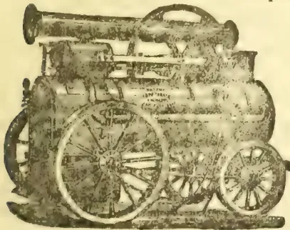

PATENT AUTOMATIC EXPANSION  
**STEAM ENGINES,**  
 PORTABLE, VERTICAL & HORIZONTAL.  
 NO EXTRA FIRST COST,  
 NO COMPLICATION OR EXTRA WEAR AND TEAR,  
 EXCEPTIONAL FUEL ECONOMY,  
 INCREASED DURABILITY TO FIRE-BOXES.  
 PERFECT SAFETY AND REGULARITY OF SPEED  
 UNDER VARYING LOADS AND PRESSURES.

Portable Engines from 2 HP. upwards.

IMPORTANT EVIDENCE:

From Rio, S. AMERICA, they write:—  
 "We had a 'GIPPESWYK' 5 hp. Vertical which worked so well that we ordered a portable of 7 hp. last year, which we find works for 60 hours with only 3 tons of ordinary wood fuel in place of 6 as usual in others. We attribute a large proportion of the saving in fuel and steadiness of motion as compared with others to the complete control which the 'Turner-Hartnell' Governor has over the admission of the steam into the cylinder."

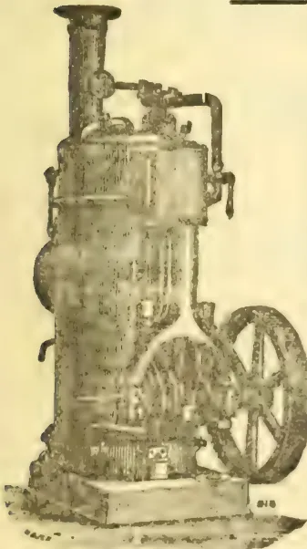

The "Gippeswyk" Vertical,  
 FROM 2 HP. UPWARDS.

E. R. & F. TURNER fit all their  
 Engines with their VALUABLE EXPAN-  
 SION SYSTEM without extra charge.

SEE CATALOGUE  
 FOR  
 DESCRIPTION.

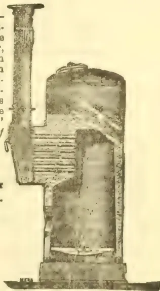

The "Gippeswyk" Vertical  
 BOILER.

HORIZONTAL "CIRDER TYPE" Engine  
 from 10 HP. upwards

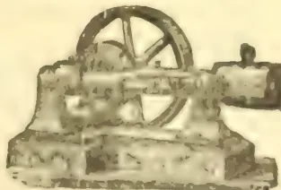

THE "GIPPESWYK" HORIZONTAL  
 from 2 HP. upwards

WATER-WHEELS, SHAFTING, PULLEYS, &c., &c., CORN MILLS, CORN CRUSHERS,  
 COLONIAL FLOUR MILLS, &c., &c.

Catalogues post-free on application.

W 144-86

993------------------------------------------------

x

ADVERTISEMENTS.

**CINCHONA! CINCHONA!**

**FRESH SEEDS.**

CALISAYA VERDE, CLISAYA MORADA  
CALISAYA ZYAMBA MARADE AND  
CALISAYA ZYAMBA VERDE.

**TRUE BOLIVIAN SEED**

ALSO

**SEEDS & PLANTS**

Of all kinds useful for Colonial Estates, such as  
CINCHONAS, new varieties of COFFEE,  
CACAO, VANILLA, PEPPERS, NUT-  
MERGS, COCA (producing the  
new Anaesthetic Cocaine)  
Leaves,  
which have sold at 8/ and 10/ per lb.,  
&c., &c., &c., &c.

**THOS. CHRISTY & CO.,**

25, LIME STREET, LONDON, E. C.

**De Vos's**

**NEW EXCHANGE and FREIGHT CALCU-  
LATOR, NOW READY.**

CONTENTS

- I.—£'s sterling into Rupees and Cents, and Rupees and Cents into £'s sterling from 1s 2d to 2s 0d with the intermediate 32nds of a penny.
- II.—Equivalents of sterling in French rates at rates progressing by 1/32 of a penny, commencing from 1s 2d to 1s 7 31-32nd and fcs. 24-85 to fcs. 25-65.
- III.—Francs into Rupees at rates progressing by  $\frac{1}{2}$  of a Centime from fc. 1-40 to fcs. 2-00, and at rates progressing by  $\frac{1}{2}$  of a Centime from fcs. 2-00 $\frac{1}{2}$  to fcs. 2-25.
- IV.—Francs into £'s sterling at rates progressing by  $\frac{1}{2}$  of a Centime from fcs. 24-85 to fcs. 25-65.
- V.—A set of Tables which show at one view, the solid contents of all kinds of Packages and Casks according to their several Lengths, Breadths and Depths. (Depths from one inch to six feet.)
- VI.—Freight Tables according to the New Tonnage Scale,  
  —Commission Tables.

Exchange now shows a downward tendency and is likely to go down below 1s 4d. De Vos' New Exchange and Freight Calculator is from 1s 2d to 2s with the intermediate 32nd of a penny besides Freight Calculations, the Expeditious Measurer and other useful information. Copies can be had from Mr. R. Daniel at the New O. B. C. Ltd, and also from the "OBSERVER" OFFICE, at R12-50 per Copy. Mr. De Vos is having Exchange Tables printed 1s to 1s 2d with the intermediate 32nds of a penny.

**BOOKS OF WHICH EVERY TROPICAL  
PLANTER OUGHT TO HAVE A COPY.**

Supplied at "Ceylon Observer" Office or by our Agents.

<table border="0">
<tr>
<td>Tropical Agriculturist, 1st Volume, 1881-2, with Index, 1088 pages</td>
<td>R. 13</td>
<td>00</td>
</tr>
<tr>
<td>Do. do. 2nd Volume. 1882-3, with Index, 1008 pages</td>
<td>13</td>
<td>00</td>
</tr>
<tr>
<td>Do. 3rd Volume 1883-4, with Index 1014 pages, including the August Extra number with Report on Forests and Map of Ceylon</td>
<td>13</td>
<td>00</td>
</tr>
<tr>
<td>Do. 4th Volume 1884-85 with Index 954 pages including Royal Botanic Garden Report for 1884</td>
<td>13</td>
<td>0</td>
</tr>
<tr>
<td>Do. 5th Volume 1885-86 with Index 1000 pages</td>
<td>13</td>
<td>00</td>
</tr>
<tr>
<td>Do. 6th Volume 1886-7 with Index 856 pages</td>
<td>13</td>
<td>00</td>
</tr>
<tr>
<td>Tea Planter's Manual with plans of Tea Factories (T. C. Owen)</td>
<td>4</td>
<td>12</td>
</tr>
<tr>
<td>Planter's Note Book (Planting Molesworth)</td>
<td>3</td>
<td>04</td>
</tr>
<tr>
<td>Coffee Planter's Manual, by Alex. Brown, with special additions by A. M. &amp; J. Ferguson and others</td>
<td>3</td>
<td>08</td>
</tr>
<tr>
<td>Coffee Grub, with Illustrations</td>
<td>1</td>
<td>54</td>
</tr>
<tr>
<td>Tea Cultivation in Assam, by H. Cottam</td>
<td>1</td>
<td>52</td>
</tr>
<tr>
<td>Cinchona Planter's Manual, by Owen</td>
<td>4</td>
<td>10</td>
</tr>
<tr>
<td>Cinchona Cultivation (Prize Essay), by T. N. Christie</td>
<td>1</td>
<td>27</td>
</tr>
<tr>
<td>All about the Coconut Palm</td>
<td>3</td>
<td>12</td>
</tr>
<tr>
<td>All about Indiarubber &amp; Gutta-Percha, 2nd Edition enlarged</td>
<td>2</td>
<td>58</td>
</tr>
<tr>
<td>Gold, Gems, and Pearls in Ceylon</td>
<td>4</td>
<td>10</td>
</tr>
<tr>
<td>Cardamoms—Notes on Cultivation (Owen)</td>
<td>1</td>
<td>27</td>
</tr>
<tr>
<td>First Year's Work on a Coffee Plantation, by A. L. Cross</td>
<td>1</td>
<td>02</td>
</tr>
<tr>
<td>On the Manuring of Estates, by E. S. Grigson</td>
<td>1</td>
<td>02</td>
</tr>
<tr>
<td>Mr. Hughes' Analyses, First and Second Series, Manures and Limestone</td>
<td>0</td>
<td>26</td>
</tr>
<tr>
<td>Ceylon Coffee Soil and Manures, by Hughes</td>
<td>1</td>
<td>54</td>
</tr>
<tr>
<td>Coffee Planting in Southern India and Ceylon, by E. C. P. Hull</td>
<td>5</td>
<td>66</td>
</tr>
<tr>
<td>Book-keeping for Planters, a system of Accounts (by "Double Entry") adapted to the requirements of Coffee Planters</td>
<td>1</td>
<td>79</td>
</tr>
<tr>
<td>Liability of Estate Owners &amp; Superintendents</td>
<td>1</td>
<td>77</td>
</tr>
<tr>
<td>Ceylon in Fifties and Eighties</td>
<td>1</td>
<td>54</td>
</tr>
<tr>
<td>Fifteen Hundred Conversational Sentences in Tamil, with English Translation</td>
<td>2</td>
<td>56</td>
</tr>
<tr>
<td>Uva: An Inauguration of the New Province "Ingē Vā!" or the Sinna Durai's Pocket Tamil Guide. [Greatly enlarged, 170 pages.] By A. M. Ferguson, jr.</td>
<td>2</td>
<td>54</td>
</tr>
<tr>
<td>The Coffee Tree and its Enemies, by Nieten (2nd Edition, revised by Mr. S. Green)</td>
<td>1</td>
<td>52</td>
</tr>
<tr>
<td>Tea Cultivation in Ceylon, by C. S. Armstrong (revised 1884)</td>
<td>0</td>
<td>54</td>
</tr>
<tr>
<td>Brazil as a Coffee-growing Country</td>
<td>1</td>
<td>54</td>
</tr>
<tr>
<td>Liberian Coffee its History and Cultivation, with beautiful coloured drawings</td>
<td>5</td>
<td>18</td>
</tr>
<tr>
<td>The Ceylon Labour Ordinance—Copies of the Ordinance No. 11 of 1865</td>
<td>0</td>
<td>40</td>
</tr>
<tr>
<td>Map of Ceylon with Uva Province mounted on Rollers and Varnished</td>
<td>3</td>
<td>14</td>
</tr>
<tr>
<td>Do. on good paper</td>
<td>1</td>
<td>79</td>
</tr>
<tr>
<td>Medical Hints for Superintendents for the Treatment of Diseases Peculiar to Ceylon</td>
<td>52</td>
<td></td>
</tr>
</table>

(These are cash prices and include local postage.)

Post Office orders from India or elsewhere for above amounts will secure the books as ordered and paid for.

994------------------------------------------------

ADVERTISEMENTS.

xi

# OFFORD & SONS,

67, GEORGE ST., PORTMAN SQUARE.

92 & 94, GLOUCESTER ROAD, SOUTH KENSINGTON,

Factory—FULHAM ROAD, LONDON.

SPECIALITE—

## THE MODEL LANDAU,

Weight from 8½ cwt. Suitable for Hot Climate. Roll-up Back and Syce Board and Self-acting Head, complete.  
Price (in any colours) from 130 Guineas.

## VENTILATED BRAUGHAMS FOR INDIA.

Weight from 7½ cwt. Fitted with Syce Board complete. From 120 Guineas.  
Twenty-Six Prize Medals.

## OFFORD'S PATENT RUBBER TYRES:

Perfect for Invalids. Cheapest and Best.

## OFFORD'S PATENT RUBBER BRAKE SKIDS.

SILENT. DURABLE. POWERFUL.

Send for Illustrated Price List.

### AGENTS:

KING, KING, & Co., BOMBAY;  
KING, HAMILTON, & Co., CALCUTTA.

## THE CEYLON ADVERTISING AGENCY.

ADVERTISEMENTS CAN NOW BE RECEIVED  
FOR ALL OR ANY RAILWAY STATIONS IN THE ISLAND

For full Particulars Apply to the Manager,  
CEYLON ADVERTISING AGENCY, COLOMBO.

8-805

995------------------------------------------------

xiiADVERTISEMENTS.

# NEW MICHOACAN SILVER SPOONS & FORKS

(REGISTERED.)

## LIST OF PRICES.

SOLE MANUFACTURERS: THE MICHOACAN SILVER COMPANY,

69 & 71. FINSBURY PAVEMENT,

And at NEW YORK, U.S.A.

LONDON, E.C.

<table border="1">
<thead>
<tr>
<th rowspan="2">QUALITY ... ..</th>
<th colspan="2">FIDDLE.</th>
<th colspan="2">OLD ENGLISH.</th>
</tr>
<tr>
<th>A.</th>
<th>B.</th>
<th>A.</th>
<th>B.</th>
</tr>
</thead>
<tbody>
<tr>
<td>Table Spoons or Forks, full size ... .. per doz.</td>
<td>30/-</td>
<td>25/-</td>
<td>30/-</td>
<td>25/-</td>
</tr>
<tr>
<td>" " " medium size.... .. "</td>
<td>25/-</td>
<td>20/-</td>
<td>25/-</td>
<td>20/-</td>
</tr>
<tr>
<td>Dessert Spoons or Forks, full size ... .. "</td>
<td>22/-</td>
<td>18/-</td>
<td>22/-</td>
<td>18/-</td>
</tr>
<tr>
<td>Tea Spoons, full size ... .. "</td>
<td>16/-</td>
<td>12/-</td>
<td>16/-</td>
<td>12/-</td>
</tr>
<tr>
<td>" " medium size ... .. "</td>
<td>12/-</td>
<td>10/-</td>
<td>12/-</td>
<td>10/-</td>
</tr>
<tr>
<td>" " small size ... .. "</td>
<td>10/-</td>
<td>8/-</td>
<td>Not made</td>
<td>these sizes</td>
</tr>
<tr>
<td>Salt Spoons ... .. "</td>
<td>10/-</td>
<td>8/-</td>
<td>10/-</td>
<td>8/-</td>
</tr>
<tr>
<td>Mustard Spoons ... .. "</td>
<td>10/-</td>
<td>8/-</td>
<td>10/-</td>
<td>8/-</td>
</tr>
<tr>
<td>Egg Spoons ... .. "</td>
<td>12/-</td>
<td>10/-</td>
<td>10/-</td>
<td>8/-</td>
</tr>
<tr>
<td>Sugar Tongs, full size ... .. "</td>
<td>24/-</td>
<td>20/-</td>
<td>24/-</td>
<td>20/-</td>
</tr>
<tr>
<td>Sauce Ladles " ... .. "</td>
<td>35/-</td>
<td>30/-</td>
<td>35/-</td>
<td>30/-</td>
</tr>
<tr>
<td>Soup Ladles " ... .. each.</td>
<td>12/-</td>
<td>9/-</td>
<td>12/-</td>
<td>9/-</td>
</tr>
<tr>
<td>Gravy Spoons " ... .. "</td>
<td>7/-</td>
<td>6/-</td>
<td>7/-</td>
<td>6/-</td>
</tr>
</tbody>
</table>

**NOTE.**—A Qualities are very Strong Blanks, highly finished.

B " are Strong Blanks, well finished.

The MICHOACAN SILVER is the nearest approach to real Silver yet produced. It is, both in colour and finish, equal to Silver. Wears the same colour throughout. Resists acids, and does not tarnish.

It is particularly adapted to Hotels, Restaurants, &c., and for this purpose we recommend the "Old English" pattern.

SAMPLES SENT ON APPLICATION TO RESPONSIBLE PARTIES, OR ON RECEIPT OF STAMPS TO THE AMOUNT, AS PER LIST.

SHIPPERS AND THE TRADE ALLOWED AN EXTRA DISCOUNT:

[12]

996------------------------------------------------

ADVERTISEMENT.xiii

---

# JENSEN'S GUANOS

ARE

Organic Manures of Perfect Purity.

Keep well in any Climate.

ANALYSES GUARANTEED.

---

JENSEN'S GUANOS WONDERFULLY INCREASE THE YIELD OF

**ASPARAGUS**

**BEETROOT**

**CELERY**

**CUCUMBER**

**FLAX**

**GRASS**

**LENTILS**

**MELON**

**MUSTARD**

**POTATOES**

**RHUBARB**

**SWEDES**

**TOMATO**

**TURNIPS**

**VINES**

AND ALL

**ARROWROOT**

**BANANAS**

**COCOA**

**COFFEE**

**COTTON**

**INDIGO**

**LEMONS**

**LIMES**

**ORANGES**

**PINEAPPLES**

**RICE**

**SUGARCANE**

**TAPIOCA**

**TEA**

**TOBACCO**

AND ALL

FRUIT AND FARM CROPS.

TROPICAL AND COLONIAL GROWTHS.

---

Prices and Testimonials on application to

**J. JENSEN & Co., LD.,**

109, Fenchurch Street, LONDON, E.C.

Makers of Jensen's Cod Liver Oil, the Celebrated Iceberg Brand.

15

997------------------------------------------------

xivADVERTISEMENTS.

2 GOLD AND 1 SILVER MEDALS AT KANDY AGRICULTURAL SHOW 1887.

ARABIAN COFFEE  
PULPERS.

LIBERIAN COFFEE  
PULPERS.

## TEA MACHINERY

OF EVERY DESCRIPTION.

Sole Agents for and Manufacturers of W. & J. Jackson's  
TEA MACHINERY,

TEA REQUISITES OF ALL KINDS, ESTATE TOOLS, &c., &c.  
CATALOGUES AND PRICE LISTS FREE ON APPLICATION.

JOHN WALKER & Co.,  
COLOMBO, CEYLON.

## THE COLOMBO APOTHECARIES' Co.

*Beg to call Attention to their new*

WHOLESALE DEPARTMENT  
IN

OILMANSTORES.

THEIR EXTENSIVE STOCKS are calculated to suit every taste and meet every want, the goods are of undoubted quality, and prices are exceedingly moderate.

PRICE LISTS ON APPLICATION,

and a comparison of prices with those of other European establishments in the Colony is invited.

THE NEW PRICE LIST,

has been framed specially to suit the convenience of up-country and outstation residents, and the advantages which it offers deserve to be widely known. They have only to be known to be appreciated.

IN WINES, SPRITS, ALE AND STOUT,

the Company hold carefully selected stocks which they can confidently recommend for quality and value. Price Lists may be had on application.

THE COLOMBO APOTHECARIES' Co., FORT.

[12]

998------------------------------------------------

ADVERTISEMENTS.

# “CEYLON IN THE JUBILEE YEAR:”

BY J. FERGUSON.

## PRICE FIVE RUPEES.

TWO MAPS (Worth the price of the Volume) and 42 other Illustrations; 428 pages letterpress. (By post 5/26; outside of Island R6.)

ROYAL ACKNOWLEDGMENT.—Windsor Castle, March 12, 1888.—Sir Henry Ponsonby is commanded by the Queen to thank Messrs. Haddon & Co. for the copy of Mr. John Ferguson's “Ceylon in the Jubilee Year,” which they have had the kindness to present to Her Majesty.

### Opinions of the Press.

Everything of interest about Ceylon has been carefully collected in this volume, and for any one who wishes to visit the island a better guide book is not to be found.—*Pull Mall Gazette*.

To the cultured class who study Oriental history and Buddhist archaeology, and to the large fraternity who are concerned in tea, coffee, cocoa, cinnamon, cinchona, and the many fragrant and spicy products of our colonial Eden, the work is invaluable.—*Christian World*.

Previous editions of Mr. Ferguson's valuable book have received full review in these columns, but the present edition contains much more matter—among other additions being strong criticism of the administration of the present Governor, Sir Arthur Gordon.—*Colonies and India*.

Mr. Ferguson's book on Ceylon seems to us a most valuable one, and it ought to be in the hands of every one in any way interested in the island. It gives an excellent account of the country, its inhabitants, railways, government, pearl fisheries, exports, &c., with notices of archaeological remains and of the picturesque districts most worthy the attention of visitors.—*Literary World*.

The first part consists of some sixteen chapters, in which Mr. Ferguson shows himself possessed of the instincts of the true journalist. There seems scarcely a subject relating to the “spicy isle” which is not touched upon, the treatment being always effective, if sometimes brief. Anything like an outline of the various chapters is, as we have indicated, impossible in the space at our command.—*Aburdeen Free Press*.

This is a very complete handbook of Ceylon and everything Cinghalese from Government to snakes or tortoises, and from tea, sugar, coffee, and cinchona to polyandry, shooting, races, clubs, Buddhism and missionaries—in fact about as complete a fund of information about the island as it is possible to pack into 400 pages, of a handsome volume, with good maps and many illustrations. Any one who wishes to visit Ceylon, or employ his capital there, would do well to get this book.—*Overland Mail*.

Mr. John Ferguson has published a very handsome volume with the above title. For an account of the climate, scenery, and natural advantages of Ceylon, we must refer our readers to the work itself, merely adding that Mr. Ferguson's statements can be accepted with confidence, as no one knows Ceylon and its resources better than he does. The new volume will be welcomed especially by old Colonists who have witnessed the rise and the depression of Ceylon, and who may probably agree with the author that fortune seems about to smile on the old isle once more.—*Nairnshire Telegraph*.

In this re-issue of his book on Ceylon, Mr. Ferguson has brought the mass of information respecting the Colony contained in former issues up to the most recent date, and he has fitly given it a designation commemorative of the present eventful year. No effort has been spared by Mr. Ferguson to make his latest work as complete in every respect as possible, and the result has been that no book can be more replete with information about this valuable island. As the most important of our Crown Colonies, Ceylon has a special claim to consideration, and we can strongly recommend “Ceylon in the Jubilee Year” to everyone who takes an interest in colonial matters. A word must be said in praise of the numerous illustrations.—*European Mail*.

Mr. Ferguson has now brought his facts and figures down to date, and has made many important additions, and still more important corrections, in the letterpress of the editions already published, which, it appears, he had no opportunity of revising before publication. The book in its original form we noticed shortly after its publication, and little now remains to be said of it, save that its general value and interest have been considerably enhanced by the alterations and additions which have been made. Mr. Ferguson, besides giving a most attractive account of the natural claims of the island to the attention of the secker after the picturesque or the explorer of antiquities, effectually disposes of the bugbear which acts, no doubt, as the greatest deterrent to intending visitors—the terror of cholera and other maladies peculiar to tropical climates. In these respects he maintains that Ceylon is much less dangerous than India, and quotes some convincing figures in support of his contention. In conclusion, it only remains to be said that the volume is well printed and bound, and possesses an index which makes it available for reference purposes.—*Homo News*.

I got your most charming book, “Ceylon in the Jubilee Year” the other day, and have got most carefully and delightfully through it. The got-up of the book is really first-class, and so many pictures made it very illuminating. To see an old Ceylon man, every line was of interest, and I fear you took had to answer for a considerable quantity of midnight oil burned in my establishment. In fact, I think your “Ceylon” is Emerson Tennent brought up to the present date, and put into a more hand, and readable style, and when I was reading it, I, more than once wished I was back in the dear little island.—A. H. D.

“CEYLON OBSERVER” OFFICE, COLOMBO, CEYLON, 30th APRIL 1888.

Also to be had at Messrs. H. W. Cave & Co. and Colombo Apothecaries' Company, Colombo; d'Histoire & Co., Kandy; Wm. Jordan & Co., Nuwara Eliya.

JOHN HADDON & CO.: LONDON.

999------------------------------------------------

xviii

ADVERTISEMENTS.

**KANDY MEDICAL HALL**

AND  
**GENERAL EMPORIUM,  
CEYLON.**

**d'ESTERRE & Co.,**  
Chemists, Druggists, Perfumers, & Im-  
porters of all  
DESCRIPTIONS OF GOODS.

*Established 1844.*

[12]

**Messrs. JAMES INGLIS & Co.,**  
SUTTON'S BUILDINGS, DEAN'S PLACE,  
SYDNEY.

**H**AVE been appointed Agents for the *Tropical Agriculturist* for New South Wales and Queensland, and receipts granted by them for Subscriptions or Advertisements will be binding on  
A. M. & J. FERGUSON.  
Colombo, Ceylon. 2nd May 1887.

**BURGOYNE, BURRIDGES, CYRIAX & FARRES,**  
16, COLEMAN STREET, LONDON,

Wholesale & Export Druggists, Manufacturing Pharmaceutical Chemists, Importers and Distillers of Drugs, Essential Oils, etc.

*Prize Medal, Paris, 1861; Silver Medal, Paris, 1878. Three Prize Medals, Calcutta, 1884.*

Drugs, Chemicals and Pharmaceutical Preparations of the finest quality, and of standard excellence.

Pure Chemicals and Alcoholic Preparations for Analytical purposes and original research.

**Moxon's Effervescent Magnesian  
Aperient.**

**F**OR BILIOUS AFFECTIONS, Indigestion, Gout, Heartburn, Habitual Costiveness, Gravel; and as a Cooling Purgative and Corrective of the Stomach after Excesses, etc., etc. Established nearly a century. The efficacy of this agreeable effervescent purgative has been abundantly proved by the very extensive and respectable patronage which it has met with in Great Britain, Ireland, America, and in several other parts of the Globe. Many medical men of great celebrity and respectability have recommended their patients to procure it, as the very best *Family Purgative*; a title which of all others it deserves the most, as it may be taken with perfect safety by old and young, as well as by the most delicate. We are Sole Proprietors of this remedy.

2/9 per bottle.

**CHLORODYNE B. B. & Co.'s**

**O**UR CHLORODYNE possesses all the virtues of the most widely known preparations bearing this name. With this advantage, that it does not separate and is perfectly miscible with water. Price  $\frac{1}{2}$  oz. bottles 7/ doz., 6 doz. 6/6, 12 doz. 6/1, 1 doz. bottles 11/6, doz. 11/1, 12 doz. 10/6. (*Bottles free.*)  
[1-85] In bulk 6/ lb., 10 lb. 5/9, 20 lb. 5/6.

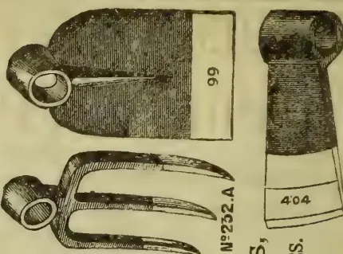

**A. W. WILLS & SON**  
BIRMINGHAM ENGLAND.

MANUFACTURERS OF BEST QUALITY

**HOES, AXES, HOE FORKS,**

HOOKS (CATTIES), BARS (ALAYANGAS),  
TREADED TRENCHING FORKS, PICKS,  
AND EVERY DESCRIPTION OF TOOL SUITABLE FOR  
TEA AND COFFEE PLANTATIONS AND FOR MINING PURPOSES.

**HOES, PICKS, ETC., WITH PATENT SOLID EYES.**  
ASK FOR THE "HAND" MARK ON ALL TOOLS.

TO MERCHANTS & OTHERS.—Patterns and Catalogues may be seen at HOLMWOOD, AGRA PATANA, through the courtesy of R. W. WICKHAM, Esq., to whom reference as to our Tools may be made, and through whom Orders may be sent. In ordering, please specify weight, size, quality, and finish.

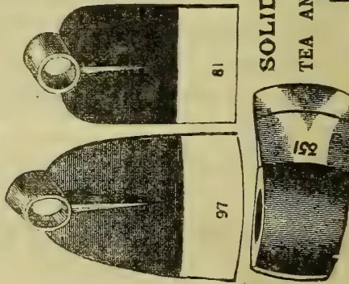

**A BARGAIN IN A FAVORITE TEA DISTRICT.**

**Tea Land for Sale  
IN DOLOSAGE.**

**F**OR SALE.—A portion of COORBUNDU WATTE Estate 225 acres more or less. Price R10,000. Cash on transfer, or the whole sum can remain, on Primary Mortgage at 9 per cent interest payable yearly in advance, provided 50 acres are planted up the first year, and another 50 acres the second year.

JOHN STEPHENS,

to oc ia

CAMPOLA.

1000------------------------------------------------

ADVERTISEMENTS.

xix

THE ONLY GOLD MEDAL OF THE SOCIETY OF ARCHITECTS, 1886, IN COMPETITION WITH ALL THE LEADING PAINTS, FIRE-PROOF OR OTHERWISE, AT THE LONDON BUILDING TRADES EXHIBITION OF 1886.

**FIRE-PROOF PAINTING AT ORDINARY PAINTING PRICES BY**

**REDUCED FIRE PREMIUMS**

(See below).

NO EXTRA COST.

**NON-POISONOUS.**

**CYANITE**

PORES OF WOOD PENE-  
TRATED.  
PERMANENT IN EFFECT.  
PREVENTS WHITE ANT  
RAVAGES.

**PRIMING, STAININGS AND PAINTS.**

**ALL COLORS.**

The only means of **FIRE PREVENTION**, certified by **CAPT. SHAW, C.M., R. H. BOYCE, Esq.,** Surveyor of First-class H. M. OFFICE OF WORKS, **E. A. B. CROCKETT, Esq.,** Surveyor to the London Fire Offices' Committee, **H. R. GOUGH, Esq., F.R.I.B.A.** (President of the Society of Architects), **T. VERNITY, Esq., F.R.I.B.A.** (Surveyor to the Lord Chamberlain). Testimonials from these and many others sent on application.

The Manager, **WILKES' METALLIC FLOORING Co., Ltd.,** West Brompton, S.W., writes:—"Referring to the large fire of over four hours' duration, at our Works last year, an ordinary deal door painted with CYANITE, on one side only, resisted the fire splendidly, although in the heart of the flame. To this we owe the fact that one of our Offices was untouched. Unfortunately we had used your CYANITE nowhere else, and the other wooden portions of our Works were therefore destroyed."

**W. M. FAWCETT, Esq.,** Vice-President of the Royal Institute of British Architects, writes:—"The case is that of Timber Gables, in which the usual 1s 6d rate is increased by Companies, but the 'Mutual' agree to take the Policy at 1s 6d as if Gables were brick, *provided* the timbers are treated with CYANITE."

Solo Manufacturers: **THE PATENT LIQUID FIRE PROOF CYANITE Co., Ltd.,** Paulton's Square, Chelsea, London.

Letters and Telegrams: "**CYANITE, CHELSEA.**"

f 58-88

**GALVANIZED CORRUGATED  
IRON ROOFS AND BUILDINGS**

DESIGNED AND PREPARED FOR ERECTION ABROAD AS  
**TEA HOUSES.**

A SPECIALITY.

**STORES FOR**

HARVES,  
RAILWAYS,  
TRAMWAYS,  
WORKSHOPS,  
DWELLINGS.

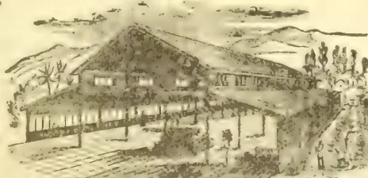

**SHEDS FOR**

SUGAR,  
COTTON,  
INDIGO,  
COFFEE  
PLANTATIONS.

**GO-DOWNS, DRYING AND PACKING SHEDS.**

Contractors can trust their requirements to F. M. & Co. with confidence in a reputation extending over 40 years, and an experience gained in the construction of more than 16,000 Erections during that period.

For Estimates, Information, and Catalogues, apply to

**FRANCIS MORTON & CO., LIMITED.**

NAYLOR STREET IRON WORKS, LIVERPOOL:

9, VICTORIA CHAMBERS, WESTMINSTER, S.W.

**SPORT IN CEYLON.** With Illustrations. Extracts from a Diary of Four Trips to the North Central Province: Comprising one Personal Adventure, with Elephants, Bears and Buffalo; Giving a General Account of Shooting Experiences and of Sport Procureable about Munnery, Kantalawa, Padawiya and other Tanks. By a Planter. Cash R1-25, credit R1-75; postage 6d.

"OBSERVER" OFFICE.

**THE TEA PLANTER'S MANUAL.** BY T. G. OWEN. With two lithographed Plans of Tea Factories: one for Iron and one for Stone and Wood; worth the whole price of the book. Price gold lettered (with 2 Plans). Rs Cash with order R4-25, postage 12d. Also from Messrs Cave

1001------------------------------------------------

x x

ADVERTISEMENTS.

ADVERTISEMENTS.

[For acknowledgement of Subscriptions paid and for list of T. A. agents, see top of 6th advertising page. 2nd column, farther on.]

HOWARD'S PORTABLE RAILWAY.

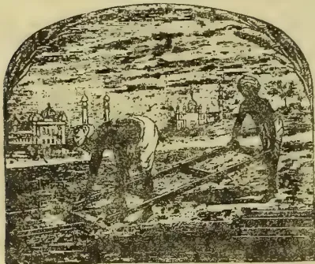

THE BEST and CHEAPEST FOR ALL PURPOSES. NO BOLTS, NO NUTS, NO RIVETS.

CATALOGUES AND ESTIMATES ON APPLICATION TO

J. & F. HOWARD, BEDFORD, ENGLAND.

DR. J. COLLIS BROWNE'S CHLORODYNE

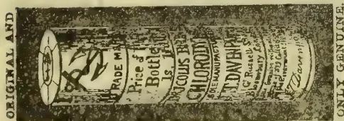

IS THE BEST REMEDY known for Coughs, Consumption, Bronchitis, Asthma.

Effectually checks and arrests those too often fatal Diseases known as Diphtheria, Fever, Croup Ague.

Acts like a charm in Diarrhoea, and is the only specific in Cholera and Dysentery.

Effectually cuts short all attacks of Epilepsy, Hysteria, Palpitation and Spasms.

Is the only palliative in Neuralgia, Rheumatism, Gout, Cancers, Toothache, Meningitis, &c.

Sole Manufacturer :

J. T. DAVENPORT,

33, GREAT RUSSELL STREET, LONDON W. C.

GRAND ORIENTAL HOTEL FORT, COLOMBO.

The Largest and Best Appointed Hotel in the East.

THE HOTEL is situated in the Fort, and commands a MAGNIFICENT VIEW OF THE HARBOUR AND COAST.

It is in the immediate vicinity of the Landing Jetties and Custom House, Post and Telegraph Offices, Banks, P. & O., M. M., and British India Co.s' Offices, &c., and within a few minutes' drive of the Railway Stations, and the beautiful Cinnamon Gardens.

The large handsome DINING SALOON of this Hotel, said to be the finest in the East, is justly admired by all Strangers and Visitors; as also is its Commodious BILLIARD ROOM.

EXCELLENT CUISINE. CHARGES MODERATE Manager—F. FISCHER.

oo 21 ta 11—87

CHARTERED MERCANTILE BANK OF INDIA, LONDON AND CHINA.

Incorporated under Royal Charter.

Table with 2 columns: PAID-UP CAPITAL, RESERVED LIABILITY, RESERVED FUND. Values in £.

Head Office:—No. 65, OLD BROAD STREET, LONDON, E. C.

Local Branches:—COLOMBO; KANJY; GALLY London Bankers:

BANK OF ENGLAND; LONDON JOINT STOCK BANK.

THE BANK receives Money on Current and Fixed Deposits, buys Bills and grants Drafts on London and on all part of the East and Colonies, and draws on the Bank of England at current rates of Exchange.

Terms on Application.

R. WEBSTER, Manager in Ceylon

[tc]

BANK OF MADRAS.

Established 1843.

Constituted and regulated by Government of India Act No. XI. of 1876 (The Presidency Banks Act.)

THE BANK undertake general Banking & Agency Business and issue drafts and purchase approved bills on the following places in India:—

MADRAS, Bangalore, Bellary, Berhampore, Bimlipatam, Calicut, Cocanada, Cochin, Guntore, Mangalore, Negapatam, Ootacamund, Tuticorin, Tellicherry. CALCUTTA, Agra, Akyab, Allahabad, Benares, Cawnpore, Dacca, Delhi, Hyderabad, Lahore, Lucknow, Moulmein, Nagpore, Patna Rangoon.

BOMBAY, Ahmedabad, Broach, Dharwar, Hooglee, Indore, Khangaum, Kurrachee, Omrawattie, and Poona.

The Bank receive money on Current Accounts and Fixed Deposits at rates of interest which may be ascertained on application to the Agent of the Bank in Colombo.

W. T. HOLMES, Agent in Colombo.

As Agents of the Comptoir d'Escompte de Paris, the Bank buy and sell Bills of Exchange on England, France, Australia, New Zealand and China at current rates of exchange.

[1 w

1002------------------------------------------------

This image shows a blank, aged, cream-colored page, likely an endpaper or flyleaf from an old book. The paper has a slightly textured appearance with some minor discoloration and faint smudges, particularly towards the left edge. A dark green binding edge is visible on the right side of the page.

1003------------------------------------------------

1004------------------------------------------------

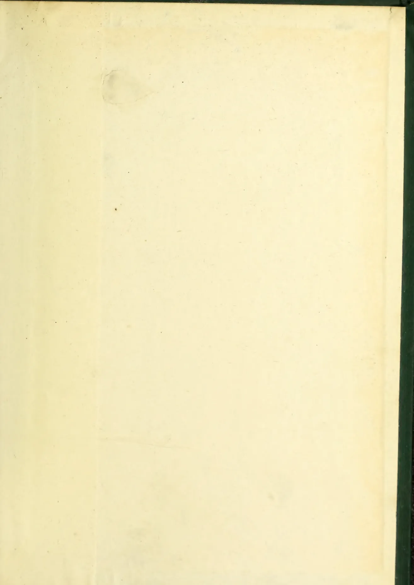This image shows a blank, aged, cream-colored page, likely an endpaper or flyleaf from an old book. The paper has a slightly textured appearance with some minor discoloration and a faint smudge near the top center. A dark green binding edge is visible on the right side of the page.

1005------------------------------------------------

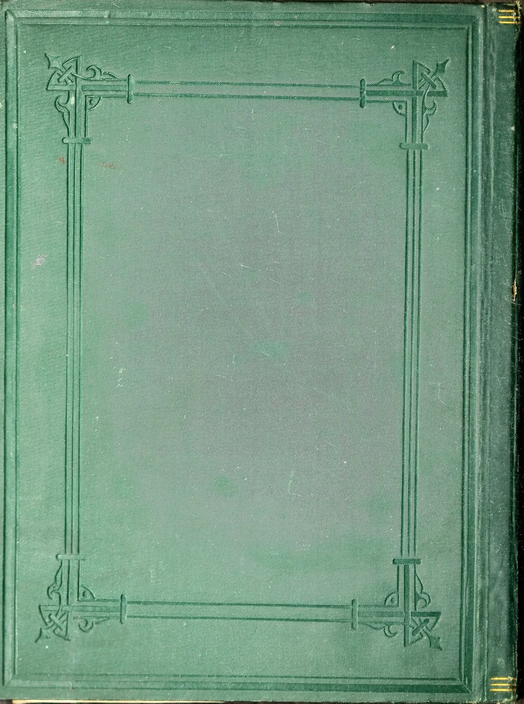The image shows the front cover of a book. The cover is a deep, forest green with a fine, pebbled texture. A decorative border is embossed into the cover, consisting of a double-line rectangular frame. At each of the four corners, there is an ornate, symmetrical design featuring stylized floral or scrollwork motifs. The embossing is subtle, following the contours of the cover's texture. On the right edge, the spine of the book is visible, showing some wear and a small, gold-colored decorative element near the top and bottom edges.